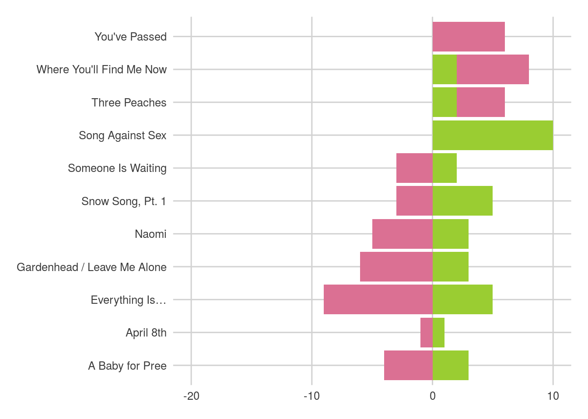

--- 
title: "NeutRal Milk Hotel"
author: "Akshat Thakur"
description: "This is a personal project."
---

Neutral Milk Hotel is one of the most surreal and enigmatic artists in the history of music.
I am, myself, a huge fan of the band, and thought it'd be a cool project to analyze the intricacies of their music using data science. 

This will be a data-driven process to analyze and visualize different aspects of Neutral Milk Hotel's discography.

## About Neutral Milk Hotel

> Neutral Milk Hotel was an American rock band formed in Ruston, Louisiana, by musician Jeff Mangum. The band's music featured a deliberately low-quality sound, influenced by indie rock and psychedelic folk. Mangum was the band's lyricist, and wrote surreal and opaque songs that covered a wide range of topics, including love, spirituality, nostalgia, and loneliness. He and the other band members played a variety of instruments, including nontraditional rock instruments like the singing saw, zanzithophone, and uilleann pipes.

(from Wikipedia)

## Installing and loading a bunch of libraries

```r
library(tidyverse)
library(knitr)
library(ggjoy)
library(plyr)
library(httr)
library(rvest)
library(stringr)
library(ggthemes)
library(tidytext)
library(ggridges)
library(wesanderson)
library(yarrr)
library(kableExtra)
library(radarchart)
library(textdata)
library(scales)
library(RColorBrewer)
library(wordcloud)
library(highcharter)
```

## Scraping, Tidying and Standardizing

### Getting Data
The **Web API from Spotify** provides some really interesting audio stats for all songs in their catalogue. Some of the most interesting metrics available on Spotify are:

>**Valence**
A measure from 0.0 to 1.0 describing the musical positiveness conveyed by a track. Tracks with high valence sound more positive (e.g. happy, cheerful, euphoric), while tracks with low valence sound more negative (e.g. sad, depressed, angry).

>**Energy**
Energy is a measure from 0.0 to 1.0 and represents a perceptual measure of intensity and activity. Typically, energetic tracks feel fast, loud, and noisy. For example, death metal has high energy, while a Bach prelude scores low on the scale. Perceptual features contributing to this attribute include dynamic range, perceived loudness, timbre, onset rate, and general entropy.

>**Danceability**
Danceability describes how suitable a track is for dancing based on a combination of musical elements including tempo, rhythm stability, beat strength, and overall regularity. A value of 0.0 is least danceable and 1.0 is most danceable.

So that's what part of what I'll use from the data I'll get from the Spotify API.

**Genius**, the world's most popular (and aesthetically pleasing) lyrics website, too, has a great API that can be used to pull song data. 

### Spotify API
As well documented as the Spotify API is, it's a very complicated and long drawn process to get all the songs for any given artist, and includes a lot of tedious steps like identifying the particular "uri" from a huge list of "uri"s. Fortunately, an R genius called RCharlie designed the spotifyr package, which simplifies the process of grabbing all the information for any artist on Spotify. 


```r
devtools::install_github('charlie86/spotifyr')
library(spotifyr)
```

Use your API authentication details.


```r
Sys.setenv(SPOTIFY_CLIENT_ID = 'your id here')
Sys.setenv(SPOTIFY_CLIENT_SECRET = 'your secret here')
```

I can now pull audio features for Neutral Milk Hotel. 
I'm filtering out duplicates. 


```r
nmh_data <- get_artist_audio_features('neutral milk hotel', include_groups = "album")
nmh_data <- nmh_data[!duplicated(nmh_data$track_name),]
nmh_data <- subset(nmh_data, track_name!="A Baby For Pree")
str(nmh_data)
```

```
## 'data.frame':	25 obs. of  39 variables:
##  $ artist_name                 : chr  "Neutral Milk Hotel" "Neutral Milk Hotel" "Neutral Milk Hotel" "Neutral Milk Hotel" ...
##  $ artist_id                   : chr  "2ooIqOf4X2uz4mMptXCtie" "2ooIqOf4X2uz4mMptXCtie" "2ooIqOf4X2uz4mMptXCtie" "2ooIqOf4X2uz4mMptXCtie" ...
##  $ album_id                    : chr  "5COXoP5kj2DWfCDg0vxi4F" "5COXoP5kj2DWfCDg0vxi4F" "5COXoP5kj2DWfCDg0vxi4F" "5COXoP5kj2DWfCDg0vxi4F" ...
##  $ album_type                  : chr  "album" "album" "album" "album" ...
##  $ album_images                :List of 25
##   ..$ :'data.frame':	3 obs. of  3 variables:
##   .. ..$ height: int  640 300 64
##   .. ..$ url   : chr  "https://i.scdn.co/image/ab67616d0000b273fed522e78ecdc9fba4a0cc07" "https://i.scdn.co/image/ab67616d00001e02fed522e78ecdc9fba4a0cc07" "https://i.scdn.co/image/ab67616d00004851fed522e78ecdc9fba4a0cc07"
##   .. ..$ width : int  640 300 64
##   ..$ :'data.frame':	3 obs. of  3 variables:
##   .. ..$ height: int  640 300 64
##   .. ..$ url   : chr  "https://i.scdn.co/image/ab67616d0000b273fed522e78ecdc9fba4a0cc07" "https://i.scdn.co/image/ab67616d00001e02fed522e78ecdc9fba4a0cc07" "https://i.scdn.co/image/ab67616d00004851fed522e78ecdc9fba4a0cc07"
##   .. ..$ width : int  640 300 64
##   ..$ :'data.frame':	3 obs. of  3 variables:
##   .. ..$ height: int  640 300 64
##   .. ..$ url   : chr  "https://i.scdn.co/image/ab67616d0000b273fed522e78ecdc9fba4a0cc07" "https://i.scdn.co/image/ab67616d00001e02fed522e78ecdc9fba4a0cc07" "https://i.scdn.co/image/ab67616d00004851fed522e78ecdc9fba4a0cc07"
##   .. ..$ width : int  640 300 64
##   ..$ :'data.frame':	3 obs. of  3 variables:
##   .. ..$ height: int  640 300 64
##   .. ..$ url   : chr  "https://i.scdn.co/image/ab67616d0000b273fed522e78ecdc9fba4a0cc07" "https://i.scdn.co/image/ab67616d00001e02fed522e78ecdc9fba4a0cc07" "https://i.scdn.co/image/ab67616d00004851fed522e78ecdc9fba4a0cc07"
##   .. ..$ width : int  640 300 64
##   ..$ :'data.frame':	3 obs. of  3 variables:
##   .. ..$ height: int  640 300 64
##   .. ..$ url   : chr  "https://i.scdn.co/image/ab67616d0000b273fed522e78ecdc9fba4a0cc07" "https://i.scdn.co/image/ab67616d00001e02fed522e78ecdc9fba4a0cc07" "https://i.scdn.co/image/ab67616d00004851fed522e78ecdc9fba4a0cc07"
##   .. ..$ width : int  640 300 64
##   ..$ :'data.frame':	3 obs. of  3 variables:
##   .. ..$ height: int  640 300 64
##   .. ..$ url   : chr  "https://i.scdn.co/image/ab67616d0000b273fed522e78ecdc9fba4a0cc07" "https://i.scdn.co/image/ab67616d00001e02fed522e78ecdc9fba4a0cc07" "https://i.scdn.co/image/ab67616d00004851fed522e78ecdc9fba4a0cc07"
##   .. ..$ width : int  640 300 64
##   ..$ :'data.frame':	3 obs. of  3 variables:
##   .. ..$ height: int  640 300 64
##   .. ..$ url   : chr  "https://i.scdn.co/image/ab67616d0000b273fed522e78ecdc9fba4a0cc07" "https://i.scdn.co/image/ab67616d00001e02fed522e78ecdc9fba4a0cc07" "https://i.scdn.co/image/ab67616d00004851fed522e78ecdc9fba4a0cc07"
##   .. ..$ width : int  640 300 64
##   ..$ :'data.frame':	3 obs. of  3 variables:
##   .. ..$ height: int  640 300 64
##   .. ..$ url   : chr  "https://i.scdn.co/image/ab67616d0000b273fed522e78ecdc9fba4a0cc07" "https://i.scdn.co/image/ab67616d00001e02fed522e78ecdc9fba4a0cc07" "https://i.scdn.co/image/ab67616d00004851fed522e78ecdc9fba4a0cc07"
##   .. ..$ width : int  640 300 64
##   ..$ :'data.frame':	3 obs. of  3 variables:
##   .. ..$ height: int  640 300 64
##   .. ..$ url   : chr  "https://i.scdn.co/image/ab67616d0000b273fed522e78ecdc9fba4a0cc07" "https://i.scdn.co/image/ab67616d00001e02fed522e78ecdc9fba4a0cc07" "https://i.scdn.co/image/ab67616d00004851fed522e78ecdc9fba4a0cc07"
##   .. ..$ width : int  640 300 64
##   ..$ :'data.frame':	3 obs. of  3 variables:
##   .. ..$ height: int  640 300 64
##   .. ..$ url   : chr  "https://i.scdn.co/image/ab67616d0000b273fed522e78ecdc9fba4a0cc07" "https://i.scdn.co/image/ab67616d00001e02fed522e78ecdc9fba4a0cc07" "https://i.scdn.co/image/ab67616d00004851fed522e78ecdc9fba4a0cc07"
##   .. ..$ width : int  640 300 64
##   ..$ :'data.frame':	3 obs. of  3 variables:
##   .. ..$ height: int  640 300 64
##   .. ..$ url   : chr  "https://i.scdn.co/image/ab67616d0000b273fed522e78ecdc9fba4a0cc07" "https://i.scdn.co/image/ab67616d00001e02fed522e78ecdc9fba4a0cc07" "https://i.scdn.co/image/ab67616d00004851fed522e78ecdc9fba4a0cc07"
##   .. ..$ width : int  640 300 64
##   ..$ :'data.frame':	3 obs. of  3 variables:
##   .. ..$ height: int  640 300 64
##   .. ..$ url   : chr  "https://i.scdn.co/image/ab67616d0000b2737e15c61a6a86ef61c9ecc655" "https://i.scdn.co/image/ab67616d00001e027e15c61a6a86ef61c9ecc655" "https://i.scdn.co/image/ab67616d000048517e15c61a6a86ef61c9ecc655"
##   .. ..$ width : int  640 300 64
##   ..$ :'data.frame':	3 obs. of  3 variables:
##   .. ..$ height: int  640 300 64
##   .. ..$ url   : chr  "https://i.scdn.co/image/ab67616d0000b2737e15c61a6a86ef61c9ecc655" "https://i.scdn.co/image/ab67616d00001e027e15c61a6a86ef61c9ecc655" "https://i.scdn.co/image/ab67616d000048517e15c61a6a86ef61c9ecc655"
##   .. ..$ width : int  640 300 64
##   ..$ :'data.frame':	3 obs. of  3 variables:
##   .. ..$ height: int  640 300 64
##   .. ..$ url   : chr  "https://i.scdn.co/image/ab67616d0000b2737e15c61a6a86ef61c9ecc655" "https://i.scdn.co/image/ab67616d00001e027e15c61a6a86ef61c9ecc655" "https://i.scdn.co/image/ab67616d000048517e15c61a6a86ef61c9ecc655"
##   .. ..$ width : int  640 300 64
##   ..$ :'data.frame':	3 obs. of  3 variables:
##   .. ..$ height: int  640 300 64
##   .. ..$ url   : chr  "https://i.scdn.co/image/ab67616d0000b2737e15c61a6a86ef61c9ecc655" "https://i.scdn.co/image/ab67616d00001e027e15c61a6a86ef61c9ecc655" "https://i.scdn.co/image/ab67616d000048517e15c61a6a86ef61c9ecc655"
##   .. ..$ width : int  640 300 64
##   ..$ :'data.frame':	3 obs. of  3 variables:
##   .. ..$ height: int  640 300 64
##   .. ..$ url   : chr  "https://i.scdn.co/image/ab67616d0000b2737e15c61a6a86ef61c9ecc655" "https://i.scdn.co/image/ab67616d00001e027e15c61a6a86ef61c9ecc655" "https://i.scdn.co/image/ab67616d000048517e15c61a6a86ef61c9ecc655"
##   .. ..$ width : int  640 300 64
##   ..$ :'data.frame':	3 obs. of  3 variables:
##   .. ..$ height: int  640 300 64
##   .. ..$ url   : chr  "https://i.scdn.co/image/ab67616d0000b2737e15c61a6a86ef61c9ecc655" "https://i.scdn.co/image/ab67616d00001e027e15c61a6a86ef61c9ecc655" "https://i.scdn.co/image/ab67616d000048517e15c61a6a86ef61c9ecc655"
##   .. ..$ width : int  640 300 64
##   ..$ :'data.frame':	3 obs. of  3 variables:
##   .. ..$ height: int  640 300 64
##   .. ..$ url   : chr  "https://i.scdn.co/image/ab67616d0000b2737e15c61a6a86ef61c9ecc655" "https://i.scdn.co/image/ab67616d00001e027e15c61a6a86ef61c9ecc655" "https://i.scdn.co/image/ab67616d000048517e15c61a6a86ef61c9ecc655"
##   .. ..$ width : int  640 300 64
##   ..$ :'data.frame':	3 obs. of  3 variables:
##   .. ..$ height: int  640 300 64
##   .. ..$ url   : chr  "https://i.scdn.co/image/ab67616d0000b2737e15c61a6a86ef61c9ecc655" "https://i.scdn.co/image/ab67616d00001e027e15c61a6a86ef61c9ecc655" "https://i.scdn.co/image/ab67616d000048517e15c61a6a86ef61c9ecc655"
##   .. ..$ width : int  640 300 64
##   ..$ :'data.frame':	3 obs. of  3 variables:
##   .. ..$ height: int  640 300 64
##   .. ..$ url   : chr  "https://i.scdn.co/image/ab67616d0000b2737e15c61a6a86ef61c9ecc655" "https://i.scdn.co/image/ab67616d00001e027e15c61a6a86ef61c9ecc655" "https://i.scdn.co/image/ab67616d000048517e15c61a6a86ef61c9ecc655"
##   .. ..$ width : int  640 300 64
##   ..$ :'data.frame':	3 obs. of  3 variables:
##   .. ..$ height: int  640 300 64
##   .. ..$ url   : chr  "https://i.scdn.co/image/ab67616d0000b2737e15c61a6a86ef61c9ecc655" "https://i.scdn.co/image/ab67616d00001e027e15c61a6a86ef61c9ecc655" "https://i.scdn.co/image/ab67616d000048517e15c61a6a86ef61c9ecc655"
##   .. ..$ width : int  640 300 64
##   ..$ :'data.frame':	3 obs. of  3 variables:
##   .. ..$ height: int  640 300 64
##   .. ..$ url   : chr  "https://i.scdn.co/image/ab67616d0000b2737e15c61a6a86ef61c9ecc655" "https://i.scdn.co/image/ab67616d00001e027e15c61a6a86ef61c9ecc655" "https://i.scdn.co/image/ab67616d000048517e15c61a6a86ef61c9ecc655"
##   .. ..$ width : int  640 300 64
##   ..$ :'data.frame':	3 obs. of  3 variables:
##   .. ..$ height: int  640 300 64
##   .. ..$ url   : chr  "https://i.scdn.co/image/ab67616d0000b2737e15c61a6a86ef61c9ecc655" "https://i.scdn.co/image/ab67616d00001e027e15c61a6a86ef61c9ecc655" "https://i.scdn.co/image/ab67616d000048517e15c61a6a86ef61c9ecc655"
##   .. ..$ width : int  640 300 64
##   ..$ :'data.frame':	3 obs. of  3 variables:
##   .. ..$ height: int  640 300 64
##   .. ..$ url   : chr  "https://i.scdn.co/image/ab67616d0000b273538aa3a9a6d6059254bba72b" "https://i.scdn.co/image/ab67616d00001e02538aa3a9a6d6059254bba72b" "https://i.scdn.co/image/ab67616d00004851538aa3a9a6d6059254bba72b"
##   .. ..$ width : int  640 300 64
##   ..$ :'data.frame':	3 obs. of  3 variables:
##   .. ..$ height: int  640 300 64
##   .. ..$ url   : chr  "https://i.scdn.co/image/ab67616d0000b273538aa3a9a6d6059254bba72b" "https://i.scdn.co/image/ab67616d00001e02538aa3a9a6d6059254bba72b" "https://i.scdn.co/image/ab67616d00004851538aa3a9a6d6059254bba72b"
##   .. ..$ width : int  640 300 64
##  $ album_release_date          : chr  "1998-02-20" "1998-02-20" "1998-02-20" "1998-02-20" ...
##  $ album_release_year          : num  1998 1998 1998 1998 1998 ...
##  $ album_release_date_precision: chr  "day" "day" "day" "day" ...
##  $ danceability                : num  0.419 0.221 0.275 0.342 0.284 0.0617 0.192 0.366 0.192 0.0733 ...
##  $ energy                      : num  0.519 0.826 0.714 0.613 0.683 0.887 0.377 0.357 0.943 0.873 ...
##  $ key                         : int  5 5 7 7 2 7 7 4 4 4 ...
##  $ loudness                    : num  -6.47 -5.39 -5.12 -4.08 -4.91 ...
##  $ mode                        : int  1 1 1 1 0 1 1 0 1 1 ...
##  $ speechiness                 : num  0.0334 0.126 0.0328 0.0311 0.0303 0.0636 0.0352 0.0342 0.0826 0.119 ...
##  $ acousticness                : num  0.11 0.0514 0.395 0.705 0.0557 0.0399 0.285 0.744 0.0245 0.00189 ...
##  $ instrumentalness            : num  8.89e-01 0.00 0.00 0.00 8.55e-01 1.57e-04 8.13e-01 1.97e-05 7.61e-06 3.86e-01 ...
##  $ liveness                    : num  0.409 0.135 0.115 0.14 0.529 0.619 0.173 0.11 0.135 0.13 ...
##  $ valence                     : num  0.343 0.116 0.242 0.267 0.308 0.48 0.0976 0.117 0.223 0.11 ...
##  $ tempo                       : num  94 130.6 94.1 145.8 109.8 ...
##  $ track_id                    : chr  "17Nowmq4iF2rkbd1rAe1Vt" "6dFlPqbcAjpvDKp8voczqX" "4OciRObYGzPzlU40U7YRc8" "19Ov4l8mtvCT1iEUKks4aM" ...
##  $ analysis_url                : chr  "https://api.spotify.com/v1/audio-analysis/17Nowmq4iF2rkbd1rAe1Vt" "https://api.spotify.com/v1/audio-analysis/6dFlPqbcAjpvDKp8voczqX" "https://api.spotify.com/v1/audio-analysis/4OciRObYGzPzlU40U7YRc8" "https://api.spotify.com/v1/audio-analysis/19Ov4l8mtvCT1iEUKks4aM" ...
##  $ time_signature              : int  4 4 3 4 3 4 4 3 4 4 ...
##  $ artists                     :List of 25
##   ..$ :'data.frame':	1 obs. of  6 variables:
##   .. ..$ href                 : chr "https://api.spotify.com/v1/artists/2ooIqOf4X2uz4mMptXCtie"
##   .. ..$ id                   : chr "2ooIqOf4X2uz4mMptXCtie"
##   .. ..$ name                 : chr "Neutral Milk Hotel"
##   .. ..$ type                 : chr "artist"
##   .. ..$ uri                  : chr "spotify:artist:2ooIqOf4X2uz4mMptXCtie"
##   .. ..$ external_urls.spotify: chr "https://open.spotify.com/artist/2ooIqOf4X2uz4mMptXCtie"
##   ..$ :'data.frame':	1 obs. of  6 variables:
##   .. ..$ href                 : chr "https://api.spotify.com/v1/artists/2ooIqOf4X2uz4mMptXCtie"
##   .. ..$ id                   : chr "2ooIqOf4X2uz4mMptXCtie"
##   .. ..$ name                 : chr "Neutral Milk Hotel"
##   .. ..$ type                 : chr "artist"
##   .. ..$ uri                  : chr "spotify:artist:2ooIqOf4X2uz4mMptXCtie"
##   .. ..$ external_urls.spotify: chr "https://open.spotify.com/artist/2ooIqOf4X2uz4mMptXCtie"
##   ..$ :'data.frame':	1 obs. of  6 variables:
##   .. ..$ href                 : chr "https://api.spotify.com/v1/artists/2ooIqOf4X2uz4mMptXCtie"
##   .. ..$ id                   : chr "2ooIqOf4X2uz4mMptXCtie"
##   .. ..$ name                 : chr "Neutral Milk Hotel"
##   .. ..$ type                 : chr "artist"
##   .. ..$ uri                  : chr "spotify:artist:2ooIqOf4X2uz4mMptXCtie"
##   .. ..$ external_urls.spotify: chr "https://open.spotify.com/artist/2ooIqOf4X2uz4mMptXCtie"
##   ..$ :'data.frame':	1 obs. of  6 variables:
##   .. ..$ href                 : chr "https://api.spotify.com/v1/artists/2ooIqOf4X2uz4mMptXCtie"
##   .. ..$ id                   : chr "2ooIqOf4X2uz4mMptXCtie"
##   .. ..$ name                 : chr "Neutral Milk Hotel"
##   .. ..$ type                 : chr "artist"
##   .. ..$ uri                  : chr "spotify:artist:2ooIqOf4X2uz4mMptXCtie"
##   .. ..$ external_urls.spotify: chr "https://open.spotify.com/artist/2ooIqOf4X2uz4mMptXCtie"
##   ..$ :'data.frame':	1 obs. of  6 variables:
##   .. ..$ href                 : chr "https://api.spotify.com/v1/artists/2ooIqOf4X2uz4mMptXCtie"
##   .. ..$ id                   : chr "2ooIqOf4X2uz4mMptXCtie"
##   .. ..$ name                 : chr "Neutral Milk Hotel"
##   .. ..$ type                 : chr "artist"
##   .. ..$ uri                  : chr "spotify:artist:2ooIqOf4X2uz4mMptXCtie"
##   .. ..$ external_urls.spotify: chr "https://open.spotify.com/artist/2ooIqOf4X2uz4mMptXCtie"
##   ..$ :'data.frame':	1 obs. of  6 variables:
##   .. ..$ href                 : chr "https://api.spotify.com/v1/artists/2ooIqOf4X2uz4mMptXCtie"
##   .. ..$ id                   : chr "2ooIqOf4X2uz4mMptXCtie"
##   .. ..$ name                 : chr "Neutral Milk Hotel"
##   .. ..$ type                 : chr "artist"
##   .. ..$ uri                  : chr "spotify:artist:2ooIqOf4X2uz4mMptXCtie"
##   .. ..$ external_urls.spotify: chr "https://open.spotify.com/artist/2ooIqOf4X2uz4mMptXCtie"
##   ..$ :'data.frame':	1 obs. of  6 variables:
##   .. ..$ href                 : chr "https://api.spotify.com/v1/artists/2ooIqOf4X2uz4mMptXCtie"
##   .. ..$ id                   : chr "2ooIqOf4X2uz4mMptXCtie"
##   .. ..$ name                 : chr "Neutral Milk Hotel"
##   .. ..$ type                 : chr "artist"
##   .. ..$ uri                  : chr "spotify:artist:2ooIqOf4X2uz4mMptXCtie"
##   .. ..$ external_urls.spotify: chr "https://open.spotify.com/artist/2ooIqOf4X2uz4mMptXCtie"
##   ..$ :'data.frame':	1 obs. of  6 variables:
##   .. ..$ href                 : chr "https://api.spotify.com/v1/artists/2ooIqOf4X2uz4mMptXCtie"
##   .. ..$ id                   : chr "2ooIqOf4X2uz4mMptXCtie"
##   .. ..$ name                 : chr "Neutral Milk Hotel"
##   .. ..$ type                 : chr "artist"
##   .. ..$ uri                  : chr "spotify:artist:2ooIqOf4X2uz4mMptXCtie"
##   .. ..$ external_urls.spotify: chr "https://open.spotify.com/artist/2ooIqOf4X2uz4mMptXCtie"
##   ..$ :'data.frame':	1 obs. of  6 variables:
##   .. ..$ href                 : chr "https://api.spotify.com/v1/artists/2ooIqOf4X2uz4mMptXCtie"
##   .. ..$ id                   : chr "2ooIqOf4X2uz4mMptXCtie"
##   .. ..$ name                 : chr "Neutral Milk Hotel"
##   .. ..$ type                 : chr "artist"
##   .. ..$ uri                  : chr "spotify:artist:2ooIqOf4X2uz4mMptXCtie"
##   .. ..$ external_urls.spotify: chr "https://open.spotify.com/artist/2ooIqOf4X2uz4mMptXCtie"
##   ..$ :'data.frame':	1 obs. of  6 variables:
##   .. ..$ href                 : chr "https://api.spotify.com/v1/artists/2ooIqOf4X2uz4mMptXCtie"
##   .. ..$ id                   : chr "2ooIqOf4X2uz4mMptXCtie"
##   .. ..$ name                 : chr "Neutral Milk Hotel"
##   .. ..$ type                 : chr "artist"
##   .. ..$ uri                  : chr "spotify:artist:2ooIqOf4X2uz4mMptXCtie"
##   .. ..$ external_urls.spotify: chr "https://open.spotify.com/artist/2ooIqOf4X2uz4mMptXCtie"
##   ..$ :'data.frame':	1 obs. of  6 variables:
##   .. ..$ href                 : chr "https://api.spotify.com/v1/artists/2ooIqOf4X2uz4mMptXCtie"
##   .. ..$ id                   : chr "2ooIqOf4X2uz4mMptXCtie"
##   .. ..$ name                 : chr "Neutral Milk Hotel"
##   .. ..$ type                 : chr "artist"
##   .. ..$ uri                  : chr "spotify:artist:2ooIqOf4X2uz4mMptXCtie"
##   .. ..$ external_urls.spotify: chr "https://open.spotify.com/artist/2ooIqOf4X2uz4mMptXCtie"
##   ..$ :'data.frame':	1 obs. of  6 variables:
##   .. ..$ href                 : chr "https://api.spotify.com/v1/artists/2ooIqOf4X2uz4mMptXCtie"
##   .. ..$ id                   : chr "2ooIqOf4X2uz4mMptXCtie"
##   .. ..$ name                 : chr "Neutral Milk Hotel"
##   .. ..$ type                 : chr "artist"
##   .. ..$ uri                  : chr "spotify:artist:2ooIqOf4X2uz4mMptXCtie"
##   .. ..$ external_urls.spotify: chr "https://open.spotify.com/artist/2ooIqOf4X2uz4mMptXCtie"
##   ..$ :'data.frame':	1 obs. of  6 variables:
##   .. ..$ href                 : chr "https://api.spotify.com/v1/artists/2ooIqOf4X2uz4mMptXCtie"
##   .. ..$ id                   : chr "2ooIqOf4X2uz4mMptXCtie"
##   .. ..$ name                 : chr "Neutral Milk Hotel"
##   .. ..$ type                 : chr "artist"
##   .. ..$ uri                  : chr "spotify:artist:2ooIqOf4X2uz4mMptXCtie"
##   .. ..$ external_urls.spotify: chr "https://open.spotify.com/artist/2ooIqOf4X2uz4mMptXCtie"
##   ..$ :'data.frame':	1 obs. of  6 variables:
##   .. ..$ href                 : chr "https://api.spotify.com/v1/artists/2ooIqOf4X2uz4mMptXCtie"
##   .. ..$ id                   : chr "2ooIqOf4X2uz4mMptXCtie"
##   .. ..$ name                 : chr "Neutral Milk Hotel"
##   .. ..$ type                 : chr "artist"
##   .. ..$ uri                  : chr "spotify:artist:2ooIqOf4X2uz4mMptXCtie"
##   .. ..$ external_urls.spotify: chr "https://open.spotify.com/artist/2ooIqOf4X2uz4mMptXCtie"
##   ..$ :'data.frame':	1 obs. of  6 variables:
##   .. ..$ href                 : chr "https://api.spotify.com/v1/artists/2ooIqOf4X2uz4mMptXCtie"
##   .. ..$ id                   : chr "2ooIqOf4X2uz4mMptXCtie"
##   .. ..$ name                 : chr "Neutral Milk Hotel"
##   .. ..$ type                 : chr "artist"
##   .. ..$ uri                  : chr "spotify:artist:2ooIqOf4X2uz4mMptXCtie"
##   .. ..$ external_urls.spotify: chr "https://open.spotify.com/artist/2ooIqOf4X2uz4mMptXCtie"
##   ..$ :'data.frame':	1 obs. of  6 variables:
##   .. ..$ href                 : chr "https://api.spotify.com/v1/artists/2ooIqOf4X2uz4mMptXCtie"
##   .. ..$ id                   : chr "2ooIqOf4X2uz4mMptXCtie"
##   .. ..$ name                 : chr "Neutral Milk Hotel"
##   .. ..$ type                 : chr "artist"
##   .. ..$ uri                  : chr "spotify:artist:2ooIqOf4X2uz4mMptXCtie"
##   .. ..$ external_urls.spotify: chr "https://open.spotify.com/artist/2ooIqOf4X2uz4mMptXCtie"
##   ..$ :'data.frame':	1 obs. of  6 variables:
##   .. ..$ href                 : chr "https://api.spotify.com/v1/artists/2ooIqOf4X2uz4mMptXCtie"
##   .. ..$ id                   : chr "2ooIqOf4X2uz4mMptXCtie"
##   .. ..$ name                 : chr "Neutral Milk Hotel"
##   .. ..$ type                 : chr "artist"
##   .. ..$ uri                  : chr "spotify:artist:2ooIqOf4X2uz4mMptXCtie"
##   .. ..$ external_urls.spotify: chr "https://open.spotify.com/artist/2ooIqOf4X2uz4mMptXCtie"
##   ..$ :'data.frame':	1 obs. of  6 variables:
##   .. ..$ href                 : chr "https://api.spotify.com/v1/artists/2ooIqOf4X2uz4mMptXCtie"
##   .. ..$ id                   : chr "2ooIqOf4X2uz4mMptXCtie"
##   .. ..$ name                 : chr "Neutral Milk Hotel"
##   .. ..$ type                 : chr "artist"
##   .. ..$ uri                  : chr "spotify:artist:2ooIqOf4X2uz4mMptXCtie"
##   .. ..$ external_urls.spotify: chr "https://open.spotify.com/artist/2ooIqOf4X2uz4mMptXCtie"
##   ..$ :'data.frame':	1 obs. of  6 variables:
##   .. ..$ href                 : chr "https://api.spotify.com/v1/artists/2ooIqOf4X2uz4mMptXCtie"
##   .. ..$ id                   : chr "2ooIqOf4X2uz4mMptXCtie"
##   .. ..$ name                 : chr "Neutral Milk Hotel"
##   .. ..$ type                 : chr "artist"
##   .. ..$ uri                  : chr "spotify:artist:2ooIqOf4X2uz4mMptXCtie"
##   .. ..$ external_urls.spotify: chr "https://open.spotify.com/artist/2ooIqOf4X2uz4mMptXCtie"
##   ..$ :'data.frame':	1 obs. of  6 variables:
##   .. ..$ href                 : chr "https://api.spotify.com/v1/artists/2ooIqOf4X2uz4mMptXCtie"
##   .. ..$ id                   : chr "2ooIqOf4X2uz4mMptXCtie"
##   .. ..$ name                 : chr "Neutral Milk Hotel"
##   .. ..$ type                 : chr "artist"
##   .. ..$ uri                  : chr "spotify:artist:2ooIqOf4X2uz4mMptXCtie"
##   .. ..$ external_urls.spotify: chr "https://open.spotify.com/artist/2ooIqOf4X2uz4mMptXCtie"
##   ..$ :'data.frame':	1 obs. of  6 variables:
##   .. ..$ href                 : chr "https://api.spotify.com/v1/artists/2ooIqOf4X2uz4mMptXCtie"
##   .. ..$ id                   : chr "2ooIqOf4X2uz4mMptXCtie"
##   .. ..$ name                 : chr "Neutral Milk Hotel"
##   .. ..$ type                 : chr "artist"
##   .. ..$ uri                  : chr "spotify:artist:2ooIqOf4X2uz4mMptXCtie"
##   .. ..$ external_urls.spotify: chr "https://open.spotify.com/artist/2ooIqOf4X2uz4mMptXCtie"
##   ..$ :'data.frame':	1 obs. of  6 variables:
##   .. ..$ href                 : chr "https://api.spotify.com/v1/artists/2ooIqOf4X2uz4mMptXCtie"
##   .. ..$ id                   : chr "2ooIqOf4X2uz4mMptXCtie"
##   .. ..$ name                 : chr "Neutral Milk Hotel"
##   .. ..$ type                 : chr "artist"
##   .. ..$ uri                  : chr "spotify:artist:2ooIqOf4X2uz4mMptXCtie"
##   .. ..$ external_urls.spotify: chr "https://open.spotify.com/artist/2ooIqOf4X2uz4mMptXCtie"
##   ..$ :'data.frame':	1 obs. of  6 variables:
##   .. ..$ href                 : chr "https://api.spotify.com/v1/artists/2ooIqOf4X2uz4mMptXCtie"
##   .. ..$ id                   : chr "2ooIqOf4X2uz4mMptXCtie"
##   .. ..$ name                 : chr "Neutral Milk Hotel"
##   .. ..$ type                 : chr "artist"
##   .. ..$ uri                  : chr "spotify:artist:2ooIqOf4X2uz4mMptXCtie"
##   .. ..$ external_urls.spotify: chr "https://open.spotify.com/artist/2ooIqOf4X2uz4mMptXCtie"
##   ..$ :'data.frame':	1 obs. of  6 variables:
##   .. ..$ href                 : chr "https://api.spotify.com/v1/artists/2ooIqOf4X2uz4mMptXCtie"
##   .. ..$ id                   : chr "2ooIqOf4X2uz4mMptXCtie"
##   .. ..$ name                 : chr "Neutral Milk Hotel"
##   .. ..$ type                 : chr "artist"
##   .. ..$ uri                  : chr "spotify:artist:2ooIqOf4X2uz4mMptXCtie"
##   .. ..$ external_urls.spotify: chr "https://open.spotify.com/artist/2ooIqOf4X2uz4mMptXCtie"
##   ..$ :'data.frame':	1 obs. of  6 variables:
##   .. ..$ href                 : chr "https://api.spotify.com/v1/artists/2ooIqOf4X2uz4mMptXCtie"
##   .. ..$ id                   : chr "2ooIqOf4X2uz4mMptXCtie"
##   .. ..$ name                 : chr "Neutral Milk Hotel"
##   .. ..$ type                 : chr "artist"
##   .. ..$ uri                  : chr "spotify:artist:2ooIqOf4X2uz4mMptXCtie"
##   .. ..$ external_urls.spotify: chr "https://open.spotify.com/artist/2ooIqOf4X2uz4mMptXCtie"
##  $ available_markets           :List of 25
##   ..$ : chr  "AD" "AE" "AL" "AR" ...
##   ..$ : chr  "AD" "AE" "AL" "AR" ...
##   ..$ : chr  "AD" "AE" "AL" "AR" ...
##   ..$ : chr  "AD" "AE" "AL" "AR" ...
##   ..$ : chr  "AD" "AE" "AL" "AR" ...
##   ..$ : chr  "AD" "AE" "AL" "AR" ...
##   ..$ : chr  "AD" "AE" "AL" "AR" ...
##   ..$ : chr  "AD" "AE" "AL" "AR" ...
##   ..$ : chr  "AD" "AE" "AL" "AR" ...
##   ..$ : chr  "AD" "AE" "AL" "AR" ...
##   ..$ : chr  "AD" "AE" "AL" "AR" ...
##   ..$ : chr  "AE" "AR" "AU" "BH" ...
##   ..$ : chr  "AE" "AR" "AU" "BH" ...
##   ..$ : chr  "AE" "AR" "AU" "BH" ...
##   ..$ : chr  "AE" "AR" "AU" "BH" ...
##   ..$ : chr  "AE" "AR" "AU" "BH" ...
##   ..$ : chr  "AE" "AR" "AU" "BH" ...
##   ..$ : chr  "AE" "AR" "AU" "BH" ...
##   ..$ : chr  "AE" "AR" "AU" "BH" ...
##   ..$ : chr  "AE" "AR" "AU" "BH" ...
##   ..$ : chr  "AE" "AR" "AU" "BH" ...
##   ..$ : chr  "AE" "AR" "AU" "BH" ...
##   ..$ : chr  "AE" "AR" "AU" "BH" ...
##   ..$ : chr  "AD" "AE" "AL" "AR" ...
##   ..$ : chr  "AD" "AE" "AL" "AR" ...
##  $ disc_number                 : int  1 1 1 1 1 1 1 1 1 1 ...
##  $ duration_ms                 : int  120426 186280 202346 266106 113146 192533 117306 498146 248573 136026 ...
##  $ explicit                    : logi  FALSE FALSE FALSE FALSE FALSE FALSE ...
##  $ track_href                  : chr  "https://api.spotify.com/v1/tracks/17Nowmq4iF2rkbd1rAe1Vt" "https://api.spotify.com/v1/tracks/6dFlPqbcAjpvDKp8voczqX" "https://api.spotify.com/v1/tracks/4OciRObYGzPzlU40U7YRc8" "https://api.spotify.com/v1/tracks/19Ov4l8mtvCT1iEUKks4aM" ...
##  $ is_local                    : logi  FALSE FALSE FALSE FALSE FALSE FALSE ...
##  $ track_name                  : chr  "King of Carrot Flowers Pt. 1" "King of Carrot Flowers Pts. 2 & 3" "In the Aeroplane Over the Sea" "Two-Headed Boy" ...
##  $ track_preview_url           : chr  "https://p.scdn.co/mp3-preview/819c776142451ea143b5f6fc8a8ed8dad6318da8?cid=22fe4d31b88044ceb0f550d7f9c5e04e" "https://p.scdn.co/mp3-preview/51dca6df0755318b3b8c6f532caf8726fe2f7f50?cid=22fe4d31b88044ceb0f550d7f9c5e04e" "https://p.scdn.co/mp3-preview/23f5b39b7eb6b13081ec4a8705405e1c75fbd836?cid=22fe4d31b88044ceb0f550d7f9c5e04e" "https://p.scdn.co/mp3-preview/d4e4930b5e3c21bfe9fbec6af8643ce5e0670c91?cid=22fe4d31b88044ceb0f550d7f9c5e04e" ...
##  $ track_number                : int  1 2 3 4 5 6 7 8 9 10 ...
##  $ type                        : chr  "track" "track" "track" "track" ...
##  $ track_uri                   : chr  "spotify:track:17Nowmq4iF2rkbd1rAe1Vt" "spotify:track:6dFlPqbcAjpvDKp8voczqX" "spotify:track:4OciRObYGzPzlU40U7YRc8" "spotify:track:19Ov4l8mtvCT1iEUKks4aM" ...
##  $ external_urls.spotify       : chr  "https://open.spotify.com/track/17Nowmq4iF2rkbd1rAe1Vt" "https://open.spotify.com/track/6dFlPqbcAjpvDKp8voczqX" "https://open.spotify.com/track/4OciRObYGzPzlU40U7YRc8" "https://open.spotify.com/track/19Ov4l8mtvCT1iEUKks4aM" ...
##  $ album_name                  : chr  "In the Aeroplane Over the Sea" "In the Aeroplane Over the Sea" "In the Aeroplane Over the Sea" "In the Aeroplane Over the Sea" ...
##  $ key_name                    : chr  "F" "F" "G" "G" ...
##  $ mode_name                   : chr  "major" "major" "major" "major" ...
##  $ key_mode                    : chr  "F major" "F major" "G major" "G major" ...
```

### Genius API

I didn't have to use any specific package to do this. I just used the search API call from Genius to get the artist ID for Neutral Milk Hotel.


```r
token <- 'your token here'
```


```r
genius_get_artists <- function(artist_name, n_results = 10) {
  baseURL <- 'https://api.genius.com/search?q='
  requestURL <- paste0(baseURL, gsub(' ', '%20', artist_name),
                       '&per_page=', n_results,
                       '&access_token=', token)
  
  res <- GET(requestURL) %>% content %>% .$response %>% .$hits
  
  map_df(1:length(res), function(x) {
    tmp <- res[[x]]$result$primary_artist
    list(
      artist_id = tmp$id,
      artist_name = tmp$name
    )
  }) %>% unique
}

genius_artists <- genius_get_artists('neutral milk hotel')
genius_artists
```

```
## # A tibble: 1 x 2
##   artist_id artist_name       
##       <int> <chr>             
## 1     16004 Neutral Milk Hotel
```

Then, I looped through the contents of the songs. We pull down a list with the url of the lyrics for each song.


```r
baseURL <- 'https://api.genius.com/artists/'
requestURL <- paste0(baseURL, genius_artists$artist_id[1], '/songs')

track_lyric_urls <- list()
i <- 1
while (i > 0) {
  tmp <- GET(requestURL, query = list(access_token = token, per_page = 50, page = i)) %>% content %>% .$response
  track_lyric_urls <- c(track_lyric_urls, tmp$songs)
  if (!is.null(tmp$next_page)) {
    i <- tmp$next_page
  } else {
    break
  }
}
```

Then, I filtered to get urls for all the songs that have Neautral Milk Hotel as the primary artist.


```r
filtered_track_lyric_urls <- c()
filtered_track_lyric_titles <- c()
index <- c()


for (i in 1:length(track_lyric_urls)) {
  if (track_lyric_urls[[i]]$primary_artist$name == "Neutral Milk Hotel") {
    filtered_track_lyric_urls <- append(filtered_track_lyric_urls, track_lyric_urls[[i]]$url)
    filtered_track_lyric_titles <- append(filtered_track_lyric_titles, track_lyric_urls[[i]]$title)
    
    index <- append(index, i)
  }
}
```

Time to fix some inconsistencies between the track names on Spotify and Genius respectively.


```r
filtered_track_lyric_titles[106] <- "You've Passed"
filtered_track_lyric_titles[101] <- "Where You'll Find Me Now"
filtered_track_lyric_titles[67] <- "Pree-Sisters Swallowing a Donkey's Eye"
filtered_track_lyric_titles[29] <- "Everything Is…"
filtered_track_lyric_titles[76] <- "Snow Song, Pt. 1"
filtered_track_lyric_titles[87] <- "King of Carrot Flowers Pt. 1"
filtered_track_lyric_titles[88] <- "King of Carrot Flowers Pts. 2 & 3"
filtered_track_lyric_titles[97] <- "Two-Headed Boy Pt. 2"

nmh_lyrics <- data.frame(filtered_track_lyric_urls, filtered_track_lyric_titles)
nmh_lyrics <- nmh_lyrics[filtered_track_lyric_titles %in% nmh_data$track_name, ]

nmh_lyrics$filtered_track_lyric_urls <- as.character(nmh_lyrics$filtered_track_lyric_urls)
nmh_lyrics$filtered_track_lyric_titles <- as.character(nmh_lyrics$filtered_track_lyric_titles)
```

Then, I used rvest to webscrape lyrics from the urls.


```r
lyric_text <- rep(NA, 25)
for (i in 1:25) {
  lyric_text[i] <- read_html(nmh_lyrics$filtered_track_lyric_urls[i]) %>% 
    html_nodes(".lyrics p") %>% 
    html_text()
}
```

And then, I cleaned and standardized all the lyrics.


```r
for (i in 1:25) {
  lyric_text[i] <- gsub("([a-z])([A-Z])", "\\1 \\2", lyric_text[i])
  lyric_text[i] <- gsub("\n", " ", lyric_text[i])
  lyric_text[i] <- gsub("\\[.*?\\]", " ", lyric_text[i])
  lyric_text[i] <- tolower(lyric_text[i])
  lyric_text[i] <- gsub("[ [:punct:] ]", " ", lyric_text[i])
  lyric_text[i] <- gsub(" {2,}", " ", lyric_text[i])
}

genius_data <- data.frame(track_name = nmh_lyrics$filtered_track_lyric_titles, lyrics = lyric_text)
genius_data$track_name <- as.character(genius_data$track_name)
genius_data$lyrics <- as.character(genius_data$lyrics)
```

### Joining Spotify and Genius Data


```r
spotify_genius <- full_join(genius_data, nmh_data, by = "track_name")
```

I also ordered the albums, with their names as factors.


```r
ordered_albums <- factor(spotify_genius$album_name)
ordered_albums <- factor(ordered_albums,levels(ordered_albums)[c(2,1)])
spotify_genius$ordered_albums <- ordered_albums
```

The oven is now preheated to 350, and we can finally get into the good stuff, hehehe.


## Musical Analysis and Visualization
**Based on Spotify Data alone.** 

### Ridge Plot of Valence

```r
spotify_genius %>% ggplot(aes(x = valence, y = ordered_albums, fill = ..x..)) + 
  geom_density_ridges_gradient(scale = 0.9) + 
  scale_fill_gradient(low = "white", high = "maroon1") + 
  theme_fivethirtyeight() + 
  theme(panel.background = element_rect(fill = "white")) +
  theme(plot.background = element_rect(fill = "white")) +
  xlim(0,1) +
  theme(legend.position = "none")
```

```
## Picking joint bandwidth of 0.0865
```


### Top 10 Songs (by Valence)
These are, essentially, as per the secrets in Spotify's vaults, the happiest Neutral Milk Hotel songs.


```r
spotify_genius %>% 
  select(track_name, album_name, valence) %>% 
  top_n(10) %>% 
  arrange(-valence) %>% 
  kable(col.names = c("Track", "Album", "Valence")) %>% 
  kable_styling("striped", full_width = F, position = "left") %>% 
  row_spec(row = 1:5, background = "azure", color = "deeppink")
```

```
## Selecting by valence
```

<table class="table table-striped" style="width: auto !important; ">
 <thead>
  <tr>
   <th style="text-align:left;"> Track </th>
   <th style="text-align:left;"> Album </th>
   <th style="text-align:right;"> Valence </th>
  </tr>
 </thead>
<tbody>
  <tr>
   <td style="text-align:left;color: deeppink !important;background-color: azure !important;"> Everything Is… </td>
   <td style="text-align:left;color: deeppink !important;background-color: azure !important;"> On Avery Island </td>
   <td style="text-align:right;color: deeppink !important;background-color: azure !important;"> 0.793 </td>
  </tr>
  <tr>
   <td style="text-align:left;color: deeppink !important;background-color: azure !important;"> Song Against Sex </td>
   <td style="text-align:left;color: deeppink !important;background-color: azure !important;"> On Avery Island </td>
   <td style="text-align:right;color: deeppink !important;background-color: azure !important;"> 0.694 </td>
  </tr>
  <tr>
   <td style="text-align:left;color: deeppink !important;background-color: azure !important;"> Holland, 1945 </td>
   <td style="text-align:left;color: deeppink !important;background-color: azure !important;"> In the Aeroplane Over the Sea </td>
   <td style="text-align:right;color: deeppink !important;background-color: azure !important;"> 0.480 </td>
  </tr>
  <tr>
   <td style="text-align:left;color: deeppink !important;background-color: azure !important;"> King of Carrot Flowers Pt. 1 </td>
   <td style="text-align:left;color: deeppink !important;background-color: azure !important;"> In the Aeroplane Over the Sea </td>
   <td style="text-align:right;color: deeppink !important;background-color: azure !important;"> 0.343 </td>
  </tr>
  <tr>
   <td style="text-align:left;color: deeppink !important;background-color: azure !important;"> Naomi </td>
   <td style="text-align:left;color: deeppink !important;background-color: azure !important;"> On Avery Island </td>
   <td style="text-align:right;color: deeppink !important;background-color: azure !important;"> 0.316 </td>
  </tr>
  <tr>
   <td style="text-align:left;"> Avery Island / April 1st </td>
   <td style="text-align:left;"> On Avery Island </td>
   <td style="text-align:right;"> 0.310 </td>
  </tr>
  <tr>
   <td style="text-align:left;"> Gardenhead / Leave Me Alone </td>
   <td style="text-align:left;"> On Avery Island </td>
   <td style="text-align:right;"> 0.310 </td>
  </tr>
  <tr>
   <td style="text-align:left;"> The Fool </td>
   <td style="text-align:left;"> In the Aeroplane Over the Sea </td>
   <td style="text-align:right;"> 0.308 </td>
  </tr>
  <tr>
   <td style="text-align:left;"> Two-Headed Boy </td>
   <td style="text-align:left;"> In the Aeroplane Over the Sea </td>
   <td style="text-align:right;"> 0.267 </td>
  </tr>
  <tr>
   <td style="text-align:left;"> In the Aeroplane Over the Sea </td>
   <td style="text-align:left;"> In the Aeroplane Over the Sea </td>
   <td style="text-align:right;"> 0.242 </td>
  </tr>
</tbody>
</table>

### Jumpiness Score Graph
Jumpiness Score, i.e. a measure of how much a song makes you jump, a metric devised by your truly, is the sum of a song's danceability and energy. 

I'm making a pirateplot using the yarrr package. 


```r
pirateplot(danceability + energy ~ album_release_year, spotify_genius,
           xlab = "Album", ylab = "Jumpiness Score",
           theme = 1) 
legend("bottomright", c("1: On Avery Island", "2: In the Aeroplane Over the Sea"), bty = "n", cex = 0.6) 
```


#### Top 10 Songs (by Jumpiness)

```r
spotify_genius %>% 
  mutate(sonic_score = danceability + energy) %>% 
  select(album_name, track_name, sonic_score) %>% 
  arrange(desc(sonic_score)) %>% 
  filter(album_name == "On Avery Island") %>% 
  kable(col.names = c("Album", "Track", "Jumpiness Score")) %>% 
  kable_styling(full_width = F, position = "left")
```

<table class="table" style="width: auto !important; ">
 <thead>
  <tr>
   <th style="text-align:left;"> Album </th>
   <th style="text-align:left;"> Track </th>
   <th style="text-align:right;"> Jumpiness Score </th>
  </tr>
 </thead>
<tbody>
  <tr>
   <td style="text-align:left;"> On Avery Island </td>
   <td style="text-align:left;"> Everything Is… </td>
   <td style="text-align:right;"> 1.0940 </td>
  </tr>
  <tr>
   <td style="text-align:left;"> On Avery Island </td>
   <td style="text-align:left;"> Gardenhead / Leave Me Alone </td>
   <td style="text-align:right;"> 1.0390 </td>
  </tr>
  <tr>
   <td style="text-align:left;"> On Avery Island </td>
   <td style="text-align:left;"> Song Against Sex </td>
   <td style="text-align:right;"> 0.9590 </td>
  </tr>
  <tr>
   <td style="text-align:left;"> On Avery Island </td>
   <td style="text-align:left;"> You've Passed </td>
   <td style="text-align:right;"> 0.8380 </td>
  </tr>
  <tr>
   <td style="text-align:left;"> On Avery Island </td>
   <td style="text-align:left;"> Snow Song, Pt. 1 </td>
   <td style="text-align:right;"> 0.7210 </td>
  </tr>
  <tr>
   <td style="text-align:left;"> On Avery Island </td>
   <td style="text-align:left;"> A Baby for Pree </td>
   <td style="text-align:right;"> 0.7070 </td>
  </tr>
  <tr>
   <td style="text-align:left;"> On Avery Island </td>
   <td style="text-align:left;"> Where You'll Find Me Now </td>
   <td style="text-align:right;"> 0.6860 </td>
  </tr>
  <tr>
   <td style="text-align:left;"> On Avery Island </td>
   <td style="text-align:left;"> Someone Is Waiting </td>
   <td style="text-align:right;"> 0.6430 </td>
  </tr>
  <tr>
   <td style="text-align:left;"> On Avery Island </td>
   <td style="text-align:left;"> Naomi </td>
   <td style="text-align:right;"> 0.6030 </td>
  </tr>
  <tr>
   <td style="text-align:left;"> On Avery Island </td>
   <td style="text-align:left;"> Marching Theme </td>
   <td style="text-align:right;"> 0.5430 </td>
  </tr>
  <tr>
   <td style="text-align:left;"> On Avery Island </td>
   <td style="text-align:left;"> April 8th </td>
   <td style="text-align:right;"> 0.5150 </td>
  </tr>
  <tr>
   <td style="text-align:left;"> On Avery Island </td>
   <td style="text-align:left;"> Three Peaches </td>
   <td style="text-align:right;"> 0.3906 </td>
  </tr>
  <tr>
   <td style="text-align:left;"> On Avery Island </td>
   <td style="text-align:left;"> Pree-Sisters Swallowing a Donkey's Eye </td>
   <td style="text-align:right;"> 0.3104 </td>
  </tr>
  <tr>
   <td style="text-align:left;"> On Avery Island </td>
   <td style="text-align:left;"> Avery Island / April 1st </td>
   <td style="text-align:right;"> 0.1810 </td>
  </tr>
</tbody>
</table>

## Lyrical Analysis and Visualization
**Based on Genius Lyrics alone.**

I have tokenized and cleaned the datasets of track lyrics for more accurate analysis.


```r
nmh_word <- spotify_genius %>% unnest_tokens(word, lyrics)
better_lyrics <- nmh_word %>% anti_join(rbind(stop_words[1], "dee", "uh", "yeah", "hey", "baby", "ooh", "wanna", "gonna", "ah", "ahh", "ha", "la", "mmm", "whoa", "haa"))
```

```
## Joining, by = "word"
```

```r
better_lyrics$word[better_lyrics$word == "don" | better_lyrics$word == "didn"] <- NA
better_lyrics$word[better_lyrics$word == "ain"] <- NA
better_lyrics$word[better_lyrics$word == "isn"] <- NA
better_lyrics$word[better_lyrics$word == "shouldn"] <- "shouldn't"
better_lyrics$word[better_lyrics$word == "won"] <- "won't"
better_lyrics$word[better_lyrics$word == "wouldn"] <- "wouldn't"
better_lyrics$word[better_lyrics$word == "couldn"] <- "couldn't"
better_lyrics$word[better_lyrics$word == "ve" | better_lyrics$word == "ll"] <- NA
better_lyrics <- na.omit(better_lyrics)
```

### Neutral Milk Hotel: wordclouds

Here's a wordcloud built from the entire set of Neutral Milk Hotel lyrics.

```r
word_count <- better_lyrics %>%
  dplyr::count(word, sort = TRUE) %>% 
  mutate(word = reorder(word, n)) %>%
  ungroup()

wordcloud(words = word_count$word, freq = word_count$n,
          random.order=FALSE, 
          colors= c(wes_palettes$Moonrise3[c(1:35,90)], wes_palettes$IsleofDogs2[1]))
```


Here's a wordcloud built from songs in Neutral Milk Hotel's most popular album, In the Aeroplane Over the Sea:


```r
word_count_rep <- better_lyrics %>%
  filter(album_name == "In the Aeroplane Over the Sea") %>% 
  dplyr::count(word, sort = TRUE) %>% 
  mutate(word = reorder(word, n)) %>%
  ungroup()

wordcloud(words = word_count_rep$word, freq = word_count_rep$n,
          random.order=FALSE, 
          colors= c(wes_palettes$BottleRocket2))
```


### Sentiment Analysis
I used the super cool tidytext library and three general-purpose lexicons - 

AFINN from Finn Årup Nielsen,

bing from Bing Liu and collaborators, and

nrc from Saif Mohammad and Peter Turney.

>All three of these lexicons are based on unigrams, i.e., single words. These lexicons contain many English words and the words are assigned scores for positive/negative sentiment, and also possibly emotions like joy, anger, sadness, and so forth. The nrc lexicon categorizes words in a binary fashion (“yes”/“no”) into categories of positive, negative, anger, anticipation, disgust, fear, joy, sadness, surprise, and trust. The bing lexicon categorizes words in a binary fashion into positive and negative categories. The AFINN lexicon assigns words with a score that runs between -5 and 5, with negative scores indicating negative sentiment and positive scores indicating positive sentiment.

(from <https://www.tidytextmining.com/sentiment.html>)

I am joining the sentiment lexicons with the lyrics datasets I previously tidied up and tokenized. 

```r
bing <- get_sentiments("bing") %>% 
  mutate(lexicon = "bing", 
         words_in_lexicon = n_distinct(word))    

nrc <- get_sentiments("nrc") %>% 
  mutate(lexicon = "nrc", 
         words_in_lexicon = n_distinct(word))

new_sentiments <- bind_rows(sentiments, bing, nrc)
```

To play around with the NRC lexicon, for starters, I tried to quantify the happiness of Neutral Milk Hotel songs. For this, I found out the percentage of "happy" words in each song, non-inclusive of extraneous words like articles, conjunctions, pronouns, etc.


```r
joy_words <- new_sentiments %>%
  filter(lexicon == 'nrc', sentiment == 'joy') %>%
  select(word) %>%
  mutate(joy = T)

sent_df <- better_lyrics %>%
  anti_join(stop_words, by = 'word') %>%
  left_join(joy_words, by = 'word') %>%
  group_by(track_name) %>%
  dplyr::summarise(pct_joy = round(sum(joy, na.rm = T) / n(), 4),
            word_count = n()) %>%
  ungroup

sent_df %>%
  select(pct_joy, track_name) %>%
  arrange(desc(pct_joy)) %>%
  head(10) %>%
  kable(col.names = c("Pct. Joy", "Track")) %>% 
  kable_styling(full_width = F, position = "left") %>% 
  row_spec(row = 1:5, background = "azure", color = "palevioletred")
```

<table class="table" style="width: auto !important; ">
 <thead>
  <tr>
   <th style="text-align:right;"> Pct. Joy </th>
   <th style="text-align:left;"> Track </th>
  </tr>
 </thead>
<tbody>
  <tr>
   <td style="text-align:right;color: palevioletred !important;background-color: azure !important;"> 0.2564 </td>
   <td style="text-align:left;color: palevioletred !important;background-color: azure !important;"> Three Peaches </td>
  </tr>
  <tr>
   <td style="text-align:right;color: palevioletred !important;background-color: azure !important;"> 0.2267 </td>
   <td style="text-align:left;color: palevioletred !important;background-color: azure !important;"> In the Aeroplane Over the Sea </td>
  </tr>
  <tr>
   <td style="text-align:right;color: palevioletred !important;background-color: azure !important;"> 0.1754 </td>
   <td style="text-align:left;color: palevioletred !important;background-color: azure !important;"> Naomi </td>
  </tr>
  <tr>
   <td style="text-align:right;color: palevioletred !important;background-color: azure !important;"> 0.1700 </td>
   <td style="text-align:left;color: palevioletred !important;background-color: azure !important;"> Two-Headed Boy Pt. 2 </td>
  </tr>
  <tr>
   <td style="text-align:right;color: palevioletred !important;background-color: azure !important;"> 0.1538 </td>
   <td style="text-align:left;color: palevioletred !important;background-color: azure !important;"> King of Carrot Flowers Pts. 2 &amp; 3 </td>
  </tr>
  <tr>
   <td style="text-align:right;"> 0.1455 </td>
   <td style="text-align:left;"> Everything Is… </td>
  </tr>
  <tr>
   <td style="text-align:right;"> 0.1449 </td>
   <td style="text-align:left;"> Oh Comely </td>
  </tr>
  <tr>
   <td style="text-align:right;"> 0.1299 </td>
   <td style="text-align:left;"> Holland, 1945 </td>
  </tr>
  <tr>
   <td style="text-align:right;"> 0.1250 </td>
   <td style="text-align:left;"> Snow Song, Pt. 1 </td>
  </tr>
  <tr>
   <td style="text-align:right;"> 0.0962 </td>
   <td style="text-align:left;"> Communist Daughter </td>
  </tr>
</tbody>
</table>

By the percentage of happy words, “Three Peaches” wins, with over 25% of its lyrics containing happy words.


Let's find out sentiment scores using bing now.

I made a pyramid plot for On Avery Island. This is for positive v.s. negative sentiments.

```r
bing_nmh <- better_lyrics %>% 
  inner_join(get_sentiments("bing"))
```

```
## Joining, by = "word"
```

```r
# OAI pyramid plot
pyr_avery <- bing_nmh %>%
  unique() %>% 
  group_by(track_name, sentiment, album_name) %>%
  dplyr::count(track_name, sentiment) %>%
  filter(album_name == "On Avery Island")

for(i in 1:14) {
  if(pyr_avery$sentiment[i] == "negative")
    pyr_avery$n[i] <- -pyr_avery$n[i]
}

pyr_avery %>% 
  ggplot(aes(x = track_name, y = n, fill = sentiment)) + 
  geom_bar(subset = .(sentiment == "positive"), stat = "identity") + 
  geom_bar(subset = .(sentiment == "negative"), stat = "identity") + 
  scale_y_continuous(breaks = seq(-20, 20, 5)) +
  coord_flip() +
  theme_fivethirtyeight() +
  ylim(-20,10) +
  theme(panel.background = element_rect(fill = "white")) +
  theme(plot.background = element_rect(fill = "white")) +
  scale_fill_manual(values = c("palevioletred", "olivedrab3")) +
  theme(legend.position="none")
```

```
## Warning: Ignoring unknown parameters: subset

## Warning: Ignoring unknown parameters: subset
```

```
## Scale for 'y' is already present. Adding another scale for 'y', which will
## replace the existing scale.
```

```
## Warning: Removed 1 rows containing missing values (position_stack).
```

```
## Warning: Removed 1 rows containing missing values (position_stack).
```



#### Sentiment Radar

I used chart.js to create a radar chart for all Neutral Milk Hotel songs' sentiment analysis via the NRC lexicon. Doesn't it look really pretty?

```r
nrc_nmh <- better_lyrics %>%
  inner_join(get_sentiments("nrc")) %>%
  filter(!sentiment %in% c("positive", "negative"))
```

```
## Joining, by = "word"
```

```r
sentiment_nrc <- nrc_nmh %>%
  group_by(album_name, sentiment) %>%
  dplyr::count(album_name, sentiment) %>% 
  select(album_name, sentiment, sentiment_total = n)

album_nrc <- nrc_nmh %>%
  dplyr::count(album_name) %>% 
  select(album_name, album_total = n)

radar_chart <- sentiment_nrc %>% 
  inner_join(album_nrc, by = "album_name") %>% 
  mutate(percent = round((sentiment_total/album_total * 100), 3)) %>% 
  select(-sentiment_total, -album_total) %>%
  spread(album_name, percent)

chartJSRadar(radar_chart, polyAlpha = 0.1, lineAlpha = 0.8, maxScale = 25,
             colMatrix = matrix(c(0, 255, 255, 255, 185, 15, 139, 0, 139, 
                                  255, 0, 0, 201, 167, 198, 0, 0, 0), byrow = F, nrow = 3))
```

```{=html}
<canvas id="htmlwidget-ca3d9031354e015ba285" class="chartJSRadar html-widget" width="672" height="480"></canvas>
<script type="application/json" data-for="htmlwidget-ca3d9031354e015ba285">{"x":{"data":{"labels":["anger","anticipation","disgust","fear","joy","sadness","surprise","trust"],"datasets":[{"label":"In the Aeroplane Over the Sea","data":[3.725,17.479,6.59,8.023,24.642,11.175,9.169,19.198],"backgroundColor":"rgba(0,255,255,0.1)","borderColor":"rgba(0,255,255,0.8)","pointBackgroundColor":"rgba(0,255,255,0.8)","pointBorderColor":"#fff","pointHoverBackgroundColor":"#fff","pointHoverBorderColor":"rgba(0,255,255,0.8)"},{"label":"On Avery Island","data":[9.756,14.634,8.537,10.976,20.732,13.11,6.707,15.549],"backgroundColor":"rgba(255,185,15,0.1)","borderColor":"rgba(255,185,15,0.8)","pointBackgroundColor":"rgba(255,185,15,0.8)","pointBorderColor":"#fff","pointHoverBackgroundColor":"#fff","pointHoverBorderColor":"rgba(255,185,15,0.8)"}]},"options":{"responsive":true,"title":{"display":false,"text":null},"scale":{"ticks":{"max":25,"min":0},"pointLabels":{"fontSize":18}},"tooltips":{"enabled":true,"mode":"label"},"legend":{"display":true}}},"evals":[],"jsHooks":[]}</script>
```

## Visualizing Neutral Milk Hotel using both Spotify Data and Lyrical Content

Now, for the best thing of all.

##### Lyrical Density
To combine both musical properties (as determined by Spotify) and lyrical sentiment, I used the concept of Lyrical Density.
>The number of lyrics per song over the track length.

(As defined by Myles Harrison)

This is to calculate how significant lyrical content is for each track. 

$lyricalDensity = \frac{wordCount}{duration}$

##### Joy Index
I will attempt to determine the Joy Index, the average of valence and percentage of happy words for every song, weighted by the lyrical density.
Mathematically, $joyIndex = \frac{valence + (joyPercentage * (1 + lyricalDensity))}{2}$

I have also rescaled the Joy Index to fit within 1 and 100, with the saddest song at 1 and the happiest song at 100.

(Note that Spotify notes track duration in microseconds.)


```r
track_df <- better_lyrics %>%
  left_join(sent_df, by = 'track_name') %>%
  mutate_at(c('pct_joy', 'word_count'), funs(ifelse(is.na(.), 0, .))) %>%
  mutate(lyrical_density = word_count / duration_ms * 1000,
         joy_index = round(rescale(valence + (pct_joy * (1 + lyrical_density)) / 2, to = c(1, 100)), 2))
```

```
## Warning: `funs()` was deprecated in dplyr 0.8.0.
## Please use a list of either functions or lambdas: 
## 
##   # Simple named list: 
##   list(mean = mean, median = median)
## 
##   # Auto named with `tibble::lst()`: 
##   tibble::lst(mean, median)
## 
##   # Using lambdas
##   list(~ mean(., trim = .2), ~ median(., na.rm = TRUE))
```

##### Moment of Truth 
Let's do this!
 

```r
track_df %>%
  select(joy_index, track_name) %>%
  arrange(desc(joy_index)) %>%
  unique() %>%
  head(10) %>%
  kable(col.names = c("Joy Index", "Track")) %>% 
  kable_styling(full_width = F, position = "left") %>% 
  row_spec(row = 1:5, background = "azure", color = "palevioletred")
```

<table class="table" style="width: auto !important; ">
 <thead>
  <tr>
   <th style="text-align:left;">   </th>
   <th style="text-align:right;"> Joy Index </th>
   <th style="text-align:left;"> Track </th>
  </tr>
 </thead>
<tbody>
  <tr>
   <td style="text-align:left;color: palevioletred !important;background-color: azure !important;"> 1 </td>
   <td style="text-align:right;color: palevioletred !important;background-color: azure !important;"> 100.00 </td>
   <td style="text-align:left;color: palevioletred !important;background-color: azure !important;"> Everything Is… </td>
  </tr>
  <tr>
   <td style="text-align:left;color: palevioletred !important;background-color: azure !important;"> 112 </td>
   <td style="text-align:right;color: palevioletred !important;background-color: azure !important;"> 82.79 </td>
   <td style="text-align:left;color: palevioletred !important;background-color: azure !important;"> Song Against Sex </td>
  </tr>
  <tr>
   <td style="text-align:left;color: palevioletred !important;background-color: azure !important;"> 248 </td>
   <td style="text-align:right;color: palevioletred !important;background-color: azure !important;"> 61.54 </td>
   <td style="text-align:left;color: palevioletred !important;background-color: azure !important;"> Holland, 1945 </td>
  </tr>
  <tr>
   <td style="text-align:left;color: palevioletred !important;background-color: azure !important;"> 326 </td>
   <td style="text-align:right;color: palevioletred !important;background-color: azure !important;"> 44.11 </td>
   <td style="text-align:left;color: palevioletred !important;background-color: azure !important;"> Naomi </td>
  </tr>
  <tr>
   <td style="text-align:left;color: palevioletred !important;background-color: azure !important;"> 383 </td>
   <td style="text-align:right;color: palevioletred !important;background-color: azure !important;"> 41.40 </td>
   <td style="text-align:left;color: palevioletred !important;background-color: azure !important;"> In the Aeroplane Over the Sea </td>
  </tr>
  <tr>
   <td style="text-align:left;"> 458 </td>
   <td style="text-align:right;"> 38.10 </td>
   <td style="text-align:left;"> Gardenhead / Leave Me Alone </td>
  </tr>
  <tr>
   <td style="text-align:left;"> 527 </td>
   <td style="text-align:right;"> 37.18 </td>
   <td style="text-align:left;"> King of Carrot Flowers Pt. 1 </td>
  </tr>
  <tr>
   <td style="text-align:left;"> 563 </td>
   <td style="text-align:right;"> 31.09 </td>
   <td style="text-align:left;"> Two-Headed Boy </td>
  </tr>
  <tr>
   <td style="text-align:left;"> 662 </td>
   <td style="text-align:right;"> 31.02 </td>
   <td style="text-align:left;"> The Fool </td>
  </tr>
  <tr>
   <td style="text-align:left;"> 664 </td>
   <td style="text-align:right;"> 23.83 </td>
   <td style="text-align:left;"> Two-Headed Boy Pt. 2 </td>
  </tr>
</tbody>
</table>

So, turns out Everything Is... is the happiest Neutral Milk Hotel song. This definitely makes sense, seeing how it has the highest Valence, and the 6th highest Joy Percentage. I gave it a listen to confirm this, and it does seem to be the case that Everything Is... is pretty much the happiest song on their discography (which just now occurs to me, is rather dismal, overall).

To see how happy each song on the discography is, I found the average Joy Index for both albums, and plotted every song by album (in chronological order) using highcharter.


```r
plot_df <- track_df %>%
  rowwise %>%
  mutate(tooltip = paste0('<a style = "margin-right:', max(max(nchar(track_name), nchar(album_name)) * 7, 55), 'px">', # dynamic sizing
                          '',
                          '<b>Album:</b> ', album_name,
                          '<br><b>Track:</b> ', track_name)) %>%
  ungroup

avg_line <- plot_df %>%
  dplyr::group_by(album_release_year, album_name, album_images) %>%
  dplyr::summarise(avg = mean(joy_index)) %>%
  ungroup %>%
  dplyr::transmute(x = as.numeric(as.factor(album_release_year)),
            y = avg,
            tooltip = paste0('<a style = "margin-right:55px">',
                             '',
                             '<b>Album:</b> ', album_name,
                             '<br><b>Average Joy Index:</b> ', round(avg, 2),
                             '</a>'))
```

```
## `summarise()` has grouped output by 'album_release_year', 'album_name'. You can override using the `.groups` argument.
```

```r
plot_track_df <- plot_df %>%
  mutate(tooltip = paste0(tooltip, '<br><b>Joy Index:</b> ', joy_index, '</a>'),
         album_number = as.numeric(as.factor(album_release_year))) %>%
  ungroup

album_chart <- hchart(plot_track_df, 'scatter', hcaes(x = as.numeric(as.factor(album_release_year)), y = joy_index, group = album_name)) %>%
  hc_add_series(data = avg_line, type = 'line', name = 'Album Averages') %>%
  hc_tooltip(formatter = JS(paste0("function() {return this.point.tooltip;}")), useHTML = T) %>%
  hc_colors(c(sample(brewer.pal(n_distinct(track_df$album_name), 'Paired')), 'black')) %>%
  hc_xAxis(title = list(text = 'Album'), labels = list(enabled = F)) %>%
  hc_yAxis(max = 100, title = list(text = 'Joy Index')) %>%
  hc_title(text = 'Data Driven Musical Analysis') %>%
  hc_subtitle(text = 'Neutral Milk Hotel song happiness by album') %>%
  hc_add_theme(hc_theme_smpl())
```

```
## Warning in brewer.pal(n_distinct(track_df$album_name), "Paired"): minimal value for n is 3, returning requested palette with 3 different levels
```

```r
album_chart$x$hc_opts$series[[3]]$name <- 'Album Averages'
album_chart
```

```{=html}
<div id="htmlwidget-3b067e7fc2501fd08eb0" style="width:100%;height:500px;" class="highchart html-widget"></div>
<script type="application/json" data-for="htmlwidget-3b067e7fc2501fd08eb0">{"x":{"hc_opts":{"chart":{"reflow":true},"title":{"text":"Data Driven Musical Analysis"},"yAxis":{"title":{"text":"Joy Index"},"type":"linear","max":100},"credits":{"enabled":false},"exporting":{"enabled":false},"boost":{"enabled":false},"plotOptions":{"series":{"label":{"enabled":false},"turboThreshold":0,"showInLegend":true},"treemap":{"layoutAlgorithm":"squarified"},"scatter":{"marker":{"symbol":"circle"}}},"series":[{"name":"In the Aeroplane Over the Sea","data":[{"track_name":"Communist Daughter","artist_name":"Neutral Milk Hotel","artist_id":"2ooIqOf4X2uz4mMptXCtie","album_id":"5COXoP5kj2DWfCDg0vxi4F","album_type":"album","album_images":{"height":[640,300,64],"url":["https://i.scdn.co/image/ab67616d0000b273fed522e78ecdc9fba4a0cc07","https://i.scdn.co/image/ab67616d00001e02fed522e78ecdc9fba4a0cc07","https://i.scdn.co/image/ab67616d00004851fed522e78ecdc9fba4a0cc07"],"width":[640,300,64]},"album_release_date":"1998-02-20","album_release_year":1998,"album_release_date_precision":"day","danceability":0.192,"energy":0.377,"key":7,"loudness":-9.157,"mode":1,"speechiness":0.0352,"acousticness":0.285,"instrumentalness":0.813,"liveness":0.173,"valence":0.0976,"tempo":84.772,"track_id":"72iYfBDEF6dNVeekA8ppyB","analysis_url":"https://api.spotify.com/v1/audio-analysis/72iYfBDEF6dNVeekA8ppyB","time_signature":4,"artists":{"href":["https://api.spotify.com/v1/artists/2ooIqOf4X2uz4mMptXCtie"],"id":["2ooIqOf4X2uz4mMptXCtie"],"name":["Neutral Milk Hotel"],"type":["artist"],"uri":["spotify:artist:2ooIqOf4X2uz4mMptXCtie"],"external_urls.spotify":["https://open.spotify.com/artist/2ooIqOf4X2uz4mMptXCtie"]},"available_markets":["AD","AE","AL","AR","AT","AU","BA","BE","BG","BH","BO","BR","BY","CA","CH","CL","CO","CR","CY","CZ","DE","DK","DO","DZ","EC","EE","EG","ES","FI","FR","GB","GR","GT","HK","HN","HR","HU","ID","IE","IL","IN","IS","IT","JO","JP","KR","KW","KZ","LB","LI","LT","LU","LV","MA","MC","MD","ME","MK","MT","MX","MY","NI","NL","NO","NZ","OM","PA","PE","PH","PL","PS","PT","PY","QA","RO","RS","RU","SA","SE","SG","SI","SK","SV","TH","TN","TR","TW","UA","US","UY","VN","XK","ZA"],"disc_number":1,"duration_ms":117306,"explicit":false,"track_href":"https://api.spotify.com/v1/tracks/72iYfBDEF6dNVeekA8ppyB","is_local":false,"track_preview_url":"https://p.scdn.co/mp3-preview/c26ab23ba79ee6aab1a9fca23c110fe38d6ab4d6?cid=22fe4d31b88044ceb0f550d7f9c5e04e","track_number":7,"type":"track","track_uri":"spotify:track:72iYfBDEF6dNVeekA8ppyB","external_urls.spotify":"https://open.spotify.com/track/72iYfBDEF6dNVeekA8ppyB","album_name":"In the Aeroplane Over the Sea","key_name":"G","mode_name":"major","key_mode":"G major","ordered_albums":"In the Aeroplane Over the Sea","word":"sweet","pct_joy":0.0962,"word_count":52,"lyrical_density":0.443285083456942,"joy_index":14.66,"tooltip":"<a style = \"margin-right:231px\"><b>Album:<\/b> In the Aeroplane Over the Sea<br><b>Track:<\/b> Communist Daughter<br><b>Joy Index:<\/b> 14.66<\/a>","album_number":2,"x":2,"y":14.66},{"track_name":"Communist Daughter","artist_name":"Neutral Milk Hotel","artist_id":"2ooIqOf4X2uz4mMptXCtie","album_id":"5COXoP5kj2DWfCDg0vxi4F","album_type":"album","album_images":{"height":[640,300,64],"url":["https://i.scdn.co/image/ab67616d0000b273fed522e78ecdc9fba4a0cc07","https://i.scdn.co/image/ab67616d00001e02fed522e78ecdc9fba4a0cc07","https://i.scdn.co/image/ab67616d00004851fed522e78ecdc9fba4a0cc07"],"width":[640,300,64]},"album_release_date":"1998-02-20","album_release_year":1998,"album_release_date_precision":"day","danceability":0.192,"energy":0.377,"key":7,"loudness":-9.157,"mode":1,"speechiness":0.0352,"acousticness":0.285,"instrumentalness":0.813,"liveness":0.173,"valence":0.0976,"tempo":84.772,"track_id":"72iYfBDEF6dNVeekA8ppyB","analysis_url":"https://api.spotify.com/v1/audio-analysis/72iYfBDEF6dNVeekA8ppyB","time_signature":4,"artists":{"href":["https://api.spotify.com/v1/artists/2ooIqOf4X2uz4mMptXCtie"],"id":["2ooIqOf4X2uz4mMptXCtie"],"name":["Neutral Milk Hotel"],"type":["artist"],"uri":["spotify:artist:2ooIqOf4X2uz4mMptXCtie"],"external_urls.spotify":["https://open.spotify.com/artist/2ooIqOf4X2uz4mMptXCtie"]},"available_markets":["AD","AE","AL","AR","AT","AU","BA","BE","BG","BH","BO","BR","BY","CA","CH","CL","CO","CR","CY","CZ","DE","DK","DO","DZ","EC","EE","EG","ES","FI","FR","GB","GR","GT","HK","HN","HR","HU","ID","IE","IL","IN","IS","IT","JO","JP","KR","KW","KZ","LB","LI","LT","LU","LV","MA","MC","MD","ME","MK","MT","MX","MY","NI","NL","NO","NZ","OM","PA","PE","PH","PL","PS","PT","PY","QA","RO","RS","RU","SA","SE","SG","SI","SK","SV","TH","TN","TR","TW","UA","US","UY","VN","XK","ZA"],"disc_number":1,"duration_ms":117306,"explicit":false,"track_href":"https://api.spotify.com/v1/tracks/72iYfBDEF6dNVeekA8ppyB","is_local":false,"track_preview_url":"https://p.scdn.co/mp3-preview/c26ab23ba79ee6aab1a9fca23c110fe38d6ab4d6?cid=22fe4d31b88044ceb0f550d7f9c5e04e","track_number":7,"type":"track","track_uri":"spotify:track:72iYfBDEF6dNVeekA8ppyB","external_urls.spotify":"https://open.spotify.com/track/72iYfBDEF6dNVeekA8ppyB","album_name":"In the Aeroplane Over the Sea","key_name":"G","mode_name":"major","key_mode":"G major","ordered_albums":"In the Aeroplane Over the Sea","word":"communist","pct_joy":0.0962,"word_count":52,"lyrical_density":0.443285083456942,"joy_index":14.66,"tooltip":"<a style = \"margin-right:231px\"><b>Album:<\/b> In the Aeroplane Over the Sea<br><b>Track:<\/b> Communist Daughter<br><b>Joy Index:<\/b> 14.66<\/a>","album_number":2,"x":2,"y":14.66},{"track_name":"Communist Daughter","artist_name":"Neutral Milk Hotel","artist_id":"2ooIqOf4X2uz4mMptXCtie","album_id":"5COXoP5kj2DWfCDg0vxi4F","album_type":"album","album_images":{"height":[640,300,64],"url":["https://i.scdn.co/image/ab67616d0000b273fed522e78ecdc9fba4a0cc07","https://i.scdn.co/image/ab67616d00001e02fed522e78ecdc9fba4a0cc07","https://i.scdn.co/image/ab67616d00004851fed522e78ecdc9fba4a0cc07"],"width":[640,300,64]},"album_release_date":"1998-02-20","album_release_year":1998,"album_release_date_precision":"day","danceability":0.192,"energy":0.377,"key":7,"loudness":-9.157,"mode":1,"speechiness":0.0352,"acousticness":0.285,"instrumentalness":0.813,"liveness":0.173,"valence":0.0976,"tempo":84.772,"track_id":"72iYfBDEF6dNVeekA8ppyB","analysis_url":"https://api.spotify.com/v1/audio-analysis/72iYfBDEF6dNVeekA8ppyB","time_signature":4,"artists":{"href":["https://api.spotify.com/v1/artists/2ooIqOf4X2uz4mMptXCtie"],"id":["2ooIqOf4X2uz4mMptXCtie"],"name":["Neutral Milk Hotel"],"type":["artist"],"uri":["spotify:artist:2ooIqOf4X2uz4mMptXCtie"],"external_urls.spotify":["https://open.spotify.com/artist/2ooIqOf4X2uz4mMptXCtie"]},"available_markets":["AD","AE","AL","AR","AT","AU","BA","BE","BG","BH","BO","BR","BY","CA","CH","CL","CO","CR","CY","CZ","DE","DK","DO","DZ","EC","EE","EG","ES","FI","FR","GB","GR","GT","HK","HN","HR","HU","ID","IE","IL","IN","IS","IT","JO","JP","KR","KW","KZ","LB","LI","LT","LU","LV","MA","MC","MD","ME","MK","MT","MX","MY","NI","NL","NO","NZ","OM","PA","PE","PH","PL","PS","PT","PY","QA","RO","RS","RU","SA","SE","SG","SI","SK","SV","TH","TN","TR","TW","UA","US","UY","VN","XK","ZA"],"disc_number":1,"duration_ms":117306,"explicit":false,"track_href":"https://api.spotify.com/v1/tracks/72iYfBDEF6dNVeekA8ppyB","is_local":false,"track_preview_url":"https://p.scdn.co/mp3-preview/c26ab23ba79ee6aab1a9fca23c110fe38d6ab4d6?cid=22fe4d31b88044ceb0f550d7f9c5e04e","track_number":7,"type":"track","track_uri":"spotify:track:72iYfBDEF6dNVeekA8ppyB","external_urls.spotify":"https://open.spotify.com/track/72iYfBDEF6dNVeekA8ppyB","album_name":"In the Aeroplane Over the Sea","key_name":"G","mode_name":"major","key_mode":"G major","ordered_albums":"In the Aeroplane Over the Sea","word":"communist","pct_joy":0.0962,"word_count":52,"lyrical_density":0.443285083456942,"joy_index":14.66,"tooltip":"<a style = \"margin-right:231px\"><b>Album:<\/b> In the Aeroplane Over the Sea<br><b>Track:<\/b> Communist Daughter<br><b>Joy Index:<\/b> 14.66<\/a>","album_number":2,"x":2,"y":14.66},{"track_name":"Communist Daughter","artist_name":"Neutral Milk Hotel","artist_id":"2ooIqOf4X2uz4mMptXCtie","album_id":"5COXoP5kj2DWfCDg0vxi4F","album_type":"album","album_images":{"height":[640,300,64],"url":["https://i.scdn.co/image/ab67616d0000b273fed522e78ecdc9fba4a0cc07","https://i.scdn.co/image/ab67616d00001e02fed522e78ecdc9fba4a0cc07","https://i.scdn.co/image/ab67616d00004851fed522e78ecdc9fba4a0cc07"],"width":[640,300,64]},"album_release_date":"1998-02-20","album_release_year":1998,"album_release_date_precision":"day","danceability":0.192,"energy":0.377,"key":7,"loudness":-9.157,"mode":1,"speechiness":0.0352,"acousticness":0.285,"instrumentalness":0.813,"liveness":0.173,"valence":0.0976,"tempo":84.772,"track_id":"72iYfBDEF6dNVeekA8ppyB","analysis_url":"https://api.spotify.com/v1/audio-analysis/72iYfBDEF6dNVeekA8ppyB","time_signature":4,"artists":{"href":["https://api.spotify.com/v1/artists/2ooIqOf4X2uz4mMptXCtie"],"id":["2ooIqOf4X2uz4mMptXCtie"],"name":["Neutral Milk Hotel"],"type":["artist"],"uri":["spotify:artist:2ooIqOf4X2uz4mMptXCtie"],"external_urls.spotify":["https://open.spotify.com/artist/2ooIqOf4X2uz4mMptXCtie"]},"available_markets":["AD","AE","AL","AR","AT","AU","BA","BE","BG","BH","BO","BR","BY","CA","CH","CL","CO","CR","CY","CZ","DE","DK","DO","DZ","EC","EE","EG","ES","FI","FR","GB","GR","GT","HK","HN","HR","HU","ID","IE","IL","IN","IS","IT","JO","JP","KR","KW","KZ","LB","LI","LT","LU","LV","MA","MC","MD","ME","MK","MT","MX","MY","NI","NL","NO","NZ","OM","PA","PE","PH","PL","PS","PT","PY","QA","RO","RS","RU","SA","SE","SG","SI","SK","SV","TH","TN","TR","TW","UA","US","UY","VN","XK","ZA"],"disc_number":1,"duration_ms":117306,"explicit":false,"track_href":"https://api.spotify.com/v1/tracks/72iYfBDEF6dNVeekA8ppyB","is_local":false,"track_preview_url":"https://p.scdn.co/mp3-preview/c26ab23ba79ee6aab1a9fca23c110fe38d6ab4d6?cid=22fe4d31b88044ceb0f550d7f9c5e04e","track_number":7,"type":"track","track_uri":"spotify:track:72iYfBDEF6dNVeekA8ppyB","external_urls.spotify":"https://open.spotify.com/track/72iYfBDEF6dNVeekA8ppyB","album_name":"In the Aeroplane Over the Sea","key_name":"G","mode_name":"major","key_mode":"G major","ordered_albums":"In the Aeroplane Over the Sea","word":"daughter","pct_joy":0.0962,"word_count":52,"lyrical_density":0.443285083456942,"joy_index":14.66,"tooltip":"<a style = \"margin-right:231px\"><b>Album:<\/b> In the Aeroplane Over the Sea<br><b>Track:<\/b> Communist Daughter<br><b>Joy Index:<\/b> 14.66<\/a>","album_number":2,"x":2,"y":14.66},{"track_name":"Communist Daughter","artist_name":"Neutral Milk Hotel","artist_id":"2ooIqOf4X2uz4mMptXCtie","album_id":"5COXoP5kj2DWfCDg0vxi4F","album_type":"album","album_images":{"height":[640,300,64],"url":["https://i.scdn.co/image/ab67616d0000b273fed522e78ecdc9fba4a0cc07","https://i.scdn.co/image/ab67616d00001e02fed522e78ecdc9fba4a0cc07","https://i.scdn.co/image/ab67616d00004851fed522e78ecdc9fba4a0cc07"],"width":[640,300,64]},"album_release_date":"1998-02-20","album_release_year":1998,"album_release_date_precision":"day","danceability":0.192,"energy":0.377,"key":7,"loudness":-9.157,"mode":1,"speechiness":0.0352,"acousticness":0.285,"instrumentalness":0.813,"liveness":0.173,"valence":0.0976,"tempo":84.772,"track_id":"72iYfBDEF6dNVeekA8ppyB","analysis_url":"https://api.spotify.com/v1/audio-analysis/72iYfBDEF6dNVeekA8ppyB","time_signature":4,"artists":{"href":["https://api.spotify.com/v1/artists/2ooIqOf4X2uz4mMptXCtie"],"id":["2ooIqOf4X2uz4mMptXCtie"],"name":["Neutral Milk Hotel"],"type":["artist"],"uri":["spotify:artist:2ooIqOf4X2uz4mMptXCtie"],"external_urls.spotify":["https://open.spotify.com/artist/2ooIqOf4X2uz4mMptXCtie"]},"available_markets":["AD","AE","AL","AR","AT","AU","BA","BE","BG","BH","BO","BR","BY","CA","CH","CL","CO","CR","CY","CZ","DE","DK","DO","DZ","EC","EE","EG","ES","FI","FR","GB","GR","GT","HK","HN","HR","HU","ID","IE","IL","IN","IS","IT","JO","JP","KR","KW","KZ","LB","LI","LT","LU","LV","MA","MC","MD","ME","MK","MT","MX","MY","NI","NL","NO","NZ","OM","PA","PE","PH","PL","PS","PT","PY","QA","RO","RS","RU","SA","SE","SG","SI","SK","SV","TH","TN","TR","TW","UA","US","UY","VN","XK","ZA"],"disc_number":1,"duration_ms":117306,"explicit":false,"track_href":"https://api.spotify.com/v1/tracks/72iYfBDEF6dNVeekA8ppyB","is_local":false,"track_preview_url":"https://p.scdn.co/mp3-preview/c26ab23ba79ee6aab1a9fca23c110fe38d6ab4d6?cid=22fe4d31b88044ceb0f550d7f9c5e04e","track_number":7,"type":"track","track_uri":"spotify:track:72iYfBDEF6dNVeekA8ppyB","external_urls.spotify":"https://open.spotify.com/track/72iYfBDEF6dNVeekA8ppyB","album_name":"In the Aeroplane Over the Sea","key_name":"G","mode_name":"major","key_mode":"G major","ordered_albums":"In the Aeroplane Over the Sea","word":"standing","pct_joy":0.0962,"word_count":52,"lyrical_density":0.443285083456942,"joy_index":14.66,"tooltip":"<a style = \"margin-right:231px\"><b>Album:<\/b> In the Aeroplane Over the Sea<br><b>Track:<\/b> Communist Daughter<br><b>Joy Index:<\/b> 14.66<\/a>","album_number":2,"x":2,"y":14.66},{"track_name":"Communist Daughter","artist_name":"Neutral Milk Hotel","artist_id":"2ooIqOf4X2uz4mMptXCtie","album_id":"5COXoP5kj2DWfCDg0vxi4F","album_type":"album","album_images":{"height":[640,300,64],"url":["https://i.scdn.co/image/ab67616d0000b273fed522e78ecdc9fba4a0cc07","https://i.scdn.co/image/ab67616d00001e02fed522e78ecdc9fba4a0cc07","https://i.scdn.co/image/ab67616d00004851fed522e78ecdc9fba4a0cc07"],"width":[640,300,64]},"album_release_date":"1998-02-20","album_release_year":1998,"album_release_date_precision":"day","danceability":0.192,"energy":0.377,"key":7,"loudness":-9.157,"mode":1,"speechiness":0.0352,"acousticness":0.285,"instrumentalness":0.813,"liveness":0.173,"valence":0.0976,"tempo":84.772,"track_id":"72iYfBDEF6dNVeekA8ppyB","analysis_url":"https://api.spotify.com/v1/audio-analysis/72iYfBDEF6dNVeekA8ppyB","time_signature":4,"artists":{"href":["https://api.spotify.com/v1/artists/2ooIqOf4X2uz4mMptXCtie"],"id":["2ooIqOf4X2uz4mMptXCtie"],"name":["Neutral Milk Hotel"],"type":["artist"],"uri":["spotify:artist:2ooIqOf4X2uz4mMptXCtie"],"external_urls.spotify":["https://open.spotify.com/artist/2ooIqOf4X2uz4mMptXCtie"]},"available_markets":["AD","AE","AL","AR","AT","AU","BA","BE","BG","BH","BO","BR","BY","CA","CH","CL","CO","CR","CY","CZ","DE","DK","DO","DZ","EC","EE","EG","ES","FI","FR","GB","GR","GT","HK","HN","HR","HU","ID","IE","IL","IN","IS","IT","JO","JP","KR","KW","KZ","LB","LI","LT","LU","LV","MA","MC","MD","ME","MK","MT","MX","MY","NI","NL","NO","NZ","OM","PA","PE","PH","PL","PS","PT","PY","QA","RO","RS","RU","SA","SE","SG","SI","SK","SV","TH","TN","TR","TW","UA","US","UY","VN","XK","ZA"],"disc_number":1,"duration_ms":117306,"explicit":false,"track_href":"https://api.spotify.com/v1/tracks/72iYfBDEF6dNVeekA8ppyB","is_local":false,"track_preview_url":"https://p.scdn.co/mp3-preview/c26ab23ba79ee6aab1a9fca23c110fe38d6ab4d6?cid=22fe4d31b88044ceb0f550d7f9c5e04e","track_number":7,"type":"track","track_uri":"spotify:track:72iYfBDEF6dNVeekA8ppyB","external_urls.spotify":"https://open.spotify.com/track/72iYfBDEF6dNVeekA8ppyB","album_name":"In the Aeroplane Over the Sea","key_name":"G","mode_name":"major","key_mode":"G major","ordered_albums":"In the Aeroplane Over the Sea","word":"sea","pct_joy":0.0962,"word_count":52,"lyrical_density":0.443285083456942,"joy_index":14.66,"tooltip":"<a style = \"margin-right:231px\"><b>Album:<\/b> In the Aeroplane Over the Sea<br><b>Track:<\/b> Communist Daughter<br><b>Joy Index:<\/b> 14.66<\/a>","album_number":2,"x":2,"y":14.66},{"track_name":"Communist Daughter","artist_name":"Neutral Milk Hotel","artist_id":"2ooIqOf4X2uz4mMptXCtie","album_id":"5COXoP5kj2DWfCDg0vxi4F","album_type":"album","album_images":{"height":[640,300,64],"url":["https://i.scdn.co/image/ab67616d0000b273fed522e78ecdc9fba4a0cc07","https://i.scdn.co/image/ab67616d00001e02fed522e78ecdc9fba4a0cc07","https://i.scdn.co/image/ab67616d00004851fed522e78ecdc9fba4a0cc07"],"width":[640,300,64]},"album_release_date":"1998-02-20","album_release_year":1998,"album_release_date_precision":"day","danceability":0.192,"energy":0.377,"key":7,"loudness":-9.157,"mode":1,"speechiness":0.0352,"acousticness":0.285,"instrumentalness":0.813,"liveness":0.173,"valence":0.0976,"tempo":84.772,"track_id":"72iYfBDEF6dNVeekA8ppyB","analysis_url":"https://api.spotify.com/v1/audio-analysis/72iYfBDEF6dNVeekA8ppyB","time_signature":4,"artists":{"href":["https://api.spotify.com/v1/artists/2ooIqOf4X2uz4mMptXCtie"],"id":["2ooIqOf4X2uz4mMptXCtie"],"name":["Neutral Milk Hotel"],"type":["artist"],"uri":["spotify:artist:2ooIqOf4X2uz4mMptXCtie"],"external_urls.spotify":["https://open.spotify.com/artist/2ooIqOf4X2uz4mMptXCtie"]},"available_markets":["AD","AE","AL","AR","AT","AU","BA","BE","BG","BH","BO","BR","BY","CA","CH","CL","CO","CR","CY","CZ","DE","DK","DO","DZ","EC","EE","EG","ES","FI","FR","GB","GR","GT","HK","HN","HR","HU","ID","IE","IL","IN","IS","IT","JO","JP","KR","KW","KZ","LB","LI","LT","LU","LV","MA","MC","MD","ME","MK","MT","MX","MY","NI","NL","NO","NZ","OM","PA","PE","PH","PL","PS","PT","PY","QA","RO","RS","RU","SA","SE","SG","SI","SK","SV","TH","TN","TR","TW","UA","US","UY","VN","XK","ZA"],"disc_number":1,"duration_ms":117306,"explicit":false,"track_href":"https://api.spotify.com/v1/tracks/72iYfBDEF6dNVeekA8ppyB","is_local":false,"track_preview_url":"https://p.scdn.co/mp3-preview/c26ab23ba79ee6aab1a9fca23c110fe38d6ab4d6?cid=22fe4d31b88044ceb0f550d7f9c5e04e","track_number":7,"type":"track","track_uri":"spotify:track:72iYfBDEF6dNVeekA8ppyB","external_urls.spotify":"https://open.spotify.com/track/72iYfBDEF6dNVeekA8ppyB","album_name":"In the Aeroplane Over the Sea","key_name":"G","mode_name":"major","key_mode":"G major","ordered_albums":"In the Aeroplane Over the Sea","word":"weed","pct_joy":0.0962,"word_count":52,"lyrical_density":0.443285083456942,"joy_index":14.66,"tooltip":"<a style = \"margin-right:231px\"><b>Album:<\/b> In the Aeroplane Over the Sea<br><b>Track:<\/b> Communist Daughter<br><b>Joy Index:<\/b> 14.66<\/a>","album_number":2,"x":2,"y":14.66},{"track_name":"Communist Daughter","artist_name":"Neutral Milk Hotel","artist_id":"2ooIqOf4X2uz4mMptXCtie","album_id":"5COXoP5kj2DWfCDg0vxi4F","album_type":"album","album_images":{"height":[640,300,64],"url":["https://i.scdn.co/image/ab67616d0000b273fed522e78ecdc9fba4a0cc07","https://i.scdn.co/image/ab67616d00001e02fed522e78ecdc9fba4a0cc07","https://i.scdn.co/image/ab67616d00004851fed522e78ecdc9fba4a0cc07"],"width":[640,300,64]},"album_release_date":"1998-02-20","album_release_year":1998,"album_release_date_precision":"day","danceability":0.192,"energy":0.377,"key":7,"loudness":-9.157,"mode":1,"speechiness":0.0352,"acousticness":0.285,"instrumentalness":0.813,"liveness":0.173,"valence":0.0976,"tempo":84.772,"track_id":"72iYfBDEF6dNVeekA8ppyB","analysis_url":"https://api.spotify.com/v1/audio-analysis/72iYfBDEF6dNVeekA8ppyB","time_signature":4,"artists":{"href":["https://api.spotify.com/v1/artists/2ooIqOf4X2uz4mMptXCtie"],"id":["2ooIqOf4X2uz4mMptXCtie"],"name":["Neutral Milk Hotel"],"type":["artist"],"uri":["spotify:artist:2ooIqOf4X2uz4mMptXCtie"],"external_urls.spotify":["https://open.spotify.com/artist/2ooIqOf4X2uz4mMptXCtie"]},"available_markets":["AD","AE","AL","AR","AT","AU","BA","BE","BG","BH","BO","BR","BY","CA","CH","CL","CO","CR","CY","CZ","DE","DK","DO","DZ","EC","EE","EG","ES","FI","FR","GB","GR","GT","HK","HN","HR","HU","ID","IE","IL","IN","IS","IT","JO","JP","KR","KW","KZ","LB","LI","LT","LU","LV","MA","MC","MD","ME","MK","MT","MX","MY","NI","NL","NO","NZ","OM","PA","PE","PH","PL","PS","PT","PY","QA","RO","RS","RU","SA","SE","SG","SI","SK","SV","TH","TN","TR","TW","UA","US","UY","VN","XK","ZA"],"disc_number":1,"duration_ms":117306,"explicit":false,"track_href":"https://api.spotify.com/v1/tracks/72iYfBDEF6dNVeekA8ppyB","is_local":false,"track_preview_url":"https://p.scdn.co/mp3-preview/c26ab23ba79ee6aab1a9fca23c110fe38d6ab4d6?cid=22fe4d31b88044ceb0f550d7f9c5e04e","track_number":7,"type":"track","track_uri":"spotify:track:72iYfBDEF6dNVeekA8ppyB","external_urls.spotify":"https://open.spotify.com/track/72iYfBDEF6dNVeekA8ppyB","album_name":"In the Aeroplane Over the Sea","key_name":"G","mode_name":"major","key_mode":"G major","ordered_albums":"In the Aeroplane Over the Sea","word":"water","pct_joy":0.0962,"word_count":52,"lyrical_density":0.443285083456942,"joy_index":14.66,"tooltip":"<a style = \"margin-right:231px\"><b>Album:<\/b> In the Aeroplane Over the Sea<br><b>Track:<\/b> Communist Daughter<br><b>Joy Index:<\/b> 14.66<\/a>","album_number":2,"x":2,"y":14.66},{"track_name":"Communist Daughter","artist_name":"Neutral Milk Hotel","artist_id":"2ooIqOf4X2uz4mMptXCtie","album_id":"5COXoP5kj2DWfCDg0vxi4F","album_type":"album","album_images":{"height":[640,300,64],"url":["https://i.scdn.co/image/ab67616d0000b273fed522e78ecdc9fba4a0cc07","https://i.scdn.co/image/ab67616d00001e02fed522e78ecdc9fba4a0cc07","https://i.scdn.co/image/ab67616d00004851fed522e78ecdc9fba4a0cc07"],"width":[640,300,64]},"album_release_date":"1998-02-20","album_release_year":1998,"album_release_date_precision":"day","danceability":0.192,"energy":0.377,"key":7,"loudness":-9.157,"mode":1,"speechiness":0.0352,"acousticness":0.285,"instrumentalness":0.813,"liveness":0.173,"valence":0.0976,"tempo":84.772,"track_id":"72iYfBDEF6dNVeekA8ppyB","analysis_url":"https://api.spotify.com/v1/audio-analysis/72iYfBDEF6dNVeekA8ppyB","time_signature":4,"artists":{"href":["https://api.spotify.com/v1/artists/2ooIqOf4X2uz4mMptXCtie"],"id":["2ooIqOf4X2uz4mMptXCtie"],"name":["Neutral Milk Hotel"],"type":["artist"],"uri":["spotify:artist:2ooIqOf4X2uz4mMptXCtie"],"external_urls.spotify":["https://open.spotify.com/artist/2ooIqOf4X2uz4mMptXCtie"]},"available_markets":["AD","AE","AL","AR","AT","AU","BA","BE","BG","BH","BO","BR","BY","CA","CH","CL","CO","CR","CY","CZ","DE","DK","DO","DZ","EC","EE","EG","ES","FI","FR","GB","GR","GT","HK","HN","HR","HU","ID","IE","IL","IN","IS","IT","JO","JP","KR","KW","KZ","LB","LI","LT","LU","LV","MA","MC","MD","ME","MK","MT","MX","MY","NI","NL","NO","NZ","OM","PA","PE","PH","PL","PS","PT","PY","QA","RO","RS","RU","SA","SE","SG","SI","SK","SV","TH","TN","TR","TW","UA","US","UY","VN","XK","ZA"],"disc_number":1,"duration_ms":117306,"explicit":false,"track_href":"https://api.spotify.com/v1/tracks/72iYfBDEF6dNVeekA8ppyB","is_local":false,"track_preview_url":"https://p.scdn.co/mp3-preview/c26ab23ba79ee6aab1a9fca23c110fe38d6ab4d6?cid=22fe4d31b88044ceb0f550d7f9c5e04e","track_number":7,"type":"track","track_uri":"spotify:track:72iYfBDEF6dNVeekA8ppyB","external_urls.spotify":"https://open.spotify.com/track/72iYfBDEF6dNVeekA8ppyB","album_name":"In the Aeroplane Over the Sea","key_name":"G","mode_name":"major","key_mode":"G major","ordered_albums":"In the Aeroplane Over the Sea","word":"semen","pct_joy":0.0962,"word_count":52,"lyrical_density":0.443285083456942,"joy_index":14.66,"tooltip":"<a style = \"margin-right:231px\"><b>Album:<\/b> In the Aeroplane Over the Sea<br><b>Track:<\/b> Communist Daughter<br><b>Joy Index:<\/b> 14.66<\/a>","album_number":2,"x":2,"y":14.66},{"track_name":"Communist Daughter","artist_name":"Neutral Milk Hotel","artist_id":"2ooIqOf4X2uz4mMptXCtie","album_id":"5COXoP5kj2DWfCDg0vxi4F","album_type":"album","album_images":{"height":[640,300,64],"url":["https://i.scdn.co/image/ab67616d0000b273fed522e78ecdc9fba4a0cc07","https://i.scdn.co/image/ab67616d00001e02fed522e78ecdc9fba4a0cc07","https://i.scdn.co/image/ab67616d00004851fed522e78ecdc9fba4a0cc07"],"width":[640,300,64]},"album_release_date":"1998-02-20","album_release_year":1998,"album_release_date_precision":"day","danceability":0.192,"energy":0.377,"key":7,"loudness":-9.157,"mode":1,"speechiness":0.0352,"acousticness":0.285,"instrumentalness":0.813,"liveness":0.173,"valence":0.0976,"tempo":84.772,"track_id":"72iYfBDEF6dNVeekA8ppyB","analysis_url":"https://api.spotify.com/v1/audio-analysis/72iYfBDEF6dNVeekA8ppyB","time_signature":4,"artists":{"href":["https://api.spotify.com/v1/artists/2ooIqOf4X2uz4mMptXCtie"],"id":["2ooIqOf4X2uz4mMptXCtie"],"name":["Neutral Milk Hotel"],"type":["artist"],"uri":["spotify:artist:2ooIqOf4X2uz4mMptXCtie"],"external_urls.spotify":["https://open.spotify.com/artist/2ooIqOf4X2uz4mMptXCtie"]},"available_markets":["AD","AE","AL","AR","AT","AU","BA","BE","BG","BH","BO","BR","BY","CA","CH","CL","CO","CR","CY","CZ","DE","DK","DO","DZ","EC","EE","EG","ES","FI","FR","GB","GR","GT","HK","HN","HR","HU","ID","IE","IL","IN","IS","IT","JO","JP","KR","KW","KZ","LB","LI","LT","LU","LV","MA","MC","MD","ME","MK","MT","MX","MY","NI","NL","NO","NZ","OM","PA","PE","PH","PL","PS","PT","PY","QA","RO","RS","RU","SA","SE","SG","SI","SK","SV","TH","TN","TR","TW","UA","US","UY","VN","XK","ZA"],"disc_number":1,"duration_ms":117306,"explicit":false,"track_href":"https://api.spotify.com/v1/tracks/72iYfBDEF6dNVeekA8ppyB","is_local":false,"track_preview_url":"https://p.scdn.co/mp3-preview/c26ab23ba79ee6aab1a9fca23c110fe38d6ab4d6?cid=22fe4d31b88044ceb0f550d7f9c5e04e","track_number":7,"type":"track","track_uri":"spotify:track:72iYfBDEF6dNVeekA8ppyB","external_urls.spotify":"https://open.spotify.com/track/72iYfBDEF6dNVeekA8ppyB","album_name":"In the Aeroplane Over the Sea","key_name":"G","mode_name":"major","key_mode":"G major","ordered_albums":"In the Aeroplane Over the Sea","word":"stains","pct_joy":0.0962,"word_count":52,"lyrical_density":0.443285083456942,"joy_index":14.66,"tooltip":"<a style = \"margin-right:231px\"><b>Album:<\/b> In the Aeroplane Over the Sea<br><b>Track:<\/b> Communist Daughter<br><b>Joy Index:<\/b> 14.66<\/a>","album_number":2,"x":2,"y":14.66},{"track_name":"Communist Daughter","artist_name":"Neutral Milk Hotel","artist_id":"2ooIqOf4X2uz4mMptXCtie","album_id":"5COXoP5kj2DWfCDg0vxi4F","album_type":"album","album_images":{"height":[640,300,64],"url":["https://i.scdn.co/image/ab67616d0000b273fed522e78ecdc9fba4a0cc07","https://i.scdn.co/image/ab67616d00001e02fed522e78ecdc9fba4a0cc07","https://i.scdn.co/image/ab67616d00004851fed522e78ecdc9fba4a0cc07"],"width":[640,300,64]},"album_release_date":"1998-02-20","album_release_year":1998,"album_release_date_precision":"day","danceability":0.192,"energy":0.377,"key":7,"loudness":-9.157,"mode":1,"speechiness":0.0352,"acousticness":0.285,"instrumentalness":0.813,"liveness":0.173,"valence":0.0976,"tempo":84.772,"track_id":"72iYfBDEF6dNVeekA8ppyB","analysis_url":"https://api.spotify.com/v1/audio-analysis/72iYfBDEF6dNVeekA8ppyB","time_signature":4,"artists":{"href":["https://api.spotify.com/v1/artists/2ooIqOf4X2uz4mMptXCtie"],"id":["2ooIqOf4X2uz4mMptXCtie"],"name":["Neutral Milk Hotel"],"type":["artist"],"uri":["spotify:artist:2ooIqOf4X2uz4mMptXCtie"],"external_urls.spotify":["https://open.spotify.com/artist/2ooIqOf4X2uz4mMptXCtie"]},"available_markets":["AD","AE","AL","AR","AT","AU","BA","BE","BG","BH","BO","BR","BY","CA","CH","CL","CO","CR","CY","CZ","DE","DK","DO","DZ","EC","EE","EG","ES","FI","FR","GB","GR","GT","HK","HN","HR","HU","ID","IE","IL","IN","IS","IT","JO","JP","KR","KW","KZ","LB","LI","LT","LU","LV","MA","MC","MD","ME","MK","MT","MX","MY","NI","NL","NO","NZ","OM","PA","PE","PH","PL","PS","PT","PY","QA","RO","RS","RU","SA","SE","SG","SI","SK","SV","TH","TN","TR","TW","UA","US","UY","VN","XK","ZA"],"disc_number":1,"duration_ms":117306,"explicit":false,"track_href":"https://api.spotify.com/v1/tracks/72iYfBDEF6dNVeekA8ppyB","is_local":false,"track_preview_url":"https://p.scdn.co/mp3-preview/c26ab23ba79ee6aab1a9fca23c110fe38d6ab4d6?cid=22fe4d31b88044ceb0f550d7f9c5e04e","track_number":7,"type":"track","track_uri":"spotify:track:72iYfBDEF6dNVeekA8ppyB","external_urls.spotify":"https://open.spotify.com/track/72iYfBDEF6dNVeekA8ppyB","album_name":"In the Aeroplane Over the Sea","key_name":"G","mode_name":"major","key_mode":"G major","ordered_albums":"In the Aeroplane Over the Sea","word":"mountain","pct_joy":0.0962,"word_count":52,"lyrical_density":0.443285083456942,"joy_index":14.66,"tooltip":"<a style = \"margin-right:231px\"><b>Album:<\/b> In the Aeroplane Over the Sea<br><b>Track:<\/b> Communist Daughter<br><b>Joy Index:<\/b> 14.66<\/a>","album_number":2,"x":2,"y":14.66},{"track_name":"Communist Daughter","artist_name":"Neutral Milk Hotel","artist_id":"2ooIqOf4X2uz4mMptXCtie","album_id":"5COXoP5kj2DWfCDg0vxi4F","album_type":"album","album_images":{"height":[640,300,64],"url":["https://i.scdn.co/image/ab67616d0000b273fed522e78ecdc9fba4a0cc07","https://i.scdn.co/image/ab67616d00001e02fed522e78ecdc9fba4a0cc07","https://i.scdn.co/image/ab67616d00004851fed522e78ecdc9fba4a0cc07"],"width":[640,300,64]},"album_release_date":"1998-02-20","album_release_year":1998,"album_release_date_precision":"day","danceability":0.192,"energy":0.377,"key":7,"loudness":-9.157,"mode":1,"speechiness":0.0352,"acousticness":0.285,"instrumentalness":0.813,"liveness":0.173,"valence":0.0976,"tempo":84.772,"track_id":"72iYfBDEF6dNVeekA8ppyB","analysis_url":"https://api.spotify.com/v1/audio-analysis/72iYfBDEF6dNVeekA8ppyB","time_signature":4,"artists":{"href":["https://api.spotify.com/v1/artists/2ooIqOf4X2uz4mMptXCtie"],"id":["2ooIqOf4X2uz4mMptXCtie"],"name":["Neutral Milk Hotel"],"type":["artist"],"uri":["spotify:artist:2ooIqOf4X2uz4mMptXCtie"],"external_urls.spotify":["https://open.spotify.com/artist/2ooIqOf4X2uz4mMptXCtie"]},"available_markets":["AD","AE","AL","AR","AT","AU","BA","BE","BG","BH","BO","BR","BY","CA","CH","CL","CO","CR","CY","CZ","DE","DK","DO","DZ","EC","EE","EG","ES","FI","FR","GB","GR","GT","HK","HN","HR","HU","ID","IE","IL","IN","IS","IT","JO","JP","KR","KW","KZ","LB","LI","LT","LU","LV","MA","MC","MD","ME","MK","MT","MX","MY","NI","NL","NO","NZ","OM","PA","PE","PH","PL","PS","PT","PY","QA","RO","RS","RU","SA","SE","SG","SI","SK","SV","TH","TN","TR","TW","UA","US","UY","VN","XK","ZA"],"disc_number":1,"duration_ms":117306,"explicit":false,"track_href":"https://api.spotify.com/v1/tracks/72iYfBDEF6dNVeekA8ppyB","is_local":false,"track_preview_url":"https://p.scdn.co/mp3-preview/c26ab23ba79ee6aab1a9fca23c110fe38d6ab4d6?cid=22fe4d31b88044ceb0f550d7f9c5e04e","track_number":7,"type":"track","track_uri":"spotify:track:72iYfBDEF6dNVeekA8ppyB","external_urls.spotify":"https://open.spotify.com/track/72iYfBDEF6dNVeekA8ppyB","album_name":"In the Aeroplane Over the Sea","key_name":"G","mode_name":"major","key_mode":"G major","ordered_albums":"In the Aeroplane Over the Sea","word":"tops","pct_joy":0.0962,"word_count":52,"lyrical_density":0.443285083456942,"joy_index":14.66,"tooltip":"<a style = \"margin-right:231px\"><b>Album:<\/b> In the Aeroplane Over the Sea<br><b>Track:<\/b> Communist Daughter<br><b>Joy Index:<\/b> 14.66<\/a>","album_number":2,"x":2,"y":14.66},{"track_name":"Communist Daughter","artist_name":"Neutral Milk Hotel","artist_id":"2ooIqOf4X2uz4mMptXCtie","album_id":"5COXoP5kj2DWfCDg0vxi4F","album_type":"album","album_images":{"height":[640,300,64],"url":["https://i.scdn.co/image/ab67616d0000b273fed522e78ecdc9fba4a0cc07","https://i.scdn.co/image/ab67616d00001e02fed522e78ecdc9fba4a0cc07","https://i.scdn.co/image/ab67616d00004851fed522e78ecdc9fba4a0cc07"],"width":[640,300,64]},"album_release_date":"1998-02-20","album_release_year":1998,"album_release_date_precision":"day","danceability":0.192,"energy":0.377,"key":7,"loudness":-9.157,"mode":1,"speechiness":0.0352,"acousticness":0.285,"instrumentalness":0.813,"liveness":0.173,"valence":0.0976,"tempo":84.772,"track_id":"72iYfBDEF6dNVeekA8ppyB","analysis_url":"https://api.spotify.com/v1/audio-analysis/72iYfBDEF6dNVeekA8ppyB","time_signature":4,"artists":{"href":["https://api.spotify.com/v1/artists/2ooIqOf4X2uz4mMptXCtie"],"id":["2ooIqOf4X2uz4mMptXCtie"],"name":["Neutral Milk Hotel"],"type":["artist"],"uri":["spotify:artist:2ooIqOf4X2uz4mMptXCtie"],"external_urls.spotify":["https://open.spotify.com/artist/2ooIqOf4X2uz4mMptXCtie"]},"available_markets":["AD","AE","AL","AR","AT","AU","BA","BE","BG","BH","BO","BR","BY","CA","CH","CL","CO","CR","CY","CZ","DE","DK","DO","DZ","EC","EE","EG","ES","FI","FR","GB","GR","GT","HK","HN","HR","HU","ID","IE","IL","IN","IS","IT","JO","JP","KR","KW","KZ","LB","LI","LT","LU","LV","MA","MC","MD","ME","MK","MT","MX","MY","NI","NL","NO","NZ","OM","PA","PE","PH","PL","PS","PT","PY","QA","RO","RS","RU","SA","SE","SG","SI","SK","SV","TH","TN","TR","TW","UA","US","UY","VN","XK","ZA"],"disc_number":1,"duration_ms":117306,"explicit":false,"track_href":"https://api.spotify.com/v1/tracks/72iYfBDEF6dNVeekA8ppyB","is_local":false,"track_preview_url":"https://p.scdn.co/mp3-preview/c26ab23ba79ee6aab1a9fca23c110fe38d6ab4d6?cid=22fe4d31b88044ceb0f550d7f9c5e04e","track_number":7,"type":"track","track_uri":"spotify:track:72iYfBDEF6dNVeekA8ppyB","external_urls.spotify":"https://open.spotify.com/track/72iYfBDEF6dNVeekA8ppyB","album_name":"In the Aeroplane Over the Sea","key_name":"G","mode_name":"major","key_mode":"G major","ordered_albums":"In the Aeroplane Over the Sea","word":"semen","pct_joy":0.0962,"word_count":52,"lyrical_density":0.443285083456942,"joy_index":14.66,"tooltip":"<a style = \"margin-right:231px\"><b>Album:<\/b> In the Aeroplane Over the Sea<br><b>Track:<\/b> Communist Daughter<br><b>Joy Index:<\/b> 14.66<\/a>","album_number":2,"x":2,"y":14.66},{"track_name":"Communist Daughter","artist_name":"Neutral Milk Hotel","artist_id":"2ooIqOf4X2uz4mMptXCtie","album_id":"5COXoP5kj2DWfCDg0vxi4F","album_type":"album","album_images":{"height":[640,300,64],"url":["https://i.scdn.co/image/ab67616d0000b273fed522e78ecdc9fba4a0cc07","https://i.scdn.co/image/ab67616d00001e02fed522e78ecdc9fba4a0cc07","https://i.scdn.co/image/ab67616d00004851fed522e78ecdc9fba4a0cc07"],"width":[640,300,64]},"album_release_date":"1998-02-20","album_release_year":1998,"album_release_date_precision":"day","danceability":0.192,"energy":0.377,"key":7,"loudness":-9.157,"mode":1,"speechiness":0.0352,"acousticness":0.285,"instrumentalness":0.813,"liveness":0.173,"valence":0.0976,"tempo":84.772,"track_id":"72iYfBDEF6dNVeekA8ppyB","analysis_url":"https://api.spotify.com/v1/audio-analysis/72iYfBDEF6dNVeekA8ppyB","time_signature":4,"artists":{"href":["https://api.spotify.com/v1/artists/2ooIqOf4X2uz4mMptXCtie"],"id":["2ooIqOf4X2uz4mMptXCtie"],"name":["Neutral Milk Hotel"],"type":["artist"],"uri":["spotify:artist:2ooIqOf4X2uz4mMptXCtie"],"external_urls.spotify":["https://open.spotify.com/artist/2ooIqOf4X2uz4mMptXCtie"]},"available_markets":["AD","AE","AL","AR","AT","AU","BA","BE","BG","BH","BO","BR","BY","CA","CH","CL","CO","CR","CY","CZ","DE","DK","DO","DZ","EC","EE","EG","ES","FI","FR","GB","GR","GT","HK","HN","HR","HU","ID","IE","IL","IN","IS","IT","JO","JP","KR","KW","KZ","LB","LI","LT","LU","LV","MA","MC","MD","ME","MK","MT","MX","MY","NI","NL","NO","NZ","OM","PA","PE","PH","PL","PS","PT","PY","QA","RO","RS","RU","SA","SE","SG","SI","SK","SV","TH","TN","TR","TW","UA","US","UY","VN","XK","ZA"],"disc_number":1,"duration_ms":117306,"explicit":false,"track_href":"https://api.spotify.com/v1/tracks/72iYfBDEF6dNVeekA8ppyB","is_local":false,"track_preview_url":"https://p.scdn.co/mp3-preview/c26ab23ba79ee6aab1a9fca23c110fe38d6ab4d6?cid=22fe4d31b88044ceb0f550d7f9c5e04e","track_number":7,"type":"track","track_uri":"spotify:track:72iYfBDEF6dNVeekA8ppyB","external_urls.spotify":"https://open.spotify.com/track/72iYfBDEF6dNVeekA8ppyB","album_name":"In the Aeroplane Over the Sea","key_name":"G","mode_name":"major","key_mode":"G major","ordered_albums":"In the Aeroplane Over the Sea","word":"stains","pct_joy":0.0962,"word_count":52,"lyrical_density":0.443285083456942,"joy_index":14.66,"tooltip":"<a style = \"margin-right:231px\"><b>Album:<\/b> In the Aeroplane Over the Sea<br><b>Track:<\/b> Communist Daughter<br><b>Joy Index:<\/b> 14.66<\/a>","album_number":2,"x":2,"y":14.66},{"track_name":"Communist Daughter","artist_name":"Neutral Milk Hotel","artist_id":"2ooIqOf4X2uz4mMptXCtie","album_id":"5COXoP5kj2DWfCDg0vxi4F","album_type":"album","album_images":{"height":[640,300,64],"url":["https://i.scdn.co/image/ab67616d0000b273fed522e78ecdc9fba4a0cc07","https://i.scdn.co/image/ab67616d00001e02fed522e78ecdc9fba4a0cc07","https://i.scdn.co/image/ab67616d00004851fed522e78ecdc9fba4a0cc07"],"width":[640,300,64]},"album_release_date":"1998-02-20","album_release_year":1998,"album_release_date_precision":"day","danceability":0.192,"energy":0.377,"key":7,"loudness":-9.157,"mode":1,"speechiness":0.0352,"acousticness":0.285,"instrumentalness":0.813,"liveness":0.173,"valence":0.0976,"tempo":84.772,"track_id":"72iYfBDEF6dNVeekA8ppyB","analysis_url":"https://api.spotify.com/v1/audio-analysis/72iYfBDEF6dNVeekA8ppyB","time_signature":4,"artists":{"href":["https://api.spotify.com/v1/artists/2ooIqOf4X2uz4mMptXCtie"],"id":["2ooIqOf4X2uz4mMptXCtie"],"name":["Neutral Milk Hotel"],"type":["artist"],"uri":["spotify:artist:2ooIqOf4X2uz4mMptXCtie"],"external_urls.spotify":["https://open.spotify.com/artist/2ooIqOf4X2uz4mMptXCtie"]},"available_markets":["AD","AE","AL","AR","AT","AU","BA","BE","BG","BH","BO","BR","BY","CA","CH","CL","CO","CR","CY","CZ","DE","DK","DO","DZ","EC","EE","EG","ES","FI","FR","GB","GR","GT","HK","HN","HR","HU","ID","IE","IL","IN","IS","IT","JO","JP","KR","KW","KZ","LB","LI","LT","LU","LV","MA","MC","MD","ME","MK","MT","MX","MY","NI","NL","NO","NZ","OM","PA","PE","PH","PL","PS","PT","PY","QA","RO","RS","RU","SA","SE","SG","SI","SK","SV","TH","TN","TR","TW","UA","US","UY","VN","XK","ZA"],"disc_number":1,"duration_ms":117306,"explicit":false,"track_href":"https://api.spotify.com/v1/tracks/72iYfBDEF6dNVeekA8ppyB","is_local":false,"track_preview_url":"https://p.scdn.co/mp3-preview/c26ab23ba79ee6aab1a9fca23c110fe38d6ab4d6?cid=22fe4d31b88044ceb0f550d7f9c5e04e","track_number":7,"type":"track","track_uri":"spotify:track:72iYfBDEF6dNVeekA8ppyB","external_urls.spotify":"https://open.spotify.com/track/72iYfBDEF6dNVeekA8ppyB","album_name":"In the Aeroplane Over the Sea","key_name":"G","mode_name":"major","key_mode":"G major","ordered_albums":"In the Aeroplane Over the Sea","word":"mountain","pct_joy":0.0962,"word_count":52,"lyrical_density":0.443285083456942,"joy_index":14.66,"tooltip":"<a style = \"margin-right:231px\"><b>Album:<\/b> In the Aeroplane Over the Sea<br><b>Track:<\/b> Communist Daughter<br><b>Joy Index:<\/b> 14.66<\/a>","album_number":2,"x":2,"y":14.66},{"track_name":"Communist Daughter","artist_name":"Neutral Milk Hotel","artist_id":"2ooIqOf4X2uz4mMptXCtie","album_id":"5COXoP5kj2DWfCDg0vxi4F","album_type":"album","album_images":{"height":[640,300,64],"url":["https://i.scdn.co/image/ab67616d0000b273fed522e78ecdc9fba4a0cc07","https://i.scdn.co/image/ab67616d00001e02fed522e78ecdc9fba4a0cc07","https://i.scdn.co/image/ab67616d00004851fed522e78ecdc9fba4a0cc07"],"width":[640,300,64]},"album_release_date":"1998-02-20","album_release_year":1998,"album_release_date_precision":"day","danceability":0.192,"energy":0.377,"key":7,"loudness":-9.157,"mode":1,"speechiness":0.0352,"acousticness":0.285,"instrumentalness":0.813,"liveness":0.173,"valence":0.0976,"tempo":84.772,"track_id":"72iYfBDEF6dNVeekA8ppyB","analysis_url":"https://api.spotify.com/v1/audio-analysis/72iYfBDEF6dNVeekA8ppyB","time_signature":4,"artists":{"href":["https://api.spotify.com/v1/artists/2ooIqOf4X2uz4mMptXCtie"],"id":["2ooIqOf4X2uz4mMptXCtie"],"name":["Neutral Milk Hotel"],"type":["artist"],"uri":["spotify:artist:2ooIqOf4X2uz4mMptXCtie"],"external_urls.spotify":["https://open.spotify.com/artist/2ooIqOf4X2uz4mMptXCtie"]},"available_markets":["AD","AE","AL","AR","AT","AU","BA","BE","BG","BH","BO","BR","BY","CA","CH","CL","CO","CR","CY","CZ","DE","DK","DO","DZ","EC","EE","EG","ES","FI","FR","GB","GR","GT","HK","HN","HR","HU","ID","IE","IL","IN","IS","IT","JO","JP","KR","KW","KZ","LB","LI","LT","LU","LV","MA","MC","MD","ME","MK","MT","MX","MY","NI","NL","NO","NZ","OM","PA","PE","PH","PL","PS","PT","PY","QA","RO","RS","RU","SA","SE","SG","SI","SK","SV","TH","TN","TR","TW","UA","US","UY","VN","XK","ZA"],"disc_number":1,"duration_ms":117306,"explicit":false,"track_href":"https://api.spotify.com/v1/tracks/72iYfBDEF6dNVeekA8ppyB","is_local":false,"track_preview_url":"https://p.scdn.co/mp3-preview/c26ab23ba79ee6aab1a9fca23c110fe38d6ab4d6?cid=22fe4d31b88044ceb0f550d7f9c5e04e","track_number":7,"type":"track","track_uri":"spotify:track:72iYfBDEF6dNVeekA8ppyB","external_urls.spotify":"https://open.spotify.com/track/72iYfBDEF6dNVeekA8ppyB","album_name":"In the Aeroplane Over the Sea","key_name":"G","mode_name":"major","key_mode":"G major","ordered_albums":"In the Aeroplane Over the Sea","word":"tops","pct_joy":0.0962,"word_count":52,"lyrical_density":0.443285083456942,"joy_index":14.66,"tooltip":"<a style = \"margin-right:231px\"><b>Album:<\/b> In the Aeroplane Over the Sea<br><b>Track:<\/b> Communist Daughter<br><b>Joy Index:<\/b> 14.66<\/a>","album_number":2,"x":2,"y":14.66},{"track_name":"Communist Daughter","artist_name":"Neutral Milk Hotel","artist_id":"2ooIqOf4X2uz4mMptXCtie","album_id":"5COXoP5kj2DWfCDg0vxi4F","album_type":"album","album_images":{"height":[640,300,64],"url":["https://i.scdn.co/image/ab67616d0000b273fed522e78ecdc9fba4a0cc07","https://i.scdn.co/image/ab67616d00001e02fed522e78ecdc9fba4a0cc07","https://i.scdn.co/image/ab67616d00004851fed522e78ecdc9fba4a0cc07"],"width":[640,300,64]},"album_release_date":"1998-02-20","album_release_year":1998,"album_release_date_precision":"day","danceability":0.192,"energy":0.377,"key":7,"loudness":-9.157,"mode":1,"speechiness":0.0352,"acousticness":0.285,"instrumentalness":0.813,"liveness":0.173,"valence":0.0976,"tempo":84.772,"track_id":"72iYfBDEF6dNVeekA8ppyB","analysis_url":"https://api.spotify.com/v1/audio-analysis/72iYfBDEF6dNVeekA8ppyB","time_signature":4,"artists":{"href":["https://api.spotify.com/v1/artists/2ooIqOf4X2uz4mMptXCtie"],"id":["2ooIqOf4X2uz4mMptXCtie"],"name":["Neutral Milk Hotel"],"type":["artist"],"uri":["spotify:artist:2ooIqOf4X2uz4mMptXCtie"],"external_urls.spotify":["https://open.spotify.com/artist/2ooIqOf4X2uz4mMptXCtie"]},"available_markets":["AD","AE","AL","AR","AT","AU","BA","BE","BG","BH","BO","BR","BY","CA","CH","CL","CO","CR","CY","CZ","DE","DK","DO","DZ","EC","EE","EG","ES","FI","FR","GB","GR","GT","HK","HN","HR","HU","ID","IE","IL","IN","IS","IT","JO","JP","KR","KW","KZ","LB","LI","LT","LU","LV","MA","MC","MD","ME","MK","MT","MX","MY","NI","NL","NO","NZ","OM","PA","PE","PH","PL","PS","PT","PY","QA","RO","RS","RU","SA","SE","SG","SI","SK","SV","TH","TN","TR","TW","UA","US","UY","VN","XK","ZA"],"disc_number":1,"duration_ms":117306,"explicit":false,"track_href":"https://api.spotify.com/v1/tracks/72iYfBDEF6dNVeekA8ppyB","is_local":false,"track_preview_url":"https://p.scdn.co/mp3-preview/c26ab23ba79ee6aab1a9fca23c110fe38d6ab4d6?cid=22fe4d31b88044ceb0f550d7f9c5e04e","track_number":7,"type":"track","track_uri":"spotify:track:72iYfBDEF6dNVeekA8ppyB","external_urls.spotify":"https://open.spotify.com/track/72iYfBDEF6dNVeekA8ppyB","album_name":"In the Aeroplane Over the Sea","key_name":"G","mode_name":"major","key_mode":"G major","ordered_albums":"In the Aeroplane Over the Sea","word":"coca","pct_joy":0.0962,"word_count":52,"lyrical_density":0.443285083456942,"joy_index":14.66,"tooltip":"<a style = \"margin-right:231px\"><b>Album:<\/b> In the Aeroplane Over the Sea<br><b>Track:<\/b> Communist Daughter<br><b>Joy Index:<\/b> 14.66<\/a>","album_number":2,"x":2,"y":14.66},{"track_name":"Communist Daughter","artist_name":"Neutral Milk Hotel","artist_id":"2ooIqOf4X2uz4mMptXCtie","album_id":"5COXoP5kj2DWfCDg0vxi4F","album_type":"album","album_images":{"height":[640,300,64],"url":["https://i.scdn.co/image/ab67616d0000b273fed522e78ecdc9fba4a0cc07","https://i.scdn.co/image/ab67616d00001e02fed522e78ecdc9fba4a0cc07","https://i.scdn.co/image/ab67616d00004851fed522e78ecdc9fba4a0cc07"],"width":[640,300,64]},"album_release_date":"1998-02-20","album_release_year":1998,"album_release_date_precision":"day","danceability":0.192,"energy":0.377,"key":7,"loudness":-9.157,"mode":1,"speechiness":0.0352,"acousticness":0.285,"instrumentalness":0.813,"liveness":0.173,"valence":0.0976,"tempo":84.772,"track_id":"72iYfBDEF6dNVeekA8ppyB","analysis_url":"https://api.spotify.com/v1/audio-analysis/72iYfBDEF6dNVeekA8ppyB","time_signature":4,"artists":{"href":["https://api.spotify.com/v1/artists/2ooIqOf4X2uz4mMptXCtie"],"id":["2ooIqOf4X2uz4mMptXCtie"],"name":["Neutral Milk Hotel"],"type":["artist"],"uri":["spotify:artist:2ooIqOf4X2uz4mMptXCtie"],"external_urls.spotify":["https://open.spotify.com/artist/2ooIqOf4X2uz4mMptXCtie"]},"available_markets":["AD","AE","AL","AR","AT","AU","BA","BE","BG","BH","BO","BR","BY","CA","CH","CL","CO","CR","CY","CZ","DE","DK","DO","DZ","EC","EE","EG","ES","FI","FR","GB","GR","GT","HK","HN","HR","HU","ID","IE","IL","IN","IS","IT","JO","JP","KR","KW","KZ","LB","LI","LT","LU","LV","MA","MC","MD","ME","MK","MT","MX","MY","NI","NL","NO","NZ","OM","PA","PE","PH","PL","PS","PT","PY","QA","RO","RS","RU","SA","SE","SG","SI","SK","SV","TH","TN","TR","TW","UA","US","UY","VN","XK","ZA"],"disc_number":1,"duration_ms":117306,"explicit":false,"track_href":"https://api.spotify.com/v1/tracks/72iYfBDEF6dNVeekA8ppyB","is_local":false,"track_preview_url":"https://p.scdn.co/mp3-preview/c26ab23ba79ee6aab1a9fca23c110fe38d6ab4d6?cid=22fe4d31b88044ceb0f550d7f9c5e04e","track_number":7,"type":"track","track_uri":"spotify:track:72iYfBDEF6dNVeekA8ppyB","external_urls.spotify":"https://open.spotify.com/track/72iYfBDEF6dNVeekA8ppyB","album_name":"In the Aeroplane Over the Sea","key_name":"G","mode_name":"major","key_mode":"G major","ordered_albums":"In the Aeroplane Over the Sea","word":"leaves","pct_joy":0.0962,"word_count":52,"lyrical_density":0.443285083456942,"joy_index":14.66,"tooltip":"<a style = \"margin-right:231px\"><b>Album:<\/b> In the Aeroplane Over the Sea<br><b>Track:<\/b> Communist Daughter<br><b>Joy Index:<\/b> 14.66<\/a>","album_number":2,"x":2,"y":14.66},{"track_name":"Communist Daughter","artist_name":"Neutral Milk Hotel","artist_id":"2ooIqOf4X2uz4mMptXCtie","album_id":"5COXoP5kj2DWfCDg0vxi4F","album_type":"album","album_images":{"height":[640,300,64],"url":["https://i.scdn.co/image/ab67616d0000b273fed522e78ecdc9fba4a0cc07","https://i.scdn.co/image/ab67616d00001e02fed522e78ecdc9fba4a0cc07","https://i.scdn.co/image/ab67616d00004851fed522e78ecdc9fba4a0cc07"],"width":[640,300,64]},"album_release_date":"1998-02-20","album_release_year":1998,"album_release_date_precision":"day","danceability":0.192,"energy":0.377,"key":7,"loudness":-9.157,"mode":1,"speechiness":0.0352,"acousticness":0.285,"instrumentalness":0.813,"liveness":0.173,"valence":0.0976,"tempo":84.772,"track_id":"72iYfBDEF6dNVeekA8ppyB","analysis_url":"https://api.spotify.com/v1/audio-analysis/72iYfBDEF6dNVeekA8ppyB","time_signature":4,"artists":{"href":["https://api.spotify.com/v1/artists/2ooIqOf4X2uz4mMptXCtie"],"id":["2ooIqOf4X2uz4mMptXCtie"],"name":["Neutral Milk Hotel"],"type":["artist"],"uri":["spotify:artist:2ooIqOf4X2uz4mMptXCtie"],"external_urls.spotify":["https://open.spotify.com/artist/2ooIqOf4X2uz4mMptXCtie"]},"available_markets":["AD","AE","AL","AR","AT","AU","BA","BE","BG","BH","BO","BR","BY","CA","CH","CL","CO","CR","CY","CZ","DE","DK","DO","DZ","EC","EE","EG","ES","FI","FR","GB","GR","GT","HK","HN","HR","HU","ID","IE","IL","IN","IS","IT","JO","JP","KR","KW","KZ","LB","LI","LT","LU","LV","MA","MC","MD","ME","MK","MT","MX","MY","NI","NL","NO","NZ","OM","PA","PE","PH","PL","PS","PT","PY","QA","RO","RS","RU","SA","SE","SG","SI","SK","SV","TH","TN","TR","TW","UA","US","UY","VN","XK","ZA"],"disc_number":1,"duration_ms":117306,"explicit":false,"track_href":"https://api.spotify.com/v1/tracks/72iYfBDEF6dNVeekA8ppyB","is_local":false,"track_preview_url":"https://p.scdn.co/mp3-preview/c26ab23ba79ee6aab1a9fca23c110fe38d6ab4d6?cid=22fe4d31b88044ceb0f550d7f9c5e04e","track_number":7,"type":"track","track_uri":"spotify:track:72iYfBDEF6dNVeekA8ppyB","external_urls.spotify":"https://open.spotify.com/track/72iYfBDEF6dNVeekA8ppyB","album_name":"In the Aeroplane Over the Sea","key_name":"G","mode_name":"major","key_mode":"G major","ordered_albums":"In the Aeroplane Over the Sea","word":"border","pct_joy":0.0962,"word_count":52,"lyrical_density":0.443285083456942,"joy_index":14.66,"tooltip":"<a style = \"margin-right:231px\"><b>Album:<\/b> In the Aeroplane Over the Sea<br><b>Track:<\/b> Communist Daughter<br><b>Joy Index:<\/b> 14.66<\/a>","album_number":2,"x":2,"y":14.66},{"track_name":"Communist Daughter","artist_name":"Neutral Milk Hotel","artist_id":"2ooIqOf4X2uz4mMptXCtie","album_id":"5COXoP5kj2DWfCDg0vxi4F","album_type":"album","album_images":{"height":[640,300,64],"url":["https://i.scdn.co/image/ab67616d0000b273fed522e78ecdc9fba4a0cc07","https://i.scdn.co/image/ab67616d00001e02fed522e78ecdc9fba4a0cc07","https://i.scdn.co/image/ab67616d00004851fed522e78ecdc9fba4a0cc07"],"width":[640,300,64]},"album_release_date":"1998-02-20","album_release_year":1998,"album_release_date_precision":"day","danceability":0.192,"energy":0.377,"key":7,"loudness":-9.157,"mode":1,"speechiness":0.0352,"acousticness":0.285,"instrumentalness":0.813,"liveness":0.173,"valence":0.0976,"tempo":84.772,"track_id":"72iYfBDEF6dNVeekA8ppyB","analysis_url":"https://api.spotify.com/v1/audio-analysis/72iYfBDEF6dNVeekA8ppyB","time_signature":4,"artists":{"href":["https://api.spotify.com/v1/artists/2ooIqOf4X2uz4mMptXCtie"],"id":["2ooIqOf4X2uz4mMptXCtie"],"name":["Neutral Milk Hotel"],"type":["artist"],"uri":["spotify:artist:2ooIqOf4X2uz4mMptXCtie"],"external_urls.spotify":["https://open.spotify.com/artist/2ooIqOf4X2uz4mMptXCtie"]},"available_markets":["AD","AE","AL","AR","AT","AU","BA","BE","BG","BH","BO","BR","BY","CA","CH","CL","CO","CR","CY","CZ","DE","DK","DO","DZ","EC","EE","EG","ES","FI","FR","GB","GR","GT","HK","HN","HR","HU","ID","IE","IL","IN","IS","IT","JO","JP","KR","KW","KZ","LB","LI","LT","LU","LV","MA","MC","MD","ME","MK","MT","MX","MY","NI","NL","NO","NZ","OM","PA","PE","PH","PL","PS","PT","PY","QA","RO","RS","RU","SA","SE","SG","SI","SK","SV","TH","TN","TR","TW","UA","US","UY","VN","XK","ZA"],"disc_number":1,"duration_ms":117306,"explicit":false,"track_href":"https://api.spotify.com/v1/tracks/72iYfBDEF6dNVeekA8ppyB","is_local":false,"track_preview_url":"https://p.scdn.co/mp3-preview/c26ab23ba79ee6aab1a9fca23c110fe38d6ab4d6?cid=22fe4d31b88044ceb0f550d7f9c5e04e","track_number":7,"type":"track","track_uri":"spotify:track:72iYfBDEF6dNVeekA8ppyB","external_urls.spotify":"https://open.spotify.com/track/72iYfBDEF6dNVeekA8ppyB","album_name":"In the Aeroplane Over the Sea","key_name":"G","mode_name":"major","key_mode":"G major","ordered_albums":"In the Aeroplane Over the Sea","word":"sweetness","pct_joy":0.0962,"word_count":52,"lyrical_density":0.443285083456942,"joy_index":14.66,"tooltip":"<a style = \"margin-right:231px\"><b>Album:<\/b> In the Aeroplane Over the Sea<br><b>Track:<\/b> Communist Daughter<br><b>Joy Index:<\/b> 14.66<\/a>","album_number":2,"x":2,"y":14.66},{"track_name":"Communist Daughter","artist_name":"Neutral Milk Hotel","artist_id":"2ooIqOf4X2uz4mMptXCtie","album_id":"5COXoP5kj2DWfCDg0vxi4F","album_type":"album","album_images":{"height":[640,300,64],"url":["https://i.scdn.co/image/ab67616d0000b273fed522e78ecdc9fba4a0cc07","https://i.scdn.co/image/ab67616d00001e02fed522e78ecdc9fba4a0cc07","https://i.scdn.co/image/ab67616d00004851fed522e78ecdc9fba4a0cc07"],"width":[640,300,64]},"album_release_date":"1998-02-20","album_release_year":1998,"album_release_date_precision":"day","danceability":0.192,"energy":0.377,"key":7,"loudness":-9.157,"mode":1,"speechiness":0.0352,"acousticness":0.285,"instrumentalness":0.813,"liveness":0.173,"valence":0.0976,"tempo":84.772,"track_id":"72iYfBDEF6dNVeekA8ppyB","analysis_url":"https://api.spotify.com/v1/audio-analysis/72iYfBDEF6dNVeekA8ppyB","time_signature":4,"artists":{"href":["https://api.spotify.com/v1/artists/2ooIqOf4X2uz4mMptXCtie"],"id":["2ooIqOf4X2uz4mMptXCtie"],"name":["Neutral Milk Hotel"],"type":["artist"],"uri":["spotify:artist:2ooIqOf4X2uz4mMptXCtie"],"external_urls.spotify":["https://open.spotify.com/artist/2ooIqOf4X2uz4mMptXCtie"]},"available_markets":["AD","AE","AL","AR","AT","AU","BA","BE","BG","BH","BO","BR","BY","CA","CH","CL","CO","CR","CY","CZ","DE","DK","DO","DZ","EC","EE","EG","ES","FI","FR","GB","GR","GT","HK","HN","HR","HU","ID","IE","IL","IN","IS","IT","JO","JP","KR","KW","KZ","LB","LI","LT","LU","LV","MA","MC","MD","ME","MK","MT","MX","MY","NI","NL","NO","NZ","OM","PA","PE","PH","PL","PS","PT","PY","QA","RO","RS","RU","SA","SE","SG","SI","SK","SV","TH","TN","TR","TW","UA","US","UY","VN","XK","ZA"],"disc_number":1,"duration_ms":117306,"explicit":false,"track_href":"https://api.spotify.com/v1/tracks/72iYfBDEF6dNVeekA8ppyB","is_local":false,"track_preview_url":"https://p.scdn.co/mp3-preview/c26ab23ba79ee6aab1a9fca23c110fe38d6ab4d6?cid=22fe4d31b88044ceb0f550d7f9c5e04e","track_number":7,"type":"track","track_uri":"spotify:track:72iYfBDEF6dNVeekA8ppyB","external_urls.spotify":"https://open.spotify.com/track/72iYfBDEF6dNVeekA8ppyB","album_name":"In the Aeroplane Over the Sea","key_name":"G","mode_name":"major","key_mode":"G major","ordered_albums":"In the Aeroplane Over the Sea","word":"sings","pct_joy":0.0962,"word_count":52,"lyrical_density":0.443285083456942,"joy_index":14.66,"tooltip":"<a style = \"margin-right:231px\"><b>Album:<\/b> In the Aeroplane Over the Sea<br><b>Track:<\/b> Communist Daughter<br><b>Joy Index:<\/b> 14.66<\/a>","album_number":2,"x":2,"y":14.66},{"track_name":"Communist Daughter","artist_name":"Neutral Milk Hotel","artist_id":"2ooIqOf4X2uz4mMptXCtie","album_id":"5COXoP5kj2DWfCDg0vxi4F","album_type":"album","album_images":{"height":[640,300,64],"url":["https://i.scdn.co/image/ab67616d0000b273fed522e78ecdc9fba4a0cc07","https://i.scdn.co/image/ab67616d00001e02fed522e78ecdc9fba4a0cc07","https://i.scdn.co/image/ab67616d00004851fed522e78ecdc9fba4a0cc07"],"width":[640,300,64]},"album_release_date":"1998-02-20","album_release_year":1998,"album_release_date_precision":"day","danceability":0.192,"energy":0.377,"key":7,"loudness":-9.157,"mode":1,"speechiness":0.0352,"acousticness":0.285,"instrumentalness":0.813,"liveness":0.173,"valence":0.0976,"tempo":84.772,"track_id":"72iYfBDEF6dNVeekA8ppyB","analysis_url":"https://api.spotify.com/v1/audio-analysis/72iYfBDEF6dNVeekA8ppyB","time_signature":4,"artists":{"href":["https://api.spotify.com/v1/artists/2ooIqOf4X2uz4mMptXCtie"],"id":["2ooIqOf4X2uz4mMptXCtie"],"name":["Neutral Milk Hotel"],"type":["artist"],"uri":["spotify:artist:2ooIqOf4X2uz4mMptXCtie"],"external_urls.spotify":["https://open.spotify.com/artist/2ooIqOf4X2uz4mMptXCtie"]},"available_markets":["AD","AE","AL","AR","AT","AU","BA","BE","BG","BH","BO","BR","BY","CA","CH","CL","CO","CR","CY","CZ","DE","DK","DO","DZ","EC","EE","EG","ES","FI","FR","GB","GR","GT","HK","HN","HR","HU","ID","IE","IL","IN","IS","IT","JO","JP","KR","KW","KZ","LB","LI","LT","LU","LV","MA","MC","MD","ME","MK","MT","MX","MY","NI","NL","NO","NZ","OM","PA","PE","PH","PL","PS","PT","PY","QA","RO","RS","RU","SA","SE","SG","SI","SK","SV","TH","TN","TR","TW","UA","US","UY","VN","XK","ZA"],"disc_number":1,"duration_ms":117306,"explicit":false,"track_href":"https://api.spotify.com/v1/tracks/72iYfBDEF6dNVeekA8ppyB","is_local":false,"track_preview_url":"https://p.scdn.co/mp3-preview/c26ab23ba79ee6aab1a9fca23c110fe38d6ab4d6?cid=22fe4d31b88044ceb0f550d7f9c5e04e","track_number":7,"type":"track","track_uri":"spotify:track:72iYfBDEF6dNVeekA8ppyB","external_urls.spotify":"https://open.spotify.com/track/72iYfBDEF6dNVeekA8ppyB","album_name":"In the Aeroplane Over the Sea","key_name":"G","mode_name":"major","key_mode":"G major","ordered_albums":"In the Aeroplane Over the Sea","word":"corner","pct_joy":0.0962,"word_count":52,"lyrical_density":0.443285083456942,"joy_index":14.66,"tooltip":"<a style = \"margin-right:231px\"><b>Album:<\/b> In the Aeroplane Over the Sea<br><b>Track:<\/b> Communist Daughter<br><b>Joy Index:<\/b> 14.66<\/a>","album_number":2,"x":2,"y":14.66},{"track_name":"Communist Daughter","artist_name":"Neutral Milk Hotel","artist_id":"2ooIqOf4X2uz4mMptXCtie","album_id":"5COXoP5kj2DWfCDg0vxi4F","album_type":"album","album_images":{"height":[640,300,64],"url":["https://i.scdn.co/image/ab67616d0000b273fed522e78ecdc9fba4a0cc07","https://i.scdn.co/image/ab67616d00001e02fed522e78ecdc9fba4a0cc07","https://i.scdn.co/image/ab67616d00004851fed522e78ecdc9fba4a0cc07"],"width":[640,300,64]},"album_release_date":"1998-02-20","album_release_year":1998,"album_release_date_precision":"day","danceability":0.192,"energy":0.377,"key":7,"loudness":-9.157,"mode":1,"speechiness":0.0352,"acousticness":0.285,"instrumentalness":0.813,"liveness":0.173,"valence":0.0976,"tempo":84.772,"track_id":"72iYfBDEF6dNVeekA8ppyB","analysis_url":"https://api.spotify.com/v1/audio-analysis/72iYfBDEF6dNVeekA8ppyB","time_signature":4,"artists":{"href":["https://api.spotify.com/v1/artists/2ooIqOf4X2uz4mMptXCtie"],"id":["2ooIqOf4X2uz4mMptXCtie"],"name":["Neutral Milk Hotel"],"type":["artist"],"uri":["spotify:artist:2ooIqOf4X2uz4mMptXCtie"],"external_urls.spotify":["https://open.spotify.com/artist/2ooIqOf4X2uz4mMptXCtie"]},"available_markets":["AD","AE","AL","AR","AT","AU","BA","BE","BG","BH","BO","BR","BY","CA","CH","CL","CO","CR","CY","CZ","DE","DK","DO","DZ","EC","EE","EG","ES","FI","FR","GB","GR","GT","HK","HN","HR","HU","ID","IE","IL","IN","IS","IT","JO","JP","KR","KW","KZ","LB","LI","LT","LU","LV","MA","MC","MD","ME","MK","MT","MX","MY","NI","NL","NO","NZ","OM","PA","PE","PH","PL","PS","PT","PY","QA","RO","RS","RU","SA","SE","SG","SI","SK","SV","TH","TN","TR","TW","UA","US","UY","VN","XK","ZA"],"disc_number":1,"duration_ms":117306,"explicit":false,"track_href":"https://api.spotify.com/v1/tracks/72iYfBDEF6dNVeekA8ppyB","is_local":false,"track_preview_url":"https://p.scdn.co/mp3-preview/c26ab23ba79ee6aab1a9fca23c110fe38d6ab4d6?cid=22fe4d31b88044ceb0f550d7f9c5e04e","track_number":7,"type":"track","track_uri":"spotify:track:72iYfBDEF6dNVeekA8ppyB","external_urls.spotify":"https://open.spotify.com/track/72iYfBDEF6dNVeekA8ppyB","album_name":"In the Aeroplane Over the Sea","key_name":"G","mode_name":"major","key_mode":"G major","ordered_albums":"In the Aeroplane Over the Sea","word":"cars","pct_joy":0.0962,"word_count":52,"lyrical_density":0.443285083456942,"joy_index":14.66,"tooltip":"<a style = \"margin-right:231px\"><b>Album:<\/b> In the Aeroplane Over the Sea<br><b>Track:<\/b> Communist Daughter<br><b>Joy Index:<\/b> 14.66<\/a>","album_number":2,"x":2,"y":14.66},{"track_name":"Communist Daughter","artist_name":"Neutral Milk Hotel","artist_id":"2ooIqOf4X2uz4mMptXCtie","album_id":"5COXoP5kj2DWfCDg0vxi4F","album_type":"album","album_images":{"height":[640,300,64],"url":["https://i.scdn.co/image/ab67616d0000b273fed522e78ecdc9fba4a0cc07","https://i.scdn.co/image/ab67616d00001e02fed522e78ecdc9fba4a0cc07","https://i.scdn.co/image/ab67616d00004851fed522e78ecdc9fba4a0cc07"],"width":[640,300,64]},"album_release_date":"1998-02-20","album_release_year":1998,"album_release_date_precision":"day","danceability":0.192,"energy":0.377,"key":7,"loudness":-9.157,"mode":1,"speechiness":0.0352,"acousticness":0.285,"instrumentalness":0.813,"liveness":0.173,"valence":0.0976,"tempo":84.772,"track_id":"72iYfBDEF6dNVeekA8ppyB","analysis_url":"https://api.spotify.com/v1/audio-analysis/72iYfBDEF6dNVeekA8ppyB","time_signature":4,"artists":{"href":["https://api.spotify.com/v1/artists/2ooIqOf4X2uz4mMptXCtie"],"id":["2ooIqOf4X2uz4mMptXCtie"],"name":["Neutral Milk Hotel"],"type":["artist"],"uri":["spotify:artist:2ooIqOf4X2uz4mMptXCtie"],"external_urls.spotify":["https://open.spotify.com/artist/2ooIqOf4X2uz4mMptXCtie"]},"available_markets":["AD","AE","AL","AR","AT","AU","BA","BE","BG","BH","BO","BR","BY","CA","CH","CL","CO","CR","CY","CZ","DE","DK","DO","DZ","EC","EE","EG","ES","FI","FR","GB","GR","GT","HK","HN","HR","HU","ID","IE","IL","IN","IS","IT","JO","JP","KR","KW","KZ","LB","LI","LT","LU","LV","MA","MC","MD","ME","MK","MT","MX","MY","NI","NL","NO","NZ","OM","PA","PE","PH","PL","PS","PT","PY","QA","RO","RS","RU","SA","SE","SG","SI","SK","SV","TH","TN","TR","TW","UA","US","UY","VN","XK","ZA"],"disc_number":1,"duration_ms":117306,"explicit":false,"track_href":"https://api.spotify.com/v1/tracks/72iYfBDEF6dNVeekA8ppyB","is_local":false,"track_preview_url":"https://p.scdn.co/mp3-preview/c26ab23ba79ee6aab1a9fca23c110fe38d6ab4d6?cid=22fe4d31b88044ceb0f550d7f9c5e04e","track_number":7,"type":"track","track_uri":"spotify:track:72iYfBDEF6dNVeekA8ppyB","external_urls.spotify":"https://open.spotify.com/track/72iYfBDEF6dNVeekA8ppyB","album_name":"In the Aeroplane Over the Sea","key_name":"G","mode_name":"major","key_mode":"G major","ordered_albums":"In the Aeroplane Over the Sea","word":"careening","pct_joy":0.0962,"word_count":52,"lyrical_density":0.443285083456942,"joy_index":14.66,"tooltip":"<a style = \"margin-right:231px\"><b>Album:<\/b> In the Aeroplane Over the Sea<br><b>Track:<\/b> Communist Daughter<br><b>Joy Index:<\/b> 14.66<\/a>","album_number":2,"x":2,"y":14.66},{"track_name":"Communist Daughter","artist_name":"Neutral Milk Hotel","artist_id":"2ooIqOf4X2uz4mMptXCtie","album_id":"5COXoP5kj2DWfCDg0vxi4F","album_type":"album","album_images":{"height":[640,300,64],"url":["https://i.scdn.co/image/ab67616d0000b273fed522e78ecdc9fba4a0cc07","https://i.scdn.co/image/ab67616d00001e02fed522e78ecdc9fba4a0cc07","https://i.scdn.co/image/ab67616d00004851fed522e78ecdc9fba4a0cc07"],"width":[640,300,64]},"album_release_date":"1998-02-20","album_release_year":1998,"album_release_date_precision":"day","danceability":0.192,"energy":0.377,"key":7,"loudness":-9.157,"mode":1,"speechiness":0.0352,"acousticness":0.285,"instrumentalness":0.813,"liveness":0.173,"valence":0.0976,"tempo":84.772,"track_id":"72iYfBDEF6dNVeekA8ppyB","analysis_url":"https://api.spotify.com/v1/audio-analysis/72iYfBDEF6dNVeekA8ppyB","time_signature":4,"artists":{"href":["https://api.spotify.com/v1/artists/2ooIqOf4X2uz4mMptXCtie"],"id":["2ooIqOf4X2uz4mMptXCtie"],"name":["Neutral Milk Hotel"],"type":["artist"],"uri":["spotify:artist:2ooIqOf4X2uz4mMptXCtie"],"external_urls.spotify":["https://open.spotify.com/artist/2ooIqOf4X2uz4mMptXCtie"]},"available_markets":["AD","AE","AL","AR","AT","AU","BA","BE","BG","BH","BO","BR","BY","CA","CH","CL","CO","CR","CY","CZ","DE","DK","DO","DZ","EC","EE","EG","ES","FI","FR","GB","GR","GT","HK","HN","HR","HU","ID","IE","IL","IN","IS","IT","JO","JP","KR","KW","KZ","LB","LI","LT","LU","LV","MA","MC","MD","ME","MK","MT","MX","MY","NI","NL","NO","NZ","OM","PA","PE","PH","PL","PS","PT","PY","QA","RO","RS","RU","SA","SE","SG","SI","SK","SV","TH","TN","TR","TW","UA","US","UY","VN","XK","ZA"],"disc_number":1,"duration_ms":117306,"explicit":false,"track_href":"https://api.spotify.com/v1/tracks/72iYfBDEF6dNVeekA8ppyB","is_local":false,"track_preview_url":"https://p.scdn.co/mp3-preview/c26ab23ba79ee6aab1a9fca23c110fe38d6ab4d6?cid=22fe4d31b88044ceb0f550d7f9c5e04e","track_number":7,"type":"track","track_uri":"spotify:track:72iYfBDEF6dNVeekA8ppyB","external_urls.spotify":"https://open.spotify.com/track/72iYfBDEF6dNVeekA8ppyB","album_name":"In the Aeroplane Over the Sea","key_name":"G","mode_name":"major","key_mode":"G major","ordered_albums":"In the Aeroplane Over the Sea","word":"clouds","pct_joy":0.0962,"word_count":52,"lyrical_density":0.443285083456942,"joy_index":14.66,"tooltip":"<a style = \"margin-right:231px\"><b>Album:<\/b> In the Aeroplane Over the Sea<br><b>Track:<\/b> Communist Daughter<br><b>Joy Index:<\/b> 14.66<\/a>","album_number":2,"x":2,"y":14.66},{"track_name":"Communist Daughter","artist_name":"Neutral Milk Hotel","artist_id":"2ooIqOf4X2uz4mMptXCtie","album_id":"5COXoP5kj2DWfCDg0vxi4F","album_type":"album","album_images":{"height":[640,300,64],"url":["https://i.scdn.co/image/ab67616d0000b273fed522e78ecdc9fba4a0cc07","https://i.scdn.co/image/ab67616d00001e02fed522e78ecdc9fba4a0cc07","https://i.scdn.co/image/ab67616d00004851fed522e78ecdc9fba4a0cc07"],"width":[640,300,64]},"album_release_date":"1998-02-20","album_release_year":1998,"album_release_date_precision":"day","danceability":0.192,"energy":0.377,"key":7,"loudness":-9.157,"mode":1,"speechiness":0.0352,"acousticness":0.285,"instrumentalness":0.813,"liveness":0.173,"valence":0.0976,"tempo":84.772,"track_id":"72iYfBDEF6dNVeekA8ppyB","analysis_url":"https://api.spotify.com/v1/audio-analysis/72iYfBDEF6dNVeekA8ppyB","time_signature":4,"artists":{"href":["https://api.spotify.com/v1/artists/2ooIqOf4X2uz4mMptXCtie"],"id":["2ooIqOf4X2uz4mMptXCtie"],"name":["Neutral Milk Hotel"],"type":["artist"],"uri":["spotify:artist:2ooIqOf4X2uz4mMptXCtie"],"external_urls.spotify":["https://open.spotify.com/artist/2ooIqOf4X2uz4mMptXCtie"]},"available_markets":["AD","AE","AL","AR","AT","AU","BA","BE","BG","BH","BO","BR","BY","CA","CH","CL","CO","CR","CY","CZ","DE","DK","DO","DZ","EC","EE","EG","ES","FI","FR","GB","GR","GT","HK","HN","HR","HU","ID","IE","IL","IN","IS","IT","JO","JP","KR","KW","KZ","LB","LI","LT","LU","LV","MA","MC","MD","ME","MK","MT","MX","MY","NI","NL","NO","NZ","OM","PA","PE","PH","PL","PS","PT","PY","QA","RO","RS","RU","SA","SE","SG","SI","SK","SV","TH","TN","TR","TW","UA","US","UY","VN","XK","ZA"],"disc_number":1,"duration_ms":117306,"explicit":false,"track_href":"https://api.spotify.com/v1/tracks/72iYfBDEF6dNVeekA8ppyB","is_local":false,"track_preview_url":"https://p.scdn.co/mp3-preview/c26ab23ba79ee6aab1a9fca23c110fe38d6ab4d6?cid=22fe4d31b88044ceb0f550d7f9c5e04e","track_number":7,"type":"track","track_uri":"spotify:track:72iYfBDEF6dNVeekA8ppyB","external_urls.spotify":"https://open.spotify.com/track/72iYfBDEF6dNVeekA8ppyB","album_name":"In the Aeroplane Over the Sea","key_name":"G","mode_name":"major","key_mode":"G major","ordered_albums":"In the Aeroplane Over the Sea","word":"bridges","pct_joy":0.0962,"word_count":52,"lyrical_density":0.443285083456942,"joy_index":14.66,"tooltip":"<a style = \"margin-right:231px\"><b>Album:<\/b> In the Aeroplane Over the Sea<br><b>Track:<\/b> Communist Daughter<br><b>Joy Index:<\/b> 14.66<\/a>","album_number":2,"x":2,"y":14.66},{"track_name":"Communist Daughter","artist_name":"Neutral Milk Hotel","artist_id":"2ooIqOf4X2uz4mMptXCtie","album_id":"5COXoP5kj2DWfCDg0vxi4F","album_type":"album","album_images":{"height":[640,300,64],"url":["https://i.scdn.co/image/ab67616d0000b273fed522e78ecdc9fba4a0cc07","https://i.scdn.co/image/ab67616d00001e02fed522e78ecdc9fba4a0cc07","https://i.scdn.co/image/ab67616d00004851fed522e78ecdc9fba4a0cc07"],"width":[640,300,64]},"album_release_date":"1998-02-20","album_release_year":1998,"album_release_date_precision":"day","danceability":0.192,"energy":0.377,"key":7,"loudness":-9.157,"mode":1,"speechiness":0.0352,"acousticness":0.285,"instrumentalness":0.813,"liveness":0.173,"valence":0.0976,"tempo":84.772,"track_id":"72iYfBDEF6dNVeekA8ppyB","analysis_url":"https://api.spotify.com/v1/audio-analysis/72iYfBDEF6dNVeekA8ppyB","time_signature":4,"artists":{"href":["https://api.spotify.com/v1/artists/2ooIqOf4X2uz4mMptXCtie"],"id":["2ooIqOf4X2uz4mMptXCtie"],"name":["Neutral Milk Hotel"],"type":["artist"],"uri":["spotify:artist:2ooIqOf4X2uz4mMptXCtie"],"external_urls.spotify":["https://open.spotify.com/artist/2ooIqOf4X2uz4mMptXCtie"]},"available_markets":["AD","AE","AL","AR","AT","AU","BA","BE","BG","BH","BO","BR","BY","CA","CH","CL","CO","CR","CY","CZ","DE","DK","DO","DZ","EC","EE","EG","ES","FI","FR","GB","GR","GT","HK","HN","HR","HU","ID","IE","IL","IN","IS","IT","JO","JP","KR","KW","KZ","LB","LI","LT","LU","LV","MA","MC","MD","ME","MK","MT","MX","MY","NI","NL","NO","NZ","OM","PA","PE","PH","PL","PS","PT","PY","QA","RO","RS","RU","SA","SE","SG","SI","SK","SV","TH","TN","TR","TW","UA","US","UY","VN","XK","ZA"],"disc_number":1,"duration_ms":117306,"explicit":false,"track_href":"https://api.spotify.com/v1/tracks/72iYfBDEF6dNVeekA8ppyB","is_local":false,"track_preview_url":"https://p.scdn.co/mp3-preview/c26ab23ba79ee6aab1a9fca23c110fe38d6ab4d6?cid=22fe4d31b88044ceb0f550d7f9c5e04e","track_number":7,"type":"track","track_uri":"spotify:track:72iYfBDEF6dNVeekA8ppyB","external_urls.spotify":"https://open.spotify.com/track/72iYfBDEF6dNVeekA8ppyB","album_name":"In the Aeroplane Over the Sea","key_name":"G","mode_name":"major","key_mode":"G major","ordered_albums":"In the Aeroplane Over the Sea","word":"burst","pct_joy":0.0962,"word_count":52,"lyrical_density":0.443285083456942,"joy_index":14.66,"tooltip":"<a style = \"margin-right:231px\"><b>Album:<\/b> In the Aeroplane Over the Sea<br><b>Track:<\/b> Communist Daughter<br><b>Joy Index:<\/b> 14.66<\/a>","album_number":2,"x":2,"y":14.66},{"track_name":"Communist Daughter","artist_name":"Neutral Milk Hotel","artist_id":"2ooIqOf4X2uz4mMptXCtie","album_id":"5COXoP5kj2DWfCDg0vxi4F","album_type":"album","album_images":{"height":[640,300,64],"url":["https://i.scdn.co/image/ab67616d0000b273fed522e78ecdc9fba4a0cc07","https://i.scdn.co/image/ab67616d00001e02fed522e78ecdc9fba4a0cc07","https://i.scdn.co/image/ab67616d00004851fed522e78ecdc9fba4a0cc07"],"width":[640,300,64]},"album_release_date":"1998-02-20","album_release_year":1998,"album_release_date_precision":"day","danceability":0.192,"energy":0.377,"key":7,"loudness":-9.157,"mode":1,"speechiness":0.0352,"acousticness":0.285,"instrumentalness":0.813,"liveness":0.173,"valence":0.0976,"tempo":84.772,"track_id":"72iYfBDEF6dNVeekA8ppyB","analysis_url":"https://api.spotify.com/v1/audio-analysis/72iYfBDEF6dNVeekA8ppyB","time_signature":4,"artists":{"href":["https://api.spotify.com/v1/artists/2ooIqOf4X2uz4mMptXCtie"],"id":["2ooIqOf4X2uz4mMptXCtie"],"name":["Neutral Milk Hotel"],"type":["artist"],"uri":["spotify:artist:2ooIqOf4X2uz4mMptXCtie"],"external_urls.spotify":["https://open.spotify.com/artist/2ooIqOf4X2uz4mMptXCtie"]},"available_markets":["AD","AE","AL","AR","AT","AU","BA","BE","BG","BH","BO","BR","BY","CA","CH","CL","CO","CR","CY","CZ","DE","DK","DO","DZ","EC","EE","EG","ES","FI","FR","GB","GR","GT","HK","HN","HR","HU","ID","IE","IL","IN","IS","IT","JO","JP","KR","KW","KZ","LB","LI","LT","LU","LV","MA","MC","MD","ME","MK","MT","MX","MY","NI","NL","NO","NZ","OM","PA","PE","PH","PL","PS","PT","PY","QA","RO","RS","RU","SA","SE","SG","SI","SK","SV","TH","TN","TR","TW","UA","US","UY","VN","XK","ZA"],"disc_number":1,"duration_ms":117306,"explicit":false,"track_href":"https://api.spotify.com/v1/tracks/72iYfBDEF6dNVeekA8ppyB","is_local":false,"track_preview_url":"https://p.scdn.co/mp3-preview/c26ab23ba79ee6aab1a9fca23c110fe38d6ab4d6?cid=22fe4d31b88044ceb0f550d7f9c5e04e","track_number":7,"type":"track","track_uri":"spotify:track:72iYfBDEF6dNVeekA8ppyB","external_urls.spotify":"https://open.spotify.com/track/72iYfBDEF6dNVeekA8ppyB","album_name":"In the Aeroplane Over the Sea","key_name":"G","mode_name":"major","key_mode":"G major","ordered_albums":"In the Aeroplane Over the Sea","word":"twist","pct_joy":0.0962,"word_count":52,"lyrical_density":0.443285083456942,"joy_index":14.66,"tooltip":"<a style = \"margin-right:231px\"><b>Album:<\/b> In the Aeroplane Over the Sea<br><b>Track:<\/b> Communist Daughter<br><b>Joy Index:<\/b> 14.66<\/a>","album_number":2,"x":2,"y":14.66},{"track_name":"Communist Daughter","artist_name":"Neutral Milk Hotel","artist_id":"2ooIqOf4X2uz4mMptXCtie","album_id":"5COXoP5kj2DWfCDg0vxi4F","album_type":"album","album_images":{"height":[640,300,64],"url":["https://i.scdn.co/image/ab67616d0000b273fed522e78ecdc9fba4a0cc07","https://i.scdn.co/image/ab67616d00001e02fed522e78ecdc9fba4a0cc07","https://i.scdn.co/image/ab67616d00004851fed522e78ecdc9fba4a0cc07"],"width":[640,300,64]},"album_release_date":"1998-02-20","album_release_year":1998,"album_release_date_precision":"day","danceability":0.192,"energy":0.377,"key":7,"loudness":-9.157,"mode":1,"speechiness":0.0352,"acousticness":0.285,"instrumentalness":0.813,"liveness":0.173,"valence":0.0976,"tempo":84.772,"track_id":"72iYfBDEF6dNVeekA8ppyB","analysis_url":"https://api.spotify.com/v1/audio-analysis/72iYfBDEF6dNVeekA8ppyB","time_signature":4,"artists":{"href":["https://api.spotify.com/v1/artists/2ooIqOf4X2uz4mMptXCtie"],"id":["2ooIqOf4X2uz4mMptXCtie"],"name":["Neutral Milk Hotel"],"type":["artist"],"uri":["spotify:artist:2ooIqOf4X2uz4mMptXCtie"],"external_urls.spotify":["https://open.spotify.com/artist/2ooIqOf4X2uz4mMptXCtie"]},"available_markets":["AD","AE","AL","AR","AT","AU","BA","BE","BG","BH","BO","BR","BY","CA","CH","CL","CO","CR","CY","CZ","DE","DK","DO","DZ","EC","EE","EG","ES","FI","FR","GB","GR","GT","HK","HN","HR","HU","ID","IE","IL","IN","IS","IT","JO","JP","KR","KW","KZ","LB","LI","LT","LU","LV","MA","MC","MD","ME","MK","MT","MX","MY","NI","NL","NO","NZ","OM","PA","PE","PH","PL","PS","PT","PY","QA","RO","RS","RU","SA","SE","SG","SI","SK","SV","TH","TN","TR","TW","UA","US","UY","VN","XK","ZA"],"disc_number":1,"duration_ms":117306,"explicit":false,"track_href":"https://api.spotify.com/v1/tracks/72iYfBDEF6dNVeekA8ppyB","is_local":false,"track_preview_url":"https://p.scdn.co/mp3-preview/c26ab23ba79ee6aab1a9fca23c110fe38d6ab4d6?cid=22fe4d31b88044ceb0f550d7f9c5e04e","track_number":7,"type":"track","track_uri":"spotify:track:72iYfBDEF6dNVeekA8ppyB","external_urls.spotify":"https://open.spotify.com/track/72iYfBDEF6dNVeekA8ppyB","album_name":"In the Aeroplane Over the Sea","key_name":"G","mode_name":"major","key_mode":"G major","ordered_albums":"In the Aeroplane Over the Sea","word":"warm","pct_joy":0.0962,"word_count":52,"lyrical_density":0.443285083456942,"joy_index":14.66,"tooltip":"<a style = \"margin-right:231px\"><b>Album:<\/b> In the Aeroplane Over the Sea<br><b>Track:<\/b> Communist Daughter<br><b>Joy Index:<\/b> 14.66<\/a>","album_number":2,"x":2,"y":14.66},{"track_name":"Communist Daughter","artist_name":"Neutral Milk Hotel","artist_id":"2ooIqOf4X2uz4mMptXCtie","album_id":"5COXoP5kj2DWfCDg0vxi4F","album_type":"album","album_images":{"height":[640,300,64],"url":["https://i.scdn.co/image/ab67616d0000b273fed522e78ecdc9fba4a0cc07","https://i.scdn.co/image/ab67616d00001e02fed522e78ecdc9fba4a0cc07","https://i.scdn.co/image/ab67616d00004851fed522e78ecdc9fba4a0cc07"],"width":[640,300,64]},"album_release_date":"1998-02-20","album_release_year":1998,"album_release_date_precision":"day","danceability":0.192,"energy":0.377,"key":7,"loudness":-9.157,"mode":1,"speechiness":0.0352,"acousticness":0.285,"instrumentalness":0.813,"liveness":0.173,"valence":0.0976,"tempo":84.772,"track_id":"72iYfBDEF6dNVeekA8ppyB","analysis_url":"https://api.spotify.com/v1/audio-analysis/72iYfBDEF6dNVeekA8ppyB","time_signature":4,"artists":{"href":["https://api.spotify.com/v1/artists/2ooIqOf4X2uz4mMptXCtie"],"id":["2ooIqOf4X2uz4mMptXCtie"],"name":["Neutral Milk Hotel"],"type":["artist"],"uri":["spotify:artist:2ooIqOf4X2uz4mMptXCtie"],"external_urls.spotify":["https://open.spotify.com/artist/2ooIqOf4X2uz4mMptXCtie"]},"available_markets":["AD","AE","AL","AR","AT","AU","BA","BE","BG","BH","BO","BR","BY","CA","CH","CL","CO","CR","CY","CZ","DE","DK","DO","DZ","EC","EE","EG","ES","FI","FR","GB","GR","GT","HK","HN","HR","HU","ID","IE","IL","IN","IS","IT","JO","JP","KR","KW","KZ","LB","LI","LT","LU","LV","MA","MC","MD","ME","MK","MT","MX","MY","NI","NL","NO","NZ","OM","PA","PE","PH","PL","PS","PT","PY","QA","RO","RS","RU","SA","SE","SG","SI","SK","SV","TH","TN","TR","TW","UA","US","UY","VN","XK","ZA"],"disc_number":1,"duration_ms":117306,"explicit":false,"track_href":"https://api.spotify.com/v1/tracks/72iYfBDEF6dNVeekA8ppyB","is_local":false,"track_preview_url":"https://p.scdn.co/mp3-preview/c26ab23ba79ee6aab1a9fca23c110fe38d6ab4d6?cid=22fe4d31b88044ceb0f550d7f9c5e04e","track_number":7,"type":"track","track_uri":"spotify:track:72iYfBDEF6dNVeekA8ppyB","external_urls.spotify":"https://open.spotify.com/track/72iYfBDEF6dNVeekA8ppyB","album_name":"In the Aeroplane Over the Sea","key_name":"G","mode_name":"major","key_mode":"G major","ordered_albums":"In the Aeroplane Over the Sea","word":"moving","pct_joy":0.0962,"word_count":52,"lyrical_density":0.443285083456942,"joy_index":14.66,"tooltip":"<a style = \"margin-right:231px\"><b>Album:<\/b> In the Aeroplane Over the Sea<br><b>Track:<\/b> Communist Daughter<br><b>Joy Index:<\/b> 14.66<\/a>","album_number":2,"x":2,"y":14.66},{"track_name":"Communist Daughter","artist_name":"Neutral Milk Hotel","artist_id":"2ooIqOf4X2uz4mMptXCtie","album_id":"5COXoP5kj2DWfCDg0vxi4F","album_type":"album","album_images":{"height":[640,300,64],"url":["https://i.scdn.co/image/ab67616d0000b273fed522e78ecdc9fba4a0cc07","https://i.scdn.co/image/ab67616d00001e02fed522e78ecdc9fba4a0cc07","https://i.scdn.co/image/ab67616d00004851fed522e78ecdc9fba4a0cc07"],"width":[640,300,64]},"album_release_date":"1998-02-20","album_release_year":1998,"album_release_date_precision":"day","danceability":0.192,"energy":0.377,"key":7,"loudness":-9.157,"mode":1,"speechiness":0.0352,"acousticness":0.285,"instrumentalness":0.813,"liveness":0.173,"valence":0.0976,"tempo":84.772,"track_id":"72iYfBDEF6dNVeekA8ppyB","analysis_url":"https://api.spotify.com/v1/audio-analysis/72iYfBDEF6dNVeekA8ppyB","time_signature":4,"artists":{"href":["https://api.spotify.com/v1/artists/2ooIqOf4X2uz4mMptXCtie"],"id":["2ooIqOf4X2uz4mMptXCtie"],"name":["Neutral Milk Hotel"],"type":["artist"],"uri":["spotify:artist:2ooIqOf4X2uz4mMptXCtie"],"external_urls.spotify":["https://open.spotify.com/artist/2ooIqOf4X2uz4mMptXCtie"]},"available_markets":["AD","AE","AL","AR","AT","AU","BA","BE","BG","BH","BO","BR","BY","CA","CH","CL","CO","CR","CY","CZ","DE","DK","DO","DZ","EC","EE","EG","ES","FI","FR","GB","GR","GT","HK","HN","HR","HU","ID","IE","IL","IN","IS","IT","JO","JP","KR","KW","KZ","LB","LI","LT","LU","LV","MA","MC","MD","ME","MK","MT","MX","MY","NI","NL","NO","NZ","OM","PA","PE","PH","PL","PS","PT","PY","QA","RO","RS","RU","SA","SE","SG","SI","SK","SV","TH","TN","TR","TW","UA","US","UY","VN","XK","ZA"],"disc_number":1,"duration_ms":117306,"explicit":false,"track_href":"https://api.spotify.com/v1/tracks/72iYfBDEF6dNVeekA8ppyB","is_local":false,"track_preview_url":"https://p.scdn.co/mp3-preview/c26ab23ba79ee6aab1a9fca23c110fe38d6ab4d6?cid=22fe4d31b88044ceb0f550d7f9c5e04e","track_number":7,"type":"track","track_uri":"spotify:track:72iYfBDEF6dNVeekA8ppyB","external_urls.spotify":"https://open.spotify.com/track/72iYfBDEF6dNVeekA8ppyB","album_name":"In the Aeroplane Over the Sea","key_name":"G","mode_name":"major","key_mode":"G major","ordered_albums":"In the Aeroplane Over the Sea","word":"bends","pct_joy":0.0962,"word_count":52,"lyrical_density":0.443285083456942,"joy_index":14.66,"tooltip":"<a style = \"margin-right:231px\"><b>Album:<\/b> In the Aeroplane Over the Sea<br><b>Track:<\/b> Communist Daughter<br><b>Joy Index:<\/b> 14.66<\/a>","album_number":2,"x":2,"y":14.66},{"track_name":"Communist Daughter","artist_name":"Neutral Milk Hotel","artist_id":"2ooIqOf4X2uz4mMptXCtie","album_id":"5COXoP5kj2DWfCDg0vxi4F","album_type":"album","album_images":{"height":[640,300,64],"url":["https://i.scdn.co/image/ab67616d0000b273fed522e78ecdc9fba4a0cc07","https://i.scdn.co/image/ab67616d00001e02fed522e78ecdc9fba4a0cc07","https://i.scdn.co/image/ab67616d00004851fed522e78ecdc9fba4a0cc07"],"width":[640,300,64]},"album_release_date":"1998-02-20","album_release_year":1998,"album_release_date_precision":"day","danceability":0.192,"energy":0.377,"key":7,"loudness":-9.157,"mode":1,"speechiness":0.0352,"acousticness":0.285,"instrumentalness":0.813,"liveness":0.173,"valence":0.0976,"tempo":84.772,"track_id":"72iYfBDEF6dNVeekA8ppyB","analysis_url":"https://api.spotify.com/v1/audio-analysis/72iYfBDEF6dNVeekA8ppyB","time_signature":4,"artists":{"href":["https://api.spotify.com/v1/artists/2ooIqOf4X2uz4mMptXCtie"],"id":["2ooIqOf4X2uz4mMptXCtie"],"name":["Neutral Milk Hotel"],"type":["artist"],"uri":["spotify:artist:2ooIqOf4X2uz4mMptXCtie"],"external_urls.spotify":["https://open.spotify.com/artist/2ooIqOf4X2uz4mMptXCtie"]},"available_markets":["AD","AE","AL","AR","AT","AU","BA","BE","BG","BH","BO","BR","BY","CA","CH","CL","CO","CR","CY","CZ","DE","DK","DO","DZ","EC","EE","EG","ES","FI","FR","GB","GR","GT","HK","HN","HR","HU","ID","IE","IL","IN","IS","IT","JO","JP","KR","KW","KZ","LB","LI","LT","LU","LV","MA","MC","MD","ME","MK","MT","MX","MY","NI","NL","NO","NZ","OM","PA","PE","PH","PL","PS","PT","PY","QA","RO","RS","RU","SA","SE","SG","SI","SK","SV","TH","TN","TR","TW","UA","US","UY","VN","XK","ZA"],"disc_number":1,"duration_ms":117306,"explicit":false,"track_href":"https://api.spotify.com/v1/tracks/72iYfBDEF6dNVeekA8ppyB","is_local":false,"track_preview_url":"https://p.scdn.co/mp3-preview/c26ab23ba79ee6aab1a9fca23c110fe38d6ab4d6?cid=22fe4d31b88044ceb0f550d7f9c5e04e","track_number":7,"type":"track","track_uri":"spotify:track:72iYfBDEF6dNVeekA8ppyB","external_urls.spotify":"https://open.spotify.com/track/72iYfBDEF6dNVeekA8ppyB","album_name":"In the Aeroplane Over the Sea","key_name":"G","mode_name":"major","key_mode":"G major","ordered_albums":"In the Aeroplane Over the Sea","word":"soothing","pct_joy":0.0962,"word_count":52,"lyrical_density":0.443285083456942,"joy_index":14.66,"tooltip":"<a style = \"margin-right:231px\"><b>Album:<\/b> In the Aeroplane Over the Sea<br><b>Track:<\/b> Communist Daughter<br><b>Joy Index:<\/b> 14.66<\/a>","album_number":2,"x":2,"y":14.66},{"track_name":"Communist Daughter","artist_name":"Neutral Milk Hotel","artist_id":"2ooIqOf4X2uz4mMptXCtie","album_id":"5COXoP5kj2DWfCDg0vxi4F","album_type":"album","album_images":{"height":[640,300,64],"url":["https://i.scdn.co/image/ab67616d0000b273fed522e78ecdc9fba4a0cc07","https://i.scdn.co/image/ab67616d00001e02fed522e78ecdc9fba4a0cc07","https://i.scdn.co/image/ab67616d00004851fed522e78ecdc9fba4a0cc07"],"width":[640,300,64]},"album_release_date":"1998-02-20","album_release_year":1998,"album_release_date_precision":"day","danceability":0.192,"energy":0.377,"key":7,"loudness":-9.157,"mode":1,"speechiness":0.0352,"acousticness":0.285,"instrumentalness":0.813,"liveness":0.173,"valence":0.0976,"tempo":84.772,"track_id":"72iYfBDEF6dNVeekA8ppyB","analysis_url":"https://api.spotify.com/v1/audio-analysis/72iYfBDEF6dNVeekA8ppyB","time_signature":4,"artists":{"href":["https://api.spotify.com/v1/artists/2ooIqOf4X2uz4mMptXCtie"],"id":["2ooIqOf4X2uz4mMptXCtie"],"name":["Neutral Milk Hotel"],"type":["artist"],"uri":["spotify:artist:2ooIqOf4X2uz4mMptXCtie"],"external_urls.spotify":["https://open.spotify.com/artist/2ooIqOf4X2uz4mMptXCtie"]},"available_markets":["AD","AE","AL","AR","AT","AU","BA","BE","BG","BH","BO","BR","BY","CA","CH","CL","CO","CR","CY","CZ","DE","DK","DO","DZ","EC","EE","EG","ES","FI","FR","GB","GR","GT","HK","HN","HR","HU","ID","IE","IL","IN","IS","IT","JO","JP","KR","KW","KZ","LB","LI","LT","LU","LV","MA","MC","MD","ME","MK","MT","MX","MY","NI","NL","NO","NZ","OM","PA","PE","PH","PL","PS","PT","PY","QA","RO","RS","RU","SA","SE","SG","SI","SK","SV","TH","TN","TR","TW","UA","US","UY","VN","XK","ZA"],"disc_number":1,"duration_ms":117306,"explicit":false,"track_href":"https://api.spotify.com/v1/tracks/72iYfBDEF6dNVeekA8ppyB","is_local":false,"track_preview_url":"https://p.scdn.co/mp3-preview/c26ab23ba79ee6aab1a9fca23c110fe38d6ab4d6?cid=22fe4d31b88044ceb0f550d7f9c5e04e","track_number":7,"type":"track","track_uri":"spotify:track:72iYfBDEF6dNVeekA8ppyB","external_urls.spotify":"https://open.spotify.com/track/72iYfBDEF6dNVeekA8ppyB","album_name":"In the Aeroplane Over the Sea","key_name":"G","mode_name":"major","key_mode":"G major","ordered_albums":"In the Aeroplane Over the Sea","word":"proves","pct_joy":0.0962,"word_count":52,"lyrical_density":0.443285083456942,"joy_index":14.66,"tooltip":"<a style = \"margin-right:231px\"><b>Album:<\/b> In the Aeroplane Over the Sea<br><b>Track:<\/b> Communist Daughter<br><b>Joy Index:<\/b> 14.66<\/a>","album_number":2,"x":2,"y":14.66},{"track_name":"Communist Daughter","artist_name":"Neutral Milk Hotel","artist_id":"2ooIqOf4X2uz4mMptXCtie","album_id":"5COXoP5kj2DWfCDg0vxi4F","album_type":"album","album_images":{"height":[640,300,64],"url":["https://i.scdn.co/image/ab67616d0000b273fed522e78ecdc9fba4a0cc07","https://i.scdn.co/image/ab67616d00001e02fed522e78ecdc9fba4a0cc07","https://i.scdn.co/image/ab67616d00004851fed522e78ecdc9fba4a0cc07"],"width":[640,300,64]},"album_release_date":"1998-02-20","album_release_year":1998,"album_release_date_precision":"day","danceability":0.192,"energy":0.377,"key":7,"loudness":-9.157,"mode":1,"speechiness":0.0352,"acousticness":0.285,"instrumentalness":0.813,"liveness":0.173,"valence":0.0976,"tempo":84.772,"track_id":"72iYfBDEF6dNVeekA8ppyB","analysis_url":"https://api.spotify.com/v1/audio-analysis/72iYfBDEF6dNVeekA8ppyB","time_signature":4,"artists":{"href":["https://api.spotify.com/v1/artists/2ooIqOf4X2uz4mMptXCtie"],"id":["2ooIqOf4X2uz4mMptXCtie"],"name":["Neutral Milk Hotel"],"type":["artist"],"uri":["spotify:artist:2ooIqOf4X2uz4mMptXCtie"],"external_urls.spotify":["https://open.spotify.com/artist/2ooIqOf4X2uz4mMptXCtie"]},"available_markets":["AD","AE","AL","AR","AT","AU","BA","BE","BG","BH","BO","BR","BY","CA","CH","CL","CO","CR","CY","CZ","DE","DK","DO","DZ","EC","EE","EG","ES","FI","FR","GB","GR","GT","HK","HN","HR","HU","ID","IE","IL","IN","IS","IT","JO","JP","KR","KW","KZ","LB","LI","LT","LU","LV","MA","MC","MD","ME","MK","MT","MX","MY","NI","NL","NO","NZ","OM","PA","PE","PH","PL","PS","PT","PY","QA","RO","RS","RU","SA","SE","SG","SI","SK","SV","TH","TN","TR","TW","UA","US","UY","VN","XK","ZA"],"disc_number":1,"duration_ms":117306,"explicit":false,"track_href":"https://api.spotify.com/v1/tracks/72iYfBDEF6dNVeekA8ppyB","is_local":false,"track_preview_url":"https://p.scdn.co/mp3-preview/c26ab23ba79ee6aab1a9fca23c110fe38d6ab4d6?cid=22fe4d31b88044ceb0f550d7f9c5e04e","track_number":7,"type":"track","track_uri":"spotify:track:72iYfBDEF6dNVeekA8ppyB","external_urls.spotify":"https://open.spotify.com/track/72iYfBDEF6dNVeekA8ppyB","album_name":"In the Aeroplane Over the Sea","key_name":"G","mode_name":"major","key_mode":"G major","ordered_albums":"In the Aeroplane Over the Sea","word":"exist","pct_joy":0.0962,"word_count":52,"lyrical_density":0.443285083456942,"joy_index":14.66,"tooltip":"<a style = \"margin-right:231px\"><b>Album:<\/b> In the Aeroplane Over the Sea<br><b>Track:<\/b> Communist Daughter<br><b>Joy Index:<\/b> 14.66<\/a>","album_number":2,"x":2,"y":14.66},{"track_name":"Communist Daughter","artist_name":"Neutral Milk Hotel","artist_id":"2ooIqOf4X2uz4mMptXCtie","album_id":"5COXoP5kj2DWfCDg0vxi4F","album_type":"album","album_images":{"height":[640,300,64],"url":["https://i.scdn.co/image/ab67616d0000b273fed522e78ecdc9fba4a0cc07","https://i.scdn.co/image/ab67616d00001e02fed522e78ecdc9fba4a0cc07","https://i.scdn.co/image/ab67616d00004851fed522e78ecdc9fba4a0cc07"],"width":[640,300,64]},"album_release_date":"1998-02-20","album_release_year":1998,"album_release_date_precision":"day","danceability":0.192,"energy":0.377,"key":7,"loudness":-9.157,"mode":1,"speechiness":0.0352,"acousticness":0.285,"instrumentalness":0.813,"liveness":0.173,"valence":0.0976,"tempo":84.772,"track_id":"72iYfBDEF6dNVeekA8ppyB","analysis_url":"https://api.spotify.com/v1/audio-analysis/72iYfBDEF6dNVeekA8ppyB","time_signature":4,"artists":{"href":["https://api.spotify.com/v1/artists/2ooIqOf4X2uz4mMptXCtie"],"id":["2ooIqOf4X2uz4mMptXCtie"],"name":["Neutral Milk Hotel"],"type":["artist"],"uri":["spotify:artist:2ooIqOf4X2uz4mMptXCtie"],"external_urls.spotify":["https://open.spotify.com/artist/2ooIqOf4X2uz4mMptXCtie"]},"available_markets":["AD","AE","AL","AR","AT","AU","BA","BE","BG","BH","BO","BR","BY","CA","CH","CL","CO","CR","CY","CZ","DE","DK","DO","DZ","EC","EE","EG","ES","FI","FR","GB","GR","GT","HK","HN","HR","HU","ID","IE","IL","IN","IS","IT","JO","JP","KR","KW","KZ","LB","LI","LT","LU","LV","MA","MC","MD","ME","MK","MT","MX","MY","NI","NL","NO","NZ","OM","PA","PE","PH","PL","PS","PT","PY","QA","RO","RS","RU","SA","SE","SG","SI","SK","SV","TH","TN","TR","TW","UA","US","UY","VN","XK","ZA"],"disc_number":1,"duration_ms":117306,"explicit":false,"track_href":"https://api.spotify.com/v1/tracks/72iYfBDEF6dNVeekA8ppyB","is_local":false,"track_preview_url":"https://p.scdn.co/mp3-preview/c26ab23ba79ee6aab1a9fca23c110fe38d6ab4d6?cid=22fe4d31b88044ceb0f550d7f9c5e04e","track_number":7,"type":"track","track_uri":"spotify:track:72iYfBDEF6dNVeekA8ppyB","external_urls.spotify":"https://open.spotify.com/track/72iYfBDEF6dNVeekA8ppyB","album_name":"In the Aeroplane Over the Sea","key_name":"G","mode_name":"major","key_mode":"G major","ordered_albums":"In the Aeroplane Over the Sea","word":"moves","pct_joy":0.0962,"word_count":52,"lyrical_density":0.443285083456942,"joy_index":14.66,"tooltip":"<a style = \"margin-right:231px\"><b>Album:<\/b> In the Aeroplane Over the Sea<br><b>Track:<\/b> Communist Daughter<br><b>Joy Index:<\/b> 14.66<\/a>","album_number":2,"x":2,"y":14.66},{"track_name":"Communist Daughter","artist_name":"Neutral Milk Hotel","artist_id":"2ooIqOf4X2uz4mMptXCtie","album_id":"5COXoP5kj2DWfCDg0vxi4F","album_type":"album","album_images":{"height":[640,300,64],"url":["https://i.scdn.co/image/ab67616d0000b273fed522e78ecdc9fba4a0cc07","https://i.scdn.co/image/ab67616d00001e02fed522e78ecdc9fba4a0cc07","https://i.scdn.co/image/ab67616d00004851fed522e78ecdc9fba4a0cc07"],"width":[640,300,64]},"album_release_date":"1998-02-20","album_release_year":1998,"album_release_date_precision":"day","danceability":0.192,"energy":0.377,"key":7,"loudness":-9.157,"mode":1,"speechiness":0.0352,"acousticness":0.285,"instrumentalness":0.813,"liveness":0.173,"valence":0.0976,"tempo":84.772,"track_id":"72iYfBDEF6dNVeekA8ppyB","analysis_url":"https://api.spotify.com/v1/audio-analysis/72iYfBDEF6dNVeekA8ppyB","time_signature":4,"artists":{"href":["https://api.spotify.com/v1/artists/2ooIqOf4X2uz4mMptXCtie"],"id":["2ooIqOf4X2uz4mMptXCtie"],"name":["Neutral Milk Hotel"],"type":["artist"],"uri":["spotify:artist:2ooIqOf4X2uz4mMptXCtie"],"external_urls.spotify":["https://open.spotify.com/artist/2ooIqOf4X2uz4mMptXCtie"]},"available_markets":["AD","AE","AL","AR","AT","AU","BA","BE","BG","BH","BO","BR","BY","CA","CH","CL","CO","CR","CY","CZ","DE","DK","DO","DZ","EC","EE","EG","ES","FI","FR","GB","GR","GT","HK","HN","HR","HU","ID","IE","IL","IN","IS","IT","JO","JP","KR","KW","KZ","LB","LI","LT","LU","LV","MA","MC","MD","ME","MK","MT","MX","MY","NI","NL","NO","NZ","OM","PA","PE","PH","PL","PS","PT","PY","QA","RO","RS","RU","SA","SE","SG","SI","SK","SV","TH","TN","TR","TW","UA","US","UY","VN","XK","ZA"],"disc_number":1,"duration_ms":117306,"explicit":false,"track_href":"https://api.spotify.com/v1/tracks/72iYfBDEF6dNVeekA8ppyB","is_local":false,"track_preview_url":"https://p.scdn.co/mp3-preview/c26ab23ba79ee6aab1a9fca23c110fe38d6ab4d6?cid=22fe4d31b88044ceb0f550d7f9c5e04e","track_number":7,"type":"track","track_uri":"spotify:track:72iYfBDEF6dNVeekA8ppyB","external_urls.spotify":"https://open.spotify.com/track/72iYfBDEF6dNVeekA8ppyB","album_name":"In the Aeroplane Over the Sea","key_name":"G","mode_name":"major","key_mode":"G major","ordered_albums":"In the Aeroplane Over the Sea","word":"fist","pct_joy":0.0962,"word_count":52,"lyrical_density":0.443285083456942,"joy_index":14.66,"tooltip":"<a style = \"margin-right:231px\"><b>Album:<\/b> In the Aeroplane Over the Sea<br><b>Track:<\/b> Communist Daughter<br><b>Joy Index:<\/b> 14.66<\/a>","album_number":2,"x":2,"y":14.66},{"track_name":"Communist Daughter","artist_name":"Neutral Milk Hotel","artist_id":"2ooIqOf4X2uz4mMptXCtie","album_id":"5COXoP5kj2DWfCDg0vxi4F","album_type":"album","album_images":{"height":[640,300,64],"url":["https://i.scdn.co/image/ab67616d0000b273fed522e78ecdc9fba4a0cc07","https://i.scdn.co/image/ab67616d00001e02fed522e78ecdc9fba4a0cc07","https://i.scdn.co/image/ab67616d00004851fed522e78ecdc9fba4a0cc07"],"width":[640,300,64]},"album_release_date":"1998-02-20","album_release_year":1998,"album_release_date_precision":"day","danceability":0.192,"energy":0.377,"key":7,"loudness":-9.157,"mode":1,"speechiness":0.0352,"acousticness":0.285,"instrumentalness":0.813,"liveness":0.173,"valence":0.0976,"tempo":84.772,"track_id":"72iYfBDEF6dNVeekA8ppyB","analysis_url":"https://api.spotify.com/v1/audio-analysis/72iYfBDEF6dNVeekA8ppyB","time_signature":4,"artists":{"href":["https://api.spotify.com/v1/artists/2ooIqOf4X2uz4mMptXCtie"],"id":["2ooIqOf4X2uz4mMptXCtie"],"name":["Neutral Milk Hotel"],"type":["artist"],"uri":["spotify:artist:2ooIqOf4X2uz4mMptXCtie"],"external_urls.spotify":["https://open.spotify.com/artist/2ooIqOf4X2uz4mMptXCtie"]},"available_markets":["AD","AE","AL","AR","AT","AU","BA","BE","BG","BH","BO","BR","BY","CA","CH","CL","CO","CR","CY","CZ","DE","DK","DO","DZ","EC","EE","EG","ES","FI","FR","GB","GR","GT","HK","HN","HR","HU","ID","IE","IL","IN","IS","IT","JO","JP","KR","KW","KZ","LB","LI","LT","LU","LV","MA","MC","MD","ME","MK","MT","MX","MY","NI","NL","NO","NZ","OM","PA","PE","PH","PL","PS","PT","PY","QA","RO","RS","RU","SA","SE","SG","SI","SK","SV","TH","TN","TR","TW","UA","US","UY","VN","XK","ZA"],"disc_number":1,"duration_ms":117306,"explicit":false,"track_href":"https://api.spotify.com/v1/tracks/72iYfBDEF6dNVeekA8ppyB","is_local":false,"track_preview_url":"https://p.scdn.co/mp3-preview/c26ab23ba79ee6aab1a9fca23c110fe38d6ab4d6?cid=22fe4d31b88044ceb0f550d7f9c5e04e","track_number":7,"type":"track","track_uri":"spotify:track:72iYfBDEF6dNVeekA8ppyB","external_urls.spotify":"https://open.spotify.com/track/72iYfBDEF6dNVeekA8ppyB","album_name":"In the Aeroplane Over the Sea","key_name":"G","mode_name":"major","key_mode":"G major","ordered_albums":"In the Aeroplane Over the Sea","word":"sweet","pct_joy":0.0962,"word_count":52,"lyrical_density":0.443285083456942,"joy_index":14.66,"tooltip":"<a style = \"margin-right:231px\"><b>Album:<\/b> In the Aeroplane Over the Sea<br><b>Track:<\/b> Communist Daughter<br><b>Joy Index:<\/b> 14.66<\/a>","album_number":2,"x":2,"y":14.66},{"track_name":"Communist Daughter","artist_name":"Neutral Milk Hotel","artist_id":"2ooIqOf4X2uz4mMptXCtie","album_id":"5COXoP5kj2DWfCDg0vxi4F","album_type":"album","album_images":{"height":[640,300,64],"url":["https://i.scdn.co/image/ab67616d0000b273fed522e78ecdc9fba4a0cc07","https://i.scdn.co/image/ab67616d00001e02fed522e78ecdc9fba4a0cc07","https://i.scdn.co/image/ab67616d00004851fed522e78ecdc9fba4a0cc07"],"width":[640,300,64]},"album_release_date":"1998-02-20","album_release_year":1998,"album_release_date_precision":"day","danceability":0.192,"energy":0.377,"key":7,"loudness":-9.157,"mode":1,"speechiness":0.0352,"acousticness":0.285,"instrumentalness":0.813,"liveness":0.173,"valence":0.0976,"tempo":84.772,"track_id":"72iYfBDEF6dNVeekA8ppyB","analysis_url":"https://api.spotify.com/v1/audio-analysis/72iYfBDEF6dNVeekA8ppyB","time_signature":4,"artists":{"href":["https://api.spotify.com/v1/artists/2ooIqOf4X2uz4mMptXCtie"],"id":["2ooIqOf4X2uz4mMptXCtie"],"name":["Neutral Milk Hotel"],"type":["artist"],"uri":["spotify:artist:2ooIqOf4X2uz4mMptXCtie"],"external_urls.spotify":["https://open.spotify.com/artist/2ooIqOf4X2uz4mMptXCtie"]},"available_markets":["AD","AE","AL","AR","AT","AU","BA","BE","BG","BH","BO","BR","BY","CA","CH","CL","CO","CR","CY","CZ","DE","DK","DO","DZ","EC","EE","EG","ES","FI","FR","GB","GR","GT","HK","HN","HR","HU","ID","IE","IL","IN","IS","IT","JO","JP","KR","KW","KZ","LB","LI","LT","LU","LV","MA","MC","MD","ME","MK","MT","MX","MY","NI","NL","NO","NZ","OM","PA","PE","PH","PL","PS","PT","PY","QA","RO","RS","RU","SA","SE","SG","SI","SK","SV","TH","TN","TR","TW","UA","US","UY","VN","XK","ZA"],"disc_number":1,"duration_ms":117306,"explicit":false,"track_href":"https://api.spotify.com/v1/tracks/72iYfBDEF6dNVeekA8ppyB","is_local":false,"track_preview_url":"https://p.scdn.co/mp3-preview/c26ab23ba79ee6aab1a9fca23c110fe38d6ab4d6?cid=22fe4d31b88044ceb0f550d7f9c5e04e","track_number":7,"type":"track","track_uri":"spotify:track:72iYfBDEF6dNVeekA8ppyB","external_urls.spotify":"https://open.spotify.com/track/72iYfBDEF6dNVeekA8ppyB","album_name":"In the Aeroplane Over the Sea","key_name":"G","mode_name":"major","key_mode":"G major","ordered_albums":"In the Aeroplane Over the Sea","word":"communist","pct_joy":0.0962,"word_count":52,"lyrical_density":0.443285083456942,"joy_index":14.66,"tooltip":"<a style = \"margin-right:231px\"><b>Album:<\/b> In the Aeroplane Over the Sea<br><b>Track:<\/b> Communist Daughter<br><b>Joy Index:<\/b> 14.66<\/a>","album_number":2,"x":2,"y":14.66},{"track_name":"Communist Daughter","artist_name":"Neutral Milk Hotel","artist_id":"2ooIqOf4X2uz4mMptXCtie","album_id":"5COXoP5kj2DWfCDg0vxi4F","album_type":"album","album_images":{"height":[640,300,64],"url":["https://i.scdn.co/image/ab67616d0000b273fed522e78ecdc9fba4a0cc07","https://i.scdn.co/image/ab67616d00001e02fed522e78ecdc9fba4a0cc07","https://i.scdn.co/image/ab67616d00004851fed522e78ecdc9fba4a0cc07"],"width":[640,300,64]},"album_release_date":"1998-02-20","album_release_year":1998,"album_release_date_precision":"day","danceability":0.192,"energy":0.377,"key":7,"loudness":-9.157,"mode":1,"speechiness":0.0352,"acousticness":0.285,"instrumentalness":0.813,"liveness":0.173,"valence":0.0976,"tempo":84.772,"track_id":"72iYfBDEF6dNVeekA8ppyB","analysis_url":"https://api.spotify.com/v1/audio-analysis/72iYfBDEF6dNVeekA8ppyB","time_signature":4,"artists":{"href":["https://api.spotify.com/v1/artists/2ooIqOf4X2uz4mMptXCtie"],"id":["2ooIqOf4X2uz4mMptXCtie"],"name":["Neutral Milk Hotel"],"type":["artist"],"uri":["spotify:artist:2ooIqOf4X2uz4mMptXCtie"],"external_urls.spotify":["https://open.spotify.com/artist/2ooIqOf4X2uz4mMptXCtie"]},"available_markets":["AD","AE","AL","AR","AT","AU","BA","BE","BG","BH","BO","BR","BY","CA","CH","CL","CO","CR","CY","CZ","DE","DK","DO","DZ","EC","EE","EG","ES","FI","FR","GB","GR","GT","HK","HN","HR","HU","ID","IE","IL","IN","IS","IT","JO","JP","KR","KW","KZ","LB","LI","LT","LU","LV","MA","MC","MD","ME","MK","MT","MX","MY","NI","NL","NO","NZ","OM","PA","PE","PH","PL","PS","PT","PY","QA","RO","RS","RU","SA","SE","SG","SI","SK","SV","TH","TN","TR","TW","UA","US","UY","VN","XK","ZA"],"disc_number":1,"duration_ms":117306,"explicit":false,"track_href":"https://api.spotify.com/v1/tracks/72iYfBDEF6dNVeekA8ppyB","is_local":false,"track_preview_url":"https://p.scdn.co/mp3-preview/c26ab23ba79ee6aab1a9fca23c110fe38d6ab4d6?cid=22fe4d31b88044ceb0f550d7f9c5e04e","track_number":7,"type":"track","track_uri":"spotify:track:72iYfBDEF6dNVeekA8ppyB","external_urls.spotify":"https://open.spotify.com/track/72iYfBDEF6dNVeekA8ppyB","album_name":"In the Aeroplane Over the Sea","key_name":"G","mode_name":"major","key_mode":"G major","ordered_albums":"In the Aeroplane Over the Sea","word":"communist","pct_joy":0.0962,"word_count":52,"lyrical_density":0.443285083456942,"joy_index":14.66,"tooltip":"<a style = \"margin-right:231px\"><b>Album:<\/b> In the Aeroplane Over the Sea<br><b>Track:<\/b> Communist Daughter<br><b>Joy Index:<\/b> 14.66<\/a>","album_number":2,"x":2,"y":14.66},{"track_name":"Communist Daughter","artist_name":"Neutral Milk Hotel","artist_id":"2ooIqOf4X2uz4mMptXCtie","album_id":"5COXoP5kj2DWfCDg0vxi4F","album_type":"album","album_images":{"height":[640,300,64],"url":["https://i.scdn.co/image/ab67616d0000b273fed522e78ecdc9fba4a0cc07","https://i.scdn.co/image/ab67616d00001e02fed522e78ecdc9fba4a0cc07","https://i.scdn.co/image/ab67616d00004851fed522e78ecdc9fba4a0cc07"],"width":[640,300,64]},"album_release_date":"1998-02-20","album_release_year":1998,"album_release_date_precision":"day","danceability":0.192,"energy":0.377,"key":7,"loudness":-9.157,"mode":1,"speechiness":0.0352,"acousticness":0.285,"instrumentalness":0.813,"liveness":0.173,"valence":0.0976,"tempo":84.772,"track_id":"72iYfBDEF6dNVeekA8ppyB","analysis_url":"https://api.spotify.com/v1/audio-analysis/72iYfBDEF6dNVeekA8ppyB","time_signature":4,"artists":{"href":["https://api.spotify.com/v1/artists/2ooIqOf4X2uz4mMptXCtie"],"id":["2ooIqOf4X2uz4mMptXCtie"],"name":["Neutral Milk Hotel"],"type":["artist"],"uri":["spotify:artist:2ooIqOf4X2uz4mMptXCtie"],"external_urls.spotify":["https://open.spotify.com/artist/2ooIqOf4X2uz4mMptXCtie"]},"available_markets":["AD","AE","AL","AR","AT","AU","BA","BE","BG","BH","BO","BR","BY","CA","CH","CL","CO","CR","CY","CZ","DE","DK","DO","DZ","EC","EE","EG","ES","FI","FR","GB","GR","GT","HK","HN","HR","HU","ID","IE","IL","IN","IS","IT","JO","JP","KR","KW","KZ","LB","LI","LT","LU","LV","MA","MC","MD","ME","MK","MT","MX","MY","NI","NL","NO","NZ","OM","PA","PE","PH","PL","PS","PT","PY","QA","RO","RS","RU","SA","SE","SG","SI","SK","SV","TH","TN","TR","TW","UA","US","UY","VN","XK","ZA"],"disc_number":1,"duration_ms":117306,"explicit":false,"track_href":"https://api.spotify.com/v1/tracks/72iYfBDEF6dNVeekA8ppyB","is_local":false,"track_preview_url":"https://p.scdn.co/mp3-preview/c26ab23ba79ee6aab1a9fca23c110fe38d6ab4d6?cid=22fe4d31b88044ceb0f550d7f9c5e04e","track_number":7,"type":"track","track_uri":"spotify:track:72iYfBDEF6dNVeekA8ppyB","external_urls.spotify":"https://open.spotify.com/track/72iYfBDEF6dNVeekA8ppyB","album_name":"In the Aeroplane Over the Sea","key_name":"G","mode_name":"major","key_mode":"G major","ordered_albums":"In the Aeroplane Over the Sea","word":"daughter","pct_joy":0.0962,"word_count":52,"lyrical_density":0.443285083456942,"joy_index":14.66,"tooltip":"<a style = \"margin-right:231px\"><b>Album:<\/b> In the Aeroplane Over the Sea<br><b>Track:<\/b> Communist Daughter<br><b>Joy Index:<\/b> 14.66<\/a>","album_number":2,"x":2,"y":14.66},{"track_name":"Communist Daughter","artist_name":"Neutral Milk Hotel","artist_id":"2ooIqOf4X2uz4mMptXCtie","album_id":"5COXoP5kj2DWfCDg0vxi4F","album_type":"album","album_images":{"height":[640,300,64],"url":["https://i.scdn.co/image/ab67616d0000b273fed522e78ecdc9fba4a0cc07","https://i.scdn.co/image/ab67616d00001e02fed522e78ecdc9fba4a0cc07","https://i.scdn.co/image/ab67616d00004851fed522e78ecdc9fba4a0cc07"],"width":[640,300,64]},"album_release_date":"1998-02-20","album_release_year":1998,"album_release_date_precision":"day","danceability":0.192,"energy":0.377,"key":7,"loudness":-9.157,"mode":1,"speechiness":0.0352,"acousticness":0.285,"instrumentalness":0.813,"liveness":0.173,"valence":0.0976,"tempo":84.772,"track_id":"72iYfBDEF6dNVeekA8ppyB","analysis_url":"https://api.spotify.com/v1/audio-analysis/72iYfBDEF6dNVeekA8ppyB","time_signature":4,"artists":{"href":["https://api.spotify.com/v1/artists/2ooIqOf4X2uz4mMptXCtie"],"id":["2ooIqOf4X2uz4mMptXCtie"],"name":["Neutral Milk Hotel"],"type":["artist"],"uri":["spotify:artist:2ooIqOf4X2uz4mMptXCtie"],"external_urls.spotify":["https://open.spotify.com/artist/2ooIqOf4X2uz4mMptXCtie"]},"available_markets":["AD","AE","AL","AR","AT","AU","BA","BE","BG","BH","BO","BR","BY","CA","CH","CL","CO","CR","CY","CZ","DE","DK","DO","DZ","EC","EE","EG","ES","FI","FR","GB","GR","GT","HK","HN","HR","HU","ID","IE","IL","IN","IS","IT","JO","JP","KR","KW","KZ","LB","LI","LT","LU","LV","MA","MC","MD","ME","MK","MT","MX","MY","NI","NL","NO","NZ","OM","PA","PE","PH","PL","PS","PT","PY","QA","RO","RS","RU","SA","SE","SG","SI","SK","SV","TH","TN","TR","TW","UA","US","UY","VN","XK","ZA"],"disc_number":1,"duration_ms":117306,"explicit":false,"track_href":"https://api.spotify.com/v1/tracks/72iYfBDEF6dNVeekA8ppyB","is_local":false,"track_preview_url":"https://p.scdn.co/mp3-preview/c26ab23ba79ee6aab1a9fca23c110fe38d6ab4d6?cid=22fe4d31b88044ceb0f550d7f9c5e04e","track_number":7,"type":"track","track_uri":"spotify:track:72iYfBDEF6dNVeekA8ppyB","external_urls.spotify":"https://open.spotify.com/track/72iYfBDEF6dNVeekA8ppyB","album_name":"In the Aeroplane Over the Sea","key_name":"G","mode_name":"major","key_mode":"G major","ordered_albums":"In the Aeroplane Over the Sea","word":"standing","pct_joy":0.0962,"word_count":52,"lyrical_density":0.443285083456942,"joy_index":14.66,"tooltip":"<a style = \"margin-right:231px\"><b>Album:<\/b> In the Aeroplane Over the Sea<br><b>Track:<\/b> Communist Daughter<br><b>Joy Index:<\/b> 14.66<\/a>","album_number":2,"x":2,"y":14.66},{"track_name":"Communist Daughter","artist_name":"Neutral Milk Hotel","artist_id":"2ooIqOf4X2uz4mMptXCtie","album_id":"5COXoP5kj2DWfCDg0vxi4F","album_type":"album","album_images":{"height":[640,300,64],"url":["https://i.scdn.co/image/ab67616d0000b273fed522e78ecdc9fba4a0cc07","https://i.scdn.co/image/ab67616d00001e02fed522e78ecdc9fba4a0cc07","https://i.scdn.co/image/ab67616d00004851fed522e78ecdc9fba4a0cc07"],"width":[640,300,64]},"album_release_date":"1998-02-20","album_release_year":1998,"album_release_date_precision":"day","danceability":0.192,"energy":0.377,"key":7,"loudness":-9.157,"mode":1,"speechiness":0.0352,"acousticness":0.285,"instrumentalness":0.813,"liveness":0.173,"valence":0.0976,"tempo":84.772,"track_id":"72iYfBDEF6dNVeekA8ppyB","analysis_url":"https://api.spotify.com/v1/audio-analysis/72iYfBDEF6dNVeekA8ppyB","time_signature":4,"artists":{"href":["https://api.spotify.com/v1/artists/2ooIqOf4X2uz4mMptXCtie"],"id":["2ooIqOf4X2uz4mMptXCtie"],"name":["Neutral Milk Hotel"],"type":["artist"],"uri":["spotify:artist:2ooIqOf4X2uz4mMptXCtie"],"external_urls.spotify":["https://open.spotify.com/artist/2ooIqOf4X2uz4mMptXCtie"]},"available_markets":["AD","AE","AL","AR","AT","AU","BA","BE","BG","BH","BO","BR","BY","CA","CH","CL","CO","CR","CY","CZ","DE","DK","DO","DZ","EC","EE","EG","ES","FI","FR","GB","GR","GT","HK","HN","HR","HU","ID","IE","IL","IN","IS","IT","JO","JP","KR","KW","KZ","LB","LI","LT","LU","LV","MA","MC","MD","ME","MK","MT","MX","MY","NI","NL","NO","NZ","OM","PA","PE","PH","PL","PS","PT","PY","QA","RO","RS","RU","SA","SE","SG","SI","SK","SV","TH","TN","TR","TW","UA","US","UY","VN","XK","ZA"],"disc_number":1,"duration_ms":117306,"explicit":false,"track_href":"https://api.spotify.com/v1/tracks/72iYfBDEF6dNVeekA8ppyB","is_local":false,"track_preview_url":"https://p.scdn.co/mp3-preview/c26ab23ba79ee6aab1a9fca23c110fe38d6ab4d6?cid=22fe4d31b88044ceb0f550d7f9c5e04e","track_number":7,"type":"track","track_uri":"spotify:track:72iYfBDEF6dNVeekA8ppyB","external_urls.spotify":"https://open.spotify.com/track/72iYfBDEF6dNVeekA8ppyB","album_name":"In the Aeroplane Over the Sea","key_name":"G","mode_name":"major","key_mode":"G major","ordered_albums":"In the Aeroplane Over the Sea","word":"sea","pct_joy":0.0962,"word_count":52,"lyrical_density":0.443285083456942,"joy_index":14.66,"tooltip":"<a style = \"margin-right:231px\"><b>Album:<\/b> In the Aeroplane Over the Sea<br><b>Track:<\/b> Communist Daughter<br><b>Joy Index:<\/b> 14.66<\/a>","album_number":2,"x":2,"y":14.66},{"track_name":"Communist Daughter","artist_name":"Neutral Milk Hotel","artist_id":"2ooIqOf4X2uz4mMptXCtie","album_id":"5COXoP5kj2DWfCDg0vxi4F","album_type":"album","album_images":{"height":[640,300,64],"url":["https://i.scdn.co/image/ab67616d0000b273fed522e78ecdc9fba4a0cc07","https://i.scdn.co/image/ab67616d00001e02fed522e78ecdc9fba4a0cc07","https://i.scdn.co/image/ab67616d00004851fed522e78ecdc9fba4a0cc07"],"width":[640,300,64]},"album_release_date":"1998-02-20","album_release_year":1998,"album_release_date_precision":"day","danceability":0.192,"energy":0.377,"key":7,"loudness":-9.157,"mode":1,"speechiness":0.0352,"acousticness":0.285,"instrumentalness":0.813,"liveness":0.173,"valence":0.0976,"tempo":84.772,"track_id":"72iYfBDEF6dNVeekA8ppyB","analysis_url":"https://api.spotify.com/v1/audio-analysis/72iYfBDEF6dNVeekA8ppyB","time_signature":4,"artists":{"href":["https://api.spotify.com/v1/artists/2ooIqOf4X2uz4mMptXCtie"],"id":["2ooIqOf4X2uz4mMptXCtie"],"name":["Neutral Milk Hotel"],"type":["artist"],"uri":["spotify:artist:2ooIqOf4X2uz4mMptXCtie"],"external_urls.spotify":["https://open.spotify.com/artist/2ooIqOf4X2uz4mMptXCtie"]},"available_markets":["AD","AE","AL","AR","AT","AU","BA","BE","BG","BH","BO","BR","BY","CA","CH","CL","CO","CR","CY","CZ","DE","DK","DO","DZ","EC","EE","EG","ES","FI","FR","GB","GR","GT","HK","HN","HR","HU","ID","IE","IL","IN","IS","IT","JO","JP","KR","KW","KZ","LB","LI","LT","LU","LV","MA","MC","MD","ME","MK","MT","MX","MY","NI","NL","NO","NZ","OM","PA","PE","PH","PL","PS","PT","PY","QA","RO","RS","RU","SA","SE","SG","SI","SK","SV","TH","TN","TR","TW","UA","US","UY","VN","XK","ZA"],"disc_number":1,"duration_ms":117306,"explicit":false,"track_href":"https://api.spotify.com/v1/tracks/72iYfBDEF6dNVeekA8ppyB","is_local":false,"track_preview_url":"https://p.scdn.co/mp3-preview/c26ab23ba79ee6aab1a9fca23c110fe38d6ab4d6?cid=22fe4d31b88044ceb0f550d7f9c5e04e","track_number":7,"type":"track","track_uri":"spotify:track:72iYfBDEF6dNVeekA8ppyB","external_urls.spotify":"https://open.spotify.com/track/72iYfBDEF6dNVeekA8ppyB","album_name":"In the Aeroplane Over the Sea","key_name":"G","mode_name":"major","key_mode":"G major","ordered_albums":"In the Aeroplane Over the Sea","word":"weed","pct_joy":0.0962,"word_count":52,"lyrical_density":0.443285083456942,"joy_index":14.66,"tooltip":"<a style = \"margin-right:231px\"><b>Album:<\/b> In the Aeroplane Over the Sea<br><b>Track:<\/b> Communist Daughter<br><b>Joy Index:<\/b> 14.66<\/a>","album_number":2,"x":2,"y":14.66},{"track_name":"Communist Daughter","artist_name":"Neutral Milk Hotel","artist_id":"2ooIqOf4X2uz4mMptXCtie","album_id":"5COXoP5kj2DWfCDg0vxi4F","album_type":"album","album_images":{"height":[640,300,64],"url":["https://i.scdn.co/image/ab67616d0000b273fed522e78ecdc9fba4a0cc07","https://i.scdn.co/image/ab67616d00001e02fed522e78ecdc9fba4a0cc07","https://i.scdn.co/image/ab67616d00004851fed522e78ecdc9fba4a0cc07"],"width":[640,300,64]},"album_release_date":"1998-02-20","album_release_year":1998,"album_release_date_precision":"day","danceability":0.192,"energy":0.377,"key":7,"loudness":-9.157,"mode":1,"speechiness":0.0352,"acousticness":0.285,"instrumentalness":0.813,"liveness":0.173,"valence":0.0976,"tempo":84.772,"track_id":"72iYfBDEF6dNVeekA8ppyB","analysis_url":"https://api.spotify.com/v1/audio-analysis/72iYfBDEF6dNVeekA8ppyB","time_signature":4,"artists":{"href":["https://api.spotify.com/v1/artists/2ooIqOf4X2uz4mMptXCtie"],"id":["2ooIqOf4X2uz4mMptXCtie"],"name":["Neutral Milk Hotel"],"type":["artist"],"uri":["spotify:artist:2ooIqOf4X2uz4mMptXCtie"],"external_urls.spotify":["https://open.spotify.com/artist/2ooIqOf4X2uz4mMptXCtie"]},"available_markets":["AD","AE","AL","AR","AT","AU","BA","BE","BG","BH","BO","BR","BY","CA","CH","CL","CO","CR","CY","CZ","DE","DK","DO","DZ","EC","EE","EG","ES","FI","FR","GB","GR","GT","HK","HN","HR","HU","ID","IE","IL","IN","IS","IT","JO","JP","KR","KW","KZ","LB","LI","LT","LU","LV","MA","MC","MD","ME","MK","MT","MX","MY","NI","NL","NO","NZ","OM","PA","PE","PH","PL","PS","PT","PY","QA","RO","RS","RU","SA","SE","SG","SI","SK","SV","TH","TN","TR","TW","UA","US","UY","VN","XK","ZA"],"disc_number":1,"duration_ms":117306,"explicit":false,"track_href":"https://api.spotify.com/v1/tracks/72iYfBDEF6dNVeekA8ppyB","is_local":false,"track_preview_url":"https://p.scdn.co/mp3-preview/c26ab23ba79ee6aab1a9fca23c110fe38d6ab4d6?cid=22fe4d31b88044ceb0f550d7f9c5e04e","track_number":7,"type":"track","track_uri":"spotify:track:72iYfBDEF6dNVeekA8ppyB","external_urls.spotify":"https://open.spotify.com/track/72iYfBDEF6dNVeekA8ppyB","album_name":"In the Aeroplane Over the Sea","key_name":"G","mode_name":"major","key_mode":"G major","ordered_albums":"In the Aeroplane Over the Sea","word":"water","pct_joy":0.0962,"word_count":52,"lyrical_density":0.443285083456942,"joy_index":14.66,"tooltip":"<a style = \"margin-right:231px\"><b>Album:<\/b> In the Aeroplane Over the Sea<br><b>Track:<\/b> Communist Daughter<br><b>Joy Index:<\/b> 14.66<\/a>","album_number":2,"x":2,"y":14.66},{"track_name":"Communist Daughter","artist_name":"Neutral Milk Hotel","artist_id":"2ooIqOf4X2uz4mMptXCtie","album_id":"5COXoP5kj2DWfCDg0vxi4F","album_type":"album","album_images":{"height":[640,300,64],"url":["https://i.scdn.co/image/ab67616d0000b273fed522e78ecdc9fba4a0cc07","https://i.scdn.co/image/ab67616d00001e02fed522e78ecdc9fba4a0cc07","https://i.scdn.co/image/ab67616d00004851fed522e78ecdc9fba4a0cc07"],"width":[640,300,64]},"album_release_date":"1998-02-20","album_release_year":1998,"album_release_date_precision":"day","danceability":0.192,"energy":0.377,"key":7,"loudness":-9.157,"mode":1,"speechiness":0.0352,"acousticness":0.285,"instrumentalness":0.813,"liveness":0.173,"valence":0.0976,"tempo":84.772,"track_id":"72iYfBDEF6dNVeekA8ppyB","analysis_url":"https://api.spotify.com/v1/audio-analysis/72iYfBDEF6dNVeekA8ppyB","time_signature":4,"artists":{"href":["https://api.spotify.com/v1/artists/2ooIqOf4X2uz4mMptXCtie"],"id":["2ooIqOf4X2uz4mMptXCtie"],"name":["Neutral Milk Hotel"],"type":["artist"],"uri":["spotify:artist:2ooIqOf4X2uz4mMptXCtie"],"external_urls.spotify":["https://open.spotify.com/artist/2ooIqOf4X2uz4mMptXCtie"]},"available_markets":["AD","AE","AL","AR","AT","AU","BA","BE","BG","BH","BO","BR","BY","CA","CH","CL","CO","CR","CY","CZ","DE","DK","DO","DZ","EC","EE","EG","ES","FI","FR","GB","GR","GT","HK","HN","HR","HU","ID","IE","IL","IN","IS","IT","JO","JP","KR","KW","KZ","LB","LI","LT","LU","LV","MA","MC","MD","ME","MK","MT","MX","MY","NI","NL","NO","NZ","OM","PA","PE","PH","PL","PS","PT","PY","QA","RO","RS","RU","SA","SE","SG","SI","SK","SV","TH","TN","TR","TW","UA","US","UY","VN","XK","ZA"],"disc_number":1,"duration_ms":117306,"explicit":false,"track_href":"https://api.spotify.com/v1/tracks/72iYfBDEF6dNVeekA8ppyB","is_local":false,"track_preview_url":"https://p.scdn.co/mp3-preview/c26ab23ba79ee6aab1a9fca23c110fe38d6ab4d6?cid=22fe4d31b88044ceb0f550d7f9c5e04e","track_number":7,"type":"track","track_uri":"spotify:track:72iYfBDEF6dNVeekA8ppyB","external_urls.spotify":"https://open.spotify.com/track/72iYfBDEF6dNVeekA8ppyB","album_name":"In the Aeroplane Over the Sea","key_name":"G","mode_name":"major","key_mode":"G major","ordered_albums":"In the Aeroplane Over the Sea","word":"semen","pct_joy":0.0962,"word_count":52,"lyrical_density":0.443285083456942,"joy_index":14.66,"tooltip":"<a style = \"margin-right:231px\"><b>Album:<\/b> In the Aeroplane Over the Sea<br><b>Track:<\/b> Communist Daughter<br><b>Joy Index:<\/b> 14.66<\/a>","album_number":2,"x":2,"y":14.66},{"track_name":"Communist Daughter","artist_name":"Neutral Milk Hotel","artist_id":"2ooIqOf4X2uz4mMptXCtie","album_id":"5COXoP5kj2DWfCDg0vxi4F","album_type":"album","album_images":{"height":[640,300,64],"url":["https://i.scdn.co/image/ab67616d0000b273fed522e78ecdc9fba4a0cc07","https://i.scdn.co/image/ab67616d00001e02fed522e78ecdc9fba4a0cc07","https://i.scdn.co/image/ab67616d00004851fed522e78ecdc9fba4a0cc07"],"width":[640,300,64]},"album_release_date":"1998-02-20","album_release_year":1998,"album_release_date_precision":"day","danceability":0.192,"energy":0.377,"key":7,"loudness":-9.157,"mode":1,"speechiness":0.0352,"acousticness":0.285,"instrumentalness":0.813,"liveness":0.173,"valence":0.0976,"tempo":84.772,"track_id":"72iYfBDEF6dNVeekA8ppyB","analysis_url":"https://api.spotify.com/v1/audio-analysis/72iYfBDEF6dNVeekA8ppyB","time_signature":4,"artists":{"href":["https://api.spotify.com/v1/artists/2ooIqOf4X2uz4mMptXCtie"],"id":["2ooIqOf4X2uz4mMptXCtie"],"name":["Neutral Milk Hotel"],"type":["artist"],"uri":["spotify:artist:2ooIqOf4X2uz4mMptXCtie"],"external_urls.spotify":["https://open.spotify.com/artist/2ooIqOf4X2uz4mMptXCtie"]},"available_markets":["AD","AE","AL","AR","AT","AU","BA","BE","BG","BH","BO","BR","BY","CA","CH","CL","CO","CR","CY","CZ","DE","DK","DO","DZ","EC","EE","EG","ES","FI","FR","GB","GR","GT","HK","HN","HR","HU","ID","IE","IL","IN","IS","IT","JO","JP","KR","KW","KZ","LB","LI","LT","LU","LV","MA","MC","MD","ME","MK","MT","MX","MY","NI","NL","NO","NZ","OM","PA","PE","PH","PL","PS","PT","PY","QA","RO","RS","RU","SA","SE","SG","SI","SK","SV","TH","TN","TR","TW","UA","US","UY","VN","XK","ZA"],"disc_number":1,"duration_ms":117306,"explicit":false,"track_href":"https://api.spotify.com/v1/tracks/72iYfBDEF6dNVeekA8ppyB","is_local":false,"track_preview_url":"https://p.scdn.co/mp3-preview/c26ab23ba79ee6aab1a9fca23c110fe38d6ab4d6?cid=22fe4d31b88044ceb0f550d7f9c5e04e","track_number":7,"type":"track","track_uri":"spotify:track:72iYfBDEF6dNVeekA8ppyB","external_urls.spotify":"https://open.spotify.com/track/72iYfBDEF6dNVeekA8ppyB","album_name":"In the Aeroplane Over the Sea","key_name":"G","mode_name":"major","key_mode":"G major","ordered_albums":"In the Aeroplane Over the Sea","word":"stains","pct_joy":0.0962,"word_count":52,"lyrical_density":0.443285083456942,"joy_index":14.66,"tooltip":"<a style = \"margin-right:231px\"><b>Album:<\/b> In the Aeroplane Over the Sea<br><b>Track:<\/b> Communist Daughter<br><b>Joy Index:<\/b> 14.66<\/a>","album_number":2,"x":2,"y":14.66},{"track_name":"Communist Daughter","artist_name":"Neutral Milk Hotel","artist_id":"2ooIqOf4X2uz4mMptXCtie","album_id":"5COXoP5kj2DWfCDg0vxi4F","album_type":"album","album_images":{"height":[640,300,64],"url":["https://i.scdn.co/image/ab67616d0000b273fed522e78ecdc9fba4a0cc07","https://i.scdn.co/image/ab67616d00001e02fed522e78ecdc9fba4a0cc07","https://i.scdn.co/image/ab67616d00004851fed522e78ecdc9fba4a0cc07"],"width":[640,300,64]},"album_release_date":"1998-02-20","album_release_year":1998,"album_release_date_precision":"day","danceability":0.192,"energy":0.377,"key":7,"loudness":-9.157,"mode":1,"speechiness":0.0352,"acousticness":0.285,"instrumentalness":0.813,"liveness":0.173,"valence":0.0976,"tempo":84.772,"track_id":"72iYfBDEF6dNVeekA8ppyB","analysis_url":"https://api.spotify.com/v1/audio-analysis/72iYfBDEF6dNVeekA8ppyB","time_signature":4,"artists":{"href":["https://api.spotify.com/v1/artists/2ooIqOf4X2uz4mMptXCtie"],"id":["2ooIqOf4X2uz4mMptXCtie"],"name":["Neutral Milk Hotel"],"type":["artist"],"uri":["spotify:artist:2ooIqOf4X2uz4mMptXCtie"],"external_urls.spotify":["https://open.spotify.com/artist/2ooIqOf4X2uz4mMptXCtie"]},"available_markets":["AD","AE","AL","AR","AT","AU","BA","BE","BG","BH","BO","BR","BY","CA","CH","CL","CO","CR","CY","CZ","DE","DK","DO","DZ","EC","EE","EG","ES","FI","FR","GB","GR","GT","HK","HN","HR","HU","ID","IE","IL","IN","IS","IT","JO","JP","KR","KW","KZ","LB","LI","LT","LU","LV","MA","MC","MD","ME","MK","MT","MX","MY","NI","NL","NO","NZ","OM","PA","PE","PH","PL","PS","PT","PY","QA","RO","RS","RU","SA","SE","SG","SI","SK","SV","TH","TN","TR","TW","UA","US","UY","VN","XK","ZA"],"disc_number":1,"duration_ms":117306,"explicit":false,"track_href":"https://api.spotify.com/v1/tracks/72iYfBDEF6dNVeekA8ppyB","is_local":false,"track_preview_url":"https://p.scdn.co/mp3-preview/c26ab23ba79ee6aab1a9fca23c110fe38d6ab4d6?cid=22fe4d31b88044ceb0f550d7f9c5e04e","track_number":7,"type":"track","track_uri":"spotify:track:72iYfBDEF6dNVeekA8ppyB","external_urls.spotify":"https://open.spotify.com/track/72iYfBDEF6dNVeekA8ppyB","album_name":"In the Aeroplane Over the Sea","key_name":"G","mode_name":"major","key_mode":"G major","ordered_albums":"In the Aeroplane Over the Sea","word":"mountain","pct_joy":0.0962,"word_count":52,"lyrical_density":0.443285083456942,"joy_index":14.66,"tooltip":"<a style = \"margin-right:231px\"><b>Album:<\/b> In the Aeroplane Over the Sea<br><b>Track:<\/b> Communist Daughter<br><b>Joy Index:<\/b> 14.66<\/a>","album_number":2,"x":2,"y":14.66},{"track_name":"Communist Daughter","artist_name":"Neutral Milk Hotel","artist_id":"2ooIqOf4X2uz4mMptXCtie","album_id":"5COXoP5kj2DWfCDg0vxi4F","album_type":"album","album_images":{"height":[640,300,64],"url":["https://i.scdn.co/image/ab67616d0000b273fed522e78ecdc9fba4a0cc07","https://i.scdn.co/image/ab67616d00001e02fed522e78ecdc9fba4a0cc07","https://i.scdn.co/image/ab67616d00004851fed522e78ecdc9fba4a0cc07"],"width":[640,300,64]},"album_release_date":"1998-02-20","album_release_year":1998,"album_release_date_precision":"day","danceability":0.192,"energy":0.377,"key":7,"loudness":-9.157,"mode":1,"speechiness":0.0352,"acousticness":0.285,"instrumentalness":0.813,"liveness":0.173,"valence":0.0976,"tempo":84.772,"track_id":"72iYfBDEF6dNVeekA8ppyB","analysis_url":"https://api.spotify.com/v1/audio-analysis/72iYfBDEF6dNVeekA8ppyB","time_signature":4,"artists":{"href":["https://api.spotify.com/v1/artists/2ooIqOf4X2uz4mMptXCtie"],"id":["2ooIqOf4X2uz4mMptXCtie"],"name":["Neutral Milk Hotel"],"type":["artist"],"uri":["spotify:artist:2ooIqOf4X2uz4mMptXCtie"],"external_urls.spotify":["https://open.spotify.com/artist/2ooIqOf4X2uz4mMptXCtie"]},"available_markets":["AD","AE","AL","AR","AT","AU","BA","BE","BG","BH","BO","BR","BY","CA","CH","CL","CO","CR","CY","CZ","DE","DK","DO","DZ","EC","EE","EG","ES","FI","FR","GB","GR","GT","HK","HN","HR","HU","ID","IE","IL","IN","IS","IT","JO","JP","KR","KW","KZ","LB","LI","LT","LU","LV","MA","MC","MD","ME","MK","MT","MX","MY","NI","NL","NO","NZ","OM","PA","PE","PH","PL","PS","PT","PY","QA","RO","RS","RU","SA","SE","SG","SI","SK","SV","TH","TN","TR","TW","UA","US","UY","VN","XK","ZA"],"disc_number":1,"duration_ms":117306,"explicit":false,"track_href":"https://api.spotify.com/v1/tracks/72iYfBDEF6dNVeekA8ppyB","is_local":false,"track_preview_url":"https://p.scdn.co/mp3-preview/c26ab23ba79ee6aab1a9fca23c110fe38d6ab4d6?cid=22fe4d31b88044ceb0f550d7f9c5e04e","track_number":7,"type":"track","track_uri":"spotify:track:72iYfBDEF6dNVeekA8ppyB","external_urls.spotify":"https://open.spotify.com/track/72iYfBDEF6dNVeekA8ppyB","album_name":"In the Aeroplane Over the Sea","key_name":"G","mode_name":"major","key_mode":"G major","ordered_albums":"In the Aeroplane Over the Sea","word":"tops","pct_joy":0.0962,"word_count":52,"lyrical_density":0.443285083456942,"joy_index":14.66,"tooltip":"<a style = \"margin-right:231px\"><b>Album:<\/b> In the Aeroplane Over the Sea<br><b>Track:<\/b> Communist Daughter<br><b>Joy Index:<\/b> 14.66<\/a>","album_number":2,"x":2,"y":14.66},{"track_name":"Communist Daughter","artist_name":"Neutral Milk Hotel","artist_id":"2ooIqOf4X2uz4mMptXCtie","album_id":"5COXoP5kj2DWfCDg0vxi4F","album_type":"album","album_images":{"height":[640,300,64],"url":["https://i.scdn.co/image/ab67616d0000b273fed522e78ecdc9fba4a0cc07","https://i.scdn.co/image/ab67616d00001e02fed522e78ecdc9fba4a0cc07","https://i.scdn.co/image/ab67616d00004851fed522e78ecdc9fba4a0cc07"],"width":[640,300,64]},"album_release_date":"1998-02-20","album_release_year":1998,"album_release_date_precision":"day","danceability":0.192,"energy":0.377,"key":7,"loudness":-9.157,"mode":1,"speechiness":0.0352,"acousticness":0.285,"instrumentalness":0.813,"liveness":0.173,"valence":0.0976,"tempo":84.772,"track_id":"72iYfBDEF6dNVeekA8ppyB","analysis_url":"https://api.spotify.com/v1/audio-analysis/72iYfBDEF6dNVeekA8ppyB","time_signature":4,"artists":{"href":["https://api.spotify.com/v1/artists/2ooIqOf4X2uz4mMptXCtie"],"id":["2ooIqOf4X2uz4mMptXCtie"],"name":["Neutral Milk Hotel"],"type":["artist"],"uri":["spotify:artist:2ooIqOf4X2uz4mMptXCtie"],"external_urls.spotify":["https://open.spotify.com/artist/2ooIqOf4X2uz4mMptXCtie"]},"available_markets":["AD","AE","AL","AR","AT","AU","BA","BE","BG","BH","BO","BR","BY","CA","CH","CL","CO","CR","CY","CZ","DE","DK","DO","DZ","EC","EE","EG","ES","FI","FR","GB","GR","GT","HK","HN","HR","HU","ID","IE","IL","IN","IS","IT","JO","JP","KR","KW","KZ","LB","LI","LT","LU","LV","MA","MC","MD","ME","MK","MT","MX","MY","NI","NL","NO","NZ","OM","PA","PE","PH","PL","PS","PT","PY","QA","RO","RS","RU","SA","SE","SG","SI","SK","SV","TH","TN","TR","TW","UA","US","UY","VN","XK","ZA"],"disc_number":1,"duration_ms":117306,"explicit":false,"track_href":"https://api.spotify.com/v1/tracks/72iYfBDEF6dNVeekA8ppyB","is_local":false,"track_preview_url":"https://p.scdn.co/mp3-preview/c26ab23ba79ee6aab1a9fca23c110fe38d6ab4d6?cid=22fe4d31b88044ceb0f550d7f9c5e04e","track_number":7,"type":"track","track_uri":"spotify:track:72iYfBDEF6dNVeekA8ppyB","external_urls.spotify":"https://open.spotify.com/track/72iYfBDEF6dNVeekA8ppyB","album_name":"In the Aeroplane Over the Sea","key_name":"G","mode_name":"major","key_mode":"G major","ordered_albums":"In the Aeroplane Over the Sea","word":"semen","pct_joy":0.0962,"word_count":52,"lyrical_density":0.443285083456942,"joy_index":14.66,"tooltip":"<a style = \"margin-right:231px\"><b>Album:<\/b> In the Aeroplane Over the Sea<br><b>Track:<\/b> Communist Daughter<br><b>Joy Index:<\/b> 14.66<\/a>","album_number":2,"x":2,"y":14.66},{"track_name":"Communist Daughter","artist_name":"Neutral Milk Hotel","artist_id":"2ooIqOf4X2uz4mMptXCtie","album_id":"5COXoP5kj2DWfCDg0vxi4F","album_type":"album","album_images":{"height":[640,300,64],"url":["https://i.scdn.co/image/ab67616d0000b273fed522e78ecdc9fba4a0cc07","https://i.scdn.co/image/ab67616d00001e02fed522e78ecdc9fba4a0cc07","https://i.scdn.co/image/ab67616d00004851fed522e78ecdc9fba4a0cc07"],"width":[640,300,64]},"album_release_date":"1998-02-20","album_release_year":1998,"album_release_date_precision":"day","danceability":0.192,"energy":0.377,"key":7,"loudness":-9.157,"mode":1,"speechiness":0.0352,"acousticness":0.285,"instrumentalness":0.813,"liveness":0.173,"valence":0.0976,"tempo":84.772,"track_id":"72iYfBDEF6dNVeekA8ppyB","analysis_url":"https://api.spotify.com/v1/audio-analysis/72iYfBDEF6dNVeekA8ppyB","time_signature":4,"artists":{"href":["https://api.spotify.com/v1/artists/2ooIqOf4X2uz4mMptXCtie"],"id":["2ooIqOf4X2uz4mMptXCtie"],"name":["Neutral Milk Hotel"],"type":["artist"],"uri":["spotify:artist:2ooIqOf4X2uz4mMptXCtie"],"external_urls.spotify":["https://open.spotify.com/artist/2ooIqOf4X2uz4mMptXCtie"]},"available_markets":["AD","AE","AL","AR","AT","AU","BA","BE","BG","BH","BO","BR","BY","CA","CH","CL","CO","CR","CY","CZ","DE","DK","DO","DZ","EC","EE","EG","ES","FI","FR","GB","GR","GT","HK","HN","HR","HU","ID","IE","IL","IN","IS","IT","JO","JP","KR","KW","KZ","LB","LI","LT","LU","LV","MA","MC","MD","ME","MK","MT","MX","MY","NI","NL","NO","NZ","OM","PA","PE","PH","PL","PS","PT","PY","QA","RO","RS","RU","SA","SE","SG","SI","SK","SV","TH","TN","TR","TW","UA","US","UY","VN","XK","ZA"],"disc_number":1,"duration_ms":117306,"explicit":false,"track_href":"https://api.spotify.com/v1/tracks/72iYfBDEF6dNVeekA8ppyB","is_local":false,"track_preview_url":"https://p.scdn.co/mp3-preview/c26ab23ba79ee6aab1a9fca23c110fe38d6ab4d6?cid=22fe4d31b88044ceb0f550d7f9c5e04e","track_number":7,"type":"track","track_uri":"spotify:track:72iYfBDEF6dNVeekA8ppyB","external_urls.spotify":"https://open.spotify.com/track/72iYfBDEF6dNVeekA8ppyB","album_name":"In the Aeroplane Over the Sea","key_name":"G","mode_name":"major","key_mode":"G major","ordered_albums":"In the Aeroplane Over the Sea","word":"stains","pct_joy":0.0962,"word_count":52,"lyrical_density":0.443285083456942,"joy_index":14.66,"tooltip":"<a style = \"margin-right:231px\"><b>Album:<\/b> In the Aeroplane Over the Sea<br><b>Track:<\/b> Communist Daughter<br><b>Joy Index:<\/b> 14.66<\/a>","album_number":2,"x":2,"y":14.66},{"track_name":"Communist Daughter","artist_name":"Neutral Milk Hotel","artist_id":"2ooIqOf4X2uz4mMptXCtie","album_id":"5COXoP5kj2DWfCDg0vxi4F","album_type":"album","album_images":{"height":[640,300,64],"url":["https://i.scdn.co/image/ab67616d0000b273fed522e78ecdc9fba4a0cc07","https://i.scdn.co/image/ab67616d00001e02fed522e78ecdc9fba4a0cc07","https://i.scdn.co/image/ab67616d00004851fed522e78ecdc9fba4a0cc07"],"width":[640,300,64]},"album_release_date":"1998-02-20","album_release_year":1998,"album_release_date_precision":"day","danceability":0.192,"energy":0.377,"key":7,"loudness":-9.157,"mode":1,"speechiness":0.0352,"acousticness":0.285,"instrumentalness":0.813,"liveness":0.173,"valence":0.0976,"tempo":84.772,"track_id":"72iYfBDEF6dNVeekA8ppyB","analysis_url":"https://api.spotify.com/v1/audio-analysis/72iYfBDEF6dNVeekA8ppyB","time_signature":4,"artists":{"href":["https://api.spotify.com/v1/artists/2ooIqOf4X2uz4mMptXCtie"],"id":["2ooIqOf4X2uz4mMptXCtie"],"name":["Neutral Milk Hotel"],"type":["artist"],"uri":["spotify:artist:2ooIqOf4X2uz4mMptXCtie"],"external_urls.spotify":["https://open.spotify.com/artist/2ooIqOf4X2uz4mMptXCtie"]},"available_markets":["AD","AE","AL","AR","AT","AU","BA","BE","BG","BH","BO","BR","BY","CA","CH","CL","CO","CR","CY","CZ","DE","DK","DO","DZ","EC","EE","EG","ES","FI","FR","GB","GR","GT","HK","HN","HR","HU","ID","IE","IL","IN","IS","IT","JO","JP","KR","KW","KZ","LB","LI","LT","LU","LV","MA","MC","MD","ME","MK","MT","MX","MY","NI","NL","NO","NZ","OM","PA","PE","PH","PL","PS","PT","PY","QA","RO","RS","RU","SA","SE","SG","SI","SK","SV","TH","TN","TR","TW","UA","US","UY","VN","XK","ZA"],"disc_number":1,"duration_ms":117306,"explicit":false,"track_href":"https://api.spotify.com/v1/tracks/72iYfBDEF6dNVeekA8ppyB","is_local":false,"track_preview_url":"https://p.scdn.co/mp3-preview/c26ab23ba79ee6aab1a9fca23c110fe38d6ab4d6?cid=22fe4d31b88044ceb0f550d7f9c5e04e","track_number":7,"type":"track","track_uri":"spotify:track:72iYfBDEF6dNVeekA8ppyB","external_urls.spotify":"https://open.spotify.com/track/72iYfBDEF6dNVeekA8ppyB","album_name":"In the Aeroplane Over the Sea","key_name":"G","mode_name":"major","key_mode":"G major","ordered_albums":"In the Aeroplane Over the Sea","word":"mountain","pct_joy":0.0962,"word_count":52,"lyrical_density":0.443285083456942,"joy_index":14.66,"tooltip":"<a style = \"margin-right:231px\"><b>Album:<\/b> In the Aeroplane Over the Sea<br><b>Track:<\/b> Communist Daughter<br><b>Joy Index:<\/b> 14.66<\/a>","album_number":2,"x":2,"y":14.66},{"track_name":"Communist Daughter","artist_name":"Neutral Milk Hotel","artist_id":"2ooIqOf4X2uz4mMptXCtie","album_id":"5COXoP5kj2DWfCDg0vxi4F","album_type":"album","album_images":{"height":[640,300,64],"url":["https://i.scdn.co/image/ab67616d0000b273fed522e78ecdc9fba4a0cc07","https://i.scdn.co/image/ab67616d00001e02fed522e78ecdc9fba4a0cc07","https://i.scdn.co/image/ab67616d00004851fed522e78ecdc9fba4a0cc07"],"width":[640,300,64]},"album_release_date":"1998-02-20","album_release_year":1998,"album_release_date_precision":"day","danceability":0.192,"energy":0.377,"key":7,"loudness":-9.157,"mode":1,"speechiness":0.0352,"acousticness":0.285,"instrumentalness":0.813,"liveness":0.173,"valence":0.0976,"tempo":84.772,"track_id":"72iYfBDEF6dNVeekA8ppyB","analysis_url":"https://api.spotify.com/v1/audio-analysis/72iYfBDEF6dNVeekA8ppyB","time_signature":4,"artists":{"href":["https://api.spotify.com/v1/artists/2ooIqOf4X2uz4mMptXCtie"],"id":["2ooIqOf4X2uz4mMptXCtie"],"name":["Neutral Milk Hotel"],"type":["artist"],"uri":["spotify:artist:2ooIqOf4X2uz4mMptXCtie"],"external_urls.spotify":["https://open.spotify.com/artist/2ooIqOf4X2uz4mMptXCtie"]},"available_markets":["AD","AE","AL","AR","AT","AU","BA","BE","BG","BH","BO","BR","BY","CA","CH","CL","CO","CR","CY","CZ","DE","DK","DO","DZ","EC","EE","EG","ES","FI","FR","GB","GR","GT","HK","HN","HR","HU","ID","IE","IL","IN","IS","IT","JO","JP","KR","KW","KZ","LB","LI","LT","LU","LV","MA","MC","MD","ME","MK","MT","MX","MY","NI","NL","NO","NZ","OM","PA","PE","PH","PL","PS","PT","PY","QA","RO","RS","RU","SA","SE","SG","SI","SK","SV","TH","TN","TR","TW","UA","US","UY","VN","XK","ZA"],"disc_number":1,"duration_ms":117306,"explicit":false,"track_href":"https://api.spotify.com/v1/tracks/72iYfBDEF6dNVeekA8ppyB","is_local":false,"track_preview_url":"https://p.scdn.co/mp3-preview/c26ab23ba79ee6aab1a9fca23c110fe38d6ab4d6?cid=22fe4d31b88044ceb0f550d7f9c5e04e","track_number":7,"type":"track","track_uri":"spotify:track:72iYfBDEF6dNVeekA8ppyB","external_urls.spotify":"https://open.spotify.com/track/72iYfBDEF6dNVeekA8ppyB","album_name":"In the Aeroplane Over the Sea","key_name":"G","mode_name":"major","key_mode":"G major","ordered_albums":"In the Aeroplane Over the Sea","word":"tops","pct_joy":0.0962,"word_count":52,"lyrical_density":0.443285083456942,"joy_index":14.66,"tooltip":"<a style = \"margin-right:231px\"><b>Album:<\/b> In the Aeroplane Over the Sea<br><b>Track:<\/b> Communist Daughter<br><b>Joy Index:<\/b> 14.66<\/a>","album_number":2,"x":2,"y":14.66},{"track_name":"Ghost","artist_name":"Neutral Milk Hotel","artist_id":"2ooIqOf4X2uz4mMptXCtie","album_id":"5COXoP5kj2DWfCDg0vxi4F","album_type":"album","album_images":{"height":[640,300,64],"url":["https://i.scdn.co/image/ab67616d0000b273fed522e78ecdc9fba4a0cc07","https://i.scdn.co/image/ab67616d00001e02fed522e78ecdc9fba4a0cc07","https://i.scdn.co/image/ab67616d00004851fed522e78ecdc9fba4a0cc07"],"width":[640,300,64]},"album_release_date":"1998-02-20","album_release_year":1998,"album_release_date_precision":"day","danceability":0.192,"energy":0.943,"key":4,"loudness":-4.059,"mode":1,"speechiness":0.0826,"acousticness":0.0245,"instrumentalness":7.61e-06,"liveness":0.135,"valence":0.223,"tempo":136.447,"track_id":"6CdDTczPGeI9sdznpTmYEZ","analysis_url":"https://api.spotify.com/v1/audio-analysis/6CdDTczPGeI9sdznpTmYEZ","time_signature":4,"artists":{"href":["https://api.spotify.com/v1/artists/2ooIqOf4X2uz4mMptXCtie"],"id":["2ooIqOf4X2uz4mMptXCtie"],"name":["Neutral Milk Hotel"],"type":["artist"],"uri":["spotify:artist:2ooIqOf4X2uz4mMptXCtie"],"external_urls.spotify":["https://open.spotify.com/artist/2ooIqOf4X2uz4mMptXCtie"]},"available_markets":["AD","AE","AL","AR","AT","AU","BA","BE","BG","BH","BO","BR","BY","CA","CH","CL","CO","CR","CY","CZ","DE","DK","DO","DZ","EC","EE","EG","ES","FI","FR","GB","GR","GT","HK","HN","HR","HU","ID","IE","IL","IN","IS","IT","JO","JP","KR","KW","KZ","LB","LI","LT","LU","LV","MA","MC","MD","ME","MK","MT","MX","MY","NI","NL","NO","NZ","OM","PA","PE","PH","PL","PS","PT","PY","QA","RO","RS","RU","SA","SE","SG","SI","SK","SV","TH","TN","TR","TW","UA","US","UY","VN","XK","ZA"],"disc_number":1,"duration_ms":248573,"explicit":false,"track_href":"https://api.spotify.com/v1/tracks/6CdDTczPGeI9sdznpTmYEZ","is_local":false,"track_preview_url":"https://p.scdn.co/mp3-preview/450005ee5dcf8713ec8233d48fad220af749db1a?cid=22fe4d31b88044ceb0f550d7f9c5e04e","track_number":9,"type":"track","track_uri":"spotify:track:6CdDTczPGeI9sdznpTmYEZ","external_urls.spotify":"https://open.spotify.com/track/6CdDTczPGeI9sdznpTmYEZ","album_name":"In the Aeroplane Over the Sea","key_name":"E","mode_name":"major","key_mode":"E major","ordered_albums":"In the Aeroplane Over the Sea","word":"ghost","pct_joy":0.0274,"word_count":73,"lyrical_density":0.293676304345202,"joy_index":23.21,"tooltip":"<a style = \"margin-right:231px\"><b>Album:<\/b> In the Aeroplane Over the Sea<br><b>Track:<\/b> Ghost<br><b>Joy Index:<\/b> 23.21<\/a>","album_number":2,"x":2,"y":23.21},{"track_name":"Ghost","artist_name":"Neutral Milk Hotel","artist_id":"2ooIqOf4X2uz4mMptXCtie","album_id":"5COXoP5kj2DWfCDg0vxi4F","album_type":"album","album_images":{"height":[640,300,64],"url":["https://i.scdn.co/image/ab67616d0000b273fed522e78ecdc9fba4a0cc07","https://i.scdn.co/image/ab67616d00001e02fed522e78ecdc9fba4a0cc07","https://i.scdn.co/image/ab67616d00004851fed522e78ecdc9fba4a0cc07"],"width":[640,300,64]},"album_release_date":"1998-02-20","album_release_year":1998,"album_release_date_precision":"day","danceability":0.192,"energy":0.943,"key":4,"loudness":-4.059,"mode":1,"speechiness":0.0826,"acousticness":0.0245,"instrumentalness":7.61e-06,"liveness":0.135,"valence":0.223,"tempo":136.447,"track_id":"6CdDTczPGeI9sdznpTmYEZ","analysis_url":"https://api.spotify.com/v1/audio-analysis/6CdDTczPGeI9sdznpTmYEZ","time_signature":4,"artists":{"href":["https://api.spotify.com/v1/artists/2ooIqOf4X2uz4mMptXCtie"],"id":["2ooIqOf4X2uz4mMptXCtie"],"name":["Neutral Milk Hotel"],"type":["artist"],"uri":["spotify:artist:2ooIqOf4X2uz4mMptXCtie"],"external_urls.spotify":["https://open.spotify.com/artist/2ooIqOf4X2uz4mMptXCtie"]},"available_markets":["AD","AE","AL","AR","AT","AU","BA","BE","BG","BH","BO","BR","BY","CA","CH","CL","CO","CR","CY","CZ","DE","DK","DO","DZ","EC","EE","EG","ES","FI","FR","GB","GR","GT","HK","HN","HR","HU","ID","IE","IL","IN","IS","IT","JO","JP","KR","KW","KZ","LB","LI","LT","LU","LV","MA","MC","MD","ME","MK","MT","MX","MY","NI","NL","NO","NZ","OM","PA","PE","PH","PL","PS","PT","PY","QA","RO","RS","RU","SA","SE","SG","SI","SK","SV","TH","TN","TR","TW","UA","US","UY","VN","XK","ZA"],"disc_number":1,"duration_ms":248573,"explicit":false,"track_href":"https://api.spotify.com/v1/tracks/6CdDTczPGeI9sdznpTmYEZ","is_local":false,"track_preview_url":"https://p.scdn.co/mp3-preview/450005ee5dcf8713ec8233d48fad220af749db1a?cid=22fe4d31b88044ceb0f550d7f9c5e04e","track_number":9,"type":"track","track_uri":"spotify:track:6CdDTczPGeI9sdznpTmYEZ","external_urls.spotify":"https://open.spotify.com/track/6CdDTczPGeI9sdznpTmYEZ","album_name":"In the Aeroplane Over the Sea","key_name":"E","mode_name":"major","key_mode":"E major","ordered_albums":"In the Aeroplane Over the Sea","word":"ghost","pct_joy":0.0274,"word_count":73,"lyrical_density":0.293676304345202,"joy_index":23.21,"tooltip":"<a style = \"margin-right:231px\"><b>Album:<\/b> In the Aeroplane Over the Sea<br><b>Track:<\/b> Ghost<br><b>Joy Index:<\/b> 23.21<\/a>","album_number":2,"x":2,"y":23.21},{"track_name":"Ghost","artist_name":"Neutral Milk Hotel","artist_id":"2ooIqOf4X2uz4mMptXCtie","album_id":"5COXoP5kj2DWfCDg0vxi4F","album_type":"album","album_images":{"height":[640,300,64],"url":["https://i.scdn.co/image/ab67616d0000b273fed522e78ecdc9fba4a0cc07","https://i.scdn.co/image/ab67616d00001e02fed522e78ecdc9fba4a0cc07","https://i.scdn.co/image/ab67616d00004851fed522e78ecdc9fba4a0cc07"],"width":[640,300,64]},"album_release_date":"1998-02-20","album_release_year":1998,"album_release_date_precision":"day","danceability":0.192,"energy":0.943,"key":4,"loudness":-4.059,"mode":1,"speechiness":0.0826,"acousticness":0.0245,"instrumentalness":7.61e-06,"liveness":0.135,"valence":0.223,"tempo":136.447,"track_id":"6CdDTczPGeI9sdznpTmYEZ","analysis_url":"https://api.spotify.com/v1/audio-analysis/6CdDTczPGeI9sdznpTmYEZ","time_signature":4,"artists":{"href":["https://api.spotify.com/v1/artists/2ooIqOf4X2uz4mMptXCtie"],"id":["2ooIqOf4X2uz4mMptXCtie"],"name":["Neutral Milk Hotel"],"type":["artist"],"uri":["spotify:artist:2ooIqOf4X2uz4mMptXCtie"],"external_urls.spotify":["https://open.spotify.com/artist/2ooIqOf4X2uz4mMptXCtie"]},"available_markets":["AD","AE","AL","AR","AT","AU","BA","BE","BG","BH","BO","BR","BY","CA","CH","CL","CO","CR","CY","CZ","DE","DK","DO","DZ","EC","EE","EG","ES","FI","FR","GB","GR","GT","HK","HN","HR","HU","ID","IE","IL","IN","IS","IT","JO","JP","KR","KW","KZ","LB","LI","LT","LU","LV","MA","MC","MD","ME","MK","MT","MX","MY","NI","NL","NO","NZ","OM","PA","PE","PH","PL","PS","PT","PY","QA","RO","RS","RU","SA","SE","SG","SI","SK","SV","TH","TN","TR","TW","UA","US","UY","VN","XK","ZA"],"disc_number":1,"duration_ms":248573,"explicit":false,"track_href":"https://api.spotify.com/v1/tracks/6CdDTczPGeI9sdznpTmYEZ","is_local":false,"track_preview_url":"https://p.scdn.co/mp3-preview/450005ee5dcf8713ec8233d48fad220af749db1a?cid=22fe4d31b88044ceb0f550d7f9c5e04e","track_number":9,"type":"track","track_uri":"spotify:track:6CdDTczPGeI9sdznpTmYEZ","external_urls.spotify":"https://open.spotify.com/track/6CdDTczPGeI9sdznpTmYEZ","album_name":"In the Aeroplane Over the Sea","key_name":"E","mode_name":"major","key_mode":"E major","ordered_albums":"In the Aeroplane Over the Sea","word":"live","pct_joy":0.0274,"word_count":73,"lyrical_density":0.293676304345202,"joy_index":23.21,"tooltip":"<a style = \"margin-right:231px\"><b>Album:<\/b> In the Aeroplane Over the Sea<br><b>Track:<\/b> Ghost<br><b>Joy Index:<\/b> 23.21<\/a>","album_number":2,"x":2,"y":23.21},{"track_name":"Ghost","artist_name":"Neutral Milk Hotel","artist_id":"2ooIqOf4X2uz4mMptXCtie","album_id":"5COXoP5kj2DWfCDg0vxi4F","album_type":"album","album_images":{"height":[640,300,64],"url":["https://i.scdn.co/image/ab67616d0000b273fed522e78ecdc9fba4a0cc07","https://i.scdn.co/image/ab67616d00001e02fed522e78ecdc9fba4a0cc07","https://i.scdn.co/image/ab67616d00004851fed522e78ecdc9fba4a0cc07"],"width":[640,300,64]},"album_release_date":"1998-02-20","album_release_year":1998,"album_release_date_precision":"day","danceability":0.192,"energy":0.943,"key":4,"loudness":-4.059,"mode":1,"speechiness":0.0826,"acousticness":0.0245,"instrumentalness":7.61e-06,"liveness":0.135,"valence":0.223,"tempo":136.447,"track_id":"6CdDTczPGeI9sdznpTmYEZ","analysis_url":"https://api.spotify.com/v1/audio-analysis/6CdDTczPGeI9sdznpTmYEZ","time_signature":4,"artists":{"href":["https://api.spotify.com/v1/artists/2ooIqOf4X2uz4mMptXCtie"],"id":["2ooIqOf4X2uz4mMptXCtie"],"name":["Neutral Milk Hotel"],"type":["artist"],"uri":["spotify:artist:2ooIqOf4X2uz4mMptXCtie"],"external_urls.spotify":["https://open.spotify.com/artist/2ooIqOf4X2uz4mMptXCtie"]},"available_markets":["AD","AE","AL","AR","AT","AU","BA","BE","BG","BH","BO","BR","BY","CA","CH","CL","CO","CR","CY","CZ","DE","DK","DO","DZ","EC","EE","EG","ES","FI","FR","GB","GR","GT","HK","HN","HR","HU","ID","IE","IL","IN","IS","IT","JO","JP","KR","KW","KZ","LB","LI","LT","LU","LV","MA","MC","MD","ME","MK","MT","MX","MY","NI","NL","NO","NZ","OM","PA","PE","PH","PL","PS","PT","PY","QA","RO","RS","RU","SA","SE","SG","SI","SK","SV","TH","TN","TR","TW","UA","US","UY","VN","XK","ZA"],"disc_number":1,"duration_ms":248573,"explicit":false,"track_href":"https://api.spotify.com/v1/tracks/6CdDTczPGeI9sdznpTmYEZ","is_local":false,"track_preview_url":"https://p.scdn.co/mp3-preview/450005ee5dcf8713ec8233d48fad220af749db1a?cid=22fe4d31b88044ceb0f550d7f9c5e04e","track_number":9,"type":"track","track_uri":"spotify:track:6CdDTczPGeI9sdznpTmYEZ","external_urls.spotify":"https://open.spotify.com/track/6CdDTczPGeI9sdznpTmYEZ","album_name":"In the Aeroplane Over the Sea","key_name":"E","mode_name":"major","key_mode":"E major","ordered_albums":"In the Aeroplane Over the Sea","word":"feel","pct_joy":0.0274,"word_count":73,"lyrical_density":0.293676304345202,"joy_index":23.21,"tooltip":"<a style = \"margin-right:231px\"><b>Album:<\/b> In the Aeroplane Over the Sea<br><b>Track:<\/b> Ghost<br><b>Joy Index:<\/b> 23.21<\/a>","album_number":2,"x":2,"y":23.21},{"track_name":"Ghost","artist_name":"Neutral Milk Hotel","artist_id":"2ooIqOf4X2uz4mMptXCtie","album_id":"5COXoP5kj2DWfCDg0vxi4F","album_type":"album","album_images":{"height":[640,300,64],"url":["https://i.scdn.co/image/ab67616d0000b273fed522e78ecdc9fba4a0cc07","https://i.scdn.co/image/ab67616d00001e02fed522e78ecdc9fba4a0cc07","https://i.scdn.co/image/ab67616d00004851fed522e78ecdc9fba4a0cc07"],"width":[640,300,64]},"album_release_date":"1998-02-20","album_release_year":1998,"album_release_date_precision":"day","danceability":0.192,"energy":0.943,"key":4,"loudness":-4.059,"mode":1,"speechiness":0.0826,"acousticness":0.0245,"instrumentalness":7.61e-06,"liveness":0.135,"valence":0.223,"tempo":136.447,"track_id":"6CdDTczPGeI9sdznpTmYEZ","analysis_url":"https://api.spotify.com/v1/audio-analysis/6CdDTczPGeI9sdznpTmYEZ","time_signature":4,"artists":{"href":["https://api.spotify.com/v1/artists/2ooIqOf4X2uz4mMptXCtie"],"id":["2ooIqOf4X2uz4mMptXCtie"],"name":["Neutral Milk Hotel"],"type":["artist"],"uri":["spotify:artist:2ooIqOf4X2uz4mMptXCtie"],"external_urls.spotify":["https://open.spotify.com/artist/2ooIqOf4X2uz4mMptXCtie"]},"available_markets":["AD","AE","AL","AR","AT","AU","BA","BE","BG","BH","BO","BR","BY","CA","CH","CL","CO","CR","CY","CZ","DE","DK","DO","DZ","EC","EE","EG","ES","FI","FR","GB","GR","GT","HK","HN","HR","HU","ID","IE","IL","IN","IS","IT","JO","JP","KR","KW","KZ","LB","LI","LT","LU","LV","MA","MC","MD","ME","MK","MT","MX","MY","NI","NL","NO","NZ","OM","PA","PE","PH","PL","PS","PT","PY","QA","RO","RS","RU","SA","SE","SG","SI","SK","SV","TH","TN","TR","TW","UA","US","UY","VN","XK","ZA"],"disc_number":1,"duration_ms":248573,"explicit":false,"track_href":"https://api.spotify.com/v1/tracks/6CdDTczPGeI9sdznpTmYEZ","is_local":false,"track_preview_url":"https://p.scdn.co/mp3-preview/450005ee5dcf8713ec8233d48fad220af749db1a?cid=22fe4d31b88044ceb0f550d7f9c5e04e","track_number":9,"type":"track","track_uri":"spotify:track:6CdDTczPGeI9sdznpTmYEZ","external_urls.spotify":"https://open.spotify.com/track/6CdDTczPGeI9sdznpTmYEZ","album_name":"In the Aeroplane Over the Sea","key_name":"E","mode_name":"major","key_mode":"E major","ordered_albums":"In the Aeroplane Over the Sea","word":"fly","pct_joy":0.0274,"word_count":73,"lyrical_density":0.293676304345202,"joy_index":23.21,"tooltip":"<a style = \"margin-right:231px\"><b>Album:<\/b> In the Aeroplane Over the Sea<br><b>Track:<\/b> Ghost<br><b>Joy Index:<\/b> 23.21<\/a>","album_number":2,"x":2,"y":23.21},{"track_name":"Ghost","artist_name":"Neutral Milk Hotel","artist_id":"2ooIqOf4X2uz4mMptXCtie","album_id":"5COXoP5kj2DWfCDg0vxi4F","album_type":"album","album_images":{"height":[640,300,64],"url":["https://i.scdn.co/image/ab67616d0000b273fed522e78ecdc9fba4a0cc07","https://i.scdn.co/image/ab67616d00001e02fed522e78ecdc9fba4a0cc07","https://i.scdn.co/image/ab67616d00004851fed522e78ecdc9fba4a0cc07"],"width":[640,300,64]},"album_release_date":"1998-02-20","album_release_year":1998,"album_release_date_precision":"day","danceability":0.192,"energy":0.943,"key":4,"loudness":-4.059,"mode":1,"speechiness":0.0826,"acousticness":0.0245,"instrumentalness":7.61e-06,"liveness":0.135,"valence":0.223,"tempo":136.447,"track_id":"6CdDTczPGeI9sdznpTmYEZ","analysis_url":"https://api.spotify.com/v1/audio-analysis/6CdDTczPGeI9sdznpTmYEZ","time_signature":4,"artists":{"href":["https://api.spotify.com/v1/artists/2ooIqOf4X2uz4mMptXCtie"],"id":["2ooIqOf4X2uz4mMptXCtie"],"name":["Neutral Milk Hotel"],"type":["artist"],"uri":["spotify:artist:2ooIqOf4X2uz4mMptXCtie"],"external_urls.spotify":["https://open.spotify.com/artist/2ooIqOf4X2uz4mMptXCtie"]},"available_markets":["AD","AE","AL","AR","AT","AU","BA","BE","BG","BH","BO","BR","BY","CA","CH","CL","CO","CR","CY","CZ","DE","DK","DO","DZ","EC","EE","EG","ES","FI","FR","GB","GR","GT","HK","HN","HR","HU","ID","IE","IL","IN","IS","IT","JO","JP","KR","KW","KZ","LB","LI","LT","LU","LV","MA","MC","MD","ME","MK","MT","MX","MY","NI","NL","NO","NZ","OM","PA","PE","PH","PL","PS","PT","PY","QA","RO","RS","RU","SA","SE","SG","SI","SK","SV","TH","TN","TR","TW","UA","US","UY","VN","XK","ZA"],"disc_number":1,"duration_ms":248573,"explicit":false,"track_href":"https://api.spotify.com/v1/tracks/6CdDTczPGeI9sdznpTmYEZ","is_local":false,"track_preview_url":"https://p.scdn.co/mp3-preview/450005ee5dcf8713ec8233d48fad220af749db1a?cid=22fe4d31b88044ceb0f550d7f9c5e04e","track_number":9,"type":"track","track_uri":"spotify:track:6CdDTczPGeI9sdznpTmYEZ","external_urls.spotify":"https://open.spotify.com/track/6CdDTczPGeI9sdznpTmYEZ","album_name":"In the Aeroplane Over the Sea","key_name":"E","mode_name":"major","key_mode":"E major","ordered_albums":"In the Aeroplane Over the Sea","word":"thunderclouds","pct_joy":0.0274,"word_count":73,"lyrical_density":0.293676304345202,"joy_index":23.21,"tooltip":"<a style = \"margin-right:231px\"><b>Album:<\/b> In the Aeroplane Over the Sea<br><b>Track:<\/b> Ghost<br><b>Joy Index:<\/b> 23.21<\/a>","album_number":2,"x":2,"y":23.21},{"track_name":"Ghost","artist_name":"Neutral Milk Hotel","artist_id":"2ooIqOf4X2uz4mMptXCtie","album_id":"5COXoP5kj2DWfCDg0vxi4F","album_type":"album","album_images":{"height":[640,300,64],"url":["https://i.scdn.co/image/ab67616d0000b273fed522e78ecdc9fba4a0cc07","https://i.scdn.co/image/ab67616d00001e02fed522e78ecdc9fba4a0cc07","https://i.scdn.co/image/ab67616d00004851fed522e78ecdc9fba4a0cc07"],"width":[640,300,64]},"album_release_date":"1998-02-20","album_release_year":1998,"album_release_date_precision":"day","danceability":0.192,"energy":0.943,"key":4,"loudness":-4.059,"mode":1,"speechiness":0.0826,"acousticness":0.0245,"instrumentalness":7.61e-06,"liveness":0.135,"valence":0.223,"tempo":136.447,"track_id":"6CdDTczPGeI9sdznpTmYEZ","analysis_url":"https://api.spotify.com/v1/audio-analysis/6CdDTczPGeI9sdznpTmYEZ","time_signature":4,"artists":{"href":["https://api.spotify.com/v1/artists/2ooIqOf4X2uz4mMptXCtie"],"id":["2ooIqOf4X2uz4mMptXCtie"],"name":["Neutral Milk Hotel"],"type":["artist"],"uri":["spotify:artist:2ooIqOf4X2uz4mMptXCtie"],"external_urls.spotify":["https://open.spotify.com/artist/2ooIqOf4X2uz4mMptXCtie"]},"available_markets":["AD","AE","AL","AR","AT","AU","BA","BE","BG","BH","BO","BR","BY","CA","CH","CL","CO","CR","CY","CZ","DE","DK","DO","DZ","EC","EE","EG","ES","FI","FR","GB","GR","GT","HK","HN","HR","HU","ID","IE","IL","IN","IS","IT","JO","JP","KR","KW","KZ","LB","LI","LT","LU","LV","MA","MC","MD","ME","MK","MT","MX","MY","NI","NL","NO","NZ","OM","PA","PE","PH","PL","PS","PT","PY","QA","RO","RS","RU","SA","SE","SG","SI","SK","SV","TH","TN","TR","TW","UA","US","UY","VN","XK","ZA"],"disc_number":1,"duration_ms":248573,"explicit":false,"track_href":"https://api.spotify.com/v1/tracks/6CdDTczPGeI9sdznpTmYEZ","is_local":false,"track_preview_url":"https://p.scdn.co/mp3-preview/450005ee5dcf8713ec8233d48fad220af749db1a?cid=22fe4d31b88044ceb0f550d7f9c5e04e","track_number":9,"type":"track","track_uri":"spotify:track:6CdDTczPGeI9sdznpTmYEZ","external_urls.spotify":"https://open.spotify.com/track/6CdDTczPGeI9sdznpTmYEZ","album_name":"In the Aeroplane Over the Sea","key_name":"E","mode_name":"major","key_mode":"E major","ordered_albums":"In the Aeroplane Over the Sea","word":"city","pct_joy":0.0274,"word_count":73,"lyrical_density":0.293676304345202,"joy_index":23.21,"tooltip":"<a style = \"margin-right:231px\"><b>Album:<\/b> In the Aeroplane Over the Sea<br><b>Track:<\/b> Ghost<br><b>Joy Index:<\/b> 23.21<\/a>","album_number":2,"x":2,"y":23.21},{"track_name":"Ghost","artist_name":"Neutral Milk Hotel","artist_id":"2ooIqOf4X2uz4mMptXCtie","album_id":"5COXoP5kj2DWfCDg0vxi4F","album_type":"album","album_images":{"height":[640,300,64],"url":["https://i.scdn.co/image/ab67616d0000b273fed522e78ecdc9fba4a0cc07","https://i.scdn.co/image/ab67616d00001e02fed522e78ecdc9fba4a0cc07","https://i.scdn.co/image/ab67616d00004851fed522e78ecdc9fba4a0cc07"],"width":[640,300,64]},"album_release_date":"1998-02-20","album_release_year":1998,"album_release_date_precision":"day","danceability":0.192,"energy":0.943,"key":4,"loudness":-4.059,"mode":1,"speechiness":0.0826,"acousticness":0.0245,"instrumentalness":7.61e-06,"liveness":0.135,"valence":0.223,"tempo":136.447,"track_id":"6CdDTczPGeI9sdznpTmYEZ","analysis_url":"https://api.spotify.com/v1/audio-analysis/6CdDTczPGeI9sdznpTmYEZ","time_signature":4,"artists":{"href":["https://api.spotify.com/v1/artists/2ooIqOf4X2uz4mMptXCtie"],"id":["2ooIqOf4X2uz4mMptXCtie"],"name":["Neutral Milk Hotel"],"type":["artist"],"uri":["spotify:artist:2ooIqOf4X2uz4mMptXCtie"],"external_urls.spotify":["https://open.spotify.com/artist/2ooIqOf4X2uz4mMptXCtie"]},"available_markets":["AD","AE","AL","AR","AT","AU","BA","BE","BG","BH","BO","BR","BY","CA","CH","CL","CO","CR","CY","CZ","DE","DK","DO","DZ","EC","EE","EG","ES","FI","FR","GB","GR","GT","HK","HN","HR","HU","ID","IE","IL","IN","IS","IT","JO","JP","KR","KW","KZ","LB","LI","LT","LU","LV","MA","MC","MD","ME","MK","MT","MX","MY","NI","NL","NO","NZ","OM","PA","PE","PH","PL","PS","PT","PY","QA","RO","RS","RU","SA","SE","SG","SI","SK","SV","TH","TN","TR","TW","UA","US","UY","VN","XK","ZA"],"disc_number":1,"duration_ms":248573,"explicit":false,"track_href":"https://api.spotify.com/v1/tracks/6CdDTczPGeI9sdznpTmYEZ","is_local":false,"track_preview_url":"https://p.scdn.co/mp3-preview/450005ee5dcf8713ec8233d48fad220af749db1a?cid=22fe4d31b88044ceb0f550d7f9c5e04e","track_number":9,"type":"track","track_uri":"spotify:track:6CdDTczPGeI9sdznpTmYEZ","external_urls.spotify":"https://open.spotify.com/track/6CdDTczPGeI9sdznpTmYEZ","album_name":"In the Aeroplane Over the Sea","key_name":"E","mode_name":"major","key_mode":"E major","ordered_albums":"In the Aeroplane Over the Sea","word":"love","pct_joy":0.0274,"word_count":73,"lyrical_density":0.293676304345202,"joy_index":23.21,"tooltip":"<a style = \"margin-right:231px\"><b>Album:<\/b> In the Aeroplane Over the Sea<br><b>Track:<\/b> Ghost<br><b>Joy Index:<\/b> 23.21<\/a>","album_number":2,"x":2,"y":23.21},{"track_name":"Ghost","artist_name":"Neutral Milk Hotel","artist_id":"2ooIqOf4X2uz4mMptXCtie","album_id":"5COXoP5kj2DWfCDg0vxi4F","album_type":"album","album_images":{"height":[640,300,64],"url":["https://i.scdn.co/image/ab67616d0000b273fed522e78ecdc9fba4a0cc07","https://i.scdn.co/image/ab67616d00001e02fed522e78ecdc9fba4a0cc07","https://i.scdn.co/image/ab67616d00004851fed522e78ecdc9fba4a0cc07"],"width":[640,300,64]},"album_release_date":"1998-02-20","album_release_year":1998,"album_release_date_precision":"day","danceability":0.192,"energy":0.943,"key":4,"loudness":-4.059,"mode":1,"speechiness":0.0826,"acousticness":0.0245,"instrumentalness":7.61e-06,"liveness":0.135,"valence":0.223,"tempo":136.447,"track_id":"6CdDTczPGeI9sdznpTmYEZ","analysis_url":"https://api.spotify.com/v1/audio-analysis/6CdDTczPGeI9sdznpTmYEZ","time_signature":4,"artists":{"href":["https://api.spotify.com/v1/artists/2ooIqOf4X2uz4mMptXCtie"],"id":["2ooIqOf4X2uz4mMptXCtie"],"name":["Neutral Milk Hotel"],"type":["artist"],"uri":["spotify:artist:2ooIqOf4X2uz4mMptXCtie"],"external_urls.spotify":["https://open.spotify.com/artist/2ooIqOf4X2uz4mMptXCtie"]},"available_markets":["AD","AE","AL","AR","AT","AU","BA","BE","BG","BH","BO","BR","BY","CA","CH","CL","CO","CR","CY","CZ","DE","DK","DO","DZ","EC","EE","EG","ES","FI","FR","GB","GR","GT","HK","HN","HR","HU","ID","IE","IL","IN","IS","IT","JO","JP","KR","KW","KZ","LB","LI","LT","LU","LV","MA","MC","MD","ME","MK","MT","MX","MY","NI","NL","NO","NZ","OM","PA","PE","PH","PL","PS","PT","PY","QA","RO","RS","RU","SA","SE","SG","SI","SK","SV","TH","TN","TR","TW","UA","US","UY","VN","XK","ZA"],"disc_number":1,"duration_ms":248573,"explicit":false,"track_href":"https://api.spotify.com/v1/tracks/6CdDTczPGeI9sdznpTmYEZ","is_local":false,"track_preview_url":"https://p.scdn.co/mp3-preview/450005ee5dcf8713ec8233d48fad220af749db1a?cid=22fe4d31b88044ceb0f550d7f9c5e04e","track_number":9,"type":"track","track_uri":"spotify:track:6CdDTczPGeI9sdznpTmYEZ","external_urls.spotify":"https://open.spotify.com/track/6CdDTczPGeI9sdznpTmYEZ","album_name":"In the Aeroplane Over the Sea","key_name":"E","mode_name":"major","key_mode":"E major","ordered_albums":"In the Aeroplane Over the Sea","word":"left","pct_joy":0.0274,"word_count":73,"lyrical_density":0.293676304345202,"joy_index":23.21,"tooltip":"<a style = \"margin-right:231px\"><b>Album:<\/b> In the Aeroplane Over the Sea<br><b>Track:<\/b> Ghost<br><b>Joy Index:<\/b> 23.21<\/a>","album_number":2,"x":2,"y":23.21},{"track_name":"Ghost","artist_name":"Neutral Milk Hotel","artist_id":"2ooIqOf4X2uz4mMptXCtie","album_id":"5COXoP5kj2DWfCDg0vxi4F","album_type":"album","album_images":{"height":[640,300,64],"url":["https://i.scdn.co/image/ab67616d0000b273fed522e78ecdc9fba4a0cc07","https://i.scdn.co/image/ab67616d00001e02fed522e78ecdc9fba4a0cc07","https://i.scdn.co/image/ab67616d00004851fed522e78ecdc9fba4a0cc07"],"width":[640,300,64]},"album_release_date":"1998-02-20","album_release_year":1998,"album_release_date_precision":"day","danceability":0.192,"energy":0.943,"key":4,"loudness":-4.059,"mode":1,"speechiness":0.0826,"acousticness":0.0245,"instrumentalness":7.61e-06,"liveness":0.135,"valence":0.223,"tempo":136.447,"track_id":"6CdDTczPGeI9sdznpTmYEZ","analysis_url":"https://api.spotify.com/v1/audio-analysis/6CdDTczPGeI9sdznpTmYEZ","time_signature":4,"artists":{"href":["https://api.spotify.com/v1/artists/2ooIqOf4X2uz4mMptXCtie"],"id":["2ooIqOf4X2uz4mMptXCtie"],"name":["Neutral Milk Hotel"],"type":["artist"],"uri":["spotify:artist:2ooIqOf4X2uz4mMptXCtie"],"external_urls.spotify":["https://open.spotify.com/artist/2ooIqOf4X2uz4mMptXCtie"]},"available_markets":["AD","AE","AL","AR","AT","AU","BA","BE","BG","BH","BO","BR","BY","CA","CH","CL","CO","CR","CY","CZ","DE","DK","DO","DZ","EC","EE","EG","ES","FI","FR","GB","GR","GT","HK","HN","HR","HU","ID","IE","IL","IN","IS","IT","JO","JP","KR","KW","KZ","LB","LI","LT","LU","LV","MA","MC","MD","ME","MK","MT","MX","MY","NI","NL","NO","NZ","OM","PA","PE","PH","PL","PS","PT","PY","QA","RO","RS","RU","SA","SE","SG","SI","SK","SV","TH","TN","TR","TW","UA","US","UY","VN","XK","ZA"],"disc_number":1,"duration_ms":248573,"explicit":false,"track_href":"https://api.spotify.com/v1/tracks/6CdDTczPGeI9sdznpTmYEZ","is_local":false,"track_preview_url":"https://p.scdn.co/mp3-preview/450005ee5dcf8713ec8233d48fad220af749db1a?cid=22fe4d31b88044ceb0f550d7f9c5e04e","track_number":9,"type":"track","track_uri":"spotify:track:6CdDTczPGeI9sdznpTmYEZ","external_urls.spotify":"https://open.spotify.com/track/6CdDTczPGeI9sdznpTmYEZ","album_name":"In the Aeroplane Over the Sea","key_name":"E","mode_name":"major","key_mode":"E major","ordered_albums":"In the Aeroplane Over the Sea","word":"til","pct_joy":0.0274,"word_count":73,"lyrical_density":0.293676304345202,"joy_index":23.21,"tooltip":"<a style = \"margin-right:231px\"><b>Album:<\/b> In the Aeroplane Over the Sea<br><b>Track:<\/b> Ghost<br><b>Joy Index:<\/b> 23.21<\/a>","album_number":2,"x":2,"y":23.21},{"track_name":"Ghost","artist_name":"Neutral Milk Hotel","artist_id":"2ooIqOf4X2uz4mMptXCtie","album_id":"5COXoP5kj2DWfCDg0vxi4F","album_type":"album","album_images":{"height":[640,300,64],"url":["https://i.scdn.co/image/ab67616d0000b273fed522e78ecdc9fba4a0cc07","https://i.scdn.co/image/ab67616d00001e02fed522e78ecdc9fba4a0cc07","https://i.scdn.co/image/ab67616d00004851fed522e78ecdc9fba4a0cc07"],"width":[640,300,64]},"album_release_date":"1998-02-20","album_release_year":1998,"album_release_date_precision":"day","danceability":0.192,"energy":0.943,"key":4,"loudness":-4.059,"mode":1,"speechiness":0.0826,"acousticness":0.0245,"instrumentalness":7.61e-06,"liveness":0.135,"valence":0.223,"tempo":136.447,"track_id":"6CdDTczPGeI9sdznpTmYEZ","analysis_url":"https://api.spotify.com/v1/audio-analysis/6CdDTczPGeI9sdznpTmYEZ","time_signature":4,"artists":{"href":["https://api.spotify.com/v1/artists/2ooIqOf4X2uz4mMptXCtie"],"id":["2ooIqOf4X2uz4mMptXCtie"],"name":["Neutral Milk Hotel"],"type":["artist"],"uri":["spotify:artist:2ooIqOf4X2uz4mMptXCtie"],"external_urls.spotify":["https://open.spotify.com/artist/2ooIqOf4X2uz4mMptXCtie"]},"available_markets":["AD","AE","AL","AR","AT","AU","BA","BE","BG","BH","BO","BR","BY","CA","CH","CL","CO","CR","CY","CZ","DE","DK","DO","DZ","EC","EE","EG","ES","FI","FR","GB","GR","GT","HK","HN","HR","HU","ID","IE","IL","IN","IS","IT","JO","JP","KR","KW","KZ","LB","LI","LT","LU","LV","MA","MC","MD","ME","MK","MT","MX","MY","NI","NL","NO","NZ","OM","PA","PE","PH","PL","PS","PT","PY","QA","RO","RS","RU","SA","SE","SG","SI","SK","SV","TH","TN","TR","TW","UA","US","UY","VN","XK","ZA"],"disc_number":1,"duration_ms":248573,"explicit":false,"track_href":"https://api.spotify.com/v1/tracks/6CdDTczPGeI9sdznpTmYEZ","is_local":false,"track_preview_url":"https://p.scdn.co/mp3-preview/450005ee5dcf8713ec8233d48fad220af749db1a?cid=22fe4d31b88044ceb0f550d7f9c5e04e","track_number":9,"type":"track","track_uri":"spotify:track:6CdDTczPGeI9sdznpTmYEZ","external_urls.spotify":"https://open.spotify.com/track/6CdDTczPGeI9sdznpTmYEZ","album_name":"In the Aeroplane Over the Sea","key_name":"E","mode_name":"major","key_mode":"E major","ordered_albums":"In the Aeroplane Over the Sea","word":"tore","pct_joy":0.0274,"word_count":73,"lyrical_density":0.293676304345202,"joy_index":23.21,"tooltip":"<a style = \"margin-right:231px\"><b>Album:<\/b> In the Aeroplane Over the Sea<br><b>Track:<\/b> Ghost<br><b>Joy Index:<\/b> 23.21<\/a>","album_number":2,"x":2,"y":23.21},{"track_name":"Ghost","artist_name":"Neutral Milk Hotel","artist_id":"2ooIqOf4X2uz4mMptXCtie","album_id":"5COXoP5kj2DWfCDg0vxi4F","album_type":"album","album_images":{"height":[640,300,64],"url":["https://i.scdn.co/image/ab67616d0000b273fed522e78ecdc9fba4a0cc07","https://i.scdn.co/image/ab67616d00001e02fed522e78ecdc9fba4a0cc07","https://i.scdn.co/image/ab67616d00004851fed522e78ecdc9fba4a0cc07"],"width":[640,300,64]},"album_release_date":"1998-02-20","album_release_year":1998,"album_release_date_precision":"day","danceability":0.192,"energy":0.943,"key":4,"loudness":-4.059,"mode":1,"speechiness":0.0826,"acousticness":0.0245,"instrumentalness":7.61e-06,"liveness":0.135,"valence":0.223,"tempo":136.447,"track_id":"6CdDTczPGeI9sdznpTmYEZ","analysis_url":"https://api.spotify.com/v1/audio-analysis/6CdDTczPGeI9sdznpTmYEZ","time_signature":4,"artists":{"href":["https://api.spotify.com/v1/artists/2ooIqOf4X2uz4mMptXCtie"],"id":["2ooIqOf4X2uz4mMptXCtie"],"name":["Neutral Milk Hotel"],"type":["artist"],"uri":["spotify:artist:2ooIqOf4X2uz4mMptXCtie"],"external_urls.spotify":["https://open.spotify.com/artist/2ooIqOf4X2uz4mMptXCtie"]},"available_markets":["AD","AE","AL","AR","AT","AU","BA","BE","BG","BH","BO","BR","BY","CA","CH","CL","CO","CR","CY","CZ","DE","DK","DO","DZ","EC","EE","EG","ES","FI","FR","GB","GR","GT","HK","HN","HR","HU","ID","IE","IL","IN","IS","IT","JO","JP","KR","KW","KZ","LB","LI","LT","LU","LV","MA","MC","MD","ME","MK","MT","MX","MY","NI","NL","NO","NZ","OM","PA","PE","PH","PL","PS","PT","PY","QA","RO","RS","RU","SA","SE","SG","SI","SK","SV","TH","TN","TR","TW","UA","US","UY","VN","XK","ZA"],"disc_number":1,"duration_ms":248573,"explicit":false,"track_href":"https://api.spotify.com/v1/tracks/6CdDTczPGeI9sdznpTmYEZ","is_local":false,"track_preview_url":"https://p.scdn.co/mp3-preview/450005ee5dcf8713ec8233d48fad220af749db1a?cid=22fe4d31b88044ceb0f550d7f9c5e04e","track_number":9,"type":"track","track_uri":"spotify:track:6CdDTczPGeI9sdznpTmYEZ","external_urls.spotify":"https://open.spotify.com/track/6CdDTczPGeI9sdznpTmYEZ","album_name":"In the Aeroplane Over the Sea","key_name":"E","mode_name":"major","key_mode":"E major","ordered_albums":"In the Aeroplane Over the Sea","word":"wings","pct_joy":0.0274,"word_count":73,"lyrical_density":0.293676304345202,"joy_index":23.21,"tooltip":"<a style = \"margin-right:231px\"><b>Album:<\/b> In the Aeroplane Over the Sea<br><b>Track:<\/b> Ghost<br><b>Joy Index:<\/b> 23.21<\/a>","album_number":2,"x":2,"y":23.21},{"track_name":"Ghost","artist_name":"Neutral Milk Hotel","artist_id":"2ooIqOf4X2uz4mMptXCtie","album_id":"5COXoP5kj2DWfCDg0vxi4F","album_type":"album","album_images":{"height":[640,300,64],"url":["https://i.scdn.co/image/ab67616d0000b273fed522e78ecdc9fba4a0cc07","https://i.scdn.co/image/ab67616d00001e02fed522e78ecdc9fba4a0cc07","https://i.scdn.co/image/ab67616d00004851fed522e78ecdc9fba4a0cc07"],"width":[640,300,64]},"album_release_date":"1998-02-20","album_release_year":1998,"album_release_date_precision":"day","danceability":0.192,"energy":0.943,"key":4,"loudness":-4.059,"mode":1,"speechiness":0.0826,"acousticness":0.0245,"instrumentalness":7.61e-06,"liveness":0.135,"valence":0.223,"tempo":136.447,"track_id":"6CdDTczPGeI9sdznpTmYEZ","analysis_url":"https://api.spotify.com/v1/audio-analysis/6CdDTczPGeI9sdznpTmYEZ","time_signature":4,"artists":{"href":["https://api.spotify.com/v1/artists/2ooIqOf4X2uz4mMptXCtie"],"id":["2ooIqOf4X2uz4mMptXCtie"],"name":["Neutral Milk Hotel"],"type":["artist"],"uri":["spotify:artist:2ooIqOf4X2uz4mMptXCtie"],"external_urls.spotify":["https://open.spotify.com/artist/2ooIqOf4X2uz4mMptXCtie"]},"available_markets":["AD","AE","AL","AR","AT","AU","BA","BE","BG","BH","BO","BR","BY","CA","CH","CL","CO","CR","CY","CZ","DE","DK","DO","DZ","EC","EE","EG","ES","FI","FR","GB","GR","GT","HK","HN","HR","HU","ID","IE","IL","IN","IS","IT","JO","JP","KR","KW","KZ","LB","LI","LT","LU","LV","MA","MC","MD","ME","MK","MT","MX","MY","NI","NL","NO","NZ","OM","PA","PE","PH","PL","PS","PT","PY","QA","RO","RS","RU","SA","SE","SG","SI","SK","SV","TH","TN","TR","TW","UA","US","UY","VN","XK","ZA"],"disc_number":1,"duration_ms":248573,"explicit":false,"track_href":"https://api.spotify.com/v1/tracks/6CdDTczPGeI9sdznpTmYEZ","is_local":false,"track_preview_url":"https://p.scdn.co/mp3-preview/450005ee5dcf8713ec8233d48fad220af749db1a?cid=22fe4d31b88044ceb0f550d7f9c5e04e","track_number":9,"type":"track","track_uri":"spotify:track:6CdDTczPGeI9sdznpTmYEZ","external_urls.spotify":"https://open.spotify.com/track/6CdDTczPGeI9sdznpTmYEZ","album_name":"In the Aeroplane Over the Sea","key_name":"E","mode_name":"major","key_mode":"E major","ordered_albums":"In the Aeroplane Over the Sea","word":"rings","pct_joy":0.0274,"word_count":73,"lyrical_density":0.293676304345202,"joy_index":23.21,"tooltip":"<a style = \"margin-right:231px\"><b>Album:<\/b> In the Aeroplane Over the Sea<br><b>Track:<\/b> Ghost<br><b>Joy Index:<\/b> 23.21<\/a>","album_number":2,"x":2,"y":23.21},{"track_name":"Ghost","artist_name":"Neutral Milk Hotel","artist_id":"2ooIqOf4X2uz4mMptXCtie","album_id":"5COXoP5kj2DWfCDg0vxi4F","album_type":"album","album_images":{"height":[640,300,64],"url":["https://i.scdn.co/image/ab67616d0000b273fed522e78ecdc9fba4a0cc07","https://i.scdn.co/image/ab67616d00001e02fed522e78ecdc9fba4a0cc07","https://i.scdn.co/image/ab67616d00004851fed522e78ecdc9fba4a0cc07"],"width":[640,300,64]},"album_release_date":"1998-02-20","album_release_year":1998,"album_release_date_precision":"day","danceability":0.192,"energy":0.943,"key":4,"loudness":-4.059,"mode":1,"speechiness":0.0826,"acousticness":0.0245,"instrumentalness":7.61e-06,"liveness":0.135,"valence":0.223,"tempo":136.447,"track_id":"6CdDTczPGeI9sdznpTmYEZ","analysis_url":"https://api.spotify.com/v1/audio-analysis/6CdDTczPGeI9sdznpTmYEZ","time_signature":4,"artists":{"href":["https://api.spotify.com/v1/artists/2ooIqOf4X2uz4mMptXCtie"],"id":["2ooIqOf4X2uz4mMptXCtie"],"name":["Neutral Milk Hotel"],"type":["artist"],"uri":["spotify:artist:2ooIqOf4X2uz4mMptXCtie"],"external_urls.spotify":["https://open.spotify.com/artist/2ooIqOf4X2uz4mMptXCtie"]},"available_markets":["AD","AE","AL","AR","AT","AU","BA","BE","BG","BH","BO","BR","BY","CA","CH","CL","CO","CR","CY","CZ","DE","DK","DO","DZ","EC","EE","EG","ES","FI","FR","GB","GR","GT","HK","HN","HR","HU","ID","IE","IL","IN","IS","IT","JO","JP","KR","KW","KZ","LB","LI","LT","LU","LV","MA","MC","MD","ME","MK","MT","MX","MY","NI","NL","NO","NZ","OM","PA","PE","PH","PL","PS","PT","PY","QA","RO","RS","RU","SA","SE","SG","SI","SK","SV","TH","TN","TR","TW","UA","US","UY","VN","XK","ZA"],"disc_number":1,"duration_ms":248573,"explicit":false,"track_href":"https://api.spotify.com/v1/tracks/6CdDTczPGeI9sdznpTmYEZ","is_local":false,"track_preview_url":"https://p.scdn.co/mp3-preview/450005ee5dcf8713ec8233d48fad220af749db1a?cid=22fe4d31b88044ceb0f550d7f9c5e04e","track_number":9,"type":"track","track_uri":"spotify:track:6CdDTczPGeI9sdznpTmYEZ","external_urls.spotify":"https://open.spotify.com/track/6CdDTczPGeI9sdznpTmYEZ","album_name":"In the Aeroplane Over the Sea","key_name":"E","mode_name":"major","key_mode":"E major","ordered_albums":"In the Aeroplane Over the Sea","word":"waiting","pct_joy":0.0274,"word_count":73,"lyrical_density":0.293676304345202,"joy_index":23.21,"tooltip":"<a style = \"margin-right:231px\"><b>Album:<\/b> In the Aeroplane Over the Sea<br><b>Track:<\/b> Ghost<br><b>Joy Index:<\/b> 23.21<\/a>","album_number":2,"x":2,"y":23.21},{"track_name":"Ghost","artist_name":"Neutral Milk Hotel","artist_id":"2ooIqOf4X2uz4mMptXCtie","album_id":"5COXoP5kj2DWfCDg0vxi4F","album_type":"album","album_images":{"height":[640,300,64],"url":["https://i.scdn.co/image/ab67616d0000b273fed522e78ecdc9fba4a0cc07","https://i.scdn.co/image/ab67616d00001e02fed522e78ecdc9fba4a0cc07","https://i.scdn.co/image/ab67616d00004851fed522e78ecdc9fba4a0cc07"],"width":[640,300,64]},"album_release_date":"1998-02-20","album_release_year":1998,"album_release_date_precision":"day","danceability":0.192,"energy":0.943,"key":4,"loudness":-4.059,"mode":1,"speechiness":0.0826,"acousticness":0.0245,"instrumentalness":7.61e-06,"liveness":0.135,"valence":0.223,"tempo":136.447,"track_id":"6CdDTczPGeI9sdznpTmYEZ","analysis_url":"https://api.spotify.com/v1/audio-analysis/6CdDTczPGeI9sdznpTmYEZ","time_signature":4,"artists":{"href":["https://api.spotify.com/v1/artists/2ooIqOf4X2uz4mMptXCtie"],"id":["2ooIqOf4X2uz4mMptXCtie"],"name":["Neutral Milk Hotel"],"type":["artist"],"uri":["spotify:artist:2ooIqOf4X2uz4mMptXCtie"],"external_urls.spotify":["https://open.spotify.com/artist/2ooIqOf4X2uz4mMptXCtie"]},"available_markets":["AD","AE","AL","AR","AT","AU","BA","BE","BG","BH","BO","BR","BY","CA","CH","CL","CO","CR","CY","CZ","DE","DK","DO","DZ","EC","EE","EG","ES","FI","FR","GB","GR","GT","HK","HN","HR","HU","ID","IE","IL","IN","IS","IT","JO","JP","KR","KW","KZ","LB","LI","LT","LU","LV","MA","MC","MD","ME","MK","MT","MX","MY","NI","NL","NO","NZ","OM","PA","PE","PH","PL","PS","PT","PY","QA","RO","RS","RU","SA","SE","SG","SI","SK","SV","TH","TN","TR","TW","UA","US","UY","VN","XK","ZA"],"disc_number":1,"duration_ms":248573,"explicit":false,"track_href":"https://api.spotify.com/v1/tracks/6CdDTczPGeI9sdznpTmYEZ","is_local":false,"track_preview_url":"https://p.scdn.co/mp3-preview/450005ee5dcf8713ec8233d48fad220af749db1a?cid=22fe4d31b88044ceb0f550d7f9c5e04e","track_number":9,"type":"track","track_uri":"spotify:track:6CdDTczPGeI9sdznpTmYEZ","external_urls.spotify":"https://open.spotify.com/track/6CdDTczPGeI9sdznpTmYEZ","album_name":"In the Aeroplane Over the Sea","key_name":"E","mode_name":"major","key_mode":"E major","ordered_albums":"In the Aeroplane Over the Sea","word":"born","pct_joy":0.0274,"word_count":73,"lyrical_density":0.293676304345202,"joy_index":23.21,"tooltip":"<a style = \"margin-right:231px\"><b>Album:<\/b> In the Aeroplane Over the Sea<br><b>Track:<\/b> Ghost<br><b>Joy Index:<\/b> 23.21<\/a>","album_number":2,"x":2,"y":23.21},{"track_name":"Ghost","artist_name":"Neutral Milk Hotel","artist_id":"2ooIqOf4X2uz4mMptXCtie","album_id":"5COXoP5kj2DWfCDg0vxi4F","album_type":"album","album_images":{"height":[640,300,64],"url":["https://i.scdn.co/image/ab67616d0000b273fed522e78ecdc9fba4a0cc07","https://i.scdn.co/image/ab67616d00001e02fed522e78ecdc9fba4a0cc07","https://i.scdn.co/image/ab67616d00004851fed522e78ecdc9fba4a0cc07"],"width":[640,300,64]},"album_release_date":"1998-02-20","album_release_year":1998,"album_release_date_precision":"day","danceability":0.192,"energy":0.943,"key":4,"loudness":-4.059,"mode":1,"speechiness":0.0826,"acousticness":0.0245,"instrumentalness":7.61e-06,"liveness":0.135,"valence":0.223,"tempo":136.447,"track_id":"6CdDTczPGeI9sdznpTmYEZ","analysis_url":"https://api.spotify.com/v1/audio-analysis/6CdDTczPGeI9sdznpTmYEZ","time_signature":4,"artists":{"href":["https://api.spotify.com/v1/artists/2ooIqOf4X2uz4mMptXCtie"],"id":["2ooIqOf4X2uz4mMptXCtie"],"name":["Neutral Milk Hotel"],"type":["artist"],"uri":["spotify:artist:2ooIqOf4X2uz4mMptXCtie"],"external_urls.spotify":["https://open.spotify.com/artist/2ooIqOf4X2uz4mMptXCtie"]},"available_markets":["AD","AE","AL","AR","AT","AU","BA","BE","BG","BH","BO","BR","BY","CA","CH","CL","CO","CR","CY","CZ","DE","DK","DO","DZ","EC","EE","EG","ES","FI","FR","GB","GR","GT","HK","HN","HR","HU","ID","IE","IL","IN","IS","IT","JO","JP","KR","KW","KZ","LB","LI","LT","LU","LV","MA","MC","MD","ME","MK","MT","MX","MY","NI","NL","NO","NZ","OM","PA","PE","PH","PL","PS","PT","PY","QA","RO","RS","RU","SA","SE","SG","SI","SK","SV","TH","TN","TR","TW","UA","US","UY","VN","XK","ZA"],"disc_number":1,"duration_ms":248573,"explicit":false,"track_href":"https://api.spotify.com/v1/tracks/6CdDTczPGeI9sdznpTmYEZ","is_local":false,"track_preview_url":"https://p.scdn.co/mp3-preview/450005ee5dcf8713ec8233d48fad220af749db1a?cid=22fe4d31b88044ceb0f550d7f9c5e04e","track_number":9,"type":"track","track_uri":"spotify:track:6CdDTczPGeI9sdznpTmYEZ","external_urls.spotify":"https://open.spotify.com/track/6CdDTczPGeI9sdznpTmYEZ","album_name":"In the Aeroplane Over the Sea","key_name":"E","mode_name":"major","key_mode":"E major","ordered_albums":"In the Aeroplane Over the Sea","word":"bottle","pct_joy":0.0274,"word_count":73,"lyrical_density":0.293676304345202,"joy_index":23.21,"tooltip":"<a style = \"margin-right:231px\"><b>Album:<\/b> In the Aeroplane Over the Sea<br><b>Track:<\/b> Ghost<br><b>Joy Index:<\/b> 23.21<\/a>","album_number":2,"x":2,"y":23.21},{"track_name":"Ghost","artist_name":"Neutral Milk Hotel","artist_id":"2ooIqOf4X2uz4mMptXCtie","album_id":"5COXoP5kj2DWfCDg0vxi4F","album_type":"album","album_images":{"height":[640,300,64],"url":["https://i.scdn.co/image/ab67616d0000b273fed522e78ecdc9fba4a0cc07","https://i.scdn.co/image/ab67616d00001e02fed522e78ecdc9fba4a0cc07","https://i.scdn.co/image/ab67616d00004851fed522e78ecdc9fba4a0cc07"],"width":[640,300,64]},"album_release_date":"1998-02-20","album_release_year":1998,"album_release_date_precision":"day","danceability":0.192,"energy":0.943,"key":4,"loudness":-4.059,"mode":1,"speechiness":0.0826,"acousticness":0.0245,"instrumentalness":7.61e-06,"liveness":0.135,"valence":0.223,"tempo":136.447,"track_id":"6CdDTczPGeI9sdznpTmYEZ","analysis_url":"https://api.spotify.com/v1/audio-analysis/6CdDTczPGeI9sdznpTmYEZ","time_signature":4,"artists":{"href":["https://api.spotify.com/v1/artists/2ooIqOf4X2uz4mMptXCtie"],"id":["2ooIqOf4X2uz4mMptXCtie"],"name":["Neutral Milk Hotel"],"type":["artist"],"uri":["spotify:artist:2ooIqOf4X2uz4mMptXCtie"],"external_urls.spotify":["https://open.spotify.com/artist/2ooIqOf4X2uz4mMptXCtie"]},"available_markets":["AD","AE","AL","AR","AT","AU","BA","BE","BG","BH","BO","BR","BY","CA","CH","CL","CO","CR","CY","CZ","DE","DK","DO","DZ","EC","EE","EG","ES","FI","FR","GB","GR","GT","HK","HN","HR","HU","ID","IE","IL","IN","IS","IT","JO","JP","KR","KW","KZ","LB","LI","LT","LU","LV","MA","MC","MD","ME","MK","MT","MX","MY","NI","NL","NO","NZ","OM","PA","PE","PH","PL","PS","PT","PY","QA","RO","RS","RU","SA","SE","SG","SI","SK","SV","TH","TN","TR","TW","UA","US","UY","VN","XK","ZA"],"disc_number":1,"duration_ms":248573,"explicit":false,"track_href":"https://api.spotify.com/v1/tracks/6CdDTczPGeI9sdznpTmYEZ","is_local":false,"track_preview_url":"https://p.scdn.co/mp3-preview/450005ee5dcf8713ec8233d48fad220af749db1a?cid=22fe4d31b88044ceb0f550d7f9c5e04e","track_number":9,"type":"track","track_uri":"spotify:track:6CdDTczPGeI9sdznpTmYEZ","external_urls.spotify":"https://open.spotify.com/track/6CdDTczPGeI9sdznpTmYEZ","album_name":"In the Aeroplane Over the Sea","key_name":"E","mode_name":"major","key_mode":"E major","ordered_albums":"In the Aeroplane Over the Sea","word":"rocket","pct_joy":0.0274,"word_count":73,"lyrical_density":0.293676304345202,"joy_index":23.21,"tooltip":"<a style = \"margin-right:231px\"><b>Album:<\/b> In the Aeroplane Over the Sea<br><b>Track:<\/b> Ghost<br><b>Joy Index:<\/b> 23.21<\/a>","album_number":2,"x":2,"y":23.21},{"track_name":"Ghost","artist_name":"Neutral Milk Hotel","artist_id":"2ooIqOf4X2uz4mMptXCtie","album_id":"5COXoP5kj2DWfCDg0vxi4F","album_type":"album","album_images":{"height":[640,300,64],"url":["https://i.scdn.co/image/ab67616d0000b273fed522e78ecdc9fba4a0cc07","https://i.scdn.co/image/ab67616d00001e02fed522e78ecdc9fba4a0cc07","https://i.scdn.co/image/ab67616d00004851fed522e78ecdc9fba4a0cc07"],"width":[640,300,64]},"album_release_date":"1998-02-20","album_release_year":1998,"album_release_date_precision":"day","danceability":0.192,"energy":0.943,"key":4,"loudness":-4.059,"mode":1,"speechiness":0.0826,"acousticness":0.0245,"instrumentalness":7.61e-06,"liveness":0.135,"valence":0.223,"tempo":136.447,"track_id":"6CdDTczPGeI9sdznpTmYEZ","analysis_url":"https://api.spotify.com/v1/audio-analysis/6CdDTczPGeI9sdznpTmYEZ","time_signature":4,"artists":{"href":["https://api.spotify.com/v1/artists/2ooIqOf4X2uz4mMptXCtie"],"id":["2ooIqOf4X2uz4mMptXCtie"],"name":["Neutral Milk Hotel"],"type":["artist"],"uri":["spotify:artist:2ooIqOf4X2uz4mMptXCtie"],"external_urls.spotify":["https://open.spotify.com/artist/2ooIqOf4X2uz4mMptXCtie"]},"available_markets":["AD","AE","AL","AR","AT","AU","BA","BE","BG","BH","BO","BR","BY","CA","CH","CL","CO","CR","CY","CZ","DE","DK","DO","DZ","EC","EE","EG","ES","FI","FR","GB","GR","GT","HK","HN","HR","HU","ID","IE","IL","IN","IS","IT","JO","JP","KR","KW","KZ","LB","LI","LT","LU","LV","MA","MC","MD","ME","MK","MT","MX","MY","NI","NL","NO","NZ","OM","PA","PE","PH","PL","PS","PT","PY","QA","RO","RS","RU","SA","SE","SG","SI","SK","SV","TH","TN","TR","TW","UA","US","UY","VN","XK","ZA"],"disc_number":1,"duration_ms":248573,"explicit":false,"track_href":"https://api.spotify.com/v1/tracks/6CdDTczPGeI9sdznpTmYEZ","is_local":false,"track_preview_url":"https://p.scdn.co/mp3-preview/450005ee5dcf8713ec8233d48fad220af749db1a?cid=22fe4d31b88044ceb0f550d7f9c5e04e","track_number":9,"type":"track","track_uri":"spotify:track:6CdDTczPGeI9sdznpTmYEZ","external_urls.spotify":"https://open.spotify.com/track/6CdDTczPGeI9sdznpTmYEZ","album_name":"In the Aeroplane Over the Sea","key_name":"E","mode_name":"major","key_mode":"E major","ordered_albums":"In the Aeroplane Over the Sea","word":"1929","pct_joy":0.0274,"word_count":73,"lyrical_density":0.293676304345202,"joy_index":23.21,"tooltip":"<a style = \"margin-right:231px\"><b>Album:<\/b> In the Aeroplane Over the Sea<br><b>Track:<\/b> Ghost<br><b>Joy Index:<\/b> 23.21<\/a>","album_number":2,"x":2,"y":23.21},{"track_name":"Ghost","artist_name":"Neutral Milk Hotel","artist_id":"2ooIqOf4X2uz4mMptXCtie","album_id":"5COXoP5kj2DWfCDg0vxi4F","album_type":"album","album_images":{"height":[640,300,64],"url":["https://i.scdn.co/image/ab67616d0000b273fed522e78ecdc9fba4a0cc07","https://i.scdn.co/image/ab67616d00001e02fed522e78ecdc9fba4a0cc07","https://i.scdn.co/image/ab67616d00004851fed522e78ecdc9fba4a0cc07"],"width":[640,300,64]},"album_release_date":"1998-02-20","album_release_year":1998,"album_release_date_precision":"day","danceability":0.192,"energy":0.943,"key":4,"loudness":-4.059,"mode":1,"speechiness":0.0826,"acousticness":0.0245,"instrumentalness":7.61e-06,"liveness":0.135,"valence":0.223,"tempo":136.447,"track_id":"6CdDTczPGeI9sdznpTmYEZ","analysis_url":"https://api.spotify.com/v1/audio-analysis/6CdDTczPGeI9sdznpTmYEZ","time_signature":4,"artists":{"href":["https://api.spotify.com/v1/artists/2ooIqOf4X2uz4mMptXCtie"],"id":["2ooIqOf4X2uz4mMptXCtie"],"name":["Neutral Milk Hotel"],"type":["artist"],"uri":["spotify:artist:2ooIqOf4X2uz4mMptXCtie"],"external_urls.spotify":["https://open.spotify.com/artist/2ooIqOf4X2uz4mMptXCtie"]},"available_markets":["AD","AE","AL","AR","AT","AU","BA","BE","BG","BH","BO","BR","BY","CA","CH","CL","CO","CR","CY","CZ","DE","DK","DO","DZ","EC","EE","EG","ES","FI","FR","GB","GR","GT","HK","HN","HR","HU","ID","IE","IL","IN","IS","IT","JO","JP","KR","KW","KZ","LB","LI","LT","LU","LV","MA","MC","MD","ME","MK","MT","MX","MY","NI","NL","NO","NZ","OM","PA","PE","PH","PL","PS","PT","PY","QA","RO","RS","RU","SA","SE","SG","SI","SK","SV","TH","TN","TR","TW","UA","US","UY","VN","XK","ZA"],"disc_number":1,"duration_ms":248573,"explicit":false,"track_href":"https://api.spotify.com/v1/tracks/6CdDTczPGeI9sdznpTmYEZ","is_local":false,"track_preview_url":"https://p.scdn.co/mp3-preview/450005ee5dcf8713ec8233d48fad220af749db1a?cid=22fe4d31b88044ceb0f550d7f9c5e04e","track_number":9,"type":"track","track_uri":"spotify:track:6CdDTczPGeI9sdznpTmYEZ","external_urls.spotify":"https://open.spotify.com/track/6CdDTczPGeI9sdznpTmYEZ","album_name":"In the Aeroplane Over the Sea","key_name":"E","mode_name":"major","key_mode":"E major","ordered_albums":"In the Aeroplane Over the Sea","word":"wings","pct_joy":0.0274,"word_count":73,"lyrical_density":0.293676304345202,"joy_index":23.21,"tooltip":"<a style = \"margin-right:231px\"><b>Album:<\/b> In the Aeroplane Over the Sea<br><b>Track:<\/b> Ghost<br><b>Joy Index:<\/b> 23.21<\/a>","album_number":2,"x":2,"y":23.21},{"track_name":"Ghost","artist_name":"Neutral Milk Hotel","artist_id":"2ooIqOf4X2uz4mMptXCtie","album_id":"5COXoP5kj2DWfCDg0vxi4F","album_type":"album","album_images":{"height":[640,300,64],"url":["https://i.scdn.co/image/ab67616d0000b273fed522e78ecdc9fba4a0cc07","https://i.scdn.co/image/ab67616d00001e02fed522e78ecdc9fba4a0cc07","https://i.scdn.co/image/ab67616d00004851fed522e78ecdc9fba4a0cc07"],"width":[640,300,64]},"album_release_date":"1998-02-20","album_release_year":1998,"album_release_date_precision":"day","danceability":0.192,"energy":0.943,"key":4,"loudness":-4.059,"mode":1,"speechiness":0.0826,"acousticness":0.0245,"instrumentalness":7.61e-06,"liveness":0.135,"valence":0.223,"tempo":136.447,"track_id":"6CdDTczPGeI9sdznpTmYEZ","analysis_url":"https://api.spotify.com/v1/audio-analysis/6CdDTczPGeI9sdznpTmYEZ","time_signature":4,"artists":{"href":["https://api.spotify.com/v1/artists/2ooIqOf4X2uz4mMptXCtie"],"id":["2ooIqOf4X2uz4mMptXCtie"],"name":["Neutral Milk Hotel"],"type":["artist"],"uri":["spotify:artist:2ooIqOf4X2uz4mMptXCtie"],"external_urls.spotify":["https://open.spotify.com/artist/2ooIqOf4X2uz4mMptXCtie"]},"available_markets":["AD","AE","AL","AR","AT","AU","BA","BE","BG","BH","BO","BR","BY","CA","CH","CL","CO","CR","CY","CZ","DE","DK","DO","DZ","EC","EE","EG","ES","FI","FR","GB","GR","GT","HK","HN","HR","HU","ID","IE","IL","IN","IS","IT","JO","JP","KR","KW","KZ","LB","LI","LT","LU","LV","MA","MC","MD","ME","MK","MT","MX","MY","NI","NL","NO","NZ","OM","PA","PE","PH","PL","PS","PT","PY","QA","RO","RS","RU","SA","SE","SG","SI","SK","SV","TH","TN","TR","TW","UA","US","UY","VN","XK","ZA"],"disc_number":1,"duration_ms":248573,"explicit":false,"track_href":"https://api.spotify.com/v1/tracks/6CdDTczPGeI9sdznpTmYEZ","is_local":false,"track_preview_url":"https://p.scdn.co/mp3-preview/450005ee5dcf8713ec8233d48fad220af749db1a?cid=22fe4d31b88044ceb0f550d7f9c5e04e","track_number":9,"type":"track","track_uri":"spotify:track:6CdDTczPGeI9sdznpTmYEZ","external_urls.spotify":"https://open.spotify.com/track/6CdDTczPGeI9sdznpTmYEZ","album_name":"In the Aeroplane Over the Sea","key_name":"E","mode_name":"major","key_mode":"E major","ordered_albums":"In the Aeroplane Over the Sea","word":"ringed","pct_joy":0.0274,"word_count":73,"lyrical_density":0.293676304345202,"joy_index":23.21,"tooltip":"<a style = \"margin-right:231px\"><b>Album:<\/b> In the Aeroplane Over the Sea<br><b>Track:<\/b> Ghost<br><b>Joy Index:<\/b> 23.21<\/a>","album_number":2,"x":2,"y":23.21},{"track_name":"Ghost","artist_name":"Neutral Milk Hotel","artist_id":"2ooIqOf4X2uz4mMptXCtie","album_id":"5COXoP5kj2DWfCDg0vxi4F","album_type":"album","album_images":{"height":[640,300,64],"url":["https://i.scdn.co/image/ab67616d0000b273fed522e78ecdc9fba4a0cc07","https://i.scdn.co/image/ab67616d00001e02fed522e78ecdc9fba4a0cc07","https://i.scdn.co/image/ab67616d00004851fed522e78ecdc9fba4a0cc07"],"width":[640,300,64]},"album_release_date":"1998-02-20","album_release_year":1998,"album_release_date_precision":"day","danceability":0.192,"energy":0.943,"key":4,"loudness":-4.059,"mode":1,"speechiness":0.0826,"acousticness":0.0245,"instrumentalness":7.61e-06,"liveness":0.135,"valence":0.223,"tempo":136.447,"track_id":"6CdDTczPGeI9sdznpTmYEZ","analysis_url":"https://api.spotify.com/v1/audio-analysis/6CdDTczPGeI9sdznpTmYEZ","time_signature":4,"artists":{"href":["https://api.spotify.com/v1/artists/2ooIqOf4X2uz4mMptXCtie"],"id":["2ooIqOf4X2uz4mMptXCtie"],"name":["Neutral Milk Hotel"],"type":["artist"],"uri":["spotify:artist:2ooIqOf4X2uz4mMptXCtie"],"external_urls.spotify":["https://open.spotify.com/artist/2ooIqOf4X2uz4mMptXCtie"]},"available_markets":["AD","AE","AL","AR","AT","AU","BA","BE","BG","BH","BO","BR","BY","CA","CH","CL","CO","CR","CY","CZ","DE","DK","DO","DZ","EC","EE","EG","ES","FI","FR","GB","GR","GT","HK","HN","HR","HU","ID","IE","IL","IN","IS","IT","JO","JP","KR","KW","KZ","LB","LI","LT","LU","LV","MA","MC","MD","ME","MK","MT","MX","MY","NI","NL","NO","NZ","OM","PA","PE","PH","PL","PS","PT","PY","QA","RO","RS","RU","SA","SE","SG","SI","SK","SV","TH","TN","TR","TW","UA","US","UY","VN","XK","ZA"],"disc_number":1,"duration_ms":248573,"explicit":false,"track_href":"https://api.spotify.com/v1/tracks/6CdDTczPGeI9sdznpTmYEZ","is_local":false,"track_preview_url":"https://p.scdn.co/mp3-preview/450005ee5dcf8713ec8233d48fad220af749db1a?cid=22fe4d31b88044ceb0f550d7f9c5e04e","track_number":9,"type":"track","track_uri":"spotify:track:6CdDTczPGeI9sdznpTmYEZ","external_urls.spotify":"https://open.spotify.com/track/6CdDTczPGeI9sdznpTmYEZ","album_name":"In the Aeroplane Over the Sea","key_name":"E","mode_name":"major","key_mode":"E major","ordered_albums":"In the Aeroplane Over the Sea","word":"socket","pct_joy":0.0274,"word_count":73,"lyrical_density":0.293676304345202,"joy_index":23.21,"tooltip":"<a style = \"margin-right:231px\"><b>Album:<\/b> In the Aeroplane Over the Sea<br><b>Track:<\/b> Ghost<br><b>Joy Index:<\/b> 23.21<\/a>","album_number":2,"x":2,"y":23.21},{"track_name":"Ghost","artist_name":"Neutral Milk Hotel","artist_id":"2ooIqOf4X2uz4mMptXCtie","album_id":"5COXoP5kj2DWfCDg0vxi4F","album_type":"album","album_images":{"height":[640,300,64],"url":["https://i.scdn.co/image/ab67616d0000b273fed522e78ecdc9fba4a0cc07","https://i.scdn.co/image/ab67616d00001e02fed522e78ecdc9fba4a0cc07","https://i.scdn.co/image/ab67616d00004851fed522e78ecdc9fba4a0cc07"],"width":[640,300,64]},"album_release_date":"1998-02-20","album_release_year":1998,"album_release_date_precision":"day","danceability":0.192,"energy":0.943,"key":4,"loudness":-4.059,"mode":1,"speechiness":0.0826,"acousticness":0.0245,"instrumentalness":7.61e-06,"liveness":0.135,"valence":0.223,"tempo":136.447,"track_id":"6CdDTczPGeI9sdznpTmYEZ","analysis_url":"https://api.spotify.com/v1/audio-analysis/6CdDTczPGeI9sdznpTmYEZ","time_signature":4,"artists":{"href":["https://api.spotify.com/v1/artists/2ooIqOf4X2uz4mMptXCtie"],"id":["2ooIqOf4X2uz4mMptXCtie"],"name":["Neutral Milk Hotel"],"type":["artist"],"uri":["spotify:artist:2ooIqOf4X2uz4mMptXCtie"],"external_urls.spotify":["https://open.spotify.com/artist/2ooIqOf4X2uz4mMptXCtie"]},"available_markets":["AD","AE","AL","AR","AT","AU","BA","BE","BG","BH","BO","BR","BY","CA","CH","CL","CO","CR","CY","CZ","DE","DK","DO","DZ","EC","EE","EG","ES","FI","FR","GB","GR","GT","HK","HN","HR","HU","ID","IE","IL","IN","IS","IT","JO","JP","KR","KW","KZ","LB","LI","LT","LU","LV","MA","MC","MD","ME","MK","MT","MX","MY","NI","NL","NO","NZ","OM","PA","PE","PH","PL","PS","PT","PY","QA","RO","RS","RU","SA","SE","SG","SI","SK","SV","TH","TN","TR","TW","UA","US","UY","VN","XK","ZA"],"disc_number":1,"duration_ms":248573,"explicit":false,"track_href":"https://api.spotify.com/v1/tracks/6CdDTczPGeI9sdznpTmYEZ","is_local":false,"track_preview_url":"https://p.scdn.co/mp3-preview/450005ee5dcf8713ec8233d48fad220af749db1a?cid=22fe4d31b88044ceb0f550d7f9c5e04e","track_number":9,"type":"track","track_uri":"spotify:track:6CdDTczPGeI9sdznpTmYEZ","external_urls.spotify":"https://open.spotify.com/track/6CdDTczPGeI9sdznpTmYEZ","album_name":"In the Aeroplane Over the Sea","key_name":"E","mode_name":"major","key_mode":"E major","ordered_albums":"In the Aeroplane Over the Sea","word":"spine","pct_joy":0.0274,"word_count":73,"lyrical_density":0.293676304345202,"joy_index":23.21,"tooltip":"<a style = \"margin-right:231px\"><b>Album:<\/b> In the Aeroplane Over the Sea<br><b>Track:<\/b> Ghost<br><b>Joy Index:<\/b> 23.21<\/a>","album_number":2,"x":2,"y":23.21},{"track_name":"Ghost","artist_name":"Neutral Milk Hotel","artist_id":"2ooIqOf4X2uz4mMptXCtie","album_id":"5COXoP5kj2DWfCDg0vxi4F","album_type":"album","album_images":{"height":[640,300,64],"url":["https://i.scdn.co/image/ab67616d0000b273fed522e78ecdc9fba4a0cc07","https://i.scdn.co/image/ab67616d00001e02fed522e78ecdc9fba4a0cc07","https://i.scdn.co/image/ab67616d00004851fed522e78ecdc9fba4a0cc07"],"width":[640,300,64]},"album_release_date":"1998-02-20","album_release_year":1998,"album_release_date_precision":"day","danceability":0.192,"energy":0.943,"key":4,"loudness":-4.059,"mode":1,"speechiness":0.0826,"acousticness":0.0245,"instrumentalness":7.61e-06,"liveness":0.135,"valence":0.223,"tempo":136.447,"track_id":"6CdDTczPGeI9sdznpTmYEZ","analysis_url":"https://api.spotify.com/v1/audio-analysis/6CdDTczPGeI9sdznpTmYEZ","time_signature":4,"artists":{"href":["https://api.spotify.com/v1/artists/2ooIqOf4X2uz4mMptXCtie"],"id":["2ooIqOf4X2uz4mMptXCtie"],"name":["Neutral Milk Hotel"],"type":["artist"],"uri":["spotify:artist:2ooIqOf4X2uz4mMptXCtie"],"external_urls.spotify":["https://open.spotify.com/artist/2ooIqOf4X2uz4mMptXCtie"]},"available_markets":["AD","AE","AL","AR","AT","AU","BA","BE","BG","BH","BO","BR","BY","CA","CH","CL","CO","CR","CY","CZ","DE","DK","DO","DZ","EC","EE","EG","ES","FI","FR","GB","GR","GT","HK","HN","HR","HU","ID","IE","IL","IN","IS","IT","JO","JP","KR","KW","KZ","LB","LI","LT","LU","LV","MA","MC","MD","ME","MK","MT","MX","MY","NI","NL","NO","NZ","OM","PA","PE","PH","PL","PS","PT","PY","QA","RO","RS","RU","SA","SE","SG","SI","SK","SV","TH","TN","TR","TW","UA","US","UY","VN","XK","ZA"],"disc_number":1,"duration_ms":248573,"explicit":false,"track_href":"https://api.spotify.com/v1/tracks/6CdDTczPGeI9sdznpTmYEZ","is_local":false,"track_preview_url":"https://p.scdn.co/mp3-preview/450005ee5dcf8713ec8233d48fad220af749db1a?cid=22fe4d31b88044ceb0f550d7f9c5e04e","track_number":9,"type":"track","track_uri":"spotify:track:6CdDTczPGeI9sdznpTmYEZ","external_urls.spotify":"https://open.spotify.com/track/6CdDTczPGeI9sdznpTmYEZ","album_name":"In the Aeroplane Over the Sea","key_name":"E","mode_name":"major","key_mode":"E major","ordered_albums":"In the Aeroplane Over the Sea","word":"drenched","pct_joy":0.0274,"word_count":73,"lyrical_density":0.293676304345202,"joy_index":23.21,"tooltip":"<a style = \"margin-right:231px\"><b>Album:<\/b> In the Aeroplane Over the Sea<br><b>Track:<\/b> Ghost<br><b>Joy Index:<\/b> 23.21<\/a>","album_number":2,"x":2,"y":23.21},{"track_name":"Ghost","artist_name":"Neutral Milk Hotel","artist_id":"2ooIqOf4X2uz4mMptXCtie","album_id":"5COXoP5kj2DWfCDg0vxi4F","album_type":"album","album_images":{"height":[640,300,64],"url":["https://i.scdn.co/image/ab67616d0000b273fed522e78ecdc9fba4a0cc07","https://i.scdn.co/image/ab67616d00001e02fed522e78ecdc9fba4a0cc07","https://i.scdn.co/image/ab67616d00004851fed522e78ecdc9fba4a0cc07"],"width":[640,300,64]},"album_release_date":"1998-02-20","album_release_year":1998,"album_release_date_precision":"day","danceability":0.192,"energy":0.943,"key":4,"loudness":-4.059,"mode":1,"speechiness":0.0826,"acousticness":0.0245,"instrumentalness":7.61e-06,"liveness":0.135,"valence":0.223,"tempo":136.447,"track_id":"6CdDTczPGeI9sdznpTmYEZ","analysis_url":"https://api.spotify.com/v1/audio-analysis/6CdDTczPGeI9sdznpTmYEZ","time_signature":4,"artists":{"href":["https://api.spotify.com/v1/artists/2ooIqOf4X2uz4mMptXCtie"],"id":["2ooIqOf4X2uz4mMptXCtie"],"name":["Neutral Milk Hotel"],"type":["artist"],"uri":["spotify:artist:2ooIqOf4X2uz4mMptXCtie"],"external_urls.spotify":["https://open.spotify.com/artist/2ooIqOf4X2uz4mMptXCtie"]},"available_markets":["AD","AE","AL","AR","AT","AU","BA","BE","BG","BH","BO","BR","BY","CA","CH","CL","CO","CR","CY","CZ","DE","DK","DO","DZ","EC","EE","EG","ES","FI","FR","GB","GR","GT","HK","HN","HR","HU","ID","IE","IL","IN","IS","IT","JO","JP","KR","KW","KZ","LB","LI","LT","LU","LV","MA","MC","MD","ME","MK","MT","MX","MY","NI","NL","NO","NZ","OM","PA","PE","PH","PL","PS","PT","PY","QA","RO","RS","RU","SA","SE","SG","SI","SK","SV","TH","TN","TR","TW","UA","US","UY","VN","XK","ZA"],"disc_number":1,"duration_ms":248573,"explicit":false,"track_href":"https://api.spotify.com/v1/tracks/6CdDTczPGeI9sdznpTmYEZ","is_local":false,"track_preview_url":"https://p.scdn.co/mp3-preview/450005ee5dcf8713ec8233d48fad220af749db1a?cid=22fe4d31b88044ceb0f550d7f9c5e04e","track_number":9,"type":"track","track_uri":"spotify:track:6CdDTczPGeI9sdznpTmYEZ","external_urls.spotify":"https://open.spotify.com/track/6CdDTczPGeI9sdznpTmYEZ","album_name":"In the Aeroplane Over the Sea","key_name":"E","mode_name":"major","key_mode":"E major","ordered_albums":"In the Aeroplane Over the Sea","word":"milk","pct_joy":0.0274,"word_count":73,"lyrical_density":0.293676304345202,"joy_index":23.21,"tooltip":"<a style = \"margin-right:231px\"><b>Album:<\/b> In the Aeroplane Over the Sea<br><b>Track:<\/b> Ghost<br><b>Joy Index:<\/b> 23.21<\/a>","album_number":2,"x":2,"y":23.21},{"track_name":"Ghost","artist_name":"Neutral Milk Hotel","artist_id":"2ooIqOf4X2uz4mMptXCtie","album_id":"5COXoP5kj2DWfCDg0vxi4F","album_type":"album","album_images":{"height":[640,300,64],"url":["https://i.scdn.co/image/ab67616d0000b273fed522e78ecdc9fba4a0cc07","https://i.scdn.co/image/ab67616d00001e02fed522e78ecdc9fba4a0cc07","https://i.scdn.co/image/ab67616d00004851fed522e78ecdc9fba4a0cc07"],"width":[640,300,64]},"album_release_date":"1998-02-20","album_release_year":1998,"album_release_date_precision":"day","danceability":0.192,"energy":0.943,"key":4,"loudness":-4.059,"mode":1,"speechiness":0.0826,"acousticness":0.0245,"instrumentalness":7.61e-06,"liveness":0.135,"valence":0.223,"tempo":136.447,"track_id":"6CdDTczPGeI9sdznpTmYEZ","analysis_url":"https://api.spotify.com/v1/audio-analysis/6CdDTczPGeI9sdznpTmYEZ","time_signature":4,"artists":{"href":["https://api.spotify.com/v1/artists/2ooIqOf4X2uz4mMptXCtie"],"id":["2ooIqOf4X2uz4mMptXCtie"],"name":["Neutral Milk Hotel"],"type":["artist"],"uri":["spotify:artist:2ooIqOf4X2uz4mMptXCtie"],"external_urls.spotify":["https://open.spotify.com/artist/2ooIqOf4X2uz4mMptXCtie"]},"available_markets":["AD","AE","AL","AR","AT","AU","BA","BE","BG","BH","BO","BR","BY","CA","CH","CL","CO","CR","CY","CZ","DE","DK","DO","DZ","EC","EE","EG","ES","FI","FR","GB","GR","GT","HK","HN","HR","HU","ID","IE","IL","IN","IS","IT","JO","JP","KR","KW","KZ","LB","LI","LT","LU","LV","MA","MC","MD","ME","MK","MT","MX","MY","NI","NL","NO","NZ","OM","PA","PE","PH","PL","PS","PT","PY","QA","RO","RS","RU","SA","SE","SG","SI","SK","SV","TH","TN","TR","TW","UA","US","UY","VN","XK","ZA"],"disc_number":1,"duration_ms":248573,"explicit":false,"track_href":"https://api.spotify.com/v1/tracks/6CdDTczPGeI9sdznpTmYEZ","is_local":false,"track_preview_url":"https://p.scdn.co/mp3-preview/450005ee5dcf8713ec8233d48fad220af749db1a?cid=22fe4d31b88044ceb0f550d7f9c5e04e","track_number":9,"type":"track","track_uri":"spotify:track:6CdDTczPGeI9sdznpTmYEZ","external_urls.spotify":"https://open.spotify.com/track/6CdDTczPGeI9sdznpTmYEZ","album_name":"In the Aeroplane Over the Sea","key_name":"E","mode_name":"major","key_mode":"E major","ordered_albums":"In the Aeroplane Over the Sea","word":"holy","pct_joy":0.0274,"word_count":73,"lyrical_density":0.293676304345202,"joy_index":23.21,"tooltip":"<a style = \"margin-right:231px\"><b>Album:<\/b> In the Aeroplane Over the Sea<br><b>Track:<\/b> Ghost<br><b>Joy Index:<\/b> 23.21<\/a>","album_number":2,"x":2,"y":23.21},{"track_name":"Ghost","artist_name":"Neutral Milk Hotel","artist_id":"2ooIqOf4X2uz4mMptXCtie","album_id":"5COXoP5kj2DWfCDg0vxi4F","album_type":"album","album_images":{"height":[640,300,64],"url":["https://i.scdn.co/image/ab67616d0000b273fed522e78ecdc9fba4a0cc07","https://i.scdn.co/image/ab67616d00001e02fed522e78ecdc9fba4a0cc07","https://i.scdn.co/image/ab67616d00004851fed522e78ecdc9fba4a0cc07"],"width":[640,300,64]},"album_release_date":"1998-02-20","album_release_year":1998,"album_release_date_precision":"day","danceability":0.192,"energy":0.943,"key":4,"loudness":-4.059,"mode":1,"speechiness":0.0826,"acousticness":0.0245,"instrumentalness":7.61e-06,"liveness":0.135,"valence":0.223,"tempo":136.447,"track_id":"6CdDTczPGeI9sdznpTmYEZ","analysis_url":"https://api.spotify.com/v1/audio-analysis/6CdDTczPGeI9sdznpTmYEZ","time_signature":4,"artists":{"href":["https://api.spotify.com/v1/artists/2ooIqOf4X2uz4mMptXCtie"],"id":["2ooIqOf4X2uz4mMptXCtie"],"name":["Neutral Milk Hotel"],"type":["artist"],"uri":["spotify:artist:2ooIqOf4X2uz4mMptXCtie"],"external_urls.spotify":["https://open.spotify.com/artist/2ooIqOf4X2uz4mMptXCtie"]},"available_markets":["AD","AE","AL","AR","AT","AU","BA","BE","BG","BH","BO","BR","BY","CA","CH","CL","CO","CR","CY","CZ","DE","DK","DO","DZ","EC","EE","EG","ES","FI","FR","GB","GR","GT","HK","HN","HR","HU","ID","IE","IL","IN","IS","IT","JO","JP","KR","KW","KZ","LB","LI","LT","LU","LV","MA","MC","MD","ME","MK","MT","MX","MY","NI","NL","NO","NZ","OM","PA","PE","PH","PL","PS","PT","PY","QA","RO","RS","RU","SA","SE","SG","SI","SK","SV","TH","TN","TR","TW","UA","US","UY","VN","XK","ZA"],"disc_number":1,"duration_ms":248573,"explicit":false,"track_href":"https://api.spotify.com/v1/tracks/6CdDTczPGeI9sdznpTmYEZ","is_local":false,"track_preview_url":"https://p.scdn.co/mp3-preview/450005ee5dcf8713ec8233d48fad220af749db1a?cid=22fe4d31b88044ceb0f550d7f9c5e04e","track_number":9,"type":"track","track_uri":"spotify:track:6CdDTczPGeI9sdznpTmYEZ","external_urls.spotify":"https://open.spotify.com/track/6CdDTczPGeI9sdznpTmYEZ","album_name":"In the Aeroplane Over the Sea","key_name":"E","mode_name":"major","key_mode":"E major","ordered_albums":"In the Aeroplane Over the Sea","word":"water","pct_joy":0.0274,"word_count":73,"lyrical_density":0.293676304345202,"joy_index":23.21,"tooltip":"<a style = \"margin-right:231px\"><b>Album:<\/b> In the Aeroplane Over the Sea<br><b>Track:<\/b> Ghost<br><b>Joy Index:<\/b> 23.21<\/a>","album_number":2,"x":2,"y":23.21},{"track_name":"Ghost","artist_name":"Neutral Milk Hotel","artist_id":"2ooIqOf4X2uz4mMptXCtie","album_id":"5COXoP5kj2DWfCDg0vxi4F","album_type":"album","album_images":{"height":[640,300,64],"url":["https://i.scdn.co/image/ab67616d0000b273fed522e78ecdc9fba4a0cc07","https://i.scdn.co/image/ab67616d00001e02fed522e78ecdc9fba4a0cc07","https://i.scdn.co/image/ab67616d00004851fed522e78ecdc9fba4a0cc07"],"width":[640,300,64]},"album_release_date":"1998-02-20","album_release_year":1998,"album_release_date_precision":"day","danceability":0.192,"energy":0.943,"key":4,"loudness":-4.059,"mode":1,"speechiness":0.0826,"acousticness":0.0245,"instrumentalness":7.61e-06,"liveness":0.135,"valence":0.223,"tempo":136.447,"track_id":"6CdDTczPGeI9sdznpTmYEZ","analysis_url":"https://api.spotify.com/v1/audio-analysis/6CdDTczPGeI9sdznpTmYEZ","time_signature":4,"artists":{"href":["https://api.spotify.com/v1/artists/2ooIqOf4X2uz4mMptXCtie"],"id":["2ooIqOf4X2uz4mMptXCtie"],"name":["Neutral Milk Hotel"],"type":["artist"],"uri":["spotify:artist:2ooIqOf4X2uz4mMptXCtie"],"external_urls.spotify":["https://open.spotify.com/artist/2ooIqOf4X2uz4mMptXCtie"]},"available_markets":["AD","AE","AL","AR","AT","AU","BA","BE","BG","BH","BO","BR","BY","CA","CH","CL","CO","CR","CY","CZ","DE","DK","DO","DZ","EC","EE","EG","ES","FI","FR","GB","GR","GT","HK","HN","HR","HU","ID","IE","IL","IN","IS","IT","JO","JP","KR","KW","KZ","LB","LI","LT","LU","LV","MA","MC","MD","ME","MK","MT","MX","MY","NI","NL","NO","NZ","OM","PA","PE","PH","PL","PS","PT","PY","QA","RO","RS","RU","SA","SE","SG","SI","SK","SV","TH","TN","TR","TW","UA","US","UY","VN","XK","ZA"],"disc_number":1,"duration_ms":248573,"explicit":false,"track_href":"https://api.spotify.com/v1/tracks/6CdDTczPGeI9sdznpTmYEZ","is_local":false,"track_preview_url":"https://p.scdn.co/mp3-preview/450005ee5dcf8713ec8233d48fad220af749db1a?cid=22fe4d31b88044ceb0f550d7f9c5e04e","track_number":9,"type":"track","track_uri":"spotify:track:6CdDTczPGeI9sdznpTmYEZ","external_urls.spotify":"https://open.spotify.com/track/6CdDTczPGeI9sdznpTmYEZ","album_name":"In the Aeroplane Over the Sea","key_name":"E","mode_name":"major","key_mode":"E major","ordered_albums":"In the Aeroplane Over the Sea","word":"pouring","pct_joy":0.0274,"word_count":73,"lyrical_density":0.293676304345202,"joy_index":23.21,"tooltip":"<a style = \"margin-right:231px\"><b>Album:<\/b> In the Aeroplane Over the Sea<br><b>Track:<\/b> Ghost<br><b>Joy Index:<\/b> 23.21<\/a>","album_number":2,"x":2,"y":23.21},{"track_name":"Ghost","artist_name":"Neutral Milk Hotel","artist_id":"2ooIqOf4X2uz4mMptXCtie","album_id":"5COXoP5kj2DWfCDg0vxi4F","album_type":"album","album_images":{"height":[640,300,64],"url":["https://i.scdn.co/image/ab67616d0000b273fed522e78ecdc9fba4a0cc07","https://i.scdn.co/image/ab67616d00001e02fed522e78ecdc9fba4a0cc07","https://i.scdn.co/image/ab67616d00004851fed522e78ecdc9fba4a0cc07"],"width":[640,300,64]},"album_release_date":"1998-02-20","album_release_year":1998,"album_release_date_precision":"day","danceability":0.192,"energy":0.943,"key":4,"loudness":-4.059,"mode":1,"speechiness":0.0826,"acousticness":0.0245,"instrumentalness":7.61e-06,"liveness":0.135,"valence":0.223,"tempo":136.447,"track_id":"6CdDTczPGeI9sdznpTmYEZ","analysis_url":"https://api.spotify.com/v1/audio-analysis/6CdDTczPGeI9sdznpTmYEZ","time_signature":4,"artists":{"href":["https://api.spotify.com/v1/artists/2ooIqOf4X2uz4mMptXCtie"],"id":["2ooIqOf4X2uz4mMptXCtie"],"name":["Neutral Milk Hotel"],"type":["artist"],"uri":["spotify:artist:2ooIqOf4X2uz4mMptXCtie"],"external_urls.spotify":["https://open.spotify.com/artist/2ooIqOf4X2uz4mMptXCtie"]},"available_markets":["AD","AE","AL","AR","AT","AU","BA","BE","BG","BH","BO","BR","BY","CA","CH","CL","CO","CR","CY","CZ","DE","DK","DO","DZ","EC","EE","EG","ES","FI","FR","GB","GR","GT","HK","HN","HR","HU","ID","IE","IL","IN","IS","IT","JO","JP","KR","KW","KZ","LB","LI","LT","LU","LV","MA","MC","MD","ME","MK","MT","MX","MY","NI","NL","NO","NZ","OM","PA","PE","PH","PL","PS","PT","PY","QA","RO","RS","RU","SA","SE","SG","SI","SK","SV","TH","TN","TR","TW","UA","US","UY","VN","XK","ZA"],"disc_number":1,"duration_ms":248573,"explicit":false,"track_href":"https://api.spotify.com/v1/tracks/6CdDTczPGeI9sdznpTmYEZ","is_local":false,"track_preview_url":"https://p.scdn.co/mp3-preview/450005ee5dcf8713ec8233d48fad220af749db1a?cid=22fe4d31b88044ceb0f550d7f9c5e04e","track_number":9,"type":"track","track_uri":"spotify:track:6CdDTczPGeI9sdznpTmYEZ","external_urls.spotify":"https://open.spotify.com/track/6CdDTczPGeI9sdznpTmYEZ","album_name":"In the Aeroplane Over the Sea","key_name":"E","mode_name":"major","key_mode":"E major","ordered_albums":"In the Aeroplane Over the Sea","word":"sky","pct_joy":0.0274,"word_count":73,"lyrical_density":0.293676304345202,"joy_index":23.21,"tooltip":"<a style = \"margin-right:231px\"><b>Album:<\/b> In the Aeroplane Over the Sea<br><b>Track:<\/b> Ghost<br><b>Joy Index:<\/b> 23.21<\/a>","album_number":2,"x":2,"y":23.21},{"track_name":"Ghost","artist_name":"Neutral Milk Hotel","artist_id":"2ooIqOf4X2uz4mMptXCtie","album_id":"5COXoP5kj2DWfCDg0vxi4F","album_type":"album","album_images":{"height":[640,300,64],"url":["https://i.scdn.co/image/ab67616d0000b273fed522e78ecdc9fba4a0cc07","https://i.scdn.co/image/ab67616d00001e02fed522e78ecdc9fba4a0cc07","https://i.scdn.co/image/ab67616d00004851fed522e78ecdc9fba4a0cc07"],"width":[640,300,64]},"album_release_date":"1998-02-20","album_release_year":1998,"album_release_date_precision":"day","danceability":0.192,"energy":0.943,"key":4,"loudness":-4.059,"mode":1,"speechiness":0.0826,"acousticness":0.0245,"instrumentalness":7.61e-06,"liveness":0.135,"valence":0.223,"tempo":136.447,"track_id":"6CdDTczPGeI9sdznpTmYEZ","analysis_url":"https://api.spotify.com/v1/audio-analysis/6CdDTczPGeI9sdznpTmYEZ","time_signature":4,"artists":{"href":["https://api.spotify.com/v1/artists/2ooIqOf4X2uz4mMptXCtie"],"id":["2ooIqOf4X2uz4mMptXCtie"],"name":["Neutral Milk Hotel"],"type":["artist"],"uri":["spotify:artist:2ooIqOf4X2uz4mMptXCtie"],"external_urls.spotify":["https://open.spotify.com/artist/2ooIqOf4X2uz4mMptXCtie"]},"available_markets":["AD","AE","AL","AR","AT","AU","BA","BE","BG","BH","BO","BR","BY","CA","CH","CL","CO","CR","CY","CZ","DE","DK","DO","DZ","EC","EE","EG","ES","FI","FR","GB","GR","GT","HK","HN","HR","HU","ID","IE","IL","IN","IS","IT","JO","JP","KR","KW","KZ","LB","LI","LT","LU","LV","MA","MC","MD","ME","MK","MT","MX","MY","NI","NL","NO","NZ","OM","PA","PE","PH","PL","PS","PT","PY","QA","RO","RS","RU","SA","SE","SG","SI","SK","SV","TH","TN","TR","TW","UA","US","UY","VN","XK","ZA"],"disc_number":1,"duration_ms":248573,"explicit":false,"track_href":"https://api.spotify.com/v1/tracks/6CdDTczPGeI9sdznpTmYEZ","is_local":false,"track_preview_url":"https://p.scdn.co/mp3-preview/450005ee5dcf8713ec8233d48fad220af749db1a?cid=22fe4d31b88044ceb0f550d7f9c5e04e","track_number":9,"type":"track","track_uri":"spotify:track:6CdDTczPGeI9sdznpTmYEZ","external_urls.spotify":"https://open.spotify.com/track/6CdDTczPGeI9sdznpTmYEZ","album_name":"In the Aeroplane Over the Sea","key_name":"E","mode_name":"major","key_mode":"E major","ordered_albums":"In the Aeroplane Over the Sea","word":"live","pct_joy":0.0274,"word_count":73,"lyrical_density":0.293676304345202,"joy_index":23.21,"tooltip":"<a style = \"margin-right:231px\"><b>Album:<\/b> In the Aeroplane Over the Sea<br><b>Track:<\/b> Ghost<br><b>Joy Index:<\/b> 23.21<\/a>","album_number":2,"x":2,"y":23.21},{"track_name":"Ghost","artist_name":"Neutral Milk Hotel","artist_id":"2ooIqOf4X2uz4mMptXCtie","album_id":"5COXoP5kj2DWfCDg0vxi4F","album_type":"album","album_images":{"height":[640,300,64],"url":["https://i.scdn.co/image/ab67616d0000b273fed522e78ecdc9fba4a0cc07","https://i.scdn.co/image/ab67616d00001e02fed522e78ecdc9fba4a0cc07","https://i.scdn.co/image/ab67616d00004851fed522e78ecdc9fba4a0cc07"],"width":[640,300,64]},"album_release_date":"1998-02-20","album_release_year":1998,"album_release_date_precision":"day","danceability":0.192,"energy":0.943,"key":4,"loudness":-4.059,"mode":1,"speechiness":0.0826,"acousticness":0.0245,"instrumentalness":7.61e-06,"liveness":0.135,"valence":0.223,"tempo":136.447,"track_id":"6CdDTczPGeI9sdznpTmYEZ","analysis_url":"https://api.spotify.com/v1/audio-analysis/6CdDTczPGeI9sdznpTmYEZ","time_signature":4,"artists":{"href":["https://api.spotify.com/v1/artists/2ooIqOf4X2uz4mMptXCtie"],"id":["2ooIqOf4X2uz4mMptXCtie"],"name":["Neutral Milk Hotel"],"type":["artist"],"uri":["spotify:artist:2ooIqOf4X2uz4mMptXCtie"],"external_urls.spotify":["https://open.spotify.com/artist/2ooIqOf4X2uz4mMptXCtie"]},"available_markets":["AD","AE","AL","AR","AT","AU","BA","BE","BG","BH","BO","BR","BY","CA","CH","CL","CO","CR","CY","CZ","DE","DK","DO","DZ","EC","EE","EG","ES","FI","FR","GB","GR","GT","HK","HN","HR","HU","ID","IE","IL","IN","IS","IT","JO","JP","KR","KW","KZ","LB","LI","LT","LU","LV","MA","MC","MD","ME","MK","MT","MX","MY","NI","NL","NO","NZ","OM","PA","PE","PH","PL","PS","PT","PY","QA","RO","RS","RU","SA","SE","SG","SI","SK","SV","TH","TN","TR","TW","UA","US","UY","VN","XK","ZA"],"disc_number":1,"duration_ms":248573,"explicit":false,"track_href":"https://api.spotify.com/v1/tracks/6CdDTczPGeI9sdznpTmYEZ","is_local":false,"track_preview_url":"https://p.scdn.co/mp3-preview/450005ee5dcf8713ec8233d48fad220af749db1a?cid=22fe4d31b88044ceb0f550d7f9c5e04e","track_number":9,"type":"track","track_uri":"spotify:track:6CdDTczPGeI9sdznpTmYEZ","external_urls.spotify":"https://open.spotify.com/track/6CdDTczPGeI9sdznpTmYEZ","album_name":"In the Aeroplane Over the Sea","key_name":"E","mode_name":"major","key_mode":"E major","ordered_albums":"In the Aeroplane Over the Sea","word":"forever","pct_joy":0.0274,"word_count":73,"lyrical_density":0.293676304345202,"joy_index":23.21,"tooltip":"<a style = \"margin-right:231px\"><b>Album:<\/b> In the Aeroplane Over the Sea<br><b>Track:<\/b> Ghost<br><b>Joy Index:<\/b> 23.21<\/a>","album_number":2,"x":2,"y":23.21},{"track_name":"Ghost","artist_name":"Neutral Milk Hotel","artist_id":"2ooIqOf4X2uz4mMptXCtie","album_id":"5COXoP5kj2DWfCDg0vxi4F","album_type":"album","album_images":{"height":[640,300,64],"url":["https://i.scdn.co/image/ab67616d0000b273fed522e78ecdc9fba4a0cc07","https://i.scdn.co/image/ab67616d00001e02fed522e78ecdc9fba4a0cc07","https://i.scdn.co/image/ab67616d00004851fed522e78ecdc9fba4a0cc07"],"width":[640,300,64]},"album_release_date":"1998-02-20","album_release_year":1998,"album_release_date_precision":"day","danceability":0.192,"energy":0.943,"key":4,"loudness":-4.059,"mode":1,"speechiness":0.0826,"acousticness":0.0245,"instrumentalness":7.61e-06,"liveness":0.135,"valence":0.223,"tempo":136.447,"track_id":"6CdDTczPGeI9sdznpTmYEZ","analysis_url":"https://api.spotify.com/v1/audio-analysis/6CdDTczPGeI9sdznpTmYEZ","time_signature":4,"artists":{"href":["https://api.spotify.com/v1/artists/2ooIqOf4X2uz4mMptXCtie"],"id":["2ooIqOf4X2uz4mMptXCtie"],"name":["Neutral Milk Hotel"],"type":["artist"],"uri":["spotify:artist:2ooIqOf4X2uz4mMptXCtie"],"external_urls.spotify":["https://open.spotify.com/artist/2ooIqOf4X2uz4mMptXCtie"]},"available_markets":["AD","AE","AL","AR","AT","AU","BA","BE","BG","BH","BO","BR","BY","CA","CH","CL","CO","CR","CY","CZ","DE","DK","DO","DZ","EC","EE","EG","ES","FI","FR","GB","GR","GT","HK","HN","HR","HU","ID","IE","IL","IN","IS","IT","JO","JP","KR","KW","KZ","LB","LI","LT","LU","LV","MA","MC","MD","ME","MK","MT","MX","MY","NI","NL","NO","NZ","OM","PA","PE","PH","PL","PS","PT","PY","QA","RO","RS","RU","SA","SE","SG","SI","SK","SV","TH","TN","TR","TW","UA","US","UY","VN","XK","ZA"],"disc_number":1,"duration_ms":248573,"explicit":false,"track_href":"https://api.spotify.com/v1/tracks/6CdDTczPGeI9sdznpTmYEZ","is_local":false,"track_preview_url":"https://p.scdn.co/mp3-preview/450005ee5dcf8713ec8233d48fad220af749db1a?cid=22fe4d31b88044ceb0f550d7f9c5e04e","track_number":9,"type":"track","track_uri":"spotify:track:6CdDTczPGeI9sdznpTmYEZ","external_urls.spotify":"https://open.spotify.com/track/6CdDTczPGeI9sdznpTmYEZ","album_name":"In the Aeroplane Over the Sea","key_name":"E","mode_name":"major","key_mode":"E major","ordered_albums":"In the Aeroplane Over the Sea","word":"won't","pct_joy":0.0274,"word_count":73,"lyrical_density":0.293676304345202,"joy_index":23.21,"tooltip":"<a style = \"margin-right:231px\"><b>Album:<\/b> In the Aeroplane Over the Sea<br><b>Track:<\/b> Ghost<br><b>Joy Index:<\/b> 23.21<\/a>","album_number":2,"x":2,"y":23.21},{"track_name":"Ghost","artist_name":"Neutral Milk Hotel","artist_id":"2ooIqOf4X2uz4mMptXCtie","album_id":"5COXoP5kj2DWfCDg0vxi4F","album_type":"album","album_images":{"height":[640,300,64],"url":["https://i.scdn.co/image/ab67616d0000b273fed522e78ecdc9fba4a0cc07","https://i.scdn.co/image/ab67616d00001e02fed522e78ecdc9fba4a0cc07","https://i.scdn.co/image/ab67616d00004851fed522e78ecdc9fba4a0cc07"],"width":[640,300,64]},"album_release_date":"1998-02-20","album_release_year":1998,"album_release_date_precision":"day","danceability":0.192,"energy":0.943,"key":4,"loudness":-4.059,"mode":1,"speechiness":0.0826,"acousticness":0.0245,"instrumentalness":7.61e-06,"liveness":0.135,"valence":0.223,"tempo":136.447,"track_id":"6CdDTczPGeI9sdznpTmYEZ","analysis_url":"https://api.spotify.com/v1/audio-analysis/6CdDTczPGeI9sdznpTmYEZ","time_signature":4,"artists":{"href":["https://api.spotify.com/v1/artists/2ooIqOf4X2uz4mMptXCtie"],"id":["2ooIqOf4X2uz4mMptXCtie"],"name":["Neutral Milk Hotel"],"type":["artist"],"uri":["spotify:artist:2ooIqOf4X2uz4mMptXCtie"],"external_urls.spotify":["https://open.spotify.com/artist/2ooIqOf4X2uz4mMptXCtie"]},"available_markets":["AD","AE","AL","AR","AT","AU","BA","BE","BG","BH","BO","BR","BY","CA","CH","CL","CO","CR","CY","CZ","DE","DK","DO","DZ","EC","EE","EG","ES","FI","FR","GB","GR","GT","HK","HN","HR","HU","ID","IE","IL","IN","IS","IT","JO","JP","KR","KW","KZ","LB","LI","LT","LU","LV","MA","MC","MD","ME","MK","MT","MX","MY","NI","NL","NO","NZ","OM","PA","PE","PH","PL","PS","PT","PY","QA","RO","RS","RU","SA","SE","SG","SI","SK","SV","TH","TN","TR","TW","UA","US","UY","VN","XK","ZA"],"disc_number":1,"duration_ms":248573,"explicit":false,"track_href":"https://api.spotify.com/v1/tracks/6CdDTczPGeI9sdznpTmYEZ","is_local":false,"track_preview_url":"https://p.scdn.co/mp3-preview/450005ee5dcf8713ec8233d48fad220af749db1a?cid=22fe4d31b88044ceb0f550d7f9c5e04e","track_number":9,"type":"track","track_uri":"spotify:track:6CdDTczPGeI9sdznpTmYEZ","external_urls.spotify":"https://open.spotify.com/track/6CdDTczPGeI9sdznpTmYEZ","album_name":"In the Aeroplane Over the Sea","key_name":"E","mode_name":"major","key_mode":"E major","ordered_albums":"In the Aeroplane Over the Sea","word":"die","pct_joy":0.0274,"word_count":73,"lyrical_density":0.293676304345202,"joy_index":23.21,"tooltip":"<a style = \"margin-right:231px\"><b>Album:<\/b> In the Aeroplane Over the Sea<br><b>Track:<\/b> Ghost<br><b>Joy Index:<\/b> 23.21<\/a>","album_number":2,"x":2,"y":23.21},{"track_name":"Ghost","artist_name":"Neutral Milk Hotel","artist_id":"2ooIqOf4X2uz4mMptXCtie","album_id":"5COXoP5kj2DWfCDg0vxi4F","album_type":"album","album_images":{"height":[640,300,64],"url":["https://i.scdn.co/image/ab67616d0000b273fed522e78ecdc9fba4a0cc07","https://i.scdn.co/image/ab67616d00001e02fed522e78ecdc9fba4a0cc07","https://i.scdn.co/image/ab67616d00004851fed522e78ecdc9fba4a0cc07"],"width":[640,300,64]},"album_release_date":"1998-02-20","album_release_year":1998,"album_release_date_precision":"day","danceability":0.192,"energy":0.943,"key":4,"loudness":-4.059,"mode":1,"speechiness":0.0826,"acousticness":0.0245,"instrumentalness":7.61e-06,"liveness":0.135,"valence":0.223,"tempo":136.447,"track_id":"6CdDTczPGeI9sdznpTmYEZ","analysis_url":"https://api.spotify.com/v1/audio-analysis/6CdDTczPGeI9sdznpTmYEZ","time_signature":4,"artists":{"href":["https://api.spotify.com/v1/artists/2ooIqOf4X2uz4mMptXCtie"],"id":["2ooIqOf4X2uz4mMptXCtie"],"name":["Neutral Milk Hotel"],"type":["artist"],"uri":["spotify:artist:2ooIqOf4X2uz4mMptXCtie"],"external_urls.spotify":["https://open.spotify.com/artist/2ooIqOf4X2uz4mMptXCtie"]},"available_markets":["AD","AE","AL","AR","AT","AU","BA","BE","BG","BH","BO","BR","BY","CA","CH","CL","CO","CR","CY","CZ","DE","DK","DO","DZ","EC","EE","EG","ES","FI","FR","GB","GR","GT","HK","HN","HR","HU","ID","IE","IL","IN","IS","IT","JO","JP","KR","KW","KZ","LB","LI","LT","LU","LV","MA","MC","MD","ME","MK","MT","MX","MY","NI","NL","NO","NZ","OM","PA","PE","PH","PL","PS","PT","PY","QA","RO","RS","RU","SA","SE","SG","SI","SK","SV","TH","TN","TR","TW","UA","US","UY","VN","XK","ZA"],"disc_number":1,"duration_ms":248573,"explicit":false,"track_href":"https://api.spotify.com/v1/tracks/6CdDTczPGeI9sdznpTmYEZ","is_local":false,"track_preview_url":"https://p.scdn.co/mp3-preview/450005ee5dcf8713ec8233d48fad220af749db1a?cid=22fe4d31b88044ceb0f550d7f9c5e04e","track_number":9,"type":"track","track_uri":"spotify:track:6CdDTczPGeI9sdznpTmYEZ","external_urls.spotify":"https://open.spotify.com/track/6CdDTczPGeI9sdznpTmYEZ","album_name":"In the Aeroplane Over the Sea","key_name":"E","mode_name":"major","key_mode":"E major","ordered_albums":"In the Aeroplane Over the Sea","word":"afraid","pct_joy":0.0274,"word_count":73,"lyrical_density":0.293676304345202,"joy_index":23.21,"tooltip":"<a style = \"margin-right:231px\"><b>Album:<\/b> In the Aeroplane Over the Sea<br><b>Track:<\/b> Ghost<br><b>Joy Index:<\/b> 23.21<\/a>","album_number":2,"x":2,"y":23.21},{"track_name":"Ghost","artist_name":"Neutral Milk Hotel","artist_id":"2ooIqOf4X2uz4mMptXCtie","album_id":"5COXoP5kj2DWfCDg0vxi4F","album_type":"album","album_images":{"height":[640,300,64],"url":["https://i.scdn.co/image/ab67616d0000b273fed522e78ecdc9fba4a0cc07","https://i.scdn.co/image/ab67616d00001e02fed522e78ecdc9fba4a0cc07","https://i.scdn.co/image/ab67616d00004851fed522e78ecdc9fba4a0cc07"],"width":[640,300,64]},"album_release_date":"1998-02-20","album_release_year":1998,"album_release_date_precision":"day","danceability":0.192,"energy":0.943,"key":4,"loudness":-4.059,"mode":1,"speechiness":0.0826,"acousticness":0.0245,"instrumentalness":7.61e-06,"liveness":0.135,"valence":0.223,"tempo":136.447,"track_id":"6CdDTczPGeI9sdznpTmYEZ","analysis_url":"https://api.spotify.com/v1/audio-analysis/6CdDTczPGeI9sdznpTmYEZ","time_signature":4,"artists":{"href":["https://api.spotify.com/v1/artists/2ooIqOf4X2uz4mMptXCtie"],"id":["2ooIqOf4X2uz4mMptXCtie"],"name":["Neutral Milk Hotel"],"type":["artist"],"uri":["spotify:artist:2ooIqOf4X2uz4mMptXCtie"],"external_urls.spotify":["https://open.spotify.com/artist/2ooIqOf4X2uz4mMptXCtie"]},"available_markets":["AD","AE","AL","AR","AT","AU","BA","BE","BG","BH","BO","BR","BY","CA","CH","CL","CO","CR","CY","CZ","DE","DK","DO","DZ","EC","EE","EG","ES","FI","FR","GB","GR","GT","HK","HN","HR","HU","ID","IE","IL","IN","IS","IT","JO","JP","KR","KW","KZ","LB","LI","LT","LU","LV","MA","MC","MD","ME","MK","MT","MX","MY","NI","NL","NO","NZ","OM","PA","PE","PH","PL","PS","PT","PY","QA","RO","RS","RU","SA","SE","SG","SI","SK","SV","TH","TN","TR","TW","UA","US","UY","VN","XK","ZA"],"disc_number":1,"duration_ms":248573,"explicit":false,"track_href":"https://api.spotify.com/v1/tracks/6CdDTczPGeI9sdznpTmYEZ","is_local":false,"track_preview_url":"https://p.scdn.co/mp3-preview/450005ee5dcf8713ec8233d48fad220af749db1a?cid=22fe4d31b88044ceb0f550d7f9c5e04e","track_number":9,"type":"track","track_uri":"spotify:track:6CdDTczPGeI9sdznpTmYEZ","external_urls.spotify":"https://open.spotify.com/track/6CdDTczPGeI9sdznpTmYEZ","album_name":"In the Aeroplane Over the Sea","key_name":"E","mode_name":"major","key_mode":"E major","ordered_albums":"In the Aeroplane Over the Sea","word":"watch","pct_joy":0.0274,"word_count":73,"lyrical_density":0.293676304345202,"joy_index":23.21,"tooltip":"<a style = \"margin-right:231px\"><b>Album:<\/b> In the Aeroplane Over the Sea<br><b>Track:<\/b> Ghost<br><b>Joy Index:<\/b> 23.21<\/a>","album_number":2,"x":2,"y":23.21},{"track_name":"Ghost","artist_name":"Neutral Milk Hotel","artist_id":"2ooIqOf4X2uz4mMptXCtie","album_id":"5COXoP5kj2DWfCDg0vxi4F","album_type":"album","album_images":{"height":[640,300,64],"url":["https://i.scdn.co/image/ab67616d0000b273fed522e78ecdc9fba4a0cc07","https://i.scdn.co/image/ab67616d00001e02fed522e78ecdc9fba4a0cc07","https://i.scdn.co/image/ab67616d00004851fed522e78ecdc9fba4a0cc07"],"width":[640,300,64]},"album_release_date":"1998-02-20","album_release_year":1998,"album_release_date_precision":"day","danceability":0.192,"energy":0.943,"key":4,"loudness":-4.059,"mode":1,"speechiness":0.0826,"acousticness":0.0245,"instrumentalness":7.61e-06,"liveness":0.135,"valence":0.223,"tempo":136.447,"track_id":"6CdDTczPGeI9sdznpTmYEZ","analysis_url":"https://api.spotify.com/v1/audio-analysis/6CdDTczPGeI9sdznpTmYEZ","time_signature":4,"artists":{"href":["https://api.spotify.com/v1/artists/2ooIqOf4X2uz4mMptXCtie"],"id":["2ooIqOf4X2uz4mMptXCtie"],"name":["Neutral Milk Hotel"],"type":["artist"],"uri":["spotify:artist:2ooIqOf4X2uz4mMptXCtie"],"external_urls.spotify":["https://open.spotify.com/artist/2ooIqOf4X2uz4mMptXCtie"]},"available_markets":["AD","AE","AL","AR","AT","AU","BA","BE","BG","BH","BO","BR","BY","CA","CH","CL","CO","CR","CY","CZ","DE","DK","DO","DZ","EC","EE","EG","ES","FI","FR","GB","GR","GT","HK","HN","HR","HU","ID","IE","IL","IN","IS","IT","JO","JP","KR","KW","KZ","LB","LI","LT","LU","LV","MA","MC","MD","ME","MK","MT","MX","MY","NI","NL","NO","NZ","OM","PA","PE","PH","PL","PS","PT","PY","QA","RO","RS","RU","SA","SE","SG","SI","SK","SV","TH","TN","TR","TW","UA","US","UY","VN","XK","ZA"],"disc_number":1,"duration_ms":248573,"explicit":false,"track_href":"https://api.spotify.com/v1/tracks/6CdDTczPGeI9sdznpTmYEZ","is_local":false,"track_preview_url":"https://p.scdn.co/mp3-preview/450005ee5dcf8713ec8233d48fad220af749db1a?cid=22fe4d31b88044ceb0f550d7f9c5e04e","track_number":9,"type":"track","track_uri":"spotify:track:6CdDTczPGeI9sdznpTmYEZ","external_urls.spotify":"https://open.spotify.com/track/6CdDTczPGeI9sdznpTmYEZ","album_name":"In the Aeroplane Over the Sea","key_name":"E","mode_name":"major","key_mode":"E major","ordered_albums":"In the Aeroplane Over the Sea","word":"morning","pct_joy":0.0274,"word_count":73,"lyrical_density":0.293676304345202,"joy_index":23.21,"tooltip":"<a style = \"margin-right:231px\"><b>Album:<\/b> In the Aeroplane Over the Sea<br><b>Track:<\/b> Ghost<br><b>Joy Index:<\/b> 23.21<\/a>","album_number":2,"x":2,"y":23.21},{"track_name":"Ghost","artist_name":"Neutral Milk Hotel","artist_id":"2ooIqOf4X2uz4mMptXCtie","album_id":"5COXoP5kj2DWfCDg0vxi4F","album_type":"album","album_images":{"height":[640,300,64],"url":["https://i.scdn.co/image/ab67616d0000b273fed522e78ecdc9fba4a0cc07","https://i.scdn.co/image/ab67616d00001e02fed522e78ecdc9fba4a0cc07","https://i.scdn.co/image/ab67616d00004851fed522e78ecdc9fba4a0cc07"],"width":[640,300,64]},"album_release_date":"1998-02-20","album_release_year":1998,"album_release_date_precision":"day","danceability":0.192,"energy":0.943,"key":4,"loudness":-4.059,"mode":1,"speechiness":0.0826,"acousticness":0.0245,"instrumentalness":7.61e-06,"liveness":0.135,"valence":0.223,"tempo":136.447,"track_id":"6CdDTczPGeI9sdznpTmYEZ","analysis_url":"https://api.spotify.com/v1/audio-analysis/6CdDTczPGeI9sdznpTmYEZ","time_signature":4,"artists":{"href":["https://api.spotify.com/v1/artists/2ooIqOf4X2uz4mMptXCtie"],"id":["2ooIqOf4X2uz4mMptXCtie"],"name":["Neutral Milk Hotel"],"type":["artist"],"uri":["spotify:artist:2ooIqOf4X2uz4mMptXCtie"],"external_urls.spotify":["https://open.spotify.com/artist/2ooIqOf4X2uz4mMptXCtie"]},"available_markets":["AD","AE","AL","AR","AT","AU","BA","BE","BG","BH","BO","BR","BY","CA","CH","CL","CO","CR","CY","CZ","DE","DK","DO","DZ","EC","EE","EG","ES","FI","FR","GB","GR","GT","HK","HN","HR","HU","ID","IE","IL","IN","IS","IT","JO","JP","KR","KW","KZ","LB","LI","LT","LU","LV","MA","MC","MD","ME","MK","MT","MX","MY","NI","NL","NO","NZ","OM","PA","PE","PH","PL","PS","PT","PY","QA","RO","RS","RU","SA","SE","SG","SI","SK","SV","TH","TN","TR","TW","UA","US","UY","VN","XK","ZA"],"disc_number":1,"duration_ms":248573,"explicit":false,"track_href":"https://api.spotify.com/v1/tracks/6CdDTczPGeI9sdznpTmYEZ","is_local":false,"track_preview_url":"https://p.scdn.co/mp3-preview/450005ee5dcf8713ec8233d48fad220af749db1a?cid=22fe4d31b88044ceb0f550d7f9c5e04e","track_number":9,"type":"track","track_uri":"spotify:track:6CdDTczPGeI9sdznpTmYEZ","external_urls.spotify":"https://open.spotify.com/track/6CdDTczPGeI9sdznpTmYEZ","album_name":"In the Aeroplane Over the Sea","key_name":"E","mode_name":"major","key_mode":"E major","ordered_albums":"In the Aeroplane Over the Sea","word":"paper","pct_joy":0.0274,"word_count":73,"lyrical_density":0.293676304345202,"joy_index":23.21,"tooltip":"<a style = \"margin-right:231px\"><b>Album:<\/b> In the Aeroplane Over the Sea<br><b>Track:<\/b> Ghost<br><b>Joy Index:<\/b> 23.21<\/a>","album_number":2,"x":2,"y":23.21},{"track_name":"Ghost","artist_name":"Neutral Milk Hotel","artist_id":"2ooIqOf4X2uz4mMptXCtie","album_id":"5COXoP5kj2DWfCDg0vxi4F","album_type":"album","album_images":{"height":[640,300,64],"url":["https://i.scdn.co/image/ab67616d0000b273fed522e78ecdc9fba4a0cc07","https://i.scdn.co/image/ab67616d00001e02fed522e78ecdc9fba4a0cc07","https://i.scdn.co/image/ab67616d00004851fed522e78ecdc9fba4a0cc07"],"width":[640,300,64]},"album_release_date":"1998-02-20","album_release_year":1998,"album_release_date_precision":"day","danceability":0.192,"energy":0.943,"key":4,"loudness":-4.059,"mode":1,"speechiness":0.0826,"acousticness":0.0245,"instrumentalness":7.61e-06,"liveness":0.135,"valence":0.223,"tempo":136.447,"track_id":"6CdDTczPGeI9sdznpTmYEZ","analysis_url":"https://api.spotify.com/v1/audio-analysis/6CdDTczPGeI9sdznpTmYEZ","time_signature":4,"artists":{"href":["https://api.spotify.com/v1/artists/2ooIqOf4X2uz4mMptXCtie"],"id":["2ooIqOf4X2uz4mMptXCtie"],"name":["Neutral Milk Hotel"],"type":["artist"],"uri":["spotify:artist:2ooIqOf4X2uz4mMptXCtie"],"external_urls.spotify":["https://open.spotify.com/artist/2ooIqOf4X2uz4mMptXCtie"]},"available_markets":["AD","AE","AL","AR","AT","AU","BA","BE","BG","BH","BO","BR","BY","CA","CH","CL","CO","CR","CY","CZ","DE","DK","DO","DZ","EC","EE","EG","ES","FI","FR","GB","GR","GT","HK","HN","HR","HU","ID","IE","IL","IN","IS","IT","JO","JP","KR","KW","KZ","LB","LI","LT","LU","LV","MA","MC","MD","ME","MK","MT","MX","MY","NI","NL","NO","NZ","OM","PA","PE","PH","PL","PS","PT","PY","QA","RO","RS","RU","SA","SE","SG","SI","SK","SV","TH","TN","TR","TW","UA","US","UY","VN","XK","ZA"],"disc_number":1,"duration_ms":248573,"explicit":false,"track_href":"https://api.spotify.com/v1/tracks/6CdDTczPGeI9sdznpTmYEZ","is_local":false,"track_preview_url":"https://p.scdn.co/mp3-preview/450005ee5dcf8713ec8233d48fad220af749db1a?cid=22fe4d31b88044ceb0f550d7f9c5e04e","track_number":9,"type":"track","track_uri":"spotify:track:6CdDTczPGeI9sdznpTmYEZ","external_urls.spotify":"https://open.spotify.com/track/6CdDTczPGeI9sdznpTmYEZ","album_name":"In the Aeroplane Over the Sea","key_name":"E","mode_name":"major","key_mode":"E major","ordered_albums":"In the Aeroplane Over the Sea","word":"blow","pct_joy":0.0274,"word_count":73,"lyrical_density":0.293676304345202,"joy_index":23.21,"tooltip":"<a style = \"margin-right:231px\"><b>Album:<\/b> In the Aeroplane Over the Sea<br><b>Track:<\/b> Ghost<br><b>Joy Index:<\/b> 23.21<\/a>","album_number":2,"x":2,"y":23.21},{"track_name":"Ghost","artist_name":"Neutral Milk Hotel","artist_id":"2ooIqOf4X2uz4mMptXCtie","album_id":"5COXoP5kj2DWfCDg0vxi4F","album_type":"album","album_images":{"height":[640,300,64],"url":["https://i.scdn.co/image/ab67616d0000b273fed522e78ecdc9fba4a0cc07","https://i.scdn.co/image/ab67616d00001e02fed522e78ecdc9fba4a0cc07","https://i.scdn.co/image/ab67616d00004851fed522e78ecdc9fba4a0cc07"],"width":[640,300,64]},"album_release_date":"1998-02-20","album_release_year":1998,"album_release_date_precision":"day","danceability":0.192,"energy":0.943,"key":4,"loudness":-4.059,"mode":1,"speechiness":0.0826,"acousticness":0.0245,"instrumentalness":7.61e-06,"liveness":0.135,"valence":0.223,"tempo":136.447,"track_id":"6CdDTczPGeI9sdznpTmYEZ","analysis_url":"https://api.spotify.com/v1/audio-analysis/6CdDTczPGeI9sdznpTmYEZ","time_signature":4,"artists":{"href":["https://api.spotify.com/v1/artists/2ooIqOf4X2uz4mMptXCtie"],"id":["2ooIqOf4X2uz4mMptXCtie"],"name":["Neutral Milk Hotel"],"type":["artist"],"uri":["spotify:artist:2ooIqOf4X2uz4mMptXCtie"],"external_urls.spotify":["https://open.spotify.com/artist/2ooIqOf4X2uz4mMptXCtie"]},"available_markets":["AD","AE","AL","AR","AT","AU","BA","BE","BG","BH","BO","BR","BY","CA","CH","CL","CO","CR","CY","CZ","DE","DK","DO","DZ","EC","EE","EG","ES","FI","FR","GB","GR","GT","HK","HN","HR","HU","ID","IE","IL","IN","IS","IT","JO","JP","KR","KW","KZ","LB","LI","LT","LU","LV","MA","MC","MD","ME","MK","MT","MX","MY","NI","NL","NO","NZ","OM","PA","PE","PH","PL","PS","PT","PY","QA","RO","RS","RU","SA","SE","SG","SI","SK","SV","TH","TN","TR","TW","UA","US","UY","VN","XK","ZA"],"disc_number":1,"duration_ms":248573,"explicit":false,"track_href":"https://api.spotify.com/v1/tracks/6CdDTczPGeI9sdznpTmYEZ","is_local":false,"track_preview_url":"https://p.scdn.co/mp3-preview/450005ee5dcf8713ec8233d48fad220af749db1a?cid=22fe4d31b88044ceb0f550d7f9c5e04e","track_number":9,"type":"track","track_uri":"spotify:track:6CdDTczPGeI9sdznpTmYEZ","external_urls.spotify":"https://open.spotify.com/track/6CdDTczPGeI9sdznpTmYEZ","album_name":"In the Aeroplane Over the Sea","key_name":"E","mode_name":"major","key_mode":"E major","ordered_albums":"In the Aeroplane Over the Sea","word":"hole","pct_joy":0.0274,"word_count":73,"lyrical_density":0.293676304345202,"joy_index":23.21,"tooltip":"<a style = \"margin-right:231px\"><b>Album:<\/b> In the Aeroplane Over the Sea<br><b>Track:<\/b> Ghost<br><b>Joy Index:<\/b> 23.21<\/a>","album_number":2,"x":2,"y":23.21},{"track_name":"Ghost","artist_name":"Neutral Milk Hotel","artist_id":"2ooIqOf4X2uz4mMptXCtie","album_id":"5COXoP5kj2DWfCDg0vxi4F","album_type":"album","album_images":{"height":[640,300,64],"url":["https://i.scdn.co/image/ab67616d0000b273fed522e78ecdc9fba4a0cc07","https://i.scdn.co/image/ab67616d00001e02fed522e78ecdc9fba4a0cc07","https://i.scdn.co/image/ab67616d00004851fed522e78ecdc9fba4a0cc07"],"width":[640,300,64]},"album_release_date":"1998-02-20","album_release_year":1998,"album_release_date_precision":"day","danceability":0.192,"energy":0.943,"key":4,"loudness":-4.059,"mode":1,"speechiness":0.0826,"acousticness":0.0245,"instrumentalness":7.61e-06,"liveness":0.135,"valence":0.223,"tempo":136.447,"track_id":"6CdDTczPGeI9sdznpTmYEZ","analysis_url":"https://api.spotify.com/v1/audio-analysis/6CdDTczPGeI9sdznpTmYEZ","time_signature":4,"artists":{"href":["https://api.spotify.com/v1/artists/2ooIqOf4X2uz4mMptXCtie"],"id":["2ooIqOf4X2uz4mMptXCtie"],"name":["Neutral Milk Hotel"],"type":["artist"],"uri":["spotify:artist:2ooIqOf4X2uz4mMptXCtie"],"external_urls.spotify":["https://open.spotify.com/artist/2ooIqOf4X2uz4mMptXCtie"]},"available_markets":["AD","AE","AL","AR","AT","AU","BA","BE","BG","BH","BO","BR","BY","CA","CH","CL","CO","CR","CY","CZ","DE","DK","DO","DZ","EC","EE","EG","ES","FI","FR","GB","GR","GT","HK","HN","HR","HU","ID","IE","IL","IN","IS","IT","JO","JP","KR","KW","KZ","LB","LI","LT","LU","LV","MA","MC","MD","ME","MK","MT","MX","MY","NI","NL","NO","NZ","OM","PA","PE","PH","PL","PS","PT","PY","QA","RO","RS","RU","SA","SE","SG","SI","SK","SV","TH","TN","TR","TW","UA","US","UY","VN","XK","ZA"],"disc_number":1,"duration_ms":248573,"explicit":false,"track_href":"https://api.spotify.com/v1/tracks/6CdDTczPGeI9sdznpTmYEZ","is_local":false,"track_preview_url":"https://p.scdn.co/mp3-preview/450005ee5dcf8713ec8233d48fad220af749db1a?cid=22fe4d31b88044ceb0f550d7f9c5e04e","track_number":9,"type":"track","track_uri":"spotify:track:6CdDTczPGeI9sdznpTmYEZ","external_urls.spotify":"https://open.spotify.com/track/6CdDTczPGeI9sdznpTmYEZ","album_name":"In the Aeroplane Over the Sea","key_name":"E","mode_name":"major","key_mode":"E major","ordered_albums":"In the Aeroplane Over the Sea","word":"escape","pct_joy":0.0274,"word_count":73,"lyrical_density":0.293676304345202,"joy_index":23.21,"tooltip":"<a style = \"margin-right:231px\"><b>Album:<\/b> In the Aeroplane Over the Sea<br><b>Track:<\/b> Ghost<br><b>Joy Index:<\/b> 23.21<\/a>","album_number":2,"x":2,"y":23.21},{"track_name":"Ghost","artist_name":"Neutral Milk Hotel","artist_id":"2ooIqOf4X2uz4mMptXCtie","album_id":"5COXoP5kj2DWfCDg0vxi4F","album_type":"album","album_images":{"height":[640,300,64],"url":["https://i.scdn.co/image/ab67616d0000b273fed522e78ecdc9fba4a0cc07","https://i.scdn.co/image/ab67616d00001e02fed522e78ecdc9fba4a0cc07","https://i.scdn.co/image/ab67616d00004851fed522e78ecdc9fba4a0cc07"],"width":[640,300,64]},"album_release_date":"1998-02-20","album_release_year":1998,"album_release_date_precision":"day","danceability":0.192,"energy":0.943,"key":4,"loudness":-4.059,"mode":1,"speechiness":0.0826,"acousticness":0.0245,"instrumentalness":7.61e-06,"liveness":0.135,"valence":0.223,"tempo":136.447,"track_id":"6CdDTczPGeI9sdznpTmYEZ","analysis_url":"https://api.spotify.com/v1/audio-analysis/6CdDTczPGeI9sdznpTmYEZ","time_signature":4,"artists":{"href":["https://api.spotify.com/v1/artists/2ooIqOf4X2uz4mMptXCtie"],"id":["2ooIqOf4X2uz4mMptXCtie"],"name":["Neutral Milk Hotel"],"type":["artist"],"uri":["spotify:artist:2ooIqOf4X2uz4mMptXCtie"],"external_urls.spotify":["https://open.spotify.com/artist/2ooIqOf4X2uz4mMptXCtie"]},"available_markets":["AD","AE","AL","AR","AT","AU","BA","BE","BG","BH","BO","BR","BY","CA","CH","CL","CO","CR","CY","CZ","DE","DK","DO","DZ","EC","EE","EG","ES","FI","FR","GB","GR","GT","HK","HN","HR","HU","ID","IE","IL","IN","IS","IT","JO","JP","KR","KW","KZ","LB","LI","LT","LU","LV","MA","MC","MD","ME","MK","MT","MX","MY","NI","NL","NO","NZ","OM","PA","PE","PH","PL","PS","PT","PY","QA","RO","RS","RU","SA","SE","SG","SI","SK","SV","TH","TN","TR","TW","UA","US","UY","VN","XK","ZA"],"disc_number":1,"duration_ms":248573,"explicit":false,"track_href":"https://api.spotify.com/v1/tracks/6CdDTczPGeI9sdznpTmYEZ","is_local":false,"track_preview_url":"https://p.scdn.co/mp3-preview/450005ee5dcf8713ec8233d48fad220af749db1a?cid=22fe4d31b88044ceb0f550d7f9c5e04e","track_number":9,"type":"track","track_uri":"spotify:track:6CdDTczPGeI9sdznpTmYEZ","external_urls.spotify":"https://open.spotify.com/track/6CdDTczPGeI9sdznpTmYEZ","album_name":"In the Aeroplane Over the Sea","key_name":"E","mode_name":"major","key_mode":"E major","ordered_albums":"In the Aeroplane Over the Sea","word":"deee","pct_joy":0.0274,"word_count":73,"lyrical_density":0.293676304345202,"joy_index":23.21,"tooltip":"<a style = \"margin-right:231px\"><b>Album:<\/b> In the Aeroplane Over the Sea<br><b>Track:<\/b> Ghost<br><b>Joy Index:<\/b> 23.21<\/a>","album_number":2,"x":2,"y":23.21},{"track_name":"Ghost","artist_name":"Neutral Milk Hotel","artist_id":"2ooIqOf4X2uz4mMptXCtie","album_id":"5COXoP5kj2DWfCDg0vxi4F","album_type":"album","album_images":{"height":[640,300,64],"url":["https://i.scdn.co/image/ab67616d0000b273fed522e78ecdc9fba4a0cc07","https://i.scdn.co/image/ab67616d00001e02fed522e78ecdc9fba4a0cc07","https://i.scdn.co/image/ab67616d00004851fed522e78ecdc9fba4a0cc07"],"width":[640,300,64]},"album_release_date":"1998-02-20","album_release_year":1998,"album_release_date_precision":"day","danceability":0.192,"energy":0.943,"key":4,"loudness":-4.059,"mode":1,"speechiness":0.0826,"acousticness":0.0245,"instrumentalness":7.61e-06,"liveness":0.135,"valence":0.223,"tempo":136.447,"track_id":"6CdDTczPGeI9sdznpTmYEZ","analysis_url":"https://api.spotify.com/v1/audio-analysis/6CdDTczPGeI9sdznpTmYEZ","time_signature":4,"artists":{"href":["https://api.spotify.com/v1/artists/2ooIqOf4X2uz4mMptXCtie"],"id":["2ooIqOf4X2uz4mMptXCtie"],"name":["Neutral Milk Hotel"],"type":["artist"],"uri":["spotify:artist:2ooIqOf4X2uz4mMptXCtie"],"external_urls.spotify":["https://open.spotify.com/artist/2ooIqOf4X2uz4mMptXCtie"]},"available_markets":["AD","AE","AL","AR","AT","AU","BA","BE","BG","BH","BO","BR","BY","CA","CH","CL","CO","CR","CY","CZ","DE","DK","DO","DZ","EC","EE","EG","ES","FI","FR","GB","GR","GT","HK","HN","HR","HU","ID","IE","IL","IN","IS","IT","JO","JP","KR","KW","KZ","LB","LI","LT","LU","LV","MA","MC","MD","ME","MK","MT","MX","MY","NI","NL","NO","NZ","OM","PA","PE","PH","PL","PS","PT","PY","QA","RO","RS","RU","SA","SE","SG","SI","SK","SV","TH","TN","TR","TW","UA","US","UY","VN","XK","ZA"],"disc_number":1,"duration_ms":248573,"explicit":false,"track_href":"https://api.spotify.com/v1/tracks/6CdDTczPGeI9sdznpTmYEZ","is_local":false,"track_preview_url":"https://p.scdn.co/mp3-preview/450005ee5dcf8713ec8233d48fad220af749db1a?cid=22fe4d31b88044ceb0f550d7f9c5e04e","track_number":9,"type":"track","track_uri":"spotify:track:6CdDTczPGeI9sdznpTmYEZ","external_urls.spotify":"https://open.spotify.com/track/6CdDTczPGeI9sdznpTmYEZ","album_name":"In the Aeroplane Over the Sea","key_name":"E","mode_name":"major","key_mode":"E major","ordered_albums":"In the Aeroplane Over the Sea","word":"deee","pct_joy":0.0274,"word_count":73,"lyrical_density":0.293676304345202,"joy_index":23.21,"tooltip":"<a style = \"margin-right:231px\"><b>Album:<\/b> In the Aeroplane Over the Sea<br><b>Track:<\/b> Ghost<br><b>Joy Index:<\/b> 23.21<\/a>","album_number":2,"x":2,"y":23.21},{"track_name":"Ghost","artist_name":"Neutral Milk Hotel","artist_id":"2ooIqOf4X2uz4mMptXCtie","album_id":"5COXoP5kj2DWfCDg0vxi4F","album_type":"album","album_images":{"height":[640,300,64],"url":["https://i.scdn.co/image/ab67616d0000b273fed522e78ecdc9fba4a0cc07","https://i.scdn.co/image/ab67616d00001e02fed522e78ecdc9fba4a0cc07","https://i.scdn.co/image/ab67616d00004851fed522e78ecdc9fba4a0cc07"],"width":[640,300,64]},"album_release_date":"1998-02-20","album_release_year":1998,"album_release_date_precision":"day","danceability":0.192,"energy":0.943,"key":4,"loudness":-4.059,"mode":1,"speechiness":0.0826,"acousticness":0.0245,"instrumentalness":7.61e-06,"liveness":0.135,"valence":0.223,"tempo":136.447,"track_id":"6CdDTczPGeI9sdznpTmYEZ","analysis_url":"https://api.spotify.com/v1/audio-analysis/6CdDTczPGeI9sdznpTmYEZ","time_signature":4,"artists":{"href":["https://api.spotify.com/v1/artists/2ooIqOf4X2uz4mMptXCtie"],"id":["2ooIqOf4X2uz4mMptXCtie"],"name":["Neutral Milk Hotel"],"type":["artist"],"uri":["spotify:artist:2ooIqOf4X2uz4mMptXCtie"],"external_urls.spotify":["https://open.spotify.com/artist/2ooIqOf4X2uz4mMptXCtie"]},"available_markets":["AD","AE","AL","AR","AT","AU","BA","BE","BG","BH","BO","BR","BY","CA","CH","CL","CO","CR","CY","CZ","DE","DK","DO","DZ","EC","EE","EG","ES","FI","FR","GB","GR","GT","HK","HN","HR","HU","ID","IE","IL","IN","IS","IT","JO","JP","KR","KW","KZ","LB","LI","LT","LU","LV","MA","MC","MD","ME","MK","MT","MX","MY","NI","NL","NO","NZ","OM","PA","PE","PH","PL","PS","PT","PY","QA","RO","RS","RU","SA","SE","SG","SI","SK","SV","TH","TN","TR","TW","UA","US","UY","VN","XK","ZA"],"disc_number":1,"duration_ms":248573,"explicit":false,"track_href":"https://api.spotify.com/v1/tracks/6CdDTczPGeI9sdznpTmYEZ","is_local":false,"track_preview_url":"https://p.scdn.co/mp3-preview/450005ee5dcf8713ec8233d48fad220af749db1a?cid=22fe4d31b88044ceb0f550d7f9c5e04e","track_number":9,"type":"track","track_uri":"spotify:track:6CdDTczPGeI9sdznpTmYEZ","external_urls.spotify":"https://open.spotify.com/track/6CdDTczPGeI9sdznpTmYEZ","album_name":"In the Aeroplane Over the Sea","key_name":"E","mode_name":"major","key_mode":"E major","ordered_albums":"In the Aeroplane Over the Sea","word":"deee","pct_joy":0.0274,"word_count":73,"lyrical_density":0.293676304345202,"joy_index":23.21,"tooltip":"<a style = \"margin-right:231px\"><b>Album:<\/b> In the Aeroplane Over the Sea<br><b>Track:<\/b> Ghost<br><b>Joy Index:<\/b> 23.21<\/a>","album_number":2,"x":2,"y":23.21},{"track_name":"Ghost","artist_name":"Neutral Milk Hotel","artist_id":"2ooIqOf4X2uz4mMptXCtie","album_id":"5COXoP5kj2DWfCDg0vxi4F","album_type":"album","album_images":{"height":[640,300,64],"url":["https://i.scdn.co/image/ab67616d0000b273fed522e78ecdc9fba4a0cc07","https://i.scdn.co/image/ab67616d00001e02fed522e78ecdc9fba4a0cc07","https://i.scdn.co/image/ab67616d00004851fed522e78ecdc9fba4a0cc07"],"width":[640,300,64]},"album_release_date":"1998-02-20","album_release_year":1998,"album_release_date_precision":"day","danceability":0.192,"energy":0.943,"key":4,"loudness":-4.059,"mode":1,"speechiness":0.0826,"acousticness":0.0245,"instrumentalness":7.61e-06,"liveness":0.135,"valence":0.223,"tempo":136.447,"track_id":"6CdDTczPGeI9sdznpTmYEZ","analysis_url":"https://api.spotify.com/v1/audio-analysis/6CdDTczPGeI9sdznpTmYEZ","time_signature":4,"artists":{"href":["https://api.spotify.com/v1/artists/2ooIqOf4X2uz4mMptXCtie"],"id":["2ooIqOf4X2uz4mMptXCtie"],"name":["Neutral Milk Hotel"],"type":["artist"],"uri":["spotify:artist:2ooIqOf4X2uz4mMptXCtie"],"external_urls.spotify":["https://open.spotify.com/artist/2ooIqOf4X2uz4mMptXCtie"]},"available_markets":["AD","AE","AL","AR","AT","AU","BA","BE","BG","BH","BO","BR","BY","CA","CH","CL","CO","CR","CY","CZ","DE","DK","DO","DZ","EC","EE","EG","ES","FI","FR","GB","GR","GT","HK","HN","HR","HU","ID","IE","IL","IN","IS","IT","JO","JP","KR","KW","KZ","LB","LI","LT","LU","LV","MA","MC","MD","ME","MK","MT","MX","MY","NI","NL","NO","NZ","OM","PA","PE","PH","PL","PS","PT","PY","QA","RO","RS","RU","SA","SE","SG","SI","SK","SV","TH","TN","TR","TW","UA","US","UY","VN","XK","ZA"],"disc_number":1,"duration_ms":248573,"explicit":false,"track_href":"https://api.spotify.com/v1/tracks/6CdDTczPGeI9sdznpTmYEZ","is_local":false,"track_preview_url":"https://p.scdn.co/mp3-preview/450005ee5dcf8713ec8233d48fad220af749db1a?cid=22fe4d31b88044ceb0f550d7f9c5e04e","track_number":9,"type":"track","track_uri":"spotify:track:6CdDTczPGeI9sdznpTmYEZ","external_urls.spotify":"https://open.spotify.com/track/6CdDTczPGeI9sdznpTmYEZ","album_name":"In the Aeroplane Over the Sea","key_name":"E","mode_name":"major","key_mode":"E major","ordered_albums":"In the Aeroplane Over the Sea","word":"deee","pct_joy":0.0274,"word_count":73,"lyrical_density":0.293676304345202,"joy_index":23.21,"tooltip":"<a style = \"margin-right:231px\"><b>Album:<\/b> In the Aeroplane Over the Sea<br><b>Track:<\/b> Ghost<br><b>Joy Index:<\/b> 23.21<\/a>","album_number":2,"x":2,"y":23.21},{"track_name":"Ghost","artist_name":"Neutral Milk Hotel","artist_id":"2ooIqOf4X2uz4mMptXCtie","album_id":"5COXoP5kj2DWfCDg0vxi4F","album_type":"album","album_images":{"height":[640,300,64],"url":["https://i.scdn.co/image/ab67616d0000b273fed522e78ecdc9fba4a0cc07","https://i.scdn.co/image/ab67616d00001e02fed522e78ecdc9fba4a0cc07","https://i.scdn.co/image/ab67616d00004851fed522e78ecdc9fba4a0cc07"],"width":[640,300,64]},"album_release_date":"1998-02-20","album_release_year":1998,"album_release_date_precision":"day","danceability":0.192,"energy":0.943,"key":4,"loudness":-4.059,"mode":1,"speechiness":0.0826,"acousticness":0.0245,"instrumentalness":7.61e-06,"liveness":0.135,"valence":0.223,"tempo":136.447,"track_id":"6CdDTczPGeI9sdznpTmYEZ","analysis_url":"https://api.spotify.com/v1/audio-analysis/6CdDTczPGeI9sdznpTmYEZ","time_signature":4,"artists":{"href":["https://api.spotify.com/v1/artists/2ooIqOf4X2uz4mMptXCtie"],"id":["2ooIqOf4X2uz4mMptXCtie"],"name":["Neutral Milk Hotel"],"type":["artist"],"uri":["spotify:artist:2ooIqOf4X2uz4mMptXCtie"],"external_urls.spotify":["https://open.spotify.com/artist/2ooIqOf4X2uz4mMptXCtie"]},"available_markets":["AD","AE","AL","AR","AT","AU","BA","BE","BG","BH","BO","BR","BY","CA","CH","CL","CO","CR","CY","CZ","DE","DK","DO","DZ","EC","EE","EG","ES","FI","FR","GB","GR","GT","HK","HN","HR","HU","ID","IE","IL","IN","IS","IT","JO","JP","KR","KW","KZ","LB","LI","LT","LU","LV","MA","MC","MD","ME","MK","MT","MX","MY","NI","NL","NO","NZ","OM","PA","PE","PH","PL","PS","PT","PY","QA","RO","RS","RU","SA","SE","SG","SI","SK","SV","TH","TN","TR","TW","UA","US","UY","VN","XK","ZA"],"disc_number":1,"duration_ms":248573,"explicit":false,"track_href":"https://api.spotify.com/v1/tracks/6CdDTczPGeI9sdznpTmYEZ","is_local":false,"track_preview_url":"https://p.scdn.co/mp3-preview/450005ee5dcf8713ec8233d48fad220af749db1a?cid=22fe4d31b88044ceb0f550d7f9c5e04e","track_number":9,"type":"track","track_uri":"spotify:track:6CdDTczPGeI9sdznpTmYEZ","external_urls.spotify":"https://open.spotify.com/track/6CdDTczPGeI9sdznpTmYEZ","album_name":"In the Aeroplane Over the Sea","key_name":"E","mode_name":"major","key_mode":"E major","ordered_albums":"In the Aeroplane Over the Sea","word":"deee","pct_joy":0.0274,"word_count":73,"lyrical_density":0.293676304345202,"joy_index":23.21,"tooltip":"<a style = \"margin-right:231px\"><b>Album:<\/b> In the Aeroplane Over the Sea<br><b>Track:<\/b> Ghost<br><b>Joy Index:<\/b> 23.21<\/a>","album_number":2,"x":2,"y":23.21},{"track_name":"Ghost","artist_name":"Neutral Milk Hotel","artist_id":"2ooIqOf4X2uz4mMptXCtie","album_id":"5COXoP5kj2DWfCDg0vxi4F","album_type":"album","album_images":{"height":[640,300,64],"url":["https://i.scdn.co/image/ab67616d0000b273fed522e78ecdc9fba4a0cc07","https://i.scdn.co/image/ab67616d00001e02fed522e78ecdc9fba4a0cc07","https://i.scdn.co/image/ab67616d00004851fed522e78ecdc9fba4a0cc07"],"width":[640,300,64]},"album_release_date":"1998-02-20","album_release_year":1998,"album_release_date_precision":"day","danceability":0.192,"energy":0.943,"key":4,"loudness":-4.059,"mode":1,"speechiness":0.0826,"acousticness":0.0245,"instrumentalness":7.61e-06,"liveness":0.135,"valence":0.223,"tempo":136.447,"track_id":"6CdDTczPGeI9sdznpTmYEZ","analysis_url":"https://api.spotify.com/v1/audio-analysis/6CdDTczPGeI9sdznpTmYEZ","time_signature":4,"artists":{"href":["https://api.spotify.com/v1/artists/2ooIqOf4X2uz4mMptXCtie"],"id":["2ooIqOf4X2uz4mMptXCtie"],"name":["Neutral Milk Hotel"],"type":["artist"],"uri":["spotify:artist:2ooIqOf4X2uz4mMptXCtie"],"external_urls.spotify":["https://open.spotify.com/artist/2ooIqOf4X2uz4mMptXCtie"]},"available_markets":["AD","AE","AL","AR","AT","AU","BA","BE","BG","BH","BO","BR","BY","CA","CH","CL","CO","CR","CY","CZ","DE","DK","DO","DZ","EC","EE","EG","ES","FI","FR","GB","GR","GT","HK","HN","HR","HU","ID","IE","IL","IN","IS","IT","JO","JP","KR","KW","KZ","LB","LI","LT","LU","LV","MA","MC","MD","ME","MK","MT","MX","MY","NI","NL","NO","NZ","OM","PA","PE","PH","PL","PS","PT","PY","QA","RO","RS","RU","SA","SE","SG","SI","SK","SV","TH","TN","TR","TW","UA","US","UY","VN","XK","ZA"],"disc_number":1,"duration_ms":248573,"explicit":false,"track_href":"https://api.spotify.com/v1/tracks/6CdDTczPGeI9sdznpTmYEZ","is_local":false,"track_preview_url":"https://p.scdn.co/mp3-preview/450005ee5dcf8713ec8233d48fad220af749db1a?cid=22fe4d31b88044ceb0f550d7f9c5e04e","track_number":9,"type":"track","track_uri":"spotify:track:6CdDTczPGeI9sdznpTmYEZ","external_urls.spotify":"https://open.spotify.com/track/6CdDTczPGeI9sdznpTmYEZ","album_name":"In the Aeroplane Over the Sea","key_name":"E","mode_name":"major","key_mode":"E major","ordered_albums":"In the Aeroplane Over the Sea","word":"day","pct_joy":0.0274,"word_count":73,"lyrical_density":0.293676304345202,"joy_index":23.21,"tooltip":"<a style = \"margin-right:231px\"><b>Album:<\/b> In the Aeroplane Over the Sea<br><b>Track:<\/b> Ghost<br><b>Joy Index:<\/b> 23.21<\/a>","album_number":2,"x":2,"y":23.21},{"track_name":"Ghost","artist_name":"Neutral Milk Hotel","artist_id":"2ooIqOf4X2uz4mMptXCtie","album_id":"5COXoP5kj2DWfCDg0vxi4F","album_type":"album","album_images":{"height":[640,300,64],"url":["https://i.scdn.co/image/ab67616d0000b273fed522e78ecdc9fba4a0cc07","https://i.scdn.co/image/ab67616d00001e02fed522e78ecdc9fba4a0cc07","https://i.scdn.co/image/ab67616d00004851fed522e78ecdc9fba4a0cc07"],"width":[640,300,64]},"album_release_date":"1998-02-20","album_release_year":1998,"album_release_date_precision":"day","danceability":0.192,"energy":0.943,"key":4,"loudness":-4.059,"mode":1,"speechiness":0.0826,"acousticness":0.0245,"instrumentalness":7.61e-06,"liveness":0.135,"valence":0.223,"tempo":136.447,"track_id":"6CdDTczPGeI9sdznpTmYEZ","analysis_url":"https://api.spotify.com/v1/audio-analysis/6CdDTczPGeI9sdznpTmYEZ","time_signature":4,"artists":{"href":["https://api.spotify.com/v1/artists/2ooIqOf4X2uz4mMptXCtie"],"id":["2ooIqOf4X2uz4mMptXCtie"],"name":["Neutral Milk Hotel"],"type":["artist"],"uri":["spotify:artist:2ooIqOf4X2uz4mMptXCtie"],"external_urls.spotify":["https://open.spotify.com/artist/2ooIqOf4X2uz4mMptXCtie"]},"available_markets":["AD","AE","AL","AR","AT","AU","BA","BE","BG","BH","BO","BR","BY","CA","CH","CL","CO","CR","CY","CZ","DE","DK","DO","DZ","EC","EE","EG","ES","FI","FR","GB","GR","GT","HK","HN","HR","HU","ID","IE","IL","IN","IS","IT","JO","JP","KR","KW","KZ","LB","LI","LT","LU","LV","MA","MC","MD","ME","MK","MT","MX","MY","NI","NL","NO","NZ","OM","PA","PE","PH","PL","PS","PT","PY","QA","RO","RS","RU","SA","SE","SG","SI","SK","SV","TH","TN","TR","TW","UA","US","UY","VN","XK","ZA"],"disc_number":1,"duration_ms":248573,"explicit":false,"track_href":"https://api.spotify.com/v1/tracks/6CdDTczPGeI9sdznpTmYEZ","is_local":false,"track_preview_url":"https://p.scdn.co/mp3-preview/450005ee5dcf8713ec8233d48fad220af749db1a?cid=22fe4d31b88044ceb0f550d7f9c5e04e","track_number":9,"type":"track","track_uri":"spotify:track:6CdDTczPGeI9sdznpTmYEZ","external_urls.spotify":"https://open.spotify.com/track/6CdDTczPGeI9sdznpTmYEZ","album_name":"In the Aeroplane Over the Sea","key_name":"E","mode_name":"major","key_mode":"E major","ordered_albums":"In the Aeroplane Over the Sea","word":"york","pct_joy":0.0274,"word_count":73,"lyrical_density":0.293676304345202,"joy_index":23.21,"tooltip":"<a style = \"margin-right:231px\"><b>Album:<\/b> In the Aeroplane Over the Sea<br><b>Track:<\/b> Ghost<br><b>Joy Index:<\/b> 23.21<\/a>","album_number":2,"x":2,"y":23.21},{"track_name":"Ghost","artist_name":"Neutral Milk Hotel","artist_id":"2ooIqOf4X2uz4mMptXCtie","album_id":"5COXoP5kj2DWfCDg0vxi4F","album_type":"album","album_images":{"height":[640,300,64],"url":["https://i.scdn.co/image/ab67616d0000b273fed522e78ecdc9fba4a0cc07","https://i.scdn.co/image/ab67616d00001e02fed522e78ecdc9fba4a0cc07","https://i.scdn.co/image/ab67616d00004851fed522e78ecdc9fba4a0cc07"],"width":[640,300,64]},"album_release_date":"1998-02-20","album_release_year":1998,"album_release_date_precision":"day","danceability":0.192,"energy":0.943,"key":4,"loudness":-4.059,"mode":1,"speechiness":0.0826,"acousticness":0.0245,"instrumentalness":7.61e-06,"liveness":0.135,"valence":0.223,"tempo":136.447,"track_id":"6CdDTczPGeI9sdznpTmYEZ","analysis_url":"https://api.spotify.com/v1/audio-analysis/6CdDTczPGeI9sdznpTmYEZ","time_signature":4,"artists":{"href":["https://api.spotify.com/v1/artists/2ooIqOf4X2uz4mMptXCtie"],"id":["2ooIqOf4X2uz4mMptXCtie"],"name":["Neutral Milk Hotel"],"type":["artist"],"uri":["spotify:artist:2ooIqOf4X2uz4mMptXCtie"],"external_urls.spotify":["https://open.spotify.com/artist/2ooIqOf4X2uz4mMptXCtie"]},"available_markets":["AD","AE","AL","AR","AT","AU","BA","BE","BG","BH","BO","BR","BY","CA","CH","CL","CO","CR","CY","CZ","DE","DK","DO","DZ","EC","EE","EG","ES","FI","FR","GB","GR","GT","HK","HN","HR","HU","ID","IE","IL","IN","IS","IT","JO","JP","KR","KW","KZ","LB","LI","LT","LU","LV","MA","MC","MD","ME","MK","MT","MX","MY","NI","NL","NO","NZ","OM","PA","PE","PH","PL","PS","PT","PY","QA","RO","RS","RU","SA","SE","SG","SI","SK","SV","TH","TN","TR","TW","UA","US","UY","VN","XK","ZA"],"disc_number":1,"duration_ms":248573,"explicit":false,"track_href":"https://api.spotify.com/v1/tracks/6CdDTczPGeI9sdznpTmYEZ","is_local":false,"track_preview_url":"https://p.scdn.co/mp3-preview/450005ee5dcf8713ec8233d48fad220af749db1a?cid=22fe4d31b88044ceb0f550d7f9c5e04e","track_number":9,"type":"track","track_uri":"spotify:track:6CdDTczPGeI9sdznpTmYEZ","external_urls.spotify":"https://open.spotify.com/track/6CdDTczPGeI9sdznpTmYEZ","album_name":"In the Aeroplane Over the Sea","key_name":"E","mode_name":"major","key_mode":"E major","ordered_albums":"In the Aeroplane Over the Sea","word":"city","pct_joy":0.0274,"word_count":73,"lyrical_density":0.293676304345202,"joy_index":23.21,"tooltip":"<a style = \"margin-right:231px\"><b>Album:<\/b> In the Aeroplane Over the Sea<br><b>Track:<\/b> Ghost<br><b>Joy Index:<\/b> 23.21<\/a>","album_number":2,"x":2,"y":23.21},{"track_name":"Ghost","artist_name":"Neutral Milk Hotel","artist_id":"2ooIqOf4X2uz4mMptXCtie","album_id":"5COXoP5kj2DWfCDg0vxi4F","album_type":"album","album_images":{"height":[640,300,64],"url":["https://i.scdn.co/image/ab67616d0000b273fed522e78ecdc9fba4a0cc07","https://i.scdn.co/image/ab67616d00001e02fed522e78ecdc9fba4a0cc07","https://i.scdn.co/image/ab67616d00004851fed522e78ecdc9fba4a0cc07"],"width":[640,300,64]},"album_release_date":"1998-02-20","album_release_year":1998,"album_release_date_precision":"day","danceability":0.192,"energy":0.943,"key":4,"loudness":-4.059,"mode":1,"speechiness":0.0826,"acousticness":0.0245,"instrumentalness":7.61e-06,"liveness":0.135,"valence":0.223,"tempo":136.447,"track_id":"6CdDTczPGeI9sdznpTmYEZ","analysis_url":"https://api.spotify.com/v1/audio-analysis/6CdDTczPGeI9sdznpTmYEZ","time_signature":4,"artists":{"href":["https://api.spotify.com/v1/artists/2ooIqOf4X2uz4mMptXCtie"],"id":["2ooIqOf4X2uz4mMptXCtie"],"name":["Neutral Milk Hotel"],"type":["artist"],"uri":["spotify:artist:2ooIqOf4X2uz4mMptXCtie"],"external_urls.spotify":["https://open.spotify.com/artist/2ooIqOf4X2uz4mMptXCtie"]},"available_markets":["AD","AE","AL","AR","AT","AU","BA","BE","BG","BH","BO","BR","BY","CA","CH","CL","CO","CR","CY","CZ","DE","DK","DO","DZ","EC","EE","EG","ES","FI","FR","GB","GR","GT","HK","HN","HR","HU","ID","IE","IL","IN","IS","IT","JO","JP","KR","KW","KZ","LB","LI","LT","LU","LV","MA","MC","MD","ME","MK","MT","MX","MY","NI","NL","NO","NZ","OM","PA","PE","PH","PL","PS","PT","PY","QA","RO","RS","RU","SA","SE","SG","SI","SK","SV","TH","TN","TR","TW","UA","US","UY","VN","XK","ZA"],"disc_number":1,"duration_ms":248573,"explicit":false,"track_href":"https://api.spotify.com/v1/tracks/6CdDTczPGeI9sdznpTmYEZ","is_local":false,"track_preview_url":"https://p.scdn.co/mp3-preview/450005ee5dcf8713ec8233d48fad220af749db1a?cid=22fe4d31b88044ceb0f550d7f9c5e04e","track_number":9,"type":"track","track_uri":"spotify:track:6CdDTczPGeI9sdznpTmYEZ","external_urls.spotify":"https://open.spotify.com/track/6CdDTczPGeI9sdznpTmYEZ","album_name":"In the Aeroplane Over the Sea","key_name":"E","mode_name":"major","key_mode":"E major","ordered_albums":"In the Aeroplane Over the Sea","word":"girl","pct_joy":0.0274,"word_count":73,"lyrical_density":0.293676304345202,"joy_index":23.21,"tooltip":"<a style = \"margin-right:231px\"><b>Album:<\/b> In the Aeroplane Over the Sea<br><b>Track:<\/b> Ghost<br><b>Joy Index:<\/b> 23.21<\/a>","album_number":2,"x":2,"y":23.21},{"track_name":"Ghost","artist_name":"Neutral Milk Hotel","artist_id":"2ooIqOf4X2uz4mMptXCtie","album_id":"5COXoP5kj2DWfCDg0vxi4F","album_type":"album","album_images":{"height":[640,300,64],"url":["https://i.scdn.co/image/ab67616d0000b273fed522e78ecdc9fba4a0cc07","https://i.scdn.co/image/ab67616d00001e02fed522e78ecdc9fba4a0cc07","https://i.scdn.co/image/ab67616d00004851fed522e78ecdc9fba4a0cc07"],"width":[640,300,64]},"album_release_date":"1998-02-20","album_release_year":1998,"album_release_date_precision":"day","danceability":0.192,"energy":0.943,"key":4,"loudness":-4.059,"mode":1,"speechiness":0.0826,"acousticness":0.0245,"instrumentalness":7.61e-06,"liveness":0.135,"valence":0.223,"tempo":136.447,"track_id":"6CdDTczPGeI9sdznpTmYEZ","analysis_url":"https://api.spotify.com/v1/audio-analysis/6CdDTczPGeI9sdznpTmYEZ","time_signature":4,"artists":{"href":["https://api.spotify.com/v1/artists/2ooIqOf4X2uz4mMptXCtie"],"id":["2ooIqOf4X2uz4mMptXCtie"],"name":["Neutral Milk Hotel"],"type":["artist"],"uri":["spotify:artist:2ooIqOf4X2uz4mMptXCtie"],"external_urls.spotify":["https://open.spotify.com/artist/2ooIqOf4X2uz4mMptXCtie"]},"available_markets":["AD","AE","AL","AR","AT","AU","BA","BE","BG","BH","BO","BR","BY","CA","CH","CL","CO","CR","CY","CZ","DE","DK","DO","DZ","EC","EE","EG","ES","FI","FR","GB","GR","GT","HK","HN","HR","HU","ID","IE","IL","IN","IS","IT","JO","JP","KR","KW","KZ","LB","LI","LT","LU","LV","MA","MC","MD","ME","MK","MT","MX","MY","NI","NL","NO","NZ","OM","PA","PE","PH","PL","PS","PT","PY","QA","RO","RS","RU","SA","SE","SG","SI","SK","SV","TH","TN","TR","TW","UA","US","UY","VN","XK","ZA"],"disc_number":1,"duration_ms":248573,"explicit":false,"track_href":"https://api.spotify.com/v1/tracks/6CdDTczPGeI9sdznpTmYEZ","is_local":false,"track_preview_url":"https://p.scdn.co/mp3-preview/450005ee5dcf8713ec8233d48fad220af749db1a?cid=22fe4d31b88044ceb0f550d7f9c5e04e","track_number":9,"type":"track","track_uri":"spotify:track:6CdDTczPGeI9sdznpTmYEZ","external_urls.spotify":"https://open.spotify.com/track/6CdDTczPGeI9sdznpTmYEZ","album_name":"In the Aeroplane Over the Sea","key_name":"E","mode_name":"major","key_mode":"E major","ordered_albums":"In the Aeroplane Over the Sea","word":"fell","pct_joy":0.0274,"word_count":73,"lyrical_density":0.293676304345202,"joy_index":23.21,"tooltip":"<a style = \"margin-right:231px\"><b>Album:<\/b> In the Aeroplane Over the Sea<br><b>Track:<\/b> Ghost<br><b>Joy Index:<\/b> 23.21<\/a>","album_number":2,"x":2,"y":23.21},{"track_name":"Ghost","artist_name":"Neutral Milk Hotel","artist_id":"2ooIqOf4X2uz4mMptXCtie","album_id":"5COXoP5kj2DWfCDg0vxi4F","album_type":"album","album_images":{"height":[640,300,64],"url":["https://i.scdn.co/image/ab67616d0000b273fed522e78ecdc9fba4a0cc07","https://i.scdn.co/image/ab67616d00001e02fed522e78ecdc9fba4a0cc07","https://i.scdn.co/image/ab67616d00004851fed522e78ecdc9fba4a0cc07"],"width":[640,300,64]},"album_release_date":"1998-02-20","album_release_year":1998,"album_release_date_precision":"day","danceability":0.192,"energy":0.943,"key":4,"loudness":-4.059,"mode":1,"speechiness":0.0826,"acousticness":0.0245,"instrumentalness":7.61e-06,"liveness":0.135,"valence":0.223,"tempo":136.447,"track_id":"6CdDTczPGeI9sdznpTmYEZ","analysis_url":"https://api.spotify.com/v1/audio-analysis/6CdDTczPGeI9sdznpTmYEZ","time_signature":4,"artists":{"href":["https://api.spotify.com/v1/artists/2ooIqOf4X2uz4mMptXCtie"],"id":["2ooIqOf4X2uz4mMptXCtie"],"name":["Neutral Milk Hotel"],"type":["artist"],"uri":["spotify:artist:2ooIqOf4X2uz4mMptXCtie"],"external_urls.spotify":["https://open.spotify.com/artist/2ooIqOf4X2uz4mMptXCtie"]},"available_markets":["AD","AE","AL","AR","AT","AU","BA","BE","BG","BH","BO","BR","BY","CA","CH","CL","CO","CR","CY","CZ","DE","DK","DO","DZ","EC","EE","EG","ES","FI","FR","GB","GR","GT","HK","HN","HR","HU","ID","IE","IL","IN","IS","IT","JO","JP","KR","KW","KZ","LB","LI","LT","LU","LV","MA","MC","MD","ME","MK","MT","MX","MY","NI","NL","NO","NZ","OM","PA","PE","PH","PL","PS","PT","PY","QA","RO","RS","RU","SA","SE","SG","SI","SK","SV","TH","TN","TR","TW","UA","US","UY","VN","XK","ZA"],"disc_number":1,"duration_ms":248573,"explicit":false,"track_href":"https://api.spotify.com/v1/tracks/6CdDTczPGeI9sdznpTmYEZ","is_local":false,"track_preview_url":"https://p.scdn.co/mp3-preview/450005ee5dcf8713ec8233d48fad220af749db1a?cid=22fe4d31b88044ceb0f550d7f9c5e04e","track_number":9,"type":"track","track_uri":"spotify:track:6CdDTczPGeI9sdznpTmYEZ","external_urls.spotify":"https://open.spotify.com/track/6CdDTczPGeI9sdznpTmYEZ","album_name":"In the Aeroplane Over the Sea","key_name":"E","mode_name":"major","key_mode":"E major","ordered_albums":"In the Aeroplane Over the Sea","word":"sky","pct_joy":0.0274,"word_count":73,"lyrical_density":0.293676304345202,"joy_index":23.21,"tooltip":"<a style = \"margin-right:231px\"><b>Album:<\/b> In the Aeroplane Over the Sea<br><b>Track:<\/b> Ghost<br><b>Joy Index:<\/b> 23.21<\/a>","album_number":2,"x":2,"y":23.21},{"track_name":"Ghost","artist_name":"Neutral Milk Hotel","artist_id":"2ooIqOf4X2uz4mMptXCtie","album_id":"5COXoP5kj2DWfCDg0vxi4F","album_type":"album","album_images":{"height":[640,300,64],"url":["https://i.scdn.co/image/ab67616d0000b273fed522e78ecdc9fba4a0cc07","https://i.scdn.co/image/ab67616d00001e02fed522e78ecdc9fba4a0cc07","https://i.scdn.co/image/ab67616d00004851fed522e78ecdc9fba4a0cc07"],"width":[640,300,64]},"album_release_date":"1998-02-20","album_release_year":1998,"album_release_date_precision":"day","danceability":0.192,"energy":0.943,"key":4,"loudness":-4.059,"mode":1,"speechiness":0.0826,"acousticness":0.0245,"instrumentalness":7.61e-06,"liveness":0.135,"valence":0.223,"tempo":136.447,"track_id":"6CdDTczPGeI9sdznpTmYEZ","analysis_url":"https://api.spotify.com/v1/audio-analysis/6CdDTczPGeI9sdznpTmYEZ","time_signature":4,"artists":{"href":["https://api.spotify.com/v1/artists/2ooIqOf4X2uz4mMptXCtie"],"id":["2ooIqOf4X2uz4mMptXCtie"],"name":["Neutral Milk Hotel"],"type":["artist"],"uri":["spotify:artist:2ooIqOf4X2uz4mMptXCtie"],"external_urls.spotify":["https://open.spotify.com/artist/2ooIqOf4X2uz4mMptXCtie"]},"available_markets":["AD","AE","AL","AR","AT","AU","BA","BE","BG","BH","BO","BR","BY","CA","CH","CL","CO","CR","CY","CZ","DE","DK","DO","DZ","EC","EE","EG","ES","FI","FR","GB","GR","GT","HK","HN","HR","HU","ID","IE","IL","IN","IS","IT","JO","JP","KR","KW","KZ","LB","LI","LT","LU","LV","MA","MC","MD","ME","MK","MT","MX","MY","NI","NL","NO","NZ","OM","PA","PE","PH","PL","PS","PT","PY","QA","RO","RS","RU","SA","SE","SG","SI","SK","SV","TH","TN","TR","TW","UA","US","UY","VN","XK","ZA"],"disc_number":1,"duration_ms":248573,"explicit":false,"track_href":"https://api.spotify.com/v1/tracks/6CdDTczPGeI9sdznpTmYEZ","is_local":false,"track_preview_url":"https://p.scdn.co/mp3-preview/450005ee5dcf8713ec8233d48fad220af749db1a?cid=22fe4d31b88044ceb0f550d7f9c5e04e","track_number":9,"type":"track","track_uri":"spotify:track:6CdDTczPGeI9sdznpTmYEZ","external_urls.spotify":"https://open.spotify.com/track/6CdDTczPGeI9sdznpTmYEZ","album_name":"In the Aeroplane Over the Sea","key_name":"E","mode_name":"major","key_mode":"E major","ordered_albums":"In the Aeroplane Over the Sea","word":"top","pct_joy":0.0274,"word_count":73,"lyrical_density":0.293676304345202,"joy_index":23.21,"tooltip":"<a style = \"margin-right:231px\"><b>Album:<\/b> In the Aeroplane Over the Sea<br><b>Track:<\/b> Ghost<br><b>Joy Index:<\/b> 23.21<\/a>","album_number":2,"x":2,"y":23.21},{"track_name":"Ghost","artist_name":"Neutral Milk Hotel","artist_id":"2ooIqOf4X2uz4mMptXCtie","album_id":"5COXoP5kj2DWfCDg0vxi4F","album_type":"album","album_images":{"height":[640,300,64],"url":["https://i.scdn.co/image/ab67616d0000b273fed522e78ecdc9fba4a0cc07","https://i.scdn.co/image/ab67616d00001e02fed522e78ecdc9fba4a0cc07","https://i.scdn.co/image/ab67616d00004851fed522e78ecdc9fba4a0cc07"],"width":[640,300,64]},"album_release_date":"1998-02-20","album_release_year":1998,"album_release_date_precision":"day","danceability":0.192,"energy":0.943,"key":4,"loudness":-4.059,"mode":1,"speechiness":0.0826,"acousticness":0.0245,"instrumentalness":7.61e-06,"liveness":0.135,"valence":0.223,"tempo":136.447,"track_id":"6CdDTczPGeI9sdznpTmYEZ","analysis_url":"https://api.spotify.com/v1/audio-analysis/6CdDTczPGeI9sdznpTmYEZ","time_signature":4,"artists":{"href":["https://api.spotify.com/v1/artists/2ooIqOf4X2uz4mMptXCtie"],"id":["2ooIqOf4X2uz4mMptXCtie"],"name":["Neutral Milk Hotel"],"type":["artist"],"uri":["spotify:artist:2ooIqOf4X2uz4mMptXCtie"],"external_urls.spotify":["https://open.spotify.com/artist/2ooIqOf4X2uz4mMptXCtie"]},"available_markets":["AD","AE","AL","AR","AT","AU","BA","BE","BG","BH","BO","BR","BY","CA","CH","CL","CO","CR","CY","CZ","DE","DK","DO","DZ","EC","EE","EG","ES","FI","FR","GB","GR","GT","HK","HN","HR","HU","ID","IE","IL","IN","IS","IT","JO","JP","KR","KW","KZ","LB","LI","LT","LU","LV","MA","MC","MD","ME","MK","MT","MX","MY","NI","NL","NO","NZ","OM","PA","PE","PH","PL","PS","PT","PY","QA","RO","RS","RU","SA","SE","SG","SI","SK","SV","TH","TN","TR","TW","UA","US","UY","VN","XK","ZA"],"disc_number":1,"duration_ms":248573,"explicit":false,"track_href":"https://api.spotify.com/v1/tracks/6CdDTczPGeI9sdznpTmYEZ","is_local":false,"track_preview_url":"https://p.scdn.co/mp3-preview/450005ee5dcf8713ec8233d48fad220af749db1a?cid=22fe4d31b88044ceb0f550d7f9c5e04e","track_number":9,"type":"track","track_uri":"spotify:track:6CdDTczPGeI9sdznpTmYEZ","external_urls.spotify":"https://open.spotify.com/track/6CdDTczPGeI9sdznpTmYEZ","album_name":"In the Aeroplane Over the Sea","key_name":"E","mode_name":"major","key_mode":"E major","ordered_albums":"In the Aeroplane Over the Sea","word":"burning","pct_joy":0.0274,"word_count":73,"lyrical_density":0.293676304345202,"joy_index":23.21,"tooltip":"<a style = \"margin-right:231px\"><b>Album:<\/b> In the Aeroplane Over the Sea<br><b>Track:<\/b> Ghost<br><b>Joy Index:<\/b> 23.21<\/a>","album_number":2,"x":2,"y":23.21},{"track_name":"Ghost","artist_name":"Neutral Milk Hotel","artist_id":"2ooIqOf4X2uz4mMptXCtie","album_id":"5COXoP5kj2DWfCDg0vxi4F","album_type":"album","album_images":{"height":[640,300,64],"url":["https://i.scdn.co/image/ab67616d0000b273fed522e78ecdc9fba4a0cc07","https://i.scdn.co/image/ab67616d00001e02fed522e78ecdc9fba4a0cc07","https://i.scdn.co/image/ab67616d00004851fed522e78ecdc9fba4a0cc07"],"width":[640,300,64]},"album_release_date":"1998-02-20","album_release_year":1998,"album_release_date_precision":"day","danceability":0.192,"energy":0.943,"key":4,"loudness":-4.059,"mode":1,"speechiness":0.0826,"acousticness":0.0245,"instrumentalness":7.61e-06,"liveness":0.135,"valence":0.223,"tempo":136.447,"track_id":"6CdDTczPGeI9sdznpTmYEZ","analysis_url":"https://api.spotify.com/v1/audio-analysis/6CdDTczPGeI9sdznpTmYEZ","time_signature":4,"artists":{"href":["https://api.spotify.com/v1/artists/2ooIqOf4X2uz4mMptXCtie"],"id":["2ooIqOf4X2uz4mMptXCtie"],"name":["Neutral Milk Hotel"],"type":["artist"],"uri":["spotify:artist:2ooIqOf4X2uz4mMptXCtie"],"external_urls.spotify":["https://open.spotify.com/artist/2ooIqOf4X2uz4mMptXCtie"]},"available_markets":["AD","AE","AL","AR","AT","AU","BA","BE","BG","BH","BO","BR","BY","CA","CH","CL","CO","CR","CY","CZ","DE","DK","DO","DZ","EC","EE","EG","ES","FI","FR","GB","GR","GT","HK","HN","HR","HU","ID","IE","IL","IN","IS","IT","JO","JP","KR","KW","KZ","LB","LI","LT","LU","LV","MA","MC","MD","ME","MK","MT","MX","MY","NI","NL","NO","NZ","OM","PA","PE","PH","PL","PS","PT","PY","QA","RO","RS","RU","SA","SE","SG","SI","SK","SV","TH","TN","TR","TW","UA","US","UY","VN","XK","ZA"],"disc_number":1,"duration_ms":248573,"explicit":false,"track_href":"https://api.spotify.com/v1/tracks/6CdDTczPGeI9sdznpTmYEZ","is_local":false,"track_preview_url":"https://p.scdn.co/mp3-preview/450005ee5dcf8713ec8233d48fad220af749db1a?cid=22fe4d31b88044ceb0f550d7f9c5e04e","track_number":9,"type":"track","track_uri":"spotify:track:6CdDTczPGeI9sdznpTmYEZ","external_urls.spotify":"https://open.spotify.com/track/6CdDTczPGeI9sdznpTmYEZ","album_name":"In the Aeroplane Over the Sea","key_name":"E","mode_name":"major","key_mode":"E major","ordered_albums":"In the Aeroplane Over the Sea","word":"apartment","pct_joy":0.0274,"word_count":73,"lyrical_density":0.293676304345202,"joy_index":23.21,"tooltip":"<a style = \"margin-right:231px\"><b>Album:<\/b> In the Aeroplane Over the Sea<br><b>Track:<\/b> Ghost<br><b>Joy Index:<\/b> 23.21<\/a>","album_number":2,"x":2,"y":23.21},{"track_name":"Ghost","artist_name":"Neutral Milk Hotel","artist_id":"2ooIqOf4X2uz4mMptXCtie","album_id":"5COXoP5kj2DWfCDg0vxi4F","album_type":"album","album_images":{"height":[640,300,64],"url":["https://i.scdn.co/image/ab67616d0000b273fed522e78ecdc9fba4a0cc07","https://i.scdn.co/image/ab67616d00001e02fed522e78ecdc9fba4a0cc07","https://i.scdn.co/image/ab67616d00004851fed522e78ecdc9fba4a0cc07"],"width":[640,300,64]},"album_release_date":"1998-02-20","album_release_year":1998,"album_release_date_precision":"day","danceability":0.192,"energy":0.943,"key":4,"loudness":-4.059,"mode":1,"speechiness":0.0826,"acousticness":0.0245,"instrumentalness":7.61e-06,"liveness":0.135,"valence":0.223,"tempo":136.447,"track_id":"6CdDTczPGeI9sdznpTmYEZ","analysis_url":"https://api.spotify.com/v1/audio-analysis/6CdDTczPGeI9sdznpTmYEZ","time_signature":4,"artists":{"href":["https://api.spotify.com/v1/artists/2ooIqOf4X2uz4mMptXCtie"],"id":["2ooIqOf4X2uz4mMptXCtie"],"name":["Neutral Milk Hotel"],"type":["artist"],"uri":["spotify:artist:2ooIqOf4X2uz4mMptXCtie"],"external_urls.spotify":["https://open.spotify.com/artist/2ooIqOf4X2uz4mMptXCtie"]},"available_markets":["AD","AE","AL","AR","AT","AU","BA","BE","BG","BH","BO","BR","BY","CA","CH","CL","CO","CR","CY","CZ","DE","DK","DO","DZ","EC","EE","EG","ES","FI","FR","GB","GR","GT","HK","HN","HR","HU","ID","IE","IL","IN","IS","IT","JO","JP","KR","KW","KZ","LB","LI","LT","LU","LV","MA","MC","MD","ME","MK","MT","MX","MY","NI","NL","NO","NZ","OM","PA","PE","PH","PL","PS","PT","PY","QA","RO","RS","RU","SA","SE","SG","SI","SK","SV","TH","TN","TR","TW","UA","US","UY","VN","XK","ZA"],"disc_number":1,"duration_ms":248573,"explicit":false,"track_href":"https://api.spotify.com/v1/tracks/6CdDTczPGeI9sdznpTmYEZ","is_local":false,"track_preview_url":"https://p.scdn.co/mp3-preview/450005ee5dcf8713ec8233d48fad220af749db1a?cid=22fe4d31b88044ceb0f550d7f9c5e04e","track_number":9,"type":"track","track_uri":"spotify:track:6CdDTczPGeI9sdznpTmYEZ","external_urls.spotify":"https://open.spotify.com/track/6CdDTczPGeI9sdznpTmYEZ","album_name":"In the Aeroplane Over the Sea","key_name":"E","mode_name":"major","key_mode":"E major","ordered_albums":"In the Aeroplane Over the Sea","word":"building","pct_joy":0.0274,"word_count":73,"lyrical_density":0.293676304345202,"joy_index":23.21,"tooltip":"<a style = \"margin-right:231px\"><b>Album:<\/b> In the Aeroplane Over the Sea<br><b>Track:<\/b> Ghost<br><b>Joy Index:<\/b> 23.21<\/a>","album_number":2,"x":2,"y":23.21},{"track_name":"Ghost","artist_name":"Neutral Milk Hotel","artist_id":"2ooIqOf4X2uz4mMptXCtie","album_id":"5COXoP5kj2DWfCDg0vxi4F","album_type":"album","album_images":{"height":[640,300,64],"url":["https://i.scdn.co/image/ab67616d0000b273fed522e78ecdc9fba4a0cc07","https://i.scdn.co/image/ab67616d00001e02fed522e78ecdc9fba4a0cc07","https://i.scdn.co/image/ab67616d00004851fed522e78ecdc9fba4a0cc07"],"width":[640,300,64]},"album_release_date":"1998-02-20","album_release_year":1998,"album_release_date_precision":"day","danceability":0.192,"energy":0.943,"key":4,"loudness":-4.059,"mode":1,"speechiness":0.0826,"acousticness":0.0245,"instrumentalness":7.61e-06,"liveness":0.135,"valence":0.223,"tempo":136.447,"track_id":"6CdDTczPGeI9sdznpTmYEZ","analysis_url":"https://api.spotify.com/v1/audio-analysis/6CdDTczPGeI9sdznpTmYEZ","time_signature":4,"artists":{"href":["https://api.spotify.com/v1/artists/2ooIqOf4X2uz4mMptXCtie"],"id":["2ooIqOf4X2uz4mMptXCtie"],"name":["Neutral Milk Hotel"],"type":["artist"],"uri":["spotify:artist:2ooIqOf4X2uz4mMptXCtie"],"external_urls.spotify":["https://open.spotify.com/artist/2ooIqOf4X2uz4mMptXCtie"]},"available_markets":["AD","AE","AL","AR","AT","AU","BA","BE","BG","BH","BO","BR","BY","CA","CH","CL","CO","CR","CY","CZ","DE","DK","DO","DZ","EC","EE","EG","ES","FI","FR","GB","GR","GT","HK","HN","HR","HU","ID","IE","IL","IN","IS","IT","JO","JP","KR","KW","KZ","LB","LI","LT","LU","LV","MA","MC","MD","ME","MK","MT","MX","MY","NI","NL","NO","NZ","OM","PA","PE","PH","PL","PS","PT","PY","QA","RO","RS","RU","SA","SE","SG","SI","SK","SV","TH","TN","TR","TW","UA","US","UY","VN","XK","ZA"],"disc_number":1,"duration_ms":248573,"explicit":false,"track_href":"https://api.spotify.com/v1/tracks/6CdDTczPGeI9sdznpTmYEZ","is_local":false,"track_preview_url":"https://p.scdn.co/mp3-preview/450005ee5dcf8713ec8233d48fad220af749db1a?cid=22fe4d31b88044ceb0f550d7f9c5e04e","track_number":9,"type":"track","track_uri":"spotify:track:6CdDTczPGeI9sdznpTmYEZ","external_urls.spotify":"https://open.spotify.com/track/6CdDTczPGeI9sdznpTmYEZ","album_name":"In the Aeroplane Over the Sea","key_name":"E","mode_name":"major","key_mode":"E major","ordered_albums":"In the Aeroplane Over the Sea","word":"14","pct_joy":0.0274,"word_count":73,"lyrical_density":0.293676304345202,"joy_index":23.21,"tooltip":"<a style = \"margin-right:231px\"><b>Album:<\/b> In the Aeroplane Over the Sea<br><b>Track:<\/b> Ghost<br><b>Joy Index:<\/b> 23.21<\/a>","album_number":2,"x":2,"y":23.21},{"track_name":"Ghost","artist_name":"Neutral Milk Hotel","artist_id":"2ooIqOf4X2uz4mMptXCtie","album_id":"5COXoP5kj2DWfCDg0vxi4F","album_type":"album","album_images":{"height":[640,300,64],"url":["https://i.scdn.co/image/ab67616d0000b273fed522e78ecdc9fba4a0cc07","https://i.scdn.co/image/ab67616d00001e02fed522e78ecdc9fba4a0cc07","https://i.scdn.co/image/ab67616d00004851fed522e78ecdc9fba4a0cc07"],"width":[640,300,64]},"album_release_date":"1998-02-20","album_release_year":1998,"album_release_date_precision":"day","danceability":0.192,"energy":0.943,"key":4,"loudness":-4.059,"mode":1,"speechiness":0.0826,"acousticness":0.0245,"instrumentalness":7.61e-06,"liveness":0.135,"valence":0.223,"tempo":136.447,"track_id":"6CdDTczPGeI9sdznpTmYEZ","analysis_url":"https://api.spotify.com/v1/audio-analysis/6CdDTczPGeI9sdznpTmYEZ","time_signature":4,"artists":{"href":["https://api.spotify.com/v1/artists/2ooIqOf4X2uz4mMptXCtie"],"id":["2ooIqOf4X2uz4mMptXCtie"],"name":["Neutral Milk Hotel"],"type":["artist"],"uri":["spotify:artist:2ooIqOf4X2uz4mMptXCtie"],"external_urls.spotify":["https://open.spotify.com/artist/2ooIqOf4X2uz4mMptXCtie"]},"available_markets":["AD","AE","AL","AR","AT","AU","BA","BE","BG","BH","BO","BR","BY","CA","CH","CL","CO","CR","CY","CZ","DE","DK","DO","DZ","EC","EE","EG","ES","FI","FR","GB","GR","GT","HK","HN","HR","HU","ID","IE","IL","IN","IS","IT","JO","JP","KR","KW","KZ","LB","LI","LT","LU","LV","MA","MC","MD","ME","MK","MT","MX","MY","NI","NL","NO","NZ","OM","PA","PE","PH","PL","PS","PT","PY","QA","RO","RS","RU","SA","SE","SG","SI","SK","SV","TH","TN","TR","TW","UA","US","UY","VN","XK","ZA"],"disc_number":1,"duration_ms":248573,"explicit":false,"track_href":"https://api.spotify.com/v1/tracks/6CdDTczPGeI9sdznpTmYEZ","is_local":false,"track_preview_url":"https://p.scdn.co/mp3-preview/450005ee5dcf8713ec8233d48fad220af749db1a?cid=22fe4d31b88044ceb0f550d7f9c5e04e","track_number":9,"type":"track","track_uri":"spotify:track:6CdDTczPGeI9sdznpTmYEZ","external_urls.spotify":"https://open.spotify.com/track/6CdDTczPGeI9sdznpTmYEZ","album_name":"In the Aeroplane Over the Sea","key_name":"E","mode_name":"major","key_mode":"E major","ordered_albums":"In the Aeroplane Over the Sea","word":"stories","pct_joy":0.0274,"word_count":73,"lyrical_density":0.293676304345202,"joy_index":23.21,"tooltip":"<a style = \"margin-right:231px\"><b>Album:<\/b> In the Aeroplane Over the Sea<br><b>Track:<\/b> Ghost<br><b>Joy Index:<\/b> 23.21<\/a>","album_number":2,"x":2,"y":23.21},{"track_name":"Ghost","artist_name":"Neutral Milk Hotel","artist_id":"2ooIqOf4X2uz4mMptXCtie","album_id":"5COXoP5kj2DWfCDg0vxi4F","album_type":"album","album_images":{"height":[640,300,64],"url":["https://i.scdn.co/image/ab67616d0000b273fed522e78ecdc9fba4a0cc07","https://i.scdn.co/image/ab67616d00001e02fed522e78ecdc9fba4a0cc07","https://i.scdn.co/image/ab67616d00004851fed522e78ecdc9fba4a0cc07"],"width":[640,300,64]},"album_release_date":"1998-02-20","album_release_year":1998,"album_release_date_precision":"day","danceability":0.192,"energy":0.943,"key":4,"loudness":-4.059,"mode":1,"speechiness":0.0826,"acousticness":0.0245,"instrumentalness":7.61e-06,"liveness":0.135,"valence":0.223,"tempo":136.447,"track_id":"6CdDTczPGeI9sdznpTmYEZ","analysis_url":"https://api.spotify.com/v1/audio-analysis/6CdDTczPGeI9sdznpTmYEZ","time_signature":4,"artists":{"href":["https://api.spotify.com/v1/artists/2ooIqOf4X2uz4mMptXCtie"],"id":["2ooIqOf4X2uz4mMptXCtie"],"name":["Neutral Milk Hotel"],"type":["artist"],"uri":["spotify:artist:2ooIqOf4X2uz4mMptXCtie"],"external_urls.spotify":["https://open.spotify.com/artist/2ooIqOf4X2uz4mMptXCtie"]},"available_markets":["AD","AE","AL","AR","AT","AU","BA","BE","BG","BH","BO","BR","BY","CA","CH","CL","CO","CR","CY","CZ","DE","DK","DO","DZ","EC","EE","EG","ES","FI","FR","GB","GR","GT","HK","HN","HR","HU","ID","IE","IL","IN","IS","IT","JO","JP","KR","KW","KZ","LB","LI","LT","LU","LV","MA","MC","MD","ME","MK","MT","MX","MY","NI","NL","NO","NZ","OM","PA","PE","PH","PL","PS","PT","PY","QA","RO","RS","RU","SA","SE","SG","SI","SK","SV","TH","TN","TR","TW","UA","US","UY","VN","XK","ZA"],"disc_number":1,"duration_ms":248573,"explicit":false,"track_href":"https://api.spotify.com/v1/tracks/6CdDTczPGeI9sdznpTmYEZ","is_local":false,"track_preview_url":"https://p.scdn.co/mp3-preview/450005ee5dcf8713ec8233d48fad220af749db1a?cid=22fe4d31b88044ceb0f550d7f9c5e04e","track_number":9,"type":"track","track_uri":"spotify:track:6CdDTczPGeI9sdznpTmYEZ","external_urls.spotify":"https://open.spotify.com/track/6CdDTczPGeI9sdznpTmYEZ","album_name":"In the Aeroplane Over the Sea","key_name":"E","mode_name":"major","key_mode":"E major","ordered_albums":"In the Aeroplane Over the Sea","word":"spirit","pct_joy":0.0274,"word_count":73,"lyrical_density":0.293676304345202,"joy_index":23.21,"tooltip":"<a style = \"margin-right:231px\"><b>Album:<\/b> In the Aeroplane Over the Sea<br><b>Track:<\/b> Ghost<br><b>Joy Index:<\/b> 23.21<\/a>","album_number":2,"x":2,"y":23.21},{"track_name":"Ghost","artist_name":"Neutral Milk Hotel","artist_id":"2ooIqOf4X2uz4mMptXCtie","album_id":"5COXoP5kj2DWfCDg0vxi4F","album_type":"album","album_images":{"height":[640,300,64],"url":["https://i.scdn.co/image/ab67616d0000b273fed522e78ecdc9fba4a0cc07","https://i.scdn.co/image/ab67616d00001e02fed522e78ecdc9fba4a0cc07","https://i.scdn.co/image/ab67616d00004851fed522e78ecdc9fba4a0cc07"],"width":[640,300,64]},"album_release_date":"1998-02-20","album_release_year":1998,"album_release_date_precision":"day","danceability":0.192,"energy":0.943,"key":4,"loudness":-4.059,"mode":1,"speechiness":0.0826,"acousticness":0.0245,"instrumentalness":7.61e-06,"liveness":0.135,"valence":0.223,"tempo":136.447,"track_id":"6CdDTczPGeI9sdznpTmYEZ","analysis_url":"https://api.spotify.com/v1/audio-analysis/6CdDTczPGeI9sdznpTmYEZ","time_signature":4,"artists":{"href":["https://api.spotify.com/v1/artists/2ooIqOf4X2uz4mMptXCtie"],"id":["2ooIqOf4X2uz4mMptXCtie"],"name":["Neutral Milk Hotel"],"type":["artist"],"uri":["spotify:artist:2ooIqOf4X2uz4mMptXCtie"],"external_urls.spotify":["https://open.spotify.com/artist/2ooIqOf4X2uz4mMptXCtie"]},"available_markets":["AD","AE","AL","AR","AT","AU","BA","BE","BG","BH","BO","BR","BY","CA","CH","CL","CO","CR","CY","CZ","DE","DK","DO","DZ","EC","EE","EG","ES","FI","FR","GB","GR","GT","HK","HN","HR","HU","ID","IE","IL","IN","IS","IT","JO","JP","KR","KW","KZ","LB","LI","LT","LU","LV","MA","MC","MD","ME","MK","MT","MX","MY","NI","NL","NO","NZ","OM","PA","PE","PH","PL","PS","PT","PY","QA","RO","RS","RU","SA","SE","SG","SI","SK","SV","TH","TN","TR","TW","UA","US","UY","VN","XK","ZA"],"disc_number":1,"duration_ms":248573,"explicit":false,"track_href":"https://api.spotify.com/v1/tracks/6CdDTczPGeI9sdznpTmYEZ","is_local":false,"track_preview_url":"https://p.scdn.co/mp3-preview/450005ee5dcf8713ec8233d48fad220af749db1a?cid=22fe4d31b88044ceb0f550d7f9c5e04e","track_number":9,"type":"track","track_uri":"spotify:track:6CdDTczPGeI9sdznpTmYEZ","external_urls.spotify":"https://open.spotify.com/track/6CdDTczPGeI9sdznpTmYEZ","album_name":"In the Aeroplane Over the Sea","key_name":"E","mode_name":"major","key_mode":"E major","ordered_albums":"In the Aeroplane Over the Sea","word":"left","pct_joy":0.0274,"word_count":73,"lyrical_density":0.293676304345202,"joy_index":23.21,"tooltip":"<a style = \"margin-right:231px\"><b>Album:<\/b> In the Aeroplane Over the Sea<br><b>Track:<\/b> Ghost<br><b>Joy Index:<\/b> 23.21<\/a>","album_number":2,"x":2,"y":23.21},{"track_name":"Ghost","artist_name":"Neutral Milk Hotel","artist_id":"2ooIqOf4X2uz4mMptXCtie","album_id":"5COXoP5kj2DWfCDg0vxi4F","album_type":"album","album_images":{"height":[640,300,64],"url":["https://i.scdn.co/image/ab67616d0000b273fed522e78ecdc9fba4a0cc07","https://i.scdn.co/image/ab67616d00001e02fed522e78ecdc9fba4a0cc07","https://i.scdn.co/image/ab67616d00004851fed522e78ecdc9fba4a0cc07"],"width":[640,300,64]},"album_release_date":"1998-02-20","album_release_year":1998,"album_release_date_precision":"day","danceability":0.192,"energy":0.943,"key":4,"loudness":-4.059,"mode":1,"speechiness":0.0826,"acousticness":0.0245,"instrumentalness":7.61e-06,"liveness":0.135,"valence":0.223,"tempo":136.447,"track_id":"6CdDTczPGeI9sdznpTmYEZ","analysis_url":"https://api.spotify.com/v1/audio-analysis/6CdDTczPGeI9sdznpTmYEZ","time_signature":4,"artists":{"href":["https://api.spotify.com/v1/artists/2ooIqOf4X2uz4mMptXCtie"],"id":["2ooIqOf4X2uz4mMptXCtie"],"name":["Neutral Milk Hotel"],"type":["artist"],"uri":["spotify:artist:2ooIqOf4X2uz4mMptXCtie"],"external_urls.spotify":["https://open.spotify.com/artist/2ooIqOf4X2uz4mMptXCtie"]},"available_markets":["AD","AE","AL","AR","AT","AU","BA","BE","BG","BH","BO","BR","BY","CA","CH","CL","CO","CR","CY","CZ","DE","DK","DO","DZ","EC","EE","EG","ES","FI","FR","GB","GR","GT","HK","HN","HR","HU","ID","IE","IL","IN","IS","IT","JO","JP","KR","KW","KZ","LB","LI","LT","LU","LV","MA","MC","MD","ME","MK","MT","MX","MY","NI","NL","NO","NZ","OM","PA","PE","PH","PL","PS","PT","PY","QA","RO","RS","RU","SA","SE","SG","SI","SK","SV","TH","TN","TR","TW","UA","US","UY","VN","XK","ZA"],"disc_number":1,"duration_ms":248573,"explicit":false,"track_href":"https://api.spotify.com/v1/tracks/6CdDTczPGeI9sdznpTmYEZ","is_local":false,"track_preview_url":"https://p.scdn.co/mp3-preview/450005ee5dcf8713ec8233d48fad220af749db1a?cid=22fe4d31b88044ceb0f550d7f9c5e04e","track_number":9,"type":"track","track_uri":"spotify:track:6CdDTczPGeI9sdznpTmYEZ","external_urls.spotify":"https://open.spotify.com/track/6CdDTczPGeI9sdznpTmYEZ","album_name":"In the Aeroplane Over the Sea","key_name":"E","mode_name":"major","key_mode":"E major","ordered_albums":"In the Aeroplane Over the Sea","word":"body","pct_joy":0.0274,"word_count":73,"lyrical_density":0.293676304345202,"joy_index":23.21,"tooltip":"<a style = \"margin-right:231px\"><b>Album:<\/b> In the Aeroplane Over the Sea<br><b>Track:<\/b> Ghost<br><b>Joy Index:<\/b> 23.21<\/a>","album_number":2,"x":2,"y":23.21},{"track_name":"Ghost","artist_name":"Neutral Milk Hotel","artist_id":"2ooIqOf4X2uz4mMptXCtie","album_id":"5COXoP5kj2DWfCDg0vxi4F","album_type":"album","album_images":{"height":[640,300,64],"url":["https://i.scdn.co/image/ab67616d0000b273fed522e78ecdc9fba4a0cc07","https://i.scdn.co/image/ab67616d00001e02fed522e78ecdc9fba4a0cc07","https://i.scdn.co/image/ab67616d00004851fed522e78ecdc9fba4a0cc07"],"width":[640,300,64]},"album_release_date":"1998-02-20","album_release_year":1998,"album_release_date_precision":"day","danceability":0.192,"energy":0.943,"key":4,"loudness":-4.059,"mode":1,"speechiness":0.0826,"acousticness":0.0245,"instrumentalness":7.61e-06,"liveness":0.135,"valence":0.223,"tempo":136.447,"track_id":"6CdDTczPGeI9sdznpTmYEZ","analysis_url":"https://api.spotify.com/v1/audio-analysis/6CdDTczPGeI9sdznpTmYEZ","time_signature":4,"artists":{"href":["https://api.spotify.com/v1/artists/2ooIqOf4X2uz4mMptXCtie"],"id":["2ooIqOf4X2uz4mMptXCtie"],"name":["Neutral Milk Hotel"],"type":["artist"],"uri":["spotify:artist:2ooIqOf4X2uz4mMptXCtie"],"external_urls.spotify":["https://open.spotify.com/artist/2ooIqOf4X2uz4mMptXCtie"]},"available_markets":["AD","AE","AL","AR","AT","AU","BA","BE","BG","BH","BO","BR","BY","CA","CH","CL","CO","CR","CY","CZ","DE","DK","DO","DZ","EC","EE","EG","ES","FI","FR","GB","GR","GT","HK","HN","HR","HU","ID","IE","IL","IN","IS","IT","JO","JP","KR","KW","KZ","LB","LI","LT","LU","LV","MA","MC","MD","ME","MK","MT","MX","MY","NI","NL","NO","NZ","OM","PA","PE","PH","PL","PS","PT","PY","QA","RO","RS","RU","SA","SE","SG","SI","SK","SV","TH","TN","TR","TW","UA","US","UY","VN","XK","ZA"],"disc_number":1,"duration_ms":248573,"explicit":false,"track_href":"https://api.spotify.com/v1/tracks/6CdDTczPGeI9sdznpTmYEZ","is_local":false,"track_preview_url":"https://p.scdn.co/mp3-preview/450005ee5dcf8713ec8233d48fad220af749db1a?cid=22fe4d31b88044ceb0f550d7f9c5e04e","track_number":9,"type":"track","track_uri":"spotify:track:6CdDTczPGeI9sdznpTmYEZ","external_urls.spotify":"https://open.spotify.com/track/6CdDTczPGeI9sdznpTmYEZ","album_name":"In the Aeroplane Over the Sea","key_name":"E","mode_name":"major","key_mode":"E major","ordered_albums":"In the Aeroplane Over the Sea","word":"split","pct_joy":0.0274,"word_count":73,"lyrical_density":0.293676304345202,"joy_index":23.21,"tooltip":"<a style = \"margin-right:231px\"><b>Album:<\/b> In the Aeroplane Over the Sea<br><b>Track:<\/b> Ghost<br><b>Joy Index:<\/b> 23.21<\/a>","album_number":2,"x":2,"y":23.21},{"track_name":"Ghost","artist_name":"Neutral Milk Hotel","artist_id":"2ooIqOf4X2uz4mMptXCtie","album_id":"5COXoP5kj2DWfCDg0vxi4F","album_type":"album","album_images":{"height":[640,300,64],"url":["https://i.scdn.co/image/ab67616d0000b273fed522e78ecdc9fba4a0cc07","https://i.scdn.co/image/ab67616d00001e02fed522e78ecdc9fba4a0cc07","https://i.scdn.co/image/ab67616d00004851fed522e78ecdc9fba4a0cc07"],"width":[640,300,64]},"album_release_date":"1998-02-20","album_release_year":1998,"album_release_date_precision":"day","danceability":0.192,"energy":0.943,"key":4,"loudness":-4.059,"mode":1,"speechiness":0.0826,"acousticness":0.0245,"instrumentalness":7.61e-06,"liveness":0.135,"valence":0.223,"tempo":136.447,"track_id":"6CdDTczPGeI9sdznpTmYEZ","analysis_url":"https://api.spotify.com/v1/audio-analysis/6CdDTczPGeI9sdznpTmYEZ","time_signature":4,"artists":{"href":["https://api.spotify.com/v1/artists/2ooIqOf4X2uz4mMptXCtie"],"id":["2ooIqOf4X2uz4mMptXCtie"],"name":["Neutral Milk Hotel"],"type":["artist"],"uri":["spotify:artist:2ooIqOf4X2uz4mMptXCtie"],"external_urls.spotify":["https://open.spotify.com/artist/2ooIqOf4X2uz4mMptXCtie"]},"available_markets":["AD","AE","AL","AR","AT","AU","BA","BE","BG","BH","BO","BR","BY","CA","CH","CL","CO","CR","CY","CZ","DE","DK","DO","DZ","EC","EE","EG","ES","FI","FR","GB","GR","GT","HK","HN","HR","HU","ID","IE","IL","IN","IS","IT","JO","JP","KR","KW","KZ","LB","LI","LT","LU","LV","MA","MC","MD","ME","MK","MT","MX","MY","NI","NL","NO","NZ","OM","PA","PE","PH","PL","PS","PT","PY","QA","RO","RS","RU","SA","SE","SG","SI","SK","SV","TH","TN","TR","TW","UA","US","UY","VN","XK","ZA"],"disc_number":1,"duration_ms":248573,"explicit":false,"track_href":"https://api.spotify.com/v1/tracks/6CdDTczPGeI9sdznpTmYEZ","is_local":false,"track_preview_url":"https://p.scdn.co/mp3-preview/450005ee5dcf8713ec8233d48fad220af749db1a?cid=22fe4d31b88044ceb0f550d7f9c5e04e","track_number":9,"type":"track","track_uri":"spotify:track:6CdDTczPGeI9sdznpTmYEZ","external_urls.spotify":"https://open.spotify.com/track/6CdDTczPGeI9sdznpTmYEZ","album_name":"In the Aeroplane Over the Sea","key_name":"E","mode_name":"major","key_mode":"E major","ordered_albums":"In the Aeroplane Over the Sea","word":"sun","pct_joy":0.0274,"word_count":73,"lyrical_density":0.293676304345202,"joy_index":23.21,"tooltip":"<a style = \"margin-right:231px\"><b>Album:<\/b> In the Aeroplane Over the Sea<br><b>Track:<\/b> Ghost<br><b>Joy Index:<\/b> 23.21<\/a>","album_number":2,"x":2,"y":23.21},{"track_name":"Ghost","artist_name":"Neutral Milk Hotel","artist_id":"2ooIqOf4X2uz4mMptXCtie","album_id":"5COXoP5kj2DWfCDg0vxi4F","album_type":"album","album_images":{"height":[640,300,64],"url":["https://i.scdn.co/image/ab67616d0000b273fed522e78ecdc9fba4a0cc07","https://i.scdn.co/image/ab67616d00001e02fed522e78ecdc9fba4a0cc07","https://i.scdn.co/image/ab67616d00004851fed522e78ecdc9fba4a0cc07"],"width":[640,300,64]},"album_release_date":"1998-02-20","album_release_year":1998,"album_release_date_precision":"day","danceability":0.192,"energy":0.943,"key":4,"loudness":-4.059,"mode":1,"speechiness":0.0826,"acousticness":0.0245,"instrumentalness":7.61e-06,"liveness":0.135,"valence":0.223,"tempo":136.447,"track_id":"6CdDTczPGeI9sdznpTmYEZ","analysis_url":"https://api.spotify.com/v1/audio-analysis/6CdDTczPGeI9sdznpTmYEZ","time_signature":4,"artists":{"href":["https://api.spotify.com/v1/artists/2ooIqOf4X2uz4mMptXCtie"],"id":["2ooIqOf4X2uz4mMptXCtie"],"name":["Neutral Milk Hotel"],"type":["artist"],"uri":["spotify:artist:2ooIqOf4X2uz4mMptXCtie"],"external_urls.spotify":["https://open.spotify.com/artist/2ooIqOf4X2uz4mMptXCtie"]},"available_markets":["AD","AE","AL","AR","AT","AU","BA","BE","BG","BH","BO","BR","BY","CA","CH","CL","CO","CR","CY","CZ","DE","DK","DO","DZ","EC","EE","EG","ES","FI","FR","GB","GR","GT","HK","HN","HR","HU","ID","IE","IL","IN","IS","IT","JO","JP","KR","KW","KZ","LB","LI","LT","LU","LV","MA","MC","MD","ME","MK","MT","MX","MY","NI","NL","NO","NZ","OM","PA","PE","PH","PL","PS","PT","PY","QA","RO","RS","RU","SA","SE","SG","SI","SK","SV","TH","TN","TR","TW","UA","US","UY","VN","XK","ZA"],"disc_number":1,"duration_ms":248573,"explicit":false,"track_href":"https://api.spotify.com/v1/tracks/6CdDTczPGeI9sdznpTmYEZ","is_local":false,"track_preview_url":"https://p.scdn.co/mp3-preview/450005ee5dcf8713ec8233d48fad220af749db1a?cid=22fe4d31b88044ceb0f550d7f9c5e04e","track_number":9,"type":"track","track_uri":"spotify:track:6CdDTczPGeI9sdznpTmYEZ","external_urls.spotify":"https://open.spotify.com/track/6CdDTczPGeI9sdznpTmYEZ","album_name":"In the Aeroplane Over the Sea","key_name":"E","mode_name":"major","key_mode":"E major","ordered_albums":"In the Aeroplane Over the Sea","word":"live","pct_joy":0.0274,"word_count":73,"lyrical_density":0.293676304345202,"joy_index":23.21,"tooltip":"<a style = \"margin-right:231px\"><b>Album:<\/b> In the Aeroplane Over the Sea<br><b>Track:<\/b> Ghost<br><b>Joy Index:<\/b> 23.21<\/a>","album_number":2,"x":2,"y":23.21},{"track_name":"Ghost","artist_name":"Neutral Milk Hotel","artist_id":"2ooIqOf4X2uz4mMptXCtie","album_id":"5COXoP5kj2DWfCDg0vxi4F","album_type":"album","album_images":{"height":[640,300,64],"url":["https://i.scdn.co/image/ab67616d0000b273fed522e78ecdc9fba4a0cc07","https://i.scdn.co/image/ab67616d00001e02fed522e78ecdc9fba4a0cc07","https://i.scdn.co/image/ab67616d00004851fed522e78ecdc9fba4a0cc07"],"width":[640,300,64]},"album_release_date":"1998-02-20","album_release_year":1998,"album_release_date_precision":"day","danceability":0.192,"energy":0.943,"key":4,"loudness":-4.059,"mode":1,"speechiness":0.0826,"acousticness":0.0245,"instrumentalness":7.61e-06,"liveness":0.135,"valence":0.223,"tempo":136.447,"track_id":"6CdDTczPGeI9sdznpTmYEZ","analysis_url":"https://api.spotify.com/v1/audio-analysis/6CdDTczPGeI9sdznpTmYEZ","time_signature":4,"artists":{"href":["https://api.spotify.com/v1/artists/2ooIqOf4X2uz4mMptXCtie"],"id":["2ooIqOf4X2uz4mMptXCtie"],"name":["Neutral Milk Hotel"],"type":["artist"],"uri":["spotify:artist:2ooIqOf4X2uz4mMptXCtie"],"external_urls.spotify":["https://open.spotify.com/artist/2ooIqOf4X2uz4mMptXCtie"]},"available_markets":["AD","AE","AL","AR","AT","AU","BA","BE","BG","BH","BO","BR","BY","CA","CH","CL","CO","CR","CY","CZ","DE","DK","DO","DZ","EC","EE","EG","ES","FI","FR","GB","GR","GT","HK","HN","HR","HU","ID","IE","IL","IN","IS","IT","JO","JP","KR","KW","KZ","LB","LI","LT","LU","LV","MA","MC","MD","ME","MK","MT","MX","MY","NI","NL","NO","NZ","OM","PA","PE","PH","PL","PS","PT","PY","QA","RO","RS","RU","SA","SE","SG","SI","SK","SV","TH","TN","TR","TW","UA","US","UY","VN","XK","ZA"],"disc_number":1,"duration_ms":248573,"explicit":false,"track_href":"https://api.spotify.com/v1/tracks/6CdDTczPGeI9sdznpTmYEZ","is_local":false,"track_preview_url":"https://p.scdn.co/mp3-preview/450005ee5dcf8713ec8233d48fad220af749db1a?cid=22fe4d31b88044ceb0f550d7f9c5e04e","track_number":9,"type":"track","track_uri":"spotify:track:6CdDTczPGeI9sdznpTmYEZ","external_urls.spotify":"https://open.spotify.com/track/6CdDTczPGeI9sdznpTmYEZ","album_name":"In the Aeroplane Over the Sea","key_name":"E","mode_name":"major","key_mode":"E major","ordered_albums":"In the Aeroplane Over the Sea","word":"forever","pct_joy":0.0274,"word_count":73,"lyrical_density":0.293676304345202,"joy_index":23.21,"tooltip":"<a style = \"margin-right:231px\"><b>Album:<\/b> In the Aeroplane Over the Sea<br><b>Track:<\/b> Ghost<br><b>Joy Index:<\/b> 23.21<\/a>","album_number":2,"x":2,"y":23.21},{"track_name":"Ghost","artist_name":"Neutral Milk Hotel","artist_id":"2ooIqOf4X2uz4mMptXCtie","album_id":"5COXoP5kj2DWfCDg0vxi4F","album_type":"album","album_images":{"height":[640,300,64],"url":["https://i.scdn.co/image/ab67616d0000b273fed522e78ecdc9fba4a0cc07","https://i.scdn.co/image/ab67616d00001e02fed522e78ecdc9fba4a0cc07","https://i.scdn.co/image/ab67616d00004851fed522e78ecdc9fba4a0cc07"],"width":[640,300,64]},"album_release_date":"1998-02-20","album_release_year":1998,"album_release_date_precision":"day","danceability":0.192,"energy":0.943,"key":4,"loudness":-4.059,"mode":1,"speechiness":0.0826,"acousticness":0.0245,"instrumentalness":7.61e-06,"liveness":0.135,"valence":0.223,"tempo":136.447,"track_id":"6CdDTczPGeI9sdznpTmYEZ","analysis_url":"https://api.spotify.com/v1/audio-analysis/6CdDTczPGeI9sdznpTmYEZ","time_signature":4,"artists":{"href":["https://api.spotify.com/v1/artists/2ooIqOf4X2uz4mMptXCtie"],"id":["2ooIqOf4X2uz4mMptXCtie"],"name":["Neutral Milk Hotel"],"type":["artist"],"uri":["spotify:artist:2ooIqOf4X2uz4mMptXCtie"],"external_urls.spotify":["https://open.spotify.com/artist/2ooIqOf4X2uz4mMptXCtie"]},"available_markets":["AD","AE","AL","AR","AT","AU","BA","BE","BG","BH","BO","BR","BY","CA","CH","CL","CO","CR","CY","CZ","DE","DK","DO","DZ","EC","EE","EG","ES","FI","FR","GB","GR","GT","HK","HN","HR","HU","ID","IE","IL","IN","IS","IT","JO","JP","KR","KW","KZ","LB","LI","LT","LU","LV","MA","MC","MD","ME","MK","MT","MX","MY","NI","NL","NO","NZ","OM","PA","PE","PH","PL","PS","PT","PY","QA","RO","RS","RU","SA","SE","SG","SI","SK","SV","TH","TN","TR","TW","UA","US","UY","VN","XK","ZA"],"disc_number":1,"duration_ms":248573,"explicit":false,"track_href":"https://api.spotify.com/v1/tracks/6CdDTczPGeI9sdznpTmYEZ","is_local":false,"track_preview_url":"https://p.scdn.co/mp3-preview/450005ee5dcf8713ec8233d48fad220af749db1a?cid=22fe4d31b88044ceb0f550d7f9c5e04e","track_number":9,"type":"track","track_uri":"spotify:track:6CdDTczPGeI9sdznpTmYEZ","external_urls.spotify":"https://open.spotify.com/track/6CdDTczPGeI9sdznpTmYEZ","album_name":"In the Aeroplane Over the Sea","key_name":"E","mode_name":"major","key_mode":"E major","ordered_albums":"In the Aeroplane Over the Sea","word":"afraid","pct_joy":0.0274,"word_count":73,"lyrical_density":0.293676304345202,"joy_index":23.21,"tooltip":"<a style = \"margin-right:231px\"><b>Album:<\/b> In the Aeroplane Over the Sea<br><b>Track:<\/b> Ghost<br><b>Joy Index:<\/b> 23.21<\/a>","album_number":2,"x":2,"y":23.21},{"track_name":"Ghost","artist_name":"Neutral Milk Hotel","artist_id":"2ooIqOf4X2uz4mMptXCtie","album_id":"5COXoP5kj2DWfCDg0vxi4F","album_type":"album","album_images":{"height":[640,300,64],"url":["https://i.scdn.co/image/ab67616d0000b273fed522e78ecdc9fba4a0cc07","https://i.scdn.co/image/ab67616d00001e02fed522e78ecdc9fba4a0cc07","https://i.scdn.co/image/ab67616d00004851fed522e78ecdc9fba4a0cc07"],"width":[640,300,64]},"album_release_date":"1998-02-20","album_release_year":1998,"album_release_date_precision":"day","danceability":0.192,"energy":0.943,"key":4,"loudness":-4.059,"mode":1,"speechiness":0.0826,"acousticness":0.0245,"instrumentalness":7.61e-06,"liveness":0.135,"valence":0.223,"tempo":136.447,"track_id":"6CdDTczPGeI9sdznpTmYEZ","analysis_url":"https://api.spotify.com/v1/audio-analysis/6CdDTczPGeI9sdznpTmYEZ","time_signature":4,"artists":{"href":["https://api.spotify.com/v1/artists/2ooIqOf4X2uz4mMptXCtie"],"id":["2ooIqOf4X2uz4mMptXCtie"],"name":["Neutral Milk Hotel"],"type":["artist"],"uri":["spotify:artist:2ooIqOf4X2uz4mMptXCtie"],"external_urls.spotify":["https://open.spotify.com/artist/2ooIqOf4X2uz4mMptXCtie"]},"available_markets":["AD","AE","AL","AR","AT","AU","BA","BE","BG","BH","BO","BR","BY","CA","CH","CL","CO","CR","CY","CZ","DE","DK","DO","DZ","EC","EE","EG","ES","FI","FR","GB","GR","GT","HK","HN","HR","HU","ID","IE","IL","IN","IS","IT","JO","JP","KR","KW","KZ","LB","LI","LT","LU","LV","MA","MC","MD","ME","MK","MT","MX","MY","NI","NL","NO","NZ","OM","PA","PE","PH","PL","PS","PT","PY","QA","RO","RS","RU","SA","SE","SG","SI","SK","SV","TH","TN","TR","TW","UA","US","UY","VN","XK","ZA"],"disc_number":1,"duration_ms":248573,"explicit":false,"track_href":"https://api.spotify.com/v1/tracks/6CdDTczPGeI9sdznpTmYEZ","is_local":false,"track_preview_url":"https://p.scdn.co/mp3-preview/450005ee5dcf8713ec8233d48fad220af749db1a?cid=22fe4d31b88044ceb0f550d7f9c5e04e","track_number":9,"type":"track","track_uri":"spotify:track:6CdDTczPGeI9sdznpTmYEZ","external_urls.spotify":"https://open.spotify.com/track/6CdDTczPGeI9sdznpTmYEZ","album_name":"In the Aeroplane Over the Sea","key_name":"E","mode_name":"major","key_mode":"E major","ordered_albums":"In the Aeroplane Over the Sea","word":"watch","pct_joy":0.0274,"word_count":73,"lyrical_density":0.293676304345202,"joy_index":23.21,"tooltip":"<a style = \"margin-right:231px\"><b>Album:<\/b> In the Aeroplane Over the Sea<br><b>Track:<\/b> Ghost<br><b>Joy Index:<\/b> 23.21<\/a>","album_number":2,"x":2,"y":23.21},{"track_name":"Ghost","artist_name":"Neutral Milk Hotel","artist_id":"2ooIqOf4X2uz4mMptXCtie","album_id":"5COXoP5kj2DWfCDg0vxi4F","album_type":"album","album_images":{"height":[640,300,64],"url":["https://i.scdn.co/image/ab67616d0000b273fed522e78ecdc9fba4a0cc07","https://i.scdn.co/image/ab67616d00001e02fed522e78ecdc9fba4a0cc07","https://i.scdn.co/image/ab67616d00004851fed522e78ecdc9fba4a0cc07"],"width":[640,300,64]},"album_release_date":"1998-02-20","album_release_year":1998,"album_release_date_precision":"day","danceability":0.192,"energy":0.943,"key":4,"loudness":-4.059,"mode":1,"speechiness":0.0826,"acousticness":0.0245,"instrumentalness":7.61e-06,"liveness":0.135,"valence":0.223,"tempo":136.447,"track_id":"6CdDTczPGeI9sdznpTmYEZ","analysis_url":"https://api.spotify.com/v1/audio-analysis/6CdDTczPGeI9sdznpTmYEZ","time_signature":4,"artists":{"href":["https://api.spotify.com/v1/artists/2ooIqOf4X2uz4mMptXCtie"],"id":["2ooIqOf4X2uz4mMptXCtie"],"name":["Neutral Milk Hotel"],"type":["artist"],"uri":["spotify:artist:2ooIqOf4X2uz4mMptXCtie"],"external_urls.spotify":["https://open.spotify.com/artist/2ooIqOf4X2uz4mMptXCtie"]},"available_markets":["AD","AE","AL","AR","AT","AU","BA","BE","BG","BH","BO","BR","BY","CA","CH","CL","CO","CR","CY","CZ","DE","DK","DO","DZ","EC","EE","EG","ES","FI","FR","GB","GR","GT","HK","HN","HR","HU","ID","IE","IL","IN","IS","IT","JO","JP","KR","KW","KZ","LB","LI","LT","LU","LV","MA","MC","MD","ME","MK","MT","MX","MY","NI","NL","NO","NZ","OM","PA","PE","PH","PL","PS","PT","PY","QA","RO","RS","RU","SA","SE","SG","SI","SK","SV","TH","TN","TR","TW","UA","US","UY","VN","XK","ZA"],"disc_number":1,"duration_ms":248573,"explicit":false,"track_href":"https://api.spotify.com/v1/tracks/6CdDTczPGeI9sdznpTmYEZ","is_local":false,"track_preview_url":"https://p.scdn.co/mp3-preview/450005ee5dcf8713ec8233d48fad220af749db1a?cid=22fe4d31b88044ceb0f550d7f9c5e04e","track_number":9,"type":"track","track_uri":"spotify:track:6CdDTczPGeI9sdznpTmYEZ","external_urls.spotify":"https://open.spotify.com/track/6CdDTczPGeI9sdznpTmYEZ","album_name":"In the Aeroplane Over the Sea","key_name":"E","mode_name":"major","key_mode":"E major","ordered_albums":"In the Aeroplane Over the Sea","word":"morning","pct_joy":0.0274,"word_count":73,"lyrical_density":0.293676304345202,"joy_index":23.21,"tooltip":"<a style = \"margin-right:231px\"><b>Album:<\/b> In the Aeroplane Over the Sea<br><b>Track:<\/b> Ghost<br><b>Joy Index:<\/b> 23.21<\/a>","album_number":2,"x":2,"y":23.21},{"track_name":"Ghost","artist_name":"Neutral Milk Hotel","artist_id":"2ooIqOf4X2uz4mMptXCtie","album_id":"5COXoP5kj2DWfCDg0vxi4F","album_type":"album","album_images":{"height":[640,300,64],"url":["https://i.scdn.co/image/ab67616d0000b273fed522e78ecdc9fba4a0cc07","https://i.scdn.co/image/ab67616d00001e02fed522e78ecdc9fba4a0cc07","https://i.scdn.co/image/ab67616d00004851fed522e78ecdc9fba4a0cc07"],"width":[640,300,64]},"album_release_date":"1998-02-20","album_release_year":1998,"album_release_date_precision":"day","danceability":0.192,"energy":0.943,"key":4,"loudness":-4.059,"mode":1,"speechiness":0.0826,"acousticness":0.0245,"instrumentalness":7.61e-06,"liveness":0.135,"valence":0.223,"tempo":136.447,"track_id":"6CdDTczPGeI9sdznpTmYEZ","analysis_url":"https://api.spotify.com/v1/audio-analysis/6CdDTczPGeI9sdznpTmYEZ","time_signature":4,"artists":{"href":["https://api.spotify.com/v1/artists/2ooIqOf4X2uz4mMptXCtie"],"id":["2ooIqOf4X2uz4mMptXCtie"],"name":["Neutral Milk Hotel"],"type":["artist"],"uri":["spotify:artist:2ooIqOf4X2uz4mMptXCtie"],"external_urls.spotify":["https://open.spotify.com/artist/2ooIqOf4X2uz4mMptXCtie"]},"available_markets":["AD","AE","AL","AR","AT","AU","BA","BE","BG","BH","BO","BR","BY","CA","CH","CL","CO","CR","CY","CZ","DE","DK","DO","DZ","EC","EE","EG","ES","FI","FR","GB","GR","GT","HK","HN","HR","HU","ID","IE","IL","IN","IS","IT","JO","JP","KR","KW","KZ","LB","LI","LT","LU","LV","MA","MC","MD","ME","MK","MT","MX","MY","NI","NL","NO","NZ","OM","PA","PE","PH","PL","PS","PT","PY","QA","RO","RS","RU","SA","SE","SG","SI","SK","SV","TH","TN","TR","TW","UA","US","UY","VN","XK","ZA"],"disc_number":1,"duration_ms":248573,"explicit":false,"track_href":"https://api.spotify.com/v1/tracks/6CdDTczPGeI9sdznpTmYEZ","is_local":false,"track_preview_url":"https://p.scdn.co/mp3-preview/450005ee5dcf8713ec8233d48fad220af749db1a?cid=22fe4d31b88044ceb0f550d7f9c5e04e","track_number":9,"type":"track","track_uri":"spotify:track:6CdDTczPGeI9sdznpTmYEZ","external_urls.spotify":"https://open.spotify.com/track/6CdDTczPGeI9sdznpTmYEZ","album_name":"In the Aeroplane Over the Sea","key_name":"E","mode_name":"major","key_mode":"E major","ordered_albums":"In the Aeroplane Over the Sea","word":"paper","pct_joy":0.0274,"word_count":73,"lyrical_density":0.293676304345202,"joy_index":23.21,"tooltip":"<a style = \"margin-right:231px\"><b>Album:<\/b> In the Aeroplane Over the Sea<br><b>Track:<\/b> Ghost<br><b>Joy Index:<\/b> 23.21<\/a>","album_number":2,"x":2,"y":23.21},{"track_name":"Ghost","artist_name":"Neutral Milk Hotel","artist_id":"2ooIqOf4X2uz4mMptXCtie","album_id":"5COXoP5kj2DWfCDg0vxi4F","album_type":"album","album_images":{"height":[640,300,64],"url":["https://i.scdn.co/image/ab67616d0000b273fed522e78ecdc9fba4a0cc07","https://i.scdn.co/image/ab67616d00001e02fed522e78ecdc9fba4a0cc07","https://i.scdn.co/image/ab67616d00004851fed522e78ecdc9fba4a0cc07"],"width":[640,300,64]},"album_release_date":"1998-02-20","album_release_year":1998,"album_release_date_precision":"day","danceability":0.192,"energy":0.943,"key":4,"loudness":-4.059,"mode":1,"speechiness":0.0826,"acousticness":0.0245,"instrumentalness":7.61e-06,"liveness":0.135,"valence":0.223,"tempo":136.447,"track_id":"6CdDTczPGeI9sdznpTmYEZ","analysis_url":"https://api.spotify.com/v1/audio-analysis/6CdDTczPGeI9sdznpTmYEZ","time_signature":4,"artists":{"href":["https://api.spotify.com/v1/artists/2ooIqOf4X2uz4mMptXCtie"],"id":["2ooIqOf4X2uz4mMptXCtie"],"name":["Neutral Milk Hotel"],"type":["artist"],"uri":["spotify:artist:2ooIqOf4X2uz4mMptXCtie"],"external_urls.spotify":["https://open.spotify.com/artist/2ooIqOf4X2uz4mMptXCtie"]},"available_markets":["AD","AE","AL","AR","AT","AU","BA","BE","BG","BH","BO","BR","BY","CA","CH","CL","CO","CR","CY","CZ","DE","DK","DO","DZ","EC","EE","EG","ES","FI","FR","GB","GR","GT","HK","HN","HR","HU","ID","IE","IL","IN","IS","IT","JO","JP","KR","KW","KZ","LB","LI","LT","LU","LV","MA","MC","MD","ME","MK","MT","MX","MY","NI","NL","NO","NZ","OM","PA","PE","PH","PL","PS","PT","PY","QA","RO","RS","RU","SA","SE","SG","SI","SK","SV","TH","TN","TR","TW","UA","US","UY","VN","XK","ZA"],"disc_number":1,"duration_ms":248573,"explicit":false,"track_href":"https://api.spotify.com/v1/tracks/6CdDTczPGeI9sdznpTmYEZ","is_local":false,"track_preview_url":"https://p.scdn.co/mp3-preview/450005ee5dcf8713ec8233d48fad220af749db1a?cid=22fe4d31b88044ceb0f550d7f9c5e04e","track_number":9,"type":"track","track_uri":"spotify:track:6CdDTczPGeI9sdznpTmYEZ","external_urls.spotify":"https://open.spotify.com/track/6CdDTczPGeI9sdznpTmYEZ","album_name":"In the Aeroplane Over the Sea","key_name":"E","mode_name":"major","key_mode":"E major","ordered_albums":"In the Aeroplane Over the Sea","word":"blow","pct_joy":0.0274,"word_count":73,"lyrical_density":0.293676304345202,"joy_index":23.21,"tooltip":"<a style = \"margin-right:231px\"><b>Album:<\/b> In the Aeroplane Over the Sea<br><b>Track:<\/b> Ghost<br><b>Joy Index:<\/b> 23.21<\/a>","album_number":2,"x":2,"y":23.21},{"track_name":"Ghost","artist_name":"Neutral Milk Hotel","artist_id":"2ooIqOf4X2uz4mMptXCtie","album_id":"5COXoP5kj2DWfCDg0vxi4F","album_type":"album","album_images":{"height":[640,300,64],"url":["https://i.scdn.co/image/ab67616d0000b273fed522e78ecdc9fba4a0cc07","https://i.scdn.co/image/ab67616d00001e02fed522e78ecdc9fba4a0cc07","https://i.scdn.co/image/ab67616d00004851fed522e78ecdc9fba4a0cc07"],"width":[640,300,64]},"album_release_date":"1998-02-20","album_release_year":1998,"album_release_date_precision":"day","danceability":0.192,"energy":0.943,"key":4,"loudness":-4.059,"mode":1,"speechiness":0.0826,"acousticness":0.0245,"instrumentalness":7.61e-06,"liveness":0.135,"valence":0.223,"tempo":136.447,"track_id":"6CdDTczPGeI9sdznpTmYEZ","analysis_url":"https://api.spotify.com/v1/audio-analysis/6CdDTczPGeI9sdznpTmYEZ","time_signature":4,"artists":{"href":["https://api.spotify.com/v1/artists/2ooIqOf4X2uz4mMptXCtie"],"id":["2ooIqOf4X2uz4mMptXCtie"],"name":["Neutral Milk Hotel"],"type":["artist"],"uri":["spotify:artist:2ooIqOf4X2uz4mMptXCtie"],"external_urls.spotify":["https://open.spotify.com/artist/2ooIqOf4X2uz4mMptXCtie"]},"available_markets":["AD","AE","AL","AR","AT","AU","BA","BE","BG","BH","BO","BR","BY","CA","CH","CL","CO","CR","CY","CZ","DE","DK","DO","DZ","EC","EE","EG","ES","FI","FR","GB","GR","GT","HK","HN","HR","HU","ID","IE","IL","IN","IS","IT","JO","JP","KR","KW","KZ","LB","LI","LT","LU","LV","MA","MC","MD","ME","MK","MT","MX","MY","NI","NL","NO","NZ","OM","PA","PE","PH","PL","PS","PT","PY","QA","RO","RS","RU","SA","SE","SG","SI","SK","SV","TH","TN","TR","TW","UA","US","UY","VN","XK","ZA"],"disc_number":1,"duration_ms":248573,"explicit":false,"track_href":"https://api.spotify.com/v1/tracks/6CdDTczPGeI9sdznpTmYEZ","is_local":false,"track_preview_url":"https://p.scdn.co/mp3-preview/450005ee5dcf8713ec8233d48fad220af749db1a?cid=22fe4d31b88044ceb0f550d7f9c5e04e","track_number":9,"type":"track","track_uri":"spotify:track:6CdDTczPGeI9sdznpTmYEZ","external_urls.spotify":"https://open.spotify.com/track/6CdDTczPGeI9sdznpTmYEZ","album_name":"In the Aeroplane Over the Sea","key_name":"E","mode_name":"major","key_mode":"E major","ordered_albums":"In the Aeroplane Over the Sea","word":"hole","pct_joy":0.0274,"word_count":73,"lyrical_density":0.293676304345202,"joy_index":23.21,"tooltip":"<a style = \"margin-right:231px\"><b>Album:<\/b> In the Aeroplane Over the Sea<br><b>Track:<\/b> Ghost<br><b>Joy Index:<\/b> 23.21<\/a>","album_number":2,"x":2,"y":23.21},{"track_name":"Ghost","artist_name":"Neutral Milk Hotel","artist_id":"2ooIqOf4X2uz4mMptXCtie","album_id":"5COXoP5kj2DWfCDg0vxi4F","album_type":"album","album_images":{"height":[640,300,64],"url":["https://i.scdn.co/image/ab67616d0000b273fed522e78ecdc9fba4a0cc07","https://i.scdn.co/image/ab67616d00001e02fed522e78ecdc9fba4a0cc07","https://i.scdn.co/image/ab67616d00004851fed522e78ecdc9fba4a0cc07"],"width":[640,300,64]},"album_release_date":"1998-02-20","album_release_year":1998,"album_release_date_precision":"day","danceability":0.192,"energy":0.943,"key":4,"loudness":-4.059,"mode":1,"speechiness":0.0826,"acousticness":0.0245,"instrumentalness":7.61e-06,"liveness":0.135,"valence":0.223,"tempo":136.447,"track_id":"6CdDTczPGeI9sdznpTmYEZ","analysis_url":"https://api.spotify.com/v1/audio-analysis/6CdDTczPGeI9sdznpTmYEZ","time_signature":4,"artists":{"href":["https://api.spotify.com/v1/artists/2ooIqOf4X2uz4mMptXCtie"],"id":["2ooIqOf4X2uz4mMptXCtie"],"name":["Neutral Milk Hotel"],"type":["artist"],"uri":["spotify:artist:2ooIqOf4X2uz4mMptXCtie"],"external_urls.spotify":["https://open.spotify.com/artist/2ooIqOf4X2uz4mMptXCtie"]},"available_markets":["AD","AE","AL","AR","AT","AU","BA","BE","BG","BH","BO","BR","BY","CA","CH","CL","CO","CR","CY","CZ","DE","DK","DO","DZ","EC","EE","EG","ES","FI","FR","GB","GR","GT","HK","HN","HR","HU","ID","IE","IL","IN","IS","IT","JO","JP","KR","KW","KZ","LB","LI","LT","LU","LV","MA","MC","MD","ME","MK","MT","MX","MY","NI","NL","NO","NZ","OM","PA","PE","PH","PL","PS","PT","PY","QA","RO","RS","RU","SA","SE","SG","SI","SK","SV","TH","TN","TR","TW","UA","US","UY","VN","XK","ZA"],"disc_number":1,"duration_ms":248573,"explicit":false,"track_href":"https://api.spotify.com/v1/tracks/6CdDTczPGeI9sdznpTmYEZ","is_local":false,"track_preview_url":"https://p.scdn.co/mp3-preview/450005ee5dcf8713ec8233d48fad220af749db1a?cid=22fe4d31b88044ceb0f550d7f9c5e04e","track_number":9,"type":"track","track_uri":"spotify:track:6CdDTczPGeI9sdznpTmYEZ","external_urls.spotify":"https://open.spotify.com/track/6CdDTczPGeI9sdznpTmYEZ","album_name":"In the Aeroplane Over the Sea","key_name":"E","mode_name":"major","key_mode":"E major","ordered_albums":"In the Aeroplane Over the Sea","word":"escape","pct_joy":0.0274,"word_count":73,"lyrical_density":0.293676304345202,"joy_index":23.21,"tooltip":"<a style = \"margin-right:231px\"><b>Album:<\/b> In the Aeroplane Over the Sea<br><b>Track:<\/b> Ghost<br><b>Joy Index:<\/b> 23.21<\/a>","album_number":2,"x":2,"y":23.21},{"track_name":"Ghost","artist_name":"Neutral Milk Hotel","artist_id":"2ooIqOf4X2uz4mMptXCtie","album_id":"5COXoP5kj2DWfCDg0vxi4F","album_type":"album","album_images":{"height":[640,300,64],"url":["https://i.scdn.co/image/ab67616d0000b273fed522e78ecdc9fba4a0cc07","https://i.scdn.co/image/ab67616d00001e02fed522e78ecdc9fba4a0cc07","https://i.scdn.co/image/ab67616d00004851fed522e78ecdc9fba4a0cc07"],"width":[640,300,64]},"album_release_date":"1998-02-20","album_release_year":1998,"album_release_date_precision":"day","danceability":0.192,"energy":0.943,"key":4,"loudness":-4.059,"mode":1,"speechiness":0.0826,"acousticness":0.0245,"instrumentalness":7.61e-06,"liveness":0.135,"valence":0.223,"tempo":136.447,"track_id":"6CdDTczPGeI9sdznpTmYEZ","analysis_url":"https://api.spotify.com/v1/audio-analysis/6CdDTczPGeI9sdznpTmYEZ","time_signature":4,"artists":{"href":["https://api.spotify.com/v1/artists/2ooIqOf4X2uz4mMptXCtie"],"id":["2ooIqOf4X2uz4mMptXCtie"],"name":["Neutral Milk Hotel"],"type":["artist"],"uri":["spotify:artist:2ooIqOf4X2uz4mMptXCtie"],"external_urls.spotify":["https://open.spotify.com/artist/2ooIqOf4X2uz4mMptXCtie"]},"available_markets":["AD","AE","AL","AR","AT","AU","BA","BE","BG","BH","BO","BR","BY","CA","CH","CL","CO","CR","CY","CZ","DE","DK","DO","DZ","EC","EE","EG","ES","FI","FR","GB","GR","GT","HK","HN","HR","HU","ID","IE","IL","IN","IS","IT","JO","JP","KR","KW","KZ","LB","LI","LT","LU","LV","MA","MC","MD","ME","MK","MT","MX","MY","NI","NL","NO","NZ","OM","PA","PE","PH","PL","PS","PT","PY","QA","RO","RS","RU","SA","SE","SG","SI","SK","SV","TH","TN","TR","TW","UA","US","UY","VN","XK","ZA"],"disc_number":1,"duration_ms":248573,"explicit":false,"track_href":"https://api.spotify.com/v1/tracks/6CdDTczPGeI9sdznpTmYEZ","is_local":false,"track_preview_url":"https://p.scdn.co/mp3-preview/450005ee5dcf8713ec8233d48fad220af749db1a?cid=22fe4d31b88044ceb0f550d7f9c5e04e","track_number":9,"type":"track","track_uri":"spotify:track:6CdDTczPGeI9sdznpTmYEZ","external_urls.spotify":"https://open.spotify.com/track/6CdDTczPGeI9sdznpTmYEZ","album_name":"In the Aeroplane Over the Sea","key_name":"E","mode_name":"major","key_mode":"E major","ordered_albums":"In the Aeroplane Over the Sea","word":"deee","pct_joy":0.0274,"word_count":73,"lyrical_density":0.293676304345202,"joy_index":23.21,"tooltip":"<a style = \"margin-right:231px\"><b>Album:<\/b> In the Aeroplane Over the Sea<br><b>Track:<\/b> Ghost<br><b>Joy Index:<\/b> 23.21<\/a>","album_number":2,"x":2,"y":23.21},{"track_name":"Ghost","artist_name":"Neutral Milk Hotel","artist_id":"2ooIqOf4X2uz4mMptXCtie","album_id":"5COXoP5kj2DWfCDg0vxi4F","album_type":"album","album_images":{"height":[640,300,64],"url":["https://i.scdn.co/image/ab67616d0000b273fed522e78ecdc9fba4a0cc07","https://i.scdn.co/image/ab67616d00001e02fed522e78ecdc9fba4a0cc07","https://i.scdn.co/image/ab67616d00004851fed522e78ecdc9fba4a0cc07"],"width":[640,300,64]},"album_release_date":"1998-02-20","album_release_year":1998,"album_release_date_precision":"day","danceability":0.192,"energy":0.943,"key":4,"loudness":-4.059,"mode":1,"speechiness":0.0826,"acousticness":0.0245,"instrumentalness":7.61e-06,"liveness":0.135,"valence":0.223,"tempo":136.447,"track_id":"6CdDTczPGeI9sdznpTmYEZ","analysis_url":"https://api.spotify.com/v1/audio-analysis/6CdDTczPGeI9sdznpTmYEZ","time_signature":4,"artists":{"href":["https://api.spotify.com/v1/artists/2ooIqOf4X2uz4mMptXCtie"],"id":["2ooIqOf4X2uz4mMptXCtie"],"name":["Neutral Milk Hotel"],"type":["artist"],"uri":["spotify:artist:2ooIqOf4X2uz4mMptXCtie"],"external_urls.spotify":["https://open.spotify.com/artist/2ooIqOf4X2uz4mMptXCtie"]},"available_markets":["AD","AE","AL","AR","AT","AU","BA","BE","BG","BH","BO","BR","BY","CA","CH","CL","CO","CR","CY","CZ","DE","DK","DO","DZ","EC","EE","EG","ES","FI","FR","GB","GR","GT","HK","HN","HR","HU","ID","IE","IL","IN","IS","IT","JO","JP","KR","KW","KZ","LB","LI","LT","LU","LV","MA","MC","MD","ME","MK","MT","MX","MY","NI","NL","NO","NZ","OM","PA","PE","PH","PL","PS","PT","PY","QA","RO","RS","RU","SA","SE","SG","SI","SK","SV","TH","TN","TR","TW","UA","US","UY","VN","XK","ZA"],"disc_number":1,"duration_ms":248573,"explicit":false,"track_href":"https://api.spotify.com/v1/tracks/6CdDTczPGeI9sdznpTmYEZ","is_local":false,"track_preview_url":"https://p.scdn.co/mp3-preview/450005ee5dcf8713ec8233d48fad220af749db1a?cid=22fe4d31b88044ceb0f550d7f9c5e04e","track_number":9,"type":"track","track_uri":"spotify:track:6CdDTczPGeI9sdznpTmYEZ","external_urls.spotify":"https://open.spotify.com/track/6CdDTczPGeI9sdznpTmYEZ","album_name":"In the Aeroplane Over the Sea","key_name":"E","mode_name":"major","key_mode":"E major","ordered_albums":"In the Aeroplane Over the Sea","word":"deee","pct_joy":0.0274,"word_count":73,"lyrical_density":0.293676304345202,"joy_index":23.21,"tooltip":"<a style = \"margin-right:231px\"><b>Album:<\/b> In the Aeroplane Over the Sea<br><b>Track:<\/b> Ghost<br><b>Joy Index:<\/b> 23.21<\/a>","album_number":2,"x":2,"y":23.21},{"track_name":"Ghost","artist_name":"Neutral Milk Hotel","artist_id":"2ooIqOf4X2uz4mMptXCtie","album_id":"5COXoP5kj2DWfCDg0vxi4F","album_type":"album","album_images":{"height":[640,300,64],"url":["https://i.scdn.co/image/ab67616d0000b273fed522e78ecdc9fba4a0cc07","https://i.scdn.co/image/ab67616d00001e02fed522e78ecdc9fba4a0cc07","https://i.scdn.co/image/ab67616d00004851fed522e78ecdc9fba4a0cc07"],"width":[640,300,64]},"album_release_date":"1998-02-20","album_release_year":1998,"album_release_date_precision":"day","danceability":0.192,"energy":0.943,"key":4,"loudness":-4.059,"mode":1,"speechiness":0.0826,"acousticness":0.0245,"instrumentalness":7.61e-06,"liveness":0.135,"valence":0.223,"tempo":136.447,"track_id":"6CdDTczPGeI9sdznpTmYEZ","analysis_url":"https://api.spotify.com/v1/audio-analysis/6CdDTczPGeI9sdznpTmYEZ","time_signature":4,"artists":{"href":["https://api.spotify.com/v1/artists/2ooIqOf4X2uz4mMptXCtie"],"id":["2ooIqOf4X2uz4mMptXCtie"],"name":["Neutral Milk Hotel"],"type":["artist"],"uri":["spotify:artist:2ooIqOf4X2uz4mMptXCtie"],"external_urls.spotify":["https://open.spotify.com/artist/2ooIqOf4X2uz4mMptXCtie"]},"available_markets":["AD","AE","AL","AR","AT","AU","BA","BE","BG","BH","BO","BR","BY","CA","CH","CL","CO","CR","CY","CZ","DE","DK","DO","DZ","EC","EE","EG","ES","FI","FR","GB","GR","GT","HK","HN","HR","HU","ID","IE","IL","IN","IS","IT","JO","JP","KR","KW","KZ","LB","LI","LT","LU","LV","MA","MC","MD","ME","MK","MT","MX","MY","NI","NL","NO","NZ","OM","PA","PE","PH","PL","PS","PT","PY","QA","RO","RS","RU","SA","SE","SG","SI","SK","SV","TH","TN","TR","TW","UA","US","UY","VN","XK","ZA"],"disc_number":1,"duration_ms":248573,"explicit":false,"track_href":"https://api.spotify.com/v1/tracks/6CdDTczPGeI9sdznpTmYEZ","is_local":false,"track_preview_url":"https://p.scdn.co/mp3-preview/450005ee5dcf8713ec8233d48fad220af749db1a?cid=22fe4d31b88044ceb0f550d7f9c5e04e","track_number":9,"type":"track","track_uri":"spotify:track:6CdDTczPGeI9sdznpTmYEZ","external_urls.spotify":"https://open.spotify.com/track/6CdDTczPGeI9sdznpTmYEZ","album_name":"In the Aeroplane Over the Sea","key_name":"E","mode_name":"major","key_mode":"E major","ordered_albums":"In the Aeroplane Over the Sea","word":"deee","pct_joy":0.0274,"word_count":73,"lyrical_density":0.293676304345202,"joy_index":23.21,"tooltip":"<a style = \"margin-right:231px\"><b>Album:<\/b> In the Aeroplane Over the Sea<br><b>Track:<\/b> Ghost<br><b>Joy Index:<\/b> 23.21<\/a>","album_number":2,"x":2,"y":23.21},{"track_name":"Ghost","artist_name":"Neutral Milk Hotel","artist_id":"2ooIqOf4X2uz4mMptXCtie","album_id":"5COXoP5kj2DWfCDg0vxi4F","album_type":"album","album_images":{"height":[640,300,64],"url":["https://i.scdn.co/image/ab67616d0000b273fed522e78ecdc9fba4a0cc07","https://i.scdn.co/image/ab67616d00001e02fed522e78ecdc9fba4a0cc07","https://i.scdn.co/image/ab67616d00004851fed522e78ecdc9fba4a0cc07"],"width":[640,300,64]},"album_release_date":"1998-02-20","album_release_year":1998,"album_release_date_precision":"day","danceability":0.192,"energy":0.943,"key":4,"loudness":-4.059,"mode":1,"speechiness":0.0826,"acousticness":0.0245,"instrumentalness":7.61e-06,"liveness":0.135,"valence":0.223,"tempo":136.447,"track_id":"6CdDTczPGeI9sdznpTmYEZ","analysis_url":"https://api.spotify.com/v1/audio-analysis/6CdDTczPGeI9sdznpTmYEZ","time_signature":4,"artists":{"href":["https://api.spotify.com/v1/artists/2ooIqOf4X2uz4mMptXCtie"],"id":["2ooIqOf4X2uz4mMptXCtie"],"name":["Neutral Milk Hotel"],"type":["artist"],"uri":["spotify:artist:2ooIqOf4X2uz4mMptXCtie"],"external_urls.spotify":["https://open.spotify.com/artist/2ooIqOf4X2uz4mMptXCtie"]},"available_markets":["AD","AE","AL","AR","AT","AU","BA","BE","BG","BH","BO","BR","BY","CA","CH","CL","CO","CR","CY","CZ","DE","DK","DO","DZ","EC","EE","EG","ES","FI","FR","GB","GR","GT","HK","HN","HR","HU","ID","IE","IL","IN","IS","IT","JO","JP","KR","KW","KZ","LB","LI","LT","LU","LV","MA","MC","MD","ME","MK","MT","MX","MY","NI","NL","NO","NZ","OM","PA","PE","PH","PL","PS","PT","PY","QA","RO","RS","RU","SA","SE","SG","SI","SK","SV","TH","TN","TR","TW","UA","US","UY","VN","XK","ZA"],"disc_number":1,"duration_ms":248573,"explicit":false,"track_href":"https://api.spotify.com/v1/tracks/6CdDTczPGeI9sdznpTmYEZ","is_local":false,"track_preview_url":"https://p.scdn.co/mp3-preview/450005ee5dcf8713ec8233d48fad220af749db1a?cid=22fe4d31b88044ceb0f550d7f9c5e04e","track_number":9,"type":"track","track_uri":"spotify:track:6CdDTczPGeI9sdznpTmYEZ","external_urls.spotify":"https://open.spotify.com/track/6CdDTczPGeI9sdznpTmYEZ","album_name":"In the Aeroplane Over the Sea","key_name":"E","mode_name":"major","key_mode":"E major","ordered_albums":"In the Aeroplane Over the Sea","word":"deee","pct_joy":0.0274,"word_count":73,"lyrical_density":0.293676304345202,"joy_index":23.21,"tooltip":"<a style = \"margin-right:231px\"><b>Album:<\/b> In the Aeroplane Over the Sea<br><b>Track:<\/b> Ghost<br><b>Joy Index:<\/b> 23.21<\/a>","album_number":2,"x":2,"y":23.21},{"track_name":"Holland, 1945","artist_name":"Neutral Milk Hotel","artist_id":"2ooIqOf4X2uz4mMptXCtie","album_id":"5COXoP5kj2DWfCDg0vxi4F","album_type":"album","album_images":{"height":[640,300,64],"url":["https://i.scdn.co/image/ab67616d0000b273fed522e78ecdc9fba4a0cc07","https://i.scdn.co/image/ab67616d00001e02fed522e78ecdc9fba4a0cc07","https://i.scdn.co/image/ab67616d00004851fed522e78ecdc9fba4a0cc07"],"width":[640,300,64]},"album_release_date":"1998-02-20","album_release_year":1998,"album_release_date_precision":"day","danceability":0.0617,"energy":0.887,"key":7,"loudness":-4.305,"mode":1,"speechiness":0.0636,"acousticness":0.0399,"instrumentalness":0.000157,"liveness":0.619,"valence":0.48,"tempo":198.592,"track_id":"4iwMhMvcTqukn1n3NVjb2N","analysis_url":"https://api.spotify.com/v1/audio-analysis/4iwMhMvcTqukn1n3NVjb2N","time_signature":4,"artists":{"href":["https://api.spotify.com/v1/artists/2ooIqOf4X2uz4mMptXCtie"],"id":["2ooIqOf4X2uz4mMptXCtie"],"name":["Neutral Milk Hotel"],"type":["artist"],"uri":["spotify:artist:2ooIqOf4X2uz4mMptXCtie"],"external_urls.spotify":["https://open.spotify.com/artist/2ooIqOf4X2uz4mMptXCtie"]},"available_markets":["AD","AE","AL","AR","AT","AU","BA","BE","BG","BH","BO","BR","BY","CA","CH","CL","CO","CR","CY","CZ","DE","DK","DO","DZ","EC","EE","EG","ES","FI","FR","GB","GR","GT","HK","HN","HR","HU","ID","IE","IL","IN","IS","IT","JO","JP","KR","KW","KZ","LB","LI","LT","LU","LV","MA","MC","MD","ME","MK","MT","MX","MY","NI","NL","NO","NZ","OM","PA","PE","PH","PL","PS","PT","PY","QA","RO","RS","RU","SA","SE","SG","SI","SK","SV","TH","TN","TR","TW","UA","US","UY","VN","XK","ZA"],"disc_number":1,"duration_ms":192533,"explicit":false,"track_href":"https://api.spotify.com/v1/tracks/4iwMhMvcTqukn1n3NVjb2N","is_local":false,"track_preview_url":"https://p.scdn.co/mp3-preview/2fb219e97172ece695e9069bfd629ea1d0168c97?cid=22fe4d31b88044ceb0f550d7f9c5e04e","track_number":6,"type":"track","track_uri":"spotify:track:4iwMhMvcTqukn1n3NVjb2N","external_urls.spotify":"https://open.spotify.com/track/4iwMhMvcTqukn1n3NVjb2N","album_name":"In the Aeroplane Over the Sea","key_name":"G","mode_name":"major","key_mode":"G major","ordered_albums":"In the Aeroplane Over the Sea","word":"girl","pct_joy":0.1299,"word_count":77,"lyrical_density":0.399931440324516,"joy_index":61.54,"tooltip":"<a style = \"margin-right:231px\"><b>Album:<\/b> In the Aeroplane Over the Sea<br><b>Track:<\/b> Holland, 1945<br><b>Joy Index:<\/b> 61.54<\/a>","album_number":2,"x":2,"y":61.54},{"track_name":"Holland, 1945","artist_name":"Neutral Milk Hotel","artist_id":"2ooIqOf4X2uz4mMptXCtie","album_id":"5COXoP5kj2DWfCDg0vxi4F","album_type":"album","album_images":{"height":[640,300,64],"url":["https://i.scdn.co/image/ab67616d0000b273fed522e78ecdc9fba4a0cc07","https://i.scdn.co/image/ab67616d00001e02fed522e78ecdc9fba4a0cc07","https://i.scdn.co/image/ab67616d00004851fed522e78ecdc9fba4a0cc07"],"width":[640,300,64]},"album_release_date":"1998-02-20","album_release_year":1998,"album_release_date_precision":"day","danceability":0.0617,"energy":0.887,"key":7,"loudness":-4.305,"mode":1,"speechiness":0.0636,"acousticness":0.0399,"instrumentalness":0.000157,"liveness":0.619,"valence":0.48,"tempo":198.592,"track_id":"4iwMhMvcTqukn1n3NVjb2N","analysis_url":"https://api.spotify.com/v1/audio-analysis/4iwMhMvcTqukn1n3NVjb2N","time_signature":4,"artists":{"href":["https://api.spotify.com/v1/artists/2ooIqOf4X2uz4mMptXCtie"],"id":["2ooIqOf4X2uz4mMptXCtie"],"name":["Neutral Milk Hotel"],"type":["artist"],"uri":["spotify:artist:2ooIqOf4X2uz4mMptXCtie"],"external_urls.spotify":["https://open.spotify.com/artist/2ooIqOf4X2uz4mMptXCtie"]},"available_markets":["AD","AE","AL","AR","AT","AU","BA","BE","BG","BH","BO","BR","BY","CA","CH","CL","CO","CR","CY","CZ","DE","DK","DO","DZ","EC","EE","EG","ES","FI","FR","GB","GR","GT","HK","HN","HR","HU","ID","IE","IL","IN","IS","IT","JO","JP","KR","KW","KZ","LB","LI","LT","LU","LV","MA","MC","MD","ME","MK","MT","MX","MY","NI","NL","NO","NZ","OM","PA","PE","PH","PL","PS","PT","PY","QA","RO","RS","RU","SA","SE","SG","SI","SK","SV","TH","TN","TR","TW","UA","US","UY","VN","XK","ZA"],"disc_number":1,"duration_ms":192533,"explicit":false,"track_href":"https://api.spotify.com/v1/tracks/4iwMhMvcTqukn1n3NVjb2N","is_local":false,"track_preview_url":"https://p.scdn.co/mp3-preview/2fb219e97172ece695e9069bfd629ea1d0168c97?cid=22fe4d31b88044ceb0f550d7f9c5e04e","track_number":6,"type":"track","track_uri":"spotify:track:4iwMhMvcTqukn1n3NVjb2N","external_urls.spotify":"https://open.spotify.com/track/4iwMhMvcTqukn1n3NVjb2N","album_name":"In the Aeroplane Over the Sea","key_name":"G","mode_name":"major","key_mode":"G major","ordered_albums":"In the Aeroplane Over the Sea","word":"loved","pct_joy":0.1299,"word_count":77,"lyrical_density":0.399931440324516,"joy_index":61.54,"tooltip":"<a style = \"margin-right:231px\"><b>Album:<\/b> In the Aeroplane Over the Sea<br><b>Track:<\/b> Holland, 1945<br><b>Joy Index:<\/b> 61.54<\/a>","album_number":2,"x":2,"y":61.54},{"track_name":"Holland, 1945","artist_name":"Neutral Milk Hotel","artist_id":"2ooIqOf4X2uz4mMptXCtie","album_id":"5COXoP5kj2DWfCDg0vxi4F","album_type":"album","album_images":{"height":[640,300,64],"url":["https://i.scdn.co/image/ab67616d0000b273fed522e78ecdc9fba4a0cc07","https://i.scdn.co/image/ab67616d00001e02fed522e78ecdc9fba4a0cc07","https://i.scdn.co/image/ab67616d00004851fed522e78ecdc9fba4a0cc07"],"width":[640,300,64]},"album_release_date":"1998-02-20","album_release_year":1998,"album_release_date_precision":"day","danceability":0.0617,"energy":0.887,"key":7,"loudness":-4.305,"mode":1,"speechiness":0.0636,"acousticness":0.0399,"instrumentalness":0.000157,"liveness":0.619,"valence":0.48,"tempo":198.592,"track_id":"4iwMhMvcTqukn1n3NVjb2N","analysis_url":"https://api.spotify.com/v1/audio-analysis/4iwMhMvcTqukn1n3NVjb2N","time_signature":4,"artists":{"href":["https://api.spotify.com/v1/artists/2ooIqOf4X2uz4mMptXCtie"],"id":["2ooIqOf4X2uz4mMptXCtie"],"name":["Neutral Milk Hotel"],"type":["artist"],"uri":["spotify:artist:2ooIqOf4X2uz4mMptXCtie"],"external_urls.spotify":["https://open.spotify.com/artist/2ooIqOf4X2uz4mMptXCtie"]},"available_markets":["AD","AE","AL","AR","AT","AU","BA","BE","BG","BH","BO","BR","BY","CA","CH","CL","CO","CR","CY","CZ","DE","DK","DO","DZ","EC","EE","EG","ES","FI","FR","GB","GR","GT","HK","HN","HR","HU","ID","IE","IL","IN","IS","IT","JO","JP","KR","KW","KZ","LB","LI","LT","LU","LV","MA","MC","MD","ME","MK","MT","MX","MY","NI","NL","NO","NZ","OM","PA","PE","PH","PL","PS","PT","PY","QA","RO","RS","RU","SA","SE","SG","SI","SK","SV","TH","TN","TR","TW","UA","US","UY","VN","XK","ZA"],"disc_number":1,"duration_ms":192533,"explicit":false,"track_href":"https://api.spotify.com/v1/tracks/4iwMhMvcTqukn1n3NVjb2N","is_local":false,"track_preview_url":"https://p.scdn.co/mp3-preview/2fb219e97172ece695e9069bfd629ea1d0168c97?cid=22fe4d31b88044ceb0f550d7f9c5e04e","track_number":6,"type":"track","track_uri":"spotify:track:4iwMhMvcTqukn1n3NVjb2N","external_urls.spotify":"https://open.spotify.com/track/4iwMhMvcTqukn1n3NVjb2N","album_name":"In the Aeroplane Over the Sea","key_name":"G","mode_name":"major","key_mode":"G major","ordered_albums":"In the Aeroplane Over the Sea","word":"born","pct_joy":0.1299,"word_count":77,"lyrical_density":0.399931440324516,"joy_index":61.54,"tooltip":"<a style = \"margin-right:231px\"><b>Album:<\/b> In the Aeroplane Over the Sea<br><b>Track:<\/b> Holland, 1945<br><b>Joy Index:<\/b> 61.54<\/a>","album_number":2,"x":2,"y":61.54},{"track_name":"Holland, 1945","artist_name":"Neutral Milk Hotel","artist_id":"2ooIqOf4X2uz4mMptXCtie","album_id":"5COXoP5kj2DWfCDg0vxi4F","album_type":"album","album_images":{"height":[640,300,64],"url":["https://i.scdn.co/image/ab67616d0000b273fed522e78ecdc9fba4a0cc07","https://i.scdn.co/image/ab67616d00001e02fed522e78ecdc9fba4a0cc07","https://i.scdn.co/image/ab67616d00004851fed522e78ecdc9fba4a0cc07"],"width":[640,300,64]},"album_release_date":"1998-02-20","album_release_year":1998,"album_release_date_precision":"day","danceability":0.0617,"energy":0.887,"key":7,"loudness":-4.305,"mode":1,"speechiness":0.0636,"acousticness":0.0399,"instrumentalness":0.000157,"liveness":0.619,"valence":0.48,"tempo":198.592,"track_id":"4iwMhMvcTqukn1n3NVjb2N","analysis_url":"https://api.spotify.com/v1/audio-analysis/4iwMhMvcTqukn1n3NVjb2N","time_signature":4,"artists":{"href":["https://api.spotify.com/v1/artists/2ooIqOf4X2uz4mMptXCtie"],"id":["2ooIqOf4X2uz4mMptXCtie"],"name":["Neutral Milk Hotel"],"type":["artist"],"uri":["spotify:artist:2ooIqOf4X2uz4mMptXCtie"],"external_urls.spotify":["https://open.spotify.com/artist/2ooIqOf4X2uz4mMptXCtie"]},"available_markets":["AD","AE","AL","AR","AT","AU","BA","BE","BG","BH","BO","BR","BY","CA","CH","CL","CO","CR","CY","CZ","DE","DK","DO","DZ","EC","EE","EG","ES","FI","FR","GB","GR","GT","HK","HN","HR","HU","ID","IE","IL","IN","IS","IT","JO","JP","KR","KW","KZ","LB","LI","LT","LU","LV","MA","MC","MD","ME","MK","MT","MX","MY","NI","NL","NO","NZ","OM","PA","PE","PH","PL","PS","PT","PY","QA","RO","RS","RU","SA","SE","SG","SI","SK","SV","TH","TN","TR","TW","UA","US","UY","VN","XK","ZA"],"disc_number":1,"duration_ms":192533,"explicit":false,"track_href":"https://api.spotify.com/v1/tracks/4iwMhMvcTqukn1n3NVjb2N","is_local":false,"track_preview_url":"https://p.scdn.co/mp3-preview/2fb219e97172ece695e9069bfd629ea1d0168c97?cid=22fe4d31b88044ceb0f550d7f9c5e04e","track_number":6,"type":"track","track_uri":"spotify:track:4iwMhMvcTqukn1n3NVjb2N","external_urls.spotify":"https://open.spotify.com/track/4iwMhMvcTqukn1n3NVjb2N","album_name":"In the Aeroplane Over the Sea","key_name":"G","mode_name":"major","key_mode":"G major","ordered_albums":"In the Aeroplane Over the Sea","word":"roses","pct_joy":0.1299,"word_count":77,"lyrical_density":0.399931440324516,"joy_index":61.54,"tooltip":"<a style = \"margin-right:231px\"><b>Album:<\/b> In the Aeroplane Over the Sea<br><b>Track:<\/b> Holland, 1945<br><b>Joy Index:<\/b> 61.54<\/a>","album_number":2,"x":2,"y":61.54},{"track_name":"Holland, 1945","artist_name":"Neutral Milk Hotel","artist_id":"2ooIqOf4X2uz4mMptXCtie","album_id":"5COXoP5kj2DWfCDg0vxi4F","album_type":"album","album_images":{"height":[640,300,64],"url":["https://i.scdn.co/image/ab67616d0000b273fed522e78ecdc9fba4a0cc07","https://i.scdn.co/image/ab67616d00001e02fed522e78ecdc9fba4a0cc07","https://i.scdn.co/image/ab67616d00004851fed522e78ecdc9fba4a0cc07"],"width":[640,300,64]},"album_release_date":"1998-02-20","album_release_year":1998,"album_release_date_precision":"day","danceability":0.0617,"energy":0.887,"key":7,"loudness":-4.305,"mode":1,"speechiness":0.0636,"acousticness":0.0399,"instrumentalness":0.000157,"liveness":0.619,"valence":0.48,"tempo":198.592,"track_id":"4iwMhMvcTqukn1n3NVjb2N","analysis_url":"https://api.spotify.com/v1/audio-analysis/4iwMhMvcTqukn1n3NVjb2N","time_signature":4,"artists":{"href":["https://api.spotify.com/v1/artists/2ooIqOf4X2uz4mMptXCtie"],"id":["2ooIqOf4X2uz4mMptXCtie"],"name":["Neutral Milk Hotel"],"type":["artist"],"uri":["spotify:artist:2ooIqOf4X2uz4mMptXCtie"],"external_urls.spotify":["https://open.spotify.com/artist/2ooIqOf4X2uz4mMptXCtie"]},"available_markets":["AD","AE","AL","AR","AT","AU","BA","BE","BG","BH","BO","BR","BY","CA","CH","CL","CO","CR","CY","CZ","DE","DK","DO","DZ","EC","EE","EG","ES","FI","FR","GB","GR","GT","HK","HN","HR","HU","ID","IE","IL","IN","IS","IT","JO","JP","KR","KW","KZ","LB","LI","LT","LU","LV","MA","MC","MD","ME","MK","MT","MX","MY","NI","NL","NO","NZ","OM","PA","PE","PH","PL","PS","PT","PY","QA","RO","RS","RU","SA","SE","SG","SI","SK","SV","TH","TN","TR","TW","UA","US","UY","VN","XK","ZA"],"disc_number":1,"duration_ms":192533,"explicit":false,"track_href":"https://api.spotify.com/v1/tracks/4iwMhMvcTqukn1n3NVjb2N","is_local":false,"track_preview_url":"https://p.scdn.co/mp3-preview/2fb219e97172ece695e9069bfd629ea1d0168c97?cid=22fe4d31b88044ceb0f550d7f9c5e04e","track_number":6,"type":"track","track_uri":"spotify:track:4iwMhMvcTqukn1n3NVjb2N","external_urls.spotify":"https://open.spotify.com/track/4iwMhMvcTqukn1n3NVjb2N","album_name":"In the Aeroplane Over the Sea","key_name":"G","mode_name":"major","key_mode":"G major","ordered_albums":"In the Aeroplane Over the Sea","word":"eyes","pct_joy":0.1299,"word_count":77,"lyrical_density":0.399931440324516,"joy_index":61.54,"tooltip":"<a style = \"margin-right:231px\"><b>Album:<\/b> In the Aeroplane Over the Sea<br><b>Track:<\/b> Holland, 1945<br><b>Joy Index:<\/b> 61.54<\/a>","album_number":2,"x":2,"y":61.54},{"track_name":"Holland, 1945","artist_name":"Neutral Milk Hotel","artist_id":"2ooIqOf4X2uz4mMptXCtie","album_id":"5COXoP5kj2DWfCDg0vxi4F","album_type":"album","album_images":{"height":[640,300,64],"url":["https://i.scdn.co/image/ab67616d0000b273fed522e78ecdc9fba4a0cc07","https://i.scdn.co/image/ab67616d00001e02fed522e78ecdc9fba4a0cc07","https://i.scdn.co/image/ab67616d00004851fed522e78ecdc9fba4a0cc07"],"width":[640,300,64]},"album_release_date":"1998-02-20","album_release_year":1998,"album_release_date_precision":"day","danceability":0.0617,"energy":0.887,"key":7,"loudness":-4.305,"mode":1,"speechiness":0.0636,"acousticness":0.0399,"instrumentalness":0.000157,"liveness":0.619,"valence":0.48,"tempo":198.592,"track_id":"4iwMhMvcTqukn1n3NVjb2N","analysis_url":"https://api.spotify.com/v1/audio-analysis/4iwMhMvcTqukn1n3NVjb2N","time_signature":4,"artists":{"href":["https://api.spotify.com/v1/artists/2ooIqOf4X2uz4mMptXCtie"],"id":["2ooIqOf4X2uz4mMptXCtie"],"name":["Neutral Milk Hotel"],"type":["artist"],"uri":["spotify:artist:2ooIqOf4X2uz4mMptXCtie"],"external_urls.spotify":["https://open.spotify.com/artist/2ooIqOf4X2uz4mMptXCtie"]},"available_markets":["AD","AE","AL","AR","AT","AU","BA","BE","BG","BH","BO","BR","BY","CA","CH","CL","CO","CR","CY","CZ","DE","DK","DO","DZ","EC","EE","EG","ES","FI","FR","GB","GR","GT","HK","HN","HR","HU","ID","IE","IL","IN","IS","IT","JO","JP","KR","KW","KZ","LB","LI","LT","LU","LV","MA","MC","MD","ME","MK","MT","MX","MY","NI","NL","NO","NZ","OM","PA","PE","PH","PL","PS","PT","PY","QA","RO","RS","RU","SA","SE","SG","SI","SK","SV","TH","TN","TR","TW","UA","US","UY","VN","XK","ZA"],"disc_number":1,"duration_ms":192533,"explicit":false,"track_href":"https://api.spotify.com/v1/tracks/4iwMhMvcTqukn1n3NVjb2N","is_local":false,"track_preview_url":"https://p.scdn.co/mp3-preview/2fb219e97172ece695e9069bfd629ea1d0168c97?cid=22fe4d31b88044ceb0f550d7f9c5e04e","track_number":6,"type":"track","track_uri":"spotify:track:4iwMhMvcTqukn1n3NVjb2N","external_urls.spotify":"https://open.spotify.com/track/4iwMhMvcTqukn1n3NVjb2N","album_name":"In the Aeroplane Over the Sea","key_name":"G","mode_name":"major","key_mode":"G major","ordered_albums":"In the Aeroplane Over the Sea","word":"buried","pct_joy":0.1299,"word_count":77,"lyrical_density":0.399931440324516,"joy_index":61.54,"tooltip":"<a style = \"margin-right:231px\"><b>Album:<\/b> In the Aeroplane Over the Sea<br><b>Track:<\/b> Holland, 1945<br><b>Joy Index:<\/b> 61.54<\/a>","album_number":2,"x":2,"y":61.54},{"track_name":"Holland, 1945","artist_name":"Neutral Milk Hotel","artist_id":"2ooIqOf4X2uz4mMptXCtie","album_id":"5COXoP5kj2DWfCDg0vxi4F","album_type":"album","album_images":{"height":[640,300,64],"url":["https://i.scdn.co/image/ab67616d0000b273fed522e78ecdc9fba4a0cc07","https://i.scdn.co/image/ab67616d00001e02fed522e78ecdc9fba4a0cc07","https://i.scdn.co/image/ab67616d00004851fed522e78ecdc9fba4a0cc07"],"width":[640,300,64]},"album_release_date":"1998-02-20","album_release_year":1998,"album_release_date_precision":"day","danceability":0.0617,"energy":0.887,"key":7,"loudness":-4.305,"mode":1,"speechiness":0.0636,"acousticness":0.0399,"instrumentalness":0.000157,"liveness":0.619,"valence":0.48,"tempo":198.592,"track_id":"4iwMhMvcTqukn1n3NVjb2N","analysis_url":"https://api.spotify.com/v1/audio-analysis/4iwMhMvcTqukn1n3NVjb2N","time_signature":4,"artists":{"href":["https://api.spotify.com/v1/artists/2ooIqOf4X2uz4mMptXCtie"],"id":["2ooIqOf4X2uz4mMptXCtie"],"name":["Neutral Milk Hotel"],"type":["artist"],"uri":["spotify:artist:2ooIqOf4X2uz4mMptXCtie"],"external_urls.spotify":["https://open.spotify.com/artist/2ooIqOf4X2uz4mMptXCtie"]},"available_markets":["AD","AE","AL","AR","AT","AU","BA","BE","BG","BH","BO","BR","BY","CA","CH","CL","CO","CR","CY","CZ","DE","DK","DO","DZ","EC","EE","EG","ES","FI","FR","GB","GR","GT","HK","HN","HR","HU","ID","IE","IL","IN","IS","IT","JO","JP","KR","KW","KZ","LB","LI","LT","LU","LV","MA","MC","MD","ME","MK","MT","MX","MY","NI","NL","NO","NZ","OM","PA","PE","PH","PL","PS","PT","PY","QA","RO","RS","RU","SA","SE","SG","SI","SK","SV","TH","TN","TR","TW","UA","US","UY","VN","XK","ZA"],"disc_number":1,"duration_ms":192533,"explicit":false,"track_href":"https://api.spotify.com/v1/tracks/4iwMhMvcTqukn1n3NVjb2N","is_local":false,"track_preview_url":"https://p.scdn.co/mp3-preview/2fb219e97172ece695e9069bfd629ea1d0168c97?cid=22fe4d31b88044ceb0f550d7f9c5e04e","track_number":6,"type":"track","track_uri":"spotify:track:4iwMhMvcTqukn1n3NVjb2N","external_urls.spotify":"https://open.spotify.com/track/4iwMhMvcTqukn1n3NVjb2N","album_name":"In the Aeroplane Over the Sea","key_name":"G","mode_name":"major","key_mode":"G major","ordered_albums":"In the Aeroplane Over the Sea","word":"alive","pct_joy":0.1299,"word_count":77,"lyrical_density":0.399931440324516,"joy_index":61.54,"tooltip":"<a style = \"margin-right:231px\"><b>Album:<\/b> In the Aeroplane Over the Sea<br><b>Track:<\/b> Holland, 1945<br><b>Joy Index:<\/b> 61.54<\/a>","album_number":2,"x":2,"y":61.54},{"track_name":"Holland, 1945","artist_name":"Neutral Milk Hotel","artist_id":"2ooIqOf4X2uz4mMptXCtie","album_id":"5COXoP5kj2DWfCDg0vxi4F","album_type":"album","album_images":{"height":[640,300,64],"url":["https://i.scdn.co/image/ab67616d0000b273fed522e78ecdc9fba4a0cc07","https://i.scdn.co/image/ab67616d00001e02fed522e78ecdc9fba4a0cc07","https://i.scdn.co/image/ab67616d00004851fed522e78ecdc9fba4a0cc07"],"width":[640,300,64]},"album_release_date":"1998-02-20","album_release_year":1998,"album_release_date_precision":"day","danceability":0.0617,"energy":0.887,"key":7,"loudness":-4.305,"mode":1,"speechiness":0.0636,"acousticness":0.0399,"instrumentalness":0.000157,"liveness":0.619,"valence":0.48,"tempo":198.592,"track_id":"4iwMhMvcTqukn1n3NVjb2N","analysis_url":"https://api.spotify.com/v1/audio-analysis/4iwMhMvcTqukn1n3NVjb2N","time_signature":4,"artists":{"href":["https://api.spotify.com/v1/artists/2ooIqOf4X2uz4mMptXCtie"],"id":["2ooIqOf4X2uz4mMptXCtie"],"name":["Neutral Milk Hotel"],"type":["artist"],"uri":["spotify:artist:2ooIqOf4X2uz4mMptXCtie"],"external_urls.spotify":["https://open.spotify.com/artist/2ooIqOf4X2uz4mMptXCtie"]},"available_markets":["AD","AE","AL","AR","AT","AU","BA","BE","BG","BH","BO","BR","BY","CA","CH","CL","CO","CR","CY","CZ","DE","DK","DO","DZ","EC","EE","EG","ES","FI","FR","GB","GR","GT","HK","HN","HR","HU","ID","IE","IL","IN","IS","IT","JO","JP","KR","KW","KZ","LB","LI","LT","LU","LV","MA","MC","MD","ME","MK","MT","MX","MY","NI","NL","NO","NZ","OM","PA","PE","PH","PL","PS","PT","PY","QA","RO","RS","RU","SA","SE","SG","SI","SK","SV","TH","TN","TR","TW","UA","US","UY","VN","XK","ZA"],"disc_number":1,"duration_ms":192533,"explicit":false,"track_href":"https://api.spotify.com/v1/tracks/4iwMhMvcTqukn1n3NVjb2N","is_local":false,"track_preview_url":"https://p.scdn.co/mp3-preview/2fb219e97172ece695e9069bfd629ea1d0168c97?cid=22fe4d31b88044ceb0f550d7f9c5e04e","track_number":6,"type":"track","track_uri":"spotify:track:4iwMhMvcTqukn1n3NVjb2N","external_urls.spotify":"https://open.spotify.com/track/4iwMhMvcTqukn1n3NVjb2N","album_name":"In the Aeroplane Over the Sea","key_name":"G","mode_name":"major","key_mode":"G major","ordered_albums":"In the Aeroplane Over the Sea","word":"evening","pct_joy":0.1299,"word_count":77,"lyrical_density":0.399931440324516,"joy_index":61.54,"tooltip":"<a style = \"margin-right:231px\"><b>Album:<\/b> In the Aeroplane Over the Sea<br><b>Track:<\/b> Holland, 1945<br><b>Joy Index:<\/b> 61.54<\/a>","album_number":2,"x":2,"y":61.54},{"track_name":"Holland, 1945","artist_name":"Neutral Milk Hotel","artist_id":"2ooIqOf4X2uz4mMptXCtie","album_id":"5COXoP5kj2DWfCDg0vxi4F","album_type":"album","album_images":{"height":[640,300,64],"url":["https://i.scdn.co/image/ab67616d0000b273fed522e78ecdc9fba4a0cc07","https://i.scdn.co/image/ab67616d00001e02fed522e78ecdc9fba4a0cc07","https://i.scdn.co/image/ab67616d00004851fed522e78ecdc9fba4a0cc07"],"width":[640,300,64]},"album_release_date":"1998-02-20","album_release_year":1998,"album_release_date_precision":"day","danceability":0.0617,"energy":0.887,"key":7,"loudness":-4.305,"mode":1,"speechiness":0.0636,"acousticness":0.0399,"instrumentalness":0.000157,"liveness":0.619,"valence":0.48,"tempo":198.592,"track_id":"4iwMhMvcTqukn1n3NVjb2N","analysis_url":"https://api.spotify.com/v1/audio-analysis/4iwMhMvcTqukn1n3NVjb2N","time_signature":4,"artists":{"href":["https://api.spotify.com/v1/artists/2ooIqOf4X2uz4mMptXCtie"],"id":["2ooIqOf4X2uz4mMptXCtie"],"name":["Neutral Milk Hotel"],"type":["artist"],"uri":["spotify:artist:2ooIqOf4X2uz4mMptXCtie"],"external_urls.spotify":["https://open.spotify.com/artist/2ooIqOf4X2uz4mMptXCtie"]},"available_markets":["AD","AE","AL","AR","AT","AU","BA","BE","BG","BH","BO","BR","BY","CA","CH","CL","CO","CR","CY","CZ","DE","DK","DO","DZ","EC","EE","EG","ES","FI","FR","GB","GR","GT","HK","HN","HR","HU","ID","IE","IL","IN","IS","IT","JO","JP","KR","KW","KZ","LB","LI","LT","LU","LV","MA","MC","MD","ME","MK","MT","MX","MY","NI","NL","NO","NZ","OM","PA","PE","PH","PL","PS","PT","PY","QA","RO","RS","RU","SA","SE","SG","SI","SK","SV","TH","TN","TR","TW","UA","US","UY","VN","XK","ZA"],"disc_number":1,"duration_ms":192533,"explicit":false,"track_href":"https://api.spotify.com/v1/tracks/4iwMhMvcTqukn1n3NVjb2N","is_local":false,"track_preview_url":"https://p.scdn.co/mp3-preview/2fb219e97172ece695e9069bfd629ea1d0168c97?cid=22fe4d31b88044ceb0f550d7f9c5e04e","track_number":6,"type":"track","track_uri":"spotify:track:4iwMhMvcTqukn1n3NVjb2N","external_urls.spotify":"https://open.spotify.com/track/4iwMhMvcTqukn1n3NVjb2N","album_name":"In the Aeroplane Over the Sea","key_name":"G","mode_name":"major","key_mode":"G major","ordered_albums":"In the Aeroplane Over the Sea","word":"1945","pct_joy":0.1299,"word_count":77,"lyrical_density":0.399931440324516,"joy_index":61.54,"tooltip":"<a style = \"margin-right:231px\"><b>Album:<\/b> In the Aeroplane Over the Sea<br><b>Track:<\/b> Holland, 1945<br><b>Joy Index:<\/b> 61.54<\/a>","album_number":2,"x":2,"y":61.54},{"track_name":"Holland, 1945","artist_name":"Neutral Milk Hotel","artist_id":"2ooIqOf4X2uz4mMptXCtie","album_id":"5COXoP5kj2DWfCDg0vxi4F","album_type":"album","album_images":{"height":[640,300,64],"url":["https://i.scdn.co/image/ab67616d0000b273fed522e78ecdc9fba4a0cc07","https://i.scdn.co/image/ab67616d00001e02fed522e78ecdc9fba4a0cc07","https://i.scdn.co/image/ab67616d00004851fed522e78ecdc9fba4a0cc07"],"width":[640,300,64]},"album_release_date":"1998-02-20","album_release_year":1998,"album_release_date_precision":"day","danceability":0.0617,"energy":0.887,"key":7,"loudness":-4.305,"mode":1,"speechiness":0.0636,"acousticness":0.0399,"instrumentalness":0.000157,"liveness":0.619,"valence":0.48,"tempo":198.592,"track_id":"4iwMhMvcTqukn1n3NVjb2N","analysis_url":"https://api.spotify.com/v1/audio-analysis/4iwMhMvcTqukn1n3NVjb2N","time_signature":4,"artists":{"href":["https://api.spotify.com/v1/artists/2ooIqOf4X2uz4mMptXCtie"],"id":["2ooIqOf4X2uz4mMptXCtie"],"name":["Neutral Milk Hotel"],"type":["artist"],"uri":["spotify:artist:2ooIqOf4X2uz4mMptXCtie"],"external_urls.spotify":["https://open.spotify.com/artist/2ooIqOf4X2uz4mMptXCtie"]},"available_markets":["AD","AE","AL","AR","AT","AU","BA","BE","BG","BH","BO","BR","BY","CA","CH","CL","CO","CR","CY","CZ","DE","DK","DO","DZ","EC","EE","EG","ES","FI","FR","GB","GR","GT","HK","HN","HR","HU","ID","IE","IL","IN","IS","IT","JO","JP","KR","KW","KZ","LB","LI","LT","LU","LV","MA","MC","MD","ME","MK","MT","MX","MY","NI","NL","NO","NZ","OM","PA","PE","PH","PL","PS","PT","PY","QA","RO","RS","RU","SA","SE","SG","SI","SK","SV","TH","TN","TR","TW","UA","US","UY","VN","XK","ZA"],"disc_number":1,"duration_ms":192533,"explicit":false,"track_href":"https://api.spotify.com/v1/tracks/4iwMhMvcTqukn1n3NVjb2N","is_local":false,"track_preview_url":"https://p.scdn.co/mp3-preview/2fb219e97172ece695e9069bfd629ea1d0168c97?cid=22fe4d31b88044ceb0f550d7f9c5e04e","track_number":6,"type":"track","track_uri":"spotify:track:4iwMhMvcTqukn1n3NVjb2N","external_urls.spotify":"https://open.spotify.com/track/4iwMhMvcTqukn1n3NVjb2N","album_name":"In the Aeroplane Over the Sea","key_name":"G","mode_name":"major","key_mode":"G major","ordered_albums":"In the Aeroplane Over the Sea","word":"sister","pct_joy":0.1299,"word_count":77,"lyrical_density":0.399931440324516,"joy_index":61.54,"tooltip":"<a style = \"margin-right:231px\"><b>Album:<\/b> In the Aeroplane Over the Sea<br><b>Track:<\/b> Holland, 1945<br><b>Joy Index:<\/b> 61.54<\/a>","album_number":2,"x":2,"y":61.54},{"track_name":"Holland, 1945","artist_name":"Neutral Milk Hotel","artist_id":"2ooIqOf4X2uz4mMptXCtie","album_id":"5COXoP5kj2DWfCDg0vxi4F","album_type":"album","album_images":{"height":[640,300,64],"url":["https://i.scdn.co/image/ab67616d0000b273fed522e78ecdc9fba4a0cc07","https://i.scdn.co/image/ab67616d00001e02fed522e78ecdc9fba4a0cc07","https://i.scdn.co/image/ab67616d00004851fed522e78ecdc9fba4a0cc07"],"width":[640,300,64]},"album_release_date":"1998-02-20","album_release_year":1998,"album_release_date_precision":"day","danceability":0.0617,"energy":0.887,"key":7,"loudness":-4.305,"mode":1,"speechiness":0.0636,"acousticness":0.0399,"instrumentalness":0.000157,"liveness":0.619,"valence":0.48,"tempo":198.592,"track_id":"4iwMhMvcTqukn1n3NVjb2N","analysis_url":"https://api.spotify.com/v1/audio-analysis/4iwMhMvcTqukn1n3NVjb2N","time_signature":4,"artists":{"href":["https://api.spotify.com/v1/artists/2ooIqOf4X2uz4mMptXCtie"],"id":["2ooIqOf4X2uz4mMptXCtie"],"name":["Neutral Milk Hotel"],"type":["artist"],"uri":["spotify:artist:2ooIqOf4X2uz4mMptXCtie"],"external_urls.spotify":["https://open.spotify.com/artist/2ooIqOf4X2uz4mMptXCtie"]},"available_markets":["AD","AE","AL","AR","AT","AU","BA","BE","BG","BH","BO","BR","BY","CA","CH","CL","CO","CR","CY","CZ","DE","DK","DO","DZ","EC","EE","EG","ES","FI","FR","GB","GR","GT","HK","HN","HR","HU","ID","IE","IL","IN","IS","IT","JO","JP","KR","KW","KZ","LB","LI","LT","LU","LV","MA","MC","MD","ME","MK","MT","MX","MY","NI","NL","NO","NZ","OM","PA","PE","PH","PL","PS","PT","PY","QA","RO","RS","RU","SA","SE","SG","SI","SK","SV","TH","TN","TR","TW","UA","US","UY","VN","XK","ZA"],"disc_number":1,"duration_ms":192533,"explicit":false,"track_href":"https://api.spotify.com/v1/tracks/4iwMhMvcTqukn1n3NVjb2N","is_local":false,"track_preview_url":"https://p.scdn.co/mp3-preview/2fb219e97172ece695e9069bfd629ea1d0168c97?cid=22fe4d31b88044ceb0f550d7f9c5e04e","track_number":6,"type":"track","track_uri":"spotify:track:4iwMhMvcTqukn1n3NVjb2N","external_urls.spotify":"https://open.spotify.com/track/4iwMhMvcTqukn1n3NVjb2N","album_name":"In the Aeroplane Over the Sea","key_name":"G","mode_name":"major","key_mode":"G major","ordered_albums":"In the Aeroplane Over the Sea","word":"weeks","pct_joy":0.1299,"word_count":77,"lyrical_density":0.399931440324516,"joy_index":61.54,"tooltip":"<a style = \"margin-right:231px\"><b>Album:<\/b> In the Aeroplane Over the Sea<br><b>Track:<\/b> Holland, 1945<br><b>Joy Index:<\/b> 61.54<\/a>","album_number":2,"x":2,"y":61.54},{"track_name":"Holland, 1945","artist_name":"Neutral Milk Hotel","artist_id":"2ooIqOf4X2uz4mMptXCtie","album_id":"5COXoP5kj2DWfCDg0vxi4F","album_type":"album","album_images":{"height":[640,300,64],"url":["https://i.scdn.co/image/ab67616d0000b273fed522e78ecdc9fba4a0cc07","https://i.scdn.co/image/ab67616d00001e02fed522e78ecdc9fba4a0cc07","https://i.scdn.co/image/ab67616d00004851fed522e78ecdc9fba4a0cc07"],"width":[640,300,64]},"album_release_date":"1998-02-20","album_release_year":1998,"album_release_date_precision":"day","danceability":0.0617,"energy":0.887,"key":7,"loudness":-4.305,"mode":1,"speechiness":0.0636,"acousticness":0.0399,"instrumentalness":0.000157,"liveness":0.619,"valence":0.48,"tempo":198.592,"track_id":"4iwMhMvcTqukn1n3NVjb2N","analysis_url":"https://api.spotify.com/v1/audio-analysis/4iwMhMvcTqukn1n3NVjb2N","time_signature":4,"artists":{"href":["https://api.spotify.com/v1/artists/2ooIqOf4X2uz4mMptXCtie"],"id":["2ooIqOf4X2uz4mMptXCtie"],"name":["Neutral Milk Hotel"],"type":["artist"],"uri":["spotify:artist:2ooIqOf4X2uz4mMptXCtie"],"external_urls.spotify":["https://open.spotify.com/artist/2ooIqOf4X2uz4mMptXCtie"]},"available_markets":["AD","AE","AL","AR","AT","AU","BA","BE","BG","BH","BO","BR","BY","CA","CH","CL","CO","CR","CY","CZ","DE","DK","DO","DZ","EC","EE","EG","ES","FI","FR","GB","GR","GT","HK","HN","HR","HU","ID","IE","IL","IN","IS","IT","JO","JP","KR","KW","KZ","LB","LI","LT","LU","LV","MA","MC","MD","ME","MK","MT","MX","MY","NI","NL","NO","NZ","OM","PA","PE","PH","PL","PS","PT","PY","QA","RO","RS","RU","SA","SE","SG","SI","SK","SV","TH","TN","TR","TW","UA","US","UY","VN","XK","ZA"],"disc_number":1,"duration_ms":192533,"explicit":false,"track_href":"https://api.spotify.com/v1/tracks/4iwMhMvcTqukn1n3NVjb2N","is_local":false,"track_preview_url":"https://p.scdn.co/mp3-preview/2fb219e97172ece695e9069bfd629ea1d0168c97?cid=22fe4d31b88044ceb0f550d7f9c5e04e","track_number":6,"type":"track","track_uri":"spotify:track:4iwMhMvcTqukn1n3NVjb2N","external_urls.spotify":"https://open.spotify.com/track/4iwMhMvcTqukn1n3NVjb2N","album_name":"In the Aeroplane Over the Sea","key_name":"G","mode_name":"major","key_mode":"G major","ordered_albums":"In the Aeroplane Over the Sea","word":"guns","pct_joy":0.1299,"word_count":77,"lyrical_density":0.399931440324516,"joy_index":61.54,"tooltip":"<a style = \"margin-right:231px\"><b>Album:<\/b> In the Aeroplane Over the Sea<br><b>Track:<\/b> Holland, 1945<br><b>Joy Index:<\/b> 61.54<\/a>","album_number":2,"x":2,"y":61.54},{"track_name":"Holland, 1945","artist_name":"Neutral Milk Hotel","artist_id":"2ooIqOf4X2uz4mMptXCtie","album_id":"5COXoP5kj2DWfCDg0vxi4F","album_type":"album","album_images":{"height":[640,300,64],"url":["https://i.scdn.co/image/ab67616d0000b273fed522e78ecdc9fba4a0cc07","https://i.scdn.co/image/ab67616d00001e02fed522e78ecdc9fba4a0cc07","https://i.scdn.co/image/ab67616d00004851fed522e78ecdc9fba4a0cc07"],"width":[640,300,64]},"album_release_date":"1998-02-20","album_release_year":1998,"album_release_date_precision":"day","danceability":0.0617,"energy":0.887,"key":7,"loudness":-4.305,"mode":1,"speechiness":0.0636,"acousticness":0.0399,"instrumentalness":0.000157,"liveness":0.619,"valence":0.48,"tempo":198.592,"track_id":"4iwMhMvcTqukn1n3NVjb2N","analysis_url":"https://api.spotify.com/v1/audio-analysis/4iwMhMvcTqukn1n3NVjb2N","time_signature":4,"artists":{"href":["https://api.spotify.com/v1/artists/2ooIqOf4X2uz4mMptXCtie"],"id":["2ooIqOf4X2uz4mMptXCtie"],"name":["Neutral Milk Hotel"],"type":["artist"],"uri":["spotify:artist:2ooIqOf4X2uz4mMptXCtie"],"external_urls.spotify":["https://open.spotify.com/artist/2ooIqOf4X2uz4mMptXCtie"]},"available_markets":["AD","AE","AL","AR","AT","AU","BA","BE","BG","BH","BO","BR","BY","CA","CH","CL","CO","CR","CY","CZ","DE","DK","DO","DZ","EC","EE","EG","ES","FI","FR","GB","GR","GT","HK","HN","HR","HU","ID","IE","IL","IN","IS","IT","JO","JP","KR","KW","KZ","LB","LI","LT","LU","LV","MA","MC","MD","ME","MK","MT","MX","MY","NI","NL","NO","NZ","OM","PA","PE","PH","PL","PS","PT","PY","QA","RO","RS","RU","SA","SE","SG","SI","SK","SV","TH","TN","TR","TW","UA","US","UY","VN","XK","ZA"],"disc_number":1,"duration_ms":192533,"explicit":false,"track_href":"https://api.spotify.com/v1/tracks/4iwMhMvcTqukn1n3NVjb2N","is_local":false,"track_preview_url":"https://p.scdn.co/mp3-preview/2fb219e97172ece695e9069bfd629ea1d0168c97?cid=22fe4d31b88044ceb0f550d7f9c5e04e","track_number":6,"type":"track","track_uri":"spotify:track:4iwMhMvcTqukn1n3NVjb2N","external_urls.spotify":"https://open.spotify.com/track/4iwMhMvcTqukn1n3NVjb2N","album_name":"In the Aeroplane Over the Sea","key_name":"G","mode_name":"major","key_mode":"G major","ordered_albums":"In the Aeroplane Over the Sea","word":"rained","pct_joy":0.1299,"word_count":77,"lyrical_density":0.399931440324516,"joy_index":61.54,"tooltip":"<a style = \"margin-right:231px\"><b>Album:<\/b> In the Aeroplane Over the Sea<br><b>Track:<\/b> Holland, 1945<br><b>Joy Index:<\/b> 61.54<\/a>","album_number":2,"x":2,"y":61.54},{"track_name":"Holland, 1945","artist_name":"Neutral Milk Hotel","artist_id":"2ooIqOf4X2uz4mMptXCtie","album_id":"5COXoP5kj2DWfCDg0vxi4F","album_type":"album","album_images":{"height":[640,300,64],"url":["https://i.scdn.co/image/ab67616d0000b273fed522e78ecdc9fba4a0cc07","https://i.scdn.co/image/ab67616d00001e02fed522e78ecdc9fba4a0cc07","https://i.scdn.co/image/ab67616d00004851fed522e78ecdc9fba4a0cc07"],"width":[640,300,64]},"album_release_date":"1998-02-20","album_release_year":1998,"album_release_date_precision":"day","danceability":0.0617,"energy":0.887,"key":7,"loudness":-4.305,"mode":1,"speechiness":0.0636,"acousticness":0.0399,"instrumentalness":0.000157,"liveness":0.619,"valence":0.48,"tempo":198.592,"track_id":"4iwMhMvcTqukn1n3NVjb2N","analysis_url":"https://api.spotify.com/v1/audio-analysis/4iwMhMvcTqukn1n3NVjb2N","time_signature":4,"artists":{"href":["https://api.spotify.com/v1/artists/2ooIqOf4X2uz4mMptXCtie"],"id":["2ooIqOf4X2uz4mMptXCtie"],"name":["Neutral Milk Hotel"],"type":["artist"],"uri":["spotify:artist:2ooIqOf4X2uz4mMptXCtie"],"external_urls.spotify":["https://open.spotify.com/artist/2ooIqOf4X2uz4mMptXCtie"]},"available_markets":["AD","AE","AL","AR","AT","AU","BA","BE","BG","BH","BO","BR","BY","CA","CH","CL","CO","CR","CY","CZ","DE","DK","DO","DZ","EC","EE","EG","ES","FI","FR","GB","GR","GT","HK","HN","HR","HU","ID","IE","IL","IN","IS","IT","JO","JP","KR","KW","KZ","LB","LI","LT","LU","LV","MA","MC","MD","ME","MK","MT","MX","MY","NI","NL","NO","NZ","OM","PA","PE","PH","PL","PS","PT","PY","QA","RO","RS","RU","SA","SE","SG","SI","SK","SV","TH","TN","TR","TW","UA","US","UY","VN","XK","ZA"],"disc_number":1,"duration_ms":192533,"explicit":false,"track_href":"https://api.spotify.com/v1/tracks/4iwMhMvcTqukn1n3NVjb2N","is_local":false,"track_preview_url":"https://p.scdn.co/mp3-preview/2fb219e97172ece695e9069bfd629ea1d0168c97?cid=22fe4d31b88044ceb0f550d7f9c5e04e","track_number":6,"type":"track","track_uri":"spotify:track:4iwMhMvcTqukn1n3NVjb2N","external_urls.spotify":"https://open.spotify.com/track/4iwMhMvcTqukn1n3NVjb2N","album_name":"In the Aeroplane Over the Sea","key_name":"G","mode_name":"major","key_mode":"G major","ordered_albums":"In the Aeroplane Over the Sea","word":"boy","pct_joy":0.1299,"word_count":77,"lyrical_density":0.399931440324516,"joy_index":61.54,"tooltip":"<a style = \"margin-right:231px\"><b>Album:<\/b> In the Aeroplane Over the Sea<br><b>Track:<\/b> Holland, 1945<br><b>Joy Index:<\/b> 61.54<\/a>","album_number":2,"x":2,"y":61.54},{"track_name":"Holland, 1945","artist_name":"Neutral Milk Hotel","artist_id":"2ooIqOf4X2uz4mMptXCtie","album_id":"5COXoP5kj2DWfCDg0vxi4F","album_type":"album","album_images":{"height":[640,300,64],"url":["https://i.scdn.co/image/ab67616d0000b273fed522e78ecdc9fba4a0cc07","https://i.scdn.co/image/ab67616d00001e02fed522e78ecdc9fba4a0cc07","https://i.scdn.co/image/ab67616d00004851fed522e78ecdc9fba4a0cc07"],"width":[640,300,64]},"album_release_date":"1998-02-20","album_release_year":1998,"album_release_date_precision":"day","danceability":0.0617,"energy":0.887,"key":7,"loudness":-4.305,"mode":1,"speechiness":0.0636,"acousticness":0.0399,"instrumentalness":0.000157,"liveness":0.619,"valence":0.48,"tempo":198.592,"track_id":"4iwMhMvcTqukn1n3NVjb2N","analysis_url":"https://api.spotify.com/v1/audio-analysis/4iwMhMvcTqukn1n3NVjb2N","time_signature":4,"artists":{"href":["https://api.spotify.com/v1/artists/2ooIqOf4X2uz4mMptXCtie"],"id":["2ooIqOf4X2uz4mMptXCtie"],"name":["Neutral Milk Hotel"],"type":["artist"],"uri":["spotify:artist:2ooIqOf4X2uz4mMptXCtie"],"external_urls.spotify":["https://open.spotify.com/artist/2ooIqOf4X2uz4mMptXCtie"]},"available_markets":["AD","AE","AL","AR","AT","AU","BA","BE","BG","BH","BO","BR","BY","CA","CH","CL","CO","CR","CY","CZ","DE","DK","DO","DZ","EC","EE","EG","ES","FI","FR","GB","GR","GT","HK","HN","HR","HU","ID","IE","IL","IN","IS","IT","JO","JP","KR","KW","KZ","LB","LI","LT","LU","LV","MA","MC","MD","ME","MK","MT","MX","MY","NI","NL","NO","NZ","OM","PA","PE","PH","PL","PS","PT","PY","QA","RO","RS","RU","SA","SE","SG","SI","SK","SV","TH","TN","TR","TW","UA","US","UY","VN","XK","ZA"],"disc_number":1,"duration_ms":192533,"explicit":false,"track_href":"https://api.spotify.com/v1/tracks/4iwMhMvcTqukn1n3NVjb2N","is_local":false,"track_preview_url":"https://p.scdn.co/mp3-preview/2fb219e97172ece695e9069bfd629ea1d0168c97?cid=22fe4d31b88044ceb0f550d7f9c5e04e","track_number":6,"type":"track","track_uri":"spotify:track:4iwMhMvcTqukn1n3NVjb2N","external_urls.spotify":"https://open.spotify.com/track/4iwMhMvcTqukn1n3NVjb2N","album_name":"In the Aeroplane Over the Sea","key_name":"G","mode_name":"major","key_mode":"G major","ordered_albums":"In the Aeroplane Over the Sea","word":"spain","pct_joy":0.1299,"word_count":77,"lyrical_density":0.399931440324516,"joy_index":61.54,"tooltip":"<a style = \"margin-right:231px\"><b>Album:<\/b> In the Aeroplane Over the Sea<br><b>Track:<\/b> Holland, 1945<br><b>Joy Index:<\/b> 61.54<\/a>","album_number":2,"x":2,"y":61.54},{"track_name":"Holland, 1945","artist_name":"Neutral Milk Hotel","artist_id":"2ooIqOf4X2uz4mMptXCtie","album_id":"5COXoP5kj2DWfCDg0vxi4F","album_type":"album","album_images":{"height":[640,300,64],"url":["https://i.scdn.co/image/ab67616d0000b273fed522e78ecdc9fba4a0cc07","https://i.scdn.co/image/ab67616d00001e02fed522e78ecdc9fba4a0cc07","https://i.scdn.co/image/ab67616d00004851fed522e78ecdc9fba4a0cc07"],"width":[640,300,64]},"album_release_date":"1998-02-20","album_release_year":1998,"album_release_date_precision":"day","danceability":0.0617,"energy":0.887,"key":7,"loudness":-4.305,"mode":1,"speechiness":0.0636,"acousticness":0.0399,"instrumentalness":0.000157,"liveness":0.619,"valence":0.48,"tempo":198.592,"track_id":"4iwMhMvcTqukn1n3NVjb2N","analysis_url":"https://api.spotify.com/v1/audio-analysis/4iwMhMvcTqukn1n3NVjb2N","time_signature":4,"artists":{"href":["https://api.spotify.com/v1/artists/2ooIqOf4X2uz4mMptXCtie"],"id":["2ooIqOf4X2uz4mMptXCtie"],"name":["Neutral Milk Hotel"],"type":["artist"],"uri":["spotify:artist:2ooIqOf4X2uz4mMptXCtie"],"external_urls.spotify":["https://open.spotify.com/artist/2ooIqOf4X2uz4mMptXCtie"]},"available_markets":["AD","AE","AL","AR","AT","AU","BA","BE","BG","BH","BO","BR","BY","CA","CH","CL","CO","CR","CY","CZ","DE","DK","DO","DZ","EC","EE","EG","ES","FI","FR","GB","GR","GT","HK","HN","HR","HU","ID","IE","IL","IN","IS","IT","JO","JP","KR","KW","KZ","LB","LI","LT","LU","LV","MA","MC","MD","ME","MK","MT","MX","MY","NI","NL","NO","NZ","OM","PA","PE","PH","PL","PS","PT","PY","QA","RO","RS","RU","SA","SE","SG","SI","SK","SV","TH","TN","TR","TW","UA","US","UY","VN","XK","ZA"],"disc_number":1,"duration_ms":192533,"explicit":false,"track_href":"https://api.spotify.com/v1/tracks/4iwMhMvcTqukn1n3NVjb2N","is_local":false,"track_preview_url":"https://p.scdn.co/mp3-preview/2fb219e97172ece695e9069bfd629ea1d0168c97?cid=22fe4d31b88044ceb0f550d7f9c5e04e","track_number":6,"type":"track","track_uri":"spotify:track:4iwMhMvcTqukn1n3NVjb2N","external_urls.spotify":"https://open.spotify.com/track/4iwMhMvcTqukn1n3NVjb2N","album_name":"In the Aeroplane Over the Sea","key_name":"G","mode_name":"major","key_mode":"G major","ordered_albums":"In the Aeroplane Over the Sea","word":"playing","pct_joy":0.1299,"word_count":77,"lyrical_density":0.399931440324516,"joy_index":61.54,"tooltip":"<a style = \"margin-right:231px\"><b>Album:<\/b> In the Aeroplane Over the Sea<br><b>Track:<\/b> Holland, 1945<br><b>Joy Index:<\/b> 61.54<\/a>","album_number":2,"x":2,"y":61.54},{"track_name":"Holland, 1945","artist_name":"Neutral Milk Hotel","artist_id":"2ooIqOf4X2uz4mMptXCtie","album_id":"5COXoP5kj2DWfCDg0vxi4F","album_type":"album","album_images":{"height":[640,300,64],"url":["https://i.scdn.co/image/ab67616d0000b273fed522e78ecdc9fba4a0cc07","https://i.scdn.co/image/ab67616d00001e02fed522e78ecdc9fba4a0cc07","https://i.scdn.co/image/ab67616d00004851fed522e78ecdc9fba4a0cc07"],"width":[640,300,64]},"album_release_date":"1998-02-20","album_release_year":1998,"album_release_date_precision":"day","danceability":0.0617,"energy":0.887,"key":7,"loudness":-4.305,"mode":1,"speechiness":0.0636,"acousticness":0.0399,"instrumentalness":0.000157,"liveness":0.619,"valence":0.48,"tempo":198.592,"track_id":"4iwMhMvcTqukn1n3NVjb2N","analysis_url":"https://api.spotify.com/v1/audio-analysis/4iwMhMvcTqukn1n3NVjb2N","time_signature":4,"artists":{"href":["https://api.spotify.com/v1/artists/2ooIqOf4X2uz4mMptXCtie"],"id":["2ooIqOf4X2uz4mMptXCtie"],"name":["Neutral Milk Hotel"],"type":["artist"],"uri":["spotify:artist:2ooIqOf4X2uz4mMptXCtie"],"external_urls.spotify":["https://open.spotify.com/artist/2ooIqOf4X2uz4mMptXCtie"]},"available_markets":["AD","AE","AL","AR","AT","AU","BA","BE","BG","BH","BO","BR","BY","CA","CH","CL","CO","CR","CY","CZ","DE","DK","DO","DZ","EC","EE","EG","ES","FI","FR","GB","GR","GT","HK","HN","HR","HU","ID","IE","IL","IN","IS","IT","JO","JP","KR","KW","KZ","LB","LI","LT","LU","LV","MA","MC","MD","ME","MK","MT","MX","MY","NI","NL","NO","NZ","OM","PA","PE","PH","PL","PS","PT","PY","QA","RO","RS","RU","SA","SE","SG","SI","SK","SV","TH","TN","TR","TW","UA","US","UY","VN","XK","ZA"],"disc_number":1,"duration_ms":192533,"explicit":false,"track_href":"https://api.spotify.com/v1/tracks/4iwMhMvcTqukn1n3NVjb2N","is_local":false,"track_preview_url":"https://p.scdn.co/mp3-preview/2fb219e97172ece695e9069bfd629ea1d0168c97?cid=22fe4d31b88044ceb0f550d7f9c5e04e","track_number":6,"type":"track","track_uri":"spotify:track:4iwMhMvcTqukn1n3NVjb2N","external_urls.spotify":"https://open.spotify.com/track/4iwMhMvcTqukn1n3NVjb2N","album_name":"In the Aeroplane Over the Sea","key_name":"G","mode_name":"major","key_mode":"G major","ordered_albums":"In the Aeroplane Over the Sea","word":"pianos","pct_joy":0.1299,"word_count":77,"lyrical_density":0.399931440324516,"joy_index":61.54,"tooltip":"<a style = \"margin-right:231px\"><b>Album:<\/b> In the Aeroplane Over the Sea<br><b>Track:<\/b> Holland, 1945<br><b>Joy Index:<\/b> 61.54<\/a>","album_number":2,"x":2,"y":61.54},{"track_name":"Holland, 1945","artist_name":"Neutral Milk Hotel","artist_id":"2ooIqOf4X2uz4mMptXCtie","album_id":"5COXoP5kj2DWfCDg0vxi4F","album_type":"album","album_images":{"height":[640,300,64],"url":["https://i.scdn.co/image/ab67616d0000b273fed522e78ecdc9fba4a0cc07","https://i.scdn.co/image/ab67616d00001e02fed522e78ecdc9fba4a0cc07","https://i.scdn.co/image/ab67616d00004851fed522e78ecdc9fba4a0cc07"],"width":[640,300,64]},"album_release_date":"1998-02-20","album_release_year":1998,"album_release_date_precision":"day","danceability":0.0617,"energy":0.887,"key":7,"loudness":-4.305,"mode":1,"speechiness":0.0636,"acousticness":0.0399,"instrumentalness":0.000157,"liveness":0.619,"valence":0.48,"tempo":198.592,"track_id":"4iwMhMvcTqukn1n3NVjb2N","analysis_url":"https://api.spotify.com/v1/audio-analysis/4iwMhMvcTqukn1n3NVjb2N","time_signature":4,"artists":{"href":["https://api.spotify.com/v1/artists/2ooIqOf4X2uz4mMptXCtie"],"id":["2ooIqOf4X2uz4mMptXCtie"],"name":["Neutral Milk Hotel"],"type":["artist"],"uri":["spotify:artist:2ooIqOf4X2uz4mMptXCtie"],"external_urls.spotify":["https://open.spotify.com/artist/2ooIqOf4X2uz4mMptXCtie"]},"available_markets":["AD","AE","AL","AR","AT","AU","BA","BE","BG","BH","BO","BR","BY","CA","CH","CL","CO","CR","CY","CZ","DE","DK","DO","DZ","EC","EE","EG","ES","FI","FR","GB","GR","GT","HK","HN","HR","HU","ID","IE","IL","IN","IS","IT","JO","JP","KR","KW","KZ","LB","LI","LT","LU","LV","MA","MC","MD","ME","MK","MT","MX","MY","NI","NL","NO","NZ","OM","PA","PE","PH","PL","PS","PT","PY","QA","RO","RS","RU","SA","SE","SG","SI","SK","SV","TH","TN","TR","TW","UA","US","UY","VN","XK","ZA"],"disc_number":1,"duration_ms":192533,"explicit":false,"track_href":"https://api.spotify.com/v1/tracks/4iwMhMvcTqukn1n3NVjb2N","is_local":false,"track_preview_url":"https://p.scdn.co/mp3-preview/2fb219e97172ece695e9069bfd629ea1d0168c97?cid=22fe4d31b88044ceb0f550d7f9c5e04e","track_number":6,"type":"track","track_uri":"spotify:track:4iwMhMvcTqukn1n3NVjb2N","external_urls.spotify":"https://open.spotify.com/track/4iwMhMvcTqukn1n3NVjb2N","album_name":"In the Aeroplane Over the Sea","key_name":"G","mode_name":"major","key_mode":"G major","ordered_albums":"In the Aeroplane Over the Sea","word":"filled","pct_joy":0.1299,"word_count":77,"lyrical_density":0.399931440324516,"joy_index":61.54,"tooltip":"<a style = \"margin-right:231px\"><b>Album:<\/b> In the Aeroplane Over the Sea<br><b>Track:<\/b> Holland, 1945<br><b>Joy Index:<\/b> 61.54<\/a>","album_number":2,"x":2,"y":61.54},{"track_name":"Holland, 1945","artist_name":"Neutral Milk Hotel","artist_id":"2ooIqOf4X2uz4mMptXCtie","album_id":"5COXoP5kj2DWfCDg0vxi4F","album_type":"album","album_images":{"height":[640,300,64],"url":["https://i.scdn.co/image/ab67616d0000b273fed522e78ecdc9fba4a0cc07","https://i.scdn.co/image/ab67616d00001e02fed522e78ecdc9fba4a0cc07","https://i.scdn.co/image/ab67616d00004851fed522e78ecdc9fba4a0cc07"],"width":[640,300,64]},"album_release_date":"1998-02-20","album_release_year":1998,"album_release_date_precision":"day","danceability":0.0617,"energy":0.887,"key":7,"loudness":-4.305,"mode":1,"speechiness":0.0636,"acousticness":0.0399,"instrumentalness":0.000157,"liveness":0.619,"valence":0.48,"tempo":198.592,"track_id":"4iwMhMvcTqukn1n3NVjb2N","analysis_url":"https://api.spotify.com/v1/audio-analysis/4iwMhMvcTqukn1n3NVjb2N","time_signature":4,"artists":{"href":["https://api.spotify.com/v1/artists/2ooIqOf4X2uz4mMptXCtie"],"id":["2ooIqOf4X2uz4mMptXCtie"],"name":["Neutral Milk Hotel"],"type":["artist"],"uri":["spotify:artist:2ooIqOf4X2uz4mMptXCtie"],"external_urls.spotify":["https://open.spotify.com/artist/2ooIqOf4X2uz4mMptXCtie"]},"available_markets":["AD","AE","AL","AR","AT","AU","BA","BE","BG","BH","BO","BR","BY","CA","CH","CL","CO","CR","CY","CZ","DE","DK","DO","DZ","EC","EE","EG","ES","FI","FR","GB","GR","GT","HK","HN","HR","HU","ID","IE","IL","IN","IS","IT","JO","JP","KR","KW","KZ","LB","LI","LT","LU","LV","MA","MC","MD","ME","MK","MT","MX","MY","NI","NL","NO","NZ","OM","PA","PE","PH","PL","PS","PT","PY","QA","RO","RS","RU","SA","SE","SG","SI","SK","SV","TH","TN","TR","TW","UA","US","UY","VN","XK","ZA"],"disc_number":1,"duration_ms":192533,"explicit":false,"track_href":"https://api.spotify.com/v1/tracks/4iwMhMvcTqukn1n3NVjb2N","is_local":false,"track_preview_url":"https://p.scdn.co/mp3-preview/2fb219e97172ece695e9069bfd629ea1d0168c97?cid=22fe4d31b88044ceb0f550d7f9c5e04e","track_number":6,"type":"track","track_uri":"spotify:track:4iwMhMvcTqukn1n3NVjb2N","external_urls.spotify":"https://open.spotify.com/track/4iwMhMvcTqukn1n3NVjb2N","album_name":"In the Aeroplane Over the Sea","key_name":"G","mode_name":"major","key_mode":"G major","ordered_albums":"In the Aeroplane Over the Sea","word":"flames","pct_joy":0.1299,"word_count":77,"lyrical_density":0.399931440324516,"joy_index":61.54,"tooltip":"<a style = \"margin-right:231px\"><b>Album:<\/b> In the Aeroplane Over the Sea<br><b>Track:<\/b> Holland, 1945<br><b>Joy Index:<\/b> 61.54<\/a>","album_number":2,"x":2,"y":61.54},{"track_name":"Holland, 1945","artist_name":"Neutral Milk Hotel","artist_id":"2ooIqOf4X2uz4mMptXCtie","album_id":"5COXoP5kj2DWfCDg0vxi4F","album_type":"album","album_images":{"height":[640,300,64],"url":["https://i.scdn.co/image/ab67616d0000b273fed522e78ecdc9fba4a0cc07","https://i.scdn.co/image/ab67616d00001e02fed522e78ecdc9fba4a0cc07","https://i.scdn.co/image/ab67616d00004851fed522e78ecdc9fba4a0cc07"],"width":[640,300,64]},"album_release_date":"1998-02-20","album_release_year":1998,"album_release_date_precision":"day","danceability":0.0617,"energy":0.887,"key":7,"loudness":-4.305,"mode":1,"speechiness":0.0636,"acousticness":0.0399,"instrumentalness":0.000157,"liveness":0.619,"valence":0.48,"tempo":198.592,"track_id":"4iwMhMvcTqukn1n3NVjb2N","analysis_url":"https://api.spotify.com/v1/audio-analysis/4iwMhMvcTqukn1n3NVjb2N","time_signature":4,"artists":{"href":["https://api.spotify.com/v1/artists/2ooIqOf4X2uz4mMptXCtie"],"id":["2ooIqOf4X2uz4mMptXCtie"],"name":["Neutral Milk Hotel"],"type":["artist"],"uri":["spotify:artist:2ooIqOf4X2uz4mMptXCtie"],"external_urls.spotify":["https://open.spotify.com/artist/2ooIqOf4X2uz4mMptXCtie"]},"available_markets":["AD","AE","AL","AR","AT","AU","BA","BE","BG","BH","BO","BR","BY","CA","CH","CL","CO","CR","CY","CZ","DE","DK","DO","DZ","EC","EE","EG","ES","FI","FR","GB","GR","GT","HK","HN","HR","HU","ID","IE","IL","IN","IS","IT","JO","JP","KR","KW","KZ","LB","LI","LT","LU","LV","MA","MC","MD","ME","MK","MT","MX","MY","NI","NL","NO","NZ","OM","PA","PE","PH","PL","PS","PT","PY","QA","RO","RS","RU","SA","SE","SG","SI","SK","SV","TH","TN","TR","TW","UA","US","UY","VN","XK","ZA"],"disc_number":1,"duration_ms":192533,"explicit":false,"track_href":"https://api.spotify.com/v1/tracks/4iwMhMvcTqukn1n3NVjb2N","is_local":false,"track_preview_url":"https://p.scdn.co/mp3-preview/2fb219e97172ece695e9069bfd629ea1d0168c97?cid=22fe4d31b88044ceb0f550d7f9c5e04e","track_number":6,"type":"track","track_uri":"spotify:track:4iwMhMvcTqukn1n3NVjb2N","external_urls.spotify":"https://open.spotify.com/track/4iwMhMvcTqukn1n3NVjb2N","album_name":"In the Aeroplane Over the Sea","key_name":"G","mode_name":"major","key_mode":"G major","ordered_albums":"In the Aeroplane Over the Sea","word":"empty","pct_joy":0.1299,"word_count":77,"lyrical_density":0.399931440324516,"joy_index":61.54,"tooltip":"<a style = \"margin-right:231px\"><b>Album:<\/b> In the Aeroplane Over the Sea<br><b>Track:<\/b> Holland, 1945<br><b>Joy Index:<\/b> 61.54<\/a>","album_number":2,"x":2,"y":61.54},{"track_name":"Holland, 1945","artist_name":"Neutral Milk Hotel","artist_id":"2ooIqOf4X2uz4mMptXCtie","album_id":"5COXoP5kj2DWfCDg0vxi4F","album_type":"album","album_images":{"height":[640,300,64],"url":["https://i.scdn.co/image/ab67616d0000b273fed522e78ecdc9fba4a0cc07","https://i.scdn.co/image/ab67616d00001e02fed522e78ecdc9fba4a0cc07","https://i.scdn.co/image/ab67616d00004851fed522e78ecdc9fba4a0cc07"],"width":[640,300,64]},"album_release_date":"1998-02-20","album_release_year":1998,"album_release_date_precision":"day","danceability":0.0617,"energy":0.887,"key":7,"loudness":-4.305,"mode":1,"speechiness":0.0636,"acousticness":0.0399,"instrumentalness":0.000157,"liveness":0.619,"valence":0.48,"tempo":198.592,"track_id":"4iwMhMvcTqukn1n3NVjb2N","analysis_url":"https://api.spotify.com/v1/audio-analysis/4iwMhMvcTqukn1n3NVjb2N","time_signature":4,"artists":{"href":["https://api.spotify.com/v1/artists/2ooIqOf4X2uz4mMptXCtie"],"id":["2ooIqOf4X2uz4mMptXCtie"],"name":["Neutral Milk Hotel"],"type":["artist"],"uri":["spotify:artist:2ooIqOf4X2uz4mMptXCtie"],"external_urls.spotify":["https://open.spotify.com/artist/2ooIqOf4X2uz4mMptXCtie"]},"available_markets":["AD","AE","AL","AR","AT","AU","BA","BE","BG","BH","BO","BR","BY","CA","CH","CL","CO","CR","CY","CZ","DE","DK","DO","DZ","EC","EE","EG","ES","FI","FR","GB","GR","GT","HK","HN","HR","HU","ID","IE","IL","IN","IS","IT","JO","JP","KR","KW","KZ","LB","LI","LT","LU","LV","MA","MC","MD","ME","MK","MT","MX","MY","NI","NL","NO","NZ","OM","PA","PE","PH","PL","PS","PT","PY","QA","RO","RS","RU","SA","SE","SG","SI","SK","SV","TH","TN","TR","TW","UA","US","UY","VN","XK","ZA"],"disc_number":1,"duration_ms":192533,"explicit":false,"track_href":"https://api.spotify.com/v1/tracks/4iwMhMvcTqukn1n3NVjb2N","is_local":false,"track_preview_url":"https://p.scdn.co/mp3-preview/2fb219e97172ece695e9069bfd629ea1d0168c97?cid=22fe4d31b88044ceb0f550d7f9c5e04e","track_number":6,"type":"track","track_uri":"spotify:track:4iwMhMvcTqukn1n3NVjb2N","external_urls.spotify":"https://open.spotify.com/track/4iwMhMvcTqukn1n3NVjb2N","album_name":"In the Aeroplane Over the Sea","key_name":"G","mode_name":"major","key_mode":"G major","ordered_albums":"In the Aeroplane Over the Sea","word":"rings","pct_joy":0.1299,"word_count":77,"lyrical_density":0.399931440324516,"joy_index":61.54,"tooltip":"<a style = \"margin-right:231px\"><b>Album:<\/b> In the Aeroplane Over the Sea<br><b>Track:<\/b> Holland, 1945<br><b>Joy Index:<\/b> 61.54<\/a>","album_number":2,"x":2,"y":61.54},{"track_name":"Holland, 1945","artist_name":"Neutral Milk Hotel","artist_id":"2ooIqOf4X2uz4mMptXCtie","album_id":"5COXoP5kj2DWfCDg0vxi4F","album_type":"album","album_images":{"height":[640,300,64],"url":["https://i.scdn.co/image/ab67616d0000b273fed522e78ecdc9fba4a0cc07","https://i.scdn.co/image/ab67616d00001e02fed522e78ecdc9fba4a0cc07","https://i.scdn.co/image/ab67616d00004851fed522e78ecdc9fba4a0cc07"],"width":[640,300,64]},"album_release_date":"1998-02-20","album_release_year":1998,"album_release_date_precision":"day","danceability":0.0617,"energy":0.887,"key":7,"loudness":-4.305,"mode":1,"speechiness":0.0636,"acousticness":0.0399,"instrumentalness":0.000157,"liveness":0.619,"valence":0.48,"tempo":198.592,"track_id":"4iwMhMvcTqukn1n3NVjb2N","analysis_url":"https://api.spotify.com/v1/audio-analysis/4iwMhMvcTqukn1n3NVjb2N","time_signature":4,"artists":{"href":["https://api.spotify.com/v1/artists/2ooIqOf4X2uz4mMptXCtie"],"id":["2ooIqOf4X2uz4mMptXCtie"],"name":["Neutral Milk Hotel"],"type":["artist"],"uri":["spotify:artist:2ooIqOf4X2uz4mMptXCtie"],"external_urls.spotify":["https://open.spotify.com/artist/2ooIqOf4X2uz4mMptXCtie"]},"available_markets":["AD","AE","AL","AR","AT","AU","BA","BE","BG","BH","BO","BR","BY","CA","CH","CL","CO","CR","CY","CZ","DE","DK","DO","DZ","EC","EE","EG","ES","FI","FR","GB","GR","GT","HK","HN","HR","HU","ID","IE","IL","IN","IS","IT","JO","JP","KR","KW","KZ","LB","LI","LT","LU","LV","MA","MC","MD","ME","MK","MT","MX","MY","NI","NL","NO","NZ","OM","PA","PE","PH","PL","PS","PT","PY","QA","RO","RS","RU","SA","SE","SG","SI","SK","SV","TH","TN","TR","TW","UA","US","UY","VN","XK","ZA"],"disc_number":1,"duration_ms":192533,"explicit":false,"track_href":"https://api.spotify.com/v1/tracks/4iwMhMvcTqukn1n3NVjb2N","is_local":false,"track_preview_url":"https://p.scdn.co/mp3-preview/2fb219e97172ece695e9069bfd629ea1d0168c97?cid=22fe4d31b88044ceb0f550d7f9c5e04e","track_number":6,"type":"track","track_uri":"spotify:track:4iwMhMvcTqukn1n3NVjb2N","external_urls.spotify":"https://open.spotify.com/track/4iwMhMvcTqukn1n3NVjb2N","album_name":"In the Aeroplane Over the Sea","key_name":"G","mode_name":"major","key_mode":"G major","ordered_albums":"In the Aeroplane Over the Sea","word":"sun","pct_joy":0.1299,"word_count":77,"lyrical_density":0.399931440324516,"joy_index":61.54,"tooltip":"<a style = \"margin-right:231px\"><b>Album:<\/b> In the Aeroplane Over the Sea<br><b>Track:<\/b> Holland, 1945<br><b>Joy Index:<\/b> 61.54<\/a>","album_number":2,"x":2,"y":61.54},{"track_name":"Holland, 1945","artist_name":"Neutral Milk Hotel","artist_id":"2ooIqOf4X2uz4mMptXCtie","album_id":"5COXoP5kj2DWfCDg0vxi4F","album_type":"album","album_images":{"height":[640,300,64],"url":["https://i.scdn.co/image/ab67616d0000b273fed522e78ecdc9fba4a0cc07","https://i.scdn.co/image/ab67616d00001e02fed522e78ecdc9fba4a0cc07","https://i.scdn.co/image/ab67616d00004851fed522e78ecdc9fba4a0cc07"],"width":[640,300,64]},"album_release_date":"1998-02-20","album_release_year":1998,"album_release_date_precision":"day","danceability":0.0617,"energy":0.887,"key":7,"loudness":-4.305,"mode":1,"speechiness":0.0636,"acousticness":0.0399,"instrumentalness":0.000157,"liveness":0.619,"valence":0.48,"tempo":198.592,"track_id":"4iwMhMvcTqukn1n3NVjb2N","analysis_url":"https://api.spotify.com/v1/audio-analysis/4iwMhMvcTqukn1n3NVjb2N","time_signature":4,"artists":{"href":["https://api.spotify.com/v1/artists/2ooIqOf4X2uz4mMptXCtie"],"id":["2ooIqOf4X2uz4mMptXCtie"],"name":["Neutral Milk Hotel"],"type":["artist"],"uri":["spotify:artist:2ooIqOf4X2uz4mMptXCtie"],"external_urls.spotify":["https://open.spotify.com/artist/2ooIqOf4X2uz4mMptXCtie"]},"available_markets":["AD","AE","AL","AR","AT","AU","BA","BE","BG","BH","BO","BR","BY","CA","CH","CL","CO","CR","CY","CZ","DE","DK","DO","DZ","EC","EE","EG","ES","FI","FR","GB","GR","GT","HK","HN","HR","HU","ID","IE","IL","IN","IS","IT","JO","JP","KR","KW","KZ","LB","LI","LT","LU","LV","MA","MC","MD","ME","MK","MT","MX","MY","NI","NL","NO","NZ","OM","PA","PE","PH","PL","PS","PT","PY","QA","RO","RS","RU","SA","SE","SG","SI","SK","SV","TH","TN","TR","TW","UA","US","UY","VN","XK","ZA"],"disc_number":1,"duration_ms":192533,"explicit":false,"track_href":"https://api.spotify.com/v1/tracks/4iwMhMvcTqukn1n3NVjb2N","is_local":false,"track_preview_url":"https://p.scdn.co/mp3-preview/2fb219e97172ece695e9069bfd629ea1d0168c97?cid=22fe4d31b88044ceb0f550d7f9c5e04e","track_number":6,"type":"track","track_uri":"spotify:track:4iwMhMvcTqukn1n3NVjb2N","external_urls.spotify":"https://open.spotify.com/track/4iwMhMvcTqukn1n3NVjb2N","album_name":"In the Aeroplane Over the Sea","key_name":"G","mode_name":"major","key_mode":"G major","ordered_albums":"In the Aeroplane Over the Sea","word":"sing","pct_joy":0.1299,"word_count":77,"lyrical_density":0.399931440324516,"joy_index":61.54,"tooltip":"<a style = \"margin-right:231px\"><b>Album:<\/b> In the Aeroplane Over the Sea<br><b>Track:<\/b> Holland, 1945<br><b>Joy Index:<\/b> 61.54<\/a>","album_number":2,"x":2,"y":61.54},{"track_name":"Holland, 1945","artist_name":"Neutral Milk Hotel","artist_id":"2ooIqOf4X2uz4mMptXCtie","album_id":"5COXoP5kj2DWfCDg0vxi4F","album_type":"album","album_images":{"height":[640,300,64],"url":["https://i.scdn.co/image/ab67616d0000b273fed522e78ecdc9fba4a0cc07","https://i.scdn.co/image/ab67616d00001e02fed522e78ecdc9fba4a0cc07","https://i.scdn.co/image/ab67616d00004851fed522e78ecdc9fba4a0cc07"],"width":[640,300,64]},"album_release_date":"1998-02-20","album_release_year":1998,"album_release_date_precision":"day","danceability":0.0617,"energy":0.887,"key":7,"loudness":-4.305,"mode":1,"speechiness":0.0636,"acousticness":0.0399,"instrumentalness":0.000157,"liveness":0.619,"valence":0.48,"tempo":198.592,"track_id":"4iwMhMvcTqukn1n3NVjb2N","analysis_url":"https://api.spotify.com/v1/audio-analysis/4iwMhMvcTqukn1n3NVjb2N","time_signature":4,"artists":{"href":["https://api.spotify.com/v1/artists/2ooIqOf4X2uz4mMptXCtie"],"id":["2ooIqOf4X2uz4mMptXCtie"],"name":["Neutral Milk Hotel"],"type":["artist"],"uri":["spotify:artist:2ooIqOf4X2uz4mMptXCtie"],"external_urls.spotify":["https://open.spotify.com/artist/2ooIqOf4X2uz4mMptXCtie"]},"available_markets":["AD","AE","AL","AR","AT","AU","BA","BE","BG","BH","BO","BR","BY","CA","CH","CL","CO","CR","CY","CZ","DE","DK","DO","DZ","EC","EE","EG","ES","FI","FR","GB","GR","GT","HK","HN","HR","HU","ID","IE","IL","IN","IS","IT","JO","JP","KR","KW","KZ","LB","LI","LT","LU","LV","MA","MC","MD","ME","MK","MT","MX","MY","NI","NL","NO","NZ","OM","PA","PE","PH","PL","PS","PT","PY","QA","RO","RS","RU","SA","SE","SG","SI","SK","SV","TH","TN","TR","TW","UA","US","UY","VN","XK","ZA"],"disc_number":1,"duration_ms":192533,"explicit":false,"track_href":"https://api.spotify.com/v1/tracks/4iwMhMvcTqukn1n3NVjb2N","is_local":false,"track_preview_url":"https://p.scdn.co/mp3-preview/2fb219e97172ece695e9069bfd629ea1d0168c97?cid=22fe4d31b88044ceb0f550d7f9c5e04e","track_number":6,"type":"track","track_uri":"spotify:track:4iwMhMvcTqukn1n3NVjb2N","external_urls.spotify":"https://open.spotify.com/track/4iwMhMvcTqukn1n3NVjb2N","album_name":"In the Aeroplane Over the Sea","key_name":"G","mode_name":"major","key_mode":"G major","ordered_albums":"In the Aeroplane Over the Sea","word":"dream","pct_joy":0.1299,"word_count":77,"lyrical_density":0.399931440324516,"joy_index":61.54,"tooltip":"<a style = \"margin-right:231px\"><b>Album:<\/b> In the Aeroplane Over the Sea<br><b>Track:<\/b> Holland, 1945<br><b>Joy Index:<\/b> 61.54<\/a>","album_number":2,"x":2,"y":61.54},{"track_name":"Holland, 1945","artist_name":"Neutral Milk Hotel","artist_id":"2ooIqOf4X2uz4mMptXCtie","album_id":"5COXoP5kj2DWfCDg0vxi4F","album_type":"album","album_images":{"height":[640,300,64],"url":["https://i.scdn.co/image/ab67616d0000b273fed522e78ecdc9fba4a0cc07","https://i.scdn.co/image/ab67616d00001e02fed522e78ecdc9fba4a0cc07","https://i.scdn.co/image/ab67616d00004851fed522e78ecdc9fba4a0cc07"],"width":[640,300,64]},"album_release_date":"1998-02-20","album_release_year":1998,"album_release_date_precision":"day","danceability":0.0617,"energy":0.887,"key":7,"loudness":-4.305,"mode":1,"speechiness":0.0636,"acousticness":0.0399,"instrumentalness":0.000157,"liveness":0.619,"valence":0.48,"tempo":198.592,"track_id":"4iwMhMvcTqukn1n3NVjb2N","analysis_url":"https://api.spotify.com/v1/audio-analysis/4iwMhMvcTqukn1n3NVjb2N","time_signature":4,"artists":{"href":["https://api.spotify.com/v1/artists/2ooIqOf4X2uz4mMptXCtie"],"id":["2ooIqOf4X2uz4mMptXCtie"],"name":["Neutral Milk Hotel"],"type":["artist"],"uri":["spotify:artist:2ooIqOf4X2uz4mMptXCtie"],"external_urls.spotify":["https://open.spotify.com/artist/2ooIqOf4X2uz4mMptXCtie"]},"available_markets":["AD","AE","AL","AR","AT","AU","BA","BE","BG","BH","BO","BR","BY","CA","CH","CL","CO","CR","CY","CZ","DE","DK","DO","DZ","EC","EE","EG","ES","FI","FR","GB","GR","GT","HK","HN","HR","HU","ID","IE","IL","IN","IS","IT","JO","JP","KR","KW","KZ","LB","LI","LT","LU","LV","MA","MC","MD","ME","MK","MT","MX","MY","NI","NL","NO","NZ","OM","PA","PE","PH","PL","PS","PT","PY","QA","RO","RS","RU","SA","SE","SG","SI","SK","SV","TH","TN","TR","TW","UA","US","UY","VN","XK","ZA"],"disc_number":1,"duration_ms":192533,"explicit":false,"track_href":"https://api.spotify.com/v1/tracks/4iwMhMvcTqukn1n3NVjb2N","is_local":false,"track_preview_url":"https://p.scdn.co/mp3-preview/2fb219e97172ece695e9069bfd629ea1d0168c97?cid=22fe4d31b88044ceb0f550d7f9c5e04e","track_number":6,"type":"track","track_uri":"spotify:track:4iwMhMvcTqukn1n3NVjb2N","external_urls.spotify":"https://open.spotify.com/track/4iwMhMvcTqukn1n3NVjb2N","album_name":"In the Aeroplane Over the Sea","key_name":"G","mode_name":"major","key_mode":"G major","ordered_albums":"In the Aeroplane Over the Sea","word":"pick","pct_joy":0.1299,"word_count":77,"lyrical_density":0.399931440324516,"joy_index":61.54,"tooltip":"<a style = \"margin-right:231px\"><b>Album:<\/b> In the Aeroplane Over the Sea<br><b>Track:<\/b> Holland, 1945<br><b>Joy Index:<\/b> 61.54<\/a>","album_number":2,"x":2,"y":61.54},{"track_name":"Holland, 1945","artist_name":"Neutral Milk Hotel","artist_id":"2ooIqOf4X2uz4mMptXCtie","album_id":"5COXoP5kj2DWfCDg0vxi4F","album_type":"album","album_images":{"height":[640,300,64],"url":["https://i.scdn.co/image/ab67616d0000b273fed522e78ecdc9fba4a0cc07","https://i.scdn.co/image/ab67616d00001e02fed522e78ecdc9fba4a0cc07","https://i.scdn.co/image/ab67616d00004851fed522e78ecdc9fba4a0cc07"],"width":[640,300,64]},"album_release_date":"1998-02-20","album_release_year":1998,"album_release_date_precision":"day","danceability":0.0617,"energy":0.887,"key":7,"loudness":-4.305,"mode":1,"speechiness":0.0636,"acousticness":0.0399,"instrumentalness":0.000157,"liveness":0.619,"valence":0.48,"tempo":198.592,"track_id":"4iwMhMvcTqukn1n3NVjb2N","analysis_url":"https://api.spotify.com/v1/audio-analysis/4iwMhMvcTqukn1n3NVjb2N","time_signature":4,"artists":{"href":["https://api.spotify.com/v1/artists/2ooIqOf4X2uz4mMptXCtie"],"id":["2ooIqOf4X2uz4mMptXCtie"],"name":["Neutral Milk Hotel"],"type":["artist"],"uri":["spotify:artist:2ooIqOf4X2uz4mMptXCtie"],"external_urls.spotify":["https://open.spotify.com/artist/2ooIqOf4X2uz4mMptXCtie"]},"available_markets":["AD","AE","AL","AR","AT","AU","BA","BE","BG","BH","BO","BR","BY","CA","CH","CL","CO","CR","CY","CZ","DE","DK","DO","DZ","EC","EE","EG","ES","FI","FR","GB","GR","GT","HK","HN","HR","HU","ID","IE","IL","IN","IS","IT","JO","JP","KR","KW","KZ","LB","LI","LT","LU","LV","MA","MC","MD","ME","MK","MT","MX","MY","NI","NL","NO","NZ","OM","PA","PE","PH","PL","PS","PT","PY","QA","RO","RS","RU","SA","SE","SG","SI","SK","SV","TH","TN","TR","TW","UA","US","UY","VN","XK","ZA"],"disc_number":1,"duration_ms":192533,"explicit":false,"track_href":"https://api.spotify.com/v1/tracks/4iwMhMvcTqukn1n3NVjb2N","is_local":false,"track_preview_url":"https://p.scdn.co/mp3-preview/2fb219e97172ece695e9069bfd629ea1d0168c97?cid=22fe4d31b88044ceb0f550d7f9c5e04e","track_number":6,"type":"track","track_uri":"spotify:track:4iwMhMvcTqukn1n3NVjb2N","external_urls.spotify":"https://open.spotify.com/track/4iwMhMvcTqukn1n3NVjb2N","album_name":"In the Aeroplane Over the Sea","key_name":"G","mode_name":"major","key_mode":"G major","ordered_albums":"In the Aeroplane Over the Sea","word":"piece","pct_joy":0.1299,"word_count":77,"lyrical_density":0.399931440324516,"joy_index":61.54,"tooltip":"<a style = \"margin-right:231px\"><b>Album:<\/b> In the Aeroplane Over the Sea<br><b>Track:<\/b> Holland, 1945<br><b>Joy Index:<\/b> 61.54<\/a>","album_number":2,"x":2,"y":61.54},{"track_name":"Holland, 1945","artist_name":"Neutral Milk Hotel","artist_id":"2ooIqOf4X2uz4mMptXCtie","album_id":"5COXoP5kj2DWfCDg0vxi4F","album_type":"album","album_images":{"height":[640,300,64],"url":["https://i.scdn.co/image/ab67616d0000b273fed522e78ecdc9fba4a0cc07","https://i.scdn.co/image/ab67616d00001e02fed522e78ecdc9fba4a0cc07","https://i.scdn.co/image/ab67616d00004851fed522e78ecdc9fba4a0cc07"],"width":[640,300,64]},"album_release_date":"1998-02-20","album_release_year":1998,"album_release_date_precision":"day","danceability":0.0617,"energy":0.887,"key":7,"loudness":-4.305,"mode":1,"speechiness":0.0636,"acousticness":0.0399,"instrumentalness":0.000157,"liveness":0.619,"valence":0.48,"tempo":198.592,"track_id":"4iwMhMvcTqukn1n3NVjb2N","analysis_url":"https://api.spotify.com/v1/audio-analysis/4iwMhMvcTqukn1n3NVjb2N","time_signature":4,"artists":{"href":["https://api.spotify.com/v1/artists/2ooIqOf4X2uz4mMptXCtie"],"id":["2ooIqOf4X2uz4mMptXCtie"],"name":["Neutral Milk Hotel"],"type":["artist"],"uri":["spotify:artist:2ooIqOf4X2uz4mMptXCtie"],"external_urls.spotify":["https://open.spotify.com/artist/2ooIqOf4X2uz4mMptXCtie"]},"available_markets":["AD","AE","AL","AR","AT","AU","BA","BE","BG","BH","BO","BR","BY","CA","CH","CL","CO","CR","CY","CZ","DE","DK","DO","DZ","EC","EE","EG","ES","FI","FR","GB","GR","GT","HK","HN","HR","HU","ID","IE","IL","IN","IS","IT","JO","JP","KR","KW","KZ","LB","LI","LT","LU","LV","MA","MC","MD","ME","MK","MT","MX","MY","NI","NL","NO","NZ","OM","PA","PE","PH","PL","PS","PT","PY","QA","RO","RS","RU","SA","SE","SG","SI","SK","SV","TH","TN","TR","TW","UA","US","UY","VN","XK","ZA"],"disc_number":1,"duration_ms":192533,"explicit":false,"track_href":"https://api.spotify.com/v1/tracks/4iwMhMvcTqukn1n3NVjb2N","is_local":false,"track_preview_url":"https://p.scdn.co/mp3-preview/2fb219e97172ece695e9069bfd629ea1d0168c97?cid=22fe4d31b88044ceb0f550d7f9c5e04e","track_number":6,"type":"track","track_uri":"spotify:track:4iwMhMvcTqukn1n3NVjb2N","external_urls.spotify":"https://open.spotify.com/track/4iwMhMvcTqukn1n3NVjb2N","album_name":"In the Aeroplane Over the Sea","key_name":"G","mode_name":"major","key_mode":"G major","ordered_albums":"In the Aeroplane Over the Sea","word":"life","pct_joy":0.1299,"word_count":77,"lyrical_density":0.399931440324516,"joy_index":61.54,"tooltip":"<a style = \"margin-right:231px\"><b>Album:<\/b> In the Aeroplane Over the Sea<br><b>Track:<\/b> Holland, 1945<br><b>Joy Index:<\/b> 61.54<\/a>","album_number":2,"x":2,"y":61.54},{"track_name":"Holland, 1945","artist_name":"Neutral Milk Hotel","artist_id":"2ooIqOf4X2uz4mMptXCtie","album_id":"5COXoP5kj2DWfCDg0vxi4F","album_type":"album","album_images":{"height":[640,300,64],"url":["https://i.scdn.co/image/ab67616d0000b273fed522e78ecdc9fba4a0cc07","https://i.scdn.co/image/ab67616d00001e02fed522e78ecdc9fba4a0cc07","https://i.scdn.co/image/ab67616d00004851fed522e78ecdc9fba4a0cc07"],"width":[640,300,64]},"album_release_date":"1998-02-20","album_release_year":1998,"album_release_date_precision":"day","danceability":0.0617,"energy":0.887,"key":7,"loudness":-4.305,"mode":1,"speechiness":0.0636,"acousticness":0.0399,"instrumentalness":0.000157,"liveness":0.619,"valence":0.48,"tempo":198.592,"track_id":"4iwMhMvcTqukn1n3NVjb2N","analysis_url":"https://api.spotify.com/v1/audio-analysis/4iwMhMvcTqukn1n3NVjb2N","time_signature":4,"artists":{"href":["https://api.spotify.com/v1/artists/2ooIqOf4X2uz4mMptXCtie"],"id":["2ooIqOf4X2uz4mMptXCtie"],"name":["Neutral Milk Hotel"],"type":["artist"],"uri":["spotify:artist:2ooIqOf4X2uz4mMptXCtie"],"external_urls.spotify":["https://open.spotify.com/artist/2ooIqOf4X2uz4mMptXCtie"]},"available_markets":["AD","AE","AL","AR","AT","AU","BA","BE","BG","BH","BO","BR","BY","CA","CH","CL","CO","CR","CY","CZ","DE","DK","DO","DZ","EC","EE","EG","ES","FI","FR","GB","GR","GT","HK","HN","HR","HU","ID","IE","IL","IN","IS","IT","JO","JP","KR","KW","KZ","LB","LI","LT","LU","LV","MA","MC","MD","ME","MK","MT","MX","MY","NI","NL","NO","NZ","OM","PA","PE","PH","PL","PS","PT","PY","QA","RO","RS","RU","SA","SE","SG","SI","SK","SV","TH","TN","TR","TW","UA","US","UY","VN","XK","ZA"],"disc_number":1,"duration_ms":192533,"explicit":false,"track_href":"https://api.spotify.com/v1/tracks/4iwMhMvcTqukn1n3NVjb2N","is_local":false,"track_preview_url":"https://p.scdn.co/mp3-preview/2fb219e97172ece695e9069bfd629ea1d0168c97?cid=22fe4d31b88044ceb0f550d7f9c5e04e","track_number":6,"type":"track","track_uri":"spotify:track:4iwMhMvcTqukn1n3NVjb2N","external_urls.spotify":"https://open.spotify.com/track/4iwMhMvcTqukn1n3NVjb2N","album_name":"In the Aeroplane Over the Sea","key_name":"G","mode_name":"major","key_mode":"G major","ordered_albums":"In the Aeroplane Over the Sea","word":"love","pct_joy":0.1299,"word_count":77,"lyrical_density":0.399931440324516,"joy_index":61.54,"tooltip":"<a style = \"margin-right:231px\"><b>Album:<\/b> In the Aeroplane Over the Sea<br><b>Track:<\/b> Holland, 1945<br><b>Joy Index:<\/b> 61.54<\/a>","album_number":2,"x":2,"y":61.54},{"track_name":"Holland, 1945","artist_name":"Neutral Milk Hotel","artist_id":"2ooIqOf4X2uz4mMptXCtie","album_id":"5COXoP5kj2DWfCDg0vxi4F","album_type":"album","album_images":{"height":[640,300,64],"url":["https://i.scdn.co/image/ab67616d0000b273fed522e78ecdc9fba4a0cc07","https://i.scdn.co/image/ab67616d00001e02fed522e78ecdc9fba4a0cc07","https://i.scdn.co/image/ab67616d00004851fed522e78ecdc9fba4a0cc07"],"width":[640,300,64]},"album_release_date":"1998-02-20","album_release_year":1998,"album_release_date_precision":"day","danceability":0.0617,"energy":0.887,"key":7,"loudness":-4.305,"mode":1,"speechiness":0.0636,"acousticness":0.0399,"instrumentalness":0.000157,"liveness":0.619,"valence":0.48,"tempo":198.592,"track_id":"4iwMhMvcTqukn1n3NVjb2N","analysis_url":"https://api.spotify.com/v1/audio-analysis/4iwMhMvcTqukn1n3NVjb2N","time_signature":4,"artists":{"href":["https://api.spotify.com/v1/artists/2ooIqOf4X2uz4mMptXCtie"],"id":["2ooIqOf4X2uz4mMptXCtie"],"name":["Neutral Milk Hotel"],"type":["artist"],"uri":["spotify:artist:2ooIqOf4X2uz4mMptXCtie"],"external_urls.spotify":["https://open.spotify.com/artist/2ooIqOf4X2uz4mMptXCtie"]},"available_markets":["AD","AE","AL","AR","AT","AU","BA","BE","BG","BH","BO","BR","BY","CA","CH","CL","CO","CR","CY","CZ","DE","DK","DO","DZ","EC","EE","EG","ES","FI","FR","GB","GR","GT","HK","HN","HR","HU","ID","IE","IL","IN","IS","IT","JO","JP","KR","KW","KZ","LB","LI","LT","LU","LV","MA","MC","MD","ME","MK","MT","MX","MY","NI","NL","NO","NZ","OM","PA","PE","PH","PL","PS","PT","PY","QA","RO","RS","RU","SA","SE","SG","SI","SK","SV","TH","TN","TR","TW","UA","US","UY","VN","XK","ZA"],"disc_number":1,"duration_ms":192533,"explicit":false,"track_href":"https://api.spotify.com/v1/tracks/4iwMhMvcTqukn1n3NVjb2N","is_local":false,"track_preview_url":"https://p.scdn.co/mp3-preview/2fb219e97172ece695e9069bfd629ea1d0168c97?cid=22fe4d31b88044ceb0f550d7f9c5e04e","track_number":6,"type":"track","track_uri":"spotify:track:4iwMhMvcTqukn1n3NVjb2N","external_urls.spotify":"https://open.spotify.com/track/4iwMhMvcTqukn1n3NVjb2N","album_name":"In the Aeroplane Over the Sea","key_name":"G","mode_name":"major","key_mode":"G major","ordered_albums":"In the Aeroplane Over the Sea","word":"carry","pct_joy":0.1299,"word_count":77,"lyrical_density":0.399931440324516,"joy_index":61.54,"tooltip":"<a style = \"margin-right:231px\"><b>Album:<\/b> In the Aeroplane Over the Sea<br><b>Track:<\/b> Holland, 1945<br><b>Joy Index:<\/b> 61.54<\/a>","album_number":2,"x":2,"y":61.54},{"track_name":"Holland, 1945","artist_name":"Neutral Milk Hotel","artist_id":"2ooIqOf4X2uz4mMptXCtie","album_id":"5COXoP5kj2DWfCDg0vxi4F","album_type":"album","album_images":{"height":[640,300,64],"url":["https://i.scdn.co/image/ab67616d0000b273fed522e78ecdc9fba4a0cc07","https://i.scdn.co/image/ab67616d00001e02fed522e78ecdc9fba4a0cc07","https://i.scdn.co/image/ab67616d00004851fed522e78ecdc9fba4a0cc07"],"width":[640,300,64]},"album_release_date":"1998-02-20","album_release_year":1998,"album_release_date_precision":"day","danceability":0.0617,"energy":0.887,"key":7,"loudness":-4.305,"mode":1,"speechiness":0.0636,"acousticness":0.0399,"instrumentalness":0.000157,"liveness":0.619,"valence":0.48,"tempo":198.592,"track_id":"4iwMhMvcTqukn1n3NVjb2N","analysis_url":"https://api.spotify.com/v1/audio-analysis/4iwMhMvcTqukn1n3NVjb2N","time_signature":4,"artists":{"href":["https://api.spotify.com/v1/artists/2ooIqOf4X2uz4mMptXCtie"],"id":["2ooIqOf4X2uz4mMptXCtie"],"name":["Neutral Milk Hotel"],"type":["artist"],"uri":["spotify:artist:2ooIqOf4X2uz4mMptXCtie"],"external_urls.spotify":["https://open.spotify.com/artist/2ooIqOf4X2uz4mMptXCtie"]},"available_markets":["AD","AE","AL","AR","AT","AU","BA","BE","BG","BH","BO","BR","BY","CA","CH","CL","CO","CR","CY","CZ","DE","DK","DO","DZ","EC","EE","EG","ES","FI","FR","GB","GR","GT","HK","HN","HR","HU","ID","IE","IL","IN","IS","IT","JO","JP","KR","KW","KZ","LB","LI","LT","LU","LV","MA","MC","MD","ME","MK","MT","MX","MY","NI","NL","NO","NZ","OM","PA","PE","PH","PL","PS","PT","PY","QA","RO","RS","RU","SA","SE","SG","SI","SK","SV","TH","TN","TR","TW","UA","US","UY","VN","XK","ZA"],"disc_number":1,"duration_ms":192533,"explicit":false,"track_href":"https://api.spotify.com/v1/tracks/4iwMhMvcTqukn1n3NVjb2N","is_local":false,"track_preview_url":"https://p.scdn.co/mp3-preview/2fb219e97172ece695e9069bfd629ea1d0168c97?cid=22fe4d31b88044ceb0f550d7f9c5e04e","track_number":6,"type":"track","track_uri":"spotify:track:4iwMhMvcTqukn1n3NVjb2N","external_urls.spotify":"https://open.spotify.com/track/4iwMhMvcTqukn1n3NVjb2N","album_name":"In the Aeroplane Over the Sea","key_name":"G","mode_name":"major","key_mode":"G major","ordered_albums":"In the Aeroplane Over the Sea","word":"ride","pct_joy":0.1299,"word_count":77,"lyrical_density":0.399931440324516,"joy_index":61.54,"tooltip":"<a style = \"margin-right:231px\"><b>Album:<\/b> In the Aeroplane Over the Sea<br><b>Track:<\/b> Holland, 1945<br><b>Joy Index:<\/b> 61.54<\/a>","album_number":2,"x":2,"y":61.54},{"track_name":"Holland, 1945","artist_name":"Neutral Milk Hotel","artist_id":"2ooIqOf4X2uz4mMptXCtie","album_id":"5COXoP5kj2DWfCDg0vxi4F","album_type":"album","album_images":{"height":[640,300,64],"url":["https://i.scdn.co/image/ab67616d0000b273fed522e78ecdc9fba4a0cc07","https://i.scdn.co/image/ab67616d00001e02fed522e78ecdc9fba4a0cc07","https://i.scdn.co/image/ab67616d00004851fed522e78ecdc9fba4a0cc07"],"width":[640,300,64]},"album_release_date":"1998-02-20","album_release_year":1998,"album_release_date_precision":"day","danceability":0.0617,"energy":0.887,"key":7,"loudness":-4.305,"mode":1,"speechiness":0.0636,"acousticness":0.0399,"instrumentalness":0.000157,"liveness":0.619,"valence":0.48,"tempo":198.592,"track_id":"4iwMhMvcTqukn1n3NVjb2N","analysis_url":"https://api.spotify.com/v1/audio-analysis/4iwMhMvcTqukn1n3NVjb2N","time_signature":4,"artists":{"href":["https://api.spotify.com/v1/artists/2ooIqOf4X2uz4mMptXCtie"],"id":["2ooIqOf4X2uz4mMptXCtie"],"name":["Neutral Milk Hotel"],"type":["artist"],"uri":["spotify:artist:2ooIqOf4X2uz4mMptXCtie"],"external_urls.spotify":["https://open.spotify.com/artist/2ooIqOf4X2uz4mMptXCtie"]},"available_markets":["AD","AE","AL","AR","AT","AU","BA","BE","BG","BH","BO","BR","BY","CA","CH","CL","CO","CR","CY","CZ","DE","DK","DO","DZ","EC","EE","EG","ES","FI","FR","GB","GR","GT","HK","HN","HR","HU","ID","IE","IL","IN","IS","IT","JO","JP","KR","KW","KZ","LB","LI","LT","LU","LV","MA","MC","MD","ME","MK","MT","MX","MY","NI","NL","NO","NZ","OM","PA","PE","PH","PL","PS","PT","PY","QA","RO","RS","RU","SA","SE","SG","SI","SK","SV","TH","TN","TR","TW","UA","US","UY","VN","XK","ZA"],"disc_number":1,"duration_ms":192533,"explicit":false,"track_href":"https://api.spotify.com/v1/tracks/4iwMhMvcTqukn1n3NVjb2N","is_local":false,"track_preview_url":"https://p.scdn.co/mp3-preview/2fb219e97172ece695e9069bfd629ea1d0168c97?cid=22fe4d31b88044ceb0f550d7f9c5e04e","track_number":6,"type":"track","track_uri":"spotify:track:4iwMhMvcTqukn1n3NVjb2N","external_urls.spotify":"https://open.spotify.com/track/4iwMhMvcTqukn1n3NVjb2N","album_name":"In the Aeroplane Over the Sea","key_name":"G","mode_name":"major","key_mode":"G major","ordered_albums":"In the Aeroplane Over the Sea","word":"circus","pct_joy":0.1299,"word_count":77,"lyrical_density":0.399931440324516,"joy_index":61.54,"tooltip":"<a style = \"margin-right:231px\"><b>Album:<\/b> In the Aeroplane Over the Sea<br><b>Track:<\/b> Holland, 1945<br><b>Joy Index:<\/b> 61.54<\/a>","album_number":2,"x":2,"y":61.54},{"track_name":"Holland, 1945","artist_name":"Neutral Milk Hotel","artist_id":"2ooIqOf4X2uz4mMptXCtie","album_id":"5COXoP5kj2DWfCDg0vxi4F","album_type":"album","album_images":{"height":[640,300,64],"url":["https://i.scdn.co/image/ab67616d0000b273fed522e78ecdc9fba4a0cc07","https://i.scdn.co/image/ab67616d00001e02fed522e78ecdc9fba4a0cc07","https://i.scdn.co/image/ab67616d00004851fed522e78ecdc9fba4a0cc07"],"width":[640,300,64]},"album_release_date":"1998-02-20","album_release_year":1998,"album_release_date_precision":"day","danceability":0.0617,"energy":0.887,"key":7,"loudness":-4.305,"mode":1,"speechiness":0.0636,"acousticness":0.0399,"instrumentalness":0.000157,"liveness":0.619,"valence":0.48,"tempo":198.592,"track_id":"4iwMhMvcTqukn1n3NVjb2N","analysis_url":"https://api.spotify.com/v1/audio-analysis/4iwMhMvcTqukn1n3NVjb2N","time_signature":4,"artists":{"href":["https://api.spotify.com/v1/artists/2ooIqOf4X2uz4mMptXCtie"],"id":["2ooIqOf4X2uz4mMptXCtie"],"name":["Neutral Milk Hotel"],"type":["artist"],"uri":["spotify:artist:2ooIqOf4X2uz4mMptXCtie"],"external_urls.spotify":["https://open.spotify.com/artist/2ooIqOf4X2uz4mMptXCtie"]},"available_markets":["AD","AE","AL","AR","AT","AU","BA","BE","BG","BH","BO","BR","BY","CA","CH","CL","CO","CR","CY","CZ","DE","DK","DO","DZ","EC","EE","EG","ES","FI","FR","GB","GR","GT","HK","HN","HR","HU","ID","IE","IL","IN","IS","IT","JO","JP","KR","KW","KZ","LB","LI","LT","LU","LV","MA","MC","MD","ME","MK","MT","MX","MY","NI","NL","NO","NZ","OM","PA","PE","PH","PL","PS","PT","PY","QA","RO","RS","RU","SA","SE","SG","SI","SK","SV","TH","TN","TR","TW","UA","US","UY","VN","XK","ZA"],"disc_number":1,"duration_ms":192533,"explicit":false,"track_href":"https://api.spotify.com/v1/tracks/4iwMhMvcTqukn1n3NVjb2N","is_local":false,"track_preview_url":"https://p.scdn.co/mp3-preview/2fb219e97172ece695e9069bfd629ea1d0168c97?cid=22fe4d31b88044ceb0f550d7f9c5e04e","track_number":6,"type":"track","track_uri":"spotify:track:4iwMhMvcTqukn1n3NVjb2N","external_urls.spotify":"https://open.spotify.com/track/4iwMhMvcTqukn1n3NVjb2N","album_name":"In the Aeroplane Over the Sea","key_name":"G","mode_name":"major","key_mode":"G major","ordered_albums":"In the Aeroplane Over the Sea","word":"wheel","pct_joy":0.1299,"word_count":77,"lyrical_density":0.399931440324516,"joy_index":61.54,"tooltip":"<a style = \"margin-right:231px\"><b>Album:<\/b> In the Aeroplane Over the Sea<br><b>Track:<\/b> Holland, 1945<br><b>Joy Index:<\/b> 61.54<\/a>","album_number":2,"x":2,"y":61.54},{"track_name":"Holland, 1945","artist_name":"Neutral Milk Hotel","artist_id":"2ooIqOf4X2uz4mMptXCtie","album_id":"5COXoP5kj2DWfCDg0vxi4F","album_type":"album","album_images":{"height":[640,300,64],"url":["https://i.scdn.co/image/ab67616d0000b273fed522e78ecdc9fba4a0cc07","https://i.scdn.co/image/ab67616d00001e02fed522e78ecdc9fba4a0cc07","https://i.scdn.co/image/ab67616d00004851fed522e78ecdc9fba4a0cc07"],"width":[640,300,64]},"album_release_date":"1998-02-20","album_release_year":1998,"album_release_date_precision":"day","danceability":0.0617,"energy":0.887,"key":7,"loudness":-4.305,"mode":1,"speechiness":0.0636,"acousticness":0.0399,"instrumentalness":0.000157,"liveness":0.619,"valence":0.48,"tempo":198.592,"track_id":"4iwMhMvcTqukn1n3NVjb2N","analysis_url":"https://api.spotify.com/v1/audio-analysis/4iwMhMvcTqukn1n3NVjb2N","time_signature":4,"artists":{"href":["https://api.spotify.com/v1/artists/2ooIqOf4X2uz4mMptXCtie"],"id":["2ooIqOf4X2uz4mMptXCtie"],"name":["Neutral Milk Hotel"],"type":["artist"],"uri":["spotify:artist:2ooIqOf4X2uz4mMptXCtie"],"external_urls.spotify":["https://open.spotify.com/artist/2ooIqOf4X2uz4mMptXCtie"]},"available_markets":["AD","AE","AL","AR","AT","AU","BA","BE","BG","BH","BO","BR","BY","CA","CH","CL","CO","CR","CY","CZ","DE","DK","DO","DZ","EC","EE","EG","ES","FI","FR","GB","GR","GT","HK","HN","HR","HU","ID","IE","IL","IN","IS","IT","JO","JP","KR","KW","KZ","LB","LI","LT","LU","LV","MA","MC","MD","ME","MK","MT","MX","MY","NI","NL","NO","NZ","OM","PA","PE","PH","PL","PS","PT","PY","QA","RO","RS","RU","SA","SE","SG","SI","SK","SV","TH","TN","TR","TW","UA","US","UY","VN","XK","ZA"],"disc_number":1,"duration_ms":192533,"explicit":false,"track_href":"https://api.spotify.com/v1/tracks/4iwMhMvcTqukn1n3NVjb2N","is_local":false,"track_preview_url":"https://p.scdn.co/mp3-preview/2fb219e97172ece695e9069bfd629ea1d0168c97?cid=22fe4d31b88044ceb0f550d7f9c5e04e","track_number":6,"type":"track","track_uri":"spotify:track:4iwMhMvcTqukn1n3NVjb2N","external_urls.spotify":"https://open.spotify.com/track/4iwMhMvcTqukn1n3NVjb2N","album_name":"In the Aeroplane Over the Sea","key_name":"G","mode_name":"major","key_mode":"G major","ordered_albums":"In the Aeroplane Over the Sea","word":"dark","pct_joy":0.1299,"word_count":77,"lyrical_density":0.399931440324516,"joy_index":61.54,"tooltip":"<a style = \"margin-right:231px\"><b>Album:<\/b> In the Aeroplane Over the Sea<br><b>Track:<\/b> Holland, 1945<br><b>Joy Index:<\/b> 61.54<\/a>","album_number":2,"x":2,"y":61.54},{"track_name":"Holland, 1945","artist_name":"Neutral Milk Hotel","artist_id":"2ooIqOf4X2uz4mMptXCtie","album_id":"5COXoP5kj2DWfCDg0vxi4F","album_type":"album","album_images":{"height":[640,300,64],"url":["https://i.scdn.co/image/ab67616d0000b273fed522e78ecdc9fba4a0cc07","https://i.scdn.co/image/ab67616d00001e02fed522e78ecdc9fba4a0cc07","https://i.scdn.co/image/ab67616d00004851fed522e78ecdc9fba4a0cc07"],"width":[640,300,64]},"album_release_date":"1998-02-20","album_release_year":1998,"album_release_date_precision":"day","danceability":0.0617,"energy":0.887,"key":7,"loudness":-4.305,"mode":1,"speechiness":0.0636,"acousticness":0.0399,"instrumentalness":0.000157,"liveness":0.619,"valence":0.48,"tempo":198.592,"track_id":"4iwMhMvcTqukn1n3NVjb2N","analysis_url":"https://api.spotify.com/v1/audio-analysis/4iwMhMvcTqukn1n3NVjb2N","time_signature":4,"artists":{"href":["https://api.spotify.com/v1/artists/2ooIqOf4X2uz4mMptXCtie"],"id":["2ooIqOf4X2uz4mMptXCtie"],"name":["Neutral Milk Hotel"],"type":["artist"],"uri":["spotify:artist:2ooIqOf4X2uz4mMptXCtie"],"external_urls.spotify":["https://open.spotify.com/artist/2ooIqOf4X2uz4mMptXCtie"]},"available_markets":["AD","AE","AL","AR","AT","AU","BA","BE","BG","BH","BO","BR","BY","CA","CH","CL","CO","CR","CY","CZ","DE","DK","DO","DZ","EC","EE","EG","ES","FI","FR","GB","GR","GT","HK","HN","HR","HU","ID","IE","IL","IN","IS","IT","JO","JP","KR","KW","KZ","LB","LI","LT","LU","LV","MA","MC","MD","ME","MK","MT","MX","MY","NI","NL","NO","NZ","OM","PA","PE","PH","PL","PS","PT","PY","QA","RO","RS","RU","SA","SE","SG","SI","SK","SV","TH","TN","TR","TW","UA","US","UY","VN","XK","ZA"],"disc_number":1,"duration_ms":192533,"explicit":false,"track_href":"https://api.spotify.com/v1/tracks/4iwMhMvcTqukn1n3NVjb2N","is_local":false,"track_preview_url":"https://p.scdn.co/mp3-preview/2fb219e97172ece695e9069bfd629ea1d0168c97?cid=22fe4d31b88044ceb0f550d7f9c5e04e","track_number":6,"type":"track","track_uri":"spotify:track:4iwMhMvcTqukn1n3NVjb2N","external_urls.spotify":"https://open.spotify.com/track/4iwMhMvcTqukn1n3NVjb2N","album_name":"In the Aeroplane Over the Sea","key_name":"G","mode_name":"major","key_mode":"G major","ordered_albums":"In the Aeroplane Over the Sea","word":"brother","pct_joy":0.1299,"word_count":77,"lyrical_density":0.399931440324516,"joy_index":61.54,"tooltip":"<a style = \"margin-right:231px\"><b>Album:<\/b> In the Aeroplane Over the Sea<br><b>Track:<\/b> Holland, 1945<br><b>Joy Index:<\/b> 61.54<\/a>","album_number":2,"x":2,"y":61.54},{"track_name":"Holland, 1945","artist_name":"Neutral Milk Hotel","artist_id":"2ooIqOf4X2uz4mMptXCtie","album_id":"5COXoP5kj2DWfCDg0vxi4F","album_type":"album","album_images":{"height":[640,300,64],"url":["https://i.scdn.co/image/ab67616d0000b273fed522e78ecdc9fba4a0cc07","https://i.scdn.co/image/ab67616d00001e02fed522e78ecdc9fba4a0cc07","https://i.scdn.co/image/ab67616d00004851fed522e78ecdc9fba4a0cc07"],"width":[640,300,64]},"album_release_date":"1998-02-20","album_release_year":1998,"album_release_date_precision":"day","danceability":0.0617,"energy":0.887,"key":7,"loudness":-4.305,"mode":1,"speechiness":0.0636,"acousticness":0.0399,"instrumentalness":0.000157,"liveness":0.619,"valence":0.48,"tempo":198.592,"track_id":"4iwMhMvcTqukn1n3NVjb2N","analysis_url":"https://api.spotify.com/v1/audio-analysis/4iwMhMvcTqukn1n3NVjb2N","time_signature":4,"artists":{"href":["https://api.spotify.com/v1/artists/2ooIqOf4X2uz4mMptXCtie"],"id":["2ooIqOf4X2uz4mMptXCtie"],"name":["Neutral Milk Hotel"],"type":["artist"],"uri":["spotify:artist:2ooIqOf4X2uz4mMptXCtie"],"external_urls.spotify":["https://open.spotify.com/artist/2ooIqOf4X2uz4mMptXCtie"]},"available_markets":["AD","AE","AL","AR","AT","AU","BA","BE","BG","BH","BO","BR","BY","CA","CH","CL","CO","CR","CY","CZ","DE","DK","DO","DZ","EC","EE","EG","ES","FI","FR","GB","GR","GT","HK","HN","HR","HU","ID","IE","IL","IN","IS","IT","JO","JP","KR","KW","KZ","LB","LI","LT","LU","LV","MA","MC","MD","ME","MK","MT","MX","MY","NI","NL","NO","NZ","OM","PA","PE","PH","PL","PS","PT","PY","QA","RO","RS","RU","SA","SE","SG","SI","SK","SV","TH","TN","TR","TW","UA","US","UY","VN","XK","ZA"],"disc_number":1,"duration_ms":192533,"explicit":false,"track_href":"https://api.spotify.com/v1/tracks/4iwMhMvcTqukn1n3NVjb2N","is_local":false,"track_preview_url":"https://p.scdn.co/mp3-preview/2fb219e97172ece695e9069bfd629ea1d0168c97?cid=22fe4d31b88044ceb0f550d7f9c5e04e","track_number":6,"type":"track","track_uri":"spotify:track:4iwMhMvcTqukn1n3NVjb2N","external_urls.spotify":"https://open.spotify.com/track/4iwMhMvcTqukn1n3NVjb2N","album_name":"In the Aeroplane Over the Sea","key_name":"G","mode_name":"major","key_mode":"G major","ordered_albums":"In the Aeroplane Over the Sea","word":"wrapped","pct_joy":0.1299,"word_count":77,"lyrical_density":0.399931440324516,"joy_index":61.54,"tooltip":"<a style = \"margin-right:231px\"><b>Album:<\/b> In the Aeroplane Over the Sea<br><b>Track:<\/b> Holland, 1945<br><b>Joy Index:<\/b> 61.54<\/a>","album_number":2,"x":2,"y":61.54},{"track_name":"Holland, 1945","artist_name":"Neutral Milk Hotel","artist_id":"2ooIqOf4X2uz4mMptXCtie","album_id":"5COXoP5kj2DWfCDg0vxi4F","album_type":"album","album_images":{"height":[640,300,64],"url":["https://i.scdn.co/image/ab67616d0000b273fed522e78ecdc9fba4a0cc07","https://i.scdn.co/image/ab67616d00001e02fed522e78ecdc9fba4a0cc07","https://i.scdn.co/image/ab67616d00004851fed522e78ecdc9fba4a0cc07"],"width":[640,300,64]},"album_release_date":"1998-02-20","album_release_year":1998,"album_release_date_precision":"day","danceability":0.0617,"energy":0.887,"key":7,"loudness":-4.305,"mode":1,"speechiness":0.0636,"acousticness":0.0399,"instrumentalness":0.000157,"liveness":0.619,"valence":0.48,"tempo":198.592,"track_id":"4iwMhMvcTqukn1n3NVjb2N","analysis_url":"https://api.spotify.com/v1/audio-analysis/4iwMhMvcTqukn1n3NVjb2N","time_signature":4,"artists":{"href":["https://api.spotify.com/v1/artists/2ooIqOf4X2uz4mMptXCtie"],"id":["2ooIqOf4X2uz4mMptXCtie"],"name":["Neutral Milk Hotel"],"type":["artist"],"uri":["spotify:artist:2ooIqOf4X2uz4mMptXCtie"],"external_urls.spotify":["https://open.spotify.com/artist/2ooIqOf4X2uz4mMptXCtie"]},"available_markets":["AD","AE","AL","AR","AT","AU","BA","BE","BG","BH","BO","BR","BY","CA","CH","CL","CO","CR","CY","CZ","DE","DK","DO","DZ","EC","EE","EG","ES","FI","FR","GB","GR","GT","HK","HN","HR","HU","ID","IE","IL","IN","IS","IT","JO","JP","KR","KW","KZ","LB","LI","LT","LU","LV","MA","MC","MD","ME","MK","MT","MX","MY","NI","NL","NO","NZ","OM","PA","PE","PH","PL","PS","PT","PY","QA","RO","RS","RU","SA","SE","SG","SI","SK","SV","TH","TN","TR","TW","UA","US","UY","VN","XK","ZA"],"disc_number":1,"duration_ms":192533,"explicit":false,"track_href":"https://api.spotify.com/v1/tracks/4iwMhMvcTqukn1n3NVjb2N","is_local":false,"track_preview_url":"https://p.scdn.co/mp3-preview/2fb219e97172ece695e9069bfd629ea1d0168c97?cid=22fe4d31b88044ceb0f550d7f9c5e04e","track_number":6,"type":"track","track_uri":"spotify:track:4iwMhMvcTqukn1n3NVjb2N","external_urls.spotify":"https://open.spotify.com/track/4iwMhMvcTqukn1n3NVjb2N","album_name":"In the Aeroplane Over the Sea","key_name":"G","mode_name":"major","key_mode":"G major","ordered_albums":"In the Aeroplane Over the Sea","word":"white","pct_joy":0.1299,"word_count":77,"lyrical_density":0.399931440324516,"joy_index":61.54,"tooltip":"<a style = \"margin-right:231px\"><b>Album:<\/b> In the Aeroplane Over the Sea<br><b>Track:<\/b> Holland, 1945<br><b>Joy Index:<\/b> 61.54<\/a>","album_number":2,"x":2,"y":61.54},{"track_name":"Holland, 1945","artist_name":"Neutral Milk Hotel","artist_id":"2ooIqOf4X2uz4mMptXCtie","album_id":"5COXoP5kj2DWfCDg0vxi4F","album_type":"album","album_images":{"height":[640,300,64],"url":["https://i.scdn.co/image/ab67616d0000b273fed522e78ecdc9fba4a0cc07","https://i.scdn.co/image/ab67616d00001e02fed522e78ecdc9fba4a0cc07","https://i.scdn.co/image/ab67616d00004851fed522e78ecdc9fba4a0cc07"],"width":[640,300,64]},"album_release_date":"1998-02-20","album_release_year":1998,"album_release_date_precision":"day","danceability":0.0617,"energy":0.887,"key":7,"loudness":-4.305,"mode":1,"speechiness":0.0636,"acousticness":0.0399,"instrumentalness":0.000157,"liveness":0.619,"valence":0.48,"tempo":198.592,"track_id":"4iwMhMvcTqukn1n3NVjb2N","analysis_url":"https://api.spotify.com/v1/audio-analysis/4iwMhMvcTqukn1n3NVjb2N","time_signature":4,"artists":{"href":["https://api.spotify.com/v1/artists/2ooIqOf4X2uz4mMptXCtie"],"id":["2ooIqOf4X2uz4mMptXCtie"],"name":["Neutral Milk Hotel"],"type":["artist"],"uri":["spotify:artist:2ooIqOf4X2uz4mMptXCtie"],"external_urls.spotify":["https://open.spotify.com/artist/2ooIqOf4X2uz4mMptXCtie"]},"available_markets":["AD","AE","AL","AR","AT","AU","BA","BE","BG","BH","BO","BR","BY","CA","CH","CL","CO","CR","CY","CZ","DE","DK","DO","DZ","EC","EE","EG","ES","FI","FR","GB","GR","GT","HK","HN","HR","HU","ID","IE","IL","IN","IS","IT","JO","JP","KR","KW","KZ","LB","LI","LT","LU","LV","MA","MC","MD","ME","MK","MT","MX","MY","NI","NL","NO","NZ","OM","PA","PE","PH","PL","PS","PT","PY","QA","RO","RS","RU","SA","SE","SG","SI","SK","SV","TH","TN","TR","TW","UA","US","UY","VN","XK","ZA"],"disc_number":1,"duration_ms":192533,"explicit":false,"track_href":"https://api.spotify.com/v1/tracks/4iwMhMvcTqukn1n3NVjb2N","is_local":false,"track_preview_url":"https://p.scdn.co/mp3-preview/2fb219e97172ece695e9069bfd629ea1d0168c97?cid=22fe4d31b88044ceb0f550d7f9c5e04e","track_number":6,"type":"track","track_uri":"spotify:track:4iwMhMvcTqukn1n3NVjb2N","external_urls.spotify":"https://open.spotify.com/track/4iwMhMvcTqukn1n3NVjb2N","album_name":"In the Aeroplane Over the Sea","key_name":"G","mode_name":"major","key_mode":"G major","ordered_albums":"In the Aeroplane Over the Sea","word":"alive","pct_joy":0.1299,"word_count":77,"lyrical_density":0.399931440324516,"joy_index":61.54,"tooltip":"<a style = \"margin-right:231px\"><b>Album:<\/b> In the Aeroplane Over the Sea<br><b>Track:<\/b> Holland, 1945<br><b>Joy Index:<\/b> 61.54<\/a>","album_number":2,"x":2,"y":61.54},{"track_name":"Holland, 1945","artist_name":"Neutral Milk Hotel","artist_id":"2ooIqOf4X2uz4mMptXCtie","album_id":"5COXoP5kj2DWfCDg0vxi4F","album_type":"album","album_images":{"height":[640,300,64],"url":["https://i.scdn.co/image/ab67616d0000b273fed522e78ecdc9fba4a0cc07","https://i.scdn.co/image/ab67616d00001e02fed522e78ecdc9fba4a0cc07","https://i.scdn.co/image/ab67616d00004851fed522e78ecdc9fba4a0cc07"],"width":[640,300,64]},"album_release_date":"1998-02-20","album_release_year":1998,"album_release_date_precision":"day","danceability":0.0617,"energy":0.887,"key":7,"loudness":-4.305,"mode":1,"speechiness":0.0636,"acousticness":0.0399,"instrumentalness":0.000157,"liveness":0.619,"valence":0.48,"tempo":198.592,"track_id":"4iwMhMvcTqukn1n3NVjb2N","analysis_url":"https://api.spotify.com/v1/audio-analysis/4iwMhMvcTqukn1n3NVjb2N","time_signature":4,"artists":{"href":["https://api.spotify.com/v1/artists/2ooIqOf4X2uz4mMptXCtie"],"id":["2ooIqOf4X2uz4mMptXCtie"],"name":["Neutral Milk Hotel"],"type":["artist"],"uri":["spotify:artist:2ooIqOf4X2uz4mMptXCtie"],"external_urls.spotify":["https://open.spotify.com/artist/2ooIqOf4X2uz4mMptXCtie"]},"available_markets":["AD","AE","AL","AR","AT","AU","BA","BE","BG","BH","BO","BR","BY","CA","CH","CL","CO","CR","CY","CZ","DE","DK","DO","DZ","EC","EE","EG","ES","FI","FR","GB","GR","GT","HK","HN","HR","HU","ID","IE","IL","IN","IS","IT","JO","JP","KR","KW","KZ","LB","LI","LT","LU","LV","MA","MC","MD","ME","MK","MT","MX","MY","NI","NL","NO","NZ","OM","PA","PE","PH","PL","PS","PT","PY","QA","RO","RS","RU","SA","SE","SG","SI","SK","SV","TH","TN","TR","TW","UA","US","UY","VN","XK","ZA"],"disc_number":1,"duration_ms":192533,"explicit":false,"track_href":"https://api.spotify.com/v1/tracks/4iwMhMvcTqukn1n3NVjb2N","is_local":false,"track_preview_url":"https://p.scdn.co/mp3-preview/2fb219e97172ece695e9069bfd629ea1d0168c97?cid=22fe4d31b88044ceb0f550d7f9c5e04e","track_number":6,"type":"track","track_uri":"spotify:track:4iwMhMvcTqukn1n3NVjb2N","external_urls.spotify":"https://open.spotify.com/track/4iwMhMvcTqukn1n3NVjb2N","album_name":"In the Aeroplane Over the Sea","key_name":"G","mode_name":"major","key_mode":"G major","ordered_albums":"In the Aeroplane Over the Sea","word":"rides","pct_joy":0.1299,"word_count":77,"lyrical_density":0.399931440324516,"joy_index":61.54,"tooltip":"<a style = \"margin-right:231px\"><b>Album:<\/b> In the Aeroplane Over the Sea<br><b>Track:<\/b> Holland, 1945<br><b>Joy Index:<\/b> 61.54<\/a>","album_number":2,"x":2,"y":61.54},{"track_name":"Holland, 1945","artist_name":"Neutral Milk Hotel","artist_id":"2ooIqOf4X2uz4mMptXCtie","album_id":"5COXoP5kj2DWfCDg0vxi4F","album_type":"album","album_images":{"height":[640,300,64],"url":["https://i.scdn.co/image/ab67616d0000b273fed522e78ecdc9fba4a0cc07","https://i.scdn.co/image/ab67616d00001e02fed522e78ecdc9fba4a0cc07","https://i.scdn.co/image/ab67616d00004851fed522e78ecdc9fba4a0cc07"],"width":[640,300,64]},"album_release_date":"1998-02-20","album_release_year":1998,"album_release_date_precision":"day","danceability":0.0617,"energy":0.887,"key":7,"loudness":-4.305,"mode":1,"speechiness":0.0636,"acousticness":0.0399,"instrumentalness":0.000157,"liveness":0.619,"valence":0.48,"tempo":198.592,"track_id":"4iwMhMvcTqukn1n3NVjb2N","analysis_url":"https://api.spotify.com/v1/audio-analysis/4iwMhMvcTqukn1n3NVjb2N","time_signature":4,"artists":{"href":["https://api.spotify.com/v1/artists/2ooIqOf4X2uz4mMptXCtie"],"id":["2ooIqOf4X2uz4mMptXCtie"],"name":["Neutral Milk Hotel"],"type":["artist"],"uri":["spotify:artist:2ooIqOf4X2uz4mMptXCtie"],"external_urls.spotify":["https://open.spotify.com/artist/2ooIqOf4X2uz4mMptXCtie"]},"available_markets":["AD","AE","AL","AR","AT","AU","BA","BE","BG","BH","BO","BR","BY","CA","CH","CL","CO","CR","CY","CZ","DE","DK","DO","DZ","EC","EE","EG","ES","FI","FR","GB","GR","GT","HK","HN","HR","HU","ID","IE","IL","IN","IS","IT","JO","JP","KR","KW","KZ","LB","LI","LT","LU","LV","MA","MC","MD","ME","MK","MT","MX","MY","NI","NL","NO","NZ","OM","PA","PE","PH","PL","PS","PT","PY","QA","RO","RS","RU","SA","SE","SG","SI","SK","SV","TH","TN","TR","TW","UA","US","UY","VN","XK","ZA"],"disc_number":1,"duration_ms":192533,"explicit":false,"track_href":"https://api.spotify.com/v1/tracks/4iwMhMvcTqukn1n3NVjb2N","is_local":false,"track_preview_url":"https://p.scdn.co/mp3-preview/2fb219e97172ece695e9069bfd629ea1d0168c97?cid=22fe4d31b88044ceb0f550d7f9c5e04e","track_number":6,"type":"track","track_uri":"spotify:track:4iwMhMvcTqukn1n3NVjb2N","external_urls.spotify":"https://open.spotify.com/track/4iwMhMvcTqukn1n3NVjb2N","album_name":"In the Aeroplane Over the Sea","key_name":"G","mode_name":"major","key_mode":"G major","ordered_albums":"In the Aeroplane Over the Sea","word":"comet","pct_joy":0.1299,"word_count":77,"lyrical_density":0.399931440324516,"joy_index":61.54,"tooltip":"<a style = \"margin-right:231px\"><b>Album:<\/b> In the Aeroplane Over the Sea<br><b>Track:<\/b> Holland, 1945<br><b>Joy Index:<\/b> 61.54<\/a>","album_number":2,"x":2,"y":61.54},{"track_name":"Holland, 1945","artist_name":"Neutral Milk Hotel","artist_id":"2ooIqOf4X2uz4mMptXCtie","album_id":"5COXoP5kj2DWfCDg0vxi4F","album_type":"album","album_images":{"height":[640,300,64],"url":["https://i.scdn.co/image/ab67616d0000b273fed522e78ecdc9fba4a0cc07","https://i.scdn.co/image/ab67616d00001e02fed522e78ecdc9fba4a0cc07","https://i.scdn.co/image/ab67616d00004851fed522e78ecdc9fba4a0cc07"],"width":[640,300,64]},"album_release_date":"1998-02-20","album_release_year":1998,"album_release_date_precision":"day","danceability":0.0617,"energy":0.887,"key":7,"loudness":-4.305,"mode":1,"speechiness":0.0636,"acousticness":0.0399,"instrumentalness":0.000157,"liveness":0.619,"valence":0.48,"tempo":198.592,"track_id":"4iwMhMvcTqukn1n3NVjb2N","analysis_url":"https://api.spotify.com/v1/audio-analysis/4iwMhMvcTqukn1n3NVjb2N","time_signature":4,"artists":{"href":["https://api.spotify.com/v1/artists/2ooIqOf4X2uz4mMptXCtie"],"id":["2ooIqOf4X2uz4mMptXCtie"],"name":["Neutral Milk Hotel"],"type":["artist"],"uri":["spotify:artist:2ooIqOf4X2uz4mMptXCtie"],"external_urls.spotify":["https://open.spotify.com/artist/2ooIqOf4X2uz4mMptXCtie"]},"available_markets":["AD","AE","AL","AR","AT","AU","BA","BE","BG","BH","BO","BR","BY","CA","CH","CL","CO","CR","CY","CZ","DE","DK","DO","DZ","EC","EE","EG","ES","FI","FR","GB","GR","GT","HK","HN","HR","HU","ID","IE","IL","IN","IS","IT","JO","JP","KR","KW","KZ","LB","LI","LT","LU","LV","MA","MC","MD","ME","MK","MT","MX","MY","NI","NL","NO","NZ","OM","PA","PE","PH","PL","PS","PT","PY","QA","RO","RS","RU","SA","SE","SG","SI","SK","SV","TH","TN","TR","TW","UA","US","UY","VN","XK","ZA"],"disc_number":1,"duration_ms":192533,"explicit":false,"track_href":"https://api.spotify.com/v1/tracks/4iwMhMvcTqukn1n3NVjb2N","is_local":false,"track_preview_url":"https://p.scdn.co/mp3-preview/2fb219e97172ece695e9069bfd629ea1d0168c97?cid=22fe4d31b88044ceb0f550d7f9c5e04e","track_number":6,"type":"track","track_uri":"spotify:track:4iwMhMvcTqukn1n3NVjb2N","external_urls.spotify":"https://open.spotify.com/track/4iwMhMvcTqukn1n3NVjb2N","album_name":"In the Aeroplane Over the Sea","key_name":"G","mode_name":"major","key_mode":"G major","ordered_albums":"In the Aeroplane Over the Sea","word":"flame","pct_joy":0.1299,"word_count":77,"lyrical_density":0.399931440324516,"joy_index":61.54,"tooltip":"<a style = \"margin-right:231px\"><b>Album:<\/b> In the Aeroplane Over the Sea<br><b>Track:<\/b> Holland, 1945<br><b>Joy Index:<\/b> 61.54<\/a>","album_number":2,"x":2,"y":61.54},{"track_name":"Holland, 1945","artist_name":"Neutral Milk Hotel","artist_id":"2ooIqOf4X2uz4mMptXCtie","album_id":"5COXoP5kj2DWfCDg0vxi4F","album_type":"album","album_images":{"height":[640,300,64],"url":["https://i.scdn.co/image/ab67616d0000b273fed522e78ecdc9fba4a0cc07","https://i.scdn.co/image/ab67616d00001e02fed522e78ecdc9fba4a0cc07","https://i.scdn.co/image/ab67616d00004851fed522e78ecdc9fba4a0cc07"],"width":[640,300,64]},"album_release_date":"1998-02-20","album_release_year":1998,"album_release_date_precision":"day","danceability":0.0617,"energy":0.887,"key":7,"loudness":-4.305,"mode":1,"speechiness":0.0636,"acousticness":0.0399,"instrumentalness":0.000157,"liveness":0.619,"valence":0.48,"tempo":198.592,"track_id":"4iwMhMvcTqukn1n3NVjb2N","analysis_url":"https://api.spotify.com/v1/audio-analysis/4iwMhMvcTqukn1n3NVjb2N","time_signature":4,"artists":{"href":["https://api.spotify.com/v1/artists/2ooIqOf4X2uz4mMptXCtie"],"id":["2ooIqOf4X2uz4mMptXCtie"],"name":["Neutral Milk Hotel"],"type":["artist"],"uri":["spotify:artist:2ooIqOf4X2uz4mMptXCtie"],"external_urls.spotify":["https://open.spotify.com/artist/2ooIqOf4X2uz4mMptXCtie"]},"available_markets":["AD","AE","AL","AR","AT","AU","BA","BE","BG","BH","BO","BR","BY","CA","CH","CL","CO","CR","CY","CZ","DE","DK","DO","DZ","EC","EE","EG","ES","FI","FR","GB","GR","GT","HK","HN","HR","HU","ID","IE","IL","IN","IS","IT","JO","JP","KR","KW","KZ","LB","LI","LT","LU","LV","MA","MC","MD","ME","MK","MT","MX","MY","NI","NL","NO","NZ","OM","PA","PE","PH","PL","PS","PT","PY","QA","RO","RS","RU","SA","SE","SG","SI","SK","SV","TH","TN","TR","TW","UA","US","UY","VN","XK","ZA"],"disc_number":1,"duration_ms":192533,"explicit":false,"track_href":"https://api.spotify.com/v1/tracks/4iwMhMvcTqukn1n3NVjb2N","is_local":false,"track_preview_url":"https://p.scdn.co/mp3-preview/2fb219e97172ece695e9069bfd629ea1d0168c97?cid=22fe4d31b88044ceb0f550d7f9c5e04e","track_number":6,"type":"track","track_uri":"spotify:track:4iwMhMvcTqukn1n3NVjb2N","external_urls.spotify":"https://open.spotify.com/track/4iwMhMvcTqukn1n3NVjb2N","album_name":"In the Aeroplane Over the Sea","key_name":"G","mode_name":"major","key_mode":"G major","ordered_albums":"In the Aeroplane Over the Sea","word":"won't","pct_joy":0.1299,"word_count":77,"lyrical_density":0.399931440324516,"joy_index":61.54,"tooltip":"<a style = \"margin-right:231px\"><b>Album:<\/b> In the Aeroplane Over the Sea<br><b>Track:<\/b> Holland, 1945<br><b>Joy Index:<\/b> 61.54<\/a>","album_number":2,"x":2,"y":61.54},{"track_name":"Holland, 1945","artist_name":"Neutral Milk Hotel","artist_id":"2ooIqOf4X2uz4mMptXCtie","album_id":"5COXoP5kj2DWfCDg0vxi4F","album_type":"album","album_images":{"height":[640,300,64],"url":["https://i.scdn.co/image/ab67616d0000b273fed522e78ecdc9fba4a0cc07","https://i.scdn.co/image/ab67616d00001e02fed522e78ecdc9fba4a0cc07","https://i.scdn.co/image/ab67616d00004851fed522e78ecdc9fba4a0cc07"],"width":[640,300,64]},"album_release_date":"1998-02-20","album_release_year":1998,"album_release_date_precision":"day","danceability":0.0617,"energy":0.887,"key":7,"loudness":-4.305,"mode":1,"speechiness":0.0636,"acousticness":0.0399,"instrumentalness":0.000157,"liveness":0.619,"valence":0.48,"tempo":198.592,"track_id":"4iwMhMvcTqukn1n3NVjb2N","analysis_url":"https://api.spotify.com/v1/audio-analysis/4iwMhMvcTqukn1n3NVjb2N","time_signature":4,"artists":{"href":["https://api.spotify.com/v1/artists/2ooIqOf4X2uz4mMptXCtie"],"id":["2ooIqOf4X2uz4mMptXCtie"],"name":["Neutral Milk Hotel"],"type":["artist"],"uri":["spotify:artist:2ooIqOf4X2uz4mMptXCtie"],"external_urls.spotify":["https://open.spotify.com/artist/2ooIqOf4X2uz4mMptXCtie"]},"available_markets":["AD","AE","AL","AR","AT","AU","BA","BE","BG","BH","BO","BR","BY","CA","CH","CL","CO","CR","CY","CZ","DE","DK","DO","DZ","EC","EE","EG","ES","FI","FR","GB","GR","GT","HK","HN","HR","HU","ID","IE","IL","IN","IS","IT","JO","JP","KR","KW","KZ","LB","LI","LT","LU","LV","MA","MC","MD","ME","MK","MT","MX","MY","NI","NL","NO","NZ","OM","PA","PE","PH","PL","PS","PT","PY","QA","RO","RS","RU","SA","SE","SG","SI","SK","SV","TH","TN","TR","TW","UA","US","UY","VN","XK","ZA"],"disc_number":1,"duration_ms":192533,"explicit":false,"track_href":"https://api.spotify.com/v1/tracks/4iwMhMvcTqukn1n3NVjb2N","is_local":false,"track_preview_url":"https://p.scdn.co/mp3-preview/2fb219e97172ece695e9069bfd629ea1d0168c97?cid=22fe4d31b88044ceb0f550d7f9c5e04e","track_number":6,"type":"track","track_uri":"spotify:track:4iwMhMvcTqukn1n3NVjb2N","external_urls.spotify":"https://open.spotify.com/track/4iwMhMvcTqukn1n3NVjb2N","album_name":"In the Aeroplane Over the Sea","key_name":"G","mode_name":"major","key_mode":"G major","ordered_albums":"In the Aeroplane Over the Sea","word":"coming","pct_joy":0.1299,"word_count":77,"lyrical_density":0.399931440324516,"joy_index":61.54,"tooltip":"<a style = \"margin-right:231px\"><b>Album:<\/b> In the Aeroplane Over the Sea<br><b>Track:<\/b> Holland, 1945<br><b>Joy Index:<\/b> 61.54<\/a>","album_number":2,"x":2,"y":61.54},{"track_name":"Holland, 1945","artist_name":"Neutral Milk Hotel","artist_id":"2ooIqOf4X2uz4mMptXCtie","album_id":"5COXoP5kj2DWfCDg0vxi4F","album_type":"album","album_images":{"height":[640,300,64],"url":["https://i.scdn.co/image/ab67616d0000b273fed522e78ecdc9fba4a0cc07","https://i.scdn.co/image/ab67616d00001e02fed522e78ecdc9fba4a0cc07","https://i.scdn.co/image/ab67616d00004851fed522e78ecdc9fba4a0cc07"],"width":[640,300,64]},"album_release_date":"1998-02-20","album_release_year":1998,"album_release_date_precision":"day","danceability":0.0617,"energy":0.887,"key":7,"loudness":-4.305,"mode":1,"speechiness":0.0636,"acousticness":0.0399,"instrumentalness":0.000157,"liveness":0.619,"valence":0.48,"tempo":198.592,"track_id":"4iwMhMvcTqukn1n3NVjb2N","analysis_url":"https://api.spotify.com/v1/audio-analysis/4iwMhMvcTqukn1n3NVjb2N","time_signature":4,"artists":{"href":["https://api.spotify.com/v1/artists/2ooIqOf4X2uz4mMptXCtie"],"id":["2ooIqOf4X2uz4mMptXCtie"],"name":["Neutral Milk Hotel"],"type":["artist"],"uri":["spotify:artist:2ooIqOf4X2uz4mMptXCtie"],"external_urls.spotify":["https://open.spotify.com/artist/2ooIqOf4X2uz4mMptXCtie"]},"available_markets":["AD","AE","AL","AR","AT","AU","BA","BE","BG","BH","BO","BR","BY","CA","CH","CL","CO","CR","CY","CZ","DE","DK","DO","DZ","EC","EE","EG","ES","FI","FR","GB","GR","GT","HK","HN","HR","HU","ID","IE","IL","IN","IS","IT","JO","JP","KR","KW","KZ","LB","LI","LT","LU","LV","MA","MC","MD","ME","MK","MT","MX","MY","NI","NL","NO","NZ","OM","PA","PE","PH","PL","PS","PT","PY","QA","RO","RS","RU","SA","SE","SG","SI","SK","SV","TH","TN","TR","TW","UA","US","UY","VN","XK","ZA"],"disc_number":1,"duration_ms":192533,"explicit":false,"track_href":"https://api.spotify.com/v1/tracks/4iwMhMvcTqukn1n3NVjb2N","is_local":false,"track_preview_url":"https://p.scdn.co/mp3-preview/2fb219e97172ece695e9069bfd629ea1d0168c97?cid=22fe4d31b88044ceb0f550d7f9c5e04e","track_number":6,"type":"track","track_uri":"spotify:track:4iwMhMvcTqukn1n3NVjb2N","external_urls.spotify":"https://open.spotify.com/track/4iwMhMvcTqukn1n3NVjb2N","album_name":"In the Aeroplane Over the Sea","key_name":"G","mode_name":"major","key_mode":"G major","ordered_albums":"In the Aeroplane Over the Sea","word":"earth","pct_joy":0.1299,"word_count":77,"lyrical_density":0.399931440324516,"joy_index":61.54,"tooltip":"<a style = \"margin-right:231px\"><b>Album:<\/b> In the Aeroplane Over the Sea<br><b>Track:<\/b> Holland, 1945<br><b>Joy Index:<\/b> 61.54<\/a>","album_number":2,"x":2,"y":61.54},{"track_name":"Holland, 1945","artist_name":"Neutral Milk Hotel","artist_id":"2ooIqOf4X2uz4mMptXCtie","album_id":"5COXoP5kj2DWfCDg0vxi4F","album_type":"album","album_images":{"height":[640,300,64],"url":["https://i.scdn.co/image/ab67616d0000b273fed522e78ecdc9fba4a0cc07","https://i.scdn.co/image/ab67616d00001e02fed522e78ecdc9fba4a0cc07","https://i.scdn.co/image/ab67616d00004851fed522e78ecdc9fba4a0cc07"],"width":[640,300,64]},"album_release_date":"1998-02-20","album_release_year":1998,"album_release_date_precision":"day","danceability":0.0617,"energy":0.887,"key":7,"loudness":-4.305,"mode":1,"speechiness":0.0636,"acousticness":0.0399,"instrumentalness":0.000157,"liveness":0.619,"valence":0.48,"tempo":198.592,"track_id":"4iwMhMvcTqukn1n3NVjb2N","analysis_url":"https://api.spotify.com/v1/audio-analysis/4iwMhMvcTqukn1n3NVjb2N","time_signature":4,"artists":{"href":["https://api.spotify.com/v1/artists/2ooIqOf4X2uz4mMptXCtie"],"id":["2ooIqOf4X2uz4mMptXCtie"],"name":["Neutral Milk Hotel"],"type":["artist"],"uri":["spotify:artist:2ooIqOf4X2uz4mMptXCtie"],"external_urls.spotify":["https://open.spotify.com/artist/2ooIqOf4X2uz4mMptXCtie"]},"available_markets":["AD","AE","AL","AR","AT","AU","BA","BE","BG","BH","BO","BR","BY","CA","CH","CL","CO","CR","CY","CZ","DE","DK","DO","DZ","EC","EE","EG","ES","FI","FR","GB","GR","GT","HK","HN","HR","HU","ID","IE","IL","IN","IS","IT","JO","JP","KR","KW","KZ","LB","LI","LT","LU","LV","MA","MC","MD","ME","MK","MT","MX","MY","NI","NL","NO","NZ","OM","PA","PE","PH","PL","PS","PT","PY","QA","RO","RS","RU","SA","SE","SG","SI","SK","SV","TH","TN","TR","TW","UA","US","UY","VN","XK","ZA"],"disc_number":1,"duration_ms":192533,"explicit":false,"track_href":"https://api.spotify.com/v1/tracks/4iwMhMvcTqukn1n3NVjb2N","is_local":false,"track_preview_url":"https://p.scdn.co/mp3-preview/2fb219e97172ece695e9069bfd629ea1d0168c97?cid=22fe4d31b88044ceb0f550d7f9c5e04e","track_number":6,"type":"track","track_uri":"spotify:track:4iwMhMvcTqukn1n3NVjb2N","external_urls.spotify":"https://open.spotify.com/track/4iwMhMvcTqukn1n3NVjb2N","album_name":"In the Aeroplane Over the Sea","key_name":"G","mode_name":"major","key_mode":"G major","ordered_albums":"In the Aeroplane Over the Sea","word":"star","pct_joy":0.1299,"word_count":77,"lyrical_density":0.399931440324516,"joy_index":61.54,"tooltip":"<a style = \"margin-right:231px\"><b>Album:<\/b> In the Aeroplane Over the Sea<br><b>Track:<\/b> Holland, 1945<br><b>Joy Index:<\/b> 61.54<\/a>","album_number":2,"x":2,"y":61.54},{"track_name":"Holland, 1945","artist_name":"Neutral Milk Hotel","artist_id":"2ooIqOf4X2uz4mMptXCtie","album_id":"5COXoP5kj2DWfCDg0vxi4F","album_type":"album","album_images":{"height":[640,300,64],"url":["https://i.scdn.co/image/ab67616d0000b273fed522e78ecdc9fba4a0cc07","https://i.scdn.co/image/ab67616d00001e02fed522e78ecdc9fba4a0cc07","https://i.scdn.co/image/ab67616d00004851fed522e78ecdc9fba4a0cc07"],"width":[640,300,64]},"album_release_date":"1998-02-20","album_release_year":1998,"album_release_date_precision":"day","danceability":0.0617,"energy":0.887,"key":7,"loudness":-4.305,"mode":1,"speechiness":0.0636,"acousticness":0.0399,"instrumentalness":0.000157,"liveness":0.619,"valence":0.48,"tempo":198.592,"track_id":"4iwMhMvcTqukn1n3NVjb2N","analysis_url":"https://api.spotify.com/v1/audio-analysis/4iwMhMvcTqukn1n3NVjb2N","time_signature":4,"artists":{"href":["https://api.spotify.com/v1/artists/2ooIqOf4X2uz4mMptXCtie"],"id":["2ooIqOf4X2uz4mMptXCtie"],"name":["Neutral Milk Hotel"],"type":["artist"],"uri":["spotify:artist:2ooIqOf4X2uz4mMptXCtie"],"external_urls.spotify":["https://open.spotify.com/artist/2ooIqOf4X2uz4mMptXCtie"]},"available_markets":["AD","AE","AL","AR","AT","AU","BA","BE","BG","BH","BO","BR","BY","CA","CH","CL","CO","CR","CY","CZ","DE","DK","DO","DZ","EC","EE","EG","ES","FI","FR","GB","GR","GT","HK","HN","HR","HU","ID","IE","IL","IN","IS","IT","JO","JP","KR","KW","KZ","LB","LI","LT","LU","LV","MA","MC","MD","ME","MK","MT","MX","MY","NI","NL","NO","NZ","OM","PA","PE","PH","PL","PS","PT","PY","QA","RO","RS","RU","SA","SE","SG","SI","SK","SV","TH","TN","TR","TW","UA","US","UY","VN","XK","ZA"],"disc_number":1,"duration_ms":192533,"explicit":false,"track_href":"https://api.spotify.com/v1/tracks/4iwMhMvcTqukn1n3NVjb2N","is_local":false,"track_preview_url":"https://p.scdn.co/mp3-preview/2fb219e97172ece695e9069bfd629ea1d0168c97?cid=22fe4d31b88044ceb0f550d7f9c5e04e","track_number":6,"type":"track","track_uri":"spotify:track:4iwMhMvcTqukn1n3NVjb2N","external_urls.spotify":"https://open.spotify.com/track/4iwMhMvcTqukn1n3NVjb2N","album_name":"In the Aeroplane Over the Sea","key_name":"G","mode_name":"major","key_mode":"G major","ordered_albums":"In the Aeroplane Over the Sea","word":"cry","pct_joy":0.1299,"word_count":77,"lyrical_density":0.399931440324516,"joy_index":61.54,"tooltip":"<a style = \"margin-right:231px\"><b>Album:<\/b> In the Aeroplane Over the Sea<br><b>Track:<\/b> Holland, 1945<br><b>Joy Index:<\/b> 61.54<\/a>","album_number":2,"x":2,"y":61.54},{"track_name":"Holland, 1945","artist_name":"Neutral Milk Hotel","artist_id":"2ooIqOf4X2uz4mMptXCtie","album_id":"5COXoP5kj2DWfCDg0vxi4F","album_type":"album","album_images":{"height":[640,300,64],"url":["https://i.scdn.co/image/ab67616d0000b273fed522e78ecdc9fba4a0cc07","https://i.scdn.co/image/ab67616d00001e02fed522e78ecdc9fba4a0cc07","https://i.scdn.co/image/ab67616d00004851fed522e78ecdc9fba4a0cc07"],"width":[640,300,64]},"album_release_date":"1998-02-20","album_release_year":1998,"album_release_date_precision":"day","danceability":0.0617,"energy":0.887,"key":7,"loudness":-4.305,"mode":1,"speechiness":0.0636,"acousticness":0.0399,"instrumentalness":0.000157,"liveness":0.619,"valence":0.48,"tempo":198.592,"track_id":"4iwMhMvcTqukn1n3NVjb2N","analysis_url":"https://api.spotify.com/v1/audio-analysis/4iwMhMvcTqukn1n3NVjb2N","time_signature":4,"artists":{"href":["https://api.spotify.com/v1/artists/2ooIqOf4X2uz4mMptXCtie"],"id":["2ooIqOf4X2uz4mMptXCtie"],"name":["Neutral Milk Hotel"],"type":["artist"],"uri":["spotify:artist:2ooIqOf4X2uz4mMptXCtie"],"external_urls.spotify":["https://open.spotify.com/artist/2ooIqOf4X2uz4mMptXCtie"]},"available_markets":["AD","AE","AL","AR","AT","AU","BA","BE","BG","BH","BO","BR","BY","CA","CH","CL","CO","CR","CY","CZ","DE","DK","DO","DZ","EC","EE","EG","ES","FI","FR","GB","GR","GT","HK","HN","HR","HU","ID","IE","IL","IN","IS","IT","JO","JP","KR","KW","KZ","LB","LI","LT","LU","LV","MA","MC","MD","ME","MK","MT","MX","MY","NI","NL","NO","NZ","OM","PA","PE","PH","PL","PS","PT","PY","QA","RO","RS","RU","SA","SE","SG","SI","SK","SV","TH","TN","TR","TW","UA","US","UY","VN","XK","ZA"],"disc_number":1,"duration_ms":192533,"explicit":false,"track_href":"https://api.spotify.com/v1/tracks/4iwMhMvcTqukn1n3NVjb2N","is_local":false,"track_preview_url":"https://p.scdn.co/mp3-preview/2fb219e97172ece695e9069bfd629ea1d0168c97?cid=22fe4d31b88044ceb0f550d7f9c5e04e","track_number":6,"type":"track","track_uri":"spotify:track:4iwMhMvcTqukn1n3NVjb2N","external_urls.spotify":"https://open.spotify.com/track/4iwMhMvcTqukn1n3NVjb2N","album_name":"In the Aeroplane Over the Sea","key_name":"G","mode_name":"major","key_mode":"G major","ordered_albums":"In the Aeroplane Over the Sea","word":"sparks","pct_joy":0.1299,"word_count":77,"lyrical_density":0.399931440324516,"joy_index":61.54,"tooltip":"<a style = \"margin-right:231px\"><b>Album:<\/b> In the Aeroplane Over the Sea<br><b>Track:<\/b> Holland, 1945<br><b>Joy Index:<\/b> 61.54<\/a>","album_number":2,"x":2,"y":61.54},{"track_name":"Holland, 1945","artist_name":"Neutral Milk Hotel","artist_id":"2ooIqOf4X2uz4mMptXCtie","album_id":"5COXoP5kj2DWfCDg0vxi4F","album_type":"album","album_images":{"height":[640,300,64],"url":["https://i.scdn.co/image/ab67616d0000b273fed522e78ecdc9fba4a0cc07","https://i.scdn.co/image/ab67616d00001e02fed522e78ecdc9fba4a0cc07","https://i.scdn.co/image/ab67616d00004851fed522e78ecdc9fba4a0cc07"],"width":[640,300,64]},"album_release_date":"1998-02-20","album_release_year":1998,"album_release_date_precision":"day","danceability":0.0617,"energy":0.887,"key":7,"loudness":-4.305,"mode":1,"speechiness":0.0636,"acousticness":0.0399,"instrumentalness":0.000157,"liveness":0.619,"valence":0.48,"tempo":198.592,"track_id":"4iwMhMvcTqukn1n3NVjb2N","analysis_url":"https://api.spotify.com/v1/audio-analysis/4iwMhMvcTqukn1n3NVjb2N","time_signature":4,"artists":{"href":["https://api.spotify.com/v1/artists/2ooIqOf4X2uz4mMptXCtie"],"id":["2ooIqOf4X2uz4mMptXCtie"],"name":["Neutral Milk Hotel"],"type":["artist"],"uri":["spotify:artist:2ooIqOf4X2uz4mMptXCtie"],"external_urls.spotify":["https://open.spotify.com/artist/2ooIqOf4X2uz4mMptXCtie"]},"available_markets":["AD","AE","AL","AR","AT","AU","BA","BE","BG","BH","BO","BR","BY","CA","CH","CL","CO","CR","CY","CZ","DE","DK","DO","DZ","EC","EE","EG","ES","FI","FR","GB","GR","GT","HK","HN","HR","HU","ID","IE","IL","IN","IS","IT","JO","JP","KR","KW","KZ","LB","LI","LT","LU","LV","MA","MC","MD","ME","MK","MT","MX","MY","NI","NL","NO","NZ","OM","PA","PE","PH","PL","PS","PT","PY","QA","RO","RS","RU","SA","SE","SG","SI","SK","SV","TH","TN","TR","TW","UA","US","UY","VN","XK","ZA"],"disc_number":1,"duration_ms":192533,"explicit":false,"track_href":"https://api.spotify.com/v1/tracks/4iwMhMvcTqukn1n3NVjb2N","is_local":false,"track_preview_url":"https://p.scdn.co/mp3-preview/2fb219e97172ece695e9069bfd629ea1d0168c97?cid=22fe4d31b88044ceb0f550d7f9c5e04e","track_number":6,"type":"track","track_uri":"spotify:track:4iwMhMvcTqukn1n3NVjb2N","external_urls.spotify":"https://open.spotify.com/track/4iwMhMvcTqukn1n3NVjb2N","album_name":"In the Aeroplane Over the Sea","key_name":"G","mode_name":"major","key_mode":"G major","ordered_albums":"In the Aeroplane Over the Sea","word":"ring","pct_joy":0.1299,"word_count":77,"lyrical_density":0.399931440324516,"joy_index":61.54,"tooltip":"<a style = \"margin-right:231px\"><b>Album:<\/b> In the Aeroplane Over the Sea<br><b>Track:<\/b> Holland, 1945<br><b>Joy Index:<\/b> 61.54<\/a>","album_number":2,"x":2,"y":61.54},{"track_name":"Holland, 1945","artist_name":"Neutral Milk Hotel","artist_id":"2ooIqOf4X2uz4mMptXCtie","album_id":"5COXoP5kj2DWfCDg0vxi4F","album_type":"album","album_images":{"height":[640,300,64],"url":["https://i.scdn.co/image/ab67616d0000b273fed522e78ecdc9fba4a0cc07","https://i.scdn.co/image/ab67616d00001e02fed522e78ecdc9fba4a0cc07","https://i.scdn.co/image/ab67616d00004851fed522e78ecdc9fba4a0cc07"],"width":[640,300,64]},"album_release_date":"1998-02-20","album_release_year":1998,"album_release_date_precision":"day","danceability":0.0617,"energy":0.887,"key":7,"loudness":-4.305,"mode":1,"speechiness":0.0636,"acousticness":0.0399,"instrumentalness":0.000157,"liveness":0.619,"valence":0.48,"tempo":198.592,"track_id":"4iwMhMvcTqukn1n3NVjb2N","analysis_url":"https://api.spotify.com/v1/audio-analysis/4iwMhMvcTqukn1n3NVjb2N","time_signature":4,"artists":{"href":["https://api.spotify.com/v1/artists/2ooIqOf4X2uz4mMptXCtie"],"id":["2ooIqOf4X2uz4mMptXCtie"],"name":["Neutral Milk Hotel"],"type":["artist"],"uri":["spotify:artist:2ooIqOf4X2uz4mMptXCtie"],"external_urls.spotify":["https://open.spotify.com/artist/2ooIqOf4X2uz4mMptXCtie"]},"available_markets":["AD","AE","AL","AR","AT","AU","BA","BE","BG","BH","BO","BR","BY","CA","CH","CL","CO","CR","CY","CZ","DE","DK","DO","DZ","EC","EE","EG","ES","FI","FR","GB","GR","GT","HK","HN","HR","HU","ID","IE","IL","IN","IS","IT","JO","JP","KR","KW","KZ","LB","LI","LT","LU","LV","MA","MC","MD","ME","MK","MT","MX","MY","NI","NL","NO","NZ","OM","PA","PE","PH","PL","PS","PT","PY","QA","RO","RS","RU","SA","SE","SG","SI","SK","SV","TH","TN","TR","TW","UA","US","UY","VN","XK","ZA"],"disc_number":1,"duration_ms":192533,"explicit":false,"track_href":"https://api.spotify.com/v1/tracks/4iwMhMvcTqukn1n3NVjb2N","is_local":false,"track_preview_url":"https://p.scdn.co/mp3-preview/2fb219e97172ece695e9069bfd629ea1d0168c97?cid=22fe4d31b88044ceb0f550d7f9c5e04e","track_number":6,"type":"track","track_uri":"spotify:track:4iwMhMvcTqukn1n3NVjb2N","external_urls.spotify":"https://open.spotify.com/track/4iwMhMvcTqukn1n3NVjb2N","album_name":"In the Aeroplane Over the Sea","key_name":"G","mode_name":"major","key_mode":"G major","ordered_albums":"In the Aeroplane Over the Sea","word":"bullets","pct_joy":0.1299,"word_count":77,"lyrical_density":0.399931440324516,"joy_index":61.54,"tooltip":"<a style = \"margin-right:231px\"><b>Album:<\/b> In the Aeroplane Over the Sea<br><b>Track:<\/b> Holland, 1945<br><b>Joy Index:<\/b> 61.54<\/a>","album_number":2,"x":2,"y":61.54},{"track_name":"Holland, 1945","artist_name":"Neutral Milk Hotel","artist_id":"2ooIqOf4X2uz4mMptXCtie","album_id":"5COXoP5kj2DWfCDg0vxi4F","album_type":"album","album_images":{"height":[640,300,64],"url":["https://i.scdn.co/image/ab67616d0000b273fed522e78ecdc9fba4a0cc07","https://i.scdn.co/image/ab67616d00001e02fed522e78ecdc9fba4a0cc07","https://i.scdn.co/image/ab67616d00004851fed522e78ecdc9fba4a0cc07"],"width":[640,300,64]},"album_release_date":"1998-02-20","album_release_year":1998,"album_release_date_precision":"day","danceability":0.0617,"energy":0.887,"key":7,"loudness":-4.305,"mode":1,"speechiness":0.0636,"acousticness":0.0399,"instrumentalness":0.000157,"liveness":0.619,"valence":0.48,"tempo":198.592,"track_id":"4iwMhMvcTqukn1n3NVjb2N","analysis_url":"https://api.spotify.com/v1/audio-analysis/4iwMhMvcTqukn1n3NVjb2N","time_signature":4,"artists":{"href":["https://api.spotify.com/v1/artists/2ooIqOf4X2uz4mMptXCtie"],"id":["2ooIqOf4X2uz4mMptXCtie"],"name":["Neutral Milk Hotel"],"type":["artist"],"uri":["spotify:artist:2ooIqOf4X2uz4mMptXCtie"],"external_urls.spotify":["https://open.spotify.com/artist/2ooIqOf4X2uz4mMptXCtie"]},"available_markets":["AD","AE","AL","AR","AT","AU","BA","BE","BG","BH","BO","BR","BY","CA","CH","CL","CO","CR","CY","CZ","DE","DK","DO","DZ","EC","EE","EG","ES","FI","FR","GB","GR","GT","HK","HN","HR","HU","ID","IE","IL","IN","IS","IT","JO","JP","KR","KW","KZ","LB","LI","LT","LU","LV","MA","MC","MD","ME","MK","MT","MX","MY","NI","NL","NO","NZ","OM","PA","PE","PH","PL","PS","PT","PY","QA","RO","RS","RU","SA","SE","SG","SI","SK","SV","TH","TN","TR","TW","UA","US","UY","VN","XK","ZA"],"disc_number":1,"duration_ms":192533,"explicit":false,"track_href":"https://api.spotify.com/v1/tracks/4iwMhMvcTqukn1n3NVjb2N","is_local":false,"track_preview_url":"https://p.scdn.co/mp3-preview/2fb219e97172ece695e9069bfd629ea1d0168c97?cid=22fe4d31b88044ceb0f550d7f9c5e04e","track_number":6,"type":"track","track_uri":"spotify:track:4iwMhMvcTqukn1n3NVjb2N","external_urls.spotify":"https://open.spotify.com/track/4iwMhMvcTqukn1n3NVjb2N","album_name":"In the Aeroplane Over the Sea","key_name":"G","mode_name":"major","key_mode":"G major","ordered_albums":"In the Aeroplane Over the Sea","word":"fly","pct_joy":0.1299,"word_count":77,"lyrical_density":0.399931440324516,"joy_index":61.54,"tooltip":"<a style = \"margin-right:231px\"><b>Album:<\/b> In the Aeroplane Over the Sea<br><b>Track:<\/b> Holland, 1945<br><b>Joy Index:<\/b> 61.54<\/a>","album_number":2,"x":2,"y":61.54},{"track_name":"Holland, 1945","artist_name":"Neutral Milk Hotel","artist_id":"2ooIqOf4X2uz4mMptXCtie","album_id":"5COXoP5kj2DWfCDg0vxi4F","album_type":"album","album_images":{"height":[640,300,64],"url":["https://i.scdn.co/image/ab67616d0000b273fed522e78ecdc9fba4a0cc07","https://i.scdn.co/image/ab67616d00001e02fed522e78ecdc9fba4a0cc07","https://i.scdn.co/image/ab67616d00004851fed522e78ecdc9fba4a0cc07"],"width":[640,300,64]},"album_release_date":"1998-02-20","album_release_year":1998,"album_release_date_precision":"day","danceability":0.0617,"energy":0.887,"key":7,"loudness":-4.305,"mode":1,"speechiness":0.0636,"acousticness":0.0399,"instrumentalness":0.000157,"liveness":0.619,"valence":0.48,"tempo":198.592,"track_id":"4iwMhMvcTqukn1n3NVjb2N","analysis_url":"https://api.spotify.com/v1/audio-analysis/4iwMhMvcTqukn1n3NVjb2N","time_signature":4,"artists":{"href":["https://api.spotify.com/v1/artists/2ooIqOf4X2uz4mMptXCtie"],"id":["2ooIqOf4X2uz4mMptXCtie"],"name":["Neutral Milk Hotel"],"type":["artist"],"uri":["spotify:artist:2ooIqOf4X2uz4mMptXCtie"],"external_urls.spotify":["https://open.spotify.com/artist/2ooIqOf4X2uz4mMptXCtie"]},"available_markets":["AD","AE","AL","AR","AT","AU","BA","BE","BG","BH","BO","BR","BY","CA","CH","CL","CO","CR","CY","CZ","DE","DK","DO","DZ","EC","EE","EG","ES","FI","FR","GB","GR","GT","HK","HN","HR","HU","ID","IE","IL","IN","IS","IT","JO","JP","KR","KW","KZ","LB","LI","LT","LU","LV","MA","MC","MD","ME","MK","MT","MX","MY","NI","NL","NO","NZ","OM","PA","PE","PH","PL","PS","PT","PY","QA","RO","RS","RU","SA","SE","SG","SI","SK","SV","TH","TN","TR","TW","UA","US","UY","VN","XK","ZA"],"disc_number":1,"duration_ms":192533,"explicit":false,"track_href":"https://api.spotify.com/v1/tracks/4iwMhMvcTqukn1n3NVjb2N","is_local":false,"track_preview_url":"https://p.scdn.co/mp3-preview/2fb219e97172ece695e9069bfd629ea1d0168c97?cid=22fe4d31b88044ceb0f550d7f9c5e04e","track_number":6,"type":"track","track_uri":"spotify:track:4iwMhMvcTqukn1n3NVjb2N","external_urls.spotify":"https://open.spotify.com/track/4iwMhMvcTqukn1n3NVjb2N","album_name":"In the Aeroplane Over the Sea","key_name":"G","mode_name":"major","key_mode":"G major","ordered_albums":"In the Aeroplane Over the Sea","word":"empty","pct_joy":0.1299,"word_count":77,"lyrical_density":0.399931440324516,"joy_index":61.54,"tooltip":"<a style = \"margin-right:231px\"><b>Album:<\/b> In the Aeroplane Over the Sea<br><b>Track:<\/b> Holland, 1945<br><b>Joy Index:<\/b> 61.54<\/a>","album_number":2,"x":2,"y":61.54},{"track_name":"Holland, 1945","artist_name":"Neutral Milk Hotel","artist_id":"2ooIqOf4X2uz4mMptXCtie","album_id":"5COXoP5kj2DWfCDg0vxi4F","album_type":"album","album_images":{"height":[640,300,64],"url":["https://i.scdn.co/image/ab67616d0000b273fed522e78ecdc9fba4a0cc07","https://i.scdn.co/image/ab67616d00001e02fed522e78ecdc9fba4a0cc07","https://i.scdn.co/image/ab67616d00004851fed522e78ecdc9fba4a0cc07"],"width":[640,300,64]},"album_release_date":"1998-02-20","album_release_year":1998,"album_release_date_precision":"day","danceability":0.0617,"energy":0.887,"key":7,"loudness":-4.305,"mode":1,"speechiness":0.0636,"acousticness":0.0399,"instrumentalness":0.000157,"liveness":0.619,"valence":0.48,"tempo":198.592,"track_id":"4iwMhMvcTqukn1n3NVjb2N","analysis_url":"https://api.spotify.com/v1/audio-analysis/4iwMhMvcTqukn1n3NVjb2N","time_signature":4,"artists":{"href":["https://api.spotify.com/v1/artists/2ooIqOf4X2uz4mMptXCtie"],"id":["2ooIqOf4X2uz4mMptXCtie"],"name":["Neutral Milk Hotel"],"type":["artist"],"uri":["spotify:artist:2ooIqOf4X2uz4mMptXCtie"],"external_urls.spotify":["https://open.spotify.com/artist/2ooIqOf4X2uz4mMptXCtie"]},"available_markets":["AD","AE","AL","AR","AT","AU","BA","BE","BG","BH","BO","BR","BY","CA","CH","CL","CO","CR","CY","CZ","DE","DK","DO","DZ","EC","EE","EG","ES","FI","FR","GB","GR","GT","HK","HN","HR","HU","ID","IE","IL","IN","IS","IT","JO","JP","KR","KW","KZ","LB","LI","LT","LU","LV","MA","MC","MD","ME","MK","MT","MX","MY","NI","NL","NO","NZ","OM","PA","PE","PH","PL","PS","PT","PY","QA","RO","RS","RU","SA","SE","SG","SI","SK","SV","TH","TN","TR","TW","UA","US","UY","VN","XK","ZA"],"disc_number":1,"duration_ms":192533,"explicit":false,"track_href":"https://api.spotify.com/v1/tracks/4iwMhMvcTqukn1n3NVjb2N","is_local":false,"track_preview_url":"https://p.scdn.co/mp3-preview/2fb219e97172ece695e9069bfd629ea1d0168c97?cid=22fe4d31b88044ceb0f550d7f9c5e04e","track_number":6,"type":"track","track_uri":"spotify:track:4iwMhMvcTqukn1n3NVjb2N","external_urls.spotify":"https://open.spotify.com/track/4iwMhMvcTqukn1n3NVjb2N","album_name":"In the Aeroplane Over the Sea","key_name":"G","mode_name":"major","key_mode":"G major","ordered_albums":"In the Aeroplane Over the Sea","word":"rings","pct_joy":0.1299,"word_count":77,"lyrical_density":0.399931440324516,"joy_index":61.54,"tooltip":"<a style = \"margin-right:231px\"><b>Album:<\/b> In the Aeroplane Over the Sea<br><b>Track:<\/b> Holland, 1945<br><b>Joy Index:<\/b> 61.54<\/a>","album_number":2,"x":2,"y":61.54},{"track_name":"Holland, 1945","artist_name":"Neutral Milk Hotel","artist_id":"2ooIqOf4X2uz4mMptXCtie","album_id":"5COXoP5kj2DWfCDg0vxi4F","album_type":"album","album_images":{"height":[640,300,64],"url":["https://i.scdn.co/image/ab67616d0000b273fed522e78ecdc9fba4a0cc07","https://i.scdn.co/image/ab67616d00001e02fed522e78ecdc9fba4a0cc07","https://i.scdn.co/image/ab67616d00004851fed522e78ecdc9fba4a0cc07"],"width":[640,300,64]},"album_release_date":"1998-02-20","album_release_year":1998,"album_release_date_precision":"day","danceability":0.0617,"energy":0.887,"key":7,"loudness":-4.305,"mode":1,"speechiness":0.0636,"acousticness":0.0399,"instrumentalness":0.000157,"liveness":0.619,"valence":0.48,"tempo":198.592,"track_id":"4iwMhMvcTqukn1n3NVjb2N","analysis_url":"https://api.spotify.com/v1/audio-analysis/4iwMhMvcTqukn1n3NVjb2N","time_signature":4,"artists":{"href":["https://api.spotify.com/v1/artists/2ooIqOf4X2uz4mMptXCtie"],"id":["2ooIqOf4X2uz4mMptXCtie"],"name":["Neutral Milk Hotel"],"type":["artist"],"uri":["spotify:artist:2ooIqOf4X2uz4mMptXCtie"],"external_urls.spotify":["https://open.spotify.com/artist/2ooIqOf4X2uz4mMptXCtie"]},"available_markets":["AD","AE","AL","AR","AT","AU","BA","BE","BG","BH","BO","BR","BY","CA","CH","CL","CO","CR","CY","CZ","DE","DK","DO","DZ","EC","EE","EG","ES","FI","FR","GB","GR","GT","HK","HN","HR","HU","ID","IE","IL","IN","IS","IT","JO","JP","KR","KW","KZ","LB","LI","LT","LU","LV","MA","MC","MD","ME","MK","MT","MX","MY","NI","NL","NO","NZ","OM","PA","PE","PH","PL","PS","PT","PY","QA","RO","RS","RU","SA","SE","SG","SI","SK","SV","TH","TN","TR","TW","UA","US","UY","VN","XK","ZA"],"disc_number":1,"duration_ms":192533,"explicit":false,"track_href":"https://api.spotify.com/v1/tracks/4iwMhMvcTqukn1n3NVjb2N","is_local":false,"track_preview_url":"https://p.scdn.co/mp3-preview/2fb219e97172ece695e9069bfd629ea1d0168c97?cid=22fe4d31b88044ceb0f550d7f9c5e04e","track_number":6,"type":"track","track_uri":"spotify:track:4iwMhMvcTqukn1n3NVjb2N","external_urls.spotify":"https://open.spotify.com/track/4iwMhMvcTqukn1n3NVjb2N","album_name":"In the Aeroplane Over the Sea","key_name":"G","mode_name":"major","key_mode":"G major","ordered_albums":"In the Aeroplane Over the Sea","word":"heart","pct_joy":0.1299,"word_count":77,"lyrical_density":0.399931440324516,"joy_index":61.54,"tooltip":"<a style = \"margin-right:231px\"><b>Album:<\/b> In the Aeroplane Over the Sea<br><b>Track:<\/b> Holland, 1945<br><b>Joy Index:<\/b> 61.54<\/a>","album_number":2,"x":2,"y":61.54},{"track_name":"Holland, 1945","artist_name":"Neutral Milk Hotel","artist_id":"2ooIqOf4X2uz4mMptXCtie","album_id":"5COXoP5kj2DWfCDg0vxi4F","album_type":"album","album_images":{"height":[640,300,64],"url":["https://i.scdn.co/image/ab67616d0000b273fed522e78ecdc9fba4a0cc07","https://i.scdn.co/image/ab67616d00001e02fed522e78ecdc9fba4a0cc07","https://i.scdn.co/image/ab67616d00004851fed522e78ecdc9fba4a0cc07"],"width":[640,300,64]},"album_release_date":"1998-02-20","album_release_year":1998,"album_release_date_precision":"day","danceability":0.0617,"energy":0.887,"key":7,"loudness":-4.305,"mode":1,"speechiness":0.0636,"acousticness":0.0399,"instrumentalness":0.000157,"liveness":0.619,"valence":0.48,"tempo":198.592,"track_id":"4iwMhMvcTqukn1n3NVjb2N","analysis_url":"https://api.spotify.com/v1/audio-analysis/4iwMhMvcTqukn1n3NVjb2N","time_signature":4,"artists":{"href":["https://api.spotify.com/v1/artists/2ooIqOf4X2uz4mMptXCtie"],"id":["2ooIqOf4X2uz4mMptXCtie"],"name":["Neutral Milk Hotel"],"type":["artist"],"uri":["spotify:artist:2ooIqOf4X2uz4mMptXCtie"],"external_urls.spotify":["https://open.spotify.com/artist/2ooIqOf4X2uz4mMptXCtie"]},"available_markets":["AD","AE","AL","AR","AT","AU","BA","BE","BG","BH","BO","BR","BY","CA","CH","CL","CO","CR","CY","CZ","DE","DK","DO","DZ","EC","EE","EG","ES","FI","FR","GB","GR","GT","HK","HN","HR","HU","ID","IE","IL","IN","IS","IT","JO","JP","KR","KW","KZ","LB","LI","LT","LU","LV","MA","MC","MD","ME","MK","MT","MX","MY","NI","NL","NO","NZ","OM","PA","PE","PH","PL","PS","PT","PY","QA","RO","RS","RU","SA","SE","SG","SI","SK","SV","TH","TN","TR","TW","UA","US","UY","VN","XK","ZA"],"disc_number":1,"duration_ms":192533,"explicit":false,"track_href":"https://api.spotify.com/v1/tracks/4iwMhMvcTqukn1n3NVjb2N","is_local":false,"track_preview_url":"https://p.scdn.co/mp3-preview/2fb219e97172ece695e9069bfd629ea1d0168c97?cid=22fe4d31b88044ceb0f550d7f9c5e04e","track_number":6,"type":"track","track_uri":"spotify:track:4iwMhMvcTqukn1n3NVjb2N","external_urls.spotify":"https://open.spotify.com/track/4iwMhMvcTqukn1n3NVjb2N","album_name":"In the Aeroplane Over the Sea","key_name":"G","mode_name":"major","key_mode":"G major","ordered_albums":"In the Aeroplane Over the Sea","word":"world","pct_joy":0.1299,"word_count":77,"lyrical_density":0.399931440324516,"joy_index":61.54,"tooltip":"<a style = \"margin-right:231px\"><b>Album:<\/b> In the Aeroplane Over the Sea<br><b>Track:<\/b> Holland, 1945<br><b>Joy Index:<\/b> 61.54<\/a>","album_number":2,"x":2,"y":61.54},{"track_name":"Holland, 1945","artist_name":"Neutral Milk Hotel","artist_id":"2ooIqOf4X2uz4mMptXCtie","album_id":"5COXoP5kj2DWfCDg0vxi4F","album_type":"album","album_images":{"height":[640,300,64],"url":["https://i.scdn.co/image/ab67616d0000b273fed522e78ecdc9fba4a0cc07","https://i.scdn.co/image/ab67616d00001e02fed522e78ecdc9fba4a0cc07","https://i.scdn.co/image/ab67616d00004851fed522e78ecdc9fba4a0cc07"],"width":[640,300,64]},"album_release_date":"1998-02-20","album_release_year":1998,"album_release_date_precision":"day","danceability":0.0617,"energy":0.887,"key":7,"loudness":-4.305,"mode":1,"speechiness":0.0636,"acousticness":0.0399,"instrumentalness":0.000157,"liveness":0.619,"valence":0.48,"tempo":198.592,"track_id":"4iwMhMvcTqukn1n3NVjb2N","analysis_url":"https://api.spotify.com/v1/audio-analysis/4iwMhMvcTqukn1n3NVjb2N","time_signature":4,"artists":{"href":["https://api.spotify.com/v1/artists/2ooIqOf4X2uz4mMptXCtie"],"id":["2ooIqOf4X2uz4mMptXCtie"],"name":["Neutral Milk Hotel"],"type":["artist"],"uri":["spotify:artist:2ooIqOf4X2uz4mMptXCtie"],"external_urls.spotify":["https://open.spotify.com/artist/2ooIqOf4X2uz4mMptXCtie"]},"available_markets":["AD","AE","AL","AR","AT","AU","BA","BE","BG","BH","BO","BR","BY","CA","CH","CL","CO","CR","CY","CZ","DE","DK","DO","DZ","EC","EE","EG","ES","FI","FR","GB","GR","GT","HK","HN","HR","HU","ID","IE","IL","IN","IS","IT","JO","JP","KR","KW","KZ","LB","LI","LT","LU","LV","MA","MC","MD","ME","MK","MT","MX","MY","NI","NL","NO","NZ","OM","PA","PE","PH","PL","PS","PT","PY","QA","RO","RS","RU","SA","SE","SG","SI","SK","SV","TH","TN","TR","TW","UA","US","UY","VN","XK","ZA"],"disc_number":1,"duration_ms":192533,"explicit":false,"track_href":"https://api.spotify.com/v1/tracks/4iwMhMvcTqukn1n3NVjb2N","is_local":false,"track_preview_url":"https://p.scdn.co/mp3-preview/2fb219e97172ece695e9069bfd629ea1d0168c97?cid=22fe4d31b88044ceb0f550d7f9c5e04e","track_number":6,"type":"track","track_uri":"spotify:track:4iwMhMvcTqukn1n3NVjb2N","external_urls.spotify":"https://open.spotify.com/track/4iwMhMvcTqukn1n3NVjb2N","album_name":"In the Aeroplane Over the Sea","key_name":"G","mode_name":"major","key_mode":"G major","ordered_albums":"In the Aeroplane Over the Sea","word":"screams","pct_joy":0.1299,"word_count":77,"lyrical_density":0.399931440324516,"joy_index":61.54,"tooltip":"<a style = \"margin-right:231px\"><b>Album:<\/b> In the Aeroplane Over the Sea<br><b>Track:<\/b> Holland, 1945<br><b>Joy Index:<\/b> 61.54<\/a>","album_number":2,"x":2,"y":61.54},{"track_name":"Holland, 1945","artist_name":"Neutral Milk Hotel","artist_id":"2ooIqOf4X2uz4mMptXCtie","album_id":"5COXoP5kj2DWfCDg0vxi4F","album_type":"album","album_images":{"height":[640,300,64],"url":["https://i.scdn.co/image/ab67616d0000b273fed522e78ecdc9fba4a0cc07","https://i.scdn.co/image/ab67616d00001e02fed522e78ecdc9fba4a0cc07","https://i.scdn.co/image/ab67616d00004851fed522e78ecdc9fba4a0cc07"],"width":[640,300,64]},"album_release_date":"1998-02-20","album_release_year":1998,"album_release_date_precision":"day","danceability":0.0617,"energy":0.887,"key":7,"loudness":-4.305,"mode":1,"speechiness":0.0636,"acousticness":0.0399,"instrumentalness":0.000157,"liveness":0.619,"valence":0.48,"tempo":198.592,"track_id":"4iwMhMvcTqukn1n3NVjb2N","analysis_url":"https://api.spotify.com/v1/audio-analysis/4iwMhMvcTqukn1n3NVjb2N","time_signature":4,"artists":{"href":["https://api.spotify.com/v1/artists/2ooIqOf4X2uz4mMptXCtie"],"id":["2ooIqOf4X2uz4mMptXCtie"],"name":["Neutral Milk Hotel"],"type":["artist"],"uri":["spotify:artist:2ooIqOf4X2uz4mMptXCtie"],"external_urls.spotify":["https://open.spotify.com/artist/2ooIqOf4X2uz4mMptXCtie"]},"available_markets":["AD","AE","AL","AR","AT","AU","BA","BE","BG","BH","BO","BR","BY","CA","CH","CL","CO","CR","CY","CZ","DE","DK","DO","DZ","EC","EE","EG","ES","FI","FR","GB","GR","GT","HK","HN","HR","HU","ID","IE","IL","IN","IS","IT","JO","JP","KR","KW","KZ","LB","LI","LT","LU","LV","MA","MC","MD","ME","MK","MT","MX","MY","NI","NL","NO","NZ","OM","PA","PE","PH","PL","PS","PT","PY","QA","RO","RS","RU","SA","SE","SG","SI","SK","SV","TH","TN","TR","TW","UA","US","UY","VN","XK","ZA"],"disc_number":1,"duration_ms":192533,"explicit":false,"track_href":"https://api.spotify.com/v1/tracks/4iwMhMvcTqukn1n3NVjb2N","is_local":false,"track_preview_url":"https://p.scdn.co/mp3-preview/2fb219e97172ece695e9069bfd629ea1d0168c97?cid=22fe4d31b88044ceb0f550d7f9c5e04e","track_number":6,"type":"track","track_uri":"spotify:track:4iwMhMvcTqukn1n3NVjb2N","external_urls.spotify":"https://open.spotify.com/track/4iwMhMvcTqukn1n3NVjb2N","album_name":"In the Aeroplane Over the Sea","key_name":"G","mode_name":"major","key_mode":"G major","ordered_albums":"In the Aeroplane Over the Sea","word":"falls","pct_joy":0.1299,"word_count":77,"lyrical_density":0.399931440324516,"joy_index":61.54,"tooltip":"<a style = \"margin-right:231px\"><b>Album:<\/b> In the Aeroplane Over the Sea<br><b>Track:<\/b> Holland, 1945<br><b>Joy Index:<\/b> 61.54<\/a>","album_number":2,"x":2,"y":61.54},{"track_name":"Holland, 1945","artist_name":"Neutral Milk Hotel","artist_id":"2ooIqOf4X2uz4mMptXCtie","album_id":"5COXoP5kj2DWfCDg0vxi4F","album_type":"album","album_images":{"height":[640,300,64],"url":["https://i.scdn.co/image/ab67616d0000b273fed522e78ecdc9fba4a0cc07","https://i.scdn.co/image/ab67616d00001e02fed522e78ecdc9fba4a0cc07","https://i.scdn.co/image/ab67616d00004851fed522e78ecdc9fba4a0cc07"],"width":[640,300,64]},"album_release_date":"1998-02-20","album_release_year":1998,"album_release_date_precision":"day","danceability":0.0617,"energy":0.887,"key":7,"loudness":-4.305,"mode":1,"speechiness":0.0636,"acousticness":0.0399,"instrumentalness":0.000157,"liveness":0.619,"valence":0.48,"tempo":198.592,"track_id":"4iwMhMvcTqukn1n3NVjb2N","analysis_url":"https://api.spotify.com/v1/audio-analysis/4iwMhMvcTqukn1n3NVjb2N","time_signature":4,"artists":{"href":["https://api.spotify.com/v1/artists/2ooIqOf4X2uz4mMptXCtie"],"id":["2ooIqOf4X2uz4mMptXCtie"],"name":["Neutral Milk Hotel"],"type":["artist"],"uri":["spotify:artist:2ooIqOf4X2uz4mMptXCtie"],"external_urls.spotify":["https://open.spotify.com/artist/2ooIqOf4X2uz4mMptXCtie"]},"available_markets":["AD","AE","AL","AR","AT","AU","BA","BE","BG","BH","BO","BR","BY","CA","CH","CL","CO","CR","CY","CZ","DE","DK","DO","DZ","EC","EE","EG","ES","FI","FR","GB","GR","GT","HK","HN","HR","HU","ID","IE","IL","IN","IS","IT","JO","JP","KR","KW","KZ","LB","LI","LT","LU","LV","MA","MC","MD","ME","MK","MT","MX","MY","NI","NL","NO","NZ","OM","PA","PE","PH","PL","PS","PT","PY","QA","RO","RS","RU","SA","SE","SG","SI","SK","SV","TH","TN","TR","TW","UA","US","UY","VN","XK","ZA"],"disc_number":1,"duration_ms":192533,"explicit":false,"track_href":"https://api.spotify.com/v1/tracks/4iwMhMvcTqukn1n3NVjb2N","is_local":false,"track_preview_url":"https://p.scdn.co/mp3-preview/2fb219e97172ece695e9069bfd629ea1d0168c97?cid=22fe4d31b88044ceb0f550d7f9c5e04e","track_number":6,"type":"track","track_uri":"spotify:track:4iwMhMvcTqukn1n3NVjb2N","external_urls.spotify":"https://open.spotify.com/track/4iwMhMvcTqukn1n3NVjb2N","album_name":"In the Aeroplane Over the Sea","key_name":"G","mode_name":"major","key_mode":"G major","ordered_albums":"In the Aeroplane Over the Sea","word":"pick","pct_joy":0.1299,"word_count":77,"lyrical_density":0.399931440324516,"joy_index":61.54,"tooltip":"<a style = \"margin-right:231px\"><b>Album:<\/b> In the Aeroplane Over the Sea<br><b>Track:<\/b> Holland, 1945<br><b>Joy Index:<\/b> 61.54<\/a>","album_number":2,"x":2,"y":61.54},{"track_name":"Holland, 1945","artist_name":"Neutral Milk Hotel","artist_id":"2ooIqOf4X2uz4mMptXCtie","album_id":"5COXoP5kj2DWfCDg0vxi4F","album_type":"album","album_images":{"height":[640,300,64],"url":["https://i.scdn.co/image/ab67616d0000b273fed522e78ecdc9fba4a0cc07","https://i.scdn.co/image/ab67616d00001e02fed522e78ecdc9fba4a0cc07","https://i.scdn.co/image/ab67616d00004851fed522e78ecdc9fba4a0cc07"],"width":[640,300,64]},"album_release_date":"1998-02-20","album_release_year":1998,"album_release_date_precision":"day","danceability":0.0617,"energy":0.887,"key":7,"loudness":-4.305,"mode":1,"speechiness":0.0636,"acousticness":0.0399,"instrumentalness":0.000157,"liveness":0.619,"valence":0.48,"tempo":198.592,"track_id":"4iwMhMvcTqukn1n3NVjb2N","analysis_url":"https://api.spotify.com/v1/audio-analysis/4iwMhMvcTqukn1n3NVjb2N","time_signature":4,"artists":{"href":["https://api.spotify.com/v1/artists/2ooIqOf4X2uz4mMptXCtie"],"id":["2ooIqOf4X2uz4mMptXCtie"],"name":["Neutral Milk Hotel"],"type":["artist"],"uri":["spotify:artist:2ooIqOf4X2uz4mMptXCtie"],"external_urls.spotify":["https://open.spotify.com/artist/2ooIqOf4X2uz4mMptXCtie"]},"available_markets":["AD","AE","AL","AR","AT","AU","BA","BE","BG","BH","BO","BR","BY","CA","CH","CL","CO","CR","CY","CZ","DE","DK","DO","DZ","EC","EE","EG","ES","FI","FR","GB","GR","GT","HK","HN","HR","HU","ID","IE","IL","IN","IS","IT","JO","JP","KR","KW","KZ","LB","LI","LT","LU","LV","MA","MC","MD","ME","MK","MT","MX","MY","NI","NL","NO","NZ","OM","PA","PE","PH","PL","PS","PT","PY","QA","RO","RS","RU","SA","SE","SG","SI","SK","SV","TH","TN","TR","TW","UA","US","UY","VN","XK","ZA"],"disc_number":1,"duration_ms":192533,"explicit":false,"track_href":"https://api.spotify.com/v1/tracks/4iwMhMvcTqukn1n3NVjb2N","is_local":false,"track_preview_url":"https://p.scdn.co/mp3-preview/2fb219e97172ece695e9069bfd629ea1d0168c97?cid=22fe4d31b88044ceb0f550d7f9c5e04e","track_number":6,"type":"track","track_uri":"spotify:track:4iwMhMvcTqukn1n3NVjb2N","external_urls.spotify":"https://open.spotify.com/track/4iwMhMvcTqukn1n3NVjb2N","album_name":"In the Aeroplane Over the Sea","key_name":"G","mode_name":"major","key_mode":"G major","ordered_albums":"In the Aeroplane Over the Sea","word":"piece","pct_joy":0.1299,"word_count":77,"lyrical_density":0.399931440324516,"joy_index":61.54,"tooltip":"<a style = \"margin-right:231px\"><b>Album:<\/b> In the Aeroplane Over the Sea<br><b>Track:<\/b> Holland, 1945<br><b>Joy Index:<\/b> 61.54<\/a>","album_number":2,"x":2,"y":61.54},{"track_name":"Holland, 1945","artist_name":"Neutral Milk Hotel","artist_id":"2ooIqOf4X2uz4mMptXCtie","album_id":"5COXoP5kj2DWfCDg0vxi4F","album_type":"album","album_images":{"height":[640,300,64],"url":["https://i.scdn.co/image/ab67616d0000b273fed522e78ecdc9fba4a0cc07","https://i.scdn.co/image/ab67616d00001e02fed522e78ecdc9fba4a0cc07","https://i.scdn.co/image/ab67616d00004851fed522e78ecdc9fba4a0cc07"],"width":[640,300,64]},"album_release_date":"1998-02-20","album_release_year":1998,"album_release_date_precision":"day","danceability":0.0617,"energy":0.887,"key":7,"loudness":-4.305,"mode":1,"speechiness":0.0636,"acousticness":0.0399,"instrumentalness":0.000157,"liveness":0.619,"valence":0.48,"tempo":198.592,"track_id":"4iwMhMvcTqukn1n3NVjb2N","analysis_url":"https://api.spotify.com/v1/audio-analysis/4iwMhMvcTqukn1n3NVjb2N","time_signature":4,"artists":{"href":["https://api.spotify.com/v1/artists/2ooIqOf4X2uz4mMptXCtie"],"id":["2ooIqOf4X2uz4mMptXCtie"],"name":["Neutral Milk Hotel"],"type":["artist"],"uri":["spotify:artist:2ooIqOf4X2uz4mMptXCtie"],"external_urls.spotify":["https://open.spotify.com/artist/2ooIqOf4X2uz4mMptXCtie"]},"available_markets":["AD","AE","AL","AR","AT","AU","BA","BE","BG","BH","BO","BR","BY","CA","CH","CL","CO","CR","CY","CZ","DE","DK","DO","DZ","EC","EE","EG","ES","FI","FR","GB","GR","GT","HK","HN","HR","HU","ID","IE","IL","IN","IS","IT","JO","JP","KR","KW","KZ","LB","LI","LT","LU","LV","MA","MC","MD","ME","MK","MT","MX","MY","NI","NL","NO","NZ","OM","PA","PE","PH","PL","PS","PT","PY","QA","RO","RS","RU","SA","SE","SG","SI","SK","SV","TH","TN","TR","TW","UA","US","UY","VN","XK","ZA"],"disc_number":1,"duration_ms":192533,"explicit":false,"track_href":"https://api.spotify.com/v1/tracks/4iwMhMvcTqukn1n3NVjb2N","is_local":false,"track_preview_url":"https://p.scdn.co/mp3-preview/2fb219e97172ece695e9069bfd629ea1d0168c97?cid=22fe4d31b88044ceb0f550d7f9c5e04e","track_number":6,"type":"track","track_uri":"spotify:track:4iwMhMvcTqukn1n3NVjb2N","external_urls.spotify":"https://open.spotify.com/track/4iwMhMvcTqukn1n3NVjb2N","album_name":"In the Aeroplane Over the Sea","key_name":"G","mode_name":"major","key_mode":"G major","ordered_albums":"In the Aeroplane Over the Sea","word":"life","pct_joy":0.1299,"word_count":77,"lyrical_density":0.399931440324516,"joy_index":61.54,"tooltip":"<a style = \"margin-right:231px\"><b>Album:<\/b> In the Aeroplane Over the Sea<br><b>Track:<\/b> Holland, 1945<br><b>Joy Index:<\/b> 61.54<\/a>","album_number":2,"x":2,"y":61.54},{"track_name":"Holland, 1945","artist_name":"Neutral Milk Hotel","artist_id":"2ooIqOf4X2uz4mMptXCtie","album_id":"5COXoP5kj2DWfCDg0vxi4F","album_type":"album","album_images":{"height":[640,300,64],"url":["https://i.scdn.co/image/ab67616d0000b273fed522e78ecdc9fba4a0cc07","https://i.scdn.co/image/ab67616d00001e02fed522e78ecdc9fba4a0cc07","https://i.scdn.co/image/ab67616d00004851fed522e78ecdc9fba4a0cc07"],"width":[640,300,64]},"album_release_date":"1998-02-20","album_release_year":1998,"album_release_date_precision":"day","danceability":0.0617,"energy":0.887,"key":7,"loudness":-4.305,"mode":1,"speechiness":0.0636,"acousticness":0.0399,"instrumentalness":0.000157,"liveness":0.619,"valence":0.48,"tempo":198.592,"track_id":"4iwMhMvcTqukn1n3NVjb2N","analysis_url":"https://api.spotify.com/v1/audio-analysis/4iwMhMvcTqukn1n3NVjb2N","time_signature":4,"artists":{"href":["https://api.spotify.com/v1/artists/2ooIqOf4X2uz4mMptXCtie"],"id":["2ooIqOf4X2uz4mMptXCtie"],"name":["Neutral Milk Hotel"],"type":["artist"],"uri":["spotify:artist:2ooIqOf4X2uz4mMptXCtie"],"external_urls.spotify":["https://open.spotify.com/artist/2ooIqOf4X2uz4mMptXCtie"]},"available_markets":["AD","AE","AL","AR","AT","AU","BA","BE","BG","BH","BO","BR","BY","CA","CH","CL","CO","CR","CY","CZ","DE","DK","DO","DZ","EC","EE","EG","ES","FI","FR","GB","GR","GT","HK","HN","HR","HU","ID","IE","IL","IN","IS","IT","JO","JP","KR","KW","KZ","LB","LI","LT","LU","LV","MA","MC","MD","ME","MK","MT","MX","MY","NI","NL","NO","NZ","OM","PA","PE","PH","PL","PS","PT","PY","QA","RO","RS","RU","SA","SE","SG","SI","SK","SV","TH","TN","TR","TW","UA","US","UY","VN","XK","ZA"],"disc_number":1,"duration_ms":192533,"explicit":false,"track_href":"https://api.spotify.com/v1/tracks/4iwMhMvcTqukn1n3NVjb2N","is_local":false,"track_preview_url":"https://p.scdn.co/mp3-preview/2fb219e97172ece695e9069bfd629ea1d0168c97?cid=22fe4d31b88044ceb0f550d7f9c5e04e","track_number":6,"type":"track","track_uri":"spotify:track:4iwMhMvcTqukn1n3NVjb2N","external_urls.spotify":"https://open.spotify.com/track/4iwMhMvcTqukn1n3NVjb2N","album_name":"In the Aeroplane Over the Sea","key_name":"G","mode_name":"major","key_mode":"G major","ordered_albums":"In the Aeroplane Over the Sea","word":"love","pct_joy":0.1299,"word_count":77,"lyrical_density":0.399931440324516,"joy_index":61.54,"tooltip":"<a style = \"margin-right:231px\"><b>Album:<\/b> In the Aeroplane Over the Sea<br><b>Track:<\/b> Holland, 1945<br><b>Joy Index:<\/b> 61.54<\/a>","album_number":2,"x":2,"y":61.54},{"track_name":"Holland, 1945","artist_name":"Neutral Milk Hotel","artist_id":"2ooIqOf4X2uz4mMptXCtie","album_id":"5COXoP5kj2DWfCDg0vxi4F","album_type":"album","album_images":{"height":[640,300,64],"url":["https://i.scdn.co/image/ab67616d0000b273fed522e78ecdc9fba4a0cc07","https://i.scdn.co/image/ab67616d00001e02fed522e78ecdc9fba4a0cc07","https://i.scdn.co/image/ab67616d00004851fed522e78ecdc9fba4a0cc07"],"width":[640,300,64]},"album_release_date":"1998-02-20","album_release_year":1998,"album_release_date_precision":"day","danceability":0.0617,"energy":0.887,"key":7,"loudness":-4.305,"mode":1,"speechiness":0.0636,"acousticness":0.0399,"instrumentalness":0.000157,"liveness":0.619,"valence":0.48,"tempo":198.592,"track_id":"4iwMhMvcTqukn1n3NVjb2N","analysis_url":"https://api.spotify.com/v1/audio-analysis/4iwMhMvcTqukn1n3NVjb2N","time_signature":4,"artists":{"href":["https://api.spotify.com/v1/artists/2ooIqOf4X2uz4mMptXCtie"],"id":["2ooIqOf4X2uz4mMptXCtie"],"name":["Neutral Milk Hotel"],"type":["artist"],"uri":["spotify:artist:2ooIqOf4X2uz4mMptXCtie"],"external_urls.spotify":["https://open.spotify.com/artist/2ooIqOf4X2uz4mMptXCtie"]},"available_markets":["AD","AE","AL","AR","AT","AU","BA","BE","BG","BH","BO","BR","BY","CA","CH","CL","CO","CR","CY","CZ","DE","DK","DO","DZ","EC","EE","EG","ES","FI","FR","GB","GR","GT","HK","HN","HR","HU","ID","IE","IL","IN","IS","IT","JO","JP","KR","KW","KZ","LB","LI","LT","LU","LV","MA","MC","MD","ME","MK","MT","MX","MY","NI","NL","NO","NZ","OM","PA","PE","PH","PL","PS","PT","PY","QA","RO","RS","RU","SA","SE","SG","SI","SK","SV","TH","TN","TR","TW","UA","US","UY","VN","XK","ZA"],"disc_number":1,"duration_ms":192533,"explicit":false,"track_href":"https://api.spotify.com/v1/tracks/4iwMhMvcTqukn1n3NVjb2N","is_local":false,"track_preview_url":"https://p.scdn.co/mp3-preview/2fb219e97172ece695e9069bfd629ea1d0168c97?cid=22fe4d31b88044ceb0f550d7f9c5e04e","track_number":6,"type":"track","track_uri":"spotify:track:4iwMhMvcTqukn1n3NVjb2N","external_urls.spotify":"https://open.spotify.com/track/4iwMhMvcTqukn1n3NVjb2N","album_name":"In the Aeroplane Over the Sea","key_name":"G","mode_name":"major","key_mode":"G major","ordered_albums":"In the Aeroplane Over the Sea","word":"carry","pct_joy":0.1299,"word_count":77,"lyrical_density":0.399931440324516,"joy_index":61.54,"tooltip":"<a style = \"margin-right:231px\"><b>Album:<\/b> In the Aeroplane Over the Sea<br><b>Track:<\/b> Holland, 1945<br><b>Joy Index:<\/b> 61.54<\/a>","album_number":2,"x":2,"y":61.54},{"track_name":"Holland, 1945","artist_name":"Neutral Milk Hotel","artist_id":"2ooIqOf4X2uz4mMptXCtie","album_id":"5COXoP5kj2DWfCDg0vxi4F","album_type":"album","album_images":{"height":[640,300,64],"url":["https://i.scdn.co/image/ab67616d0000b273fed522e78ecdc9fba4a0cc07","https://i.scdn.co/image/ab67616d00001e02fed522e78ecdc9fba4a0cc07","https://i.scdn.co/image/ab67616d00004851fed522e78ecdc9fba4a0cc07"],"width":[640,300,64]},"album_release_date":"1998-02-20","album_release_year":1998,"album_release_date_precision":"day","danceability":0.0617,"energy":0.887,"key":7,"loudness":-4.305,"mode":1,"speechiness":0.0636,"acousticness":0.0399,"instrumentalness":0.000157,"liveness":0.619,"valence":0.48,"tempo":198.592,"track_id":"4iwMhMvcTqukn1n3NVjb2N","analysis_url":"https://api.spotify.com/v1/audio-analysis/4iwMhMvcTqukn1n3NVjb2N","time_signature":4,"artists":{"href":["https://api.spotify.com/v1/artists/2ooIqOf4X2uz4mMptXCtie"],"id":["2ooIqOf4X2uz4mMptXCtie"],"name":["Neutral Milk Hotel"],"type":["artist"],"uri":["spotify:artist:2ooIqOf4X2uz4mMptXCtie"],"external_urls.spotify":["https://open.spotify.com/artist/2ooIqOf4X2uz4mMptXCtie"]},"available_markets":["AD","AE","AL","AR","AT","AU","BA","BE","BG","BH","BO","BR","BY","CA","CH","CL","CO","CR","CY","CZ","DE","DK","DO","DZ","EC","EE","EG","ES","FI","FR","GB","GR","GT","HK","HN","HR","HU","ID","IE","IL","IN","IS","IT","JO","JP","KR","KW","KZ","LB","LI","LT","LU","LV","MA","MC","MD","ME","MK","MT","MX","MY","NI","NL","NO","NZ","OM","PA","PE","PH","PL","PS","PT","PY","QA","RO","RS","RU","SA","SE","SG","SI","SK","SV","TH","TN","TR","TW","UA","US","UY","VN","XK","ZA"],"disc_number":1,"duration_ms":192533,"explicit":false,"track_href":"https://api.spotify.com/v1/tracks/4iwMhMvcTqukn1n3NVjb2N","is_local":false,"track_preview_url":"https://p.scdn.co/mp3-preview/2fb219e97172ece695e9069bfd629ea1d0168c97?cid=22fe4d31b88044ceb0f550d7f9c5e04e","track_number":6,"type":"track","track_uri":"spotify:track:4iwMhMvcTqukn1n3NVjb2N","external_urls.spotify":"https://open.spotify.com/track/4iwMhMvcTqukn1n3NVjb2N","album_name":"In the Aeroplane Over the Sea","key_name":"G","mode_name":"major","key_mode":"G major","ordered_albums":"In the Aeroplane Over the Sea","word":"mother","pct_joy":0.1299,"word_count":77,"lyrical_density":0.399931440324516,"joy_index":61.54,"tooltip":"<a style = \"margin-right:231px\"><b>Album:<\/b> In the Aeroplane Over the Sea<br><b>Track:<\/b> Holland, 1945<br><b>Joy Index:<\/b> 61.54<\/a>","album_number":2,"x":2,"y":61.54},{"track_name":"Holland, 1945","artist_name":"Neutral Milk Hotel","artist_id":"2ooIqOf4X2uz4mMptXCtie","album_id":"5COXoP5kj2DWfCDg0vxi4F","album_type":"album","album_images":{"height":[640,300,64],"url":["https://i.scdn.co/image/ab67616d0000b273fed522e78ecdc9fba4a0cc07","https://i.scdn.co/image/ab67616d00001e02fed522e78ecdc9fba4a0cc07","https://i.scdn.co/image/ab67616d00004851fed522e78ecdc9fba4a0cc07"],"width":[640,300,64]},"album_release_date":"1998-02-20","album_release_year":1998,"album_release_date_precision":"day","danceability":0.0617,"energy":0.887,"key":7,"loudness":-4.305,"mode":1,"speechiness":0.0636,"acousticness":0.0399,"instrumentalness":0.000157,"liveness":0.619,"valence":0.48,"tempo":198.592,"track_id":"4iwMhMvcTqukn1n3NVjb2N","analysis_url":"https://api.spotify.com/v1/audio-analysis/4iwMhMvcTqukn1n3NVjb2N","time_signature":4,"artists":{"href":["https://api.spotify.com/v1/artists/2ooIqOf4X2uz4mMptXCtie"],"id":["2ooIqOf4X2uz4mMptXCtie"],"name":["Neutral Milk Hotel"],"type":["artist"],"uri":["spotify:artist:2ooIqOf4X2uz4mMptXCtie"],"external_urls.spotify":["https://open.spotify.com/artist/2ooIqOf4X2uz4mMptXCtie"]},"available_markets":["AD","AE","AL","AR","AT","AU","BA","BE","BG","BH","BO","BR","BY","CA","CH","CL","CO","CR","CY","CZ","DE","DK","DO","DZ","EC","EE","EG","ES","FI","FR","GB","GR","GT","HK","HN","HR","HU","ID","IE","IL","IN","IS","IT","JO","JP","KR","KW","KZ","LB","LI","LT","LU","LV","MA","MC","MD","ME","MK","MT","MX","MY","NI","NL","NO","NZ","OM","PA","PE","PH","PL","PS","PT","PY","QA","RO","RS","RU","SA","SE","SG","SI","SK","SV","TH","TN","TR","TW","UA","US","UY","VN","XK","ZA"],"disc_number":1,"duration_ms":192533,"explicit":false,"track_href":"https://api.spotify.com/v1/tracks/4iwMhMvcTqukn1n3NVjb2N","is_local":false,"track_preview_url":"https://p.scdn.co/mp3-preview/2fb219e97172ece695e9069bfd629ea1d0168c97?cid=22fe4d31b88044ceb0f550d7f9c5e04e","track_number":6,"type":"track","track_uri":"spotify:track:4iwMhMvcTqukn1n3NVjb2N","external_urls.spotify":"https://open.spotify.com/track/4iwMhMvcTqukn1n3NVjb2N","album_name":"In the Aeroplane Over the Sea","key_name":"G","mode_name":"major","key_mode":"G major","ordered_albums":"In the Aeroplane Over the Sea","word":"sleeps","pct_joy":0.1299,"word_count":77,"lyrical_density":0.399931440324516,"joy_index":61.54,"tooltip":"<a style = \"margin-right:231px\"><b>Album:<\/b> In the Aeroplane Over the Sea<br><b>Track:<\/b> Holland, 1945<br><b>Joy Index:<\/b> 61.54<\/a>","album_number":2,"x":2,"y":61.54},{"track_name":"Holland, 1945","artist_name":"Neutral Milk Hotel","artist_id":"2ooIqOf4X2uz4mMptXCtie","album_id":"5COXoP5kj2DWfCDg0vxi4F","album_type":"album","album_images":{"height":[640,300,64],"url":["https://i.scdn.co/image/ab67616d0000b273fed522e78ecdc9fba4a0cc07","https://i.scdn.co/image/ab67616d00001e02fed522e78ecdc9fba4a0cc07","https://i.scdn.co/image/ab67616d00004851fed522e78ecdc9fba4a0cc07"],"width":[640,300,64]},"album_release_date":"1998-02-20","album_release_year":1998,"album_release_date_precision":"day","danceability":0.0617,"energy":0.887,"key":7,"loudness":-4.305,"mode":1,"speechiness":0.0636,"acousticness":0.0399,"instrumentalness":0.000157,"liveness":0.619,"valence":0.48,"tempo":198.592,"track_id":"4iwMhMvcTqukn1n3NVjb2N","analysis_url":"https://api.spotify.com/v1/audio-analysis/4iwMhMvcTqukn1n3NVjb2N","time_signature":4,"artists":{"href":["https://api.spotify.com/v1/artists/2ooIqOf4X2uz4mMptXCtie"],"id":["2ooIqOf4X2uz4mMptXCtie"],"name":["Neutral Milk Hotel"],"type":["artist"],"uri":["spotify:artist:2ooIqOf4X2uz4mMptXCtie"],"external_urls.spotify":["https://open.spotify.com/artist/2ooIqOf4X2uz4mMptXCtie"]},"available_markets":["AD","AE","AL","AR","AT","AU","BA","BE","BG","BH","BO","BR","BY","CA","CH","CL","CO","CR","CY","CZ","DE","DK","DO","DZ","EC","EE","EG","ES","FI","FR","GB","GR","GT","HK","HN","HR","HU","ID","IE","IL","IN","IS","IT","JO","JP","KR","KW","KZ","LB","LI","LT","LU","LV","MA","MC","MD","ME","MK","MT","MX","MY","NI","NL","NO","NZ","OM","PA","PE","PH","PL","PS","PT","PY","QA","RO","RS","RU","SA","SE","SG","SI","SK","SV","TH","TN","TR","TW","UA","US","UY","VN","XK","ZA"],"disc_number":1,"duration_ms":192533,"explicit":false,"track_href":"https://api.spotify.com/v1/tracks/4iwMhMvcTqukn1n3NVjb2N","is_local":false,"track_preview_url":"https://p.scdn.co/mp3-preview/2fb219e97172ece695e9069bfd629ea1d0168c97?cid=22fe4d31b88044ceb0f550d7f9c5e04e","track_number":6,"type":"track","track_uri":"spotify:track:4iwMhMvcTqukn1n3NVjb2N","external_urls.spotify":"https://open.spotify.com/track/4iwMhMvcTqukn1n3NVjb2N","album_name":"In the Aeroplane Over the Sea","key_name":"G","mode_name":"major","key_mode":"G major","ordered_albums":"In the Aeroplane Over the Sea","word":"brothers","pct_joy":0.1299,"word_count":77,"lyrical_density":0.399931440324516,"joy_index":61.54,"tooltip":"<a style = \"margin-right:231px\"><b>Album:<\/b> In the Aeroplane Over the Sea<br><b>Track:<\/b> Holland, 1945<br><b>Joy Index:<\/b> 61.54<\/a>","album_number":2,"x":2,"y":61.54},{"track_name":"Holland, 1945","artist_name":"Neutral Milk Hotel","artist_id":"2ooIqOf4X2uz4mMptXCtie","album_id":"5COXoP5kj2DWfCDg0vxi4F","album_type":"album","album_images":{"height":[640,300,64],"url":["https://i.scdn.co/image/ab67616d0000b273fed522e78ecdc9fba4a0cc07","https://i.scdn.co/image/ab67616d00001e02fed522e78ecdc9fba4a0cc07","https://i.scdn.co/image/ab67616d00004851fed522e78ecdc9fba4a0cc07"],"width":[640,300,64]},"album_release_date":"1998-02-20","album_release_year":1998,"album_release_date_precision":"day","danceability":0.0617,"energy":0.887,"key":7,"loudness":-4.305,"mode":1,"speechiness":0.0636,"acousticness":0.0399,"instrumentalness":0.000157,"liveness":0.619,"valence":0.48,"tempo":198.592,"track_id":"4iwMhMvcTqukn1n3NVjb2N","analysis_url":"https://api.spotify.com/v1/audio-analysis/4iwMhMvcTqukn1n3NVjb2N","time_signature":4,"artists":{"href":["https://api.spotify.com/v1/artists/2ooIqOf4X2uz4mMptXCtie"],"id":["2ooIqOf4X2uz4mMptXCtie"],"name":["Neutral Milk Hotel"],"type":["artist"],"uri":["spotify:artist:2ooIqOf4X2uz4mMptXCtie"],"external_urls.spotify":["https://open.spotify.com/artist/2ooIqOf4X2uz4mMptXCtie"]},"available_markets":["AD","AE","AL","AR","AT","AU","BA","BE","BG","BH","BO","BR","BY","CA","CH","CL","CO","CR","CY","CZ","DE","DK","DO","DZ","EC","EE","EG","ES","FI","FR","GB","GR","GT","HK","HN","HR","HU","ID","IE","IL","IN","IS","IT","JO","JP","KR","KW","KZ","LB","LI","LT","LU","LV","MA","MC","MD","ME","MK","MT","MX","MY","NI","NL","NO","NZ","OM","PA","PE","PH","PL","PS","PT","PY","QA","RO","RS","RU","SA","SE","SG","SI","SK","SV","TH","TN","TR","TW","UA","US","UY","VN","XK","ZA"],"disc_number":1,"duration_ms":192533,"explicit":false,"track_href":"https://api.spotify.com/v1/tracks/4iwMhMvcTqukn1n3NVjb2N","is_local":false,"track_preview_url":"https://p.scdn.co/mp3-preview/2fb219e97172ece695e9069bfd629ea1d0168c97?cid=22fe4d31b88044ceb0f550d7f9c5e04e","track_number":6,"type":"track","track_uri":"spotify:track:4iwMhMvcTqukn1n3NVjb2N","external_urls.spotify":"https://open.spotify.com/track/4iwMhMvcTqukn1n3NVjb2N","album_name":"In the Aeroplane Over the Sea","key_name":"G","mode_name":"major","key_mode":"G major","ordered_albums":"In the Aeroplane Over the Sea","word":"born","pct_joy":0.1299,"word_count":77,"lyrical_density":0.399931440324516,"joy_index":61.54,"tooltip":"<a style = \"margin-right:231px\"><b>Album:<\/b> In the Aeroplane Over the Sea<br><b>Track:<\/b> Holland, 1945<br><b>Joy Index:<\/b> 61.54<\/a>","album_number":2,"x":2,"y":61.54},{"track_name":"Holland, 1945","artist_name":"Neutral Milk Hotel","artist_id":"2ooIqOf4X2uz4mMptXCtie","album_id":"5COXoP5kj2DWfCDg0vxi4F","album_type":"album","album_images":{"height":[640,300,64],"url":["https://i.scdn.co/image/ab67616d0000b273fed522e78ecdc9fba4a0cc07","https://i.scdn.co/image/ab67616d00001e02fed522e78ecdc9fba4a0cc07","https://i.scdn.co/image/ab67616d00004851fed522e78ecdc9fba4a0cc07"],"width":[640,300,64]},"album_release_date":"1998-02-20","album_release_year":1998,"album_release_date_precision":"day","danceability":0.0617,"energy":0.887,"key":7,"loudness":-4.305,"mode":1,"speechiness":0.0636,"acousticness":0.0399,"instrumentalness":0.000157,"liveness":0.619,"valence":0.48,"tempo":198.592,"track_id":"4iwMhMvcTqukn1n3NVjb2N","analysis_url":"https://api.spotify.com/v1/audio-analysis/4iwMhMvcTqukn1n3NVjb2N","time_signature":4,"artists":{"href":["https://api.spotify.com/v1/artists/2ooIqOf4X2uz4mMptXCtie"],"id":["2ooIqOf4X2uz4mMptXCtie"],"name":["Neutral Milk Hotel"],"type":["artist"],"uri":["spotify:artist:2ooIqOf4X2uz4mMptXCtie"],"external_urls.spotify":["https://open.spotify.com/artist/2ooIqOf4X2uz4mMptXCtie"]},"available_markets":["AD","AE","AL","AR","AT","AU","BA","BE","BG","BH","BO","BR","BY","CA","CH","CL","CO","CR","CY","CZ","DE","DK","DO","DZ","EC","EE","EG","ES","FI","FR","GB","GR","GT","HK","HN","HR","HU","ID","IE","IL","IN","IS","IT","JO","JP","KR","KW","KZ","LB","LI","LT","LU","LV","MA","MC","MD","ME","MK","MT","MX","MY","NI","NL","NO","NZ","OM","PA","PE","PH","PL","PS","PT","PY","QA","RO","RS","RU","SA","SE","SG","SI","SK","SV","TH","TN","TR","TW","UA","US","UY","VN","XK","ZA"],"disc_number":1,"duration_ms":192533,"explicit":false,"track_href":"https://api.spotify.com/v1/tracks/4iwMhMvcTqukn1n3NVjb2N","is_local":false,"track_preview_url":"https://p.scdn.co/mp3-preview/2fb219e97172ece695e9069bfd629ea1d0168c97?cid=22fe4d31b88044ceb0f550d7f9c5e04e","track_number":6,"type":"track","track_uri":"spotify:track:4iwMhMvcTqukn1n3NVjb2N","external_urls.spotify":"https://open.spotify.com/track/4iwMhMvcTqukn1n3NVjb2N","album_name":"In the Aeroplane Over the Sea","key_name":"G","mode_name":"major","key_mode":"G major","ordered_albums":"In the Aeroplane Over the Sea","word":"indentions","pct_joy":0.1299,"word_count":77,"lyrical_density":0.399931440324516,"joy_index":61.54,"tooltip":"<a style = \"margin-right:231px\"><b>Album:<\/b> In the Aeroplane Over the Sea<br><b>Track:<\/b> Holland, 1945<br><b>Joy Index:<\/b> 61.54<\/a>","album_number":2,"x":2,"y":61.54},{"track_name":"Holland, 1945","artist_name":"Neutral Milk Hotel","artist_id":"2ooIqOf4X2uz4mMptXCtie","album_id":"5COXoP5kj2DWfCDg0vxi4F","album_type":"album","album_images":{"height":[640,300,64],"url":["https://i.scdn.co/image/ab67616d0000b273fed522e78ecdc9fba4a0cc07","https://i.scdn.co/image/ab67616d00001e02fed522e78ecdc9fba4a0cc07","https://i.scdn.co/image/ab67616d00004851fed522e78ecdc9fba4a0cc07"],"width":[640,300,64]},"album_release_date":"1998-02-20","album_release_year":1998,"album_release_date_precision":"day","danceability":0.0617,"energy":0.887,"key":7,"loudness":-4.305,"mode":1,"speechiness":0.0636,"acousticness":0.0399,"instrumentalness":0.000157,"liveness":0.619,"valence":0.48,"tempo":198.592,"track_id":"4iwMhMvcTqukn1n3NVjb2N","analysis_url":"https://api.spotify.com/v1/audio-analysis/4iwMhMvcTqukn1n3NVjb2N","time_signature":4,"artists":{"href":["https://api.spotify.com/v1/artists/2ooIqOf4X2uz4mMptXCtie"],"id":["2ooIqOf4X2uz4mMptXCtie"],"name":["Neutral Milk Hotel"],"type":["artist"],"uri":["spotify:artist:2ooIqOf4X2uz4mMptXCtie"],"external_urls.spotify":["https://open.spotify.com/artist/2ooIqOf4X2uz4mMptXCtie"]},"available_markets":["AD","AE","AL","AR","AT","AU","BA","BE","BG","BH","BO","BR","BY","CA","CH","CL","CO","CR","CY","CZ","DE","DK","DO","DZ","EC","EE","EG","ES","FI","FR","GB","GR","GT","HK","HN","HR","HU","ID","IE","IL","IN","IS","IT","JO","JP","KR","KW","KZ","LB","LI","LT","LU","LV","MA","MC","MD","ME","MK","MT","MX","MY","NI","NL","NO","NZ","OM","PA","PE","PH","PL","PS","PT","PY","QA","RO","RS","RU","SA","SE","SG","SI","SK","SV","TH","TN","TR","TW","UA","US","UY","VN","XK","ZA"],"disc_number":1,"duration_ms":192533,"explicit":false,"track_href":"https://api.spotify.com/v1/tracks/4iwMhMvcTqukn1n3NVjb2N","is_local":false,"track_preview_url":"https://p.scdn.co/mp3-preview/2fb219e97172ece695e9069bfd629ea1d0168c97?cid=22fe4d31b88044ceb0f550d7f9c5e04e","track_number":6,"type":"track","track_uri":"spotify:track:4iwMhMvcTqukn1n3NVjb2N","external_urls.spotify":"https://open.spotify.com/track/4iwMhMvcTqukn1n3NVjb2N","album_name":"In the Aeroplane Over the Sea","key_name":"G","mode_name":"major","key_mode":"G major","ordered_albums":"In the Aeroplane Over the Sea","word":"sheets","pct_joy":0.1299,"word_count":77,"lyrical_density":0.399931440324516,"joy_index":61.54,"tooltip":"<a style = \"margin-right:231px\"><b>Album:<\/b> In the Aeroplane Over the Sea<br><b>Track:<\/b> Holland, 1945<br><b>Joy Index:<\/b> 61.54<\/a>","album_number":2,"x":2,"y":61.54},{"track_name":"Holland, 1945","artist_name":"Neutral Milk Hotel","artist_id":"2ooIqOf4X2uz4mMptXCtie","album_id":"5COXoP5kj2DWfCDg0vxi4F","album_type":"album","album_images":{"height":[640,300,64],"url":["https://i.scdn.co/image/ab67616d0000b273fed522e78ecdc9fba4a0cc07","https://i.scdn.co/image/ab67616d00001e02fed522e78ecdc9fba4a0cc07","https://i.scdn.co/image/ab67616d00004851fed522e78ecdc9fba4a0cc07"],"width":[640,300,64]},"album_release_date":"1998-02-20","album_release_year":1998,"album_release_date_precision":"day","danceability":0.0617,"energy":0.887,"key":7,"loudness":-4.305,"mode":1,"speechiness":0.0636,"acousticness":0.0399,"instrumentalness":0.000157,"liveness":0.619,"valence":0.48,"tempo":198.592,"track_id":"4iwMhMvcTqukn1n3NVjb2N","analysis_url":"https://api.spotify.com/v1/audio-analysis/4iwMhMvcTqukn1n3NVjb2N","time_signature":4,"artists":{"href":["https://api.spotify.com/v1/artists/2ooIqOf4X2uz4mMptXCtie"],"id":["2ooIqOf4X2uz4mMptXCtie"],"name":["Neutral Milk Hotel"],"type":["artist"],"uri":["spotify:artist:2ooIqOf4X2uz4mMptXCtie"],"external_urls.spotify":["https://open.spotify.com/artist/2ooIqOf4X2uz4mMptXCtie"]},"available_markets":["AD","AE","AL","AR","AT","AU","BA","BE","BG","BH","BO","BR","BY","CA","CH","CL","CO","CR","CY","CZ","DE","DK","DO","DZ","EC","EE","EG","ES","FI","FR","GB","GR","GT","HK","HN","HR","HU","ID","IE","IL","IN","IS","IT","JO","JP","KR","KW","KZ","LB","LI","LT","LU","LV","MA","MC","MD","ME","MK","MT","MX","MY","NI","NL","NO","NZ","OM","PA","PE","PH","PL","PS","PT","PY","QA","RO","RS","RU","SA","SE","SG","SI","SK","SV","TH","TN","TR","TW","UA","US","UY","VN","XK","ZA"],"disc_number":1,"duration_ms":192533,"explicit":false,"track_href":"https://api.spotify.com/v1/tracks/4iwMhMvcTqukn1n3NVjb2N","is_local":false,"track_preview_url":"https://p.scdn.co/mp3-preview/2fb219e97172ece695e9069bfd629ea1d0168c97?cid=22fe4d31b88044ceb0f550d7f9c5e04e","track_number":6,"type":"track","track_uri":"spotify:track:4iwMhMvcTqukn1n3NVjb2N","external_urls.spotify":"https://open.spotify.com/track/4iwMhMvcTqukn1n3NVjb2N","album_name":"In the Aeroplane Over the Sea","key_name":"G","mode_name":"major","key_mode":"G major","ordered_albums":"In the Aeroplane Over the Sea","word":"bodies","pct_joy":0.1299,"word_count":77,"lyrical_density":0.399931440324516,"joy_index":61.54,"tooltip":"<a style = \"margin-right:231px\"><b>Album:<\/b> In the Aeroplane Over the Sea<br><b>Track:<\/b> Holland, 1945<br><b>Joy Index:<\/b> 61.54<\/a>","album_number":2,"x":2,"y":61.54},{"track_name":"Holland, 1945","artist_name":"Neutral Milk Hotel","artist_id":"2ooIqOf4X2uz4mMptXCtie","album_id":"5COXoP5kj2DWfCDg0vxi4F","album_type":"album","album_images":{"height":[640,300,64],"url":["https://i.scdn.co/image/ab67616d0000b273fed522e78ecdc9fba4a0cc07","https://i.scdn.co/image/ab67616d00001e02fed522e78ecdc9fba4a0cc07","https://i.scdn.co/image/ab67616d00004851fed522e78ecdc9fba4a0cc07"],"width":[640,300,64]},"album_release_date":"1998-02-20","album_release_year":1998,"album_release_date_precision":"day","danceability":0.0617,"energy":0.887,"key":7,"loudness":-4.305,"mode":1,"speechiness":0.0636,"acousticness":0.0399,"instrumentalness":0.000157,"liveness":0.619,"valence":0.48,"tempo":198.592,"track_id":"4iwMhMvcTqukn1n3NVjb2N","analysis_url":"https://api.spotify.com/v1/audio-analysis/4iwMhMvcTqukn1n3NVjb2N","time_signature":4,"artists":{"href":["https://api.spotify.com/v1/artists/2ooIqOf4X2uz4mMptXCtie"],"id":["2ooIqOf4X2uz4mMptXCtie"],"name":["Neutral Milk Hotel"],"type":["artist"],"uri":["spotify:artist:2ooIqOf4X2uz4mMptXCtie"],"external_urls.spotify":["https://open.spotify.com/artist/2ooIqOf4X2uz4mMptXCtie"]},"available_markets":["AD","AE","AL","AR","AT","AU","BA","BE","BG","BH","BO","BR","BY","CA","CH","CL","CO","CR","CY","CZ","DE","DK","DO","DZ","EC","EE","EG","ES","FI","FR","GB","GR","GT","HK","HN","HR","HU","ID","IE","IL","IN","IS","IT","JO","JP","KR","KW","KZ","LB","LI","LT","LU","LV","MA","MC","MD","ME","MK","MT","MX","MY","NI","NL","NO","NZ","OM","PA","PE","PH","PL","PS","PT","PY","QA","RO","RS","RU","SA","SE","SG","SI","SK","SV","TH","TN","TR","TW","UA","US","UY","VN","XK","ZA"],"disc_number":1,"duration_ms":192533,"explicit":false,"track_href":"https://api.spotify.com/v1/tracks/4iwMhMvcTqukn1n3NVjb2N","is_local":false,"track_preview_url":"https://p.scdn.co/mp3-preview/2fb219e97172ece695e9069bfd629ea1d0168c97?cid=22fe4d31b88044ceb0f550d7f9c5e04e","track_number":6,"type":"track","track_uri":"spotify:track:4iwMhMvcTqukn1n3NVjb2N","external_urls.spotify":"https://open.spotify.com/track/4iwMhMvcTqukn1n3NVjb2N","album_name":"In the Aeroplane Over the Sea","key_name":"G","mode_name":"major","key_mode":"G major","ordered_albums":"In the Aeroplane Over the Sea","word":"moved","pct_joy":0.1299,"word_count":77,"lyrical_density":0.399931440324516,"joy_index":61.54,"tooltip":"<a style = \"margin-right:231px\"><b>Album:<\/b> In the Aeroplane Over the Sea<br><b>Track:<\/b> Holland, 1945<br><b>Joy Index:<\/b> 61.54<\/a>","album_number":2,"x":2,"y":61.54},{"track_name":"Holland, 1945","artist_name":"Neutral Milk Hotel","artist_id":"2ooIqOf4X2uz4mMptXCtie","album_id":"5COXoP5kj2DWfCDg0vxi4F","album_type":"album","album_images":{"height":[640,300,64],"url":["https://i.scdn.co/image/ab67616d0000b273fed522e78ecdc9fba4a0cc07","https://i.scdn.co/image/ab67616d00001e02fed522e78ecdc9fba4a0cc07","https://i.scdn.co/image/ab67616d00004851fed522e78ecdc9fba4a0cc07"],"width":[640,300,64]},"album_release_date":"1998-02-20","album_release_year":1998,"album_release_date_precision":"day","danceability":0.0617,"energy":0.887,"key":7,"loudness":-4.305,"mode":1,"speechiness":0.0636,"acousticness":0.0399,"instrumentalness":0.000157,"liveness":0.619,"valence":0.48,"tempo":198.592,"track_id":"4iwMhMvcTqukn1n3NVjb2N","analysis_url":"https://api.spotify.com/v1/audio-analysis/4iwMhMvcTqukn1n3NVjb2N","time_signature":4,"artists":{"href":["https://api.spotify.com/v1/artists/2ooIqOf4X2uz4mMptXCtie"],"id":["2ooIqOf4X2uz4mMptXCtie"],"name":["Neutral Milk Hotel"],"type":["artist"],"uri":["spotify:artist:2ooIqOf4X2uz4mMptXCtie"],"external_urls.spotify":["https://open.spotify.com/artist/2ooIqOf4X2uz4mMptXCtie"]},"available_markets":["AD","AE","AL","AR","AT","AU","BA","BE","BG","BH","BO","BR","BY","CA","CH","CL","CO","CR","CY","CZ","DE","DK","DO","DZ","EC","EE","EG","ES","FI","FR","GB","GR","GT","HK","HN","HR","HU","ID","IE","IL","IN","IS","IT","JO","JP","KR","KW","KZ","LB","LI","LT","LU","LV","MA","MC","MD","ME","MK","MT","MX","MY","NI","NL","NO","NZ","OM","PA","PE","PH","PL","PS","PT","PY","QA","RO","RS","RU","SA","SE","SG","SI","SK","SV","TH","TN","TR","TW","UA","US","UY","VN","XK","ZA"],"disc_number":1,"duration_ms":192533,"explicit":false,"track_href":"https://api.spotify.com/v1/tracks/4iwMhMvcTqukn1n3NVjb2N","is_local":false,"track_preview_url":"https://p.scdn.co/mp3-preview/2fb219e97172ece695e9069bfd629ea1d0168c97?cid=22fe4d31b88044ceb0f550d7f9c5e04e","track_number":6,"type":"track","track_uri":"spotify:track:4iwMhMvcTqukn1n3NVjb2N","external_urls.spotify":"https://open.spotify.com/track/4iwMhMvcTqukn1n3NVjb2N","album_name":"In the Aeroplane Over the Sea","key_name":"G","mode_name":"major","key_mode":"G major","ordered_albums":"In the Aeroplane Over the Sea","word":"move","pct_joy":0.1299,"word_count":77,"lyrical_density":0.399931440324516,"joy_index":61.54,"tooltip":"<a style = \"margin-right:231px\"><b>Album:<\/b> In the Aeroplane Over the Sea<br><b>Track:<\/b> Holland, 1945<br><b>Joy Index:<\/b> 61.54<\/a>","album_number":2,"x":2,"y":61.54},{"track_name":"Holland, 1945","artist_name":"Neutral Milk Hotel","artist_id":"2ooIqOf4X2uz4mMptXCtie","album_id":"5COXoP5kj2DWfCDg0vxi4F","album_type":"album","album_images":{"height":[640,300,64],"url":["https://i.scdn.co/image/ab67616d0000b273fed522e78ecdc9fba4a0cc07","https://i.scdn.co/image/ab67616d00001e02fed522e78ecdc9fba4a0cc07","https://i.scdn.co/image/ab67616d00004851fed522e78ecdc9fba4a0cc07"],"width":[640,300,64]},"album_release_date":"1998-02-20","album_release_year":1998,"album_release_date_precision":"day","danceability":0.0617,"energy":0.887,"key":7,"loudness":-4.305,"mode":1,"speechiness":0.0636,"acousticness":0.0399,"instrumentalness":0.000157,"liveness":0.619,"valence":0.48,"tempo":198.592,"track_id":"4iwMhMvcTqukn1n3NVjb2N","analysis_url":"https://api.spotify.com/v1/audio-analysis/4iwMhMvcTqukn1n3NVjb2N","time_signature":4,"artists":{"href":["https://api.spotify.com/v1/artists/2ooIqOf4X2uz4mMptXCtie"],"id":["2ooIqOf4X2uz4mMptXCtie"],"name":["Neutral Milk Hotel"],"type":["artist"],"uri":["spotify:artist:2ooIqOf4X2uz4mMptXCtie"],"external_urls.spotify":["https://open.spotify.com/artist/2ooIqOf4X2uz4mMptXCtie"]},"available_markets":["AD","AE","AL","AR","AT","AU","BA","BE","BG","BH","BO","BR","BY","CA","CH","CL","CO","CR","CY","CZ","DE","DK","DO","DZ","EC","EE","EG","ES","FI","FR","GB","GR","GT","HK","HN","HR","HU","ID","IE","IL","IN","IS","IT","JO","JP","KR","KW","KZ","LB","LI","LT","LU","LV","MA","MC","MD","ME","MK","MT","MX","MY","NI","NL","NO","NZ","OM","PA","PE","PH","PL","PS","PT","PY","QA","RO","RS","RU","SA","SE","SG","SI","SK","SV","TH","TN","TR","TW","UA","US","UY","VN","XK","ZA"],"disc_number":1,"duration_ms":192533,"explicit":false,"track_href":"https://api.spotify.com/v1/tracks/4iwMhMvcTqukn1n3NVjb2N","is_local":false,"track_preview_url":"https://p.scdn.co/mp3-preview/2fb219e97172ece695e9069bfd629ea1d0168c97?cid=22fe4d31b88044ceb0f550d7f9c5e04e","track_number":6,"type":"track","track_uri":"spotify:track:4iwMhMvcTqukn1n3NVjb2N","external_urls.spotify":"https://open.spotify.com/track/4iwMhMvcTqukn1n3NVjb2N","album_name":"In the Aeroplane Over the Sea","key_name":"G","mode_name":"major","key_mode":"G major","ordered_albums":"In the Aeroplane Over the Sea","word":"anymore","pct_joy":0.1299,"word_count":77,"lyrical_density":0.399931440324516,"joy_index":61.54,"tooltip":"<a style = \"margin-right:231px\"><b>Album:<\/b> In the Aeroplane Over the Sea<br><b>Track:<\/b> Holland, 1945<br><b>Joy Index:<\/b> 61.54<\/a>","album_number":2,"x":2,"y":61.54},{"track_name":"Holland, 1945","artist_name":"Neutral Milk Hotel","artist_id":"2ooIqOf4X2uz4mMptXCtie","album_id":"5COXoP5kj2DWfCDg0vxi4F","album_type":"album","album_images":{"height":[640,300,64],"url":["https://i.scdn.co/image/ab67616d0000b273fed522e78ecdc9fba4a0cc07","https://i.scdn.co/image/ab67616d00001e02fed522e78ecdc9fba4a0cc07","https://i.scdn.co/image/ab67616d00004851fed522e78ecdc9fba4a0cc07"],"width":[640,300,64]},"album_release_date":"1998-02-20","album_release_year":1998,"album_release_date_precision":"day","danceability":0.0617,"energy":0.887,"key":7,"loudness":-4.305,"mode":1,"speechiness":0.0636,"acousticness":0.0399,"instrumentalness":0.000157,"liveness":0.619,"valence":0.48,"tempo":198.592,"track_id":"4iwMhMvcTqukn1n3NVjb2N","analysis_url":"https://api.spotify.com/v1/audio-analysis/4iwMhMvcTqukn1n3NVjb2N","time_signature":4,"artists":{"href":["https://api.spotify.com/v1/artists/2ooIqOf4X2uz4mMptXCtie"],"id":["2ooIqOf4X2uz4mMptXCtie"],"name":["Neutral Milk Hotel"],"type":["artist"],"uri":["spotify:artist:2ooIqOf4X2uz4mMptXCtie"],"external_urls.spotify":["https://open.spotify.com/artist/2ooIqOf4X2uz4mMptXCtie"]},"available_markets":["AD","AE","AL","AR","AT","AU","BA","BE","BG","BH","BO","BR","BY","CA","CH","CL","CO","CR","CY","CZ","DE","DK","DO","DZ","EC","EE","EG","ES","FI","FR","GB","GR","GT","HK","HN","HR","HU","ID","IE","IL","IN","IS","IT","JO","JP","KR","KW","KZ","LB","LI","LT","LU","LV","MA","MC","MD","ME","MK","MT","MX","MY","NI","NL","NO","NZ","OM","PA","PE","PH","PL","PS","PT","PY","QA","RO","RS","RU","SA","SE","SG","SI","SK","SV","TH","TN","TR","TW","UA","US","UY","VN","XK","ZA"],"disc_number":1,"duration_ms":192533,"explicit":false,"track_href":"https://api.spotify.com/v1/tracks/4iwMhMvcTqukn1n3NVjb2N","is_local":false,"track_preview_url":"https://p.scdn.co/mp3-preview/2fb219e97172ece695e9069bfd629ea1d0168c97?cid=22fe4d31b88044ceb0f550d7f9c5e04e","track_number":6,"type":"track","track_uri":"spotify:track:4iwMhMvcTqukn1n3NVjb2N","external_urls.spotify":"https://open.spotify.com/track/4iwMhMvcTqukn1n3NVjb2N","album_name":"In the Aeroplane Over the Sea","key_name":"G","mode_name":"major","key_mode":"G major","ordered_albums":"In the Aeroplane Over the Sea","word":"sad","pct_joy":0.1299,"word_count":77,"lyrical_density":0.399931440324516,"joy_index":61.54,"tooltip":"<a style = \"margin-right:231px\"><b>Album:<\/b> In the Aeroplane Over the Sea<br><b>Track:<\/b> Holland, 1945<br><b>Joy Index:<\/b> 61.54<\/a>","album_number":2,"x":2,"y":61.54},{"track_name":"Holland, 1945","artist_name":"Neutral Milk Hotel","artist_id":"2ooIqOf4X2uz4mMptXCtie","album_id":"5COXoP5kj2DWfCDg0vxi4F","album_type":"album","album_images":{"height":[640,300,64],"url":["https://i.scdn.co/image/ab67616d0000b273fed522e78ecdc9fba4a0cc07","https://i.scdn.co/image/ab67616d00001e02fed522e78ecdc9fba4a0cc07","https://i.scdn.co/image/ab67616d00004851fed522e78ecdc9fba4a0cc07"],"width":[640,300,64]},"album_release_date":"1998-02-20","album_release_year":1998,"album_release_date_precision":"day","danceability":0.0617,"energy":0.887,"key":7,"loudness":-4.305,"mode":1,"speechiness":0.0636,"acousticness":0.0399,"instrumentalness":0.000157,"liveness":0.619,"valence":0.48,"tempo":198.592,"track_id":"4iwMhMvcTqukn1n3NVjb2N","analysis_url":"https://api.spotify.com/v1/audio-analysis/4iwMhMvcTqukn1n3NVjb2N","time_signature":4,"artists":{"href":["https://api.spotify.com/v1/artists/2ooIqOf4X2uz4mMptXCtie"],"id":["2ooIqOf4X2uz4mMptXCtie"],"name":["Neutral Milk Hotel"],"type":["artist"],"uri":["spotify:artist:2ooIqOf4X2uz4mMptXCtie"],"external_urls.spotify":["https://open.spotify.com/artist/2ooIqOf4X2uz4mMptXCtie"]},"available_markets":["AD","AE","AL","AR","AT","AU","BA","BE","BG","BH","BO","BR","BY","CA","CH","CL","CO","CR","CY","CZ","DE","DK","DO","DZ","EC","EE","EG","ES","FI","FR","GB","GR","GT","HK","HN","HR","HU","ID","IE","IL","IN","IS","IT","JO","JP","KR","KW","KZ","LB","LI","LT","LU","LV","MA","MC","MD","ME","MK","MT","MX","MY","NI","NL","NO","NZ","OM","PA","PE","PH","PL","PS","PT","PY","QA","RO","RS","RU","SA","SE","SG","SI","SK","SV","TH","TN","TR","TW","UA","US","UY","VN","XK","ZA"],"disc_number":1,"duration_ms":192533,"explicit":false,"track_href":"https://api.spotify.com/v1/tracks/4iwMhMvcTqukn1n3NVjb2N","is_local":false,"track_preview_url":"https://p.scdn.co/mp3-preview/2fb219e97172ece695e9069bfd629ea1d0168c97?cid=22fe4d31b88044ceb0f550d7f9c5e04e","track_number":6,"type":"track","track_uri":"spotify:track:4iwMhMvcTqukn1n3NVjb2N","external_urls.spotify":"https://open.spotify.com/track/4iwMhMvcTqukn1n3NVjb2N","album_name":"In the Aeroplane Over the Sea","key_name":"G","mode_name":"major","key_mode":"G major","ordered_albums":"In the Aeroplane Over the Sea","word":"world","pct_joy":0.1299,"word_count":77,"lyrical_density":0.399931440324516,"joy_index":61.54,"tooltip":"<a style = \"margin-right:231px\"><b>Album:<\/b> In the Aeroplane Over the Sea<br><b>Track:<\/b> Holland, 1945<br><b>Joy Index:<\/b> 61.54<\/a>","album_number":2,"x":2,"y":61.54},{"track_name":"Holland, 1945","artist_name":"Neutral Milk Hotel","artist_id":"2ooIqOf4X2uz4mMptXCtie","album_id":"5COXoP5kj2DWfCDg0vxi4F","album_type":"album","album_images":{"height":[640,300,64],"url":["https://i.scdn.co/image/ab67616d0000b273fed522e78ecdc9fba4a0cc07","https://i.scdn.co/image/ab67616d00001e02fed522e78ecdc9fba4a0cc07","https://i.scdn.co/image/ab67616d00004851fed522e78ecdc9fba4a0cc07"],"width":[640,300,64]},"album_release_date":"1998-02-20","album_release_year":1998,"album_release_date_precision":"day","danceability":0.0617,"energy":0.887,"key":7,"loudness":-4.305,"mode":1,"speechiness":0.0636,"acousticness":0.0399,"instrumentalness":0.000157,"liveness":0.619,"valence":0.48,"tempo":198.592,"track_id":"4iwMhMvcTqukn1n3NVjb2N","analysis_url":"https://api.spotify.com/v1/audio-analysis/4iwMhMvcTqukn1n3NVjb2N","time_signature":4,"artists":{"href":["https://api.spotify.com/v1/artists/2ooIqOf4X2uz4mMptXCtie"],"id":["2ooIqOf4X2uz4mMptXCtie"],"name":["Neutral Milk Hotel"],"type":["artist"],"uri":["spotify:artist:2ooIqOf4X2uz4mMptXCtie"],"external_urls.spotify":["https://open.spotify.com/artist/2ooIqOf4X2uz4mMptXCtie"]},"available_markets":["AD","AE","AL","AR","AT","AU","BA","BE","BG","BH","BO","BR","BY","CA","CH","CL","CO","CR","CY","CZ","DE","DK","DO","DZ","EC","EE","EG","ES","FI","FR","GB","GR","GT","HK","HN","HR","HU","ID","IE","IL","IN","IS","IT","JO","JP","KR","KW","KZ","LB","LI","LT","LU","LV","MA","MC","MD","ME","MK","MT","MX","MY","NI","NL","NO","NZ","OM","PA","PE","PH","PL","PS","PT","PY","QA","RO","RS","RU","SA","SE","SG","SI","SK","SV","TH","TN","TR","TW","UA","US","UY","VN","XK","ZA"],"disc_number":1,"duration_ms":192533,"explicit":false,"track_href":"https://api.spotify.com/v1/tracks/4iwMhMvcTqukn1n3NVjb2N","is_local":false,"track_preview_url":"https://p.scdn.co/mp3-preview/2fb219e97172ece695e9069bfd629ea1d0168c97?cid=22fe4d31b88044ceb0f550d7f9c5e04e","track_number":6,"type":"track","track_uri":"spotify:track:4iwMhMvcTqukn1n3NVjb2N","external_urls.spotify":"https://open.spotify.com/track/4iwMhMvcTqukn1n3NVjb2N","album_name":"In the Aeroplane Over the Sea","key_name":"G","mode_name":"major","key_mode":"G major","ordered_albums":"In the Aeroplane Over the Sea","word":"agree","pct_joy":0.1299,"word_count":77,"lyrical_density":0.399931440324516,"joy_index":61.54,"tooltip":"<a style = \"margin-right:231px\"><b>Album:<\/b> In the Aeroplane Over the Sea<br><b>Track:<\/b> Holland, 1945<br><b>Joy Index:<\/b> 61.54<\/a>","album_number":2,"x":2,"y":61.54},{"track_name":"Holland, 1945","artist_name":"Neutral Milk Hotel","artist_id":"2ooIqOf4X2uz4mMptXCtie","album_id":"5COXoP5kj2DWfCDg0vxi4F","album_type":"album","album_images":{"height":[640,300,64],"url":["https://i.scdn.co/image/ab67616d0000b273fed522e78ecdc9fba4a0cc07","https://i.scdn.co/image/ab67616d00001e02fed522e78ecdc9fba4a0cc07","https://i.scdn.co/image/ab67616d00004851fed522e78ecdc9fba4a0cc07"],"width":[640,300,64]},"album_release_date":"1998-02-20","album_release_year":1998,"album_release_date_precision":"day","danceability":0.0617,"energy":0.887,"key":7,"loudness":-4.305,"mode":1,"speechiness":0.0636,"acousticness":0.0399,"instrumentalness":0.000157,"liveness":0.619,"valence":0.48,"tempo":198.592,"track_id":"4iwMhMvcTqukn1n3NVjb2N","analysis_url":"https://api.spotify.com/v1/audio-analysis/4iwMhMvcTqukn1n3NVjb2N","time_signature":4,"artists":{"href":["https://api.spotify.com/v1/artists/2ooIqOf4X2uz4mMptXCtie"],"id":["2ooIqOf4X2uz4mMptXCtie"],"name":["Neutral Milk Hotel"],"type":["artist"],"uri":["spotify:artist:2ooIqOf4X2uz4mMptXCtie"],"external_urls.spotify":["https://open.spotify.com/artist/2ooIqOf4X2uz4mMptXCtie"]},"available_markets":["AD","AE","AL","AR","AT","AU","BA","BE","BG","BH","BO","BR","BY","CA","CH","CL","CO","CR","CY","CZ","DE","DK","DO","DZ","EC","EE","EG","ES","FI","FR","GB","GR","GT","HK","HN","HR","HU","ID","IE","IL","IN","IS","IT","JO","JP","KR","KW","KZ","LB","LI","LT","LU","LV","MA","MC","MD","ME","MK","MT","MX","MY","NI","NL","NO","NZ","OM","PA","PE","PH","PL","PS","PT","PY","QA","RO","RS","RU","SA","SE","SG","SI","SK","SV","TH","TN","TR","TW","UA","US","UY","VN","XK","ZA"],"disc_number":1,"duration_ms":192533,"explicit":false,"track_href":"https://api.spotify.com/v1/tracks/4iwMhMvcTqukn1n3NVjb2N","is_local":false,"track_preview_url":"https://p.scdn.co/mp3-preview/2fb219e97172ece695e9069bfd629ea1d0168c97?cid=22fe4d31b88044ceb0f550d7f9c5e04e","track_number":6,"type":"track","track_uri":"spotify:track:4iwMhMvcTqukn1n3NVjb2N","external_urls.spotify":"https://open.spotify.com/track/4iwMhMvcTqukn1n3NVjb2N","album_name":"In the Aeroplane Over the Sea","key_name":"G","mode_name":"major","key_mode":"G major","ordered_albums":"In the Aeroplane Over the Sea","word":"filled","pct_joy":0.1299,"word_count":77,"lyrical_density":0.399931440324516,"joy_index":61.54,"tooltip":"<a style = \"margin-right:231px\"><b>Album:<\/b> In the Aeroplane Over the Sea<br><b>Track:<\/b> Holland, 1945<br><b>Joy Index:<\/b> 61.54<\/a>","album_number":2,"x":2,"y":61.54},{"track_name":"Holland, 1945","artist_name":"Neutral Milk Hotel","artist_id":"2ooIqOf4X2uz4mMptXCtie","album_id":"5COXoP5kj2DWfCDg0vxi4F","album_type":"album","album_images":{"height":[640,300,64],"url":["https://i.scdn.co/image/ab67616d0000b273fed522e78ecdc9fba4a0cc07","https://i.scdn.co/image/ab67616d00001e02fed522e78ecdc9fba4a0cc07","https://i.scdn.co/image/ab67616d00004851fed522e78ecdc9fba4a0cc07"],"width":[640,300,64]},"album_release_date":"1998-02-20","album_release_year":1998,"album_release_date_precision":"day","danceability":0.0617,"energy":0.887,"key":7,"loudness":-4.305,"mode":1,"speechiness":0.0636,"acousticness":0.0399,"instrumentalness":0.000157,"liveness":0.619,"valence":0.48,"tempo":198.592,"track_id":"4iwMhMvcTqukn1n3NVjb2N","analysis_url":"https://api.spotify.com/v1/audio-analysis/4iwMhMvcTqukn1n3NVjb2N","time_signature":4,"artists":{"href":["https://api.spotify.com/v1/artists/2ooIqOf4X2uz4mMptXCtie"],"id":["2ooIqOf4X2uz4mMptXCtie"],"name":["Neutral Milk Hotel"],"type":["artist"],"uri":["spotify:artist:2ooIqOf4X2uz4mMptXCtie"],"external_urls.spotify":["https://open.spotify.com/artist/2ooIqOf4X2uz4mMptXCtie"]},"available_markets":["AD","AE","AL","AR","AT","AU","BA","BE","BG","BH","BO","BR","BY","CA","CH","CL","CO","CR","CY","CZ","DE","DK","DO","DZ","EC","EE","EG","ES","FI","FR","GB","GR","GT","HK","HN","HR","HU","ID","IE","IL","IN","IS","IT","JO","JP","KR","KW","KZ","LB","LI","LT","LU","LV","MA","MC","MD","ME","MK","MT","MX","MY","NI","NL","NO","NZ","OM","PA","PE","PH","PL","PS","PT","PY","QA","RO","RS","RU","SA","SE","SG","SI","SK","SV","TH","TN","TR","TW","UA","US","UY","VN","XK","ZA"],"disc_number":1,"duration_ms":192533,"explicit":false,"track_href":"https://api.spotify.com/v1/tracks/4iwMhMvcTqukn1n3NVjb2N","is_local":false,"track_preview_url":"https://p.scdn.co/mp3-preview/2fb219e97172ece695e9069bfd629ea1d0168c97?cid=22fe4d31b88044ceb0f550d7f9c5e04e","track_number":6,"type":"track","track_uri":"spotify:track:4iwMhMvcTqukn1n3NVjb2N","external_urls.spotify":"https://open.spotify.com/track/4iwMhMvcTqukn1n3NVjb2N","album_name":"In the Aeroplane Over the Sea","key_name":"G","mode_name":"major","key_mode":"G major","ordered_albums":"In the Aeroplane Over the Sea","word":"flies","pct_joy":0.1299,"word_count":77,"lyrical_density":0.399931440324516,"joy_index":61.54,"tooltip":"<a style = \"margin-right:231px\"><b>Album:<\/b> In the Aeroplane Over the Sea<br><b>Track:<\/b> Holland, 1945<br><b>Joy Index:<\/b> 61.54<\/a>","album_number":2,"x":2,"y":61.54},{"track_name":"Holland, 1945","artist_name":"Neutral Milk Hotel","artist_id":"2ooIqOf4X2uz4mMptXCtie","album_id":"5COXoP5kj2DWfCDg0vxi4F","album_type":"album","album_images":{"height":[640,300,64],"url":["https://i.scdn.co/image/ab67616d0000b273fed522e78ecdc9fba4a0cc07","https://i.scdn.co/image/ab67616d00001e02fed522e78ecdc9fba4a0cc07","https://i.scdn.co/image/ab67616d00004851fed522e78ecdc9fba4a0cc07"],"width":[640,300,64]},"album_release_date":"1998-02-20","album_release_year":1998,"album_release_date_precision":"day","danceability":0.0617,"energy":0.887,"key":7,"loudness":-4.305,"mode":1,"speechiness":0.0636,"acousticness":0.0399,"instrumentalness":0.000157,"liveness":0.619,"valence":0.48,"tempo":198.592,"track_id":"4iwMhMvcTqukn1n3NVjb2N","analysis_url":"https://api.spotify.com/v1/audio-analysis/4iwMhMvcTqukn1n3NVjb2N","time_signature":4,"artists":{"href":["https://api.spotify.com/v1/artists/2ooIqOf4X2uz4mMptXCtie"],"id":["2ooIqOf4X2uz4mMptXCtie"],"name":["Neutral Milk Hotel"],"type":["artist"],"uri":["spotify:artist:2ooIqOf4X2uz4mMptXCtie"],"external_urls.spotify":["https://open.spotify.com/artist/2ooIqOf4X2uz4mMptXCtie"]},"available_markets":["AD","AE","AL","AR","AT","AU","BA","BE","BG","BH","BO","BR","BY","CA","CH","CL","CO","CR","CY","CZ","DE","DK","DO","DZ","EC","EE","EG","ES","FI","FR","GB","GR","GT","HK","HN","HR","HU","ID","IE","IL","IN","IS","IT","JO","JP","KR","KW","KZ","LB","LI","LT","LU","LV","MA","MC","MD","ME","MK","MT","MX","MY","NI","NL","NO","NZ","OM","PA","PE","PH","PL","PS","PT","PY","QA","RO","RS","RU","SA","SE","SG","SI","SK","SV","TH","TN","TR","TW","UA","US","UY","VN","XK","ZA"],"disc_number":1,"duration_ms":192533,"explicit":false,"track_href":"https://api.spotify.com/v1/tracks/4iwMhMvcTqukn1n3NVjb2N","is_local":false,"track_preview_url":"https://p.scdn.co/mp3-preview/2fb219e97172ece695e9069bfd629ea1d0168c97?cid=22fe4d31b88044ceb0f550d7f9c5e04e","track_number":6,"type":"track","track_uri":"spotify:track:4iwMhMvcTqukn1n3NVjb2N","external_urls.spotify":"https://open.spotify.com/track/4iwMhMvcTqukn1n3NVjb2N","album_name":"In the Aeroplane Over the Sea","key_name":"G","mode_name":"major","key_mode":"G major","ordered_albums":"In the Aeroplane Over the Sea","word":"white","pct_joy":0.1299,"word_count":77,"lyrical_density":0.399931440324516,"joy_index":61.54,"tooltip":"<a style = \"margin-right:231px\"><b>Album:<\/b> In the Aeroplane Over the Sea<br><b>Track:<\/b> Holland, 1945<br><b>Joy Index:<\/b> 61.54<\/a>","album_number":2,"x":2,"y":61.54},{"track_name":"Holland, 1945","artist_name":"Neutral Milk Hotel","artist_id":"2ooIqOf4X2uz4mMptXCtie","album_id":"5COXoP5kj2DWfCDg0vxi4F","album_type":"album","album_images":{"height":[640,300,64],"url":["https://i.scdn.co/image/ab67616d0000b273fed522e78ecdc9fba4a0cc07","https://i.scdn.co/image/ab67616d00001e02fed522e78ecdc9fba4a0cc07","https://i.scdn.co/image/ab67616d00004851fed522e78ecdc9fba4a0cc07"],"width":[640,300,64]},"album_release_date":"1998-02-20","album_release_year":1998,"album_release_date_precision":"day","danceability":0.0617,"energy":0.887,"key":7,"loudness":-4.305,"mode":1,"speechiness":0.0636,"acousticness":0.0399,"instrumentalness":0.000157,"liveness":0.619,"valence":0.48,"tempo":198.592,"track_id":"4iwMhMvcTqukn1n3NVjb2N","analysis_url":"https://api.spotify.com/v1/audio-analysis/4iwMhMvcTqukn1n3NVjb2N","time_signature":4,"artists":{"href":["https://api.spotify.com/v1/artists/2ooIqOf4X2uz4mMptXCtie"],"id":["2ooIqOf4X2uz4mMptXCtie"],"name":["Neutral Milk Hotel"],"type":["artist"],"uri":["spotify:artist:2ooIqOf4X2uz4mMptXCtie"],"external_urls.spotify":["https://open.spotify.com/artist/2ooIqOf4X2uz4mMptXCtie"]},"available_markets":["AD","AE","AL","AR","AT","AU","BA","BE","BG","BH","BO","BR","BY","CA","CH","CL","CO","CR","CY","CZ","DE","DK","DO","DZ","EC","EE","EG","ES","FI","FR","GB","GR","GT","HK","HN","HR","HU","ID","IE","IL","IN","IS","IT","JO","JP","KR","KW","KZ","LB","LI","LT","LU","LV","MA","MC","MD","ME","MK","MT","MX","MY","NI","NL","NO","NZ","OM","PA","PE","PH","PL","PS","PT","PY","QA","RO","RS","RU","SA","SE","SG","SI","SK","SV","TH","TN","TR","TW","UA","US","UY","VN","XK","ZA"],"disc_number":1,"duration_ms":192533,"explicit":false,"track_href":"https://api.spotify.com/v1/tracks/4iwMhMvcTqukn1n3NVjb2N","is_local":false,"track_preview_url":"https://p.scdn.co/mp3-preview/2fb219e97172ece695e9069bfd629ea1d0168c97?cid=22fe4d31b88044ceb0f550d7f9c5e04e","track_number":6,"type":"track","track_uri":"spotify:track:4iwMhMvcTqukn1n3NVjb2N","external_urls.spotify":"https://open.spotify.com/track/4iwMhMvcTqukn1n3NVjb2N","album_name":"In the Aeroplane Over the Sea","key_name":"G","mode_name":"major","key_mode":"G major","ordered_albums":"In the Aeroplane Over the Sea","word":"roses","pct_joy":0.1299,"word_count":77,"lyrical_density":0.399931440324516,"joy_index":61.54,"tooltip":"<a style = \"margin-right:231px\"><b>Album:<\/b> In the Aeroplane Over the Sea<br><b>Track:<\/b> Holland, 1945<br><b>Joy Index:<\/b> 61.54<\/a>","album_number":2,"x":2,"y":61.54},{"track_name":"Holland, 1945","artist_name":"Neutral Milk Hotel","artist_id":"2ooIqOf4X2uz4mMptXCtie","album_id":"5COXoP5kj2DWfCDg0vxi4F","album_type":"album","album_images":{"height":[640,300,64],"url":["https://i.scdn.co/image/ab67616d0000b273fed522e78ecdc9fba4a0cc07","https://i.scdn.co/image/ab67616d00001e02fed522e78ecdc9fba4a0cc07","https://i.scdn.co/image/ab67616d00004851fed522e78ecdc9fba4a0cc07"],"width":[640,300,64]},"album_release_date":"1998-02-20","album_release_year":1998,"album_release_date_precision":"day","danceability":0.0617,"energy":0.887,"key":7,"loudness":-4.305,"mode":1,"speechiness":0.0636,"acousticness":0.0399,"instrumentalness":0.000157,"liveness":0.619,"valence":0.48,"tempo":198.592,"track_id":"4iwMhMvcTqukn1n3NVjb2N","analysis_url":"https://api.spotify.com/v1/audio-analysis/4iwMhMvcTqukn1n3NVjb2N","time_signature":4,"artists":{"href":["https://api.spotify.com/v1/artists/2ooIqOf4X2uz4mMptXCtie"],"id":["2ooIqOf4X2uz4mMptXCtie"],"name":["Neutral Milk Hotel"],"type":["artist"],"uri":["spotify:artist:2ooIqOf4X2uz4mMptXCtie"],"external_urls.spotify":["https://open.spotify.com/artist/2ooIqOf4X2uz4mMptXCtie"]},"available_markets":["AD","AE","AL","AR","AT","AU","BA","BE","BG","BH","BO","BR","BY","CA","CH","CL","CO","CR","CY","CZ","DE","DK","DO","DZ","EC","EE","EG","ES","FI","FR","GB","GR","GT","HK","HN","HR","HU","ID","IE","IL","IN","IS","IT","JO","JP","KR","KW","KZ","LB","LI","LT","LU","LV","MA","MC","MD","ME","MK","MT","MX","MY","NI","NL","NO","NZ","OM","PA","PE","PH","PL","PS","PT","PY","QA","RO","RS","RU","SA","SE","SG","SI","SK","SV","TH","TN","TR","TW","UA","US","UY","VN","XK","ZA"],"disc_number":1,"duration_ms":192533,"explicit":false,"track_href":"https://api.spotify.com/v1/tracks/4iwMhMvcTqukn1n3NVjb2N","is_local":false,"track_preview_url":"https://p.scdn.co/mp3-preview/2fb219e97172ece695e9069bfd629ea1d0168c97?cid=22fe4d31b88044ceb0f550d7f9c5e04e","track_number":6,"type":"track","track_uri":"spotify:track:4iwMhMvcTqukn1n3NVjb2N","external_urls.spotify":"https://open.spotify.com/track/4iwMhMvcTqukn1n3NVjb2N","album_name":"In the Aeroplane Over the Sea","key_name":"G","mode_name":"major","key_mode":"G major","ordered_albums":"In the Aeroplane Over the Sea","word":"eyes","pct_joy":0.1299,"word_count":77,"lyrical_density":0.399931440324516,"joy_index":61.54,"tooltip":"<a style = \"margin-right:231px\"><b>Album:<\/b> In the Aeroplane Over the Sea<br><b>Track:<\/b> Holland, 1945<br><b>Joy Index:<\/b> 61.54<\/a>","album_number":2,"x":2,"y":61.54},{"track_name":"In the Aeroplane Over the Sea","artist_name":"Neutral Milk Hotel","artist_id":"2ooIqOf4X2uz4mMptXCtie","album_id":"5COXoP5kj2DWfCDg0vxi4F","album_type":"album","album_images":{"height":[640,300,64],"url":["https://i.scdn.co/image/ab67616d0000b273fed522e78ecdc9fba4a0cc07","https://i.scdn.co/image/ab67616d00001e02fed522e78ecdc9fba4a0cc07","https://i.scdn.co/image/ab67616d00004851fed522e78ecdc9fba4a0cc07"],"width":[640,300,64]},"album_release_date":"1998-02-20","album_release_year":1998,"album_release_date_precision":"day","danceability":0.275,"energy":0.714,"key":7,"loudness":-5.124,"mode":1,"speechiness":0.0328,"acousticness":0.395,"instrumentalness":0,"liveness":0.115,"valence":0.242,"tempo":94.082,"track_id":"4OciRObYGzPzlU40U7YRc8","analysis_url":"https://api.spotify.com/v1/audio-analysis/4OciRObYGzPzlU40U7YRc8","time_signature":3,"artists":{"href":["https://api.spotify.com/v1/artists/2ooIqOf4X2uz4mMptXCtie"],"id":["2ooIqOf4X2uz4mMptXCtie"],"name":["Neutral Milk Hotel"],"type":["artist"],"uri":["spotify:artist:2ooIqOf4X2uz4mMptXCtie"],"external_urls.spotify":["https://open.spotify.com/artist/2ooIqOf4X2uz4mMptXCtie"]},"available_markets":["AD","AE","AL","AR","AT","AU","BA","BE","BG","BH","BO","BR","BY","CA","CH","CL","CO","CR","CY","CZ","DE","DK","DO","DZ","EC","EE","EG","ES","FI","FR","GB","GR","GT","HK","HN","HR","HU","ID","IE","IL","IN","IS","IT","JO","JP","KR","KW","KZ","LB","LI","LT","LU","LV","MA","MC","MD","ME","MK","MT","MX","MY","NI","NL","NO","NZ","OM","PA","PE","PH","PL","PS","PT","PY","QA","RO","RS","RU","SA","SE","SG","SI","SK","SV","TH","TN","TR","TW","UA","US","UY","VN","XK","ZA"],"disc_number":1,"duration_ms":202346,"explicit":false,"track_href":"https://api.spotify.com/v1/tracks/4OciRObYGzPzlU40U7YRc8","is_local":false,"track_preview_url":"https://p.scdn.co/mp3-preview/23f5b39b7eb6b13081ec4a8705405e1c75fbd836?cid=22fe4d31b88044ceb0f550d7f9c5e04e","track_number":3,"type":"track","track_uri":"spotify:track:4OciRObYGzPzlU40U7YRc8","external_urls.spotify":"https://open.spotify.com/track/4OciRObYGzPzlU40U7YRc8","album_name":"In the Aeroplane Over the Sea","key_name":"G","mode_name":"major","key_mode":"G major","ordered_albums":"In the Aeroplane Over the Sea","word":"beautiful","pct_joy":0.2267,"word_count":75,"lyrical_density":0.370652249117848,"joy_index":41.4,"tooltip":"<a style = \"margin-right:231px\"><b>Album:<\/b> In the Aeroplane Over the Sea<br><b>Track:<\/b> In the Aeroplane Over the Sea<br><b>Joy Index:<\/b> 41.4<\/a>","album_number":2,"x":2,"y":41.4},{"track_name":"In the Aeroplane Over the Sea","artist_name":"Neutral Milk Hotel","artist_id":"2ooIqOf4X2uz4mMptXCtie","album_id":"5COXoP5kj2DWfCDg0vxi4F","album_type":"album","album_images":{"height":[640,300,64],"url":["https://i.scdn.co/image/ab67616d0000b273fed522e78ecdc9fba4a0cc07","https://i.scdn.co/image/ab67616d00001e02fed522e78ecdc9fba4a0cc07","https://i.scdn.co/image/ab67616d00004851fed522e78ecdc9fba4a0cc07"],"width":[640,300,64]},"album_release_date":"1998-02-20","album_release_year":1998,"album_release_date_precision":"day","danceability":0.275,"energy":0.714,"key":7,"loudness":-5.124,"mode":1,"speechiness":0.0328,"acousticness":0.395,"instrumentalness":0,"liveness":0.115,"valence":0.242,"tempo":94.082,"track_id":"4OciRObYGzPzlU40U7YRc8","analysis_url":"https://api.spotify.com/v1/audio-analysis/4OciRObYGzPzlU40U7YRc8","time_signature":3,"artists":{"href":["https://api.spotify.com/v1/artists/2ooIqOf4X2uz4mMptXCtie"],"id":["2ooIqOf4X2uz4mMptXCtie"],"name":["Neutral Milk Hotel"],"type":["artist"],"uri":["spotify:artist:2ooIqOf4X2uz4mMptXCtie"],"external_urls.spotify":["https://open.spotify.com/artist/2ooIqOf4X2uz4mMptXCtie"]},"available_markets":["AD","AE","AL","AR","AT","AU","BA","BE","BG","BH","BO","BR","BY","CA","CH","CL","CO","CR","CY","CZ","DE","DK","DO","DZ","EC","EE","EG","ES","FI","FR","GB","GR","GT","HK","HN","HR","HU","ID","IE","IL","IN","IS","IT","JO","JP","KR","KW","KZ","LB","LI","LT","LU","LV","MA","MC","MD","ME","MK","MT","MX","MY","NI","NL","NO","NZ","OM","PA","PE","PH","PL","PS","PT","PY","QA","RO","RS","RU","SA","SE","SG","SI","SK","SV","TH","TN","TR","TW","UA","US","UY","VN","XK","ZA"],"disc_number":1,"duration_ms":202346,"explicit":false,"track_href":"https://api.spotify.com/v1/tracks/4OciRObYGzPzlU40U7YRc8","is_local":false,"track_preview_url":"https://p.scdn.co/mp3-preview/23f5b39b7eb6b13081ec4a8705405e1c75fbd836?cid=22fe4d31b88044ceb0f550d7f9c5e04e","track_number":3,"type":"track","track_uri":"spotify:track:4OciRObYGzPzlU40U7YRc8","external_urls.spotify":"https://open.spotify.com/track/4OciRObYGzPzlU40U7YRc8","album_name":"In the Aeroplane Over the Sea","key_name":"G","mode_name":"major","key_mode":"G major","ordered_albums":"In the Aeroplane Over the Sea","word":"found","pct_joy":0.2267,"word_count":75,"lyrical_density":0.370652249117848,"joy_index":41.4,"tooltip":"<a style = \"margin-right:231px\"><b>Album:<\/b> In the Aeroplane Over the Sea<br><b>Track:<\/b> In the Aeroplane Over the Sea<br><b>Joy Index:<\/b> 41.4<\/a>","album_number":2,"x":2,"y":41.4},{"track_name":"In the Aeroplane Over the Sea","artist_name":"Neutral Milk Hotel","artist_id":"2ooIqOf4X2uz4mMptXCtie","album_id":"5COXoP5kj2DWfCDg0vxi4F","album_type":"album","album_images":{"height":[640,300,64],"url":["https://i.scdn.co/image/ab67616d0000b273fed522e78ecdc9fba4a0cc07","https://i.scdn.co/image/ab67616d00001e02fed522e78ecdc9fba4a0cc07","https://i.scdn.co/image/ab67616d00004851fed522e78ecdc9fba4a0cc07"],"width":[640,300,64]},"album_release_date":"1998-02-20","album_release_year":1998,"album_release_date_precision":"day","danceability":0.275,"energy":0.714,"key":7,"loudness":-5.124,"mode":1,"speechiness":0.0328,"acousticness":0.395,"instrumentalness":0,"liveness":0.115,"valence":0.242,"tempo":94.082,"track_id":"4OciRObYGzPzlU40U7YRc8","analysis_url":"https://api.spotify.com/v1/audio-analysis/4OciRObYGzPzlU40U7YRc8","time_signature":3,"artists":{"href":["https://api.spotify.com/v1/artists/2ooIqOf4X2uz4mMptXCtie"],"id":["2ooIqOf4X2uz4mMptXCtie"],"name":["Neutral Milk Hotel"],"type":["artist"],"uri":["spotify:artist:2ooIqOf4X2uz4mMptXCtie"],"external_urls.spotify":["https://open.spotify.com/artist/2ooIqOf4X2uz4mMptXCtie"]},"available_markets":["AD","AE","AL","AR","AT","AU","BA","BE","BG","BH","BO","BR","BY","CA","CH","CL","CO","CR","CY","CZ","DE","DK","DO","DZ","EC","EE","EG","ES","FI","FR","GB","GR","GT","HK","HN","HR","HU","ID","IE","IL","IN","IS","IT","JO","JP","KR","KW","KZ","LB","LI","LT","LU","LV","MA","MC","MD","ME","MK","MT","MX","MY","NI","NL","NO","NZ","OM","PA","PE","PH","PL","PS","PT","PY","QA","RO","RS","RU","SA","SE","SG","SI","SK","SV","TH","TN","TR","TW","UA","US","UY","VN","XK","ZA"],"disc_number":1,"duration_ms":202346,"explicit":false,"track_href":"https://api.spotify.com/v1/tracks/4OciRObYGzPzlU40U7YRc8","is_local":false,"track_preview_url":"https://p.scdn.co/mp3-preview/23f5b39b7eb6b13081ec4a8705405e1c75fbd836?cid=22fe4d31b88044ceb0f550d7f9c5e04e","track_number":3,"type":"track","track_uri":"spotify:track:4OciRObYGzPzlU40U7YRc8","external_urls.spotify":"https://open.spotify.com/track/4OciRObYGzPzlU40U7YRc8","album_name":"In the Aeroplane Over the Sea","key_name":"G","mode_name":"major","key_mode":"G major","ordered_albums":"In the Aeroplane Over the Sea","word":"circling","pct_joy":0.2267,"word_count":75,"lyrical_density":0.370652249117848,"joy_index":41.4,"tooltip":"<a style = \"margin-right:231px\"><b>Album:<\/b> In the Aeroplane Over the Sea<br><b>Track:<\/b> In the Aeroplane Over the Sea<br><b>Joy Index:<\/b> 41.4<\/a>","album_number":2,"x":2,"y":41.4},{"track_name":"In the Aeroplane Over the Sea","artist_name":"Neutral Milk Hotel","artist_id":"2ooIqOf4X2uz4mMptXCtie","album_id":"5COXoP5kj2DWfCDg0vxi4F","album_type":"album","album_images":{"height":[640,300,64],"url":["https://i.scdn.co/image/ab67616d0000b273fed522e78ecdc9fba4a0cc07","https://i.scdn.co/image/ab67616d00001e02fed522e78ecdc9fba4a0cc07","https://i.scdn.co/image/ab67616d00004851fed522e78ecdc9fba4a0cc07"],"width":[640,300,64]},"album_release_date":"1998-02-20","album_release_year":1998,"album_release_date_precision":"day","danceability":0.275,"energy":0.714,"key":7,"loudness":-5.124,"mode":1,"speechiness":0.0328,"acousticness":0.395,"instrumentalness":0,"liveness":0.115,"valence":0.242,"tempo":94.082,"track_id":"4OciRObYGzPzlU40U7YRc8","analysis_url":"https://api.spotify.com/v1/audio-analysis/4OciRObYGzPzlU40U7YRc8","time_signature":3,"artists":{"href":["https://api.spotify.com/v1/artists/2ooIqOf4X2uz4mMptXCtie"],"id":["2ooIqOf4X2uz4mMptXCtie"],"name":["Neutral Milk Hotel"],"type":["artist"],"uri":["spotify:artist:2ooIqOf4X2uz4mMptXCtie"],"external_urls.spotify":["https://open.spotify.com/artist/2ooIqOf4X2uz4mMptXCtie"]},"available_markets":["AD","AE","AL","AR","AT","AU","BA","BE","BG","BH","BO","BR","BY","CA","CH","CL","CO","CR","CY","CZ","DE","DK","DO","DZ","EC","EE","EG","ES","FI","FR","GB","GR","GT","HK","HN","HR","HU","ID","IE","IL","IN","IS","IT","JO","JP","KR","KW","KZ","LB","LI","LT","LU","LV","MA","MC","MD","ME","MK","MT","MX","MY","NI","NL","NO","NZ","OM","PA","PE","PH","PL","PS","PT","PY","QA","RO","RS","RU","SA","SE","SG","SI","SK","SV","TH","TN","TR","TW","UA","US","UY","VN","XK","ZA"],"disc_number":1,"duration_ms":202346,"explicit":false,"track_href":"https://api.spotify.com/v1/tracks/4OciRObYGzPzlU40U7YRc8","is_local":false,"track_preview_url":"https://p.scdn.co/mp3-preview/23f5b39b7eb6b13081ec4a8705405e1c75fbd836?cid=22fe4d31b88044ceb0f550d7f9c5e04e","track_number":3,"type":"track","track_uri":"spotify:track:4OciRObYGzPzlU40U7YRc8","external_urls.spotify":"https://open.spotify.com/track/4OciRObYGzPzlU40U7YRc8","album_name":"In the Aeroplane Over the Sea","key_name":"G","mode_name":"major","key_mode":"G major","ordered_albums":"In the Aeroplane Over the Sea","word":"round","pct_joy":0.2267,"word_count":75,"lyrical_density":0.370652249117848,"joy_index":41.4,"tooltip":"<a style = \"margin-right:231px\"><b>Album:<\/b> In the Aeroplane Over the Sea<br><b>Track:<\/b> In the Aeroplane Over the Sea<br><b>Joy Index:<\/b> 41.4<\/a>","album_number":2,"x":2,"y":41.4},{"track_name":"In the Aeroplane Over the Sea","artist_name":"Neutral Milk Hotel","artist_id":"2ooIqOf4X2uz4mMptXCtie","album_id":"5COXoP5kj2DWfCDg0vxi4F","album_type":"album","album_images":{"height":[640,300,64],"url":["https://i.scdn.co/image/ab67616d0000b273fed522e78ecdc9fba4a0cc07","https://i.scdn.co/image/ab67616d00001e02fed522e78ecdc9fba4a0cc07","https://i.scdn.co/image/ab67616d00004851fed522e78ecdc9fba4a0cc07"],"width":[640,300,64]},"album_release_date":"1998-02-20","album_release_year":1998,"album_release_date_precision":"day","danceability":0.275,"energy":0.714,"key":7,"loudness":-5.124,"mode":1,"speechiness":0.0328,"acousticness":0.395,"instrumentalness":0,"liveness":0.115,"valence":0.242,"tempo":94.082,"track_id":"4OciRObYGzPzlU40U7YRc8","analysis_url":"https://api.spotify.com/v1/audio-analysis/4OciRObYGzPzlU40U7YRc8","time_signature":3,"artists":{"href":["https://api.spotify.com/v1/artists/2ooIqOf4X2uz4mMptXCtie"],"id":["2ooIqOf4X2uz4mMptXCtie"],"name":["Neutral Milk Hotel"],"type":["artist"],"uri":["spotify:artist:2ooIqOf4X2uz4mMptXCtie"],"external_urls.spotify":["https://open.spotify.com/artist/2ooIqOf4X2uz4mMptXCtie"]},"available_markets":["AD","AE","AL","AR","AT","AU","BA","BE","BG","BH","BO","BR","BY","CA","CH","CL","CO","CR","CY","CZ","DE","DK","DO","DZ","EC","EE","EG","ES","FI","FR","GB","GR","GT","HK","HN","HR","HU","ID","IE","IL","IN","IS","IT","JO","JP","KR","KW","KZ","LB","LI","LT","LU","LV","MA","MC","MD","ME","MK","MT","MX","MY","NI","NL","NO","NZ","OM","PA","PE","PH","PL","PS","PT","PY","QA","RO","RS","RU","SA","SE","SG","SI","SK","SV","TH","TN","TR","TW","UA","US","UY","VN","XK","ZA"],"disc_number":1,"duration_ms":202346,"explicit":false,"track_href":"https://api.spotify.com/v1/tracks/4OciRObYGzPzlU40U7YRc8","is_local":false,"track_preview_url":"https://p.scdn.co/mp3-preview/23f5b39b7eb6b13081ec4a8705405e1c75fbd836?cid=22fe4d31b88044ceb0f550d7f9c5e04e","track_number":3,"type":"track","track_uri":"spotify:track:4OciRObYGzPzlU40U7YRc8","external_urls.spotify":"https://open.spotify.com/track/4OciRObYGzPzlU40U7YRc8","album_name":"In the Aeroplane Over the Sea","key_name":"G","mode_name":"major","key_mode":"G major","ordered_albums":"In the Aeroplane Over the Sea","word":"sun","pct_joy":0.2267,"word_count":75,"lyrical_density":0.370652249117848,"joy_index":41.4,"tooltip":"<a style = \"margin-right:231px\"><b>Album:<\/b> In the Aeroplane Over the Sea<br><b>Track:<\/b> In the Aeroplane Over the Sea<br><b>Joy Index:<\/b> 41.4<\/a>","album_number":2,"x":2,"y":41.4},{"track_name":"In the Aeroplane Over the Sea","artist_name":"Neutral Milk Hotel","artist_id":"2ooIqOf4X2uz4mMptXCtie","album_id":"5COXoP5kj2DWfCDg0vxi4F","album_type":"album","album_images":{"height":[640,300,64],"url":["https://i.scdn.co/image/ab67616d0000b273fed522e78ecdc9fba4a0cc07","https://i.scdn.co/image/ab67616d00001e02fed522e78ecdc9fba4a0cc07","https://i.scdn.co/image/ab67616d00004851fed522e78ecdc9fba4a0cc07"],"width":[640,300,64]},"album_release_date":"1998-02-20","album_release_year":1998,"album_release_date_precision":"day","danceability":0.275,"energy":0.714,"key":7,"loudness":-5.124,"mode":1,"speechiness":0.0328,"acousticness":0.395,"instrumentalness":0,"liveness":0.115,"valence":0.242,"tempo":94.082,"track_id":"4OciRObYGzPzlU40U7YRc8","analysis_url":"https://api.spotify.com/v1/audio-analysis/4OciRObYGzPzlU40U7YRc8","time_signature":3,"artists":{"href":["https://api.spotify.com/v1/artists/2ooIqOf4X2uz4mMptXCtie"],"id":["2ooIqOf4X2uz4mMptXCtie"],"name":["Neutral Milk Hotel"],"type":["artist"],"uri":["spotify:artist:2ooIqOf4X2uz4mMptXCtie"],"external_urls.spotify":["https://open.spotify.com/artist/2ooIqOf4X2uz4mMptXCtie"]},"available_markets":["AD","AE","AL","AR","AT","AU","BA","BE","BG","BH","BO","BR","BY","CA","CH","CL","CO","CR","CY","CZ","DE","DK","DO","DZ","EC","EE","EG","ES","FI","FR","GB","GR","GT","HK","HN","HR","HU","ID","IE","IL","IN","IS","IT","JO","JP","KR","KW","KZ","LB","LI","LT","LU","LV","MA","MC","MD","ME","MK","MT","MX","MY","NI","NL","NO","NZ","OM","PA","PE","PH","PL","PS","PT","PY","QA","RO","RS","RU","SA","SE","SG","SI","SK","SV","TH","TN","TR","TW","UA","US","UY","VN","XK","ZA"],"disc_number":1,"duration_ms":202346,"explicit":false,"track_href":"https://api.spotify.com/v1/tracks/4OciRObYGzPzlU40U7YRc8","is_local":false,"track_preview_url":"https://p.scdn.co/mp3-preview/23f5b39b7eb6b13081ec4a8705405e1c75fbd836?cid=22fe4d31b88044ceb0f550d7f9c5e04e","track_number":3,"type":"track","track_uri":"spotify:track:4OciRObYGzPzlU40U7YRc8","external_urls.spotify":"https://open.spotify.com/track/4OciRObYGzPzlU40U7YRc8","album_name":"In the Aeroplane Over the Sea","key_name":"G","mode_name":"major","key_mode":"G major","ordered_albums":"In the Aeroplane Over the Sea","word":"beautiful","pct_joy":0.2267,"word_count":75,"lyrical_density":0.370652249117848,"joy_index":41.4,"tooltip":"<a style = \"margin-right:231px\"><b>Album:<\/b> In the Aeroplane Over the Sea<br><b>Track:<\/b> In the Aeroplane Over the Sea<br><b>Joy Index:<\/b> 41.4<\/a>","album_number":2,"x":2,"y":41.4},{"track_name":"In the Aeroplane Over the Sea","artist_name":"Neutral Milk Hotel","artist_id":"2ooIqOf4X2uz4mMptXCtie","album_id":"5COXoP5kj2DWfCDg0vxi4F","album_type":"album","album_images":{"height":[640,300,64],"url":["https://i.scdn.co/image/ab67616d0000b273fed522e78ecdc9fba4a0cc07","https://i.scdn.co/image/ab67616d00001e02fed522e78ecdc9fba4a0cc07","https://i.scdn.co/image/ab67616d00004851fed522e78ecdc9fba4a0cc07"],"width":[640,300,64]},"album_release_date":"1998-02-20","album_release_year":1998,"album_release_date_precision":"day","danceability":0.275,"energy":0.714,"key":7,"loudness":-5.124,"mode":1,"speechiness":0.0328,"acousticness":0.395,"instrumentalness":0,"liveness":0.115,"valence":0.242,"tempo":94.082,"track_id":"4OciRObYGzPzlU40U7YRc8","analysis_url":"https://api.spotify.com/v1/audio-analysis/4OciRObYGzPzlU40U7YRc8","time_signature":3,"artists":{"href":["https://api.spotify.com/v1/artists/2ooIqOf4X2uz4mMptXCtie"],"id":["2ooIqOf4X2uz4mMptXCtie"],"name":["Neutral Milk Hotel"],"type":["artist"],"uri":["spotify:artist:2ooIqOf4X2uz4mMptXCtie"],"external_urls.spotify":["https://open.spotify.com/artist/2ooIqOf4X2uz4mMptXCtie"]},"available_markets":["AD","AE","AL","AR","AT","AU","BA","BE","BG","BH","BO","BR","BY","CA","CH","CL","CO","CR","CY","CZ","DE","DK","DO","DZ","EC","EE","EG","ES","FI","FR","GB","GR","GT","HK","HN","HR","HU","ID","IE","IL","IN","IS","IT","JO","JP","KR","KW","KZ","LB","LI","LT","LU","LV","MA","MC","MD","ME","MK","MT","MX","MY","NI","NL","NO","NZ","OM","PA","PE","PH","PL","PS","PT","PY","QA","RO","RS","RU","SA","SE","SG","SI","SK","SV","TH","TN","TR","TW","UA","US","UY","VN","XK","ZA"],"disc_number":1,"duration_ms":202346,"explicit":false,"track_href":"https://api.spotify.com/v1/tracks/4OciRObYGzPzlU40U7YRc8","is_local":false,"track_preview_url":"https://p.scdn.co/mp3-preview/23f5b39b7eb6b13081ec4a8705405e1c75fbd836?cid=22fe4d31b88044ceb0f550d7f9c5e04e","track_number":3,"type":"track","track_uri":"spotify:track:4OciRObYGzPzlU40U7YRc8","external_urls.spotify":"https://open.spotify.com/track/4OciRObYGzPzlU40U7YRc8","album_name":"In the Aeroplane Over the Sea","key_name":"G","mode_name":"major","key_mode":"G major","ordered_albums":"In the Aeroplane Over the Sea","word":"dream","pct_joy":0.2267,"word_count":75,"lyrical_density":0.370652249117848,"joy_index":41.4,"tooltip":"<a style = \"margin-right:231px\"><b>Album:<\/b> In the Aeroplane Over the Sea<br><b>Track:<\/b> In the Aeroplane Over the Sea<br><b>Joy Index:<\/b> 41.4<\/a>","album_number":2,"x":2,"y":41.4},{"track_name":"In the Aeroplane Over the Sea","artist_name":"Neutral Milk Hotel","artist_id":"2ooIqOf4X2uz4mMptXCtie","album_id":"5COXoP5kj2DWfCDg0vxi4F","album_type":"album","album_images":{"height":[640,300,64],"url":["https://i.scdn.co/image/ab67616d0000b273fed522e78ecdc9fba4a0cc07","https://i.scdn.co/image/ab67616d00001e02fed522e78ecdc9fba4a0cc07","https://i.scdn.co/image/ab67616d00004851fed522e78ecdc9fba4a0cc07"],"width":[640,300,64]},"album_release_date":"1998-02-20","album_release_year":1998,"album_release_date_precision":"day","danceability":0.275,"energy":0.714,"key":7,"loudness":-5.124,"mode":1,"speechiness":0.0328,"acousticness":0.395,"instrumentalness":0,"liveness":0.115,"valence":0.242,"tempo":94.082,"track_id":"4OciRObYGzPzlU40U7YRc8","analysis_url":"https://api.spotify.com/v1/audio-analysis/4OciRObYGzPzlU40U7YRc8","time_signature":3,"artists":{"href":["https://api.spotify.com/v1/artists/2ooIqOf4X2uz4mMptXCtie"],"id":["2ooIqOf4X2uz4mMptXCtie"],"name":["Neutral Milk Hotel"],"type":["artist"],"uri":["spotify:artist:2ooIqOf4X2uz4mMptXCtie"],"external_urls.spotify":["https://open.spotify.com/artist/2ooIqOf4X2uz4mMptXCtie"]},"available_markets":["AD","AE","AL","AR","AT","AU","BA","BE","BG","BH","BO","BR","BY","CA","CH","CL","CO","CR","CY","CZ","DE","DK","DO","DZ","EC","EE","EG","ES","FI","FR","GB","GR","GT","HK","HN","HR","HU","ID","IE","IL","IN","IS","IT","JO","JP","KR","KW","KZ","LB","LI","LT","LU","LV","MA","MC","MD","ME","MK","MT","MX","MY","NI","NL","NO","NZ","OM","PA","PE","PH","PL","PS","PT","PY","QA","RO","RS","RU","SA","SE","SG","SI","SK","SV","TH","TN","TR","TW","UA","US","UY","VN","XK","ZA"],"disc_number":1,"duration_ms":202346,"explicit":false,"track_href":"https://api.spotify.com/v1/tracks/4OciRObYGzPzlU40U7YRc8","is_local":false,"track_preview_url":"https://p.scdn.co/mp3-preview/23f5b39b7eb6b13081ec4a8705405e1c75fbd836?cid=22fe4d31b88044ceb0f550d7f9c5e04e","track_number":3,"type":"track","track_uri":"spotify:track:4OciRObYGzPzlU40U7YRc8","external_urls.spotify":"https://open.spotify.com/track/4OciRObYGzPzlU40U7YRc8","album_name":"In the Aeroplane Over the Sea","key_name":"G","mode_name":"major","key_mode":"G major","ordered_albums":"In the Aeroplane Over the Sea","word":"flash","pct_joy":0.2267,"word_count":75,"lyrical_density":0.370652249117848,"joy_index":41.4,"tooltip":"<a style = \"margin-right:231px\"><b>Album:<\/b> In the Aeroplane Over the Sea<br><b>Track:<\/b> In the Aeroplane Over the Sea<br><b>Joy Index:<\/b> 41.4<\/a>","album_number":2,"x":2,"y":41.4},{"track_name":"In the Aeroplane Over the Sea","artist_name":"Neutral Milk Hotel","artist_id":"2ooIqOf4X2uz4mMptXCtie","album_id":"5COXoP5kj2DWfCDg0vxi4F","album_type":"album","album_images":{"height":[640,300,64],"url":["https://i.scdn.co/image/ab67616d0000b273fed522e78ecdc9fba4a0cc07","https://i.scdn.co/image/ab67616d00001e02fed522e78ecdc9fba4a0cc07","https://i.scdn.co/image/ab67616d00004851fed522e78ecdc9fba4a0cc07"],"width":[640,300,64]},"album_release_date":"1998-02-20","album_release_year":1998,"album_release_date_precision":"day","danceability":0.275,"energy":0.714,"key":7,"loudness":-5.124,"mode":1,"speechiness":0.0328,"acousticness":0.395,"instrumentalness":0,"liveness":0.115,"valence":0.242,"tempo":94.082,"track_id":"4OciRObYGzPzlU40U7YRc8","analysis_url":"https://api.spotify.com/v1/audio-analysis/4OciRObYGzPzlU40U7YRc8","time_signature":3,"artists":{"href":["https://api.spotify.com/v1/artists/2ooIqOf4X2uz4mMptXCtie"],"id":["2ooIqOf4X2uz4mMptXCtie"],"name":["Neutral Milk Hotel"],"type":["artist"],"uri":["spotify:artist:2ooIqOf4X2uz4mMptXCtie"],"external_urls.spotify":["https://open.spotify.com/artist/2ooIqOf4X2uz4mMptXCtie"]},"available_markets":["AD","AE","AL","AR","AT","AU","BA","BE","BG","BH","BO","BR","BY","CA","CH","CL","CO","CR","CY","CZ","DE","DK","DO","DZ","EC","EE","EG","ES","FI","FR","GB","GR","GT","HK","HN","HR","HU","ID","IE","IL","IN","IS","IT","JO","JP","KR","KW","KZ","LB","LI","LT","LU","LV","MA","MC","MD","ME","MK","MT","MX","MY","NI","NL","NO","NZ","OM","PA","PE","PH","PL","PS","PT","PY","QA","RO","RS","RU","SA","SE","SG","SI","SK","SV","TH","TN","TR","TW","UA","US","UY","VN","XK","ZA"],"disc_number":1,"duration_ms":202346,"explicit":false,"track_href":"https://api.spotify.com/v1/tracks/4OciRObYGzPzlU40U7YRc8","is_local":false,"track_preview_url":"https://p.scdn.co/mp3-preview/23f5b39b7eb6b13081ec4a8705405e1c75fbd836?cid=22fe4d31b88044ceb0f550d7f9c5e04e","track_number":3,"type":"track","track_uri":"spotify:track:4OciRObYGzPzlU40U7YRc8","external_urls.spotify":"https://open.spotify.com/track/4OciRObYGzPzlU40U7YRc8","album_name":"In the Aeroplane Over the Sea","key_name":"G","mode_name":"major","key_mode":"G major","ordered_albums":"In the Aeroplane Over the Sea","word":"screen","pct_joy":0.2267,"word_count":75,"lyrical_density":0.370652249117848,"joy_index":41.4,"tooltip":"<a style = \"margin-right:231px\"><b>Album:<\/b> In the Aeroplane Over the Sea<br><b>Track:<\/b> In the Aeroplane Over the Sea<br><b>Joy Index:<\/b> 41.4<\/a>","album_number":2,"x":2,"y":41.4},{"track_name":"In the Aeroplane Over the Sea","artist_name":"Neutral Milk Hotel","artist_id":"2ooIqOf4X2uz4mMptXCtie","album_id":"5COXoP5kj2DWfCDg0vxi4F","album_type":"album","album_images":{"height":[640,300,64],"url":["https://i.scdn.co/image/ab67616d0000b273fed522e78ecdc9fba4a0cc07","https://i.scdn.co/image/ab67616d00001e02fed522e78ecdc9fba4a0cc07","https://i.scdn.co/image/ab67616d00004851fed522e78ecdc9fba4a0cc07"],"width":[640,300,64]},"album_release_date":"1998-02-20","album_release_year":1998,"album_release_date_precision":"day","danceability":0.275,"energy":0.714,"key":7,"loudness":-5.124,"mode":1,"speechiness":0.0328,"acousticness":0.395,"instrumentalness":0,"liveness":0.115,"valence":0.242,"tempo":94.082,"track_id":"4OciRObYGzPzlU40U7YRc8","analysis_url":"https://api.spotify.com/v1/audio-analysis/4OciRObYGzPzlU40U7YRc8","time_signature":3,"artists":{"href":["https://api.spotify.com/v1/artists/2ooIqOf4X2uz4mMptXCtie"],"id":["2ooIqOf4X2uz4mMptXCtie"],"name":["Neutral Milk Hotel"],"type":["artist"],"uri":["spotify:artist:2ooIqOf4X2uz4mMptXCtie"],"external_urls.spotify":["https://open.spotify.com/artist/2ooIqOf4X2uz4mMptXCtie"]},"available_markets":["AD","AE","AL","AR","AT","AU","BA","BE","BG","BH","BO","BR","BY","CA","CH","CL","CO","CR","CY","CZ","DE","DK","DO","DZ","EC","EE","EG","ES","FI","FR","GB","GR","GT","HK","HN","HR","HU","ID","IE","IL","IN","IS","IT","JO","JP","KR","KW","KZ","LB","LI","LT","LU","LV","MA","MC","MD","ME","MK","MT","MX","MY","NI","NL","NO","NZ","OM","PA","PE","PH","PL","PS","PT","PY","QA","RO","RS","RU","SA","SE","SG","SI","SK","SV","TH","TN","TR","TW","UA","US","UY","VN","XK","ZA"],"disc_number":1,"duration_ms":202346,"explicit":false,"track_href":"https://api.spotify.com/v1/tracks/4OciRObYGzPzlU40U7YRc8","is_local":false,"track_preview_url":"https://p.scdn.co/mp3-preview/23f5b39b7eb6b13081ec4a8705405e1c75fbd836?cid=22fe4d31b88044ceb0f550d7f9c5e04e","track_number":3,"type":"track","track_uri":"spotify:track:4OciRObYGzPzlU40U7YRc8","external_urls.spotify":"https://open.spotify.com/track/4OciRObYGzPzlU40U7YRc8","album_name":"In the Aeroplane Over the Sea","key_name":"G","mode_name":"major","key_mode":"G major","ordered_albums":"In the Aeroplane Over the Sea","word":"blink","pct_joy":0.2267,"word_count":75,"lyrical_density":0.370652249117848,"joy_index":41.4,"tooltip":"<a style = \"margin-right:231px\"><b>Album:<\/b> In the Aeroplane Over the Sea<br><b>Track:<\/b> In the Aeroplane Over the Sea<br><b>Joy Index:<\/b> 41.4<\/a>","album_number":2,"x":2,"y":41.4},{"track_name":"In the Aeroplane Over the Sea","artist_name":"Neutral Milk Hotel","artist_id":"2ooIqOf4X2uz4mMptXCtie","album_id":"5COXoP5kj2DWfCDg0vxi4F","album_type":"album","album_images":{"height":[640,300,64],"url":["https://i.scdn.co/image/ab67616d0000b273fed522e78ecdc9fba4a0cc07","https://i.scdn.co/image/ab67616d00001e02fed522e78ecdc9fba4a0cc07","https://i.scdn.co/image/ab67616d00004851fed522e78ecdc9fba4a0cc07"],"width":[640,300,64]},"album_release_date":"1998-02-20","album_release_year":1998,"album_release_date_precision":"day","danceability":0.275,"energy":0.714,"key":7,"loudness":-5.124,"mode":1,"speechiness":0.0328,"acousticness":0.395,"instrumentalness":0,"liveness":0.115,"valence":0.242,"tempo":94.082,"track_id":"4OciRObYGzPzlU40U7YRc8","analysis_url":"https://api.spotify.com/v1/audio-analysis/4OciRObYGzPzlU40U7YRc8","time_signature":3,"artists":{"href":["https://api.spotify.com/v1/artists/2ooIqOf4X2uz4mMptXCtie"],"id":["2ooIqOf4X2uz4mMptXCtie"],"name":["Neutral Milk Hotel"],"type":["artist"],"uri":["spotify:artist:2ooIqOf4X2uz4mMptXCtie"],"external_urls.spotify":["https://open.spotify.com/artist/2ooIqOf4X2uz4mMptXCtie"]},"available_markets":["AD","AE","AL","AR","AT","AU","BA","BE","BG","BH","BO","BR","BY","CA","CH","CL","CO","CR","CY","CZ","DE","DK","DO","DZ","EC","EE","EG","ES","FI","FR","GB","GR","GT","HK","HN","HR","HU","ID","IE","IL","IN","IS","IT","JO","JP","KR","KW","KZ","LB","LI","LT","LU","LV","MA","MC","MD","ME","MK","MT","MX","MY","NI","NL","NO","NZ","OM","PA","PE","PH","PL","PS","PT","PY","QA","RO","RS","RU","SA","SE","SG","SI","SK","SV","TH","TN","TR","TW","UA","US","UY","VN","XK","ZA"],"disc_number":1,"duration_ms":202346,"explicit":false,"track_href":"https://api.spotify.com/v1/tracks/4OciRObYGzPzlU40U7YRc8","is_local":false,"track_preview_url":"https://p.scdn.co/mp3-preview/23f5b39b7eb6b13081ec4a8705405e1c75fbd836?cid=22fe4d31b88044ceb0f550d7f9c5e04e","track_number":3,"type":"track","track_uri":"spotify:track:4OciRObYGzPzlU40U7YRc8","external_urls.spotify":"https://open.spotify.com/track/4OciRObYGzPzlU40U7YRc8","album_name":"In the Aeroplane Over the Sea","key_name":"G","mode_name":"major","key_mode":"G major","ordered_albums":"In the Aeroplane Over the Sea","word":"eye","pct_joy":0.2267,"word_count":75,"lyrical_density":0.370652249117848,"joy_index":41.4,"tooltip":"<a style = \"margin-right:231px\"><b>Album:<\/b> In the Aeroplane Over the Sea<br><b>Track:<\/b> In the Aeroplane Over the Sea<br><b>Joy Index:<\/b> 41.4<\/a>","album_number":2,"x":2,"y":41.4},{"track_name":"In the Aeroplane Over the Sea","artist_name":"Neutral Milk Hotel","artist_id":"2ooIqOf4X2uz4mMptXCtie","album_id":"5COXoP5kj2DWfCDg0vxi4F","album_type":"album","album_images":{"height":[640,300,64],"url":["https://i.scdn.co/image/ab67616d0000b273fed522e78ecdc9fba4a0cc07","https://i.scdn.co/image/ab67616d00001e02fed522e78ecdc9fba4a0cc07","https://i.scdn.co/image/ab67616d00004851fed522e78ecdc9fba4a0cc07"],"width":[640,300,64]},"album_release_date":"1998-02-20","album_release_year":1998,"album_release_date_precision":"day","danceability":0.275,"energy":0.714,"key":7,"loudness":-5.124,"mode":1,"speechiness":0.0328,"acousticness":0.395,"instrumentalness":0,"liveness":0.115,"valence":0.242,"tempo":94.082,"track_id":"4OciRObYGzPzlU40U7YRc8","analysis_url":"https://api.spotify.com/v1/audio-analysis/4OciRObYGzPzlU40U7YRc8","time_signature":3,"artists":{"href":["https://api.spotify.com/v1/artists/2ooIqOf4X2uz4mMptXCtie"],"id":["2ooIqOf4X2uz4mMptXCtie"],"name":["Neutral Milk Hotel"],"type":["artist"],"uri":["spotify:artist:2ooIqOf4X2uz4mMptXCtie"],"external_urls.spotify":["https://open.spotify.com/artist/2ooIqOf4X2uz4mMptXCtie"]},"available_markets":["AD","AE","AL","AR","AT","AU","BA","BE","BG","BH","BO","BR","BY","CA","CH","CL","CO","CR","CY","CZ","DE","DK","DO","DZ","EC","EE","EG","ES","FI","FR","GB","GR","GT","HK","HN","HR","HU","ID","IE","IL","IN","IS","IT","JO","JP","KR","KW","KZ","LB","LI","LT","LU","LV","MA","MC","MD","ME","MK","MT","MX","MY","NI","NL","NO","NZ","OM","PA","PE","PH","PL","PS","PT","PY","QA","RO","RS","RU","SA","SE","SG","SI","SK","SV","TH","TN","TR","TW","UA","US","UY","VN","XK","ZA"],"disc_number":1,"duration_ms":202346,"explicit":false,"track_href":"https://api.spotify.com/v1/tracks/4OciRObYGzPzlU40U7YRc8","is_local":false,"track_preview_url":"https://p.scdn.co/mp3-preview/23f5b39b7eb6b13081ec4a8705405e1c75fbd836?cid=22fe4d31b88044ceb0f550d7f9c5e04e","track_number":3,"type":"track","track_uri":"spotify:track:4OciRObYGzPzlU40U7YRc8","external_urls.spotify":"https://open.spotify.com/track/4OciRObYGzPzlU40U7YRc8","album_name":"In the Aeroplane Over the Sea","key_name":"G","mode_name":"major","key_mode":"G major","ordered_albums":"In the Aeroplane Over the Sea","word":"soft","pct_joy":0.2267,"word_count":75,"lyrical_density":0.370652249117848,"joy_index":41.4,"tooltip":"<a style = \"margin-right:231px\"><b>Album:<\/b> In the Aeroplane Over the Sea<br><b>Track:<\/b> In the Aeroplane Over the Sea<br><b>Joy Index:<\/b> 41.4<\/a>","album_number":2,"x":2,"y":41.4},{"track_name":"In the Aeroplane Over the Sea","artist_name":"Neutral Milk Hotel","artist_id":"2ooIqOf4X2uz4mMptXCtie","album_id":"5COXoP5kj2DWfCDg0vxi4F","album_type":"album","album_images":{"height":[640,300,64],"url":["https://i.scdn.co/image/ab67616d0000b273fed522e78ecdc9fba4a0cc07","https://i.scdn.co/image/ab67616d00001e02fed522e78ecdc9fba4a0cc07","https://i.scdn.co/image/ab67616d00004851fed522e78ecdc9fba4a0cc07"],"width":[640,300,64]},"album_release_date":"1998-02-20","album_release_year":1998,"album_release_date_precision":"day","danceability":0.275,"energy":0.714,"key":7,"loudness":-5.124,"mode":1,"speechiness":0.0328,"acousticness":0.395,"instrumentalness":0,"liveness":0.115,"valence":0.242,"tempo":94.082,"track_id":"4OciRObYGzPzlU40U7YRc8","analysis_url":"https://api.spotify.com/v1/audio-analysis/4OciRObYGzPzlU40U7YRc8","time_signature":3,"artists":{"href":["https://api.spotify.com/v1/artists/2ooIqOf4X2uz4mMptXCtie"],"id":["2ooIqOf4X2uz4mMptXCtie"],"name":["Neutral Milk Hotel"],"type":["artist"],"uri":["spotify:artist:2ooIqOf4X2uz4mMptXCtie"],"external_urls.spotify":["https://open.spotify.com/artist/2ooIqOf4X2uz4mMptXCtie"]},"available_markets":["AD","AE","AL","AR","AT","AU","BA","BE","BG","BH","BO","BR","BY","CA","CH","CL","CO","CR","CY","CZ","DE","DK","DO","DZ","EC","EE","EG","ES","FI","FR","GB","GR","GT","HK","HN","HR","HU","ID","IE","IL","IN","IS","IT","JO","JP","KR","KW","KZ","LB","LI","LT","LU","LV","MA","MC","MD","ME","MK","MT","MX","MY","NI","NL","NO","NZ","OM","PA","PE","PH","PL","PS","PT","PY","QA","RO","RS","RU","SA","SE","SG","SI","SK","SV","TH","TN","TR","TW","UA","US","UY","VN","XK","ZA"],"disc_number":1,"duration_ms":202346,"explicit":false,"track_href":"https://api.spotify.com/v1/tracks/4OciRObYGzPzlU40U7YRc8","is_local":false,"track_preview_url":"https://p.scdn.co/mp3-preview/23f5b39b7eb6b13081ec4a8705405e1c75fbd836?cid=22fe4d31b88044ceb0f550d7f9c5e04e","track_number":3,"type":"track","track_uri":"spotify:track:4OciRObYGzPzlU40U7YRc8","external_urls.spotify":"https://open.spotify.com/track/4OciRObYGzPzlU40U7YRc8","album_name":"In the Aeroplane Over the Sea","key_name":"G","mode_name":"major","key_mode":"G major","ordered_albums":"In the Aeroplane Over the Sea","word":"sweet","pct_joy":0.2267,"word_count":75,"lyrical_density":0.370652249117848,"joy_index":41.4,"tooltip":"<a style = \"margin-right:231px\"><b>Album:<\/b> In the Aeroplane Over the Sea<br><b>Track:<\/b> In the Aeroplane Over the Sea<br><b>Joy Index:<\/b> 41.4<\/a>","album_number":2,"x":2,"y":41.4},{"track_name":"In the Aeroplane Over the Sea","artist_name":"Neutral Milk Hotel","artist_id":"2ooIqOf4X2uz4mMptXCtie","album_id":"5COXoP5kj2DWfCDg0vxi4F","album_type":"album","album_images":{"height":[640,300,64],"url":["https://i.scdn.co/image/ab67616d0000b273fed522e78ecdc9fba4a0cc07","https://i.scdn.co/image/ab67616d00001e02fed522e78ecdc9fba4a0cc07","https://i.scdn.co/image/ab67616d00004851fed522e78ecdc9fba4a0cc07"],"width":[640,300,64]},"album_release_date":"1998-02-20","album_release_year":1998,"album_release_date_precision":"day","danceability":0.275,"energy":0.714,"key":7,"loudness":-5.124,"mode":1,"speechiness":0.0328,"acousticness":0.395,"instrumentalness":0,"liveness":0.115,"valence":0.242,"tempo":94.082,"track_id":"4OciRObYGzPzlU40U7YRc8","analysis_url":"https://api.spotify.com/v1/audio-analysis/4OciRObYGzPzlU40U7YRc8","time_signature":3,"artists":{"href":["https://api.spotify.com/v1/artists/2ooIqOf4X2uz4mMptXCtie"],"id":["2ooIqOf4X2uz4mMptXCtie"],"name":["Neutral Milk Hotel"],"type":["artist"],"uri":["spotify:artist:2ooIqOf4X2uz4mMptXCtie"],"external_urls.spotify":["https://open.spotify.com/artist/2ooIqOf4X2uz4mMptXCtie"]},"available_markets":["AD","AE","AL","AR","AT","AU","BA","BE","BG","BH","BO","BR","BY","CA","CH","CL","CO","CR","CY","CZ","DE","DK","DO","DZ","EC","EE","EG","ES","FI","FR","GB","GR","GT","HK","HN","HR","HU","ID","IE","IL","IN","IS","IT","JO","JP","KR","KW","KZ","LB","LI","LT","LU","LV","MA","MC","MD","ME","MK","MT","MX","MY","NI","NL","NO","NZ","OM","PA","PE","PH","PL","PS","PT","PY","QA","RO","RS","RU","SA","SE","SG","SI","SK","SV","TH","TN","TR","TW","UA","US","UY","VN","XK","ZA"],"disc_number":1,"duration_ms":202346,"explicit":false,"track_href":"https://api.spotify.com/v1/tracks/4OciRObYGzPzlU40U7YRc8","is_local":false,"track_preview_url":"https://p.scdn.co/mp3-preview/23f5b39b7eb6b13081ec4a8705405e1c75fbd836?cid=22fe4d31b88044ceb0f550d7f9c5e04e","track_number":3,"type":"track","track_uri":"spotify:track:4OciRObYGzPzlU40U7YRc8","external_urls.spotify":"https://open.spotify.com/track/4OciRObYGzPzlU40U7YRc8","album_name":"In the Aeroplane Over the Sea","key_name":"G","mode_name":"major","key_mode":"G major","ordered_albums":"In the Aeroplane Over the Sea","word":"hold","pct_joy":0.2267,"word_count":75,"lyrical_density":0.370652249117848,"joy_index":41.4,"tooltip":"<a style = \"margin-right:231px\"><b>Album:<\/b> In the Aeroplane Over the Sea<br><b>Track:<\/b> In the Aeroplane Over the Sea<br><b>Joy Index:<\/b> 41.4<\/a>","album_number":2,"x":2,"y":41.4},{"track_name":"In the Aeroplane Over the Sea","artist_name":"Neutral Milk Hotel","artist_id":"2ooIqOf4X2uz4mMptXCtie","album_id":"5COXoP5kj2DWfCDg0vxi4F","album_type":"album","album_images":{"height":[640,300,64],"url":["https://i.scdn.co/image/ab67616d0000b273fed522e78ecdc9fba4a0cc07","https://i.scdn.co/image/ab67616d00001e02fed522e78ecdc9fba4a0cc07","https://i.scdn.co/image/ab67616d00004851fed522e78ecdc9fba4a0cc07"],"width":[640,300,64]},"album_release_date":"1998-02-20","album_release_year":1998,"album_release_date_precision":"day","danceability":0.275,"energy":0.714,"key":7,"loudness":-5.124,"mode":1,"speechiness":0.0328,"acousticness":0.395,"instrumentalness":0,"liveness":0.115,"valence":0.242,"tempo":94.082,"track_id":"4OciRObYGzPzlU40U7YRc8","analysis_url":"https://api.spotify.com/v1/audio-analysis/4OciRObYGzPzlU40U7YRc8","time_signature":3,"artists":{"href":["https://api.spotify.com/v1/artists/2ooIqOf4X2uz4mMptXCtie"],"id":["2ooIqOf4X2uz4mMptXCtie"],"name":["Neutral Milk Hotel"],"type":["artist"],"uri":["spotify:artist:2ooIqOf4X2uz4mMptXCtie"],"external_urls.spotify":["https://open.spotify.com/artist/2ooIqOf4X2uz4mMptXCtie"]},"available_markets":["AD","AE","AL","AR","AT","AU","BA","BE","BG","BH","BO","BR","BY","CA","CH","CL","CO","CR","CY","CZ","DE","DK","DO","DZ","EC","EE","EG","ES","FI","FR","GB","GR","GT","HK","HN","HR","HU","ID","IE","IL","IN","IS","IT","JO","JP","KR","KW","KZ","LB","LI","LT","LU","LV","MA","MC","MD","ME","MK","MT","MX","MY","NI","NL","NO","NZ","OM","PA","PE","PH","PL","PS","PT","PY","QA","RO","RS","RU","SA","SE","SG","SI","SK","SV","TH","TN","TR","TW","UA","US","UY","VN","XK","ZA"],"disc_number":1,"duration_ms":202346,"explicit":false,"track_href":"https://api.spotify.com/v1/tracks/4OciRObYGzPzlU40U7YRc8","is_local":false,"track_preview_url":"https://p.scdn.co/mp3-preview/23f5b39b7eb6b13081ec4a8705405e1c75fbd836?cid=22fe4d31b88044ceb0f550d7f9c5e04e","track_number":3,"type":"track","track_uri":"spotify:track:4OciRObYGzPzlU40U7YRc8","external_urls.spotify":"https://open.spotify.com/track/4OciRObYGzPzlU40U7YRc8","album_name":"In the Aeroplane Over the Sea","key_name":"G","mode_name":"major","key_mode":"G major","ordered_albums":"In the Aeroplane Over the Sea","word":"close","pct_joy":0.2267,"word_count":75,"lyrical_density":0.370652249117848,"joy_index":41.4,"tooltip":"<a style = \"margin-right:231px\"><b>Album:<\/b> In the Aeroplane Over the Sea<br><b>Track:<\/b> In the Aeroplane Over the Sea<br><b>Joy Index:<\/b> 41.4<\/a>","album_number":2,"x":2,"y":41.4},{"track_name":"In the Aeroplane Over the Sea","artist_name":"Neutral Milk Hotel","artist_id":"2ooIqOf4X2uz4mMptXCtie","album_id":"5COXoP5kj2DWfCDg0vxi4F","album_type":"album","album_images":{"height":[640,300,64],"url":["https://i.scdn.co/image/ab67616d0000b273fed522e78ecdc9fba4a0cc07","https://i.scdn.co/image/ab67616d00001e02fed522e78ecdc9fba4a0cc07","https://i.scdn.co/image/ab67616d00004851fed522e78ecdc9fba4a0cc07"],"width":[640,300,64]},"album_release_date":"1998-02-20","album_release_year":1998,"album_release_date_precision":"day","danceability":0.275,"energy":0.714,"key":7,"loudness":-5.124,"mode":1,"speechiness":0.0328,"acousticness":0.395,"instrumentalness":0,"liveness":0.115,"valence":0.242,"tempo":94.082,"track_id":"4OciRObYGzPzlU40U7YRc8","analysis_url":"https://api.spotify.com/v1/audio-analysis/4OciRObYGzPzlU40U7YRc8","time_signature":3,"artists":{"href":["https://api.spotify.com/v1/artists/2ooIqOf4X2uz4mMptXCtie"],"id":["2ooIqOf4X2uz4mMptXCtie"],"name":["Neutral Milk Hotel"],"type":["artist"],"uri":["spotify:artist:2ooIqOf4X2uz4mMptXCtie"],"external_urls.spotify":["https://open.spotify.com/artist/2ooIqOf4X2uz4mMptXCtie"]},"available_markets":["AD","AE","AL","AR","AT","AU","BA","BE","BG","BH","BO","BR","BY","CA","CH","CL","CO","CR","CY","CZ","DE","DK","DO","DZ","EC","EE","EG","ES","FI","FR","GB","GR","GT","HK","HN","HR","HU","ID","IE","IL","IN","IS","IT","JO","JP","KR","KW","KZ","LB","LI","LT","LU","LV","MA","MC","MD","ME","MK","MT","MX","MY","NI","NL","NO","NZ","OM","PA","PE","PH","PL","PS","PT","PY","QA","RO","RS","RU","SA","SE","SG","SI","SK","SV","TH","TN","TR","TW","UA","US","UY","VN","XK","ZA"],"disc_number":1,"duration_ms":202346,"explicit":false,"track_href":"https://api.spotify.com/v1/tracks/4OciRObYGzPzlU40U7YRc8","is_local":false,"track_preview_url":"https://p.scdn.co/mp3-preview/23f5b39b7eb6b13081ec4a8705405e1c75fbd836?cid=22fe4d31b88044ceb0f550d7f9c5e04e","track_number":3,"type":"track","track_uri":"spotify:track:4OciRObYGzPzlU40U7YRc8","external_urls.spotify":"https://open.spotify.com/track/4OciRObYGzPzlU40U7YRc8","album_name":"In the Aeroplane Over the Sea","key_name":"G","mode_name":"major","key_mode":"G major","ordered_albums":"In the Aeroplane Over the Sea","word":"day","pct_joy":0.2267,"word_count":75,"lyrical_density":0.370652249117848,"joy_index":41.4,"tooltip":"<a style = \"margin-right:231px\"><b>Album:<\/b> In the Aeroplane Over the Sea<br><b>Track:<\/b> In the Aeroplane Over the Sea<br><b>Joy Index:<\/b> 41.4<\/a>","album_number":2,"x":2,"y":41.4},{"track_name":"In the Aeroplane Over the Sea","artist_name":"Neutral Milk Hotel","artist_id":"2ooIqOf4X2uz4mMptXCtie","album_id":"5COXoP5kj2DWfCDg0vxi4F","album_type":"album","album_images":{"height":[640,300,64],"url":["https://i.scdn.co/image/ab67616d0000b273fed522e78ecdc9fba4a0cc07","https://i.scdn.co/image/ab67616d00001e02fed522e78ecdc9fba4a0cc07","https://i.scdn.co/image/ab67616d00004851fed522e78ecdc9fba4a0cc07"],"width":[640,300,64]},"album_release_date":"1998-02-20","album_release_year":1998,"album_release_date_precision":"day","danceability":0.275,"energy":0.714,"key":7,"loudness":-5.124,"mode":1,"speechiness":0.0328,"acousticness":0.395,"instrumentalness":0,"liveness":0.115,"valence":0.242,"tempo":94.082,"track_id":"4OciRObYGzPzlU40U7YRc8","analysis_url":"https://api.spotify.com/v1/audio-analysis/4OciRObYGzPzlU40U7YRc8","time_signature":3,"artists":{"href":["https://api.spotify.com/v1/artists/2ooIqOf4X2uz4mMptXCtie"],"id":["2ooIqOf4X2uz4mMptXCtie"],"name":["Neutral Milk Hotel"],"type":["artist"],"uri":["spotify:artist:2ooIqOf4X2uz4mMptXCtie"],"external_urls.spotify":["https://open.spotify.com/artist/2ooIqOf4X2uz4mMptXCtie"]},"available_markets":["AD","AE","AL","AR","AT","AU","BA","BE","BG","BH","BO","BR","BY","CA","CH","CL","CO","CR","CY","CZ","DE","DK","DO","DZ","EC","EE","EG","ES","FI","FR","GB","GR","GT","HK","HN","HR","HU","ID","IE","IL","IN","IS","IT","JO","JP","KR","KW","KZ","LB","LI","LT","LU","LV","MA","MC","MD","ME","MK","MT","MX","MY","NI","NL","NO","NZ","OM","PA","PE","PH","PL","PS","PT","PY","QA","RO","RS","RU","SA","SE","SG","SI","SK","SV","TH","TN","TR","TW","UA","US","UY","VN","XK","ZA"],"disc_number":1,"duration_ms":202346,"explicit":false,"track_href":"https://api.spotify.com/v1/tracks/4OciRObYGzPzlU40U7YRc8","is_local":false,"track_preview_url":"https://p.scdn.co/mp3-preview/23f5b39b7eb6b13081ec4a8705405e1c75fbd836?cid=22fe4d31b88044ceb0f550d7f9c5e04e","track_number":3,"type":"track","track_uri":"spotify:track:4OciRObYGzPzlU40U7YRc8","external_urls.spotify":"https://open.spotify.com/track/4OciRObYGzPzlU40U7YRc8","album_name":"In the Aeroplane Over the Sea","key_name":"G","mode_name":"major","key_mode":"G major","ordered_albums":"In the Aeroplane Over the Sea","word":"die","pct_joy":0.2267,"word_count":75,"lyrical_density":0.370652249117848,"joy_index":41.4,"tooltip":"<a style = \"margin-right:231px\"><b>Album:<\/b> In the Aeroplane Over the Sea<br><b>Track:<\/b> In the Aeroplane Over the Sea<br><b>Joy Index:<\/b> 41.4<\/a>","album_number":2,"x":2,"y":41.4},{"track_name":"In the Aeroplane Over the Sea","artist_name":"Neutral Milk Hotel","artist_id":"2ooIqOf4X2uz4mMptXCtie","album_id":"5COXoP5kj2DWfCDg0vxi4F","album_type":"album","album_images":{"height":[640,300,64],"url":["https://i.scdn.co/image/ab67616d0000b273fed522e78ecdc9fba4a0cc07","https://i.scdn.co/image/ab67616d00001e02fed522e78ecdc9fba4a0cc07","https://i.scdn.co/image/ab67616d00004851fed522e78ecdc9fba4a0cc07"],"width":[640,300,64]},"album_release_date":"1998-02-20","album_release_year":1998,"album_release_date_precision":"day","danceability":0.275,"energy":0.714,"key":7,"loudness":-5.124,"mode":1,"speechiness":0.0328,"acousticness":0.395,"instrumentalness":0,"liveness":0.115,"valence":0.242,"tempo":94.082,"track_id":"4OciRObYGzPzlU40U7YRc8","analysis_url":"https://api.spotify.com/v1/audio-analysis/4OciRObYGzPzlU40U7YRc8","time_signature":3,"artists":{"href":["https://api.spotify.com/v1/artists/2ooIqOf4X2uz4mMptXCtie"],"id":["2ooIqOf4X2uz4mMptXCtie"],"name":["Neutral Milk Hotel"],"type":["artist"],"uri":["spotify:artist:2ooIqOf4X2uz4mMptXCtie"],"external_urls.spotify":["https://open.spotify.com/artist/2ooIqOf4X2uz4mMptXCtie"]},"available_markets":["AD","AE","AL","AR","AT","AU","BA","BE","BG","BH","BO","BR","BY","CA","CH","CL","CO","CR","CY","CZ","DE","DK","DO","DZ","EC","EE","EG","ES","FI","FR","GB","GR","GT","HK","HN","HR","HU","ID","IE","IL","IN","IS","IT","JO","JP","KR","KW","KZ","LB","LI","LT","LU","LV","MA","MC","MD","ME","MK","MT","MX","MY","NI","NL","NO","NZ","OM","PA","PE","PH","PL","PS","PT","PY","QA","RO","RS","RU","SA","SE","SG","SI","SK","SV","TH","TN","TR","TW","UA","US","UY","VN","XK","ZA"],"disc_number":1,"duration_ms":202346,"explicit":false,"track_href":"https://api.spotify.com/v1/tracks/4OciRObYGzPzlU40U7YRc8","is_local":false,"track_preview_url":"https://p.scdn.co/mp3-preview/23f5b39b7eb6b13081ec4a8705405e1c75fbd836?cid=22fe4d31b88044ceb0f550d7f9c5e04e","track_number":3,"type":"track","track_uri":"spotify:track:4OciRObYGzPzlU40U7YRc8","external_urls.spotify":"https://open.spotify.com/track/4OciRObYGzPzlU40U7YRc8","album_name":"In the Aeroplane Over the Sea","key_name":"G","mode_name":"major","key_mode":"G major","ordered_albums":"In the Aeroplane Over the Sea","word":"ashes","pct_joy":0.2267,"word_count":75,"lyrical_density":0.370652249117848,"joy_index":41.4,"tooltip":"<a style = \"margin-right:231px\"><b>Album:<\/b> In the Aeroplane Over the Sea<br><b>Track:<\/b> In the Aeroplane Over the Sea<br><b>Joy Index:<\/b> 41.4<\/a>","album_number":2,"x":2,"y":41.4},{"track_name":"In the Aeroplane Over the Sea","artist_name":"Neutral Milk Hotel","artist_id":"2ooIqOf4X2uz4mMptXCtie","album_id":"5COXoP5kj2DWfCDg0vxi4F","album_type":"album","album_images":{"height":[640,300,64],"url":["https://i.scdn.co/image/ab67616d0000b273fed522e78ecdc9fba4a0cc07","https://i.scdn.co/image/ab67616d00001e02fed522e78ecdc9fba4a0cc07","https://i.scdn.co/image/ab67616d00004851fed522e78ecdc9fba4a0cc07"],"width":[640,300,64]},"album_release_date":"1998-02-20","album_release_year":1998,"album_release_date_precision":"day","danceability":0.275,"energy":0.714,"key":7,"loudness":-5.124,"mode":1,"speechiness":0.0328,"acousticness":0.395,"instrumentalness":0,"liveness":0.115,"valence":0.242,"tempo":94.082,"track_id":"4OciRObYGzPzlU40U7YRc8","analysis_url":"https://api.spotify.com/v1/audio-analysis/4OciRObYGzPzlU40U7YRc8","time_signature":3,"artists":{"href":["https://api.spotify.com/v1/artists/2ooIqOf4X2uz4mMptXCtie"],"id":["2ooIqOf4X2uz4mMptXCtie"],"name":["Neutral Milk Hotel"],"type":["artist"],"uri":["spotify:artist:2ooIqOf4X2uz4mMptXCtie"],"external_urls.spotify":["https://open.spotify.com/artist/2ooIqOf4X2uz4mMptXCtie"]},"available_markets":["AD","AE","AL","AR","AT","AU","BA","BE","BG","BH","BO","BR","BY","CA","CH","CL","CO","CR","CY","CZ","DE","DK","DO","DZ","EC","EE","EG","ES","FI","FR","GB","GR","GT","HK","HN","HR","HU","ID","IE","IL","IN","IS","IT","JO","JP","KR","KW","KZ","LB","LI","LT","LU","LV","MA","MC","MD","ME","MK","MT","MX","MY","NI","NL","NO","NZ","OM","PA","PE","PH","PL","PS","PT","PY","QA","RO","RS","RU","SA","SE","SG","SI","SK","SV","TH","TN","TR","TW","UA","US","UY","VN","XK","ZA"],"disc_number":1,"duration_ms":202346,"explicit":false,"track_href":"https://api.spotify.com/v1/tracks/4OciRObYGzPzlU40U7YRc8","is_local":false,"track_preview_url":"https://p.scdn.co/mp3-preview/23f5b39b7eb6b13081ec4a8705405e1c75fbd836?cid=22fe4d31b88044ceb0f550d7f9c5e04e","track_number":3,"type":"track","track_uri":"spotify:track:4OciRObYGzPzlU40U7YRc8","external_urls.spotify":"https://open.spotify.com/track/4OciRObYGzPzlU40U7YRc8","album_name":"In the Aeroplane Over the Sea","key_name":"G","mode_name":"major","key_mode":"G major","ordered_albums":"In the Aeroplane Over the Sea","word":"fly","pct_joy":0.2267,"word_count":75,"lyrical_density":0.370652249117848,"joy_index":41.4,"tooltip":"<a style = \"margin-right:231px\"><b>Album:<\/b> In the Aeroplane Over the Sea<br><b>Track:<\/b> In the Aeroplane Over the Sea<br><b>Joy Index:<\/b> 41.4<\/a>","album_number":2,"x":2,"y":41.4},{"track_name":"In the Aeroplane Over the Sea","artist_name":"Neutral Milk Hotel","artist_id":"2ooIqOf4X2uz4mMptXCtie","album_id":"5COXoP5kj2DWfCDg0vxi4F","album_type":"album","album_images":{"height":[640,300,64],"url":["https://i.scdn.co/image/ab67616d0000b273fed522e78ecdc9fba4a0cc07","https://i.scdn.co/image/ab67616d00001e02fed522e78ecdc9fba4a0cc07","https://i.scdn.co/image/ab67616d00004851fed522e78ecdc9fba4a0cc07"],"width":[640,300,64]},"album_release_date":"1998-02-20","album_release_year":1998,"album_release_date_precision":"day","danceability":0.275,"energy":0.714,"key":7,"loudness":-5.124,"mode":1,"speechiness":0.0328,"acousticness":0.395,"instrumentalness":0,"liveness":0.115,"valence":0.242,"tempo":94.082,"track_id":"4OciRObYGzPzlU40U7YRc8","analysis_url":"https://api.spotify.com/v1/audio-analysis/4OciRObYGzPzlU40U7YRc8","time_signature":3,"artists":{"href":["https://api.spotify.com/v1/artists/2ooIqOf4X2uz4mMptXCtie"],"id":["2ooIqOf4X2uz4mMptXCtie"],"name":["Neutral Milk Hotel"],"type":["artist"],"uri":["spotify:artist:2ooIqOf4X2uz4mMptXCtie"],"external_urls.spotify":["https://open.spotify.com/artist/2ooIqOf4X2uz4mMptXCtie"]},"available_markets":["AD","AE","AL","AR","AT","AU","BA","BE","BG","BH","BO","BR","BY","CA","CH","CL","CO","CR","CY","CZ","DE","DK","DO","DZ","EC","EE","EG","ES","FI","FR","GB","GR","GT","HK","HN","HR","HU","ID","IE","IL","IN","IS","IT","JO","JP","KR","KW","KZ","LB","LI","LT","LU","LV","MA","MC","MD","ME","MK","MT","MX","MY","NI","NL","NO","NZ","OM","PA","PE","PH","PL","PS","PT","PY","QA","RO","RS","RU","SA","SE","SG","SI","SK","SV","TH","TN","TR","TW","UA","US","UY","VN","XK","ZA"],"disc_number":1,"duration_ms":202346,"explicit":false,"track_href":"https://api.spotify.com/v1/tracks/4OciRObYGzPzlU40U7YRc8","is_local":false,"track_preview_url":"https://p.scdn.co/mp3-preview/23f5b39b7eb6b13081ec4a8705405e1c75fbd836?cid=22fe4d31b88044ceb0f550d7f9c5e04e","track_number":3,"type":"track","track_uri":"spotify:track:4OciRObYGzPzlU40U7YRc8","external_urls.spotify":"https://open.spotify.com/track/4OciRObYGzPzlU40U7YRc8","album_name":"In the Aeroplane Over the Sea","key_name":"G","mode_name":"major","key_mode":"G major","ordered_albums":"In the Aeroplane Over the Sea","word":"aeroplane","pct_joy":0.2267,"word_count":75,"lyrical_density":0.370652249117848,"joy_index":41.4,"tooltip":"<a style = \"margin-right:231px\"><b>Album:<\/b> In the Aeroplane Over the Sea<br><b>Track:<\/b> In the Aeroplane Over the Sea<br><b>Joy Index:<\/b> 41.4<\/a>","album_number":2,"x":2,"y":41.4},{"track_name":"In the Aeroplane Over the Sea","artist_name":"Neutral Milk Hotel","artist_id":"2ooIqOf4X2uz4mMptXCtie","album_id":"5COXoP5kj2DWfCDg0vxi4F","album_type":"album","album_images":{"height":[640,300,64],"url":["https://i.scdn.co/image/ab67616d0000b273fed522e78ecdc9fba4a0cc07","https://i.scdn.co/image/ab67616d00001e02fed522e78ecdc9fba4a0cc07","https://i.scdn.co/image/ab67616d00004851fed522e78ecdc9fba4a0cc07"],"width":[640,300,64]},"album_release_date":"1998-02-20","album_release_year":1998,"album_release_date_precision":"day","danceability":0.275,"energy":0.714,"key":7,"loudness":-5.124,"mode":1,"speechiness":0.0328,"acousticness":0.395,"instrumentalness":0,"liveness":0.115,"valence":0.242,"tempo":94.082,"track_id":"4OciRObYGzPzlU40U7YRc8","analysis_url":"https://api.spotify.com/v1/audio-analysis/4OciRObYGzPzlU40U7YRc8","time_signature":3,"artists":{"href":["https://api.spotify.com/v1/artists/2ooIqOf4X2uz4mMptXCtie"],"id":["2ooIqOf4X2uz4mMptXCtie"],"name":["Neutral Milk Hotel"],"type":["artist"],"uri":["spotify:artist:2ooIqOf4X2uz4mMptXCtie"],"external_urls.spotify":["https://open.spotify.com/artist/2ooIqOf4X2uz4mMptXCtie"]},"available_markets":["AD","AE","AL","AR","AT","AU","BA","BE","BG","BH","BO","BR","BY","CA","CH","CL","CO","CR","CY","CZ","DE","DK","DO","DZ","EC","EE","EG","ES","FI","FR","GB","GR","GT","HK","HN","HR","HU","ID","IE","IL","IN","IS","IT","JO","JP","KR","KW","KZ","LB","LI","LT","LU","LV","MA","MC","MD","ME","MK","MT","MX","MY","NI","NL","NO","NZ","OM","PA","PE","PH","PL","PS","PT","PY","QA","RO","RS","RU","SA","SE","SG","SI","SK","SV","TH","TN","TR","TW","UA","US","UY","VN","XK","ZA"],"disc_number":1,"duration_ms":202346,"explicit":false,"track_href":"https://api.spotify.com/v1/tracks/4OciRObYGzPzlU40U7YRc8","is_local":false,"track_preview_url":"https://p.scdn.co/mp3-preview/23f5b39b7eb6b13081ec4a8705405e1c75fbd836?cid=22fe4d31b88044ceb0f550d7f9c5e04e","track_number":3,"type":"track","track_uri":"spotify:track:4OciRObYGzPzlU40U7YRc8","external_urls.spotify":"https://open.spotify.com/track/4OciRObYGzPzlU40U7YRc8","album_name":"In the Aeroplane Over the Sea","key_name":"G","mode_name":"major","key_mode":"G major","ordered_albums":"In the Aeroplane Over the Sea","word":"sea","pct_joy":0.2267,"word_count":75,"lyrical_density":0.370652249117848,"joy_index":41.4,"tooltip":"<a style = \"margin-right:231px\"><b>Album:<\/b> In the Aeroplane Over the Sea<br><b>Track:<\/b> In the Aeroplane Over the Sea<br><b>Joy Index:<\/b> 41.4<\/a>","album_number":2,"x":2,"y":41.4},{"track_name":"In the Aeroplane Over the Sea","artist_name":"Neutral Milk Hotel","artist_id":"2ooIqOf4X2uz4mMptXCtie","album_id":"5COXoP5kj2DWfCDg0vxi4F","album_type":"album","album_images":{"height":[640,300,64],"url":["https://i.scdn.co/image/ab67616d0000b273fed522e78ecdc9fba4a0cc07","https://i.scdn.co/image/ab67616d00001e02fed522e78ecdc9fba4a0cc07","https://i.scdn.co/image/ab67616d00004851fed522e78ecdc9fba4a0cc07"],"width":[640,300,64]},"album_release_date":"1998-02-20","album_release_year":1998,"album_release_date_precision":"day","danceability":0.275,"energy":0.714,"key":7,"loudness":-5.124,"mode":1,"speechiness":0.0328,"acousticness":0.395,"instrumentalness":0,"liveness":0.115,"valence":0.242,"tempo":94.082,"track_id":"4OciRObYGzPzlU40U7YRc8","analysis_url":"https://api.spotify.com/v1/audio-analysis/4OciRObYGzPzlU40U7YRc8","time_signature":3,"artists":{"href":["https://api.spotify.com/v1/artists/2ooIqOf4X2uz4mMptXCtie"],"id":["2ooIqOf4X2uz4mMptXCtie"],"name":["Neutral Milk Hotel"],"type":["artist"],"uri":["spotify:artist:2ooIqOf4X2uz4mMptXCtie"],"external_urls.spotify":["https://open.spotify.com/artist/2ooIqOf4X2uz4mMptXCtie"]},"available_markets":["AD","AE","AL","AR","AT","AU","BA","BE","BG","BH","BO","BR","BY","CA","CH","CL","CO","CR","CY","CZ","DE","DK","DO","DZ","EC","EE","EG","ES","FI","FR","GB","GR","GT","HK","HN","HR","HU","ID","IE","IL","IN","IS","IT","JO","JP","KR","KW","KZ","LB","LI","LT","LU","LV","MA","MC","MD","ME","MK","MT","MX","MY","NI","NL","NO","NZ","OM","PA","PE","PH","PL","PS","PT","PY","QA","RO","RS","RU","SA","SE","SG","SI","SK","SV","TH","TN","TR","TW","UA","US","UY","VN","XK","ZA"],"disc_number":1,"duration_ms":202346,"explicit":false,"track_href":"https://api.spotify.com/v1/tracks/4OciRObYGzPzlU40U7YRc8","is_local":false,"track_preview_url":"https://p.scdn.co/mp3-preview/23f5b39b7eb6b13081ec4a8705405e1c75fbd836?cid=22fe4d31b88044ceb0f550d7f9c5e04e","track_number":3,"type":"track","track_uri":"spotify:track:4OciRObYGzPzlU40U7YRc8","external_urls.spotify":"https://open.spotify.com/track/4OciRObYGzPzlU40U7YRc8","album_name":"In the Aeroplane Over the Sea","key_name":"G","mode_name":"major","key_mode":"G major","ordered_albums":"In the Aeroplane Over the Sea","word":"lay","pct_joy":0.2267,"word_count":75,"lyrical_density":0.370652249117848,"joy_index":41.4,"tooltip":"<a style = \"margin-right:231px\"><b>Album:<\/b> In the Aeroplane Over the Sea<br><b>Track:<\/b> In the Aeroplane Over the Sea<br><b>Joy Index:<\/b> 41.4<\/a>","album_number":2,"x":2,"y":41.4},{"track_name":"In the Aeroplane Over the Sea","artist_name":"Neutral Milk Hotel","artist_id":"2ooIqOf4X2uz4mMptXCtie","album_id":"5COXoP5kj2DWfCDg0vxi4F","album_type":"album","album_images":{"height":[640,300,64],"url":["https://i.scdn.co/image/ab67616d0000b273fed522e78ecdc9fba4a0cc07","https://i.scdn.co/image/ab67616d00001e02fed522e78ecdc9fba4a0cc07","https://i.scdn.co/image/ab67616d00004851fed522e78ecdc9fba4a0cc07"],"width":[640,300,64]},"album_release_date":"1998-02-20","album_release_year":1998,"album_release_date_precision":"day","danceability":0.275,"energy":0.714,"key":7,"loudness":-5.124,"mode":1,"speechiness":0.0328,"acousticness":0.395,"instrumentalness":0,"liveness":0.115,"valence":0.242,"tempo":94.082,"track_id":"4OciRObYGzPzlU40U7YRc8","analysis_url":"https://api.spotify.com/v1/audio-analysis/4OciRObYGzPzlU40U7YRc8","time_signature":3,"artists":{"href":["https://api.spotify.com/v1/artists/2ooIqOf4X2uz4mMptXCtie"],"id":["2ooIqOf4X2uz4mMptXCtie"],"name":["Neutral Milk Hotel"],"type":["artist"],"uri":["spotify:artist:2ooIqOf4X2uz4mMptXCtie"],"external_urls.spotify":["https://open.spotify.com/artist/2ooIqOf4X2uz4mMptXCtie"]},"available_markets":["AD","AE","AL","AR","AT","AU","BA","BE","BG","BH","BO","BR","BY","CA","CH","CL","CO","CR","CY","CZ","DE","DK","DO","DZ","EC","EE","EG","ES","FI","FR","GB","GR","GT","HK","HN","HR","HU","ID","IE","IL","IN","IS","IT","JO","JP","KR","KW","KZ","LB","LI","LT","LU","LV","MA","MC","MD","ME","MK","MT","MX","MY","NI","NL","NO","NZ","OM","PA","PE","PH","PL","PS","PT","PY","QA","RO","RS","RU","SA","SE","SG","SI","SK","SV","TH","TN","TR","TW","UA","US","UY","VN","XK","ZA"],"disc_number":1,"duration_ms":202346,"explicit":false,"track_href":"https://api.spotify.com/v1/tracks/4OciRObYGzPzlU40U7YRc8","is_local":false,"track_preview_url":"https://p.scdn.co/mp3-preview/23f5b39b7eb6b13081ec4a8705405e1c75fbd836?cid=22fe4d31b88044ceb0f550d7f9c5e04e","track_number":3,"type":"track","track_uri":"spotify:track:4OciRObYGzPzlU40U7YRc8","external_urls.spotify":"https://open.spotify.com/track/4OciRObYGzPzlU40U7YRc8","album_name":"In the Aeroplane Over the Sea","key_name":"G","mode_name":"major","key_mode":"G major","ordered_albums":"In the Aeroplane Over the Sea","word":"sun","pct_joy":0.2267,"word_count":75,"lyrical_density":0.370652249117848,"joy_index":41.4,"tooltip":"<a style = \"margin-right:231px\"><b>Album:<\/b> In the Aeroplane Over the Sea<br><b>Track:<\/b> In the Aeroplane Over the Sea<br><b>Joy Index:<\/b> 41.4<\/a>","album_number":2,"x":2,"y":41.4},{"track_name":"In the Aeroplane Over the Sea","artist_name":"Neutral Milk Hotel","artist_id":"2ooIqOf4X2uz4mMptXCtie","album_id":"5COXoP5kj2DWfCDg0vxi4F","album_type":"album","album_images":{"height":[640,300,64],"url":["https://i.scdn.co/image/ab67616d0000b273fed522e78ecdc9fba4a0cc07","https://i.scdn.co/image/ab67616d00001e02fed522e78ecdc9fba4a0cc07","https://i.scdn.co/image/ab67616d00004851fed522e78ecdc9fba4a0cc07"],"width":[640,300,64]},"album_release_date":"1998-02-20","album_release_year":1998,"album_release_date_precision":"day","danceability":0.275,"energy":0.714,"key":7,"loudness":-5.124,"mode":1,"speechiness":0.0328,"acousticness":0.395,"instrumentalness":0,"liveness":0.115,"valence":0.242,"tempo":94.082,"track_id":"4OciRObYGzPzlU40U7YRc8","analysis_url":"https://api.spotify.com/v1/audio-analysis/4OciRObYGzPzlU40U7YRc8","time_signature":3,"artists":{"href":["https://api.spotify.com/v1/artists/2ooIqOf4X2uz4mMptXCtie"],"id":["2ooIqOf4X2uz4mMptXCtie"],"name":["Neutral Milk Hotel"],"type":["artist"],"uri":["spotify:artist:2ooIqOf4X2uz4mMptXCtie"],"external_urls.spotify":["https://open.spotify.com/artist/2ooIqOf4X2uz4mMptXCtie"]},"available_markets":["AD","AE","AL","AR","AT","AU","BA","BE","BG","BH","BO","BR","BY","CA","CH","CL","CO","CR","CY","CZ","DE","DK","DO","DZ","EC","EE","EG","ES","FI","FR","GB","GR","GT","HK","HN","HR","HU","ID","IE","IL","IN","IS","IT","JO","JP","KR","KW","KZ","LB","LI","LT","LU","LV","MA","MC","MD","ME","MK","MT","MX","MY","NI","NL","NO","NZ","OM","PA","PE","PH","PL","PS","PT","PY","QA","RO","RS","RU","SA","SE","SG","SI","SK","SV","TH","TN","TR","TW","UA","US","UY","VN","XK","ZA"],"disc_number":1,"duration_ms":202346,"explicit":false,"track_href":"https://api.spotify.com/v1/tracks/4OciRObYGzPzlU40U7YRc8","is_local":false,"track_preview_url":"https://p.scdn.co/mp3-preview/23f5b39b7eb6b13081ec4a8705405e1c75fbd836?cid=22fe4d31b88044ceb0f550d7f9c5e04e","track_number":3,"type":"track","track_uri":"spotify:track:4OciRObYGzPzlU40U7YRc8","external_urls.spotify":"https://open.spotify.com/track/4OciRObYGzPzlU40U7YRc8","album_name":"In the Aeroplane Over the Sea","key_name":"G","mode_name":"major","key_mode":"G major","ordered_albums":"In the Aeroplane Over the Sea","word":"count","pct_joy":0.2267,"word_count":75,"lyrical_density":0.370652249117848,"joy_index":41.4,"tooltip":"<a style = \"margin-right:231px\"><b>Album:<\/b> In the Aeroplane Over the Sea<br><b>Track:<\/b> In the Aeroplane Over the Sea<br><b>Joy Index:<\/b> 41.4<\/a>","album_number":2,"x":2,"y":41.4},{"track_name":"In the Aeroplane Over the Sea","artist_name":"Neutral Milk Hotel","artist_id":"2ooIqOf4X2uz4mMptXCtie","album_id":"5COXoP5kj2DWfCDg0vxi4F","album_type":"album","album_images":{"height":[640,300,64],"url":["https://i.scdn.co/image/ab67616d0000b273fed522e78ecdc9fba4a0cc07","https://i.scdn.co/image/ab67616d00001e02fed522e78ecdc9fba4a0cc07","https://i.scdn.co/image/ab67616d00004851fed522e78ecdc9fba4a0cc07"],"width":[640,300,64]},"album_release_date":"1998-02-20","album_release_year":1998,"album_release_date_precision":"day","danceability":0.275,"energy":0.714,"key":7,"loudness":-5.124,"mode":1,"speechiness":0.0328,"acousticness":0.395,"instrumentalness":0,"liveness":0.115,"valence":0.242,"tempo":94.082,"track_id":"4OciRObYGzPzlU40U7YRc8","analysis_url":"https://api.spotify.com/v1/audio-analysis/4OciRObYGzPzlU40U7YRc8","time_signature":3,"artists":{"href":["https://api.spotify.com/v1/artists/2ooIqOf4X2uz4mMptXCtie"],"id":["2ooIqOf4X2uz4mMptXCtie"],"name":["Neutral Milk Hotel"],"type":["artist"],"uri":["spotify:artist:2ooIqOf4X2uz4mMptXCtie"],"external_urls.spotify":["https://open.spotify.com/artist/2ooIqOf4X2uz4mMptXCtie"]},"available_markets":["AD","AE","AL","AR","AT","AU","BA","BE","BG","BH","BO","BR","BY","CA","CH","CL","CO","CR","CY","CZ","DE","DK","DO","DZ","EC","EE","EG","ES","FI","FR","GB","GR","GT","HK","HN","HR","HU","ID","IE","IL","IN","IS","IT","JO","JP","KR","KW","KZ","LB","LI","LT","LU","LV","MA","MC","MD","ME","MK","MT","MX","MY","NI","NL","NO","NZ","OM","PA","PE","PH","PL","PS","PT","PY","QA","RO","RS","RU","SA","SE","SG","SI","SK","SV","TH","TN","TR","TW","UA","US","UY","VN","XK","ZA"],"disc_number":1,"duration_ms":202346,"explicit":false,"track_href":"https://api.spotify.com/v1/tracks/4OciRObYGzPzlU40U7YRc8","is_local":false,"track_preview_url":"https://p.scdn.co/mp3-preview/23f5b39b7eb6b13081ec4a8705405e1c75fbd836?cid=22fe4d31b88044ceb0f550d7f9c5e04e","track_number":3,"type":"track","track_uri":"spotify:track:4OciRObYGzPzlU40U7YRc8","external_urls.spotify":"https://open.spotify.com/track/4OciRObYGzPzlU40U7YRc8","album_name":"In the Aeroplane Over the Sea","key_name":"G","mode_name":"major","key_mode":"G major","ordered_albums":"In the Aeroplane Over the Sea","word":"beautiful","pct_joy":0.2267,"word_count":75,"lyrical_density":0.370652249117848,"joy_index":41.4,"tooltip":"<a style = \"margin-right:231px\"><b>Album:<\/b> In the Aeroplane Over the Sea<br><b>Track:<\/b> In the Aeroplane Over the Sea<br><b>Joy Index:<\/b> 41.4<\/a>","album_number":2,"x":2,"y":41.4},{"track_name":"In the Aeroplane Over the Sea","artist_name":"Neutral Milk Hotel","artist_id":"2ooIqOf4X2uz4mMptXCtie","album_id":"5COXoP5kj2DWfCDg0vxi4F","album_type":"album","album_images":{"height":[640,300,64],"url":["https://i.scdn.co/image/ab67616d0000b273fed522e78ecdc9fba4a0cc07","https://i.scdn.co/image/ab67616d00001e02fed522e78ecdc9fba4a0cc07","https://i.scdn.co/image/ab67616d00004851fed522e78ecdc9fba4a0cc07"],"width":[640,300,64]},"album_release_date":"1998-02-20","album_release_year":1998,"album_release_date_precision":"day","danceability":0.275,"energy":0.714,"key":7,"loudness":-5.124,"mode":1,"speechiness":0.0328,"acousticness":0.395,"instrumentalness":0,"liveness":0.115,"valence":0.242,"tempo":94.082,"track_id":"4OciRObYGzPzlU40U7YRc8","analysis_url":"https://api.spotify.com/v1/audio-analysis/4OciRObYGzPzlU40U7YRc8","time_signature":3,"artists":{"href":["https://api.spotify.com/v1/artists/2ooIqOf4X2uz4mMptXCtie"],"id":["2ooIqOf4X2uz4mMptXCtie"],"name":["Neutral Milk Hotel"],"type":["artist"],"uri":["spotify:artist:2ooIqOf4X2uz4mMptXCtie"],"external_urls.spotify":["https://open.spotify.com/artist/2ooIqOf4X2uz4mMptXCtie"]},"available_markets":["AD","AE","AL","AR","AT","AU","BA","BE","BG","BH","BO","BR","BY","CA","CH","CL","CO","CR","CY","CZ","DE","DK","DO","DZ","EC","EE","EG","ES","FI","FR","GB","GR","GT","HK","HN","HR","HU","ID","IE","IL","IN","IS","IT","JO","JP","KR","KW","KZ","LB","LI","LT","LU","LV","MA","MC","MD","ME","MK","MT","MX","MY","NI","NL","NO","NZ","OM","PA","PE","PH","PL","PS","PT","PY","QA","RO","RS","RU","SA","SE","SG","SI","SK","SV","TH","TN","TR","TW","UA","US","UY","VN","XK","ZA"],"disc_number":1,"duration_ms":202346,"explicit":false,"track_href":"https://api.spotify.com/v1/tracks/4OciRObYGzPzlU40U7YRc8","is_local":false,"track_preview_url":"https://p.scdn.co/mp3-preview/23f5b39b7eb6b13081ec4a8705405e1c75fbd836?cid=22fe4d31b88044ceb0f550d7f9c5e04e","track_number":3,"type":"track","track_uri":"spotify:track:4OciRObYGzPzlU40U7YRc8","external_urls.spotify":"https://open.spotify.com/track/4OciRObYGzPzlU40U7YRc8","album_name":"In the Aeroplane Over the Sea","key_name":"G","mode_name":"major","key_mode":"G major","ordered_albums":"In the Aeroplane Over the Sea","word":"love","pct_joy":0.2267,"word_count":75,"lyrical_density":0.370652249117848,"joy_index":41.4,"tooltip":"<a style = \"margin-right:231px\"><b>Album:<\/b> In the Aeroplane Over the Sea<br><b>Track:<\/b> In the Aeroplane Over the Sea<br><b>Joy Index:<\/b> 41.4<\/a>","album_number":2,"x":2,"y":41.4},{"track_name":"In the Aeroplane Over the Sea","artist_name":"Neutral Milk Hotel","artist_id":"2ooIqOf4X2uz4mMptXCtie","album_id":"5COXoP5kj2DWfCDg0vxi4F","album_type":"album","album_images":{"height":[640,300,64],"url":["https://i.scdn.co/image/ab67616d0000b273fed522e78ecdc9fba4a0cc07","https://i.scdn.co/image/ab67616d00001e02fed522e78ecdc9fba4a0cc07","https://i.scdn.co/image/ab67616d00004851fed522e78ecdc9fba4a0cc07"],"width":[640,300,64]},"album_release_date":"1998-02-20","album_release_year":1998,"album_release_date_precision":"day","danceability":0.275,"energy":0.714,"key":7,"loudness":-5.124,"mode":1,"speechiness":0.0328,"acousticness":0.395,"instrumentalness":0,"liveness":0.115,"valence":0.242,"tempo":94.082,"track_id":"4OciRObYGzPzlU40U7YRc8","analysis_url":"https://api.spotify.com/v1/audio-analysis/4OciRObYGzPzlU40U7YRc8","time_signature":3,"artists":{"href":["https://api.spotify.com/v1/artists/2ooIqOf4X2uz4mMptXCtie"],"id":["2ooIqOf4X2uz4mMptXCtie"],"name":["Neutral Milk Hotel"],"type":["artist"],"uri":["spotify:artist:2ooIqOf4X2uz4mMptXCtie"],"external_urls.spotify":["https://open.spotify.com/artist/2ooIqOf4X2uz4mMptXCtie"]},"available_markets":["AD","AE","AL","AR","AT","AU","BA","BE","BG","BH","BO","BR","BY","CA","CH","CL","CO","CR","CY","CZ","DE","DK","DO","DZ","EC","EE","EG","ES","FI","FR","GB","GR","GT","HK","HN","HR","HU","ID","IE","IL","IN","IS","IT","JO","JP","KR","KW","KZ","LB","LI","LT","LU","LV","MA","MC","MD","ME","MK","MT","MX","MY","NI","NL","NO","NZ","OM","PA","PE","PH","PL","PS","PT","PY","QA","RO","RS","RU","SA","SE","SG","SI","SK","SV","TH","TN","TR","TW","UA","US","UY","VN","XK","ZA"],"disc_number":1,"duration_ms":202346,"explicit":false,"track_href":"https://api.spotify.com/v1/tracks/4OciRObYGzPzlU40U7YRc8","is_local":false,"track_preview_url":"https://p.scdn.co/mp3-preview/23f5b39b7eb6b13081ec4a8705405e1c75fbd836?cid=22fe4d31b88044ceb0f550d7f9c5e04e","track_number":3,"type":"track","track_uri":"spotify:track:4OciRObYGzPzlU40U7YRc8","external_urls.spotify":"https://open.spotify.com/track/4OciRObYGzPzlU40U7YRc8","album_name":"In the Aeroplane Over the Sea","key_name":"G","mode_name":"major","key_mode":"G major","ordered_albums":"In the Aeroplane Over the Sea","word":"arms","pct_joy":0.2267,"word_count":75,"lyrical_density":0.370652249117848,"joy_index":41.4,"tooltip":"<a style = \"margin-right:231px\"><b>Album:<\/b> In the Aeroplane Over the Sea<br><b>Track:<\/b> In the Aeroplane Over the Sea<br><b>Joy Index:<\/b> 41.4<\/a>","album_number":2,"x":2,"y":41.4},{"track_name":"In the Aeroplane Over the Sea","artist_name":"Neutral Milk Hotel","artist_id":"2ooIqOf4X2uz4mMptXCtie","album_id":"5COXoP5kj2DWfCDg0vxi4F","album_type":"album","album_images":{"height":[640,300,64],"url":["https://i.scdn.co/image/ab67616d0000b273fed522e78ecdc9fba4a0cc07","https://i.scdn.co/image/ab67616d00001e02fed522e78ecdc9fba4a0cc07","https://i.scdn.co/image/ab67616d00004851fed522e78ecdc9fba4a0cc07"],"width":[640,300,64]},"album_release_date":"1998-02-20","album_release_year":1998,"album_release_date_precision":"day","danceability":0.275,"energy":0.714,"key":7,"loudness":-5.124,"mode":1,"speechiness":0.0328,"acousticness":0.395,"instrumentalness":0,"liveness":0.115,"valence":0.242,"tempo":94.082,"track_id":"4OciRObYGzPzlU40U7YRc8","analysis_url":"https://api.spotify.com/v1/audio-analysis/4OciRObYGzPzlU40U7YRc8","time_signature":3,"artists":{"href":["https://api.spotify.com/v1/artists/2ooIqOf4X2uz4mMptXCtie"],"id":["2ooIqOf4X2uz4mMptXCtie"],"name":["Neutral Milk Hotel"],"type":["artist"],"uri":["spotify:artist:2ooIqOf4X2uz4mMptXCtie"],"external_urls.spotify":["https://open.spotify.com/artist/2ooIqOf4X2uz4mMptXCtie"]},"available_markets":["AD","AE","AL","AR","AT","AU","BA","BE","BG","BH","BO","BR","BY","CA","CH","CL","CO","CR","CY","CZ","DE","DK","DO","DZ","EC","EE","EG","ES","FI","FR","GB","GR","GT","HK","HN","HR","HU","ID","IE","IL","IN","IS","IT","JO","JP","KR","KW","KZ","LB","LI","LT","LU","LV","MA","MC","MD","ME","MK","MT","MX","MY","NI","NL","NO","NZ","OM","PA","PE","PH","PL","PS","PT","PY","QA","RO","RS","RU","SA","SE","SG","SI","SK","SV","TH","TN","TR","TW","UA","US","UY","VN","XK","ZA"],"disc_number":1,"duration_ms":202346,"explicit":false,"track_href":"https://api.spotify.com/v1/tracks/4OciRObYGzPzlU40U7YRc8","is_local":false,"track_preview_url":"https://p.scdn.co/mp3-preview/23f5b39b7eb6b13081ec4a8705405e1c75fbd836?cid=22fe4d31b88044ceb0f550d7f9c5e04e","track_number":3,"type":"track","track_uri":"spotify:track:4OciRObYGzPzlU40U7YRc8","external_urls.spotify":"https://open.spotify.com/track/4OciRObYGzPzlU40U7YRc8","album_name":"In the Aeroplane Over the Sea","key_name":"G","mode_name":"major","key_mode":"G major","ordered_albums":"In the Aeroplane Over the Sea","word":"keeping","pct_joy":0.2267,"word_count":75,"lyrical_density":0.370652249117848,"joy_index":41.4,"tooltip":"<a style = \"margin-right:231px\"><b>Album:<\/b> In the Aeroplane Over the Sea<br><b>Track:<\/b> In the Aeroplane Over the Sea<br><b>Joy Index:<\/b> 41.4<\/a>","album_number":2,"x":2,"y":41.4},{"track_name":"In the Aeroplane Over the Sea","artist_name":"Neutral Milk Hotel","artist_id":"2ooIqOf4X2uz4mMptXCtie","album_id":"5COXoP5kj2DWfCDg0vxi4F","album_type":"album","album_images":{"height":[640,300,64],"url":["https://i.scdn.co/image/ab67616d0000b273fed522e78ecdc9fba4a0cc07","https://i.scdn.co/image/ab67616d00001e02fed522e78ecdc9fba4a0cc07","https://i.scdn.co/image/ab67616d00004851fed522e78ecdc9fba4a0cc07"],"width":[640,300,64]},"album_release_date":"1998-02-20","album_release_year":1998,"album_release_date_precision":"day","danceability":0.275,"energy":0.714,"key":7,"loudness":-5.124,"mode":1,"speechiness":0.0328,"acousticness":0.395,"instrumentalness":0,"liveness":0.115,"valence":0.242,"tempo":94.082,"track_id":"4OciRObYGzPzlU40U7YRc8","analysis_url":"https://api.spotify.com/v1/audio-analysis/4OciRObYGzPzlU40U7YRc8","time_signature":3,"artists":{"href":["https://api.spotify.com/v1/artists/2ooIqOf4X2uz4mMptXCtie"],"id":["2ooIqOf4X2uz4mMptXCtie"],"name":["Neutral Milk Hotel"],"type":["artist"],"uri":["spotify:artist:2ooIqOf4X2uz4mMptXCtie"],"external_urls.spotify":["https://open.spotify.com/artist/2ooIqOf4X2uz4mMptXCtie"]},"available_markets":["AD","AE","AL","AR","AT","AU","BA","BE","BG","BH","BO","BR","BY","CA","CH","CL","CO","CR","CY","CZ","DE","DK","DO","DZ","EC","EE","EG","ES","FI","FR","GB","GR","GT","HK","HN","HR","HU","ID","IE","IL","IN","IS","IT","JO","JP","KR","KW","KZ","LB","LI","LT","LU","LV","MA","MC","MD","ME","MK","MT","MX","MY","NI","NL","NO","NZ","OM","PA","PE","PH","PL","PS","PT","PY","QA","RO","RS","RU","SA","SE","SG","SI","SK","SV","TH","TN","TR","TW","UA","US","UY","VN","XK","ZA"],"disc_number":1,"duration_ms":202346,"explicit":false,"track_href":"https://api.spotify.com/v1/tracks/4OciRObYGzPzlU40U7YRc8","is_local":false,"track_preview_url":"https://p.scdn.co/mp3-preview/23f5b39b7eb6b13081ec4a8705405e1c75fbd836?cid=22fe4d31b88044ceb0f550d7f9c5e04e","track_number":3,"type":"track","track_uri":"spotify:track:4OciRObYGzPzlU40U7YRc8","external_urls.spotify":"https://open.spotify.com/track/4OciRObYGzPzlU40U7YRc8","album_name":"In the Aeroplane Over the Sea","key_name":"G","mode_name":"major","key_mode":"G major","ordered_albums":"In the Aeroplane Over the Sea","word":"curious","pct_joy":0.2267,"word_count":75,"lyrical_density":0.370652249117848,"joy_index":41.4,"tooltip":"<a style = \"margin-right:231px\"><b>Album:<\/b> In the Aeroplane Over the Sea<br><b>Track:<\/b> In the Aeroplane Over the Sea<br><b>Joy Index:<\/b> 41.4<\/a>","album_number":2,"x":2,"y":41.4},{"track_name":"In the Aeroplane Over the Sea","artist_name":"Neutral Milk Hotel","artist_id":"2ooIqOf4X2uz4mMptXCtie","album_id":"5COXoP5kj2DWfCDg0vxi4F","album_type":"album","album_images":{"height":[640,300,64],"url":["https://i.scdn.co/image/ab67616d0000b273fed522e78ecdc9fba4a0cc07","https://i.scdn.co/image/ab67616d00001e02fed522e78ecdc9fba4a0cc07","https://i.scdn.co/image/ab67616d00004851fed522e78ecdc9fba4a0cc07"],"width":[640,300,64]},"album_release_date":"1998-02-20","album_release_year":1998,"album_release_date_precision":"day","danceability":0.275,"energy":0.714,"key":7,"loudness":-5.124,"mode":1,"speechiness":0.0328,"acousticness":0.395,"instrumentalness":0,"liveness":0.115,"valence":0.242,"tempo":94.082,"track_id":"4OciRObYGzPzlU40U7YRc8","analysis_url":"https://api.spotify.com/v1/audio-analysis/4OciRObYGzPzlU40U7YRc8","time_signature":3,"artists":{"href":["https://api.spotify.com/v1/artists/2ooIqOf4X2uz4mMptXCtie"],"id":["2ooIqOf4X2uz4mMptXCtie"],"name":["Neutral Milk Hotel"],"type":["artist"],"uri":["spotify:artist:2ooIqOf4X2uz4mMptXCtie"],"external_urls.spotify":["https://open.spotify.com/artist/2ooIqOf4X2uz4mMptXCtie"]},"available_markets":["AD","AE","AL","AR","AT","AU","BA","BE","BG","BH","BO","BR","BY","CA","CH","CL","CO","CR","CY","CZ","DE","DK","DO","DZ","EC","EE","EG","ES","FI","FR","GB","GR","GT","HK","HN","HR","HU","ID","IE","IL","IN","IS","IT","JO","JP","KR","KW","KZ","LB","LI","LT","LU","LV","MA","MC","MD","ME","MK","MT","MX","MY","NI","NL","NO","NZ","OM","PA","PE","PH","PL","PS","PT","PY","QA","RO","RS","RU","SA","SE","SG","SI","SK","SV","TH","TN","TR","TW","UA","US","UY","VN","XK","ZA"],"disc_number":1,"duration_ms":202346,"explicit":false,"track_href":"https://api.spotify.com/v1/tracks/4OciRObYGzPzlU40U7YRc8","is_local":false,"track_preview_url":"https://p.scdn.co/mp3-preview/23f5b39b7eb6b13081ec4a8705405e1c75fbd836?cid=22fe4d31b88044ceb0f550d7f9c5e04e","track_number":3,"type":"track","track_uri":"spotify:track:4OciRObYGzPzlU40U7YRc8","external_urls.spotify":"https://open.spotify.com/track/4OciRObYGzPzlU40U7YRc8","album_name":"In the Aeroplane Over the Sea","key_name":"G","mode_name":"major","key_mode":"G major","ordered_albums":"In the Aeroplane Over the Sea","word":"life","pct_joy":0.2267,"word_count":75,"lyrical_density":0.370652249117848,"joy_index":41.4,"tooltip":"<a style = \"margin-right:231px\"><b>Album:<\/b> In the Aeroplane Over the Sea<br><b>Track:<\/b> In the Aeroplane Over the Sea<br><b>Joy Index:<\/b> 41.4<\/a>","album_number":2,"x":2,"y":41.4},{"track_name":"In the Aeroplane Over the Sea","artist_name":"Neutral Milk Hotel","artist_id":"2ooIqOf4X2uz4mMptXCtie","album_id":"5COXoP5kj2DWfCDg0vxi4F","album_type":"album","album_images":{"height":[640,300,64],"url":["https://i.scdn.co/image/ab67616d0000b273fed522e78ecdc9fba4a0cc07","https://i.scdn.co/image/ab67616d00001e02fed522e78ecdc9fba4a0cc07","https://i.scdn.co/image/ab67616d00004851fed522e78ecdc9fba4a0cc07"],"width":[640,300,64]},"album_release_date":"1998-02-20","album_release_year":1998,"album_release_date_precision":"day","danceability":0.275,"energy":0.714,"key":7,"loudness":-5.124,"mode":1,"speechiness":0.0328,"acousticness":0.395,"instrumentalness":0,"liveness":0.115,"valence":0.242,"tempo":94.082,"track_id":"4OciRObYGzPzlU40U7YRc8","analysis_url":"https://api.spotify.com/v1/audio-analysis/4OciRObYGzPzlU40U7YRc8","time_signature":3,"artists":{"href":["https://api.spotify.com/v1/artists/2ooIqOf4X2uz4mMptXCtie"],"id":["2ooIqOf4X2uz4mMptXCtie"],"name":["Neutral Milk Hotel"],"type":["artist"],"uri":["spotify:artist:2ooIqOf4X2uz4mMptXCtie"],"external_urls.spotify":["https://open.spotify.com/artist/2ooIqOf4X2uz4mMptXCtie"]},"available_markets":["AD","AE","AL","AR","AT","AU","BA","BE","BG","BH","BO","BR","BY","CA","CH","CL","CO","CR","CY","CZ","DE","DK","DO","DZ","EC","EE","EG","ES","FI","FR","GB","GR","GT","HK","HN","HR","HU","ID","IE","IL","IN","IS","IT","JO","JP","KR","KW","KZ","LB","LI","LT","LU","LV","MA","MC","MD","ME","MK","MT","MX","MY","NI","NL","NO","NZ","OM","PA","PE","PH","PL","PS","PT","PY","QA","RO","RS","RU","SA","SE","SG","SI","SK","SV","TH","TN","TR","TW","UA","US","UY","VN","XK","ZA"],"disc_number":1,"duration_ms":202346,"explicit":false,"track_href":"https://api.spotify.com/v1/tracks/4OciRObYGzPzlU40U7YRc8","is_local":false,"track_preview_url":"https://p.scdn.co/mp3-preview/23f5b39b7eb6b13081ec4a8705405e1c75fbd836?cid=22fe4d31b88044ceb0f550d7f9c5e04e","track_number":3,"type":"track","track_uri":"spotify:track:4OciRObYGzPzlU40U7YRc8","external_urls.spotify":"https://open.spotify.com/track/4OciRObYGzPzlU40U7YRc8","album_name":"In the Aeroplane Over the Sea","key_name":"G","mode_name":"major","key_mode":"G major","ordered_albums":"In the Aeroplane Over the Sea","word":"found","pct_joy":0.2267,"word_count":75,"lyrical_density":0.370652249117848,"joy_index":41.4,"tooltip":"<a style = \"margin-right:231px\"><b>Album:<\/b> In the Aeroplane Over the Sea<br><b>Track:<\/b> In the Aeroplane Over the Sea<br><b>Joy Index:<\/b> 41.4<\/a>","album_number":2,"x":2,"y":41.4},{"track_name":"In the Aeroplane Over the Sea","artist_name":"Neutral Milk Hotel","artist_id":"2ooIqOf4X2uz4mMptXCtie","album_id":"5COXoP5kj2DWfCDg0vxi4F","album_type":"album","album_images":{"height":[640,300,64],"url":["https://i.scdn.co/image/ab67616d0000b273fed522e78ecdc9fba4a0cc07","https://i.scdn.co/image/ab67616d00001e02fed522e78ecdc9fba4a0cc07","https://i.scdn.co/image/ab67616d00004851fed522e78ecdc9fba4a0cc07"],"width":[640,300,64]},"album_release_date":"1998-02-20","album_release_year":1998,"album_release_date_precision":"day","danceability":0.275,"energy":0.714,"key":7,"loudness":-5.124,"mode":1,"speechiness":0.0328,"acousticness":0.395,"instrumentalness":0,"liveness":0.115,"valence":0.242,"tempo":94.082,"track_id":"4OciRObYGzPzlU40U7YRc8","analysis_url":"https://api.spotify.com/v1/audio-analysis/4OciRObYGzPzlU40U7YRc8","time_signature":3,"artists":{"href":["https://api.spotify.com/v1/artists/2ooIqOf4X2uz4mMptXCtie"],"id":["2ooIqOf4X2uz4mMptXCtie"],"name":["Neutral Milk Hotel"],"type":["artist"],"uri":["spotify:artist:2ooIqOf4X2uz4mMptXCtie"],"external_urls.spotify":["https://open.spotify.com/artist/2ooIqOf4X2uz4mMptXCtie"]},"available_markets":["AD","AE","AL","AR","AT","AU","BA","BE","BG","BH","BO","BR","BY","CA","CH","CL","CO","CR","CY","CZ","DE","DK","DO","DZ","EC","EE","EG","ES","FI","FR","GB","GR","GT","HK","HN","HR","HU","ID","IE","IL","IN","IS","IT","JO","JP","KR","KW","KZ","LB","LI","LT","LU","LV","MA","MC","MD","ME","MK","MT","MX","MY","NI","NL","NO","NZ","OM","PA","PE","PH","PL","PS","PT","PY","QA","RO","RS","RU","SA","SE","SG","SI","SK","SV","TH","TN","TR","TW","UA","US","UY","VN","XK","ZA"],"disc_number":1,"duration_ms":202346,"explicit":false,"track_href":"https://api.spotify.com/v1/tracks/4OciRObYGzPzlU40U7YRc8","is_local":false,"track_preview_url":"https://p.scdn.co/mp3-preview/23f5b39b7eb6b13081ec4a8705405e1c75fbd836?cid=22fe4d31b88044ceb0f550d7f9c5e04e","track_number":3,"type":"track","track_uri":"spotify:track:4OciRObYGzPzlU40U7YRc8","external_urls.spotify":"https://open.spotify.com/track/4OciRObYGzPzlU40U7YRc8","album_name":"In the Aeroplane Over the Sea","key_name":"G","mode_name":"major","key_mode":"G major","ordered_albums":"In the Aeroplane Over the Sea","word":"tonight","pct_joy":0.2267,"word_count":75,"lyrical_density":0.370652249117848,"joy_index":41.4,"tooltip":"<a style = \"margin-right:231px\"><b>Album:<\/b> In the Aeroplane Over the Sea<br><b>Track:<\/b> In the Aeroplane Over the Sea<br><b>Joy Index:<\/b> 41.4<\/a>","album_number":2,"x":2,"y":41.4},{"track_name":"In the Aeroplane Over the Sea","artist_name":"Neutral Milk Hotel","artist_id":"2ooIqOf4X2uz4mMptXCtie","album_id":"5COXoP5kj2DWfCDg0vxi4F","album_type":"album","album_images":{"height":[640,300,64],"url":["https://i.scdn.co/image/ab67616d0000b273fed522e78ecdc9fba4a0cc07","https://i.scdn.co/image/ab67616d00001e02fed522e78ecdc9fba4a0cc07","https://i.scdn.co/image/ab67616d00004851fed522e78ecdc9fba4a0cc07"],"width":[640,300,64]},"album_release_date":"1998-02-20","album_release_year":1998,"album_release_date_precision":"day","danceability":0.275,"energy":0.714,"key":7,"loudness":-5.124,"mode":1,"speechiness":0.0328,"acousticness":0.395,"instrumentalness":0,"liveness":0.115,"valence":0.242,"tempo":94.082,"track_id":"4OciRObYGzPzlU40U7YRc8","analysis_url":"https://api.spotify.com/v1/audio-analysis/4OciRObYGzPzlU40U7YRc8","time_signature":3,"artists":{"href":["https://api.spotify.com/v1/artists/2ooIqOf4X2uz4mMptXCtie"],"id":["2ooIqOf4X2uz4mMptXCtie"],"name":["Neutral Milk Hotel"],"type":["artist"],"uri":["spotify:artist:2ooIqOf4X2uz4mMptXCtie"],"external_urls.spotify":["https://open.spotify.com/artist/2ooIqOf4X2uz4mMptXCtie"]},"available_markets":["AD","AE","AL","AR","AT","AU","BA","BE","BG","BH","BO","BR","BY","CA","CH","CL","CO","CR","CY","CZ","DE","DK","DO","DZ","EC","EE","EG","ES","FI","FR","GB","GR","GT","HK","HN","HR","HU","ID","IE","IL","IN","IS","IT","JO","JP","KR","KW","KZ","LB","LI","LT","LU","LV","MA","MC","MD","ME","MK","MT","MX","MY","NI","NL","NO","NZ","OM","PA","PE","PH","PL","PS","PT","PY","QA","RO","RS","RU","SA","SE","SG","SI","SK","SV","TH","TN","TR","TW","UA","US","UY","VN","XK","ZA"],"disc_number":1,"duration_ms":202346,"explicit":false,"track_href":"https://api.spotify.com/v1/tracks/4OciRObYGzPzlU40U7YRc8","is_local":false,"track_preview_url":"https://p.scdn.co/mp3-preview/23f5b39b7eb6b13081ec4a8705405e1c75fbd836?cid=22fe4d31b88044ceb0f550d7f9c5e04e","track_number":3,"type":"track","track_uri":"spotify:track:4OciRObYGzPzlU40U7YRc8","external_urls.spotify":"https://open.spotify.com/track/4OciRObYGzPzlU40U7YRc8","album_name":"In the Aeroplane Over the Sea","key_name":"G","mode_name":"major","key_mode":"G major","ordered_albums":"In the Aeroplane Over the Sea","word":"music","pct_joy":0.2267,"word_count":75,"lyrical_density":0.370652249117848,"joy_index":41.4,"tooltip":"<a style = \"margin-right:231px\"><b>Album:<\/b> In the Aeroplane Over the Sea<br><b>Track:<\/b> In the Aeroplane Over the Sea<br><b>Joy Index:<\/b> 41.4<\/a>","album_number":2,"x":2,"y":41.4},{"track_name":"In the Aeroplane Over the Sea","artist_name":"Neutral Milk Hotel","artist_id":"2ooIqOf4X2uz4mMptXCtie","album_id":"5COXoP5kj2DWfCDg0vxi4F","album_type":"album","album_images":{"height":[640,300,64],"url":["https://i.scdn.co/image/ab67616d0000b273fed522e78ecdc9fba4a0cc07","https://i.scdn.co/image/ab67616d00001e02fed522e78ecdc9fba4a0cc07","https://i.scdn.co/image/ab67616d00004851fed522e78ecdc9fba4a0cc07"],"width":[640,300,64]},"album_release_date":"1998-02-20","album_release_year":1998,"album_release_date_precision":"day","danceability":0.275,"energy":0.714,"key":7,"loudness":-5.124,"mode":1,"speechiness":0.0328,"acousticness":0.395,"instrumentalness":0,"liveness":0.115,"valence":0.242,"tempo":94.082,"track_id":"4OciRObYGzPzlU40U7YRc8","analysis_url":"https://api.spotify.com/v1/audio-analysis/4OciRObYGzPzlU40U7YRc8","time_signature":3,"artists":{"href":["https://api.spotify.com/v1/artists/2ooIqOf4X2uz4mMptXCtie"],"id":["2ooIqOf4X2uz4mMptXCtie"],"name":["Neutral Milk Hotel"],"type":["artist"],"uri":["spotify:artist:2ooIqOf4X2uz4mMptXCtie"],"external_urls.spotify":["https://open.spotify.com/artist/2ooIqOf4X2uz4mMptXCtie"]},"available_markets":["AD","AE","AL","AR","AT","AU","BA","BE","BG","BH","BO","BR","BY","CA","CH","CL","CO","CR","CY","CZ","DE","DK","DO","DZ","EC","EE","EG","ES","FI","FR","GB","GR","GT","HK","HN","HR","HU","ID","IE","IL","IN","IS","IT","JO","JP","KR","KW","KZ","LB","LI","LT","LU","LV","MA","MC","MD","ME","MK","MT","MX","MY","NI","NL","NO","NZ","OM","PA","PE","PH","PL","PS","PT","PY","QA","RO","RS","RU","SA","SE","SG","SI","SK","SV","TH","TN","TR","TW","UA","US","UY","VN","XK","ZA"],"disc_number":1,"duration_ms":202346,"explicit":false,"track_href":"https://api.spotify.com/v1/tracks/4OciRObYGzPzlU40U7YRc8","is_local":false,"track_preview_url":"https://p.scdn.co/mp3-preview/23f5b39b7eb6b13081ec4a8705405e1c75fbd836?cid=22fe4d31b88044ceb0f550d7f9c5e04e","track_number":3,"type":"track","track_uri":"spotify:track:4OciRObYGzPzlU40U7YRc8","external_urls.spotify":"https://open.spotify.com/track/4OciRObYGzPzlU40U7YRc8","album_name":"In the Aeroplane Over the Sea","key_name":"G","mode_name":"major","key_mode":"G major","ordered_albums":"In the Aeroplane Over the Sea","word":"sounds","pct_joy":0.2267,"word_count":75,"lyrical_density":0.370652249117848,"joy_index":41.4,"tooltip":"<a style = \"margin-right:231px\"><b>Album:<\/b> In the Aeroplane Over the Sea<br><b>Track:<\/b> In the Aeroplane Over the Sea<br><b>Joy Index:<\/b> 41.4<\/a>","album_number":2,"x":2,"y":41.4},{"track_name":"In the Aeroplane Over the Sea","artist_name":"Neutral Milk Hotel","artist_id":"2ooIqOf4X2uz4mMptXCtie","album_id":"5COXoP5kj2DWfCDg0vxi4F","album_type":"album","album_images":{"height":[640,300,64],"url":["https://i.scdn.co/image/ab67616d0000b273fed522e78ecdc9fba4a0cc07","https://i.scdn.co/image/ab67616d00001e02fed522e78ecdc9fba4a0cc07","https://i.scdn.co/image/ab67616d00004851fed522e78ecdc9fba4a0cc07"],"width":[640,300,64]},"album_release_date":"1998-02-20","album_release_year":1998,"album_release_date_precision":"day","danceability":0.275,"energy":0.714,"key":7,"loudness":-5.124,"mode":1,"speechiness":0.0328,"acousticness":0.395,"instrumentalness":0,"liveness":0.115,"valence":0.242,"tempo":94.082,"track_id":"4OciRObYGzPzlU40U7YRc8","analysis_url":"https://api.spotify.com/v1/audio-analysis/4OciRObYGzPzlU40U7YRc8","time_signature":3,"artists":{"href":["https://api.spotify.com/v1/artists/2ooIqOf4X2uz4mMptXCtie"],"id":["2ooIqOf4X2uz4mMptXCtie"],"name":["Neutral Milk Hotel"],"type":["artist"],"uri":["spotify:artist:2ooIqOf4X2uz4mMptXCtie"],"external_urls.spotify":["https://open.spotify.com/artist/2ooIqOf4X2uz4mMptXCtie"]},"available_markets":["AD","AE","AL","AR","AT","AU","BA","BE","BG","BH","BO","BR","BY","CA","CH","CL","CO","CR","CY","CZ","DE","DK","DO","DZ","EC","EE","EG","ES","FI","FR","GB","GR","GT","HK","HN","HR","HU","ID","IE","IL","IN","IS","IT","JO","JP","KR","KW","KZ","LB","LI","LT","LU","LV","MA","MC","MD","ME","MK","MT","MX","MY","NI","NL","NO","NZ","OM","PA","PE","PH","PL","PS","PT","PY","QA","RO","RS","RU","SA","SE","SG","SI","SK","SV","TH","TN","TR","TW","UA","US","UY","VN","XK","ZA"],"disc_number":1,"duration_ms":202346,"explicit":false,"track_href":"https://api.spotify.com/v1/tracks/4OciRObYGzPzlU40U7YRc8","is_local":false,"track_preview_url":"https://p.scdn.co/mp3-preview/23f5b39b7eb6b13081ec4a8705405e1c75fbd836?cid=22fe4d31b88044ceb0f550d7f9c5e04e","track_number":3,"type":"track","track_uri":"spotify:track:4OciRObYGzPzlU40U7YRc8","external_urls.spotify":"https://open.spotify.com/track/4OciRObYGzPzlU40U7YRc8","album_name":"In the Aeroplane Over the Sea","key_name":"G","mode_name":"major","key_mode":"G major","ordered_albums":"In the Aeroplane Over the Sea","word":"street","pct_joy":0.2267,"word_count":75,"lyrical_density":0.370652249117848,"joy_index":41.4,"tooltip":"<a style = \"margin-right:231px\"><b>Album:<\/b> In the Aeroplane Over the Sea<br><b>Track:<\/b> In the Aeroplane Over the Sea<br><b>Joy Index:<\/b> 41.4<\/a>","album_number":2,"x":2,"y":41.4},{"track_name":"In the Aeroplane Over the Sea","artist_name":"Neutral Milk Hotel","artist_id":"2ooIqOf4X2uz4mMptXCtie","album_id":"5COXoP5kj2DWfCDg0vxi4F","album_type":"album","album_images":{"height":[640,300,64],"url":["https://i.scdn.co/image/ab67616d0000b273fed522e78ecdc9fba4a0cc07","https://i.scdn.co/image/ab67616d00001e02fed522e78ecdc9fba4a0cc07","https://i.scdn.co/image/ab67616d00004851fed522e78ecdc9fba4a0cc07"],"width":[640,300,64]},"album_release_date":"1998-02-20","album_release_year":1998,"album_release_date_precision":"day","danceability":0.275,"energy":0.714,"key":7,"loudness":-5.124,"mode":1,"speechiness":0.0328,"acousticness":0.395,"instrumentalness":0,"liveness":0.115,"valence":0.242,"tempo":94.082,"track_id":"4OciRObYGzPzlU40U7YRc8","analysis_url":"https://api.spotify.com/v1/audio-analysis/4OciRObYGzPzlU40U7YRc8","time_signature":3,"artists":{"href":["https://api.spotify.com/v1/artists/2ooIqOf4X2uz4mMptXCtie"],"id":["2ooIqOf4X2uz4mMptXCtie"],"name":["Neutral Milk Hotel"],"type":["artist"],"uri":["spotify:artist:2ooIqOf4X2uz4mMptXCtie"],"external_urls.spotify":["https://open.spotify.com/artist/2ooIqOf4X2uz4mMptXCtie"]},"available_markets":["AD","AE","AL","AR","AT","AU","BA","BE","BG","BH","BO","BR","BY","CA","CH","CL","CO","CR","CY","CZ","DE","DK","DO","DZ","EC","EE","EG","ES","FI","FR","GB","GR","GT","HK","HN","HR","HU","ID","IE","IL","IN","IS","IT","JO","JP","KR","KW","KZ","LB","LI","LT","LU","LV","MA","MC","MD","ME","MK","MT","MX","MY","NI","NL","NO","NZ","OM","PA","PE","PH","PL","PS","PT","PY","QA","RO","RS","RU","SA","SE","SG","SI","SK","SV","TH","TN","TR","TW","UA","US","UY","VN","XK","ZA"],"disc_number":1,"duration_ms":202346,"explicit":false,"track_href":"https://api.spotify.com/v1/tracks/4OciRObYGzPzlU40U7YRc8","is_local":false,"track_preview_url":"https://p.scdn.co/mp3-preview/23f5b39b7eb6b13081ec4a8705405e1c75fbd836?cid=22fe4d31b88044ceb0f550d7f9c5e04e","track_number":3,"type":"track","track_uri":"spotify:track:4OciRObYGzPzlU40U7YRc8","external_urls.spotify":"https://open.spotify.com/track/4OciRObYGzPzlU40U7YRc8","album_name":"In the Aeroplane Over the Sea","key_name":"G","mode_name":"major","key_mode":"G major","ordered_albums":"In the Aeroplane Over the Sea","word":"lights","pct_joy":0.2267,"word_count":75,"lyrical_density":0.370652249117848,"joy_index":41.4,"tooltip":"<a style = \"margin-right:231px\"><b>Album:<\/b> In the Aeroplane Over the Sea<br><b>Track:<\/b> In the Aeroplane Over the Sea<br><b>Joy Index:<\/b> 41.4<\/a>","album_number":2,"x":2,"y":41.4},{"track_name":"In the Aeroplane Over the Sea","artist_name":"Neutral Milk Hotel","artist_id":"2ooIqOf4X2uz4mMptXCtie","album_id":"5COXoP5kj2DWfCDg0vxi4F","album_type":"album","album_images":{"height":[640,300,64],"url":["https://i.scdn.co/image/ab67616d0000b273fed522e78ecdc9fba4a0cc07","https://i.scdn.co/image/ab67616d00001e02fed522e78ecdc9fba4a0cc07","https://i.scdn.co/image/ab67616d00004851fed522e78ecdc9fba4a0cc07"],"width":[640,300,64]},"album_release_date":"1998-02-20","album_release_year":1998,"album_release_date_precision":"day","danceability":0.275,"energy":0.714,"key":7,"loudness":-5.124,"mode":1,"speechiness":0.0328,"acousticness":0.395,"instrumentalness":0,"liveness":0.115,"valence":0.242,"tempo":94.082,"track_id":"4OciRObYGzPzlU40U7YRc8","analysis_url":"https://api.spotify.com/v1/audio-analysis/4OciRObYGzPzlU40U7YRc8","time_signature":3,"artists":{"href":["https://api.spotify.com/v1/artists/2ooIqOf4X2uz4mMptXCtie"],"id":["2ooIqOf4X2uz4mMptXCtie"],"name":["Neutral Milk Hotel"],"type":["artist"],"uri":["spotify:artist:2ooIqOf4X2uz4mMptXCtie"],"external_urls.spotify":["https://open.spotify.com/artist/2ooIqOf4X2uz4mMptXCtie"]},"available_markets":["AD","AE","AL","AR","AT","AU","BA","BE","BG","BH","BO","BR","BY","CA","CH","CL","CO","CR","CY","CZ","DE","DK","DO","DZ","EC","EE","EG","ES","FI","FR","GB","GR","GT","HK","HN","HR","HU","ID","IE","IL","IN","IS","IT","JO","JP","KR","KW","KZ","LB","LI","LT","LU","LV","MA","MC","MD","ME","MK","MT","MX","MY","NI","NL","NO","NZ","OM","PA","PE","PH","PL","PS","PT","PY","QA","RO","RS","RU","SA","SE","SG","SI","SK","SV","TH","TN","TR","TW","UA","US","UY","VN","XK","ZA"],"disc_number":1,"duration_ms":202346,"explicit":false,"track_href":"https://api.spotify.com/v1/tracks/4OciRObYGzPzlU40U7YRc8","is_local":false,"track_preview_url":"https://p.scdn.co/mp3-preview/23f5b39b7eb6b13081ec4a8705405e1c75fbd836?cid=22fe4d31b88044ceb0f550d7f9c5e04e","track_number":3,"type":"track","track_uri":"spotify:track:4OciRObYGzPzlU40U7YRc8","external_urls.spotify":"https://open.spotify.com/track/4OciRObYGzPzlU40U7YRc8","album_name":"In the Aeroplane Over the Sea","key_name":"G","mode_name":"major","key_mode":"G major","ordered_albums":"In the Aeroplane Over the Sea","word":"clouds","pct_joy":0.2267,"word_count":75,"lyrical_density":0.370652249117848,"joy_index":41.4,"tooltip":"<a style = \"margin-right:231px\"><b>Album:<\/b> In the Aeroplane Over the Sea<br><b>Track:<\/b> In the Aeroplane Over the Sea<br><b>Joy Index:<\/b> 41.4<\/a>","album_number":2,"x":2,"y":41.4},{"track_name":"In the Aeroplane Over the Sea","artist_name":"Neutral Milk Hotel","artist_id":"2ooIqOf4X2uz4mMptXCtie","album_id":"5COXoP5kj2DWfCDg0vxi4F","album_type":"album","album_images":{"height":[640,300,64],"url":["https://i.scdn.co/image/ab67616d0000b273fed522e78ecdc9fba4a0cc07","https://i.scdn.co/image/ab67616d00001e02fed522e78ecdc9fba4a0cc07","https://i.scdn.co/image/ab67616d00004851fed522e78ecdc9fba4a0cc07"],"width":[640,300,64]},"album_release_date":"1998-02-20","album_release_year":1998,"album_release_date_precision":"day","danceability":0.275,"energy":0.714,"key":7,"loudness":-5.124,"mode":1,"speechiness":0.0328,"acousticness":0.395,"instrumentalness":0,"liveness":0.115,"valence":0.242,"tempo":94.082,"track_id":"4OciRObYGzPzlU40U7YRc8","analysis_url":"https://api.spotify.com/v1/audio-analysis/4OciRObYGzPzlU40U7YRc8","time_signature":3,"artists":{"href":["https://api.spotify.com/v1/artists/2ooIqOf4X2uz4mMptXCtie"],"id":["2ooIqOf4X2uz4mMptXCtie"],"name":["Neutral Milk Hotel"],"type":["artist"],"uri":["spotify:artist:2ooIqOf4X2uz4mMptXCtie"],"external_urls.spotify":["https://open.spotify.com/artist/2ooIqOf4X2uz4mMptXCtie"]},"available_markets":["AD","AE","AL","AR","AT","AU","BA","BE","BG","BH","BO","BR","BY","CA","CH","CL","CO","CR","CY","CZ","DE","DK","DO","DZ","EC","EE","EG","ES","FI","FR","GB","GR","GT","HK","HN","HR","HU","ID","IE","IL","IN","IS","IT","JO","JP","KR","KW","KZ","LB","LI","LT","LU","LV","MA","MC","MD","ME","MK","MT","MX","MY","NI","NL","NO","NZ","OM","PA","PE","PH","PL","PS","PT","PY","QA","RO","RS","RU","SA","SE","SG","SI","SK","SV","TH","TN","TR","TW","UA","US","UY","VN","XK","ZA"],"disc_number":1,"duration_ms":202346,"explicit":false,"track_href":"https://api.spotify.com/v1/tracks/4OciRObYGzPzlU40U7YRc8","is_local":false,"track_preview_url":"https://p.scdn.co/mp3-preview/23f5b39b7eb6b13081ec4a8705405e1c75fbd836?cid=22fe4d31b88044ceb0f550d7f9c5e04e","track_number":3,"type":"track","track_uri":"spotify:track:4OciRObYGzPzlU40U7YRc8","external_urls.spotify":"https://open.spotify.com/track/4OciRObYGzPzlU40U7YRc8","album_name":"In the Aeroplane Over the Sea","key_name":"G","mode_name":"major","key_mode":"G major","ordered_albums":"In the Aeroplane Over the Sea","word":"anne","pct_joy":0.2267,"word_count":75,"lyrical_density":0.370652249117848,"joy_index":41.4,"tooltip":"<a style = \"margin-right:231px\"><b>Album:<\/b> In the Aeroplane Over the Sea<br><b>Track:<\/b> In the Aeroplane Over the Sea<br><b>Joy Index:<\/b> 41.4<\/a>","album_number":2,"x":2,"y":41.4},{"track_name":"In the Aeroplane Over the Sea","artist_name":"Neutral Milk Hotel","artist_id":"2ooIqOf4X2uz4mMptXCtie","album_id":"5COXoP5kj2DWfCDg0vxi4F","album_type":"album","album_images":{"height":[640,300,64],"url":["https://i.scdn.co/image/ab67616d0000b273fed522e78ecdc9fba4a0cc07","https://i.scdn.co/image/ab67616d00001e02fed522e78ecdc9fba4a0cc07","https://i.scdn.co/image/ab67616d00004851fed522e78ecdc9fba4a0cc07"],"width":[640,300,64]},"album_release_date":"1998-02-20","album_release_year":1998,"album_release_date_precision":"day","danceability":0.275,"energy":0.714,"key":7,"loudness":-5.124,"mode":1,"speechiness":0.0328,"acousticness":0.395,"instrumentalness":0,"liveness":0.115,"valence":0.242,"tempo":94.082,"track_id":"4OciRObYGzPzlU40U7YRc8","analysis_url":"https://api.spotify.com/v1/audio-analysis/4OciRObYGzPzlU40U7YRc8","time_signature":3,"artists":{"href":["https://api.spotify.com/v1/artists/2ooIqOf4X2uz4mMptXCtie"],"id":["2ooIqOf4X2uz4mMptXCtie"],"name":["Neutral Milk Hotel"],"type":["artist"],"uri":["spotify:artist:2ooIqOf4X2uz4mMptXCtie"],"external_urls.spotify":["https://open.spotify.com/artist/2ooIqOf4X2uz4mMptXCtie"]},"available_markets":["AD","AE","AL","AR","AT","AU","BA","BE","BG","BH","BO","BR","BY","CA","CH","CL","CO","CR","CY","CZ","DE","DK","DO","DZ","EC","EE","EG","ES","FI","FR","GB","GR","GT","HK","HN","HR","HU","ID","IE","IL","IN","IS","IT","JO","JP","KR","KW","KZ","LB","LI","LT","LU","LV","MA","MC","MD","ME","MK","MT","MX","MY","NI","NL","NO","NZ","OM","PA","PE","PH","PL","PS","PT","PY","QA","RO","RS","RU","SA","SE","SG","SI","SK","SV","TH","TN","TR","TW","UA","US","UY","VN","XK","ZA"],"disc_number":1,"duration_ms":202346,"explicit":false,"track_href":"https://api.spotify.com/v1/tracks/4OciRObYGzPzlU40U7YRc8","is_local":false,"track_preview_url":"https://p.scdn.co/mp3-preview/23f5b39b7eb6b13081ec4a8705405e1c75fbd836?cid=22fe4d31b88044ceb0f550d7f9c5e04e","track_number":3,"type":"track","track_uri":"spotify:track:4OciRObYGzPzlU40U7YRc8","external_urls.spotify":"https://open.spotify.com/track/4OciRObYGzPzlU40U7YRc8","album_name":"In the Aeroplane Over the Sea","key_name":"G","mode_name":"major","key_mode":"G major","ordered_albums":"In the Aeroplane Over the Sea","word":"ghost","pct_joy":0.2267,"word_count":75,"lyrical_density":0.370652249117848,"joy_index":41.4,"tooltip":"<a style = \"margin-right:231px\"><b>Album:<\/b> In the Aeroplane Over the Sea<br><b>Track:<\/b> In the Aeroplane Over the Sea<br><b>Joy Index:<\/b> 41.4<\/a>","album_number":2,"x":2,"y":41.4},{"track_name":"In the Aeroplane Over the Sea","artist_name":"Neutral Milk Hotel","artist_id":"2ooIqOf4X2uz4mMptXCtie","album_id":"5COXoP5kj2DWfCDg0vxi4F","album_type":"album","album_images":{"height":[640,300,64],"url":["https://i.scdn.co/image/ab67616d0000b273fed522e78ecdc9fba4a0cc07","https://i.scdn.co/image/ab67616d00001e02fed522e78ecdc9fba4a0cc07","https://i.scdn.co/image/ab67616d00004851fed522e78ecdc9fba4a0cc07"],"width":[640,300,64]},"album_release_date":"1998-02-20","album_release_year":1998,"album_release_date_precision":"day","danceability":0.275,"energy":0.714,"key":7,"loudness":-5.124,"mode":1,"speechiness":0.0328,"acousticness":0.395,"instrumentalness":0,"liveness":0.115,"valence":0.242,"tempo":94.082,"track_id":"4OciRObYGzPzlU40U7YRc8","analysis_url":"https://api.spotify.com/v1/audio-analysis/4OciRObYGzPzlU40U7YRc8","time_signature":3,"artists":{"href":["https://api.spotify.com/v1/artists/2ooIqOf4X2uz4mMptXCtie"],"id":["2ooIqOf4X2uz4mMptXCtie"],"name":["Neutral Milk Hotel"],"type":["artist"],"uri":["spotify:artist:2ooIqOf4X2uz4mMptXCtie"],"external_urls.spotify":["https://open.spotify.com/artist/2ooIqOf4X2uz4mMptXCtie"]},"available_markets":["AD","AE","AL","AR","AT","AU","BA","BE","BG","BH","BO","BR","BY","CA","CH","CL","CO","CR","CY","CZ","DE","DK","DO","DZ","EC","EE","EG","ES","FI","FR","GB","GR","GT","HK","HN","HR","HU","ID","IE","IL","IN","IS","IT","JO","JP","KR","KW","KZ","LB","LI","LT","LU","LV","MA","MC","MD","ME","MK","MT","MX","MY","NI","NL","NO","NZ","OM","PA","PE","PH","PL","PS","PT","PY","QA","RO","RS","RU","SA","SE","SG","SI","SK","SV","TH","TN","TR","TW","UA","US","UY","VN","XK","ZA"],"disc_number":1,"duration_ms":202346,"explicit":false,"track_href":"https://api.spotify.com/v1/tracks/4OciRObYGzPzlU40U7YRc8","is_local":false,"track_preview_url":"https://p.scdn.co/mp3-preview/23f5b39b7eb6b13081ec4a8705405e1c75fbd836?cid=22fe4d31b88044ceb0f550d7f9c5e04e","track_number":3,"type":"track","track_uri":"spotify:track:4OciRObYGzPzlU40U7YRc8","external_urls.spotify":"https://open.spotify.com/track/4OciRObYGzPzlU40U7YRc8","album_name":"In the Aeroplane Over the Sea","key_name":"G","mode_name":"major","key_mode":"G major","ordered_albums":"In the Aeroplane Over the Sea","word":"hear","pct_joy":0.2267,"word_count":75,"lyrical_density":0.370652249117848,"joy_index":41.4,"tooltip":"<a style = \"margin-right:231px\"><b>Album:<\/b> In the Aeroplane Over the Sea<br><b>Track:<\/b> In the Aeroplane Over the Sea<br><b>Joy Index:<\/b> 41.4<\/a>","album_number":2,"x":2,"y":41.4},{"track_name":"In the Aeroplane Over the Sea","artist_name":"Neutral Milk Hotel","artist_id":"2ooIqOf4X2uz4mMptXCtie","album_id":"5COXoP5kj2DWfCDg0vxi4F","album_type":"album","album_images":{"height":[640,300,64],"url":["https://i.scdn.co/image/ab67616d0000b273fed522e78ecdc9fba4a0cc07","https://i.scdn.co/image/ab67616d00001e02fed522e78ecdc9fba4a0cc07","https://i.scdn.co/image/ab67616d00004851fed522e78ecdc9fba4a0cc07"],"width":[640,300,64]},"album_release_date":"1998-02-20","album_release_year":1998,"album_release_date_precision":"day","danceability":0.275,"energy":0.714,"key":7,"loudness":-5.124,"mode":1,"speechiness":0.0328,"acousticness":0.395,"instrumentalness":0,"liveness":0.115,"valence":0.242,"tempo":94.082,"track_id":"4OciRObYGzPzlU40U7YRc8","analysis_url":"https://api.spotify.com/v1/audio-analysis/4OciRObYGzPzlU40U7YRc8","time_signature":3,"artists":{"href":["https://api.spotify.com/v1/artists/2ooIqOf4X2uz4mMptXCtie"],"id":["2ooIqOf4X2uz4mMptXCtie"],"name":["Neutral Milk Hotel"],"type":["artist"],"uri":["spotify:artist:2ooIqOf4X2uz4mMptXCtie"],"external_urls.spotify":["https://open.spotify.com/artist/2ooIqOf4X2uz4mMptXCtie"]},"available_markets":["AD","AE","AL","AR","AT","AU","BA","BE","BG","BH","BO","BR","BY","CA","CH","CL","CO","CR","CY","CZ","DE","DK","DO","DZ","EC","EE","EG","ES","FI","FR","GB","GR","GT","HK","HN","HR","HU","ID","IE","IL","IN","IS","IT","JO","JP","KR","KW","KZ","LB","LI","LT","LU","LV","MA","MC","MD","ME","MK","MT","MX","MY","NI","NL","NO","NZ","OM","PA","PE","PH","PL","PS","PT","PY","QA","RO","RS","RU","SA","SE","SG","SI","SK","SV","TH","TN","TR","TW","UA","US","UY","VN","XK","ZA"],"disc_number":1,"duration_ms":202346,"explicit":false,"track_href":"https://api.spotify.com/v1/tracks/4OciRObYGzPzlU40U7YRc8","is_local":false,"track_preview_url":"https://p.scdn.co/mp3-preview/23f5b39b7eb6b13081ec4a8705405e1c75fbd836?cid=22fe4d31b88044ceb0f550d7f9c5e04e","track_number":3,"type":"track","track_uri":"spotify:track:4OciRObYGzPzlU40U7YRc8","external_urls.spotify":"https://open.spotify.com/track/4OciRObYGzPzlU40U7YRc8","album_name":"In the Aeroplane Over the Sea","key_name":"G","mode_name":"major","key_mode":"G major","ordered_albums":"In the Aeroplane Over the Sea","word":"voice","pct_joy":0.2267,"word_count":75,"lyrical_density":0.370652249117848,"joy_index":41.4,"tooltip":"<a style = \"margin-right:231px\"><b>Album:<\/b> In the Aeroplane Over the Sea<br><b>Track:<\/b> In the Aeroplane Over the Sea<br><b>Joy Index:<\/b> 41.4<\/a>","album_number":2,"x":2,"y":41.4},{"track_name":"In the Aeroplane Over the Sea","artist_name":"Neutral Milk Hotel","artist_id":"2ooIqOf4X2uz4mMptXCtie","album_id":"5COXoP5kj2DWfCDg0vxi4F","album_type":"album","album_images":{"height":[640,300,64],"url":["https://i.scdn.co/image/ab67616d0000b273fed522e78ecdc9fba4a0cc07","https://i.scdn.co/image/ab67616d00001e02fed522e78ecdc9fba4a0cc07","https://i.scdn.co/image/ab67616d00004851fed522e78ecdc9fba4a0cc07"],"width":[640,300,64]},"album_release_date":"1998-02-20","album_release_year":1998,"album_release_date_precision":"day","danceability":0.275,"energy":0.714,"key":7,"loudness":-5.124,"mode":1,"speechiness":0.0328,"acousticness":0.395,"instrumentalness":0,"liveness":0.115,"valence":0.242,"tempo":94.082,"track_id":"4OciRObYGzPzlU40U7YRc8","analysis_url":"https://api.spotify.com/v1/audio-analysis/4OciRObYGzPzlU40U7YRc8","time_signature":3,"artists":{"href":["https://api.spotify.com/v1/artists/2ooIqOf4X2uz4mMptXCtie"],"id":["2ooIqOf4X2uz4mMptXCtie"],"name":["Neutral Milk Hotel"],"type":["artist"],"uri":["spotify:artist:2ooIqOf4X2uz4mMptXCtie"],"external_urls.spotify":["https://open.spotify.com/artist/2ooIqOf4X2uz4mMptXCtie"]},"available_markets":["AD","AE","AL","AR","AT","AU","BA","BE","BG","BH","BO","BR","BY","CA","CH","CL","CO","CR","CY","CZ","DE","DK","DO","DZ","EC","EE","EG","ES","FI","FR","GB","GR","GT","HK","HN","HR","HU","ID","IE","IL","IN","IS","IT","JO","JP","KR","KW","KZ","LB","LI","LT","LU","LV","MA","MC","MD","ME","MK","MT","MX","MY","NI","NL","NO","NZ","OM","PA","PE","PH","PL","PS","PT","PY","QA","RO","RS","RU","SA","SE","SG","SI","SK","SV","TH","TN","TR","TW","UA","US","UY","VN","XK","ZA"],"disc_number":1,"duration_ms":202346,"explicit":false,"track_href":"https://api.spotify.com/v1/tracks/4OciRObYGzPzlU40U7YRc8","is_local":false,"track_preview_url":"https://p.scdn.co/mp3-preview/23f5b39b7eb6b13081ec4a8705405e1c75fbd836?cid=22fe4d31b88044ceb0f550d7f9c5e04e","track_number":3,"type":"track","track_uri":"spotify:track:4OciRObYGzPzlU40U7YRc8","external_urls.spotify":"https://open.spotify.com/track/4OciRObYGzPzlU40U7YRc8","album_name":"In the Aeroplane Over the Sea","key_name":"G","mode_name":"major","key_mode":"G major","ordered_albums":"In the Aeroplane Over the Sea","word":"rolling","pct_joy":0.2267,"word_count":75,"lyrical_density":0.370652249117848,"joy_index":41.4,"tooltip":"<a style = \"margin-right:231px\"><b>Album:<\/b> In the Aeroplane Over the Sea<br><b>Track:<\/b> In the Aeroplane Over the Sea<br><b>Joy Index:<\/b> 41.4<\/a>","album_number":2,"x":2,"y":41.4},{"track_name":"In the Aeroplane Over the Sea","artist_name":"Neutral Milk Hotel","artist_id":"2ooIqOf4X2uz4mMptXCtie","album_id":"5COXoP5kj2DWfCDg0vxi4F","album_type":"album","album_images":{"height":[640,300,64],"url":["https://i.scdn.co/image/ab67616d0000b273fed522e78ecdc9fba4a0cc07","https://i.scdn.co/image/ab67616d00001e02fed522e78ecdc9fba4a0cc07","https://i.scdn.co/image/ab67616d00004851fed522e78ecdc9fba4a0cc07"],"width":[640,300,64]},"album_release_date":"1998-02-20","album_release_year":1998,"album_release_date_precision":"day","danceability":0.275,"energy":0.714,"key":7,"loudness":-5.124,"mode":1,"speechiness":0.0328,"acousticness":0.395,"instrumentalness":0,"liveness":0.115,"valence":0.242,"tempo":94.082,"track_id":"4OciRObYGzPzlU40U7YRc8","analysis_url":"https://api.spotify.com/v1/audio-analysis/4OciRObYGzPzlU40U7YRc8","time_signature":3,"artists":{"href":["https://api.spotify.com/v1/artists/2ooIqOf4X2uz4mMptXCtie"],"id":["2ooIqOf4X2uz4mMptXCtie"],"name":["Neutral Milk Hotel"],"type":["artist"],"uri":["spotify:artist:2ooIqOf4X2uz4mMptXCtie"],"external_urls.spotify":["https://open.spotify.com/artist/2ooIqOf4X2uz4mMptXCtie"]},"available_markets":["AD","AE","AL","AR","AT","AU","BA","BE","BG","BH","BO","BR","BY","CA","CH","CL","CO","CR","CY","CZ","DE","DK","DO","DZ","EC","EE","EG","ES","FI","FR","GB","GR","GT","HK","HN","HR","HU","ID","IE","IL","IN","IS","IT","JO","JP","KR","KW","KZ","LB","LI","LT","LU","LV","MA","MC","MD","ME","MK","MT","MX","MY","NI","NL","NO","NZ","OM","PA","PE","PH","PL","PS","PT","PY","QA","RO","RS","RU","SA","SE","SG","SI","SK","SV","TH","TN","TR","TW","UA","US","UY","VN","XK","ZA"],"disc_number":1,"duration_ms":202346,"explicit":false,"track_href":"https://api.spotify.com/v1/tracks/4OciRObYGzPzlU40U7YRc8","is_local":false,"track_preview_url":"https://p.scdn.co/mp3-preview/23f5b39b7eb6b13081ec4a8705405e1c75fbd836?cid=22fe4d31b88044ceb0f550d7f9c5e04e","track_number":3,"type":"track","track_uri":"spotify:track:4OciRObYGzPzlU40U7YRc8","external_urls.spotify":"https://open.spotify.com/track/4OciRObYGzPzlU40U7YRc8","album_name":"In the Aeroplane Over the Sea","key_name":"G","mode_name":"major","key_mode":"G major","ordered_albums":"In the Aeroplane Over the Sea","word":"ringing","pct_joy":0.2267,"word_count":75,"lyrical_density":0.370652249117848,"joy_index":41.4,"tooltip":"<a style = \"margin-right:231px\"><b>Album:<\/b> In the Aeroplane Over the Sea<br><b>Track:<\/b> In the Aeroplane Over the Sea<br><b>Joy Index:<\/b> 41.4<\/a>","album_number":2,"x":2,"y":41.4},{"track_name":"In the Aeroplane Over the Sea","artist_name":"Neutral Milk Hotel","artist_id":"2ooIqOf4X2uz4mMptXCtie","album_id":"5COXoP5kj2DWfCDg0vxi4F","album_type":"album","album_images":{"height":[640,300,64],"url":["https://i.scdn.co/image/ab67616d0000b273fed522e78ecdc9fba4a0cc07","https://i.scdn.co/image/ab67616d00001e02fed522e78ecdc9fba4a0cc07","https://i.scdn.co/image/ab67616d00004851fed522e78ecdc9fba4a0cc07"],"width":[640,300,64]},"album_release_date":"1998-02-20","album_release_year":1998,"album_release_date_precision":"day","danceability":0.275,"energy":0.714,"key":7,"loudness":-5.124,"mode":1,"speechiness":0.0328,"acousticness":0.395,"instrumentalness":0,"liveness":0.115,"valence":0.242,"tempo":94.082,"track_id":"4OciRObYGzPzlU40U7YRc8","analysis_url":"https://api.spotify.com/v1/audio-analysis/4OciRObYGzPzlU40U7YRc8","time_signature":3,"artists":{"href":["https://api.spotify.com/v1/artists/2ooIqOf4X2uz4mMptXCtie"],"id":["2ooIqOf4X2uz4mMptXCtie"],"name":["Neutral Milk Hotel"],"type":["artist"],"uri":["spotify:artist:2ooIqOf4X2uz4mMptXCtie"],"external_urls.spotify":["https://open.spotify.com/artist/2ooIqOf4X2uz4mMptXCtie"]},"available_markets":["AD","AE","AL","AR","AT","AU","BA","BE","BG","BH","BO","BR","BY","CA","CH","CL","CO","CR","CY","CZ","DE","DK","DO","DZ","EC","EE","EG","ES","FI","FR","GB","GR","GT","HK","HN","HR","HU","ID","IE","IL","IN","IS","IT","JO","JP","KR","KW","KZ","LB","LI","LT","LU","LV","MA","MC","MD","ME","MK","MT","MX","MY","NI","NL","NO","NZ","OM","PA","PE","PH","PL","PS","PT","PY","QA","RO","RS","RU","SA","SE","SG","SI","SK","SV","TH","TN","TR","TW","UA","US","UY","VN","XK","ZA"],"disc_number":1,"duration_ms":202346,"explicit":false,"track_href":"https://api.spotify.com/v1/tracks/4OciRObYGzPzlU40U7YRc8","is_local":false,"track_preview_url":"https://p.scdn.co/mp3-preview/23f5b39b7eb6b13081ec4a8705405e1c75fbd836?cid=22fe4d31b88044ceb0f550d7f9c5e04e","track_number":3,"type":"track","track_uri":"spotify:track:4OciRObYGzPzlU40U7YRc8","external_urls.spotify":"https://open.spotify.com/track/4OciRObYGzPzlU40U7YRc8","album_name":"In the Aeroplane Over the Sea","key_name":"G","mode_name":"major","key_mode":"G major","ordered_albums":"In the Aeroplane Over the Sea","word":"soft","pct_joy":0.2267,"word_count":75,"lyrical_density":0.370652249117848,"joy_index":41.4,"tooltip":"<a style = \"margin-right:231px\"><b>Album:<\/b> In the Aeroplane Over the Sea<br><b>Track:<\/b> In the Aeroplane Over the Sea<br><b>Joy Index:<\/b> 41.4<\/a>","album_number":2,"x":2,"y":41.4},{"track_name":"In the Aeroplane Over the Sea","artist_name":"Neutral Milk Hotel","artist_id":"2ooIqOf4X2uz4mMptXCtie","album_id":"5COXoP5kj2DWfCDg0vxi4F","album_type":"album","album_images":{"height":[640,300,64],"url":["https://i.scdn.co/image/ab67616d0000b273fed522e78ecdc9fba4a0cc07","https://i.scdn.co/image/ab67616d00001e02fed522e78ecdc9fba4a0cc07","https://i.scdn.co/image/ab67616d00004851fed522e78ecdc9fba4a0cc07"],"width":[640,300,64]},"album_release_date":"1998-02-20","album_release_year":1998,"album_release_date_precision":"day","danceability":0.275,"energy":0.714,"key":7,"loudness":-5.124,"mode":1,"speechiness":0.0328,"acousticness":0.395,"instrumentalness":0,"liveness":0.115,"valence":0.242,"tempo":94.082,"track_id":"4OciRObYGzPzlU40U7YRc8","analysis_url":"https://api.spotify.com/v1/audio-analysis/4OciRObYGzPzlU40U7YRc8","time_signature":3,"artists":{"href":["https://api.spotify.com/v1/artists/2ooIqOf4X2uz4mMptXCtie"],"id":["2ooIqOf4X2uz4mMptXCtie"],"name":["Neutral Milk Hotel"],"type":["artist"],"uri":["spotify:artist:2ooIqOf4X2uz4mMptXCtie"],"external_urls.spotify":["https://open.spotify.com/artist/2ooIqOf4X2uz4mMptXCtie"]},"available_markets":["AD","AE","AL","AR","AT","AU","BA","BE","BG","BH","BO","BR","BY","CA","CH","CL","CO","CR","CY","CZ","DE","DK","DO","DZ","EC","EE","EG","ES","FI","FR","GB","GR","GT","HK","HN","HR","HU","ID","IE","IL","IN","IS","IT","JO","JP","KR","KW","KZ","LB","LI","LT","LU","LV","MA","MC","MD","ME","MK","MT","MX","MY","NI","NL","NO","NZ","OM","PA","PE","PH","PL","PS","PT","PY","QA","RO","RS","RU","SA","SE","SG","SI","SK","SV","TH","TN","TR","TW","UA","US","UY","VN","XK","ZA"],"disc_number":1,"duration_ms":202346,"explicit":false,"track_href":"https://api.spotify.com/v1/tracks/4OciRObYGzPzlU40U7YRc8","is_local":false,"track_preview_url":"https://p.scdn.co/mp3-preview/23f5b39b7eb6b13081ec4a8705405e1c75fbd836?cid=22fe4d31b88044ceb0f550d7f9c5e04e","track_number":3,"type":"track","track_uri":"spotify:track:4OciRObYGzPzlU40U7YRc8","external_urls.spotify":"https://open.spotify.com/track/4OciRObYGzPzlU40U7YRc8","album_name":"In the Aeroplane Over the Sea","key_name":"G","mode_name":"major","key_mode":"G major","ordered_albums":"In the Aeroplane Over the Sea","word":"sweet","pct_joy":0.2267,"word_count":75,"lyrical_density":0.370652249117848,"joy_index":41.4,"tooltip":"<a style = \"margin-right:231px\"><b>Album:<\/b> In the Aeroplane Over the Sea<br><b>Track:<\/b> In the Aeroplane Over the Sea<br><b>Joy Index:<\/b> 41.4<\/a>","album_number":2,"x":2,"y":41.4},{"track_name":"In the Aeroplane Over the Sea","artist_name":"Neutral Milk Hotel","artist_id":"2ooIqOf4X2uz4mMptXCtie","album_id":"5COXoP5kj2DWfCDg0vxi4F","album_type":"album","album_images":{"height":[640,300,64],"url":["https://i.scdn.co/image/ab67616d0000b273fed522e78ecdc9fba4a0cc07","https://i.scdn.co/image/ab67616d00001e02fed522e78ecdc9fba4a0cc07","https://i.scdn.co/image/ab67616d00004851fed522e78ecdc9fba4a0cc07"],"width":[640,300,64]},"album_release_date":"1998-02-20","album_release_year":1998,"album_release_date_precision":"day","danceability":0.275,"energy":0.714,"key":7,"loudness":-5.124,"mode":1,"speechiness":0.0328,"acousticness":0.395,"instrumentalness":0,"liveness":0.115,"valence":0.242,"tempo":94.082,"track_id":"4OciRObYGzPzlU40U7YRc8","analysis_url":"https://api.spotify.com/v1/audio-analysis/4OciRObYGzPzlU40U7YRc8","time_signature":3,"artists":{"href":["https://api.spotify.com/v1/artists/2ooIqOf4X2uz4mMptXCtie"],"id":["2ooIqOf4X2uz4mMptXCtie"],"name":["Neutral Milk Hotel"],"type":["artist"],"uri":["spotify:artist:2ooIqOf4X2uz4mMptXCtie"],"external_urls.spotify":["https://open.spotify.com/artist/2ooIqOf4X2uz4mMptXCtie"]},"available_markets":["AD","AE","AL","AR","AT","AU","BA","BE","BG","BH","BO","BR","BY","CA","CH","CL","CO","CR","CY","CZ","DE","DK","DO","DZ","EC","EE","EG","ES","FI","FR","GB","GR","GT","HK","HN","HR","HU","ID","IE","IL","IN","IS","IT","JO","JP","KR","KW","KZ","LB","LI","LT","LU","LV","MA","MC","MD","ME","MK","MT","MX","MY","NI","NL","NO","NZ","OM","PA","PE","PH","PL","PS","PT","PY","QA","RO","RS","RU","SA","SE","SG","SI","SK","SV","TH","TN","TR","TW","UA","US","UY","VN","XK","ZA"],"disc_number":1,"duration_ms":202346,"explicit":false,"track_href":"https://api.spotify.com/v1/tracks/4OciRObYGzPzlU40U7YRc8","is_local":false,"track_preview_url":"https://p.scdn.co/mp3-preview/23f5b39b7eb6b13081ec4a8705405e1c75fbd836?cid=22fe4d31b88044ceb0f550d7f9c5e04e","track_number":3,"type":"track","track_uri":"spotify:track:4OciRObYGzPzlU40U7YRc8","external_urls.spotify":"https://open.spotify.com/track/4OciRObYGzPzlU40U7YRc8","album_name":"In the Aeroplane Over the Sea","key_name":"G","mode_name":"major","key_mode":"G major","ordered_albums":"In the Aeroplane Over the Sea","word":"notes","pct_joy":0.2267,"word_count":75,"lyrical_density":0.370652249117848,"joy_index":41.4,"tooltip":"<a style = \"margin-right:231px\"><b>Album:<\/b> In the Aeroplane Over the Sea<br><b>Track:<\/b> In the Aeroplane Over the Sea<br><b>Joy Index:<\/b> 41.4<\/a>","album_number":2,"x":2,"y":41.4},{"track_name":"In the Aeroplane Over the Sea","artist_name":"Neutral Milk Hotel","artist_id":"2ooIqOf4X2uz4mMptXCtie","album_id":"5COXoP5kj2DWfCDg0vxi4F","album_type":"album","album_images":{"height":[640,300,64],"url":["https://i.scdn.co/image/ab67616d0000b273fed522e78ecdc9fba4a0cc07","https://i.scdn.co/image/ab67616d00001e02fed522e78ecdc9fba4a0cc07","https://i.scdn.co/image/ab67616d00004851fed522e78ecdc9fba4a0cc07"],"width":[640,300,64]},"album_release_date":"1998-02-20","album_release_year":1998,"album_release_date_precision":"day","danceability":0.275,"energy":0.714,"key":7,"loudness":-5.124,"mode":1,"speechiness":0.0328,"acousticness":0.395,"instrumentalness":0,"liveness":0.115,"valence":0.242,"tempo":94.082,"track_id":"4OciRObYGzPzlU40U7YRc8","analysis_url":"https://api.spotify.com/v1/audio-analysis/4OciRObYGzPzlU40U7YRc8","time_signature":3,"artists":{"href":["https://api.spotify.com/v1/artists/2ooIqOf4X2uz4mMptXCtie"],"id":["2ooIqOf4X2uz4mMptXCtie"],"name":["Neutral Milk Hotel"],"type":["artist"],"uri":["spotify:artist:2ooIqOf4X2uz4mMptXCtie"],"external_urls.spotify":["https://open.spotify.com/artist/2ooIqOf4X2uz4mMptXCtie"]},"available_markets":["AD","AE","AL","AR","AT","AU","BA","BE","BG","BH","BO","BR","BY","CA","CH","CL","CO","CR","CY","CZ","DE","DK","DO","DZ","EC","EE","EG","ES","FI","FR","GB","GR","GT","HK","HN","HR","HU","ID","IE","IL","IN","IS","IT","JO","JP","KR","KW","KZ","LB","LI","LT","LU","LV","MA","MC","MD","ME","MK","MT","MX","MY","NI","NL","NO","NZ","OM","PA","PE","PH","PL","PS","PT","PY","QA","RO","RS","RU","SA","SE","SG","SI","SK","SV","TH","TN","TR","TW","UA","US","UY","VN","XK","ZA"],"disc_number":1,"duration_ms":202346,"explicit":false,"track_href":"https://api.spotify.com/v1/tracks/4OciRObYGzPzlU40U7YRc8","is_local":false,"track_preview_url":"https://p.scdn.co/mp3-preview/23f5b39b7eb6b13081ec4a8705405e1c75fbd836?cid=22fe4d31b88044ceb0f550d7f9c5e04e","track_number":3,"type":"track","track_uri":"spotify:track:4OciRObYGzPzlU40U7YRc8","external_urls.spotify":"https://open.spotify.com/track/4OciRObYGzPzlU40U7YRc8","album_name":"In the Aeroplane Over the Sea","key_name":"G","mode_name":"major","key_mode":"G major","ordered_albums":"In the Aeroplane Over the Sea","word":"bend","pct_joy":0.2267,"word_count":75,"lyrical_density":0.370652249117848,"joy_index":41.4,"tooltip":"<a style = \"margin-right:231px\"><b>Album:<\/b> In the Aeroplane Over the Sea<br><b>Track:<\/b> In the Aeroplane Over the Sea<br><b>Joy Index:<\/b> 41.4<\/a>","album_number":2,"x":2,"y":41.4},{"track_name":"In the Aeroplane Over the Sea","artist_name":"Neutral Milk Hotel","artist_id":"2ooIqOf4X2uz4mMptXCtie","album_id":"5COXoP5kj2DWfCDg0vxi4F","album_type":"album","album_images":{"height":[640,300,64],"url":["https://i.scdn.co/image/ab67616d0000b273fed522e78ecdc9fba4a0cc07","https://i.scdn.co/image/ab67616d00001e02fed522e78ecdc9fba4a0cc07","https://i.scdn.co/image/ab67616d00004851fed522e78ecdc9fba4a0cc07"],"width":[640,300,64]},"album_release_date":"1998-02-20","album_release_year":1998,"album_release_date_precision":"day","danceability":0.275,"energy":0.714,"key":7,"loudness":-5.124,"mode":1,"speechiness":0.0328,"acousticness":0.395,"instrumentalness":0,"liveness":0.115,"valence":0.242,"tempo":94.082,"track_id":"4OciRObYGzPzlU40U7YRc8","analysis_url":"https://api.spotify.com/v1/audio-analysis/4OciRObYGzPzlU40U7YRc8","time_signature":3,"artists":{"href":["https://api.spotify.com/v1/artists/2ooIqOf4X2uz4mMptXCtie"],"id":["2ooIqOf4X2uz4mMptXCtie"],"name":["Neutral Milk Hotel"],"type":["artist"],"uri":["spotify:artist:2ooIqOf4X2uz4mMptXCtie"],"external_urls.spotify":["https://open.spotify.com/artist/2ooIqOf4X2uz4mMptXCtie"]},"available_markets":["AD","AE","AL","AR","AT","AU","BA","BE","BG","BH","BO","BR","BY","CA","CH","CL","CO","CR","CY","CZ","DE","DK","DO","DZ","EC","EE","EG","ES","FI","FR","GB","GR","GT","HK","HN","HR","HU","ID","IE","IL","IN","IS","IT","JO","JP","KR","KW","KZ","LB","LI","LT","LU","LV","MA","MC","MD","ME","MK","MT","MX","MY","NI","NL","NO","NZ","OM","PA","PE","PH","PL","PS","PT","PY","QA","RO","RS","RU","SA","SE","SG","SI","SK","SV","TH","TN","TR","TW","UA","US","UY","VN","XK","ZA"],"disc_number":1,"duration_ms":202346,"explicit":false,"track_href":"https://api.spotify.com/v1/tracks/4OciRObYGzPzlU40U7YRc8","is_local":false,"track_preview_url":"https://p.scdn.co/mp3-preview/23f5b39b7eb6b13081ec4a8705405e1c75fbd836?cid=22fe4d31b88044ceb0f550d7f9c5e04e","track_number":3,"type":"track","track_uri":"spotify:track:4OciRObYGzPzlU40U7YRc8","external_urls.spotify":"https://open.spotify.com/track/4OciRObYGzPzlU40U7YRc8","album_name":"In the Aeroplane Over the Sea","key_name":"G","mode_name":"major","key_mode":"G major","ordered_albums":"In the Aeroplane Over the Sea","word":"reach","pct_joy":0.2267,"word_count":75,"lyrical_density":0.370652249117848,"joy_index":41.4,"tooltip":"<a style = \"margin-right:231px\"><b>Album:<\/b> In the Aeroplane Over the Sea<br><b>Track:<\/b> In the Aeroplane Over the Sea<br><b>Joy Index:<\/b> 41.4<\/a>","album_number":2,"x":2,"y":41.4},{"track_name":"In the Aeroplane Over the Sea","artist_name":"Neutral Milk Hotel","artist_id":"2ooIqOf4X2uz4mMptXCtie","album_id":"5COXoP5kj2DWfCDg0vxi4F","album_type":"album","album_images":{"height":[640,300,64],"url":["https://i.scdn.co/image/ab67616d0000b273fed522e78ecdc9fba4a0cc07","https://i.scdn.co/image/ab67616d00001e02fed522e78ecdc9fba4a0cc07","https://i.scdn.co/image/ab67616d00004851fed522e78ecdc9fba4a0cc07"],"width":[640,300,64]},"album_release_date":"1998-02-20","album_release_year":1998,"album_release_date_precision":"day","danceability":0.275,"energy":0.714,"key":7,"loudness":-5.124,"mode":1,"speechiness":0.0328,"acousticness":0.395,"instrumentalness":0,"liveness":0.115,"valence":0.242,"tempo":94.082,"track_id":"4OciRObYGzPzlU40U7YRc8","analysis_url":"https://api.spotify.com/v1/audio-analysis/4OciRObYGzPzlU40U7YRc8","time_signature":3,"artists":{"href":["https://api.spotify.com/v1/artists/2ooIqOf4X2uz4mMptXCtie"],"id":["2ooIqOf4X2uz4mMptXCtie"],"name":["Neutral Milk Hotel"],"type":["artist"],"uri":["spotify:artist:2ooIqOf4X2uz4mMptXCtie"],"external_urls.spotify":["https://open.spotify.com/artist/2ooIqOf4X2uz4mMptXCtie"]},"available_markets":["AD","AE","AL","AR","AT","AU","BA","BE","BG","BH","BO","BR","BY","CA","CH","CL","CO","CR","CY","CZ","DE","DK","DO","DZ","EC","EE","EG","ES","FI","FR","GB","GR","GT","HK","HN","HR","HU","ID","IE","IL","IN","IS","IT","JO","JP","KR","KW","KZ","LB","LI","LT","LU","LV","MA","MC","MD","ME","MK","MT","MX","MY","NI","NL","NO","NZ","OM","PA","PE","PH","PL","PS","PT","PY","QA","RO","RS","RU","SA","SE","SG","SI","SK","SV","TH","TN","TR","TW","UA","US","UY","VN","XK","ZA"],"disc_number":1,"duration_ms":202346,"explicit":false,"track_href":"https://api.spotify.com/v1/tracks/4OciRObYGzPzlU40U7YRc8","is_local":false,"track_preview_url":"https://p.scdn.co/mp3-preview/23f5b39b7eb6b13081ec4a8705405e1c75fbd836?cid=22fe4d31b88044ceb0f550d7f9c5e04e","track_number":3,"type":"track","track_uri":"spotify:track:4OciRObYGzPzlU40U7YRc8","external_urls.spotify":"https://open.spotify.com/track/4OciRObYGzPzlU40U7YRc8","album_name":"In the Aeroplane Over the Sea","key_name":"G","mode_name":"major","key_mode":"G major","ordered_albums":"In the Aeroplane Over the Sea","word":"trees","pct_joy":0.2267,"word_count":75,"lyrical_density":0.370652249117848,"joy_index":41.4,"tooltip":"<a style = \"margin-right:231px\"><b>Album:<\/b> In the Aeroplane Over the Sea<br><b>Track:<\/b> In the Aeroplane Over the Sea<br><b>Joy Index:<\/b> 41.4<\/a>","album_number":2,"x":2,"y":41.4},{"track_name":"In the Aeroplane Over the Sea","artist_name":"Neutral Milk Hotel","artist_id":"2ooIqOf4X2uz4mMptXCtie","album_id":"5COXoP5kj2DWfCDg0vxi4F","album_type":"album","album_images":{"height":[640,300,64],"url":["https://i.scdn.co/image/ab67616d0000b273fed522e78ecdc9fba4a0cc07","https://i.scdn.co/image/ab67616d00001e02fed522e78ecdc9fba4a0cc07","https://i.scdn.co/image/ab67616d00004851fed522e78ecdc9fba4a0cc07"],"width":[640,300,64]},"album_release_date":"1998-02-20","album_release_year":1998,"album_release_date_precision":"day","danceability":0.275,"energy":0.714,"key":7,"loudness":-5.124,"mode":1,"speechiness":0.0328,"acousticness":0.395,"instrumentalness":0,"liveness":0.115,"valence":0.242,"tempo":94.082,"track_id":"4OciRObYGzPzlU40U7YRc8","analysis_url":"https://api.spotify.com/v1/audio-analysis/4OciRObYGzPzlU40U7YRc8","time_signature":3,"artists":{"href":["https://api.spotify.com/v1/artists/2ooIqOf4X2uz4mMptXCtie"],"id":["2ooIqOf4X2uz4mMptXCtie"],"name":["Neutral Milk Hotel"],"type":["artist"],"uri":["spotify:artist:2ooIqOf4X2uz4mMptXCtie"],"external_urls.spotify":["https://open.spotify.com/artist/2ooIqOf4X2uz4mMptXCtie"]},"available_markets":["AD","AE","AL","AR","AT","AU","BA","BE","BG","BH","BO","BR","BY","CA","CH","CL","CO","CR","CY","CZ","DE","DK","DO","DZ","EC","EE","EG","ES","FI","FR","GB","GR","GT","HK","HN","HR","HU","ID","IE","IL","IN","IS","IT","JO","JP","KR","KW","KZ","LB","LI","LT","LU","LV","MA","MC","MD","ME","MK","MT","MX","MY","NI","NL","NO","NZ","OM","PA","PE","PH","PL","PS","PT","PY","QA","RO","RS","RU","SA","SE","SG","SI","SK","SV","TH","TN","TR","TW","UA","US","UY","VN","XK","ZA"],"disc_number":1,"duration_ms":202346,"explicit":false,"track_href":"https://api.spotify.com/v1/tracks/4OciRObYGzPzlU40U7YRc8","is_local":false,"track_preview_url":"https://p.scdn.co/mp3-preview/23f5b39b7eb6b13081ec4a8705405e1c75fbd836?cid=22fe4d31b88044ceb0f550d7f9c5e04e","track_number":3,"type":"track","track_uri":"spotify:track:4OciRObYGzPzlU40U7YRc8","external_urls.spotify":"https://open.spotify.com/track/4OciRObYGzPzlU40U7YRc8","album_name":"In the Aeroplane Over the Sea","key_name":"G","mode_name":"major","key_mode":"G major","ordered_albums":"In the Aeroplane Over the Sea","word":"remember","pct_joy":0.2267,"word_count":75,"lyrical_density":0.370652249117848,"joy_index":41.4,"tooltip":"<a style = \"margin-right:231px\"><b>Album:<\/b> In the Aeroplane Over the Sea<br><b>Track:<\/b> In the Aeroplane Over the Sea<br><b>Joy Index:<\/b> 41.4<\/a>","album_number":2,"x":2,"y":41.4},{"track_name":"In the Aeroplane Over the Sea","artist_name":"Neutral Milk Hotel","artist_id":"2ooIqOf4X2uz4mMptXCtie","album_id":"5COXoP5kj2DWfCDg0vxi4F","album_type":"album","album_images":{"height":[640,300,64],"url":["https://i.scdn.co/image/ab67616d0000b273fed522e78ecdc9fba4a0cc07","https://i.scdn.co/image/ab67616d00001e02fed522e78ecdc9fba4a0cc07","https://i.scdn.co/image/ab67616d00004851fed522e78ecdc9fba4a0cc07"],"width":[640,300,64]},"album_release_date":"1998-02-20","album_release_year":1998,"album_release_date_precision":"day","danceability":0.275,"energy":0.714,"key":7,"loudness":-5.124,"mode":1,"speechiness":0.0328,"acousticness":0.395,"instrumentalness":0,"liveness":0.115,"valence":0.242,"tempo":94.082,"track_id":"4OciRObYGzPzlU40U7YRc8","analysis_url":"https://api.spotify.com/v1/audio-analysis/4OciRObYGzPzlU40U7YRc8","time_signature":3,"artists":{"href":["https://api.spotify.com/v1/artists/2ooIqOf4X2uz4mMptXCtie"],"id":["2ooIqOf4X2uz4mMptXCtie"],"name":["Neutral Milk Hotel"],"type":["artist"],"uri":["spotify:artist:2ooIqOf4X2uz4mMptXCtie"],"external_urls.spotify":["https://open.spotify.com/artist/2ooIqOf4X2uz4mMptXCtie"]},"available_markets":["AD","AE","AL","AR","AT","AU","BA","BE","BG","BH","BO","BR","BY","CA","CH","CL","CO","CR","CY","CZ","DE","DK","DO","DZ","EC","EE","EG","ES","FI","FR","GB","GR","GT","HK","HN","HR","HU","ID","IE","IL","IN","IS","IT","JO","JP","KR","KW","KZ","LB","LI","LT","LU","LV","MA","MC","MD","ME","MK","MT","MX","MY","NI","NL","NO","NZ","OM","PA","PE","PH","PL","PS","PT","PY","QA","RO","RS","RU","SA","SE","SG","SI","SK","SV","TH","TN","TR","TW","UA","US","UY","VN","XK","ZA"],"disc_number":1,"duration_ms":202346,"explicit":false,"track_href":"https://api.spotify.com/v1/tracks/4OciRObYGzPzlU40U7YRc8","is_local":false,"track_preview_url":"https://p.scdn.co/mp3-preview/23f5b39b7eb6b13081ec4a8705405e1c75fbd836?cid=22fe4d31b88044ceb0f550d7f9c5e04e","track_number":3,"type":"track","track_uri":"spotify:track:4OciRObYGzPzlU40U7YRc8","external_urls.spotify":"https://open.spotify.com/track/4OciRObYGzPzlU40U7YRc8","album_name":"In the Aeroplane Over the Sea","key_name":"G","mode_name":"major","key_mode":"G major","ordered_albums":"In the Aeroplane Over the Sea","word":"push","pct_joy":0.2267,"word_count":75,"lyrical_density":0.370652249117848,"joy_index":41.4,"tooltip":"<a style = \"margin-right:231px\"><b>Album:<\/b> In the Aeroplane Over the Sea<br><b>Track:<\/b> In the Aeroplane Over the Sea<br><b>Joy Index:<\/b> 41.4<\/a>","album_number":2,"x":2,"y":41.4},{"track_name":"In the Aeroplane Over the Sea","artist_name":"Neutral Milk Hotel","artist_id":"2ooIqOf4X2uz4mMptXCtie","album_id":"5COXoP5kj2DWfCDg0vxi4F","album_type":"album","album_images":{"height":[640,300,64],"url":["https://i.scdn.co/image/ab67616d0000b273fed522e78ecdc9fba4a0cc07","https://i.scdn.co/image/ab67616d00001e02fed522e78ecdc9fba4a0cc07","https://i.scdn.co/image/ab67616d00004851fed522e78ecdc9fba4a0cc07"],"width":[640,300,64]},"album_release_date":"1998-02-20","album_release_year":1998,"album_release_date_precision":"day","danceability":0.275,"energy":0.714,"key":7,"loudness":-5.124,"mode":1,"speechiness":0.0328,"acousticness":0.395,"instrumentalness":0,"liveness":0.115,"valence":0.242,"tempo":94.082,"track_id":"4OciRObYGzPzlU40U7YRc8","analysis_url":"https://api.spotify.com/v1/audio-analysis/4OciRObYGzPzlU40U7YRc8","time_signature":3,"artists":{"href":["https://api.spotify.com/v1/artists/2ooIqOf4X2uz4mMptXCtie"],"id":["2ooIqOf4X2uz4mMptXCtie"],"name":["Neutral Milk Hotel"],"type":["artist"],"uri":["spotify:artist:2ooIqOf4X2uz4mMptXCtie"],"external_urls.spotify":["https://open.spotify.com/artist/2ooIqOf4X2uz4mMptXCtie"]},"available_markets":["AD","AE","AL","AR","AT","AU","BA","BE","BG","BH","BO","BR","BY","CA","CH","CL","CO","CR","CY","CZ","DE","DK","DO","DZ","EC","EE","EG","ES","FI","FR","GB","GR","GT","HK","HN","HR","HU","ID","IE","IL","IN","IS","IT","JO","JP","KR","KW","KZ","LB","LI","LT","LU","LV","MA","MC","MD","ME","MK","MT","MX","MY","NI","NL","NO","NZ","OM","PA","PE","PH","PL","PS","PT","PY","QA","RO","RS","RU","SA","SE","SG","SI","SK","SV","TH","TN","TR","TW","UA","US","UY","VN","XK","ZA"],"disc_number":1,"duration_ms":202346,"explicit":false,"track_href":"https://api.spotify.com/v1/tracks/4OciRObYGzPzlU40U7YRc8","is_local":false,"track_preview_url":"https://p.scdn.co/mp3-preview/23f5b39b7eb6b13081ec4a8705405e1c75fbd836?cid=22fe4d31b88044ceb0f550d7f9c5e04e","track_number":3,"type":"track","track_uri":"spotify:track:4OciRObYGzPzlU40U7YRc8","external_urls.spotify":"https://open.spotify.com/track/4OciRObYGzPzlU40U7YRc8","album_name":"In the Aeroplane Over the Sea","key_name":"G","mode_name":"major","key_mode":"G major","ordered_albums":"In the Aeroplane Over the Sea","word":"fingers","pct_joy":0.2267,"word_count":75,"lyrical_density":0.370652249117848,"joy_index":41.4,"tooltip":"<a style = \"margin-right:231px\"><b>Album:<\/b> In the Aeroplane Over the Sea<br><b>Track:<\/b> In the Aeroplane Over the Sea<br><b>Joy Index:<\/b> 41.4<\/a>","album_number":2,"x":2,"y":41.4},{"track_name":"In the Aeroplane Over the Sea","artist_name":"Neutral Milk Hotel","artist_id":"2ooIqOf4X2uz4mMptXCtie","album_id":"5COXoP5kj2DWfCDg0vxi4F","album_type":"album","album_images":{"height":[640,300,64],"url":["https://i.scdn.co/image/ab67616d0000b273fed522e78ecdc9fba4a0cc07","https://i.scdn.co/image/ab67616d00001e02fed522e78ecdc9fba4a0cc07","https://i.scdn.co/image/ab67616d00004851fed522e78ecdc9fba4a0cc07"],"width":[640,300,64]},"album_release_date":"1998-02-20","album_release_year":1998,"album_release_date_precision":"day","danceability":0.275,"energy":0.714,"key":7,"loudness":-5.124,"mode":1,"speechiness":0.0328,"acousticness":0.395,"instrumentalness":0,"liveness":0.115,"valence":0.242,"tempo":94.082,"track_id":"4OciRObYGzPzlU40U7YRc8","analysis_url":"https://api.spotify.com/v1/audio-analysis/4OciRObYGzPzlU40U7YRc8","time_signature":3,"artists":{"href":["https://api.spotify.com/v1/artists/2ooIqOf4X2uz4mMptXCtie"],"id":["2ooIqOf4X2uz4mMptXCtie"],"name":["Neutral Milk Hotel"],"type":["artist"],"uri":["spotify:artist:2ooIqOf4X2uz4mMptXCtie"],"external_urls.spotify":["https://open.spotify.com/artist/2ooIqOf4X2uz4mMptXCtie"]},"available_markets":["AD","AE","AL","AR","AT","AU","BA","BE","BG","BH","BO","BR","BY","CA","CH","CL","CO","CR","CY","CZ","DE","DK","DO","DZ","EC","EE","EG","ES","FI","FR","GB","GR","GT","HK","HN","HR","HU","ID","IE","IL","IN","IS","IT","JO","JP","KR","KW","KZ","LB","LI","LT","LU","LV","MA","MC","MD","ME","MK","MT","MX","MY","NI","NL","NO","NZ","OM","PA","PE","PH","PL","PS","PT","PY","QA","RO","RS","RU","SA","SE","SG","SI","SK","SV","TH","TN","TR","TW","UA","US","UY","VN","XK","ZA"],"disc_number":1,"duration_ms":202346,"explicit":false,"track_href":"https://api.spotify.com/v1/tracks/4OciRObYGzPzlU40U7YRc8","is_local":false,"track_preview_url":"https://p.scdn.co/mp3-preview/23f5b39b7eb6b13081ec4a8705405e1c75fbd836?cid=22fe4d31b88044ceb0f550d7f9c5e04e","track_number":3,"type":"track","track_uri":"spotify:track:4OciRObYGzPzlU40U7YRc8","external_urls.spotify":"https://open.spotify.com/track/4OciRObYGzPzlU40U7YRc8","album_name":"In the Aeroplane Over the Sea","key_name":"G","mode_name":"major","key_mode":"G major","ordered_albums":"In the Aeroplane Over the Sea","word":"mouth","pct_joy":0.2267,"word_count":75,"lyrical_density":0.370652249117848,"joy_index":41.4,"tooltip":"<a style = \"margin-right:231px\"><b>Album:<\/b> In the Aeroplane Over the Sea<br><b>Track:<\/b> In the Aeroplane Over the Sea<br><b>Joy Index:<\/b> 41.4<\/a>","album_number":2,"x":2,"y":41.4},{"track_name":"In the Aeroplane Over the Sea","artist_name":"Neutral Milk Hotel","artist_id":"2ooIqOf4X2uz4mMptXCtie","album_id":"5COXoP5kj2DWfCDg0vxi4F","album_type":"album","album_images":{"height":[640,300,64],"url":["https://i.scdn.co/image/ab67616d0000b273fed522e78ecdc9fba4a0cc07","https://i.scdn.co/image/ab67616d00001e02fed522e78ecdc9fba4a0cc07","https://i.scdn.co/image/ab67616d00004851fed522e78ecdc9fba4a0cc07"],"width":[640,300,64]},"album_release_date":"1998-02-20","album_release_year":1998,"album_release_date_precision":"day","danceability":0.275,"energy":0.714,"key":7,"loudness":-5.124,"mode":1,"speechiness":0.0328,"acousticness":0.395,"instrumentalness":0,"liveness":0.115,"valence":0.242,"tempo":94.082,"track_id":"4OciRObYGzPzlU40U7YRc8","analysis_url":"https://api.spotify.com/v1/audio-analysis/4OciRObYGzPzlU40U7YRc8","time_signature":3,"artists":{"href":["https://api.spotify.com/v1/artists/2ooIqOf4X2uz4mMptXCtie"],"id":["2ooIqOf4X2uz4mMptXCtie"],"name":["Neutral Milk Hotel"],"type":["artist"],"uri":["spotify:artist:2ooIqOf4X2uz4mMptXCtie"],"external_urls.spotify":["https://open.spotify.com/artist/2ooIqOf4X2uz4mMptXCtie"]},"available_markets":["AD","AE","AL","AR","AT","AU","BA","BE","BG","BH","BO","BR","BY","CA","CH","CL","CO","CR","CY","CZ","DE","DK","DO","DZ","EC","EE","EG","ES","FI","FR","GB","GR","GT","HK","HN","HR","HU","ID","IE","IL","IN","IS","IT","JO","JP","KR","KW","KZ","LB","LI","LT","LU","LV","MA","MC","MD","ME","MK","MT","MX","MY","NI","NL","NO","NZ","OM","PA","PE","PH","PL","PS","PT","PY","QA","RO","RS","RU","SA","SE","SG","SI","SK","SV","TH","TN","TR","TW","UA","US","UY","VN","XK","ZA"],"disc_number":1,"duration_ms":202346,"explicit":false,"track_href":"https://api.spotify.com/v1/tracks/4OciRObYGzPzlU40U7YRc8","is_local":false,"track_preview_url":"https://p.scdn.co/mp3-preview/23f5b39b7eb6b13081ec4a8705405e1c75fbd836?cid=22fe4d31b88044ceb0f550d7f9c5e04e","track_number":3,"type":"track","track_uri":"spotify:track:4OciRObYGzPzlU40U7YRc8","external_urls.spotify":"https://open.spotify.com/track/4OciRObYGzPzlU40U7YRc8","album_name":"In the Aeroplane Over the Sea","key_name":"G","mode_name":"major","key_mode":"G major","ordered_albums":"In the Aeroplane Over the Sea","word":"muscles","pct_joy":0.2267,"word_count":75,"lyrical_density":0.370652249117848,"joy_index":41.4,"tooltip":"<a style = \"margin-right:231px\"><b>Album:<\/b> In the Aeroplane Over the Sea<br><b>Track:<\/b> In the Aeroplane Over the Sea<br><b>Joy Index:<\/b> 41.4<\/a>","album_number":2,"x":2,"y":41.4},{"track_name":"In the Aeroplane Over the Sea","artist_name":"Neutral Milk Hotel","artist_id":"2ooIqOf4X2uz4mMptXCtie","album_id":"5COXoP5kj2DWfCDg0vxi4F","album_type":"album","album_images":{"height":[640,300,64],"url":["https://i.scdn.co/image/ab67616d0000b273fed522e78ecdc9fba4a0cc07","https://i.scdn.co/image/ab67616d00001e02fed522e78ecdc9fba4a0cc07","https://i.scdn.co/image/ab67616d00004851fed522e78ecdc9fba4a0cc07"],"width":[640,300,64]},"album_release_date":"1998-02-20","album_release_year":1998,"album_release_date_precision":"day","danceability":0.275,"energy":0.714,"key":7,"loudness":-5.124,"mode":1,"speechiness":0.0328,"acousticness":0.395,"instrumentalness":0,"liveness":0.115,"valence":0.242,"tempo":94.082,"track_id":"4OciRObYGzPzlU40U7YRc8","analysis_url":"https://api.spotify.com/v1/audio-analysis/4OciRObYGzPzlU40U7YRc8","time_signature":3,"artists":{"href":["https://api.spotify.com/v1/artists/2ooIqOf4X2uz4mMptXCtie"],"id":["2ooIqOf4X2uz4mMptXCtie"],"name":["Neutral Milk Hotel"],"type":["artist"],"uri":["spotify:artist:2ooIqOf4X2uz4mMptXCtie"],"external_urls.spotify":["https://open.spotify.com/artist/2ooIqOf4X2uz4mMptXCtie"]},"available_markets":["AD","AE","AL","AR","AT","AU","BA","BE","BG","BH","BO","BR","BY","CA","CH","CL","CO","CR","CY","CZ","DE","DK","DO","DZ","EC","EE","EG","ES","FI","FR","GB","GR","GT","HK","HN","HR","HU","ID","IE","IL","IN","IS","IT","JO","JP","KR","KW","KZ","LB","LI","LT","LU","LV","MA","MC","MD","ME","MK","MT","MX","MY","NI","NL","NO","NZ","OM","PA","PE","PH","PL","PS","PT","PY","QA","RO","RS","RU","SA","SE","SG","SI","SK","SV","TH","TN","TR","TW","UA","US","UY","VN","XK","ZA"],"disc_number":1,"duration_ms":202346,"explicit":false,"track_href":"https://api.spotify.com/v1/tracks/4OciRObYGzPzlU40U7YRc8","is_local":false,"track_preview_url":"https://p.scdn.co/mp3-preview/23f5b39b7eb6b13081ec4a8705405e1c75fbd836?cid=22fe4d31b88044ceb0f550d7f9c5e04e","track_number":3,"type":"track","track_uri":"spotify:track:4OciRObYGzPzlU40U7YRc8","external_urls.spotify":"https://open.spotify.com/track/4OciRObYGzPzlU40U7YRc8","album_name":"In the Aeroplane Over the Sea","key_name":"G","mode_name":"major","key_mode":"G major","ordered_albums":"In the Aeroplane Over the Sea","word":"move","pct_joy":0.2267,"word_count":75,"lyrical_density":0.370652249117848,"joy_index":41.4,"tooltip":"<a style = \"margin-right:231px\"><b>Album:<\/b> In the Aeroplane Over the Sea<br><b>Track:<\/b> In the Aeroplane Over the Sea<br><b>Joy Index:<\/b> 41.4<\/a>","album_number":2,"x":2,"y":41.4},{"track_name":"In the Aeroplane Over the Sea","artist_name":"Neutral Milk Hotel","artist_id":"2ooIqOf4X2uz4mMptXCtie","album_id":"5COXoP5kj2DWfCDg0vxi4F","album_type":"album","album_images":{"height":[640,300,64],"url":["https://i.scdn.co/image/ab67616d0000b273fed522e78ecdc9fba4a0cc07","https://i.scdn.co/image/ab67616d00001e02fed522e78ecdc9fba4a0cc07","https://i.scdn.co/image/ab67616d00004851fed522e78ecdc9fba4a0cc07"],"width":[640,300,64]},"album_release_date":"1998-02-20","album_release_year":1998,"album_release_date_precision":"day","danceability":0.275,"energy":0.714,"key":7,"loudness":-5.124,"mode":1,"speechiness":0.0328,"acousticness":0.395,"instrumentalness":0,"liveness":0.115,"valence":0.242,"tempo":94.082,"track_id":"4OciRObYGzPzlU40U7YRc8","analysis_url":"https://api.spotify.com/v1/audio-analysis/4OciRObYGzPzlU40U7YRc8","time_signature":3,"artists":{"href":["https://api.spotify.com/v1/artists/2ooIqOf4X2uz4mMptXCtie"],"id":["2ooIqOf4X2uz4mMptXCtie"],"name":["Neutral Milk Hotel"],"type":["artist"],"uri":["spotify:artist:2ooIqOf4X2uz4mMptXCtie"],"external_urls.spotify":["https://open.spotify.com/artist/2ooIqOf4X2uz4mMptXCtie"]},"available_markets":["AD","AE","AL","AR","AT","AU","BA","BE","BG","BH","BO","BR","BY","CA","CH","CL","CO","CR","CY","CZ","DE","DK","DO","DZ","EC","EE","EG","ES","FI","FR","GB","GR","GT","HK","HN","HR","HU","ID","IE","IL","IN","IS","IT","JO","JP","KR","KW","KZ","LB","LI","LT","LU","LV","MA","MC","MD","ME","MK","MT","MX","MY","NI","NL","NO","NZ","OM","PA","PE","PH","PL","PS","PT","PY","QA","RO","RS","RU","SA","SE","SG","SI","SK","SV","TH","TN","TR","TW","UA","US","UY","VN","XK","ZA"],"disc_number":1,"duration_ms":202346,"explicit":false,"track_href":"https://api.spotify.com/v1/tracks/4OciRObYGzPzlU40U7YRc8","is_local":false,"track_preview_url":"https://p.scdn.co/mp3-preview/23f5b39b7eb6b13081ec4a8705405e1c75fbd836?cid=22fe4d31b88044ceb0f550d7f9c5e04e","track_number":3,"type":"track","track_uri":"spotify:track:4OciRObYGzPzlU40U7YRc8","external_urls.spotify":"https://open.spotify.com/track/4OciRObYGzPzlU40U7YRc8","album_name":"In the Aeroplane Over the Sea","key_name":"G","mode_name":"major","key_mode":"G major","ordered_albums":"In the Aeroplane Over the Sea","word":"voice","pct_joy":0.2267,"word_count":75,"lyrical_density":0.370652249117848,"joy_index":41.4,"tooltip":"<a style = \"margin-right:231px\"><b>Album:<\/b> In the Aeroplane Over the Sea<br><b>Track:<\/b> In the Aeroplane Over the Sea<br><b>Joy Index:<\/b> 41.4<\/a>","album_number":2,"x":2,"y":41.4},{"track_name":"In the Aeroplane Over the Sea","artist_name":"Neutral Milk Hotel","artist_id":"2ooIqOf4X2uz4mMptXCtie","album_id":"5COXoP5kj2DWfCDg0vxi4F","album_type":"album","album_images":{"height":[640,300,64],"url":["https://i.scdn.co/image/ab67616d0000b273fed522e78ecdc9fba4a0cc07","https://i.scdn.co/image/ab67616d00001e02fed522e78ecdc9fba4a0cc07","https://i.scdn.co/image/ab67616d00004851fed522e78ecdc9fba4a0cc07"],"width":[640,300,64]},"album_release_date":"1998-02-20","album_release_year":1998,"album_release_date_precision":"day","danceability":0.275,"energy":0.714,"key":7,"loudness":-5.124,"mode":1,"speechiness":0.0328,"acousticness":0.395,"instrumentalness":0,"liveness":0.115,"valence":0.242,"tempo":94.082,"track_id":"4OciRObYGzPzlU40U7YRc8","analysis_url":"https://api.spotify.com/v1/audio-analysis/4OciRObYGzPzlU40U7YRc8","time_signature":3,"artists":{"href":["https://api.spotify.com/v1/artists/2ooIqOf4X2uz4mMptXCtie"],"id":["2ooIqOf4X2uz4mMptXCtie"],"name":["Neutral Milk Hotel"],"type":["artist"],"uri":["spotify:artist:2ooIqOf4X2uz4mMptXCtie"],"external_urls.spotify":["https://open.spotify.com/artist/2ooIqOf4X2uz4mMptXCtie"]},"available_markets":["AD","AE","AL","AR","AT","AU","BA","BE","BG","BH","BO","BR","BY","CA","CH","CL","CO","CR","CY","CZ","DE","DK","DO","DZ","EC","EE","EG","ES","FI","FR","GB","GR","GT","HK","HN","HR","HU","ID","IE","IL","IN","IS","IT","JO","JP","KR","KW","KZ","LB","LI","LT","LU","LV","MA","MC","MD","ME","MK","MT","MX","MY","NI","NL","NO","NZ","OM","PA","PE","PH","PL","PS","PT","PY","QA","RO","RS","RU","SA","SE","SG","SI","SK","SV","TH","TN","TR","TW","UA","US","UY","VN","XK","ZA"],"disc_number":1,"duration_ms":202346,"explicit":false,"track_href":"https://api.spotify.com/v1/tracks/4OciRObYGzPzlU40U7YRc8","is_local":false,"track_preview_url":"https://p.scdn.co/mp3-preview/23f5b39b7eb6b13081ec4a8705405e1c75fbd836?cid=22fe4d31b88044ceb0f550d7f9c5e04e","track_number":3,"type":"track","track_uri":"spotify:track:4OciRObYGzPzlU40U7YRc8","external_urls.spotify":"https://open.spotify.com/track/4OciRObYGzPzlU40U7YRc8","album_name":"In the Aeroplane Over the Sea","key_name":"G","mode_name":"major","key_mode":"G major","ordered_albums":"In the Aeroplane Over the Sea","word":"smooth","pct_joy":0.2267,"word_count":75,"lyrical_density":0.370652249117848,"joy_index":41.4,"tooltip":"<a style = \"margin-right:231px\"><b>Album:<\/b> In the Aeroplane Over the Sea<br><b>Track:<\/b> In the Aeroplane Over the Sea<br><b>Joy Index:<\/b> 41.4<\/a>","album_number":2,"x":2,"y":41.4},{"track_name":"In the Aeroplane Over the Sea","artist_name":"Neutral Milk Hotel","artist_id":"2ooIqOf4X2uz4mMptXCtie","album_id":"5COXoP5kj2DWfCDg0vxi4F","album_type":"album","album_images":{"height":[640,300,64],"url":["https://i.scdn.co/image/ab67616d0000b273fed522e78ecdc9fba4a0cc07","https://i.scdn.co/image/ab67616d00001e02fed522e78ecdc9fba4a0cc07","https://i.scdn.co/image/ab67616d00004851fed522e78ecdc9fba4a0cc07"],"width":[640,300,64]},"album_release_date":"1998-02-20","album_release_year":1998,"album_release_date_precision":"day","danceability":0.275,"energy":0.714,"key":7,"loudness":-5.124,"mode":1,"speechiness":0.0328,"acousticness":0.395,"instrumentalness":0,"liveness":0.115,"valence":0.242,"tempo":94.082,"track_id":"4OciRObYGzPzlU40U7YRc8","analysis_url":"https://api.spotify.com/v1/audio-analysis/4OciRObYGzPzlU40U7YRc8","time_signature":3,"artists":{"href":["https://api.spotify.com/v1/artists/2ooIqOf4X2uz4mMptXCtie"],"id":["2ooIqOf4X2uz4mMptXCtie"],"name":["Neutral Milk Hotel"],"type":["artist"],"uri":["spotify:artist:2ooIqOf4X2uz4mMptXCtie"],"external_urls.spotify":["https://open.spotify.com/artist/2ooIqOf4X2uz4mMptXCtie"]},"available_markets":["AD","AE","AL","AR","AT","AU","BA","BE","BG","BH","BO","BR","BY","CA","CH","CL","CO","CR","CY","CZ","DE","DK","DO","DZ","EC","EE","EG","ES","FI","FR","GB","GR","GT","HK","HN","HR","HU","ID","IE","IL","IN","IS","IT","JO","JP","KR","KW","KZ","LB","LI","LT","LU","LV","MA","MC","MD","ME","MK","MT","MX","MY","NI","NL","NO","NZ","OM","PA","PE","PH","PL","PS","PT","PY","QA","RO","RS","RU","SA","SE","SG","SI","SK","SV","TH","TN","TR","TW","UA","US","UY","VN","XK","ZA"],"disc_number":1,"duration_ms":202346,"explicit":false,"track_href":"https://api.spotify.com/v1/tracks/4OciRObYGzPzlU40U7YRc8","is_local":false,"track_preview_url":"https://p.scdn.co/mp3-preview/23f5b39b7eb6b13081ec4a8705405e1c75fbd836?cid=22fe4d31b88044ceb0f550d7f9c5e04e","track_number":3,"type":"track","track_uri":"spotify:track:4OciRObYGzPzlU40U7YRc8","external_urls.spotify":"https://open.spotify.com/track/4OciRObYGzPzlU40U7YRc8","album_name":"In the Aeroplane Over the Sea","key_name":"G","mode_name":"major","key_mode":"G major","ordered_albums":"In the Aeroplane Over the Sea","word":"sweet","pct_joy":0.2267,"word_count":75,"lyrical_density":0.370652249117848,"joy_index":41.4,"tooltip":"<a style = \"margin-right:231px\"><b>Album:<\/b> In the Aeroplane Over the Sea<br><b>Track:<\/b> In the Aeroplane Over the Sea<br><b>Joy Index:<\/b> 41.4<\/a>","album_number":2,"x":2,"y":41.4},{"track_name":"In the Aeroplane Over the Sea","artist_name":"Neutral Milk Hotel","artist_id":"2ooIqOf4X2uz4mMptXCtie","album_id":"5COXoP5kj2DWfCDg0vxi4F","album_type":"album","album_images":{"height":[640,300,64],"url":["https://i.scdn.co/image/ab67616d0000b273fed522e78ecdc9fba4a0cc07","https://i.scdn.co/image/ab67616d00001e02fed522e78ecdc9fba4a0cc07","https://i.scdn.co/image/ab67616d00004851fed522e78ecdc9fba4a0cc07"],"width":[640,300,64]},"album_release_date":"1998-02-20","album_release_year":1998,"album_release_date_precision":"day","danceability":0.275,"energy":0.714,"key":7,"loudness":-5.124,"mode":1,"speechiness":0.0328,"acousticness":0.395,"instrumentalness":0,"liveness":0.115,"valence":0.242,"tempo":94.082,"track_id":"4OciRObYGzPzlU40U7YRc8","analysis_url":"https://api.spotify.com/v1/audio-analysis/4OciRObYGzPzlU40U7YRc8","time_signature":3,"artists":{"href":["https://api.spotify.com/v1/artists/2ooIqOf4X2uz4mMptXCtie"],"id":["2ooIqOf4X2uz4mMptXCtie"],"name":["Neutral Milk Hotel"],"type":["artist"],"uri":["spotify:artist:2ooIqOf4X2uz4mMptXCtie"],"external_urls.spotify":["https://open.spotify.com/artist/2ooIqOf4X2uz4mMptXCtie"]},"available_markets":["AD","AE","AL","AR","AT","AU","BA","BE","BG","BH","BO","BR","BY","CA","CH","CL","CO","CR","CY","CZ","DE","DK","DO","DZ","EC","EE","EG","ES","FI","FR","GB","GR","GT","HK","HN","HR","HU","ID","IE","IL","IN","IS","IT","JO","JP","KR","KW","KZ","LB","LI","LT","LU","LV","MA","MC","MD","ME","MK","MT","MX","MY","NI","NL","NO","NZ","OM","PA","PE","PH","PL","PS","PT","PY","QA","RO","RS","RU","SA","SE","SG","SI","SK","SV","TH","TN","TR","TW","UA","US","UY","VN","XK","ZA"],"disc_number":1,"duration_ms":202346,"explicit":false,"track_href":"https://api.spotify.com/v1/tracks/4OciRObYGzPzlU40U7YRc8","is_local":false,"track_preview_url":"https://p.scdn.co/mp3-preview/23f5b39b7eb6b13081ec4a8705405e1c75fbd836?cid=22fe4d31b88044ceb0f550d7f9c5e04e","track_number":3,"type":"track","track_uri":"spotify:track:4OciRObYGzPzlU40U7YRc8","external_urls.spotify":"https://open.spotify.com/track/4OciRObYGzPzlU40U7YRc8","album_name":"In the Aeroplane Over the Sea","key_name":"G","mode_name":"major","key_mode":"G major","ordered_albums":"In the Aeroplane Over the Sea","word":"secrets","pct_joy":0.2267,"word_count":75,"lyrical_density":0.370652249117848,"joy_index":41.4,"tooltip":"<a style = \"margin-right:231px\"><b>Album:<\/b> In the Aeroplane Over the Sea<br><b>Track:<\/b> In the Aeroplane Over the Sea<br><b>Joy Index:<\/b> 41.4<\/a>","album_number":2,"x":2,"y":41.4},{"track_name":"In the Aeroplane Over the Sea","artist_name":"Neutral Milk Hotel","artist_id":"2ooIqOf4X2uz4mMptXCtie","album_id":"5COXoP5kj2DWfCDg0vxi4F","album_type":"album","album_images":{"height":[640,300,64],"url":["https://i.scdn.co/image/ab67616d0000b273fed522e78ecdc9fba4a0cc07","https://i.scdn.co/image/ab67616d00001e02fed522e78ecdc9fba4a0cc07","https://i.scdn.co/image/ab67616d00004851fed522e78ecdc9fba4a0cc07"],"width":[640,300,64]},"album_release_date":"1998-02-20","album_release_year":1998,"album_release_date_precision":"day","danceability":0.275,"energy":0.714,"key":7,"loudness":-5.124,"mode":1,"speechiness":0.0328,"acousticness":0.395,"instrumentalness":0,"liveness":0.115,"valence":0.242,"tempo":94.082,"track_id":"4OciRObYGzPzlU40U7YRc8","analysis_url":"https://api.spotify.com/v1/audio-analysis/4OciRObYGzPzlU40U7YRc8","time_signature":3,"artists":{"href":["https://api.spotify.com/v1/artists/2ooIqOf4X2uz4mMptXCtie"],"id":["2ooIqOf4X2uz4mMptXCtie"],"name":["Neutral Milk Hotel"],"type":["artist"],"uri":["spotify:artist:2ooIqOf4X2uz4mMptXCtie"],"external_urls.spotify":["https://open.spotify.com/artist/2ooIqOf4X2uz4mMptXCtie"]},"available_markets":["AD","AE","AL","AR","AT","AU","BA","BE","BG","BH","BO","BR","BY","CA","CH","CL","CO","CR","CY","CZ","DE","DK","DO","DZ","EC","EE","EG","ES","FI","FR","GB","GR","GT","HK","HN","HR","HU","ID","IE","IL","IN","IS","IT","JO","JP","KR","KW","KZ","LB","LI","LT","LU","LV","MA","MC","MD","ME","MK","MT","MX","MY","NI","NL","NO","NZ","OM","PA","PE","PH","PL","PS","PT","PY","QA","RO","RS","RU","SA","SE","SG","SI","SK","SV","TH","TN","TR","TW","UA","US","UY","VN","XK","ZA"],"disc_number":1,"duration_ms":202346,"explicit":false,"track_href":"https://api.spotify.com/v1/tracks/4OciRObYGzPzlU40U7YRc8","is_local":false,"track_preview_url":"https://p.scdn.co/mp3-preview/23f5b39b7eb6b13081ec4a8705405e1c75fbd836?cid=22fe4d31b88044ceb0f550d7f9c5e04e","track_number":3,"type":"track","track_uri":"spotify:track:4OciRObYGzPzlU40U7YRc8","external_urls.spotify":"https://open.spotify.com/track/4OciRObYGzPzlU40U7YRc8","album_name":"In the Aeroplane Over the Sea","key_name":"G","mode_name":"major","key_mode":"G major","ordered_albums":"In the Aeroplane Over the Sea","word":"sleep","pct_joy":0.2267,"word_count":75,"lyrical_density":0.370652249117848,"joy_index":41.4,"tooltip":"<a style = \"margin-right:231px\"><b>Album:<\/b> In the Aeroplane Over the Sea<br><b>Track:<\/b> In the Aeroplane Over the Sea<br><b>Joy Index:<\/b> 41.4<\/a>","album_number":2,"x":2,"y":41.4},{"track_name":"In the Aeroplane Over the Sea","artist_name":"Neutral Milk Hotel","artist_id":"2ooIqOf4X2uz4mMptXCtie","album_id":"5COXoP5kj2DWfCDg0vxi4F","album_type":"album","album_images":{"height":[640,300,64],"url":["https://i.scdn.co/image/ab67616d0000b273fed522e78ecdc9fba4a0cc07","https://i.scdn.co/image/ab67616d00001e02fed522e78ecdc9fba4a0cc07","https://i.scdn.co/image/ab67616d00004851fed522e78ecdc9fba4a0cc07"],"width":[640,300,64]},"album_release_date":"1998-02-20","album_release_year":1998,"album_release_date_precision":"day","danceability":0.275,"energy":0.714,"key":7,"loudness":-5.124,"mode":1,"speechiness":0.0328,"acousticness":0.395,"instrumentalness":0,"liveness":0.115,"valence":0.242,"tempo":94.082,"track_id":"4OciRObYGzPzlU40U7YRc8","analysis_url":"https://api.spotify.com/v1/audio-analysis/4OciRObYGzPzlU40U7YRc8","time_signature":3,"artists":{"href":["https://api.spotify.com/v1/artists/2ooIqOf4X2uz4mMptXCtie"],"id":["2ooIqOf4X2uz4mMptXCtie"],"name":["Neutral Milk Hotel"],"type":["artist"],"uri":["spotify:artist:2ooIqOf4X2uz4mMptXCtie"],"external_urls.spotify":["https://open.spotify.com/artist/2ooIqOf4X2uz4mMptXCtie"]},"available_markets":["AD","AE","AL","AR","AT","AU","BA","BE","BG","BH","BO","BR","BY","CA","CH","CL","CO","CR","CY","CZ","DE","DK","DO","DZ","EC","EE","EG","ES","FI","FR","GB","GR","GT","HK","HN","HR","HU","ID","IE","IL","IN","IS","IT","JO","JP","KR","KW","KZ","LB","LI","LT","LU","LV","MA","MC","MD","ME","MK","MT","MX","MY","NI","NL","NO","NZ","OM","PA","PE","PH","PL","PS","PT","PY","QA","RO","RS","RU","SA","SE","SG","SI","SK","SV","TH","TN","TR","TW","UA","US","UY","VN","XK","ZA"],"disc_number":1,"duration_ms":202346,"explicit":false,"track_href":"https://api.spotify.com/v1/tracks/4OciRObYGzPzlU40U7YRc8","is_local":false,"track_preview_url":"https://p.scdn.co/mp3-preview/23f5b39b7eb6b13081ec4a8705405e1c75fbd836?cid=22fe4d31b88044ceb0f550d7f9c5e04e","track_number":3,"type":"track","track_uri":"spotify:track:4OciRObYGzPzlU40U7YRc8","external_urls.spotify":"https://open.spotify.com/track/4OciRObYGzPzlU40U7YRc8","album_name":"In the Aeroplane Over the Sea","key_name":"G","mode_name":"major","key_mode":"G major","ordered_albums":"In the Aeroplane Over the Sea","word":"winter","pct_joy":0.2267,"word_count":75,"lyrical_density":0.370652249117848,"joy_index":41.4,"tooltip":"<a style = \"margin-right:231px\"><b>Album:<\/b> In the Aeroplane Over the Sea<br><b>Track:<\/b> In the Aeroplane Over the Sea<br><b>Joy Index:<\/b> 41.4<\/a>","album_number":2,"x":2,"y":41.4},{"track_name":"In the Aeroplane Over the Sea","artist_name":"Neutral Milk Hotel","artist_id":"2ooIqOf4X2uz4mMptXCtie","album_id":"5COXoP5kj2DWfCDg0vxi4F","album_type":"album","album_images":{"height":[640,300,64],"url":["https://i.scdn.co/image/ab67616d0000b273fed522e78ecdc9fba4a0cc07","https://i.scdn.co/image/ab67616d00001e02fed522e78ecdc9fba4a0cc07","https://i.scdn.co/image/ab67616d00004851fed522e78ecdc9fba4a0cc07"],"width":[640,300,64]},"album_release_date":"1998-02-20","album_release_year":1998,"album_release_date_precision":"day","danceability":0.275,"energy":0.714,"key":7,"loudness":-5.124,"mode":1,"speechiness":0.0328,"acousticness":0.395,"instrumentalness":0,"liveness":0.115,"valence":0.242,"tempo":94.082,"track_id":"4OciRObYGzPzlU40U7YRc8","analysis_url":"https://api.spotify.com/v1/audio-analysis/4OciRObYGzPzlU40U7YRc8","time_signature":3,"artists":{"href":["https://api.spotify.com/v1/artists/2ooIqOf4X2uz4mMptXCtie"],"id":["2ooIqOf4X2uz4mMptXCtie"],"name":["Neutral Milk Hotel"],"type":["artist"],"uri":["spotify:artist:2ooIqOf4X2uz4mMptXCtie"],"external_urls.spotify":["https://open.spotify.com/artist/2ooIqOf4X2uz4mMptXCtie"]},"available_markets":["AD","AE","AL","AR","AT","AU","BA","BE","BG","BH","BO","BR","BY","CA","CH","CL","CO","CR","CY","CZ","DE","DK","DO","DZ","EC","EE","EG","ES","FI","FR","GB","GR","GT","HK","HN","HR","HU","ID","IE","IL","IN","IS","IT","JO","JP","KR","KW","KZ","LB","LI","LT","LU","LV","MA","MC","MD","ME","MK","MT","MX","MY","NI","NL","NO","NZ","OM","PA","PE","PH","PL","PS","PT","PY","QA","RO","RS","RU","SA","SE","SG","SI","SK","SV","TH","TN","TR","TW","UA","US","UY","VN","XK","ZA"],"disc_number":1,"duration_ms":202346,"explicit":false,"track_href":"https://api.spotify.com/v1/tracks/4OciRObYGzPzlU40U7YRc8","is_local":false,"track_preview_url":"https://p.scdn.co/mp3-preview/23f5b39b7eb6b13081ec4a8705405e1c75fbd836?cid=22fe4d31b88044ceb0f550d7f9c5e04e","track_number":3,"type":"track","track_uri":"spotify:track:4OciRObYGzPzlU40U7YRc8","external_urls.spotify":"https://open.spotify.com/track/4OciRObYGzPzlU40U7YRc8","album_name":"In the Aeroplane Over the Sea","key_name":"G","mode_name":"major","key_mode":"G major","ordered_albums":"In the Aeroplane Over the Sea","word":"clothes","pct_joy":0.2267,"word_count":75,"lyrical_density":0.370652249117848,"joy_index":41.4,"tooltip":"<a style = \"margin-right:231px\"><b>Album:<\/b> In the Aeroplane Over the Sea<br><b>Track:<\/b> In the Aeroplane Over the Sea<br><b>Joy Index:<\/b> 41.4<\/a>","album_number":2,"x":2,"y":41.4},{"track_name":"In the Aeroplane Over the Sea","artist_name":"Neutral Milk Hotel","artist_id":"2ooIqOf4X2uz4mMptXCtie","album_id":"5COXoP5kj2DWfCDg0vxi4F","album_type":"album","album_images":{"height":[640,300,64],"url":["https://i.scdn.co/image/ab67616d0000b273fed522e78ecdc9fba4a0cc07","https://i.scdn.co/image/ab67616d00001e02fed522e78ecdc9fba4a0cc07","https://i.scdn.co/image/ab67616d00004851fed522e78ecdc9fba4a0cc07"],"width":[640,300,64]},"album_release_date":"1998-02-20","album_release_year":1998,"album_release_date_precision":"day","danceability":0.275,"energy":0.714,"key":7,"loudness":-5.124,"mode":1,"speechiness":0.0328,"acousticness":0.395,"instrumentalness":0,"liveness":0.115,"valence":0.242,"tempo":94.082,"track_id":"4OciRObYGzPzlU40U7YRc8","analysis_url":"https://api.spotify.com/v1/audio-analysis/4OciRObYGzPzlU40U7YRc8","time_signature":3,"artists":{"href":["https://api.spotify.com/v1/artists/2ooIqOf4X2uz4mMptXCtie"],"id":["2ooIqOf4X2uz4mMptXCtie"],"name":["Neutral Milk Hotel"],"type":["artist"],"uri":["spotify:artist:2ooIqOf4X2uz4mMptXCtie"],"external_urls.spotify":["https://open.spotify.com/artist/2ooIqOf4X2uz4mMptXCtie"]},"available_markets":["AD","AE","AL","AR","AT","AU","BA","BE","BG","BH","BO","BR","BY","CA","CH","CL","CO","CR","CY","CZ","DE","DK","DO","DZ","EC","EE","EG","ES","FI","FR","GB","GR","GT","HK","HN","HR","HU","ID","IE","IL","IN","IS","IT","JO","JP","KR","KW","KZ","LB","LI","LT","LU","LV","MA","MC","MD","ME","MK","MT","MX","MY","NI","NL","NO","NZ","OM","PA","PE","PH","PL","PS","PT","PY","QA","RO","RS","RU","SA","SE","SG","SI","SK","SV","TH","TN","TR","TW","UA","US","UY","VN","XK","ZA"],"disc_number":1,"duration_ms":202346,"explicit":false,"track_href":"https://api.spotify.com/v1/tracks/4OciRObYGzPzlU40U7YRc8","is_local":false,"track_preview_url":"https://p.scdn.co/mp3-preview/23f5b39b7eb6b13081ec4a8705405e1c75fbd836?cid=22fe4d31b88044ceb0f550d7f9c5e04e","track_number":3,"type":"track","track_uri":"spotify:track:4OciRObYGzPzlU40U7YRc8","external_urls.spotify":"https://open.spotify.com/track/4OciRObYGzPzlU40U7YRc8","album_name":"In the Aeroplane Over the Sea","key_name":"G","mode_name":"major","key_mode":"G major","ordered_albums":"In the Aeroplane Over the Sea","word":"loved","pct_joy":0.2267,"word_count":75,"lyrical_density":0.370652249117848,"joy_index":41.4,"tooltip":"<a style = \"margin-right:231px\"><b>Album:<\/b> In the Aeroplane Over the Sea<br><b>Track:<\/b> In the Aeroplane Over the Sea<br><b>Joy Index:<\/b> 41.4<\/a>","album_number":2,"x":2,"y":41.4},{"track_name":"In the Aeroplane Over the Sea","artist_name":"Neutral Milk Hotel","artist_id":"2ooIqOf4X2uz4mMptXCtie","album_id":"5COXoP5kj2DWfCDg0vxi4F","album_type":"album","album_images":{"height":[640,300,64],"url":["https://i.scdn.co/image/ab67616d0000b273fed522e78ecdc9fba4a0cc07","https://i.scdn.co/image/ab67616d00001e02fed522e78ecdc9fba4a0cc07","https://i.scdn.co/image/ab67616d00004851fed522e78ecdc9fba4a0cc07"],"width":[640,300,64]},"album_release_date":"1998-02-20","album_release_year":1998,"album_release_date_precision":"day","danceability":0.275,"energy":0.714,"key":7,"loudness":-5.124,"mode":1,"speechiness":0.0328,"acousticness":0.395,"instrumentalness":0,"liveness":0.115,"valence":0.242,"tempo":94.082,"track_id":"4OciRObYGzPzlU40U7YRc8","analysis_url":"https://api.spotify.com/v1/audio-analysis/4OciRObYGzPzlU40U7YRc8","time_signature":3,"artists":{"href":["https://api.spotify.com/v1/artists/2ooIqOf4X2uz4mMptXCtie"],"id":["2ooIqOf4X2uz4mMptXCtie"],"name":["Neutral Milk Hotel"],"type":["artist"],"uri":["spotify:artist:2ooIqOf4X2uz4mMptXCtie"],"external_urls.spotify":["https://open.spotify.com/artist/2ooIqOf4X2uz4mMptXCtie"]},"available_markets":["AD","AE","AL","AR","AT","AU","BA","BE","BG","BH","BO","BR","BY","CA","CH","CL","CO","CR","CY","CZ","DE","DK","DO","DZ","EC","EE","EG","ES","FI","FR","GB","GR","GT","HK","HN","HR","HU","ID","IE","IL","IN","IS","IT","JO","JP","KR","KW","KZ","LB","LI","LT","LU","LV","MA","MC","MD","ME","MK","MT","MX","MY","NI","NL","NO","NZ","OM","PA","PE","PH","PL","PS","PT","PY","QA","RO","RS","RU","SA","SE","SG","SI","SK","SV","TH","TN","TR","TW","UA","US","UY","VN","XK","ZA"],"disc_number":1,"duration_ms":202346,"explicit":false,"track_href":"https://api.spotify.com/v1/tracks/4OciRObYGzPzlU40U7YRc8","is_local":false,"track_preview_url":"https://p.scdn.co/mp3-preview/23f5b39b7eb6b13081ec4a8705405e1c75fbd836?cid=22fe4d31b88044ceb0f550d7f9c5e04e","track_number":3,"type":"track","track_uri":"spotify:track:4OciRObYGzPzlU40U7YRc8","external_urls.spotify":"https://open.spotify.com/track/4OciRObYGzPzlU40U7YRc8","album_name":"In the Aeroplane Over the Sea","key_name":"G","mode_name":"major","key_mode":"G major","ordered_albums":"In the Aeroplane Over the Sea","word":"ago","pct_joy":0.2267,"word_count":75,"lyrical_density":0.370652249117848,"joy_index":41.4,"tooltip":"<a style = \"margin-right:231px\"><b>Album:<\/b> In the Aeroplane Over the Sea<br><b>Track:<\/b> In the Aeroplane Over the Sea<br><b>Joy Index:<\/b> 41.4<\/a>","album_number":2,"x":2,"y":41.4},{"track_name":"In the Aeroplane Over the Sea","artist_name":"Neutral Milk Hotel","artist_id":"2ooIqOf4X2uz4mMptXCtie","album_id":"5COXoP5kj2DWfCDg0vxi4F","album_type":"album","album_images":{"height":[640,300,64],"url":["https://i.scdn.co/image/ab67616d0000b273fed522e78ecdc9fba4a0cc07","https://i.scdn.co/image/ab67616d00001e02fed522e78ecdc9fba4a0cc07","https://i.scdn.co/image/ab67616d00004851fed522e78ecdc9fba4a0cc07"],"width":[640,300,64]},"album_release_date":"1998-02-20","album_release_year":1998,"album_release_date_precision":"day","danceability":0.275,"energy":0.714,"key":7,"loudness":-5.124,"mode":1,"speechiness":0.0328,"acousticness":0.395,"instrumentalness":0,"liveness":0.115,"valence":0.242,"tempo":94.082,"track_id":"4OciRObYGzPzlU40U7YRc8","analysis_url":"https://api.spotify.com/v1/audio-analysis/4OciRObYGzPzlU40U7YRc8","time_signature":3,"artists":{"href":["https://api.spotify.com/v1/artists/2ooIqOf4X2uz4mMptXCtie"],"id":["2ooIqOf4X2uz4mMptXCtie"],"name":["Neutral Milk Hotel"],"type":["artist"],"uri":["spotify:artist:2ooIqOf4X2uz4mMptXCtie"],"external_urls.spotify":["https://open.spotify.com/artist/2ooIqOf4X2uz4mMptXCtie"]},"available_markets":["AD","AE","AL","AR","AT","AU","BA","BE","BG","BH","BO","BR","BY","CA","CH","CL","CO","CR","CY","CZ","DE","DK","DO","DZ","EC","EE","EG","ES","FI","FR","GB","GR","GT","HK","HN","HR","HU","ID","IE","IL","IN","IS","IT","JO","JP","KR","KW","KZ","LB","LI","LT","LU","LV","MA","MC","MD","ME","MK","MT","MX","MY","NI","NL","NO","NZ","OM","PA","PE","PH","PL","PS","PT","PY","QA","RO","RS","RU","SA","SE","SG","SI","SK","SV","TH","TN","TR","TW","UA","US","UY","VN","XK","ZA"],"disc_number":1,"duration_ms":202346,"explicit":false,"track_href":"https://api.spotify.com/v1/tracks/4OciRObYGzPzlU40U7YRc8","is_local":false,"track_preview_url":"https://p.scdn.co/mp3-preview/23f5b39b7eb6b13081ec4a8705405e1c75fbd836?cid=22fe4d31b88044ceb0f550d7f9c5e04e","track_number":3,"type":"track","track_uri":"spotify:track:4OciRObYGzPzlU40U7YRc8","external_urls.spotify":"https://open.spotify.com/track/4OciRObYGzPzlU40U7YRc8","album_name":"In the Aeroplane Over the Sea","key_name":"G","mode_name":"major","key_mode":"G major","ordered_albums":"In the Aeroplane Over the Sea","word":"beautiful","pct_joy":0.2267,"word_count":75,"lyrical_density":0.370652249117848,"joy_index":41.4,"tooltip":"<a style = \"margin-right:231px\"><b>Album:<\/b> In the Aeroplane Over the Sea<br><b>Track:<\/b> In the Aeroplane Over the Sea<br><b>Joy Index:<\/b> 41.4<\/a>","album_number":2,"x":2,"y":41.4},{"track_name":"In the Aeroplane Over the Sea","artist_name":"Neutral Milk Hotel","artist_id":"2ooIqOf4X2uz4mMptXCtie","album_id":"5COXoP5kj2DWfCDg0vxi4F","album_type":"album","album_images":{"height":[640,300,64],"url":["https://i.scdn.co/image/ab67616d0000b273fed522e78ecdc9fba4a0cc07","https://i.scdn.co/image/ab67616d00001e02fed522e78ecdc9fba4a0cc07","https://i.scdn.co/image/ab67616d00004851fed522e78ecdc9fba4a0cc07"],"width":[640,300,64]},"album_release_date":"1998-02-20","album_release_year":1998,"album_release_date_precision":"day","danceability":0.275,"energy":0.714,"key":7,"loudness":-5.124,"mode":1,"speechiness":0.0328,"acousticness":0.395,"instrumentalness":0,"liveness":0.115,"valence":0.242,"tempo":94.082,"track_id":"4OciRObYGzPzlU40U7YRc8","analysis_url":"https://api.spotify.com/v1/audio-analysis/4OciRObYGzPzlU40U7YRc8","time_signature":3,"artists":{"href":["https://api.spotify.com/v1/artists/2ooIqOf4X2uz4mMptXCtie"],"id":["2ooIqOf4X2uz4mMptXCtie"],"name":["Neutral Milk Hotel"],"type":["artist"],"uri":["spotify:artist:2ooIqOf4X2uz4mMptXCtie"],"external_urls.spotify":["https://open.spotify.com/artist/2ooIqOf4X2uz4mMptXCtie"]},"available_markets":["AD","AE","AL","AR","AT","AU","BA","BE","BG","BH","BO","BR","BY","CA","CH","CL","CO","CR","CY","CZ","DE","DK","DO","DZ","EC","EE","EG","ES","FI","FR","GB","GR","GT","HK","HN","HR","HU","ID","IE","IL","IN","IS","IT","JO","JP","KR","KW","KZ","LB","LI","LT","LU","LV","MA","MC","MD","ME","MK","MT","MX","MY","NI","NL","NO","NZ","OM","PA","PE","PH","PL","PS","PT","PY","QA","RO","RS","RU","SA","SE","SG","SI","SK","SV","TH","TN","TR","TW","UA","US","UY","VN","XK","ZA"],"disc_number":1,"duration_ms":202346,"explicit":false,"track_href":"https://api.spotify.com/v1/tracks/4OciRObYGzPzlU40U7YRc8","is_local":false,"track_preview_url":"https://p.scdn.co/mp3-preview/23f5b39b7eb6b13081ec4a8705405e1c75fbd836?cid=22fe4d31b88044ceb0f550d7f9c5e04e","track_number":3,"type":"track","track_uri":"spotify:track:4OciRObYGzPzlU40U7YRc8","external_urls.spotify":"https://open.spotify.com/track/4OciRObYGzPzlU40U7YRc8","album_name":"In the Aeroplane Over the Sea","key_name":"G","mode_name":"major","key_mode":"G major","ordered_albums":"In the Aeroplane Over the Sea","word":"found","pct_joy":0.2267,"word_count":75,"lyrical_density":0.370652249117848,"joy_index":41.4,"tooltip":"<a style = \"margin-right:231px\"><b>Album:<\/b> In the Aeroplane Over the Sea<br><b>Track:<\/b> In the Aeroplane Over the Sea<br><b>Joy Index:<\/b> 41.4<\/a>","album_number":2,"x":2,"y":41.4},{"track_name":"In the Aeroplane Over the Sea","artist_name":"Neutral Milk Hotel","artist_id":"2ooIqOf4X2uz4mMptXCtie","album_id":"5COXoP5kj2DWfCDg0vxi4F","album_type":"album","album_images":{"height":[640,300,64],"url":["https://i.scdn.co/image/ab67616d0000b273fed522e78ecdc9fba4a0cc07","https://i.scdn.co/image/ab67616d00001e02fed522e78ecdc9fba4a0cc07","https://i.scdn.co/image/ab67616d00004851fed522e78ecdc9fba4a0cc07"],"width":[640,300,64]},"album_release_date":"1998-02-20","album_release_year":1998,"album_release_date_precision":"day","danceability":0.275,"energy":0.714,"key":7,"loudness":-5.124,"mode":1,"speechiness":0.0328,"acousticness":0.395,"instrumentalness":0,"liveness":0.115,"valence":0.242,"tempo":94.082,"track_id":"4OciRObYGzPzlU40U7YRc8","analysis_url":"https://api.spotify.com/v1/audio-analysis/4OciRObYGzPzlU40U7YRc8","time_signature":3,"artists":{"href":["https://api.spotify.com/v1/artists/2ooIqOf4X2uz4mMptXCtie"],"id":["2ooIqOf4X2uz4mMptXCtie"],"name":["Neutral Milk Hotel"],"type":["artist"],"uri":["spotify:artist:2ooIqOf4X2uz4mMptXCtie"],"external_urls.spotify":["https://open.spotify.com/artist/2ooIqOf4X2uz4mMptXCtie"]},"available_markets":["AD","AE","AL","AR","AT","AU","BA","BE","BG","BH","BO","BR","BY","CA","CH","CL","CO","CR","CY","CZ","DE","DK","DO","DZ","EC","EE","EG","ES","FI","FR","GB","GR","GT","HK","HN","HR","HU","ID","IE","IL","IN","IS","IT","JO","JP","KR","KW","KZ","LB","LI","LT","LU","LV","MA","MC","MD","ME","MK","MT","MX","MY","NI","NL","NO","NZ","OM","PA","PE","PH","PL","PS","PT","PY","QA","RO","RS","RU","SA","SE","SG","SI","SK","SV","TH","TN","TR","TW","UA","US","UY","VN","XK","ZA"],"disc_number":1,"duration_ms":202346,"explicit":false,"track_href":"https://api.spotify.com/v1/tracks/4OciRObYGzPzlU40U7YRc8","is_local":false,"track_preview_url":"https://p.scdn.co/mp3-preview/23f5b39b7eb6b13081ec4a8705405e1c75fbd836?cid=22fe4d31b88044ceb0f550d7f9c5e04e","track_number":3,"type":"track","track_uri":"spotify:track:4OciRObYGzPzlU40U7YRc8","external_urls.spotify":"https://open.spotify.com/track/4OciRObYGzPzlU40U7YRc8","album_name":"In the Aeroplane Over the Sea","key_name":"G","mode_name":"major","key_mode":"G major","ordered_albums":"In the Aeroplane Over the Sea","word":"circling","pct_joy":0.2267,"word_count":75,"lyrical_density":0.370652249117848,"joy_index":41.4,"tooltip":"<a style = \"margin-right:231px\"><b>Album:<\/b> In the Aeroplane Over the Sea<br><b>Track:<\/b> In the Aeroplane Over the Sea<br><b>Joy Index:<\/b> 41.4<\/a>","album_number":2,"x":2,"y":41.4},{"track_name":"In the Aeroplane Over the Sea","artist_name":"Neutral Milk Hotel","artist_id":"2ooIqOf4X2uz4mMptXCtie","album_id":"5COXoP5kj2DWfCDg0vxi4F","album_type":"album","album_images":{"height":[640,300,64],"url":["https://i.scdn.co/image/ab67616d0000b273fed522e78ecdc9fba4a0cc07","https://i.scdn.co/image/ab67616d00001e02fed522e78ecdc9fba4a0cc07","https://i.scdn.co/image/ab67616d00004851fed522e78ecdc9fba4a0cc07"],"width":[640,300,64]},"album_release_date":"1998-02-20","album_release_year":1998,"album_release_date_precision":"day","danceability":0.275,"energy":0.714,"key":7,"loudness":-5.124,"mode":1,"speechiness":0.0328,"acousticness":0.395,"instrumentalness":0,"liveness":0.115,"valence":0.242,"tempo":94.082,"track_id":"4OciRObYGzPzlU40U7YRc8","analysis_url":"https://api.spotify.com/v1/audio-analysis/4OciRObYGzPzlU40U7YRc8","time_signature":3,"artists":{"href":["https://api.spotify.com/v1/artists/2ooIqOf4X2uz4mMptXCtie"],"id":["2ooIqOf4X2uz4mMptXCtie"],"name":["Neutral Milk Hotel"],"type":["artist"],"uri":["spotify:artist:2ooIqOf4X2uz4mMptXCtie"],"external_urls.spotify":["https://open.spotify.com/artist/2ooIqOf4X2uz4mMptXCtie"]},"available_markets":["AD","AE","AL","AR","AT","AU","BA","BE","BG","BH","BO","BR","BY","CA","CH","CL","CO","CR","CY","CZ","DE","DK","DO","DZ","EC","EE","EG","ES","FI","FR","GB","GR","GT","HK","HN","HR","HU","ID","IE","IL","IN","IS","IT","JO","JP","KR","KW","KZ","LB","LI","LT","LU","LV","MA","MC","MD","ME","MK","MT","MX","MY","NI","NL","NO","NZ","OM","PA","PE","PH","PL","PS","PT","PY","QA","RO","RS","RU","SA","SE","SG","SI","SK","SV","TH","TN","TR","TW","UA","US","UY","VN","XK","ZA"],"disc_number":1,"duration_ms":202346,"explicit":false,"track_href":"https://api.spotify.com/v1/tracks/4OciRObYGzPzlU40U7YRc8","is_local":false,"track_preview_url":"https://p.scdn.co/mp3-preview/23f5b39b7eb6b13081ec4a8705405e1c75fbd836?cid=22fe4d31b88044ceb0f550d7f9c5e04e","track_number":3,"type":"track","track_uri":"spotify:track:4OciRObYGzPzlU40U7YRc8","external_urls.spotify":"https://open.spotify.com/track/4OciRObYGzPzlU40U7YRc8","album_name":"In the Aeroplane Over the Sea","key_name":"G","mode_name":"major","key_mode":"G major","ordered_albums":"In the Aeroplane Over the Sea","word":"round","pct_joy":0.2267,"word_count":75,"lyrical_density":0.370652249117848,"joy_index":41.4,"tooltip":"<a style = \"margin-right:231px\"><b>Album:<\/b> In the Aeroplane Over the Sea<br><b>Track:<\/b> In the Aeroplane Over the Sea<br><b>Joy Index:<\/b> 41.4<\/a>","album_number":2,"x":2,"y":41.4},{"track_name":"In the Aeroplane Over the Sea","artist_name":"Neutral Milk Hotel","artist_id":"2ooIqOf4X2uz4mMptXCtie","album_id":"5COXoP5kj2DWfCDg0vxi4F","album_type":"album","album_images":{"height":[640,300,64],"url":["https://i.scdn.co/image/ab67616d0000b273fed522e78ecdc9fba4a0cc07","https://i.scdn.co/image/ab67616d00001e02fed522e78ecdc9fba4a0cc07","https://i.scdn.co/image/ab67616d00004851fed522e78ecdc9fba4a0cc07"],"width":[640,300,64]},"album_release_date":"1998-02-20","album_release_year":1998,"album_release_date_precision":"day","danceability":0.275,"energy":0.714,"key":7,"loudness":-5.124,"mode":1,"speechiness":0.0328,"acousticness":0.395,"instrumentalness":0,"liveness":0.115,"valence":0.242,"tempo":94.082,"track_id":"4OciRObYGzPzlU40U7YRc8","analysis_url":"https://api.spotify.com/v1/audio-analysis/4OciRObYGzPzlU40U7YRc8","time_signature":3,"artists":{"href":["https://api.spotify.com/v1/artists/2ooIqOf4X2uz4mMptXCtie"],"id":["2ooIqOf4X2uz4mMptXCtie"],"name":["Neutral Milk Hotel"],"type":["artist"],"uri":["spotify:artist:2ooIqOf4X2uz4mMptXCtie"],"external_urls.spotify":["https://open.spotify.com/artist/2ooIqOf4X2uz4mMptXCtie"]},"available_markets":["AD","AE","AL","AR","AT","AU","BA","BE","BG","BH","BO","BR","BY","CA","CH","CL","CO","CR","CY","CZ","DE","DK","DO","DZ","EC","EE","EG","ES","FI","FR","GB","GR","GT","HK","HN","HR","HU","ID","IE","IL","IN","IS","IT","JO","JP","KR","KW","KZ","LB","LI","LT","LU","LV","MA","MC","MD","ME","MK","MT","MX","MY","NI","NL","NO","NZ","OM","PA","PE","PH","PL","PS","PT","PY","QA","RO","RS","RU","SA","SE","SG","SI","SK","SV","TH","TN","TR","TW","UA","US","UY","VN","XK","ZA"],"disc_number":1,"duration_ms":202346,"explicit":false,"track_href":"https://api.spotify.com/v1/tracks/4OciRObYGzPzlU40U7YRc8","is_local":false,"track_preview_url":"https://p.scdn.co/mp3-preview/23f5b39b7eb6b13081ec4a8705405e1c75fbd836?cid=22fe4d31b88044ceb0f550d7f9c5e04e","track_number":3,"type":"track","track_uri":"spotify:track:4OciRObYGzPzlU40U7YRc8","external_urls.spotify":"https://open.spotify.com/track/4OciRObYGzPzlU40U7YRc8","album_name":"In the Aeroplane Over the Sea","key_name":"G","mode_name":"major","key_mode":"G major","ordered_albums":"In the Aeroplane Over the Sea","word":"sun","pct_joy":0.2267,"word_count":75,"lyrical_density":0.370652249117848,"joy_index":41.4,"tooltip":"<a style = \"margin-right:231px\"><b>Album:<\/b> In the Aeroplane Over the Sea<br><b>Track:<\/b> In the Aeroplane Over the Sea<br><b>Joy Index:<\/b> 41.4<\/a>","album_number":2,"x":2,"y":41.4},{"track_name":"In the Aeroplane Over the Sea","artist_name":"Neutral Milk Hotel","artist_id":"2ooIqOf4X2uz4mMptXCtie","album_id":"5COXoP5kj2DWfCDg0vxi4F","album_type":"album","album_images":{"height":[640,300,64],"url":["https://i.scdn.co/image/ab67616d0000b273fed522e78ecdc9fba4a0cc07","https://i.scdn.co/image/ab67616d00001e02fed522e78ecdc9fba4a0cc07","https://i.scdn.co/image/ab67616d00004851fed522e78ecdc9fba4a0cc07"],"width":[640,300,64]},"album_release_date":"1998-02-20","album_release_year":1998,"album_release_date_precision":"day","danceability":0.275,"energy":0.714,"key":7,"loudness":-5.124,"mode":1,"speechiness":0.0328,"acousticness":0.395,"instrumentalness":0,"liveness":0.115,"valence":0.242,"tempo":94.082,"track_id":"4OciRObYGzPzlU40U7YRc8","analysis_url":"https://api.spotify.com/v1/audio-analysis/4OciRObYGzPzlU40U7YRc8","time_signature":3,"artists":{"href":["https://api.spotify.com/v1/artists/2ooIqOf4X2uz4mMptXCtie"],"id":["2ooIqOf4X2uz4mMptXCtie"],"name":["Neutral Milk Hotel"],"type":["artist"],"uri":["spotify:artist:2ooIqOf4X2uz4mMptXCtie"],"external_urls.spotify":["https://open.spotify.com/artist/2ooIqOf4X2uz4mMptXCtie"]},"available_markets":["AD","AE","AL","AR","AT","AU","BA","BE","BG","BH","BO","BR","BY","CA","CH","CL","CO","CR","CY","CZ","DE","DK","DO","DZ","EC","EE","EG","ES","FI","FR","GB","GR","GT","HK","HN","HR","HU","ID","IE","IL","IN","IS","IT","JO","JP","KR","KW","KZ","LB","LI","LT","LU","LV","MA","MC","MD","ME","MK","MT","MX","MY","NI","NL","NO","NZ","OM","PA","PE","PH","PL","PS","PT","PY","QA","RO","RS","RU","SA","SE","SG","SI","SK","SV","TH","TN","TR","TW","UA","US","UY","VN","XK","ZA"],"disc_number":1,"duration_ms":202346,"explicit":false,"track_href":"https://api.spotify.com/v1/tracks/4OciRObYGzPzlU40U7YRc8","is_local":false,"track_preview_url":"https://p.scdn.co/mp3-preview/23f5b39b7eb6b13081ec4a8705405e1c75fbd836?cid=22fe4d31b88044ceb0f550d7f9c5e04e","track_number":3,"type":"track","track_uri":"spotify:track:4OciRObYGzPzlU40U7YRc8","external_urls.spotify":"https://open.spotify.com/track/4OciRObYGzPzlU40U7YRc8","album_name":"In the Aeroplane Over the Sea","key_name":"G","mode_name":"major","key_mode":"G major","ordered_albums":"In the Aeroplane Over the Sea","word":"meet","pct_joy":0.2267,"word_count":75,"lyrical_density":0.370652249117848,"joy_index":41.4,"tooltip":"<a style = \"margin-right:231px\"><b>Album:<\/b> In the Aeroplane Over the Sea<br><b>Track:<\/b> In the Aeroplane Over the Sea<br><b>Joy Index:<\/b> 41.4<\/a>","album_number":2,"x":2,"y":41.4},{"track_name":"In the Aeroplane Over the Sea","artist_name":"Neutral Milk Hotel","artist_id":"2ooIqOf4X2uz4mMptXCtie","album_id":"5COXoP5kj2DWfCDg0vxi4F","album_type":"album","album_images":{"height":[640,300,64],"url":["https://i.scdn.co/image/ab67616d0000b273fed522e78ecdc9fba4a0cc07","https://i.scdn.co/image/ab67616d00001e02fed522e78ecdc9fba4a0cc07","https://i.scdn.co/image/ab67616d00004851fed522e78ecdc9fba4a0cc07"],"width":[640,300,64]},"album_release_date":"1998-02-20","album_release_year":1998,"album_release_date_precision":"day","danceability":0.275,"energy":0.714,"key":7,"loudness":-5.124,"mode":1,"speechiness":0.0328,"acousticness":0.395,"instrumentalness":0,"liveness":0.115,"valence":0.242,"tempo":94.082,"track_id":"4OciRObYGzPzlU40U7YRc8","analysis_url":"https://api.spotify.com/v1/audio-analysis/4OciRObYGzPzlU40U7YRc8","time_signature":3,"artists":{"href":["https://api.spotify.com/v1/artists/2ooIqOf4X2uz4mMptXCtie"],"id":["2ooIqOf4X2uz4mMptXCtie"],"name":["Neutral Milk Hotel"],"type":["artist"],"uri":["spotify:artist:2ooIqOf4X2uz4mMptXCtie"],"external_urls.spotify":["https://open.spotify.com/artist/2ooIqOf4X2uz4mMptXCtie"]},"available_markets":["AD","AE","AL","AR","AT","AU","BA","BE","BG","BH","BO","BR","BY","CA","CH","CL","CO","CR","CY","CZ","DE","DK","DO","DZ","EC","EE","EG","ES","FI","FR","GB","GR","GT","HK","HN","HR","HU","ID","IE","IL","IN","IS","IT","JO","JP","KR","KW","KZ","LB","LI","LT","LU","LV","MA","MC","MD","ME","MK","MT","MX","MY","NI","NL","NO","NZ","OM","PA","PE","PH","PL","PS","PT","PY","QA","RO","RS","RU","SA","SE","SG","SI","SK","SV","TH","TN","TR","TW","UA","US","UY","VN","XK","ZA"],"disc_number":1,"duration_ms":202346,"explicit":false,"track_href":"https://api.spotify.com/v1/tracks/4OciRObYGzPzlU40U7YRc8","is_local":false,"track_preview_url":"https://p.scdn.co/mp3-preview/23f5b39b7eb6b13081ec4a8705405e1c75fbd836?cid=22fe4d31b88044ceb0f550d7f9c5e04e","track_number":3,"type":"track","track_uri":"spotify:track:4OciRObYGzPzlU40U7YRc8","external_urls.spotify":"https://open.spotify.com/track/4OciRObYGzPzlU40U7YRc8","album_name":"In the Aeroplane Over the Sea","key_name":"G","mode_name":"major","key_mode":"G major","ordered_albums":"In the Aeroplane Over the Sea","word":"cloud","pct_joy":0.2267,"word_count":75,"lyrical_density":0.370652249117848,"joy_index":41.4,"tooltip":"<a style = \"margin-right:231px\"><b>Album:<\/b> In the Aeroplane Over the Sea<br><b>Track:<\/b> In the Aeroplane Over the Sea<br><b>Joy Index:<\/b> 41.4<\/a>","album_number":2,"x":2,"y":41.4},{"track_name":"In the Aeroplane Over the Sea","artist_name":"Neutral Milk Hotel","artist_id":"2ooIqOf4X2uz4mMptXCtie","album_id":"5COXoP5kj2DWfCDg0vxi4F","album_type":"album","album_images":{"height":[640,300,64],"url":["https://i.scdn.co/image/ab67616d0000b273fed522e78ecdc9fba4a0cc07","https://i.scdn.co/image/ab67616d00001e02fed522e78ecdc9fba4a0cc07","https://i.scdn.co/image/ab67616d00004851fed522e78ecdc9fba4a0cc07"],"width":[640,300,64]},"album_release_date":"1998-02-20","album_release_year":1998,"album_release_date_precision":"day","danceability":0.275,"energy":0.714,"key":7,"loudness":-5.124,"mode":1,"speechiness":0.0328,"acousticness":0.395,"instrumentalness":0,"liveness":0.115,"valence":0.242,"tempo":94.082,"track_id":"4OciRObYGzPzlU40U7YRc8","analysis_url":"https://api.spotify.com/v1/audio-analysis/4OciRObYGzPzlU40U7YRc8","time_signature":3,"artists":{"href":["https://api.spotify.com/v1/artists/2ooIqOf4X2uz4mMptXCtie"],"id":["2ooIqOf4X2uz4mMptXCtie"],"name":["Neutral Milk Hotel"],"type":["artist"],"uri":["spotify:artist:2ooIqOf4X2uz4mMptXCtie"],"external_urls.spotify":["https://open.spotify.com/artist/2ooIqOf4X2uz4mMptXCtie"]},"available_markets":["AD","AE","AL","AR","AT","AU","BA","BE","BG","BH","BO","BR","BY","CA","CH","CL","CO","CR","CY","CZ","DE","DK","DO","DZ","EC","EE","EG","ES","FI","FR","GB","GR","GT","HK","HN","HR","HU","ID","IE","IL","IN","IS","IT","JO","JP","KR","KW","KZ","LB","LI","LT","LU","LV","MA","MC","MD","ME","MK","MT","MX","MY","NI","NL","NO","NZ","OM","PA","PE","PH","PL","PS","PT","PY","QA","RO","RS","RU","SA","SE","SG","SI","SK","SV","TH","TN","TR","TW","UA","US","UY","VN","XK","ZA"],"disc_number":1,"duration_ms":202346,"explicit":false,"track_href":"https://api.spotify.com/v1/tracks/4OciRObYGzPzlU40U7YRc8","is_local":false,"track_preview_url":"https://p.scdn.co/mp3-preview/23f5b39b7eb6b13081ec4a8705405e1c75fbd836?cid=22fe4d31b88044ceb0f550d7f9c5e04e","track_number":3,"type":"track","track_uri":"spotify:track:4OciRObYGzPzlU40U7YRc8","external_urls.spotify":"https://open.spotify.com/track/4OciRObYGzPzlU40U7YRc8","album_name":"In the Aeroplane Over the Sea","key_name":"G","mode_name":"major","key_mode":"G major","ordered_albums":"In the Aeroplane Over the Sea","word":"laughing","pct_joy":0.2267,"word_count":75,"lyrical_density":0.370652249117848,"joy_index":41.4,"tooltip":"<a style = \"margin-right:231px\"><b>Album:<\/b> In the Aeroplane Over the Sea<br><b>Track:<\/b> In the Aeroplane Over the Sea<br><b>Joy Index:<\/b> 41.4<\/a>","album_number":2,"x":2,"y":41.4},{"track_name":"In the Aeroplane Over the Sea","artist_name":"Neutral Milk Hotel","artist_id":"2ooIqOf4X2uz4mMptXCtie","album_id":"5COXoP5kj2DWfCDg0vxi4F","album_type":"album","album_images":{"height":[640,300,64],"url":["https://i.scdn.co/image/ab67616d0000b273fed522e78ecdc9fba4a0cc07","https://i.scdn.co/image/ab67616d00001e02fed522e78ecdc9fba4a0cc07","https://i.scdn.co/image/ab67616d00004851fed522e78ecdc9fba4a0cc07"],"width":[640,300,64]},"album_release_date":"1998-02-20","album_release_year":1998,"album_release_date_precision":"day","danceability":0.275,"energy":0.714,"key":7,"loudness":-5.124,"mode":1,"speechiness":0.0328,"acousticness":0.395,"instrumentalness":0,"liveness":0.115,"valence":0.242,"tempo":94.082,"track_id":"4OciRObYGzPzlU40U7YRc8","analysis_url":"https://api.spotify.com/v1/audio-analysis/4OciRObYGzPzlU40U7YRc8","time_signature":3,"artists":{"href":["https://api.spotify.com/v1/artists/2ooIqOf4X2uz4mMptXCtie"],"id":["2ooIqOf4X2uz4mMptXCtie"],"name":["Neutral Milk Hotel"],"type":["artist"],"uri":["spotify:artist:2ooIqOf4X2uz4mMptXCtie"],"external_urls.spotify":["https://open.spotify.com/artist/2ooIqOf4X2uz4mMptXCtie"]},"available_markets":["AD","AE","AL","AR","AT","AU","BA","BE","BG","BH","BO","BR","BY","CA","CH","CL","CO","CR","CY","CZ","DE","DK","DO","DZ","EC","EE","EG","ES","FI","FR","GB","GR","GT","HK","HN","HR","HU","ID","IE","IL","IN","IS","IT","JO","JP","KR","KW","KZ","LB","LI","LT","LU","LV","MA","MC","MD","ME","MK","MT","MX","MY","NI","NL","NO","NZ","OM","PA","PE","PH","PL","PS","PT","PY","QA","RO","RS","RU","SA","SE","SG","SI","SK","SV","TH","TN","TR","TW","UA","US","UY","VN","XK","ZA"],"disc_number":1,"duration_ms":202346,"explicit":false,"track_href":"https://api.spotify.com/v1/tracks/4OciRObYGzPzlU40U7YRc8","is_local":false,"track_preview_url":"https://p.scdn.co/mp3-preview/23f5b39b7eb6b13081ec4a8705405e1c75fbd836?cid=22fe4d31b88044ceb0f550d7f9c5e04e","track_number":3,"type":"track","track_uri":"spotify:track:4OciRObYGzPzlU40U7YRc8","external_urls.spotify":"https://open.spotify.com/track/4OciRObYGzPzlU40U7YRc8","album_name":"In the Aeroplane Over the Sea","key_name":"G","mode_name":"major","key_mode":"G major","ordered_albums":"In the Aeroplane Over the Sea","word":"loud","pct_joy":0.2267,"word_count":75,"lyrical_density":0.370652249117848,"joy_index":41.4,"tooltip":"<a style = \"margin-right:231px\"><b>Album:<\/b> In the Aeroplane Over the Sea<br><b>Track:<\/b> In the Aeroplane Over the Sea<br><b>Joy Index:<\/b> 41.4<\/a>","album_number":2,"x":2,"y":41.4},{"track_name":"In the Aeroplane Over the Sea","artist_name":"Neutral Milk Hotel","artist_id":"2ooIqOf4X2uz4mMptXCtie","album_id":"5COXoP5kj2DWfCDg0vxi4F","album_type":"album","album_images":{"height":[640,300,64],"url":["https://i.scdn.co/image/ab67616d0000b273fed522e78ecdc9fba4a0cc07","https://i.scdn.co/image/ab67616d00001e02fed522e78ecdc9fba4a0cc07","https://i.scdn.co/image/ab67616d00004851fed522e78ecdc9fba4a0cc07"],"width":[640,300,64]},"album_release_date":"1998-02-20","album_release_year":1998,"album_release_date_precision":"day","danceability":0.275,"energy":0.714,"key":7,"loudness":-5.124,"mode":1,"speechiness":0.0328,"acousticness":0.395,"instrumentalness":0,"liveness":0.115,"valence":0.242,"tempo":94.082,"track_id":"4OciRObYGzPzlU40U7YRc8","analysis_url":"https://api.spotify.com/v1/audio-analysis/4OciRObYGzPzlU40U7YRc8","time_signature":3,"artists":{"href":["https://api.spotify.com/v1/artists/2ooIqOf4X2uz4mMptXCtie"],"id":["2ooIqOf4X2uz4mMptXCtie"],"name":["Neutral Milk Hotel"],"type":["artist"],"uri":["spotify:artist:2ooIqOf4X2uz4mMptXCtie"],"external_urls.spotify":["https://open.spotify.com/artist/2ooIqOf4X2uz4mMptXCtie"]},"available_markets":["AD","AE","AL","AR","AT","AU","BA","BE","BG","BH","BO","BR","BY","CA","CH","CL","CO","CR","CY","CZ","DE","DK","DO","DZ","EC","EE","EG","ES","FI","FR","GB","GR","GT","HK","HN","HR","HU","ID","IE","IL","IN","IS","IT","JO","JP","KR","KW","KZ","LB","LI","LT","LU","LV","MA","MC","MD","ME","MK","MT","MX","MY","NI","NL","NO","NZ","OM","PA","PE","PH","PL","PS","PT","PY","QA","RO","RS","RU","SA","SE","SG","SI","SK","SV","TH","TN","TR","TW","UA","US","UY","VN","XK","ZA"],"disc_number":1,"duration_ms":202346,"explicit":false,"track_href":"https://api.spotify.com/v1/tracks/4OciRObYGzPzlU40U7YRc8","is_local":false,"track_preview_url":"https://p.scdn.co/mp3-preview/23f5b39b7eb6b13081ec4a8705405e1c75fbd836?cid=22fe4d31b88044ceb0f550d7f9c5e04e","track_number":3,"type":"track","track_uri":"spotify:track:4OciRObYGzPzlU40U7YRc8","external_urls.spotify":"https://open.spotify.com/track/4OciRObYGzPzlU40U7YRc8","album_name":"In the Aeroplane Over the Sea","key_name":"G","mode_name":"major","key_mode":"G major","ordered_albums":"In the Aeroplane Over the Sea","word":"laughing","pct_joy":0.2267,"word_count":75,"lyrical_density":0.370652249117848,"joy_index":41.4,"tooltip":"<a style = \"margin-right:231px\"><b>Album:<\/b> In the Aeroplane Over the Sea<br><b>Track:<\/b> In the Aeroplane Over the Sea<br><b>Joy Index:<\/b> 41.4<\/a>","album_number":2,"x":2,"y":41.4},{"track_name":"In the Aeroplane Over the Sea","artist_name":"Neutral Milk Hotel","artist_id":"2ooIqOf4X2uz4mMptXCtie","album_id":"5COXoP5kj2DWfCDg0vxi4F","album_type":"album","album_images":{"height":[640,300,64],"url":["https://i.scdn.co/image/ab67616d0000b273fed522e78ecdc9fba4a0cc07","https://i.scdn.co/image/ab67616d00001e02fed522e78ecdc9fba4a0cc07","https://i.scdn.co/image/ab67616d00004851fed522e78ecdc9fba4a0cc07"],"width":[640,300,64]},"album_release_date":"1998-02-20","album_release_year":1998,"album_release_date_precision":"day","danceability":0.275,"energy":0.714,"key":7,"loudness":-5.124,"mode":1,"speechiness":0.0328,"acousticness":0.395,"instrumentalness":0,"liveness":0.115,"valence":0.242,"tempo":94.082,"track_id":"4OciRObYGzPzlU40U7YRc8","analysis_url":"https://api.spotify.com/v1/audio-analysis/4OciRObYGzPzlU40U7YRc8","time_signature":3,"artists":{"href":["https://api.spotify.com/v1/artists/2ooIqOf4X2uz4mMptXCtie"],"id":["2ooIqOf4X2uz4mMptXCtie"],"name":["Neutral Milk Hotel"],"type":["artist"],"uri":["spotify:artist:2ooIqOf4X2uz4mMptXCtie"],"external_urls.spotify":["https://open.spotify.com/artist/2ooIqOf4X2uz4mMptXCtie"]},"available_markets":["AD","AE","AL","AR","AT","AU","BA","BE","BG","BH","BO","BR","BY","CA","CH","CL","CO","CR","CY","CZ","DE","DK","DO","DZ","EC","EE","EG","ES","FI","FR","GB","GR","GT","HK","HN","HR","HU","ID","IE","IL","IN","IS","IT","JO","JP","KR","KW","KZ","LB","LI","LT","LU","LV","MA","MC","MD","ME","MK","MT","MX","MY","NI","NL","NO","NZ","OM","PA","PE","PH","PL","PS","PT","PY","QA","RO","RS","RU","SA","SE","SG","SI","SK","SV","TH","TN","TR","TW","UA","US","UY","VN","XK","ZA"],"disc_number":1,"duration_ms":202346,"explicit":false,"track_href":"https://api.spotify.com/v1/tracks/4OciRObYGzPzlU40U7YRc8","is_local":false,"track_preview_url":"https://p.scdn.co/mp3-preview/23f5b39b7eb6b13081ec4a8705405e1c75fbd836?cid=22fe4d31b88044ceb0f550d7f9c5e04e","track_number":3,"type":"track","track_uri":"spotify:track:4OciRObYGzPzlU40U7YRc8","external_urls.spotify":"https://open.spotify.com/track/4OciRObYGzPzlU40U7YRc8","album_name":"In the Aeroplane Over the Sea","key_name":"G","mode_name":"major","key_mode":"G major","ordered_albums":"In the Aeroplane Over the Sea","word":"strange","pct_joy":0.2267,"word_count":75,"lyrical_density":0.370652249117848,"joy_index":41.4,"tooltip":"<a style = \"margin-right:231px\"><b>Album:<\/b> In the Aeroplane Over the Sea<br><b>Track:<\/b> In the Aeroplane Over the Sea<br><b>Joy Index:<\/b> 41.4<\/a>","album_number":2,"x":2,"y":41.4},{"track_name":"Oh Comely","artist_name":"Neutral Milk Hotel","artist_id":"2ooIqOf4X2uz4mMptXCtie","album_id":"5COXoP5kj2DWfCDg0vxi4F","album_type":"album","album_images":{"height":[640,300,64],"url":["https://i.scdn.co/image/ab67616d0000b273fed522e78ecdc9fba4a0cc07","https://i.scdn.co/image/ab67616d00001e02fed522e78ecdc9fba4a0cc07","https://i.scdn.co/image/ab67616d00004851fed522e78ecdc9fba4a0cc07"],"width":[640,300,64]},"album_release_date":"1998-02-20","album_release_year":1998,"album_release_date_precision":"day","danceability":0.366,"energy":0.357,"key":4,"loudness":-6.227,"mode":0,"speechiness":0.0342,"acousticness":0.744,"instrumentalness":1.97e-05,"liveness":0.11,"valence":0.117,"tempo":118.901,"track_id":"0aP5ZTP3o3IvqNvGZ8OUUq","analysis_url":"https://api.spotify.com/v1/audio-analysis/0aP5ZTP3o3IvqNvGZ8OUUq","time_signature":3,"artists":{"href":["https://api.spotify.com/v1/artists/2ooIqOf4X2uz4mMptXCtie"],"id":["2ooIqOf4X2uz4mMptXCtie"],"name":["Neutral Milk Hotel"],"type":["artist"],"uri":["spotify:artist:2ooIqOf4X2uz4mMptXCtie"],"external_urls.spotify":["https://open.spotify.com/artist/2ooIqOf4X2uz4mMptXCtie"]},"available_markets":["AD","AE","AL","AR","AT","AU","BA","BE","BG","BH","BO","BR","BY","CA","CH","CL","CO","CR","CY","CZ","DE","DK","DO","DZ","EC","EE","EG","ES","FI","FR","GB","GR","GT","HK","HN","HR","HU","ID","IE","IL","IN","IS","IT","JO","JP","KR","KW","KZ","LB","LI","LT","LU","LV","MA","MC","MD","ME","MK","MT","MX","MY","NI","NL","NO","NZ","OM","PA","PE","PH","PL","PS","PT","PY","QA","RO","RS","RU","SA","SE","SG","SI","SK","SV","TH","TN","TR","TW","UA","US","UY","VN","XK","ZA"],"disc_number":1,"duration_ms":498146,"explicit":false,"track_href":"https://api.spotify.com/v1/tracks/0aP5ZTP3o3IvqNvGZ8OUUq","is_local":false,"track_preview_url":"https://p.scdn.co/mp3-preview/baf1953982893c37fb13b65c6b7de4a8e543c1a7?cid=22fe4d31b88044ceb0f550d7f9c5e04e","track_number":8,"type":"track","track_uri":"spotify:track:0aP5ZTP3o3IvqNvGZ8OUUq","external_urls.spotify":"https://open.spotify.com/track/0aP5ZTP3o3IvqNvGZ8OUUq","album_name":"In the Aeroplane Over the Sea","key_name":"E","mode_name":"minor","key_mode":"E minor","ordered_albums":"In the Aeroplane Over the Sea","word":"comely","pct_joy":0.1449,"word_count":138,"lyrical_density":0.277027216920341,"joy_index":19.59,"tooltip":"<a style = \"margin-right:231px\"><b>Album:<\/b> In the Aeroplane Over the Sea<br><b>Track:<\/b> Oh Comely<br><b>Joy Index:<\/b> 19.59<\/a>","album_number":2,"x":2,"y":19.59},{"track_name":"Oh Comely","artist_name":"Neutral Milk Hotel","artist_id":"2ooIqOf4X2uz4mMptXCtie","album_id":"5COXoP5kj2DWfCDg0vxi4F","album_type":"album","album_images":{"height":[640,300,64],"url":["https://i.scdn.co/image/ab67616d0000b273fed522e78ecdc9fba4a0cc07","https://i.scdn.co/image/ab67616d00001e02fed522e78ecdc9fba4a0cc07","https://i.scdn.co/image/ab67616d00004851fed522e78ecdc9fba4a0cc07"],"width":[640,300,64]},"album_release_date":"1998-02-20","album_release_year":1998,"album_release_date_precision":"day","danceability":0.366,"energy":0.357,"key":4,"loudness":-6.227,"mode":0,"speechiness":0.0342,"acousticness":0.744,"instrumentalness":1.97e-05,"liveness":0.11,"valence":0.117,"tempo":118.901,"track_id":"0aP5ZTP3o3IvqNvGZ8OUUq","analysis_url":"https://api.spotify.com/v1/audio-analysis/0aP5ZTP3o3IvqNvGZ8OUUq","time_signature":3,"artists":{"href":["https://api.spotify.com/v1/artists/2ooIqOf4X2uz4mMptXCtie"],"id":["2ooIqOf4X2uz4mMptXCtie"],"name":["Neutral Milk Hotel"],"type":["artist"],"uri":["spotify:artist:2ooIqOf4X2uz4mMptXCtie"],"external_urls.spotify":["https://open.spotify.com/artist/2ooIqOf4X2uz4mMptXCtie"]},"available_markets":["AD","AE","AL","AR","AT","AU","BA","BE","BG","BH","BO","BR","BY","CA","CH","CL","CO","CR","CY","CZ","DE","DK","DO","DZ","EC","EE","EG","ES","FI","FR","GB","GR","GT","HK","HN","HR","HU","ID","IE","IL","IN","IS","IT","JO","JP","KR","KW","KZ","LB","LI","LT","LU","LV","MA","MC","MD","ME","MK","MT","MX","MY","NI","NL","NO","NZ","OM","PA","PE","PH","PL","PS","PT","PY","QA","RO","RS","RU","SA","SE","SG","SI","SK","SV","TH","TN","TR","TW","UA","US","UY","VN","XK","ZA"],"disc_number":1,"duration_ms":498146,"explicit":false,"track_href":"https://api.spotify.com/v1/tracks/0aP5ZTP3o3IvqNvGZ8OUUq","is_local":false,"track_preview_url":"https://p.scdn.co/mp3-preview/baf1953982893c37fb13b65c6b7de4a8e543c1a7?cid=22fe4d31b88044ceb0f550d7f9c5e04e","track_number":8,"type":"track","track_uri":"spotify:track:0aP5ZTP3o3IvqNvGZ8OUUq","external_urls.spotify":"https://open.spotify.com/track/0aP5ZTP3o3IvqNvGZ8OUUq","album_name":"In the Aeroplane Over the Sea","key_name":"E","mode_name":"minor","key_mode":"E minor","ordered_albums":"In the Aeroplane Over the Sea","word":"lose","pct_joy":0.1449,"word_count":138,"lyrical_density":0.277027216920341,"joy_index":19.59,"tooltip":"<a style = \"margin-right:231px\"><b>Album:<\/b> In the Aeroplane Over the Sea<br><b>Track:<\/b> Oh Comely<br><b>Joy Index:<\/b> 19.59<\/a>","album_number":2,"x":2,"y":19.59},{"track_name":"Oh Comely","artist_name":"Neutral Milk Hotel","artist_id":"2ooIqOf4X2uz4mMptXCtie","album_id":"5COXoP5kj2DWfCDg0vxi4F","album_type":"album","album_images":{"height":[640,300,64],"url":["https://i.scdn.co/image/ab67616d0000b273fed522e78ecdc9fba4a0cc07","https://i.scdn.co/image/ab67616d00001e02fed522e78ecdc9fba4a0cc07","https://i.scdn.co/image/ab67616d00004851fed522e78ecdc9fba4a0cc07"],"width":[640,300,64]},"album_release_date":"1998-02-20","album_release_year":1998,"album_release_date_precision":"day","danceability":0.366,"energy":0.357,"key":4,"loudness":-6.227,"mode":0,"speechiness":0.0342,"acousticness":0.744,"instrumentalness":1.97e-05,"liveness":0.11,"valence":0.117,"tempo":118.901,"track_id":"0aP5ZTP3o3IvqNvGZ8OUUq","analysis_url":"https://api.spotify.com/v1/audio-analysis/0aP5ZTP3o3IvqNvGZ8OUUq","time_signature":3,"artists":{"href":["https://api.spotify.com/v1/artists/2ooIqOf4X2uz4mMptXCtie"],"id":["2ooIqOf4X2uz4mMptXCtie"],"name":["Neutral Milk Hotel"],"type":["artist"],"uri":["spotify:artist:2ooIqOf4X2uz4mMptXCtie"],"external_urls.spotify":["https://open.spotify.com/artist/2ooIqOf4X2uz4mMptXCtie"]},"available_markets":["AD","AE","AL","AR","AT","AU","BA","BE","BG","BH","BO","BR","BY","CA","CH","CL","CO","CR","CY","CZ","DE","DK","DO","DZ","EC","EE","EG","ES","FI","FR","GB","GR","GT","HK","HN","HR","HU","ID","IE","IL","IN","IS","IT","JO","JP","KR","KW","KZ","LB","LI","LT","LU","LV","MA","MC","MD","ME","MK","MT","MX","MY","NI","NL","NO","NZ","OM","PA","PE","PH","PL","PS","PT","PY","QA","RO","RS","RU","SA","SE","SG","SI","SK","SV","TH","TN","TR","TW","UA","US","UY","VN","XK","ZA"],"disc_number":1,"duration_ms":498146,"explicit":false,"track_href":"https://api.spotify.com/v1/tracks/0aP5ZTP3o3IvqNvGZ8OUUq","is_local":false,"track_preview_url":"https://p.scdn.co/mp3-preview/baf1953982893c37fb13b65c6b7de4a8e543c1a7?cid=22fe4d31b88044ceb0f550d7f9c5e04e","track_number":8,"type":"track","track_uri":"spotify:track:0aP5ZTP3o3IvqNvGZ8OUUq","external_urls.spotify":"https://open.spotify.com/track/0aP5ZTP3o3IvqNvGZ8OUUq","album_name":"In the Aeroplane Over the Sea","key_name":"E","mode_name":"minor","key_mode":"E minor","ordered_albums":"In the Aeroplane Over the Sea","word":"breath","pct_joy":0.1449,"word_count":138,"lyrical_density":0.277027216920341,"joy_index":19.59,"tooltip":"<a style = \"margin-right:231px\"><b>Album:<\/b> In the Aeroplane Over the Sea<br><b>Track:<\/b> Oh Comely<br><b>Joy Index:<\/b> 19.59<\/a>","album_number":2,"x":2,"y":19.59},{"track_name":"Oh Comely","artist_name":"Neutral Milk Hotel","artist_id":"2ooIqOf4X2uz4mMptXCtie","album_id":"5COXoP5kj2DWfCDg0vxi4F","album_type":"album","album_images":{"height":[640,300,64],"url":["https://i.scdn.co/image/ab67616d0000b273fed522e78ecdc9fba4a0cc07","https://i.scdn.co/image/ab67616d00001e02fed522e78ecdc9fba4a0cc07","https://i.scdn.co/image/ab67616d00004851fed522e78ecdc9fba4a0cc07"],"width":[640,300,64]},"album_release_date":"1998-02-20","album_release_year":1998,"album_release_date_precision":"day","danceability":0.366,"energy":0.357,"key":4,"loudness":-6.227,"mode":0,"speechiness":0.0342,"acousticness":0.744,"instrumentalness":1.97e-05,"liveness":0.11,"valence":0.117,"tempo":118.901,"track_id":"0aP5ZTP3o3IvqNvGZ8OUUq","analysis_url":"https://api.spotify.com/v1/audio-analysis/0aP5ZTP3o3IvqNvGZ8OUUq","time_signature":3,"artists":{"href":["https://api.spotify.com/v1/artists/2ooIqOf4X2uz4mMptXCtie"],"id":["2ooIqOf4X2uz4mMptXCtie"],"name":["Neutral Milk Hotel"],"type":["artist"],"uri":["spotify:artist:2ooIqOf4X2uz4mMptXCtie"],"external_urls.spotify":["https://open.spotify.com/artist/2ooIqOf4X2uz4mMptXCtie"]},"available_markets":["AD","AE","AL","AR","AT","AU","BA","BE","BG","BH","BO","BR","BY","CA","CH","CL","CO","CR","CY","CZ","DE","DK","DO","DZ","EC","EE","EG","ES","FI","FR","GB","GR","GT","HK","HN","HR","HU","ID","IE","IL","IN","IS","IT","JO","JP","KR","KW","KZ","LB","LI","LT","LU","LV","MA","MC","MD","ME","MK","MT","MX","MY","NI","NL","NO","NZ","OM","PA","PE","PH","PL","PS","PT","PY","QA","RO","RS","RU","SA","SE","SG","SI","SK","SV","TH","TN","TR","TW","UA","US","UY","VN","XK","ZA"],"disc_number":1,"duration_ms":498146,"explicit":false,"track_href":"https://api.spotify.com/v1/tracks/0aP5ZTP3o3IvqNvGZ8OUUq","is_local":false,"track_preview_url":"https://p.scdn.co/mp3-preview/baf1953982893c37fb13b65c6b7de4a8e543c1a7?cid=22fe4d31b88044ceb0f550d7f9c5e04e","track_number":8,"type":"track","track_uri":"spotify:track:0aP5ZTP3o3IvqNvGZ8OUUq","external_urls.spotify":"https://open.spotify.com/track/0aP5ZTP3o3IvqNvGZ8OUUq","album_name":"In the Aeroplane Over the Sea","key_name":"E","mode_name":"minor","key_mode":"E minor","ordered_albums":"In the Aeroplane Over the Sea","word":"chasing","pct_joy":0.1449,"word_count":138,"lyrical_density":0.277027216920341,"joy_index":19.59,"tooltip":"<a style = \"margin-right:231px\"><b>Album:<\/b> In the Aeroplane Over the Sea<br><b>Track:<\/b> Oh Comely<br><b>Joy Index:<\/b> 19.59<\/a>","album_number":2,"x":2,"y":19.59},{"track_name":"Oh Comely","artist_name":"Neutral Milk Hotel","artist_id":"2ooIqOf4X2uz4mMptXCtie","album_id":"5COXoP5kj2DWfCDg0vxi4F","album_type":"album","album_images":{"height":[640,300,64],"url":["https://i.scdn.co/image/ab67616d0000b273fed522e78ecdc9fba4a0cc07","https://i.scdn.co/image/ab67616d00001e02fed522e78ecdc9fba4a0cc07","https://i.scdn.co/image/ab67616d00004851fed522e78ecdc9fba4a0cc07"],"width":[640,300,64]},"album_release_date":"1998-02-20","album_release_year":1998,"album_release_date_precision":"day","danceability":0.366,"energy":0.357,"key":4,"loudness":-6.227,"mode":0,"speechiness":0.0342,"acousticness":0.744,"instrumentalness":1.97e-05,"liveness":0.11,"valence":0.117,"tempo":118.901,"track_id":"0aP5ZTP3o3IvqNvGZ8OUUq","analysis_url":"https://api.spotify.com/v1/audio-analysis/0aP5ZTP3o3IvqNvGZ8OUUq","time_signature":3,"artists":{"href":["https://api.spotify.com/v1/artists/2ooIqOf4X2uz4mMptXCtie"],"id":["2ooIqOf4X2uz4mMptXCtie"],"name":["Neutral Milk Hotel"],"type":["artist"],"uri":["spotify:artist:2ooIqOf4X2uz4mMptXCtie"],"external_urls.spotify":["https://open.spotify.com/artist/2ooIqOf4X2uz4mMptXCtie"]},"available_markets":["AD","AE","AL","AR","AT","AU","BA","BE","BG","BH","BO","BR","BY","CA","CH","CL","CO","CR","CY","CZ","DE","DK","DO","DZ","EC","EE","EG","ES","FI","FR","GB","GR","GT","HK","HN","HR","HU","ID","IE","IL","IN","IS","IT","JO","JP","KR","KW","KZ","LB","LI","LT","LU","LV","MA","MC","MD","ME","MK","MT","MX","MY","NI","NL","NO","NZ","OM","PA","PE","PH","PL","PS","PT","PY","QA","RO","RS","RU","SA","SE","SG","SI","SK","SV","TH","TN","TR","TW","UA","US","UY","VN","XK","ZA"],"disc_number":1,"duration_ms":498146,"explicit":false,"track_href":"https://api.spotify.com/v1/tracks/0aP5ZTP3o3IvqNvGZ8OUUq","is_local":false,"track_preview_url":"https://p.scdn.co/mp3-preview/baf1953982893c37fb13b65c6b7de4a8e543c1a7?cid=22fe4d31b88044ceb0f550d7f9c5e04e","track_number":8,"type":"track","track_uri":"spotify:track:0aP5ZTP3o3IvqNvGZ8OUUq","external_urls.spotify":"https://open.spotify.com/track/0aP5ZTP3o3IvqNvGZ8OUUq","album_name":"In the Aeroplane Over the Sea","key_name":"E","mode_name":"minor","key_mode":"E minor","ordered_albums":"In the Aeroplane Over the Sea","word":"meaningful","pct_joy":0.1449,"word_count":138,"lyrical_density":0.277027216920341,"joy_index":19.59,"tooltip":"<a style = \"margin-right:231px\"><b>Album:<\/b> In the Aeroplane Over the Sea<br><b>Track:<\/b> Oh Comely<br><b>Joy Index:<\/b> 19.59<\/a>","album_number":2,"x":2,"y":19.59},{"track_name":"Oh Comely","artist_name":"Neutral Milk Hotel","artist_id":"2ooIqOf4X2uz4mMptXCtie","album_id":"5COXoP5kj2DWfCDg0vxi4F","album_type":"album","album_images":{"height":[640,300,64],"url":["https://i.scdn.co/image/ab67616d0000b273fed522e78ecdc9fba4a0cc07","https://i.scdn.co/image/ab67616d00001e02fed522e78ecdc9fba4a0cc07","https://i.scdn.co/image/ab67616d00004851fed522e78ecdc9fba4a0cc07"],"width":[640,300,64]},"album_release_date":"1998-02-20","album_release_year":1998,"album_release_date_precision":"day","danceability":0.366,"energy":0.357,"key":4,"loudness":-6.227,"mode":0,"speechiness":0.0342,"acousticness":0.744,"instrumentalness":1.97e-05,"liveness":0.11,"valence":0.117,"tempo":118.901,"track_id":"0aP5ZTP3o3IvqNvGZ8OUUq","analysis_url":"https://api.spotify.com/v1/audio-analysis/0aP5ZTP3o3IvqNvGZ8OUUq","time_signature":3,"artists":{"href":["https://api.spotify.com/v1/artists/2ooIqOf4X2uz4mMptXCtie"],"id":["2ooIqOf4X2uz4mMptXCtie"],"name":["Neutral Milk Hotel"],"type":["artist"],"uri":["spotify:artist:2ooIqOf4X2uz4mMptXCtie"],"external_urls.spotify":["https://open.spotify.com/artist/2ooIqOf4X2uz4mMptXCtie"]},"available_markets":["AD","AE","AL","AR","AT","AU","BA","BE","BG","BH","BO","BR","BY","CA","CH","CL","CO","CR","CY","CZ","DE","DK","DO","DZ","EC","EE","EG","ES","FI","FR","GB","GR","GT","HK","HN","HR","HU","ID","IE","IL","IN","IS","IT","JO","JP","KR","KW","KZ","LB","LI","LT","LU","LV","MA","MC","MD","ME","MK","MT","MX","MY","NI","NL","NO","NZ","OM","PA","PE","PH","PL","PS","PT","PY","QA","RO","RS","RU","SA","SE","SG","SI","SK","SV","TH","TN","TR","TW","UA","US","UY","VN","XK","ZA"],"disc_number":1,"duration_ms":498146,"explicit":false,"track_href":"https://api.spotify.com/v1/tracks/0aP5ZTP3o3IvqNvGZ8OUUq","is_local":false,"track_preview_url":"https://p.scdn.co/mp3-preview/baf1953982893c37fb13b65c6b7de4a8e543c1a7?cid=22fe4d31b88044ceb0f550d7f9c5e04e","track_number":8,"type":"track","track_uri":"spotify:track:0aP5ZTP3o3IvqNvGZ8OUUq","external_urls.spotify":"https://open.spotify.com/track/0aP5ZTP3o3IvqNvGZ8OUUq","album_name":"In the Aeroplane Over the Sea","key_name":"E","mode_name":"minor","key_mode":"E minor","ordered_albums":"In the Aeroplane Over the Sea","word":"memory","pct_joy":0.1449,"word_count":138,"lyrical_density":0.277027216920341,"joy_index":19.59,"tooltip":"<a style = \"margin-right:231px\"><b>Album:<\/b> In the Aeroplane Over the Sea<br><b>Track:<\/b> Oh Comely<br><b>Joy Index:<\/b> 19.59<\/a>","album_number":2,"x":2,"y":19.59},{"track_name":"Oh Comely","artist_name":"Neutral Milk Hotel","artist_id":"2ooIqOf4X2uz4mMptXCtie","album_id":"5COXoP5kj2DWfCDg0vxi4F","album_type":"album","album_images":{"height":[640,300,64],"url":["https://i.scdn.co/image/ab67616d0000b273fed522e78ecdc9fba4a0cc07","https://i.scdn.co/image/ab67616d00001e02fed522e78ecdc9fba4a0cc07","https://i.scdn.co/image/ab67616d00004851fed522e78ecdc9fba4a0cc07"],"width":[640,300,64]},"album_release_date":"1998-02-20","album_release_year":1998,"album_release_date_precision":"day","danceability":0.366,"energy":0.357,"key":4,"loudness":-6.227,"mode":0,"speechiness":0.0342,"acousticness":0.744,"instrumentalness":1.97e-05,"liveness":0.11,"valence":0.117,"tempo":118.901,"track_id":"0aP5ZTP3o3IvqNvGZ8OUUq","analysis_url":"https://api.spotify.com/v1/audio-analysis/0aP5ZTP3o3IvqNvGZ8OUUq","time_signature":3,"artists":{"href":["https://api.spotify.com/v1/artists/2ooIqOf4X2uz4mMptXCtie"],"id":["2ooIqOf4X2uz4mMptXCtie"],"name":["Neutral Milk Hotel"],"type":["artist"],"uri":["spotify:artist:2ooIqOf4X2uz4mMptXCtie"],"external_urls.spotify":["https://open.spotify.com/artist/2ooIqOf4X2uz4mMptXCtie"]},"available_markets":["AD","AE","AL","AR","AT","AU","BA","BE","BG","BH","BO","BR","BY","CA","CH","CL","CO","CR","CY","CZ","DE","DK","DO","DZ","EC","EE","EG","ES","FI","FR","GB","GR","GT","HK","HN","HR","HU","ID","IE","IL","IN","IS","IT","JO","JP","KR","KW","KZ","LB","LI","LT","LU","LV","MA","MC","MD","ME","MK","MT","MX","MY","NI","NL","NO","NZ","OM","PA","PE","PH","PL","PS","PT","PY","QA","RO","RS","RU","SA","SE","SG","SI","SK","SV","TH","TN","TR","TW","UA","US","UY","VN","XK","ZA"],"disc_number":1,"duration_ms":498146,"explicit":false,"track_href":"https://api.spotify.com/v1/tracks/0aP5ZTP3o3IvqNvGZ8OUUq","is_local":false,"track_preview_url":"https://p.scdn.co/mp3-preview/baf1953982893c37fb13b65c6b7de4a8e543c1a7?cid=22fe4d31b88044ceb0f550d7f9c5e04e","track_number":8,"type":"track","track_uri":"spotify:track:0aP5ZTP3o3IvqNvGZ8OUUq","external_urls.spotify":"https://open.spotify.com/track/0aP5ZTP3o3IvqNvGZ8OUUq","album_name":"In the Aeroplane Over the Sea","key_name":"E","mode_name":"minor","key_mode":"E minor","ordered_albums":"In the Aeroplane Over the Sea","word":"left","pct_joy":0.1449,"word_count":138,"lyrical_density":0.277027216920341,"joy_index":19.59,"tooltip":"<a style = \"margin-right:231px\"><b>Album:<\/b> In the Aeroplane Over the Sea<br><b>Track:<\/b> Oh Comely<br><b>Joy Index:<\/b> 19.59<\/a>","album_number":2,"x":2,"y":19.59},{"track_name":"Oh Comely","artist_name":"Neutral Milk Hotel","artist_id":"2ooIqOf4X2uz4mMptXCtie","album_id":"5COXoP5kj2DWfCDg0vxi4F","album_type":"album","album_images":{"height":[640,300,64],"url":["https://i.scdn.co/image/ab67616d0000b273fed522e78ecdc9fba4a0cc07","https://i.scdn.co/image/ab67616d00001e02fed522e78ecdc9fba4a0cc07","https://i.scdn.co/image/ab67616d00004851fed522e78ecdc9fba4a0cc07"],"width":[640,300,64]},"album_release_date":"1998-02-20","album_release_year":1998,"album_release_date_precision":"day","danceability":0.366,"energy":0.357,"key":4,"loudness":-6.227,"mode":0,"speechiness":0.0342,"acousticness":0.744,"instrumentalness":1.97e-05,"liveness":0.11,"valence":0.117,"tempo":118.901,"track_id":"0aP5ZTP3o3IvqNvGZ8OUUq","analysis_url":"https://api.spotify.com/v1/audio-analysis/0aP5ZTP3o3IvqNvGZ8OUUq","time_signature":3,"artists":{"href":["https://api.spotify.com/v1/artists/2ooIqOf4X2uz4mMptXCtie"],"id":["2ooIqOf4X2uz4mMptXCtie"],"name":["Neutral Milk Hotel"],"type":["artist"],"uri":["spotify:artist:2ooIqOf4X2uz4mMptXCtie"],"external_urls.spotify":["https://open.spotify.com/artist/2ooIqOf4X2uz4mMptXCtie"]},"available_markets":["AD","AE","AL","AR","AT","AU","BA","BE","BG","BH","BO","BR","BY","CA","CH","CL","CO","CR","CY","CZ","DE","DK","DO","DZ","EC","EE","EG","ES","FI","FR","GB","GR","GT","HK","HN","HR","HU","ID","IE","IL","IN","IS","IT","JO","JP","KR","KW","KZ","LB","LI","LT","LU","LV","MA","MC","MD","ME","MK","MT","MX","MY","NI","NL","NO","NZ","OM","PA","PE","PH","PL","PS","PT","PY","QA","RO","RS","RU","SA","SE","SG","SI","SK","SV","TH","TN","TR","TW","UA","US","UY","VN","XK","ZA"],"disc_number":1,"duration_ms":498146,"explicit":false,"track_href":"https://api.spotify.com/v1/tracks/0aP5ZTP3o3IvqNvGZ8OUUq","is_local":false,"track_preview_url":"https://p.scdn.co/mp3-preview/baf1953982893c37fb13b65c6b7de4a8e543c1a7?cid=22fe4d31b88044ceb0f550d7f9c5e04e","track_number":8,"type":"track","track_uri":"spotify:track:0aP5ZTP3o3IvqNvGZ8OUUq","external_urls.spotify":"https://open.spotify.com/track/0aP5ZTP3o3IvqNvGZ8OUUq","album_name":"In the Aeroplane Over the Sea","key_name":"E","mode_name":"minor","key_mode":"E minor","ordered_albums":"In the Aeroplane Over the Sea","word":"pretty","pct_joy":0.1449,"word_count":138,"lyrical_density":0.277027216920341,"joy_index":19.59,"tooltip":"<a style = \"margin-right:231px\"><b>Album:<\/b> In the Aeroplane Over the Sea<br><b>Track:<\/b> Oh Comely<br><b>Joy Index:<\/b> 19.59<\/a>","album_number":2,"x":2,"y":19.59},{"track_name":"Oh Comely","artist_name":"Neutral Milk Hotel","artist_id":"2ooIqOf4X2uz4mMptXCtie","album_id":"5COXoP5kj2DWfCDg0vxi4F","album_type":"album","album_images":{"height":[640,300,64],"url":["https://i.scdn.co/image/ab67616d0000b273fed522e78ecdc9fba4a0cc07","https://i.scdn.co/image/ab67616d00001e02fed522e78ecdc9fba4a0cc07","https://i.scdn.co/image/ab67616d00004851fed522e78ecdc9fba4a0cc07"],"width":[640,300,64]},"album_release_date":"1998-02-20","album_release_year":1998,"album_release_date_precision":"day","danceability":0.366,"energy":0.357,"key":4,"loudness":-6.227,"mode":0,"speechiness":0.0342,"acousticness":0.744,"instrumentalness":1.97e-05,"liveness":0.11,"valence":0.117,"tempo":118.901,"track_id":"0aP5ZTP3o3IvqNvGZ8OUUq","analysis_url":"https://api.spotify.com/v1/audio-analysis/0aP5ZTP3o3IvqNvGZ8OUUq","time_signature":3,"artists":{"href":["https://api.spotify.com/v1/artists/2ooIqOf4X2uz4mMptXCtie"],"id":["2ooIqOf4X2uz4mMptXCtie"],"name":["Neutral Milk Hotel"],"type":["artist"],"uri":["spotify:artist:2ooIqOf4X2uz4mMptXCtie"],"external_urls.spotify":["https://open.spotify.com/artist/2ooIqOf4X2uz4mMptXCtie"]},"available_markets":["AD","AE","AL","AR","AT","AU","BA","BE","BG","BH","BO","BR","BY","CA","CH","CL","CO","CR","CY","CZ","DE","DK","DO","DZ","EC","EE","EG","ES","FI","FR","GB","GR","GT","HK","HN","HR","HU","ID","IE","IL","IN","IS","IT","JO","JP","KR","KW","KZ","LB","LI","LT","LU","LV","MA","MC","MD","ME","MK","MT","MX","MY","NI","NL","NO","NZ","OM","PA","PE","PH","PL","PS","PT","PY","QA","RO","RS","RU","SA","SE","SG","SI","SK","SV","TH","TN","TR","TW","UA","US","UY","VN","XK","ZA"],"disc_number":1,"duration_ms":498146,"explicit":false,"track_href":"https://api.spotify.com/v1/tracks/0aP5ZTP3o3IvqNvGZ8OUUq","is_local":false,"track_preview_url":"https://p.scdn.co/mp3-preview/baf1953982893c37fb13b65c6b7de4a8e543c1a7?cid=22fe4d31b88044ceb0f550d7f9c5e04e","track_number":8,"type":"track","track_uri":"spotify:track:0aP5ZTP3o3IvqNvGZ8OUUq","external_urls.spotify":"https://open.spotify.com/track/0aP5ZTP3o3IvqNvGZ8OUUq","album_name":"In the Aeroplane Over the Sea","key_name":"E","mode_name":"minor","key_mode":"E minor","ordered_albums":"In the Aeroplane Over the Sea","word":"bright","pct_joy":0.1449,"word_count":138,"lyrical_density":0.277027216920341,"joy_index":19.59,"tooltip":"<a style = \"margin-right:231px\"><b>Album:<\/b> In the Aeroplane Over the Sea<br><b>Track:<\/b> Oh Comely<br><b>Joy Index:<\/b> 19.59<\/a>","album_number":2,"x":2,"y":19.59},{"track_name":"Oh Comely","artist_name":"Neutral Milk Hotel","artist_id":"2ooIqOf4X2uz4mMptXCtie","album_id":"5COXoP5kj2DWfCDg0vxi4F","album_type":"album","album_images":{"height":[640,300,64],"url":["https://i.scdn.co/image/ab67616d0000b273fed522e78ecdc9fba4a0cc07","https://i.scdn.co/image/ab67616d00001e02fed522e78ecdc9fba4a0cc07","https://i.scdn.co/image/ab67616d00004851fed522e78ecdc9fba4a0cc07"],"width":[640,300,64]},"album_release_date":"1998-02-20","album_release_year":1998,"album_release_date_precision":"day","danceability":0.366,"energy":0.357,"key":4,"loudness":-6.227,"mode":0,"speechiness":0.0342,"acousticness":0.744,"instrumentalness":1.97e-05,"liveness":0.11,"valence":0.117,"tempo":118.901,"track_id":"0aP5ZTP3o3IvqNvGZ8OUUq","analysis_url":"https://api.spotify.com/v1/audio-analysis/0aP5ZTP3o3IvqNvGZ8OUUq","time_signature":3,"artists":{"href":["https://api.spotify.com/v1/artists/2ooIqOf4X2uz4mMptXCtie"],"id":["2ooIqOf4X2uz4mMptXCtie"],"name":["Neutral Milk Hotel"],"type":["artist"],"uri":["spotify:artist:2ooIqOf4X2uz4mMptXCtie"],"external_urls.spotify":["https://open.spotify.com/artist/2ooIqOf4X2uz4mMptXCtie"]},"available_markets":["AD","AE","AL","AR","AT","AU","BA","BE","BG","BH","BO","BR","BY","CA","CH","CL","CO","CR","CY","CZ","DE","DK","DO","DZ","EC","EE","EG","ES","FI","FR","GB","GR","GT","HK","HN","HR","HU","ID","IE","IL","IN","IS","IT","JO","JP","KR","KW","KZ","LB","LI","LT","LU","LV","MA","MC","MD","ME","MK","MT","MX","MY","NI","NL","NO","NZ","OM","PA","PE","PH","PL","PS","PT","PY","QA","RO","RS","RU","SA","SE","SG","SI","SK","SV","TH","TN","TR","TW","UA","US","UY","VN","XK","ZA"],"disc_number":1,"duration_ms":498146,"explicit":false,"track_href":"https://api.spotify.com/v1/tracks/0aP5ZTP3o3IvqNvGZ8OUUq","is_local":false,"track_preview_url":"https://p.scdn.co/mp3-preview/baf1953982893c37fb13b65c6b7de4a8e543c1a7?cid=22fe4d31b88044ceb0f550d7f9c5e04e","track_number":8,"type":"track","track_uri":"spotify:track:0aP5ZTP3o3IvqNvGZ8OUUq","external_urls.spotify":"https://open.spotify.com/track/0aP5ZTP3o3IvqNvGZ8OUUq","album_name":"In the Aeroplane Over the Sea","key_name":"E","mode_name":"minor","key_mode":"E minor","ordered_albums":"In the Aeroplane Over the Sea","word":"bubbly","pct_joy":0.1449,"word_count":138,"lyrical_density":0.277027216920341,"joy_index":19.59,"tooltip":"<a style = \"margin-right:231px\"><b>Album:<\/b> In the Aeroplane Over the Sea<br><b>Track:<\/b> Oh Comely<br><b>Joy Index:<\/b> 19.59<\/a>","album_number":2,"x":2,"y":19.59},{"track_name":"Oh Comely","artist_name":"Neutral Milk Hotel","artist_id":"2ooIqOf4X2uz4mMptXCtie","album_id":"5COXoP5kj2DWfCDg0vxi4F","album_type":"album","album_images":{"height":[640,300,64],"url":["https://i.scdn.co/image/ab67616d0000b273fed522e78ecdc9fba4a0cc07","https://i.scdn.co/image/ab67616d00001e02fed522e78ecdc9fba4a0cc07","https://i.scdn.co/image/ab67616d00004851fed522e78ecdc9fba4a0cc07"],"width":[640,300,64]},"album_release_date":"1998-02-20","album_release_year":1998,"album_release_date_precision":"day","danceability":0.366,"energy":0.357,"key":4,"loudness":-6.227,"mode":0,"speechiness":0.0342,"acousticness":0.744,"instrumentalness":1.97e-05,"liveness":0.11,"valence":0.117,"tempo":118.901,"track_id":"0aP5ZTP3o3IvqNvGZ8OUUq","analysis_url":"https://api.spotify.com/v1/audio-analysis/0aP5ZTP3o3IvqNvGZ8OUUq","time_signature":3,"artists":{"href":["https://api.spotify.com/v1/artists/2ooIqOf4X2uz4mMptXCtie"],"id":["2ooIqOf4X2uz4mMptXCtie"],"name":["Neutral Milk Hotel"],"type":["artist"],"uri":["spotify:artist:2ooIqOf4X2uz4mMptXCtie"],"external_urls.spotify":["https://open.spotify.com/artist/2ooIqOf4X2uz4mMptXCtie"]},"available_markets":["AD","AE","AL","AR","AT","AU","BA","BE","BG","BH","BO","BR","BY","CA","CH","CL","CO","CR","CY","CZ","DE","DK","DO","DZ","EC","EE","EG","ES","FI","FR","GB","GR","GT","HK","HN","HR","HU","ID","IE","IL","IN","IS","IT","JO","JP","KR","KW","KZ","LB","LI","LT","LU","LV","MA","MC","MD","ME","MK","MT","MX","MY","NI","NL","NO","NZ","OM","PA","PE","PH","PL","PS","PT","PY","QA","RO","RS","RU","SA","SE","SG","SI","SK","SV","TH","TN","TR","TW","UA","US","UY","VN","XK","ZA"],"disc_number":1,"duration_ms":498146,"explicit":false,"track_href":"https://api.spotify.com/v1/tracks/0aP5ZTP3o3IvqNvGZ8OUUq","is_local":false,"track_preview_url":"https://p.scdn.co/mp3-preview/baf1953982893c37fb13b65c6b7de4a8e543c1a7?cid=22fe4d31b88044ceb0f550d7f9c5e04e","track_number":8,"type":"track","track_uri":"spotify:track:0aP5ZTP3o3IvqNvGZ8OUUq","external_urls.spotify":"https://open.spotify.com/track/0aP5ZTP3o3IvqNvGZ8OUUq","album_name":"In the Aeroplane Over the Sea","key_name":"E","mode_name":"minor","key_mode":"E minor","ordered_albums":"In the Aeroplane Over the Sea","word":"terrible","pct_joy":0.1449,"word_count":138,"lyrical_density":0.277027216920341,"joy_index":19.59,"tooltip":"<a style = \"margin-right:231px\"><b>Album:<\/b> In the Aeroplane Over the Sea<br><b>Track:<\/b> Oh Comely<br><b>Joy Index:<\/b> 19.59<\/a>","album_number":2,"x":2,"y":19.59},{"track_name":"Oh Comely","artist_name":"Neutral Milk Hotel","artist_id":"2ooIqOf4X2uz4mMptXCtie","album_id":"5COXoP5kj2DWfCDg0vxi4F","album_type":"album","album_images":{"height":[640,300,64],"url":["https://i.scdn.co/image/ab67616d0000b273fed522e78ecdc9fba4a0cc07","https://i.scdn.co/image/ab67616d00001e02fed522e78ecdc9fba4a0cc07","https://i.scdn.co/image/ab67616d00004851fed522e78ecdc9fba4a0cc07"],"width":[640,300,64]},"album_release_date":"1998-02-20","album_release_year":1998,"album_release_date_precision":"day","danceability":0.366,"energy":0.357,"key":4,"loudness":-6.227,"mode":0,"speechiness":0.0342,"acousticness":0.744,"instrumentalness":1.97e-05,"liveness":0.11,"valence":0.117,"tempo":118.901,"track_id":"0aP5ZTP3o3IvqNvGZ8OUUq","analysis_url":"https://api.spotify.com/v1/audio-analysis/0aP5ZTP3o3IvqNvGZ8OUUq","time_signature":3,"artists":{"href":["https://api.spotify.com/v1/artists/2ooIqOf4X2uz4mMptXCtie"],"id":["2ooIqOf4X2uz4mMptXCtie"],"name":["Neutral Milk Hotel"],"type":["artist"],"uri":["spotify:artist:2ooIqOf4X2uz4mMptXCtie"],"external_urls.spotify":["https://open.spotify.com/artist/2ooIqOf4X2uz4mMptXCtie"]},"available_markets":["AD","AE","AL","AR","AT","AU","BA","BE","BG","BH","BO","BR","BY","CA","CH","CL","CO","CR","CY","CZ","DE","DK","DO","DZ","EC","EE","EG","ES","FI","FR","GB","GR","GT","HK","HN","HR","HU","ID","IE","IL","IN","IS","IT","JO","JP","KR","KW","KZ","LB","LI","LT","LU","LV","MA","MC","MD","ME","MK","MT","MX","MY","NI","NL","NO","NZ","OM","PA","PE","PH","PL","PS","PT","PY","QA","RO","RS","RU","SA","SE","SG","SI","SK","SV","TH","TN","TR","TW","UA","US","UY","VN","XK","ZA"],"disc_number":1,"duration_ms":498146,"explicit":false,"track_href":"https://api.spotify.com/v1/tracks/0aP5ZTP3o3IvqNvGZ8OUUq","is_local":false,"track_preview_url":"https://p.scdn.co/mp3-preview/baf1953982893c37fb13b65c6b7de4a8e543c1a7?cid=22fe4d31b88044ceb0f550d7f9c5e04e","track_number":8,"type":"track","track_uri":"spotify:track:0aP5ZTP3o3IvqNvGZ8OUUq","external_urls.spotify":"https://open.spotify.com/track/0aP5ZTP3o3IvqNvGZ8OUUq","album_name":"In the Aeroplane Over the Sea","key_name":"E","mode_name":"minor","key_mode":"E minor","ordered_albums":"In the Aeroplane Over the Sea","word":"scene","pct_joy":0.1449,"word_count":138,"lyrical_density":0.277027216920341,"joy_index":19.59,"tooltip":"<a style = \"margin-right:231px\"><b>Album:<\/b> In the Aeroplane Over the Sea<br><b>Track:<\/b> Oh Comely<br><b>Joy Index:<\/b> 19.59<\/a>","album_number":2,"x":2,"y":19.59},{"track_name":"Oh Comely","artist_name":"Neutral Milk Hotel","artist_id":"2ooIqOf4X2uz4mMptXCtie","album_id":"5COXoP5kj2DWfCDg0vxi4F","album_type":"album","album_images":{"height":[640,300,64],"url":["https://i.scdn.co/image/ab67616d0000b273fed522e78ecdc9fba4a0cc07","https://i.scdn.co/image/ab67616d00001e02fed522e78ecdc9fba4a0cc07","https://i.scdn.co/image/ab67616d00004851fed522e78ecdc9fba4a0cc07"],"width":[640,300,64]},"album_release_date":"1998-02-20","album_release_year":1998,"album_release_date_precision":"day","danceability":0.366,"energy":0.357,"key":4,"loudness":-6.227,"mode":0,"speechiness":0.0342,"acousticness":0.744,"instrumentalness":1.97e-05,"liveness":0.11,"valence":0.117,"tempo":118.901,"track_id":"0aP5ZTP3o3IvqNvGZ8OUUq","analysis_url":"https://api.spotify.com/v1/audio-analysis/0aP5ZTP3o3IvqNvGZ8OUUq","time_signature":3,"artists":{"href":["https://api.spotify.com/v1/artists/2ooIqOf4X2uz4mMptXCtie"],"id":["2ooIqOf4X2uz4mMptXCtie"],"name":["Neutral Milk Hotel"],"type":["artist"],"uri":["spotify:artist:2ooIqOf4X2uz4mMptXCtie"],"external_urls.spotify":["https://open.spotify.com/artist/2ooIqOf4X2uz4mMptXCtie"]},"available_markets":["AD","AE","AL","AR","AT","AU","BA","BE","BG","BH","BO","BR","BY","CA","CH","CL","CO","CR","CY","CZ","DE","DK","DO","DZ","EC","EE","EG","ES","FI","FR","GB","GR","GT","HK","HN","HR","HU","ID","IE","IL","IN","IS","IT","JO","JP","KR","KW","KZ","LB","LI","LT","LU","LV","MA","MC","MD","ME","MK","MT","MX","MY","NI","NL","NO","NZ","OM","PA","PE","PH","PL","PS","PT","PY","QA","RO","RS","RU","SA","SE","SG","SI","SK","SV","TH","TN","TR","TW","UA","US","UY","VN","XK","ZA"],"disc_number":1,"duration_ms":498146,"explicit":false,"track_href":"https://api.spotify.com/v1/tracks/0aP5ZTP3o3IvqNvGZ8OUUq","is_local":false,"track_preview_url":"https://p.scdn.co/mp3-preview/baf1953982893c37fb13b65c6b7de4a8e543c1a7?cid=22fe4d31b88044ceb0f550d7f9c5e04e","track_number":8,"type":"track","track_uri":"spotify:track:0aP5ZTP3o3IvqNvGZ8OUUq","external_urls.spotify":"https://open.spotify.com/track/0aP5ZTP3o3IvqNvGZ8OUUq","album_name":"In the Aeroplane Over the Sea","key_name":"E","mode_name":"minor","key_mode":"E minor","ordered_albums":"In the Aeroplane Over the Sea","word":"chest","pct_joy":0.1449,"word_count":138,"lyrical_density":0.277027216920341,"joy_index":19.59,"tooltip":"<a style = \"margin-right:231px\"><b>Album:<\/b> In the Aeroplane Over the Sea<br><b>Track:<\/b> Oh Comely<br><b>Joy Index:<\/b> 19.59<\/a>","album_number":2,"x":2,"y":19.59},{"track_name":"Oh Comely","artist_name":"Neutral Milk Hotel","artist_id":"2ooIqOf4X2uz4mMptXCtie","album_id":"5COXoP5kj2DWfCDg0vxi4F","album_type":"album","album_images":{"height":[640,300,64],"url":["https://i.scdn.co/image/ab67616d0000b273fed522e78ecdc9fba4a0cc07","https://i.scdn.co/image/ab67616d00001e02fed522e78ecdc9fba4a0cc07","https://i.scdn.co/image/ab67616d00004851fed522e78ecdc9fba4a0cc07"],"width":[640,300,64]},"album_release_date":"1998-02-20","album_release_year":1998,"album_release_date_precision":"day","danceability":0.366,"energy":0.357,"key":4,"loudness":-6.227,"mode":0,"speechiness":0.0342,"acousticness":0.744,"instrumentalness":1.97e-05,"liveness":0.11,"valence":0.117,"tempo":118.901,"track_id":"0aP5ZTP3o3IvqNvGZ8OUUq","analysis_url":"https://api.spotify.com/v1/audio-analysis/0aP5ZTP3o3IvqNvGZ8OUUq","time_signature":3,"artists":{"href":["https://api.spotify.com/v1/artists/2ooIqOf4X2uz4mMptXCtie"],"id":["2ooIqOf4X2uz4mMptXCtie"],"name":["Neutral Milk Hotel"],"type":["artist"],"uri":["spotify:artist:2ooIqOf4X2uz4mMptXCtie"],"external_urls.spotify":["https://open.spotify.com/artist/2ooIqOf4X2uz4mMptXCtie"]},"available_markets":["AD","AE","AL","AR","AT","AU","BA","BE","BG","BH","BO","BR","BY","CA","CH","CL","CO","CR","CY","CZ","DE","DK","DO","DZ","EC","EE","EG","ES","FI","FR","GB","GR","GT","HK","HN","HR","HU","ID","IE","IL","IN","IS","IT","JO","JP","KR","KW","KZ","LB","LI","LT","LU","LV","MA","MC","MD","ME","MK","MT","MX","MY","NI","NL","NO","NZ","OM","PA","PE","PH","PL","PS","PT","PY","QA","RO","RS","RU","SA","SE","SG","SI","SK","SV","TH","TN","TR","TW","UA","US","UY","VN","XK","ZA"],"disc_number":1,"duration_ms":498146,"explicit":false,"track_href":"https://api.spotify.com/v1/tracks/0aP5ZTP3o3IvqNvGZ8OUUq","is_local":false,"track_preview_url":"https://p.scdn.co/mp3-preview/baf1953982893c37fb13b65c6b7de4a8e543c1a7?cid=22fe4d31b88044ceb0f550d7f9c5e04e","track_number":8,"type":"track","track_uri":"spotify:track:0aP5ZTP3o3IvqNvGZ8OUUq","external_urls.spotify":"https://open.spotify.com/track/0aP5ZTP3o3IvqNvGZ8OUUq","album_name":"In the Aeroplane Over the Sea","key_name":"E","mode_name":"minor","key_mode":"E minor","ordered_albums":"In the Aeroplane Over the Sea","word":"comely","pct_joy":0.1449,"word_count":138,"lyrical_density":0.277027216920341,"joy_index":19.59,"tooltip":"<a style = \"margin-right:231px\"><b>Album:<\/b> In the Aeroplane Over the Sea<br><b>Track:<\/b> Oh Comely<br><b>Joy Index:<\/b> 19.59<\/a>","album_number":2,"x":2,"y":19.59},{"track_name":"Oh Comely","artist_name":"Neutral Milk Hotel","artist_id":"2ooIqOf4X2uz4mMptXCtie","album_id":"5COXoP5kj2DWfCDg0vxi4F","album_type":"album","album_images":{"height":[640,300,64],"url":["https://i.scdn.co/image/ab67616d0000b273fed522e78ecdc9fba4a0cc07","https://i.scdn.co/image/ab67616d00001e02fed522e78ecdc9fba4a0cc07","https://i.scdn.co/image/ab67616d00004851fed522e78ecdc9fba4a0cc07"],"width":[640,300,64]},"album_release_date":"1998-02-20","album_release_year":1998,"album_release_date_precision":"day","danceability":0.366,"energy":0.357,"key":4,"loudness":-6.227,"mode":0,"speechiness":0.0342,"acousticness":0.744,"instrumentalness":1.97e-05,"liveness":0.11,"valence":0.117,"tempo":118.901,"track_id":"0aP5ZTP3o3IvqNvGZ8OUUq","analysis_url":"https://api.spotify.com/v1/audio-analysis/0aP5ZTP3o3IvqNvGZ8OUUq","time_signature":3,"artists":{"href":["https://api.spotify.com/v1/artists/2ooIqOf4X2uz4mMptXCtie"],"id":["2ooIqOf4X2uz4mMptXCtie"],"name":["Neutral Milk Hotel"],"type":["artist"],"uri":["spotify:artist:2ooIqOf4X2uz4mMptXCtie"],"external_urls.spotify":["https://open.spotify.com/artist/2ooIqOf4X2uz4mMptXCtie"]},"available_markets":["AD","AE","AL","AR","AT","AU","BA","BE","BG","BH","BO","BR","BY","CA","CH","CL","CO","CR","CY","CZ","DE","DK","DO","DZ","EC","EE","EG","ES","FI","FR","GB","GR","GT","HK","HN","HR","HU","ID","IE","IL","IN","IS","IT","JO","JP","KR","KW","KZ","LB","LI","LT","LU","LV","MA","MC","MD","ME","MK","MT","MX","MY","NI","NL","NO","NZ","OM","PA","PE","PH","PL","PS","PT","PY","QA","RO","RS","RU","SA","SE","SG","SI","SK","SV","TH","TN","TR","TW","UA","US","UY","VN","XK","ZA"],"disc_number":1,"duration_ms":498146,"explicit":false,"track_href":"https://api.spotify.com/v1/tracks/0aP5ZTP3o3IvqNvGZ8OUUq","is_local":false,"track_preview_url":"https://p.scdn.co/mp3-preview/baf1953982893c37fb13b65c6b7de4a8e543c1a7?cid=22fe4d31b88044ceb0f550d7f9c5e04e","track_number":8,"type":"track","track_uri":"spotify:track:0aP5ZTP3o3IvqNvGZ8OUUq","external_urls.spotify":"https://open.spotify.com/track/0aP5ZTP3o3IvqNvGZ8OUUq","album_name":"In the Aeroplane Over the Sea","key_name":"E","mode_name":"minor","key_mode":"E minor","ordered_albums":"In the Aeroplane Over the Sea","word":"pretty","pct_joy":0.1449,"word_count":138,"lyrical_density":0.277027216920341,"joy_index":19.59,"tooltip":"<a style = \"margin-right:231px\"><b>Album:<\/b> In the Aeroplane Over the Sea<br><b>Track:<\/b> Oh Comely<br><b>Joy Index:<\/b> 19.59<\/a>","album_number":2,"x":2,"y":19.59},{"track_name":"Oh Comely","artist_name":"Neutral Milk Hotel","artist_id":"2ooIqOf4X2uz4mMptXCtie","album_id":"5COXoP5kj2DWfCDg0vxi4F","album_type":"album","album_images":{"height":[640,300,64],"url":["https://i.scdn.co/image/ab67616d0000b273fed522e78ecdc9fba4a0cc07","https://i.scdn.co/image/ab67616d00001e02fed522e78ecdc9fba4a0cc07","https://i.scdn.co/image/ab67616d00004851fed522e78ecdc9fba4a0cc07"],"width":[640,300,64]},"album_release_date":"1998-02-20","album_release_year":1998,"album_release_date_precision":"day","danceability":0.366,"energy":0.357,"key":4,"loudness":-6.227,"mode":0,"speechiness":0.0342,"acousticness":0.744,"instrumentalness":1.97e-05,"liveness":0.11,"valence":0.117,"tempo":118.901,"track_id":"0aP5ZTP3o3IvqNvGZ8OUUq","analysis_url":"https://api.spotify.com/v1/audio-analysis/0aP5ZTP3o3IvqNvGZ8OUUq","time_signature":3,"artists":{"href":["https://api.spotify.com/v1/artists/2ooIqOf4X2uz4mMptXCtie"],"id":["2ooIqOf4X2uz4mMptXCtie"],"name":["Neutral Milk Hotel"],"type":["artist"],"uri":["spotify:artist:2ooIqOf4X2uz4mMptXCtie"],"external_urls.spotify":["https://open.spotify.com/artist/2ooIqOf4X2uz4mMptXCtie"]},"available_markets":["AD","AE","AL","AR","AT","AU","BA","BE","BG","BH","BO","BR","BY","CA","CH","CL","CO","CR","CY","CZ","DE","DK","DO","DZ","EC","EE","EG","ES","FI","FR","GB","GR","GT","HK","HN","HR","HU","ID","IE","IL","IN","IS","IT","JO","JP","KR","KW","KZ","LB","LI","LT","LU","LV","MA","MC","MD","ME","MK","MT","MX","MY","NI","NL","NO","NZ","OM","PA","PE","PH","PL","PS","PT","PY","QA","RO","RS","RU","SA","SE","SG","SI","SK","SV","TH","TN","TR","TW","UA","US","UY","VN","XK","ZA"],"disc_number":1,"duration_ms":498146,"explicit":false,"track_href":"https://api.spotify.com/v1/tracks/0aP5ZTP3o3IvqNvGZ8OUUq","is_local":false,"track_preview_url":"https://p.scdn.co/mp3-preview/baf1953982893c37fb13b65c6b7de4a8e543c1a7?cid=22fe4d31b88044ceb0f550d7f9c5e04e","track_number":8,"type":"track","track_uri":"spotify:track:0aP5ZTP3o3IvqNvGZ8OUUq","external_urls.spotify":"https://open.spotify.com/track/0aP5ZTP3o3IvqNvGZ8OUUq","album_name":"In the Aeroplane Over the Sea","key_name":"E","mode_name":"minor","key_mode":"E minor","ordered_albums":"In the Aeroplane Over the Sea","word":"guess","pct_joy":0.1449,"word_count":138,"lyrical_density":0.277027216920341,"joy_index":19.59,"tooltip":"<a style = \"margin-right:231px\"><b>Album:<\/b> In the Aeroplane Over the Sea<br><b>Track:<\/b> Oh Comely<br><b>Joy Index:<\/b> 19.59<\/a>","album_number":2,"x":2,"y":19.59},{"track_name":"Oh Comely","artist_name":"Neutral Milk Hotel","artist_id":"2ooIqOf4X2uz4mMptXCtie","album_id":"5COXoP5kj2DWfCDg0vxi4F","album_type":"album","album_images":{"height":[640,300,64],"url":["https://i.scdn.co/image/ab67616d0000b273fed522e78ecdc9fba4a0cc07","https://i.scdn.co/image/ab67616d00001e02fed522e78ecdc9fba4a0cc07","https://i.scdn.co/image/ab67616d00004851fed522e78ecdc9fba4a0cc07"],"width":[640,300,64]},"album_release_date":"1998-02-20","album_release_year":1998,"album_release_date_precision":"day","danceability":0.366,"energy":0.357,"key":4,"loudness":-6.227,"mode":0,"speechiness":0.0342,"acousticness":0.744,"instrumentalness":1.97e-05,"liveness":0.11,"valence":0.117,"tempo":118.901,"track_id":"0aP5ZTP3o3IvqNvGZ8OUUq","analysis_url":"https://api.spotify.com/v1/audio-analysis/0aP5ZTP3o3IvqNvGZ8OUUq","time_signature":3,"artists":{"href":["https://api.spotify.com/v1/artists/2ooIqOf4X2uz4mMptXCtie"],"id":["2ooIqOf4X2uz4mMptXCtie"],"name":["Neutral Milk Hotel"],"type":["artist"],"uri":["spotify:artist:2ooIqOf4X2uz4mMptXCtie"],"external_urls.spotify":["https://open.spotify.com/artist/2ooIqOf4X2uz4mMptXCtie"]},"available_markets":["AD","AE","AL","AR","AT","AU","BA","BE","BG","BH","BO","BR","BY","CA","CH","CL","CO","CR","CY","CZ","DE","DK","DO","DZ","EC","EE","EG","ES","FI","FR","GB","GR","GT","HK","HN","HR","HU","ID","IE","IL","IN","IS","IT","JO","JP","KR","KW","KZ","LB","LI","LT","LU","LV","MA","MC","MD","ME","MK","MT","MX","MY","NI","NL","NO","NZ","OM","PA","PE","PH","PL","PS","PT","PY","QA","RO","RS","RU","SA","SE","SG","SI","SK","SV","TH","TN","TR","TW","UA","US","UY","VN","XK","ZA"],"disc_number":1,"duration_ms":498146,"explicit":false,"track_href":"https://api.spotify.com/v1/tracks/0aP5ZTP3o3IvqNvGZ8OUUq","is_local":false,"track_preview_url":"https://p.scdn.co/mp3-preview/baf1953982893c37fb13b65c6b7de4a8e543c1a7?cid=22fe4d31b88044ceb0f550d7f9c5e04e","track_number":8,"type":"track","track_uri":"spotify:track:0aP5ZTP3o3IvqNvGZ8OUUq","external_urls.spotify":"https://open.spotify.com/track/0aP5ZTP3o3IvqNvGZ8OUUq","album_name":"In the Aeroplane Over the Sea","key_name":"E","mode_name":"minor","key_mode":"E minor","ordered_albums":"In the Aeroplane Over the Sea","word":"memory","pct_joy":0.1449,"word_count":138,"lyrical_density":0.277027216920341,"joy_index":19.59,"tooltip":"<a style = \"margin-right:231px\"><b>Album:<\/b> In the Aeroplane Over the Sea<br><b>Track:<\/b> Oh Comely<br><b>Joy Index:<\/b> 19.59<\/a>","album_number":2,"x":2,"y":19.59},{"track_name":"Oh Comely","artist_name":"Neutral Milk Hotel","artist_id":"2ooIqOf4X2uz4mMptXCtie","album_id":"5COXoP5kj2DWfCDg0vxi4F","album_type":"album","album_images":{"height":[640,300,64],"url":["https://i.scdn.co/image/ab67616d0000b273fed522e78ecdc9fba4a0cc07","https://i.scdn.co/image/ab67616d00001e02fed522e78ecdc9fba4a0cc07","https://i.scdn.co/image/ab67616d00004851fed522e78ecdc9fba4a0cc07"],"width":[640,300,64]},"album_release_date":"1998-02-20","album_release_year":1998,"album_release_date_precision":"day","danceability":0.366,"energy":0.357,"key":4,"loudness":-6.227,"mode":0,"speechiness":0.0342,"acousticness":0.744,"instrumentalness":1.97e-05,"liveness":0.11,"valence":0.117,"tempo":118.901,"track_id":"0aP5ZTP3o3IvqNvGZ8OUUq","analysis_url":"https://api.spotify.com/v1/audio-analysis/0aP5ZTP3o3IvqNvGZ8OUUq","time_signature":3,"artists":{"href":["https://api.spotify.com/v1/artists/2ooIqOf4X2uz4mMptXCtie"],"id":["2ooIqOf4X2uz4mMptXCtie"],"name":["Neutral Milk Hotel"],"type":["artist"],"uri":["spotify:artist:2ooIqOf4X2uz4mMptXCtie"],"external_urls.spotify":["https://open.spotify.com/artist/2ooIqOf4X2uz4mMptXCtie"]},"available_markets":["AD","AE","AL","AR","AT","AU","BA","BE","BG","BH","BO","BR","BY","CA","CH","CL","CO","CR","CY","CZ","DE","DK","DO","DZ","EC","EE","EG","ES","FI","FR","GB","GR","GT","HK","HN","HR","HU","ID","IE","IL","IN","IS","IT","JO","JP","KR","KW","KZ","LB","LI","LT","LU","LV","MA","MC","MD","ME","MK","MT","MX","MY","NI","NL","NO","NZ","OM","PA","PE","PH","PL","PS","PT","PY","QA","RO","RS","RU","SA","SE","SG","SI","SK","SV","TH","TN","TR","TW","UA","US","UY","VN","XK","ZA"],"disc_number":1,"duration_ms":498146,"explicit":false,"track_href":"https://api.spotify.com/v1/tracks/0aP5ZTP3o3IvqNvGZ8OUUq","is_local":false,"track_preview_url":"https://p.scdn.co/mp3-preview/baf1953982893c37fb13b65c6b7de4a8e543c1a7?cid=22fe4d31b88044ceb0f550d7f9c5e04e","track_number":8,"type":"track","track_uri":"spotify:track:0aP5ZTP3o3IvqNvGZ8OUUq","external_urls.spotify":"https://open.spotify.com/track/0aP5ZTP3o3IvqNvGZ8OUUq","album_name":"In the Aeroplane Over the Sea","key_name":"E","mode_name":"minor","key_mode":"E minor","ordered_albums":"In the Aeroplane Over the Sea","word":"drunk","pct_joy":0.1449,"word_count":138,"lyrical_density":0.277027216920341,"joy_index":19.59,"tooltip":"<a style = \"margin-right:231px\"><b>Album:<\/b> In the Aeroplane Over the Sea<br><b>Track:<\/b> Oh Comely<br><b>Joy Index:<\/b> 19.59<\/a>","album_number":2,"x":2,"y":19.59},{"track_name":"Oh Comely","artist_name":"Neutral Milk Hotel","artist_id":"2ooIqOf4X2uz4mMptXCtie","album_id":"5COXoP5kj2DWfCDg0vxi4F","album_type":"album","album_images":{"height":[640,300,64],"url":["https://i.scdn.co/image/ab67616d0000b273fed522e78ecdc9fba4a0cc07","https://i.scdn.co/image/ab67616d00001e02fed522e78ecdc9fba4a0cc07","https://i.scdn.co/image/ab67616d00004851fed522e78ecdc9fba4a0cc07"],"width":[640,300,64]},"album_release_date":"1998-02-20","album_release_year":1998,"album_release_date_precision":"day","danceability":0.366,"energy":0.357,"key":4,"loudness":-6.227,"mode":0,"speechiness":0.0342,"acousticness":0.744,"instrumentalness":1.97e-05,"liveness":0.11,"valence":0.117,"tempo":118.901,"track_id":"0aP5ZTP3o3IvqNvGZ8OUUq","analysis_url":"https://api.spotify.com/v1/audio-analysis/0aP5ZTP3o3IvqNvGZ8OUUq","time_signature":3,"artists":{"href":["https://api.spotify.com/v1/artists/2ooIqOf4X2uz4mMptXCtie"],"id":["2ooIqOf4X2uz4mMptXCtie"],"name":["Neutral Milk Hotel"],"type":["artist"],"uri":["spotify:artist:2ooIqOf4X2uz4mMptXCtie"],"external_urls.spotify":["https://open.spotify.com/artist/2ooIqOf4X2uz4mMptXCtie"]},"available_markets":["AD","AE","AL","AR","AT","AU","BA","BE","BG","BH","BO","BR","BY","CA","CH","CL","CO","CR","CY","CZ","DE","DK","DO","DZ","EC","EE","EG","ES","FI","FR","GB","GR","GT","HK","HN","HR","HU","ID","IE","IL","IN","IS","IT","JO","JP","KR","KW","KZ","LB","LI","LT","LU","LV","MA","MC","MD","ME","MK","MT","MX","MY","NI","NL","NO","NZ","OM","PA","PE","PH","PL","PS","PT","PY","QA","RO","RS","RU","SA","SE","SG","SI","SK","SV","TH","TN","TR","TW","UA","US","UY","VN","XK","ZA"],"disc_number":1,"duration_ms":498146,"explicit":false,"track_href":"https://api.spotify.com/v1/tracks/0aP5ZTP3o3IvqNvGZ8OUUq","is_local":false,"track_preview_url":"https://p.scdn.co/mp3-preview/baf1953982893c37fb13b65c6b7de4a8e543c1a7?cid=22fe4d31b88044ceb0f550d7f9c5e04e","track_number":8,"type":"track","track_uri":"spotify:track:0aP5ZTP3o3IvqNvGZ8OUUq","external_urls.spotify":"https://open.spotify.com/track/0aP5ZTP3o3IvqNvGZ8OUUq","album_name":"In the Aeroplane Over the Sea","key_name":"E","mode_name":"minor","key_mode":"E minor","ordered_albums":"In the Aeroplane Over the Sea","word":"awe","pct_joy":0.1449,"word_count":138,"lyrical_density":0.277027216920341,"joy_index":19.59,"tooltip":"<a style = \"margin-right:231px\"><b>Album:<\/b> In the Aeroplane Over the Sea<br><b>Track:<\/b> Oh Comely<br><b>Joy Index:<\/b> 19.59<\/a>","album_number":2,"x":2,"y":19.59},{"track_name":"Oh Comely","artist_name":"Neutral Milk Hotel","artist_id":"2ooIqOf4X2uz4mMptXCtie","album_id":"5COXoP5kj2DWfCDg0vxi4F","album_type":"album","album_images":{"height":[640,300,64],"url":["https://i.scdn.co/image/ab67616d0000b273fed522e78ecdc9fba4a0cc07","https://i.scdn.co/image/ab67616d00001e02fed522e78ecdc9fba4a0cc07","https://i.scdn.co/image/ab67616d00004851fed522e78ecdc9fba4a0cc07"],"width":[640,300,64]},"album_release_date":"1998-02-20","album_release_year":1998,"album_release_date_precision":"day","danceability":0.366,"energy":0.357,"key":4,"loudness":-6.227,"mode":0,"speechiness":0.0342,"acousticness":0.744,"instrumentalness":1.97e-05,"liveness":0.11,"valence":0.117,"tempo":118.901,"track_id":"0aP5ZTP3o3IvqNvGZ8OUUq","analysis_url":"https://api.spotify.com/v1/audio-analysis/0aP5ZTP3o3IvqNvGZ8OUUq","time_signature":3,"artists":{"href":["https://api.spotify.com/v1/artists/2ooIqOf4X2uz4mMptXCtie"],"id":["2ooIqOf4X2uz4mMptXCtie"],"name":["Neutral Milk Hotel"],"type":["artist"],"uri":["spotify:artist:2ooIqOf4X2uz4mMptXCtie"],"external_urls.spotify":["https://open.spotify.com/artist/2ooIqOf4X2uz4mMptXCtie"]},"available_markets":["AD","AE","AL","AR","AT","AU","BA","BE","BG","BH","BO","BR","BY","CA","CH","CL","CO","CR","CY","CZ","DE","DK","DO","DZ","EC","EE","EG","ES","FI","FR","GB","GR","GT","HK","HN","HR","HU","ID","IE","IL","IN","IS","IT","JO","JP","KR","KW","KZ","LB","LI","LT","LU","LV","MA","MC","MD","ME","MK","MT","MX","MY","NI","NL","NO","NZ","OM","PA","PE","PH","PL","PS","PT","PY","QA","RO","RS","RU","SA","SE","SG","SI","SK","SV","TH","TN","TR","TW","UA","US","UY","VN","XK","ZA"],"disc_number":1,"duration_ms":498146,"explicit":false,"track_href":"https://api.spotify.com/v1/tracks/0aP5ZTP3o3IvqNvGZ8OUUq","is_local":false,"track_preview_url":"https://p.scdn.co/mp3-preview/baf1953982893c37fb13b65c6b7de4a8e543c1a7?cid=22fe4d31b88044ceb0f550d7f9c5e04e","track_number":8,"type":"track","track_uri":"spotify:track:0aP5ZTP3o3IvqNvGZ8OUUq","external_urls.spotify":"https://open.spotify.com/track/0aP5ZTP3o3IvqNvGZ8OUUq","album_name":"In the Aeroplane Over the Sea","key_name":"E","mode_name":"minor","key_mode":"E minor","ordered_albums":"In the Aeroplane Over the Sea","word":"doesn","pct_joy":0.1449,"word_count":138,"lyrical_density":0.277027216920341,"joy_index":19.59,"tooltip":"<a style = \"margin-right:231px\"><b>Album:<\/b> In the Aeroplane Over the Sea<br><b>Track:<\/b> Oh Comely<br><b>Joy Index:<\/b> 19.59<\/a>","album_number":2,"x":2,"y":19.59},{"track_name":"Oh Comely","artist_name":"Neutral Milk Hotel","artist_id":"2ooIqOf4X2uz4mMptXCtie","album_id":"5COXoP5kj2DWfCDg0vxi4F","album_type":"album","album_images":{"height":[640,300,64],"url":["https://i.scdn.co/image/ab67616d0000b273fed522e78ecdc9fba4a0cc07","https://i.scdn.co/image/ab67616d00001e02fed522e78ecdc9fba4a0cc07","https://i.scdn.co/image/ab67616d00004851fed522e78ecdc9fba4a0cc07"],"width":[640,300,64]},"album_release_date":"1998-02-20","album_release_year":1998,"album_release_date_precision":"day","danceability":0.366,"energy":0.357,"key":4,"loudness":-6.227,"mode":0,"speechiness":0.0342,"acousticness":0.744,"instrumentalness":1.97e-05,"liveness":0.11,"valence":0.117,"tempo":118.901,"track_id":"0aP5ZTP3o3IvqNvGZ8OUUq","analysis_url":"https://api.spotify.com/v1/audio-analysis/0aP5ZTP3o3IvqNvGZ8OUUq","time_signature":3,"artists":{"href":["https://api.spotify.com/v1/artists/2ooIqOf4X2uz4mMptXCtie"],"id":["2ooIqOf4X2uz4mMptXCtie"],"name":["Neutral Milk Hotel"],"type":["artist"],"uri":["spotify:artist:2ooIqOf4X2uz4mMptXCtie"],"external_urls.spotify":["https://open.spotify.com/artist/2ooIqOf4X2uz4mMptXCtie"]},"available_markets":["AD","AE","AL","AR","AT","AU","BA","BE","BG","BH","BO","BR","BY","CA","CH","CL","CO","CR","CY","CZ","DE","DK","DO","DZ","EC","EE","EG","ES","FI","FR","GB","GR","GT","HK","HN","HR","HU","ID","IE","IL","IN","IS","IT","JO","JP","KR","KW","KZ","LB","LI","LT","LU","LV","MA","MC","MD","ME","MK","MT","MX","MY","NI","NL","NO","NZ","OM","PA","PE","PH","PL","PS","PT","PY","QA","RO","RS","RU","SA","SE","SG","SI","SK","SV","TH","TN","TR","TW","UA","US","UY","VN","XK","ZA"],"disc_number":1,"duration_ms":498146,"explicit":false,"track_href":"https://api.spotify.com/v1/tracks/0aP5ZTP3o3IvqNvGZ8OUUq","is_local":false,"track_preview_url":"https://p.scdn.co/mp3-preview/baf1953982893c37fb13b65c6b7de4a8e543c1a7?cid=22fe4d31b88044ceb0f550d7f9c5e04e","track_number":8,"type":"track","track_uri":"spotify:track:0aP5ZTP3o3IvqNvGZ8OUUq","external_urls.spotify":"https://open.spotify.com/track/0aP5ZTP3o3IvqNvGZ8OUUq","album_name":"In the Aeroplane Over the Sea","key_name":"E","mode_name":"minor","key_mode":"E minor","ordered_albums":"In the Aeroplane Over the Sea","word":"comely","pct_joy":0.1449,"word_count":138,"lyrical_density":0.277027216920341,"joy_index":19.59,"tooltip":"<a style = \"margin-right:231px\"><b>Album:<\/b> In the Aeroplane Over the Sea<br><b>Track:<\/b> Oh Comely<br><b>Joy Index:<\/b> 19.59<\/a>","album_number":2,"x":2,"y":19.59},{"track_name":"Oh Comely","artist_name":"Neutral Milk Hotel","artist_id":"2ooIqOf4X2uz4mMptXCtie","album_id":"5COXoP5kj2DWfCDg0vxi4F","album_type":"album","album_images":{"height":[640,300,64],"url":["https://i.scdn.co/image/ab67616d0000b273fed522e78ecdc9fba4a0cc07","https://i.scdn.co/image/ab67616d00001e02fed522e78ecdc9fba4a0cc07","https://i.scdn.co/image/ab67616d00004851fed522e78ecdc9fba4a0cc07"],"width":[640,300,64]},"album_release_date":"1998-02-20","album_release_year":1998,"album_release_date_precision":"day","danceability":0.366,"energy":0.357,"key":4,"loudness":-6.227,"mode":0,"speechiness":0.0342,"acousticness":0.744,"instrumentalness":1.97e-05,"liveness":0.11,"valence":0.117,"tempo":118.901,"track_id":"0aP5ZTP3o3IvqNvGZ8OUUq","analysis_url":"https://api.spotify.com/v1/audio-analysis/0aP5ZTP3o3IvqNvGZ8OUUq","time_signature":3,"artists":{"href":["https://api.spotify.com/v1/artists/2ooIqOf4X2uz4mMptXCtie"],"id":["2ooIqOf4X2uz4mMptXCtie"],"name":["Neutral Milk Hotel"],"type":["artist"],"uri":["spotify:artist:2ooIqOf4X2uz4mMptXCtie"],"external_urls.spotify":["https://open.spotify.com/artist/2ooIqOf4X2uz4mMptXCtie"]},"available_markets":["AD","AE","AL","AR","AT","AU","BA","BE","BG","BH","BO","BR","BY","CA","CH","CL","CO","CR","CY","CZ","DE","DK","DO","DZ","EC","EE","EG","ES","FI","FR","GB","GR","GT","HK","HN","HR","HU","ID","IE","IL","IN","IS","IT","JO","JP","KR","KW","KZ","LB","LI","LT","LU","LV","MA","MC","MD","ME","MK","MT","MX","MY","NI","NL","NO","NZ","OM","PA","PE","PH","PL","PS","PT","PY","QA","RO","RS","RU","SA","SE","SG","SI","SK","SV","TH","TN","TR","TW","UA","US","UY","VN","XK","ZA"],"disc_number":1,"duration_ms":498146,"explicit":false,"track_href":"https://api.spotify.com/v1/tracks/0aP5ZTP3o3IvqNvGZ8OUUq","is_local":false,"track_preview_url":"https://p.scdn.co/mp3-preview/baf1953982893c37fb13b65c6b7de4a8e543c1a7?cid=22fe4d31b88044ceb0f550d7f9c5e04e","track_number":8,"type":"track","track_uri":"spotify:track:0aP5ZTP3o3IvqNvGZ8OUUq","external_urls.spotify":"https://open.spotify.com/track/0aP5ZTP3o3IvqNvGZ8OUUq","album_name":"In the Aeroplane Over the Sea","key_name":"E","mode_name":"minor","key_mode":"E minor","ordered_albums":"In the Aeroplane Over the Sea","word":"friends","pct_joy":0.1449,"word_count":138,"lyrical_density":0.277027216920341,"joy_index":19.59,"tooltip":"<a style = \"margin-right:231px\"><b>Album:<\/b> In the Aeroplane Over the Sea<br><b>Track:<\/b> Oh Comely<br><b>Joy Index:<\/b> 19.59<\/a>","album_number":2,"x":2,"y":19.59},{"track_name":"Oh Comely","artist_name":"Neutral Milk Hotel","artist_id":"2ooIqOf4X2uz4mMptXCtie","album_id":"5COXoP5kj2DWfCDg0vxi4F","album_type":"album","album_images":{"height":[640,300,64],"url":["https://i.scdn.co/image/ab67616d0000b273fed522e78ecdc9fba4a0cc07","https://i.scdn.co/image/ab67616d00001e02fed522e78ecdc9fba4a0cc07","https://i.scdn.co/image/ab67616d00004851fed522e78ecdc9fba4a0cc07"],"width":[640,300,64]},"album_release_date":"1998-02-20","album_release_year":1998,"album_release_date_precision":"day","danceability":0.366,"energy":0.357,"key":4,"loudness":-6.227,"mode":0,"speechiness":0.0342,"acousticness":0.744,"instrumentalness":1.97e-05,"liveness":0.11,"valence":0.117,"tempo":118.901,"track_id":"0aP5ZTP3o3IvqNvGZ8OUUq","analysis_url":"https://api.spotify.com/v1/audio-analysis/0aP5ZTP3o3IvqNvGZ8OUUq","time_signature":3,"artists":{"href":["https://api.spotify.com/v1/artists/2ooIqOf4X2uz4mMptXCtie"],"id":["2ooIqOf4X2uz4mMptXCtie"],"name":["Neutral Milk Hotel"],"type":["artist"],"uri":["spotify:artist:2ooIqOf4X2uz4mMptXCtie"],"external_urls.spotify":["https://open.spotify.com/artist/2ooIqOf4X2uz4mMptXCtie"]},"available_markets":["AD","AE","AL","AR","AT","AU","BA","BE","BG","BH","BO","BR","BY","CA","CH","CL","CO","CR","CY","CZ","DE","DK","DO","DZ","EC","EE","EG","ES","FI","FR","GB","GR","GT","HK","HN","HR","HU","ID","IE","IL","IN","IS","IT","JO","JP","KR","KW","KZ","LB","LI","LT","LU","LV","MA","MC","MD","ME","MK","MT","MX","MY","NI","NL","NO","NZ","OM","PA","PE","PH","PL","PS","PT","PY","QA","RO","RS","RU","SA","SE","SG","SI","SK","SV","TH","TN","TR","TW","UA","US","UY","VN","XK","ZA"],"disc_number":1,"duration_ms":498146,"explicit":false,"track_href":"https://api.spotify.com/v1/tracks/0aP5ZTP3o3IvqNvGZ8OUUq","is_local":false,"track_preview_url":"https://p.scdn.co/mp3-preview/baf1953982893c37fb13b65c6b7de4a8e543c1a7?cid=22fe4d31b88044ceb0f550d7f9c5e04e","track_number":8,"type":"track","track_uri":"spotify:track:0aP5ZTP3o3IvqNvGZ8OUUq","external_urls.spotify":"https://open.spotify.com/track/0aP5ZTP3o3IvqNvGZ8OUUq","album_name":"In the Aeroplane Over the Sea","key_name":"E","mode_name":"minor","key_mode":"E minor","ordered_albums":"In the Aeroplane Over the Sea","word":"letting","pct_joy":0.1449,"word_count":138,"lyrical_density":0.277027216920341,"joy_index":19.59,"tooltip":"<a style = \"margin-right:231px\"><b>Album:<\/b> In the Aeroplane Over the Sea<br><b>Track:<\/b> Oh Comely<br><b>Joy Index:<\/b> 19.59<\/a>","album_number":2,"x":2,"y":19.59},{"track_name":"Oh Comely","artist_name":"Neutral Milk Hotel","artist_id":"2ooIqOf4X2uz4mMptXCtie","album_id":"5COXoP5kj2DWfCDg0vxi4F","album_type":"album","album_images":{"height":[640,300,64],"url":["https://i.scdn.co/image/ab67616d0000b273fed522e78ecdc9fba4a0cc07","https://i.scdn.co/image/ab67616d00001e02fed522e78ecdc9fba4a0cc07","https://i.scdn.co/image/ab67616d00004851fed522e78ecdc9fba4a0cc07"],"width":[640,300,64]},"album_release_date":"1998-02-20","album_release_year":1998,"album_release_date_precision":"day","danceability":0.366,"energy":0.357,"key":4,"loudness":-6.227,"mode":0,"speechiness":0.0342,"acousticness":0.744,"instrumentalness":1.97e-05,"liveness":0.11,"valence":0.117,"tempo":118.901,"track_id":"0aP5ZTP3o3IvqNvGZ8OUUq","analysis_url":"https://api.spotify.com/v1/audio-analysis/0aP5ZTP3o3IvqNvGZ8OUUq","time_signature":3,"artists":{"href":["https://api.spotify.com/v1/artists/2ooIqOf4X2uz4mMptXCtie"],"id":["2ooIqOf4X2uz4mMptXCtie"],"name":["Neutral Milk Hotel"],"type":["artist"],"uri":["spotify:artist:2ooIqOf4X2uz4mMptXCtie"],"external_urls.spotify":["https://open.spotify.com/artist/2ooIqOf4X2uz4mMptXCtie"]},"available_markets":["AD","AE","AL","AR","AT","AU","BA","BE","BG","BH","BO","BR","BY","CA","CH","CL","CO","CR","CY","CZ","DE","DK","DO","DZ","EC","EE","EG","ES","FI","FR","GB","GR","GT","HK","HN","HR","HU","ID","IE","IL","IN","IS","IT","JO","JP","KR","KW","KZ","LB","LI","LT","LU","LV","MA","MC","MD","ME","MK","MT","MX","MY","NI","NL","NO","NZ","OM","PA","PE","PH","PL","PS","PT","PY","QA","RO","RS","RU","SA","SE","SG","SI","SK","SV","TH","TN","TR","TW","UA","US","UY","VN","XK","ZA"],"disc_number":1,"duration_ms":498146,"explicit":false,"track_href":"https://api.spotify.com/v1/tracks/0aP5ZTP3o3IvqNvGZ8OUUq","is_local":false,"track_preview_url":"https://p.scdn.co/mp3-preview/baf1953982893c37fb13b65c6b7de4a8e543c1a7?cid=22fe4d31b88044ceb0f550d7f9c5e04e","track_number":8,"type":"track","track_uri":"spotify:track:0aP5ZTP3o3IvqNvGZ8OUUq","external_urls.spotify":"https://open.spotify.com/track/0aP5ZTP3o3IvqNvGZ8OUUq","album_name":"In the Aeroplane Over the Sea","key_name":"E","mode_name":"minor","key_mode":"E minor","ordered_albums":"In the Aeroplane Over the Sea","word":"blow","pct_joy":0.1449,"word_count":138,"lyrical_density":0.277027216920341,"joy_index":19.59,"tooltip":"<a style = \"margin-right:231px\"><b>Album:<\/b> In the Aeroplane Over the Sea<br><b>Track:<\/b> Oh Comely<br><b>Joy Index:<\/b> 19.59<\/a>","album_number":2,"x":2,"y":19.59},{"track_name":"Oh Comely","artist_name":"Neutral Milk Hotel","artist_id":"2ooIqOf4X2uz4mMptXCtie","album_id":"5COXoP5kj2DWfCDg0vxi4F","album_type":"album","album_images":{"height":[640,300,64],"url":["https://i.scdn.co/image/ab67616d0000b273fed522e78ecdc9fba4a0cc07","https://i.scdn.co/image/ab67616d00001e02fed522e78ecdc9fba4a0cc07","https://i.scdn.co/image/ab67616d00004851fed522e78ecdc9fba4a0cc07"],"width":[640,300,64]},"album_release_date":"1998-02-20","album_release_year":1998,"album_release_date_precision":"day","danceability":0.366,"energy":0.357,"key":4,"loudness":-6.227,"mode":0,"speechiness":0.0342,"acousticness":0.744,"instrumentalness":1.97e-05,"liveness":0.11,"valence":0.117,"tempo":118.901,"track_id":"0aP5ZTP3o3IvqNvGZ8OUUq","analysis_url":"https://api.spotify.com/v1/audio-analysis/0aP5ZTP3o3IvqNvGZ8OUUq","time_signature":3,"artists":{"href":["https://api.spotify.com/v1/artists/2ooIqOf4X2uz4mMptXCtie"],"id":["2ooIqOf4X2uz4mMptXCtie"],"name":["Neutral Milk Hotel"],"type":["artist"],"uri":["spotify:artist:2ooIqOf4X2uz4mMptXCtie"],"external_urls.spotify":["https://open.spotify.com/artist/2ooIqOf4X2uz4mMptXCtie"]},"available_markets":["AD","AE","AL","AR","AT","AU","BA","BE","BG","BH","BO","BR","BY","CA","CH","CL","CO","CR","CY","CZ","DE","DK","DO","DZ","EC","EE","EG","ES","FI","FR","GB","GR","GT","HK","HN","HR","HU","ID","IE","IL","IN","IS","IT","JO","JP","KR","KW","KZ","LB","LI","LT","LU","LV","MA","MC","MD","ME","MK","MT","MX","MY","NI","NL","NO","NZ","OM","PA","PE","PH","PL","PS","PT","PY","QA","RO","RS","RU","SA","SE","SG","SI","SK","SV","TH","TN","TR","TW","UA","US","UY","VN","XK","ZA"],"disc_number":1,"duration_ms":498146,"explicit":false,"track_href":"https://api.spotify.com/v1/tracks/0aP5ZTP3o3IvqNvGZ8OUUq","is_local":false,"track_preview_url":"https://p.scdn.co/mp3-preview/baf1953982893c37fb13b65c6b7de4a8e543c1a7?cid=22fe4d31b88044ceb0f550d7f9c5e04e","track_number":8,"type":"track","track_uri":"spotify:track:0aP5ZTP3o3IvqNvGZ8OUUq","external_urls.spotify":"https://open.spotify.com/track/0aP5ZTP3o3IvqNvGZ8OUUq","album_name":"In the Aeroplane Over the Sea","key_name":"E","mode_name":"minor","key_mode":"E minor","ordered_albums":"In the Aeroplane Over the Sea","word":"bristling","pct_joy":0.1449,"word_count":138,"lyrical_density":0.277027216920341,"joy_index":19.59,"tooltip":"<a style = \"margin-right:231px\"><b>Album:<\/b> In the Aeroplane Over the Sea<br><b>Track:<\/b> Oh Comely<br><b>Joy Index:<\/b> 19.59<\/a>","album_number":2,"x":2,"y":19.59},{"track_name":"Oh Comely","artist_name":"Neutral Milk Hotel","artist_id":"2ooIqOf4X2uz4mMptXCtie","album_id":"5COXoP5kj2DWfCDg0vxi4F","album_type":"album","album_images":{"height":[640,300,64],"url":["https://i.scdn.co/image/ab67616d0000b273fed522e78ecdc9fba4a0cc07","https://i.scdn.co/image/ab67616d00001e02fed522e78ecdc9fba4a0cc07","https://i.scdn.co/image/ab67616d00004851fed522e78ecdc9fba4a0cc07"],"width":[640,300,64]},"album_release_date":"1998-02-20","album_release_year":1998,"album_release_date_precision":"day","danceability":0.366,"energy":0.357,"key":4,"loudness":-6.227,"mode":0,"speechiness":0.0342,"acousticness":0.744,"instrumentalness":1.97e-05,"liveness":0.11,"valence":0.117,"tempo":118.901,"track_id":"0aP5ZTP3o3IvqNvGZ8OUUq","analysis_url":"https://api.spotify.com/v1/audio-analysis/0aP5ZTP3o3IvqNvGZ8OUUq","time_signature":3,"artists":{"href":["https://api.spotify.com/v1/artists/2ooIqOf4X2uz4mMptXCtie"],"id":["2ooIqOf4X2uz4mMptXCtie"],"name":["Neutral Milk Hotel"],"type":["artist"],"uri":["spotify:artist:2ooIqOf4X2uz4mMptXCtie"],"external_urls.spotify":["https://open.spotify.com/artist/2ooIqOf4X2uz4mMptXCtie"]},"available_markets":["AD","AE","AL","AR","AT","AU","BA","BE","BG","BH","BO","BR","BY","CA","CH","CL","CO","CR","CY","CZ","DE","DK","DO","DZ","EC","EE","EG","ES","FI","FR","GB","GR","GT","HK","HN","HR","HU","ID","IE","IL","IN","IS","IT","JO","JP","KR","KW","KZ","LB","LI","LT","LU","LV","MA","MC","MD","ME","MK","MT","MX","MY","NI","NL","NO","NZ","OM","PA","PE","PH","PL","PS","PT","PY","QA","RO","RS","RU","SA","SE","SG","SI","SK","SV","TH","TN","TR","TW","UA","US","UY","VN","XK","ZA"],"disc_number":1,"duration_ms":498146,"explicit":false,"track_href":"https://api.spotify.com/v1/tracks/0aP5ZTP3o3IvqNvGZ8OUUq","is_local":false,"track_preview_url":"https://p.scdn.co/mp3-preview/baf1953982893c37fb13b65c6b7de4a8e543c1a7?cid=22fe4d31b88044ceb0f550d7f9c5e04e","track_number":8,"type":"track","track_uri":"spotify:track:0aP5ZTP3o3IvqNvGZ8OUUq","external_urls.spotify":"https://open.spotify.com/track/0aP5ZTP3o3IvqNvGZ8OUUq","album_name":"In the Aeroplane Over the Sea","key_name":"E","mode_name":"minor","key_mode":"E minor","ordered_albums":"In the Aeroplane Over the Sea","word":"ugly","pct_joy":0.1449,"word_count":138,"lyrical_density":0.277027216920341,"joy_index":19.59,"tooltip":"<a style = \"margin-right:231px\"><b>Album:<\/b> In the Aeroplane Over the Sea<br><b>Track:<\/b> Oh Comely<br><b>Joy Index:<\/b> 19.59<\/a>","album_number":2,"x":2,"y":19.59},{"track_name":"Oh Comely","artist_name":"Neutral Milk Hotel","artist_id":"2ooIqOf4X2uz4mMptXCtie","album_id":"5COXoP5kj2DWfCDg0vxi4F","album_type":"album","album_images":{"height":[640,300,64],"url":["https://i.scdn.co/image/ab67616d0000b273fed522e78ecdc9fba4a0cc07","https://i.scdn.co/image/ab67616d00001e02fed522e78ecdc9fba4a0cc07","https://i.scdn.co/image/ab67616d00004851fed522e78ecdc9fba4a0cc07"],"width":[640,300,64]},"album_release_date":"1998-02-20","album_release_year":1998,"album_release_date_precision":"day","danceability":0.366,"energy":0.357,"key":4,"loudness":-6.227,"mode":0,"speechiness":0.0342,"acousticness":0.744,"instrumentalness":1.97e-05,"liveness":0.11,"valence":0.117,"tempo":118.901,"track_id":"0aP5ZTP3o3IvqNvGZ8OUUq","analysis_url":"https://api.spotify.com/v1/audio-analysis/0aP5ZTP3o3IvqNvGZ8OUUq","time_signature":3,"artists":{"href":["https://api.spotify.com/v1/artists/2ooIqOf4X2uz4mMptXCtie"],"id":["2ooIqOf4X2uz4mMptXCtie"],"name":["Neutral Milk Hotel"],"type":["artist"],"uri":["spotify:artist:2ooIqOf4X2uz4mMptXCtie"],"external_urls.spotify":["https://open.spotify.com/artist/2ooIqOf4X2uz4mMptXCtie"]},"available_markets":["AD","AE","AL","AR","AT","AU","BA","BE","BG","BH","BO","BR","BY","CA","CH","CL","CO","CR","CY","CZ","DE","DK","DO","DZ","EC","EE","EG","ES","FI","FR","GB","GR","GT","HK","HN","HR","HU","ID","IE","IL","IN","IS","IT","JO","JP","KR","KW","KZ","LB","LI","LT","LU","LV","MA","MC","MD","ME","MK","MT","MX","MY","NI","NL","NO","NZ","OM","PA","PE","PH","PL","PS","PT","PY","QA","RO","RS","RU","SA","SE","SG","SI","SK","SV","TH","TN","TR","TW","UA","US","UY","VN","XK","ZA"],"disc_number":1,"duration_ms":498146,"explicit":false,"track_href":"https://api.spotify.com/v1/tracks/0aP5ZTP3o3IvqNvGZ8OUUq","is_local":false,"track_preview_url":"https://p.scdn.co/mp3-preview/baf1953982893c37fb13b65c6b7de4a8e543c1a7?cid=22fe4d31b88044ceb0f550d7f9c5e04e","track_number":8,"type":"track","track_uri":"spotify:track:0aP5ZTP3o3IvqNvGZ8OUUq","external_urls.spotify":"https://open.spotify.com/track/0aP5ZTP3o3IvqNvGZ8OUUq","album_name":"In the Aeroplane Over the Sea","key_name":"E","mode_name":"minor","key_mode":"E minor","ordered_albums":"In the Aeroplane Over the Sea","word":"bursting","pct_joy":0.1449,"word_count":138,"lyrical_density":0.277027216920341,"joy_index":19.59,"tooltip":"<a style = \"margin-right:231px\"><b>Album:<\/b> In the Aeroplane Over the Sea<br><b>Track:<\/b> Oh Comely<br><b>Joy Index:<\/b> 19.59<\/a>","album_number":2,"x":2,"y":19.59},{"track_name":"Oh Comely","artist_name":"Neutral Milk Hotel","artist_id":"2ooIqOf4X2uz4mMptXCtie","album_id":"5COXoP5kj2DWfCDg0vxi4F","album_type":"album","album_images":{"height":[640,300,64],"url":["https://i.scdn.co/image/ab67616d0000b273fed522e78ecdc9fba4a0cc07","https://i.scdn.co/image/ab67616d00001e02fed522e78ecdc9fba4a0cc07","https://i.scdn.co/image/ab67616d00004851fed522e78ecdc9fba4a0cc07"],"width":[640,300,64]},"album_release_date":"1998-02-20","album_release_year":1998,"album_release_date_precision":"day","danceability":0.366,"energy":0.357,"key":4,"loudness":-6.227,"mode":0,"speechiness":0.0342,"acousticness":0.744,"instrumentalness":1.97e-05,"liveness":0.11,"valence":0.117,"tempo":118.901,"track_id":"0aP5ZTP3o3IvqNvGZ8OUUq","analysis_url":"https://api.spotify.com/v1/audio-analysis/0aP5ZTP3o3IvqNvGZ8OUUq","time_signature":3,"artists":{"href":["https://api.spotify.com/v1/artists/2ooIqOf4X2uz4mMptXCtie"],"id":["2ooIqOf4X2uz4mMptXCtie"],"name":["Neutral Milk Hotel"],"type":["artist"],"uri":["spotify:artist:2ooIqOf4X2uz4mMptXCtie"],"external_urls.spotify":["https://open.spotify.com/artist/2ooIqOf4X2uz4mMptXCtie"]},"available_markets":["AD","AE","AL","AR","AT","AU","BA","BE","BG","BH","BO","BR","BY","CA","CH","CL","CO","CR","CY","CZ","DE","DK","DO","DZ","EC","EE","EG","ES","FI","FR","GB","GR","GT","HK","HN","HR","HU","ID","IE","IL","IN","IS","IT","JO","JP","KR","KW","KZ","LB","LI","LT","LU","LV","MA","MC","MD","ME","MK","MT","MX","MY","NI","NL","NO","NZ","OM","PA","PE","PH","PL","PS","PT","PY","QA","RO","RS","RU","SA","SE","SG","SI","SK","SV","TH","TN","TR","TW","UA","US","UY","VN","XK","ZA"],"disc_number":1,"duration_ms":498146,"explicit":false,"track_href":"https://api.spotify.com/v1/tracks/0aP5ZTP3o3IvqNvGZ8OUUq","is_local":false,"track_preview_url":"https://p.scdn.co/mp3-preview/baf1953982893c37fb13b65c6b7de4a8e543c1a7?cid=22fe4d31b88044ceb0f550d7f9c5e04e","track_number":8,"type":"track","track_uri":"spotify:track:0aP5ZTP3o3IvqNvGZ8OUUq","external_urls.spotify":"https://open.spotify.com/track/0aP5ZTP3o3IvqNvGZ8OUUq","album_name":"In the Aeroplane Over the Sea","key_name":"E","mode_name":"minor","key_mode":"E minor","ordered_albums":"In the Aeroplane Over the Sea","word":"fruits","pct_joy":0.1449,"word_count":138,"lyrical_density":0.277027216920341,"joy_index":19.59,"tooltip":"<a style = \"margin-right:231px\"><b>Album:<\/b> In the Aeroplane Over the Sea<br><b>Track:<\/b> Oh Comely<br><b>Joy Index:<\/b> 19.59<\/a>","album_number":2,"x":2,"y":19.59},{"track_name":"Oh Comely","artist_name":"Neutral Milk Hotel","artist_id":"2ooIqOf4X2uz4mMptXCtie","album_id":"5COXoP5kj2DWfCDg0vxi4F","album_type":"album","album_images":{"height":[640,300,64],"url":["https://i.scdn.co/image/ab67616d0000b273fed522e78ecdc9fba4a0cc07","https://i.scdn.co/image/ab67616d00001e02fed522e78ecdc9fba4a0cc07","https://i.scdn.co/image/ab67616d00004851fed522e78ecdc9fba4a0cc07"],"width":[640,300,64]},"album_release_date":"1998-02-20","album_release_year":1998,"album_release_date_precision":"day","danceability":0.366,"energy":0.357,"key":4,"loudness":-6.227,"mode":0,"speechiness":0.0342,"acousticness":0.744,"instrumentalness":1.97e-05,"liveness":0.11,"valence":0.117,"tempo":118.901,"track_id":"0aP5ZTP3o3IvqNvGZ8OUUq","analysis_url":"https://api.spotify.com/v1/audio-analysis/0aP5ZTP3o3IvqNvGZ8OUUq","time_signature":3,"artists":{"href":["https://api.spotify.com/v1/artists/2ooIqOf4X2uz4mMptXCtie"],"id":["2ooIqOf4X2uz4mMptXCtie"],"name":["Neutral Milk Hotel"],"type":["artist"],"uri":["spotify:artist:2ooIqOf4X2uz4mMptXCtie"],"external_urls.spotify":["https://open.spotify.com/artist/2ooIqOf4X2uz4mMptXCtie"]},"available_markets":["AD","AE","AL","AR","AT","AU","BA","BE","BG","BH","BO","BR","BY","CA","CH","CL","CO","CR","CY","CZ","DE","DK","DO","DZ","EC","EE","EG","ES","FI","FR","GB","GR","GT","HK","HN","HR","HU","ID","IE","IL","IN","IS","IT","JO","JP","KR","KW","KZ","LB","LI","LT","LU","LV","MA","MC","MD","ME","MK","MT","MX","MY","NI","NL","NO","NZ","OM","PA","PE","PH","PL","PS","PT","PY","QA","RO","RS","RU","SA","SE","SG","SI","SK","SV","TH","TN","TR","TW","UA","US","UY","VN","XK","ZA"],"disc_number":1,"duration_ms":498146,"explicit":false,"track_href":"https://api.spotify.com/v1/tracks/0aP5ZTP3o3IvqNvGZ8OUUq","is_local":false,"track_preview_url":"https://p.scdn.co/mp3-preview/baf1953982893c37fb13b65c6b7de4a8e543c1a7?cid=22fe4d31b88044ceb0f550d7f9c5e04e","track_number":8,"type":"track","track_uri":"spotify:track:0aP5ZTP3o3IvqNvGZ8OUUq","external_urls.spotify":"https://open.spotify.com/track/0aP5ZTP3o3IvqNvGZ8OUUq","album_name":"In the Aeroplane Over the Sea","key_name":"E","mode_name":"minor","key_mode":"E minor","ordered_albums":"In the Aeroplane Over the Sea","word":"falling","pct_joy":0.1449,"word_count":138,"lyrical_density":0.277027216920341,"joy_index":19.59,"tooltip":"<a style = \"margin-right:231px\"><b>Album:<\/b> In the Aeroplane Over the Sea<br><b>Track:<\/b> Oh Comely<br><b>Joy Index:<\/b> 19.59<\/a>","album_number":2,"x":2,"y":19.59},{"track_name":"Oh Comely","artist_name":"Neutral Milk Hotel","artist_id":"2ooIqOf4X2uz4mMptXCtie","album_id":"5COXoP5kj2DWfCDg0vxi4F","album_type":"album","album_images":{"height":[640,300,64],"url":["https://i.scdn.co/image/ab67616d0000b273fed522e78ecdc9fba4a0cc07","https://i.scdn.co/image/ab67616d00001e02fed522e78ecdc9fba4a0cc07","https://i.scdn.co/image/ab67616d00004851fed522e78ecdc9fba4a0cc07"],"width":[640,300,64]},"album_release_date":"1998-02-20","album_release_year":1998,"album_release_date_precision":"day","danceability":0.366,"energy":0.357,"key":4,"loudness":-6.227,"mode":0,"speechiness":0.0342,"acousticness":0.744,"instrumentalness":1.97e-05,"liveness":0.11,"valence":0.117,"tempo":118.901,"track_id":"0aP5ZTP3o3IvqNvGZ8OUUq","analysis_url":"https://api.spotify.com/v1/audio-analysis/0aP5ZTP3o3IvqNvGZ8OUUq","time_signature":3,"artists":{"href":["https://api.spotify.com/v1/artists/2ooIqOf4X2uz4mMptXCtie"],"id":["2ooIqOf4X2uz4mMptXCtie"],"name":["Neutral Milk Hotel"],"type":["artist"],"uri":["spotify:artist:2ooIqOf4X2uz4mMptXCtie"],"external_urls.spotify":["https://open.spotify.com/artist/2ooIqOf4X2uz4mMptXCtie"]},"available_markets":["AD","AE","AL","AR","AT","AU","BA","BE","BG","BH","BO","BR","BY","CA","CH","CL","CO","CR","CY","CZ","DE","DK","DO","DZ","EC","EE","EG","ES","FI","FR","GB","GR","GT","HK","HN","HR","HU","ID","IE","IL","IN","IS","IT","JO","JP","KR","KW","KZ","LB","LI","LT","LU","LV","MA","MC","MD","ME","MK","MT","MX","MY","NI","NL","NO","NZ","OM","PA","PE","PH","PL","PS","PT","PY","QA","RO","RS","RU","SA","SE","SG","SI","SK","SV","TH","TN","TR","TW","UA","US","UY","VN","XK","ZA"],"disc_number":1,"duration_ms":498146,"explicit":false,"track_href":"https://api.spotify.com/v1/tracks/0aP5ZTP3o3IvqNvGZ8OUUq","is_local":false,"track_preview_url":"https://p.scdn.co/mp3-preview/baf1953982893c37fb13b65c6b7de4a8e543c1a7?cid=22fe4d31b88044ceb0f550d7f9c5e04e","track_number":8,"type":"track","track_uri":"spotify:track:0aP5ZTP3o3IvqNvGZ8OUUq","external_urls.spotify":"https://open.spotify.com/track/0aP5ZTP3o3IvqNvGZ8OUUq","album_name":"In the Aeroplane Over the Sea","key_name":"E","mode_name":"minor","key_mode":"E minor","ordered_albums":"In the Aeroplane Over the Sea","word":"holes","pct_joy":0.1449,"word_count":138,"lyrical_density":0.277027216920341,"joy_index":19.59,"tooltip":"<a style = \"margin-right:231px\"><b>Album:<\/b> In the Aeroplane Over the Sea<br><b>Track:<\/b> Oh Comely<br><b>Joy Index:<\/b> 19.59<\/a>","album_number":2,"x":2,"y":19.59},{"track_name":"Oh Comely","artist_name":"Neutral Milk Hotel","artist_id":"2ooIqOf4X2uz4mMptXCtie","album_id":"5COXoP5kj2DWfCDg0vxi4F","album_type":"album","album_images":{"height":[640,300,64],"url":["https://i.scdn.co/image/ab67616d0000b273fed522e78ecdc9fba4a0cc07","https://i.scdn.co/image/ab67616d00001e02fed522e78ecdc9fba4a0cc07","https://i.scdn.co/image/ab67616d00004851fed522e78ecdc9fba4a0cc07"],"width":[640,300,64]},"album_release_date":"1998-02-20","album_release_year":1998,"album_release_date_precision":"day","danceability":0.366,"energy":0.357,"key":4,"loudness":-6.227,"mode":0,"speechiness":0.0342,"acousticness":0.744,"instrumentalness":1.97e-05,"liveness":0.11,"valence":0.117,"tempo":118.901,"track_id":"0aP5ZTP3o3IvqNvGZ8OUUq","analysis_url":"https://api.spotify.com/v1/audio-analysis/0aP5ZTP3o3IvqNvGZ8OUUq","time_signature":3,"artists":{"href":["https://api.spotify.com/v1/artists/2ooIqOf4X2uz4mMptXCtie"],"id":["2ooIqOf4X2uz4mMptXCtie"],"name":["Neutral Milk Hotel"],"type":["artist"],"uri":["spotify:artist:2ooIqOf4X2uz4mMptXCtie"],"external_urls.spotify":["https://open.spotify.com/artist/2ooIqOf4X2uz4mMptXCtie"]},"available_markets":["AD","AE","AL","AR","AT","AU","BA","BE","BG","BH","BO","BR","BY","CA","CH","CL","CO","CR","CY","CZ","DE","DK","DO","DZ","EC","EE","EG","ES","FI","FR","GB","GR","GT","HK","HN","HR","HU","ID","IE","IL","IN","IS","IT","JO","JP","KR","KW","KZ","LB","LI","LT","LU","LV","MA","MC","MD","ME","MK","MT","MX","MY","NI","NL","NO","NZ","OM","PA","PE","PH","PL","PS","PT","PY","QA","RO","RS","RU","SA","SE","SG","SI","SK","SV","TH","TN","TR","TW","UA","US","UY","VN","XK","ZA"],"disc_number":1,"duration_ms":498146,"explicit":false,"track_href":"https://api.spotify.com/v1/tracks/0aP5ZTP3o3IvqNvGZ8OUUq","is_local":false,"track_preview_url":"https://p.scdn.co/mp3-preview/baf1953982893c37fb13b65c6b7de4a8e543c1a7?cid=22fe4d31b88044ceb0f550d7f9c5e04e","track_number":8,"type":"track","track_uri":"spotify:track:0aP5ZTP3o3IvqNvGZ8OUUq","external_urls.spotify":"https://open.spotify.com/track/0aP5ZTP3o3IvqNvGZ8OUUq","album_name":"In the Aeroplane Over the Sea","key_name":"E","mode_name":"minor","key_mode":"E minor","ordered_albums":"In the Aeroplane Over the Sea","word":"pretty","pct_joy":0.1449,"word_count":138,"lyrical_density":0.277027216920341,"joy_index":19.59,"tooltip":"<a style = \"margin-right:231px\"><b>Album:<\/b> In the Aeroplane Over the Sea<br><b>Track:<\/b> Oh Comely<br><b>Joy Index:<\/b> 19.59<\/a>","album_number":2,"x":2,"y":19.59},{"track_name":"Oh Comely","artist_name":"Neutral Milk Hotel","artist_id":"2ooIqOf4X2uz4mMptXCtie","album_id":"5COXoP5kj2DWfCDg0vxi4F","album_type":"album","album_images":{"height":[640,300,64],"url":["https://i.scdn.co/image/ab67616d0000b273fed522e78ecdc9fba4a0cc07","https://i.scdn.co/image/ab67616d00001e02fed522e78ecdc9fba4a0cc07","https://i.scdn.co/image/ab67616d00004851fed522e78ecdc9fba4a0cc07"],"width":[640,300,64]},"album_release_date":"1998-02-20","album_release_year":1998,"album_release_date_precision":"day","danceability":0.366,"energy":0.357,"key":4,"loudness":-6.227,"mode":0,"speechiness":0.0342,"acousticness":0.744,"instrumentalness":1.97e-05,"liveness":0.11,"valence":0.117,"tempo":118.901,"track_id":"0aP5ZTP3o3IvqNvGZ8OUUq","analysis_url":"https://api.spotify.com/v1/audio-analysis/0aP5ZTP3o3IvqNvGZ8OUUq","time_signature":3,"artists":{"href":["https://api.spotify.com/v1/artists/2ooIqOf4X2uz4mMptXCtie"],"id":["2ooIqOf4X2uz4mMptXCtie"],"name":["Neutral Milk Hotel"],"type":["artist"],"uri":["spotify:artist:2ooIqOf4X2uz4mMptXCtie"],"external_urls.spotify":["https://open.spotify.com/artist/2ooIqOf4X2uz4mMptXCtie"]},"available_markets":["AD","AE","AL","AR","AT","AU","BA","BE","BG","BH","BO","BR","BY","CA","CH","CL","CO","CR","CY","CZ","DE","DK","DO","DZ","EC","EE","EG","ES","FI","FR","GB","GR","GT","HK","HN","HR","HU","ID","IE","IL","IN","IS","IT","JO","JP","KR","KW","KZ","LB","LI","LT","LU","LV","MA","MC","MD","ME","MK","MT","MX","MY","NI","NL","NO","NZ","OM","PA","PE","PH","PL","PS","PT","PY","QA","RO","RS","RU","SA","SE","SG","SI","SK","SV","TH","TN","TR","TW","UA","US","UY","VN","XK","ZA"],"disc_number":1,"duration_ms":498146,"explicit":false,"track_href":"https://api.spotify.com/v1/tracks/0aP5ZTP3o3IvqNvGZ8OUUq","is_local":false,"track_preview_url":"https://p.scdn.co/mp3-preview/baf1953982893c37fb13b65c6b7de4a8e543c1a7?cid=22fe4d31b88044ceb0f550d7f9c5e04e","track_number":8,"type":"track","track_uri":"spotify:track:0aP5ZTP3o3IvqNvGZ8OUUq","external_urls.spotify":"https://open.spotify.com/track/0aP5ZTP3o3IvqNvGZ8OUUq","album_name":"In the Aeroplane Over the Sea","key_name":"E","mode_name":"minor","key_mode":"E minor","ordered_albums":"In the Aeroplane Over the Sea","word":"bright","pct_joy":0.1449,"word_count":138,"lyrical_density":0.277027216920341,"joy_index":19.59,"tooltip":"<a style = \"margin-right:231px\"><b>Album:<\/b> In the Aeroplane Over the Sea<br><b>Track:<\/b> Oh Comely<br><b>Joy Index:<\/b> 19.59<\/a>","album_number":2,"x":2,"y":19.59},{"track_name":"Oh Comely","artist_name":"Neutral Milk Hotel","artist_id":"2ooIqOf4X2uz4mMptXCtie","album_id":"5COXoP5kj2DWfCDg0vxi4F","album_type":"album","album_images":{"height":[640,300,64],"url":["https://i.scdn.co/image/ab67616d0000b273fed522e78ecdc9fba4a0cc07","https://i.scdn.co/image/ab67616d00001e02fed522e78ecdc9fba4a0cc07","https://i.scdn.co/image/ab67616d00004851fed522e78ecdc9fba4a0cc07"],"width":[640,300,64]},"album_release_date":"1998-02-20","album_release_year":1998,"album_release_date_precision":"day","danceability":0.366,"energy":0.357,"key":4,"loudness":-6.227,"mode":0,"speechiness":0.0342,"acousticness":0.744,"instrumentalness":1.97e-05,"liveness":0.11,"valence":0.117,"tempo":118.901,"track_id":"0aP5ZTP3o3IvqNvGZ8OUUq","analysis_url":"https://api.spotify.com/v1/audio-analysis/0aP5ZTP3o3IvqNvGZ8OUUq","time_signature":3,"artists":{"href":["https://api.spotify.com/v1/artists/2ooIqOf4X2uz4mMptXCtie"],"id":["2ooIqOf4X2uz4mMptXCtie"],"name":["Neutral Milk Hotel"],"type":["artist"],"uri":["spotify:artist:2ooIqOf4X2uz4mMptXCtie"],"external_urls.spotify":["https://open.spotify.com/artist/2ooIqOf4X2uz4mMptXCtie"]},"available_markets":["AD","AE","AL","AR","AT","AU","BA","BE","BG","BH","BO","BR","BY","CA","CH","CL","CO","CR","CY","CZ","DE","DK","DO","DZ","EC","EE","EG","ES","FI","FR","GB","GR","GT","HK","HN","HR","HU","ID","IE","IL","IN","IS","IT","JO","JP","KR","KW","KZ","LB","LI","LT","LU","LV","MA","MC","MD","ME","MK","MT","MX","MY","NI","NL","NO","NZ","OM","PA","PE","PH","PL","PS","PT","PY","QA","RO","RS","RU","SA","SE","SG","SI","SK","SV","TH","TN","TR","TW","UA","US","UY","VN","XK","ZA"],"disc_number":1,"duration_ms":498146,"explicit":false,"track_href":"https://api.spotify.com/v1/tracks/0aP5ZTP3o3IvqNvGZ8OUUq","is_local":false,"track_preview_url":"https://p.scdn.co/mp3-preview/baf1953982893c37fb13b65c6b7de4a8e543c1a7?cid=22fe4d31b88044ceb0f550d7f9c5e04e","track_number":8,"type":"track","track_uri":"spotify:track:0aP5ZTP3o3IvqNvGZ8OUUq","external_urls.spotify":"https://open.spotify.com/track/0aP5ZTP3o3IvqNvGZ8OUUq","album_name":"In the Aeroplane Over the Sea","key_name":"E","mode_name":"minor","key_mode":"E minor","ordered_albums":"In the Aeroplane Over the Sea","word":"bubbly","pct_joy":0.1449,"word_count":138,"lyrical_density":0.277027216920341,"joy_index":19.59,"tooltip":"<a style = \"margin-right:231px\"><b>Album:<\/b> In the Aeroplane Over the Sea<br><b>Track:<\/b> Oh Comely<br><b>Joy Index:<\/b> 19.59<\/a>","album_number":2,"x":2,"y":19.59},{"track_name":"Oh Comely","artist_name":"Neutral Milk Hotel","artist_id":"2ooIqOf4X2uz4mMptXCtie","album_id":"5COXoP5kj2DWfCDg0vxi4F","album_type":"album","album_images":{"height":[640,300,64],"url":["https://i.scdn.co/image/ab67616d0000b273fed522e78ecdc9fba4a0cc07","https://i.scdn.co/image/ab67616d00001e02fed522e78ecdc9fba4a0cc07","https://i.scdn.co/image/ab67616d00004851fed522e78ecdc9fba4a0cc07"],"width":[640,300,64]},"album_release_date":"1998-02-20","album_release_year":1998,"album_release_date_precision":"day","danceability":0.366,"energy":0.357,"key":4,"loudness":-6.227,"mode":0,"speechiness":0.0342,"acousticness":0.744,"instrumentalness":1.97e-05,"liveness":0.11,"valence":0.117,"tempo":118.901,"track_id":"0aP5ZTP3o3IvqNvGZ8OUUq","analysis_url":"https://api.spotify.com/v1/audio-analysis/0aP5ZTP3o3IvqNvGZ8OUUq","time_signature":3,"artists":{"href":["https://api.spotify.com/v1/artists/2ooIqOf4X2uz4mMptXCtie"],"id":["2ooIqOf4X2uz4mMptXCtie"],"name":["Neutral Milk Hotel"],"type":["artist"],"uri":["spotify:artist:2ooIqOf4X2uz4mMptXCtie"],"external_urls.spotify":["https://open.spotify.com/artist/2ooIqOf4X2uz4mMptXCtie"]},"available_markets":["AD","AE","AL","AR","AT","AU","BA","BE","BG","BH","BO","BR","BY","CA","CH","CL","CO","CR","CY","CZ","DE","DK","DO","DZ","EC","EE","EG","ES","FI","FR","GB","GR","GT","HK","HN","HR","HU","ID","IE","IL","IN","IS","IT","JO","JP","KR","KW","KZ","LB","LI","LT","LU","LV","MA","MC","MD","ME","MK","MT","MX","MY","NI","NL","NO","NZ","OM","PA","PE","PH","PL","PS","PT","PY","QA","RO","RS","RU","SA","SE","SG","SI","SK","SV","TH","TN","TR","TW","UA","US","UY","VN","XK","ZA"],"disc_number":1,"duration_ms":498146,"explicit":false,"track_href":"https://api.spotify.com/v1/tracks/0aP5ZTP3o3IvqNvGZ8OUUq","is_local":false,"track_preview_url":"https://p.scdn.co/mp3-preview/baf1953982893c37fb13b65c6b7de4a8e543c1a7?cid=22fe4d31b88044ceb0f550d7f9c5e04e","track_number":8,"type":"track","track_uri":"spotify:track:0aP5ZTP3o3IvqNvGZ8OUUq","external_urls.spotify":"https://open.spotify.com/track/0aP5ZTP3o3IvqNvGZ8OUUq","album_name":"In the Aeroplane Over the Sea","key_name":"E","mode_name":"minor","key_mode":"E minor","ordered_albums":"In the Aeroplane Over the Sea","word":"friend","pct_joy":0.1449,"word_count":138,"lyrical_density":0.277027216920341,"joy_index":19.59,"tooltip":"<a style = \"margin-right:231px\"><b>Album:<\/b> In the Aeroplane Over the Sea<br><b>Track:<\/b> Oh Comely<br><b>Joy Index:<\/b> 19.59<\/a>","album_number":2,"x":2,"y":19.59},{"track_name":"Oh Comely","artist_name":"Neutral Milk Hotel","artist_id":"2ooIqOf4X2uz4mMptXCtie","album_id":"5COXoP5kj2DWfCDg0vxi4F","album_type":"album","album_images":{"height":[640,300,64],"url":["https://i.scdn.co/image/ab67616d0000b273fed522e78ecdc9fba4a0cc07","https://i.scdn.co/image/ab67616d00001e02fed522e78ecdc9fba4a0cc07","https://i.scdn.co/image/ab67616d00004851fed522e78ecdc9fba4a0cc07"],"width":[640,300,64]},"album_release_date":"1998-02-20","album_release_year":1998,"album_release_date_precision":"day","danceability":0.366,"energy":0.357,"key":4,"loudness":-6.227,"mode":0,"speechiness":0.0342,"acousticness":0.744,"instrumentalness":1.97e-05,"liveness":0.11,"valence":0.117,"tempo":118.901,"track_id":"0aP5ZTP3o3IvqNvGZ8OUUq","analysis_url":"https://api.spotify.com/v1/audio-analysis/0aP5ZTP3o3IvqNvGZ8OUUq","time_signature":3,"artists":{"href":["https://api.spotify.com/v1/artists/2ooIqOf4X2uz4mMptXCtie"],"id":["2ooIqOf4X2uz4mMptXCtie"],"name":["Neutral Milk Hotel"],"type":["artist"],"uri":["spotify:artist:2ooIqOf4X2uz4mMptXCtie"],"external_urls.spotify":["https://open.spotify.com/artist/2ooIqOf4X2uz4mMptXCtie"]},"available_markets":["AD","AE","AL","AR","AT","AU","BA","BE","BG","BH","BO","BR","BY","CA","CH","CL","CO","CR","CY","CZ","DE","DK","DO","DZ","EC","EE","EG","ES","FI","FR","GB","GR","GT","HK","HN","HR","HU","ID","IE","IL","IN","IS","IT","JO","JP","KR","KW","KZ","LB","LI","LT","LU","LV","MA","MC","MD","ME","MK","MT","MX","MY","NI","NL","NO","NZ","OM","PA","PE","PH","PL","PS","PT","PY","QA","RO","RS","RU","SA","SE","SG","SI","SK","SV","TH","TN","TR","TW","UA","US","UY","VN","XK","ZA"],"disc_number":1,"duration_ms":498146,"explicit":false,"track_href":"https://api.spotify.com/v1/tracks/0aP5ZTP3o3IvqNvGZ8OUUq","is_local":false,"track_preview_url":"https://p.scdn.co/mp3-preview/baf1953982893c37fb13b65c6b7de4a8e543c1a7?cid=22fe4d31b88044ceb0f550d7f9c5e04e","track_number":8,"type":"track","track_uri":"spotify:track:0aP5ZTP3o3IvqNvGZ8OUUq","external_urls.spotify":"https://open.spotify.com/track/0aP5ZTP3o3IvqNvGZ8OUUq","album_name":"In the Aeroplane Over the Sea","key_name":"E","mode_name":"minor","key_mode":"E minor","ordered_albums":"In the Aeroplane Over the Sea","word":"comforting","pct_joy":0.1449,"word_count":138,"lyrical_density":0.277027216920341,"joy_index":19.59,"tooltip":"<a style = \"margin-right:231px\"><b>Album:<\/b> In the Aeroplane Over the Sea<br><b>Track:<\/b> Oh Comely<br><b>Joy Index:<\/b> 19.59<\/a>","album_number":2,"x":2,"y":19.59},{"track_name":"Oh Comely","artist_name":"Neutral Milk Hotel","artist_id":"2ooIqOf4X2uz4mMptXCtie","album_id":"5COXoP5kj2DWfCDg0vxi4F","album_type":"album","album_images":{"height":[640,300,64],"url":["https://i.scdn.co/image/ab67616d0000b273fed522e78ecdc9fba4a0cc07","https://i.scdn.co/image/ab67616d00001e02fed522e78ecdc9fba4a0cc07","https://i.scdn.co/image/ab67616d00004851fed522e78ecdc9fba4a0cc07"],"width":[640,300,64]},"album_release_date":"1998-02-20","album_release_year":1998,"album_release_date_precision":"day","danceability":0.366,"energy":0.357,"key":4,"loudness":-6.227,"mode":0,"speechiness":0.0342,"acousticness":0.744,"instrumentalness":1.97e-05,"liveness":0.11,"valence":0.117,"tempo":118.901,"track_id":"0aP5ZTP3o3IvqNvGZ8OUUq","analysis_url":"https://api.spotify.com/v1/audio-analysis/0aP5ZTP3o3IvqNvGZ8OUUq","time_signature":3,"artists":{"href":["https://api.spotify.com/v1/artists/2ooIqOf4X2uz4mMptXCtie"],"id":["2ooIqOf4X2uz4mMptXCtie"],"name":["Neutral Milk Hotel"],"type":["artist"],"uri":["spotify:artist:2ooIqOf4X2uz4mMptXCtie"],"external_urls.spotify":["https://open.spotify.com/artist/2ooIqOf4X2uz4mMptXCtie"]},"available_markets":["AD","AE","AL","AR","AT","AU","BA","BE","BG","BH","BO","BR","BY","CA","CH","CL","CO","CR","CY","CZ","DE","DK","DO","DZ","EC","EE","EG","ES","FI","FR","GB","GR","GT","HK","HN","HR","HU","ID","IE","IL","IN","IS","IT","JO","JP","KR","KW","KZ","LB","LI","LT","LU","LV","MA","MC","MD","ME","MK","MT","MX","MY","NI","NL","NO","NZ","OM","PA","PE","PH","PL","PS","PT","PY","QA","RO","RS","RU","SA","SE","SG","SI","SK","SV","TH","TN","TR","TW","UA","US","UY","VN","XK","ZA"],"disc_number":1,"duration_ms":498146,"explicit":false,"track_href":"https://api.spotify.com/v1/tracks/0aP5ZTP3o3IvqNvGZ8OUUq","is_local":false,"track_preview_url":"https://p.scdn.co/mp3-preview/baf1953982893c37fb13b65c6b7de4a8e543c1a7?cid=22fe4d31b88044ceb0f550d7f9c5e04e","track_number":8,"type":"track","track_uri":"spotify:track:0aP5ZTP3o3IvqNvGZ8OUUq","external_urls.spotify":"https://open.spotify.com/track/0aP5ZTP3o3IvqNvGZ8OUUq","album_name":"In the Aeroplane Over the Sea","key_name":"E","mode_name":"minor","key_mode":"E minor","ordered_albums":"In the Aeroplane Over the Sea","word":"ear","pct_joy":0.1449,"word_count":138,"lyrical_density":0.277027216920341,"joy_index":19.59,"tooltip":"<a style = \"margin-right:231px\"><b>Album:<\/b> In the Aeroplane Over the Sea<br><b>Track:<\/b> Oh Comely<br><b>Joy Index:<\/b> 19.59<\/a>","album_number":2,"x":2,"y":19.59},{"track_name":"Oh Comely","artist_name":"Neutral Milk Hotel","artist_id":"2ooIqOf4X2uz4mMptXCtie","album_id":"5COXoP5kj2DWfCDg0vxi4F","album_type":"album","album_images":{"height":[640,300,64],"url":["https://i.scdn.co/image/ab67616d0000b273fed522e78ecdc9fba4a0cc07","https://i.scdn.co/image/ab67616d00001e02fed522e78ecdc9fba4a0cc07","https://i.scdn.co/image/ab67616d00004851fed522e78ecdc9fba4a0cc07"],"width":[640,300,64]},"album_release_date":"1998-02-20","album_release_year":1998,"album_release_date_precision":"day","danceability":0.366,"energy":0.357,"key":4,"loudness":-6.227,"mode":0,"speechiness":0.0342,"acousticness":0.744,"instrumentalness":1.97e-05,"liveness":0.11,"valence":0.117,"tempo":118.901,"track_id":"0aP5ZTP3o3IvqNvGZ8OUUq","analysis_url":"https://api.spotify.com/v1/audio-analysis/0aP5ZTP3o3IvqNvGZ8OUUq","time_signature":3,"artists":{"href":["https://api.spotify.com/v1/artists/2ooIqOf4X2uz4mMptXCtie"],"id":["2ooIqOf4X2uz4mMptXCtie"],"name":["Neutral Milk Hotel"],"type":["artist"],"uri":["spotify:artist:2ooIqOf4X2uz4mMptXCtie"],"external_urls.spotify":["https://open.spotify.com/artist/2ooIqOf4X2uz4mMptXCtie"]},"available_markets":["AD","AE","AL","AR","AT","AU","BA","BE","BG","BH","BO","BR","BY","CA","CH","CL","CO","CR","CY","CZ","DE","DK","DO","DZ","EC","EE","EG","ES","FI","FR","GB","GR","GT","HK","HN","HR","HU","ID","IE","IL","IN","IS","IT","JO","JP","KR","KW","KZ","LB","LI","LT","LU","LV","MA","MC","MD","ME","MK","MT","MX","MY","NI","NL","NO","NZ","OM","PA","PE","PH","PL","PS","PT","PY","QA","RO","RS","RU","SA","SE","SG","SI","SK","SV","TH","TN","TR","TW","UA","US","UY","VN","XK","ZA"],"disc_number":1,"duration_ms":498146,"explicit":false,"track_href":"https://api.spotify.com/v1/tracks/0aP5ZTP3o3IvqNvGZ8OUUq","is_local":false,"track_preview_url":"https://p.scdn.co/mp3-preview/baf1953982893c37fb13b65c6b7de4a8e543c1a7?cid=22fe4d31b88044ceb0f550d7f9c5e04e","track_number":8,"type":"track","track_uri":"spotify:track:0aP5ZTP3o3IvqNvGZ8OUUq","external_urls.spotify":"https://open.spotify.com/track/0aP5ZTP3o3IvqNvGZ8OUUq","album_name":"In the Aeroplane Over the Sea","key_name":"E","mode_name":"minor","key_mode":"E minor","ordered_albums":"In the Aeroplane Over the Sea","word":"comely","pct_joy":0.1449,"word_count":138,"lyrical_density":0.277027216920341,"joy_index":19.59,"tooltip":"<a style = \"margin-right:231px\"><b>Album:<\/b> In the Aeroplane Over the Sea<br><b>Track:<\/b> Oh Comely<br><b>Joy Index:<\/b> 19.59<\/a>","album_number":2,"x":2,"y":19.59},{"track_name":"Oh Comely","artist_name":"Neutral Milk Hotel","artist_id":"2ooIqOf4X2uz4mMptXCtie","album_id":"5COXoP5kj2DWfCDg0vxi4F","album_type":"album","album_images":{"height":[640,300,64],"url":["https://i.scdn.co/image/ab67616d0000b273fed522e78ecdc9fba4a0cc07","https://i.scdn.co/image/ab67616d00001e02fed522e78ecdc9fba4a0cc07","https://i.scdn.co/image/ab67616d00004851fed522e78ecdc9fba4a0cc07"],"width":[640,300,64]},"album_release_date":"1998-02-20","album_release_year":1998,"album_release_date_precision":"day","danceability":0.366,"energy":0.357,"key":4,"loudness":-6.227,"mode":0,"speechiness":0.0342,"acousticness":0.744,"instrumentalness":1.97e-05,"liveness":0.11,"valence":0.117,"tempo":118.901,"track_id":"0aP5ZTP3o3IvqNvGZ8OUUq","analysis_url":"https://api.spotify.com/v1/audio-analysis/0aP5ZTP3o3IvqNvGZ8OUUq","time_signature":3,"artists":{"href":["https://api.spotify.com/v1/artists/2ooIqOf4X2uz4mMptXCtie"],"id":["2ooIqOf4X2uz4mMptXCtie"],"name":["Neutral Milk Hotel"],"type":["artist"],"uri":["spotify:artist:2ooIqOf4X2uz4mMptXCtie"],"external_urls.spotify":["https://open.spotify.com/artist/2ooIqOf4X2uz4mMptXCtie"]},"available_markets":["AD","AE","AL","AR","AT","AU","BA","BE","BG","BH","BO","BR","BY","CA","CH","CL","CO","CR","CY","CZ","DE","DK","DO","DZ","EC","EE","EG","ES","FI","FR","GB","GR","GT","HK","HN","HR","HU","ID","IE","IL","IN","IS","IT","JO","JP","KR","KW","KZ","LB","LI","LT","LU","LV","MA","MC","MD","ME","MK","MT","MX","MY","NI","NL","NO","NZ","OM","PA","PE","PH","PL","PS","PT","PY","QA","RO","RS","RU","SA","SE","SG","SI","SK","SV","TH","TN","TR","TW","UA","US","UY","VN","XK","ZA"],"disc_number":1,"duration_ms":498146,"explicit":false,"track_href":"https://api.spotify.com/v1/tracks/0aP5ZTP3o3IvqNvGZ8OUUq","is_local":false,"track_preview_url":"https://p.scdn.co/mp3-preview/baf1953982893c37fb13b65c6b7de4a8e543c1a7?cid=22fe4d31b88044ceb0f550d7f9c5e04e","track_number":8,"type":"track","track_uri":"spotify:track:0aP5ZTP3o3IvqNvGZ8OUUq","external_urls.spotify":"https://open.spotify.com/track/0aP5ZTP3o3IvqNvGZ8OUUq","album_name":"In the Aeroplane Over the Sea","key_name":"E","mode_name":"minor","key_mode":"E minor","ordered_albums":"In the Aeroplane Over the Sea","word":"friend","pct_joy":0.1449,"word_count":138,"lyrical_density":0.277027216920341,"joy_index":19.59,"tooltip":"<a style = \"margin-right:231px\"><b>Album:<\/b> In the Aeroplane Over the Sea<br><b>Track:<\/b> Oh Comely<br><b>Joy Index:<\/b> 19.59<\/a>","album_number":2,"x":2,"y":19.59},{"track_name":"Oh Comely","artist_name":"Neutral Milk Hotel","artist_id":"2ooIqOf4X2uz4mMptXCtie","album_id":"5COXoP5kj2DWfCDg0vxi4F","album_type":"album","album_images":{"height":[640,300,64],"url":["https://i.scdn.co/image/ab67616d0000b273fed522e78ecdc9fba4a0cc07","https://i.scdn.co/image/ab67616d00001e02fed522e78ecdc9fba4a0cc07","https://i.scdn.co/image/ab67616d00004851fed522e78ecdc9fba4a0cc07"],"width":[640,300,64]},"album_release_date":"1998-02-20","album_release_year":1998,"album_release_date_precision":"day","danceability":0.366,"energy":0.357,"key":4,"loudness":-6.227,"mode":0,"speechiness":0.0342,"acousticness":0.744,"instrumentalness":1.97e-05,"liveness":0.11,"valence":0.117,"tempo":118.901,"track_id":"0aP5ZTP3o3IvqNvGZ8OUUq","analysis_url":"https://api.spotify.com/v1/audio-analysis/0aP5ZTP3o3IvqNvGZ8OUUq","time_signature":3,"artists":{"href":["https://api.spotify.com/v1/artists/2ooIqOf4X2uz4mMptXCtie"],"id":["2ooIqOf4X2uz4mMptXCtie"],"name":["Neutral Milk Hotel"],"type":["artist"],"uri":["spotify:artist:2ooIqOf4X2uz4mMptXCtie"],"external_urls.spotify":["https://open.spotify.com/artist/2ooIqOf4X2uz4mMptXCtie"]},"available_markets":["AD","AE","AL","AR","AT","AU","BA","BE","BG","BH","BO","BR","BY","CA","CH","CL","CO","CR","CY","CZ","DE","DK","DO","DZ","EC","EE","EG","ES","FI","FR","GB","GR","GT","HK","HN","HR","HU","ID","IE","IL","IN","IS","IT","JO","JP","KR","KW","KZ","LB","LI","LT","LU","LV","MA","MC","MD","ME","MK","MT","MX","MY","NI","NL","NO","NZ","OM","PA","PE","PH","PL","PS","PT","PY","QA","RO","RS","RU","SA","SE","SG","SI","SK","SV","TH","TN","TR","TW","UA","US","UY","VN","XK","ZA"],"disc_number":1,"duration_ms":498146,"explicit":false,"track_href":"https://api.spotify.com/v1/tracks/0aP5ZTP3o3IvqNvGZ8OUUq","is_local":false,"track_preview_url":"https://p.scdn.co/mp3-preview/baf1953982893c37fb13b65c6b7de4a8e543c1a7?cid=22fe4d31b88044ceb0f550d7f9c5e04e","track_number":8,"type":"track","track_uri":"spotify:track:0aP5ZTP3o3IvqNvGZ8OUUq","external_urls.spotify":"https://open.spotify.com/track/0aP5ZTP3o3IvqNvGZ8OUUq","album_name":"In the Aeroplane Over the Sea","key_name":"E","mode_name":"minor","key_mode":"E minor","ordered_albums":"In the Aeroplane Over the Sea","word":"standing","pct_joy":0.1449,"word_count":138,"lyrical_density":0.277027216920341,"joy_index":19.59,"tooltip":"<a style = \"margin-right:231px\"><b>Album:<\/b> In the Aeroplane Over the Sea<br><b>Track:<\/b> Oh Comely<br><b>Joy Index:<\/b> 19.59<\/a>","album_number":2,"x":2,"y":19.59},{"track_name":"Oh Comely","artist_name":"Neutral Milk Hotel","artist_id":"2ooIqOf4X2uz4mMptXCtie","album_id":"5COXoP5kj2DWfCDg0vxi4F","album_type":"album","album_images":{"height":[640,300,64],"url":["https://i.scdn.co/image/ab67616d0000b273fed522e78ecdc9fba4a0cc07","https://i.scdn.co/image/ab67616d00001e02fed522e78ecdc9fba4a0cc07","https://i.scdn.co/image/ab67616d00004851fed522e78ecdc9fba4a0cc07"],"width":[640,300,64]},"album_release_date":"1998-02-20","album_release_year":1998,"album_release_date_precision":"day","danceability":0.366,"energy":0.357,"key":4,"loudness":-6.227,"mode":0,"speechiness":0.0342,"acousticness":0.744,"instrumentalness":1.97e-05,"liveness":0.11,"valence":0.117,"tempo":118.901,"track_id":"0aP5ZTP3o3IvqNvGZ8OUUq","analysis_url":"https://api.spotify.com/v1/audio-analysis/0aP5ZTP3o3IvqNvGZ8OUUq","time_signature":3,"artists":{"href":["https://api.spotify.com/v1/artists/2ooIqOf4X2uz4mMptXCtie"],"id":["2ooIqOf4X2uz4mMptXCtie"],"name":["Neutral Milk Hotel"],"type":["artist"],"uri":["spotify:artist:2ooIqOf4X2uz4mMptXCtie"],"external_urls.spotify":["https://open.spotify.com/artist/2ooIqOf4X2uz4mMptXCtie"]},"available_markets":["AD","AE","AL","AR","AT","AU","BA","BE","BG","BH","BO","BR","BY","CA","CH","CL","CO","CR","CY","CZ","DE","DK","DO","DZ","EC","EE","EG","ES","FI","FR","GB","GR","GT","HK","HN","HR","HU","ID","IE","IL","IN","IS","IT","JO","JP","KR","KW","KZ","LB","LI","LT","LU","LV","MA","MC","MD","ME","MK","MT","MX","MY","NI","NL","NO","NZ","OM","PA","PE","PH","PL","PS","PT","PY","QA","RO","RS","RU","SA","SE","SG","SI","SK","SV","TH","TN","TR","TW","UA","US","UY","VN","XK","ZA"],"disc_number":1,"duration_ms":498146,"explicit":false,"track_href":"https://api.spotify.com/v1/tracks/0aP5ZTP3o3IvqNvGZ8OUUq","is_local":false,"track_preview_url":"https://p.scdn.co/mp3-preview/baf1953982893c37fb13b65c6b7de4a8e543c1a7?cid=22fe4d31b88044ceb0f550d7f9c5e04e","track_number":8,"type":"track","track_uri":"spotify:track:0aP5ZTP3o3IvqNvGZ8OUUq","external_urls.spotify":"https://open.spotify.com/track/0aP5ZTP3o3IvqNvGZ8OUUq","album_name":"In the Aeroplane Over the Sea","key_name":"E","mode_name":"minor","key_mode":"E minor","ordered_albums":"In the Aeroplane Over the Sea","word":"enemy","pct_joy":0.1449,"word_count":138,"lyrical_density":0.277027216920341,"joy_index":19.59,"tooltip":"<a style = \"margin-right:231px\"><b>Album:<\/b> In the Aeroplane Over the Sea<br><b>Track:<\/b> Oh Comely<br><b>Joy Index:<\/b> 19.59<\/a>","album_number":2,"x":2,"y":19.59},{"track_name":"Oh Comely","artist_name":"Neutral Milk Hotel","artist_id":"2ooIqOf4X2uz4mMptXCtie","album_id":"5COXoP5kj2DWfCDg0vxi4F","album_type":"album","album_images":{"height":[640,300,64],"url":["https://i.scdn.co/image/ab67616d0000b273fed522e78ecdc9fba4a0cc07","https://i.scdn.co/image/ab67616d00001e02fed522e78ecdc9fba4a0cc07","https://i.scdn.co/image/ab67616d00004851fed522e78ecdc9fba4a0cc07"],"width":[640,300,64]},"album_release_date":"1998-02-20","album_release_year":1998,"album_release_date_precision":"day","danceability":0.366,"energy":0.357,"key":4,"loudness":-6.227,"mode":0,"speechiness":0.0342,"acousticness":0.744,"instrumentalness":1.97e-05,"liveness":0.11,"valence":0.117,"tempo":118.901,"track_id":"0aP5ZTP3o3IvqNvGZ8OUUq","analysis_url":"https://api.spotify.com/v1/audio-analysis/0aP5ZTP3o3IvqNvGZ8OUUq","time_signature":3,"artists":{"href":["https://api.spotify.com/v1/artists/2ooIqOf4X2uz4mMptXCtie"],"id":["2ooIqOf4X2uz4mMptXCtie"],"name":["Neutral Milk Hotel"],"type":["artist"],"uri":["spotify:artist:2ooIqOf4X2uz4mMptXCtie"],"external_urls.spotify":["https://open.spotify.com/artist/2ooIqOf4X2uz4mMptXCtie"]},"available_markets":["AD","AE","AL","AR","AT","AU","BA","BE","BG","BH","BO","BR","BY","CA","CH","CL","CO","CR","CY","CZ","DE","DK","DO","DZ","EC","EE","EG","ES","FI","FR","GB","GR","GT","HK","HN","HR","HU","ID","IE","IL","IN","IS","IT","JO","JP","KR","KW","KZ","LB","LI","LT","LU","LV","MA","MC","MD","ME","MK","MT","MX","MY","NI","NL","NO","NZ","OM","PA","PE","PH","PL","PS","PT","PY","QA","RO","RS","RU","SA","SE","SG","SI","SK","SV","TH","TN","TR","TW","UA","US","UY","VN","XK","ZA"],"disc_number":1,"duration_ms":498146,"explicit":false,"track_href":"https://api.spotify.com/v1/tracks/0aP5ZTP3o3IvqNvGZ8OUUq","is_local":false,"track_preview_url":"https://p.scdn.co/mp3-preview/baf1953982893c37fb13b65c6b7de4a8e543c1a7?cid=22fe4d31b88044ceb0f550d7f9c5e04e","track_number":8,"type":"track","track_uri":"spotify:track:0aP5ZTP3o3IvqNvGZ8OUUq","external_urls.spotify":"https://open.spotify.com/track/0aP5ZTP3o3IvqNvGZ8OUUq","album_name":"In the Aeroplane Over the Sea","key_name":"E","mode_name":"minor","key_mode":"E minor","ordered_albums":"In the Aeroplane Over the Sea","word":"crush","pct_joy":0.1449,"word_count":138,"lyrical_density":0.277027216920341,"joy_index":19.59,"tooltip":"<a style = \"margin-right:231px\"><b>Album:<\/b> In the Aeroplane Over the Sea<br><b>Track:<\/b> Oh Comely<br><b>Joy Index:<\/b> 19.59<\/a>","album_number":2,"x":2,"y":19.59},{"track_name":"Oh Comely","artist_name":"Neutral Milk Hotel","artist_id":"2ooIqOf4X2uz4mMptXCtie","album_id":"5COXoP5kj2DWfCDg0vxi4F","album_type":"album","album_images":{"height":[640,300,64],"url":["https://i.scdn.co/image/ab67616d0000b273fed522e78ecdc9fba4a0cc07","https://i.scdn.co/image/ab67616d00001e02fed522e78ecdc9fba4a0cc07","https://i.scdn.co/image/ab67616d00004851fed522e78ecdc9fba4a0cc07"],"width":[640,300,64]},"album_release_date":"1998-02-20","album_release_year":1998,"album_release_date_precision":"day","danceability":0.366,"energy":0.357,"key":4,"loudness":-6.227,"mode":0,"speechiness":0.0342,"acousticness":0.744,"instrumentalness":1.97e-05,"liveness":0.11,"valence":0.117,"tempo":118.901,"track_id":"0aP5ZTP3o3IvqNvGZ8OUUq","analysis_url":"https://api.spotify.com/v1/audio-analysis/0aP5ZTP3o3IvqNvGZ8OUUq","time_signature":3,"artists":{"href":["https://api.spotify.com/v1/artists/2ooIqOf4X2uz4mMptXCtie"],"id":["2ooIqOf4X2uz4mMptXCtie"],"name":["Neutral Milk Hotel"],"type":["artist"],"uri":["spotify:artist:2ooIqOf4X2uz4mMptXCtie"],"external_urls.spotify":["https://open.spotify.com/artist/2ooIqOf4X2uz4mMptXCtie"]},"available_markets":["AD","AE","AL","AR","AT","AU","BA","BE","BG","BH","BO","BR","BY","CA","CH","CL","CO","CR","CY","CZ","DE","DK","DO","DZ","EC","EE","EG","ES","FI","FR","GB","GR","GT","HK","HN","HR","HU","ID","IE","IL","IN","IS","IT","JO","JP","KR","KW","KZ","LB","LI","LT","LU","LV","MA","MC","MD","ME","MK","MT","MX","MY","NI","NL","NO","NZ","OM","PA","PE","PH","PL","PS","PT","PY","QA","RO","RS","RU","SA","SE","SG","SI","SK","SV","TH","TN","TR","TW","UA","US","UY","VN","XK","ZA"],"disc_number":1,"duration_ms":498146,"explicit":false,"track_href":"https://api.spotify.com/v1/tracks/0aP5ZTP3o3IvqNvGZ8OUUq","is_local":false,"track_preview_url":"https://p.scdn.co/mp3-preview/baf1953982893c37fb13b65c6b7de4a8e543c1a7?cid=22fe4d31b88044ceb0f550d7f9c5e04e","track_number":8,"type":"track","track_uri":"spotify:track:0aP5ZTP3o3IvqNvGZ8OUUq","external_urls.spotify":"https://open.spotify.com/track/0aP5ZTP3o3IvqNvGZ8OUUq","album_name":"In the Aeroplane Over the Sea","key_name":"E","mode_name":"minor","key_mode":"E minor","ordered_albums":"In the Aeroplane Over the Sea","word":"hang","pct_joy":0.1449,"word_count":138,"lyrical_density":0.277027216920341,"joy_index":19.59,"tooltip":"<a style = \"margin-right:231px\"><b>Album:<\/b> In the Aeroplane Over the Sea<br><b>Track:<\/b> Oh Comely<br><b>Joy Index:<\/b> 19.59<\/a>","album_number":2,"x":2,"y":19.59},{"track_name":"Oh Comely","artist_name":"Neutral Milk Hotel","artist_id":"2ooIqOf4X2uz4mMptXCtie","album_id":"5COXoP5kj2DWfCDg0vxi4F","album_type":"album","album_images":{"height":[640,300,64],"url":["https://i.scdn.co/image/ab67616d0000b273fed522e78ecdc9fba4a0cc07","https://i.scdn.co/image/ab67616d00001e02fed522e78ecdc9fba4a0cc07","https://i.scdn.co/image/ab67616d00004851fed522e78ecdc9fba4a0cc07"],"width":[640,300,64]},"album_release_date":"1998-02-20","album_release_year":1998,"album_release_date_precision":"day","danceability":0.366,"energy":0.357,"key":4,"loudness":-6.227,"mode":0,"speechiness":0.0342,"acousticness":0.744,"instrumentalness":1.97e-05,"liveness":0.11,"valence":0.117,"tempo":118.901,"track_id":"0aP5ZTP3o3IvqNvGZ8OUUq","analysis_url":"https://api.spotify.com/v1/audio-analysis/0aP5ZTP3o3IvqNvGZ8OUUq","time_signature":3,"artists":{"href":["https://api.spotify.com/v1/artists/2ooIqOf4X2uz4mMptXCtie"],"id":["2ooIqOf4X2uz4mMptXCtie"],"name":["Neutral Milk Hotel"],"type":["artist"],"uri":["spotify:artist:2ooIqOf4X2uz4mMptXCtie"],"external_urls.spotify":["https://open.spotify.com/artist/2ooIqOf4X2uz4mMptXCtie"]},"available_markets":["AD","AE","AL","AR","AT","AU","BA","BE","BG","BH","BO","BR","BY","CA","CH","CL","CO","CR","CY","CZ","DE","DK","DO","DZ","EC","EE","EG","ES","FI","FR","GB","GR","GT","HK","HN","HR","HU","ID","IE","IL","IN","IS","IT","JO","JP","KR","KW","KZ","LB","LI","LT","LU","LV","MA","MC","MD","ME","MK","MT","MX","MY","NI","NL","NO","NZ","OM","PA","PE","PH","PL","PS","PT","PY","QA","RO","RS","RU","SA","SE","SG","SI","SK","SV","TH","TN","TR","TW","UA","US","UY","VN","XK","ZA"],"disc_number":1,"duration_ms":498146,"explicit":false,"track_href":"https://api.spotify.com/v1/tracks/0aP5ZTP3o3IvqNvGZ8OUUq","is_local":false,"track_preview_url":"https://p.scdn.co/mp3-preview/baf1953982893c37fb13b65c6b7de4a8e543c1a7?cid=22fe4d31b88044ceb0f550d7f9c5e04e","track_number":8,"type":"track","track_uri":"spotify:track:0aP5ZTP3o3IvqNvGZ8OUUq","external_urls.spotify":"https://open.spotify.com/track/0aP5ZTP3o3IvqNvGZ8OUUq","album_name":"In the Aeroplane Over the Sea","key_name":"E","mode_name":"minor","key_mode":"E minor","ordered_albums":"In the Aeroplane Over the Sea","word":"hollow","pct_joy":0.1449,"word_count":138,"lyrical_density":0.277027216920341,"joy_index":19.59,"tooltip":"<a style = \"margin-right:231px\"><b>Album:<\/b> In the Aeroplane Over the Sea<br><b>Track:<\/b> Oh Comely<br><b>Joy Index:<\/b> 19.59<\/a>","album_number":2,"x":2,"y":19.59},{"track_name":"Oh Comely","artist_name":"Neutral Milk Hotel","artist_id":"2ooIqOf4X2uz4mMptXCtie","album_id":"5COXoP5kj2DWfCDg0vxi4F","album_type":"album","album_images":{"height":[640,300,64],"url":["https://i.scdn.co/image/ab67616d0000b273fed522e78ecdc9fba4a0cc07","https://i.scdn.co/image/ab67616d00001e02fed522e78ecdc9fba4a0cc07","https://i.scdn.co/image/ab67616d00004851fed522e78ecdc9fba4a0cc07"],"width":[640,300,64]},"album_release_date":"1998-02-20","album_release_year":1998,"album_release_date_precision":"day","danceability":0.366,"energy":0.357,"key":4,"loudness":-6.227,"mode":0,"speechiness":0.0342,"acousticness":0.744,"instrumentalness":1.97e-05,"liveness":0.11,"valence":0.117,"tempo":118.901,"track_id":"0aP5ZTP3o3IvqNvGZ8OUUq","analysis_url":"https://api.spotify.com/v1/audio-analysis/0aP5ZTP3o3IvqNvGZ8OUUq","time_signature":3,"artists":{"href":["https://api.spotify.com/v1/artists/2ooIqOf4X2uz4mMptXCtie"],"id":["2ooIqOf4X2uz4mMptXCtie"],"name":["Neutral Milk Hotel"],"type":["artist"],"uri":["spotify:artist:2ooIqOf4X2uz4mMptXCtie"],"external_urls.spotify":["https://open.spotify.com/artist/2ooIqOf4X2uz4mMptXCtie"]},"available_markets":["AD","AE","AL","AR","AT","AU","BA","BE","BG","BH","BO","BR","BY","CA","CH","CL","CO","CR","CY","CZ","DE","DK","DO","DZ","EC","EE","EG","ES","FI","FR","GB","GR","GT","HK","HN","HR","HU","ID","IE","IL","IN","IS","IT","JO","JP","KR","KW","KZ","LB","LI","LT","LU","LV","MA","MC","MD","ME","MK","MT","MX","MY","NI","NL","NO","NZ","OM","PA","PE","PH","PL","PS","PT","PY","QA","RO","RS","RU","SA","SE","SG","SI","SK","SV","TH","TN","TR","TW","UA","US","UY","VN","XK","ZA"],"disc_number":1,"duration_ms":498146,"explicit":false,"track_href":"https://api.spotify.com/v1/tracks/0aP5ZTP3o3IvqNvGZ8OUUq","is_local":false,"track_preview_url":"https://p.scdn.co/mp3-preview/baf1953982893c37fb13b65c6b7de4a8e543c1a7?cid=22fe4d31b88044ceb0f550d7f9c5e04e","track_number":8,"type":"track","track_uri":"spotify:track:0aP5ZTP3o3IvqNvGZ8OUUq","external_urls.spotify":"https://open.spotify.com/track/0aP5ZTP3o3IvqNvGZ8OUUq","album_name":"In the Aeroplane Over the Sea","key_name":"E","mode_name":"minor","key_mode":"E minor","ordered_albums":"In the Aeroplane Over the Sea","word":"moving","pct_joy":0.1449,"word_count":138,"lyrical_density":0.277027216920341,"joy_index":19.59,"tooltip":"<a style = \"margin-right:231px\"><b>Album:<\/b> In the Aeroplane Over the Sea<br><b>Track:<\/b> Oh Comely<br><b>Joy Index:<\/b> 19.59<\/a>","album_number":2,"x":2,"y":19.59},{"track_name":"Oh Comely","artist_name":"Neutral Milk Hotel","artist_id":"2ooIqOf4X2uz4mMptXCtie","album_id":"5COXoP5kj2DWfCDg0vxi4F","album_type":"album","album_images":{"height":[640,300,64],"url":["https://i.scdn.co/image/ab67616d0000b273fed522e78ecdc9fba4a0cc07","https://i.scdn.co/image/ab67616d00001e02fed522e78ecdc9fba4a0cc07","https://i.scdn.co/image/ab67616d00004851fed522e78ecdc9fba4a0cc07"],"width":[640,300,64]},"album_release_date":"1998-02-20","album_release_year":1998,"album_release_date_precision":"day","danceability":0.366,"energy":0.357,"key":4,"loudness":-6.227,"mode":0,"speechiness":0.0342,"acousticness":0.744,"instrumentalness":1.97e-05,"liveness":0.11,"valence":0.117,"tempo":118.901,"track_id":"0aP5ZTP3o3IvqNvGZ8OUUq","analysis_url":"https://api.spotify.com/v1/audio-analysis/0aP5ZTP3o3IvqNvGZ8OUUq","time_signature":3,"artists":{"href":["https://api.spotify.com/v1/artists/2ooIqOf4X2uz4mMptXCtie"],"id":["2ooIqOf4X2uz4mMptXCtie"],"name":["Neutral Milk Hotel"],"type":["artist"],"uri":["spotify:artist:2ooIqOf4X2uz4mMptXCtie"],"external_urls.spotify":["https://open.spotify.com/artist/2ooIqOf4X2uz4mMptXCtie"]},"available_markets":["AD","AE","AL","AR","AT","AU","BA","BE","BG","BH","BO","BR","BY","CA","CH","CL","CO","CR","CY","CZ","DE","DK","DO","DZ","EC","EE","EG","ES","FI","FR","GB","GR","GT","HK","HN","HR","HU","ID","IE","IL","IN","IS","IT","JO","JP","KR","KW","KZ","LB","LI","LT","LU","LV","MA","MC","MD","ME","MK","MT","MX","MY","NI","NL","NO","NZ","OM","PA","PE","PH","PL","PS","PT","PY","QA","RO","RS","RU","SA","SE","SG","SI","SK","SV","TH","TN","TR","TW","UA","US","UY","VN","XK","ZA"],"disc_number":1,"duration_ms":498146,"explicit":false,"track_href":"https://api.spotify.com/v1/tracks/0aP5ZTP3o3IvqNvGZ8OUUq","is_local":false,"track_preview_url":"https://p.scdn.co/mp3-preview/baf1953982893c37fb13b65c6b7de4a8e543c1a7?cid=22fe4d31b88044ceb0f550d7f9c5e04e","track_number":8,"type":"track","track_uri":"spotify:track:0aP5ZTP3o3IvqNvGZ8OUUq","external_urls.spotify":"https://open.spotify.com/track/0aP5ZTP3o3IvqNvGZ8OUUq","album_name":"In the Aeroplane Over the Sea","key_name":"E","mode_name":"minor","key_mode":"E minor","ordered_albums":"In the Aeroplane Over the Sea","word":"mouth","pct_joy":0.1449,"word_count":138,"lyrical_density":0.277027216920341,"joy_index":19.59,"tooltip":"<a style = \"margin-right:231px\"><b>Album:<\/b> In the Aeroplane Over the Sea<br><b>Track:<\/b> Oh Comely<br><b>Joy Index:<\/b> 19.59<\/a>","album_number":2,"x":2,"y":19.59},{"track_name":"Oh Comely","artist_name":"Neutral Milk Hotel","artist_id":"2ooIqOf4X2uz4mMptXCtie","album_id":"5COXoP5kj2DWfCDg0vxi4F","album_type":"album","album_images":{"height":[640,300,64],"url":["https://i.scdn.co/image/ab67616d0000b273fed522e78ecdc9fba4a0cc07","https://i.scdn.co/image/ab67616d00001e02fed522e78ecdc9fba4a0cc07","https://i.scdn.co/image/ab67616d00004851fed522e78ecdc9fba4a0cc07"],"width":[640,300,64]},"album_release_date":"1998-02-20","album_release_year":1998,"album_release_date_precision":"day","danceability":0.366,"energy":0.357,"key":4,"loudness":-6.227,"mode":0,"speechiness":0.0342,"acousticness":0.744,"instrumentalness":1.97e-05,"liveness":0.11,"valence":0.117,"tempo":118.901,"track_id":"0aP5ZTP3o3IvqNvGZ8OUUq","analysis_url":"https://api.spotify.com/v1/audio-analysis/0aP5ZTP3o3IvqNvGZ8OUUq","time_signature":3,"artists":{"href":["https://api.spotify.com/v1/artists/2ooIqOf4X2uz4mMptXCtie"],"id":["2ooIqOf4X2uz4mMptXCtie"],"name":["Neutral Milk Hotel"],"type":["artist"],"uri":["spotify:artist:2ooIqOf4X2uz4mMptXCtie"],"external_urls.spotify":["https://open.spotify.com/artist/2ooIqOf4X2uz4mMptXCtie"]},"available_markets":["AD","AE","AL","AR","AT","AU","BA","BE","BG","BH","BO","BR","BY","CA","CH","CL","CO","CR","CY","CZ","DE","DK","DO","DZ","EC","EE","EG","ES","FI","FR","GB","GR","GT","HK","HN","HR","HU","ID","IE","IL","IN","IS","IT","JO","JP","KR","KW","KZ","LB","LI","LT","LU","LV","MA","MC","MD","ME","MK","MT","MX","MY","NI","NL","NO","NZ","OM","PA","PE","PH","PL","PS","PT","PY","QA","RO","RS","RU","SA","SE","SG","SI","SK","SV","TH","TN","TR","TW","UA","US","UY","VN","XK","ZA"],"disc_number":1,"duration_ms":498146,"explicit":false,"track_href":"https://api.spotify.com/v1/tracks/0aP5ZTP3o3IvqNvGZ8OUUq","is_local":false,"track_preview_url":"https://p.scdn.co/mp3-preview/baf1953982893c37fb13b65c6b7de4a8e543c1a7?cid=22fe4d31b88044ceb0f550d7f9c5e04e","track_number":8,"type":"track","track_uri":"spotify:track:0aP5ZTP3o3IvqNvGZ8OUUq","external_urls.spotify":"https://open.spotify.com/track/0aP5ZTP3o3IvqNvGZ8OUUq","album_name":"In the Aeroplane Over the Sea","key_name":"E","mode_name":"minor","key_mode":"E minor","ordered_albums":"In the Aeroplane Over the Sea","word":"pull","pct_joy":0.1449,"word_count":138,"lyrical_density":0.277027216920341,"joy_index":19.59,"tooltip":"<a style = \"margin-right:231px\"><b>Album:<\/b> In the Aeroplane Over the Sea<br><b>Track:<\/b> Oh Comely<br><b>Joy Index:<\/b> 19.59<\/a>","album_number":2,"x":2,"y":19.59},{"track_name":"Oh Comely","artist_name":"Neutral Milk Hotel","artist_id":"2ooIqOf4X2uz4mMptXCtie","album_id":"5COXoP5kj2DWfCDg0vxi4F","album_type":"album","album_images":{"height":[640,300,64],"url":["https://i.scdn.co/image/ab67616d0000b273fed522e78ecdc9fba4a0cc07","https://i.scdn.co/image/ab67616d00001e02fed522e78ecdc9fba4a0cc07","https://i.scdn.co/image/ab67616d00004851fed522e78ecdc9fba4a0cc07"],"width":[640,300,64]},"album_release_date":"1998-02-20","album_release_year":1998,"album_release_date_precision":"day","danceability":0.366,"energy":0.357,"key":4,"loudness":-6.227,"mode":0,"speechiness":0.0342,"acousticness":0.744,"instrumentalness":1.97e-05,"liveness":0.11,"valence":0.117,"tempo":118.901,"track_id":"0aP5ZTP3o3IvqNvGZ8OUUq","analysis_url":"https://api.spotify.com/v1/audio-analysis/0aP5ZTP3o3IvqNvGZ8OUUq","time_signature":3,"artists":{"href":["https://api.spotify.com/v1/artists/2ooIqOf4X2uz4mMptXCtie"],"id":["2ooIqOf4X2uz4mMptXCtie"],"name":["Neutral Milk Hotel"],"type":["artist"],"uri":["spotify:artist:2ooIqOf4X2uz4mMptXCtie"],"external_urls.spotify":["https://open.spotify.com/artist/2ooIqOf4X2uz4mMptXCtie"]},"available_markets":["AD","AE","AL","AR","AT","AU","BA","BE","BG","BH","BO","BR","BY","CA","CH","CL","CO","CR","CY","CZ","DE","DK","DO","DZ","EC","EE","EG","ES","FI","FR","GB","GR","GT","HK","HN","HR","HU","ID","IE","IL","IN","IS","IT","JO","JP","KR","KW","KZ","LB","LI","LT","LU","LV","MA","MC","MD","ME","MK","MT","MX","MY","NI","NL","NO","NZ","OM","PA","PE","PH","PL","PS","PT","PY","QA","RO","RS","RU","SA","SE","SG","SI","SK","SV","TH","TN","TR","TW","UA","US","UY","VN","XK","ZA"],"disc_number":1,"duration_ms":498146,"explicit":false,"track_href":"https://api.spotify.com/v1/tracks/0aP5ZTP3o3IvqNvGZ8OUUq","is_local":false,"track_preview_url":"https://p.scdn.co/mp3-preview/baf1953982893c37fb13b65c6b7de4a8e543c1a7?cid=22fe4d31b88044ceb0f550d7f9c5e04e","track_number":8,"type":"track","track_uri":"spotify:track:0aP5ZTP3o3IvqNvGZ8OUUq","external_urls.spotify":"https://open.spotify.com/track/0aP5ZTP3o3IvqNvGZ8OUUq","album_name":"In the Aeroplane Over the Sea","key_name":"E","mode_name":"minor","key_mode":"E minor","ordered_albums":"In the Aeroplane Over the Sea","word":"miracles","pct_joy":0.1449,"word_count":138,"lyrical_density":0.277027216920341,"joy_index":19.59,"tooltip":"<a style = \"margin-right:231px\"><b>Album:<\/b> In the Aeroplane Over the Sea<br><b>Track:<\/b> Oh Comely<br><b>Joy Index:<\/b> 19.59<\/a>","album_number":2,"x":2,"y":19.59},{"track_name":"Oh Comely","artist_name":"Neutral Milk Hotel","artist_id":"2ooIqOf4X2uz4mMptXCtie","album_id":"5COXoP5kj2DWfCDg0vxi4F","album_type":"album","album_images":{"height":[640,300,64],"url":["https://i.scdn.co/image/ab67616d0000b273fed522e78ecdc9fba4a0cc07","https://i.scdn.co/image/ab67616d00001e02fed522e78ecdc9fba4a0cc07","https://i.scdn.co/image/ab67616d00004851fed522e78ecdc9fba4a0cc07"],"width":[640,300,64]},"album_release_date":"1998-02-20","album_release_year":1998,"album_release_date_precision":"day","danceability":0.366,"energy":0.357,"key":4,"loudness":-6.227,"mode":0,"speechiness":0.0342,"acousticness":0.744,"instrumentalness":1.97e-05,"liveness":0.11,"valence":0.117,"tempo":118.901,"track_id":"0aP5ZTP3o3IvqNvGZ8OUUq","analysis_url":"https://api.spotify.com/v1/audio-analysis/0aP5ZTP3o3IvqNvGZ8OUUq","time_signature":3,"artists":{"href":["https://api.spotify.com/v1/artists/2ooIqOf4X2uz4mMptXCtie"],"id":["2ooIqOf4X2uz4mMptXCtie"],"name":["Neutral Milk Hotel"],"type":["artist"],"uri":["spotify:artist:2ooIqOf4X2uz4mMptXCtie"],"external_urls.spotify":["https://open.spotify.com/artist/2ooIqOf4X2uz4mMptXCtie"]},"available_markets":["AD","AE","AL","AR","AT","AU","BA","BE","BG","BH","BO","BR","BY","CA","CH","CL","CO","CR","CY","CZ","DE","DK","DO","DZ","EC","EE","EG","ES","FI","FR","GB","GR","GT","HK","HN","HR","HU","ID","IE","IL","IN","IS","IT","JO","JP","KR","KW","KZ","LB","LI","LT","LU","LV","MA","MC","MD","ME","MK","MT","MX","MY","NI","NL","NO","NZ","OM","PA","PE","PH","PL","PS","PT","PY","QA","RO","RS","RU","SA","SE","SG","SI","SK","SV","TH","TN","TR","TW","UA","US","UY","VN","XK","ZA"],"disc_number":1,"duration_ms":498146,"explicit":false,"track_href":"https://api.spotify.com/v1/tracks/0aP5ZTP3o3IvqNvGZ8OUUq","is_local":false,"track_preview_url":"https://p.scdn.co/mp3-preview/baf1953982893c37fb13b65c6b7de4a8e543c1a7?cid=22fe4d31b88044ceb0f550d7f9c5e04e","track_number":8,"type":"track","track_uri":"spotify:track:0aP5ZTP3o3IvqNvGZ8OUUq","external_urls.spotify":"https://open.spotify.com/track/0aP5ZTP3o3IvqNvGZ8OUUq","album_name":"In the Aeroplane Over the Sea","key_name":"E","mode_name":"minor","key_mode":"E minor","ordered_albums":"In the Aeroplane Over the Sea","word":"aimed","pct_joy":0.1449,"word_count":138,"lyrical_density":0.277027216920341,"joy_index":19.59,"tooltip":"<a style = \"margin-right:231px\"><b>Album:<\/b> In the Aeroplane Over the Sea<br><b>Track:<\/b> Oh Comely<br><b>Joy Index:<\/b> 19.59<\/a>","album_number":2,"x":2,"y":19.59},{"track_name":"Oh Comely","artist_name":"Neutral Milk Hotel","artist_id":"2ooIqOf4X2uz4mMptXCtie","album_id":"5COXoP5kj2DWfCDg0vxi4F","album_type":"album","album_images":{"height":[640,300,64],"url":["https://i.scdn.co/image/ab67616d0000b273fed522e78ecdc9fba4a0cc07","https://i.scdn.co/image/ab67616d00001e02fed522e78ecdc9fba4a0cc07","https://i.scdn.co/image/ab67616d00004851fed522e78ecdc9fba4a0cc07"],"width":[640,300,64]},"album_release_date":"1998-02-20","album_release_year":1998,"album_release_date_precision":"day","danceability":0.366,"energy":0.357,"key":4,"loudness":-6.227,"mode":0,"speechiness":0.0342,"acousticness":0.744,"instrumentalness":1.97e-05,"liveness":0.11,"valence":0.117,"tempo":118.901,"track_id":"0aP5ZTP3o3IvqNvGZ8OUUq","analysis_url":"https://api.spotify.com/v1/audio-analysis/0aP5ZTP3o3IvqNvGZ8OUUq","time_signature":3,"artists":{"href":["https://api.spotify.com/v1/artists/2ooIqOf4X2uz4mMptXCtie"],"id":["2ooIqOf4X2uz4mMptXCtie"],"name":["Neutral Milk Hotel"],"type":["artist"],"uri":["spotify:artist:2ooIqOf4X2uz4mMptXCtie"],"external_urls.spotify":["https://open.spotify.com/artist/2ooIqOf4X2uz4mMptXCtie"]},"available_markets":["AD","AE","AL","AR","AT","AU","BA","BE","BG","BH","BO","BR","BY","CA","CH","CL","CO","CR","CY","CZ","DE","DK","DO","DZ","EC","EE","EG","ES","FI","FR","GB","GR","GT","HK","HN","HR","HU","ID","IE","IL","IN","IS","IT","JO","JP","KR","KW","KZ","LB","LI","LT","LU","LV","MA","MC","MD","ME","MK","MT","MX","MY","NI","NL","NO","NZ","OM","PA","PE","PH","PL","PS","PT","PY","QA","RO","RS","RU","SA","SE","SG","SI","SK","SV","TH","TN","TR","TW","UA","US","UY","VN","XK","ZA"],"disc_number":1,"duration_ms":498146,"explicit":false,"track_href":"https://api.spotify.com/v1/tracks/0aP5ZTP3o3IvqNvGZ8OUUq","is_local":false,"track_preview_url":"https://p.scdn.co/mp3-preview/baf1953982893c37fb13b65c6b7de4a8e543c1a7?cid=22fe4d31b88044ceb0f550d7f9c5e04e","track_number":8,"type":"track","track_uri":"spotify:track:0aP5ZTP3o3IvqNvGZ8OUUq","external_urls.spotify":"https://open.spotify.com/track/0aP5ZTP3o3IvqNvGZ8OUUq","album_name":"In the Aeroplane Over the Sea","key_name":"E","mode_name":"minor","key_mode":"E minor","ordered_albums":"In the Aeroplane Over the Sea","word":"father","pct_joy":0.1449,"word_count":138,"lyrical_density":0.277027216920341,"joy_index":19.59,"tooltip":"<a style = \"margin-right:231px\"><b>Album:<\/b> In the Aeroplane Over the Sea<br><b>Track:<\/b> Oh Comely<br><b>Joy Index:<\/b> 19.59<\/a>","album_number":2,"x":2,"y":19.59},{"track_name":"Oh Comely","artist_name":"Neutral Milk Hotel","artist_id":"2ooIqOf4X2uz4mMptXCtie","album_id":"5COXoP5kj2DWfCDg0vxi4F","album_type":"album","album_images":{"height":[640,300,64],"url":["https://i.scdn.co/image/ab67616d0000b273fed522e78ecdc9fba4a0cc07","https://i.scdn.co/image/ab67616d00001e02fed522e78ecdc9fba4a0cc07","https://i.scdn.co/image/ab67616d00004851fed522e78ecdc9fba4a0cc07"],"width":[640,300,64]},"album_release_date":"1998-02-20","album_release_year":1998,"album_release_date_precision":"day","danceability":0.366,"energy":0.357,"key":4,"loudness":-6.227,"mode":0,"speechiness":0.0342,"acousticness":0.744,"instrumentalness":1.97e-05,"liveness":0.11,"valence":0.117,"tempo":118.901,"track_id":"0aP5ZTP3o3IvqNvGZ8OUUq","analysis_url":"https://api.spotify.com/v1/audio-analysis/0aP5ZTP3o3IvqNvGZ8OUUq","time_signature":3,"artists":{"href":["https://api.spotify.com/v1/artists/2ooIqOf4X2uz4mMptXCtie"],"id":["2ooIqOf4X2uz4mMptXCtie"],"name":["Neutral Milk Hotel"],"type":["artist"],"uri":["spotify:artist:2ooIqOf4X2uz4mMptXCtie"],"external_urls.spotify":["https://open.spotify.com/artist/2ooIqOf4X2uz4mMptXCtie"]},"available_markets":["AD","AE","AL","AR","AT","AU","BA","BE","BG","BH","BO","BR","BY","CA","CH","CL","CO","CR","CY","CZ","DE","DK","DO","DZ","EC","EE","EG","ES","FI","FR","GB","GR","GT","HK","HN","HR","HU","ID","IE","IL","IN","IS","IT","JO","JP","KR","KW","KZ","LB","LI","LT","LU","LV","MA","MC","MD","ME","MK","MT","MX","MY","NI","NL","NO","NZ","OM","PA","PE","PH","PL","PS","PT","PY","QA","RO","RS","RU","SA","SE","SG","SI","SK","SV","TH","TN","TR","TW","UA","US","UY","VN","XK","ZA"],"disc_number":1,"duration_ms":498146,"explicit":false,"track_href":"https://api.spotify.com/v1/tracks/0aP5ZTP3o3IvqNvGZ8OUUq","is_local":false,"track_preview_url":"https://p.scdn.co/mp3-preview/baf1953982893c37fb13b65c6b7de4a8e543c1a7?cid=22fe4d31b88044ceb0f550d7f9c5e04e","track_number":8,"type":"track","track_uri":"spotify:track:0aP5ZTP3o3IvqNvGZ8OUUq","external_urls.spotify":"https://open.spotify.com/track/0aP5ZTP3o3IvqNvGZ8OUUq","album_name":"In the Aeroplane Over the Sea","key_name":"E","mode_name":"minor","key_mode":"E minor","ordered_albums":"In the Aeroplane Over the Sea","word":"fetuses","pct_joy":0.1449,"word_count":138,"lyrical_density":0.277027216920341,"joy_index":19.59,"tooltip":"<a style = \"margin-right:231px\"><b>Album:<\/b> In the Aeroplane Over the Sea<br><b>Track:<\/b> Oh Comely<br><b>Joy Index:<\/b> 19.59<\/a>","album_number":2,"x":2,"y":19.59},{"track_name":"Oh Comely","artist_name":"Neutral Milk Hotel","artist_id":"2ooIqOf4X2uz4mMptXCtie","album_id":"5COXoP5kj2DWfCDg0vxi4F","album_type":"album","album_images":{"height":[640,300,64],"url":["https://i.scdn.co/image/ab67616d0000b273fed522e78ecdc9fba4a0cc07","https://i.scdn.co/image/ab67616d00001e02fed522e78ecdc9fba4a0cc07","https://i.scdn.co/image/ab67616d00004851fed522e78ecdc9fba4a0cc07"],"width":[640,300,64]},"album_release_date":"1998-02-20","album_release_year":1998,"album_release_date_precision":"day","danceability":0.366,"energy":0.357,"key":4,"loudness":-6.227,"mode":0,"speechiness":0.0342,"acousticness":0.744,"instrumentalness":1.97e-05,"liveness":0.11,"valence":0.117,"tempo":118.901,"track_id":"0aP5ZTP3o3IvqNvGZ8OUUq","analysis_url":"https://api.spotify.com/v1/audio-analysis/0aP5ZTP3o3IvqNvGZ8OUUq","time_signature":3,"artists":{"href":["https://api.spotify.com/v1/artists/2ooIqOf4X2uz4mMptXCtie"],"id":["2ooIqOf4X2uz4mMptXCtie"],"name":["Neutral Milk Hotel"],"type":["artist"],"uri":["spotify:artist:2ooIqOf4X2uz4mMptXCtie"],"external_urls.spotify":["https://open.spotify.com/artist/2ooIqOf4X2uz4mMptXCtie"]},"available_markets":["AD","AE","AL","AR","AT","AU","BA","BE","BG","BH","BO","BR","BY","CA","CH","CL","CO","CR","CY","CZ","DE","DK","DO","DZ","EC","EE","EG","ES","FI","FR","GB","GR","GT","HK","HN","HR","HU","ID","IE","IL","IN","IS","IT","JO","JP","KR","KW","KZ","LB","LI","LT","LU","LV","MA","MC","MD","ME","MK","MT","MX","MY","NI","NL","NO","NZ","OM","PA","PE","PH","PL","PS","PT","PY","QA","RO","RS","RU","SA","SE","SG","SI","SK","SV","TH","TN","TR","TW","UA","US","UY","VN","XK","ZA"],"disc_number":1,"duration_ms":498146,"explicit":false,"track_href":"https://api.spotify.com/v1/tracks/0aP5ZTP3o3IvqNvGZ8OUUq","is_local":false,"track_preview_url":"https://p.scdn.co/mp3-preview/baf1953982893c37fb13b65c6b7de4a8e543c1a7?cid=22fe4d31b88044ceb0f550d7f9c5e04e","track_number":8,"type":"track","track_uri":"spotify:track:0aP5ZTP3o3IvqNvGZ8OUUq","external_urls.spotify":"https://open.spotify.com/track/0aP5ZTP3o3IvqNvGZ8OUUq","album_name":"In the Aeroplane Over the Sea","key_name":"E","mode_name":"minor","key_mode":"E minor","ordered_albums":"In the Aeroplane Over the Sea","word":"flesh","pct_joy":0.1449,"word_count":138,"lyrical_density":0.277027216920341,"joy_index":19.59,"tooltip":"<a style = \"margin-right:231px\"><b>Album:<\/b> In the Aeroplane Over the Sea<br><b>Track:<\/b> Oh Comely<br><b>Joy Index:<\/b> 19.59<\/a>","album_number":2,"x":2,"y":19.59},{"track_name":"Oh Comely","artist_name":"Neutral Milk Hotel","artist_id":"2ooIqOf4X2uz4mMptXCtie","album_id":"5COXoP5kj2DWfCDg0vxi4F","album_type":"album","album_images":{"height":[640,300,64],"url":["https://i.scdn.co/image/ab67616d0000b273fed522e78ecdc9fba4a0cc07","https://i.scdn.co/image/ab67616d00001e02fed522e78ecdc9fba4a0cc07","https://i.scdn.co/image/ab67616d00004851fed522e78ecdc9fba4a0cc07"],"width":[640,300,64]},"album_release_date":"1998-02-20","album_release_year":1998,"album_release_date_precision":"day","danceability":0.366,"energy":0.357,"key":4,"loudness":-6.227,"mode":0,"speechiness":0.0342,"acousticness":0.744,"instrumentalness":1.97e-05,"liveness":0.11,"valence":0.117,"tempo":118.901,"track_id":"0aP5ZTP3o3IvqNvGZ8OUUq","analysis_url":"https://api.spotify.com/v1/audio-analysis/0aP5ZTP3o3IvqNvGZ8OUUq","time_signature":3,"artists":{"href":["https://api.spotify.com/v1/artists/2ooIqOf4X2uz4mMptXCtie"],"id":["2ooIqOf4X2uz4mMptXCtie"],"name":["Neutral Milk Hotel"],"type":["artist"],"uri":["spotify:artist:2ooIqOf4X2uz4mMptXCtie"],"external_urls.spotify":["https://open.spotify.com/artist/2ooIqOf4X2uz4mMptXCtie"]},"available_markets":["AD","AE","AL","AR","AT","AU","BA","BE","BG","BH","BO","BR","BY","CA","CH","CL","CO","CR","CY","CZ","DE","DK","DO","DZ","EC","EE","EG","ES","FI","FR","GB","GR","GT","HK","HN","HR","HU","ID","IE","IL","IN","IS","IT","JO","JP","KR","KW","KZ","LB","LI","LT","LU","LV","MA","MC","MD","ME","MK","MT","MX","MY","NI","NL","NO","NZ","OM","PA","PE","PH","PL","PS","PT","PY","QA","RO","RS","RU","SA","SE","SG","SI","SK","SV","TH","TN","TR","TW","UA","US","UY","VN","XK","ZA"],"disc_number":1,"duration_ms":498146,"explicit":false,"track_href":"https://api.spotify.com/v1/tracks/0aP5ZTP3o3IvqNvGZ8OUUq","is_local":false,"track_preview_url":"https://p.scdn.co/mp3-preview/baf1953982893c37fb13b65c6b7de4a8e543c1a7?cid=22fe4d31b88044ceb0f550d7f9c5e04e","track_number":8,"type":"track","track_uri":"spotify:track:0aP5ZTP3o3IvqNvGZ8OUUq","external_urls.spotify":"https://open.spotify.com/track/0aP5ZTP3o3IvqNvGZ8OUUq","album_name":"In the Aeroplane Over the Sea","key_name":"E","mode_name":"minor","key_mode":"E minor","ordered_albums":"In the Aeroplane Over the Sea","word":"licking","pct_joy":0.1449,"word_count":138,"lyrical_density":0.277027216920341,"joy_index":19.59,"tooltip":"<a style = \"margin-right:231px\"><b>Album:<\/b> In the Aeroplane Over the Sea<br><b>Track:<\/b> Oh Comely<br><b>Joy Index:<\/b> 19.59<\/a>","album_number":2,"x":2,"y":19.59},{"track_name":"Oh Comely","artist_name":"Neutral Milk Hotel","artist_id":"2ooIqOf4X2uz4mMptXCtie","album_id":"5COXoP5kj2DWfCDg0vxi4F","album_type":"album","album_images":{"height":[640,300,64],"url":["https://i.scdn.co/image/ab67616d0000b273fed522e78ecdc9fba4a0cc07","https://i.scdn.co/image/ab67616d00001e02fed522e78ecdc9fba4a0cc07","https://i.scdn.co/image/ab67616d00004851fed522e78ecdc9fba4a0cc07"],"width":[640,300,64]},"album_release_date":"1998-02-20","album_release_year":1998,"album_release_date_precision":"day","danceability":0.366,"energy":0.357,"key":4,"loudness":-6.227,"mode":0,"speechiness":0.0342,"acousticness":0.744,"instrumentalness":1.97e-05,"liveness":0.11,"valence":0.117,"tempo":118.901,"track_id":"0aP5ZTP3o3IvqNvGZ8OUUq","analysis_url":"https://api.spotify.com/v1/audio-analysis/0aP5ZTP3o3IvqNvGZ8OUUq","time_signature":3,"artists":{"href":["https://api.spotify.com/v1/artists/2ooIqOf4X2uz4mMptXCtie"],"id":["2ooIqOf4X2uz4mMptXCtie"],"name":["Neutral Milk Hotel"],"type":["artist"],"uri":["spotify:artist:2ooIqOf4X2uz4mMptXCtie"],"external_urls.spotify":["https://open.spotify.com/artist/2ooIqOf4X2uz4mMptXCtie"]},"available_markets":["AD","AE","AL","AR","AT","AU","BA","BE","BG","BH","BO","BR","BY","CA","CH","CL","CO","CR","CY","CZ","DE","DK","DO","DZ","EC","EE","EG","ES","FI","FR","GB","GR","GT","HK","HN","HR","HU","ID","IE","IL","IN","IS","IT","JO","JP","KR","KW","KZ","LB","LI","LT","LU","LV","MA","MC","MD","ME","MK","MT","MX","MY","NI","NL","NO","NZ","OM","PA","PE","PH","PL","PS","PT","PY","QA","RO","RS","RU","SA","SE","SG","SI","SK","SV","TH","TN","TR","TW","UA","US","UY","VN","XK","ZA"],"disc_number":1,"duration_ms":498146,"explicit":false,"track_href":"https://api.spotify.com/v1/tracks/0aP5ZTP3o3IvqNvGZ8OUUq","is_local":false,"track_preview_url":"https://p.scdn.co/mp3-preview/baf1953982893c37fb13b65c6b7de4a8e543c1a7?cid=22fe4d31b88044ceb0f550d7f9c5e04e","track_number":8,"type":"track","track_uri":"spotify:track:0aP5ZTP3o3IvqNvGZ8OUUq","external_urls.spotify":"https://open.spotify.com/track/0aP5ZTP3o3IvqNvGZ8OUUq","album_name":"In the Aeroplane Over the Sea","key_name":"E","mode_name":"minor","key_mode":"E minor","ordered_albums":"In the Aeroplane Over the Sea","word":"ladies","pct_joy":0.1449,"word_count":138,"lyrical_density":0.277027216920341,"joy_index":19.59,"tooltip":"<a style = \"margin-right:231px\"><b>Album:<\/b> In the Aeroplane Over the Sea<br><b>Track:<\/b> Oh Comely<br><b>Joy Index:<\/b> 19.59<\/a>","album_number":2,"x":2,"y":19.59},{"track_name":"Oh Comely","artist_name":"Neutral Milk Hotel","artist_id":"2ooIqOf4X2uz4mMptXCtie","album_id":"5COXoP5kj2DWfCDg0vxi4F","album_type":"album","album_images":{"height":[640,300,64],"url":["https://i.scdn.co/image/ab67616d0000b273fed522e78ecdc9fba4a0cc07","https://i.scdn.co/image/ab67616d00001e02fed522e78ecdc9fba4a0cc07","https://i.scdn.co/image/ab67616d00004851fed522e78ecdc9fba4a0cc07"],"width":[640,300,64]},"album_release_date":"1998-02-20","album_release_year":1998,"album_release_date_precision":"day","danceability":0.366,"energy":0.357,"key":4,"loudness":-6.227,"mode":0,"speechiness":0.0342,"acousticness":0.744,"instrumentalness":1.97e-05,"liveness":0.11,"valence":0.117,"tempo":118.901,"track_id":"0aP5ZTP3o3IvqNvGZ8OUUq","analysis_url":"https://api.spotify.com/v1/audio-analysis/0aP5ZTP3o3IvqNvGZ8OUUq","time_signature":3,"artists":{"href":["https://api.spotify.com/v1/artists/2ooIqOf4X2uz4mMptXCtie"],"id":["2ooIqOf4X2uz4mMptXCtie"],"name":["Neutral Milk Hotel"],"type":["artist"],"uri":["spotify:artist:2ooIqOf4X2uz4mMptXCtie"],"external_urls.spotify":["https://open.spotify.com/artist/2ooIqOf4X2uz4mMptXCtie"]},"available_markets":["AD","AE","AL","AR","AT","AU","BA","BE","BG","BH","BO","BR","BY","CA","CH","CL","CO","CR","CY","CZ","DE","DK","DO","DZ","EC","EE","EG","ES","FI","FR","GB","GR","GT","HK","HN","HR","HU","ID","IE","IL","IN","IS","IT","JO","JP","KR","KW","KZ","LB","LI","LT","LU","LV","MA","MC","MD","ME","MK","MT","MX","MY","NI","NL","NO","NZ","OM","PA","PE","PH","PL","PS","PT","PY","QA","RO","RS","RU","SA","SE","SG","SI","SK","SV","TH","TN","TR","TW","UA","US","UY","VN","XK","ZA"],"disc_number":1,"duration_ms":498146,"explicit":false,"track_href":"https://api.spotify.com/v1/tracks/0aP5ZTP3o3IvqNvGZ8OUUq","is_local":false,"track_preview_url":"https://p.scdn.co/mp3-preview/baf1953982893c37fb13b65c6b7de4a8e543c1a7?cid=22fe4d31b88044ceb0f550d7f9c5e04e","track_number":8,"type":"track","track_uri":"spotify:track:0aP5ZTP3o3IvqNvGZ8OUUq","external_urls.spotify":"https://open.spotify.com/track/0aP5ZTP3o3IvqNvGZ8OUUq","album_name":"In the Aeroplane Over the Sea","key_name":"E","mode_name":"minor","key_mode":"E minor","ordered_albums":"In the Aeroplane Over the Sea","word":"mother","pct_joy":0.1449,"word_count":138,"lyrical_density":0.277027216920341,"joy_index":19.59,"tooltip":"<a style = \"margin-right:231px\"><b>Album:<\/b> In the Aeroplane Over the Sea<br><b>Track:<\/b> Oh Comely<br><b>Joy Index:<\/b> 19.59<\/a>","album_number":2,"x":2,"y":19.59},{"track_name":"Oh Comely","artist_name":"Neutral Milk Hotel","artist_id":"2ooIqOf4X2uz4mMptXCtie","album_id":"5COXoP5kj2DWfCDg0vxi4F","album_type":"album","album_images":{"height":[640,300,64],"url":["https://i.scdn.co/image/ab67616d0000b273fed522e78ecdc9fba4a0cc07","https://i.scdn.co/image/ab67616d00001e02fed522e78ecdc9fba4a0cc07","https://i.scdn.co/image/ab67616d00004851fed522e78ecdc9fba4a0cc07"],"width":[640,300,64]},"album_release_date":"1998-02-20","album_release_year":1998,"album_release_date_precision":"day","danceability":0.366,"energy":0.357,"key":4,"loudness":-6.227,"mode":0,"speechiness":0.0342,"acousticness":0.744,"instrumentalness":1.97e-05,"liveness":0.11,"valence":0.117,"tempo":118.901,"track_id":"0aP5ZTP3o3IvqNvGZ8OUUq","analysis_url":"https://api.spotify.com/v1/audio-analysis/0aP5ZTP3o3IvqNvGZ8OUUq","time_signature":3,"artists":{"href":["https://api.spotify.com/v1/artists/2ooIqOf4X2uz4mMptXCtie"],"id":["2ooIqOf4X2uz4mMptXCtie"],"name":["Neutral Milk Hotel"],"type":["artist"],"uri":["spotify:artist:2ooIqOf4X2uz4mMptXCtie"],"external_urls.spotify":["https://open.spotify.com/artist/2ooIqOf4X2uz4mMptXCtie"]},"available_markets":["AD","AE","AL","AR","AT","AU","BA","BE","BG","BH","BO","BR","BY","CA","CH","CL","CO","CR","CY","CZ","DE","DK","DO","DZ","EC","EE","EG","ES","FI","FR","GB","GR","GT","HK","HN","HR","HU","ID","IE","IL","IN","IS","IT","JO","JP","KR","KW","KZ","LB","LI","LT","LU","LV","MA","MC","MD","ME","MK","MT","MX","MY","NI","NL","NO","NZ","OM","PA","PE","PH","PL","PS","PT","PY","QA","RO","RS","RU","SA","SE","SG","SI","SK","SV","TH","TN","TR","TW","UA","US","UY","VN","XK","ZA"],"disc_number":1,"duration_ms":498146,"explicit":false,"track_href":"https://api.spotify.com/v1/tracks/0aP5ZTP3o3IvqNvGZ8OUUq","is_local":false,"track_preview_url":"https://p.scdn.co/mp3-preview/baf1953982893c37fb13b65c6b7de4a8e543c1a7?cid=22fe4d31b88044ceb0f550d7f9c5e04e","track_number":8,"type":"track","track_uri":"spotify:track:0aP5ZTP3o3IvqNvGZ8OUUq","external_urls.spotify":"https://open.spotify.com/track/0aP5ZTP3o3IvqNvGZ8OUUq","album_name":"In the Aeroplane Over the Sea","key_name":"E","mode_name":"minor","key_mode":"E minor","ordered_albums":"In the Aeroplane Over the Sea","word":"asleep","pct_joy":0.1449,"word_count":138,"lyrical_density":0.277027216920341,"joy_index":19.59,"tooltip":"<a style = \"margin-right:231px\"><b>Album:<\/b> In the Aeroplane Over the Sea<br><b>Track:<\/b> Oh Comely<br><b>Joy Index:<\/b> 19.59<\/a>","album_number":2,"x":2,"y":19.59},{"track_name":"Oh Comely","artist_name":"Neutral Milk Hotel","artist_id":"2ooIqOf4X2uz4mMptXCtie","album_id":"5COXoP5kj2DWfCDg0vxi4F","album_type":"album","album_images":{"height":[640,300,64],"url":["https://i.scdn.co/image/ab67616d0000b273fed522e78ecdc9fba4a0cc07","https://i.scdn.co/image/ab67616d00001e02fed522e78ecdc9fba4a0cc07","https://i.scdn.co/image/ab67616d00004851fed522e78ecdc9fba4a0cc07"],"width":[640,300,64]},"album_release_date":"1998-02-20","album_release_year":1998,"album_release_date_precision":"day","danceability":0.366,"energy":0.357,"key":4,"loudness":-6.227,"mode":0,"speechiness":0.0342,"acousticness":0.744,"instrumentalness":1.97e-05,"liveness":0.11,"valence":0.117,"tempo":118.901,"track_id":"0aP5ZTP3o3IvqNvGZ8OUUq","analysis_url":"https://api.spotify.com/v1/audio-analysis/0aP5ZTP3o3IvqNvGZ8OUUq","time_signature":3,"artists":{"href":["https://api.spotify.com/v1/artists/2ooIqOf4X2uz4mMptXCtie"],"id":["2ooIqOf4X2uz4mMptXCtie"],"name":["Neutral Milk Hotel"],"type":["artist"],"uri":["spotify:artist:2ooIqOf4X2uz4mMptXCtie"],"external_urls.spotify":["https://open.spotify.com/artist/2ooIqOf4X2uz4mMptXCtie"]},"available_markets":["AD","AE","AL","AR","AT","AU","BA","BE","BG","BH","BO","BR","BY","CA","CH","CL","CO","CR","CY","CZ","DE","DK","DO","DZ","EC","EE","EG","ES","FI","FR","GB","GR","GT","HK","HN","HR","HU","ID","IE","IL","IN","IS","IT","JO","JP","KR","KW","KZ","LB","LI","LT","LU","LV","MA","MC","MD","ME","MK","MT","MX","MY","NI","NL","NO","NZ","OM","PA","PE","PH","PL","PS","PT","PY","QA","RO","RS","RU","SA","SE","SG","SI","SK","SV","TH","TN","TR","TW","UA","US","UY","VN","XK","ZA"],"disc_number":1,"duration_ms":498146,"explicit":false,"track_href":"https://api.spotify.com/v1/tracks/0aP5ZTP3o3IvqNvGZ8OUUq","is_local":false,"track_preview_url":"https://p.scdn.co/mp3-preview/baf1953982893c37fb13b65c6b7de4a8e543c1a7?cid=22fe4d31b88044ceb0f550d7f9c5e04e","track_number":8,"type":"track","track_uri":"spotify:track:0aP5ZTP3o3IvqNvGZ8OUUq","external_urls.spotify":"https://open.spotify.com/track/0aP5ZTP3o3IvqNvGZ8OUUq","album_name":"In the Aeroplane Over the Sea","key_name":"E","mode_name":"minor","key_mode":"E minor","ordered_albums":"In the Aeroplane Over the Sea","word":"trailer","pct_joy":0.1449,"word_count":138,"lyrical_density":0.277027216920341,"joy_index":19.59,"tooltip":"<a style = \"margin-right:231px\"><b>Album:<\/b> In the Aeroplane Over the Sea<br><b>Track:<\/b> Oh Comely<br><b>Joy Index:<\/b> 19.59<\/a>","album_number":2,"x":2,"y":19.59},{"track_name":"Oh Comely","artist_name":"Neutral Milk Hotel","artist_id":"2ooIqOf4X2uz4mMptXCtie","album_id":"5COXoP5kj2DWfCDg0vxi4F","album_type":"album","album_images":{"height":[640,300,64],"url":["https://i.scdn.co/image/ab67616d0000b273fed522e78ecdc9fba4a0cc07","https://i.scdn.co/image/ab67616d00001e02fed522e78ecdc9fba4a0cc07","https://i.scdn.co/image/ab67616d00004851fed522e78ecdc9fba4a0cc07"],"width":[640,300,64]},"album_release_date":"1998-02-20","album_release_year":1998,"album_release_date_precision":"day","danceability":0.366,"energy":0.357,"key":4,"loudness":-6.227,"mode":0,"speechiness":0.0342,"acousticness":0.744,"instrumentalness":1.97e-05,"liveness":0.11,"valence":0.117,"tempo":118.901,"track_id":"0aP5ZTP3o3IvqNvGZ8OUUq","analysis_url":"https://api.spotify.com/v1/audio-analysis/0aP5ZTP3o3IvqNvGZ8OUUq","time_signature":3,"artists":{"href":["https://api.spotify.com/v1/artists/2ooIqOf4X2uz4mMptXCtie"],"id":["2ooIqOf4X2uz4mMptXCtie"],"name":["Neutral Milk Hotel"],"type":["artist"],"uri":["spotify:artist:2ooIqOf4X2uz4mMptXCtie"],"external_urls.spotify":["https://open.spotify.com/artist/2ooIqOf4X2uz4mMptXCtie"]},"available_markets":["AD","AE","AL","AR","AT","AU","BA","BE","BG","BH","BO","BR","BY","CA","CH","CL","CO","CR","CY","CZ","DE","DK","DO","DZ","EC","EE","EG","ES","FI","FR","GB","GR","GT","HK","HN","HR","HU","ID","IE","IL","IN","IS","IT","JO","JP","KR","KW","KZ","LB","LI","LT","LU","LV","MA","MC","MD","ME","MK","MT","MX","MY","NI","NL","NO","NZ","OM","PA","PE","PH","PL","PS","PT","PY","QA","RO","RS","RU","SA","SE","SG","SI","SK","SV","TH","TN","TR","TW","UA","US","UY","VN","XK","ZA"],"disc_number":1,"duration_ms":498146,"explicit":false,"track_href":"https://api.spotify.com/v1/tracks/0aP5ZTP3o3IvqNvGZ8OUUq","is_local":false,"track_preview_url":"https://p.scdn.co/mp3-preview/baf1953982893c37fb13b65c6b7de4a8e543c1a7?cid=22fe4d31b88044ceb0f550d7f9c5e04e","track_number":8,"type":"track","track_uri":"spotify:track:0aP5ZTP3o3IvqNvGZ8OUUq","external_urls.spotify":"https://open.spotify.com/track/0aP5ZTP3o3IvqNvGZ8OUUq","album_name":"In the Aeroplane Over the Sea","key_name":"E","mode_name":"minor","key_mode":"E minor","ordered_albums":"In the Aeroplane Over the Sea","word":"park","pct_joy":0.1449,"word_count":138,"lyrical_density":0.277027216920341,"joy_index":19.59,"tooltip":"<a style = \"margin-right:231px\"><b>Album:<\/b> In the Aeroplane Over the Sea<br><b>Track:<\/b> Oh Comely<br><b>Joy Index:<\/b> 19.59<\/a>","album_number":2,"x":2,"y":19.59},{"track_name":"Oh Comely","artist_name":"Neutral Milk Hotel","artist_id":"2ooIqOf4X2uz4mMptXCtie","album_id":"5COXoP5kj2DWfCDg0vxi4F","album_type":"album","album_images":{"height":[640,300,64],"url":["https://i.scdn.co/image/ab67616d0000b273fed522e78ecdc9fba4a0cc07","https://i.scdn.co/image/ab67616d00001e02fed522e78ecdc9fba4a0cc07","https://i.scdn.co/image/ab67616d00004851fed522e78ecdc9fba4a0cc07"],"width":[640,300,64]},"album_release_date":"1998-02-20","album_release_year":1998,"album_release_date_precision":"day","danceability":0.366,"energy":0.357,"key":4,"loudness":-6.227,"mode":0,"speechiness":0.0342,"acousticness":0.744,"instrumentalness":1.97e-05,"liveness":0.11,"valence":0.117,"tempo":118.901,"track_id":"0aP5ZTP3o3IvqNvGZ8OUUq","analysis_url":"https://api.spotify.com/v1/audio-analysis/0aP5ZTP3o3IvqNvGZ8OUUq","time_signature":3,"artists":{"href":["https://api.spotify.com/v1/artists/2ooIqOf4X2uz4mMptXCtie"],"id":["2ooIqOf4X2uz4mMptXCtie"],"name":["Neutral Milk Hotel"],"type":["artist"],"uri":["spotify:artist:2ooIqOf4X2uz4mMptXCtie"],"external_urls.spotify":["https://open.spotify.com/artist/2ooIqOf4X2uz4mMptXCtie"]},"available_markets":["AD","AE","AL","AR","AT","AU","BA","BE","BG","BH","BO","BR","BY","CA","CH","CL","CO","CR","CY","CZ","DE","DK","DO","DZ","EC","EE","EG","ES","FI","FR","GB","GR","GT","HK","HN","HR","HU","ID","IE","IL","IN","IS","IT","JO","JP","KR","KW","KZ","LB","LI","LT","LU","LV","MA","MC","MD","ME","MK","MT","MX","MY","NI","NL","NO","NZ","OM","PA","PE","PH","PL","PS","PT","PY","QA","RO","RS","RU","SA","SE","SG","SI","SK","SV","TH","TN","TR","TW","UA","US","UY","VN","XK","ZA"],"disc_number":1,"duration_ms":498146,"explicit":false,"track_href":"https://api.spotify.com/v1/tracks/0aP5ZTP3o3IvqNvGZ8OUUq","is_local":false,"track_preview_url":"https://p.scdn.co/mp3-preview/baf1953982893c37fb13b65c6b7de4a8e543c1a7?cid=22fe4d31b88044ceb0f550d7f9c5e04e","track_number":8,"type":"track","track_uri":"spotify:track:0aP5ZTP3o3IvqNvGZ8OUUq","external_urls.spotify":"https://open.spotify.com/track/0aP5ZTP3o3IvqNvGZ8OUUq","album_name":"In the Aeroplane Over the Sea","key_name":"E","mode_name":"minor","key_mode":"E minor","ordered_albums":"In the Aeroplane Over the Sea","word":"thunderous","pct_joy":0.1449,"word_count":138,"lyrical_density":0.277027216920341,"joy_index":19.59,"tooltip":"<a style = \"margin-right:231px\"><b>Album:<\/b> In the Aeroplane Over the Sea<br><b>Track:<\/b> Oh Comely<br><b>Joy Index:<\/b> 19.59<\/a>","album_number":2,"x":2,"y":19.59},{"track_name":"Oh Comely","artist_name":"Neutral Milk Hotel","artist_id":"2ooIqOf4X2uz4mMptXCtie","album_id":"5COXoP5kj2DWfCDg0vxi4F","album_type":"album","album_images":{"height":[640,300,64],"url":["https://i.scdn.co/image/ab67616d0000b273fed522e78ecdc9fba4a0cc07","https://i.scdn.co/image/ab67616d00001e02fed522e78ecdc9fba4a0cc07","https://i.scdn.co/image/ab67616d00004851fed522e78ecdc9fba4a0cc07"],"width":[640,300,64]},"album_release_date":"1998-02-20","album_release_year":1998,"album_release_date_precision":"day","danceability":0.366,"energy":0.357,"key":4,"loudness":-6.227,"mode":0,"speechiness":0.0342,"acousticness":0.744,"instrumentalness":1.97e-05,"liveness":0.11,"valence":0.117,"tempo":118.901,"track_id":"0aP5ZTP3o3IvqNvGZ8OUUq","analysis_url":"https://api.spotify.com/v1/audio-analysis/0aP5ZTP3o3IvqNvGZ8OUUq","time_signature":3,"artists":{"href":["https://api.spotify.com/v1/artists/2ooIqOf4X2uz4mMptXCtie"],"id":["2ooIqOf4X2uz4mMptXCtie"],"name":["Neutral Milk Hotel"],"type":["artist"],"uri":["spotify:artist:2ooIqOf4X2uz4mMptXCtie"],"external_urls.spotify":["https://open.spotify.com/artist/2ooIqOf4X2uz4mMptXCtie"]},"available_markets":["AD","AE","AL","AR","AT","AU","BA","BE","BG","BH","BO","BR","BY","CA","CH","CL","CO","CR","CY","CZ","DE","DK","DO","DZ","EC","EE","EG","ES","FI","FR","GB","GR","GT","HK","HN","HR","HU","ID","IE","IL","IN","IS","IT","JO","JP","KR","KW","KZ","LB","LI","LT","LU","LV","MA","MC","MD","ME","MK","MT","MX","MY","NI","NL","NO","NZ","OM","PA","PE","PH","PL","PS","PT","PY","QA","RO","RS","RU","SA","SE","SG","SI","SK","SV","TH","TN","TR","TW","UA","US","UY","VN","XK","ZA"],"disc_number":1,"duration_ms":498146,"explicit":false,"track_href":"https://api.spotify.com/v1/tracks/0aP5ZTP3o3IvqNvGZ8OUUq","is_local":false,"track_preview_url":"https://p.scdn.co/mp3-preview/baf1953982893c37fb13b65c6b7de4a8e543c1a7?cid=22fe4d31b88044ceb0f550d7f9c5e04e","track_number":8,"type":"track","track_uri":"spotify:track:0aP5ZTP3o3IvqNvGZ8OUUq","external_urls.spotify":"https://open.spotify.com/track/0aP5ZTP3o3IvqNvGZ8OUUq","album_name":"In the Aeroplane Over the Sea","key_name":"E","mode_name":"minor","key_mode":"E minor","ordered_albums":"In the Aeroplane Over the Sea","word":"sparks","pct_joy":0.1449,"word_count":138,"lyrical_density":0.277027216920341,"joy_index":19.59,"tooltip":"<a style = \"margin-right:231px\"><b>Album:<\/b> In the Aeroplane Over the Sea<br><b>Track:<\/b> Oh Comely<br><b>Joy Index:<\/b> 19.59<\/a>","album_number":2,"x":2,"y":19.59},{"track_name":"Oh Comely","artist_name":"Neutral Milk Hotel","artist_id":"2ooIqOf4X2uz4mMptXCtie","album_id":"5COXoP5kj2DWfCDg0vxi4F","album_type":"album","album_images":{"height":[640,300,64],"url":["https://i.scdn.co/image/ab67616d0000b273fed522e78ecdc9fba4a0cc07","https://i.scdn.co/image/ab67616d00001e02fed522e78ecdc9fba4a0cc07","https://i.scdn.co/image/ab67616d00004851fed522e78ecdc9fba4a0cc07"],"width":[640,300,64]},"album_release_date":"1998-02-20","album_release_year":1998,"album_release_date_precision":"day","danceability":0.366,"energy":0.357,"key":4,"loudness":-6.227,"mode":0,"speechiness":0.0342,"acousticness":0.744,"instrumentalness":1.97e-05,"liveness":0.11,"valence":0.117,"tempo":118.901,"track_id":"0aP5ZTP3o3IvqNvGZ8OUUq","analysis_url":"https://api.spotify.com/v1/audio-analysis/0aP5ZTP3o3IvqNvGZ8OUUq","time_signature":3,"artists":{"href":["https://api.spotify.com/v1/artists/2ooIqOf4X2uz4mMptXCtie"],"id":["2ooIqOf4X2uz4mMptXCtie"],"name":["Neutral Milk Hotel"],"type":["artist"],"uri":["spotify:artist:2ooIqOf4X2uz4mMptXCtie"],"external_urls.spotify":["https://open.spotify.com/artist/2ooIqOf4X2uz4mMptXCtie"]},"available_markets":["AD","AE","AL","AR","AT","AU","BA","BE","BG","BH","BO","BR","BY","CA","CH","CL","CO","CR","CY","CZ","DE","DK","DO","DZ","EC","EE","EG","ES","FI","FR","GB","GR","GT","HK","HN","HR","HU","ID","IE","IL","IN","IS","IT","JO","JP","KR","KW","KZ","LB","LI","LT","LU","LV","MA","MC","MD","ME","MK","MT","MX","MY","NI","NL","NO","NZ","OM","PA","PE","PH","PL","PS","PT","PY","QA","RO","RS","RU","SA","SE","SG","SI","SK","SV","TH","TN","TR","TW","UA","US","UY","VN","XK","ZA"],"disc_number":1,"duration_ms":498146,"explicit":false,"track_href":"https://api.spotify.com/v1/tracks/0aP5ZTP3o3IvqNvGZ8OUUq","is_local":false,"track_preview_url":"https://p.scdn.co/mp3-preview/baf1953982893c37fb13b65c6b7de4a8e543c1a7?cid=22fe4d31b88044ceb0f550d7f9c5e04e","track_number":8,"type":"track","track_uri":"spotify:track:0aP5ZTP3o3IvqNvGZ8OUUq","external_urls.spotify":"https://open.spotify.com/track/0aP5ZTP3o3IvqNvGZ8OUUq","album_name":"In the Aeroplane Over the Sea","key_name":"E","mode_name":"minor","key_mode":"E minor","ordered_albums":"In the Aeroplane Over the Sea","word":"dark","pct_joy":0.1449,"word_count":138,"lyrical_density":0.277027216920341,"joy_index":19.59,"tooltip":"<a style = \"margin-right:231px\"><b>Album:<\/b> In the Aeroplane Over the Sea<br><b>Track:<\/b> Oh Comely<br><b>Joy Index:<\/b> 19.59<\/a>","album_number":2,"x":2,"y":19.59},{"track_name":"Oh Comely","artist_name":"Neutral Milk Hotel","artist_id":"2ooIqOf4X2uz4mMptXCtie","album_id":"5COXoP5kj2DWfCDg0vxi4F","album_type":"album","album_images":{"height":[640,300,64],"url":["https://i.scdn.co/image/ab67616d0000b273fed522e78ecdc9fba4a0cc07","https://i.scdn.co/image/ab67616d00001e02fed522e78ecdc9fba4a0cc07","https://i.scdn.co/image/ab67616d00004851fed522e78ecdc9fba4a0cc07"],"width":[640,300,64]},"album_release_date":"1998-02-20","album_release_year":1998,"album_release_date_precision":"day","danceability":0.366,"energy":0.357,"key":4,"loudness":-6.227,"mode":0,"speechiness":0.0342,"acousticness":0.744,"instrumentalness":1.97e-05,"liveness":0.11,"valence":0.117,"tempo":118.901,"track_id":"0aP5ZTP3o3IvqNvGZ8OUUq","analysis_url":"https://api.spotify.com/v1/audio-analysis/0aP5ZTP3o3IvqNvGZ8OUUq","time_signature":3,"artists":{"href":["https://api.spotify.com/v1/artists/2ooIqOf4X2uz4mMptXCtie"],"id":["2ooIqOf4X2uz4mMptXCtie"],"name":["Neutral Milk Hotel"],"type":["artist"],"uri":["spotify:artist:2ooIqOf4X2uz4mMptXCtie"],"external_urls.spotify":["https://open.spotify.com/artist/2ooIqOf4X2uz4mMptXCtie"]},"available_markets":["AD","AE","AL","AR","AT","AU","BA","BE","BG","BH","BO","BR","BY","CA","CH","CL","CO","CR","CY","CZ","DE","DK","DO","DZ","EC","EE","EG","ES","FI","FR","GB","GR","GT","HK","HN","HR","HU","ID","IE","IL","IN","IS","IT","JO","JP","KR","KW","KZ","LB","LI","LT","LU","LV","MA","MC","MD","ME","MK","MT","MX","MY","NI","NL","NO","NZ","OM","PA","PE","PH","PL","PS","PT","PY","QA","RO","RS","RU","SA","SE","SG","SI","SK","SV","TH","TN","TR","TW","UA","US","UY","VN","XK","ZA"],"disc_number":1,"duration_ms":498146,"explicit":false,"track_href":"https://api.spotify.com/v1/tracks/0aP5ZTP3o3IvqNvGZ8OUUq","is_local":false,"track_preview_url":"https://p.scdn.co/mp3-preview/baf1953982893c37fb13b65c6b7de4a8e543c1a7?cid=22fe4d31b88044ceb0f550d7f9c5e04e","track_number":8,"type":"track","track_uri":"spotify:track:0aP5ZTP3o3IvqNvGZ8OUUq","external_urls.spotify":"https://open.spotify.com/track/0aP5ZTP3o3IvqNvGZ8OUUq","album_name":"In the Aeroplane Over the Sea","key_name":"E","mode_name":"minor","key_mode":"E minor","ordered_albums":"In the Aeroplane Over the Sea","word":"stadiums","pct_joy":0.1449,"word_count":138,"lyrical_density":0.277027216920341,"joy_index":19.59,"tooltip":"<a style = \"margin-right:231px\"><b>Album:<\/b> In the Aeroplane Over the Sea<br><b>Track:<\/b> Oh Comely<br><b>Joy Index:<\/b> 19.59<\/a>","album_number":2,"x":2,"y":19.59},{"track_name":"Oh Comely","artist_name":"Neutral Milk Hotel","artist_id":"2ooIqOf4X2uz4mMptXCtie","album_id":"5COXoP5kj2DWfCDg0vxi4F","album_type":"album","album_images":{"height":[640,300,64],"url":["https://i.scdn.co/image/ab67616d0000b273fed522e78ecdc9fba4a0cc07","https://i.scdn.co/image/ab67616d00001e02fed522e78ecdc9fba4a0cc07","https://i.scdn.co/image/ab67616d00004851fed522e78ecdc9fba4a0cc07"],"width":[640,300,64]},"album_release_date":"1998-02-20","album_release_year":1998,"album_release_date_precision":"day","danceability":0.366,"energy":0.357,"key":4,"loudness":-6.227,"mode":0,"speechiness":0.0342,"acousticness":0.744,"instrumentalness":1.97e-05,"liveness":0.11,"valence":0.117,"tempo":118.901,"track_id":"0aP5ZTP3o3IvqNvGZ8OUUq","analysis_url":"https://api.spotify.com/v1/audio-analysis/0aP5ZTP3o3IvqNvGZ8OUUq","time_signature":3,"artists":{"href":["https://api.spotify.com/v1/artists/2ooIqOf4X2uz4mMptXCtie"],"id":["2ooIqOf4X2uz4mMptXCtie"],"name":["Neutral Milk Hotel"],"type":["artist"],"uri":["spotify:artist:2ooIqOf4X2uz4mMptXCtie"],"external_urls.spotify":["https://open.spotify.com/artist/2ooIqOf4X2uz4mMptXCtie"]},"available_markets":["AD","AE","AL","AR","AT","AU","BA","BE","BG","BH","BO","BR","BY","CA","CH","CL","CO","CR","CY","CZ","DE","DK","DO","DZ","EC","EE","EG","ES","FI","FR","GB","GR","GT","HK","HN","HR","HU","ID","IE","IL","IN","IS","IT","JO","JP","KR","KW","KZ","LB","LI","LT","LU","LV","MA","MC","MD","ME","MK","MT","MX","MY","NI","NL","NO","NZ","OM","PA","PE","PH","PL","PS","PT","PY","QA","RO","RS","RU","SA","SE","SG","SI","SK","SV","TH","TN","TR","TW","UA","US","UY","VN","XK","ZA"],"disc_number":1,"duration_ms":498146,"explicit":false,"track_href":"https://api.spotify.com/v1/tracks/0aP5ZTP3o3IvqNvGZ8OUUq","is_local":false,"track_preview_url":"https://p.scdn.co/mp3-preview/baf1953982893c37fb13b65c6b7de4a8e543c1a7?cid=22fe4d31b88044ceb0f550d7f9c5e04e","track_number":8,"type":"track","track_uri":"spotify:track:0aP5ZTP3o3IvqNvGZ8OUUq","external_urls.spotify":"https://open.spotify.com/track/0aP5ZTP3o3IvqNvGZ8OUUq","album_name":"In the Aeroplane Over the Sea","key_name":"E","mode_name":"minor","key_mode":"E minor","ordered_albums":"In the Aeroplane Over the Sea","word":"music","pct_joy":0.1449,"word_count":138,"lyrical_density":0.277027216920341,"joy_index":19.59,"tooltip":"<a style = \"margin-right:231px\"><b>Album:<\/b> In the Aeroplane Over the Sea<br><b>Track:<\/b> Oh Comely<br><b>Joy Index:<\/b> 19.59<\/a>","album_number":2,"x":2,"y":19.59},{"track_name":"Oh Comely","artist_name":"Neutral Milk Hotel","artist_id":"2ooIqOf4X2uz4mMptXCtie","album_id":"5COXoP5kj2DWfCDg0vxi4F","album_type":"album","album_images":{"height":[640,300,64],"url":["https://i.scdn.co/image/ab67616d0000b273fed522e78ecdc9fba4a0cc07","https://i.scdn.co/image/ab67616d00001e02fed522e78ecdc9fba4a0cc07","https://i.scdn.co/image/ab67616d00004851fed522e78ecdc9fba4a0cc07"],"width":[640,300,64]},"album_release_date":"1998-02-20","album_release_year":1998,"album_release_date_precision":"day","danceability":0.366,"energy":0.357,"key":4,"loudness":-6.227,"mode":0,"speechiness":0.0342,"acousticness":0.744,"instrumentalness":1.97e-05,"liveness":0.11,"valence":0.117,"tempo":118.901,"track_id":"0aP5ZTP3o3IvqNvGZ8OUUq","analysis_url":"https://api.spotify.com/v1/audio-analysis/0aP5ZTP3o3IvqNvGZ8OUUq","time_signature":3,"artists":{"href":["https://api.spotify.com/v1/artists/2ooIqOf4X2uz4mMptXCtie"],"id":["2ooIqOf4X2uz4mMptXCtie"],"name":["Neutral Milk Hotel"],"type":["artist"],"uri":["spotify:artist:2ooIqOf4X2uz4mMptXCtie"],"external_urls.spotify":["https://open.spotify.com/artist/2ooIqOf4X2uz4mMptXCtie"]},"available_markets":["AD","AE","AL","AR","AT","AU","BA","BE","BG","BH","BO","BR","BY","CA","CH","CL","CO","CR","CY","CZ","DE","DK","DO","DZ","EC","EE","EG","ES","FI","FR","GB","GR","GT","HK","HN","HR","HU","ID","IE","IL","IN","IS","IT","JO","JP","KR","KW","KZ","LB","LI","LT","LU","LV","MA","MC","MD","ME","MK","MT","MX","MY","NI","NL","NO","NZ","OM","PA","PE","PH","PL","PS","PT","PY","QA","RO","RS","RU","SA","SE","SG","SI","SK","SV","TH","TN","TR","TW","UA","US","UY","VN","XK","ZA"],"disc_number":1,"duration_ms":498146,"explicit":false,"track_href":"https://api.spotify.com/v1/tracks/0aP5ZTP3o3IvqNvGZ8OUUq","is_local":false,"track_preview_url":"https://p.scdn.co/mp3-preview/baf1953982893c37fb13b65c6b7de4a8e543c1a7?cid=22fe4d31b88044ceb0f550d7f9c5e04e","track_number":8,"type":"track","track_uri":"spotify:track:0aP5ZTP3o3IvqNvGZ8OUUq","external_urls.spotify":"https://open.spotify.com/track/0aP5ZTP3o3IvqNvGZ8OUUq","album_name":"In the Aeroplane Over the Sea","key_name":"E","mode_name":"minor","key_mode":"E minor","ordered_albums":"In the Aeroplane Over the Sea","word":"medicine","pct_joy":0.1449,"word_count":138,"lyrical_density":0.277027216920341,"joy_index":19.59,"tooltip":"<a style = \"margin-right:231px\"><b>Album:<\/b> In the Aeroplane Over the Sea<br><b>Track:<\/b> Oh Comely<br><b>Joy Index:<\/b> 19.59<\/a>","album_number":2,"x":2,"y":19.59},{"track_name":"Oh Comely","artist_name":"Neutral Milk Hotel","artist_id":"2ooIqOf4X2uz4mMptXCtie","album_id":"5COXoP5kj2DWfCDg0vxi4F","album_type":"album","album_images":{"height":[640,300,64],"url":["https://i.scdn.co/image/ab67616d0000b273fed522e78ecdc9fba4a0cc07","https://i.scdn.co/image/ab67616d00001e02fed522e78ecdc9fba4a0cc07","https://i.scdn.co/image/ab67616d00004851fed522e78ecdc9fba4a0cc07"],"width":[640,300,64]},"album_release_date":"1998-02-20","album_release_year":1998,"album_release_date_precision":"day","danceability":0.366,"energy":0.357,"key":4,"loudness":-6.227,"mode":0,"speechiness":0.0342,"acousticness":0.744,"instrumentalness":1.97e-05,"liveness":0.11,"valence":0.117,"tempo":118.901,"track_id":"0aP5ZTP3o3IvqNvGZ8OUUq","analysis_url":"https://api.spotify.com/v1/audio-analysis/0aP5ZTP3o3IvqNvGZ8OUUq","time_signature":3,"artists":{"href":["https://api.spotify.com/v1/artists/2ooIqOf4X2uz4mMptXCtie"],"id":["2ooIqOf4X2uz4mMptXCtie"],"name":["Neutral Milk Hotel"],"type":["artist"],"uri":["spotify:artist:2ooIqOf4X2uz4mMptXCtie"],"external_urls.spotify":["https://open.spotify.com/artist/2ooIqOf4X2uz4mMptXCtie"]},"available_markets":["AD","AE","AL","AR","AT","AU","BA","BE","BG","BH","BO","BR","BY","CA","CH","CL","CO","CR","CY","CZ","DE","DK","DO","DZ","EC","EE","EG","ES","FI","FR","GB","GR","GT","HK","HN","HR","HU","ID","IE","IL","IN","IS","IT","JO","JP","KR","KW","KZ","LB","LI","LT","LU","LV","MA","MC","MD","ME","MK","MT","MX","MY","NI","NL","NO","NZ","OM","PA","PE","PH","PL","PS","PT","PY","QA","RO","RS","RU","SA","SE","SG","SI","SK","SV","TH","TN","TR","TW","UA","US","UY","VN","XK","ZA"],"disc_number":1,"duration_ms":498146,"explicit":false,"track_href":"https://api.spotify.com/v1/tracks/0aP5ZTP3o3IvqNvGZ8OUUq","is_local":false,"track_preview_url":"https://p.scdn.co/mp3-preview/baf1953982893c37fb13b65c6b7de4a8e543c1a7?cid=22fe4d31b88044ceb0f550d7f9c5e04e","track_number":8,"type":"track","track_uri":"spotify:track:0aP5ZTP3o3IvqNvGZ8OUUq","external_urls.spotify":"https://open.spotify.com/track/0aP5ZTP3o3IvqNvGZ8OUUq","album_name":"In the Aeroplane Over the Sea","key_name":"E","mode_name":"minor","key_mode":"E minor","ordered_albums":"In the Aeroplane Over the Sea","word":"comforting","pct_joy":0.1449,"word_count":138,"lyrical_density":0.277027216920341,"joy_index":19.59,"tooltip":"<a style = \"margin-right:231px\"><b>Album:<\/b> In the Aeroplane Over the Sea<br><b>Track:<\/b> Oh Comely<br><b>Joy Index:<\/b> 19.59<\/a>","album_number":2,"x":2,"y":19.59},{"track_name":"Oh Comely","artist_name":"Neutral Milk Hotel","artist_id":"2ooIqOf4X2uz4mMptXCtie","album_id":"5COXoP5kj2DWfCDg0vxi4F","album_type":"album","album_images":{"height":[640,300,64],"url":["https://i.scdn.co/image/ab67616d0000b273fed522e78ecdc9fba4a0cc07","https://i.scdn.co/image/ab67616d00001e02fed522e78ecdc9fba4a0cc07","https://i.scdn.co/image/ab67616d00004851fed522e78ecdc9fba4a0cc07"],"width":[640,300,64]},"album_release_date":"1998-02-20","album_release_year":1998,"album_release_date_precision":"day","danceability":0.366,"energy":0.357,"key":4,"loudness":-6.227,"mode":0,"speechiness":0.0342,"acousticness":0.744,"instrumentalness":1.97e-05,"liveness":0.11,"valence":0.117,"tempo":118.901,"track_id":"0aP5ZTP3o3IvqNvGZ8OUUq","analysis_url":"https://api.spotify.com/v1/audio-analysis/0aP5ZTP3o3IvqNvGZ8OUUq","time_signature":3,"artists":{"href":["https://api.spotify.com/v1/artists/2ooIqOf4X2uz4mMptXCtie"],"id":["2ooIqOf4X2uz4mMptXCtie"],"name":["Neutral Milk Hotel"],"type":["artist"],"uri":["spotify:artist:2ooIqOf4X2uz4mMptXCtie"],"external_urls.spotify":["https://open.spotify.com/artist/2ooIqOf4X2uz4mMptXCtie"]},"available_markets":["AD","AE","AL","AR","AT","AU","BA","BE","BG","BH","BO","BR","BY","CA","CH","CL","CO","CR","CY","CZ","DE","DK","DO","DZ","EC","EE","EG","ES","FI","FR","GB","GR","GT","HK","HN","HR","HU","ID","IE","IL","IN","IS","IT","JO","JP","KR","KW","KZ","LB","LI","LT","LU","LV","MA","MC","MD","ME","MK","MT","MX","MY","NI","NL","NO","NZ","OM","PA","PE","PH","PL","PS","PT","PY","QA","RO","RS","RU","SA","SE","SG","SI","SK","SV","TH","TN","TR","TW","UA","US","UY","VN","XK","ZA"],"disc_number":1,"duration_ms":498146,"explicit":false,"track_href":"https://api.spotify.com/v1/tracks/0aP5ZTP3o3IvqNvGZ8OUUq","is_local":false,"track_preview_url":"https://p.scdn.co/mp3-preview/baf1953982893c37fb13b65c6b7de4a8e543c1a7?cid=22fe4d31b88044ceb0f550d7f9c5e04e","track_number":8,"type":"track","track_uri":"spotify:track:0aP5ZTP3o3IvqNvGZ8OUUq","external_urls.spotify":"https://open.spotify.com/track/0aP5ZTP3o3IvqNvGZ8OUUq","album_name":"In the Aeroplane Over the Sea","key_name":"E","mode_name":"minor","key_mode":"E minor","ordered_albums":"In the Aeroplane Over the Sea","word":"fat","pct_joy":0.1449,"word_count":138,"lyrical_density":0.277027216920341,"joy_index":19.59,"tooltip":"<a style = \"margin-right:231px\"><b>Album:<\/b> In the Aeroplane Over the Sea<br><b>Track:<\/b> Oh Comely<br><b>Joy Index:<\/b> 19.59<\/a>","album_number":2,"x":2,"y":19.59},{"track_name":"Oh Comely","artist_name":"Neutral Milk Hotel","artist_id":"2ooIqOf4X2uz4mMptXCtie","album_id":"5COXoP5kj2DWfCDg0vxi4F","album_type":"album","album_images":{"height":[640,300,64],"url":["https://i.scdn.co/image/ab67616d0000b273fed522e78ecdc9fba4a0cc07","https://i.scdn.co/image/ab67616d00001e02fed522e78ecdc9fba4a0cc07","https://i.scdn.co/image/ab67616d00004851fed522e78ecdc9fba4a0cc07"],"width":[640,300,64]},"album_release_date":"1998-02-20","album_release_year":1998,"album_release_date_precision":"day","danceability":0.366,"energy":0.357,"key":4,"loudness":-6.227,"mode":0,"speechiness":0.0342,"acousticness":0.744,"instrumentalness":1.97e-05,"liveness":0.11,"valence":0.117,"tempo":118.901,"track_id":"0aP5ZTP3o3IvqNvGZ8OUUq","analysis_url":"https://api.spotify.com/v1/audio-analysis/0aP5ZTP3o3IvqNvGZ8OUUq","time_signature":3,"artists":{"href":["https://api.spotify.com/v1/artists/2ooIqOf4X2uz4mMptXCtie"],"id":["2ooIqOf4X2uz4mMptXCtie"],"name":["Neutral Milk Hotel"],"type":["artist"],"uri":["spotify:artist:2ooIqOf4X2uz4mMptXCtie"],"external_urls.spotify":["https://open.spotify.com/artist/2ooIqOf4X2uz4mMptXCtie"]},"available_markets":["AD","AE","AL","AR","AT","AU","BA","BE","BG","BH","BO","BR","BY","CA","CH","CL","CO","CR","CY","CZ","DE","DK","DO","DZ","EC","EE","EG","ES","FI","FR","GB","GR","GT","HK","HN","HR","HU","ID","IE","IL","IN","IS","IT","JO","JP","KR","KW","KZ","LB","LI","LT","LU","LV","MA","MC","MD","ME","MK","MT","MX","MY","NI","NL","NO","NZ","OM","PA","PE","PH","PL","PS","PT","PY","QA","RO","RS","RU","SA","SE","SG","SI","SK","SV","TH","TN","TR","TW","UA","US","UY","VN","XK","ZA"],"disc_number":1,"duration_ms":498146,"explicit":false,"track_href":"https://api.spotify.com/v1/tracks/0aP5ZTP3o3IvqNvGZ8OUUq","is_local":false,"track_preview_url":"https://p.scdn.co/mp3-preview/baf1953982893c37fb13b65c6b7de4a8e543c1a7?cid=22fe4d31b88044ceb0f550d7f9c5e04e","track_number":8,"type":"track","track_uri":"spotify:track:0aP5ZTP3o3IvqNvGZ8OUUq","external_urls.spotify":"https://open.spotify.com/track/0aP5ZTP3o3IvqNvGZ8OUUq","album_name":"In the Aeroplane Over the Sea","key_name":"E","mode_name":"minor","key_mode":"E minor","ordered_albums":"In the Aeroplane Over the Sea","word":"fleshy","pct_joy":0.1449,"word_count":138,"lyrical_density":0.277027216920341,"joy_index":19.59,"tooltip":"<a style = \"margin-right:231px\"><b>Album:<\/b> In the Aeroplane Over the Sea<br><b>Track:<\/b> Oh Comely<br><b>Joy Index:<\/b> 19.59<\/a>","album_number":2,"x":2,"y":19.59},{"track_name":"Oh Comely","artist_name":"Neutral Milk Hotel","artist_id":"2ooIqOf4X2uz4mMptXCtie","album_id":"5COXoP5kj2DWfCDg0vxi4F","album_type":"album","album_images":{"height":[640,300,64],"url":["https://i.scdn.co/image/ab67616d0000b273fed522e78ecdc9fba4a0cc07","https://i.scdn.co/image/ab67616d00001e02fed522e78ecdc9fba4a0cc07","https://i.scdn.co/image/ab67616d00004851fed522e78ecdc9fba4a0cc07"],"width":[640,300,64]},"album_release_date":"1998-02-20","album_release_year":1998,"album_release_date_precision":"day","danceability":0.366,"energy":0.357,"key":4,"loudness":-6.227,"mode":0,"speechiness":0.0342,"acousticness":0.744,"instrumentalness":1.97e-05,"liveness":0.11,"valence":0.117,"tempo":118.901,"track_id":"0aP5ZTP3o3IvqNvGZ8OUUq","analysis_url":"https://api.spotify.com/v1/audio-analysis/0aP5ZTP3o3IvqNvGZ8OUUq","time_signature":3,"artists":{"href":["https://api.spotify.com/v1/artists/2ooIqOf4X2uz4mMptXCtie"],"id":["2ooIqOf4X2uz4mMptXCtie"],"name":["Neutral Milk Hotel"],"type":["artist"],"uri":["spotify:artist:2ooIqOf4X2uz4mMptXCtie"],"external_urls.spotify":["https://open.spotify.com/artist/2ooIqOf4X2uz4mMptXCtie"]},"available_markets":["AD","AE","AL","AR","AT","AU","BA","BE","BG","BH","BO","BR","BY","CA","CH","CL","CO","CR","CY","CZ","DE","DK","DO","DZ","EC","EE","EG","ES","FI","FR","GB","GR","GT","HK","HN","HR","HU","ID","IE","IL","IN","IS","IT","JO","JP","KR","KW","KZ","LB","LI","LT","LU","LV","MA","MC","MD","ME","MK","MT","MX","MY","NI","NL","NO","NZ","OM","PA","PE","PH","PL","PS","PT","PY","QA","RO","RS","RU","SA","SE","SG","SI","SK","SV","TH","TN","TR","TW","UA","US","UY","VN","XK","ZA"],"disc_number":1,"duration_ms":498146,"explicit":false,"track_href":"https://api.spotify.com/v1/tracks/0aP5ZTP3o3IvqNvGZ8OUUq","is_local":false,"track_preview_url":"https://p.scdn.co/mp3-preview/baf1953982893c37fb13b65c6b7de4a8e543c1a7?cid=22fe4d31b88044ceb0f550d7f9c5e04e","track_number":8,"type":"track","track_uri":"spotify:track:0aP5ZTP3o3IvqNvGZ8OUUq","external_urls.spotify":"https://open.spotify.com/track/0aP5ZTP3o3IvqNvGZ8OUUq","album_name":"In the Aeroplane Over the Sea","key_name":"E","mode_name":"minor","key_mode":"E minor","ordered_albums":"In the Aeroplane Over the Sea","word":"fingers","pct_joy":0.1449,"word_count":138,"lyrical_density":0.277027216920341,"joy_index":19.59,"tooltip":"<a style = \"margin-right:231px\"><b>Album:<\/b> In the Aeroplane Over the Sea<br><b>Track:<\/b> Oh Comely<br><b>Joy Index:<\/b> 19.59<\/a>","album_number":2,"x":2,"y":19.59},{"track_name":"Oh Comely","artist_name":"Neutral Milk Hotel","artist_id":"2ooIqOf4X2uz4mMptXCtie","album_id":"5COXoP5kj2DWfCDg0vxi4F","album_type":"album","album_images":{"height":[640,300,64],"url":["https://i.scdn.co/image/ab67616d0000b273fed522e78ecdc9fba4a0cc07","https://i.scdn.co/image/ab67616d00001e02fed522e78ecdc9fba4a0cc07","https://i.scdn.co/image/ab67616d00004851fed522e78ecdc9fba4a0cc07"],"width":[640,300,64]},"album_release_date":"1998-02-20","album_release_year":1998,"album_release_date_precision":"day","danceability":0.366,"energy":0.357,"key":4,"loudness":-6.227,"mode":0,"speechiness":0.0342,"acousticness":0.744,"instrumentalness":1.97e-05,"liveness":0.11,"valence":0.117,"tempo":118.901,"track_id":"0aP5ZTP3o3IvqNvGZ8OUUq","analysis_url":"https://api.spotify.com/v1/audio-analysis/0aP5ZTP3o3IvqNvGZ8OUUq","time_signature":3,"artists":{"href":["https://api.spotify.com/v1/artists/2ooIqOf4X2uz4mMptXCtie"],"id":["2ooIqOf4X2uz4mMptXCtie"],"name":["Neutral Milk Hotel"],"type":["artist"],"uri":["spotify:artist:2ooIqOf4X2uz4mMptXCtie"],"external_urls.spotify":["https://open.spotify.com/artist/2ooIqOf4X2uz4mMptXCtie"]},"available_markets":["AD","AE","AL","AR","AT","AU","BA","BE","BG","BH","BO","BR","BY","CA","CH","CL","CO","CR","CY","CZ","DE","DK","DO","DZ","EC","EE","EG","ES","FI","FR","GB","GR","GT","HK","HN","HR","HU","ID","IE","IL","IN","IS","IT","JO","JP","KR","KW","KZ","LB","LI","LT","LU","LV","MA","MC","MD","ME","MK","MT","MX","MY","NI","NL","NO","NZ","OM","PA","PE","PH","PL","PS","PT","PY","QA","RO","RS","RU","SA","SE","SG","SI","SK","SV","TH","TN","TR","TW","UA","US","UY","VN","XK","ZA"],"disc_number":1,"duration_ms":498146,"explicit":false,"track_href":"https://api.spotify.com/v1/tracks/0aP5ZTP3o3IvqNvGZ8OUUq","is_local":false,"track_preview_url":"https://p.scdn.co/mp3-preview/baf1953982893c37fb13b65c6b7de4a8e543c1a7?cid=22fe4d31b88044ceb0f550d7f9c5e04e","track_number":8,"type":"track","track_uri":"spotify:track:0aP5ZTP3o3IvqNvGZ8OUUq","external_urls.spotify":"https://open.spotify.com/track/0aP5ZTP3o3IvqNvGZ8OUUq","album_name":"In the Aeroplane Over the Sea","key_name":"E","mode_name":"minor","key_mode":"E minor","ordered_albums":"In the Aeroplane Over the Sea","word":"moving","pct_joy":0.1449,"word_count":138,"lyrical_density":0.277027216920341,"joy_index":19.59,"tooltip":"<a style = \"margin-right:231px\"><b>Album:<\/b> In the Aeroplane Over the Sea<br><b>Track:<\/b> Oh Comely<br><b>Joy Index:<\/b> 19.59<\/a>","album_number":2,"x":2,"y":19.59},{"track_name":"Oh Comely","artist_name":"Neutral Milk Hotel","artist_id":"2ooIqOf4X2uz4mMptXCtie","album_id":"5COXoP5kj2DWfCDg0vxi4F","album_type":"album","album_images":{"height":[640,300,64],"url":["https://i.scdn.co/image/ab67616d0000b273fed522e78ecdc9fba4a0cc07","https://i.scdn.co/image/ab67616d00001e02fed522e78ecdc9fba4a0cc07","https://i.scdn.co/image/ab67616d00004851fed522e78ecdc9fba4a0cc07"],"width":[640,300,64]},"album_release_date":"1998-02-20","album_release_year":1998,"album_release_date_precision":"day","danceability":0.366,"energy":0.357,"key":4,"loudness":-6.227,"mode":0,"speechiness":0.0342,"acousticness":0.744,"instrumentalness":1.97e-05,"liveness":0.11,"valence":0.117,"tempo":118.901,"track_id":"0aP5ZTP3o3IvqNvGZ8OUUq","analysis_url":"https://api.spotify.com/v1/audio-analysis/0aP5ZTP3o3IvqNvGZ8OUUq","time_signature":3,"artists":{"href":["https://api.spotify.com/v1/artists/2ooIqOf4X2uz4mMptXCtie"],"id":["2ooIqOf4X2uz4mMptXCtie"],"name":["Neutral Milk Hotel"],"type":["artist"],"uri":["spotify:artist:2ooIqOf4X2uz4mMptXCtie"],"external_urls.spotify":["https://open.spotify.com/artist/2ooIqOf4X2uz4mMptXCtie"]},"available_markets":["AD","AE","AL","AR","AT","AU","BA","BE","BG","BH","BO","BR","BY","CA","CH","CL","CO","CR","CY","CZ","DE","DK","DO","DZ","EC","EE","EG","ES","FI","FR","GB","GR","GT","HK","HN","HR","HU","ID","IE","IL","IN","IS","IT","JO","JP","KR","KW","KZ","LB","LI","LT","LU","LV","MA","MC","MD","ME","MK","MT","MX","MY","NI","NL","NO","NZ","OM","PA","PE","PH","PL","PS","PT","PY","QA","RO","RS","RU","SA","SE","SG","SI","SK","SV","TH","TN","TR","TW","UA","US","UY","VN","XK","ZA"],"disc_number":1,"duration_ms":498146,"explicit":false,"track_href":"https://api.spotify.com/v1/tracks/0aP5ZTP3o3IvqNvGZ8OUUq","is_local":false,"track_preview_url":"https://p.scdn.co/mp3-preview/baf1953982893c37fb13b65c6b7de4a8e543c1a7?cid=22fe4d31b88044ceb0f550d7f9c5e04e","track_number":8,"type":"track","track_uri":"spotify:track:0aP5ZTP3o3IvqNvGZ8OUUq","external_urls.spotify":"https://open.spotify.com/track/0aP5ZTP3o3IvqNvGZ8OUUq","album_name":"In the Aeroplane Over the Sea","key_name":"E","mode_name":"minor","key_mode":"E minor","ordered_albums":"In the Aeroplane Over the Sea","word":"pluck","pct_joy":0.1449,"word_count":138,"lyrical_density":0.277027216920341,"joy_index":19.59,"tooltip":"<a style = \"margin-right:231px\"><b>Album:<\/b> In the Aeroplane Over the Sea<br><b>Track:<\/b> Oh Comely<br><b>Joy Index:<\/b> 19.59<\/a>","album_number":2,"x":2,"y":19.59},{"track_name":"Oh Comely","artist_name":"Neutral Milk Hotel","artist_id":"2ooIqOf4X2uz4mMptXCtie","album_id":"5COXoP5kj2DWfCDg0vxi4F","album_type":"album","album_images":{"height":[640,300,64],"url":["https://i.scdn.co/image/ab67616d0000b273fed522e78ecdc9fba4a0cc07","https://i.scdn.co/image/ab67616d00001e02fed522e78ecdc9fba4a0cc07","https://i.scdn.co/image/ab67616d00004851fed522e78ecdc9fba4a0cc07"],"width":[640,300,64]},"album_release_date":"1998-02-20","album_release_year":1998,"album_release_date_precision":"day","danceability":0.366,"energy":0.357,"key":4,"loudness":-6.227,"mode":0,"speechiness":0.0342,"acousticness":0.744,"instrumentalness":1.97e-05,"liveness":0.11,"valence":0.117,"tempo":118.901,"track_id":"0aP5ZTP3o3IvqNvGZ8OUUq","analysis_url":"https://api.spotify.com/v1/audio-analysis/0aP5ZTP3o3IvqNvGZ8OUUq","time_signature":3,"artists":{"href":["https://api.spotify.com/v1/artists/2ooIqOf4X2uz4mMptXCtie"],"id":["2ooIqOf4X2uz4mMptXCtie"],"name":["Neutral Milk Hotel"],"type":["artist"],"uri":["spotify:artist:2ooIqOf4X2uz4mMptXCtie"],"external_urls.spotify":["https://open.spotify.com/artist/2ooIqOf4X2uz4mMptXCtie"]},"available_markets":["AD","AE","AL","AR","AT","AU","BA","BE","BG","BH","BO","BR","BY","CA","CH","CL","CO","CR","CY","CZ","DE","DK","DO","DZ","EC","EE","EG","ES","FI","FR","GB","GR","GT","HK","HN","HR","HU","ID","IE","IL","IN","IS","IT","JO","JP","KR","KW","KZ","LB","LI","LT","LU","LV","MA","MC","MD","ME","MK","MT","MX","MY","NI","NL","NO","NZ","OM","PA","PE","PH","PL","PS","PT","PY","QA","RO","RS","RU","SA","SE","SG","SI","SK","SV","TH","TN","TR","TW","UA","US","UY","VN","XK","ZA"],"disc_number":1,"duration_ms":498146,"explicit":false,"track_href":"https://api.spotify.com/v1/tracks/0aP5ZTP3o3IvqNvGZ8OUUq","is_local":false,"track_preview_url":"https://p.scdn.co/mp3-preview/baf1953982893c37fb13b65c6b7de4a8e543c1a7?cid=22fe4d31b88044ceb0f550d7f9c5e04e","track_number":8,"type":"track","track_uri":"spotify:track:0aP5ZTP3o3IvqNvGZ8OUUq","external_urls.spotify":"https://open.spotify.com/track/0aP5ZTP3o3IvqNvGZ8OUUq","album_name":"In the Aeroplane Over the Sea","key_name":"E","mode_name":"minor","key_mode":"E minor","ordered_albums":"In the Aeroplane Over the Sea","word":"silly","pct_joy":0.1449,"word_count":138,"lyrical_density":0.277027216920341,"joy_index":19.59,"tooltip":"<a style = \"margin-right:231px\"><b>Album:<\/b> In the Aeroplane Over the Sea<br><b>Track:<\/b> Oh Comely<br><b>Joy Index:<\/b> 19.59<\/a>","album_number":2,"x":2,"y":19.59},{"track_name":"Oh Comely","artist_name":"Neutral Milk Hotel","artist_id":"2ooIqOf4X2uz4mMptXCtie","album_id":"5COXoP5kj2DWfCDg0vxi4F","album_type":"album","album_images":{"height":[640,300,64],"url":["https://i.scdn.co/image/ab67616d0000b273fed522e78ecdc9fba4a0cc07","https://i.scdn.co/image/ab67616d00001e02fed522e78ecdc9fba4a0cc07","https://i.scdn.co/image/ab67616d00004851fed522e78ecdc9fba4a0cc07"],"width":[640,300,64]},"album_release_date":"1998-02-20","album_release_year":1998,"album_release_date_precision":"day","danceability":0.366,"energy":0.357,"key":4,"loudness":-6.227,"mode":0,"speechiness":0.0342,"acousticness":0.744,"instrumentalness":1.97e-05,"liveness":0.11,"valence":0.117,"tempo":118.901,"track_id":"0aP5ZTP3o3IvqNvGZ8OUUq","analysis_url":"https://api.spotify.com/v1/audio-analysis/0aP5ZTP3o3IvqNvGZ8OUUq","time_signature":3,"artists":{"href":["https://api.spotify.com/v1/artists/2ooIqOf4X2uz4mMptXCtie"],"id":["2ooIqOf4X2uz4mMptXCtie"],"name":["Neutral Milk Hotel"],"type":["artist"],"uri":["spotify:artist:2ooIqOf4X2uz4mMptXCtie"],"external_urls.spotify":["https://open.spotify.com/artist/2ooIqOf4X2uz4mMptXCtie"]},"available_markets":["AD","AE","AL","AR","AT","AU","BA","BE","BG","BH","BO","BR","BY","CA","CH","CL","CO","CR","CY","CZ","DE","DK","DO","DZ","EC","EE","EG","ES","FI","FR","GB","GR","GT","HK","HN","HR","HU","ID","IE","IL","IN","IS","IT","JO","JP","KR","KW","KZ","LB","LI","LT","LU","LV","MA","MC","MD","ME","MK","MT","MX","MY","NI","NL","NO","NZ","OM","PA","PE","PH","PL","PS","PT","PY","QA","RO","RS","RU","SA","SE","SG","SI","SK","SV","TH","TN","TR","TW","UA","US","UY","VN","XK","ZA"],"disc_number":1,"duration_ms":498146,"explicit":false,"track_href":"https://api.spotify.com/v1/tracks/0aP5ZTP3o3IvqNvGZ8OUUq","is_local":false,"track_preview_url":"https://p.scdn.co/mp3-preview/baf1953982893c37fb13b65c6b7de4a8e543c1a7?cid=22fe4d31b88044ceb0f550d7f9c5e04e","track_number":8,"type":"track","track_uri":"spotify:track:0aP5ZTP3o3IvqNvGZ8OUUq","external_urls.spotify":"https://open.spotify.com/track/0aP5ZTP3o3IvqNvGZ8OUUq","album_name":"In the Aeroplane Over the Sea","key_name":"E","mode_name":"minor","key_mode":"E minor","ordered_albums":"In the Aeroplane Over the Sea","word":"strings","pct_joy":0.1449,"word_count":138,"lyrical_density":0.277027216920341,"joy_index":19.59,"tooltip":"<a style = \"margin-right:231px\"><b>Album:<\/b> In the Aeroplane Over the Sea<br><b>Track:<\/b> Oh Comely<br><b>Joy Index:<\/b> 19.59<\/a>","album_number":2,"x":2,"y":19.59},{"track_name":"Oh Comely","artist_name":"Neutral Milk Hotel","artist_id":"2ooIqOf4X2uz4mMptXCtie","album_id":"5COXoP5kj2DWfCDg0vxi4F","album_type":"album","album_images":{"height":[640,300,64],"url":["https://i.scdn.co/image/ab67616d0000b273fed522e78ecdc9fba4a0cc07","https://i.scdn.co/image/ab67616d00001e02fed522e78ecdc9fba4a0cc07","https://i.scdn.co/image/ab67616d00004851fed522e78ecdc9fba4a0cc07"],"width":[640,300,64]},"album_release_date":"1998-02-20","album_release_year":1998,"album_release_date_precision":"day","danceability":0.366,"energy":0.357,"key":4,"loudness":-6.227,"mode":0,"speechiness":0.0342,"acousticness":0.744,"instrumentalness":1.97e-05,"liveness":0.11,"valence":0.117,"tempo":118.901,"track_id":"0aP5ZTP3o3IvqNvGZ8OUUq","analysis_url":"https://api.spotify.com/v1/audio-analysis/0aP5ZTP3o3IvqNvGZ8OUUq","time_signature":3,"artists":{"href":["https://api.spotify.com/v1/artists/2ooIqOf4X2uz4mMptXCtie"],"id":["2ooIqOf4X2uz4mMptXCtie"],"name":["Neutral Milk Hotel"],"type":["artist"],"uri":["spotify:artist:2ooIqOf4X2uz4mMptXCtie"],"external_urls.spotify":["https://open.spotify.com/artist/2ooIqOf4X2uz4mMptXCtie"]},"available_markets":["AD","AE","AL","AR","AT","AU","BA","BE","BG","BH","BO","BR","BY","CA","CH","CL","CO","CR","CY","CZ","DE","DK","DO","DZ","EC","EE","EG","ES","FI","FR","GB","GR","GT","HK","HN","HR","HU","ID","IE","IL","IN","IS","IT","JO","JP","KR","KW","KZ","LB","LI","LT","LU","LV","MA","MC","MD","ME","MK","MT","MX","MY","NI","NL","NO","NZ","OM","PA","PE","PH","PL","PS","PT","PY","QA","RO","RS","RU","SA","SE","SG","SI","SK","SV","TH","TN","TR","TW","UA","US","UY","VN","XK","ZA"],"disc_number":1,"duration_ms":498146,"explicit":false,"track_href":"https://api.spotify.com/v1/tracks/0aP5ZTP3o3IvqNvGZ8OUUq","is_local":false,"track_preview_url":"https://p.scdn.co/mp3-preview/baf1953982893c37fb13b65c6b7de4a8e543c1a7?cid=22fe4d31b88044ceb0f550d7f9c5e04e","track_number":8,"type":"track","track_uri":"spotify:track:0aP5ZTP3o3IvqNvGZ8OUUq","external_urls.spotify":"https://open.spotify.com/track/0aP5ZTP3o3IvqNvGZ8OUUq","album_name":"In the Aeroplane Over the Sea","key_name":"E","mode_name":"minor","key_mode":"E minor","ordered_albums":"In the Aeroplane Over the Sea","word":"bend","pct_joy":0.1449,"word_count":138,"lyrical_density":0.277027216920341,"joy_index":19.59,"tooltip":"<a style = \"margin-right:231px\"><b>Album:<\/b> In the Aeroplane Over the Sea<br><b>Track:<\/b> Oh Comely<br><b>Joy Index:<\/b> 19.59<\/a>","album_number":2,"x":2,"y":19.59},{"track_name":"Oh Comely","artist_name":"Neutral Milk Hotel","artist_id":"2ooIqOf4X2uz4mMptXCtie","album_id":"5COXoP5kj2DWfCDg0vxi4F","album_type":"album","album_images":{"height":[640,300,64],"url":["https://i.scdn.co/image/ab67616d0000b273fed522e78ecdc9fba4a0cc07","https://i.scdn.co/image/ab67616d00001e02fed522e78ecdc9fba4a0cc07","https://i.scdn.co/image/ab67616d00004851fed522e78ecdc9fba4a0cc07"],"width":[640,300,64]},"album_release_date":"1998-02-20","album_release_year":1998,"album_release_date_precision":"day","danceability":0.366,"energy":0.357,"key":4,"loudness":-6.227,"mode":0,"speechiness":0.0342,"acousticness":0.744,"instrumentalness":1.97e-05,"liveness":0.11,"valence":0.117,"tempo":118.901,"track_id":"0aP5ZTP3o3IvqNvGZ8OUUq","analysis_url":"https://api.spotify.com/v1/audio-analysis/0aP5ZTP3o3IvqNvGZ8OUUq","time_signature":3,"artists":{"href":["https://api.spotify.com/v1/artists/2ooIqOf4X2uz4mMptXCtie"],"id":["2ooIqOf4X2uz4mMptXCtie"],"name":["Neutral Milk Hotel"],"type":["artist"],"uri":["spotify:artist:2ooIqOf4X2uz4mMptXCtie"],"external_urls.spotify":["https://open.spotify.com/artist/2ooIqOf4X2uz4mMptXCtie"]},"available_markets":["AD","AE","AL","AR","AT","AU","BA","BE","BG","BH","BO","BR","BY","CA","CH","CL","CO","CR","CY","CZ","DE","DK","DO","DZ","EC","EE","EG","ES","FI","FR","GB","GR","GT","HK","HN","HR","HU","ID","IE","IL","IN","IS","IT","JO","JP","KR","KW","KZ","LB","LI","LT","LU","LV","MA","MC","MD","ME","MK","MT","MX","MY","NI","NL","NO","NZ","OM","PA","PE","PH","PL","PS","PT","PY","QA","RO","RS","RU","SA","SE","SG","SI","SK","SV","TH","TN","TR","TW","UA","US","UY","VN","XK","ZA"],"disc_number":1,"duration_ms":498146,"explicit":false,"track_href":"https://api.spotify.com/v1/tracks/0aP5ZTP3o3IvqNvGZ8OUUq","is_local":false,"track_preview_url":"https://p.scdn.co/mp3-preview/baf1953982893c37fb13b65c6b7de4a8e543c1a7?cid=22fe4d31b88044ceb0f550d7f9c5e04e","track_number":8,"type":"track","track_uri":"spotify:track:0aP5ZTP3o3IvqNvGZ8OUUq","external_urls.spotify":"https://open.spotify.com/track/0aP5ZTP3o3IvqNvGZ8OUUq","album_name":"In the Aeroplane Over the Sea","key_name":"E","mode_name":"minor","key_mode":"E minor","ordered_albums":"In the Aeroplane Over the Sea","word":"notes","pct_joy":0.1449,"word_count":138,"lyrical_density":0.277027216920341,"joy_index":19.59,"tooltip":"<a style = \"margin-right:231px\"><b>Album:<\/b> In the Aeroplane Over the Sea<br><b>Track:<\/b> Oh Comely<br><b>Joy Index:<\/b> 19.59<\/a>","album_number":2,"x":2,"y":19.59},{"track_name":"Oh Comely","artist_name":"Neutral Milk Hotel","artist_id":"2ooIqOf4X2uz4mMptXCtie","album_id":"5COXoP5kj2DWfCDg0vxi4F","album_type":"album","album_images":{"height":[640,300,64],"url":["https://i.scdn.co/image/ab67616d0000b273fed522e78ecdc9fba4a0cc07","https://i.scdn.co/image/ab67616d00001e02fed522e78ecdc9fba4a0cc07","https://i.scdn.co/image/ab67616d00004851fed522e78ecdc9fba4a0cc07"],"width":[640,300,64]},"album_release_date":"1998-02-20","album_release_year":1998,"album_release_date_precision":"day","danceability":0.366,"energy":0.357,"key":4,"loudness":-6.227,"mode":0,"speechiness":0.0342,"acousticness":0.744,"instrumentalness":1.97e-05,"liveness":0.11,"valence":0.117,"tempo":118.901,"track_id":"0aP5ZTP3o3IvqNvGZ8OUUq","analysis_url":"https://api.spotify.com/v1/audio-analysis/0aP5ZTP3o3IvqNvGZ8OUUq","time_signature":3,"artists":{"href":["https://api.spotify.com/v1/artists/2ooIqOf4X2uz4mMptXCtie"],"id":["2ooIqOf4X2uz4mMptXCtie"],"name":["Neutral Milk Hotel"],"type":["artist"],"uri":["spotify:artist:2ooIqOf4X2uz4mMptXCtie"],"external_urls.spotify":["https://open.spotify.com/artist/2ooIqOf4X2uz4mMptXCtie"]},"available_markets":["AD","AE","AL","AR","AT","AU","BA","BE","BG","BH","BO","BR","BY","CA","CH","CL","CO","CR","CY","CZ","DE","DK","DO","DZ","EC","EE","EG","ES","FI","FR","GB","GR","GT","HK","HN","HR","HU","ID","IE","IL","IN","IS","IT","JO","JP","KR","KW","KZ","LB","LI","LT","LU","LV","MA","MC","MD","ME","MK","MT","MX","MY","NI","NL","NO","NZ","OM","PA","PE","PH","PL","PS","PT","PY","QA","RO","RS","RU","SA","SE","SG","SI","SK","SV","TH","TN","TR","TW","UA","US","UY","VN","XK","ZA"],"disc_number":1,"duration_ms":498146,"explicit":false,"track_href":"https://api.spotify.com/v1/tracks/0aP5ZTP3o3IvqNvGZ8OUUq","is_local":false,"track_preview_url":"https://p.scdn.co/mp3-preview/baf1953982893c37fb13b65c6b7de4a8e543c1a7?cid=22fe4d31b88044ceb0f550d7f9c5e04e","track_number":8,"type":"track","track_uri":"spotify:track:0aP5ZTP3o3IvqNvGZ8OUUq","external_urls.spotify":"https://open.spotify.com/track/0aP5ZTP3o3IvqNvGZ8OUUq","album_name":"In the Aeroplane Over the Sea","key_name":"E","mode_name":"minor","key_mode":"E minor","ordered_albums":"In the Aeroplane Over the Sea","word":"soft","pct_joy":0.1449,"word_count":138,"lyrical_density":0.277027216920341,"joy_index":19.59,"tooltip":"<a style = \"margin-right:231px\"><b>Album:<\/b> In the Aeroplane Over the Sea<br><b>Track:<\/b> Oh Comely<br><b>Joy Index:<\/b> 19.59<\/a>","album_number":2,"x":2,"y":19.59},{"track_name":"Oh Comely","artist_name":"Neutral Milk Hotel","artist_id":"2ooIqOf4X2uz4mMptXCtie","album_id":"5COXoP5kj2DWfCDg0vxi4F","album_type":"album","album_images":{"height":[640,300,64],"url":["https://i.scdn.co/image/ab67616d0000b273fed522e78ecdc9fba4a0cc07","https://i.scdn.co/image/ab67616d00001e02fed522e78ecdc9fba4a0cc07","https://i.scdn.co/image/ab67616d00004851fed522e78ecdc9fba4a0cc07"],"width":[640,300,64]},"album_release_date":"1998-02-20","album_release_year":1998,"album_release_date_precision":"day","danceability":0.366,"energy":0.357,"key":4,"loudness":-6.227,"mode":0,"speechiness":0.0342,"acousticness":0.744,"instrumentalness":1.97e-05,"liveness":0.11,"valence":0.117,"tempo":118.901,"track_id":"0aP5ZTP3o3IvqNvGZ8OUUq","analysis_url":"https://api.spotify.com/v1/audio-analysis/0aP5ZTP3o3IvqNvGZ8OUUq","time_signature":3,"artists":{"href":["https://api.spotify.com/v1/artists/2ooIqOf4X2uz4mMptXCtie"],"id":["2ooIqOf4X2uz4mMptXCtie"],"name":["Neutral Milk Hotel"],"type":["artist"],"uri":["spotify:artist:2ooIqOf4X2uz4mMptXCtie"],"external_urls.spotify":["https://open.spotify.com/artist/2ooIqOf4X2uz4mMptXCtie"]},"available_markets":["AD","AE","AL","AR","AT","AU","BA","BE","BG","BH","BO","BR","BY","CA","CH","CL","CO","CR","CY","CZ","DE","DK","DO","DZ","EC","EE","EG","ES","FI","FR","GB","GR","GT","HK","HN","HR","HU","ID","IE","IL","IN","IS","IT","JO","JP","KR","KW","KZ","LB","LI","LT","LU","LV","MA","MC","MD","ME","MK","MT","MX","MY","NI","NL","NO","NZ","OM","PA","PE","PH","PL","PS","PT","PY","QA","RO","RS","RU","SA","SE","SG","SI","SK","SV","TH","TN","TR","TW","UA","US","UY","VN","XK","ZA"],"disc_number":1,"duration_ms":498146,"explicit":false,"track_href":"https://api.spotify.com/v1/tracks/0aP5ZTP3o3IvqNvGZ8OUUq","is_local":false,"track_preview_url":"https://p.scdn.co/mp3-preview/baf1953982893c37fb13b65c6b7de4a8e543c1a7?cid=22fe4d31b88044ceb0f550d7f9c5e04e","track_number":8,"type":"track","track_uri":"spotify:track:0aP5ZTP3o3IvqNvGZ8OUUq","external_urls.spotify":"https://open.spotify.com/track/0aP5ZTP3o3IvqNvGZ8OUUq","album_name":"In the Aeroplane Over the Sea","key_name":"E","mode_name":"minor","key_mode":"E minor","ordered_albums":"In the Aeroplane Over the Sea","word":"silly","pct_joy":0.1449,"word_count":138,"lyrical_density":0.277027216920341,"joy_index":19.59,"tooltip":"<a style = \"margin-right:231px\"><b>Album:<\/b> In the Aeroplane Over the Sea<br><b>Track:<\/b> Oh Comely<br><b>Joy Index:<\/b> 19.59<\/a>","album_number":2,"x":2,"y":19.59},{"track_name":"Oh Comely","artist_name":"Neutral Milk Hotel","artist_id":"2ooIqOf4X2uz4mMptXCtie","album_id":"5COXoP5kj2DWfCDg0vxi4F","album_type":"album","album_images":{"height":[640,300,64],"url":["https://i.scdn.co/image/ab67616d0000b273fed522e78ecdc9fba4a0cc07","https://i.scdn.co/image/ab67616d00001e02fed522e78ecdc9fba4a0cc07","https://i.scdn.co/image/ab67616d00004851fed522e78ecdc9fba4a0cc07"],"width":[640,300,64]},"album_release_date":"1998-02-20","album_release_year":1998,"album_release_date_precision":"day","danceability":0.366,"energy":0.357,"key":4,"loudness":-6.227,"mode":0,"speechiness":0.0342,"acousticness":0.744,"instrumentalness":1.97e-05,"liveness":0.11,"valence":0.117,"tempo":118.901,"track_id":"0aP5ZTP3o3IvqNvGZ8OUUq","analysis_url":"https://api.spotify.com/v1/audio-analysis/0aP5ZTP3o3IvqNvGZ8OUUq","time_signature":3,"artists":{"href":["https://api.spotify.com/v1/artists/2ooIqOf4X2uz4mMptXCtie"],"id":["2ooIqOf4X2uz4mMptXCtie"],"name":["Neutral Milk Hotel"],"type":["artist"],"uri":["spotify:artist:2ooIqOf4X2uz4mMptXCtie"],"external_urls.spotify":["https://open.spotify.com/artist/2ooIqOf4X2uz4mMptXCtie"]},"available_markets":["AD","AE","AL","AR","AT","AU","BA","BE","BG","BH","BO","BR","BY","CA","CH","CL","CO","CR","CY","CZ","DE","DK","DO","DZ","EC","EE","EG","ES","FI","FR","GB","GR","GT","HK","HN","HR","HU","ID","IE","IL","IN","IS","IT","JO","JP","KR","KW","KZ","LB","LI","LT","LU","LV","MA","MC","MD","ME","MK","MT","MX","MY","NI","NL","NO","NZ","OM","PA","PE","PH","PL","PS","PT","PY","QA","RO","RS","RU","SA","SE","SG","SI","SK","SV","TH","TN","TR","TW","UA","US","UY","VN","XK","ZA"],"disc_number":1,"duration_ms":498146,"explicit":false,"track_href":"https://api.spotify.com/v1/tracks/0aP5ZTP3o3IvqNvGZ8OUUq","is_local":false,"track_preview_url":"https://p.scdn.co/mp3-preview/baf1953982893c37fb13b65c6b7de4a8e543c1a7?cid=22fe4d31b88044ceb0f550d7f9c5e04e","track_number":8,"type":"track","track_uri":"spotify:track:0aP5ZTP3o3IvqNvGZ8OUUq","external_urls.spotify":"https://open.spotify.com/track/0aP5ZTP3o3IvqNvGZ8OUUq","album_name":"In the Aeroplane Over the Sea","key_name":"E","mode_name":"minor","key_mode":"E minor","ordered_albums":"In the Aeroplane Over the Sea","word":"music","pct_joy":0.1449,"word_count":138,"lyrical_density":0.277027216920341,"joy_index":19.59,"tooltip":"<a style = \"margin-right:231px\"><b>Album:<\/b> In the Aeroplane Over the Sea<br><b>Track:<\/b> Oh Comely<br><b>Joy Index:<\/b> 19.59<\/a>","album_number":2,"x":2,"y":19.59},{"track_name":"Oh Comely","artist_name":"Neutral Milk Hotel","artist_id":"2ooIqOf4X2uz4mMptXCtie","album_id":"5COXoP5kj2DWfCDg0vxi4F","album_type":"album","album_images":{"height":[640,300,64],"url":["https://i.scdn.co/image/ab67616d0000b273fed522e78ecdc9fba4a0cc07","https://i.scdn.co/image/ab67616d00001e02fed522e78ecdc9fba4a0cc07","https://i.scdn.co/image/ab67616d00004851fed522e78ecdc9fba4a0cc07"],"width":[640,300,64]},"album_release_date":"1998-02-20","album_release_year":1998,"album_release_date_precision":"day","danceability":0.366,"energy":0.357,"key":4,"loudness":-6.227,"mode":0,"speechiness":0.0342,"acousticness":0.744,"instrumentalness":1.97e-05,"liveness":0.11,"valence":0.117,"tempo":118.901,"track_id":"0aP5ZTP3o3IvqNvGZ8OUUq","analysis_url":"https://api.spotify.com/v1/audio-analysis/0aP5ZTP3o3IvqNvGZ8OUUq","time_signature":3,"artists":{"href":["https://api.spotify.com/v1/artists/2ooIqOf4X2uz4mMptXCtie"],"id":["2ooIqOf4X2uz4mMptXCtie"],"name":["Neutral Milk Hotel"],"type":["artist"],"uri":["spotify:artist:2ooIqOf4X2uz4mMptXCtie"],"external_urls.spotify":["https://open.spotify.com/artist/2ooIqOf4X2uz4mMptXCtie"]},"available_markets":["AD","AE","AL","AR","AT","AU","BA","BE","BG","BH","BO","BR","BY","CA","CH","CL","CO","CR","CY","CZ","DE","DK","DO","DZ","EC","EE","EG","ES","FI","FR","GB","GR","GT","HK","HN","HR","HU","ID","IE","IL","IN","IS","IT","JO","JP","KR","KW","KZ","LB","LI","LT","LU","LV","MA","MC","MD","ME","MK","MT","MX","MY","NI","NL","NO","NZ","OM","PA","PE","PH","PL","PS","PT","PY","QA","RO","RS","RU","SA","SE","SG","SI","SK","SV","TH","TN","TR","TW","UA","US","UY","VN","XK","ZA"],"disc_number":1,"duration_ms":498146,"explicit":false,"track_href":"https://api.spotify.com/v1/tracks/0aP5ZTP3o3IvqNvGZ8OUUq","is_local":false,"track_preview_url":"https://p.scdn.co/mp3-preview/baf1953982893c37fb13b65c6b7de4a8e543c1a7?cid=22fe4d31b88044ceb0f550d7f9c5e04e","track_number":8,"type":"track","track_uri":"spotify:track:0aP5ZTP3o3IvqNvGZ8OUUq","external_urls.spotify":"https://open.spotify.com/track/0aP5ZTP3o3IvqNvGZ8OUUq","album_name":"In the Aeroplane Over the Sea","key_name":"E","mode_name":"minor","key_mode":"E minor","ordered_albums":"In the Aeroplane Over the Sea","word":"meaningful","pct_joy":0.1449,"word_count":138,"lyrical_density":0.277027216920341,"joy_index":19.59,"tooltip":"<a style = \"margin-right:231px\"><b>Album:<\/b> In the Aeroplane Over the Sea<br><b>Track:<\/b> Oh Comely<br><b>Joy Index:<\/b> 19.59<\/a>","album_number":2,"x":2,"y":19.59},{"track_name":"Oh Comely","artist_name":"Neutral Milk Hotel","artist_id":"2ooIqOf4X2uz4mMptXCtie","album_id":"5COXoP5kj2DWfCDg0vxi4F","album_type":"album","album_images":{"height":[640,300,64],"url":["https://i.scdn.co/image/ab67616d0000b273fed522e78ecdc9fba4a0cc07","https://i.scdn.co/image/ab67616d00001e02fed522e78ecdc9fba4a0cc07","https://i.scdn.co/image/ab67616d00004851fed522e78ecdc9fba4a0cc07"],"width":[640,300,64]},"album_release_date":"1998-02-20","album_release_year":1998,"album_release_date_precision":"day","danceability":0.366,"energy":0.357,"key":4,"loudness":-6.227,"mode":0,"speechiness":0.0342,"acousticness":0.744,"instrumentalness":1.97e-05,"liveness":0.11,"valence":0.117,"tempo":118.901,"track_id":"0aP5ZTP3o3IvqNvGZ8OUUq","analysis_url":"https://api.spotify.com/v1/audio-analysis/0aP5ZTP3o3IvqNvGZ8OUUq","time_signature":3,"artists":{"href":["https://api.spotify.com/v1/artists/2ooIqOf4X2uz4mMptXCtie"],"id":["2ooIqOf4X2uz4mMptXCtie"],"name":["Neutral Milk Hotel"],"type":["artist"],"uri":["spotify:artist:2ooIqOf4X2uz4mMptXCtie"],"external_urls.spotify":["https://open.spotify.com/artist/2ooIqOf4X2uz4mMptXCtie"]},"available_markets":["AD","AE","AL","AR","AT","AU","BA","BE","BG","BH","BO","BR","BY","CA","CH","CL","CO","CR","CY","CZ","DE","DK","DO","DZ","EC","EE","EG","ES","FI","FR","GB","GR","GT","HK","HN","HR","HU","ID","IE","IL","IN","IS","IT","JO","JP","KR","KW","KZ","LB","LI","LT","LU","LV","MA","MC","MD","ME","MK","MT","MX","MY","NI","NL","NO","NZ","OM","PA","PE","PH","PL","PS","PT","PY","QA","RO","RS","RU","SA","SE","SG","SI","SK","SV","TH","TN","TR","TW","UA","US","UY","VN","XK","ZA"],"disc_number":1,"duration_ms":498146,"explicit":false,"track_href":"https://api.spotify.com/v1/tracks/0aP5ZTP3o3IvqNvGZ8OUUq","is_local":false,"track_preview_url":"https://p.scdn.co/mp3-preview/baf1953982893c37fb13b65c6b7de4a8e543c1a7?cid=22fe4d31b88044ceb0f550d7f9c5e04e","track_number":8,"type":"track","track_uri":"spotify:track:0aP5ZTP3o3IvqNvGZ8OUUq","external_urls.spotify":"https://open.spotify.com/track/0aP5ZTP3o3IvqNvGZ8OUUq","album_name":"In the Aeroplane Over the Sea","key_name":"E","mode_name":"minor","key_mode":"E minor","ordered_albums":"In the Aeroplane Over the Sea","word":"magical","pct_joy":0.1449,"word_count":138,"lyrical_density":0.277027216920341,"joy_index":19.59,"tooltip":"<a style = \"margin-right:231px\"><b>Album:<\/b> In the Aeroplane Over the Sea<br><b>Track:<\/b> Oh Comely<br><b>Joy Index:<\/b> 19.59<\/a>","album_number":2,"x":2,"y":19.59},{"track_name":"Oh Comely","artist_name":"Neutral Milk Hotel","artist_id":"2ooIqOf4X2uz4mMptXCtie","album_id":"5COXoP5kj2DWfCDg0vxi4F","album_type":"album","album_images":{"height":[640,300,64],"url":["https://i.scdn.co/image/ab67616d0000b273fed522e78ecdc9fba4a0cc07","https://i.scdn.co/image/ab67616d00001e02fed522e78ecdc9fba4a0cc07","https://i.scdn.co/image/ab67616d00004851fed522e78ecdc9fba4a0cc07"],"width":[640,300,64]},"album_release_date":"1998-02-20","album_release_year":1998,"album_release_date_precision":"day","danceability":0.366,"energy":0.357,"key":4,"loudness":-6.227,"mode":0,"speechiness":0.0342,"acousticness":0.744,"instrumentalness":1.97e-05,"liveness":0.11,"valence":0.117,"tempo":118.901,"track_id":"0aP5ZTP3o3IvqNvGZ8OUUq","analysis_url":"https://api.spotify.com/v1/audio-analysis/0aP5ZTP3o3IvqNvGZ8OUUq","time_signature":3,"artists":{"href":["https://api.spotify.com/v1/artists/2ooIqOf4X2uz4mMptXCtie"],"id":["2ooIqOf4X2uz4mMptXCtie"],"name":["Neutral Milk Hotel"],"type":["artist"],"uri":["spotify:artist:2ooIqOf4X2uz4mMptXCtie"],"external_urls.spotify":["https://open.spotify.com/artist/2ooIqOf4X2uz4mMptXCtie"]},"available_markets":["AD","AE","AL","AR","AT","AU","BA","BE","BG","BH","BO","BR","BY","CA","CH","CL","CO","CR","CY","CZ","DE","DK","DO","DZ","EC","EE","EG","ES","FI","FR","GB","GR","GT","HK","HN","HR","HU","ID","IE","IL","IN","IS","IT","JO","JP","KR","KW","KZ","LB","LI","LT","LU","LV","MA","MC","MD","ME","MK","MT","MX","MY","NI","NL","NO","NZ","OM","PA","PE","PH","PL","PS","PT","PY","QA","RO","RS","RU","SA","SE","SG","SI","SK","SV","TH","TN","TR","TW","UA","US","UY","VN","XK","ZA"],"disc_number":1,"duration_ms":498146,"explicit":false,"track_href":"https://api.spotify.com/v1/tracks/0aP5ZTP3o3IvqNvGZ8OUUq","is_local":false,"track_preview_url":"https://p.scdn.co/mp3-preview/baf1953982893c37fb13b65c6b7de4a8e543c1a7?cid=22fe4d31b88044ceb0f550d7f9c5e04e","track_number":8,"type":"track","track_uri":"spotify:track:0aP5ZTP3o3IvqNvGZ8OUUq","external_urls.spotify":"https://open.spotify.com/track/0aP5ZTP3o3IvqNvGZ8OUUq","album_name":"In the Aeroplane Over the Sea","key_name":"E","mode_name":"minor","key_mode":"E minor","ordered_albums":"In the Aeroplane Over the Sea","word":"movements","pct_joy":0.1449,"word_count":138,"lyrical_density":0.277027216920341,"joy_index":19.59,"tooltip":"<a style = \"margin-right:231px\"><b>Album:<\/b> In the Aeroplane Over the Sea<br><b>Track:<\/b> Oh Comely<br><b>Joy Index:<\/b> 19.59<\/a>","album_number":2,"x":2,"y":19.59},{"track_name":"Oh Comely","artist_name":"Neutral Milk Hotel","artist_id":"2ooIqOf4X2uz4mMptXCtie","album_id":"5COXoP5kj2DWfCDg0vxi4F","album_type":"album","album_images":{"height":[640,300,64],"url":["https://i.scdn.co/image/ab67616d0000b273fed522e78ecdc9fba4a0cc07","https://i.scdn.co/image/ab67616d00001e02fed522e78ecdc9fba4a0cc07","https://i.scdn.co/image/ab67616d00004851fed522e78ecdc9fba4a0cc07"],"width":[640,300,64]},"album_release_date":"1998-02-20","album_release_year":1998,"album_release_date_precision":"day","danceability":0.366,"energy":0.357,"key":4,"loudness":-6.227,"mode":0,"speechiness":0.0342,"acousticness":0.744,"instrumentalness":1.97e-05,"liveness":0.11,"valence":0.117,"tempo":118.901,"track_id":"0aP5ZTP3o3IvqNvGZ8OUUq","analysis_url":"https://api.spotify.com/v1/audio-analysis/0aP5ZTP3o3IvqNvGZ8OUUq","time_signature":3,"artists":{"href":["https://api.spotify.com/v1/artists/2ooIqOf4X2uz4mMptXCtie"],"id":["2ooIqOf4X2uz4mMptXCtie"],"name":["Neutral Milk Hotel"],"type":["artist"],"uri":["spotify:artist:2ooIqOf4X2uz4mMptXCtie"],"external_urls.spotify":["https://open.spotify.com/artist/2ooIqOf4X2uz4mMptXCtie"]},"available_markets":["AD","AE","AL","AR","AT","AU","BA","BE","BG","BH","BO","BR","BY","CA","CH","CL","CO","CR","CY","CZ","DE","DK","DO","DZ","EC","EE","EG","ES","FI","FR","GB","GR","GT","HK","HN","HR","HU","ID","IE","IL","IN","IS","IT","JO","JP","KR","KW","KZ","LB","LI","LT","LU","LV","MA","MC","MD","ME","MK","MT","MX","MY","NI","NL","NO","NZ","OM","PA","PE","PH","PL","PS","PT","PY","QA","RO","RS","RU","SA","SE","SG","SI","SK","SV","TH","TN","TR","TW","UA","US","UY","VN","XK","ZA"],"disc_number":1,"duration_ms":498146,"explicit":false,"track_href":"https://api.spotify.com/v1/tracks/0aP5ZTP3o3IvqNvGZ8OUUq","is_local":false,"track_preview_url":"https://p.scdn.co/mp3-preview/baf1953982893c37fb13b65c6b7de4a8e543c1a7?cid=22fe4d31b88044ceb0f550d7f9c5e04e","track_number":8,"type":"track","track_uri":"spotify:track:0aP5ZTP3o3IvqNvGZ8OUUq","external_urls.spotify":"https://open.spotify.com/track/0aP5ZTP3o3IvqNvGZ8OUUq","album_name":"In the Aeroplane Over the Sea","key_name":"E","mode_name":"minor","key_mode":"E minor","ordered_albums":"In the Aeroplane Over the Sea","word":"beautiful","pct_joy":0.1449,"word_count":138,"lyrical_density":0.277027216920341,"joy_index":19.59,"tooltip":"<a style = \"margin-right:231px\"><b>Album:<\/b> In the Aeroplane Over the Sea<br><b>Track:<\/b> Oh Comely<br><b>Joy Index:<\/b> 19.59<\/a>","album_number":2,"x":2,"y":19.59},{"track_name":"Oh Comely","artist_name":"Neutral Milk Hotel","artist_id":"2ooIqOf4X2uz4mMptXCtie","album_id":"5COXoP5kj2DWfCDg0vxi4F","album_type":"album","album_images":{"height":[640,300,64],"url":["https://i.scdn.co/image/ab67616d0000b273fed522e78ecdc9fba4a0cc07","https://i.scdn.co/image/ab67616d00001e02fed522e78ecdc9fba4a0cc07","https://i.scdn.co/image/ab67616d00004851fed522e78ecdc9fba4a0cc07"],"width":[640,300,64]},"album_release_date":"1998-02-20","album_release_year":1998,"album_release_date_precision":"day","danceability":0.366,"energy":0.357,"key":4,"loudness":-6.227,"mode":0,"speechiness":0.0342,"acousticness":0.744,"instrumentalness":1.97e-05,"liveness":0.11,"valence":0.117,"tempo":118.901,"track_id":"0aP5ZTP3o3IvqNvGZ8OUUq","analysis_url":"https://api.spotify.com/v1/audio-analysis/0aP5ZTP3o3IvqNvGZ8OUUq","time_signature":3,"artists":{"href":["https://api.spotify.com/v1/artists/2ooIqOf4X2uz4mMptXCtie"],"id":["2ooIqOf4X2uz4mMptXCtie"],"name":["Neutral Milk Hotel"],"type":["artist"],"uri":["spotify:artist:2ooIqOf4X2uz4mMptXCtie"],"external_urls.spotify":["https://open.spotify.com/artist/2ooIqOf4X2uz4mMptXCtie"]},"available_markets":["AD","AE","AL","AR","AT","AU","BA","BE","BG","BH","BO","BR","BY","CA","CH","CL","CO","CR","CY","CZ","DE","DK","DO","DZ","EC","EE","EG","ES","FI","FR","GB","GR","GT","HK","HN","HR","HU","ID","IE","IL","IN","IS","IT","JO","JP","KR","KW","KZ","LB","LI","LT","LU","LV","MA","MC","MD","ME","MK","MT","MX","MY","NI","NL","NO","NZ","OM","PA","PE","PH","PL","PS","PT","PY","QA","RO","RS","RU","SA","SE","SG","SI","SK","SV","TH","TN","TR","TW","UA","US","UY","VN","XK","ZA"],"disc_number":1,"duration_ms":498146,"explicit":false,"track_href":"https://api.spotify.com/v1/tracks/0aP5ZTP3o3IvqNvGZ8OUUq","is_local":false,"track_preview_url":"https://p.scdn.co/mp3-preview/baf1953982893c37fb13b65c6b7de4a8e543c1a7?cid=22fe4d31b88044ceb0f550d7f9c5e04e","track_number":8,"type":"track","track_uri":"spotify:track:0aP5ZTP3o3IvqNvGZ8OUUq","external_urls.spotify":"https://open.spotify.com/track/0aP5ZTP3o3IvqNvGZ8OUUq","album_name":"In the Aeroplane Over the Sea","key_name":"E","mode_name":"minor","key_mode":"E minor","ordered_albums":"In the Aeroplane Over the Sea","word":"ovaries","pct_joy":0.1449,"word_count":138,"lyrical_density":0.277027216920341,"joy_index":19.59,"tooltip":"<a style = \"margin-right:231px\"><b>Album:<\/b> In the Aeroplane Over the Sea<br><b>Track:<\/b> Oh Comely<br><b>Joy Index:<\/b> 19.59<\/a>","album_number":2,"x":2,"y":19.59},{"track_name":"Oh Comely","artist_name":"Neutral Milk Hotel","artist_id":"2ooIqOf4X2uz4mMptXCtie","album_id":"5COXoP5kj2DWfCDg0vxi4F","album_type":"album","album_images":{"height":[640,300,64],"url":["https://i.scdn.co/image/ab67616d0000b273fed522e78ecdc9fba4a0cc07","https://i.scdn.co/image/ab67616d00001e02fed522e78ecdc9fba4a0cc07","https://i.scdn.co/image/ab67616d00004851fed522e78ecdc9fba4a0cc07"],"width":[640,300,64]},"album_release_date":"1998-02-20","album_release_year":1998,"album_release_date_precision":"day","danceability":0.366,"energy":0.357,"key":4,"loudness":-6.227,"mode":0,"speechiness":0.0342,"acousticness":0.744,"instrumentalness":1.97e-05,"liveness":0.11,"valence":0.117,"tempo":118.901,"track_id":"0aP5ZTP3o3IvqNvGZ8OUUq","analysis_url":"https://api.spotify.com/v1/audio-analysis/0aP5ZTP3o3IvqNvGZ8OUUq","time_signature":3,"artists":{"href":["https://api.spotify.com/v1/artists/2ooIqOf4X2uz4mMptXCtie"],"id":["2ooIqOf4X2uz4mMptXCtie"],"name":["Neutral Milk Hotel"],"type":["artist"],"uri":["spotify:artist:2ooIqOf4X2uz4mMptXCtie"],"external_urls.spotify":["https://open.spotify.com/artist/2ooIqOf4X2uz4mMptXCtie"]},"available_markets":["AD","AE","AL","AR","AT","AU","BA","BE","BG","BH","BO","BR","BY","CA","CH","CL","CO","CR","CY","CZ","DE","DK","DO","DZ","EC","EE","EG","ES","FI","FR","GB","GR","GT","HK","HN","HR","HU","ID","IE","IL","IN","IS","IT","JO","JP","KR","KW","KZ","LB","LI","LT","LU","LV","MA","MC","MD","ME","MK","MT","MX","MY","NI","NL","NO","NZ","OM","PA","PE","PH","PL","PS","PT","PY","QA","RO","RS","RU","SA","SE","SG","SI","SK","SV","TH","TN","TR","TW","UA","US","UY","VN","XK","ZA"],"disc_number":1,"duration_ms":498146,"explicit":false,"track_href":"https://api.spotify.com/v1/tracks/0aP5ZTP3o3IvqNvGZ8OUUq","is_local":false,"track_preview_url":"https://p.scdn.co/mp3-preview/baf1953982893c37fb13b65c6b7de4a8e543c1a7?cid=22fe4d31b88044ceb0f550d7f9c5e04e","track_number":8,"type":"track","track_uri":"spotify:track:0aP5ZTP3o3IvqNvGZ8OUUq","external_urls.spotify":"https://open.spotify.com/track/0aP5ZTP3o3IvqNvGZ8OUUq","album_name":"In the Aeroplane Over the Sea","key_name":"E","mode_name":"minor","key_mode":"E minor","ordered_albums":"In the Aeroplane Over the Sea","word":"milking","pct_joy":0.1449,"word_count":138,"lyrical_density":0.277027216920341,"joy_index":19.59,"tooltip":"<a style = \"margin-right:231px\"><b>Album:<\/b> In the Aeroplane Over the Sea<br><b>Track:<\/b> Oh Comely<br><b>Joy Index:<\/b> 19.59<\/a>","album_number":2,"x":2,"y":19.59},{"track_name":"Oh Comely","artist_name":"Neutral Milk Hotel","artist_id":"2ooIqOf4X2uz4mMptXCtie","album_id":"5COXoP5kj2DWfCDg0vxi4F","album_type":"album","album_images":{"height":[640,300,64],"url":["https://i.scdn.co/image/ab67616d0000b273fed522e78ecdc9fba4a0cc07","https://i.scdn.co/image/ab67616d00001e02fed522e78ecdc9fba4a0cc07","https://i.scdn.co/image/ab67616d00004851fed522e78ecdc9fba4a0cc07"],"width":[640,300,64]},"album_release_date":"1998-02-20","album_release_year":1998,"album_release_date_precision":"day","danceability":0.366,"energy":0.357,"key":4,"loudness":-6.227,"mode":0,"speechiness":0.0342,"acousticness":0.744,"instrumentalness":1.97e-05,"liveness":0.11,"valence":0.117,"tempo":118.901,"track_id":"0aP5ZTP3o3IvqNvGZ8OUUq","analysis_url":"https://api.spotify.com/v1/audio-analysis/0aP5ZTP3o3IvqNvGZ8OUUq","time_signature":3,"artists":{"href":["https://api.spotify.com/v1/artists/2ooIqOf4X2uz4mMptXCtie"],"id":["2ooIqOf4X2uz4mMptXCtie"],"name":["Neutral Milk Hotel"],"type":["artist"],"uri":["spotify:artist:2ooIqOf4X2uz4mMptXCtie"],"external_urls.spotify":["https://open.spotify.com/artist/2ooIqOf4X2uz4mMptXCtie"]},"available_markets":["AD","AE","AL","AR","AT","AU","BA","BE","BG","BH","BO","BR","BY","CA","CH","CL","CO","CR","CY","CZ","DE","DK","DO","DZ","EC","EE","EG","ES","FI","FR","GB","GR","GT","HK","HN","HR","HU","ID","IE","IL","IN","IS","IT","JO","JP","KR","KW","KZ","LB","LI","LT","LU","LV","MA","MC","MD","ME","MK","MT","MX","MY","NI","NL","NO","NZ","OM","PA","PE","PH","PL","PS","PT","PY","QA","RO","RS","RU","SA","SE","SG","SI","SK","SV","TH","TN","TR","TW","UA","US","UY","VN","XK","ZA"],"disc_number":1,"duration_ms":498146,"explicit":false,"track_href":"https://api.spotify.com/v1/tracks/0aP5ZTP3o3IvqNvGZ8OUUq","is_local":false,"track_preview_url":"https://p.scdn.co/mp3-preview/baf1953982893c37fb13b65c6b7de4a8e543c1a7?cid=22fe4d31b88044ceb0f550d7f9c5e04e","track_number":8,"type":"track","track_uri":"spotify:track:0aP5ZTP3o3IvqNvGZ8OUUq","external_urls.spotify":"https://open.spotify.com/track/0aP5ZTP3o3IvqNvGZ8OUUq","album_name":"In the Aeroplane Over the Sea","key_name":"E","mode_name":"minor","key_mode":"E minor","ordered_albums":"In the Aeroplane Over the Sea","word":"green","pct_joy":0.1449,"word_count":138,"lyrical_density":0.277027216920341,"joy_index":19.59,"tooltip":"<a style = \"margin-right:231px\"><b>Album:<\/b> In the Aeroplane Over the Sea<br><b>Track:<\/b> Oh Comely<br><b>Joy Index:<\/b> 19.59<\/a>","album_number":2,"x":2,"y":19.59},{"track_name":"Oh Comely","artist_name":"Neutral Milk Hotel","artist_id":"2ooIqOf4X2uz4mMptXCtie","album_id":"5COXoP5kj2DWfCDg0vxi4F","album_type":"album","album_images":{"height":[640,300,64],"url":["https://i.scdn.co/image/ab67616d0000b273fed522e78ecdc9fba4a0cc07","https://i.scdn.co/image/ab67616d00001e02fed522e78ecdc9fba4a0cc07","https://i.scdn.co/image/ab67616d00004851fed522e78ecdc9fba4a0cc07"],"width":[640,300,64]},"album_release_date":"1998-02-20","album_release_year":1998,"album_release_date_precision":"day","danceability":0.366,"energy":0.357,"key":4,"loudness":-6.227,"mode":0,"speechiness":0.0342,"acousticness":0.744,"instrumentalness":1.97e-05,"liveness":0.11,"valence":0.117,"tempo":118.901,"track_id":"0aP5ZTP3o3IvqNvGZ8OUUq","analysis_url":"https://api.spotify.com/v1/audio-analysis/0aP5ZTP3o3IvqNvGZ8OUUq","time_signature":3,"artists":{"href":["https://api.spotify.com/v1/artists/2ooIqOf4X2uz4mMptXCtie"],"id":["2ooIqOf4X2uz4mMptXCtie"],"name":["Neutral Milk Hotel"],"type":["artist"],"uri":["spotify:artist:2ooIqOf4X2uz4mMptXCtie"],"external_urls.spotify":["https://open.spotify.com/artist/2ooIqOf4X2uz4mMptXCtie"]},"available_markets":["AD","AE","AL","AR","AT","AU","BA","BE","BG","BH","BO","BR","BY","CA","CH","CL","CO","CR","CY","CZ","DE","DK","DO","DZ","EC","EE","EG","ES","FI","FR","GB","GR","GT","HK","HN","HR","HU","ID","IE","IL","IN","IS","IT","JO","JP","KR","KW","KZ","LB","LI","LT","LU","LV","MA","MC","MD","ME","MK","MT","MX","MY","NI","NL","NO","NZ","OM","PA","PE","PH","PL","PS","PT","PY","QA","RO","RS","RU","SA","SE","SG","SI","SK","SV","TH","TN","TR","TW","UA","US","UY","VN","XK","ZA"],"disc_number":1,"duration_ms":498146,"explicit":false,"track_href":"https://api.spotify.com/v1/tracks/0aP5ZTP3o3IvqNvGZ8OUUq","is_local":false,"track_preview_url":"https://p.scdn.co/mp3-preview/baf1953982893c37fb13b65c6b7de4a8e543c1a7?cid=22fe4d31b88044ceb0f550d7f9c5e04e","track_number":8,"type":"track","track_uri":"spotify:track:0aP5ZTP3o3IvqNvGZ8OUUq","external_urls.spotify":"https://open.spotify.com/track/0aP5ZTP3o3IvqNvGZ8OUUq","album_name":"In the Aeroplane Over the Sea","key_name":"E","mode_name":"minor","key_mode":"E minor","ordered_albums":"In the Aeroplane Over the Sea","word":"fleshy","pct_joy":0.1449,"word_count":138,"lyrical_density":0.277027216920341,"joy_index":19.59,"tooltip":"<a style = \"margin-right:231px\"><b>Album:<\/b> In the Aeroplane Over the Sea<br><b>Track:<\/b> Oh Comely<br><b>Joy Index:<\/b> 19.59<\/a>","album_number":2,"x":2,"y":19.59},{"track_name":"Oh Comely","artist_name":"Neutral Milk Hotel","artist_id":"2ooIqOf4X2uz4mMptXCtie","album_id":"5COXoP5kj2DWfCDg0vxi4F","album_type":"album","album_images":{"height":[640,300,64],"url":["https://i.scdn.co/image/ab67616d0000b273fed522e78ecdc9fba4a0cc07","https://i.scdn.co/image/ab67616d00001e02fed522e78ecdc9fba4a0cc07","https://i.scdn.co/image/ab67616d00004851fed522e78ecdc9fba4a0cc07"],"width":[640,300,64]},"album_release_date":"1998-02-20","album_release_year":1998,"album_release_date_precision":"day","danceability":0.366,"energy":0.357,"key":4,"loudness":-6.227,"mode":0,"speechiness":0.0342,"acousticness":0.744,"instrumentalness":1.97e-05,"liveness":0.11,"valence":0.117,"tempo":118.901,"track_id":"0aP5ZTP3o3IvqNvGZ8OUUq","analysis_url":"https://api.spotify.com/v1/audio-analysis/0aP5ZTP3o3IvqNvGZ8OUUq","time_signature":3,"artists":{"href":["https://api.spotify.com/v1/artists/2ooIqOf4X2uz4mMptXCtie"],"id":["2ooIqOf4X2uz4mMptXCtie"],"name":["Neutral Milk Hotel"],"type":["artist"],"uri":["spotify:artist:2ooIqOf4X2uz4mMptXCtie"],"external_urls.spotify":["https://open.spotify.com/artist/2ooIqOf4X2uz4mMptXCtie"]},"available_markets":["AD","AE","AL","AR","AT","AU","BA","BE","BG","BH","BO","BR","BY","CA","CH","CL","CO","CR","CY","CZ","DE","DK","DO","DZ","EC","EE","EG","ES","FI","FR","GB","GR","GT","HK","HN","HR","HU","ID","IE","IL","IN","IS","IT","JO","JP","KR","KW","KZ","LB","LI","LT","LU","LV","MA","MC","MD","ME","MK","MT","MX","MY","NI","NL","NO","NZ","OM","PA","PE","PH","PL","PS","PT","PY","QA","RO","RS","RU","SA","SE","SG","SI","SK","SV","TH","TN","TR","TW","UA","US","UY","VN","XK","ZA"],"disc_number":1,"duration_ms":498146,"explicit":false,"track_href":"https://api.spotify.com/v1/tracks/0aP5ZTP3o3IvqNvGZ8OUUq","is_local":false,"track_preview_url":"https://p.scdn.co/mp3-preview/baf1953982893c37fb13b65c6b7de4a8e543c1a7?cid=22fe4d31b88044ceb0f550d7f9c5e04e","track_number":8,"type":"track","track_uri":"spotify:track:0aP5ZTP3o3IvqNvGZ8OUUq","external_urls.spotify":"https://open.spotify.com/track/0aP5ZTP3o3IvqNvGZ8OUUq","album_name":"In the Aeroplane Over the Sea","key_name":"E","mode_name":"minor","key_mode":"E minor","ordered_albums":"In the Aeroplane Over the Sea","word":"flowers","pct_joy":0.1449,"word_count":138,"lyrical_density":0.277027216920341,"joy_index":19.59,"tooltip":"<a style = \"margin-right:231px\"><b>Album:<\/b> In the Aeroplane Over the Sea<br><b>Track:<\/b> Oh Comely<br><b>Joy Index:<\/b> 19.59<\/a>","album_number":2,"x":2,"y":19.59},{"track_name":"Oh Comely","artist_name":"Neutral Milk Hotel","artist_id":"2ooIqOf4X2uz4mMptXCtie","album_id":"5COXoP5kj2DWfCDg0vxi4F","album_type":"album","album_images":{"height":[640,300,64],"url":["https://i.scdn.co/image/ab67616d0000b273fed522e78ecdc9fba4a0cc07","https://i.scdn.co/image/ab67616d00001e02fed522e78ecdc9fba4a0cc07","https://i.scdn.co/image/ab67616d00004851fed522e78ecdc9fba4a0cc07"],"width":[640,300,64]},"album_release_date":"1998-02-20","album_release_year":1998,"album_release_date_precision":"day","danceability":0.366,"energy":0.357,"key":4,"loudness":-6.227,"mode":0,"speechiness":0.0342,"acousticness":0.744,"instrumentalness":1.97e-05,"liveness":0.11,"valence":0.117,"tempo":118.901,"track_id":"0aP5ZTP3o3IvqNvGZ8OUUq","analysis_url":"https://api.spotify.com/v1/audio-analysis/0aP5ZTP3o3IvqNvGZ8OUUq","time_signature":3,"artists":{"href":["https://api.spotify.com/v1/artists/2ooIqOf4X2uz4mMptXCtie"],"id":["2ooIqOf4X2uz4mMptXCtie"],"name":["Neutral Milk Hotel"],"type":["artist"],"uri":["spotify:artist:2ooIqOf4X2uz4mMptXCtie"],"external_urls.spotify":["https://open.spotify.com/artist/2ooIqOf4X2uz4mMptXCtie"]},"available_markets":["AD","AE","AL","AR","AT","AU","BA","BE","BG","BH","BO","BR","BY","CA","CH","CL","CO","CR","CY","CZ","DE","DK","DO","DZ","EC","EE","EG","ES","FI","FR","GB","GR","GT","HK","HN","HR","HU","ID","IE","IL","IN","IS","IT","JO","JP","KR","KW","KZ","LB","LI","LT","LU","LV","MA","MC","MD","ME","MK","MT","MX","MY","NI","NL","NO","NZ","OM","PA","PE","PH","PL","PS","PT","PY","QA","RO","RS","RU","SA","SE","SG","SI","SK","SV","TH","TN","TR","TW","UA","US","UY","VN","XK","ZA"],"disc_number":1,"duration_ms":498146,"explicit":false,"track_href":"https://api.spotify.com/v1/tracks/0aP5ZTP3o3IvqNvGZ8OUUq","is_local":false,"track_preview_url":"https://p.scdn.co/mp3-preview/baf1953982893c37fb13b65c6b7de4a8e543c1a7?cid=22fe4d31b88044ceb0f550d7f9c5e04e","track_number":8,"type":"track","track_uri":"spotify:track:0aP5ZTP3o3IvqNvGZ8OUUq","external_urls.spotify":"https://open.spotify.com/track/0aP5ZTP3o3IvqNvGZ8OUUq","album_name":"In the Aeroplane Over the Sea","key_name":"E","mode_name":"minor","key_mode":"E minor","ordered_albums":"In the Aeroplane Over the Sea","word":"powerful","pct_joy":0.1449,"word_count":138,"lyrical_density":0.277027216920341,"joy_index":19.59,"tooltip":"<a style = \"margin-right:231px\"><b>Album:<\/b> In the Aeroplane Over the Sea<br><b>Track:<\/b> Oh Comely<br><b>Joy Index:<\/b> 19.59<\/a>","album_number":2,"x":2,"y":19.59},{"track_name":"Oh Comely","artist_name":"Neutral Milk Hotel","artist_id":"2ooIqOf4X2uz4mMptXCtie","album_id":"5COXoP5kj2DWfCDg0vxi4F","album_type":"album","album_images":{"height":[640,300,64],"url":["https://i.scdn.co/image/ab67616d0000b273fed522e78ecdc9fba4a0cc07","https://i.scdn.co/image/ab67616d00001e02fed522e78ecdc9fba4a0cc07","https://i.scdn.co/image/ab67616d00004851fed522e78ecdc9fba4a0cc07"],"width":[640,300,64]},"album_release_date":"1998-02-20","album_release_year":1998,"album_release_date_precision":"day","danceability":0.366,"energy":0.357,"key":4,"loudness":-6.227,"mode":0,"speechiness":0.0342,"acousticness":0.744,"instrumentalness":1.97e-05,"liveness":0.11,"valence":0.117,"tempo":118.901,"track_id":"0aP5ZTP3o3IvqNvGZ8OUUq","analysis_url":"https://api.spotify.com/v1/audio-analysis/0aP5ZTP3o3IvqNvGZ8OUUq","time_signature":3,"artists":{"href":["https://api.spotify.com/v1/artists/2ooIqOf4X2uz4mMptXCtie"],"id":["2ooIqOf4X2uz4mMptXCtie"],"name":["Neutral Milk Hotel"],"type":["artist"],"uri":["spotify:artist:2ooIqOf4X2uz4mMptXCtie"],"external_urls.spotify":["https://open.spotify.com/artist/2ooIqOf4X2uz4mMptXCtie"]},"available_markets":["AD","AE","AL","AR","AT","AU","BA","BE","BG","BH","BO","BR","BY","CA","CH","CL","CO","CR","CY","CZ","DE","DK","DO","DZ","EC","EE","EG","ES","FI","FR","GB","GR","GT","HK","HN","HR","HU","ID","IE","IL","IN","IS","IT","JO","JP","KR","KW","KZ","LB","LI","LT","LU","LV","MA","MC","MD","ME","MK","MT","MX","MY","NI","NL","NO","NZ","OM","PA","PE","PH","PL","PS","PT","PY","QA","RO","RS","RU","SA","SE","SG","SI","SK","SV","TH","TN","TR","TW","UA","US","UY","VN","XK","ZA"],"disc_number":1,"duration_ms":498146,"explicit":false,"track_href":"https://api.spotify.com/v1/tracks/0aP5ZTP3o3IvqNvGZ8OUUq","is_local":false,"track_preview_url":"https://p.scdn.co/mp3-preview/baf1953982893c37fb13b65c6b7de4a8e543c1a7?cid=22fe4d31b88044ceb0f550d7f9c5e04e","track_number":8,"type":"track","track_uri":"spotify:track:0aP5ZTP3o3IvqNvGZ8OUUq","external_urls.spotify":"https://open.spotify.com/track/0aP5ZTP3o3IvqNvGZ8OUUq","album_name":"In the Aeroplane Over the Sea","key_name":"E","mode_name":"minor","key_mode":"E minor","ordered_albums":"In the Aeroplane Over the Sea","word":"pistons","pct_joy":0.1449,"word_count":138,"lyrical_density":0.277027216920341,"joy_index":19.59,"tooltip":"<a style = \"margin-right:231px\"><b>Album:<\/b> In the Aeroplane Over the Sea<br><b>Track:<\/b> Oh Comely<br><b>Joy Index:<\/b> 19.59<\/a>","album_number":2,"x":2,"y":19.59},{"track_name":"Oh Comely","artist_name":"Neutral Milk Hotel","artist_id":"2ooIqOf4X2uz4mMptXCtie","album_id":"5COXoP5kj2DWfCDg0vxi4F","album_type":"album","album_images":{"height":[640,300,64],"url":["https://i.scdn.co/image/ab67616d0000b273fed522e78ecdc9fba4a0cc07","https://i.scdn.co/image/ab67616d00001e02fed522e78ecdc9fba4a0cc07","https://i.scdn.co/image/ab67616d00004851fed522e78ecdc9fba4a0cc07"],"width":[640,300,64]},"album_release_date":"1998-02-20","album_release_year":1998,"album_release_date_precision":"day","danceability":0.366,"energy":0.357,"key":4,"loudness":-6.227,"mode":0,"speechiness":0.0342,"acousticness":0.744,"instrumentalness":1.97e-05,"liveness":0.11,"valence":0.117,"tempo":118.901,"track_id":"0aP5ZTP3o3IvqNvGZ8OUUq","analysis_url":"https://api.spotify.com/v1/audio-analysis/0aP5ZTP3o3IvqNvGZ8OUUq","time_signature":3,"artists":{"href":["https://api.spotify.com/v1/artists/2ooIqOf4X2uz4mMptXCtie"],"id":["2ooIqOf4X2uz4mMptXCtie"],"name":["Neutral Milk Hotel"],"type":["artist"],"uri":["spotify:artist:2ooIqOf4X2uz4mMptXCtie"],"external_urls.spotify":["https://open.spotify.com/artist/2ooIqOf4X2uz4mMptXCtie"]},"available_markets":["AD","AE","AL","AR","AT","AU","BA","BE","BG","BH","BO","BR","BY","CA","CH","CL","CO","CR","CY","CZ","DE","DK","DO","DZ","EC","EE","EG","ES","FI","FR","GB","GR","GT","HK","HN","HR","HU","ID","IE","IL","IN","IS","IT","JO","JP","KR","KW","KZ","LB","LI","LT","LU","LV","MA","MC","MD","ME","MK","MT","MX","MY","NI","NL","NO","NZ","OM","PA","PE","PH","PL","PS","PT","PY","QA","RO","RS","RU","SA","SE","SG","SI","SK","SV","TH","TN","TR","TW","UA","US","UY","VN","XK","ZA"],"disc_number":1,"duration_ms":498146,"explicit":false,"track_href":"https://api.spotify.com/v1/tracks/0aP5ZTP3o3IvqNvGZ8OUUq","is_local":false,"track_preview_url":"https://p.scdn.co/mp3-preview/baf1953982893c37fb13b65c6b7de4a8e543c1a7?cid=22fe4d31b88044ceb0f550d7f9c5e04e","track_number":8,"type":"track","track_uri":"spotify:track:0aP5ZTP3o3IvqNvGZ8OUUq","external_urls.spotify":"https://open.spotify.com/track/0aP5ZTP3o3IvqNvGZ8OUUq","album_name":"In the Aeroplane Over the Sea","key_name":"E","mode_name":"minor","key_mode":"E minor","ordered_albums":"In the Aeroplane Over the Sea","word":"sugary","pct_joy":0.1449,"word_count":138,"lyrical_density":0.277027216920341,"joy_index":19.59,"tooltip":"<a style = \"margin-right:231px\"><b>Album:<\/b> In the Aeroplane Over the Sea<br><b>Track:<\/b> Oh Comely<br><b>Joy Index:<\/b> 19.59<\/a>","album_number":2,"x":2,"y":19.59},{"track_name":"Oh Comely","artist_name":"Neutral Milk Hotel","artist_id":"2ooIqOf4X2uz4mMptXCtie","album_id":"5COXoP5kj2DWfCDg0vxi4F","album_type":"album","album_images":{"height":[640,300,64],"url":["https://i.scdn.co/image/ab67616d0000b273fed522e78ecdc9fba4a0cc07","https://i.scdn.co/image/ab67616d00001e02fed522e78ecdc9fba4a0cc07","https://i.scdn.co/image/ab67616d00004851fed522e78ecdc9fba4a0cc07"],"width":[640,300,64]},"album_release_date":"1998-02-20","album_release_year":1998,"album_release_date_precision":"day","danceability":0.366,"energy":0.357,"key":4,"loudness":-6.227,"mode":0,"speechiness":0.0342,"acousticness":0.744,"instrumentalness":1.97e-05,"liveness":0.11,"valence":0.117,"tempo":118.901,"track_id":"0aP5ZTP3o3IvqNvGZ8OUUq","analysis_url":"https://api.spotify.com/v1/audio-analysis/0aP5ZTP3o3IvqNvGZ8OUUq","time_signature":3,"artists":{"href":["https://api.spotify.com/v1/artists/2ooIqOf4X2uz4mMptXCtie"],"id":["2ooIqOf4X2uz4mMptXCtie"],"name":["Neutral Milk Hotel"],"type":["artist"],"uri":["spotify:artist:2ooIqOf4X2uz4mMptXCtie"],"external_urls.spotify":["https://open.spotify.com/artist/2ooIqOf4X2uz4mMptXCtie"]},"available_markets":["AD","AE","AL","AR","AT","AU","BA","BE","BG","BH","BO","BR","BY","CA","CH","CL","CO","CR","CY","CZ","DE","DK","DO","DZ","EC","EE","EG","ES","FI","FR","GB","GR","GT","HK","HN","HR","HU","ID","IE","IL","IN","IS","IT","JO","JP","KR","KW","KZ","LB","LI","LT","LU","LV","MA","MC","MD","ME","MK","MT","MX","MY","NI","NL","NO","NZ","OM","PA","PE","PH","PL","PS","PT","PY","QA","RO","RS","RU","SA","SE","SG","SI","SK","SV","TH","TN","TR","TW","UA","US","UY","VN","XK","ZA"],"disc_number":1,"duration_ms":498146,"explicit":false,"track_href":"https://api.spotify.com/v1/tracks/0aP5ZTP3o3IvqNvGZ8OUUq","is_local":false,"track_preview_url":"https://p.scdn.co/mp3-preview/baf1953982893c37fb13b65c6b7de4a8e543c1a7?cid=22fe4d31b88044ceb0f550d7f9c5e04e","track_number":8,"type":"track","track_uri":"spotify:track:0aP5ZTP3o3IvqNvGZ8OUUq","external_urls.spotify":"https://open.spotify.com/track/0aP5ZTP3o3IvqNvGZ8OUUq","album_name":"In the Aeroplane Over the Sea","key_name":"E","mode_name":"minor","key_mode":"E minor","ordered_albums":"In the Aeroplane Over the Sea","word":"sweet","pct_joy":0.1449,"word_count":138,"lyrical_density":0.277027216920341,"joy_index":19.59,"tooltip":"<a style = \"margin-right:231px\"><b>Album:<\/b> In the Aeroplane Over the Sea<br><b>Track:<\/b> Oh Comely<br><b>Joy Index:<\/b> 19.59<\/a>","album_number":2,"x":2,"y":19.59},{"track_name":"Oh Comely","artist_name":"Neutral Milk Hotel","artist_id":"2ooIqOf4X2uz4mMptXCtie","album_id":"5COXoP5kj2DWfCDg0vxi4F","album_type":"album","album_images":{"height":[640,300,64],"url":["https://i.scdn.co/image/ab67616d0000b273fed522e78ecdc9fba4a0cc07","https://i.scdn.co/image/ab67616d00001e02fed522e78ecdc9fba4a0cc07","https://i.scdn.co/image/ab67616d00004851fed522e78ecdc9fba4a0cc07"],"width":[640,300,64]},"album_release_date":"1998-02-20","album_release_year":1998,"album_release_date_precision":"day","danceability":0.366,"energy":0.357,"key":4,"loudness":-6.227,"mode":0,"speechiness":0.0342,"acousticness":0.744,"instrumentalness":1.97e-05,"liveness":0.11,"valence":0.117,"tempo":118.901,"track_id":"0aP5ZTP3o3IvqNvGZ8OUUq","analysis_url":"https://api.spotify.com/v1/audio-analysis/0aP5ZTP3o3IvqNvGZ8OUUq","time_signature":3,"artists":{"href":["https://api.spotify.com/v1/artists/2ooIqOf4X2uz4mMptXCtie"],"id":["2ooIqOf4X2uz4mMptXCtie"],"name":["Neutral Milk Hotel"],"type":["artist"],"uri":["spotify:artist:2ooIqOf4X2uz4mMptXCtie"],"external_urls.spotify":["https://open.spotify.com/artist/2ooIqOf4X2uz4mMptXCtie"]},"available_markets":["AD","AE","AL","AR","AT","AU","BA","BE","BG","BH","BO","BR","BY","CA","CH","CL","CO","CR","CY","CZ","DE","DK","DO","DZ","EC","EE","EG","ES","FI","FR","GB","GR","GT","HK","HN","HR","HU","ID","IE","IL","IN","IS","IT","JO","JP","KR","KW","KZ","LB","LI","LT","LU","LV","MA","MC","MD","ME","MK","MT","MX","MY","NI","NL","NO","NZ","OM","PA","PE","PH","PL","PS","PT","PY","QA","RO","RS","RU","SA","SE","SG","SI","SK","SV","TH","TN","TR","TW","UA","US","UY","VN","XK","ZA"],"disc_number":1,"duration_ms":498146,"explicit":false,"track_href":"https://api.spotify.com/v1/tracks/0aP5ZTP3o3IvqNvGZ8OUUq","is_local":false,"track_preview_url":"https://p.scdn.co/mp3-preview/baf1953982893c37fb13b65c6b7de4a8e543c1a7?cid=22fe4d31b88044ceb0f550d7f9c5e04e","track_number":8,"type":"track","track_uri":"spotify:track:0aP5ZTP3o3IvqNvGZ8OUUq","external_urls.spotify":"https://open.spotify.com/track/0aP5ZTP3o3IvqNvGZ8OUUq","album_name":"In the Aeroplane Over the Sea","key_name":"E","mode_name":"minor","key_mode":"E minor","ordered_albums":"In the Aeroplane Over the Sea","word":"machines","pct_joy":0.1449,"word_count":138,"lyrical_density":0.277027216920341,"joy_index":19.59,"tooltip":"<a style = \"margin-right:231px\"><b>Album:<\/b> In the Aeroplane Over the Sea<br><b>Track:<\/b> Oh Comely<br><b>Joy Index:<\/b> 19.59<\/a>","album_number":2,"x":2,"y":19.59},{"track_name":"Oh Comely","artist_name":"Neutral Milk Hotel","artist_id":"2ooIqOf4X2uz4mMptXCtie","album_id":"5COXoP5kj2DWfCDg0vxi4F","album_type":"album","album_images":{"height":[640,300,64],"url":["https://i.scdn.co/image/ab67616d0000b273fed522e78ecdc9fba4a0cc07","https://i.scdn.co/image/ab67616d00001e02fed522e78ecdc9fba4a0cc07","https://i.scdn.co/image/ab67616d00004851fed522e78ecdc9fba4a0cc07"],"width":[640,300,64]},"album_release_date":"1998-02-20","album_release_year":1998,"album_release_date_precision":"day","danceability":0.366,"energy":0.357,"key":4,"loudness":-6.227,"mode":0,"speechiness":0.0342,"acousticness":0.744,"instrumentalness":1.97e-05,"liveness":0.11,"valence":0.117,"tempo":118.901,"track_id":"0aP5ZTP3o3IvqNvGZ8OUUq","analysis_url":"https://api.spotify.com/v1/audio-analysis/0aP5ZTP3o3IvqNvGZ8OUUq","time_signature":3,"artists":{"href":["https://api.spotify.com/v1/artists/2ooIqOf4X2uz4mMptXCtie"],"id":["2ooIqOf4X2uz4mMptXCtie"],"name":["Neutral Milk Hotel"],"type":["artist"],"uri":["spotify:artist:2ooIqOf4X2uz4mMptXCtie"],"external_urls.spotify":["https://open.spotify.com/artist/2ooIqOf4X2uz4mMptXCtie"]},"available_markets":["AD","AE","AL","AR","AT","AU","BA","BE","BG","BH","BO","BR","BY","CA","CH","CL","CO","CR","CY","CZ","DE","DK","DO","DZ","EC","EE","EG","ES","FI","FR","GB","GR","GT","HK","HN","HR","HU","ID","IE","IL","IN","IS","IT","JO","JP","KR","KW","KZ","LB","LI","LT","LU","LV","MA","MC","MD","ME","MK","MT","MX","MY","NI","NL","NO","NZ","OM","PA","PE","PH","PL","PS","PT","PY","QA","RO","RS","RU","SA","SE","SG","SI","SK","SV","TH","TN","TR","TW","UA","US","UY","VN","XK","ZA"],"disc_number":1,"duration_ms":498146,"explicit":false,"track_href":"https://api.spotify.com/v1/tracks/0aP5ZTP3o3IvqNvGZ8OUUq","is_local":false,"track_preview_url":"https://p.scdn.co/mp3-preview/baf1953982893c37fb13b65c6b7de4a8e543c1a7?cid=22fe4d31b88044ceb0f550d7f9c5e04e","track_number":8,"type":"track","track_uri":"spotify:track:0aP5ZTP3o3IvqNvGZ8OUUq","external_urls.spotify":"https://open.spotify.com/track/0aP5ZTP3o3IvqNvGZ8OUUq","album_name":"In the Aeroplane Over the Sea","key_name":"E","mode_name":"minor","key_mode":"E minor","ordered_albums":"In the Aeroplane Over the Sea","word":"smelling","pct_joy":0.1449,"word_count":138,"lyrical_density":0.277027216920341,"joy_index":19.59,"tooltip":"<a style = \"margin-right:231px\"><b>Album:<\/b> In the Aeroplane Over the Sea<br><b>Track:<\/b> Oh Comely<br><b>Joy Index:<\/b> 19.59<\/a>","album_number":2,"x":2,"y":19.59},{"track_name":"Oh Comely","artist_name":"Neutral Milk Hotel","artist_id":"2ooIqOf4X2uz4mMptXCtie","album_id":"5COXoP5kj2DWfCDg0vxi4F","album_type":"album","album_images":{"height":[640,300,64],"url":["https://i.scdn.co/image/ab67616d0000b273fed522e78ecdc9fba4a0cc07","https://i.scdn.co/image/ab67616d00001e02fed522e78ecdc9fba4a0cc07","https://i.scdn.co/image/ab67616d00004851fed522e78ecdc9fba4a0cc07"],"width":[640,300,64]},"album_release_date":"1998-02-20","album_release_year":1998,"album_release_date_precision":"day","danceability":0.366,"energy":0.357,"key":4,"loudness":-6.227,"mode":0,"speechiness":0.0342,"acousticness":0.744,"instrumentalness":1.97e-05,"liveness":0.11,"valence":0.117,"tempo":118.901,"track_id":"0aP5ZTP3o3IvqNvGZ8OUUq","analysis_url":"https://api.spotify.com/v1/audio-analysis/0aP5ZTP3o3IvqNvGZ8OUUq","time_signature":3,"artists":{"href":["https://api.spotify.com/v1/artists/2ooIqOf4X2uz4mMptXCtie"],"id":["2ooIqOf4X2uz4mMptXCtie"],"name":["Neutral Milk Hotel"],"type":["artist"],"uri":["spotify:artist:2ooIqOf4X2uz4mMptXCtie"],"external_urls.spotify":["https://open.spotify.com/artist/2ooIqOf4X2uz4mMptXCtie"]},"available_markets":["AD","AE","AL","AR","AT","AU","BA","BE","BG","BH","BO","BR","BY","CA","CH","CL","CO","CR","CY","CZ","DE","DK","DO","DZ","EC","EE","EG","ES","FI","FR","GB","GR","GT","HK","HN","HR","HU","ID","IE","IL","IN","IS","IT","JO","JP","KR","KW","KZ","LB","LI","LT","LU","LV","MA","MC","MD","ME","MK","MT","MX","MY","NI","NL","NO","NZ","OM","PA","PE","PH","PL","PS","PT","PY","QA","RO","RS","RU","SA","SE","SG","SI","SK","SV","TH","TN","TR","TW","UA","US","UY","VN","XK","ZA"],"disc_number":1,"duration_ms":498146,"explicit":false,"track_href":"https://api.spotify.com/v1/tracks/0aP5ZTP3o3IvqNvGZ8OUUq","is_local":false,"track_preview_url":"https://p.scdn.co/mp3-preview/baf1953982893c37fb13b65c6b7de4a8e543c1a7?cid=22fe4d31b88044ceb0f550d7f9c5e04e","track_number":8,"type":"track","track_uri":"spotify:track:0aP5ZTP3o3IvqNvGZ8OUUq","external_urls.spotify":"https://open.spotify.com/track/0aP5ZTP3o3IvqNvGZ8OUUq","album_name":"In the Aeroplane Over the Sea","key_name":"E","mode_name":"minor","key_mode":"E minor","ordered_albums":"In the Aeroplane Over the Sea","word":"semen","pct_joy":0.1449,"word_count":138,"lyrical_density":0.277027216920341,"joy_index":19.59,"tooltip":"<a style = \"margin-right:231px\"><b>Album:<\/b> In the Aeroplane Over the Sea<br><b>Track:<\/b> Oh Comely<br><b>Joy Index:<\/b> 19.59<\/a>","album_number":2,"x":2,"y":19.59},{"track_name":"Oh Comely","artist_name":"Neutral Milk Hotel","artist_id":"2ooIqOf4X2uz4mMptXCtie","album_id":"5COXoP5kj2DWfCDg0vxi4F","album_type":"album","album_images":{"height":[640,300,64],"url":["https://i.scdn.co/image/ab67616d0000b273fed522e78ecdc9fba4a0cc07","https://i.scdn.co/image/ab67616d00001e02fed522e78ecdc9fba4a0cc07","https://i.scdn.co/image/ab67616d00004851fed522e78ecdc9fba4a0cc07"],"width":[640,300,64]},"album_release_date":"1998-02-20","album_release_year":1998,"album_release_date_precision":"day","danceability":0.366,"energy":0.357,"key":4,"loudness":-6.227,"mode":0,"speechiness":0.0342,"acousticness":0.744,"instrumentalness":1.97e-05,"liveness":0.11,"valence":0.117,"tempo":118.901,"track_id":"0aP5ZTP3o3IvqNvGZ8OUUq","analysis_url":"https://api.spotify.com/v1/audio-analysis/0aP5ZTP3o3IvqNvGZ8OUUq","time_signature":3,"artists":{"href":["https://api.spotify.com/v1/artists/2ooIqOf4X2uz4mMptXCtie"],"id":["2ooIqOf4X2uz4mMptXCtie"],"name":["Neutral Milk Hotel"],"type":["artist"],"uri":["spotify:artist:2ooIqOf4X2uz4mMptXCtie"],"external_urls.spotify":["https://open.spotify.com/artist/2ooIqOf4X2uz4mMptXCtie"]},"available_markets":["AD","AE","AL","AR","AT","AU","BA","BE","BG","BH","BO","BR","BY","CA","CH","CL","CO","CR","CY","CZ","DE","DK","DO","DZ","EC","EE","EG","ES","FI","FR","GB","GR","GT","HK","HN","HR","HU","ID","IE","IL","IN","IS","IT","JO","JP","KR","KW","KZ","LB","LI","LT","LU","LV","MA","MC","MD","ME","MK","MT","MX","MY","NI","NL","NO","NZ","OM","PA","PE","PH","PL","PS","PT","PY","QA","RO","RS","RU","SA","SE","SG","SI","SK","SV","TH","TN","TR","TW","UA","US","UY","VN","XK","ZA"],"disc_number":1,"duration_ms":498146,"explicit":false,"track_href":"https://api.spotify.com/v1/tracks/0aP5ZTP3o3IvqNvGZ8OUUq","is_local":false,"track_preview_url":"https://p.scdn.co/mp3-preview/baf1953982893c37fb13b65c6b7de4a8e543c1a7?cid=22fe4d31b88044ceb0f550d7f9c5e04e","track_number":8,"type":"track","track_uri":"spotify:track:0aP5ZTP3o3IvqNvGZ8OUUq","external_urls.spotify":"https://open.spotify.com/track/0aP5ZTP3o3IvqNvGZ8OUUq","album_name":"In the Aeroplane Over the Sea","key_name":"E","mode_name":"minor","key_mode":"E minor","ordered_albums":"In the Aeroplane Over the Sea","word":"garden","pct_joy":0.1449,"word_count":138,"lyrical_density":0.277027216920341,"joy_index":19.59,"tooltip":"<a style = \"margin-right:231px\"><b>Album:<\/b> In the Aeroplane Over the Sea<br><b>Track:<\/b> Oh Comely<br><b>Joy Index:<\/b> 19.59<\/a>","album_number":2,"x":2,"y":19.59},{"track_name":"Oh Comely","artist_name":"Neutral Milk Hotel","artist_id":"2ooIqOf4X2uz4mMptXCtie","album_id":"5COXoP5kj2DWfCDg0vxi4F","album_type":"album","album_images":{"height":[640,300,64],"url":["https://i.scdn.co/image/ab67616d0000b273fed522e78ecdc9fba4a0cc07","https://i.scdn.co/image/ab67616d00001e02fed522e78ecdc9fba4a0cc07","https://i.scdn.co/image/ab67616d00004851fed522e78ecdc9fba4a0cc07"],"width":[640,300,64]},"album_release_date":"1998-02-20","album_release_year":1998,"album_release_date_precision":"day","danceability":0.366,"energy":0.357,"key":4,"loudness":-6.227,"mode":0,"speechiness":0.0342,"acousticness":0.744,"instrumentalness":1.97e-05,"liveness":0.11,"valence":0.117,"tempo":118.901,"track_id":"0aP5ZTP3o3IvqNvGZ8OUUq","analysis_url":"https://api.spotify.com/v1/audio-analysis/0aP5ZTP3o3IvqNvGZ8OUUq","time_signature":3,"artists":{"href":["https://api.spotify.com/v1/artists/2ooIqOf4X2uz4mMptXCtie"],"id":["2ooIqOf4X2uz4mMptXCtie"],"name":["Neutral Milk Hotel"],"type":["artist"],"uri":["spotify:artist:2ooIqOf4X2uz4mMptXCtie"],"external_urls.spotify":["https://open.spotify.com/artist/2ooIqOf4X2uz4mMptXCtie"]},"available_markets":["AD","AE","AL","AR","AT","AU","BA","BE","BG","BH","BO","BR","BY","CA","CH","CL","CO","CR","CY","CZ","DE","DK","DO","DZ","EC","EE","EG","ES","FI","FR","GB","GR","GT","HK","HN","HR","HU","ID","IE","IL","IN","IS","IT","JO","JP","KR","KW","KZ","LB","LI","LT","LU","LV","MA","MC","MD","ME","MK","MT","MX","MY","NI","NL","NO","NZ","OM","PA","PE","PH","PL","PS","PT","PY","QA","RO","RS","RU","SA","SE","SG","SI","SK","SV","TH","TN","TR","TW","UA","US","UY","VN","XK","ZA"],"disc_number":1,"duration_ms":498146,"explicit":false,"track_href":"https://api.spotify.com/v1/tracks/0aP5ZTP3o3IvqNvGZ8OUUq","is_local":false,"track_preview_url":"https://p.scdn.co/mp3-preview/baf1953982893c37fb13b65c6b7de4a8e543c1a7?cid=22fe4d31b88044ceb0f550d7f9c5e04e","track_number":8,"type":"track","track_uri":"spotify:track:0aP5ZTP3o3IvqNvGZ8OUUq","external_urls.spotify":"https://open.spotify.com/track/0aP5ZTP3o3IvqNvGZ8OUUq","album_name":"In the Aeroplane Over the Sea","key_name":"E","mode_name":"minor","key_mode":"E minor","ordered_albums":"In the Aeroplane Over the Sea","word":"believed","pct_joy":0.1449,"word_count":138,"lyrical_density":0.277027216920341,"joy_index":19.59,"tooltip":"<a style = \"margin-right:231px\"><b>Album:<\/b> In the Aeroplane Over the Sea<br><b>Track:<\/b> Oh Comely<br><b>Joy Index:<\/b> 19.59<\/a>","album_number":2,"x":2,"y":19.59},{"track_name":"Oh Comely","artist_name":"Neutral Milk Hotel","artist_id":"2ooIqOf4X2uz4mMptXCtie","album_id":"5COXoP5kj2DWfCDg0vxi4F","album_type":"album","album_images":{"height":[640,300,64],"url":["https://i.scdn.co/image/ab67616d0000b273fed522e78ecdc9fba4a0cc07","https://i.scdn.co/image/ab67616d00001e02fed522e78ecdc9fba4a0cc07","https://i.scdn.co/image/ab67616d00004851fed522e78ecdc9fba4a0cc07"],"width":[640,300,64]},"album_release_date":"1998-02-20","album_release_year":1998,"album_release_date_precision":"day","danceability":0.366,"energy":0.357,"key":4,"loudness":-6.227,"mode":0,"speechiness":0.0342,"acousticness":0.744,"instrumentalness":1.97e-05,"liveness":0.11,"valence":0.117,"tempo":118.901,"track_id":"0aP5ZTP3o3IvqNvGZ8OUUq","analysis_url":"https://api.spotify.com/v1/audio-analysis/0aP5ZTP3o3IvqNvGZ8OUUq","time_signature":3,"artists":{"href":["https://api.spotify.com/v1/artists/2ooIqOf4X2uz4mMptXCtie"],"id":["2ooIqOf4X2uz4mMptXCtie"],"name":["Neutral Milk Hotel"],"type":["artist"],"uri":["spotify:artist:2ooIqOf4X2uz4mMptXCtie"],"external_urls.spotify":["https://open.spotify.com/artist/2ooIqOf4X2uz4mMptXCtie"]},"available_markets":["AD","AE","AL","AR","AT","AU","BA","BE","BG","BH","BO","BR","BY","CA","CH","CL","CO","CR","CY","CZ","DE","DK","DO","DZ","EC","EE","EG","ES","FI","FR","GB","GR","GT","HK","HN","HR","HU","ID","IE","IL","IN","IS","IT","JO","JP","KR","KW","KZ","LB","LI","LT","LU","LV","MA","MC","MD","ME","MK","MT","MX","MY","NI","NL","NO","NZ","OM","PA","PE","PH","PL","PS","PT","PY","QA","RO","RS","RU","SA","SE","SG","SI","SK","SV","TH","TN","TR","TW","UA","US","UY","VN","XK","ZA"],"disc_number":1,"duration_ms":498146,"explicit":false,"track_href":"https://api.spotify.com/v1/tracks/0aP5ZTP3o3IvqNvGZ8OUUq","is_local":false,"track_preview_url":"https://p.scdn.co/mp3-preview/baf1953982893c37fb13b65c6b7de4a8e543c1a7?cid=22fe4d31b88044ceb0f550d7f9c5e04e","track_number":8,"type":"track","track_uri":"spotify:track:0aP5ZTP3o3IvqNvGZ8OUUq","external_urls.spotify":"https://open.spotify.com/track/0aP5ZTP3o3IvqNvGZ8OUUq","album_name":"In the Aeroplane Over the Sea","key_name":"E","mode_name":"minor","key_mode":"E minor","ordered_albums":"In the Aeroplane Over the Sea","word":"hang","pct_joy":0.1449,"word_count":138,"lyrical_density":0.277027216920341,"joy_index":19.59,"tooltip":"<a style = \"margin-right:231px\"><b>Album:<\/b> In the Aeroplane Over the Sea<br><b>Track:<\/b> Oh Comely<br><b>Joy Index:<\/b> 19.59<\/a>","album_number":2,"x":2,"y":19.59},{"track_name":"Oh Comely","artist_name":"Neutral Milk Hotel","artist_id":"2ooIqOf4X2uz4mMptXCtie","album_id":"5COXoP5kj2DWfCDg0vxi4F","album_type":"album","album_images":{"height":[640,300,64],"url":["https://i.scdn.co/image/ab67616d0000b273fed522e78ecdc9fba4a0cc07","https://i.scdn.co/image/ab67616d00001e02fed522e78ecdc9fba4a0cc07","https://i.scdn.co/image/ab67616d00004851fed522e78ecdc9fba4a0cc07"],"width":[640,300,64]},"album_release_date":"1998-02-20","album_release_year":1998,"album_release_date_precision":"day","danceability":0.366,"energy":0.357,"key":4,"loudness":-6.227,"mode":0,"speechiness":0.0342,"acousticness":0.744,"instrumentalness":1.97e-05,"liveness":0.11,"valence":0.117,"tempo":118.901,"track_id":"0aP5ZTP3o3IvqNvGZ8OUUq","analysis_url":"https://api.spotify.com/v1/audio-analysis/0aP5ZTP3o3IvqNvGZ8OUUq","time_signature":3,"artists":{"href":["https://api.spotify.com/v1/artists/2ooIqOf4X2uz4mMptXCtie"],"id":["2ooIqOf4X2uz4mMptXCtie"],"name":["Neutral Milk Hotel"],"type":["artist"],"uri":["spotify:artist:2ooIqOf4X2uz4mMptXCtie"],"external_urls.spotify":["https://open.spotify.com/artist/2ooIqOf4X2uz4mMptXCtie"]},"available_markets":["AD","AE","AL","AR","AT","AU","BA","BE","BG","BH","BO","BR","BY","CA","CH","CL","CO","CR","CY","CZ","DE","DK","DO","DZ","EC","EE","EG","ES","FI","FR","GB","GR","GT","HK","HN","HR","HU","ID","IE","IL","IN","IS","IT","JO","JP","KR","KW","KZ","LB","LI","LT","LU","LV","MA","MC","MD","ME","MK","MT","MX","MY","NI","NL","NO","NZ","OM","PA","PE","PH","PL","PS","PT","PY","QA","RO","RS","RU","SA","SE","SG","SI","SK","SV","TH","TN","TR","TW","UA","US","UY","VN","XK","ZA"],"disc_number":1,"duration_ms":498146,"explicit":false,"track_href":"https://api.spotify.com/v1/tracks/0aP5ZTP3o3IvqNvGZ8OUUq","is_local":false,"track_preview_url":"https://p.scdn.co/mp3-preview/baf1953982893c37fb13b65c6b7de4a8e543c1a7?cid=22fe4d31b88044ceb0f550d7f9c5e04e","track_number":8,"type":"track","track_uri":"spotify:track:0aP5ZTP3o3IvqNvGZ8OUUq","external_urls.spotify":"https://open.spotify.com/track/0aP5ZTP3o3IvqNvGZ8OUUq","album_name":"In the Aeroplane Over the Sea","key_name":"E","mode_name":"minor","key_mode":"E minor","ordered_albums":"In the Aeroplane Over the Sea","word":"hollow","pct_joy":0.1449,"word_count":138,"lyrical_density":0.277027216920341,"joy_index":19.59,"tooltip":"<a style = \"margin-right:231px\"><b>Album:<\/b> In the Aeroplane Over the Sea<br><b>Track:<\/b> Oh Comely<br><b>Joy Index:<\/b> 19.59<\/a>","album_number":2,"x":2,"y":19.59},{"track_name":"Oh Comely","artist_name":"Neutral Milk Hotel","artist_id":"2ooIqOf4X2uz4mMptXCtie","album_id":"5COXoP5kj2DWfCDg0vxi4F","album_type":"album","album_images":{"height":[640,300,64],"url":["https://i.scdn.co/image/ab67616d0000b273fed522e78ecdc9fba4a0cc07","https://i.scdn.co/image/ab67616d00001e02fed522e78ecdc9fba4a0cc07","https://i.scdn.co/image/ab67616d00004851fed522e78ecdc9fba4a0cc07"],"width":[640,300,64]},"album_release_date":"1998-02-20","album_release_year":1998,"album_release_date_precision":"day","danceability":0.366,"energy":0.357,"key":4,"loudness":-6.227,"mode":0,"speechiness":0.0342,"acousticness":0.744,"instrumentalness":1.97e-05,"liveness":0.11,"valence":0.117,"tempo":118.901,"track_id":"0aP5ZTP3o3IvqNvGZ8OUUq","analysis_url":"https://api.spotify.com/v1/audio-analysis/0aP5ZTP3o3IvqNvGZ8OUUq","time_signature":3,"artists":{"href":["https://api.spotify.com/v1/artists/2ooIqOf4X2uz4mMptXCtie"],"id":["2ooIqOf4X2uz4mMptXCtie"],"name":["Neutral Milk Hotel"],"type":["artist"],"uri":["spotify:artist:2ooIqOf4X2uz4mMptXCtie"],"external_urls.spotify":["https://open.spotify.com/artist/2ooIqOf4X2uz4mMptXCtie"]},"available_markets":["AD","AE","AL","AR","AT","AU","BA","BE","BG","BH","BO","BR","BY","CA","CH","CL","CO","CR","CY","CZ","DE","DK","DO","DZ","EC","EE","EG","ES","FI","FR","GB","GR","GT","HK","HN","HR","HU","ID","IE","IL","IN","IS","IT","JO","JP","KR","KW","KZ","LB","LI","LT","LU","LV","MA","MC","MD","ME","MK","MT","MX","MY","NI","NL","NO","NZ","OM","PA","PE","PH","PL","PS","PT","PY","QA","RO","RS","RU","SA","SE","SG","SI","SK","SV","TH","TN","TR","TW","UA","US","UY","VN","XK","ZA"],"disc_number":1,"duration_ms":498146,"explicit":false,"track_href":"https://api.spotify.com/v1/tracks/0aP5ZTP3o3IvqNvGZ8OUUq","is_local":false,"track_preview_url":"https://p.scdn.co/mp3-preview/baf1953982893c37fb13b65c6b7de4a8e543c1a7?cid=22fe4d31b88044ceb0f550d7f9c5e04e","track_number":8,"type":"track","track_uri":"spotify:track:0aP5ZTP3o3IvqNvGZ8OUUq","external_urls.spotify":"https://open.spotify.com/track/0aP5ZTP3o3IvqNvGZ8OUUq","album_name":"In the Aeroplane Over the Sea","key_name":"E","mode_name":"minor","key_mode":"E minor","ordered_albums":"In the Aeroplane Over the Sea","word":"moving","pct_joy":0.1449,"word_count":138,"lyrical_density":0.277027216920341,"joy_index":19.59,"tooltip":"<a style = \"margin-right:231px\"><b>Album:<\/b> In the Aeroplane Over the Sea<br><b>Track:<\/b> Oh Comely<br><b>Joy Index:<\/b> 19.59<\/a>","album_number":2,"x":2,"y":19.59},{"track_name":"Oh Comely","artist_name":"Neutral Milk Hotel","artist_id":"2ooIqOf4X2uz4mMptXCtie","album_id":"5COXoP5kj2DWfCDg0vxi4F","album_type":"album","album_images":{"height":[640,300,64],"url":["https://i.scdn.co/image/ab67616d0000b273fed522e78ecdc9fba4a0cc07","https://i.scdn.co/image/ab67616d00001e02fed522e78ecdc9fba4a0cc07","https://i.scdn.co/image/ab67616d00004851fed522e78ecdc9fba4a0cc07"],"width":[640,300,64]},"album_release_date":"1998-02-20","album_release_year":1998,"album_release_date_precision":"day","danceability":0.366,"energy":0.357,"key":4,"loudness":-6.227,"mode":0,"speechiness":0.0342,"acousticness":0.744,"instrumentalness":1.97e-05,"liveness":0.11,"valence":0.117,"tempo":118.901,"track_id":"0aP5ZTP3o3IvqNvGZ8OUUq","analysis_url":"https://api.spotify.com/v1/audio-analysis/0aP5ZTP3o3IvqNvGZ8OUUq","time_signature":3,"artists":{"href":["https://api.spotify.com/v1/artists/2ooIqOf4X2uz4mMptXCtie"],"id":["2ooIqOf4X2uz4mMptXCtie"],"name":["Neutral Milk Hotel"],"type":["artist"],"uri":["spotify:artist:2ooIqOf4X2uz4mMptXCtie"],"external_urls.spotify":["https://open.spotify.com/artist/2ooIqOf4X2uz4mMptXCtie"]},"available_markets":["AD","AE","AL","AR","AT","AU","BA","BE","BG","BH","BO","BR","BY","CA","CH","CL","CO","CR","CY","CZ","DE","DK","DO","DZ","EC","EE","EG","ES","FI","FR","GB","GR","GT","HK","HN","HR","HU","ID","IE","IL","IN","IS","IT","JO","JP","KR","KW","KZ","LB","LI","LT","LU","LV","MA","MC","MD","ME","MK","MT","MX","MY","NI","NL","NO","NZ","OM","PA","PE","PH","PL","PS","PT","PY","QA","RO","RS","RU","SA","SE","SG","SI","SK","SV","TH","TN","TR","TW","UA","US","UY","VN","XK","ZA"],"disc_number":1,"duration_ms":498146,"explicit":false,"track_href":"https://api.spotify.com/v1/tracks/0aP5ZTP3o3IvqNvGZ8OUUq","is_local":false,"track_preview_url":"https://p.scdn.co/mp3-preview/baf1953982893c37fb13b65c6b7de4a8e543c1a7?cid=22fe4d31b88044ceb0f550d7f9c5e04e","track_number":8,"type":"track","track_uri":"spotify:track:0aP5ZTP3o3IvqNvGZ8OUUq","external_urls.spotify":"https://open.spotify.com/track/0aP5ZTP3o3IvqNvGZ8OUUq","album_name":"In the Aeroplane Over the Sea","key_name":"E","mode_name":"minor","key_mode":"E minor","ordered_albums":"In the Aeroplane Over the Sea","word":"mouth","pct_joy":0.1449,"word_count":138,"lyrical_density":0.277027216920341,"joy_index":19.59,"tooltip":"<a style = \"margin-right:231px\"><b>Album:<\/b> In the Aeroplane Over the Sea<br><b>Track:<\/b> Oh Comely<br><b>Joy Index:<\/b> 19.59<\/a>","album_number":2,"x":2,"y":19.59},{"track_name":"Oh Comely","artist_name":"Neutral Milk Hotel","artist_id":"2ooIqOf4X2uz4mMptXCtie","album_id":"5COXoP5kj2DWfCDg0vxi4F","album_type":"album","album_images":{"height":[640,300,64],"url":["https://i.scdn.co/image/ab67616d0000b273fed522e78ecdc9fba4a0cc07","https://i.scdn.co/image/ab67616d00001e02fed522e78ecdc9fba4a0cc07","https://i.scdn.co/image/ab67616d00004851fed522e78ecdc9fba4a0cc07"],"width":[640,300,64]},"album_release_date":"1998-02-20","album_release_year":1998,"album_release_date_precision":"day","danceability":0.366,"energy":0.357,"key":4,"loudness":-6.227,"mode":0,"speechiness":0.0342,"acousticness":0.744,"instrumentalness":1.97e-05,"liveness":0.11,"valence":0.117,"tempo":118.901,"track_id":"0aP5ZTP3o3IvqNvGZ8OUUq","analysis_url":"https://api.spotify.com/v1/audio-analysis/0aP5ZTP3o3IvqNvGZ8OUUq","time_signature":3,"artists":{"href":["https://api.spotify.com/v1/artists/2ooIqOf4X2uz4mMptXCtie"],"id":["2ooIqOf4X2uz4mMptXCtie"],"name":["Neutral Milk Hotel"],"type":["artist"],"uri":["spotify:artist:2ooIqOf4X2uz4mMptXCtie"],"external_urls.spotify":["https://open.spotify.com/artist/2ooIqOf4X2uz4mMptXCtie"]},"available_markets":["AD","AE","AL","AR","AT","AU","BA","BE","BG","BH","BO","BR","BY","CA","CH","CL","CO","CR","CY","CZ","DE","DK","DO","DZ","EC","EE","EG","ES","FI","FR","GB","GR","GT","HK","HN","HR","HU","ID","IE","IL","IN","IS","IT","JO","JP","KR","KW","KZ","LB","LI","LT","LU","LV","MA","MC","MD","ME","MK","MT","MX","MY","NI","NL","NO","NZ","OM","PA","PE","PH","PL","PS","PT","PY","QA","RO","RS","RU","SA","SE","SG","SI","SK","SV","TH","TN","TR","TW","UA","US","UY","VN","XK","ZA"],"disc_number":1,"duration_ms":498146,"explicit":false,"track_href":"https://api.spotify.com/v1/tracks/0aP5ZTP3o3IvqNvGZ8OUUq","is_local":false,"track_preview_url":"https://p.scdn.co/mp3-preview/baf1953982893c37fb13b65c6b7de4a8e543c1a7?cid=22fe4d31b88044ceb0f550d7f9c5e04e","track_number":8,"type":"track","track_uri":"spotify:track:0aP5ZTP3o3IvqNvGZ8OUUq","external_urls.spotify":"https://open.spotify.com/track/0aP5ZTP3o3IvqNvGZ8OUUq","album_name":"In the Aeroplane Over the Sea","key_name":"E","mode_name":"minor","key_mode":"E minor","ordered_albums":"In the Aeroplane Over the Sea","word":"pull","pct_joy":0.1449,"word_count":138,"lyrical_density":0.277027216920341,"joy_index":19.59,"tooltip":"<a style = \"margin-right:231px\"><b>Album:<\/b> In the Aeroplane Over the Sea<br><b>Track:<\/b> Oh Comely<br><b>Joy Index:<\/b> 19.59<\/a>","album_number":2,"x":2,"y":19.59},{"track_name":"Oh Comely","artist_name":"Neutral Milk Hotel","artist_id":"2ooIqOf4X2uz4mMptXCtie","album_id":"5COXoP5kj2DWfCDg0vxi4F","album_type":"album","album_images":{"height":[640,300,64],"url":["https://i.scdn.co/image/ab67616d0000b273fed522e78ecdc9fba4a0cc07","https://i.scdn.co/image/ab67616d00001e02fed522e78ecdc9fba4a0cc07","https://i.scdn.co/image/ab67616d00004851fed522e78ecdc9fba4a0cc07"],"width":[640,300,64]},"album_release_date":"1998-02-20","album_release_year":1998,"album_release_date_precision":"day","danceability":0.366,"energy":0.357,"key":4,"loudness":-6.227,"mode":0,"speechiness":0.0342,"acousticness":0.744,"instrumentalness":1.97e-05,"liveness":0.11,"valence":0.117,"tempo":118.901,"track_id":"0aP5ZTP3o3IvqNvGZ8OUUq","analysis_url":"https://api.spotify.com/v1/audio-analysis/0aP5ZTP3o3IvqNvGZ8OUUq","time_signature":3,"artists":{"href":["https://api.spotify.com/v1/artists/2ooIqOf4X2uz4mMptXCtie"],"id":["2ooIqOf4X2uz4mMptXCtie"],"name":["Neutral Milk Hotel"],"type":["artist"],"uri":["spotify:artist:2ooIqOf4X2uz4mMptXCtie"],"external_urls.spotify":["https://open.spotify.com/artist/2ooIqOf4X2uz4mMptXCtie"]},"available_markets":["AD","AE","AL","AR","AT","AU","BA","BE","BG","BH","BO","BR","BY","CA","CH","CL","CO","CR","CY","CZ","DE","DK","DO","DZ","EC","EE","EG","ES","FI","FR","GB","GR","GT","HK","HN","HR","HU","ID","IE","IL","IN","IS","IT","JO","JP","KR","KW","KZ","LB","LI","LT","LU","LV","MA","MC","MD","ME","MK","MT","MX","MY","NI","NL","NO","NZ","OM","PA","PE","PH","PL","PS","PT","PY","QA","RO","RS","RU","SA","SE","SG","SI","SK","SV","TH","TN","TR","TW","UA","US","UY","VN","XK","ZA"],"disc_number":1,"duration_ms":498146,"explicit":false,"track_href":"https://api.spotify.com/v1/tracks/0aP5ZTP3o3IvqNvGZ8OUUq","is_local":false,"track_preview_url":"https://p.scdn.co/mp3-preview/baf1953982893c37fb13b65c6b7de4a8e543c1a7?cid=22fe4d31b88044ceb0f550d7f9c5e04e","track_number":8,"type":"track","track_uri":"spotify:track:0aP5ZTP3o3IvqNvGZ8OUUq","external_urls.spotify":"https://open.spotify.com/track/0aP5ZTP3o3IvqNvGZ8OUUq","album_name":"In the Aeroplane Over the Sea","key_name":"E","mode_name":"minor","key_mode":"E minor","ordered_albums":"In the Aeroplane Over the Sea","word":"miracles","pct_joy":0.1449,"word_count":138,"lyrical_density":0.277027216920341,"joy_index":19.59,"tooltip":"<a style = \"margin-right:231px\"><b>Album:<\/b> In the Aeroplane Over the Sea<br><b>Track:<\/b> Oh Comely<br><b>Joy Index:<\/b> 19.59<\/a>","album_number":2,"x":2,"y":19.59},{"track_name":"Oh Comely","artist_name":"Neutral Milk Hotel","artist_id":"2ooIqOf4X2uz4mMptXCtie","album_id":"5COXoP5kj2DWfCDg0vxi4F","album_type":"album","album_images":{"height":[640,300,64],"url":["https://i.scdn.co/image/ab67616d0000b273fed522e78ecdc9fba4a0cc07","https://i.scdn.co/image/ab67616d00001e02fed522e78ecdc9fba4a0cc07","https://i.scdn.co/image/ab67616d00004851fed522e78ecdc9fba4a0cc07"],"width":[640,300,64]},"album_release_date":"1998-02-20","album_release_year":1998,"album_release_date_precision":"day","danceability":0.366,"energy":0.357,"key":4,"loudness":-6.227,"mode":0,"speechiness":0.0342,"acousticness":0.744,"instrumentalness":1.97e-05,"liveness":0.11,"valence":0.117,"tempo":118.901,"track_id":"0aP5ZTP3o3IvqNvGZ8OUUq","analysis_url":"https://api.spotify.com/v1/audio-analysis/0aP5ZTP3o3IvqNvGZ8OUUq","time_signature":3,"artists":{"href":["https://api.spotify.com/v1/artists/2ooIqOf4X2uz4mMptXCtie"],"id":["2ooIqOf4X2uz4mMptXCtie"],"name":["Neutral Milk Hotel"],"type":["artist"],"uri":["spotify:artist:2ooIqOf4X2uz4mMptXCtie"],"external_urls.spotify":["https://open.spotify.com/artist/2ooIqOf4X2uz4mMptXCtie"]},"available_markets":["AD","AE","AL","AR","AT","AU","BA","BE","BG","BH","BO","BR","BY","CA","CH","CL","CO","CR","CY","CZ","DE","DK","DO","DZ","EC","EE","EG","ES","FI","FR","GB","GR","GT","HK","HN","HR","HU","ID","IE","IL","IN","IS","IT","JO","JP","KR","KW","KZ","LB","LI","LT","LU","LV","MA","MC","MD","ME","MK","MT","MX","MY","NI","NL","NO","NZ","OM","PA","PE","PH","PL","PS","PT","PY","QA","RO","RS","RU","SA","SE","SG","SI","SK","SV","TH","TN","TR","TW","UA","US","UY","VN","XK","ZA"],"disc_number":1,"duration_ms":498146,"explicit":false,"track_href":"https://api.spotify.com/v1/tracks/0aP5ZTP3o3IvqNvGZ8OUUq","is_local":false,"track_preview_url":"https://p.scdn.co/mp3-preview/baf1953982893c37fb13b65c6b7de4a8e543c1a7?cid=22fe4d31b88044ceb0f550d7f9c5e04e","track_number":8,"type":"track","track_uri":"spotify:track:0aP5ZTP3o3IvqNvGZ8OUUq","external_urls.spotify":"https://open.spotify.com/track/0aP5ZTP3o3IvqNvGZ8OUUq","album_name":"In the Aeroplane Over the Sea","key_name":"E","mode_name":"minor","key_mode":"E minor","ordered_albums":"In the Aeroplane Over the Sea","word":"aimed","pct_joy":0.1449,"word_count":138,"lyrical_density":0.277027216920341,"joy_index":19.59,"tooltip":"<a style = \"margin-right:231px\"><b>Album:<\/b> In the Aeroplane Over the Sea<br><b>Track:<\/b> Oh Comely<br><b>Joy Index:<\/b> 19.59<\/a>","album_number":2,"x":2,"y":19.59},{"track_name":"Oh Comely","artist_name":"Neutral Milk Hotel","artist_id":"2ooIqOf4X2uz4mMptXCtie","album_id":"5COXoP5kj2DWfCDg0vxi4F","album_type":"album","album_images":{"height":[640,300,64],"url":["https://i.scdn.co/image/ab67616d0000b273fed522e78ecdc9fba4a0cc07","https://i.scdn.co/image/ab67616d00001e02fed522e78ecdc9fba4a0cc07","https://i.scdn.co/image/ab67616d00004851fed522e78ecdc9fba4a0cc07"],"width":[640,300,64]},"album_release_date":"1998-02-20","album_release_year":1998,"album_release_date_precision":"day","danceability":0.366,"energy":0.357,"key":4,"loudness":-6.227,"mode":0,"speechiness":0.0342,"acousticness":0.744,"instrumentalness":1.97e-05,"liveness":0.11,"valence":0.117,"tempo":118.901,"track_id":"0aP5ZTP3o3IvqNvGZ8OUUq","analysis_url":"https://api.spotify.com/v1/audio-analysis/0aP5ZTP3o3IvqNvGZ8OUUq","time_signature":3,"artists":{"href":["https://api.spotify.com/v1/artists/2ooIqOf4X2uz4mMptXCtie"],"id":["2ooIqOf4X2uz4mMptXCtie"],"name":["Neutral Milk Hotel"],"type":["artist"],"uri":["spotify:artist:2ooIqOf4X2uz4mMptXCtie"],"external_urls.spotify":["https://open.spotify.com/artist/2ooIqOf4X2uz4mMptXCtie"]},"available_markets":["AD","AE","AL","AR","AT","AU","BA","BE","BG","BH","BO","BR","BY","CA","CH","CL","CO","CR","CY","CZ","DE","DK","DO","DZ","EC","EE","EG","ES","FI","FR","GB","GR","GT","HK","HN","HR","HU","ID","IE","IL","IN","IS","IT","JO","JP","KR","KW","KZ","LB","LI","LT","LU","LV","MA","MC","MD","ME","MK","MT","MX","MY","NI","NL","NO","NZ","OM","PA","PE","PH","PL","PS","PT","PY","QA","RO","RS","RU","SA","SE","SG","SI","SK","SV","TH","TN","TR","TW","UA","US","UY","VN","XK","ZA"],"disc_number":1,"duration_ms":498146,"explicit":false,"track_href":"https://api.spotify.com/v1/tracks/0aP5ZTP3o3IvqNvGZ8OUUq","is_local":false,"track_preview_url":"https://p.scdn.co/mp3-preview/baf1953982893c37fb13b65c6b7de4a8e543c1a7?cid=22fe4d31b88044ceb0f550d7f9c5e04e","track_number":8,"type":"track","track_uri":"spotify:track:0aP5ZTP3o3IvqNvGZ8OUUq","external_urls.spotify":"https://open.spotify.com/track/0aP5ZTP3o3IvqNvGZ8OUUq","album_name":"In the Aeroplane Over the Sea","key_name":"E","mode_name":"minor","key_mode":"E minor","ordered_albums":"In the Aeroplane Over the Sea","word":"buried","pct_joy":0.1449,"word_count":138,"lyrical_density":0.277027216920341,"joy_index":19.59,"tooltip":"<a style = \"margin-right:231px\"><b>Album:<\/b> In the Aeroplane Over the Sea<br><b>Track:<\/b> Oh Comely<br><b>Joy Index:<\/b> 19.59<\/a>","album_number":2,"x":2,"y":19.59},{"track_name":"Oh Comely","artist_name":"Neutral Milk Hotel","artist_id":"2ooIqOf4X2uz4mMptXCtie","album_id":"5COXoP5kj2DWfCDg0vxi4F","album_type":"album","album_images":{"height":[640,300,64],"url":["https://i.scdn.co/image/ab67616d0000b273fed522e78ecdc9fba4a0cc07","https://i.scdn.co/image/ab67616d00001e02fed522e78ecdc9fba4a0cc07","https://i.scdn.co/image/ab67616d00004851fed522e78ecdc9fba4a0cc07"],"width":[640,300,64]},"album_release_date":"1998-02-20","album_release_year":1998,"album_release_date_precision":"day","danceability":0.366,"energy":0.357,"key":4,"loudness":-6.227,"mode":0,"speechiness":0.0342,"acousticness":0.744,"instrumentalness":1.97e-05,"liveness":0.11,"valence":0.117,"tempo":118.901,"track_id":"0aP5ZTP3o3IvqNvGZ8OUUq","analysis_url":"https://api.spotify.com/v1/audio-analysis/0aP5ZTP3o3IvqNvGZ8OUUq","time_signature":3,"artists":{"href":["https://api.spotify.com/v1/artists/2ooIqOf4X2uz4mMptXCtie"],"id":["2ooIqOf4X2uz4mMptXCtie"],"name":["Neutral Milk Hotel"],"type":["artist"],"uri":["spotify:artist:2ooIqOf4X2uz4mMptXCtie"],"external_urls.spotify":["https://open.spotify.com/artist/2ooIqOf4X2uz4mMptXCtie"]},"available_markets":["AD","AE","AL","AR","AT","AU","BA","BE","BG","BH","BO","BR","BY","CA","CH","CL","CO","CR","CY","CZ","DE","DK","DO","DZ","EC","EE","EG","ES","FI","FR","GB","GR","GT","HK","HN","HR","HU","ID","IE","IL","IN","IS","IT","JO","JP","KR","KW","KZ","LB","LI","LT","LU","LV","MA","MC","MD","ME","MK","MT","MX","MY","NI","NL","NO","NZ","OM","PA","PE","PH","PL","PS","PT","PY","QA","RO","RS","RU","SA","SE","SG","SI","SK","SV","TH","TN","TR","TW","UA","US","UY","VN","XK","ZA"],"disc_number":1,"duration_ms":498146,"explicit":false,"track_href":"https://api.spotify.com/v1/tracks/0aP5ZTP3o3IvqNvGZ8OUUq","is_local":false,"track_preview_url":"https://p.scdn.co/mp3-preview/baf1953982893c37fb13b65c6b7de4a8e543c1a7?cid=22fe4d31b88044ceb0f550d7f9c5e04e","track_number":8,"type":"track","track_uri":"spotify:track:0aP5ZTP3o3IvqNvGZ8OUUq","external_urls.spotify":"https://open.spotify.com/track/0aP5ZTP3o3IvqNvGZ8OUUq","album_name":"In the Aeroplane Over the Sea","key_name":"E","mode_name":"minor","key_mode":"E minor","ordered_albums":"In the Aeroplane Over the Sea","word":"body","pct_joy":0.1449,"word_count":138,"lyrical_density":0.277027216920341,"joy_index":19.59,"tooltip":"<a style = \"margin-right:231px\"><b>Album:<\/b> In the Aeroplane Over the Sea<br><b>Track:<\/b> Oh Comely<br><b>Joy Index:<\/b> 19.59<\/a>","album_number":2,"x":2,"y":19.59},{"track_name":"Oh Comely","artist_name":"Neutral Milk Hotel","artist_id":"2ooIqOf4X2uz4mMptXCtie","album_id":"5COXoP5kj2DWfCDg0vxi4F","album_type":"album","album_images":{"height":[640,300,64],"url":["https://i.scdn.co/image/ab67616d0000b273fed522e78ecdc9fba4a0cc07","https://i.scdn.co/image/ab67616d00001e02fed522e78ecdc9fba4a0cc07","https://i.scdn.co/image/ab67616d00004851fed522e78ecdc9fba4a0cc07"],"width":[640,300,64]},"album_release_date":"1998-02-20","album_release_year":1998,"album_release_date_precision":"day","danceability":0.366,"energy":0.357,"key":4,"loudness":-6.227,"mode":0,"speechiness":0.0342,"acousticness":0.744,"instrumentalness":1.97e-05,"liveness":0.11,"valence":0.117,"tempo":118.901,"track_id":"0aP5ZTP3o3IvqNvGZ8OUUq","analysis_url":"https://api.spotify.com/v1/audio-analysis/0aP5ZTP3o3IvqNvGZ8OUUq","time_signature":3,"artists":{"href":["https://api.spotify.com/v1/artists/2ooIqOf4X2uz4mMptXCtie"],"id":["2ooIqOf4X2uz4mMptXCtie"],"name":["Neutral Milk Hotel"],"type":["artist"],"uri":["spotify:artist:2ooIqOf4X2uz4mMptXCtie"],"external_urls.spotify":["https://open.spotify.com/artist/2ooIqOf4X2uz4mMptXCtie"]},"available_markets":["AD","AE","AL","AR","AT","AU","BA","BE","BG","BH","BO","BR","BY","CA","CH","CL","CO","CR","CY","CZ","DE","DK","DO","DZ","EC","EE","EG","ES","FI","FR","GB","GR","GT","HK","HN","HR","HU","ID","IE","IL","IN","IS","IT","JO","JP","KR","KW","KZ","LB","LI","LT","LU","LV","MA","MC","MD","ME","MK","MT","MX","MY","NI","NL","NO","NZ","OM","PA","PE","PH","PL","PS","PT","PY","QA","RO","RS","RU","SA","SE","SG","SI","SK","SV","TH","TN","TR","TW","UA","US","UY","VN","XK","ZA"],"disc_number":1,"duration_ms":498146,"explicit":false,"track_href":"https://api.spotify.com/v1/tracks/0aP5ZTP3o3IvqNvGZ8OUUq","is_local":false,"track_preview_url":"https://p.scdn.co/mp3-preview/baf1953982893c37fb13b65c6b7de4a8e543c1a7?cid=22fe4d31b88044ceb0f550d7f9c5e04e","track_number":8,"type":"track","track_uri":"spotify:track:0aP5ZTP3o3IvqNvGZ8OUUq","external_urls.spotify":"https://open.spotify.com/track/0aP5ZTP3o3IvqNvGZ8OUUq","album_name":"In the Aeroplane Over the Sea","key_name":"E","mode_name":"minor","key_mode":"E minor","ordered_albums":"In the Aeroplane Over the Sea","word":"sister","pct_joy":0.1449,"word_count":138,"lyrical_density":0.277027216920341,"joy_index":19.59,"tooltip":"<a style = \"margin-right:231px\"><b>Album:<\/b> In the Aeroplane Over the Sea<br><b>Track:<\/b> Oh Comely<br><b>Joy Index:<\/b> 19.59<\/a>","album_number":2,"x":2,"y":19.59},{"track_name":"Oh Comely","artist_name":"Neutral Milk Hotel","artist_id":"2ooIqOf4X2uz4mMptXCtie","album_id":"5COXoP5kj2DWfCDg0vxi4F","album_type":"album","album_images":{"height":[640,300,64],"url":["https://i.scdn.co/image/ab67616d0000b273fed522e78ecdc9fba4a0cc07","https://i.scdn.co/image/ab67616d00001e02fed522e78ecdc9fba4a0cc07","https://i.scdn.co/image/ab67616d00004851fed522e78ecdc9fba4a0cc07"],"width":[640,300,64]},"album_release_date":"1998-02-20","album_release_year":1998,"album_release_date_precision":"day","danceability":0.366,"energy":0.357,"key":4,"loudness":-6.227,"mode":0,"speechiness":0.0342,"acousticness":0.744,"instrumentalness":1.97e-05,"liveness":0.11,"valence":0.117,"tempo":118.901,"track_id":"0aP5ZTP3o3IvqNvGZ8OUUq","analysis_url":"https://api.spotify.com/v1/audio-analysis/0aP5ZTP3o3IvqNvGZ8OUUq","time_signature":3,"artists":{"href":["https://api.spotify.com/v1/artists/2ooIqOf4X2uz4mMptXCtie"],"id":["2ooIqOf4X2uz4mMptXCtie"],"name":["Neutral Milk Hotel"],"type":["artist"],"uri":["spotify:artist:2ooIqOf4X2uz4mMptXCtie"],"external_urls.spotify":["https://open.spotify.com/artist/2ooIqOf4X2uz4mMptXCtie"]},"available_markets":["AD","AE","AL","AR","AT","AU","BA","BE","BG","BH","BO","BR","BY","CA","CH","CL","CO","CR","CY","CZ","DE","DK","DO","DZ","EC","EE","EG","ES","FI","FR","GB","GR","GT","HK","HN","HR","HU","ID","IE","IL","IN","IS","IT","JO","JP","KR","KW","KZ","LB","LI","LT","LU","LV","MA","MC","MD","ME","MK","MT","MX","MY","NI","NL","NO","NZ","OM","PA","PE","PH","PL","PS","PT","PY","QA","RO","RS","RU","SA","SE","SG","SI","SK","SV","TH","TN","TR","TW","UA","US","UY","VN","XK","ZA"],"disc_number":1,"duration_ms":498146,"explicit":false,"track_href":"https://api.spotify.com/v1/tracks/0aP5ZTP3o3IvqNvGZ8OUUq","is_local":false,"track_preview_url":"https://p.scdn.co/mp3-preview/baf1953982893c37fb13b65c6b7de4a8e543c1a7?cid=22fe4d31b88044ceb0f550d7f9c5e04e","track_number":8,"type":"track","track_uri":"spotify:track:0aP5ZTP3o3IvqNvGZ8OUUq","external_urls.spotify":"https://open.spotify.com/track/0aP5ZTP3o3IvqNvGZ8OUUq","album_name":"In the Aeroplane Over the Sea","key_name":"E","mode_name":"minor","key_mode":"E minor","ordered_albums":"In the Aeroplane Over the Sea","word":"mother","pct_joy":0.1449,"word_count":138,"lyrical_density":0.277027216920341,"joy_index":19.59,"tooltip":"<a style = \"margin-right:231px\"><b>Album:<\/b> In the Aeroplane Over the Sea<br><b>Track:<\/b> Oh Comely<br><b>Joy Index:<\/b> 19.59<\/a>","album_number":2,"x":2,"y":19.59},{"track_name":"Oh Comely","artist_name":"Neutral Milk Hotel","artist_id":"2ooIqOf4X2uz4mMptXCtie","album_id":"5COXoP5kj2DWfCDg0vxi4F","album_type":"album","album_images":{"height":[640,300,64],"url":["https://i.scdn.co/image/ab67616d0000b273fed522e78ecdc9fba4a0cc07","https://i.scdn.co/image/ab67616d00001e02fed522e78ecdc9fba4a0cc07","https://i.scdn.co/image/ab67616d00004851fed522e78ecdc9fba4a0cc07"],"width":[640,300,64]},"album_release_date":"1998-02-20","album_release_year":1998,"album_release_date_precision":"day","danceability":0.366,"energy":0.357,"key":4,"loudness":-6.227,"mode":0,"speechiness":0.0342,"acousticness":0.744,"instrumentalness":1.97e-05,"liveness":0.11,"valence":0.117,"tempo":118.901,"track_id":"0aP5ZTP3o3IvqNvGZ8OUUq","analysis_url":"https://api.spotify.com/v1/audio-analysis/0aP5ZTP3o3IvqNvGZ8OUUq","time_signature":3,"artists":{"href":["https://api.spotify.com/v1/artists/2ooIqOf4X2uz4mMptXCtie"],"id":["2ooIqOf4X2uz4mMptXCtie"],"name":["Neutral Milk Hotel"],"type":["artist"],"uri":["spotify:artist:2ooIqOf4X2uz4mMptXCtie"],"external_urls.spotify":["https://open.spotify.com/artist/2ooIqOf4X2uz4mMptXCtie"]},"available_markets":["AD","AE","AL","AR","AT","AU","BA","BE","BG","BH","BO","BR","BY","CA","CH","CL","CO","CR","CY","CZ","DE","DK","DO","DZ","EC","EE","EG","ES","FI","FR","GB","GR","GT","HK","HN","HR","HU","ID","IE","IL","IN","IS","IT","JO","JP","KR","KW","KZ","LB","LI","LT","LU","LV","MA","MC","MD","ME","MK","MT","MX","MY","NI","NL","NO","NZ","OM","PA","PE","PH","PL","PS","PT","PY","QA","RO","RS","RU","SA","SE","SG","SI","SK","SV","TH","TN","TR","TW","UA","US","UY","VN","XK","ZA"],"disc_number":1,"duration_ms":498146,"explicit":false,"track_href":"https://api.spotify.com/v1/tracks/0aP5ZTP3o3IvqNvGZ8OUUq","is_local":false,"track_preview_url":"https://p.scdn.co/mp3-preview/baf1953982893c37fb13b65c6b7de4a8e543c1a7?cid=22fe4d31b88044ceb0f550d7f9c5e04e","track_number":8,"type":"track","track_uri":"spotify:track:0aP5ZTP3o3IvqNvGZ8OUUq","external_urls.spotify":"https://open.spotify.com/track/0aP5ZTP3o3IvqNvGZ8OUUq","album_name":"In the Aeroplane Over the Sea","key_name":"E","mode_name":"minor","key_mode":"E minor","ordered_albums":"In the Aeroplane Over the Sea","word":"hundred","pct_joy":0.1449,"word_count":138,"lyrical_density":0.277027216920341,"joy_index":19.59,"tooltip":"<a style = \"margin-right:231px\"><b>Album:<\/b> In the Aeroplane Over the Sea<br><b>Track:<\/b> Oh Comely<br><b>Joy Index:<\/b> 19.59<\/a>","album_number":2,"x":2,"y":19.59},{"track_name":"Oh Comely","artist_name":"Neutral Milk Hotel","artist_id":"2ooIqOf4X2uz4mMptXCtie","album_id":"5COXoP5kj2DWfCDg0vxi4F","album_type":"album","album_images":{"height":[640,300,64],"url":["https://i.scdn.co/image/ab67616d0000b273fed522e78ecdc9fba4a0cc07","https://i.scdn.co/image/ab67616d00001e02fed522e78ecdc9fba4a0cc07","https://i.scdn.co/image/ab67616d00004851fed522e78ecdc9fba4a0cc07"],"width":[640,300,64]},"album_release_date":"1998-02-20","album_release_year":1998,"album_release_date_precision":"day","danceability":0.366,"energy":0.357,"key":4,"loudness":-6.227,"mode":0,"speechiness":0.0342,"acousticness":0.744,"instrumentalness":1.97e-05,"liveness":0.11,"valence":0.117,"tempo":118.901,"track_id":"0aP5ZTP3o3IvqNvGZ8OUUq","analysis_url":"https://api.spotify.com/v1/audio-analysis/0aP5ZTP3o3IvqNvGZ8OUUq","time_signature":3,"artists":{"href":["https://api.spotify.com/v1/artists/2ooIqOf4X2uz4mMptXCtie"],"id":["2ooIqOf4X2uz4mMptXCtie"],"name":["Neutral Milk Hotel"],"type":["artist"],"uri":["spotify:artist:2ooIqOf4X2uz4mMptXCtie"],"external_urls.spotify":["https://open.spotify.com/artist/2ooIqOf4X2uz4mMptXCtie"]},"available_markets":["AD","AE","AL","AR","AT","AU","BA","BE","BG","BH","BO","BR","BY","CA","CH","CL","CO","CR","CY","CZ","DE","DK","DO","DZ","EC","EE","EG","ES","FI","FR","GB","GR","GT","HK","HN","HR","HU","ID","IE","IL","IN","IS","IT","JO","JP","KR","KW","KZ","LB","LI","LT","LU","LV","MA","MC","MD","ME","MK","MT","MX","MY","NI","NL","NO","NZ","OM","PA","PE","PH","PL","PS","PT","PY","QA","RO","RS","RU","SA","SE","SG","SI","SK","SV","TH","TN","TR","TW","UA","US","UY","VN","XK","ZA"],"disc_number":1,"duration_ms":498146,"explicit":false,"track_href":"https://api.spotify.com/v1/tracks/0aP5ZTP3o3IvqNvGZ8OUUq","is_local":false,"track_preview_url":"https://p.scdn.co/mp3-preview/baf1953982893c37fb13b65c6b7de4a8e543c1a7?cid=22fe4d31b88044ceb0f550d7f9c5e04e","track_number":8,"type":"track","track_uri":"spotify:track:0aP5ZTP3o3IvqNvGZ8OUUq","external_urls.spotify":"https://open.spotify.com/track/0aP5ZTP3o3IvqNvGZ8OUUq","album_name":"In the Aeroplane Over the Sea","key_name":"E","mode_name":"minor","key_mode":"E minor","ordered_albums":"In the Aeroplane Over the Sea","word":"families","pct_joy":0.1449,"word_count":138,"lyrical_density":0.277027216920341,"joy_index":19.59,"tooltip":"<a style = \"margin-right:231px\"><b>Album:<\/b> In the Aeroplane Over the Sea<br><b>Track:<\/b> Oh Comely<br><b>Joy Index:<\/b> 19.59<\/a>","album_number":2,"x":2,"y":19.59},{"track_name":"Oh Comely","artist_name":"Neutral Milk Hotel","artist_id":"2ooIqOf4X2uz4mMptXCtie","album_id":"5COXoP5kj2DWfCDg0vxi4F","album_type":"album","album_images":{"height":[640,300,64],"url":["https://i.scdn.co/image/ab67616d0000b273fed522e78ecdc9fba4a0cc07","https://i.scdn.co/image/ab67616d00001e02fed522e78ecdc9fba4a0cc07","https://i.scdn.co/image/ab67616d00004851fed522e78ecdc9fba4a0cc07"],"width":[640,300,64]},"album_release_date":"1998-02-20","album_release_year":1998,"album_release_date_precision":"day","danceability":0.366,"energy":0.357,"key":4,"loudness":-6.227,"mode":0,"speechiness":0.0342,"acousticness":0.744,"instrumentalness":1.97e-05,"liveness":0.11,"valence":0.117,"tempo":118.901,"track_id":"0aP5ZTP3o3IvqNvGZ8OUUq","analysis_url":"https://api.spotify.com/v1/audio-analysis/0aP5ZTP3o3IvqNvGZ8OUUq","time_signature":3,"artists":{"href":["https://api.spotify.com/v1/artists/2ooIqOf4X2uz4mMptXCtie"],"id":["2ooIqOf4X2uz4mMptXCtie"],"name":["Neutral Milk Hotel"],"type":["artist"],"uri":["spotify:artist:2ooIqOf4X2uz4mMptXCtie"],"external_urls.spotify":["https://open.spotify.com/artist/2ooIqOf4X2uz4mMptXCtie"]},"available_markets":["AD","AE","AL","AR","AT","AU","BA","BE","BG","BH","BO","BR","BY","CA","CH","CL","CO","CR","CY","CZ","DE","DK","DO","DZ","EC","EE","EG","ES","FI","FR","GB","GR","GT","HK","HN","HR","HU","ID","IE","IL","IN","IS","IT","JO","JP","KR","KW","KZ","LB","LI","LT","LU","LV","MA","MC","MD","ME","MK","MT","MX","MY","NI","NL","NO","NZ","OM","PA","PE","PH","PL","PS","PT","PY","QA","RO","RS","RU","SA","SE","SG","SI","SK","SV","TH","TN","TR","TW","UA","US","UY","VN","XK","ZA"],"disc_number":1,"duration_ms":498146,"explicit":false,"track_href":"https://api.spotify.com/v1/tracks/0aP5ZTP3o3IvqNvGZ8OUUq","is_local":false,"track_preview_url":"https://p.scdn.co/mp3-preview/baf1953982893c37fb13b65c6b7de4a8e543c1a7?cid=22fe4d31b88044ceb0f550d7f9c5e04e","track_number":8,"type":"track","track_uri":"spotify:track:0aP5ZTP3o3IvqNvGZ8OUUq","external_urls.spotify":"https://open.spotify.com/track/0aP5ZTP3o3IvqNvGZ8OUUq","album_name":"In the Aeroplane Over the Sea","key_name":"E","mode_name":"minor","key_mode":"E minor","ordered_albums":"In the Aeroplane Over the Sea","word":"remember","pct_joy":0.1449,"word_count":138,"lyrical_density":0.277027216920341,"joy_index":19.59,"tooltip":"<a style = \"margin-right:231px\"><b>Album:<\/b> In the Aeroplane Over the Sea<br><b>Track:<\/b> Oh Comely<br><b>Joy Index:<\/b> 19.59<\/a>","album_number":2,"x":2,"y":19.59},{"track_name":"Oh Comely","artist_name":"Neutral Milk Hotel","artist_id":"2ooIqOf4X2uz4mMptXCtie","album_id":"5COXoP5kj2DWfCDg0vxi4F","album_type":"album","album_images":{"height":[640,300,64],"url":["https://i.scdn.co/image/ab67616d0000b273fed522e78ecdc9fba4a0cc07","https://i.scdn.co/image/ab67616d00001e02fed522e78ecdc9fba4a0cc07","https://i.scdn.co/image/ab67616d00004851fed522e78ecdc9fba4a0cc07"],"width":[640,300,64]},"album_release_date":"1998-02-20","album_release_year":1998,"album_release_date_precision":"day","danceability":0.366,"energy":0.357,"key":4,"loudness":-6.227,"mode":0,"speechiness":0.0342,"acousticness":0.744,"instrumentalness":1.97e-05,"liveness":0.11,"valence":0.117,"tempo":118.901,"track_id":"0aP5ZTP3o3IvqNvGZ8OUUq","analysis_url":"https://api.spotify.com/v1/audio-analysis/0aP5ZTP3o3IvqNvGZ8OUUq","time_signature":3,"artists":{"href":["https://api.spotify.com/v1/artists/2ooIqOf4X2uz4mMptXCtie"],"id":["2ooIqOf4X2uz4mMptXCtie"],"name":["Neutral Milk Hotel"],"type":["artist"],"uri":["spotify:artist:2ooIqOf4X2uz4mMptXCtie"],"external_urls.spotify":["https://open.spotify.com/artist/2ooIqOf4X2uz4mMptXCtie"]},"available_markets":["AD","AE","AL","AR","AT","AU","BA","BE","BG","BH","BO","BR","BY","CA","CH","CL","CO","CR","CY","CZ","DE","DK","DO","DZ","EC","EE","EG","ES","FI","FR","GB","GR","GT","HK","HN","HR","HU","ID","IE","IL","IN","IS","IT","JO","JP","KR","KW","KZ","LB","LI","LT","LU","LV","MA","MC","MD","ME","MK","MT","MX","MY","NI","NL","NO","NZ","OM","PA","PE","PH","PL","PS","PT","PY","QA","RO","RS","RU","SA","SE","SG","SI","SK","SV","TH","TN","TR","TW","UA","US","UY","VN","XK","ZA"],"disc_number":1,"duration_ms":498146,"explicit":false,"track_href":"https://api.spotify.com/v1/tracks/0aP5ZTP3o3IvqNvGZ8OUUq","is_local":false,"track_preview_url":"https://p.scdn.co/mp3-preview/baf1953982893c37fb13b65c6b7de4a8e543c1a7?cid=22fe4d31b88044ceb0f550d7f9c5e04e","track_number":8,"type":"track","track_uri":"spotify:track:0aP5ZTP3o3IvqNvGZ8OUUq","external_urls.spotify":"https://open.spotify.com/track/0aP5ZTP3o3IvqNvGZ8OUUq","album_name":"In the Aeroplane Over the Sea","key_name":"E","mode_name":"minor","key_mode":"E minor","ordered_albums":"In the Aeroplane Over the Sea","word":"fifty","pct_joy":0.1449,"word_count":138,"lyrical_density":0.277027216920341,"joy_index":19.59,"tooltip":"<a style = \"margin-right:231px\"><b>Album:<\/b> In the Aeroplane Over the Sea<br><b>Track:<\/b> Oh Comely<br><b>Joy Index:<\/b> 19.59<\/a>","album_number":2,"x":2,"y":19.59},{"track_name":"Oh Comely","artist_name":"Neutral Milk Hotel","artist_id":"2ooIqOf4X2uz4mMptXCtie","album_id":"5COXoP5kj2DWfCDg0vxi4F","album_type":"album","album_images":{"height":[640,300,64],"url":["https://i.scdn.co/image/ab67616d0000b273fed522e78ecdc9fba4a0cc07","https://i.scdn.co/image/ab67616d00001e02fed522e78ecdc9fba4a0cc07","https://i.scdn.co/image/ab67616d00004851fed522e78ecdc9fba4a0cc07"],"width":[640,300,64]},"album_release_date":"1998-02-20","album_release_year":1998,"album_release_date_precision":"day","danceability":0.366,"energy":0.357,"key":4,"loudness":-6.227,"mode":0,"speechiness":0.0342,"acousticness":0.744,"instrumentalness":1.97e-05,"liveness":0.11,"valence":0.117,"tempo":118.901,"track_id":"0aP5ZTP3o3IvqNvGZ8OUUq","analysis_url":"https://api.spotify.com/v1/audio-analysis/0aP5ZTP3o3IvqNvGZ8OUUq","time_signature":3,"artists":{"href":["https://api.spotify.com/v1/artists/2ooIqOf4X2uz4mMptXCtie"],"id":["2ooIqOf4X2uz4mMptXCtie"],"name":["Neutral Milk Hotel"],"type":["artist"],"uri":["spotify:artist:2ooIqOf4X2uz4mMptXCtie"],"external_urls.spotify":["https://open.spotify.com/artist/2ooIqOf4X2uz4mMptXCtie"]},"available_markets":["AD","AE","AL","AR","AT","AU","BA","BE","BG","BH","BO","BR","BY","CA","CH","CL","CO","CR","CY","CZ","DE","DK","DO","DZ","EC","EE","EG","ES","FI","FR","GB","GR","GT","HK","HN","HR","HU","ID","IE","IL","IN","IS","IT","JO","JP","KR","KW","KZ","LB","LI","LT","LU","LV","MA","MC","MD","ME","MK","MT","MX","MY","NI","NL","NO","NZ","OM","PA","PE","PH","PL","PS","PT","PY","QA","RO","RS","RU","SA","SE","SG","SI","SK","SV","TH","TN","TR","TW","UA","US","UY","VN","XK","ZA"],"disc_number":1,"duration_ms":498146,"explicit":false,"track_href":"https://api.spotify.com/v1/tracks/0aP5ZTP3o3IvqNvGZ8OUUq","is_local":false,"track_preview_url":"https://p.scdn.co/mp3-preview/baf1953982893c37fb13b65c6b7de4a8e543c1a7?cid=22fe4d31b88044ceb0f550d7f9c5e04e","track_number":8,"type":"track","track_uri":"spotify:track:0aP5ZTP3o3IvqNvGZ8OUUq","external_urls.spotify":"https://open.spotify.com/track/0aP5ZTP3o3IvqNvGZ8OUUq","album_name":"In the Aeroplane Over the Sea","key_name":"E","mode_name":"minor","key_mode":"E minor","ordered_albums":"In the Aeroplane Over the Sea","word":"wished","pct_joy":0.1449,"word_count":138,"lyrical_density":0.277027216920341,"joy_index":19.59,"tooltip":"<a style = \"margin-right:231px\"><b>Album:<\/b> In the Aeroplane Over the Sea<br><b>Track:<\/b> Oh Comely<br><b>Joy Index:<\/b> 19.59<\/a>","album_number":2,"x":2,"y":19.59},{"track_name":"Oh Comely","artist_name":"Neutral Milk Hotel","artist_id":"2ooIqOf4X2uz4mMptXCtie","album_id":"5COXoP5kj2DWfCDg0vxi4F","album_type":"album","album_images":{"height":[640,300,64],"url":["https://i.scdn.co/image/ab67616d0000b273fed522e78ecdc9fba4a0cc07","https://i.scdn.co/image/ab67616d00001e02fed522e78ecdc9fba4a0cc07","https://i.scdn.co/image/ab67616d00004851fed522e78ecdc9fba4a0cc07"],"width":[640,300,64]},"album_release_date":"1998-02-20","album_release_year":1998,"album_release_date_precision":"day","danceability":0.366,"energy":0.357,"key":4,"loudness":-6.227,"mode":0,"speechiness":0.0342,"acousticness":0.744,"instrumentalness":1.97e-05,"liveness":0.11,"valence":0.117,"tempo":118.901,"track_id":"0aP5ZTP3o3IvqNvGZ8OUUq","analysis_url":"https://api.spotify.com/v1/audio-analysis/0aP5ZTP3o3IvqNvGZ8OUUq","time_signature":3,"artists":{"href":["https://api.spotify.com/v1/artists/2ooIqOf4X2uz4mMptXCtie"],"id":["2ooIqOf4X2uz4mMptXCtie"],"name":["Neutral Milk Hotel"],"type":["artist"],"uri":["spotify:artist:2ooIqOf4X2uz4mMptXCtie"],"external_urls.spotify":["https://open.spotify.com/artist/2ooIqOf4X2uz4mMptXCtie"]},"available_markets":["AD","AE","AL","AR","AT","AU","BA","BE","BG","BH","BO","BR","BY","CA","CH","CL","CO","CR","CY","CZ","DE","DK","DO","DZ","EC","EE","EG","ES","FI","FR","GB","GR","GT","HK","HN","HR","HU","ID","IE","IL","IN","IS","IT","JO","JP","KR","KW","KZ","LB","LI","LT","LU","LV","MA","MC","MD","ME","MK","MT","MX","MY","NI","NL","NO","NZ","OM","PA","PE","PH","PL","PS","PT","PY","QA","RO","RS","RU","SA","SE","SG","SI","SK","SV","TH","TN","TR","TW","UA","US","UY","VN","XK","ZA"],"disc_number":1,"duration_ms":498146,"explicit":false,"track_href":"https://api.spotify.com/v1/tracks/0aP5ZTP3o3IvqNvGZ8OUUq","is_local":false,"track_preview_url":"https://p.scdn.co/mp3-preview/baf1953982893c37fb13b65c6b7de4a8e543c1a7?cid=22fe4d31b88044ceb0f550d7f9c5e04e","track_number":8,"type":"track","track_uri":"spotify:track:0aP5ZTP3o3IvqNvGZ8OUUq","external_urls.spotify":"https://open.spotify.com/track/0aP5ZTP3o3IvqNvGZ8OUUq","album_name":"In the Aeroplane Over the Sea","key_name":"E","mode_name":"minor","key_mode":"E minor","ordered_albums":"In the Aeroplane Over the Sea","word":"save","pct_joy":0.1449,"word_count":138,"lyrical_density":0.277027216920341,"joy_index":19.59,"tooltip":"<a style = \"margin-right:231px\"><b>Album:<\/b> In the Aeroplane Over the Sea<br><b>Track:<\/b> Oh Comely<br><b>Joy Index:<\/b> 19.59<\/a>","album_number":2,"x":2,"y":19.59},{"track_name":"Oh Comely","artist_name":"Neutral Milk Hotel","artist_id":"2ooIqOf4X2uz4mMptXCtie","album_id":"5COXoP5kj2DWfCDg0vxi4F","album_type":"album","album_images":{"height":[640,300,64],"url":["https://i.scdn.co/image/ab67616d0000b273fed522e78ecdc9fba4a0cc07","https://i.scdn.co/image/ab67616d00001e02fed522e78ecdc9fba4a0cc07","https://i.scdn.co/image/ab67616d00004851fed522e78ecdc9fba4a0cc07"],"width":[640,300,64]},"album_release_date":"1998-02-20","album_release_year":1998,"album_release_date_precision":"day","danceability":0.366,"energy":0.357,"key":4,"loudness":-6.227,"mode":0,"speechiness":0.0342,"acousticness":0.744,"instrumentalness":1.97e-05,"liveness":0.11,"valence":0.117,"tempo":118.901,"track_id":"0aP5ZTP3o3IvqNvGZ8OUUq","analysis_url":"https://api.spotify.com/v1/audio-analysis/0aP5ZTP3o3IvqNvGZ8OUUq","time_signature":3,"artists":{"href":["https://api.spotify.com/v1/artists/2ooIqOf4X2uz4mMptXCtie"],"id":["2ooIqOf4X2uz4mMptXCtie"],"name":["Neutral Milk Hotel"],"type":["artist"],"uri":["spotify:artist:2ooIqOf4X2uz4mMptXCtie"],"external_urls.spotify":["https://open.spotify.com/artist/2ooIqOf4X2uz4mMptXCtie"]},"available_markets":["AD","AE","AL","AR","AT","AU","BA","BE","BG","BH","BO","BR","BY","CA","CH","CL","CO","CR","CY","CZ","DE","DK","DO","DZ","EC","EE","EG","ES","FI","FR","GB","GR","GT","HK","HN","HR","HU","ID","IE","IL","IN","IS","IT","JO","JP","KR","KW","KZ","LB","LI","LT","LU","LV","MA","MC","MD","ME","MK","MT","MX","MY","NI","NL","NO","NZ","OM","PA","PE","PH","PL","PS","PT","PY","QA","RO","RS","RU","SA","SE","SG","SI","SK","SV","TH","TN","TR","TW","UA","US","UY","VN","XK","ZA"],"disc_number":1,"duration_ms":498146,"explicit":false,"track_href":"https://api.spotify.com/v1/tracks/0aP5ZTP3o3IvqNvGZ8OUUq","is_local":false,"track_preview_url":"https://p.scdn.co/mp3-preview/baf1953982893c37fb13b65c6b7de4a8e543c1a7?cid=22fe4d31b88044ceb0f550d7f9c5e04e","track_number":8,"type":"track","track_uri":"spotify:track:0aP5ZTP3o3IvqNvGZ8OUUq","external_urls.spotify":"https://open.spotify.com/track/0aP5ZTP3o3IvqNvGZ8OUUq","album_name":"In the Aeroplane Over the Sea","key_name":"E","mode_name":"minor","key_mode":"E minor","ordered_albums":"In the Aeroplane Over the Sea","word":"sort","pct_joy":0.1449,"word_count":138,"lyrical_density":0.277027216920341,"joy_index":19.59,"tooltip":"<a style = \"margin-right:231px\"><b>Album:<\/b> In the Aeroplane Over the Sea<br><b>Track:<\/b> Oh Comely<br><b>Joy Index:<\/b> 19.59<\/a>","album_number":2,"x":2,"y":19.59},{"track_name":"Oh Comely","artist_name":"Neutral Milk Hotel","artist_id":"2ooIqOf4X2uz4mMptXCtie","album_id":"5COXoP5kj2DWfCDg0vxi4F","album_type":"album","album_images":{"height":[640,300,64],"url":["https://i.scdn.co/image/ab67616d0000b273fed522e78ecdc9fba4a0cc07","https://i.scdn.co/image/ab67616d00001e02fed522e78ecdc9fba4a0cc07","https://i.scdn.co/image/ab67616d00004851fed522e78ecdc9fba4a0cc07"],"width":[640,300,64]},"album_release_date":"1998-02-20","album_release_year":1998,"album_release_date_precision":"day","danceability":0.366,"energy":0.357,"key":4,"loudness":-6.227,"mode":0,"speechiness":0.0342,"acousticness":0.744,"instrumentalness":1.97e-05,"liveness":0.11,"valence":0.117,"tempo":118.901,"track_id":"0aP5ZTP3o3IvqNvGZ8OUUq","analysis_url":"https://api.spotify.com/v1/audio-analysis/0aP5ZTP3o3IvqNvGZ8OUUq","time_signature":3,"artists":{"href":["https://api.spotify.com/v1/artists/2ooIqOf4X2uz4mMptXCtie"],"id":["2ooIqOf4X2uz4mMptXCtie"],"name":["Neutral Milk Hotel"],"type":["artist"],"uri":["spotify:artist:2ooIqOf4X2uz4mMptXCtie"],"external_urls.spotify":["https://open.spotify.com/artist/2ooIqOf4X2uz4mMptXCtie"]},"available_markets":["AD","AE","AL","AR","AT","AU","BA","BE","BG","BH","BO","BR","BY","CA","CH","CL","CO","CR","CY","CZ","DE","DK","DO","DZ","EC","EE","EG","ES","FI","FR","GB","GR","GT","HK","HN","HR","HU","ID","IE","IL","IN","IS","IT","JO","JP","KR","KW","KZ","LB","LI","LT","LU","LV","MA","MC","MD","ME","MK","MT","MX","MY","NI","NL","NO","NZ","OM","PA","PE","PH","PL","PS","PT","PY","QA","RO","RS","RU","SA","SE","SG","SI","SK","SV","TH","TN","TR","TW","UA","US","UY","VN","XK","ZA"],"disc_number":1,"duration_ms":498146,"explicit":false,"track_href":"https://api.spotify.com/v1/tracks/0aP5ZTP3o3IvqNvGZ8OUUq","is_local":false,"track_preview_url":"https://p.scdn.co/mp3-preview/baf1953982893c37fb13b65c6b7de4a8e543c1a7?cid=22fe4d31b88044ceb0f550d7f9c5e04e","track_number":8,"type":"track","track_uri":"spotify:track:0aP5ZTP3o3IvqNvGZ8OUUq","external_urls.spotify":"https://open.spotify.com/track/0aP5ZTP3o3IvqNvGZ8OUUq","album_name":"In the Aeroplane Over the Sea","key_name":"E","mode_name":"minor","key_mode":"E minor","ordered_albums":"In the Aeroplane Over the Sea","word":"time","pct_joy":0.1449,"word_count":138,"lyrical_density":0.277027216920341,"joy_index":19.59,"tooltip":"<a style = \"margin-right:231px\"><b>Album:<\/b> In the Aeroplane Over the Sea<br><b>Track:<\/b> Oh Comely<br><b>Joy Index:<\/b> 19.59<\/a>","album_number":2,"x":2,"y":19.59},{"track_name":"Oh Comely","artist_name":"Neutral Milk Hotel","artist_id":"2ooIqOf4X2uz4mMptXCtie","album_id":"5COXoP5kj2DWfCDg0vxi4F","album_type":"album","album_images":{"height":[640,300,64],"url":["https://i.scdn.co/image/ab67616d0000b273fed522e78ecdc9fba4a0cc07","https://i.scdn.co/image/ab67616d00001e02fed522e78ecdc9fba4a0cc07","https://i.scdn.co/image/ab67616d00004851fed522e78ecdc9fba4a0cc07"],"width":[640,300,64]},"album_release_date":"1998-02-20","album_release_year":1998,"album_release_date_precision":"day","danceability":0.366,"energy":0.357,"key":4,"loudness":-6.227,"mode":0,"speechiness":0.0342,"acousticness":0.744,"instrumentalness":1.97e-05,"liveness":0.11,"valence":0.117,"tempo":118.901,"track_id":"0aP5ZTP3o3IvqNvGZ8OUUq","analysis_url":"https://api.spotify.com/v1/audio-analysis/0aP5ZTP3o3IvqNvGZ8OUUq","time_signature":3,"artists":{"href":["https://api.spotify.com/v1/artists/2ooIqOf4X2uz4mMptXCtie"],"id":["2ooIqOf4X2uz4mMptXCtie"],"name":["Neutral Milk Hotel"],"type":["artist"],"uri":["spotify:artist:2ooIqOf4X2uz4mMptXCtie"],"external_urls.spotify":["https://open.spotify.com/artist/2ooIqOf4X2uz4mMptXCtie"]},"available_markets":["AD","AE","AL","AR","AT","AU","BA","BE","BG","BH","BO","BR","BY","CA","CH","CL","CO","CR","CY","CZ","DE","DK","DO","DZ","EC","EE","EG","ES","FI","FR","GB","GR","GT","HK","HN","HR","HU","ID","IE","IL","IN","IS","IT","JO","JP","KR","KW","KZ","LB","LI","LT","LU","LV","MA","MC","MD","ME","MK","MT","MX","MY","NI","NL","NO","NZ","OM","PA","PE","PH","PL","PS","PT","PY","QA","RO","RS","RU","SA","SE","SG","SI","SK","SV","TH","TN","TR","TW","UA","US","UY","VN","XK","ZA"],"disc_number":1,"duration_ms":498146,"explicit":false,"track_href":"https://api.spotify.com/v1/tracks/0aP5ZTP3o3IvqNvGZ8OUUq","is_local":false,"track_preview_url":"https://p.scdn.co/mp3-preview/baf1953982893c37fb13b65c6b7de4a8e543c1a7?cid=22fe4d31b88044ceb0f550d7f9c5e04e","track_number":8,"type":"track","track_uri":"spotify:track:0aP5ZTP3o3IvqNvGZ8OUUq","external_urls.spotify":"https://open.spotify.com/track/0aP5ZTP3o3IvqNvGZ8OUUq","album_name":"In the Aeroplane Over the Sea","key_name":"E","mode_name":"minor","key_mode":"E minor","ordered_albums":"In the Aeroplane Over the Sea","word":"machine","pct_joy":0.1449,"word_count":138,"lyrical_density":0.277027216920341,"joy_index":19.59,"tooltip":"<a style = \"margin-right:231px\"><b>Album:<\/b> In the Aeroplane Over the Sea<br><b>Track:<\/b> Oh Comely<br><b>Joy Index:<\/b> 19.59<\/a>","album_number":2,"x":2,"y":19.59},{"track_name":"Oh Comely","artist_name":"Neutral Milk Hotel","artist_id":"2ooIqOf4X2uz4mMptXCtie","album_id":"5COXoP5kj2DWfCDg0vxi4F","album_type":"album","album_images":{"height":[640,300,64],"url":["https://i.scdn.co/image/ab67616d0000b273fed522e78ecdc9fba4a0cc07","https://i.scdn.co/image/ab67616d00001e02fed522e78ecdc9fba4a0cc07","https://i.scdn.co/image/ab67616d00004851fed522e78ecdc9fba4a0cc07"],"width":[640,300,64]},"album_release_date":"1998-02-20","album_release_year":1998,"album_release_date_precision":"day","danceability":0.366,"energy":0.357,"key":4,"loudness":-6.227,"mode":0,"speechiness":0.0342,"acousticness":0.744,"instrumentalness":1.97e-05,"liveness":0.11,"valence":0.117,"tempo":118.901,"track_id":"0aP5ZTP3o3IvqNvGZ8OUUq","analysis_url":"https://api.spotify.com/v1/audio-analysis/0aP5ZTP3o3IvqNvGZ8OUUq","time_signature":3,"artists":{"href":["https://api.spotify.com/v1/artists/2ooIqOf4X2uz4mMptXCtie"],"id":["2ooIqOf4X2uz4mMptXCtie"],"name":["Neutral Milk Hotel"],"type":["artist"],"uri":["spotify:artist:2ooIqOf4X2uz4mMptXCtie"],"external_urls.spotify":["https://open.spotify.com/artist/2ooIqOf4X2uz4mMptXCtie"]},"available_markets":["AD","AE","AL","AR","AT","AU","BA","BE","BG","BH","BO","BR","BY","CA","CH","CL","CO","CR","CY","CZ","DE","DK","DO","DZ","EC","EE","EG","ES","FI","FR","GB","GR","GT","HK","HN","HR","HU","ID","IE","IL","IN","IS","IT","JO","JP","KR","KW","KZ","LB","LI","LT","LU","LV","MA","MC","MD","ME","MK","MT","MX","MY","NI","NL","NO","NZ","OM","PA","PE","PH","PL","PS","PT","PY","QA","RO","RS","RU","SA","SE","SG","SI","SK","SV","TH","TN","TR","TW","UA","US","UY","VN","XK","ZA"],"disc_number":1,"duration_ms":498146,"explicit":false,"track_href":"https://api.spotify.com/v1/tracks/0aP5ZTP3o3IvqNvGZ8OUUq","is_local":false,"track_preview_url":"https://p.scdn.co/mp3-preview/baf1953982893c37fb13b65c6b7de4a8e543c1a7?cid=22fe4d31b88044ceb0f550d7f9c5e04e","track_number":8,"type":"track","track_uri":"spotify:track:0aP5ZTP3o3IvqNvGZ8OUUq","external_urls.spotify":"https://open.spotify.com/track/0aP5ZTP3o3IvqNvGZ8OUUq","album_name":"In the Aeroplane Over the Sea","key_name":"E","mode_name":"minor","key_mode":"E minor","ordered_albums":"In the Aeroplane Over the Sea","word":"enemies","pct_joy":0.1449,"word_count":138,"lyrical_density":0.277027216920341,"joy_index":19.59,"tooltip":"<a style = \"margin-right:231px\"><b>Album:<\/b> In the Aeroplane Over the Sea<br><b>Track:<\/b> Oh Comely<br><b>Joy Index:<\/b> 19.59<\/a>","album_number":2,"x":2,"y":19.59},{"track_name":"Oh Comely","artist_name":"Neutral Milk Hotel","artist_id":"2ooIqOf4X2uz4mMptXCtie","album_id":"5COXoP5kj2DWfCDg0vxi4F","album_type":"album","album_images":{"height":[640,300,64],"url":["https://i.scdn.co/image/ab67616d0000b273fed522e78ecdc9fba4a0cc07","https://i.scdn.co/image/ab67616d00001e02fed522e78ecdc9fba4a0cc07","https://i.scdn.co/image/ab67616d00004851fed522e78ecdc9fba4a0cc07"],"width":[640,300,64]},"album_release_date":"1998-02-20","album_release_year":1998,"album_release_date_precision":"day","danceability":0.366,"energy":0.357,"key":4,"loudness":-6.227,"mode":0,"speechiness":0.0342,"acousticness":0.744,"instrumentalness":1.97e-05,"liveness":0.11,"valence":0.117,"tempo":118.901,"track_id":"0aP5ZTP3o3IvqNvGZ8OUUq","analysis_url":"https://api.spotify.com/v1/audio-analysis/0aP5ZTP3o3IvqNvGZ8OUUq","time_signature":3,"artists":{"href":["https://api.spotify.com/v1/artists/2ooIqOf4X2uz4mMptXCtie"],"id":["2ooIqOf4X2uz4mMptXCtie"],"name":["Neutral Milk Hotel"],"type":["artist"],"uri":["spotify:artist:2ooIqOf4X2uz4mMptXCtie"],"external_urls.spotify":["https://open.spotify.com/artist/2ooIqOf4X2uz4mMptXCtie"]},"available_markets":["AD","AE","AL","AR","AT","AU","BA","BE","BG","BH","BO","BR","BY","CA","CH","CL","CO","CR","CY","CZ","DE","DK","DO","DZ","EC","EE","EG","ES","FI","FR","GB","GR","GT","HK","HN","HR","HU","ID","IE","IL","IN","IS","IT","JO","JP","KR","KW","KZ","LB","LI","LT","LU","LV","MA","MC","MD","ME","MK","MT","MX","MY","NI","NL","NO","NZ","OM","PA","PE","PH","PL","PS","PT","PY","QA","RO","RS","RU","SA","SE","SG","SI","SK","SV","TH","TN","TR","TW","UA","US","UY","VN","XK","ZA"],"disc_number":1,"duration_ms":498146,"explicit":false,"track_href":"https://api.spotify.com/v1/tracks/0aP5ZTP3o3IvqNvGZ8OUUq","is_local":false,"track_preview_url":"https://p.scdn.co/mp3-preview/baf1953982893c37fb13b65c6b7de4a8e543c1a7?cid=22fe4d31b88044ceb0f550d7f9c5e04e","track_number":8,"type":"track","track_uri":"spotify:track:0aP5ZTP3o3IvqNvGZ8OUUq","external_urls.spotify":"https://open.spotify.com/track/0aP5ZTP3o3IvqNvGZ8OUUq","album_name":"In the Aeroplane Over the Sea","key_name":"E","mode_name":"minor","key_mode":"E minor","ordered_albums":"In the Aeroplane Over the Sea","word":"enemies","pct_joy":0.1449,"word_count":138,"lyrical_density":0.277027216920341,"joy_index":19.59,"tooltip":"<a style = \"margin-right:231px\"><b>Album:<\/b> In the Aeroplane Over the Sea<br><b>Track:<\/b> Oh Comely<br><b>Joy Index:<\/b> 19.59<\/a>","album_number":2,"x":2,"y":19.59},{"track_name":"Oh Comely","artist_name":"Neutral Milk Hotel","artist_id":"2ooIqOf4X2uz4mMptXCtie","album_id":"5COXoP5kj2DWfCDg0vxi4F","album_type":"album","album_images":{"height":[640,300,64],"url":["https://i.scdn.co/image/ab67616d0000b273fed522e78ecdc9fba4a0cc07","https://i.scdn.co/image/ab67616d00001e02fed522e78ecdc9fba4a0cc07","https://i.scdn.co/image/ab67616d00004851fed522e78ecdc9fba4a0cc07"],"width":[640,300,64]},"album_release_date":"1998-02-20","album_release_year":1998,"album_release_date_precision":"day","danceability":0.366,"energy":0.357,"key":4,"loudness":-6.227,"mode":0,"speechiness":0.0342,"acousticness":0.744,"instrumentalness":1.97e-05,"liveness":0.11,"valence":0.117,"tempo":118.901,"track_id":"0aP5ZTP3o3IvqNvGZ8OUUq","analysis_url":"https://api.spotify.com/v1/audio-analysis/0aP5ZTP3o3IvqNvGZ8OUUq","time_signature":3,"artists":{"href":["https://api.spotify.com/v1/artists/2ooIqOf4X2uz4mMptXCtie"],"id":["2ooIqOf4X2uz4mMptXCtie"],"name":["Neutral Milk Hotel"],"type":["artist"],"uri":["spotify:artist:2ooIqOf4X2uz4mMptXCtie"],"external_urls.spotify":["https://open.spotify.com/artist/2ooIqOf4X2uz4mMptXCtie"]},"available_markets":["AD","AE","AL","AR","AT","AU","BA","BE","BG","BH","BO","BR","BY","CA","CH","CL","CO","CR","CY","CZ","DE","DK","DO","DZ","EC","EE","EG","ES","FI","FR","GB","GR","GT","HK","HN","HR","HU","ID","IE","IL","IN","IS","IT","JO","JP","KR","KW","KZ","LB","LI","LT","LU","LV","MA","MC","MD","ME","MK","MT","MX","MY","NI","NL","NO","NZ","OM","PA","PE","PH","PL","PS","PT","PY","QA","RO","RS","RU","SA","SE","SG","SI","SK","SV","TH","TN","TR","TW","UA","US","UY","VN","XK","ZA"],"disc_number":1,"duration_ms":498146,"explicit":false,"track_href":"https://api.spotify.com/v1/tracks/0aP5ZTP3o3IvqNvGZ8OUUq","is_local":false,"track_preview_url":"https://p.scdn.co/mp3-preview/baf1953982893c37fb13b65c6b7de4a8e543c1a7?cid=22fe4d31b88044ceb0f550d7f9c5e04e","track_number":8,"type":"track","track_uri":"spotify:track:0aP5ZTP3o3IvqNvGZ8OUUq","external_urls.spotify":"https://open.spotify.com/track/0aP5ZTP3o3IvqNvGZ8OUUq","album_name":"In the Aeroplane Over the Sea","key_name":"E","mode_name":"minor","key_mode":"E minor","ordered_albums":"In the Aeroplane Over the Sea","word":"enemies","pct_joy":0.1449,"word_count":138,"lyrical_density":0.277027216920341,"joy_index":19.59,"tooltip":"<a style = \"margin-right:231px\"><b>Album:<\/b> In the Aeroplane Over the Sea<br><b>Track:<\/b> Oh Comely<br><b>Joy Index:<\/b> 19.59<\/a>","album_number":2,"x":2,"y":19.59},{"track_name":"Oh Comely","artist_name":"Neutral Milk Hotel","artist_id":"2ooIqOf4X2uz4mMptXCtie","album_id":"5COXoP5kj2DWfCDg0vxi4F","album_type":"album","album_images":{"height":[640,300,64],"url":["https://i.scdn.co/image/ab67616d0000b273fed522e78ecdc9fba4a0cc07","https://i.scdn.co/image/ab67616d00001e02fed522e78ecdc9fba4a0cc07","https://i.scdn.co/image/ab67616d00004851fed522e78ecdc9fba4a0cc07"],"width":[640,300,64]},"album_release_date":"1998-02-20","album_release_year":1998,"album_release_date_precision":"day","danceability":0.366,"energy":0.357,"key":4,"loudness":-6.227,"mode":0,"speechiness":0.0342,"acousticness":0.744,"instrumentalness":1.97e-05,"liveness":0.11,"valence":0.117,"tempo":118.901,"track_id":"0aP5ZTP3o3IvqNvGZ8OUUq","analysis_url":"https://api.spotify.com/v1/audio-analysis/0aP5ZTP3o3IvqNvGZ8OUUq","time_signature":3,"artists":{"href":["https://api.spotify.com/v1/artists/2ooIqOf4X2uz4mMptXCtie"],"id":["2ooIqOf4X2uz4mMptXCtie"],"name":["Neutral Milk Hotel"],"type":["artist"],"uri":["spotify:artist:2ooIqOf4X2uz4mMptXCtie"],"external_urls.spotify":["https://open.spotify.com/artist/2ooIqOf4X2uz4mMptXCtie"]},"available_markets":["AD","AE","AL","AR","AT","AU","BA","BE","BG","BH","BO","BR","BY","CA","CH","CL","CO","CR","CY","CZ","DE","DK","DO","DZ","EC","EE","EG","ES","FI","FR","GB","GR","GT","HK","HN","HR","HU","ID","IE","IL","IN","IS","IT","JO","JP","KR","KW","KZ","LB","LI","LT","LU","LV","MA","MC","MD","ME","MK","MT","MX","MY","NI","NL","NO","NZ","OM","PA","PE","PH","PL","PS","PT","PY","QA","RO","RS","RU","SA","SE","SG","SI","SK","SV","TH","TN","TR","TW","UA","US","UY","VN","XK","ZA"],"disc_number":1,"duration_ms":498146,"explicit":false,"track_href":"https://api.spotify.com/v1/tracks/0aP5ZTP3o3IvqNvGZ8OUUq","is_local":false,"track_preview_url":"https://p.scdn.co/mp3-preview/baf1953982893c37fb13b65c6b7de4a8e543c1a7?cid=22fe4d31b88044ceb0f550d7f9c5e04e","track_number":8,"type":"track","track_uri":"spotify:track:0aP5ZTP3o3IvqNvGZ8OUUq","external_urls.spotify":"https://open.spotify.com/track/0aP5ZTP3o3IvqNvGZ8OUUq","album_name":"In the Aeroplane Over the Sea","key_name":"E","mode_name":"minor","key_mode":"E minor","ordered_albums":"In the Aeroplane Over the Sea","word":"enemies","pct_joy":0.1449,"word_count":138,"lyrical_density":0.277027216920341,"joy_index":19.59,"tooltip":"<a style = \"margin-right:231px\"><b>Album:<\/b> In the Aeroplane Over the Sea<br><b>Track:<\/b> Oh Comely<br><b>Joy Index:<\/b> 19.59<\/a>","album_number":2,"x":2,"y":19.59},{"track_name":"Oh Comely","artist_name":"Neutral Milk Hotel","artist_id":"2ooIqOf4X2uz4mMptXCtie","album_id":"5COXoP5kj2DWfCDg0vxi4F","album_type":"album","album_images":{"height":[640,300,64],"url":["https://i.scdn.co/image/ab67616d0000b273fed522e78ecdc9fba4a0cc07","https://i.scdn.co/image/ab67616d00001e02fed522e78ecdc9fba4a0cc07","https://i.scdn.co/image/ab67616d00004851fed522e78ecdc9fba4a0cc07"],"width":[640,300,64]},"album_release_date":"1998-02-20","album_release_year":1998,"album_release_date_precision":"day","danceability":0.366,"energy":0.357,"key":4,"loudness":-6.227,"mode":0,"speechiness":0.0342,"acousticness":0.744,"instrumentalness":1.97e-05,"liveness":0.11,"valence":0.117,"tempo":118.901,"track_id":"0aP5ZTP3o3IvqNvGZ8OUUq","analysis_url":"https://api.spotify.com/v1/audio-analysis/0aP5ZTP3o3IvqNvGZ8OUUq","time_signature":3,"artists":{"href":["https://api.spotify.com/v1/artists/2ooIqOf4X2uz4mMptXCtie"],"id":["2ooIqOf4X2uz4mMptXCtie"],"name":["Neutral Milk Hotel"],"type":["artist"],"uri":["spotify:artist:2ooIqOf4X2uz4mMptXCtie"],"external_urls.spotify":["https://open.spotify.com/artist/2ooIqOf4X2uz4mMptXCtie"]},"available_markets":["AD","AE","AL","AR","AT","AU","BA","BE","BG","BH","BO","BR","BY","CA","CH","CL","CO","CR","CY","CZ","DE","DK","DO","DZ","EC","EE","EG","ES","FI","FR","GB","GR","GT","HK","HN","HR","HU","ID","IE","IL","IN","IS","IT","JO","JP","KR","KW","KZ","LB","LI","LT","LU","LV","MA","MC","MD","ME","MK","MT","MX","MY","NI","NL","NO","NZ","OM","PA","PE","PH","PL","PS","PT","PY","QA","RO","RS","RU","SA","SE","SG","SI","SK","SV","TH","TN","TR","TW","UA","US","UY","VN","XK","ZA"],"disc_number":1,"duration_ms":498146,"explicit":false,"track_href":"https://api.spotify.com/v1/tracks/0aP5ZTP3o3IvqNvGZ8OUUq","is_local":false,"track_preview_url":"https://p.scdn.co/mp3-preview/baf1953982893c37fb13b65c6b7de4a8e543c1a7?cid=22fe4d31b88044ceb0f550d7f9c5e04e","track_number":8,"type":"track","track_uri":"spotify:track:0aP5ZTP3o3IvqNvGZ8OUUq","external_urls.spotify":"https://open.spotify.com/track/0aP5ZTP3o3IvqNvGZ8OUUq","album_name":"In the Aeroplane Over the Sea","key_name":"E","mode_name":"minor","key_mode":"E minor","ordered_albums":"In the Aeroplane Over the Sea","word":"goldaline","pct_joy":0.1449,"word_count":138,"lyrical_density":0.277027216920341,"joy_index":19.59,"tooltip":"<a style = \"margin-right:231px\"><b>Album:<\/b> In the Aeroplane Over the Sea<br><b>Track:<\/b> Oh Comely<br><b>Joy Index:<\/b> 19.59<\/a>","album_number":2,"x":2,"y":19.59},{"track_name":"Oh Comely","artist_name":"Neutral Milk Hotel","artist_id":"2ooIqOf4X2uz4mMptXCtie","album_id":"5COXoP5kj2DWfCDg0vxi4F","album_type":"album","album_images":{"height":[640,300,64],"url":["https://i.scdn.co/image/ab67616d0000b273fed522e78ecdc9fba4a0cc07","https://i.scdn.co/image/ab67616d00001e02fed522e78ecdc9fba4a0cc07","https://i.scdn.co/image/ab67616d00004851fed522e78ecdc9fba4a0cc07"],"width":[640,300,64]},"album_release_date":"1998-02-20","album_release_year":1998,"album_release_date_precision":"day","danceability":0.366,"energy":0.357,"key":4,"loudness":-6.227,"mode":0,"speechiness":0.0342,"acousticness":0.744,"instrumentalness":1.97e-05,"liveness":0.11,"valence":0.117,"tempo":118.901,"track_id":"0aP5ZTP3o3IvqNvGZ8OUUq","analysis_url":"https://api.spotify.com/v1/audio-analysis/0aP5ZTP3o3IvqNvGZ8OUUq","time_signature":3,"artists":{"href":["https://api.spotify.com/v1/artists/2ooIqOf4X2uz4mMptXCtie"],"id":["2ooIqOf4X2uz4mMptXCtie"],"name":["Neutral Milk Hotel"],"type":["artist"],"uri":["spotify:artist:2ooIqOf4X2uz4mMptXCtie"],"external_urls.spotify":["https://open.spotify.com/artist/2ooIqOf4X2uz4mMptXCtie"]},"available_markets":["AD","AE","AL","AR","AT","AU","BA","BE","BG","BH","BO","BR","BY","CA","CH","CL","CO","CR","CY","CZ","DE","DK","DO","DZ","EC","EE","EG","ES","FI","FR","GB","GR","GT","HK","HN","HR","HU","ID","IE","IL","IN","IS","IT","JO","JP","KR","KW","KZ","LB","LI","LT","LU","LV","MA","MC","MD","ME","MK","MT","MX","MY","NI","NL","NO","NZ","OM","PA","PE","PH","PL","PS","PT","PY","QA","RO","RS","RU","SA","SE","SG","SI","SK","SV","TH","TN","TR","TW","UA","US","UY","VN","XK","ZA"],"disc_number":1,"duration_ms":498146,"explicit":false,"track_href":"https://api.spotify.com/v1/tracks/0aP5ZTP3o3IvqNvGZ8OUUq","is_local":false,"track_preview_url":"https://p.scdn.co/mp3-preview/baf1953982893c37fb13b65c6b7de4a8e543c1a7?cid=22fe4d31b88044ceb0f550d7f9c5e04e","track_number":8,"type":"track","track_uri":"spotify:track:0aP5ZTP3o3IvqNvGZ8OUUq","external_urls.spotify":"https://open.spotify.com/track/0aP5ZTP3o3IvqNvGZ8OUUq","album_name":"In the Aeroplane Over the Sea","key_name":"E","mode_name":"minor","key_mode":"E minor","ordered_albums":"In the Aeroplane Over the Sea","word":"dear","pct_joy":0.1449,"word_count":138,"lyrical_density":0.277027216920341,"joy_index":19.59,"tooltip":"<a style = \"margin-right:231px\"><b>Album:<\/b> In the Aeroplane Over the Sea<br><b>Track:<\/b> Oh Comely<br><b>Joy Index:<\/b> 19.59<\/a>","album_number":2,"x":2,"y":19.59},{"track_name":"Oh Comely","artist_name":"Neutral Milk Hotel","artist_id":"2ooIqOf4X2uz4mMptXCtie","album_id":"5COXoP5kj2DWfCDg0vxi4F","album_type":"album","album_images":{"height":[640,300,64],"url":["https://i.scdn.co/image/ab67616d0000b273fed522e78ecdc9fba4a0cc07","https://i.scdn.co/image/ab67616d00001e02fed522e78ecdc9fba4a0cc07","https://i.scdn.co/image/ab67616d00004851fed522e78ecdc9fba4a0cc07"],"width":[640,300,64]},"album_release_date":"1998-02-20","album_release_year":1998,"album_release_date_precision":"day","danceability":0.366,"energy":0.357,"key":4,"loudness":-6.227,"mode":0,"speechiness":0.0342,"acousticness":0.744,"instrumentalness":1.97e-05,"liveness":0.11,"valence":0.117,"tempo":118.901,"track_id":"0aP5ZTP3o3IvqNvGZ8OUUq","analysis_url":"https://api.spotify.com/v1/audio-analysis/0aP5ZTP3o3IvqNvGZ8OUUq","time_signature":3,"artists":{"href":["https://api.spotify.com/v1/artists/2ooIqOf4X2uz4mMptXCtie"],"id":["2ooIqOf4X2uz4mMptXCtie"],"name":["Neutral Milk Hotel"],"type":["artist"],"uri":["spotify:artist:2ooIqOf4X2uz4mMptXCtie"],"external_urls.spotify":["https://open.spotify.com/artist/2ooIqOf4X2uz4mMptXCtie"]},"available_markets":["AD","AE","AL","AR","AT","AU","BA","BE","BG","BH","BO","BR","BY","CA","CH","CL","CO","CR","CY","CZ","DE","DK","DO","DZ","EC","EE","EG","ES","FI","FR","GB","GR","GT","HK","HN","HR","HU","ID","IE","IL","IN","IS","IT","JO","JP","KR","KW","KZ","LB","LI","LT","LU","LV","MA","MC","MD","ME","MK","MT","MX","MY","NI","NL","NO","NZ","OM","PA","PE","PH","PL","PS","PT","PY","QA","RO","RS","RU","SA","SE","SG","SI","SK","SV","TH","TN","TR","TW","UA","US","UY","VN","XK","ZA"],"disc_number":1,"duration_ms":498146,"explicit":false,"track_href":"https://api.spotify.com/v1/tracks/0aP5ZTP3o3IvqNvGZ8OUUq","is_local":false,"track_preview_url":"https://p.scdn.co/mp3-preview/baf1953982893c37fb13b65c6b7de4a8e543c1a7?cid=22fe4d31b88044ceb0f550d7f9c5e04e","track_number":8,"type":"track","track_uri":"spotify:track:0aP5ZTP3o3IvqNvGZ8OUUq","external_urls.spotify":"https://open.spotify.com/track/0aP5ZTP3o3IvqNvGZ8OUUq","album_name":"In the Aeroplane Over the Sea","key_name":"E","mode_name":"minor","key_mode":"E minor","ordered_albums":"In the Aeroplane Over the Sea","word":"fold","pct_joy":0.1449,"word_count":138,"lyrical_density":0.277027216920341,"joy_index":19.59,"tooltip":"<a style = \"margin-right:231px\"><b>Album:<\/b> In the Aeroplane Over the Sea<br><b>Track:<\/b> Oh Comely<br><b>Joy Index:<\/b> 19.59<\/a>","album_number":2,"x":2,"y":19.59},{"track_name":"Oh Comely","artist_name":"Neutral Milk Hotel","artist_id":"2ooIqOf4X2uz4mMptXCtie","album_id":"5COXoP5kj2DWfCDg0vxi4F","album_type":"album","album_images":{"height":[640,300,64],"url":["https://i.scdn.co/image/ab67616d0000b273fed522e78ecdc9fba4a0cc07","https://i.scdn.co/image/ab67616d00001e02fed522e78ecdc9fba4a0cc07","https://i.scdn.co/image/ab67616d00004851fed522e78ecdc9fba4a0cc07"],"width":[640,300,64]},"album_release_date":"1998-02-20","album_release_year":1998,"album_release_date_precision":"day","danceability":0.366,"energy":0.357,"key":4,"loudness":-6.227,"mode":0,"speechiness":0.0342,"acousticness":0.744,"instrumentalness":1.97e-05,"liveness":0.11,"valence":0.117,"tempo":118.901,"track_id":"0aP5ZTP3o3IvqNvGZ8OUUq","analysis_url":"https://api.spotify.com/v1/audio-analysis/0aP5ZTP3o3IvqNvGZ8OUUq","time_signature":3,"artists":{"href":["https://api.spotify.com/v1/artists/2ooIqOf4X2uz4mMptXCtie"],"id":["2ooIqOf4X2uz4mMptXCtie"],"name":["Neutral Milk Hotel"],"type":["artist"],"uri":["spotify:artist:2ooIqOf4X2uz4mMptXCtie"],"external_urls.spotify":["https://open.spotify.com/artist/2ooIqOf4X2uz4mMptXCtie"]},"available_markets":["AD","AE","AL","AR","AT","AU","BA","BE","BG","BH","BO","BR","BY","CA","CH","CL","CO","CR","CY","CZ","DE","DK","DO","DZ","EC","EE","EG","ES","FI","FR","GB","GR","GT","HK","HN","HR","HU","ID","IE","IL","IN","IS","IT","JO","JP","KR","KW","KZ","LB","LI","LT","LU","LV","MA","MC","MD","ME","MK","MT","MX","MY","NI","NL","NO","NZ","OM","PA","PE","PH","PL","PS","PT","PY","QA","RO","RS","RU","SA","SE","SG","SI","SK","SV","TH","TN","TR","TW","UA","US","UY","VN","XK","ZA"],"disc_number":1,"duration_ms":498146,"explicit":false,"track_href":"https://api.spotify.com/v1/tracks/0aP5ZTP3o3IvqNvGZ8OUUq","is_local":false,"track_preview_url":"https://p.scdn.co/mp3-preview/baf1953982893c37fb13b65c6b7de4a8e543c1a7?cid=22fe4d31b88044ceb0f550d7f9c5e04e","track_number":8,"type":"track","track_uri":"spotify:track:0aP5ZTP3o3IvqNvGZ8OUUq","external_urls.spotify":"https://open.spotify.com/track/0aP5ZTP3o3IvqNvGZ8OUUq","album_name":"In the Aeroplane Over the Sea","key_name":"E","mode_name":"minor","key_mode":"E minor","ordered_albums":"In the Aeroplane Over the Sea","word":"freeze","pct_joy":0.1449,"word_count":138,"lyrical_density":0.277027216920341,"joy_index":19.59,"tooltip":"<a style = \"margin-right:231px\"><b>Album:<\/b> In the Aeroplane Over the Sea<br><b>Track:<\/b> Oh Comely<br><b>Joy Index:<\/b> 19.59<\/a>","album_number":2,"x":2,"y":19.59},{"track_name":"Oh Comely","artist_name":"Neutral Milk Hotel","artist_id":"2ooIqOf4X2uz4mMptXCtie","album_id":"5COXoP5kj2DWfCDg0vxi4F","album_type":"album","album_images":{"height":[640,300,64],"url":["https://i.scdn.co/image/ab67616d0000b273fed522e78ecdc9fba4a0cc07","https://i.scdn.co/image/ab67616d00001e02fed522e78ecdc9fba4a0cc07","https://i.scdn.co/image/ab67616d00004851fed522e78ecdc9fba4a0cc07"],"width":[640,300,64]},"album_release_date":"1998-02-20","album_release_year":1998,"album_release_date_precision":"day","danceability":0.366,"energy":0.357,"key":4,"loudness":-6.227,"mode":0,"speechiness":0.0342,"acousticness":0.744,"instrumentalness":1.97e-05,"liveness":0.11,"valence":0.117,"tempo":118.901,"track_id":"0aP5ZTP3o3IvqNvGZ8OUUq","analysis_url":"https://api.spotify.com/v1/audio-analysis/0aP5ZTP3o3IvqNvGZ8OUUq","time_signature":3,"artists":{"href":["https://api.spotify.com/v1/artists/2ooIqOf4X2uz4mMptXCtie"],"id":["2ooIqOf4X2uz4mMptXCtie"],"name":["Neutral Milk Hotel"],"type":["artist"],"uri":["spotify:artist:2ooIqOf4X2uz4mMptXCtie"],"external_urls.spotify":["https://open.spotify.com/artist/2ooIqOf4X2uz4mMptXCtie"]},"available_markets":["AD","AE","AL","AR","AT","AU","BA","BE","BG","BH","BO","BR","BY","CA","CH","CL","CO","CR","CY","CZ","DE","DK","DO","DZ","EC","EE","EG","ES","FI","FR","GB","GR","GT","HK","HN","HR","HU","ID","IE","IL","IN","IS","IT","JO","JP","KR","KW","KZ","LB","LI","LT","LU","LV","MA","MC","MD","ME","MK","MT","MX","MY","NI","NL","NO","NZ","OM","PA","PE","PH","PL","PS","PT","PY","QA","RO","RS","RU","SA","SE","SG","SI","SK","SV","TH","TN","TR","TW","UA","US","UY","VN","XK","ZA"],"disc_number":1,"duration_ms":498146,"explicit":false,"track_href":"https://api.spotify.com/v1/tracks/0aP5ZTP3o3IvqNvGZ8OUUq","is_local":false,"track_preview_url":"https://p.scdn.co/mp3-preview/baf1953982893c37fb13b65c6b7de4a8e543c1a7?cid=22fe4d31b88044ceb0f550d7f9c5e04e","track_number":8,"type":"track","track_uri":"spotify:track:0aP5ZTP3o3IvqNvGZ8OUUq","external_urls.spotify":"https://open.spotify.com/track/0aP5ZTP3o3IvqNvGZ8OUUq","album_name":"In the Aeroplane Over the Sea","key_name":"E","mode_name":"minor","key_mode":"E minor","ordered_albums":"In the Aeroplane Over the Sea","word":"sun","pct_joy":0.1449,"word_count":138,"lyrical_density":0.277027216920341,"joy_index":19.59,"tooltip":"<a style = \"margin-right:231px\"><b>Album:<\/b> In the Aeroplane Over the Sea<br><b>Track:<\/b> Oh Comely<br><b>Joy Index:<\/b> 19.59<\/a>","album_number":2,"x":2,"y":19.59},{"track_name":"Oh Comely","artist_name":"Neutral Milk Hotel","artist_id":"2ooIqOf4X2uz4mMptXCtie","album_id":"5COXoP5kj2DWfCDg0vxi4F","album_type":"album","album_images":{"height":[640,300,64],"url":["https://i.scdn.co/image/ab67616d0000b273fed522e78ecdc9fba4a0cc07","https://i.scdn.co/image/ab67616d00001e02fed522e78ecdc9fba4a0cc07","https://i.scdn.co/image/ab67616d00004851fed522e78ecdc9fba4a0cc07"],"width":[640,300,64]},"album_release_date":"1998-02-20","album_release_year":1998,"album_release_date_precision":"day","danceability":0.366,"energy":0.357,"key":4,"loudness":-6.227,"mode":0,"speechiness":0.0342,"acousticness":0.744,"instrumentalness":1.97e-05,"liveness":0.11,"valence":0.117,"tempo":118.901,"track_id":"0aP5ZTP3o3IvqNvGZ8OUUq","analysis_url":"https://api.spotify.com/v1/audio-analysis/0aP5ZTP3o3IvqNvGZ8OUUq","time_signature":3,"artists":{"href":["https://api.spotify.com/v1/artists/2ooIqOf4X2uz4mMptXCtie"],"id":["2ooIqOf4X2uz4mMptXCtie"],"name":["Neutral Milk Hotel"],"type":["artist"],"uri":["spotify:artist:2ooIqOf4X2uz4mMptXCtie"],"external_urls.spotify":["https://open.spotify.com/artist/2ooIqOf4X2uz4mMptXCtie"]},"available_markets":["AD","AE","AL","AR","AT","AU","BA","BE","BG","BH","BO","BR","BY","CA","CH","CL","CO","CR","CY","CZ","DE","DK","DO","DZ","EC","EE","EG","ES","FI","FR","GB","GR","GT","HK","HN","HR","HU","ID","IE","IL","IN","IS","IT","JO","JP","KR","KW","KZ","LB","LI","LT","LU","LV","MA","MC","MD","ME","MK","MT","MX","MY","NI","NL","NO","NZ","OM","PA","PE","PH","PL","PS","PT","PY","QA","RO","RS","RU","SA","SE","SG","SI","SK","SV","TH","TN","TR","TW","UA","US","UY","VN","XK","ZA"],"disc_number":1,"duration_ms":498146,"explicit":false,"track_href":"https://api.spotify.com/v1/tracks/0aP5ZTP3o3IvqNvGZ8OUUq","is_local":false,"track_preview_url":"https://p.scdn.co/mp3-preview/baf1953982893c37fb13b65c6b7de4a8e543c1a7?cid=22fe4d31b88044ceb0f550d7f9c5e04e","track_number":8,"type":"track","track_uri":"spotify:track:0aP5ZTP3o3IvqNvGZ8OUUq","external_urls.spotify":"https://open.spotify.com/track/0aP5ZTP3o3IvqNvGZ8OUUq","album_name":"In the Aeroplane Over the Sea","key_name":"E","mode_name":"minor","key_mode":"E minor","ordered_albums":"In the Aeroplane Over the Sea","word":"spring","pct_joy":0.1449,"word_count":138,"lyrical_density":0.277027216920341,"joy_index":19.59,"tooltip":"<a style = \"margin-right:231px\"><b>Album:<\/b> In the Aeroplane Over the Sea<br><b>Track:<\/b> Oh Comely<br><b>Joy Index:<\/b> 19.59<\/a>","album_number":2,"x":2,"y":19.59},{"track_name":"Oh Comely","artist_name":"Neutral Milk Hotel","artist_id":"2ooIqOf4X2uz4mMptXCtie","album_id":"5COXoP5kj2DWfCDg0vxi4F","album_type":"album","album_images":{"height":[640,300,64],"url":["https://i.scdn.co/image/ab67616d0000b273fed522e78ecdc9fba4a0cc07","https://i.scdn.co/image/ab67616d00001e02fed522e78ecdc9fba4a0cc07","https://i.scdn.co/image/ab67616d00004851fed522e78ecdc9fba4a0cc07"],"width":[640,300,64]},"album_release_date":"1998-02-20","album_release_year":1998,"album_release_date_precision":"day","danceability":0.366,"energy":0.357,"key":4,"loudness":-6.227,"mode":0,"speechiness":0.0342,"acousticness":0.744,"instrumentalness":1.97e-05,"liveness":0.11,"valence":0.117,"tempo":118.901,"track_id":"0aP5ZTP3o3IvqNvGZ8OUUq","analysis_url":"https://api.spotify.com/v1/audio-analysis/0aP5ZTP3o3IvqNvGZ8OUUq","time_signature":3,"artists":{"href":["https://api.spotify.com/v1/artists/2ooIqOf4X2uz4mMptXCtie"],"id":["2ooIqOf4X2uz4mMptXCtie"],"name":["Neutral Milk Hotel"],"type":["artist"],"uri":["spotify:artist:2ooIqOf4X2uz4mMptXCtie"],"external_urls.spotify":["https://open.spotify.com/artist/2ooIqOf4X2uz4mMptXCtie"]},"available_markets":["AD","AE","AL","AR","AT","AU","BA","BE","BG","BH","BO","BR","BY","CA","CH","CL","CO","CR","CY","CZ","DE","DK","DO","DZ","EC","EE","EG","ES","FI","FR","GB","GR","GT","HK","HN","HR","HU","ID","IE","IL","IN","IS","IT","JO","JP","KR","KW","KZ","LB","LI","LT","LU","LV","MA","MC","MD","ME","MK","MT","MX","MY","NI","NL","NO","NZ","OM","PA","PE","PH","PL","PS","PT","PY","QA","RO","RS","RU","SA","SE","SG","SI","SK","SV","TH","TN","TR","TW","UA","US","UY","VN","XK","ZA"],"disc_number":1,"duration_ms":498146,"explicit":false,"track_href":"https://api.spotify.com/v1/tracks/0aP5ZTP3o3IvqNvGZ8OUUq","is_local":false,"track_preview_url":"https://p.scdn.co/mp3-preview/baf1953982893c37fb13b65c6b7de4a8e543c1a7?cid=22fe4d31b88044ceb0f550d7f9c5e04e","track_number":8,"type":"track","track_uri":"spotify:track:0aP5ZTP3o3IvqNvGZ8OUUq","external_urls.spotify":"https://open.spotify.com/track/0aP5ZTP3o3IvqNvGZ8OUUq","album_name":"In the Aeroplane Over the Sea","key_name":"E","mode_name":"minor","key_mode":"E minor","ordered_albums":"In the Aeroplane Over the Sea","word":"green","pct_joy":0.1449,"word_count":138,"lyrical_density":0.277027216920341,"joy_index":19.59,"tooltip":"<a style = \"margin-right:231px\"><b>Album:<\/b> In the Aeroplane Over the Sea<br><b>Track:<\/b> Oh Comely<br><b>Joy Index:<\/b> 19.59<\/a>","album_number":2,"x":2,"y":19.59},{"track_name":"Oh Comely","artist_name":"Neutral Milk Hotel","artist_id":"2ooIqOf4X2uz4mMptXCtie","album_id":"5COXoP5kj2DWfCDg0vxi4F","album_type":"album","album_images":{"height":[640,300,64],"url":["https://i.scdn.co/image/ab67616d0000b273fed522e78ecdc9fba4a0cc07","https://i.scdn.co/image/ab67616d00001e02fed522e78ecdc9fba4a0cc07","https://i.scdn.co/image/ab67616d00004851fed522e78ecdc9fba4a0cc07"],"width":[640,300,64]},"album_release_date":"1998-02-20","album_release_year":1998,"album_release_date_precision":"day","danceability":0.366,"energy":0.357,"key":4,"loudness":-6.227,"mode":0,"speechiness":0.0342,"acousticness":0.744,"instrumentalness":1.97e-05,"liveness":0.11,"valence":0.117,"tempo":118.901,"track_id":"0aP5ZTP3o3IvqNvGZ8OUUq","analysis_url":"https://api.spotify.com/v1/audio-analysis/0aP5ZTP3o3IvqNvGZ8OUUq","time_signature":3,"artists":{"href":["https://api.spotify.com/v1/artists/2ooIqOf4X2uz4mMptXCtie"],"id":["2ooIqOf4X2uz4mMptXCtie"],"name":["Neutral Milk Hotel"],"type":["artist"],"uri":["spotify:artist:2ooIqOf4X2uz4mMptXCtie"],"external_urls.spotify":["https://open.spotify.com/artist/2ooIqOf4X2uz4mMptXCtie"]},"available_markets":["AD","AE","AL","AR","AT","AU","BA","BE","BG","BH","BO","BR","BY","CA","CH","CL","CO","CR","CY","CZ","DE","DK","DO","DZ","EC","EE","EG","ES","FI","FR","GB","GR","GT","HK","HN","HR","HU","ID","IE","IL","IN","IS","IT","JO","JP","KR","KW","KZ","LB","LI","LT","LU","LV","MA","MC","MD","ME","MK","MT","MX","MY","NI","NL","NO","NZ","OM","PA","PE","PH","PL","PS","PT","PY","QA","RO","RS","RU","SA","SE","SG","SI","SK","SV","TH","TN","TR","TW","UA","US","UY","VN","XK","ZA"],"disc_number":1,"duration_ms":498146,"explicit":false,"track_href":"https://api.spotify.com/v1/tracks/0aP5ZTP3o3IvqNvGZ8OUUq","is_local":false,"track_preview_url":"https://p.scdn.co/mp3-preview/baf1953982893c37fb13b65c6b7de4a8e543c1a7?cid=22fe4d31b88044ceb0f550d7f9c5e04e","track_number":8,"type":"track","track_uri":"spotify:track:0aP5ZTP3o3IvqNvGZ8OUUq","external_urls.spotify":"https://open.spotify.com/track/0aP5ZTP3o3IvqNvGZ8OUUq","album_name":"In the Aeroplane Over the Sea","key_name":"E","mode_name":"minor","key_mode":"E minor","ordered_albums":"In the Aeroplane Over the Sea","word":"forever","pct_joy":0.1449,"word_count":138,"lyrical_density":0.277027216920341,"joy_index":19.59,"tooltip":"<a style = \"margin-right:231px\"><b>Album:<\/b> In the Aeroplane Over the Sea<br><b>Track:<\/b> Oh Comely<br><b>Joy Index:<\/b> 19.59<\/a>","album_number":2,"x":2,"y":19.59},{"track_name":"Oh Comely","artist_name":"Neutral Milk Hotel","artist_id":"2ooIqOf4X2uz4mMptXCtie","album_id":"5COXoP5kj2DWfCDg0vxi4F","album_type":"album","album_images":{"height":[640,300,64],"url":["https://i.scdn.co/image/ab67616d0000b273fed522e78ecdc9fba4a0cc07","https://i.scdn.co/image/ab67616d00001e02fed522e78ecdc9fba4a0cc07","https://i.scdn.co/image/ab67616d00004851fed522e78ecdc9fba4a0cc07"],"width":[640,300,64]},"album_release_date":"1998-02-20","album_release_year":1998,"album_release_date_precision":"day","danceability":0.366,"energy":0.357,"key":4,"loudness":-6.227,"mode":0,"speechiness":0.0342,"acousticness":0.744,"instrumentalness":1.97e-05,"liveness":0.11,"valence":0.117,"tempo":118.901,"track_id":"0aP5ZTP3o3IvqNvGZ8OUUq","analysis_url":"https://api.spotify.com/v1/audio-analysis/0aP5ZTP3o3IvqNvGZ8OUUq","time_signature":3,"artists":{"href":["https://api.spotify.com/v1/artists/2ooIqOf4X2uz4mMptXCtie"],"id":["2ooIqOf4X2uz4mMptXCtie"],"name":["Neutral Milk Hotel"],"type":["artist"],"uri":["spotify:artist:2ooIqOf4X2uz4mMptXCtie"],"external_urls.spotify":["https://open.spotify.com/artist/2ooIqOf4X2uz4mMptXCtie"]},"available_markets":["AD","AE","AL","AR","AT","AU","BA","BE","BG","BH","BO","BR","BY","CA","CH","CL","CO","CR","CY","CZ","DE","DK","DO","DZ","EC","EE","EG","ES","FI","FR","GB","GR","GT","HK","HN","HR","HU","ID","IE","IL","IN","IS","IT","JO","JP","KR","KW","KZ","LB","LI","LT","LU","LV","MA","MC","MD","ME","MK","MT","MX","MY","NI","NL","NO","NZ","OM","PA","PE","PH","PL","PS","PT","PY","QA","RO","RS","RU","SA","SE","SG","SI","SK","SV","TH","TN","TR","TW","UA","US","UY","VN","XK","ZA"],"disc_number":1,"duration_ms":498146,"explicit":false,"track_href":"https://api.spotify.com/v1/tracks/0aP5ZTP3o3IvqNvGZ8OUUq","is_local":false,"track_preview_url":"https://p.scdn.co/mp3-preview/baf1953982893c37fb13b65c6b7de4a8e543c1a7?cid=22fe4d31b88044ceb0f550d7f9c5e04e","track_number":8,"type":"track","track_uri":"spotify:track:0aP5ZTP3o3IvqNvGZ8OUUq","external_urls.spotify":"https://open.spotify.com/track/0aP5ZTP3o3IvqNvGZ8OUUq","album_name":"In the Aeroplane Over the Sea","key_name":"E","mode_name":"minor","key_mode":"E minor","ordered_albums":"In the Aeroplane Over the Sea","word":"move","pct_joy":0.1449,"word_count":138,"lyrical_density":0.277027216920341,"joy_index":19.59,"tooltip":"<a style = \"margin-right:231px\"><b>Album:<\/b> In the Aeroplane Over the Sea<br><b>Track:<\/b> Oh Comely<br><b>Joy Index:<\/b> 19.59<\/a>","album_number":2,"x":2,"y":19.59},{"track_name":"Oh Comely","artist_name":"Neutral Milk Hotel","artist_id":"2ooIqOf4X2uz4mMptXCtie","album_id":"5COXoP5kj2DWfCDg0vxi4F","album_type":"album","album_images":{"height":[640,300,64],"url":["https://i.scdn.co/image/ab67616d0000b273fed522e78ecdc9fba4a0cc07","https://i.scdn.co/image/ab67616d00001e02fed522e78ecdc9fba4a0cc07","https://i.scdn.co/image/ab67616d00004851fed522e78ecdc9fba4a0cc07"],"width":[640,300,64]},"album_release_date":"1998-02-20","album_release_year":1998,"album_release_date_precision":"day","danceability":0.366,"energy":0.357,"key":4,"loudness":-6.227,"mode":0,"speechiness":0.0342,"acousticness":0.744,"instrumentalness":1.97e-05,"liveness":0.11,"valence":0.117,"tempo":118.901,"track_id":"0aP5ZTP3o3IvqNvGZ8OUUq","analysis_url":"https://api.spotify.com/v1/audio-analysis/0aP5ZTP3o3IvqNvGZ8OUUq","time_signature":3,"artists":{"href":["https://api.spotify.com/v1/artists/2ooIqOf4X2uz4mMptXCtie"],"id":["2ooIqOf4X2uz4mMptXCtie"],"name":["Neutral Milk Hotel"],"type":["artist"],"uri":["spotify:artist:2ooIqOf4X2uz4mMptXCtie"],"external_urls.spotify":["https://open.spotify.com/artist/2ooIqOf4X2uz4mMptXCtie"]},"available_markets":["AD","AE","AL","AR","AT","AU","BA","BE","BG","BH","BO","BR","BY","CA","CH","CL","CO","CR","CY","CZ","DE","DK","DO","DZ","EC","EE","EG","ES","FI","FR","GB","GR","GT","HK","HN","HR","HU","ID","IE","IL","IN","IS","IT","JO","JP","KR","KW","KZ","LB","LI","LT","LU","LV","MA","MC","MD","ME","MK","MT","MX","MY","NI","NL","NO","NZ","OM","PA","PE","PH","PL","PS","PT","PY","QA","RO","RS","RU","SA","SE","SG","SI","SK","SV","TH","TN","TR","TW","UA","US","UY","VN","XK","ZA"],"disc_number":1,"duration_ms":498146,"explicit":false,"track_href":"https://api.spotify.com/v1/tracks/0aP5ZTP3o3IvqNvGZ8OUUq","is_local":false,"track_preview_url":"https://p.scdn.co/mp3-preview/baf1953982893c37fb13b65c6b7de4a8e543c1a7?cid=22fe4d31b88044ceb0f550d7f9c5e04e","track_number":8,"type":"track","track_uri":"spotify:track:0aP5ZTP3o3IvqNvGZ8OUUq","external_urls.spotify":"https://open.spotify.com/track/0aP5ZTP3o3IvqNvGZ8OUUq","album_name":"In the Aeroplane Over the Sea","key_name":"E","mode_name":"minor","key_mode":"E minor","ordered_albums":"In the Aeroplane Over the Sea","word":"feel","pct_joy":0.1449,"word_count":138,"lyrical_density":0.277027216920341,"joy_index":19.59,"tooltip":"<a style = \"margin-right:231px\"><b>Album:<\/b> In the Aeroplane Over the Sea<br><b>Track:<\/b> Oh Comely<br><b>Joy Index:<\/b> 19.59<\/a>","album_number":2,"x":2,"y":19.59},{"track_name":"Oh Comely","artist_name":"Neutral Milk Hotel","artist_id":"2ooIqOf4X2uz4mMptXCtie","album_id":"5COXoP5kj2DWfCDg0vxi4F","album_type":"album","album_images":{"height":[640,300,64],"url":["https://i.scdn.co/image/ab67616d0000b273fed522e78ecdc9fba4a0cc07","https://i.scdn.co/image/ab67616d00001e02fed522e78ecdc9fba4a0cc07","https://i.scdn.co/image/ab67616d00004851fed522e78ecdc9fba4a0cc07"],"width":[640,300,64]},"album_release_date":"1998-02-20","album_release_year":1998,"album_release_date_precision":"day","danceability":0.366,"energy":0.357,"key":4,"loudness":-6.227,"mode":0,"speechiness":0.0342,"acousticness":0.744,"instrumentalness":1.97e-05,"liveness":0.11,"valence":0.117,"tempo":118.901,"track_id":"0aP5ZTP3o3IvqNvGZ8OUUq","analysis_url":"https://api.spotify.com/v1/audio-analysis/0aP5ZTP3o3IvqNvGZ8OUUq","time_signature":3,"artists":{"href":["https://api.spotify.com/v1/artists/2ooIqOf4X2uz4mMptXCtie"],"id":["2ooIqOf4X2uz4mMptXCtie"],"name":["Neutral Milk Hotel"],"type":["artist"],"uri":["spotify:artist:2ooIqOf4X2uz4mMptXCtie"],"external_urls.spotify":["https://open.spotify.com/artist/2ooIqOf4X2uz4mMptXCtie"]},"available_markets":["AD","AE","AL","AR","AT","AU","BA","BE","BG","BH","BO","BR","BY","CA","CH","CL","CO","CR","CY","CZ","DE","DK","DO","DZ","EC","EE","EG","ES","FI","FR","GB","GR","GT","HK","HN","HR","HU","ID","IE","IL","IN","IS","IT","JO","JP","KR","KW","KZ","LB","LI","LT","LU","LV","MA","MC","MD","ME","MK","MT","MX","MY","NI","NL","NO","NZ","OM","PA","PE","PH","PL","PS","PT","PY","QA","RO","RS","RU","SA","SE","SG","SI","SK","SV","TH","TN","TR","TW","UA","US","UY","VN","XK","ZA"],"disc_number":1,"duration_ms":498146,"explicit":false,"track_href":"https://api.spotify.com/v1/tracks/0aP5ZTP3o3IvqNvGZ8OUUq","is_local":false,"track_preview_url":"https://p.scdn.co/mp3-preview/baf1953982893c37fb13b65c6b7de4a8e543c1a7?cid=22fe4d31b88044ceb0f550d7f9c5e04e","track_number":8,"type":"track","track_uri":"spotify:track:0aP5ZTP3o3IvqNvGZ8OUUq","external_urls.spotify":"https://open.spotify.com/track/0aP5ZTP3o3IvqNvGZ8OUUq","album_name":"In the Aeroplane Over the Sea","key_name":"E","mode_name":"minor","key_mode":"E minor","ordered_albums":"In the Aeroplane Over the Sea","word":"inside","pct_joy":0.1449,"word_count":138,"lyrical_density":0.277027216920341,"joy_index":19.59,"tooltip":"<a style = \"margin-right:231px\"><b>Album:<\/b> In the Aeroplane Over the Sea<br><b>Track:<\/b> Oh Comely<br><b>Joy Index:<\/b> 19.59<\/a>","album_number":2,"x":2,"y":19.59},{"track_name":"Oh Comely","artist_name":"Neutral Milk Hotel","artist_id":"2ooIqOf4X2uz4mMptXCtie","album_id":"5COXoP5kj2DWfCDg0vxi4F","album_type":"album","album_images":{"height":[640,300,64],"url":["https://i.scdn.co/image/ab67616d0000b273fed522e78ecdc9fba4a0cc07","https://i.scdn.co/image/ab67616d00001e02fed522e78ecdc9fba4a0cc07","https://i.scdn.co/image/ab67616d00004851fed522e78ecdc9fba4a0cc07"],"width":[640,300,64]},"album_release_date":"1998-02-20","album_release_year":1998,"album_release_date_precision":"day","danceability":0.366,"energy":0.357,"key":4,"loudness":-6.227,"mode":0,"speechiness":0.0342,"acousticness":0.744,"instrumentalness":1.97e-05,"liveness":0.11,"valence":0.117,"tempo":118.901,"track_id":"0aP5ZTP3o3IvqNvGZ8OUUq","analysis_url":"https://api.spotify.com/v1/audio-analysis/0aP5ZTP3o3IvqNvGZ8OUUq","time_signature":3,"artists":{"href":["https://api.spotify.com/v1/artists/2ooIqOf4X2uz4mMptXCtie"],"id":["2ooIqOf4X2uz4mMptXCtie"],"name":["Neutral Milk Hotel"],"type":["artist"],"uri":["spotify:artist:2ooIqOf4X2uz4mMptXCtie"],"external_urls.spotify":["https://open.spotify.com/artist/2ooIqOf4X2uz4mMptXCtie"]},"available_markets":["AD","AE","AL","AR","AT","AU","BA","BE","BG","BH","BO","BR","BY","CA","CH","CL","CO","CR","CY","CZ","DE","DK","DO","DZ","EC","EE","EG","ES","FI","FR","GB","GR","GT","HK","HN","HR","HU","ID","IE","IL","IN","IS","IT","JO","JP","KR","KW","KZ","LB","LI","LT","LU","LV","MA","MC","MD","ME","MK","MT","MX","MY","NI","NL","NO","NZ","OM","PA","PE","PH","PL","PS","PT","PY","QA","RO","RS","RU","SA","SE","SG","SI","SK","SV","TH","TN","TR","TW","UA","US","UY","VN","XK","ZA"],"disc_number":1,"duration_ms":498146,"explicit":false,"track_href":"https://api.spotify.com/v1/tracks/0aP5ZTP3o3IvqNvGZ8OUUq","is_local":false,"track_preview_url":"https://p.scdn.co/mp3-preview/baf1953982893c37fb13b65c6b7de4a8e543c1a7?cid=22fe4d31b88044ceb0f550d7f9c5e04e","track_number":8,"type":"track","track_uri":"spotify:track:0aP5ZTP3o3IvqNvGZ8OUUq","external_urls.spotify":"https://open.spotify.com/track/0aP5ZTP3o3IvqNvGZ8OUUq","album_name":"In the Aeroplane Over the Sea","key_name":"E","mode_name":"minor","key_mode":"E minor","ordered_albums":"In the Aeroplane Over the Sea","word":"stranger","pct_joy":0.1449,"word_count":138,"lyrical_density":0.277027216920341,"joy_index":19.59,"tooltip":"<a style = \"margin-right:231px\"><b>Album:<\/b> In the Aeroplane Over the Sea<br><b>Track:<\/b> Oh Comely<br><b>Joy Index:<\/b> 19.59<\/a>","album_number":2,"x":2,"y":19.59},{"track_name":"Oh Comely","artist_name":"Neutral Milk Hotel","artist_id":"2ooIqOf4X2uz4mMptXCtie","album_id":"5COXoP5kj2DWfCDg0vxi4F","album_type":"album","album_images":{"height":[640,300,64],"url":["https://i.scdn.co/image/ab67616d0000b273fed522e78ecdc9fba4a0cc07","https://i.scdn.co/image/ab67616d00001e02fed522e78ecdc9fba4a0cc07","https://i.scdn.co/image/ab67616d00004851fed522e78ecdc9fba4a0cc07"],"width":[640,300,64]},"album_release_date":"1998-02-20","album_release_year":1998,"album_release_date_precision":"day","danceability":0.366,"energy":0.357,"key":4,"loudness":-6.227,"mode":0,"speechiness":0.0342,"acousticness":0.744,"instrumentalness":1.97e-05,"liveness":0.11,"valence":0.117,"tempo":118.901,"track_id":"0aP5ZTP3o3IvqNvGZ8OUUq","analysis_url":"https://api.spotify.com/v1/audio-analysis/0aP5ZTP3o3IvqNvGZ8OUUq","time_signature":3,"artists":{"href":["https://api.spotify.com/v1/artists/2ooIqOf4X2uz4mMptXCtie"],"id":["2ooIqOf4X2uz4mMptXCtie"],"name":["Neutral Milk Hotel"],"type":["artist"],"uri":["spotify:artist:2ooIqOf4X2uz4mMptXCtie"],"external_urls.spotify":["https://open.spotify.com/artist/2ooIqOf4X2uz4mMptXCtie"]},"available_markets":["AD","AE","AL","AR","AT","AU","BA","BE","BG","BH","BO","BR","BY","CA","CH","CL","CO","CR","CY","CZ","DE","DK","DO","DZ","EC","EE","EG","ES","FI","FR","GB","GR","GT","HK","HN","HR","HU","ID","IE","IL","IN","IS","IT","JO","JP","KR","KW","KZ","LB","LI","LT","LU","LV","MA","MC","MD","ME","MK","MT","MX","MY","NI","NL","NO","NZ","OM","PA","PE","PH","PL","PS","PT","PY","QA","RO","RS","RU","SA","SE","SG","SI","SK","SV","TH","TN","TR","TW","UA","US","UY","VN","XK","ZA"],"disc_number":1,"duration_ms":498146,"explicit":false,"track_href":"https://api.spotify.com/v1/tracks/0aP5ZTP3o3IvqNvGZ8OUUq","is_local":false,"track_preview_url":"https://p.scdn.co/mp3-preview/baf1953982893c37fb13b65c6b7de4a8e543c1a7?cid=22fe4d31b88044ceb0f550d7f9c5e04e","track_number":8,"type":"track","track_uri":"spotify:track:0aP5ZTP3o3IvqNvGZ8OUUq","external_urls.spotify":"https://open.spotify.com/track/0aP5ZTP3o3IvqNvGZ8OUUq","album_name":"In the Aeroplane Over the Sea","key_name":"E","mode_name":"minor","key_mode":"E minor","ordered_albums":"In the Aeroplane Over the Sea","word":"stomach","pct_joy":0.1449,"word_count":138,"lyrical_density":0.277027216920341,"joy_index":19.59,"tooltip":"<a style = \"margin-right:231px\"><b>Album:<\/b> In the Aeroplane Over the Sea<br><b>Track:<\/b> Oh Comely<br><b>Joy Index:<\/b> 19.59<\/a>","album_number":2,"x":2,"y":19.59},{"track_name":"Oh Comely","artist_name":"Neutral Milk Hotel","artist_id":"2ooIqOf4X2uz4mMptXCtie","album_id":"5COXoP5kj2DWfCDg0vxi4F","album_type":"album","album_images":{"height":[640,300,64],"url":["https://i.scdn.co/image/ab67616d0000b273fed522e78ecdc9fba4a0cc07","https://i.scdn.co/image/ab67616d00001e02fed522e78ecdc9fba4a0cc07","https://i.scdn.co/image/ab67616d00004851fed522e78ecdc9fba4a0cc07"],"width":[640,300,64]},"album_release_date":"1998-02-20","album_release_year":1998,"album_release_date_precision":"day","danceability":0.366,"energy":0.357,"key":4,"loudness":-6.227,"mode":0,"speechiness":0.0342,"acousticness":0.744,"instrumentalness":1.97e-05,"liveness":0.11,"valence":0.117,"tempo":118.901,"track_id":"0aP5ZTP3o3IvqNvGZ8OUUq","analysis_url":"https://api.spotify.com/v1/audio-analysis/0aP5ZTP3o3IvqNvGZ8OUUq","time_signature":3,"artists":{"href":["https://api.spotify.com/v1/artists/2ooIqOf4X2uz4mMptXCtie"],"id":["2ooIqOf4X2uz4mMptXCtie"],"name":["Neutral Milk Hotel"],"type":["artist"],"uri":["spotify:artist:2ooIqOf4X2uz4mMptXCtie"],"external_urls.spotify":["https://open.spotify.com/artist/2ooIqOf4X2uz4mMptXCtie"]},"available_markets":["AD","AE","AL","AR","AT","AU","BA","BE","BG","BH","BO","BR","BY","CA","CH","CL","CO","CR","CY","CZ","DE","DK","DO","DZ","EC","EE","EG","ES","FI","FR","GB","GR","GT","HK","HN","HR","HU","ID","IE","IL","IN","IS","IT","JO","JP","KR","KW","KZ","LB","LI","LT","LU","LV","MA","MC","MD","ME","MK","MT","MX","MY","NI","NL","NO","NZ","OM","PA","PE","PH","PL","PS","PT","PY","QA","RO","RS","RU","SA","SE","SG","SI","SK","SV","TH","TN","TR","TW","UA","US","UY","VN","XK","ZA"],"disc_number":1,"duration_ms":498146,"explicit":false,"track_href":"https://api.spotify.com/v1/tracks/0aP5ZTP3o3IvqNvGZ8OUUq","is_local":false,"track_preview_url":"https://p.scdn.co/mp3-preview/baf1953982893c37fb13b65c6b7de4a8e543c1a7?cid=22fe4d31b88044ceb0f550d7f9c5e04e","track_number":8,"type":"track","track_uri":"spotify:track:0aP5ZTP3o3IvqNvGZ8OUUq","external_urls.spotify":"https://open.spotify.com/track/0aP5ZTP3o3IvqNvGZ8OUUq","album_name":"In the Aeroplane Over the Sea","key_name":"E","mode_name":"minor","key_mode":"E minor","ordered_albums":"In the Aeroplane Over the Sea","word":"body","pct_joy":0.1449,"word_count":138,"lyrical_density":0.277027216920341,"joy_index":19.59,"tooltip":"<a style = \"margin-right:231px\"><b>Album:<\/b> In the Aeroplane Over the Sea<br><b>Track:<\/b> Oh Comely<br><b>Joy Index:<\/b> 19.59<\/a>","album_number":2,"x":2,"y":19.59},{"track_name":"Oh Comely","artist_name":"Neutral Milk Hotel","artist_id":"2ooIqOf4X2uz4mMptXCtie","album_id":"5COXoP5kj2DWfCDg0vxi4F","album_type":"album","album_images":{"height":[640,300,64],"url":["https://i.scdn.co/image/ab67616d0000b273fed522e78ecdc9fba4a0cc07","https://i.scdn.co/image/ab67616d00001e02fed522e78ecdc9fba4a0cc07","https://i.scdn.co/image/ab67616d00004851fed522e78ecdc9fba4a0cc07"],"width":[640,300,64]},"album_release_date":"1998-02-20","album_release_year":1998,"album_release_date_precision":"day","danceability":0.366,"energy":0.357,"key":4,"loudness":-6.227,"mode":0,"speechiness":0.0342,"acousticness":0.744,"instrumentalness":1.97e-05,"liveness":0.11,"valence":0.117,"tempo":118.901,"track_id":"0aP5ZTP3o3IvqNvGZ8OUUq","analysis_url":"https://api.spotify.com/v1/audio-analysis/0aP5ZTP3o3IvqNvGZ8OUUq","time_signature":3,"artists":{"href":["https://api.spotify.com/v1/artists/2ooIqOf4X2uz4mMptXCtie"],"id":["2ooIqOf4X2uz4mMptXCtie"],"name":["Neutral Milk Hotel"],"type":["artist"],"uri":["spotify:artist:2ooIqOf4X2uz4mMptXCtie"],"external_urls.spotify":["https://open.spotify.com/artist/2ooIqOf4X2uz4mMptXCtie"]},"available_markets":["AD","AE","AL","AR","AT","AU","BA","BE","BG","BH","BO","BR","BY","CA","CH","CL","CO","CR","CY","CZ","DE","DK","DO","DZ","EC","EE","EG","ES","FI","FR","GB","GR","GT","HK","HN","HR","HU","ID","IE","IL","IN","IS","IT","JO","JP","KR","KW","KZ","LB","LI","LT","LU","LV","MA","MC","MD","ME","MK","MT","MX","MY","NI","NL","NO","NZ","OM","PA","PE","PH","PL","PS","PT","PY","QA","RO","RS","RU","SA","SE","SG","SI","SK","SV","TH","TN","TR","TW","UA","US","UY","VN","XK","ZA"],"disc_number":1,"duration_ms":498146,"explicit":false,"track_href":"https://api.spotify.com/v1/tracks/0aP5ZTP3o3IvqNvGZ8OUUq","is_local":false,"track_preview_url":"https://p.scdn.co/mp3-preview/baf1953982893c37fb13b65c6b7de4a8e543c1a7?cid=22fe4d31b88044ceb0f550d7f9c5e04e","track_number":8,"type":"track","track_uri":"spotify:track:0aP5ZTP3o3IvqNvGZ8OUUq","external_urls.spotify":"https://open.spotify.com/track/0aP5ZTP3o3IvqNvGZ8OUUq","album_name":"In the Aeroplane Over the Sea","key_name":"E","mode_name":"minor","key_mode":"E minor","ordered_albums":"In the Aeroplane Over the Sea","word":"skin","pct_joy":0.1449,"word_count":138,"lyrical_density":0.277027216920341,"joy_index":19.59,"tooltip":"<a style = \"margin-right:231px\"><b>Album:<\/b> In the Aeroplane Over the Sea<br><b>Track:<\/b> Oh Comely<br><b>Joy Index:<\/b> 19.59<\/a>","album_number":2,"x":2,"y":19.59},{"track_name":"Oh Comely","artist_name":"Neutral Milk Hotel","artist_id":"2ooIqOf4X2uz4mMptXCtie","album_id":"5COXoP5kj2DWfCDg0vxi4F","album_type":"album","album_images":{"height":[640,300,64],"url":["https://i.scdn.co/image/ab67616d0000b273fed522e78ecdc9fba4a0cc07","https://i.scdn.co/image/ab67616d00001e02fed522e78ecdc9fba4a0cc07","https://i.scdn.co/image/ab67616d00004851fed522e78ecdc9fba4a0cc07"],"width":[640,300,64]},"album_release_date":"1998-02-20","album_release_year":1998,"album_release_date_precision":"day","danceability":0.366,"energy":0.357,"key":4,"loudness":-6.227,"mode":0,"speechiness":0.0342,"acousticness":0.744,"instrumentalness":1.97e-05,"liveness":0.11,"valence":0.117,"tempo":118.901,"track_id":"0aP5ZTP3o3IvqNvGZ8OUUq","analysis_url":"https://api.spotify.com/v1/audio-analysis/0aP5ZTP3o3IvqNvGZ8OUUq","time_signature":3,"artists":{"href":["https://api.spotify.com/v1/artists/2ooIqOf4X2uz4mMptXCtie"],"id":["2ooIqOf4X2uz4mMptXCtie"],"name":["Neutral Milk Hotel"],"type":["artist"],"uri":["spotify:artist:2ooIqOf4X2uz4mMptXCtie"],"external_urls.spotify":["https://open.spotify.com/artist/2ooIqOf4X2uz4mMptXCtie"]},"available_markets":["AD","AE","AL","AR","AT","AU","BA","BE","BG","BH","BO","BR","BY","CA","CH","CL","CO","CR","CY","CZ","DE","DK","DO","DZ","EC","EE","EG","ES","FI","FR","GB","GR","GT","HK","HN","HR","HU","ID","IE","IL","IN","IS","IT","JO","JP","KR","KW","KZ","LB","LI","LT","LU","LV","MA","MC","MD","ME","MK","MT","MX","MY","NI","NL","NO","NZ","OM","PA","PE","PH","PL","PS","PT","PY","QA","RO","RS","RU","SA","SE","SG","SI","SK","SV","TH","TN","TR","TW","UA","US","UY","VN","XK","ZA"],"disc_number":1,"duration_ms":498146,"explicit":false,"track_href":"https://api.spotify.com/v1/tracks/0aP5ZTP3o3IvqNvGZ8OUUq","is_local":false,"track_preview_url":"https://p.scdn.co/mp3-preview/baf1953982893c37fb13b65c6b7de4a8e543c1a7?cid=22fe4d31b88044ceb0f550d7f9c5e04e","track_number":8,"type":"track","track_uri":"spotify:track:0aP5ZTP3o3IvqNvGZ8OUUq","external_urls.spotify":"https://open.spotify.com/track/0aP5ZTP3o3IvqNvGZ8OUUq","album_name":"In the Aeroplane Over the Sea","key_name":"E","mode_name":"minor","key_mode":"E minor","ordered_albums":"In the Aeroplane Over the Sea","word":"begin","pct_joy":0.1449,"word_count":138,"lyrical_density":0.277027216920341,"joy_index":19.59,"tooltip":"<a style = \"margin-right:231px\"><b>Album:<\/b> In the Aeroplane Over the Sea<br><b>Track:<\/b> Oh Comely<br><b>Joy Index:<\/b> 19.59<\/a>","album_number":2,"x":2,"y":19.59},{"track_name":"Oh Comely","artist_name":"Neutral Milk Hotel","artist_id":"2ooIqOf4X2uz4mMptXCtie","album_id":"5COXoP5kj2DWfCDg0vxi4F","album_type":"album","album_images":{"height":[640,300,64],"url":["https://i.scdn.co/image/ab67616d0000b273fed522e78ecdc9fba4a0cc07","https://i.scdn.co/image/ab67616d00001e02fed522e78ecdc9fba4a0cc07","https://i.scdn.co/image/ab67616d00004851fed522e78ecdc9fba4a0cc07"],"width":[640,300,64]},"album_release_date":"1998-02-20","album_release_year":1998,"album_release_date_precision":"day","danceability":0.366,"energy":0.357,"key":4,"loudness":-6.227,"mode":0,"speechiness":0.0342,"acousticness":0.744,"instrumentalness":1.97e-05,"liveness":0.11,"valence":0.117,"tempo":118.901,"track_id":"0aP5ZTP3o3IvqNvGZ8OUUq","analysis_url":"https://api.spotify.com/v1/audio-analysis/0aP5ZTP3o3IvqNvGZ8OUUq","time_signature":3,"artists":{"href":["https://api.spotify.com/v1/artists/2ooIqOf4X2uz4mMptXCtie"],"id":["2ooIqOf4X2uz4mMptXCtie"],"name":["Neutral Milk Hotel"],"type":["artist"],"uri":["spotify:artist:2ooIqOf4X2uz4mMptXCtie"],"external_urls.spotify":["https://open.spotify.com/artist/2ooIqOf4X2uz4mMptXCtie"]},"available_markets":["AD","AE","AL","AR","AT","AU","BA","BE","BG","BH","BO","BR","BY","CA","CH","CL","CO","CR","CY","CZ","DE","DK","DO","DZ","EC","EE","EG","ES","FI","FR","GB","GR","GT","HK","HN","HR","HU","ID","IE","IL","IN","IS","IT","JO","JP","KR","KW","KZ","LB","LI","LT","LU","LV","MA","MC","MD","ME","MK","MT","MX","MY","NI","NL","NO","NZ","OM","PA","PE","PH","PL","PS","PT","PY","QA","RO","RS","RU","SA","SE","SG","SI","SK","SV","TH","TN","TR","TW","UA","US","UY","VN","XK","ZA"],"disc_number":1,"duration_ms":498146,"explicit":false,"track_href":"https://api.spotify.com/v1/tracks/0aP5ZTP3o3IvqNvGZ8OUUq","is_local":false,"track_preview_url":"https://p.scdn.co/mp3-preview/baf1953982893c37fb13b65c6b7de4a8e543c1a7?cid=22fe4d31b88044ceb0f550d7f9c5e04e","track_number":8,"type":"track","track_uri":"spotify:track:0aP5ZTP3o3IvqNvGZ8OUUq","external_urls.spotify":"https://open.spotify.com/track/0aP5ZTP3o3IvqNvGZ8OUUq","album_name":"In the Aeroplane Over the Sea","key_name":"E","mode_name":"minor","key_mode":"E minor","ordered_albums":"In the Aeroplane Over the Sea","word":"blend","pct_joy":0.1449,"word_count":138,"lyrical_density":0.277027216920341,"joy_index":19.59,"tooltip":"<a style = \"margin-right:231px\"><b>Album:<\/b> In the Aeroplane Over the Sea<br><b>Track:<\/b> Oh Comely<br><b>Joy Index:<\/b> 19.59<\/a>","album_number":2,"x":2,"y":19.59},{"track_name":"Oh Comely","artist_name":"Neutral Milk Hotel","artist_id":"2ooIqOf4X2uz4mMptXCtie","album_id":"5COXoP5kj2DWfCDg0vxi4F","album_type":"album","album_images":{"height":[640,300,64],"url":["https://i.scdn.co/image/ab67616d0000b273fed522e78ecdc9fba4a0cc07","https://i.scdn.co/image/ab67616d00001e02fed522e78ecdc9fba4a0cc07","https://i.scdn.co/image/ab67616d00004851fed522e78ecdc9fba4a0cc07"],"width":[640,300,64]},"album_release_date":"1998-02-20","album_release_year":1998,"album_release_date_precision":"day","danceability":0.366,"energy":0.357,"key":4,"loudness":-6.227,"mode":0,"speechiness":0.0342,"acousticness":0.744,"instrumentalness":1.97e-05,"liveness":0.11,"valence":0.117,"tempo":118.901,"track_id":"0aP5ZTP3o3IvqNvGZ8OUUq","analysis_url":"https://api.spotify.com/v1/audio-analysis/0aP5ZTP3o3IvqNvGZ8OUUq","time_signature":3,"artists":{"href":["https://api.spotify.com/v1/artists/2ooIqOf4X2uz4mMptXCtie"],"id":["2ooIqOf4X2uz4mMptXCtie"],"name":["Neutral Milk Hotel"],"type":["artist"],"uri":["spotify:artist:2ooIqOf4X2uz4mMptXCtie"],"external_urls.spotify":["https://open.spotify.com/artist/2ooIqOf4X2uz4mMptXCtie"]},"available_markets":["AD","AE","AL","AR","AT","AU","BA","BE","BG","BH","BO","BR","BY","CA","CH","CL","CO","CR","CY","CZ","DE","DK","DO","DZ","EC","EE","EG","ES","FI","FR","GB","GR","GT","HK","HN","HR","HU","ID","IE","IL","IN","IS","IT","JO","JP","KR","KW","KZ","LB","LI","LT","LU","LV","MA","MC","MD","ME","MK","MT","MX","MY","NI","NL","NO","NZ","OM","PA","PE","PH","PL","PS","PT","PY","QA","RO","RS","RU","SA","SE","SG","SI","SK","SV","TH","TN","TR","TW","UA","US","UY","VN","XK","ZA"],"disc_number":1,"duration_ms":498146,"explicit":false,"track_href":"https://api.spotify.com/v1/tracks/0aP5ZTP3o3IvqNvGZ8OUUq","is_local":false,"track_preview_url":"https://p.scdn.co/mp3-preview/baf1953982893c37fb13b65c6b7de4a8e543c1a7?cid=22fe4d31b88044ceb0f550d7f9c5e04e","track_number":8,"type":"track","track_uri":"spotify:track:0aP5ZTP3o3IvqNvGZ8OUUq","external_urls.spotify":"https://open.spotify.com/track/0aP5ZTP3o3IvqNvGZ8OUUq","album_name":"In the Aeroplane Over the Sea","key_name":"E","mode_name":"minor","key_mode":"E minor","ordered_albums":"In the Aeroplane Over the Sea","word":"mine","pct_joy":0.1449,"word_count":138,"lyrical_density":0.277027216920341,"joy_index":19.59,"tooltip":"<a style = \"margin-right:231px\"><b>Album:<\/b> In the Aeroplane Over the Sea<br><b>Track:<\/b> Oh Comely<br><b>Joy Index:<\/b> 19.59<\/a>","album_number":2,"x":2,"y":19.59},{"track_name":"Oh Comely","artist_name":"Neutral Milk Hotel","artist_id":"2ooIqOf4X2uz4mMptXCtie","album_id":"5COXoP5kj2DWfCDg0vxi4F","album_type":"album","album_images":{"height":[640,300,64],"url":["https://i.scdn.co/image/ab67616d0000b273fed522e78ecdc9fba4a0cc07","https://i.scdn.co/image/ab67616d00001e02fed522e78ecdc9fba4a0cc07","https://i.scdn.co/image/ab67616d00004851fed522e78ecdc9fba4a0cc07"],"width":[640,300,64]},"album_release_date":"1998-02-20","album_release_year":1998,"album_release_date_precision":"day","danceability":0.366,"energy":0.357,"key":4,"loudness":-6.227,"mode":0,"speechiness":0.0342,"acousticness":0.744,"instrumentalness":1.97e-05,"liveness":0.11,"valence":0.117,"tempo":118.901,"track_id":"0aP5ZTP3o3IvqNvGZ8OUUq","analysis_url":"https://api.spotify.com/v1/audio-analysis/0aP5ZTP3o3IvqNvGZ8OUUq","time_signature":3,"artists":{"href":["https://api.spotify.com/v1/artists/2ooIqOf4X2uz4mMptXCtie"],"id":["2ooIqOf4X2uz4mMptXCtie"],"name":["Neutral Milk Hotel"],"type":["artist"],"uri":["spotify:artist:2ooIqOf4X2uz4mMptXCtie"],"external_urls.spotify":["https://open.spotify.com/artist/2ooIqOf4X2uz4mMptXCtie"]},"available_markets":["AD","AE","AL","AR","AT","AU","BA","BE","BG","BH","BO","BR","BY","CA","CH","CL","CO","CR","CY","CZ","DE","DK","DO","DZ","EC","EE","EG","ES","FI","FR","GB","GR","GT","HK","HN","HR","HU","ID","IE","IL","IN","IS","IT","JO","JP","KR","KW","KZ","LB","LI","LT","LU","LV","MA","MC","MD","ME","MK","MT","MX","MY","NI","NL","NO","NZ","OM","PA","PE","PH","PL","PS","PT","PY","QA","RO","RS","RU","SA","SE","SG","SI","SK","SV","TH","TN","TR","TW","UA","US","UY","VN","XK","ZA"],"disc_number":1,"duration_ms":498146,"explicit":false,"track_href":"https://api.spotify.com/v1/tracks/0aP5ZTP3o3IvqNvGZ8OUUq","is_local":false,"track_preview_url":"https://p.scdn.co/mp3-preview/baf1953982893c37fb13b65c6b7de4a8e543c1a7?cid=22fe4d31b88044ceb0f550d7f9c5e04e","track_number":8,"type":"track","track_uri":"spotify:track:0aP5ZTP3o3IvqNvGZ8OUUq","external_urls.spotify":"https://open.spotify.com/track/0aP5ZTP3o3IvqNvGZ8OUUq","album_name":"In the Aeroplane Over the Sea","key_name":"E","mode_name":"minor","key_mode":"E minor","ordered_albums":"In the Aeroplane Over the Sea","word":"holy","pct_joy":0.1449,"word_count":138,"lyrical_density":0.277027216920341,"joy_index":19.59,"tooltip":"<a style = \"margin-right:231px\"><b>Album:<\/b> In the Aeroplane Over the Sea<br><b>Track:<\/b> Oh Comely<br><b>Joy Index:<\/b> 19.59<\/a>","album_number":2,"x":2,"y":19.59},{"track_name":"Oh Comely","artist_name":"Neutral Milk Hotel","artist_id":"2ooIqOf4X2uz4mMptXCtie","album_id":"5COXoP5kj2DWfCDg0vxi4F","album_type":"album","album_images":{"height":[640,300,64],"url":["https://i.scdn.co/image/ab67616d0000b273fed522e78ecdc9fba4a0cc07","https://i.scdn.co/image/ab67616d00001e02fed522e78ecdc9fba4a0cc07","https://i.scdn.co/image/ab67616d00004851fed522e78ecdc9fba4a0cc07"],"width":[640,300,64]},"album_release_date":"1998-02-20","album_release_year":1998,"album_release_date_precision":"day","danceability":0.366,"energy":0.357,"key":4,"loudness":-6.227,"mode":0,"speechiness":0.0342,"acousticness":0.744,"instrumentalness":1.97e-05,"liveness":0.11,"valence":0.117,"tempo":118.901,"track_id":"0aP5ZTP3o3IvqNvGZ8OUUq","analysis_url":"https://api.spotify.com/v1/audio-analysis/0aP5ZTP3o3IvqNvGZ8OUUq","time_signature":3,"artists":{"href":["https://api.spotify.com/v1/artists/2ooIqOf4X2uz4mMptXCtie"],"id":["2ooIqOf4X2uz4mMptXCtie"],"name":["Neutral Milk Hotel"],"type":["artist"],"uri":["spotify:artist:2ooIqOf4X2uz4mMptXCtie"],"external_urls.spotify":["https://open.spotify.com/artist/2ooIqOf4X2uz4mMptXCtie"]},"available_markets":["AD","AE","AL","AR","AT","AU","BA","BE","BG","BH","BO","BR","BY","CA","CH","CL","CO","CR","CY","CZ","DE","DK","DO","DZ","EC","EE","EG","ES","FI","FR","GB","GR","GT","HK","HN","HR","HU","ID","IE","IL","IN","IS","IT","JO","JP","KR","KW","KZ","LB","LI","LT","LU","LV","MA","MC","MD","ME","MK","MT","MX","MY","NI","NL","NO","NZ","OM","PA","PE","PH","PL","PS","PT","PY","QA","RO","RS","RU","SA","SE","SG","SI","SK","SV","TH","TN","TR","TW","UA","US","UY","VN","XK","ZA"],"disc_number":1,"duration_ms":498146,"explicit":false,"track_href":"https://api.spotify.com/v1/tracks/0aP5ZTP3o3IvqNvGZ8OUUq","is_local":false,"track_preview_url":"https://p.scdn.co/mp3-preview/baf1953982893c37fb13b65c6b7de4a8e543c1a7?cid=22fe4d31b88044ceb0f550d7f9c5e04e","track_number":8,"type":"track","track_uri":"spotify:track:0aP5ZTP3o3IvqNvGZ8OUUq","external_urls.spotify":"https://open.spotify.com/track/0aP5ZTP3o3IvqNvGZ8OUUq","album_name":"In the Aeroplane Over the Sea","key_name":"E","mode_name":"minor","key_mode":"E minor","ordered_albums":"In the Aeroplane Over the Sea","word":"shit","pct_joy":0.1449,"word_count":138,"lyrical_density":0.277027216920341,"joy_index":19.59,"tooltip":"<a style = \"margin-right:231px\"><b>Album:<\/b> In the Aeroplane Over the Sea<br><b>Track:<\/b> Oh Comely<br><b>Joy Index:<\/b> 19.59<\/a>","album_number":2,"x":2,"y":19.59},{"track_name":"The Fool","artist_name":"Neutral Milk Hotel","artist_id":"2ooIqOf4X2uz4mMptXCtie","album_id":"5COXoP5kj2DWfCDg0vxi4F","album_type":"album","album_images":{"height":[640,300,64],"url":["https://i.scdn.co/image/ab67616d0000b273fed522e78ecdc9fba4a0cc07","https://i.scdn.co/image/ab67616d00001e02fed522e78ecdc9fba4a0cc07","https://i.scdn.co/image/ab67616d00004851fed522e78ecdc9fba4a0cc07"],"width":[640,300,64]},"album_release_date":"1998-02-20","album_release_year":1998,"album_release_date_precision":"day","danceability":0.284,"energy":0.683,"key":2,"loudness":-4.907,"mode":0,"speechiness":0.0303,"acousticness":0.0557,"instrumentalness":0.855,"liveness":0.529,"valence":0.308,"tempo":109.757,"track_id":"2weDkGIMFWvWK908lBUC2s","analysis_url":"https://api.spotify.com/v1/audio-analysis/2weDkGIMFWvWK908lBUC2s","time_signature":3,"artists":{"href":["https://api.spotify.com/v1/artists/2ooIqOf4X2uz4mMptXCtie"],"id":["2ooIqOf4X2uz4mMptXCtie"],"name":["Neutral Milk Hotel"],"type":["artist"],"uri":["spotify:artist:2ooIqOf4X2uz4mMptXCtie"],"external_urls.spotify":["https://open.spotify.com/artist/2ooIqOf4X2uz4mMptXCtie"]},"available_markets":["AD","AE","AL","AR","AT","AU","BA","BE","BG","BH","BO","BR","BY","CA","CH","CL","CO","CR","CY","CZ","DE","DK","DO","DZ","EC","EE","EG","ES","FI","FR","GB","GR","GT","HK","HN","HR","HU","ID","IE","IL","IN","IS","IT","JO","JP","KR","KW","KZ","LB","LI","LT","LU","LV","MA","MC","MD","ME","MK","MT","MX","MY","NI","NL","NO","NZ","OM","PA","PE","PH","PL","PS","PT","PY","QA","RO","RS","RU","SA","SE","SG","SI","SK","SV","TH","TN","TR","TW","UA","US","UY","VN","XK","ZA"],"disc_number":1,"duration_ms":113146,"explicit":false,"track_href":"https://api.spotify.com/v1/tracks/2weDkGIMFWvWK908lBUC2s","is_local":false,"track_preview_url":"https://p.scdn.co/mp3-preview/7ba9ad1f170c30726b8108f833e1a20498c187a9?cid=22fe4d31b88044ceb0f550d7f9c5e04e","track_number":5,"type":"track","track_uri":"spotify:track:2weDkGIMFWvWK908lBUC2s","external_urls.spotify":"https://open.spotify.com/track/2weDkGIMFWvWK908lBUC2s","album_name":"In the Aeroplane Over the Sea","key_name":"D","mode_name":"minor","key_mode":"D minor","ordered_albums":"In the Aeroplane Over the Sea","word":"de","pct_joy":0,"word_count":2,"lyrical_density":0.0176762766690824,"joy_index":31.02,"tooltip":"<a style = \"margin-right:231px\"><b>Album:<\/b> In the Aeroplane Over the Sea<br><b>Track:<\/b> The Fool<br><b>Joy Index:<\/b> 31.02<\/a>","album_number":2,"x":2,"y":31.02},{"track_name":"The Fool","artist_name":"Neutral Milk Hotel","artist_id":"2ooIqOf4X2uz4mMptXCtie","album_id":"5COXoP5kj2DWfCDg0vxi4F","album_type":"album","album_images":{"height":[640,300,64],"url":["https://i.scdn.co/image/ab67616d0000b273fed522e78ecdc9fba4a0cc07","https://i.scdn.co/image/ab67616d00001e02fed522e78ecdc9fba4a0cc07","https://i.scdn.co/image/ab67616d00004851fed522e78ecdc9fba4a0cc07"],"width":[640,300,64]},"album_release_date":"1998-02-20","album_release_year":1998,"album_release_date_precision":"day","danceability":0.284,"energy":0.683,"key":2,"loudness":-4.907,"mode":0,"speechiness":0.0303,"acousticness":0.0557,"instrumentalness":0.855,"liveness":0.529,"valence":0.308,"tempo":109.757,"track_id":"2weDkGIMFWvWK908lBUC2s","analysis_url":"https://api.spotify.com/v1/audio-analysis/2weDkGIMFWvWK908lBUC2s","time_signature":3,"artists":{"href":["https://api.spotify.com/v1/artists/2ooIqOf4X2uz4mMptXCtie"],"id":["2ooIqOf4X2uz4mMptXCtie"],"name":["Neutral Milk Hotel"],"type":["artist"],"uri":["spotify:artist:2ooIqOf4X2uz4mMptXCtie"],"external_urls.spotify":["https://open.spotify.com/artist/2ooIqOf4X2uz4mMptXCtie"]},"available_markets":["AD","AE","AL","AR","AT","AU","BA","BE","BG","BH","BO","BR","BY","CA","CH","CL","CO","CR","CY","CZ","DE","DK","DO","DZ","EC","EE","EG","ES","FI","FR","GB","GR","GT","HK","HN","HR","HU","ID","IE","IL","IN","IS","IT","JO","JP","KR","KW","KZ","LB","LI","LT","LU","LV","MA","MC","MD","ME","MK","MT","MX","MY","NI","NL","NO","NZ","OM","PA","PE","PH","PL","PS","PT","PY","QA","RO","RS","RU","SA","SE","SG","SI","SK","SV","TH","TN","TR","TW","UA","US","UY","VN","XK","ZA"],"disc_number":1,"duration_ms":113146,"explicit":false,"track_href":"https://api.spotify.com/v1/tracks/2weDkGIMFWvWK908lBUC2s","is_local":false,"track_preview_url":"https://p.scdn.co/mp3-preview/7ba9ad1f170c30726b8108f833e1a20498c187a9?cid=22fe4d31b88044ceb0f550d7f9c5e04e","track_number":5,"type":"track","track_uri":"spotify:track:2weDkGIMFWvWK908lBUC2s","external_urls.spotify":"https://open.spotify.com/track/2weDkGIMFWvWK908lBUC2s","album_name":"In the Aeroplane Over the Sea","key_name":"D","mode_name":"minor","key_mode":"D minor","ordered_albums":"In the Aeroplane Over the Sea","word":"doo","pct_joy":0,"word_count":2,"lyrical_density":0.0176762766690824,"joy_index":31.02,"tooltip":"<a style = \"margin-right:231px\"><b>Album:<\/b> In the Aeroplane Over the Sea<br><b>Track:<\/b> The Fool<br><b>Joy Index:<\/b> 31.02<\/a>","album_number":2,"x":2,"y":31.02},{"track_name":"King of Carrot Flowers Pt. 1","artist_name":"Neutral Milk Hotel","artist_id":"2ooIqOf4X2uz4mMptXCtie","album_id":"5COXoP5kj2DWfCDg0vxi4F","album_type":"album","album_images":{"height":[640,300,64],"url":["https://i.scdn.co/image/ab67616d0000b273fed522e78ecdc9fba4a0cc07","https://i.scdn.co/image/ab67616d00001e02fed522e78ecdc9fba4a0cc07","https://i.scdn.co/image/ab67616d00004851fed522e78ecdc9fba4a0cc07"],"width":[640,300,64]},"album_release_date":"1998-02-20","album_release_year":1998,"album_release_date_precision":"day","danceability":0.419,"energy":0.519,"key":5,"loudness":-6.47,"mode":1,"speechiness":0.0334,"acousticness":0.11,"instrumentalness":0.889,"liveness":0.409,"valence":0.343,"tempo":94.044,"track_id":"17Nowmq4iF2rkbd1rAe1Vt","analysis_url":"https://api.spotify.com/v1/audio-analysis/17Nowmq4iF2rkbd1rAe1Vt","time_signature":4,"artists":{"href":["https://api.spotify.com/v1/artists/2ooIqOf4X2uz4mMptXCtie"],"id":["2ooIqOf4X2uz4mMptXCtie"],"name":["Neutral Milk Hotel"],"type":["artist"],"uri":["spotify:artist:2ooIqOf4X2uz4mMptXCtie"],"external_urls.spotify":["https://open.spotify.com/artist/2ooIqOf4X2uz4mMptXCtie"]},"available_markets":["AD","AE","AL","AR","AT","AU","BA","BE","BG","BH","BO","BR","BY","CA","CH","CL","CO","CR","CY","CZ","DE","DK","DO","DZ","EC","EE","EG","ES","FI","FR","GB","GR","GT","HK","HN","HR","HU","ID","IE","IL","IN","IS","IT","JO","JP","KR","KW","KZ","LB","LI","LT","LU","LV","MA","MC","MD","ME","MK","MT","MX","MY","NI","NL","NO","NZ","OM","PA","PE","PH","PL","PS","PT","PY","QA","RO","RS","RU","SA","SE","SG","SI","SK","SV","TH","TN","TR","TW","UA","US","UY","VN","XK","ZA"],"disc_number":1,"duration_ms":120426,"explicit":false,"track_href":"https://api.spotify.com/v1/tracks/17Nowmq4iF2rkbd1rAe1Vt","is_local":false,"track_preview_url":"https://p.scdn.co/mp3-preview/819c776142451ea143b5f6fc8a8ed8dad6318da8?cid=22fe4d31b88044ceb0f550d7f9c5e04e","track_number":1,"type":"track","track_uri":"spotify:track:17Nowmq4iF2rkbd1rAe1Vt","external_urls.spotify":"https://open.spotify.com/track/17Nowmq4iF2rkbd1rAe1Vt","album_name":"In the Aeroplane Over the Sea","key_name":"F","mode_name":"major","key_mode":"F major","ordered_albums":"In the Aeroplane Over the Sea","word":"king","pct_joy":0.0278,"word_count":36,"lyrical_density":0.298938767375816,"joy_index":37.18,"tooltip":"<a style = \"margin-right:231px\"><b>Album:<\/b> In the Aeroplane Over the Sea<br><b>Track:<\/b> King of Carrot Flowers Pt. 1<br><b>Joy Index:<\/b> 37.18<\/a>","album_number":2,"x":2,"y":37.18},{"track_name":"King of Carrot Flowers Pt. 1","artist_name":"Neutral Milk Hotel","artist_id":"2ooIqOf4X2uz4mMptXCtie","album_id":"5COXoP5kj2DWfCDg0vxi4F","album_type":"album","album_images":{"height":[640,300,64],"url":["https://i.scdn.co/image/ab67616d0000b273fed522e78ecdc9fba4a0cc07","https://i.scdn.co/image/ab67616d00001e02fed522e78ecdc9fba4a0cc07","https://i.scdn.co/image/ab67616d00004851fed522e78ecdc9fba4a0cc07"],"width":[640,300,64]},"album_release_date":"1998-02-20","album_release_year":1998,"album_release_date_precision":"day","danceability":0.419,"energy":0.519,"key":5,"loudness":-6.47,"mode":1,"speechiness":0.0334,"acousticness":0.11,"instrumentalness":0.889,"liveness":0.409,"valence":0.343,"tempo":94.044,"track_id":"17Nowmq4iF2rkbd1rAe1Vt","analysis_url":"https://api.spotify.com/v1/audio-analysis/17Nowmq4iF2rkbd1rAe1Vt","time_signature":4,"artists":{"href":["https://api.spotify.com/v1/artists/2ooIqOf4X2uz4mMptXCtie"],"id":["2ooIqOf4X2uz4mMptXCtie"],"name":["Neutral Milk Hotel"],"type":["artist"],"uri":["spotify:artist:2ooIqOf4X2uz4mMptXCtie"],"external_urls.spotify":["https://open.spotify.com/artist/2ooIqOf4X2uz4mMptXCtie"]},"available_markets":["AD","AE","AL","AR","AT","AU","BA","BE","BG","BH","BO","BR","BY","CA","CH","CL","CO","CR","CY","CZ","DE","DK","DO","DZ","EC","EE","EG","ES","FI","FR","GB","GR","GT","HK","HN","HR","HU","ID","IE","IL","IN","IS","IT","JO","JP","KR","KW","KZ","LB","LI","LT","LU","LV","MA","MC","MD","ME","MK","MT","MX","MY","NI","NL","NO","NZ","OM","PA","PE","PH","PL","PS","PT","PY","QA","RO","RS","RU","SA","SE","SG","SI","SK","SV","TH","TN","TR","TW","UA","US","UY","VN","XK","ZA"],"disc_number":1,"duration_ms":120426,"explicit":false,"track_href":"https://api.spotify.com/v1/tracks/17Nowmq4iF2rkbd1rAe1Vt","is_local":false,"track_preview_url":"https://p.scdn.co/mp3-preview/819c776142451ea143b5f6fc8a8ed8dad6318da8?cid=22fe4d31b88044ceb0f550d7f9c5e04e","track_number":1,"type":"track","track_uri":"spotify:track:17Nowmq4iF2rkbd1rAe1Vt","external_urls.spotify":"https://open.spotify.com/track/17Nowmq4iF2rkbd1rAe1Vt","album_name":"In the Aeroplane Over the Sea","key_name":"F","mode_name":"major","key_mode":"F major","ordered_albums":"In the Aeroplane Over the Sea","word":"carrot","pct_joy":0.0278,"word_count":36,"lyrical_density":0.298938767375816,"joy_index":37.18,"tooltip":"<a style = \"margin-right:231px\"><b>Album:<\/b> In the Aeroplane Over the Sea<br><b>Track:<\/b> King of Carrot Flowers Pt. 1<br><b>Joy Index:<\/b> 37.18<\/a>","album_number":2,"x":2,"y":37.18},{"track_name":"King of Carrot Flowers Pt. 1","artist_name":"Neutral Milk Hotel","artist_id":"2ooIqOf4X2uz4mMptXCtie","album_id":"5COXoP5kj2DWfCDg0vxi4F","album_type":"album","album_images":{"height":[640,300,64],"url":["https://i.scdn.co/image/ab67616d0000b273fed522e78ecdc9fba4a0cc07","https://i.scdn.co/image/ab67616d00001e02fed522e78ecdc9fba4a0cc07","https://i.scdn.co/image/ab67616d00004851fed522e78ecdc9fba4a0cc07"],"width":[640,300,64]},"album_release_date":"1998-02-20","album_release_year":1998,"album_release_date_precision":"day","danceability":0.419,"energy":0.519,"key":5,"loudness":-6.47,"mode":1,"speechiness":0.0334,"acousticness":0.11,"instrumentalness":0.889,"liveness":0.409,"valence":0.343,"tempo":94.044,"track_id":"17Nowmq4iF2rkbd1rAe1Vt","analysis_url":"https://api.spotify.com/v1/audio-analysis/17Nowmq4iF2rkbd1rAe1Vt","time_signature":4,"artists":{"href":["https://api.spotify.com/v1/artists/2ooIqOf4X2uz4mMptXCtie"],"id":["2ooIqOf4X2uz4mMptXCtie"],"name":["Neutral Milk Hotel"],"type":["artist"],"uri":["spotify:artist:2ooIqOf4X2uz4mMptXCtie"],"external_urls.spotify":["https://open.spotify.com/artist/2ooIqOf4X2uz4mMptXCtie"]},"available_markets":["AD","AE","AL","AR","AT","AU","BA","BE","BG","BH","BO","BR","BY","CA","CH","CL","CO","CR","CY","CZ","DE","DK","DO","DZ","EC","EE","EG","ES","FI","FR","GB","GR","GT","HK","HN","HR","HU","ID","IE","IL","IN","IS","IT","JO","JP","KR","KW","KZ","LB","LI","LT","LU","LV","MA","MC","MD","ME","MK","MT","MX","MY","NI","NL","NO","NZ","OM","PA","PE","PH","PL","PS","PT","PY","QA","RO","RS","RU","SA","SE","SG","SI","SK","SV","TH","TN","TR","TW","UA","US","UY","VN","XK","ZA"],"disc_number":1,"duration_ms":120426,"explicit":false,"track_href":"https://api.spotify.com/v1/tracks/17Nowmq4iF2rkbd1rAe1Vt","is_local":false,"track_preview_url":"https://p.scdn.co/mp3-preview/819c776142451ea143b5f6fc8a8ed8dad6318da8?cid=22fe4d31b88044ceb0f550d7f9c5e04e","track_number":1,"type":"track","track_uri":"spotify:track:17Nowmq4iF2rkbd1rAe1Vt","external_urls.spotify":"https://open.spotify.com/track/17Nowmq4iF2rkbd1rAe1Vt","album_name":"In the Aeroplane Over the Sea","key_name":"F","mode_name":"major","key_mode":"F major","ordered_albums":"In the Aeroplane Over the Sea","word":"flowers","pct_joy":0.0278,"word_count":36,"lyrical_density":0.298938767375816,"joy_index":37.18,"tooltip":"<a style = \"margin-right:231px\"><b>Album:<\/b> In the Aeroplane Over the Sea<br><b>Track:<\/b> King of Carrot Flowers Pt. 1<br><b>Joy Index:<\/b> 37.18<\/a>","album_number":2,"x":2,"y":37.18},{"track_name":"King of Carrot Flowers Pt. 1","artist_name":"Neutral Milk Hotel","artist_id":"2ooIqOf4X2uz4mMptXCtie","album_id":"5COXoP5kj2DWfCDg0vxi4F","album_type":"album","album_images":{"height":[640,300,64],"url":["https://i.scdn.co/image/ab67616d0000b273fed522e78ecdc9fba4a0cc07","https://i.scdn.co/image/ab67616d00001e02fed522e78ecdc9fba4a0cc07","https://i.scdn.co/image/ab67616d00004851fed522e78ecdc9fba4a0cc07"],"width":[640,300,64]},"album_release_date":"1998-02-20","album_release_year":1998,"album_release_date_precision":"day","danceability":0.419,"energy":0.519,"key":5,"loudness":-6.47,"mode":1,"speechiness":0.0334,"acousticness":0.11,"instrumentalness":0.889,"liveness":0.409,"valence":0.343,"tempo":94.044,"track_id":"17Nowmq4iF2rkbd1rAe1Vt","analysis_url":"https://api.spotify.com/v1/audio-analysis/17Nowmq4iF2rkbd1rAe1Vt","time_signature":4,"artists":{"href":["https://api.spotify.com/v1/artists/2ooIqOf4X2uz4mMptXCtie"],"id":["2ooIqOf4X2uz4mMptXCtie"],"name":["Neutral Milk Hotel"],"type":["artist"],"uri":["spotify:artist:2ooIqOf4X2uz4mMptXCtie"],"external_urls.spotify":["https://open.spotify.com/artist/2ooIqOf4X2uz4mMptXCtie"]},"available_markets":["AD","AE","AL","AR","AT","AU","BA","BE","BG","BH","BO","BR","BY","CA","CH","CL","CO","CR","CY","CZ","DE","DK","DO","DZ","EC","EE","EG","ES","FI","FR","GB","GR","GT","HK","HN","HR","HU","ID","IE","IL","IN","IS","IT","JO","JP","KR","KW","KZ","LB","LI","LT","LU","LV","MA","MC","MD","ME","MK","MT","MX","MY","NI","NL","NO","NZ","OM","PA","PE","PH","PL","PS","PT","PY","QA","RO","RS","RU","SA","SE","SG","SI","SK","SV","TH","TN","TR","TW","UA","US","UY","VN","XK","ZA"],"disc_number":1,"duration_ms":120426,"explicit":false,"track_href":"https://api.spotify.com/v1/tracks/17Nowmq4iF2rkbd1rAe1Vt","is_local":false,"track_preview_url":"https://p.scdn.co/mp3-preview/819c776142451ea143b5f6fc8a8ed8dad6318da8?cid=22fe4d31b88044ceb0f550d7f9c5e04e","track_number":1,"type":"track","track_uri":"spotify:track:17Nowmq4iF2rkbd1rAe1Vt","external_urls.spotify":"https://open.spotify.com/track/17Nowmq4iF2rkbd1rAe1Vt","album_name":"In the Aeroplane Over the Sea","key_name":"F","mode_name":"major","key_mode":"F major","ordered_albums":"In the Aeroplane Over the Sea","word":"built","pct_joy":0.0278,"word_count":36,"lyrical_density":0.298938767375816,"joy_index":37.18,"tooltip":"<a style = \"margin-right:231px\"><b>Album:<\/b> In the Aeroplane Over the Sea<br><b>Track:<\/b> King of Carrot Flowers Pt. 1<br><b>Joy Index:<\/b> 37.18<\/a>","album_number":2,"x":2,"y":37.18},{"track_name":"King of Carrot Flowers Pt. 1","artist_name":"Neutral Milk Hotel","artist_id":"2ooIqOf4X2uz4mMptXCtie","album_id":"5COXoP5kj2DWfCDg0vxi4F","album_type":"album","album_images":{"height":[640,300,64],"url":["https://i.scdn.co/image/ab67616d0000b273fed522e78ecdc9fba4a0cc07","https://i.scdn.co/image/ab67616d00001e02fed522e78ecdc9fba4a0cc07","https://i.scdn.co/image/ab67616d00004851fed522e78ecdc9fba4a0cc07"],"width":[640,300,64]},"album_release_date":"1998-02-20","album_release_year":1998,"album_release_date_precision":"day","danceability":0.419,"energy":0.519,"key":5,"loudness":-6.47,"mode":1,"speechiness":0.0334,"acousticness":0.11,"instrumentalness":0.889,"liveness":0.409,"valence":0.343,"tempo":94.044,"track_id":"17Nowmq4iF2rkbd1rAe1Vt","analysis_url":"https://api.spotify.com/v1/audio-analysis/17Nowmq4iF2rkbd1rAe1Vt","time_signature":4,"artists":{"href":["https://api.spotify.com/v1/artists/2ooIqOf4X2uz4mMptXCtie"],"id":["2ooIqOf4X2uz4mMptXCtie"],"name":["Neutral Milk Hotel"],"type":["artist"],"uri":["spotify:artist:2ooIqOf4X2uz4mMptXCtie"],"external_urls.spotify":["https://open.spotify.com/artist/2ooIqOf4X2uz4mMptXCtie"]},"available_markets":["AD","AE","AL","AR","AT","AU","BA","BE","BG","BH","BO","BR","BY","CA","CH","CL","CO","CR","CY","CZ","DE","DK","DO","DZ","EC","EE","EG","ES","FI","FR","GB","GR","GT","HK","HN","HR","HU","ID","IE","IL","IN","IS","IT","JO","JP","KR","KW","KZ","LB","LI","LT","LU","LV","MA","MC","MD","ME","MK","MT","MX","MY","NI","NL","NO","NZ","OM","PA","PE","PH","PL","PS","PT","PY","QA","RO","RS","RU","SA","SE","SG","SI","SK","SV","TH","TN","TR","TW","UA","US","UY","VN","XK","ZA"],"disc_number":1,"duration_ms":120426,"explicit":false,"track_href":"https://api.spotify.com/v1/tracks/17Nowmq4iF2rkbd1rAe1Vt","is_local":false,"track_preview_url":"https://p.scdn.co/mp3-preview/819c776142451ea143b5f6fc8a8ed8dad6318da8?cid=22fe4d31b88044ceb0f550d7f9c5e04e","track_number":1,"type":"track","track_uri":"spotify:track:17Nowmq4iF2rkbd1rAe1Vt","external_urls.spotify":"https://open.spotify.com/track/17Nowmq4iF2rkbd1rAe1Vt","album_name":"In the Aeroplane Over the Sea","key_name":"F","mode_name":"major","key_mode":"F major","ordered_albums":"In the Aeroplane Over the Sea","word":"tower","pct_joy":0.0278,"word_count":36,"lyrical_density":0.298938767375816,"joy_index":37.18,"tooltip":"<a style = \"margin-right:231px\"><b>Album:<\/b> In the Aeroplane Over the Sea<br><b>Track:<\/b> King of Carrot Flowers Pt. 1<br><b>Joy Index:<\/b> 37.18<\/a>","album_number":2,"x":2,"y":37.18},{"track_name":"King of Carrot Flowers Pt. 1","artist_name":"Neutral Milk Hotel","artist_id":"2ooIqOf4X2uz4mMptXCtie","album_id":"5COXoP5kj2DWfCDg0vxi4F","album_type":"album","album_images":{"height":[640,300,64],"url":["https://i.scdn.co/image/ab67616d0000b273fed522e78ecdc9fba4a0cc07","https://i.scdn.co/image/ab67616d00001e02fed522e78ecdc9fba4a0cc07","https://i.scdn.co/image/ab67616d00004851fed522e78ecdc9fba4a0cc07"],"width":[640,300,64]},"album_release_date":"1998-02-20","album_release_year":1998,"album_release_date_precision":"day","danceability":0.419,"energy":0.519,"key":5,"loudness":-6.47,"mode":1,"speechiness":0.0334,"acousticness":0.11,"instrumentalness":0.889,"liveness":0.409,"valence":0.343,"tempo":94.044,"track_id":"17Nowmq4iF2rkbd1rAe1Vt","analysis_url":"https://api.spotify.com/v1/audio-analysis/17Nowmq4iF2rkbd1rAe1Vt","time_signature":4,"artists":{"href":["https://api.spotify.com/v1/artists/2ooIqOf4X2uz4mMptXCtie"],"id":["2ooIqOf4X2uz4mMptXCtie"],"name":["Neutral Milk Hotel"],"type":["artist"],"uri":["spotify:artist:2ooIqOf4X2uz4mMptXCtie"],"external_urls.spotify":["https://open.spotify.com/artist/2ooIqOf4X2uz4mMptXCtie"]},"available_markets":["AD","AE","AL","AR","AT","AU","BA","BE","BG","BH","BO","BR","BY","CA","CH","CL","CO","CR","CY","CZ","DE","DK","DO","DZ","EC","EE","EG","ES","FI","FR","GB","GR","GT","HK","HN","HR","HU","ID","IE","IL","IN","IS","IT","JO","JP","KR","KW","KZ","LB","LI","LT","LU","LV","MA","MC","MD","ME","MK","MT","MX","MY","NI","NL","NO","NZ","OM","PA","PE","PH","PL","PS","PT","PY","QA","RO","RS","RU","SA","SE","SG","SI","SK","SV","TH","TN","TR","TW","UA","US","UY","VN","XK","ZA"],"disc_number":1,"duration_ms":120426,"explicit":false,"track_href":"https://api.spotify.com/v1/tracks/17Nowmq4iF2rkbd1rAe1Vt","is_local":false,"track_preview_url":"https://p.scdn.co/mp3-preview/819c776142451ea143b5f6fc8a8ed8dad6318da8?cid=22fe4d31b88044ceb0f550d7f9c5e04e","track_number":1,"type":"track","track_uri":"spotify:track:17Nowmq4iF2rkbd1rAe1Vt","external_urls.spotify":"https://open.spotify.com/track/17Nowmq4iF2rkbd1rAe1Vt","album_name":"In the Aeroplane Over the Sea","key_name":"F","mode_name":"major","key_mode":"F major","ordered_albums":"In the Aeroplane Over the Sea","word":"tumbling","pct_joy":0.0278,"word_count":36,"lyrical_density":0.298938767375816,"joy_index":37.18,"tooltip":"<a style = \"margin-right:231px\"><b>Album:<\/b> In the Aeroplane Over the Sea<br><b>Track:<\/b> King of Carrot Flowers Pt. 1<br><b>Joy Index:<\/b> 37.18<\/a>","album_number":2,"x":2,"y":37.18},{"track_name":"King of Carrot Flowers Pt. 1","artist_name":"Neutral Milk Hotel","artist_id":"2ooIqOf4X2uz4mMptXCtie","album_id":"5COXoP5kj2DWfCDg0vxi4F","album_type":"album","album_images":{"height":[640,300,64],"url":["https://i.scdn.co/image/ab67616d0000b273fed522e78ecdc9fba4a0cc07","https://i.scdn.co/image/ab67616d00001e02fed522e78ecdc9fba4a0cc07","https://i.scdn.co/image/ab67616d00004851fed522e78ecdc9fba4a0cc07"],"width":[640,300,64]},"album_release_date":"1998-02-20","album_release_year":1998,"album_release_date_precision":"day","danceability":0.419,"energy":0.519,"key":5,"loudness":-6.47,"mode":1,"speechiness":0.0334,"acousticness":0.11,"instrumentalness":0.889,"liveness":0.409,"valence":0.343,"tempo":94.044,"track_id":"17Nowmq4iF2rkbd1rAe1Vt","analysis_url":"https://api.spotify.com/v1/audio-analysis/17Nowmq4iF2rkbd1rAe1Vt","time_signature":4,"artists":{"href":["https://api.spotify.com/v1/artists/2ooIqOf4X2uz4mMptXCtie"],"id":["2ooIqOf4X2uz4mMptXCtie"],"name":["Neutral Milk Hotel"],"type":["artist"],"uri":["spotify:artist:2ooIqOf4X2uz4mMptXCtie"],"external_urls.spotify":["https://open.spotify.com/artist/2ooIqOf4X2uz4mMptXCtie"]},"available_markets":["AD","AE","AL","AR","AT","AU","BA","BE","BG","BH","BO","BR","BY","CA","CH","CL","CO","CR","CY","CZ","DE","DK","DO","DZ","EC","EE","EG","ES","FI","FR","GB","GR","GT","HK","HN","HR","HU","ID","IE","IL","IN","IS","IT","JO","JP","KR","KW","KZ","LB","LI","LT","LU","LV","MA","MC","MD","ME","MK","MT","MX","MY","NI","NL","NO","NZ","OM","PA","PE","PH","PL","PS","PT","PY","QA","RO","RS","RU","SA","SE","SG","SI","SK","SV","TH","TN","TR","TW","UA","US","UY","VN","XK","ZA"],"disc_number":1,"duration_ms":120426,"explicit":false,"track_href":"https://api.spotify.com/v1/tracks/17Nowmq4iF2rkbd1rAe1Vt","is_local":false,"track_preview_url":"https://p.scdn.co/mp3-preview/819c776142451ea143b5f6fc8a8ed8dad6318da8?cid=22fe4d31b88044ceb0f550d7f9c5e04e","track_number":1,"type":"track","track_uri":"spotify:track:17Nowmq4iF2rkbd1rAe1Vt","external_urls.spotify":"https://open.spotify.com/track/17Nowmq4iF2rkbd1rAe1Vt","album_name":"In the Aeroplane Over the Sea","key_name":"F","mode_name":"major","key_mode":"F major","ordered_albums":"In the Aeroplane Over the Sea","word":"trees","pct_joy":0.0278,"word_count":36,"lyrical_density":0.298938767375816,"joy_index":37.18,"tooltip":"<a style = \"margin-right:231px\"><b>Album:<\/b> In the Aeroplane Over the Sea<br><b>Track:<\/b> King of Carrot Flowers Pt. 1<br><b>Joy Index:<\/b> 37.18<\/a>","album_number":2,"x":2,"y":37.18},{"track_name":"King of Carrot Flowers Pt. 1","artist_name":"Neutral Milk Hotel","artist_id":"2ooIqOf4X2uz4mMptXCtie","album_id":"5COXoP5kj2DWfCDg0vxi4F","album_type":"album","album_images":{"height":[640,300,64],"url":["https://i.scdn.co/image/ab67616d0000b273fed522e78ecdc9fba4a0cc07","https://i.scdn.co/image/ab67616d00001e02fed522e78ecdc9fba4a0cc07","https://i.scdn.co/image/ab67616d00004851fed522e78ecdc9fba4a0cc07"],"width":[640,300,64]},"album_release_date":"1998-02-20","album_release_year":1998,"album_release_date_precision":"day","danceability":0.419,"energy":0.519,"key":5,"loudness":-6.47,"mode":1,"speechiness":0.0334,"acousticness":0.11,"instrumentalness":0.889,"liveness":0.409,"valence":0.343,"tempo":94.044,"track_id":"17Nowmq4iF2rkbd1rAe1Vt","analysis_url":"https://api.spotify.com/v1/audio-analysis/17Nowmq4iF2rkbd1rAe1Vt","time_signature":4,"artists":{"href":["https://api.spotify.com/v1/artists/2ooIqOf4X2uz4mMptXCtie"],"id":["2ooIqOf4X2uz4mMptXCtie"],"name":["Neutral Milk Hotel"],"type":["artist"],"uri":["spotify:artist:2ooIqOf4X2uz4mMptXCtie"],"external_urls.spotify":["https://open.spotify.com/artist/2ooIqOf4X2uz4mMptXCtie"]},"available_markets":["AD","AE","AL","AR","AT","AU","BA","BE","BG","BH","BO","BR","BY","CA","CH","CL","CO","CR","CY","CZ","DE","DK","DO","DZ","EC","EE","EG","ES","FI","FR","GB","GR","GT","HK","HN","HR","HU","ID","IE","IL","IN","IS","IT","JO","JP","KR","KW","KZ","LB","LI","LT","LU","LV","MA","MC","MD","ME","MK","MT","MX","MY","NI","NL","NO","NZ","OM","PA","PE","PH","PL","PS","PT","PY","QA","RO","RS","RU","SA","SE","SG","SI","SK","SV","TH","TN","TR","TW","UA","US","UY","VN","XK","ZA"],"disc_number":1,"duration_ms":120426,"explicit":false,"track_href":"https://api.spotify.com/v1/tracks/17Nowmq4iF2rkbd1rAe1Vt","is_local":false,"track_preview_url":"https://p.scdn.co/mp3-preview/819c776142451ea143b5f6fc8a8ed8dad6318da8?cid=22fe4d31b88044ceb0f550d7f9c5e04e","track_number":1,"type":"track","track_uri":"spotify:track:17Nowmq4iF2rkbd1rAe1Vt","external_urls.spotify":"https://open.spotify.com/track/17Nowmq4iF2rkbd1rAe1Vt","album_name":"In the Aeroplane Over the Sea","key_name":"F","mode_name":"major","key_mode":"F major","ordered_albums":"In the Aeroplane Over the Sea","word":"holy","pct_joy":0.0278,"word_count":36,"lyrical_density":0.298938767375816,"joy_index":37.18,"tooltip":"<a style = \"margin-right:231px\"><b>Album:<\/b> In the Aeroplane Over the Sea<br><b>Track:<\/b> King of Carrot Flowers Pt. 1<br><b>Joy Index:<\/b> 37.18<\/a>","album_number":2,"x":2,"y":37.18},{"track_name":"King of Carrot Flowers Pt. 1","artist_name":"Neutral Milk Hotel","artist_id":"2ooIqOf4X2uz4mMptXCtie","album_id":"5COXoP5kj2DWfCDg0vxi4F","album_type":"album","album_images":{"height":[640,300,64],"url":["https://i.scdn.co/image/ab67616d0000b273fed522e78ecdc9fba4a0cc07","https://i.scdn.co/image/ab67616d00001e02fed522e78ecdc9fba4a0cc07","https://i.scdn.co/image/ab67616d00004851fed522e78ecdc9fba4a0cc07"],"width":[640,300,64]},"album_release_date":"1998-02-20","album_release_year":1998,"album_release_date_precision":"day","danceability":0.419,"energy":0.519,"key":5,"loudness":-6.47,"mode":1,"speechiness":0.0334,"acousticness":0.11,"instrumentalness":0.889,"liveness":0.409,"valence":0.343,"tempo":94.044,"track_id":"17Nowmq4iF2rkbd1rAe1Vt","analysis_url":"https://api.spotify.com/v1/audio-analysis/17Nowmq4iF2rkbd1rAe1Vt","time_signature":4,"artists":{"href":["https://api.spotify.com/v1/artists/2ooIqOf4X2uz4mMptXCtie"],"id":["2ooIqOf4X2uz4mMptXCtie"],"name":["Neutral Milk Hotel"],"type":["artist"],"uri":["spotify:artist:2ooIqOf4X2uz4mMptXCtie"],"external_urls.spotify":["https://open.spotify.com/artist/2ooIqOf4X2uz4mMptXCtie"]},"available_markets":["AD","AE","AL","AR","AT","AU","BA","BE","BG","BH","BO","BR","BY","CA","CH","CL","CO","CR","CY","CZ","DE","DK","DO","DZ","EC","EE","EG","ES","FI","FR","GB","GR","GT","HK","HN","HR","HU","ID","IE","IL","IN","IS","IT","JO","JP","KR","KW","KZ","LB","LI","LT","LU","LV","MA","MC","MD","ME","MK","MT","MX","MY","NI","NL","NO","NZ","OM","PA","PE","PH","PL","PS","PT","PY","QA","RO","RS","RU","SA","SE","SG","SI","SK","SV","TH","TN","TR","TW","UA","US","UY","VN","XK","ZA"],"disc_number":1,"duration_ms":120426,"explicit":false,"track_href":"https://api.spotify.com/v1/tracks/17Nowmq4iF2rkbd1rAe1Vt","is_local":false,"track_preview_url":"https://p.scdn.co/mp3-preview/819c776142451ea143b5f6fc8a8ed8dad6318da8?cid=22fe4d31b88044ceb0f550d7f9c5e04e","track_number":1,"type":"track","track_uri":"spotify:track:17Nowmq4iF2rkbd1rAe1Vt","external_urls.spotify":"https://open.spotify.com/track/17Nowmq4iF2rkbd1rAe1Vt","album_name":"In the Aeroplane Over the Sea","key_name":"F","mode_name":"major","key_mode":"F major","ordered_albums":"In the Aeroplane Over the Sea","word":"rattlesnakes","pct_joy":0.0278,"word_count":36,"lyrical_density":0.298938767375816,"joy_index":37.18,"tooltip":"<a style = \"margin-right:231px\"><b>Album:<\/b> In the Aeroplane Over the Sea<br><b>Track:<\/b> King of Carrot Flowers Pt. 1<br><b>Joy Index:<\/b> 37.18<\/a>","album_number":2,"x":2,"y":37.18},{"track_name":"King of Carrot Flowers Pt. 1","artist_name":"Neutral Milk Hotel","artist_id":"2ooIqOf4X2uz4mMptXCtie","album_id":"5COXoP5kj2DWfCDg0vxi4F","album_type":"album","album_images":{"height":[640,300,64],"url":["https://i.scdn.co/image/ab67616d0000b273fed522e78ecdc9fba4a0cc07","https://i.scdn.co/image/ab67616d00001e02fed522e78ecdc9fba4a0cc07","https://i.scdn.co/image/ab67616d00004851fed522e78ecdc9fba4a0cc07"],"width":[640,300,64]},"album_release_date":"1998-02-20","album_release_year":1998,"album_release_date_precision":"day","danceability":0.419,"energy":0.519,"key":5,"loudness":-6.47,"mode":1,"speechiness":0.0334,"acousticness":0.11,"instrumentalness":0.889,"liveness":0.409,"valence":0.343,"tempo":94.044,"track_id":"17Nowmq4iF2rkbd1rAe1Vt","analysis_url":"https://api.spotify.com/v1/audio-analysis/17Nowmq4iF2rkbd1rAe1Vt","time_signature":4,"artists":{"href":["https://api.spotify.com/v1/artists/2ooIqOf4X2uz4mMptXCtie"],"id":["2ooIqOf4X2uz4mMptXCtie"],"name":["Neutral Milk Hotel"],"type":["artist"],"uri":["spotify:artist:2ooIqOf4X2uz4mMptXCtie"],"external_urls.spotify":["https://open.spotify.com/artist/2ooIqOf4X2uz4mMptXCtie"]},"available_markets":["AD","AE","AL","AR","AT","AU","BA","BE","BG","BH","BO","BR","BY","CA","CH","CL","CO","CR","CY","CZ","DE","DK","DO","DZ","EC","EE","EG","ES","FI","FR","GB","GR","GT","HK","HN","HR","HU","ID","IE","IL","IN","IS","IT","JO","JP","KR","KW","KZ","LB","LI","LT","LU","LV","MA","MC","MD","ME","MK","MT","MX","MY","NI","NL","NO","NZ","OM","PA","PE","PH","PL","PS","PT","PY","QA","RO","RS","RU","SA","SE","SG","SI","SK","SV","TH","TN","TR","TW","UA","US","UY","VN","XK","ZA"],"disc_number":1,"duration_ms":120426,"explicit":false,"track_href":"https://api.spotify.com/v1/tracks/17Nowmq4iF2rkbd1rAe1Vt","is_local":false,"track_preview_url":"https://p.scdn.co/mp3-preview/819c776142451ea143b5f6fc8a8ed8dad6318da8?cid=22fe4d31b88044ceb0f550d7f9c5e04e","track_number":1,"type":"track","track_uri":"spotify:track:17Nowmq4iF2rkbd1rAe1Vt","external_urls.spotify":"https://open.spotify.com/track/17Nowmq4iF2rkbd1rAe1Vt","album_name":"In the Aeroplane Over the Sea","key_name":"F","mode_name":"major","key_mode":"F major","ordered_albums":"In the Aeroplane Over the Sea","word":"fell","pct_joy":0.0278,"word_count":36,"lyrical_density":0.298938767375816,"joy_index":37.18,"tooltip":"<a style = \"margin-right:231px\"><b>Album:<\/b> In the Aeroplane Over the Sea<br><b>Track:<\/b> King of Carrot Flowers Pt. 1<br><b>Joy Index:<\/b> 37.18<\/a>","album_number":2,"x":2,"y":37.18},{"track_name":"King of Carrot Flowers Pt. 1","artist_name":"Neutral Milk Hotel","artist_id":"2ooIqOf4X2uz4mMptXCtie","album_id":"5COXoP5kj2DWfCDg0vxi4F","album_type":"album","album_images":{"height":[640,300,64],"url":["https://i.scdn.co/image/ab67616d0000b273fed522e78ecdc9fba4a0cc07","https://i.scdn.co/image/ab67616d00001e02fed522e78ecdc9fba4a0cc07","https://i.scdn.co/image/ab67616d00004851fed522e78ecdc9fba4a0cc07"],"width":[640,300,64]},"album_release_date":"1998-02-20","album_release_year":1998,"album_release_date_precision":"day","danceability":0.419,"energy":0.519,"key":5,"loudness":-6.47,"mode":1,"speechiness":0.0334,"acousticness":0.11,"instrumentalness":0.889,"liveness":0.409,"valence":0.343,"tempo":94.044,"track_id":"17Nowmq4iF2rkbd1rAe1Vt","analysis_url":"https://api.spotify.com/v1/audio-analysis/17Nowmq4iF2rkbd1rAe1Vt","time_signature":4,"artists":{"href":["https://api.spotify.com/v1/artists/2ooIqOf4X2uz4mMptXCtie"],"id":["2ooIqOf4X2uz4mMptXCtie"],"name":["Neutral Milk Hotel"],"type":["artist"],"uri":["spotify:artist:2ooIqOf4X2uz4mMptXCtie"],"external_urls.spotify":["https://open.spotify.com/artist/2ooIqOf4X2uz4mMptXCtie"]},"available_markets":["AD","AE","AL","AR","AT","AU","BA","BE","BG","BH","BO","BR","BY","CA","CH","CL","CO","CR","CY","CZ","DE","DK","DO","DZ","EC","EE","EG","ES","FI","FR","GB","GR","GT","HK","HN","HR","HU","ID","IE","IL","IN","IS","IT","JO","JP","KR","KW","KZ","LB","LI","LT","LU","LV","MA","MC","MD","ME","MK","MT","MX","MY","NI","NL","NO","NZ","OM","PA","PE","PH","PL","PS","PT","PY","QA","RO","RS","RU","SA","SE","SG","SI","SK","SV","TH","TN","TR","TW","UA","US","UY","VN","XK","ZA"],"disc_number":1,"duration_ms":120426,"explicit":false,"track_href":"https://api.spotify.com/v1/tracks/17Nowmq4iF2rkbd1rAe1Vt","is_local":false,"track_preview_url":"https://p.scdn.co/mp3-preview/819c776142451ea143b5f6fc8a8ed8dad6318da8?cid=22fe4d31b88044ceb0f550d7f9c5e04e","track_number":1,"type":"track","track_uri":"spotify:track:17Nowmq4iF2rkbd1rAe1Vt","external_urls.spotify":"https://open.spotify.com/track/17Nowmq4iF2rkbd1rAe1Vt","album_name":"In the Aeroplane Over the Sea","key_name":"F","mode_name":"major","key_mode":"F major","ordered_albums":"In the Aeroplane Over the Sea","word":"feet","pct_joy":0.0278,"word_count":36,"lyrical_density":0.298938767375816,"joy_index":37.18,"tooltip":"<a style = \"margin-right:231px\"><b>Album:<\/b> In the Aeroplane Over the Sea<br><b>Track:<\/b> King of Carrot Flowers Pt. 1<br><b>Joy Index:<\/b> 37.18<\/a>","album_number":2,"x":2,"y":37.18},{"track_name":"King of Carrot Flowers Pt. 1","artist_name":"Neutral Milk Hotel","artist_id":"2ooIqOf4X2uz4mMptXCtie","album_id":"5COXoP5kj2DWfCDg0vxi4F","album_type":"album","album_images":{"height":[640,300,64],"url":["https://i.scdn.co/image/ab67616d0000b273fed522e78ecdc9fba4a0cc07","https://i.scdn.co/image/ab67616d00001e02fed522e78ecdc9fba4a0cc07","https://i.scdn.co/image/ab67616d00004851fed522e78ecdc9fba4a0cc07"],"width":[640,300,64]},"album_release_date":"1998-02-20","album_release_year":1998,"album_release_date_precision":"day","danceability":0.419,"energy":0.519,"key":5,"loudness":-6.47,"mode":1,"speechiness":0.0334,"acousticness":0.11,"instrumentalness":0.889,"liveness":0.409,"valence":0.343,"tempo":94.044,"track_id":"17Nowmq4iF2rkbd1rAe1Vt","analysis_url":"https://api.spotify.com/v1/audio-analysis/17Nowmq4iF2rkbd1rAe1Vt","time_signature":4,"artists":{"href":["https://api.spotify.com/v1/artists/2ooIqOf4X2uz4mMptXCtie"],"id":["2ooIqOf4X2uz4mMptXCtie"],"name":["Neutral Milk Hotel"],"type":["artist"],"uri":["spotify:artist:2ooIqOf4X2uz4mMptXCtie"],"external_urls.spotify":["https://open.spotify.com/artist/2ooIqOf4X2uz4mMptXCtie"]},"available_markets":["AD","AE","AL","AR","AT","AU","BA","BE","BG","BH","BO","BR","BY","CA","CH","CL","CO","CR","CY","CZ","DE","DK","DO","DZ","EC","EE","EG","ES","FI","FR","GB","GR","GT","HK","HN","HR","HU","ID","IE","IL","IN","IS","IT","JO","JP","KR","KW","KZ","LB","LI","LT","LU","LV","MA","MC","MD","ME","MK","MT","MX","MY","NI","NL","NO","NZ","OM","PA","PE","PH","PL","PS","PT","PY","QA","RO","RS","RU","SA","SE","SG","SI","SK","SV","TH","TN","TR","TW","UA","US","UY","VN","XK","ZA"],"disc_number":1,"duration_ms":120426,"explicit":false,"track_href":"https://api.spotify.com/v1/tracks/17Nowmq4iF2rkbd1rAe1Vt","is_local":false,"track_preview_url":"https://p.scdn.co/mp3-preview/819c776142451ea143b5f6fc8a8ed8dad6318da8?cid=22fe4d31b88044ceb0f550d7f9c5e04e","track_number":1,"type":"track","track_uri":"spotify:track:17Nowmq4iF2rkbd1rAe1Vt","external_urls.spotify":"https://open.spotify.com/track/17Nowmq4iF2rkbd1rAe1Vt","album_name":"In the Aeroplane Over the Sea","key_name":"F","mode_name":"major","key_mode":"F major","ordered_albums":"In the Aeroplane Over the Sea","word":"mom","pct_joy":0.0278,"word_count":36,"lyrical_density":0.298938767375816,"joy_index":37.18,"tooltip":"<a style = \"margin-right:231px\"><b>Album:<\/b> In the Aeroplane Over the Sea<br><b>Track:<\/b> King of Carrot Flowers Pt. 1<br><b>Joy Index:<\/b> 37.18<\/a>","album_number":2,"x":2,"y":37.18},{"track_name":"King of Carrot Flowers Pt. 1","artist_name":"Neutral Milk Hotel","artist_id":"2ooIqOf4X2uz4mMptXCtie","album_id":"5COXoP5kj2DWfCDg0vxi4F","album_type":"album","album_images":{"height":[640,300,64],"url":["https://i.scdn.co/image/ab67616d0000b273fed522e78ecdc9fba4a0cc07","https://i.scdn.co/image/ab67616d00001e02fed522e78ecdc9fba4a0cc07","https://i.scdn.co/image/ab67616d00004851fed522e78ecdc9fba4a0cc07"],"width":[640,300,64]},"album_release_date":"1998-02-20","album_release_year":1998,"album_release_date_precision":"day","danceability":0.419,"energy":0.519,"key":5,"loudness":-6.47,"mode":1,"speechiness":0.0334,"acousticness":0.11,"instrumentalness":0.889,"liveness":0.409,"valence":0.343,"tempo":94.044,"track_id":"17Nowmq4iF2rkbd1rAe1Vt","analysis_url":"https://api.spotify.com/v1/audio-analysis/17Nowmq4iF2rkbd1rAe1Vt","time_signature":4,"artists":{"href":["https://api.spotify.com/v1/artists/2ooIqOf4X2uz4mMptXCtie"],"id":["2ooIqOf4X2uz4mMptXCtie"],"name":["Neutral Milk Hotel"],"type":["artist"],"uri":["spotify:artist:2ooIqOf4X2uz4mMptXCtie"],"external_urls.spotify":["https://open.spotify.com/artist/2ooIqOf4X2uz4mMptXCtie"]},"available_markets":["AD","AE","AL","AR","AT","AU","BA","BE","BG","BH","BO","BR","BY","CA","CH","CL","CO","CR","CY","CZ","DE","DK","DO","DZ","EC","EE","EG","ES","FI","FR","GB","GR","GT","HK","HN","HR","HU","ID","IE","IL","IN","IS","IT","JO","JP","KR","KW","KZ","LB","LI","LT","LU","LV","MA","MC","MD","ME","MK","MT","MX","MY","NI","NL","NO","NZ","OM","PA","PE","PH","PL","PS","PT","PY","QA","RO","RS","RU","SA","SE","SG","SI","SK","SV","TH","TN","TR","TW","UA","US","UY","VN","XK","ZA"],"disc_number":1,"duration_ms":120426,"explicit":false,"track_href":"https://api.spotify.com/v1/tracks/17Nowmq4iF2rkbd1rAe1Vt","is_local":false,"track_preview_url":"https://p.scdn.co/mp3-preview/819c776142451ea143b5f6fc8a8ed8dad6318da8?cid=22fe4d31b88044ceb0f550d7f9c5e04e","track_number":1,"type":"track","track_uri":"spotify:track:17Nowmq4iF2rkbd1rAe1Vt","external_urls.spotify":"https://open.spotify.com/track/17Nowmq4iF2rkbd1rAe1Vt","album_name":"In the Aeroplane Over the Sea","key_name":"F","mode_name":"major","key_mode":"F major","ordered_albums":"In the Aeroplane Over the Sea","word":"stick","pct_joy":0.0278,"word_count":36,"lyrical_density":0.298938767375816,"joy_index":37.18,"tooltip":"<a style = \"margin-right:231px\"><b>Album:<\/b> In the Aeroplane Over the Sea<br><b>Track:<\/b> King of Carrot Flowers Pt. 1<br><b>Joy Index:<\/b> 37.18<\/a>","album_number":2,"x":2,"y":37.18},{"track_name":"King of Carrot Flowers Pt. 1","artist_name":"Neutral Milk Hotel","artist_id":"2ooIqOf4X2uz4mMptXCtie","album_id":"5COXoP5kj2DWfCDg0vxi4F","album_type":"album","album_images":{"height":[640,300,64],"url":["https://i.scdn.co/image/ab67616d0000b273fed522e78ecdc9fba4a0cc07","https://i.scdn.co/image/ab67616d00001e02fed522e78ecdc9fba4a0cc07","https://i.scdn.co/image/ab67616d00004851fed522e78ecdc9fba4a0cc07"],"width":[640,300,64]},"album_release_date":"1998-02-20","album_release_year":1998,"album_release_date_precision":"day","danceability":0.419,"energy":0.519,"key":5,"loudness":-6.47,"mode":1,"speechiness":0.0334,"acousticness":0.11,"instrumentalness":0.889,"liveness":0.409,"valence":0.343,"tempo":94.044,"track_id":"17Nowmq4iF2rkbd1rAe1Vt","analysis_url":"https://api.spotify.com/v1/audio-analysis/17Nowmq4iF2rkbd1rAe1Vt","time_signature":4,"artists":{"href":["https://api.spotify.com/v1/artists/2ooIqOf4X2uz4mMptXCtie"],"id":["2ooIqOf4X2uz4mMptXCtie"],"name":["Neutral Milk Hotel"],"type":["artist"],"uri":["spotify:artist:2ooIqOf4X2uz4mMptXCtie"],"external_urls.spotify":["https://open.spotify.com/artist/2ooIqOf4X2uz4mMptXCtie"]},"available_markets":["AD","AE","AL","AR","AT","AU","BA","BE","BG","BH","BO","BR","BY","CA","CH","CL","CO","CR","CY","CZ","DE","DK","DO","DZ","EC","EE","EG","ES","FI","FR","GB","GR","GT","HK","HN","HR","HU","ID","IE","IL","IN","IS","IT","JO","JP","KR","KW","KZ","LB","LI","LT","LU","LV","MA","MC","MD","ME","MK","MT","MX","MY","NI","NL","NO","NZ","OM","PA","PE","PH","PL","PS","PT","PY","QA","RO","RS","RU","SA","SE","SG","SI","SK","SV","TH","TN","TR","TW","UA","US","UY","VN","XK","ZA"],"disc_number":1,"duration_ms":120426,"explicit":false,"track_href":"https://api.spotify.com/v1/tracks/17Nowmq4iF2rkbd1rAe1Vt","is_local":false,"track_preview_url":"https://p.scdn.co/mp3-preview/819c776142451ea143b5f6fc8a8ed8dad6318da8?cid=22fe4d31b88044ceb0f550d7f9c5e04e","track_number":1,"type":"track","track_uri":"spotify:track:17Nowmq4iF2rkbd1rAe1Vt","external_urls.spotify":"https://open.spotify.com/track/17Nowmq4iF2rkbd1rAe1Vt","album_name":"In the Aeroplane Over the Sea","key_name":"F","mode_name":"major","key_mode":"F major","ordered_albums":"In the Aeroplane Over the Sea","word":"fork","pct_joy":0.0278,"word_count":36,"lyrical_density":0.298938767375816,"joy_index":37.18,"tooltip":"<a style = \"margin-right:231px\"><b>Album:<\/b> In the Aeroplane Over the Sea<br><b>Track:<\/b> King of Carrot Flowers Pt. 1<br><b>Joy Index:<\/b> 37.18<\/a>","album_number":2,"x":2,"y":37.18},{"track_name":"King of Carrot Flowers Pt. 1","artist_name":"Neutral Milk Hotel","artist_id":"2ooIqOf4X2uz4mMptXCtie","album_id":"5COXoP5kj2DWfCDg0vxi4F","album_type":"album","album_images":{"height":[640,300,64],"url":["https://i.scdn.co/image/ab67616d0000b273fed522e78ecdc9fba4a0cc07","https://i.scdn.co/image/ab67616d00001e02fed522e78ecdc9fba4a0cc07","https://i.scdn.co/image/ab67616d00004851fed522e78ecdc9fba4a0cc07"],"width":[640,300,64]},"album_release_date":"1998-02-20","album_release_year":1998,"album_release_date_precision":"day","danceability":0.419,"energy":0.519,"key":5,"loudness":-6.47,"mode":1,"speechiness":0.0334,"acousticness":0.11,"instrumentalness":0.889,"liveness":0.409,"valence":0.343,"tempo":94.044,"track_id":"17Nowmq4iF2rkbd1rAe1Vt","analysis_url":"https://api.spotify.com/v1/audio-analysis/17Nowmq4iF2rkbd1rAe1Vt","time_signature":4,"artists":{"href":["https://api.spotify.com/v1/artists/2ooIqOf4X2uz4mMptXCtie"],"id":["2ooIqOf4X2uz4mMptXCtie"],"name":["Neutral Milk Hotel"],"type":["artist"],"uri":["spotify:artist:2ooIqOf4X2uz4mMptXCtie"],"external_urls.spotify":["https://open.spotify.com/artist/2ooIqOf4X2uz4mMptXCtie"]},"available_markets":["AD","AE","AL","AR","AT","AU","BA","BE","BG","BH","BO","BR","BY","CA","CH","CL","CO","CR","CY","CZ","DE","DK","DO","DZ","EC","EE","EG","ES","FI","FR","GB","GR","GT","HK","HN","HR","HU","ID","IE","IL","IN","IS","IT","JO","JP","KR","KW","KZ","LB","LI","LT","LU","LV","MA","MC","MD","ME","MK","MT","MX","MY","NI","NL","NO","NZ","OM","PA","PE","PH","PL","PS","PT","PY","QA","RO","RS","RU","SA","SE","SG","SI","SK","SV","TH","TN","TR","TW","UA","US","UY","VN","XK","ZA"],"disc_number":1,"duration_ms":120426,"explicit":false,"track_href":"https://api.spotify.com/v1/tracks/17Nowmq4iF2rkbd1rAe1Vt","is_local":false,"track_preview_url":"https://p.scdn.co/mp3-preview/819c776142451ea143b5f6fc8a8ed8dad6318da8?cid=22fe4d31b88044ceb0f550d7f9c5e04e","track_number":1,"type":"track","track_uri":"spotify:track:17Nowmq4iF2rkbd1rAe1Vt","external_urls.spotify":"https://open.spotify.com/track/17Nowmq4iF2rkbd1rAe1Vt","album_name":"In the Aeroplane Over the Sea","key_name":"F","mode_name":"major","key_mode":"F major","ordered_albums":"In the Aeroplane Over the Sea","word":"daddy","pct_joy":0.0278,"word_count":36,"lyrical_density":0.298938767375816,"joy_index":37.18,"tooltip":"<a style = \"margin-right:231px\"><b>Album:<\/b> In the Aeroplane Over the Sea<br><b>Track:<\/b> King of Carrot Flowers Pt. 1<br><b>Joy Index:<\/b> 37.18<\/a>","album_number":2,"x":2,"y":37.18},{"track_name":"King of Carrot Flowers Pt. 1","artist_name":"Neutral Milk Hotel","artist_id":"2ooIqOf4X2uz4mMptXCtie","album_id":"5COXoP5kj2DWfCDg0vxi4F","album_type":"album","album_images":{"height":[640,300,64],"url":["https://i.scdn.co/image/ab67616d0000b273fed522e78ecdc9fba4a0cc07","https://i.scdn.co/image/ab67616d00001e02fed522e78ecdc9fba4a0cc07","https://i.scdn.co/image/ab67616d00004851fed522e78ecdc9fba4a0cc07"],"width":[640,300,64]},"album_release_date":"1998-02-20","album_release_year":1998,"album_release_date_precision":"day","danceability":0.419,"energy":0.519,"key":5,"loudness":-6.47,"mode":1,"speechiness":0.0334,"acousticness":0.11,"instrumentalness":0.889,"liveness":0.409,"valence":0.343,"tempo":94.044,"track_id":"17Nowmq4iF2rkbd1rAe1Vt","analysis_url":"https://api.spotify.com/v1/audio-analysis/17Nowmq4iF2rkbd1rAe1Vt","time_signature":4,"artists":{"href":["https://api.spotify.com/v1/artists/2ooIqOf4X2uz4mMptXCtie"],"id":["2ooIqOf4X2uz4mMptXCtie"],"name":["Neutral Milk Hotel"],"type":["artist"],"uri":["spotify:artist:2ooIqOf4X2uz4mMptXCtie"],"external_urls.spotify":["https://open.spotify.com/artist/2ooIqOf4X2uz4mMptXCtie"]},"available_markets":["AD","AE","AL","AR","AT","AU","BA","BE","BG","BH","BO","BR","BY","CA","CH","CL","CO","CR","CY","CZ","DE","DK","DO","DZ","EC","EE","EG","ES","FI","FR","GB","GR","GT","HK","HN","HR","HU","ID","IE","IL","IN","IS","IT","JO","JP","KR","KW","KZ","LB","LI","LT","LU","LV","MA","MC","MD","ME","MK","MT","MX","MY","NI","NL","NO","NZ","OM","PA","PE","PH","PL","PS","PT","PY","QA","RO","RS","RU","SA","SE","SG","SI","SK","SV","TH","TN","TR","TW","UA","US","UY","VN","XK","ZA"],"disc_number":1,"duration_ms":120426,"explicit":false,"track_href":"https://api.spotify.com/v1/tracks/17Nowmq4iF2rkbd1rAe1Vt","is_local":false,"track_preview_url":"https://p.scdn.co/mp3-preview/819c776142451ea143b5f6fc8a8ed8dad6318da8?cid=22fe4d31b88044ceb0f550d7f9c5e04e","track_number":1,"type":"track","track_uri":"spotify:track:17Nowmq4iF2rkbd1rAe1Vt","external_urls.spotify":"https://open.spotify.com/track/17Nowmq4iF2rkbd1rAe1Vt","album_name":"In the Aeroplane Over the Sea","key_name":"F","mode_name":"major","key_mode":"F major","ordered_albums":"In the Aeroplane Over the Sea","word":"shoulder","pct_joy":0.0278,"word_count":36,"lyrical_density":0.298938767375816,"joy_index":37.18,"tooltip":"<a style = \"margin-right:231px\"><b>Album:<\/b> In the Aeroplane Over the Sea<br><b>Track:<\/b> King of Carrot Flowers Pt. 1<br><b>Joy Index:<\/b> 37.18<\/a>","album_number":2,"x":2,"y":37.18},{"track_name":"King of Carrot Flowers Pt. 1","artist_name":"Neutral Milk Hotel","artist_id":"2ooIqOf4X2uz4mMptXCtie","album_id":"5COXoP5kj2DWfCDg0vxi4F","album_type":"album","album_images":{"height":[640,300,64],"url":["https://i.scdn.co/image/ab67616d0000b273fed522e78ecdc9fba4a0cc07","https://i.scdn.co/image/ab67616d00001e02fed522e78ecdc9fba4a0cc07","https://i.scdn.co/image/ab67616d00004851fed522e78ecdc9fba4a0cc07"],"width":[640,300,64]},"album_release_date":"1998-02-20","album_release_year":1998,"album_release_date_precision":"day","danceability":0.419,"energy":0.519,"key":5,"loudness":-6.47,"mode":1,"speechiness":0.0334,"acousticness":0.11,"instrumentalness":0.889,"liveness":0.409,"valence":0.343,"tempo":94.044,"track_id":"17Nowmq4iF2rkbd1rAe1Vt","analysis_url":"https://api.spotify.com/v1/audio-analysis/17Nowmq4iF2rkbd1rAe1Vt","time_signature":4,"artists":{"href":["https://api.spotify.com/v1/artists/2ooIqOf4X2uz4mMptXCtie"],"id":["2ooIqOf4X2uz4mMptXCtie"],"name":["Neutral Milk Hotel"],"type":["artist"],"uri":["spotify:artist:2ooIqOf4X2uz4mMptXCtie"],"external_urls.spotify":["https://open.spotify.com/artist/2ooIqOf4X2uz4mMptXCtie"]},"available_markets":["AD","AE","AL","AR","AT","AU","BA","BE","BG","BH","BO","BR","BY","CA","CH","CL","CO","CR","CY","CZ","DE","DK","DO","DZ","EC","EE","EG","ES","FI","FR","GB","GR","GT","HK","HN","HR","HU","ID","IE","IL","IN","IS","IT","JO","JP","KR","KW","KZ","LB","LI","LT","LU","LV","MA","MC","MD","ME","MK","MT","MX","MY","NI","NL","NO","NZ","OM","PA","PE","PH","PL","PS","PT","PY","QA","RO","RS","RU","SA","SE","SG","SI","SK","SV","TH","TN","TR","TW","UA","US","UY","VN","XK","ZA"],"disc_number":1,"duration_ms":120426,"explicit":false,"track_href":"https://api.spotify.com/v1/tracks/17Nowmq4iF2rkbd1rAe1Vt","is_local":false,"track_preview_url":"https://p.scdn.co/mp3-preview/819c776142451ea143b5f6fc8a8ed8dad6318da8?cid=22fe4d31b88044ceb0f550d7f9c5e04e","track_number":1,"type":"track","track_uri":"spotify:track:17Nowmq4iF2rkbd1rAe1Vt","external_urls.spotify":"https://open.spotify.com/track/17Nowmq4iF2rkbd1rAe1Vt","album_name":"In the Aeroplane Over the Sea","key_name":"F","mode_name":"major","key_mode":"F major","ordered_albums":"In the Aeroplane Over the Sea","word":"dad","pct_joy":0.0278,"word_count":36,"lyrical_density":0.298938767375816,"joy_index":37.18,"tooltip":"<a style = \"margin-right:231px\"><b>Album:<\/b> In the Aeroplane Over the Sea<br><b>Track:<\/b> King of Carrot Flowers Pt. 1<br><b>Joy Index:<\/b> 37.18<\/a>","album_number":2,"x":2,"y":37.18},{"track_name":"King of Carrot Flowers Pt. 1","artist_name":"Neutral Milk Hotel","artist_id":"2ooIqOf4X2uz4mMptXCtie","album_id":"5COXoP5kj2DWfCDg0vxi4F","album_type":"album","album_images":{"height":[640,300,64],"url":["https://i.scdn.co/image/ab67616d0000b273fed522e78ecdc9fba4a0cc07","https://i.scdn.co/image/ab67616d00001e02fed522e78ecdc9fba4a0cc07","https://i.scdn.co/image/ab67616d00004851fed522e78ecdc9fba4a0cc07"],"width":[640,300,64]},"album_release_date":"1998-02-20","album_release_year":1998,"album_release_date_precision":"day","danceability":0.419,"energy":0.519,"key":5,"loudness":-6.47,"mode":1,"speechiness":0.0334,"acousticness":0.11,"instrumentalness":0.889,"liveness":0.409,"valence":0.343,"tempo":94.044,"track_id":"17Nowmq4iF2rkbd1rAe1Vt","analysis_url":"https://api.spotify.com/v1/audio-analysis/17Nowmq4iF2rkbd1rAe1Vt","time_signature":4,"artists":{"href":["https://api.spotify.com/v1/artists/2ooIqOf4X2uz4mMptXCtie"],"id":["2ooIqOf4X2uz4mMptXCtie"],"name":["Neutral Milk Hotel"],"type":["artist"],"uri":["spotify:artist:2ooIqOf4X2uz4mMptXCtie"],"external_urls.spotify":["https://open.spotify.com/artist/2ooIqOf4X2uz4mMptXCtie"]},"available_markets":["AD","AE","AL","AR","AT","AU","BA","BE","BG","BH","BO","BR","BY","CA","CH","CL","CO","CR","CY","CZ","DE","DK","DO","DZ","EC","EE","EG","ES","FI","FR","GB","GR","GT","HK","HN","HR","HU","ID","IE","IL","IN","IS","IT","JO","JP","KR","KW","KZ","LB","LI","LT","LU","LV","MA","MC","MD","ME","MK","MT","MX","MY","NI","NL","NO","NZ","OM","PA","PE","PH","PL","PS","PT","PY","QA","RO","RS","RU","SA","SE","SG","SI","SK","SV","TH","TN","TR","TW","UA","US","UY","VN","XK","ZA"],"disc_number":1,"duration_ms":120426,"explicit":false,"track_href":"https://api.spotify.com/v1/tracks/17Nowmq4iF2rkbd1rAe1Vt","is_local":false,"track_preview_url":"https://p.scdn.co/mp3-preview/819c776142451ea143b5f6fc8a8ed8dad6318da8?cid=22fe4d31b88044ceb0f550d7f9c5e04e","track_number":1,"type":"track","track_uri":"spotify:track:17Nowmq4iF2rkbd1rAe1Vt","external_urls.spotify":"https://open.spotify.com/track/17Nowmq4iF2rkbd1rAe1Vt","album_name":"In the Aeroplane Over the Sea","key_name":"F","mode_name":"major","key_mode":"F major","ordered_albums":"In the Aeroplane Over the Sea","word":"throw","pct_joy":0.0278,"word_count":36,"lyrical_density":0.298938767375816,"joy_index":37.18,"tooltip":"<a style = \"margin-right:231px\"><b>Album:<\/b> In the Aeroplane Over the Sea<br><b>Track:<\/b> King of Carrot Flowers Pt. 1<br><b>Joy Index:<\/b> 37.18<\/a>","album_number":2,"x":2,"y":37.18},{"track_name":"King of Carrot Flowers Pt. 1","artist_name":"Neutral Milk Hotel","artist_id":"2ooIqOf4X2uz4mMptXCtie","album_id":"5COXoP5kj2DWfCDg0vxi4F","album_type":"album","album_images":{"height":[640,300,64],"url":["https://i.scdn.co/image/ab67616d0000b273fed522e78ecdc9fba4a0cc07","https://i.scdn.co/image/ab67616d00001e02fed522e78ecdc9fba4a0cc07","https://i.scdn.co/image/ab67616d00004851fed522e78ecdc9fba4a0cc07"],"width":[640,300,64]},"album_release_date":"1998-02-20","album_release_year":1998,"album_release_date_precision":"day","danceability":0.419,"energy":0.519,"key":5,"loudness":-6.47,"mode":1,"speechiness":0.0334,"acousticness":0.11,"instrumentalness":0.889,"liveness":0.409,"valence":0.343,"tempo":94.044,"track_id":"17Nowmq4iF2rkbd1rAe1Vt","analysis_url":"https://api.spotify.com/v1/audio-analysis/17Nowmq4iF2rkbd1rAe1Vt","time_signature":4,"artists":{"href":["https://api.spotify.com/v1/artists/2ooIqOf4X2uz4mMptXCtie"],"id":["2ooIqOf4X2uz4mMptXCtie"],"name":["Neutral Milk Hotel"],"type":["artist"],"uri":["spotify:artist:2ooIqOf4X2uz4mMptXCtie"],"external_urls.spotify":["https://open.spotify.com/artist/2ooIqOf4X2uz4mMptXCtie"]},"available_markets":["AD","AE","AL","AR","AT","AU","BA","BE","BG","BH","BO","BR","BY","CA","CH","CL","CO","CR","CY","CZ","DE","DK","DO","DZ","EC","EE","EG","ES","FI","FR","GB","GR","GT","HK","HN","HR","HU","ID","IE","IL","IN","IS","IT","JO","JP","KR","KW","KZ","LB","LI","LT","LU","LV","MA","MC","MD","ME","MK","MT","MX","MY","NI","NL","NO","NZ","OM","PA","PE","PH","PL","PS","PT","PY","QA","RO","RS","RU","SA","SE","SG","SI","SK","SV","TH","TN","TR","TW","UA","US","UY","VN","XK","ZA"],"disc_number":1,"duration_ms":120426,"explicit":false,"track_href":"https://api.spotify.com/v1/tracks/17Nowmq4iF2rkbd1rAe1Vt","is_local":false,"track_preview_url":"https://p.scdn.co/mp3-preview/819c776142451ea143b5f6fc8a8ed8dad6318da8?cid=22fe4d31b88044ceb0f550d7f9c5e04e","track_number":1,"type":"track","track_uri":"spotify:track:17Nowmq4iF2rkbd1rAe1Vt","external_urls.spotify":"https://open.spotify.com/track/17Nowmq4iF2rkbd1rAe1Vt","album_name":"In the Aeroplane Over the Sea","key_name":"F","mode_name":"major","key_mode":"F major","ordered_albums":"In the Aeroplane Over the Sea","word":"garbage","pct_joy":0.0278,"word_count":36,"lyrical_density":0.298938767375816,"joy_index":37.18,"tooltip":"<a style = \"margin-right:231px\"><b>Album:<\/b> In the Aeroplane Over the Sea<br><b>Track:<\/b> King of Carrot Flowers Pt. 1<br><b>Joy Index:<\/b> 37.18<\/a>","album_number":2,"x":2,"y":37.18},{"track_name":"King of Carrot Flowers Pt. 1","artist_name":"Neutral Milk Hotel","artist_id":"2ooIqOf4X2uz4mMptXCtie","album_id":"5COXoP5kj2DWfCDg0vxi4F","album_type":"album","album_images":{"height":[640,300,64],"url":["https://i.scdn.co/image/ab67616d0000b273fed522e78ecdc9fba4a0cc07","https://i.scdn.co/image/ab67616d00001e02fed522e78ecdc9fba4a0cc07","https://i.scdn.co/image/ab67616d00004851fed522e78ecdc9fba4a0cc07"],"width":[640,300,64]},"album_release_date":"1998-02-20","album_release_year":1998,"album_release_date_precision":"day","danceability":0.419,"energy":0.519,"key":5,"loudness":-6.47,"mode":1,"speechiness":0.0334,"acousticness":0.11,"instrumentalness":0.889,"liveness":0.409,"valence":0.343,"tempo":94.044,"track_id":"17Nowmq4iF2rkbd1rAe1Vt","analysis_url":"https://api.spotify.com/v1/audio-analysis/17Nowmq4iF2rkbd1rAe1Vt","time_signature":4,"artists":{"href":["https://api.spotify.com/v1/artists/2ooIqOf4X2uz4mMptXCtie"],"id":["2ooIqOf4X2uz4mMptXCtie"],"name":["Neutral Milk Hotel"],"type":["artist"],"uri":["spotify:artist:2ooIqOf4X2uz4mMptXCtie"],"external_urls.spotify":["https://open.spotify.com/artist/2ooIqOf4X2uz4mMptXCtie"]},"available_markets":["AD","AE","AL","AR","AT","AU","BA","BE","BG","BH","BO","BR","BY","CA","CH","CL","CO","CR","CY","CZ","DE","DK","DO","DZ","EC","EE","EG","ES","FI","FR","GB","GR","GT","HK","HN","HR","HU","ID","IE","IL","IN","IS","IT","JO","JP","KR","KW","KZ","LB","LI","LT","LU","LV","MA","MC","MD","ME","MK","MT","MX","MY","NI","NL","NO","NZ","OM","PA","PE","PH","PL","PS","PT","PY","QA","RO","RS","RU","SA","SE","SG","SI","SK","SV","TH","TN","TR","TW","UA","US","UY","VN","XK","ZA"],"disc_number":1,"duration_ms":120426,"explicit":false,"track_href":"https://api.spotify.com/v1/tracks/17Nowmq4iF2rkbd1rAe1Vt","is_local":false,"track_preview_url":"https://p.scdn.co/mp3-preview/819c776142451ea143b5f6fc8a8ed8dad6318da8?cid=22fe4d31b88044ceb0f550d7f9c5e04e","track_number":1,"type":"track","track_uri":"spotify:track:17Nowmq4iF2rkbd1rAe1Vt","external_urls.spotify":"https://open.spotify.com/track/17Nowmq4iF2rkbd1rAe1Vt","album_name":"In the Aeroplane Over the Sea","key_name":"F","mode_name":"major","key_mode":"F major","ordered_albums":"In the Aeroplane Over the Sea","word":"floor","pct_joy":0.0278,"word_count":36,"lyrical_density":0.298938767375816,"joy_index":37.18,"tooltip":"<a style = \"margin-right:231px\"><b>Album:<\/b> In the Aeroplane Over the Sea<br><b>Track:<\/b> King of Carrot Flowers Pt. 1<br><b>Joy Index:<\/b> 37.18<\/a>","album_number":2,"x":2,"y":37.18},{"track_name":"King of Carrot Flowers Pt. 1","artist_name":"Neutral Milk Hotel","artist_id":"2ooIqOf4X2uz4mMptXCtie","album_id":"5COXoP5kj2DWfCDg0vxi4F","album_type":"album","album_images":{"height":[640,300,64],"url":["https://i.scdn.co/image/ab67616d0000b273fed522e78ecdc9fba4a0cc07","https://i.scdn.co/image/ab67616d00001e02fed522e78ecdc9fba4a0cc07","https://i.scdn.co/image/ab67616d00004851fed522e78ecdc9fba4a0cc07"],"width":[640,300,64]},"album_release_date":"1998-02-20","album_release_year":1998,"album_release_date_precision":"day","danceability":0.419,"energy":0.519,"key":5,"loudness":-6.47,"mode":1,"speechiness":0.0334,"acousticness":0.11,"instrumentalness":0.889,"liveness":0.409,"valence":0.343,"tempo":94.044,"track_id":"17Nowmq4iF2rkbd1rAe1Vt","analysis_url":"https://api.spotify.com/v1/audio-analysis/17Nowmq4iF2rkbd1rAe1Vt","time_signature":4,"artists":{"href":["https://api.spotify.com/v1/artists/2ooIqOf4X2uz4mMptXCtie"],"id":["2ooIqOf4X2uz4mMptXCtie"],"name":["Neutral Milk Hotel"],"type":["artist"],"uri":["spotify:artist:2ooIqOf4X2uz4mMptXCtie"],"external_urls.spotify":["https://open.spotify.com/artist/2ooIqOf4X2uz4mMptXCtie"]},"available_markets":["AD","AE","AL","AR","AT","AU","BA","BE","BG","BH","BO","BR","BY","CA","CH","CL","CO","CR","CY","CZ","DE","DK","DO","DZ","EC","EE","EG","ES","FI","FR","GB","GR","GT","HK","HN","HR","HU","ID","IE","IL","IN","IS","IT","JO","JP","KR","KW","KZ","LB","LI","LT","LU","LV","MA","MC","MD","ME","MK","MT","MX","MY","NI","NL","NO","NZ","OM","PA","PE","PH","PL","PS","PT","PY","QA","RO","RS","RU","SA","SE","SG","SI","SK","SV","TH","TN","TR","TW","UA","US","UY","VN","XK","ZA"],"disc_number":1,"duration_ms":120426,"explicit":false,"track_href":"https://api.spotify.com/v1/tracks/17Nowmq4iF2rkbd1rAe1Vt","is_local":false,"track_preview_url":"https://p.scdn.co/mp3-preview/819c776142451ea143b5f6fc8a8ed8dad6318da8?cid=22fe4d31b88044ceb0f550d7f9c5e04e","track_number":1,"type":"track","track_uri":"spotify:track:17Nowmq4iF2rkbd1rAe1Vt","external_urls.spotify":"https://open.spotify.com/track/17Nowmq4iF2rkbd1rAe1Vt","album_name":"In the Aeroplane Over the Sea","key_name":"F","mode_name":"major","key_mode":"F major","ordered_albums":"In the Aeroplane Over the Sea","word":"lay","pct_joy":0.0278,"word_count":36,"lyrical_density":0.298938767375816,"joy_index":37.18,"tooltip":"<a style = \"margin-right:231px\"><b>Album:<\/b> In the Aeroplane Over the Sea<br><b>Track:<\/b> King of Carrot Flowers Pt. 1<br><b>Joy Index:<\/b> 37.18<\/a>","album_number":2,"x":2,"y":37.18},{"track_name":"King of Carrot Flowers Pt. 1","artist_name":"Neutral Milk Hotel","artist_id":"2ooIqOf4X2uz4mMptXCtie","album_id":"5COXoP5kj2DWfCDg0vxi4F","album_type":"album","album_images":{"height":[640,300,64],"url":["https://i.scdn.co/image/ab67616d0000b273fed522e78ecdc9fba4a0cc07","https://i.scdn.co/image/ab67616d00001e02fed522e78ecdc9fba4a0cc07","https://i.scdn.co/image/ab67616d00004851fed522e78ecdc9fba4a0cc07"],"width":[640,300,64]},"album_release_date":"1998-02-20","album_release_year":1998,"album_release_date_precision":"day","danceability":0.419,"energy":0.519,"key":5,"loudness":-6.47,"mode":1,"speechiness":0.0334,"acousticness":0.11,"instrumentalness":0.889,"liveness":0.409,"valence":0.343,"tempo":94.044,"track_id":"17Nowmq4iF2rkbd1rAe1Vt","analysis_url":"https://api.spotify.com/v1/audio-analysis/17Nowmq4iF2rkbd1rAe1Vt","time_signature":4,"artists":{"href":["https://api.spotify.com/v1/artists/2ooIqOf4X2uz4mMptXCtie"],"id":["2ooIqOf4X2uz4mMptXCtie"],"name":["Neutral Milk Hotel"],"type":["artist"],"uri":["spotify:artist:2ooIqOf4X2uz4mMptXCtie"],"external_urls.spotify":["https://open.spotify.com/artist/2ooIqOf4X2uz4mMptXCtie"]},"available_markets":["AD","AE","AL","AR","AT","AU","BA","BE","BG","BH","BO","BR","BY","CA","CH","CL","CO","CR","CY","CZ","DE","DK","DO","DZ","EC","EE","EG","ES","FI","FR","GB","GR","GT","HK","HN","HR","HU","ID","IE","IL","IN","IS","IT","JO","JP","KR","KW","KZ","LB","LI","LT","LU","LV","MA","MC","MD","ME","MK","MT","MX","MY","NI","NL","NO","NZ","OM","PA","PE","PH","PL","PS","PT","PY","QA","RO","RS","RU","SA","SE","SG","SI","SK","SV","TH","TN","TR","TW","UA","US","UY","VN","XK","ZA"],"disc_number":1,"duration_ms":120426,"explicit":false,"track_href":"https://api.spotify.com/v1/tracks/17Nowmq4iF2rkbd1rAe1Vt","is_local":false,"track_preview_url":"https://p.scdn.co/mp3-preview/819c776142451ea143b5f6fc8a8ed8dad6318da8?cid=22fe4d31b88044ceb0f550d7f9c5e04e","track_number":1,"type":"track","track_uri":"spotify:track:17Nowmq4iF2rkbd1rAe1Vt","external_urls.spotify":"https://open.spotify.com/track/17Nowmq4iF2rkbd1rAe1Vt","album_name":"In the Aeroplane Over the Sea","key_name":"F","mode_name":"major","key_mode":"F major","ordered_albums":"In the Aeroplane Over the Sea","word":"learn","pct_joy":0.0278,"word_count":36,"lyrical_density":0.298938767375816,"joy_index":37.18,"tooltip":"<a style = \"margin-right:231px\"><b>Album:<\/b> In the Aeroplane Over the Sea<br><b>Track:<\/b> King of Carrot Flowers Pt. 1<br><b>Joy Index:<\/b> 37.18<\/a>","album_number":2,"x":2,"y":37.18},{"track_name":"King of Carrot Flowers Pt. 1","artist_name":"Neutral Milk Hotel","artist_id":"2ooIqOf4X2uz4mMptXCtie","album_id":"5COXoP5kj2DWfCDg0vxi4F","album_type":"album","album_images":{"height":[640,300,64],"url":["https://i.scdn.co/image/ab67616d0000b273fed522e78ecdc9fba4a0cc07","https://i.scdn.co/image/ab67616d00001e02fed522e78ecdc9fba4a0cc07","https://i.scdn.co/image/ab67616d00004851fed522e78ecdc9fba4a0cc07"],"width":[640,300,64]},"album_release_date":"1998-02-20","album_release_year":1998,"album_release_date_precision":"day","danceability":0.419,"energy":0.519,"key":5,"loudness":-6.47,"mode":1,"speechiness":0.0334,"acousticness":0.11,"instrumentalness":0.889,"liveness":0.409,"valence":0.343,"tempo":94.044,"track_id":"17Nowmq4iF2rkbd1rAe1Vt","analysis_url":"https://api.spotify.com/v1/audio-analysis/17Nowmq4iF2rkbd1rAe1Vt","time_signature":4,"artists":{"href":["https://api.spotify.com/v1/artists/2ooIqOf4X2uz4mMptXCtie"],"id":["2ooIqOf4X2uz4mMptXCtie"],"name":["Neutral Milk Hotel"],"type":["artist"],"uri":["spotify:artist:2ooIqOf4X2uz4mMptXCtie"],"external_urls.spotify":["https://open.spotify.com/artist/2ooIqOf4X2uz4mMptXCtie"]},"available_markets":["AD","AE","AL","AR","AT","AU","BA","BE","BG","BH","BO","BR","BY","CA","CH","CL","CO","CR","CY","CZ","DE","DK","DO","DZ","EC","EE","EG","ES","FI","FR","GB","GR","GT","HK","HN","HR","HU","ID","IE","IL","IN","IS","IT","JO","JP","KR","KW","KZ","LB","LI","LT","LU","LV","MA","MC","MD","ME","MK","MT","MX","MY","NI","NL","NO","NZ","OM","PA","PE","PH","PL","PS","PT","PY","QA","RO","RS","RU","SA","SE","SG","SI","SK","SV","TH","TN","TR","TW","UA","US","UY","VN","XK","ZA"],"disc_number":1,"duration_ms":120426,"explicit":false,"track_href":"https://api.spotify.com/v1/tracks/17Nowmq4iF2rkbd1rAe1Vt","is_local":false,"track_preview_url":"https://p.scdn.co/mp3-preview/819c776142451ea143b5f6fc8a8ed8dad6318da8?cid=22fe4d31b88044ceb0f550d7f9c5e04e","track_number":1,"type":"track","track_uri":"spotify:track:17Nowmq4iF2rkbd1rAe1Vt","external_urls.spotify":"https://open.spotify.com/track/17Nowmq4iF2rkbd1rAe1Vt","album_name":"In the Aeroplane Over the Sea","key_name":"F","mode_name":"major","key_mode":"F major","ordered_albums":"In the Aeroplane Over the Sea","word":"bodies","pct_joy":0.0278,"word_count":36,"lyrical_density":0.298938767375816,"joy_index":37.18,"tooltip":"<a style = \"margin-right:231px\"><b>Album:<\/b> In the Aeroplane Over the Sea<br><b>Track:<\/b> King of Carrot Flowers Pt. 1<br><b>Joy Index:<\/b> 37.18<\/a>","album_number":2,"x":2,"y":37.18},{"track_name":"King of Carrot Flowers Pt. 1","artist_name":"Neutral Milk Hotel","artist_id":"2ooIqOf4X2uz4mMptXCtie","album_id":"5COXoP5kj2DWfCDg0vxi4F","album_type":"album","album_images":{"height":[640,300,64],"url":["https://i.scdn.co/image/ab67616d0000b273fed522e78ecdc9fba4a0cc07","https://i.scdn.co/image/ab67616d00001e02fed522e78ecdc9fba4a0cc07","https://i.scdn.co/image/ab67616d00004851fed522e78ecdc9fba4a0cc07"],"width":[640,300,64]},"album_release_date":"1998-02-20","album_release_year":1998,"album_release_date_precision":"day","danceability":0.419,"energy":0.519,"key":5,"loudness":-6.47,"mode":1,"speechiness":0.0334,"acousticness":0.11,"instrumentalness":0.889,"liveness":0.409,"valence":0.343,"tempo":94.044,"track_id":"17Nowmq4iF2rkbd1rAe1Vt","analysis_url":"https://api.spotify.com/v1/audio-analysis/17Nowmq4iF2rkbd1rAe1Vt","time_signature":4,"artists":{"href":["https://api.spotify.com/v1/artists/2ooIqOf4X2uz4mMptXCtie"],"id":["2ooIqOf4X2uz4mMptXCtie"],"name":["Neutral Milk Hotel"],"type":["artist"],"uri":["spotify:artist:2ooIqOf4X2uz4mMptXCtie"],"external_urls.spotify":["https://open.spotify.com/artist/2ooIqOf4X2uz4mMptXCtie"]},"available_markets":["AD","AE","AL","AR","AT","AU","BA","BE","BG","BH","BO","BR","BY","CA","CH","CL","CO","CR","CY","CZ","DE","DK","DO","DZ","EC","EE","EG","ES","FI","FR","GB","GR","GT","HK","HN","HR","HU","ID","IE","IL","IN","IS","IT","JO","JP","KR","KW","KZ","LB","LI","LT","LU","LV","MA","MC","MD","ME","MK","MT","MX","MY","NI","NL","NO","NZ","OM","PA","PE","PH","PL","PS","PT","PY","QA","RO","RS","RU","SA","SE","SG","SI","SK","SV","TH","TN","TR","TW","UA","US","UY","VN","XK","ZA"],"disc_number":1,"duration_ms":120426,"explicit":false,"track_href":"https://api.spotify.com/v1/tracks/17Nowmq4iF2rkbd1rAe1Vt","is_local":false,"track_preview_url":"https://p.scdn.co/mp3-preview/819c776142451ea143b5f6fc8a8ed8dad6318da8?cid=22fe4d31b88044ceb0f550d7f9c5e04e","track_number":1,"type":"track","track_uri":"spotify:track:17Nowmq4iF2rkbd1rAe1Vt","external_urls.spotify":"https://open.spotify.com/track/17Nowmq4iF2rkbd1rAe1Vt","album_name":"In the Aeroplane Over the Sea","key_name":"F","mode_name":"major","key_mode":"F major","ordered_albums":"In the Aeroplane Over the Sea","word":"afternoon","pct_joy":0.0278,"word_count":36,"lyrical_density":0.298938767375816,"joy_index":37.18,"tooltip":"<a style = \"margin-right:231px\"><b>Album:<\/b> In the Aeroplane Over the Sea<br><b>Track:<\/b> King of Carrot Flowers Pt. 1<br><b>Joy Index:<\/b> 37.18<\/a>","album_number":2,"x":2,"y":37.18},{"track_name":"King of Carrot Flowers Pt. 1","artist_name":"Neutral Milk Hotel","artist_id":"2ooIqOf4X2uz4mMptXCtie","album_id":"5COXoP5kj2DWfCDg0vxi4F","album_type":"album","album_images":{"height":[640,300,64],"url":["https://i.scdn.co/image/ab67616d0000b273fed522e78ecdc9fba4a0cc07","https://i.scdn.co/image/ab67616d00001e02fed522e78ecdc9fba4a0cc07","https://i.scdn.co/image/ab67616d00004851fed522e78ecdc9fba4a0cc07"],"width":[640,300,64]},"album_release_date":"1998-02-20","album_release_year":1998,"album_release_date_precision":"day","danceability":0.419,"energy":0.519,"key":5,"loudness":-6.47,"mode":1,"speechiness":0.0334,"acousticness":0.11,"instrumentalness":0.889,"liveness":0.409,"valence":0.343,"tempo":94.044,"track_id":"17Nowmq4iF2rkbd1rAe1Vt","analysis_url":"https://api.spotify.com/v1/audio-analysis/17Nowmq4iF2rkbd1rAe1Vt","time_signature":4,"artists":{"href":["https://api.spotify.com/v1/artists/2ooIqOf4X2uz4mMptXCtie"],"id":["2ooIqOf4X2uz4mMptXCtie"],"name":["Neutral Milk Hotel"],"type":["artist"],"uri":["spotify:artist:2ooIqOf4X2uz4mMptXCtie"],"external_urls.spotify":["https://open.spotify.com/artist/2ooIqOf4X2uz4mMptXCtie"]},"available_markets":["AD","AE","AL","AR","AT","AU","BA","BE","BG","BH","BO","BR","BY","CA","CH","CL","CO","CR","CY","CZ","DE","DK","DO","DZ","EC","EE","EG","ES","FI","FR","GB","GR","GT","HK","HN","HR","HU","ID","IE","IL","IN","IS","IT","JO","JP","KR","KW","KZ","LB","LI","LT","LU","LV","MA","MC","MD","ME","MK","MT","MX","MY","NI","NL","NO","NZ","OM","PA","PE","PH","PL","PS","PT","PY","QA","RO","RS","RU","SA","SE","SG","SI","SK","SV","TH","TN","TR","TW","UA","US","UY","VN","XK","ZA"],"disc_number":1,"duration_ms":120426,"explicit":false,"track_href":"https://api.spotify.com/v1/tracks/17Nowmq4iF2rkbd1rAe1Vt","is_local":false,"track_preview_url":"https://p.scdn.co/mp3-preview/819c776142451ea143b5f6fc8a8ed8dad6318da8?cid=22fe4d31b88044ceb0f550d7f9c5e04e","track_number":1,"type":"track","track_uri":"spotify:track:17Nowmq4iF2rkbd1rAe1Vt","external_urls.spotify":"https://open.spotify.com/track/17Nowmq4iF2rkbd1rAe1Vt","album_name":"In the Aeroplane Over the Sea","key_name":"F","mode_name":"major","key_mode":"F major","ordered_albums":"In the Aeroplane Over the Sea","word":"love","pct_joy":0.0278,"word_count":36,"lyrical_density":0.298938767375816,"joy_index":37.18,"tooltip":"<a style = \"margin-right:231px\"><b>Album:<\/b> In the Aeroplane Over the Sea<br><b>Track:<\/b> King of Carrot Flowers Pt. 1<br><b>Joy Index:<\/b> 37.18<\/a>","album_number":2,"x":2,"y":37.18},{"track_name":"King of Carrot Flowers Pt. 1","artist_name":"Neutral Milk Hotel","artist_id":"2ooIqOf4X2uz4mMptXCtie","album_id":"5COXoP5kj2DWfCDg0vxi4F","album_type":"album","album_images":{"height":[640,300,64],"url":["https://i.scdn.co/image/ab67616d0000b273fed522e78ecdc9fba4a0cc07","https://i.scdn.co/image/ab67616d00001e02fed522e78ecdc9fba4a0cc07","https://i.scdn.co/image/ab67616d00004851fed522e78ecdc9fba4a0cc07"],"width":[640,300,64]},"album_release_date":"1998-02-20","album_release_year":1998,"album_release_date_precision":"day","danceability":0.419,"energy":0.519,"key":5,"loudness":-6.47,"mode":1,"speechiness":0.0334,"acousticness":0.11,"instrumentalness":0.889,"liveness":0.409,"valence":0.343,"tempo":94.044,"track_id":"17Nowmq4iF2rkbd1rAe1Vt","analysis_url":"https://api.spotify.com/v1/audio-analysis/17Nowmq4iF2rkbd1rAe1Vt","time_signature":4,"artists":{"href":["https://api.spotify.com/v1/artists/2ooIqOf4X2uz4mMptXCtie"],"id":["2ooIqOf4X2uz4mMptXCtie"],"name":["Neutral Milk Hotel"],"type":["artist"],"uri":["spotify:artist:2ooIqOf4X2uz4mMptXCtie"],"external_urls.spotify":["https://open.spotify.com/artist/2ooIqOf4X2uz4mMptXCtie"]},"available_markets":["AD","AE","AL","AR","AT","AU","BA","BE","BG","BH","BO","BR","BY","CA","CH","CL","CO","CR","CY","CZ","DE","DK","DO","DZ","EC","EE","EG","ES","FI","FR","GB","GR","GT","HK","HN","HR","HU","ID","IE","IL","IN","IS","IT","JO","JP","KR","KW","KZ","LB","LI","LT","LU","LV","MA","MC","MD","ME","MK","MT","MX","MY","NI","NL","NO","NZ","OM","PA","PE","PH","PL","PS","PT","PY","QA","RO","RS","RU","SA","SE","SG","SI","SK","SV","TH","TN","TR","TW","UA","US","UY","VN","XK","ZA"],"disc_number":1,"duration_ms":120426,"explicit":false,"track_href":"https://api.spotify.com/v1/tracks/17Nowmq4iF2rkbd1rAe1Vt","is_local":false,"track_preview_url":"https://p.scdn.co/mp3-preview/819c776142451ea143b5f6fc8a8ed8dad6318da8?cid=22fe4d31b88044ceb0f550d7f9c5e04e","track_number":1,"type":"track","track_uri":"spotify:track:17Nowmq4iF2rkbd1rAe1Vt","external_urls.spotify":"https://open.spotify.com/track/17Nowmq4iF2rkbd1rAe1Vt","album_name":"In the Aeroplane Over the Sea","key_name":"F","mode_name":"major","key_mode":"F major","ordered_albums":"In the Aeroplane Over the Sea","word":"sank","pct_joy":0.0278,"word_count":36,"lyrical_density":0.298938767375816,"joy_index":37.18,"tooltip":"<a style = \"margin-right:231px\"><b>Album:<\/b> In the Aeroplane Over the Sea<br><b>Track:<\/b> King of Carrot Flowers Pt. 1<br><b>Joy Index:<\/b> 37.18<\/a>","album_number":2,"x":2,"y":37.18},{"track_name":"King of Carrot Flowers Pt. 1","artist_name":"Neutral Milk Hotel","artist_id":"2ooIqOf4X2uz4mMptXCtie","album_id":"5COXoP5kj2DWfCDg0vxi4F","album_type":"album","album_images":{"height":[640,300,64],"url":["https://i.scdn.co/image/ab67616d0000b273fed522e78ecdc9fba4a0cc07","https://i.scdn.co/image/ab67616d00001e02fed522e78ecdc9fba4a0cc07","https://i.scdn.co/image/ab67616d00004851fed522e78ecdc9fba4a0cc07"],"width":[640,300,64]},"album_release_date":"1998-02-20","album_release_year":1998,"album_release_date_precision":"day","danceability":0.419,"energy":0.519,"key":5,"loudness":-6.47,"mode":1,"speechiness":0.0334,"acousticness":0.11,"instrumentalness":0.889,"liveness":0.409,"valence":0.343,"tempo":94.044,"track_id":"17Nowmq4iF2rkbd1rAe1Vt","analysis_url":"https://api.spotify.com/v1/audio-analysis/17Nowmq4iF2rkbd1rAe1Vt","time_signature":4,"artists":{"href":["https://api.spotify.com/v1/artists/2ooIqOf4X2uz4mMptXCtie"],"id":["2ooIqOf4X2uz4mMptXCtie"],"name":["Neutral Milk Hotel"],"type":["artist"],"uri":["spotify:artist:2ooIqOf4X2uz4mMptXCtie"],"external_urls.spotify":["https://open.spotify.com/artist/2ooIqOf4X2uz4mMptXCtie"]},"available_markets":["AD","AE","AL","AR","AT","AU","BA","BE","BG","BH","BO","BR","BY","CA","CH","CL","CO","CR","CY","CZ","DE","DK","DO","DZ","EC","EE","EG","ES","FI","FR","GB","GR","GT","HK","HN","HR","HU","ID","IE","IL","IN","IS","IT","JO","JP","KR","KW","KZ","LB","LI","LT","LU","LV","MA","MC","MD","ME","MK","MT","MX","MY","NI","NL","NO","NZ","OM","PA","PE","PH","PL","PS","PT","PY","QA","RO","RS","RU","SA","SE","SG","SI","SK","SV","TH","TN","TR","TW","UA","US","UY","VN","XK","ZA"],"disc_number":1,"duration_ms":120426,"explicit":false,"track_href":"https://api.spotify.com/v1/tracks/17Nowmq4iF2rkbd1rAe1Vt","is_local":false,"track_preview_url":"https://p.scdn.co/mp3-preview/819c776142451ea143b5f6fc8a8ed8dad6318da8?cid=22fe4d31b88044ceb0f550d7f9c5e04e","track_number":1,"type":"track","track_uri":"spotify:track:17Nowmq4iF2rkbd1rAe1Vt","external_urls.spotify":"https://open.spotify.com/track/17Nowmq4iF2rkbd1rAe1Vt","album_name":"In the Aeroplane Over the Sea","key_name":"F","mode_name":"major","key_mode":"F major","ordered_albums":"In the Aeroplane Over the Sea","word":"soul","pct_joy":0.0278,"word_count":36,"lyrical_density":0.298938767375816,"joy_index":37.18,"tooltip":"<a style = \"margin-right:231px\"><b>Album:<\/b> In the Aeroplane Over the Sea<br><b>Track:<\/b> King of Carrot Flowers Pt. 1<br><b>Joy Index:<\/b> 37.18<\/a>","album_number":2,"x":2,"y":37.18},{"track_name":"King of Carrot Flowers Pt. 1","artist_name":"Neutral Milk Hotel","artist_id":"2ooIqOf4X2uz4mMptXCtie","album_id":"5COXoP5kj2DWfCDg0vxi4F","album_type":"album","album_images":{"height":[640,300,64],"url":["https://i.scdn.co/image/ab67616d0000b273fed522e78ecdc9fba4a0cc07","https://i.scdn.co/image/ab67616d00001e02fed522e78ecdc9fba4a0cc07","https://i.scdn.co/image/ab67616d00004851fed522e78ecdc9fba4a0cc07"],"width":[640,300,64]},"album_release_date":"1998-02-20","album_release_year":1998,"album_release_date_precision":"day","danceability":0.419,"energy":0.519,"key":5,"loudness":-6.47,"mode":1,"speechiness":0.0334,"acousticness":0.11,"instrumentalness":0.889,"liveness":0.409,"valence":0.343,"tempo":94.044,"track_id":"17Nowmq4iF2rkbd1rAe1Vt","analysis_url":"https://api.spotify.com/v1/audio-analysis/17Nowmq4iF2rkbd1rAe1Vt","time_signature":4,"artists":{"href":["https://api.spotify.com/v1/artists/2ooIqOf4X2uz4mMptXCtie"],"id":["2ooIqOf4X2uz4mMptXCtie"],"name":["Neutral Milk Hotel"],"type":["artist"],"uri":["spotify:artist:2ooIqOf4X2uz4mMptXCtie"],"external_urls.spotify":["https://open.spotify.com/artist/2ooIqOf4X2uz4mMptXCtie"]},"available_markets":["AD","AE","AL","AR","AT","AU","BA","BE","BG","BH","BO","BR","BY","CA","CH","CL","CO","CR","CY","CZ","DE","DK","DO","DZ","EC","EE","EG","ES","FI","FR","GB","GR","GT","HK","HN","HR","HU","ID","IE","IL","IN","IS","IT","JO","JP","KR","KW","KZ","LB","LI","LT","LU","LV","MA","MC","MD","ME","MK","MT","MX","MY","NI","NL","NO","NZ","OM","PA","PE","PH","PL","PS","PT","PY","QA","RO","RS","RU","SA","SE","SG","SI","SK","SV","TH","TN","TR","TW","UA","US","UY","VN","XK","ZA"],"disc_number":1,"duration_ms":120426,"explicit":false,"track_href":"https://api.spotify.com/v1/tracks/17Nowmq4iF2rkbd1rAe1Vt","is_local":false,"track_preview_url":"https://p.scdn.co/mp3-preview/819c776142451ea143b5f6fc8a8ed8dad6318da8?cid=22fe4d31b88044ceb0f550d7f9c5e04e","track_number":1,"type":"track","track_uri":"spotify:track:17Nowmq4iF2rkbd1rAe1Vt","external_urls.spotify":"https://open.spotify.com/track/17Nowmq4iF2rkbd1rAe1Vt","album_name":"In the Aeroplane Over the Sea","key_name":"F","mode_name":"major","key_mode":"F major","ordered_albums":"In the Aeroplane Over the Sea","word":"secret","pct_joy":0.0278,"word_count":36,"lyrical_density":0.298938767375816,"joy_index":37.18,"tooltip":"<a style = \"margin-right:231px\"><b>Album:<\/b> In the Aeroplane Over the Sea<br><b>Track:<\/b> King of Carrot Flowers Pt. 1<br><b>Joy Index:<\/b> 37.18<\/a>","album_number":2,"x":2,"y":37.18},{"track_name":"King of Carrot Flowers Pt. 1","artist_name":"Neutral Milk Hotel","artist_id":"2ooIqOf4X2uz4mMptXCtie","album_id":"5COXoP5kj2DWfCDg0vxi4F","album_type":"album","album_images":{"height":[640,300,64],"url":["https://i.scdn.co/image/ab67616d0000b273fed522e78ecdc9fba4a0cc07","https://i.scdn.co/image/ab67616d00001e02fed522e78ecdc9fba4a0cc07","https://i.scdn.co/image/ab67616d00004851fed522e78ecdc9fba4a0cc07"],"width":[640,300,64]},"album_release_date":"1998-02-20","album_release_year":1998,"album_release_date_precision":"day","danceability":0.419,"energy":0.519,"key":5,"loudness":-6.47,"mode":1,"speechiness":0.0334,"acousticness":0.11,"instrumentalness":0.889,"liveness":0.409,"valence":0.343,"tempo":94.044,"track_id":"17Nowmq4iF2rkbd1rAe1Vt","analysis_url":"https://api.spotify.com/v1/audio-analysis/17Nowmq4iF2rkbd1rAe1Vt","time_signature":4,"artists":{"href":["https://api.spotify.com/v1/artists/2ooIqOf4X2uz4mMptXCtie"],"id":["2ooIqOf4X2uz4mMptXCtie"],"name":["Neutral Milk Hotel"],"type":["artist"],"uri":["spotify:artist:2ooIqOf4X2uz4mMptXCtie"],"external_urls.spotify":["https://open.spotify.com/artist/2ooIqOf4X2uz4mMptXCtie"]},"available_markets":["AD","AE","AL","AR","AT","AU","BA","BE","BG","BH","BO","BR","BY","CA","CH","CL","CO","CR","CY","CZ","DE","DK","DO","DZ","EC","EE","EG","ES","FI","FR","GB","GR","GT","HK","HN","HR","HU","ID","IE","IL","IN","IS","IT","JO","JP","KR","KW","KZ","LB","LI","LT","LU","LV","MA","MC","MD","ME","MK","MT","MX","MY","NI","NL","NO","NZ","OM","PA","PE","PH","PL","PS","PT","PY","QA","RO","RS","RU","SA","SE","SG","SI","SK","SV","TH","TN","TR","TW","UA","US","UY","VN","XK","ZA"],"disc_number":1,"duration_ms":120426,"explicit":false,"track_href":"https://api.spotify.com/v1/tracks/17Nowmq4iF2rkbd1rAe1Vt","is_local":false,"track_preview_url":"https://p.scdn.co/mp3-preview/819c776142451ea143b5f6fc8a8ed8dad6318da8?cid=22fe4d31b88044ceb0f550d7f9c5e04e","track_number":1,"type":"track","track_uri":"spotify:track:17Nowmq4iF2rkbd1rAe1Vt","external_urls.spotify":"https://open.spotify.com/track/17Nowmq4iF2rkbd1rAe1Vt","album_name":"In the Aeroplane Over the Sea","key_name":"F","mode_name":"major","key_mode":"F major","ordered_albums":"In the Aeroplane Over the Sea","word":"dares","pct_joy":0.0278,"word_count":36,"lyrical_density":0.298938767375816,"joy_index":37.18,"tooltip":"<a style = \"margin-right:231px\"><b>Album:<\/b> In the Aeroplane Over the Sea<br><b>Track:<\/b> King of Carrot Flowers Pt. 1<br><b>Joy Index:<\/b> 37.18<\/a>","album_number":2,"x":2,"y":37.18},{"track_name":"King of Carrot Flowers Pt. 1","artist_name":"Neutral Milk Hotel","artist_id":"2ooIqOf4X2uz4mMptXCtie","album_id":"5COXoP5kj2DWfCDg0vxi4F","album_type":"album","album_images":{"height":[640,300,64],"url":["https://i.scdn.co/image/ab67616d0000b273fed522e78ecdc9fba4a0cc07","https://i.scdn.co/image/ab67616d00001e02fed522e78ecdc9fba4a0cc07","https://i.scdn.co/image/ab67616d00004851fed522e78ecdc9fba4a0cc07"],"width":[640,300,64]},"album_release_date":"1998-02-20","album_release_year":1998,"album_release_date_precision":"day","danceability":0.419,"energy":0.519,"key":5,"loudness":-6.47,"mode":1,"speechiness":0.0334,"acousticness":0.11,"instrumentalness":0.889,"liveness":0.409,"valence":0.343,"tempo":94.044,"track_id":"17Nowmq4iF2rkbd1rAe1Vt","analysis_url":"https://api.spotify.com/v1/audio-analysis/17Nowmq4iF2rkbd1rAe1Vt","time_signature":4,"artists":{"href":["https://api.spotify.com/v1/artists/2ooIqOf4X2uz4mMptXCtie"],"id":["2ooIqOf4X2uz4mMptXCtie"],"name":["Neutral Milk Hotel"],"type":["artist"],"uri":["spotify:artist:2ooIqOf4X2uz4mMptXCtie"],"external_urls.spotify":["https://open.spotify.com/artist/2ooIqOf4X2uz4mMptXCtie"]},"available_markets":["AD","AE","AL","AR","AT","AU","BA","BE","BG","BH","BO","BR","BY","CA","CH","CL","CO","CR","CY","CZ","DE","DK","DO","DZ","EC","EE","EG","ES","FI","FR","GB","GR","GT","HK","HN","HR","HU","ID","IE","IL","IN","IS","IT","JO","JP","KR","KW","KZ","LB","LI","LT","LU","LV","MA","MC","MD","ME","MK","MT","MX","MY","NI","NL","NO","NZ","OM","PA","PE","PH","PL","PS","PT","PY","QA","RO","RS","RU","SA","SE","SG","SI","SK","SV","TH","TN","TR","TW","UA","US","UY","VN","XK","ZA"],"disc_number":1,"duration_ms":120426,"explicit":false,"track_href":"https://api.spotify.com/v1/tracks/17Nowmq4iF2rkbd1rAe1Vt","is_local":false,"track_preview_url":"https://p.scdn.co/mp3-preview/819c776142451ea143b5f6fc8a8ed8dad6318da8?cid=22fe4d31b88044ceb0f550d7f9c5e04e","track_number":1,"type":"track","track_uri":"spotify:track:17Nowmq4iF2rkbd1rAe1Vt","external_urls.spotify":"https://open.spotify.com/track/17Nowmq4iF2rkbd1rAe1Vt","album_name":"In the Aeroplane Over the Sea","key_name":"F","mode_name":"major","key_mode":"F major","ordered_albums":"In the Aeroplane Over the Sea","word":"mom","pct_joy":0.0278,"word_count":36,"lyrical_density":0.298938767375816,"joy_index":37.18,"tooltip":"<a style = \"margin-right:231px\"><b>Album:<\/b> In the Aeroplane Over the Sea<br><b>Track:<\/b> King of Carrot Flowers Pt. 1<br><b>Joy Index:<\/b> 37.18<\/a>","album_number":2,"x":2,"y":37.18},{"track_name":"King of Carrot Flowers Pt. 1","artist_name":"Neutral Milk Hotel","artist_id":"2ooIqOf4X2uz4mMptXCtie","album_id":"5COXoP5kj2DWfCDg0vxi4F","album_type":"album","album_images":{"height":[640,300,64],"url":["https://i.scdn.co/image/ab67616d0000b273fed522e78ecdc9fba4a0cc07","https://i.scdn.co/image/ab67616d00001e02fed522e78ecdc9fba4a0cc07","https://i.scdn.co/image/ab67616d00004851fed522e78ecdc9fba4a0cc07"],"width":[640,300,64]},"album_release_date":"1998-02-20","album_release_year":1998,"album_release_date_precision":"day","danceability":0.419,"energy":0.519,"key":5,"loudness":-6.47,"mode":1,"speechiness":0.0334,"acousticness":0.11,"instrumentalness":0.889,"liveness":0.409,"valence":0.343,"tempo":94.044,"track_id":"17Nowmq4iF2rkbd1rAe1Vt","analysis_url":"https://api.spotify.com/v1/audio-analysis/17Nowmq4iF2rkbd1rAe1Vt","time_signature":4,"artists":{"href":["https://api.spotify.com/v1/artists/2ooIqOf4X2uz4mMptXCtie"],"id":["2ooIqOf4X2uz4mMptXCtie"],"name":["Neutral Milk Hotel"],"type":["artist"],"uri":["spotify:artist:2ooIqOf4X2uz4mMptXCtie"],"external_urls.spotify":["https://open.spotify.com/artist/2ooIqOf4X2uz4mMptXCtie"]},"available_markets":["AD","AE","AL","AR","AT","AU","BA","BE","BG","BH","BO","BR","BY","CA","CH","CL","CO","CR","CY","CZ","DE","DK","DO","DZ","EC","EE","EG","ES","FI","FR","GB","GR","GT","HK","HN","HR","HU","ID","IE","IL","IN","IS","IT","JO","JP","KR","KW","KZ","LB","LI","LT","LU","LV","MA","MC","MD","ME","MK","MT","MX","MY","NI","NL","NO","NZ","OM","PA","PE","PH","PL","PS","PT","PY","QA","RO","RS","RU","SA","SE","SG","SI","SK","SV","TH","TN","TR","TW","UA","US","UY","VN","XK","ZA"],"disc_number":1,"duration_ms":120426,"explicit":false,"track_href":"https://api.spotify.com/v1/tracks/17Nowmq4iF2rkbd1rAe1Vt","is_local":false,"track_preview_url":"https://p.scdn.co/mp3-preview/819c776142451ea143b5f6fc8a8ed8dad6318da8?cid=22fe4d31b88044ceb0f550d7f9c5e04e","track_number":1,"type":"track","track_uri":"spotify:track:17Nowmq4iF2rkbd1rAe1Vt","external_urls.spotify":"https://open.spotify.com/track/17Nowmq4iF2rkbd1rAe1Vt","album_name":"In the Aeroplane Over the Sea","key_name":"F","mode_name":"major","key_mode":"F major","ordered_albums":"In the Aeroplane Over the Sea","word":"drink","pct_joy":0.0278,"word_count":36,"lyrical_density":0.298938767375816,"joy_index":37.18,"tooltip":"<a style = \"margin-right:231px\"><b>Album:<\/b> In the Aeroplane Over the Sea<br><b>Track:<\/b> King of Carrot Flowers Pt. 1<br><b>Joy Index:<\/b> 37.18<\/a>","album_number":2,"x":2,"y":37.18},{"track_name":"King of Carrot Flowers Pt. 1","artist_name":"Neutral Milk Hotel","artist_id":"2ooIqOf4X2uz4mMptXCtie","album_id":"5COXoP5kj2DWfCDg0vxi4F","album_type":"album","album_images":{"height":[640,300,64],"url":["https://i.scdn.co/image/ab67616d0000b273fed522e78ecdc9fba4a0cc07","https://i.scdn.co/image/ab67616d00001e02fed522e78ecdc9fba4a0cc07","https://i.scdn.co/image/ab67616d00004851fed522e78ecdc9fba4a0cc07"],"width":[640,300,64]},"album_release_date":"1998-02-20","album_release_year":1998,"album_release_date_precision":"day","danceability":0.419,"energy":0.519,"key":5,"loudness":-6.47,"mode":1,"speechiness":0.0334,"acousticness":0.11,"instrumentalness":0.889,"liveness":0.409,"valence":0.343,"tempo":94.044,"track_id":"17Nowmq4iF2rkbd1rAe1Vt","analysis_url":"https://api.spotify.com/v1/audio-analysis/17Nowmq4iF2rkbd1rAe1Vt","time_signature":4,"artists":{"href":["https://api.spotify.com/v1/artists/2ooIqOf4X2uz4mMptXCtie"],"id":["2ooIqOf4X2uz4mMptXCtie"],"name":["Neutral Milk Hotel"],"type":["artist"],"uri":["spotify:artist:2ooIqOf4X2uz4mMptXCtie"],"external_urls.spotify":["https://open.spotify.com/artist/2ooIqOf4X2uz4mMptXCtie"]},"available_markets":["AD","AE","AL","AR","AT","AU","BA","BE","BG","BH","BO","BR","BY","CA","CH","CL","CO","CR","CY","CZ","DE","DK","DO","DZ","EC","EE","EG","ES","FI","FR","GB","GR","GT","HK","HN","HR","HU","ID","IE","IL","IN","IS","IT","JO","JP","KR","KW","KZ","LB","LI","LT","LU","LV","MA","MC","MD","ME","MK","MT","MX","MY","NI","NL","NO","NZ","OM","PA","PE","PH","PL","PS","PT","PY","QA","RO","RS","RU","SA","SE","SG","SI","SK","SV","TH","TN","TR","TW","UA","US","UY","VN","XK","ZA"],"disc_number":1,"duration_ms":120426,"explicit":false,"track_href":"https://api.spotify.com/v1/tracks/17Nowmq4iF2rkbd1rAe1Vt","is_local":false,"track_preview_url":"https://p.scdn.co/mp3-preview/819c776142451ea143b5f6fc8a8ed8dad6318da8?cid=22fe4d31b88044ceb0f550d7f9c5e04e","track_number":1,"type":"track","track_uri":"spotify:track:17Nowmq4iF2rkbd1rAe1Vt","external_urls.spotify":"https://open.spotify.com/track/17Nowmq4iF2rkbd1rAe1Vt","album_name":"In the Aeroplane Over the Sea","key_name":"F","mode_name":"major","key_mode":"F major","ordered_albums":"In the Aeroplane Over the Sea","word":"speaking","pct_joy":0.0278,"word_count":36,"lyrical_density":0.298938767375816,"joy_index":37.18,"tooltip":"<a style = \"margin-right:231px\"><b>Album:<\/b> In the Aeroplane Over the Sea<br><b>Track:<\/b> King of Carrot Flowers Pt. 1<br><b>Joy Index:<\/b> 37.18<\/a>","album_number":2,"x":2,"y":37.18},{"track_name":"King of Carrot Flowers Pt. 1","artist_name":"Neutral Milk Hotel","artist_id":"2ooIqOf4X2uz4mMptXCtie","album_id":"5COXoP5kj2DWfCDg0vxi4F","album_type":"album","album_images":{"height":[640,300,64],"url":["https://i.scdn.co/image/ab67616d0000b273fed522e78ecdc9fba4a0cc07","https://i.scdn.co/image/ab67616d00001e02fed522e78ecdc9fba4a0cc07","https://i.scdn.co/image/ab67616d00004851fed522e78ecdc9fba4a0cc07"],"width":[640,300,64]},"album_release_date":"1998-02-20","album_release_year":1998,"album_release_date_precision":"day","danceability":0.419,"energy":0.519,"key":5,"loudness":-6.47,"mode":1,"speechiness":0.0334,"acousticness":0.11,"instrumentalness":0.889,"liveness":0.409,"valence":0.343,"tempo":94.044,"track_id":"17Nowmq4iF2rkbd1rAe1Vt","analysis_url":"https://api.spotify.com/v1/audio-analysis/17Nowmq4iF2rkbd1rAe1Vt","time_signature":4,"artists":{"href":["https://api.spotify.com/v1/artists/2ooIqOf4X2uz4mMptXCtie"],"id":["2ooIqOf4X2uz4mMptXCtie"],"name":["Neutral Milk Hotel"],"type":["artist"],"uri":["spotify:artist:2ooIqOf4X2uz4mMptXCtie"],"external_urls.spotify":["https://open.spotify.com/artist/2ooIqOf4X2uz4mMptXCtie"]},"available_markets":["AD","AE","AL","AR","AT","AU","BA","BE","BG","BH","BO","BR","BY","CA","CH","CL","CO","CR","CY","CZ","DE","DK","DO","DZ","EC","EE","EG","ES","FI","FR","GB","GR","GT","HK","HN","HR","HU","ID","IE","IL","IN","IS","IT","JO","JP","KR","KW","KZ","LB","LI","LT","LU","LV","MA","MC","MD","ME","MK","MT","MX","MY","NI","NL","NO","NZ","OM","PA","PE","PH","PL","PS","PT","PY","QA","RO","RS","RU","SA","SE","SG","SI","SK","SV","TH","TN","TR","TW","UA","US","UY","VN","XK","ZA"],"disc_number":1,"duration_ms":120426,"explicit":false,"track_href":"https://api.spotify.com/v1/tracks/17Nowmq4iF2rkbd1rAe1Vt","is_local":false,"track_preview_url":"https://p.scdn.co/mp3-preview/819c776142451ea143b5f6fc8a8ed8dad6318da8?cid=22fe4d31b88044ceb0f550d7f9c5e04e","track_number":1,"type":"track","track_uri":"spotify:track:17Nowmq4iF2rkbd1rAe1Vt","external_urls.spotify":"https://open.spotify.com/track/17Nowmq4iF2rkbd1rAe1Vt","album_name":"In the Aeroplane Over the Sea","key_name":"F","mode_name":"major","key_mode":"F major","ordered_albums":"In the Aeroplane Over the Sea","word":"dad","pct_joy":0.0278,"word_count":36,"lyrical_density":0.298938767375816,"joy_index":37.18,"tooltip":"<a style = \"margin-right:231px\"><b>Album:<\/b> In the Aeroplane Over the Sea<br><b>Track:<\/b> King of Carrot Flowers Pt. 1<br><b>Joy Index:<\/b> 37.18<\/a>","album_number":2,"x":2,"y":37.18},{"track_name":"King of Carrot Flowers Pt. 1","artist_name":"Neutral Milk Hotel","artist_id":"2ooIqOf4X2uz4mMptXCtie","album_id":"5COXoP5kj2DWfCDg0vxi4F","album_type":"album","album_images":{"height":[640,300,64],"url":["https://i.scdn.co/image/ab67616d0000b273fed522e78ecdc9fba4a0cc07","https://i.scdn.co/image/ab67616d00001e02fed522e78ecdc9fba4a0cc07","https://i.scdn.co/image/ab67616d00004851fed522e78ecdc9fba4a0cc07"],"width":[640,300,64]},"album_release_date":"1998-02-20","album_release_year":1998,"album_release_date_precision":"day","danceability":0.419,"energy":0.519,"key":5,"loudness":-6.47,"mode":1,"speechiness":0.0334,"acousticness":0.11,"instrumentalness":0.889,"liveness":0.409,"valence":0.343,"tempo":94.044,"track_id":"17Nowmq4iF2rkbd1rAe1Vt","analysis_url":"https://api.spotify.com/v1/audio-analysis/17Nowmq4iF2rkbd1rAe1Vt","time_signature":4,"artists":{"href":["https://api.spotify.com/v1/artists/2ooIqOf4X2uz4mMptXCtie"],"id":["2ooIqOf4X2uz4mMptXCtie"],"name":["Neutral Milk Hotel"],"type":["artist"],"uri":["spotify:artist:2ooIqOf4X2uz4mMptXCtie"],"external_urls.spotify":["https://open.spotify.com/artist/2ooIqOf4X2uz4mMptXCtie"]},"available_markets":["AD","AE","AL","AR","AT","AU","BA","BE","BG","BH","BO","BR","BY","CA","CH","CL","CO","CR","CY","CZ","DE","DK","DO","DZ","EC","EE","EG","ES","FI","FR","GB","GR","GT","HK","HN","HR","HU","ID","IE","IL","IN","IS","IT","JO","JP","KR","KW","KZ","LB","LI","LT","LU","LV","MA","MC","MD","ME","MK","MT","MX","MY","NI","NL","NO","NZ","OM","PA","PE","PH","PL","PS","PT","PY","QA","RO","RS","RU","SA","SE","SG","SI","SK","SV","TH","TN","TR","TW","UA","US","UY","VN","XK","ZA"],"disc_number":1,"duration_ms":120426,"explicit":false,"track_href":"https://api.spotify.com/v1/tracks/17Nowmq4iF2rkbd1rAe1Vt","is_local":false,"track_preview_url":"https://p.scdn.co/mp3-preview/819c776142451ea143b5f6fc8a8ed8dad6318da8?cid=22fe4d31b88044ceb0f550d7f9c5e04e","track_number":1,"type":"track","track_uri":"spotify:track:17Nowmq4iF2rkbd1rAe1Vt","external_urls.spotify":"https://open.spotify.com/track/17Nowmq4iF2rkbd1rAe1Vt","album_name":"In the Aeroplane Over the Sea","key_name":"F","mode_name":"major","key_mode":"F major","ordered_albums":"In the Aeroplane Over the Sea","word":"dream","pct_joy":0.0278,"word_count":36,"lyrical_density":0.298938767375816,"joy_index":37.18,"tooltip":"<a style = \"margin-right:231px\"><b>Album:<\/b> In the Aeroplane Over the Sea<br><b>Track:<\/b> King of Carrot Flowers Pt. 1<br><b>Joy Index:<\/b> 37.18<\/a>","album_number":2,"x":2,"y":37.18},{"track_name":"King of Carrot Flowers Pt. 1","artist_name":"Neutral Milk Hotel","artist_id":"2ooIqOf4X2uz4mMptXCtie","album_id":"5COXoP5kj2DWfCDg0vxi4F","album_type":"album","album_images":{"height":[640,300,64],"url":["https://i.scdn.co/image/ab67616d0000b273fed522e78ecdc9fba4a0cc07","https://i.scdn.co/image/ab67616d00001e02fed522e78ecdc9fba4a0cc07","https://i.scdn.co/image/ab67616d00004851fed522e78ecdc9fba4a0cc07"],"width":[640,300,64]},"album_release_date":"1998-02-20","album_release_year":1998,"album_release_date_precision":"day","danceability":0.419,"energy":0.519,"key":5,"loudness":-6.47,"mode":1,"speechiness":0.0334,"acousticness":0.11,"instrumentalness":0.889,"liveness":0.409,"valence":0.343,"tempo":94.044,"track_id":"17Nowmq4iF2rkbd1rAe1Vt","analysis_url":"https://api.spotify.com/v1/audio-analysis/17Nowmq4iF2rkbd1rAe1Vt","time_signature":4,"artists":{"href":["https://api.spotify.com/v1/artists/2ooIqOf4X2uz4mMptXCtie"],"id":["2ooIqOf4X2uz4mMptXCtie"],"name":["Neutral Milk Hotel"],"type":["artist"],"uri":["spotify:artist:2ooIqOf4X2uz4mMptXCtie"],"external_urls.spotify":["https://open.spotify.com/artist/2ooIqOf4X2uz4mMptXCtie"]},"available_markets":["AD","AE","AL","AR","AT","AU","BA","BE","BG","BH","BO","BR","BY","CA","CH","CL","CO","CR","CY","CZ","DE","DK","DO","DZ","EC","EE","EG","ES","FI","FR","GB","GR","GT","HK","HN","HR","HU","ID","IE","IL","IN","IS","IT","JO","JP","KR","KW","KZ","LB","LI","LT","LU","LV","MA","MC","MD","ME","MK","MT","MX","MY","NI","NL","NO","NZ","OM","PA","PE","PH","PL","PS","PT","PY","QA","RO","RS","RU","SA","SE","SG","SI","SK","SV","TH","TN","TR","TW","UA","US","UY","VN","XK","ZA"],"disc_number":1,"duration_ms":120426,"explicit":false,"track_href":"https://api.spotify.com/v1/tracks/17Nowmq4iF2rkbd1rAe1Vt","is_local":false,"track_preview_url":"https://p.scdn.co/mp3-preview/819c776142451ea143b5f6fc8a8ed8dad6318da8?cid=22fe4d31b88044ceb0f550d7f9c5e04e","track_number":1,"type":"track","track_uri":"spotify:track:17Nowmq4iF2rkbd1rAe1Vt","external_urls.spotify":"https://open.spotify.com/track/17Nowmq4iF2rkbd1rAe1Vt","album_name":"In the Aeroplane Over the Sea","key_name":"F","mode_name":"major","key_mode":"F major","ordered_albums":"In the Aeroplane Over the Sea","word":"die","pct_joy":0.0278,"word_count":36,"lyrical_density":0.298938767375816,"joy_index":37.18,"tooltip":"<a style = \"margin-right:231px\"><b>Album:<\/b> In the Aeroplane Over the Sea<br><b>Track:<\/b> King of Carrot Flowers Pt. 1<br><b>Joy Index:<\/b> 37.18<\/a>","album_number":2,"x":2,"y":37.18},{"track_name":"King of Carrot Flowers Pt. 1","artist_name":"Neutral Milk Hotel","artist_id":"2ooIqOf4X2uz4mMptXCtie","album_id":"5COXoP5kj2DWfCDg0vxi4F","album_type":"album","album_images":{"height":[640,300,64],"url":["https://i.scdn.co/image/ab67616d0000b273fed522e78ecdc9fba4a0cc07","https://i.scdn.co/image/ab67616d00001e02fed522e78ecdc9fba4a0cc07","https://i.scdn.co/image/ab67616d00004851fed522e78ecdc9fba4a0cc07"],"width":[640,300,64]},"album_release_date":"1998-02-20","album_release_year":1998,"album_release_date_precision":"day","danceability":0.419,"energy":0.519,"key":5,"loudness":-6.47,"mode":1,"speechiness":0.0334,"acousticness":0.11,"instrumentalness":0.889,"liveness":0.409,"valence":0.343,"tempo":94.044,"track_id":"17Nowmq4iF2rkbd1rAe1Vt","analysis_url":"https://api.spotify.com/v1/audio-analysis/17Nowmq4iF2rkbd1rAe1Vt","time_signature":4,"artists":{"href":["https://api.spotify.com/v1/artists/2ooIqOf4X2uz4mMptXCtie"],"id":["2ooIqOf4X2uz4mMptXCtie"],"name":["Neutral Milk Hotel"],"type":["artist"],"uri":["spotify:artist:2ooIqOf4X2uz4mMptXCtie"],"external_urls.spotify":["https://open.spotify.com/artist/2ooIqOf4X2uz4mMptXCtie"]},"available_markets":["AD","AE","AL","AR","AT","AU","BA","BE","BG","BH","BO","BR","BY","CA","CH","CL","CO","CR","CY","CZ","DE","DK","DO","DZ","EC","EE","EG","ES","FI","FR","GB","GR","GT","HK","HN","HR","HU","ID","IE","IL","IN","IS","IT","JO","JP","KR","KW","KZ","LB","LI","LT","LU","LV","MA","MC","MD","ME","MK","MT","MX","MY","NI","NL","NO","NZ","OM","PA","PE","PH","PL","PS","PT","PY","QA","RO","RS","RU","SA","SE","SG","SI","SK","SV","TH","TN","TR","TW","UA","US","UY","VN","XK","ZA"],"disc_number":1,"duration_ms":120426,"explicit":false,"track_href":"https://api.spotify.com/v1/tracks/17Nowmq4iF2rkbd1rAe1Vt","is_local":false,"track_preview_url":"https://p.scdn.co/mp3-preview/819c776142451ea143b5f6fc8a8ed8dad6318da8?cid=22fe4d31b88044ceb0f550d7f9c5e04e","track_number":1,"type":"track","track_uri":"spotify:track:17Nowmq4iF2rkbd1rAe1Vt","external_urls.spotify":"https://open.spotify.com/track/17Nowmq4iF2rkbd1rAe1Vt","album_name":"In the Aeroplane Over the Sea","key_name":"F","mode_name":"major","key_mode":"F major","ordered_albums":"In the Aeroplane Over the Sea","word":"dare","pct_joy":0.0278,"word_count":36,"lyrical_density":0.298938767375816,"joy_index":37.18,"tooltip":"<a style = \"margin-right:231px\"><b>Album:<\/b> In the Aeroplane Over the Sea<br><b>Track:<\/b> King of Carrot Flowers Pt. 1<br><b>Joy Index:<\/b> 37.18<\/a>","album_number":2,"x":2,"y":37.18},{"track_name":"King of Carrot Flowers Pts. 2 & 3","artist_name":"Neutral Milk Hotel","artist_id":"2ooIqOf4X2uz4mMptXCtie","album_id":"5COXoP5kj2DWfCDg0vxi4F","album_type":"album","album_images":{"height":[640,300,64],"url":["https://i.scdn.co/image/ab67616d0000b273fed522e78ecdc9fba4a0cc07","https://i.scdn.co/image/ab67616d00001e02fed522e78ecdc9fba4a0cc07","https://i.scdn.co/image/ab67616d00004851fed522e78ecdc9fba4a0cc07"],"width":[640,300,64]},"album_release_date":"1998-02-20","album_release_year":1998,"album_release_date_precision":"day","danceability":0.221,"energy":0.826,"key":5,"loudness":-5.393,"mode":1,"speechiness":0.126,"acousticness":0.0514,"instrumentalness":0,"liveness":0.135,"valence":0.116,"tempo":130.632,"track_id":"6dFlPqbcAjpvDKp8voczqX","analysis_url":"https://api.spotify.com/v1/audio-analysis/6dFlPqbcAjpvDKp8voczqX","time_signature":4,"artists":{"href":["https://api.spotify.com/v1/artists/2ooIqOf4X2uz4mMptXCtie"],"id":["2ooIqOf4X2uz4mMptXCtie"],"name":["Neutral Milk Hotel"],"type":["artist"],"uri":["spotify:artist:2ooIqOf4X2uz4mMptXCtie"],"external_urls.spotify":["https://open.spotify.com/artist/2ooIqOf4X2uz4mMptXCtie"]},"available_markets":["AD","AE","AL","AR","AT","AU","BA","BE","BG","BH","BO","BR","BY","CA","CH","CL","CO","CR","CY","CZ","DE","DK","DO","DZ","EC","EE","EG","ES","FI","FR","GB","GR","GT","HK","HN","HR","HU","ID","IE","IL","IN","IS","IT","JO","JP","KR","KW","KZ","LB","LI","LT","LU","LV","MA","MC","MD","ME","MK","MT","MX","MY","NI","NL","NO","NZ","OM","PA","PE","PH","PL","PS","PT","PY","QA","RO","RS","RU","SA","SE","SG","SI","SK","SV","TH","TN","TR","TW","UA","US","UY","VN","XK","ZA"],"disc_number":1,"duration_ms":186280,"explicit":false,"track_href":"https://api.spotify.com/v1/tracks/6dFlPqbcAjpvDKp8voczqX","is_local":false,"track_preview_url":"https://p.scdn.co/mp3-preview/51dca6df0755318b3b8c6f532caf8726fe2f7f50?cid=22fe4d31b88044ceb0f550d7f9c5e04e","track_number":2,"type":"track","track_uri":"spotify:track:6dFlPqbcAjpvDKp8voczqX","external_urls.spotify":"https://open.spotify.com/track/6dFlPqbcAjpvDKp8voczqX","album_name":"In the Aeroplane Over the Sea","key_name":"F","mode_name":"major","key_mode":"F major","ordered_albums":"In the Aeroplane Over the Sea","word":"love","pct_joy":0.1538,"word_count":52,"lyrical_density":0.279149667167705,"joy_index":20.15,"tooltip":"<a style = \"margin-right:231px\"><b>Album:<\/b> In the Aeroplane Over the Sea<br><b>Track:<\/b> King of Carrot Flowers Pts. 2 & 3<br><b>Joy Index:<\/b> 20.15<\/a>","album_number":2,"x":2,"y":20.15},{"track_name":"King of Carrot Flowers Pts. 2 & 3","artist_name":"Neutral Milk Hotel","artist_id":"2ooIqOf4X2uz4mMptXCtie","album_id":"5COXoP5kj2DWfCDg0vxi4F","album_type":"album","album_images":{"height":[640,300,64],"url":["https://i.scdn.co/image/ab67616d0000b273fed522e78ecdc9fba4a0cc07","https://i.scdn.co/image/ab67616d00001e02fed522e78ecdc9fba4a0cc07","https://i.scdn.co/image/ab67616d00004851fed522e78ecdc9fba4a0cc07"],"width":[640,300,64]},"album_release_date":"1998-02-20","album_release_year":1998,"album_release_date_precision":"day","danceability":0.221,"energy":0.826,"key":5,"loudness":-5.393,"mode":1,"speechiness":0.126,"acousticness":0.0514,"instrumentalness":0,"liveness":0.135,"valence":0.116,"tempo":130.632,"track_id":"6dFlPqbcAjpvDKp8voczqX","analysis_url":"https://api.spotify.com/v1/audio-analysis/6dFlPqbcAjpvDKp8voczqX","time_signature":4,"artists":{"href":["https://api.spotify.com/v1/artists/2ooIqOf4X2uz4mMptXCtie"],"id":["2ooIqOf4X2uz4mMptXCtie"],"name":["Neutral Milk Hotel"],"type":["artist"],"uri":["spotify:artist:2ooIqOf4X2uz4mMptXCtie"],"external_urls.spotify":["https://open.spotify.com/artist/2ooIqOf4X2uz4mMptXCtie"]},"available_markets":["AD","AE","AL","AR","AT","AU","BA","BE","BG","BH","BO","BR","BY","CA","CH","CL","CO","CR","CY","CZ","DE","DK","DO","DZ","EC","EE","EG","ES","FI","FR","GB","GR","GT","HK","HN","HR","HU","ID","IE","IL","IN","IS","IT","JO","JP","KR","KW","KZ","LB","LI","LT","LU","LV","MA","MC","MD","ME","MK","MT","MX","MY","NI","NL","NO","NZ","OM","PA","PE","PH","PL","PS","PT","PY","QA","RO","RS","RU","SA","SE","SG","SI","SK","SV","TH","TN","TR","TW","UA","US","UY","VN","XK","ZA"],"disc_number":1,"duration_ms":186280,"explicit":false,"track_href":"https://api.spotify.com/v1/tracks/6dFlPqbcAjpvDKp8voczqX","is_local":false,"track_preview_url":"https://p.scdn.co/mp3-preview/51dca6df0755318b3b8c6f532caf8726fe2f7f50?cid=22fe4d31b88044ceb0f550d7f9c5e04e","track_number":2,"type":"track","track_uri":"spotify:track:6dFlPqbcAjpvDKp8voczqX","external_urls.spotify":"https://open.spotify.com/track/6dFlPqbcAjpvDKp8voczqX","album_name":"In the Aeroplane Over the Sea","key_name":"F","mode_name":"major","key_mode":"F major","ordered_albums":"In the Aeroplane Over the Sea","word":"jesus","pct_joy":0.1538,"word_count":52,"lyrical_density":0.279149667167705,"joy_index":20.15,"tooltip":"<a style = \"margin-right:231px\"><b>Album:<\/b> In the Aeroplane Over the Sea<br><b>Track:<\/b> King of Carrot Flowers Pts. 2 & 3<br><b>Joy Index:<\/b> 20.15<\/a>","album_number":2,"x":2,"y":20.15},{"track_name":"King of Carrot Flowers Pts. 2 & 3","artist_name":"Neutral Milk Hotel","artist_id":"2ooIqOf4X2uz4mMptXCtie","album_id":"5COXoP5kj2DWfCDg0vxi4F","album_type":"album","album_images":{"height":[640,300,64],"url":["https://i.scdn.co/image/ab67616d0000b273fed522e78ecdc9fba4a0cc07","https://i.scdn.co/image/ab67616d00001e02fed522e78ecdc9fba4a0cc07","https://i.scdn.co/image/ab67616d00004851fed522e78ecdc9fba4a0cc07"],"width":[640,300,64]},"album_release_date":"1998-02-20","album_release_year":1998,"album_release_date_precision":"day","danceability":0.221,"energy":0.826,"key":5,"loudness":-5.393,"mode":1,"speechiness":0.126,"acousticness":0.0514,"instrumentalness":0,"liveness":0.135,"valence":0.116,"tempo":130.632,"track_id":"6dFlPqbcAjpvDKp8voczqX","analysis_url":"https://api.spotify.com/v1/audio-analysis/6dFlPqbcAjpvDKp8voczqX","time_signature":4,"artists":{"href":["https://api.spotify.com/v1/artists/2ooIqOf4X2uz4mMptXCtie"],"id":["2ooIqOf4X2uz4mMptXCtie"],"name":["Neutral Milk Hotel"],"type":["artist"],"uri":["spotify:artist:2ooIqOf4X2uz4mMptXCtie"],"external_urls.spotify":["https://open.spotify.com/artist/2ooIqOf4X2uz4mMptXCtie"]},"available_markets":["AD","AE","AL","AR","AT","AU","BA","BE","BG","BH","BO","BR","BY","CA","CH","CL","CO","CR","CY","CZ","DE","DK","DO","DZ","EC","EE","EG","ES","FI","FR","GB","GR","GT","HK","HN","HR","HU","ID","IE","IL","IN","IS","IT","JO","JP","KR","KW","KZ","LB","LI","LT","LU","LV","MA","MC","MD","ME","MK","MT","MX","MY","NI","NL","NO","NZ","OM","PA","PE","PH","PL","PS","PT","PY","QA","RO","RS","RU","SA","SE","SG","SI","SK","SV","TH","TN","TR","TW","UA","US","UY","VN","XK","ZA"],"disc_number":1,"duration_ms":186280,"explicit":false,"track_href":"https://api.spotify.com/v1/tracks/6dFlPqbcAjpvDKp8voczqX","is_local":false,"track_preview_url":"https://p.scdn.co/mp3-preview/51dca6df0755318b3b8c6f532caf8726fe2f7f50?cid=22fe4d31b88044ceb0f550d7f9c5e04e","track_number":2,"type":"track","track_uri":"spotify:track:6dFlPqbcAjpvDKp8voczqX","external_urls.spotify":"https://open.spotify.com/track/6dFlPqbcAjpvDKp8voczqX","album_name":"In the Aeroplane Over the Sea","key_name":"F","mode_name":"major","key_mode":"F major","ordered_albums":"In the Aeroplane Over the Sea","word":"christ","pct_joy":0.1538,"word_count":52,"lyrical_density":0.279149667167705,"joy_index":20.15,"tooltip":"<a style = \"margin-right:231px\"><b>Album:<\/b> In the Aeroplane Over the Sea<br><b>Track:<\/b> King of Carrot Flowers Pts. 2 & 3<br><b>Joy Index:<\/b> 20.15<\/a>","album_number":2,"x":2,"y":20.15},{"track_name":"King of Carrot Flowers Pts. 2 & 3","artist_name":"Neutral Milk Hotel","artist_id":"2ooIqOf4X2uz4mMptXCtie","album_id":"5COXoP5kj2DWfCDg0vxi4F","album_type":"album","album_images":{"height":[640,300,64],"url":["https://i.scdn.co/image/ab67616d0000b273fed522e78ecdc9fba4a0cc07","https://i.scdn.co/image/ab67616d00001e02fed522e78ecdc9fba4a0cc07","https://i.scdn.co/image/ab67616d00004851fed522e78ecdc9fba4a0cc07"],"width":[640,300,64]},"album_release_date":"1998-02-20","album_release_year":1998,"album_release_date_precision":"day","danceability":0.221,"energy":0.826,"key":5,"loudness":-5.393,"mode":1,"speechiness":0.126,"acousticness":0.0514,"instrumentalness":0,"liveness":0.135,"valence":0.116,"tempo":130.632,"track_id":"6dFlPqbcAjpvDKp8voczqX","analysis_url":"https://api.spotify.com/v1/audio-analysis/6dFlPqbcAjpvDKp8voczqX","time_signature":4,"artists":{"href":["https://api.spotify.com/v1/artists/2ooIqOf4X2uz4mMptXCtie"],"id":["2ooIqOf4X2uz4mMptXCtie"],"name":["Neutral Milk Hotel"],"type":["artist"],"uri":["spotify:artist:2ooIqOf4X2uz4mMptXCtie"],"external_urls.spotify":["https://open.spotify.com/artist/2ooIqOf4X2uz4mMptXCtie"]},"available_markets":["AD","AE","AL","AR","AT","AU","BA","BE","BG","BH","BO","BR","BY","CA","CH","CL","CO","CR","CY","CZ","DE","DK","DO","DZ","EC","EE","EG","ES","FI","FR","GB","GR","GT","HK","HN","HR","HU","ID","IE","IL","IN","IS","IT","JO","JP","KR","KW","KZ","LB","LI","LT","LU","LV","MA","MC","MD","ME","MK","MT","MX","MY","NI","NL","NO","NZ","OM","PA","PE","PH","PL","PS","PT","PY","QA","RO","RS","RU","SA","SE","SG","SI","SK","SV","TH","TN","TR","TW","UA","US","UY","VN","XK","ZA"],"disc_number":1,"duration_ms":186280,"explicit":false,"track_href":"https://api.spotify.com/v1/tracks/6dFlPqbcAjpvDKp8voczqX","is_local":false,"track_preview_url":"https://p.scdn.co/mp3-preview/51dca6df0755318b3b8c6f532caf8726fe2f7f50?cid=22fe4d31b88044ceb0f550d7f9c5e04e","track_number":2,"type":"track","track_uri":"spotify:track:6dFlPqbcAjpvDKp8voczqX","external_urls.spotify":"https://open.spotify.com/track/6dFlPqbcAjpvDKp8voczqX","album_name":"In the Aeroplane Over the Sea","key_name":"F","mode_name":"major","key_mode":"F major","ordered_albums":"In the Aeroplane Over the Sea","word":"jesus","pct_joy":0.1538,"word_count":52,"lyrical_density":0.279149667167705,"joy_index":20.15,"tooltip":"<a style = \"margin-right:231px\"><b>Album:<\/b> In the Aeroplane Over the Sea<br><b>Track:<\/b> King of Carrot Flowers Pts. 2 & 3<br><b>Joy Index:<\/b> 20.15<\/a>","album_number":2,"x":2,"y":20.15},{"track_name":"King of Carrot Flowers Pts. 2 & 3","artist_name":"Neutral Milk Hotel","artist_id":"2ooIqOf4X2uz4mMptXCtie","album_id":"5COXoP5kj2DWfCDg0vxi4F","album_type":"album","album_images":{"height":[640,300,64],"url":["https://i.scdn.co/image/ab67616d0000b273fed522e78ecdc9fba4a0cc07","https://i.scdn.co/image/ab67616d00001e02fed522e78ecdc9fba4a0cc07","https://i.scdn.co/image/ab67616d00004851fed522e78ecdc9fba4a0cc07"],"width":[640,300,64]},"album_release_date":"1998-02-20","album_release_year":1998,"album_release_date_precision":"day","danceability":0.221,"energy":0.826,"key":5,"loudness":-5.393,"mode":1,"speechiness":0.126,"acousticness":0.0514,"instrumentalness":0,"liveness":0.135,"valence":0.116,"tempo":130.632,"track_id":"6dFlPqbcAjpvDKp8voczqX","analysis_url":"https://api.spotify.com/v1/audio-analysis/6dFlPqbcAjpvDKp8voczqX","time_signature":4,"artists":{"href":["https://api.spotify.com/v1/artists/2ooIqOf4X2uz4mMptXCtie"],"id":["2ooIqOf4X2uz4mMptXCtie"],"name":["Neutral Milk Hotel"],"type":["artist"],"uri":["spotify:artist:2ooIqOf4X2uz4mMptXCtie"],"external_urls.spotify":["https://open.spotify.com/artist/2ooIqOf4X2uz4mMptXCtie"]},"available_markets":["AD","AE","AL","AR","AT","AU","BA","BE","BG","BH","BO","BR","BY","CA","CH","CL","CO","CR","CY","CZ","DE","DK","DO","DZ","EC","EE","EG","ES","FI","FR","GB","GR","GT","HK","HN","HR","HU","ID","IE","IL","IN","IS","IT","JO","JP","KR","KW","KZ","LB","LI","LT","LU","LV","MA","MC","MD","ME","MK","MT","MX","MY","NI","NL","NO","NZ","OM","PA","PE","PH","PL","PS","PT","PY","QA","RO","RS","RU","SA","SE","SG","SI","SK","SV","TH","TN","TR","TW","UA","US","UY","VN","XK","ZA"],"disc_number":1,"duration_ms":186280,"explicit":false,"track_href":"https://api.spotify.com/v1/tracks/6dFlPqbcAjpvDKp8voczqX","is_local":false,"track_preview_url":"https://p.scdn.co/mp3-preview/51dca6df0755318b3b8c6f532caf8726fe2f7f50?cid=22fe4d31b88044ceb0f550d7f9c5e04e","track_number":2,"type":"track","track_uri":"spotify:track:6dFlPqbcAjpvDKp8voczqX","external_urls.spotify":"https://open.spotify.com/track/6dFlPqbcAjpvDKp8voczqX","album_name":"In the Aeroplane Over the Sea","key_name":"F","mode_name":"major","key_mode":"F major","ordered_albums":"In the Aeroplane Over the Sea","word":"christ","pct_joy":0.1538,"word_count":52,"lyrical_density":0.279149667167705,"joy_index":20.15,"tooltip":"<a style = \"margin-right:231px\"><b>Album:<\/b> In the Aeroplane Over the Sea<br><b>Track:<\/b> King of Carrot Flowers Pts. 2 & 3<br><b>Joy Index:<\/b> 20.15<\/a>","album_number":2,"x":2,"y":20.15},{"track_name":"King of Carrot Flowers Pts. 2 & 3","artist_name":"Neutral Milk Hotel","artist_id":"2ooIqOf4X2uz4mMptXCtie","album_id":"5COXoP5kj2DWfCDg0vxi4F","album_type":"album","album_images":{"height":[640,300,64],"url":["https://i.scdn.co/image/ab67616d0000b273fed522e78ecdc9fba4a0cc07","https://i.scdn.co/image/ab67616d00001e02fed522e78ecdc9fba4a0cc07","https://i.scdn.co/image/ab67616d00004851fed522e78ecdc9fba4a0cc07"],"width":[640,300,64]},"album_release_date":"1998-02-20","album_release_year":1998,"album_release_date_precision":"day","danceability":0.221,"energy":0.826,"key":5,"loudness":-5.393,"mode":1,"speechiness":0.126,"acousticness":0.0514,"instrumentalness":0,"liveness":0.135,"valence":0.116,"tempo":130.632,"track_id":"6dFlPqbcAjpvDKp8voczqX","analysis_url":"https://api.spotify.com/v1/audio-analysis/6dFlPqbcAjpvDKp8voczqX","time_signature":4,"artists":{"href":["https://api.spotify.com/v1/artists/2ooIqOf4X2uz4mMptXCtie"],"id":["2ooIqOf4X2uz4mMptXCtie"],"name":["Neutral Milk Hotel"],"type":["artist"],"uri":["spotify:artist:2ooIqOf4X2uz4mMptXCtie"],"external_urls.spotify":["https://open.spotify.com/artist/2ooIqOf4X2uz4mMptXCtie"]},"available_markets":["AD","AE","AL","AR","AT","AU","BA","BE","BG","BH","BO","BR","BY","CA","CH","CL","CO","CR","CY","CZ","DE","DK","DO","DZ","EC","EE","EG","ES","FI","FR","GB","GR","GT","HK","HN","HR","HU","ID","IE","IL","IN","IS","IT","JO","JP","KR","KW","KZ","LB","LI","LT","LU","LV","MA","MC","MD","ME","MK","MT","MX","MY","NI","NL","NO","NZ","OM","PA","PE","PH","PL","PS","PT","PY","QA","RO","RS","RU","SA","SE","SG","SI","SK","SV","TH","TN","TR","TW","UA","US","UY","VN","XK","ZA"],"disc_number":1,"duration_ms":186280,"explicit":false,"track_href":"https://api.spotify.com/v1/tracks/6dFlPqbcAjpvDKp8voczqX","is_local":false,"track_preview_url":"https://p.scdn.co/mp3-preview/51dca6df0755318b3b8c6f532caf8726fe2f7f50?cid=22fe4d31b88044ceb0f550d7f9c5e04e","track_number":2,"type":"track","track_uri":"spotify:track:6dFlPqbcAjpvDKp8voczqX","external_urls.spotify":"https://open.spotify.com/track/6dFlPqbcAjpvDKp8voczqX","album_name":"In the Aeroplane Over the Sea","key_name":"F","mode_name":"major","key_mode":"F major","ordered_albums":"In the Aeroplane Over the Sea","word":"love","pct_joy":0.1538,"word_count":52,"lyrical_density":0.279149667167705,"joy_index":20.15,"tooltip":"<a style = \"margin-right:231px\"><b>Album:<\/b> In the Aeroplane Over the Sea<br><b>Track:<\/b> King of Carrot Flowers Pts. 2 & 3<br><b>Joy Index:<\/b> 20.15<\/a>","album_number":2,"x":2,"y":20.15},{"track_name":"King of Carrot Flowers Pts. 2 & 3","artist_name":"Neutral Milk Hotel","artist_id":"2ooIqOf4X2uz4mMptXCtie","album_id":"5COXoP5kj2DWfCDg0vxi4F","album_type":"album","album_images":{"height":[640,300,64],"url":["https://i.scdn.co/image/ab67616d0000b273fed522e78ecdc9fba4a0cc07","https://i.scdn.co/image/ab67616d00001e02fed522e78ecdc9fba4a0cc07","https://i.scdn.co/image/ab67616d00004851fed522e78ecdc9fba4a0cc07"],"width":[640,300,64]},"album_release_date":"1998-02-20","album_release_year":1998,"album_release_date_precision":"day","danceability":0.221,"energy":0.826,"key":5,"loudness":-5.393,"mode":1,"speechiness":0.126,"acousticness":0.0514,"instrumentalness":0,"liveness":0.135,"valence":0.116,"tempo":130.632,"track_id":"6dFlPqbcAjpvDKp8voczqX","analysis_url":"https://api.spotify.com/v1/audio-analysis/6dFlPqbcAjpvDKp8voczqX","time_signature":4,"artists":{"href":["https://api.spotify.com/v1/artists/2ooIqOf4X2uz4mMptXCtie"],"id":["2ooIqOf4X2uz4mMptXCtie"],"name":["Neutral Milk Hotel"],"type":["artist"],"uri":["spotify:artist:2ooIqOf4X2uz4mMptXCtie"],"external_urls.spotify":["https://open.spotify.com/artist/2ooIqOf4X2uz4mMptXCtie"]},"available_markets":["AD","AE","AL","AR","AT","AU","BA","BE","BG","BH","BO","BR","BY","CA","CH","CL","CO","CR","CY","CZ","DE","DK","DO","DZ","EC","EE","EG","ES","FI","FR","GB","GR","GT","HK","HN","HR","HU","ID","IE","IL","IN","IS","IT","JO","JP","KR","KW","KZ","LB","LI","LT","LU","LV","MA","MC","MD","ME","MK","MT","MX","MY","NI","NL","NO","NZ","OM","PA","PE","PH","PL","PS","PT","PY","QA","RO","RS","RU","SA","SE","SG","SI","SK","SV","TH","TN","TR","TW","UA","US","UY","VN","XK","ZA"],"disc_number":1,"duration_ms":186280,"explicit":false,"track_href":"https://api.spotify.com/v1/tracks/6dFlPqbcAjpvDKp8voczqX","is_local":false,"track_preview_url":"https://p.scdn.co/mp3-preview/51dca6df0755318b3b8c6f532caf8726fe2f7f50?cid=22fe4d31b88044ceb0f550d7f9c5e04e","track_number":2,"type":"track","track_uri":"spotify:track:6dFlPqbcAjpvDKp8voczqX","external_urls.spotify":"https://open.spotify.com/track/6dFlPqbcAjpvDKp8voczqX","album_name":"In the Aeroplane Over the Sea","key_name":"F","mode_name":"major","key_mode":"F major","ordered_albums":"In the Aeroplane Over the Sea","word":"love","pct_joy":0.1538,"word_count":52,"lyrical_density":0.279149667167705,"joy_index":20.15,"tooltip":"<a style = \"margin-right:231px\"><b>Album:<\/b> In the Aeroplane Over the Sea<br><b>Track:<\/b> King of Carrot Flowers Pts. 2 & 3<br><b>Joy Index:<\/b> 20.15<\/a>","album_number":2,"x":2,"y":20.15},{"track_name":"King of Carrot Flowers Pts. 2 & 3","artist_name":"Neutral Milk Hotel","artist_id":"2ooIqOf4X2uz4mMptXCtie","album_id":"5COXoP5kj2DWfCDg0vxi4F","album_type":"album","album_images":{"height":[640,300,64],"url":["https://i.scdn.co/image/ab67616d0000b273fed522e78ecdc9fba4a0cc07","https://i.scdn.co/image/ab67616d00001e02fed522e78ecdc9fba4a0cc07","https://i.scdn.co/image/ab67616d00004851fed522e78ecdc9fba4a0cc07"],"width":[640,300,64]},"album_release_date":"1998-02-20","album_release_year":1998,"album_release_date_precision":"day","danceability":0.221,"energy":0.826,"key":5,"loudness":-5.393,"mode":1,"speechiness":0.126,"acousticness":0.0514,"instrumentalness":0,"liveness":0.135,"valence":0.116,"tempo":130.632,"track_id":"6dFlPqbcAjpvDKp8voczqX","analysis_url":"https://api.spotify.com/v1/audio-analysis/6dFlPqbcAjpvDKp8voczqX","time_signature":4,"artists":{"href":["https://api.spotify.com/v1/artists/2ooIqOf4X2uz4mMptXCtie"],"id":["2ooIqOf4X2uz4mMptXCtie"],"name":["Neutral Milk Hotel"],"type":["artist"],"uri":["spotify:artist:2ooIqOf4X2uz4mMptXCtie"],"external_urls.spotify":["https://open.spotify.com/artist/2ooIqOf4X2uz4mMptXCtie"]},"available_markets":["AD","AE","AL","AR","AT","AU","BA","BE","BG","BH","BO","BR","BY","CA","CH","CL","CO","CR","CY","CZ","DE","DK","DO","DZ","EC","EE","EG","ES","FI","FR","GB","GR","GT","HK","HN","HR","HU","ID","IE","IL","IN","IS","IT","JO","JP","KR","KW","KZ","LB","LI","LT","LU","LV","MA","MC","MD","ME","MK","MT","MX","MY","NI","NL","NO","NZ","OM","PA","PE","PH","PL","PS","PT","PY","QA","RO","RS","RU","SA","SE","SG","SI","SK","SV","TH","TN","TR","TW","UA","US","UY","VN","XK","ZA"],"disc_number":1,"duration_ms":186280,"explicit":false,"track_href":"https://api.spotify.com/v1/tracks/6dFlPqbcAjpvDKp8voczqX","is_local":false,"track_preview_url":"https://p.scdn.co/mp3-preview/51dca6df0755318b3b8c6f532caf8726fe2f7f50?cid=22fe4d31b88044ceb0f550d7f9c5e04e","track_number":2,"type":"track","track_uri":"spotify:track:6dFlPqbcAjpvDKp8voczqX","external_urls.spotify":"https://open.spotify.com/track/6dFlPqbcAjpvDKp8voczqX","album_name":"In the Aeroplane Over the Sea","key_name":"F","mode_name":"major","key_mode":"F major","ordered_albums":"In the Aeroplane Over the Sea","word":"jesus","pct_joy":0.1538,"word_count":52,"lyrical_density":0.279149667167705,"joy_index":20.15,"tooltip":"<a style = \"margin-right:231px\"><b>Album:<\/b> In the Aeroplane Over the Sea<br><b>Track:<\/b> King of Carrot Flowers Pts. 2 & 3<br><b>Joy Index:<\/b> 20.15<\/a>","album_number":2,"x":2,"y":20.15},{"track_name":"King of Carrot Flowers Pts. 2 & 3","artist_name":"Neutral Milk Hotel","artist_id":"2ooIqOf4X2uz4mMptXCtie","album_id":"5COXoP5kj2DWfCDg0vxi4F","album_type":"album","album_images":{"height":[640,300,64],"url":["https://i.scdn.co/image/ab67616d0000b273fed522e78ecdc9fba4a0cc07","https://i.scdn.co/image/ab67616d00001e02fed522e78ecdc9fba4a0cc07","https://i.scdn.co/image/ab67616d00004851fed522e78ecdc9fba4a0cc07"],"width":[640,300,64]},"album_release_date":"1998-02-20","album_release_year":1998,"album_release_date_precision":"day","danceability":0.221,"energy":0.826,"key":5,"loudness":-5.393,"mode":1,"speechiness":0.126,"acousticness":0.0514,"instrumentalness":0,"liveness":0.135,"valence":0.116,"tempo":130.632,"track_id":"6dFlPqbcAjpvDKp8voczqX","analysis_url":"https://api.spotify.com/v1/audio-analysis/6dFlPqbcAjpvDKp8voczqX","time_signature":4,"artists":{"href":["https://api.spotify.com/v1/artists/2ooIqOf4X2uz4mMptXCtie"],"id":["2ooIqOf4X2uz4mMptXCtie"],"name":["Neutral Milk Hotel"],"type":["artist"],"uri":["spotify:artist:2ooIqOf4X2uz4mMptXCtie"],"external_urls.spotify":["https://open.spotify.com/artist/2ooIqOf4X2uz4mMptXCtie"]},"available_markets":["AD","AE","AL","AR","AT","AU","BA","BE","BG","BH","BO","BR","BY","CA","CH","CL","CO","CR","CY","CZ","DE","DK","DO","DZ","EC","EE","EG","ES","FI","FR","GB","GR","GT","HK","HN","HR","HU","ID","IE","IL","IN","IS","IT","JO","JP","KR","KW","KZ","LB","LI","LT","LU","LV","MA","MC","MD","ME","MK","MT","MX","MY","NI","NL","NO","NZ","OM","PA","PE","PH","PL","PS","PT","PY","QA","RO","RS","RU","SA","SE","SG","SI","SK","SV","TH","TN","TR","TW","UA","US","UY","VN","XK","ZA"],"disc_number":1,"duration_ms":186280,"explicit":false,"track_href":"https://api.spotify.com/v1/tracks/6dFlPqbcAjpvDKp8voczqX","is_local":false,"track_preview_url":"https://p.scdn.co/mp3-preview/51dca6df0755318b3b8c6f532caf8726fe2f7f50?cid=22fe4d31b88044ceb0f550d7f9c5e04e","track_number":2,"type":"track","track_uri":"spotify:track:6dFlPqbcAjpvDKp8voczqX","external_urls.spotify":"https://open.spotify.com/track/6dFlPqbcAjpvDKp8voczqX","album_name":"In the Aeroplane Over the Sea","key_name":"F","mode_name":"major","key_mode":"F major","ordered_albums":"In the Aeroplane Over the Sea","word":"christ","pct_joy":0.1538,"word_count":52,"lyrical_density":0.279149667167705,"joy_index":20.15,"tooltip":"<a style = \"margin-right:231px\"><b>Album:<\/b> In the Aeroplane Over the Sea<br><b>Track:<\/b> King of Carrot Flowers Pts. 2 & 3<br><b>Joy Index:<\/b> 20.15<\/a>","album_number":2,"x":2,"y":20.15},{"track_name":"King of Carrot Flowers Pts. 2 & 3","artist_name":"Neutral Milk Hotel","artist_id":"2ooIqOf4X2uz4mMptXCtie","album_id":"5COXoP5kj2DWfCDg0vxi4F","album_type":"album","album_images":{"height":[640,300,64],"url":["https://i.scdn.co/image/ab67616d0000b273fed522e78ecdc9fba4a0cc07","https://i.scdn.co/image/ab67616d00001e02fed522e78ecdc9fba4a0cc07","https://i.scdn.co/image/ab67616d00004851fed522e78ecdc9fba4a0cc07"],"width":[640,300,64]},"album_release_date":"1998-02-20","album_release_year":1998,"album_release_date_precision":"day","danceability":0.221,"energy":0.826,"key":5,"loudness":-5.393,"mode":1,"speechiness":0.126,"acousticness":0.0514,"instrumentalness":0,"liveness":0.135,"valence":0.116,"tempo":130.632,"track_id":"6dFlPqbcAjpvDKp8voczqX","analysis_url":"https://api.spotify.com/v1/audio-analysis/6dFlPqbcAjpvDKp8voczqX","time_signature":4,"artists":{"href":["https://api.spotify.com/v1/artists/2ooIqOf4X2uz4mMptXCtie"],"id":["2ooIqOf4X2uz4mMptXCtie"],"name":["Neutral Milk Hotel"],"type":["artist"],"uri":["spotify:artist:2ooIqOf4X2uz4mMptXCtie"],"external_urls.spotify":["https://open.spotify.com/artist/2ooIqOf4X2uz4mMptXCtie"]},"available_markets":["AD","AE","AL","AR","AT","AU","BA","BE","BG","BH","BO","BR","BY","CA","CH","CL","CO","CR","CY","CZ","DE","DK","DO","DZ","EC","EE","EG","ES","FI","FR","GB","GR","GT","HK","HN","HR","HU","ID","IE","IL","IN","IS","IT","JO","JP","KR","KW","KZ","LB","LI","LT","LU","LV","MA","MC","MD","ME","MK","MT","MX","MY","NI","NL","NO","NZ","OM","PA","PE","PH","PL","PS","PT","PY","QA","RO","RS","RU","SA","SE","SG","SI","SK","SV","TH","TN","TR","TW","UA","US","UY","VN","XK","ZA"],"disc_number":1,"duration_ms":186280,"explicit":false,"track_href":"https://api.spotify.com/v1/tracks/6dFlPqbcAjpvDKp8voczqX","is_local":false,"track_preview_url":"https://p.scdn.co/mp3-preview/51dca6df0755318b3b8c6f532caf8726fe2f7f50?cid=22fe4d31b88044ceb0f550d7f9c5e04e","track_number":2,"type":"track","track_uri":"spotify:track:6dFlPqbcAjpvDKp8voczqX","external_urls.spotify":"https://open.spotify.com/track/6dFlPqbcAjpvDKp8voczqX","album_name":"In the Aeroplane Over the Sea","key_name":"F","mode_name":"major","key_mode":"F major","ordered_albums":"In the Aeroplane Over the Sea","word":"jesus","pct_joy":0.1538,"word_count":52,"lyrical_density":0.279149667167705,"joy_index":20.15,"tooltip":"<a style = \"margin-right:231px\"><b>Album:<\/b> In the Aeroplane Over the Sea<br><b>Track:<\/b> King of Carrot Flowers Pts. 2 & 3<br><b>Joy Index:<\/b> 20.15<\/a>","album_number":2,"x":2,"y":20.15},{"track_name":"King of Carrot Flowers Pts. 2 & 3","artist_name":"Neutral Milk Hotel","artist_id":"2ooIqOf4X2uz4mMptXCtie","album_id":"5COXoP5kj2DWfCDg0vxi4F","album_type":"album","album_images":{"height":[640,300,64],"url":["https://i.scdn.co/image/ab67616d0000b273fed522e78ecdc9fba4a0cc07","https://i.scdn.co/image/ab67616d00001e02fed522e78ecdc9fba4a0cc07","https://i.scdn.co/image/ab67616d00004851fed522e78ecdc9fba4a0cc07"],"width":[640,300,64]},"album_release_date":"1998-02-20","album_release_year":1998,"album_release_date_precision":"day","danceability":0.221,"energy":0.826,"key":5,"loudness":-5.393,"mode":1,"speechiness":0.126,"acousticness":0.0514,"instrumentalness":0,"liveness":0.135,"valence":0.116,"tempo":130.632,"track_id":"6dFlPqbcAjpvDKp8voczqX","analysis_url":"https://api.spotify.com/v1/audio-analysis/6dFlPqbcAjpvDKp8voczqX","time_signature":4,"artists":{"href":["https://api.spotify.com/v1/artists/2ooIqOf4X2uz4mMptXCtie"],"id":["2ooIqOf4X2uz4mMptXCtie"],"name":["Neutral Milk Hotel"],"type":["artist"],"uri":["spotify:artist:2ooIqOf4X2uz4mMptXCtie"],"external_urls.spotify":["https://open.spotify.com/artist/2ooIqOf4X2uz4mMptXCtie"]},"available_markets":["AD","AE","AL","AR","AT","AU","BA","BE","BG","BH","BO","BR","BY","CA","CH","CL","CO","CR","CY","CZ","DE","DK","DO","DZ","EC","EE","EG","ES","FI","FR","GB","GR","GT","HK","HN","HR","HU","ID","IE","IL","IN","IS","IT","JO","JP","KR","KW","KZ","LB","LI","LT","LU","LV","MA","MC","MD","ME","MK","MT","MX","MY","NI","NL","NO","NZ","OM","PA","PE","PH","PL","PS","PT","PY","QA","RO","RS","RU","SA","SE","SG","SI","SK","SV","TH","TN","TR","TW","UA","US","UY","VN","XK","ZA"],"disc_number":1,"duration_ms":186280,"explicit":false,"track_href":"https://api.spotify.com/v1/tracks/6dFlPqbcAjpvDKp8voczqX","is_local":false,"track_preview_url":"https://p.scdn.co/mp3-preview/51dca6df0755318b3b8c6f532caf8726fe2f7f50?cid=22fe4d31b88044ceb0f550d7f9c5e04e","track_number":2,"type":"track","track_uri":"spotify:track:6dFlPqbcAjpvDKp8voczqX","external_urls.spotify":"https://open.spotify.com/track/6dFlPqbcAjpvDKp8voczqX","album_name":"In the Aeroplane Over the Sea","key_name":"F","mode_name":"major","key_mode":"F major","ordered_albums":"In the Aeroplane Over the Sea","word":"christ","pct_joy":0.1538,"word_count":52,"lyrical_density":0.279149667167705,"joy_index":20.15,"tooltip":"<a style = \"margin-right:231px\"><b>Album:<\/b> In the Aeroplane Over the Sea<br><b>Track:<\/b> King of Carrot Flowers Pts. 2 & 3<br><b>Joy Index:<\/b> 20.15<\/a>","album_number":2,"x":2,"y":20.15},{"track_name":"King of Carrot Flowers Pts. 2 & 3","artist_name":"Neutral Milk Hotel","artist_id":"2ooIqOf4X2uz4mMptXCtie","album_id":"5COXoP5kj2DWfCDg0vxi4F","album_type":"album","album_images":{"height":[640,300,64],"url":["https://i.scdn.co/image/ab67616d0000b273fed522e78ecdc9fba4a0cc07","https://i.scdn.co/image/ab67616d00001e02fed522e78ecdc9fba4a0cc07","https://i.scdn.co/image/ab67616d00004851fed522e78ecdc9fba4a0cc07"],"width":[640,300,64]},"album_release_date":"1998-02-20","album_release_year":1998,"album_release_date_precision":"day","danceability":0.221,"energy":0.826,"key":5,"loudness":-5.393,"mode":1,"speechiness":0.126,"acousticness":0.0514,"instrumentalness":0,"liveness":0.135,"valence":0.116,"tempo":130.632,"track_id":"6dFlPqbcAjpvDKp8voczqX","analysis_url":"https://api.spotify.com/v1/audio-analysis/6dFlPqbcAjpvDKp8voczqX","time_signature":4,"artists":{"href":["https://api.spotify.com/v1/artists/2ooIqOf4X2uz4mMptXCtie"],"id":["2ooIqOf4X2uz4mMptXCtie"],"name":["Neutral Milk Hotel"],"type":["artist"],"uri":["spotify:artist:2ooIqOf4X2uz4mMptXCtie"],"external_urls.spotify":["https://open.spotify.com/artist/2ooIqOf4X2uz4mMptXCtie"]},"available_markets":["AD","AE","AL","AR","AT","AU","BA","BE","BG","BH","BO","BR","BY","CA","CH","CL","CO","CR","CY","CZ","DE","DK","DO","DZ","EC","EE","EG","ES","FI","FR","GB","GR","GT","HK","HN","HR","HU","ID","IE","IL","IN","IS","IT","JO","JP","KR","KW","KZ","LB","LI","LT","LU","LV","MA","MC","MD","ME","MK","MT","MX","MY","NI","NL","NO","NZ","OM","PA","PE","PH","PL","PS","PT","PY","QA","RO","RS","RU","SA","SE","SG","SI","SK","SV","TH","TN","TR","TW","UA","US","UY","VN","XK","ZA"],"disc_number":1,"duration_ms":186280,"explicit":false,"track_href":"https://api.spotify.com/v1/tracks/6dFlPqbcAjpvDKp8voczqX","is_local":false,"track_preview_url":"https://p.scdn.co/mp3-preview/51dca6df0755318b3b8c6f532caf8726fe2f7f50?cid=22fe4d31b88044ceb0f550d7f9c5e04e","track_number":2,"type":"track","track_uri":"spotify:track:6dFlPqbcAjpvDKp8voczqX","external_urls.spotify":"https://open.spotify.com/track/6dFlPqbcAjpvDKp8voczqX","album_name":"In the Aeroplane Over the Sea","key_name":"F","mode_name":"major","key_mode":"F major","ordered_albums":"In the Aeroplane Over the Sea","word":"love","pct_joy":0.1538,"word_count":52,"lyrical_density":0.279149667167705,"joy_index":20.15,"tooltip":"<a style = \"margin-right:231px\"><b>Album:<\/b> In the Aeroplane Over the Sea<br><b>Track:<\/b> King of Carrot Flowers Pts. 2 & 3<br><b>Joy Index:<\/b> 20.15<\/a>","album_number":2,"x":2,"y":20.15},{"track_name":"King of Carrot Flowers Pts. 2 & 3","artist_name":"Neutral Milk Hotel","artist_id":"2ooIqOf4X2uz4mMptXCtie","album_id":"5COXoP5kj2DWfCDg0vxi4F","album_type":"album","album_images":{"height":[640,300,64],"url":["https://i.scdn.co/image/ab67616d0000b273fed522e78ecdc9fba4a0cc07","https://i.scdn.co/image/ab67616d00001e02fed522e78ecdc9fba4a0cc07","https://i.scdn.co/image/ab67616d00004851fed522e78ecdc9fba4a0cc07"],"width":[640,300,64]},"album_release_date":"1998-02-20","album_release_year":1998,"album_release_date_precision":"day","danceability":0.221,"energy":0.826,"key":5,"loudness":-5.393,"mode":1,"speechiness":0.126,"acousticness":0.0514,"instrumentalness":0,"liveness":0.135,"valence":0.116,"tempo":130.632,"track_id":"6dFlPqbcAjpvDKp8voczqX","analysis_url":"https://api.spotify.com/v1/audio-analysis/6dFlPqbcAjpvDKp8voczqX","time_signature":4,"artists":{"href":["https://api.spotify.com/v1/artists/2ooIqOf4X2uz4mMptXCtie"],"id":["2ooIqOf4X2uz4mMptXCtie"],"name":["Neutral Milk Hotel"],"type":["artist"],"uri":["spotify:artist:2ooIqOf4X2uz4mMptXCtie"],"external_urls.spotify":["https://open.spotify.com/artist/2ooIqOf4X2uz4mMptXCtie"]},"available_markets":["AD","AE","AL","AR","AT","AU","BA","BE","BG","BH","BO","BR","BY","CA","CH","CL","CO","CR","CY","CZ","DE","DK","DO","DZ","EC","EE","EG","ES","FI","FR","GB","GR","GT","HK","HN","HR","HU","ID","IE","IL","IN","IS","IT","JO","JP","KR","KW","KZ","LB","LI","LT","LU","LV","MA","MC","MD","ME","MK","MT","MX","MY","NI","NL","NO","NZ","OM","PA","PE","PH","PL","PS","PT","PY","QA","RO","RS","RU","SA","SE","SG","SI","SK","SV","TH","TN","TR","TW","UA","US","UY","VN","XK","ZA"],"disc_number":1,"duration_ms":186280,"explicit":false,"track_href":"https://api.spotify.com/v1/tracks/6dFlPqbcAjpvDKp8voczqX","is_local":false,"track_preview_url":"https://p.scdn.co/mp3-preview/51dca6df0755318b3b8c6f532caf8726fe2f7f50?cid=22fe4d31b88044ceb0f550d7f9c5e04e","track_number":2,"type":"track","track_uri":"spotify:track:6dFlPqbcAjpvDKp8voczqX","external_urls.spotify":"https://open.spotify.com/track/6dFlPqbcAjpvDKp8voczqX","album_name":"In the Aeroplane Over the Sea","key_name":"F","mode_name":"major","key_mode":"F major","ordered_albums":"In the Aeroplane Over the Sea","word":"lazy","pct_joy":0.1538,"word_count":52,"lyrical_density":0.279149667167705,"joy_index":20.15,"tooltip":"<a style = \"margin-right:231px\"><b>Album:<\/b> In the Aeroplane Over the Sea<br><b>Track:<\/b> King of Carrot Flowers Pts. 2 & 3<br><b>Joy Index:<\/b> 20.15<\/a>","album_number":2,"x":2,"y":20.15},{"track_name":"King of Carrot Flowers Pts. 2 & 3","artist_name":"Neutral Milk Hotel","artist_id":"2ooIqOf4X2uz4mMptXCtie","album_id":"5COXoP5kj2DWfCDg0vxi4F","album_type":"album","album_images":{"height":[640,300,64],"url":["https://i.scdn.co/image/ab67616d0000b273fed522e78ecdc9fba4a0cc07","https://i.scdn.co/image/ab67616d00001e02fed522e78ecdc9fba4a0cc07","https://i.scdn.co/image/ab67616d00004851fed522e78ecdc9fba4a0cc07"],"width":[640,300,64]},"album_release_date":"1998-02-20","album_release_year":1998,"album_release_date_precision":"day","danceability":0.221,"energy":0.826,"key":5,"loudness":-5.393,"mode":1,"speechiness":0.126,"acousticness":0.0514,"instrumentalness":0,"liveness":0.135,"valence":0.116,"tempo":130.632,"track_id":"6dFlPqbcAjpvDKp8voczqX","analysis_url":"https://api.spotify.com/v1/audio-analysis/6dFlPqbcAjpvDKp8voczqX","time_signature":4,"artists":{"href":["https://api.spotify.com/v1/artists/2ooIqOf4X2uz4mMptXCtie"],"id":["2ooIqOf4X2uz4mMptXCtie"],"name":["Neutral Milk Hotel"],"type":["artist"],"uri":["spotify:artist:2ooIqOf4X2uz4mMptXCtie"],"external_urls.spotify":["https://open.spotify.com/artist/2ooIqOf4X2uz4mMptXCtie"]},"available_markets":["AD","AE","AL","AR","AT","AU","BA","BE","BG","BH","BO","BR","BY","CA","CH","CL","CO","CR","CY","CZ","DE","DK","DO","DZ","EC","EE","EG","ES","FI","FR","GB","GR","GT","HK","HN","HR","HU","ID","IE","IL","IN","IS","IT","JO","JP","KR","KW","KZ","LB","LI","LT","LU","LV","MA","MC","MD","ME","MK","MT","MX","MY","NI","NL","NO","NZ","OM","PA","PE","PH","PL","PS","PT","PY","QA","RO","RS","RU","SA","SE","SG","SI","SK","SV","TH","TN","TR","TW","UA","US","UY","VN","XK","ZA"],"disc_number":1,"duration_ms":186280,"explicit":false,"track_href":"https://api.spotify.com/v1/tracks/6dFlPqbcAjpvDKp8voczqX","is_local":false,"track_preview_url":"https://p.scdn.co/mp3-preview/51dca6df0755318b3b8c6f532caf8726fe2f7f50?cid=22fe4d31b88044ceb0f550d7f9c5e04e","track_number":2,"type":"track","track_uri":"spotify:track:6dFlPqbcAjpvDKp8voczqX","external_urls.spotify":"https://open.spotify.com/track/6dFlPqbcAjpvDKp8voczqX","album_name":"In the Aeroplane Over the Sea","key_name":"F","mode_name":"major","key_mode":"F major","ordered_albums":"In the Aeroplane Over the Sea","word":"days","pct_joy":0.1538,"word_count":52,"lyrical_density":0.279149667167705,"joy_index":20.15,"tooltip":"<a style = \"margin-right:231px\"><b>Album:<\/b> In the Aeroplane Over the Sea<br><b>Track:<\/b> King of Carrot Flowers Pts. 2 & 3<br><b>Joy Index:<\/b> 20.15<\/a>","album_number":2,"x":2,"y":20.15},{"track_name":"King of Carrot Flowers Pts. 2 & 3","artist_name":"Neutral Milk Hotel","artist_id":"2ooIqOf4X2uz4mMptXCtie","album_id":"5COXoP5kj2DWfCDg0vxi4F","album_type":"album","album_images":{"height":[640,300,64],"url":["https://i.scdn.co/image/ab67616d0000b273fed522e78ecdc9fba4a0cc07","https://i.scdn.co/image/ab67616d00001e02fed522e78ecdc9fba4a0cc07","https://i.scdn.co/image/ab67616d00004851fed522e78ecdc9fba4a0cc07"],"width":[640,300,64]},"album_release_date":"1998-02-20","album_release_year":1998,"album_release_date_precision":"day","danceability":0.221,"energy":0.826,"key":5,"loudness":-5.393,"mode":1,"speechiness":0.126,"acousticness":0.0514,"instrumentalness":0,"liveness":0.135,"valence":0.116,"tempo":130.632,"track_id":"6dFlPqbcAjpvDKp8voczqX","analysis_url":"https://api.spotify.com/v1/audio-analysis/6dFlPqbcAjpvDKp8voczqX","time_signature":4,"artists":{"href":["https://api.spotify.com/v1/artists/2ooIqOf4X2uz4mMptXCtie"],"id":["2ooIqOf4X2uz4mMptXCtie"],"name":["Neutral Milk Hotel"],"type":["artist"],"uri":["spotify:artist:2ooIqOf4X2uz4mMptXCtie"],"external_urls.spotify":["https://open.spotify.com/artist/2ooIqOf4X2uz4mMptXCtie"]},"available_markets":["AD","AE","AL","AR","AT","AU","BA","BE","BG","BH","BO","BR","BY","CA","CH","CL","CO","CR","CY","CZ","DE","DK","DO","DZ","EC","EE","EG","ES","FI","FR","GB","GR","GT","HK","HN","HR","HU","ID","IE","IL","IN","IS","IT","JO","JP","KR","KW","KZ","LB","LI","LT","LU","LV","MA","MC","MD","ME","MK","MT","MX","MY","NI","NL","NO","NZ","OM","PA","PE","PH","PL","PS","PT","PY","QA","RO","RS","RU","SA","SE","SG","SI","SK","SV","TH","TN","TR","TW","UA","US","UY","VN","XK","ZA"],"disc_number":1,"duration_ms":186280,"explicit":false,"track_href":"https://api.spotify.com/v1/tracks/6dFlPqbcAjpvDKp8voczqX","is_local":false,"track_preview_url":"https://p.scdn.co/mp3-preview/51dca6df0755318b3b8c6f532caf8726fe2f7f50?cid=22fe4d31b88044ceb0f550d7f9c5e04e","track_number":2,"type":"track","track_uri":"spotify:track:6dFlPqbcAjpvDKp8voczqX","external_urls.spotify":"https://open.spotify.com/track/6dFlPqbcAjpvDKp8voczqX","album_name":"In the Aeroplane Over the Sea","key_name":"F","mode_name":"major","key_mode":"F major","ordered_albums":"In the Aeroplane Over the Sea","word":"dogs","pct_joy":0.1538,"word_count":52,"lyrical_density":0.279149667167705,"joy_index":20.15,"tooltip":"<a style = \"margin-right:231px\"><b>Album:<\/b> In the Aeroplane Over the Sea<br><b>Track:<\/b> King of Carrot Flowers Pts. 2 & 3<br><b>Joy Index:<\/b> 20.15<\/a>","album_number":2,"x":2,"y":20.15},{"track_name":"King of Carrot Flowers Pts. 2 & 3","artist_name":"Neutral Milk Hotel","artist_id":"2ooIqOf4X2uz4mMptXCtie","album_id":"5COXoP5kj2DWfCDg0vxi4F","album_type":"album","album_images":{"height":[640,300,64],"url":["https://i.scdn.co/image/ab67616d0000b273fed522e78ecdc9fba4a0cc07","https://i.scdn.co/image/ab67616d00001e02fed522e78ecdc9fba4a0cc07","https://i.scdn.co/image/ab67616d00004851fed522e78ecdc9fba4a0cc07"],"width":[640,300,64]},"album_release_date":"1998-02-20","album_release_year":1998,"album_release_date_precision":"day","danceability":0.221,"energy":0.826,"key":5,"loudness":-5.393,"mode":1,"speechiness":0.126,"acousticness":0.0514,"instrumentalness":0,"liveness":0.135,"valence":0.116,"tempo":130.632,"track_id":"6dFlPqbcAjpvDKp8voczqX","analysis_url":"https://api.spotify.com/v1/audio-analysis/6dFlPqbcAjpvDKp8voczqX","time_signature":4,"artists":{"href":["https://api.spotify.com/v1/artists/2ooIqOf4X2uz4mMptXCtie"],"id":["2ooIqOf4X2uz4mMptXCtie"],"name":["Neutral Milk Hotel"],"type":["artist"],"uri":["spotify:artist:2ooIqOf4X2uz4mMptXCtie"],"external_urls.spotify":["https://open.spotify.com/artist/2ooIqOf4X2uz4mMptXCtie"]},"available_markets":["AD","AE","AL","AR","AT","AU","BA","BE","BG","BH","BO","BR","BY","CA","CH","CL","CO","CR","CY","CZ","DE","DK","DO","DZ","EC","EE","EG","ES","FI","FR","GB","GR","GT","HK","HN","HR","HU","ID","IE","IL","IN","IS","IT","JO","JP","KR","KW","KZ","LB","LI","LT","LU","LV","MA","MC","MD","ME","MK","MT","MX","MY","NI","NL","NO","NZ","OM","PA","PE","PH","PL","PS","PT","PY","QA","RO","RS","RU","SA","SE","SG","SI","SK","SV","TH","TN","TR","TW","UA","US","UY","VN","XK","ZA"],"disc_number":1,"duration_ms":186280,"explicit":false,"track_href":"https://api.spotify.com/v1/tracks/6dFlPqbcAjpvDKp8voczqX","is_local":false,"track_preview_url":"https://p.scdn.co/mp3-preview/51dca6df0755318b3b8c6f532caf8726fe2f7f50?cid=22fe4d31b88044ceb0f550d7f9c5e04e","track_number":2,"type":"track","track_uri":"spotify:track:6dFlPqbcAjpvDKp8voczqX","external_urls.spotify":"https://open.spotify.com/track/6dFlPqbcAjpvDKp8voczqX","album_name":"In the Aeroplane Over the Sea","key_name":"F","mode_name":"major","key_mode":"F major","ordered_albums":"In the Aeroplane Over the Sea","word":"dissolve","pct_joy":0.1538,"word_count":52,"lyrical_density":0.279149667167705,"joy_index":20.15,"tooltip":"<a style = \"margin-right:231px\"><b>Album:<\/b> In the Aeroplane Over the Sea<br><b>Track:<\/b> King of Carrot Flowers Pts. 2 & 3<br><b>Joy Index:<\/b> 20.15<\/a>","album_number":2,"x":2,"y":20.15},{"track_name":"King of Carrot Flowers Pts. 2 & 3","artist_name":"Neutral Milk Hotel","artist_id":"2ooIqOf4X2uz4mMptXCtie","album_id":"5COXoP5kj2DWfCDg0vxi4F","album_type":"album","album_images":{"height":[640,300,64],"url":["https://i.scdn.co/image/ab67616d0000b273fed522e78ecdc9fba4a0cc07","https://i.scdn.co/image/ab67616d00001e02fed522e78ecdc9fba4a0cc07","https://i.scdn.co/image/ab67616d00004851fed522e78ecdc9fba4a0cc07"],"width":[640,300,64]},"album_release_date":"1998-02-20","album_release_year":1998,"album_release_date_precision":"day","danceability":0.221,"energy":0.826,"key":5,"loudness":-5.393,"mode":1,"speechiness":0.126,"acousticness":0.0514,"instrumentalness":0,"liveness":0.135,"valence":0.116,"tempo":130.632,"track_id":"6dFlPqbcAjpvDKp8voczqX","analysis_url":"https://api.spotify.com/v1/audio-analysis/6dFlPqbcAjpvDKp8voczqX","time_signature":4,"artists":{"href":["https://api.spotify.com/v1/artists/2ooIqOf4X2uz4mMptXCtie"],"id":["2ooIqOf4X2uz4mMptXCtie"],"name":["Neutral Milk Hotel"],"type":["artist"],"uri":["spotify:artist:2ooIqOf4X2uz4mMptXCtie"],"external_urls.spotify":["https://open.spotify.com/artist/2ooIqOf4X2uz4mMptXCtie"]},"available_markets":["AD","AE","AL","AR","AT","AU","BA","BE","BG","BH","BO","BR","BY","CA","CH","CL","CO","CR","CY","CZ","DE","DK","DO","DZ","EC","EE","EG","ES","FI","FR","GB","GR","GT","HK","HN","HR","HU","ID","IE","IL","IN","IS","IT","JO","JP","KR","KW","KZ","LB","LI","LT","LU","LV","MA","MC","MD","ME","MK","MT","MX","MY","NI","NL","NO","NZ","OM","PA","PE","PH","PL","PS","PT","PY","QA","RO","RS","RU","SA","SE","SG","SI","SK","SV","TH","TN","TR","TW","UA","US","UY","VN","XK","ZA"],"disc_number":1,"duration_ms":186280,"explicit":false,"track_href":"https://api.spotify.com/v1/tracks/6dFlPqbcAjpvDKp8voczqX","is_local":false,"track_preview_url":"https://p.scdn.co/mp3-preview/51dca6df0755318b3b8c6f532caf8726fe2f7f50?cid=22fe4d31b88044ceb0f550d7f9c5e04e","track_number":2,"type":"track","track_uri":"spotify:track:6dFlPqbcAjpvDKp8voczqX","external_urls.spotify":"https://open.spotify.com/track/6dFlPqbcAjpvDKp8voczqX","album_name":"In the Aeroplane Over the Sea","key_name":"F","mode_name":"major","key_mode":"F major","ordered_albums":"In the Aeroplane Over the Sea","word":"drain","pct_joy":0.1538,"word_count":52,"lyrical_density":0.279149667167705,"joy_index":20.15,"tooltip":"<a style = \"margin-right:231px\"><b>Album:<\/b> In the Aeroplane Over the Sea<br><b>Track:<\/b> King of Carrot Flowers Pts. 2 & 3<br><b>Joy Index:<\/b> 20.15<\/a>","album_number":2,"x":2,"y":20.15},{"track_name":"King of Carrot Flowers Pts. 2 & 3","artist_name":"Neutral Milk Hotel","artist_id":"2ooIqOf4X2uz4mMptXCtie","album_id":"5COXoP5kj2DWfCDg0vxi4F","album_type":"album","album_images":{"height":[640,300,64],"url":["https://i.scdn.co/image/ab67616d0000b273fed522e78ecdc9fba4a0cc07","https://i.scdn.co/image/ab67616d00001e02fed522e78ecdc9fba4a0cc07","https://i.scdn.co/image/ab67616d00004851fed522e78ecdc9fba4a0cc07"],"width":[640,300,64]},"album_release_date":"1998-02-20","album_release_year":1998,"album_release_date_precision":"day","danceability":0.221,"energy":0.826,"key":5,"loudness":-5.393,"mode":1,"speechiness":0.126,"acousticness":0.0514,"instrumentalness":0,"liveness":0.135,"valence":0.116,"tempo":130.632,"track_id":"6dFlPqbcAjpvDKp8voczqX","analysis_url":"https://api.spotify.com/v1/audio-analysis/6dFlPqbcAjpvDKp8voczqX","time_signature":4,"artists":{"href":["https://api.spotify.com/v1/artists/2ooIqOf4X2uz4mMptXCtie"],"id":["2ooIqOf4X2uz4mMptXCtie"],"name":["Neutral Milk Hotel"],"type":["artist"],"uri":["spotify:artist:2ooIqOf4X2uz4mMptXCtie"],"external_urls.spotify":["https://open.spotify.com/artist/2ooIqOf4X2uz4mMptXCtie"]},"available_markets":["AD","AE","AL","AR","AT","AU","BA","BE","BG","BH","BO","BR","BY","CA","CH","CL","CO","CR","CY","CZ","DE","DK","DO","DZ","EC","EE","EG","ES","FI","FR","GB","GR","GT","HK","HN","HR","HU","ID","IE","IL","IN","IS","IT","JO","JP","KR","KW","KZ","LB","LI","LT","LU","LV","MA","MC","MD","ME","MK","MT","MX","MY","NI","NL","NO","NZ","OM","PA","PE","PH","PL","PS","PT","PY","QA","RO","RS","RU","SA","SE","SG","SI","SK","SV","TH","TN","TR","TW","UA","US","UY","VN","XK","ZA"],"disc_number":1,"duration_ms":186280,"explicit":false,"track_href":"https://api.spotify.com/v1/tracks/6dFlPqbcAjpvDKp8voczqX","is_local":false,"track_preview_url":"https://p.scdn.co/mp3-preview/51dca6df0755318b3b8c6f532caf8726fe2f7f50?cid=22fe4d31b88044ceb0f550d7f9c5e04e","track_number":2,"type":"track","track_uri":"spotify:track:6dFlPqbcAjpvDKp8voczqX","external_urls.spotify":"https://open.spotify.com/track/6dFlPqbcAjpvDKp8voczqX","album_name":"In the Aeroplane Over the Sea","key_name":"F","mode_name":"major","key_mode":"F major","ordered_albums":"In the Aeroplane Over the Sea","word":"world","pct_joy":0.1538,"word_count":52,"lyrical_density":0.279149667167705,"joy_index":20.15,"tooltip":"<a style = \"margin-right:231px\"><b>Album:<\/b> In the Aeroplane Over the Sea<br><b>Track:<\/b> King of Carrot Flowers Pts. 2 & 3<br><b>Joy Index:<\/b> 20.15<\/a>","album_number":2,"x":2,"y":20.15},{"track_name":"King of Carrot Flowers Pts. 2 & 3","artist_name":"Neutral Milk Hotel","artist_id":"2ooIqOf4X2uz4mMptXCtie","album_id":"5COXoP5kj2DWfCDg0vxi4F","album_type":"album","album_images":{"height":[640,300,64],"url":["https://i.scdn.co/image/ab67616d0000b273fed522e78ecdc9fba4a0cc07","https://i.scdn.co/image/ab67616d00001e02fed522e78ecdc9fba4a0cc07","https://i.scdn.co/image/ab67616d00004851fed522e78ecdc9fba4a0cc07"],"width":[640,300,64]},"album_release_date":"1998-02-20","album_release_year":1998,"album_release_date_precision":"day","danceability":0.221,"energy":0.826,"key":5,"loudness":-5.393,"mode":1,"speechiness":0.126,"acousticness":0.0514,"instrumentalness":0,"liveness":0.135,"valence":0.116,"tempo":130.632,"track_id":"6dFlPqbcAjpvDKp8voczqX","analysis_url":"https://api.spotify.com/v1/audio-analysis/6dFlPqbcAjpvDKp8voczqX","time_signature":4,"artists":{"href":["https://api.spotify.com/v1/artists/2ooIqOf4X2uz4mMptXCtie"],"id":["2ooIqOf4X2uz4mMptXCtie"],"name":["Neutral Milk Hotel"],"type":["artist"],"uri":["spotify:artist:2ooIqOf4X2uz4mMptXCtie"],"external_urls.spotify":["https://open.spotify.com/artist/2ooIqOf4X2uz4mMptXCtie"]},"available_markets":["AD","AE","AL","AR","AT","AU","BA","BE","BG","BH","BO","BR","BY","CA","CH","CL","CO","CR","CY","CZ","DE","DK","DO","DZ","EC","EE","EG","ES","FI","FR","GB","GR","GT","HK","HN","HR","HU","ID","IE","IL","IN","IS","IT","JO","JP","KR","KW","KZ","LB","LI","LT","LU","LV","MA","MC","MD","ME","MK","MT","MX","MY","NI","NL","NO","NZ","OM","PA","PE","PH","PL","PS","PT","PY","QA","RO","RS","RU","SA","SE","SG","SI","SK","SV","TH","TN","TR","TW","UA","US","UY","VN","XK","ZA"],"disc_number":1,"duration_ms":186280,"explicit":false,"track_href":"https://api.spotify.com/v1/tracks/6dFlPqbcAjpvDKp8voczqX","is_local":false,"track_preview_url":"https://p.scdn.co/mp3-preview/51dca6df0755318b3b8c6f532caf8726fe2f7f50?cid=22fe4d31b88044ceb0f550d7f9c5e04e","track_number":2,"type":"track","track_uri":"spotify:track:6dFlPqbcAjpvDKp8voczqX","external_urls.spotify":"https://open.spotify.com/track/6dFlPqbcAjpvDKp8voczqX","album_name":"In the Aeroplane Over the Sea","key_name":"F","mode_name":"major","key_mode":"F major","ordered_albums":"In the Aeroplane Over the Sea","word":"waits","pct_joy":0.1538,"word_count":52,"lyrical_density":0.279149667167705,"joy_index":20.15,"tooltip":"<a style = \"margin-right:231px\"><b>Album:<\/b> In the Aeroplane Over the Sea<br><b>Track:<\/b> King of Carrot Flowers Pts. 2 & 3<br><b>Joy Index:<\/b> 20.15<\/a>","album_number":2,"x":2,"y":20.15},{"track_name":"King of Carrot Flowers Pts. 2 & 3","artist_name":"Neutral Milk Hotel","artist_id":"2ooIqOf4X2uz4mMptXCtie","album_id":"5COXoP5kj2DWfCDg0vxi4F","album_type":"album","album_images":{"height":[640,300,64],"url":["https://i.scdn.co/image/ab67616d0000b273fed522e78ecdc9fba4a0cc07","https://i.scdn.co/image/ab67616d00001e02fed522e78ecdc9fba4a0cc07","https://i.scdn.co/image/ab67616d00004851fed522e78ecdc9fba4a0cc07"],"width":[640,300,64]},"album_release_date":"1998-02-20","album_release_year":1998,"album_release_date_precision":"day","danceability":0.221,"energy":0.826,"key":5,"loudness":-5.393,"mode":1,"speechiness":0.126,"acousticness":0.0514,"instrumentalness":0,"liveness":0.135,"valence":0.116,"tempo":130.632,"track_id":"6dFlPqbcAjpvDKp8voczqX","analysis_url":"https://api.spotify.com/v1/audio-analysis/6dFlPqbcAjpvDKp8voczqX","time_signature":4,"artists":{"href":["https://api.spotify.com/v1/artists/2ooIqOf4X2uz4mMptXCtie"],"id":["2ooIqOf4X2uz4mMptXCtie"],"name":["Neutral Milk Hotel"],"type":["artist"],"uri":["spotify:artist:2ooIqOf4X2uz4mMptXCtie"],"external_urls.spotify":["https://open.spotify.com/artist/2ooIqOf4X2uz4mMptXCtie"]},"available_markets":["AD","AE","AL","AR","AT","AU","BA","BE","BG","BH","BO","BR","BY","CA","CH","CL","CO","CR","CY","CZ","DE","DK","DO","DZ","EC","EE","EG","ES","FI","FR","GB","GR","GT","HK","HN","HR","HU","ID","IE","IL","IN","IS","IT","JO","JP","KR","KW","KZ","LB","LI","LT","LU","LV","MA","MC","MD","ME","MK","MT","MX","MY","NI","NL","NO","NZ","OM","PA","PE","PH","PL","PS","PT","PY","QA","RO","RS","RU","SA","SE","SG","SI","SK","SV","TH","TN","TR","TW","UA","US","UY","VN","XK","ZA"],"disc_number":1,"duration_ms":186280,"explicit":false,"track_href":"https://api.spotify.com/v1/tracks/6dFlPqbcAjpvDKp8voczqX","is_local":false,"track_preview_url":"https://p.scdn.co/mp3-preview/51dca6df0755318b3b8c6f532caf8726fe2f7f50?cid=22fe4d31b88044ceb0f550d7f9c5e04e","track_number":2,"type":"track","track_uri":"spotify:track:6dFlPqbcAjpvDKp8voczqX","external_urls.spotify":"https://open.spotify.com/track/6dFlPqbcAjpvDKp8voczqX","album_name":"In the Aeroplane Over the Sea","key_name":"F","mode_name":"major","key_mode":"F major","ordered_albums":"In the Aeroplane Over the Sea","word":"day","pct_joy":0.1538,"word_count":52,"lyrical_density":0.279149667167705,"joy_index":20.15,"tooltip":"<a style = \"margin-right:231px\"><b>Album:<\/b> In the Aeroplane Over the Sea<br><b>Track:<\/b> King of Carrot Flowers Pts. 2 & 3<br><b>Joy Index:<\/b> 20.15<\/a>","album_number":2,"x":2,"y":20.15},{"track_name":"King of Carrot Flowers Pts. 2 & 3","artist_name":"Neutral Milk Hotel","artist_id":"2ooIqOf4X2uz4mMptXCtie","album_id":"5COXoP5kj2DWfCDg0vxi4F","album_type":"album","album_images":{"height":[640,300,64],"url":["https://i.scdn.co/image/ab67616d0000b273fed522e78ecdc9fba4a0cc07","https://i.scdn.co/image/ab67616d00001e02fed522e78ecdc9fba4a0cc07","https://i.scdn.co/image/ab67616d00004851fed522e78ecdc9fba4a0cc07"],"width":[640,300,64]},"album_release_date":"1998-02-20","album_release_year":1998,"album_release_date_precision":"day","danceability":0.221,"energy":0.826,"key":5,"loudness":-5.393,"mode":1,"speechiness":0.126,"acousticness":0.0514,"instrumentalness":0,"liveness":0.135,"valence":0.116,"tempo":130.632,"track_id":"6dFlPqbcAjpvDKp8voczqX","analysis_url":"https://api.spotify.com/v1/audio-analysis/6dFlPqbcAjpvDKp8voczqX","time_signature":4,"artists":{"href":["https://api.spotify.com/v1/artists/2ooIqOf4X2uz4mMptXCtie"],"id":["2ooIqOf4X2uz4mMptXCtie"],"name":["Neutral Milk Hotel"],"type":["artist"],"uri":["spotify:artist:2ooIqOf4X2uz4mMptXCtie"],"external_urls.spotify":["https://open.spotify.com/artist/2ooIqOf4X2uz4mMptXCtie"]},"available_markets":["AD","AE","AL","AR","AT","AU","BA","BE","BG","BH","BO","BR","BY","CA","CH","CL","CO","CR","CY","CZ","DE","DK","DO","DZ","EC","EE","EG","ES","FI","FR","GB","GR","GT","HK","HN","HR","HU","ID","IE","IL","IN","IS","IT","JO","JP","KR","KW","KZ","LB","LI","LT","LU","LV","MA","MC","MD","ME","MK","MT","MX","MY","NI","NL","NO","NZ","OM","PA","PE","PH","PL","PS","PT","PY","QA","RO","RS","RU","SA","SE","SG","SI","SK","SV","TH","TN","TR","TW","UA","US","UY","VN","XK","ZA"],"disc_number":1,"duration_ms":186280,"explicit":false,"track_href":"https://api.spotify.com/v1/tracks/6dFlPqbcAjpvDKp8voczqX","is_local":false,"track_preview_url":"https://p.scdn.co/mp3-preview/51dca6df0755318b3b8c6f532caf8726fe2f7f50?cid=22fe4d31b88044ceb0f550d7f9c5e04e","track_number":2,"type":"track","track_uri":"spotify:track:6dFlPqbcAjpvDKp8voczqX","external_urls.spotify":"https://open.spotify.com/track/6dFlPqbcAjpvDKp8voczqX","album_name":"In the Aeroplane Over the Sea","key_name":"F","mode_name":"major","key_mode":"F major","ordered_albums":"In the Aeroplane Over the Sea","word":"awaiting","pct_joy":0.1538,"word_count":52,"lyrical_density":0.279149667167705,"joy_index":20.15,"tooltip":"<a style = \"margin-right:231px\"><b>Album:<\/b> In the Aeroplane Over the Sea<br><b>Track:<\/b> King of Carrot Flowers Pts. 2 & 3<br><b>Joy Index:<\/b> 20.15<\/a>","album_number":2,"x":2,"y":20.15},{"track_name":"King of Carrot Flowers Pts. 2 & 3","artist_name":"Neutral Milk Hotel","artist_id":"2ooIqOf4X2uz4mMptXCtie","album_id":"5COXoP5kj2DWfCDg0vxi4F","album_type":"album","album_images":{"height":[640,300,64],"url":["https://i.scdn.co/image/ab67616d0000b273fed522e78ecdc9fba4a0cc07","https://i.scdn.co/image/ab67616d00001e02fed522e78ecdc9fba4a0cc07","https://i.scdn.co/image/ab67616d00004851fed522e78ecdc9fba4a0cc07"],"width":[640,300,64]},"album_release_date":"1998-02-20","album_release_year":1998,"album_release_date_precision":"day","danceability":0.221,"energy":0.826,"key":5,"loudness":-5.393,"mode":1,"speechiness":0.126,"acousticness":0.0514,"instrumentalness":0,"liveness":0.135,"valence":0.116,"tempo":130.632,"track_id":"6dFlPqbcAjpvDKp8voczqX","analysis_url":"https://api.spotify.com/v1/audio-analysis/6dFlPqbcAjpvDKp8voczqX","time_signature":4,"artists":{"href":["https://api.spotify.com/v1/artists/2ooIqOf4X2uz4mMptXCtie"],"id":["2ooIqOf4X2uz4mMptXCtie"],"name":["Neutral Milk Hotel"],"type":["artist"],"uri":["spotify:artist:2ooIqOf4X2uz4mMptXCtie"],"external_urls.spotify":["https://open.spotify.com/artist/2ooIqOf4X2uz4mMptXCtie"]},"available_markets":["AD","AE","AL","AR","AT","AU","BA","BE","BG","BH","BO","BR","BY","CA","CH","CL","CO","CR","CY","CZ","DE","DK","DO","DZ","EC","EE","EG","ES","FI","FR","GB","GR","GT","HK","HN","HR","HU","ID","IE","IL","IN","IS","IT","JO","JP","KR","KW","KZ","LB","LI","LT","LU","LV","MA","MC","MD","ME","MK","MT","MX","MY","NI","NL","NO","NZ","OM","PA","PE","PH","PL","PS","PT","PY","QA","RO","RS","RU","SA","SE","SG","SI","SK","SV","TH","TN","TR","TW","UA","US","UY","VN","XK","ZA"],"disc_number":1,"duration_ms":186280,"explicit":false,"track_href":"https://api.spotify.com/v1/tracks/6dFlPqbcAjpvDKp8voczqX","is_local":false,"track_preview_url":"https://p.scdn.co/mp3-preview/51dca6df0755318b3b8c6f532caf8726fe2f7f50?cid=22fe4d31b88044ceb0f550d7f9c5e04e","track_number":2,"type":"track","track_uri":"spotify:track:6dFlPqbcAjpvDKp8voczqX","external_urls.spotify":"https://open.spotify.com/track/6dFlPqbcAjpvDKp8voczqX","album_name":"In the Aeroplane Over the Sea","key_name":"F","mode_name":"major","key_mode":"F major","ordered_albums":"In the Aeroplane Over the Sea","word":"wave","pct_joy":0.1538,"word_count":52,"lyrical_density":0.279149667167705,"joy_index":20.15,"tooltip":"<a style = \"margin-right:231px\"><b>Album:<\/b> In the Aeroplane Over the Sea<br><b>Track:<\/b> King of Carrot Flowers Pts. 2 & 3<br><b>Joy Index:<\/b> 20.15<\/a>","album_number":2,"x":2,"y":20.15},{"track_name":"King of Carrot Flowers Pts. 2 & 3","artist_name":"Neutral Milk Hotel","artist_id":"2ooIqOf4X2uz4mMptXCtie","album_id":"5COXoP5kj2DWfCDg0vxi4F","album_type":"album","album_images":{"height":[640,300,64],"url":["https://i.scdn.co/image/ab67616d0000b273fed522e78ecdc9fba4a0cc07","https://i.scdn.co/image/ab67616d00001e02fed522e78ecdc9fba4a0cc07","https://i.scdn.co/image/ab67616d00004851fed522e78ecdc9fba4a0cc07"],"width":[640,300,64]},"album_release_date":"1998-02-20","album_release_year":1998,"album_release_date_precision":"day","danceability":0.221,"energy":0.826,"key":5,"loudness":-5.393,"mode":1,"speechiness":0.126,"acousticness":0.0514,"instrumentalness":0,"liveness":0.135,"valence":0.116,"tempo":130.632,"track_id":"6dFlPqbcAjpvDKp8voczqX","analysis_url":"https://api.spotify.com/v1/audio-analysis/6dFlPqbcAjpvDKp8voczqX","time_signature":4,"artists":{"href":["https://api.spotify.com/v1/artists/2ooIqOf4X2uz4mMptXCtie"],"id":["2ooIqOf4X2uz4mMptXCtie"],"name":["Neutral Milk Hotel"],"type":["artist"],"uri":["spotify:artist:2ooIqOf4X2uz4mMptXCtie"],"external_urls.spotify":["https://open.spotify.com/artist/2ooIqOf4X2uz4mMptXCtie"]},"available_markets":["AD","AE","AL","AR","AT","AU","BA","BE","BG","BH","BO","BR","BY","CA","CH","CL","CO","CR","CY","CZ","DE","DK","DO","DZ","EC","EE","EG","ES","FI","FR","GB","GR","GT","HK","HN","HR","HU","ID","IE","IL","IN","IS","IT","JO","JP","KR","KW","KZ","LB","LI","LT","LU","LV","MA","MC","MD","ME","MK","MT","MX","MY","NI","NL","NO","NZ","OM","PA","PE","PH","PL","PS","PT","PY","QA","RO","RS","RU","SA","SE","SG","SI","SK","SV","TH","TN","TR","TW","UA","US","UY","VN","XK","ZA"],"disc_number":1,"duration_ms":186280,"explicit":false,"track_href":"https://api.spotify.com/v1/tracks/6dFlPqbcAjpvDKp8voczqX","is_local":false,"track_preview_url":"https://p.scdn.co/mp3-preview/51dca6df0755318b3b8c6f532caf8726fe2f7f50?cid=22fe4d31b88044ceb0f550d7f9c5e04e","track_number":2,"type":"track","track_uri":"spotify:track:6dFlPqbcAjpvDKp8voczqX","external_urls.spotify":"https://open.spotify.com/track/6dFlPqbcAjpvDKp8voczqX","album_name":"In the Aeroplane Over the Sea","key_name":"F","mode_name":"major","key_mode":"F major","ordered_albums":"In the Aeroplane Over the Sea","word":"undertow","pct_joy":0.1538,"word_count":52,"lyrical_density":0.279149667167705,"joy_index":20.15,"tooltip":"<a style = \"margin-right:231px\"><b>Album:<\/b> In the Aeroplane Over the Sea<br><b>Track:<\/b> King of Carrot Flowers Pts. 2 & 3<br><b>Joy Index:<\/b> 20.15<\/a>","album_number":2,"x":2,"y":20.15},{"track_name":"King of Carrot Flowers Pts. 2 & 3","artist_name":"Neutral Milk Hotel","artist_id":"2ooIqOf4X2uz4mMptXCtie","album_id":"5COXoP5kj2DWfCDg0vxi4F","album_type":"album","album_images":{"height":[640,300,64],"url":["https://i.scdn.co/image/ab67616d0000b273fed522e78ecdc9fba4a0cc07","https://i.scdn.co/image/ab67616d00001e02fed522e78ecdc9fba4a0cc07","https://i.scdn.co/image/ab67616d00004851fed522e78ecdc9fba4a0cc07"],"width":[640,300,64]},"album_release_date":"1998-02-20","album_release_year":1998,"album_release_date_precision":"day","danceability":0.221,"energy":0.826,"key":5,"loudness":-5.393,"mode":1,"speechiness":0.126,"acousticness":0.0514,"instrumentalness":0,"liveness":0.135,"valence":0.116,"tempo":130.632,"track_id":"6dFlPqbcAjpvDKp8voczqX","analysis_url":"https://api.spotify.com/v1/audio-analysis/6dFlPqbcAjpvDKp8voczqX","time_signature":4,"artists":{"href":["https://api.spotify.com/v1/artists/2ooIqOf4X2uz4mMptXCtie"],"id":["2ooIqOf4X2uz4mMptXCtie"],"name":["Neutral Milk Hotel"],"type":["artist"],"uri":["spotify:artist:2ooIqOf4X2uz4mMptXCtie"],"external_urls.spotify":["https://open.spotify.com/artist/2ooIqOf4X2uz4mMptXCtie"]},"available_markets":["AD","AE","AL","AR","AT","AU","BA","BE","BG","BH","BO","BR","BY","CA","CH","CL","CO","CR","CY","CZ","DE","DK","DO","DZ","EC","EE","EG","ES","FI","FR","GB","GR","GT","HK","HN","HR","HU","ID","IE","IL","IN","IS","IT","JO","JP","KR","KW","KZ","LB","LI","LT","LU","LV","MA","MC","MD","ME","MK","MT","MX","MY","NI","NL","NO","NZ","OM","PA","PE","PH","PL","PS","PT","PY","QA","RO","RS","RU","SA","SE","SG","SI","SK","SV","TH","TN","TR","TW","UA","US","UY","VN","XK","ZA"],"disc_number":1,"duration_ms":186280,"explicit":false,"track_href":"https://api.spotify.com/v1/tracks/6dFlPqbcAjpvDKp8voczqX","is_local":false,"track_preview_url":"https://p.scdn.co/mp3-preview/51dca6df0755318b3b8c6f532caf8726fe2f7f50?cid=22fe4d31b88044ceb0f550d7f9c5e04e","track_number":2,"type":"track","track_uri":"spotify:track:6dFlPqbcAjpvDKp8voczqX","external_urls.spotify":"https://open.spotify.com/track/6dFlPqbcAjpvDKp8voczqX","album_name":"In the Aeroplane Over the Sea","key_name":"F","mode_name":"major","key_mode":"F major","ordered_albums":"In the Aeroplane Over the Sea","word":"float","pct_joy":0.1538,"word_count":52,"lyrical_density":0.279149667167705,"joy_index":20.15,"tooltip":"<a style = \"margin-right:231px\"><b>Album:<\/b> In the Aeroplane Over the Sea<br><b>Track:<\/b> King of Carrot Flowers Pts. 2 & 3<br><b>Joy Index:<\/b> 20.15<\/a>","album_number":2,"x":2,"y":20.15},{"track_name":"King of Carrot Flowers Pts. 2 & 3","artist_name":"Neutral Milk Hotel","artist_id":"2ooIqOf4X2uz4mMptXCtie","album_id":"5COXoP5kj2DWfCDg0vxi4F","album_type":"album","album_images":{"height":[640,300,64],"url":["https://i.scdn.co/image/ab67616d0000b273fed522e78ecdc9fba4a0cc07","https://i.scdn.co/image/ab67616d00001e02fed522e78ecdc9fba4a0cc07","https://i.scdn.co/image/ab67616d00004851fed522e78ecdc9fba4a0cc07"],"width":[640,300,64]},"album_release_date":"1998-02-20","album_release_year":1998,"album_release_date_precision":"day","danceability":0.221,"energy":0.826,"key":5,"loudness":-5.393,"mode":1,"speechiness":0.126,"acousticness":0.0514,"instrumentalness":0,"liveness":0.135,"valence":0.116,"tempo":130.632,"track_id":"6dFlPqbcAjpvDKp8voczqX","analysis_url":"https://api.spotify.com/v1/audio-analysis/6dFlPqbcAjpvDKp8voczqX","time_signature":4,"artists":{"href":["https://api.spotify.com/v1/artists/2ooIqOf4X2uz4mMptXCtie"],"id":["2ooIqOf4X2uz4mMptXCtie"],"name":["Neutral Milk Hotel"],"type":["artist"],"uri":["spotify:artist:2ooIqOf4X2uz4mMptXCtie"],"external_urls.spotify":["https://open.spotify.com/artist/2ooIqOf4X2uz4mMptXCtie"]},"available_markets":["AD","AE","AL","AR","AT","AU","BA","BE","BG","BH","BO","BR","BY","CA","CH","CL","CO","CR","CY","CZ","DE","DK","DO","DZ","EC","EE","EG","ES","FI","FR","GB","GR","GT","HK","HN","HR","HU","ID","IE","IL","IN","IS","IT","JO","JP","KR","KW","KZ","LB","LI","LT","LU","LV","MA","MC","MD","ME","MK","MT","MX","MY","NI","NL","NO","NZ","OM","PA","PE","PH","PL","PS","PT","PY","QA","RO","RS","RU","SA","SE","SG","SI","SK","SV","TH","TN","TR","TW","UA","US","UY","VN","XK","ZA"],"disc_number":1,"duration_ms":186280,"explicit":false,"track_href":"https://api.spotify.com/v1/tracks/6dFlPqbcAjpvDKp8voczqX","is_local":false,"track_preview_url":"https://p.scdn.co/mp3-preview/51dca6df0755318b3b8c6f532caf8726fe2f7f50?cid=22fe4d31b88044ceb0f550d7f9c5e04e","track_number":2,"type":"track","track_uri":"spotify:track:6dFlPqbcAjpvDKp8voczqX","external_urls.spotify":"https://open.spotify.com/track/6dFlPqbcAjpvDKp8voczqX","album_name":"In the Aeroplane Over the Sea","key_name":"F","mode_name":"major","key_mode":"F major","ordered_albums":"In the Aeroplane Over the Sea","word":"learn","pct_joy":0.1538,"word_count":52,"lyrical_density":0.279149667167705,"joy_index":20.15,"tooltip":"<a style = \"margin-right:231px\"><b>Album:<\/b> In the Aeroplane Over the Sea<br><b>Track:<\/b> King of Carrot Flowers Pts. 2 & 3<br><b>Joy Index:<\/b> 20.15<\/a>","album_number":2,"x":2,"y":20.15},{"track_name":"King of Carrot Flowers Pts. 2 & 3","artist_name":"Neutral Milk Hotel","artist_id":"2ooIqOf4X2uz4mMptXCtie","album_id":"5COXoP5kj2DWfCDg0vxi4F","album_type":"album","album_images":{"height":[640,300,64],"url":["https://i.scdn.co/image/ab67616d0000b273fed522e78ecdc9fba4a0cc07","https://i.scdn.co/image/ab67616d00001e02fed522e78ecdc9fba4a0cc07","https://i.scdn.co/image/ab67616d00004851fed522e78ecdc9fba4a0cc07"],"width":[640,300,64]},"album_release_date":"1998-02-20","album_release_year":1998,"album_release_date_precision":"day","danceability":0.221,"energy":0.826,"key":5,"loudness":-5.393,"mode":1,"speechiness":0.126,"acousticness":0.0514,"instrumentalness":0,"liveness":0.135,"valence":0.116,"tempo":130.632,"track_id":"6dFlPqbcAjpvDKp8voczqX","analysis_url":"https://api.spotify.com/v1/audio-analysis/6dFlPqbcAjpvDKp8voczqX","time_signature":4,"artists":{"href":["https://api.spotify.com/v1/artists/2ooIqOf4X2uz4mMptXCtie"],"id":["2ooIqOf4X2uz4mMptXCtie"],"name":["Neutral Milk Hotel"],"type":["artist"],"uri":["spotify:artist:2ooIqOf4X2uz4mMptXCtie"],"external_urls.spotify":["https://open.spotify.com/artist/2ooIqOf4X2uz4mMptXCtie"]},"available_markets":["AD","AE","AL","AR","AT","AU","BA","BE","BG","BH","BO","BR","BY","CA","CH","CL","CO","CR","CY","CZ","DE","DK","DO","DZ","EC","EE","EG","ES","FI","FR","GB","GR","GT","HK","HN","HR","HU","ID","IE","IL","IN","IS","IT","JO","JP","KR","KW","KZ","LB","LI","LT","LU","LV","MA","MC","MD","ME","MK","MT","MX","MY","NI","NL","NO","NZ","OM","PA","PE","PH","PL","PS","PT","PY","QA","RO","RS","RU","SA","SE","SG","SI","SK","SV","TH","TN","TR","TW","UA","US","UY","VN","XK","ZA"],"disc_number":1,"duration_ms":186280,"explicit":false,"track_href":"https://api.spotify.com/v1/tracks/6dFlPqbcAjpvDKp8voczqX","is_local":false,"track_preview_url":"https://p.scdn.co/mp3-preview/51dca6df0755318b3b8c6f532caf8726fe2f7f50?cid=22fe4d31b88044ceb0f550d7f9c5e04e","track_number":2,"type":"track","track_uri":"spotify:track:6dFlPqbcAjpvDKp8voczqX","external_urls.spotify":"https://open.spotify.com/track/6dFlPqbcAjpvDKp8voczqX","album_name":"In the Aeroplane Over the Sea","key_name":"F","mode_name":"major","key_mode":"F major","ordered_albums":"In the Aeroplane Over the Sea","word":"swim","pct_joy":0.1538,"word_count":52,"lyrical_density":0.279149667167705,"joy_index":20.15,"tooltip":"<a style = \"margin-right:231px\"><b>Album:<\/b> In the Aeroplane Over the Sea<br><b>Track:<\/b> King of Carrot Flowers Pts. 2 & 3<br><b>Joy Index:<\/b> 20.15<\/a>","album_number":2,"x":2,"y":20.15},{"track_name":"King of Carrot Flowers Pts. 2 & 3","artist_name":"Neutral Milk Hotel","artist_id":"2ooIqOf4X2uz4mMptXCtie","album_id":"5COXoP5kj2DWfCDg0vxi4F","album_type":"album","album_images":{"height":[640,300,64],"url":["https://i.scdn.co/image/ab67616d0000b273fed522e78ecdc9fba4a0cc07","https://i.scdn.co/image/ab67616d00001e02fed522e78ecdc9fba4a0cc07","https://i.scdn.co/image/ab67616d00004851fed522e78ecdc9fba4a0cc07"],"width":[640,300,64]},"album_release_date":"1998-02-20","album_release_year":1998,"album_release_date_precision":"day","danceability":0.221,"energy":0.826,"key":5,"loudness":-5.393,"mode":1,"speechiness":0.126,"acousticness":0.0514,"instrumentalness":0,"liveness":0.135,"valence":0.116,"tempo":130.632,"track_id":"6dFlPqbcAjpvDKp8voczqX","analysis_url":"https://api.spotify.com/v1/audio-analysis/6dFlPqbcAjpvDKp8voczqX","time_signature":4,"artists":{"href":["https://api.spotify.com/v1/artists/2ooIqOf4X2uz4mMptXCtie"],"id":["2ooIqOf4X2uz4mMptXCtie"],"name":["Neutral Milk Hotel"],"type":["artist"],"uri":["spotify:artist:2ooIqOf4X2uz4mMptXCtie"],"external_urls.spotify":["https://open.spotify.com/artist/2ooIqOf4X2uz4mMptXCtie"]},"available_markets":["AD","AE","AL","AR","AT","AU","BA","BE","BG","BH","BO","BR","BY","CA","CH","CL","CO","CR","CY","CZ","DE","DK","DO","DZ","EC","EE","EG","ES","FI","FR","GB","GR","GT","HK","HN","HR","HU","ID","IE","IL","IN","IS","IT","JO","JP","KR","KW","KZ","LB","LI","LT","LU","LV","MA","MC","MD","ME","MK","MT","MX","MY","NI","NL","NO","NZ","OM","PA","PE","PH","PL","PS","PT","PY","QA","RO","RS","RU","SA","SE","SG","SI","SK","SV","TH","TN","TR","TW","UA","US","UY","VN","XK","ZA"],"disc_number":1,"duration_ms":186280,"explicit":false,"track_href":"https://api.spotify.com/v1/tracks/6dFlPqbcAjpvDKp8voczqX","is_local":false,"track_preview_url":"https://p.scdn.co/mp3-preview/51dca6df0755318b3b8c6f532caf8726fe2f7f50?cid=22fe4d31b88044ceb0f550d7f9c5e04e","track_number":2,"type":"track","track_uri":"spotify:track:6dFlPqbcAjpvDKp8voczqX","external_urls.spotify":"https://open.spotify.com/track/6dFlPqbcAjpvDKp8voczqX","album_name":"In the Aeroplane Over the Sea","key_name":"F","mode_name":"major","key_mode":"F major","ordered_albums":"In the Aeroplane Over the Sea","word":"inside","pct_joy":0.1538,"word_count":52,"lyrical_density":0.279149667167705,"joy_index":20.15,"tooltip":"<a style = \"margin-right:231px\"><b>Album:<\/b> In the Aeroplane Over the Sea<br><b>Track:<\/b> King of Carrot Flowers Pts. 2 & 3<br><b>Joy Index:<\/b> 20.15<\/a>","album_number":2,"x":2,"y":20.15},{"track_name":"King of Carrot Flowers Pts. 2 & 3","artist_name":"Neutral Milk Hotel","artist_id":"2ooIqOf4X2uz4mMptXCtie","album_id":"5COXoP5kj2DWfCDg0vxi4F","album_type":"album","album_images":{"height":[640,300,64],"url":["https://i.scdn.co/image/ab67616d0000b273fed522e78ecdc9fba4a0cc07","https://i.scdn.co/image/ab67616d00001e02fed522e78ecdc9fba4a0cc07","https://i.scdn.co/image/ab67616d00004851fed522e78ecdc9fba4a0cc07"],"width":[640,300,64]},"album_release_date":"1998-02-20","album_release_year":1998,"album_release_date_precision":"day","danceability":0.221,"energy":0.826,"key":5,"loudness":-5.393,"mode":1,"speechiness":0.126,"acousticness":0.0514,"instrumentalness":0,"liveness":0.135,"valence":0.116,"tempo":130.632,"track_id":"6dFlPqbcAjpvDKp8voczqX","analysis_url":"https://api.spotify.com/v1/audio-analysis/6dFlPqbcAjpvDKp8voczqX","time_signature":4,"artists":{"href":["https://api.spotify.com/v1/artists/2ooIqOf4X2uz4mMptXCtie"],"id":["2ooIqOf4X2uz4mMptXCtie"],"name":["Neutral Milk Hotel"],"type":["artist"],"uri":["spotify:artist:2ooIqOf4X2uz4mMptXCtie"],"external_urls.spotify":["https://open.spotify.com/artist/2ooIqOf4X2uz4mMptXCtie"]},"available_markets":["AD","AE","AL","AR","AT","AU","BA","BE","BG","BH","BO","BR","BY","CA","CH","CL","CO","CR","CY","CZ","DE","DK","DO","DZ","EC","EE","EG","ES","FI","FR","GB","GR","GT","HK","HN","HR","HU","ID","IE","IL","IN","IS","IT","JO","JP","KR","KW","KZ","LB","LI","LT","LU","LV","MA","MC","MD","ME","MK","MT","MX","MY","NI","NL","NO","NZ","OM","PA","PE","PH","PL","PS","PT","PY","QA","RO","RS","RU","SA","SE","SG","SI","SK","SV","TH","TN","TR","TW","UA","US","UY","VN","XK","ZA"],"disc_number":1,"duration_ms":186280,"explicit":false,"track_href":"https://api.spotify.com/v1/tracks/6dFlPqbcAjpvDKp8voczqX","is_local":false,"track_preview_url":"https://p.scdn.co/mp3-preview/51dca6df0755318b3b8c6f532caf8726fe2f7f50?cid=22fe4d31b88044ceb0f550d7f9c5e04e","track_number":2,"type":"track","track_uri":"spotify:track:6dFlPqbcAjpvDKp8voczqX","external_urls.spotify":"https://open.spotify.com/track/6dFlPqbcAjpvDKp8voczqX","album_name":"In the Aeroplane Over the Sea","key_name":"F","mode_name":"major","key_mode":"F major","ordered_albums":"In the Aeroplane Over the Sea","word":"mum","pct_joy":0.1538,"word_count":52,"lyrical_density":0.279149667167705,"joy_index":20.15,"tooltip":"<a style = \"margin-right:231px\"><b>Album:<\/b> In the Aeroplane Over the Sea<br><b>Track:<\/b> King of Carrot Flowers Pts. 2 & 3<br><b>Joy Index:<\/b> 20.15<\/a>","album_number":2,"x":2,"y":20.15},{"track_name":"King of Carrot Flowers Pts. 2 & 3","artist_name":"Neutral Milk Hotel","artist_id":"2ooIqOf4X2uz4mMptXCtie","album_id":"5COXoP5kj2DWfCDg0vxi4F","album_type":"album","album_images":{"height":[640,300,64],"url":["https://i.scdn.co/image/ab67616d0000b273fed522e78ecdc9fba4a0cc07","https://i.scdn.co/image/ab67616d00001e02fed522e78ecdc9fba4a0cc07","https://i.scdn.co/image/ab67616d00004851fed522e78ecdc9fba4a0cc07"],"width":[640,300,64]},"album_release_date":"1998-02-20","album_release_year":1998,"album_release_date_precision":"day","danceability":0.221,"energy":0.826,"key":5,"loudness":-5.393,"mode":1,"speechiness":0.126,"acousticness":0.0514,"instrumentalness":0,"liveness":0.135,"valence":0.116,"tempo":130.632,"track_id":"6dFlPqbcAjpvDKp8voczqX","analysis_url":"https://api.spotify.com/v1/audio-analysis/6dFlPqbcAjpvDKp8voczqX","time_signature":4,"artists":{"href":["https://api.spotify.com/v1/artists/2ooIqOf4X2uz4mMptXCtie"],"id":["2ooIqOf4X2uz4mMptXCtie"],"name":["Neutral Milk Hotel"],"type":["artist"],"uri":["spotify:artist:2ooIqOf4X2uz4mMptXCtie"],"external_urls.spotify":["https://open.spotify.com/artist/2ooIqOf4X2uz4mMptXCtie"]},"available_markets":["AD","AE","AL","AR","AT","AU","BA","BE","BG","BH","BO","BR","BY","CA","CH","CL","CO","CR","CY","CZ","DE","DK","DO","DZ","EC","EE","EG","ES","FI","FR","GB","GR","GT","HK","HN","HR","HU","ID","IE","IL","IN","IS","IT","JO","JP","KR","KW","KZ","LB","LI","LT","LU","LV","MA","MC","MD","ME","MK","MT","MX","MY","NI","NL","NO","NZ","OM","PA","PE","PH","PL","PS","PT","PY","QA","RO","RS","RU","SA","SE","SG","SI","SK","SV","TH","TN","TR","TW","UA","US","UY","VN","XK","ZA"],"disc_number":1,"duration_ms":186280,"explicit":false,"track_href":"https://api.spotify.com/v1/tracks/6dFlPqbcAjpvDKp8voczqX","is_local":false,"track_preview_url":"https://p.scdn.co/mp3-preview/51dca6df0755318b3b8c6f532caf8726fe2f7f50?cid=22fe4d31b88044ceb0f550d7f9c5e04e","track_number":2,"type":"track","track_uri":"spotify:track:6dFlPqbcAjpvDKp8voczqX","external_urls.spotify":"https://open.spotify.com/track/6dFlPqbcAjpvDKp8voczqX","album_name":"In the Aeroplane Over the Sea","key_name":"F","mode_name":"major","key_mode":"F major","ordered_albums":"In the Aeroplane Over the Sea","word":"garbage","pct_joy":0.1538,"word_count":52,"lyrical_density":0.279149667167705,"joy_index":20.15,"tooltip":"<a style = \"margin-right:231px\"><b>Album:<\/b> In the Aeroplane Over the Sea<br><b>Track:<\/b> King of Carrot Flowers Pts. 2 & 3<br><b>Joy Index:<\/b> 20.15<\/a>","album_number":2,"x":2,"y":20.15},{"track_name":"King of Carrot Flowers Pts. 2 & 3","artist_name":"Neutral Milk Hotel","artist_id":"2ooIqOf4X2uz4mMptXCtie","album_id":"5COXoP5kj2DWfCDg0vxi4F","album_type":"album","album_images":{"height":[640,300,64],"url":["https://i.scdn.co/image/ab67616d0000b273fed522e78ecdc9fba4a0cc07","https://i.scdn.co/image/ab67616d00001e02fed522e78ecdc9fba4a0cc07","https://i.scdn.co/image/ab67616d00004851fed522e78ecdc9fba4a0cc07"],"width":[640,300,64]},"album_release_date":"1998-02-20","album_release_year":1998,"album_release_date_precision":"day","danceability":0.221,"energy":0.826,"key":5,"loudness":-5.393,"mode":1,"speechiness":0.126,"acousticness":0.0514,"instrumentalness":0,"liveness":0.135,"valence":0.116,"tempo":130.632,"track_id":"6dFlPqbcAjpvDKp8voczqX","analysis_url":"https://api.spotify.com/v1/audio-analysis/6dFlPqbcAjpvDKp8voczqX","time_signature":4,"artists":{"href":["https://api.spotify.com/v1/artists/2ooIqOf4X2uz4mMptXCtie"],"id":["2ooIqOf4X2uz4mMptXCtie"],"name":["Neutral Milk Hotel"],"type":["artist"],"uri":["spotify:artist:2ooIqOf4X2uz4mMptXCtie"],"external_urls.spotify":["https://open.spotify.com/artist/2ooIqOf4X2uz4mMptXCtie"]},"available_markets":["AD","AE","AL","AR","AT","AU","BA","BE","BG","BH","BO","BR","BY","CA","CH","CL","CO","CR","CY","CZ","DE","DK","DO","DZ","EC","EE","EG","ES","FI","FR","GB","GR","GT","HK","HN","HR","HU","ID","IE","IL","IN","IS","IT","JO","JP","KR","KW","KZ","LB","LI","LT","LU","LV","MA","MC","MD","ME","MK","MT","MX","MY","NI","NL","NO","NZ","OM","PA","PE","PH","PL","PS","PT","PY","QA","RO","RS","RU","SA","SE","SG","SI","SK","SV","TH","TN","TR","TW","UA","US","UY","VN","XK","ZA"],"disc_number":1,"duration_ms":186280,"explicit":false,"track_href":"https://api.spotify.com/v1/tracks/6dFlPqbcAjpvDKp8voczqX","is_local":false,"track_preview_url":"https://p.scdn.co/mp3-preview/51dca6df0755318b3b8c6f532caf8726fe2f7f50?cid=22fe4d31b88044ceb0f550d7f9c5e04e","track_number":2,"type":"track","track_uri":"spotify:track:6dFlPqbcAjpvDKp8voczqX","external_urls.spotify":"https://open.spotify.com/track/6dFlPqbcAjpvDKp8voczqX","album_name":"In the Aeroplane Over the Sea","key_name":"F","mode_name":"major","key_mode":"F major","ordered_albums":"In the Aeroplane Over the Sea","word":"bin","pct_joy":0.1538,"word_count":52,"lyrical_density":0.279149667167705,"joy_index":20.15,"tooltip":"<a style = \"margin-right:231px\"><b>Album:<\/b> In the Aeroplane Over the Sea<br><b>Track:<\/b> King of Carrot Flowers Pts. 2 & 3<br><b>Joy Index:<\/b> 20.15<\/a>","album_number":2,"x":2,"y":20.15},{"track_name":"King of Carrot Flowers Pts. 2 & 3","artist_name":"Neutral Milk Hotel","artist_id":"2ooIqOf4X2uz4mMptXCtie","album_id":"5COXoP5kj2DWfCDg0vxi4F","album_type":"album","album_images":{"height":[640,300,64],"url":["https://i.scdn.co/image/ab67616d0000b273fed522e78ecdc9fba4a0cc07","https://i.scdn.co/image/ab67616d00001e02fed522e78ecdc9fba4a0cc07","https://i.scdn.co/image/ab67616d00004851fed522e78ecdc9fba4a0cc07"],"width":[640,300,64]},"album_release_date":"1998-02-20","album_release_year":1998,"album_release_date_precision":"day","danceability":0.221,"energy":0.826,"key":5,"loudness":-5.393,"mode":1,"speechiness":0.126,"acousticness":0.0514,"instrumentalness":0,"liveness":0.135,"valence":0.116,"tempo":130.632,"track_id":"6dFlPqbcAjpvDKp8voczqX","analysis_url":"https://api.spotify.com/v1/audio-analysis/6dFlPqbcAjpvDKp8voczqX","time_signature":4,"artists":{"href":["https://api.spotify.com/v1/artists/2ooIqOf4X2uz4mMptXCtie"],"id":["2ooIqOf4X2uz4mMptXCtie"],"name":["Neutral Milk Hotel"],"type":["artist"],"uri":["spotify:artist:2ooIqOf4X2uz4mMptXCtie"],"external_urls.spotify":["https://open.spotify.com/artist/2ooIqOf4X2uz4mMptXCtie"]},"available_markets":["AD","AE","AL","AR","AT","AU","BA","BE","BG","BH","BO","BR","BY","CA","CH","CL","CO","CR","CY","CZ","DE","DK","DO","DZ","EC","EE","EG","ES","FI","FR","GB","GR","GT","HK","HN","HR","HU","ID","IE","IL","IN","IS","IT","JO","JP","KR","KW","KZ","LB","LI","LT","LU","LV","MA","MC","MD","ME","MK","MT","MX","MY","NI","NL","NO","NZ","OM","PA","PE","PH","PL","PS","PT","PY","QA","RO","RS","RU","SA","SE","SG","SI","SK","SV","TH","TN","TR","TW","UA","US","UY","VN","XK","ZA"],"disc_number":1,"duration_ms":186280,"explicit":false,"track_href":"https://api.spotify.com/v1/tracks/6dFlPqbcAjpvDKp8voczqX","is_local":false,"track_preview_url":"https://p.scdn.co/mp3-preview/51dca6df0755318b3b8c6f532caf8726fe2f7f50?cid=22fe4d31b88044ceb0f550d7f9c5e04e","track_number":2,"type":"track","track_uri":"spotify:track:6dFlPqbcAjpvDKp8voczqX","external_urls.spotify":"https://open.spotify.com/track/6dFlPqbcAjpvDKp8voczqX","album_name":"In the Aeroplane Over the Sea","key_name":"F","mode_name":"major","key_mode":"F major","ordered_albums":"In the Aeroplane Over the Sea","word":"mouths","pct_joy":0.1538,"word_count":52,"lyrical_density":0.279149667167705,"joy_index":20.15,"tooltip":"<a style = \"margin-right:231px\"><b>Album:<\/b> In the Aeroplane Over the Sea<br><b>Track:<\/b> King of Carrot Flowers Pts. 2 & 3<br><b>Joy Index:<\/b> 20.15<\/a>","album_number":2,"x":2,"y":20.15},{"track_name":"King of Carrot Flowers Pts. 2 & 3","artist_name":"Neutral Milk Hotel","artist_id":"2ooIqOf4X2uz4mMptXCtie","album_id":"5COXoP5kj2DWfCDg0vxi4F","album_type":"album","album_images":{"height":[640,300,64],"url":["https://i.scdn.co/image/ab67616d0000b273fed522e78ecdc9fba4a0cc07","https://i.scdn.co/image/ab67616d00001e02fed522e78ecdc9fba4a0cc07","https://i.scdn.co/image/ab67616d00004851fed522e78ecdc9fba4a0cc07"],"width":[640,300,64]},"album_release_date":"1998-02-20","album_release_year":1998,"album_release_date_precision":"day","danceability":0.221,"energy":0.826,"key":5,"loudness":-5.393,"mode":1,"speechiness":0.126,"acousticness":0.0514,"instrumentalness":0,"liveness":0.135,"valence":0.116,"tempo":130.632,"track_id":"6dFlPqbcAjpvDKp8voczqX","analysis_url":"https://api.spotify.com/v1/audio-analysis/6dFlPqbcAjpvDKp8voczqX","time_signature":4,"artists":{"href":["https://api.spotify.com/v1/artists/2ooIqOf4X2uz4mMptXCtie"],"id":["2ooIqOf4X2uz4mMptXCtie"],"name":["Neutral Milk Hotel"],"type":["artist"],"uri":["spotify:artist:2ooIqOf4X2uz4mMptXCtie"],"external_urls.spotify":["https://open.spotify.com/artist/2ooIqOf4X2uz4mMptXCtie"]},"available_markets":["AD","AE","AL","AR","AT","AU","BA","BE","BG","BH","BO","BR","BY","CA","CH","CL","CO","CR","CY","CZ","DE","DK","DO","DZ","EC","EE","EG","ES","FI","FR","GB","GR","GT","HK","HN","HR","HU","ID","IE","IL","IN","IS","IT","JO","JP","KR","KW","KZ","LB","LI","LT","LU","LV","MA","MC","MD","ME","MK","MT","MX","MY","NI","NL","NO","NZ","OM","PA","PE","PH","PL","PS","PT","PY","QA","RO","RS","RU","SA","SE","SG","SI","SK","SV","TH","TN","TR","TW","UA","US","UY","VN","XK","ZA"],"disc_number":1,"duration_ms":186280,"explicit":false,"track_href":"https://api.spotify.com/v1/tracks/6dFlPqbcAjpvDKp8voczqX","is_local":false,"track_preview_url":"https://p.scdn.co/mp3-preview/51dca6df0755318b3b8c6f532caf8726fe2f7f50?cid=22fe4d31b88044ceb0f550d7f9c5e04e","track_number":2,"type":"track","track_uri":"spotify:track:6dFlPqbcAjpvDKp8voczqX","external_urls.spotify":"https://open.spotify.com/track/6dFlPqbcAjpvDKp8voczqX","album_name":"In the Aeroplane Over the Sea","key_name":"F","mode_name":"major","key_mode":"F major","ordered_albums":"In the Aeroplane Over the Sea","word":"wide","pct_joy":0.1538,"word_count":52,"lyrical_density":0.279149667167705,"joy_index":20.15,"tooltip":"<a style = \"margin-right:231px\"><b>Album:<\/b> In the Aeroplane Over the Sea<br><b>Track:<\/b> King of Carrot Flowers Pts. 2 & 3<br><b>Joy Index:<\/b> 20.15<\/a>","album_number":2,"x":2,"y":20.15},{"track_name":"King of Carrot Flowers Pts. 2 & 3","artist_name":"Neutral Milk Hotel","artist_id":"2ooIqOf4X2uz4mMptXCtie","album_id":"5COXoP5kj2DWfCDg0vxi4F","album_type":"album","album_images":{"height":[640,300,64],"url":["https://i.scdn.co/image/ab67616d0000b273fed522e78ecdc9fba4a0cc07","https://i.scdn.co/image/ab67616d00001e02fed522e78ecdc9fba4a0cc07","https://i.scdn.co/image/ab67616d00004851fed522e78ecdc9fba4a0cc07"],"width":[640,300,64]},"album_release_date":"1998-02-20","album_release_year":1998,"album_release_date_precision":"day","danceability":0.221,"energy":0.826,"key":5,"loudness":-5.393,"mode":1,"speechiness":0.126,"acousticness":0.0514,"instrumentalness":0,"liveness":0.135,"valence":0.116,"tempo":130.632,"track_id":"6dFlPqbcAjpvDKp8voczqX","analysis_url":"https://api.spotify.com/v1/audio-analysis/6dFlPqbcAjpvDKp8voczqX","time_signature":4,"artists":{"href":["https://api.spotify.com/v1/artists/2ooIqOf4X2uz4mMptXCtie"],"id":["2ooIqOf4X2uz4mMptXCtie"],"name":["Neutral Milk Hotel"],"type":["artist"],"uri":["spotify:artist:2ooIqOf4X2uz4mMptXCtie"],"external_urls.spotify":["https://open.spotify.com/artist/2ooIqOf4X2uz4mMptXCtie"]},"available_markets":["AD","AE","AL","AR","AT","AU","BA","BE","BG","BH","BO","BR","BY","CA","CH","CL","CO","CR","CY","CZ","DE","DK","DO","DZ","EC","EE","EG","ES","FI","FR","GB","GR","GT","HK","HN","HR","HU","ID","IE","IL","IN","IS","IT","JO","JP","KR","KW","KZ","LB","LI","LT","LU","LV","MA","MC","MD","ME","MK","MT","MX","MY","NI","NL","NO","NZ","OM","PA","PE","PH","PL","PS","PT","PY","QA","RO","RS","RU","SA","SE","SG","SI","SK","SV","TH","TN","TR","TW","UA","US","UY","VN","XK","ZA"],"disc_number":1,"duration_ms":186280,"explicit":false,"track_href":"https://api.spotify.com/v1/tracks/6dFlPqbcAjpvDKp8voczqX","is_local":false,"track_preview_url":"https://p.scdn.co/mp3-preview/51dca6df0755318b3b8c6f532caf8726fe2f7f50?cid=22fe4d31b88044ceb0f550d7f9c5e04e","track_number":2,"type":"track","track_uri":"spotify:track:6dFlPqbcAjpvDKp8voczqX","external_urls.spotify":"https://open.spotify.com/track/6dFlPqbcAjpvDKp8voczqX","album_name":"In the Aeroplane Over the Sea","key_name":"F","mode_name":"major","key_mode":"F major","ordered_albums":"In the Aeroplane Over the Sea","word":"spitting","pct_joy":0.1538,"word_count":52,"lyrical_density":0.279149667167705,"joy_index":20.15,"tooltip":"<a style = \"margin-right:231px\"><b>Album:<\/b> In the Aeroplane Over the Sea<br><b>Track:<\/b> King of Carrot Flowers Pts. 2 & 3<br><b>Joy Index:<\/b> 20.15<\/a>","album_number":2,"x":2,"y":20.15},{"track_name":"King of Carrot Flowers Pts. 2 & 3","artist_name":"Neutral Milk Hotel","artist_id":"2ooIqOf4X2uz4mMptXCtie","album_id":"5COXoP5kj2DWfCDg0vxi4F","album_type":"album","album_images":{"height":[640,300,64],"url":["https://i.scdn.co/image/ab67616d0000b273fed522e78ecdc9fba4a0cc07","https://i.scdn.co/image/ab67616d00001e02fed522e78ecdc9fba4a0cc07","https://i.scdn.co/image/ab67616d00004851fed522e78ecdc9fba4a0cc07"],"width":[640,300,64]},"album_release_date":"1998-02-20","album_release_year":1998,"album_release_date_precision":"day","danceability":0.221,"energy":0.826,"key":5,"loudness":-5.393,"mode":1,"speechiness":0.126,"acousticness":0.0514,"instrumentalness":0,"liveness":0.135,"valence":0.116,"tempo":130.632,"track_id":"6dFlPqbcAjpvDKp8voczqX","analysis_url":"https://api.spotify.com/v1/audio-analysis/6dFlPqbcAjpvDKp8voczqX","time_signature":4,"artists":{"href":["https://api.spotify.com/v1/artists/2ooIqOf4X2uz4mMptXCtie"],"id":["2ooIqOf4X2uz4mMptXCtie"],"name":["Neutral Milk Hotel"],"type":["artist"],"uri":["spotify:artist:2ooIqOf4X2uz4mMptXCtie"],"external_urls.spotify":["https://open.spotify.com/artist/2ooIqOf4X2uz4mMptXCtie"]},"available_markets":["AD","AE","AL","AR","AT","AU","BA","BE","BG","BH","BO","BR","BY","CA","CH","CL","CO","CR","CY","CZ","DE","DK","DO","DZ","EC","EE","EG","ES","FI","FR","GB","GR","GT","HK","HN","HR","HU","ID","IE","IL","IN","IS","IT","JO","JP","KR","KW","KZ","LB","LI","LT","LU","LV","MA","MC","MD","ME","MK","MT","MX","MY","NI","NL","NO","NZ","OM","PA","PE","PH","PL","PS","PT","PY","QA","RO","RS","RU","SA","SE","SG","SI","SK","SV","TH","TN","TR","TW","UA","US","UY","VN","XK","ZA"],"disc_number":1,"duration_ms":186280,"explicit":false,"track_href":"https://api.spotify.com/v1/tracks/6dFlPqbcAjpvDKp8voczqX","is_local":false,"track_preview_url":"https://p.scdn.co/mp3-preview/51dca6df0755318b3b8c6f532caf8726fe2f7f50?cid=22fe4d31b88044ceb0f550d7f9c5e04e","track_number":2,"type":"track","track_uri":"spotify:track:6dFlPqbcAjpvDKp8voczqX","external_urls.spotify":"https://open.spotify.com/track/6dFlPqbcAjpvDKp8voczqX","album_name":"In the Aeroplane Over the Sea","key_name":"F","mode_name":"major","key_mode":"F major","ordered_albums":"In the Aeroplane Over the Sea","word":"spit","pct_joy":0.1538,"word_count":52,"lyrical_density":0.279149667167705,"joy_index":20.15,"tooltip":"<a style = \"margin-right:231px\"><b>Album:<\/b> In the Aeroplane Over the Sea<br><b>Track:<\/b> King of Carrot Flowers Pts. 2 & 3<br><b>Joy Index:<\/b> 20.15<\/a>","album_number":2,"x":2,"y":20.15},{"track_name":"King of Carrot Flowers Pts. 2 & 3","artist_name":"Neutral Milk Hotel","artist_id":"2ooIqOf4X2uz4mMptXCtie","album_id":"5COXoP5kj2DWfCDg0vxi4F","album_type":"album","album_images":{"height":[640,300,64],"url":["https://i.scdn.co/image/ab67616d0000b273fed522e78ecdc9fba4a0cc07","https://i.scdn.co/image/ab67616d00001e02fed522e78ecdc9fba4a0cc07","https://i.scdn.co/image/ab67616d00004851fed522e78ecdc9fba4a0cc07"],"width":[640,300,64]},"album_release_date":"1998-02-20","album_release_year":1998,"album_release_date_precision":"day","danceability":0.221,"energy":0.826,"key":5,"loudness":-5.393,"mode":1,"speechiness":0.126,"acousticness":0.0514,"instrumentalness":0,"liveness":0.135,"valence":0.116,"tempo":130.632,"track_id":"6dFlPqbcAjpvDKp8voczqX","analysis_url":"https://api.spotify.com/v1/audio-analysis/6dFlPqbcAjpvDKp8voczqX","time_signature":4,"artists":{"href":["https://api.spotify.com/v1/artists/2ooIqOf4X2uz4mMptXCtie"],"id":["2ooIqOf4X2uz4mMptXCtie"],"name":["Neutral Milk Hotel"],"type":["artist"],"uri":["spotify:artist:2ooIqOf4X2uz4mMptXCtie"],"external_urls.spotify":["https://open.spotify.com/artist/2ooIqOf4X2uz4mMptXCtie"]},"available_markets":["AD","AE","AL","AR","AT","AU","BA","BE","BG","BH","BO","BR","BY","CA","CH","CL","CO","CR","CY","CZ","DE","DK","DO","DZ","EC","EE","EG","ES","FI","FR","GB","GR","GT","HK","HN","HR","HU","ID","IE","IL","IN","IS","IT","JO","JP","KR","KW","KZ","LB","LI","LT","LU","LV","MA","MC","MD","ME","MK","MT","MX","MY","NI","NL","NO","NZ","OM","PA","PE","PH","PL","PS","PT","PY","QA","RO","RS","RU","SA","SE","SG","SI","SK","SV","TH","TN","TR","TW","UA","US","UY","VN","XK","ZA"],"disc_number":1,"duration_ms":186280,"explicit":false,"track_href":"https://api.spotify.com/v1/tracks/6dFlPqbcAjpvDKp8voczqX","is_local":false,"track_preview_url":"https://p.scdn.co/mp3-preview/51dca6df0755318b3b8c6f532caf8726fe2f7f50?cid=22fe4d31b88044ceb0f550d7f9c5e04e","track_number":2,"type":"track","track_uri":"spotify:track:6dFlPqbcAjpvDKp8voczqX","external_urls.spotify":"https://open.spotify.com/track/6dFlPqbcAjpvDKp8voczqX","album_name":"In the Aeroplane Over the Sea","key_name":"F","mode_name":"major","key_mode":"F major","ordered_albums":"In the Aeroplane Over the Sea","word":"learn","pct_joy":0.1538,"word_count":52,"lyrical_density":0.279149667167705,"joy_index":20.15,"tooltip":"<a style = \"margin-right:231px\"><b>Album:<\/b> In the Aeroplane Over the Sea<br><b>Track:<\/b> King of Carrot Flowers Pts. 2 & 3<br><b>Joy Index:<\/b> 20.15<\/a>","album_number":2,"x":2,"y":20.15},{"track_name":"King of Carrot Flowers Pts. 2 & 3","artist_name":"Neutral Milk Hotel","artist_id":"2ooIqOf4X2uz4mMptXCtie","album_id":"5COXoP5kj2DWfCDg0vxi4F","album_type":"album","album_images":{"height":[640,300,64],"url":["https://i.scdn.co/image/ab67616d0000b273fed522e78ecdc9fba4a0cc07","https://i.scdn.co/image/ab67616d00001e02fed522e78ecdc9fba4a0cc07","https://i.scdn.co/image/ab67616d00004851fed522e78ecdc9fba4a0cc07"],"width":[640,300,64]},"album_release_date":"1998-02-20","album_release_year":1998,"album_release_date_precision":"day","danceability":0.221,"energy":0.826,"key":5,"loudness":-5.393,"mode":1,"speechiness":0.126,"acousticness":0.0514,"instrumentalness":0,"liveness":0.135,"valence":0.116,"tempo":130.632,"track_id":"6dFlPqbcAjpvDKp8voczqX","analysis_url":"https://api.spotify.com/v1/audio-analysis/6dFlPqbcAjpvDKp8voczqX","time_signature":4,"artists":{"href":["https://api.spotify.com/v1/artists/2ooIqOf4X2uz4mMptXCtie"],"id":["2ooIqOf4X2uz4mMptXCtie"],"name":["Neutral Milk Hotel"],"type":["artist"],"uri":["spotify:artist:2ooIqOf4X2uz4mMptXCtie"],"external_urls.spotify":["https://open.spotify.com/artist/2ooIqOf4X2uz4mMptXCtie"]},"available_markets":["AD","AE","AL","AR","AT","AU","BA","BE","BG","BH","BO","BR","BY","CA","CH","CL","CO","CR","CY","CZ","DE","DK","DO","DZ","EC","EE","EG","ES","FI","FR","GB","GR","GT","HK","HN","HR","HU","ID","IE","IL","IN","IS","IT","JO","JP","KR","KW","KZ","LB","LI","LT","LU","LV","MA","MC","MD","ME","MK","MT","MX","MY","NI","NL","NO","NZ","OM","PA","PE","PH","PL","PS","PT","PY","QA","RO","RS","RU","SA","SE","SG","SI","SK","SV","TH","TN","TR","TW","UA","US","UY","VN","XK","ZA"],"disc_number":1,"duration_ms":186280,"explicit":false,"track_href":"https://api.spotify.com/v1/tracks/6dFlPqbcAjpvDKp8voczqX","is_local":false,"track_preview_url":"https://p.scdn.co/mp3-preview/51dca6df0755318b3b8c6f532caf8726fe2f7f50?cid=22fe4d31b88044ceb0f550d7f9c5e04e","track_number":2,"type":"track","track_uri":"spotify:track:6dFlPqbcAjpvDKp8voczqX","external_urls.spotify":"https://open.spotify.com/track/6dFlPqbcAjpvDKp8voczqX","album_name":"In the Aeroplane Over the Sea","key_name":"F","mode_name":"major","key_mode":"F major","ordered_albums":"In the Aeroplane Over the Sea","word":"speak","pct_joy":0.1538,"word_count":52,"lyrical_density":0.279149667167705,"joy_index":20.15,"tooltip":"<a style = \"margin-right:231px\"><b>Album:<\/b> In the Aeroplane Over the Sea<br><b>Track:<\/b> King of Carrot Flowers Pts. 2 & 3<br><b>Joy Index:<\/b> 20.15<\/a>","album_number":2,"x":2,"y":20.15},{"track_name":"King of Carrot Flowers Pts. 2 & 3","artist_name":"Neutral Milk Hotel","artist_id":"2ooIqOf4X2uz4mMptXCtie","album_id":"5COXoP5kj2DWfCDg0vxi4F","album_type":"album","album_images":{"height":[640,300,64],"url":["https://i.scdn.co/image/ab67616d0000b273fed522e78ecdc9fba4a0cc07","https://i.scdn.co/image/ab67616d00001e02fed522e78ecdc9fba4a0cc07","https://i.scdn.co/image/ab67616d00004851fed522e78ecdc9fba4a0cc07"],"width":[640,300,64]},"album_release_date":"1998-02-20","album_release_year":1998,"album_release_date_precision":"day","danceability":0.221,"energy":0.826,"key":5,"loudness":-5.393,"mode":1,"speechiness":0.126,"acousticness":0.0514,"instrumentalness":0,"liveness":0.135,"valence":0.116,"tempo":130.632,"track_id":"6dFlPqbcAjpvDKp8voczqX","analysis_url":"https://api.spotify.com/v1/audio-analysis/6dFlPqbcAjpvDKp8voczqX","time_signature":4,"artists":{"href":["https://api.spotify.com/v1/artists/2ooIqOf4X2uz4mMptXCtie"],"id":["2ooIqOf4X2uz4mMptXCtie"],"name":["Neutral Milk Hotel"],"type":["artist"],"uri":["spotify:artist:2ooIqOf4X2uz4mMptXCtie"],"external_urls.spotify":["https://open.spotify.com/artist/2ooIqOf4X2uz4mMptXCtie"]},"available_markets":["AD","AE","AL","AR","AT","AU","BA","BE","BG","BH","BO","BR","BY","CA","CH","CL","CO","CR","CY","CZ","DE","DK","DO","DZ","EC","EE","EG","ES","FI","FR","GB","GR","GT","HK","HN","HR","HU","ID","IE","IL","IN","IS","IT","JO","JP","KR","KW","KZ","LB","LI","LT","LU","LV","MA","MC","MD","ME","MK","MT","MX","MY","NI","NL","NO","NZ","OM","PA","PE","PH","PL","PS","PT","PY","QA","RO","RS","RU","SA","SE","SG","SI","SK","SV","TH","TN","TR","TW","UA","US","UY","VN","XK","ZA"],"disc_number":1,"duration_ms":186280,"explicit":false,"track_href":"https://api.spotify.com/v1/tracks/6dFlPqbcAjpvDKp8voczqX","is_local":false,"track_preview_url":"https://p.scdn.co/mp3-preview/51dca6df0755318b3b8c6f532caf8726fe2f7f50?cid=22fe4d31b88044ceb0f550d7f9c5e04e","track_number":2,"type":"track","track_uri":"spotify:track:6dFlPqbcAjpvDKp8voczqX","external_urls.spotify":"https://open.spotify.com/track/6dFlPqbcAjpvDKp8voczqX","album_name":"In the Aeroplane Over the Sea","key_name":"F","mode_name":"major","key_mode":"F major","ordered_albums":"In the Aeroplane Over the Sea","word":"doorway","pct_joy":0.1538,"word_count":52,"lyrical_density":0.279149667167705,"joy_index":20.15,"tooltip":"<a style = \"margin-right:231px\"><b>Album:<\/b> In the Aeroplane Over the Sea<br><b>Track:<\/b> King of Carrot Flowers Pts. 2 & 3<br><b>Joy Index:<\/b> 20.15<\/a>","album_number":2,"x":2,"y":20.15},{"track_name":"King of Carrot Flowers Pts. 2 & 3","artist_name":"Neutral Milk Hotel","artist_id":"2ooIqOf4X2uz4mMptXCtie","album_id":"5COXoP5kj2DWfCDg0vxi4F","album_type":"album","album_images":{"height":[640,300,64],"url":["https://i.scdn.co/image/ab67616d0000b273fed522e78ecdc9fba4a0cc07","https://i.scdn.co/image/ab67616d00001e02fed522e78ecdc9fba4a0cc07","https://i.scdn.co/image/ab67616d00004851fed522e78ecdc9fba4a0cc07"],"width":[640,300,64]},"album_release_date":"1998-02-20","album_release_year":1998,"album_release_date_precision":"day","danceability":0.221,"energy":0.826,"key":5,"loudness":-5.393,"mode":1,"speechiness":0.126,"acousticness":0.0514,"instrumentalness":0,"liveness":0.135,"valence":0.116,"tempo":130.632,"track_id":"6dFlPqbcAjpvDKp8voczqX","analysis_url":"https://api.spotify.com/v1/audio-analysis/6dFlPqbcAjpvDKp8voczqX","time_signature":4,"artists":{"href":["https://api.spotify.com/v1/artists/2ooIqOf4X2uz4mMptXCtie"],"id":["2ooIqOf4X2uz4mMptXCtie"],"name":["Neutral Milk Hotel"],"type":["artist"],"uri":["spotify:artist:2ooIqOf4X2uz4mMptXCtie"],"external_urls.spotify":["https://open.spotify.com/artist/2ooIqOf4X2uz4mMptXCtie"]},"available_markets":["AD","AE","AL","AR","AT","AU","BA","BE","BG","BH","BO","BR","BY","CA","CH","CL","CO","CR","CY","CZ","DE","DK","DO","DZ","EC","EE","EG","ES","FI","FR","GB","GR","GT","HK","HN","HR","HU","ID","IE","IL","IN","IS","IT","JO","JP","KR","KW","KZ","LB","LI","LT","LU","LV","MA","MC","MD","ME","MK","MT","MX","MY","NI","NL","NO","NZ","OM","PA","PE","PH","PL","PS","PT","PY","QA","RO","RS","RU","SA","SE","SG","SI","SK","SV","TH","TN","TR","TW","UA","US","UY","VN","XK","ZA"],"disc_number":1,"duration_ms":186280,"explicit":false,"track_href":"https://api.spotify.com/v1/tracks/6dFlPqbcAjpvDKp8voczqX","is_local":false,"track_preview_url":"https://p.scdn.co/mp3-preview/51dca6df0755318b3b8c6f532caf8726fe2f7f50?cid=22fe4d31b88044ceb0f550d7f9c5e04e","track_number":2,"type":"track","track_uri":"spotify:track:6dFlPqbcAjpvDKp8voczqX","external_urls.spotify":"https://open.spotify.com/track/6dFlPqbcAjpvDKp8voczqX","album_name":"In the Aeroplane Over the Sea","key_name":"F","mode_name":"major","key_mode":"F major","ordered_albums":"In the Aeroplane Over the Sea","word":"sideboards","pct_joy":0.1538,"word_count":52,"lyrical_density":0.279149667167705,"joy_index":20.15,"tooltip":"<a style = \"margin-right:231px\"><b>Album:<\/b> In the Aeroplane Over the Sea<br><b>Track:<\/b> King of Carrot Flowers Pts. 2 & 3<br><b>Joy Index:<\/b> 20.15<\/a>","album_number":2,"x":2,"y":20.15},{"track_name":"King of Carrot Flowers Pts. 2 & 3","artist_name":"Neutral Milk Hotel","artist_id":"2ooIqOf4X2uz4mMptXCtie","album_id":"5COXoP5kj2DWfCDg0vxi4F","album_type":"album","album_images":{"height":[640,300,64],"url":["https://i.scdn.co/image/ab67616d0000b273fed522e78ecdc9fba4a0cc07","https://i.scdn.co/image/ab67616d00001e02fed522e78ecdc9fba4a0cc07","https://i.scdn.co/image/ab67616d00004851fed522e78ecdc9fba4a0cc07"],"width":[640,300,64]},"album_release_date":"1998-02-20","album_release_year":1998,"album_release_date_precision":"day","danceability":0.221,"energy":0.826,"key":5,"loudness":-5.393,"mode":1,"speechiness":0.126,"acousticness":0.0514,"instrumentalness":0,"liveness":0.135,"valence":0.116,"tempo":130.632,"track_id":"6dFlPqbcAjpvDKp8voczqX","analysis_url":"https://api.spotify.com/v1/audio-analysis/6dFlPqbcAjpvDKp8voczqX","time_signature":4,"artists":{"href":["https://api.spotify.com/v1/artists/2ooIqOf4X2uz4mMptXCtie"],"id":["2ooIqOf4X2uz4mMptXCtie"],"name":["Neutral Milk Hotel"],"type":["artist"],"uri":["spotify:artist:2ooIqOf4X2uz4mMptXCtie"],"external_urls.spotify":["https://open.spotify.com/artist/2ooIqOf4X2uz4mMptXCtie"]},"available_markets":["AD","AE","AL","AR","AT","AU","BA","BE","BG","BH","BO","BR","BY","CA","CH","CL","CO","CR","CY","CZ","DE","DK","DO","DZ","EC","EE","EG","ES","FI","FR","GB","GR","GT","HK","HN","HR","HU","ID","IE","IL","IN","IS","IT","JO","JP","KR","KW","KZ","LB","LI","LT","LU","LV","MA","MC","MD","ME","MK","MT","MX","MY","NI","NL","NO","NZ","OM","PA","PE","PH","PL","PS","PT","PY","QA","RO","RS","RU","SA","SE","SG","SI","SK","SV","TH","TN","TR","TW","UA","US","UY","VN","XK","ZA"],"disc_number":1,"duration_ms":186280,"explicit":false,"track_href":"https://api.spotify.com/v1/tracks/6dFlPqbcAjpvDKp8voczqX","is_local":false,"track_preview_url":"https://p.scdn.co/mp3-preview/51dca6df0755318b3b8c6f532caf8726fe2f7f50?cid=22fe4d31b88044ceb0f550d7f9c5e04e","track_number":2,"type":"track","track_uri":"spotify:track:6dFlPqbcAjpvDKp8voczqX","external_urls.spotify":"https://open.spotify.com/track/6dFlPqbcAjpvDKp8voczqX","album_name":"In the Aeroplane Over the Sea","key_name":"F","mode_name":"major","key_mode":"F major","ordered_albums":"In the Aeroplane Over the Sea","word":"creek","pct_joy":0.1538,"word_count":52,"lyrical_density":0.279149667167705,"joy_index":20.15,"tooltip":"<a style = \"margin-right:231px\"><b>Album:<\/b> In the Aeroplane Over the Sea<br><b>Track:<\/b> King of Carrot Flowers Pts. 2 & 3<br><b>Joy Index:<\/b> 20.15<\/a>","album_number":2,"x":2,"y":20.15},{"track_name":"King of Carrot Flowers Pts. 2 & 3","artist_name":"Neutral Milk Hotel","artist_id":"2ooIqOf4X2uz4mMptXCtie","album_id":"5COXoP5kj2DWfCDg0vxi4F","album_type":"album","album_images":{"height":[640,300,64],"url":["https://i.scdn.co/image/ab67616d0000b273fed522e78ecdc9fba4a0cc07","https://i.scdn.co/image/ab67616d00001e02fed522e78ecdc9fba4a0cc07","https://i.scdn.co/image/ab67616d00004851fed522e78ecdc9fba4a0cc07"],"width":[640,300,64]},"album_release_date":"1998-02-20","album_release_year":1998,"album_release_date_precision":"day","danceability":0.221,"energy":0.826,"key":5,"loudness":-5.393,"mode":1,"speechiness":0.126,"acousticness":0.0514,"instrumentalness":0,"liveness":0.135,"valence":0.116,"tempo":130.632,"track_id":"6dFlPqbcAjpvDKp8voczqX","analysis_url":"https://api.spotify.com/v1/audio-analysis/6dFlPqbcAjpvDKp8voczqX","time_signature":4,"artists":{"href":["https://api.spotify.com/v1/artists/2ooIqOf4X2uz4mMptXCtie"],"id":["2ooIqOf4X2uz4mMptXCtie"],"name":["Neutral Milk Hotel"],"type":["artist"],"uri":["spotify:artist:2ooIqOf4X2uz4mMptXCtie"],"external_urls.spotify":["https://open.spotify.com/artist/2ooIqOf4X2uz4mMptXCtie"]},"available_markets":["AD","AE","AL","AR","AT","AU","BA","BE","BG","BH","BO","BR","BY","CA","CH","CL","CO","CR","CY","CZ","DE","DK","DO","DZ","EC","EE","EG","ES","FI","FR","GB","GR","GT","HK","HN","HR","HU","ID","IE","IL","IN","IS","IT","JO","JP","KR","KW","KZ","LB","LI","LT","LU","LV","MA","MC","MD","ME","MK","MT","MX","MY","NI","NL","NO","NZ","OM","PA","PE","PH","PL","PS","PT","PY","QA","RO","RS","RU","SA","SE","SG","SI","SK","SV","TH","TN","TR","TW","UA","US","UY","VN","XK","ZA"],"disc_number":1,"duration_ms":186280,"explicit":false,"track_href":"https://api.spotify.com/v1/tracks/6dFlPqbcAjpvDKp8voczqX","is_local":false,"track_preview_url":"https://p.scdn.co/mp3-preview/51dca6df0755318b3b8c6f532caf8726fe2f7f50?cid=22fe4d31b88044ceb0f550d7f9c5e04e","track_number":2,"type":"track","track_uri":"spotify:track:6dFlPqbcAjpvDKp8voczqX","external_urls.spotify":"https://open.spotify.com/track/6dFlPqbcAjpvDKp8voczqX","album_name":"In the Aeroplane Over the Sea","key_name":"F","mode_name":"major","key_mode":"F major","ordered_albums":"In the Aeroplane Over the Sea","word":"proclaiming","pct_joy":0.1538,"word_count":52,"lyrical_density":0.279149667167705,"joy_index":20.15,"tooltip":"<a style = \"margin-right:231px\"><b>Album:<\/b> In the Aeroplane Over the Sea<br><b>Track:<\/b> King of Carrot Flowers Pts. 2 & 3<br><b>Joy Index:<\/b> 20.15<\/a>","album_number":2,"x":2,"y":20.15},{"track_name":"King of Carrot Flowers Pts. 2 & 3","artist_name":"Neutral Milk Hotel","artist_id":"2ooIqOf4X2uz4mMptXCtie","album_id":"5COXoP5kj2DWfCDg0vxi4F","album_type":"album","album_images":{"height":[640,300,64],"url":["https://i.scdn.co/image/ab67616d0000b273fed522e78ecdc9fba4a0cc07","https://i.scdn.co/image/ab67616d00001e02fed522e78ecdc9fba4a0cc07","https://i.scdn.co/image/ab67616d00004851fed522e78ecdc9fba4a0cc07"],"width":[640,300,64]},"album_release_date":"1998-02-20","album_release_year":1998,"album_release_date_precision":"day","danceability":0.221,"energy":0.826,"key":5,"loudness":-5.393,"mode":1,"speechiness":0.126,"acousticness":0.0514,"instrumentalness":0,"liveness":0.135,"valence":0.116,"tempo":130.632,"track_id":"6dFlPqbcAjpvDKp8voczqX","analysis_url":"https://api.spotify.com/v1/audio-analysis/6dFlPqbcAjpvDKp8voczqX","time_signature":4,"artists":{"href":["https://api.spotify.com/v1/artists/2ooIqOf4X2uz4mMptXCtie"],"id":["2ooIqOf4X2uz4mMptXCtie"],"name":["Neutral Milk Hotel"],"type":["artist"],"uri":["spotify:artist:2ooIqOf4X2uz4mMptXCtie"],"external_urls.spotify":["https://open.spotify.com/artist/2ooIqOf4X2uz4mMptXCtie"]},"available_markets":["AD","AE","AL","AR","AT","AU","BA","BE","BG","BH","BO","BR","BY","CA","CH","CL","CO","CR","CY","CZ","DE","DK","DO","DZ","EC","EE","EG","ES","FI","FR","GB","GR","GT","HK","HN","HR","HU","ID","IE","IL","IN","IS","IT","JO","JP","KR","KW","KZ","LB","LI","LT","LU","LV","MA","MC","MD","ME","MK","MT","MX","MY","NI","NL","NO","NZ","OM","PA","PE","PH","PL","PS","PT","PY","QA","RO","RS","RU","SA","SE","SG","SI","SK","SV","TH","TN","TR","TW","UA","US","UY","VN","XK","ZA"],"disc_number":1,"duration_ms":186280,"explicit":false,"track_href":"https://api.spotify.com/v1/tracks/6dFlPqbcAjpvDKp8voczqX","is_local":false,"track_preview_url":"https://p.scdn.co/mp3-preview/51dca6df0755318b3b8c6f532caf8726fe2f7f50?cid=22fe4d31b88044ceb0f550d7f9c5e04e","track_number":2,"type":"track","track_uri":"spotify:track:6dFlPqbcAjpvDKp8voczqX","external_urls.spotify":"https://open.spotify.com/track/6dFlPqbcAjpvDKp8voczqX","album_name":"In the Aeroplane Over the Sea","key_name":"F","mode_name":"major","key_mode":"F major","ordered_albums":"In the Aeroplane Over the Sea","word":"ohh","pct_joy":0.1538,"word_count":52,"lyrical_density":0.279149667167705,"joy_index":20.15,"tooltip":"<a style = \"margin-right:231px\"><b>Album:<\/b> In the Aeroplane Over the Sea<br><b>Track:<\/b> King of Carrot Flowers Pts. 2 & 3<br><b>Joy Index:<\/b> 20.15<\/a>","album_number":2,"x":2,"y":20.15},{"track_name":"King of Carrot Flowers Pts. 2 & 3","artist_name":"Neutral Milk Hotel","artist_id":"2ooIqOf4X2uz4mMptXCtie","album_id":"5COXoP5kj2DWfCDg0vxi4F","album_type":"album","album_images":{"height":[640,300,64],"url":["https://i.scdn.co/image/ab67616d0000b273fed522e78ecdc9fba4a0cc07","https://i.scdn.co/image/ab67616d00001e02fed522e78ecdc9fba4a0cc07","https://i.scdn.co/image/ab67616d00004851fed522e78ecdc9fba4a0cc07"],"width":[640,300,64]},"album_release_date":"1998-02-20","album_release_year":1998,"album_release_date_precision":"day","danceability":0.221,"energy":0.826,"key":5,"loudness":-5.393,"mode":1,"speechiness":0.126,"acousticness":0.0514,"instrumentalness":0,"liveness":0.135,"valence":0.116,"tempo":130.632,"track_id":"6dFlPqbcAjpvDKp8voczqX","analysis_url":"https://api.spotify.com/v1/audio-analysis/6dFlPqbcAjpvDKp8voczqX","time_signature":4,"artists":{"href":["https://api.spotify.com/v1/artists/2ooIqOf4X2uz4mMptXCtie"],"id":["2ooIqOf4X2uz4mMptXCtie"],"name":["Neutral Milk Hotel"],"type":["artist"],"uri":["spotify:artist:2ooIqOf4X2uz4mMptXCtie"],"external_urls.spotify":["https://open.spotify.com/artist/2ooIqOf4X2uz4mMptXCtie"]},"available_markets":["AD","AE","AL","AR","AT","AU","BA","BE","BG","BH","BO","BR","BY","CA","CH","CL","CO","CR","CY","CZ","DE","DK","DO","DZ","EC","EE","EG","ES","FI","FR","GB","GR","GT","HK","HN","HR","HU","ID","IE","IL","IN","IS","IT","JO","JP","KR","KW","KZ","LB","LI","LT","LU","LV","MA","MC","MD","ME","MK","MT","MX","MY","NI","NL","NO","NZ","OM","PA","PE","PH","PL","PS","PT","PY","QA","RO","RS","RU","SA","SE","SG","SI","SK","SV","TH","TN","TR","TW","UA","US","UY","VN","XK","ZA"],"disc_number":1,"duration_ms":186280,"explicit":false,"track_href":"https://api.spotify.com/v1/tracks/6dFlPqbcAjpvDKp8voczqX","is_local":false,"track_preview_url":"https://p.scdn.co/mp3-preview/51dca6df0755318b3b8c6f532caf8726fe2f7f50?cid=22fe4d31b88044ceb0f550d7f9c5e04e","track_number":2,"type":"track","track_uri":"spotify:track:6dFlPqbcAjpvDKp8voczqX","external_urls.spotify":"https://open.spotify.com/track/6dFlPqbcAjpvDKp8voczqX","album_name":"In the Aeroplane Over the Sea","key_name":"F","mode_name":"major","key_mode":"F major","ordered_albums":"In the Aeroplane Over the Sea","word":"weight","pct_joy":0.1538,"word_count":52,"lyrical_density":0.279149667167705,"joy_index":20.15,"tooltip":"<a style = \"margin-right:231px\"><b>Album:<\/b> In the Aeroplane Over the Sea<br><b>Track:<\/b> King of Carrot Flowers Pts. 2 & 3<br><b>Joy Index:<\/b> 20.15<\/a>","album_number":2,"x":2,"y":20.15},{"track_name":"King of Carrot Flowers Pts. 2 & 3","artist_name":"Neutral Milk Hotel","artist_id":"2ooIqOf4X2uz4mMptXCtie","album_id":"5COXoP5kj2DWfCDg0vxi4F","album_type":"album","album_images":{"height":[640,300,64],"url":["https://i.scdn.co/image/ab67616d0000b273fed522e78ecdc9fba4a0cc07","https://i.scdn.co/image/ab67616d00001e02fed522e78ecdc9fba4a0cc07","https://i.scdn.co/image/ab67616d00004851fed522e78ecdc9fba4a0cc07"],"width":[640,300,64]},"album_release_date":"1998-02-20","album_release_year":1998,"album_release_date_precision":"day","danceability":0.221,"energy":0.826,"key":5,"loudness":-5.393,"mode":1,"speechiness":0.126,"acousticness":0.0514,"instrumentalness":0,"liveness":0.135,"valence":0.116,"tempo":130.632,"track_id":"6dFlPqbcAjpvDKp8voczqX","analysis_url":"https://api.spotify.com/v1/audio-analysis/6dFlPqbcAjpvDKp8voczqX","time_signature":4,"artists":{"href":["https://api.spotify.com/v1/artists/2ooIqOf4X2uz4mMptXCtie"],"id":["2ooIqOf4X2uz4mMptXCtie"],"name":["Neutral Milk Hotel"],"type":["artist"],"uri":["spotify:artist:2ooIqOf4X2uz4mMptXCtie"],"external_urls.spotify":["https://open.spotify.com/artist/2ooIqOf4X2uz4mMptXCtie"]},"available_markets":["AD","AE","AL","AR","AT","AU","BA","BE","BG","BH","BO","BR","BY","CA","CH","CL","CO","CR","CY","CZ","DE","DK","DO","DZ","EC","EE","EG","ES","FI","FR","GB","GR","GT","HK","HN","HR","HU","ID","IE","IL","IN","IS","IT","JO","JP","KR","KW","KZ","LB","LI","LT","LU","LV","MA","MC","MD","ME","MK","MT","MX","MY","NI","NL","NO","NZ","OM","PA","PE","PH","PL","PS","PT","PY","QA","RO","RS","RU","SA","SE","SG","SI","SK","SV","TH","TN","TR","TW","UA","US","UY","VN","XK","ZA"],"disc_number":1,"duration_ms":186280,"explicit":false,"track_href":"https://api.spotify.com/v1/tracks/6dFlPqbcAjpvDKp8voczqX","is_local":false,"track_preview_url":"https://p.scdn.co/mp3-preview/51dca6df0755318b3b8c6f532caf8726fe2f7f50?cid=22fe4d31b88044ceb0f550d7f9c5e04e","track_number":2,"type":"track","track_uri":"spotify:track:6dFlPqbcAjpvDKp8voczqX","external_urls.spotify":"https://open.spotify.com/track/6dFlPqbcAjpvDKp8voczqX","album_name":"In the Aeroplane Over the Sea","key_name":"F","mode_name":"major","key_mode":"F major","ordered_albums":"In the Aeroplane Over the Sea","word":"sits","pct_joy":0.1538,"word_count":52,"lyrical_density":0.279149667167705,"joy_index":20.15,"tooltip":"<a style = \"margin-right:231px\"><b>Album:<\/b> In the Aeroplane Over the Sea<br><b>Track:<\/b> King of Carrot Flowers Pts. 2 & 3<br><b>Joy Index:<\/b> 20.15<\/a>","album_number":2,"x":2,"y":20.15},{"track_name":"King of Carrot Flowers Pts. 2 & 3","artist_name":"Neutral Milk Hotel","artist_id":"2ooIqOf4X2uz4mMptXCtie","album_id":"5COXoP5kj2DWfCDg0vxi4F","album_type":"album","album_images":{"height":[640,300,64],"url":["https://i.scdn.co/image/ab67616d0000b273fed522e78ecdc9fba4a0cc07","https://i.scdn.co/image/ab67616d00001e02fed522e78ecdc9fba4a0cc07","https://i.scdn.co/image/ab67616d00004851fed522e78ecdc9fba4a0cc07"],"width":[640,300,64]},"album_release_date":"1998-02-20","album_release_year":1998,"album_release_date_precision":"day","danceability":0.221,"energy":0.826,"key":5,"loudness":-5.393,"mode":1,"speechiness":0.126,"acousticness":0.0514,"instrumentalness":0,"liveness":0.135,"valence":0.116,"tempo":130.632,"track_id":"6dFlPqbcAjpvDKp8voczqX","analysis_url":"https://api.spotify.com/v1/audio-analysis/6dFlPqbcAjpvDKp8voczqX","time_signature":4,"artists":{"href":["https://api.spotify.com/v1/artists/2ooIqOf4X2uz4mMptXCtie"],"id":["2ooIqOf4X2uz4mMptXCtie"],"name":["Neutral Milk Hotel"],"type":["artist"],"uri":["spotify:artist:2ooIqOf4X2uz4mMptXCtie"],"external_urls.spotify":["https://open.spotify.com/artist/2ooIqOf4X2uz4mMptXCtie"]},"available_markets":["AD","AE","AL","AR","AT","AU","BA","BE","BG","BH","BO","BR","BY","CA","CH","CL","CO","CR","CY","CZ","DE","DK","DO","DZ","EC","EE","EG","ES","FI","FR","GB","GR","GT","HK","HN","HR","HU","ID","IE","IL","IN","IS","IT","JO","JP","KR","KW","KZ","LB","LI","LT","LU","LV","MA","MC","MD","ME","MK","MT","MX","MY","NI","NL","NO","NZ","OM","PA","PE","PH","PL","PS","PT","PY","QA","RO","RS","RU","SA","SE","SG","SI","SK","SV","TH","TN","TR","TW","UA","US","UY","VN","XK","ZA"],"disc_number":1,"duration_ms":186280,"explicit":false,"track_href":"https://api.spotify.com/v1/tracks/6dFlPqbcAjpvDKp8voczqX","is_local":false,"track_preview_url":"https://p.scdn.co/mp3-preview/51dca6df0755318b3b8c6f532caf8726fe2f7f50?cid=22fe4d31b88044ceb0f550d7f9c5e04e","track_number":2,"type":"track","track_uri":"spotify:track:6dFlPqbcAjpvDKp8voczqX","external_urls.spotify":"https://open.spotify.com/track/6dFlPqbcAjpvDKp8voczqX","album_name":"In the Aeroplane Over the Sea","key_name":"F","mode_name":"major","key_mode":"F major","ordered_albums":"In the Aeroplane Over the Sea","word":"shout","pct_joy":0.1538,"word_count":52,"lyrical_density":0.279149667167705,"joy_index":20.15,"tooltip":"<a style = \"margin-right:231px\"><b>Album:<\/b> In the Aeroplane Over the Sea<br><b>Track:<\/b> King of Carrot Flowers Pts. 2 & 3<br><b>Joy Index:<\/b> 20.15<\/a>","album_number":2,"x":2,"y":20.15},{"track_name":"King of Carrot Flowers Pts. 2 & 3","artist_name":"Neutral Milk Hotel","artist_id":"2ooIqOf4X2uz4mMptXCtie","album_id":"5COXoP5kj2DWfCDg0vxi4F","album_type":"album","album_images":{"height":[640,300,64],"url":["https://i.scdn.co/image/ab67616d0000b273fed522e78ecdc9fba4a0cc07","https://i.scdn.co/image/ab67616d00001e02fed522e78ecdc9fba4a0cc07","https://i.scdn.co/image/ab67616d00004851fed522e78ecdc9fba4a0cc07"],"width":[640,300,64]},"album_release_date":"1998-02-20","album_release_year":1998,"album_release_date_precision":"day","danceability":0.221,"energy":0.826,"key":5,"loudness":-5.393,"mode":1,"speechiness":0.126,"acousticness":0.0514,"instrumentalness":0,"liveness":0.135,"valence":0.116,"tempo":130.632,"track_id":"6dFlPqbcAjpvDKp8voczqX","analysis_url":"https://api.spotify.com/v1/audio-analysis/6dFlPqbcAjpvDKp8voczqX","time_signature":4,"artists":{"href":["https://api.spotify.com/v1/artists/2ooIqOf4X2uz4mMptXCtie"],"id":["2ooIqOf4X2uz4mMptXCtie"],"name":["Neutral Milk Hotel"],"type":["artist"],"uri":["spotify:artist:2ooIqOf4X2uz4mMptXCtie"],"external_urls.spotify":["https://open.spotify.com/artist/2ooIqOf4X2uz4mMptXCtie"]},"available_markets":["AD","AE","AL","AR","AT","AU","BA","BE","BG","BH","BO","BR","BY","CA","CH","CL","CO","CR","CY","CZ","DE","DK","DO","DZ","EC","EE","EG","ES","FI","FR","GB","GR","GT","HK","HN","HR","HU","ID","IE","IL","IN","IS","IT","JO","JP","KR","KW","KZ","LB","LI","LT","LU","LV","MA","MC","MD","ME","MK","MT","MX","MY","NI","NL","NO","NZ","OM","PA","PE","PH","PL","PS","PT","PY","QA","RO","RS","RU","SA","SE","SG","SI","SK","SV","TH","TN","TR","TW","UA","US","UY","VN","XK","ZA"],"disc_number":1,"duration_ms":186280,"explicit":false,"track_href":"https://api.spotify.com/v1/tracks/6dFlPqbcAjpvDKp8voczqX","is_local":false,"track_preview_url":"https://p.scdn.co/mp3-preview/51dca6df0755318b3b8c6f532caf8726fe2f7f50?cid=22fe4d31b88044ceb0f550d7f9c5e04e","track_number":2,"type":"track","track_uri":"spotify:track:6dFlPqbcAjpvDKp8voczqX","external_urls.spotify":"https://open.spotify.com/track/6dFlPqbcAjpvDKp8voczqX","album_name":"In the Aeroplane Over the Sea","key_name":"F","mode_name":"major","key_mode":"F major","ordered_albums":"In the Aeroplane Over the Sea","word":"marriage","pct_joy":0.1538,"word_count":52,"lyrical_density":0.279149667167705,"joy_index":20.15,"tooltip":"<a style = \"margin-right:231px\"><b>Album:<\/b> In the Aeroplane Over the Sea<br><b>Track:<\/b> King of Carrot Flowers Pts. 2 & 3<br><b>Joy Index:<\/b> 20.15<\/a>","album_number":2,"x":2,"y":20.15},{"track_name":"King of Carrot Flowers Pts. 2 & 3","artist_name":"Neutral Milk Hotel","artist_id":"2ooIqOf4X2uz4mMptXCtie","album_id":"5COXoP5kj2DWfCDg0vxi4F","album_type":"album","album_images":{"height":[640,300,64],"url":["https://i.scdn.co/image/ab67616d0000b273fed522e78ecdc9fba4a0cc07","https://i.scdn.co/image/ab67616d00001e02fed522e78ecdc9fba4a0cc07","https://i.scdn.co/image/ab67616d00004851fed522e78ecdc9fba4a0cc07"],"width":[640,300,64]},"album_release_date":"1998-02-20","album_release_year":1998,"album_release_date_precision":"day","danceability":0.221,"energy":0.826,"key":5,"loudness":-5.393,"mode":1,"speechiness":0.126,"acousticness":0.0514,"instrumentalness":0,"liveness":0.135,"valence":0.116,"tempo":130.632,"track_id":"6dFlPqbcAjpvDKp8voczqX","analysis_url":"https://api.spotify.com/v1/audio-analysis/6dFlPqbcAjpvDKp8voczqX","time_signature":4,"artists":{"href":["https://api.spotify.com/v1/artists/2ooIqOf4X2uz4mMptXCtie"],"id":["2ooIqOf4X2uz4mMptXCtie"],"name":["Neutral Milk Hotel"],"type":["artist"],"uri":["spotify:artist:2ooIqOf4X2uz4mMptXCtie"],"external_urls.spotify":["https://open.spotify.com/artist/2ooIqOf4X2uz4mMptXCtie"]},"available_markets":["AD","AE","AL","AR","AT","AU","BA","BE","BG","BH","BO","BR","BY","CA","CH","CL","CO","CR","CY","CZ","DE","DK","DO","DZ","EC","EE","EG","ES","FI","FR","GB","GR","GT","HK","HN","HR","HU","ID","IE","IL","IN","IS","IT","JO","JP","KR","KW","KZ","LB","LI","LT","LU","LV","MA","MC","MD","ME","MK","MT","MX","MY","NI","NL","NO","NZ","OM","PA","PE","PH","PL","PS","PT","PY","QA","RO","RS","RU","SA","SE","SG","SI","SK","SV","TH","TN","TR","TW","UA","US","UY","VN","XK","ZA"],"disc_number":1,"duration_ms":186280,"explicit":false,"track_href":"https://api.spotify.com/v1/tracks/6dFlPqbcAjpvDKp8voczqX","is_local":false,"track_preview_url":"https://p.scdn.co/mp3-preview/51dca6df0755318b3b8c6f532caf8726fe2f7f50?cid=22fe4d31b88044ceb0f550d7f9c5e04e","track_number":2,"type":"track","track_uri":"spotify:track:6dFlPqbcAjpvDKp8voczqX","external_urls.spotify":"https://open.spotify.com/track/6dFlPqbcAjpvDKp8voczqX","album_name":"In the Aeroplane Over the Sea","key_name":"F","mode_name":"major","key_mode":"F major","ordered_albums":"In the Aeroplane Over the Sea","word":"dead","pct_joy":0.1538,"word_count":52,"lyrical_density":0.279149667167705,"joy_index":20.15,"tooltip":"<a style = \"margin-right:231px\"><b>Album:<\/b> In the Aeroplane Over the Sea<br><b>Track:<\/b> King of Carrot Flowers Pts. 2 & 3<br><b>Joy Index:<\/b> 20.15<\/a>","album_number":2,"x":2,"y":20.15},{"track_name":"King of Carrot Flowers Pts. 2 & 3","artist_name":"Neutral Milk Hotel","artist_id":"2ooIqOf4X2uz4mMptXCtie","album_id":"5COXoP5kj2DWfCDg0vxi4F","album_type":"album","album_images":{"height":[640,300,64],"url":["https://i.scdn.co/image/ab67616d0000b273fed522e78ecdc9fba4a0cc07","https://i.scdn.co/image/ab67616d00001e02fed522e78ecdc9fba4a0cc07","https://i.scdn.co/image/ab67616d00004851fed522e78ecdc9fba4a0cc07"],"width":[640,300,64]},"album_release_date":"1998-02-20","album_release_year":1998,"album_release_date_precision":"day","danceability":0.221,"energy":0.826,"key":5,"loudness":-5.393,"mode":1,"speechiness":0.126,"acousticness":0.0514,"instrumentalness":0,"liveness":0.135,"valence":0.116,"tempo":130.632,"track_id":"6dFlPqbcAjpvDKp8voczqX","analysis_url":"https://api.spotify.com/v1/audio-analysis/6dFlPqbcAjpvDKp8voczqX","time_signature":4,"artists":{"href":["https://api.spotify.com/v1/artists/2ooIqOf4X2uz4mMptXCtie"],"id":["2ooIqOf4X2uz4mMptXCtie"],"name":["Neutral Milk Hotel"],"type":["artist"],"uri":["spotify:artist:2ooIqOf4X2uz4mMptXCtie"],"external_urls.spotify":["https://open.spotify.com/artist/2ooIqOf4X2uz4mMptXCtie"]},"available_markets":["AD","AE","AL","AR","AT","AU","BA","BE","BG","BH","BO","BR","BY","CA","CH","CL","CO","CR","CY","CZ","DE","DK","DO","DZ","EC","EE","EG","ES","FI","FR","GB","GR","GT","HK","HN","HR","HU","ID","IE","IL","IN","IS","IT","JO","JP","KR","KW","KZ","LB","LI","LT","LU","LV","MA","MC","MD","ME","MK","MT","MX","MY","NI","NL","NO","NZ","OM","PA","PE","PH","PL","PS","PT","PY","QA","RO","RS","RU","SA","SE","SG","SI","SK","SV","TH","TN","TR","TW","UA","US","UY","VN","XK","ZA"],"disc_number":1,"duration_ms":186280,"explicit":false,"track_href":"https://api.spotify.com/v1/tracks/6dFlPqbcAjpvDKp8voczqX","is_local":false,"track_preview_url":"https://p.scdn.co/mp3-preview/51dca6df0755318b3b8c6f532caf8726fe2f7f50?cid=22fe4d31b88044ceb0f550d7f9c5e04e","track_number":2,"type":"track","track_uri":"spotify:track:6dFlPqbcAjpvDKp8voczqX","external_urls.spotify":"https://open.spotify.com/track/6dFlPqbcAjpvDKp8voczqX","album_name":"In the Aeroplane Over the Sea","key_name":"F","mode_name":"major","key_mode":"F major","ordered_albums":"In the Aeroplane Over the Sea","word":"dog","pct_joy":0.1538,"word_count":52,"lyrical_density":0.279149667167705,"joy_index":20.15,"tooltip":"<a style = \"margin-right:231px\"><b>Album:<\/b> In the Aeroplane Over the Sea<br><b>Track:<\/b> King of Carrot Flowers Pts. 2 & 3<br><b>Joy Index:<\/b> 20.15<\/a>","album_number":2,"x":2,"y":20.15},{"track_name":"King of Carrot Flowers Pts. 2 & 3","artist_name":"Neutral Milk Hotel","artist_id":"2ooIqOf4X2uz4mMptXCtie","album_id":"5COXoP5kj2DWfCDg0vxi4F","album_type":"album","album_images":{"height":[640,300,64],"url":["https://i.scdn.co/image/ab67616d0000b273fed522e78ecdc9fba4a0cc07","https://i.scdn.co/image/ab67616d00001e02fed522e78ecdc9fba4a0cc07","https://i.scdn.co/image/ab67616d00004851fed522e78ecdc9fba4a0cc07"],"width":[640,300,64]},"album_release_date":"1998-02-20","album_release_year":1998,"album_release_date_precision":"day","danceability":0.221,"energy":0.826,"key":5,"loudness":-5.393,"mode":1,"speechiness":0.126,"acousticness":0.0514,"instrumentalness":0,"liveness":0.135,"valence":0.116,"tempo":130.632,"track_id":"6dFlPqbcAjpvDKp8voczqX","analysis_url":"https://api.spotify.com/v1/audio-analysis/6dFlPqbcAjpvDKp8voczqX","time_signature":4,"artists":{"href":["https://api.spotify.com/v1/artists/2ooIqOf4X2uz4mMptXCtie"],"id":["2ooIqOf4X2uz4mMptXCtie"],"name":["Neutral Milk Hotel"],"type":["artist"],"uri":["spotify:artist:2ooIqOf4X2uz4mMptXCtie"],"external_urls.spotify":["https://open.spotify.com/artist/2ooIqOf4X2uz4mMptXCtie"]},"available_markets":["AD","AE","AL","AR","AT","AU","BA","BE","BG","BH","BO","BR","BY","CA","CH","CL","CO","CR","CY","CZ","DE","DK","DO","DZ","EC","EE","EG","ES","FI","FR","GB","GR","GT","HK","HN","HR","HU","ID","IE","IL","IN","IS","IT","JO","JP","KR","KW","KZ","LB","LI","LT","LU","LV","MA","MC","MD","ME","MK","MT","MX","MY","NI","NL","NO","NZ","OM","PA","PE","PH","PL","PS","PT","PY","QA","RO","RS","RU","SA","SE","SG","SI","SK","SV","TH","TN","TR","TW","UA","US","UY","VN","XK","ZA"],"disc_number":1,"duration_ms":186280,"explicit":false,"track_href":"https://api.spotify.com/v1/tracks/6dFlPqbcAjpvDKp8voczqX","is_local":false,"track_preview_url":"https://p.scdn.co/mp3-preview/51dca6df0755318b3b8c6f532caf8726fe2f7f50?cid=22fe4d31b88044ceb0f550d7f9c5e04e","track_number":2,"type":"track","track_uri":"spotify:track:6dFlPqbcAjpvDKp8voczqX","external_urls.spotify":"https://open.spotify.com/track/6dFlPqbcAjpvDKp8voczqX","album_name":"In the Aeroplane Over the Sea","key_name":"F","mode_name":"major","key_mode":"F major","ordered_albums":"In the Aeroplane Over the Sea","word":"sing","pct_joy":0.1538,"word_count":52,"lyrical_density":0.279149667167705,"joy_index":20.15,"tooltip":"<a style = \"margin-right:231px\"><b>Album:<\/b> In the Aeroplane Over the Sea<br><b>Track:<\/b> King of Carrot Flowers Pts. 2 & 3<br><b>Joy Index:<\/b> 20.15<\/a>","album_number":2,"x":2,"y":20.15},{"track_name":"King of Carrot Flowers Pts. 2 & 3","artist_name":"Neutral Milk Hotel","artist_id":"2ooIqOf4X2uz4mMptXCtie","album_id":"5COXoP5kj2DWfCDg0vxi4F","album_type":"album","album_images":{"height":[640,300,64],"url":["https://i.scdn.co/image/ab67616d0000b273fed522e78ecdc9fba4a0cc07","https://i.scdn.co/image/ab67616d00001e02fed522e78ecdc9fba4a0cc07","https://i.scdn.co/image/ab67616d00004851fed522e78ecdc9fba4a0cc07"],"width":[640,300,64]},"album_release_date":"1998-02-20","album_release_year":1998,"album_release_date_precision":"day","danceability":0.221,"energy":0.826,"key":5,"loudness":-5.393,"mode":1,"speechiness":0.126,"acousticness":0.0514,"instrumentalness":0,"liveness":0.135,"valence":0.116,"tempo":130.632,"track_id":"6dFlPqbcAjpvDKp8voczqX","analysis_url":"https://api.spotify.com/v1/audio-analysis/6dFlPqbcAjpvDKp8voczqX","time_signature":4,"artists":{"href":["https://api.spotify.com/v1/artists/2ooIqOf4X2uz4mMptXCtie"],"id":["2ooIqOf4X2uz4mMptXCtie"],"name":["Neutral Milk Hotel"],"type":["artist"],"uri":["spotify:artist:2ooIqOf4X2uz4mMptXCtie"],"external_urls.spotify":["https://open.spotify.com/artist/2ooIqOf4X2uz4mMptXCtie"]},"available_markets":["AD","AE","AL","AR","AT","AU","BA","BE","BG","BH","BO","BR","BY","CA","CH","CL","CO","CR","CY","CZ","DE","DK","DO","DZ","EC","EE","EG","ES","FI","FR","GB","GR","GT","HK","HN","HR","HU","ID","IE","IL","IN","IS","IT","JO","JP","KR","KW","KZ","LB","LI","LT","LU","LV","MA","MC","MD","ME","MK","MT","MX","MY","NI","NL","NO","NZ","OM","PA","PE","PH","PL","PS","PT","PY","QA","RO","RS","RU","SA","SE","SG","SI","SK","SV","TH","TN","TR","TW","UA","US","UY","VN","XK","ZA"],"disc_number":1,"duration_ms":186280,"explicit":false,"track_href":"https://api.spotify.com/v1/tracks/6dFlPqbcAjpvDKp8voczqX","is_local":false,"track_preview_url":"https://p.scdn.co/mp3-preview/51dca6df0755318b3b8c6f532caf8726fe2f7f50?cid=22fe4d31b88044ceb0f550d7f9c5e04e","track_number":2,"type":"track","track_uri":"spotify:track:6dFlPqbcAjpvDKp8voczqX","external_urls.spotify":"https://open.spotify.com/track/6dFlPqbcAjpvDKp8voczqX","album_name":"In the Aeroplane Over the Sea","key_name":"F","mode_name":"major","key_mode":"F major","ordered_albums":"In the Aeroplane Over the Sea","word":"synthetic","pct_joy":0.1538,"word_count":52,"lyrical_density":0.279149667167705,"joy_index":20.15,"tooltip":"<a style = \"margin-right:231px\"><b>Album:<\/b> In the Aeroplane Over the Sea<br><b>Track:<\/b> King of Carrot Flowers Pts. 2 & 3<br><b>Joy Index:<\/b> 20.15<\/a>","album_number":2,"x":2,"y":20.15},{"track_name":"King of Carrot Flowers Pts. 2 & 3","artist_name":"Neutral Milk Hotel","artist_id":"2ooIqOf4X2uz4mMptXCtie","album_id":"5COXoP5kj2DWfCDg0vxi4F","album_type":"album","album_images":{"height":[640,300,64],"url":["https://i.scdn.co/image/ab67616d0000b273fed522e78ecdc9fba4a0cc07","https://i.scdn.co/image/ab67616d00001e02fed522e78ecdc9fba4a0cc07","https://i.scdn.co/image/ab67616d00004851fed522e78ecdc9fba4a0cc07"],"width":[640,300,64]},"album_release_date":"1998-02-20","album_release_year":1998,"album_release_date_precision":"day","danceability":0.221,"energy":0.826,"key":5,"loudness":-5.393,"mode":1,"speechiness":0.126,"acousticness":0.0514,"instrumentalness":0,"liveness":0.135,"valence":0.116,"tempo":130.632,"track_id":"6dFlPqbcAjpvDKp8voczqX","analysis_url":"https://api.spotify.com/v1/audio-analysis/6dFlPqbcAjpvDKp8voczqX","time_signature":4,"artists":{"href":["https://api.spotify.com/v1/artists/2ooIqOf4X2uz4mMptXCtie"],"id":["2ooIqOf4X2uz4mMptXCtie"],"name":["Neutral Milk Hotel"],"type":["artist"],"uri":["spotify:artist:2ooIqOf4X2uz4mMptXCtie"],"external_urls.spotify":["https://open.spotify.com/artist/2ooIqOf4X2uz4mMptXCtie"]},"available_markets":["AD","AE","AL","AR","AT","AU","BA","BE","BG","BH","BO","BR","BY","CA","CH","CL","CO","CR","CY","CZ","DE","DK","DO","DZ","EC","EE","EG","ES","FI","FR","GB","GR","GT","HK","HN","HR","HU","ID","IE","IL","IN","IS","IT","JO","JP","KR","KW","KZ","LB","LI","LT","LU","LV","MA","MC","MD","ME","MK","MT","MX","MY","NI","NL","NO","NZ","OM","PA","PE","PH","PL","PS","PT","PY","QA","RO","RS","RU","SA","SE","SG","SI","SK","SV","TH","TN","TR","TW","UA","US","UY","VN","XK","ZA"],"disc_number":1,"duration_ms":186280,"explicit":false,"track_href":"https://api.spotify.com/v1/tracks/6dFlPqbcAjpvDKp8voczqX","is_local":false,"track_preview_url":"https://p.scdn.co/mp3-preview/51dca6df0755318b3b8c6f532caf8726fe2f7f50?cid=22fe4d31b88044ceb0f550d7f9c5e04e","track_number":2,"type":"track","track_uri":"spotify:track:6dFlPqbcAjpvDKp8voczqX","external_urls.spotify":"https://open.spotify.com/track/6dFlPqbcAjpvDKp8voczqX","album_name":"In the Aeroplane Over the Sea","key_name":"F","mode_name":"major","key_mode":"F major","ordered_albums":"In the Aeroplane Over the Sea","word":"flying","pct_joy":0.1538,"word_count":52,"lyrical_density":0.279149667167705,"joy_index":20.15,"tooltip":"<a style = \"margin-right:231px\"><b>Album:<\/b> In the Aeroplane Over the Sea<br><b>Track:<\/b> King of Carrot Flowers Pts. 2 & 3<br><b>Joy Index:<\/b> 20.15<\/a>","album_number":2,"x":2,"y":20.15},{"track_name":"King of Carrot Flowers Pts. 2 & 3","artist_name":"Neutral Milk Hotel","artist_id":"2ooIqOf4X2uz4mMptXCtie","album_id":"5COXoP5kj2DWfCDg0vxi4F","album_type":"album","album_images":{"height":[640,300,64],"url":["https://i.scdn.co/image/ab67616d0000b273fed522e78ecdc9fba4a0cc07","https://i.scdn.co/image/ab67616d00001e02fed522e78ecdc9fba4a0cc07","https://i.scdn.co/image/ab67616d00004851fed522e78ecdc9fba4a0cc07"],"width":[640,300,64]},"album_release_date":"1998-02-20","album_release_year":1998,"album_release_date_precision":"day","danceability":0.221,"energy":0.826,"key":5,"loudness":-5.393,"mode":1,"speechiness":0.126,"acousticness":0.0514,"instrumentalness":0,"liveness":0.135,"valence":0.116,"tempo":130.632,"track_id":"6dFlPqbcAjpvDKp8voczqX","analysis_url":"https://api.spotify.com/v1/audio-analysis/6dFlPqbcAjpvDKp8voczqX","time_signature":4,"artists":{"href":["https://api.spotify.com/v1/artists/2ooIqOf4X2uz4mMptXCtie"],"id":["2ooIqOf4X2uz4mMptXCtie"],"name":["Neutral Milk Hotel"],"type":["artist"],"uri":["spotify:artist:2ooIqOf4X2uz4mMptXCtie"],"external_urls.spotify":["https://open.spotify.com/artist/2ooIqOf4X2uz4mMptXCtie"]},"available_markets":["AD","AE","AL","AR","AT","AU","BA","BE","BG","BH","BO","BR","BY","CA","CH","CL","CO","CR","CY","CZ","DE","DK","DO","DZ","EC","EE","EG","ES","FI","FR","GB","GR","GT","HK","HN","HR","HU","ID","IE","IL","IN","IS","IT","JO","JP","KR","KW","KZ","LB","LI","LT","LU","LV","MA","MC","MD","ME","MK","MT","MX","MY","NI","NL","NO","NZ","OM","PA","PE","PH","PL","PS","PT","PY","QA","RO","RS","RU","SA","SE","SG","SI","SK","SV","TH","TN","TR","TW","UA","US","UY","VN","XK","ZA"],"disc_number":1,"duration_ms":186280,"explicit":false,"track_href":"https://api.spotify.com/v1/tracks/6dFlPqbcAjpvDKp8voczqX","is_local":false,"track_preview_url":"https://p.scdn.co/mp3-preview/51dca6df0755318b3b8c6f532caf8726fe2f7f50?cid=22fe4d31b88044ceb0f550d7f9c5e04e","track_number":2,"type":"track","track_uri":"spotify:track:6dFlPqbcAjpvDKp8voczqX","external_urls.spotify":"https://open.spotify.com/track/6dFlPqbcAjpvDKp8voczqX","album_name":"In the Aeroplane Over the Sea","key_name":"F","mode_name":"major","key_mode":"F major","ordered_albums":"In the Aeroplane Over the Sea","word":"machine","pct_joy":0.1538,"word_count":52,"lyrical_density":0.279149667167705,"joy_index":20.15,"tooltip":"<a style = \"margin-right:231px\"><b>Album:<\/b> In the Aeroplane Over the Sea<br><b>Track:<\/b> King of Carrot Flowers Pts. 2 & 3<br><b>Joy Index:<\/b> 20.15<\/a>","album_number":2,"x":2,"y":20.15},{"track_name":"King of Carrot Flowers Pts. 2 & 3","artist_name":"Neutral Milk Hotel","artist_id":"2ooIqOf4X2uz4mMptXCtie","album_id":"5COXoP5kj2DWfCDg0vxi4F","album_type":"album","album_images":{"height":[640,300,64],"url":["https://i.scdn.co/image/ab67616d0000b273fed522e78ecdc9fba4a0cc07","https://i.scdn.co/image/ab67616d00001e02fed522e78ecdc9fba4a0cc07","https://i.scdn.co/image/ab67616d00004851fed522e78ecdc9fba4a0cc07"],"width":[640,300,64]},"album_release_date":"1998-02-20","album_release_year":1998,"album_release_date_precision":"day","danceability":0.221,"energy":0.826,"key":5,"loudness":-5.393,"mode":1,"speechiness":0.126,"acousticness":0.0514,"instrumentalness":0,"liveness":0.135,"valence":0.116,"tempo":130.632,"track_id":"6dFlPqbcAjpvDKp8voczqX","analysis_url":"https://api.spotify.com/v1/audio-analysis/6dFlPqbcAjpvDKp8voczqX","time_signature":4,"artists":{"href":["https://api.spotify.com/v1/artists/2ooIqOf4X2uz4mMptXCtie"],"id":["2ooIqOf4X2uz4mMptXCtie"],"name":["Neutral Milk Hotel"],"type":["artist"],"uri":["spotify:artist:2ooIqOf4X2uz4mMptXCtie"],"external_urls.spotify":["https://open.spotify.com/artist/2ooIqOf4X2uz4mMptXCtie"]},"available_markets":["AD","AE","AL","AR","AT","AU","BA","BE","BG","BH","BO","BR","BY","CA","CH","CL","CO","CR","CY","CZ","DE","DK","DO","DZ","EC","EE","EG","ES","FI","FR","GB","GR","GT","HK","HN","HR","HU","ID","IE","IL","IN","IS","IT","JO","JP","KR","KW","KZ","LB","LI","LT","LU","LV","MA","MC","MD","ME","MK","MT","MX","MY","NI","NL","NO","NZ","OM","PA","PE","PH","PL","PS","PT","PY","QA","RO","RS","RU","SA","SE","SG","SI","SK","SV","TH","TN","TR","TW","UA","US","UY","VN","XK","ZA"],"disc_number":1,"duration_ms":186280,"explicit":false,"track_href":"https://api.spotify.com/v1/tracks/6dFlPqbcAjpvDKp8voczqX","is_local":false,"track_preview_url":"https://p.scdn.co/mp3-preview/51dca6df0755318b3b8c6f532caf8726fe2f7f50?cid=22fe4d31b88044ceb0f550d7f9c5e04e","track_number":2,"type":"track","track_uri":"spotify:track:6dFlPqbcAjpvDKp8voczqX","external_urls.spotify":"https://open.spotify.com/track/6dFlPqbcAjpvDKp8voczqX","album_name":"In the Aeroplane Over the Sea","key_name":"F","mode_name":"major","key_mode":"F major","ordered_albums":"In the Aeroplane Over the Sea","word":"machine","pct_joy":0.1538,"word_count":52,"lyrical_density":0.279149667167705,"joy_index":20.15,"tooltip":"<a style = \"margin-right:231px\"><b>Album:<\/b> In the Aeroplane Over the Sea<br><b>Track:<\/b> King of Carrot Flowers Pts. 2 & 3<br><b>Joy Index:<\/b> 20.15<\/a>","album_number":2,"x":2,"y":20.15},{"track_name":"Two-Headed Boy","artist_name":"Neutral Milk Hotel","artist_id":"2ooIqOf4X2uz4mMptXCtie","album_id":"5COXoP5kj2DWfCDg0vxi4F","album_type":"album","album_images":{"height":[640,300,64],"url":["https://i.scdn.co/image/ab67616d0000b273fed522e78ecdc9fba4a0cc07","https://i.scdn.co/image/ab67616d00001e02fed522e78ecdc9fba4a0cc07","https://i.scdn.co/image/ab67616d00004851fed522e78ecdc9fba4a0cc07"],"width":[640,300,64]},"album_release_date":"1998-02-20","album_release_year":1998,"album_release_date_precision":"day","danceability":0.342,"energy":0.613,"key":7,"loudness":-4.084,"mode":1,"speechiness":0.0311,"acousticness":0.705,"instrumentalness":0,"liveness":0.14,"valence":0.267,"tempo":145.84,"track_id":"19Ov4l8mtvCT1iEUKks4aM","analysis_url":"https://api.spotify.com/v1/audio-analysis/19Ov4l8mtvCT1iEUKks4aM","time_signature":4,"artists":{"href":["https://api.spotify.com/v1/artists/2ooIqOf4X2uz4mMptXCtie"],"id":["2ooIqOf4X2uz4mMptXCtie"],"name":["Neutral Milk Hotel"],"type":["artist"],"uri":["spotify:artist:2ooIqOf4X2uz4mMptXCtie"],"external_urls.spotify":["https://open.spotify.com/artist/2ooIqOf4X2uz4mMptXCtie"]},"available_markets":["AD","AE","AL","AR","AT","AU","BA","BE","BG","BH","BO","BR","BY","CA","CH","CL","CO","CR","CY","CZ","DE","DK","DO","DZ","EC","EE","EG","ES","FI","FR","GB","GR","GT","HK","HN","HR","HU","ID","IE","IL","IN","IS","IT","JO","JP","KR","KW","KZ","LB","LI","LT","LU","LV","MA","MC","MD","ME","MK","MT","MX","MY","NI","NL","NO","NZ","OM","PA","PE","PH","PL","PS","PT","PY","QA","RO","RS","RU","SA","SE","SG","SI","SK","SV","TH","TN","TR","TW","UA","US","UY","VN","XK","ZA"],"disc_number":1,"duration_ms":266106,"explicit":false,"track_href":"https://api.spotify.com/v1/tracks/19Ov4l8mtvCT1iEUKks4aM","is_local":false,"track_preview_url":"https://p.scdn.co/mp3-preview/d4e4930b5e3c21bfe9fbec6af8643ce5e0670c91?cid=22fe4d31b88044ceb0f550d7f9c5e04e","track_number":4,"type":"track","track_uri":"spotify:track:19Ov4l8mtvCT1iEUKks4aM","external_urls.spotify":"https://open.spotify.com/track/19Ov4l8mtvCT1iEUKks4aM","album_name":"In the Aeroplane Over the Sea","key_name":"G","mode_name":"major","key_mode":"G major","ordered_albums":"In the Aeroplane Over the Sea","word":"headed","pct_joy":0.0606,"word_count":99,"lyrical_density":0.372032197695655,"joy_index":31.09,"tooltip":"<a style = \"margin-right:231px\"><b>Album:<\/b> In the Aeroplane Over the Sea<br><b>Track:<\/b> Two-Headed Boy<br><b>Joy Index:<\/b> 31.09<\/a>","album_number":2,"x":2,"y":31.09},{"track_name":"Two-Headed Boy","artist_name":"Neutral Milk Hotel","artist_id":"2ooIqOf4X2uz4mMptXCtie","album_id":"5COXoP5kj2DWfCDg0vxi4F","album_type":"album","album_images":{"height":[640,300,64],"url":["https://i.scdn.co/image/ab67616d0000b273fed522e78ecdc9fba4a0cc07","https://i.scdn.co/image/ab67616d00001e02fed522e78ecdc9fba4a0cc07","https://i.scdn.co/image/ab67616d00004851fed522e78ecdc9fba4a0cc07"],"width":[640,300,64]},"album_release_date":"1998-02-20","album_release_year":1998,"album_release_date_precision":"day","danceability":0.342,"energy":0.613,"key":7,"loudness":-4.084,"mode":1,"speechiness":0.0311,"acousticness":0.705,"instrumentalness":0,"liveness":0.14,"valence":0.267,"tempo":145.84,"track_id":"19Ov4l8mtvCT1iEUKks4aM","analysis_url":"https://api.spotify.com/v1/audio-analysis/19Ov4l8mtvCT1iEUKks4aM","time_signature":4,"artists":{"href":["https://api.spotify.com/v1/artists/2ooIqOf4X2uz4mMptXCtie"],"id":["2ooIqOf4X2uz4mMptXCtie"],"name":["Neutral Milk Hotel"],"type":["artist"],"uri":["spotify:artist:2ooIqOf4X2uz4mMptXCtie"],"external_urls.spotify":["https://open.spotify.com/artist/2ooIqOf4X2uz4mMptXCtie"]},"available_markets":["AD","AE","AL","AR","AT","AU","BA","BE","BG","BH","BO","BR","BY","CA","CH","CL","CO","CR","CY","CZ","DE","DK","DO","DZ","EC","EE","EG","ES","FI","FR","GB","GR","GT","HK","HN","HR","HU","ID","IE","IL","IN","IS","IT","JO","JP","KR","KW","KZ","LB","LI","LT","LU","LV","MA","MC","MD","ME","MK","MT","MX","MY","NI","NL","NO","NZ","OM","PA","PE","PH","PL","PS","PT","PY","QA","RO","RS","RU","SA","SE","SG","SI","SK","SV","TH","TN","TR","TW","UA","US","UY","VN","XK","ZA"],"disc_number":1,"duration_ms":266106,"explicit":false,"track_href":"https://api.spotify.com/v1/tracks/19Ov4l8mtvCT1iEUKks4aM","is_local":false,"track_preview_url":"https://p.scdn.co/mp3-preview/d4e4930b5e3c21bfe9fbec6af8643ce5e0670c91?cid=22fe4d31b88044ceb0f550d7f9c5e04e","track_number":4,"type":"track","track_uri":"spotify:track:19Ov4l8mtvCT1iEUKks4aM","external_urls.spotify":"https://open.spotify.com/track/19Ov4l8mtvCT1iEUKks4aM","album_name":"In the Aeroplane Over the Sea","key_name":"G","mode_name":"major","key_mode":"G major","ordered_albums":"In the Aeroplane Over the Sea","word":"boy","pct_joy":0.0606,"word_count":99,"lyrical_density":0.372032197695655,"joy_index":31.09,"tooltip":"<a style = \"margin-right:231px\"><b>Album:<\/b> In the Aeroplane Over the Sea<br><b>Track:<\/b> Two-Headed Boy<br><b>Joy Index:<\/b> 31.09<\/a>","album_number":2,"x":2,"y":31.09},{"track_name":"Two-Headed Boy","artist_name":"Neutral Milk Hotel","artist_id":"2ooIqOf4X2uz4mMptXCtie","album_id":"5COXoP5kj2DWfCDg0vxi4F","album_type":"album","album_images":{"height":[640,300,64],"url":["https://i.scdn.co/image/ab67616d0000b273fed522e78ecdc9fba4a0cc07","https://i.scdn.co/image/ab67616d00001e02fed522e78ecdc9fba4a0cc07","https://i.scdn.co/image/ab67616d00004851fed522e78ecdc9fba4a0cc07"],"width":[640,300,64]},"album_release_date":"1998-02-20","album_release_year":1998,"album_release_date_precision":"day","danceability":0.342,"energy":0.613,"key":7,"loudness":-4.084,"mode":1,"speechiness":0.0311,"acousticness":0.705,"instrumentalness":0,"liveness":0.14,"valence":0.267,"tempo":145.84,"track_id":"19Ov4l8mtvCT1iEUKks4aM","analysis_url":"https://api.spotify.com/v1/audio-analysis/19Ov4l8mtvCT1iEUKks4aM","time_signature":4,"artists":{"href":["https://api.spotify.com/v1/artists/2ooIqOf4X2uz4mMptXCtie"],"id":["2ooIqOf4X2uz4mMptXCtie"],"name":["Neutral Milk Hotel"],"type":["artist"],"uri":["spotify:artist:2ooIqOf4X2uz4mMptXCtie"],"external_urls.spotify":["https://open.spotify.com/artist/2ooIqOf4X2uz4mMptXCtie"]},"available_markets":["AD","AE","AL","AR","AT","AU","BA","BE","BG","BH","BO","BR","BY","CA","CH","CL","CO","CR","CY","CZ","DE","DK","DO","DZ","EC","EE","EG","ES","FI","FR","GB","GR","GT","HK","HN","HR","HU","ID","IE","IL","IN","IS","IT","JO","JP","KR","KW","KZ","LB","LI","LT","LU","LV","MA","MC","MD","ME","MK","MT","MX","MY","NI","NL","NO","NZ","OM","PA","PE","PH","PL","PS","PT","PY","QA","RO","RS","RU","SA","SE","SG","SI","SK","SV","TH","TN","TR","TW","UA","US","UY","VN","XK","ZA"],"disc_number":1,"duration_ms":266106,"explicit":false,"track_href":"https://api.spotify.com/v1/tracks/19Ov4l8mtvCT1iEUKks4aM","is_local":false,"track_preview_url":"https://p.scdn.co/mp3-preview/d4e4930b5e3c21bfe9fbec6af8643ce5e0670c91?cid=22fe4d31b88044ceb0f550d7f9c5e04e","track_number":4,"type":"track","track_uri":"spotify:track:19Ov4l8mtvCT1iEUKks4aM","external_urls.spotify":"https://open.spotify.com/track/19Ov4l8mtvCT1iEUKks4aM","album_name":"In the Aeroplane Over the Sea","key_name":"G","mode_name":"major","key_mode":"G major","ordered_albums":"In the Aeroplane Over the Sea","word":"floating","pct_joy":0.0606,"word_count":99,"lyrical_density":0.372032197695655,"joy_index":31.09,"tooltip":"<a style = \"margin-right:231px\"><b>Album:<\/b> In the Aeroplane Over the Sea<br><b>Track:<\/b> Two-Headed Boy<br><b>Joy Index:<\/b> 31.09<\/a>","album_number":2,"x":2,"y":31.09},{"track_name":"Two-Headed Boy","artist_name":"Neutral Milk Hotel","artist_id":"2ooIqOf4X2uz4mMptXCtie","album_id":"5COXoP5kj2DWfCDg0vxi4F","album_type":"album","album_images":{"height":[640,300,64],"url":["https://i.scdn.co/image/ab67616d0000b273fed522e78ecdc9fba4a0cc07","https://i.scdn.co/image/ab67616d00001e02fed522e78ecdc9fba4a0cc07","https://i.scdn.co/image/ab67616d00004851fed522e78ecdc9fba4a0cc07"],"width":[640,300,64]},"album_release_date":"1998-02-20","album_release_year":1998,"album_release_date_precision":"day","danceability":0.342,"energy":0.613,"key":7,"loudness":-4.084,"mode":1,"speechiness":0.0311,"acousticness":0.705,"instrumentalness":0,"liveness":0.14,"valence":0.267,"tempo":145.84,"track_id":"19Ov4l8mtvCT1iEUKks4aM","analysis_url":"https://api.spotify.com/v1/audio-analysis/19Ov4l8mtvCT1iEUKks4aM","time_signature":4,"artists":{"href":["https://api.spotify.com/v1/artists/2ooIqOf4X2uz4mMptXCtie"],"id":["2ooIqOf4X2uz4mMptXCtie"],"name":["Neutral Milk Hotel"],"type":["artist"],"uri":["spotify:artist:2ooIqOf4X2uz4mMptXCtie"],"external_urls.spotify":["https://open.spotify.com/artist/2ooIqOf4X2uz4mMptXCtie"]},"available_markets":["AD","AE","AL","AR","AT","AU","BA","BE","BG","BH","BO","BR","BY","CA","CH","CL","CO","CR","CY","CZ","DE","DK","DO","DZ","EC","EE","EG","ES","FI","FR","GB","GR","GT","HK","HN","HR","HU","ID","IE","IL","IN","IS","IT","JO","JP","KR","KW","KZ","LB","LI","LT","LU","LV","MA","MC","MD","ME","MK","MT","MX","MY","NI","NL","NO","NZ","OM","PA","PE","PH","PL","PS","PT","PY","QA","RO","RS","RU","SA","SE","SG","SI","SK","SV","TH","TN","TR","TW","UA","US","UY","VN","XK","ZA"],"disc_number":1,"duration_ms":266106,"explicit":false,"track_href":"https://api.spotify.com/v1/tracks/19Ov4l8mtvCT1iEUKks4aM","is_local":false,"track_preview_url":"https://p.scdn.co/mp3-preview/d4e4930b5e3c21bfe9fbec6af8643ce5e0670c91?cid=22fe4d31b88044ceb0f550d7f9c5e04e","track_number":4,"type":"track","track_uri":"spotify:track:19Ov4l8mtvCT1iEUKks4aM","external_urls.spotify":"https://open.spotify.com/track/19Ov4l8mtvCT1iEUKks4aM","album_name":"In the Aeroplane Over the Sea","key_name":"G","mode_name":"major","key_mode":"G major","ordered_albums":"In the Aeroplane Over the Sea","word":"glass","pct_joy":0.0606,"word_count":99,"lyrical_density":0.372032197695655,"joy_index":31.09,"tooltip":"<a style = \"margin-right:231px\"><b>Album:<\/b> In the Aeroplane Over the Sea<br><b>Track:<\/b> Two-Headed Boy<br><b>Joy Index:<\/b> 31.09<\/a>","album_number":2,"x":2,"y":31.09},{"track_name":"Two-Headed Boy","artist_name":"Neutral Milk Hotel","artist_id":"2ooIqOf4X2uz4mMptXCtie","album_id":"5COXoP5kj2DWfCDg0vxi4F","album_type":"album","album_images":{"height":[640,300,64],"url":["https://i.scdn.co/image/ab67616d0000b273fed522e78ecdc9fba4a0cc07","https://i.scdn.co/image/ab67616d00001e02fed522e78ecdc9fba4a0cc07","https://i.scdn.co/image/ab67616d00004851fed522e78ecdc9fba4a0cc07"],"width":[640,300,64]},"album_release_date":"1998-02-20","album_release_year":1998,"album_release_date_precision":"day","danceability":0.342,"energy":0.613,"key":7,"loudness":-4.084,"mode":1,"speechiness":0.0311,"acousticness":0.705,"instrumentalness":0,"liveness":0.14,"valence":0.267,"tempo":145.84,"track_id":"19Ov4l8mtvCT1iEUKks4aM","analysis_url":"https://api.spotify.com/v1/audio-analysis/19Ov4l8mtvCT1iEUKks4aM","time_signature":4,"artists":{"href":["https://api.spotify.com/v1/artists/2ooIqOf4X2uz4mMptXCtie"],"id":["2ooIqOf4X2uz4mMptXCtie"],"name":["Neutral Milk Hotel"],"type":["artist"],"uri":["spotify:artist:2ooIqOf4X2uz4mMptXCtie"],"external_urls.spotify":["https://open.spotify.com/artist/2ooIqOf4X2uz4mMptXCtie"]},"available_markets":["AD","AE","AL","AR","AT","AU","BA","BE","BG","BH","BO","BR","BY","CA","CH","CL","CO","CR","CY","CZ","DE","DK","DO","DZ","EC","EE","EG","ES","FI","FR","GB","GR","GT","HK","HN","HR","HU","ID","IE","IL","IN","IS","IT","JO","JP","KR","KW","KZ","LB","LI","LT","LU","LV","MA","MC","MD","ME","MK","MT","MX","MY","NI","NL","NO","NZ","OM","PA","PE","PH","PL","PS","PT","PY","QA","RO","RS","RU","SA","SE","SG","SI","SK","SV","TH","TN","TR","TW","UA","US","UY","VN","XK","ZA"],"disc_number":1,"duration_ms":266106,"explicit":false,"track_href":"https://api.spotify.com/v1/tracks/19Ov4l8mtvCT1iEUKks4aM","is_local":false,"track_preview_url":"https://p.scdn.co/mp3-preview/d4e4930b5e3c21bfe9fbec6af8643ce5e0670c91?cid=22fe4d31b88044ceb0f550d7f9c5e04e","track_number":4,"type":"track","track_uri":"spotify:track:19Ov4l8mtvCT1iEUKks4aM","external_urls.spotify":"https://open.spotify.com/track/19Ov4l8mtvCT1iEUKks4aM","album_name":"In the Aeroplane Over the Sea","key_name":"G","mode_name":"major","key_mode":"G major","ordered_albums":"In the Aeroplane Over the Sea","word":"sun","pct_joy":0.0606,"word_count":99,"lyrical_density":0.372032197695655,"joy_index":31.09,"tooltip":"<a style = \"margin-right:231px\"><b>Album:<\/b> In the Aeroplane Over the Sea<br><b>Track:<\/b> Two-Headed Boy<br><b>Joy Index:<\/b> 31.09<\/a>","album_number":2,"x":2,"y":31.09},{"track_name":"Two-Headed Boy","artist_name":"Neutral Milk Hotel","artist_id":"2ooIqOf4X2uz4mMptXCtie","album_id":"5COXoP5kj2DWfCDg0vxi4F","album_type":"album","album_images":{"height":[640,300,64],"url":["https://i.scdn.co/image/ab67616d0000b273fed522e78ecdc9fba4a0cc07","https://i.scdn.co/image/ab67616d00001e02fed522e78ecdc9fba4a0cc07","https://i.scdn.co/image/ab67616d00004851fed522e78ecdc9fba4a0cc07"],"width":[640,300,64]},"album_release_date":"1998-02-20","album_release_year":1998,"album_release_date_precision":"day","danceability":0.342,"energy":0.613,"key":7,"loudness":-4.084,"mode":1,"speechiness":0.0311,"acousticness":0.705,"instrumentalness":0,"liveness":0.14,"valence":0.267,"tempo":145.84,"track_id":"19Ov4l8mtvCT1iEUKks4aM","analysis_url":"https://api.spotify.com/v1/audio-analysis/19Ov4l8mtvCT1iEUKks4aM","time_signature":4,"artists":{"href":["https://api.spotify.com/v1/artists/2ooIqOf4X2uz4mMptXCtie"],"id":["2ooIqOf4X2uz4mMptXCtie"],"name":["Neutral Milk Hotel"],"type":["artist"],"uri":["spotify:artist:2ooIqOf4X2uz4mMptXCtie"],"external_urls.spotify":["https://open.spotify.com/artist/2ooIqOf4X2uz4mMptXCtie"]},"available_markets":["AD","AE","AL","AR","AT","AU","BA","BE","BG","BH","BO","BR","BY","CA","CH","CL","CO","CR","CY","CZ","DE","DK","DO","DZ","EC","EE","EG","ES","FI","FR","GB","GR","GT","HK","HN","HR","HU","ID","IE","IL","IN","IS","IT","JO","JP","KR","KW","KZ","LB","LI","LT","LU","LV","MA","MC","MD","ME","MK","MT","MX","MY","NI","NL","NO","NZ","OM","PA","PE","PH","PL","PS","PT","PY","QA","RO","RS","RU","SA","SE","SG","SI","SK","SV","TH","TN","TR","TW","UA","US","UY","VN","XK","ZA"],"disc_number":1,"duration_ms":266106,"explicit":false,"track_href":"https://api.spotify.com/v1/tracks/19Ov4l8mtvCT1iEUKks4aM","is_local":false,"track_preview_url":"https://p.scdn.co/mp3-preview/d4e4930b5e3c21bfe9fbec6af8643ce5e0670c91?cid=22fe4d31b88044ceb0f550d7f9c5e04e","track_number":4,"type":"track","track_uri":"spotify:track:19Ov4l8mtvCT1iEUKks4aM","external_urls.spotify":"https://open.spotify.com/track/19Ov4l8mtvCT1iEUKks4aM","album_name":"In the Aeroplane Over the Sea","key_name":"G","mode_name":"major","key_mode":"G major","ordered_albums":"In the Aeroplane Over the Sea","word":"passed","pct_joy":0.0606,"word_count":99,"lyrical_density":0.372032197695655,"joy_index":31.09,"tooltip":"<a style = \"margin-right:231px\"><b>Album:<\/b> In the Aeroplane Over the Sea<br><b>Track:<\/b> Two-Headed Boy<br><b>Joy Index:<\/b> 31.09<\/a>","album_number":2,"x":2,"y":31.09},{"track_name":"Two-Headed Boy","artist_name":"Neutral Milk Hotel","artist_id":"2ooIqOf4X2uz4mMptXCtie","album_id":"5COXoP5kj2DWfCDg0vxi4F","album_type":"album","album_images":{"height":[640,300,64],"url":["https://i.scdn.co/image/ab67616d0000b273fed522e78ecdc9fba4a0cc07","https://i.scdn.co/image/ab67616d00001e02fed522e78ecdc9fba4a0cc07","https://i.scdn.co/image/ab67616d00004851fed522e78ecdc9fba4a0cc07"],"width":[640,300,64]},"album_release_date":"1998-02-20","album_release_year":1998,"album_release_date_precision":"day","danceability":0.342,"energy":0.613,"key":7,"loudness":-4.084,"mode":1,"speechiness":0.0311,"acousticness":0.705,"instrumentalness":0,"liveness":0.14,"valence":0.267,"tempo":145.84,"track_id":"19Ov4l8mtvCT1iEUKks4aM","analysis_url":"https://api.spotify.com/v1/audio-analysis/19Ov4l8mtvCT1iEUKks4aM","time_signature":4,"artists":{"href":["https://api.spotify.com/v1/artists/2ooIqOf4X2uz4mMptXCtie"],"id":["2ooIqOf4X2uz4mMptXCtie"],"name":["Neutral Milk Hotel"],"type":["artist"],"uri":["spotify:artist:2ooIqOf4X2uz4mMptXCtie"],"external_urls.spotify":["https://open.spotify.com/artist/2ooIqOf4X2uz4mMptXCtie"]},"available_markets":["AD","AE","AL","AR","AT","AU","BA","BE","BG","BH","BO","BR","BY","CA","CH","CL","CO","CR","CY","CZ","DE","DK","DO","DZ","EC","EE","EG","ES","FI","FR","GB","GR","GT","HK","HN","HR","HU","ID","IE","IL","IN","IS","IT","JO","JP","KR","KW","KZ","LB","LI","LT","LU","LV","MA","MC","MD","ME","MK","MT","MX","MY","NI","NL","NO","NZ","OM","PA","PE","PH","PL","PS","PT","PY","QA","RO","RS","RU","SA","SE","SG","SI","SK","SV","TH","TN","TR","TW","UA","US","UY","VN","XK","ZA"],"disc_number":1,"duration_ms":266106,"explicit":false,"track_href":"https://api.spotify.com/v1/tracks/19Ov4l8mtvCT1iEUKks4aM","is_local":false,"track_preview_url":"https://p.scdn.co/mp3-preview/d4e4930b5e3c21bfe9fbec6af8643ce5e0670c91?cid=22fe4d31b88044ceb0f550d7f9c5e04e","track_number":4,"type":"track","track_uri":"spotify:track:19Ov4l8mtvCT1iEUKks4aM","external_urls.spotify":"https://open.spotify.com/track/19Ov4l8mtvCT1iEUKks4aM","album_name":"In the Aeroplane Over the Sea","key_name":"G","mode_name":"major","key_mode":"G major","ordered_albums":"In the Aeroplane Over the Sea","word":"blacker","pct_joy":0.0606,"word_count":99,"lyrical_density":0.372032197695655,"joy_index":31.09,"tooltip":"<a style = \"margin-right:231px\"><b>Album:<\/b> In the Aeroplane Over the Sea<br><b>Track:<\/b> Two-Headed Boy<br><b>Joy Index:<\/b> 31.09<\/a>","album_number":2,"x":2,"y":31.09},{"track_name":"Two-Headed Boy","artist_name":"Neutral Milk Hotel","artist_id":"2ooIqOf4X2uz4mMptXCtie","album_id":"5COXoP5kj2DWfCDg0vxi4F","album_type":"album","album_images":{"height":[640,300,64],"url":["https://i.scdn.co/image/ab67616d0000b273fed522e78ecdc9fba4a0cc07","https://i.scdn.co/image/ab67616d00001e02fed522e78ecdc9fba4a0cc07","https://i.scdn.co/image/ab67616d00004851fed522e78ecdc9fba4a0cc07"],"width":[640,300,64]},"album_release_date":"1998-02-20","album_release_year":1998,"album_release_date_precision":"day","danceability":0.342,"energy":0.613,"key":7,"loudness":-4.084,"mode":1,"speechiness":0.0311,"acousticness":0.705,"instrumentalness":0,"liveness":0.14,"valence":0.267,"tempo":145.84,"track_id":"19Ov4l8mtvCT1iEUKks4aM","analysis_url":"https://api.spotify.com/v1/audio-analysis/19Ov4l8mtvCT1iEUKks4aM","time_signature":4,"artists":{"href":["https://api.spotify.com/v1/artists/2ooIqOf4X2uz4mMptXCtie"],"id":["2ooIqOf4X2uz4mMptXCtie"],"name":["Neutral Milk Hotel"],"type":["artist"],"uri":["spotify:artist:2ooIqOf4X2uz4mMptXCtie"],"external_urls.spotify":["https://open.spotify.com/artist/2ooIqOf4X2uz4mMptXCtie"]},"available_markets":["AD","AE","AL","AR","AT","AU","BA","BE","BG","BH","BO","BR","BY","CA","CH","CL","CO","CR","CY","CZ","DE","DK","DO","DZ","EC","EE","EG","ES","FI","FR","GB","GR","GT","HK","HN","HR","HU","ID","IE","IL","IN","IS","IT","JO","JP","KR","KW","KZ","LB","LI","LT","LU","LV","MA","MC","MD","ME","MK","MT","MX","MY","NI","NL","NO","NZ","OM","PA","PE","PH","PL","PS","PT","PY","QA","RO","RS","RU","SA","SE","SG","SI","SK","SV","TH","TN","TR","TW","UA","US","UY","VN","XK","ZA"],"disc_number":1,"duration_ms":266106,"explicit":false,"track_href":"https://api.spotify.com/v1/tracks/19Ov4l8mtvCT1iEUKks4aM","is_local":false,"track_preview_url":"https://p.scdn.co/mp3-preview/d4e4930b5e3c21bfe9fbec6af8643ce5e0670c91?cid=22fe4d31b88044ceb0f550d7f9c5e04e","track_number":4,"type":"track","track_uri":"spotify:track:19Ov4l8mtvCT1iEUKks4aM","external_urls.spotify":"https://open.spotify.com/track/19Ov4l8mtvCT1iEUKks4aM","album_name":"In the Aeroplane Over the Sea","key_name":"G","mode_name":"major","key_mode":"G major","ordered_albums":"In the Aeroplane Over the Sea","word":"black","pct_joy":0.0606,"word_count":99,"lyrical_density":0.372032197695655,"joy_index":31.09,"tooltip":"<a style = \"margin-right:231px\"><b>Album:<\/b> In the Aeroplane Over the Sea<br><b>Track:<\/b> Two-Headed Boy<br><b>Joy Index:<\/b> 31.09<\/a>","album_number":2,"x":2,"y":31.09},{"track_name":"Two-Headed Boy","artist_name":"Neutral Milk Hotel","artist_id":"2ooIqOf4X2uz4mMptXCtie","album_id":"5COXoP5kj2DWfCDg0vxi4F","album_type":"album","album_images":{"height":[640,300,64],"url":["https://i.scdn.co/image/ab67616d0000b273fed522e78ecdc9fba4a0cc07","https://i.scdn.co/image/ab67616d00001e02fed522e78ecdc9fba4a0cc07","https://i.scdn.co/image/ab67616d00004851fed522e78ecdc9fba4a0cc07"],"width":[640,300,64]},"album_release_date":"1998-02-20","album_release_year":1998,"album_release_date_precision":"day","danceability":0.342,"energy":0.613,"key":7,"loudness":-4.084,"mode":1,"speechiness":0.0311,"acousticness":0.705,"instrumentalness":0,"liveness":0.14,"valence":0.267,"tempo":145.84,"track_id":"19Ov4l8mtvCT1iEUKks4aM","analysis_url":"https://api.spotify.com/v1/audio-analysis/19Ov4l8mtvCT1iEUKks4aM","time_signature":4,"artists":{"href":["https://api.spotify.com/v1/artists/2ooIqOf4X2uz4mMptXCtie"],"id":["2ooIqOf4X2uz4mMptXCtie"],"name":["Neutral Milk Hotel"],"type":["artist"],"uri":["spotify:artist:2ooIqOf4X2uz4mMptXCtie"],"external_urls.spotify":["https://open.spotify.com/artist/2ooIqOf4X2uz4mMptXCtie"]},"available_markets":["AD","AE","AL","AR","AT","AU","BA","BE","BG","BH","BO","BR","BY","CA","CH","CL","CO","CR","CY","CZ","DE","DK","DO","DZ","EC","EE","EG","ES","FI","FR","GB","GR","GT","HK","HN","HR","HU","ID","IE","IL","IN","IS","IT","JO","JP","KR","KW","KZ","LB","LI","LT","LU","LV","MA","MC","MD","ME","MK","MT","MX","MY","NI","NL","NO","NZ","OM","PA","PE","PH","PL","PS","PT","PY","QA","RO","RS","RU","SA","SE","SG","SI","SK","SV","TH","TN","TR","TW","UA","US","UY","VN","XK","ZA"],"disc_number":1,"duration_ms":266106,"explicit":false,"track_href":"https://api.spotify.com/v1/tracks/19Ov4l8mtvCT1iEUKks4aM","is_local":false,"track_preview_url":"https://p.scdn.co/mp3-preview/d4e4930b5e3c21bfe9fbec6af8643ce5e0670c91?cid=22fe4d31b88044ceb0f550d7f9c5e04e","track_number":4,"type":"track","track_uri":"spotify:track:19Ov4l8mtvCT1iEUKks4aM","external_urls.spotify":"https://open.spotify.com/track/19Ov4l8mtvCT1iEUKks4aM","album_name":"In the Aeroplane Over the Sea","key_name":"G","mode_name":"major","key_mode":"G major","ordered_albums":"In the Aeroplane Over the Sea","word":"hear","pct_joy":0.0606,"word_count":99,"lyrical_density":0.372032197695655,"joy_index":31.09,"tooltip":"<a style = \"margin-right:231px\"><b>Album:<\/b> In the Aeroplane Over the Sea<br><b>Track:<\/b> Two-Headed Boy<br><b>Joy Index:<\/b> 31.09<\/a>","album_number":2,"x":2,"y":31.09},{"track_name":"Two-Headed Boy","artist_name":"Neutral Milk Hotel","artist_id":"2ooIqOf4X2uz4mMptXCtie","album_id":"5COXoP5kj2DWfCDg0vxi4F","album_type":"album","album_images":{"height":[640,300,64],"url":["https://i.scdn.co/image/ab67616d0000b273fed522e78ecdc9fba4a0cc07","https://i.scdn.co/image/ab67616d00001e02fed522e78ecdc9fba4a0cc07","https://i.scdn.co/image/ab67616d00004851fed522e78ecdc9fba4a0cc07"],"width":[640,300,64]},"album_release_date":"1998-02-20","album_release_year":1998,"album_release_date_precision":"day","danceability":0.342,"energy":0.613,"key":7,"loudness":-4.084,"mode":1,"speechiness":0.0311,"acousticness":0.705,"instrumentalness":0,"liveness":0.14,"valence":0.267,"tempo":145.84,"track_id":"19Ov4l8mtvCT1iEUKks4aM","analysis_url":"https://api.spotify.com/v1/audio-analysis/19Ov4l8mtvCT1iEUKks4aM","time_signature":4,"artists":{"href":["https://api.spotify.com/v1/artists/2ooIqOf4X2uz4mMptXCtie"],"id":["2ooIqOf4X2uz4mMptXCtie"],"name":["Neutral Milk Hotel"],"type":["artist"],"uri":["spotify:artist:2ooIqOf4X2uz4mMptXCtie"],"external_urls.spotify":["https://open.spotify.com/artist/2ooIqOf4X2uz4mMptXCtie"]},"available_markets":["AD","AE","AL","AR","AT","AU","BA","BE","BG","BH","BO","BR","BY","CA","CH","CL","CO","CR","CY","CZ","DE","DK","DO","DZ","EC","EE","EG","ES","FI","FR","GB","GR","GT","HK","HN","HR","HU","ID","IE","IL","IN","IS","IT","JO","JP","KR","KW","KZ","LB","LI","LT","LU","LV","MA","MC","MD","ME","MK","MT","MX","MY","NI","NL","NO","NZ","OM","PA","PE","PH","PL","PS","PT","PY","QA","RO","RS","RU","SA","SE","SG","SI","SK","SV","TH","TN","TR","TW","UA","US","UY","VN","XK","ZA"],"disc_number":1,"duration_ms":266106,"explicit":false,"track_href":"https://api.spotify.com/v1/tracks/19Ov4l8mtvCT1iEUKks4aM","is_local":false,"track_preview_url":"https://p.scdn.co/mp3-preview/d4e4930b5e3c21bfe9fbec6af8643ce5e0670c91?cid=22fe4d31b88044ceb0f550d7f9c5e04e","track_number":4,"type":"track","track_uri":"spotify:track:19Ov4l8mtvCT1iEUKks4aM","external_urls.spotify":"https://open.spotify.com/track/19Ov4l8mtvCT1iEUKks4aM","album_name":"In the Aeroplane Over the Sea","key_name":"G","mode_name":"major","key_mode":"G major","ordered_albums":"In the Aeroplane Over the Sea","word":"tap","pct_joy":0.0606,"word_count":99,"lyrical_density":0.372032197695655,"joy_index":31.09,"tooltip":"<a style = \"margin-right:231px\"><b>Album:<\/b> In the Aeroplane Over the Sea<br><b>Track:<\/b> Two-Headed Boy<br><b>Joy Index:<\/b> 31.09<\/a>","album_number":2,"x":2,"y":31.09},{"track_name":"Two-Headed Boy","artist_name":"Neutral Milk Hotel","artist_id":"2ooIqOf4X2uz4mMptXCtie","album_id":"5COXoP5kj2DWfCDg0vxi4F","album_type":"album","album_images":{"height":[640,300,64],"url":["https://i.scdn.co/image/ab67616d0000b273fed522e78ecdc9fba4a0cc07","https://i.scdn.co/image/ab67616d00001e02fed522e78ecdc9fba4a0cc07","https://i.scdn.co/image/ab67616d00004851fed522e78ecdc9fba4a0cc07"],"width":[640,300,64]},"album_release_date":"1998-02-20","album_release_year":1998,"album_release_date_precision":"day","danceability":0.342,"energy":0.613,"key":7,"loudness":-4.084,"mode":1,"speechiness":0.0311,"acousticness":0.705,"instrumentalness":0,"liveness":0.14,"valence":0.267,"tempo":145.84,"track_id":"19Ov4l8mtvCT1iEUKks4aM","analysis_url":"https://api.spotify.com/v1/audio-analysis/19Ov4l8mtvCT1iEUKks4aM","time_signature":4,"artists":{"href":["https://api.spotify.com/v1/artists/2ooIqOf4X2uz4mMptXCtie"],"id":["2ooIqOf4X2uz4mMptXCtie"],"name":["Neutral Milk Hotel"],"type":["artist"],"uri":["spotify:artist:2ooIqOf4X2uz4mMptXCtie"],"external_urls.spotify":["https://open.spotify.com/artist/2ooIqOf4X2uz4mMptXCtie"]},"available_markets":["AD","AE","AL","AR","AT","AU","BA","BE","BG","BH","BO","BR","BY","CA","CH","CL","CO","CR","CY","CZ","DE","DK","DO","DZ","EC","EE","EG","ES","FI","FR","GB","GR","GT","HK","HN","HR","HU","ID","IE","IL","IN","IS","IT","JO","JP","KR","KW","KZ","LB","LI","LT","LU","LV","MA","MC","MD","ME","MK","MT","MX","MY","NI","NL","NO","NZ","OM","PA","PE","PH","PL","PS","PT","PY","QA","RO","RS","RU","SA","SE","SG","SI","SK","SV","TH","TN","TR","TW","UA","US","UY","VN","XK","ZA"],"disc_number":1,"duration_ms":266106,"explicit":false,"track_href":"https://api.spotify.com/v1/tracks/19Ov4l8mtvCT1iEUKks4aM","is_local":false,"track_preview_url":"https://p.scdn.co/mp3-preview/d4e4930b5e3c21bfe9fbec6af8643ce5e0670c91?cid=22fe4d31b88044ceb0f550d7f9c5e04e","track_number":4,"type":"track","track_uri":"spotify:track:19Ov4l8mtvCT1iEUKks4aM","external_urls.spotify":"https://open.spotify.com/track/19Ov4l8mtvCT1iEUKks4aM","album_name":"In the Aeroplane Over the Sea","key_name":"G","mode_name":"major","key_mode":"G major","ordered_albums":"In the Aeroplane Over the Sea","word":"jar","pct_joy":0.0606,"word_count":99,"lyrical_density":0.372032197695655,"joy_index":31.09,"tooltip":"<a style = \"margin-right:231px\"><b>Album:<\/b> In the Aeroplane Over the Sea<br><b>Track:<\/b> Two-Headed Boy<br><b>Joy Index:<\/b> 31.09<\/a>","album_number":2,"x":2,"y":31.09},{"track_name":"Two-Headed Boy","artist_name":"Neutral Milk Hotel","artist_id":"2ooIqOf4X2uz4mMptXCtie","album_id":"5COXoP5kj2DWfCDg0vxi4F","album_type":"album","album_images":{"height":[640,300,64],"url":["https://i.scdn.co/image/ab67616d0000b273fed522e78ecdc9fba4a0cc07","https://i.scdn.co/image/ab67616d00001e02fed522e78ecdc9fba4a0cc07","https://i.scdn.co/image/ab67616d00004851fed522e78ecdc9fba4a0cc07"],"width":[640,300,64]},"album_release_date":"1998-02-20","album_release_year":1998,"album_release_date_precision":"day","danceability":0.342,"energy":0.613,"key":7,"loudness":-4.084,"mode":1,"speechiness":0.0311,"acousticness":0.705,"instrumentalness":0,"liveness":0.14,"valence":0.267,"tempo":145.84,"track_id":"19Ov4l8mtvCT1iEUKks4aM","analysis_url":"https://api.spotify.com/v1/audio-analysis/19Ov4l8mtvCT1iEUKks4aM","time_signature":4,"artists":{"href":["https://api.spotify.com/v1/artists/2ooIqOf4X2uz4mMptXCtie"],"id":["2ooIqOf4X2uz4mMptXCtie"],"name":["Neutral Milk Hotel"],"type":["artist"],"uri":["spotify:artist:2ooIqOf4X2uz4mMptXCtie"],"external_urls.spotify":["https://open.spotify.com/artist/2ooIqOf4X2uz4mMptXCtie"]},"available_markets":["AD","AE","AL","AR","AT","AU","BA","BE","BG","BH","BO","BR","BY","CA","CH","CL","CO","CR","CY","CZ","DE","DK","DO","DZ","EC","EE","EG","ES","FI","FR","GB","GR","GT","HK","HN","HR","HU","ID","IE","IL","IN","IS","IT","JO","JP","KR","KW","KZ","LB","LI","LT","LU","LV","MA","MC","MD","ME","MK","MT","MX","MY","NI","NL","NO","NZ","OM","PA","PE","PH","PL","PS","PT","PY","QA","RO","RS","RU","SA","SE","SG","SI","SK","SV","TH","TN","TR","TW","UA","US","UY","VN","XK","ZA"],"disc_number":1,"duration_ms":266106,"explicit":false,"track_href":"https://api.spotify.com/v1/tracks/19Ov4l8mtvCT1iEUKks4aM","is_local":false,"track_preview_url":"https://p.scdn.co/mp3-preview/d4e4930b5e3c21bfe9fbec6af8643ce5e0670c91?cid=22fe4d31b88044ceb0f550d7f9c5e04e","track_number":4,"type":"track","track_uri":"spotify:track:19Ov4l8mtvCT1iEUKks4aM","external_urls.spotify":"https://open.spotify.com/track/19Ov4l8mtvCT1iEUKks4aM","album_name":"In the Aeroplane Over the Sea","key_name":"G","mode_name":"major","key_mode":"G major","ordered_albums":"In the Aeroplane Over the Sea","word":"listening","pct_joy":0.0606,"word_count":99,"lyrical_density":0.372032197695655,"joy_index":31.09,"tooltip":"<a style = \"margin-right:231px\"><b>Album:<\/b> In the Aeroplane Over the Sea<br><b>Track:<\/b> Two-Headed Boy<br><b>Joy Index:<\/b> 31.09<\/a>","album_number":2,"x":2,"y":31.09},{"track_name":"Two-Headed Boy","artist_name":"Neutral Milk Hotel","artist_id":"2ooIqOf4X2uz4mMptXCtie","album_id":"5COXoP5kj2DWfCDg0vxi4F","album_type":"album","album_images":{"height":[640,300,64],"url":["https://i.scdn.co/image/ab67616d0000b273fed522e78ecdc9fba4a0cc07","https://i.scdn.co/image/ab67616d00001e02fed522e78ecdc9fba4a0cc07","https://i.scdn.co/image/ab67616d00004851fed522e78ecdc9fba4a0cc07"],"width":[640,300,64]},"album_release_date":"1998-02-20","album_release_year":1998,"album_release_date_precision":"day","danceability":0.342,"energy":0.613,"key":7,"loudness":-4.084,"mode":1,"speechiness":0.0311,"acousticness":0.705,"instrumentalness":0,"liveness":0.14,"valence":0.267,"tempo":145.84,"track_id":"19Ov4l8mtvCT1iEUKks4aM","analysis_url":"https://api.spotify.com/v1/audio-analysis/19Ov4l8mtvCT1iEUKks4aM","time_signature":4,"artists":{"href":["https://api.spotify.com/v1/artists/2ooIqOf4X2uz4mMptXCtie"],"id":["2ooIqOf4X2uz4mMptXCtie"],"name":["Neutral Milk Hotel"],"type":["artist"],"uri":["spotify:artist:2ooIqOf4X2uz4mMptXCtie"],"external_urls.spotify":["https://open.spotify.com/artist/2ooIqOf4X2uz4mMptXCtie"]},"available_markets":["AD","AE","AL","AR","AT","AU","BA","BE","BG","BH","BO","BR","BY","CA","CH","CL","CO","CR","CY","CZ","DE","DK","DO","DZ","EC","EE","EG","ES","FI","FR","GB","GR","GT","HK","HN","HR","HU","ID","IE","IL","IN","IS","IT","JO","JP","KR","KW","KZ","LB","LI","LT","LU","LV","MA","MC","MD","ME","MK","MT","MX","MY","NI","NL","NO","NZ","OM","PA","PE","PH","PL","PS","PT","PY","QA","RO","RS","RU","SA","SE","SG","SI","SK","SV","TH","TN","TR","TW","UA","US","UY","VN","XK","ZA"],"disc_number":1,"duration_ms":266106,"explicit":false,"track_href":"https://api.spotify.com/v1/tracks/19Ov4l8mtvCT1iEUKks4aM","is_local":false,"track_preview_url":"https://p.scdn.co/mp3-preview/d4e4930b5e3c21bfe9fbec6af8643ce5e0670c91?cid=22fe4d31b88044ceb0f550d7f9c5e04e","track_number":4,"type":"track","track_uri":"spotify:track:19Ov4l8mtvCT1iEUKks4aM","external_urls.spotify":"https://open.spotify.com/track/19Ov4l8mtvCT1iEUKks4aM","album_name":"In the Aeroplane Over the Sea","key_name":"G","mode_name":"major","key_mode":"G major","ordered_albums":"In the Aeroplane Over the Sea","word":"hear","pct_joy":0.0606,"word_count":99,"lyrical_density":0.372032197695655,"joy_index":31.09,"tooltip":"<a style = \"margin-right:231px\"><b>Album:<\/b> In the Aeroplane Over the Sea<br><b>Track:<\/b> Two-Headed Boy<br><b>Joy Index:<\/b> 31.09<\/a>","album_number":2,"x":2,"y":31.09},{"track_name":"Two-Headed Boy","artist_name":"Neutral Milk Hotel","artist_id":"2ooIqOf4X2uz4mMptXCtie","album_id":"5COXoP5kj2DWfCDg0vxi4F","album_type":"album","album_images":{"height":[640,300,64],"url":["https://i.scdn.co/image/ab67616d0000b273fed522e78ecdc9fba4a0cc07","https://i.scdn.co/image/ab67616d00001e02fed522e78ecdc9fba4a0cc07","https://i.scdn.co/image/ab67616d00004851fed522e78ecdc9fba4a0cc07"],"width":[640,300,64]},"album_release_date":"1998-02-20","album_release_year":1998,"album_release_date_precision":"day","danceability":0.342,"energy":0.613,"key":7,"loudness":-4.084,"mode":1,"speechiness":0.0311,"acousticness":0.705,"instrumentalness":0,"liveness":0.14,"valence":0.267,"tempo":145.84,"track_id":"19Ov4l8mtvCT1iEUKks4aM","analysis_url":"https://api.spotify.com/v1/audio-analysis/19Ov4l8mtvCT1iEUKks4aM","time_signature":4,"artists":{"href":["https://api.spotify.com/v1/artists/2ooIqOf4X2uz4mMptXCtie"],"id":["2ooIqOf4X2uz4mMptXCtie"],"name":["Neutral Milk Hotel"],"type":["artist"],"uri":["spotify:artist:2ooIqOf4X2uz4mMptXCtie"],"external_urls.spotify":["https://open.spotify.com/artist/2ooIqOf4X2uz4mMptXCtie"]},"available_markets":["AD","AE","AL","AR","AT","AU","BA","BE","BG","BH","BO","BR","BY","CA","CH","CL","CO","CR","CY","CZ","DE","DK","DO","DZ","EC","EE","EG","ES","FI","FR","GB","GR","GT","HK","HN","HR","HU","ID","IE","IL","IN","IS","IT","JO","JP","KR","KW","KZ","LB","LI","LT","LU","LV","MA","MC","MD","ME","MK","MT","MX","MY","NI","NL","NO","NZ","OM","PA","PE","PH","PL","PS","PT","PY","QA","RO","RS","RU","SA","SE","SG","SI","SK","SV","TH","TN","TR","TW","UA","US","UY","VN","XK","ZA"],"disc_number":1,"duration_ms":266106,"explicit":false,"track_href":"https://api.spotify.com/v1/tracks/19Ov4l8mtvCT1iEUKks4aM","is_local":false,"track_preview_url":"https://p.scdn.co/mp3-preview/d4e4930b5e3c21bfe9fbec6af8643ce5e0670c91?cid=22fe4d31b88044ceb0f550d7f9c5e04e","track_number":4,"type":"track","track_uri":"spotify:track:19Ov4l8mtvCT1iEUKks4aM","external_urls.spotify":"https://open.spotify.com/track/19Ov4l8mtvCT1iEUKks4aM","album_name":"In the Aeroplane Over the Sea","key_name":"G","mode_name":"major","key_mode":"G major","ordered_albums":"In the Aeroplane Over the Sea","word":"listening","pct_joy":0.0606,"word_count":99,"lyrical_density":0.372032197695655,"joy_index":31.09,"tooltip":"<a style = \"margin-right:231px\"><b>Album:<\/b> In the Aeroplane Over the Sea<br><b>Track:<\/b> Two-Headed Boy<br><b>Joy Index:<\/b> 31.09<\/a>","album_number":2,"x":2,"y":31.09},{"track_name":"Two-Headed Boy","artist_name":"Neutral Milk Hotel","artist_id":"2ooIqOf4X2uz4mMptXCtie","album_id":"5COXoP5kj2DWfCDg0vxi4F","album_type":"album","album_images":{"height":[640,300,64],"url":["https://i.scdn.co/image/ab67616d0000b273fed522e78ecdc9fba4a0cc07","https://i.scdn.co/image/ab67616d00001e02fed522e78ecdc9fba4a0cc07","https://i.scdn.co/image/ab67616d00004851fed522e78ecdc9fba4a0cc07"],"width":[640,300,64]},"album_release_date":"1998-02-20","album_release_year":1998,"album_release_date_precision":"day","danceability":0.342,"energy":0.613,"key":7,"loudness":-4.084,"mode":1,"speechiness":0.0311,"acousticness":0.705,"instrumentalness":0,"liveness":0.14,"valence":0.267,"tempo":145.84,"track_id":"19Ov4l8mtvCT1iEUKks4aM","analysis_url":"https://api.spotify.com/v1/audio-analysis/19Ov4l8mtvCT1iEUKks4aM","time_signature":4,"artists":{"href":["https://api.spotify.com/v1/artists/2ooIqOf4X2uz4mMptXCtie"],"id":["2ooIqOf4X2uz4mMptXCtie"],"name":["Neutral Milk Hotel"],"type":["artist"],"uri":["spotify:artist:2ooIqOf4X2uz4mMptXCtie"],"external_urls.spotify":["https://open.spotify.com/artist/2ooIqOf4X2uz4mMptXCtie"]},"available_markets":["AD","AE","AL","AR","AT","AU","BA","BE","BG","BH","BO","BR","BY","CA","CH","CL","CO","CR","CY","CZ","DE","DK","DO","DZ","EC","EE","EG","ES","FI","FR","GB","GR","GT","HK","HN","HR","HU","ID","IE","IL","IN","IS","IT","JO","JP","KR","KW","KZ","LB","LI","LT","LU","LV","MA","MC","MD","ME","MK","MT","MX","MY","NI","NL","NO","NZ","OM","PA","PE","PH","PL","PS","PT","PY","QA","RO","RS","RU","SA","SE","SG","SI","SK","SV","TH","TN","TR","TW","UA","US","UY","VN","XK","ZA"],"disc_number":1,"duration_ms":266106,"explicit":false,"track_href":"https://api.spotify.com/v1/tracks/19Ov4l8mtvCT1iEUKks4aM","is_local":false,"track_preview_url":"https://p.scdn.co/mp3-preview/d4e4930b5e3c21bfe9fbec6af8643ce5e0670c91?cid=22fe4d31b88044ceb0f550d7f9c5e04e","track_number":4,"type":"track","track_uri":"spotify:track:19Ov4l8mtvCT1iEUKks4aM","external_urls.spotify":"https://open.spotify.com/track/19Ov4l8mtvCT1iEUKks4aM","album_name":"In the Aeroplane Over the Sea","key_name":"G","mode_name":"major","key_mode":"G major","ordered_albums":"In the Aeroplane Over the Sea","word":"hear","pct_joy":0.0606,"word_count":99,"lyrical_density":0.372032197695655,"joy_index":31.09,"tooltip":"<a style = \"margin-right:231px\"><b>Album:<\/b> In the Aeroplane Over the Sea<br><b>Track:<\/b> Two-Headed Boy<br><b>Joy Index:<\/b> 31.09<\/a>","album_number":2,"x":2,"y":31.09},{"track_name":"Two-Headed Boy","artist_name":"Neutral Milk Hotel","artist_id":"2ooIqOf4X2uz4mMptXCtie","album_id":"5COXoP5kj2DWfCDg0vxi4F","album_type":"album","album_images":{"height":[640,300,64],"url":["https://i.scdn.co/image/ab67616d0000b273fed522e78ecdc9fba4a0cc07","https://i.scdn.co/image/ab67616d00001e02fed522e78ecdc9fba4a0cc07","https://i.scdn.co/image/ab67616d00004851fed522e78ecdc9fba4a0cc07"],"width":[640,300,64]},"album_release_date":"1998-02-20","album_release_year":1998,"album_release_date_precision":"day","danceability":0.342,"energy":0.613,"key":7,"loudness":-4.084,"mode":1,"speechiness":0.0311,"acousticness":0.705,"instrumentalness":0,"liveness":0.14,"valence":0.267,"tempo":145.84,"track_id":"19Ov4l8mtvCT1iEUKks4aM","analysis_url":"https://api.spotify.com/v1/audio-analysis/19Ov4l8mtvCT1iEUKks4aM","time_signature":4,"artists":{"href":["https://api.spotify.com/v1/artists/2ooIqOf4X2uz4mMptXCtie"],"id":["2ooIqOf4X2uz4mMptXCtie"],"name":["Neutral Milk Hotel"],"type":["artist"],"uri":["spotify:artist:2ooIqOf4X2uz4mMptXCtie"],"external_urls.spotify":["https://open.spotify.com/artist/2ooIqOf4X2uz4mMptXCtie"]},"available_markets":["AD","AE","AL","AR","AT","AU","BA","BE","BG","BH","BO","BR","BY","CA","CH","CL","CO","CR","CY","CZ","DE","DK","DO","DZ","EC","EE","EG","ES","FI","FR","GB","GR","GT","HK","HN","HR","HU","ID","IE","IL","IN","IS","IT","JO","JP","KR","KW","KZ","LB","LI","LT","LU","LV","MA","MC","MD","ME","MK","MT","MX","MY","NI","NL","NO","NZ","OM","PA","PE","PH","PL","PS","PT","PY","QA","RO","RS","RU","SA","SE","SG","SI","SK","SV","TH","TN","TR","TW","UA","US","UY","VN","XK","ZA"],"disc_number":1,"duration_ms":266106,"explicit":false,"track_href":"https://api.spotify.com/v1/tracks/19Ov4l8mtvCT1iEUKks4aM","is_local":false,"track_preview_url":"https://p.scdn.co/mp3-preview/d4e4930b5e3c21bfe9fbec6af8643ce5e0670c91?cid=22fe4d31b88044ceb0f550d7f9c5e04e","track_number":4,"type":"track","track_uri":"spotify:track:19Ov4l8mtvCT1iEUKks4aM","external_urls.spotify":"https://open.spotify.com/track/19Ov4l8mtvCT1iEUKks4aM","album_name":"In the Aeroplane Over the Sea","key_name":"G","mode_name":"major","key_mode":"G major","ordered_albums":"In the Aeroplane Over the Sea","word":"headed","pct_joy":0.0606,"word_count":99,"lyrical_density":0.372032197695655,"joy_index":31.09,"tooltip":"<a style = \"margin-right:231px\"><b>Album:<\/b> In the Aeroplane Over the Sea<br><b>Track:<\/b> Two-Headed Boy<br><b>Joy Index:<\/b> 31.09<\/a>","album_number":2,"x":2,"y":31.09},{"track_name":"Two-Headed Boy","artist_name":"Neutral Milk Hotel","artist_id":"2ooIqOf4X2uz4mMptXCtie","album_id":"5COXoP5kj2DWfCDg0vxi4F","album_type":"album","album_images":{"height":[640,300,64],"url":["https://i.scdn.co/image/ab67616d0000b273fed522e78ecdc9fba4a0cc07","https://i.scdn.co/image/ab67616d00001e02fed522e78ecdc9fba4a0cc07","https://i.scdn.co/image/ab67616d00004851fed522e78ecdc9fba4a0cc07"],"width":[640,300,64]},"album_release_date":"1998-02-20","album_release_year":1998,"album_release_date_precision":"day","danceability":0.342,"energy":0.613,"key":7,"loudness":-4.084,"mode":1,"speechiness":0.0311,"acousticness":0.705,"instrumentalness":0,"liveness":0.14,"valence":0.267,"tempo":145.84,"track_id":"19Ov4l8mtvCT1iEUKks4aM","analysis_url":"https://api.spotify.com/v1/audio-analysis/19Ov4l8mtvCT1iEUKks4aM","time_signature":4,"artists":{"href":["https://api.spotify.com/v1/artists/2ooIqOf4X2uz4mMptXCtie"],"id":["2ooIqOf4X2uz4mMptXCtie"],"name":["Neutral Milk Hotel"],"type":["artist"],"uri":["spotify:artist:2ooIqOf4X2uz4mMptXCtie"],"external_urls.spotify":["https://open.spotify.com/artist/2ooIqOf4X2uz4mMptXCtie"]},"available_markets":["AD","AE","AL","AR","AT","AU","BA","BE","BG","BH","BO","BR","BY","CA","CH","CL","CO","CR","CY","CZ","DE","DK","DO","DZ","EC","EE","EG","ES","FI","FR","GB","GR","GT","HK","HN","HR","HU","ID","IE","IL","IN","IS","IT","JO","JP","KR","KW","KZ","LB","LI","LT","LU","LV","MA","MC","MD","ME","MK","MT","MX","MY","NI","NL","NO","NZ","OM","PA","PE","PH","PL","PS","PT","PY","QA","RO","RS","RU","SA","SE","SG","SI","SK","SV","TH","TN","TR","TW","UA","US","UY","VN","XK","ZA"],"disc_number":1,"duration_ms":266106,"explicit":false,"track_href":"https://api.spotify.com/v1/tracks/19Ov4l8mtvCT1iEUKks4aM","is_local":false,"track_preview_url":"https://p.scdn.co/mp3-preview/d4e4930b5e3c21bfe9fbec6af8643ce5e0670c91?cid=22fe4d31b88044ceb0f550d7f9c5e04e","track_number":4,"type":"track","track_uri":"spotify:track:19Ov4l8mtvCT1iEUKks4aM","external_urls.spotify":"https://open.spotify.com/track/19Ov4l8mtvCT1iEUKks4aM","album_name":"In the Aeroplane Over the Sea","key_name":"G","mode_name":"major","key_mode":"G major","ordered_albums":"In the Aeroplane Over the Sea","word":"boy","pct_joy":0.0606,"word_count":99,"lyrical_density":0.372032197695655,"joy_index":31.09,"tooltip":"<a style = \"margin-right:231px\"><b>Album:<\/b> In the Aeroplane Over the Sea<br><b>Track:<\/b> Two-Headed Boy<br><b>Joy Index:<\/b> 31.09<\/a>","album_number":2,"x":2,"y":31.09},{"track_name":"Two-Headed Boy","artist_name":"Neutral Milk Hotel","artist_id":"2ooIqOf4X2uz4mMptXCtie","album_id":"5COXoP5kj2DWfCDg0vxi4F","album_type":"album","album_images":{"height":[640,300,64],"url":["https://i.scdn.co/image/ab67616d0000b273fed522e78ecdc9fba4a0cc07","https://i.scdn.co/image/ab67616d00001e02fed522e78ecdc9fba4a0cc07","https://i.scdn.co/image/ab67616d00004851fed522e78ecdc9fba4a0cc07"],"width":[640,300,64]},"album_release_date":"1998-02-20","album_release_year":1998,"album_release_date_precision":"day","danceability":0.342,"energy":0.613,"key":7,"loudness":-4.084,"mode":1,"speechiness":0.0311,"acousticness":0.705,"instrumentalness":0,"liveness":0.14,"valence":0.267,"tempo":145.84,"track_id":"19Ov4l8mtvCT1iEUKks4aM","analysis_url":"https://api.spotify.com/v1/audio-analysis/19Ov4l8mtvCT1iEUKks4aM","time_signature":4,"artists":{"href":["https://api.spotify.com/v1/artists/2ooIqOf4X2uz4mMptXCtie"],"id":["2ooIqOf4X2uz4mMptXCtie"],"name":["Neutral Milk Hotel"],"type":["artist"],"uri":["spotify:artist:2ooIqOf4X2uz4mMptXCtie"],"external_urls.spotify":["https://open.spotify.com/artist/2ooIqOf4X2uz4mMptXCtie"]},"available_markets":["AD","AE","AL","AR","AT","AU","BA","BE","BG","BH","BO","BR","BY","CA","CH","CL","CO","CR","CY","CZ","DE","DK","DO","DZ","EC","EE","EG","ES","FI","FR","GB","GR","GT","HK","HN","HR","HU","ID","IE","IL","IN","IS","IT","JO","JP","KR","KW","KZ","LB","LI","LT","LU","LV","MA","MC","MD","ME","MK","MT","MX","MY","NI","NL","NO","NZ","OM","PA","PE","PH","PL","PS","PT","PY","QA","RO","RS","RU","SA","SE","SG","SI","SK","SV","TH","TN","TR","TW","UA","US","UY","VN","XK","ZA"],"disc_number":1,"duration_ms":266106,"explicit":false,"track_href":"https://api.spotify.com/v1/tracks/19Ov4l8mtvCT1iEUKks4aM","is_local":false,"track_preview_url":"https://p.scdn.co/mp3-preview/d4e4930b5e3c21bfe9fbec6af8643ce5e0670c91?cid=22fe4d31b88044ceb0f550d7f9c5e04e","track_number":4,"type":"track","track_uri":"spotify:track:19Ov4l8mtvCT1iEUKks4aM","external_urls.spotify":"https://open.spotify.com/track/19Ov4l8mtvCT1iEUKks4aM","album_name":"In the Aeroplane Over the Sea","key_name":"G","mode_name":"major","key_mode":"G major","ordered_albums":"In the Aeroplane Over the Sea","word":"sunday","pct_joy":0.0606,"word_count":99,"lyrical_density":0.372032197695655,"joy_index":31.09,"tooltip":"<a style = \"margin-right:231px\"><b>Album:<\/b> In the Aeroplane Over the Sea<br><b>Track:<\/b> Two-Headed Boy<br><b>Joy Index:<\/b> 31.09<\/a>","album_number":2,"x":2,"y":31.09},{"track_name":"Two-Headed Boy","artist_name":"Neutral Milk Hotel","artist_id":"2ooIqOf4X2uz4mMptXCtie","album_id":"5COXoP5kj2DWfCDg0vxi4F","album_type":"album","album_images":{"height":[640,300,64],"url":["https://i.scdn.co/image/ab67616d0000b273fed522e78ecdc9fba4a0cc07","https://i.scdn.co/image/ab67616d00001e02fed522e78ecdc9fba4a0cc07","https://i.scdn.co/image/ab67616d00004851fed522e78ecdc9fba4a0cc07"],"width":[640,300,64]},"album_release_date":"1998-02-20","album_release_year":1998,"album_release_date_precision":"day","danceability":0.342,"energy":0.613,"key":7,"loudness":-4.084,"mode":1,"speechiness":0.0311,"acousticness":0.705,"instrumentalness":0,"liveness":0.14,"valence":0.267,"tempo":145.84,"track_id":"19Ov4l8mtvCT1iEUKks4aM","analysis_url":"https://api.spotify.com/v1/audio-analysis/19Ov4l8mtvCT1iEUKks4aM","time_signature":4,"artists":{"href":["https://api.spotify.com/v1/artists/2ooIqOf4X2uz4mMptXCtie"],"id":["2ooIqOf4X2uz4mMptXCtie"],"name":["Neutral Milk Hotel"],"type":["artist"],"uri":["spotify:artist:2ooIqOf4X2uz4mMptXCtie"],"external_urls.spotify":["https://open.spotify.com/artist/2ooIqOf4X2uz4mMptXCtie"]},"available_markets":["AD","AE","AL","AR","AT","AU","BA","BE","BG","BH","BO","BR","BY","CA","CH","CL","CO","CR","CY","CZ","DE","DK","DO","DZ","EC","EE","EG","ES","FI","FR","GB","GR","GT","HK","HN","HR","HU","ID","IE","IL","IN","IS","IT","JO","JP","KR","KW","KZ","LB","LI","LT","LU","LV","MA","MC","MD","ME","MK","MT","MX","MY","NI","NL","NO","NZ","OM","PA","PE","PH","PL","PS","PT","PY","QA","RO","RS","RU","SA","SE","SG","SI","SK","SV","TH","TN","TR","TW","UA","US","UY","VN","XK","ZA"],"disc_number":1,"duration_ms":266106,"explicit":false,"track_href":"https://api.spotify.com/v1/tracks/19Ov4l8mtvCT1iEUKks4aM","is_local":false,"track_preview_url":"https://p.scdn.co/mp3-preview/d4e4930b5e3c21bfe9fbec6af8643ce5e0670c91?cid=22fe4d31b88044ceb0f550d7f9c5e04e","track_number":4,"type":"track","track_uri":"spotify:track:19Ov4l8mtvCT1iEUKks4aM","external_urls.spotify":"https://open.spotify.com/track/19Ov4l8mtvCT1iEUKks4aM","album_name":"In the Aeroplane Over the Sea","key_name":"G","mode_name":"major","key_mode":"G major","ordered_albums":"In the Aeroplane Over the Sea","word":"shoes","pct_joy":0.0606,"word_count":99,"lyrical_density":0.372032197695655,"joy_index":31.09,"tooltip":"<a style = \"margin-right:231px\"><b>Album:<\/b> In the Aeroplane Over the Sea<br><b>Track:<\/b> Two-Headed Boy<br><b>Joy Index:<\/b> 31.09<\/a>","album_number":2,"x":2,"y":31.09},{"track_name":"Two-Headed Boy","artist_name":"Neutral Milk Hotel","artist_id":"2ooIqOf4X2uz4mMptXCtie","album_id":"5COXoP5kj2DWfCDg0vxi4F","album_type":"album","album_images":{"height":[640,300,64],"url":["https://i.scdn.co/image/ab67616d0000b273fed522e78ecdc9fba4a0cc07","https://i.scdn.co/image/ab67616d00001e02fed522e78ecdc9fba4a0cc07","https://i.scdn.co/image/ab67616d00004851fed522e78ecdc9fba4a0cc07"],"width":[640,300,64]},"album_release_date":"1998-02-20","album_release_year":1998,"album_release_date_precision":"day","danceability":0.342,"energy":0.613,"key":7,"loudness":-4.084,"mode":1,"speechiness":0.0311,"acousticness":0.705,"instrumentalness":0,"liveness":0.14,"valence":0.267,"tempo":145.84,"track_id":"19Ov4l8mtvCT1iEUKks4aM","analysis_url":"https://api.spotify.com/v1/audio-analysis/19Ov4l8mtvCT1iEUKks4aM","time_signature":4,"artists":{"href":["https://api.spotify.com/v1/artists/2ooIqOf4X2uz4mMptXCtie"],"id":["2ooIqOf4X2uz4mMptXCtie"],"name":["Neutral Milk Hotel"],"type":["artist"],"uri":["spotify:artist:2ooIqOf4X2uz4mMptXCtie"],"external_urls.spotify":["https://open.spotify.com/artist/2ooIqOf4X2uz4mMptXCtie"]},"available_markets":["AD","AE","AL","AR","AT","AU","BA","BE","BG","BH","BO","BR","BY","CA","CH","CL","CO","CR","CY","CZ","DE","DK","DO","DZ","EC","EE","EG","ES","FI","FR","GB","GR","GT","HK","HN","HR","HU","ID","IE","IL","IN","IS","IT","JO","JP","KR","KW","KZ","LB","LI","LT","LU","LV","MA","MC","MD","ME","MK","MT","MX","MY","NI","NL","NO","NZ","OM","PA","PE","PH","PL","PS","PT","PY","QA","RO","RS","RU","SA","SE","SG","SI","SK","SV","TH","TN","TR","TW","UA","US","UY","VN","XK","ZA"],"disc_number":1,"duration_ms":266106,"explicit":false,"track_href":"https://api.spotify.com/v1/tracks/19Ov4l8mtvCT1iEUKks4aM","is_local":false,"track_preview_url":"https://p.scdn.co/mp3-preview/d4e4930b5e3c21bfe9fbec6af8643ce5e0670c91?cid=22fe4d31b88044ceb0f550d7f9c5e04e","track_number":4,"type":"track","track_uri":"spotify:track:19Ov4l8mtvCT1iEUKks4aM","external_urls.spotify":"https://open.spotify.com/track/19Ov4l8mtvCT1iEUKks4aM","album_name":"In the Aeroplane Over the Sea","key_name":"G","mode_name":"major","key_mode":"G major","ordered_albums":"In the Aeroplane Over the Sea","word":"dance","pct_joy":0.0606,"word_count":99,"lyrical_density":0.372032197695655,"joy_index":31.09,"tooltip":"<a style = \"margin-right:231px\"><b>Album:<\/b> In the Aeroplane Over the Sea<br><b>Track:<\/b> Two-Headed Boy<br><b>Joy Index:<\/b> 31.09<\/a>","album_number":2,"x":2,"y":31.09},{"track_name":"Two-Headed Boy","artist_name":"Neutral Milk Hotel","artist_id":"2ooIqOf4X2uz4mMptXCtie","album_id":"5COXoP5kj2DWfCDg0vxi4F","album_type":"album","album_images":{"height":[640,300,64],"url":["https://i.scdn.co/image/ab67616d0000b273fed522e78ecdc9fba4a0cc07","https://i.scdn.co/image/ab67616d00001e02fed522e78ecdc9fba4a0cc07","https://i.scdn.co/image/ab67616d00004851fed522e78ecdc9fba4a0cc07"],"width":[640,300,64]},"album_release_date":"1998-02-20","album_release_year":1998,"album_release_date_precision":"day","danceability":0.342,"energy":0.613,"key":7,"loudness":-4.084,"mode":1,"speechiness":0.0311,"acousticness":0.705,"instrumentalness":0,"liveness":0.14,"valence":0.267,"tempo":145.84,"track_id":"19Ov4l8mtvCT1iEUKks4aM","analysis_url":"https://api.spotify.com/v1/audio-analysis/19Ov4l8mtvCT1iEUKks4aM","time_signature":4,"artists":{"href":["https://api.spotify.com/v1/artists/2ooIqOf4X2uz4mMptXCtie"],"id":["2ooIqOf4X2uz4mMptXCtie"],"name":["Neutral Milk Hotel"],"type":["artist"],"uri":["spotify:artist:2ooIqOf4X2uz4mMptXCtie"],"external_urls.spotify":["https://open.spotify.com/artist/2ooIqOf4X2uz4mMptXCtie"]},"available_markets":["AD","AE","AL","AR","AT","AU","BA","BE","BG","BH","BO","BR","BY","CA","CH","CL","CO","CR","CY","CZ","DE","DK","DO","DZ","EC","EE","EG","ES","FI","FR","GB","GR","GT","HK","HN","HR","HU","ID","IE","IL","IN","IS","IT","JO","JP","KR","KW","KZ","LB","LI","LT","LU","LV","MA","MC","MD","ME","MK","MT","MX","MY","NI","NL","NO","NZ","OM","PA","PE","PH","PL","PS","PT","PY","QA","RO","RS","RU","SA","SE","SG","SI","SK","SV","TH","TN","TR","TW","UA","US","UY","VN","XK","ZA"],"disc_number":1,"duration_ms":266106,"explicit":false,"track_href":"https://api.spotify.com/v1/tracks/19Ov4l8mtvCT1iEUKks4aM","is_local":false,"track_preview_url":"https://p.scdn.co/mp3-preview/d4e4930b5e3c21bfe9fbec6af8643ce5e0670c91?cid=22fe4d31b88044ceb0f550d7f9c5e04e","track_number":4,"type":"track","track_uri":"spotify:track:19Ov4l8mtvCT1iEUKks4aM","external_urls.spotify":"https://open.spotify.com/track/19Ov4l8mtvCT1iEUKks4aM","album_name":"In the Aeroplane Over the Sea","key_name":"G","mode_name":"major","key_mode":"G major","ordered_albums":"In the Aeroplane Over the Sea","word":"round","pct_joy":0.0606,"word_count":99,"lyrical_density":0.372032197695655,"joy_index":31.09,"tooltip":"<a style = \"margin-right:231px\"><b>Album:<\/b> In the Aeroplane Over the Sea<br><b>Track:<\/b> Two-Headed Boy<br><b>Joy Index:<\/b> 31.09<\/a>","album_number":2,"x":2,"y":31.09},{"track_name":"Two-Headed Boy","artist_name":"Neutral Milk Hotel","artist_id":"2ooIqOf4X2uz4mMptXCtie","album_id":"5COXoP5kj2DWfCDg0vxi4F","album_type":"album","album_images":{"height":[640,300,64],"url":["https://i.scdn.co/image/ab67616d0000b273fed522e78ecdc9fba4a0cc07","https://i.scdn.co/image/ab67616d00001e02fed522e78ecdc9fba4a0cc07","https://i.scdn.co/image/ab67616d00004851fed522e78ecdc9fba4a0cc07"],"width":[640,300,64]},"album_release_date":"1998-02-20","album_release_year":1998,"album_release_date_precision":"day","danceability":0.342,"energy":0.613,"key":7,"loudness":-4.084,"mode":1,"speechiness":0.0311,"acousticness":0.705,"instrumentalness":0,"liveness":0.14,"valence":0.267,"tempo":145.84,"track_id":"19Ov4l8mtvCT1iEUKks4aM","analysis_url":"https://api.spotify.com/v1/audio-analysis/19Ov4l8mtvCT1iEUKks4aM","time_signature":4,"artists":{"href":["https://api.spotify.com/v1/artists/2ooIqOf4X2uz4mMptXCtie"],"id":["2ooIqOf4X2uz4mMptXCtie"],"name":["Neutral Milk Hotel"],"type":["artist"],"uri":["spotify:artist:2ooIqOf4X2uz4mMptXCtie"],"external_urls.spotify":["https://open.spotify.com/artist/2ooIqOf4X2uz4mMptXCtie"]},"available_markets":["AD","AE","AL","AR","AT","AU","BA","BE","BG","BH","BO","BR","BY","CA","CH","CL","CO","CR","CY","CZ","DE","DK","DO","DZ","EC","EE","EG","ES","FI","FR","GB","GR","GT","HK","HN","HR","HU","ID","IE","IL","IN","IS","IT","JO","JP","KR","KW","KZ","LB","LI","LT","LU","LV","MA","MC","MD","ME","MK","MT","MX","MY","NI","NL","NO","NZ","OM","PA","PE","PH","PL","PS","PT","PY","QA","RO","RS","RU","SA","SE","SG","SI","SK","SV","TH","TN","TR","TW","UA","US","UY","VN","XK","ZA"],"disc_number":1,"duration_ms":266106,"explicit":false,"track_href":"https://api.spotify.com/v1/tracks/19Ov4l8mtvCT1iEUKks4aM","is_local":false,"track_preview_url":"https://p.scdn.co/mp3-preview/d4e4930b5e3c21bfe9fbec6af8643ce5e0670c91?cid=22fe4d31b88044ceb0f550d7f9c5e04e","track_number":4,"type":"track","track_uri":"spotify:track:19Ov4l8mtvCT1iEUKks4aM","external_urls.spotify":"https://open.spotify.com/track/19Ov4l8mtvCT1iEUKks4aM","album_name":"In the Aeroplane Over the Sea","key_name":"G","mode_name":"major","key_mode":"G major","ordered_albums":"In the Aeroplane Over the Sea","word":"accordion","pct_joy":0.0606,"word_count":99,"lyrical_density":0.372032197695655,"joy_index":31.09,"tooltip":"<a style = \"margin-right:231px\"><b>Album:<\/b> In the Aeroplane Over the Sea<br><b>Track:<\/b> Two-Headed Boy<br><b>Joy Index:<\/b> 31.09<\/a>","album_number":2,"x":2,"y":31.09},{"track_name":"Two-Headed Boy","artist_name":"Neutral Milk Hotel","artist_id":"2ooIqOf4X2uz4mMptXCtie","album_id":"5COXoP5kj2DWfCDg0vxi4F","album_type":"album","album_images":{"height":[640,300,64],"url":["https://i.scdn.co/image/ab67616d0000b273fed522e78ecdc9fba4a0cc07","https://i.scdn.co/image/ab67616d00001e02fed522e78ecdc9fba4a0cc07","https://i.scdn.co/image/ab67616d00004851fed522e78ecdc9fba4a0cc07"],"width":[640,300,64]},"album_release_date":"1998-02-20","album_release_year":1998,"album_release_date_precision":"day","danceability":0.342,"energy":0.613,"key":7,"loudness":-4.084,"mode":1,"speechiness":0.0311,"acousticness":0.705,"instrumentalness":0,"liveness":0.14,"valence":0.267,"tempo":145.84,"track_id":"19Ov4l8mtvCT1iEUKks4aM","analysis_url":"https://api.spotify.com/v1/audio-analysis/19Ov4l8mtvCT1iEUKks4aM","time_signature":4,"artists":{"href":["https://api.spotify.com/v1/artists/2ooIqOf4X2uz4mMptXCtie"],"id":["2ooIqOf4X2uz4mMptXCtie"],"name":["Neutral Milk Hotel"],"type":["artist"],"uri":["spotify:artist:2ooIqOf4X2uz4mMptXCtie"],"external_urls.spotify":["https://open.spotify.com/artist/2ooIqOf4X2uz4mMptXCtie"]},"available_markets":["AD","AE","AL","AR","AT","AU","BA","BE","BG","BH","BO","BR","BY","CA","CH","CL","CO","CR","CY","CZ","DE","DK","DO","DZ","EC","EE","EG","ES","FI","FR","GB","GR","GT","HK","HN","HR","HU","ID","IE","IL","IN","IS","IT","JO","JP","KR","KW","KZ","LB","LI","LT","LU","LV","MA","MC","MD","ME","MK","MT","MX","MY","NI","NL","NO","NZ","OM","PA","PE","PH","PL","PS","PT","PY","QA","RO","RS","RU","SA","SE","SG","SI","SK","SV","TH","TN","TR","TW","UA","US","UY","VN","XK","ZA"],"disc_number":1,"duration_ms":266106,"explicit":false,"track_href":"https://api.spotify.com/v1/tracks/19Ov4l8mtvCT1iEUKks4aM","is_local":false,"track_preview_url":"https://p.scdn.co/mp3-preview/d4e4930b5e3c21bfe9fbec6af8643ce5e0670c91?cid=22fe4d31b88044ceb0f550d7f9c5e04e","track_number":4,"type":"track","track_uri":"spotify:track:19Ov4l8mtvCT1iEUKks4aM","external_urls.spotify":"https://open.spotify.com/track/19Ov4l8mtvCT1iEUKks4aM","album_name":"In the Aeroplane Over the Sea","key_name":"G","mode_name":"major","key_mode":"G major","ordered_albums":"In the Aeroplane Over the Sea","word":"keys","pct_joy":0.0606,"word_count":99,"lyrical_density":0.372032197695655,"joy_index":31.09,"tooltip":"<a style = \"margin-right:231px\"><b>Album:<\/b> In the Aeroplane Over the Sea<br><b>Track:<\/b> Two-Headed Boy<br><b>Joy Index:<\/b> 31.09<\/a>","album_number":2,"x":2,"y":31.09},{"track_name":"Two-Headed Boy","artist_name":"Neutral Milk Hotel","artist_id":"2ooIqOf4X2uz4mMptXCtie","album_id":"5COXoP5kj2DWfCDg0vxi4F","album_type":"album","album_images":{"height":[640,300,64],"url":["https://i.scdn.co/image/ab67616d0000b273fed522e78ecdc9fba4a0cc07","https://i.scdn.co/image/ab67616d00001e02fed522e78ecdc9fba4a0cc07","https://i.scdn.co/image/ab67616d00004851fed522e78ecdc9fba4a0cc07"],"width":[640,300,64]},"album_release_date":"1998-02-20","album_release_year":1998,"album_release_date_precision":"day","danceability":0.342,"energy":0.613,"key":7,"loudness":-4.084,"mode":1,"speechiness":0.0311,"acousticness":0.705,"instrumentalness":0,"liveness":0.14,"valence":0.267,"tempo":145.84,"track_id":"19Ov4l8mtvCT1iEUKks4aM","analysis_url":"https://api.spotify.com/v1/audio-analysis/19Ov4l8mtvCT1iEUKks4aM","time_signature":4,"artists":{"href":["https://api.spotify.com/v1/artists/2ooIqOf4X2uz4mMptXCtie"],"id":["2ooIqOf4X2uz4mMptXCtie"],"name":["Neutral Milk Hotel"],"type":["artist"],"uri":["spotify:artist:2ooIqOf4X2uz4mMptXCtie"],"external_urls.spotify":["https://open.spotify.com/artist/2ooIqOf4X2uz4mMptXCtie"]},"available_markets":["AD","AE","AL","AR","AT","AU","BA","BE","BG","BH","BO","BR","BY","CA","CH","CL","CO","CR","CY","CZ","DE","DK","DO","DZ","EC","EE","EG","ES","FI","FR","GB","GR","GT","HK","HN","HR","HU","ID","IE","IL","IN","IS","IT","JO","JP","KR","KW","KZ","LB","LI","LT","LU","LV","MA","MC","MD","ME","MK","MT","MX","MY","NI","NL","NO","NZ","OM","PA","PE","PH","PL","PS","PT","PY","QA","RO","RS","RU","SA","SE","SG","SI","SK","SV","TH","TN","TR","TW","UA","US","UY","VN","XK","ZA"],"disc_number":1,"duration_ms":266106,"explicit":false,"track_href":"https://api.spotify.com/v1/tracks/19Ov4l8mtvCT1iEUKks4aM","is_local":false,"track_preview_url":"https://p.scdn.co/mp3-preview/d4e4930b5e3c21bfe9fbec6af8643ce5e0670c91?cid=22fe4d31b88044ceb0f550d7f9c5e04e","track_number":4,"type":"track","track_uri":"spotify:track:19Ov4l8mtvCT1iEUKks4aM","external_urls.spotify":"https://open.spotify.com/track/19Ov4l8mtvCT1iEUKks4aM","album_name":"In the Aeroplane Over the Sea","key_name":"G","mode_name":"major","key_mode":"G major","ordered_albums":"In the Aeroplane Over the Sea","word":"needle","pct_joy":0.0606,"word_count":99,"lyrical_density":0.372032197695655,"joy_index":31.09,"tooltip":"<a style = \"margin-right:231px\"><b>Album:<\/b> In the Aeroplane Over the Sea<br><b>Track:<\/b> Two-Headed Boy<br><b>Joy Index:<\/b> 31.09<\/a>","album_number":2,"x":2,"y":31.09},{"track_name":"Two-Headed Boy","artist_name":"Neutral Milk Hotel","artist_id":"2ooIqOf4X2uz4mMptXCtie","album_id":"5COXoP5kj2DWfCDg0vxi4F","album_type":"album","album_images":{"height":[640,300,64],"url":["https://i.scdn.co/image/ab67616d0000b273fed522e78ecdc9fba4a0cc07","https://i.scdn.co/image/ab67616d00001e02fed522e78ecdc9fba4a0cc07","https://i.scdn.co/image/ab67616d00004851fed522e78ecdc9fba4a0cc07"],"width":[640,300,64]},"album_release_date":"1998-02-20","album_release_year":1998,"album_release_date_precision":"day","danceability":0.342,"energy":0.613,"key":7,"loudness":-4.084,"mode":1,"speechiness":0.0311,"acousticness":0.705,"instrumentalness":0,"liveness":0.14,"valence":0.267,"tempo":145.84,"track_id":"19Ov4l8mtvCT1iEUKks4aM","analysis_url":"https://api.spotify.com/v1/audio-analysis/19Ov4l8mtvCT1iEUKks4aM","time_signature":4,"artists":{"href":["https://api.spotify.com/v1/artists/2ooIqOf4X2uz4mMptXCtie"],"id":["2ooIqOf4X2uz4mMptXCtie"],"name":["Neutral Milk Hotel"],"type":["artist"],"uri":["spotify:artist:2ooIqOf4X2uz4mMptXCtie"],"external_urls.spotify":["https://open.spotify.com/artist/2ooIqOf4X2uz4mMptXCtie"]},"available_markets":["AD","AE","AL","AR","AT","AU","BA","BE","BG","BH","BO","BR","BY","CA","CH","CL","CO","CR","CY","CZ","DE","DK","DO","DZ","EC","EE","EG","ES","FI","FR","GB","GR","GT","HK","HN","HR","HU","ID","IE","IL","IN","IS","IT","JO","JP","KR","KW","KZ","LB","LI","LT","LU","LV","MA","MC","MD","ME","MK","MT","MX","MY","NI","NL","NO","NZ","OM","PA","PE","PH","PL","PS","PT","PY","QA","RO","RS","RU","SA","SE","SG","SI","SK","SV","TH","TN","TR","TW","UA","US","UY","VN","XK","ZA"],"disc_number":1,"duration_ms":266106,"explicit":false,"track_href":"https://api.spotify.com/v1/tracks/19Ov4l8mtvCT1iEUKks4aM","is_local":false,"track_preview_url":"https://p.scdn.co/mp3-preview/d4e4930b5e3c21bfe9fbec6af8643ce5e0670c91?cid=22fe4d31b88044ceb0f550d7f9c5e04e","track_number":4,"type":"track","track_uri":"spotify:track:19Ov4l8mtvCT1iEUKks4aM","external_urls.spotify":"https://open.spotify.com/track/19Ov4l8mtvCT1iEUKks4aM","album_name":"In the Aeroplane Over the Sea","key_name":"G","mode_name":"major","key_mode":"G major","ordered_albums":"In the Aeroplane Over the Sea","word":"sings","pct_joy":0.0606,"word_count":99,"lyrical_density":0.372032197695655,"joy_index":31.09,"tooltip":"<a style = \"margin-right:231px\"><b>Album:<\/b> In the Aeroplane Over the Sea<br><b>Track:<\/b> Two-Headed Boy<br><b>Joy Index:<\/b> 31.09<\/a>","album_number":2,"x":2,"y":31.09},{"track_name":"Two-Headed Boy","artist_name":"Neutral Milk Hotel","artist_id":"2ooIqOf4X2uz4mMptXCtie","album_id":"5COXoP5kj2DWfCDg0vxi4F","album_type":"album","album_images":{"height":[640,300,64],"url":["https://i.scdn.co/image/ab67616d0000b273fed522e78ecdc9fba4a0cc07","https://i.scdn.co/image/ab67616d00001e02fed522e78ecdc9fba4a0cc07","https://i.scdn.co/image/ab67616d00004851fed522e78ecdc9fba4a0cc07"],"width":[640,300,64]},"album_release_date":"1998-02-20","album_release_year":1998,"album_release_date_precision":"day","danceability":0.342,"energy":0.613,"key":7,"loudness":-4.084,"mode":1,"speechiness":0.0311,"acousticness":0.705,"instrumentalness":0,"liveness":0.14,"valence":0.267,"tempo":145.84,"track_id":"19Ov4l8mtvCT1iEUKks4aM","analysis_url":"https://api.spotify.com/v1/audio-analysis/19Ov4l8mtvCT1iEUKks4aM","time_signature":4,"artists":{"href":["https://api.spotify.com/v1/artists/2ooIqOf4X2uz4mMptXCtie"],"id":["2ooIqOf4X2uz4mMptXCtie"],"name":["Neutral Milk Hotel"],"type":["artist"],"uri":["spotify:artist:2ooIqOf4X2uz4mMptXCtie"],"external_urls.spotify":["https://open.spotify.com/artist/2ooIqOf4X2uz4mMptXCtie"]},"available_markets":["AD","AE","AL","AR","AT","AU","BA","BE","BG","BH","BO","BR","BY","CA","CH","CL","CO","CR","CY","CZ","DE","DK","DO","DZ","EC","EE","EG","ES","FI","FR","GB","GR","GT","HK","HN","HR","HU","ID","IE","IL","IN","IS","IT","JO","JP","KR","KW","KZ","LB","LI","LT","LU","LV","MA","MC","MD","ME","MK","MT","MX","MY","NI","NL","NO","NZ","OM","PA","PE","PH","PL","PS","PT","PY","QA","RO","RS","RU","SA","SE","SG","SI","SK","SV","TH","TN","TR","TW","UA","US","UY","VN","XK","ZA"],"disc_number":1,"duration_ms":266106,"explicit":false,"track_href":"https://api.spotify.com/v1/tracks/19Ov4l8mtvCT1iEUKks4aM","is_local":false,"track_preview_url":"https://p.scdn.co/mp3-preview/d4e4930b5e3c21bfe9fbec6af8643ce5e0670c91?cid=22fe4d31b88044ceb0f550d7f9c5e04e","track_number":4,"type":"track","track_uri":"spotify:track:19Ov4l8mtvCT1iEUKks4aM","external_urls.spotify":"https://open.spotify.com/track/19Ov4l8mtvCT1iEUKks4aM","album_name":"In the Aeroplane Over the Sea","key_name":"G","mode_name":"major","key_mode":"G major","ordered_albums":"In the Aeroplane Over the Sea","word":"heart","pct_joy":0.0606,"word_count":99,"lyrical_density":0.372032197695655,"joy_index":31.09,"tooltip":"<a style = \"margin-right:231px\"><b>Album:<\/b> In the Aeroplane Over the Sea<br><b>Track:<\/b> Two-Headed Boy<br><b>Joy Index:<\/b> 31.09<\/a>","album_number":2,"x":2,"y":31.09},{"track_name":"Two-Headed Boy","artist_name":"Neutral Milk Hotel","artist_id":"2ooIqOf4X2uz4mMptXCtie","album_id":"5COXoP5kj2DWfCDg0vxi4F","album_type":"album","album_images":{"height":[640,300,64],"url":["https://i.scdn.co/image/ab67616d0000b273fed522e78ecdc9fba4a0cc07","https://i.scdn.co/image/ab67616d00001e02fed522e78ecdc9fba4a0cc07","https://i.scdn.co/image/ab67616d00004851fed522e78ecdc9fba4a0cc07"],"width":[640,300,64]},"album_release_date":"1998-02-20","album_release_year":1998,"album_release_date_precision":"day","danceability":0.342,"energy":0.613,"key":7,"loudness":-4.084,"mode":1,"speechiness":0.0311,"acousticness":0.705,"instrumentalness":0,"liveness":0.14,"valence":0.267,"tempo":145.84,"track_id":"19Ov4l8mtvCT1iEUKks4aM","analysis_url":"https://api.spotify.com/v1/audio-analysis/19Ov4l8mtvCT1iEUKks4aM","time_signature":4,"artists":{"href":["https://api.spotify.com/v1/artists/2ooIqOf4X2uz4mMptXCtie"],"id":["2ooIqOf4X2uz4mMptXCtie"],"name":["Neutral Milk Hotel"],"type":["artist"],"uri":["spotify:artist:2ooIqOf4X2uz4mMptXCtie"],"external_urls.spotify":["https://open.spotify.com/artist/2ooIqOf4X2uz4mMptXCtie"]},"available_markets":["AD","AE","AL","AR","AT","AU","BA","BE","BG","BH","BO","BR","BY","CA","CH","CL","CO","CR","CY","CZ","DE","DK","DO","DZ","EC","EE","EG","ES","FI","FR","GB","GR","GT","HK","HN","HR","HU","ID","IE","IL","IN","IS","IT","JO","JP","KR","KW","KZ","LB","LI","LT","LU","LV","MA","MC","MD","ME","MK","MT","MX","MY","NI","NL","NO","NZ","OM","PA","PE","PH","PL","PS","PT","PY","QA","RO","RS","RU","SA","SE","SG","SI","SK","SV","TH","TN","TR","TW","UA","US","UY","VN","XK","ZA"],"disc_number":1,"duration_ms":266106,"explicit":false,"track_href":"https://api.spotify.com/v1/tracks/19Ov4l8mtvCT1iEUKks4aM","is_local":false,"track_preview_url":"https://p.scdn.co/mp3-preview/d4e4930b5e3c21bfe9fbec6af8643ce5e0670c91?cid=22fe4d31b88044ceb0f550d7f9c5e04e","track_number":4,"type":"track","track_uri":"spotify:track:19Ov4l8mtvCT1iEUKks4aM","external_urls.spotify":"https://open.spotify.com/track/19Ov4l8mtvCT1iEUKks4aM","album_name":"In the Aeroplane Over the Sea","key_name":"G","mode_name":"major","key_mode":"G major","ordered_albums":"In the Aeroplane Over the Sea","word":"catching","pct_joy":0.0606,"word_count":99,"lyrical_density":0.372032197695655,"joy_index":31.09,"tooltip":"<a style = \"margin-right:231px\"><b>Album:<\/b> In the Aeroplane Over the Sea<br><b>Track:<\/b> Two-Headed Boy<br><b>Joy Index:<\/b> 31.09<\/a>","album_number":2,"x":2,"y":31.09},{"track_name":"Two-Headed Boy","artist_name":"Neutral Milk Hotel","artist_id":"2ooIqOf4X2uz4mMptXCtie","album_id":"5COXoP5kj2DWfCDg0vxi4F","album_type":"album","album_images":{"height":[640,300,64],"url":["https://i.scdn.co/image/ab67616d0000b273fed522e78ecdc9fba4a0cc07","https://i.scdn.co/image/ab67616d00001e02fed522e78ecdc9fba4a0cc07","https://i.scdn.co/image/ab67616d00004851fed522e78ecdc9fba4a0cc07"],"width":[640,300,64]},"album_release_date":"1998-02-20","album_release_year":1998,"album_release_date_precision":"day","danceability":0.342,"energy":0.613,"key":7,"loudness":-4.084,"mode":1,"speechiness":0.0311,"acousticness":0.705,"instrumentalness":0,"liveness":0.14,"valence":0.267,"tempo":145.84,"track_id":"19Ov4l8mtvCT1iEUKks4aM","analysis_url":"https://api.spotify.com/v1/audio-analysis/19Ov4l8mtvCT1iEUKks4aM","time_signature":4,"artists":{"href":["https://api.spotify.com/v1/artists/2ooIqOf4X2uz4mMptXCtie"],"id":["2ooIqOf4X2uz4mMptXCtie"],"name":["Neutral Milk Hotel"],"type":["artist"],"uri":["spotify:artist:2ooIqOf4X2uz4mMptXCtie"],"external_urls.spotify":["https://open.spotify.com/artist/2ooIqOf4X2uz4mMptXCtie"]},"available_markets":["AD","AE","AL","AR","AT","AU","BA","BE","BG","BH","BO","BR","BY","CA","CH","CL","CO","CR","CY","CZ","DE","DK","DO","DZ","EC","EE","EG","ES","FI","FR","GB","GR","GT","HK","HN","HR","HU","ID","IE","IL","IN","IS","IT","JO","JP","KR","KW","KZ","LB","LI","LT","LU","LV","MA","MC","MD","ME","MK","MT","MX","MY","NI","NL","NO","NZ","OM","PA","PE","PH","PL","PS","PT","PY","QA","RO","RS","RU","SA","SE","SG","SI","SK","SV","TH","TN","TR","TW","UA","US","UY","VN","XK","ZA"],"disc_number":1,"duration_ms":266106,"explicit":false,"track_href":"https://api.spotify.com/v1/tracks/19Ov4l8mtvCT1iEUKks4aM","is_local":false,"track_preview_url":"https://p.scdn.co/mp3-preview/d4e4930b5e3c21bfe9fbec6af8643ce5e0670c91?cid=22fe4d31b88044ceb0f550d7f9c5e04e","track_number":4,"type":"track","track_uri":"spotify:track:19Ov4l8mtvCT1iEUKks4aM","external_urls.spotify":"https://open.spotify.com/track/19Ov4l8mtvCT1iEUKks4aM","album_name":"In the Aeroplane Over the Sea","key_name":"G","mode_name":"major","key_mode":"G major","ordered_albums":"In the Aeroplane Over the Sea","word":"signals","pct_joy":0.0606,"word_count":99,"lyrical_density":0.372032197695655,"joy_index":31.09,"tooltip":"<a style = \"margin-right:231px\"><b>Album:<\/b> In the Aeroplane Over the Sea<br><b>Track:<\/b> Two-Headed Boy<br><b>Joy Index:<\/b> 31.09<\/a>","album_number":2,"x":2,"y":31.09},{"track_name":"Two-Headed Boy","artist_name":"Neutral Milk Hotel","artist_id":"2ooIqOf4X2uz4mMptXCtie","album_id":"5COXoP5kj2DWfCDg0vxi4F","album_type":"album","album_images":{"height":[640,300,64],"url":["https://i.scdn.co/image/ab67616d0000b273fed522e78ecdc9fba4a0cc07","https://i.scdn.co/image/ab67616d00001e02fed522e78ecdc9fba4a0cc07","https://i.scdn.co/image/ab67616d00004851fed522e78ecdc9fba4a0cc07"],"width":[640,300,64]},"album_release_date":"1998-02-20","album_release_year":1998,"album_release_date_precision":"day","danceability":0.342,"energy":0.613,"key":7,"loudness":-4.084,"mode":1,"speechiness":0.0311,"acousticness":0.705,"instrumentalness":0,"liveness":0.14,"valence":0.267,"tempo":145.84,"track_id":"19Ov4l8mtvCT1iEUKks4aM","analysis_url":"https://api.spotify.com/v1/audio-analysis/19Ov4l8mtvCT1iEUKks4aM","time_signature":4,"artists":{"href":["https://api.spotify.com/v1/artists/2ooIqOf4X2uz4mMptXCtie"],"id":["2ooIqOf4X2uz4mMptXCtie"],"name":["Neutral Milk Hotel"],"type":["artist"],"uri":["spotify:artist:2ooIqOf4X2uz4mMptXCtie"],"external_urls.spotify":["https://open.spotify.com/artist/2ooIqOf4X2uz4mMptXCtie"]},"available_markets":["AD","AE","AL","AR","AT","AU","BA","BE","BG","BH","BO","BR","BY","CA","CH","CL","CO","CR","CY","CZ","DE","DK","DO","DZ","EC","EE","EG","ES","FI","FR","GB","GR","GT","HK","HN","HR","HU","ID","IE","IL","IN","IS","IT","JO","JP","KR","KW","KZ","LB","LI","LT","LU","LV","MA","MC","MD","ME","MK","MT","MX","MY","NI","NL","NO","NZ","OM","PA","PE","PH","PL","PS","PT","PY","QA","RO","RS","RU","SA","SE","SG","SI","SK","SV","TH","TN","TR","TW","UA","US","UY","VN","XK","ZA"],"disc_number":1,"duration_ms":266106,"explicit":false,"track_href":"https://api.spotify.com/v1/tracks/19Ov4l8mtvCT1iEUKks4aM","is_local":false,"track_preview_url":"https://p.scdn.co/mp3-preview/d4e4930b5e3c21bfe9fbec6af8643ce5e0670c91?cid=22fe4d31b88044ceb0f550d7f9c5e04e","track_number":4,"type":"track","track_uri":"spotify:track:19Ov4l8mtvCT1iEUKks4aM","external_urls.spotify":"https://open.spotify.com/track/19Ov4l8mtvCT1iEUKks4aM","album_name":"In the Aeroplane Over the Sea","key_name":"G","mode_name":"major","key_mode":"G major","ordered_albums":"In the Aeroplane Over the Sea","word":"sound","pct_joy":0.0606,"word_count":99,"lyrical_density":0.372032197695655,"joy_index":31.09,"tooltip":"<a style = \"margin-right:231px\"><b>Album:<\/b> In the Aeroplane Over the Sea<br><b>Track:<\/b> Two-Headed Boy<br><b>Joy Index:<\/b> 31.09<\/a>","album_number":2,"x":2,"y":31.09},{"track_name":"Two-Headed Boy","artist_name":"Neutral Milk Hotel","artist_id":"2ooIqOf4X2uz4mMptXCtie","album_id":"5COXoP5kj2DWfCDg0vxi4F","album_type":"album","album_images":{"height":[640,300,64],"url":["https://i.scdn.co/image/ab67616d0000b273fed522e78ecdc9fba4a0cc07","https://i.scdn.co/image/ab67616d00001e02fed522e78ecdc9fba4a0cc07","https://i.scdn.co/image/ab67616d00004851fed522e78ecdc9fba4a0cc07"],"width":[640,300,64]},"album_release_date":"1998-02-20","album_release_year":1998,"album_release_date_precision":"day","danceability":0.342,"energy":0.613,"key":7,"loudness":-4.084,"mode":1,"speechiness":0.0311,"acousticness":0.705,"instrumentalness":0,"liveness":0.14,"valence":0.267,"tempo":145.84,"track_id":"19Ov4l8mtvCT1iEUKks4aM","analysis_url":"https://api.spotify.com/v1/audio-analysis/19Ov4l8mtvCT1iEUKks4aM","time_signature":4,"artists":{"href":["https://api.spotify.com/v1/artists/2ooIqOf4X2uz4mMptXCtie"],"id":["2ooIqOf4X2uz4mMptXCtie"],"name":["Neutral Milk Hotel"],"type":["artist"],"uri":["spotify:artist:2ooIqOf4X2uz4mMptXCtie"],"external_urls.spotify":["https://open.spotify.com/artist/2ooIqOf4X2uz4mMptXCtie"]},"available_markets":["AD","AE","AL","AR","AT","AU","BA","BE","BG","BH","BO","BR","BY","CA","CH","CL","CO","CR","CY","CZ","DE","DK","DO","DZ","EC","EE","EG","ES","FI","FR","GB","GR","GT","HK","HN","HR","HU","ID","IE","IL","IN","IS","IT","JO","JP","KR","KW","KZ","LB","LI","LT","LU","LV","MA","MC","MD","ME","MK","MT","MX","MY","NI","NL","NO","NZ","OM","PA","PE","PH","PL","PS","PT","PY","QA","RO","RS","RU","SA","SE","SG","SI","SK","SV","TH","TN","TR","TW","UA","US","UY","VN","XK","ZA"],"disc_number":1,"duration_ms":266106,"explicit":false,"track_href":"https://api.spotify.com/v1/tracks/19Ov4l8mtvCT1iEUKks4aM","is_local":false,"track_preview_url":"https://p.scdn.co/mp3-preview/d4e4930b5e3c21bfe9fbec6af8643ce5e0670c91?cid=22fe4d31b88044ceb0f550d7f9c5e04e","track_number":4,"type":"track","track_uri":"spotify:track:19Ov4l8mtvCT1iEUKks4aM","external_urls.spotify":"https://open.spotify.com/track/19Ov4l8mtvCT1iEUKks4aM","album_name":"In the Aeroplane Over the Sea","key_name":"G","mode_name":"major","key_mode":"G major","ordered_albums":"In the Aeroplane Over the Sea","word":"dark","pct_joy":0.0606,"word_count":99,"lyrical_density":0.372032197695655,"joy_index":31.09,"tooltip":"<a style = \"margin-right:231px\"><b>Album:<\/b> In the Aeroplane Over the Sea<br><b>Track:<\/b> Two-Headed Boy<br><b>Joy Index:<\/b> 31.09<\/a>","album_number":2,"x":2,"y":31.09},{"track_name":"Two-Headed Boy","artist_name":"Neutral Milk Hotel","artist_id":"2ooIqOf4X2uz4mMptXCtie","album_id":"5COXoP5kj2DWfCDg0vxi4F","album_type":"album","album_images":{"height":[640,300,64],"url":["https://i.scdn.co/image/ab67616d0000b273fed522e78ecdc9fba4a0cc07","https://i.scdn.co/image/ab67616d00001e02fed522e78ecdc9fba4a0cc07","https://i.scdn.co/image/ab67616d00004851fed522e78ecdc9fba4a0cc07"],"width":[640,300,64]},"album_release_date":"1998-02-20","album_release_year":1998,"album_release_date_precision":"day","danceability":0.342,"energy":0.613,"key":7,"loudness":-4.084,"mode":1,"speechiness":0.0311,"acousticness":0.705,"instrumentalness":0,"liveness":0.14,"valence":0.267,"tempo":145.84,"track_id":"19Ov4l8mtvCT1iEUKks4aM","analysis_url":"https://api.spotify.com/v1/audio-analysis/19Ov4l8mtvCT1iEUKks4aM","time_signature":4,"artists":{"href":["https://api.spotify.com/v1/artists/2ooIqOf4X2uz4mMptXCtie"],"id":["2ooIqOf4X2uz4mMptXCtie"],"name":["Neutral Milk Hotel"],"type":["artist"],"uri":["spotify:artist:2ooIqOf4X2uz4mMptXCtie"],"external_urls.spotify":["https://open.spotify.com/artist/2ooIqOf4X2uz4mMptXCtie"]},"available_markets":["AD","AE","AL","AR","AT","AU","BA","BE","BG","BH","BO","BR","BY","CA","CH","CL","CO","CR","CY","CZ","DE","DK","DO","DZ","EC","EE","EG","ES","FI","FR","GB","GR","GT","HK","HN","HR","HU","ID","IE","IL","IN","IS","IT","JO","JP","KR","KW","KZ","LB","LI","LT","LU","LV","MA","MC","MD","ME","MK","MT","MX","MY","NI","NL","NO","NZ","OM","PA","PE","PH","PL","PS","PT","PY","QA","RO","RS","RU","SA","SE","SG","SI","SK","SV","TH","TN","TR","TW","UA","US","UY","VN","XK","ZA"],"disc_number":1,"duration_ms":266106,"explicit":false,"track_href":"https://api.spotify.com/v1/tracks/19Ov4l8mtvCT1iEUKks4aM","is_local":false,"track_preview_url":"https://p.scdn.co/mp3-preview/d4e4930b5e3c21bfe9fbec6af8643ce5e0670c91?cid=22fe4d31b88044ceb0f550d7f9c5e04e","track_number":4,"type":"track","track_uri":"spotify:track:19Ov4l8mtvCT1iEUKks4aM","external_urls.spotify":"https://open.spotify.com/track/19Ov4l8mtvCT1iEUKks4aM","album_name":"In the Aeroplane Over the Sea","key_name":"G","mode_name":"major","key_mode":"G major","ordered_albums":"In the Aeroplane Over the Sea","word":"catching","pct_joy":0.0606,"word_count":99,"lyrical_density":0.372032197695655,"joy_index":31.09,"tooltip":"<a style = \"margin-right:231px\"><b>Album:<\/b> In the Aeroplane Over the Sea<br><b>Track:<\/b> Two-Headed Boy<br><b>Joy Index:<\/b> 31.09<\/a>","album_number":2,"x":2,"y":31.09},{"track_name":"Two-Headed Boy","artist_name":"Neutral Milk Hotel","artist_id":"2ooIqOf4X2uz4mMptXCtie","album_id":"5COXoP5kj2DWfCDg0vxi4F","album_type":"album","album_images":{"height":[640,300,64],"url":["https://i.scdn.co/image/ab67616d0000b273fed522e78ecdc9fba4a0cc07","https://i.scdn.co/image/ab67616d00001e02fed522e78ecdc9fba4a0cc07","https://i.scdn.co/image/ab67616d00004851fed522e78ecdc9fba4a0cc07"],"width":[640,300,64]},"album_release_date":"1998-02-20","album_release_year":1998,"album_release_date_precision":"day","danceability":0.342,"energy":0.613,"key":7,"loudness":-4.084,"mode":1,"speechiness":0.0311,"acousticness":0.705,"instrumentalness":0,"liveness":0.14,"valence":0.267,"tempo":145.84,"track_id":"19Ov4l8mtvCT1iEUKks4aM","analysis_url":"https://api.spotify.com/v1/audio-analysis/19Ov4l8mtvCT1iEUKks4aM","time_signature":4,"artists":{"href":["https://api.spotify.com/v1/artists/2ooIqOf4X2uz4mMptXCtie"],"id":["2ooIqOf4X2uz4mMptXCtie"],"name":["Neutral Milk Hotel"],"type":["artist"],"uri":["spotify:artist:2ooIqOf4X2uz4mMptXCtie"],"external_urls.spotify":["https://open.spotify.com/artist/2ooIqOf4X2uz4mMptXCtie"]},"available_markets":["AD","AE","AL","AR","AT","AU","BA","BE","BG","BH","BO","BR","BY","CA","CH","CL","CO","CR","CY","CZ","DE","DK","DO","DZ","EC","EE","EG","ES","FI","FR","GB","GR","GT","HK","HN","HR","HU","ID","IE","IL","IN","IS","IT","JO","JP","KR","KW","KZ","LB","LI","LT","LU","LV","MA","MC","MD","ME","MK","MT","MX","MY","NI","NL","NO","NZ","OM","PA","PE","PH","PL","PS","PT","PY","QA","RO","RS","RU","SA","SE","SG","SI","SK","SV","TH","TN","TR","TW","UA","US","UY","VN","XK","ZA"],"disc_number":1,"duration_ms":266106,"explicit":false,"track_href":"https://api.spotify.com/v1/tracks/19Ov4l8mtvCT1iEUKks4aM","is_local":false,"track_preview_url":"https://p.scdn.co/mp3-preview/d4e4930b5e3c21bfe9fbec6af8643ce5e0670c91?cid=22fe4d31b88044ceb0f550d7f9c5e04e","track_number":4,"type":"track","track_uri":"spotify:track:19Ov4l8mtvCT1iEUKks4aM","external_urls.spotify":"https://open.spotify.com/track/19Ov4l8mtvCT1iEUKks4aM","album_name":"In the Aeroplane Over the Sea","key_name":"G","mode_name":"major","key_mode":"G major","ordered_albums":"In the Aeroplane Over the Sea","word":"signals","pct_joy":0.0606,"word_count":99,"lyrical_density":0.372032197695655,"joy_index":31.09,"tooltip":"<a style = \"margin-right:231px\"><b>Album:<\/b> In the Aeroplane Over the Sea<br><b>Track:<\/b> Two-Headed Boy<br><b>Joy Index:<\/b> 31.09<\/a>","album_number":2,"x":2,"y":31.09},{"track_name":"Two-Headed Boy","artist_name":"Neutral Milk Hotel","artist_id":"2ooIqOf4X2uz4mMptXCtie","album_id":"5COXoP5kj2DWfCDg0vxi4F","album_type":"album","album_images":{"height":[640,300,64],"url":["https://i.scdn.co/image/ab67616d0000b273fed522e78ecdc9fba4a0cc07","https://i.scdn.co/image/ab67616d00001e02fed522e78ecdc9fba4a0cc07","https://i.scdn.co/image/ab67616d00004851fed522e78ecdc9fba4a0cc07"],"width":[640,300,64]},"album_release_date":"1998-02-20","album_release_year":1998,"album_release_date_precision":"day","danceability":0.342,"energy":0.613,"key":7,"loudness":-4.084,"mode":1,"speechiness":0.0311,"acousticness":0.705,"instrumentalness":0,"liveness":0.14,"valence":0.267,"tempo":145.84,"track_id":"19Ov4l8mtvCT1iEUKks4aM","analysis_url":"https://api.spotify.com/v1/audio-analysis/19Ov4l8mtvCT1iEUKks4aM","time_signature":4,"artists":{"href":["https://api.spotify.com/v1/artists/2ooIqOf4X2uz4mMptXCtie"],"id":["2ooIqOf4X2uz4mMptXCtie"],"name":["Neutral Milk Hotel"],"type":["artist"],"uri":["spotify:artist:2ooIqOf4X2uz4mMptXCtie"],"external_urls.spotify":["https://open.spotify.com/artist/2ooIqOf4X2uz4mMptXCtie"]},"available_markets":["AD","AE","AL","AR","AT","AU","BA","BE","BG","BH","BO","BR","BY","CA","CH","CL","CO","CR","CY","CZ","DE","DK","DO","DZ","EC","EE","EG","ES","FI","FR","GB","GR","GT","HK","HN","HR","HU","ID","IE","IL","IN","IS","IT","JO","JP","KR","KW","KZ","LB","LI","LT","LU","LV","MA","MC","MD","ME","MK","MT","MX","MY","NI","NL","NO","NZ","OM","PA","PE","PH","PL","PS","PT","PY","QA","RO","RS","RU","SA","SE","SG","SI","SK","SV","TH","TN","TR","TW","UA","US","UY","VN","XK","ZA"],"disc_number":1,"duration_ms":266106,"explicit":false,"track_href":"https://api.spotify.com/v1/tracks/19Ov4l8mtvCT1iEUKks4aM","is_local":false,"track_preview_url":"https://p.scdn.co/mp3-preview/d4e4930b5e3c21bfe9fbec6af8643ce5e0670c91?cid=22fe4d31b88044ceb0f550d7f9c5e04e","track_number":4,"type":"track","track_uri":"spotify:track:19Ov4l8mtvCT1iEUKks4aM","external_urls.spotify":"https://open.spotify.com/track/19Ov4l8mtvCT1iEUKks4aM","album_name":"In the Aeroplane Over the Sea","key_name":"G","mode_name":"major","key_mode":"G major","ordered_albums":"In the Aeroplane Over the Sea","word":"sound","pct_joy":0.0606,"word_count":99,"lyrical_density":0.372032197695655,"joy_index":31.09,"tooltip":"<a style = \"margin-right:231px\"><b>Album:<\/b> In the Aeroplane Over the Sea<br><b>Track:<\/b> Two-Headed Boy<br><b>Joy Index:<\/b> 31.09<\/a>","album_number":2,"x":2,"y":31.09},{"track_name":"Two-Headed Boy","artist_name":"Neutral Milk Hotel","artist_id":"2ooIqOf4X2uz4mMptXCtie","album_id":"5COXoP5kj2DWfCDg0vxi4F","album_type":"album","album_images":{"height":[640,300,64],"url":["https://i.scdn.co/image/ab67616d0000b273fed522e78ecdc9fba4a0cc07","https://i.scdn.co/image/ab67616d00001e02fed522e78ecdc9fba4a0cc07","https://i.scdn.co/image/ab67616d00004851fed522e78ecdc9fba4a0cc07"],"width":[640,300,64]},"album_release_date":"1998-02-20","album_release_year":1998,"album_release_date_precision":"day","danceability":0.342,"energy":0.613,"key":7,"loudness":-4.084,"mode":1,"speechiness":0.0311,"acousticness":0.705,"instrumentalness":0,"liveness":0.14,"valence":0.267,"tempo":145.84,"track_id":"19Ov4l8mtvCT1iEUKks4aM","analysis_url":"https://api.spotify.com/v1/audio-analysis/19Ov4l8mtvCT1iEUKks4aM","time_signature":4,"artists":{"href":["https://api.spotify.com/v1/artists/2ooIqOf4X2uz4mMptXCtie"],"id":["2ooIqOf4X2uz4mMptXCtie"],"name":["Neutral Milk Hotel"],"type":["artist"],"uri":["spotify:artist:2ooIqOf4X2uz4mMptXCtie"],"external_urls.spotify":["https://open.spotify.com/artist/2ooIqOf4X2uz4mMptXCtie"]},"available_markets":["AD","AE","AL","AR","AT","AU","BA","BE","BG","BH","BO","BR","BY","CA","CH","CL","CO","CR","CY","CZ","DE","DK","DO","DZ","EC","EE","EG","ES","FI","FR","GB","GR","GT","HK","HN","HR","HU","ID","IE","IL","IN","IS","IT","JO","JP","KR","KW","KZ","LB","LI","LT","LU","LV","MA","MC","MD","ME","MK","MT","MX","MY","NI","NL","NO","NZ","OM","PA","PE","PH","PL","PS","PT","PY","QA","RO","RS","RU","SA","SE","SG","SI","SK","SV","TH","TN","TR","TW","UA","US","UY","VN","XK","ZA"],"disc_number":1,"duration_ms":266106,"explicit":false,"track_href":"https://api.spotify.com/v1/tracks/19Ov4l8mtvCT1iEUKks4aM","is_local":false,"track_preview_url":"https://p.scdn.co/mp3-preview/d4e4930b5e3c21bfe9fbec6af8643ce5e0670c91?cid=22fe4d31b88044ceb0f550d7f9c5e04e","track_number":4,"type":"track","track_uri":"spotify:track:19Ov4l8mtvCT1iEUKks4aM","external_urls.spotify":"https://open.spotify.com/track/19Ov4l8mtvCT1iEUKks4aM","album_name":"In the Aeroplane Over the Sea","key_name":"G","mode_name":"major","key_mode":"G major","ordered_albums":"In the Aeroplane Over the Sea","word":"dark","pct_joy":0.0606,"word_count":99,"lyrical_density":0.372032197695655,"joy_index":31.09,"tooltip":"<a style = \"margin-right:231px\"><b>Album:<\/b> In the Aeroplane Over the Sea<br><b>Track:<\/b> Two-Headed Boy<br><b>Joy Index:<\/b> 31.09<\/a>","album_number":2,"x":2,"y":31.09},{"track_name":"Two-Headed Boy","artist_name":"Neutral Milk Hotel","artist_id":"2ooIqOf4X2uz4mMptXCtie","album_id":"5COXoP5kj2DWfCDg0vxi4F","album_type":"album","album_images":{"height":[640,300,64],"url":["https://i.scdn.co/image/ab67616d0000b273fed522e78ecdc9fba4a0cc07","https://i.scdn.co/image/ab67616d00001e02fed522e78ecdc9fba4a0cc07","https://i.scdn.co/image/ab67616d00004851fed522e78ecdc9fba4a0cc07"],"width":[640,300,64]},"album_release_date":"1998-02-20","album_release_year":1998,"album_release_date_precision":"day","danceability":0.342,"energy":0.613,"key":7,"loudness":-4.084,"mode":1,"speechiness":0.0311,"acousticness":0.705,"instrumentalness":0,"liveness":0.14,"valence":0.267,"tempo":145.84,"track_id":"19Ov4l8mtvCT1iEUKks4aM","analysis_url":"https://api.spotify.com/v1/audio-analysis/19Ov4l8mtvCT1iEUKks4aM","time_signature":4,"artists":{"href":["https://api.spotify.com/v1/artists/2ooIqOf4X2uz4mMptXCtie"],"id":["2ooIqOf4X2uz4mMptXCtie"],"name":["Neutral Milk Hotel"],"type":["artist"],"uri":["spotify:artist:2ooIqOf4X2uz4mMptXCtie"],"external_urls.spotify":["https://open.spotify.com/artist/2ooIqOf4X2uz4mMptXCtie"]},"available_markets":["AD","AE","AL","AR","AT","AU","BA","BE","BG","BH","BO","BR","BY","CA","CH","CL","CO","CR","CY","CZ","DE","DK","DO","DZ","EC","EE","EG","ES","FI","FR","GB","GR","GT","HK","HN","HR","HU","ID","IE","IL","IN","IS","IT","JO","JP","KR","KW","KZ","LB","LI","LT","LU","LV","MA","MC","MD","ME","MK","MT","MX","MY","NI","NL","NO","NZ","OM","PA","PE","PH","PL","PS","PT","PY","QA","RO","RS","RU","SA","SE","SG","SI","SK","SV","TH","TN","TR","TW","UA","US","UY","VN","XK","ZA"],"disc_number":1,"duration_ms":266106,"explicit":false,"track_href":"https://api.spotify.com/v1/tracks/19Ov4l8mtvCT1iEUKks4aM","is_local":false,"track_preview_url":"https://p.scdn.co/mp3-preview/d4e4930b5e3c21bfe9fbec6af8643ce5e0670c91?cid=22fe4d31b88044ceb0f550d7f9c5e04e","track_number":4,"type":"track","track_uri":"spotify:track:19Ov4l8mtvCT1iEUKks4aM","external_urls.spotify":"https://open.spotify.com/track/19Ov4l8mtvCT1iEUKks4aM","album_name":"In the Aeroplane Over the Sea","key_name":"G","mode_name":"major","key_mode":"G major","ordered_albums":"In the Aeroplane Over the Sea","word":"clothes","pct_joy":0.0606,"word_count":99,"lyrical_density":0.372032197695655,"joy_index":31.09,"tooltip":"<a style = \"margin-right:231px\"><b>Album:<\/b> In the Aeroplane Over the Sea<br><b>Track:<\/b> Two-Headed Boy<br><b>Joy Index:<\/b> 31.09<\/a>","album_number":2,"x":2,"y":31.09},{"track_name":"Two-Headed Boy","artist_name":"Neutral Milk Hotel","artist_id":"2ooIqOf4X2uz4mMptXCtie","album_id":"5COXoP5kj2DWfCDg0vxi4F","album_type":"album","album_images":{"height":[640,300,64],"url":["https://i.scdn.co/image/ab67616d0000b273fed522e78ecdc9fba4a0cc07","https://i.scdn.co/image/ab67616d00001e02fed522e78ecdc9fba4a0cc07","https://i.scdn.co/image/ab67616d00004851fed522e78ecdc9fba4a0cc07"],"width":[640,300,64]},"album_release_date":"1998-02-20","album_release_year":1998,"album_release_date_precision":"day","danceability":0.342,"energy":0.613,"key":7,"loudness":-4.084,"mode":1,"speechiness":0.0311,"acousticness":0.705,"instrumentalness":0,"liveness":0.14,"valence":0.267,"tempo":145.84,"track_id":"19Ov4l8mtvCT1iEUKks4aM","analysis_url":"https://api.spotify.com/v1/audio-analysis/19Ov4l8mtvCT1iEUKks4aM","time_signature":4,"artists":{"href":["https://api.spotify.com/v1/artists/2ooIqOf4X2uz4mMptXCtie"],"id":["2ooIqOf4X2uz4mMptXCtie"],"name":["Neutral Milk Hotel"],"type":["artist"],"uri":["spotify:artist:2ooIqOf4X2uz4mMptXCtie"],"external_urls.spotify":["https://open.spotify.com/artist/2ooIqOf4X2uz4mMptXCtie"]},"available_markets":["AD","AE","AL","AR","AT","AU","BA","BE","BG","BH","BO","BR","BY","CA","CH","CL","CO","CR","CY","CZ","DE","DK","DO","DZ","EC","EE","EG","ES","FI","FR","GB","GR","GT","HK","HN","HR","HU","ID","IE","IL","IN","IS","IT","JO","JP","KR","KW","KZ","LB","LI","LT","LU","LV","MA","MC","MD","ME","MK","MT","MX","MY","NI","NL","NO","NZ","OM","PA","PE","PH","PL","PS","PT","PY","QA","RO","RS","RU","SA","SE","SG","SI","SK","SV","TH","TN","TR","TW","UA","US","UY","VN","XK","ZA"],"disc_number":1,"duration_ms":266106,"explicit":false,"track_href":"https://api.spotify.com/v1/tracks/19Ov4l8mtvCT1iEUKks4aM","is_local":false,"track_preview_url":"https://p.scdn.co/mp3-preview/d4e4930b5e3c21bfe9fbec6af8643ce5e0670c91?cid=22fe4d31b88044ceb0f550d7f9c5e04e","track_number":4,"type":"track","track_uri":"spotify:track:19Ov4l8mtvCT1iEUKks4aM","external_urls.spotify":"https://open.spotify.com/track/19Ov4l8mtvCT1iEUKks4aM","album_name":"In the Aeroplane Over the Sea","key_name":"G","mode_name":"major","key_mode":"G major","ordered_albums":"In the Aeroplane Over the Sea","word":"placing","pct_joy":0.0606,"word_count":99,"lyrical_density":0.372032197695655,"joy_index":31.09,"tooltip":"<a style = \"margin-right:231px\"><b>Album:<\/b> In the Aeroplane Over the Sea<br><b>Track:<\/b> Two-Headed Boy<br><b>Joy Index:<\/b> 31.09<\/a>","album_number":2,"x":2,"y":31.09},{"track_name":"Two-Headed Boy","artist_name":"Neutral Milk Hotel","artist_id":"2ooIqOf4X2uz4mMptXCtie","album_id":"5COXoP5kj2DWfCDg0vxi4F","album_type":"album","album_images":{"height":[640,300,64],"url":["https://i.scdn.co/image/ab67616d0000b273fed522e78ecdc9fba4a0cc07","https://i.scdn.co/image/ab67616d00001e02fed522e78ecdc9fba4a0cc07","https://i.scdn.co/image/ab67616d00004851fed522e78ecdc9fba4a0cc07"],"width":[640,300,64]},"album_release_date":"1998-02-20","album_release_year":1998,"album_release_date_precision":"day","danceability":0.342,"energy":0.613,"key":7,"loudness":-4.084,"mode":1,"speechiness":0.0311,"acousticness":0.705,"instrumentalness":0,"liveness":0.14,"valence":0.267,"tempo":145.84,"track_id":"19Ov4l8mtvCT1iEUKks4aM","analysis_url":"https://api.spotify.com/v1/audio-analysis/19Ov4l8mtvCT1iEUKks4aM","time_signature":4,"artists":{"href":["https://api.spotify.com/v1/artists/2ooIqOf4X2uz4mMptXCtie"],"id":["2ooIqOf4X2uz4mMptXCtie"],"name":["Neutral Milk Hotel"],"type":["artist"],"uri":["spotify:artist:2ooIqOf4X2uz4mMptXCtie"],"external_urls.spotify":["https://open.spotify.com/artist/2ooIqOf4X2uz4mMptXCtie"]},"available_markets":["AD","AE","AL","AR","AT","AU","BA","BE","BG","BH","BO","BR","BY","CA","CH","CL","CO","CR","CY","CZ","DE","DK","DO","DZ","EC","EE","EG","ES","FI","FR","GB","GR","GT","HK","HN","HR","HU","ID","IE","IL","IN","IS","IT","JO","JP","KR","KW","KZ","LB","LI","LT","LU","LV","MA","MC","MD","ME","MK","MT","MX","MY","NI","NL","NO","NZ","OM","PA","PE","PH","PL","PS","PT","PY","QA","RO","RS","RU","SA","SE","SG","SI","SK","SV","TH","TN","TR","TW","UA","US","UY","VN","XK","ZA"],"disc_number":1,"duration_ms":266106,"explicit":false,"track_href":"https://api.spotify.com/v1/tracks/19Ov4l8mtvCT1iEUKks4aM","is_local":false,"track_preview_url":"https://p.scdn.co/mp3-preview/d4e4930b5e3c21bfe9fbec6af8643ce5e0670c91?cid=22fe4d31b88044ceb0f550d7f9c5e04e","track_number":4,"type":"track","track_uri":"spotify:track:19Ov4l8mtvCT1iEUKks4aM","external_urls.spotify":"https://open.spotify.com/track/19Ov4l8mtvCT1iEUKks4aM","album_name":"In the Aeroplane Over the Sea","key_name":"G","mode_name":"major","key_mode":"G major","ordered_albums":"In the Aeroplane Over the Sea","word":"fingers","pct_joy":0.0606,"word_count":99,"lyrical_density":0.372032197695655,"joy_index":31.09,"tooltip":"<a style = \"margin-right:231px\"><b>Album:<\/b> In the Aeroplane Over the Sea<br><b>Track:<\/b> Two-Headed Boy<br><b>Joy Index:<\/b> 31.09<\/a>","album_number":2,"x":2,"y":31.09},{"track_name":"Two-Headed Boy","artist_name":"Neutral Milk Hotel","artist_id":"2ooIqOf4X2uz4mMptXCtie","album_id":"5COXoP5kj2DWfCDg0vxi4F","album_type":"album","album_images":{"height":[640,300,64],"url":["https://i.scdn.co/image/ab67616d0000b273fed522e78ecdc9fba4a0cc07","https://i.scdn.co/image/ab67616d00001e02fed522e78ecdc9fba4a0cc07","https://i.scdn.co/image/ab67616d00004851fed522e78ecdc9fba4a0cc07"],"width":[640,300,64]},"album_release_date":"1998-02-20","album_release_year":1998,"album_release_date_precision":"day","danceability":0.342,"energy":0.613,"key":7,"loudness":-4.084,"mode":1,"speechiness":0.0311,"acousticness":0.705,"instrumentalness":0,"liveness":0.14,"valence":0.267,"tempo":145.84,"track_id":"19Ov4l8mtvCT1iEUKks4aM","analysis_url":"https://api.spotify.com/v1/audio-analysis/19Ov4l8mtvCT1iEUKks4aM","time_signature":4,"artists":{"href":["https://api.spotify.com/v1/artists/2ooIqOf4X2uz4mMptXCtie"],"id":["2ooIqOf4X2uz4mMptXCtie"],"name":["Neutral Milk Hotel"],"type":["artist"],"uri":["spotify:artist:2ooIqOf4X2uz4mMptXCtie"],"external_urls.spotify":["https://open.spotify.com/artist/2ooIqOf4X2uz4mMptXCtie"]},"available_markets":["AD","AE","AL","AR","AT","AU","BA","BE","BG","BH","BO","BR","BY","CA","CH","CL","CO","CR","CY","CZ","DE","DK","DO","DZ","EC","EE","EG","ES","FI","FR","GB","GR","GT","HK","HN","HR","HU","ID","IE","IL","IN","IS","IT","JO","JP","KR","KW","KZ","LB","LI","LT","LU","LV","MA","MC","MD","ME","MK","MT","MX","MY","NI","NL","NO","NZ","OM","PA","PE","PH","PL","PS","PT","PY","QA","RO","RS","RU","SA","SE","SG","SI","SK","SV","TH","TN","TR","TW","UA","US","UY","VN","XK","ZA"],"disc_number":1,"duration_ms":266106,"explicit":false,"track_href":"https://api.spotify.com/v1/tracks/19Ov4l8mtvCT1iEUKks4aM","is_local":false,"track_preview_url":"https://p.scdn.co/mp3-preview/d4e4930b5e3c21bfe9fbec6af8643ce5e0670c91?cid=22fe4d31b88044ceb0f550d7f9c5e04e","track_number":4,"type":"track","track_uri":"spotify:track:19Ov4l8mtvCT1iEUKks4aM","external_urls.spotify":"https://open.spotify.com/track/19Ov4l8mtvCT1iEUKks4aM","album_name":"In the Aeroplane Over the Sea","key_name":"G","mode_name":"major","key_mode":"G major","ordered_albums":"In the Aeroplane Over the Sea","word":"notches","pct_joy":0.0606,"word_count":99,"lyrical_density":0.372032197695655,"joy_index":31.09,"tooltip":"<a style = \"margin-right:231px\"><b>Album:<\/b> In the Aeroplane Over the Sea<br><b>Track:<\/b> Two-Headed Boy<br><b>Joy Index:<\/b> 31.09<\/a>","album_number":2,"x":2,"y":31.09},{"track_name":"Two-Headed Boy","artist_name":"Neutral Milk Hotel","artist_id":"2ooIqOf4X2uz4mMptXCtie","album_id":"5COXoP5kj2DWfCDg0vxi4F","album_type":"album","album_images":{"height":[640,300,64],"url":["https://i.scdn.co/image/ab67616d0000b273fed522e78ecdc9fba4a0cc07","https://i.scdn.co/image/ab67616d00001e02fed522e78ecdc9fba4a0cc07","https://i.scdn.co/image/ab67616d00004851fed522e78ecdc9fba4a0cc07"],"width":[640,300,64]},"album_release_date":"1998-02-20","album_release_year":1998,"album_release_date_precision":"day","danceability":0.342,"energy":0.613,"key":7,"loudness":-4.084,"mode":1,"speechiness":0.0311,"acousticness":0.705,"instrumentalness":0,"liveness":0.14,"valence":0.267,"tempo":145.84,"track_id":"19Ov4l8mtvCT1iEUKks4aM","analysis_url":"https://api.spotify.com/v1/audio-analysis/19Ov4l8mtvCT1iEUKks4aM","time_signature":4,"artists":{"href":["https://api.spotify.com/v1/artists/2ooIqOf4X2uz4mMptXCtie"],"id":["2ooIqOf4X2uz4mMptXCtie"],"name":["Neutral Milk Hotel"],"type":["artist"],"uri":["spotify:artist:2ooIqOf4X2uz4mMptXCtie"],"external_urls.spotify":["https://open.spotify.com/artist/2ooIqOf4X2uz4mMptXCtie"]},"available_markets":["AD","AE","AL","AR","AT","AU","BA","BE","BG","BH","BO","BR","BY","CA","CH","CL","CO","CR","CY","CZ","DE","DK","DO","DZ","EC","EE","EG","ES","FI","FR","GB","GR","GT","HK","HN","HR","HU","ID","IE","IL","IN","IS","IT","JO","JP","KR","KW","KZ","LB","LI","LT","LU","LV","MA","MC","MD","ME","MK","MT","MX","MY","NI","NL","NO","NZ","OM","PA","PE","PH","PL","PS","PT","PY","QA","RO","RS","RU","SA","SE","SG","SI","SK","SV","TH","TN","TR","TW","UA","US","UY","VN","XK","ZA"],"disc_number":1,"duration_ms":266106,"explicit":false,"track_href":"https://api.spotify.com/v1/tracks/19Ov4l8mtvCT1iEUKks4aM","is_local":false,"track_preview_url":"https://p.scdn.co/mp3-preview/d4e4930b5e3c21bfe9fbec6af8643ce5e0670c91?cid=22fe4d31b88044ceb0f550d7f9c5e04e","track_number":4,"type":"track","track_uri":"spotify:track:19Ov4l8mtvCT1iEUKks4aM","external_urls.spotify":"https://open.spotify.com/track/19Ov4l8mtvCT1iEUKks4aM","album_name":"In the Aeroplane Over the Sea","key_name":"G","mode_name":"major","key_mode":"G major","ordered_albums":"In the Aeroplane Over the Sea","word":"spine","pct_joy":0.0606,"word_count":99,"lyrical_density":0.372032197695655,"joy_index":31.09,"tooltip":"<a style = \"margin-right:231px\"><b>Album:<\/b> In the Aeroplane Over the Sea<br><b>Track:<\/b> Two-Headed Boy<br><b>Joy Index:<\/b> 31.09<\/a>","album_number":2,"x":2,"y":31.09},{"track_name":"Two-Headed Boy","artist_name":"Neutral Milk Hotel","artist_id":"2ooIqOf4X2uz4mMptXCtie","album_id":"5COXoP5kj2DWfCDg0vxi4F","album_type":"album","album_images":{"height":[640,300,64],"url":["https://i.scdn.co/image/ab67616d0000b273fed522e78ecdc9fba4a0cc07","https://i.scdn.co/image/ab67616d00001e02fed522e78ecdc9fba4a0cc07","https://i.scdn.co/image/ab67616d00004851fed522e78ecdc9fba4a0cc07"],"width":[640,300,64]},"album_release_date":"1998-02-20","album_release_year":1998,"album_release_date_precision":"day","danceability":0.342,"energy":0.613,"key":7,"loudness":-4.084,"mode":1,"speechiness":0.0311,"acousticness":0.705,"instrumentalness":0,"liveness":0.14,"valence":0.267,"tempo":145.84,"track_id":"19Ov4l8mtvCT1iEUKks4aM","analysis_url":"https://api.spotify.com/v1/audio-analysis/19Ov4l8mtvCT1iEUKks4aM","time_signature":4,"artists":{"href":["https://api.spotify.com/v1/artists/2ooIqOf4X2uz4mMptXCtie"],"id":["2ooIqOf4X2uz4mMptXCtie"],"name":["Neutral Milk Hotel"],"type":["artist"],"uri":["spotify:artist:2ooIqOf4X2uz4mMptXCtie"],"external_urls.spotify":["https://open.spotify.com/artist/2ooIqOf4X2uz4mMptXCtie"]},"available_markets":["AD","AE","AL","AR","AT","AU","BA","BE","BG","BH","BO","BR","BY","CA","CH","CL","CO","CR","CY","CZ","DE","DK","DO","DZ","EC","EE","EG","ES","FI","FR","GB","GR","GT","HK","HN","HR","HU","ID","IE","IL","IN","IS","IT","JO","JP","KR","KW","KZ","LB","LI","LT","LU","LV","MA","MC","MD","ME","MK","MT","MX","MY","NI","NL","NO","NZ","OM","PA","PE","PH","PL","PS","PT","PY","QA","RO","RS","RU","SA","SE","SG","SI","SK","SV","TH","TN","TR","TW","UA","US","UY","VN","XK","ZA"],"disc_number":1,"duration_ms":266106,"explicit":false,"track_href":"https://api.spotify.com/v1/tracks/19Ov4l8mtvCT1iEUKks4aM","is_local":false,"track_preview_url":"https://p.scdn.co/mp3-preview/d4e4930b5e3c21bfe9fbec6af8643ce5e0670c91?cid=22fe4d31b88044ceb0f550d7f9c5e04e","track_number":4,"type":"track","track_uri":"spotify:track:19Ov4l8mtvCT1iEUKks4aM","external_urls.spotify":"https://open.spotify.com/track/19Ov4l8mtvCT1iEUKks4aM","album_name":"In the Aeroplane Over the Sea","key_name":"G","mode_name":"major","key_mode":"G major","ordered_albums":"In the Aeroplane Over the Sea","word":"breaking","pct_joy":0.0606,"word_count":99,"lyrical_density":0.372032197695655,"joy_index":31.09,"tooltip":"<a style = \"margin-right:231px\"><b>Album:<\/b> In the Aeroplane Over the Sea<br><b>Track:<\/b> Two-Headed Boy<br><b>Joy Index:<\/b> 31.09<\/a>","album_number":2,"x":2,"y":31.09},{"track_name":"Two-Headed Boy","artist_name":"Neutral Milk Hotel","artist_id":"2ooIqOf4X2uz4mMptXCtie","album_id":"5COXoP5kj2DWfCDg0vxi4F","album_type":"album","album_images":{"height":[640,300,64],"url":["https://i.scdn.co/image/ab67616d0000b273fed522e78ecdc9fba4a0cc07","https://i.scdn.co/image/ab67616d00001e02fed522e78ecdc9fba4a0cc07","https://i.scdn.co/image/ab67616d00004851fed522e78ecdc9fba4a0cc07"],"width":[640,300,64]},"album_release_date":"1998-02-20","album_release_year":1998,"album_release_date_precision":"day","danceability":0.342,"energy":0.613,"key":7,"loudness":-4.084,"mode":1,"speechiness":0.0311,"acousticness":0.705,"instrumentalness":0,"liveness":0.14,"valence":0.267,"tempo":145.84,"track_id":"19Ov4l8mtvCT1iEUKks4aM","analysis_url":"https://api.spotify.com/v1/audio-analysis/19Ov4l8mtvCT1iEUKks4aM","time_signature":4,"artists":{"href":["https://api.spotify.com/v1/artists/2ooIqOf4X2uz4mMptXCtie"],"id":["2ooIqOf4X2uz4mMptXCtie"],"name":["Neutral Milk Hotel"],"type":["artist"],"uri":["spotify:artist:2ooIqOf4X2uz4mMptXCtie"],"external_urls.spotify":["https://open.spotify.com/artist/2ooIqOf4X2uz4mMptXCtie"]},"available_markets":["AD","AE","AL","AR","AT","AU","BA","BE","BG","BH","BO","BR","BY","CA","CH","CL","CO","CR","CY","CZ","DE","DK","DO","DZ","EC","EE","EG","ES","FI","FR","GB","GR","GT","HK","HN","HR","HU","ID","IE","IL","IN","IS","IT","JO","JP","KR","KW","KZ","LB","LI","LT","LU","LV","MA","MC","MD","ME","MK","MT","MX","MY","NI","NL","NO","NZ","OM","PA","PE","PH","PL","PS","PT","PY","QA","RO","RS","RU","SA","SE","SG","SI","SK","SV","TH","TN","TR","TW","UA","US","UY","VN","XK","ZA"],"disc_number":1,"duration_ms":266106,"explicit":false,"track_href":"https://api.spotify.com/v1/tracks/19Ov4l8mtvCT1iEUKks4aM","is_local":false,"track_preview_url":"https://p.scdn.co/mp3-preview/d4e4930b5e3c21bfe9fbec6af8643ce5e0670c91?cid=22fe4d31b88044ceb0f550d7f9c5e04e","track_number":4,"type":"track","track_uri":"spotify:track:19Ov4l8mtvCT1iEUKks4aM","external_urls.spotify":"https://open.spotify.com/track/19Ov4l8mtvCT1iEUKks4aM","album_name":"In the Aeroplane Over the Sea","key_name":"G","mode_name":"major","key_mode":"G major","ordered_albums":"In the Aeroplane Over the Sea","word":"inside","pct_joy":0.0606,"word_count":99,"lyrical_density":0.372032197695655,"joy_index":31.09,"tooltip":"<a style = \"margin-right:231px\"><b>Album:<\/b> In the Aeroplane Over the Sea<br><b>Track:<\/b> Two-Headed Boy<br><b>Joy Index:<\/b> 31.09<\/a>","album_number":2,"x":2,"y":31.09},{"track_name":"Two-Headed Boy","artist_name":"Neutral Milk Hotel","artist_id":"2ooIqOf4X2uz4mMptXCtie","album_id":"5COXoP5kj2DWfCDg0vxi4F","album_type":"album","album_images":{"height":[640,300,64],"url":["https://i.scdn.co/image/ab67616d0000b273fed522e78ecdc9fba4a0cc07","https://i.scdn.co/image/ab67616d00001e02fed522e78ecdc9fba4a0cc07","https://i.scdn.co/image/ab67616d00004851fed522e78ecdc9fba4a0cc07"],"width":[640,300,64]},"album_release_date":"1998-02-20","album_release_year":1998,"album_release_date_precision":"day","danceability":0.342,"energy":0.613,"key":7,"loudness":-4.084,"mode":1,"speechiness":0.0311,"acousticness":0.705,"instrumentalness":0,"liveness":0.14,"valence":0.267,"tempo":145.84,"track_id":"19Ov4l8mtvCT1iEUKks4aM","analysis_url":"https://api.spotify.com/v1/audio-analysis/19Ov4l8mtvCT1iEUKks4aM","time_signature":4,"artists":{"href":["https://api.spotify.com/v1/artists/2ooIqOf4X2uz4mMptXCtie"],"id":["2ooIqOf4X2uz4mMptXCtie"],"name":["Neutral Milk Hotel"],"type":["artist"],"uri":["spotify:artist:2ooIqOf4X2uz4mMptXCtie"],"external_urls.spotify":["https://open.spotify.com/artist/2ooIqOf4X2uz4mMptXCtie"]},"available_markets":["AD","AE","AL","AR","AT","AU","BA","BE","BG","BH","BO","BR","BY","CA","CH","CL","CO","CR","CY","CZ","DE","DK","DO","DZ","EC","EE","EG","ES","FI","FR","GB","GR","GT","HK","HN","HR","HU","ID","IE","IL","IN","IS","IT","JO","JP","KR","KW","KZ","LB","LI","LT","LU","LV","MA","MC","MD","ME","MK","MT","MX","MY","NI","NL","NO","NZ","OM","PA","PE","PH","PL","PS","PT","PY","QA","RO","RS","RU","SA","SE","SG","SI","SK","SV","TH","TN","TR","TW","UA","US","UY","VN","XK","ZA"],"disc_number":1,"duration_ms":266106,"explicit":false,"track_href":"https://api.spotify.com/v1/tracks/19Ov4l8mtvCT1iEUKks4aM","is_local":false,"track_preview_url":"https://p.scdn.co/mp3-preview/d4e4930b5e3c21bfe9fbec6af8643ce5e0670c91?cid=22fe4d31b88044ceb0f550d7f9c5e04e","track_number":4,"type":"track","track_uri":"spotify:track:19Ov4l8mtvCT1iEUKks4aM","external_urls.spotify":"https://open.spotify.com/track/19Ov4l8mtvCT1iEUKks4aM","album_name":"In the Aeroplane Over the Sea","key_name":"G","mode_name":"major","key_mode":"G major","ordered_albums":"In the Aeroplane Over the Sea","word":"eyes","pct_joy":0.0606,"word_count":99,"lyrical_density":0.372032197695655,"joy_index":31.09,"tooltip":"<a style = \"margin-right:231px\"><b>Album:<\/b> In the Aeroplane Over the Sea<br><b>Track:<\/b> Two-Headed Boy<br><b>Joy Index:<\/b> 31.09<\/a>","album_number":2,"x":2,"y":31.09},{"track_name":"Two-Headed Boy","artist_name":"Neutral Milk Hotel","artist_id":"2ooIqOf4X2uz4mMptXCtie","album_id":"5COXoP5kj2DWfCDg0vxi4F","album_type":"album","album_images":{"height":[640,300,64],"url":["https://i.scdn.co/image/ab67616d0000b273fed522e78ecdc9fba4a0cc07","https://i.scdn.co/image/ab67616d00001e02fed522e78ecdc9fba4a0cc07","https://i.scdn.co/image/ab67616d00004851fed522e78ecdc9fba4a0cc07"],"width":[640,300,64]},"album_release_date":"1998-02-20","album_release_year":1998,"album_release_date_precision":"day","danceability":0.342,"energy":0.613,"key":7,"loudness":-4.084,"mode":1,"speechiness":0.0311,"acousticness":0.705,"instrumentalness":0,"liveness":0.14,"valence":0.267,"tempo":145.84,"track_id":"19Ov4l8mtvCT1iEUKks4aM","analysis_url":"https://api.spotify.com/v1/audio-analysis/19Ov4l8mtvCT1iEUKks4aM","time_signature":4,"artists":{"href":["https://api.spotify.com/v1/artists/2ooIqOf4X2uz4mMptXCtie"],"id":["2ooIqOf4X2uz4mMptXCtie"],"name":["Neutral Milk Hotel"],"type":["artist"],"uri":["spotify:artist:2ooIqOf4X2uz4mMptXCtie"],"external_urls.spotify":["https://open.spotify.com/artist/2ooIqOf4X2uz4mMptXCtie"]},"available_markets":["AD","AE","AL","AR","AT","AU","BA","BE","BG","BH","BO","BR","BY","CA","CH","CL","CO","CR","CY","CZ","DE","DK","DO","DZ","EC","EE","EG","ES","FI","FR","GB","GR","GT","HK","HN","HR","HU","ID","IE","IL","IN","IS","IT","JO","JP","KR","KW","KZ","LB","LI","LT","LU","LV","MA","MC","MD","ME","MK","MT","MX","MY","NI","NL","NO","NZ","OM","PA","PE","PH","PL","PS","PT","PY","QA","RO","RS","RU","SA","SE","SG","SI","SK","SV","TH","TN","TR","TW","UA","US","UY","VN","XK","ZA"],"disc_number":1,"duration_ms":266106,"explicit":false,"track_href":"https://api.spotify.com/v1/tracks/19Ov4l8mtvCT1iEUKks4aM","is_local":false,"track_preview_url":"https://p.scdn.co/mp3-preview/d4e4930b5e3c21bfe9fbec6af8643ce5e0670c91?cid=22fe4d31b88044ceb0f550d7f9c5e04e","track_number":4,"type":"track","track_uri":"spotify:track:19Ov4l8mtvCT1iEUKks4aM","external_urls.spotify":"https://open.spotify.com/track/19Ov4l8mtvCT1iEUKks4aM","album_name":"In the Aeroplane Over the Sea","key_name":"G","mode_name":"major","key_mode":"G major","ordered_albums":"In the Aeroplane Over the Sea","word":"moving","pct_joy":0.0606,"word_count":99,"lyrical_density":0.372032197695655,"joy_index":31.09,"tooltip":"<a style = \"margin-right:231px\"><b>Album:<\/b> In the Aeroplane Over the Sea<br><b>Track:<\/b> Two-Headed Boy<br><b>Joy Index:<\/b> 31.09<\/a>","album_number":2,"x":2,"y":31.09},{"track_name":"Two-Headed Boy","artist_name":"Neutral Milk Hotel","artist_id":"2ooIqOf4X2uz4mMptXCtie","album_id":"5COXoP5kj2DWfCDg0vxi4F","album_type":"album","album_images":{"height":[640,300,64],"url":["https://i.scdn.co/image/ab67616d0000b273fed522e78ecdc9fba4a0cc07","https://i.scdn.co/image/ab67616d00001e02fed522e78ecdc9fba4a0cc07","https://i.scdn.co/image/ab67616d00004851fed522e78ecdc9fba4a0cc07"],"width":[640,300,64]},"album_release_date":"1998-02-20","album_release_year":1998,"album_release_date_precision":"day","danceability":0.342,"energy":0.613,"key":7,"loudness":-4.084,"mode":1,"speechiness":0.0311,"acousticness":0.705,"instrumentalness":0,"liveness":0.14,"valence":0.267,"tempo":145.84,"track_id":"19Ov4l8mtvCT1iEUKks4aM","analysis_url":"https://api.spotify.com/v1/audio-analysis/19Ov4l8mtvCT1iEUKks4aM","time_signature":4,"artists":{"href":["https://api.spotify.com/v1/artists/2ooIqOf4X2uz4mMptXCtie"],"id":["2ooIqOf4X2uz4mMptXCtie"],"name":["Neutral Milk Hotel"],"type":["artist"],"uri":["spotify:artist:2ooIqOf4X2uz4mMptXCtie"],"external_urls.spotify":["https://open.spotify.com/artist/2ooIqOf4X2uz4mMptXCtie"]},"available_markets":["AD","AE","AL","AR","AT","AU","BA","BE","BG","BH","BO","BR","BY","CA","CH","CL","CO","CR","CY","CZ","DE","DK","DO","DZ","EC","EE","EG","ES","FI","FR","GB","GR","GT","HK","HN","HR","HU","ID","IE","IL","IN","IS","IT","JO","JP","KR","KW","KZ","LB","LI","LT","LU","LV","MA","MC","MD","ME","MK","MT","MX","MY","NI","NL","NO","NZ","OM","PA","PE","PH","PL","PS","PT","PY","QA","RO","RS","RU","SA","SE","SG","SI","SK","SV","TH","TN","TR","TW","UA","US","UY","VN","XK","ZA"],"disc_number":1,"duration_ms":266106,"explicit":false,"track_href":"https://api.spotify.com/v1/tracks/19Ov4l8mtvCT1iEUKks4aM","is_local":false,"track_preview_url":"https://p.scdn.co/mp3-preview/d4e4930b5e3c21bfe9fbec6af8643ce5e0670c91?cid=22fe4d31b88044ceb0f550d7f9c5e04e","track_number":4,"type":"track","track_uri":"spotify:track:19Ov4l8mtvCT1iEUKks4aM","external_urls.spotify":"https://open.spotify.com/track/19Ov4l8mtvCT1iEUKks4aM","album_name":"In the Aeroplane Over the Sea","key_name":"G","mode_name":"major","key_mode":"G major","ordered_albums":"In the Aeroplane Over the Sea","word":"lay","pct_joy":0.0606,"word_count":99,"lyrical_density":0.372032197695655,"joy_index":31.09,"tooltip":"<a style = \"margin-right:231px\"><b>Album:<\/b> In the Aeroplane Over the Sea<br><b>Track:<\/b> Two-Headed Boy<br><b>Joy Index:<\/b> 31.09<\/a>","album_number":2,"x":2,"y":31.09},{"track_name":"Two-Headed Boy","artist_name":"Neutral Milk Hotel","artist_id":"2ooIqOf4X2uz4mMptXCtie","album_id":"5COXoP5kj2DWfCDg0vxi4F","album_type":"album","album_images":{"height":[640,300,64],"url":["https://i.scdn.co/image/ab67616d0000b273fed522e78ecdc9fba4a0cc07","https://i.scdn.co/image/ab67616d00001e02fed522e78ecdc9fba4a0cc07","https://i.scdn.co/image/ab67616d00004851fed522e78ecdc9fba4a0cc07"],"width":[640,300,64]},"album_release_date":"1998-02-20","album_release_year":1998,"album_release_date_precision":"day","danceability":0.342,"energy":0.613,"key":7,"loudness":-4.084,"mode":1,"speechiness":0.0311,"acousticness":0.705,"instrumentalness":0,"liveness":0.14,"valence":0.267,"tempo":145.84,"track_id":"19Ov4l8mtvCT1iEUKks4aM","analysis_url":"https://api.spotify.com/v1/audio-analysis/19Ov4l8mtvCT1iEUKks4aM","time_signature":4,"artists":{"href":["https://api.spotify.com/v1/artists/2ooIqOf4X2uz4mMptXCtie"],"id":["2ooIqOf4X2uz4mMptXCtie"],"name":["Neutral Milk Hotel"],"type":["artist"],"uri":["spotify:artist:2ooIqOf4X2uz4mMptXCtie"],"external_urls.spotify":["https://open.spotify.com/artist/2ooIqOf4X2uz4mMptXCtie"]},"available_markets":["AD","AE","AL","AR","AT","AU","BA","BE","BG","BH","BO","BR","BY","CA","CH","CL","CO","CR","CY","CZ","DE","DK","DO","DZ","EC","EE","EG","ES","FI","FR","GB","GR","GT","HK","HN","HR","HU","ID","IE","IL","IN","IS","IT","JO","JP","KR","KW","KZ","LB","LI","LT","LU","LV","MA","MC","MD","ME","MK","MT","MX","MY","NI","NL","NO","NZ","OM","PA","PE","PH","PL","PS","PT","PY","QA","RO","RS","RU","SA","SE","SG","SI","SK","SV","TH","TN","TR","TW","UA","US","UY","VN","XK","ZA"],"disc_number":1,"duration_ms":266106,"explicit":false,"track_href":"https://api.spotify.com/v1/tracks/19Ov4l8mtvCT1iEUKks4aM","is_local":false,"track_preview_url":"https://p.scdn.co/mp3-preview/d4e4930b5e3c21bfe9fbec6af8643ce5e0670c91?cid=22fe4d31b88044ceb0f550d7f9c5e04e","track_number":4,"type":"track","track_uri":"spotify:track:19Ov4l8mtvCT1iEUKks4aM","external_urls.spotify":"https://open.spotify.com/track/19Ov4l8mtvCT1iEUKks4aM","album_name":"In the Aeroplane Over the Sea","key_name":"G","mode_name":"major","key_mode":"G major","ordered_albums":"In the Aeroplane Over the Sea","word":"climb","pct_joy":0.0606,"word_count":99,"lyrical_density":0.372032197695655,"joy_index":31.09,"tooltip":"<a style = \"margin-right:231px\"><b>Album:<\/b> In the Aeroplane Over the Sea<br><b>Track:<\/b> Two-Headed Boy<br><b>Joy Index:<\/b> 31.09<\/a>","album_number":2,"x":2,"y":31.09},{"track_name":"Two-Headed Boy","artist_name":"Neutral Milk Hotel","artist_id":"2ooIqOf4X2uz4mMptXCtie","album_id":"5COXoP5kj2DWfCDg0vxi4F","album_type":"album","album_images":{"height":[640,300,64],"url":["https://i.scdn.co/image/ab67616d0000b273fed522e78ecdc9fba4a0cc07","https://i.scdn.co/image/ab67616d00001e02fed522e78ecdc9fba4a0cc07","https://i.scdn.co/image/ab67616d00004851fed522e78ecdc9fba4a0cc07"],"width":[640,300,64]},"album_release_date":"1998-02-20","album_release_year":1998,"album_release_date_precision":"day","danceability":0.342,"energy":0.613,"key":7,"loudness":-4.084,"mode":1,"speechiness":0.0311,"acousticness":0.705,"instrumentalness":0,"liveness":0.14,"valence":0.267,"tempo":145.84,"track_id":"19Ov4l8mtvCT1iEUKks4aM","analysis_url":"https://api.spotify.com/v1/audio-analysis/19Ov4l8mtvCT1iEUKks4aM","time_signature":4,"artists":{"href":["https://api.spotify.com/v1/artists/2ooIqOf4X2uz4mMptXCtie"],"id":["2ooIqOf4X2uz4mMptXCtie"],"name":["Neutral Milk Hotel"],"type":["artist"],"uri":["spotify:artist:2ooIqOf4X2uz4mMptXCtie"],"external_urls.spotify":["https://open.spotify.com/artist/2ooIqOf4X2uz4mMptXCtie"]},"available_markets":["AD","AE","AL","AR","AT","AU","BA","BE","BG","BH","BO","BR","BY","CA","CH","CL","CO","CR","CY","CZ","DE","DK","DO","DZ","EC","EE","EG","ES","FI","FR","GB","GR","GT","HK","HN","HR","HU","ID","IE","IL","IN","IS","IT","JO","JP","KR","KW","KZ","LB","LI","LT","LU","LV","MA","MC","MD","ME","MK","MT","MX","MY","NI","NL","NO","NZ","OM","PA","PE","PH","PL","PS","PT","PY","QA","RO","RS","RU","SA","SE","SG","SI","SK","SV","TH","TN","TR","TW","UA","US","UY","VN","XK","ZA"],"disc_number":1,"duration_ms":266106,"explicit":false,"track_href":"https://api.spotify.com/v1/tracks/19Ov4l8mtvCT1iEUKks4aM","is_local":false,"track_preview_url":"https://p.scdn.co/mp3-preview/d4e4930b5e3c21bfe9fbec6af8643ce5e0670c91?cid=22fe4d31b88044ceb0f550d7f9c5e04e","track_number":4,"type":"track","track_uri":"spotify:track:19Ov4l8mtvCT1iEUKks4aM","external_urls.spotify":"https://open.spotify.com/track/19Ov4l8mtvCT1iEUKks4aM","album_name":"In the Aeroplane Over the Sea","key_name":"G","mode_name":"major","key_mode":"G major","ordered_albums":"In the Aeroplane Over the Sea","word":"headed","pct_joy":0.0606,"word_count":99,"lyrical_density":0.372032197695655,"joy_index":31.09,"tooltip":"<a style = \"margin-right:231px\"><b>Album:<\/b> In the Aeroplane Over the Sea<br><b>Track:<\/b> Two-Headed Boy<br><b>Joy Index:<\/b> 31.09<\/a>","album_number":2,"x":2,"y":31.09},{"track_name":"Two-Headed Boy","artist_name":"Neutral Milk Hotel","artist_id":"2ooIqOf4X2uz4mMptXCtie","album_id":"5COXoP5kj2DWfCDg0vxi4F","album_type":"album","album_images":{"height":[640,300,64],"url":["https://i.scdn.co/image/ab67616d0000b273fed522e78ecdc9fba4a0cc07","https://i.scdn.co/image/ab67616d00001e02fed522e78ecdc9fba4a0cc07","https://i.scdn.co/image/ab67616d00004851fed522e78ecdc9fba4a0cc07"],"width":[640,300,64]},"album_release_date":"1998-02-20","album_release_year":1998,"album_release_date_precision":"day","danceability":0.342,"energy":0.613,"key":7,"loudness":-4.084,"mode":1,"speechiness":0.0311,"acousticness":0.705,"instrumentalness":0,"liveness":0.14,"valence":0.267,"tempo":145.84,"track_id":"19Ov4l8mtvCT1iEUKks4aM","analysis_url":"https://api.spotify.com/v1/audio-analysis/19Ov4l8mtvCT1iEUKks4aM","time_signature":4,"artists":{"href":["https://api.spotify.com/v1/artists/2ooIqOf4X2uz4mMptXCtie"],"id":["2ooIqOf4X2uz4mMptXCtie"],"name":["Neutral Milk Hotel"],"type":["artist"],"uri":["spotify:artist:2ooIqOf4X2uz4mMptXCtie"],"external_urls.spotify":["https://open.spotify.com/artist/2ooIqOf4X2uz4mMptXCtie"]},"available_markets":["AD","AE","AL","AR","AT","AU","BA","BE","BG","BH","BO","BR","BY","CA","CH","CL","CO","CR","CY","CZ","DE","DK","DO","DZ","EC","EE","EG","ES","FI","FR","GB","GR","GT","HK","HN","HR","HU","ID","IE","IL","IN","IS","IT","JO","JP","KR","KW","KZ","LB","LI","LT","LU","LV","MA","MC","MD","ME","MK","MT","MX","MY","NI","NL","NO","NZ","OM","PA","PE","PH","PL","PS","PT","PY","QA","RO","RS","RU","SA","SE","SG","SI","SK","SV","TH","TN","TR","TW","UA","US","UY","VN","XK","ZA"],"disc_number":1,"duration_ms":266106,"explicit":false,"track_href":"https://api.spotify.com/v1/tracks/19Ov4l8mtvCT1iEUKks4aM","is_local":false,"track_preview_url":"https://p.scdn.co/mp3-preview/d4e4930b5e3c21bfe9fbec6af8643ce5e0670c91?cid=22fe4d31b88044ceb0f550d7f9c5e04e","track_number":4,"type":"track","track_uri":"spotify:track:19Ov4l8mtvCT1iEUKks4aM","external_urls.spotify":"https://open.spotify.com/track/19Ov4l8mtvCT1iEUKks4aM","album_name":"In the Aeroplane Over the Sea","key_name":"G","mode_name":"major","key_mode":"G major","ordered_albums":"In the Aeroplane Over the Sea","word":"boy","pct_joy":0.0606,"word_count":99,"lyrical_density":0.372032197695655,"joy_index":31.09,"tooltip":"<a style = \"margin-right:231px\"><b>Album:<\/b> In the Aeroplane Over the Sea<br><b>Track:<\/b> Two-Headed Boy<br><b>Joy Index:<\/b> 31.09<\/a>","album_number":2,"x":2,"y":31.09},{"track_name":"Two-Headed Boy","artist_name":"Neutral Milk Hotel","artist_id":"2ooIqOf4X2uz4mMptXCtie","album_id":"5COXoP5kj2DWfCDg0vxi4F","album_type":"album","album_images":{"height":[640,300,64],"url":["https://i.scdn.co/image/ab67616d0000b273fed522e78ecdc9fba4a0cc07","https://i.scdn.co/image/ab67616d00001e02fed522e78ecdc9fba4a0cc07","https://i.scdn.co/image/ab67616d00004851fed522e78ecdc9fba4a0cc07"],"width":[640,300,64]},"album_release_date":"1998-02-20","album_release_year":1998,"album_release_date_precision":"day","danceability":0.342,"energy":0.613,"key":7,"loudness":-4.084,"mode":1,"speechiness":0.0311,"acousticness":0.705,"instrumentalness":0,"liveness":0.14,"valence":0.267,"tempo":145.84,"track_id":"19Ov4l8mtvCT1iEUKks4aM","analysis_url":"https://api.spotify.com/v1/audio-analysis/19Ov4l8mtvCT1iEUKks4aM","time_signature":4,"artists":{"href":["https://api.spotify.com/v1/artists/2ooIqOf4X2uz4mMptXCtie"],"id":["2ooIqOf4X2uz4mMptXCtie"],"name":["Neutral Milk Hotel"],"type":["artist"],"uri":["spotify:artist:2ooIqOf4X2uz4mMptXCtie"],"external_urls.spotify":["https://open.spotify.com/artist/2ooIqOf4X2uz4mMptXCtie"]},"available_markets":["AD","AE","AL","AR","AT","AU","BA","BE","BG","BH","BO","BR","BY","CA","CH","CL","CO","CR","CY","CZ","DE","DK","DO","DZ","EC","EE","EG","ES","FI","FR","GB","GR","GT","HK","HN","HR","HU","ID","IE","IL","IN","IS","IT","JO","JP","KR","KW","KZ","LB","LI","LT","LU","LV","MA","MC","MD","ME","MK","MT","MX","MY","NI","NL","NO","NZ","OM","PA","PE","PH","PL","PS","PT","PY","QA","RO","RS","RU","SA","SE","SG","SI","SK","SV","TH","TN","TR","TW","UA","US","UY","VN","XK","ZA"],"disc_number":1,"duration_ms":266106,"explicit":false,"track_href":"https://api.spotify.com/v1/tracks/19Ov4l8mtvCT1iEUKks4aM","is_local":false,"track_preview_url":"https://p.scdn.co/mp3-preview/d4e4930b5e3c21bfe9fbec6af8643ce5e0670c91?cid=22fe4d31b88044ceb0f550d7f9c5e04e","track_number":4,"type":"track","track_uri":"spotify:track:19Ov4l8mtvCT1iEUKks4aM","external_urls.spotify":"https://open.spotify.com/track/19Ov4l8mtvCT1iEUKks4aM","album_name":"In the Aeroplane Over the Sea","key_name":"G","mode_name":"major","key_mode":"G major","ordered_albums":"In the Aeroplane Over the Sea","word":"pulleys","pct_joy":0.0606,"word_count":99,"lyrical_density":0.372032197695655,"joy_index":31.09,"tooltip":"<a style = \"margin-right:231px\"><b>Album:<\/b> In the Aeroplane Over the Sea<br><b>Track:<\/b> Two-Headed Boy<br><b>Joy Index:<\/b> 31.09<\/a>","album_number":2,"x":2,"y":31.09},{"track_name":"Two-Headed Boy","artist_name":"Neutral Milk Hotel","artist_id":"2ooIqOf4X2uz4mMptXCtie","album_id":"5COXoP5kj2DWfCDg0vxi4F","album_type":"album","album_images":{"height":[640,300,64],"url":["https://i.scdn.co/image/ab67616d0000b273fed522e78ecdc9fba4a0cc07","https://i.scdn.co/image/ab67616d00001e02fed522e78ecdc9fba4a0cc07","https://i.scdn.co/image/ab67616d00004851fed522e78ecdc9fba4a0cc07"],"width":[640,300,64]},"album_release_date":"1998-02-20","album_release_year":1998,"album_release_date_precision":"day","danceability":0.342,"energy":0.613,"key":7,"loudness":-4.084,"mode":1,"speechiness":0.0311,"acousticness":0.705,"instrumentalness":0,"liveness":0.14,"valence":0.267,"tempo":145.84,"track_id":"19Ov4l8mtvCT1iEUKks4aM","analysis_url":"https://api.spotify.com/v1/audio-analysis/19Ov4l8mtvCT1iEUKks4aM","time_signature":4,"artists":{"href":["https://api.spotify.com/v1/artists/2ooIqOf4X2uz4mMptXCtie"],"id":["2ooIqOf4X2uz4mMptXCtie"],"name":["Neutral Milk Hotel"],"type":["artist"],"uri":["spotify:artist:2ooIqOf4X2uz4mMptXCtie"],"external_urls.spotify":["https://open.spotify.com/artist/2ooIqOf4X2uz4mMptXCtie"]},"available_markets":["AD","AE","AL","AR","AT","AU","BA","BE","BG","BH","BO","BR","BY","CA","CH","CL","CO","CR","CY","CZ","DE","DK","DO","DZ","EC","EE","EG","ES","FI","FR","GB","GR","GT","HK","HN","HR","HU","ID","IE","IL","IN","IS","IT","JO","JP","KR","KW","KZ","LB","LI","LT","LU","LV","MA","MC","MD","ME","MK","MT","MX","MY","NI","NL","NO","NZ","OM","PA","PE","PH","PL","PS","PT","PY","QA","RO","RS","RU","SA","SE","SG","SI","SK","SV","TH","TN","TR","TW","UA","US","UY","VN","XK","ZA"],"disc_number":1,"duration_ms":266106,"explicit":false,"track_href":"https://api.spotify.com/v1/tracks/19Ov4l8mtvCT1iEUKks4aM","is_local":false,"track_preview_url":"https://p.scdn.co/mp3-preview/d4e4930b5e3c21bfe9fbec6af8643ce5e0670c91?cid=22fe4d31b88044ceb0f550d7f9c5e04e","track_number":4,"type":"track","track_uri":"spotify:track:19Ov4l8mtvCT1iEUKks4aM","external_urls.spotify":"https://open.spotify.com/track/19Ov4l8mtvCT1iEUKks4aM","album_name":"In the Aeroplane Over the Sea","key_name":"G","mode_name":"major","key_mode":"G major","ordered_albums":"In the Aeroplane Over the Sea","word":"weights","pct_joy":0.0606,"word_count":99,"lyrical_density":0.372032197695655,"joy_index":31.09,"tooltip":"<a style = \"margin-right:231px\"><b>Album:<\/b> In the Aeroplane Over the Sea<br><b>Track:<\/b> Two-Headed Boy<br><b>Joy Index:<\/b> 31.09<\/a>","album_number":2,"x":2,"y":31.09},{"track_name":"Two-Headed Boy","artist_name":"Neutral Milk Hotel","artist_id":"2ooIqOf4X2uz4mMptXCtie","album_id":"5COXoP5kj2DWfCDg0vxi4F","album_type":"album","album_images":{"height":[640,300,64],"url":["https://i.scdn.co/image/ab67616d0000b273fed522e78ecdc9fba4a0cc07","https://i.scdn.co/image/ab67616d00001e02fed522e78ecdc9fba4a0cc07","https://i.scdn.co/image/ab67616d00004851fed522e78ecdc9fba4a0cc07"],"width":[640,300,64]},"album_release_date":"1998-02-20","album_release_year":1998,"album_release_date_precision":"day","danceability":0.342,"energy":0.613,"key":7,"loudness":-4.084,"mode":1,"speechiness":0.0311,"acousticness":0.705,"instrumentalness":0,"liveness":0.14,"valence":0.267,"tempo":145.84,"track_id":"19Ov4l8mtvCT1iEUKks4aM","analysis_url":"https://api.spotify.com/v1/audio-analysis/19Ov4l8mtvCT1iEUKks4aM","time_signature":4,"artists":{"href":["https://api.spotify.com/v1/artists/2ooIqOf4X2uz4mMptXCtie"],"id":["2ooIqOf4X2uz4mMptXCtie"],"name":["Neutral Milk Hotel"],"type":["artist"],"uri":["spotify:artist:2ooIqOf4X2uz4mMptXCtie"],"external_urls.spotify":["https://open.spotify.com/artist/2ooIqOf4X2uz4mMptXCtie"]},"available_markets":["AD","AE","AL","AR","AT","AU","BA","BE","BG","BH","BO","BR","BY","CA","CH","CL","CO","CR","CY","CZ","DE","DK","DO","DZ","EC","EE","EG","ES","FI","FR","GB","GR","GT","HK","HN","HR","HU","ID","IE","IL","IN","IS","IT","JO","JP","KR","KW","KZ","LB","LI","LT","LU","LV","MA","MC","MD","ME","MK","MT","MX","MY","NI","NL","NO","NZ","OM","PA","PE","PH","PL","PS","PT","PY","QA","RO","RS","RU","SA","SE","SG","SI","SK","SV","TH","TN","TR","TW","UA","US","UY","VN","XK","ZA"],"disc_number":1,"duration_ms":266106,"explicit":false,"track_href":"https://api.spotify.com/v1/tracks/19Ov4l8mtvCT1iEUKks4aM","is_local":false,"track_preview_url":"https://p.scdn.co/mp3-preview/d4e4930b5e3c21bfe9fbec6af8643ce5e0670c91?cid=22fe4d31b88044ceb0f550d7f9c5e04e","track_number":4,"type":"track","track_uri":"spotify:track:19Ov4l8mtvCT1iEUKks4aM","external_urls.spotify":"https://open.spotify.com/track/19Ov4l8mtvCT1iEUKks4aM","album_name":"In the Aeroplane Over the Sea","key_name":"G","mode_name":"major","key_mode":"G major","ordered_albums":"In the Aeroplane Over the Sea","word":"creating","pct_joy":0.0606,"word_count":99,"lyrical_density":0.372032197695655,"joy_index":31.09,"tooltip":"<a style = \"margin-right:231px\"><b>Album:<\/b> In the Aeroplane Over the Sea<br><b>Track:<\/b> Two-Headed Boy<br><b>Joy Index:<\/b> 31.09<\/a>","album_number":2,"x":2,"y":31.09},{"track_name":"Two-Headed Boy","artist_name":"Neutral Milk Hotel","artist_id":"2ooIqOf4X2uz4mMptXCtie","album_id":"5COXoP5kj2DWfCDg0vxi4F","album_type":"album","album_images":{"height":[640,300,64],"url":["https://i.scdn.co/image/ab67616d0000b273fed522e78ecdc9fba4a0cc07","https://i.scdn.co/image/ab67616d00001e02fed522e78ecdc9fba4a0cc07","https://i.scdn.co/image/ab67616d00004851fed522e78ecdc9fba4a0cc07"],"width":[640,300,64]},"album_release_date":"1998-02-20","album_release_year":1998,"album_release_date_precision":"day","danceability":0.342,"energy":0.613,"key":7,"loudness":-4.084,"mode":1,"speechiness":0.0311,"acousticness":0.705,"instrumentalness":0,"liveness":0.14,"valence":0.267,"tempo":145.84,"track_id":"19Ov4l8mtvCT1iEUKks4aM","analysis_url":"https://api.spotify.com/v1/audio-analysis/19Ov4l8mtvCT1iEUKks4aM","time_signature":4,"artists":{"href":["https://api.spotify.com/v1/artists/2ooIqOf4X2uz4mMptXCtie"],"id":["2ooIqOf4X2uz4mMptXCtie"],"name":["Neutral Milk Hotel"],"type":["artist"],"uri":["spotify:artist:2ooIqOf4X2uz4mMptXCtie"],"external_urls.spotify":["https://open.spotify.com/artist/2ooIqOf4X2uz4mMptXCtie"]},"available_markets":["AD","AE","AL","AR","AT","AU","BA","BE","BG","BH","BO","BR","BY","CA","CH","CL","CO","CR","CY","CZ","DE","DK","DO","DZ","EC","EE","EG","ES","FI","FR","GB","GR","GT","HK","HN","HR","HU","ID","IE","IL","IN","IS","IT","JO","JP","KR","KW","KZ","LB","LI","LT","LU","LV","MA","MC","MD","ME","MK","MT","MX","MY","NI","NL","NO","NZ","OM","PA","PE","PH","PL","PS","PT","PY","QA","RO","RS","RU","SA","SE","SG","SI","SK","SV","TH","TN","TR","TW","UA","US","UY","VN","XK","ZA"],"disc_number":1,"duration_ms":266106,"explicit":false,"track_href":"https://api.spotify.com/v1/tracks/19Ov4l8mtvCT1iEUKks4aM","is_local":false,"track_preview_url":"https://p.scdn.co/mp3-preview/d4e4930b5e3c21bfe9fbec6af8643ce5e0670c91?cid=22fe4d31b88044ceb0f550d7f9c5e04e","track_number":4,"type":"track","track_uri":"spotify:track:19Ov4l8mtvCT1iEUKks4aM","external_urls.spotify":"https://open.spotify.com/track/19Ov4l8mtvCT1iEUKks4aM","album_name":"In the Aeroplane Over the Sea","key_name":"G","mode_name":"major","key_mode":"G major","ordered_albums":"In the Aeroplane Over the Sea","word":"radio","pct_joy":0.0606,"word_count":99,"lyrical_density":0.372032197695655,"joy_index":31.09,"tooltip":"<a style = \"margin-right:231px\"><b>Album:<\/b> In the Aeroplane Over the Sea<br><b>Track:<\/b> Two-Headed Boy<br><b>Joy Index:<\/b> 31.09<\/a>","album_number":2,"x":2,"y":31.09},{"track_name":"Two-Headed Boy","artist_name":"Neutral Milk Hotel","artist_id":"2ooIqOf4X2uz4mMptXCtie","album_id":"5COXoP5kj2DWfCDg0vxi4F","album_type":"album","album_images":{"height":[640,300,64],"url":["https://i.scdn.co/image/ab67616d0000b273fed522e78ecdc9fba4a0cc07","https://i.scdn.co/image/ab67616d00001e02fed522e78ecdc9fba4a0cc07","https://i.scdn.co/image/ab67616d00004851fed522e78ecdc9fba4a0cc07"],"width":[640,300,64]},"album_release_date":"1998-02-20","album_release_year":1998,"album_release_date_precision":"day","danceability":0.342,"energy":0.613,"key":7,"loudness":-4.084,"mode":1,"speechiness":0.0311,"acousticness":0.705,"instrumentalness":0,"liveness":0.14,"valence":0.267,"tempo":145.84,"track_id":"19Ov4l8mtvCT1iEUKks4aM","analysis_url":"https://api.spotify.com/v1/audio-analysis/19Ov4l8mtvCT1iEUKks4aM","time_signature":4,"artists":{"href":["https://api.spotify.com/v1/artists/2ooIqOf4X2uz4mMptXCtie"],"id":["2ooIqOf4X2uz4mMptXCtie"],"name":["Neutral Milk Hotel"],"type":["artist"],"uri":["spotify:artist:2ooIqOf4X2uz4mMptXCtie"],"external_urls.spotify":["https://open.spotify.com/artist/2ooIqOf4X2uz4mMptXCtie"]},"available_markets":["AD","AE","AL","AR","AT","AU","BA","BE","BG","BH","BO","BR","BY","CA","CH","CL","CO","CR","CY","CZ","DE","DK","DO","DZ","EC","EE","EG","ES","FI","FR","GB","GR","GT","HK","HN","HR","HU","ID","IE","IL","IN","IS","IT","JO","JP","KR","KW","KZ","LB","LI","LT","LU","LV","MA","MC","MD","ME","MK","MT","MX","MY","NI","NL","NO","NZ","OM","PA","PE","PH","PL","PS","PT","PY","QA","RO","RS","RU","SA","SE","SG","SI","SK","SV","TH","TN","TR","TW","UA","US","UY","VN","XK","ZA"],"disc_number":1,"duration_ms":266106,"explicit":false,"track_href":"https://api.spotify.com/v1/tracks/19Ov4l8mtvCT1iEUKks4aM","is_local":false,"track_preview_url":"https://p.scdn.co/mp3-preview/d4e4930b5e3c21bfe9fbec6af8643ce5e0670c91?cid=22fe4d31b88044ceb0f550d7f9c5e04e","track_number":4,"type":"track","track_uri":"spotify:track:19Ov4l8mtvCT1iEUKks4aM","external_urls.spotify":"https://open.spotify.com/track/19Ov4l8mtvCT1iEUKks4aM","album_name":"In the Aeroplane Over the Sea","key_name":"G","mode_name":"major","key_mode":"G major","ordered_albums":"In the Aeroplane Over the Sea","word":"played","pct_joy":0.0606,"word_count":99,"lyrical_density":0.372032197695655,"joy_index":31.09,"tooltip":"<a style = \"margin-right:231px\"><b>Album:<\/b> In the Aeroplane Over the Sea<br><b>Track:<\/b> Two-Headed Boy<br><b>Joy Index:<\/b> 31.09<\/a>","album_number":2,"x":2,"y":31.09},{"track_name":"Two-Headed Boy","artist_name":"Neutral Milk Hotel","artist_id":"2ooIqOf4X2uz4mMptXCtie","album_id":"5COXoP5kj2DWfCDg0vxi4F","album_type":"album","album_images":{"height":[640,300,64],"url":["https://i.scdn.co/image/ab67616d0000b273fed522e78ecdc9fba4a0cc07","https://i.scdn.co/image/ab67616d00001e02fed522e78ecdc9fba4a0cc07","https://i.scdn.co/image/ab67616d00004851fed522e78ecdc9fba4a0cc07"],"width":[640,300,64]},"album_release_date":"1998-02-20","album_release_year":1998,"album_release_date_precision":"day","danceability":0.342,"energy":0.613,"key":7,"loudness":-4.084,"mode":1,"speechiness":0.0311,"acousticness":0.705,"instrumentalness":0,"liveness":0.14,"valence":0.267,"tempo":145.84,"track_id":"19Ov4l8mtvCT1iEUKks4aM","analysis_url":"https://api.spotify.com/v1/audio-analysis/19Ov4l8mtvCT1iEUKks4aM","time_signature":4,"artists":{"href":["https://api.spotify.com/v1/artists/2ooIqOf4X2uz4mMptXCtie"],"id":["2ooIqOf4X2uz4mMptXCtie"],"name":["Neutral Milk Hotel"],"type":["artist"],"uri":["spotify:artist:2ooIqOf4X2uz4mMptXCtie"],"external_urls.spotify":["https://open.spotify.com/artist/2ooIqOf4X2uz4mMptXCtie"]},"available_markets":["AD","AE","AL","AR","AT","AU","BA","BE","BG","BH","BO","BR","BY","CA","CH","CL","CO","CR","CY","CZ","DE","DK","DO","DZ","EC","EE","EG","ES","FI","FR","GB","GR","GT","HK","HN","HR","HU","ID","IE","IL","IN","IS","IT","JO","JP","KR","KW","KZ","LB","LI","LT","LU","LV","MA","MC","MD","ME","MK","MT","MX","MY","NI","NL","NO","NZ","OM","PA","PE","PH","PL","PS","PT","PY","QA","RO","RS","RU","SA","SE","SG","SI","SK","SV","TH","TN","TR","TW","UA","US","UY","VN","XK","ZA"],"disc_number":1,"duration_ms":266106,"explicit":false,"track_href":"https://api.spotify.com/v1/tracks/19Ov4l8mtvCT1iEUKks4aM","is_local":false,"track_preview_url":"https://p.scdn.co/mp3-preview/d4e4930b5e3c21bfe9fbec6af8643ce5e0670c91?cid=22fe4d31b88044ceb0f550d7f9c5e04e","track_number":4,"type":"track","track_uri":"spotify:track:19Ov4l8mtvCT1iEUKks4aM","external_urls.spotify":"https://open.spotify.com/track/19Ov4l8mtvCT1iEUKks4aM","album_name":"In the Aeroplane Over the Sea","key_name":"G","mode_name":"major","key_mode":"G major","ordered_albums":"In the Aeroplane Over the Sea","word":"parlor","pct_joy":0.0606,"word_count":99,"lyrical_density":0.372032197695655,"joy_index":31.09,"tooltip":"<a style = \"margin-right:231px\"><b>Album:<\/b> In the Aeroplane Over the Sea<br><b>Track:<\/b> Two-Headed Boy<br><b>Joy Index:<\/b> 31.09<\/a>","album_number":2,"x":2,"y":31.09},{"track_name":"Two-Headed Boy","artist_name":"Neutral Milk Hotel","artist_id":"2ooIqOf4X2uz4mMptXCtie","album_id":"5COXoP5kj2DWfCDg0vxi4F","album_type":"album","album_images":{"height":[640,300,64],"url":["https://i.scdn.co/image/ab67616d0000b273fed522e78ecdc9fba4a0cc07","https://i.scdn.co/image/ab67616d00001e02fed522e78ecdc9fba4a0cc07","https://i.scdn.co/image/ab67616d00004851fed522e78ecdc9fba4a0cc07"],"width":[640,300,64]},"album_release_date":"1998-02-20","album_release_year":1998,"album_release_date_precision":"day","danceability":0.342,"energy":0.613,"key":7,"loudness":-4.084,"mode":1,"speechiness":0.0311,"acousticness":0.705,"instrumentalness":0,"liveness":0.14,"valence":0.267,"tempo":145.84,"track_id":"19Ov4l8mtvCT1iEUKks4aM","analysis_url":"https://api.spotify.com/v1/audio-analysis/19Ov4l8mtvCT1iEUKks4aM","time_signature":4,"artists":{"href":["https://api.spotify.com/v1/artists/2ooIqOf4X2uz4mMptXCtie"],"id":["2ooIqOf4X2uz4mMptXCtie"],"name":["Neutral Milk Hotel"],"type":["artist"],"uri":["spotify:artist:2ooIqOf4X2uz4mMptXCtie"],"external_urls.spotify":["https://open.spotify.com/artist/2ooIqOf4X2uz4mMptXCtie"]},"available_markets":["AD","AE","AL","AR","AT","AU","BA","BE","BG","BH","BO","BR","BY","CA","CH","CL","CO","CR","CY","CZ","DE","DK","DO","DZ","EC","EE","EG","ES","FI","FR","GB","GR","GT","HK","HN","HR","HU","ID","IE","IL","IN","IS","IT","JO","JP","KR","KW","KZ","LB","LI","LT","LU","LV","MA","MC","MD","ME","MK","MT","MX","MY","NI","NL","NO","NZ","OM","PA","PE","PH","PL","PS","PT","PY","QA","RO","RS","RU","SA","SE","SG","SI","SK","SV","TH","TN","TR","TW","UA","US","UY","VN","XK","ZA"],"disc_number":1,"duration_ms":266106,"explicit":false,"track_href":"https://api.spotify.com/v1/tracks/19Ov4l8mtvCT1iEUKks4aM","is_local":false,"track_preview_url":"https://p.scdn.co/mp3-preview/d4e4930b5e3c21bfe9fbec6af8643ce5e0670c91?cid=22fe4d31b88044ceb0f550d7f9c5e04e","track_number":4,"type":"track","track_uri":"spotify:track:19Ov4l8mtvCT1iEUKks4aM","external_urls.spotify":"https://open.spotify.com/track/19Ov4l8mtvCT1iEUKks4aM","album_name":"In the Aeroplane Over the Sea","key_name":"G","mode_name":"major","key_mode":"G major","ordered_albums":"In the Aeroplane Over the Sea","word":"moon","pct_joy":0.0606,"word_count":99,"lyrical_density":0.372032197695655,"joy_index":31.09,"tooltip":"<a style = \"margin-right:231px\"><b>Album:<\/b> In the Aeroplane Over the Sea<br><b>Track:<\/b> Two-Headed Boy<br><b>Joy Index:<\/b> 31.09<\/a>","album_number":2,"x":2,"y":31.09},{"track_name":"Two-Headed Boy","artist_name":"Neutral Milk Hotel","artist_id":"2ooIqOf4X2uz4mMptXCtie","album_id":"5COXoP5kj2DWfCDg0vxi4F","album_type":"album","album_images":{"height":[640,300,64],"url":["https://i.scdn.co/image/ab67616d0000b273fed522e78ecdc9fba4a0cc07","https://i.scdn.co/image/ab67616d00001e02fed522e78ecdc9fba4a0cc07","https://i.scdn.co/image/ab67616d00004851fed522e78ecdc9fba4a0cc07"],"width":[640,300,64]},"album_release_date":"1998-02-20","album_release_year":1998,"album_release_date_precision":"day","danceability":0.342,"energy":0.613,"key":7,"loudness":-4.084,"mode":1,"speechiness":0.0311,"acousticness":0.705,"instrumentalness":0,"liveness":0.14,"valence":0.267,"tempo":145.84,"track_id":"19Ov4l8mtvCT1iEUKks4aM","analysis_url":"https://api.spotify.com/v1/audio-analysis/19Ov4l8mtvCT1iEUKks4aM","time_signature":4,"artists":{"href":["https://api.spotify.com/v1/artists/2ooIqOf4X2uz4mMptXCtie"],"id":["2ooIqOf4X2uz4mMptXCtie"],"name":["Neutral Milk Hotel"],"type":["artist"],"uri":["spotify:artist:2ooIqOf4X2uz4mMptXCtie"],"external_urls.spotify":["https://open.spotify.com/artist/2ooIqOf4X2uz4mMptXCtie"]},"available_markets":["AD","AE","AL","AR","AT","AU","BA","BE","BG","BH","BO","BR","BY","CA","CH","CL","CO","CR","CY","CZ","DE","DK","DO","DZ","EC","EE","EG","ES","FI","FR","GB","GR","GT","HK","HN","HR","HU","ID","IE","IL","IN","IS","IT","JO","JP","KR","KW","KZ","LB","LI","LT","LU","LV","MA","MC","MD","ME","MK","MT","MX","MY","NI","NL","NO","NZ","OM","PA","PE","PH","PL","PS","PT","PY","QA","RO","RS","RU","SA","SE","SG","SI","SK","SV","TH","TN","TR","TW","UA","US","UY","VN","XK","ZA"],"disc_number":1,"duration_ms":266106,"explicit":false,"track_href":"https://api.spotify.com/v1/tracks/19Ov4l8mtvCT1iEUKks4aM","is_local":false,"track_preview_url":"https://p.scdn.co/mp3-preview/d4e4930b5e3c21bfe9fbec6af8643ce5e0670c91?cid=22fe4d31b88044ceb0f550d7f9c5e04e","track_number":4,"type":"track","track_uri":"spotify:track:19Ov4l8mtvCT1iEUKks4aM","external_urls.spotify":"https://open.spotify.com/track/19Ov4l8mtvCT1iEUKks4aM","album_name":"In the Aeroplane Over the Sea","key_name":"G","mode_name":"major","key_mode":"G major","ordered_albums":"In the Aeroplane Over the Sea","word":"music","pct_joy":0.0606,"word_count":99,"lyrical_density":0.372032197695655,"joy_index":31.09,"tooltip":"<a style = \"margin-right:231px\"><b>Album:<\/b> In the Aeroplane Over the Sea<br><b>Track:<\/b> Two-Headed Boy<br><b>Joy Index:<\/b> 31.09<\/a>","album_number":2,"x":2,"y":31.09},{"track_name":"Two-Headed Boy","artist_name":"Neutral Milk Hotel","artist_id":"2ooIqOf4X2uz4mMptXCtie","album_id":"5COXoP5kj2DWfCDg0vxi4F","album_type":"album","album_images":{"height":[640,300,64],"url":["https://i.scdn.co/image/ab67616d0000b273fed522e78ecdc9fba4a0cc07","https://i.scdn.co/image/ab67616d00001e02fed522e78ecdc9fba4a0cc07","https://i.scdn.co/image/ab67616d00004851fed522e78ecdc9fba4a0cc07"],"width":[640,300,64]},"album_release_date":"1998-02-20","album_release_year":1998,"album_release_date_precision":"day","danceability":0.342,"energy":0.613,"key":7,"loudness":-4.084,"mode":1,"speechiness":0.0311,"acousticness":0.705,"instrumentalness":0,"liveness":0.14,"valence":0.267,"tempo":145.84,"track_id":"19Ov4l8mtvCT1iEUKks4aM","analysis_url":"https://api.spotify.com/v1/audio-analysis/19Ov4l8mtvCT1iEUKks4aM","time_signature":4,"artists":{"href":["https://api.spotify.com/v1/artists/2ooIqOf4X2uz4mMptXCtie"],"id":["2ooIqOf4X2uz4mMptXCtie"],"name":["Neutral Milk Hotel"],"type":["artist"],"uri":["spotify:artist:2ooIqOf4X2uz4mMptXCtie"],"external_urls.spotify":["https://open.spotify.com/artist/2ooIqOf4X2uz4mMptXCtie"]},"available_markets":["AD","AE","AL","AR","AT","AU","BA","BE","BG","BH","BO","BR","BY","CA","CH","CL","CO","CR","CY","CZ","DE","DK","DO","DZ","EC","EE","EG","ES","FI","FR","GB","GR","GT","HK","HN","HR","HU","ID","IE","IL","IN","IS","IT","JO","JP","KR","KW","KZ","LB","LI","LT","LU","LV","MA","MC","MD","ME","MK","MT","MX","MY","NI","NL","NO","NZ","OM","PA","PE","PH","PL","PS","PT","PY","QA","RO","RS","RU","SA","SE","SG","SI","SK","SV","TH","TN","TR","TW","UA","US","UY","VN","XK","ZA"],"disc_number":1,"duration_ms":266106,"explicit":false,"track_href":"https://api.spotify.com/v1/tracks/19Ov4l8mtvCT1iEUKks4aM","is_local":false,"track_preview_url":"https://p.scdn.co/mp3-preview/d4e4930b5e3c21bfe9fbec6af8643ce5e0670c91?cid=22fe4d31b88044ceb0f550d7f9c5e04e","track_number":4,"type":"track","track_uri":"spotify:track:19Ov4l8mtvCT1iEUKks4aM","external_urls.spotify":"https://open.spotify.com/track/19Ov4l8mtvCT1iEUKks4aM","album_name":"In the Aeroplane Over the Sea","key_name":"G","mode_name":"major","key_mode":"G major","ordered_albums":"In the Aeroplane Over the Sea","word":"sweetly","pct_joy":0.0606,"word_count":99,"lyrical_density":0.372032197695655,"joy_index":31.09,"tooltip":"<a style = \"margin-right:231px\"><b>Album:<\/b> In the Aeroplane Over the Sea<br><b>Track:<\/b> Two-Headed Boy<br><b>Joy Index:<\/b> 31.09<\/a>","album_number":2,"x":2,"y":31.09},{"track_name":"Two-Headed Boy","artist_name":"Neutral Milk Hotel","artist_id":"2ooIqOf4X2uz4mMptXCtie","album_id":"5COXoP5kj2DWfCDg0vxi4F","album_type":"album","album_images":{"height":[640,300,64],"url":["https://i.scdn.co/image/ab67616d0000b273fed522e78ecdc9fba4a0cc07","https://i.scdn.co/image/ab67616d00001e02fed522e78ecdc9fba4a0cc07","https://i.scdn.co/image/ab67616d00004851fed522e78ecdc9fba4a0cc07"],"width":[640,300,64]},"album_release_date":"1998-02-20","album_release_year":1998,"album_release_date_precision":"day","danceability":0.342,"energy":0.613,"key":7,"loudness":-4.084,"mode":1,"speechiness":0.0311,"acousticness":0.705,"instrumentalness":0,"liveness":0.14,"valence":0.267,"tempo":145.84,"track_id":"19Ov4l8mtvCT1iEUKks4aM","analysis_url":"https://api.spotify.com/v1/audio-analysis/19Ov4l8mtvCT1iEUKks4aM","time_signature":4,"artists":{"href":["https://api.spotify.com/v1/artists/2ooIqOf4X2uz4mMptXCtie"],"id":["2ooIqOf4X2uz4mMptXCtie"],"name":["Neutral Milk Hotel"],"type":["artist"],"uri":["spotify:artist:2ooIqOf4X2uz4mMptXCtie"],"external_urls.spotify":["https://open.spotify.com/artist/2ooIqOf4X2uz4mMptXCtie"]},"available_markets":["AD","AE","AL","AR","AT","AU","BA","BE","BG","BH","BO","BR","BY","CA","CH","CL","CO","CR","CY","CZ","DE","DK","DO","DZ","EC","EE","EG","ES","FI","FR","GB","GR","GT","HK","HN","HR","HU","ID","IE","IL","IN","IS","IT","JO","JP","KR","KW","KZ","LB","LI","LT","LU","LV","MA","MC","MD","ME","MK","MT","MX","MY","NI","NL","NO","NZ","OM","PA","PE","PH","PL","PS","PT","PY","QA","RO","RS","RU","SA","SE","SG","SI","SK","SV","TH","TN","TR","TW","UA","US","UY","VN","XK","ZA"],"disc_number":1,"duration_ms":266106,"explicit":false,"track_href":"https://api.spotify.com/v1/tracks/19Ov4l8mtvCT1iEUKks4aM","is_local":false,"track_preview_url":"https://p.scdn.co/mp3-preview/d4e4930b5e3c21bfe9fbec6af8643ce5e0670c91?cid=22fe4d31b88044ceb0f550d7f9c5e04e","track_number":4,"type":"track","track_uri":"spotify:track:19Ov4l8mtvCT1iEUKks4aM","external_urls.spotify":"https://open.spotify.com/track/19Ov4l8mtvCT1iEUKks4aM","album_name":"In the Aeroplane Over the Sea","key_name":"G","mode_name":"major","key_mode":"G major","ordered_albums":"In the Aeroplane Over the Sea","word":"displays","pct_joy":0.0606,"word_count":99,"lyrical_density":0.372032197695655,"joy_index":31.09,"tooltip":"<a style = \"margin-right:231px\"><b>Album:<\/b> In the Aeroplane Over the Sea<br><b>Track:<\/b> Two-Headed Boy<br><b>Joy Index:<\/b> 31.09<\/a>","album_number":2,"x":2,"y":31.09},{"track_name":"Two-Headed Boy","artist_name":"Neutral Milk Hotel","artist_id":"2ooIqOf4X2uz4mMptXCtie","album_id":"5COXoP5kj2DWfCDg0vxi4F","album_type":"album","album_images":{"height":[640,300,64],"url":["https://i.scdn.co/image/ab67616d0000b273fed522e78ecdc9fba4a0cc07","https://i.scdn.co/image/ab67616d00001e02fed522e78ecdc9fba4a0cc07","https://i.scdn.co/image/ab67616d00004851fed522e78ecdc9fba4a0cc07"],"width":[640,300,64]},"album_release_date":"1998-02-20","album_release_year":1998,"album_release_date_precision":"day","danceability":0.342,"energy":0.613,"key":7,"loudness":-4.084,"mode":1,"speechiness":0.0311,"acousticness":0.705,"instrumentalness":0,"liveness":0.14,"valence":0.267,"tempo":145.84,"track_id":"19Ov4l8mtvCT1iEUKks4aM","analysis_url":"https://api.spotify.com/v1/audio-analysis/19Ov4l8mtvCT1iEUKks4aM","time_signature":4,"artists":{"href":["https://api.spotify.com/v1/artists/2ooIqOf4X2uz4mMptXCtie"],"id":["2ooIqOf4X2uz4mMptXCtie"],"name":["Neutral Milk Hotel"],"type":["artist"],"uri":["spotify:artist:2ooIqOf4X2uz4mMptXCtie"],"external_urls.spotify":["https://open.spotify.com/artist/2ooIqOf4X2uz4mMptXCtie"]},"available_markets":["AD","AE","AL","AR","AT","AU","BA","BE","BG","BH","BO","BR","BY","CA","CH","CL","CO","CR","CY","CZ","DE","DK","DO","DZ","EC","EE","EG","ES","FI","FR","GB","GR","GT","HK","HN","HR","HU","ID","IE","IL","IN","IS","IT","JO","JP","KR","KW","KZ","LB","LI","LT","LU","LV","MA","MC","MD","ME","MK","MT","MX","MY","NI","NL","NO","NZ","OM","PA","PE","PH","PL","PS","PT","PY","QA","RO","RS","RU","SA","SE","SG","SI","SK","SV","TH","TN","TR","TW","UA","US","UY","VN","XK","ZA"],"disc_number":1,"duration_ms":266106,"explicit":false,"track_href":"https://api.spotify.com/v1/tracks/19Ov4l8mtvCT1iEUKks4aM","is_local":false,"track_preview_url":"https://p.scdn.co/mp3-preview/d4e4930b5e3c21bfe9fbec6af8643ce5e0670c91?cid=22fe4d31b88044ceb0f550d7f9c5e04e","track_number":4,"type":"track","track_uri":"spotify:track:19Ov4l8mtvCT1iEUKks4aM","external_urls.spotify":"https://open.spotify.com/track/19Ov4l8mtvCT1iEUKks4aM","album_name":"In the Aeroplane Over the Sea","key_name":"G","mode_name":"major","key_mode":"G major","ordered_albums":"In the Aeroplane Over the Sea","word":"silver","pct_joy":0.0606,"word_count":99,"lyrical_density":0.372032197695655,"joy_index":31.09,"tooltip":"<a style = \"margin-right:231px\"><b>Album:<\/b> In the Aeroplane Over the Sea<br><b>Track:<\/b> Two-Headed Boy<br><b>Joy Index:<\/b> 31.09<\/a>","album_number":2,"x":2,"y":31.09},{"track_name":"Two-Headed Boy","artist_name":"Neutral Milk Hotel","artist_id":"2ooIqOf4X2uz4mMptXCtie","album_id":"5COXoP5kj2DWfCDg0vxi4F","album_type":"album","album_images":{"height":[640,300,64],"url":["https://i.scdn.co/image/ab67616d0000b273fed522e78ecdc9fba4a0cc07","https://i.scdn.co/image/ab67616d00001e02fed522e78ecdc9fba4a0cc07","https://i.scdn.co/image/ab67616d00004851fed522e78ecdc9fba4a0cc07"],"width":[640,300,64]},"album_release_date":"1998-02-20","album_release_year":1998,"album_release_date_precision":"day","danceability":0.342,"energy":0.613,"key":7,"loudness":-4.084,"mode":1,"speechiness":0.0311,"acousticness":0.705,"instrumentalness":0,"liveness":0.14,"valence":0.267,"tempo":145.84,"track_id":"19Ov4l8mtvCT1iEUKks4aM","analysis_url":"https://api.spotify.com/v1/audio-analysis/19Ov4l8mtvCT1iEUKks4aM","time_signature":4,"artists":{"href":["https://api.spotify.com/v1/artists/2ooIqOf4X2uz4mMptXCtie"],"id":["2ooIqOf4X2uz4mMptXCtie"],"name":["Neutral Milk Hotel"],"type":["artist"],"uri":["spotify:artist:2ooIqOf4X2uz4mMptXCtie"],"external_urls.spotify":["https://open.spotify.com/artist/2ooIqOf4X2uz4mMptXCtie"]},"available_markets":["AD","AE","AL","AR","AT","AU","BA","BE","BG","BH","BO","BR","BY","CA","CH","CL","CO","CR","CY","CZ","DE","DK","DO","DZ","EC","EE","EG","ES","FI","FR","GB","GR","GT","HK","HN","HR","HU","ID","IE","IL","IN","IS","IT","JO","JP","KR","KW","KZ","LB","LI","LT","LU","LV","MA","MC","MD","ME","MK","MT","MX","MY","NI","NL","NO","NZ","OM","PA","PE","PH","PL","PS","PT","PY","QA","RO","RS","RU","SA","SE","SG","SI","SK","SV","TH","TN","TR","TW","UA","US","UY","VN","XK","ZA"],"disc_number":1,"duration_ms":266106,"explicit":false,"track_href":"https://api.spotify.com/v1/tracks/19Ov4l8mtvCT1iEUKks4aM","is_local":false,"track_preview_url":"https://p.scdn.co/mp3-preview/d4e4930b5e3c21bfe9fbec6af8643ce5e0670c91?cid=22fe4d31b88044ceb0f550d7f9c5e04e","track_number":4,"type":"track","track_uri":"spotify:track:19Ov4l8mtvCT1iEUKks4aM","external_urls.spotify":"https://open.spotify.com/track/19Ov4l8mtvCT1iEUKks4aM","album_name":"In the Aeroplane Over the Sea","key_name":"G","mode_name":"major","key_mode":"G major","ordered_albums":"In the Aeroplane Over the Sea","word":"speakers","pct_joy":0.0606,"word_count":99,"lyrical_density":0.372032197695655,"joy_index":31.09,"tooltip":"<a style = \"margin-right:231px\"><b>Album:<\/b> In the Aeroplane Over the Sea<br><b>Track:<\/b> Two-Headed Boy<br><b>Joy Index:<\/b> 31.09<\/a>","album_number":2,"x":2,"y":31.09},{"track_name":"Two-Headed Boy","artist_name":"Neutral Milk Hotel","artist_id":"2ooIqOf4X2uz4mMptXCtie","album_id":"5COXoP5kj2DWfCDg0vxi4F","album_type":"album","album_images":{"height":[640,300,64],"url":["https://i.scdn.co/image/ab67616d0000b273fed522e78ecdc9fba4a0cc07","https://i.scdn.co/image/ab67616d00001e02fed522e78ecdc9fba4a0cc07","https://i.scdn.co/image/ab67616d00004851fed522e78ecdc9fba4a0cc07"],"width":[640,300,64]},"album_release_date":"1998-02-20","album_release_year":1998,"album_release_date_precision":"day","danceability":0.342,"energy":0.613,"key":7,"loudness":-4.084,"mode":1,"speechiness":0.0311,"acousticness":0.705,"instrumentalness":0,"liveness":0.14,"valence":0.267,"tempo":145.84,"track_id":"19Ov4l8mtvCT1iEUKks4aM","analysis_url":"https://api.spotify.com/v1/audio-analysis/19Ov4l8mtvCT1iEUKks4aM","time_signature":4,"artists":{"href":["https://api.spotify.com/v1/artists/2ooIqOf4X2uz4mMptXCtie"],"id":["2ooIqOf4X2uz4mMptXCtie"],"name":["Neutral Milk Hotel"],"type":["artist"],"uri":["spotify:artist:2ooIqOf4X2uz4mMptXCtie"],"external_urls.spotify":["https://open.spotify.com/artist/2ooIqOf4X2uz4mMptXCtie"]},"available_markets":["AD","AE","AL","AR","AT","AU","BA","BE","BG","BH","BO","BR","BY","CA","CH","CL","CO","CR","CY","CZ","DE","DK","DO","DZ","EC","EE","EG","ES","FI","FR","GB","GR","GT","HK","HN","HR","HU","ID","IE","IL","IN","IS","IT","JO","JP","KR","KW","KZ","LB","LI","LT","LU","LV","MA","MC","MD","ME","MK","MT","MX","MY","NI","NL","NO","NZ","OM","PA","PE","PH","PL","PS","PT","PY","QA","RO","RS","RU","SA","SE","SG","SI","SK","SV","TH","TN","TR","TW","UA","US","UY","VN","XK","ZA"],"disc_number":1,"duration_ms":266106,"explicit":false,"track_href":"https://api.spotify.com/v1/tracks/19Ov4l8mtvCT1iEUKks4aM","is_local":false,"track_preview_url":"https://p.scdn.co/mp3-preview/d4e4930b5e3c21bfe9fbec6af8643ce5e0670c91?cid=22fe4d31b88044ceb0f550d7f9c5e04e","track_number":4,"type":"track","track_uri":"spotify:track:19Ov4l8mtvCT1iEUKks4aM","external_urls.spotify":"https://open.spotify.com/track/19Ov4l8mtvCT1iEUKks4aM","album_name":"In the Aeroplane Over the Sea","key_name":"G","mode_name":"major","key_mode":"G major","ordered_albums":"In the Aeroplane Over the Sea","word":"sparkle","pct_joy":0.0606,"word_count":99,"lyrical_density":0.372032197695655,"joy_index":31.09,"tooltip":"<a style = \"margin-right:231px\"><b>Album:<\/b> In the Aeroplane Over the Sea<br><b>Track:<\/b> Two-Headed Boy<br><b>Joy Index:<\/b> 31.09<\/a>","album_number":2,"x":2,"y":31.09},{"track_name":"Two-Headed Boy","artist_name":"Neutral Milk Hotel","artist_id":"2ooIqOf4X2uz4mMptXCtie","album_id":"5COXoP5kj2DWfCDg0vxi4F","album_type":"album","album_images":{"height":[640,300,64],"url":["https://i.scdn.co/image/ab67616d0000b273fed522e78ecdc9fba4a0cc07","https://i.scdn.co/image/ab67616d00001e02fed522e78ecdc9fba4a0cc07","https://i.scdn.co/image/ab67616d00004851fed522e78ecdc9fba4a0cc07"],"width":[640,300,64]},"album_release_date":"1998-02-20","album_release_year":1998,"album_release_date_precision":"day","danceability":0.342,"energy":0.613,"key":7,"loudness":-4.084,"mode":1,"speechiness":0.0311,"acousticness":0.705,"instrumentalness":0,"liveness":0.14,"valence":0.267,"tempo":145.84,"track_id":"19Ov4l8mtvCT1iEUKks4aM","analysis_url":"https://api.spotify.com/v1/audio-analysis/19Ov4l8mtvCT1iEUKks4aM","time_signature":4,"artists":{"href":["https://api.spotify.com/v1/artists/2ooIqOf4X2uz4mMptXCtie"],"id":["2ooIqOf4X2uz4mMptXCtie"],"name":["Neutral Milk Hotel"],"type":["artist"],"uri":["spotify:artist:2ooIqOf4X2uz4mMptXCtie"],"external_urls.spotify":["https://open.spotify.com/artist/2ooIqOf4X2uz4mMptXCtie"]},"available_markets":["AD","AE","AL","AR","AT","AU","BA","BE","BG","BH","BO","BR","BY","CA","CH","CL","CO","CR","CY","CZ","DE","DK","DO","DZ","EC","EE","EG","ES","FI","FR","GB","GR","GT","HK","HN","HR","HU","ID","IE","IL","IN","IS","IT","JO","JP","KR","KW","KZ","LB","LI","LT","LU","LV","MA","MC","MD","ME","MK","MT","MX","MY","NI","NL","NO","NZ","OM","PA","PE","PH","PL","PS","PT","PY","QA","RO","RS","RU","SA","SE","SG","SI","SK","SV","TH","TN","TR","TW","UA","US","UY","VN","XK","ZA"],"disc_number":1,"duration_ms":266106,"explicit":false,"track_href":"https://api.spotify.com/v1/tracks/19Ov4l8mtvCT1iEUKks4aM","is_local":false,"track_preview_url":"https://p.scdn.co/mp3-preview/d4e4930b5e3c21bfe9fbec6af8643ce5e0670c91?cid=22fe4d31b88044ceb0f550d7f9c5e04e","track_number":4,"type":"track","track_uri":"spotify:track:19Ov4l8mtvCT1iEUKks4aM","external_urls.spotify":"https://open.spotify.com/track/19Ov4l8mtvCT1iEUKks4aM","album_name":"In the Aeroplane Over the Sea","key_name":"G","mode_name":"major","key_mode":"G major","ordered_albums":"In the Aeroplane Over the Sea","word":"day","pct_joy":0.0606,"word_count":99,"lyrical_density":0.372032197695655,"joy_index":31.09,"tooltip":"<a style = \"margin-right:231px\"><b>Album:<\/b> In the Aeroplane Over the Sea<br><b>Track:<\/b> Two-Headed Boy<br><b>Joy Index:<\/b> 31.09<\/a>","album_number":2,"x":2,"y":31.09},{"track_name":"Two-Headed Boy","artist_name":"Neutral Milk Hotel","artist_id":"2ooIqOf4X2uz4mMptXCtie","album_id":"5COXoP5kj2DWfCDg0vxi4F","album_type":"album","album_images":{"height":[640,300,64],"url":["https://i.scdn.co/image/ab67616d0000b273fed522e78ecdc9fba4a0cc07","https://i.scdn.co/image/ab67616d00001e02fed522e78ecdc9fba4a0cc07","https://i.scdn.co/image/ab67616d00004851fed522e78ecdc9fba4a0cc07"],"width":[640,300,64]},"album_release_date":"1998-02-20","album_release_year":1998,"album_release_date_precision":"day","danceability":0.342,"energy":0.613,"key":7,"loudness":-4.084,"mode":1,"speechiness":0.0311,"acousticness":0.705,"instrumentalness":0,"liveness":0.14,"valence":0.267,"tempo":145.84,"track_id":"19Ov4l8mtvCT1iEUKks4aM","analysis_url":"https://api.spotify.com/v1/audio-analysis/19Ov4l8mtvCT1iEUKks4aM","time_signature":4,"artists":{"href":["https://api.spotify.com/v1/artists/2ooIqOf4X2uz4mMptXCtie"],"id":["2ooIqOf4X2uz4mMptXCtie"],"name":["Neutral Milk Hotel"],"type":["artist"],"uri":["spotify:artist:2ooIqOf4X2uz4mMptXCtie"],"external_urls.spotify":["https://open.spotify.com/artist/2ooIqOf4X2uz4mMptXCtie"]},"available_markets":["AD","AE","AL","AR","AT","AU","BA","BE","BG","BH","BO","BR","BY","CA","CH","CL","CO","CR","CY","CZ","DE","DK","DO","DZ","EC","EE","EG","ES","FI","FR","GB","GR","GT","HK","HN","HR","HU","ID","IE","IL","IN","IS","IT","JO","JP","KR","KW","KZ","LB","LI","LT","LU","LV","MA","MC","MD","ME","MK","MT","MX","MY","NI","NL","NO","NZ","OM","PA","PE","PH","PL","PS","PT","PY","QA","RO","RS","RU","SA","SE","SG","SI","SK","SV","TH","TN","TR","TW","UA","US","UY","VN","XK","ZA"],"disc_number":1,"duration_ms":266106,"explicit":false,"track_href":"https://api.spotify.com/v1/tracks/19Ov4l8mtvCT1iEUKks4aM","is_local":false,"track_preview_url":"https://p.scdn.co/mp3-preview/d4e4930b5e3c21bfe9fbec6af8643ce5e0670c91?cid=22fe4d31b88044ceb0f550d7f9c5e04e","track_number":4,"type":"track","track_uri":"spotify:track:19Ov4l8mtvCT1iEUKks4aM","external_urls.spotify":"https://open.spotify.com/track/19Ov4l8mtvCT1iEUKks4aM","album_name":"In the Aeroplane Over the Sea","key_name":"G","mode_name":"major","key_mode":"G major","ordered_albums":"In the Aeroplane Over the Sea","word":"lover","pct_joy":0.0606,"word_count":99,"lyrical_density":0.372032197695655,"joy_index":31.09,"tooltip":"<a style = \"margin-right:231px\"><b>Album:<\/b> In the Aeroplane Over the Sea<br><b>Track:<\/b> Two-Headed Boy<br><b>Joy Index:<\/b> 31.09<\/a>","album_number":2,"x":2,"y":31.09},{"track_name":"Two-Headed Boy","artist_name":"Neutral Milk Hotel","artist_id":"2ooIqOf4X2uz4mMptXCtie","album_id":"5COXoP5kj2DWfCDg0vxi4F","album_type":"album","album_images":{"height":[640,300,64],"url":["https://i.scdn.co/image/ab67616d0000b273fed522e78ecdc9fba4a0cc07","https://i.scdn.co/image/ab67616d00001e02fed522e78ecdc9fba4a0cc07","https://i.scdn.co/image/ab67616d00004851fed522e78ecdc9fba4a0cc07"],"width":[640,300,64]},"album_release_date":"1998-02-20","album_release_year":1998,"album_release_date_precision":"day","danceability":0.342,"energy":0.613,"key":7,"loudness":-4.084,"mode":1,"speechiness":0.0311,"acousticness":0.705,"instrumentalness":0,"liveness":0.14,"valence":0.267,"tempo":145.84,"track_id":"19Ov4l8mtvCT1iEUKks4aM","analysis_url":"https://api.spotify.com/v1/audio-analysis/19Ov4l8mtvCT1iEUKks4aM","time_signature":4,"artists":{"href":["https://api.spotify.com/v1/artists/2ooIqOf4X2uz4mMptXCtie"],"id":["2ooIqOf4X2uz4mMptXCtie"],"name":["Neutral Milk Hotel"],"type":["artist"],"uri":["spotify:artist:2ooIqOf4X2uz4mMptXCtie"],"external_urls.spotify":["https://open.spotify.com/artist/2ooIqOf4X2uz4mMptXCtie"]},"available_markets":["AD","AE","AL","AR","AT","AU","BA","BE","BG","BH","BO","BR","BY","CA","CH","CL","CO","CR","CY","CZ","DE","DK","DO","DZ","EC","EE","EG","ES","FI","FR","GB","GR","GT","HK","HN","HR","HU","ID","IE","IL","IN","IS","IT","JO","JP","KR","KW","KZ","LB","LI","LT","LU","LV","MA","MC","MD","ME","MK","MT","MX","MY","NI","NL","NO","NZ","OM","PA","PE","PH","PL","PS","PT","PY","QA","RO","RS","RU","SA","SE","SG","SI","SK","SV","TH","TN","TR","TW","UA","US","UY","VN","XK","ZA"],"disc_number":1,"duration_ms":266106,"explicit":false,"track_href":"https://api.spotify.com/v1/tracks/19Ov4l8mtvCT1iEUKks4aM","is_local":false,"track_preview_url":"https://p.scdn.co/mp3-preview/d4e4930b5e3c21bfe9fbec6af8643ce5e0670c91?cid=22fe4d31b88044ceb0f550d7f9c5e04e","track_number":4,"type":"track","track_uri":"spotify:track:19Ov4l8mtvCT1iEUKks4aM","external_urls.spotify":"https://open.spotify.com/track/19Ov4l8mtvCT1iEUKks4aM","album_name":"In the Aeroplane Over the Sea","key_name":"G","mode_name":"major","key_mode":"G major","ordered_albums":"In the Aeroplane Over the Sea","word":"floating","pct_joy":0.0606,"word_count":99,"lyrical_density":0.372032197695655,"joy_index":31.09,"tooltip":"<a style = \"margin-right:231px\"><b>Album:<\/b> In the Aeroplane Over the Sea<br><b>Track:<\/b> Two-Headed Boy<br><b>Joy Index:<\/b> 31.09<\/a>","album_number":2,"x":2,"y":31.09},{"track_name":"Two-Headed Boy","artist_name":"Neutral Milk Hotel","artist_id":"2ooIqOf4X2uz4mMptXCtie","album_id":"5COXoP5kj2DWfCDg0vxi4F","album_type":"album","album_images":{"height":[640,300,64],"url":["https://i.scdn.co/image/ab67616d0000b273fed522e78ecdc9fba4a0cc07","https://i.scdn.co/image/ab67616d00001e02fed522e78ecdc9fba4a0cc07","https://i.scdn.co/image/ab67616d00004851fed522e78ecdc9fba4a0cc07"],"width":[640,300,64]},"album_release_date":"1998-02-20","album_release_year":1998,"album_release_date_precision":"day","danceability":0.342,"energy":0.613,"key":7,"loudness":-4.084,"mode":1,"speechiness":0.0311,"acousticness":0.705,"instrumentalness":0,"liveness":0.14,"valence":0.267,"tempo":145.84,"track_id":"19Ov4l8mtvCT1iEUKks4aM","analysis_url":"https://api.spotify.com/v1/audio-analysis/19Ov4l8mtvCT1iEUKks4aM","time_signature":4,"artists":{"href":["https://api.spotify.com/v1/artists/2ooIqOf4X2uz4mMptXCtie"],"id":["2ooIqOf4X2uz4mMptXCtie"],"name":["Neutral Milk Hotel"],"type":["artist"],"uri":["spotify:artist:2ooIqOf4X2uz4mMptXCtie"],"external_urls.spotify":["https://open.spotify.com/artist/2ooIqOf4X2uz4mMptXCtie"]},"available_markets":["AD","AE","AL","AR","AT","AU","BA","BE","BG","BH","BO","BR","BY","CA","CH","CL","CO","CR","CY","CZ","DE","DK","DO","DZ","EC","EE","EG","ES","FI","FR","GB","GR","GT","HK","HN","HR","HU","ID","IE","IL","IN","IS","IT","JO","JP","KR","KW","KZ","LB","LI","LT","LU","LV","MA","MC","MD","ME","MK","MT","MX","MY","NI","NL","NO","NZ","OM","PA","PE","PH","PL","PS","PT","PY","QA","RO","RS","RU","SA","SE","SG","SI","SK","SV","TH","TN","TR","TW","UA","US","UY","VN","XK","ZA"],"disc_number":1,"duration_ms":266106,"explicit":false,"track_href":"https://api.spotify.com/v1/tracks/19Ov4l8mtvCT1iEUKks4aM","is_local":false,"track_preview_url":"https://p.scdn.co/mp3-preview/d4e4930b5e3c21bfe9fbec6af8643ce5e0670c91?cid=22fe4d31b88044ceb0f550d7f9c5e04e","track_number":4,"type":"track","track_uri":"spotify:track:19Ov4l8mtvCT1iEUKks4aM","external_urls.spotify":"https://open.spotify.com/track/19Ov4l8mtvCT1iEUKks4aM","album_name":"In the Aeroplane Over the Sea","key_name":"G","mode_name":"major","key_mode":"G major","ordered_albums":"In the Aeroplane Over the Sea","word":"choking","pct_joy":0.0606,"word_count":99,"lyrical_density":0.372032197695655,"joy_index":31.09,"tooltip":"<a style = \"margin-right:231px\"><b>Album:<\/b> In the Aeroplane Over the Sea<br><b>Track:<\/b> Two-Headed Boy<br><b>Joy Index:<\/b> 31.09<\/a>","album_number":2,"x":2,"y":31.09},{"track_name":"Two-Headed Boy","artist_name":"Neutral Milk Hotel","artist_id":"2ooIqOf4X2uz4mMptXCtie","album_id":"5COXoP5kj2DWfCDg0vxi4F","album_type":"album","album_images":{"height":[640,300,64],"url":["https://i.scdn.co/image/ab67616d0000b273fed522e78ecdc9fba4a0cc07","https://i.scdn.co/image/ab67616d00001e02fed522e78ecdc9fba4a0cc07","https://i.scdn.co/image/ab67616d00004851fed522e78ecdc9fba4a0cc07"],"width":[640,300,64]},"album_release_date":"1998-02-20","album_release_year":1998,"album_release_date_precision":"day","danceability":0.342,"energy":0.613,"key":7,"loudness":-4.084,"mode":1,"speechiness":0.0311,"acousticness":0.705,"instrumentalness":0,"liveness":0.14,"valence":0.267,"tempo":145.84,"track_id":"19Ov4l8mtvCT1iEUKks4aM","analysis_url":"https://api.spotify.com/v1/audio-analysis/19Ov4l8mtvCT1iEUKks4aM","time_signature":4,"artists":{"href":["https://api.spotify.com/v1/artists/2ooIqOf4X2uz4mMptXCtie"],"id":["2ooIqOf4X2uz4mMptXCtie"],"name":["Neutral Milk Hotel"],"type":["artist"],"uri":["spotify:artist:2ooIqOf4X2uz4mMptXCtie"],"external_urls.spotify":["https://open.spotify.com/artist/2ooIqOf4X2uz4mMptXCtie"]},"available_markets":["AD","AE","AL","AR","AT","AU","BA","BE","BG","BH","BO","BR","BY","CA","CH","CL","CO","CR","CY","CZ","DE","DK","DO","DZ","EC","EE","EG","ES","FI","FR","GB","GR","GT","HK","HN","HR","HU","ID","IE","IL","IN","IS","IT","JO","JP","KR","KW","KZ","LB","LI","LT","LU","LV","MA","MC","MD","ME","MK","MT","MX","MY","NI","NL","NO","NZ","OM","PA","PE","PH","PL","PS","PT","PY","QA","RO","RS","RU","SA","SE","SG","SI","SK","SV","TH","TN","TR","TW","UA","US","UY","VN","XK","ZA"],"disc_number":1,"duration_ms":266106,"explicit":false,"track_href":"https://api.spotify.com/v1/tracks/19Ov4l8mtvCT1iEUKks4aM","is_local":false,"track_preview_url":"https://p.scdn.co/mp3-preview/d4e4930b5e3c21bfe9fbec6af8643ce5e0670c91?cid=22fe4d31b88044ceb0f550d7f9c5e04e","track_number":4,"type":"track","track_uri":"spotify:track:19Ov4l8mtvCT1iEUKks4aM","external_urls.spotify":"https://open.spotify.com/track/19Ov4l8mtvCT1iEUKks4aM","album_name":"In the Aeroplane Over the Sea","key_name":"G","mode_name":"major","key_mode":"G major","ordered_albums":"In the Aeroplane Over the Sea","word":"hands","pct_joy":0.0606,"word_count":99,"lyrical_density":0.372032197695655,"joy_index":31.09,"tooltip":"<a style = \"margin-right:231px\"><b>Album:<\/b> In the Aeroplane Over the Sea<br><b>Track:<\/b> Two-Headed Boy<br><b>Joy Index:<\/b> 31.09<\/a>","album_number":2,"x":2,"y":31.09},{"track_name":"Two-Headed Boy","artist_name":"Neutral Milk Hotel","artist_id":"2ooIqOf4X2uz4mMptXCtie","album_id":"5COXoP5kj2DWfCDg0vxi4F","album_type":"album","album_images":{"height":[640,300,64],"url":["https://i.scdn.co/image/ab67616d0000b273fed522e78ecdc9fba4a0cc07","https://i.scdn.co/image/ab67616d00001e02fed522e78ecdc9fba4a0cc07","https://i.scdn.co/image/ab67616d00004851fed522e78ecdc9fba4a0cc07"],"width":[640,300,64]},"album_release_date":"1998-02-20","album_release_year":1998,"album_release_date_precision":"day","danceability":0.342,"energy":0.613,"key":7,"loudness":-4.084,"mode":1,"speechiness":0.0311,"acousticness":0.705,"instrumentalness":0,"liveness":0.14,"valence":0.267,"tempo":145.84,"track_id":"19Ov4l8mtvCT1iEUKks4aM","analysis_url":"https://api.spotify.com/v1/audio-analysis/19Ov4l8mtvCT1iEUKks4aM","time_signature":4,"artists":{"href":["https://api.spotify.com/v1/artists/2ooIqOf4X2uz4mMptXCtie"],"id":["2ooIqOf4X2uz4mMptXCtie"],"name":["Neutral Milk Hotel"],"type":["artist"],"uri":["spotify:artist:2ooIqOf4X2uz4mMptXCtie"],"external_urls.spotify":["https://open.spotify.com/artist/2ooIqOf4X2uz4mMptXCtie"]},"available_markets":["AD","AE","AL","AR","AT","AU","BA","BE","BG","BH","BO","BR","BY","CA","CH","CL","CO","CR","CY","CZ","DE","DK","DO","DZ","EC","EE","EG","ES","FI","FR","GB","GR","GT","HK","HN","HR","HU","ID","IE","IL","IN","IS","IT","JO","JP","KR","KW","KZ","LB","LI","LT","LU","LV","MA","MC","MD","ME","MK","MT","MX","MY","NI","NL","NO","NZ","OM","PA","PE","PH","PL","PS","PT","PY","QA","RO","RS","RU","SA","SE","SG","SI","SK","SV","TH","TN","TR","TW","UA","US","UY","VN","XK","ZA"],"disc_number":1,"duration_ms":266106,"explicit":false,"track_href":"https://api.spotify.com/v1/tracks/19Ov4l8mtvCT1iEUKks4aM","is_local":false,"track_preview_url":"https://p.scdn.co/mp3-preview/d4e4930b5e3c21bfe9fbec6af8643ce5e0670c91?cid=22fe4d31b88044ceb0f550d7f9c5e04e","track_number":4,"type":"track","track_uri":"spotify:track:19Ov4l8mtvCT1iEUKks4aM","external_urls.spotify":"https://open.spotify.com/track/19Ov4l8mtvCT1iEUKks4aM","album_name":"In the Aeroplane Over the Sea","key_name":"G","mode_name":"major","key_mode":"G major","ordered_albums":"In the Aeroplane Over the Sea","word":"dark","pct_joy":0.0606,"word_count":99,"lyrical_density":0.372032197695655,"joy_index":31.09,"tooltip":"<a style = \"margin-right:231px\"><b>Album:<\/b> In the Aeroplane Over the Sea<br><b>Track:<\/b> Two-Headed Boy<br><b>Joy Index:<\/b> 31.09<\/a>","album_number":2,"x":2,"y":31.09},{"track_name":"Two-Headed Boy","artist_name":"Neutral Milk Hotel","artist_id":"2ooIqOf4X2uz4mMptXCtie","album_id":"5COXoP5kj2DWfCDg0vxi4F","album_type":"album","album_images":{"height":[640,300,64],"url":["https://i.scdn.co/image/ab67616d0000b273fed522e78ecdc9fba4a0cc07","https://i.scdn.co/image/ab67616d00001e02fed522e78ecdc9fba4a0cc07","https://i.scdn.co/image/ab67616d00004851fed522e78ecdc9fba4a0cc07"],"width":[640,300,64]},"album_release_date":"1998-02-20","album_release_year":1998,"album_release_date_precision":"day","danceability":0.342,"energy":0.613,"key":7,"loudness":-4.084,"mode":1,"speechiness":0.0311,"acousticness":0.705,"instrumentalness":0,"liveness":0.14,"valence":0.267,"tempo":145.84,"track_id":"19Ov4l8mtvCT1iEUKks4aM","analysis_url":"https://api.spotify.com/v1/audio-analysis/19Ov4l8mtvCT1iEUKks4aM","time_signature":4,"artists":{"href":["https://api.spotify.com/v1/artists/2ooIqOf4X2uz4mMptXCtie"],"id":["2ooIqOf4X2uz4mMptXCtie"],"name":["Neutral Milk Hotel"],"type":["artist"],"uri":["spotify:artist:2ooIqOf4X2uz4mMptXCtie"],"external_urls.spotify":["https://open.spotify.com/artist/2ooIqOf4X2uz4mMptXCtie"]},"available_markets":["AD","AE","AL","AR","AT","AU","BA","BE","BG","BH","BO","BR","BY","CA","CH","CL","CO","CR","CY","CZ","DE","DK","DO","DZ","EC","EE","EG","ES","FI","FR","GB","GR","GT","HK","HN","HR","HU","ID","IE","IL","IN","IS","IT","JO","JP","KR","KW","KZ","LB","LI","LT","LU","LV","MA","MC","MD","ME","MK","MT","MX","MY","NI","NL","NO","NZ","OM","PA","PE","PH","PL","PS","PT","PY","QA","RO","RS","RU","SA","SE","SG","SI","SK","SV","TH","TN","TR","TW","UA","US","UY","VN","XK","ZA"],"disc_number":1,"duration_ms":266106,"explicit":false,"track_href":"https://api.spotify.com/v1/tracks/19Ov4l8mtvCT1iEUKks4aM","is_local":false,"track_preview_url":"https://p.scdn.co/mp3-preview/d4e4930b5e3c21bfe9fbec6af8643ce5e0670c91?cid=22fe4d31b88044ceb0f550d7f9c5e04e","track_number":4,"type":"track","track_uri":"spotify:track:19Ov4l8mtvCT1iEUKks4aM","external_urls.spotify":"https://open.spotify.com/track/19Ov4l8mtvCT1iEUKks4aM","album_name":"In the Aeroplane Over the Sea","key_name":"G","mode_name":"major","key_mode":"G major","ordered_albums":"In the Aeroplane Over the Sea","word":"clothes","pct_joy":0.0606,"word_count":99,"lyrical_density":0.372032197695655,"joy_index":31.09,"tooltip":"<a style = \"margin-right:231px\"><b>Album:<\/b> In the Aeroplane Over the Sea<br><b>Track:<\/b> Two-Headed Boy<br><b>Joy Index:<\/b> 31.09<\/a>","album_number":2,"x":2,"y":31.09},{"track_name":"Two-Headed Boy","artist_name":"Neutral Milk Hotel","artist_id":"2ooIqOf4X2uz4mMptXCtie","album_id":"5COXoP5kj2DWfCDg0vxi4F","album_type":"album","album_images":{"height":[640,300,64],"url":["https://i.scdn.co/image/ab67616d0000b273fed522e78ecdc9fba4a0cc07","https://i.scdn.co/image/ab67616d00001e02fed522e78ecdc9fba4a0cc07","https://i.scdn.co/image/ab67616d00004851fed522e78ecdc9fba4a0cc07"],"width":[640,300,64]},"album_release_date":"1998-02-20","album_release_year":1998,"album_release_date_precision":"day","danceability":0.342,"energy":0.613,"key":7,"loudness":-4.084,"mode":1,"speechiness":0.0311,"acousticness":0.705,"instrumentalness":0,"liveness":0.14,"valence":0.267,"tempo":145.84,"track_id":"19Ov4l8mtvCT1iEUKks4aM","analysis_url":"https://api.spotify.com/v1/audio-analysis/19Ov4l8mtvCT1iEUKks4aM","time_signature":4,"artists":{"href":["https://api.spotify.com/v1/artists/2ooIqOf4X2uz4mMptXCtie"],"id":["2ooIqOf4X2uz4mMptXCtie"],"name":["Neutral Milk Hotel"],"type":["artist"],"uri":["spotify:artist:2ooIqOf4X2uz4mMptXCtie"],"external_urls.spotify":["https://open.spotify.com/artist/2ooIqOf4X2uz4mMptXCtie"]},"available_markets":["AD","AE","AL","AR","AT","AU","BA","BE","BG","BH","BO","BR","BY","CA","CH","CL","CO","CR","CY","CZ","DE","DK","DO","DZ","EC","EE","EG","ES","FI","FR","GB","GR","GT","HK","HN","HR","HU","ID","IE","IL","IN","IS","IT","JO","JP","KR","KW","KZ","LB","LI","LT","LU","LV","MA","MC","MD","ME","MK","MT","MX","MY","NI","NL","NO","NZ","OM","PA","PE","PH","PL","PS","PT","PY","QA","RO","RS","RU","SA","SE","SG","SI","SK","SV","TH","TN","TR","TW","UA","US","UY","VN","XK","ZA"],"disc_number":1,"duration_ms":266106,"explicit":false,"track_href":"https://api.spotify.com/v1/tracks/19Ov4l8mtvCT1iEUKks4aM","is_local":false,"track_preview_url":"https://p.scdn.co/mp3-preview/d4e4930b5e3c21bfe9fbec6af8643ce5e0670c91?cid=22fe4d31b88044ceb0f550d7f9c5e04e","track_number":4,"type":"track","track_uri":"spotify:track:19Ov4l8mtvCT1iEUKks4aM","external_urls.spotify":"https://open.spotify.com/track/19Ov4l8mtvCT1iEUKks4aM","album_name":"In the Aeroplane Over the Sea","key_name":"G","mode_name":"major","key_mode":"G major","ordered_albums":"In the Aeroplane Over the Sea","word":"placing","pct_joy":0.0606,"word_count":99,"lyrical_density":0.372032197695655,"joy_index":31.09,"tooltip":"<a style = \"margin-right:231px\"><b>Album:<\/b> In the Aeroplane Over the Sea<br><b>Track:<\/b> Two-Headed Boy<br><b>Joy Index:<\/b> 31.09<\/a>","album_number":2,"x":2,"y":31.09},{"track_name":"Two-Headed Boy","artist_name":"Neutral Milk Hotel","artist_id":"2ooIqOf4X2uz4mMptXCtie","album_id":"5COXoP5kj2DWfCDg0vxi4F","album_type":"album","album_images":{"height":[640,300,64],"url":["https://i.scdn.co/image/ab67616d0000b273fed522e78ecdc9fba4a0cc07","https://i.scdn.co/image/ab67616d00001e02fed522e78ecdc9fba4a0cc07","https://i.scdn.co/image/ab67616d00004851fed522e78ecdc9fba4a0cc07"],"width":[640,300,64]},"album_release_date":"1998-02-20","album_release_year":1998,"album_release_date_precision":"day","danceability":0.342,"energy":0.613,"key":7,"loudness":-4.084,"mode":1,"speechiness":0.0311,"acousticness":0.705,"instrumentalness":0,"liveness":0.14,"valence":0.267,"tempo":145.84,"track_id":"19Ov4l8mtvCT1iEUKks4aM","analysis_url":"https://api.spotify.com/v1/audio-analysis/19Ov4l8mtvCT1iEUKks4aM","time_signature":4,"artists":{"href":["https://api.spotify.com/v1/artists/2ooIqOf4X2uz4mMptXCtie"],"id":["2ooIqOf4X2uz4mMptXCtie"],"name":["Neutral Milk Hotel"],"type":["artist"],"uri":["spotify:artist:2ooIqOf4X2uz4mMptXCtie"],"external_urls.spotify":["https://open.spotify.com/artist/2ooIqOf4X2uz4mMptXCtie"]},"available_markets":["AD","AE","AL","AR","AT","AU","BA","BE","BG","BH","BO","BR","BY","CA","CH","CL","CO","CR","CY","CZ","DE","DK","DO","DZ","EC","EE","EG","ES","FI","FR","GB","GR","GT","HK","HN","HR","HU","ID","IE","IL","IN","IS","IT","JO","JP","KR","KW","KZ","LB","LI","LT","LU","LV","MA","MC","MD","ME","MK","MT","MX","MY","NI","NL","NO","NZ","OM","PA","PE","PH","PL","PS","PT","PY","QA","RO","RS","RU","SA","SE","SG","SI","SK","SV","TH","TN","TR","TW","UA","US","UY","VN","XK","ZA"],"disc_number":1,"duration_ms":266106,"explicit":false,"track_href":"https://api.spotify.com/v1/tracks/19Ov4l8mtvCT1iEUKks4aM","is_local":false,"track_preview_url":"https://p.scdn.co/mp3-preview/d4e4930b5e3c21bfe9fbec6af8643ce5e0670c91?cid=22fe4d31b88044ceb0f550d7f9c5e04e","track_number":4,"type":"track","track_uri":"spotify:track:19Ov4l8mtvCT1iEUKks4aM","external_urls.spotify":"https://open.spotify.com/track/19Ov4l8mtvCT1iEUKks4aM","album_name":"In the Aeroplane Over the Sea","key_name":"G","mode_name":"major","key_mode":"G major","ordered_albums":"In the Aeroplane Over the Sea","word":"fingers","pct_joy":0.0606,"word_count":99,"lyrical_density":0.372032197695655,"joy_index":31.09,"tooltip":"<a style = \"margin-right:231px\"><b>Album:<\/b> In the Aeroplane Over the Sea<br><b>Track:<\/b> Two-Headed Boy<br><b>Joy Index:<\/b> 31.09<\/a>","album_number":2,"x":2,"y":31.09},{"track_name":"Two-Headed Boy","artist_name":"Neutral Milk Hotel","artist_id":"2ooIqOf4X2uz4mMptXCtie","album_id":"5COXoP5kj2DWfCDg0vxi4F","album_type":"album","album_images":{"height":[640,300,64],"url":["https://i.scdn.co/image/ab67616d0000b273fed522e78ecdc9fba4a0cc07","https://i.scdn.co/image/ab67616d00001e02fed522e78ecdc9fba4a0cc07","https://i.scdn.co/image/ab67616d00004851fed522e78ecdc9fba4a0cc07"],"width":[640,300,64]},"album_release_date":"1998-02-20","album_release_year":1998,"album_release_date_precision":"day","danceability":0.342,"energy":0.613,"key":7,"loudness":-4.084,"mode":1,"speechiness":0.0311,"acousticness":0.705,"instrumentalness":0,"liveness":0.14,"valence":0.267,"tempo":145.84,"track_id":"19Ov4l8mtvCT1iEUKks4aM","analysis_url":"https://api.spotify.com/v1/audio-analysis/19Ov4l8mtvCT1iEUKks4aM","time_signature":4,"artists":{"href":["https://api.spotify.com/v1/artists/2ooIqOf4X2uz4mMptXCtie"],"id":["2ooIqOf4X2uz4mMptXCtie"],"name":["Neutral Milk Hotel"],"type":["artist"],"uri":["spotify:artist:2ooIqOf4X2uz4mMptXCtie"],"external_urls.spotify":["https://open.spotify.com/artist/2ooIqOf4X2uz4mMptXCtie"]},"available_markets":["AD","AE","AL","AR","AT","AU","BA","BE","BG","BH","BO","BR","BY","CA","CH","CL","CO","CR","CY","CZ","DE","DK","DO","DZ","EC","EE","EG","ES","FI","FR","GB","GR","GT","HK","HN","HR","HU","ID","IE","IL","IN","IS","IT","JO","JP","KR","KW","KZ","LB","LI","LT","LU","LV","MA","MC","MD","ME","MK","MT","MX","MY","NI","NL","NO","NZ","OM","PA","PE","PH","PL","PS","PT","PY","QA","RO","RS","RU","SA","SE","SG","SI","SK","SV","TH","TN","TR","TW","UA","US","UY","VN","XK","ZA"],"disc_number":1,"duration_ms":266106,"explicit":false,"track_href":"https://api.spotify.com/v1/tracks/19Ov4l8mtvCT1iEUKks4aM","is_local":false,"track_preview_url":"https://p.scdn.co/mp3-preview/d4e4930b5e3c21bfe9fbec6af8643ce5e0670c91?cid=22fe4d31b88044ceb0f550d7f9c5e04e","track_number":4,"type":"track","track_uri":"spotify:track:19Ov4l8mtvCT1iEUKks4aM","external_urls.spotify":"https://open.spotify.com/track/19Ov4l8mtvCT1iEUKks4aM","album_name":"In the Aeroplane Over the Sea","key_name":"G","mode_name":"major","key_mode":"G major","ordered_albums":"In the Aeroplane Over the Sea","word":"notches","pct_joy":0.0606,"word_count":99,"lyrical_density":0.372032197695655,"joy_index":31.09,"tooltip":"<a style = \"margin-right:231px\"><b>Album:<\/b> In the Aeroplane Over the Sea<br><b>Track:<\/b> Two-Headed Boy<br><b>Joy Index:<\/b> 31.09<\/a>","album_number":2,"x":2,"y":31.09},{"track_name":"Two-Headed Boy","artist_name":"Neutral Milk Hotel","artist_id":"2ooIqOf4X2uz4mMptXCtie","album_id":"5COXoP5kj2DWfCDg0vxi4F","album_type":"album","album_images":{"height":[640,300,64],"url":["https://i.scdn.co/image/ab67616d0000b273fed522e78ecdc9fba4a0cc07","https://i.scdn.co/image/ab67616d00001e02fed522e78ecdc9fba4a0cc07","https://i.scdn.co/image/ab67616d00004851fed522e78ecdc9fba4a0cc07"],"width":[640,300,64]},"album_release_date":"1998-02-20","album_release_year":1998,"album_release_date_precision":"day","danceability":0.342,"energy":0.613,"key":7,"loudness":-4.084,"mode":1,"speechiness":0.0311,"acousticness":0.705,"instrumentalness":0,"liveness":0.14,"valence":0.267,"tempo":145.84,"track_id":"19Ov4l8mtvCT1iEUKks4aM","analysis_url":"https://api.spotify.com/v1/audio-analysis/19Ov4l8mtvCT1iEUKks4aM","time_signature":4,"artists":{"href":["https://api.spotify.com/v1/artists/2ooIqOf4X2uz4mMptXCtie"],"id":["2ooIqOf4X2uz4mMptXCtie"],"name":["Neutral Milk Hotel"],"type":["artist"],"uri":["spotify:artist:2ooIqOf4X2uz4mMptXCtie"],"external_urls.spotify":["https://open.spotify.com/artist/2ooIqOf4X2uz4mMptXCtie"]},"available_markets":["AD","AE","AL","AR","AT","AU","BA","BE","BG","BH","BO","BR","BY","CA","CH","CL","CO","CR","CY","CZ","DE","DK","DO","DZ","EC","EE","EG","ES","FI","FR","GB","GR","GT","HK","HN","HR","HU","ID","IE","IL","IN","IS","IT","JO","JP","KR","KW","KZ","LB","LI","LT","LU","LV","MA","MC","MD","ME","MK","MT","MX","MY","NI","NL","NO","NZ","OM","PA","PE","PH","PL","PS","PT","PY","QA","RO","RS","RU","SA","SE","SG","SI","SK","SV","TH","TN","TR","TW","UA","US","UY","VN","XK","ZA"],"disc_number":1,"duration_ms":266106,"explicit":false,"track_href":"https://api.spotify.com/v1/tracks/19Ov4l8mtvCT1iEUKks4aM","is_local":false,"track_preview_url":"https://p.scdn.co/mp3-preview/d4e4930b5e3c21bfe9fbec6af8643ce5e0670c91?cid=22fe4d31b88044ceb0f550d7f9c5e04e","track_number":4,"type":"track","track_uri":"spotify:track:19Ov4l8mtvCT1iEUKks4aM","external_urls.spotify":"https://open.spotify.com/track/19Ov4l8mtvCT1iEUKks4aM","album_name":"In the Aeroplane Over the Sea","key_name":"G","mode_name":"major","key_mode":"G major","ordered_albums":"In the Aeroplane Over the Sea","word":"spine","pct_joy":0.0606,"word_count":99,"lyrical_density":0.372032197695655,"joy_index":31.09,"tooltip":"<a style = \"margin-right:231px\"><b>Album:<\/b> In the Aeroplane Over the Sea<br><b>Track:<\/b> Two-Headed Boy<br><b>Joy Index:<\/b> 31.09<\/a>","album_number":2,"x":2,"y":31.09},{"track_name":"Two-Headed Boy","artist_name":"Neutral Milk Hotel","artist_id":"2ooIqOf4X2uz4mMptXCtie","album_id":"5COXoP5kj2DWfCDg0vxi4F","album_type":"album","album_images":{"height":[640,300,64],"url":["https://i.scdn.co/image/ab67616d0000b273fed522e78ecdc9fba4a0cc07","https://i.scdn.co/image/ab67616d00001e02fed522e78ecdc9fba4a0cc07","https://i.scdn.co/image/ab67616d00004851fed522e78ecdc9fba4a0cc07"],"width":[640,300,64]},"album_release_date":"1998-02-20","album_release_year":1998,"album_release_date_precision":"day","danceability":0.342,"energy":0.613,"key":7,"loudness":-4.084,"mode":1,"speechiness":0.0311,"acousticness":0.705,"instrumentalness":0,"liveness":0.14,"valence":0.267,"tempo":145.84,"track_id":"19Ov4l8mtvCT1iEUKks4aM","analysis_url":"https://api.spotify.com/v1/audio-analysis/19Ov4l8mtvCT1iEUKks4aM","time_signature":4,"artists":{"href":["https://api.spotify.com/v1/artists/2ooIqOf4X2uz4mMptXCtie"],"id":["2ooIqOf4X2uz4mMptXCtie"],"name":["Neutral Milk Hotel"],"type":["artist"],"uri":["spotify:artist:2ooIqOf4X2uz4mMptXCtie"],"external_urls.spotify":["https://open.spotify.com/artist/2ooIqOf4X2uz4mMptXCtie"]},"available_markets":["AD","AE","AL","AR","AT","AU","BA","BE","BG","BH","BO","BR","BY","CA","CH","CL","CO","CR","CY","CZ","DE","DK","DO","DZ","EC","EE","EG","ES","FI","FR","GB","GR","GT","HK","HN","HR","HU","ID","IE","IL","IN","IS","IT","JO","JP","KR","KW","KZ","LB","LI","LT","LU","LV","MA","MC","MD","ME","MK","MT","MX","MY","NI","NL","NO","NZ","OM","PA","PE","PH","PL","PS","PT","PY","QA","RO","RS","RU","SA","SE","SG","SI","SK","SV","TH","TN","TR","TW","UA","US","UY","VN","XK","ZA"],"disc_number":1,"duration_ms":266106,"explicit":false,"track_href":"https://api.spotify.com/v1/tracks/19Ov4l8mtvCT1iEUKks4aM","is_local":false,"track_preview_url":"https://p.scdn.co/mp3-preview/d4e4930b5e3c21bfe9fbec6af8643ce5e0670c91?cid=22fe4d31b88044ceb0f550d7f9c5e04e","track_number":4,"type":"track","track_uri":"spotify:track:19Ov4l8mtvCT1iEUKks4aM","external_urls.spotify":"https://open.spotify.com/track/19Ov4l8mtvCT1iEUKks4aM","album_name":"In the Aeroplane Over the Sea","key_name":"G","mode_name":"major","key_mode":"G major","ordered_albums":"In the Aeroplane Over the Sea","word":"breaking","pct_joy":0.0606,"word_count":99,"lyrical_density":0.372032197695655,"joy_index":31.09,"tooltip":"<a style = \"margin-right:231px\"><b>Album:<\/b> In the Aeroplane Over the Sea<br><b>Track:<\/b> Two-Headed Boy<br><b>Joy Index:<\/b> 31.09<\/a>","album_number":2,"x":2,"y":31.09},{"track_name":"Two-Headed Boy","artist_name":"Neutral Milk Hotel","artist_id":"2ooIqOf4X2uz4mMptXCtie","album_id":"5COXoP5kj2DWfCDg0vxi4F","album_type":"album","album_images":{"height":[640,300,64],"url":["https://i.scdn.co/image/ab67616d0000b273fed522e78ecdc9fba4a0cc07","https://i.scdn.co/image/ab67616d00001e02fed522e78ecdc9fba4a0cc07","https://i.scdn.co/image/ab67616d00004851fed522e78ecdc9fba4a0cc07"],"width":[640,300,64]},"album_release_date":"1998-02-20","album_release_year":1998,"album_release_date_precision":"day","danceability":0.342,"energy":0.613,"key":7,"loudness":-4.084,"mode":1,"speechiness":0.0311,"acousticness":0.705,"instrumentalness":0,"liveness":0.14,"valence":0.267,"tempo":145.84,"track_id":"19Ov4l8mtvCT1iEUKks4aM","analysis_url":"https://api.spotify.com/v1/audio-analysis/19Ov4l8mtvCT1iEUKks4aM","time_signature":4,"artists":{"href":["https://api.spotify.com/v1/artists/2ooIqOf4X2uz4mMptXCtie"],"id":["2ooIqOf4X2uz4mMptXCtie"],"name":["Neutral Milk Hotel"],"type":["artist"],"uri":["spotify:artist:2ooIqOf4X2uz4mMptXCtie"],"external_urls.spotify":["https://open.spotify.com/artist/2ooIqOf4X2uz4mMptXCtie"]},"available_markets":["AD","AE","AL","AR","AT","AU","BA","BE","BG","BH","BO","BR","BY","CA","CH","CL","CO","CR","CY","CZ","DE","DK","DO","DZ","EC","EE","EG","ES","FI","FR","GB","GR","GT","HK","HN","HR","HU","ID","IE","IL","IN","IS","IT","JO","JP","KR","KW","KZ","LB","LI","LT","LU","LV","MA","MC","MD","ME","MK","MT","MX","MY","NI","NL","NO","NZ","OM","PA","PE","PH","PL","PS","PT","PY","QA","RO","RS","RU","SA","SE","SG","SI","SK","SV","TH","TN","TR","TW","UA","US","UY","VN","XK","ZA"],"disc_number":1,"duration_ms":266106,"explicit":false,"track_href":"https://api.spotify.com/v1/tracks/19Ov4l8mtvCT1iEUKks4aM","is_local":false,"track_preview_url":"https://p.scdn.co/mp3-preview/d4e4930b5e3c21bfe9fbec6af8643ce5e0670c91?cid=22fe4d31b88044ceb0f550d7f9c5e04e","track_number":4,"type":"track","track_uri":"spotify:track:19Ov4l8mtvCT1iEUKks4aM","external_urls.spotify":"https://open.spotify.com/track/19Ov4l8mtvCT1iEUKks4aM","album_name":"In the Aeroplane Over the Sea","key_name":"G","mode_name":"major","key_mode":"G major","ordered_albums":"In the Aeroplane Over the Sea","word":"inside","pct_joy":0.0606,"word_count":99,"lyrical_density":0.372032197695655,"joy_index":31.09,"tooltip":"<a style = \"margin-right:231px\"><b>Album:<\/b> In the Aeroplane Over the Sea<br><b>Track:<\/b> Two-Headed Boy<br><b>Joy Index:<\/b> 31.09<\/a>","album_number":2,"x":2,"y":31.09},{"track_name":"Two-Headed Boy","artist_name":"Neutral Milk Hotel","artist_id":"2ooIqOf4X2uz4mMptXCtie","album_id":"5COXoP5kj2DWfCDg0vxi4F","album_type":"album","album_images":{"height":[640,300,64],"url":["https://i.scdn.co/image/ab67616d0000b273fed522e78ecdc9fba4a0cc07","https://i.scdn.co/image/ab67616d00001e02fed522e78ecdc9fba4a0cc07","https://i.scdn.co/image/ab67616d00004851fed522e78ecdc9fba4a0cc07"],"width":[640,300,64]},"album_release_date":"1998-02-20","album_release_year":1998,"album_release_date_precision":"day","danceability":0.342,"energy":0.613,"key":7,"loudness":-4.084,"mode":1,"speechiness":0.0311,"acousticness":0.705,"instrumentalness":0,"liveness":0.14,"valence":0.267,"tempo":145.84,"track_id":"19Ov4l8mtvCT1iEUKks4aM","analysis_url":"https://api.spotify.com/v1/audio-analysis/19Ov4l8mtvCT1iEUKks4aM","time_signature":4,"artists":{"href":["https://api.spotify.com/v1/artists/2ooIqOf4X2uz4mMptXCtie"],"id":["2ooIqOf4X2uz4mMptXCtie"],"name":["Neutral Milk Hotel"],"type":["artist"],"uri":["spotify:artist:2ooIqOf4X2uz4mMptXCtie"],"external_urls.spotify":["https://open.spotify.com/artist/2ooIqOf4X2uz4mMptXCtie"]},"available_markets":["AD","AE","AL","AR","AT","AU","BA","BE","BG","BH","BO","BR","BY","CA","CH","CL","CO","CR","CY","CZ","DE","DK","DO","DZ","EC","EE","EG","ES","FI","FR","GB","GR","GT","HK","HN","HR","HU","ID","IE","IL","IN","IS","IT","JO","JP","KR","KW","KZ","LB","LI","LT","LU","LV","MA","MC","MD","ME","MK","MT","MX","MY","NI","NL","NO","NZ","OM","PA","PE","PH","PL","PS","PT","PY","QA","RO","RS","RU","SA","SE","SG","SI","SK","SV","TH","TN","TR","TW","UA","US","UY","VN","XK","ZA"],"disc_number":1,"duration_ms":266106,"explicit":false,"track_href":"https://api.spotify.com/v1/tracks/19Ov4l8mtvCT1iEUKks4aM","is_local":false,"track_preview_url":"https://p.scdn.co/mp3-preview/d4e4930b5e3c21bfe9fbec6af8643ce5e0670c91?cid=22fe4d31b88044ceb0f550d7f9c5e04e","track_number":4,"type":"track","track_uri":"spotify:track:19Ov4l8mtvCT1iEUKks4aM","external_urls.spotify":"https://open.spotify.com/track/19Ov4l8mtvCT1iEUKks4aM","album_name":"In the Aeroplane Over the Sea","key_name":"G","mode_name":"major","key_mode":"G major","ordered_albums":"In the Aeroplane Over the Sea","word":"eyes","pct_joy":0.0606,"word_count":99,"lyrical_density":0.372032197695655,"joy_index":31.09,"tooltip":"<a style = \"margin-right:231px\"><b>Album:<\/b> In the Aeroplane Over the Sea<br><b>Track:<\/b> Two-Headed Boy<br><b>Joy Index:<\/b> 31.09<\/a>","album_number":2,"x":2,"y":31.09},{"track_name":"Two-Headed Boy","artist_name":"Neutral Milk Hotel","artist_id":"2ooIqOf4X2uz4mMptXCtie","album_id":"5COXoP5kj2DWfCDg0vxi4F","album_type":"album","album_images":{"height":[640,300,64],"url":["https://i.scdn.co/image/ab67616d0000b273fed522e78ecdc9fba4a0cc07","https://i.scdn.co/image/ab67616d00001e02fed522e78ecdc9fba4a0cc07","https://i.scdn.co/image/ab67616d00004851fed522e78ecdc9fba4a0cc07"],"width":[640,300,64]},"album_release_date":"1998-02-20","album_release_year":1998,"album_release_date_precision":"day","danceability":0.342,"energy":0.613,"key":7,"loudness":-4.084,"mode":1,"speechiness":0.0311,"acousticness":0.705,"instrumentalness":0,"liveness":0.14,"valence":0.267,"tempo":145.84,"track_id":"19Ov4l8mtvCT1iEUKks4aM","analysis_url":"https://api.spotify.com/v1/audio-analysis/19Ov4l8mtvCT1iEUKks4aM","time_signature":4,"artists":{"href":["https://api.spotify.com/v1/artists/2ooIqOf4X2uz4mMptXCtie"],"id":["2ooIqOf4X2uz4mMptXCtie"],"name":["Neutral Milk Hotel"],"type":["artist"],"uri":["spotify:artist:2ooIqOf4X2uz4mMptXCtie"],"external_urls.spotify":["https://open.spotify.com/artist/2ooIqOf4X2uz4mMptXCtie"]},"available_markets":["AD","AE","AL","AR","AT","AU","BA","BE","BG","BH","BO","BR","BY","CA","CH","CL","CO","CR","CY","CZ","DE","DK","DO","DZ","EC","EE","EG","ES","FI","FR","GB","GR","GT","HK","HN","HR","HU","ID","IE","IL","IN","IS","IT","JO","JP","KR","KW","KZ","LB","LI","LT","LU","LV","MA","MC","MD","ME","MK","MT","MX","MY","NI","NL","NO","NZ","OM","PA","PE","PH","PL","PS","PT","PY","QA","RO","RS","RU","SA","SE","SG","SI","SK","SV","TH","TN","TR","TW","UA","US","UY","VN","XK","ZA"],"disc_number":1,"duration_ms":266106,"explicit":false,"track_href":"https://api.spotify.com/v1/tracks/19Ov4l8mtvCT1iEUKks4aM","is_local":false,"track_preview_url":"https://p.scdn.co/mp3-preview/d4e4930b5e3c21bfe9fbec6af8643ce5e0670c91?cid=22fe4d31b88044ceb0f550d7f9c5e04e","track_number":4,"type":"track","track_uri":"spotify:track:19Ov4l8mtvCT1iEUKks4aM","external_urls.spotify":"https://open.spotify.com/track/19Ov4l8mtvCT1iEUKks4aM","album_name":"In the Aeroplane Over the Sea","key_name":"G","mode_name":"major","key_mode":"G major","ordered_albums":"In the Aeroplane Over the Sea","word":"moving","pct_joy":0.0606,"word_count":99,"lyrical_density":0.372032197695655,"joy_index":31.09,"tooltip":"<a style = \"margin-right:231px\"><b>Album:<\/b> In the Aeroplane Over the Sea<br><b>Track:<\/b> Two-Headed Boy<br><b>Joy Index:<\/b> 31.09<\/a>","album_number":2,"x":2,"y":31.09},{"track_name":"Two-Headed Boy","artist_name":"Neutral Milk Hotel","artist_id":"2ooIqOf4X2uz4mMptXCtie","album_id":"5COXoP5kj2DWfCDg0vxi4F","album_type":"album","album_images":{"height":[640,300,64],"url":["https://i.scdn.co/image/ab67616d0000b273fed522e78ecdc9fba4a0cc07","https://i.scdn.co/image/ab67616d00001e02fed522e78ecdc9fba4a0cc07","https://i.scdn.co/image/ab67616d00004851fed522e78ecdc9fba4a0cc07"],"width":[640,300,64]},"album_release_date":"1998-02-20","album_release_year":1998,"album_release_date_precision":"day","danceability":0.342,"energy":0.613,"key":7,"loudness":-4.084,"mode":1,"speechiness":0.0311,"acousticness":0.705,"instrumentalness":0,"liveness":0.14,"valence":0.267,"tempo":145.84,"track_id":"19Ov4l8mtvCT1iEUKks4aM","analysis_url":"https://api.spotify.com/v1/audio-analysis/19Ov4l8mtvCT1iEUKks4aM","time_signature":4,"artists":{"href":["https://api.spotify.com/v1/artists/2ooIqOf4X2uz4mMptXCtie"],"id":["2ooIqOf4X2uz4mMptXCtie"],"name":["Neutral Milk Hotel"],"type":["artist"],"uri":["spotify:artist:2ooIqOf4X2uz4mMptXCtie"],"external_urls.spotify":["https://open.spotify.com/artist/2ooIqOf4X2uz4mMptXCtie"]},"available_markets":["AD","AE","AL","AR","AT","AU","BA","BE","BG","BH","BO","BR","BY","CA","CH","CL","CO","CR","CY","CZ","DE","DK","DO","DZ","EC","EE","EG","ES","FI","FR","GB","GR","GT","HK","HN","HR","HU","ID","IE","IL","IN","IS","IT","JO","JP","KR","KW","KZ","LB","LI","LT","LU","LV","MA","MC","MD","ME","MK","MT","MX","MY","NI","NL","NO","NZ","OM","PA","PE","PH","PL","PS","PT","PY","QA","RO","RS","RU","SA","SE","SG","SI","SK","SV","TH","TN","TR","TW","UA","US","UY","VN","XK","ZA"],"disc_number":1,"duration_ms":266106,"explicit":false,"track_href":"https://api.spotify.com/v1/tracks/19Ov4l8mtvCT1iEUKks4aM","is_local":false,"track_preview_url":"https://p.scdn.co/mp3-preview/d4e4930b5e3c21bfe9fbec6af8643ce5e0670c91?cid=22fe4d31b88044ceb0f550d7f9c5e04e","track_number":4,"type":"track","track_uri":"spotify:track:19Ov4l8mtvCT1iEUKks4aM","external_urls.spotify":"https://open.spotify.com/track/19Ov4l8mtvCT1iEUKks4aM","album_name":"In the Aeroplane Over the Sea","key_name":"G","mode_name":"major","key_mode":"G major","ordered_albums":"In the Aeroplane Over the Sea","word":"lay","pct_joy":0.0606,"word_count":99,"lyrical_density":0.372032197695655,"joy_index":31.09,"tooltip":"<a style = \"margin-right:231px\"><b>Album:<\/b> In the Aeroplane Over the Sea<br><b>Track:<\/b> Two-Headed Boy<br><b>Joy Index:<\/b> 31.09<\/a>","album_number":2,"x":2,"y":31.09},{"track_name":"Two-Headed Boy","artist_name":"Neutral Milk Hotel","artist_id":"2ooIqOf4X2uz4mMptXCtie","album_id":"5COXoP5kj2DWfCDg0vxi4F","album_type":"album","album_images":{"height":[640,300,64],"url":["https://i.scdn.co/image/ab67616d0000b273fed522e78ecdc9fba4a0cc07","https://i.scdn.co/image/ab67616d00001e02fed522e78ecdc9fba4a0cc07","https://i.scdn.co/image/ab67616d00004851fed522e78ecdc9fba4a0cc07"],"width":[640,300,64]},"album_release_date":"1998-02-20","album_release_year":1998,"album_release_date_precision":"day","danceability":0.342,"energy":0.613,"key":7,"loudness":-4.084,"mode":1,"speechiness":0.0311,"acousticness":0.705,"instrumentalness":0,"liveness":0.14,"valence":0.267,"tempo":145.84,"track_id":"19Ov4l8mtvCT1iEUKks4aM","analysis_url":"https://api.spotify.com/v1/audio-analysis/19Ov4l8mtvCT1iEUKks4aM","time_signature":4,"artists":{"href":["https://api.spotify.com/v1/artists/2ooIqOf4X2uz4mMptXCtie"],"id":["2ooIqOf4X2uz4mMptXCtie"],"name":["Neutral Milk Hotel"],"type":["artist"],"uri":["spotify:artist:2ooIqOf4X2uz4mMptXCtie"],"external_urls.spotify":["https://open.spotify.com/artist/2ooIqOf4X2uz4mMptXCtie"]},"available_markets":["AD","AE","AL","AR","AT","AU","BA","BE","BG","BH","BO","BR","BY","CA","CH","CL","CO","CR","CY","CZ","DE","DK","DO","DZ","EC","EE","EG","ES","FI","FR","GB","GR","GT","HK","HN","HR","HU","ID","IE","IL","IN","IS","IT","JO","JP","KR","KW","KZ","LB","LI","LT","LU","LV","MA","MC","MD","ME","MK","MT","MX","MY","NI","NL","NO","NZ","OM","PA","PE","PH","PL","PS","PT","PY","QA","RO","RS","RU","SA","SE","SG","SI","SK","SV","TH","TN","TR","TW","UA","US","UY","VN","XK","ZA"],"disc_number":1,"duration_ms":266106,"explicit":false,"track_href":"https://api.spotify.com/v1/tracks/19Ov4l8mtvCT1iEUKks4aM","is_local":false,"track_preview_url":"https://p.scdn.co/mp3-preview/d4e4930b5e3c21bfe9fbec6af8643ce5e0670c91?cid=22fe4d31b88044ceb0f550d7f9c5e04e","track_number":4,"type":"track","track_uri":"spotify:track:19Ov4l8mtvCT1iEUKks4aM","external_urls.spotify":"https://open.spotify.com/track/19Ov4l8mtvCT1iEUKks4aM","album_name":"In the Aeroplane Over the Sea","key_name":"G","mode_name":"major","key_mode":"G major","ordered_albums":"In the Aeroplane Over the Sea","word":"climb","pct_joy":0.0606,"word_count":99,"lyrical_density":0.372032197695655,"joy_index":31.09,"tooltip":"<a style = \"margin-right:231px\"><b>Album:<\/b> In the Aeroplane Over the Sea<br><b>Track:<\/b> Two-Headed Boy<br><b>Joy Index:<\/b> 31.09<\/a>","album_number":2,"x":2,"y":31.09},{"track_name":"Two-Headed Boy","artist_name":"Neutral Milk Hotel","artist_id":"2ooIqOf4X2uz4mMptXCtie","album_id":"5COXoP5kj2DWfCDg0vxi4F","album_type":"album","album_images":{"height":[640,300,64],"url":["https://i.scdn.co/image/ab67616d0000b273fed522e78ecdc9fba4a0cc07","https://i.scdn.co/image/ab67616d00001e02fed522e78ecdc9fba4a0cc07","https://i.scdn.co/image/ab67616d00004851fed522e78ecdc9fba4a0cc07"],"width":[640,300,64]},"album_release_date":"1998-02-20","album_release_year":1998,"album_release_date_precision":"day","danceability":0.342,"energy":0.613,"key":7,"loudness":-4.084,"mode":1,"speechiness":0.0311,"acousticness":0.705,"instrumentalness":0,"liveness":0.14,"valence":0.267,"tempo":145.84,"track_id":"19Ov4l8mtvCT1iEUKks4aM","analysis_url":"https://api.spotify.com/v1/audio-analysis/19Ov4l8mtvCT1iEUKks4aM","time_signature":4,"artists":{"href":["https://api.spotify.com/v1/artists/2ooIqOf4X2uz4mMptXCtie"],"id":["2ooIqOf4X2uz4mMptXCtie"],"name":["Neutral Milk Hotel"],"type":["artist"],"uri":["spotify:artist:2ooIqOf4X2uz4mMptXCtie"],"external_urls.spotify":["https://open.spotify.com/artist/2ooIqOf4X2uz4mMptXCtie"]},"available_markets":["AD","AE","AL","AR","AT","AU","BA","BE","BG","BH","BO","BR","BY","CA","CH","CL","CO","CR","CY","CZ","DE","DK","DO","DZ","EC","EE","EG","ES","FI","FR","GB","GR","GT","HK","HN","HR","HU","ID","IE","IL","IN","IS","IT","JO","JP","KR","KW","KZ","LB","LI","LT","LU","LV","MA","MC","MD","ME","MK","MT","MX","MY","NI","NL","NO","NZ","OM","PA","PE","PH","PL","PS","PT","PY","QA","RO","RS","RU","SA","SE","SG","SI","SK","SV","TH","TN","TR","TW","UA","US","UY","VN","XK","ZA"],"disc_number":1,"duration_ms":266106,"explicit":false,"track_href":"https://api.spotify.com/v1/tracks/19Ov4l8mtvCT1iEUKks4aM","is_local":false,"track_preview_url":"https://p.scdn.co/mp3-preview/d4e4930b5e3c21bfe9fbec6af8643ce5e0670c91?cid=22fe4d31b88044ceb0f550d7f9c5e04e","track_number":4,"type":"track","track_uri":"spotify:track:19Ov4l8mtvCT1iEUKks4aM","external_urls.spotify":"https://open.spotify.com/track/19Ov4l8mtvCT1iEUKks4aM","album_name":"In the Aeroplane Over the Sea","key_name":"G","mode_name":"major","key_mode":"G major","ordered_albums":"In the Aeroplane Over the Sea","word":"headed","pct_joy":0.0606,"word_count":99,"lyrical_density":0.372032197695655,"joy_index":31.09,"tooltip":"<a style = \"margin-right:231px\"><b>Album:<\/b> In the Aeroplane Over the Sea<br><b>Track:<\/b> Two-Headed Boy<br><b>Joy Index:<\/b> 31.09<\/a>","album_number":2,"x":2,"y":31.09},{"track_name":"Two-Headed Boy","artist_name":"Neutral Milk Hotel","artist_id":"2ooIqOf4X2uz4mMptXCtie","album_id":"5COXoP5kj2DWfCDg0vxi4F","album_type":"album","album_images":{"height":[640,300,64],"url":["https://i.scdn.co/image/ab67616d0000b273fed522e78ecdc9fba4a0cc07","https://i.scdn.co/image/ab67616d00001e02fed522e78ecdc9fba4a0cc07","https://i.scdn.co/image/ab67616d00004851fed522e78ecdc9fba4a0cc07"],"width":[640,300,64]},"album_release_date":"1998-02-20","album_release_year":1998,"album_release_date_precision":"day","danceability":0.342,"energy":0.613,"key":7,"loudness":-4.084,"mode":1,"speechiness":0.0311,"acousticness":0.705,"instrumentalness":0,"liveness":0.14,"valence":0.267,"tempo":145.84,"track_id":"19Ov4l8mtvCT1iEUKks4aM","analysis_url":"https://api.spotify.com/v1/audio-analysis/19Ov4l8mtvCT1iEUKks4aM","time_signature":4,"artists":{"href":["https://api.spotify.com/v1/artists/2ooIqOf4X2uz4mMptXCtie"],"id":["2ooIqOf4X2uz4mMptXCtie"],"name":["Neutral Milk Hotel"],"type":["artist"],"uri":["spotify:artist:2ooIqOf4X2uz4mMptXCtie"],"external_urls.spotify":["https://open.spotify.com/artist/2ooIqOf4X2uz4mMptXCtie"]},"available_markets":["AD","AE","AL","AR","AT","AU","BA","BE","BG","BH","BO","BR","BY","CA","CH","CL","CO","CR","CY","CZ","DE","DK","DO","DZ","EC","EE","EG","ES","FI","FR","GB","GR","GT","HK","HN","HR","HU","ID","IE","IL","IN","IS","IT","JO","JP","KR","KW","KZ","LB","LI","LT","LU","LV","MA","MC","MD","ME","MK","MT","MX","MY","NI","NL","NO","NZ","OM","PA","PE","PH","PL","PS","PT","PY","QA","RO","RS","RU","SA","SE","SG","SI","SK","SV","TH","TN","TR","TW","UA","US","UY","VN","XK","ZA"],"disc_number":1,"duration_ms":266106,"explicit":false,"track_href":"https://api.spotify.com/v1/tracks/19Ov4l8mtvCT1iEUKks4aM","is_local":false,"track_preview_url":"https://p.scdn.co/mp3-preview/d4e4930b5e3c21bfe9fbec6af8643ce5e0670c91?cid=22fe4d31b88044ceb0f550d7f9c5e04e","track_number":4,"type":"track","track_uri":"spotify:track:19Ov4l8mtvCT1iEUKks4aM","external_urls.spotify":"https://open.spotify.com/track/19Ov4l8mtvCT1iEUKks4aM","album_name":"In the Aeroplane Over the Sea","key_name":"G","mode_name":"major","key_mode":"G major","ordered_albums":"In the Aeroplane Over the Sea","word":"boy","pct_joy":0.0606,"word_count":99,"lyrical_density":0.372032197695655,"joy_index":31.09,"tooltip":"<a style = \"margin-right:231px\"><b>Album:<\/b> In the Aeroplane Over the Sea<br><b>Track:<\/b> Two-Headed Boy<br><b>Joy Index:<\/b> 31.09<\/a>","album_number":2,"x":2,"y":31.09},{"track_name":"Two-Headed Boy","artist_name":"Neutral Milk Hotel","artist_id":"2ooIqOf4X2uz4mMptXCtie","album_id":"5COXoP5kj2DWfCDg0vxi4F","album_type":"album","album_images":{"height":[640,300,64],"url":["https://i.scdn.co/image/ab67616d0000b273fed522e78ecdc9fba4a0cc07","https://i.scdn.co/image/ab67616d00001e02fed522e78ecdc9fba4a0cc07","https://i.scdn.co/image/ab67616d00004851fed522e78ecdc9fba4a0cc07"],"width":[640,300,64]},"album_release_date":"1998-02-20","album_release_year":1998,"album_release_date_precision":"day","danceability":0.342,"energy":0.613,"key":7,"loudness":-4.084,"mode":1,"speechiness":0.0311,"acousticness":0.705,"instrumentalness":0,"liveness":0.14,"valence":0.267,"tempo":145.84,"track_id":"19Ov4l8mtvCT1iEUKks4aM","analysis_url":"https://api.spotify.com/v1/audio-analysis/19Ov4l8mtvCT1iEUKks4aM","time_signature":4,"artists":{"href":["https://api.spotify.com/v1/artists/2ooIqOf4X2uz4mMptXCtie"],"id":["2ooIqOf4X2uz4mMptXCtie"],"name":["Neutral Milk Hotel"],"type":["artist"],"uri":["spotify:artist:2ooIqOf4X2uz4mMptXCtie"],"external_urls.spotify":["https://open.spotify.com/artist/2ooIqOf4X2uz4mMptXCtie"]},"available_markets":["AD","AE","AL","AR","AT","AU","BA","BE","BG","BH","BO","BR","BY","CA","CH","CL","CO","CR","CY","CZ","DE","DK","DO","DZ","EC","EE","EG","ES","FI","FR","GB","GR","GT","HK","HN","HR","HU","ID","IE","IL","IN","IS","IT","JO","JP","KR","KW","KZ","LB","LI","LT","LU","LV","MA","MC","MD","ME","MK","MT","MX","MY","NI","NL","NO","NZ","OM","PA","PE","PH","PL","PS","PT","PY","QA","RO","RS","RU","SA","SE","SG","SI","SK","SV","TH","TN","TR","TW","UA","US","UY","VN","XK","ZA"],"disc_number":1,"duration_ms":266106,"explicit":false,"track_href":"https://api.spotify.com/v1/tracks/19Ov4l8mtvCT1iEUKks4aM","is_local":false,"track_preview_url":"https://p.scdn.co/mp3-preview/d4e4930b5e3c21bfe9fbec6af8643ce5e0670c91?cid=22fe4d31b88044ceb0f550d7f9c5e04e","track_number":4,"type":"track","track_uri":"spotify:track:19Ov4l8mtvCT1iEUKks4aM","external_urls.spotify":"https://open.spotify.com/track/19Ov4l8mtvCT1iEUKks4aM","album_name":"In the Aeroplane Over the Sea","key_name":"G","mode_name":"major","key_mode":"G major","ordered_albums":"In the Aeroplane Over the Sea","word":"reason","pct_joy":0.0606,"word_count":99,"lyrical_density":0.372032197695655,"joy_index":31.09,"tooltip":"<a style = \"margin-right:231px\"><b>Album:<\/b> In the Aeroplane Over the Sea<br><b>Track:<\/b> Two-Headed Boy<br><b>Joy Index:<\/b> 31.09<\/a>","album_number":2,"x":2,"y":31.09},{"track_name":"Two-Headed Boy","artist_name":"Neutral Milk Hotel","artist_id":"2ooIqOf4X2uz4mMptXCtie","album_id":"5COXoP5kj2DWfCDg0vxi4F","album_type":"album","album_images":{"height":[640,300,64],"url":["https://i.scdn.co/image/ab67616d0000b273fed522e78ecdc9fba4a0cc07","https://i.scdn.co/image/ab67616d00001e02fed522e78ecdc9fba4a0cc07","https://i.scdn.co/image/ab67616d00004851fed522e78ecdc9fba4a0cc07"],"width":[640,300,64]},"album_release_date":"1998-02-20","album_release_year":1998,"album_release_date_precision":"day","danceability":0.342,"energy":0.613,"key":7,"loudness":-4.084,"mode":1,"speechiness":0.0311,"acousticness":0.705,"instrumentalness":0,"liveness":0.14,"valence":0.267,"tempo":145.84,"track_id":"19Ov4l8mtvCT1iEUKks4aM","analysis_url":"https://api.spotify.com/v1/audio-analysis/19Ov4l8mtvCT1iEUKks4aM","time_signature":4,"artists":{"href":["https://api.spotify.com/v1/artists/2ooIqOf4X2uz4mMptXCtie"],"id":["2ooIqOf4X2uz4mMptXCtie"],"name":["Neutral Milk Hotel"],"type":["artist"],"uri":["spotify:artist:2ooIqOf4X2uz4mMptXCtie"],"external_urls.spotify":["https://open.spotify.com/artist/2ooIqOf4X2uz4mMptXCtie"]},"available_markets":["AD","AE","AL","AR","AT","AU","BA","BE","BG","BH","BO","BR","BY","CA","CH","CL","CO","CR","CY","CZ","DE","DK","DO","DZ","EC","EE","EG","ES","FI","FR","GB","GR","GT","HK","HN","HR","HU","ID","IE","IL","IN","IS","IT","JO","JP","KR","KW","KZ","LB","LI","LT","LU","LV","MA","MC","MD","ME","MK","MT","MX","MY","NI","NL","NO","NZ","OM","PA","PE","PH","PL","PS","PT","PY","QA","RO","RS","RU","SA","SE","SG","SI","SK","SV","TH","TN","TR","TW","UA","US","UY","VN","XK","ZA"],"disc_number":1,"duration_ms":266106,"explicit":false,"track_href":"https://api.spotify.com/v1/tracks/19Ov4l8mtvCT1iEUKks4aM","is_local":false,"track_preview_url":"https://p.scdn.co/mp3-preview/d4e4930b5e3c21bfe9fbec6af8643ce5e0670c91?cid=22fe4d31b88044ceb0f550d7f9c5e04e","track_number":4,"type":"track","track_uri":"spotify:track:19Ov4l8mtvCT1iEUKks4aM","external_urls.spotify":"https://open.spotify.com/track/19Ov4l8mtvCT1iEUKks4aM","album_name":"In the Aeroplane Over the Sea","key_name":"G","mode_name":"major","key_mode":"G major","ordered_albums":"In the Aeroplane Over the Sea","word":"grieve","pct_joy":0.0606,"word_count":99,"lyrical_density":0.372032197695655,"joy_index":31.09,"tooltip":"<a style = \"margin-right:231px\"><b>Album:<\/b> In the Aeroplane Over the Sea<br><b>Track:<\/b> Two-Headed Boy<br><b>Joy Index:<\/b> 31.09<\/a>","album_number":2,"x":2,"y":31.09},{"track_name":"Two-Headed Boy","artist_name":"Neutral Milk Hotel","artist_id":"2ooIqOf4X2uz4mMptXCtie","album_id":"5COXoP5kj2DWfCDg0vxi4F","album_type":"album","album_images":{"height":[640,300,64],"url":["https://i.scdn.co/image/ab67616d0000b273fed522e78ecdc9fba4a0cc07","https://i.scdn.co/image/ab67616d00001e02fed522e78ecdc9fba4a0cc07","https://i.scdn.co/image/ab67616d00004851fed522e78ecdc9fba4a0cc07"],"width":[640,300,64]},"album_release_date":"1998-02-20","album_release_year":1998,"album_release_date_precision":"day","danceability":0.342,"energy":0.613,"key":7,"loudness":-4.084,"mode":1,"speechiness":0.0311,"acousticness":0.705,"instrumentalness":0,"liveness":0.14,"valence":0.267,"tempo":145.84,"track_id":"19Ov4l8mtvCT1iEUKks4aM","analysis_url":"https://api.spotify.com/v1/audio-analysis/19Ov4l8mtvCT1iEUKks4aM","time_signature":4,"artists":{"href":["https://api.spotify.com/v1/artists/2ooIqOf4X2uz4mMptXCtie"],"id":["2ooIqOf4X2uz4mMptXCtie"],"name":["Neutral Milk Hotel"],"type":["artist"],"uri":["spotify:artist:2ooIqOf4X2uz4mMptXCtie"],"external_urls.spotify":["https://open.spotify.com/artist/2ooIqOf4X2uz4mMptXCtie"]},"available_markets":["AD","AE","AL","AR","AT","AU","BA","BE","BG","BH","BO","BR","BY","CA","CH","CL","CO","CR","CY","CZ","DE","DK","DO","DZ","EC","EE","EG","ES","FI","FR","GB","GR","GT","HK","HN","HR","HU","ID","IE","IL","IN","IS","IT","JO","JP","KR","KW","KZ","LB","LI","LT","LU","LV","MA","MC","MD","ME","MK","MT","MX","MY","NI","NL","NO","NZ","OM","PA","PE","PH","PL","PS","PT","PY","QA","RO","RS","RU","SA","SE","SG","SI","SK","SV","TH","TN","TR","TW","UA","US","UY","VN","XK","ZA"],"disc_number":1,"duration_ms":266106,"explicit":false,"track_href":"https://api.spotify.com/v1/tracks/19Ov4l8mtvCT1iEUKks4aM","is_local":false,"track_preview_url":"https://p.scdn.co/mp3-preview/d4e4930b5e3c21bfe9fbec6af8643ce5e0670c91?cid=22fe4d31b88044ceb0f550d7f9c5e04e","track_number":4,"type":"track","track_uri":"spotify:track:19Ov4l8mtvCT1iEUKks4aM","external_urls.spotify":"https://open.spotify.com/track/19Ov4l8mtvCT1iEUKks4aM","album_name":"In the Aeroplane Over the Sea","key_name":"G","mode_name":"major","key_mode":"G major","ordered_albums":"In the Aeroplane Over the Sea","word":"world","pct_joy":0.0606,"word_count":99,"lyrical_density":0.372032197695655,"joy_index":31.09,"tooltip":"<a style = \"margin-right:231px\"><b>Album:<\/b> In the Aeroplane Over the Sea<br><b>Track:<\/b> Two-Headed Boy<br><b>Joy Index:<\/b> 31.09<\/a>","album_number":2,"x":2,"y":31.09},{"track_name":"Two-Headed Boy","artist_name":"Neutral Milk Hotel","artist_id":"2ooIqOf4X2uz4mMptXCtie","album_id":"5COXoP5kj2DWfCDg0vxi4F","album_type":"album","album_images":{"height":[640,300,64],"url":["https://i.scdn.co/image/ab67616d0000b273fed522e78ecdc9fba4a0cc07","https://i.scdn.co/image/ab67616d00001e02fed522e78ecdc9fba4a0cc07","https://i.scdn.co/image/ab67616d00004851fed522e78ecdc9fba4a0cc07"],"width":[640,300,64]},"album_release_date":"1998-02-20","album_release_year":1998,"album_release_date_precision":"day","danceability":0.342,"energy":0.613,"key":7,"loudness":-4.084,"mode":1,"speechiness":0.0311,"acousticness":0.705,"instrumentalness":0,"liveness":0.14,"valence":0.267,"tempo":145.84,"track_id":"19Ov4l8mtvCT1iEUKks4aM","analysis_url":"https://api.spotify.com/v1/audio-analysis/19Ov4l8mtvCT1iEUKks4aM","time_signature":4,"artists":{"href":["https://api.spotify.com/v1/artists/2ooIqOf4X2uz4mMptXCtie"],"id":["2ooIqOf4X2uz4mMptXCtie"],"name":["Neutral Milk Hotel"],"type":["artist"],"uri":["spotify:artist:2ooIqOf4X2uz4mMptXCtie"],"external_urls.spotify":["https://open.spotify.com/artist/2ooIqOf4X2uz4mMptXCtie"]},"available_markets":["AD","AE","AL","AR","AT","AU","BA","BE","BG","BH","BO","BR","BY","CA","CH","CL","CO","CR","CY","CZ","DE","DK","DO","DZ","EC","EE","EG","ES","FI","FR","GB","GR","GT","HK","HN","HR","HU","ID","IE","IL","IN","IS","IT","JO","JP","KR","KW","KZ","LB","LI","LT","LU","LV","MA","MC","MD","ME","MK","MT","MX","MY","NI","NL","NO","NZ","OM","PA","PE","PH","PL","PS","PT","PY","QA","RO","RS","RU","SA","SE","SG","SI","SK","SV","TH","TN","TR","TW","UA","US","UY","VN","XK","ZA"],"disc_number":1,"duration_ms":266106,"explicit":false,"track_href":"https://api.spotify.com/v1/tracks/19Ov4l8mtvCT1iEUKks4aM","is_local":false,"track_preview_url":"https://p.scdn.co/mp3-preview/d4e4930b5e3c21bfe9fbec6af8643ce5e0670c91?cid=22fe4d31b88044ceb0f550d7f9c5e04e","track_number":4,"type":"track","track_uri":"spotify:track:19Ov4l8mtvCT1iEUKks4aM","external_urls.spotify":"https://open.spotify.com/track/19Ov4l8mtvCT1iEUKks4aM","album_name":"In the Aeroplane Over the Sea","key_name":"G","mode_name":"major","key_mode":"G major","ordered_albums":"In the Aeroplane Over the Sea","word":"wrapped","pct_joy":0.0606,"word_count":99,"lyrical_density":0.372032197695655,"joy_index":31.09,"tooltip":"<a style = \"margin-right:231px\"><b>Album:<\/b> In the Aeroplane Over the Sea<br><b>Track:<\/b> Two-Headed Boy<br><b>Joy Index:<\/b> 31.09<\/a>","album_number":2,"x":2,"y":31.09},{"track_name":"Two-Headed Boy","artist_name":"Neutral Milk Hotel","artist_id":"2ooIqOf4X2uz4mMptXCtie","album_id":"5COXoP5kj2DWfCDg0vxi4F","album_type":"album","album_images":{"height":[640,300,64],"url":["https://i.scdn.co/image/ab67616d0000b273fed522e78ecdc9fba4a0cc07","https://i.scdn.co/image/ab67616d00001e02fed522e78ecdc9fba4a0cc07","https://i.scdn.co/image/ab67616d00004851fed522e78ecdc9fba4a0cc07"],"width":[640,300,64]},"album_release_date":"1998-02-20","album_release_year":1998,"album_release_date_precision":"day","danceability":0.342,"energy":0.613,"key":7,"loudness":-4.084,"mode":1,"speechiness":0.0311,"acousticness":0.705,"instrumentalness":0,"liveness":0.14,"valence":0.267,"tempo":145.84,"track_id":"19Ov4l8mtvCT1iEUKks4aM","analysis_url":"https://api.spotify.com/v1/audio-analysis/19Ov4l8mtvCT1iEUKks4aM","time_signature":4,"artists":{"href":["https://api.spotify.com/v1/artists/2ooIqOf4X2uz4mMptXCtie"],"id":["2ooIqOf4X2uz4mMptXCtie"],"name":["Neutral Milk Hotel"],"type":["artist"],"uri":["spotify:artist:2ooIqOf4X2uz4mMptXCtie"],"external_urls.spotify":["https://open.spotify.com/artist/2ooIqOf4X2uz4mMptXCtie"]},"available_markets":["AD","AE","AL","AR","AT","AU","BA","BE","BG","BH","BO","BR","BY","CA","CH","CL","CO","CR","CY","CZ","DE","DK","DO","DZ","EC","EE","EG","ES","FI","FR","GB","GR","GT","HK","HN","HR","HU","ID","IE","IL","IN","IS","IT","JO","JP","KR","KW","KZ","LB","LI","LT","LU","LV","MA","MC","MD","ME","MK","MT","MX","MY","NI","NL","NO","NZ","OM","PA","PE","PH","PL","PS","PT","PY","QA","RO","RS","RU","SA","SE","SG","SI","SK","SV","TH","TN","TR","TW","UA","US","UY","VN","XK","ZA"],"disc_number":1,"duration_ms":266106,"explicit":false,"track_href":"https://api.spotify.com/v1/tracks/19Ov4l8mtvCT1iEUKks4aM","is_local":false,"track_preview_url":"https://p.scdn.co/mp3-preview/d4e4930b5e3c21bfe9fbec6af8643ce5e0670c91?cid=22fe4d31b88044ceb0f550d7f9c5e04e","track_number":4,"type":"track","track_uri":"spotify:track:19Ov4l8mtvCT1iEUKks4aM","external_urls.spotify":"https://open.spotify.com/track/19Ov4l8mtvCT1iEUKks4aM","album_name":"In the Aeroplane Over the Sea","key_name":"G","mode_name":"major","key_mode":"G major","ordered_albums":"In the Aeroplane Over the Sea","word":"gold","pct_joy":0.0606,"word_count":99,"lyrical_density":0.372032197695655,"joy_index":31.09,"tooltip":"<a style = \"margin-right:231px\"><b>Album:<\/b> In the Aeroplane Over the Sea<br><b>Track:<\/b> Two-Headed Boy<br><b>Joy Index:<\/b> 31.09<\/a>","album_number":2,"x":2,"y":31.09},{"track_name":"Two-Headed Boy","artist_name":"Neutral Milk Hotel","artist_id":"2ooIqOf4X2uz4mMptXCtie","album_id":"5COXoP5kj2DWfCDg0vxi4F","album_type":"album","album_images":{"height":[640,300,64],"url":["https://i.scdn.co/image/ab67616d0000b273fed522e78ecdc9fba4a0cc07","https://i.scdn.co/image/ab67616d00001e02fed522e78ecdc9fba4a0cc07","https://i.scdn.co/image/ab67616d00004851fed522e78ecdc9fba4a0cc07"],"width":[640,300,64]},"album_release_date":"1998-02-20","album_release_year":1998,"album_release_date_precision":"day","danceability":0.342,"energy":0.613,"key":7,"loudness":-4.084,"mode":1,"speechiness":0.0311,"acousticness":0.705,"instrumentalness":0,"liveness":0.14,"valence":0.267,"tempo":145.84,"track_id":"19Ov4l8mtvCT1iEUKks4aM","analysis_url":"https://api.spotify.com/v1/audio-analysis/19Ov4l8mtvCT1iEUKks4aM","time_signature":4,"artists":{"href":["https://api.spotify.com/v1/artists/2ooIqOf4X2uz4mMptXCtie"],"id":["2ooIqOf4X2uz4mMptXCtie"],"name":["Neutral Milk Hotel"],"type":["artist"],"uri":["spotify:artist:2ooIqOf4X2uz4mMptXCtie"],"external_urls.spotify":["https://open.spotify.com/artist/2ooIqOf4X2uz4mMptXCtie"]},"available_markets":["AD","AE","AL","AR","AT","AU","BA","BE","BG","BH","BO","BR","BY","CA","CH","CL","CO","CR","CY","CZ","DE","DK","DO","DZ","EC","EE","EG","ES","FI","FR","GB","GR","GT","HK","HN","HR","HU","ID","IE","IL","IN","IS","IT","JO","JP","KR","KW","KZ","LB","LI","LT","LU","LV","MA","MC","MD","ME","MK","MT","MX","MY","NI","NL","NO","NZ","OM","PA","PE","PH","PL","PS","PT","PY","QA","RO","RS","RU","SA","SE","SG","SI","SK","SV","TH","TN","TR","TW","UA","US","UY","VN","XK","ZA"],"disc_number":1,"duration_ms":266106,"explicit":false,"track_href":"https://api.spotify.com/v1/tracks/19Ov4l8mtvCT1iEUKks4aM","is_local":false,"track_preview_url":"https://p.scdn.co/mp3-preview/d4e4930b5e3c21bfe9fbec6af8643ce5e0670c91?cid=22fe4d31b88044ceb0f550d7f9c5e04e","track_number":4,"type":"track","track_uri":"spotify:track:19Ov4l8mtvCT1iEUKks4aM","external_urls.spotify":"https://open.spotify.com/track/19Ov4l8mtvCT1iEUKks4aM","album_name":"In the Aeroplane Over the Sea","key_name":"G","mode_name":"major","key_mode":"G major","ordered_albums":"In the Aeroplane Over the Sea","word":"silver","pct_joy":0.0606,"word_count":99,"lyrical_density":0.372032197695655,"joy_index":31.09,"tooltip":"<a style = \"margin-right:231px\"><b>Album:<\/b> In the Aeroplane Over the Sea<br><b>Track:<\/b> Two-Headed Boy<br><b>Joy Index:<\/b> 31.09<\/a>","album_number":2,"x":2,"y":31.09},{"track_name":"Two-Headed Boy","artist_name":"Neutral Milk Hotel","artist_id":"2ooIqOf4X2uz4mMptXCtie","album_id":"5COXoP5kj2DWfCDg0vxi4F","album_type":"album","album_images":{"height":[640,300,64],"url":["https://i.scdn.co/image/ab67616d0000b273fed522e78ecdc9fba4a0cc07","https://i.scdn.co/image/ab67616d00001e02fed522e78ecdc9fba4a0cc07","https://i.scdn.co/image/ab67616d00004851fed522e78ecdc9fba4a0cc07"],"width":[640,300,64]},"album_release_date":"1998-02-20","album_release_year":1998,"album_release_date_precision":"day","danceability":0.342,"energy":0.613,"key":7,"loudness":-4.084,"mode":1,"speechiness":0.0311,"acousticness":0.705,"instrumentalness":0,"liveness":0.14,"valence":0.267,"tempo":145.84,"track_id":"19Ov4l8mtvCT1iEUKks4aM","analysis_url":"https://api.spotify.com/v1/audio-analysis/19Ov4l8mtvCT1iEUKks4aM","time_signature":4,"artists":{"href":["https://api.spotify.com/v1/artists/2ooIqOf4X2uz4mMptXCtie"],"id":["2ooIqOf4X2uz4mMptXCtie"],"name":["Neutral Milk Hotel"],"type":["artist"],"uri":["spotify:artist:2ooIqOf4X2uz4mMptXCtie"],"external_urls.spotify":["https://open.spotify.com/artist/2ooIqOf4X2uz4mMptXCtie"]},"available_markets":["AD","AE","AL","AR","AT","AU","BA","BE","BG","BH","BO","BR","BY","CA","CH","CL","CO","CR","CY","CZ","DE","DK","DO","DZ","EC","EE","EG","ES","FI","FR","GB","GR","GT","HK","HN","HR","HU","ID","IE","IL","IN","IS","IT","JO","JP","KR","KW","KZ","LB","LI","LT","LU","LV","MA","MC","MD","ME","MK","MT","MX","MY","NI","NL","NO","NZ","OM","PA","PE","PH","PL","PS","PT","PY","QA","RO","RS","RU","SA","SE","SG","SI","SK","SV","TH","TN","TR","TW","UA","US","UY","VN","XK","ZA"],"disc_number":1,"duration_ms":266106,"explicit":false,"track_href":"https://api.spotify.com/v1/tracks/19Ov4l8mtvCT1iEUKks4aM","is_local":false,"track_preview_url":"https://p.scdn.co/mp3-preview/d4e4930b5e3c21bfe9fbec6af8643ce5e0670c91?cid=22fe4d31b88044ceb0f550d7f9c5e04e","track_number":4,"type":"track","track_uri":"spotify:track:19Ov4l8mtvCT1iEUKks4aM","external_urls.spotify":"https://open.spotify.com/track/19Ov4l8mtvCT1iEUKks4aM","album_name":"In the Aeroplane Over the Sea","key_name":"G","mode_name":"major","key_mode":"G major","ordered_albums":"In the Aeroplane Over the Sea","word":"sleeves","pct_joy":0.0606,"word_count":99,"lyrical_density":0.372032197695655,"joy_index":31.09,"tooltip":"<a style = \"margin-right:231px\"><b>Album:<\/b> In the Aeroplane Over the Sea<br><b>Track:<\/b> Two-Headed Boy<br><b>Joy Index:<\/b> 31.09<\/a>","album_number":2,"x":2,"y":31.09},{"track_name":"Two-Headed Boy","artist_name":"Neutral Milk Hotel","artist_id":"2ooIqOf4X2uz4mMptXCtie","album_id":"5COXoP5kj2DWfCDg0vxi4F","album_type":"album","album_images":{"height":[640,300,64],"url":["https://i.scdn.co/image/ab67616d0000b273fed522e78ecdc9fba4a0cc07","https://i.scdn.co/image/ab67616d00001e02fed522e78ecdc9fba4a0cc07","https://i.scdn.co/image/ab67616d00004851fed522e78ecdc9fba4a0cc07"],"width":[640,300,64]},"album_release_date":"1998-02-20","album_release_year":1998,"album_release_date_precision":"day","danceability":0.342,"energy":0.613,"key":7,"loudness":-4.084,"mode":1,"speechiness":0.0311,"acousticness":0.705,"instrumentalness":0,"liveness":0.14,"valence":0.267,"tempo":145.84,"track_id":"19Ov4l8mtvCT1iEUKks4aM","analysis_url":"https://api.spotify.com/v1/audio-analysis/19Ov4l8mtvCT1iEUKks4aM","time_signature":4,"artists":{"href":["https://api.spotify.com/v1/artists/2ooIqOf4X2uz4mMptXCtie"],"id":["2ooIqOf4X2uz4mMptXCtie"],"name":["Neutral Milk Hotel"],"type":["artist"],"uri":["spotify:artist:2ooIqOf4X2uz4mMptXCtie"],"external_urls.spotify":["https://open.spotify.com/artist/2ooIqOf4X2uz4mMptXCtie"]},"available_markets":["AD","AE","AL","AR","AT","AU","BA","BE","BG","BH","BO","BR","BY","CA","CH","CL","CO","CR","CY","CZ","DE","DK","DO","DZ","EC","EE","EG","ES","FI","FR","GB","GR","GT","HK","HN","HR","HU","ID","IE","IL","IN","IS","IT","JO","JP","KR","KW","KZ","LB","LI","LT","LU","LV","MA","MC","MD","ME","MK","MT","MX","MY","NI","NL","NO","NZ","OM","PA","PE","PH","PL","PS","PT","PY","QA","RO","RS","RU","SA","SE","SG","SI","SK","SV","TH","TN","TR","TW","UA","US","UY","VN","XK","ZA"],"disc_number":1,"duration_ms":266106,"explicit":false,"track_href":"https://api.spotify.com/v1/tracks/19Ov4l8mtvCT1iEUKks4aM","is_local":false,"track_preview_url":"https://p.scdn.co/mp3-preview/d4e4930b5e3c21bfe9fbec6af8643ce5e0670c91?cid=22fe4d31b88044ceb0f550d7f9c5e04e","track_number":4,"type":"track","track_uri":"spotify:track:19Ov4l8mtvCT1iEUKks4aM","external_urls.spotify":"https://open.spotify.com/track/19Ov4l8mtvCT1iEUKks4aM","album_name":"In the Aeroplane Over the Sea","key_name":"G","mode_name":"major","key_mode":"G major","ordered_albums":"In the Aeroplane Over the Sea","word":"left","pct_joy":0.0606,"word_count":99,"lyrical_density":0.372032197695655,"joy_index":31.09,"tooltip":"<a style = \"margin-right:231px\"><b>Album:<\/b> In the Aeroplane Over the Sea<br><b>Track:<\/b> Two-Headed Boy<br><b>Joy Index:<\/b> 31.09<\/a>","album_number":2,"x":2,"y":31.09},{"track_name":"Two-Headed Boy","artist_name":"Neutral Milk Hotel","artist_id":"2ooIqOf4X2uz4mMptXCtie","album_id":"5COXoP5kj2DWfCDg0vxi4F","album_type":"album","album_images":{"height":[640,300,64],"url":["https://i.scdn.co/image/ab67616d0000b273fed522e78ecdc9fba4a0cc07","https://i.scdn.co/image/ab67616d00001e02fed522e78ecdc9fba4a0cc07","https://i.scdn.co/image/ab67616d00004851fed522e78ecdc9fba4a0cc07"],"width":[640,300,64]},"album_release_date":"1998-02-20","album_release_year":1998,"album_release_date_precision":"day","danceability":0.342,"energy":0.613,"key":7,"loudness":-4.084,"mode":1,"speechiness":0.0311,"acousticness":0.705,"instrumentalness":0,"liveness":0.14,"valence":0.267,"tempo":145.84,"track_id":"19Ov4l8mtvCT1iEUKks4aM","analysis_url":"https://api.spotify.com/v1/audio-analysis/19Ov4l8mtvCT1iEUKks4aM","time_signature":4,"artists":{"href":["https://api.spotify.com/v1/artists/2ooIqOf4X2uz4mMptXCtie"],"id":["2ooIqOf4X2uz4mMptXCtie"],"name":["Neutral Milk Hotel"],"type":["artist"],"uri":["spotify:artist:2ooIqOf4X2uz4mMptXCtie"],"external_urls.spotify":["https://open.spotify.com/artist/2ooIqOf4X2uz4mMptXCtie"]},"available_markets":["AD","AE","AL","AR","AT","AU","BA","BE","BG","BH","BO","BR","BY","CA","CH","CL","CO","CR","CY","CZ","DE","DK","DO","DZ","EC","EE","EG","ES","FI","FR","GB","GR","GT","HK","HN","HR","HU","ID","IE","IL","IN","IS","IT","JO","JP","KR","KW","KZ","LB","LI","LT","LU","LV","MA","MC","MD","ME","MK","MT","MX","MY","NI","NL","NO","NZ","OM","PA","PE","PH","PL","PS","PT","PY","QA","RO","RS","RU","SA","SE","SG","SI","SK","SV","TH","TN","TR","TW","UA","US","UY","VN","XK","ZA"],"disc_number":1,"duration_ms":266106,"explicit":false,"track_href":"https://api.spotify.com/v1/tracks/19Ov4l8mtvCT1iEUKks4aM","is_local":false,"track_preview_url":"https://p.scdn.co/mp3-preview/d4e4930b5e3c21bfe9fbec6af8643ce5e0670c91?cid=22fe4d31b88044ceb0f550d7f9c5e04e","track_number":4,"type":"track","track_uri":"spotify:track:19Ov4l8mtvCT1iEUKks4aM","external_urls.spotify":"https://open.spotify.com/track/19Ov4l8mtvCT1iEUKks4aM","album_name":"In the Aeroplane Over the Sea","key_name":"G","mode_name":"major","key_mode":"G major","ordered_albums":"In the Aeroplane Over the Sea","word":"beneath","pct_joy":0.0606,"word_count":99,"lyrical_density":0.372032197695655,"joy_index":31.09,"tooltip":"<a style = \"margin-right:231px\"><b>Album:<\/b> In the Aeroplane Over the Sea<br><b>Track:<\/b> Two-Headed Boy<br><b>Joy Index:<\/b> 31.09<\/a>","album_number":2,"x":2,"y":31.09},{"track_name":"Two-Headed Boy","artist_name":"Neutral Milk Hotel","artist_id":"2ooIqOf4X2uz4mMptXCtie","album_id":"5COXoP5kj2DWfCDg0vxi4F","album_type":"album","album_images":{"height":[640,300,64],"url":["https://i.scdn.co/image/ab67616d0000b273fed522e78ecdc9fba4a0cc07","https://i.scdn.co/image/ab67616d00001e02fed522e78ecdc9fba4a0cc07","https://i.scdn.co/image/ab67616d00004851fed522e78ecdc9fba4a0cc07"],"width":[640,300,64]},"album_release_date":"1998-02-20","album_release_year":1998,"album_release_date_precision":"day","danceability":0.342,"energy":0.613,"key":7,"loudness":-4.084,"mode":1,"speechiness":0.0311,"acousticness":0.705,"instrumentalness":0,"liveness":0.14,"valence":0.267,"tempo":145.84,"track_id":"19Ov4l8mtvCT1iEUKks4aM","analysis_url":"https://api.spotify.com/v1/audio-analysis/19Ov4l8mtvCT1iEUKks4aM","time_signature":4,"artists":{"href":["https://api.spotify.com/v1/artists/2ooIqOf4X2uz4mMptXCtie"],"id":["2ooIqOf4X2uz4mMptXCtie"],"name":["Neutral Milk Hotel"],"type":["artist"],"uri":["spotify:artist:2ooIqOf4X2uz4mMptXCtie"],"external_urls.spotify":["https://open.spotify.com/artist/2ooIqOf4X2uz4mMptXCtie"]},"available_markets":["AD","AE","AL","AR","AT","AU","BA","BE","BG","BH","BO","BR","BY","CA","CH","CL","CO","CR","CY","CZ","DE","DK","DO","DZ","EC","EE","EG","ES","FI","FR","GB","GR","GT","HK","HN","HR","HU","ID","IE","IL","IN","IS","IT","JO","JP","KR","KW","KZ","LB","LI","LT","LU","LV","MA","MC","MD","ME","MK","MT","MX","MY","NI","NL","NO","NZ","OM","PA","PE","PH","PL","PS","PT","PY","QA","RO","RS","RU","SA","SE","SG","SI","SK","SV","TH","TN","TR","TW","UA","US","UY","VN","XK","ZA"],"disc_number":1,"duration_ms":266106,"explicit":false,"track_href":"https://api.spotify.com/v1/tracks/19Ov4l8mtvCT1iEUKks4aM","is_local":false,"track_preview_url":"https://p.scdn.co/mp3-preview/d4e4930b5e3c21bfe9fbec6af8643ce5e0670c91?cid=22fe4d31b88044ceb0f550d7f9c5e04e","track_number":4,"type":"track","track_uri":"spotify:track:19Ov4l8mtvCT1iEUKks4aM","external_urls.spotify":"https://open.spotify.com/track/19Ov4l8mtvCT1iEUKks4aM","album_name":"In the Aeroplane Over the Sea","key_name":"G","mode_name":"major","key_mode":"G major","ordered_albums":"In the Aeroplane Over the Sea","word":"christmas","pct_joy":0.0606,"word_count":99,"lyrical_density":0.372032197695655,"joy_index":31.09,"tooltip":"<a style = \"margin-right:231px\"><b>Album:<\/b> In the Aeroplane Over the Sea<br><b>Track:<\/b> Two-Headed Boy<br><b>Joy Index:<\/b> 31.09<\/a>","album_number":2,"x":2,"y":31.09},{"track_name":"Two-Headed Boy","artist_name":"Neutral Milk Hotel","artist_id":"2ooIqOf4X2uz4mMptXCtie","album_id":"5COXoP5kj2DWfCDg0vxi4F","album_type":"album","album_images":{"height":[640,300,64],"url":["https://i.scdn.co/image/ab67616d0000b273fed522e78ecdc9fba4a0cc07","https://i.scdn.co/image/ab67616d00001e02fed522e78ecdc9fba4a0cc07","https://i.scdn.co/image/ab67616d00004851fed522e78ecdc9fba4a0cc07"],"width":[640,300,64]},"album_release_date":"1998-02-20","album_release_year":1998,"album_release_date_precision":"day","danceability":0.342,"energy":0.613,"key":7,"loudness":-4.084,"mode":1,"speechiness":0.0311,"acousticness":0.705,"instrumentalness":0,"liveness":0.14,"valence":0.267,"tempo":145.84,"track_id":"19Ov4l8mtvCT1iEUKks4aM","analysis_url":"https://api.spotify.com/v1/audio-analysis/19Ov4l8mtvCT1iEUKks4aM","time_signature":4,"artists":{"href":["https://api.spotify.com/v1/artists/2ooIqOf4X2uz4mMptXCtie"],"id":["2ooIqOf4X2uz4mMptXCtie"],"name":["Neutral Milk Hotel"],"type":["artist"],"uri":["spotify:artist:2ooIqOf4X2uz4mMptXCtie"],"external_urls.spotify":["https://open.spotify.com/artist/2ooIqOf4X2uz4mMptXCtie"]},"available_markets":["AD","AE","AL","AR","AT","AU","BA","BE","BG","BH","BO","BR","BY","CA","CH","CL","CO","CR","CY","CZ","DE","DK","DO","DZ","EC","EE","EG","ES","FI","FR","GB","GR","GT","HK","HN","HR","HU","ID","IE","IL","IN","IS","IT","JO","JP","KR","KW","KZ","LB","LI","LT","LU","LV","MA","MC","MD","ME","MK","MT","MX","MY","NI","NL","NO","NZ","OM","PA","PE","PH","PL","PS","PT","PY","QA","RO","RS","RU","SA","SE","SG","SI","SK","SV","TH","TN","TR","TW","UA","US","UY","VN","XK","ZA"],"disc_number":1,"duration_ms":266106,"explicit":false,"track_href":"https://api.spotify.com/v1/tracks/19Ov4l8mtvCT1iEUKks4aM","is_local":false,"track_preview_url":"https://p.scdn.co/mp3-preview/d4e4930b5e3c21bfe9fbec6af8643ce5e0670c91?cid=22fe4d31b88044ceb0f550d7f9c5e04e","track_number":4,"type":"track","track_uri":"spotify:track:19Ov4l8mtvCT1iEUKks4aM","external_urls.spotify":"https://open.spotify.com/track/19Ov4l8mtvCT1iEUKks4aM","album_name":"In the Aeroplane Over the Sea","key_name":"G","mode_name":"major","key_mode":"G major","ordered_albums":"In the Aeroplane Over the Sea","word":"trees","pct_joy":0.0606,"word_count":99,"lyrical_density":0.372032197695655,"joy_index":31.09,"tooltip":"<a style = \"margin-right:231px\"><b>Album:<\/b> In the Aeroplane Over the Sea<br><b>Track:<\/b> Two-Headed Boy<br><b>Joy Index:<\/b> 31.09<\/a>","album_number":2,"x":2,"y":31.09},{"track_name":"Two-Headed Boy","artist_name":"Neutral Milk Hotel","artist_id":"2ooIqOf4X2uz4mMptXCtie","album_id":"5COXoP5kj2DWfCDg0vxi4F","album_type":"album","album_images":{"height":[640,300,64],"url":["https://i.scdn.co/image/ab67616d0000b273fed522e78ecdc9fba4a0cc07","https://i.scdn.co/image/ab67616d00001e02fed522e78ecdc9fba4a0cc07","https://i.scdn.co/image/ab67616d00004851fed522e78ecdc9fba4a0cc07"],"width":[640,300,64]},"album_release_date":"1998-02-20","album_release_year":1998,"album_release_date_precision":"day","danceability":0.342,"energy":0.613,"key":7,"loudness":-4.084,"mode":1,"speechiness":0.0311,"acousticness":0.705,"instrumentalness":0,"liveness":0.14,"valence":0.267,"tempo":145.84,"track_id":"19Ov4l8mtvCT1iEUKks4aM","analysis_url":"https://api.spotify.com/v1/audio-analysis/19Ov4l8mtvCT1iEUKks4aM","time_signature":4,"artists":{"href":["https://api.spotify.com/v1/artists/2ooIqOf4X2uz4mMptXCtie"],"id":["2ooIqOf4X2uz4mMptXCtie"],"name":["Neutral Milk Hotel"],"type":["artist"],"uri":["spotify:artist:2ooIqOf4X2uz4mMptXCtie"],"external_urls.spotify":["https://open.spotify.com/artist/2ooIqOf4X2uz4mMptXCtie"]},"available_markets":["AD","AE","AL","AR","AT","AU","BA","BE","BG","BH","BO","BR","BY","CA","CH","CL","CO","CR","CY","CZ","DE","DK","DO","DZ","EC","EE","EG","ES","FI","FR","GB","GR","GT","HK","HN","HR","HU","ID","IE","IL","IN","IS","IT","JO","JP","KR","KW","KZ","LB","LI","LT","LU","LV","MA","MC","MD","ME","MK","MT","MX","MY","NI","NL","NO","NZ","OM","PA","PE","PH","PL","PS","PT","PY","QA","RO","RS","RU","SA","SE","SG","SI","SK","SV","TH","TN","TR","TW","UA","US","UY","VN","XK","ZA"],"disc_number":1,"duration_ms":266106,"explicit":false,"track_href":"https://api.spotify.com/v1/tracks/19Ov4l8mtvCT1iEUKks4aM","is_local":false,"track_preview_url":"https://p.scdn.co/mp3-preview/d4e4930b5e3c21bfe9fbec6af8643ce5e0670c91?cid=22fe4d31b88044ceb0f550d7f9c5e04e","track_number":4,"type":"track","track_uri":"spotify:track:19Ov4l8mtvCT1iEUKks4aM","external_urls.spotify":"https://open.spotify.com/track/19Ov4l8mtvCT1iEUKks4aM","album_name":"In the Aeroplane Over the Sea","key_name":"G","mode_name":"major","key_mode":"G major","ordered_albums":"In the Aeroplane Over the Sea","word":"snow","pct_joy":0.0606,"word_count":99,"lyrical_density":0.372032197695655,"joy_index":31.09,"tooltip":"<a style = \"margin-right:231px\"><b>Album:<\/b> In the Aeroplane Over the Sea<br><b>Track:<\/b> Two-Headed Boy<br><b>Joy Index:<\/b> 31.09<\/a>","album_number":2,"x":2,"y":31.09},{"track_name":"Two-Headed Boy","artist_name":"Neutral Milk Hotel","artist_id":"2ooIqOf4X2uz4mMptXCtie","album_id":"5COXoP5kj2DWfCDg0vxi4F","album_type":"album","album_images":{"height":[640,300,64],"url":["https://i.scdn.co/image/ab67616d0000b273fed522e78ecdc9fba4a0cc07","https://i.scdn.co/image/ab67616d00001e02fed522e78ecdc9fba4a0cc07","https://i.scdn.co/image/ab67616d00004851fed522e78ecdc9fba4a0cc07"],"width":[640,300,64]},"album_release_date":"1998-02-20","album_release_year":1998,"album_release_date_precision":"day","danceability":0.342,"energy":0.613,"key":7,"loudness":-4.084,"mode":1,"speechiness":0.0311,"acousticness":0.705,"instrumentalness":0,"liveness":0.14,"valence":0.267,"tempo":145.84,"track_id":"19Ov4l8mtvCT1iEUKks4aM","analysis_url":"https://api.spotify.com/v1/audio-analysis/19Ov4l8mtvCT1iEUKks4aM","time_signature":4,"artists":{"href":["https://api.spotify.com/v1/artists/2ooIqOf4X2uz4mMptXCtie"],"id":["2ooIqOf4X2uz4mMptXCtie"],"name":["Neutral Milk Hotel"],"type":["artist"],"uri":["spotify:artist:2ooIqOf4X2uz4mMptXCtie"],"external_urls.spotify":["https://open.spotify.com/artist/2ooIqOf4X2uz4mMptXCtie"]},"available_markets":["AD","AE","AL","AR","AT","AU","BA","BE","BG","BH","BO","BR","BY","CA","CH","CL","CO","CR","CY","CZ","DE","DK","DO","DZ","EC","EE","EG","ES","FI","FR","GB","GR","GT","HK","HN","HR","HU","ID","IE","IL","IN","IS","IT","JO","JP","KR","KW","KZ","LB","LI","LT","LU","LV","MA","MC","MD","ME","MK","MT","MX","MY","NI","NL","NO","NZ","OM","PA","PE","PH","PL","PS","PT","PY","QA","RO","RS","RU","SA","SE","SG","SI","SK","SV","TH","TN","TR","TW","UA","US","UY","VN","XK","ZA"],"disc_number":1,"duration_ms":266106,"explicit":false,"track_href":"https://api.spotify.com/v1/tracks/19Ov4l8mtvCT1iEUKks4aM","is_local":false,"track_preview_url":"https://p.scdn.co/mp3-preview/d4e4930b5e3c21bfe9fbec6af8643ce5e0670c91?cid=22fe4d31b88044ceb0f550d7f9c5e04e","track_number":4,"type":"track","track_uri":"spotify:track:19Ov4l8mtvCT1iEUKks4aM","external_urls.spotify":"https://open.spotify.com/track/19Ov4l8mtvCT1iEUKks4aM","album_name":"In the Aeroplane Over the Sea","key_name":"G","mode_name":"major","key_mode":"G major","ordered_albums":"In the Aeroplane Over the Sea","word":"leave","pct_joy":0.0606,"word_count":99,"lyrical_density":0.372032197695655,"joy_index":31.09,"tooltip":"<a style = \"margin-right:231px\"><b>Album:<\/b> In the Aeroplane Over the Sea<br><b>Track:<\/b> Two-Headed Boy<br><b>Joy Index:<\/b> 31.09<\/a>","album_number":2,"x":2,"y":31.09},{"track_name":"Two-Headed Boy","artist_name":"Neutral Milk Hotel","artist_id":"2ooIqOf4X2uz4mMptXCtie","album_id":"5COXoP5kj2DWfCDg0vxi4F","album_type":"album","album_images":{"height":[640,300,64],"url":["https://i.scdn.co/image/ab67616d0000b273fed522e78ecdc9fba4a0cc07","https://i.scdn.co/image/ab67616d00001e02fed522e78ecdc9fba4a0cc07","https://i.scdn.co/image/ab67616d00004851fed522e78ecdc9fba4a0cc07"],"width":[640,300,64]},"album_release_date":"1998-02-20","album_release_year":1998,"album_release_date_precision":"day","danceability":0.342,"energy":0.613,"key":7,"loudness":-4.084,"mode":1,"speechiness":0.0311,"acousticness":0.705,"instrumentalness":0,"liveness":0.14,"valence":0.267,"tempo":145.84,"track_id":"19Ov4l8mtvCT1iEUKks4aM","analysis_url":"https://api.spotify.com/v1/audio-analysis/19Ov4l8mtvCT1iEUKks4aM","time_signature":4,"artists":{"href":["https://api.spotify.com/v1/artists/2ooIqOf4X2uz4mMptXCtie"],"id":["2ooIqOf4X2uz4mMptXCtie"],"name":["Neutral Milk Hotel"],"type":["artist"],"uri":["spotify:artist:2ooIqOf4X2uz4mMptXCtie"],"external_urls.spotify":["https://open.spotify.com/artist/2ooIqOf4X2uz4mMptXCtie"]},"available_markets":["AD","AE","AL","AR","AT","AU","BA","BE","BG","BH","BO","BR","BY","CA","CH","CL","CO","CR","CY","CZ","DE","DK","DO","DZ","EC","EE","EG","ES","FI","FR","GB","GR","GT","HK","HN","HR","HU","ID","IE","IL","IN","IS","IT","JO","JP","KR","KW","KZ","LB","LI","LT","LU","LV","MA","MC","MD","ME","MK","MT","MX","MY","NI","NL","NO","NZ","OM","PA","PE","PH","PL","PS","PT","PY","QA","RO","RS","RU","SA","SE","SG","SI","SK","SV","TH","TN","TR","TW","UA","US","UY","VN","XK","ZA"],"disc_number":1,"duration_ms":266106,"explicit":false,"track_href":"https://api.spotify.com/v1/tracks/19Ov4l8mtvCT1iEUKks4aM","is_local":false,"track_preview_url":"https://p.scdn.co/mp3-preview/d4e4930b5e3c21bfe9fbec6af8643ce5e0670c91?cid=22fe4d31b88044ceb0f550d7f9c5e04e","track_number":4,"type":"track","track_uri":"spotify:track:19Ov4l8mtvCT1iEUKks4aM","external_urls.spotify":"https://open.spotify.com/track/19Ov4l8mtvCT1iEUKks4aM","album_name":"In the Aeroplane Over the Sea","key_name":"G","mode_name":"major","key_mode":"G major","ordered_albums":"In the Aeroplane Over the Sea","word":"watching","pct_joy":0.0606,"word_count":99,"lyrical_density":0.372032197695655,"joy_index":31.09,"tooltip":"<a style = \"margin-right:231px\"><b>Album:<\/b> In the Aeroplane Over the Sea<br><b>Track:<\/b> Two-Headed Boy<br><b>Joy Index:<\/b> 31.09<\/a>","album_number":2,"x":2,"y":31.09},{"track_name":"Two-Headed Boy","artist_name":"Neutral Milk Hotel","artist_id":"2ooIqOf4X2uz4mMptXCtie","album_id":"5COXoP5kj2DWfCDg0vxi4F","album_type":"album","album_images":{"height":[640,300,64],"url":["https://i.scdn.co/image/ab67616d0000b273fed522e78ecdc9fba4a0cc07","https://i.scdn.co/image/ab67616d00001e02fed522e78ecdc9fba4a0cc07","https://i.scdn.co/image/ab67616d00004851fed522e78ecdc9fba4a0cc07"],"width":[640,300,64]},"album_release_date":"1998-02-20","album_release_year":1998,"album_release_date_precision":"day","danceability":0.342,"energy":0.613,"key":7,"loudness":-4.084,"mode":1,"speechiness":0.0311,"acousticness":0.705,"instrumentalness":0,"liveness":0.14,"valence":0.267,"tempo":145.84,"track_id":"19Ov4l8mtvCT1iEUKks4aM","analysis_url":"https://api.spotify.com/v1/audio-analysis/19Ov4l8mtvCT1iEUKks4aM","time_signature":4,"artists":{"href":["https://api.spotify.com/v1/artists/2ooIqOf4X2uz4mMptXCtie"],"id":["2ooIqOf4X2uz4mMptXCtie"],"name":["Neutral Milk Hotel"],"type":["artist"],"uri":["spotify:artist:2ooIqOf4X2uz4mMptXCtie"],"external_urls.spotify":["https://open.spotify.com/artist/2ooIqOf4X2uz4mMptXCtie"]},"available_markets":["AD","AE","AL","AR","AT","AU","BA","BE","BG","BH","BO","BR","BY","CA","CH","CL","CO","CR","CY","CZ","DE","DK","DO","DZ","EC","EE","EG","ES","FI","FR","GB","GR","GT","HK","HN","HR","HU","ID","IE","IL","IN","IS","IT","JO","JP","KR","KW","KZ","LB","LI","LT","LU","LV","MA","MC","MD","ME","MK","MT","MX","MY","NI","NL","NO","NZ","OM","PA","PE","PH","PL","PS","PT","PY","QA","RO","RS","RU","SA","SE","SG","SI","SK","SV","TH","TN","TR","TW","UA","US","UY","VN","XK","ZA"],"disc_number":1,"duration_ms":266106,"explicit":false,"track_href":"https://api.spotify.com/v1/tracks/19Ov4l8mtvCT1iEUKks4aM","is_local":false,"track_preview_url":"https://p.scdn.co/mp3-preview/d4e4930b5e3c21bfe9fbec6af8643ce5e0670c91?cid=22fe4d31b88044ceb0f550d7f9c5e04e","track_number":4,"type":"track","track_uri":"spotify:track:19Ov4l8mtvCT1iEUKks4aM","external_urls.spotify":"https://open.spotify.com/track/19Ov4l8mtvCT1iEUKks4aM","album_name":"In the Aeroplane Over the Sea","key_name":"G","mode_name":"major","key_mode":"G major","ordered_albums":"In the Aeroplane Over the Sea","word":"spirals","pct_joy":0.0606,"word_count":99,"lyrical_density":0.372032197695655,"joy_index":31.09,"tooltip":"<a style = \"margin-right:231px\"><b>Album:<\/b> In the Aeroplane Over the Sea<br><b>Track:<\/b> Two-Headed Boy<br><b>Joy Index:<\/b> 31.09<\/a>","album_number":2,"x":2,"y":31.09},{"track_name":"Two-Headed Boy","artist_name":"Neutral Milk Hotel","artist_id":"2ooIqOf4X2uz4mMptXCtie","album_id":"5COXoP5kj2DWfCDg0vxi4F","album_type":"album","album_images":{"height":[640,300,64],"url":["https://i.scdn.co/image/ab67616d0000b273fed522e78ecdc9fba4a0cc07","https://i.scdn.co/image/ab67616d00001e02fed522e78ecdc9fba4a0cc07","https://i.scdn.co/image/ab67616d00004851fed522e78ecdc9fba4a0cc07"],"width":[640,300,64]},"album_release_date":"1998-02-20","album_release_year":1998,"album_release_date_precision":"day","danceability":0.342,"energy":0.613,"key":7,"loudness":-4.084,"mode":1,"speechiness":0.0311,"acousticness":0.705,"instrumentalness":0,"liveness":0.14,"valence":0.267,"tempo":145.84,"track_id":"19Ov4l8mtvCT1iEUKks4aM","analysis_url":"https://api.spotify.com/v1/audio-analysis/19Ov4l8mtvCT1iEUKks4aM","time_signature":4,"artists":{"href":["https://api.spotify.com/v1/artists/2ooIqOf4X2uz4mMptXCtie"],"id":["2ooIqOf4X2uz4mMptXCtie"],"name":["Neutral Milk Hotel"],"type":["artist"],"uri":["spotify:artist:2ooIqOf4X2uz4mMptXCtie"],"external_urls.spotify":["https://open.spotify.com/artist/2ooIqOf4X2uz4mMptXCtie"]},"available_markets":["AD","AE","AL","AR","AT","AU","BA","BE","BG","BH","BO","BR","BY","CA","CH","CL","CO","CR","CY","CZ","DE","DK","DO","DZ","EC","EE","EG","ES","FI","FR","GB","GR","GT","HK","HN","HR","HU","ID","IE","IL","IN","IS","IT","JO","JP","KR","KW","KZ","LB","LI","LT","LU","LV","MA","MC","MD","ME","MK","MT","MX","MY","NI","NL","NO","NZ","OM","PA","PE","PH","PL","PS","PT","PY","QA","RO","RS","RU","SA","SE","SG","SI","SK","SV","TH","TN","TR","TW","UA","US","UY","VN","XK","ZA"],"disc_number":1,"duration_ms":266106,"explicit":false,"track_href":"https://api.spotify.com/v1/tracks/19Ov4l8mtvCT1iEUKks4aM","is_local":false,"track_preview_url":"https://p.scdn.co/mp3-preview/d4e4930b5e3c21bfe9fbec6af8643ce5e0670c91?cid=22fe4d31b88044ceb0f550d7f9c5e04e","track_number":4,"type":"track","track_uri":"spotify:track:19Ov4l8mtvCT1iEUKks4aM","external_urls.spotify":"https://open.spotify.com/track/19Ov4l8mtvCT1iEUKks4aM","album_name":"In the Aeroplane Over the Sea","key_name":"G","mode_name":"major","key_mode":"G major","ordered_albums":"In the Aeroplane Over the Sea","word":"white","pct_joy":0.0606,"word_count":99,"lyrical_density":0.372032197695655,"joy_index":31.09,"tooltip":"<a style = \"margin-right:231px\"><b>Album:<\/b> In the Aeroplane Over the Sea<br><b>Track:<\/b> Two-Headed Boy<br><b>Joy Index:<\/b> 31.09<\/a>","album_number":2,"x":2,"y":31.09},{"track_name":"Two-Headed Boy","artist_name":"Neutral Milk Hotel","artist_id":"2ooIqOf4X2uz4mMptXCtie","album_id":"5COXoP5kj2DWfCDg0vxi4F","album_type":"album","album_images":{"height":[640,300,64],"url":["https://i.scdn.co/image/ab67616d0000b273fed522e78ecdc9fba4a0cc07","https://i.scdn.co/image/ab67616d00001e02fed522e78ecdc9fba4a0cc07","https://i.scdn.co/image/ab67616d00004851fed522e78ecdc9fba4a0cc07"],"width":[640,300,64]},"album_release_date":"1998-02-20","album_release_year":1998,"album_release_date_precision":"day","danceability":0.342,"energy":0.613,"key":7,"loudness":-4.084,"mode":1,"speechiness":0.0311,"acousticness":0.705,"instrumentalness":0,"liveness":0.14,"valence":0.267,"tempo":145.84,"track_id":"19Ov4l8mtvCT1iEUKks4aM","analysis_url":"https://api.spotify.com/v1/audio-analysis/19Ov4l8mtvCT1iEUKks4aM","time_signature":4,"artists":{"href":["https://api.spotify.com/v1/artists/2ooIqOf4X2uz4mMptXCtie"],"id":["2ooIqOf4X2uz4mMptXCtie"],"name":["Neutral Milk Hotel"],"type":["artist"],"uri":["spotify:artist:2ooIqOf4X2uz4mMptXCtie"],"external_urls.spotify":["https://open.spotify.com/artist/2ooIqOf4X2uz4mMptXCtie"]},"available_markets":["AD","AE","AL","AR","AT","AU","BA","BE","BG","BH","BO","BR","BY","CA","CH","CL","CO","CR","CY","CZ","DE","DK","DO","DZ","EC","EE","EG","ES","FI","FR","GB","GR","GT","HK","HN","HR","HU","ID","IE","IL","IN","IS","IT","JO","JP","KR","KW","KZ","LB","LI","LT","LU","LV","MA","MC","MD","ME","MK","MT","MX","MY","NI","NL","NO","NZ","OM","PA","PE","PH","PL","PS","PT","PY","QA","RO","RS","RU","SA","SE","SG","SI","SK","SV","TH","TN","TR","TW","UA","US","UY","VN","XK","ZA"],"disc_number":1,"duration_ms":266106,"explicit":false,"track_href":"https://api.spotify.com/v1/tracks/19Ov4l8mtvCT1iEUKks4aM","is_local":false,"track_preview_url":"https://p.scdn.co/mp3-preview/d4e4930b5e3c21bfe9fbec6af8643ce5e0670c91?cid=22fe4d31b88044ceb0f550d7f9c5e04e","track_number":4,"type":"track","track_uri":"spotify:track:19Ov4l8mtvCT1iEUKks4aM","external_urls.spotify":"https://open.spotify.com/track/19Ov4l8mtvCT1iEUKks4aM","album_name":"In the Aeroplane Over the Sea","key_name":"G","mode_name":"major","key_mode":"G major","ordered_albums":"In the Aeroplane Over the Sea","word":"softly","pct_joy":0.0606,"word_count":99,"lyrical_density":0.372032197695655,"joy_index":31.09,"tooltip":"<a style = \"margin-right:231px\"><b>Album:<\/b> In the Aeroplane Over the Sea<br><b>Track:<\/b> Two-Headed Boy<br><b>Joy Index:<\/b> 31.09<\/a>","album_number":2,"x":2,"y":31.09},{"track_name":"Two-Headed Boy","artist_name":"Neutral Milk Hotel","artist_id":"2ooIqOf4X2uz4mMptXCtie","album_id":"5COXoP5kj2DWfCDg0vxi4F","album_type":"album","album_images":{"height":[640,300,64],"url":["https://i.scdn.co/image/ab67616d0000b273fed522e78ecdc9fba4a0cc07","https://i.scdn.co/image/ab67616d00001e02fed522e78ecdc9fba4a0cc07","https://i.scdn.co/image/ab67616d00004851fed522e78ecdc9fba4a0cc07"],"width":[640,300,64]},"album_release_date":"1998-02-20","album_release_year":1998,"album_release_date_precision":"day","danceability":0.342,"energy":0.613,"key":7,"loudness":-4.084,"mode":1,"speechiness":0.0311,"acousticness":0.705,"instrumentalness":0,"liveness":0.14,"valence":0.267,"tempo":145.84,"track_id":"19Ov4l8mtvCT1iEUKks4aM","analysis_url":"https://api.spotify.com/v1/audio-analysis/19Ov4l8mtvCT1iEUKks4aM","time_signature":4,"artists":{"href":["https://api.spotify.com/v1/artists/2ooIqOf4X2uz4mMptXCtie"],"id":["2ooIqOf4X2uz4mMptXCtie"],"name":["Neutral Milk Hotel"],"type":["artist"],"uri":["spotify:artist:2ooIqOf4X2uz4mMptXCtie"],"external_urls.spotify":["https://open.spotify.com/artist/2ooIqOf4X2uz4mMptXCtie"]},"available_markets":["AD","AE","AL","AR","AT","AU","BA","BE","BG","BH","BO","BR","BY","CA","CH","CL","CO","CR","CY","CZ","DE","DK","DO","DZ","EC","EE","EG","ES","FI","FR","GB","GR","GT","HK","HN","HR","HU","ID","IE","IL","IN","IS","IT","JO","JP","KR","KW","KZ","LB","LI","LT","LU","LV","MA","MC","MD","ME","MK","MT","MX","MY","NI","NL","NO","NZ","OM","PA","PE","PH","PL","PS","PT","PY","QA","RO","RS","RU","SA","SE","SG","SI","SK","SV","TH","TN","TR","TW","UA","US","UY","VN","XK","ZA"],"disc_number":1,"duration_ms":266106,"explicit":false,"track_href":"https://api.spotify.com/v1/tracks/19Ov4l8mtvCT1iEUKks4aM","is_local":false,"track_preview_url":"https://p.scdn.co/mp3-preview/d4e4930b5e3c21bfe9fbec6af8643ce5e0670c91?cid=22fe4d31b88044ceb0f550d7f9c5e04e","track_number":4,"type":"track","track_uri":"spotify:track:19Ov4l8mtvCT1iEUKks4aM","external_urls.spotify":"https://open.spotify.com/track/19Ov4l8mtvCT1iEUKks4aM","album_name":"In the Aeroplane Over the Sea","key_name":"G","mode_name":"major","key_mode":"G major","ordered_albums":"In the Aeroplane Over the Sea","word":"flow","pct_joy":0.0606,"word_count":99,"lyrical_density":0.372032197695655,"joy_index":31.09,"tooltip":"<a style = \"margin-right:231px\"><b>Album:<\/b> In the Aeroplane Over the Sea<br><b>Track:<\/b> Two-Headed Boy<br><b>Joy Index:<\/b> 31.09<\/a>","album_number":2,"x":2,"y":31.09},{"track_name":"Two-Headed Boy","artist_name":"Neutral Milk Hotel","artist_id":"2ooIqOf4X2uz4mMptXCtie","album_id":"5COXoP5kj2DWfCDg0vxi4F","album_type":"album","album_images":{"height":[640,300,64],"url":["https://i.scdn.co/image/ab67616d0000b273fed522e78ecdc9fba4a0cc07","https://i.scdn.co/image/ab67616d00001e02fed522e78ecdc9fba4a0cc07","https://i.scdn.co/image/ab67616d00004851fed522e78ecdc9fba4a0cc07"],"width":[640,300,64]},"album_release_date":"1998-02-20","album_release_year":1998,"album_release_date_precision":"day","danceability":0.342,"energy":0.613,"key":7,"loudness":-4.084,"mode":1,"speechiness":0.0311,"acousticness":0.705,"instrumentalness":0,"liveness":0.14,"valence":0.267,"tempo":145.84,"track_id":"19Ov4l8mtvCT1iEUKks4aM","analysis_url":"https://api.spotify.com/v1/audio-analysis/19Ov4l8mtvCT1iEUKks4aM","time_signature":4,"artists":{"href":["https://api.spotify.com/v1/artists/2ooIqOf4X2uz4mMptXCtie"],"id":["2ooIqOf4X2uz4mMptXCtie"],"name":["Neutral Milk Hotel"],"type":["artist"],"uri":["spotify:artist:2ooIqOf4X2uz4mMptXCtie"],"external_urls.spotify":["https://open.spotify.com/artist/2ooIqOf4X2uz4mMptXCtie"]},"available_markets":["AD","AE","AL","AR","AT","AU","BA","BE","BG","BH","BO","BR","BY","CA","CH","CL","CO","CR","CY","CZ","DE","DK","DO","DZ","EC","EE","EG","ES","FI","FR","GB","GR","GT","HK","HN","HR","HU","ID","IE","IL","IN","IS","IT","JO","JP","KR","KW","KZ","LB","LI","LT","LU","LV","MA","MC","MD","ME","MK","MT","MX","MY","NI","NL","NO","NZ","OM","PA","PE","PH","PL","PS","PT","PY","QA","RO","RS","RU","SA","SE","SG","SI","SK","SV","TH","TN","TR","TW","UA","US","UY","VN","XK","ZA"],"disc_number":1,"duration_ms":266106,"explicit":false,"track_href":"https://api.spotify.com/v1/tracks/19Ov4l8mtvCT1iEUKks4aM","is_local":false,"track_preview_url":"https://p.scdn.co/mp3-preview/d4e4930b5e3c21bfe9fbec6af8643ce5e0670c91?cid=22fe4d31b88044ceb0f550d7f9c5e04e","track_number":4,"type":"track","track_uri":"spotify:track:19Ov4l8mtvCT1iEUKks4aM","external_urls.spotify":"https://open.spotify.com/track/19Ov4l8mtvCT1iEUKks4aM","album_name":"In the Aeroplane Over the Sea","key_name":"G","mode_name":"major","key_mode":"G major","ordered_albums":"In the Aeroplane Over the Sea","word":"eyelids","pct_joy":0.0606,"word_count":99,"lyrical_density":0.372032197695655,"joy_index":31.09,"tooltip":"<a style = \"margin-right:231px\"><b>Album:<\/b> In the Aeroplane Over the Sea<br><b>Track:<\/b> Two-Headed Boy<br><b>Joy Index:<\/b> 31.09<\/a>","album_number":2,"x":2,"y":31.09},{"track_name":"Two-Headed Boy","artist_name":"Neutral Milk Hotel","artist_id":"2ooIqOf4X2uz4mMptXCtie","album_id":"5COXoP5kj2DWfCDg0vxi4F","album_type":"album","album_images":{"height":[640,300,64],"url":["https://i.scdn.co/image/ab67616d0000b273fed522e78ecdc9fba4a0cc07","https://i.scdn.co/image/ab67616d00001e02fed522e78ecdc9fba4a0cc07","https://i.scdn.co/image/ab67616d00004851fed522e78ecdc9fba4a0cc07"],"width":[640,300,64]},"album_release_date":"1998-02-20","album_release_year":1998,"album_release_date_precision":"day","danceability":0.342,"energy":0.613,"key":7,"loudness":-4.084,"mode":1,"speechiness":0.0311,"acousticness":0.705,"instrumentalness":0,"liveness":0.14,"valence":0.267,"tempo":145.84,"track_id":"19Ov4l8mtvCT1iEUKks4aM","analysis_url":"https://api.spotify.com/v1/audio-analysis/19Ov4l8mtvCT1iEUKks4aM","time_signature":4,"artists":{"href":["https://api.spotify.com/v1/artists/2ooIqOf4X2uz4mMptXCtie"],"id":["2ooIqOf4X2uz4mMptXCtie"],"name":["Neutral Milk Hotel"],"type":["artist"],"uri":["spotify:artist:2ooIqOf4X2uz4mMptXCtie"],"external_urls.spotify":["https://open.spotify.com/artist/2ooIqOf4X2uz4mMptXCtie"]},"available_markets":["AD","AE","AL","AR","AT","AU","BA","BE","BG","BH","BO","BR","BY","CA","CH","CL","CO","CR","CY","CZ","DE","DK","DO","DZ","EC","EE","EG","ES","FI","FR","GB","GR","GT","HK","HN","HR","HU","ID","IE","IL","IN","IS","IT","JO","JP","KR","KW","KZ","LB","LI","LT","LU","LV","MA","MC","MD","ME","MK","MT","MX","MY","NI","NL","NO","NZ","OM","PA","PE","PH","PL","PS","PT","PY","QA","RO","RS","RU","SA","SE","SG","SI","SK","SV","TH","TN","TR","TW","UA","US","UY","VN","XK","ZA"],"disc_number":1,"duration_ms":266106,"explicit":false,"track_href":"https://api.spotify.com/v1/tracks/19Ov4l8mtvCT1iEUKks4aM","is_local":false,"track_preview_url":"https://p.scdn.co/mp3-preview/d4e4930b5e3c21bfe9fbec6af8643ce5e0670c91?cid=22fe4d31b88044ceb0f550d7f9c5e04e","track_number":4,"type":"track","track_uri":"spotify:track:19Ov4l8mtvCT1iEUKks4aM","external_urls.spotify":"https://open.spotify.com/track/19Ov4l8mtvCT1iEUKks4aM","album_name":"In the Aeroplane Over the Sea","key_name":"G","mode_name":"major","key_mode":"G major","ordered_albums":"In the Aeroplane Over the Sea","word":"wait","pct_joy":0.0606,"word_count":99,"lyrical_density":0.372032197695655,"joy_index":31.09,"tooltip":"<a style = \"margin-right:231px\"><b>Album:<\/b> In the Aeroplane Over the Sea<br><b>Track:<\/b> Two-Headed Boy<br><b>Joy Index:<\/b> 31.09<\/a>","album_number":2,"x":2,"y":31.09},{"track_name":"Two-Headed Boy Pt. 2","artist_name":"Neutral Milk Hotel","artist_id":"2ooIqOf4X2uz4mMptXCtie","album_id":"5COXoP5kj2DWfCDg0vxi4F","album_type":"album","album_images":{"height":[640,300,64],"url":["https://i.scdn.co/image/ab67616d0000b273fed522e78ecdc9fba4a0cc07","https://i.scdn.co/image/ab67616d00001e02fed522e78ecdc9fba4a0cc07","https://i.scdn.co/image/ab67616d00004851fed522e78ecdc9fba4a0cc07"],"width":[640,300,64]},"album_release_date":"1998-02-20","album_release_year":1998,"album_release_date_precision":"day","danceability":0.448,"energy":0.365,"key":8,"loudness":-7.159,"mode":1,"speechiness":0.0264,"acousticness":0.697,"instrumentalness":0,"liveness":0.136,"valence":0.134,"tempo":91.19,"track_id":"6lnZW2wFfcTABaoRJUgMyx","analysis_url":"https://api.spotify.com/v1/audio-analysis/6lnZW2wFfcTABaoRJUgMyx","time_signature":3,"artists":{"href":["https://api.spotify.com/v1/artists/2ooIqOf4X2uz4mMptXCtie"],"id":["2ooIqOf4X2uz4mMptXCtie"],"name":["Neutral Milk Hotel"],"type":["artist"],"uri":["spotify:artist:2ooIqOf4X2uz4mMptXCtie"],"external_urls.spotify":["https://open.spotify.com/artist/2ooIqOf4X2uz4mMptXCtie"]},"available_markets":["AD","AE","AL","AR","AT","AU","BA","BE","BG","BH","BO","BR","BY","CA","CH","CL","CO","CR","CY","CZ","DE","DK","DO","DZ","EC","EE","EG","ES","FI","FR","GB","GR","GT","HK","HN","HR","HU","ID","IE","IL","IN","IS","IT","JO","JP","KR","KW","KZ","LB","LI","LT","LU","LV","MA","MC","MD","ME","MK","MT","MX","MY","NI","NL","NO","NZ","OM","PA","PE","PH","PL","PS","PT","PY","QA","RO","RS","RU","SA","SE","SG","SI","SK","SV","TH","TN","TR","TW","UA","US","UY","VN","XK","ZA"],"disc_number":1,"duration_ms":313973,"explicit":false,"track_href":"https://api.spotify.com/v1/tracks/6lnZW2wFfcTABaoRJUgMyx","is_local":false,"track_preview_url":"https://p.scdn.co/mp3-preview/4a8fac97fd53ea08630764e9e02e11318e25f358?cid=22fe4d31b88044ceb0f550d7f9c5e04e","track_number":11,"type":"track","track_uri":"spotify:track:6lnZW2wFfcTABaoRJUgMyx","external_urls.spotify":"https://open.spotify.com/track/6lnZW2wFfcTABaoRJUgMyx","album_name":"In the Aeroplane Over the Sea","key_name":"G#","mode_name":"major","key_mode":"G# major","ordered_albums":"In the Aeroplane Over the Sea","word":"daddy","pct_joy":0.17,"word_count":100,"lyrical_density":0.318498724412609,"joy_index":23.83,"tooltip":"<a style = \"margin-right:231px\"><b>Album:<\/b> In the Aeroplane Over the Sea<br><b>Track:<\/b> Two-Headed Boy Pt. 2<br><b>Joy Index:<\/b> 23.83<\/a>","album_number":2,"x":2,"y":23.83},{"track_name":"Two-Headed Boy Pt. 2","artist_name":"Neutral Milk Hotel","artist_id":"2ooIqOf4X2uz4mMptXCtie","album_id":"5COXoP5kj2DWfCDg0vxi4F","album_type":"album","album_images":{"height":[640,300,64],"url":["https://i.scdn.co/image/ab67616d0000b273fed522e78ecdc9fba4a0cc07","https://i.scdn.co/image/ab67616d00001e02fed522e78ecdc9fba4a0cc07","https://i.scdn.co/image/ab67616d00004851fed522e78ecdc9fba4a0cc07"],"width":[640,300,64]},"album_release_date":"1998-02-20","album_release_year":1998,"album_release_date_precision":"day","danceability":0.448,"energy":0.365,"key":8,"loudness":-7.159,"mode":1,"speechiness":0.0264,"acousticness":0.697,"instrumentalness":0,"liveness":0.136,"valence":0.134,"tempo":91.19,"track_id":"6lnZW2wFfcTABaoRJUgMyx","analysis_url":"https://api.spotify.com/v1/audio-analysis/6lnZW2wFfcTABaoRJUgMyx","time_signature":3,"artists":{"href":["https://api.spotify.com/v1/artists/2ooIqOf4X2uz4mMptXCtie"],"id":["2ooIqOf4X2uz4mMptXCtie"],"name":["Neutral Milk Hotel"],"type":["artist"],"uri":["spotify:artist:2ooIqOf4X2uz4mMptXCtie"],"external_urls.spotify":["https://open.spotify.com/artist/2ooIqOf4X2uz4mMptXCtie"]},"available_markets":["AD","AE","AL","AR","AT","AU","BA","BE","BG","BH","BO","BR","BY","CA","CH","CL","CO","CR","CY","CZ","DE","DK","DO","DZ","EC","EE","EG","ES","FI","FR","GB","GR","GT","HK","HN","HR","HU","ID","IE","IL","IN","IS","IT","JO","JP","KR","KW","KZ","LB","LI","LT","LU","LV","MA","MC","MD","ME","MK","MT","MX","MY","NI","NL","NO","NZ","OM","PA","PE","PH","PL","PS","PT","PY","QA","RO","RS","RU","SA","SE","SG","SI","SK","SV","TH","TN","TR","TW","UA","US","UY","VN","XK","ZA"],"disc_number":1,"duration_ms":313973,"explicit":false,"track_href":"https://api.spotify.com/v1/tracks/6lnZW2wFfcTABaoRJUgMyx","is_local":false,"track_preview_url":"https://p.scdn.co/mp3-preview/4a8fac97fd53ea08630764e9e02e11318e25f358?cid=22fe4d31b88044ceb0f550d7f9c5e04e","track_number":11,"type":"track","track_uri":"spotify:track:6lnZW2wFfcTABaoRJUgMyx","external_urls.spotify":"https://open.spotify.com/track/6lnZW2wFfcTABaoRJUgMyx","album_name":"In the Aeroplane Over the Sea","key_name":"G#","mode_name":"major","key_mode":"G# major","ordered_albums":"In the Aeroplane Over the Sea","word":"hear","pct_joy":0.17,"word_count":100,"lyrical_density":0.318498724412609,"joy_index":23.83,"tooltip":"<a style = \"margin-right:231px\"><b>Album:<\/b> In the Aeroplane Over the Sea<br><b>Track:<\/b> Two-Headed Boy Pt. 2<br><b>Joy Index:<\/b> 23.83<\/a>","album_number":2,"x":2,"y":23.83},{"track_name":"Two-Headed Boy Pt. 2","artist_name":"Neutral Milk Hotel","artist_id":"2ooIqOf4X2uz4mMptXCtie","album_id":"5COXoP5kj2DWfCDg0vxi4F","album_type":"album","album_images":{"height":[640,300,64],"url":["https://i.scdn.co/image/ab67616d0000b273fed522e78ecdc9fba4a0cc07","https://i.scdn.co/image/ab67616d00001e02fed522e78ecdc9fba4a0cc07","https://i.scdn.co/image/ab67616d00004851fed522e78ecdc9fba4a0cc07"],"width":[640,300,64]},"album_release_date":"1998-02-20","album_release_year":1998,"album_release_date_precision":"day","danceability":0.448,"energy":0.365,"key":8,"loudness":-7.159,"mode":1,"speechiness":0.0264,"acousticness":0.697,"instrumentalness":0,"liveness":0.136,"valence":0.134,"tempo":91.19,"track_id":"6lnZW2wFfcTABaoRJUgMyx","analysis_url":"https://api.spotify.com/v1/audio-analysis/6lnZW2wFfcTABaoRJUgMyx","time_signature":3,"artists":{"href":["https://api.spotify.com/v1/artists/2ooIqOf4X2uz4mMptXCtie"],"id":["2ooIqOf4X2uz4mMptXCtie"],"name":["Neutral Milk Hotel"],"type":["artist"],"uri":["spotify:artist:2ooIqOf4X2uz4mMptXCtie"],"external_urls.spotify":["https://open.spotify.com/artist/2ooIqOf4X2uz4mMptXCtie"]},"available_markets":["AD","AE","AL","AR","AT","AU","BA","BE","BG","BH","BO","BR","BY","CA","CH","CL","CO","CR","CY","CZ","DE","DK","DO","DZ","EC","EE","EG","ES","FI","FR","GB","GR","GT","HK","HN","HR","HU","ID","IE","IL","IN","IS","IT","JO","JP","KR","KW","KZ","LB","LI","LT","LU","LV","MA","MC","MD","ME","MK","MT","MX","MY","NI","NL","NO","NZ","OM","PA","PE","PH","PL","PS","PT","PY","QA","RO","RS","RU","SA","SE","SG","SI","SK","SV","TH","TN","TR","TW","UA","US","UY","VN","XK","ZA"],"disc_number":1,"duration_ms":313973,"explicit":false,"track_href":"https://api.spotify.com/v1/tracks/6lnZW2wFfcTABaoRJUgMyx","is_local":false,"track_preview_url":"https://p.scdn.co/mp3-preview/4a8fac97fd53ea08630764e9e02e11318e25f358?cid=22fe4d31b88044ceb0f550d7f9c5e04e","track_number":11,"type":"track","track_uri":"spotify:track:6lnZW2wFfcTABaoRJUgMyx","external_urls.spotify":"https://open.spotify.com/track/6lnZW2wFfcTABaoRJUgMyx","album_name":"In the Aeroplane Over the Sea","key_name":"G#","mode_name":"major","key_mode":"G# major","ordered_albums":"In the Aeroplane Over the Sea","word":"song","pct_joy":0.17,"word_count":100,"lyrical_density":0.318498724412609,"joy_index":23.83,"tooltip":"<a style = \"margin-right:231px\"><b>Album:<\/b> In the Aeroplane Over the Sea<br><b>Track:<\/b> Two-Headed Boy Pt. 2<br><b>Joy Index:<\/b> 23.83<\/a>","album_number":2,"x":2,"y":23.83},{"track_name":"Two-Headed Boy Pt. 2","artist_name":"Neutral Milk Hotel","artist_id":"2ooIqOf4X2uz4mMptXCtie","album_id":"5COXoP5kj2DWfCDg0vxi4F","album_type":"album","album_images":{"height":[640,300,64],"url":["https://i.scdn.co/image/ab67616d0000b273fed522e78ecdc9fba4a0cc07","https://i.scdn.co/image/ab67616d00001e02fed522e78ecdc9fba4a0cc07","https://i.scdn.co/image/ab67616d00004851fed522e78ecdc9fba4a0cc07"],"width":[640,300,64]},"album_release_date":"1998-02-20","album_release_year":1998,"album_release_date_precision":"day","danceability":0.448,"energy":0.365,"key":8,"loudness":-7.159,"mode":1,"speechiness":0.0264,"acousticness":0.697,"instrumentalness":0,"liveness":0.136,"valence":0.134,"tempo":91.19,"track_id":"6lnZW2wFfcTABaoRJUgMyx","analysis_url":"https://api.spotify.com/v1/audio-analysis/6lnZW2wFfcTABaoRJUgMyx","time_signature":3,"artists":{"href":["https://api.spotify.com/v1/artists/2ooIqOf4X2uz4mMptXCtie"],"id":["2ooIqOf4X2uz4mMptXCtie"],"name":["Neutral Milk Hotel"],"type":["artist"],"uri":["spotify:artist:2ooIqOf4X2uz4mMptXCtie"],"external_urls.spotify":["https://open.spotify.com/artist/2ooIqOf4X2uz4mMptXCtie"]},"available_markets":["AD","AE","AL","AR","AT","AU","BA","BE","BG","BH","BO","BR","BY","CA","CH","CL","CO","CR","CY","CZ","DE","DK","DO","DZ","EC","EE","EG","ES","FI","FR","GB","GR","GT","HK","HN","HR","HU","ID","IE","IL","IN","IS","IT","JO","JP","KR","KW","KZ","LB","LI","LT","LU","LV","MA","MC","MD","ME","MK","MT","MX","MY","NI","NL","NO","NZ","OM","PA","PE","PH","PL","PS","PT","PY","QA","RO","RS","RU","SA","SE","SG","SI","SK","SV","TH","TN","TR","TW","UA","US","UY","VN","XK","ZA"],"disc_number":1,"duration_ms":313973,"explicit":false,"track_href":"https://api.spotify.com/v1/tracks/6lnZW2wFfcTABaoRJUgMyx","is_local":false,"track_preview_url":"https://p.scdn.co/mp3-preview/4a8fac97fd53ea08630764e9e02e11318e25f358?cid=22fe4d31b88044ceb0f550d7f9c5e04e","track_number":11,"type":"track","track_uri":"spotify:track:6lnZW2wFfcTABaoRJUgMyx","external_urls.spotify":"https://open.spotify.com/track/6lnZW2wFfcTABaoRJUgMyx","album_name":"In the Aeroplane Over the Sea","key_name":"G#","mode_name":"major","key_mode":"G# major","ordered_albums":"In the Aeroplane Over the Sea","word":"sing","pct_joy":0.17,"word_count":100,"lyrical_density":0.318498724412609,"joy_index":23.83,"tooltip":"<a style = \"margin-right:231px\"><b>Album:<\/b> In the Aeroplane Over the Sea<br><b>Track:<\/b> Two-Headed Boy Pt. 2<br><b>Joy Index:<\/b> 23.83<\/a>","album_number":2,"x":2,"y":23.83},{"track_name":"Two-Headed Boy Pt. 2","artist_name":"Neutral Milk Hotel","artist_id":"2ooIqOf4X2uz4mMptXCtie","album_id":"5COXoP5kj2DWfCDg0vxi4F","album_type":"album","album_images":{"height":[640,300,64],"url":["https://i.scdn.co/image/ab67616d0000b273fed522e78ecdc9fba4a0cc07","https://i.scdn.co/image/ab67616d00001e02fed522e78ecdc9fba4a0cc07","https://i.scdn.co/image/ab67616d00004851fed522e78ecdc9fba4a0cc07"],"width":[640,300,64]},"album_release_date":"1998-02-20","album_release_year":1998,"album_release_date_precision":"day","danceability":0.448,"energy":0.365,"key":8,"loudness":-7.159,"mode":1,"speechiness":0.0264,"acousticness":0.697,"instrumentalness":0,"liveness":0.136,"valence":0.134,"tempo":91.19,"track_id":"6lnZW2wFfcTABaoRJUgMyx","analysis_url":"https://api.spotify.com/v1/audio-analysis/6lnZW2wFfcTABaoRJUgMyx","time_signature":3,"artists":{"href":["https://api.spotify.com/v1/artists/2ooIqOf4X2uz4mMptXCtie"],"id":["2ooIqOf4X2uz4mMptXCtie"],"name":["Neutral Milk Hotel"],"type":["artist"],"uri":["spotify:artist:2ooIqOf4X2uz4mMptXCtie"],"external_urls.spotify":["https://open.spotify.com/artist/2ooIqOf4X2uz4mMptXCtie"]},"available_markets":["AD","AE","AL","AR","AT","AU","BA","BE","BG","BH","BO","BR","BY","CA","CH","CL","CO","CR","CY","CZ","DE","DK","DO","DZ","EC","EE","EG","ES","FI","FR","GB","GR","GT","HK","HN","HR","HU","ID","IE","IL","IN","IS","IT","JO","JP","KR","KW","KZ","LB","LI","LT","LU","LV","MA","MC","MD","ME","MK","MT","MX","MY","NI","NL","NO","NZ","OM","PA","PE","PH","PL","PS","PT","PY","QA","RO","RS","RU","SA","SE","SG","SI","SK","SV","TH","TN","TR","TW","UA","US","UY","VN","XK","ZA"],"disc_number":1,"duration_ms":313973,"explicit":false,"track_href":"https://api.spotify.com/v1/tracks/6lnZW2wFfcTABaoRJUgMyx","is_local":false,"track_preview_url":"https://p.scdn.co/mp3-preview/4a8fac97fd53ea08630764e9e02e11318e25f358?cid=22fe4d31b88044ceb0f550d7f9c5e04e","track_number":11,"type":"track","track_uri":"spotify:track:6lnZW2wFfcTABaoRJUgMyx","external_urls.spotify":"https://open.spotify.com/track/6lnZW2wFfcTABaoRJUgMyx","album_name":"In the Aeroplane Over the Sea","key_name":"G#","mode_name":"major","key_mode":"G# major","ordered_albums":"In the Aeroplane Over the Sea","word":"heart","pct_joy":0.17,"word_count":100,"lyrical_density":0.318498724412609,"joy_index":23.83,"tooltip":"<a style = \"margin-right:231px\"><b>Album:<\/b> In the Aeroplane Over the Sea<br><b>Track:<\/b> Two-Headed Boy Pt. 2<br><b>Joy Index:<\/b> 23.83<\/a>","album_number":2,"x":2,"y":23.83},{"track_name":"Two-Headed Boy Pt. 2","artist_name":"Neutral Milk Hotel","artist_id":"2ooIqOf4X2uz4mMptXCtie","album_id":"5COXoP5kj2DWfCDg0vxi4F","album_type":"album","album_images":{"height":[640,300,64],"url":["https://i.scdn.co/image/ab67616d0000b273fed522e78ecdc9fba4a0cc07","https://i.scdn.co/image/ab67616d00001e02fed522e78ecdc9fba4a0cc07","https://i.scdn.co/image/ab67616d00004851fed522e78ecdc9fba4a0cc07"],"width":[640,300,64]},"album_release_date":"1998-02-20","album_release_year":1998,"album_release_date_precision":"day","danceability":0.448,"energy":0.365,"key":8,"loudness":-7.159,"mode":1,"speechiness":0.0264,"acousticness":0.697,"instrumentalness":0,"liveness":0.136,"valence":0.134,"tempo":91.19,"track_id":"6lnZW2wFfcTABaoRJUgMyx","analysis_url":"https://api.spotify.com/v1/audio-analysis/6lnZW2wFfcTABaoRJUgMyx","time_signature":3,"artists":{"href":["https://api.spotify.com/v1/artists/2ooIqOf4X2uz4mMptXCtie"],"id":["2ooIqOf4X2uz4mMptXCtie"],"name":["Neutral Milk Hotel"],"type":["artist"],"uri":["spotify:artist:2ooIqOf4X2uz4mMptXCtie"],"external_urls.spotify":["https://open.spotify.com/artist/2ooIqOf4X2uz4mMptXCtie"]},"available_markets":["AD","AE","AL","AR","AT","AU","BA","BE","BG","BH","BO","BR","BY","CA","CH","CL","CO","CR","CY","CZ","DE","DK","DO","DZ","EC","EE","EG","ES","FI","FR","GB","GR","GT","HK","HN","HR","HU","ID","IE","IL","IN","IS","IT","JO","JP","KR","KW","KZ","LB","LI","LT","LU","LV","MA","MC","MD","ME","MK","MT","MX","MY","NI","NL","NO","NZ","OM","PA","PE","PH","PL","PS","PT","PY","QA","RO","RS","RU","SA","SE","SG","SI","SK","SV","TH","TN","TR","TW","UA","US","UY","VN","XK","ZA"],"disc_number":1,"duration_ms":313973,"explicit":false,"track_href":"https://api.spotify.com/v1/tracks/6lnZW2wFfcTABaoRJUgMyx","is_local":false,"track_preview_url":"https://p.scdn.co/mp3-preview/4a8fac97fd53ea08630764e9e02e11318e25f358?cid=22fe4d31b88044ceb0f550d7f9c5e04e","track_number":11,"type":"track","track_uri":"spotify:track:6lnZW2wFfcTABaoRJUgMyx","external_urls.spotify":"https://open.spotify.com/track/6lnZW2wFfcTABaoRJUgMyx","album_name":"In the Aeroplane Over the Sea","key_name":"G#","mode_name":"major","key_mode":"G# major","ordered_albums":"In the Aeroplane Over the Sea","word":"spark","pct_joy":0.17,"word_count":100,"lyrical_density":0.318498724412609,"joy_index":23.83,"tooltip":"<a style = \"margin-right:231px\"><b>Album:<\/b> In the Aeroplane Over the Sea<br><b>Track:<\/b> Two-Headed Boy Pt. 2<br><b>Joy Index:<\/b> 23.83<\/a>","album_number":2,"x":2,"y":23.83},{"track_name":"Two-Headed Boy Pt. 2","artist_name":"Neutral Milk Hotel","artist_id":"2ooIqOf4X2uz4mMptXCtie","album_id":"5COXoP5kj2DWfCDg0vxi4F","album_type":"album","album_images":{"height":[640,300,64],"url":["https://i.scdn.co/image/ab67616d0000b273fed522e78ecdc9fba4a0cc07","https://i.scdn.co/image/ab67616d00001e02fed522e78ecdc9fba4a0cc07","https://i.scdn.co/image/ab67616d00004851fed522e78ecdc9fba4a0cc07"],"width":[640,300,64]},"album_release_date":"1998-02-20","album_release_year":1998,"album_release_date_precision":"day","danceability":0.448,"energy":0.365,"key":8,"loudness":-7.159,"mode":1,"speechiness":0.0264,"acousticness":0.697,"instrumentalness":0,"liveness":0.136,"valence":0.134,"tempo":91.19,"track_id":"6lnZW2wFfcTABaoRJUgMyx","analysis_url":"https://api.spotify.com/v1/audio-analysis/6lnZW2wFfcTABaoRJUgMyx","time_signature":3,"artists":{"href":["https://api.spotify.com/v1/artists/2ooIqOf4X2uz4mMptXCtie"],"id":["2ooIqOf4X2uz4mMptXCtie"],"name":["Neutral Milk Hotel"],"type":["artist"],"uri":["spotify:artist:2ooIqOf4X2uz4mMptXCtie"],"external_urls.spotify":["https://open.spotify.com/artist/2ooIqOf4X2uz4mMptXCtie"]},"available_markets":["AD","AE","AL","AR","AT","AU","BA","BE","BG","BH","BO","BR","BY","CA","CH","CL","CO","CR","CY","CZ","DE","DK","DO","DZ","EC","EE","EG","ES","FI","FR","GB","GR","GT","HK","HN","HR","HU","ID","IE","IL","IN","IS","IT","JO","JP","KR","KW","KZ","LB","LI","LT","LU","LV","MA","MC","MD","ME","MK","MT","MX","MY","NI","NL","NO","NZ","OM","PA","PE","PH","PL","PS","PT","PY","QA","RO","RS","RU","SA","SE","SG","SI","SK","SV","TH","TN","TR","TW","UA","US","UY","VN","XK","ZA"],"disc_number":1,"duration_ms":313973,"explicit":false,"track_href":"https://api.spotify.com/v1/tracks/6lnZW2wFfcTABaoRJUgMyx","is_local":false,"track_preview_url":"https://p.scdn.co/mp3-preview/4a8fac97fd53ea08630764e9e02e11318e25f358?cid=22fe4d31b88044ceb0f550d7f9c5e04e","track_number":11,"type":"track","track_uri":"spotify:track:6lnZW2wFfcTABaoRJUgMyx","external_urls.spotify":"https://open.spotify.com/track/6lnZW2wFfcTABaoRJUgMyx","album_name":"In the Aeroplane Over the Sea","key_name":"G#","mode_name":"major","key_mode":"G# major","ordered_albums":"In the Aeroplane Over the Sea","word":"screams","pct_joy":0.17,"word_count":100,"lyrical_density":0.318498724412609,"joy_index":23.83,"tooltip":"<a style = \"margin-right:231px\"><b>Album:<\/b> In the Aeroplane Over the Sea<br><b>Track:<\/b> Two-Headed Boy Pt. 2<br><b>Joy Index:<\/b> 23.83<\/a>","album_number":2,"x":2,"y":23.83},{"track_name":"Two-Headed Boy Pt. 2","artist_name":"Neutral Milk Hotel","artist_id":"2ooIqOf4X2uz4mMptXCtie","album_id":"5COXoP5kj2DWfCDg0vxi4F","album_type":"album","album_images":{"height":[640,300,64],"url":["https://i.scdn.co/image/ab67616d0000b273fed522e78ecdc9fba4a0cc07","https://i.scdn.co/image/ab67616d00001e02fed522e78ecdc9fba4a0cc07","https://i.scdn.co/image/ab67616d00004851fed522e78ecdc9fba4a0cc07"],"width":[640,300,64]},"album_release_date":"1998-02-20","album_release_year":1998,"album_release_date_precision":"day","danceability":0.448,"energy":0.365,"key":8,"loudness":-7.159,"mode":1,"speechiness":0.0264,"acousticness":0.697,"instrumentalness":0,"liveness":0.136,"valence":0.134,"tempo":91.19,"track_id":"6lnZW2wFfcTABaoRJUgMyx","analysis_url":"https://api.spotify.com/v1/audio-analysis/6lnZW2wFfcTABaoRJUgMyx","time_signature":3,"artists":{"href":["https://api.spotify.com/v1/artists/2ooIqOf4X2uz4mMptXCtie"],"id":["2ooIqOf4X2uz4mMptXCtie"],"name":["Neutral Milk Hotel"],"type":["artist"],"uri":["spotify:artist:2ooIqOf4X2uz4mMptXCtie"],"external_urls.spotify":["https://open.spotify.com/artist/2ooIqOf4X2uz4mMptXCtie"]},"available_markets":["AD","AE","AL","AR","AT","AU","BA","BE","BG","BH","BO","BR","BY","CA","CH","CL","CO","CR","CY","CZ","DE","DK","DO","DZ","EC","EE","EG","ES","FI","FR","GB","GR","GT","HK","HN","HR","HU","ID","IE","IL","IN","IS","IT","JO","JP","KR","KW","KZ","LB","LI","LT","LU","LV","MA","MC","MD","ME","MK","MT","MX","MY","NI","NL","NO","NZ","OM","PA","PE","PH","PL","PS","PT","PY","QA","RO","RS","RU","SA","SE","SG","SI","SK","SV","TH","TN","TR","TW","UA","US","UY","VN","XK","ZA"],"disc_number":1,"duration_ms":313973,"explicit":false,"track_href":"https://api.spotify.com/v1/tracks/6lnZW2wFfcTABaoRJUgMyx","is_local":false,"track_preview_url":"https://p.scdn.co/mp3-preview/4a8fac97fd53ea08630764e9e02e11318e25f358?cid=22fe4d31b88044ceb0f550d7f9c5e04e","track_number":11,"type":"track","track_uri":"spotify:track:6lnZW2wFfcTABaoRJUgMyx","external_urls.spotify":"https://open.spotify.com/track/6lnZW2wFfcTABaoRJUgMyx","album_name":"In the Aeroplane Over the Sea","key_name":"G#","mode_name":"major","key_mode":"G# major","ordered_albums":"In the Aeroplane Over the Sea","word":"lover","pct_joy":0.17,"word_count":100,"lyrical_density":0.318498724412609,"joy_index":23.83,"tooltip":"<a style = \"margin-right:231px\"><b>Album:<\/b> In the Aeroplane Over the Sea<br><b>Track:<\/b> Two-Headed Boy Pt. 2<br><b>Joy Index:<\/b> 23.83<\/a>","album_number":2,"x":2,"y":23.83},{"track_name":"Two-Headed Boy Pt. 2","artist_name":"Neutral Milk Hotel","artist_id":"2ooIqOf4X2uz4mMptXCtie","album_id":"5COXoP5kj2DWfCDg0vxi4F","album_type":"album","album_images":{"height":[640,300,64],"url":["https://i.scdn.co/image/ab67616d0000b273fed522e78ecdc9fba4a0cc07","https://i.scdn.co/image/ab67616d00001e02fed522e78ecdc9fba4a0cc07","https://i.scdn.co/image/ab67616d00004851fed522e78ecdc9fba4a0cc07"],"width":[640,300,64]},"album_release_date":"1998-02-20","album_release_year":1998,"album_release_date_precision":"day","danceability":0.448,"energy":0.365,"key":8,"loudness":-7.159,"mode":1,"speechiness":0.0264,"acousticness":0.697,"instrumentalness":0,"liveness":0.136,"valence":0.134,"tempo":91.19,"track_id":"6lnZW2wFfcTABaoRJUgMyx","analysis_url":"https://api.spotify.com/v1/audio-analysis/6lnZW2wFfcTABaoRJUgMyx","time_signature":3,"artists":{"href":["https://api.spotify.com/v1/artists/2ooIqOf4X2uz4mMptXCtie"],"id":["2ooIqOf4X2uz4mMptXCtie"],"name":["Neutral Milk Hotel"],"type":["artist"],"uri":["spotify:artist:2ooIqOf4X2uz4mMptXCtie"],"external_urls.spotify":["https://open.spotify.com/artist/2ooIqOf4X2uz4mMptXCtie"]},"available_markets":["AD","AE","AL","AR","AT","AU","BA","BE","BG","BH","BO","BR","BY","CA","CH","CL","CO","CR","CY","CZ","DE","DK","DO","DZ","EC","EE","EG","ES","FI","FR","GB","GR","GT","HK","HN","HR","HU","ID","IE","IL","IN","IS","IT","JO","JP","KR","KW","KZ","LB","LI","LT","LU","LV","MA","MC","MD","ME","MK","MT","MX","MY","NI","NL","NO","NZ","OM","PA","PE","PH","PL","PS","PT","PY","QA","RO","RS","RU","SA","SE","SG","SI","SK","SV","TH","TN","TR","TW","UA","US","UY","VN","XK","ZA"],"disc_number":1,"duration_ms":313973,"explicit":false,"track_href":"https://api.spotify.com/v1/tracks/6lnZW2wFfcTABaoRJUgMyx","is_local":false,"track_preview_url":"https://p.scdn.co/mp3-preview/4a8fac97fd53ea08630764e9e02e11318e25f358?cid=22fe4d31b88044ceb0f550d7f9c5e04e","track_number":11,"type":"track","track_uri":"spotify:track:6lnZW2wFfcTABaoRJUgMyx","external_urls.spotify":"https://open.spotify.com/track/6lnZW2wFfcTABaoRJUgMyx","album_name":"In the Aeroplane Over the Sea","key_name":"G#","mode_name":"major","key_mode":"G# major","ordered_albums":"In the Aeroplane Over the Sea","word":"bring","pct_joy":0.17,"word_count":100,"lyrical_density":0.318498724412609,"joy_index":23.83,"tooltip":"<a style = \"margin-right:231px\"><b>Album:<\/b> In the Aeroplane Over the Sea<br><b>Track:<\/b> Two-Headed Boy Pt. 2<br><b>Joy Index:<\/b> 23.83<\/a>","album_number":2,"x":2,"y":23.83},{"track_name":"Two-Headed Boy Pt. 2","artist_name":"Neutral Milk Hotel","artist_id":"2ooIqOf4X2uz4mMptXCtie","album_id":"5COXoP5kj2DWfCDg0vxi4F","album_type":"album","album_images":{"height":[640,300,64],"url":["https://i.scdn.co/image/ab67616d0000b273fed522e78ecdc9fba4a0cc07","https://i.scdn.co/image/ab67616d00001e02fed522e78ecdc9fba4a0cc07","https://i.scdn.co/image/ab67616d00004851fed522e78ecdc9fba4a0cc07"],"width":[640,300,64]},"album_release_date":"1998-02-20","album_release_year":1998,"album_release_date_precision":"day","danceability":0.448,"energy":0.365,"key":8,"loudness":-7.159,"mode":1,"speechiness":0.0264,"acousticness":0.697,"instrumentalness":0,"liveness":0.136,"valence":0.134,"tempo":91.19,"track_id":"6lnZW2wFfcTABaoRJUgMyx","analysis_url":"https://api.spotify.com/v1/audio-analysis/6lnZW2wFfcTABaoRJUgMyx","time_signature":3,"artists":{"href":["https://api.spotify.com/v1/artists/2ooIqOf4X2uz4mMptXCtie"],"id":["2ooIqOf4X2uz4mMptXCtie"],"name":["Neutral Milk Hotel"],"type":["artist"],"uri":["spotify:artist:2ooIqOf4X2uz4mMptXCtie"],"external_urls.spotify":["https://open.spotify.com/artist/2ooIqOf4X2uz4mMptXCtie"]},"available_markets":["AD","AE","AL","AR","AT","AU","BA","BE","BG","BH","BO","BR","BY","CA","CH","CL","CO","CR","CY","CZ","DE","DK","DO","DZ","EC","EE","EG","ES","FI","FR","GB","GR","GT","HK","HN","HR","HU","ID","IE","IL","IN","IS","IT","JO","JP","KR","KW","KZ","LB","LI","LT","LU","LV","MA","MC","MD","ME","MK","MT","MX","MY","NI","NL","NO","NZ","OM","PA","PE","PH","PL","PS","PT","PY","QA","RO","RS","RU","SA","SE","SG","SI","SK","SV","TH","TN","TR","TW","UA","US","UY","VN","XK","ZA"],"disc_number":1,"duration_ms":313973,"explicit":false,"track_href":"https://api.spotify.com/v1/tracks/6lnZW2wFfcTABaoRJUgMyx","is_local":false,"track_preview_url":"https://p.scdn.co/mp3-preview/4a8fac97fd53ea08630764e9e02e11318e25f358?cid=22fe4d31b88044ceb0f550d7f9c5e04e","track_number":11,"type":"track","track_uri":"spotify:track:6lnZW2wFfcTABaoRJUgMyx","external_urls.spotify":"https://open.spotify.com/track/6lnZW2wFfcTABaoRJUgMyx","album_name":"In the Aeroplane Over the Sea","key_name":"G#","mode_name":"major","key_mode":"G# major","ordered_albums":"In the Aeroplane Over the Sea","word":"child","pct_joy":0.17,"word_count":100,"lyrical_density":0.318498724412609,"joy_index":23.83,"tooltip":"<a style = \"margin-right:231px\"><b>Album:<\/b> In the Aeroplane Over the Sea<br><b>Track:<\/b> Two-Headed Boy Pt. 2<br><b>Joy Index:<\/b> 23.83<\/a>","album_number":2,"x":2,"y":23.83},{"track_name":"Two-Headed Boy Pt. 2","artist_name":"Neutral Milk Hotel","artist_id":"2ooIqOf4X2uz4mMptXCtie","album_id":"5COXoP5kj2DWfCDg0vxi4F","album_type":"album","album_images":{"height":[640,300,64],"url":["https://i.scdn.co/image/ab67616d0000b273fed522e78ecdc9fba4a0cc07","https://i.scdn.co/image/ab67616d00001e02fed522e78ecdc9fba4a0cc07","https://i.scdn.co/image/ab67616d00004851fed522e78ecdc9fba4a0cc07"],"width":[640,300,64]},"album_release_date":"1998-02-20","album_release_year":1998,"album_release_date_precision":"day","danceability":0.448,"energy":0.365,"key":8,"loudness":-7.159,"mode":1,"speechiness":0.0264,"acousticness":0.697,"instrumentalness":0,"liveness":0.136,"valence":0.134,"tempo":91.19,"track_id":"6lnZW2wFfcTABaoRJUgMyx","analysis_url":"https://api.spotify.com/v1/audio-analysis/6lnZW2wFfcTABaoRJUgMyx","time_signature":3,"artists":{"href":["https://api.spotify.com/v1/artists/2ooIqOf4X2uz4mMptXCtie"],"id":["2ooIqOf4X2uz4mMptXCtie"],"name":["Neutral Milk Hotel"],"type":["artist"],"uri":["spotify:artist:2ooIqOf4X2uz4mMptXCtie"],"external_urls.spotify":["https://open.spotify.com/artist/2ooIqOf4X2uz4mMptXCtie"]},"available_markets":["AD","AE","AL","AR","AT","AU","BA","BE","BG","BH","BO","BR","BY","CA","CH","CL","CO","CR","CY","CZ","DE","DK","DO","DZ","EC","EE","EG","ES","FI","FR","GB","GR","GT","HK","HN","HR","HU","ID","IE","IL","IN","IS","IT","JO","JP","KR","KW","KZ","LB","LI","LT","LU","LV","MA","MC","MD","ME","MK","MT","MX","MY","NI","NL","NO","NZ","OM","PA","PE","PH","PL","PS","PT","PY","QA","RO","RS","RU","SA","SE","SG","SI","SK","SV","TH","TN","TR","TW","UA","US","UY","VN","XK","ZA"],"disc_number":1,"duration_ms":313973,"explicit":false,"track_href":"https://api.spotify.com/v1/tracks/6lnZW2wFfcTABaoRJUgMyx","is_local":false,"track_preview_url":"https://p.scdn.co/mp3-preview/4a8fac97fd53ea08630764e9e02e11318e25f358?cid=22fe4d31b88044ceb0f550d7f9c5e04e","track_number":11,"type":"track","track_uri":"spotify:track:6lnZW2wFfcTABaoRJUgMyx","external_urls.spotify":"https://open.spotify.com/track/6lnZW2wFfcTABaoRJUgMyx","album_name":"In the Aeroplane Over the Sea","key_name":"G#","mode_name":"major","key_mode":"G# major","ordered_albums":"In the Aeroplane Over the Sea","word":"chest","pct_joy":0.17,"word_count":100,"lyrical_density":0.318498724412609,"joy_index":23.83,"tooltip":"<a style = \"margin-right:231px\"><b>Album:<\/b> In the Aeroplane Over the Sea<br><b>Track:<\/b> Two-Headed Boy Pt. 2<br><b>Joy Index:<\/b> 23.83<\/a>","album_number":2,"x":2,"y":23.83},{"track_name":"Two-Headed Boy Pt. 2","artist_name":"Neutral Milk Hotel","artist_id":"2ooIqOf4X2uz4mMptXCtie","album_id":"5COXoP5kj2DWfCDg0vxi4F","album_type":"album","album_images":{"height":[640,300,64],"url":["https://i.scdn.co/image/ab67616d0000b273fed522e78ecdc9fba4a0cc07","https://i.scdn.co/image/ab67616d00001e02fed522e78ecdc9fba4a0cc07","https://i.scdn.co/image/ab67616d00004851fed522e78ecdc9fba4a0cc07"],"width":[640,300,64]},"album_release_date":"1998-02-20","album_release_year":1998,"album_release_date_precision":"day","danceability":0.448,"energy":0.365,"key":8,"loudness":-7.159,"mode":1,"speechiness":0.0264,"acousticness":0.697,"instrumentalness":0,"liveness":0.136,"valence":0.134,"tempo":91.19,"track_id":"6lnZW2wFfcTABaoRJUgMyx","analysis_url":"https://api.spotify.com/v1/audio-analysis/6lnZW2wFfcTABaoRJUgMyx","time_signature":3,"artists":{"href":["https://api.spotify.com/v1/artists/2ooIqOf4X2uz4mMptXCtie"],"id":["2ooIqOf4X2uz4mMptXCtie"],"name":["Neutral Milk Hotel"],"type":["artist"],"uri":["spotify:artist:2ooIqOf4X2uz4mMptXCtie"],"external_urls.spotify":["https://open.spotify.com/artist/2ooIqOf4X2uz4mMptXCtie"]},"available_markets":["AD","AE","AL","AR","AT","AU","BA","BE","BG","BH","BO","BR","BY","CA","CH","CL","CO","CR","CY","CZ","DE","DK","DO","DZ","EC","EE","EG","ES","FI","FR","GB","GR","GT","HK","HN","HR","HU","ID","IE","IL","IN","IS","IT","JO","JP","KR","KW","KZ","LB","LI","LT","LU","LV","MA","MC","MD","ME","MK","MT","MX","MY","NI","NL","NO","NZ","OM","PA","PE","PH","PL","PS","PT","PY","QA","RO","RS","RU","SA","SE","SG","SI","SK","SV","TH","TN","TR","TW","UA","US","UY","VN","XK","ZA"],"disc_number":1,"duration_ms":313973,"explicit":false,"track_href":"https://api.spotify.com/v1/tracks/6lnZW2wFfcTABaoRJUgMyx","is_local":false,"track_preview_url":"https://p.scdn.co/mp3-preview/4a8fac97fd53ea08630764e9e02e11318e25f358?cid=22fe4d31b88044ceb0f550d7f9c5e04e","track_number":11,"type":"track","track_uri":"spotify:track:6lnZW2wFfcTABaoRJUgMyx","external_urls.spotify":"https://open.spotify.com/track/6lnZW2wFfcTABaoRJUgMyx","album_name":"In the Aeroplane Over the Sea","key_name":"G#","mode_name":"major","key_mode":"G# major","ordered_albums":"In the Aeroplane Over the Sea","word":"lay","pct_joy":0.17,"word_count":100,"lyrical_density":0.318498724412609,"joy_index":23.83,"tooltip":"<a style = \"margin-right:231px\"><b>Album:<\/b> In the Aeroplane Over the Sea<br><b>Track:<\/b> Two-Headed Boy Pt. 2<br><b>Joy Index:<\/b> 23.83<\/a>","album_number":2,"x":2,"y":23.83},{"track_name":"Two-Headed Boy Pt. 2","artist_name":"Neutral Milk Hotel","artist_id":"2ooIqOf4X2uz4mMptXCtie","album_id":"5COXoP5kj2DWfCDg0vxi4F","album_type":"album","album_images":{"height":[640,300,64],"url":["https://i.scdn.co/image/ab67616d0000b273fed522e78ecdc9fba4a0cc07","https://i.scdn.co/image/ab67616d00001e02fed522e78ecdc9fba4a0cc07","https://i.scdn.co/image/ab67616d00004851fed522e78ecdc9fba4a0cc07"],"width":[640,300,64]},"album_release_date":"1998-02-20","album_release_year":1998,"album_release_date_precision":"day","danceability":0.448,"energy":0.365,"key":8,"loudness":-7.159,"mode":1,"speechiness":0.0264,"acousticness":0.697,"instrumentalness":0,"liveness":0.136,"valence":0.134,"tempo":91.19,"track_id":"6lnZW2wFfcTABaoRJUgMyx","analysis_url":"https://api.spotify.com/v1/audio-analysis/6lnZW2wFfcTABaoRJUgMyx","time_signature":3,"artists":{"href":["https://api.spotify.com/v1/artists/2ooIqOf4X2uz4mMptXCtie"],"id":["2ooIqOf4X2uz4mMptXCtie"],"name":["Neutral Milk Hotel"],"type":["artist"],"uri":["spotify:artist:2ooIqOf4X2uz4mMptXCtie"],"external_urls.spotify":["https://open.spotify.com/artist/2ooIqOf4X2uz4mMptXCtie"]},"available_markets":["AD","AE","AL","AR","AT","AU","BA","BE","BG","BH","BO","BR","BY","CA","CH","CL","CO","CR","CY","CZ","DE","DK","DO","DZ","EC","EE","EG","ES","FI","FR","GB","GR","GT","HK","HN","HR","HU","ID","IE","IL","IN","IS","IT","JO","JP","KR","KW","KZ","LB","LI","LT","LU","LV","MA","MC","MD","ME","MK","MT","MX","MY","NI","NL","NO","NZ","OM","PA","PE","PH","PL","PS","PT","PY","QA","RO","RS","RU","SA","SE","SG","SI","SK","SV","TH","TN","TR","TW","UA","US","UY","VN","XK","ZA"],"disc_number":1,"duration_ms":313973,"explicit":false,"track_href":"https://api.spotify.com/v1/tracks/6lnZW2wFfcTABaoRJUgMyx","is_local":false,"track_preview_url":"https://p.scdn.co/mp3-preview/4a8fac97fd53ea08630764e9e02e11318e25f358?cid=22fe4d31b88044ceb0f550d7f9c5e04e","track_number":11,"type":"track","track_uri":"spotify:track:6lnZW2wFfcTABaoRJUgMyx","external_urls.spotify":"https://open.spotify.com/track/6lnZW2wFfcTABaoRJUgMyx","album_name":"In the Aeroplane Over the Sea","key_name":"G#","mode_name":"major","key_mode":"G# major","ordered_albums":"In the Aeroplane Over the Sea","word":"sleep","pct_joy":0.17,"word_count":100,"lyrical_density":0.318498724412609,"joy_index":23.83,"tooltip":"<a style = \"margin-right:231px\"><b>Album:<\/b> In the Aeroplane Over the Sea<br><b>Track:<\/b> Two-Headed Boy Pt. 2<br><b>Joy Index:<\/b> 23.83<\/a>","album_number":2,"x":2,"y":23.83},{"track_name":"Two-Headed Boy Pt. 2","artist_name":"Neutral Milk Hotel","artist_id":"2ooIqOf4X2uz4mMptXCtie","album_id":"5COXoP5kj2DWfCDg0vxi4F","album_type":"album","album_images":{"height":[640,300,64],"url":["https://i.scdn.co/image/ab67616d0000b273fed522e78ecdc9fba4a0cc07","https://i.scdn.co/image/ab67616d00001e02fed522e78ecdc9fba4a0cc07","https://i.scdn.co/image/ab67616d00004851fed522e78ecdc9fba4a0cc07"],"width":[640,300,64]},"album_release_date":"1998-02-20","album_release_year":1998,"album_release_date_precision":"day","danceability":0.448,"energy":0.365,"key":8,"loudness":-7.159,"mode":1,"speechiness":0.0264,"acousticness":0.697,"instrumentalness":0,"liveness":0.136,"valence":0.134,"tempo":91.19,"track_id":"6lnZW2wFfcTABaoRJUgMyx","analysis_url":"https://api.spotify.com/v1/audio-analysis/6lnZW2wFfcTABaoRJUgMyx","time_signature":3,"artists":{"href":["https://api.spotify.com/v1/artists/2ooIqOf4X2uz4mMptXCtie"],"id":["2ooIqOf4X2uz4mMptXCtie"],"name":["Neutral Milk Hotel"],"type":["artist"],"uri":["spotify:artist:2ooIqOf4X2uz4mMptXCtie"],"external_urls.spotify":["https://open.spotify.com/artist/2ooIqOf4X2uz4mMptXCtie"]},"available_markets":["AD","AE","AL","AR","AT","AU","BA","BE","BG","BH","BO","BR","BY","CA","CH","CL","CO","CR","CY","CZ","DE","DK","DO","DZ","EC","EE","EG","ES","FI","FR","GB","GR","GT","HK","HN","HR","HU","ID","IE","IL","IN","IS","IT","JO","JP","KR","KW","KZ","LB","LI","LT","LU","LV","MA","MC","MD","ME","MK","MT","MX","MY","NI","NL","NO","NZ","OM","PA","PE","PH","PL","PS","PT","PY","QA","RO","RS","RU","SA","SE","SG","SI","SK","SV","TH","TN","TR","TW","UA","US","UY","VN","XK","ZA"],"disc_number":1,"duration_ms":313973,"explicit":false,"track_href":"https://api.spotify.com/v1/tracks/6lnZW2wFfcTABaoRJUgMyx","is_local":false,"track_preview_url":"https://p.scdn.co/mp3-preview/4a8fac97fd53ea08630764e9e02e11318e25f358?cid=22fe4d31b88044ceb0f550d7f9c5e04e","track_number":11,"type":"track","track_uri":"spotify:track:6lnZW2wFfcTABaoRJUgMyx","external_urls.spotify":"https://open.spotify.com/track/6lnZW2wFfcTABaoRJUgMyx","album_name":"In the Aeroplane Over the Sea","key_name":"G#","mode_name":"major","key_mode":"G# major","ordered_albums":"In the Aeroplane Over the Sea","word":"love","pct_joy":0.17,"word_count":100,"lyrical_density":0.318498724412609,"joy_index":23.83,"tooltip":"<a style = \"margin-right:231px\"><b>Album:<\/b> In the Aeroplane Over the Sea<br><b>Track:<\/b> Two-Headed Boy Pt. 2<br><b>Joy Index:<\/b> 23.83<\/a>","album_number":2,"x":2,"y":23.83},{"track_name":"Two-Headed Boy Pt. 2","artist_name":"Neutral Milk Hotel","artist_id":"2ooIqOf4X2uz4mMptXCtie","album_id":"5COXoP5kj2DWfCDg0vxi4F","album_type":"album","album_images":{"height":[640,300,64],"url":["https://i.scdn.co/image/ab67616d0000b273fed522e78ecdc9fba4a0cc07","https://i.scdn.co/image/ab67616d00001e02fed522e78ecdc9fba4a0cc07","https://i.scdn.co/image/ab67616d00004851fed522e78ecdc9fba4a0cc07"],"width":[640,300,64]},"album_release_date":"1998-02-20","album_release_year":1998,"album_release_date_precision":"day","danceability":0.448,"energy":0.365,"key":8,"loudness":-7.159,"mode":1,"speechiness":0.0264,"acousticness":0.697,"instrumentalness":0,"liveness":0.136,"valence":0.134,"tempo":91.19,"track_id":"6lnZW2wFfcTABaoRJUgMyx","analysis_url":"https://api.spotify.com/v1/audio-analysis/6lnZW2wFfcTABaoRJUgMyx","time_signature":3,"artists":{"href":["https://api.spotify.com/v1/artists/2ooIqOf4X2uz4mMptXCtie"],"id":["2ooIqOf4X2uz4mMptXCtie"],"name":["Neutral Milk Hotel"],"type":["artist"],"uri":["spotify:artist:2ooIqOf4X2uz4mMptXCtie"],"external_urls.spotify":["https://open.spotify.com/artist/2ooIqOf4X2uz4mMptXCtie"]},"available_markets":["AD","AE","AL","AR","AT","AU","BA","BE","BG","BH","BO","BR","BY","CA","CH","CL","CO","CR","CY","CZ","DE","DK","DO","DZ","EC","EE","EG","ES","FI","FR","GB","GR","GT","HK","HN","HR","HU","ID","IE","IL","IN","IS","IT","JO","JP","KR","KW","KZ","LB","LI","LT","LU","LV","MA","MC","MD","ME","MK","MT","MX","MY","NI","NL","NO","NZ","OM","PA","PE","PH","PL","PS","PT","PY","QA","RO","RS","RU","SA","SE","SG","SI","SK","SV","TH","TN","TR","TW","UA","US","UY","VN","XK","ZA"],"disc_number":1,"duration_ms":313973,"explicit":false,"track_href":"https://api.spotify.com/v1/tracks/6lnZW2wFfcTABaoRJUgMyx","is_local":false,"track_preview_url":"https://p.scdn.co/mp3-preview/4a8fac97fd53ea08630764e9e02e11318e25f358?cid=22fe4d31b88044ceb0f550d7f9c5e04e","track_number":11,"type":"track","track_uri":"spotify:track:6lnZW2wFfcTABaoRJUgMyx","external_urls.spotify":"https://open.spotify.com/track/6lnZW2wFfcTABaoRJUgMyx","album_name":"In the Aeroplane Over the Sea","key_name":"G#","mode_name":"major","key_mode":"G# major","ordered_albums":"In the Aeroplane Over the Sea","word":"left","pct_joy":0.17,"word_count":100,"lyrical_density":0.318498724412609,"joy_index":23.83,"tooltip":"<a style = \"margin-right:231px\"><b>Album:<\/b> In the Aeroplane Over the Sea<br><b>Track:<\/b> Two-Headed Boy Pt. 2<br><b>Joy Index:<\/b> 23.83<\/a>","album_number":2,"x":2,"y":23.83},{"track_name":"Two-Headed Boy Pt. 2","artist_name":"Neutral Milk Hotel","artist_id":"2ooIqOf4X2uz4mMptXCtie","album_id":"5COXoP5kj2DWfCDg0vxi4F","album_type":"album","album_images":{"height":[640,300,64],"url":["https://i.scdn.co/image/ab67616d0000b273fed522e78ecdc9fba4a0cc07","https://i.scdn.co/image/ab67616d00001e02fed522e78ecdc9fba4a0cc07","https://i.scdn.co/image/ab67616d00004851fed522e78ecdc9fba4a0cc07"],"width":[640,300,64]},"album_release_date":"1998-02-20","album_release_year":1998,"album_release_date_precision":"day","danceability":0.448,"energy":0.365,"key":8,"loudness":-7.159,"mode":1,"speechiness":0.0264,"acousticness":0.697,"instrumentalness":0,"liveness":0.136,"valence":0.134,"tempo":91.19,"track_id":"6lnZW2wFfcTABaoRJUgMyx","analysis_url":"https://api.spotify.com/v1/audio-analysis/6lnZW2wFfcTABaoRJUgMyx","time_signature":3,"artists":{"href":["https://api.spotify.com/v1/artists/2ooIqOf4X2uz4mMptXCtie"],"id":["2ooIqOf4X2uz4mMptXCtie"],"name":["Neutral Milk Hotel"],"type":["artist"],"uri":["spotify:artist:2ooIqOf4X2uz4mMptXCtie"],"external_urls.spotify":["https://open.spotify.com/artist/2ooIqOf4X2uz4mMptXCtie"]},"available_markets":["AD","AE","AL","AR","AT","AU","BA","BE","BG","BH","BO","BR","BY","CA","CH","CL","CO","CR","CY","CZ","DE","DK","DO","DZ","EC","EE","EG","ES","FI","FR","GB","GR","GT","HK","HN","HR","HU","ID","IE","IL","IN","IS","IT","JO","JP","KR","KW","KZ","LB","LI","LT","LU","LV","MA","MC","MD","ME","MK","MT","MX","MY","NI","NL","NO","NZ","OM","PA","PE","PH","PL","PS","PT","PY","QA","RO","RS","RU","SA","SE","SG","SI","SK","SV","TH","TN","TR","TW","UA","US","UY","VN","XK","ZA"],"disc_number":1,"duration_ms":313973,"explicit":false,"track_href":"https://api.spotify.com/v1/tracks/6lnZW2wFfcTABaoRJUgMyx","is_local":false,"track_preview_url":"https://p.scdn.co/mp3-preview/4a8fac97fd53ea08630764e9e02e11318e25f358?cid=22fe4d31b88044ceb0f550d7f9c5e04e","track_number":11,"type":"track","track_uri":"spotify:track:6lnZW2wFfcTABaoRJUgMyx","external_urls.spotify":"https://open.spotify.com/track/6lnZW2wFfcTABaoRJUgMyx","album_name":"In the Aeroplane Over the Sea","key_name":"G#","mode_name":"major","key_mode":"G# major","ordered_albums":"In the Aeroplane Over the Sea","word":"boy","pct_joy":0.17,"word_count":100,"lyrical_density":0.318498724412609,"joy_index":23.83,"tooltip":"<a style = \"margin-right:231px\"><b>Album:<\/b> In the Aeroplane Over the Sea<br><b>Track:<\/b> Two-Headed Boy Pt. 2<br><b>Joy Index:<\/b> 23.83<\/a>","album_number":2,"x":2,"y":23.83},{"track_name":"Two-Headed Boy Pt. 2","artist_name":"Neutral Milk Hotel","artist_id":"2ooIqOf4X2uz4mMptXCtie","album_id":"5COXoP5kj2DWfCDg0vxi4F","album_type":"album","album_images":{"height":[640,300,64],"url":["https://i.scdn.co/image/ab67616d0000b273fed522e78ecdc9fba4a0cc07","https://i.scdn.co/image/ab67616d00001e02fed522e78ecdc9fba4a0cc07","https://i.scdn.co/image/ab67616d00004851fed522e78ecdc9fba4a0cc07"],"width":[640,300,64]},"album_release_date":"1998-02-20","album_release_year":1998,"album_release_date_precision":"day","danceability":0.448,"energy":0.365,"key":8,"loudness":-7.159,"mode":1,"speechiness":0.0264,"acousticness":0.697,"instrumentalness":0,"liveness":0.136,"valence":0.134,"tempo":91.19,"track_id":"6lnZW2wFfcTABaoRJUgMyx","analysis_url":"https://api.spotify.com/v1/audio-analysis/6lnZW2wFfcTABaoRJUgMyx","time_signature":3,"artists":{"href":["https://api.spotify.com/v1/artists/2ooIqOf4X2uz4mMptXCtie"],"id":["2ooIqOf4X2uz4mMptXCtie"],"name":["Neutral Milk Hotel"],"type":["artist"],"uri":["spotify:artist:2ooIqOf4X2uz4mMptXCtie"],"external_urls.spotify":["https://open.spotify.com/artist/2ooIqOf4X2uz4mMptXCtie"]},"available_markets":["AD","AE","AL","AR","AT","AU","BA","BE","BG","BH","BO","BR","BY","CA","CH","CL","CO","CR","CY","CZ","DE","DK","DO","DZ","EC","EE","EG","ES","FI","FR","GB","GR","GT","HK","HN","HR","HU","ID","IE","IL","IN","IS","IT","JO","JP","KR","KW","KZ","LB","LI","LT","LU","LV","MA","MC","MD","ME","MK","MT","MX","MY","NI","NL","NO","NZ","OM","PA","PE","PH","PL","PS","PT","PY","QA","RO","RS","RU","SA","SE","SG","SI","SK","SV","TH","TN","TR","TW","UA","US","UY","VN","XK","ZA"],"disc_number":1,"duration_ms":313973,"explicit":false,"track_href":"https://api.spotify.com/v1/tracks/6lnZW2wFfcTABaoRJUgMyx","is_local":false,"track_preview_url":"https://p.scdn.co/mp3-preview/4a8fac97fd53ea08630764e9e02e11318e25f358?cid=22fe4d31b88044ceb0f550d7f9c5e04e","track_number":11,"type":"track","track_uri":"spotify:track:6lnZW2wFfcTABaoRJUgMyx","external_urls.spotify":"https://open.spotify.com/track/6lnZW2wFfcTABaoRJUgMyx","album_name":"In the Aeroplane Over the Sea","key_name":"G#","mode_name":"major","key_mode":"G# major","ordered_albums":"In the Aeroplane Over the Sea","word":"ago","pct_joy":0.17,"word_count":100,"lyrical_density":0.318498724412609,"joy_index":23.83,"tooltip":"<a style = \"margin-right:231px\"><b>Album:<\/b> In the Aeroplane Over the Sea<br><b>Track:<\/b> Two-Headed Boy Pt. 2<br><b>Joy Index:<\/b> 23.83<\/a>","album_number":2,"x":2,"y":23.83},{"track_name":"Two-Headed Boy Pt. 2","artist_name":"Neutral Milk Hotel","artist_id":"2ooIqOf4X2uz4mMptXCtie","album_id":"5COXoP5kj2DWfCDg0vxi4F","album_type":"album","album_images":{"height":[640,300,64],"url":["https://i.scdn.co/image/ab67616d0000b273fed522e78ecdc9fba4a0cc07","https://i.scdn.co/image/ab67616d00001e02fed522e78ecdc9fba4a0cc07","https://i.scdn.co/image/ab67616d00004851fed522e78ecdc9fba4a0cc07"],"width":[640,300,64]},"album_release_date":"1998-02-20","album_release_year":1998,"album_release_date_precision":"day","danceability":0.448,"energy":0.365,"key":8,"loudness":-7.159,"mode":1,"speechiness":0.0264,"acousticness":0.697,"instrumentalness":0,"liveness":0.136,"valence":0.134,"tempo":91.19,"track_id":"6lnZW2wFfcTABaoRJUgMyx","analysis_url":"https://api.spotify.com/v1/audio-analysis/6lnZW2wFfcTABaoRJUgMyx","time_signature":3,"artists":{"href":["https://api.spotify.com/v1/artists/2ooIqOf4X2uz4mMptXCtie"],"id":["2ooIqOf4X2uz4mMptXCtie"],"name":["Neutral Milk Hotel"],"type":["artist"],"uri":["spotify:artist:2ooIqOf4X2uz4mMptXCtie"],"external_urls.spotify":["https://open.spotify.com/artist/2ooIqOf4X2uz4mMptXCtie"]},"available_markets":["AD","AE","AL","AR","AT","AU","BA","BE","BG","BH","BO","BR","BY","CA","CH","CL","CO","CR","CY","CZ","DE","DK","DO","DZ","EC","EE","EG","ES","FI","FR","GB","GR","GT","HK","HN","HR","HU","ID","IE","IL","IN","IS","IT","JO","JP","KR","KW","KZ","LB","LI","LT","LU","LV","MA","MC","MD","ME","MK","MT","MX","MY","NI","NL","NO","NZ","OM","PA","PE","PH","PL","PS","PT","PY","QA","RO","RS","RU","SA","SE","SG","SI","SK","SV","TH","TN","TR","TW","UA","US","UY","VN","XK","ZA"],"disc_number":1,"duration_ms":313973,"explicit":false,"track_href":"https://api.spotify.com/v1/tracks/6lnZW2wFfcTABaoRJUgMyx","is_local":false,"track_preview_url":"https://p.scdn.co/mp3-preview/4a8fac97fd53ea08630764e9e02e11318e25f358?cid=22fe4d31b88044ceb0f550d7f9c5e04e","track_number":11,"type":"track","track_uri":"spotify:track:6lnZW2wFfcTABaoRJUgMyx","external_urls.spotify":"https://open.spotify.com/track/6lnZW2wFfcTABaoRJUgMyx","album_name":"In the Aeroplane Over the Sea","key_name":"G#","mode_name":"major","key_mode":"G# major","ordered_albums":"In the Aeroplane Over the Sea","word":"wrapped","pct_joy":0.17,"word_count":100,"lyrical_density":0.318498724412609,"joy_index":23.83,"tooltip":"<a style = \"margin-right:231px\"><b>Album:<\/b> In the Aeroplane Over the Sea<br><b>Track:<\/b> Two-Headed Boy Pt. 2<br><b>Joy Index:<\/b> 23.83<\/a>","album_number":2,"x":2,"y":23.83},{"track_name":"Two-Headed Boy Pt. 2","artist_name":"Neutral Milk Hotel","artist_id":"2ooIqOf4X2uz4mMptXCtie","album_id":"5COXoP5kj2DWfCDg0vxi4F","album_type":"album","album_images":{"height":[640,300,64],"url":["https://i.scdn.co/image/ab67616d0000b273fed522e78ecdc9fba4a0cc07","https://i.scdn.co/image/ab67616d00001e02fed522e78ecdc9fba4a0cc07","https://i.scdn.co/image/ab67616d00004851fed522e78ecdc9fba4a0cc07"],"width":[640,300,64]},"album_release_date":"1998-02-20","album_release_year":1998,"album_release_date_precision":"day","danceability":0.448,"energy":0.365,"key":8,"loudness":-7.159,"mode":1,"speechiness":0.0264,"acousticness":0.697,"instrumentalness":0,"liveness":0.136,"valence":0.134,"tempo":91.19,"track_id":"6lnZW2wFfcTABaoRJUgMyx","analysis_url":"https://api.spotify.com/v1/audio-analysis/6lnZW2wFfcTABaoRJUgMyx","time_signature":3,"artists":{"href":["https://api.spotify.com/v1/artists/2ooIqOf4X2uz4mMptXCtie"],"id":["2ooIqOf4X2uz4mMptXCtie"],"name":["Neutral Milk Hotel"],"type":["artist"],"uri":["spotify:artist:2ooIqOf4X2uz4mMptXCtie"],"external_urls.spotify":["https://open.spotify.com/artist/2ooIqOf4X2uz4mMptXCtie"]},"available_markets":["AD","AE","AL","AR","AT","AU","BA","BE","BG","BH","BO","BR","BY","CA","CH","CL","CO","CR","CY","CZ","DE","DK","DO","DZ","EC","EE","EG","ES","FI","FR","GB","GR","GT","HK","HN","HR","HU","ID","IE","IL","IN","IS","IT","JO","JP","KR","KW","KZ","LB","LI","LT","LU","LV","MA","MC","MD","ME","MK","MT","MX","MY","NI","NL","NO","NZ","OM","PA","PE","PH","PL","PS","PT","PY","QA","RO","RS","RU","SA","SE","SG","SI","SK","SV","TH","TN","TR","TW","UA","US","UY","VN","XK","ZA"],"disc_number":1,"duration_ms":313973,"explicit":false,"track_href":"https://api.spotify.com/v1/tracks/6lnZW2wFfcTABaoRJUgMyx","is_local":false,"track_preview_url":"https://p.scdn.co/mp3-preview/4a8fac97fd53ea08630764e9e02e11318e25f358?cid=22fe4d31b88044ceb0f550d7f9c5e04e","track_number":11,"type":"track","track_uri":"spotify:track:6lnZW2wFfcTABaoRJUgMyx","external_urls.spotify":"https://open.spotify.com/track/6lnZW2wFfcTABaoRJUgMyx","album_name":"In the Aeroplane Over the Sea","key_name":"G#","mode_name":"major","key_mode":"G# major","ordered_albums":"In the Aeroplane Over the Sea","word":"sheets","pct_joy":0.17,"word_count":100,"lyrical_density":0.318498724412609,"joy_index":23.83,"tooltip":"<a style = \"margin-right:231px\"><b>Album:<\/b> In the Aeroplane Over the Sea<br><b>Track:<\/b> Two-Headed Boy Pt. 2<br><b>Joy Index:<\/b> 23.83<\/a>","album_number":2,"x":2,"y":23.83},{"track_name":"Two-Headed Boy Pt. 2","artist_name":"Neutral Milk Hotel","artist_id":"2ooIqOf4X2uz4mMptXCtie","album_id":"5COXoP5kj2DWfCDg0vxi4F","album_type":"album","album_images":{"height":[640,300,64],"url":["https://i.scdn.co/image/ab67616d0000b273fed522e78ecdc9fba4a0cc07","https://i.scdn.co/image/ab67616d00001e02fed522e78ecdc9fba4a0cc07","https://i.scdn.co/image/ab67616d00004851fed522e78ecdc9fba4a0cc07"],"width":[640,300,64]},"album_release_date":"1998-02-20","album_release_year":1998,"album_release_date_precision":"day","danceability":0.448,"energy":0.365,"key":8,"loudness":-7.159,"mode":1,"speechiness":0.0264,"acousticness":0.697,"instrumentalness":0,"liveness":0.136,"valence":0.134,"tempo":91.19,"track_id":"6lnZW2wFfcTABaoRJUgMyx","analysis_url":"https://api.spotify.com/v1/audio-analysis/6lnZW2wFfcTABaoRJUgMyx","time_signature":3,"artists":{"href":["https://api.spotify.com/v1/artists/2ooIqOf4X2uz4mMptXCtie"],"id":["2ooIqOf4X2uz4mMptXCtie"],"name":["Neutral Milk Hotel"],"type":["artist"],"uri":["spotify:artist:2ooIqOf4X2uz4mMptXCtie"],"external_urls.spotify":["https://open.spotify.com/artist/2ooIqOf4X2uz4mMptXCtie"]},"available_markets":["AD","AE","AL","AR","AT","AU","BA","BE","BG","BH","BO","BR","BY","CA","CH","CL","CO","CR","CY","CZ","DE","DK","DO","DZ","EC","EE","EG","ES","FI","FR","GB","GR","GT","HK","HN","HR","HU","ID","IE","IL","IN","IS","IT","JO","JP","KR","KW","KZ","LB","LI","LT","LU","LV","MA","MC","MD","ME","MK","MT","MX","MY","NI","NL","NO","NZ","OM","PA","PE","PH","PL","PS","PT","PY","QA","RO","RS","RU","SA","SE","SG","SI","SK","SV","TH","TN","TR","TW","UA","US","UY","VN","XK","ZA"],"disc_number":1,"duration_ms":313973,"explicit":false,"track_href":"https://api.spotify.com/v1/tracks/6lnZW2wFfcTABaoRJUgMyx","is_local":false,"track_preview_url":"https://p.scdn.co/mp3-preview/4a8fac97fd53ea08630764e9e02e11318e25f358?cid=22fe4d31b88044ceb0f550d7f9c5e04e","track_number":11,"type":"track","track_uri":"spotify:track:6lnZW2wFfcTABaoRJUgMyx","external_urls.spotify":"https://open.spotify.com/track/6lnZW2wFfcTABaoRJUgMyx","album_name":"In the Aeroplane Over the Sea","key_name":"G#","mode_name":"major","key_mode":"G# major","ordered_albums":"In the Aeroplane Over the Sea","word":"warm","pct_joy":0.17,"word_count":100,"lyrical_density":0.318498724412609,"joy_index":23.83,"tooltip":"<a style = \"margin-right:231px\"><b>Album:<\/b> In the Aeroplane Over the Sea<br><b>Track:<\/b> Two-Headed Boy Pt. 2<br><b>Joy Index:<\/b> 23.83<\/a>","album_number":2,"x":2,"y":23.83},{"track_name":"Two-Headed Boy Pt. 2","artist_name":"Neutral Milk Hotel","artist_id":"2ooIqOf4X2uz4mMptXCtie","album_id":"5COXoP5kj2DWfCDg0vxi4F","album_type":"album","album_images":{"height":[640,300,64],"url":["https://i.scdn.co/image/ab67616d0000b273fed522e78ecdc9fba4a0cc07","https://i.scdn.co/image/ab67616d00001e02fed522e78ecdc9fba4a0cc07","https://i.scdn.co/image/ab67616d00004851fed522e78ecdc9fba4a0cc07"],"width":[640,300,64]},"album_release_date":"1998-02-20","album_release_year":1998,"album_release_date_precision":"day","danceability":0.448,"energy":0.365,"key":8,"loudness":-7.159,"mode":1,"speechiness":0.0264,"acousticness":0.697,"instrumentalness":0,"liveness":0.136,"valence":0.134,"tempo":91.19,"track_id":"6lnZW2wFfcTABaoRJUgMyx","analysis_url":"https://api.spotify.com/v1/audio-analysis/6lnZW2wFfcTABaoRJUgMyx","time_signature":3,"artists":{"href":["https://api.spotify.com/v1/artists/2ooIqOf4X2uz4mMptXCtie"],"id":["2ooIqOf4X2uz4mMptXCtie"],"name":["Neutral Milk Hotel"],"type":["artist"],"uri":["spotify:artist:2ooIqOf4X2uz4mMptXCtie"],"external_urls.spotify":["https://open.spotify.com/artist/2ooIqOf4X2uz4mMptXCtie"]},"available_markets":["AD","AE","AL","AR","AT","AU","BA","BE","BG","BH","BO","BR","BY","CA","CH","CL","CO","CR","CY","CZ","DE","DK","DO","DZ","EC","EE","EG","ES","FI","FR","GB","GR","GT","HK","HN","HR","HU","ID","IE","IL","IN","IS","IT","JO","JP","KR","KW","KZ","LB","LI","LT","LU","LV","MA","MC","MD","ME","MK","MT","MX","MY","NI","NL","NO","NZ","OM","PA","PE","PH","PL","PS","PT","PY","QA","RO","RS","RU","SA","SE","SG","SI","SK","SV","TH","TN","TR","TW","UA","US","UY","VN","XK","ZA"],"disc_number":1,"duration_ms":313973,"explicit":false,"track_href":"https://api.spotify.com/v1/tracks/6lnZW2wFfcTABaoRJUgMyx","is_local":false,"track_preview_url":"https://p.scdn.co/mp3-preview/4a8fac97fd53ea08630764e9e02e11318e25f358?cid=22fe4d31b88044ceb0f550d7f9c5e04e","track_number":11,"type":"track","track_uri":"spotify:track:6lnZW2wFfcTABaoRJUgMyx","external_urls.spotify":"https://open.spotify.com/track/6lnZW2wFfcTABaoRJUgMyx","album_name":"In the Aeroplane Over the Sea","key_name":"G#","mode_name":"major","key_mode":"G# major","ordered_albums":"In the Aeroplane Over the Sea","word":"wet","pct_joy":0.17,"word_count":100,"lyrical_density":0.318498724412609,"joy_index":23.83,"tooltip":"<a style = \"margin-right:231px\"><b>Album:<\/b> In the Aeroplane Over the Sea<br><b>Track:<\/b> Two-Headed Boy Pt. 2<br><b>Joy Index:<\/b> 23.83<\/a>","album_number":2,"x":2,"y":23.83},{"track_name":"Two-Headed Boy Pt. 2","artist_name":"Neutral Milk Hotel","artist_id":"2ooIqOf4X2uz4mMptXCtie","album_id":"5COXoP5kj2DWfCDg0vxi4F","album_type":"album","album_images":{"height":[640,300,64],"url":["https://i.scdn.co/image/ab67616d0000b273fed522e78ecdc9fba4a0cc07","https://i.scdn.co/image/ab67616d00001e02fed522e78ecdc9fba4a0cc07","https://i.scdn.co/image/ab67616d00004851fed522e78ecdc9fba4a0cc07"],"width":[640,300,64]},"album_release_date":"1998-02-20","album_release_year":1998,"album_release_date_precision":"day","danceability":0.448,"energy":0.365,"key":8,"loudness":-7.159,"mode":1,"speechiness":0.0264,"acousticness":0.697,"instrumentalness":0,"liveness":0.136,"valence":0.134,"tempo":91.19,"track_id":"6lnZW2wFfcTABaoRJUgMyx","analysis_url":"https://api.spotify.com/v1/audio-analysis/6lnZW2wFfcTABaoRJUgMyx","time_signature":3,"artists":{"href":["https://api.spotify.com/v1/artists/2ooIqOf4X2uz4mMptXCtie"],"id":["2ooIqOf4X2uz4mMptXCtie"],"name":["Neutral Milk Hotel"],"type":["artist"],"uri":["spotify:artist:2ooIqOf4X2uz4mMptXCtie"],"external_urls.spotify":["https://open.spotify.com/artist/2ooIqOf4X2uz4mMptXCtie"]},"available_markets":["AD","AE","AL","AR","AT","AU","BA","BE","BG","BH","BO","BR","BY","CA","CH","CL","CO","CR","CY","CZ","DE","DK","DO","DZ","EC","EE","EG","ES","FI","FR","GB","GR","GT","HK","HN","HR","HU","ID","IE","IL","IN","IS","IT","JO","JP","KR","KW","KZ","LB","LI","LT","LU","LV","MA","MC","MD","ME","MK","MT","MX","MY","NI","NL","NO","NZ","OM","PA","PE","PH","PL","PS","PT","PY","QA","RO","RS","RU","SA","SE","SG","SI","SK","SV","TH","TN","TR","TW","UA","US","UY","VN","XK","ZA"],"disc_number":1,"duration_ms":313973,"explicit":false,"track_href":"https://api.spotify.com/v1/tracks/6lnZW2wFfcTABaoRJUgMyx","is_local":false,"track_preview_url":"https://p.scdn.co/mp3-preview/4a8fac97fd53ea08630764e9e02e11318e25f358?cid=22fe4d31b88044ceb0f550d7f9c5e04e","track_number":11,"type":"track","track_uri":"spotify:track:6lnZW2wFfcTABaoRJUgMyx","external_urls.spotify":"https://open.spotify.com/track/6lnZW2wFfcTABaoRJUgMyx","album_name":"In the Aeroplane Over the Sea","key_name":"G#","mode_name":"major","key_mode":"G# major","ordered_albums":"In the Aeroplane Over the Sea","word":"blister","pct_joy":0.17,"word_count":100,"lyrical_density":0.318498724412609,"joy_index":23.83,"tooltip":"<a style = \"margin-right:231px\"><b>Album:<\/b> In the Aeroplane Over the Sea<br><b>Track:<\/b> Two-Headed Boy Pt. 2<br><b>Joy Index:<\/b> 23.83<\/a>","album_number":2,"x":2,"y":23.83},{"track_name":"Two-Headed Boy Pt. 2","artist_name":"Neutral Milk Hotel","artist_id":"2ooIqOf4X2uz4mMptXCtie","album_id":"5COXoP5kj2DWfCDg0vxi4F","album_type":"album","album_images":{"height":[640,300,64],"url":["https://i.scdn.co/image/ab67616d0000b273fed522e78ecdc9fba4a0cc07","https://i.scdn.co/image/ab67616d00001e02fed522e78ecdc9fba4a0cc07","https://i.scdn.co/image/ab67616d00004851fed522e78ecdc9fba4a0cc07"],"width":[640,300,64]},"album_release_date":"1998-02-20","album_release_year":1998,"album_release_date_precision":"day","danceability":0.448,"energy":0.365,"key":8,"loudness":-7.159,"mode":1,"speechiness":0.0264,"acousticness":0.697,"instrumentalness":0,"liveness":0.136,"valence":0.134,"tempo":91.19,"track_id":"6lnZW2wFfcTABaoRJUgMyx","analysis_url":"https://api.spotify.com/v1/audio-analysis/6lnZW2wFfcTABaoRJUgMyx","time_signature":3,"artists":{"href":["https://api.spotify.com/v1/artists/2ooIqOf4X2uz4mMptXCtie"],"id":["2ooIqOf4X2uz4mMptXCtie"],"name":["Neutral Milk Hotel"],"type":["artist"],"uri":["spotify:artist:2ooIqOf4X2uz4mMptXCtie"],"external_urls.spotify":["https://open.spotify.com/artist/2ooIqOf4X2uz4mMptXCtie"]},"available_markets":["AD","AE","AL","AR","AT","AU","BA","BE","BG","BH","BO","BR","BY","CA","CH","CL","CO","CR","CY","CZ","DE","DK","DO","DZ","EC","EE","EG","ES","FI","FR","GB","GR","GT","HK","HN","HR","HU","ID","IE","IL","IN","IS","IT","JO","JP","KR","KW","KZ","LB","LI","LT","LU","LV","MA","MC","MD","ME","MK","MT","MX","MY","NI","NL","NO","NZ","OM","PA","PE","PH","PL","PS","PT","PY","QA","RO","RS","RU","SA","SE","SG","SI","SK","SV","TH","TN","TR","TW","UA","US","UY","VN","XK","ZA"],"disc_number":1,"duration_ms":313973,"explicit":false,"track_href":"https://api.spotify.com/v1/tracks/6lnZW2wFfcTABaoRJUgMyx","is_local":false,"track_preview_url":"https://p.scdn.co/mp3-preview/4a8fac97fd53ea08630764e9e02e11318e25f358?cid=22fe4d31b88044ceb0f550d7f9c5e04e","track_number":11,"type":"track","track_uri":"spotify:track:6lnZW2wFfcTABaoRJUgMyx","external_urls.spotify":"https://open.spotify.com/track/6lnZW2wFfcTABaoRJUgMyx","album_name":"In the Aeroplane Over the Sea","key_name":"G#","mode_name":"major","key_mode":"G# major","ordered_albums":"In the Aeroplane Over the Sea","word":"wings","pct_joy":0.17,"word_count":100,"lyrical_density":0.318498724412609,"joy_index":23.83,"tooltip":"<a style = \"margin-right:231px\"><b>Album:<\/b> In the Aeroplane Over the Sea<br><b>Track:<\/b> Two-Headed Boy Pt. 2<br><b>Joy Index:<\/b> 23.83<\/a>","album_number":2,"x":2,"y":23.83},{"track_name":"Two-Headed Boy Pt. 2","artist_name":"Neutral Milk Hotel","artist_id":"2ooIqOf4X2uz4mMptXCtie","album_id":"5COXoP5kj2DWfCDg0vxi4F","album_type":"album","album_images":{"height":[640,300,64],"url":["https://i.scdn.co/image/ab67616d0000b273fed522e78ecdc9fba4a0cc07","https://i.scdn.co/image/ab67616d00001e02fed522e78ecdc9fba4a0cc07","https://i.scdn.co/image/ab67616d00004851fed522e78ecdc9fba4a0cc07"],"width":[640,300,64]},"album_release_date":"1998-02-20","album_release_year":1998,"album_release_date_precision":"day","danceability":0.448,"energy":0.365,"key":8,"loudness":-7.159,"mode":1,"speechiness":0.0264,"acousticness":0.697,"instrumentalness":0,"liveness":0.136,"valence":0.134,"tempo":91.19,"track_id":"6lnZW2wFfcTABaoRJUgMyx","analysis_url":"https://api.spotify.com/v1/audio-analysis/6lnZW2wFfcTABaoRJUgMyx","time_signature":3,"artists":{"href":["https://api.spotify.com/v1/artists/2ooIqOf4X2uz4mMptXCtie"],"id":["2ooIqOf4X2uz4mMptXCtie"],"name":["Neutral Milk Hotel"],"type":["artist"],"uri":["spotify:artist:2ooIqOf4X2uz4mMptXCtie"],"external_urls.spotify":["https://open.spotify.com/artist/2ooIqOf4X2uz4mMptXCtie"]},"available_markets":["AD","AE","AL","AR","AT","AU","BA","BE","BG","BH","BO","BR","BY","CA","CH","CL","CO","CR","CY","CZ","DE","DK","DO","DZ","EC","EE","EG","ES","FI","FR","GB","GR","GT","HK","HN","HR","HU","ID","IE","IL","IN","IS","IT","JO","JP","KR","KW","KZ","LB","LI","LT","LU","LV","MA","MC","MD","ME","MK","MT","MX","MY","NI","NL","NO","NZ","OM","PA","PE","PH","PL","PS","PT","PY","QA","RO","RS","RU","SA","SE","SG","SI","SK","SV","TH","TN","TR","TW","UA","US","UY","VN","XK","ZA"],"disc_number":1,"duration_ms":313973,"explicit":false,"track_href":"https://api.spotify.com/v1/tracks/6lnZW2wFfcTABaoRJUgMyx","is_local":false,"track_preview_url":"https://p.scdn.co/mp3-preview/4a8fac97fd53ea08630764e9e02e11318e25f358?cid=22fe4d31b88044ceb0f550d7f9c5e04e","track_number":11,"type":"track","track_uri":"spotify:track:6lnZW2wFfcTABaoRJUgMyx","external_urls.spotify":"https://open.spotify.com/track/6lnZW2wFfcTABaoRJUgMyx","album_name":"In the Aeroplane Over the Sea","key_name":"G#","mode_name":"major","key_mode":"G# major","ordered_albums":"In the Aeroplane Over the Sea","word":"spine","pct_joy":0.17,"word_count":100,"lyrical_density":0.318498724412609,"joy_index":23.83,"tooltip":"<a style = \"margin-right:231px\"><b>Album:<\/b> In the Aeroplane Over the Sea<br><b>Track:<\/b> Two-Headed Boy Pt. 2<br><b>Joy Index:<\/b> 23.83<\/a>","album_number":2,"x":2,"y":23.83},{"track_name":"Two-Headed Boy Pt. 2","artist_name":"Neutral Milk Hotel","artist_id":"2ooIqOf4X2uz4mMptXCtie","album_id":"5COXoP5kj2DWfCDg0vxi4F","album_type":"album","album_images":{"height":[640,300,64],"url":["https://i.scdn.co/image/ab67616d0000b273fed522e78ecdc9fba4a0cc07","https://i.scdn.co/image/ab67616d00001e02fed522e78ecdc9fba4a0cc07","https://i.scdn.co/image/ab67616d00004851fed522e78ecdc9fba4a0cc07"],"width":[640,300,64]},"album_release_date":"1998-02-20","album_release_year":1998,"album_release_date_precision":"day","danceability":0.448,"energy":0.365,"key":8,"loudness":-7.159,"mode":1,"speechiness":0.0264,"acousticness":0.697,"instrumentalness":0,"liveness":0.136,"valence":0.134,"tempo":91.19,"track_id":"6lnZW2wFfcTABaoRJUgMyx","analysis_url":"https://api.spotify.com/v1/audio-analysis/6lnZW2wFfcTABaoRJUgMyx","time_signature":3,"artists":{"href":["https://api.spotify.com/v1/artists/2ooIqOf4X2uz4mMptXCtie"],"id":["2ooIqOf4X2uz4mMptXCtie"],"name":["Neutral Milk Hotel"],"type":["artist"],"uri":["spotify:artist:2ooIqOf4X2uz4mMptXCtie"],"external_urls.spotify":["https://open.spotify.com/artist/2ooIqOf4X2uz4mMptXCtie"]},"available_markets":["AD","AE","AL","AR","AT","AU","BA","BE","BG","BH","BO","BR","BY","CA","CH","CL","CO","CR","CY","CZ","DE","DK","DO","DZ","EC","EE","EG","ES","FI","FR","GB","GR","GT","HK","HN","HR","HU","ID","IE","IL","IN","IS","IT","JO","JP","KR","KW","KZ","LB","LI","LT","LU","LV","MA","MC","MD","ME","MK","MT","MX","MY","NI","NL","NO","NZ","OM","PA","PE","PH","PL","PS","PT","PY","QA","RO","RS","RU","SA","SE","SG","SI","SK","SV","TH","TN","TR","TW","UA","US","UY","VN","XK","ZA"],"disc_number":1,"duration_ms":313973,"explicit":false,"track_href":"https://api.spotify.com/v1/tracks/6lnZW2wFfcTABaoRJUgMyx","is_local":false,"track_preview_url":"https://p.scdn.co/mp3-preview/4a8fac97fd53ea08630764e9e02e11318e25f358?cid=22fe4d31b88044ceb0f550d7f9c5e04e","track_number":11,"type":"track","track_uri":"spotify:track:6lnZW2wFfcTABaoRJUgMyx","external_urls.spotify":"https://open.spotify.com/track/6lnZW2wFfcTABaoRJUgMyx","album_name":"In the Aeroplane Over the Sea","key_name":"G#","mode_name":"major","key_mode":"G# major","ordered_albums":"In the Aeroplane Over the Sea","word":"love","pct_joy":0.17,"word_count":100,"lyrical_density":0.318498724412609,"joy_index":23.83,"tooltip":"<a style = \"margin-right:231px\"><b>Album:<\/b> In the Aeroplane Over the Sea<br><b>Track:<\/b> Two-Headed Boy Pt. 2<br><b>Joy Index:<\/b> 23.83<\/a>","album_number":2,"x":2,"y":23.83},{"track_name":"Two-Headed Boy Pt. 2","artist_name":"Neutral Milk Hotel","artist_id":"2ooIqOf4X2uz4mMptXCtie","album_id":"5COXoP5kj2DWfCDg0vxi4F","album_type":"album","album_images":{"height":[640,300,64],"url":["https://i.scdn.co/image/ab67616d0000b273fed522e78ecdc9fba4a0cc07","https://i.scdn.co/image/ab67616d00001e02fed522e78ecdc9fba4a0cc07","https://i.scdn.co/image/ab67616d00004851fed522e78ecdc9fba4a0cc07"],"width":[640,300,64]},"album_release_date":"1998-02-20","album_release_year":1998,"album_release_date_precision":"day","danceability":0.448,"energy":0.365,"key":8,"loudness":-7.159,"mode":1,"speechiness":0.0264,"acousticness":0.697,"instrumentalness":0,"liveness":0.136,"valence":0.134,"tempo":91.19,"track_id":"6lnZW2wFfcTABaoRJUgMyx","analysis_url":"https://api.spotify.com/v1/audio-analysis/6lnZW2wFfcTABaoRJUgMyx","time_signature":3,"artists":{"href":["https://api.spotify.com/v1/artists/2ooIqOf4X2uz4mMptXCtie"],"id":["2ooIqOf4X2uz4mMptXCtie"],"name":["Neutral Milk Hotel"],"type":["artist"],"uri":["spotify:artist:2ooIqOf4X2uz4mMptXCtie"],"external_urls.spotify":["https://open.spotify.com/artist/2ooIqOf4X2uz4mMptXCtie"]},"available_markets":["AD","AE","AL","AR","AT","AU","BA","BE","BG","BH","BO","BR","BY","CA","CH","CL","CO","CR","CY","CZ","DE","DK","DO","DZ","EC","EE","EG","ES","FI","FR","GB","GR","GT","HK","HN","HR","HU","ID","IE","IL","IN","IS","IT","JO","JP","KR","KW","KZ","LB","LI","LT","LU","LV","MA","MC","MD","ME","MK","MT","MX","MY","NI","NL","NO","NZ","OM","PA","PE","PH","PL","PS","PT","PY","QA","RO","RS","RU","SA","SE","SG","SI","SK","SV","TH","TN","TR","TW","UA","US","UY","VN","XK","ZA"],"disc_number":1,"duration_ms":313973,"explicit":false,"track_href":"https://api.spotify.com/v1/tracks/6lnZW2wFfcTABaoRJUgMyx","is_local":false,"track_preview_url":"https://p.scdn.co/mp3-preview/4a8fac97fd53ea08630764e9e02e11318e25f358?cid=22fe4d31b88044ceb0f550d7f9c5e04e","track_number":11,"type":"track","track_uri":"spotify:track:6lnZW2wFfcTABaoRJUgMyx","external_urls.spotify":"https://open.spotify.com/track/6lnZW2wFfcTABaoRJUgMyx","album_name":"In the Aeroplane Over the Sea","key_name":"G#","mode_name":"major","key_mode":"G# major","ordered_albums":"In the Aeroplane Over the Sea","word":"brother","pct_joy":0.17,"word_count":100,"lyrical_density":0.318498724412609,"joy_index":23.83,"tooltip":"<a style = \"margin-right:231px\"><b>Album:<\/b> In the Aeroplane Over the Sea<br><b>Track:<\/b> Two-Headed Boy Pt. 2<br><b>Joy Index:<\/b> 23.83<\/a>","album_number":2,"x":2,"y":23.83},{"track_name":"Two-Headed Boy Pt. 2","artist_name":"Neutral Milk Hotel","artist_id":"2ooIqOf4X2uz4mMptXCtie","album_id":"5COXoP5kj2DWfCDg0vxi4F","album_type":"album","album_images":{"height":[640,300,64],"url":["https://i.scdn.co/image/ab67616d0000b273fed522e78ecdc9fba4a0cc07","https://i.scdn.co/image/ab67616d00001e02fed522e78ecdc9fba4a0cc07","https://i.scdn.co/image/ab67616d00004851fed522e78ecdc9fba4a0cc07"],"width":[640,300,64]},"album_release_date":"1998-02-20","album_release_year":1998,"album_release_date_precision":"day","danceability":0.448,"energy":0.365,"key":8,"loudness":-7.159,"mode":1,"speechiness":0.0264,"acousticness":0.697,"instrumentalness":0,"liveness":0.136,"valence":0.134,"tempo":91.19,"track_id":"6lnZW2wFfcTABaoRJUgMyx","analysis_url":"https://api.spotify.com/v1/audio-analysis/6lnZW2wFfcTABaoRJUgMyx","time_signature":3,"artists":{"href":["https://api.spotify.com/v1/artists/2ooIqOf4X2uz4mMptXCtie"],"id":["2ooIqOf4X2uz4mMptXCtie"],"name":["Neutral Milk Hotel"],"type":["artist"],"uri":["spotify:artist:2ooIqOf4X2uz4mMptXCtie"],"external_urls.spotify":["https://open.spotify.com/artist/2ooIqOf4X2uz4mMptXCtie"]},"available_markets":["AD","AE","AL","AR","AT","AU","BA","BE","BG","BH","BO","BR","BY","CA","CH","CL","CO","CR","CY","CZ","DE","DK","DO","DZ","EC","EE","EG","ES","FI","FR","GB","GR","GT","HK","HN","HR","HU","ID","IE","IL","IN","IS","IT","JO","JP","KR","KW","KZ","LB","LI","LT","LU","LV","MA","MC","MD","ME","MK","MT","MX","MY","NI","NL","NO","NZ","OM","PA","PE","PH","PL","PS","PT","PY","QA","RO","RS","RU","SA","SE","SG","SI","SK","SV","TH","TN","TR","TW","UA","US","UY","VN","XK","ZA"],"disc_number":1,"duration_ms":313973,"explicit":false,"track_href":"https://api.spotify.com/v1/tracks/6lnZW2wFfcTABaoRJUgMyx","is_local":false,"track_preview_url":"https://p.scdn.co/mp3-preview/4a8fac97fd53ea08630764e9e02e11318e25f358?cid=22fe4d31b88044ceb0f550d7f9c5e04e","track_number":11,"type":"track","track_uri":"spotify:track:6lnZW2wFfcTABaoRJUgMyx","external_urls.spotify":"https://open.spotify.com/track/6lnZW2wFfcTABaoRJUgMyx","album_name":"In the Aeroplane Over the Sea","key_name":"G#","mode_name":"major","key_mode":"G# major","ordered_albums":"In the Aeroplane Over the Sea","word":"mine","pct_joy":0.17,"word_count":100,"lyrical_density":0.318498724412609,"joy_index":23.83,"tooltip":"<a style = \"margin-right:231px\"><b>Album:<\/b> In the Aeroplane Over the Sea<br><b>Track:<\/b> Two-Headed Boy Pt. 2<br><b>Joy Index:<\/b> 23.83<\/a>","album_number":2,"x":2,"y":23.83},{"track_name":"Two-Headed Boy Pt. 2","artist_name":"Neutral Milk Hotel","artist_id":"2ooIqOf4X2uz4mMptXCtie","album_id":"5COXoP5kj2DWfCDg0vxi4F","album_type":"album","album_images":{"height":[640,300,64],"url":["https://i.scdn.co/image/ab67616d0000b273fed522e78ecdc9fba4a0cc07","https://i.scdn.co/image/ab67616d00001e02fed522e78ecdc9fba4a0cc07","https://i.scdn.co/image/ab67616d00004851fed522e78ecdc9fba4a0cc07"],"width":[640,300,64]},"album_release_date":"1998-02-20","album_release_year":1998,"album_release_date_precision":"day","danceability":0.448,"energy":0.365,"key":8,"loudness":-7.159,"mode":1,"speechiness":0.0264,"acousticness":0.697,"instrumentalness":0,"liveness":0.136,"valence":0.134,"tempo":91.19,"track_id":"6lnZW2wFfcTABaoRJUgMyx","analysis_url":"https://api.spotify.com/v1/audio-analysis/6lnZW2wFfcTABaoRJUgMyx","time_signature":3,"artists":{"href":["https://api.spotify.com/v1/artists/2ooIqOf4X2uz4mMptXCtie"],"id":["2ooIqOf4X2uz4mMptXCtie"],"name":["Neutral Milk Hotel"],"type":["artist"],"uri":["spotify:artist:2ooIqOf4X2uz4mMptXCtie"],"external_urls.spotify":["https://open.spotify.com/artist/2ooIqOf4X2uz4mMptXCtie"]},"available_markets":["AD","AE","AL","AR","AT","AU","BA","BE","BG","BH","BO","BR","BY","CA","CH","CL","CO","CR","CY","CZ","DE","DK","DO","DZ","EC","EE","EG","ES","FI","FR","GB","GR","GT","HK","HN","HR","HU","ID","IE","IL","IN","IS","IT","JO","JP","KR","KW","KZ","LB","LI","LT","LU","LV","MA","MC","MD","ME","MK","MT","MX","MY","NI","NL","NO","NZ","OM","PA","PE","PH","PL","PS","PT","PY","QA","RO","RS","RU","SA","SE","SG","SI","SK","SV","TH","TN","TR","TW","UA","US","UY","VN","XK","ZA"],"disc_number":1,"duration_ms":313973,"explicit":false,"track_href":"https://api.spotify.com/v1/tracks/6lnZW2wFfcTABaoRJUgMyx","is_local":false,"track_preview_url":"https://p.scdn.co/mp3-preview/4a8fac97fd53ea08630764e9e02e11318e25f358?cid=22fe4d31b88044ceb0f550d7f9c5e04e","track_number":11,"type":"track","track_uri":"spotify:track:6lnZW2wFfcTABaoRJUgMyx","external_urls.spotify":"https://open.spotify.com/track/6lnZW2wFfcTABaoRJUgMyx","album_name":"In the Aeroplane Over the Sea","key_name":"G#","mode_name":"major","key_mode":"G# major","ordered_albums":"In the Aeroplane Over the Sea","word":"love","pct_joy":0.17,"word_count":100,"lyrical_density":0.318498724412609,"joy_index":23.83,"tooltip":"<a style = \"margin-right:231px\"><b>Album:<\/b> In the Aeroplane Over the Sea<br><b>Track:<\/b> Two-Headed Boy Pt. 2<br><b>Joy Index:<\/b> 23.83<\/a>","album_number":2,"x":2,"y":23.83},{"track_name":"Two-Headed Boy Pt. 2","artist_name":"Neutral Milk Hotel","artist_id":"2ooIqOf4X2uz4mMptXCtie","album_id":"5COXoP5kj2DWfCDg0vxi4F","album_type":"album","album_images":{"height":[640,300,64],"url":["https://i.scdn.co/image/ab67616d0000b273fed522e78ecdc9fba4a0cc07","https://i.scdn.co/image/ab67616d00001e02fed522e78ecdc9fba4a0cc07","https://i.scdn.co/image/ab67616d00004851fed522e78ecdc9fba4a0cc07"],"width":[640,300,64]},"album_release_date":"1998-02-20","album_release_year":1998,"album_release_date_precision":"day","danceability":0.448,"energy":0.365,"key":8,"loudness":-7.159,"mode":1,"speechiness":0.0264,"acousticness":0.697,"instrumentalness":0,"liveness":0.136,"valence":0.134,"tempo":91.19,"track_id":"6lnZW2wFfcTABaoRJUgMyx","analysis_url":"https://api.spotify.com/v1/audio-analysis/6lnZW2wFfcTABaoRJUgMyx","time_signature":3,"artists":{"href":["https://api.spotify.com/v1/artists/2ooIqOf4X2uz4mMptXCtie"],"id":["2ooIqOf4X2uz4mMptXCtie"],"name":["Neutral Milk Hotel"],"type":["artist"],"uri":["spotify:artist:2ooIqOf4X2uz4mMptXCtie"],"external_urls.spotify":["https://open.spotify.com/artist/2ooIqOf4X2uz4mMptXCtie"]},"available_markets":["AD","AE","AL","AR","AT","AU","BA","BE","BG","BH","BO","BR","BY","CA","CH","CL","CO","CR","CY","CZ","DE","DK","DO","DZ","EC","EE","EG","ES","FI","FR","GB","GR","GT","HK","HN","HR","HU","ID","IE","IL","IN","IS","IT","JO","JP","KR","KW","KZ","LB","LI","LT","LU","LV","MA","MC","MD","ME","MK","MT","MX","MY","NI","NL","NO","NZ","OM","PA","PE","PH","PL","PS","PT","PY","QA","RO","RS","RU","SA","SE","SG","SI","SK","SV","TH","TN","TR","TW","UA","US","UY","VN","XK","ZA"],"disc_number":1,"duration_ms":313973,"explicit":false,"track_href":"https://api.spotify.com/v1/tracks/6lnZW2wFfcTABaoRJUgMyx","is_local":false,"track_preview_url":"https://p.scdn.co/mp3-preview/4a8fac97fd53ea08630764e9e02e11318e25f358?cid=22fe4d31b88044ceb0f550d7f9c5e04e","track_number":11,"type":"track","track_uri":"spotify:track:6lnZW2wFfcTABaoRJUgMyx","external_urls.spotify":"https://open.spotify.com/track/6lnZW2wFfcTABaoRJUgMyx","album_name":"In the Aeroplane Over the Sea","key_name":"G#","mode_name":"major","key_mode":"G# major","ordered_albums":"In the Aeroplane Over the Sea","word":"tongue","pct_joy":0.17,"word_count":100,"lyrical_density":0.318498724412609,"joy_index":23.83,"tooltip":"<a style = \"margin-right:231px\"><b>Album:<\/b> In the Aeroplane Over the Sea<br><b>Track:<\/b> Two-Headed Boy Pt. 2<br><b>Joy Index:<\/b> 23.83<\/a>","album_number":2,"x":2,"y":23.83},{"track_name":"Two-Headed Boy Pt. 2","artist_name":"Neutral Milk Hotel","artist_id":"2ooIqOf4X2uz4mMptXCtie","album_id":"5COXoP5kj2DWfCDg0vxi4F","album_type":"album","album_images":{"height":[640,300,64],"url":["https://i.scdn.co/image/ab67616d0000b273fed522e78ecdc9fba4a0cc07","https://i.scdn.co/image/ab67616d00001e02fed522e78ecdc9fba4a0cc07","https://i.scdn.co/image/ab67616d00004851fed522e78ecdc9fba4a0cc07"],"width":[640,300,64]},"album_release_date":"1998-02-20","album_release_year":1998,"album_release_date_precision":"day","danceability":0.448,"energy":0.365,"key":8,"loudness":-7.159,"mode":1,"speechiness":0.0264,"acousticness":0.697,"instrumentalness":0,"liveness":0.136,"valence":0.134,"tempo":91.19,"track_id":"6lnZW2wFfcTABaoRJUgMyx","analysis_url":"https://api.spotify.com/v1/audio-analysis/6lnZW2wFfcTABaoRJUgMyx","time_signature":3,"artists":{"href":["https://api.spotify.com/v1/artists/2ooIqOf4X2uz4mMptXCtie"],"id":["2ooIqOf4X2uz4mMptXCtie"],"name":["Neutral Milk Hotel"],"type":["artist"],"uri":["spotify:artist:2ooIqOf4X2uz4mMptXCtie"],"external_urls.spotify":["https://open.spotify.com/artist/2ooIqOf4X2uz4mMptXCtie"]},"available_markets":["AD","AE","AL","AR","AT","AU","BA","BE","BG","BH","BO","BR","BY","CA","CH","CL","CO","CR","CY","CZ","DE","DK","DO","DZ","EC","EE","EG","ES","FI","FR","GB","GR","GT","HK","HN","HR","HU","ID","IE","IL","IN","IS","IT","JO","JP","KR","KW","KZ","LB","LI","LT","LU","LV","MA","MC","MD","ME","MK","MT","MX","MY","NI","NL","NO","NZ","OM","PA","PE","PH","PL","PS","PT","PY","QA","RO","RS","RU","SA","SE","SG","SI","SK","SV","TH","TN","TR","TW","UA","US","UY","VN","XK","ZA"],"disc_number":1,"duration_ms":313973,"explicit":false,"track_href":"https://api.spotify.com/v1/tracks/6lnZW2wFfcTABaoRJUgMyx","is_local":false,"track_preview_url":"https://p.scdn.co/mp3-preview/4a8fac97fd53ea08630764e9e02e11318e25f358?cid=22fe4d31b88044ceb0f550d7f9c5e04e","track_number":11,"type":"track","track_uri":"spotify:track:6lnZW2wFfcTABaoRJUgMyx","external_urls.spotify":"https://open.spotify.com/track/6lnZW2wFfcTABaoRJUgMyx","album_name":"In the Aeroplane Over the Sea","key_name":"G#","mode_name":"major","key_mode":"G# major","ordered_albums":"In the Aeroplane Over the Sea","word":"teeth","pct_joy":0.17,"word_count":100,"lyrical_density":0.318498724412609,"joy_index":23.83,"tooltip":"<a style = \"margin-right:231px\"><b>Album:<\/b> In the Aeroplane Over the Sea<br><b>Track:<\/b> Two-Headed Boy Pt. 2<br><b>Joy Index:<\/b> 23.83<\/a>","album_number":2,"x":2,"y":23.83},{"track_name":"Two-Headed Boy Pt. 2","artist_name":"Neutral Milk Hotel","artist_id":"2ooIqOf4X2uz4mMptXCtie","album_id":"5COXoP5kj2DWfCDg0vxi4F","album_type":"album","album_images":{"height":[640,300,64],"url":["https://i.scdn.co/image/ab67616d0000b273fed522e78ecdc9fba4a0cc07","https://i.scdn.co/image/ab67616d00001e02fed522e78ecdc9fba4a0cc07","https://i.scdn.co/image/ab67616d00004851fed522e78ecdc9fba4a0cc07"],"width":[640,300,64]},"album_release_date":"1998-02-20","album_release_year":1998,"album_release_date_precision":"day","danceability":0.448,"energy":0.365,"key":8,"loudness":-7.159,"mode":1,"speechiness":0.0264,"acousticness":0.697,"instrumentalness":0,"liveness":0.136,"valence":0.134,"tempo":91.19,"track_id":"6lnZW2wFfcTABaoRJUgMyx","analysis_url":"https://api.spotify.com/v1/audio-analysis/6lnZW2wFfcTABaoRJUgMyx","time_signature":3,"artists":{"href":["https://api.spotify.com/v1/artists/2ooIqOf4X2uz4mMptXCtie"],"id":["2ooIqOf4X2uz4mMptXCtie"],"name":["Neutral Milk Hotel"],"type":["artist"],"uri":["spotify:artist:2ooIqOf4X2uz4mMptXCtie"],"external_urls.spotify":["https://open.spotify.com/artist/2ooIqOf4X2uz4mMptXCtie"]},"available_markets":["AD","AE","AL","AR","AT","AU","BA","BE","BG","BH","BO","BR","BY","CA","CH","CL","CO","CR","CY","CZ","DE","DK","DO","DZ","EC","EE","EG","ES","FI","FR","GB","GR","GT","HK","HN","HR","HU","ID","IE","IL","IN","IS","IT","JO","JP","KR","KW","KZ","LB","LI","LT","LU","LV","MA","MC","MD","ME","MK","MT","MX","MY","NI","NL","NO","NZ","OM","PA","PE","PH","PL","PS","PT","PY","QA","RO","RS","RU","SA","SE","SG","SI","SK","SV","TH","TN","TR","TW","UA","US","UY","VN","XK","ZA"],"disc_number":1,"duration_ms":313973,"explicit":false,"track_href":"https://api.spotify.com/v1/tracks/6lnZW2wFfcTABaoRJUgMyx","is_local":false,"track_preview_url":"https://p.scdn.co/mp3-preview/4a8fac97fd53ea08630764e9e02e11318e25f358?cid=22fe4d31b88044ceb0f550d7f9c5e04e","track_number":11,"type":"track","track_uri":"spotify:track:6lnZW2wFfcTABaoRJUgMyx","external_urls.spotify":"https://open.spotify.com/track/6lnZW2wFfcTABaoRJUgMyx","album_name":"In the Aeroplane Over the Sea","key_name":"G#","mode_name":"major","key_mode":"G# major","ordered_albums":"In the Aeroplane Over the Sea","word":"struggle","pct_joy":0.17,"word_count":100,"lyrical_density":0.318498724412609,"joy_index":23.83,"tooltip":"<a style = \"margin-right:231px\"><b>Album:<\/b> In the Aeroplane Over the Sea<br><b>Track:<\/b> Two-Headed Boy Pt. 2<br><b>Joy Index:<\/b> 23.83<\/a>","album_number":2,"x":2,"y":23.83},{"track_name":"Two-Headed Boy Pt. 2","artist_name":"Neutral Milk Hotel","artist_id":"2ooIqOf4X2uz4mMptXCtie","album_id":"5COXoP5kj2DWfCDg0vxi4F","album_type":"album","album_images":{"height":[640,300,64],"url":["https://i.scdn.co/image/ab67616d0000b273fed522e78ecdc9fba4a0cc07","https://i.scdn.co/image/ab67616d00001e02fed522e78ecdc9fba4a0cc07","https://i.scdn.co/image/ab67616d00004851fed522e78ecdc9fba4a0cc07"],"width":[640,300,64]},"album_release_date":"1998-02-20","album_release_year":1998,"album_release_date_precision":"day","danceability":0.448,"energy":0.365,"key":8,"loudness":-7.159,"mode":1,"speechiness":0.0264,"acousticness":0.697,"instrumentalness":0,"liveness":0.136,"valence":0.134,"tempo":91.19,"track_id":"6lnZW2wFfcTABaoRJUgMyx","analysis_url":"https://api.spotify.com/v1/audio-analysis/6lnZW2wFfcTABaoRJUgMyx","time_signature":3,"artists":{"href":["https://api.spotify.com/v1/artists/2ooIqOf4X2uz4mMptXCtie"],"id":["2ooIqOf4X2uz4mMptXCtie"],"name":["Neutral Milk Hotel"],"type":["artist"],"uri":["spotify:artist:2ooIqOf4X2uz4mMptXCtie"],"external_urls.spotify":["https://open.spotify.com/artist/2ooIqOf4X2uz4mMptXCtie"]},"available_markets":["AD","AE","AL","AR","AT","AU","BA","BE","BG","BH","BO","BR","BY","CA","CH","CL","CO","CR","CY","CZ","DE","DK","DO","DZ","EC","EE","EG","ES","FI","FR","GB","GR","GT","HK","HN","HR","HU","ID","IE","IL","IN","IS","IT","JO","JP","KR","KW","KZ","LB","LI","LT","LU","LV","MA","MC","MD","ME","MK","MT","MX","MY","NI","NL","NO","NZ","OM","PA","PE","PH","PL","PS","PT","PY","QA","RO","RS","RU","SA","SE","SG","SI","SK","SV","TH","TN","TR","TW","UA","US","UY","VN","XK","ZA"],"disc_number":1,"duration_ms":313973,"explicit":false,"track_href":"https://api.spotify.com/v1/tracks/6lnZW2wFfcTABaoRJUgMyx","is_local":false,"track_preview_url":"https://p.scdn.co/mp3-preview/4a8fac97fd53ea08630764e9e02e11318e25f358?cid=22fe4d31b88044ceb0f550d7f9c5e04e","track_number":11,"type":"track","track_uri":"spotify:track:6lnZW2wFfcTABaoRJUgMyx","external_urls.spotify":"https://open.spotify.com/track/6lnZW2wFfcTABaoRJUgMyx","album_name":"In the Aeroplane Over the Sea","key_name":"G#","mode_name":"major","key_mode":"G# major","ordered_albums":"In the Aeroplane Over the Sea","word":"secret","pct_joy":0.17,"word_count":100,"lyrical_density":0.318498724412609,"joy_index":23.83,"tooltip":"<a style = \"margin-right:231px\"><b>Album:<\/b> In the Aeroplane Over the Sea<br><b>Track:<\/b> Two-Headed Boy Pt. 2<br><b>Joy Index:<\/b> 23.83<\/a>","album_number":2,"x":2,"y":23.83},{"track_name":"Two-Headed Boy Pt. 2","artist_name":"Neutral Milk Hotel","artist_id":"2ooIqOf4X2uz4mMptXCtie","album_id":"5COXoP5kj2DWfCDg0vxi4F","album_type":"album","album_images":{"height":[640,300,64],"url":["https://i.scdn.co/image/ab67616d0000b273fed522e78ecdc9fba4a0cc07","https://i.scdn.co/image/ab67616d00001e02fed522e78ecdc9fba4a0cc07","https://i.scdn.co/image/ab67616d00004851fed522e78ecdc9fba4a0cc07"],"width":[640,300,64]},"album_release_date":"1998-02-20","album_release_year":1998,"album_release_date_precision":"day","danceability":0.448,"energy":0.365,"key":8,"loudness":-7.159,"mode":1,"speechiness":0.0264,"acousticness":0.697,"instrumentalness":0,"liveness":0.136,"valence":0.134,"tempo":91.19,"track_id":"6lnZW2wFfcTABaoRJUgMyx","analysis_url":"https://api.spotify.com/v1/audio-analysis/6lnZW2wFfcTABaoRJUgMyx","time_signature":3,"artists":{"href":["https://api.spotify.com/v1/artists/2ooIqOf4X2uz4mMptXCtie"],"id":["2ooIqOf4X2uz4mMptXCtie"],"name":["Neutral Milk Hotel"],"type":["artist"],"uri":["spotify:artist:2ooIqOf4X2uz4mMptXCtie"],"external_urls.spotify":["https://open.spotify.com/artist/2ooIqOf4X2uz4mMptXCtie"]},"available_markets":["AD","AE","AL","AR","AT","AU","BA","BE","BG","BH","BO","BR","BY","CA","CH","CL","CO","CR","CY","CZ","DE","DK","DO","DZ","EC","EE","EG","ES","FI","FR","GB","GR","GT","HK","HN","HR","HU","ID","IE","IL","IN","IS","IT","JO","JP","KR","KW","KZ","LB","LI","LT","LU","LV","MA","MC","MD","ME","MK","MT","MX","MY","NI","NL","NO","NZ","OM","PA","PE","PH","PL","PS","PT","PY","QA","RO","RS","RU","SA","SE","SG","SI","SK","SV","TH","TN","TR","TW","UA","US","UY","VN","XK","ZA"],"disc_number":1,"duration_ms":313973,"explicit":false,"track_href":"https://api.spotify.com/v1/tracks/6lnZW2wFfcTABaoRJUgMyx","is_local":false,"track_preview_url":"https://p.scdn.co/mp3-preview/4a8fac97fd53ea08630764e9e02e11318e25f358?cid=22fe4d31b88044ceb0f550d7f9c5e04e","track_number":11,"type":"track","track_uri":"spotify:track:6lnZW2wFfcTABaoRJUgMyx","external_urls.spotify":"https://open.spotify.com/track/6lnZW2wFfcTABaoRJUgMyx","album_name":"In the Aeroplane Over the Sea","key_name":"G#","mode_name":"major","key_mode":"G# major","ordered_albums":"In the Aeroplane Over the Sea","word":"songs","pct_joy":0.17,"word_count":100,"lyrical_density":0.318498724412609,"joy_index":23.83,"tooltip":"<a style = \"margin-right:231px\"><b>Album:<\/b> In the Aeroplane Over the Sea<br><b>Track:<\/b> Two-Headed Boy Pt. 2<br><b>Joy Index:<\/b> 23.83<\/a>","album_number":2,"x":2,"y":23.83},{"track_name":"Two-Headed Boy Pt. 2","artist_name":"Neutral Milk Hotel","artist_id":"2ooIqOf4X2uz4mMptXCtie","album_id":"5COXoP5kj2DWfCDg0vxi4F","album_type":"album","album_images":{"height":[640,300,64],"url":["https://i.scdn.co/image/ab67616d0000b273fed522e78ecdc9fba4a0cc07","https://i.scdn.co/image/ab67616d00001e02fed522e78ecdc9fba4a0cc07","https://i.scdn.co/image/ab67616d00004851fed522e78ecdc9fba4a0cc07"],"width":[640,300,64]},"album_release_date":"1998-02-20","album_release_year":1998,"album_release_date_precision":"day","danceability":0.448,"energy":0.365,"key":8,"loudness":-7.159,"mode":1,"speechiness":0.0264,"acousticness":0.697,"instrumentalness":0,"liveness":0.136,"valence":0.134,"tempo":91.19,"track_id":"6lnZW2wFfcTABaoRJUgMyx","analysis_url":"https://api.spotify.com/v1/audio-analysis/6lnZW2wFfcTABaoRJUgMyx","time_signature":3,"artists":{"href":["https://api.spotify.com/v1/artists/2ooIqOf4X2uz4mMptXCtie"],"id":["2ooIqOf4X2uz4mMptXCtie"],"name":["Neutral Milk Hotel"],"type":["artist"],"uri":["spotify:artist:2ooIqOf4X2uz4mMptXCtie"],"external_urls.spotify":["https://open.spotify.com/artist/2ooIqOf4X2uz4mMptXCtie"]},"available_markets":["AD","AE","AL","AR","AT","AU","BA","BE","BG","BH","BO","BR","BY","CA","CH","CL","CO","CR","CY","CZ","DE","DK","DO","DZ","EC","EE","EG","ES","FI","FR","GB","GR","GT","HK","HN","HR","HU","ID","IE","IL","IN","IS","IT","JO","JP","KR","KW","KZ","LB","LI","LT","LU","LV","MA","MC","MD","ME","MK","MT","MX","MY","NI","NL","NO","NZ","OM","PA","PE","PH","PL","PS","PT","PY","QA","RO","RS","RU","SA","SE","SG","SI","SK","SV","TH","TN","TR","TW","UA","US","UY","VN","XK","ZA"],"disc_number":1,"duration_ms":313973,"explicit":false,"track_href":"https://api.spotify.com/v1/tracks/6lnZW2wFfcTABaoRJUgMyx","is_local":false,"track_preview_url":"https://p.scdn.co/mp3-preview/4a8fac97fd53ea08630764e9e02e11318e25f358?cid=22fe4d31b88044ceb0f550d7f9c5e04e","track_number":11,"type":"track","track_uri":"spotify:track:6lnZW2wFfcTABaoRJUgMyx","external_urls.spotify":"https://open.spotify.com/track/6lnZW2wFfcTABaoRJUgMyx","album_name":"In the Aeroplane Over the Sea","key_name":"G#","mode_name":"major","key_mode":"G# major","ordered_albums":"In the Aeroplane Over the Sea","word":"wrapped","pct_joy":0.17,"word_count":100,"lyrical_density":0.318498724412609,"joy_index":23.83,"tooltip":"<a style = \"margin-right:231px\"><b>Album:<\/b> In the Aeroplane Over the Sea<br><b>Track:<\/b> Two-Headed Boy Pt. 2<br><b>Joy Index:<\/b> 23.83<\/a>","album_number":2,"x":2,"y":23.83},{"track_name":"Two-Headed Boy Pt. 2","artist_name":"Neutral Milk Hotel","artist_id":"2ooIqOf4X2uz4mMptXCtie","album_id":"5COXoP5kj2DWfCDg0vxi4F","album_type":"album","album_images":{"height":[640,300,64],"url":["https://i.scdn.co/image/ab67616d0000b273fed522e78ecdc9fba4a0cc07","https://i.scdn.co/image/ab67616d00001e02fed522e78ecdc9fba4a0cc07","https://i.scdn.co/image/ab67616d00004851fed522e78ecdc9fba4a0cc07"],"width":[640,300,64]},"album_release_date":"1998-02-20","album_release_year":1998,"album_release_date_precision":"day","danceability":0.448,"energy":0.365,"key":8,"loudness":-7.159,"mode":1,"speechiness":0.0264,"acousticness":0.697,"instrumentalness":0,"liveness":0.136,"valence":0.134,"tempo":91.19,"track_id":"6lnZW2wFfcTABaoRJUgMyx","analysis_url":"https://api.spotify.com/v1/audio-analysis/6lnZW2wFfcTABaoRJUgMyx","time_signature":3,"artists":{"href":["https://api.spotify.com/v1/artists/2ooIqOf4X2uz4mMptXCtie"],"id":["2ooIqOf4X2uz4mMptXCtie"],"name":["Neutral Milk Hotel"],"type":["artist"],"uri":["spotify:artist:2ooIqOf4X2uz4mMptXCtie"],"external_urls.spotify":["https://open.spotify.com/artist/2ooIqOf4X2uz4mMptXCtie"]},"available_markets":["AD","AE","AL","AR","AT","AU","BA","BE","BG","BH","BO","BR","BY","CA","CH","CL","CO","CR","CY","CZ","DE","DK","DO","DZ","EC","EE","EG","ES","FI","FR","GB","GR","GT","HK","HN","HR","HU","ID","IE","IL","IN","IS","IT","JO","JP","KR","KW","KZ","LB","LI","LT","LU","LV","MA","MC","MD","ME","MK","MT","MX","MY","NI","NL","NO","NZ","OM","PA","PE","PH","PL","PS","PT","PY","QA","RO","RS","RU","SA","SE","SG","SI","SK","SV","TH","TN","TR","TW","UA","US","UY","VN","XK","ZA"],"disc_number":1,"duration_ms":313973,"explicit":false,"track_href":"https://api.spotify.com/v1/tracks/6lnZW2wFfcTABaoRJUgMyx","is_local":false,"track_preview_url":"https://p.scdn.co/mp3-preview/4a8fac97fd53ea08630764e9e02e11318e25f358?cid=22fe4d31b88044ceb0f550d7f9c5e04e","track_number":11,"type":"track","track_uri":"spotify:track:6lnZW2wFfcTABaoRJUgMyx","external_urls.spotify":"https://open.spotify.com/track/6lnZW2wFfcTABaoRJUgMyx","album_name":"In the Aeroplane Over the Sea","key_name":"G#","mode_name":"major","key_mode":"G# major","ordered_albums":"In the Aeroplane Over the Sea","word":"boxes","pct_joy":0.17,"word_count":100,"lyrical_density":0.318498724412609,"joy_index":23.83,"tooltip":"<a style = \"margin-right:231px\"><b>Album:<\/b> In the Aeroplane Over the Sea<br><b>Track:<\/b> Two-Headed Boy Pt. 2<br><b>Joy Index:<\/b> 23.83<\/a>","album_number":2,"x":2,"y":23.83},{"track_name":"Two-Headed Boy Pt. 2","artist_name":"Neutral Milk Hotel","artist_id":"2ooIqOf4X2uz4mMptXCtie","album_id":"5COXoP5kj2DWfCDg0vxi4F","album_type":"album","album_images":{"height":[640,300,64],"url":["https://i.scdn.co/image/ab67616d0000b273fed522e78ecdc9fba4a0cc07","https://i.scdn.co/image/ab67616d00001e02fed522e78ecdc9fba4a0cc07","https://i.scdn.co/image/ab67616d00004851fed522e78ecdc9fba4a0cc07"],"width":[640,300,64]},"album_release_date":"1998-02-20","album_release_year":1998,"album_release_date_precision":"day","danceability":0.448,"energy":0.365,"key":8,"loudness":-7.159,"mode":1,"speechiness":0.0264,"acousticness":0.697,"instrumentalness":0,"liveness":0.136,"valence":0.134,"tempo":91.19,"track_id":"6lnZW2wFfcTABaoRJUgMyx","analysis_url":"https://api.spotify.com/v1/audio-analysis/6lnZW2wFfcTABaoRJUgMyx","time_signature":3,"artists":{"href":["https://api.spotify.com/v1/artists/2ooIqOf4X2uz4mMptXCtie"],"id":["2ooIqOf4X2uz4mMptXCtie"],"name":["Neutral Milk Hotel"],"type":["artist"],"uri":["spotify:artist:2ooIqOf4X2uz4mMptXCtie"],"external_urls.spotify":["https://open.spotify.com/artist/2ooIqOf4X2uz4mMptXCtie"]},"available_markets":["AD","AE","AL","AR","AT","AU","BA","BE","BG","BH","BO","BR","BY","CA","CH","CL","CO","CR","CY","CZ","DE","DK","DO","DZ","EC","EE","EG","ES","FI","FR","GB","GR","GT","HK","HN","HR","HU","ID","IE","IL","IN","IS","IT","JO","JP","KR","KW","KZ","LB","LI","LT","LU","LV","MA","MC","MD","ME","MK","MT","MX","MY","NI","NL","NO","NZ","OM","PA","PE","PH","PL","PS","PT","PY","QA","RO","RS","RU","SA","SE","SG","SI","SK","SV","TH","TN","TR","TW","UA","US","UY","VN","XK","ZA"],"disc_number":1,"duration_ms":313973,"explicit":false,"track_href":"https://api.spotify.com/v1/tracks/6lnZW2wFfcTABaoRJUgMyx","is_local":false,"track_preview_url":"https://p.scdn.co/mp3-preview/4a8fac97fd53ea08630764e9e02e11318e25f358?cid=22fe4d31b88044ceb0f550d7f9c5e04e","track_number":11,"type":"track","track_uri":"spotify:track:6lnZW2wFfcTABaoRJUgMyx","external_urls.spotify":"https://open.spotify.com/track/6lnZW2wFfcTABaoRJUgMyx","album_name":"In the Aeroplane Over the Sea","key_name":"G#","mode_name":"major","key_mode":"G# major","ordered_albums":"In the Aeroplane Over the Sea","word":"tight","pct_joy":0.17,"word_count":100,"lyrical_density":0.318498724412609,"joy_index":23.83,"tooltip":"<a style = \"margin-right:231px\"><b>Album:<\/b> In the Aeroplane Over the Sea<br><b>Track:<\/b> Two-Headed Boy Pt. 2<br><b>Joy Index:<\/b> 23.83<\/a>","album_number":2,"x":2,"y":23.83},{"track_name":"Two-Headed Boy Pt. 2","artist_name":"Neutral Milk Hotel","artist_id":"2ooIqOf4X2uz4mMptXCtie","album_id":"5COXoP5kj2DWfCDg0vxi4F","album_type":"album","album_images":{"height":[640,300,64],"url":["https://i.scdn.co/image/ab67616d0000b273fed522e78ecdc9fba4a0cc07","https://i.scdn.co/image/ab67616d00001e02fed522e78ecdc9fba4a0cc07","https://i.scdn.co/image/ab67616d00004851fed522e78ecdc9fba4a0cc07"],"width":[640,300,64]},"album_release_date":"1998-02-20","album_release_year":1998,"album_release_date_precision":"day","danceability":0.448,"energy":0.365,"key":8,"loudness":-7.159,"mode":1,"speechiness":0.0264,"acousticness":0.697,"instrumentalness":0,"liveness":0.136,"valence":0.134,"tempo":91.19,"track_id":"6lnZW2wFfcTABaoRJUgMyx","analysis_url":"https://api.spotify.com/v1/audio-analysis/6lnZW2wFfcTABaoRJUgMyx","time_signature":3,"artists":{"href":["https://api.spotify.com/v1/artists/2ooIqOf4X2uz4mMptXCtie"],"id":["2ooIqOf4X2uz4mMptXCtie"],"name":["Neutral Milk Hotel"],"type":["artist"],"uri":["spotify:artist:2ooIqOf4X2uz4mMptXCtie"],"external_urls.spotify":["https://open.spotify.com/artist/2ooIqOf4X2uz4mMptXCtie"]},"available_markets":["AD","AE","AL","AR","AT","AU","BA","BE","BG","BH","BO","BR","BY","CA","CH","CL","CO","CR","CY","CZ","DE","DK","DO","DZ","EC","EE","EG","ES","FI","FR","GB","GR","GT","HK","HN","HR","HU","ID","IE","IL","IN","IS","IT","JO","JP","KR","KW","KZ","LB","LI","LT","LU","LV","MA","MC","MD","ME","MK","MT","MX","MY","NI","NL","NO","NZ","OM","PA","PE","PH","PL","PS","PT","PY","QA","RO","RS","RU","SA","SE","SG","SI","SK","SV","TH","TN","TR","TW","UA","US","UY","VN","XK","ZA"],"disc_number":1,"duration_ms":313973,"explicit":false,"track_href":"https://api.spotify.com/v1/tracks/6lnZW2wFfcTABaoRJUgMyx","is_local":false,"track_preview_url":"https://p.scdn.co/mp3-preview/4a8fac97fd53ea08630764e9e02e11318e25f358?cid=22fe4d31b88044ceb0f550d7f9c5e04e","track_number":11,"type":"track","track_uri":"spotify:track:6lnZW2wFfcTABaoRJUgMyx","external_urls.spotify":"https://open.spotify.com/track/6lnZW2wFfcTABaoRJUgMyx","album_name":"In the Aeroplane Over the Sea","key_name":"G#","mode_name":"major","key_mode":"G# major","ordered_albums":"In the Aeroplane Over the Sea","word":"sounding","pct_joy":0.17,"word_count":100,"lyrical_density":0.318498724412609,"joy_index":23.83,"tooltip":"<a style = \"margin-right:231px\"><b>Album:<\/b> In the Aeroplane Over the Sea<br><b>Track:<\/b> Two-Headed Boy Pt. 2<br><b>Joy Index:<\/b> 23.83<\/a>","album_number":2,"x":2,"y":23.83},{"track_name":"Two-Headed Boy Pt. 2","artist_name":"Neutral Milk Hotel","artist_id":"2ooIqOf4X2uz4mMptXCtie","album_id":"5COXoP5kj2DWfCDg0vxi4F","album_type":"album","album_images":{"height":[640,300,64],"url":["https://i.scdn.co/image/ab67616d0000b273fed522e78ecdc9fba4a0cc07","https://i.scdn.co/image/ab67616d00001e02fed522e78ecdc9fba4a0cc07","https://i.scdn.co/image/ab67616d00004851fed522e78ecdc9fba4a0cc07"],"width":[640,300,64]},"album_release_date":"1998-02-20","album_release_year":1998,"album_release_date_precision":"day","danceability":0.448,"energy":0.365,"key":8,"loudness":-7.159,"mode":1,"speechiness":0.0264,"acousticness":0.697,"instrumentalness":0,"liveness":0.136,"valence":0.134,"tempo":91.19,"track_id":"6lnZW2wFfcTABaoRJUgMyx","analysis_url":"https://api.spotify.com/v1/audio-analysis/6lnZW2wFfcTABaoRJUgMyx","time_signature":3,"artists":{"href":["https://api.spotify.com/v1/artists/2ooIqOf4X2uz4mMptXCtie"],"id":["2ooIqOf4X2uz4mMptXCtie"],"name":["Neutral Milk Hotel"],"type":["artist"],"uri":["spotify:artist:2ooIqOf4X2uz4mMptXCtie"],"external_urls.spotify":["https://open.spotify.com/artist/2ooIqOf4X2uz4mMptXCtie"]},"available_markets":["AD","AE","AL","AR","AT","AU","BA","BE","BG","BH","BO","BR","BY","CA","CH","CL","CO","CR","CY","CZ","DE","DK","DO","DZ","EC","EE","EG","ES","FI","FR","GB","GR","GT","HK","HN","HR","HU","ID","IE","IL","IN","IS","IT","JO","JP","KR","KW","KZ","LB","LI","LT","LU","LV","MA","MC","MD","ME","MK","MT","MX","MY","NI","NL","NO","NZ","OM","PA","PE","PH","PL","PS","PT","PY","QA","RO","RS","RU","SA","SE","SG","SI","SK","SV","TH","TN","TR","TW","UA","US","UY","VN","XK","ZA"],"disc_number":1,"duration_ms":313973,"explicit":false,"track_href":"https://api.spotify.com/v1/tracks/6lnZW2wFfcTABaoRJUgMyx","is_local":false,"track_preview_url":"https://p.scdn.co/mp3-preview/4a8fac97fd53ea08630764e9e02e11318e25f358?cid=22fe4d31b88044ceb0f550d7f9c5e04e","track_number":11,"type":"track","track_uri":"spotify:track:6lnZW2wFfcTABaoRJUgMyx","external_urls.spotify":"https://open.spotify.com/track/6lnZW2wFfcTABaoRJUgMyx","album_name":"In the Aeroplane Over the Sea","key_name":"G#","mode_name":"major","key_mode":"G# major","ordered_albums":"In the Aeroplane Over the Sea","word":"night","pct_joy":0.17,"word_count":100,"lyrical_density":0.318498724412609,"joy_index":23.83,"tooltip":"<a style = \"margin-right:231px\"><b>Album:<\/b> In the Aeroplane Over the Sea<br><b>Track:<\/b> Two-Headed Boy Pt. 2<br><b>Joy Index:<\/b> 23.83<\/a>","album_number":2,"x":2,"y":23.83},{"track_name":"Two-Headed Boy Pt. 2","artist_name":"Neutral Milk Hotel","artist_id":"2ooIqOf4X2uz4mMptXCtie","album_id":"5COXoP5kj2DWfCDg0vxi4F","album_type":"album","album_images":{"height":[640,300,64],"url":["https://i.scdn.co/image/ab67616d0000b273fed522e78ecdc9fba4a0cc07","https://i.scdn.co/image/ab67616d00001e02fed522e78ecdc9fba4a0cc07","https://i.scdn.co/image/ab67616d00004851fed522e78ecdc9fba4a0cc07"],"width":[640,300,64]},"album_release_date":"1998-02-20","album_release_year":1998,"album_release_date_precision":"day","danceability":0.448,"energy":0.365,"key":8,"loudness":-7.159,"mode":1,"speechiness":0.0264,"acousticness":0.697,"instrumentalness":0,"liveness":0.136,"valence":0.134,"tempo":91.19,"track_id":"6lnZW2wFfcTABaoRJUgMyx","analysis_url":"https://api.spotify.com/v1/audio-analysis/6lnZW2wFfcTABaoRJUgMyx","time_signature":3,"artists":{"href":["https://api.spotify.com/v1/artists/2ooIqOf4X2uz4mMptXCtie"],"id":["2ooIqOf4X2uz4mMptXCtie"],"name":["Neutral Milk Hotel"],"type":["artist"],"uri":["spotify:artist:2ooIqOf4X2uz4mMptXCtie"],"external_urls.spotify":["https://open.spotify.com/artist/2ooIqOf4X2uz4mMptXCtie"]},"available_markets":["AD","AE","AL","AR","AT","AU","BA","BE","BG","BH","BO","BR","BY","CA","CH","CL","CO","CR","CY","CZ","DE","DK","DO","DZ","EC","EE","EG","ES","FI","FR","GB","GR","GT","HK","HN","HR","HU","ID","IE","IL","IN","IS","IT","JO","JP","KR","KW","KZ","LB","LI","LT","LU","LV","MA","MC","MD","ME","MK","MT","MX","MY","NI","NL","NO","NZ","OM","PA","PE","PH","PL","PS","PT","PY","QA","RO","RS","RU","SA","SE","SG","SI","SK","SV","TH","TN","TR","TW","UA","US","UY","VN","XK","ZA"],"disc_number":1,"duration_ms":313973,"explicit":false,"track_href":"https://api.spotify.com/v1/tracks/6lnZW2wFfcTABaoRJUgMyx","is_local":false,"track_preview_url":"https://p.scdn.co/mp3-preview/4a8fac97fd53ea08630764e9e02e11318e25f358?cid=22fe4d31b88044ceb0f550d7f9c5e04e","track_number":11,"type":"track","track_uri":"spotify:track:6lnZW2wFfcTABaoRJUgMyx","external_urls.spotify":"https://open.spotify.com/track/6lnZW2wFfcTABaoRJUgMyx","album_name":"In the Aeroplane Over the Sea","key_name":"G#","mode_name":"major","key_mode":"G# major","ordered_albums":"In the Aeroplane Over the Sea","word":"sleep","pct_joy":0.17,"word_count":100,"lyrical_density":0.318498724412609,"joy_index":23.83,"tooltip":"<a style = \"margin-right:231px\"><b>Album:<\/b> In the Aeroplane Over the Sea<br><b>Track:<\/b> Two-Headed Boy Pt. 2<br><b>Joy Index:<\/b> 23.83<\/a>","album_number":2,"x":2,"y":23.83},{"track_name":"Two-Headed Boy Pt. 2","artist_name":"Neutral Milk Hotel","artist_id":"2ooIqOf4X2uz4mMptXCtie","album_id":"5COXoP5kj2DWfCDg0vxi4F","album_type":"album","album_images":{"height":[640,300,64],"url":["https://i.scdn.co/image/ab67616d0000b273fed522e78ecdc9fba4a0cc07","https://i.scdn.co/image/ab67616d00001e02fed522e78ecdc9fba4a0cc07","https://i.scdn.co/image/ab67616d00004851fed522e78ecdc9fba4a0cc07"],"width":[640,300,64]},"album_release_date":"1998-02-20","album_release_year":1998,"album_release_date_precision":"day","danceability":0.448,"energy":0.365,"key":8,"loudness":-7.159,"mode":1,"speechiness":0.0264,"acousticness":0.697,"instrumentalness":0,"liveness":0.136,"valence":0.134,"tempo":91.19,"track_id":"6lnZW2wFfcTABaoRJUgMyx","analysis_url":"https://api.spotify.com/v1/audio-analysis/6lnZW2wFfcTABaoRJUgMyx","time_signature":3,"artists":{"href":["https://api.spotify.com/v1/artists/2ooIqOf4X2uz4mMptXCtie"],"id":["2ooIqOf4X2uz4mMptXCtie"],"name":["Neutral Milk Hotel"],"type":["artist"],"uri":["spotify:artist:2ooIqOf4X2uz4mMptXCtie"],"external_urls.spotify":["https://open.spotify.com/artist/2ooIqOf4X2uz4mMptXCtie"]},"available_markets":["AD","AE","AL","AR","AT","AU","BA","BE","BG","BH","BO","BR","BY","CA","CH","CL","CO","CR","CY","CZ","DE","DK","DO","DZ","EC","EE","EG","ES","FI","FR","GB","GR","GT","HK","HN","HR","HU","ID","IE","IL","IN","IS","IT","JO","JP","KR","KW","KZ","LB","LI","LT","LU","LV","MA","MC","MD","ME","MK","MT","MX","MY","NI","NL","NO","NZ","OM","PA","PE","PH","PL","PS","PT","PY","QA","RO","RS","RU","SA","SE","SG","SI","SK","SV","TH","TN","TR","TW","UA","US","UY","VN","XK","ZA"],"disc_number":1,"duration_ms":313973,"explicit":false,"track_href":"https://api.spotify.com/v1/tracks/6lnZW2wFfcTABaoRJUgMyx","is_local":false,"track_preview_url":"https://p.scdn.co/mp3-preview/4a8fac97fd53ea08630764e9e02e11318e25f358?cid=22fe4d31b88044ceb0f550d7f9c5e04e","track_number":11,"type":"track","track_uri":"spotify:track:6lnZW2wFfcTABaoRJUgMyx","external_urls.spotify":"https://open.spotify.com/track/6lnZW2wFfcTABaoRJUgMyx","album_name":"In the Aeroplane Over the Sea","key_name":"G#","mode_name":"major","key_mode":"G# major","ordered_albums":"In the Aeroplane Over the Sea","word":"dreams","pct_joy":0.17,"word_count":100,"lyrical_density":0.318498724412609,"joy_index":23.83,"tooltip":"<a style = \"margin-right:231px\"><b>Album:<\/b> In the Aeroplane Over the Sea<br><b>Track:<\/b> Two-Headed Boy Pt. 2<br><b>Joy Index:<\/b> 23.83<\/a>","album_number":2,"x":2,"y":23.83},{"track_name":"Two-Headed Boy Pt. 2","artist_name":"Neutral Milk Hotel","artist_id":"2ooIqOf4X2uz4mMptXCtie","album_id":"5COXoP5kj2DWfCDg0vxi4F","album_type":"album","album_images":{"height":[640,300,64],"url":["https://i.scdn.co/image/ab67616d0000b273fed522e78ecdc9fba4a0cc07","https://i.scdn.co/image/ab67616d00001e02fed522e78ecdc9fba4a0cc07","https://i.scdn.co/image/ab67616d00004851fed522e78ecdc9fba4a0cc07"],"width":[640,300,64]},"album_release_date":"1998-02-20","album_release_year":1998,"album_release_date_precision":"day","danceability":0.448,"energy":0.365,"key":8,"loudness":-7.159,"mode":1,"speechiness":0.0264,"acousticness":0.697,"instrumentalness":0,"liveness":0.136,"valence":0.134,"tempo":91.19,"track_id":"6lnZW2wFfcTABaoRJUgMyx","analysis_url":"https://api.spotify.com/v1/audio-analysis/6lnZW2wFfcTABaoRJUgMyx","time_signature":3,"artists":{"href":["https://api.spotify.com/v1/artists/2ooIqOf4X2uz4mMptXCtie"],"id":["2ooIqOf4X2uz4mMptXCtie"],"name":["Neutral Milk Hotel"],"type":["artist"],"uri":["spotify:artist:2ooIqOf4X2uz4mMptXCtie"],"external_urls.spotify":["https://open.spotify.com/artist/2ooIqOf4X2uz4mMptXCtie"]},"available_markets":["AD","AE","AL","AR","AT","AU","BA","BE","BG","BH","BO","BR","BY","CA","CH","CL","CO","CR","CY","CZ","DE","DK","DO","DZ","EC","EE","EG","ES","FI","FR","GB","GR","GT","HK","HN","HR","HU","ID","IE","IL","IN","IS","IT","JO","JP","KR","KW","KZ","LB","LI","LT","LU","LV","MA","MC","MD","ME","MK","MT","MX","MY","NI","NL","NO","NZ","OM","PA","PE","PH","PL","PS","PT","PY","QA","RO","RS","RU","SA","SE","SG","SI","SK","SV","TH","TN","TR","TW","UA","US","UY","VN","XK","ZA"],"disc_number":1,"duration_ms":313973,"explicit":false,"track_href":"https://api.spotify.com/v1/tracks/6lnZW2wFfcTABaoRJUgMyx","is_local":false,"track_preview_url":"https://p.scdn.co/mp3-preview/4a8fac97fd53ea08630764e9e02e11318e25f358?cid=22fe4d31b88044ceb0f550d7f9c5e04e","track_number":11,"type":"track","track_uri":"spotify:track:6lnZW2wFfcTABaoRJUgMyx","external_urls.spotify":"https://open.spotify.com/track/6lnZW2wFfcTABaoRJUgMyx","album_name":"In the Aeroplane Over the Sea","key_name":"G#","mode_name":"major","key_mode":"G# major","ordered_albums":"In the Aeroplane Over the Sea","word":"alive","pct_joy":0.17,"word_count":100,"lyrical_density":0.318498724412609,"joy_index":23.83,"tooltip":"<a style = \"margin-right:231px\"><b>Album:<\/b> In the Aeroplane Over the Sea<br><b>Track:<\/b> Two-Headed Boy Pt. 2<br><b>Joy Index:<\/b> 23.83<\/a>","album_number":2,"x":2,"y":23.83},{"track_name":"Two-Headed Boy Pt. 2","artist_name":"Neutral Milk Hotel","artist_id":"2ooIqOf4X2uz4mMptXCtie","album_id":"5COXoP5kj2DWfCDg0vxi4F","album_type":"album","album_images":{"height":[640,300,64],"url":["https://i.scdn.co/image/ab67616d0000b273fed522e78ecdc9fba4a0cc07","https://i.scdn.co/image/ab67616d00001e02fed522e78ecdc9fba4a0cc07","https://i.scdn.co/image/ab67616d00004851fed522e78ecdc9fba4a0cc07"],"width":[640,300,64]},"album_release_date":"1998-02-20","album_release_year":1998,"album_release_date_precision":"day","danceability":0.448,"energy":0.365,"key":8,"loudness":-7.159,"mode":1,"speechiness":0.0264,"acousticness":0.697,"instrumentalness":0,"liveness":0.136,"valence":0.134,"tempo":91.19,"track_id":"6lnZW2wFfcTABaoRJUgMyx","analysis_url":"https://api.spotify.com/v1/audio-analysis/6lnZW2wFfcTABaoRJUgMyx","time_signature":3,"artists":{"href":["https://api.spotify.com/v1/artists/2ooIqOf4X2uz4mMptXCtie"],"id":["2ooIqOf4X2uz4mMptXCtie"],"name":["Neutral Milk Hotel"],"type":["artist"],"uri":["spotify:artist:2ooIqOf4X2uz4mMptXCtie"],"external_urls.spotify":["https://open.spotify.com/artist/2ooIqOf4X2uz4mMptXCtie"]},"available_markets":["AD","AE","AL","AR","AT","AU","BA","BE","BG","BH","BO","BR","BY","CA","CH","CL","CO","CR","CY","CZ","DE","DK","DO","DZ","EC","EE","EG","ES","FI","FR","GB","GR","GT","HK","HN","HR","HU","ID","IE","IL","IN","IS","IT","JO","JP","KR","KW","KZ","LB","LI","LT","LU","LV","MA","MC","MD","ME","MK","MT","MX","MY","NI","NL","NO","NZ","OM","PA","PE","PH","PL","PS","PT","PY","QA","RO","RS","RU","SA","SE","SG","SI","SK","SV","TH","TN","TR","TW","UA","US","UY","VN","XK","ZA"],"disc_number":1,"duration_ms":313973,"explicit":false,"track_href":"https://api.spotify.com/v1/tracks/6lnZW2wFfcTABaoRJUgMyx","is_local":false,"track_preview_url":"https://p.scdn.co/mp3-preview/4a8fac97fd53ea08630764e9e02e11318e25f358?cid=22fe4d31b88044ceb0f550d7f9c5e04e","track_number":11,"type":"track","track_uri":"spotify:track:6lnZW2wFfcTABaoRJUgMyx","external_urls.spotify":"https://open.spotify.com/track/6lnZW2wFfcTABaoRJUgMyx","album_name":"In the Aeroplane Over the Sea","key_name":"G#","mode_name":"major","key_mode":"G# major","ordered_albums":"In the Aeroplane Over the Sea","word":"crying","pct_joy":0.17,"word_count":100,"lyrical_density":0.318498724412609,"joy_index":23.83,"tooltip":"<a style = \"margin-right:231px\"><b>Album:<\/b> In the Aeroplane Over the Sea<br><b>Track:<\/b> Two-Headed Boy Pt. 2<br><b>Joy Index:<\/b> 23.83<\/a>","album_number":2,"x":2,"y":23.83},{"track_name":"Two-Headed Boy Pt. 2","artist_name":"Neutral Milk Hotel","artist_id":"2ooIqOf4X2uz4mMptXCtie","album_id":"5COXoP5kj2DWfCDg0vxi4F","album_type":"album","album_images":{"height":[640,300,64],"url":["https://i.scdn.co/image/ab67616d0000b273fed522e78ecdc9fba4a0cc07","https://i.scdn.co/image/ab67616d00001e02fed522e78ecdc9fba4a0cc07","https://i.scdn.co/image/ab67616d00004851fed522e78ecdc9fba4a0cc07"],"width":[640,300,64]},"album_release_date":"1998-02-20","album_release_year":1998,"album_release_date_precision":"day","danceability":0.448,"energy":0.365,"key":8,"loudness":-7.159,"mode":1,"speechiness":0.0264,"acousticness":0.697,"instrumentalness":0,"liveness":0.136,"valence":0.134,"tempo":91.19,"track_id":"6lnZW2wFfcTABaoRJUgMyx","analysis_url":"https://api.spotify.com/v1/audio-analysis/6lnZW2wFfcTABaoRJUgMyx","time_signature":3,"artists":{"href":["https://api.spotify.com/v1/artists/2ooIqOf4X2uz4mMptXCtie"],"id":["2ooIqOf4X2uz4mMptXCtie"],"name":["Neutral Milk Hotel"],"type":["artist"],"uri":["spotify:artist:2ooIqOf4X2uz4mMptXCtie"],"external_urls.spotify":["https://open.spotify.com/artist/2ooIqOf4X2uz4mMptXCtie"]},"available_markets":["AD","AE","AL","AR","AT","AU","BA","BE","BG","BH","BO","BR","BY","CA","CH","CL","CO","CR","CY","CZ","DE","DK","DO","DZ","EC","EE","EG","ES","FI","FR","GB","GR","GT","HK","HN","HR","HU","ID","IE","IL","IN","IS","IT","JO","JP","KR","KW","KZ","LB","LI","LT","LU","LV","MA","MC","MD","ME","MK","MT","MX","MY","NI","NL","NO","NZ","OM","PA","PE","PH","PL","PS","PT","PY","QA","RO","RS","RU","SA","SE","SG","SI","SK","SV","TH","TN","TR","TW","UA","US","UY","VN","XK","ZA"],"disc_number":1,"duration_ms":313973,"explicit":false,"track_href":"https://api.spotify.com/v1/tracks/6lnZW2wFfcTABaoRJUgMyx","is_local":false,"track_preview_url":"https://p.scdn.co/mp3-preview/4a8fac97fd53ea08630764e9e02e11318e25f358?cid=22fe4d31b88044ceb0f550d7f9c5e04e","track_number":11,"type":"track","track_uri":"spotify:track:6lnZW2wFfcTABaoRJUgMyx","external_urls.spotify":"https://open.spotify.com/track/6lnZW2wFfcTABaoRJUgMyx","album_name":"In the Aeroplane Over the Sea","key_name":"G#","mode_name":"major","key_mode":"G# major","ordered_albums":"In the Aeroplane Over the Sea","word":"mouth","pct_joy":0.17,"word_count":100,"lyrical_density":0.318498724412609,"joy_index":23.83,"tooltip":"<a style = \"margin-right:231px\"><b>Album:<\/b> In the Aeroplane Over the Sea<br><b>Track:<\/b> Two-Headed Boy Pt. 2<br><b>Joy Index:<\/b> 23.83<\/a>","album_number":2,"x":2,"y":23.83},{"track_name":"Two-Headed Boy Pt. 2","artist_name":"Neutral Milk Hotel","artist_id":"2ooIqOf4X2uz4mMptXCtie","album_id":"5COXoP5kj2DWfCDg0vxi4F","album_type":"album","album_images":{"height":[640,300,64],"url":["https://i.scdn.co/image/ab67616d0000b273fed522e78ecdc9fba4a0cc07","https://i.scdn.co/image/ab67616d00001e02fed522e78ecdc9fba4a0cc07","https://i.scdn.co/image/ab67616d00004851fed522e78ecdc9fba4a0cc07"],"width":[640,300,64]},"album_release_date":"1998-02-20","album_release_year":1998,"album_release_date_precision":"day","danceability":0.448,"energy":0.365,"key":8,"loudness":-7.159,"mode":1,"speechiness":0.0264,"acousticness":0.697,"instrumentalness":0,"liveness":0.136,"valence":0.134,"tempo":91.19,"track_id":"6lnZW2wFfcTABaoRJUgMyx","analysis_url":"https://api.spotify.com/v1/audio-analysis/6lnZW2wFfcTABaoRJUgMyx","time_signature":3,"artists":{"href":["https://api.spotify.com/v1/artists/2ooIqOf4X2uz4mMptXCtie"],"id":["2ooIqOf4X2uz4mMptXCtie"],"name":["Neutral Milk Hotel"],"type":["artist"],"uri":["spotify:artist:2ooIqOf4X2uz4mMptXCtie"],"external_urls.spotify":["https://open.spotify.com/artist/2ooIqOf4X2uz4mMptXCtie"]},"available_markets":["AD","AE","AL","AR","AT","AU","BA","BE","BG","BH","BO","BR","BY","CA","CH","CL","CO","CR","CY","CZ","DE","DK","DO","DZ","EC","EE","EG","ES","FI","FR","GB","GR","GT","HK","HN","HR","HU","ID","IE","IL","IN","IS","IT","JO","JP","KR","KW","KZ","LB","LI","LT","LU","LV","MA","MC","MD","ME","MK","MT","MX","MY","NI","NL","NO","NZ","OM","PA","PE","PH","PL","PS","PT","PY","QA","RO","RS","RU","SA","SE","SG","SI","SK","SV","TH","TN","TR","TW","UA","US","UY","VN","XK","ZA"],"disc_number":1,"duration_ms":313973,"explicit":false,"track_href":"https://api.spotify.com/v1/tracks/6lnZW2wFfcTABaoRJUgMyx","is_local":false,"track_preview_url":"https://p.scdn.co/mp3-preview/4a8fac97fd53ea08630764e9e02e11318e25f358?cid=22fe4d31b88044ceb0f550d7f9c5e04e","track_number":11,"type":"track","track_uri":"spotify:track:6lnZW2wFfcTABaoRJUgMyx","external_urls.spotify":"https://open.spotify.com/track/6lnZW2wFfcTABaoRJUgMyx","album_name":"In the Aeroplane Over the Sea","key_name":"G#","mode_name":"major","key_mode":"G# major","ordered_albums":"In the Aeroplane Over the Sea","word":"moves","pct_joy":0.17,"word_count":100,"lyrical_density":0.318498724412609,"joy_index":23.83,"tooltip":"<a style = \"margin-right:231px\"><b>Album:<\/b> In the Aeroplane Over the Sea<br><b>Track:<\/b> Two-Headed Boy Pt. 2<br><b>Joy Index:<\/b> 23.83<\/a>","album_number":2,"x":2,"y":23.83},{"track_name":"Two-Headed Boy Pt. 2","artist_name":"Neutral Milk Hotel","artist_id":"2ooIqOf4X2uz4mMptXCtie","album_id":"5COXoP5kj2DWfCDg0vxi4F","album_type":"album","album_images":{"height":[640,300,64],"url":["https://i.scdn.co/image/ab67616d0000b273fed522e78ecdc9fba4a0cc07","https://i.scdn.co/image/ab67616d00001e02fed522e78ecdc9fba4a0cc07","https://i.scdn.co/image/ab67616d00004851fed522e78ecdc9fba4a0cc07"],"width":[640,300,64]},"album_release_date":"1998-02-20","album_release_year":1998,"album_release_date_precision":"day","danceability":0.448,"energy":0.365,"key":8,"loudness":-7.159,"mode":1,"speechiness":0.0264,"acousticness":0.697,"instrumentalness":0,"liveness":0.136,"valence":0.134,"tempo":91.19,"track_id":"6lnZW2wFfcTABaoRJUgMyx","analysis_url":"https://api.spotify.com/v1/audio-analysis/6lnZW2wFfcTABaoRJUgMyx","time_signature":3,"artists":{"href":["https://api.spotify.com/v1/artists/2ooIqOf4X2uz4mMptXCtie"],"id":["2ooIqOf4X2uz4mMptXCtie"],"name":["Neutral Milk Hotel"],"type":["artist"],"uri":["spotify:artist:2ooIqOf4X2uz4mMptXCtie"],"external_urls.spotify":["https://open.spotify.com/artist/2ooIqOf4X2uz4mMptXCtie"]},"available_markets":["AD","AE","AL","AR","AT","AU","BA","BE","BG","BH","BO","BR","BY","CA","CH","CL","CO","CR","CY","CZ","DE","DK","DO","DZ","EC","EE","EG","ES","FI","FR","GB","GR","GT","HK","HN","HR","HU","ID","IE","IL","IN","IS","IT","JO","JP","KR","KW","KZ","LB","LI","LT","LU","LV","MA","MC","MD","ME","MK","MT","MX","MY","NI","NL","NO","NZ","OM","PA","PE","PH","PL","PS","PT","PY","QA","RO","RS","RU","SA","SE","SG","SI","SK","SV","TH","TN","TR","TW","UA","US","UY","VN","XK","ZA"],"disc_number":1,"duration_ms":313973,"explicit":false,"track_href":"https://api.spotify.com/v1/tracks/6lnZW2wFfcTABaoRJUgMyx","is_local":false,"track_preview_url":"https://p.scdn.co/mp3-preview/4a8fac97fd53ea08630764e9e02e11318e25f358?cid=22fe4d31b88044ceb0f550d7f9c5e04e","track_number":11,"type":"track","track_uri":"spotify:track:6lnZW2wFfcTABaoRJUgMyx","external_urls.spotify":"https://open.spotify.com/track/6lnZW2wFfcTABaoRJUgMyx","album_name":"In the Aeroplane Over the Sea","key_name":"G#","mode_name":"major","key_mode":"G# major","ordered_albums":"In the Aeroplane Over the Sea","word":"mine","pct_joy":0.17,"word_count":100,"lyrical_density":0.318498724412609,"joy_index":23.83,"tooltip":"<a style = \"margin-right:231px\"><b>Album:<\/b> In the Aeroplane Over the Sea<br><b>Track:<\/b> Two-Headed Boy Pt. 2<br><b>Joy Index:<\/b> 23.83<\/a>","album_number":2,"x":2,"y":23.83},{"track_name":"Two-Headed Boy Pt. 2","artist_name":"Neutral Milk Hotel","artist_id":"2ooIqOf4X2uz4mMptXCtie","album_id":"5COXoP5kj2DWfCDg0vxi4F","album_type":"album","album_images":{"height":[640,300,64],"url":["https://i.scdn.co/image/ab67616d0000b273fed522e78ecdc9fba4a0cc07","https://i.scdn.co/image/ab67616d00001e02fed522e78ecdc9fba4a0cc07","https://i.scdn.co/image/ab67616d00004851fed522e78ecdc9fba4a0cc07"],"width":[640,300,64]},"album_release_date":"1998-02-20","album_release_year":1998,"album_release_date_precision":"day","danceability":0.448,"energy":0.365,"key":8,"loudness":-7.159,"mode":1,"speechiness":0.0264,"acousticness":0.697,"instrumentalness":0,"liveness":0.136,"valence":0.134,"tempo":91.19,"track_id":"6lnZW2wFfcTABaoRJUgMyx","analysis_url":"https://api.spotify.com/v1/audio-analysis/6lnZW2wFfcTABaoRJUgMyx","time_signature":3,"artists":{"href":["https://api.spotify.com/v1/artists/2ooIqOf4X2uz4mMptXCtie"],"id":["2ooIqOf4X2uz4mMptXCtie"],"name":["Neutral Milk Hotel"],"type":["artist"],"uri":["spotify:artist:2ooIqOf4X2uz4mMptXCtie"],"external_urls.spotify":["https://open.spotify.com/artist/2ooIqOf4X2uz4mMptXCtie"]},"available_markets":["AD","AE","AL","AR","AT","AU","BA","BE","BG","BH","BO","BR","BY","CA","CH","CL","CO","CR","CY","CZ","DE","DK","DO","DZ","EC","EE","EG","ES","FI","FR","GB","GR","GT","HK","HN","HR","HU","ID","IE","IL","IN","IS","IT","JO","JP","KR","KW","KZ","LB","LI","LT","LU","LV","MA","MC","MD","ME","MK","MT","MX","MY","NI","NL","NO","NZ","OM","PA","PE","PH","PL","PS","PT","PY","QA","RO","RS","RU","SA","SE","SG","SI","SK","SV","TH","TN","TR","TW","UA","US","UY","VN","XK","ZA"],"disc_number":1,"duration_ms":313973,"explicit":false,"track_href":"https://api.spotify.com/v1/tracks/6lnZW2wFfcTABaoRJUgMyx","is_local":false,"track_preview_url":"https://p.scdn.co/mp3-preview/4a8fac97fd53ea08630764e9e02e11318e25f358?cid=22fe4d31b88044ceb0f550d7f9c5e04e","track_number":11,"type":"track","track_uri":"spotify:track:6lnZW2wFfcTABaoRJUgMyx","external_urls.spotify":"https://open.spotify.com/track/6lnZW2wFfcTABaoRJUgMyx","album_name":"In the Aeroplane Over the Sea","key_name":"G#","mode_name":"major","key_mode":"G# major","ordered_albums":"In the Aeroplane Over the Sea","word":"soft","pct_joy":0.17,"word_count":100,"lyrical_density":0.318498724412609,"joy_index":23.83,"tooltip":"<a style = \"margin-right:231px\"><b>Album:<\/b> In the Aeroplane Over the Sea<br><b>Track:<\/b> Two-Headed Boy Pt. 2<br><b>Joy Index:<\/b> 23.83<\/a>","album_number":2,"x":2,"y":23.83},{"track_name":"Two-Headed Boy Pt. 2","artist_name":"Neutral Milk Hotel","artist_id":"2ooIqOf4X2uz4mMptXCtie","album_id":"5COXoP5kj2DWfCDg0vxi4F","album_type":"album","album_images":{"height":[640,300,64],"url":["https://i.scdn.co/image/ab67616d0000b273fed522e78ecdc9fba4a0cc07","https://i.scdn.co/image/ab67616d00001e02fed522e78ecdc9fba4a0cc07","https://i.scdn.co/image/ab67616d00004851fed522e78ecdc9fba4a0cc07"],"width":[640,300,64]},"album_release_date":"1998-02-20","album_release_year":1998,"album_release_date_precision":"day","danceability":0.448,"energy":0.365,"key":8,"loudness":-7.159,"mode":1,"speechiness":0.0264,"acousticness":0.697,"instrumentalness":0,"liveness":0.136,"valence":0.134,"tempo":91.19,"track_id":"6lnZW2wFfcTABaoRJUgMyx","analysis_url":"https://api.spotify.com/v1/audio-analysis/6lnZW2wFfcTABaoRJUgMyx","time_signature":3,"artists":{"href":["https://api.spotify.com/v1/artists/2ooIqOf4X2uz4mMptXCtie"],"id":["2ooIqOf4X2uz4mMptXCtie"],"name":["Neutral Milk Hotel"],"type":["artist"],"uri":["spotify:artist:2ooIqOf4X2uz4mMptXCtie"],"external_urls.spotify":["https://open.spotify.com/artist/2ooIqOf4X2uz4mMptXCtie"]},"available_markets":["AD","AE","AL","AR","AT","AU","BA","BE","BG","BH","BO","BR","BY","CA","CH","CL","CO","CR","CY","CZ","DE","DK","DO","DZ","EC","EE","EG","ES","FI","FR","GB","GR","GT","HK","HN","HR","HU","ID","IE","IL","IN","IS","IT","JO","JP","KR","KW","KZ","LB","LI","LT","LU","LV","MA","MC","MD","ME","MK","MT","MX","MY","NI","NL","NO","NZ","OM","PA","PE","PH","PL","PS","PT","PY","QA","RO","RS","RU","SA","SE","SG","SI","SK","SV","TH","TN","TR","TW","UA","US","UY","VN","XK","ZA"],"disc_number":1,"duration_ms":313973,"explicit":false,"track_href":"https://api.spotify.com/v1/tracks/6lnZW2wFfcTABaoRJUgMyx","is_local":false,"track_preview_url":"https://p.scdn.co/mp3-preview/4a8fac97fd53ea08630764e9e02e11318e25f358?cid=22fe4d31b88044ceb0f550d7f9c5e04e","track_number":11,"type":"track","track_uri":"spotify:track:6lnZW2wFfcTABaoRJUgMyx","external_urls.spotify":"https://open.spotify.com/track/6lnZW2wFfcTABaoRJUgMyx","album_name":"In the Aeroplane Over the Sea","key_name":"G#","mode_name":"major","key_mode":"G# major","ordered_albums":"In the Aeroplane Over the Sea","word":"sweet","pct_joy":0.17,"word_count":100,"lyrical_density":0.318498724412609,"joy_index":23.83,"tooltip":"<a style = \"margin-right:231px\"><b>Album:<\/b> In the Aeroplane Over the Sea<br><b>Track:<\/b> Two-Headed Boy Pt. 2<br><b>Joy Index:<\/b> 23.83<\/a>","album_number":2,"x":2,"y":23.83},{"track_name":"Two-Headed Boy Pt. 2","artist_name":"Neutral Milk Hotel","artist_id":"2ooIqOf4X2uz4mMptXCtie","album_id":"5COXoP5kj2DWfCDg0vxi4F","album_type":"album","album_images":{"height":[640,300,64],"url":["https://i.scdn.co/image/ab67616d0000b273fed522e78ecdc9fba4a0cc07","https://i.scdn.co/image/ab67616d00001e02fed522e78ecdc9fba4a0cc07","https://i.scdn.co/image/ab67616d00004851fed522e78ecdc9fba4a0cc07"],"width":[640,300,64]},"album_release_date":"1998-02-20","album_release_year":1998,"album_release_date_precision":"day","danceability":0.448,"energy":0.365,"key":8,"loudness":-7.159,"mode":1,"speechiness":0.0264,"acousticness":0.697,"instrumentalness":0,"liveness":0.136,"valence":0.134,"tempo":91.19,"track_id":"6lnZW2wFfcTABaoRJUgMyx","analysis_url":"https://api.spotify.com/v1/audio-analysis/6lnZW2wFfcTABaoRJUgMyx","time_signature":3,"artists":{"href":["https://api.spotify.com/v1/artists/2ooIqOf4X2uz4mMptXCtie"],"id":["2ooIqOf4X2uz4mMptXCtie"],"name":["Neutral Milk Hotel"],"type":["artist"],"uri":["spotify:artist:2ooIqOf4X2uz4mMptXCtie"],"external_urls.spotify":["https://open.spotify.com/artist/2ooIqOf4X2uz4mMptXCtie"]},"available_markets":["AD","AE","AL","AR","AT","AU","BA","BE","BG","BH","BO","BR","BY","CA","CH","CL","CO","CR","CY","CZ","DE","DK","DO","DZ","EC","EE","EG","ES","FI","FR","GB","GR","GT","HK","HN","HR","HU","ID","IE","IL","IN","IS","IT","JO","JP","KR","KW","KZ","LB","LI","LT","LU","LV","MA","MC","MD","ME","MK","MT","MX","MY","NI","NL","NO","NZ","OM","PA","PE","PH","PL","PS","PT","PY","QA","RO","RS","RU","SA","SE","SG","SI","SK","SV","TH","TN","TR","TW","UA","US","UY","VN","XK","ZA"],"disc_number":1,"duration_ms":313973,"explicit":false,"track_href":"https://api.spotify.com/v1/tracks/6lnZW2wFfcTABaoRJUgMyx","is_local":false,"track_preview_url":"https://p.scdn.co/mp3-preview/4a8fac97fd53ea08630764e9e02e11318e25f358?cid=22fe4d31b88044ceb0f550d7f9c5e04e","track_number":11,"type":"track","track_uri":"spotify:track:6lnZW2wFfcTABaoRJUgMyx","external_urls.spotify":"https://open.spotify.com/track/6lnZW2wFfcTABaoRJUgMyx","album_name":"In the Aeroplane Over the Sea","key_name":"G#","mode_name":"major","key_mode":"G# major","ordered_albums":"In the Aeroplane Over the Sea","word":"rings","pct_joy":0.17,"word_count":100,"lyrical_density":0.318498724412609,"joy_index":23.83,"tooltip":"<a style = \"margin-right:231px\"><b>Album:<\/b> In the Aeroplane Over the Sea<br><b>Track:<\/b> Two-Headed Boy Pt. 2<br><b>Joy Index:<\/b> 23.83<\/a>","album_number":2,"x":2,"y":23.83},{"track_name":"Two-Headed Boy Pt. 2","artist_name":"Neutral Milk Hotel","artist_id":"2ooIqOf4X2uz4mMptXCtie","album_id":"5COXoP5kj2DWfCDg0vxi4F","album_type":"album","album_images":{"height":[640,300,64],"url":["https://i.scdn.co/image/ab67616d0000b273fed522e78ecdc9fba4a0cc07","https://i.scdn.co/image/ab67616d00001e02fed522e78ecdc9fba4a0cc07","https://i.scdn.co/image/ab67616d00004851fed522e78ecdc9fba4a0cc07"],"width":[640,300,64]},"album_release_date":"1998-02-20","album_release_year":1998,"album_release_date_precision":"day","danceability":0.448,"energy":0.365,"key":8,"loudness":-7.159,"mode":1,"speechiness":0.0264,"acousticness":0.697,"instrumentalness":0,"liveness":0.136,"valence":0.134,"tempo":91.19,"track_id":"6lnZW2wFfcTABaoRJUgMyx","analysis_url":"https://api.spotify.com/v1/audio-analysis/6lnZW2wFfcTABaoRJUgMyx","time_signature":3,"artists":{"href":["https://api.spotify.com/v1/artists/2ooIqOf4X2uz4mMptXCtie"],"id":["2ooIqOf4X2uz4mMptXCtie"],"name":["Neutral Milk Hotel"],"type":["artist"],"uri":["spotify:artist:2ooIqOf4X2uz4mMptXCtie"],"external_urls.spotify":["https://open.spotify.com/artist/2ooIqOf4X2uz4mMptXCtie"]},"available_markets":["AD","AE","AL","AR","AT","AU","BA","BE","BG","BH","BO","BR","BY","CA","CH","CL","CO","CR","CY","CZ","DE","DK","DO","DZ","EC","EE","EG","ES","FI","FR","GB","GR","GT","HK","HN","HR","HU","ID","IE","IL","IN","IS","IT","JO","JP","KR","KW","KZ","LB","LI","LT","LU","LV","MA","MC","MD","ME","MK","MT","MX","MY","NI","NL","NO","NZ","OM","PA","PE","PH","PL","PS","PT","PY","QA","RO","RS","RU","SA","SE","SG","SI","SK","SV","TH","TN","TR","TW","UA","US","UY","VN","XK","ZA"],"disc_number":1,"duration_ms":313973,"explicit":false,"track_href":"https://api.spotify.com/v1/tracks/6lnZW2wFfcTABaoRJUgMyx","is_local":false,"track_preview_url":"https://p.scdn.co/mp3-preview/4a8fac97fd53ea08630764e9e02e11318e25f358?cid=22fe4d31b88044ceb0f550d7f9c5e04e","track_number":11,"type":"track","track_uri":"spotify:track:6lnZW2wFfcTABaoRJUgMyx","external_urls.spotify":"https://open.spotify.com/track/6lnZW2wFfcTABaoRJUgMyx","album_name":"In the Aeroplane Over the Sea","key_name":"G#","mode_name":"major","key_mode":"G# major","ordered_albums":"In the Aeroplane Over the Sea","word":"flowers","pct_joy":0.17,"word_count":100,"lyrical_density":0.318498724412609,"joy_index":23.83,"tooltip":"<a style = \"margin-right:231px\"><b>Album:<\/b> In the Aeroplane Over the Sea<br><b>Track:<\/b> Two-Headed Boy Pt. 2<br><b>Joy Index:<\/b> 23.83<\/a>","album_number":2,"x":2,"y":23.83},{"track_name":"Two-Headed Boy Pt. 2","artist_name":"Neutral Milk Hotel","artist_id":"2ooIqOf4X2uz4mMptXCtie","album_id":"5COXoP5kj2DWfCDg0vxi4F","album_type":"album","album_images":{"height":[640,300,64],"url":["https://i.scdn.co/image/ab67616d0000b273fed522e78ecdc9fba4a0cc07","https://i.scdn.co/image/ab67616d00001e02fed522e78ecdc9fba4a0cc07","https://i.scdn.co/image/ab67616d00004851fed522e78ecdc9fba4a0cc07"],"width":[640,300,64]},"album_release_date":"1998-02-20","album_release_year":1998,"album_release_date_precision":"day","danceability":0.448,"energy":0.365,"key":8,"loudness":-7.159,"mode":1,"speechiness":0.0264,"acousticness":0.697,"instrumentalness":0,"liveness":0.136,"valence":0.134,"tempo":91.19,"track_id":"6lnZW2wFfcTABaoRJUgMyx","analysis_url":"https://api.spotify.com/v1/audio-analysis/6lnZW2wFfcTABaoRJUgMyx","time_signature":3,"artists":{"href":["https://api.spotify.com/v1/artists/2ooIqOf4X2uz4mMptXCtie"],"id":["2ooIqOf4X2uz4mMptXCtie"],"name":["Neutral Milk Hotel"],"type":["artist"],"uri":["spotify:artist:2ooIqOf4X2uz4mMptXCtie"],"external_urls.spotify":["https://open.spotify.com/artist/2ooIqOf4X2uz4mMptXCtie"]},"available_markets":["AD","AE","AL","AR","AT","AU","BA","BE","BG","BH","BO","BR","BY","CA","CH","CL","CO","CR","CY","CZ","DE","DK","DO","DZ","EC","EE","EG","ES","FI","FR","GB","GR","GT","HK","HN","HR","HU","ID","IE","IL","IN","IS","IT","JO","JP","KR","KW","KZ","LB","LI","LT","LU","LV","MA","MC","MD","ME","MK","MT","MX","MY","NI","NL","NO","NZ","OM","PA","PE","PH","PL","PS","PT","PY","QA","RO","RS","RU","SA","SE","SG","SI","SK","SV","TH","TN","TR","TW","UA","US","UY","VN","XK","ZA"],"disc_number":1,"duration_ms":313973,"explicit":false,"track_href":"https://api.spotify.com/v1/tracks/6lnZW2wFfcTABaoRJUgMyx","is_local":false,"track_preview_url":"https://p.scdn.co/mp3-preview/4a8fac97fd53ea08630764e9e02e11318e25f358?cid=22fe4d31b88044ceb0f550d7f9c5e04e","track_number":11,"type":"track","track_uri":"spotify:track:6lnZW2wFfcTABaoRJUgMyx","external_urls.spotify":"https://open.spotify.com/track/6lnZW2wFfcTABaoRJUgMyx","album_name":"In the Aeroplane Over the Sea","key_name":"G#","mode_name":"major","key_mode":"G# major","ordered_albums":"In the Aeroplane Over the Sea","word":"round","pct_joy":0.17,"word_count":100,"lyrical_density":0.318498724412609,"joy_index":23.83,"tooltip":"<a style = \"margin-right:231px\"><b>Album:<\/b> In the Aeroplane Over the Sea<br><b>Track:<\/b> Two-Headed Boy Pt. 2<br><b>Joy Index:<\/b> 23.83<\/a>","album_number":2,"x":2,"y":23.83},{"track_name":"Two-Headed Boy Pt. 2","artist_name":"Neutral Milk Hotel","artist_id":"2ooIqOf4X2uz4mMptXCtie","album_id":"5COXoP5kj2DWfCDg0vxi4F","album_type":"album","album_images":{"height":[640,300,64],"url":["https://i.scdn.co/image/ab67616d0000b273fed522e78ecdc9fba4a0cc07","https://i.scdn.co/image/ab67616d00001e02fed522e78ecdc9fba4a0cc07","https://i.scdn.co/image/ab67616d00004851fed522e78ecdc9fba4a0cc07"],"width":[640,300,64]},"album_release_date":"1998-02-20","album_release_year":1998,"album_release_date_precision":"day","danceability":0.448,"energy":0.365,"key":8,"loudness":-7.159,"mode":1,"speechiness":0.0264,"acousticness":0.697,"instrumentalness":0,"liveness":0.136,"valence":0.134,"tempo":91.19,"track_id":"6lnZW2wFfcTABaoRJUgMyx","analysis_url":"https://api.spotify.com/v1/audio-analysis/6lnZW2wFfcTABaoRJUgMyx","time_signature":3,"artists":{"href":["https://api.spotify.com/v1/artists/2ooIqOf4X2uz4mMptXCtie"],"id":["2ooIqOf4X2uz4mMptXCtie"],"name":["Neutral Milk Hotel"],"type":["artist"],"uri":["spotify:artist:2ooIqOf4X2uz4mMptXCtie"],"external_urls.spotify":["https://open.spotify.com/artist/2ooIqOf4X2uz4mMptXCtie"]},"available_markets":["AD","AE","AL","AR","AT","AU","BA","BE","BG","BH","BO","BR","BY","CA","CH","CL","CO","CR","CY","CZ","DE","DK","DO","DZ","EC","EE","EG","ES","FI","FR","GB","GR","GT","HK","HN","HR","HU","ID","IE","IL","IN","IS","IT","JO","JP","KR","KW","KZ","LB","LI","LT","LU","LV","MA","MC","MD","ME","MK","MT","MX","MY","NI","NL","NO","NZ","OM","PA","PE","PH","PL","PS","PT","PY","QA","RO","RS","RU","SA","SE","SG","SI","SK","SV","TH","TN","TR","TW","UA","US","UY","VN","XK","ZA"],"disc_number":1,"duration_ms":313973,"explicit":false,"track_href":"https://api.spotify.com/v1/tracks/6lnZW2wFfcTABaoRJUgMyx","is_local":false,"track_preview_url":"https://p.scdn.co/mp3-preview/4a8fac97fd53ea08630764e9e02e11318e25f358?cid=22fe4d31b88044ceb0f550d7f9c5e04e","track_number":11,"type":"track","track_uri":"spotify:track:6lnZW2wFfcTABaoRJUgMyx","external_urls.spotify":"https://open.spotify.com/track/6lnZW2wFfcTABaoRJUgMyx","album_name":"In the Aeroplane Over the Sea","key_name":"G#","mode_name":"major","key_mode":"G# major","ordered_albums":"In the Aeroplane Over the Sea","word":"eyes","pct_joy":0.17,"word_count":100,"lyrical_density":0.318498724412609,"joy_index":23.83,"tooltip":"<a style = \"margin-right:231px\"><b>Album:<\/b> In the Aeroplane Over the Sea<br><b>Track:<\/b> Two-Headed Boy Pt. 2<br><b>Joy Index:<\/b> 23.83<\/a>","album_number":2,"x":2,"y":23.83},{"track_name":"Two-Headed Boy Pt. 2","artist_name":"Neutral Milk Hotel","artist_id":"2ooIqOf4X2uz4mMptXCtie","album_id":"5COXoP5kj2DWfCDg0vxi4F","album_type":"album","album_images":{"height":[640,300,64],"url":["https://i.scdn.co/image/ab67616d0000b273fed522e78ecdc9fba4a0cc07","https://i.scdn.co/image/ab67616d00001e02fed522e78ecdc9fba4a0cc07","https://i.scdn.co/image/ab67616d00004851fed522e78ecdc9fba4a0cc07"],"width":[640,300,64]},"album_release_date":"1998-02-20","album_release_year":1998,"album_release_date_precision":"day","danceability":0.448,"energy":0.365,"key":8,"loudness":-7.159,"mode":1,"speechiness":0.0264,"acousticness":0.697,"instrumentalness":0,"liveness":0.136,"valence":0.134,"tempo":91.19,"track_id":"6lnZW2wFfcTABaoRJUgMyx","analysis_url":"https://api.spotify.com/v1/audio-analysis/6lnZW2wFfcTABaoRJUgMyx","time_signature":3,"artists":{"href":["https://api.spotify.com/v1/artists/2ooIqOf4X2uz4mMptXCtie"],"id":["2ooIqOf4X2uz4mMptXCtie"],"name":["Neutral Milk Hotel"],"type":["artist"],"uri":["spotify:artist:2ooIqOf4X2uz4mMptXCtie"],"external_urls.spotify":["https://open.spotify.com/artist/2ooIqOf4X2uz4mMptXCtie"]},"available_markets":["AD","AE","AL","AR","AT","AU","BA","BE","BG","BH","BO","BR","BY","CA","CH","CL","CO","CR","CY","CZ","DE","DK","DO","DZ","EC","EE","EG","ES","FI","FR","GB","GR","GT","HK","HN","HR","HU","ID","IE","IL","IN","IS","IT","JO","JP","KR","KW","KZ","LB","LI","LT","LU","LV","MA","MC","MD","ME","MK","MT","MX","MY","NI","NL","NO","NZ","OM","PA","PE","PH","PL","PS","PT","PY","QA","RO","RS","RU","SA","SE","SG","SI","SK","SV","TH","TN","TR","TW","UA","US","UY","VN","XK","ZA"],"disc_number":1,"duration_ms":313973,"explicit":false,"track_href":"https://api.spotify.com/v1/tracks/6lnZW2wFfcTABaoRJUgMyx","is_local":false,"track_preview_url":"https://p.scdn.co/mp3-preview/4a8fac97fd53ea08630764e9e02e11318e25f358?cid=22fe4d31b88044ceb0f550d7f9c5e04e","track_number":11,"type":"track","track_uri":"spotify:track:6lnZW2wFfcTABaoRJUgMyx","external_urls.spotify":"https://open.spotify.com/track/6lnZW2wFfcTABaoRJUgMyx","album_name":"In the Aeroplane Over the Sea","key_name":"G#","mode_name":"major","key_mode":"G# major","ordered_albums":"In the Aeroplane Over the Sea","word":"love","pct_joy":0.17,"word_count":100,"lyrical_density":0.318498724412609,"joy_index":23.83,"tooltip":"<a style = \"margin-right:231px\"><b>Album:<\/b> In the Aeroplane Over the Sea<br><b>Track:<\/b> Two-Headed Boy Pt. 2<br><b>Joy Index:<\/b> 23.83<\/a>","album_number":2,"x":2,"y":23.83},{"track_name":"Two-Headed Boy Pt. 2","artist_name":"Neutral Milk Hotel","artist_id":"2ooIqOf4X2uz4mMptXCtie","album_id":"5COXoP5kj2DWfCDg0vxi4F","album_type":"album","album_images":{"height":[640,300,64],"url":["https://i.scdn.co/image/ab67616d0000b273fed522e78ecdc9fba4a0cc07","https://i.scdn.co/image/ab67616d00001e02fed522e78ecdc9fba4a0cc07","https://i.scdn.co/image/ab67616d00004851fed522e78ecdc9fba4a0cc07"],"width":[640,300,64]},"album_release_date":"1998-02-20","album_release_year":1998,"album_release_date_precision":"day","danceability":0.448,"energy":0.365,"key":8,"loudness":-7.159,"mode":1,"speechiness":0.0264,"acousticness":0.697,"instrumentalness":0,"liveness":0.136,"valence":0.134,"tempo":91.19,"track_id":"6lnZW2wFfcTABaoRJUgMyx","analysis_url":"https://api.spotify.com/v1/audio-analysis/6lnZW2wFfcTABaoRJUgMyx","time_signature":3,"artists":{"href":["https://api.spotify.com/v1/artists/2ooIqOf4X2uz4mMptXCtie"],"id":["2ooIqOf4X2uz4mMptXCtie"],"name":["Neutral Milk Hotel"],"type":["artist"],"uri":["spotify:artist:2ooIqOf4X2uz4mMptXCtie"],"external_urls.spotify":["https://open.spotify.com/artist/2ooIqOf4X2uz4mMptXCtie"]},"available_markets":["AD","AE","AL","AR","AT","AU","BA","BE","BG","BH","BO","BR","BY","CA","CH","CL","CO","CR","CY","CZ","DE","DK","DO","DZ","EC","EE","EG","ES","FI","FR","GB","GR","GT","HK","HN","HR","HU","ID","IE","IL","IN","IS","IT","JO","JP","KR","KW","KZ","LB","LI","LT","LU","LV","MA","MC","MD","ME","MK","MT","MX","MY","NI","NL","NO","NZ","OM","PA","PE","PH","PL","PS","PT","PY","QA","RO","RS","RU","SA","SE","SG","SI","SK","SV","TH","TN","TR","TW","UA","US","UY","VN","XK","ZA"],"disc_number":1,"duration_ms":313973,"explicit":false,"track_href":"https://api.spotify.com/v1/tracks/6lnZW2wFfcTABaoRJUgMyx","is_local":false,"track_preview_url":"https://p.scdn.co/mp3-preview/4a8fac97fd53ea08630764e9e02e11318e25f358?cid=22fe4d31b88044ceb0f550d7f9c5e04e","track_number":11,"type":"track","track_uri":"spotify:track:6lnZW2wFfcTABaoRJUgMyx","external_urls.spotify":"https://open.spotify.com/track/6lnZW2wFfcTABaoRJUgMyx","album_name":"In the Aeroplane Over the Sea","key_name":"G#","mode_name":"major","key_mode":"G# major","ordered_albums":"In the Aeroplane Over the Sea","word":"rest","pct_joy":0.17,"word_count":100,"lyrical_density":0.318498724412609,"joy_index":23.83,"tooltip":"<a style = \"margin-right:231px\"><b>Album:<\/b> In the Aeroplane Over the Sea<br><b>Track:<\/b> Two-Headed Boy Pt. 2<br><b>Joy Index:<\/b> 23.83<\/a>","album_number":2,"x":2,"y":23.83},{"track_name":"Two-Headed Boy Pt. 2","artist_name":"Neutral Milk Hotel","artist_id":"2ooIqOf4X2uz4mMptXCtie","album_id":"5COXoP5kj2DWfCDg0vxi4F","album_type":"album","album_images":{"height":[640,300,64],"url":["https://i.scdn.co/image/ab67616d0000b273fed522e78ecdc9fba4a0cc07","https://i.scdn.co/image/ab67616d00001e02fed522e78ecdc9fba4a0cc07","https://i.scdn.co/image/ab67616d00004851fed522e78ecdc9fba4a0cc07"],"width":[640,300,64]},"album_release_date":"1998-02-20","album_release_year":1998,"album_release_date_precision":"day","danceability":0.448,"energy":0.365,"key":8,"loudness":-7.159,"mode":1,"speechiness":0.0264,"acousticness":0.697,"instrumentalness":0,"liveness":0.136,"valence":0.134,"tempo":91.19,"track_id":"6lnZW2wFfcTABaoRJUgMyx","analysis_url":"https://api.spotify.com/v1/audio-analysis/6lnZW2wFfcTABaoRJUgMyx","time_signature":3,"artists":{"href":["https://api.spotify.com/v1/artists/2ooIqOf4X2uz4mMptXCtie"],"id":["2ooIqOf4X2uz4mMptXCtie"],"name":["Neutral Milk Hotel"],"type":["artist"],"uri":["spotify:artist:2ooIqOf4X2uz4mMptXCtie"],"external_urls.spotify":["https://open.spotify.com/artist/2ooIqOf4X2uz4mMptXCtie"]},"available_markets":["AD","AE","AL","AR","AT","AU","BA","BE","BG","BH","BO","BR","BY","CA","CH","CL","CO","CR","CY","CZ","DE","DK","DO","DZ","EC","EE","EG","ES","FI","FR","GB","GR","GT","HK","HN","HR","HU","ID","IE","IL","IN","IS","IT","JO","JP","KR","KW","KZ","LB","LI","LT","LU","LV","MA","MC","MD","ME","MK","MT","MX","MY","NI","NL","NO","NZ","OM","PA","PE","PH","PL","PS","PT","PY","QA","RO","RS","RU","SA","SE","SG","SI","SK","SV","TH","TN","TR","TW","UA","US","UY","VN","XK","ZA"],"disc_number":1,"duration_ms":313973,"explicit":false,"track_href":"https://api.spotify.com/v1/tracks/6lnZW2wFfcTABaoRJUgMyx","is_local":false,"track_preview_url":"https://p.scdn.co/mp3-preview/4a8fac97fd53ea08630764e9e02e11318e25f358?cid=22fe4d31b88044ceb0f550d7f9c5e04e","track_number":11,"type":"track","track_uri":"spotify:track:6lnZW2wFfcTABaoRJUgMyx","external_urls.spotify":"https://open.spotify.com/track/6lnZW2wFfcTABaoRJUgMyx","album_name":"In the Aeroplane Over the Sea","key_name":"G#","mode_name":"major","key_mode":"G# major","ordered_albums":"In the Aeroplane Over the Sea","word":"life","pct_joy":0.17,"word_count":100,"lyrical_density":0.318498724412609,"joy_index":23.83,"tooltip":"<a style = \"margin-right:231px\"><b>Album:<\/b> In the Aeroplane Over the Sea<br><b>Track:<\/b> Two-Headed Boy Pt. 2<br><b>Joy Index:<\/b> 23.83<\/a>","album_number":2,"x":2,"y":23.83},{"track_name":"Two-Headed Boy Pt. 2","artist_name":"Neutral Milk Hotel","artist_id":"2ooIqOf4X2uz4mMptXCtie","album_id":"5COXoP5kj2DWfCDg0vxi4F","album_type":"album","album_images":{"height":[640,300,64],"url":["https://i.scdn.co/image/ab67616d0000b273fed522e78ecdc9fba4a0cc07","https://i.scdn.co/image/ab67616d00001e02fed522e78ecdc9fba4a0cc07","https://i.scdn.co/image/ab67616d00004851fed522e78ecdc9fba4a0cc07"],"width":[640,300,64]},"album_release_date":"1998-02-20","album_release_year":1998,"album_release_date_precision":"day","danceability":0.448,"energy":0.365,"key":8,"loudness":-7.159,"mode":1,"speechiness":0.0264,"acousticness":0.697,"instrumentalness":0,"liveness":0.136,"valence":0.134,"tempo":91.19,"track_id":"6lnZW2wFfcTABaoRJUgMyx","analysis_url":"https://api.spotify.com/v1/audio-analysis/6lnZW2wFfcTABaoRJUgMyx","time_signature":3,"artists":{"href":["https://api.spotify.com/v1/artists/2ooIqOf4X2uz4mMptXCtie"],"id":["2ooIqOf4X2uz4mMptXCtie"],"name":["Neutral Milk Hotel"],"type":["artist"],"uri":["spotify:artist:2ooIqOf4X2uz4mMptXCtie"],"external_urls.spotify":["https://open.spotify.com/artist/2ooIqOf4X2uz4mMptXCtie"]},"available_markets":["AD","AE","AL","AR","AT","AU","BA","BE","BG","BH","BO","BR","BY","CA","CH","CL","CO","CR","CY","CZ","DE","DK","DO","DZ","EC","EE","EG","ES","FI","FR","GB","GR","GT","HK","HN","HR","HU","ID","IE","IL","IN","IS","IT","JO","JP","KR","KW","KZ","LB","LI","LT","LU","LV","MA","MC","MD","ME","MK","MT","MX","MY","NI","NL","NO","NZ","OM","PA","PE","PH","PL","PS","PT","PY","QA","RO","RS","RU","SA","SE","SG","SI","SK","SV","TH","TN","TR","TW","UA","US","UY","VN","XK","ZA"],"disc_number":1,"duration_ms":313973,"explicit":false,"track_href":"https://api.spotify.com/v1/tracks/6lnZW2wFfcTABaoRJUgMyx","is_local":false,"track_preview_url":"https://p.scdn.co/mp3-preview/4a8fac97fd53ea08630764e9e02e11318e25f358?cid=22fe4d31b88044ceb0f550d7f9c5e04e","track_number":11,"type":"track","track_uri":"spotify:track:6lnZW2wFfcTABaoRJUgMyx","external_urls.spotify":"https://open.spotify.com/track/6lnZW2wFfcTABaoRJUgMyx","album_name":"In the Aeroplane Over the Sea","key_name":"G#","mode_name":"major","key_mode":"G# major","ordered_albums":"In the Aeroplane Over the Sea","word":"ready","pct_joy":0.17,"word_count":100,"lyrical_density":0.318498724412609,"joy_index":23.83,"tooltip":"<a style = \"margin-right:231px\"><b>Album:<\/b> In the Aeroplane Over the Sea<br><b>Track:<\/b> Two-Headed Boy Pt. 2<br><b>Joy Index:<\/b> 23.83<\/a>","album_number":2,"x":2,"y":23.83},{"track_name":"Two-Headed Boy Pt. 2","artist_name":"Neutral Milk Hotel","artist_id":"2ooIqOf4X2uz4mMptXCtie","album_id":"5COXoP5kj2DWfCDg0vxi4F","album_type":"album","album_images":{"height":[640,300,64],"url":["https://i.scdn.co/image/ab67616d0000b273fed522e78ecdc9fba4a0cc07","https://i.scdn.co/image/ab67616d00001e02fed522e78ecdc9fba4a0cc07","https://i.scdn.co/image/ab67616d00004851fed522e78ecdc9fba4a0cc07"],"width":[640,300,64]},"album_release_date":"1998-02-20","album_release_year":1998,"album_release_date_precision":"day","danceability":0.448,"energy":0.365,"key":8,"loudness":-7.159,"mode":1,"speechiness":0.0264,"acousticness":0.697,"instrumentalness":0,"liveness":0.136,"valence":0.134,"tempo":91.19,"track_id":"6lnZW2wFfcTABaoRJUgMyx","analysis_url":"https://api.spotify.com/v1/audio-analysis/6lnZW2wFfcTABaoRJUgMyx","time_signature":3,"artists":{"href":["https://api.spotify.com/v1/artists/2ooIqOf4X2uz4mMptXCtie"],"id":["2ooIqOf4X2uz4mMptXCtie"],"name":["Neutral Milk Hotel"],"type":["artist"],"uri":["spotify:artist:2ooIqOf4X2uz4mMptXCtie"],"external_urls.spotify":["https://open.spotify.com/artist/2ooIqOf4X2uz4mMptXCtie"]},"available_markets":["AD","AE","AL","AR","AT","AU","BA","BE","BG","BH","BO","BR","BY","CA","CH","CL","CO","CR","CY","CZ","DE","DK","DO","DZ","EC","EE","EG","ES","FI","FR","GB","GR","GT","HK","HN","HR","HU","ID","IE","IL","IN","IS","IT","JO","JP","KR","KW","KZ","LB","LI","LT","LU","LV","MA","MC","MD","ME","MK","MT","MX","MY","NI","NL","NO","NZ","OM","PA","PE","PH","PL","PS","PT","PY","QA","RO","RS","RU","SA","SE","SG","SI","SK","SV","TH","TN","TR","TW","UA","US","UY","VN","XK","ZA"],"disc_number":1,"duration_ms":313973,"explicit":false,"track_href":"https://api.spotify.com/v1/tracks/6lnZW2wFfcTABaoRJUgMyx","is_local":false,"track_preview_url":"https://p.scdn.co/mp3-preview/4a8fac97fd53ea08630764e9e02e11318e25f358?cid=22fe4d31b88044ceb0f550d7f9c5e04e","track_number":11,"type":"track","track_uri":"spotify:track:6lnZW2wFfcTABaoRJUgMyx","external_urls.spotify":"https://open.spotify.com/track/6lnZW2wFfcTABaoRJUgMyx","album_name":"In the Aeroplane Over the Sea","key_name":"G#","mode_name":"major","key_mode":"G# major","ordered_albums":"In the Aeroplane Over the Sea","word":"brother","pct_joy":0.17,"word_count":100,"lyrical_density":0.318498724412609,"joy_index":23.83,"tooltip":"<a style = \"margin-right:231px\"><b>Album:<\/b> In the Aeroplane Over the Sea<br><b>Track:<\/b> Two-Headed Boy Pt. 2<br><b>Joy Index:<\/b> 23.83<\/a>","album_number":2,"x":2,"y":23.83},{"track_name":"Two-Headed Boy Pt. 2","artist_name":"Neutral Milk Hotel","artist_id":"2ooIqOf4X2uz4mMptXCtie","album_id":"5COXoP5kj2DWfCDg0vxi4F","album_type":"album","album_images":{"height":[640,300,64],"url":["https://i.scdn.co/image/ab67616d0000b273fed522e78ecdc9fba4a0cc07","https://i.scdn.co/image/ab67616d00001e02fed522e78ecdc9fba4a0cc07","https://i.scdn.co/image/ab67616d00004851fed522e78ecdc9fba4a0cc07"],"width":[640,300,64]},"album_release_date":"1998-02-20","album_release_year":1998,"album_release_date_precision":"day","danceability":0.448,"energy":0.365,"key":8,"loudness":-7.159,"mode":1,"speechiness":0.0264,"acousticness":0.697,"instrumentalness":0,"liveness":0.136,"valence":0.134,"tempo":91.19,"track_id":"6lnZW2wFfcTABaoRJUgMyx","analysis_url":"https://api.spotify.com/v1/audio-analysis/6lnZW2wFfcTABaoRJUgMyx","time_signature":3,"artists":{"href":["https://api.spotify.com/v1/artists/2ooIqOf4X2uz4mMptXCtie"],"id":["2ooIqOf4X2uz4mMptXCtie"],"name":["Neutral Milk Hotel"],"type":["artist"],"uri":["spotify:artist:2ooIqOf4X2uz4mMptXCtie"],"external_urls.spotify":["https://open.spotify.com/artist/2ooIqOf4X2uz4mMptXCtie"]},"available_markets":["AD","AE","AL","AR","AT","AU","BA","BE","BG","BH","BO","BR","BY","CA","CH","CL","CO","CR","CY","CZ","DE","DK","DO","DZ","EC","EE","EG","ES","FI","FR","GB","GR","GT","HK","HN","HR","HU","ID","IE","IL","IN","IS","IT","JO","JP","KR","KW","KZ","LB","LI","LT","LU","LV","MA","MC","MD","ME","MK","MT","MX","MY","NI","NL","NO","NZ","OM","PA","PE","PH","PL","PS","PT","PY","QA","RO","RS","RU","SA","SE","SG","SI","SK","SV","TH","TN","TR","TW","UA","US","UY","VN","XK","ZA"],"disc_number":1,"duration_ms":313973,"explicit":false,"track_href":"https://api.spotify.com/v1/tracks/6lnZW2wFfcTABaoRJUgMyx","is_local":false,"track_preview_url":"https://p.scdn.co/mp3-preview/4a8fac97fd53ea08630764e9e02e11318e25f358?cid=22fe4d31b88044ceb0f550d7f9c5e04e","track_number":11,"type":"track","track_uri":"spotify:track:6lnZW2wFfcTABaoRJUgMyx","external_urls.spotify":"https://open.spotify.com/track/6lnZW2wFfcTABaoRJUgMyx","album_name":"In the Aeroplane Over the Sea","key_name":"G#","mode_name":"major","key_mode":"G# major","ordered_albums":"In the Aeroplane Over the Sea","word":"left","pct_joy":0.17,"word_count":100,"lyrical_density":0.318498724412609,"joy_index":23.83,"tooltip":"<a style = \"margin-right:231px\"><b>Album:<\/b> In the Aeroplane Over the Sea<br><b>Track:<\/b> Two-Headed Boy Pt. 2<br><b>Joy Index:<\/b> 23.83<\/a>","album_number":2,"x":2,"y":23.83},{"track_name":"Two-Headed Boy Pt. 2","artist_name":"Neutral Milk Hotel","artist_id":"2ooIqOf4X2uz4mMptXCtie","album_id":"5COXoP5kj2DWfCDg0vxi4F","album_type":"album","album_images":{"height":[640,300,64],"url":["https://i.scdn.co/image/ab67616d0000b273fed522e78ecdc9fba4a0cc07","https://i.scdn.co/image/ab67616d00001e02fed522e78ecdc9fba4a0cc07","https://i.scdn.co/image/ab67616d00004851fed522e78ecdc9fba4a0cc07"],"width":[640,300,64]},"album_release_date":"1998-02-20","album_release_year":1998,"album_release_date_precision":"day","danceability":0.448,"energy":0.365,"key":8,"loudness":-7.159,"mode":1,"speechiness":0.0264,"acousticness":0.697,"instrumentalness":0,"liveness":0.136,"valence":0.134,"tempo":91.19,"track_id":"6lnZW2wFfcTABaoRJUgMyx","analysis_url":"https://api.spotify.com/v1/audio-analysis/6lnZW2wFfcTABaoRJUgMyx","time_signature":3,"artists":{"href":["https://api.spotify.com/v1/artists/2ooIqOf4X2uz4mMptXCtie"],"id":["2ooIqOf4X2uz4mMptXCtie"],"name":["Neutral Milk Hotel"],"type":["artist"],"uri":["spotify:artist:2ooIqOf4X2uz4mMptXCtie"],"external_urls.spotify":["https://open.spotify.com/artist/2ooIqOf4X2uz4mMptXCtie"]},"available_markets":["AD","AE","AL","AR","AT","AU","BA","BE","BG","BH","BO","BR","BY","CA","CH","CL","CO","CR","CY","CZ","DE","DK","DO","DZ","EC","EE","EG","ES","FI","FR","GB","GR","GT","HK","HN","HR","HU","ID","IE","IL","IN","IS","IT","JO","JP","KR","KW","KZ","LB","LI","LT","LU","LV","MA","MC","MD","ME","MK","MT","MX","MY","NI","NL","NO","NZ","OM","PA","PE","PH","PL","PS","PT","PY","QA","RO","RS","RU","SA","SE","SG","SI","SK","SV","TH","TN","TR","TW","UA","US","UY","VN","XK","ZA"],"disc_number":1,"duration_ms":313973,"explicit":false,"track_href":"https://api.spotify.com/v1/tracks/6lnZW2wFfcTABaoRJUgMyx","is_local":false,"track_preview_url":"https://p.scdn.co/mp3-preview/4a8fac97fd53ea08630764e9e02e11318e25f358?cid=22fe4d31b88044ceb0f550d7f9c5e04e","track_number":11,"type":"track","track_uri":"spotify:track:6lnZW2wFfcTABaoRJUgMyx","external_urls.spotify":"https://open.spotify.com/track/6lnZW2wFfcTABaoRJUgMyx","album_name":"In the Aeroplane Over the Sea","key_name":"G#","mode_name":"major","key_mode":"G# major","ordered_albums":"In the Aeroplane Over the Sea","word":"head","pct_joy":0.17,"word_count":100,"lyrical_density":0.318498724412609,"joy_index":23.83,"tooltip":"<a style = \"margin-right:231px\"><b>Album:<\/b> In the Aeroplane Over the Sea<br><b>Track:<\/b> Two-Headed Boy Pt. 2<br><b>Joy Index:<\/b> 23.83<\/a>","album_number":2,"x":2,"y":23.83},{"track_name":"Two-Headed Boy Pt. 2","artist_name":"Neutral Milk Hotel","artist_id":"2ooIqOf4X2uz4mMptXCtie","album_id":"5COXoP5kj2DWfCDg0vxi4F","album_type":"album","album_images":{"height":[640,300,64],"url":["https://i.scdn.co/image/ab67616d0000b273fed522e78ecdc9fba4a0cc07","https://i.scdn.co/image/ab67616d00001e02fed522e78ecdc9fba4a0cc07","https://i.scdn.co/image/ab67616d00004851fed522e78ecdc9fba4a0cc07"],"width":[640,300,64]},"album_release_date":"1998-02-20","album_release_year":1998,"album_release_date_precision":"day","danceability":0.448,"energy":0.365,"key":8,"loudness":-7.159,"mode":1,"speechiness":0.0264,"acousticness":0.697,"instrumentalness":0,"liveness":0.136,"valence":0.134,"tempo":91.19,"track_id":"6lnZW2wFfcTABaoRJUgMyx","analysis_url":"https://api.spotify.com/v1/audio-analysis/6lnZW2wFfcTABaoRJUgMyx","time_signature":3,"artists":{"href":["https://api.spotify.com/v1/artists/2ooIqOf4X2uz4mMptXCtie"],"id":["2ooIqOf4X2uz4mMptXCtie"],"name":["Neutral Milk Hotel"],"type":["artist"],"uri":["spotify:artist:2ooIqOf4X2uz4mMptXCtie"],"external_urls.spotify":["https://open.spotify.com/artist/2ooIqOf4X2uz4mMptXCtie"]},"available_markets":["AD","AE","AL","AR","AT","AU","BA","BE","BG","BH","BO","BR","BY","CA","CH","CL","CO","CR","CY","CZ","DE","DK","DO","DZ","EC","EE","EG","ES","FI","FR","GB","GR","GT","HK","HN","HR","HU","ID","IE","IL","IN","IS","IT","JO","JP","KR","KW","KZ","LB","LI","LT","LU","LV","MA","MC","MD","ME","MK","MT","MX","MY","NI","NL","NO","NZ","OM","PA","PE","PH","PL","PS","PT","PY","QA","RO","RS","RU","SA","SE","SG","SI","SK","SV","TH","TN","TR","TW","UA","US","UY","VN","XK","ZA"],"disc_number":1,"duration_ms":313973,"explicit":false,"track_href":"https://api.spotify.com/v1/tracks/6lnZW2wFfcTABaoRJUgMyx","is_local":false,"track_preview_url":"https://p.scdn.co/mp3-preview/4a8fac97fd53ea08630764e9e02e11318e25f358?cid=22fe4d31b88044ceb0f550d7f9c5e04e","track_number":11,"type":"track","track_uri":"spotify:track:6lnZW2wFfcTABaoRJUgMyx","external_urls.spotify":"https://open.spotify.com/track/6lnZW2wFfcTABaoRJUgMyx","album_name":"In the Aeroplane Over the Sea","key_name":"G#","mode_name":"major","key_mode":"G# major","ordered_albums":"In the Aeroplane Over the Sea","word":"filled","pct_joy":0.17,"word_count":100,"lyrical_density":0.318498724412609,"joy_index":23.83,"tooltip":"<a style = \"margin-right:231px\"><b>Album:<\/b> In the Aeroplane Over the Sea<br><b>Track:<\/b> Two-Headed Boy Pt. 2<br><b>Joy Index:<\/b> 23.83<\/a>","album_number":2,"x":2,"y":23.83},{"track_name":"Two-Headed Boy Pt. 2","artist_name":"Neutral Milk Hotel","artist_id":"2ooIqOf4X2uz4mMptXCtie","album_id":"5COXoP5kj2DWfCDg0vxi4F","album_type":"album","album_images":{"height":[640,300,64],"url":["https://i.scdn.co/image/ab67616d0000b273fed522e78ecdc9fba4a0cc07","https://i.scdn.co/image/ab67616d00001e02fed522e78ecdc9fba4a0cc07","https://i.scdn.co/image/ab67616d00004851fed522e78ecdc9fba4a0cc07"],"width":[640,300,64]},"album_release_date":"1998-02-20","album_release_year":1998,"album_release_date_precision":"day","danceability":0.448,"energy":0.365,"key":8,"loudness":-7.159,"mode":1,"speechiness":0.0264,"acousticness":0.697,"instrumentalness":0,"liveness":0.136,"valence":0.134,"tempo":91.19,"track_id":"6lnZW2wFfcTABaoRJUgMyx","analysis_url":"https://api.spotify.com/v1/audio-analysis/6lnZW2wFfcTABaoRJUgMyx","time_signature":3,"artists":{"href":["https://api.spotify.com/v1/artists/2ooIqOf4X2uz4mMptXCtie"],"id":["2ooIqOf4X2uz4mMptXCtie"],"name":["Neutral Milk Hotel"],"type":["artist"],"uri":["spotify:artist:2ooIqOf4X2uz4mMptXCtie"],"external_urls.spotify":["https://open.spotify.com/artist/2ooIqOf4X2uz4mMptXCtie"]},"available_markets":["AD","AE","AL","AR","AT","AU","BA","BE","BG","BH","BO","BR","BY","CA","CH","CL","CO","CR","CY","CZ","DE","DK","DO","DZ","EC","EE","EG","ES","FI","FR","GB","GR","GT","HK","HN","HR","HU","ID","IE","IL","IN","IS","IT","JO","JP","KR","KW","KZ","LB","LI","LT","LU","LV","MA","MC","MD","ME","MK","MT","MX","MY","NI","NL","NO","NZ","OM","PA","PE","PH","PL","PS","PT","PY","QA","RO","RS","RU","SA","SE","SG","SI","SK","SV","TH","TN","TR","TW","UA","US","UY","VN","XK","ZA"],"disc_number":1,"duration_ms":313973,"explicit":false,"track_href":"https://api.spotify.com/v1/tracks/6lnZW2wFfcTABaoRJUgMyx","is_local":false,"track_preview_url":"https://p.scdn.co/mp3-preview/4a8fac97fd53ea08630764e9e02e11318e25f358?cid=22fe4d31b88044ceb0f550d7f9c5e04e","track_number":11,"type":"track","track_uri":"spotify:track:6lnZW2wFfcTABaoRJUgMyx","external_urls.spotify":"https://open.spotify.com/track/6lnZW2wFfcTABaoRJUgMyx","album_name":"In the Aeroplane Over the Sea","key_name":"G#","mode_name":"major","key_mode":"G# major","ordered_albums":"In the Aeroplane Over the Sea","word":"flames","pct_joy":0.17,"word_count":100,"lyrical_density":0.318498724412609,"joy_index":23.83,"tooltip":"<a style = \"margin-right:231px\"><b>Album:<\/b> In the Aeroplane Over the Sea<br><b>Track:<\/b> Two-Headed Boy Pt. 2<br><b>Joy Index:<\/b> 23.83<\/a>","album_number":2,"x":2,"y":23.83},{"track_name":"Two-Headed Boy Pt. 2","artist_name":"Neutral Milk Hotel","artist_id":"2ooIqOf4X2uz4mMptXCtie","album_id":"5COXoP5kj2DWfCDg0vxi4F","album_type":"album","album_images":{"height":[640,300,64],"url":["https://i.scdn.co/image/ab67616d0000b273fed522e78ecdc9fba4a0cc07","https://i.scdn.co/image/ab67616d00001e02fed522e78ecdc9fba4a0cc07","https://i.scdn.co/image/ab67616d00004851fed522e78ecdc9fba4a0cc07"],"width":[640,300,64]},"album_release_date":"1998-02-20","album_release_year":1998,"album_release_date_precision":"day","danceability":0.448,"energy":0.365,"key":8,"loudness":-7.159,"mode":1,"speechiness":0.0264,"acousticness":0.697,"instrumentalness":0,"liveness":0.136,"valence":0.134,"tempo":91.19,"track_id":"6lnZW2wFfcTABaoRJUgMyx","analysis_url":"https://api.spotify.com/v1/audio-analysis/6lnZW2wFfcTABaoRJUgMyx","time_signature":3,"artists":{"href":["https://api.spotify.com/v1/artists/2ooIqOf4X2uz4mMptXCtie"],"id":["2ooIqOf4X2uz4mMptXCtie"],"name":["Neutral Milk Hotel"],"type":["artist"],"uri":["spotify:artist:2ooIqOf4X2uz4mMptXCtie"],"external_urls.spotify":["https://open.spotify.com/artist/2ooIqOf4X2uz4mMptXCtie"]},"available_markets":["AD","AE","AL","AR","AT","AU","BA","BE","BG","BH","BO","BR","BY","CA","CH","CL","CO","CR","CY","CZ","DE","DK","DO","DZ","EC","EE","EG","ES","FI","FR","GB","GR","GT","HK","HN","HR","HU","ID","IE","IL","IN","IS","IT","JO","JP","KR","KW","KZ","LB","LI","LT","LU","LV","MA","MC","MD","ME","MK","MT","MX","MY","NI","NL","NO","NZ","OM","PA","PE","PH","PL","PS","PT","PY","QA","RO","RS","RU","SA","SE","SG","SI","SK","SV","TH","TN","TR","TW","UA","US","UY","VN","XK","ZA"],"disc_number":1,"duration_ms":313973,"explicit":false,"track_href":"https://api.spotify.com/v1/tracks/6lnZW2wFfcTABaoRJUgMyx","is_local":false,"track_preview_url":"https://p.scdn.co/mp3-preview/4a8fac97fd53ea08630764e9e02e11318e25f358?cid=22fe4d31b88044ceb0f550d7f9c5e04e","track_number":11,"type":"track","track_uri":"spotify:track:6lnZW2wFfcTABaoRJUgMyx","external_urls.spotify":"https://open.spotify.com/track/6lnZW2wFfcTABaoRJUgMyx","album_name":"In the Aeroplane Over the Sea","key_name":"G#","mode_name":"major","key_mode":"G# major","ordered_albums":"In the Aeroplane Over the Sea","word":"watched","pct_joy":0.17,"word_count":100,"lyrical_density":0.318498724412609,"joy_index":23.83,"tooltip":"<a style = \"margin-right:231px\"><b>Album:<\/b> In the Aeroplane Over the Sea<br><b>Track:<\/b> Two-Headed Boy Pt. 2<br><b>Joy Index:<\/b> 23.83<\/a>","album_number":2,"x":2,"y":23.83},{"track_name":"Two-Headed Boy Pt. 2","artist_name":"Neutral Milk Hotel","artist_id":"2ooIqOf4X2uz4mMptXCtie","album_id":"5COXoP5kj2DWfCDg0vxi4F","album_type":"album","album_images":{"height":[640,300,64],"url":["https://i.scdn.co/image/ab67616d0000b273fed522e78ecdc9fba4a0cc07","https://i.scdn.co/image/ab67616d00001e02fed522e78ecdc9fba4a0cc07","https://i.scdn.co/image/ab67616d00004851fed522e78ecdc9fba4a0cc07"],"width":[640,300,64]},"album_release_date":"1998-02-20","album_release_year":1998,"album_release_date_precision":"day","danceability":0.448,"energy":0.365,"key":8,"loudness":-7.159,"mode":1,"speechiness":0.0264,"acousticness":0.697,"instrumentalness":0,"liveness":0.136,"valence":0.134,"tempo":91.19,"track_id":"6lnZW2wFfcTABaoRJUgMyx","analysis_url":"https://api.spotify.com/v1/audio-analysis/6lnZW2wFfcTABaoRJUgMyx","time_signature":3,"artists":{"href":["https://api.spotify.com/v1/artists/2ooIqOf4X2uz4mMptXCtie"],"id":["2ooIqOf4X2uz4mMptXCtie"],"name":["Neutral Milk Hotel"],"type":["artist"],"uri":["spotify:artist:2ooIqOf4X2uz4mMptXCtie"],"external_urls.spotify":["https://open.spotify.com/artist/2ooIqOf4X2uz4mMptXCtie"]},"available_markets":["AD","AE","AL","AR","AT","AU","BA","BE","BG","BH","BO","BR","BY","CA","CH","CL","CO","CR","CY","CZ","DE","DK","DO","DZ","EC","EE","EG","ES","FI","FR","GB","GR","GT","HK","HN","HR","HU","ID","IE","IL","IN","IS","IT","JO","JP","KR","KW","KZ","LB","LI","LT","LU","LV","MA","MC","MD","ME","MK","MT","MX","MY","NI","NL","NO","NZ","OM","PA","PE","PH","PL","PS","PT","PY","QA","RO","RS","RU","SA","SE","SG","SI","SK","SV","TH","TN","TR","TW","UA","US","UY","VN","XK","ZA"],"disc_number":1,"duration_ms":313973,"explicit":false,"track_href":"https://api.spotify.com/v1/tracks/6lnZW2wFfcTABaoRJUgMyx","is_local":false,"track_preview_url":"https://p.scdn.co/mp3-preview/4a8fac97fd53ea08630764e9e02e11318e25f358?cid=22fe4d31b88044ceb0f550d7f9c5e04e","track_number":11,"type":"track","track_uri":"spotify:track:6lnZW2wFfcTABaoRJUgMyx","external_urls.spotify":"https://open.spotify.com/track/6lnZW2wFfcTABaoRJUgMyx","album_name":"In the Aeroplane Over the Sea","key_name":"G#","mode_name":"major","key_mode":"G# major","ordered_albums":"In the Aeroplane Over the Sea","word":"brains","pct_joy":0.17,"word_count":100,"lyrical_density":0.318498724412609,"joy_index":23.83,"tooltip":"<a style = \"margin-right:231px\"><b>Album:<\/b> In the Aeroplane Over the Sea<br><b>Track:<\/b> Two-Headed Boy Pt. 2<br><b>Joy Index:<\/b> 23.83<\/a>","album_number":2,"x":2,"y":23.83},{"track_name":"Two-Headed Boy Pt. 2","artist_name":"Neutral Milk Hotel","artist_id":"2ooIqOf4X2uz4mMptXCtie","album_id":"5COXoP5kj2DWfCDg0vxi4F","album_type":"album","album_images":{"height":[640,300,64],"url":["https://i.scdn.co/image/ab67616d0000b273fed522e78ecdc9fba4a0cc07","https://i.scdn.co/image/ab67616d00001e02fed522e78ecdc9fba4a0cc07","https://i.scdn.co/image/ab67616d00004851fed522e78ecdc9fba4a0cc07"],"width":[640,300,64]},"album_release_date":"1998-02-20","album_release_year":1998,"album_release_date_precision":"day","danceability":0.448,"energy":0.365,"key":8,"loudness":-7.159,"mode":1,"speechiness":0.0264,"acousticness":0.697,"instrumentalness":0,"liveness":0.136,"valence":0.134,"tempo":91.19,"track_id":"6lnZW2wFfcTABaoRJUgMyx","analysis_url":"https://api.spotify.com/v1/audio-analysis/6lnZW2wFfcTABaoRJUgMyx","time_signature":3,"artists":{"href":["https://api.spotify.com/v1/artists/2ooIqOf4X2uz4mMptXCtie"],"id":["2ooIqOf4X2uz4mMptXCtie"],"name":["Neutral Milk Hotel"],"type":["artist"],"uri":["spotify:artist:2ooIqOf4X2uz4mMptXCtie"],"external_urls.spotify":["https://open.spotify.com/artist/2ooIqOf4X2uz4mMptXCtie"]},"available_markets":["AD","AE","AL","AR","AT","AU","BA","BE","BG","BH","BO","BR","BY","CA","CH","CL","CO","CR","CY","CZ","DE","DK","DO","DZ","EC","EE","EG","ES","FI","FR","GB","GR","GT","HK","HN","HR","HU","ID","IE","IL","IN","IS","IT","JO","JP","KR","KW","KZ","LB","LI","LT","LU","LV","MA","MC","MD","ME","MK","MT","MX","MY","NI","NL","NO","NZ","OM","PA","PE","PH","PL","PS","PT","PY","QA","RO","RS","RU","SA","SE","SG","SI","SK","SV","TH","TN","TR","TW","UA","US","UY","VN","XK","ZA"],"disc_number":1,"duration_ms":313973,"explicit":false,"track_href":"https://api.spotify.com/v1/tracks/6lnZW2wFfcTABaoRJUgMyx","is_local":false,"track_preview_url":"https://p.scdn.co/mp3-preview/4a8fac97fd53ea08630764e9e02e11318e25f358?cid=22fe4d31b88044ceb0f550d7f9c5e04e","track_number":11,"type":"track","track_uri":"spotify:track:6lnZW2wFfcTABaoRJUgMyx","external_urls.spotify":"https://open.spotify.com/track/6lnZW2wFfcTABaoRJUgMyx","album_name":"In the Aeroplane Over the Sea","key_name":"G#","mode_name":"major","key_mode":"G# major","ordered_albums":"In the Aeroplane Over the Sea","word":"fell","pct_joy":0.17,"word_count":100,"lyrical_density":0.318498724412609,"joy_index":23.83,"tooltip":"<a style = \"margin-right:231px\"><b>Album:<\/b> In the Aeroplane Over the Sea<br><b>Track:<\/b> Two-Headed Boy Pt. 2<br><b>Joy Index:<\/b> 23.83<\/a>","album_number":2,"x":2,"y":23.83},{"track_name":"Two-Headed Boy Pt. 2","artist_name":"Neutral Milk Hotel","artist_id":"2ooIqOf4X2uz4mMptXCtie","album_id":"5COXoP5kj2DWfCDg0vxi4F","album_type":"album","album_images":{"height":[640,300,64],"url":["https://i.scdn.co/image/ab67616d0000b273fed522e78ecdc9fba4a0cc07","https://i.scdn.co/image/ab67616d00001e02fed522e78ecdc9fba4a0cc07","https://i.scdn.co/image/ab67616d00004851fed522e78ecdc9fba4a0cc07"],"width":[640,300,64]},"album_release_date":"1998-02-20","album_release_year":1998,"album_release_date_precision":"day","danceability":0.448,"energy":0.365,"key":8,"loudness":-7.159,"mode":1,"speechiness":0.0264,"acousticness":0.697,"instrumentalness":0,"liveness":0.136,"valence":0.134,"tempo":91.19,"track_id":"6lnZW2wFfcTABaoRJUgMyx","analysis_url":"https://api.spotify.com/v1/audio-analysis/6lnZW2wFfcTABaoRJUgMyx","time_signature":3,"artists":{"href":["https://api.spotify.com/v1/artists/2ooIqOf4X2uz4mMptXCtie"],"id":["2ooIqOf4X2uz4mMptXCtie"],"name":["Neutral Milk Hotel"],"type":["artist"],"uri":["spotify:artist:2ooIqOf4X2uz4mMptXCtie"],"external_urls.spotify":["https://open.spotify.com/artist/2ooIqOf4X2uz4mMptXCtie"]},"available_markets":["AD","AE","AL","AR","AT","AU","BA","BE","BG","BH","BO","BR","BY","CA","CH","CL","CO","CR","CY","CZ","DE","DK","DO","DZ","EC","EE","EG","ES","FI","FR","GB","GR","GT","HK","HN","HR","HU","ID","IE","IL","IN","IS","IT","JO","JP","KR","KW","KZ","LB","LI","LT","LU","LV","MA","MC","MD","ME","MK","MT","MX","MY","NI","NL","NO","NZ","OM","PA","PE","PH","PL","PS","PT","PY","QA","RO","RS","RU","SA","SE","SG","SI","SK","SV","TH","TN","TR","TW","UA","US","UY","VN","XK","ZA"],"disc_number":1,"duration_ms":313973,"explicit":false,"track_href":"https://api.spotify.com/v1/tracks/6lnZW2wFfcTABaoRJUgMyx","is_local":false,"track_preview_url":"https://p.scdn.co/mp3-preview/4a8fac97fd53ea08630764e9e02e11318e25f358?cid=22fe4d31b88044ceb0f550d7f9c5e04e","track_number":11,"type":"track","track_uri":"spotify:track:6lnZW2wFfcTABaoRJUgMyx","external_urls.spotify":"https://open.spotify.com/track/6lnZW2wFfcTABaoRJUgMyx","album_name":"In the Aeroplane Over the Sea","key_name":"G#","mode_name":"major","key_mode":"G# major","ordered_albums":"In the Aeroplane Over the Sea","word":"teeth","pct_joy":0.17,"word_count":100,"lyrical_density":0.318498724412609,"joy_index":23.83,"tooltip":"<a style = \"margin-right:231px\"><b>Album:<\/b> In the Aeroplane Over the Sea<br><b>Track:<\/b> Two-Headed Boy Pt. 2<br><b>Joy Index:<\/b> 23.83<\/a>","album_number":2,"x":2,"y":23.83},{"track_name":"Two-Headed Boy Pt. 2","artist_name":"Neutral Milk Hotel","artist_id":"2ooIqOf4X2uz4mMptXCtie","album_id":"5COXoP5kj2DWfCDg0vxi4F","album_type":"album","album_images":{"height":[640,300,64],"url":["https://i.scdn.co/image/ab67616d0000b273fed522e78ecdc9fba4a0cc07","https://i.scdn.co/image/ab67616d00001e02fed522e78ecdc9fba4a0cc07","https://i.scdn.co/image/ab67616d00004851fed522e78ecdc9fba4a0cc07"],"width":[640,300,64]},"album_release_date":"1998-02-20","album_release_year":1998,"album_release_date_precision":"day","danceability":0.448,"energy":0.365,"key":8,"loudness":-7.159,"mode":1,"speechiness":0.0264,"acousticness":0.697,"instrumentalness":0,"liveness":0.136,"valence":0.134,"tempo":91.19,"track_id":"6lnZW2wFfcTABaoRJUgMyx","analysis_url":"https://api.spotify.com/v1/audio-analysis/6lnZW2wFfcTABaoRJUgMyx","time_signature":3,"artists":{"href":["https://api.spotify.com/v1/artists/2ooIqOf4X2uz4mMptXCtie"],"id":["2ooIqOf4X2uz4mMptXCtie"],"name":["Neutral Milk Hotel"],"type":["artist"],"uri":["spotify:artist:2ooIqOf4X2uz4mMptXCtie"],"external_urls.spotify":["https://open.spotify.com/artist/2ooIqOf4X2uz4mMptXCtie"]},"available_markets":["AD","AE","AL","AR","AT","AU","BA","BE","BG","BH","BO","BR","BY","CA","CH","CL","CO","CR","CY","CZ","DE","DK","DO","DZ","EC","EE","EG","ES","FI","FR","GB","GR","GT","HK","HN","HR","HU","ID","IE","IL","IN","IS","IT","JO","JP","KR","KW","KZ","LB","LI","LT","LU","LV","MA","MC","MD","ME","MK","MT","MX","MY","NI","NL","NO","NZ","OM","PA","PE","PH","PL","PS","PT","PY","QA","RO","RS","RU","SA","SE","SG","SI","SK","SV","TH","TN","TR","TW","UA","US","UY","VN","XK","ZA"],"disc_number":1,"duration_ms":313973,"explicit":false,"track_href":"https://api.spotify.com/v1/tracks/6lnZW2wFfcTABaoRJUgMyx","is_local":false,"track_preview_url":"https://p.scdn.co/mp3-preview/4a8fac97fd53ea08630764e9e02e11318e25f358?cid=22fe4d31b88044ceb0f550d7f9c5e04e","track_number":11,"type":"track","track_uri":"spotify:track:6lnZW2wFfcTABaoRJUgMyx","external_urls.spotify":"https://open.spotify.com/track/6lnZW2wFfcTABaoRJUgMyx","album_name":"In the Aeroplane Over the Sea","key_name":"G#","mode_name":"major","key_mode":"G# major","ordered_albums":"In the Aeroplane Over the Sea","word":"push","pct_joy":0.17,"word_count":100,"lyrical_density":0.318498724412609,"joy_index":23.83,"tooltip":"<a style = \"margin-right:231px\"><b>Album:<\/b> In the Aeroplane Over the Sea<br><b>Track:<\/b> Two-Headed Boy Pt. 2<br><b>Joy Index:<\/b> 23.83<\/a>","album_number":2,"x":2,"y":23.83},{"track_name":"Two-Headed Boy Pt. 2","artist_name":"Neutral Milk Hotel","artist_id":"2ooIqOf4X2uz4mMptXCtie","album_id":"5COXoP5kj2DWfCDg0vxi4F","album_type":"album","album_images":{"height":[640,300,64],"url":["https://i.scdn.co/image/ab67616d0000b273fed522e78ecdc9fba4a0cc07","https://i.scdn.co/image/ab67616d00001e02fed522e78ecdc9fba4a0cc07","https://i.scdn.co/image/ab67616d00004851fed522e78ecdc9fba4a0cc07"],"width":[640,300,64]},"album_release_date":"1998-02-20","album_release_year":1998,"album_release_date_precision":"day","danceability":0.448,"energy":0.365,"key":8,"loudness":-7.159,"mode":1,"speechiness":0.0264,"acousticness":0.697,"instrumentalness":0,"liveness":0.136,"valence":0.134,"tempo":91.19,"track_id":"6lnZW2wFfcTABaoRJUgMyx","analysis_url":"https://api.spotify.com/v1/audio-analysis/6lnZW2wFfcTABaoRJUgMyx","time_signature":3,"artists":{"href":["https://api.spotify.com/v1/artists/2ooIqOf4X2uz4mMptXCtie"],"id":["2ooIqOf4X2uz4mMptXCtie"],"name":["Neutral Milk Hotel"],"type":["artist"],"uri":["spotify:artist:2ooIqOf4X2uz4mMptXCtie"],"external_urls.spotify":["https://open.spotify.com/artist/2ooIqOf4X2uz4mMptXCtie"]},"available_markets":["AD","AE","AL","AR","AT","AU","BA","BE","BG","BH","BO","BR","BY","CA","CH","CL","CO","CR","CY","CZ","DE","DK","DO","DZ","EC","EE","EG","ES","FI","FR","GB","GR","GT","HK","HN","HR","HU","ID","IE","IL","IN","IS","IT","JO","JP","KR","KW","KZ","LB","LI","LT","LU","LV","MA","MC","MD","ME","MK","MT","MX","MY","NI","NL","NO","NZ","OM","PA","PE","PH","PL","PS","PT","PY","QA","RO","RS","RU","SA","SE","SG","SI","SK","SV","TH","TN","TR","TW","UA","US","UY","VN","XK","ZA"],"disc_number":1,"duration_ms":313973,"explicit":false,"track_href":"https://api.spotify.com/v1/tracks/6lnZW2wFfcTABaoRJUgMyx","is_local":false,"track_preview_url":"https://p.scdn.co/mp3-preview/4a8fac97fd53ea08630764e9e02e11318e25f358?cid=22fe4d31b88044ceb0f550d7f9c5e04e","track_number":11,"type":"track","track_uri":"spotify:track:6lnZW2wFfcTABaoRJUgMyx","external_urls.spotify":"https://open.spotify.com/track/6lnZW2wFfcTABaoRJUgMyx","album_name":"In the Aeroplane Over the Sea","key_name":"G#","mode_name":"major","key_mode":"G# major","ordered_albums":"In the Aeroplane Over the Sea","word":"pieces","pct_joy":0.17,"word_count":100,"lyrical_density":0.318498724412609,"joy_index":23.83,"tooltip":"<a style = \"margin-right:231px\"><b>Album:<\/b> In the Aeroplane Over the Sea<br><b>Track:<\/b> Two-Headed Boy Pt. 2<br><b>Joy Index:<\/b> 23.83<\/a>","album_number":2,"x":2,"y":23.83},{"track_name":"Two-Headed Boy Pt. 2","artist_name":"Neutral Milk Hotel","artist_id":"2ooIqOf4X2uz4mMptXCtie","album_id":"5COXoP5kj2DWfCDg0vxi4F","album_type":"album","album_images":{"height":[640,300,64],"url":["https://i.scdn.co/image/ab67616d0000b273fed522e78ecdc9fba4a0cc07","https://i.scdn.co/image/ab67616d00001e02fed522e78ecdc9fba4a0cc07","https://i.scdn.co/image/ab67616d00004851fed522e78ecdc9fba4a0cc07"],"width":[640,300,64]},"album_release_date":"1998-02-20","album_release_year":1998,"album_release_date_precision":"day","danceability":0.448,"energy":0.365,"key":8,"loudness":-7.159,"mode":1,"speechiness":0.0264,"acousticness":0.697,"instrumentalness":0,"liveness":0.136,"valence":0.134,"tempo":91.19,"track_id":"6lnZW2wFfcTABaoRJUgMyx","analysis_url":"https://api.spotify.com/v1/audio-analysis/6lnZW2wFfcTABaoRJUgMyx","time_signature":3,"artists":{"href":["https://api.spotify.com/v1/artists/2ooIqOf4X2uz4mMptXCtie"],"id":["2ooIqOf4X2uz4mMptXCtie"],"name":["Neutral Milk Hotel"],"type":["artist"],"uri":["spotify:artist:2ooIqOf4X2uz4mMptXCtie"],"external_urls.spotify":["https://open.spotify.com/artist/2ooIqOf4X2uz4mMptXCtie"]},"available_markets":["AD","AE","AL","AR","AT","AU","BA","BE","BG","BH","BO","BR","BY","CA","CH","CL","CO","CR","CY","CZ","DE","DK","DO","DZ","EC","EE","EG","ES","FI","FR","GB","GR","GT","HK","HN","HR","HU","ID","IE","IL","IN","IS","IT","JO","JP","KR","KW","KZ","LB","LI","LT","LU","LV","MA","MC","MD","ME","MK","MT","MX","MY","NI","NL","NO","NZ","OM","PA","PE","PH","PL","PS","PT","PY","QA","RO","RS","RU","SA","SE","SG","SI","SK","SV","TH","TN","TR","TW","UA","US","UY","VN","XK","ZA"],"disc_number":1,"duration_ms":313973,"explicit":false,"track_href":"https://api.spotify.com/v1/tracks/6lnZW2wFfcTABaoRJUgMyx","is_local":false,"track_preview_url":"https://p.scdn.co/mp3-preview/4a8fac97fd53ea08630764e9e02e11318e25f358?cid=22fe4d31b88044ceb0f550d7f9c5e04e","track_number":11,"type":"track","track_uri":"spotify:track:6lnZW2wFfcTABaoRJUgMyx","external_urls.spotify":"https://open.spotify.com/track/6lnZW2wFfcTABaoRJUgMyx","album_name":"In the Aeroplane Over the Sea","key_name":"G#","mode_name":"major","key_mode":"G# major","ordered_albums":"In the Aeroplane Over the Sea","word":"smile","pct_joy":0.17,"word_count":100,"lyrical_density":0.318498724412609,"joy_index":23.83,"tooltip":"<a style = \"margin-right:231px\"><b>Album:<\/b> In the Aeroplane Over the Sea<br><b>Track:<\/b> Two-Headed Boy Pt. 2<br><b>Joy Index:<\/b> 23.83<\/a>","album_number":2,"x":2,"y":23.83},{"track_name":"Two-Headed Boy Pt. 2","artist_name":"Neutral Milk Hotel","artist_id":"2ooIqOf4X2uz4mMptXCtie","album_id":"5COXoP5kj2DWfCDg0vxi4F","album_type":"album","album_images":{"height":[640,300,64],"url":["https://i.scdn.co/image/ab67616d0000b273fed522e78ecdc9fba4a0cc07","https://i.scdn.co/image/ab67616d00001e02fed522e78ecdc9fba4a0cc07","https://i.scdn.co/image/ab67616d00004851fed522e78ecdc9fba4a0cc07"],"width":[640,300,64]},"album_release_date":"1998-02-20","album_release_year":1998,"album_release_date_precision":"day","danceability":0.448,"energy":0.365,"key":8,"loudness":-7.159,"mode":1,"speechiness":0.0264,"acousticness":0.697,"instrumentalness":0,"liveness":0.136,"valence":0.134,"tempo":91.19,"track_id":"6lnZW2wFfcTABaoRJUgMyx","analysis_url":"https://api.spotify.com/v1/audio-analysis/6lnZW2wFfcTABaoRJUgMyx","time_signature":3,"artists":{"href":["https://api.spotify.com/v1/artists/2ooIqOf4X2uz4mMptXCtie"],"id":["2ooIqOf4X2uz4mMptXCtie"],"name":["Neutral Milk Hotel"],"type":["artist"],"uri":["spotify:artist:2ooIqOf4X2uz4mMptXCtie"],"external_urls.spotify":["https://open.spotify.com/artist/2ooIqOf4X2uz4mMptXCtie"]},"available_markets":["AD","AE","AL","AR","AT","AU","BA","BE","BG","BH","BO","BR","BY","CA","CH","CL","CO","CR","CY","CZ","DE","DK","DO","DZ","EC","EE","EG","ES","FI","FR","GB","GR","GT","HK","HN","HR","HU","ID","IE","IL","IN","IS","IT","JO","JP","KR","KW","KZ","LB","LI","LT","LU","LV","MA","MC","MD","ME","MK","MT","MX","MY","NI","NL","NO","NZ","OM","PA","PE","PH","PL","PS","PT","PY","QA","RO","RS","RU","SA","SE","SG","SI","SK","SV","TH","TN","TR","TW","UA","US","UY","VN","XK","ZA"],"disc_number":1,"duration_ms":313973,"explicit":false,"track_href":"https://api.spotify.com/v1/tracks/6lnZW2wFfcTABaoRJUgMyx","is_local":false,"track_preview_url":"https://p.scdn.co/mp3-preview/4a8fac97fd53ea08630764e9e02e11318e25f358?cid=22fe4d31b88044ceb0f550d7f9c5e04e","track_number":11,"type":"track","track_uri":"spotify:track:6lnZW2wFfcTABaoRJUgMyx","external_urls.spotify":"https://open.spotify.com/track/6lnZW2wFfcTABaoRJUgMyx","album_name":"In the Aeroplane Over the Sea","key_name":"G#","mode_name":"major","key_mode":"G# major","ordered_albums":"In the Aeroplane Over the Sea","word":"sweet","pct_joy":0.17,"word_count":100,"lyrical_density":0.318498724412609,"joy_index":23.83,"tooltip":"<a style = \"margin-right:231px\"><b>Album:<\/b> In the Aeroplane Over the Sea<br><b>Track:<\/b> Two-Headed Boy Pt. 2<br><b>Joy Index:<\/b> 23.83<\/a>","album_number":2,"x":2,"y":23.83},{"track_name":"Two-Headed Boy Pt. 2","artist_name":"Neutral Milk Hotel","artist_id":"2ooIqOf4X2uz4mMptXCtie","album_id":"5COXoP5kj2DWfCDg0vxi4F","album_type":"album","album_images":{"height":[640,300,64],"url":["https://i.scdn.co/image/ab67616d0000b273fed522e78ecdc9fba4a0cc07","https://i.scdn.co/image/ab67616d00001e02fed522e78ecdc9fba4a0cc07","https://i.scdn.co/image/ab67616d00004851fed522e78ecdc9fba4a0cc07"],"width":[640,300,64]},"album_release_date":"1998-02-20","album_release_year":1998,"album_release_date_precision":"day","danceability":0.448,"energy":0.365,"key":8,"loudness":-7.159,"mode":1,"speechiness":0.0264,"acousticness":0.697,"instrumentalness":0,"liveness":0.136,"valence":0.134,"tempo":91.19,"track_id":"6lnZW2wFfcTABaoRJUgMyx","analysis_url":"https://api.spotify.com/v1/audio-analysis/6lnZW2wFfcTABaoRJUgMyx","time_signature":3,"artists":{"href":["https://api.spotify.com/v1/artists/2ooIqOf4X2uz4mMptXCtie"],"id":["2ooIqOf4X2uz4mMptXCtie"],"name":["Neutral Milk Hotel"],"type":["artist"],"uri":["spotify:artist:2ooIqOf4X2uz4mMptXCtie"],"external_urls.spotify":["https://open.spotify.com/artist/2ooIqOf4X2uz4mMptXCtie"]},"available_markets":["AD","AE","AL","AR","AT","AU","BA","BE","BG","BH","BO","BR","BY","CA","CH","CL","CO","CR","CY","CZ","DE","DK","DO","DZ","EC","EE","EG","ES","FI","FR","GB","GR","GT","HK","HN","HR","HU","ID","IE","IL","IN","IS","IT","JO","JP","KR","KW","KZ","LB","LI","LT","LU","LV","MA","MC","MD","ME","MK","MT","MX","MY","NI","NL","NO","NZ","OM","PA","PE","PH","PL","PS","PT","PY","QA","RO","RS","RU","SA","SE","SG","SI","SK","SV","TH","TN","TR","TW","UA","US","UY","VN","XK","ZA"],"disc_number":1,"duration_ms":313973,"explicit":false,"track_href":"https://api.spotify.com/v1/tracks/6lnZW2wFfcTABaoRJUgMyx","is_local":false,"track_preview_url":"https://p.scdn.co/mp3-preview/4a8fac97fd53ea08630764e9e02e11318e25f358?cid=22fe4d31b88044ceb0f550d7f9c5e04e","track_number":11,"type":"track","track_uri":"spotify:track:6lnZW2wFfcTABaoRJUgMyx","external_urls.spotify":"https://open.spotify.com/track/6lnZW2wFfcTABaoRJUgMyx","album_name":"In the Aeroplane Over the Sea","key_name":"G#","mode_name":"major","key_mode":"G# major","ordered_albums":"In the Aeroplane Over the Sea","word":"cheek","pct_joy":0.17,"word_count":100,"lyrical_density":0.318498724412609,"joy_index":23.83,"tooltip":"<a style = \"margin-right:231px\"><b>Album:<\/b> In the Aeroplane Over the Sea<br><b>Track:<\/b> Two-Headed Boy Pt. 2<br><b>Joy Index:<\/b> 23.83<\/a>","album_number":2,"x":2,"y":23.83},{"track_name":"Two-Headed Boy Pt. 2","artist_name":"Neutral Milk Hotel","artist_id":"2ooIqOf4X2uz4mMptXCtie","album_id":"5COXoP5kj2DWfCDg0vxi4F","album_type":"album","album_images":{"height":[640,300,64],"url":["https://i.scdn.co/image/ab67616d0000b273fed522e78ecdc9fba4a0cc07","https://i.scdn.co/image/ab67616d00001e02fed522e78ecdc9fba4a0cc07","https://i.scdn.co/image/ab67616d00004851fed522e78ecdc9fba4a0cc07"],"width":[640,300,64]},"album_release_date":"1998-02-20","album_release_year":1998,"album_release_date_precision":"day","danceability":0.448,"energy":0.365,"key":8,"loudness":-7.159,"mode":1,"speechiness":0.0264,"acousticness":0.697,"instrumentalness":0,"liveness":0.136,"valence":0.134,"tempo":91.19,"track_id":"6lnZW2wFfcTABaoRJUgMyx","analysis_url":"https://api.spotify.com/v1/audio-analysis/6lnZW2wFfcTABaoRJUgMyx","time_signature":3,"artists":{"href":["https://api.spotify.com/v1/artists/2ooIqOf4X2uz4mMptXCtie"],"id":["2ooIqOf4X2uz4mMptXCtie"],"name":["Neutral Milk Hotel"],"type":["artist"],"uri":["spotify:artist:2ooIqOf4X2uz4mMptXCtie"],"external_urls.spotify":["https://open.spotify.com/artist/2ooIqOf4X2uz4mMptXCtie"]},"available_markets":["AD","AE","AL","AR","AT","AU","BA","BE","BG","BH","BO","BR","BY","CA","CH","CL","CO","CR","CY","CZ","DE","DK","DO","DZ","EC","EE","EG","ES","FI","FR","GB","GR","GT","HK","HN","HR","HU","ID","IE","IL","IN","IS","IT","JO","JP","KR","KW","KZ","LB","LI","LT","LU","LV","MA","MC","MD","ME","MK","MT","MX","MY","NI","NL","NO","NZ","OM","PA","PE","PH","PL","PS","PT","PY","QA","RO","RS","RU","SA","SE","SG","SI","SK","SV","TH","TN","TR","TW","UA","US","UY","VN","XK","ZA"],"disc_number":1,"duration_ms":313973,"explicit":false,"track_href":"https://api.spotify.com/v1/tracks/6lnZW2wFfcTABaoRJUgMyx","is_local":false,"track_preview_url":"https://p.scdn.co/mp3-preview/4a8fac97fd53ea08630764e9e02e11318e25f358?cid=22fe4d31b88044ceb0f550d7f9c5e04e","track_number":11,"type":"track","track_uri":"spotify:track:6lnZW2wFfcTABaoRJUgMyx","external_urls.spotify":"https://open.spotify.com/track/6lnZW2wFfcTABaoRJUgMyx","album_name":"In the Aeroplane Over the Sea","key_name":"G#","mode_name":"major","key_mode":"G# major","ordered_albums":"In the Aeroplane Over the Sea","word":"break","pct_joy":0.17,"word_count":100,"lyrical_density":0.318498724412609,"joy_index":23.83,"tooltip":"<a style = \"margin-right:231px\"><b>Album:<\/b> In the Aeroplane Over the Sea<br><b>Track:<\/b> Two-Headed Boy Pt. 2<br><b>Joy Index:<\/b> 23.83<\/a>","album_number":2,"x":2,"y":23.83},{"track_name":"Two-Headed Boy Pt. 2","artist_name":"Neutral Milk Hotel","artist_id":"2ooIqOf4X2uz4mMptXCtie","album_id":"5COXoP5kj2DWfCDg0vxi4F","album_type":"album","album_images":{"height":[640,300,64],"url":["https://i.scdn.co/image/ab67616d0000b273fed522e78ecdc9fba4a0cc07","https://i.scdn.co/image/ab67616d00001e02fed522e78ecdc9fba4a0cc07","https://i.scdn.co/image/ab67616d00004851fed522e78ecdc9fba4a0cc07"],"width":[640,300,64]},"album_release_date":"1998-02-20","album_release_year":1998,"album_release_date_precision":"day","danceability":0.448,"energy":0.365,"key":8,"loudness":-7.159,"mode":1,"speechiness":0.0264,"acousticness":0.697,"instrumentalness":0,"liveness":0.136,"valence":0.134,"tempo":91.19,"track_id":"6lnZW2wFfcTABaoRJUgMyx","analysis_url":"https://api.spotify.com/v1/audio-analysis/6lnZW2wFfcTABaoRJUgMyx","time_signature":3,"artists":{"href":["https://api.spotify.com/v1/artists/2ooIqOf4X2uz4mMptXCtie"],"id":["2ooIqOf4X2uz4mMptXCtie"],"name":["Neutral Milk Hotel"],"type":["artist"],"uri":["spotify:artist:2ooIqOf4X2uz4mMptXCtie"],"external_urls.spotify":["https://open.spotify.com/artist/2ooIqOf4X2uz4mMptXCtie"]},"available_markets":["AD","AE","AL","AR","AT","AU","BA","BE","BG","BH","BO","BR","BY","CA","CH","CL","CO","CR","CY","CZ","DE","DK","DO","DZ","EC","EE","EG","ES","FI","FR","GB","GR","GT","HK","HN","HR","HU","ID","IE","IL","IN","IS","IT","JO","JP","KR","KW","KZ","LB","LI","LT","LU","LV","MA","MC","MD","ME","MK","MT","MX","MY","NI","NL","NO","NZ","OM","PA","PE","PH","PL","PS","PT","PY","QA","RO","RS","RU","SA","SE","SG","SI","SK","SV","TH","TN","TR","TW","UA","US","UY","VN","XK","ZA"],"disc_number":1,"duration_ms":313973,"explicit":false,"track_href":"https://api.spotify.com/v1/tracks/6lnZW2wFfcTABaoRJUgMyx","is_local":false,"track_preview_url":"https://p.scdn.co/mp3-preview/4a8fac97fd53ea08630764e9e02e11318e25f358?cid=22fe4d31b88044ceb0f550d7f9c5e04e","track_number":11,"type":"track","track_uri":"spotify:track:6lnZW2wFfcTABaoRJUgMyx","external_urls.spotify":"https://open.spotify.com/track/6lnZW2wFfcTABaoRJUgMyx","album_name":"In the Aeroplane Over the Sea","key_name":"G#","mode_name":"major","key_mode":"G# major","ordered_albums":"In the Aeroplane Over the Sea","word":"wait","pct_joy":0.17,"word_count":100,"lyrical_density":0.318498724412609,"joy_index":23.83,"tooltip":"<a style = \"margin-right:231px\"><b>Album:<\/b> In the Aeroplane Over the Sea<br><b>Track:<\/b> Two-Headed Boy Pt. 2<br><b>Joy Index:<\/b> 23.83<\/a>","album_number":2,"x":2,"y":23.83},{"track_name":"Two-Headed Boy Pt. 2","artist_name":"Neutral Milk Hotel","artist_id":"2ooIqOf4X2uz4mMptXCtie","album_id":"5COXoP5kj2DWfCDg0vxi4F","album_type":"album","album_images":{"height":[640,300,64],"url":["https://i.scdn.co/image/ab67616d0000b273fed522e78ecdc9fba4a0cc07","https://i.scdn.co/image/ab67616d00001e02fed522e78ecdc9fba4a0cc07","https://i.scdn.co/image/ab67616d00004851fed522e78ecdc9fba4a0cc07"],"width":[640,300,64]},"album_release_date":"1998-02-20","album_release_year":1998,"album_release_date_precision":"day","danceability":0.448,"energy":0.365,"key":8,"loudness":-7.159,"mode":1,"speechiness":0.0264,"acousticness":0.697,"instrumentalness":0,"liveness":0.136,"valence":0.134,"tempo":91.19,"track_id":"6lnZW2wFfcTABaoRJUgMyx","analysis_url":"https://api.spotify.com/v1/audio-analysis/6lnZW2wFfcTABaoRJUgMyx","time_signature":3,"artists":{"href":["https://api.spotify.com/v1/artists/2ooIqOf4X2uz4mMptXCtie"],"id":["2ooIqOf4X2uz4mMptXCtie"],"name":["Neutral Milk Hotel"],"type":["artist"],"uri":["spotify:artist:2ooIqOf4X2uz4mMptXCtie"],"external_urls.spotify":["https://open.spotify.com/artist/2ooIqOf4X2uz4mMptXCtie"]},"available_markets":["AD","AE","AL","AR","AT","AU","BA","BE","BG","BH","BO","BR","BY","CA","CH","CL","CO","CR","CY","CZ","DE","DK","DO","DZ","EC","EE","EG","ES","FI","FR","GB","GR","GT","HK","HN","HR","HU","ID","IE","IL","IN","IS","IT","JO","JP","KR","KW","KZ","LB","LI","LT","LU","LV","MA","MC","MD","ME","MK","MT","MX","MY","NI","NL","NO","NZ","OM","PA","PE","PH","PL","PS","PT","PY","QA","RO","RS","RU","SA","SE","SG","SI","SK","SV","TH","TN","TR","TW","UA","US","UY","VN","XK","ZA"],"disc_number":1,"duration_ms":313973,"explicit":false,"track_href":"https://api.spotify.com/v1/tracks/6lnZW2wFfcTABaoRJUgMyx","is_local":false,"track_preview_url":"https://p.scdn.co/mp3-preview/4a8fac97fd53ea08630764e9e02e11318e25f358?cid=22fe4d31b88044ceb0f550d7f9c5e04e","track_number":11,"type":"track","track_uri":"spotify:track:6lnZW2wFfcTABaoRJUgMyx","external_urls.spotify":"https://open.spotify.com/track/6lnZW2wFfcTABaoRJUgMyx","album_name":"In the Aeroplane Over the Sea","key_name":"G#","mode_name":"major","key_mode":"G# major","ordered_albums":"In the Aeroplane Over the Sea","word":"miracle","pct_joy":0.17,"word_count":100,"lyrical_density":0.318498724412609,"joy_index":23.83,"tooltip":"<a style = \"margin-right:231px\"><b>Album:<\/b> In the Aeroplane Over the Sea<br><b>Track:<\/b> Two-Headed Boy Pt. 2<br><b>Joy Index:<\/b> 23.83<\/a>","album_number":2,"x":2,"y":23.83},{"track_name":"Two-Headed Boy Pt. 2","artist_name":"Neutral Milk Hotel","artist_id":"2ooIqOf4X2uz4mMptXCtie","album_id":"5COXoP5kj2DWfCDg0vxi4F","album_type":"album","album_images":{"height":[640,300,64],"url":["https://i.scdn.co/image/ab67616d0000b273fed522e78ecdc9fba4a0cc07","https://i.scdn.co/image/ab67616d00001e02fed522e78ecdc9fba4a0cc07","https://i.scdn.co/image/ab67616d00004851fed522e78ecdc9fba4a0cc07"],"width":[640,300,64]},"album_release_date":"1998-02-20","album_release_year":1998,"album_release_date_precision":"day","danceability":0.448,"energy":0.365,"key":8,"loudness":-7.159,"mode":1,"speechiness":0.0264,"acousticness":0.697,"instrumentalness":0,"liveness":0.136,"valence":0.134,"tempo":91.19,"track_id":"6lnZW2wFfcTABaoRJUgMyx","analysis_url":"https://api.spotify.com/v1/audio-analysis/6lnZW2wFfcTABaoRJUgMyx","time_signature":3,"artists":{"href":["https://api.spotify.com/v1/artists/2ooIqOf4X2uz4mMptXCtie"],"id":["2ooIqOf4X2uz4mMptXCtie"],"name":["Neutral Milk Hotel"],"type":["artist"],"uri":["spotify:artist:2ooIqOf4X2uz4mMptXCtie"],"external_urls.spotify":["https://open.spotify.com/artist/2ooIqOf4X2uz4mMptXCtie"]},"available_markets":["AD","AE","AL","AR","AT","AU","BA","BE","BG","BH","BO","BR","BY","CA","CH","CL","CO","CR","CY","CZ","DE","DK","DO","DZ","EC","EE","EG","ES","FI","FR","GB","GR","GT","HK","HN","HR","HU","ID","IE","IL","IN","IS","IT","JO","JP","KR","KW","KZ","LB","LI","LT","LU","LV","MA","MC","MD","ME","MK","MT","MX","MY","NI","NL","NO","NZ","OM","PA","PE","PH","PL","PS","PT","PY","QA","RO","RS","RU","SA","SE","SG","SI","SK","SV","TH","TN","TR","TW","UA","US","UY","VN","XK","ZA"],"disc_number":1,"duration_ms":313973,"explicit":false,"track_href":"https://api.spotify.com/v1/tracks/6lnZW2wFfcTABaoRJUgMyx","is_local":false,"track_preview_url":"https://p.scdn.co/mp3-preview/4a8fac97fd53ea08630764e9e02e11318e25f358?cid=22fe4d31b88044ceb0f550d7f9c5e04e","track_number":11,"type":"track","track_uri":"spotify:track:6lnZW2wFfcTABaoRJUgMyx","external_urls.spotify":"https://open.spotify.com/track/6lnZW2wFfcTABaoRJUgMyx","album_name":"In the Aeroplane Over the Sea","key_name":"G#","mode_name":"major","key_mode":"G# major","ordered_albums":"In the Aeroplane Over the Sea","word":"god","pct_joy":0.17,"word_count":100,"lyrical_density":0.318498724412609,"joy_index":23.83,"tooltip":"<a style = \"margin-right:231px\"><b>Album:<\/b> In the Aeroplane Over the Sea<br><b>Track:<\/b> Two-Headed Boy Pt. 2<br><b>Joy Index:<\/b> 23.83<\/a>","album_number":2,"x":2,"y":23.83},{"track_name":"Two-Headed Boy Pt. 2","artist_name":"Neutral Milk Hotel","artist_id":"2ooIqOf4X2uz4mMptXCtie","album_id":"5COXoP5kj2DWfCDg0vxi4F","album_type":"album","album_images":{"height":[640,300,64],"url":["https://i.scdn.co/image/ab67616d0000b273fed522e78ecdc9fba4a0cc07","https://i.scdn.co/image/ab67616d00001e02fed522e78ecdc9fba4a0cc07","https://i.scdn.co/image/ab67616d00004851fed522e78ecdc9fba4a0cc07"],"width":[640,300,64]},"album_release_date":"1998-02-20","album_release_year":1998,"album_release_date_precision":"day","danceability":0.448,"energy":0.365,"key":8,"loudness":-7.159,"mode":1,"speechiness":0.0264,"acousticness":0.697,"instrumentalness":0,"liveness":0.136,"valence":0.134,"tempo":91.19,"track_id":"6lnZW2wFfcTABaoRJUgMyx","analysis_url":"https://api.spotify.com/v1/audio-analysis/6lnZW2wFfcTABaoRJUgMyx","time_signature":3,"artists":{"href":["https://api.spotify.com/v1/artists/2ooIqOf4X2uz4mMptXCtie"],"id":["2ooIqOf4X2uz4mMptXCtie"],"name":["Neutral Milk Hotel"],"type":["artist"],"uri":["spotify:artist:2ooIqOf4X2uz4mMptXCtie"],"external_urls.spotify":["https://open.spotify.com/artist/2ooIqOf4X2uz4mMptXCtie"]},"available_markets":["AD","AE","AL","AR","AT","AU","BA","BE","BG","BH","BO","BR","BY","CA","CH","CL","CO","CR","CY","CZ","DE","DK","DO","DZ","EC","EE","EG","ES","FI","FR","GB","GR","GT","HK","HN","HR","HU","ID","IE","IL","IN","IS","IT","JO","JP","KR","KW","KZ","LB","LI","LT","LU","LV","MA","MC","MD","ME","MK","MT","MX","MY","NI","NL","NO","NZ","OM","PA","PE","PH","PL","PS","PT","PY","QA","RO","RS","RU","SA","SE","SG","SI","SK","SV","TH","TN","TR","TW","UA","US","UY","VN","XK","ZA"],"disc_number":1,"duration_ms":313973,"explicit":false,"track_href":"https://api.spotify.com/v1/tracks/6lnZW2wFfcTABaoRJUgMyx","is_local":false,"track_preview_url":"https://p.scdn.co/mp3-preview/4a8fac97fd53ea08630764e9e02e11318e25f358?cid=22fe4d31b88044ceb0f550d7f9c5e04e","track_number":11,"type":"track","track_uri":"spotify:track:6lnZW2wFfcTABaoRJUgMyx","external_urls.spotify":"https://open.spotify.com/track/6lnZW2wFfcTABaoRJUgMyx","album_name":"In the Aeroplane Over the Sea","key_name":"G#","mode_name":"major","key_mode":"G# major","ordered_albums":"In the Aeroplane Over the Sea","word":"holy","pct_joy":0.17,"word_count":100,"lyrical_density":0.318498724412609,"joy_index":23.83,"tooltip":"<a style = \"margin-right:231px\"><b>Album:<\/b> In the Aeroplane Over the Sea<br><b>Track:<\/b> Two-Headed Boy Pt. 2<br><b>Joy Index:<\/b> 23.83<\/a>","album_number":2,"x":2,"y":23.83},{"track_name":"Two-Headed Boy Pt. 2","artist_name":"Neutral Milk Hotel","artist_id":"2ooIqOf4X2uz4mMptXCtie","album_id":"5COXoP5kj2DWfCDg0vxi4F","album_type":"album","album_images":{"height":[640,300,64],"url":["https://i.scdn.co/image/ab67616d0000b273fed522e78ecdc9fba4a0cc07","https://i.scdn.co/image/ab67616d00001e02fed522e78ecdc9fba4a0cc07","https://i.scdn.co/image/ab67616d00004851fed522e78ecdc9fba4a0cc07"],"width":[640,300,64]},"album_release_date":"1998-02-20","album_release_year":1998,"album_release_date_precision":"day","danceability":0.448,"energy":0.365,"key":8,"loudness":-7.159,"mode":1,"speechiness":0.0264,"acousticness":0.697,"instrumentalness":0,"liveness":0.136,"valence":0.134,"tempo":91.19,"track_id":"6lnZW2wFfcTABaoRJUgMyx","analysis_url":"https://api.spotify.com/v1/audio-analysis/6lnZW2wFfcTABaoRJUgMyx","time_signature":3,"artists":{"href":["https://api.spotify.com/v1/artists/2ooIqOf4X2uz4mMptXCtie"],"id":["2ooIqOf4X2uz4mMptXCtie"],"name":["Neutral Milk Hotel"],"type":["artist"],"uri":["spotify:artist:2ooIqOf4X2uz4mMptXCtie"],"external_urls.spotify":["https://open.spotify.com/artist/2ooIqOf4X2uz4mMptXCtie"]},"available_markets":["AD","AE","AL","AR","AT","AU","BA","BE","BG","BH","BO","BR","BY","CA","CH","CL","CO","CR","CY","CZ","DE","DK","DO","DZ","EC","EE","EG","ES","FI","FR","GB","GR","GT","HK","HN","HR","HU","ID","IE","IL","IN","IS","IT","JO","JP","KR","KW","KZ","LB","LI","LT","LU","LV","MA","MC","MD","ME","MK","MT","MX","MY","NI","NL","NO","NZ","OM","PA","PE","PH","PL","PS","PT","PY","QA","RO","RS","RU","SA","SE","SG","SI","SK","SV","TH","TN","TR","TW","UA","US","UY","VN","XK","ZA"],"disc_number":1,"duration_ms":313973,"explicit":false,"track_href":"https://api.spotify.com/v1/tracks/6lnZW2wFfcTABaoRJUgMyx","is_local":false,"track_preview_url":"https://p.scdn.co/mp3-preview/4a8fac97fd53ea08630764e9e02e11318e25f358?cid=22fe4d31b88044ceb0f550d7f9c5e04e","track_number":11,"type":"track","track_uri":"spotify:track:6lnZW2wFfcTABaoRJUgMyx","external_urls.spotify":"https://open.spotify.com/track/6lnZW2wFfcTABaoRJUgMyx","album_name":"In the Aeroplane Over the Sea","key_name":"G#","mode_name":"major","key_mode":"G# major","ordered_albums":"In the Aeroplane Over the Sea","word":"spectacle","pct_joy":0.17,"word_count":100,"lyrical_density":0.318498724412609,"joy_index":23.83,"tooltip":"<a style = \"margin-right:231px\"><b>Album:<\/b> In the Aeroplane Over the Sea<br><b>Track:<\/b> Two-Headed Boy Pt. 2<br><b>Joy Index:<\/b> 23.83<\/a>","album_number":2,"x":2,"y":23.83},{"track_name":"Two-Headed Boy Pt. 2","artist_name":"Neutral Milk Hotel","artist_id":"2ooIqOf4X2uz4mMptXCtie","album_id":"5COXoP5kj2DWfCDg0vxi4F","album_type":"album","album_images":{"height":[640,300,64],"url":["https://i.scdn.co/image/ab67616d0000b273fed522e78ecdc9fba4a0cc07","https://i.scdn.co/image/ab67616d00001e02fed522e78ecdc9fba4a0cc07","https://i.scdn.co/image/ab67616d00004851fed522e78ecdc9fba4a0cc07"],"width":[640,300,64]},"album_release_date":"1998-02-20","album_release_year":1998,"album_release_date_precision":"day","danceability":0.448,"energy":0.365,"key":8,"loudness":-7.159,"mode":1,"speechiness":0.0264,"acousticness":0.697,"instrumentalness":0,"liveness":0.136,"valence":0.134,"tempo":91.19,"track_id":"6lnZW2wFfcTABaoRJUgMyx","analysis_url":"https://api.spotify.com/v1/audio-analysis/6lnZW2wFfcTABaoRJUgMyx","time_signature":3,"artists":{"href":["https://api.spotify.com/v1/artists/2ooIqOf4X2uz4mMptXCtie"],"id":["2ooIqOf4X2uz4mMptXCtie"],"name":["Neutral Milk Hotel"],"type":["artist"],"uri":["spotify:artist:2ooIqOf4X2uz4mMptXCtie"],"external_urls.spotify":["https://open.spotify.com/artist/2ooIqOf4X2uz4mMptXCtie"]},"available_markets":["AD","AE","AL","AR","AT","AU","BA","BE","BG","BH","BO","BR","BY","CA","CH","CL","CO","CR","CY","CZ","DE","DK","DO","DZ","EC","EE","EG","ES","FI","FR","GB","GR","GT","HK","HN","HR","HU","ID","IE","IL","IN","IS","IT","JO","JP","KR","KW","KZ","LB","LI","LT","LU","LV","MA","MC","MD","ME","MK","MT","MX","MY","NI","NL","NO","NZ","OM","PA","PE","PH","PL","PS","PT","PY","QA","RO","RS","RU","SA","SE","SG","SI","SK","SV","TH","TN","TR","TW","UA","US","UY","VN","XK","ZA"],"disc_number":1,"duration_ms":313973,"explicit":false,"track_href":"https://api.spotify.com/v1/tracks/6lnZW2wFfcTABaoRJUgMyx","is_local":false,"track_preview_url":"https://p.scdn.co/mp3-preview/4a8fac97fd53ea08630764e9e02e11318e25f358?cid=22fe4d31b88044ceb0f550d7f9c5e04e","track_number":11,"type":"track","track_uri":"spotify:track:6lnZW2wFfcTABaoRJUgMyx","external_urls.spotify":"https://open.spotify.com/track/6lnZW2wFfcTABaoRJUgMyx","album_name":"In the Aeroplane Over the Sea","key_name":"G#","mode_name":"major","key_mode":"G# major","ordered_albums":"In the Aeroplane Over the Sea","word":"lies","pct_joy":0.17,"word_count":100,"lyrical_density":0.318498724412609,"joy_index":23.83,"tooltip":"<a style = \"margin-right:231px\"><b>Album:<\/b> In the Aeroplane Over the Sea<br><b>Track:<\/b> Two-Headed Boy Pt. 2<br><b>Joy Index:<\/b> 23.83<\/a>","album_number":2,"x":2,"y":23.83},{"track_name":"Two-Headed Boy Pt. 2","artist_name":"Neutral Milk Hotel","artist_id":"2ooIqOf4X2uz4mMptXCtie","album_id":"5COXoP5kj2DWfCDg0vxi4F","album_type":"album","album_images":{"height":[640,300,64],"url":["https://i.scdn.co/image/ab67616d0000b273fed522e78ecdc9fba4a0cc07","https://i.scdn.co/image/ab67616d00001e02fed522e78ecdc9fba4a0cc07","https://i.scdn.co/image/ab67616d00004851fed522e78ecdc9fba4a0cc07"],"width":[640,300,64]},"album_release_date":"1998-02-20","album_release_year":1998,"album_release_date_precision":"day","danceability":0.448,"energy":0.365,"key":8,"loudness":-7.159,"mode":1,"speechiness":0.0264,"acousticness":0.697,"instrumentalness":0,"liveness":0.136,"valence":0.134,"tempo":91.19,"track_id":"6lnZW2wFfcTABaoRJUgMyx","analysis_url":"https://api.spotify.com/v1/audio-analysis/6lnZW2wFfcTABaoRJUgMyx","time_signature":3,"artists":{"href":["https://api.spotify.com/v1/artists/2ooIqOf4X2uz4mMptXCtie"],"id":["2ooIqOf4X2uz4mMptXCtie"],"name":["Neutral Milk Hotel"],"type":["artist"],"uri":["spotify:artist:2ooIqOf4X2uz4mMptXCtie"],"external_urls.spotify":["https://open.spotify.com/artist/2ooIqOf4X2uz4mMptXCtie"]},"available_markets":["AD","AE","AL","AR","AT","AU","BA","BE","BG","BH","BO","BR","BY","CA","CH","CL","CO","CR","CY","CZ","DE","DK","DO","DZ","EC","EE","EG","ES","FI","FR","GB","GR","GT","HK","HN","HR","HU","ID","IE","IL","IN","IS","IT","JO","JP","KR","KW","KZ","LB","LI","LT","LU","LV","MA","MC","MD","ME","MK","MT","MX","MY","NI","NL","NO","NZ","OM","PA","PE","PH","PL","PS","PT","PY","QA","RO","RS","RU","SA","SE","SG","SI","SK","SV","TH","TN","TR","TW","UA","US","UY","VN","XK","ZA"],"disc_number":1,"duration_ms":313973,"explicit":false,"track_href":"https://api.spotify.com/v1/tracks/6lnZW2wFfcTABaoRJUgMyx","is_local":false,"track_preview_url":"https://p.scdn.co/mp3-preview/4a8fac97fd53ea08630764e9e02e11318e25f358?cid=22fe4d31b88044ceb0f550d7f9c5e04e","track_number":11,"type":"track","track_uri":"spotify:track:6lnZW2wFfcTABaoRJUgMyx","external_urls.spotify":"https://open.spotify.com/track/6lnZW2wFfcTABaoRJUgMyx","album_name":"In the Aeroplane Over the Sea","key_name":"G#","mode_name":"major","key_mode":"G# major","ordered_albums":"In the Aeroplane Over the Sea","word":"break","pct_joy":0.17,"word_count":100,"lyrical_density":0.318498724412609,"joy_index":23.83,"tooltip":"<a style = \"margin-right:231px\"><b>Album:<\/b> In the Aeroplane Over the Sea<br><b>Track:<\/b> Two-Headed Boy Pt. 2<br><b>Joy Index:<\/b> 23.83<\/a>","album_number":2,"x":2,"y":23.83},{"track_name":"Two-Headed Boy Pt. 2","artist_name":"Neutral Milk Hotel","artist_id":"2ooIqOf4X2uz4mMptXCtie","album_id":"5COXoP5kj2DWfCDg0vxi4F","album_type":"album","album_images":{"height":[640,300,64],"url":["https://i.scdn.co/image/ab67616d0000b273fed522e78ecdc9fba4a0cc07","https://i.scdn.co/image/ab67616d00001e02fed522e78ecdc9fba4a0cc07","https://i.scdn.co/image/ab67616d00004851fed522e78ecdc9fba4a0cc07"],"width":[640,300,64]},"album_release_date":"1998-02-20","album_release_year":1998,"album_release_date_precision":"day","danceability":0.448,"energy":0.365,"key":8,"loudness":-7.159,"mode":1,"speechiness":0.0264,"acousticness":0.697,"instrumentalness":0,"liveness":0.136,"valence":0.134,"tempo":91.19,"track_id":"6lnZW2wFfcTABaoRJUgMyx","analysis_url":"https://api.spotify.com/v1/audio-analysis/6lnZW2wFfcTABaoRJUgMyx","time_signature":3,"artists":{"href":["https://api.spotify.com/v1/artists/2ooIqOf4X2uz4mMptXCtie"],"id":["2ooIqOf4X2uz4mMptXCtie"],"name":["Neutral Milk Hotel"],"type":["artist"],"uri":["spotify:artist:2ooIqOf4X2uz4mMptXCtie"],"external_urls.spotify":["https://open.spotify.com/artist/2ooIqOf4X2uz4mMptXCtie"]},"available_markets":["AD","AE","AL","AR","AT","AU","BA","BE","BG","BH","BO","BR","BY","CA","CH","CL","CO","CR","CY","CZ","DE","DK","DO","DZ","EC","EE","EG","ES","FI","FR","GB","GR","GT","HK","HN","HR","HU","ID","IE","IL","IN","IS","IT","JO","JP","KR","KW","KZ","LB","LI","LT","LU","LV","MA","MC","MD","ME","MK","MT","MX","MY","NI","NL","NO","NZ","OM","PA","PE","PH","PL","PS","PT","PY","QA","RO","RS","RU","SA","SE","SG","SI","SK","SV","TH","TN","TR","TW","UA","US","UY","VN","XK","ZA"],"disc_number":1,"duration_ms":313973,"explicit":false,"track_href":"https://api.spotify.com/v1/tracks/6lnZW2wFfcTABaoRJUgMyx","is_local":false,"track_preview_url":"https://p.scdn.co/mp3-preview/4a8fac97fd53ea08630764e9e02e11318e25f358?cid=22fe4d31b88044ceb0f550d7f9c5e04e","track_number":11,"type":"track","track_uri":"spotify:track:6lnZW2wFfcTABaoRJUgMyx","external_urls.spotify":"https://open.spotify.com/track/6lnZW2wFfcTABaoRJUgMyx","album_name":"In the Aeroplane Over the Sea","key_name":"G#","mode_name":"major","key_mode":"G# major","ordered_albums":"In the Aeroplane Over the Sea","word":"wait","pct_joy":0.17,"word_count":100,"lyrical_density":0.318498724412609,"joy_index":23.83,"tooltip":"<a style = \"margin-right:231px\"><b>Album:<\/b> In the Aeroplane Over the Sea<br><b>Track:<\/b> Two-Headed Boy Pt. 2<br><b>Joy Index:<\/b> 23.83<\/a>","album_number":2,"x":2,"y":23.83},{"track_name":"Two-Headed Boy Pt. 2","artist_name":"Neutral Milk Hotel","artist_id":"2ooIqOf4X2uz4mMptXCtie","album_id":"5COXoP5kj2DWfCDg0vxi4F","album_type":"album","album_images":{"height":[640,300,64],"url":["https://i.scdn.co/image/ab67616d0000b273fed522e78ecdc9fba4a0cc07","https://i.scdn.co/image/ab67616d00001e02fed522e78ecdc9fba4a0cc07","https://i.scdn.co/image/ab67616d00004851fed522e78ecdc9fba4a0cc07"],"width":[640,300,64]},"album_release_date":"1998-02-20","album_release_year":1998,"album_release_date_precision":"day","danceability":0.448,"energy":0.365,"key":8,"loudness":-7.159,"mode":1,"speechiness":0.0264,"acousticness":0.697,"instrumentalness":0,"liveness":0.136,"valence":0.134,"tempo":91.19,"track_id":"6lnZW2wFfcTABaoRJUgMyx","analysis_url":"https://api.spotify.com/v1/audio-analysis/6lnZW2wFfcTABaoRJUgMyx","time_signature":3,"artists":{"href":["https://api.spotify.com/v1/artists/2ooIqOf4X2uz4mMptXCtie"],"id":["2ooIqOf4X2uz4mMptXCtie"],"name":["Neutral Milk Hotel"],"type":["artist"],"uri":["spotify:artist:2ooIqOf4X2uz4mMptXCtie"],"external_urls.spotify":["https://open.spotify.com/artist/2ooIqOf4X2uz4mMptXCtie"]},"available_markets":["AD","AE","AL","AR","AT","AU","BA","BE","BG","BH","BO","BR","BY","CA","CH","CL","CO","CR","CY","CZ","DE","DK","DO","DZ","EC","EE","EG","ES","FI","FR","GB","GR","GT","HK","HN","HR","HU","ID","IE","IL","IN","IS","IT","JO","JP","KR","KW","KZ","LB","LI","LT","LU","LV","MA","MC","MD","ME","MK","MT","MX","MY","NI","NL","NO","NZ","OM","PA","PE","PH","PL","PS","PT","PY","QA","RO","RS","RU","SA","SE","SG","SI","SK","SV","TH","TN","TR","TW","UA","US","UY","VN","XK","ZA"],"disc_number":1,"duration_ms":313973,"explicit":false,"track_href":"https://api.spotify.com/v1/tracks/6lnZW2wFfcTABaoRJUgMyx","is_local":false,"track_preview_url":"https://p.scdn.co/mp3-preview/4a8fac97fd53ea08630764e9e02e11318e25f358?cid=22fe4d31b88044ceb0f550d7f9c5e04e","track_number":11,"type":"track","track_uri":"spotify:track:6lnZW2wFfcTABaoRJUgMyx","external_urls.spotify":"https://open.spotify.com/track/6lnZW2wFfcTABaoRJUgMyx","album_name":"In the Aeroplane Over the Sea","key_name":"G#","mode_name":"major","key_mode":"G# major","ordered_albums":"In the Aeroplane Over the Sea","word":"miracle","pct_joy":0.17,"word_count":100,"lyrical_density":0.318498724412609,"joy_index":23.83,"tooltip":"<a style = \"margin-right:231px\"><b>Album:<\/b> In the Aeroplane Over the Sea<br><b>Track:<\/b> Two-Headed Boy Pt. 2<br><b>Joy Index:<\/b> 23.83<\/a>","album_number":2,"x":2,"y":23.83},{"track_name":"Two-Headed Boy Pt. 2","artist_name":"Neutral Milk Hotel","artist_id":"2ooIqOf4X2uz4mMptXCtie","album_id":"5COXoP5kj2DWfCDg0vxi4F","album_type":"album","album_images":{"height":[640,300,64],"url":["https://i.scdn.co/image/ab67616d0000b273fed522e78ecdc9fba4a0cc07","https://i.scdn.co/image/ab67616d00001e02fed522e78ecdc9fba4a0cc07","https://i.scdn.co/image/ab67616d00004851fed522e78ecdc9fba4a0cc07"],"width":[640,300,64]},"album_release_date":"1998-02-20","album_release_year":1998,"album_release_date_precision":"day","danceability":0.448,"energy":0.365,"key":8,"loudness":-7.159,"mode":1,"speechiness":0.0264,"acousticness":0.697,"instrumentalness":0,"liveness":0.136,"valence":0.134,"tempo":91.19,"track_id":"6lnZW2wFfcTABaoRJUgMyx","analysis_url":"https://api.spotify.com/v1/audio-analysis/6lnZW2wFfcTABaoRJUgMyx","time_signature":3,"artists":{"href":["https://api.spotify.com/v1/artists/2ooIqOf4X2uz4mMptXCtie"],"id":["2ooIqOf4X2uz4mMptXCtie"],"name":["Neutral Milk Hotel"],"type":["artist"],"uri":["spotify:artist:2ooIqOf4X2uz4mMptXCtie"],"external_urls.spotify":["https://open.spotify.com/artist/2ooIqOf4X2uz4mMptXCtie"]},"available_markets":["AD","AE","AL","AR","AT","AU","BA","BE","BG","BH","BO","BR","BY","CA","CH","CL","CO","CR","CY","CZ","DE","DK","DO","DZ","EC","EE","EG","ES","FI","FR","GB","GR","GT","HK","HN","HR","HU","ID","IE","IL","IN","IS","IT","JO","JP","KR","KW","KZ","LB","LI","LT","LU","LV","MA","MC","MD","ME","MK","MT","MX","MY","NI","NL","NO","NZ","OM","PA","PE","PH","PL","PS","PT","PY","QA","RO","RS","RU","SA","SE","SG","SI","SK","SV","TH","TN","TR","TW","UA","US","UY","VN","XK","ZA"],"disc_number":1,"duration_ms":313973,"explicit":false,"track_href":"https://api.spotify.com/v1/tracks/6lnZW2wFfcTABaoRJUgMyx","is_local":false,"track_preview_url":"https://p.scdn.co/mp3-preview/4a8fac97fd53ea08630764e9e02e11318e25f358?cid=22fe4d31b88044ceb0f550d7f9c5e04e","track_number":11,"type":"track","track_uri":"spotify:track:6lnZW2wFfcTABaoRJUgMyx","external_urls.spotify":"https://open.spotify.com/track/6lnZW2wFfcTABaoRJUgMyx","album_name":"In the Aeroplane Over the Sea","key_name":"G#","mode_name":"major","key_mode":"G# major","ordered_albums":"In the Aeroplane Over the Sea","word":"god","pct_joy":0.17,"word_count":100,"lyrical_density":0.318498724412609,"joy_index":23.83,"tooltip":"<a style = \"margin-right:231px\"><b>Album:<\/b> In the Aeroplane Over the Sea<br><b>Track:<\/b> Two-Headed Boy Pt. 2<br><b>Joy Index:<\/b> 23.83<\/a>","album_number":2,"x":2,"y":23.83},{"track_name":"Two-Headed Boy Pt. 2","artist_name":"Neutral Milk Hotel","artist_id":"2ooIqOf4X2uz4mMptXCtie","album_id":"5COXoP5kj2DWfCDg0vxi4F","album_type":"album","album_images":{"height":[640,300,64],"url":["https://i.scdn.co/image/ab67616d0000b273fed522e78ecdc9fba4a0cc07","https://i.scdn.co/image/ab67616d00001e02fed522e78ecdc9fba4a0cc07","https://i.scdn.co/image/ab67616d00004851fed522e78ecdc9fba4a0cc07"],"width":[640,300,64]},"album_release_date":"1998-02-20","album_release_year":1998,"album_release_date_precision":"day","danceability":0.448,"energy":0.365,"key":8,"loudness":-7.159,"mode":1,"speechiness":0.0264,"acousticness":0.697,"instrumentalness":0,"liveness":0.136,"valence":0.134,"tempo":91.19,"track_id":"6lnZW2wFfcTABaoRJUgMyx","analysis_url":"https://api.spotify.com/v1/audio-analysis/6lnZW2wFfcTABaoRJUgMyx","time_signature":3,"artists":{"href":["https://api.spotify.com/v1/artists/2ooIqOf4X2uz4mMptXCtie"],"id":["2ooIqOf4X2uz4mMptXCtie"],"name":["Neutral Milk Hotel"],"type":["artist"],"uri":["spotify:artist:2ooIqOf4X2uz4mMptXCtie"],"external_urls.spotify":["https://open.spotify.com/artist/2ooIqOf4X2uz4mMptXCtie"]},"available_markets":["AD","AE","AL","AR","AT","AU","BA","BE","BG","BH","BO","BR","BY","CA","CH","CL","CO","CR","CY","CZ","DE","DK","DO","DZ","EC","EE","EG","ES","FI","FR","GB","GR","GT","HK","HN","HR","HU","ID","IE","IL","IN","IS","IT","JO","JP","KR","KW","KZ","LB","LI","LT","LU","LV","MA","MC","MD","ME","MK","MT","MX","MY","NI","NL","NO","NZ","OM","PA","PE","PH","PL","PS","PT","PY","QA","RO","RS","RU","SA","SE","SG","SI","SK","SV","TH","TN","TR","TW","UA","US","UY","VN","XK","ZA"],"disc_number":1,"duration_ms":313973,"explicit":false,"track_href":"https://api.spotify.com/v1/tracks/6lnZW2wFfcTABaoRJUgMyx","is_local":false,"track_preview_url":"https://p.scdn.co/mp3-preview/4a8fac97fd53ea08630764e9e02e11318e25f358?cid=22fe4d31b88044ceb0f550d7f9c5e04e","track_number":11,"type":"track","track_uri":"spotify:track:6lnZW2wFfcTABaoRJUgMyx","external_urls.spotify":"https://open.spotify.com/track/6lnZW2wFfcTABaoRJUgMyx","album_name":"In the Aeroplane Over the Sea","key_name":"G#","mode_name":"major","key_mode":"G# major","ordered_albums":"In the Aeroplane Over the Sea","word":"wait","pct_joy":0.17,"word_count":100,"lyrical_density":0.318498724412609,"joy_index":23.83,"tooltip":"<a style = \"margin-right:231px\"><b>Album:<\/b> In the Aeroplane Over the Sea<br><b>Track:<\/b> Two-Headed Boy Pt. 2<br><b>Joy Index:<\/b> 23.83<\/a>","album_number":2,"x":2,"y":23.83},{"track_name":"Two-Headed Boy Pt. 2","artist_name":"Neutral Milk Hotel","artist_id":"2ooIqOf4X2uz4mMptXCtie","album_id":"5COXoP5kj2DWfCDg0vxi4F","album_type":"album","album_images":{"height":[640,300,64],"url":["https://i.scdn.co/image/ab67616d0000b273fed522e78ecdc9fba4a0cc07","https://i.scdn.co/image/ab67616d00001e02fed522e78ecdc9fba4a0cc07","https://i.scdn.co/image/ab67616d00004851fed522e78ecdc9fba4a0cc07"],"width":[640,300,64]},"album_release_date":"1998-02-20","album_release_year":1998,"album_release_date_precision":"day","danceability":0.448,"energy":0.365,"key":8,"loudness":-7.159,"mode":1,"speechiness":0.0264,"acousticness":0.697,"instrumentalness":0,"liveness":0.136,"valence":0.134,"tempo":91.19,"track_id":"6lnZW2wFfcTABaoRJUgMyx","analysis_url":"https://api.spotify.com/v1/audio-analysis/6lnZW2wFfcTABaoRJUgMyx","time_signature":3,"artists":{"href":["https://api.spotify.com/v1/artists/2ooIqOf4X2uz4mMptXCtie"],"id":["2ooIqOf4X2uz4mMptXCtie"],"name":["Neutral Milk Hotel"],"type":["artist"],"uri":["spotify:artist:2ooIqOf4X2uz4mMptXCtie"],"external_urls.spotify":["https://open.spotify.com/artist/2ooIqOf4X2uz4mMptXCtie"]},"available_markets":["AD","AE","AL","AR","AT","AU","BA","BE","BG","BH","BO","BR","BY","CA","CH","CL","CO","CR","CY","CZ","DE","DK","DO","DZ","EC","EE","EG","ES","FI","FR","GB","GR","GT","HK","HN","HR","HU","ID","IE","IL","IN","IS","IT","JO","JP","KR","KW","KZ","LB","LI","LT","LU","LV","MA","MC","MD","ME","MK","MT","MX","MY","NI","NL","NO","NZ","OM","PA","PE","PH","PL","PS","PT","PY","QA","RO","RS","RU","SA","SE","SG","SI","SK","SV","TH","TN","TR","TW","UA","US","UY","VN","XK","ZA"],"disc_number":1,"duration_ms":313973,"explicit":false,"track_href":"https://api.spotify.com/v1/tracks/6lnZW2wFfcTABaoRJUgMyx","is_local":false,"track_preview_url":"https://p.scdn.co/mp3-preview/4a8fac97fd53ea08630764e9e02e11318e25f358?cid=22fe4d31b88044ceb0f550d7f9c5e04e","track_number":11,"type":"track","track_uri":"spotify:track:6lnZW2wFfcTABaoRJUgMyx","external_urls.spotify":"https://open.spotify.com/track/6lnZW2wFfcTABaoRJUgMyx","album_name":"In the Aeroplane Over the Sea","key_name":"G#","mode_name":"major","key_mode":"G# major","ordered_albums":"In the Aeroplane Over the Sea","word":"rest","pct_joy":0.17,"word_count":100,"lyrical_density":0.318498724412609,"joy_index":23.83,"tooltip":"<a style = \"margin-right:231px\"><b>Album:<\/b> In the Aeroplane Over the Sea<br><b>Track:<\/b> Two-Headed Boy Pt. 2<br><b>Joy Index:<\/b> 23.83<\/a>","album_number":2,"x":2,"y":23.83},{"track_name":"Two-Headed Boy Pt. 2","artist_name":"Neutral Milk Hotel","artist_id":"2ooIqOf4X2uz4mMptXCtie","album_id":"5COXoP5kj2DWfCDg0vxi4F","album_type":"album","album_images":{"height":[640,300,64],"url":["https://i.scdn.co/image/ab67616d0000b273fed522e78ecdc9fba4a0cc07","https://i.scdn.co/image/ab67616d00001e02fed522e78ecdc9fba4a0cc07","https://i.scdn.co/image/ab67616d00004851fed522e78ecdc9fba4a0cc07"],"width":[640,300,64]},"album_release_date":"1998-02-20","album_release_year":1998,"album_release_date_precision":"day","danceability":0.448,"energy":0.365,"key":8,"loudness":-7.159,"mode":1,"speechiness":0.0264,"acousticness":0.697,"instrumentalness":0,"liveness":0.136,"valence":0.134,"tempo":91.19,"track_id":"6lnZW2wFfcTABaoRJUgMyx","analysis_url":"https://api.spotify.com/v1/audio-analysis/6lnZW2wFfcTABaoRJUgMyx","time_signature":3,"artists":{"href":["https://api.spotify.com/v1/artists/2ooIqOf4X2uz4mMptXCtie"],"id":["2ooIqOf4X2uz4mMptXCtie"],"name":["Neutral Milk Hotel"],"type":["artist"],"uri":["spotify:artist:2ooIqOf4X2uz4mMptXCtie"],"external_urls.spotify":["https://open.spotify.com/artist/2ooIqOf4X2uz4mMptXCtie"]},"available_markets":["AD","AE","AL","AR","AT","AU","BA","BE","BG","BH","BO","BR","BY","CA","CH","CL","CO","CR","CY","CZ","DE","DK","DO","DZ","EC","EE","EG","ES","FI","FR","GB","GR","GT","HK","HN","HR","HU","ID","IE","IL","IN","IS","IT","JO","JP","KR","KW","KZ","LB","LI","LT","LU","LV","MA","MC","MD","ME","MK","MT","MX","MY","NI","NL","NO","NZ","OM","PA","PE","PH","PL","PS","PT","PY","QA","RO","RS","RU","SA","SE","SG","SI","SK","SV","TH","TN","TR","TW","UA","US","UY","VN","XK","ZA"],"disc_number":1,"duration_ms":313973,"explicit":false,"track_href":"https://api.spotify.com/v1/tracks/6lnZW2wFfcTABaoRJUgMyx","is_local":false,"track_preview_url":"https://p.scdn.co/mp3-preview/4a8fac97fd53ea08630764e9e02e11318e25f358?cid=22fe4d31b88044ceb0f550d7f9c5e04e","track_number":11,"type":"track","track_uri":"spotify:track:6lnZW2wFfcTABaoRJUgMyx","external_urls.spotify":"https://open.spotify.com/track/6lnZW2wFfcTABaoRJUgMyx","album_name":"In the Aeroplane Over the Sea","key_name":"G#","mode_name":"major","key_mode":"G# major","ordered_albums":"In the Aeroplane Over the Sea","word":"life","pct_joy":0.17,"word_count":100,"lyrical_density":0.318498724412609,"joy_index":23.83,"tooltip":"<a style = \"margin-right:231px\"><b>Album:<\/b> In the Aeroplane Over the Sea<br><b>Track:<\/b> Two-Headed Boy Pt. 2<br><b>Joy Index:<\/b> 23.83<\/a>","album_number":2,"x":2,"y":23.83},{"track_name":"Two-Headed Boy Pt. 2","artist_name":"Neutral Milk Hotel","artist_id":"2ooIqOf4X2uz4mMptXCtie","album_id":"5COXoP5kj2DWfCDg0vxi4F","album_type":"album","album_images":{"height":[640,300,64],"url":["https://i.scdn.co/image/ab67616d0000b273fed522e78ecdc9fba4a0cc07","https://i.scdn.co/image/ab67616d00001e02fed522e78ecdc9fba4a0cc07","https://i.scdn.co/image/ab67616d00004851fed522e78ecdc9fba4a0cc07"],"width":[640,300,64]},"album_release_date":"1998-02-20","album_release_year":1998,"album_release_date_precision":"day","danceability":0.448,"energy":0.365,"key":8,"loudness":-7.159,"mode":1,"speechiness":0.0264,"acousticness":0.697,"instrumentalness":0,"liveness":0.136,"valence":0.134,"tempo":91.19,"track_id":"6lnZW2wFfcTABaoRJUgMyx","analysis_url":"https://api.spotify.com/v1/audio-analysis/6lnZW2wFfcTABaoRJUgMyx","time_signature":3,"artists":{"href":["https://api.spotify.com/v1/artists/2ooIqOf4X2uz4mMptXCtie"],"id":["2ooIqOf4X2uz4mMptXCtie"],"name":["Neutral Milk Hotel"],"type":["artist"],"uri":["spotify:artist:2ooIqOf4X2uz4mMptXCtie"],"external_urls.spotify":["https://open.spotify.com/artist/2ooIqOf4X2uz4mMptXCtie"]},"available_markets":["AD","AE","AL","AR","AT","AU","BA","BE","BG","BH","BO","BR","BY","CA","CH","CL","CO","CR","CY","CZ","DE","DK","DO","DZ","EC","EE","EG","ES","FI","FR","GB","GR","GT","HK","HN","HR","HU","ID","IE","IL","IN","IS","IT","JO","JP","KR","KW","KZ","LB","LI","LT","LU","LV","MA","MC","MD","ME","MK","MT","MX","MY","NI","NL","NO","NZ","OM","PA","PE","PH","PL","PS","PT","PY","QA","RO","RS","RU","SA","SE","SG","SI","SK","SV","TH","TN","TR","TW","UA","US","UY","VN","XK","ZA"],"disc_number":1,"duration_ms":313973,"explicit":false,"track_href":"https://api.spotify.com/v1/tracks/6lnZW2wFfcTABaoRJUgMyx","is_local":false,"track_preview_url":"https://p.scdn.co/mp3-preview/4a8fac97fd53ea08630764e9e02e11318e25f358?cid=22fe4d31b88044ceb0f550d7f9c5e04e","track_number":11,"type":"track","track_uri":"spotify:track:6lnZW2wFfcTABaoRJUgMyx","external_urls.spotify":"https://open.spotify.com/track/6lnZW2wFfcTABaoRJUgMyx","album_name":"In the Aeroplane Over the Sea","key_name":"G#","mode_name":"major","key_mode":"G# major","ordered_albums":"In the Aeroplane Over the Sea","word":"headed","pct_joy":0.17,"word_count":100,"lyrical_density":0.318498724412609,"joy_index":23.83,"tooltip":"<a style = \"margin-right:231px\"><b>Album:<\/b> In the Aeroplane Over the Sea<br><b>Track:<\/b> Two-Headed Boy Pt. 2<br><b>Joy Index:<\/b> 23.83<\/a>","album_number":2,"x":2,"y":23.83},{"track_name":"Two-Headed Boy Pt. 2","artist_name":"Neutral Milk Hotel","artist_id":"2ooIqOf4X2uz4mMptXCtie","album_id":"5COXoP5kj2DWfCDg0vxi4F","album_type":"album","album_images":{"height":[640,300,64],"url":["https://i.scdn.co/image/ab67616d0000b273fed522e78ecdc9fba4a0cc07","https://i.scdn.co/image/ab67616d00001e02fed522e78ecdc9fba4a0cc07","https://i.scdn.co/image/ab67616d00004851fed522e78ecdc9fba4a0cc07"],"width":[640,300,64]},"album_release_date":"1998-02-20","album_release_year":1998,"album_release_date_precision":"day","danceability":0.448,"energy":0.365,"key":8,"loudness":-7.159,"mode":1,"speechiness":0.0264,"acousticness":0.697,"instrumentalness":0,"liveness":0.136,"valence":0.134,"tempo":91.19,"track_id":"6lnZW2wFfcTABaoRJUgMyx","analysis_url":"https://api.spotify.com/v1/audio-analysis/6lnZW2wFfcTABaoRJUgMyx","time_signature":3,"artists":{"href":["https://api.spotify.com/v1/artists/2ooIqOf4X2uz4mMptXCtie"],"id":["2ooIqOf4X2uz4mMptXCtie"],"name":["Neutral Milk Hotel"],"type":["artist"],"uri":["spotify:artist:2ooIqOf4X2uz4mMptXCtie"],"external_urls.spotify":["https://open.spotify.com/artist/2ooIqOf4X2uz4mMptXCtie"]},"available_markets":["AD","AE","AL","AR","AT","AU","BA","BE","BG","BH","BO","BR","BY","CA","CH","CL","CO","CR","CY","CZ","DE","DK","DO","DZ","EC","EE","EG","ES","FI","FR","GB","GR","GT","HK","HN","HR","HU","ID","IE","IL","IN","IS","IT","JO","JP","KR","KW","KZ","LB","LI","LT","LU","LV","MA","MC","MD","ME","MK","MT","MX","MY","NI","NL","NO","NZ","OM","PA","PE","PH","PL","PS","PT","PY","QA","RO","RS","RU","SA","SE","SG","SI","SK","SV","TH","TN","TR","TW","UA","US","UY","VN","XK","ZA"],"disc_number":1,"duration_ms":313973,"explicit":false,"track_href":"https://api.spotify.com/v1/tracks/6lnZW2wFfcTABaoRJUgMyx","is_local":false,"track_preview_url":"https://p.scdn.co/mp3-preview/4a8fac97fd53ea08630764e9e02e11318e25f358?cid=22fe4d31b88044ceb0f550d7f9c5e04e","track_number":11,"type":"track","track_uri":"spotify:track:6lnZW2wFfcTABaoRJUgMyx","external_urls.spotify":"https://open.spotify.com/track/6lnZW2wFfcTABaoRJUgMyx","album_name":"In the Aeroplane Over the Sea","key_name":"G#","mode_name":"major","key_mode":"G# major","ordered_albums":"In the Aeroplane Over the Sea","word":"boy","pct_joy":0.17,"word_count":100,"lyrical_density":0.318498724412609,"joy_index":23.83,"tooltip":"<a style = \"margin-right:231px\"><b>Album:<\/b> In the Aeroplane Over the Sea<br><b>Track:<\/b> Two-Headed Boy Pt. 2<br><b>Joy Index:<\/b> 23.83<\/a>","album_number":2,"x":2,"y":23.83},{"track_name":"Two-Headed Boy Pt. 2","artist_name":"Neutral Milk Hotel","artist_id":"2ooIqOf4X2uz4mMptXCtie","album_id":"5COXoP5kj2DWfCDg0vxi4F","album_type":"album","album_images":{"height":[640,300,64],"url":["https://i.scdn.co/image/ab67616d0000b273fed522e78ecdc9fba4a0cc07","https://i.scdn.co/image/ab67616d00001e02fed522e78ecdc9fba4a0cc07","https://i.scdn.co/image/ab67616d00004851fed522e78ecdc9fba4a0cc07"],"width":[640,300,64]},"album_release_date":"1998-02-20","album_release_year":1998,"album_release_date_precision":"day","danceability":0.448,"energy":0.365,"key":8,"loudness":-7.159,"mode":1,"speechiness":0.0264,"acousticness":0.697,"instrumentalness":0,"liveness":0.136,"valence":0.134,"tempo":91.19,"track_id":"6lnZW2wFfcTABaoRJUgMyx","analysis_url":"https://api.spotify.com/v1/audio-analysis/6lnZW2wFfcTABaoRJUgMyx","time_signature":3,"artists":{"href":["https://api.spotify.com/v1/artists/2ooIqOf4X2uz4mMptXCtie"],"id":["2ooIqOf4X2uz4mMptXCtie"],"name":["Neutral Milk Hotel"],"type":["artist"],"uri":["spotify:artist:2ooIqOf4X2uz4mMptXCtie"],"external_urls.spotify":["https://open.spotify.com/artist/2ooIqOf4X2uz4mMptXCtie"]},"available_markets":["AD","AE","AL","AR","AT","AU","BA","BE","BG","BH","BO","BR","BY","CA","CH","CL","CO","CR","CY","CZ","DE","DK","DO","DZ","EC","EE","EG","ES","FI","FR","GB","GR","GT","HK","HN","HR","HU","ID","IE","IL","IN","IS","IT","JO","JP","KR","KW","KZ","LB","LI","LT","LU","LV","MA","MC","MD","ME","MK","MT","MX","MY","NI","NL","NO","NZ","OM","PA","PE","PH","PL","PS","PT","PY","QA","RO","RS","RU","SA","SE","SG","SI","SK","SV","TH","TN","TR","TW","UA","US","UY","VN","XK","ZA"],"disc_number":1,"duration_ms":313973,"explicit":false,"track_href":"https://api.spotify.com/v1/tracks/6lnZW2wFfcTABaoRJUgMyx","is_local":false,"track_preview_url":"https://p.scdn.co/mp3-preview/4a8fac97fd53ea08630764e9e02e11318e25f358?cid=22fe4d31b88044ceb0f550d7f9c5e04e","track_number":11,"type":"track","track_uri":"spotify:track:6lnZW2wFfcTABaoRJUgMyx","external_urls.spotify":"https://open.spotify.com/track/6lnZW2wFfcTABaoRJUgMyx","album_name":"In the Aeroplane Over the Sea","key_name":"G#","mode_name":"major","key_mode":"G# major","ordered_albums":"In the Aeroplane Over the Sea","word":"feed","pct_joy":0.17,"word_count":100,"lyrical_density":0.318498724412609,"joy_index":23.83,"tooltip":"<a style = \"margin-right:231px\"><b>Album:<\/b> In the Aeroplane Over the Sea<br><b>Track:<\/b> Two-Headed Boy Pt. 2<br><b>Joy Index:<\/b> 23.83<\/a>","album_number":2,"x":2,"y":23.83},{"track_name":"Two-Headed Boy Pt. 2","artist_name":"Neutral Milk Hotel","artist_id":"2ooIqOf4X2uz4mMptXCtie","album_id":"5COXoP5kj2DWfCDg0vxi4F","album_type":"album","album_images":{"height":[640,300,64],"url":["https://i.scdn.co/image/ab67616d0000b273fed522e78ecdc9fba4a0cc07","https://i.scdn.co/image/ab67616d00001e02fed522e78ecdc9fba4a0cc07","https://i.scdn.co/image/ab67616d00004851fed522e78ecdc9fba4a0cc07"],"width":[640,300,64]},"album_release_date":"1998-02-20","album_release_year":1998,"album_release_date_precision":"day","danceability":0.448,"energy":0.365,"key":8,"loudness":-7.159,"mode":1,"speechiness":0.0264,"acousticness":0.697,"instrumentalness":0,"liveness":0.136,"valence":0.134,"tempo":91.19,"track_id":"6lnZW2wFfcTABaoRJUgMyx","analysis_url":"https://api.spotify.com/v1/audio-analysis/6lnZW2wFfcTABaoRJUgMyx","time_signature":3,"artists":{"href":["https://api.spotify.com/v1/artists/2ooIqOf4X2uz4mMptXCtie"],"id":["2ooIqOf4X2uz4mMptXCtie"],"name":["Neutral Milk Hotel"],"type":["artist"],"uri":["spotify:artist:2ooIqOf4X2uz4mMptXCtie"],"external_urls.spotify":["https://open.spotify.com/artist/2ooIqOf4X2uz4mMptXCtie"]},"available_markets":["AD","AE","AL","AR","AT","AU","BA","BE","BG","BH","BO","BR","BY","CA","CH","CL","CO","CR","CY","CZ","DE","DK","DO","DZ","EC","EE","EG","ES","FI","FR","GB","GR","GT","HK","HN","HR","HU","ID","IE","IL","IN","IS","IT","JO","JP","KR","KW","KZ","LB","LI","LT","LU","LV","MA","MC","MD","ME","MK","MT","MX","MY","NI","NL","NO","NZ","OM","PA","PE","PH","PL","PS","PT","PY","QA","RO","RS","RU","SA","SE","SG","SI","SK","SV","TH","TN","TR","TW","UA","US","UY","VN","XK","ZA"],"disc_number":1,"duration_ms":313973,"explicit":false,"track_href":"https://api.spotify.com/v1/tracks/6lnZW2wFfcTABaoRJUgMyx","is_local":false,"track_preview_url":"https://p.scdn.co/mp3-preview/4a8fac97fd53ea08630764e9e02e11318e25f358?cid=22fe4d31b88044ceb0f550d7f9c5e04e","track_number":11,"type":"track","track_uri":"spotify:track:6lnZW2wFfcTABaoRJUgMyx","external_urls.spotify":"https://open.spotify.com/track/6lnZW2wFfcTABaoRJUgMyx","album_name":"In the Aeroplane Over the Sea","key_name":"G#","mode_name":"major","key_mode":"G# major","ordered_albums":"In the Aeroplane Over the Sea","word":"tomatoes","pct_joy":0.17,"word_count":100,"lyrical_density":0.318498724412609,"joy_index":23.83,"tooltip":"<a style = \"margin-right:231px\"><b>Album:<\/b> In the Aeroplane Over the Sea<br><b>Track:<\/b> Two-Headed Boy Pt. 2<br><b>Joy Index:<\/b> 23.83<\/a>","album_number":2,"x":2,"y":23.83},{"track_name":"Two-Headed Boy Pt. 2","artist_name":"Neutral Milk Hotel","artist_id":"2ooIqOf4X2uz4mMptXCtie","album_id":"5COXoP5kj2DWfCDg0vxi4F","album_type":"album","album_images":{"height":[640,300,64],"url":["https://i.scdn.co/image/ab67616d0000b273fed522e78ecdc9fba4a0cc07","https://i.scdn.co/image/ab67616d00001e02fed522e78ecdc9fba4a0cc07","https://i.scdn.co/image/ab67616d00004851fed522e78ecdc9fba4a0cc07"],"width":[640,300,64]},"album_release_date":"1998-02-20","album_release_year":1998,"album_release_date_precision":"day","danceability":0.448,"energy":0.365,"key":8,"loudness":-7.159,"mode":1,"speechiness":0.0264,"acousticness":0.697,"instrumentalness":0,"liveness":0.136,"valence":0.134,"tempo":91.19,"track_id":"6lnZW2wFfcTABaoRJUgMyx","analysis_url":"https://api.spotify.com/v1/audio-analysis/6lnZW2wFfcTABaoRJUgMyx","time_signature":3,"artists":{"href":["https://api.spotify.com/v1/artists/2ooIqOf4X2uz4mMptXCtie"],"id":["2ooIqOf4X2uz4mMptXCtie"],"name":["Neutral Milk Hotel"],"type":["artist"],"uri":["spotify:artist:2ooIqOf4X2uz4mMptXCtie"],"external_urls.spotify":["https://open.spotify.com/artist/2ooIqOf4X2uz4mMptXCtie"]},"available_markets":["AD","AE","AL","AR","AT","AU","BA","BE","BG","BH","BO","BR","BY","CA","CH","CL","CO","CR","CY","CZ","DE","DK","DO","DZ","EC","EE","EG","ES","FI","FR","GB","GR","GT","HK","HN","HR","HU","ID","IE","IL","IN","IS","IT","JO","JP","KR","KW","KZ","LB","LI","LT","LU","LV","MA","MC","MD","ME","MK","MT","MX","MY","NI","NL","NO","NZ","OM","PA","PE","PH","PL","PS","PT","PY","QA","RO","RS","RU","SA","SE","SG","SI","SK","SV","TH","TN","TR","TW","UA","US","UY","VN","XK","ZA"],"disc_number":1,"duration_ms":313973,"explicit":false,"track_href":"https://api.spotify.com/v1/tracks/6lnZW2wFfcTABaoRJUgMyx","is_local":false,"track_preview_url":"https://p.scdn.co/mp3-preview/4a8fac97fd53ea08630764e9e02e11318e25f358?cid=22fe4d31b88044ceb0f550d7f9c5e04e","track_number":11,"type":"track","track_uri":"spotify:track:6lnZW2wFfcTABaoRJUgMyx","external_urls.spotify":"https://open.spotify.com/track/6lnZW2wFfcTABaoRJUgMyx","album_name":"In the Aeroplane Over the Sea","key_name":"G#","mode_name":"major","key_mode":"G# major","ordered_albums":"In the Aeroplane Over the Sea","word":"radio","pct_joy":0.17,"word_count":100,"lyrical_density":0.318498724412609,"joy_index":23.83,"tooltip":"<a style = \"margin-right:231px\"><b>Album:<\/b> In the Aeroplane Over the Sea<br><b>Track:<\/b> Two-Headed Boy Pt. 2<br><b>Joy Index:<\/b> 23.83<\/a>","album_number":2,"x":2,"y":23.83},{"track_name":"Two-Headed Boy Pt. 2","artist_name":"Neutral Milk Hotel","artist_id":"2ooIqOf4X2uz4mMptXCtie","album_id":"5COXoP5kj2DWfCDg0vxi4F","album_type":"album","album_images":{"height":[640,300,64],"url":["https://i.scdn.co/image/ab67616d0000b273fed522e78ecdc9fba4a0cc07","https://i.scdn.co/image/ab67616d00001e02fed522e78ecdc9fba4a0cc07","https://i.scdn.co/image/ab67616d00004851fed522e78ecdc9fba4a0cc07"],"width":[640,300,64]},"album_release_date":"1998-02-20","album_release_year":1998,"album_release_date_precision":"day","danceability":0.448,"energy":0.365,"key":8,"loudness":-7.159,"mode":1,"speechiness":0.0264,"acousticness":0.697,"instrumentalness":0,"liveness":0.136,"valence":0.134,"tempo":91.19,"track_id":"6lnZW2wFfcTABaoRJUgMyx","analysis_url":"https://api.spotify.com/v1/audio-analysis/6lnZW2wFfcTABaoRJUgMyx","time_signature":3,"artists":{"href":["https://api.spotify.com/v1/artists/2ooIqOf4X2uz4mMptXCtie"],"id":["2ooIqOf4X2uz4mMptXCtie"],"name":["Neutral Milk Hotel"],"type":["artist"],"uri":["spotify:artist:2ooIqOf4X2uz4mMptXCtie"],"external_urls.spotify":["https://open.spotify.com/artist/2ooIqOf4X2uz4mMptXCtie"]},"available_markets":["AD","AE","AL","AR","AT","AU","BA","BE","BG","BH","BO","BR","BY","CA","CH","CL","CO","CR","CY","CZ","DE","DK","DO","DZ","EC","EE","EG","ES","FI","FR","GB","GR","GT","HK","HN","HR","HU","ID","IE","IL","IN","IS","IT","JO","JP","KR","KW","KZ","LB","LI","LT","LU","LV","MA","MC","MD","ME","MK","MT","MX","MY","NI","NL","NO","NZ","OM","PA","PE","PH","PL","PS","PT","PY","QA","RO","RS","RU","SA","SE","SG","SI","SK","SV","TH","TN","TR","TW","UA","US","UY","VN","XK","ZA"],"disc_number":1,"duration_ms":313973,"explicit":false,"track_href":"https://api.spotify.com/v1/tracks/6lnZW2wFfcTABaoRJUgMyx","is_local":false,"track_preview_url":"https://p.scdn.co/mp3-preview/4a8fac97fd53ea08630764e9e02e11318e25f358?cid=22fe4d31b88044ceb0f550d7f9c5e04e","track_number":11,"type":"track","track_uri":"spotify:track:6lnZW2wFfcTABaoRJUgMyx","external_urls.spotify":"https://open.spotify.com/track/6lnZW2wFfcTABaoRJUgMyx","album_name":"In the Aeroplane Over the Sea","key_name":"G#","mode_name":"major","key_mode":"G# major","ordered_albums":"In the Aeroplane Over the Sea","word":"wires","pct_joy":0.17,"word_count":100,"lyrical_density":0.318498724412609,"joy_index":23.83,"tooltip":"<a style = \"margin-right:231px\"><b>Album:<\/b> In the Aeroplane Over the Sea<br><b>Track:<\/b> Two-Headed Boy Pt. 2<br><b>Joy Index:<\/b> 23.83<\/a>","album_number":2,"x":2,"y":23.83},{"track_name":"Two-Headed Boy Pt. 2","artist_name":"Neutral Milk Hotel","artist_id":"2ooIqOf4X2uz4mMptXCtie","album_id":"5COXoP5kj2DWfCDg0vxi4F","album_type":"album","album_images":{"height":[640,300,64],"url":["https://i.scdn.co/image/ab67616d0000b273fed522e78ecdc9fba4a0cc07","https://i.scdn.co/image/ab67616d00001e02fed522e78ecdc9fba4a0cc07","https://i.scdn.co/image/ab67616d00004851fed522e78ecdc9fba4a0cc07"],"width":[640,300,64]},"album_release_date":"1998-02-20","album_release_year":1998,"album_release_date_precision":"day","danceability":0.448,"energy":0.365,"key":8,"loudness":-7.159,"mode":1,"speechiness":0.0264,"acousticness":0.697,"instrumentalness":0,"liveness":0.136,"valence":0.134,"tempo":91.19,"track_id":"6lnZW2wFfcTABaoRJUgMyx","analysis_url":"https://api.spotify.com/v1/audio-analysis/6lnZW2wFfcTABaoRJUgMyx","time_signature":3,"artists":{"href":["https://api.spotify.com/v1/artists/2ooIqOf4X2uz4mMptXCtie"],"id":["2ooIqOf4X2uz4mMptXCtie"],"name":["Neutral Milk Hotel"],"type":["artist"],"uri":["spotify:artist:2ooIqOf4X2uz4mMptXCtie"],"external_urls.spotify":["https://open.spotify.com/artist/2ooIqOf4X2uz4mMptXCtie"]},"available_markets":["AD","AE","AL","AR","AT","AU","BA","BE","BG","BH","BO","BR","BY","CA","CH","CL","CO","CR","CY","CZ","DE","DK","DO","DZ","EC","EE","EG","ES","FI","FR","GB","GR","GT","HK","HN","HR","HU","ID","IE","IL","IN","IS","IT","JO","JP","KR","KW","KZ","LB","LI","LT","LU","LV","MA","MC","MD","ME","MK","MT","MX","MY","NI","NL","NO","NZ","OM","PA","PE","PH","PL","PS","PT","PY","QA","RO","RS","RU","SA","SE","SG","SI","SK","SV","TH","TN","TR","TW","UA","US","UY","VN","XK","ZA"],"disc_number":1,"duration_ms":313973,"explicit":false,"track_href":"https://api.spotify.com/v1/tracks/6lnZW2wFfcTABaoRJUgMyx","is_local":false,"track_preview_url":"https://p.scdn.co/mp3-preview/4a8fac97fd53ea08630764e9e02e11318e25f358?cid=22fe4d31b88044ceb0f550d7f9c5e04e","track_number":11,"type":"track","track_uri":"spotify:track:6lnZW2wFfcTABaoRJUgMyx","external_urls.spotify":"https://open.spotify.com/track/6lnZW2wFfcTABaoRJUgMyx","album_name":"In the Aeroplane Over the Sea","key_name":"G#","mode_name":"major","key_mode":"G# major","ordered_albums":"In the Aeroplane Over the Sea","word":"retire","pct_joy":0.17,"word_count":100,"lyrical_density":0.318498724412609,"joy_index":23.83,"tooltip":"<a style = \"margin-right:231px\"><b>Album:<\/b> In the Aeroplane Over the Sea<br><b>Track:<\/b> Two-Headed Boy Pt. 2<br><b>Joy Index:<\/b> 23.83<\/a>","album_number":2,"x":2,"y":23.83},{"track_name":"Two-Headed Boy Pt. 2","artist_name":"Neutral Milk Hotel","artist_id":"2ooIqOf4X2uz4mMptXCtie","album_id":"5COXoP5kj2DWfCDg0vxi4F","album_type":"album","album_images":{"height":[640,300,64],"url":["https://i.scdn.co/image/ab67616d0000b273fed522e78ecdc9fba4a0cc07","https://i.scdn.co/image/ab67616d00001e02fed522e78ecdc9fba4a0cc07","https://i.scdn.co/image/ab67616d00004851fed522e78ecdc9fba4a0cc07"],"width":[640,300,64]},"album_release_date":"1998-02-20","album_release_year":1998,"album_release_date_precision":"day","danceability":0.448,"energy":0.365,"key":8,"loudness":-7.159,"mode":1,"speechiness":0.0264,"acousticness":0.697,"instrumentalness":0,"liveness":0.136,"valence":0.134,"tempo":91.19,"track_id":"6lnZW2wFfcTABaoRJUgMyx","analysis_url":"https://api.spotify.com/v1/audio-analysis/6lnZW2wFfcTABaoRJUgMyx","time_signature":3,"artists":{"href":["https://api.spotify.com/v1/artists/2ooIqOf4X2uz4mMptXCtie"],"id":["2ooIqOf4X2uz4mMptXCtie"],"name":["Neutral Milk Hotel"],"type":["artist"],"uri":["spotify:artist:2ooIqOf4X2uz4mMptXCtie"],"external_urls.spotify":["https://open.spotify.com/artist/2ooIqOf4X2uz4mMptXCtie"]},"available_markets":["AD","AE","AL","AR","AT","AU","BA","BE","BG","BH","BO","BR","BY","CA","CH","CL","CO","CR","CY","CZ","DE","DK","DO","DZ","EC","EE","EG","ES","FI","FR","GB","GR","GT","HK","HN","HR","HU","ID","IE","IL","IN","IS","IT","JO","JP","KR","KW","KZ","LB","LI","LT","LU","LV","MA","MC","MD","ME","MK","MT","MX","MY","NI","NL","NO","NZ","OM","PA","PE","PH","PL","PS","PT","PY","QA","RO","RS","RU","SA","SE","SG","SI","SK","SV","TH","TN","TR","TW","UA","US","UY","VN","XK","ZA"],"disc_number":1,"duration_ms":313973,"explicit":false,"track_href":"https://api.spotify.com/v1/tracks/6lnZW2wFfcTABaoRJUgMyx","is_local":false,"track_preview_url":"https://p.scdn.co/mp3-preview/4a8fac97fd53ea08630764e9e02e11318e25f358?cid=22fe4d31b88044ceb0f550d7f9c5e04e","track_number":11,"type":"track","track_uri":"spotify:track:6lnZW2wFfcTABaoRJUgMyx","external_urls.spotify":"https://open.spotify.com/track/6lnZW2wFfcTABaoRJUgMyx","album_name":"In the Aeroplane Over the Sea","key_name":"G#","mode_name":"major","key_mode":"G# major","ordered_albums":"In the Aeroplane Over the Sea","word":"sheets","pct_joy":0.17,"word_count":100,"lyrical_density":0.318498724412609,"joy_index":23.83,"tooltip":"<a style = \"margin-right:231px\"><b>Album:<\/b> In the Aeroplane Over the Sea<br><b>Track:<\/b> Two-Headed Boy Pt. 2<br><b>Joy Index:<\/b> 23.83<\/a>","album_number":2,"x":2,"y":23.83},{"track_name":"Two-Headed Boy Pt. 2","artist_name":"Neutral Milk Hotel","artist_id":"2ooIqOf4X2uz4mMptXCtie","album_id":"5COXoP5kj2DWfCDg0vxi4F","album_type":"album","album_images":{"height":[640,300,64],"url":["https://i.scdn.co/image/ab67616d0000b273fed522e78ecdc9fba4a0cc07","https://i.scdn.co/image/ab67616d00001e02fed522e78ecdc9fba4a0cc07","https://i.scdn.co/image/ab67616d00004851fed522e78ecdc9fba4a0cc07"],"width":[640,300,64]},"album_release_date":"1998-02-20","album_release_year":1998,"album_release_date_precision":"day","danceability":0.448,"energy":0.365,"key":8,"loudness":-7.159,"mode":1,"speechiness":0.0264,"acousticness":0.697,"instrumentalness":0,"liveness":0.136,"valence":0.134,"tempo":91.19,"track_id":"6lnZW2wFfcTABaoRJUgMyx","analysis_url":"https://api.spotify.com/v1/audio-analysis/6lnZW2wFfcTABaoRJUgMyx","time_signature":3,"artists":{"href":["https://api.spotify.com/v1/artists/2ooIqOf4X2uz4mMptXCtie"],"id":["2ooIqOf4X2uz4mMptXCtie"],"name":["Neutral Milk Hotel"],"type":["artist"],"uri":["spotify:artist:2ooIqOf4X2uz4mMptXCtie"],"external_urls.spotify":["https://open.spotify.com/artist/2ooIqOf4X2uz4mMptXCtie"]},"available_markets":["AD","AE","AL","AR","AT","AU","BA","BE","BG","BH","BO","BR","BY","CA","CH","CL","CO","CR","CY","CZ","DE","DK","DO","DZ","EC","EE","EG","ES","FI","FR","GB","GR","GT","HK","HN","HR","HU","ID","IE","IL","IN","IS","IT","JO","JP","KR","KW","KZ","LB","LI","LT","LU","LV","MA","MC","MD","ME","MK","MT","MX","MY","NI","NL","NO","NZ","OM","PA","PE","PH","PL","PS","PT","PY","QA","RO","RS","RU","SA","SE","SG","SI","SK","SV","TH","TN","TR","TW","UA","US","UY","VN","XK","ZA"],"disc_number":1,"duration_ms":313973,"explicit":false,"track_href":"https://api.spotify.com/v1/tracks/6lnZW2wFfcTABaoRJUgMyx","is_local":false,"track_preview_url":"https://p.scdn.co/mp3-preview/4a8fac97fd53ea08630764e9e02e11318e25f358?cid=22fe4d31b88044ceb0f550d7f9c5e04e","track_number":11,"type":"track","track_uri":"spotify:track:6lnZW2wFfcTABaoRJUgMyx","external_urls.spotify":"https://open.spotify.com/track/6lnZW2wFfcTABaoRJUgMyx","album_name":"In the Aeroplane Over the Sea","key_name":"G#","mode_name":"major","key_mode":"G# major","ordered_albums":"In the Aeroplane Over the Sea","word":"safe","pct_joy":0.17,"word_count":100,"lyrical_density":0.318498724412609,"joy_index":23.83,"tooltip":"<a style = \"margin-right:231px\"><b>Album:<\/b> In the Aeroplane Over the Sea<br><b>Track:<\/b> Two-Headed Boy Pt. 2<br><b>Joy Index:<\/b> 23.83<\/a>","album_number":2,"x":2,"y":23.83},{"track_name":"Two-Headed Boy Pt. 2","artist_name":"Neutral Milk Hotel","artist_id":"2ooIqOf4X2uz4mMptXCtie","album_id":"5COXoP5kj2DWfCDg0vxi4F","album_type":"album","album_images":{"height":[640,300,64],"url":["https://i.scdn.co/image/ab67616d0000b273fed522e78ecdc9fba4a0cc07","https://i.scdn.co/image/ab67616d00001e02fed522e78ecdc9fba4a0cc07","https://i.scdn.co/image/ab67616d00004851fed522e78ecdc9fba4a0cc07"],"width":[640,300,64]},"album_release_date":"1998-02-20","album_release_year":1998,"album_release_date_precision":"day","danceability":0.448,"energy":0.365,"key":8,"loudness":-7.159,"mode":1,"speechiness":0.0264,"acousticness":0.697,"instrumentalness":0,"liveness":0.136,"valence":0.134,"tempo":91.19,"track_id":"6lnZW2wFfcTABaoRJUgMyx","analysis_url":"https://api.spotify.com/v1/audio-analysis/6lnZW2wFfcTABaoRJUgMyx","time_signature":3,"artists":{"href":["https://api.spotify.com/v1/artists/2ooIqOf4X2uz4mMptXCtie"],"id":["2ooIqOf4X2uz4mMptXCtie"],"name":["Neutral Milk Hotel"],"type":["artist"],"uri":["spotify:artist:2ooIqOf4X2uz4mMptXCtie"],"external_urls.spotify":["https://open.spotify.com/artist/2ooIqOf4X2uz4mMptXCtie"]},"available_markets":["AD","AE","AL","AR","AT","AU","BA","BE","BG","BH","BO","BR","BY","CA","CH","CL","CO","CR","CY","CZ","DE","DK","DO","DZ","EC","EE","EG","ES","FI","FR","GB","GR","GT","HK","HN","HR","HU","ID","IE","IL","IN","IS","IT","JO","JP","KR","KW","KZ","LB","LI","LT","LU","LV","MA","MC","MD","ME","MK","MT","MX","MY","NI","NL","NO","NZ","OM","PA","PE","PH","PL","PS","PT","PY","QA","RO","RS","RU","SA","SE","SG","SI","SK","SV","TH","TN","TR","TW","UA","US","UY","VN","XK","ZA"],"disc_number":1,"duration_ms":313973,"explicit":false,"track_href":"https://api.spotify.com/v1/tracks/6lnZW2wFfcTABaoRJUgMyx","is_local":false,"track_preview_url":"https://p.scdn.co/mp3-preview/4a8fac97fd53ea08630764e9e02e11318e25f358?cid=22fe4d31b88044ceb0f550d7f9c5e04e","track_number":11,"type":"track","track_uri":"spotify:track:6lnZW2wFfcTABaoRJUgMyx","external_urls.spotify":"https://open.spotify.com/track/6lnZW2wFfcTABaoRJUgMyx","album_name":"In the Aeroplane Over the Sea","key_name":"G#","mode_name":"major","key_mode":"G# major","ordered_albums":"In the Aeroplane Over the Sea","word":"clean","pct_joy":0.17,"word_count":100,"lyrical_density":0.318498724412609,"joy_index":23.83,"tooltip":"<a style = \"margin-right:231px\"><b>Album:<\/b> In the Aeroplane Over the Sea<br><b>Track:<\/b> Two-Headed Boy Pt. 2<br><b>Joy Index:<\/b> 23.83<\/a>","album_number":2,"x":2,"y":23.83},{"track_name":"Two-Headed Boy Pt. 2","artist_name":"Neutral Milk Hotel","artist_id":"2ooIqOf4X2uz4mMptXCtie","album_id":"5COXoP5kj2DWfCDg0vxi4F","album_type":"album","album_images":{"height":[640,300,64],"url":["https://i.scdn.co/image/ab67616d0000b273fed522e78ecdc9fba4a0cc07","https://i.scdn.co/image/ab67616d00001e02fed522e78ecdc9fba4a0cc07","https://i.scdn.co/image/ab67616d00004851fed522e78ecdc9fba4a0cc07"],"width":[640,300,64]},"album_release_date":"1998-02-20","album_release_year":1998,"album_release_date_precision":"day","danceability":0.448,"energy":0.365,"key":8,"loudness":-7.159,"mode":1,"speechiness":0.0264,"acousticness":0.697,"instrumentalness":0,"liveness":0.136,"valence":0.134,"tempo":91.19,"track_id":"6lnZW2wFfcTABaoRJUgMyx","analysis_url":"https://api.spotify.com/v1/audio-analysis/6lnZW2wFfcTABaoRJUgMyx","time_signature":3,"artists":{"href":["https://api.spotify.com/v1/artists/2ooIqOf4X2uz4mMptXCtie"],"id":["2ooIqOf4X2uz4mMptXCtie"],"name":["Neutral Milk Hotel"],"type":["artist"],"uri":["spotify:artist:2ooIqOf4X2uz4mMptXCtie"],"external_urls.spotify":["https://open.spotify.com/artist/2ooIqOf4X2uz4mMptXCtie"]},"available_markets":["AD","AE","AL","AR","AT","AU","BA","BE","BG","BH","BO","BR","BY","CA","CH","CL","CO","CR","CY","CZ","DE","DK","DO","DZ","EC","EE","EG","ES","FI","FR","GB","GR","GT","HK","HN","HR","HU","ID","IE","IL","IN","IS","IT","JO","JP","KR","KW","KZ","LB","LI","LT","LU","LV","MA","MC","MD","ME","MK","MT","MX","MY","NI","NL","NO","NZ","OM","PA","PE","PH","PL","PS","PT","PY","QA","RO","RS","RU","SA","SE","SG","SI","SK","SV","TH","TN","TR","TW","UA","US","UY","VN","XK","ZA"],"disc_number":1,"duration_ms":313973,"explicit":false,"track_href":"https://api.spotify.com/v1/tracks/6lnZW2wFfcTABaoRJUgMyx","is_local":false,"track_preview_url":"https://p.scdn.co/mp3-preview/4a8fac97fd53ea08630764e9e02e11318e25f358?cid=22fe4d31b88044ceb0f550d7f9c5e04e","track_number":11,"type":"track","track_uri":"spotify:track:6lnZW2wFfcTABaoRJUgMyx","external_urls.spotify":"https://open.spotify.com/track/6lnZW2wFfcTABaoRJUgMyx","album_name":"In the Aeroplane Over the Sea","key_name":"G#","mode_name":"major","key_mode":"G# major","ordered_albums":"In the Aeroplane Over the Sea","word":"hate","pct_joy":0.17,"word_count":100,"lyrical_density":0.318498724412609,"joy_index":23.83,"tooltip":"<a style = \"margin-right:231px\"><b>Album:<\/b> In the Aeroplane Over the Sea<br><b>Track:<\/b> Two-Headed Boy Pt. 2<br><b>Joy Index:<\/b> 23.83<\/a>","album_number":2,"x":2,"y":23.83},{"track_name":"Two-Headed Boy Pt. 2","artist_name":"Neutral Milk Hotel","artist_id":"2ooIqOf4X2uz4mMptXCtie","album_id":"5COXoP5kj2DWfCDg0vxi4F","album_type":"album","album_images":{"height":[640,300,64],"url":["https://i.scdn.co/image/ab67616d0000b273fed522e78ecdc9fba4a0cc07","https://i.scdn.co/image/ab67616d00001e02fed522e78ecdc9fba4a0cc07","https://i.scdn.co/image/ab67616d00004851fed522e78ecdc9fba4a0cc07"],"width":[640,300,64]},"album_release_date":"1998-02-20","album_release_year":1998,"album_release_date_precision":"day","danceability":0.448,"energy":0.365,"key":8,"loudness":-7.159,"mode":1,"speechiness":0.0264,"acousticness":0.697,"instrumentalness":0,"liveness":0.136,"valence":0.134,"tempo":91.19,"track_id":"6lnZW2wFfcTABaoRJUgMyx","analysis_url":"https://api.spotify.com/v1/audio-analysis/6lnZW2wFfcTABaoRJUgMyx","time_signature":3,"artists":{"href":["https://api.spotify.com/v1/artists/2ooIqOf4X2uz4mMptXCtie"],"id":["2ooIqOf4X2uz4mMptXCtie"],"name":["Neutral Milk Hotel"],"type":["artist"],"uri":["spotify:artist:2ooIqOf4X2uz4mMptXCtie"],"external_urls.spotify":["https://open.spotify.com/artist/2ooIqOf4X2uz4mMptXCtie"]},"available_markets":["AD","AE","AL","AR","AT","AU","BA","BE","BG","BH","BO","BR","BY","CA","CH","CL","CO","CR","CY","CZ","DE","DK","DO","DZ","EC","EE","EG","ES","FI","FR","GB","GR","GT","HK","HN","HR","HU","ID","IE","IL","IN","IS","IT","JO","JP","KR","KW","KZ","LB","LI","LT","LU","LV","MA","MC","MD","ME","MK","MT","MX","MY","NI","NL","NO","NZ","OM","PA","PE","PH","PL","PS","PT","PY","QA","RO","RS","RU","SA","SE","SG","SI","SK","SV","TH","TN","TR","TW","UA","US","UY","VN","XK","ZA"],"disc_number":1,"duration_ms":313973,"explicit":false,"track_href":"https://api.spotify.com/v1/tracks/6lnZW2wFfcTABaoRJUgMyx","is_local":false,"track_preview_url":"https://p.scdn.co/mp3-preview/4a8fac97fd53ea08630764e9e02e11318e25f358?cid=22fe4d31b88044ceb0f550d7f9c5e04e","track_number":11,"type":"track","track_uri":"spotify:track:6lnZW2wFfcTABaoRJUgMyx","external_urls.spotify":"https://open.spotify.com/track/6lnZW2wFfcTABaoRJUgMyx","album_name":"In the Aeroplane Over the Sea","key_name":"G#","mode_name":"major","key_mode":"G# major","ordered_albums":"In the Aeroplane Over the Sea","word":"leave","pct_joy":0.17,"word_count":100,"lyrical_density":0.318498724412609,"joy_index":23.83,"tooltip":"<a style = \"margin-right:231px\"><b>Album:<\/b> In the Aeroplane Over the Sea<br><b>Track:<\/b> Two-Headed Boy Pt. 2<br><b>Joy Index:<\/b> 23.83<\/a>","album_number":2,"x":2,"y":23.83},{"track_name":"Two-Headed Boy Pt. 2","artist_name":"Neutral Milk Hotel","artist_id":"2ooIqOf4X2uz4mMptXCtie","album_id":"5COXoP5kj2DWfCDg0vxi4F","album_type":"album","album_images":{"height":[640,300,64],"url":["https://i.scdn.co/image/ab67616d0000b273fed522e78ecdc9fba4a0cc07","https://i.scdn.co/image/ab67616d00001e02fed522e78ecdc9fba4a0cc07","https://i.scdn.co/image/ab67616d00004851fed522e78ecdc9fba4a0cc07"],"width":[640,300,64]},"album_release_date":"1998-02-20","album_release_year":1998,"album_release_date_precision":"day","danceability":0.448,"energy":0.365,"key":8,"loudness":-7.159,"mode":1,"speechiness":0.0264,"acousticness":0.697,"instrumentalness":0,"liveness":0.136,"valence":0.134,"tempo":91.19,"track_id":"6lnZW2wFfcTABaoRJUgMyx","analysis_url":"https://api.spotify.com/v1/audio-analysis/6lnZW2wFfcTABaoRJUgMyx","time_signature":3,"artists":{"href":["https://api.spotify.com/v1/artists/2ooIqOf4X2uz4mMptXCtie"],"id":["2ooIqOf4X2uz4mMptXCtie"],"name":["Neutral Milk Hotel"],"type":["artist"],"uri":["spotify:artist:2ooIqOf4X2uz4mMptXCtie"],"external_urls.spotify":["https://open.spotify.com/artist/2ooIqOf4X2uz4mMptXCtie"]},"available_markets":["AD","AE","AL","AR","AT","AU","BA","BE","BG","BH","BO","BR","BY","CA","CH","CL","CO","CR","CY","CZ","DE","DK","DO","DZ","EC","EE","EG","ES","FI","FR","GB","GR","GT","HK","HN","HR","HU","ID","IE","IL","IN","IS","IT","JO","JP","KR","KW","KZ","LB","LI","LT","LU","LV","MA","MC","MD","ME","MK","MT","MX","MY","NI","NL","NO","NZ","OM","PA","PE","PH","PL","PS","PT","PY","QA","RO","RS","RU","SA","SE","SG","SI","SK","SV","TH","TN","TR","TW","UA","US","UY","VN","XK","ZA"],"disc_number":1,"duration_ms":313973,"explicit":false,"track_href":"https://api.spotify.com/v1/tracks/6lnZW2wFfcTABaoRJUgMyx","is_local":false,"track_preview_url":"https://p.scdn.co/mp3-preview/4a8fac97fd53ea08630764e9e02e11318e25f358?cid=22fe4d31b88044ceb0f550d7f9c5e04e","track_number":11,"type":"track","track_uri":"spotify:track:6lnZW2wFfcTABaoRJUgMyx","external_urls.spotify":"https://open.spotify.com/track/6lnZW2wFfcTABaoRJUgMyx","album_name":"In the Aeroplane Over the Sea","key_name":"G#","mode_name":"major","key_mode":"G# major","ordered_albums":"In the Aeroplane Over the Sea","word":"creaking","pct_joy":0.17,"word_count":100,"lyrical_density":0.318498724412609,"joy_index":23.83,"tooltip":"<a style = \"margin-right:231px\"><b>Album:<\/b> In the Aeroplane Over the Sea<br><b>Track:<\/b> Two-Headed Boy Pt. 2<br><b>Joy Index:<\/b> 23.83<\/a>","album_number":2,"x":2,"y":23.83},{"track_name":"Two-Headed Boy Pt. 2","artist_name":"Neutral Milk Hotel","artist_id":"2ooIqOf4X2uz4mMptXCtie","album_id":"5COXoP5kj2DWfCDg0vxi4F","album_type":"album","album_images":{"height":[640,300,64],"url":["https://i.scdn.co/image/ab67616d0000b273fed522e78ecdc9fba4a0cc07","https://i.scdn.co/image/ab67616d00001e02fed522e78ecdc9fba4a0cc07","https://i.scdn.co/image/ab67616d00004851fed522e78ecdc9fba4a0cc07"],"width":[640,300,64]},"album_release_date":"1998-02-20","album_release_year":1998,"album_release_date_precision":"day","danceability":0.448,"energy":0.365,"key":8,"loudness":-7.159,"mode":1,"speechiness":0.0264,"acousticness":0.697,"instrumentalness":0,"liveness":0.136,"valence":0.134,"tempo":91.19,"track_id":"6lnZW2wFfcTABaoRJUgMyx","analysis_url":"https://api.spotify.com/v1/audio-analysis/6lnZW2wFfcTABaoRJUgMyx","time_signature":3,"artists":{"href":["https://api.spotify.com/v1/artists/2ooIqOf4X2uz4mMptXCtie"],"id":["2ooIqOf4X2uz4mMptXCtie"],"name":["Neutral Milk Hotel"],"type":["artist"],"uri":["spotify:artist:2ooIqOf4X2uz4mMptXCtie"],"external_urls.spotify":["https://open.spotify.com/artist/2ooIqOf4X2uz4mMptXCtie"]},"available_markets":["AD","AE","AL","AR","AT","AU","BA","BE","BG","BH","BO","BR","BY","CA","CH","CL","CO","CR","CY","CZ","DE","DK","DO","DZ","EC","EE","EG","ES","FI","FR","GB","GR","GT","HK","HN","HR","HU","ID","IE","IL","IN","IS","IT","JO","JP","KR","KW","KZ","LB","LI","LT","LU","LV","MA","MC","MD","ME","MK","MT","MX","MY","NI","NL","NO","NZ","OM","PA","PE","PH","PL","PS","PT","PY","QA","RO","RS","RU","SA","SE","SG","SI","SK","SV","TH","TN","TR","TW","UA","US","UY","VN","XK","ZA"],"disc_number":1,"duration_ms":313973,"explicit":false,"track_href":"https://api.spotify.com/v1/tracks/6lnZW2wFfcTABaoRJUgMyx","is_local":false,"track_preview_url":"https://p.scdn.co/mp3-preview/4a8fac97fd53ea08630764e9e02e11318e25f358?cid=22fe4d31b88044ceb0f550d7f9c5e04e","track_number":11,"type":"track","track_uri":"spotify:track:6lnZW2wFfcTABaoRJUgMyx","external_urls.spotify":"https://open.spotify.com/track/6lnZW2wFfcTABaoRJUgMyx","album_name":"In the Aeroplane Over the Sea","key_name":"G#","mode_name":"major","key_mode":"G# major","ordered_albums":"In the Aeroplane Over the Sea","word":"guitar","pct_joy":0.17,"word_count":100,"lyrical_density":0.318498724412609,"joy_index":23.83,"tooltip":"<a style = \"margin-right:231px\"><b>Album:<\/b> In the Aeroplane Over the Sea<br><b>Track:<\/b> Two-Headed Boy Pt. 2<br><b>Joy Index:<\/b> 23.83<\/a>","album_number":2,"x":2,"y":23.83},{"track_name":"Two-Headed Boy Pt. 2","artist_name":"Neutral Milk Hotel","artist_id":"2ooIqOf4X2uz4mMptXCtie","album_id":"5COXoP5kj2DWfCDg0vxi4F","album_type":"album","album_images":{"height":[640,300,64],"url":["https://i.scdn.co/image/ab67616d0000b273fed522e78ecdc9fba4a0cc07","https://i.scdn.co/image/ab67616d00001e02fed522e78ecdc9fba4a0cc07","https://i.scdn.co/image/ab67616d00004851fed522e78ecdc9fba4a0cc07"],"width":[640,300,64]},"album_release_date":"1998-02-20","album_release_year":1998,"album_release_date_precision":"day","danceability":0.448,"energy":0.365,"key":8,"loudness":-7.159,"mode":1,"speechiness":0.0264,"acousticness":0.697,"instrumentalness":0,"liveness":0.136,"valence":0.134,"tempo":91.19,"track_id":"6lnZW2wFfcTABaoRJUgMyx","analysis_url":"https://api.spotify.com/v1/audio-analysis/6lnZW2wFfcTABaoRJUgMyx","time_signature":3,"artists":{"href":["https://api.spotify.com/v1/artists/2ooIqOf4X2uz4mMptXCtie"],"id":["2ooIqOf4X2uz4mMptXCtie"],"name":["Neutral Milk Hotel"],"type":["artist"],"uri":["spotify:artist:2ooIqOf4X2uz4mMptXCtie"],"external_urls.spotify":["https://open.spotify.com/artist/2ooIqOf4X2uz4mMptXCtie"]},"available_markets":["AD","AE","AL","AR","AT","AU","BA","BE","BG","BH","BO","BR","BY","CA","CH","CL","CO","CR","CY","CZ","DE","DK","DO","DZ","EC","EE","EG","ES","FI","FR","GB","GR","GT","HK","HN","HR","HU","ID","IE","IL","IN","IS","IT","JO","JP","KR","KW","KZ","LB","LI","LT","LU","LV","MA","MC","MD","ME","MK","MT","MX","MY","NI","NL","NO","NZ","OM","PA","PE","PH","PL","PS","PT","PY","QA","RO","RS","RU","SA","SE","SG","SI","SK","SV","TH","TN","TR","TW","UA","US","UY","VN","XK","ZA"],"disc_number":1,"duration_ms":313973,"explicit":false,"track_href":"https://api.spotify.com/v1/tracks/6lnZW2wFfcTABaoRJUgMyx","is_local":false,"track_preview_url":"https://p.scdn.co/mp3-preview/4a8fac97fd53ea08630764e9e02e11318e25f358?cid=22fe4d31b88044ceb0f550d7f9c5e04e","track_number":11,"type":"track","track_uri":"spotify:track:6lnZW2wFfcTABaoRJUgMyx","external_urls.spotify":"https://open.spotify.com/track/6lnZW2wFfcTABaoRJUgMyx","album_name":"In the Aeroplane Over the Sea","key_name":"G#","mode_name":"major","key_mode":"G# major","ordered_albums":"In the Aeroplane Over the Sea","word":"hitting","pct_joy":0.17,"word_count":100,"lyrical_density":0.318498724412609,"joy_index":23.83,"tooltip":"<a style = \"margin-right:231px\"><b>Album:<\/b> In the Aeroplane Over the Sea<br><b>Track:<\/b> Two-Headed Boy Pt. 2<br><b>Joy Index:<\/b> 23.83<\/a>","album_number":2,"x":2,"y":23.83},{"track_name":"Two-Headed Boy Pt. 2","artist_name":"Neutral Milk Hotel","artist_id":"2ooIqOf4X2uz4mMptXCtie","album_id":"5COXoP5kj2DWfCDg0vxi4F","album_type":"album","album_images":{"height":[640,300,64],"url":["https://i.scdn.co/image/ab67616d0000b273fed522e78ecdc9fba4a0cc07","https://i.scdn.co/image/ab67616d00001e02fed522e78ecdc9fba4a0cc07","https://i.scdn.co/image/ab67616d00004851fed522e78ecdc9fba4a0cc07"],"width":[640,300,64]},"album_release_date":"1998-02-20","album_release_year":1998,"album_release_date_precision":"day","danceability":0.448,"energy":0.365,"key":8,"loudness":-7.159,"mode":1,"speechiness":0.0264,"acousticness":0.697,"instrumentalness":0,"liveness":0.136,"valence":0.134,"tempo":91.19,"track_id":"6lnZW2wFfcTABaoRJUgMyx","analysis_url":"https://api.spotify.com/v1/audio-analysis/6lnZW2wFfcTABaoRJUgMyx","time_signature":3,"artists":{"href":["https://api.spotify.com/v1/artists/2ooIqOf4X2uz4mMptXCtie"],"id":["2ooIqOf4X2uz4mMptXCtie"],"name":["Neutral Milk Hotel"],"type":["artist"],"uri":["spotify:artist:2ooIqOf4X2uz4mMptXCtie"],"external_urls.spotify":["https://open.spotify.com/artist/2ooIqOf4X2uz4mMptXCtie"]},"available_markets":["AD","AE","AL","AR","AT","AU","BA","BE","BG","BH","BO","BR","BY","CA","CH","CL","CO","CR","CY","CZ","DE","DK","DO","DZ","EC","EE","EG","ES","FI","FR","GB","GR","GT","HK","HN","HR","HU","ID","IE","IL","IN","IS","IT","JO","JP","KR","KW","KZ","LB","LI","LT","LU","LV","MA","MC","MD","ME","MK","MT","MX","MY","NI","NL","NO","NZ","OM","PA","PE","PH","PL","PS","PT","PY","QA","RO","RS","RU","SA","SE","SG","SI","SK","SV","TH","TN","TR","TW","UA","US","UY","VN","XK","ZA"],"disc_number":1,"duration_ms":313973,"explicit":false,"track_href":"https://api.spotify.com/v1/tracks/6lnZW2wFfcTABaoRJUgMyx","is_local":false,"track_preview_url":"https://p.scdn.co/mp3-preview/4a8fac97fd53ea08630764e9e02e11318e25f358?cid=22fe4d31b88044ceb0f550d7f9c5e04e","track_number":11,"type":"track","track_uri":"spotify:track:6lnZW2wFfcTABaoRJUgMyx","external_urls.spotify":"https://open.spotify.com/track/6lnZW2wFfcTABaoRJUgMyx","album_name":"In the Aeroplane Over the Sea","key_name":"G#","mode_name":"major","key_mode":"G# major","ordered_albums":"In the Aeroplane Over the Sea","word":"floor","pct_joy":0.17,"word_count":100,"lyrical_density":0.318498724412609,"joy_index":23.83,"tooltip":"<a style = \"margin-right:231px\"><b>Album:<\/b> In the Aeroplane Over the Sea<br><b>Track:<\/b> Two-Headed Boy Pt. 2<br><b>Joy Index:<\/b> 23.83<\/a>","album_number":2,"x":2,"y":23.83},{"track_name":"Two-Headed Boy Pt. 2","artist_name":"Neutral Milk Hotel","artist_id":"2ooIqOf4X2uz4mMptXCtie","album_id":"5COXoP5kj2DWfCDg0vxi4F","album_type":"album","album_images":{"height":[640,300,64],"url":["https://i.scdn.co/image/ab67616d0000b273fed522e78ecdc9fba4a0cc07","https://i.scdn.co/image/ab67616d00001e02fed522e78ecdc9fba4a0cc07","https://i.scdn.co/image/ab67616d00004851fed522e78ecdc9fba4a0cc07"],"width":[640,300,64]},"album_release_date":"1998-02-20","album_release_year":1998,"album_release_date_precision":"day","danceability":0.448,"energy":0.365,"key":8,"loudness":-7.159,"mode":1,"speechiness":0.0264,"acousticness":0.697,"instrumentalness":0,"liveness":0.136,"valence":0.134,"tempo":91.19,"track_id":"6lnZW2wFfcTABaoRJUgMyx","analysis_url":"https://api.spotify.com/v1/audio-analysis/6lnZW2wFfcTABaoRJUgMyx","time_signature":3,"artists":{"href":["https://api.spotify.com/v1/artists/2ooIqOf4X2uz4mMptXCtie"],"id":["2ooIqOf4X2uz4mMptXCtie"],"name":["Neutral Milk Hotel"],"type":["artist"],"uri":["spotify:artist:2ooIqOf4X2uz4mMptXCtie"],"external_urls.spotify":["https://open.spotify.com/artist/2ooIqOf4X2uz4mMptXCtie"]},"available_markets":["AD","AE","AL","AR","AT","AU","BA","BE","BG","BH","BO","BR","BY","CA","CH","CL","CO","CR","CY","CZ","DE","DK","DO","DZ","EC","EE","EG","ES","FI","FR","GB","GR","GT","HK","HN","HR","HU","ID","IE","IL","IN","IS","IT","JO","JP","KR","KW","KZ","LB","LI","LT","LU","LV","MA","MC","MD","ME","MK","MT","MX","MY","NI","NL","NO","NZ","OM","PA","PE","PH","PL","PS","PT","PY","QA","RO","RS","RU","SA","SE","SG","SI","SK","SV","TH","TN","TR","TW","UA","US","UY","VN","XK","ZA"],"disc_number":1,"duration_ms":313973,"explicit":false,"track_href":"https://api.spotify.com/v1/tracks/6lnZW2wFfcTABaoRJUgMyx","is_local":false,"track_preview_url":"https://p.scdn.co/mp3-preview/4a8fac97fd53ea08630764e9e02e11318e25f358?cid=22fe4d31b88044ceb0f550d7f9c5e04e","track_number":11,"type":"track","track_uri":"spotify:track:6lnZW2wFfcTABaoRJUgMyx","external_urls.spotify":"https://open.spotify.com/track/6lnZW2wFfcTABaoRJUgMyx","album_name":"In the Aeroplane Over the Sea","key_name":"G#","mode_name":"major","key_mode":"G# major","ordered_albums":"In the Aeroplane Over the Sea","word":"footsteps","pct_joy":0.17,"word_count":100,"lyrical_density":0.318498724412609,"joy_index":23.83,"tooltip":"<a style = \"margin-right:231px\"><b>Album:<\/b> In the Aeroplane Over the Sea<br><b>Track:<\/b> Two-Headed Boy Pt. 2<br><b>Joy Index:<\/b> 23.83<\/a>","album_number":2,"x":2,"y":23.83}],"type":"scatter"},{"name":"On Avery Island","data":[{"track_name":"A Baby for Pree","artist_name":"Neutral Milk Hotel","artist_id":"2ooIqOf4X2uz4mMptXCtie","album_id":"61JMheCQqO6UsoR8H3QZDK","album_type":"album","album_images":{"height":[640,300,64],"url":["https://i.scdn.co/image/ab67616d0000b2737e15c61a6a86ef61c9ecc655","https://i.scdn.co/image/ab67616d00001e027e15c61a6a86ef61c9ecc655","https://i.scdn.co/image/ab67616d000048517e15c61a6a86ef61c9ecc655"],"width":[640,300,64]},"album_release_date":"1996-03-26","album_release_year":1996,"album_release_date_precision":"day","danceability":0.425,"energy":0.282,"key":6,"loudness":-10.023,"mode":1,"speechiness":0.0283,"acousticness":0.608,"instrumentalness":7.04e-06,"liveness":0.214,"valence":0.148,"tempo":77.961,"track_id":"1xkSCVXmWOyNCY605loBx8","analysis_url":"https://api.spotify.com/v1/audio-analysis/1xkSCVXmWOyNCY605loBx8","time_signature":4,"artists":{"href":["https://api.spotify.com/v1/artists/2ooIqOf4X2uz4mMptXCtie"],"id":["2ooIqOf4X2uz4mMptXCtie"],"name":["Neutral Milk Hotel"],"type":["artist"],"uri":["spotify:artist:2ooIqOf4X2uz4mMptXCtie"],"external_urls.spotify":["https://open.spotify.com/artist/2ooIqOf4X2uz4mMptXCtie"]},"available_markets":["AE","AR","AU","BH","BO","BR","CA","CL","CO","CR","CY","DO","DZ","EC","EG","GT","HK","HN","ID","IL","IN","JO","JP","KR","KW","KZ","LB","MA","MX","MY","NI","NZ","OM","PA","PE","PH","PS","PY","QA","SA","SG","SV","TH","TN","TR","TW","US","UY","VN","ZA"],"disc_number":1,"duration_ms":81306,"explicit":false,"track_href":"https://api.spotify.com/v1/tracks/1xkSCVXmWOyNCY605loBx8","is_local":false,"track_preview_url":"https://p.scdn.co/mp3-preview/58c43623dcb2549fc356e47d18ba266258556c4a?cid=22fe4d31b88044ceb0f550d7f9c5e04e","track_number":4,"type":"track","track_uri":"spotify:track:1xkSCVXmWOyNCY605loBx8","external_urls.spotify":"https://open.spotify.com/track/1xkSCVXmWOyNCY605loBx8","album_name":"On Avery Island","key_name":"F#","mode_name":"major","key_mode":"F# major","ordered_albums":"On Avery Island","word":"blistering","pct_joy":0.0426,"word_count":47,"lyrical_density":0.578063119572971,"joy_index":16.35,"tooltip":"<a style = \"margin-right:231px\"><b>Album:<\/b> On Avery Island<br><b>Track:<\/b> A Baby for Pree<br><b>Joy Index:<\/b> 16.35<\/a>","album_number":1,"x":1,"y":16.35},{"track_name":"A Baby for Pree","artist_name":"Neutral Milk Hotel","artist_id":"2ooIqOf4X2uz4mMptXCtie","album_id":"61JMheCQqO6UsoR8H3QZDK","album_type":"album","album_images":{"height":[640,300,64],"url":["https://i.scdn.co/image/ab67616d0000b2737e15c61a6a86ef61c9ecc655","https://i.scdn.co/image/ab67616d00001e027e15c61a6a86ef61c9ecc655","https://i.scdn.co/image/ab67616d000048517e15c61a6a86ef61c9ecc655"],"width":[640,300,64]},"album_release_date":"1996-03-26","album_release_year":1996,"album_release_date_precision":"day","danceability":0.425,"energy":0.282,"key":6,"loudness":-10.023,"mode":1,"speechiness":0.0283,"acousticness":0.608,"instrumentalness":7.04e-06,"liveness":0.214,"valence":0.148,"tempo":77.961,"track_id":"1xkSCVXmWOyNCY605loBx8","analysis_url":"https://api.spotify.com/v1/audio-analysis/1xkSCVXmWOyNCY605loBx8","time_signature":4,"artists":{"href":["https://api.spotify.com/v1/artists/2ooIqOf4X2uz4mMptXCtie"],"id":["2ooIqOf4X2uz4mMptXCtie"],"name":["Neutral Milk Hotel"],"type":["artist"],"uri":["spotify:artist:2ooIqOf4X2uz4mMptXCtie"],"external_urls.spotify":["https://open.spotify.com/artist/2ooIqOf4X2uz4mMptXCtie"]},"available_markets":["AE","AR","AU","BH","BO","BR","CA","CL","CO","CR","CY","DO","DZ","EC","EG","GT","HK","HN","ID","IL","IN","JO","JP","KR","KW","KZ","LB","MA","MX","MY","NI","NZ","OM","PA","PE","PH","PS","PY","QA","SA","SG","SV","TH","TN","TR","TW","US","UY","VN","ZA"],"disc_number":1,"duration_ms":81306,"explicit":false,"track_href":"https://api.spotify.com/v1/tracks/1xkSCVXmWOyNCY605loBx8","is_local":false,"track_preview_url":"https://p.scdn.co/mp3-preview/58c43623dcb2549fc356e47d18ba266258556c4a?cid=22fe4d31b88044ceb0f550d7f9c5e04e","track_number":4,"type":"track","track_uri":"spotify:track:1xkSCVXmWOyNCY605loBx8","external_urls.spotify":"https://open.spotify.com/track/1xkSCVXmWOyNCY605loBx8","album_name":"On Avery Island","key_name":"F#","mode_name":"major","key_mode":"F# major","ordered_albums":"On Avery Island","word":"pree","pct_joy":0.0426,"word_count":47,"lyrical_density":0.578063119572971,"joy_index":16.35,"tooltip":"<a style = \"margin-right:231px\"><b>Album:<\/b> On Avery Island<br><b>Track:<\/b> A Baby for Pree<br><b>Joy Index:<\/b> 16.35<\/a>","album_number":1,"x":1,"y":16.35},{"track_name":"A Baby for Pree","artist_name":"Neutral Milk Hotel","artist_id":"2ooIqOf4X2uz4mMptXCtie","album_id":"61JMheCQqO6UsoR8H3QZDK","album_type":"album","album_images":{"height":[640,300,64],"url":["https://i.scdn.co/image/ab67616d0000b2737e15c61a6a86ef61c9ecc655","https://i.scdn.co/image/ab67616d00001e027e15c61a6a86ef61c9ecc655","https://i.scdn.co/image/ab67616d000048517e15c61a6a86ef61c9ecc655"],"width":[640,300,64]},"album_release_date":"1996-03-26","album_release_year":1996,"album_release_date_precision":"day","danceability":0.425,"energy":0.282,"key":6,"loudness":-10.023,"mode":1,"speechiness":0.0283,"acousticness":0.608,"instrumentalness":7.04e-06,"liveness":0.214,"valence":0.148,"tempo":77.961,"track_id":"1xkSCVXmWOyNCY605loBx8","analysis_url":"https://api.spotify.com/v1/audio-analysis/1xkSCVXmWOyNCY605loBx8","time_signature":4,"artists":{"href":["https://api.spotify.com/v1/artists/2ooIqOf4X2uz4mMptXCtie"],"id":["2ooIqOf4X2uz4mMptXCtie"],"name":["Neutral Milk Hotel"],"type":["artist"],"uri":["spotify:artist:2ooIqOf4X2uz4mMptXCtie"],"external_urls.spotify":["https://open.spotify.com/artist/2ooIqOf4X2uz4mMptXCtie"]},"available_markets":["AE","AR","AU","BH","BO","BR","CA","CL","CO","CR","CY","DO","DZ","EC","EG","GT","HK","HN","ID","IL","IN","JO","JP","KR","KW","KZ","LB","MA","MX","MY","NI","NZ","OM","PA","PE","PH","PS","PY","QA","SA","SG","SV","TH","TN","TR","TW","US","UY","VN","ZA"],"disc_number":1,"duration_ms":81306,"explicit":false,"track_href":"https://api.spotify.com/v1/tracks/1xkSCVXmWOyNCY605loBx8","is_local":false,"track_preview_url":"https://p.scdn.co/mp3-preview/58c43623dcb2549fc356e47d18ba266258556c4a?cid=22fe4d31b88044ceb0f550d7f9c5e04e","track_number":4,"type":"track","track_uri":"spotify:track:1xkSCVXmWOyNCY605loBx8","external_urls.spotify":"https://open.spotify.com/track/1xkSCVXmWOyNCY605loBx8","album_name":"On Avery Island","key_name":"F#","mode_name":"major","key_mode":"F# major","ordered_albums":"On Avery Island","word":"smiling","pct_joy":0.0426,"word_count":47,"lyrical_density":0.578063119572971,"joy_index":16.35,"tooltip":"<a style = \"margin-right:231px\"><b>Album:<\/b> On Avery Island<br><b>Track:<\/b> A Baby for Pree<br><b>Joy Index:<\/b> 16.35<\/a>","album_number":1,"x":1,"y":16.35},{"track_name":"A Baby for Pree","artist_name":"Neutral Milk Hotel","artist_id":"2ooIqOf4X2uz4mMptXCtie","album_id":"61JMheCQqO6UsoR8H3QZDK","album_type":"album","album_images":{"height":[640,300,64],"url":["https://i.scdn.co/image/ab67616d0000b2737e15c61a6a86ef61c9ecc655","https://i.scdn.co/image/ab67616d00001e027e15c61a6a86ef61c9ecc655","https://i.scdn.co/image/ab67616d000048517e15c61a6a86ef61c9ecc655"],"width":[640,300,64]},"album_release_date":"1996-03-26","album_release_year":1996,"album_release_date_precision":"day","danceability":0.425,"energy":0.282,"key":6,"loudness":-10.023,"mode":1,"speechiness":0.0283,"acousticness":0.608,"instrumentalness":7.04e-06,"liveness":0.214,"valence":0.148,"tempo":77.961,"track_id":"1xkSCVXmWOyNCY605loBx8","analysis_url":"https://api.spotify.com/v1/audio-analysis/1xkSCVXmWOyNCY605loBx8","time_signature":4,"artists":{"href":["https://api.spotify.com/v1/artists/2ooIqOf4X2uz4mMptXCtie"],"id":["2ooIqOf4X2uz4mMptXCtie"],"name":["Neutral Milk Hotel"],"type":["artist"],"uri":["spotify:artist:2ooIqOf4X2uz4mMptXCtie"],"external_urls.spotify":["https://open.spotify.com/artist/2ooIqOf4X2uz4mMptXCtie"]},"available_markets":["AE","AR","AU","BH","BO","BR","CA","CL","CO","CR","CY","DO","DZ","EC","EG","GT","HK","HN","ID","IL","IN","JO","JP","KR","KW","KZ","LB","MA","MX","MY","NI","NZ","OM","PA","PE","PH","PS","PY","QA","SA","SG","SV","TH","TN","TR","TW","US","UY","VN","ZA"],"disc_number":1,"duration_ms":81306,"explicit":false,"track_href":"https://api.spotify.com/v1/tracks/1xkSCVXmWOyNCY605loBx8","is_local":false,"track_preview_url":"https://p.scdn.co/mp3-preview/58c43623dcb2549fc356e47d18ba266258556c4a?cid=22fe4d31b88044ceb0f550d7f9c5e04e","track_number":4,"type":"track","track_uri":"spotify:track:1xkSCVXmWOyNCY605loBx8","external_urls.spotify":"https://open.spotify.com/track/1xkSCVXmWOyNCY605loBx8","album_name":"On Avery Island","key_name":"F#","mode_name":"major","key_mode":"F# major","ordered_albums":"On Avery Island","word":"swollen","pct_joy":0.0426,"word_count":47,"lyrical_density":0.578063119572971,"joy_index":16.35,"tooltip":"<a style = \"margin-right:231px\"><b>Album:<\/b> On Avery Island<br><b>Track:<\/b> A Baby for Pree<br><b>Joy Index:<\/b> 16.35<\/a>","album_number":1,"x":1,"y":16.35},{"track_name":"A Baby for Pree","artist_name":"Neutral Milk Hotel","artist_id":"2ooIqOf4X2uz4mMptXCtie","album_id":"61JMheCQqO6UsoR8H3QZDK","album_type":"album","album_images":{"height":[640,300,64],"url":["https://i.scdn.co/image/ab67616d0000b2737e15c61a6a86ef61c9ecc655","https://i.scdn.co/image/ab67616d00001e027e15c61a6a86ef61c9ecc655","https://i.scdn.co/image/ab67616d000048517e15c61a6a86ef61c9ecc655"],"width":[640,300,64]},"album_release_date":"1996-03-26","album_release_year":1996,"album_release_date_precision":"day","danceability":0.425,"energy":0.282,"key":6,"loudness":-10.023,"mode":1,"speechiness":0.0283,"acousticness":0.608,"instrumentalness":7.04e-06,"liveness":0.214,"valence":0.148,"tempo":77.961,"track_id":"1xkSCVXmWOyNCY605loBx8","analysis_url":"https://api.spotify.com/v1/audio-analysis/1xkSCVXmWOyNCY605loBx8","time_signature":4,"artists":{"href":["https://api.spotify.com/v1/artists/2ooIqOf4X2uz4mMptXCtie"],"id":["2ooIqOf4X2uz4mMptXCtie"],"name":["Neutral Milk Hotel"],"type":["artist"],"uri":["spotify:artist:2ooIqOf4X2uz4mMptXCtie"],"external_urls.spotify":["https://open.spotify.com/artist/2ooIqOf4X2uz4mMptXCtie"]},"available_markets":["AE","AR","AU","BH","BO","BR","CA","CL","CO","CR","CY","DO","DZ","EC","EG","GT","HK","HN","ID","IL","IN","JO","JP","KR","KW","KZ","LB","MA","MX","MY","NI","NZ","OM","PA","PE","PH","PS","PY","QA","SA","SG","SV","TH","TN","TR","TW","US","UY","VN","ZA"],"disc_number":1,"duration_ms":81306,"explicit":false,"track_href":"https://api.spotify.com/v1/tracks/1xkSCVXmWOyNCY605loBx8","is_local":false,"track_preview_url":"https://p.scdn.co/mp3-preview/58c43623dcb2549fc356e47d18ba266258556c4a?cid=22fe4d31b88044ceb0f550d7f9c5e04e","track_number":4,"type":"track","track_uri":"spotify:track:1xkSCVXmWOyNCY605loBx8","external_urls.spotify":"https://open.spotify.com/track/1xkSCVXmWOyNCY605loBx8","album_name":"On Avery Island","key_name":"F#","mode_name":"major","key_mode":"F# major","ordered_albums":"On Avery Island","word":"makes","pct_joy":0.0426,"word_count":47,"lyrical_density":0.578063119572971,"joy_index":16.35,"tooltip":"<a style = \"margin-right:231px\"><b>Album:<\/b> On Avery Island<br><b>Track:<\/b> A Baby for Pree<br><b>Joy Index:<\/b> 16.35<\/a>","album_number":1,"x":1,"y":16.35},{"track_name":"A Baby for Pree","artist_name":"Neutral Milk Hotel","artist_id":"2ooIqOf4X2uz4mMptXCtie","album_id":"61JMheCQqO6UsoR8H3QZDK","album_type":"album","album_images":{"height":[640,300,64],"url":["https://i.scdn.co/image/ab67616d0000b2737e15c61a6a86ef61c9ecc655","https://i.scdn.co/image/ab67616d00001e027e15c61a6a86ef61c9ecc655","https://i.scdn.co/image/ab67616d000048517e15c61a6a86ef61c9ecc655"],"width":[640,300,64]},"album_release_date":"1996-03-26","album_release_year":1996,"album_release_date_precision":"day","danceability":0.425,"energy":0.282,"key":6,"loudness":-10.023,"mode":1,"speechiness":0.0283,"acousticness":0.608,"instrumentalness":7.04e-06,"liveness":0.214,"valence":0.148,"tempo":77.961,"track_id":"1xkSCVXmWOyNCY605loBx8","analysis_url":"https://api.spotify.com/v1/audio-analysis/1xkSCVXmWOyNCY605loBx8","time_signature":4,"artists":{"href":["https://api.spotify.com/v1/artists/2ooIqOf4X2uz4mMptXCtie"],"id":["2ooIqOf4X2uz4mMptXCtie"],"name":["Neutral Milk Hotel"],"type":["artist"],"uri":["spotify:artist:2ooIqOf4X2uz4mMptXCtie"],"external_urls.spotify":["https://open.spotify.com/artist/2ooIqOf4X2uz4mMptXCtie"]},"available_markets":["AE","AR","AU","BH","BO","BR","CA","CL","CO","CR","CY","DO","DZ","EC","EG","GT","HK","HN","ID","IL","IN","JO","JP","KR","KW","KZ","LB","MA","MX","MY","NI","NZ","OM","PA","PE","PH","PS","PY","QA","SA","SG","SV","TH","TN","TR","TW","US","UY","VN","ZA"],"disc_number":1,"duration_ms":81306,"explicit":false,"track_href":"https://api.spotify.com/v1/tracks/1xkSCVXmWOyNCY605loBx8","is_local":false,"track_preview_url":"https://p.scdn.co/mp3-preview/58c43623dcb2549fc356e47d18ba266258556c4a?cid=22fe4d31b88044ceb0f550d7f9c5e04e","track_number":4,"type":"track","track_uri":"spotify:track:1xkSCVXmWOyNCY605loBx8","external_urls.spotify":"https://open.spotify.com/track/1xkSCVXmWOyNCY605loBx8","album_name":"On Avery Island","key_name":"F#","mode_name":"major","key_mode":"F# major","ordered_albums":"On Avery Island","word":"babies","pct_joy":0.0426,"word_count":47,"lyrical_density":0.578063119572971,"joy_index":16.35,"tooltip":"<a style = \"margin-right:231px\"><b>Album:<\/b> On Avery Island<br><b>Track:<\/b> A Baby for Pree<br><b>Joy Index:<\/b> 16.35<\/a>","album_number":1,"x":1,"y":16.35},{"track_name":"A Baby for Pree","artist_name":"Neutral Milk Hotel","artist_id":"2ooIqOf4X2uz4mMptXCtie","album_id":"61JMheCQqO6UsoR8H3QZDK","album_type":"album","album_images":{"height":[640,300,64],"url":["https://i.scdn.co/image/ab67616d0000b2737e15c61a6a86ef61c9ecc655","https://i.scdn.co/image/ab67616d00001e027e15c61a6a86ef61c9ecc655","https://i.scdn.co/image/ab67616d000048517e15c61a6a86ef61c9ecc655"],"width":[640,300,64]},"album_release_date":"1996-03-26","album_release_year":1996,"album_release_date_precision":"day","danceability":0.425,"energy":0.282,"key":6,"loudness":-10.023,"mode":1,"speechiness":0.0283,"acousticness":0.608,"instrumentalness":7.04e-06,"liveness":0.214,"valence":0.148,"tempo":77.961,"track_id":"1xkSCVXmWOyNCY605loBx8","analysis_url":"https://api.spotify.com/v1/audio-analysis/1xkSCVXmWOyNCY605loBx8","time_signature":4,"artists":{"href":["https://api.spotify.com/v1/artists/2ooIqOf4X2uz4mMptXCtie"],"id":["2ooIqOf4X2uz4mMptXCtie"],"name":["Neutral Milk Hotel"],"type":["artist"],"uri":["spotify:artist:2ooIqOf4X2uz4mMptXCtie"],"external_urls.spotify":["https://open.spotify.com/artist/2ooIqOf4X2uz4mMptXCtie"]},"available_markets":["AE","AR","AU","BH","BO","BR","CA","CL","CO","CR","CY","DO","DZ","EC","EG","GT","HK","HN","ID","IL","IN","JO","JP","KR","KW","KZ","LB","MA","MX","MY","NI","NZ","OM","PA","PE","PH","PS","PY","QA","SA","SG","SV","TH","TN","TR","TW","US","UY","VN","ZA"],"disc_number":1,"duration_ms":81306,"explicit":false,"track_href":"https://api.spotify.com/v1/tracks/1xkSCVXmWOyNCY605loBx8","is_local":false,"track_preview_url":"https://p.scdn.co/mp3-preview/58c43623dcb2549fc356e47d18ba266258556c4a?cid=22fe4d31b88044ceb0f550d7f9c5e04e","track_number":4,"type":"track","track_uri":"spotify:track:1xkSCVXmWOyNCY605loBx8","external_urls.spotify":"https://open.spotify.com/track/1xkSCVXmWOyNCY605loBx8","album_name":"On Avery Island","key_name":"F#","mode_name":"major","key_mode":"F# major","ordered_albums":"On Avery Island","word":"breathe","pct_joy":0.0426,"word_count":47,"lyrical_density":0.578063119572971,"joy_index":16.35,"tooltip":"<a style = \"margin-right:231px\"><b>Album:<\/b> On Avery Island<br><b>Track:<\/b> A Baby for Pree<br><b>Joy Index:<\/b> 16.35<\/a>","album_number":1,"x":1,"y":16.35},{"track_name":"A Baby for Pree","artist_name":"Neutral Milk Hotel","artist_id":"2ooIqOf4X2uz4mMptXCtie","album_id":"61JMheCQqO6UsoR8H3QZDK","album_type":"album","album_images":{"height":[640,300,64],"url":["https://i.scdn.co/image/ab67616d0000b2737e15c61a6a86ef61c9ecc655","https://i.scdn.co/image/ab67616d00001e027e15c61a6a86ef61c9ecc655","https://i.scdn.co/image/ab67616d000048517e15c61a6a86ef61c9ecc655"],"width":[640,300,64]},"album_release_date":"1996-03-26","album_release_year":1996,"album_release_date_precision":"day","danceability":0.425,"energy":0.282,"key":6,"loudness":-10.023,"mode":1,"speechiness":0.0283,"acousticness":0.608,"instrumentalness":7.04e-06,"liveness":0.214,"valence":0.148,"tempo":77.961,"track_id":"1xkSCVXmWOyNCY605loBx8","analysis_url":"https://api.spotify.com/v1/audio-analysis/1xkSCVXmWOyNCY605loBx8","time_signature":4,"artists":{"href":["https://api.spotify.com/v1/artists/2ooIqOf4X2uz4mMptXCtie"],"id":["2ooIqOf4X2uz4mMptXCtie"],"name":["Neutral Milk Hotel"],"type":["artist"],"uri":["spotify:artist:2ooIqOf4X2uz4mMptXCtie"],"external_urls.spotify":["https://open.spotify.com/artist/2ooIqOf4X2uz4mMptXCtie"]},"available_markets":["AE","AR","AU","BH","BO","BR","CA","CL","CO","CR","CY","DO","DZ","EC","EG","GT","HK","HN","ID","IL","IN","JO","JP","KR","KW","KZ","LB","MA","MX","MY","NI","NZ","OM","PA","PE","PH","PS","PY","QA","SA","SG","SV","TH","TN","TR","TW","US","UY","VN","ZA"],"disc_number":1,"duration_ms":81306,"explicit":false,"track_href":"https://api.spotify.com/v1/tracks/1xkSCVXmWOyNCY605loBx8","is_local":false,"track_preview_url":"https://p.scdn.co/mp3-preview/58c43623dcb2549fc356e47d18ba266258556c4a?cid=22fe4d31b88044ceb0f550d7f9c5e04e","track_number":4,"type":"track","track_uri":"spotify:track:1xkSCVXmWOyNCY605loBx8","external_urls.spotify":"https://open.spotify.com/track/1xkSCVXmWOyNCY605loBx8","album_name":"On Avery Island","key_name":"F#","mode_name":"major","key_mode":"F# major","ordered_albums":"On Avery Island","word":"hearts","pct_joy":0.0426,"word_count":47,"lyrical_density":0.578063119572971,"joy_index":16.35,"tooltip":"<a style = \"margin-right:231px\"><b>Album:<\/b> On Avery Island<br><b>Track:<\/b> A Baby for Pree<br><b>Joy Index:<\/b> 16.35<\/a>","album_number":1,"x":1,"y":16.35},{"track_name":"A Baby for Pree","artist_name":"Neutral Milk Hotel","artist_id":"2ooIqOf4X2uz4mMptXCtie","album_id":"61JMheCQqO6UsoR8H3QZDK","album_type":"album","album_images":{"height":[640,300,64],"url":["https://i.scdn.co/image/ab67616d0000b2737e15c61a6a86ef61c9ecc655","https://i.scdn.co/image/ab67616d00001e027e15c61a6a86ef61c9ecc655","https://i.scdn.co/image/ab67616d000048517e15c61a6a86ef61c9ecc655"],"width":[640,300,64]},"album_release_date":"1996-03-26","album_release_year":1996,"album_release_date_precision":"day","danceability":0.425,"energy":0.282,"key":6,"loudness":-10.023,"mode":1,"speechiness":0.0283,"acousticness":0.608,"instrumentalness":7.04e-06,"liveness":0.214,"valence":0.148,"tempo":77.961,"track_id":"1xkSCVXmWOyNCY605loBx8","analysis_url":"https://api.spotify.com/v1/audio-analysis/1xkSCVXmWOyNCY605loBx8","time_signature":4,"artists":{"href":["https://api.spotify.com/v1/artists/2ooIqOf4X2uz4mMptXCtie"],"id":["2ooIqOf4X2uz4mMptXCtie"],"name":["Neutral Milk Hotel"],"type":["artist"],"uri":["spotify:artist:2ooIqOf4X2uz4mMptXCtie"],"external_urls.spotify":["https://open.spotify.com/artist/2ooIqOf4X2uz4mMptXCtie"]},"available_markets":["AE","AR","AU","BH","BO","BR","CA","CL","CO","CR","CY","DO","DZ","EC","EG","GT","HK","HN","ID","IL","IN","JO","JP","KR","KW","KZ","LB","MA","MX","MY","NI","NZ","OM","PA","PE","PH","PS","PY","QA","SA","SG","SV","TH","TN","TR","TW","US","UY","VN","ZA"],"disc_number":1,"duration_ms":81306,"explicit":false,"track_href":"https://api.spotify.com/v1/tracks/1xkSCVXmWOyNCY605loBx8","is_local":false,"track_preview_url":"https://p.scdn.co/mp3-preview/58c43623dcb2549fc356e47d18ba266258556c4a?cid=22fe4d31b88044ceb0f550d7f9c5e04e","track_number":4,"type":"track","track_uri":"spotify:track:1xkSCVXmWOyNCY605loBx8","external_urls.spotify":"https://open.spotify.com/track/1xkSCVXmWOyNCY605loBx8","album_name":"On Avery Island","key_name":"F#","mode_name":"major","key_mode":"F# major","ordered_albums":"On Avery Island","word":"hanging","pct_joy":0.0426,"word_count":47,"lyrical_density":0.578063119572971,"joy_index":16.35,"tooltip":"<a style = \"margin-right:231px\"><b>Album:<\/b> On Avery Island<br><b>Track:<\/b> A Baby for Pree<br><b>Joy Index:<\/b> 16.35<\/a>","album_number":1,"x":1,"y":16.35},{"track_name":"A Baby for Pree","artist_name":"Neutral Milk Hotel","artist_id":"2ooIqOf4X2uz4mMptXCtie","album_id":"61JMheCQqO6UsoR8H3QZDK","album_type":"album","album_images":{"height":[640,300,64],"url":["https://i.scdn.co/image/ab67616d0000b2737e15c61a6a86ef61c9ecc655","https://i.scdn.co/image/ab67616d00001e027e15c61a6a86ef61c9ecc655","https://i.scdn.co/image/ab67616d000048517e15c61a6a86ef61c9ecc655"],"width":[640,300,64]},"album_release_date":"1996-03-26","album_release_year":1996,"album_release_date_precision":"day","danceability":0.425,"energy":0.282,"key":6,"loudness":-10.023,"mode":1,"speechiness":0.0283,"acousticness":0.608,"instrumentalness":7.04e-06,"liveness":0.214,"valence":0.148,"tempo":77.961,"track_id":"1xkSCVXmWOyNCY605loBx8","analysis_url":"https://api.spotify.com/v1/audio-analysis/1xkSCVXmWOyNCY605loBx8","time_signature":4,"artists":{"href":["https://api.spotify.com/v1/artists/2ooIqOf4X2uz4mMptXCtie"],"id":["2ooIqOf4X2uz4mMptXCtie"],"name":["Neutral Milk Hotel"],"type":["artist"],"uri":["spotify:artist:2ooIqOf4X2uz4mMptXCtie"],"external_urls.spotify":["https://open.spotify.com/artist/2ooIqOf4X2uz4mMptXCtie"]},"available_markets":["AE","AR","AU","BH","BO","BR","CA","CL","CO","CR","CY","DO","DZ","EC","EG","GT","HK","HN","ID","IL","IN","JO","JP","KR","KW","KZ","LB","MA","MX","MY","NI","NZ","OM","PA","PE","PH","PS","PY","QA","SA","SG","SV","TH","TN","TR","TW","US","UY","VN","ZA"],"disc_number":1,"duration_ms":81306,"explicit":false,"track_href":"https://api.spotify.com/v1/tracks/1xkSCVXmWOyNCY605loBx8","is_local":false,"track_preview_url":"https://p.scdn.co/mp3-preview/58c43623dcb2549fc356e47d18ba266258556c4a?cid=22fe4d31b88044ceb0f550d7f9c5e04e","track_number":4,"type":"track","track_uri":"spotify:track:1xkSCVXmWOyNCY605loBx8","external_urls.spotify":"https://open.spotify.com/track/1xkSCVXmWOyNCY605loBx8","album_name":"On Avery Island","key_name":"F#","mode_name":"major","key_mode":"F# major","ordered_albums":"On Avery Island","word":"sheets","pct_joy":0.0426,"word_count":47,"lyrical_density":0.578063119572971,"joy_index":16.35,"tooltip":"<a style = \"margin-right:231px\"><b>Album:<\/b> On Avery Island<br><b>Track:<\/b> A Baby for Pree<br><b>Joy Index:<\/b> 16.35<\/a>","album_number":1,"x":1,"y":16.35},{"track_name":"A Baby for Pree","artist_name":"Neutral Milk Hotel","artist_id":"2ooIqOf4X2uz4mMptXCtie","album_id":"61JMheCQqO6UsoR8H3QZDK","album_type":"album","album_images":{"height":[640,300,64],"url":["https://i.scdn.co/image/ab67616d0000b2737e15c61a6a86ef61c9ecc655","https://i.scdn.co/image/ab67616d00001e027e15c61a6a86ef61c9ecc655","https://i.scdn.co/image/ab67616d000048517e15c61a6a86ef61c9ecc655"],"width":[640,300,64]},"album_release_date":"1996-03-26","album_release_year":1996,"album_release_date_precision":"day","danceability":0.425,"energy":0.282,"key":6,"loudness":-10.023,"mode":1,"speechiness":0.0283,"acousticness":0.608,"instrumentalness":7.04e-06,"liveness":0.214,"valence":0.148,"tempo":77.961,"track_id":"1xkSCVXmWOyNCY605loBx8","analysis_url":"https://api.spotify.com/v1/audio-analysis/1xkSCVXmWOyNCY605loBx8","time_signature":4,"artists":{"href":["https://api.spotify.com/v1/artists/2ooIqOf4X2uz4mMptXCtie"],"id":["2ooIqOf4X2uz4mMptXCtie"],"name":["Neutral Milk Hotel"],"type":["artist"],"uri":["spotify:artist:2ooIqOf4X2uz4mMptXCtie"],"external_urls.spotify":["https://open.spotify.com/artist/2ooIqOf4X2uz4mMptXCtie"]},"available_markets":["AE","AR","AU","BH","BO","BR","CA","CL","CO","CR","CY","DO","DZ","EC","EG","GT","HK","HN","ID","IL","IN","JO","JP","KR","KW","KZ","LB","MA","MX","MY","NI","NZ","OM","PA","PE","PH","PS","PY","QA","SA","SG","SV","TH","TN","TR","TW","US","UY","VN","ZA"],"disc_number":1,"duration_ms":81306,"explicit":false,"track_href":"https://api.spotify.com/v1/tracks/1xkSCVXmWOyNCY605loBx8","is_local":false,"track_preview_url":"https://p.scdn.co/mp3-preview/58c43623dcb2549fc356e47d18ba266258556c4a?cid=22fe4d31b88044ceb0f550d7f9c5e04e","track_number":4,"type":"track","track_uri":"spotify:track:1xkSCVXmWOyNCY605loBx8","external_urls.spotify":"https://open.spotify.com/track/1xkSCVXmWOyNCY605loBx8","album_name":"On Avery Island","key_name":"F#","mode_name":"major","key_mode":"F# major","ordered_albums":"On Avery Island","word":"soft","pct_joy":0.0426,"word_count":47,"lyrical_density":0.578063119572971,"joy_index":16.35,"tooltip":"<a style = \"margin-right:231px\"><b>Album:<\/b> On Avery Island<br><b>Track:<\/b> A Baby for Pree<br><b>Joy Index:<\/b> 16.35<\/a>","album_number":1,"x":1,"y":16.35},{"track_name":"A Baby for Pree","artist_name":"Neutral Milk Hotel","artist_id":"2ooIqOf4X2uz4mMptXCtie","album_id":"61JMheCQqO6UsoR8H3QZDK","album_type":"album","album_images":{"height":[640,300,64],"url":["https://i.scdn.co/image/ab67616d0000b2737e15c61a6a86ef61c9ecc655","https://i.scdn.co/image/ab67616d00001e027e15c61a6a86ef61c9ecc655","https://i.scdn.co/image/ab67616d000048517e15c61a6a86ef61c9ecc655"],"width":[640,300,64]},"album_release_date":"1996-03-26","album_release_year":1996,"album_release_date_precision":"day","danceability":0.425,"energy":0.282,"key":6,"loudness":-10.023,"mode":1,"speechiness":0.0283,"acousticness":0.608,"instrumentalness":7.04e-06,"liveness":0.214,"valence":0.148,"tempo":77.961,"track_id":"1xkSCVXmWOyNCY605loBx8","analysis_url":"https://api.spotify.com/v1/audio-analysis/1xkSCVXmWOyNCY605loBx8","time_signature":4,"artists":{"href":["https://api.spotify.com/v1/artists/2ooIqOf4X2uz4mMptXCtie"],"id":["2ooIqOf4X2uz4mMptXCtie"],"name":["Neutral Milk Hotel"],"type":["artist"],"uri":["spotify:artist:2ooIqOf4X2uz4mMptXCtie"],"external_urls.spotify":["https://open.spotify.com/artist/2ooIqOf4X2uz4mMptXCtie"]},"available_markets":["AE","AR","AU","BH","BO","BR","CA","CL","CO","CR","CY","DO","DZ","EC","EG","GT","HK","HN","ID","IL","IN","JO","JP","KR","KW","KZ","LB","MA","MX","MY","NI","NZ","OM","PA","PE","PH","PS","PY","QA","SA","SG","SV","TH","TN","TR","TW","US","UY","VN","ZA"],"disc_number":1,"duration_ms":81306,"explicit":false,"track_href":"https://api.spotify.com/v1/tracks/1xkSCVXmWOyNCY605loBx8","is_local":false,"track_preview_url":"https://p.scdn.co/mp3-preview/58c43623dcb2549fc356e47d18ba266258556c4a?cid=22fe4d31b88044ceb0f550d7f9c5e04e","track_number":4,"type":"track","track_uri":"spotify:track:1xkSCVXmWOyNCY605loBx8","external_urls.spotify":"https://open.spotify.com/track/1xkSCVXmWOyNCY605loBx8","album_name":"On Avery Island","key_name":"F#","mode_name":"major","key_mode":"F# major","ordered_albums":"On Avery Island","word":"beets","pct_joy":0.0426,"word_count":47,"lyrical_density":0.578063119572971,"joy_index":16.35,"tooltip":"<a style = \"margin-right:231px\"><b>Album:<\/b> On Avery Island<br><b>Track:<\/b> A Baby for Pree<br><b>Joy Index:<\/b> 16.35<\/a>","album_number":1,"x":1,"y":16.35},{"track_name":"A Baby for Pree","artist_name":"Neutral Milk Hotel","artist_id":"2ooIqOf4X2uz4mMptXCtie","album_id":"61JMheCQqO6UsoR8H3QZDK","album_type":"album","album_images":{"height":[640,300,64],"url":["https://i.scdn.co/image/ab67616d0000b2737e15c61a6a86ef61c9ecc655","https://i.scdn.co/image/ab67616d00001e027e15c61a6a86ef61c9ecc655","https://i.scdn.co/image/ab67616d000048517e15c61a6a86ef61c9ecc655"],"width":[640,300,64]},"album_release_date":"1996-03-26","album_release_year":1996,"album_release_date_precision":"day","danceability":0.425,"energy":0.282,"key":6,"loudness":-10.023,"mode":1,"speechiness":0.0283,"acousticness":0.608,"instrumentalness":7.04e-06,"liveness":0.214,"valence":0.148,"tempo":77.961,"track_id":"1xkSCVXmWOyNCY605loBx8","analysis_url":"https://api.spotify.com/v1/audio-analysis/1xkSCVXmWOyNCY605loBx8","time_signature":4,"artists":{"href":["https://api.spotify.com/v1/artists/2ooIqOf4X2uz4mMptXCtie"],"id":["2ooIqOf4X2uz4mMptXCtie"],"name":["Neutral Milk Hotel"],"type":["artist"],"uri":["spotify:artist:2ooIqOf4X2uz4mMptXCtie"],"external_urls.spotify":["https://open.spotify.com/artist/2ooIqOf4X2uz4mMptXCtie"]},"available_markets":["AE","AR","AU","BH","BO","BR","CA","CL","CO","CR","CY","DO","DZ","EC","EG","GT","HK","HN","ID","IL","IN","JO","JP","KR","KW","KZ","LB","MA","MX","MY","NI","NZ","OM","PA","PE","PH","PS","PY","QA","SA","SG","SV","TH","TN","TR","TW","US","UY","VN","ZA"],"disc_number":1,"duration_ms":81306,"explicit":false,"track_href":"https://api.spotify.com/v1/tracks/1xkSCVXmWOyNCY605loBx8","is_local":false,"track_preview_url":"https://p.scdn.co/mp3-preview/58c43623dcb2549fc356e47d18ba266258556c4a?cid=22fe4d31b88044ceb0f550d7f9c5e04e","track_number":4,"type":"track","track_uri":"spotify:track:1xkSCVXmWOyNCY605loBx8","external_urls.spotify":"https://open.spotify.com/track/1xkSCVXmWOyNCY605loBx8","album_name":"On Avery Island","key_name":"F#","mode_name":"major","key_mode":"F# major","ordered_albums":"On Avery Island","word":"brown","pct_joy":0.0426,"word_count":47,"lyrical_density":0.578063119572971,"joy_index":16.35,"tooltip":"<a style = \"margin-right:231px\"><b>Album:<\/b> On Avery Island<br><b>Track:<\/b> A Baby for Pree<br><b>Joy Index:<\/b> 16.35<\/a>","album_number":1,"x":1,"y":16.35},{"track_name":"A Baby for Pree","artist_name":"Neutral Milk Hotel","artist_id":"2ooIqOf4X2uz4mMptXCtie","album_id":"61JMheCQqO6UsoR8H3QZDK","album_type":"album","album_images":{"height":[640,300,64],"url":["https://i.scdn.co/image/ab67616d0000b2737e15c61a6a86ef61c9ecc655","https://i.scdn.co/image/ab67616d00001e027e15c61a6a86ef61c9ecc655","https://i.scdn.co/image/ab67616d000048517e15c61a6a86ef61c9ecc655"],"width":[640,300,64]},"album_release_date":"1996-03-26","album_release_year":1996,"album_release_date_precision":"day","danceability":0.425,"energy":0.282,"key":6,"loudness":-10.023,"mode":1,"speechiness":0.0283,"acousticness":0.608,"instrumentalness":7.04e-06,"liveness":0.214,"valence":0.148,"tempo":77.961,"track_id":"1xkSCVXmWOyNCY605loBx8","analysis_url":"https://api.spotify.com/v1/audio-analysis/1xkSCVXmWOyNCY605loBx8","time_signature":4,"artists":{"href":["https://api.spotify.com/v1/artists/2ooIqOf4X2uz4mMptXCtie"],"id":["2ooIqOf4X2uz4mMptXCtie"],"name":["Neutral Milk Hotel"],"type":["artist"],"uri":["spotify:artist:2ooIqOf4X2uz4mMptXCtie"],"external_urls.spotify":["https://open.spotify.com/artist/2ooIqOf4X2uz4mMptXCtie"]},"available_markets":["AE","AR","AU","BH","BO","BR","CA","CL","CO","CR","CY","DO","DZ","EC","EG","GT","HK","HN","ID","IL","IN","JO","JP","KR","KW","KZ","LB","MA","MX","MY","NI","NZ","OM","PA","PE","PH","PS","PY","QA","SA","SG","SV","TH","TN","TR","TW","US","UY","VN","ZA"],"disc_number":1,"duration_ms":81306,"explicit":false,"track_href":"https://api.spotify.com/v1/tracks/1xkSCVXmWOyNCY605loBx8","is_local":false,"track_preview_url":"https://p.scdn.co/mp3-preview/58c43623dcb2549fc356e47d18ba266258556c4a?cid=22fe4d31b88044ceb0f550d7f9c5e04e","track_number":4,"type":"track","track_uri":"spotify:track:1xkSCVXmWOyNCY605loBx8","external_urls.spotify":"https://open.spotify.com/track/1xkSCVXmWOyNCY605loBx8","album_name":"On Avery Island","key_name":"F#","mode_name":"major","key_mode":"F# major","ordered_albums":"On Avery Island","word":"dresser","pct_joy":0.0426,"word_count":47,"lyrical_density":0.578063119572971,"joy_index":16.35,"tooltip":"<a style = \"margin-right:231px\"><b>Album:<\/b> On Avery Island<br><b>Track:<\/b> A Baby for Pree<br><b>Joy Index:<\/b> 16.35<\/a>","album_number":1,"x":1,"y":16.35},{"track_name":"A Baby for Pree","artist_name":"Neutral Milk Hotel","artist_id":"2ooIqOf4X2uz4mMptXCtie","album_id":"61JMheCQqO6UsoR8H3QZDK","album_type":"album","album_images":{"height":[640,300,64],"url":["https://i.scdn.co/image/ab67616d0000b2737e15c61a6a86ef61c9ecc655","https://i.scdn.co/image/ab67616d00001e027e15c61a6a86ef61c9ecc655","https://i.scdn.co/image/ab67616d000048517e15c61a6a86ef61c9ecc655"],"width":[640,300,64]},"album_release_date":"1996-03-26","album_release_year":1996,"album_release_date_precision":"day","danceability":0.425,"energy":0.282,"key":6,"loudness":-10.023,"mode":1,"speechiness":0.0283,"acousticness":0.608,"instrumentalness":7.04e-06,"liveness":0.214,"valence":0.148,"tempo":77.961,"track_id":"1xkSCVXmWOyNCY605loBx8","analysis_url":"https://api.spotify.com/v1/audio-analysis/1xkSCVXmWOyNCY605loBx8","time_signature":4,"artists":{"href":["https://api.spotify.com/v1/artists/2ooIqOf4X2uz4mMptXCtie"],"id":["2ooIqOf4X2uz4mMptXCtie"],"name":["Neutral Milk Hotel"],"type":["artist"],"uri":["spotify:artist:2ooIqOf4X2uz4mMptXCtie"],"external_urls.spotify":["https://open.spotify.com/artist/2ooIqOf4X2uz4mMptXCtie"]},"available_markets":["AE","AR","AU","BH","BO","BR","CA","CL","CO","CR","CY","DO","DZ","EC","EG","GT","HK","HN","ID","IL","IN","JO","JP","KR","KW","KZ","LB","MA","MX","MY","NI","NZ","OM","PA","PE","PH","PS","PY","QA","SA","SG","SV","TH","TN","TR","TW","US","UY","VN","ZA"],"disc_number":1,"duration_ms":81306,"explicit":false,"track_href":"https://api.spotify.com/v1/tracks/1xkSCVXmWOyNCY605loBx8","is_local":false,"track_preview_url":"https://p.scdn.co/mp3-preview/58c43623dcb2549fc356e47d18ba266258556c4a?cid=22fe4d31b88044ceb0f550d7f9c5e04e","track_number":4,"type":"track","track_uri":"spotify:track:1xkSCVXmWOyNCY605loBx8","external_urls.spotify":"https://open.spotify.com/track/1xkSCVXmWOyNCY605loBx8","album_name":"On Avery Island","key_name":"F#","mode_name":"major","key_mode":"F# major","ordered_albums":"On Avery Island","word":"drawer","pct_joy":0.0426,"word_count":47,"lyrical_density":0.578063119572971,"joy_index":16.35,"tooltip":"<a style = \"margin-right:231px\"><b>Album:<\/b> On Avery Island<br><b>Track:<\/b> A Baby for Pree<br><b>Joy Index:<\/b> 16.35<\/a>","album_number":1,"x":1,"y":16.35},{"track_name":"A Baby for Pree","artist_name":"Neutral Milk Hotel","artist_id":"2ooIqOf4X2uz4mMptXCtie","album_id":"61JMheCQqO6UsoR8H3QZDK","album_type":"album","album_images":{"height":[640,300,64],"url":["https://i.scdn.co/image/ab67616d0000b2737e15c61a6a86ef61c9ecc655","https://i.scdn.co/image/ab67616d00001e027e15c61a6a86ef61c9ecc655","https://i.scdn.co/image/ab67616d000048517e15c61a6a86ef61c9ecc655"],"width":[640,300,64]},"album_release_date":"1996-03-26","album_release_year":1996,"album_release_date_precision":"day","danceability":0.425,"energy":0.282,"key":6,"loudness":-10.023,"mode":1,"speechiness":0.0283,"acousticness":0.608,"instrumentalness":7.04e-06,"liveness":0.214,"valence":0.148,"tempo":77.961,"track_id":"1xkSCVXmWOyNCY605loBx8","analysis_url":"https://api.spotify.com/v1/audio-analysis/1xkSCVXmWOyNCY605loBx8","time_signature":4,"artists":{"href":["https://api.spotify.com/v1/artists/2ooIqOf4X2uz4mMptXCtie"],"id":["2ooIqOf4X2uz4mMptXCtie"],"name":["Neutral Milk Hotel"],"type":["artist"],"uri":["spotify:artist:2ooIqOf4X2uz4mMptXCtie"],"external_urls.spotify":["https://open.spotify.com/artist/2ooIqOf4X2uz4mMptXCtie"]},"available_markets":["AE","AR","AU","BH","BO","BR","CA","CL","CO","CR","CY","DO","DZ","EC","EG","GT","HK","HN","ID","IL","IN","JO","JP","KR","KW","KZ","LB","MA","MX","MY","NI","NZ","OM","PA","PE","PH","PS","PY","QA","SA","SG","SV","TH","TN","TR","TW","US","UY","VN","ZA"],"disc_number":1,"duration_ms":81306,"explicit":false,"track_href":"https://api.spotify.com/v1/tracks/1xkSCVXmWOyNCY605loBx8","is_local":false,"track_preview_url":"https://p.scdn.co/mp3-preview/58c43623dcb2549fc356e47d18ba266258556c4a?cid=22fe4d31b88044ceb0f550d7f9c5e04e","track_number":4,"type":"track","track_uri":"spotify:track:1xkSCVXmWOyNCY605loBx8","external_urls.spotify":"https://open.spotify.com/track/1xkSCVXmWOyNCY605loBx8","album_name":"On Avery Island","key_name":"F#","mode_name":"major","key_mode":"F# major","ordered_albums":"On Avery Island","word":"bees","pct_joy":0.0426,"word_count":47,"lyrical_density":0.578063119572971,"joy_index":16.35,"tooltip":"<a style = \"margin-right:231px\"><b>Album:<\/b> On Avery Island<br><b>Track:<\/b> A Baby for Pree<br><b>Joy Index:<\/b> 16.35<\/a>","album_number":1,"x":1,"y":16.35},{"track_name":"A Baby for Pree","artist_name":"Neutral Milk Hotel","artist_id":"2ooIqOf4X2uz4mMptXCtie","album_id":"61JMheCQqO6UsoR8H3QZDK","album_type":"album","album_images":{"height":[640,300,64],"url":["https://i.scdn.co/image/ab67616d0000b2737e15c61a6a86ef61c9ecc655","https://i.scdn.co/image/ab67616d00001e027e15c61a6a86ef61c9ecc655","https://i.scdn.co/image/ab67616d000048517e15c61a6a86ef61c9ecc655"],"width":[640,300,64]},"album_release_date":"1996-03-26","album_release_year":1996,"album_release_date_precision":"day","danceability":0.425,"energy":0.282,"key":6,"loudness":-10.023,"mode":1,"speechiness":0.0283,"acousticness":0.608,"instrumentalness":7.04e-06,"liveness":0.214,"valence":0.148,"tempo":77.961,"track_id":"1xkSCVXmWOyNCY605loBx8","analysis_url":"https://api.spotify.com/v1/audio-analysis/1xkSCVXmWOyNCY605loBx8","time_signature":4,"artists":{"href":["https://api.spotify.com/v1/artists/2ooIqOf4X2uz4mMptXCtie"],"id":["2ooIqOf4X2uz4mMptXCtie"],"name":["Neutral Milk Hotel"],"type":["artist"],"uri":["spotify:artist:2ooIqOf4X2uz4mMptXCtie"],"external_urls.spotify":["https://open.spotify.com/artist/2ooIqOf4X2uz4mMptXCtie"]},"available_markets":["AE","AR","AU","BH","BO","BR","CA","CL","CO","CR","CY","DO","DZ","EC","EG","GT","HK","HN","ID","IL","IN","JO","JP","KR","KW","KZ","LB","MA","MX","MY","NI","NZ","OM","PA","PE","PH","PS","PY","QA","SA","SG","SV","TH","TN","TR","TW","US","UY","VN","ZA"],"disc_number":1,"duration_ms":81306,"explicit":false,"track_href":"https://api.spotify.com/v1/tracks/1xkSCVXmWOyNCY605loBx8","is_local":false,"track_preview_url":"https://p.scdn.co/mp3-preview/58c43623dcb2549fc356e47d18ba266258556c4a?cid=22fe4d31b88044ceb0f550d7f9c5e04e","track_number":4,"type":"track","track_uri":"spotify:track:1xkSCVXmWOyNCY605loBx8","external_urls.spotify":"https://open.spotify.com/track/1xkSCVXmWOyNCY605loBx8","album_name":"On Avery Island","key_name":"F#","mode_name":"major","key_mode":"F# major","ordered_albums":"On Avery Island","word":"breath","pct_joy":0.0426,"word_count":47,"lyrical_density":0.578063119572971,"joy_index":16.35,"tooltip":"<a style = \"margin-right:231px\"><b>Album:<\/b> On Avery Island<br><b>Track:<\/b> A Baby for Pree<br><b>Joy Index:<\/b> 16.35<\/a>","album_number":1,"x":1,"y":16.35},{"track_name":"A Baby for Pree","artist_name":"Neutral Milk Hotel","artist_id":"2ooIqOf4X2uz4mMptXCtie","album_id":"61JMheCQqO6UsoR8H3QZDK","album_type":"album","album_images":{"height":[640,300,64],"url":["https://i.scdn.co/image/ab67616d0000b2737e15c61a6a86ef61c9ecc655","https://i.scdn.co/image/ab67616d00001e027e15c61a6a86ef61c9ecc655","https://i.scdn.co/image/ab67616d000048517e15c61a6a86ef61c9ecc655"],"width":[640,300,64]},"album_release_date":"1996-03-26","album_release_year":1996,"album_release_date_precision":"day","danceability":0.425,"energy":0.282,"key":6,"loudness":-10.023,"mode":1,"speechiness":0.0283,"acousticness":0.608,"instrumentalness":7.04e-06,"liveness":0.214,"valence":0.148,"tempo":77.961,"track_id":"1xkSCVXmWOyNCY605loBx8","analysis_url":"https://api.spotify.com/v1/audio-analysis/1xkSCVXmWOyNCY605loBx8","time_signature":4,"artists":{"href":["https://api.spotify.com/v1/artists/2ooIqOf4X2uz4mMptXCtie"],"id":["2ooIqOf4X2uz4mMptXCtie"],"name":["Neutral Milk Hotel"],"type":["artist"],"uri":["spotify:artist:2ooIqOf4X2uz4mMptXCtie"],"external_urls.spotify":["https://open.spotify.com/artist/2ooIqOf4X2uz4mMptXCtie"]},"available_markets":["AE","AR","AU","BH","BO","BR","CA","CL","CO","CR","CY","DO","DZ","EC","EG","GT","HK","HN","ID","IL","IN","JO","JP","KR","KW","KZ","LB","MA","MX","MY","NI","NZ","OM","PA","PE","PH","PS","PY","QA","SA","SG","SV","TH","TN","TR","TW","US","UY","VN","ZA"],"disc_number":1,"duration_ms":81306,"explicit":false,"track_href":"https://api.spotify.com/v1/tracks/1xkSCVXmWOyNCY605loBx8","is_local":false,"track_preview_url":"https://p.scdn.co/mp3-preview/58c43623dcb2549fc356e47d18ba266258556c4a?cid=22fe4d31b88044ceb0f550d7f9c5e04e","track_number":4,"type":"track","track_uri":"spotify:track:1xkSCVXmWOyNCY605loBx8","external_urls.spotify":"https://open.spotify.com/track/1xkSCVXmWOyNCY605loBx8","album_name":"On Avery Island","key_name":"F#","mode_name":"major","key_mode":"F# major","ordered_albums":"On Avery Island","word":"rest","pct_joy":0.0426,"word_count":47,"lyrical_density":0.578063119572971,"joy_index":16.35,"tooltip":"<a style = \"margin-right:231px\"><b>Album:<\/b> On Avery Island<br><b>Track:<\/b> A Baby for Pree<br><b>Joy Index:<\/b> 16.35<\/a>","album_number":1,"x":1,"y":16.35},{"track_name":"A Baby for Pree","artist_name":"Neutral Milk Hotel","artist_id":"2ooIqOf4X2uz4mMptXCtie","album_id":"61JMheCQqO6UsoR8H3QZDK","album_type":"album","album_images":{"height":[640,300,64],"url":["https://i.scdn.co/image/ab67616d0000b2737e15c61a6a86ef61c9ecc655","https://i.scdn.co/image/ab67616d00001e027e15c61a6a86ef61c9ecc655","https://i.scdn.co/image/ab67616d000048517e15c61a6a86ef61c9ecc655"],"width":[640,300,64]},"album_release_date":"1996-03-26","album_release_year":1996,"album_release_date_precision":"day","danceability":0.425,"energy":0.282,"key":6,"loudness":-10.023,"mode":1,"speechiness":0.0283,"acousticness":0.608,"instrumentalness":7.04e-06,"liveness":0.214,"valence":0.148,"tempo":77.961,"track_id":"1xkSCVXmWOyNCY605loBx8","analysis_url":"https://api.spotify.com/v1/audio-analysis/1xkSCVXmWOyNCY605loBx8","time_signature":4,"artists":{"href":["https://api.spotify.com/v1/artists/2ooIqOf4X2uz4mMptXCtie"],"id":["2ooIqOf4X2uz4mMptXCtie"],"name":["Neutral Milk Hotel"],"type":["artist"],"uri":["spotify:artist:2ooIqOf4X2uz4mMptXCtie"],"external_urls.spotify":["https://open.spotify.com/artist/2ooIqOf4X2uz4mMptXCtie"]},"available_markets":["AE","AR","AU","BH","BO","BR","CA","CL","CO","CR","CY","DO","DZ","EC","EG","GT","HK","HN","ID","IL","IN","JO","JP","KR","KW","KZ","LB","MA","MX","MY","NI","NZ","OM","PA","PE","PH","PS","PY","QA","SA","SG","SV","TH","TN","TR","TW","US","UY","VN","ZA"],"disc_number":1,"duration_ms":81306,"explicit":false,"track_href":"https://api.spotify.com/v1/tracks/1xkSCVXmWOyNCY605loBx8","is_local":false,"track_preview_url":"https://p.scdn.co/mp3-preview/58c43623dcb2549fc356e47d18ba266258556c4a?cid=22fe4d31b88044ceb0f550d7f9c5e04e","track_number":4,"type":"track","track_uri":"spotify:track:1xkSCVXmWOyNCY605loBx8","external_urls.spotify":"https://open.spotify.com/track/1xkSCVXmWOyNCY605loBx8","album_name":"On Avery Island","key_name":"F#","mode_name":"major","key_mode":"F# major","ordered_albums":"On Avery Island","word":"ringing","pct_joy":0.0426,"word_count":47,"lyrical_density":0.578063119572971,"joy_index":16.35,"tooltip":"<a style = \"margin-right:231px\"><b>Album:<\/b> On Avery Island<br><b>Track:<\/b> A Baby for Pree<br><b>Joy Index:<\/b> 16.35<\/a>","album_number":1,"x":1,"y":16.35},{"track_name":"A Baby for Pree","artist_name":"Neutral Milk Hotel","artist_id":"2ooIqOf4X2uz4mMptXCtie","album_id":"61JMheCQqO6UsoR8H3QZDK","album_type":"album","album_images":{"height":[640,300,64],"url":["https://i.scdn.co/image/ab67616d0000b2737e15c61a6a86ef61c9ecc655","https://i.scdn.co/image/ab67616d00001e027e15c61a6a86ef61c9ecc655","https://i.scdn.co/image/ab67616d000048517e15c61a6a86ef61c9ecc655"],"width":[640,300,64]},"album_release_date":"1996-03-26","album_release_year":1996,"album_release_date_precision":"day","danceability":0.425,"energy":0.282,"key":6,"loudness":-10.023,"mode":1,"speechiness":0.0283,"acousticness":0.608,"instrumentalness":7.04e-06,"liveness":0.214,"valence":0.148,"tempo":77.961,"track_id":"1xkSCVXmWOyNCY605loBx8","analysis_url":"https://api.spotify.com/v1/audio-analysis/1xkSCVXmWOyNCY605loBx8","time_signature":4,"artists":{"href":["https://api.spotify.com/v1/artists/2ooIqOf4X2uz4mMptXCtie"],"id":["2ooIqOf4X2uz4mMptXCtie"],"name":["Neutral Milk Hotel"],"type":["artist"],"uri":["spotify:artist:2ooIqOf4X2uz4mMptXCtie"],"external_urls.spotify":["https://open.spotify.com/artist/2ooIqOf4X2uz4mMptXCtie"]},"available_markets":["AE","AR","AU","BH","BO","BR","CA","CL","CO","CR","CY","DO","DZ","EC","EG","GT","HK","HN","ID","IL","IN","JO","JP","KR","KW","KZ","LB","MA","MX","MY","NI","NZ","OM","PA","PE","PH","PS","PY","QA","SA","SG","SV","TH","TN","TR","TW","US","UY","VN","ZA"],"disc_number":1,"duration_ms":81306,"explicit":false,"track_href":"https://api.spotify.com/v1/tracks/1xkSCVXmWOyNCY605loBx8","is_local":false,"track_preview_url":"https://p.scdn.co/mp3-preview/58c43623dcb2549fc356e47d18ba266258556c4a?cid=22fe4d31b88044ceb0f550d7f9c5e04e","track_number":4,"type":"track","track_uri":"spotify:track:1xkSCVXmWOyNCY605loBx8","external_urls.spotify":"https://open.spotify.com/track/1xkSCVXmWOyNCY605loBx8","album_name":"On Avery Island","key_name":"F#","mode_name":"major","key_mode":"F# major","ordered_albums":"On Avery Island","word":"sting","pct_joy":0.0426,"word_count":47,"lyrical_density":0.578063119572971,"joy_index":16.35,"tooltip":"<a style = \"margin-right:231px\"><b>Album:<\/b> On Avery Island<br><b>Track:<\/b> A Baby for Pree<br><b>Joy Index:<\/b> 16.35<\/a>","album_number":1,"x":1,"y":16.35},{"track_name":"A Baby for Pree","artist_name":"Neutral Milk Hotel","artist_id":"2ooIqOf4X2uz4mMptXCtie","album_id":"61JMheCQqO6UsoR8H3QZDK","album_type":"album","album_images":{"height":[640,300,64],"url":["https://i.scdn.co/image/ab67616d0000b2737e15c61a6a86ef61c9ecc655","https://i.scdn.co/image/ab67616d00001e027e15c61a6a86ef61c9ecc655","https://i.scdn.co/image/ab67616d000048517e15c61a6a86ef61c9ecc655"],"width":[640,300,64]},"album_release_date":"1996-03-26","album_release_year":1996,"album_release_date_precision":"day","danceability":0.425,"energy":0.282,"key":6,"loudness":-10.023,"mode":1,"speechiness":0.0283,"acousticness":0.608,"instrumentalness":7.04e-06,"liveness":0.214,"valence":0.148,"tempo":77.961,"track_id":"1xkSCVXmWOyNCY605loBx8","analysis_url":"https://api.spotify.com/v1/audio-analysis/1xkSCVXmWOyNCY605loBx8","time_signature":4,"artists":{"href":["https://api.spotify.com/v1/artists/2ooIqOf4X2uz4mMptXCtie"],"id":["2ooIqOf4X2uz4mMptXCtie"],"name":["Neutral Milk Hotel"],"type":["artist"],"uri":["spotify:artist:2ooIqOf4X2uz4mMptXCtie"],"external_urls.spotify":["https://open.spotify.com/artist/2ooIqOf4X2uz4mMptXCtie"]},"available_markets":["AE","AR","AU","BH","BO","BR","CA","CL","CO","CR","CY","DO","DZ","EC","EG","GT","HK","HN","ID","IL","IN","JO","JP","KR","KW","KZ","LB","MA","MX","MY","NI","NZ","OM","PA","PE","PH","PS","PY","QA","SA","SG","SV","TH","TN","TR","TW","US","UY","VN","ZA"],"disc_number":1,"duration_ms":81306,"explicit":false,"track_href":"https://api.spotify.com/v1/tracks/1xkSCVXmWOyNCY605loBx8","is_local":false,"track_preview_url":"https://p.scdn.co/mp3-preview/58c43623dcb2549fc356e47d18ba266258556c4a?cid=22fe4d31b88044ceb0f550d7f9c5e04e","track_number":4,"type":"track","track_uri":"spotify:track:1xkSCVXmWOyNCY605loBx8","external_urls.spotify":"https://open.spotify.com/track/1xkSCVXmWOyNCY605loBx8","album_name":"On Avery Island","key_name":"F#","mode_name":"major","key_mode":"F# major","ordered_albums":"On Avery Island","word":"chest","pct_joy":0.0426,"word_count":47,"lyrical_density":0.578063119572971,"joy_index":16.35,"tooltip":"<a style = \"margin-right:231px\"><b>Album:<\/b> On Avery Island<br><b>Track:<\/b> A Baby for Pree<br><b>Joy Index:<\/b> 16.35<\/a>","album_number":1,"x":1,"y":16.35},{"track_name":"A Baby for Pree","artist_name":"Neutral Milk Hotel","artist_id":"2ooIqOf4X2uz4mMptXCtie","album_id":"61JMheCQqO6UsoR8H3QZDK","album_type":"album","album_images":{"height":[640,300,64],"url":["https://i.scdn.co/image/ab67616d0000b2737e15c61a6a86ef61c9ecc655","https://i.scdn.co/image/ab67616d00001e027e15c61a6a86ef61c9ecc655","https://i.scdn.co/image/ab67616d000048517e15c61a6a86ef61c9ecc655"],"width":[640,300,64]},"album_release_date":"1996-03-26","album_release_year":1996,"album_release_date_precision":"day","danceability":0.425,"energy":0.282,"key":6,"loudness":-10.023,"mode":1,"speechiness":0.0283,"acousticness":0.608,"instrumentalness":7.04e-06,"liveness":0.214,"valence":0.148,"tempo":77.961,"track_id":"1xkSCVXmWOyNCY605loBx8","analysis_url":"https://api.spotify.com/v1/audio-analysis/1xkSCVXmWOyNCY605loBx8","time_signature":4,"artists":{"href":["https://api.spotify.com/v1/artists/2ooIqOf4X2uz4mMptXCtie"],"id":["2ooIqOf4X2uz4mMptXCtie"],"name":["Neutral Milk Hotel"],"type":["artist"],"uri":["spotify:artist:2ooIqOf4X2uz4mMptXCtie"],"external_urls.spotify":["https://open.spotify.com/artist/2ooIqOf4X2uz4mMptXCtie"]},"available_markets":["AE","AR","AU","BH","BO","BR","CA","CL","CO","CR","CY","DO","DZ","EC","EG","GT","HK","HN","ID","IL","IN","JO","JP","KR","KW","KZ","LB","MA","MX","MY","NI","NZ","OM","PA","PE","PH","PS","PY","QA","SA","SG","SV","TH","TN","TR","TW","US","UY","VN","ZA"],"disc_number":1,"duration_ms":81306,"explicit":false,"track_href":"https://api.spotify.com/v1/tracks/1xkSCVXmWOyNCY605loBx8","is_local":false,"track_preview_url":"https://p.scdn.co/mp3-preview/58c43623dcb2549fc356e47d18ba266258556c4a?cid=22fe4d31b88044ceb0f550d7f9c5e04e","track_number":4,"type":"track","track_uri":"spotify:track:1xkSCVXmWOyNCY605loBx8","external_urls.spotify":"https://open.spotify.com/track/1xkSCVXmWOyNCY605loBx8","album_name":"On Avery Island","key_name":"F#","mode_name":"major","key_mode":"F# major","ordered_albums":"On Avery Island","word":"force","pct_joy":0.0426,"word_count":47,"lyrical_density":0.578063119572971,"joy_index":16.35,"tooltip":"<a style = \"margin-right:231px\"><b>Album:<\/b> On Avery Island<br><b>Track:<\/b> A Baby for Pree<br><b>Joy Index:<\/b> 16.35<\/a>","album_number":1,"x":1,"y":16.35},{"track_name":"A Baby for Pree","artist_name":"Neutral Milk Hotel","artist_id":"2ooIqOf4X2uz4mMptXCtie","album_id":"61JMheCQqO6UsoR8H3QZDK","album_type":"album","album_images":{"height":[640,300,64],"url":["https://i.scdn.co/image/ab67616d0000b2737e15c61a6a86ef61c9ecc655","https://i.scdn.co/image/ab67616d00001e027e15c61a6a86ef61c9ecc655","https://i.scdn.co/image/ab67616d000048517e15c61a6a86ef61c9ecc655"],"width":[640,300,64]},"album_release_date":"1996-03-26","album_release_year":1996,"album_release_date_precision":"day","danceability":0.425,"energy":0.282,"key":6,"loudness":-10.023,"mode":1,"speechiness":0.0283,"acousticness":0.608,"instrumentalness":7.04e-06,"liveness":0.214,"valence":0.148,"tempo":77.961,"track_id":"1xkSCVXmWOyNCY605loBx8","analysis_url":"https://api.spotify.com/v1/audio-analysis/1xkSCVXmWOyNCY605loBx8","time_signature":4,"artists":{"href":["https://api.spotify.com/v1/artists/2ooIqOf4X2uz4mMptXCtie"],"id":["2ooIqOf4X2uz4mMptXCtie"],"name":["Neutral Milk Hotel"],"type":["artist"],"uri":["spotify:artist:2ooIqOf4X2uz4mMptXCtie"],"external_urls.spotify":["https://open.spotify.com/artist/2ooIqOf4X2uz4mMptXCtie"]},"available_markets":["AE","AR","AU","BH","BO","BR","CA","CL","CO","CR","CY","DO","DZ","EC","EG","GT","HK","HN","ID","IL","IN","JO","JP","KR","KW","KZ","LB","MA","MX","MY","NI","NZ","OM","PA","PE","PH","PS","PY","QA","SA","SG","SV","TH","TN","TR","TW","US","UY","VN","ZA"],"disc_number":1,"duration_ms":81306,"explicit":false,"track_href":"https://api.spotify.com/v1/tracks/1xkSCVXmWOyNCY605loBx8","is_local":false,"track_preview_url":"https://p.scdn.co/mp3-preview/58c43623dcb2549fc356e47d18ba266258556c4a?cid=22fe4d31b88044ceb0f550d7f9c5e04e","track_number":4,"type":"track","track_uri":"spotify:track:1xkSCVXmWOyNCY605loBx8","external_urls.spotify":"https://open.spotify.com/track/1xkSCVXmWOyNCY605loBx8","album_name":"On Avery Island","key_name":"F#","mode_name":"major","key_mode":"F# major","ordered_albums":"On Avery Island","word":"hard","pct_joy":0.0426,"word_count":47,"lyrical_density":0.578063119572971,"joy_index":16.35,"tooltip":"<a style = \"margin-right:231px\"><b>Album:<\/b> On Avery Island<br><b>Track:<\/b> A Baby for Pree<br><b>Joy Index:<\/b> 16.35<\/a>","album_number":1,"x":1,"y":16.35},{"track_name":"A Baby for Pree","artist_name":"Neutral Milk Hotel","artist_id":"2ooIqOf4X2uz4mMptXCtie","album_id":"61JMheCQqO6UsoR8H3QZDK","album_type":"album","album_images":{"height":[640,300,64],"url":["https://i.scdn.co/image/ab67616d0000b2737e15c61a6a86ef61c9ecc655","https://i.scdn.co/image/ab67616d00001e027e15c61a6a86ef61c9ecc655","https://i.scdn.co/image/ab67616d000048517e15c61a6a86ef61c9ecc655"],"width":[640,300,64]},"album_release_date":"1996-03-26","album_release_year":1996,"album_release_date_precision":"day","danceability":0.425,"energy":0.282,"key":6,"loudness":-10.023,"mode":1,"speechiness":0.0283,"acousticness":0.608,"instrumentalness":7.04e-06,"liveness":0.214,"valence":0.148,"tempo":77.961,"track_id":"1xkSCVXmWOyNCY605loBx8","analysis_url":"https://api.spotify.com/v1/audio-analysis/1xkSCVXmWOyNCY605loBx8","time_signature":4,"artists":{"href":["https://api.spotify.com/v1/artists/2ooIqOf4X2uz4mMptXCtie"],"id":["2ooIqOf4X2uz4mMptXCtie"],"name":["Neutral Milk Hotel"],"type":["artist"],"uri":["spotify:artist:2ooIqOf4X2uz4mMptXCtie"],"external_urls.spotify":["https://open.spotify.com/artist/2ooIqOf4X2uz4mMptXCtie"]},"available_markets":["AE","AR","AU","BH","BO","BR","CA","CL","CO","CR","CY","DO","DZ","EC","EG","GT","HK","HN","ID","IL","IN","JO","JP","KR","KW","KZ","LB","MA","MX","MY","NI","NZ","OM","PA","PE","PH","PS","PY","QA","SA","SG","SV","TH","TN","TR","TW","US","UY","VN","ZA"],"disc_number":1,"duration_ms":81306,"explicit":false,"track_href":"https://api.spotify.com/v1/tracks/1xkSCVXmWOyNCY605loBx8","is_local":false,"track_preview_url":"https://p.scdn.co/mp3-preview/58c43623dcb2549fc356e47d18ba266258556c4a?cid=22fe4d31b88044ceb0f550d7f9c5e04e","track_number":4,"type":"track","track_uri":"spotify:track:1xkSCVXmWOyNCY605loBx8","external_urls.spotify":"https://open.spotify.com/track/1xkSCVXmWOyNCY605loBx8","album_name":"On Avery Island","key_name":"F#","mode_name":"major","key_mode":"F# major","ordered_albums":"On Avery Island","word":"beating","pct_joy":0.0426,"word_count":47,"lyrical_density":0.578063119572971,"joy_index":16.35,"tooltip":"<a style = \"margin-right:231px\"><b>Album:<\/b> On Avery Island<br><b>Track:<\/b> A Baby for Pree<br><b>Joy Index:<\/b> 16.35<\/a>","album_number":1,"x":1,"y":16.35},{"track_name":"A Baby for Pree","artist_name":"Neutral Milk Hotel","artist_id":"2ooIqOf4X2uz4mMptXCtie","album_id":"61JMheCQqO6UsoR8H3QZDK","album_type":"album","album_images":{"height":[640,300,64],"url":["https://i.scdn.co/image/ab67616d0000b2737e15c61a6a86ef61c9ecc655","https://i.scdn.co/image/ab67616d00001e027e15c61a6a86ef61c9ecc655","https://i.scdn.co/image/ab67616d000048517e15c61a6a86ef61c9ecc655"],"width":[640,300,64]},"album_release_date":"1996-03-26","album_release_year":1996,"album_release_date_precision":"day","danceability":0.425,"energy":0.282,"key":6,"loudness":-10.023,"mode":1,"speechiness":0.0283,"acousticness":0.608,"instrumentalness":7.04e-06,"liveness":0.214,"valence":0.148,"tempo":77.961,"track_id":"1xkSCVXmWOyNCY605loBx8","analysis_url":"https://api.spotify.com/v1/audio-analysis/1xkSCVXmWOyNCY605loBx8","time_signature":4,"artists":{"href":["https://api.spotify.com/v1/artists/2ooIqOf4X2uz4mMptXCtie"],"id":["2ooIqOf4X2uz4mMptXCtie"],"name":["Neutral Milk Hotel"],"type":["artist"],"uri":["spotify:artist:2ooIqOf4X2uz4mMptXCtie"],"external_urls.spotify":["https://open.spotify.com/artist/2ooIqOf4X2uz4mMptXCtie"]},"available_markets":["AE","AR","AU","BH","BO","BR","CA","CL","CO","CR","CY","DO","DZ","EC","EG","GT","HK","HN","ID","IL","IN","JO","JP","KR","KW","KZ","LB","MA","MX","MY","NI","NZ","OM","PA","PE","PH","PS","PY","QA","SA","SG","SV","TH","TN","TR","TW","US","UY","VN","ZA"],"disc_number":1,"duration_ms":81306,"explicit":false,"track_href":"https://api.spotify.com/v1/tracks/1xkSCVXmWOyNCY605loBx8","is_local":false,"track_preview_url":"https://p.scdn.co/mp3-preview/58c43623dcb2549fc356e47d18ba266258556c4a?cid=22fe4d31b88044ceb0f550d7f9c5e04e","track_number":4,"type":"track","track_uri":"spotify:track:1xkSCVXmWOyNCY605loBx8","external_urls.spotify":"https://open.spotify.com/track/1xkSCVXmWOyNCY605loBx8","album_name":"On Avery Island","key_name":"F#","mode_name":"major","key_mode":"F# major","ordered_albums":"On Avery Island","word":"till","pct_joy":0.0426,"word_count":47,"lyrical_density":0.578063119572971,"joy_index":16.35,"tooltip":"<a style = \"margin-right:231px\"><b>Album:<\/b> On Avery Island<br><b>Track:<\/b> A Baby for Pree<br><b>Joy Index:<\/b> 16.35<\/a>","album_number":1,"x":1,"y":16.35},{"track_name":"A Baby for Pree","artist_name":"Neutral Milk Hotel","artist_id":"2ooIqOf4X2uz4mMptXCtie","album_id":"61JMheCQqO6UsoR8H3QZDK","album_type":"album","album_images":{"height":[640,300,64],"url":["https://i.scdn.co/image/ab67616d0000b2737e15c61a6a86ef61c9ecc655","https://i.scdn.co/image/ab67616d00001e027e15c61a6a86ef61c9ecc655","https://i.scdn.co/image/ab67616d000048517e15c61a6a86ef61c9ecc655"],"width":[640,300,64]},"album_release_date":"1996-03-26","album_release_year":1996,"album_release_date_precision":"day","danceability":0.425,"energy":0.282,"key":6,"loudness":-10.023,"mode":1,"speechiness":0.0283,"acousticness":0.608,"instrumentalness":7.04e-06,"liveness":0.214,"valence":0.148,"tempo":77.961,"track_id":"1xkSCVXmWOyNCY605loBx8","analysis_url":"https://api.spotify.com/v1/audio-analysis/1xkSCVXmWOyNCY605loBx8","time_signature":4,"artists":{"href":["https://api.spotify.com/v1/artists/2ooIqOf4X2uz4mMptXCtie"],"id":["2ooIqOf4X2uz4mMptXCtie"],"name":["Neutral Milk Hotel"],"type":["artist"],"uri":["spotify:artist:2ooIqOf4X2uz4mMptXCtie"],"external_urls.spotify":["https://open.spotify.com/artist/2ooIqOf4X2uz4mMptXCtie"]},"available_markets":["AE","AR","AU","BH","BO","BR","CA","CL","CO","CR","CY","DO","DZ","EC","EG","GT","HK","HN","ID","IL","IN","JO","JP","KR","KW","KZ","LB","MA","MX","MY","NI","NZ","OM","PA","PE","PH","PS","PY","QA","SA","SG","SV","TH","TN","TR","TW","US","UY","VN","ZA"],"disc_number":1,"duration_ms":81306,"explicit":false,"track_href":"https://api.spotify.com/v1/tracks/1xkSCVXmWOyNCY605loBx8","is_local":false,"track_preview_url":"https://p.scdn.co/mp3-preview/58c43623dcb2549fc356e47d18ba266258556c4a?cid=22fe4d31b88044ceb0f550d7f9c5e04e","track_number":4,"type":"track","track_uri":"spotify:track:1xkSCVXmWOyNCY605loBx8","external_urls.spotify":"https://open.spotify.com/track/1xkSCVXmWOyNCY605loBx8","album_name":"On Avery Island","key_name":"F#","mode_name":"major","key_mode":"F# major","ordered_albums":"On Avery Island","word":"wonderfully","pct_joy":0.0426,"word_count":47,"lyrical_density":0.578063119572971,"joy_index":16.35,"tooltip":"<a style = \"margin-right:231px\"><b>Album:<\/b> On Avery Island<br><b>Track:<\/b> A Baby for Pree<br><b>Joy Index:<\/b> 16.35<\/a>","album_number":1,"x":1,"y":16.35},{"track_name":"A Baby for Pree","artist_name":"Neutral Milk Hotel","artist_id":"2ooIqOf4X2uz4mMptXCtie","album_id":"61JMheCQqO6UsoR8H3QZDK","album_type":"album","album_images":{"height":[640,300,64],"url":["https://i.scdn.co/image/ab67616d0000b2737e15c61a6a86ef61c9ecc655","https://i.scdn.co/image/ab67616d00001e027e15c61a6a86ef61c9ecc655","https://i.scdn.co/image/ab67616d000048517e15c61a6a86ef61c9ecc655"],"width":[640,300,64]},"album_release_date":"1996-03-26","album_release_year":1996,"album_release_date_precision":"day","danceability":0.425,"energy":0.282,"key":6,"loudness":-10.023,"mode":1,"speechiness":0.0283,"acousticness":0.608,"instrumentalness":7.04e-06,"liveness":0.214,"valence":0.148,"tempo":77.961,"track_id":"1xkSCVXmWOyNCY605loBx8","analysis_url":"https://api.spotify.com/v1/audio-analysis/1xkSCVXmWOyNCY605loBx8","time_signature":4,"artists":{"href":["https://api.spotify.com/v1/artists/2ooIqOf4X2uz4mMptXCtie"],"id":["2ooIqOf4X2uz4mMptXCtie"],"name":["Neutral Milk Hotel"],"type":["artist"],"uri":["spotify:artist:2ooIqOf4X2uz4mMptXCtie"],"external_urls.spotify":["https://open.spotify.com/artist/2ooIqOf4X2uz4mMptXCtie"]},"available_markets":["AE","AR","AU","BH","BO","BR","CA","CL","CO","CR","CY","DO","DZ","EC","EG","GT","HK","HN","ID","IL","IN","JO","JP","KR","KW","KZ","LB","MA","MX","MY","NI","NZ","OM","PA","PE","PH","PS","PY","QA","SA","SG","SV","TH","TN","TR","TW","US","UY","VN","ZA"],"disc_number":1,"duration_ms":81306,"explicit":false,"track_href":"https://api.spotify.com/v1/tracks/1xkSCVXmWOyNCY605loBx8","is_local":false,"track_preview_url":"https://p.scdn.co/mp3-preview/58c43623dcb2549fc356e47d18ba266258556c4a?cid=22fe4d31b88044ceb0f550d7f9c5e04e","track_number":4,"type":"track","track_uri":"spotify:track:1xkSCVXmWOyNCY605loBx8","external_urls.spotify":"https://open.spotify.com/track/1xkSCVXmWOyNCY605loBx8","album_name":"On Avery Island","key_name":"F#","mode_name":"major","key_mode":"F# major","ordered_albums":"On Avery Island","word":"wet","pct_joy":0.0426,"word_count":47,"lyrical_density":0.578063119572971,"joy_index":16.35,"tooltip":"<a style = \"margin-right:231px\"><b>Album:<\/b> On Avery Island<br><b>Track:<\/b> A Baby for Pree<br><b>Joy Index:<\/b> 16.35<\/a>","album_number":1,"x":1,"y":16.35},{"track_name":"A Baby for Pree","artist_name":"Neutral Milk Hotel","artist_id":"2ooIqOf4X2uz4mMptXCtie","album_id":"61JMheCQqO6UsoR8H3QZDK","album_type":"album","album_images":{"height":[640,300,64],"url":["https://i.scdn.co/image/ab67616d0000b2737e15c61a6a86ef61c9ecc655","https://i.scdn.co/image/ab67616d00001e027e15c61a6a86ef61c9ecc655","https://i.scdn.co/image/ab67616d000048517e15c61a6a86ef61c9ecc655"],"width":[640,300,64]},"album_release_date":"1996-03-26","album_release_year":1996,"album_release_date_precision":"day","danceability":0.425,"energy":0.282,"key":6,"loudness":-10.023,"mode":1,"speechiness":0.0283,"acousticness":0.608,"instrumentalness":7.04e-06,"liveness":0.214,"valence":0.148,"tempo":77.961,"track_id":"1xkSCVXmWOyNCY605loBx8","analysis_url":"https://api.spotify.com/v1/audio-analysis/1xkSCVXmWOyNCY605loBx8","time_signature":4,"artists":{"href":["https://api.spotify.com/v1/artists/2ooIqOf4X2uz4mMptXCtie"],"id":["2ooIqOf4X2uz4mMptXCtie"],"name":["Neutral Milk Hotel"],"type":["artist"],"uri":["spotify:artist:2ooIqOf4X2uz4mMptXCtie"],"external_urls.spotify":["https://open.spotify.com/artist/2ooIqOf4X2uz4mMptXCtie"]},"available_markets":["AE","AR","AU","BH","BO","BR","CA","CL","CO","CR","CY","DO","DZ","EC","EG","GT","HK","HN","ID","IL","IN","JO","JP","KR","KW","KZ","LB","MA","MX","MY","NI","NZ","OM","PA","PE","PH","PS","PY","QA","SA","SG","SV","TH","TN","TR","TW","US","UY","VN","ZA"],"disc_number":1,"duration_ms":81306,"explicit":false,"track_href":"https://api.spotify.com/v1/tracks/1xkSCVXmWOyNCY605loBx8","is_local":false,"track_preview_url":"https://p.scdn.co/mp3-preview/58c43623dcb2549fc356e47d18ba266258556c4a?cid=22fe4d31b88044ceb0f550d7f9c5e04e","track_number":4,"type":"track","track_uri":"spotify:track:1xkSCVXmWOyNCY605loBx8","external_urls.spotify":"https://open.spotify.com/track/1xkSCVXmWOyNCY605loBx8","album_name":"On Avery Island","key_name":"F#","mode_name":"major","key_mode":"F# major","ordered_albums":"On Avery Island","word":"soaked","pct_joy":0.0426,"word_count":47,"lyrical_density":0.578063119572971,"joy_index":16.35,"tooltip":"<a style = \"margin-right:231px\"><b>Album:<\/b> On Avery Island<br><b>Track:<\/b> A Baby for Pree<br><b>Joy Index:<\/b> 16.35<\/a>","album_number":1,"x":1,"y":16.35},{"track_name":"A Baby for Pree","artist_name":"Neutral Milk Hotel","artist_id":"2ooIqOf4X2uz4mMptXCtie","album_id":"61JMheCQqO6UsoR8H3QZDK","album_type":"album","album_images":{"height":[640,300,64],"url":["https://i.scdn.co/image/ab67616d0000b2737e15c61a6a86ef61c9ecc655","https://i.scdn.co/image/ab67616d00001e027e15c61a6a86ef61c9ecc655","https://i.scdn.co/image/ab67616d000048517e15c61a6a86ef61c9ecc655"],"width":[640,300,64]},"album_release_date":"1996-03-26","album_release_year":1996,"album_release_date_precision":"day","danceability":0.425,"energy":0.282,"key":6,"loudness":-10.023,"mode":1,"speechiness":0.0283,"acousticness":0.608,"instrumentalness":7.04e-06,"liveness":0.214,"valence":0.148,"tempo":77.961,"track_id":"1xkSCVXmWOyNCY605loBx8","analysis_url":"https://api.spotify.com/v1/audio-analysis/1xkSCVXmWOyNCY605loBx8","time_signature":4,"artists":{"href":["https://api.spotify.com/v1/artists/2ooIqOf4X2uz4mMptXCtie"],"id":["2ooIqOf4X2uz4mMptXCtie"],"name":["Neutral Milk Hotel"],"type":["artist"],"uri":["spotify:artist:2ooIqOf4X2uz4mMptXCtie"],"external_urls.spotify":["https://open.spotify.com/artist/2ooIqOf4X2uz4mMptXCtie"]},"available_markets":["AE","AR","AU","BH","BO","BR","CA","CL","CO","CR","CY","DO","DZ","EC","EG","GT","HK","HN","ID","IL","IN","JO","JP","KR","KW","KZ","LB","MA","MX","MY","NI","NZ","OM","PA","PE","PH","PS","PY","QA","SA","SG","SV","TH","TN","TR","TW","US","UY","VN","ZA"],"disc_number":1,"duration_ms":81306,"explicit":false,"track_href":"https://api.spotify.com/v1/tracks/1xkSCVXmWOyNCY605loBx8","is_local":false,"track_preview_url":"https://p.scdn.co/mp3-preview/58c43623dcb2549fc356e47d18ba266258556c4a?cid=22fe4d31b88044ceb0f550d7f9c5e04e","track_number":4,"type":"track","track_uri":"spotify:track:1xkSCVXmWOyNCY605loBx8","external_urls.spotify":"https://open.spotify.com/track/1xkSCVXmWOyNCY605loBx8","album_name":"On Avery Island","key_name":"F#","mode_name":"major","key_mode":"F# major","ordered_albums":"On Avery Island","word":"inside","pct_joy":0.0426,"word_count":47,"lyrical_density":0.578063119572971,"joy_index":16.35,"tooltip":"<a style = \"margin-right:231px\"><b>Album:<\/b> On Avery Island<br><b>Track:<\/b> A Baby for Pree<br><b>Joy Index:<\/b> 16.35<\/a>","album_number":1,"x":1,"y":16.35},{"track_name":"A Baby for Pree","artist_name":"Neutral Milk Hotel","artist_id":"2ooIqOf4X2uz4mMptXCtie","album_id":"61JMheCQqO6UsoR8H3QZDK","album_type":"album","album_images":{"height":[640,300,64],"url":["https://i.scdn.co/image/ab67616d0000b2737e15c61a6a86ef61c9ecc655","https://i.scdn.co/image/ab67616d00001e027e15c61a6a86ef61c9ecc655","https://i.scdn.co/image/ab67616d000048517e15c61a6a86ef61c9ecc655"],"width":[640,300,64]},"album_release_date":"1996-03-26","album_release_year":1996,"album_release_date_precision":"day","danceability":0.425,"energy":0.282,"key":6,"loudness":-10.023,"mode":1,"speechiness":0.0283,"acousticness":0.608,"instrumentalness":7.04e-06,"liveness":0.214,"valence":0.148,"tempo":77.961,"track_id":"1xkSCVXmWOyNCY605loBx8","analysis_url":"https://api.spotify.com/v1/audio-analysis/1xkSCVXmWOyNCY605loBx8","time_signature":4,"artists":{"href":["https://api.spotify.com/v1/artists/2ooIqOf4X2uz4mMptXCtie"],"id":["2ooIqOf4X2uz4mMptXCtie"],"name":["Neutral Milk Hotel"],"type":["artist"],"uri":["spotify:artist:2ooIqOf4X2uz4mMptXCtie"],"external_urls.spotify":["https://open.spotify.com/artist/2ooIqOf4X2uz4mMptXCtie"]},"available_markets":["AE","AR","AU","BH","BO","BR","CA","CL","CO","CR","CY","DO","DZ","EC","EG","GT","HK","HN","ID","IL","IN","JO","JP","KR","KW","KZ","LB","MA","MX","MY","NI","NZ","OM","PA","PE","PH","PS","PY","QA","SA","SG","SV","TH","TN","TR","TW","US","UY","VN","ZA"],"disc_number":1,"duration_ms":81306,"explicit":false,"track_href":"https://api.spotify.com/v1/tracks/1xkSCVXmWOyNCY605loBx8","is_local":false,"track_preview_url":"https://p.scdn.co/mp3-preview/58c43623dcb2549fc356e47d18ba266258556c4a?cid=22fe4d31b88044ceb0f550d7f9c5e04e","track_number":4,"type":"track","track_uri":"spotify:track:1xkSCVXmWOyNCY605loBx8","external_urls.spotify":"https://open.spotify.com/track/1xkSCVXmWOyNCY605loBx8","album_name":"On Avery Island","key_name":"F#","mode_name":"major","key_mode":"F# major","ordered_albums":"On Avery Island","word":"clothes","pct_joy":0.0426,"word_count":47,"lyrical_density":0.578063119572971,"joy_index":16.35,"tooltip":"<a style = \"margin-right:231px\"><b>Album:<\/b> On Avery Island<br><b>Track:<\/b> A Baby for Pree<br><b>Joy Index:<\/b> 16.35<\/a>","album_number":1,"x":1,"y":16.35},{"track_name":"A Baby for Pree","artist_name":"Neutral Milk Hotel","artist_id":"2ooIqOf4X2uz4mMptXCtie","album_id":"61JMheCQqO6UsoR8H3QZDK","album_type":"album","album_images":{"height":[640,300,64],"url":["https://i.scdn.co/image/ab67616d0000b2737e15c61a6a86ef61c9ecc655","https://i.scdn.co/image/ab67616d00001e027e15c61a6a86ef61c9ecc655","https://i.scdn.co/image/ab67616d000048517e15c61a6a86ef61c9ecc655"],"width":[640,300,64]},"album_release_date":"1996-03-26","album_release_year":1996,"album_release_date_precision":"day","danceability":0.425,"energy":0.282,"key":6,"loudness":-10.023,"mode":1,"speechiness":0.0283,"acousticness":0.608,"instrumentalness":7.04e-06,"liveness":0.214,"valence":0.148,"tempo":77.961,"track_id":"1xkSCVXmWOyNCY605loBx8","analysis_url":"https://api.spotify.com/v1/audio-analysis/1xkSCVXmWOyNCY605loBx8","time_signature":4,"artists":{"href":["https://api.spotify.com/v1/artists/2ooIqOf4X2uz4mMptXCtie"],"id":["2ooIqOf4X2uz4mMptXCtie"],"name":["Neutral Milk Hotel"],"type":["artist"],"uri":["spotify:artist:2ooIqOf4X2uz4mMptXCtie"],"external_urls.spotify":["https://open.spotify.com/artist/2ooIqOf4X2uz4mMptXCtie"]},"available_markets":["AE","AR","AU","BH","BO","BR","CA","CL","CO","CR","CY","DO","DZ","EC","EG","GT","HK","HN","ID","IL","IN","JO","JP","KR","KW","KZ","LB","MA","MX","MY","NI","NZ","OM","PA","PE","PH","PS","PY","QA","SA","SG","SV","TH","TN","TR","TW","US","UY","VN","ZA"],"disc_number":1,"duration_ms":81306,"explicit":false,"track_href":"https://api.spotify.com/v1/tracks/1xkSCVXmWOyNCY605loBx8","is_local":false,"track_preview_url":"https://p.scdn.co/mp3-preview/58c43623dcb2549fc356e47d18ba266258556c4a?cid=22fe4d31b88044ceb0f550d7f9c5e04e","track_number":4,"type":"track","track_uri":"spotify:track:1xkSCVXmWOyNCY605loBx8","external_urls.spotify":"https://open.spotify.com/track/1xkSCVXmWOyNCY605loBx8","album_name":"On Avery Island","key_name":"F#","mode_name":"major","key_mode":"F# major","ordered_albums":"On Avery Island","word":"roll","pct_joy":0.0426,"word_count":47,"lyrical_density":0.578063119572971,"joy_index":16.35,"tooltip":"<a style = \"margin-right:231px\"><b>Album:<\/b> On Avery Island<br><b>Track:<\/b> A Baby for Pree<br><b>Joy Index:<\/b> 16.35<\/a>","album_number":1,"x":1,"y":16.35},{"track_name":"A Baby for Pree","artist_name":"Neutral Milk Hotel","artist_id":"2ooIqOf4X2uz4mMptXCtie","album_id":"61JMheCQqO6UsoR8H3QZDK","album_type":"album","album_images":{"height":[640,300,64],"url":["https://i.scdn.co/image/ab67616d0000b2737e15c61a6a86ef61c9ecc655","https://i.scdn.co/image/ab67616d00001e027e15c61a6a86ef61c9ecc655","https://i.scdn.co/image/ab67616d000048517e15c61a6a86ef61c9ecc655"],"width":[640,300,64]},"album_release_date":"1996-03-26","album_release_year":1996,"album_release_date_precision":"day","danceability":0.425,"energy":0.282,"key":6,"loudness":-10.023,"mode":1,"speechiness":0.0283,"acousticness":0.608,"instrumentalness":7.04e-06,"liveness":0.214,"valence":0.148,"tempo":77.961,"track_id":"1xkSCVXmWOyNCY605loBx8","analysis_url":"https://api.spotify.com/v1/audio-analysis/1xkSCVXmWOyNCY605loBx8","time_signature":4,"artists":{"href":["https://api.spotify.com/v1/artists/2ooIqOf4X2uz4mMptXCtie"],"id":["2ooIqOf4X2uz4mMptXCtie"],"name":["Neutral Milk Hotel"],"type":["artist"],"uri":["spotify:artist:2ooIqOf4X2uz4mMptXCtie"],"external_urls.spotify":["https://open.spotify.com/artist/2ooIqOf4X2uz4mMptXCtie"]},"available_markets":["AE","AR","AU","BH","BO","BR","CA","CL","CO","CR","CY","DO","DZ","EC","EG","GT","HK","HN","ID","IL","IN","JO","JP","KR","KW","KZ","LB","MA","MX","MY","NI","NZ","OM","PA","PE","PH","PS","PY","QA","SA","SG","SV","TH","TN","TR","TW","US","UY","VN","ZA"],"disc_number":1,"duration_ms":81306,"explicit":false,"track_href":"https://api.spotify.com/v1/tracks/1xkSCVXmWOyNCY605loBx8","is_local":false,"track_preview_url":"https://p.scdn.co/mp3-preview/58c43623dcb2549fc356e47d18ba266258556c4a?cid=22fe4d31b88044ceb0f550d7f9c5e04e","track_number":4,"type":"track","track_uri":"spotify:track:1xkSCVXmWOyNCY605loBx8","external_urls.spotify":"https://open.spotify.com/track/1xkSCVXmWOyNCY605loBx8","album_name":"On Avery Island","key_name":"F#","mode_name":"major","key_mode":"F# major","ordered_albums":"On Avery Island","word":"floor","pct_joy":0.0426,"word_count":47,"lyrical_density":0.578063119572971,"joy_index":16.35,"tooltip":"<a style = \"margin-right:231px\"><b>Album:<\/b> On Avery Island<br><b>Track:<\/b> A Baby for Pree<br><b>Joy Index:<\/b> 16.35<\/a>","album_number":1,"x":1,"y":16.35},{"track_name":"A Baby for Pree","artist_name":"Neutral Milk Hotel","artist_id":"2ooIqOf4X2uz4mMptXCtie","album_id":"61JMheCQqO6UsoR8H3QZDK","album_type":"album","album_images":{"height":[640,300,64],"url":["https://i.scdn.co/image/ab67616d0000b2737e15c61a6a86ef61c9ecc655","https://i.scdn.co/image/ab67616d00001e027e15c61a6a86ef61c9ecc655","https://i.scdn.co/image/ab67616d000048517e15c61a6a86ef61c9ecc655"],"width":[640,300,64]},"album_release_date":"1996-03-26","album_release_year":1996,"album_release_date_precision":"day","danceability":0.425,"energy":0.282,"key":6,"loudness":-10.023,"mode":1,"speechiness":0.0283,"acousticness":0.608,"instrumentalness":7.04e-06,"liveness":0.214,"valence":0.148,"tempo":77.961,"track_id":"1xkSCVXmWOyNCY605loBx8","analysis_url":"https://api.spotify.com/v1/audio-analysis/1xkSCVXmWOyNCY605loBx8","time_signature":4,"artists":{"href":["https://api.spotify.com/v1/artists/2ooIqOf4X2uz4mMptXCtie"],"id":["2ooIqOf4X2uz4mMptXCtie"],"name":["Neutral Milk Hotel"],"type":["artist"],"uri":["spotify:artist:2ooIqOf4X2uz4mMptXCtie"],"external_urls.spotify":["https://open.spotify.com/artist/2ooIqOf4X2uz4mMptXCtie"]},"available_markets":["AE","AR","AU","BH","BO","BR","CA","CL","CO","CR","CY","DO","DZ","EC","EG","GT","HK","HN","ID","IL","IN","JO","JP","KR","KW","KZ","LB","MA","MX","MY","NI","NZ","OM","PA","PE","PH","PS","PY","QA","SA","SG","SV","TH","TN","TR","TW","US","UY","VN","ZA"],"disc_number":1,"duration_ms":81306,"explicit":false,"track_href":"https://api.spotify.com/v1/tracks/1xkSCVXmWOyNCY605loBx8","is_local":false,"track_preview_url":"https://p.scdn.co/mp3-preview/58c43623dcb2549fc356e47d18ba266258556c4a?cid=22fe4d31b88044ceb0f550d7f9c5e04e","track_number":4,"type":"track","track_uri":"spotify:track:1xkSCVXmWOyNCY605loBx8","external_urls.spotify":"https://open.spotify.com/track/1xkSCVXmWOyNCY605loBx8","album_name":"On Avery Island","key_name":"F#","mode_name":"major","key_mode":"F# major","ordered_albums":"On Avery Island","word":"afternoon","pct_joy":0.0426,"word_count":47,"lyrical_density":0.578063119572971,"joy_index":16.35,"tooltip":"<a style = \"margin-right:231px\"><b>Album:<\/b> On Avery Island<br><b>Track:<\/b> A Baby for Pree<br><b>Joy Index:<\/b> 16.35<\/a>","album_number":1,"x":1,"y":16.35},{"track_name":"A Baby for Pree","artist_name":"Neutral Milk Hotel","artist_id":"2ooIqOf4X2uz4mMptXCtie","album_id":"61JMheCQqO6UsoR8H3QZDK","album_type":"album","album_images":{"height":[640,300,64],"url":["https://i.scdn.co/image/ab67616d0000b2737e15c61a6a86ef61c9ecc655","https://i.scdn.co/image/ab67616d00001e027e15c61a6a86ef61c9ecc655","https://i.scdn.co/image/ab67616d000048517e15c61a6a86ef61c9ecc655"],"width":[640,300,64]},"album_release_date":"1996-03-26","album_release_year":1996,"album_release_date_precision":"day","danceability":0.425,"energy":0.282,"key":6,"loudness":-10.023,"mode":1,"speechiness":0.0283,"acousticness":0.608,"instrumentalness":7.04e-06,"liveness":0.214,"valence":0.148,"tempo":77.961,"track_id":"1xkSCVXmWOyNCY605loBx8","analysis_url":"https://api.spotify.com/v1/audio-analysis/1xkSCVXmWOyNCY605loBx8","time_signature":4,"artists":{"href":["https://api.spotify.com/v1/artists/2ooIqOf4X2uz4mMptXCtie"],"id":["2ooIqOf4X2uz4mMptXCtie"],"name":["Neutral Milk Hotel"],"type":["artist"],"uri":["spotify:artist:2ooIqOf4X2uz4mMptXCtie"],"external_urls.spotify":["https://open.spotify.com/artist/2ooIqOf4X2uz4mMptXCtie"]},"available_markets":["AE","AR","AU","BH","BO","BR","CA","CL","CO","CR","CY","DO","DZ","EC","EG","GT","HK","HN","ID","IL","IN","JO","JP","KR","KW","KZ","LB","MA","MX","MY","NI","NZ","OM","PA","PE","PH","PS","PY","QA","SA","SG","SV","TH","TN","TR","TW","US","UY","VN","ZA"],"disc_number":1,"duration_ms":81306,"explicit":false,"track_href":"https://api.spotify.com/v1/tracks/1xkSCVXmWOyNCY605loBx8","is_local":false,"track_preview_url":"https://p.scdn.co/mp3-preview/58c43623dcb2549fc356e47d18ba266258556c4a?cid=22fe4d31b88044ceb0f550d7f9c5e04e","track_number":4,"type":"track","track_uri":"spotify:track:1xkSCVXmWOyNCY605loBx8","external_urls.spotify":"https://open.spotify.com/track/1xkSCVXmWOyNCY605loBx8","album_name":"On Avery Island","key_name":"F#","mode_name":"major","key_mode":"F# major","ordered_albums":"On Avery Island","word":"sound","pct_joy":0.0426,"word_count":47,"lyrical_density":0.578063119572971,"joy_index":16.35,"tooltip":"<a style = \"margin-right:231px\"><b>Album:<\/b> On Avery Island<br><b>Track:<\/b> A Baby for Pree<br><b>Joy Index:<\/b> 16.35<\/a>","album_number":1,"x":1,"y":16.35},{"track_name":"A Baby for Pree","artist_name":"Neutral Milk Hotel","artist_id":"2ooIqOf4X2uz4mMptXCtie","album_id":"61JMheCQqO6UsoR8H3QZDK","album_type":"album","album_images":{"height":[640,300,64],"url":["https://i.scdn.co/image/ab67616d0000b2737e15c61a6a86ef61c9ecc655","https://i.scdn.co/image/ab67616d00001e027e15c61a6a86ef61c9ecc655","https://i.scdn.co/image/ab67616d000048517e15c61a6a86ef61c9ecc655"],"width":[640,300,64]},"album_release_date":"1996-03-26","album_release_year":1996,"album_release_date_precision":"day","danceability":0.425,"energy":0.282,"key":6,"loudness":-10.023,"mode":1,"speechiness":0.0283,"acousticness":0.608,"instrumentalness":7.04e-06,"liveness":0.214,"valence":0.148,"tempo":77.961,"track_id":"1xkSCVXmWOyNCY605loBx8","analysis_url":"https://api.spotify.com/v1/audio-analysis/1xkSCVXmWOyNCY605loBx8","time_signature":4,"artists":{"href":["https://api.spotify.com/v1/artists/2ooIqOf4X2uz4mMptXCtie"],"id":["2ooIqOf4X2uz4mMptXCtie"],"name":["Neutral Milk Hotel"],"type":["artist"],"uri":["spotify:artist:2ooIqOf4X2uz4mMptXCtie"],"external_urls.spotify":["https://open.spotify.com/artist/2ooIqOf4X2uz4mMptXCtie"]},"available_markets":["AE","AR","AU","BH","BO","BR","CA","CL","CO","CR","CY","DO","DZ","EC","EG","GT","HK","HN","ID","IL","IN","JO","JP","KR","KW","KZ","LB","MA","MX","MY","NI","NZ","OM","PA","PE","PH","PS","PY","QA","SA","SG","SV","TH","TN","TR","TW","US","UY","VN","ZA"],"disc_number":1,"duration_ms":81306,"explicit":false,"track_href":"https://api.spotify.com/v1/tracks/1xkSCVXmWOyNCY605loBx8","is_local":false,"track_preview_url":"https://p.scdn.co/mp3-preview/58c43623dcb2549fc356e47d18ba266258556c4a?cid=22fe4d31b88044ceb0f550d7f9c5e04e","track_number":4,"type":"track","track_uri":"spotify:track:1xkSCVXmWOyNCY605loBx8","external_urls.spotify":"https://open.spotify.com/track/1xkSCVXmWOyNCY605loBx8","album_name":"On Avery Island","key_name":"F#","mode_name":"major","key_mode":"F# major","ordered_albums":"On Avery Island","word":"soft","pct_joy":0.0426,"word_count":47,"lyrical_density":0.578063119572971,"joy_index":16.35,"tooltip":"<a style = \"margin-right:231px\"><b>Album:<\/b> On Avery Island<br><b>Track:<\/b> A Baby for Pree<br><b>Joy Index:<\/b> 16.35<\/a>","album_number":1,"x":1,"y":16.35},{"track_name":"A Baby for Pree","artist_name":"Neutral Milk Hotel","artist_id":"2ooIqOf4X2uz4mMptXCtie","album_id":"61JMheCQqO6UsoR8H3QZDK","album_type":"album","album_images":{"height":[640,300,64],"url":["https://i.scdn.co/image/ab67616d0000b2737e15c61a6a86ef61c9ecc655","https://i.scdn.co/image/ab67616d00001e027e15c61a6a86ef61c9ecc655","https://i.scdn.co/image/ab67616d000048517e15c61a6a86ef61c9ecc655"],"width":[640,300,64]},"album_release_date":"1996-03-26","album_release_year":1996,"album_release_date_precision":"day","danceability":0.425,"energy":0.282,"key":6,"loudness":-10.023,"mode":1,"speechiness":0.0283,"acousticness":0.608,"instrumentalness":7.04e-06,"liveness":0.214,"valence":0.148,"tempo":77.961,"track_id":"1xkSCVXmWOyNCY605loBx8","analysis_url":"https://api.spotify.com/v1/audio-analysis/1xkSCVXmWOyNCY605loBx8","time_signature":4,"artists":{"href":["https://api.spotify.com/v1/artists/2ooIqOf4X2uz4mMptXCtie"],"id":["2ooIqOf4X2uz4mMptXCtie"],"name":["Neutral Milk Hotel"],"type":["artist"],"uri":["spotify:artist:2ooIqOf4X2uz4mMptXCtie"],"external_urls.spotify":["https://open.spotify.com/artist/2ooIqOf4X2uz4mMptXCtie"]},"available_markets":["AE","AR","AU","BH","BO","BR","CA","CL","CO","CR","CY","DO","DZ","EC","EG","GT","HK","HN","ID","IL","IN","JO","JP","KR","KW","KZ","LB","MA","MX","MY","NI","NZ","OM","PA","PE","PH","PS","PY","QA","SA","SG","SV","TH","TN","TR","TW","US","UY","VN","ZA"],"disc_number":1,"duration_ms":81306,"explicit":false,"track_href":"https://api.spotify.com/v1/tracks/1xkSCVXmWOyNCY605loBx8","is_local":false,"track_preview_url":"https://p.scdn.co/mp3-preview/58c43623dcb2549fc356e47d18ba266258556c4a?cid=22fe4d31b88044ceb0f550d7f9c5e04e","track_number":4,"type":"track","track_uri":"spotify:track:1xkSCVXmWOyNCY605loBx8","external_urls.spotify":"https://open.spotify.com/track/1xkSCVXmWOyNCY605loBx8","album_name":"On Avery Island","key_name":"F#","mode_name":"major","key_mode":"F# major","ordered_albums":"On Avery Island","word":"swallow","pct_joy":0.0426,"word_count":47,"lyrical_density":0.578063119572971,"joy_index":16.35,"tooltip":"<a style = \"margin-right:231px\"><b>Album:<\/b> On Avery Island<br><b>Track:<\/b> A Baby for Pree<br><b>Joy Index:<\/b> 16.35<\/a>","album_number":1,"x":1,"y":16.35},{"track_name":"A Baby for Pree","artist_name":"Neutral Milk Hotel","artist_id":"2ooIqOf4X2uz4mMptXCtie","album_id":"61JMheCQqO6UsoR8H3QZDK","album_type":"album","album_images":{"height":[640,300,64],"url":["https://i.scdn.co/image/ab67616d0000b2737e15c61a6a86ef61c9ecc655","https://i.scdn.co/image/ab67616d00001e027e15c61a6a86ef61c9ecc655","https://i.scdn.co/image/ab67616d000048517e15c61a6a86ef61c9ecc655"],"width":[640,300,64]},"album_release_date":"1996-03-26","album_release_year":1996,"album_release_date_precision":"day","danceability":0.425,"energy":0.282,"key":6,"loudness":-10.023,"mode":1,"speechiness":0.0283,"acousticness":0.608,"instrumentalness":7.04e-06,"liveness":0.214,"valence":0.148,"tempo":77.961,"track_id":"1xkSCVXmWOyNCY605loBx8","analysis_url":"https://api.spotify.com/v1/audio-analysis/1xkSCVXmWOyNCY605loBx8","time_signature":4,"artists":{"href":["https://api.spotify.com/v1/artists/2ooIqOf4X2uz4mMptXCtie"],"id":["2ooIqOf4X2uz4mMptXCtie"],"name":["Neutral Milk Hotel"],"type":["artist"],"uri":["spotify:artist:2ooIqOf4X2uz4mMptXCtie"],"external_urls.spotify":["https://open.spotify.com/artist/2ooIqOf4X2uz4mMptXCtie"]},"available_markets":["AE","AR","AU","BH","BO","BR","CA","CL","CO","CR","CY","DO","DZ","EC","EG","GT","HK","HN","ID","IL","IN","JO","JP","KR","KW","KZ","LB","MA","MX","MY","NI","NZ","OM","PA","PE","PH","PS","PY","QA","SA","SG","SV","TH","TN","TR","TW","US","UY","VN","ZA"],"disc_number":1,"duration_ms":81306,"explicit":false,"track_href":"https://api.spotify.com/v1/tracks/1xkSCVXmWOyNCY605loBx8","is_local":false,"track_preview_url":"https://p.scdn.co/mp3-preview/58c43623dcb2549fc356e47d18ba266258556c4a?cid=22fe4d31b88044ceb0f550d7f9c5e04e","track_number":4,"type":"track","track_uri":"spotify:track:1xkSCVXmWOyNCY605loBx8","external_urls.spotify":"https://open.spotify.com/track/1xkSCVXmWOyNCY605loBx8","album_name":"On Avery Island","key_name":"F#","mode_name":"major","key_mode":"F# major","ordered_albums":"On Avery Island","word":"sweat","pct_joy":0.0426,"word_count":47,"lyrical_density":0.578063119572971,"joy_index":16.35,"tooltip":"<a style = \"margin-right:231px\"><b>Album:<\/b> On Avery Island<br><b>Track:<\/b> A Baby for Pree<br><b>Joy Index:<\/b> 16.35<\/a>","album_number":1,"x":1,"y":16.35},{"track_name":"A Baby for Pree","artist_name":"Neutral Milk Hotel","artist_id":"2ooIqOf4X2uz4mMptXCtie","album_id":"61JMheCQqO6UsoR8H3QZDK","album_type":"album","album_images":{"height":[640,300,64],"url":["https://i.scdn.co/image/ab67616d0000b2737e15c61a6a86ef61c9ecc655","https://i.scdn.co/image/ab67616d00001e027e15c61a6a86ef61c9ecc655","https://i.scdn.co/image/ab67616d000048517e15c61a6a86ef61c9ecc655"],"width":[640,300,64]},"album_release_date":"1996-03-26","album_release_year":1996,"album_release_date_precision":"day","danceability":0.425,"energy":0.282,"key":6,"loudness":-10.023,"mode":1,"speechiness":0.0283,"acousticness":0.608,"instrumentalness":7.04e-06,"liveness":0.214,"valence":0.148,"tempo":77.961,"track_id":"1xkSCVXmWOyNCY605loBx8","analysis_url":"https://api.spotify.com/v1/audio-analysis/1xkSCVXmWOyNCY605loBx8","time_signature":4,"artists":{"href":["https://api.spotify.com/v1/artists/2ooIqOf4X2uz4mMptXCtie"],"id":["2ooIqOf4X2uz4mMptXCtie"],"name":["Neutral Milk Hotel"],"type":["artist"],"uri":["spotify:artist:2ooIqOf4X2uz4mMptXCtie"],"external_urls.spotify":["https://open.spotify.com/artist/2ooIqOf4X2uz4mMptXCtie"]},"available_markets":["AE","AR","AU","BH","BO","BR","CA","CL","CO","CR","CY","DO","DZ","EC","EG","GT","HK","HN","ID","IL","IN","JO","JP","KR","KW","KZ","LB","MA","MX","MY","NI","NZ","OM","PA","PE","PH","PS","PY","QA","SA","SG","SV","TH","TN","TR","TW","US","UY","VN","ZA"],"disc_number":1,"duration_ms":81306,"explicit":false,"track_href":"https://api.spotify.com/v1/tracks/1xkSCVXmWOyNCY605loBx8","is_local":false,"track_preview_url":"https://p.scdn.co/mp3-preview/58c43623dcb2549fc356e47d18ba266258556c4a?cid=22fe4d31b88044ceb0f550d7f9c5e04e","track_number":4,"type":"track","track_uri":"spotify:track:1xkSCVXmWOyNCY605loBx8","external_urls.spotify":"https://open.spotify.com/track/1xkSCVXmWOyNCY605loBx8","album_name":"On Avery Island","key_name":"F#","mode_name":"major","key_mode":"F# major","ordered_albums":"On Avery Island","word":"bit","pct_joy":0.0426,"word_count":47,"lyrical_density":0.578063119572971,"joy_index":16.35,"tooltip":"<a style = \"margin-right:231px\"><b>Album:<\/b> On Avery Island<br><b>Track:<\/b> A Baby for Pree<br><b>Joy Index:<\/b> 16.35<\/a>","album_number":1,"x":1,"y":16.35},{"track_name":"A Baby for Pree","artist_name":"Neutral Milk Hotel","artist_id":"2ooIqOf4X2uz4mMptXCtie","album_id":"61JMheCQqO6UsoR8H3QZDK","album_type":"album","album_images":{"height":[640,300,64],"url":["https://i.scdn.co/image/ab67616d0000b2737e15c61a6a86ef61c9ecc655","https://i.scdn.co/image/ab67616d00001e027e15c61a6a86ef61c9ecc655","https://i.scdn.co/image/ab67616d000048517e15c61a6a86ef61c9ecc655"],"width":[640,300,64]},"album_release_date":"1996-03-26","album_release_year":1996,"album_release_date_precision":"day","danceability":0.425,"energy":0.282,"key":6,"loudness":-10.023,"mode":1,"speechiness":0.0283,"acousticness":0.608,"instrumentalness":7.04e-06,"liveness":0.214,"valence":0.148,"tempo":77.961,"track_id":"1xkSCVXmWOyNCY605loBx8","analysis_url":"https://api.spotify.com/v1/audio-analysis/1xkSCVXmWOyNCY605loBx8","time_signature":4,"artists":{"href":["https://api.spotify.com/v1/artists/2ooIqOf4X2uz4mMptXCtie"],"id":["2ooIqOf4X2uz4mMptXCtie"],"name":["Neutral Milk Hotel"],"type":["artist"],"uri":["spotify:artist:2ooIqOf4X2uz4mMptXCtie"],"external_urls.spotify":["https://open.spotify.com/artist/2ooIqOf4X2uz4mMptXCtie"]},"available_markets":["AE","AR","AU","BH","BO","BR","CA","CL","CO","CR","CY","DO","DZ","EC","EG","GT","HK","HN","ID","IL","IN","JO","JP","KR","KW","KZ","LB","MA","MX","MY","NI","NZ","OM","PA","PE","PH","PS","PY","QA","SA","SG","SV","TH","TN","TR","TW","US","UY","VN","ZA"],"disc_number":1,"duration_ms":81306,"explicit":false,"track_href":"https://api.spotify.com/v1/tracks/1xkSCVXmWOyNCY605loBx8","is_local":false,"track_preview_url":"https://p.scdn.co/mp3-preview/58c43623dcb2549fc356e47d18ba266258556c4a?cid=22fe4d31b88044ceb0f550d7f9c5e04e","track_number":4,"type":"track","track_uri":"spotify:track:1xkSCVXmWOyNCY605loBx8","external_urls.spotify":"https://open.spotify.com/track/1xkSCVXmWOyNCY605loBx8","album_name":"On Avery Island","key_name":"F#","mode_name":"major","key_mode":"F# major","ordered_albums":"On Avery Island","word":"breath","pct_joy":0.0426,"word_count":47,"lyrical_density":0.578063119572971,"joy_index":16.35,"tooltip":"<a style = \"margin-right:231px\"><b>Album:<\/b> On Avery Island<br><b>Track:<\/b> A Baby for Pree<br><b>Joy Index:<\/b> 16.35<\/a>","album_number":1,"x":1,"y":16.35},{"track_name":"A Baby for Pree","artist_name":"Neutral Milk Hotel","artist_id":"2ooIqOf4X2uz4mMptXCtie","album_id":"61JMheCQqO6UsoR8H3QZDK","album_type":"album","album_images":{"height":[640,300,64],"url":["https://i.scdn.co/image/ab67616d0000b2737e15c61a6a86ef61c9ecc655","https://i.scdn.co/image/ab67616d00001e027e15c61a6a86ef61c9ecc655","https://i.scdn.co/image/ab67616d000048517e15c61a6a86ef61c9ecc655"],"width":[640,300,64]},"album_release_date":"1996-03-26","album_release_year":1996,"album_release_date_precision":"day","danceability":0.425,"energy":0.282,"key":6,"loudness":-10.023,"mode":1,"speechiness":0.0283,"acousticness":0.608,"instrumentalness":7.04e-06,"liveness":0.214,"valence":0.148,"tempo":77.961,"track_id":"1xkSCVXmWOyNCY605loBx8","analysis_url":"https://api.spotify.com/v1/audio-analysis/1xkSCVXmWOyNCY605loBx8","time_signature":4,"artists":{"href":["https://api.spotify.com/v1/artists/2ooIqOf4X2uz4mMptXCtie"],"id":["2ooIqOf4X2uz4mMptXCtie"],"name":["Neutral Milk Hotel"],"type":["artist"],"uri":["spotify:artist:2ooIqOf4X2uz4mMptXCtie"],"external_urls.spotify":["https://open.spotify.com/artist/2ooIqOf4X2uz4mMptXCtie"]},"available_markets":["AE","AR","AU","BH","BO","BR","CA","CL","CO","CR","CY","DO","DZ","EC","EG","GT","HK","HN","ID","IL","IN","JO","JP","KR","KW","KZ","LB","MA","MX","MY","NI","NZ","OM","PA","PE","PH","PS","PY","QA","SA","SG","SV","TH","TN","TR","TW","US","UY","VN","ZA"],"disc_number":1,"duration_ms":81306,"explicit":false,"track_href":"https://api.spotify.com/v1/tracks/1xkSCVXmWOyNCY605loBx8","is_local":false,"track_preview_url":"https://p.scdn.co/mp3-preview/58c43623dcb2549fc356e47d18ba266258556c4a?cid=22fe4d31b88044ceb0f550d7f9c5e04e","track_number":4,"type":"track","track_uri":"spotify:track:1xkSCVXmWOyNCY605loBx8","external_urls.spotify":"https://open.spotify.com/track/1xkSCVXmWOyNCY605loBx8","album_name":"On Avery Island","key_name":"F#","mode_name":"major","key_mode":"F# major","ordered_albums":"On Avery Island","word":"coughs","pct_joy":0.0426,"word_count":47,"lyrical_density":0.578063119572971,"joy_index":16.35,"tooltip":"<a style = \"margin-right:231px\"><b>Album:<\/b> On Avery Island<br><b>Track:<\/b> A Baby for Pree<br><b>Joy Index:<\/b> 16.35<\/a>","album_number":1,"x":1,"y":16.35},{"track_name":"A Baby for Pree","artist_name":"Neutral Milk Hotel","artist_id":"2ooIqOf4X2uz4mMptXCtie","album_id":"61JMheCQqO6UsoR8H3QZDK","album_type":"album","album_images":{"height":[640,300,64],"url":["https://i.scdn.co/image/ab67616d0000b2737e15c61a6a86ef61c9ecc655","https://i.scdn.co/image/ab67616d00001e027e15c61a6a86ef61c9ecc655","https://i.scdn.co/image/ab67616d000048517e15c61a6a86ef61c9ecc655"],"width":[640,300,64]},"album_release_date":"1996-03-26","album_release_year":1996,"album_release_date_precision":"day","danceability":0.425,"energy":0.282,"key":6,"loudness":-10.023,"mode":1,"speechiness":0.0283,"acousticness":0.608,"instrumentalness":7.04e-06,"liveness":0.214,"valence":0.148,"tempo":77.961,"track_id":"1xkSCVXmWOyNCY605loBx8","analysis_url":"https://api.spotify.com/v1/audio-analysis/1xkSCVXmWOyNCY605loBx8","time_signature":4,"artists":{"href":["https://api.spotify.com/v1/artists/2ooIqOf4X2uz4mMptXCtie"],"id":["2ooIqOf4X2uz4mMptXCtie"],"name":["Neutral Milk Hotel"],"type":["artist"],"uri":["spotify:artist:2ooIqOf4X2uz4mMptXCtie"],"external_urls.spotify":["https://open.spotify.com/artist/2ooIqOf4X2uz4mMptXCtie"]},"available_markets":["AE","AR","AU","BH","BO","BR","CA","CL","CO","CR","CY","DO","DZ","EC","EG","GT","HK","HN","ID","IL","IN","JO","JP","KR","KW","KZ","LB","MA","MX","MY","NI","NZ","OM","PA","PE","PH","PS","PY","QA","SA","SG","SV","TH","TN","TR","TW","US","UY","VN","ZA"],"disc_number":1,"duration_ms":81306,"explicit":false,"track_href":"https://api.spotify.com/v1/tracks/1xkSCVXmWOyNCY605loBx8","is_local":false,"track_preview_url":"https://p.scdn.co/mp3-preview/58c43623dcb2549fc356e47d18ba266258556c4a?cid=22fe4d31b88044ceb0f550d7f9c5e04e","track_number":4,"type":"track","track_uri":"spotify:track:1xkSCVXmWOyNCY605loBx8","external_urls.spotify":"https://open.spotify.com/track/1xkSCVXmWOyNCY605loBx8","album_name":"On Avery Island","key_name":"F#","mode_name":"major","key_mode":"F# major","ordered_albums":"On Avery Island","word":"day","pct_joy":0.0426,"word_count":47,"lyrical_density":0.578063119572971,"joy_index":16.35,"tooltip":"<a style = \"margin-right:231px\"><b>Album:<\/b> On Avery Island<br><b>Track:<\/b> A Baby for Pree<br><b>Joy Index:<\/b> 16.35<\/a>","album_number":1,"x":1,"y":16.35},{"track_name":"A Baby for Pree","artist_name":"Neutral Milk Hotel","artist_id":"2ooIqOf4X2uz4mMptXCtie","album_id":"61JMheCQqO6UsoR8H3QZDK","album_type":"album","album_images":{"height":[640,300,64],"url":["https://i.scdn.co/image/ab67616d0000b2737e15c61a6a86ef61c9ecc655","https://i.scdn.co/image/ab67616d00001e027e15c61a6a86ef61c9ecc655","https://i.scdn.co/image/ab67616d000048517e15c61a6a86ef61c9ecc655"],"width":[640,300,64]},"album_release_date":"1996-03-26","album_release_year":1996,"album_release_date_precision":"day","danceability":0.425,"energy":0.282,"key":6,"loudness":-10.023,"mode":1,"speechiness":0.0283,"acousticness":0.608,"instrumentalness":7.04e-06,"liveness":0.214,"valence":0.148,"tempo":77.961,"track_id":"1xkSCVXmWOyNCY605loBx8","analysis_url":"https://api.spotify.com/v1/audio-analysis/1xkSCVXmWOyNCY605loBx8","time_signature":4,"artists":{"href":["https://api.spotify.com/v1/artists/2ooIqOf4X2uz4mMptXCtie"],"id":["2ooIqOf4X2uz4mMptXCtie"],"name":["Neutral Milk Hotel"],"type":["artist"],"uri":["spotify:artist:2ooIqOf4X2uz4mMptXCtie"],"external_urls.spotify":["https://open.spotify.com/artist/2ooIqOf4X2uz4mMptXCtie"]},"available_markets":["AE","AR","AU","BH","BO","BR","CA","CL","CO","CR","CY","DO","DZ","EC","EG","GT","HK","HN","ID","IL","IN","JO","JP","KR","KW","KZ","LB","MA","MX","MY","NI","NZ","OM","PA","PE","PH","PS","PY","QA","SA","SG","SV","TH","TN","TR","TW","US","UY","VN","ZA"],"disc_number":1,"duration_ms":81306,"explicit":false,"track_href":"https://api.spotify.com/v1/tracks/1xkSCVXmWOyNCY605loBx8","is_local":false,"track_preview_url":"https://p.scdn.co/mp3-preview/58c43623dcb2549fc356e47d18ba266258556c4a?cid=22fe4d31b88044ceb0f550d7f9c5e04e","track_number":4,"type":"track","track_uri":"spotify:track:1xkSCVXmWOyNCY605loBx8","external_urls.spotify":"https://open.spotify.com/track/1xkSCVXmWOyNCY605loBx8","album_name":"On Avery Island","key_name":"F#","mode_name":"major","key_mode":"F# major","ordered_albums":"On Avery Island","word":"pour","pct_joy":0.0426,"word_count":47,"lyrical_density":0.578063119572971,"joy_index":16.35,"tooltip":"<a style = \"margin-right:231px\"><b>Album:<\/b> On Avery Island<br><b>Track:<\/b> A Baby for Pree<br><b>Joy Index:<\/b> 16.35<\/a>","album_number":1,"x":1,"y":16.35},{"track_name":"A Baby for Pree","artist_name":"Neutral Milk Hotel","artist_id":"2ooIqOf4X2uz4mMptXCtie","album_id":"61JMheCQqO6UsoR8H3QZDK","album_type":"album","album_images":{"height":[640,300,64],"url":["https://i.scdn.co/image/ab67616d0000b2737e15c61a6a86ef61c9ecc655","https://i.scdn.co/image/ab67616d00001e027e15c61a6a86ef61c9ecc655","https://i.scdn.co/image/ab67616d000048517e15c61a6a86ef61c9ecc655"],"width":[640,300,64]},"album_release_date":"1996-03-26","album_release_year":1996,"album_release_date_precision":"day","danceability":0.425,"energy":0.282,"key":6,"loudness":-10.023,"mode":1,"speechiness":0.0283,"acousticness":0.608,"instrumentalness":7.04e-06,"liveness":0.214,"valence":0.148,"tempo":77.961,"track_id":"1xkSCVXmWOyNCY605loBx8","analysis_url":"https://api.spotify.com/v1/audio-analysis/1xkSCVXmWOyNCY605loBx8","time_signature":4,"artists":{"href":["https://api.spotify.com/v1/artists/2ooIqOf4X2uz4mMptXCtie"],"id":["2ooIqOf4X2uz4mMptXCtie"],"name":["Neutral Milk Hotel"],"type":["artist"],"uri":["spotify:artist:2ooIqOf4X2uz4mMptXCtie"],"external_urls.spotify":["https://open.spotify.com/artist/2ooIqOf4X2uz4mMptXCtie"]},"available_markets":["AE","AR","AU","BH","BO","BR","CA","CL","CO","CR","CY","DO","DZ","EC","EG","GT","HK","HN","ID","IL","IN","JO","JP","KR","KW","KZ","LB","MA","MX","MY","NI","NZ","OM","PA","PE","PH","PS","PY","QA","SA","SG","SV","TH","TN","TR","TW","US","UY","VN","ZA"],"disc_number":1,"duration_ms":81306,"explicit":false,"track_href":"https://api.spotify.com/v1/tracks/1xkSCVXmWOyNCY605loBx8","is_local":false,"track_preview_url":"https://p.scdn.co/mp3-preview/58c43623dcb2549fc356e47d18ba266258556c4a?cid=22fe4d31b88044ceb0f550d7f9c5e04e","track_number":4,"type":"track","track_uri":"spotify:track:1xkSCVXmWOyNCY605loBx8","external_urls.spotify":"https://open.spotify.com/track/1xkSCVXmWOyNCY605loBx8","album_name":"On Avery Island","key_name":"F#","mode_name":"major","key_mode":"F# major","ordered_albums":"On Avery Island","word":"babies","pct_joy":0.0426,"word_count":47,"lyrical_density":0.578063119572971,"joy_index":16.35,"tooltip":"<a style = \"margin-right:231px\"><b>Album:<\/b> On Avery Island<br><b>Track:<\/b> A Baby for Pree<br><b>Joy Index:<\/b> 16.35<\/a>","album_number":1,"x":1,"y":16.35},{"track_name":"A Baby for Pree","artist_name":"Neutral Milk Hotel","artist_id":"2ooIqOf4X2uz4mMptXCtie","album_id":"61JMheCQqO6UsoR8H3QZDK","album_type":"album","album_images":{"height":[640,300,64],"url":["https://i.scdn.co/image/ab67616d0000b2737e15c61a6a86ef61c9ecc655","https://i.scdn.co/image/ab67616d00001e027e15c61a6a86ef61c9ecc655","https://i.scdn.co/image/ab67616d000048517e15c61a6a86ef61c9ecc655"],"width":[640,300,64]},"album_release_date":"1996-03-26","album_release_year":1996,"album_release_date_precision":"day","danceability":0.425,"energy":0.282,"key":6,"loudness":-10.023,"mode":1,"speechiness":0.0283,"acousticness":0.608,"instrumentalness":7.04e-06,"liveness":0.214,"valence":0.148,"tempo":77.961,"track_id":"1xkSCVXmWOyNCY605loBx8","analysis_url":"https://api.spotify.com/v1/audio-analysis/1xkSCVXmWOyNCY605loBx8","time_signature":4,"artists":{"href":["https://api.spotify.com/v1/artists/2ooIqOf4X2uz4mMptXCtie"],"id":["2ooIqOf4X2uz4mMptXCtie"],"name":["Neutral Milk Hotel"],"type":["artist"],"uri":["spotify:artist:2ooIqOf4X2uz4mMptXCtie"],"external_urls.spotify":["https://open.spotify.com/artist/2ooIqOf4X2uz4mMptXCtie"]},"available_markets":["AE","AR","AU","BH","BO","BR","CA","CL","CO","CR","CY","DO","DZ","EC","EG","GT","HK","HN","ID","IL","IN","JO","JP","KR","KW","KZ","LB","MA","MX","MY","NI","NZ","OM","PA","PE","PH","PS","PY","QA","SA","SG","SV","TH","TN","TR","TW","US","UY","VN","ZA"],"disc_number":1,"duration_ms":81306,"explicit":false,"track_href":"https://api.spotify.com/v1/tracks/1xkSCVXmWOyNCY605loBx8","is_local":false,"track_preview_url":"https://p.scdn.co/mp3-preview/58c43623dcb2549fc356e47d18ba266258556c4a?cid=22fe4d31b88044ceb0f550d7f9c5e04e","track_number":4,"type":"track","track_uri":"spotify:track:1xkSCVXmWOyNCY605loBx8","external_urls.spotify":"https://open.spotify.com/track/1xkSCVXmWOyNCY605loBx8","album_name":"On Avery Island","key_name":"F#","mode_name":"major","key_mode":"F# major","ordered_albums":"On Avery Island","word":"bathroom","pct_joy":0.0426,"word_count":47,"lyrical_density":0.578063119572971,"joy_index":16.35,"tooltip":"<a style = \"margin-right:231px\"><b>Album:<\/b> On Avery Island<br><b>Track:<\/b> A Baby for Pree<br><b>Joy Index:<\/b> 16.35<\/a>","album_number":1,"x":1,"y":16.35},{"track_name":"A Baby for Pree","artist_name":"Neutral Milk Hotel","artist_id":"2ooIqOf4X2uz4mMptXCtie","album_id":"61JMheCQqO6UsoR8H3QZDK","album_type":"album","album_images":{"height":[640,300,64],"url":["https://i.scdn.co/image/ab67616d0000b2737e15c61a6a86ef61c9ecc655","https://i.scdn.co/image/ab67616d00001e027e15c61a6a86ef61c9ecc655","https://i.scdn.co/image/ab67616d000048517e15c61a6a86ef61c9ecc655"],"width":[640,300,64]},"album_release_date":"1996-03-26","album_release_year":1996,"album_release_date_precision":"day","danceability":0.425,"energy":0.282,"key":6,"loudness":-10.023,"mode":1,"speechiness":0.0283,"acousticness":0.608,"instrumentalness":7.04e-06,"liveness":0.214,"valence":0.148,"tempo":77.961,"track_id":"1xkSCVXmWOyNCY605loBx8","analysis_url":"https://api.spotify.com/v1/audio-analysis/1xkSCVXmWOyNCY605loBx8","time_signature":4,"artists":{"href":["https://api.spotify.com/v1/artists/2ooIqOf4X2uz4mMptXCtie"],"id":["2ooIqOf4X2uz4mMptXCtie"],"name":["Neutral Milk Hotel"],"type":["artist"],"uri":["spotify:artist:2ooIqOf4X2uz4mMptXCtie"],"external_urls.spotify":["https://open.spotify.com/artist/2ooIqOf4X2uz4mMptXCtie"]},"available_markets":["AE","AR","AU","BH","BO","BR","CA","CL","CO","CR","CY","DO","DZ","EC","EG","GT","HK","HN","ID","IL","IN","JO","JP","KR","KW","KZ","LB","MA","MX","MY","NI","NZ","OM","PA","PE","PH","PS","PY","QA","SA","SG","SV","TH","TN","TR","TW","US","UY","VN","ZA"],"disc_number":1,"duration_ms":81306,"explicit":false,"track_href":"https://api.spotify.com/v1/tracks/1xkSCVXmWOyNCY605loBx8","is_local":false,"track_preview_url":"https://p.scdn.co/mp3-preview/58c43623dcb2549fc356e47d18ba266258556c4a?cid=22fe4d31b88044ceb0f550d7f9c5e04e","track_number":4,"type":"track","track_uri":"spotify:track:1xkSCVXmWOyNCY605loBx8","external_urls.spotify":"https://open.spotify.com/track/1xkSCVXmWOyNCY605loBx8","album_name":"On Avery Island","key_name":"F#","mode_name":"major","key_mode":"F# major","ordered_albums":"On Avery Island","word":"floor","pct_joy":0.0426,"word_count":47,"lyrical_density":0.578063119572971,"joy_index":16.35,"tooltip":"<a style = \"margin-right:231px\"><b>Album:<\/b> On Avery Island<br><b>Track:<\/b> A Baby for Pree<br><b>Joy Index:<\/b> 16.35<\/a>","album_number":1,"x":1,"y":16.35},{"track_name":"A Baby for Pree","artist_name":"Neutral Milk Hotel","artist_id":"2ooIqOf4X2uz4mMptXCtie","album_id":"61JMheCQqO6UsoR8H3QZDK","album_type":"album","album_images":{"height":[640,300,64],"url":["https://i.scdn.co/image/ab67616d0000b2737e15c61a6a86ef61c9ecc655","https://i.scdn.co/image/ab67616d00001e027e15c61a6a86ef61c9ecc655","https://i.scdn.co/image/ab67616d000048517e15c61a6a86ef61c9ecc655"],"width":[640,300,64]},"album_release_date":"1996-03-26","album_release_year":1996,"album_release_date_precision":"day","danceability":0.425,"energy":0.282,"key":6,"loudness":-10.023,"mode":1,"speechiness":0.0283,"acousticness":0.608,"instrumentalness":7.04e-06,"liveness":0.214,"valence":0.148,"tempo":77.961,"track_id":"1xkSCVXmWOyNCY605loBx8","analysis_url":"https://api.spotify.com/v1/audio-analysis/1xkSCVXmWOyNCY605loBx8","time_signature":4,"artists":{"href":["https://api.spotify.com/v1/artists/2ooIqOf4X2uz4mMptXCtie"],"id":["2ooIqOf4X2uz4mMptXCtie"],"name":["Neutral Milk Hotel"],"type":["artist"],"uri":["spotify:artist:2ooIqOf4X2uz4mMptXCtie"],"external_urls.spotify":["https://open.spotify.com/artist/2ooIqOf4X2uz4mMptXCtie"]},"available_markets":["AE","AR","AU","BH","BO","BR","CA","CL","CO","CR","CY","DO","DZ","EC","EG","GT","HK","HN","ID","IL","IN","JO","JP","KR","KW","KZ","LB","MA","MX","MY","NI","NZ","OM","PA","PE","PH","PS","PY","QA","SA","SG","SV","TH","TN","TR","TW","US","UY","VN","ZA"],"disc_number":1,"duration_ms":81306,"explicit":false,"track_href":"https://api.spotify.com/v1/tracks/1xkSCVXmWOyNCY605loBx8","is_local":false,"track_preview_url":"https://p.scdn.co/mp3-preview/58c43623dcb2549fc356e47d18ba266258556c4a?cid=22fe4d31b88044ceb0f550d7f9c5e04e","track_number":4,"type":"track","track_uri":"spotify:track:1xkSCVXmWOyNCY605loBx8","external_urls.spotify":"https://open.spotify.com/track/1xkSCVXmWOyNCY605loBx8","album_name":"On Avery Island","key_name":"F#","mode_name":"major","key_mode":"F# major","ordered_albums":"On Avery Island","word":"swimming","pct_joy":0.0426,"word_count":47,"lyrical_density":0.578063119572971,"joy_index":16.35,"tooltip":"<a style = \"margin-right:231px\"><b>Album:<\/b> On Avery Island<br><b>Track:<\/b> A Baby for Pree<br><b>Joy Index:<\/b> 16.35<\/a>","album_number":1,"x":1,"y":16.35},{"track_name":"A Baby for Pree","artist_name":"Neutral Milk Hotel","artist_id":"2ooIqOf4X2uz4mMptXCtie","album_id":"61JMheCQqO6UsoR8H3QZDK","album_type":"album","album_images":{"height":[640,300,64],"url":["https://i.scdn.co/image/ab67616d0000b2737e15c61a6a86ef61c9ecc655","https://i.scdn.co/image/ab67616d00001e027e15c61a6a86ef61c9ecc655","https://i.scdn.co/image/ab67616d000048517e15c61a6a86ef61c9ecc655"],"width":[640,300,64]},"album_release_date":"1996-03-26","album_release_year":1996,"album_release_date_precision":"day","danceability":0.425,"energy":0.282,"key":6,"loudness":-10.023,"mode":1,"speechiness":0.0283,"acousticness":0.608,"instrumentalness":7.04e-06,"liveness":0.214,"valence":0.148,"tempo":77.961,"track_id":"1xkSCVXmWOyNCY605loBx8","analysis_url":"https://api.spotify.com/v1/audio-analysis/1xkSCVXmWOyNCY605loBx8","time_signature":4,"artists":{"href":["https://api.spotify.com/v1/artists/2ooIqOf4X2uz4mMptXCtie"],"id":["2ooIqOf4X2uz4mMptXCtie"],"name":["Neutral Milk Hotel"],"type":["artist"],"uri":["spotify:artist:2ooIqOf4X2uz4mMptXCtie"],"external_urls.spotify":["https://open.spotify.com/artist/2ooIqOf4X2uz4mMptXCtie"]},"available_markets":["AE","AR","AU","BH","BO","BR","CA","CL","CO","CR","CY","DO","DZ","EC","EG","GT","HK","HN","ID","IL","IN","JO","JP","KR","KW","KZ","LB","MA","MX","MY","NI","NZ","OM","PA","PE","PH","PS","PY","QA","SA","SG","SV","TH","TN","TR","TW","US","UY","VN","ZA"],"disc_number":1,"duration_ms":81306,"explicit":false,"track_href":"https://api.spotify.com/v1/tracks/1xkSCVXmWOyNCY605loBx8","is_local":false,"track_preview_url":"https://p.scdn.co/mp3-preview/58c43623dcb2549fc356e47d18ba266258556c4a?cid=22fe4d31b88044ceb0f550d7f9c5e04e","track_number":4,"type":"track","track_uri":"spotify:track:1xkSCVXmWOyNCY605loBx8","external_urls.spotify":"https://open.spotify.com/track/1xkSCVXmWOyNCY605loBx8","album_name":"On Avery Island","key_name":"F#","mode_name":"major","key_mode":"F# major","ordered_albums":"On Avery Island","word":"forever","pct_joy":0.0426,"word_count":47,"lyrical_density":0.578063119572971,"joy_index":16.35,"tooltip":"<a style = \"margin-right:231px\"><b>Album:<\/b> On Avery Island<br><b>Track:<\/b> A Baby for Pree<br><b>Joy Index:<\/b> 16.35<\/a>","album_number":1,"x":1,"y":16.35},{"track_name":"April 8th","artist_name":"Neutral Milk Hotel","artist_id":"2ooIqOf4X2uz4mMptXCtie","album_id":"61JMheCQqO6UsoR8H3QZDK","album_type":"album","album_images":{"height":[640,300,64],"url":["https://i.scdn.co/image/ab67616d0000b2737e15c61a6a86ef61c9ecc655","https://i.scdn.co/image/ab67616d00001e027e15c61a6a86ef61c9ecc655","https://i.scdn.co/image/ab67616d000048517e15c61a6a86ef61c9ecc655"],"width":[640,300,64]},"album_release_date":"1996-03-26","album_release_year":1996,"album_release_date_precision":"day","danceability":0.326,"energy":0.189,"key":0,"loudness":-15.375,"mode":1,"speechiness":0.0352,"acousticness":0.298,"instrumentalness":0.73,"liveness":0.495,"valence":0.0353,"tempo":110.575,"track_id":"6tJwxMPnKJijb7lrClG9RV","analysis_url":"https://api.spotify.com/v1/audio-analysis/6tJwxMPnKJijb7lrClG9RV","time_signature":4,"artists":{"href":["https://api.spotify.com/v1/artists/2ooIqOf4X2uz4mMptXCtie"],"id":["2ooIqOf4X2uz4mMptXCtie"],"name":["Neutral Milk Hotel"],"type":["artist"],"uri":["spotify:artist:2ooIqOf4X2uz4mMptXCtie"],"external_urls.spotify":["https://open.spotify.com/artist/2ooIqOf4X2uz4mMptXCtie"]},"available_markets":["AE","AR","AU","BH","BO","BR","CA","CL","CO","CR","CY","DO","DZ","EC","EG","GT","HK","HN","ID","IL","IN","JO","JP","KR","KW","KZ","LB","MA","MX","MY","NI","NZ","OM","PA","PE","PH","PS","PY","QA","SA","SG","SV","TH","TN","TR","TW","US","UY","VN","ZA"],"disc_number":1,"duration_ms":167733,"explicit":false,"track_href":"https://api.spotify.com/v1/tracks/6tJwxMPnKJijb7lrClG9RV","is_local":false,"track_preview_url":"https://p.scdn.co/mp3-preview/d0b1718e46b21224ed671a79169b2e8a3d893e8f?cid=22fe4d31b88044ceb0f550d7f9c5e04e","track_number":11,"type":"track","track_uri":"spotify:track:6tJwxMPnKJijb7lrClG9RV","external_urls.spotify":"https://open.spotify.com/track/6tJwxMPnKJijb7lrClG9RV","album_name":"On Avery Island","key_name":"C","mode_name":"major","key_mode":"C major","ordered_albums":"On Avery Island","word":"crawl","pct_joy":0.0222,"word_count":45,"lyrical_density":0.268283522026077,"joy_index":1,"tooltip":"<a style = \"margin-right:231px\"><b>Album:<\/b> On Avery Island<br><b>Track:<\/b> April 8th<br><b>Joy Index:<\/b> 1<\/a>","album_number":1,"x":1,"y":1},{"track_name":"April 8th","artist_name":"Neutral Milk Hotel","artist_id":"2ooIqOf4X2uz4mMptXCtie","album_id":"61JMheCQqO6UsoR8H3QZDK","album_type":"album","album_images":{"height":[640,300,64],"url":["https://i.scdn.co/image/ab67616d0000b2737e15c61a6a86ef61c9ecc655","https://i.scdn.co/image/ab67616d00001e027e15c61a6a86ef61c9ecc655","https://i.scdn.co/image/ab67616d000048517e15c61a6a86ef61c9ecc655"],"width":[640,300,64]},"album_release_date":"1996-03-26","album_release_year":1996,"album_release_date_precision":"day","danceability":0.326,"energy":0.189,"key":0,"loudness":-15.375,"mode":1,"speechiness":0.0352,"acousticness":0.298,"instrumentalness":0.73,"liveness":0.495,"valence":0.0353,"tempo":110.575,"track_id":"6tJwxMPnKJijb7lrClG9RV","analysis_url":"https://api.spotify.com/v1/audio-analysis/6tJwxMPnKJijb7lrClG9RV","time_signature":4,"artists":{"href":["https://api.spotify.com/v1/artists/2ooIqOf4X2uz4mMptXCtie"],"id":["2ooIqOf4X2uz4mMptXCtie"],"name":["Neutral Milk Hotel"],"type":["artist"],"uri":["spotify:artist:2ooIqOf4X2uz4mMptXCtie"],"external_urls.spotify":["https://open.spotify.com/artist/2ooIqOf4X2uz4mMptXCtie"]},"available_markets":["AE","AR","AU","BH","BO","BR","CA","CL","CO","CR","CY","DO","DZ","EC","EG","GT","HK","HN","ID","IL","IN","JO","JP","KR","KW","KZ","LB","MA","MX","MY","NI","NZ","OM","PA","PE","PH","PS","PY","QA","SA","SG","SV","TH","TN","TR","TW","US","UY","VN","ZA"],"disc_number":1,"duration_ms":167733,"explicit":false,"track_href":"https://api.spotify.com/v1/tracks/6tJwxMPnKJijb7lrClG9RV","is_local":false,"track_preview_url":"https://p.scdn.co/mp3-preview/d0b1718e46b21224ed671a79169b2e8a3d893e8f?cid=22fe4d31b88044ceb0f550d7f9c5e04e","track_number":11,"type":"track","track_uri":"spotify:track:6tJwxMPnKJijb7lrClG9RV","external_urls.spotify":"https://open.spotify.com/track/6tJwxMPnKJijb7lrClG9RV","album_name":"On Avery Island","key_name":"C","mode_name":"major","key_mode":"C major","ordered_albums":"On Avery Island","word":"window","pct_joy":0.0222,"word_count":45,"lyrical_density":0.268283522026077,"joy_index":1,"tooltip":"<a style = \"margin-right:231px\"><b>Album:<\/b> On Avery Island<br><b>Track:<\/b> April 8th<br><b>Joy Index:<\/b> 1<\/a>","album_number":1,"x":1,"y":1},{"track_name":"April 8th","artist_name":"Neutral Milk Hotel","artist_id":"2ooIqOf4X2uz4mMptXCtie","album_id":"61JMheCQqO6UsoR8H3QZDK","album_type":"album","album_images":{"height":[640,300,64],"url":["https://i.scdn.co/image/ab67616d0000b2737e15c61a6a86ef61c9ecc655","https://i.scdn.co/image/ab67616d00001e027e15c61a6a86ef61c9ecc655","https://i.scdn.co/image/ab67616d000048517e15c61a6a86ef61c9ecc655"],"width":[640,300,64]},"album_release_date":"1996-03-26","album_release_year":1996,"album_release_date_precision":"day","danceability":0.326,"energy":0.189,"key":0,"loudness":-15.375,"mode":1,"speechiness":0.0352,"acousticness":0.298,"instrumentalness":0.73,"liveness":0.495,"valence":0.0353,"tempo":110.575,"track_id":"6tJwxMPnKJijb7lrClG9RV","analysis_url":"https://api.spotify.com/v1/audio-analysis/6tJwxMPnKJijb7lrClG9RV","time_signature":4,"artists":{"href":["https://api.spotify.com/v1/artists/2ooIqOf4X2uz4mMptXCtie"],"id":["2ooIqOf4X2uz4mMptXCtie"],"name":["Neutral Milk Hotel"],"type":["artist"],"uri":["spotify:artist:2ooIqOf4X2uz4mMptXCtie"],"external_urls.spotify":["https://open.spotify.com/artist/2ooIqOf4X2uz4mMptXCtie"]},"available_markets":["AE","AR","AU","BH","BO","BR","CA","CL","CO","CR","CY","DO","DZ","EC","EG","GT","HK","HN","ID","IL","IN","JO","JP","KR","KW","KZ","LB","MA","MX","MY","NI","NZ","OM","PA","PE","PH","PS","PY","QA","SA","SG","SV","TH","TN","TR","TW","US","UY","VN","ZA"],"disc_number":1,"duration_ms":167733,"explicit":false,"track_href":"https://api.spotify.com/v1/tracks/6tJwxMPnKJijb7lrClG9RV","is_local":false,"track_preview_url":"https://p.scdn.co/mp3-preview/d0b1718e46b21224ed671a79169b2e8a3d893e8f?cid=22fe4d31b88044ceb0f550d7f9c5e04e","track_number":11,"type":"track","track_uri":"spotify:track:6tJwxMPnKJijb7lrClG9RV","external_urls.spotify":"https://open.spotify.com/track/6tJwxMPnKJijb7lrClG9RV","album_name":"On Avery Island","key_name":"C","mode_name":"major","key_mode":"C major","ordered_albums":"On Avery Island","word":"calling","pct_joy":0.0222,"word_count":45,"lyrical_density":0.268283522026077,"joy_index":1,"tooltip":"<a style = \"margin-right:231px\"><b>Album:<\/b> On Avery Island<br><b>Track:<\/b> April 8th<br><b>Joy Index:<\/b> 1<\/a>","album_number":1,"x":1,"y":1},{"track_name":"April 8th","artist_name":"Neutral Milk Hotel","artist_id":"2ooIqOf4X2uz4mMptXCtie","album_id":"61JMheCQqO6UsoR8H3QZDK","album_type":"album","album_images":{"height":[640,300,64],"url":["https://i.scdn.co/image/ab67616d0000b2737e15c61a6a86ef61c9ecc655","https://i.scdn.co/image/ab67616d00001e027e15c61a6a86ef61c9ecc655","https://i.scdn.co/image/ab67616d000048517e15c61a6a86ef61c9ecc655"],"width":[640,300,64]},"album_release_date":"1996-03-26","album_release_year":1996,"album_release_date_precision":"day","danceability":0.326,"energy":0.189,"key":0,"loudness":-15.375,"mode":1,"speechiness":0.0352,"acousticness":0.298,"instrumentalness":0.73,"liveness":0.495,"valence":0.0353,"tempo":110.575,"track_id":"6tJwxMPnKJijb7lrClG9RV","analysis_url":"https://api.spotify.com/v1/audio-analysis/6tJwxMPnKJijb7lrClG9RV","time_signature":4,"artists":{"href":["https://api.spotify.com/v1/artists/2ooIqOf4X2uz4mMptXCtie"],"id":["2ooIqOf4X2uz4mMptXCtie"],"name":["Neutral Milk Hotel"],"type":["artist"],"uri":["spotify:artist:2ooIqOf4X2uz4mMptXCtie"],"external_urls.spotify":["https://open.spotify.com/artist/2ooIqOf4X2uz4mMptXCtie"]},"available_markets":["AE","AR","AU","BH","BO","BR","CA","CL","CO","CR","CY","DO","DZ","EC","EG","GT","HK","HN","ID","IL","IN","JO","JP","KR","KW","KZ","LB","MA","MX","MY","NI","NZ","OM","PA","PE","PH","PS","PY","QA","SA","SG","SV","TH","TN","TR","TW","US","UY","VN","ZA"],"disc_number":1,"duration_ms":167733,"explicit":false,"track_href":"https://api.spotify.com/v1/tracks/6tJwxMPnKJijb7lrClG9RV","is_local":false,"track_preview_url":"https://p.scdn.co/mp3-preview/d0b1718e46b21224ed671a79169b2e8a3d893e8f?cid=22fe4d31b88044ceb0f550d7f9c5e04e","track_number":11,"type":"track","track_uri":"spotify:track:6tJwxMPnKJijb7lrClG9RV","external_urls.spotify":"https://open.spotify.com/track/6tJwxMPnKJijb7lrClG9RV","album_name":"On Avery Island","key_name":"C","mode_name":"major","key_mode":"C major","ordered_albums":"On Avery Island","word":"softly","pct_joy":0.0222,"word_count":45,"lyrical_density":0.268283522026077,"joy_index":1,"tooltip":"<a style = \"margin-right:231px\"><b>Album:<\/b> On Avery Island<br><b>Track:<\/b> April 8th<br><b>Joy Index:<\/b> 1<\/a>","album_number":1,"x":1,"y":1},{"track_name":"April 8th","artist_name":"Neutral Milk Hotel","artist_id":"2ooIqOf4X2uz4mMptXCtie","album_id":"61JMheCQqO6UsoR8H3QZDK","album_type":"album","album_images":{"height":[640,300,64],"url":["https://i.scdn.co/image/ab67616d0000b2737e15c61a6a86ef61c9ecc655","https://i.scdn.co/image/ab67616d00001e027e15c61a6a86ef61c9ecc655","https://i.scdn.co/image/ab67616d000048517e15c61a6a86ef61c9ecc655"],"width":[640,300,64]},"album_release_date":"1996-03-26","album_release_year":1996,"album_release_date_precision":"day","danceability":0.326,"energy":0.189,"key":0,"loudness":-15.375,"mode":1,"speechiness":0.0352,"acousticness":0.298,"instrumentalness":0.73,"liveness":0.495,"valence":0.0353,"tempo":110.575,"track_id":"6tJwxMPnKJijb7lrClG9RV","analysis_url":"https://api.spotify.com/v1/audio-analysis/6tJwxMPnKJijb7lrClG9RV","time_signature":4,"artists":{"href":["https://api.spotify.com/v1/artists/2ooIqOf4X2uz4mMptXCtie"],"id":["2ooIqOf4X2uz4mMptXCtie"],"name":["Neutral Milk Hotel"],"type":["artist"],"uri":["spotify:artist:2ooIqOf4X2uz4mMptXCtie"],"external_urls.spotify":["https://open.spotify.com/artist/2ooIqOf4X2uz4mMptXCtie"]},"available_markets":["AE","AR","AU","BH","BO","BR","CA","CL","CO","CR","CY","DO","DZ","EC","EG","GT","HK","HN","ID","IL","IN","JO","JP","KR","KW","KZ","LB","MA","MX","MY","NI","NZ","OM","PA","PE","PH","PS","PY","QA","SA","SG","SV","TH","TN","TR","TW","US","UY","VN","ZA"],"disc_number":1,"duration_ms":167733,"explicit":false,"track_href":"https://api.spotify.com/v1/tracks/6tJwxMPnKJijb7lrClG9RV","is_local":false,"track_preview_url":"https://p.scdn.co/mp3-preview/d0b1718e46b21224ed671a79169b2e8a3d893e8f?cid=22fe4d31b88044ceb0f550d7f9c5e04e","track_number":11,"type":"track","track_uri":"spotify:track:6tJwxMPnKJijb7lrClG9RV","external_urls.spotify":"https://open.spotify.com/track/6tJwxMPnKJijb7lrClG9RV","album_name":"On Avery Island","key_name":"C","mode_name":"major","key_mode":"C major","ordered_albums":"On Avery Island","word":"street","pct_joy":0.0222,"word_count":45,"lyrical_density":0.268283522026077,"joy_index":1,"tooltip":"<a style = \"margin-right:231px\"><b>Album:<\/b> On Avery Island<br><b>Track:<\/b> April 8th<br><b>Joy Index:<\/b> 1<\/a>","album_number":1,"x":1,"y":1},{"track_name":"April 8th","artist_name":"Neutral Milk Hotel","artist_id":"2ooIqOf4X2uz4mMptXCtie","album_id":"61JMheCQqO6UsoR8H3QZDK","album_type":"album","album_images":{"height":[640,300,64],"url":["https://i.scdn.co/image/ab67616d0000b2737e15c61a6a86ef61c9ecc655","https://i.scdn.co/image/ab67616d00001e027e15c61a6a86ef61c9ecc655","https://i.scdn.co/image/ab67616d000048517e15c61a6a86ef61c9ecc655"],"width":[640,300,64]},"album_release_date":"1996-03-26","album_release_year":1996,"album_release_date_precision":"day","danceability":0.326,"energy":0.189,"key":0,"loudness":-15.375,"mode":1,"speechiness":0.0352,"acousticness":0.298,"instrumentalness":0.73,"liveness":0.495,"valence":0.0353,"tempo":110.575,"track_id":"6tJwxMPnKJijb7lrClG9RV","analysis_url":"https://api.spotify.com/v1/audio-analysis/6tJwxMPnKJijb7lrClG9RV","time_signature":4,"artists":{"href":["https://api.spotify.com/v1/artists/2ooIqOf4X2uz4mMptXCtie"],"id":["2ooIqOf4X2uz4mMptXCtie"],"name":["Neutral Milk Hotel"],"type":["artist"],"uri":["spotify:artist:2ooIqOf4X2uz4mMptXCtie"],"external_urls.spotify":["https://open.spotify.com/artist/2ooIqOf4X2uz4mMptXCtie"]},"available_markets":["AE","AR","AU","BH","BO","BR","CA","CL","CO","CR","CY","DO","DZ","EC","EG","GT","HK","HN","ID","IL","IN","JO","JP","KR","KW","KZ","LB","MA","MX","MY","NI","NZ","OM","PA","PE","PH","PS","PY","QA","SA","SG","SV","TH","TN","TR","TW","US","UY","VN","ZA"],"disc_number":1,"duration_ms":167733,"explicit":false,"track_href":"https://api.spotify.com/v1/tracks/6tJwxMPnKJijb7lrClG9RV","is_local":false,"track_preview_url":"https://p.scdn.co/mp3-preview/d0b1718e46b21224ed671a79169b2e8a3d893e8f?cid=22fe4d31b88044ceb0f550d7f9c5e04e","track_number":11,"type":"track","track_uri":"spotify:track:6tJwxMPnKJijb7lrClG9RV","external_urls.spotify":"https://open.spotify.com/track/6tJwxMPnKJijb7lrClG9RV","album_name":"On Avery Island","key_name":"C","mode_name":"major","key_mode":"C major","ordered_albums":"On Avery Island","word":"lonely","pct_joy":0.0222,"word_count":45,"lyrical_density":0.268283522026077,"joy_index":1,"tooltip":"<a style = \"margin-right:231px\"><b>Album:<\/b> On Avery Island<br><b>Track:<\/b> April 8th<br><b>Joy Index:<\/b> 1<\/a>","album_number":1,"x":1,"y":1},{"track_name":"April 8th","artist_name":"Neutral Milk Hotel","artist_id":"2ooIqOf4X2uz4mMptXCtie","album_id":"61JMheCQqO6UsoR8H3QZDK","album_type":"album","album_images":{"height":[640,300,64],"url":["https://i.scdn.co/image/ab67616d0000b2737e15c61a6a86ef61c9ecc655","https://i.scdn.co/image/ab67616d00001e027e15c61a6a86ef61c9ecc655","https://i.scdn.co/image/ab67616d000048517e15c61a6a86ef61c9ecc655"],"width":[640,300,64]},"album_release_date":"1996-03-26","album_release_year":1996,"album_release_date_precision":"day","danceability":0.326,"energy":0.189,"key":0,"loudness":-15.375,"mode":1,"speechiness":0.0352,"acousticness":0.298,"instrumentalness":0.73,"liveness":0.495,"valence":0.0353,"tempo":110.575,"track_id":"6tJwxMPnKJijb7lrClG9RV","analysis_url":"https://api.spotify.com/v1/audio-analysis/6tJwxMPnKJijb7lrClG9RV","time_signature":4,"artists":{"href":["https://api.spotify.com/v1/artists/2ooIqOf4X2uz4mMptXCtie"],"id":["2ooIqOf4X2uz4mMptXCtie"],"name":["Neutral Milk Hotel"],"type":["artist"],"uri":["spotify:artist:2ooIqOf4X2uz4mMptXCtie"],"external_urls.spotify":["https://open.spotify.com/artist/2ooIqOf4X2uz4mMptXCtie"]},"available_markets":["AE","AR","AU","BH","BO","BR","CA","CL","CO","CR","CY","DO","DZ","EC","EG","GT","HK","HN","ID","IL","IN","JO","JP","KR","KW","KZ","LB","MA","MX","MY","NI","NZ","OM","PA","PE","PH","PS","PY","QA","SA","SG","SV","TH","TN","TR","TW","US","UY","VN","ZA"],"disc_number":1,"duration_ms":167733,"explicit":false,"track_href":"https://api.spotify.com/v1/tracks/6tJwxMPnKJijb7lrClG9RV","is_local":false,"track_preview_url":"https://p.scdn.co/mp3-preview/d0b1718e46b21224ed671a79169b2e8a3d893e8f?cid=22fe4d31b88044ceb0f550d7f9c5e04e","track_number":11,"type":"track","track_uri":"spotify:track:6tJwxMPnKJijb7lrClG9RV","external_urls.spotify":"https://open.spotify.com/track/6tJwxMPnKJijb7lrClG9RV","album_name":"On Avery Island","key_name":"C","mode_name":"major","key_mode":"C major","ordered_albums":"On Avery Island","word":"widow","pct_joy":0.0222,"word_count":45,"lyrical_density":0.268283522026077,"joy_index":1,"tooltip":"<a style = \"margin-right:231px\"><b>Album:<\/b> On Avery Island<br><b>Track:<\/b> April 8th<br><b>Joy Index:<\/b> 1<\/a>","album_number":1,"x":1,"y":1},{"track_name":"April 8th","artist_name":"Neutral Milk Hotel","artist_id":"2ooIqOf4X2uz4mMptXCtie","album_id":"61JMheCQqO6UsoR8H3QZDK","album_type":"album","album_images":{"height":[640,300,64],"url":["https://i.scdn.co/image/ab67616d0000b2737e15c61a6a86ef61c9ecc655","https://i.scdn.co/image/ab67616d00001e027e15c61a6a86ef61c9ecc655","https://i.scdn.co/image/ab67616d000048517e15c61a6a86ef61c9ecc655"],"width":[640,300,64]},"album_release_date":"1996-03-26","album_release_year":1996,"album_release_date_precision":"day","danceability":0.326,"energy":0.189,"key":0,"loudness":-15.375,"mode":1,"speechiness":0.0352,"acousticness":0.298,"instrumentalness":0.73,"liveness":0.495,"valence":0.0353,"tempo":110.575,"track_id":"6tJwxMPnKJijb7lrClG9RV","analysis_url":"https://api.spotify.com/v1/audio-analysis/6tJwxMPnKJijb7lrClG9RV","time_signature":4,"artists":{"href":["https://api.spotify.com/v1/artists/2ooIqOf4X2uz4mMptXCtie"],"id":["2ooIqOf4X2uz4mMptXCtie"],"name":["Neutral Milk Hotel"],"type":["artist"],"uri":["spotify:artist:2ooIqOf4X2uz4mMptXCtie"],"external_urls.spotify":["https://open.spotify.com/artist/2ooIqOf4X2uz4mMptXCtie"]},"available_markets":["AE","AR","AU","BH","BO","BR","CA","CL","CO","CR","CY","DO","DZ","EC","EG","GT","HK","HN","ID","IL","IN","JO","JP","KR","KW","KZ","LB","MA","MX","MY","NI","NZ","OM","PA","PE","PH","PS","PY","QA","SA","SG","SV","TH","TN","TR","TW","US","UY","VN","ZA"],"disc_number":1,"duration_ms":167733,"explicit":false,"track_href":"https://api.spotify.com/v1/tracks/6tJwxMPnKJijb7lrClG9RV","is_local":false,"track_preview_url":"https://p.scdn.co/mp3-preview/d0b1718e46b21224ed671a79169b2e8a3d893e8f?cid=22fe4d31b88044ceb0f550d7f9c5e04e","track_number":11,"type":"track","track_uri":"spotify:track:6tJwxMPnKJijb7lrClG9RV","external_urls.spotify":"https://open.spotify.com/track/6tJwxMPnKJijb7lrClG9RV","album_name":"On Avery Island","key_name":"C","mode_name":"major","key_mode":"C major","ordered_albums":"On Avery Island","word":"half","pct_joy":0.0222,"word_count":45,"lyrical_density":0.268283522026077,"joy_index":1,"tooltip":"<a style = \"margin-right:231px\"><b>Album:<\/b> On Avery Island<br><b>Track:<\/b> April 8th<br><b>Joy Index:<\/b> 1<\/a>","album_number":1,"x":1,"y":1},{"track_name":"April 8th","artist_name":"Neutral Milk Hotel","artist_id":"2ooIqOf4X2uz4mMptXCtie","album_id":"61JMheCQqO6UsoR8H3QZDK","album_type":"album","album_images":{"height":[640,300,64],"url":["https://i.scdn.co/image/ab67616d0000b2737e15c61a6a86ef61c9ecc655","https://i.scdn.co/image/ab67616d00001e027e15c61a6a86ef61c9ecc655","https://i.scdn.co/image/ab67616d000048517e15c61a6a86ef61c9ecc655"],"width":[640,300,64]},"album_release_date":"1996-03-26","album_release_year":1996,"album_release_date_precision":"day","danceability":0.326,"energy":0.189,"key":0,"loudness":-15.375,"mode":1,"speechiness":0.0352,"acousticness":0.298,"instrumentalness":0.73,"liveness":0.495,"valence":0.0353,"tempo":110.575,"track_id":"6tJwxMPnKJijb7lrClG9RV","analysis_url":"https://api.spotify.com/v1/audio-analysis/6tJwxMPnKJijb7lrClG9RV","time_signature":4,"artists":{"href":["https://api.spotify.com/v1/artists/2ooIqOf4X2uz4mMptXCtie"],"id":["2ooIqOf4X2uz4mMptXCtie"],"name":["Neutral Milk Hotel"],"type":["artist"],"uri":["spotify:artist:2ooIqOf4X2uz4mMptXCtie"],"external_urls.spotify":["https://open.spotify.com/artist/2ooIqOf4X2uz4mMptXCtie"]},"available_markets":["AE","AR","AU","BH","BO","BR","CA","CL","CO","CR","CY","DO","DZ","EC","EG","GT","HK","HN","ID","IL","IN","JO","JP","KR","KW","KZ","LB","MA","MX","MY","NI","NZ","OM","PA","PE","PH","PS","PY","QA","SA","SG","SV","TH","TN","TR","TW","US","UY","VN","ZA"],"disc_number":1,"duration_ms":167733,"explicit":false,"track_href":"https://api.spotify.com/v1/tracks/6tJwxMPnKJijb7lrClG9RV","is_local":false,"track_preview_url":"https://p.scdn.co/mp3-preview/d0b1718e46b21224ed671a79169b2e8a3d893e8f?cid=22fe4d31b88044ceb0f550d7f9c5e04e","track_number":11,"type":"track","track_uri":"spotify:track:6tJwxMPnKJijb7lrClG9RV","external_urls.spotify":"https://open.spotify.com/track/6tJwxMPnKJijb7lrClG9RV","album_name":"On Avery Island","key_name":"C","mode_name":"major","key_mode":"C major","ordered_albums":"On Avery Island","word":"awake","pct_joy":0.0222,"word_count":45,"lyrical_density":0.268283522026077,"joy_index":1,"tooltip":"<a style = \"margin-right:231px\"><b>Album:<\/b> On Avery Island<br><b>Track:<\/b> April 8th<br><b>Joy Index:<\/b> 1<\/a>","album_number":1,"x":1,"y":1},{"track_name":"April 8th","artist_name":"Neutral Milk Hotel","artist_id":"2ooIqOf4X2uz4mMptXCtie","album_id":"61JMheCQqO6UsoR8H3QZDK","album_type":"album","album_images":{"height":[640,300,64],"url":["https://i.scdn.co/image/ab67616d0000b2737e15c61a6a86ef61c9ecc655","https://i.scdn.co/image/ab67616d00001e027e15c61a6a86ef61c9ecc655","https://i.scdn.co/image/ab67616d000048517e15c61a6a86ef61c9ecc655"],"width":[640,300,64]},"album_release_date":"1996-03-26","album_release_year":1996,"album_release_date_precision":"day","danceability":0.326,"energy":0.189,"key":0,"loudness":-15.375,"mode":1,"speechiness":0.0352,"acousticness":0.298,"instrumentalness":0.73,"liveness":0.495,"valence":0.0353,"tempo":110.575,"track_id":"6tJwxMPnKJijb7lrClG9RV","analysis_url":"https://api.spotify.com/v1/audio-analysis/6tJwxMPnKJijb7lrClG9RV","time_signature":4,"artists":{"href":["https://api.spotify.com/v1/artists/2ooIqOf4X2uz4mMptXCtie"],"id":["2ooIqOf4X2uz4mMptXCtie"],"name":["Neutral Milk Hotel"],"type":["artist"],"uri":["spotify:artist:2ooIqOf4X2uz4mMptXCtie"],"external_urls.spotify":["https://open.spotify.com/artist/2ooIqOf4X2uz4mMptXCtie"]},"available_markets":["AE","AR","AU","BH","BO","BR","CA","CL","CO","CR","CY","DO","DZ","EC","EG","GT","HK","HN","ID","IL","IN","JO","JP","KR","KW","KZ","LB","MA","MX","MY","NI","NZ","OM","PA","PE","PH","PS","PY","QA","SA","SG","SV","TH","TN","TR","TW","US","UY","VN","ZA"],"disc_number":1,"duration_ms":167733,"explicit":false,"track_href":"https://api.spotify.com/v1/tracks/6tJwxMPnKJijb7lrClG9RV","is_local":false,"track_preview_url":"https://p.scdn.co/mp3-preview/d0b1718e46b21224ed671a79169b2e8a3d893e8f?cid=22fe4d31b88044ceb0f550d7f9c5e04e","track_number":11,"type":"track","track_uri":"spotify:track:6tJwxMPnKJijb7lrClG9RV","external_urls.spotify":"https://open.spotify.com/track/6tJwxMPnKJijb7lrClG9RV","album_name":"On Avery Island","key_name":"C","mode_name":"major","key_mode":"C major","ordered_albums":"On Avery Island","word":"sleeping","pct_joy":0.0222,"word_count":45,"lyrical_density":0.268283522026077,"joy_index":1,"tooltip":"<a style = \"margin-right:231px\"><b>Album:<\/b> On Avery Island<br><b>Track:<\/b> April 8th<br><b>Joy Index:<\/b> 1<\/a>","album_number":1,"x":1,"y":1},{"track_name":"April 8th","artist_name":"Neutral Milk Hotel","artist_id":"2ooIqOf4X2uz4mMptXCtie","album_id":"61JMheCQqO6UsoR8H3QZDK","album_type":"album","album_images":{"height":[640,300,64],"url":["https://i.scdn.co/image/ab67616d0000b2737e15c61a6a86ef61c9ecc655","https://i.scdn.co/image/ab67616d00001e027e15c61a6a86ef61c9ecc655","https://i.scdn.co/image/ab67616d000048517e15c61a6a86ef61c9ecc655"],"width":[640,300,64]},"album_release_date":"1996-03-26","album_release_year":1996,"album_release_date_precision":"day","danceability":0.326,"energy":0.189,"key":0,"loudness":-15.375,"mode":1,"speechiness":0.0352,"acousticness":0.298,"instrumentalness":0.73,"liveness":0.495,"valence":0.0353,"tempo":110.575,"track_id":"6tJwxMPnKJijb7lrClG9RV","analysis_url":"https://api.spotify.com/v1/audio-analysis/6tJwxMPnKJijb7lrClG9RV","time_signature":4,"artists":{"href":["https://api.spotify.com/v1/artists/2ooIqOf4X2uz4mMptXCtie"],"id":["2ooIqOf4X2uz4mMptXCtie"],"name":["Neutral Milk Hotel"],"type":["artist"],"uri":["spotify:artist:2ooIqOf4X2uz4mMptXCtie"],"external_urls.spotify":["https://open.spotify.com/artist/2ooIqOf4X2uz4mMptXCtie"]},"available_markets":["AE","AR","AU","BH","BO","BR","CA","CL","CO","CR","CY","DO","DZ","EC","EG","GT","HK","HN","ID","IL","IN","JO","JP","KR","KW","KZ","LB","MA","MX","MY","NI","NZ","OM","PA","PE","PH","PS","PY","QA","SA","SG","SV","TH","TN","TR","TW","US","UY","VN","ZA"],"disc_number":1,"duration_ms":167733,"explicit":false,"track_href":"https://api.spotify.com/v1/tracks/6tJwxMPnKJijb7lrClG9RV","is_local":false,"track_preview_url":"https://p.scdn.co/mp3-preview/d0b1718e46b21224ed671a79169b2e8a3d893e8f?cid=22fe4d31b88044ceb0f550d7f9c5e04e","track_number":11,"type":"track","track_uri":"spotify:track:6tJwxMPnKJijb7lrClG9RV","external_urls.spotify":"https://open.spotify.com/track/6tJwxMPnKJijb7lrClG9RV","album_name":"On Avery Island","key_name":"C","mode_name":"major","key_mode":"C major","ordered_albums":"On Avery Island","word":"feet","pct_joy":0.0222,"word_count":45,"lyrical_density":0.268283522026077,"joy_index":1,"tooltip":"<a style = \"margin-right:231px\"><b>Album:<\/b> On Avery Island<br><b>Track:<\/b> April 8th<br><b>Joy Index:<\/b> 1<\/a>","album_number":1,"x":1,"y":1},{"track_name":"April 8th","artist_name":"Neutral Milk Hotel","artist_id":"2ooIqOf4X2uz4mMptXCtie","album_id":"61JMheCQqO6UsoR8H3QZDK","album_type":"album","album_images":{"height":[640,300,64],"url":["https://i.scdn.co/image/ab67616d0000b2737e15c61a6a86ef61c9ecc655","https://i.scdn.co/image/ab67616d00001e027e15c61a6a86ef61c9ecc655","https://i.scdn.co/image/ab67616d000048517e15c61a6a86ef61c9ecc655"],"width":[640,300,64]},"album_release_date":"1996-03-26","album_release_year":1996,"album_release_date_precision":"day","danceability":0.326,"energy":0.189,"key":0,"loudness":-15.375,"mode":1,"speechiness":0.0352,"acousticness":0.298,"instrumentalness":0.73,"liveness":0.495,"valence":0.0353,"tempo":110.575,"track_id":"6tJwxMPnKJijb7lrClG9RV","analysis_url":"https://api.spotify.com/v1/audio-analysis/6tJwxMPnKJijb7lrClG9RV","time_signature":4,"artists":{"href":["https://api.spotify.com/v1/artists/2ooIqOf4X2uz4mMptXCtie"],"id":["2ooIqOf4X2uz4mMptXCtie"],"name":["Neutral Milk Hotel"],"type":["artist"],"uri":["spotify:artist:2ooIqOf4X2uz4mMptXCtie"],"external_urls.spotify":["https://open.spotify.com/artist/2ooIqOf4X2uz4mMptXCtie"]},"available_markets":["AE","AR","AU","BH","BO","BR","CA","CL","CO","CR","CY","DO","DZ","EC","EG","GT","HK","HN","ID","IL","IN","JO","JP","KR","KW","KZ","LB","MA","MX","MY","NI","NZ","OM","PA","PE","PH","PS","PY","QA","SA","SG","SV","TH","TN","TR","TW","US","UY","VN","ZA"],"disc_number":1,"duration_ms":167733,"explicit":false,"track_href":"https://api.spotify.com/v1/tracks/6tJwxMPnKJijb7lrClG9RV","is_local":false,"track_preview_url":"https://p.scdn.co/mp3-preview/d0b1718e46b21224ed671a79169b2e8a3d893e8f?cid=22fe4d31b88044ceb0f550d7f9c5e04e","track_number":11,"type":"track","track_uri":"spotify:track:6tJwxMPnKJijb7lrClG9RV","external_urls.spotify":"https://open.spotify.com/track/6tJwxMPnKJijb7lrClG9RV","album_name":"On Avery Island","key_name":"C","mode_name":"major","key_mode":"C major","ordered_albums":"On Avery Island","word":"age","pct_joy":0.0222,"word_count":45,"lyrical_density":0.268283522026077,"joy_index":1,"tooltip":"<a style = \"margin-right:231px\"><b>Album:<\/b> On Avery Island<br><b>Track:<\/b> April 8th<br><b>Joy Index:<\/b> 1<\/a>","album_number":1,"x":1,"y":1},{"track_name":"April 8th","artist_name":"Neutral Milk Hotel","artist_id":"2ooIqOf4X2uz4mMptXCtie","album_id":"61JMheCQqO6UsoR8H3QZDK","album_type":"album","album_images":{"height":[640,300,64],"url":["https://i.scdn.co/image/ab67616d0000b2737e15c61a6a86ef61c9ecc655","https://i.scdn.co/image/ab67616d00001e027e15c61a6a86ef61c9ecc655","https://i.scdn.co/image/ab67616d000048517e15c61a6a86ef61c9ecc655"],"width":[640,300,64]},"album_release_date":"1996-03-26","album_release_year":1996,"album_release_date_precision":"day","danceability":0.326,"energy":0.189,"key":0,"loudness":-15.375,"mode":1,"speechiness":0.0352,"acousticness":0.298,"instrumentalness":0.73,"liveness":0.495,"valence":0.0353,"tempo":110.575,"track_id":"6tJwxMPnKJijb7lrClG9RV","analysis_url":"https://api.spotify.com/v1/audio-analysis/6tJwxMPnKJijb7lrClG9RV","time_signature":4,"artists":{"href":["https://api.spotify.com/v1/artists/2ooIqOf4X2uz4mMptXCtie"],"id":["2ooIqOf4X2uz4mMptXCtie"],"name":["Neutral Milk Hotel"],"type":["artist"],"uri":["spotify:artist:2ooIqOf4X2uz4mMptXCtie"],"external_urls.spotify":["https://open.spotify.com/artist/2ooIqOf4X2uz4mMptXCtie"]},"available_markets":["AE","AR","AU","BH","BO","BR","CA","CL","CO","CR","CY","DO","DZ","EC","EG","GT","HK","HN","ID","IL","IN","JO","JP","KR","KW","KZ","LB","MA","MX","MY","NI","NZ","OM","PA","PE","PH","PS","PY","QA","SA","SG","SV","TH","TN","TR","TW","US","UY","VN","ZA"],"disc_number":1,"duration_ms":167733,"explicit":false,"track_href":"https://api.spotify.com/v1/tracks/6tJwxMPnKJijb7lrClG9RV","is_local":false,"track_preview_url":"https://p.scdn.co/mp3-preview/d0b1718e46b21224ed671a79169b2e8a3d893e8f?cid=22fe4d31b88044ceb0f550d7f9c5e04e","track_number":11,"type":"track","track_uri":"spotify:track:6tJwxMPnKJijb7lrClG9RV","external_urls.spotify":"https://open.spotify.com/track/6tJwxMPnKJijb7lrClG9RV","album_name":"On Avery Island","key_name":"C","mode_name":"major","key_mode":"C major","ordered_albums":"On Avery Island","word":"children","pct_joy":0.0222,"word_count":45,"lyrical_density":0.268283522026077,"joy_index":1,"tooltip":"<a style = \"margin-right:231px\"><b>Album:<\/b> On Avery Island<br><b>Track:<\/b> April 8th<br><b>Joy Index:<\/b> 1<\/a>","album_number":1,"x":1,"y":1},{"track_name":"April 8th","artist_name":"Neutral Milk Hotel","artist_id":"2ooIqOf4X2uz4mMptXCtie","album_id":"61JMheCQqO6UsoR8H3QZDK","album_type":"album","album_images":{"height":[640,300,64],"url":["https://i.scdn.co/image/ab67616d0000b2737e15c61a6a86ef61c9ecc655","https://i.scdn.co/image/ab67616d00001e027e15c61a6a86ef61c9ecc655","https://i.scdn.co/image/ab67616d000048517e15c61a6a86ef61c9ecc655"],"width":[640,300,64]},"album_release_date":"1996-03-26","album_release_year":1996,"album_release_date_precision":"day","danceability":0.326,"energy":0.189,"key":0,"loudness":-15.375,"mode":1,"speechiness":0.0352,"acousticness":0.298,"instrumentalness":0.73,"liveness":0.495,"valence":0.0353,"tempo":110.575,"track_id":"6tJwxMPnKJijb7lrClG9RV","analysis_url":"https://api.spotify.com/v1/audio-analysis/6tJwxMPnKJijb7lrClG9RV","time_signature":4,"artists":{"href":["https://api.spotify.com/v1/artists/2ooIqOf4X2uz4mMptXCtie"],"id":["2ooIqOf4X2uz4mMptXCtie"],"name":["Neutral Milk Hotel"],"type":["artist"],"uri":["spotify:artist:2ooIqOf4X2uz4mMptXCtie"],"external_urls.spotify":["https://open.spotify.com/artist/2ooIqOf4X2uz4mMptXCtie"]},"available_markets":["AE","AR","AU","BH","BO","BR","CA","CL","CO","CR","CY","DO","DZ","EC","EG","GT","HK","HN","ID","IL","IN","JO","JP","KR","KW","KZ","LB","MA","MX","MY","NI","NZ","OM","PA","PE","PH","PS","PY","QA","SA","SG","SV","TH","TN","TR","TW","US","UY","VN","ZA"],"disc_number":1,"duration_ms":167733,"explicit":false,"track_href":"https://api.spotify.com/v1/tracks/6tJwxMPnKJijb7lrClG9RV","is_local":false,"track_preview_url":"https://p.scdn.co/mp3-preview/d0b1718e46b21224ed671a79169b2e8a3d893e8f?cid=22fe4d31b88044ceb0f550d7f9c5e04e","track_number":11,"type":"track","track_uri":"spotify:track:6tJwxMPnKJijb7lrClG9RV","external_urls.spotify":"https://open.spotify.com/track/6tJwxMPnKJijb7lrClG9RV","album_name":"On Avery Island","key_name":"C","mode_name":"major","key_mode":"C major","ordered_albums":"On Avery Island","word":"quarter","pct_joy":0.0222,"word_count":45,"lyrical_density":0.268283522026077,"joy_index":1,"tooltip":"<a style = \"margin-right:231px\"><b>Album:<\/b> On Avery Island<br><b>Track:<\/b> April 8th<br><b>Joy Index:<\/b> 1<\/a>","album_number":1,"x":1,"y":1},{"track_name":"April 8th","artist_name":"Neutral Milk Hotel","artist_id":"2ooIqOf4X2uz4mMptXCtie","album_id":"61JMheCQqO6UsoR8H3QZDK","album_type":"album","album_images":{"height":[640,300,64],"url":["https://i.scdn.co/image/ab67616d0000b2737e15c61a6a86ef61c9ecc655","https://i.scdn.co/image/ab67616d00001e027e15c61a6a86ef61c9ecc655","https://i.scdn.co/image/ab67616d000048517e15c61a6a86ef61c9ecc655"],"width":[640,300,64]},"album_release_date":"1996-03-26","album_release_year":1996,"album_release_date_precision":"day","danceability":0.326,"energy":0.189,"key":0,"loudness":-15.375,"mode":1,"speechiness":0.0352,"acousticness":0.298,"instrumentalness":0.73,"liveness":0.495,"valence":0.0353,"tempo":110.575,"track_id":"6tJwxMPnKJijb7lrClG9RV","analysis_url":"https://api.spotify.com/v1/audio-analysis/6tJwxMPnKJijb7lrClG9RV","time_signature":4,"artists":{"href":["https://api.spotify.com/v1/artists/2ooIqOf4X2uz4mMptXCtie"],"id":["2ooIqOf4X2uz4mMptXCtie"],"name":["Neutral Milk Hotel"],"type":["artist"],"uri":["spotify:artist:2ooIqOf4X2uz4mMptXCtie"],"external_urls.spotify":["https://open.spotify.com/artist/2ooIqOf4X2uz4mMptXCtie"]},"available_markets":["AE","AR","AU","BH","BO","BR","CA","CL","CO","CR","CY","DO","DZ","EC","EG","GT","HK","HN","ID","IL","IN","JO","JP","KR","KW","KZ","LB","MA","MX","MY","NI","NZ","OM","PA","PE","PH","PS","PY","QA","SA","SG","SV","TH","TN","TR","TW","US","UY","VN","ZA"],"disc_number":1,"duration_ms":167733,"explicit":false,"track_href":"https://api.spotify.com/v1/tracks/6tJwxMPnKJijb7lrClG9RV","is_local":false,"track_preview_url":"https://p.scdn.co/mp3-preview/d0b1718e46b21224ed671a79169b2e8a3d893e8f?cid=22fe4d31b88044ceb0f550d7f9c5e04e","track_number":11,"type":"track","track_uri":"spotify:track:6tJwxMPnKJijb7lrClG9RV","external_urls.spotify":"https://open.spotify.com/track/6tJwxMPnKJijb7lrClG9RV","album_name":"On Avery Island","key_name":"C","mode_name":"major","key_mode":"C major","ordered_albums":"On Avery Island","word":"phone","pct_joy":0.0222,"word_count":45,"lyrical_density":0.268283522026077,"joy_index":1,"tooltip":"<a style = \"margin-right:231px\"><b>Album:<\/b> On Avery Island<br><b>Track:<\/b> April 8th<br><b>Joy Index:<\/b> 1<\/a>","album_number":1,"x":1,"y":1},{"track_name":"April 8th","artist_name":"Neutral Milk Hotel","artist_id":"2ooIqOf4X2uz4mMptXCtie","album_id":"61JMheCQqO6UsoR8H3QZDK","album_type":"album","album_images":{"height":[640,300,64],"url":["https://i.scdn.co/image/ab67616d0000b2737e15c61a6a86ef61c9ecc655","https://i.scdn.co/image/ab67616d00001e027e15c61a6a86ef61c9ecc655","https://i.scdn.co/image/ab67616d000048517e15c61a6a86ef61c9ecc655"],"width":[640,300,64]},"album_release_date":"1996-03-26","album_release_year":1996,"album_release_date_precision":"day","danceability":0.326,"energy":0.189,"key":0,"loudness":-15.375,"mode":1,"speechiness":0.0352,"acousticness":0.298,"instrumentalness":0.73,"liveness":0.495,"valence":0.0353,"tempo":110.575,"track_id":"6tJwxMPnKJijb7lrClG9RV","analysis_url":"https://api.spotify.com/v1/audio-analysis/6tJwxMPnKJijb7lrClG9RV","time_signature":4,"artists":{"href":["https://api.spotify.com/v1/artists/2ooIqOf4X2uz4mMptXCtie"],"id":["2ooIqOf4X2uz4mMptXCtie"],"name":["Neutral Milk Hotel"],"type":["artist"],"uri":["spotify:artist:2ooIqOf4X2uz4mMptXCtie"],"external_urls.spotify":["https://open.spotify.com/artist/2ooIqOf4X2uz4mMptXCtie"]},"available_markets":["AE","AR","AU","BH","BO","BR","CA","CL","CO","CR","CY","DO","DZ","EC","EG","GT","HK","HN","ID","IL","IN","JO","JP","KR","KW","KZ","LB","MA","MX","MY","NI","NZ","OM","PA","PE","PH","PS","PY","QA","SA","SG","SV","TH","TN","TR","TW","US","UY","VN","ZA"],"disc_number":1,"duration_ms":167733,"explicit":false,"track_href":"https://api.spotify.com/v1/tracks/6tJwxMPnKJijb7lrClG9RV","is_local":false,"track_preview_url":"https://p.scdn.co/mp3-preview/d0b1718e46b21224ed671a79169b2e8a3d893e8f?cid=22fe4d31b88044ceb0f550d7f9c5e04e","track_number":11,"type":"track","track_uri":"spotify:track:6tJwxMPnKJijb7lrClG9RV","external_urls.spotify":"https://open.spotify.com/track/6tJwxMPnKJijb7lrClG9RV","album_name":"On Avery Island","key_name":"C","mode_name":"major","key_mode":"C major","ordered_albums":"On Avery Island","word":"booth","pct_joy":0.0222,"word_count":45,"lyrical_density":0.268283522026077,"joy_index":1,"tooltip":"<a style = \"margin-right:231px\"><b>Album:<\/b> On Avery Island<br><b>Track:<\/b> April 8th<br><b>Joy Index:<\/b> 1<\/a>","album_number":1,"x":1,"y":1},{"track_name":"April 8th","artist_name":"Neutral Milk Hotel","artist_id":"2ooIqOf4X2uz4mMptXCtie","album_id":"61JMheCQqO6UsoR8H3QZDK","album_type":"album","album_images":{"height":[640,300,64],"url":["https://i.scdn.co/image/ab67616d0000b2737e15c61a6a86ef61c9ecc655","https://i.scdn.co/image/ab67616d00001e027e15c61a6a86ef61c9ecc655","https://i.scdn.co/image/ab67616d000048517e15c61a6a86ef61c9ecc655"],"width":[640,300,64]},"album_release_date":"1996-03-26","album_release_year":1996,"album_release_date_precision":"day","danceability":0.326,"energy":0.189,"key":0,"loudness":-15.375,"mode":1,"speechiness":0.0352,"acousticness":0.298,"instrumentalness":0.73,"liveness":0.495,"valence":0.0353,"tempo":110.575,"track_id":"6tJwxMPnKJijb7lrClG9RV","analysis_url":"https://api.spotify.com/v1/audio-analysis/6tJwxMPnKJijb7lrClG9RV","time_signature":4,"artists":{"href":["https://api.spotify.com/v1/artists/2ooIqOf4X2uz4mMptXCtie"],"id":["2ooIqOf4X2uz4mMptXCtie"],"name":["Neutral Milk Hotel"],"type":["artist"],"uri":["spotify:artist:2ooIqOf4X2uz4mMptXCtie"],"external_urls.spotify":["https://open.spotify.com/artist/2ooIqOf4X2uz4mMptXCtie"]},"available_markets":["AE","AR","AU","BH","BO","BR","CA","CL","CO","CR","CY","DO","DZ","EC","EG","GT","HK","HN","ID","IL","IN","JO","JP","KR","KW","KZ","LB","MA","MX","MY","NI","NZ","OM","PA","PE","PH","PS","PY","QA","SA","SG","SV","TH","TN","TR","TW","US","UY","VN","ZA"],"disc_number":1,"duration_ms":167733,"explicit":false,"track_href":"https://api.spotify.com/v1/tracks/6tJwxMPnKJijb7lrClG9RV","is_local":false,"track_preview_url":"https://p.scdn.co/mp3-preview/d0b1718e46b21224ed671a79169b2e8a3d893e8f?cid=22fe4d31b88044ceb0f550d7f9c5e04e","track_number":11,"type":"track","track_uri":"spotify:track:6tJwxMPnKJijb7lrClG9RV","external_urls.spotify":"https://open.spotify.com/track/6tJwxMPnKJijb7lrClG9RV","album_name":"On Avery Island","key_name":"C","mode_name":"major","key_mode":"C major","ordered_albums":"On Avery Island","word":"calls","pct_joy":0.0222,"word_count":45,"lyrical_density":0.268283522026077,"joy_index":1,"tooltip":"<a style = \"margin-right:231px\"><b>Album:<\/b> On Avery Island<br><b>Track:<\/b> April 8th<br><b>Joy Index:<\/b> 1<\/a>","album_number":1,"x":1,"y":1},{"track_name":"April 8th","artist_name":"Neutral Milk Hotel","artist_id":"2ooIqOf4X2uz4mMptXCtie","album_id":"61JMheCQqO6UsoR8H3QZDK","album_type":"album","album_images":{"height":[640,300,64],"url":["https://i.scdn.co/image/ab67616d0000b2737e15c61a6a86ef61c9ecc655","https://i.scdn.co/image/ab67616d00001e027e15c61a6a86ef61c9ecc655","https://i.scdn.co/image/ab67616d000048517e15c61a6a86ef61c9ecc655"],"width":[640,300,64]},"album_release_date":"1996-03-26","album_release_year":1996,"album_release_date_precision":"day","danceability":0.326,"energy":0.189,"key":0,"loudness":-15.375,"mode":1,"speechiness":0.0352,"acousticness":0.298,"instrumentalness":0.73,"liveness":0.495,"valence":0.0353,"tempo":110.575,"track_id":"6tJwxMPnKJijb7lrClG9RV","analysis_url":"https://api.spotify.com/v1/audio-analysis/6tJwxMPnKJijb7lrClG9RV","time_signature":4,"artists":{"href":["https://api.spotify.com/v1/artists/2ooIqOf4X2uz4mMptXCtie"],"id":["2ooIqOf4X2uz4mMptXCtie"],"name":["Neutral Milk Hotel"],"type":["artist"],"uri":["spotify:artist:2ooIqOf4X2uz4mMptXCtie"],"external_urls.spotify":["https://open.spotify.com/artist/2ooIqOf4X2uz4mMptXCtie"]},"available_markets":["AE","AR","AU","BH","BO","BR","CA","CL","CO","CR","CY","DO","DZ","EC","EG","GT","HK","HN","ID","IL","IN","JO","JP","KR","KW","KZ","LB","MA","MX","MY","NI","NZ","OM","PA","PE","PH","PS","PY","QA","SA","SG","SV","TH","TN","TR","TW","US","UY","VN","ZA"],"disc_number":1,"duration_ms":167733,"explicit":false,"track_href":"https://api.spotify.com/v1/tracks/6tJwxMPnKJijb7lrClG9RV","is_local":false,"track_preview_url":"https://p.scdn.co/mp3-preview/d0b1718e46b21224ed671a79169b2e8a3d893e8f?cid=22fe4d31b88044ceb0f550d7f9c5e04e","track_number":11,"type":"track","track_uri":"spotify:track:6tJwxMPnKJijb7lrClG9RV","external_urls.spotify":"https://open.spotify.com/track/6tJwxMPnKJijb7lrClG9RV","album_name":"On Avery Island","key_name":"C","mode_name":"major","key_mode":"C major","ordered_albums":"On Avery Island","word":"home","pct_joy":0.0222,"word_count":45,"lyrical_density":0.268283522026077,"joy_index":1,"tooltip":"<a style = \"margin-right:231px\"><b>Album:<\/b> On Avery Island<br><b>Track:<\/b> April 8th<br><b>Joy Index:<\/b> 1<\/a>","album_number":1,"x":1,"y":1},{"track_name":"April 8th","artist_name":"Neutral Milk Hotel","artist_id":"2ooIqOf4X2uz4mMptXCtie","album_id":"61JMheCQqO6UsoR8H3QZDK","album_type":"album","album_images":{"height":[640,300,64],"url":["https://i.scdn.co/image/ab67616d0000b2737e15c61a6a86ef61c9ecc655","https://i.scdn.co/image/ab67616d00001e027e15c61a6a86ef61c9ecc655","https://i.scdn.co/image/ab67616d000048517e15c61a6a86ef61c9ecc655"],"width":[640,300,64]},"album_release_date":"1996-03-26","album_release_year":1996,"album_release_date_precision":"day","danceability":0.326,"energy":0.189,"key":0,"loudness":-15.375,"mode":1,"speechiness":0.0352,"acousticness":0.298,"instrumentalness":0.73,"liveness":0.495,"valence":0.0353,"tempo":110.575,"track_id":"6tJwxMPnKJijb7lrClG9RV","analysis_url":"https://api.spotify.com/v1/audio-analysis/6tJwxMPnKJijb7lrClG9RV","time_signature":4,"artists":{"href":["https://api.spotify.com/v1/artists/2ooIqOf4X2uz4mMptXCtie"],"id":["2ooIqOf4X2uz4mMptXCtie"],"name":["Neutral Milk Hotel"],"type":["artist"],"uri":["spotify:artist:2ooIqOf4X2uz4mMptXCtie"],"external_urls.spotify":["https://open.spotify.com/artist/2ooIqOf4X2uz4mMptXCtie"]},"available_markets":["AE","AR","AU","BH","BO","BR","CA","CL","CO","CR","CY","DO","DZ","EC","EG","GT","HK","HN","ID","IL","IN","JO","JP","KR","KW","KZ","LB","MA","MX","MY","NI","NZ","OM","PA","PE","PH","PS","PY","QA","SA","SG","SV","TH","TN","TR","TW","US","UY","VN","ZA"],"disc_number":1,"duration_ms":167733,"explicit":false,"track_href":"https://api.spotify.com/v1/tracks/6tJwxMPnKJijb7lrClG9RV","is_local":false,"track_preview_url":"https://p.scdn.co/mp3-preview/d0b1718e46b21224ed671a79169b2e8a3d893e8f?cid=22fe4d31b88044ceb0f550d7f9c5e04e","track_number":11,"type":"track","track_uri":"spotify:track:6tJwxMPnKJijb7lrClG9RV","external_urls.spotify":"https://open.spotify.com/track/6tJwxMPnKJijb7lrClG9RV","album_name":"On Avery Island","key_name":"C","mode_name":"major","key_mode":"C major","ordered_albums":"On Avery Island","word":"late","pct_joy":0.0222,"word_count":45,"lyrical_density":0.268283522026077,"joy_index":1,"tooltip":"<a style = \"margin-right:231px\"><b>Album:<\/b> On Avery Island<br><b>Track:<\/b> April 8th<br><b>Joy Index:<\/b> 1<\/a>","album_number":1,"x":1,"y":1},{"track_name":"April 8th","artist_name":"Neutral Milk Hotel","artist_id":"2ooIqOf4X2uz4mMptXCtie","album_id":"61JMheCQqO6UsoR8H3QZDK","album_type":"album","album_images":{"height":[640,300,64],"url":["https://i.scdn.co/image/ab67616d0000b2737e15c61a6a86ef61c9ecc655","https://i.scdn.co/image/ab67616d00001e027e15c61a6a86ef61c9ecc655","https://i.scdn.co/image/ab67616d000048517e15c61a6a86ef61c9ecc655"],"width":[640,300,64]},"album_release_date":"1996-03-26","album_release_year":1996,"album_release_date_precision":"day","danceability":0.326,"energy":0.189,"key":0,"loudness":-15.375,"mode":1,"speechiness":0.0352,"acousticness":0.298,"instrumentalness":0.73,"liveness":0.495,"valence":0.0353,"tempo":110.575,"track_id":"6tJwxMPnKJijb7lrClG9RV","analysis_url":"https://api.spotify.com/v1/audio-analysis/6tJwxMPnKJijb7lrClG9RV","time_signature":4,"artists":{"href":["https://api.spotify.com/v1/artists/2ooIqOf4X2uz4mMptXCtie"],"id":["2ooIqOf4X2uz4mMptXCtie"],"name":["Neutral Milk Hotel"],"type":["artist"],"uri":["spotify:artist:2ooIqOf4X2uz4mMptXCtie"],"external_urls.spotify":["https://open.spotify.com/artist/2ooIqOf4X2uz4mMptXCtie"]},"available_markets":["AE","AR","AU","BH","BO","BR","CA","CL","CO","CR","CY","DO","DZ","EC","EG","GT","HK","HN","ID","IL","IN","JO","JP","KR","KW","KZ","LB","MA","MX","MY","NI","NZ","OM","PA","PE","PH","PS","PY","QA","SA","SG","SV","TH","TN","TR","TW","US","UY","VN","ZA"],"disc_number":1,"duration_ms":167733,"explicit":false,"track_href":"https://api.spotify.com/v1/tracks/6tJwxMPnKJijb7lrClG9RV","is_local":false,"track_preview_url":"https://p.scdn.co/mp3-preview/d0b1718e46b21224ed671a79169b2e8a3d893e8f?cid=22fe4d31b88044ceb0f550d7f9c5e04e","track_number":11,"type":"track","track_uri":"spotify:track:6tJwxMPnKJijb7lrClG9RV","external_urls.spotify":"https://open.spotify.com/track/6tJwxMPnKJijb7lrClG9RV","album_name":"On Avery Island","key_name":"C","mode_name":"major","key_mode":"C major","ordered_albums":"On Avery Island","word":"night","pct_joy":0.0222,"word_count":45,"lyrical_density":0.268283522026077,"joy_index":1,"tooltip":"<a style = \"margin-right:231px\"><b>Album:<\/b> On Avery Island<br><b>Track:<\/b> April 8th<br><b>Joy Index:<\/b> 1<\/a>","album_number":1,"x":1,"y":1},{"track_name":"April 8th","artist_name":"Neutral Milk Hotel","artist_id":"2ooIqOf4X2uz4mMptXCtie","album_id":"61JMheCQqO6UsoR8H3QZDK","album_type":"album","album_images":{"height":[640,300,64],"url":["https://i.scdn.co/image/ab67616d0000b2737e15c61a6a86ef61c9ecc655","https://i.scdn.co/image/ab67616d00001e027e15c61a6a86ef61c9ecc655","https://i.scdn.co/image/ab67616d000048517e15c61a6a86ef61c9ecc655"],"width":[640,300,64]},"album_release_date":"1996-03-26","album_release_year":1996,"album_release_date_precision":"day","danceability":0.326,"energy":0.189,"key":0,"loudness":-15.375,"mode":1,"speechiness":0.0352,"acousticness":0.298,"instrumentalness":0.73,"liveness":0.495,"valence":0.0353,"tempo":110.575,"track_id":"6tJwxMPnKJijb7lrClG9RV","analysis_url":"https://api.spotify.com/v1/audio-analysis/6tJwxMPnKJijb7lrClG9RV","time_signature":4,"artists":{"href":["https://api.spotify.com/v1/artists/2ooIqOf4X2uz4mMptXCtie"],"id":["2ooIqOf4X2uz4mMptXCtie"],"name":["Neutral Milk Hotel"],"type":["artist"],"uri":["spotify:artist:2ooIqOf4X2uz4mMptXCtie"],"external_urls.spotify":["https://open.spotify.com/artist/2ooIqOf4X2uz4mMptXCtie"]},"available_markets":["AE","AR","AU","BH","BO","BR","CA","CL","CO","CR","CY","DO","DZ","EC","EG","GT","HK","HN","ID","IL","IN","JO","JP","KR","KW","KZ","LB","MA","MX","MY","NI","NZ","OM","PA","PE","PH","PS","PY","QA","SA","SG","SV","TH","TN","TR","TW","US","UY","VN","ZA"],"disc_number":1,"duration_ms":167733,"explicit":false,"track_href":"https://api.spotify.com/v1/tracks/6tJwxMPnKJijb7lrClG9RV","is_local":false,"track_preview_url":"https://p.scdn.co/mp3-preview/d0b1718e46b21224ed671a79169b2e8a3d893e8f?cid=22fe4d31b88044ceb0f550d7f9c5e04e","track_number":11,"type":"track","track_uri":"spotify:track:6tJwxMPnKJijb7lrClG9RV","external_urls.spotify":"https://open.spotify.com/track/6tJwxMPnKJijb7lrClG9RV","album_name":"On Avery Island","key_name":"C","mode_name":"major","key_mode":"C major","ordered_albums":"On Avery Island","word":"television","pct_joy":0.0222,"word_count":45,"lyrical_density":0.268283522026077,"joy_index":1,"tooltip":"<a style = \"margin-right:231px\"><b>Album:<\/b> On Avery Island<br><b>Track:<\/b> April 8th<br><b>Joy Index:<\/b> 1<\/a>","album_number":1,"x":1,"y":1},{"track_name":"April 8th","artist_name":"Neutral Milk Hotel","artist_id":"2ooIqOf4X2uz4mMptXCtie","album_id":"61JMheCQqO6UsoR8H3QZDK","album_type":"album","album_images":{"height":[640,300,64],"url":["https://i.scdn.co/image/ab67616d0000b2737e15c61a6a86ef61c9ecc655","https://i.scdn.co/image/ab67616d00001e027e15c61a6a86ef61c9ecc655","https://i.scdn.co/image/ab67616d000048517e15c61a6a86ef61c9ecc655"],"width":[640,300,64]},"album_release_date":"1996-03-26","album_release_year":1996,"album_release_date_precision":"day","danceability":0.326,"energy":0.189,"key":0,"loudness":-15.375,"mode":1,"speechiness":0.0352,"acousticness":0.298,"instrumentalness":0.73,"liveness":0.495,"valence":0.0353,"tempo":110.575,"track_id":"6tJwxMPnKJijb7lrClG9RV","analysis_url":"https://api.spotify.com/v1/audio-analysis/6tJwxMPnKJijb7lrClG9RV","time_signature":4,"artists":{"href":["https://api.spotify.com/v1/artists/2ooIqOf4X2uz4mMptXCtie"],"id":["2ooIqOf4X2uz4mMptXCtie"],"name":["Neutral Milk Hotel"],"type":["artist"],"uri":["spotify:artist:2ooIqOf4X2uz4mMptXCtie"],"external_urls.spotify":["https://open.spotify.com/artist/2ooIqOf4X2uz4mMptXCtie"]},"available_markets":["AE","AR","AU","BH","BO","BR","CA","CL","CO","CR","CY","DO","DZ","EC","EG","GT","HK","HN","ID","IL","IN","JO","JP","KR","KW","KZ","LB","MA","MX","MY","NI","NZ","OM","PA","PE","PH","PS","PY","QA","SA","SG","SV","TH","TN","TR","TW","US","UY","VN","ZA"],"disc_number":1,"duration_ms":167733,"explicit":false,"track_href":"https://api.spotify.com/v1/tracks/6tJwxMPnKJijb7lrClG9RV","is_local":false,"track_preview_url":"https://p.scdn.co/mp3-preview/d0b1718e46b21224ed671a79169b2e8a3d893e8f?cid=22fe4d31b88044ceb0f550d7f9c5e04e","track_number":11,"type":"track","track_uri":"spotify:track:6tJwxMPnKJijb7lrClG9RV","external_urls.spotify":"https://open.spotify.com/track/6tJwxMPnKJijb7lrClG9RV","album_name":"On Avery Island","key_name":"C","mode_name":"major","key_mode":"C major","ordered_albums":"On Avery Island","word":"inside","pct_joy":0.0222,"word_count":45,"lyrical_density":0.268283522026077,"joy_index":1,"tooltip":"<a style = \"margin-right:231px\"><b>Album:<\/b> On Avery Island<br><b>Track:<\/b> April 8th<br><b>Joy Index:<\/b> 1<\/a>","album_number":1,"x":1,"y":1},{"track_name":"April 8th","artist_name":"Neutral Milk Hotel","artist_id":"2ooIqOf4X2uz4mMptXCtie","album_id":"61JMheCQqO6UsoR8H3QZDK","album_type":"album","album_images":{"height":[640,300,64],"url":["https://i.scdn.co/image/ab67616d0000b2737e15c61a6a86ef61c9ecc655","https://i.scdn.co/image/ab67616d00001e027e15c61a6a86ef61c9ecc655","https://i.scdn.co/image/ab67616d000048517e15c61a6a86ef61c9ecc655"],"width":[640,300,64]},"album_release_date":"1996-03-26","album_release_year":1996,"album_release_date_precision":"day","danceability":0.326,"energy":0.189,"key":0,"loudness":-15.375,"mode":1,"speechiness":0.0352,"acousticness":0.298,"instrumentalness":0.73,"liveness":0.495,"valence":0.0353,"tempo":110.575,"track_id":"6tJwxMPnKJijb7lrClG9RV","analysis_url":"https://api.spotify.com/v1/audio-analysis/6tJwxMPnKJijb7lrClG9RV","time_signature":4,"artists":{"href":["https://api.spotify.com/v1/artists/2ooIqOf4X2uz4mMptXCtie"],"id":["2ooIqOf4X2uz4mMptXCtie"],"name":["Neutral Milk Hotel"],"type":["artist"],"uri":["spotify:artist:2ooIqOf4X2uz4mMptXCtie"],"external_urls.spotify":["https://open.spotify.com/artist/2ooIqOf4X2uz4mMptXCtie"]},"available_markets":["AE","AR","AU","BH","BO","BR","CA","CL","CO","CR","CY","DO","DZ","EC","EG","GT","HK","HN","ID","IL","IN","JO","JP","KR","KW","KZ","LB","MA","MX","MY","NI","NZ","OM","PA","PE","PH","PS","PY","QA","SA","SG","SV","TH","TN","TR","TW","US","UY","VN","ZA"],"disc_number":1,"duration_ms":167733,"explicit":false,"track_href":"https://api.spotify.com/v1/tracks/6tJwxMPnKJijb7lrClG9RV","is_local":false,"track_preview_url":"https://p.scdn.co/mp3-preview/d0b1718e46b21224ed671a79169b2e8a3d893e8f?cid=22fe4d31b88044ceb0f550d7f9c5e04e","track_number":11,"type":"track","track_uri":"spotify:track:6tJwxMPnKJijb7lrClG9RV","external_urls.spotify":"https://open.spotify.com/track/6tJwxMPnKJijb7lrClG9RV","album_name":"On Avery Island","key_name":"C","mode_name":"major","key_mode":"C major","ordered_albums":"On Avery Island","word":"bedroom","pct_joy":0.0222,"word_count":45,"lyrical_density":0.268283522026077,"joy_index":1,"tooltip":"<a style = \"margin-right:231px\"><b>Album:<\/b> On Avery Island<br><b>Track:<\/b> April 8th<br><b>Joy Index:<\/b> 1<\/a>","album_number":1,"x":1,"y":1},{"track_name":"April 8th","artist_name":"Neutral Milk Hotel","artist_id":"2ooIqOf4X2uz4mMptXCtie","album_id":"61JMheCQqO6UsoR8H3QZDK","album_type":"album","album_images":{"height":[640,300,64],"url":["https://i.scdn.co/image/ab67616d0000b2737e15c61a6a86ef61c9ecc655","https://i.scdn.co/image/ab67616d00001e027e15c61a6a86ef61c9ecc655","https://i.scdn.co/image/ab67616d000048517e15c61a6a86ef61c9ecc655"],"width":[640,300,64]},"album_release_date":"1996-03-26","album_release_year":1996,"album_release_date_precision":"day","danceability":0.326,"energy":0.189,"key":0,"loudness":-15.375,"mode":1,"speechiness":0.0352,"acousticness":0.298,"instrumentalness":0.73,"liveness":0.495,"valence":0.0353,"tempo":110.575,"track_id":"6tJwxMPnKJijb7lrClG9RV","analysis_url":"https://api.spotify.com/v1/audio-analysis/6tJwxMPnKJijb7lrClG9RV","time_signature":4,"artists":{"href":["https://api.spotify.com/v1/artists/2ooIqOf4X2uz4mMptXCtie"],"id":["2ooIqOf4X2uz4mMptXCtie"],"name":["Neutral Milk Hotel"],"type":["artist"],"uri":["spotify:artist:2ooIqOf4X2uz4mMptXCtie"],"external_urls.spotify":["https://open.spotify.com/artist/2ooIqOf4X2uz4mMptXCtie"]},"available_markets":["AE","AR","AU","BH","BO","BR","CA","CL","CO","CR","CY","DO","DZ","EC","EG","GT","HK","HN","ID","IL","IN","JO","JP","KR","KW","KZ","LB","MA","MX","MY","NI","NZ","OM","PA","PE","PH","PS","PY","QA","SA","SG","SV","TH","TN","TR","TW","US","UY","VN","ZA"],"disc_number":1,"duration_ms":167733,"explicit":false,"track_href":"https://api.spotify.com/v1/tracks/6tJwxMPnKJijb7lrClG9RV","is_local":false,"track_preview_url":"https://p.scdn.co/mp3-preview/d0b1718e46b21224ed671a79169b2e8a3d893e8f?cid=22fe4d31b88044ceb0f550d7f9c5e04e","track_number":11,"type":"track","track_uri":"spotify:track:6tJwxMPnKJijb7lrClG9RV","external_urls.spotify":"https://open.spotify.com/track/6tJwxMPnKJijb7lrClG9RV","album_name":"On Avery Island","key_name":"C","mode_name":"major","key_mode":"C major","ordered_albums":"On Avery Island","word":"waiting","pct_joy":0.0222,"word_count":45,"lyrical_density":0.268283522026077,"joy_index":1,"tooltip":"<a style = \"margin-right:231px\"><b>Album:<\/b> On Avery Island<br><b>Track:<\/b> April 8th<br><b>Joy Index:<\/b> 1<\/a>","album_number":1,"x":1,"y":1},{"track_name":"April 8th","artist_name":"Neutral Milk Hotel","artist_id":"2ooIqOf4X2uz4mMptXCtie","album_id":"61JMheCQqO6UsoR8H3QZDK","album_type":"album","album_images":{"height":[640,300,64],"url":["https://i.scdn.co/image/ab67616d0000b2737e15c61a6a86ef61c9ecc655","https://i.scdn.co/image/ab67616d00001e027e15c61a6a86ef61c9ecc655","https://i.scdn.co/image/ab67616d000048517e15c61a6a86ef61c9ecc655"],"width":[640,300,64]},"album_release_date":"1996-03-26","album_release_year":1996,"album_release_date_precision":"day","danceability":0.326,"energy":0.189,"key":0,"loudness":-15.375,"mode":1,"speechiness":0.0352,"acousticness":0.298,"instrumentalness":0.73,"liveness":0.495,"valence":0.0353,"tempo":110.575,"track_id":"6tJwxMPnKJijb7lrClG9RV","analysis_url":"https://api.spotify.com/v1/audio-analysis/6tJwxMPnKJijb7lrClG9RV","time_signature":4,"artists":{"href":["https://api.spotify.com/v1/artists/2ooIqOf4X2uz4mMptXCtie"],"id":["2ooIqOf4X2uz4mMptXCtie"],"name":["Neutral Milk Hotel"],"type":["artist"],"uri":["spotify:artist:2ooIqOf4X2uz4mMptXCtie"],"external_urls.spotify":["https://open.spotify.com/artist/2ooIqOf4X2uz4mMptXCtie"]},"available_markets":["AE","AR","AU","BH","BO","BR","CA","CL","CO","CR","CY","DO","DZ","EC","EG","GT","HK","HN","ID","IL","IN","JO","JP","KR","KW","KZ","LB","MA","MX","MY","NI","NZ","OM","PA","PE","PH","PS","PY","QA","SA","SG","SV","TH","TN","TR","TW","US","UY","VN","ZA"],"disc_number":1,"duration_ms":167733,"explicit":false,"track_href":"https://api.spotify.com/v1/tracks/6tJwxMPnKJijb7lrClG9RV","is_local":false,"track_preview_url":"https://p.scdn.co/mp3-preview/d0b1718e46b21224ed671a79169b2e8a3d893e8f?cid=22fe4d31b88044ceb0f550d7f9c5e04e","track_number":11,"type":"track","track_uri":"spotify:track:6tJwxMPnKJijb7lrClG9RV","external_urls.spotify":"https://open.spotify.com/track/6tJwxMPnKJijb7lrClG9RV","album_name":"On Avery Island","key_name":"C","mode_name":"major","key_mode":"C major","ordered_albums":"On Avery Island","word":"offer","pct_joy":0.0222,"word_count":45,"lyrical_density":0.268283522026077,"joy_index":1,"tooltip":"<a style = \"margin-right:231px\"><b>Album:<\/b> On Avery Island<br><b>Track:<\/b> April 8th<br><b>Joy Index:<\/b> 1<\/a>","album_number":1,"x":1,"y":1},{"track_name":"April 8th","artist_name":"Neutral Milk Hotel","artist_id":"2ooIqOf4X2uz4mMptXCtie","album_id":"61JMheCQqO6UsoR8H3QZDK","album_type":"album","album_images":{"height":[640,300,64],"url":["https://i.scdn.co/image/ab67616d0000b2737e15c61a6a86ef61c9ecc655","https://i.scdn.co/image/ab67616d00001e027e15c61a6a86ef61c9ecc655","https://i.scdn.co/image/ab67616d000048517e15c61a6a86ef61c9ecc655"],"width":[640,300,64]},"album_release_date":"1996-03-26","album_release_year":1996,"album_release_date_precision":"day","danceability":0.326,"energy":0.189,"key":0,"loudness":-15.375,"mode":1,"speechiness":0.0352,"acousticness":0.298,"instrumentalness":0.73,"liveness":0.495,"valence":0.0353,"tempo":110.575,"track_id":"6tJwxMPnKJijb7lrClG9RV","analysis_url":"https://api.spotify.com/v1/audio-analysis/6tJwxMPnKJijb7lrClG9RV","time_signature":4,"artists":{"href":["https://api.spotify.com/v1/artists/2ooIqOf4X2uz4mMptXCtie"],"id":["2ooIqOf4X2uz4mMptXCtie"],"name":["Neutral Milk Hotel"],"type":["artist"],"uri":["spotify:artist:2ooIqOf4X2uz4mMptXCtie"],"external_urls.spotify":["https://open.spotify.com/artist/2ooIqOf4X2uz4mMptXCtie"]},"available_markets":["AE","AR","AU","BH","BO","BR","CA","CL","CO","CR","CY","DO","DZ","EC","EG","GT","HK","HN","ID","IL","IN","JO","JP","KR","KW","KZ","LB","MA","MX","MY","NI","NZ","OM","PA","PE","PH","PS","PY","QA","SA","SG","SV","TH","TN","TR","TW","US","UY","VN","ZA"],"disc_number":1,"duration_ms":167733,"explicit":false,"track_href":"https://api.spotify.com/v1/tracks/6tJwxMPnKJijb7lrClG9RV","is_local":false,"track_preview_url":"https://p.scdn.co/mp3-preview/d0b1718e46b21224ed671a79169b2e8a3d893e8f?cid=22fe4d31b88044ceb0f550d7f9c5e04e","track_number":11,"type":"track","track_uri":"spotify:track:6tJwxMPnKJijb7lrClG9RV","external_urls.spotify":"https://open.spotify.com/track/6tJwxMPnKJijb7lrClG9RV","album_name":"On Avery Island","key_name":"C","mode_name":"major","key_mode":"C major","ordered_albums":"On Avery Island","word":"steps","pct_joy":0.0222,"word_count":45,"lyrical_density":0.268283522026077,"joy_index":1,"tooltip":"<a style = \"margin-right:231px\"><b>Album:<\/b> On Avery Island<br><b>Track:<\/b> April 8th<br><b>Joy Index:<\/b> 1<\/a>","album_number":1,"x":1,"y":1},{"track_name":"April 8th","artist_name":"Neutral Milk Hotel","artist_id":"2ooIqOf4X2uz4mMptXCtie","album_id":"61JMheCQqO6UsoR8H3QZDK","album_type":"album","album_images":{"height":[640,300,64],"url":["https://i.scdn.co/image/ab67616d0000b2737e15c61a6a86ef61c9ecc655","https://i.scdn.co/image/ab67616d00001e027e15c61a6a86ef61c9ecc655","https://i.scdn.co/image/ab67616d000048517e15c61a6a86ef61c9ecc655"],"width":[640,300,64]},"album_release_date":"1996-03-26","album_release_year":1996,"album_release_date_precision":"day","danceability":0.326,"energy":0.189,"key":0,"loudness":-15.375,"mode":1,"speechiness":0.0352,"acousticness":0.298,"instrumentalness":0.73,"liveness":0.495,"valence":0.0353,"tempo":110.575,"track_id":"6tJwxMPnKJijb7lrClG9RV","analysis_url":"https://api.spotify.com/v1/audio-analysis/6tJwxMPnKJijb7lrClG9RV","time_signature":4,"artists":{"href":["https://api.spotify.com/v1/artists/2ooIqOf4X2uz4mMptXCtie"],"id":["2ooIqOf4X2uz4mMptXCtie"],"name":["Neutral Milk Hotel"],"type":["artist"],"uri":["spotify:artist:2ooIqOf4X2uz4mMptXCtie"],"external_urls.spotify":["https://open.spotify.com/artist/2ooIqOf4X2uz4mMptXCtie"]},"available_markets":["AE","AR","AU","BH","BO","BR","CA","CL","CO","CR","CY","DO","DZ","EC","EG","GT","HK","HN","ID","IL","IN","JO","JP","KR","KW","KZ","LB","MA","MX","MY","NI","NZ","OM","PA","PE","PH","PS","PY","QA","SA","SG","SV","TH","TN","TR","TW","US","UY","VN","ZA"],"disc_number":1,"duration_ms":167733,"explicit":false,"track_href":"https://api.spotify.com/v1/tracks/6tJwxMPnKJijb7lrClG9RV","is_local":false,"track_preview_url":"https://p.scdn.co/mp3-preview/d0b1718e46b21224ed671a79169b2e8a3d893e8f?cid=22fe4d31b88044ceb0f550d7f9c5e04e","track_number":11,"type":"track","track_uri":"spotify:track:6tJwxMPnKJijb7lrClG9RV","external_urls.spotify":"https://open.spotify.com/track/6tJwxMPnKJijb7lrClG9RV","album_name":"On Avery Island","key_name":"C","mode_name":"major","key_mode":"C major","ordered_albums":"On Avery Island","word":"climb","pct_joy":0.0222,"word_count":45,"lyrical_density":0.268283522026077,"joy_index":1,"tooltip":"<a style = \"margin-right:231px\"><b>Album:<\/b> On Avery Island<br><b>Track:<\/b> April 8th<br><b>Joy Index:<\/b> 1<\/a>","album_number":1,"x":1,"y":1},{"track_name":"April 8th","artist_name":"Neutral Milk Hotel","artist_id":"2ooIqOf4X2uz4mMptXCtie","album_id":"61JMheCQqO6UsoR8H3QZDK","album_type":"album","album_images":{"height":[640,300,64],"url":["https://i.scdn.co/image/ab67616d0000b2737e15c61a6a86ef61c9ecc655","https://i.scdn.co/image/ab67616d00001e027e15c61a6a86ef61c9ecc655","https://i.scdn.co/image/ab67616d000048517e15c61a6a86ef61c9ecc655"],"width":[640,300,64]},"album_release_date":"1996-03-26","album_release_year":1996,"album_release_date_precision":"day","danceability":0.326,"energy":0.189,"key":0,"loudness":-15.375,"mode":1,"speechiness":0.0352,"acousticness":0.298,"instrumentalness":0.73,"liveness":0.495,"valence":0.0353,"tempo":110.575,"track_id":"6tJwxMPnKJijb7lrClG9RV","analysis_url":"https://api.spotify.com/v1/audio-analysis/6tJwxMPnKJijb7lrClG9RV","time_signature":4,"artists":{"href":["https://api.spotify.com/v1/artists/2ooIqOf4X2uz4mMptXCtie"],"id":["2ooIqOf4X2uz4mMptXCtie"],"name":["Neutral Milk Hotel"],"type":["artist"],"uri":["spotify:artist:2ooIqOf4X2uz4mMptXCtie"],"external_urls.spotify":["https://open.spotify.com/artist/2ooIqOf4X2uz4mMptXCtie"]},"available_markets":["AE","AR","AU","BH","BO","BR","CA","CL","CO","CR","CY","DO","DZ","EC","EG","GT","HK","HN","ID","IL","IN","JO","JP","KR","KW","KZ","LB","MA","MX","MY","NI","NZ","OM","PA","PE","PH","PS","PY","QA","SA","SG","SV","TH","TN","TR","TW","US","UY","VN","ZA"],"disc_number":1,"duration_ms":167733,"explicit":false,"track_href":"https://api.spotify.com/v1/tracks/6tJwxMPnKJijb7lrClG9RV","is_local":false,"track_preview_url":"https://p.scdn.co/mp3-preview/d0b1718e46b21224ed671a79169b2e8a3d893e8f?cid=22fe4d31b88044ceb0f550d7f9c5e04e","track_number":11,"type":"track","track_uri":"spotify:track:6tJwxMPnKJijb7lrClG9RV","external_urls.spotify":"https://open.spotify.com/track/6tJwxMPnKJijb7lrClG9RV","album_name":"On Avery Island","key_name":"C","mode_name":"major","key_mode":"C major","ordered_albums":"On Avery Island","word":"figure","pct_joy":0.0222,"word_count":45,"lyrical_density":0.268283522026077,"joy_index":1,"tooltip":"<a style = \"margin-right:231px\"><b>Album:<\/b> On Avery Island<br><b>Track:<\/b> April 8th<br><b>Joy Index:<\/b> 1<\/a>","album_number":1,"x":1,"y":1},{"track_name":"April 8th","artist_name":"Neutral Milk Hotel","artist_id":"2ooIqOf4X2uz4mMptXCtie","album_id":"61JMheCQqO6UsoR8H3QZDK","album_type":"album","album_images":{"height":[640,300,64],"url":["https://i.scdn.co/image/ab67616d0000b2737e15c61a6a86ef61c9ecc655","https://i.scdn.co/image/ab67616d00001e027e15c61a6a86ef61c9ecc655","https://i.scdn.co/image/ab67616d000048517e15c61a6a86ef61c9ecc655"],"width":[640,300,64]},"album_release_date":"1996-03-26","album_release_year":1996,"album_release_date_precision":"day","danceability":0.326,"energy":0.189,"key":0,"loudness":-15.375,"mode":1,"speechiness":0.0352,"acousticness":0.298,"instrumentalness":0.73,"liveness":0.495,"valence":0.0353,"tempo":110.575,"track_id":"6tJwxMPnKJijb7lrClG9RV","analysis_url":"https://api.spotify.com/v1/audio-analysis/6tJwxMPnKJijb7lrClG9RV","time_signature":4,"artists":{"href":["https://api.spotify.com/v1/artists/2ooIqOf4X2uz4mMptXCtie"],"id":["2ooIqOf4X2uz4mMptXCtie"],"name":["Neutral Milk Hotel"],"type":["artist"],"uri":["spotify:artist:2ooIqOf4X2uz4mMptXCtie"],"external_urls.spotify":["https://open.spotify.com/artist/2ooIqOf4X2uz4mMptXCtie"]},"available_markets":["AE","AR","AU","BH","BO","BR","CA","CL","CO","CR","CY","DO","DZ","EC","EG","GT","HK","HN","ID","IL","IN","JO","JP","KR","KW","KZ","LB","MA","MX","MY","NI","NZ","OM","PA","PE","PH","PS","PY","QA","SA","SG","SV","TH","TN","TR","TW","US","UY","VN","ZA"],"disc_number":1,"duration_ms":167733,"explicit":false,"track_href":"https://api.spotify.com/v1/tracks/6tJwxMPnKJijb7lrClG9RV","is_local":false,"track_preview_url":"https://p.scdn.co/mp3-preview/d0b1718e46b21224ed671a79169b2e8a3d893e8f?cid=22fe4d31b88044ceb0f550d7f9c5e04e","track_number":11,"type":"track","track_uri":"spotify:track:6tJwxMPnKJijb7lrClG9RV","external_urls.spotify":"https://open.spotify.com/track/6tJwxMPnKJijb7lrClG9RV","album_name":"On Avery Island","key_name":"C","mode_name":"major","key_mode":"C major","ordered_albums":"On Avery Island","word":"paintings","pct_joy":0.0222,"word_count":45,"lyrical_density":0.268283522026077,"joy_index":1,"tooltip":"<a style = \"margin-right:231px\"><b>Album:<\/b> On Avery Island<br><b>Track:<\/b> April 8th<br><b>Joy Index:<\/b> 1<\/a>","album_number":1,"x":1,"y":1},{"track_name":"April 8th","artist_name":"Neutral Milk Hotel","artist_id":"2ooIqOf4X2uz4mMptXCtie","album_id":"61JMheCQqO6UsoR8H3QZDK","album_type":"album","album_images":{"height":[640,300,64],"url":["https://i.scdn.co/image/ab67616d0000b2737e15c61a6a86ef61c9ecc655","https://i.scdn.co/image/ab67616d00001e027e15c61a6a86ef61c9ecc655","https://i.scdn.co/image/ab67616d000048517e15c61a6a86ef61c9ecc655"],"width":[640,300,64]},"album_release_date":"1996-03-26","album_release_year":1996,"album_release_date_precision":"day","danceability":0.326,"energy":0.189,"key":0,"loudness":-15.375,"mode":1,"speechiness":0.0352,"acousticness":0.298,"instrumentalness":0.73,"liveness":0.495,"valence":0.0353,"tempo":110.575,"track_id":"6tJwxMPnKJijb7lrClG9RV","analysis_url":"https://api.spotify.com/v1/audio-analysis/6tJwxMPnKJijb7lrClG9RV","time_signature":4,"artists":{"href":["https://api.spotify.com/v1/artists/2ooIqOf4X2uz4mMptXCtie"],"id":["2ooIqOf4X2uz4mMptXCtie"],"name":["Neutral Milk Hotel"],"type":["artist"],"uri":["spotify:artist:2ooIqOf4X2uz4mMptXCtie"],"external_urls.spotify":["https://open.spotify.com/artist/2ooIqOf4X2uz4mMptXCtie"]},"available_markets":["AE","AR","AU","BH","BO","BR","CA","CL","CO","CR","CY","DO","DZ","EC","EG","GT","HK","HN","ID","IL","IN","JO","JP","KR","KW","KZ","LB","MA","MX","MY","NI","NZ","OM","PA","PE","PH","PS","PY","QA","SA","SG","SV","TH","TN","TR","TW","US","UY","VN","ZA"],"disc_number":1,"duration_ms":167733,"explicit":false,"track_href":"https://api.spotify.com/v1/tracks/6tJwxMPnKJijb7lrClG9RV","is_local":false,"track_preview_url":"https://p.scdn.co/mp3-preview/d0b1718e46b21224ed671a79169b2e8a3d893e8f?cid=22fe4d31b88044ceb0f550d7f9c5e04e","track_number":11,"type":"track","track_uri":"spotify:track:6tJwxMPnKJijb7lrClG9RV","external_urls.spotify":"https://open.spotify.com/track/6tJwxMPnKJijb7lrClG9RV","album_name":"On Avery Island","key_name":"C","mode_name":"major","key_mode":"C major","ordered_albums":"On Avery Island","word":"etched","pct_joy":0.0222,"word_count":45,"lyrical_density":0.268283522026077,"joy_index":1,"tooltip":"<a style = \"margin-right:231px\"><b>Album:<\/b> On Avery Island<br><b>Track:<\/b> April 8th<br><b>Joy Index:<\/b> 1<\/a>","album_number":1,"x":1,"y":1},{"track_name":"April 8th","artist_name":"Neutral Milk Hotel","artist_id":"2ooIqOf4X2uz4mMptXCtie","album_id":"61JMheCQqO6UsoR8H3QZDK","album_type":"album","album_images":{"height":[640,300,64],"url":["https://i.scdn.co/image/ab67616d0000b2737e15c61a6a86ef61c9ecc655","https://i.scdn.co/image/ab67616d00001e027e15c61a6a86ef61c9ecc655","https://i.scdn.co/image/ab67616d000048517e15c61a6a86ef61c9ecc655"],"width":[640,300,64]},"album_release_date":"1996-03-26","album_release_year":1996,"album_release_date_precision":"day","danceability":0.326,"energy":0.189,"key":0,"loudness":-15.375,"mode":1,"speechiness":0.0352,"acousticness":0.298,"instrumentalness":0.73,"liveness":0.495,"valence":0.0353,"tempo":110.575,"track_id":"6tJwxMPnKJijb7lrClG9RV","analysis_url":"https://api.spotify.com/v1/audio-analysis/6tJwxMPnKJijb7lrClG9RV","time_signature":4,"artists":{"href":["https://api.spotify.com/v1/artists/2ooIqOf4X2uz4mMptXCtie"],"id":["2ooIqOf4X2uz4mMptXCtie"],"name":["Neutral Milk Hotel"],"type":["artist"],"uri":["spotify:artist:2ooIqOf4X2uz4mMptXCtie"],"external_urls.spotify":["https://open.spotify.com/artist/2ooIqOf4X2uz4mMptXCtie"]},"available_markets":["AE","AR","AU","BH","BO","BR","CA","CL","CO","CR","CY","DO","DZ","EC","EG","GT","HK","HN","ID","IL","IN","JO","JP","KR","KW","KZ","LB","MA","MX","MY","NI","NZ","OM","PA","PE","PH","PS","PY","QA","SA","SG","SV","TH","TN","TR","TW","US","UY","VN","ZA"],"disc_number":1,"duration_ms":167733,"explicit":false,"track_href":"https://api.spotify.com/v1/tracks/6tJwxMPnKJijb7lrClG9RV","is_local":false,"track_preview_url":"https://p.scdn.co/mp3-preview/d0b1718e46b21224ed671a79169b2e8a3d893e8f?cid=22fe4d31b88044ceb0f550d7f9c5e04e","track_number":11,"type":"track","track_uri":"spotify:track:6tJwxMPnKJijb7lrClG9RV","external_urls.spotify":"https://open.spotify.com/track/6tJwxMPnKJijb7lrClG9RV","album_name":"On Avery Island","key_name":"C","mode_name":"major","key_mode":"C major","ordered_albums":"On Avery Island","word":"middle","pct_joy":0.0222,"word_count":45,"lyrical_density":0.268283522026077,"joy_index":1,"tooltip":"<a style = \"margin-right:231px\"><b>Album:<\/b> On Avery Island<br><b>Track:<\/b> April 8th<br><b>Joy Index:<\/b> 1<\/a>","album_number":1,"x":1,"y":1},{"track_name":"April 8th","artist_name":"Neutral Milk Hotel","artist_id":"2ooIqOf4X2uz4mMptXCtie","album_id":"61JMheCQqO6UsoR8H3QZDK","album_type":"album","album_images":{"height":[640,300,64],"url":["https://i.scdn.co/image/ab67616d0000b2737e15c61a6a86ef61c9ecc655","https://i.scdn.co/image/ab67616d00001e027e15c61a6a86ef61c9ecc655","https://i.scdn.co/image/ab67616d000048517e15c61a6a86ef61c9ecc655"],"width":[640,300,64]},"album_release_date":"1996-03-26","album_release_year":1996,"album_release_date_precision":"day","danceability":0.326,"energy":0.189,"key":0,"loudness":-15.375,"mode":1,"speechiness":0.0352,"acousticness":0.298,"instrumentalness":0.73,"liveness":0.495,"valence":0.0353,"tempo":110.575,"track_id":"6tJwxMPnKJijb7lrClG9RV","analysis_url":"https://api.spotify.com/v1/audio-analysis/6tJwxMPnKJijb7lrClG9RV","time_signature":4,"artists":{"href":["https://api.spotify.com/v1/artists/2ooIqOf4X2uz4mMptXCtie"],"id":["2ooIqOf4X2uz4mMptXCtie"],"name":["Neutral Milk Hotel"],"type":["artist"],"uri":["spotify:artist:2ooIqOf4X2uz4mMptXCtie"],"external_urls.spotify":["https://open.spotify.com/artist/2ooIqOf4X2uz4mMptXCtie"]},"available_markets":["AE","AR","AU","BH","BO","BR","CA","CL","CO","CR","CY","DO","DZ","EC","EG","GT","HK","HN","ID","IL","IN","JO","JP","KR","KW","KZ","LB","MA","MX","MY","NI","NZ","OM","PA","PE","PH","PS","PY","QA","SA","SG","SV","TH","TN","TR","TW","US","UY","VN","ZA"],"disc_number":1,"duration_ms":167733,"explicit":false,"track_href":"https://api.spotify.com/v1/tracks/6tJwxMPnKJijb7lrClG9RV","is_local":false,"track_preview_url":"https://p.scdn.co/mp3-preview/d0b1718e46b21224ed671a79169b2e8a3d893e8f?cid=22fe4d31b88044ceb0f550d7f9c5e04e","track_number":11,"type":"track","track_uri":"spotify:track:6tJwxMPnKJijb7lrClG9RV","external_urls.spotify":"https://open.spotify.com/track/6tJwxMPnKJijb7lrClG9RV","album_name":"On Avery Island","key_name":"C","mode_name":"major","key_mode":"C major","ordered_albums":"On Avery Island","word":"night","pct_joy":0.0222,"word_count":45,"lyrical_density":0.268283522026077,"joy_index":1,"tooltip":"<a style = \"margin-right:231px\"><b>Album:<\/b> On Avery Island<br><b>Track:<\/b> April 8th<br><b>Joy Index:<\/b> 1<\/a>","album_number":1,"x":1,"y":1},{"track_name":"April 8th","artist_name":"Neutral Milk Hotel","artist_id":"2ooIqOf4X2uz4mMptXCtie","album_id":"61JMheCQqO6UsoR8H3QZDK","album_type":"album","album_images":{"height":[640,300,64],"url":["https://i.scdn.co/image/ab67616d0000b2737e15c61a6a86ef61c9ecc655","https://i.scdn.co/image/ab67616d00001e027e15c61a6a86ef61c9ecc655","https://i.scdn.co/image/ab67616d000048517e15c61a6a86ef61c9ecc655"],"width":[640,300,64]},"album_release_date":"1996-03-26","album_release_year":1996,"album_release_date_precision":"day","danceability":0.326,"energy":0.189,"key":0,"loudness":-15.375,"mode":1,"speechiness":0.0352,"acousticness":0.298,"instrumentalness":0.73,"liveness":0.495,"valence":0.0353,"tempo":110.575,"track_id":"6tJwxMPnKJijb7lrClG9RV","analysis_url":"https://api.spotify.com/v1/audio-analysis/6tJwxMPnKJijb7lrClG9RV","time_signature":4,"artists":{"href":["https://api.spotify.com/v1/artists/2ooIqOf4X2uz4mMptXCtie"],"id":["2ooIqOf4X2uz4mMptXCtie"],"name":["Neutral Milk Hotel"],"type":["artist"],"uri":["spotify:artist:2ooIqOf4X2uz4mMptXCtie"],"external_urls.spotify":["https://open.spotify.com/artist/2ooIqOf4X2uz4mMptXCtie"]},"available_markets":["AE","AR","AU","BH","BO","BR","CA","CL","CO","CR","CY","DO","DZ","EC","EG","GT","HK","HN","ID","IL","IN","JO","JP","KR","KW","KZ","LB","MA","MX","MY","NI","NZ","OM","PA","PE","PH","PS","PY","QA","SA","SG","SV","TH","TN","TR","TW","US","UY","VN","ZA"],"disc_number":1,"duration_ms":167733,"explicit":false,"track_href":"https://api.spotify.com/v1/tracks/6tJwxMPnKJijb7lrClG9RV","is_local":false,"track_preview_url":"https://p.scdn.co/mp3-preview/d0b1718e46b21224ed671a79169b2e8a3d893e8f?cid=22fe4d31b88044ceb0f550d7f9c5e04e","track_number":11,"type":"track","track_uri":"spotify:track:6tJwxMPnKJijb7lrClG9RV","external_urls.spotify":"https://open.spotify.com/track/6tJwxMPnKJijb7lrClG9RV","album_name":"On Avery Island","key_name":"C","mode_name":"major","key_mode":"C major","ordered_albums":"On Avery Island","word":"stretch","pct_joy":0.0222,"word_count":45,"lyrical_density":0.268283522026077,"joy_index":1,"tooltip":"<a style = \"margin-right:231px\"><b>Album:<\/b> On Avery Island<br><b>Track:<\/b> April 8th<br><b>Joy Index:<\/b> 1<\/a>","album_number":1,"x":1,"y":1},{"track_name":"April 8th","artist_name":"Neutral Milk Hotel","artist_id":"2ooIqOf4X2uz4mMptXCtie","album_id":"61JMheCQqO6UsoR8H3QZDK","album_type":"album","album_images":{"height":[640,300,64],"url":["https://i.scdn.co/image/ab67616d0000b2737e15c61a6a86ef61c9ecc655","https://i.scdn.co/image/ab67616d00001e027e15c61a6a86ef61c9ecc655","https://i.scdn.co/image/ab67616d000048517e15c61a6a86ef61c9ecc655"],"width":[640,300,64]},"album_release_date":"1996-03-26","album_release_year":1996,"album_release_date_precision":"day","danceability":0.326,"energy":0.189,"key":0,"loudness":-15.375,"mode":1,"speechiness":0.0352,"acousticness":0.298,"instrumentalness":0.73,"liveness":0.495,"valence":0.0353,"tempo":110.575,"track_id":"6tJwxMPnKJijb7lrClG9RV","analysis_url":"https://api.spotify.com/v1/audio-analysis/6tJwxMPnKJijb7lrClG9RV","time_signature":4,"artists":{"href":["https://api.spotify.com/v1/artists/2ooIqOf4X2uz4mMptXCtie"],"id":["2ooIqOf4X2uz4mMptXCtie"],"name":["Neutral Milk Hotel"],"type":["artist"],"uri":["spotify:artist:2ooIqOf4X2uz4mMptXCtie"],"external_urls.spotify":["https://open.spotify.com/artist/2ooIqOf4X2uz4mMptXCtie"]},"available_markets":["AE","AR","AU","BH","BO","BR","CA","CL","CO","CR","CY","DO","DZ","EC","EG","GT","HK","HN","ID","IL","IN","JO","JP","KR","KW","KZ","LB","MA","MX","MY","NI","NZ","OM","PA","PE","PH","PS","PY","QA","SA","SG","SV","TH","TN","TR","TW","US","UY","VN","ZA"],"disc_number":1,"duration_ms":167733,"explicit":false,"track_href":"https://api.spotify.com/v1/tracks/6tJwxMPnKJijb7lrClG9RV","is_local":false,"track_preview_url":"https://p.scdn.co/mp3-preview/d0b1718e46b21224ed671a79169b2e8a3d893e8f?cid=22fe4d31b88044ceb0f550d7f9c5e04e","track_number":11,"type":"track","track_uri":"spotify:track:6tJwxMPnKJijb7lrClG9RV","external_urls.spotify":"https://open.spotify.com/track/6tJwxMPnKJijb7lrClG9RV","album_name":"On Avery Island","key_name":"C","mode_name":"major","key_mode":"C major","ordered_albums":"On Avery Island","word":"carpet","pct_joy":0.0222,"word_count":45,"lyrical_density":0.268283522026077,"joy_index":1,"tooltip":"<a style = \"margin-right:231px\"><b>Album:<\/b> On Avery Island<br><b>Track:<\/b> April 8th<br><b>Joy Index:<\/b> 1<\/a>","album_number":1,"x":1,"y":1},{"track_name":"April 8th","artist_name":"Neutral Milk Hotel","artist_id":"2ooIqOf4X2uz4mMptXCtie","album_id":"61JMheCQqO6UsoR8H3QZDK","album_type":"album","album_images":{"height":[640,300,64],"url":["https://i.scdn.co/image/ab67616d0000b2737e15c61a6a86ef61c9ecc655","https://i.scdn.co/image/ab67616d00001e027e15c61a6a86ef61c9ecc655","https://i.scdn.co/image/ab67616d000048517e15c61a6a86ef61c9ecc655"],"width":[640,300,64]},"album_release_date":"1996-03-26","album_release_year":1996,"album_release_date_precision":"day","danceability":0.326,"energy":0.189,"key":0,"loudness":-15.375,"mode":1,"speechiness":0.0352,"acousticness":0.298,"instrumentalness":0.73,"liveness":0.495,"valence":0.0353,"tempo":110.575,"track_id":"6tJwxMPnKJijb7lrClG9RV","analysis_url":"https://api.spotify.com/v1/audio-analysis/6tJwxMPnKJijb7lrClG9RV","time_signature":4,"artists":{"href":["https://api.spotify.com/v1/artists/2ooIqOf4X2uz4mMptXCtie"],"id":["2ooIqOf4X2uz4mMptXCtie"],"name":["Neutral Milk Hotel"],"type":["artist"],"uri":["spotify:artist:2ooIqOf4X2uz4mMptXCtie"],"external_urls.spotify":["https://open.spotify.com/artist/2ooIqOf4X2uz4mMptXCtie"]},"available_markets":["AE","AR","AU","BH","BO","BR","CA","CL","CO","CR","CY","DO","DZ","EC","EG","GT","HK","HN","ID","IL","IN","JO","JP","KR","KW","KZ","LB","MA","MX","MY","NI","NZ","OM","PA","PE","PH","PS","PY","QA","SA","SG","SV","TH","TN","TR","TW","US","UY","VN","ZA"],"disc_number":1,"duration_ms":167733,"explicit":false,"track_href":"https://api.spotify.com/v1/tracks/6tJwxMPnKJijb7lrClG9RV","is_local":false,"track_preview_url":"https://p.scdn.co/mp3-preview/d0b1718e46b21224ed671a79169b2e8a3d893e8f?cid=22fe4d31b88044ceb0f550d7f9c5e04e","track_number":11,"type":"track","track_uri":"spotify:track:6tJwxMPnKJijb7lrClG9RV","external_urls.spotify":"https://open.spotify.com/track/6tJwxMPnKJijb7lrClG9RV","album_name":"On Avery Island","key_name":"C","mode_name":"major","key_mode":"C major","ordered_albums":"On Avery Island","word":"hear","pct_joy":0.0222,"word_count":45,"lyrical_density":0.268283522026077,"joy_index":1,"tooltip":"<a style = \"margin-right:231px\"><b>Album:<\/b> On Avery Island<br><b>Track:<\/b> April 8th<br><b>Joy Index:<\/b> 1<\/a>","album_number":1,"x":1,"y":1},{"track_name":"April 8th","artist_name":"Neutral Milk Hotel","artist_id":"2ooIqOf4X2uz4mMptXCtie","album_id":"61JMheCQqO6UsoR8H3QZDK","album_type":"album","album_images":{"height":[640,300,64],"url":["https://i.scdn.co/image/ab67616d0000b2737e15c61a6a86ef61c9ecc655","https://i.scdn.co/image/ab67616d00001e027e15c61a6a86ef61c9ecc655","https://i.scdn.co/image/ab67616d000048517e15c61a6a86ef61c9ecc655"],"width":[640,300,64]},"album_release_date":"1996-03-26","album_release_year":1996,"album_release_date_precision":"day","danceability":0.326,"energy":0.189,"key":0,"loudness":-15.375,"mode":1,"speechiness":0.0352,"acousticness":0.298,"instrumentalness":0.73,"liveness":0.495,"valence":0.0353,"tempo":110.575,"track_id":"6tJwxMPnKJijb7lrClG9RV","analysis_url":"https://api.spotify.com/v1/audio-analysis/6tJwxMPnKJijb7lrClG9RV","time_signature":4,"artists":{"href":["https://api.spotify.com/v1/artists/2ooIqOf4X2uz4mMptXCtie"],"id":["2ooIqOf4X2uz4mMptXCtie"],"name":["Neutral Milk Hotel"],"type":["artist"],"uri":["spotify:artist:2ooIqOf4X2uz4mMptXCtie"],"external_urls.spotify":["https://open.spotify.com/artist/2ooIqOf4X2uz4mMptXCtie"]},"available_markets":["AE","AR","AU","BH","BO","BR","CA","CL","CO","CR","CY","DO","DZ","EC","EG","GT","HK","HN","ID","IL","IN","JO","JP","KR","KW","KZ","LB","MA","MX","MY","NI","NZ","OM","PA","PE","PH","PS","PY","QA","SA","SG","SV","TH","TN","TR","TW","US","UY","VN","ZA"],"disc_number":1,"duration_ms":167733,"explicit":false,"track_href":"https://api.spotify.com/v1/tracks/6tJwxMPnKJijb7lrClG9RV","is_local":false,"track_preview_url":"https://p.scdn.co/mp3-preview/d0b1718e46b21224ed671a79169b2e8a3d893e8f?cid=22fe4d31b88044ceb0f550d7f9c5e04e","track_number":11,"type":"track","track_uri":"spotify:track:6tJwxMPnKJijb7lrClG9RV","external_urls.spotify":"https://open.spotify.com/track/6tJwxMPnKJijb7lrClG9RV","album_name":"On Avery Island","key_name":"C","mode_name":"major","key_mode":"C major","ordered_albums":"On Avery Island","word":"rain","pct_joy":0.0222,"word_count":45,"lyrical_density":0.268283522026077,"joy_index":1,"tooltip":"<a style = \"margin-right:231px\"><b>Album:<\/b> On Avery Island<br><b>Track:<\/b> April 8th<br><b>Joy Index:<\/b> 1<\/a>","album_number":1,"x":1,"y":1},{"track_name":"April 8th","artist_name":"Neutral Milk Hotel","artist_id":"2ooIqOf4X2uz4mMptXCtie","album_id":"61JMheCQqO6UsoR8H3QZDK","album_type":"album","album_images":{"height":[640,300,64],"url":["https://i.scdn.co/image/ab67616d0000b2737e15c61a6a86ef61c9ecc655","https://i.scdn.co/image/ab67616d00001e027e15c61a6a86ef61c9ecc655","https://i.scdn.co/image/ab67616d000048517e15c61a6a86ef61c9ecc655"],"width":[640,300,64]},"album_release_date":"1996-03-26","album_release_year":1996,"album_release_date_precision":"day","danceability":0.326,"energy":0.189,"key":0,"loudness":-15.375,"mode":1,"speechiness":0.0352,"acousticness":0.298,"instrumentalness":0.73,"liveness":0.495,"valence":0.0353,"tempo":110.575,"track_id":"6tJwxMPnKJijb7lrClG9RV","analysis_url":"https://api.spotify.com/v1/audio-analysis/6tJwxMPnKJijb7lrClG9RV","time_signature":4,"artists":{"href":["https://api.spotify.com/v1/artists/2ooIqOf4X2uz4mMptXCtie"],"id":["2ooIqOf4X2uz4mMptXCtie"],"name":["Neutral Milk Hotel"],"type":["artist"],"uri":["spotify:artist:2ooIqOf4X2uz4mMptXCtie"],"external_urls.spotify":["https://open.spotify.com/artist/2ooIqOf4X2uz4mMptXCtie"]},"available_markets":["AE","AR","AU","BH","BO","BR","CA","CL","CO","CR","CY","DO","DZ","EC","EG","GT","HK","HN","ID","IL","IN","JO","JP","KR","KW","KZ","LB","MA","MX","MY","NI","NZ","OM","PA","PE","PH","PS","PY","QA","SA","SG","SV","TH","TN","TR","TW","US","UY","VN","ZA"],"disc_number":1,"duration_ms":167733,"explicit":false,"track_href":"https://api.spotify.com/v1/tracks/6tJwxMPnKJijb7lrClG9RV","is_local":false,"track_preview_url":"https://p.scdn.co/mp3-preview/d0b1718e46b21224ed671a79169b2e8a3d893e8f?cid=22fe4d31b88044ceb0f550d7f9c5e04e","track_number":11,"type":"track","track_uri":"spotify:track:6tJwxMPnKJijb7lrClG9RV","external_urls.spotify":"https://open.spotify.com/track/6tJwxMPnKJijb7lrClG9RV","album_name":"On Avery Island","key_name":"C","mode_name":"major","key_mode":"C major","ordered_albums":"On Avery Island","word":"tap","pct_joy":0.0222,"word_count":45,"lyrical_density":0.268283522026077,"joy_index":1,"tooltip":"<a style = \"margin-right:231px\"><b>Album:<\/b> On Avery Island<br><b>Track:<\/b> April 8th<br><b>Joy Index:<\/b> 1<\/a>","album_number":1,"x":1,"y":1},{"track_name":"April 8th","artist_name":"Neutral Milk Hotel","artist_id":"2ooIqOf4X2uz4mMptXCtie","album_id":"61JMheCQqO6UsoR8H3QZDK","album_type":"album","album_images":{"height":[640,300,64],"url":["https://i.scdn.co/image/ab67616d0000b2737e15c61a6a86ef61c9ecc655","https://i.scdn.co/image/ab67616d00001e027e15c61a6a86ef61c9ecc655","https://i.scdn.co/image/ab67616d000048517e15c61a6a86ef61c9ecc655"],"width":[640,300,64]},"album_release_date":"1996-03-26","album_release_year":1996,"album_release_date_precision":"day","danceability":0.326,"energy":0.189,"key":0,"loudness":-15.375,"mode":1,"speechiness":0.0352,"acousticness":0.298,"instrumentalness":0.73,"liveness":0.495,"valence":0.0353,"tempo":110.575,"track_id":"6tJwxMPnKJijb7lrClG9RV","analysis_url":"https://api.spotify.com/v1/audio-analysis/6tJwxMPnKJijb7lrClG9RV","time_signature":4,"artists":{"href":["https://api.spotify.com/v1/artists/2ooIqOf4X2uz4mMptXCtie"],"id":["2ooIqOf4X2uz4mMptXCtie"],"name":["Neutral Milk Hotel"],"type":["artist"],"uri":["spotify:artist:2ooIqOf4X2uz4mMptXCtie"],"external_urls.spotify":["https://open.spotify.com/artist/2ooIqOf4X2uz4mMptXCtie"]},"available_markets":["AE","AR","AU","BH","BO","BR","CA","CL","CO","CR","CY","DO","DZ","EC","EG","GT","HK","HN","ID","IL","IN","JO","JP","KR","KW","KZ","LB","MA","MX","MY","NI","NZ","OM","PA","PE","PH","PS","PY","QA","SA","SG","SV","TH","TN","TR","TW","US","UY","VN","ZA"],"disc_number":1,"duration_ms":167733,"explicit":false,"track_href":"https://api.spotify.com/v1/tracks/6tJwxMPnKJijb7lrClG9RV","is_local":false,"track_preview_url":"https://p.scdn.co/mp3-preview/d0b1718e46b21224ed671a79169b2e8a3d893e8f?cid=22fe4d31b88044ceb0f550d7f9c5e04e","track_number":11,"type":"track","track_uri":"spotify:track:6tJwxMPnKJijb7lrClG9RV","external_urls.spotify":"https://open.spotify.com/track/6tJwxMPnKJijb7lrClG9RV","album_name":"On Avery Island","key_name":"C","mode_name":"major","key_mode":"C major","ordered_albums":"On Avery Island","word":"street","pct_joy":0.0222,"word_count":45,"lyrical_density":0.268283522026077,"joy_index":1,"tooltip":"<a style = \"margin-right:231px\"><b>Album:<\/b> On Avery Island<br><b>Track:<\/b> April 8th<br><b>Joy Index:<\/b> 1<\/a>","album_number":1,"x":1,"y":1},{"track_name":"April 8th","artist_name":"Neutral Milk Hotel","artist_id":"2ooIqOf4X2uz4mMptXCtie","album_id":"61JMheCQqO6UsoR8H3QZDK","album_type":"album","album_images":{"height":[640,300,64],"url":["https://i.scdn.co/image/ab67616d0000b2737e15c61a6a86ef61c9ecc655","https://i.scdn.co/image/ab67616d00001e027e15c61a6a86ef61c9ecc655","https://i.scdn.co/image/ab67616d000048517e15c61a6a86ef61c9ecc655"],"width":[640,300,64]},"album_release_date":"1996-03-26","album_release_year":1996,"album_release_date_precision":"day","danceability":0.326,"energy":0.189,"key":0,"loudness":-15.375,"mode":1,"speechiness":0.0352,"acousticness":0.298,"instrumentalness":0.73,"liveness":0.495,"valence":0.0353,"tempo":110.575,"track_id":"6tJwxMPnKJijb7lrClG9RV","analysis_url":"https://api.spotify.com/v1/audio-analysis/6tJwxMPnKJijb7lrClG9RV","time_signature":4,"artists":{"href":["https://api.spotify.com/v1/artists/2ooIqOf4X2uz4mMptXCtie"],"id":["2ooIqOf4X2uz4mMptXCtie"],"name":["Neutral Milk Hotel"],"type":["artist"],"uri":["spotify:artist:2ooIqOf4X2uz4mMptXCtie"],"external_urls.spotify":["https://open.spotify.com/artist/2ooIqOf4X2uz4mMptXCtie"]},"available_markets":["AE","AR","AU","BH","BO","BR","CA","CL","CO","CR","CY","DO","DZ","EC","EG","GT","HK","HN","ID","IL","IN","JO","JP","KR","KW","KZ","LB","MA","MX","MY","NI","NZ","OM","PA","PE","PH","PS","PY","QA","SA","SG","SV","TH","TN","TR","TW","US","UY","VN","ZA"],"disc_number":1,"duration_ms":167733,"explicit":false,"track_href":"https://api.spotify.com/v1/tracks/6tJwxMPnKJijb7lrClG9RV","is_local":false,"track_preview_url":"https://p.scdn.co/mp3-preview/d0b1718e46b21224ed671a79169b2e8a3d893e8f?cid=22fe4d31b88044ceb0f550d7f9c5e04e","track_number":11,"type":"track","track_uri":"spotify:track:6tJwxMPnKJijb7lrClG9RV","external_urls.spotify":"https://open.spotify.com/track/6tJwxMPnKJijb7lrClG9RV","album_name":"On Avery Island","key_name":"C","mode_name":"major","key_mode":"C major","ordered_albums":"On Avery Island","word":"knowing","pct_joy":0.0222,"word_count":45,"lyrical_density":0.268283522026077,"joy_index":1,"tooltip":"<a style = \"margin-right:231px\"><b>Album:<\/b> On Avery Island<br><b>Track:<\/b> April 8th<br><b>Joy Index:<\/b> 1<\/a>","album_number":1,"x":1,"y":1},{"track_name":"April 8th","artist_name":"Neutral Milk Hotel","artist_id":"2ooIqOf4X2uz4mMptXCtie","album_id":"61JMheCQqO6UsoR8H3QZDK","album_type":"album","album_images":{"height":[640,300,64],"url":["https://i.scdn.co/image/ab67616d0000b2737e15c61a6a86ef61c9ecc655","https://i.scdn.co/image/ab67616d00001e027e15c61a6a86ef61c9ecc655","https://i.scdn.co/image/ab67616d000048517e15c61a6a86ef61c9ecc655"],"width":[640,300,64]},"album_release_date":"1996-03-26","album_release_year":1996,"album_release_date_precision":"day","danceability":0.326,"energy":0.189,"key":0,"loudness":-15.375,"mode":1,"speechiness":0.0352,"acousticness":0.298,"instrumentalness":0.73,"liveness":0.495,"valence":0.0353,"tempo":110.575,"track_id":"6tJwxMPnKJijb7lrClG9RV","analysis_url":"https://api.spotify.com/v1/audio-analysis/6tJwxMPnKJijb7lrClG9RV","time_signature":4,"artists":{"href":["https://api.spotify.com/v1/artists/2ooIqOf4X2uz4mMptXCtie"],"id":["2ooIqOf4X2uz4mMptXCtie"],"name":["Neutral Milk Hotel"],"type":["artist"],"uri":["spotify:artist:2ooIqOf4X2uz4mMptXCtie"],"external_urls.spotify":["https://open.spotify.com/artist/2ooIqOf4X2uz4mMptXCtie"]},"available_markets":["AE","AR","AU","BH","BO","BR","CA","CL","CO","CR","CY","DO","DZ","EC","EG","GT","HK","HN","ID","IL","IN","JO","JP","KR","KW","KZ","LB","MA","MX","MY","NI","NZ","OM","PA","PE","PH","PS","PY","QA","SA","SG","SV","TH","TN","TR","TW","US","UY","VN","ZA"],"disc_number":1,"duration_ms":167733,"explicit":false,"track_href":"https://api.spotify.com/v1/tracks/6tJwxMPnKJijb7lrClG9RV","is_local":false,"track_preview_url":"https://p.scdn.co/mp3-preview/d0b1718e46b21224ed671a79169b2e8a3d893e8f?cid=22fe4d31b88044ceb0f550d7f9c5e04e","track_number":11,"type":"track","track_uri":"spotify:track:6tJwxMPnKJijb7lrClG9RV","external_urls.spotify":"https://open.spotify.com/track/6tJwxMPnKJijb7lrClG9RV","album_name":"On Avery Island","key_name":"C","mode_name":"major","key_mode":"C major","ordered_albums":"On Avery Island","word":"safe","pct_joy":0.0222,"word_count":45,"lyrical_density":0.268283522026077,"joy_index":1,"tooltip":"<a style = \"margin-right:231px\"><b>Album:<\/b> On Avery Island<br><b>Track:<\/b> April 8th<br><b>Joy Index:<\/b> 1<\/a>","album_number":1,"x":1,"y":1},{"track_name":"April 8th","artist_name":"Neutral Milk Hotel","artist_id":"2ooIqOf4X2uz4mMptXCtie","album_id":"61JMheCQqO6UsoR8H3QZDK","album_type":"album","album_images":{"height":[640,300,64],"url":["https://i.scdn.co/image/ab67616d0000b2737e15c61a6a86ef61c9ecc655","https://i.scdn.co/image/ab67616d00001e027e15c61a6a86ef61c9ecc655","https://i.scdn.co/image/ab67616d000048517e15c61a6a86ef61c9ecc655"],"width":[640,300,64]},"album_release_date":"1996-03-26","album_release_year":1996,"album_release_date_precision":"day","danceability":0.326,"energy":0.189,"key":0,"loudness":-15.375,"mode":1,"speechiness":0.0352,"acousticness":0.298,"instrumentalness":0.73,"liveness":0.495,"valence":0.0353,"tempo":110.575,"track_id":"6tJwxMPnKJijb7lrClG9RV","analysis_url":"https://api.spotify.com/v1/audio-analysis/6tJwxMPnKJijb7lrClG9RV","time_signature":4,"artists":{"href":["https://api.spotify.com/v1/artists/2ooIqOf4X2uz4mMptXCtie"],"id":["2ooIqOf4X2uz4mMptXCtie"],"name":["Neutral Milk Hotel"],"type":["artist"],"uri":["spotify:artist:2ooIqOf4X2uz4mMptXCtie"],"external_urls.spotify":["https://open.spotify.com/artist/2ooIqOf4X2uz4mMptXCtie"]},"available_markets":["AE","AR","AU","BH","BO","BR","CA","CL","CO","CR","CY","DO","DZ","EC","EG","GT","HK","HN","ID","IL","IN","JO","JP","KR","KW","KZ","LB","MA","MX","MY","NI","NZ","OM","PA","PE","PH","PS","PY","QA","SA","SG","SV","TH","TN","TR","TW","US","UY","VN","ZA"],"disc_number":1,"duration_ms":167733,"explicit":false,"track_href":"https://api.spotify.com/v1/tracks/6tJwxMPnKJijb7lrClG9RV","is_local":false,"track_preview_url":"https://p.scdn.co/mp3-preview/d0b1718e46b21224ed671a79169b2e8a3d893e8f?cid=22fe4d31b88044ceb0f550d7f9c5e04e","track_number":11,"type":"track","track_uri":"spotify:track:6tJwxMPnKJijb7lrClG9RV","external_urls.spotify":"https://open.spotify.com/track/6tJwxMPnKJijb7lrClG9RV","album_name":"On Avery Island","key_name":"C","mode_name":"major","key_mode":"C major","ordered_albums":"On Avery Island","word":"inside","pct_joy":0.0222,"word_count":45,"lyrical_density":0.268283522026077,"joy_index":1,"tooltip":"<a style = \"margin-right:231px\"><b>Album:<\/b> On Avery Island<br><b>Track:<\/b> April 8th<br><b>Joy Index:<\/b> 1<\/a>","album_number":1,"x":1,"y":1},{"track_name":"April 8th","artist_name":"Neutral Milk Hotel","artist_id":"2ooIqOf4X2uz4mMptXCtie","album_id":"61JMheCQqO6UsoR8H3QZDK","album_type":"album","album_images":{"height":[640,300,64],"url":["https://i.scdn.co/image/ab67616d0000b2737e15c61a6a86ef61c9ecc655","https://i.scdn.co/image/ab67616d00001e027e15c61a6a86ef61c9ecc655","https://i.scdn.co/image/ab67616d000048517e15c61a6a86ef61c9ecc655"],"width":[640,300,64]},"album_release_date":"1996-03-26","album_release_year":1996,"album_release_date_precision":"day","danceability":0.326,"energy":0.189,"key":0,"loudness":-15.375,"mode":1,"speechiness":0.0352,"acousticness":0.298,"instrumentalness":0.73,"liveness":0.495,"valence":0.0353,"tempo":110.575,"track_id":"6tJwxMPnKJijb7lrClG9RV","analysis_url":"https://api.spotify.com/v1/audio-analysis/6tJwxMPnKJijb7lrClG9RV","time_signature":4,"artists":{"href":["https://api.spotify.com/v1/artists/2ooIqOf4X2uz4mMptXCtie"],"id":["2ooIqOf4X2uz4mMptXCtie"],"name":["Neutral Milk Hotel"],"type":["artist"],"uri":["spotify:artist:2ooIqOf4X2uz4mMptXCtie"],"external_urls.spotify":["https://open.spotify.com/artist/2ooIqOf4X2uz4mMptXCtie"]},"available_markets":["AE","AR","AU","BH","BO","BR","CA","CL","CO","CR","CY","DO","DZ","EC","EG","GT","HK","HN","ID","IL","IN","JO","JP","KR","KW","KZ","LB","MA","MX","MY","NI","NZ","OM","PA","PE","PH","PS","PY","QA","SA","SG","SV","TH","TN","TR","TW","US","UY","VN","ZA"],"disc_number":1,"duration_ms":167733,"explicit":false,"track_href":"https://api.spotify.com/v1/tracks/6tJwxMPnKJijb7lrClG9RV","is_local":false,"track_preview_url":"https://p.scdn.co/mp3-preview/d0b1718e46b21224ed671a79169b2e8a3d893e8f?cid=22fe4d31b88044ceb0f550d7f9c5e04e","track_number":11,"type":"track","track_uri":"spotify:track:6tJwxMPnKJijb7lrClG9RV","external_urls.spotify":"https://open.spotify.com/track/6tJwxMPnKJijb7lrClG9RV","album_name":"On Avery Island","key_name":"C","mode_name":"major","key_mode":"C major","ordered_albums":"On Avery Island","word":"blankets","pct_joy":0.0222,"word_count":45,"lyrical_density":0.268283522026077,"joy_index":1,"tooltip":"<a style = \"margin-right:231px\"><b>Album:<\/b> On Avery Island<br><b>Track:<\/b> April 8th<br><b>Joy Index:<\/b> 1<\/a>","album_number":1,"x":1,"y":1},{"track_name":"April 8th","artist_name":"Neutral Milk Hotel","artist_id":"2ooIqOf4X2uz4mMptXCtie","album_id":"61JMheCQqO6UsoR8H3QZDK","album_type":"album","album_images":{"height":[640,300,64],"url":["https://i.scdn.co/image/ab67616d0000b2737e15c61a6a86ef61c9ecc655","https://i.scdn.co/image/ab67616d00001e027e15c61a6a86ef61c9ecc655","https://i.scdn.co/image/ab67616d000048517e15c61a6a86ef61c9ecc655"],"width":[640,300,64]},"album_release_date":"1996-03-26","album_release_year":1996,"album_release_date_precision":"day","danceability":0.326,"energy":0.189,"key":0,"loudness":-15.375,"mode":1,"speechiness":0.0352,"acousticness":0.298,"instrumentalness":0.73,"liveness":0.495,"valence":0.0353,"tempo":110.575,"track_id":"6tJwxMPnKJijb7lrClG9RV","analysis_url":"https://api.spotify.com/v1/audio-analysis/6tJwxMPnKJijb7lrClG9RV","time_signature":4,"artists":{"href":["https://api.spotify.com/v1/artists/2ooIqOf4X2uz4mMptXCtie"],"id":["2ooIqOf4X2uz4mMptXCtie"],"name":["Neutral Milk Hotel"],"type":["artist"],"uri":["spotify:artist:2ooIqOf4X2uz4mMptXCtie"],"external_urls.spotify":["https://open.spotify.com/artist/2ooIqOf4X2uz4mMptXCtie"]},"available_markets":["AE","AR","AU","BH","BO","BR","CA","CL","CO","CR","CY","DO","DZ","EC","EG","GT","HK","HN","ID","IL","IN","JO","JP","KR","KW","KZ","LB","MA","MX","MY","NI","NZ","OM","PA","PE","PH","PS","PY","QA","SA","SG","SV","TH","TN","TR","TW","US","UY","VN","ZA"],"disc_number":1,"duration_ms":167733,"explicit":false,"track_href":"https://api.spotify.com/v1/tracks/6tJwxMPnKJijb7lrClG9RV","is_local":false,"track_preview_url":"https://p.scdn.co/mp3-preview/d0b1718e46b21224ed671a79169b2e8a3d893e8f?cid=22fe4d31b88044ceb0f550d7f9c5e04e","track_number":11,"type":"track","track_uri":"spotify:track:6tJwxMPnKJijb7lrClG9RV","external_urls.spotify":"https://open.spotify.com/track/6tJwxMPnKJijb7lrClG9RV","album_name":"On Avery Island","key_name":"C","mode_name":"major","key_mode":"C major","ordered_albums":"On Avery Island","word":"wrapped","pct_joy":0.0222,"word_count":45,"lyrical_density":0.268283522026077,"joy_index":1,"tooltip":"<a style = \"margin-right:231px\"><b>Album:<\/b> On Avery Island<br><b>Track:<\/b> April 8th<br><b>Joy Index:<\/b> 1<\/a>","album_number":1,"x":1,"y":1},{"track_name":"April 8th","artist_name":"Neutral Milk Hotel","artist_id":"2ooIqOf4X2uz4mMptXCtie","album_id":"61JMheCQqO6UsoR8H3QZDK","album_type":"album","album_images":{"height":[640,300,64],"url":["https://i.scdn.co/image/ab67616d0000b2737e15c61a6a86ef61c9ecc655","https://i.scdn.co/image/ab67616d00001e027e15c61a6a86ef61c9ecc655","https://i.scdn.co/image/ab67616d000048517e15c61a6a86ef61c9ecc655"],"width":[640,300,64]},"album_release_date":"1996-03-26","album_release_year":1996,"album_release_date_precision":"day","danceability":0.326,"energy":0.189,"key":0,"loudness":-15.375,"mode":1,"speechiness":0.0352,"acousticness":0.298,"instrumentalness":0.73,"liveness":0.495,"valence":0.0353,"tempo":110.575,"track_id":"6tJwxMPnKJijb7lrClG9RV","analysis_url":"https://api.spotify.com/v1/audio-analysis/6tJwxMPnKJijb7lrClG9RV","time_signature":4,"artists":{"href":["https://api.spotify.com/v1/artists/2ooIqOf4X2uz4mMptXCtie"],"id":["2ooIqOf4X2uz4mMptXCtie"],"name":["Neutral Milk Hotel"],"type":["artist"],"uri":["spotify:artist:2ooIqOf4X2uz4mMptXCtie"],"external_urls.spotify":["https://open.spotify.com/artist/2ooIqOf4X2uz4mMptXCtie"]},"available_markets":["AE","AR","AU","BH","BO","BR","CA","CL","CO","CR","CY","DO","DZ","EC","EG","GT","HK","HN","ID","IL","IN","JO","JP","KR","KW","KZ","LB","MA","MX","MY","NI","NZ","OM","PA","PE","PH","PS","PY","QA","SA","SG","SV","TH","TN","TR","TW","US","UY","VN","ZA"],"disc_number":1,"duration_ms":167733,"explicit":false,"track_href":"https://api.spotify.com/v1/tracks/6tJwxMPnKJijb7lrClG9RV","is_local":false,"track_preview_url":"https://p.scdn.co/mp3-preview/d0b1718e46b21224ed671a79169b2e8a3d893e8f?cid=22fe4d31b88044ceb0f550d7f9c5e04e","track_number":11,"type":"track","track_uri":"spotify:track:6tJwxMPnKJijb7lrClG9RV","external_urls.spotify":"https://open.spotify.com/track/6tJwxMPnKJijb7lrClG9RV","album_name":"On Avery Island","key_name":"C","mode_name":"major","key_mode":"C major","ordered_albums":"On Avery Island","word":"drifting","pct_joy":0.0222,"word_count":45,"lyrical_density":0.268283522026077,"joy_index":1,"tooltip":"<a style = \"margin-right:231px\"><b>Album:<\/b> On Avery Island<br><b>Track:<\/b> April 8th<br><b>Joy Index:<\/b> 1<\/a>","album_number":1,"x":1,"y":1},{"track_name":"April 8th","artist_name":"Neutral Milk Hotel","artist_id":"2ooIqOf4X2uz4mMptXCtie","album_id":"61JMheCQqO6UsoR8H3QZDK","album_type":"album","album_images":{"height":[640,300,64],"url":["https://i.scdn.co/image/ab67616d0000b2737e15c61a6a86ef61c9ecc655","https://i.scdn.co/image/ab67616d00001e027e15c61a6a86ef61c9ecc655","https://i.scdn.co/image/ab67616d000048517e15c61a6a86ef61c9ecc655"],"width":[640,300,64]},"album_release_date":"1996-03-26","album_release_year":1996,"album_release_date_precision":"day","danceability":0.326,"energy":0.189,"key":0,"loudness":-15.375,"mode":1,"speechiness":0.0352,"acousticness":0.298,"instrumentalness":0.73,"liveness":0.495,"valence":0.0353,"tempo":110.575,"track_id":"6tJwxMPnKJijb7lrClG9RV","analysis_url":"https://api.spotify.com/v1/audio-analysis/6tJwxMPnKJijb7lrClG9RV","time_signature":4,"artists":{"href":["https://api.spotify.com/v1/artists/2ooIqOf4X2uz4mMptXCtie"],"id":["2ooIqOf4X2uz4mMptXCtie"],"name":["Neutral Milk Hotel"],"type":["artist"],"uri":["spotify:artist:2ooIqOf4X2uz4mMptXCtie"],"external_urls.spotify":["https://open.spotify.com/artist/2ooIqOf4X2uz4mMptXCtie"]},"available_markets":["AE","AR","AU","BH","BO","BR","CA","CL","CO","CR","CY","DO","DZ","EC","EG","GT","HK","HN","ID","IL","IN","JO","JP","KR","KW","KZ","LB","MA","MX","MY","NI","NZ","OM","PA","PE","PH","PS","PY","QA","SA","SG","SV","TH","TN","TR","TW","US","UY","VN","ZA"],"disc_number":1,"duration_ms":167733,"explicit":false,"track_href":"https://api.spotify.com/v1/tracks/6tJwxMPnKJijb7lrClG9RV","is_local":false,"track_preview_url":"https://p.scdn.co/mp3-preview/d0b1718e46b21224ed671a79169b2e8a3d893e8f?cid=22fe4d31b88044ceb0f550d7f9c5e04e","track_number":11,"type":"track","track_uri":"spotify:track:6tJwxMPnKJijb7lrClG9RV","external_urls.spotify":"https://open.spotify.com/track/6tJwxMPnKJijb7lrClG9RV","album_name":"On Avery Island","key_name":"C","mode_name":"major","key_mode":"C major","ordered_albums":"On Avery Island","word":"sleep","pct_joy":0.0222,"word_count":45,"lyrical_density":0.268283522026077,"joy_index":1,"tooltip":"<a style = \"margin-right:231px\"><b>Album:<\/b> On Avery Island<br><b>Track:<\/b> April 8th<br><b>Joy Index:<\/b> 1<\/a>","album_number":1,"x":1,"y":1},{"track_name":"Everything Is…","artist_name":"Neutral Milk Hotel","artist_id":"2ooIqOf4X2uz4mMptXCtie","album_id":"0BtpvfeUKWxoZQQDnKb0kP","album_type":"album","album_images":{"height":[640,300,64],"url":["https://i.scdn.co/image/ab67616d0000b273538aa3a9a6d6059254bba72b","https://i.scdn.co/image/ab67616d00001e02538aa3a9a6d6059254bba72b","https://i.scdn.co/image/ab67616d00004851538aa3a9a6d6059254bba72b"],"width":[640,300,64]},"album_release_date":"1996","album_release_year":1996,"album_release_date_precision":"year","danceability":0.539,"energy":0.555,"key":3,"loudness":-10.399,"mode":1,"speechiness":0.0408,"acousticness":0.0043,"instrumentalness":0.00127,"liveness":0.324,"valence":0.793,"tempo":110.219,"track_id":"03m0425hnGEbuHt4kE5ZEb","analysis_url":"https://api.spotify.com/v1/audio-analysis/03m0425hnGEbuHt4kE5ZEb","time_signature":4,"artists":{"href":["https://api.spotify.com/v1/artists/2ooIqOf4X2uz4mMptXCtie"],"id":["2ooIqOf4X2uz4mMptXCtie"],"name":["Neutral Milk Hotel"],"type":["artist"],"uri":["spotify:artist:2ooIqOf4X2uz4mMptXCtie"],"external_urls.spotify":["https://open.spotify.com/artist/2ooIqOf4X2uz4mMptXCtie"]},"available_markets":["AD","AE","AL","AR","AT","AU","BA","BE","BG","BH","BO","BR","BY","CH","CL","CO","CY","CZ","DE","DK","DZ","EC","EE","EG","ES","FI","FR","GB","GR","HK","HR","HU","ID","IE","IL","IN","IS","IT","JO","JP","KR","KW","KZ","LB","LI","LT","LU","LV","MA","MC","MD","ME","MK","MT","MY","NL","NO","NZ","OM","PH","PL","PS","PT","PY","QA","RO","RS","RU","SA","SE","SG","SI","SK","TH","TN","TR","TW","UA","UY","VN","XK","ZA"],"disc_number":1,"duration_ms":219466,"explicit":true,"track_href":"https://api.spotify.com/v1/tracks/03m0425hnGEbuHt4kE5ZEb","is_local":false,"track_preview_url":"https://p.scdn.co/mp3-preview/d52428bca8285c388f57806f734657d5446cd7a0?cid=22fe4d31b88044ceb0f550d7f9c5e04e","track_number":13,"type":"track","track_uri":"spotify:track:03m0425hnGEbuHt4kE5ZEb","external_urls.spotify":"https://open.spotify.com/track/03m0425hnGEbuHt4kE5ZEb","album_name":"On Avery Island","key_name":"D#","mode_name":"major","key_mode":"D# major","ordered_albums":"On Avery Island","word":"jeff","pct_joy":0.1455,"word_count":110,"lyrical_density":0.501216589357805,"joy_index":100,"tooltip":"<a style = \"margin-right:231px\"><b>Album:<\/b> On Avery Island<br><b>Track:<\/b> Everything Is…<br><b>Joy Index:<\/b> 100<\/a>","album_number":1,"x":1,"y":100},{"track_name":"Everything Is…","artist_name":"Neutral Milk Hotel","artist_id":"2ooIqOf4X2uz4mMptXCtie","album_id":"0BtpvfeUKWxoZQQDnKb0kP","album_type":"album","album_images":{"height":[640,300,64],"url":["https://i.scdn.co/image/ab67616d0000b273538aa3a9a6d6059254bba72b","https://i.scdn.co/image/ab67616d00001e02538aa3a9a6d6059254bba72b","https://i.scdn.co/image/ab67616d00004851538aa3a9a6d6059254bba72b"],"width":[640,300,64]},"album_release_date":"1996","album_release_year":1996,"album_release_date_precision":"year","danceability":0.539,"energy":0.555,"key":3,"loudness":-10.399,"mode":1,"speechiness":0.0408,"acousticness":0.0043,"instrumentalness":0.00127,"liveness":0.324,"valence":0.793,"tempo":110.219,"track_id":"03m0425hnGEbuHt4kE5ZEb","analysis_url":"https://api.spotify.com/v1/audio-analysis/03m0425hnGEbuHt4kE5ZEb","time_signature":4,"artists":{"href":["https://api.spotify.com/v1/artists/2ooIqOf4X2uz4mMptXCtie"],"id":["2ooIqOf4X2uz4mMptXCtie"],"name":["Neutral Milk Hotel"],"type":["artist"],"uri":["spotify:artist:2ooIqOf4X2uz4mMptXCtie"],"external_urls.spotify":["https://open.spotify.com/artist/2ooIqOf4X2uz4mMptXCtie"]},"available_markets":["AD","AE","AL","AR","AT","AU","BA","BE","BG","BH","BO","BR","BY","CH","CL","CO","CY","CZ","DE","DK","DZ","EC","EE","EG","ES","FI","FR","GB","GR","HK","HR","HU","ID","IE","IL","IN","IS","IT","JO","JP","KR","KW","KZ","LB","LI","LT","LU","LV","MA","MC","MD","ME","MK","MT","MY","NL","NO","NZ","OM","PH","PL","PS","PT","PY","QA","RO","RS","RU","SA","SE","SG","SI","SK","TH","TN","TR","TW","UA","UY","VN","XK","ZA"],"disc_number":1,"duration_ms":219466,"explicit":true,"track_href":"https://api.spotify.com/v1/tracks/03m0425hnGEbuHt4kE5ZEb","is_local":false,"track_preview_url":"https://p.scdn.co/mp3-preview/d52428bca8285c388f57806f734657d5446cd7a0?cid=22fe4d31b88044ceb0f550d7f9c5e04e","track_number":13,"type":"track","track_uri":"spotify:track:03m0425hnGEbuHt4kE5ZEb","external_urls.spotify":"https://open.spotify.com/track/03m0425hnGEbuHt4kE5ZEb","album_name":"On Avery Island","key_name":"D#","mode_name":"major","key_mode":"D# major","ordered_albums":"On Avery Island","word":"child","pct_joy":0.1455,"word_count":110,"lyrical_density":0.501216589357805,"joy_index":100,"tooltip":"<a style = \"margin-right:231px\"><b>Album:<\/b> On Avery Island<br><b>Track:<\/b> Everything Is…<br><b>Joy Index:<\/b> 100<\/a>","album_number":1,"x":1,"y":100},{"track_name":"Everything Is…","artist_name":"Neutral Milk Hotel","artist_id":"2ooIqOf4X2uz4mMptXCtie","album_id":"0BtpvfeUKWxoZQQDnKb0kP","album_type":"album","album_images":{"height":[640,300,64],"url":["https://i.scdn.co/image/ab67616d0000b273538aa3a9a6d6059254bba72b","https://i.scdn.co/image/ab67616d00001e02538aa3a9a6d6059254bba72b","https://i.scdn.co/image/ab67616d00004851538aa3a9a6d6059254bba72b"],"width":[640,300,64]},"album_release_date":"1996","album_release_year":1996,"album_release_date_precision":"year","danceability":0.539,"energy":0.555,"key":3,"loudness":-10.399,"mode":1,"speechiness":0.0408,"acousticness":0.0043,"instrumentalness":0.00127,"liveness":0.324,"valence":0.793,"tempo":110.219,"track_id":"03m0425hnGEbuHt4kE5ZEb","analysis_url":"https://api.spotify.com/v1/audio-analysis/03m0425hnGEbuHt4kE5ZEb","time_signature":4,"artists":{"href":["https://api.spotify.com/v1/artists/2ooIqOf4X2uz4mMptXCtie"],"id":["2ooIqOf4X2uz4mMptXCtie"],"name":["Neutral Milk Hotel"],"type":["artist"],"uri":["spotify:artist:2ooIqOf4X2uz4mMptXCtie"],"external_urls.spotify":["https://open.spotify.com/artist/2ooIqOf4X2uz4mMptXCtie"]},"available_markets":["AD","AE","AL","AR","AT","AU","BA","BE","BG","BH","BO","BR","BY","CH","CL","CO","CY","CZ","DE","DK","DZ","EC","EE","EG","ES","FI","FR","GB","GR","HK","HR","HU","ID","IE","IL","IN","IS","IT","JO","JP","KR","KW","KZ","LB","LI","LT","LU","LV","MA","MC","MD","ME","MK","MT","MY","NL","NO","NZ","OM","PH","PL","PS","PT","PY","QA","RO","RS","RU","SA","SE","SG","SI","SK","TH","TN","TR","TW","UA","UY","VN","XK","ZA"],"disc_number":1,"duration_ms":219466,"explicit":true,"track_href":"https://api.spotify.com/v1/tracks/03m0425hnGEbuHt4kE5ZEb","is_local":false,"track_preview_url":"https://p.scdn.co/mp3-preview/d52428bca8285c388f57806f734657d5446cd7a0?cid=22fe4d31b88044ceb0f550d7f9c5e04e","track_number":13,"type":"track","track_uri":"spotify:track:03m0425hnGEbuHt4kE5ZEb","external_urls.spotify":"https://open.spotify.com/track/03m0425hnGEbuHt4kE5ZEb","album_name":"On Avery Island","key_name":"D#","mode_name":"major","key_mode":"D# major","ordered_albums":"On Avery Island","word":"kiss","pct_joy":0.1455,"word_count":110,"lyrical_density":0.501216589357805,"joy_index":100,"tooltip":"<a style = \"margin-right:231px\"><b>Album:<\/b> On Avery Island<br><b>Track:<\/b> Everything Is…<br><b>Joy Index:<\/b> 100<\/a>","album_number":1,"x":1,"y":100},{"track_name":"Everything Is…","artist_name":"Neutral Milk Hotel","artist_id":"2ooIqOf4X2uz4mMptXCtie","album_id":"0BtpvfeUKWxoZQQDnKb0kP","album_type":"album","album_images":{"height":[640,300,64],"url":["https://i.scdn.co/image/ab67616d0000b273538aa3a9a6d6059254bba72b","https://i.scdn.co/image/ab67616d00001e02538aa3a9a6d6059254bba72b","https://i.scdn.co/image/ab67616d00004851538aa3a9a6d6059254bba72b"],"width":[640,300,64]},"album_release_date":"1996","album_release_year":1996,"album_release_date_precision":"year","danceability":0.539,"energy":0.555,"key":3,"loudness":-10.399,"mode":1,"speechiness":0.0408,"acousticness":0.0043,"instrumentalness":0.00127,"liveness":0.324,"valence":0.793,"tempo":110.219,"track_id":"03m0425hnGEbuHt4kE5ZEb","analysis_url":"https://api.spotify.com/v1/audio-analysis/03m0425hnGEbuHt4kE5ZEb","time_signature":4,"artists":{"href":["https://api.spotify.com/v1/artists/2ooIqOf4X2uz4mMptXCtie"],"id":["2ooIqOf4X2uz4mMptXCtie"],"name":["Neutral Milk Hotel"],"type":["artist"],"uri":["spotify:artist:2ooIqOf4X2uz4mMptXCtie"],"external_urls.spotify":["https://open.spotify.com/artist/2ooIqOf4X2uz4mMptXCtie"]},"available_markets":["AD","AE","AL","AR","AT","AU","BA","BE","BG","BH","BO","BR","BY","CH","CL","CO","CY","CZ","DE","DK","DZ","EC","EE","EG","ES","FI","FR","GB","GR","HK","HR","HU","ID","IE","IL","IN","IS","IT","JO","JP","KR","KW","KZ","LB","LI","LT","LU","LV","MA","MC","MD","ME","MK","MT","MY","NL","NO","NZ","OM","PH","PL","PS","PT","PY","QA","RO","RS","RU","SA","SE","SG","SI","SK","TH","TN","TR","TW","UA","UY","VN","XK","ZA"],"disc_number":1,"duration_ms":219466,"explicit":true,"track_href":"https://api.spotify.com/v1/tracks/03m0425hnGEbuHt4kE5ZEb","is_local":false,"track_preview_url":"https://p.scdn.co/mp3-preview/d52428bca8285c388f57806f734657d5446cd7a0?cid=22fe4d31b88044ceb0f550d7f9c5e04e","track_number":13,"type":"track","track_uri":"spotify:track:03m0425hnGEbuHt4kE5ZEb","external_urls.spotify":"https://open.spotify.com/track/03m0425hnGEbuHt4kE5ZEb","album_name":"On Avery Island","key_name":"D#","mode_name":"major","key_mode":"D# major","ordered_albums":"On Avery Island","word":"punk","pct_joy":0.1455,"word_count":110,"lyrical_density":0.501216589357805,"joy_index":100,"tooltip":"<a style = \"margin-right:231px\"><b>Album:<\/b> On Avery Island<br><b>Track:<\/b> Everything Is…<br><b>Joy Index:<\/b> 100<\/a>","album_number":1,"x":1,"y":100},{"track_name":"Everything Is…","artist_name":"Neutral Milk Hotel","artist_id":"2ooIqOf4X2uz4mMptXCtie","album_id":"0BtpvfeUKWxoZQQDnKb0kP","album_type":"album","album_images":{"height":[640,300,64],"url":["https://i.scdn.co/image/ab67616d0000b273538aa3a9a6d6059254bba72b","https://i.scdn.co/image/ab67616d00001e02538aa3a9a6d6059254bba72b","https://i.scdn.co/image/ab67616d00004851538aa3a9a6d6059254bba72b"],"width":[640,300,64]},"album_release_date":"1996","album_release_year":1996,"album_release_date_precision":"year","danceability":0.539,"energy":0.555,"key":3,"loudness":-10.399,"mode":1,"speechiness":0.0408,"acousticness":0.0043,"instrumentalness":0.00127,"liveness":0.324,"valence":0.793,"tempo":110.219,"track_id":"03m0425hnGEbuHt4kE5ZEb","analysis_url":"https://api.spotify.com/v1/audio-analysis/03m0425hnGEbuHt4kE5ZEb","time_signature":4,"artists":{"href":["https://api.spotify.com/v1/artists/2ooIqOf4X2uz4mMptXCtie"],"id":["2ooIqOf4X2uz4mMptXCtie"],"name":["Neutral Milk Hotel"],"type":["artist"],"uri":["spotify:artist:2ooIqOf4X2uz4mMptXCtie"],"external_urls.spotify":["https://open.spotify.com/artist/2ooIqOf4X2uz4mMptXCtie"]},"available_markets":["AD","AE","AL","AR","AT","AU","BA","BE","BG","BH","BO","BR","BY","CH","CL","CO","CY","CZ","DE","DK","DZ","EC","EE","EG","ES","FI","FR","GB","GR","HK","HR","HU","ID","IE","IL","IN","IS","IT","JO","JP","KR","KW","KZ","LB","LI","LT","LU","LV","MA","MC","MD","ME","MK","MT","MY","NL","NO","NZ","OM","PH","PL","PS","PT","PY","QA","RO","RS","RU","SA","SE","SG","SI","SK","TH","TN","TR","TW","UA","UY","VN","XK","ZA"],"disc_number":1,"duration_ms":219466,"explicit":true,"track_href":"https://api.spotify.com/v1/tracks/03m0425hnGEbuHt4kE5ZEb","is_local":false,"track_preview_url":"https://p.scdn.co/mp3-preview/d52428bca8285c388f57806f734657d5446cd7a0?cid=22fe4d31b88044ceb0f550d7f9c5e04e","track_number":13,"type":"track","track_uri":"spotify:track:03m0425hnGEbuHt4kE5ZEb","external_urls.spotify":"https://open.spotify.com/track/03m0425hnGEbuHt4kE5ZEb","album_name":"On Avery Island","key_name":"D#","mode_name":"major","key_mode":"D# major","ordered_albums":"On Avery Island","word":"rocker","pct_joy":0.1455,"word_count":110,"lyrical_density":0.501216589357805,"joy_index":100,"tooltip":"<a style = \"margin-right:231px\"><b>Album:<\/b> On Avery Island<br><b>Track:<\/b> Everything Is…<br><b>Joy Index:<\/b> 100<\/a>","album_number":1,"x":1,"y":100},{"track_name":"Everything Is…","artist_name":"Neutral Milk Hotel","artist_id":"2ooIqOf4X2uz4mMptXCtie","album_id":"0BtpvfeUKWxoZQQDnKb0kP","album_type":"album","album_images":{"height":[640,300,64],"url":["https://i.scdn.co/image/ab67616d0000b273538aa3a9a6d6059254bba72b","https://i.scdn.co/image/ab67616d00001e02538aa3a9a6d6059254bba72b","https://i.scdn.co/image/ab67616d00004851538aa3a9a6d6059254bba72b"],"width":[640,300,64]},"album_release_date":"1996","album_release_year":1996,"album_release_date_precision":"year","danceability":0.539,"energy":0.555,"key":3,"loudness":-10.399,"mode":1,"speechiness":0.0408,"acousticness":0.0043,"instrumentalness":0.00127,"liveness":0.324,"valence":0.793,"tempo":110.219,"track_id":"03m0425hnGEbuHt4kE5ZEb","analysis_url":"https://api.spotify.com/v1/audio-analysis/03m0425hnGEbuHt4kE5ZEb","time_signature":4,"artists":{"href":["https://api.spotify.com/v1/artists/2ooIqOf4X2uz4mMptXCtie"],"id":["2ooIqOf4X2uz4mMptXCtie"],"name":["Neutral Milk Hotel"],"type":["artist"],"uri":["spotify:artist:2ooIqOf4X2uz4mMptXCtie"],"external_urls.spotify":["https://open.spotify.com/artist/2ooIqOf4X2uz4mMptXCtie"]},"available_markets":["AD","AE","AL","AR","AT","AU","BA","BE","BG","BH","BO","BR","BY","CH","CL","CO","CY","CZ","DE","DK","DZ","EC","EE","EG","ES","FI","FR","GB","GR","HK","HR","HU","ID","IE","IL","IN","IS","IT","JO","JP","KR","KW","KZ","LB","LI","LT","LU","LV","MA","MC","MD","ME","MK","MT","MY","NL","NO","NZ","OM","PH","PL","PS","PT","PY","QA","RO","RS","RU","SA","SE","SG","SI","SK","TH","TN","TR","TW","UA","UY","VN","XK","ZA"],"disc_number":1,"duration_ms":219466,"explicit":true,"track_href":"https://api.spotify.com/v1/tracks/03m0425hnGEbuHt4kE5ZEb","is_local":false,"track_preview_url":"https://p.scdn.co/mp3-preview/d52428bca8285c388f57806f734657d5446cd7a0?cid=22fe4d31b88044ceb0f550d7f9c5e04e","track_number":13,"type":"track","track_uri":"spotify:track:03m0425hnGEbuHt4kE5ZEb","external_urls.spotify":"https://open.spotify.com/track/03m0425hnGEbuHt4kE5ZEb","album_name":"On Avery Island","key_name":"D#","mode_name":"major","key_mode":"D# major","ordered_albums":"On Avery Island","word":"funny","pct_joy":0.1455,"word_count":110,"lyrical_density":0.501216589357805,"joy_index":100,"tooltip":"<a style = \"margin-right:231px\"><b>Album:<\/b> On Avery Island<br><b>Track:<\/b> Everything Is…<br><b>Joy Index:<\/b> 100<\/a>","album_number":1,"x":1,"y":100},{"track_name":"Everything Is…","artist_name":"Neutral Milk Hotel","artist_id":"2ooIqOf4X2uz4mMptXCtie","album_id":"0BtpvfeUKWxoZQQDnKb0kP","album_type":"album","album_images":{"height":[640,300,64],"url":["https://i.scdn.co/image/ab67616d0000b273538aa3a9a6d6059254bba72b","https://i.scdn.co/image/ab67616d00001e02538aa3a9a6d6059254bba72b","https://i.scdn.co/image/ab67616d00004851538aa3a9a6d6059254bba72b"],"width":[640,300,64]},"album_release_date":"1996","album_release_year":1996,"album_release_date_precision":"year","danceability":0.539,"energy":0.555,"key":3,"loudness":-10.399,"mode":1,"speechiness":0.0408,"acousticness":0.0043,"instrumentalness":0.00127,"liveness":0.324,"valence":0.793,"tempo":110.219,"track_id":"03m0425hnGEbuHt4kE5ZEb","analysis_url":"https://api.spotify.com/v1/audio-analysis/03m0425hnGEbuHt4kE5ZEb","time_signature":4,"artists":{"href":["https://api.spotify.com/v1/artists/2ooIqOf4X2uz4mMptXCtie"],"id":["2ooIqOf4X2uz4mMptXCtie"],"name":["Neutral Milk Hotel"],"type":["artist"],"uri":["spotify:artist:2ooIqOf4X2uz4mMptXCtie"],"external_urls.spotify":["https://open.spotify.com/artist/2ooIqOf4X2uz4mMptXCtie"]},"available_markets":["AD","AE","AL","AR","AT","AU","BA","BE","BG","BH","BO","BR","BY","CH","CL","CO","CY","CZ","DE","DK","DZ","EC","EE","EG","ES","FI","FR","GB","GR","HK","HR","HU","ID","IE","IL","IN","IS","IT","JO","JP","KR","KW","KZ","LB","LI","LT","LU","LV","MA","MC","MD","ME","MK","MT","MY","NL","NO","NZ","OM","PH","PL","PS","PT","PY","QA","RO","RS","RU","SA","SE","SG","SI","SK","TH","TN","TR","TW","UA","UY","VN","XK","ZA"],"disc_number":1,"duration_ms":219466,"explicit":true,"track_href":"https://api.spotify.com/v1/tracks/03m0425hnGEbuHt4kE5ZEb","is_local":false,"track_preview_url":"https://p.scdn.co/mp3-preview/d52428bca8285c388f57806f734657d5446cd7a0?cid=22fe4d31b88044ceb0f550d7f9c5e04e","track_number":13,"type":"track","track_uri":"spotify:track:03m0425hnGEbuHt4kE5ZEb","external_urls.spotify":"https://open.spotify.com/track/03m0425hnGEbuHt4kE5ZEb","album_name":"On Avery Island","key_name":"D#","mode_name":"major","key_mode":"D# major","ordered_albums":"On Avery Island","word":"dress","pct_joy":0.1455,"word_count":110,"lyrical_density":0.501216589357805,"joy_index":100,"tooltip":"<a style = \"margin-right:231px\"><b>Album:<\/b> On Avery Island<br><b>Track:<\/b> Everything Is…<br><b>Joy Index:<\/b> 100<\/a>","album_number":1,"x":1,"y":100},{"track_name":"Everything Is…","artist_name":"Neutral Milk Hotel","artist_id":"2ooIqOf4X2uz4mMptXCtie","album_id":"0BtpvfeUKWxoZQQDnKb0kP","album_type":"album","album_images":{"height":[640,300,64],"url":["https://i.scdn.co/image/ab67616d0000b273538aa3a9a6d6059254bba72b","https://i.scdn.co/image/ab67616d00001e02538aa3a9a6d6059254bba72b","https://i.scdn.co/image/ab67616d00004851538aa3a9a6d6059254bba72b"],"width":[640,300,64]},"album_release_date":"1996","album_release_year":1996,"album_release_date_precision":"year","danceability":0.539,"energy":0.555,"key":3,"loudness":-10.399,"mode":1,"speechiness":0.0408,"acousticness":0.0043,"instrumentalness":0.00127,"liveness":0.324,"valence":0.793,"tempo":110.219,"track_id":"03m0425hnGEbuHt4kE5ZEb","analysis_url":"https://api.spotify.com/v1/audio-analysis/03m0425hnGEbuHt4kE5ZEb","time_signature":4,"artists":{"href":["https://api.spotify.com/v1/artists/2ooIqOf4X2uz4mMptXCtie"],"id":["2ooIqOf4X2uz4mMptXCtie"],"name":["Neutral Milk Hotel"],"type":["artist"],"uri":["spotify:artist:2ooIqOf4X2uz4mMptXCtie"],"external_urls.spotify":["https://open.spotify.com/artist/2ooIqOf4X2uz4mMptXCtie"]},"available_markets":["AD","AE","AL","AR","AT","AU","BA","BE","BG","BH","BO","BR","BY","CH","CL","CO","CY","CZ","DE","DK","DZ","EC","EE","EG","ES","FI","FR","GB","GR","HK","HR","HU","ID","IE","IL","IN","IS","IT","JO","JP","KR","KW","KZ","LB","LI","LT","LU","LV","MA","MC","MD","ME","MK","MT","MY","NL","NO","NZ","OM","PH","PL","PS","PT","PY","QA","RO","RS","RU","SA","SE","SG","SI","SK","TH","TN","TR","TW","UA","UY","VN","XK","ZA"],"disc_number":1,"duration_ms":219466,"explicit":true,"track_href":"https://api.spotify.com/v1/tracks/03m0425hnGEbuHt4kE5ZEb","is_local":false,"track_preview_url":"https://p.scdn.co/mp3-preview/d52428bca8285c388f57806f734657d5446cd7a0?cid=22fe4d31b88044ceb0f550d7f9c5e04e","track_number":13,"type":"track","track_uri":"spotify:track:03m0425hnGEbuHt4kE5ZEb","external_urls.spotify":"https://open.spotify.com/track/03m0425hnGEbuHt4kE5ZEb","album_name":"On Avery Island","key_name":"D#","mode_name":"major","key_mode":"D# major","ordered_albums":"On Avery Island","word":"punk","pct_joy":0.1455,"word_count":110,"lyrical_density":0.501216589357805,"joy_index":100,"tooltip":"<a style = \"margin-right:231px\"><b>Album:<\/b> On Avery Island<br><b>Track:<\/b> Everything Is…<br><b>Joy Index:<\/b> 100<\/a>","album_number":1,"x":1,"y":100},{"track_name":"Everything Is…","artist_name":"Neutral Milk Hotel","artist_id":"2ooIqOf4X2uz4mMptXCtie","album_id":"0BtpvfeUKWxoZQQDnKb0kP","album_type":"album","album_images":{"height":[640,300,64],"url":["https://i.scdn.co/image/ab67616d0000b273538aa3a9a6d6059254bba72b","https://i.scdn.co/image/ab67616d00001e02538aa3a9a6d6059254bba72b","https://i.scdn.co/image/ab67616d00004851538aa3a9a6d6059254bba72b"],"width":[640,300,64]},"album_release_date":"1996","album_release_year":1996,"album_release_date_precision":"year","danceability":0.539,"energy":0.555,"key":3,"loudness":-10.399,"mode":1,"speechiness":0.0408,"acousticness":0.0043,"instrumentalness":0.00127,"liveness":0.324,"valence":0.793,"tempo":110.219,"track_id":"03m0425hnGEbuHt4kE5ZEb","analysis_url":"https://api.spotify.com/v1/audio-analysis/03m0425hnGEbuHt4kE5ZEb","time_signature":4,"artists":{"href":["https://api.spotify.com/v1/artists/2ooIqOf4X2uz4mMptXCtie"],"id":["2ooIqOf4X2uz4mMptXCtie"],"name":["Neutral Milk Hotel"],"type":["artist"],"uri":["spotify:artist:2ooIqOf4X2uz4mMptXCtie"],"external_urls.spotify":["https://open.spotify.com/artist/2ooIqOf4X2uz4mMptXCtie"]},"available_markets":["AD","AE","AL","AR","AT","AU","BA","BE","BG","BH","BO","BR","BY","CH","CL","CO","CY","CZ","DE","DK","DZ","EC","EE","EG","ES","FI","FR","GB","GR","HK","HR","HU","ID","IE","IL","IN","IS","IT","JO","JP","KR","KW","KZ","LB","LI","LT","LU","LV","MA","MC","MD","ME","MK","MT","MY","NL","NO","NZ","OM","PH","PL","PS","PT","PY","QA","RO","RS","RU","SA","SE","SG","SI","SK","TH","TN","TR","TW","UA","UY","VN","XK","ZA"],"disc_number":1,"duration_ms":219466,"explicit":true,"track_href":"https://api.spotify.com/v1/tracks/03m0425hnGEbuHt4kE5ZEb","is_local":false,"track_preview_url":"https://p.scdn.co/mp3-preview/d52428bca8285c388f57806f734657d5446cd7a0?cid=22fe4d31b88044ceb0f550d7f9c5e04e","track_number":13,"type":"track","track_uri":"spotify:track:03m0425hnGEbuHt4kE5ZEb","external_urls.spotify":"https://open.spotify.com/track/03m0425hnGEbuHt4kE5ZEb","album_name":"On Avery Island","key_name":"D#","mode_name":"major","key_mode":"D# major","ordered_albums":"On Avery Island","word":"rocker","pct_joy":0.1455,"word_count":110,"lyrical_density":0.501216589357805,"joy_index":100,"tooltip":"<a style = \"margin-right:231px\"><b>Album:<\/b> On Avery Island<br><b>Track:<\/b> Everything Is…<br><b>Joy Index:<\/b> 100<\/a>","album_number":1,"x":1,"y":100},{"track_name":"Everything Is…","artist_name":"Neutral Milk Hotel","artist_id":"2ooIqOf4X2uz4mMptXCtie","album_id":"0BtpvfeUKWxoZQQDnKb0kP","album_type":"album","album_images":{"height":[640,300,64],"url":["https://i.scdn.co/image/ab67616d0000b273538aa3a9a6d6059254bba72b","https://i.scdn.co/image/ab67616d00001e02538aa3a9a6d6059254bba72b","https://i.scdn.co/image/ab67616d00004851538aa3a9a6d6059254bba72b"],"width":[640,300,64]},"album_release_date":"1996","album_release_year":1996,"album_release_date_precision":"year","danceability":0.539,"energy":0.555,"key":3,"loudness":-10.399,"mode":1,"speechiness":0.0408,"acousticness":0.0043,"instrumentalness":0.00127,"liveness":0.324,"valence":0.793,"tempo":110.219,"track_id":"03m0425hnGEbuHt4kE5ZEb","analysis_url":"https://api.spotify.com/v1/audio-analysis/03m0425hnGEbuHt4kE5ZEb","time_signature":4,"artists":{"href":["https://api.spotify.com/v1/artists/2ooIqOf4X2uz4mMptXCtie"],"id":["2ooIqOf4X2uz4mMptXCtie"],"name":["Neutral Milk Hotel"],"type":["artist"],"uri":["spotify:artist:2ooIqOf4X2uz4mMptXCtie"],"external_urls.spotify":["https://open.spotify.com/artist/2ooIqOf4X2uz4mMptXCtie"]},"available_markets":["AD","AE","AL","AR","AT","AU","BA","BE","BG","BH","BO","BR","BY","CH","CL","CO","CY","CZ","DE","DK","DZ","EC","EE","EG","ES","FI","FR","GB","GR","HK","HR","HU","ID","IE","IL","IN","IS","IT","JO","JP","KR","KW","KZ","LB","LI","LT","LU","LV","MA","MC","MD","ME","MK","MT","MY","NL","NO","NZ","OM","PH","PL","PS","PT","PY","QA","RO","RS","RU","SA","SE","SG","SI","SK","TH","TN","TR","TW","UA","UY","VN","XK","ZA"],"disc_number":1,"duration_ms":219466,"explicit":true,"track_href":"https://api.spotify.com/v1/tracks/03m0425hnGEbuHt4kE5ZEb","is_local":false,"track_preview_url":"https://p.scdn.co/mp3-preview/d52428bca8285c388f57806f734657d5446cd7a0?cid=22fe4d31b88044ceb0f550d7f9c5e04e","track_number":13,"type":"track","track_uri":"spotify:track:03m0425hnGEbuHt4kE5ZEb","external_urls.spotify":"https://open.spotify.com/track/03m0425hnGEbuHt4kE5ZEb","album_name":"On Avery Island","key_name":"D#","mode_name":"major","key_mode":"D# major","ordered_albums":"On Avery Island","word":"um","pct_joy":0.1455,"word_count":110,"lyrical_density":0.501216589357805,"joy_index":100,"tooltip":"<a style = \"margin-right:231px\"><b>Album:<\/b> On Avery Island<br><b>Track:<\/b> Everything Is…<br><b>Joy Index:<\/b> 100<\/a>","album_number":1,"x":1,"y":100},{"track_name":"Everything Is…","artist_name":"Neutral Milk Hotel","artist_id":"2ooIqOf4X2uz4mMptXCtie","album_id":"0BtpvfeUKWxoZQQDnKb0kP","album_type":"album","album_images":{"height":[640,300,64],"url":["https://i.scdn.co/image/ab67616d0000b273538aa3a9a6d6059254bba72b","https://i.scdn.co/image/ab67616d00001e02538aa3a9a6d6059254bba72b","https://i.scdn.co/image/ab67616d00004851538aa3a9a6d6059254bba72b"],"width":[640,300,64]},"album_release_date":"1996","album_release_year":1996,"album_release_date_precision":"year","danceability":0.539,"energy":0.555,"key":3,"loudness":-10.399,"mode":1,"speechiness":0.0408,"acousticness":0.0043,"instrumentalness":0.00127,"liveness":0.324,"valence":0.793,"tempo":110.219,"track_id":"03m0425hnGEbuHt4kE5ZEb","analysis_url":"https://api.spotify.com/v1/audio-analysis/03m0425hnGEbuHt4kE5ZEb","time_signature":4,"artists":{"href":["https://api.spotify.com/v1/artists/2ooIqOf4X2uz4mMptXCtie"],"id":["2ooIqOf4X2uz4mMptXCtie"],"name":["Neutral Milk Hotel"],"type":["artist"],"uri":["spotify:artist:2ooIqOf4X2uz4mMptXCtie"],"external_urls.spotify":["https://open.spotify.com/artist/2ooIqOf4X2uz4mMptXCtie"]},"available_markets":["AD","AE","AL","AR","AT","AU","BA","BE","BG","BH","BO","BR","BY","CH","CL","CO","CY","CZ","DE","DK","DZ","EC","EE","EG","ES","FI","FR","GB","GR","HK","HR","HU","ID","IE","IL","IN","IS","IT","JO","JP","KR","KW","KZ","LB","LI","LT","LU","LV","MA","MC","MD","ME","MK","MT","MY","NL","NO","NZ","OM","PH","PL","PS","PT","PY","QA","RO","RS","RU","SA","SE","SG","SI","SK","TH","TN","TR","TW","UA","UY","VN","XK","ZA"],"disc_number":1,"duration_ms":219466,"explicit":true,"track_href":"https://api.spotify.com/v1/tracks/03m0425hnGEbuHt4kE5ZEb","is_local":false,"track_preview_url":"https://p.scdn.co/mp3-preview/d52428bca8285c388f57806f734657d5446cd7a0?cid=22fe4d31b88044ceb0f550d7f9c5e04e","track_number":13,"type":"track","track_uri":"spotify:track:03m0425hnGEbuHt4kE5ZEb","external_urls.spotify":"https://open.spotify.com/track/03m0425hnGEbuHt4kE5ZEb","album_name":"On Avery Island","key_name":"D#","mode_name":"major","key_mode":"D# major","ordered_albums":"On Avery Island","word":"punk","pct_joy":0.1455,"word_count":110,"lyrical_density":0.501216589357805,"joy_index":100,"tooltip":"<a style = \"margin-right:231px\"><b>Album:<\/b> On Avery Island<br><b>Track:<\/b> Everything Is…<br><b>Joy Index:<\/b> 100<\/a>","album_number":1,"x":1,"y":100},{"track_name":"Everything Is…","artist_name":"Neutral Milk Hotel","artist_id":"2ooIqOf4X2uz4mMptXCtie","album_id":"0BtpvfeUKWxoZQQDnKb0kP","album_type":"album","album_images":{"height":[640,300,64],"url":["https://i.scdn.co/image/ab67616d0000b273538aa3a9a6d6059254bba72b","https://i.scdn.co/image/ab67616d00001e02538aa3a9a6d6059254bba72b","https://i.scdn.co/image/ab67616d00004851538aa3a9a6d6059254bba72b"],"width":[640,300,64]},"album_release_date":"1996","album_release_year":1996,"album_release_date_precision":"year","danceability":0.539,"energy":0.555,"key":3,"loudness":-10.399,"mode":1,"speechiness":0.0408,"acousticness":0.0043,"instrumentalness":0.00127,"liveness":0.324,"valence":0.793,"tempo":110.219,"track_id":"03m0425hnGEbuHt4kE5ZEb","analysis_url":"https://api.spotify.com/v1/audio-analysis/03m0425hnGEbuHt4kE5ZEb","time_signature":4,"artists":{"href":["https://api.spotify.com/v1/artists/2ooIqOf4X2uz4mMptXCtie"],"id":["2ooIqOf4X2uz4mMptXCtie"],"name":["Neutral Milk Hotel"],"type":["artist"],"uri":["spotify:artist:2ooIqOf4X2uz4mMptXCtie"],"external_urls.spotify":["https://open.spotify.com/artist/2ooIqOf4X2uz4mMptXCtie"]},"available_markets":["AD","AE","AL","AR","AT","AU","BA","BE","BG","BH","BO","BR","BY","CH","CL","CO","CY","CZ","DE","DK","DZ","EC","EE","EG","ES","FI","FR","GB","GR","HK","HR","HU","ID","IE","IL","IN","IS","IT","JO","JP","KR","KW","KZ","LB","LI","LT","LU","LV","MA","MC","MD","ME","MK","MT","MY","NL","NO","NZ","OM","PH","PL","PS","PT","PY","QA","RO","RS","RU","SA","SE","SG","SI","SK","TH","TN","TR","TW","UA","UY","VN","XK","ZA"],"disc_number":1,"duration_ms":219466,"explicit":true,"track_href":"https://api.spotify.com/v1/tracks/03m0425hnGEbuHt4kE5ZEb","is_local":false,"track_preview_url":"https://p.scdn.co/mp3-preview/d52428bca8285c388f57806f734657d5446cd7a0?cid=22fe4d31b88044ceb0f550d7f9c5e04e","track_number":13,"type":"track","track_uri":"spotify:track:03m0425hnGEbuHt4kE5ZEb","external_urls.spotify":"https://open.spotify.com/track/03m0425hnGEbuHt4kE5ZEb","album_name":"On Avery Island","key_name":"D#","mode_name":"major","key_mode":"D# major","ordered_albums":"On Avery Island","word":"rocker","pct_joy":0.1455,"word_count":110,"lyrical_density":0.501216589357805,"joy_index":100,"tooltip":"<a style = \"margin-right:231px\"><b>Album:<\/b> On Avery Island<br><b>Track:<\/b> Everything Is…<br><b>Joy Index:<\/b> 100<\/a>","album_number":1,"x":1,"y":100},{"track_name":"Everything Is…","artist_name":"Neutral Milk Hotel","artist_id":"2ooIqOf4X2uz4mMptXCtie","album_id":"0BtpvfeUKWxoZQQDnKb0kP","album_type":"album","album_images":{"height":[640,300,64],"url":["https://i.scdn.co/image/ab67616d0000b273538aa3a9a6d6059254bba72b","https://i.scdn.co/image/ab67616d00001e02538aa3a9a6d6059254bba72b","https://i.scdn.co/image/ab67616d00004851538aa3a9a6d6059254bba72b"],"width":[640,300,64]},"album_release_date":"1996","album_release_year":1996,"album_release_date_precision":"year","danceability":0.539,"energy":0.555,"key":3,"loudness":-10.399,"mode":1,"speechiness":0.0408,"acousticness":0.0043,"instrumentalness":0.00127,"liveness":0.324,"valence":0.793,"tempo":110.219,"track_id":"03m0425hnGEbuHt4kE5ZEb","analysis_url":"https://api.spotify.com/v1/audio-analysis/03m0425hnGEbuHt4kE5ZEb","time_signature":4,"artists":{"href":["https://api.spotify.com/v1/artists/2ooIqOf4X2uz4mMptXCtie"],"id":["2ooIqOf4X2uz4mMptXCtie"],"name":["Neutral Milk Hotel"],"type":["artist"],"uri":["spotify:artist:2ooIqOf4X2uz4mMptXCtie"],"external_urls.spotify":["https://open.spotify.com/artist/2ooIqOf4X2uz4mMptXCtie"]},"available_markets":["AD","AE","AL","AR","AT","AU","BA","BE","BG","BH","BO","BR","BY","CH","CL","CO","CY","CZ","DE","DK","DZ","EC","EE","EG","ES","FI","FR","GB","GR","HK","HR","HU","ID","IE","IL","IN","IS","IT","JO","JP","KR","KW","KZ","LB","LI","LT","LU","LV","MA","MC","MD","ME","MK","MT","MY","NL","NO","NZ","OM","PH","PL","PS","PT","PY","QA","RO","RS","RU","SA","SE","SG","SI","SK","TH","TN","TR","TW","UA","UY","VN","XK","ZA"],"disc_number":1,"duration_ms":219466,"explicit":true,"track_href":"https://api.spotify.com/v1/tracks/03m0425hnGEbuHt4kE5ZEb","is_local":false,"track_preview_url":"https://p.scdn.co/mp3-preview/d52428bca8285c388f57806f734657d5446cd7a0?cid=22fe4d31b88044ceb0f550d7f9c5e04e","track_number":13,"type":"track","track_uri":"spotify:track:03m0425hnGEbuHt4kE5ZEb","external_urls.spotify":"https://open.spotify.com/track/03m0425hnGEbuHt4kE5ZEb","album_name":"On Avery Island","key_name":"D#","mode_name":"major","key_mode":"D# major","ordered_albums":"On Avery Island","word":"wore","pct_joy":0.1455,"word_count":110,"lyrical_density":0.501216589357805,"joy_index":100,"tooltip":"<a style = \"margin-right:231px\"><b>Album:<\/b> On Avery Island<br><b>Track:<\/b> Everything Is…<br><b>Joy Index:<\/b> 100<\/a>","album_number":1,"x":1,"y":100},{"track_name":"Everything Is…","artist_name":"Neutral Milk Hotel","artist_id":"2ooIqOf4X2uz4mMptXCtie","album_id":"0BtpvfeUKWxoZQQDnKb0kP","album_type":"album","album_images":{"height":[640,300,64],"url":["https://i.scdn.co/image/ab67616d0000b273538aa3a9a6d6059254bba72b","https://i.scdn.co/image/ab67616d00001e02538aa3a9a6d6059254bba72b","https://i.scdn.co/image/ab67616d00004851538aa3a9a6d6059254bba72b"],"width":[640,300,64]},"album_release_date":"1996","album_release_year":1996,"album_release_date_precision":"year","danceability":0.539,"energy":0.555,"key":3,"loudness":-10.399,"mode":1,"speechiness":0.0408,"acousticness":0.0043,"instrumentalness":0.00127,"liveness":0.324,"valence":0.793,"tempo":110.219,"track_id":"03m0425hnGEbuHt4kE5ZEb","analysis_url":"https://api.spotify.com/v1/audio-analysis/03m0425hnGEbuHt4kE5ZEb","time_signature":4,"artists":{"href":["https://api.spotify.com/v1/artists/2ooIqOf4X2uz4mMptXCtie"],"id":["2ooIqOf4X2uz4mMptXCtie"],"name":["Neutral Milk Hotel"],"type":["artist"],"uri":["spotify:artist:2ooIqOf4X2uz4mMptXCtie"],"external_urls.spotify":["https://open.spotify.com/artist/2ooIqOf4X2uz4mMptXCtie"]},"available_markets":["AD","AE","AL","AR","AT","AU","BA","BE","BG","BH","BO","BR","BY","CH","CL","CO","CY","CZ","DE","DK","DZ","EC","EE","EG","ES","FI","FR","GB","GR","HK","HR","HU","ID","IE","IL","IN","IS","IT","JO","JP","KR","KW","KZ","LB","LI","LT","LU","LV","MA","MC","MD","ME","MK","MT","MY","NL","NO","NZ","OM","PH","PL","PS","PT","PY","QA","RO","RS","RU","SA","SE","SG","SI","SK","TH","TN","TR","TW","UA","UY","VN","XK","ZA"],"disc_number":1,"duration_ms":219466,"explicit":true,"track_href":"https://api.spotify.com/v1/tracks/03m0425hnGEbuHt4kE5ZEb","is_local":false,"track_preview_url":"https://p.scdn.co/mp3-preview/d52428bca8285c388f57806f734657d5446cd7a0?cid=22fe4d31b88044ceb0f550d7f9c5e04e","track_number":13,"type":"track","track_uri":"spotify:track:03m0425hnGEbuHt4kE5ZEb","external_urls.spotify":"https://open.spotify.com/track/03m0425hnGEbuHt4kE5ZEb","album_name":"On Avery Island","key_name":"D#","mode_name":"major","key_mode":"D# major","ordered_albums":"On Avery Island","word":"trash","pct_joy":0.1455,"word_count":110,"lyrical_density":0.501216589357805,"joy_index":100,"tooltip":"<a style = \"margin-right:231px\"><b>Album:<\/b> On Avery Island<br><b>Track:<\/b> Everything Is…<br><b>Joy Index:<\/b> 100<\/a>","album_number":1,"x":1,"y":100},{"track_name":"Everything Is…","artist_name":"Neutral Milk Hotel","artist_id":"2ooIqOf4X2uz4mMptXCtie","album_id":"0BtpvfeUKWxoZQQDnKb0kP","album_type":"album","album_images":{"height":[640,300,64],"url":["https://i.scdn.co/image/ab67616d0000b273538aa3a9a6d6059254bba72b","https://i.scdn.co/image/ab67616d00001e02538aa3a9a6d6059254bba72b","https://i.scdn.co/image/ab67616d00004851538aa3a9a6d6059254bba72b"],"width":[640,300,64]},"album_release_date":"1996","album_release_year":1996,"album_release_date_precision":"year","danceability":0.539,"energy":0.555,"key":3,"loudness":-10.399,"mode":1,"speechiness":0.0408,"acousticness":0.0043,"instrumentalness":0.00127,"liveness":0.324,"valence":0.793,"tempo":110.219,"track_id":"03m0425hnGEbuHt4kE5ZEb","analysis_url":"https://api.spotify.com/v1/audio-analysis/03m0425hnGEbuHt4kE5ZEb","time_signature":4,"artists":{"href":["https://api.spotify.com/v1/artists/2ooIqOf4X2uz4mMptXCtie"],"id":["2ooIqOf4X2uz4mMptXCtie"],"name":["Neutral Milk Hotel"],"type":["artist"],"uri":["spotify:artist:2ooIqOf4X2uz4mMptXCtie"],"external_urls.spotify":["https://open.spotify.com/artist/2ooIqOf4X2uz4mMptXCtie"]},"available_markets":["AD","AE","AL","AR","AT","AU","BA","BE","BG","BH","BO","BR","BY","CH","CL","CO","CY","CZ","DE","DK","DZ","EC","EE","EG","ES","FI","FR","GB","GR","HK","HR","HU","ID","IE","IL","IN","IS","IT","JO","JP","KR","KW","KZ","LB","LI","LT","LU","LV","MA","MC","MD","ME","MK","MT","MY","NL","NO","NZ","OM","PH","PL","PS","PT","PY","QA","RO","RS","RU","SA","SE","SG","SI","SK","TH","TN","TR","TW","UA","UY","VN","XK","ZA"],"disc_number":1,"duration_ms":219466,"explicit":true,"track_href":"https://api.spotify.com/v1/tracks/03m0425hnGEbuHt4kE5ZEb","is_local":false,"track_preview_url":"https://p.scdn.co/mp3-preview/d52428bca8285c388f57806f734657d5446cd7a0?cid=22fe4d31b88044ceb0f550d7f9c5e04e","track_number":13,"type":"track","track_uri":"spotify:track:03m0425hnGEbuHt4kE5ZEb","external_urls.spotify":"https://open.spotify.com/track/03m0425hnGEbuHt4kE5ZEb","album_name":"On Avery Island","key_name":"D#","mode_name":"major","key_mode":"D# major","ordered_albums":"On Avery Island","word":"bag","pct_joy":0.1455,"word_count":110,"lyrical_density":0.501216589357805,"joy_index":100,"tooltip":"<a style = \"margin-right:231px\"><b>Album:<\/b> On Avery Island<br><b>Track:<\/b> Everything Is…<br><b>Joy Index:<\/b> 100<\/a>","album_number":1,"x":1,"y":100},{"track_name":"Everything Is…","artist_name":"Neutral Milk Hotel","artist_id":"2ooIqOf4X2uz4mMptXCtie","album_id":"0BtpvfeUKWxoZQQDnKb0kP","album_type":"album","album_images":{"height":[640,300,64],"url":["https://i.scdn.co/image/ab67616d0000b273538aa3a9a6d6059254bba72b","https://i.scdn.co/image/ab67616d00001e02538aa3a9a6d6059254bba72b","https://i.scdn.co/image/ab67616d00004851538aa3a9a6d6059254bba72b"],"width":[640,300,64]},"album_release_date":"1996","album_release_year":1996,"album_release_date_precision":"year","danceability":0.539,"energy":0.555,"key":3,"loudness":-10.399,"mode":1,"speechiness":0.0408,"acousticness":0.0043,"instrumentalness":0.00127,"liveness":0.324,"valence":0.793,"tempo":110.219,"track_id":"03m0425hnGEbuHt4kE5ZEb","analysis_url":"https://api.spotify.com/v1/audio-analysis/03m0425hnGEbuHt4kE5ZEb","time_signature":4,"artists":{"href":["https://api.spotify.com/v1/artists/2ooIqOf4X2uz4mMptXCtie"],"id":["2ooIqOf4X2uz4mMptXCtie"],"name":["Neutral Milk Hotel"],"type":["artist"],"uri":["spotify:artist:2ooIqOf4X2uz4mMptXCtie"],"external_urls.spotify":["https://open.spotify.com/artist/2ooIqOf4X2uz4mMptXCtie"]},"available_markets":["AD","AE","AL","AR","AT","AU","BA","BE","BG","BH","BO","BR","BY","CH","CL","CO","CY","CZ","DE","DK","DZ","EC","EE","EG","ES","FI","FR","GB","GR","HK","HR","HU","ID","IE","IL","IN","IS","IT","JO","JP","KR","KW","KZ","LB","LI","LT","LU","LV","MA","MC","MD","ME","MK","MT","MY","NL","NO","NZ","OM","PH","PL","PS","PT","PY","QA","RO","RS","RU","SA","SE","SG","SI","SK","TH","TN","TR","TW","UA","UY","VN","XK","ZA"],"disc_number":1,"duration_ms":219466,"explicit":true,"track_href":"https://api.spotify.com/v1/tracks/03m0425hnGEbuHt4kE5ZEb","is_local":false,"track_preview_url":"https://p.scdn.co/mp3-preview/d52428bca8285c388f57806f734657d5446cd7a0?cid=22fe4d31b88044ceb0f550d7f9c5e04e","track_number":13,"type":"track","track_uri":"spotify:track:03m0425hnGEbuHt4kE5ZEb","external_urls.spotify":"https://open.spotify.com/track/03m0425hnGEbuHt4kE5ZEb","album_name":"On Avery Island","key_name":"D#","mode_name":"major","key_mode":"D# major","ordered_albums":"On Avery Island","word":"growing","pct_joy":0.1455,"word_count":110,"lyrical_density":0.501216589357805,"joy_index":100,"tooltip":"<a style = \"margin-right:231px\"><b>Album:<\/b> On Avery Island<br><b>Track:<\/b> Everything Is…<br><b>Joy Index:<\/b> 100<\/a>","album_number":1,"x":1,"y":100},{"track_name":"Everything Is…","artist_name":"Neutral Milk Hotel","artist_id":"2ooIqOf4X2uz4mMptXCtie","album_id":"0BtpvfeUKWxoZQQDnKb0kP","album_type":"album","album_images":{"height":[640,300,64],"url":["https://i.scdn.co/image/ab67616d0000b273538aa3a9a6d6059254bba72b","https://i.scdn.co/image/ab67616d00001e02538aa3a9a6d6059254bba72b","https://i.scdn.co/image/ab67616d00004851538aa3a9a6d6059254bba72b"],"width":[640,300,64]},"album_release_date":"1996","album_release_year":1996,"album_release_date_precision":"year","danceability":0.539,"energy":0.555,"key":3,"loudness":-10.399,"mode":1,"speechiness":0.0408,"acousticness":0.0043,"instrumentalness":0.00127,"liveness":0.324,"valence":0.793,"tempo":110.219,"track_id":"03m0425hnGEbuHt4kE5ZEb","analysis_url":"https://api.spotify.com/v1/audio-analysis/03m0425hnGEbuHt4kE5ZEb","time_signature":4,"artists":{"href":["https://api.spotify.com/v1/artists/2ooIqOf4X2uz4mMptXCtie"],"id":["2ooIqOf4X2uz4mMptXCtie"],"name":["Neutral Milk Hotel"],"type":["artist"],"uri":["spotify:artist:2ooIqOf4X2uz4mMptXCtie"],"external_urls.spotify":["https://open.spotify.com/artist/2ooIqOf4X2uz4mMptXCtie"]},"available_markets":["AD","AE","AL","AR","AT","AU","BA","BE","BG","BH","BO","BR","BY","CH","CL","CO","CY","CZ","DE","DK","DZ","EC","EE","EG","ES","FI","FR","GB","GR","HK","HR","HU","ID","IE","IL","IN","IS","IT","JO","JP","KR","KW","KZ","LB","LI","LT","LU","LV","MA","MC","MD","ME","MK","MT","MY","NL","NO","NZ","OM","PH","PL","PS","PT","PY","QA","RO","RS","RU","SA","SE","SG","SI","SK","TH","TN","TR","TW","UA","UY","VN","XK","ZA"],"disc_number":1,"duration_ms":219466,"explicit":true,"track_href":"https://api.spotify.com/v1/tracks/03m0425hnGEbuHt4kE5ZEb","is_local":false,"track_preview_url":"https://p.scdn.co/mp3-preview/d52428bca8285c388f57806f734657d5446cd7a0?cid=22fe4d31b88044ceb0f550d7f9c5e04e","track_number":13,"type":"track","track_uri":"spotify:track:03m0425hnGEbuHt4kE5ZEb","external_urls.spotify":"https://open.spotify.com/track/03m0425hnGEbuHt4kE5ZEb","album_name":"On Avery Island","key_name":"D#","mode_name":"major","key_mode":"D# major","ordered_albums":"On Avery Island","word":"sleepy","pct_joy":0.1455,"word_count":110,"lyrical_density":0.501216589357805,"joy_index":100,"tooltip":"<a style = \"margin-right:231px\"><b>Album:<\/b> On Avery Island<br><b>Track:<\/b> Everything Is…<br><b>Joy Index:<\/b> 100<\/a>","album_number":1,"x":1,"y":100},{"track_name":"Everything Is…","artist_name":"Neutral Milk Hotel","artist_id":"2ooIqOf4X2uz4mMptXCtie","album_id":"0BtpvfeUKWxoZQQDnKb0kP","album_type":"album","album_images":{"height":[640,300,64],"url":["https://i.scdn.co/image/ab67616d0000b273538aa3a9a6d6059254bba72b","https://i.scdn.co/image/ab67616d00001e02538aa3a9a6d6059254bba72b","https://i.scdn.co/image/ab67616d00004851538aa3a9a6d6059254bba72b"],"width":[640,300,64]},"album_release_date":"1996","album_release_year":1996,"album_release_date_precision":"year","danceability":0.539,"energy":0.555,"key":3,"loudness":-10.399,"mode":1,"speechiness":0.0408,"acousticness":0.0043,"instrumentalness":0.00127,"liveness":0.324,"valence":0.793,"tempo":110.219,"track_id":"03m0425hnGEbuHt4kE5ZEb","analysis_url":"https://api.spotify.com/v1/audio-analysis/03m0425hnGEbuHt4kE5ZEb","time_signature":4,"artists":{"href":["https://api.spotify.com/v1/artists/2ooIqOf4X2uz4mMptXCtie"],"id":["2ooIqOf4X2uz4mMptXCtie"],"name":["Neutral Milk Hotel"],"type":["artist"],"uri":["spotify:artist:2ooIqOf4X2uz4mMptXCtie"],"external_urls.spotify":["https://open.spotify.com/artist/2ooIqOf4X2uz4mMptXCtie"]},"available_markets":["AD","AE","AL","AR","AT","AU","BA","BE","BG","BH","BO","BR","BY","CH","CL","CO","CY","CZ","DE","DK","DZ","EC","EE","EG","ES","FI","FR","GB","GR","HK","HR","HU","ID","IE","IL","IN","IS","IT","JO","JP","KR","KW","KZ","LB","LI","LT","LU","LV","MA","MC","MD","ME","MK","MT","MY","NL","NO","NZ","OM","PH","PL","PS","PT","PY","QA","RO","RS","RU","SA","SE","SG","SI","SK","TH","TN","TR","TW","UA","UY","VN","XK","ZA"],"disc_number":1,"duration_ms":219466,"explicit":true,"track_href":"https://api.spotify.com/v1/tracks/03m0425hnGEbuHt4kE5ZEb","is_local":false,"track_preview_url":"https://p.scdn.co/mp3-preview/d52428bca8285c388f57806f734657d5446cd7a0?cid=22fe4d31b88044ceb0f550d7f9c5e04e","track_number":13,"type":"track","track_uri":"spotify:track:03m0425hnGEbuHt4kE5ZEb","external_urls.spotify":"https://open.spotify.com/track/03m0425hnGEbuHt4kE5ZEb","album_name":"On Avery Island","key_name":"D#","mode_name":"major","key_mode":"D# major","ordered_albums":"On Avery Island","word":"rain","pct_joy":0.1455,"word_count":110,"lyrical_density":0.501216589357805,"joy_index":100,"tooltip":"<a style = \"margin-right:231px\"><b>Album:<\/b> On Avery Island<br><b>Track:<\/b> Everything Is…<br><b>Joy Index:<\/b> 100<\/a>","album_number":1,"x":1,"y":100},{"track_name":"Everything Is…","artist_name":"Neutral Milk Hotel","artist_id":"2ooIqOf4X2uz4mMptXCtie","album_id":"0BtpvfeUKWxoZQQDnKb0kP","album_type":"album","album_images":{"height":[640,300,64],"url":["https://i.scdn.co/image/ab67616d0000b273538aa3a9a6d6059254bba72b","https://i.scdn.co/image/ab67616d00001e02538aa3a9a6d6059254bba72b","https://i.scdn.co/image/ab67616d00004851538aa3a9a6d6059254bba72b"],"width":[640,300,64]},"album_release_date":"1996","album_release_year":1996,"album_release_date_precision":"year","danceability":0.539,"energy":0.555,"key":3,"loudness":-10.399,"mode":1,"speechiness":0.0408,"acousticness":0.0043,"instrumentalness":0.00127,"liveness":0.324,"valence":0.793,"tempo":110.219,"track_id":"03m0425hnGEbuHt4kE5ZEb","analysis_url":"https://api.spotify.com/v1/audio-analysis/03m0425hnGEbuHt4kE5ZEb","time_signature":4,"artists":{"href":["https://api.spotify.com/v1/artists/2ooIqOf4X2uz4mMptXCtie"],"id":["2ooIqOf4X2uz4mMptXCtie"],"name":["Neutral Milk Hotel"],"type":["artist"],"uri":["spotify:artist:2ooIqOf4X2uz4mMptXCtie"],"external_urls.spotify":["https://open.spotify.com/artist/2ooIqOf4X2uz4mMptXCtie"]},"available_markets":["AD","AE","AL","AR","AT","AU","BA","BE","BG","BH","BO","BR","BY","CH","CL","CO","CY","CZ","DE","DK","DZ","EC","EE","EG","ES","FI","FR","GB","GR","HK","HR","HU","ID","IE","IL","IN","IS","IT","JO","JP","KR","KW","KZ","LB","LI","LT","LU","LV","MA","MC","MD","ME","MK","MT","MY","NL","NO","NZ","OM","PH","PL","PS","PT","PY","QA","RO","RS","RU","SA","SE","SG","SI","SK","TH","TN","TR","TW","UA","UY","VN","XK","ZA"],"disc_number":1,"duration_ms":219466,"explicit":true,"track_href":"https://api.spotify.com/v1/tracks/03m0425hnGEbuHt4kE5ZEb","is_local":false,"track_preview_url":"https://p.scdn.co/mp3-preview/d52428bca8285c388f57806f734657d5446cd7a0?cid=22fe4d31b88044ceb0f550d7f9c5e04e","track_number":13,"type":"track","track_uri":"spotify:track:03m0425hnGEbuHt4kE5ZEb","external_urls.spotify":"https://open.spotify.com/track/03m0425hnGEbuHt4kE5ZEb","album_name":"On Avery Island","key_name":"D#","mode_name":"major","key_mode":"D# major","ordered_albums":"On Avery Island","word":"falls","pct_joy":0.1455,"word_count":110,"lyrical_density":0.501216589357805,"joy_index":100,"tooltip":"<a style = \"margin-right:231px\"><b>Album:<\/b> On Avery Island<br><b>Track:<\/b> Everything Is…<br><b>Joy Index:<\/b> 100<\/a>","album_number":1,"x":1,"y":100},{"track_name":"Everything Is…","artist_name":"Neutral Milk Hotel","artist_id":"2ooIqOf4X2uz4mMptXCtie","album_id":"0BtpvfeUKWxoZQQDnKb0kP","album_type":"album","album_images":{"height":[640,300,64],"url":["https://i.scdn.co/image/ab67616d0000b273538aa3a9a6d6059254bba72b","https://i.scdn.co/image/ab67616d00001e02538aa3a9a6d6059254bba72b","https://i.scdn.co/image/ab67616d00004851538aa3a9a6d6059254bba72b"],"width":[640,300,64]},"album_release_date":"1996","album_release_year":1996,"album_release_date_precision":"year","danceability":0.539,"energy":0.555,"key":3,"loudness":-10.399,"mode":1,"speechiness":0.0408,"acousticness":0.0043,"instrumentalness":0.00127,"liveness":0.324,"valence":0.793,"tempo":110.219,"track_id":"03m0425hnGEbuHt4kE5ZEb","analysis_url":"https://api.spotify.com/v1/audio-analysis/03m0425hnGEbuHt4kE5ZEb","time_signature":4,"artists":{"href":["https://api.spotify.com/v1/artists/2ooIqOf4X2uz4mMptXCtie"],"id":["2ooIqOf4X2uz4mMptXCtie"],"name":["Neutral Milk Hotel"],"type":["artist"],"uri":["spotify:artist:2ooIqOf4X2uz4mMptXCtie"],"external_urls.spotify":["https://open.spotify.com/artist/2ooIqOf4X2uz4mMptXCtie"]},"available_markets":["AD","AE","AL","AR","AT","AU","BA","BE","BG","BH","BO","BR","BY","CH","CL","CO","CY","CZ","DE","DK","DZ","EC","EE","EG","ES","FI","FR","GB","GR","HK","HR","HU","ID","IE","IL","IN","IS","IT","JO","JP","KR","KW","KZ","LB","LI","LT","LU","LV","MA","MC","MD","ME","MK","MT","MY","NL","NO","NZ","OM","PH","PL","PS","PT","PY","QA","RO","RS","RU","SA","SE","SG","SI","SK","TH","TN","TR","TW","UA","UY","VN","XK","ZA"],"disc_number":1,"duration_ms":219466,"explicit":true,"track_href":"https://api.spotify.com/v1/tracks/03m0425hnGEbuHt4kE5ZEb","is_local":false,"track_preview_url":"https://p.scdn.co/mp3-preview/d52428bca8285c388f57806f734657d5446cd7a0?cid=22fe4d31b88044ceb0f550d7f9c5e04e","track_number":13,"type":"track","track_uri":"spotify:track:03m0425hnGEbuHt4kE5ZEb","external_urls.spotify":"https://open.spotify.com/track/03m0425hnGEbuHt4kE5ZEb","album_name":"On Avery Island","key_name":"D#","mode_name":"major","key_mode":"D# major","ordered_albums":"On Avery Island","word":"children","pct_joy":0.1455,"word_count":110,"lyrical_density":0.501216589357805,"joy_index":100,"tooltip":"<a style = \"margin-right:231px\"><b>Album:<\/b> On Avery Island<br><b>Track:<\/b> Everything Is…<br><b>Joy Index:<\/b> 100<\/a>","album_number":1,"x":1,"y":100},{"track_name":"Everything Is…","artist_name":"Neutral Milk Hotel","artist_id":"2ooIqOf4X2uz4mMptXCtie","album_id":"0BtpvfeUKWxoZQQDnKb0kP","album_type":"album","album_images":{"height":[640,300,64],"url":["https://i.scdn.co/image/ab67616d0000b273538aa3a9a6d6059254bba72b","https://i.scdn.co/image/ab67616d00001e02538aa3a9a6d6059254bba72b","https://i.scdn.co/image/ab67616d00004851538aa3a9a6d6059254bba72b"],"width":[640,300,64]},"album_release_date":"1996","album_release_year":1996,"album_release_date_precision":"year","danceability":0.539,"energy":0.555,"key":3,"loudness":-10.399,"mode":1,"speechiness":0.0408,"acousticness":0.0043,"instrumentalness":0.00127,"liveness":0.324,"valence":0.793,"tempo":110.219,"track_id":"03m0425hnGEbuHt4kE5ZEb","analysis_url":"https://api.spotify.com/v1/audio-analysis/03m0425hnGEbuHt4kE5ZEb","time_signature":4,"artists":{"href":["https://api.spotify.com/v1/artists/2ooIqOf4X2uz4mMptXCtie"],"id":["2ooIqOf4X2uz4mMptXCtie"],"name":["Neutral Milk Hotel"],"type":["artist"],"uri":["spotify:artist:2ooIqOf4X2uz4mMptXCtie"],"external_urls.spotify":["https://open.spotify.com/artist/2ooIqOf4X2uz4mMptXCtie"]},"available_markets":["AD","AE","AL","AR","AT","AU","BA","BE","BG","BH","BO","BR","BY","CH","CL","CO","CY","CZ","DE","DK","DZ","EC","EE","EG","ES","FI","FR","GB","GR","HK","HR","HU","ID","IE","IL","IN","IS","IT","JO","JP","KR","KW","KZ","LB","LI","LT","LU","LV","MA","MC","MD","ME","MK","MT","MY","NL","NO","NZ","OM","PH","PL","PS","PT","PY","QA","RO","RS","RU","SA","SE","SG","SI","SK","TH","TN","TR","TW","UA","UY","VN","XK","ZA"],"disc_number":1,"duration_ms":219466,"explicit":true,"track_href":"https://api.spotify.com/v1/tracks/03m0425hnGEbuHt4kE5ZEb","is_local":false,"track_preview_url":"https://p.scdn.co/mp3-preview/d52428bca8285c388f57806f734657d5446cd7a0?cid=22fe4d31b88044ceb0f550d7f9c5e04e","track_number":13,"type":"track","track_uri":"spotify:track:03m0425hnGEbuHt4kE5ZEb","external_urls.spotify":"https://open.spotify.com/track/03m0425hnGEbuHt4kE5ZEb","album_name":"On Avery Island","key_name":"D#","mode_name":"major","key_mode":"D# major","ordered_albums":"On Avery Island","word":"draped","pct_joy":0.1455,"word_count":110,"lyrical_density":0.501216589357805,"joy_index":100,"tooltip":"<a style = \"margin-right:231px\"><b>Album:<\/b> On Avery Island<br><b>Track:<\/b> Everything Is…<br><b>Joy Index:<\/b> 100<\/a>","album_number":1,"x":1,"y":100},{"track_name":"Everything Is…","artist_name":"Neutral Milk Hotel","artist_id":"2ooIqOf4X2uz4mMptXCtie","album_id":"0BtpvfeUKWxoZQQDnKb0kP","album_type":"album","album_images":{"height":[640,300,64],"url":["https://i.scdn.co/image/ab67616d0000b273538aa3a9a6d6059254bba72b","https://i.scdn.co/image/ab67616d00001e02538aa3a9a6d6059254bba72b","https://i.scdn.co/image/ab67616d00004851538aa3a9a6d6059254bba72b"],"width":[640,300,64]},"album_release_date":"1996","album_release_year":1996,"album_release_date_precision":"year","danceability":0.539,"energy":0.555,"key":3,"loudness":-10.399,"mode":1,"speechiness":0.0408,"acousticness":0.0043,"instrumentalness":0.00127,"liveness":0.324,"valence":0.793,"tempo":110.219,"track_id":"03m0425hnGEbuHt4kE5ZEb","analysis_url":"https://api.spotify.com/v1/audio-analysis/03m0425hnGEbuHt4kE5ZEb","time_signature":4,"artists":{"href":["https://api.spotify.com/v1/artists/2ooIqOf4X2uz4mMptXCtie"],"id":["2ooIqOf4X2uz4mMptXCtie"],"name":["Neutral Milk Hotel"],"type":["artist"],"uri":["spotify:artist:2ooIqOf4X2uz4mMptXCtie"],"external_urls.spotify":["https://open.spotify.com/artist/2ooIqOf4X2uz4mMptXCtie"]},"available_markets":["AD","AE","AL","AR","AT","AU","BA","BE","BG","BH","BO","BR","BY","CH","CL","CO","CY","CZ","DE","DK","DZ","EC","EE","EG","ES","FI","FR","GB","GR","HK","HR","HU","ID","IE","IL","IN","IS","IT","JO","JP","KR","KW","KZ","LB","LI","LT","LU","LV","MA","MC","MD","ME","MK","MT","MY","NL","NO","NZ","OM","PH","PL","PS","PT","PY","QA","RO","RS","RU","SA","SE","SG","SI","SK","TH","TN","TR","TW","UA","UY","VN","XK","ZA"],"disc_number":1,"duration_ms":219466,"explicit":true,"track_href":"https://api.spotify.com/v1/tracks/03m0425hnGEbuHt4kE5ZEb","is_local":false,"track_preview_url":"https://p.scdn.co/mp3-preview/d52428bca8285c388f57806f734657d5446cd7a0?cid=22fe4d31b88044ceb0f550d7f9c5e04e","track_number":13,"type":"track","track_uri":"spotify:track:03m0425hnGEbuHt4kE5ZEb","external_urls.spotify":"https://open.spotify.com/track/03m0425hnGEbuHt4kE5ZEb","album_name":"On Avery Island","key_name":"D#","mode_name":"major","key_mode":"D# major","ordered_albums":"On Avery Island","word":"flowers","pct_joy":0.1455,"word_count":110,"lyrical_density":0.501216589357805,"joy_index":100,"tooltip":"<a style = \"margin-right:231px\"><b>Album:<\/b> On Avery Island<br><b>Track:<\/b> Everything Is…<br><b>Joy Index:<\/b> 100<\/a>","album_number":1,"x":1,"y":100},{"track_name":"Everything Is…","artist_name":"Neutral Milk Hotel","artist_id":"2ooIqOf4X2uz4mMptXCtie","album_id":"0BtpvfeUKWxoZQQDnKb0kP","album_type":"album","album_images":{"height":[640,300,64],"url":["https://i.scdn.co/image/ab67616d0000b273538aa3a9a6d6059254bba72b","https://i.scdn.co/image/ab67616d00001e02538aa3a9a6d6059254bba72b","https://i.scdn.co/image/ab67616d00004851538aa3a9a6d6059254bba72b"],"width":[640,300,64]},"album_release_date":"1996","album_release_year":1996,"album_release_date_precision":"year","danceability":0.539,"energy":0.555,"key":3,"loudness":-10.399,"mode":1,"speechiness":0.0408,"acousticness":0.0043,"instrumentalness":0.00127,"liveness":0.324,"valence":0.793,"tempo":110.219,"track_id":"03m0425hnGEbuHt4kE5ZEb","analysis_url":"https://api.spotify.com/v1/audio-analysis/03m0425hnGEbuHt4kE5ZEb","time_signature":4,"artists":{"href":["https://api.spotify.com/v1/artists/2ooIqOf4X2uz4mMptXCtie"],"id":["2ooIqOf4X2uz4mMptXCtie"],"name":["Neutral Milk Hotel"],"type":["artist"],"uri":["spotify:artist:2ooIqOf4X2uz4mMptXCtie"],"external_urls.spotify":["https://open.spotify.com/artist/2ooIqOf4X2uz4mMptXCtie"]},"available_markets":["AD","AE","AL","AR","AT","AU","BA","BE","BG","BH","BO","BR","BY","CH","CL","CO","CY","CZ","DE","DK","DZ","EC","EE","EG","ES","FI","FR","GB","GR","HK","HR","HU","ID","IE","IL","IN","IS","IT","JO","JP","KR","KW","KZ","LB","LI","LT","LU","LV","MA","MC","MD","ME","MK","MT","MY","NL","NO","NZ","OM","PH","PL","PS","PT","PY","QA","RO","RS","RU","SA","SE","SG","SI","SK","TH","TN","TR","TW","UA","UY","VN","XK","ZA"],"disc_number":1,"duration_ms":219466,"explicit":true,"track_href":"https://api.spotify.com/v1/tracks/03m0425hnGEbuHt4kE5ZEb","is_local":false,"track_preview_url":"https://p.scdn.co/mp3-preview/d52428bca8285c388f57806f734657d5446cd7a0?cid=22fe4d31b88044ceb0f550d7f9c5e04e","track_number":13,"type":"track","track_uri":"spotify:track:03m0425hnGEbuHt4kE5ZEb","external_urls.spotify":"https://open.spotify.com/track/03m0425hnGEbuHt4kE5ZEb","album_name":"On Avery Island","key_name":"D#","mode_name":"major","key_mode":"D# major","ordered_albums":"On Avery Island","word":"form","pct_joy":0.1455,"word_count":110,"lyrical_density":0.501216589357805,"joy_index":100,"tooltip":"<a style = \"margin-right:231px\"><b>Album:<\/b> On Avery Island<br><b>Track:<\/b> Everything Is…<br><b>Joy Index:<\/b> 100<\/a>","album_number":1,"x":1,"y":100},{"track_name":"Everything Is…","artist_name":"Neutral Milk Hotel","artist_id":"2ooIqOf4X2uz4mMptXCtie","album_id":"0BtpvfeUKWxoZQQDnKb0kP","album_type":"album","album_images":{"height":[640,300,64],"url":["https://i.scdn.co/image/ab67616d0000b273538aa3a9a6d6059254bba72b","https://i.scdn.co/image/ab67616d00001e02538aa3a9a6d6059254bba72b","https://i.scdn.co/image/ab67616d00004851538aa3a9a6d6059254bba72b"],"width":[640,300,64]},"album_release_date":"1996","album_release_year":1996,"album_release_date_precision":"year","danceability":0.539,"energy":0.555,"key":3,"loudness":-10.399,"mode":1,"speechiness":0.0408,"acousticness":0.0043,"instrumentalness":0.00127,"liveness":0.324,"valence":0.793,"tempo":110.219,"track_id":"03m0425hnGEbuHt4kE5ZEb","analysis_url":"https://api.spotify.com/v1/audio-analysis/03m0425hnGEbuHt4kE5ZEb","time_signature":4,"artists":{"href":["https://api.spotify.com/v1/artists/2ooIqOf4X2uz4mMptXCtie"],"id":["2ooIqOf4X2uz4mMptXCtie"],"name":["Neutral Milk Hotel"],"type":["artist"],"uri":["spotify:artist:2ooIqOf4X2uz4mMptXCtie"],"external_urls.spotify":["https://open.spotify.com/artist/2ooIqOf4X2uz4mMptXCtie"]},"available_markets":["AD","AE","AL","AR","AT","AU","BA","BE","BG","BH","BO","BR","BY","CH","CL","CO","CY","CZ","DE","DK","DZ","EC","EE","EG","ES","FI","FR","GB","GR","HK","HR","HU","ID","IE","IL","IN","IS","IT","JO","JP","KR","KW","KZ","LB","LI","LT","LU","LV","MA","MC","MD","ME","MK","MT","MY","NL","NO","NZ","OM","PH","PL","PS","PT","PY","QA","RO","RS","RU","SA","SE","SG","SI","SK","TH","TN","TR","TW","UA","UY","VN","XK","ZA"],"disc_number":1,"duration_ms":219466,"explicit":true,"track_href":"https://api.spotify.com/v1/tracks/03m0425hnGEbuHt4kE5ZEb","is_local":false,"track_preview_url":"https://p.scdn.co/mp3-preview/d52428bca8285c388f57806f734657d5446cd7a0?cid=22fe4d31b88044ceb0f550d7f9c5e04e","track_number":13,"type":"track","track_uri":"spotify:track:03m0425hnGEbuHt4kE5ZEb","external_urls.spotify":"https://open.spotify.com/track/03m0425hnGEbuHt4kE5ZEb","album_name":"On Avery Island","key_name":"D#","mode_name":"major","key_mode":"D# major","ordered_albums":"On Avery Island","word":"chain","pct_joy":0.1455,"word_count":110,"lyrical_density":0.501216589357805,"joy_index":100,"tooltip":"<a style = \"margin-right:231px\"><b>Album:<\/b> On Avery Island<br><b>Track:<\/b> Everything Is…<br><b>Joy Index:<\/b> 100<\/a>","album_number":1,"x":1,"y":100},{"track_name":"Everything Is…","artist_name":"Neutral Milk Hotel","artist_id":"2ooIqOf4X2uz4mMptXCtie","album_id":"0BtpvfeUKWxoZQQDnKb0kP","album_type":"album","album_images":{"height":[640,300,64],"url":["https://i.scdn.co/image/ab67616d0000b273538aa3a9a6d6059254bba72b","https://i.scdn.co/image/ab67616d00001e02538aa3a9a6d6059254bba72b","https://i.scdn.co/image/ab67616d00004851538aa3a9a6d6059254bba72b"],"width":[640,300,64]},"album_release_date":"1996","album_release_year":1996,"album_release_date_precision":"year","danceability":0.539,"energy":0.555,"key":3,"loudness":-10.399,"mode":1,"speechiness":0.0408,"acousticness":0.0043,"instrumentalness":0.00127,"liveness":0.324,"valence":0.793,"tempo":110.219,"track_id":"03m0425hnGEbuHt4kE5ZEb","analysis_url":"https://api.spotify.com/v1/audio-analysis/03m0425hnGEbuHt4kE5ZEb","time_signature":4,"artists":{"href":["https://api.spotify.com/v1/artists/2ooIqOf4X2uz4mMptXCtie"],"id":["2ooIqOf4X2uz4mMptXCtie"],"name":["Neutral Milk Hotel"],"type":["artist"],"uri":["spotify:artist:2ooIqOf4X2uz4mMptXCtie"],"external_urls.spotify":["https://open.spotify.com/artist/2ooIqOf4X2uz4mMptXCtie"]},"available_markets":["AD","AE","AL","AR","AT","AU","BA","BE","BG","BH","BO","BR","BY","CH","CL","CO","CY","CZ","DE","DK","DZ","EC","EE","EG","ES","FI","FR","GB","GR","HK","HR","HU","ID","IE","IL","IN","IS","IT","JO","JP","KR","KW","KZ","LB","LI","LT","LU","LV","MA","MC","MD","ME","MK","MT","MY","NL","NO","NZ","OM","PH","PL","PS","PT","PY","QA","RO","RS","RU","SA","SE","SG","SI","SK","TH","TN","TR","TW","UA","UY","VN","XK","ZA"],"disc_number":1,"duration_ms":219466,"explicit":true,"track_href":"https://api.spotify.com/v1/tracks/03m0425hnGEbuHt4kE5ZEb","is_local":false,"track_preview_url":"https://p.scdn.co/mp3-preview/d52428bca8285c388f57806f734657d5446cd7a0?cid=22fe4d31b88044ceb0f550d7f9c5e04e","track_number":13,"type":"track","track_uri":"spotify:track:03m0425hnGEbuHt4kE5ZEb","external_urls.spotify":"https://open.spotify.com/track/03m0425hnGEbuHt4kE5ZEb","album_name":"On Avery Island","key_name":"D#","mode_name":"major","key_mode":"D# major","ordered_albums":"On Avery Island","word":"sing","pct_joy":0.1455,"word_count":110,"lyrical_density":0.501216589357805,"joy_index":100,"tooltip":"<a style = \"margin-right:231px\"><b>Album:<\/b> On Avery Island<br><b>Track:<\/b> Everything Is…<br><b>Joy Index:<\/b> 100<\/a>","album_number":1,"x":1,"y":100},{"track_name":"Everything Is…","artist_name":"Neutral Milk Hotel","artist_id":"2ooIqOf4X2uz4mMptXCtie","album_id":"0BtpvfeUKWxoZQQDnKb0kP","album_type":"album","album_images":{"height":[640,300,64],"url":["https://i.scdn.co/image/ab67616d0000b273538aa3a9a6d6059254bba72b","https://i.scdn.co/image/ab67616d00001e02538aa3a9a6d6059254bba72b","https://i.scdn.co/image/ab67616d00004851538aa3a9a6d6059254bba72b"],"width":[640,300,64]},"album_release_date":"1996","album_release_year":1996,"album_release_date_precision":"year","danceability":0.539,"energy":0.555,"key":3,"loudness":-10.399,"mode":1,"speechiness":0.0408,"acousticness":0.0043,"instrumentalness":0.00127,"liveness":0.324,"valence":0.793,"tempo":110.219,"track_id":"03m0425hnGEbuHt4kE5ZEb","analysis_url":"https://api.spotify.com/v1/audio-analysis/03m0425hnGEbuHt4kE5ZEb","time_signature":4,"artists":{"href":["https://api.spotify.com/v1/artists/2ooIqOf4X2uz4mMptXCtie"],"id":["2ooIqOf4X2uz4mMptXCtie"],"name":["Neutral Milk Hotel"],"type":["artist"],"uri":["spotify:artist:2ooIqOf4X2uz4mMptXCtie"],"external_urls.spotify":["https://open.spotify.com/artist/2ooIqOf4X2uz4mMptXCtie"]},"available_markets":["AD","AE","AL","AR","AT","AU","BA","BE","BG","BH","BO","BR","BY","CH","CL","CO","CY","CZ","DE","DK","DZ","EC","EE","EG","ES","FI","FR","GB","GR","HK","HR","HU","ID","IE","IL","IN","IS","IT","JO","JP","KR","KW","KZ","LB","LI","LT","LU","LV","MA","MC","MD","ME","MK","MT","MY","NL","NO","NZ","OM","PH","PL","PS","PT","PY","QA","RO","RS","RU","SA","SE","SG","SI","SK","TH","TN","TR","TW","UA","UY","VN","XK","ZA"],"disc_number":1,"duration_ms":219466,"explicit":true,"track_href":"https://api.spotify.com/v1/tracks/03m0425hnGEbuHt4kE5ZEb","is_local":false,"track_preview_url":"https://p.scdn.co/mp3-preview/d52428bca8285c388f57806f734657d5446cd7a0?cid=22fe4d31b88044ceb0f550d7f9c5e04e","track_number":13,"type":"track","track_uri":"spotify:track:03m0425hnGEbuHt4kE5ZEb","external_urls.spotify":"https://open.spotify.com/track/03m0425hnGEbuHt4kE5ZEb","album_name":"On Avery Island","key_name":"D#","mode_name":"major","key_mode":"D# major","ordered_albums":"On Avery Island","word":"song","pct_joy":0.1455,"word_count":110,"lyrical_density":0.501216589357805,"joy_index":100,"tooltip":"<a style = \"margin-right:231px\"><b>Album:<\/b> On Avery Island<br><b>Track:<\/b> Everything Is…<br><b>Joy Index:<\/b> 100<\/a>","album_number":1,"x":1,"y":100},{"track_name":"Everything Is…","artist_name":"Neutral Milk Hotel","artist_id":"2ooIqOf4X2uz4mMptXCtie","album_id":"0BtpvfeUKWxoZQQDnKb0kP","album_type":"album","album_images":{"height":[640,300,64],"url":["https://i.scdn.co/image/ab67616d0000b273538aa3a9a6d6059254bba72b","https://i.scdn.co/image/ab67616d00001e02538aa3a9a6d6059254bba72b","https://i.scdn.co/image/ab67616d00004851538aa3a9a6d6059254bba72b"],"width":[640,300,64]},"album_release_date":"1996","album_release_year":1996,"album_release_date_precision":"year","danceability":0.539,"energy":0.555,"key":3,"loudness":-10.399,"mode":1,"speechiness":0.0408,"acousticness":0.0043,"instrumentalness":0.00127,"liveness":0.324,"valence":0.793,"tempo":110.219,"track_id":"03m0425hnGEbuHt4kE5ZEb","analysis_url":"https://api.spotify.com/v1/audio-analysis/03m0425hnGEbuHt4kE5ZEb","time_signature":4,"artists":{"href":["https://api.spotify.com/v1/artists/2ooIqOf4X2uz4mMptXCtie"],"id":["2ooIqOf4X2uz4mMptXCtie"],"name":["Neutral Milk Hotel"],"type":["artist"],"uri":["spotify:artist:2ooIqOf4X2uz4mMptXCtie"],"external_urls.spotify":["https://open.spotify.com/artist/2ooIqOf4X2uz4mMptXCtie"]},"available_markets":["AD","AE","AL","AR","AT","AU","BA","BE","BG","BH","BO","BR","BY","CH","CL","CO","CY","CZ","DE","DK","DZ","EC","EE","EG","ES","FI","FR","GB","GR","HK","HR","HU","ID","IE","IL","IN","IS","IT","JO","JP","KR","KW","KZ","LB","LI","LT","LU","LV","MA","MC","MD","ME","MK","MT","MY","NL","NO","NZ","OM","PH","PL","PS","PT","PY","QA","RO","RS","RU","SA","SE","SG","SI","SK","TH","TN","TR","TW","UA","UY","VN","XK","ZA"],"disc_number":1,"duration_ms":219466,"explicit":true,"track_href":"https://api.spotify.com/v1/tracks/03m0425hnGEbuHt4kE5ZEb","is_local":false,"track_preview_url":"https://p.scdn.co/mp3-preview/d52428bca8285c388f57806f734657d5446cd7a0?cid=22fe4d31b88044ceb0f550d7f9c5e04e","track_number":13,"type":"track","track_uri":"spotify:track:03m0425hnGEbuHt4kE5ZEb","external_urls.spotify":"https://open.spotify.com/track/03m0425hnGEbuHt4kE5ZEb","album_name":"On Avery Island","key_name":"D#","mode_name":"major","key_mode":"D# major","ordered_albums":"On Avery Island","word":"jelly","pct_joy":0.1455,"word_count":110,"lyrical_density":0.501216589357805,"joy_index":100,"tooltip":"<a style = \"margin-right:231px\"><b>Album:<\/b> On Avery Island<br><b>Track:<\/b> Everything Is…<br><b>Joy Index:<\/b> 100<\/a>","album_number":1,"x":1,"y":100},{"track_name":"Everything Is…","artist_name":"Neutral Milk Hotel","artist_id":"2ooIqOf4X2uz4mMptXCtie","album_id":"0BtpvfeUKWxoZQQDnKb0kP","album_type":"album","album_images":{"height":[640,300,64],"url":["https://i.scdn.co/image/ab67616d0000b273538aa3a9a6d6059254bba72b","https://i.scdn.co/image/ab67616d00001e02538aa3a9a6d6059254bba72b","https://i.scdn.co/image/ab67616d00004851538aa3a9a6d6059254bba72b"],"width":[640,300,64]},"album_release_date":"1996","album_release_year":1996,"album_release_date_precision":"year","danceability":0.539,"energy":0.555,"key":3,"loudness":-10.399,"mode":1,"speechiness":0.0408,"acousticness":0.0043,"instrumentalness":0.00127,"liveness":0.324,"valence":0.793,"tempo":110.219,"track_id":"03m0425hnGEbuHt4kE5ZEb","analysis_url":"https://api.spotify.com/v1/audio-analysis/03m0425hnGEbuHt4kE5ZEb","time_signature":4,"artists":{"href":["https://api.spotify.com/v1/artists/2ooIqOf4X2uz4mMptXCtie"],"id":["2ooIqOf4X2uz4mMptXCtie"],"name":["Neutral Milk Hotel"],"type":["artist"],"uri":["spotify:artist:2ooIqOf4X2uz4mMptXCtie"],"external_urls.spotify":["https://open.spotify.com/artist/2ooIqOf4X2uz4mMptXCtie"]},"available_markets":["AD","AE","AL","AR","AT","AU","BA","BE","BG","BH","BO","BR","BY","CH","CL","CO","CY","CZ","DE","DK","DZ","EC","EE","EG","ES","FI","FR","GB","GR","HK","HR","HU","ID","IE","IL","IN","IS","IT","JO","JP","KR","KW","KZ","LB","LI","LT","LU","LV","MA","MC","MD","ME","MK","MT","MY","NL","NO","NZ","OM","PH","PL","PS","PT","PY","QA","RO","RS","RU","SA","SE","SG","SI","SK","TH","TN","TR","TW","UA","UY","VN","XK","ZA"],"disc_number":1,"duration_ms":219466,"explicit":true,"track_href":"https://api.spotify.com/v1/tracks/03m0425hnGEbuHt4kE5ZEb","is_local":false,"track_preview_url":"https://p.scdn.co/mp3-preview/d52428bca8285c388f57806f734657d5446cd7a0?cid=22fe4d31b88044ceb0f550d7f9c5e04e","track_number":13,"type":"track","track_uri":"spotify:track:03m0425hnGEbuHt4kE5ZEb","external_urls.spotify":"https://open.spotify.com/track/03m0425hnGEbuHt4kE5ZEb","album_name":"On Avery Island","key_name":"D#","mode_name":"major","key_mode":"D# major","ordered_albums":"On Avery Island","word":"jars","pct_joy":0.1455,"word_count":110,"lyrical_density":0.501216589357805,"joy_index":100,"tooltip":"<a style = \"margin-right:231px\"><b>Album:<\/b> On Avery Island<br><b>Track:<\/b> Everything Is…<br><b>Joy Index:<\/b> 100<\/a>","album_number":1,"x":1,"y":100},{"track_name":"Everything Is…","artist_name":"Neutral Milk Hotel","artist_id":"2ooIqOf4X2uz4mMptXCtie","album_id":"0BtpvfeUKWxoZQQDnKb0kP","album_type":"album","album_images":{"height":[640,300,64],"url":["https://i.scdn.co/image/ab67616d0000b273538aa3a9a6d6059254bba72b","https://i.scdn.co/image/ab67616d00001e02538aa3a9a6d6059254bba72b","https://i.scdn.co/image/ab67616d00004851538aa3a9a6d6059254bba72b"],"width":[640,300,64]},"album_release_date":"1996","album_release_year":1996,"album_release_date_precision":"year","danceability":0.539,"energy":0.555,"key":3,"loudness":-10.399,"mode":1,"speechiness":0.0408,"acousticness":0.0043,"instrumentalness":0.00127,"liveness":0.324,"valence":0.793,"tempo":110.219,"track_id":"03m0425hnGEbuHt4kE5ZEb","analysis_url":"https://api.spotify.com/v1/audio-analysis/03m0425hnGEbuHt4kE5ZEb","time_signature":4,"artists":{"href":["https://api.spotify.com/v1/artists/2ooIqOf4X2uz4mMptXCtie"],"id":["2ooIqOf4X2uz4mMptXCtie"],"name":["Neutral Milk Hotel"],"type":["artist"],"uri":["spotify:artist:2ooIqOf4X2uz4mMptXCtie"],"external_urls.spotify":["https://open.spotify.com/artist/2ooIqOf4X2uz4mMptXCtie"]},"available_markets":["AD","AE","AL","AR","AT","AU","BA","BE","BG","BH","BO","BR","BY","CH","CL","CO","CY","CZ","DE","DK","DZ","EC","EE","EG","ES","FI","FR","GB","GR","HK","HR","HU","ID","IE","IL","IN","IS","IT","JO","JP","KR","KW","KZ","LB","LI","LT","LU","LV","MA","MC","MD","ME","MK","MT","MY","NL","NO","NZ","OM","PH","PL","PS","PT","PY","QA","RO","RS","RU","SA","SE","SG","SI","SK","TH","TN","TR","TW","UA","UY","VN","XK","ZA"],"disc_number":1,"duration_ms":219466,"explicit":true,"track_href":"https://api.spotify.com/v1/tracks/03m0425hnGEbuHt4kE5ZEb","is_local":false,"track_preview_url":"https://p.scdn.co/mp3-preview/d52428bca8285c388f57806f734657d5446cd7a0?cid=22fe4d31b88044ceb0f550d7f9c5e04e","track_number":13,"type":"track","track_uri":"spotify:track:03m0425hnGEbuHt4kE5ZEb","external_urls.spotify":"https://open.spotify.com/track/03m0425hnGEbuHt4kE5ZEb","album_name":"On Avery Island","key_name":"D#","mode_name":"major","key_mode":"D# major","ordered_albums":"On Avery Island","word":"bird","pct_joy":0.1455,"word_count":110,"lyrical_density":0.501216589357805,"joy_index":100,"tooltip":"<a style = \"margin-right:231px\"><b>Album:<\/b> On Avery Island<br><b>Track:<\/b> Everything Is…<br><b>Joy Index:<\/b> 100<\/a>","album_number":1,"x":1,"y":100},{"track_name":"Everything Is…","artist_name":"Neutral Milk Hotel","artist_id":"2ooIqOf4X2uz4mMptXCtie","album_id":"0BtpvfeUKWxoZQQDnKb0kP","album_type":"album","album_images":{"height":[640,300,64],"url":["https://i.scdn.co/image/ab67616d0000b273538aa3a9a6d6059254bba72b","https://i.scdn.co/image/ab67616d00001e02538aa3a9a6d6059254bba72b","https://i.scdn.co/image/ab67616d00004851538aa3a9a6d6059254bba72b"],"width":[640,300,64]},"album_release_date":"1996","album_release_year":1996,"album_release_date_precision":"year","danceability":0.539,"energy":0.555,"key":3,"loudness":-10.399,"mode":1,"speechiness":0.0408,"acousticness":0.0043,"instrumentalness":0.00127,"liveness":0.324,"valence":0.793,"tempo":110.219,"track_id":"03m0425hnGEbuHt4kE5ZEb","analysis_url":"https://api.spotify.com/v1/audio-analysis/03m0425hnGEbuHt4kE5ZEb","time_signature":4,"artists":{"href":["https://api.spotify.com/v1/artists/2ooIqOf4X2uz4mMptXCtie"],"id":["2ooIqOf4X2uz4mMptXCtie"],"name":["Neutral Milk Hotel"],"type":["artist"],"uri":["spotify:artist:2ooIqOf4X2uz4mMptXCtie"],"external_urls.spotify":["https://open.spotify.com/artist/2ooIqOf4X2uz4mMptXCtie"]},"available_markets":["AD","AE","AL","AR","AT","AU","BA","BE","BG","BH","BO","BR","BY","CH","CL","CO","CY","CZ","DE","DK","DZ","EC","EE","EG","ES","FI","FR","GB","GR","HK","HR","HU","ID","IE","IL","IN","IS","IT","JO","JP","KR","KW","KZ","LB","LI","LT","LU","LV","MA","MC","MD","ME","MK","MT","MY","NL","NO","NZ","OM","PH","PL","PS","PT","PY","QA","RO","RS","RU","SA","SE","SG","SI","SK","TH","TN","TR","TW","UA","UY","VN","XK","ZA"],"disc_number":1,"duration_ms":219466,"explicit":true,"track_href":"https://api.spotify.com/v1/tracks/03m0425hnGEbuHt4kE5ZEb","is_local":false,"track_preview_url":"https://p.scdn.co/mp3-preview/d52428bca8285c388f57806f734657d5446cd7a0?cid=22fe4d31b88044ceb0f550d7f9c5e04e","track_number":13,"type":"track","track_uri":"spotify:track:03m0425hnGEbuHt4kE5ZEb","external_urls.spotify":"https://open.spotify.com/track/03m0425hnGEbuHt4kE5ZEb","album_name":"On Avery Island","key_name":"D#","mode_name":"major","key_mode":"D# major","ordered_albums":"On Avery Island","word":"calls","pct_joy":0.1455,"word_count":110,"lyrical_density":0.501216589357805,"joy_index":100,"tooltip":"<a style = \"margin-right:231px\"><b>Album:<\/b> On Avery Island<br><b>Track:<\/b> Everything Is…<br><b>Joy Index:<\/b> 100<\/a>","album_number":1,"x":1,"y":100},{"track_name":"Everything Is…","artist_name":"Neutral Milk Hotel","artist_id":"2ooIqOf4X2uz4mMptXCtie","album_id":"0BtpvfeUKWxoZQQDnKb0kP","album_type":"album","album_images":{"height":[640,300,64],"url":["https://i.scdn.co/image/ab67616d0000b273538aa3a9a6d6059254bba72b","https://i.scdn.co/image/ab67616d00001e02538aa3a9a6d6059254bba72b","https://i.scdn.co/image/ab67616d00004851538aa3a9a6d6059254bba72b"],"width":[640,300,64]},"album_release_date":"1996","album_release_year":1996,"album_release_date_precision":"year","danceability":0.539,"energy":0.555,"key":3,"loudness":-10.399,"mode":1,"speechiness":0.0408,"acousticness":0.0043,"instrumentalness":0.00127,"liveness":0.324,"valence":0.793,"tempo":110.219,"track_id":"03m0425hnGEbuHt4kE5ZEb","analysis_url":"https://api.spotify.com/v1/audio-analysis/03m0425hnGEbuHt4kE5ZEb","time_signature":4,"artists":{"href":["https://api.spotify.com/v1/artists/2ooIqOf4X2uz4mMptXCtie"],"id":["2ooIqOf4X2uz4mMptXCtie"],"name":["Neutral Milk Hotel"],"type":["artist"],"uri":["spotify:artist:2ooIqOf4X2uz4mMptXCtie"],"external_urls.spotify":["https://open.spotify.com/artist/2ooIqOf4X2uz4mMptXCtie"]},"available_markets":["AD","AE","AL","AR","AT","AU","BA","BE","BG","BH","BO","BR","BY","CH","CL","CO","CY","CZ","DE","DK","DZ","EC","EE","EG","ES","FI","FR","GB","GR","HK","HR","HU","ID","IE","IL","IN","IS","IT","JO","JP","KR","KW","KZ","LB","LI","LT","LU","LV","MA","MC","MD","ME","MK","MT","MY","NL","NO","NZ","OM","PH","PL","PS","PT","PY","QA","RO","RS","RU","SA","SE","SG","SI","SK","TH","TN","TR","TW","UA","UY","VN","XK","ZA"],"disc_number":1,"duration_ms":219466,"explicit":true,"track_href":"https://api.spotify.com/v1/tracks/03m0425hnGEbuHt4kE5ZEb","is_local":false,"track_preview_url":"https://p.scdn.co/mp3-preview/d52428bca8285c388f57806f734657d5446cd7a0?cid=22fe4d31b88044ceb0f550d7f9c5e04e","track_number":13,"type":"track","track_uri":"spotify:track:03m0425hnGEbuHt4kE5ZEb","external_urls.spotify":"https://open.spotify.com/track/03m0425hnGEbuHt4kE5ZEb","album_name":"On Avery Island","key_name":"D#","mode_name":"major","key_mode":"D# major","ordered_albums":"On Avery Island","word":"night","pct_joy":0.1455,"word_count":110,"lyrical_density":0.501216589357805,"joy_index":100,"tooltip":"<a style = \"margin-right:231px\"><b>Album:<\/b> On Avery Island<br><b>Track:<\/b> Everything Is…<br><b>Joy Index:<\/b> 100<\/a>","album_number":1,"x":1,"y":100},{"track_name":"Everything Is…","artist_name":"Neutral Milk Hotel","artist_id":"2ooIqOf4X2uz4mMptXCtie","album_id":"0BtpvfeUKWxoZQQDnKb0kP","album_type":"album","album_images":{"height":[640,300,64],"url":["https://i.scdn.co/image/ab67616d0000b273538aa3a9a6d6059254bba72b","https://i.scdn.co/image/ab67616d00001e02538aa3a9a6d6059254bba72b","https://i.scdn.co/image/ab67616d00004851538aa3a9a6d6059254bba72b"],"width":[640,300,64]},"album_release_date":"1996","album_release_year":1996,"album_release_date_precision":"year","danceability":0.539,"energy":0.555,"key":3,"loudness":-10.399,"mode":1,"speechiness":0.0408,"acousticness":0.0043,"instrumentalness":0.00127,"liveness":0.324,"valence":0.793,"tempo":110.219,"track_id":"03m0425hnGEbuHt4kE5ZEb","analysis_url":"https://api.spotify.com/v1/audio-analysis/03m0425hnGEbuHt4kE5ZEb","time_signature":4,"artists":{"href":["https://api.spotify.com/v1/artists/2ooIqOf4X2uz4mMptXCtie"],"id":["2ooIqOf4X2uz4mMptXCtie"],"name":["Neutral Milk Hotel"],"type":["artist"],"uri":["spotify:artist:2ooIqOf4X2uz4mMptXCtie"],"external_urls.spotify":["https://open.spotify.com/artist/2ooIqOf4X2uz4mMptXCtie"]},"available_markets":["AD","AE","AL","AR","AT","AU","BA","BE","BG","BH","BO","BR","BY","CH","CL","CO","CY","CZ","DE","DK","DZ","EC","EE","EG","ES","FI","FR","GB","GR","HK","HR","HU","ID","IE","IL","IN","IS","IT","JO","JP","KR","KW","KZ","LB","LI","LT","LU","LV","MA","MC","MD","ME","MK","MT","MY","NL","NO","NZ","OM","PH","PL","PS","PT","PY","QA","RO","RS","RU","SA","SE","SG","SI","SK","TH","TN","TR","TW","UA","UY","VN","XK","ZA"],"disc_number":1,"duration_ms":219466,"explicit":true,"track_href":"https://api.spotify.com/v1/tracks/03m0425hnGEbuHt4kE5ZEb","is_local":false,"track_preview_url":"https://p.scdn.co/mp3-preview/d52428bca8285c388f57806f734657d5446cd7a0?cid=22fe4d31b88044ceb0f550d7f9c5e04e","track_number":13,"type":"track","track_uri":"spotify:track:03m0425hnGEbuHt4kE5ZEb","external_urls.spotify":"https://open.spotify.com/track/03m0425hnGEbuHt4kE5ZEb","album_name":"On Avery Island","key_name":"D#","mode_name":"major","key_mode":"D# major","ordered_albums":"On Avery Island","word":"falls","pct_joy":0.1455,"word_count":110,"lyrical_density":0.501216589357805,"joy_index":100,"tooltip":"<a style = \"margin-right:231px\"><b>Album:<\/b> On Avery Island<br><b>Track:<\/b> Everything Is…<br><b>Joy Index:<\/b> 100<\/a>","album_number":1,"x":1,"y":100},{"track_name":"Everything Is…","artist_name":"Neutral Milk Hotel","artist_id":"2ooIqOf4X2uz4mMptXCtie","album_id":"0BtpvfeUKWxoZQQDnKb0kP","album_type":"album","album_images":{"height":[640,300,64],"url":["https://i.scdn.co/image/ab67616d0000b273538aa3a9a6d6059254bba72b","https://i.scdn.co/image/ab67616d00001e02538aa3a9a6d6059254bba72b","https://i.scdn.co/image/ab67616d00004851538aa3a9a6d6059254bba72b"],"width":[640,300,64]},"album_release_date":"1996","album_release_year":1996,"album_release_date_precision":"year","danceability":0.539,"energy":0.555,"key":3,"loudness":-10.399,"mode":1,"speechiness":0.0408,"acousticness":0.0043,"instrumentalness":0.00127,"liveness":0.324,"valence":0.793,"tempo":110.219,"track_id":"03m0425hnGEbuHt4kE5ZEb","analysis_url":"https://api.spotify.com/v1/audio-analysis/03m0425hnGEbuHt4kE5ZEb","time_signature":4,"artists":{"href":["https://api.spotify.com/v1/artists/2ooIqOf4X2uz4mMptXCtie"],"id":["2ooIqOf4X2uz4mMptXCtie"],"name":["Neutral Milk Hotel"],"type":["artist"],"uri":["spotify:artist:2ooIqOf4X2uz4mMptXCtie"],"external_urls.spotify":["https://open.spotify.com/artist/2ooIqOf4X2uz4mMptXCtie"]},"available_markets":["AD","AE","AL","AR","AT","AU","BA","BE","BG","BH","BO","BR","BY","CH","CL","CO","CY","CZ","DE","DK","DZ","EC","EE","EG","ES","FI","FR","GB","GR","HK","HR","HU","ID","IE","IL","IN","IS","IT","JO","JP","KR","KW","KZ","LB","LI","LT","LU","LV","MA","MC","MD","ME","MK","MT","MY","NL","NO","NZ","OM","PH","PL","PS","PT","PY","QA","RO","RS","RU","SA","SE","SG","SI","SK","TH","TN","TR","TW","UA","UY","VN","XK","ZA"],"disc_number":1,"duration_ms":219466,"explicit":true,"track_href":"https://api.spotify.com/v1/tracks/03m0425hnGEbuHt4kE5ZEb","is_local":false,"track_preview_url":"https://p.scdn.co/mp3-preview/d52428bca8285c388f57806f734657d5446cd7a0?cid=22fe4d31b88044ceb0f550d7f9c5e04e","track_number":13,"type":"track","track_uri":"spotify:track:03m0425hnGEbuHt4kE5ZEb","external_urls.spotify":"https://open.spotify.com/track/03m0425hnGEbuHt4kE5ZEb","album_name":"On Avery Island","key_name":"D#","mode_name":"major","key_mode":"D# major","ordered_albums":"On Avery Island","word":"dust","pct_joy":0.1455,"word_count":110,"lyrical_density":0.501216589357805,"joy_index":100,"tooltip":"<a style = \"margin-right:231px\"><b>Album:<\/b> On Avery Island<br><b>Track:<\/b> Everything Is…<br><b>Joy Index:<\/b> 100<\/a>","album_number":1,"x":1,"y":100},{"track_name":"Everything Is…","artist_name":"Neutral Milk Hotel","artist_id":"2ooIqOf4X2uz4mMptXCtie","album_id":"0BtpvfeUKWxoZQQDnKb0kP","album_type":"album","album_images":{"height":[640,300,64],"url":["https://i.scdn.co/image/ab67616d0000b273538aa3a9a6d6059254bba72b","https://i.scdn.co/image/ab67616d00001e02538aa3a9a6d6059254bba72b","https://i.scdn.co/image/ab67616d00004851538aa3a9a6d6059254bba72b"],"width":[640,300,64]},"album_release_date":"1996","album_release_year":1996,"album_release_date_precision":"year","danceability":0.539,"energy":0.555,"key":3,"loudness":-10.399,"mode":1,"speechiness":0.0408,"acousticness":0.0043,"instrumentalness":0.00127,"liveness":0.324,"valence":0.793,"tempo":110.219,"track_id":"03m0425hnGEbuHt4kE5ZEb","analysis_url":"https://api.spotify.com/v1/audio-analysis/03m0425hnGEbuHt4kE5ZEb","time_signature":4,"artists":{"href":["https://api.spotify.com/v1/artists/2ooIqOf4X2uz4mMptXCtie"],"id":["2ooIqOf4X2uz4mMptXCtie"],"name":["Neutral Milk Hotel"],"type":["artist"],"uri":["spotify:artist:2ooIqOf4X2uz4mMptXCtie"],"external_urls.spotify":["https://open.spotify.com/artist/2ooIqOf4X2uz4mMptXCtie"]},"available_markets":["AD","AE","AL","AR","AT","AU","BA","BE","BG","BH","BO","BR","BY","CH","CL","CO","CY","CZ","DE","DK","DZ","EC","EE","EG","ES","FI","FR","GB","GR","HK","HR","HU","ID","IE","IL","IN","IS","IT","JO","JP","KR","KW","KZ","LB","LI","LT","LU","LV","MA","MC","MD","ME","MK","MT","MY","NL","NO","NZ","OM","PH","PL","PS","PT","PY","QA","RO","RS","RU","SA","SE","SG","SI","SK","TH","TN","TR","TW","UA","UY","VN","XK","ZA"],"disc_number":1,"duration_ms":219466,"explicit":true,"track_href":"https://api.spotify.com/v1/tracks/03m0425hnGEbuHt4kE5ZEb","is_local":false,"track_preview_url":"https://p.scdn.co/mp3-preview/d52428bca8285c388f57806f734657d5446cd7a0?cid=22fe4d31b88044ceb0f550d7f9c5e04e","track_number":13,"type":"track","track_uri":"spotify:track:03m0425hnGEbuHt4kE5ZEb","external_urls.spotify":"https://open.spotify.com/track/03m0425hnGEbuHt4kE5ZEb","album_name":"On Avery Island","key_name":"D#","mode_name":"major","key_mode":"D# major","ordered_albums":"On Avery Island","word":"day","pct_joy":0.1455,"word_count":110,"lyrical_density":0.501216589357805,"joy_index":100,"tooltip":"<a style = \"margin-right:231px\"><b>Album:<\/b> On Avery Island<br><b>Track:<\/b> Everything Is…<br><b>Joy Index:<\/b> 100<\/a>","album_number":1,"x":1,"y":100},{"track_name":"Everything Is…","artist_name":"Neutral Milk Hotel","artist_id":"2ooIqOf4X2uz4mMptXCtie","album_id":"0BtpvfeUKWxoZQQDnKb0kP","album_type":"album","album_images":{"height":[640,300,64],"url":["https://i.scdn.co/image/ab67616d0000b273538aa3a9a6d6059254bba72b","https://i.scdn.co/image/ab67616d00001e02538aa3a9a6d6059254bba72b","https://i.scdn.co/image/ab67616d00004851538aa3a9a6d6059254bba72b"],"width":[640,300,64]},"album_release_date":"1996","album_release_year":1996,"album_release_date_precision":"year","danceability":0.539,"energy":0.555,"key":3,"loudness":-10.399,"mode":1,"speechiness":0.0408,"acousticness":0.0043,"instrumentalness":0.00127,"liveness":0.324,"valence":0.793,"tempo":110.219,"track_id":"03m0425hnGEbuHt4kE5ZEb","analysis_url":"https://api.spotify.com/v1/audio-analysis/03m0425hnGEbuHt4kE5ZEb","time_signature":4,"artists":{"href":["https://api.spotify.com/v1/artists/2ooIqOf4X2uz4mMptXCtie"],"id":["2ooIqOf4X2uz4mMptXCtie"],"name":["Neutral Milk Hotel"],"type":["artist"],"uri":["spotify:artist:2ooIqOf4X2uz4mMptXCtie"],"external_urls.spotify":["https://open.spotify.com/artist/2ooIqOf4X2uz4mMptXCtie"]},"available_markets":["AD","AE","AL","AR","AT","AU","BA","BE","BG","BH","BO","BR","BY","CH","CL","CO","CY","CZ","DE","DK","DZ","EC","EE","EG","ES","FI","FR","GB","GR","HK","HR","HU","ID","IE","IL","IN","IS","IT","JO","JP","KR","KW","KZ","LB","LI","LT","LU","LV","MA","MC","MD","ME","MK","MT","MY","NL","NO","NZ","OM","PH","PL","PS","PT","PY","QA","RO","RS","RU","SA","SE","SG","SI","SK","TH","TN","TR","TW","UA","UY","VN","XK","ZA"],"disc_number":1,"duration_ms":219466,"explicit":true,"track_href":"https://api.spotify.com/v1/tracks/03m0425hnGEbuHt4kE5ZEb","is_local":false,"track_preview_url":"https://p.scdn.co/mp3-preview/d52428bca8285c388f57806f734657d5446cd7a0?cid=22fe4d31b88044ceb0f550d7f9c5e04e","track_number":13,"type":"track","track_uri":"spotify:track:03m0425hnGEbuHt4kE5ZEb","external_urls.spotify":"https://open.spotify.com/track/03m0425hnGEbuHt4kE5ZEb","album_name":"On Avery Island","key_name":"D#","mode_name":"major","key_mode":"D# major","ordered_albums":"On Avery Island","word":"afraid","pct_joy":0.1455,"word_count":110,"lyrical_density":0.501216589357805,"joy_index":100,"tooltip":"<a style = \"margin-right:231px\"><b>Album:<\/b> On Avery Island<br><b>Track:<\/b> Everything Is…<br><b>Joy Index:<\/b> 100<\/a>","album_number":1,"x":1,"y":100},{"track_name":"Everything Is…","artist_name":"Neutral Milk Hotel","artist_id":"2ooIqOf4X2uz4mMptXCtie","album_id":"0BtpvfeUKWxoZQQDnKb0kP","album_type":"album","album_images":{"height":[640,300,64],"url":["https://i.scdn.co/image/ab67616d0000b273538aa3a9a6d6059254bba72b","https://i.scdn.co/image/ab67616d00001e02538aa3a9a6d6059254bba72b","https://i.scdn.co/image/ab67616d00004851538aa3a9a6d6059254bba72b"],"width":[640,300,64]},"album_release_date":"1996","album_release_year":1996,"album_release_date_precision":"year","danceability":0.539,"energy":0.555,"key":3,"loudness":-10.399,"mode":1,"speechiness":0.0408,"acousticness":0.0043,"instrumentalness":0.00127,"liveness":0.324,"valence":0.793,"tempo":110.219,"track_id":"03m0425hnGEbuHt4kE5ZEb","analysis_url":"https://api.spotify.com/v1/audio-analysis/03m0425hnGEbuHt4kE5ZEb","time_signature":4,"artists":{"href":["https://api.spotify.com/v1/artists/2ooIqOf4X2uz4mMptXCtie"],"id":["2ooIqOf4X2uz4mMptXCtie"],"name":["Neutral Milk Hotel"],"type":["artist"],"uri":["spotify:artist:2ooIqOf4X2uz4mMptXCtie"],"external_urls.spotify":["https://open.spotify.com/artist/2ooIqOf4X2uz4mMptXCtie"]},"available_markets":["AD","AE","AL","AR","AT","AU","BA","BE","BG","BH","BO","BR","BY","CH","CL","CO","CY","CZ","DE","DK","DZ","EC","EE","EG","ES","FI","FR","GB","GR","HK","HR","HU","ID","IE","IL","IN","IS","IT","JO","JP","KR","KW","KZ","LB","LI","LT","LU","LV","MA","MC","MD","ME","MK","MT","MY","NL","NO","NZ","OM","PH","PL","PS","PT","PY","QA","RO","RS","RU","SA","SE","SG","SI","SK","TH","TN","TR","TW","UA","UY","VN","XK","ZA"],"disc_number":1,"duration_ms":219466,"explicit":true,"track_href":"https://api.spotify.com/v1/tracks/03m0425hnGEbuHt4kE5ZEb","is_local":false,"track_preview_url":"https://p.scdn.co/mp3-preview/d52428bca8285c388f57806f734657d5446cd7a0?cid=22fe4d31b88044ceb0f550d7f9c5e04e","track_number":13,"type":"track","track_uri":"spotify:track:03m0425hnGEbuHt4kE5ZEb","external_urls.spotify":"https://open.spotify.com/track/03m0425hnGEbuHt4kE5ZEb","album_name":"On Avery Island","key_name":"D#","mode_name":"major","key_mode":"D# major","ordered_albums":"On Avery Island","word":"love","pct_joy":0.1455,"word_count":110,"lyrical_density":0.501216589357805,"joy_index":100,"tooltip":"<a style = \"margin-right:231px\"><b>Album:<\/b> On Avery Island<br><b>Track:<\/b> Everything Is…<br><b>Joy Index:<\/b> 100<\/a>","album_number":1,"x":1,"y":100},{"track_name":"Everything Is…","artist_name":"Neutral Milk Hotel","artist_id":"2ooIqOf4X2uz4mMptXCtie","album_id":"0BtpvfeUKWxoZQQDnKb0kP","album_type":"album","album_images":{"height":[640,300,64],"url":["https://i.scdn.co/image/ab67616d0000b273538aa3a9a6d6059254bba72b","https://i.scdn.co/image/ab67616d00001e02538aa3a9a6d6059254bba72b","https://i.scdn.co/image/ab67616d00004851538aa3a9a6d6059254bba72b"],"width":[640,300,64]},"album_release_date":"1996","album_release_year":1996,"album_release_date_precision":"year","danceability":0.539,"energy":0.555,"key":3,"loudness":-10.399,"mode":1,"speechiness":0.0408,"acousticness":0.0043,"instrumentalness":0.00127,"liveness":0.324,"valence":0.793,"tempo":110.219,"track_id":"03m0425hnGEbuHt4kE5ZEb","analysis_url":"https://api.spotify.com/v1/audio-analysis/03m0425hnGEbuHt4kE5ZEb","time_signature":4,"artists":{"href":["https://api.spotify.com/v1/artists/2ooIqOf4X2uz4mMptXCtie"],"id":["2ooIqOf4X2uz4mMptXCtie"],"name":["Neutral Milk Hotel"],"type":["artist"],"uri":["spotify:artist:2ooIqOf4X2uz4mMptXCtie"],"external_urls.spotify":["https://open.spotify.com/artist/2ooIqOf4X2uz4mMptXCtie"]},"available_markets":["AD","AE","AL","AR","AT","AU","BA","BE","BG","BH","BO","BR","BY","CH","CL","CO","CY","CZ","DE","DK","DZ","EC","EE","EG","ES","FI","FR","GB","GR","HK","HR","HU","ID","IE","IL","IN","IS","IT","JO","JP","KR","KW","KZ","LB","LI","LT","LU","LV","MA","MC","MD","ME","MK","MT","MY","NL","NO","NZ","OM","PH","PL","PS","PT","PY","QA","RO","RS","RU","SA","SE","SG","SI","SK","TH","TN","TR","TW","UA","UY","VN","XK","ZA"],"disc_number":1,"duration_ms":219466,"explicit":true,"track_href":"https://api.spotify.com/v1/tracks/03m0425hnGEbuHt4kE5ZEb","is_local":false,"track_preview_url":"https://p.scdn.co/mp3-preview/d52428bca8285c388f57806f734657d5446cd7a0?cid=22fe4d31b88044ceb0f550d7f9c5e04e","track_number":13,"type":"track","track_uri":"spotify:track:03m0425hnGEbuHt4kE5ZEb","external_urls.spotify":"https://open.spotify.com/track/03m0425hnGEbuHt4kE5ZEb","album_name":"On Avery Island","key_name":"D#","mode_name":"major","key_mode":"D# major","ordered_albums":"On Avery Island","word":"parade","pct_joy":0.1455,"word_count":110,"lyrical_density":0.501216589357805,"joy_index":100,"tooltip":"<a style = \"margin-right:231px\"><b>Album:<\/b> On Avery Island<br><b>Track:<\/b> Everything Is…<br><b>Joy Index:<\/b> 100<\/a>","album_number":1,"x":1,"y":100},{"track_name":"Everything Is…","artist_name":"Neutral Milk Hotel","artist_id":"2ooIqOf4X2uz4mMptXCtie","album_id":"0BtpvfeUKWxoZQQDnKb0kP","album_type":"album","album_images":{"height":[640,300,64],"url":["https://i.scdn.co/image/ab67616d0000b273538aa3a9a6d6059254bba72b","https://i.scdn.co/image/ab67616d00001e02538aa3a9a6d6059254bba72b","https://i.scdn.co/image/ab67616d00004851538aa3a9a6d6059254bba72b"],"width":[640,300,64]},"album_release_date":"1996","album_release_year":1996,"album_release_date_precision":"year","danceability":0.539,"energy":0.555,"key":3,"loudness":-10.399,"mode":1,"speechiness":0.0408,"acousticness":0.0043,"instrumentalness":0.00127,"liveness":0.324,"valence":0.793,"tempo":110.219,"track_id":"03m0425hnGEbuHt4kE5ZEb","analysis_url":"https://api.spotify.com/v1/audio-analysis/03m0425hnGEbuHt4kE5ZEb","time_signature":4,"artists":{"href":["https://api.spotify.com/v1/artists/2ooIqOf4X2uz4mMptXCtie"],"id":["2ooIqOf4X2uz4mMptXCtie"],"name":["Neutral Milk Hotel"],"type":["artist"],"uri":["spotify:artist:2ooIqOf4X2uz4mMptXCtie"],"external_urls.spotify":["https://open.spotify.com/artist/2ooIqOf4X2uz4mMptXCtie"]},"available_markets":["AD","AE","AL","AR","AT","AU","BA","BE","BG","BH","BO","BR","BY","CH","CL","CO","CY","CZ","DE","DK","DZ","EC","EE","EG","ES","FI","FR","GB","GR","HK","HR","HU","ID","IE","IL","IN","IS","IT","JO","JP","KR","KW","KZ","LB","LI","LT","LU","LV","MA","MC","MD","ME","MK","MT","MY","NL","NO","NZ","OM","PH","PL","PS","PT","PY","QA","RO","RS","RU","SA","SE","SG","SI","SK","TH","TN","TR","TW","UA","UY","VN","XK","ZA"],"disc_number":1,"duration_ms":219466,"explicit":true,"track_href":"https://api.spotify.com/v1/tracks/03m0425hnGEbuHt4kE5ZEb","is_local":false,"track_preview_url":"https://p.scdn.co/mp3-preview/d52428bca8285c388f57806f734657d5446cd7a0?cid=22fe4d31b88044ceb0f550d7f9c5e04e","track_number":13,"type":"track","track_uri":"spotify:track:03m0425hnGEbuHt4kE5ZEb","external_urls.spotify":"https://open.spotify.com/track/03m0425hnGEbuHt4kE5ZEb","album_name":"On Avery Island","key_name":"D#","mode_name":"major","key_mode":"D# major","ordered_albums":"On Avery Island","word":"daydream","pct_joy":0.1455,"word_count":110,"lyrical_density":0.501216589357805,"joy_index":100,"tooltip":"<a style = \"margin-right:231px\"><b>Album:<\/b> On Avery Island<br><b>Track:<\/b> Everything Is…<br><b>Joy Index:<\/b> 100<\/a>","album_number":1,"x":1,"y":100},{"track_name":"Everything Is…","artist_name":"Neutral Milk Hotel","artist_id":"2ooIqOf4X2uz4mMptXCtie","album_id":"0BtpvfeUKWxoZQQDnKb0kP","album_type":"album","album_images":{"height":[640,300,64],"url":["https://i.scdn.co/image/ab67616d0000b273538aa3a9a6d6059254bba72b","https://i.scdn.co/image/ab67616d00001e02538aa3a9a6d6059254bba72b","https://i.scdn.co/image/ab67616d00004851538aa3a9a6d6059254bba72b"],"width":[640,300,64]},"album_release_date":"1996","album_release_year":1996,"album_release_date_precision":"year","danceability":0.539,"energy":0.555,"key":3,"loudness":-10.399,"mode":1,"speechiness":0.0408,"acousticness":0.0043,"instrumentalness":0.00127,"liveness":0.324,"valence":0.793,"tempo":110.219,"track_id":"03m0425hnGEbuHt4kE5ZEb","analysis_url":"https://api.spotify.com/v1/audio-analysis/03m0425hnGEbuHt4kE5ZEb","time_signature":4,"artists":{"href":["https://api.spotify.com/v1/artists/2ooIqOf4X2uz4mMptXCtie"],"id":["2ooIqOf4X2uz4mMptXCtie"],"name":["Neutral Milk Hotel"],"type":["artist"],"uri":["spotify:artist:2ooIqOf4X2uz4mMptXCtie"],"external_urls.spotify":["https://open.spotify.com/artist/2ooIqOf4X2uz4mMptXCtie"]},"available_markets":["AD","AE","AL","AR","AT","AU","BA","BE","BG","BH","BO","BR","BY","CH","CL","CO","CY","CZ","DE","DK","DZ","EC","EE","EG","ES","FI","FR","GB","GR","HK","HR","HU","ID","IE","IL","IN","IS","IT","JO","JP","KR","KW","KZ","LB","LI","LT","LU","LV","MA","MC","MD","ME","MK","MT","MY","NL","NO","NZ","OM","PH","PL","PS","PT","PY","QA","RO","RS","RU","SA","SE","SG","SI","SK","TH","TN","TR","TW","UA","UY","VN","XK","ZA"],"disc_number":1,"duration_ms":219466,"explicit":true,"track_href":"https://api.spotify.com/v1/tracks/03m0425hnGEbuHt4kE5ZEb","is_local":false,"track_preview_url":"https://p.scdn.co/mp3-preview/d52428bca8285c388f57806f734657d5446cd7a0?cid=22fe4d31b88044ceb0f550d7f9c5e04e","track_number":13,"type":"track","track_uri":"spotify:track:03m0425hnGEbuHt4kE5ZEb","external_urls.spotify":"https://open.spotify.com/track/03m0425hnGEbuHt4kE5ZEb","album_name":"On Avery Island","key_name":"D#","mode_name":"major","key_mode":"D# major","ordered_albums":"On Avery Island","word":"kazoos","pct_joy":0.1455,"word_count":110,"lyrical_density":0.501216589357805,"joy_index":100,"tooltip":"<a style = \"margin-right:231px\"><b>Album:<\/b> On Avery Island<br><b>Track:<\/b> Everything Is…<br><b>Joy Index:<\/b> 100<\/a>","album_number":1,"x":1,"y":100},{"track_name":"Everything Is…","artist_name":"Neutral Milk Hotel","artist_id":"2ooIqOf4X2uz4mMptXCtie","album_id":"0BtpvfeUKWxoZQQDnKb0kP","album_type":"album","album_images":{"height":[640,300,64],"url":["https://i.scdn.co/image/ab67616d0000b273538aa3a9a6d6059254bba72b","https://i.scdn.co/image/ab67616d00001e02538aa3a9a6d6059254bba72b","https://i.scdn.co/image/ab67616d00004851538aa3a9a6d6059254bba72b"],"width":[640,300,64]},"album_release_date":"1996","album_release_year":1996,"album_release_date_precision":"year","danceability":0.539,"energy":0.555,"key":3,"loudness":-10.399,"mode":1,"speechiness":0.0408,"acousticness":0.0043,"instrumentalness":0.00127,"liveness":0.324,"valence":0.793,"tempo":110.219,"track_id":"03m0425hnGEbuHt4kE5ZEb","analysis_url":"https://api.spotify.com/v1/audio-analysis/03m0425hnGEbuHt4kE5ZEb","time_signature":4,"artists":{"href":["https://api.spotify.com/v1/artists/2ooIqOf4X2uz4mMptXCtie"],"id":["2ooIqOf4X2uz4mMptXCtie"],"name":["Neutral Milk Hotel"],"type":["artist"],"uri":["spotify:artist:2ooIqOf4X2uz4mMptXCtie"],"external_urls.spotify":["https://open.spotify.com/artist/2ooIqOf4X2uz4mMptXCtie"]},"available_markets":["AD","AE","AL","AR","AT","AU","BA","BE","BG","BH","BO","BR","BY","CH","CL","CO","CY","CZ","DE","DK","DZ","EC","EE","EG","ES","FI","FR","GB","GR","HK","HR","HU","ID","IE","IL","IN","IS","IT","JO","JP","KR","KW","KZ","LB","LI","LT","LU","LV","MA","MC","MD","ME","MK","MT","MY","NL","NO","NZ","OM","PH","PL","PS","PT","PY","QA","RO","RS","RU","SA","SE","SG","SI","SK","TH","TN","TR","TW","UA","UY","VN","XK","ZA"],"disc_number":1,"duration_ms":219466,"explicit":true,"track_href":"https://api.spotify.com/v1/tracks/03m0425hnGEbuHt4kE5ZEb","is_local":false,"track_preview_url":"https://p.scdn.co/mp3-preview/d52428bca8285c388f57806f734657d5446cd7a0?cid=22fe4d31b88044ceb0f550d7f9c5e04e","track_number":13,"type":"track","track_uri":"spotify:track:03m0425hnGEbuHt4kE5ZEb","external_urls.spotify":"https://open.spotify.com/track/03m0425hnGEbuHt4kE5ZEb","album_name":"On Avery Island","key_name":"D#","mode_name":"major","key_mode":"D# major","ordered_albums":"On Avery Island","word":"beating","pct_joy":0.1455,"word_count":110,"lyrical_density":0.501216589357805,"joy_index":100,"tooltip":"<a style = \"margin-right:231px\"><b>Album:<\/b> On Avery Island<br><b>Track:<\/b> Everything Is…<br><b>Joy Index:<\/b> 100<\/a>","album_number":1,"x":1,"y":100},{"track_name":"Everything Is…","artist_name":"Neutral Milk Hotel","artist_id":"2ooIqOf4X2uz4mMptXCtie","album_id":"0BtpvfeUKWxoZQQDnKb0kP","album_type":"album","album_images":{"height":[640,300,64],"url":["https://i.scdn.co/image/ab67616d0000b273538aa3a9a6d6059254bba72b","https://i.scdn.co/image/ab67616d00001e02538aa3a9a6d6059254bba72b","https://i.scdn.co/image/ab67616d00004851538aa3a9a6d6059254bba72b"],"width":[640,300,64]},"album_release_date":"1996","album_release_year":1996,"album_release_date_precision":"year","danceability":0.539,"energy":0.555,"key":3,"loudness":-10.399,"mode":1,"speechiness":0.0408,"acousticness":0.0043,"instrumentalness":0.00127,"liveness":0.324,"valence":0.793,"tempo":110.219,"track_id":"03m0425hnGEbuHt4kE5ZEb","analysis_url":"https://api.spotify.com/v1/audio-analysis/03m0425hnGEbuHt4kE5ZEb","time_signature":4,"artists":{"href":["https://api.spotify.com/v1/artists/2ooIqOf4X2uz4mMptXCtie"],"id":["2ooIqOf4X2uz4mMptXCtie"],"name":["Neutral Milk Hotel"],"type":["artist"],"uri":["spotify:artist:2ooIqOf4X2uz4mMptXCtie"],"external_urls.spotify":["https://open.spotify.com/artist/2ooIqOf4X2uz4mMptXCtie"]},"available_markets":["AD","AE","AL","AR","AT","AU","BA","BE","BG","BH","BO","BR","BY","CH","CL","CO","CY","CZ","DE","DK","DZ","EC","EE","EG","ES","FI","FR","GB","GR","HK","HR","HU","ID","IE","IL","IN","IS","IT","JO","JP","KR","KW","KZ","LB","LI","LT","LU","LV","MA","MC","MD","ME","MK","MT","MY","NL","NO","NZ","OM","PH","PL","PS","PT","PY","QA","RO","RS","RU","SA","SE","SG","SI","SK","TH","TN","TR","TW","UA","UY","VN","XK","ZA"],"disc_number":1,"duration_ms":219466,"explicit":true,"track_href":"https://api.spotify.com/v1/tracks/03m0425hnGEbuHt4kE5ZEb","is_local":false,"track_preview_url":"https://p.scdn.co/mp3-preview/d52428bca8285c388f57806f734657d5446cd7a0?cid=22fe4d31b88044ceb0f550d7f9c5e04e","track_number":13,"type":"track","track_uri":"spotify:track:03m0425hnGEbuHt4kE5ZEb","external_urls.spotify":"https://open.spotify.com/track/03m0425hnGEbuHt4kE5ZEb","album_name":"On Avery Island","key_name":"D#","mode_name":"major","key_mode":"D# major","ordered_albums":"On Avery Island","word":"drums","pct_joy":0.1455,"word_count":110,"lyrical_density":0.501216589357805,"joy_index":100,"tooltip":"<a style = \"margin-right:231px\"><b>Album:<\/b> On Avery Island<br><b>Track:<\/b> Everything Is…<br><b>Joy Index:<\/b> 100<\/a>","album_number":1,"x":1,"y":100},{"track_name":"Everything Is…","artist_name":"Neutral Milk Hotel","artist_id":"2ooIqOf4X2uz4mMptXCtie","album_id":"0BtpvfeUKWxoZQQDnKb0kP","album_type":"album","album_images":{"height":[640,300,64],"url":["https://i.scdn.co/image/ab67616d0000b273538aa3a9a6d6059254bba72b","https://i.scdn.co/image/ab67616d00001e02538aa3a9a6d6059254bba72b","https://i.scdn.co/image/ab67616d00004851538aa3a9a6d6059254bba72b"],"width":[640,300,64]},"album_release_date":"1996","album_release_year":1996,"album_release_date_precision":"year","danceability":0.539,"energy":0.555,"key":3,"loudness":-10.399,"mode":1,"speechiness":0.0408,"acousticness":0.0043,"instrumentalness":0.00127,"liveness":0.324,"valence":0.793,"tempo":110.219,"track_id":"03m0425hnGEbuHt4kE5ZEb","analysis_url":"https://api.spotify.com/v1/audio-analysis/03m0425hnGEbuHt4kE5ZEb","time_signature":4,"artists":{"href":["https://api.spotify.com/v1/artists/2ooIqOf4X2uz4mMptXCtie"],"id":["2ooIqOf4X2uz4mMptXCtie"],"name":["Neutral Milk Hotel"],"type":["artist"],"uri":["spotify:artist:2ooIqOf4X2uz4mMptXCtie"],"external_urls.spotify":["https://open.spotify.com/artist/2ooIqOf4X2uz4mMptXCtie"]},"available_markets":["AD","AE","AL","AR","AT","AU","BA","BE","BG","BH","BO","BR","BY","CH","CL","CO","CY","CZ","DE","DK","DZ","EC","EE","EG","ES","FI","FR","GB","GR","HK","HR","HU","ID","IE","IL","IN","IS","IT","JO","JP","KR","KW","KZ","LB","LI","LT","LU","LV","MA","MC","MD","ME","MK","MT","MY","NL","NO","NZ","OM","PH","PL","PS","PT","PY","QA","RO","RS","RU","SA","SE","SG","SI","SK","TH","TN","TR","TW","UA","UY","VN","XK","ZA"],"disc_number":1,"duration_ms":219466,"explicit":true,"track_href":"https://api.spotify.com/v1/tracks/03m0425hnGEbuHt4kE5ZEb","is_local":false,"track_preview_url":"https://p.scdn.co/mp3-preview/d52428bca8285c388f57806f734657d5446cd7a0?cid=22fe4d31b88044ceb0f550d7f9c5e04e","track_number":13,"type":"track","track_uri":"spotify:track:03m0425hnGEbuHt4kE5ZEb","external_urls.spotify":"https://open.spotify.com/track/03m0425hnGEbuHt4kE5ZEb","album_name":"On Avery Island","key_name":"D#","mode_name":"major","key_mode":"D# major","ordered_albums":"On Avery Island","word":"awake","pct_joy":0.1455,"word_count":110,"lyrical_density":0.501216589357805,"joy_index":100,"tooltip":"<a style = \"margin-right:231px\"><b>Album:<\/b> On Avery Island<br><b>Track:<\/b> Everything Is…<br><b>Joy Index:<\/b> 100<\/a>","album_number":1,"x":1,"y":100},{"track_name":"Everything Is…","artist_name":"Neutral Milk Hotel","artist_id":"2ooIqOf4X2uz4mMptXCtie","album_id":"0BtpvfeUKWxoZQQDnKb0kP","album_type":"album","album_images":{"height":[640,300,64],"url":["https://i.scdn.co/image/ab67616d0000b273538aa3a9a6d6059254bba72b","https://i.scdn.co/image/ab67616d00001e02538aa3a9a6d6059254bba72b","https://i.scdn.co/image/ab67616d00004851538aa3a9a6d6059254bba72b"],"width":[640,300,64]},"album_release_date":"1996","album_release_year":1996,"album_release_date_precision":"year","danceability":0.539,"energy":0.555,"key":3,"loudness":-10.399,"mode":1,"speechiness":0.0408,"acousticness":0.0043,"instrumentalness":0.00127,"liveness":0.324,"valence":0.793,"tempo":110.219,"track_id":"03m0425hnGEbuHt4kE5ZEb","analysis_url":"https://api.spotify.com/v1/audio-analysis/03m0425hnGEbuHt4kE5ZEb","time_signature":4,"artists":{"href":["https://api.spotify.com/v1/artists/2ooIqOf4X2uz4mMptXCtie"],"id":["2ooIqOf4X2uz4mMptXCtie"],"name":["Neutral Milk Hotel"],"type":["artist"],"uri":["spotify:artist:2ooIqOf4X2uz4mMptXCtie"],"external_urls.spotify":["https://open.spotify.com/artist/2ooIqOf4X2uz4mMptXCtie"]},"available_markets":["AD","AE","AL","AR","AT","AU","BA","BE","BG","BH","BO","BR","BY","CH","CL","CO","CY","CZ","DE","DK","DZ","EC","EE","EG","ES","FI","FR","GB","GR","HK","HR","HU","ID","IE","IL","IN","IS","IT","JO","JP","KR","KW","KZ","LB","LI","LT","LU","LV","MA","MC","MD","ME","MK","MT","MY","NL","NO","NZ","OM","PH","PL","PS","PT","PY","QA","RO","RS","RU","SA","SE","SG","SI","SK","TH","TN","TR","TW","UA","UY","VN","XK","ZA"],"disc_number":1,"duration_ms":219466,"explicit":true,"track_href":"https://api.spotify.com/v1/tracks/03m0425hnGEbuHt4kE5ZEb","is_local":false,"track_preview_url":"https://p.scdn.co/mp3-preview/d52428bca8285c388f57806f734657d5446cd7a0?cid=22fe4d31b88044ceb0f550d7f9c5e04e","track_number":13,"type":"track","track_uri":"spotify:track:03m0425hnGEbuHt4kE5ZEb","external_urls.spotify":"https://open.spotify.com/track/03m0425hnGEbuHt4kE5ZEb","album_name":"On Avery Island","key_name":"D#","mode_name":"major","key_mode":"D# major","ordered_albums":"On Avery Island","word":"streets","pct_joy":0.1455,"word_count":110,"lyrical_density":0.501216589357805,"joy_index":100,"tooltip":"<a style = \"margin-right:231px\"><b>Album:<\/b> On Avery Island<br><b>Track:<\/b> Everything Is…<br><b>Joy Index:<\/b> 100<\/a>","album_number":1,"x":1,"y":100},{"track_name":"Everything Is…","artist_name":"Neutral Milk Hotel","artist_id":"2ooIqOf4X2uz4mMptXCtie","album_id":"0BtpvfeUKWxoZQQDnKb0kP","album_type":"album","album_images":{"height":[640,300,64],"url":["https://i.scdn.co/image/ab67616d0000b273538aa3a9a6d6059254bba72b","https://i.scdn.co/image/ab67616d00001e02538aa3a9a6d6059254bba72b","https://i.scdn.co/image/ab67616d00004851538aa3a9a6d6059254bba72b"],"width":[640,300,64]},"album_release_date":"1996","album_release_year":1996,"album_release_date_precision":"year","danceability":0.539,"energy":0.555,"key":3,"loudness":-10.399,"mode":1,"speechiness":0.0408,"acousticness":0.0043,"instrumentalness":0.00127,"liveness":0.324,"valence":0.793,"tempo":110.219,"track_id":"03m0425hnGEbuHt4kE5ZEb","analysis_url":"https://api.spotify.com/v1/audio-analysis/03m0425hnGEbuHt4kE5ZEb","time_signature":4,"artists":{"href":["https://api.spotify.com/v1/artists/2ooIqOf4X2uz4mMptXCtie"],"id":["2ooIqOf4X2uz4mMptXCtie"],"name":["Neutral Milk Hotel"],"type":["artist"],"uri":["spotify:artist:2ooIqOf4X2uz4mMptXCtie"],"external_urls.spotify":["https://open.spotify.com/artist/2ooIqOf4X2uz4mMptXCtie"]},"available_markets":["AD","AE","AL","AR","AT","AU","BA","BE","BG","BH","BO","BR","BY","CH","CL","CO","CY","CZ","DE","DK","DZ","EC","EE","EG","ES","FI","FR","GB","GR","HK","HR","HU","ID","IE","IL","IN","IS","IT","JO","JP","KR","KW","KZ","LB","LI","LT","LU","LV","MA","MC","MD","ME","MK","MT","MY","NL","NO","NZ","OM","PH","PL","PS","PT","PY","QA","RO","RS","RU","SA","SE","SG","SI","SK","TH","TN","TR","TW","UA","UY","VN","XK","ZA"],"disc_number":1,"duration_ms":219466,"explicit":true,"track_href":"https://api.spotify.com/v1/tracks/03m0425hnGEbuHt4kE5ZEb","is_local":false,"track_preview_url":"https://p.scdn.co/mp3-preview/d52428bca8285c388f57806f734657d5446cd7a0?cid=22fe4d31b88044ceb0f550d7f9c5e04e","track_number":13,"type":"track","track_uri":"spotify:track:03m0425hnGEbuHt4kE5ZEb","external_urls.spotify":"https://open.spotify.com/track/03m0425hnGEbuHt4kE5ZEb","album_name":"On Avery Island","key_name":"D#","mode_name":"major","key_mode":"D# major","ordered_albums":"On Avery Island","word":"ice","pct_joy":0.1455,"word_count":110,"lyrical_density":0.501216589357805,"joy_index":100,"tooltip":"<a style = \"margin-right:231px\"><b>Album:<\/b> On Avery Island<br><b>Track:<\/b> Everything Is…<br><b>Joy Index:<\/b> 100<\/a>","album_number":1,"x":1,"y":100},{"track_name":"Everything Is…","artist_name":"Neutral Milk Hotel","artist_id":"2ooIqOf4X2uz4mMptXCtie","album_id":"0BtpvfeUKWxoZQQDnKb0kP","album_type":"album","album_images":{"height":[640,300,64],"url":["https://i.scdn.co/image/ab67616d0000b273538aa3a9a6d6059254bba72b","https://i.scdn.co/image/ab67616d00001e02538aa3a9a6d6059254bba72b","https://i.scdn.co/image/ab67616d00004851538aa3a9a6d6059254bba72b"],"width":[640,300,64]},"album_release_date":"1996","album_release_year":1996,"album_release_date_precision":"year","danceability":0.539,"energy":0.555,"key":3,"loudness":-10.399,"mode":1,"speechiness":0.0408,"acousticness":0.0043,"instrumentalness":0.00127,"liveness":0.324,"valence":0.793,"tempo":110.219,"track_id":"03m0425hnGEbuHt4kE5ZEb","analysis_url":"https://api.spotify.com/v1/audio-analysis/03m0425hnGEbuHt4kE5ZEb","time_signature":4,"artists":{"href":["https://api.spotify.com/v1/artists/2ooIqOf4X2uz4mMptXCtie"],"id":["2ooIqOf4X2uz4mMptXCtie"],"name":["Neutral Milk Hotel"],"type":["artist"],"uri":["spotify:artist:2ooIqOf4X2uz4mMptXCtie"],"external_urls.spotify":["https://open.spotify.com/artist/2ooIqOf4X2uz4mMptXCtie"]},"available_markets":["AD","AE","AL","AR","AT","AU","BA","BE","BG","BH","BO","BR","BY","CH","CL","CO","CY","CZ","DE","DK","DZ","EC","EE","EG","ES","FI","FR","GB","GR","HK","HR","HU","ID","IE","IL","IN","IS","IT","JO","JP","KR","KW","KZ","LB","LI","LT","LU","LV","MA","MC","MD","ME","MK","MT","MY","NL","NO","NZ","OM","PH","PL","PS","PT","PY","QA","RO","RS","RU","SA","SE","SG","SI","SK","TH","TN","TR","TW","UA","UY","VN","XK","ZA"],"disc_number":1,"duration_ms":219466,"explicit":true,"track_href":"https://api.spotify.com/v1/tracks/03m0425hnGEbuHt4kE5ZEb","is_local":false,"track_preview_url":"https://p.scdn.co/mp3-preview/d52428bca8285c388f57806f734657d5446cd7a0?cid=22fe4d31b88044ceb0f550d7f9c5e04e","track_number":13,"type":"track","track_uri":"spotify:track:03m0425hnGEbuHt4kE5ZEb","external_urls.spotify":"https://open.spotify.com/track/03m0425hnGEbuHt4kE5ZEb","album_name":"On Avery Island","key_name":"D#","mode_name":"major","key_mode":"D# major","ordered_albums":"On Avery Island","word":"cream","pct_joy":0.1455,"word_count":110,"lyrical_density":0.501216589357805,"joy_index":100,"tooltip":"<a style = \"margin-right:231px\"><b>Album:<\/b> On Avery Island<br><b>Track:<\/b> Everything Is…<br><b>Joy Index:<\/b> 100<\/a>","album_number":1,"x":1,"y":100},{"track_name":"Everything Is…","artist_name":"Neutral Milk Hotel","artist_id":"2ooIqOf4X2uz4mMptXCtie","album_id":"0BtpvfeUKWxoZQQDnKb0kP","album_type":"album","album_images":{"height":[640,300,64],"url":["https://i.scdn.co/image/ab67616d0000b273538aa3a9a6d6059254bba72b","https://i.scdn.co/image/ab67616d00001e02538aa3a9a6d6059254bba72b","https://i.scdn.co/image/ab67616d00004851538aa3a9a6d6059254bba72b"],"width":[640,300,64]},"album_release_date":"1996","album_release_year":1996,"album_release_date_precision":"year","danceability":0.539,"energy":0.555,"key":3,"loudness":-10.399,"mode":1,"speechiness":0.0408,"acousticness":0.0043,"instrumentalness":0.00127,"liveness":0.324,"valence":0.793,"tempo":110.219,"track_id":"03m0425hnGEbuHt4kE5ZEb","analysis_url":"https://api.spotify.com/v1/audio-analysis/03m0425hnGEbuHt4kE5ZEb","time_signature":4,"artists":{"href":["https://api.spotify.com/v1/artists/2ooIqOf4X2uz4mMptXCtie"],"id":["2ooIqOf4X2uz4mMptXCtie"],"name":["Neutral Milk Hotel"],"type":["artist"],"uri":["spotify:artist:2ooIqOf4X2uz4mMptXCtie"],"external_urls.spotify":["https://open.spotify.com/artist/2ooIqOf4X2uz4mMptXCtie"]},"available_markets":["AD","AE","AL","AR","AT","AU","BA","BE","BG","BH","BO","BR","BY","CH","CL","CO","CY","CZ","DE","DK","DZ","EC","EE","EG","ES","FI","FR","GB","GR","HK","HR","HU","ID","IE","IL","IN","IS","IT","JO","JP","KR","KW","KZ","LB","LI","LT","LU","LV","MA","MC","MD","ME","MK","MT","MY","NL","NO","NZ","OM","PH","PL","PS","PT","PY","QA","RO","RS","RU","SA","SE","SG","SI","SK","TH","TN","TR","TW","UA","UY","VN","XK","ZA"],"disc_number":1,"duration_ms":219466,"explicit":true,"track_href":"https://api.spotify.com/v1/tracks/03m0425hnGEbuHt4kE5ZEb","is_local":false,"track_preview_url":"https://p.scdn.co/mp3-preview/d52428bca8285c388f57806f734657d5446cd7a0?cid=22fe4d31b88044ceb0f550d7f9c5e04e","track_number":13,"type":"track","track_uri":"spotify:track:03m0425hnGEbuHt4kE5ZEb","external_urls.spotify":"https://open.spotify.com/track/03m0425hnGEbuHt4kE5ZEb","album_name":"On Avery Island","key_name":"D#","mode_name":"major","key_mode":"D# major","ordered_albums":"On Avery Island","word":"dear","pct_joy":0.1455,"word_count":110,"lyrical_density":0.501216589357805,"joy_index":100,"tooltip":"<a style = \"margin-right:231px\"><b>Album:<\/b> On Avery Island<br><b>Track:<\/b> Everything Is…<br><b>Joy Index:<\/b> 100<\/a>","album_number":1,"x":1,"y":100},{"track_name":"Everything Is…","artist_name":"Neutral Milk Hotel","artist_id":"2ooIqOf4X2uz4mMptXCtie","album_id":"0BtpvfeUKWxoZQQDnKb0kP","album_type":"album","album_images":{"height":[640,300,64],"url":["https://i.scdn.co/image/ab67616d0000b273538aa3a9a6d6059254bba72b","https://i.scdn.co/image/ab67616d00001e02538aa3a9a6d6059254bba72b","https://i.scdn.co/image/ab67616d00004851538aa3a9a6d6059254bba72b"],"width":[640,300,64]},"album_release_date":"1996","album_release_year":1996,"album_release_date_precision":"year","danceability":0.539,"energy":0.555,"key":3,"loudness":-10.399,"mode":1,"speechiness":0.0408,"acousticness":0.0043,"instrumentalness":0.00127,"liveness":0.324,"valence":0.793,"tempo":110.219,"track_id":"03m0425hnGEbuHt4kE5ZEb","analysis_url":"https://api.spotify.com/v1/audio-analysis/03m0425hnGEbuHt4kE5ZEb","time_signature":4,"artists":{"href":["https://api.spotify.com/v1/artists/2ooIqOf4X2uz4mMptXCtie"],"id":["2ooIqOf4X2uz4mMptXCtie"],"name":["Neutral Milk Hotel"],"type":["artist"],"uri":["spotify:artist:2ooIqOf4X2uz4mMptXCtie"],"external_urls.spotify":["https://open.spotify.com/artist/2ooIqOf4X2uz4mMptXCtie"]},"available_markets":["AD","AE","AL","AR","AT","AU","BA","BE","BG","BH","BO","BR","BY","CH","CL","CO","CY","CZ","DE","DK","DZ","EC","EE","EG","ES","FI","FR","GB","GR","HK","HR","HU","ID","IE","IL","IN","IS","IT","JO","JP","KR","KW","KZ","LB","LI","LT","LU","LV","MA","MC","MD","ME","MK","MT","MY","NL","NO","NZ","OM","PH","PL","PS","PT","PY","QA","RO","RS","RU","SA","SE","SG","SI","SK","TH","TN","TR","TW","UA","UY","VN","XK","ZA"],"disc_number":1,"duration_ms":219466,"explicit":true,"track_href":"https://api.spotify.com/v1/tracks/03m0425hnGEbuHt4kE5ZEb","is_local":false,"track_preview_url":"https://p.scdn.co/mp3-preview/d52428bca8285c388f57806f734657d5446cd7a0?cid=22fe4d31b88044ceb0f550d7f9c5e04e","track_number":13,"type":"track","track_uri":"spotify:track:03m0425hnGEbuHt4kE5ZEb","external_urls.spotify":"https://open.spotify.com/track/03m0425hnGEbuHt4kE5ZEb","album_name":"On Avery Island","key_name":"D#","mode_name":"major","key_mode":"D# major","ordered_albums":"On Avery Island","word":"life","pct_joy":0.1455,"word_count":110,"lyrical_density":0.501216589357805,"joy_index":100,"tooltip":"<a style = \"margin-right:231px\"><b>Album:<\/b> On Avery Island<br><b>Track:<\/b> Everything Is…<br><b>Joy Index:<\/b> 100<\/a>","album_number":1,"x":1,"y":100},{"track_name":"Everything Is…","artist_name":"Neutral Milk Hotel","artist_id":"2ooIqOf4X2uz4mMptXCtie","album_id":"0BtpvfeUKWxoZQQDnKb0kP","album_type":"album","album_images":{"height":[640,300,64],"url":["https://i.scdn.co/image/ab67616d0000b273538aa3a9a6d6059254bba72b","https://i.scdn.co/image/ab67616d00001e02538aa3a9a6d6059254bba72b","https://i.scdn.co/image/ab67616d00004851538aa3a9a6d6059254bba72b"],"width":[640,300,64]},"album_release_date":"1996","album_release_year":1996,"album_release_date_precision":"year","danceability":0.539,"energy":0.555,"key":3,"loudness":-10.399,"mode":1,"speechiness":0.0408,"acousticness":0.0043,"instrumentalness":0.00127,"liveness":0.324,"valence":0.793,"tempo":110.219,"track_id":"03m0425hnGEbuHt4kE5ZEb","analysis_url":"https://api.spotify.com/v1/audio-analysis/03m0425hnGEbuHt4kE5ZEb","time_signature":4,"artists":{"href":["https://api.spotify.com/v1/artists/2ooIqOf4X2uz4mMptXCtie"],"id":["2ooIqOf4X2uz4mMptXCtie"],"name":["Neutral Milk Hotel"],"type":["artist"],"uri":["spotify:artist:2ooIqOf4X2uz4mMptXCtie"],"external_urls.spotify":["https://open.spotify.com/artist/2ooIqOf4X2uz4mMptXCtie"]},"available_markets":["AD","AE","AL","AR","AT","AU","BA","BE","BG","BH","BO","BR","BY","CH","CL","CO","CY","CZ","DE","DK","DZ","EC","EE","EG","ES","FI","FR","GB","GR","HK","HR","HU","ID","IE","IL","IN","IS","IT","JO","JP","KR","KW","KZ","LB","LI","LT","LU","LV","MA","MC","MD","ME","MK","MT","MY","NL","NO","NZ","OM","PH","PL","PS","PT","PY","QA","RO","RS","RU","SA","SE","SG","SI","SK","TH","TN","TR","TW","UA","UY","VN","XK","ZA"],"disc_number":1,"duration_ms":219466,"explicit":true,"track_href":"https://api.spotify.com/v1/tracks/03m0425hnGEbuHt4kE5ZEb","is_local":false,"track_preview_url":"https://p.scdn.co/mp3-preview/d52428bca8285c388f57806f734657d5446cd7a0?cid=22fe4d31b88044ceb0f550d7f9c5e04e","track_number":13,"type":"track","track_uri":"spotify:track:03m0425hnGEbuHt4kE5ZEb","external_urls.spotify":"https://open.spotify.com/track/03m0425hnGEbuHt4kE5ZEb","album_name":"On Avery Island","key_name":"D#","mode_name":"major","key_mode":"D# major","ordered_albums":"On Avery Island","word":"begun","pct_joy":0.1455,"word_count":110,"lyrical_density":0.501216589357805,"joy_index":100,"tooltip":"<a style = \"margin-right:231px\"><b>Album:<\/b> On Avery Island<br><b>Track:<\/b> Everything Is…<br><b>Joy Index:<\/b> 100<\/a>","album_number":1,"x":1,"y":100},{"track_name":"Everything Is…","artist_name":"Neutral Milk Hotel","artist_id":"2ooIqOf4X2uz4mMptXCtie","album_id":"0BtpvfeUKWxoZQQDnKb0kP","album_type":"album","album_images":{"height":[640,300,64],"url":["https://i.scdn.co/image/ab67616d0000b273538aa3a9a6d6059254bba72b","https://i.scdn.co/image/ab67616d00001e02538aa3a9a6d6059254bba72b","https://i.scdn.co/image/ab67616d00004851538aa3a9a6d6059254bba72b"],"width":[640,300,64]},"album_release_date":"1996","album_release_year":1996,"album_release_date_precision":"year","danceability":0.539,"energy":0.555,"key":3,"loudness":-10.399,"mode":1,"speechiness":0.0408,"acousticness":0.0043,"instrumentalness":0.00127,"liveness":0.324,"valence":0.793,"tempo":110.219,"track_id":"03m0425hnGEbuHt4kE5ZEb","analysis_url":"https://api.spotify.com/v1/audio-analysis/03m0425hnGEbuHt4kE5ZEb","time_signature":4,"artists":{"href":["https://api.spotify.com/v1/artists/2ooIqOf4X2uz4mMptXCtie"],"id":["2ooIqOf4X2uz4mMptXCtie"],"name":["Neutral Milk Hotel"],"type":["artist"],"uri":["spotify:artist:2ooIqOf4X2uz4mMptXCtie"],"external_urls.spotify":["https://open.spotify.com/artist/2ooIqOf4X2uz4mMptXCtie"]},"available_markets":["AD","AE","AL","AR","AT","AU","BA","BE","BG","BH","BO","BR","BY","CH","CL","CO","CY","CZ","DE","DK","DZ","EC","EE","EG","ES","FI","FR","GB","GR","HK","HR","HU","ID","IE","IL","IN","IS","IT","JO","JP","KR","KW","KZ","LB","LI","LT","LU","LV","MA","MC","MD","ME","MK","MT","MY","NL","NO","NZ","OM","PH","PL","PS","PT","PY","QA","RO","RS","RU","SA","SE","SG","SI","SK","TH","TN","TR","TW","UA","UY","VN","XK","ZA"],"disc_number":1,"duration_ms":219466,"explicit":true,"track_href":"https://api.spotify.com/v1/tracks/03m0425hnGEbuHt4kE5ZEb","is_local":false,"track_preview_url":"https://p.scdn.co/mp3-preview/d52428bca8285c388f57806f734657d5446cd7a0?cid=22fe4d31b88044ceb0f550d7f9c5e04e","track_number":13,"type":"track","track_uri":"spotify:track:03m0425hnGEbuHt4kE5ZEb","external_urls.spotify":"https://open.spotify.com/track/03m0425hnGEbuHt4kE5ZEb","album_name":"On Avery Island","key_name":"D#","mode_name":"major","key_mode":"D# major","ordered_albums":"On Avery Island","word":"beautiful","pct_joy":0.1455,"word_count":110,"lyrical_density":0.501216589357805,"joy_index":100,"tooltip":"<a style = \"margin-right:231px\"><b>Album:<\/b> On Avery Island<br><b>Track:<\/b> Everything Is…<br><b>Joy Index:<\/b> 100<\/a>","album_number":1,"x":1,"y":100},{"track_name":"Everything Is…","artist_name":"Neutral Milk Hotel","artist_id":"2ooIqOf4X2uz4mMptXCtie","album_id":"0BtpvfeUKWxoZQQDnKb0kP","album_type":"album","album_images":{"height":[640,300,64],"url":["https://i.scdn.co/image/ab67616d0000b273538aa3a9a6d6059254bba72b","https://i.scdn.co/image/ab67616d00001e02538aa3a9a6d6059254bba72b","https://i.scdn.co/image/ab67616d00004851538aa3a9a6d6059254bba72b"],"width":[640,300,64]},"album_release_date":"1996","album_release_year":1996,"album_release_date_precision":"year","danceability":0.539,"energy":0.555,"key":3,"loudness":-10.399,"mode":1,"speechiness":0.0408,"acousticness":0.0043,"instrumentalness":0.00127,"liveness":0.324,"valence":0.793,"tempo":110.219,"track_id":"03m0425hnGEbuHt4kE5ZEb","analysis_url":"https://api.spotify.com/v1/audio-analysis/03m0425hnGEbuHt4kE5ZEb","time_signature":4,"artists":{"href":["https://api.spotify.com/v1/artists/2ooIqOf4X2uz4mMptXCtie"],"id":["2ooIqOf4X2uz4mMptXCtie"],"name":["Neutral Milk Hotel"],"type":["artist"],"uri":["spotify:artist:2ooIqOf4X2uz4mMptXCtie"],"external_urls.spotify":["https://open.spotify.com/artist/2ooIqOf4X2uz4mMptXCtie"]},"available_markets":["AD","AE","AL","AR","AT","AU","BA","BE","BG","BH","BO","BR","BY","CH","CL","CO","CY","CZ","DE","DK","DZ","EC","EE","EG","ES","FI","FR","GB","GR","HK","HR","HU","ID","IE","IL","IN","IS","IT","JO","JP","KR","KW","KZ","LB","LI","LT","LU","LV","MA","MC","MD","ME","MK","MT","MY","NL","NO","NZ","OM","PH","PL","PS","PT","PY","QA","RO","RS","RU","SA","SE","SG","SI","SK","TH","TN","TR","TW","UA","UY","VN","XK","ZA"],"disc_number":1,"duration_ms":219466,"explicit":true,"track_href":"https://api.spotify.com/v1/tracks/03m0425hnGEbuHt4kE5ZEb","is_local":false,"track_preview_url":"https://p.scdn.co/mp3-preview/d52428bca8285c388f57806f734657d5446cd7a0?cid=22fe4d31b88044ceb0f550d7f9c5e04e","track_number":13,"type":"track","track_uri":"spotify:track:03m0425hnGEbuHt4kE5ZEb","external_urls.spotify":"https://open.spotify.com/track/03m0425hnGEbuHt4kE5ZEb","album_name":"On Avery Island","key_name":"D#","mode_name":"major","key_mode":"D# major","ordered_albums":"On Avery Island","word":"spinning","pct_joy":0.1455,"word_count":110,"lyrical_density":0.501216589357805,"joy_index":100,"tooltip":"<a style = \"margin-right:231px\"><b>Album:<\/b> On Avery Island<br><b>Track:<\/b> Everything Is…<br><b>Joy Index:<\/b> 100<\/a>","album_number":1,"x":1,"y":100},{"track_name":"Everything Is…","artist_name":"Neutral Milk Hotel","artist_id":"2ooIqOf4X2uz4mMptXCtie","album_id":"0BtpvfeUKWxoZQQDnKb0kP","album_type":"album","album_images":{"height":[640,300,64],"url":["https://i.scdn.co/image/ab67616d0000b273538aa3a9a6d6059254bba72b","https://i.scdn.co/image/ab67616d00001e02538aa3a9a6d6059254bba72b","https://i.scdn.co/image/ab67616d00004851538aa3a9a6d6059254bba72b"],"width":[640,300,64]},"album_release_date":"1996","album_release_year":1996,"album_release_date_precision":"year","danceability":0.539,"energy":0.555,"key":3,"loudness":-10.399,"mode":1,"speechiness":0.0408,"acousticness":0.0043,"instrumentalness":0.00127,"liveness":0.324,"valence":0.793,"tempo":110.219,"track_id":"03m0425hnGEbuHt4kE5ZEb","analysis_url":"https://api.spotify.com/v1/audio-analysis/03m0425hnGEbuHt4kE5ZEb","time_signature":4,"artists":{"href":["https://api.spotify.com/v1/artists/2ooIqOf4X2uz4mMptXCtie"],"id":["2ooIqOf4X2uz4mMptXCtie"],"name":["Neutral Milk Hotel"],"type":["artist"],"uri":["spotify:artist:2ooIqOf4X2uz4mMptXCtie"],"external_urls.spotify":["https://open.spotify.com/artist/2ooIqOf4X2uz4mMptXCtie"]},"available_markets":["AD","AE","AL","AR","AT","AU","BA","BE","BG","BH","BO","BR","BY","CH","CL","CO","CY","CZ","DE","DK","DZ","EC","EE","EG","ES","FI","FR","GB","GR","HK","HR","HU","ID","IE","IL","IN","IS","IT","JO","JP","KR","KW","KZ","LB","LI","LT","LU","LV","MA","MC","MD","ME","MK","MT","MY","NL","NO","NZ","OM","PH","PL","PS","PT","PY","QA","RO","RS","RU","SA","SE","SG","SI","SK","TH","TN","TR","TW","UA","UY","VN","XK","ZA"],"disc_number":1,"duration_ms":219466,"explicit":true,"track_href":"https://api.spotify.com/v1/tracks/03m0425hnGEbuHt4kE5ZEb","is_local":false,"track_preview_url":"https://p.scdn.co/mp3-preview/d52428bca8285c388f57806f734657d5446cd7a0?cid=22fe4d31b88044ceb0f550d7f9c5e04e","track_number":13,"type":"track","track_uri":"spotify:track:03m0425hnGEbuHt4kE5ZEb","external_urls.spotify":"https://open.spotify.com/track/03m0425hnGEbuHt4kE5ZEb","album_name":"On Avery Island","key_name":"D#","mode_name":"major","key_mode":"D# major","ordered_albums":"On Avery Island","word":"circles","pct_joy":0.1455,"word_count":110,"lyrical_density":0.501216589357805,"joy_index":100,"tooltip":"<a style = \"margin-right:231px\"><b>Album:<\/b> On Avery Island<br><b>Track:<\/b> Everything Is…<br><b>Joy Index:<\/b> 100<\/a>","album_number":1,"x":1,"y":100},{"track_name":"Everything Is…","artist_name":"Neutral Milk Hotel","artist_id":"2ooIqOf4X2uz4mMptXCtie","album_id":"0BtpvfeUKWxoZQQDnKb0kP","album_type":"album","album_images":{"height":[640,300,64],"url":["https://i.scdn.co/image/ab67616d0000b273538aa3a9a6d6059254bba72b","https://i.scdn.co/image/ab67616d00001e02538aa3a9a6d6059254bba72b","https://i.scdn.co/image/ab67616d00004851538aa3a9a6d6059254bba72b"],"width":[640,300,64]},"album_release_date":"1996","album_release_year":1996,"album_release_date_precision":"year","danceability":0.539,"energy":0.555,"key":3,"loudness":-10.399,"mode":1,"speechiness":0.0408,"acousticness":0.0043,"instrumentalness":0.00127,"liveness":0.324,"valence":0.793,"tempo":110.219,"track_id":"03m0425hnGEbuHt4kE5ZEb","analysis_url":"https://api.spotify.com/v1/audio-analysis/03m0425hnGEbuHt4kE5ZEb","time_signature":4,"artists":{"href":["https://api.spotify.com/v1/artists/2ooIqOf4X2uz4mMptXCtie"],"id":["2ooIqOf4X2uz4mMptXCtie"],"name":["Neutral Milk Hotel"],"type":["artist"],"uri":["spotify:artist:2ooIqOf4X2uz4mMptXCtie"],"external_urls.spotify":["https://open.spotify.com/artist/2ooIqOf4X2uz4mMptXCtie"]},"available_markets":["AD","AE","AL","AR","AT","AU","BA","BE","BG","BH","BO","BR","BY","CH","CL","CO","CY","CZ","DE","DK","DZ","EC","EE","EG","ES","FI","FR","GB","GR","HK","HR","HU","ID","IE","IL","IN","IS","IT","JO","JP","KR","KW","KZ","LB","LI","LT","LU","LV","MA","MC","MD","ME","MK","MT","MY","NL","NO","NZ","OM","PH","PL","PS","PT","PY","QA","RO","RS","RU","SA","SE","SG","SI","SK","TH","TN","TR","TW","UA","UY","VN","XK","ZA"],"disc_number":1,"duration_ms":219466,"explicit":true,"track_href":"https://api.spotify.com/v1/tracks/03m0425hnGEbuHt4kE5ZEb","is_local":false,"track_preview_url":"https://p.scdn.co/mp3-preview/d52428bca8285c388f57806f734657d5446cd7a0?cid=22fe4d31b88044ceb0f550d7f9c5e04e","track_number":13,"type":"track","track_uri":"spotify:track:03m0425hnGEbuHt4kE5ZEb","external_urls.spotify":"https://open.spotify.com/track/03m0425hnGEbuHt4kE5ZEb","album_name":"On Avery Island","key_name":"D#","mode_name":"major","key_mode":"D# major","ordered_albums":"On Avery Island","word":"ears","pct_joy":0.1455,"word_count":110,"lyrical_density":0.501216589357805,"joy_index":100,"tooltip":"<a style = \"margin-right:231px\"><b>Album:<\/b> On Avery Island<br><b>Track:<\/b> Everything Is…<br><b>Joy Index:<\/b> 100<\/a>","album_number":1,"x":1,"y":100},{"track_name":"Everything Is…","artist_name":"Neutral Milk Hotel","artist_id":"2ooIqOf4X2uz4mMptXCtie","album_id":"0BtpvfeUKWxoZQQDnKb0kP","album_type":"album","album_images":{"height":[640,300,64],"url":["https://i.scdn.co/image/ab67616d0000b273538aa3a9a6d6059254bba72b","https://i.scdn.co/image/ab67616d00001e02538aa3a9a6d6059254bba72b","https://i.scdn.co/image/ab67616d00004851538aa3a9a6d6059254bba72b"],"width":[640,300,64]},"album_release_date":"1996","album_release_year":1996,"album_release_date_precision":"year","danceability":0.539,"energy":0.555,"key":3,"loudness":-10.399,"mode":1,"speechiness":0.0408,"acousticness":0.0043,"instrumentalness":0.00127,"liveness":0.324,"valence":0.793,"tempo":110.219,"track_id":"03m0425hnGEbuHt4kE5ZEb","analysis_url":"https://api.spotify.com/v1/audio-analysis/03m0425hnGEbuHt4kE5ZEb","time_signature":4,"artists":{"href":["https://api.spotify.com/v1/artists/2ooIqOf4X2uz4mMptXCtie"],"id":["2ooIqOf4X2uz4mMptXCtie"],"name":["Neutral Milk Hotel"],"type":["artist"],"uri":["spotify:artist:2ooIqOf4X2uz4mMptXCtie"],"external_urls.spotify":["https://open.spotify.com/artist/2ooIqOf4X2uz4mMptXCtie"]},"available_markets":["AD","AE","AL","AR","AT","AU","BA","BE","BG","BH","BO","BR","BY","CH","CL","CO","CY","CZ","DE","DK","DZ","EC","EE","EG","ES","FI","FR","GB","GR","HK","HR","HU","ID","IE","IL","IN","IS","IT","JO","JP","KR","KW","KZ","LB","LI","LT","LU","LV","MA","MC","MD","ME","MK","MT","MY","NL","NO","NZ","OM","PH","PL","PS","PT","PY","QA","RO","RS","RU","SA","SE","SG","SI","SK","TH","TN","TR","TW","UA","UY","VN","XK","ZA"],"disc_number":1,"duration_ms":219466,"explicit":true,"track_href":"https://api.spotify.com/v1/tracks/03m0425hnGEbuHt4kE5ZEb","is_local":false,"track_preview_url":"https://p.scdn.co/mp3-preview/d52428bca8285c388f57806f734657d5446cd7a0?cid=22fe4d31b88044ceb0f550d7f9c5e04e","track_number":13,"type":"track","track_uri":"spotify:track:03m0425hnGEbuHt4kE5ZEb","external_urls.spotify":"https://open.spotify.com/track/03m0425hnGEbuHt4kE5ZEb","album_name":"On Avery Island","key_name":"D#","mode_name":"major","key_mode":"D# major","ordered_albums":"On Avery Island","word":"finally","pct_joy":0.1455,"word_count":110,"lyrical_density":0.501216589357805,"joy_index":100,"tooltip":"<a style = \"margin-right:231px\"><b>Album:<\/b> On Avery Island<br><b>Track:<\/b> Everything Is…<br><b>Joy Index:<\/b> 100<\/a>","album_number":1,"x":1,"y":100},{"track_name":"Everything Is…","artist_name":"Neutral Milk Hotel","artist_id":"2ooIqOf4X2uz4mMptXCtie","album_id":"0BtpvfeUKWxoZQQDnKb0kP","album_type":"album","album_images":{"height":[640,300,64],"url":["https://i.scdn.co/image/ab67616d0000b273538aa3a9a6d6059254bba72b","https://i.scdn.co/image/ab67616d00001e02538aa3a9a6d6059254bba72b","https://i.scdn.co/image/ab67616d00004851538aa3a9a6d6059254bba72b"],"width":[640,300,64]},"album_release_date":"1996","album_release_year":1996,"album_release_date_precision":"year","danceability":0.539,"energy":0.555,"key":3,"loudness":-10.399,"mode":1,"speechiness":0.0408,"acousticness":0.0043,"instrumentalness":0.00127,"liveness":0.324,"valence":0.793,"tempo":110.219,"track_id":"03m0425hnGEbuHt4kE5ZEb","analysis_url":"https://api.spotify.com/v1/audio-analysis/03m0425hnGEbuHt4kE5ZEb","time_signature":4,"artists":{"href":["https://api.spotify.com/v1/artists/2ooIqOf4X2uz4mMptXCtie"],"id":["2ooIqOf4X2uz4mMptXCtie"],"name":["Neutral Milk Hotel"],"type":["artist"],"uri":["spotify:artist:2ooIqOf4X2uz4mMptXCtie"],"external_urls.spotify":["https://open.spotify.com/artist/2ooIqOf4X2uz4mMptXCtie"]},"available_markets":["AD","AE","AL","AR","AT","AU","BA","BE","BG","BH","BO","BR","BY","CH","CL","CO","CY","CZ","DE","DK","DZ","EC","EE","EG","ES","FI","FR","GB","GR","HK","HR","HU","ID","IE","IL","IN","IS","IT","JO","JP","KR","KW","KZ","LB","LI","LT","LU","LV","MA","MC","MD","ME","MK","MT","MY","NL","NO","NZ","OM","PH","PL","PS","PT","PY","QA","RO","RS","RU","SA","SE","SG","SI","SK","TH","TN","TR","TW","UA","UY","VN","XK","ZA"],"disc_number":1,"duration_ms":219466,"explicit":true,"track_href":"https://api.spotify.com/v1/tracks/03m0425hnGEbuHt4kE5ZEb","is_local":false,"track_preview_url":"https://p.scdn.co/mp3-preview/d52428bca8285c388f57806f734657d5446cd7a0?cid=22fe4d31b88044ceb0f550d7f9c5e04e","track_number":13,"type":"track","track_uri":"spotify:track:03m0425hnGEbuHt4kE5ZEb","external_urls.spotify":"https://open.spotify.com/track/03m0425hnGEbuHt4kE5ZEb","album_name":"On Avery Island","key_name":"D#","mode_name":"major","key_mode":"D# major","ordered_albums":"On Avery Island","word":"breaking","pct_joy":0.1455,"word_count":110,"lyrical_density":0.501216589357805,"joy_index":100,"tooltip":"<a style = \"margin-right:231px\"><b>Album:<\/b> On Avery Island<br><b>Track:<\/b> Everything Is…<br><b>Joy Index:<\/b> 100<\/a>","album_number":1,"x":1,"y":100},{"track_name":"Everything Is…","artist_name":"Neutral Milk Hotel","artist_id":"2ooIqOf4X2uz4mMptXCtie","album_id":"0BtpvfeUKWxoZQQDnKb0kP","album_type":"album","album_images":{"height":[640,300,64],"url":["https://i.scdn.co/image/ab67616d0000b273538aa3a9a6d6059254bba72b","https://i.scdn.co/image/ab67616d00001e02538aa3a9a6d6059254bba72b","https://i.scdn.co/image/ab67616d00004851538aa3a9a6d6059254bba72b"],"width":[640,300,64]},"album_release_date":"1996","album_release_year":1996,"album_release_date_precision":"year","danceability":0.539,"energy":0.555,"key":3,"loudness":-10.399,"mode":1,"speechiness":0.0408,"acousticness":0.0043,"instrumentalness":0.00127,"liveness":0.324,"valence":0.793,"tempo":110.219,"track_id":"03m0425hnGEbuHt4kE5ZEb","analysis_url":"https://api.spotify.com/v1/audio-analysis/03m0425hnGEbuHt4kE5ZEb","time_signature":4,"artists":{"href":["https://api.spotify.com/v1/artists/2ooIqOf4X2uz4mMptXCtie"],"id":["2ooIqOf4X2uz4mMptXCtie"],"name":["Neutral Milk Hotel"],"type":["artist"],"uri":["spotify:artist:2ooIqOf4X2uz4mMptXCtie"],"external_urls.spotify":["https://open.spotify.com/artist/2ooIqOf4X2uz4mMptXCtie"]},"available_markets":["AD","AE","AL","AR","AT","AU","BA","BE","BG","BH","BO","BR","BY","CH","CL","CO","CY","CZ","DE","DK","DZ","EC","EE","EG","ES","FI","FR","GB","GR","HK","HR","HU","ID","IE","IL","IN","IS","IT","JO","JP","KR","KW","KZ","LB","LI","LT","LU","LV","MA","MC","MD","ME","MK","MT","MY","NL","NO","NZ","OM","PH","PL","PS","PT","PY","QA","RO","RS","RU","SA","SE","SG","SI","SK","TH","TN","TR","TW","UA","UY","VN","XK","ZA"],"disc_number":1,"duration_ms":219466,"explicit":true,"track_href":"https://api.spotify.com/v1/tracks/03m0425hnGEbuHt4kE5ZEb","is_local":false,"track_preview_url":"https://p.scdn.co/mp3-preview/d52428bca8285c388f57806f734657d5446cd7a0?cid=22fe4d31b88044ceb0f550d7f9c5e04e","track_number":13,"type":"track","track_uri":"spotify:track:03m0425hnGEbuHt4kE5ZEb","external_urls.spotify":"https://open.spotify.com/track/03m0425hnGEbuHt4kE5ZEb","album_name":"On Avery Island","key_name":"D#","mode_name":"major","key_mode":"D# major","ordered_albums":"On Avery Island","word":"free","pct_joy":0.1455,"word_count":110,"lyrical_density":0.501216589357805,"joy_index":100,"tooltip":"<a style = \"margin-right:231px\"><b>Album:<\/b> On Avery Island<br><b>Track:<\/b> Everything Is…<br><b>Joy Index:<\/b> 100<\/a>","album_number":1,"x":1,"y":100},{"track_name":"Everything Is…","artist_name":"Neutral Milk Hotel","artist_id":"2ooIqOf4X2uz4mMptXCtie","album_id":"0BtpvfeUKWxoZQQDnKb0kP","album_type":"album","album_images":{"height":[640,300,64],"url":["https://i.scdn.co/image/ab67616d0000b273538aa3a9a6d6059254bba72b","https://i.scdn.co/image/ab67616d00001e02538aa3a9a6d6059254bba72b","https://i.scdn.co/image/ab67616d00004851538aa3a9a6d6059254bba72b"],"width":[640,300,64]},"album_release_date":"1996","album_release_year":1996,"album_release_date_precision":"year","danceability":0.539,"energy":0.555,"key":3,"loudness":-10.399,"mode":1,"speechiness":0.0408,"acousticness":0.0043,"instrumentalness":0.00127,"liveness":0.324,"valence":0.793,"tempo":110.219,"track_id":"03m0425hnGEbuHt4kE5ZEb","analysis_url":"https://api.spotify.com/v1/audio-analysis/03m0425hnGEbuHt4kE5ZEb","time_signature":4,"artists":{"href":["https://api.spotify.com/v1/artists/2ooIqOf4X2uz4mMptXCtie"],"id":["2ooIqOf4X2uz4mMptXCtie"],"name":["Neutral Milk Hotel"],"type":["artist"],"uri":["spotify:artist:2ooIqOf4X2uz4mMptXCtie"],"external_urls.spotify":["https://open.spotify.com/artist/2ooIqOf4X2uz4mMptXCtie"]},"available_markets":["AD","AE","AL","AR","AT","AU","BA","BE","BG","BH","BO","BR","BY","CH","CL","CO","CY","CZ","DE","DK","DZ","EC","EE","EG","ES","FI","FR","GB","GR","HK","HR","HU","ID","IE","IL","IN","IS","IT","JO","JP","KR","KW","KZ","LB","LI","LT","LU","LV","MA","MC","MD","ME","MK","MT","MY","NL","NO","NZ","OM","PH","PL","PS","PT","PY","QA","RO","RS","RU","SA","SE","SG","SI","SK","TH","TN","TR","TW","UA","UY","VN","XK","ZA"],"disc_number":1,"duration_ms":219466,"explicit":true,"track_href":"https://api.spotify.com/v1/tracks/03m0425hnGEbuHt4kE5ZEb","is_local":false,"track_preview_url":"https://p.scdn.co/mp3-preview/d52428bca8285c388f57806f734657d5446cd7a0?cid=22fe4d31b88044ceb0f550d7f9c5e04e","track_number":13,"type":"track","track_uri":"spotify:track:03m0425hnGEbuHt4kE5ZEb","external_urls.spotify":"https://open.spotify.com/track/03m0425hnGEbuHt4kE5ZEb","album_name":"On Avery Island","key_name":"D#","mode_name":"major","key_mode":"D# major","ordered_albums":"On Avery Island","word":"fear","pct_joy":0.1455,"word_count":110,"lyrical_density":0.501216589357805,"joy_index":100,"tooltip":"<a style = \"margin-right:231px\"><b>Album:<\/b> On Avery Island<br><b>Track:<\/b> Everything Is…<br><b>Joy Index:<\/b> 100<\/a>","album_number":1,"x":1,"y":100},{"track_name":"Everything Is…","artist_name":"Neutral Milk Hotel","artist_id":"2ooIqOf4X2uz4mMptXCtie","album_id":"0BtpvfeUKWxoZQQDnKb0kP","album_type":"album","album_images":{"height":[640,300,64],"url":["https://i.scdn.co/image/ab67616d0000b273538aa3a9a6d6059254bba72b","https://i.scdn.co/image/ab67616d00001e02538aa3a9a6d6059254bba72b","https://i.scdn.co/image/ab67616d00004851538aa3a9a6d6059254bba72b"],"width":[640,300,64]},"album_release_date":"1996","album_release_year":1996,"album_release_date_precision":"year","danceability":0.539,"energy":0.555,"key":3,"loudness":-10.399,"mode":1,"speechiness":0.0408,"acousticness":0.0043,"instrumentalness":0.00127,"liveness":0.324,"valence":0.793,"tempo":110.219,"track_id":"03m0425hnGEbuHt4kE5ZEb","analysis_url":"https://api.spotify.com/v1/audio-analysis/03m0425hnGEbuHt4kE5ZEb","time_signature":4,"artists":{"href":["https://api.spotify.com/v1/artists/2ooIqOf4X2uz4mMptXCtie"],"id":["2ooIqOf4X2uz4mMptXCtie"],"name":["Neutral Milk Hotel"],"type":["artist"],"uri":["spotify:artist:2ooIqOf4X2uz4mMptXCtie"],"external_urls.spotify":["https://open.spotify.com/artist/2ooIqOf4X2uz4mMptXCtie"]},"available_markets":["AD","AE","AL","AR","AT","AU","BA","BE","BG","BH","BO","BR","BY","CH","CL","CO","CY","CZ","DE","DK","DZ","EC","EE","EG","ES","FI","FR","GB","GR","HK","HR","HU","ID","IE","IL","IN","IS","IT","JO","JP","KR","KW","KZ","LB","LI","LT","LU","LV","MA","MC","MD","ME","MK","MT","MY","NL","NO","NZ","OM","PH","PL","PS","PT","PY","QA","RO","RS","RU","SA","SE","SG","SI","SK","TH","TN","TR","TW","UA","UY","VN","XK","ZA"],"disc_number":1,"duration_ms":219466,"explicit":true,"track_href":"https://api.spotify.com/v1/tracks/03m0425hnGEbuHt4kE5ZEb","is_local":false,"track_preview_url":"https://p.scdn.co/mp3-preview/d52428bca8285c388f57806f734657d5446cd7a0?cid=22fe4d31b88044ceb0f550d7f9c5e04e","track_number":13,"type":"track","track_uri":"spotify:track:03m0425hnGEbuHt4kE5ZEb","external_urls.spotify":"https://open.spotify.com/track/03m0425hnGEbuHt4kE5ZEb","album_name":"On Avery Island","key_name":"D#","mode_name":"major","key_mode":"D# major","ordered_albums":"On Avery Island","word":"fading","pct_joy":0.1455,"word_count":110,"lyrical_density":0.501216589357805,"joy_index":100,"tooltip":"<a style = \"margin-right:231px\"><b>Album:<\/b> On Avery Island<br><b>Track:<\/b> Everything Is…<br><b>Joy Index:<\/b> 100<\/a>","album_number":1,"x":1,"y":100},{"track_name":"Everything Is…","artist_name":"Neutral Milk Hotel","artist_id":"2ooIqOf4X2uz4mMptXCtie","album_id":"0BtpvfeUKWxoZQQDnKb0kP","album_type":"album","album_images":{"height":[640,300,64],"url":["https://i.scdn.co/image/ab67616d0000b273538aa3a9a6d6059254bba72b","https://i.scdn.co/image/ab67616d00001e02538aa3a9a6d6059254bba72b","https://i.scdn.co/image/ab67616d00004851538aa3a9a6d6059254bba72b"],"width":[640,300,64]},"album_release_date":"1996","album_release_year":1996,"album_release_date_precision":"year","danceability":0.539,"energy":0.555,"key":3,"loudness":-10.399,"mode":1,"speechiness":0.0408,"acousticness":0.0043,"instrumentalness":0.00127,"liveness":0.324,"valence":0.793,"tempo":110.219,"track_id":"03m0425hnGEbuHt4kE5ZEb","analysis_url":"https://api.spotify.com/v1/audio-analysis/03m0425hnGEbuHt4kE5ZEb","time_signature":4,"artists":{"href":["https://api.spotify.com/v1/artists/2ooIqOf4X2uz4mMptXCtie"],"id":["2ooIqOf4X2uz4mMptXCtie"],"name":["Neutral Milk Hotel"],"type":["artist"],"uri":["spotify:artist:2ooIqOf4X2uz4mMptXCtie"],"external_urls.spotify":["https://open.spotify.com/artist/2ooIqOf4X2uz4mMptXCtie"]},"available_markets":["AD","AE","AL","AR","AT","AU","BA","BE","BG","BH","BO","BR","BY","CH","CL","CO","CY","CZ","DE","DK","DZ","EC","EE","EG","ES","FI","FR","GB","GR","HK","HR","HU","ID","IE","IL","IN","IS","IT","JO","JP","KR","KW","KZ","LB","LI","LT","LU","LV","MA","MC","MD","ME","MK","MT","MY","NL","NO","NZ","OM","PH","PL","PS","PT","PY","QA","RO","RS","RU","SA","SE","SG","SI","SK","TH","TN","TR","TW","UA","UY","VN","XK","ZA"],"disc_number":1,"duration_ms":219466,"explicit":true,"track_href":"https://api.spotify.com/v1/tracks/03m0425hnGEbuHt4kE5ZEb","is_local":false,"track_preview_url":"https://p.scdn.co/mp3-preview/d52428bca8285c388f57806f734657d5446cd7a0?cid=22fe4d31b88044ceb0f550d7f9c5e04e","track_number":13,"type":"track","track_uri":"spotify:track:03m0425hnGEbuHt4kE5ZEb","external_urls.spotify":"https://open.spotify.com/track/03m0425hnGEbuHt4kE5ZEb","album_name":"On Avery Island","key_name":"D#","mode_name":"major","key_mode":"D# major","ordered_albums":"On Avery Island","word":"beautiful","pct_joy":0.1455,"word_count":110,"lyrical_density":0.501216589357805,"joy_index":100,"tooltip":"<a style = \"margin-right:231px\"><b>Album:<\/b> On Avery Island<br><b>Track:<\/b> Everything Is…<br><b>Joy Index:<\/b> 100<\/a>","album_number":1,"x":1,"y":100},{"track_name":"Everything Is…","artist_name":"Neutral Milk Hotel","artist_id":"2ooIqOf4X2uz4mMptXCtie","album_id":"0BtpvfeUKWxoZQQDnKb0kP","album_type":"album","album_images":{"height":[640,300,64],"url":["https://i.scdn.co/image/ab67616d0000b273538aa3a9a6d6059254bba72b","https://i.scdn.co/image/ab67616d00001e02538aa3a9a6d6059254bba72b","https://i.scdn.co/image/ab67616d00004851538aa3a9a6d6059254bba72b"],"width":[640,300,64]},"album_release_date":"1996","album_release_year":1996,"album_release_date_precision":"year","danceability":0.539,"energy":0.555,"key":3,"loudness":-10.399,"mode":1,"speechiness":0.0408,"acousticness":0.0043,"instrumentalness":0.00127,"liveness":0.324,"valence":0.793,"tempo":110.219,"track_id":"03m0425hnGEbuHt4kE5ZEb","analysis_url":"https://api.spotify.com/v1/audio-analysis/03m0425hnGEbuHt4kE5ZEb","time_signature":4,"artists":{"href":["https://api.spotify.com/v1/artists/2ooIqOf4X2uz4mMptXCtie"],"id":["2ooIqOf4X2uz4mMptXCtie"],"name":["Neutral Milk Hotel"],"type":["artist"],"uri":["spotify:artist:2ooIqOf4X2uz4mMptXCtie"],"external_urls.spotify":["https://open.spotify.com/artist/2ooIqOf4X2uz4mMptXCtie"]},"available_markets":["AD","AE","AL","AR","AT","AU","BA","BE","BG","BH","BO","BR","BY","CH","CL","CO","CY","CZ","DE","DK","DZ","EC","EE","EG","ES","FI","FR","GB","GR","HK","HR","HU","ID","IE","IL","IN","IS","IT","JO","JP","KR","KW","KZ","LB","LI","LT","LU","LV","MA","MC","MD","ME","MK","MT","MY","NL","NO","NZ","OM","PH","PL","PS","PT","PY","QA","RO","RS","RU","SA","SE","SG","SI","SK","TH","TN","TR","TW","UA","UY","VN","XK","ZA"],"disc_number":1,"duration_ms":219466,"explicit":true,"track_href":"https://api.spotify.com/v1/tracks/03m0425hnGEbuHt4kE5ZEb","is_local":false,"track_preview_url":"https://p.scdn.co/mp3-preview/d52428bca8285c388f57806f734657d5446cd7a0?cid=22fe4d31b88044ceb0f550d7f9c5e04e","track_number":13,"type":"track","track_uri":"spotify:track:03m0425hnGEbuHt4kE5ZEb","external_urls.spotify":"https://open.spotify.com/track/03m0425hnGEbuHt4kE5ZEb","album_name":"On Avery Island","key_name":"D#","mode_name":"major","key_mode":"D# major","ordered_albums":"On Avery Island","word":"smiles","pct_joy":0.1455,"word_count":110,"lyrical_density":0.501216589357805,"joy_index":100,"tooltip":"<a style = \"margin-right:231px\"><b>Album:<\/b> On Avery Island<br><b>Track:<\/b> Everything Is…<br><b>Joy Index:<\/b> 100<\/a>","album_number":1,"x":1,"y":100},{"track_name":"Everything Is…","artist_name":"Neutral Milk Hotel","artist_id":"2ooIqOf4X2uz4mMptXCtie","album_id":"0BtpvfeUKWxoZQQDnKb0kP","album_type":"album","album_images":{"height":[640,300,64],"url":["https://i.scdn.co/image/ab67616d0000b273538aa3a9a6d6059254bba72b","https://i.scdn.co/image/ab67616d00001e02538aa3a9a6d6059254bba72b","https://i.scdn.co/image/ab67616d00004851538aa3a9a6d6059254bba72b"],"width":[640,300,64]},"album_release_date":"1996","album_release_year":1996,"album_release_date_precision":"year","danceability":0.539,"energy":0.555,"key":3,"loudness":-10.399,"mode":1,"speechiness":0.0408,"acousticness":0.0043,"instrumentalness":0.00127,"liveness":0.324,"valence":0.793,"tempo":110.219,"track_id":"03m0425hnGEbuHt4kE5ZEb","analysis_url":"https://api.spotify.com/v1/audio-analysis/03m0425hnGEbuHt4kE5ZEb","time_signature":4,"artists":{"href":["https://api.spotify.com/v1/artists/2ooIqOf4X2uz4mMptXCtie"],"id":["2ooIqOf4X2uz4mMptXCtie"],"name":["Neutral Milk Hotel"],"type":["artist"],"uri":["spotify:artist:2ooIqOf4X2uz4mMptXCtie"],"external_urls.spotify":["https://open.spotify.com/artist/2ooIqOf4X2uz4mMptXCtie"]},"available_markets":["AD","AE","AL","AR","AT","AU","BA","BE","BG","BH","BO","BR","BY","CH","CL","CO","CY","CZ","DE","DK","DZ","EC","EE","EG","ES","FI","FR","GB","GR","HK","HR","HU","ID","IE","IL","IN","IS","IT","JO","JP","KR","KW","KZ","LB","LI","LT","LU","LV","MA","MC","MD","ME","MK","MT","MY","NL","NO","NZ","OM","PH","PL","PS","PT","PY","QA","RO","RS","RU","SA","SE","SG","SI","SK","TH","TN","TR","TW","UA","UY","VN","XK","ZA"],"disc_number":1,"duration_ms":219466,"explicit":true,"track_href":"https://api.spotify.com/v1/tracks/03m0425hnGEbuHt4kE5ZEb","is_local":false,"track_preview_url":"https://p.scdn.co/mp3-preview/d52428bca8285c388f57806f734657d5446cd7a0?cid=22fe4d31b88044ceb0f550d7f9c5e04e","track_number":13,"type":"track","track_uri":"spotify:track:03m0425hnGEbuHt4kE5ZEb","external_urls.spotify":"https://open.spotify.com/track/03m0425hnGEbuHt4kE5ZEb","album_name":"On Avery Island","key_name":"D#","mode_name":"major","key_mode":"D# major","ordered_albums":"On Avery Island","word":"won't","pct_joy":0.1455,"word_count":110,"lyrical_density":0.501216589357805,"joy_index":100,"tooltip":"<a style = \"margin-right:231px\"><b>Album:<\/b> On Avery Island<br><b>Track:<\/b> Everything Is…<br><b>Joy Index:<\/b> 100<\/a>","album_number":1,"x":1,"y":100},{"track_name":"Everything Is…","artist_name":"Neutral Milk Hotel","artist_id":"2ooIqOf4X2uz4mMptXCtie","album_id":"0BtpvfeUKWxoZQQDnKb0kP","album_type":"album","album_images":{"height":[640,300,64],"url":["https://i.scdn.co/image/ab67616d0000b273538aa3a9a6d6059254bba72b","https://i.scdn.co/image/ab67616d00001e02538aa3a9a6d6059254bba72b","https://i.scdn.co/image/ab67616d00004851538aa3a9a6d6059254bba72b"],"width":[640,300,64]},"album_release_date":"1996","album_release_year":1996,"album_release_date_precision":"year","danceability":0.539,"energy":0.555,"key":3,"loudness":-10.399,"mode":1,"speechiness":0.0408,"acousticness":0.0043,"instrumentalness":0.00127,"liveness":0.324,"valence":0.793,"tempo":110.219,"track_id":"03m0425hnGEbuHt4kE5ZEb","analysis_url":"https://api.spotify.com/v1/audio-analysis/03m0425hnGEbuHt4kE5ZEb","time_signature":4,"artists":{"href":["https://api.spotify.com/v1/artists/2ooIqOf4X2uz4mMptXCtie"],"id":["2ooIqOf4X2uz4mMptXCtie"],"name":["Neutral Milk Hotel"],"type":["artist"],"uri":["spotify:artist:2ooIqOf4X2uz4mMptXCtie"],"external_urls.spotify":["https://open.spotify.com/artist/2ooIqOf4X2uz4mMptXCtie"]},"available_markets":["AD","AE","AL","AR","AT","AU","BA","BE","BG","BH","BO","BR","BY","CH","CL","CO","CY","CZ","DE","DK","DZ","EC","EE","EG","ES","FI","FR","GB","GR","HK","HR","HU","ID","IE","IL","IN","IS","IT","JO","JP","KR","KW","KZ","LB","LI","LT","LU","LV","MA","MC","MD","ME","MK","MT","MY","NL","NO","NZ","OM","PH","PL","PS","PT","PY","QA","RO","RS","RU","SA","SE","SG","SI","SK","TH","TN","TR","TW","UA","UY","VN","XK","ZA"],"disc_number":1,"duration_ms":219466,"explicit":true,"track_href":"https://api.spotify.com/v1/tracks/03m0425hnGEbuHt4kE5ZEb","is_local":false,"track_preview_url":"https://p.scdn.co/mp3-preview/d52428bca8285c388f57806f734657d5446cd7a0?cid=22fe4d31b88044ceb0f550d7f9c5e04e","track_number":13,"type":"track","track_uri":"spotify:track:03m0425hnGEbuHt4kE5ZEb","external_urls.spotify":"https://open.spotify.com/track/03m0425hnGEbuHt4kE5ZEb","album_name":"On Avery Island","key_name":"D#","mode_name":"major","key_mode":"D# major","ordered_albums":"On Avery Island","word":"stay","pct_joy":0.1455,"word_count":110,"lyrical_density":0.501216589357805,"joy_index":100,"tooltip":"<a style = \"margin-right:231px\"><b>Album:<\/b> On Avery Island<br><b>Track:<\/b> Everything Is…<br><b>Joy Index:<\/b> 100<\/a>","album_number":1,"x":1,"y":100},{"track_name":"Everything Is…","artist_name":"Neutral Milk Hotel","artist_id":"2ooIqOf4X2uz4mMptXCtie","album_id":"0BtpvfeUKWxoZQQDnKb0kP","album_type":"album","album_images":{"height":[640,300,64],"url":["https://i.scdn.co/image/ab67616d0000b273538aa3a9a6d6059254bba72b","https://i.scdn.co/image/ab67616d00001e02538aa3a9a6d6059254bba72b","https://i.scdn.co/image/ab67616d00004851538aa3a9a6d6059254bba72b"],"width":[640,300,64]},"album_release_date":"1996","album_release_year":1996,"album_release_date_precision":"year","danceability":0.539,"energy":0.555,"key":3,"loudness":-10.399,"mode":1,"speechiness":0.0408,"acousticness":0.0043,"instrumentalness":0.00127,"liveness":0.324,"valence":0.793,"tempo":110.219,"track_id":"03m0425hnGEbuHt4kE5ZEb","analysis_url":"https://api.spotify.com/v1/audio-analysis/03m0425hnGEbuHt4kE5ZEb","time_signature":4,"artists":{"href":["https://api.spotify.com/v1/artists/2ooIqOf4X2uz4mMptXCtie"],"id":["2ooIqOf4X2uz4mMptXCtie"],"name":["Neutral Milk Hotel"],"type":["artist"],"uri":["spotify:artist:2ooIqOf4X2uz4mMptXCtie"],"external_urls.spotify":["https://open.spotify.com/artist/2ooIqOf4X2uz4mMptXCtie"]},"available_markets":["AD","AE","AL","AR","AT","AU","BA","BE","BG","BH","BO","BR","BY","CH","CL","CO","CY","CZ","DE","DK","DZ","EC","EE","EG","ES","FI","FR","GB","GR","HK","HR","HU","ID","IE","IL","IN","IS","IT","JO","JP","KR","KW","KZ","LB","LI","LT","LU","LV","MA","MC","MD","ME","MK","MT","MY","NL","NO","NZ","OM","PH","PL","PS","PT","PY","QA","RO","RS","RU","SA","SE","SG","SI","SK","TH","TN","TR","TW","UA","UY","VN","XK","ZA"],"disc_number":1,"duration_ms":219466,"explicit":true,"track_href":"https://api.spotify.com/v1/tracks/03m0425hnGEbuHt4kE5ZEb","is_local":false,"track_preview_url":"https://p.scdn.co/mp3-preview/d52428bca8285c388f57806f734657d5446cd7a0?cid=22fe4d31b88044ceb0f550d7f9c5e04e","track_number":13,"type":"track","track_uri":"spotify:track:03m0425hnGEbuHt4kE5ZEb","external_urls.spotify":"https://open.spotify.com/track/03m0425hnGEbuHt4kE5ZEb","album_name":"On Avery Island","key_name":"D#","mode_name":"major","key_mode":"D# major","ordered_albums":"On Avery Island","word":"awhile","pct_joy":0.1455,"word_count":110,"lyrical_density":0.501216589357805,"joy_index":100,"tooltip":"<a style = \"margin-right:231px\"><b>Album:<\/b> On Avery Island<br><b>Track:<\/b> Everything Is…<br><b>Joy Index:<\/b> 100<\/a>","album_number":1,"x":1,"y":100},{"track_name":"Everything Is…","artist_name":"Neutral Milk Hotel","artist_id":"2ooIqOf4X2uz4mMptXCtie","album_id":"0BtpvfeUKWxoZQQDnKb0kP","album_type":"album","album_images":{"height":[640,300,64],"url":["https://i.scdn.co/image/ab67616d0000b273538aa3a9a6d6059254bba72b","https://i.scdn.co/image/ab67616d00001e02538aa3a9a6d6059254bba72b","https://i.scdn.co/image/ab67616d00004851538aa3a9a6d6059254bba72b"],"width":[640,300,64]},"album_release_date":"1996","album_release_year":1996,"album_release_date_precision":"year","danceability":0.539,"energy":0.555,"key":3,"loudness":-10.399,"mode":1,"speechiness":0.0408,"acousticness":0.0043,"instrumentalness":0.00127,"liveness":0.324,"valence":0.793,"tempo":110.219,"track_id":"03m0425hnGEbuHt4kE5ZEb","analysis_url":"https://api.spotify.com/v1/audio-analysis/03m0425hnGEbuHt4kE5ZEb","time_signature":4,"artists":{"href":["https://api.spotify.com/v1/artists/2ooIqOf4X2uz4mMptXCtie"],"id":["2ooIqOf4X2uz4mMptXCtie"],"name":["Neutral Milk Hotel"],"type":["artist"],"uri":["spotify:artist:2ooIqOf4X2uz4mMptXCtie"],"external_urls.spotify":["https://open.spotify.com/artist/2ooIqOf4X2uz4mMptXCtie"]},"available_markets":["AD","AE","AL","AR","AT","AU","BA","BE","BG","BH","BO","BR","BY","CH","CL","CO","CY","CZ","DE","DK","DZ","EC","EE","EG","ES","FI","FR","GB","GR","HK","HR","HU","ID","IE","IL","IN","IS","IT","JO","JP","KR","KW","KZ","LB","LI","LT","LU","LV","MA","MC","MD","ME","MK","MT","MY","NL","NO","NZ","OM","PH","PL","PS","PT","PY","QA","RO","RS","RU","SA","SE","SG","SI","SK","TH","TN","TR","TW","UA","UY","VN","XK","ZA"],"disc_number":1,"duration_ms":219466,"explicit":true,"track_href":"https://api.spotify.com/v1/tracks/03m0425hnGEbuHt4kE5ZEb","is_local":false,"track_preview_url":"https://p.scdn.co/mp3-preview/d52428bca8285c388f57806f734657d5446cd7a0?cid=22fe4d31b88044ceb0f550d7f9c5e04e","track_number":13,"type":"track","track_uri":"spotify:track:03m0425hnGEbuHt4kE5ZEb","external_urls.spotify":"https://open.spotify.com/track/03m0425hnGEbuHt4kE5ZEb","album_name":"On Avery Island","key_name":"D#","mode_name":"major","key_mode":"D# major","ordered_albums":"On Avery Island","word":"close","pct_joy":0.1455,"word_count":110,"lyrical_density":0.501216589357805,"joy_index":100,"tooltip":"<a style = \"margin-right:231px\"><b>Album:<\/b> On Avery Island<br><b>Track:<\/b> Everything Is…<br><b>Joy Index:<\/b> 100<\/a>","album_number":1,"x":1,"y":100},{"track_name":"Everything Is…","artist_name":"Neutral Milk Hotel","artist_id":"2ooIqOf4X2uz4mMptXCtie","album_id":"0BtpvfeUKWxoZQQDnKb0kP","album_type":"album","album_images":{"height":[640,300,64],"url":["https://i.scdn.co/image/ab67616d0000b273538aa3a9a6d6059254bba72b","https://i.scdn.co/image/ab67616d00001e02538aa3a9a6d6059254bba72b","https://i.scdn.co/image/ab67616d00004851538aa3a9a6d6059254bba72b"],"width":[640,300,64]},"album_release_date":"1996","album_release_year":1996,"album_release_date_precision":"year","danceability":0.539,"energy":0.555,"key":3,"loudness":-10.399,"mode":1,"speechiness":0.0408,"acousticness":0.0043,"instrumentalness":0.00127,"liveness":0.324,"valence":0.793,"tempo":110.219,"track_id":"03m0425hnGEbuHt4kE5ZEb","analysis_url":"https://api.spotify.com/v1/audio-analysis/03m0425hnGEbuHt4kE5ZEb","time_signature":4,"artists":{"href":["https://api.spotify.com/v1/artists/2ooIqOf4X2uz4mMptXCtie"],"id":["2ooIqOf4X2uz4mMptXCtie"],"name":["Neutral Milk Hotel"],"type":["artist"],"uri":["spotify:artist:2ooIqOf4X2uz4mMptXCtie"],"external_urls.spotify":["https://open.spotify.com/artist/2ooIqOf4X2uz4mMptXCtie"]},"available_markets":["AD","AE","AL","AR","AT","AU","BA","BE","BG","BH","BO","BR","BY","CH","CL","CO","CY","CZ","DE","DK","DZ","EC","EE","EG","ES","FI","FR","GB","GR","HK","HR","HU","ID","IE","IL","IN","IS","IT","JO","JP","KR","KW","KZ","LB","LI","LT","LU","LV","MA","MC","MD","ME","MK","MT","MY","NL","NO","NZ","OM","PH","PL","PS","PT","PY","QA","RO","RS","RU","SA","SE","SG","SI","SK","TH","TN","TR","TW","UA","UY","VN","XK","ZA"],"disc_number":1,"duration_ms":219466,"explicit":true,"track_href":"https://api.spotify.com/v1/tracks/03m0425hnGEbuHt4kE5ZEb","is_local":false,"track_preview_url":"https://p.scdn.co/mp3-preview/d52428bca8285c388f57806f734657d5446cd7a0?cid=22fe4d31b88044ceb0f550d7f9c5e04e","track_number":13,"type":"track","track_uri":"spotify:track:03m0425hnGEbuHt4kE5ZEb","external_urls.spotify":"https://open.spotify.com/track/03m0425hnGEbuHt4kE5ZEb","album_name":"On Avery Island","key_name":"D#","mode_name":"major","key_mode":"D# major","ordered_albums":"On Avery Island","word":"door","pct_joy":0.1455,"word_count":110,"lyrical_density":0.501216589357805,"joy_index":100,"tooltip":"<a style = \"margin-right:231px\"><b>Album:<\/b> On Avery Island<br><b>Track:<\/b> Everything Is…<br><b>Joy Index:<\/b> 100<\/a>","album_number":1,"x":1,"y":100},{"track_name":"Everything Is…","artist_name":"Neutral Milk Hotel","artist_id":"2ooIqOf4X2uz4mMptXCtie","album_id":"0BtpvfeUKWxoZQQDnKb0kP","album_type":"album","album_images":{"height":[640,300,64],"url":["https://i.scdn.co/image/ab67616d0000b273538aa3a9a6d6059254bba72b","https://i.scdn.co/image/ab67616d00001e02538aa3a9a6d6059254bba72b","https://i.scdn.co/image/ab67616d00004851538aa3a9a6d6059254bba72b"],"width":[640,300,64]},"album_release_date":"1996","album_release_year":1996,"album_release_date_precision":"year","danceability":0.539,"energy":0.555,"key":3,"loudness":-10.399,"mode":1,"speechiness":0.0408,"acousticness":0.0043,"instrumentalness":0.00127,"liveness":0.324,"valence":0.793,"tempo":110.219,"track_id":"03m0425hnGEbuHt4kE5ZEb","analysis_url":"https://api.spotify.com/v1/audio-analysis/03m0425hnGEbuHt4kE5ZEb","time_signature":4,"artists":{"href":["https://api.spotify.com/v1/artists/2ooIqOf4X2uz4mMptXCtie"],"id":["2ooIqOf4X2uz4mMptXCtie"],"name":["Neutral Milk Hotel"],"type":["artist"],"uri":["spotify:artist:2ooIqOf4X2uz4mMptXCtie"],"external_urls.spotify":["https://open.spotify.com/artist/2ooIqOf4X2uz4mMptXCtie"]},"available_markets":["AD","AE","AL","AR","AT","AU","BA","BE","BG","BH","BO","BR","BY","CH","CL","CO","CY","CZ","DE","DK","DZ","EC","EE","EG","ES","FI","FR","GB","GR","HK","HR","HU","ID","IE","IL","IN","IS","IT","JO","JP","KR","KW","KZ","LB","LI","LT","LU","LV","MA","MC","MD","ME","MK","MT","MY","NL","NO","NZ","OM","PH","PL","PS","PT","PY","QA","RO","RS","RU","SA","SE","SG","SI","SK","TH","TN","TR","TW","UA","UY","VN","XK","ZA"],"disc_number":1,"duration_ms":219466,"explicit":true,"track_href":"https://api.spotify.com/v1/tracks/03m0425hnGEbuHt4kE5ZEb","is_local":false,"track_preview_url":"https://p.scdn.co/mp3-preview/d52428bca8285c388f57806f734657d5446cd7a0?cid=22fe4d31b88044ceb0f550d7f9c5e04e","track_number":13,"type":"track","track_uri":"spotify:track:03m0425hnGEbuHt4kE5ZEb","external_urls.spotify":"https://open.spotify.com/track/03m0425hnGEbuHt4kE5ZEb","album_name":"On Avery Island","key_name":"D#","mode_name":"major","key_mode":"D# major","ordered_albums":"On Avery Island","word":"sleep","pct_joy":0.1455,"word_count":110,"lyrical_density":0.501216589357805,"joy_index":100,"tooltip":"<a style = \"margin-right:231px\"><b>Album:<\/b> On Avery Island<br><b>Track:<\/b> Everything Is…<br><b>Joy Index:<\/b> 100<\/a>","album_number":1,"x":1,"y":100},{"track_name":"Everything Is…","artist_name":"Neutral Milk Hotel","artist_id":"2ooIqOf4X2uz4mMptXCtie","album_id":"0BtpvfeUKWxoZQQDnKb0kP","album_type":"album","album_images":{"height":[640,300,64],"url":["https://i.scdn.co/image/ab67616d0000b273538aa3a9a6d6059254bba72b","https://i.scdn.co/image/ab67616d00001e02538aa3a9a6d6059254bba72b","https://i.scdn.co/image/ab67616d00004851538aa3a9a6d6059254bba72b"],"width":[640,300,64]},"album_release_date":"1996","album_release_year":1996,"album_release_date_precision":"year","danceability":0.539,"energy":0.555,"key":3,"loudness":-10.399,"mode":1,"speechiness":0.0408,"acousticness":0.0043,"instrumentalness":0.00127,"liveness":0.324,"valence":0.793,"tempo":110.219,"track_id":"03m0425hnGEbuHt4kE5ZEb","analysis_url":"https://api.spotify.com/v1/audio-analysis/03m0425hnGEbuHt4kE5ZEb","time_signature":4,"artists":{"href":["https://api.spotify.com/v1/artists/2ooIqOf4X2uz4mMptXCtie"],"id":["2ooIqOf4X2uz4mMptXCtie"],"name":["Neutral Milk Hotel"],"type":["artist"],"uri":["spotify:artist:2ooIqOf4X2uz4mMptXCtie"],"external_urls.spotify":["https://open.spotify.com/artist/2ooIqOf4X2uz4mMptXCtie"]},"available_markets":["AD","AE","AL","AR","AT","AU","BA","BE","BG","BH","BO","BR","BY","CH","CL","CO","CY","CZ","DE","DK","DZ","EC","EE","EG","ES","FI","FR","GB","GR","HK","HR","HU","ID","IE","IL","IN","IS","IT","JO","JP","KR","KW","KZ","LB","LI","LT","LU","LV","MA","MC","MD","ME","MK","MT","MY","NL","NO","NZ","OM","PH","PL","PS","PT","PY","QA","RO","RS","RU","SA","SE","SG","SI","SK","TH","TN","TR","TW","UA","UY","VN","XK","ZA"],"disc_number":1,"duration_ms":219466,"explicit":true,"track_href":"https://api.spotify.com/v1/tracks/03m0425hnGEbuHt4kE5ZEb","is_local":false,"track_preview_url":"https://p.scdn.co/mp3-preview/d52428bca8285c388f57806f734657d5446cd7a0?cid=22fe4d31b88044ceb0f550d7f9c5e04e","track_number":13,"type":"track","track_uri":"spotify:track:03m0425hnGEbuHt4kE5ZEb","external_urls.spotify":"https://open.spotify.com/track/03m0425hnGEbuHt4kE5ZEb","album_name":"On Avery Island","key_name":"D#","mode_name":"major","key_mode":"D# major","ordered_albums":"On Avery Island","word":"day","pct_joy":0.1455,"word_count":110,"lyrical_density":0.501216589357805,"joy_index":100,"tooltip":"<a style = \"margin-right:231px\"><b>Album:<\/b> On Avery Island<br><b>Track:<\/b> Everything Is…<br><b>Joy Index:<\/b> 100<\/a>","album_number":1,"x":1,"y":100},{"track_name":"Everything Is…","artist_name":"Neutral Milk Hotel","artist_id":"2ooIqOf4X2uz4mMptXCtie","album_id":"0BtpvfeUKWxoZQQDnKb0kP","album_type":"album","album_images":{"height":[640,300,64],"url":["https://i.scdn.co/image/ab67616d0000b273538aa3a9a6d6059254bba72b","https://i.scdn.co/image/ab67616d00001e02538aa3a9a6d6059254bba72b","https://i.scdn.co/image/ab67616d00004851538aa3a9a6d6059254bba72b"],"width":[640,300,64]},"album_release_date":"1996","album_release_year":1996,"album_release_date_precision":"year","danceability":0.539,"energy":0.555,"key":3,"loudness":-10.399,"mode":1,"speechiness":0.0408,"acousticness":0.0043,"instrumentalness":0.00127,"liveness":0.324,"valence":0.793,"tempo":110.219,"track_id":"03m0425hnGEbuHt4kE5ZEb","analysis_url":"https://api.spotify.com/v1/audio-analysis/03m0425hnGEbuHt4kE5ZEb","time_signature":4,"artists":{"href":["https://api.spotify.com/v1/artists/2ooIqOf4X2uz4mMptXCtie"],"id":["2ooIqOf4X2uz4mMptXCtie"],"name":["Neutral Milk Hotel"],"type":["artist"],"uri":["spotify:artist:2ooIqOf4X2uz4mMptXCtie"],"external_urls.spotify":["https://open.spotify.com/artist/2ooIqOf4X2uz4mMptXCtie"]},"available_markets":["AD","AE","AL","AR","AT","AU","BA","BE","BG","BH","BO","BR","BY","CH","CL","CO","CY","CZ","DE","DK","DZ","EC","EE","EG","ES","FI","FR","GB","GR","HK","HR","HU","ID","IE","IL","IN","IS","IT","JO","JP","KR","KW","KZ","LB","LI","LT","LU","LV","MA","MC","MD","ME","MK","MT","MY","NL","NO","NZ","OM","PH","PL","PS","PT","PY","QA","RO","RS","RU","SA","SE","SG","SI","SK","TH","TN","TR","TW","UA","UY","VN","XK","ZA"],"disc_number":1,"duration_ms":219466,"explicit":true,"track_href":"https://api.spotify.com/v1/tracks/03m0425hnGEbuHt4kE5ZEb","is_local":false,"track_preview_url":"https://p.scdn.co/mp3-preview/d52428bca8285c388f57806f734657d5446cd7a0?cid=22fe4d31b88044ceb0f550d7f9c5e04e","track_number":13,"type":"track","track_uri":"spotify:track:03m0425hnGEbuHt4kE5ZEb","external_urls.spotify":"https://open.spotify.com/track/03m0425hnGEbuHt4kE5ZEb","album_name":"On Avery Island","key_name":"D#","mode_name":"major","key_mode":"D# major","ordered_albums":"On Avery Island","word":"september","pct_joy":0.1455,"word_count":110,"lyrical_density":0.501216589357805,"joy_index":100,"tooltip":"<a style = \"margin-right:231px\"><b>Album:<\/b> On Avery Island<br><b>Track:<\/b> Everything Is…<br><b>Joy Index:<\/b> 100<\/a>","album_number":1,"x":1,"y":100},{"track_name":"Everything Is…","artist_name":"Neutral Milk Hotel","artist_id":"2ooIqOf4X2uz4mMptXCtie","album_id":"0BtpvfeUKWxoZQQDnKb0kP","album_type":"album","album_images":{"height":[640,300,64],"url":["https://i.scdn.co/image/ab67616d0000b273538aa3a9a6d6059254bba72b","https://i.scdn.co/image/ab67616d00001e02538aa3a9a6d6059254bba72b","https://i.scdn.co/image/ab67616d00004851538aa3a9a6d6059254bba72b"],"width":[640,300,64]},"album_release_date":"1996","album_release_year":1996,"album_release_date_precision":"year","danceability":0.539,"energy":0.555,"key":3,"loudness":-10.399,"mode":1,"speechiness":0.0408,"acousticness":0.0043,"instrumentalness":0.00127,"liveness":0.324,"valence":0.793,"tempo":110.219,"track_id":"03m0425hnGEbuHt4kE5ZEb","analysis_url":"https://api.spotify.com/v1/audio-analysis/03m0425hnGEbuHt4kE5ZEb","time_signature":4,"artists":{"href":["https://api.spotify.com/v1/artists/2ooIqOf4X2uz4mMptXCtie"],"id":["2ooIqOf4X2uz4mMptXCtie"],"name":["Neutral Milk Hotel"],"type":["artist"],"uri":["spotify:artist:2ooIqOf4X2uz4mMptXCtie"],"external_urls.spotify":["https://open.spotify.com/artist/2ooIqOf4X2uz4mMptXCtie"]},"available_markets":["AD","AE","AL","AR","AT","AU","BA","BE","BG","BH","BO","BR","BY","CH","CL","CO","CY","CZ","DE","DK","DZ","EC","EE","EG","ES","FI","FR","GB","GR","HK","HR","HU","ID","IE","IL","IN","IS","IT","JO","JP","KR","KW","KZ","LB","LI","LT","LU","LV","MA","MC","MD","ME","MK","MT","MY","NL","NO","NZ","OM","PH","PL","PS","PT","PY","QA","RO","RS","RU","SA","SE","SG","SI","SK","TH","TN","TR","TW","UA","UY","VN","XK","ZA"],"disc_number":1,"duration_ms":219466,"explicit":true,"track_href":"https://api.spotify.com/v1/tracks/03m0425hnGEbuHt4kE5ZEb","is_local":false,"track_preview_url":"https://p.scdn.co/mp3-preview/d52428bca8285c388f57806f734657d5446cd7a0?cid=22fe4d31b88044ceb0f550d7f9c5e04e","track_number":13,"type":"track","track_uri":"spotify:track:03m0425hnGEbuHt4kE5ZEb","external_urls.spotify":"https://open.spotify.com/track/03m0425hnGEbuHt4kE5ZEb","album_name":"On Avery Island","key_name":"D#","mode_name":"major","key_mode":"D# major","ordered_albums":"On Avery Island","word":"sky","pct_joy":0.1455,"word_count":110,"lyrical_density":0.501216589357805,"joy_index":100,"tooltip":"<a style = \"margin-right:231px\"><b>Album:<\/b> On Avery Island<br><b>Track:<\/b> Everything Is…<br><b>Joy Index:<\/b> 100<\/a>","album_number":1,"x":1,"y":100},{"track_name":"Everything Is…","artist_name":"Neutral Milk Hotel","artist_id":"2ooIqOf4X2uz4mMptXCtie","album_id":"0BtpvfeUKWxoZQQDnKb0kP","album_type":"album","album_images":{"height":[640,300,64],"url":["https://i.scdn.co/image/ab67616d0000b273538aa3a9a6d6059254bba72b","https://i.scdn.co/image/ab67616d00001e02538aa3a9a6d6059254bba72b","https://i.scdn.co/image/ab67616d00004851538aa3a9a6d6059254bba72b"],"width":[640,300,64]},"album_release_date":"1996","album_release_year":1996,"album_release_date_precision":"year","danceability":0.539,"energy":0.555,"key":3,"loudness":-10.399,"mode":1,"speechiness":0.0408,"acousticness":0.0043,"instrumentalness":0.00127,"liveness":0.324,"valence":0.793,"tempo":110.219,"track_id":"03m0425hnGEbuHt4kE5ZEb","analysis_url":"https://api.spotify.com/v1/audio-analysis/03m0425hnGEbuHt4kE5ZEb","time_signature":4,"artists":{"href":["https://api.spotify.com/v1/artists/2ooIqOf4X2uz4mMptXCtie"],"id":["2ooIqOf4X2uz4mMptXCtie"],"name":["Neutral Milk Hotel"],"type":["artist"],"uri":["spotify:artist:2ooIqOf4X2uz4mMptXCtie"],"external_urls.spotify":["https://open.spotify.com/artist/2ooIqOf4X2uz4mMptXCtie"]},"available_markets":["AD","AE","AL","AR","AT","AU","BA","BE","BG","BH","BO","BR","BY","CH","CL","CO","CY","CZ","DE","DK","DZ","EC","EE","EG","ES","FI","FR","GB","GR","HK","HR","HU","ID","IE","IL","IN","IS","IT","JO","JP","KR","KW","KZ","LB","LI","LT","LU","LV","MA","MC","MD","ME","MK","MT","MY","NL","NO","NZ","OM","PH","PL","PS","PT","PY","QA","RO","RS","RU","SA","SE","SG","SI","SK","TH","TN","TR","TW","UA","UY","VN","XK","ZA"],"disc_number":1,"duration_ms":219466,"explicit":true,"track_href":"https://api.spotify.com/v1/tracks/03m0425hnGEbuHt4kE5ZEb","is_local":false,"track_preview_url":"https://p.scdn.co/mp3-preview/d52428bca8285c388f57806f734657d5446cd7a0?cid=22fe4d31b88044ceb0f550d7f9c5e04e","track_number":13,"type":"track","track_uri":"spotify:track:03m0425hnGEbuHt4kE5ZEb","external_urls.spotify":"https://open.spotify.com/track/03m0425hnGEbuHt4kE5ZEb","album_name":"On Avery Island","key_name":"D#","mode_name":"major","key_mode":"D# major","ordered_albums":"On Avery Island","word":"pretty","pct_joy":0.1455,"word_count":110,"lyrical_density":0.501216589357805,"joy_index":100,"tooltip":"<a style = \"margin-right:231px\"><b>Album:<\/b> On Avery Island<br><b>Track:<\/b> Everything Is…<br><b>Joy Index:<\/b> 100<\/a>","album_number":1,"x":1,"y":100},{"track_name":"Everything Is…","artist_name":"Neutral Milk Hotel","artist_id":"2ooIqOf4X2uz4mMptXCtie","album_id":"0BtpvfeUKWxoZQQDnKb0kP","album_type":"album","album_images":{"height":[640,300,64],"url":["https://i.scdn.co/image/ab67616d0000b273538aa3a9a6d6059254bba72b","https://i.scdn.co/image/ab67616d00001e02538aa3a9a6d6059254bba72b","https://i.scdn.co/image/ab67616d00004851538aa3a9a6d6059254bba72b"],"width":[640,300,64]},"album_release_date":"1996","album_release_year":1996,"album_release_date_precision":"year","danceability":0.539,"energy":0.555,"key":3,"loudness":-10.399,"mode":1,"speechiness":0.0408,"acousticness":0.0043,"instrumentalness":0.00127,"liveness":0.324,"valence":0.793,"tempo":110.219,"track_id":"03m0425hnGEbuHt4kE5ZEb","analysis_url":"https://api.spotify.com/v1/audio-analysis/03m0425hnGEbuHt4kE5ZEb","time_signature":4,"artists":{"href":["https://api.spotify.com/v1/artists/2ooIqOf4X2uz4mMptXCtie"],"id":["2ooIqOf4X2uz4mMptXCtie"],"name":["Neutral Milk Hotel"],"type":["artist"],"uri":["spotify:artist:2ooIqOf4X2uz4mMptXCtie"],"external_urls.spotify":["https://open.spotify.com/artist/2ooIqOf4X2uz4mMptXCtie"]},"available_markets":["AD","AE","AL","AR","AT","AU","BA","BE","BG","BH","BO","BR","BY","CH","CL","CO","CY","CZ","DE","DK","DZ","EC","EE","EG","ES","FI","FR","GB","GR","HK","HR","HU","ID","IE","IL","IN","IS","IT","JO","JP","KR","KW","KZ","LB","LI","LT","LU","LV","MA","MC","MD","ME","MK","MT","MY","NL","NO","NZ","OM","PH","PL","PS","PT","PY","QA","RO","RS","RU","SA","SE","SG","SI","SK","TH","TN","TR","TW","UA","UY","VN","XK","ZA"],"disc_number":1,"duration_ms":219466,"explicit":true,"track_href":"https://api.spotify.com/v1/tracks/03m0425hnGEbuHt4kE5ZEb","is_local":false,"track_preview_url":"https://p.scdn.co/mp3-preview/d52428bca8285c388f57806f734657d5446cd7a0?cid=22fe4d31b88044ceb0f550d7f9c5e04e","track_number":13,"type":"track","track_uri":"spotify:track:03m0425hnGEbuHt4kE5ZEb","external_urls.spotify":"https://open.spotify.com/track/03m0425hnGEbuHt4kE5ZEb","album_name":"On Avery Island","key_name":"D#","mode_name":"major","key_mode":"D# major","ordered_albums":"On Avery Island","word":"pictures","pct_joy":0.1455,"word_count":110,"lyrical_density":0.501216589357805,"joy_index":100,"tooltip":"<a style = \"margin-right:231px\"><b>Album:<\/b> On Avery Island<br><b>Track:<\/b> Everything Is…<br><b>Joy Index:<\/b> 100<\/a>","album_number":1,"x":1,"y":100},{"track_name":"Everything Is…","artist_name":"Neutral Milk Hotel","artist_id":"2ooIqOf4X2uz4mMptXCtie","album_id":"0BtpvfeUKWxoZQQDnKb0kP","album_type":"album","album_images":{"height":[640,300,64],"url":["https://i.scdn.co/image/ab67616d0000b273538aa3a9a6d6059254bba72b","https://i.scdn.co/image/ab67616d00001e02538aa3a9a6d6059254bba72b","https://i.scdn.co/image/ab67616d00004851538aa3a9a6d6059254bba72b"],"width":[640,300,64]},"album_release_date":"1996","album_release_year":1996,"album_release_date_precision":"year","danceability":0.539,"energy":0.555,"key":3,"loudness":-10.399,"mode":1,"speechiness":0.0408,"acousticness":0.0043,"instrumentalness":0.00127,"liveness":0.324,"valence":0.793,"tempo":110.219,"track_id":"03m0425hnGEbuHt4kE5ZEb","analysis_url":"https://api.spotify.com/v1/audio-analysis/03m0425hnGEbuHt4kE5ZEb","time_signature":4,"artists":{"href":["https://api.spotify.com/v1/artists/2ooIqOf4X2uz4mMptXCtie"],"id":["2ooIqOf4X2uz4mMptXCtie"],"name":["Neutral Milk Hotel"],"type":["artist"],"uri":["spotify:artist:2ooIqOf4X2uz4mMptXCtie"],"external_urls.spotify":["https://open.spotify.com/artist/2ooIqOf4X2uz4mMptXCtie"]},"available_markets":["AD","AE","AL","AR","AT","AU","BA","BE","BG","BH","BO","BR","BY","CH","CL","CO","CY","CZ","DE","DK","DZ","EC","EE","EG","ES","FI","FR","GB","GR","HK","HR","HU","ID","IE","IL","IN","IS","IT","JO","JP","KR","KW","KZ","LB","LI","LT","LU","LV","MA","MC","MD","ME","MK","MT","MY","NL","NO","NZ","OM","PH","PL","PS","PT","PY","QA","RO","RS","RU","SA","SE","SG","SI","SK","TH","TN","TR","TW","UA","UY","VN","XK","ZA"],"disc_number":1,"duration_ms":219466,"explicit":true,"track_href":"https://api.spotify.com/v1/tracks/03m0425hnGEbuHt4kE5ZEb","is_local":false,"track_preview_url":"https://p.scdn.co/mp3-preview/d52428bca8285c388f57806f734657d5446cd7a0?cid=22fe4d31b88044ceb0f550d7f9c5e04e","track_number":13,"type":"track","track_uri":"spotify:track:03m0425hnGEbuHt4kE5ZEb","external_urls.spotify":"https://open.spotify.com/track/03m0425hnGEbuHt4kE5ZEb","album_name":"On Avery Island","key_name":"D#","mode_name":"major","key_mode":"D# major","ordered_albums":"On Avery Island","word":"mind","pct_joy":0.1455,"word_count":110,"lyrical_density":0.501216589357805,"joy_index":100,"tooltip":"<a style = \"margin-right:231px\"><b>Album:<\/b> On Avery Island<br><b>Track:<\/b> Everything Is…<br><b>Joy Index:<\/b> 100<\/a>","album_number":1,"x":1,"y":100},{"track_name":"Everything Is…","artist_name":"Neutral Milk Hotel","artist_id":"2ooIqOf4X2uz4mMptXCtie","album_id":"0BtpvfeUKWxoZQQDnKb0kP","album_type":"album","album_images":{"height":[640,300,64],"url":["https://i.scdn.co/image/ab67616d0000b273538aa3a9a6d6059254bba72b","https://i.scdn.co/image/ab67616d00001e02538aa3a9a6d6059254bba72b","https://i.scdn.co/image/ab67616d00004851538aa3a9a6d6059254bba72b"],"width":[640,300,64]},"album_release_date":"1996","album_release_year":1996,"album_release_date_precision":"year","danceability":0.539,"energy":0.555,"key":3,"loudness":-10.399,"mode":1,"speechiness":0.0408,"acousticness":0.0043,"instrumentalness":0.00127,"liveness":0.324,"valence":0.793,"tempo":110.219,"track_id":"03m0425hnGEbuHt4kE5ZEb","analysis_url":"https://api.spotify.com/v1/audio-analysis/03m0425hnGEbuHt4kE5ZEb","time_signature":4,"artists":{"href":["https://api.spotify.com/v1/artists/2ooIqOf4X2uz4mMptXCtie"],"id":["2ooIqOf4X2uz4mMptXCtie"],"name":["Neutral Milk Hotel"],"type":["artist"],"uri":["spotify:artist:2ooIqOf4X2uz4mMptXCtie"],"external_urls.spotify":["https://open.spotify.com/artist/2ooIqOf4X2uz4mMptXCtie"]},"available_markets":["AD","AE","AL","AR","AT","AU","BA","BE","BG","BH","BO","BR","BY","CH","CL","CO","CY","CZ","DE","DK","DZ","EC","EE","EG","ES","FI","FR","GB","GR","HK","HR","HU","ID","IE","IL","IN","IS","IT","JO","JP","KR","KW","KZ","LB","LI","LT","LU","LV","MA","MC","MD","ME","MK","MT","MY","NL","NO","NZ","OM","PH","PL","PS","PT","PY","QA","RO","RS","RU","SA","SE","SG","SI","SK","TH","TN","TR","TW","UA","UY","VN","XK","ZA"],"disc_number":1,"duration_ms":219466,"explicit":true,"track_href":"https://api.spotify.com/v1/tracks/03m0425hnGEbuHt4kE5ZEb","is_local":false,"track_preview_url":"https://p.scdn.co/mp3-preview/d52428bca8285c388f57806f734657d5446cd7a0?cid=22fe4d31b88044ceb0f550d7f9c5e04e","track_number":13,"type":"track","track_uri":"spotify:track:03m0425hnGEbuHt4kE5ZEb","external_urls.spotify":"https://open.spotify.com/track/03m0425hnGEbuHt4kE5ZEb","album_name":"On Avery Island","key_name":"D#","mode_name":"major","key_mode":"D# major","ordered_albums":"On Avery Island","word":"lost","pct_joy":0.1455,"word_count":110,"lyrical_density":0.501216589357805,"joy_index":100,"tooltip":"<a style = \"margin-right:231px\"><b>Album:<\/b> On Avery Island<br><b>Track:<\/b> Everything Is…<br><b>Joy Index:<\/b> 100<\/a>","album_number":1,"x":1,"y":100},{"track_name":"Everything Is…","artist_name":"Neutral Milk Hotel","artist_id":"2ooIqOf4X2uz4mMptXCtie","album_id":"0BtpvfeUKWxoZQQDnKb0kP","album_type":"album","album_images":{"height":[640,300,64],"url":["https://i.scdn.co/image/ab67616d0000b273538aa3a9a6d6059254bba72b","https://i.scdn.co/image/ab67616d00001e02538aa3a9a6d6059254bba72b","https://i.scdn.co/image/ab67616d00004851538aa3a9a6d6059254bba72b"],"width":[640,300,64]},"album_release_date":"1996","album_release_year":1996,"album_release_date_precision":"year","danceability":0.539,"energy":0.555,"key":3,"loudness":-10.399,"mode":1,"speechiness":0.0408,"acousticness":0.0043,"instrumentalness":0.00127,"liveness":0.324,"valence":0.793,"tempo":110.219,"track_id":"03m0425hnGEbuHt4kE5ZEb","analysis_url":"https://api.spotify.com/v1/audio-analysis/03m0425hnGEbuHt4kE5ZEb","time_signature":4,"artists":{"href":["https://api.spotify.com/v1/artists/2ooIqOf4X2uz4mMptXCtie"],"id":["2ooIqOf4X2uz4mMptXCtie"],"name":["Neutral Milk Hotel"],"type":["artist"],"uri":["spotify:artist:2ooIqOf4X2uz4mMptXCtie"],"external_urls.spotify":["https://open.spotify.com/artist/2ooIqOf4X2uz4mMptXCtie"]},"available_markets":["AD","AE","AL","AR","AT","AU","BA","BE","BG","BH","BO","BR","BY","CH","CL","CO","CY","CZ","DE","DK","DZ","EC","EE","EG","ES","FI","FR","GB","GR","HK","HR","HU","ID","IE","IL","IN","IS","IT","JO","JP","KR","KW","KZ","LB","LI","LT","LU","LV","MA","MC","MD","ME","MK","MT","MY","NL","NO","NZ","OM","PH","PL","PS","PT","PY","QA","RO","RS","RU","SA","SE","SG","SI","SK","TH","TN","TR","TW","UA","UY","VN","XK","ZA"],"disc_number":1,"duration_ms":219466,"explicit":true,"track_href":"https://api.spotify.com/v1/tracks/03m0425hnGEbuHt4kE5ZEb","is_local":false,"track_preview_url":"https://p.scdn.co/mp3-preview/d52428bca8285c388f57806f734657d5446cd7a0?cid=22fe4d31b88044ceb0f550d7f9c5e04e","track_number":13,"type":"track","track_uri":"spotify:track:03m0425hnGEbuHt4kE5ZEb","external_urls.spotify":"https://open.spotify.com/track/03m0425hnGEbuHt4kE5ZEb","album_name":"On Avery Island","key_name":"D#","mode_name":"major","key_mode":"D# major","ordered_albums":"On Avery Island","word":"feeling","pct_joy":0.1455,"word_count":110,"lyrical_density":0.501216589357805,"joy_index":100,"tooltip":"<a style = \"margin-right:231px\"><b>Album:<\/b> On Avery Island<br><b>Track:<\/b> Everything Is…<br><b>Joy Index:<\/b> 100<\/a>","album_number":1,"x":1,"y":100},{"track_name":"Everything Is…","artist_name":"Neutral Milk Hotel","artist_id":"2ooIqOf4X2uz4mMptXCtie","album_id":"0BtpvfeUKWxoZQQDnKb0kP","album_type":"album","album_images":{"height":[640,300,64],"url":["https://i.scdn.co/image/ab67616d0000b273538aa3a9a6d6059254bba72b","https://i.scdn.co/image/ab67616d00001e02538aa3a9a6d6059254bba72b","https://i.scdn.co/image/ab67616d00004851538aa3a9a6d6059254bba72b"],"width":[640,300,64]},"album_release_date":"1996","album_release_year":1996,"album_release_date_precision":"year","danceability":0.539,"energy":0.555,"key":3,"loudness":-10.399,"mode":1,"speechiness":0.0408,"acousticness":0.0043,"instrumentalness":0.00127,"liveness":0.324,"valence":0.793,"tempo":110.219,"track_id":"03m0425hnGEbuHt4kE5ZEb","analysis_url":"https://api.spotify.com/v1/audio-analysis/03m0425hnGEbuHt4kE5ZEb","time_signature":4,"artists":{"href":["https://api.spotify.com/v1/artists/2ooIqOf4X2uz4mMptXCtie"],"id":["2ooIqOf4X2uz4mMptXCtie"],"name":["Neutral Milk Hotel"],"type":["artist"],"uri":["spotify:artist:2ooIqOf4X2uz4mMptXCtie"],"external_urls.spotify":["https://open.spotify.com/artist/2ooIqOf4X2uz4mMptXCtie"]},"available_markets":["AD","AE","AL","AR","AT","AU","BA","BE","BG","BH","BO","BR","BY","CH","CL","CO","CY","CZ","DE","DK","DZ","EC","EE","EG","ES","FI","FR","GB","GR","HK","HR","HU","ID","IE","IL","IN","IS","IT","JO","JP","KR","KW","KZ","LB","LI","LT","LU","LV","MA","MC","MD","ME","MK","MT","MY","NL","NO","NZ","OM","PH","PL","PS","PT","PY","QA","RO","RS","RU","SA","SE","SG","SI","SK","TH","TN","TR","TW","UA","UY","VN","XK","ZA"],"disc_number":1,"duration_ms":219466,"explicit":true,"track_href":"https://api.spotify.com/v1/tracks/03m0425hnGEbuHt4kE5ZEb","is_local":false,"track_preview_url":"https://p.scdn.co/mp3-preview/d52428bca8285c388f57806f734657d5446cd7a0?cid=22fe4d31b88044ceb0f550d7f9c5e04e","track_number":13,"type":"track","track_uri":"spotify:track:03m0425hnGEbuHt4kE5ZEb","external_urls.spotify":"https://open.spotify.com/track/03m0425hnGEbuHt4kE5ZEb","album_name":"On Avery Island","key_name":"D#","mode_name":"major","key_mode":"D# major","ordered_albums":"On Avery Island","word":"afraid","pct_joy":0.1455,"word_count":110,"lyrical_density":0.501216589357805,"joy_index":100,"tooltip":"<a style = \"margin-right:231px\"><b>Album:<\/b> On Avery Island<br><b>Track:<\/b> Everything Is…<br><b>Joy Index:<\/b> 100<\/a>","album_number":1,"x":1,"y":100},{"track_name":"Everything Is…","artist_name":"Neutral Milk Hotel","artist_id":"2ooIqOf4X2uz4mMptXCtie","album_id":"0BtpvfeUKWxoZQQDnKb0kP","album_type":"album","album_images":{"height":[640,300,64],"url":["https://i.scdn.co/image/ab67616d0000b273538aa3a9a6d6059254bba72b","https://i.scdn.co/image/ab67616d00001e02538aa3a9a6d6059254bba72b","https://i.scdn.co/image/ab67616d00004851538aa3a9a6d6059254bba72b"],"width":[640,300,64]},"album_release_date":"1996","album_release_year":1996,"album_release_date_precision":"year","danceability":0.539,"energy":0.555,"key":3,"loudness":-10.399,"mode":1,"speechiness":0.0408,"acousticness":0.0043,"instrumentalness":0.00127,"liveness":0.324,"valence":0.793,"tempo":110.219,"track_id":"03m0425hnGEbuHt4kE5ZEb","analysis_url":"https://api.spotify.com/v1/audio-analysis/03m0425hnGEbuHt4kE5ZEb","time_signature":4,"artists":{"href":["https://api.spotify.com/v1/artists/2ooIqOf4X2uz4mMptXCtie"],"id":["2ooIqOf4X2uz4mMptXCtie"],"name":["Neutral Milk Hotel"],"type":["artist"],"uri":["spotify:artist:2ooIqOf4X2uz4mMptXCtie"],"external_urls.spotify":["https://open.spotify.com/artist/2ooIqOf4X2uz4mMptXCtie"]},"available_markets":["AD","AE","AL","AR","AT","AU","BA","BE","BG","BH","BO","BR","BY","CH","CL","CO","CY","CZ","DE","DK","DZ","EC","EE","EG","ES","FI","FR","GB","GR","HK","HR","HU","ID","IE","IL","IN","IS","IT","JO","JP","KR","KW","KZ","LB","LI","LT","LU","LV","MA","MC","MD","ME","MK","MT","MY","NL","NO","NZ","OM","PH","PL","PS","PT","PY","QA","RO","RS","RU","SA","SE","SG","SI","SK","TH","TN","TR","TW","UA","UY","VN","XK","ZA"],"disc_number":1,"duration_ms":219466,"explicit":true,"track_href":"https://api.spotify.com/v1/tracks/03m0425hnGEbuHt4kE5ZEb","is_local":false,"track_preview_url":"https://p.scdn.co/mp3-preview/d52428bca8285c388f57806f734657d5446cd7a0?cid=22fe4d31b88044ceb0f550d7f9c5e04e","track_number":13,"type":"track","track_uri":"spotify:track:03m0425hnGEbuHt4kE5ZEb","external_urls.spotify":"https://open.spotify.com/track/03m0425hnGEbuHt4kE5ZEb","album_name":"On Avery Island","key_name":"D#","mode_name":"major","key_mode":"D# major","ordered_albums":"On Avery Island","word":"beautiful","pct_joy":0.1455,"word_count":110,"lyrical_density":0.501216589357805,"joy_index":100,"tooltip":"<a style = \"margin-right:231px\"><b>Album:<\/b> On Avery Island<br><b>Track:<\/b> Everything Is…<br><b>Joy Index:<\/b> 100<\/a>","album_number":1,"x":1,"y":100},{"track_name":"Everything Is…","artist_name":"Neutral Milk Hotel","artist_id":"2ooIqOf4X2uz4mMptXCtie","album_id":"0BtpvfeUKWxoZQQDnKb0kP","album_type":"album","album_images":{"height":[640,300,64],"url":["https://i.scdn.co/image/ab67616d0000b273538aa3a9a6d6059254bba72b","https://i.scdn.co/image/ab67616d00001e02538aa3a9a6d6059254bba72b","https://i.scdn.co/image/ab67616d00004851538aa3a9a6d6059254bba72b"],"width":[640,300,64]},"album_release_date":"1996","album_release_year":1996,"album_release_date_precision":"year","danceability":0.539,"energy":0.555,"key":3,"loudness":-10.399,"mode":1,"speechiness":0.0408,"acousticness":0.0043,"instrumentalness":0.00127,"liveness":0.324,"valence":0.793,"tempo":110.219,"track_id":"03m0425hnGEbuHt4kE5ZEb","analysis_url":"https://api.spotify.com/v1/audio-analysis/03m0425hnGEbuHt4kE5ZEb","time_signature":4,"artists":{"href":["https://api.spotify.com/v1/artists/2ooIqOf4X2uz4mMptXCtie"],"id":["2ooIqOf4X2uz4mMptXCtie"],"name":["Neutral Milk Hotel"],"type":["artist"],"uri":["spotify:artist:2ooIqOf4X2uz4mMptXCtie"],"external_urls.spotify":["https://open.spotify.com/artist/2ooIqOf4X2uz4mMptXCtie"]},"available_markets":["AD","AE","AL","AR","AT","AU","BA","BE","BG","BH","BO","BR","BY","CH","CL","CO","CY","CZ","DE","DK","DZ","EC","EE","EG","ES","FI","FR","GB","GR","HK","HR","HU","ID","IE","IL","IN","IS","IT","JO","JP","KR","KW","KZ","LB","LI","LT","LU","LV","MA","MC","MD","ME","MK","MT","MY","NL","NO","NZ","OM","PH","PL","PS","PT","PY","QA","RO","RS","RU","SA","SE","SG","SI","SK","TH","TN","TR","TW","UA","UY","VN","XK","ZA"],"disc_number":1,"duration_ms":219466,"explicit":true,"track_href":"https://api.spotify.com/v1/tracks/03m0425hnGEbuHt4kE5ZEb","is_local":false,"track_preview_url":"https://p.scdn.co/mp3-preview/d52428bca8285c388f57806f734657d5446cd7a0?cid=22fe4d31b88044ceb0f550d7f9c5e04e","track_number":13,"type":"track","track_uri":"spotify:track:03m0425hnGEbuHt4kE5ZEb","external_urls.spotify":"https://open.spotify.com/track/03m0425hnGEbuHt4kE5ZEb","album_name":"On Avery Island","key_name":"D#","mode_name":"major","key_mode":"D# major","ordered_albums":"On Avery Island","word":"spinning","pct_joy":0.1455,"word_count":110,"lyrical_density":0.501216589357805,"joy_index":100,"tooltip":"<a style = \"margin-right:231px\"><b>Album:<\/b> On Avery Island<br><b>Track:<\/b> Everything Is…<br><b>Joy Index:<\/b> 100<\/a>","album_number":1,"x":1,"y":100},{"track_name":"Everything Is…","artist_name":"Neutral Milk Hotel","artist_id":"2ooIqOf4X2uz4mMptXCtie","album_id":"0BtpvfeUKWxoZQQDnKb0kP","album_type":"album","album_images":{"height":[640,300,64],"url":["https://i.scdn.co/image/ab67616d0000b273538aa3a9a6d6059254bba72b","https://i.scdn.co/image/ab67616d00001e02538aa3a9a6d6059254bba72b","https://i.scdn.co/image/ab67616d00004851538aa3a9a6d6059254bba72b"],"width":[640,300,64]},"album_release_date":"1996","album_release_year":1996,"album_release_date_precision":"year","danceability":0.539,"energy":0.555,"key":3,"loudness":-10.399,"mode":1,"speechiness":0.0408,"acousticness":0.0043,"instrumentalness":0.00127,"liveness":0.324,"valence":0.793,"tempo":110.219,"track_id":"03m0425hnGEbuHt4kE5ZEb","analysis_url":"https://api.spotify.com/v1/audio-analysis/03m0425hnGEbuHt4kE5ZEb","time_signature":4,"artists":{"href":["https://api.spotify.com/v1/artists/2ooIqOf4X2uz4mMptXCtie"],"id":["2ooIqOf4X2uz4mMptXCtie"],"name":["Neutral Milk Hotel"],"type":["artist"],"uri":["spotify:artist:2ooIqOf4X2uz4mMptXCtie"],"external_urls.spotify":["https://open.spotify.com/artist/2ooIqOf4X2uz4mMptXCtie"]},"available_markets":["AD","AE","AL","AR","AT","AU","BA","BE","BG","BH","BO","BR","BY","CH","CL","CO","CY","CZ","DE","DK","DZ","EC","EE","EG","ES","FI","FR","GB","GR","HK","HR","HU","ID","IE","IL","IN","IS","IT","JO","JP","KR","KW","KZ","LB","LI","LT","LU","LV","MA","MC","MD","ME","MK","MT","MY","NL","NO","NZ","OM","PH","PL","PS","PT","PY","QA","RO","RS","RU","SA","SE","SG","SI","SK","TH","TN","TR","TW","UA","UY","VN","XK","ZA"],"disc_number":1,"duration_ms":219466,"explicit":true,"track_href":"https://api.spotify.com/v1/tracks/03m0425hnGEbuHt4kE5ZEb","is_local":false,"track_preview_url":"https://p.scdn.co/mp3-preview/d52428bca8285c388f57806f734657d5446cd7a0?cid=22fe4d31b88044ceb0f550d7f9c5e04e","track_number":13,"type":"track","track_uri":"spotify:track:03m0425hnGEbuHt4kE5ZEb","external_urls.spotify":"https://open.spotify.com/track/03m0425hnGEbuHt4kE5ZEb","album_name":"On Avery Island","key_name":"D#","mode_name":"major","key_mode":"D# major","ordered_albums":"On Avery Island","word":"circles","pct_joy":0.1455,"word_count":110,"lyrical_density":0.501216589357805,"joy_index":100,"tooltip":"<a style = \"margin-right:231px\"><b>Album:<\/b> On Avery Island<br><b>Track:<\/b> Everything Is…<br><b>Joy Index:<\/b> 100<\/a>","album_number":1,"x":1,"y":100},{"track_name":"Everything Is…","artist_name":"Neutral Milk Hotel","artist_id":"2ooIqOf4X2uz4mMptXCtie","album_id":"0BtpvfeUKWxoZQQDnKb0kP","album_type":"album","album_images":{"height":[640,300,64],"url":["https://i.scdn.co/image/ab67616d0000b273538aa3a9a6d6059254bba72b","https://i.scdn.co/image/ab67616d00001e02538aa3a9a6d6059254bba72b","https://i.scdn.co/image/ab67616d00004851538aa3a9a6d6059254bba72b"],"width":[640,300,64]},"album_release_date":"1996","album_release_year":1996,"album_release_date_precision":"year","danceability":0.539,"energy":0.555,"key":3,"loudness":-10.399,"mode":1,"speechiness":0.0408,"acousticness":0.0043,"instrumentalness":0.00127,"liveness":0.324,"valence":0.793,"tempo":110.219,"track_id":"03m0425hnGEbuHt4kE5ZEb","analysis_url":"https://api.spotify.com/v1/audio-analysis/03m0425hnGEbuHt4kE5ZEb","time_signature":4,"artists":{"href":["https://api.spotify.com/v1/artists/2ooIqOf4X2uz4mMptXCtie"],"id":["2ooIqOf4X2uz4mMptXCtie"],"name":["Neutral Milk Hotel"],"type":["artist"],"uri":["spotify:artist:2ooIqOf4X2uz4mMptXCtie"],"external_urls.spotify":["https://open.spotify.com/artist/2ooIqOf4X2uz4mMptXCtie"]},"available_markets":["AD","AE","AL","AR","AT","AU","BA","BE","BG","BH","BO","BR","BY","CH","CL","CO","CY","CZ","DE","DK","DZ","EC","EE","EG","ES","FI","FR","GB","GR","HK","HR","HU","ID","IE","IL","IN","IS","IT","JO","JP","KR","KW","KZ","LB","LI","LT","LU","LV","MA","MC","MD","ME","MK","MT","MY","NL","NO","NZ","OM","PH","PL","PS","PT","PY","QA","RO","RS","RU","SA","SE","SG","SI","SK","TH","TN","TR","TW","UA","UY","VN","XK","ZA"],"disc_number":1,"duration_ms":219466,"explicit":true,"track_href":"https://api.spotify.com/v1/tracks/03m0425hnGEbuHt4kE5ZEb","is_local":false,"track_preview_url":"https://p.scdn.co/mp3-preview/d52428bca8285c388f57806f734657d5446cd7a0?cid=22fe4d31b88044ceb0f550d7f9c5e04e","track_number":13,"type":"track","track_uri":"spotify:track:03m0425hnGEbuHt4kE5ZEb","external_urls.spotify":"https://open.spotify.com/track/03m0425hnGEbuHt4kE5ZEb","album_name":"On Avery Island","key_name":"D#","mode_name":"major","key_mode":"D# major","ordered_albums":"On Avery Island","word":"ears","pct_joy":0.1455,"word_count":110,"lyrical_density":0.501216589357805,"joy_index":100,"tooltip":"<a style = \"margin-right:231px\"><b>Album:<\/b> On Avery Island<br><b>Track:<\/b> Everything Is…<br><b>Joy Index:<\/b> 100<\/a>","album_number":1,"x":1,"y":100},{"track_name":"Everything Is…","artist_name":"Neutral Milk Hotel","artist_id":"2ooIqOf4X2uz4mMptXCtie","album_id":"0BtpvfeUKWxoZQQDnKb0kP","album_type":"album","album_images":{"height":[640,300,64],"url":["https://i.scdn.co/image/ab67616d0000b273538aa3a9a6d6059254bba72b","https://i.scdn.co/image/ab67616d00001e02538aa3a9a6d6059254bba72b","https://i.scdn.co/image/ab67616d00004851538aa3a9a6d6059254bba72b"],"width":[640,300,64]},"album_release_date":"1996","album_release_year":1996,"album_release_date_precision":"year","danceability":0.539,"energy":0.555,"key":3,"loudness":-10.399,"mode":1,"speechiness":0.0408,"acousticness":0.0043,"instrumentalness":0.00127,"liveness":0.324,"valence":0.793,"tempo":110.219,"track_id":"03m0425hnGEbuHt4kE5ZEb","analysis_url":"https://api.spotify.com/v1/audio-analysis/03m0425hnGEbuHt4kE5ZEb","time_signature":4,"artists":{"href":["https://api.spotify.com/v1/artists/2ooIqOf4X2uz4mMptXCtie"],"id":["2ooIqOf4X2uz4mMptXCtie"],"name":["Neutral Milk Hotel"],"type":["artist"],"uri":["spotify:artist:2ooIqOf4X2uz4mMptXCtie"],"external_urls.spotify":["https://open.spotify.com/artist/2ooIqOf4X2uz4mMptXCtie"]},"available_markets":["AD","AE","AL","AR","AT","AU","BA","BE","BG","BH","BO","BR","BY","CH","CL","CO","CY","CZ","DE","DK","DZ","EC","EE","EG","ES","FI","FR","GB","GR","HK","HR","HU","ID","IE","IL","IN","IS","IT","JO","JP","KR","KW","KZ","LB","LI","LT","LU","LV","MA","MC","MD","ME","MK","MT","MY","NL","NO","NZ","OM","PH","PL","PS","PT","PY","QA","RO","RS","RU","SA","SE","SG","SI","SK","TH","TN","TR","TW","UA","UY","VN","XK","ZA"],"disc_number":1,"duration_ms":219466,"explicit":true,"track_href":"https://api.spotify.com/v1/tracks/03m0425hnGEbuHt4kE5ZEb","is_local":false,"track_preview_url":"https://p.scdn.co/mp3-preview/d52428bca8285c388f57806f734657d5446cd7a0?cid=22fe4d31b88044ceb0f550d7f9c5e04e","track_number":13,"type":"track","track_uri":"spotify:track:03m0425hnGEbuHt4kE5ZEb","external_urls.spotify":"https://open.spotify.com/track/03m0425hnGEbuHt4kE5ZEb","album_name":"On Avery Island","key_name":"D#","mode_name":"major","key_mode":"D# major","ordered_albums":"On Avery Island","word":"finally","pct_joy":0.1455,"word_count":110,"lyrical_density":0.501216589357805,"joy_index":100,"tooltip":"<a style = \"margin-right:231px\"><b>Album:<\/b> On Avery Island<br><b>Track:<\/b> Everything Is…<br><b>Joy Index:<\/b> 100<\/a>","album_number":1,"x":1,"y":100},{"track_name":"Everything Is…","artist_name":"Neutral Milk Hotel","artist_id":"2ooIqOf4X2uz4mMptXCtie","album_id":"0BtpvfeUKWxoZQQDnKb0kP","album_type":"album","album_images":{"height":[640,300,64],"url":["https://i.scdn.co/image/ab67616d0000b273538aa3a9a6d6059254bba72b","https://i.scdn.co/image/ab67616d00001e02538aa3a9a6d6059254bba72b","https://i.scdn.co/image/ab67616d00004851538aa3a9a6d6059254bba72b"],"width":[640,300,64]},"album_release_date":"1996","album_release_year":1996,"album_release_date_precision":"year","danceability":0.539,"energy":0.555,"key":3,"loudness":-10.399,"mode":1,"speechiness":0.0408,"acousticness":0.0043,"instrumentalness":0.00127,"liveness":0.324,"valence":0.793,"tempo":110.219,"track_id":"03m0425hnGEbuHt4kE5ZEb","analysis_url":"https://api.spotify.com/v1/audio-analysis/03m0425hnGEbuHt4kE5ZEb","time_signature":4,"artists":{"href":["https://api.spotify.com/v1/artists/2ooIqOf4X2uz4mMptXCtie"],"id":["2ooIqOf4X2uz4mMptXCtie"],"name":["Neutral Milk Hotel"],"type":["artist"],"uri":["spotify:artist:2ooIqOf4X2uz4mMptXCtie"],"external_urls.spotify":["https://open.spotify.com/artist/2ooIqOf4X2uz4mMptXCtie"]},"available_markets":["AD","AE","AL","AR","AT","AU","BA","BE","BG","BH","BO","BR","BY","CH","CL","CO","CY","CZ","DE","DK","DZ","EC","EE","EG","ES","FI","FR","GB","GR","HK","HR","HU","ID","IE","IL","IN","IS","IT","JO","JP","KR","KW","KZ","LB","LI","LT","LU","LV","MA","MC","MD","ME","MK","MT","MY","NL","NO","NZ","OM","PH","PL","PS","PT","PY","QA","RO","RS","RU","SA","SE","SG","SI","SK","TH","TN","TR","TW","UA","UY","VN","XK","ZA"],"disc_number":1,"duration_ms":219466,"explicit":true,"track_href":"https://api.spotify.com/v1/tracks/03m0425hnGEbuHt4kE5ZEb","is_local":false,"track_preview_url":"https://p.scdn.co/mp3-preview/d52428bca8285c388f57806f734657d5446cd7a0?cid=22fe4d31b88044ceb0f550d7f9c5e04e","track_number":13,"type":"track","track_uri":"spotify:track:03m0425hnGEbuHt4kE5ZEb","external_urls.spotify":"https://open.spotify.com/track/03m0425hnGEbuHt4kE5ZEb","album_name":"On Avery Island","key_name":"D#","mode_name":"major","key_mode":"D# major","ordered_albums":"On Avery Island","word":"breaking","pct_joy":0.1455,"word_count":110,"lyrical_density":0.501216589357805,"joy_index":100,"tooltip":"<a style = \"margin-right:231px\"><b>Album:<\/b> On Avery Island<br><b>Track:<\/b> Everything Is…<br><b>Joy Index:<\/b> 100<\/a>","album_number":1,"x":1,"y":100},{"track_name":"Everything Is…","artist_name":"Neutral Milk Hotel","artist_id":"2ooIqOf4X2uz4mMptXCtie","album_id":"0BtpvfeUKWxoZQQDnKb0kP","album_type":"album","album_images":{"height":[640,300,64],"url":["https://i.scdn.co/image/ab67616d0000b273538aa3a9a6d6059254bba72b","https://i.scdn.co/image/ab67616d00001e02538aa3a9a6d6059254bba72b","https://i.scdn.co/image/ab67616d00004851538aa3a9a6d6059254bba72b"],"width":[640,300,64]},"album_release_date":"1996","album_release_year":1996,"album_release_date_precision":"year","danceability":0.539,"energy":0.555,"key":3,"loudness":-10.399,"mode":1,"speechiness":0.0408,"acousticness":0.0043,"instrumentalness":0.00127,"liveness":0.324,"valence":0.793,"tempo":110.219,"track_id":"03m0425hnGEbuHt4kE5ZEb","analysis_url":"https://api.spotify.com/v1/audio-analysis/03m0425hnGEbuHt4kE5ZEb","time_signature":4,"artists":{"href":["https://api.spotify.com/v1/artists/2ooIqOf4X2uz4mMptXCtie"],"id":["2ooIqOf4X2uz4mMptXCtie"],"name":["Neutral Milk Hotel"],"type":["artist"],"uri":["spotify:artist:2ooIqOf4X2uz4mMptXCtie"],"external_urls.spotify":["https://open.spotify.com/artist/2ooIqOf4X2uz4mMptXCtie"]},"available_markets":["AD","AE","AL","AR","AT","AU","BA","BE","BG","BH","BO","BR","BY","CH","CL","CO","CY","CZ","DE","DK","DZ","EC","EE","EG","ES","FI","FR","GB","GR","HK","HR","HU","ID","IE","IL","IN","IS","IT","JO","JP","KR","KW","KZ","LB","LI","LT","LU","LV","MA","MC","MD","ME","MK","MT","MY","NL","NO","NZ","OM","PH","PL","PS","PT","PY","QA","RO","RS","RU","SA","SE","SG","SI","SK","TH","TN","TR","TW","UA","UY","VN","XK","ZA"],"disc_number":1,"duration_ms":219466,"explicit":true,"track_href":"https://api.spotify.com/v1/tracks/03m0425hnGEbuHt4kE5ZEb","is_local":false,"track_preview_url":"https://p.scdn.co/mp3-preview/d52428bca8285c388f57806f734657d5446cd7a0?cid=22fe4d31b88044ceb0f550d7f9c5e04e","track_number":13,"type":"track","track_uri":"spotify:track:03m0425hnGEbuHt4kE5ZEb","external_urls.spotify":"https://open.spotify.com/track/03m0425hnGEbuHt4kE5ZEb","album_name":"On Avery Island","key_name":"D#","mode_name":"major","key_mode":"D# major","ordered_albums":"On Avery Island","word":"free","pct_joy":0.1455,"word_count":110,"lyrical_density":0.501216589357805,"joy_index":100,"tooltip":"<a style = \"margin-right:231px\"><b>Album:<\/b> On Avery Island<br><b>Track:<\/b> Everything Is…<br><b>Joy Index:<\/b> 100<\/a>","album_number":1,"x":1,"y":100},{"track_name":"Everything Is…","artist_name":"Neutral Milk Hotel","artist_id":"2ooIqOf4X2uz4mMptXCtie","album_id":"0BtpvfeUKWxoZQQDnKb0kP","album_type":"album","album_images":{"height":[640,300,64],"url":["https://i.scdn.co/image/ab67616d0000b273538aa3a9a6d6059254bba72b","https://i.scdn.co/image/ab67616d00001e02538aa3a9a6d6059254bba72b","https://i.scdn.co/image/ab67616d00004851538aa3a9a6d6059254bba72b"],"width":[640,300,64]},"album_release_date":"1996","album_release_year":1996,"album_release_date_precision":"year","danceability":0.539,"energy":0.555,"key":3,"loudness":-10.399,"mode":1,"speechiness":0.0408,"acousticness":0.0043,"instrumentalness":0.00127,"liveness":0.324,"valence":0.793,"tempo":110.219,"track_id":"03m0425hnGEbuHt4kE5ZEb","analysis_url":"https://api.spotify.com/v1/audio-analysis/03m0425hnGEbuHt4kE5ZEb","time_signature":4,"artists":{"href":["https://api.spotify.com/v1/artists/2ooIqOf4X2uz4mMptXCtie"],"id":["2ooIqOf4X2uz4mMptXCtie"],"name":["Neutral Milk Hotel"],"type":["artist"],"uri":["spotify:artist:2ooIqOf4X2uz4mMptXCtie"],"external_urls.spotify":["https://open.spotify.com/artist/2ooIqOf4X2uz4mMptXCtie"]},"available_markets":["AD","AE","AL","AR","AT","AU","BA","BE","BG","BH","BO","BR","BY","CH","CL","CO","CY","CZ","DE","DK","DZ","EC","EE","EG","ES","FI","FR","GB","GR","HK","HR","HU","ID","IE","IL","IN","IS","IT","JO","JP","KR","KW","KZ","LB","LI","LT","LU","LV","MA","MC","MD","ME","MK","MT","MY","NL","NO","NZ","OM","PH","PL","PS","PT","PY","QA","RO","RS","RU","SA","SE","SG","SI","SK","TH","TN","TR","TW","UA","UY","VN","XK","ZA"],"disc_number":1,"duration_ms":219466,"explicit":true,"track_href":"https://api.spotify.com/v1/tracks/03m0425hnGEbuHt4kE5ZEb","is_local":false,"track_preview_url":"https://p.scdn.co/mp3-preview/d52428bca8285c388f57806f734657d5446cd7a0?cid=22fe4d31b88044ceb0f550d7f9c5e04e","track_number":13,"type":"track","track_uri":"spotify:track:03m0425hnGEbuHt4kE5ZEb","external_urls.spotify":"https://open.spotify.com/track/03m0425hnGEbuHt4kE5ZEb","album_name":"On Avery Island","key_name":"D#","mode_name":"major","key_mode":"D# major","ordered_albums":"On Avery Island","word":"fear","pct_joy":0.1455,"word_count":110,"lyrical_density":0.501216589357805,"joy_index":100,"tooltip":"<a style = \"margin-right:231px\"><b>Album:<\/b> On Avery Island<br><b>Track:<\/b> Everything Is…<br><b>Joy Index:<\/b> 100<\/a>","album_number":1,"x":1,"y":100},{"track_name":"Everything Is…","artist_name":"Neutral Milk Hotel","artist_id":"2ooIqOf4X2uz4mMptXCtie","album_id":"0BtpvfeUKWxoZQQDnKb0kP","album_type":"album","album_images":{"height":[640,300,64],"url":["https://i.scdn.co/image/ab67616d0000b273538aa3a9a6d6059254bba72b","https://i.scdn.co/image/ab67616d00001e02538aa3a9a6d6059254bba72b","https://i.scdn.co/image/ab67616d00004851538aa3a9a6d6059254bba72b"],"width":[640,300,64]},"album_release_date":"1996","album_release_year":1996,"album_release_date_precision":"year","danceability":0.539,"energy":0.555,"key":3,"loudness":-10.399,"mode":1,"speechiness":0.0408,"acousticness":0.0043,"instrumentalness":0.00127,"liveness":0.324,"valence":0.793,"tempo":110.219,"track_id":"03m0425hnGEbuHt4kE5ZEb","analysis_url":"https://api.spotify.com/v1/audio-analysis/03m0425hnGEbuHt4kE5ZEb","time_signature":4,"artists":{"href":["https://api.spotify.com/v1/artists/2ooIqOf4X2uz4mMptXCtie"],"id":["2ooIqOf4X2uz4mMptXCtie"],"name":["Neutral Milk Hotel"],"type":["artist"],"uri":["spotify:artist:2ooIqOf4X2uz4mMptXCtie"],"external_urls.spotify":["https://open.spotify.com/artist/2ooIqOf4X2uz4mMptXCtie"]},"available_markets":["AD","AE","AL","AR","AT","AU","BA","BE","BG","BH","BO","BR","BY","CH","CL","CO","CY","CZ","DE","DK","DZ","EC","EE","EG","ES","FI","FR","GB","GR","HK","HR","HU","ID","IE","IL","IN","IS","IT","JO","JP","KR","KW","KZ","LB","LI","LT","LU","LV","MA","MC","MD","ME","MK","MT","MY","NL","NO","NZ","OM","PH","PL","PS","PT","PY","QA","RO","RS","RU","SA","SE","SG","SI","SK","TH","TN","TR","TW","UA","UY","VN","XK","ZA"],"disc_number":1,"duration_ms":219466,"explicit":true,"track_href":"https://api.spotify.com/v1/tracks/03m0425hnGEbuHt4kE5ZEb","is_local":false,"track_preview_url":"https://p.scdn.co/mp3-preview/d52428bca8285c388f57806f734657d5446cd7a0?cid=22fe4d31b88044ceb0f550d7f9c5e04e","track_number":13,"type":"track","track_uri":"spotify:track:03m0425hnGEbuHt4kE5ZEb","external_urls.spotify":"https://open.spotify.com/track/03m0425hnGEbuHt4kE5ZEb","album_name":"On Avery Island","key_name":"D#","mode_name":"major","key_mode":"D# major","ordered_albums":"On Avery Island","word":"fading","pct_joy":0.1455,"word_count":110,"lyrical_density":0.501216589357805,"joy_index":100,"tooltip":"<a style = \"margin-right:231px\"><b>Album:<\/b> On Avery Island<br><b>Track:<\/b> Everything Is…<br><b>Joy Index:<\/b> 100<\/a>","album_number":1,"x":1,"y":100},{"track_name":"Everything Is…","artist_name":"Neutral Milk Hotel","artist_id":"2ooIqOf4X2uz4mMptXCtie","album_id":"0BtpvfeUKWxoZQQDnKb0kP","album_type":"album","album_images":{"height":[640,300,64],"url":["https://i.scdn.co/image/ab67616d0000b273538aa3a9a6d6059254bba72b","https://i.scdn.co/image/ab67616d00001e02538aa3a9a6d6059254bba72b","https://i.scdn.co/image/ab67616d00004851538aa3a9a6d6059254bba72b"],"width":[640,300,64]},"album_release_date":"1996","album_release_year":1996,"album_release_date_precision":"year","danceability":0.539,"energy":0.555,"key":3,"loudness":-10.399,"mode":1,"speechiness":0.0408,"acousticness":0.0043,"instrumentalness":0.00127,"liveness":0.324,"valence":0.793,"tempo":110.219,"track_id":"03m0425hnGEbuHt4kE5ZEb","analysis_url":"https://api.spotify.com/v1/audio-analysis/03m0425hnGEbuHt4kE5ZEb","time_signature":4,"artists":{"href":["https://api.spotify.com/v1/artists/2ooIqOf4X2uz4mMptXCtie"],"id":["2ooIqOf4X2uz4mMptXCtie"],"name":["Neutral Milk Hotel"],"type":["artist"],"uri":["spotify:artist:2ooIqOf4X2uz4mMptXCtie"],"external_urls.spotify":["https://open.spotify.com/artist/2ooIqOf4X2uz4mMptXCtie"]},"available_markets":["AD","AE","AL","AR","AT","AU","BA","BE","BG","BH","BO","BR","BY","CH","CL","CO","CY","CZ","DE","DK","DZ","EC","EE","EG","ES","FI","FR","GB","GR","HK","HR","HU","ID","IE","IL","IN","IS","IT","JO","JP","KR","KW","KZ","LB","LI","LT","LU","LV","MA","MC","MD","ME","MK","MT","MY","NL","NO","NZ","OM","PH","PL","PS","PT","PY","QA","RO","RS","RU","SA","SE","SG","SI","SK","TH","TN","TR","TW","UA","UY","VN","XK","ZA"],"disc_number":1,"duration_ms":219466,"explicit":true,"track_href":"https://api.spotify.com/v1/tracks/03m0425hnGEbuHt4kE5ZEb","is_local":false,"track_preview_url":"https://p.scdn.co/mp3-preview/d52428bca8285c388f57806f734657d5446cd7a0?cid=22fe4d31b88044ceb0f550d7f9c5e04e","track_number":13,"type":"track","track_uri":"spotify:track:03m0425hnGEbuHt4kE5ZEb","external_urls.spotify":"https://open.spotify.com/track/03m0425hnGEbuHt4kE5ZEb","album_name":"On Avery Island","key_name":"D#","mode_name":"major","key_mode":"D# major","ordered_albums":"On Avery Island","word":"grown","pct_joy":0.1455,"word_count":110,"lyrical_density":0.501216589357805,"joy_index":100,"tooltip":"<a style = \"margin-right:231px\"><b>Album:<\/b> On Avery Island<br><b>Track:<\/b> Everything Is…<br><b>Joy Index:<\/b> 100<\/a>","album_number":1,"x":1,"y":100},{"track_name":"Everything Is…","artist_name":"Neutral Milk Hotel","artist_id":"2ooIqOf4X2uz4mMptXCtie","album_id":"0BtpvfeUKWxoZQQDnKb0kP","album_type":"album","album_images":{"height":[640,300,64],"url":["https://i.scdn.co/image/ab67616d0000b273538aa3a9a6d6059254bba72b","https://i.scdn.co/image/ab67616d00001e02538aa3a9a6d6059254bba72b","https://i.scdn.co/image/ab67616d00004851538aa3a9a6d6059254bba72b"],"width":[640,300,64]},"album_release_date":"1996","album_release_year":1996,"album_release_date_precision":"year","danceability":0.539,"energy":0.555,"key":3,"loudness":-10.399,"mode":1,"speechiness":0.0408,"acousticness":0.0043,"instrumentalness":0.00127,"liveness":0.324,"valence":0.793,"tempo":110.219,"track_id":"03m0425hnGEbuHt4kE5ZEb","analysis_url":"https://api.spotify.com/v1/audio-analysis/03m0425hnGEbuHt4kE5ZEb","time_signature":4,"artists":{"href":["https://api.spotify.com/v1/artists/2ooIqOf4X2uz4mMptXCtie"],"id":["2ooIqOf4X2uz4mMptXCtie"],"name":["Neutral Milk Hotel"],"type":["artist"],"uri":["spotify:artist:2ooIqOf4X2uz4mMptXCtie"],"external_urls.spotify":["https://open.spotify.com/artist/2ooIqOf4X2uz4mMptXCtie"]},"available_markets":["AD","AE","AL","AR","AT","AU","BA","BE","BG","BH","BO","BR","BY","CH","CL","CO","CY","CZ","DE","DK","DZ","EC","EE","EG","ES","FI","FR","GB","GR","HK","HR","HU","ID","IE","IL","IN","IS","IT","JO","JP","KR","KW","KZ","LB","LI","LT","LU","LV","MA","MC","MD","ME","MK","MT","MY","NL","NO","NZ","OM","PH","PL","PS","PT","PY","QA","RO","RS","RU","SA","SE","SG","SI","SK","TH","TN","TR","TW","UA","UY","VN","XK","ZA"],"disc_number":1,"duration_ms":219466,"explicit":true,"track_href":"https://api.spotify.com/v1/tracks/03m0425hnGEbuHt4kE5ZEb","is_local":false,"track_preview_url":"https://p.scdn.co/mp3-preview/d52428bca8285c388f57806f734657d5446cd7a0?cid=22fe4d31b88044ceb0f550d7f9c5e04e","track_number":13,"type":"track","track_uri":"spotify:track:03m0425hnGEbuHt4kE5ZEb","external_urls.spotify":"https://open.spotify.com/track/03m0425hnGEbuHt4kE5ZEb","album_name":"On Avery Island","key_name":"D#","mode_name":"major","key_mode":"D# major","ordered_albums":"On Avery Island","word":"sleepy","pct_joy":0.1455,"word_count":110,"lyrical_density":0.501216589357805,"joy_index":100,"tooltip":"<a style = \"margin-right:231px\"><b>Album:<\/b> On Avery Island<br><b>Track:<\/b> Everything Is…<br><b>Joy Index:<\/b> 100<\/a>","album_number":1,"x":1,"y":100},{"track_name":"Everything Is…","artist_name":"Neutral Milk Hotel","artist_id":"2ooIqOf4X2uz4mMptXCtie","album_id":"0BtpvfeUKWxoZQQDnKb0kP","album_type":"album","album_images":{"height":[640,300,64],"url":["https://i.scdn.co/image/ab67616d0000b273538aa3a9a6d6059254bba72b","https://i.scdn.co/image/ab67616d00001e02538aa3a9a6d6059254bba72b","https://i.scdn.co/image/ab67616d00004851538aa3a9a6d6059254bba72b"],"width":[640,300,64]},"album_release_date":"1996","album_release_year":1996,"album_release_date_precision":"year","danceability":0.539,"energy":0.555,"key":3,"loudness":-10.399,"mode":1,"speechiness":0.0408,"acousticness":0.0043,"instrumentalness":0.00127,"liveness":0.324,"valence":0.793,"tempo":110.219,"track_id":"03m0425hnGEbuHt4kE5ZEb","analysis_url":"https://api.spotify.com/v1/audio-analysis/03m0425hnGEbuHt4kE5ZEb","time_signature":4,"artists":{"href":["https://api.spotify.com/v1/artists/2ooIqOf4X2uz4mMptXCtie"],"id":["2ooIqOf4X2uz4mMptXCtie"],"name":["Neutral Milk Hotel"],"type":["artist"],"uri":["spotify:artist:2ooIqOf4X2uz4mMptXCtie"],"external_urls.spotify":["https://open.spotify.com/artist/2ooIqOf4X2uz4mMptXCtie"]},"available_markets":["AD","AE","AL","AR","AT","AU","BA","BE","BG","BH","BO","BR","BY","CH","CL","CO","CY","CZ","DE","DK","DZ","EC","EE","EG","ES","FI","FR","GB","GR","HK","HR","HU","ID","IE","IL","IN","IS","IT","JO","JP","KR","KW","KZ","LB","LI","LT","LU","LV","MA","MC","MD","ME","MK","MT","MY","NL","NO","NZ","OM","PH","PL","PS","PT","PY","QA","RO","RS","RU","SA","SE","SG","SI","SK","TH","TN","TR","TW","UA","UY","VN","XK","ZA"],"disc_number":1,"duration_ms":219466,"explicit":true,"track_href":"https://api.spotify.com/v1/tracks/03m0425hnGEbuHt4kE5ZEb","is_local":false,"track_preview_url":"https://p.scdn.co/mp3-preview/d52428bca8285c388f57806f734657d5446cd7a0?cid=22fe4d31b88044ceb0f550d7f9c5e04e","track_number":13,"type":"track","track_uri":"spotify:track:03m0425hnGEbuHt4kE5ZEb","external_urls.spotify":"https://open.spotify.com/track/03m0425hnGEbuHt4kE5ZEb","album_name":"On Avery Island","key_name":"D#","mode_name":"major","key_mode":"D# major","ordered_albums":"On Avery Island","word":"rain","pct_joy":0.1455,"word_count":110,"lyrical_density":0.501216589357805,"joy_index":100,"tooltip":"<a style = \"margin-right:231px\"><b>Album:<\/b> On Avery Island<br><b>Track:<\/b> Everything Is…<br><b>Joy Index:<\/b> 100<\/a>","album_number":1,"x":1,"y":100},{"track_name":"Everything Is…","artist_name":"Neutral Milk Hotel","artist_id":"2ooIqOf4X2uz4mMptXCtie","album_id":"0BtpvfeUKWxoZQQDnKb0kP","album_type":"album","album_images":{"height":[640,300,64],"url":["https://i.scdn.co/image/ab67616d0000b273538aa3a9a6d6059254bba72b","https://i.scdn.co/image/ab67616d00001e02538aa3a9a6d6059254bba72b","https://i.scdn.co/image/ab67616d00004851538aa3a9a6d6059254bba72b"],"width":[640,300,64]},"album_release_date":"1996","album_release_year":1996,"album_release_date_precision":"year","danceability":0.539,"energy":0.555,"key":3,"loudness":-10.399,"mode":1,"speechiness":0.0408,"acousticness":0.0043,"instrumentalness":0.00127,"liveness":0.324,"valence":0.793,"tempo":110.219,"track_id":"03m0425hnGEbuHt4kE5ZEb","analysis_url":"https://api.spotify.com/v1/audio-analysis/03m0425hnGEbuHt4kE5ZEb","time_signature":4,"artists":{"href":["https://api.spotify.com/v1/artists/2ooIqOf4X2uz4mMptXCtie"],"id":["2ooIqOf4X2uz4mMptXCtie"],"name":["Neutral Milk Hotel"],"type":["artist"],"uri":["spotify:artist:2ooIqOf4X2uz4mMptXCtie"],"external_urls.spotify":["https://open.spotify.com/artist/2ooIqOf4X2uz4mMptXCtie"]},"available_markets":["AD","AE","AL","AR","AT","AU","BA","BE","BG","BH","BO","BR","BY","CH","CL","CO","CY","CZ","DE","DK","DZ","EC","EE","EG","ES","FI","FR","GB","GR","HK","HR","HU","ID","IE","IL","IN","IS","IT","JO","JP","KR","KW","KZ","LB","LI","LT","LU","LV","MA","MC","MD","ME","MK","MT","MY","NL","NO","NZ","OM","PH","PL","PS","PT","PY","QA","RO","RS","RU","SA","SE","SG","SI","SK","TH","TN","TR","TW","UA","UY","VN","XK","ZA"],"disc_number":1,"duration_ms":219466,"explicit":true,"track_href":"https://api.spotify.com/v1/tracks/03m0425hnGEbuHt4kE5ZEb","is_local":false,"track_preview_url":"https://p.scdn.co/mp3-preview/d52428bca8285c388f57806f734657d5446cd7a0?cid=22fe4d31b88044ceb0f550d7f9c5e04e","track_number":13,"type":"track","track_uri":"spotify:track:03m0425hnGEbuHt4kE5ZEb","external_urls.spotify":"https://open.spotify.com/track/03m0425hnGEbuHt4kE5ZEb","album_name":"On Avery Island","key_name":"D#","mode_name":"major","key_mode":"D# major","ordered_albums":"On Avery Island","word":"falls","pct_joy":0.1455,"word_count":110,"lyrical_density":0.501216589357805,"joy_index":100,"tooltip":"<a style = \"margin-right:231px\"><b>Album:<\/b> On Avery Island<br><b>Track:<\/b> Everything Is…<br><b>Joy Index:<\/b> 100<\/a>","album_number":1,"x":1,"y":100},{"track_name":"Everything Is…","artist_name":"Neutral Milk Hotel","artist_id":"2ooIqOf4X2uz4mMptXCtie","album_id":"0BtpvfeUKWxoZQQDnKb0kP","album_type":"album","album_images":{"height":[640,300,64],"url":["https://i.scdn.co/image/ab67616d0000b273538aa3a9a6d6059254bba72b","https://i.scdn.co/image/ab67616d00001e02538aa3a9a6d6059254bba72b","https://i.scdn.co/image/ab67616d00004851538aa3a9a6d6059254bba72b"],"width":[640,300,64]},"album_release_date":"1996","album_release_year":1996,"album_release_date_precision":"year","danceability":0.539,"energy":0.555,"key":3,"loudness":-10.399,"mode":1,"speechiness":0.0408,"acousticness":0.0043,"instrumentalness":0.00127,"liveness":0.324,"valence":0.793,"tempo":110.219,"track_id":"03m0425hnGEbuHt4kE5ZEb","analysis_url":"https://api.spotify.com/v1/audio-analysis/03m0425hnGEbuHt4kE5ZEb","time_signature":4,"artists":{"href":["https://api.spotify.com/v1/artists/2ooIqOf4X2uz4mMptXCtie"],"id":["2ooIqOf4X2uz4mMptXCtie"],"name":["Neutral Milk Hotel"],"type":["artist"],"uri":["spotify:artist:2ooIqOf4X2uz4mMptXCtie"],"external_urls.spotify":["https://open.spotify.com/artist/2ooIqOf4X2uz4mMptXCtie"]},"available_markets":["AD","AE","AL","AR","AT","AU","BA","BE","BG","BH","BO","BR","BY","CH","CL","CO","CY","CZ","DE","DK","DZ","EC","EE","EG","ES","FI","FR","GB","GR","HK","HR","HU","ID","IE","IL","IN","IS","IT","JO","JP","KR","KW","KZ","LB","LI","LT","LU","LV","MA","MC","MD","ME","MK","MT","MY","NL","NO","NZ","OM","PH","PL","PS","PT","PY","QA","RO","RS","RU","SA","SE","SG","SI","SK","TH","TN","TR","TW","UA","UY","VN","XK","ZA"],"disc_number":1,"duration_ms":219466,"explicit":true,"track_href":"https://api.spotify.com/v1/tracks/03m0425hnGEbuHt4kE5ZEb","is_local":false,"track_preview_url":"https://p.scdn.co/mp3-preview/d52428bca8285c388f57806f734657d5446cd7a0?cid=22fe4d31b88044ceb0f550d7f9c5e04e","track_number":13,"type":"track","track_uri":"spotify:track:03m0425hnGEbuHt4kE5ZEb","external_urls.spotify":"https://open.spotify.com/track/03m0425hnGEbuHt4kE5ZEb","album_name":"On Avery Island","key_name":"D#","mode_name":"major","key_mode":"D# major","ordered_albums":"On Avery Island","word":"children","pct_joy":0.1455,"word_count":110,"lyrical_density":0.501216589357805,"joy_index":100,"tooltip":"<a style = \"margin-right:231px\"><b>Album:<\/b> On Avery Island<br><b>Track:<\/b> Everything Is…<br><b>Joy Index:<\/b> 100<\/a>","album_number":1,"x":1,"y":100},{"track_name":"Everything Is…","artist_name":"Neutral Milk Hotel","artist_id":"2ooIqOf4X2uz4mMptXCtie","album_id":"0BtpvfeUKWxoZQQDnKb0kP","album_type":"album","album_images":{"height":[640,300,64],"url":["https://i.scdn.co/image/ab67616d0000b273538aa3a9a6d6059254bba72b","https://i.scdn.co/image/ab67616d00001e02538aa3a9a6d6059254bba72b","https://i.scdn.co/image/ab67616d00004851538aa3a9a6d6059254bba72b"],"width":[640,300,64]},"album_release_date":"1996","album_release_year":1996,"album_release_date_precision":"year","danceability":0.539,"energy":0.555,"key":3,"loudness":-10.399,"mode":1,"speechiness":0.0408,"acousticness":0.0043,"instrumentalness":0.00127,"liveness":0.324,"valence":0.793,"tempo":110.219,"track_id":"03m0425hnGEbuHt4kE5ZEb","analysis_url":"https://api.spotify.com/v1/audio-analysis/03m0425hnGEbuHt4kE5ZEb","time_signature":4,"artists":{"href":["https://api.spotify.com/v1/artists/2ooIqOf4X2uz4mMptXCtie"],"id":["2ooIqOf4X2uz4mMptXCtie"],"name":["Neutral Milk Hotel"],"type":["artist"],"uri":["spotify:artist:2ooIqOf4X2uz4mMptXCtie"],"external_urls.spotify":["https://open.spotify.com/artist/2ooIqOf4X2uz4mMptXCtie"]},"available_markets":["AD","AE","AL","AR","AT","AU","BA","BE","BG","BH","BO","BR","BY","CH","CL","CO","CY","CZ","DE","DK","DZ","EC","EE","EG","ES","FI","FR","GB","GR","HK","HR","HU","ID","IE","IL","IN","IS","IT","JO","JP","KR","KW","KZ","LB","LI","LT","LU","LV","MA","MC","MD","ME","MK","MT","MY","NL","NO","NZ","OM","PH","PL","PS","PT","PY","QA","RO","RS","RU","SA","SE","SG","SI","SK","TH","TN","TR","TW","UA","UY","VN","XK","ZA"],"disc_number":1,"duration_ms":219466,"explicit":true,"track_href":"https://api.spotify.com/v1/tracks/03m0425hnGEbuHt4kE5ZEb","is_local":false,"track_preview_url":"https://p.scdn.co/mp3-preview/d52428bca8285c388f57806f734657d5446cd7a0?cid=22fe4d31b88044ceb0f550d7f9c5e04e","track_number":13,"type":"track","track_uri":"spotify:track:03m0425hnGEbuHt4kE5ZEb","external_urls.spotify":"https://open.spotify.com/track/03m0425hnGEbuHt4kE5ZEb","album_name":"On Avery Island","key_name":"D#","mode_name":"major","key_mode":"D# major","ordered_albums":"On Avery Island","word":"draped","pct_joy":0.1455,"word_count":110,"lyrical_density":0.501216589357805,"joy_index":100,"tooltip":"<a style = \"margin-right:231px\"><b>Album:<\/b> On Avery Island<br><b>Track:<\/b> Everything Is…<br><b>Joy Index:<\/b> 100<\/a>","album_number":1,"x":1,"y":100},{"track_name":"Everything Is…","artist_name":"Neutral Milk Hotel","artist_id":"2ooIqOf4X2uz4mMptXCtie","album_id":"0BtpvfeUKWxoZQQDnKb0kP","album_type":"album","album_images":{"height":[640,300,64],"url":["https://i.scdn.co/image/ab67616d0000b273538aa3a9a6d6059254bba72b","https://i.scdn.co/image/ab67616d00001e02538aa3a9a6d6059254bba72b","https://i.scdn.co/image/ab67616d00004851538aa3a9a6d6059254bba72b"],"width":[640,300,64]},"album_release_date":"1996","album_release_year":1996,"album_release_date_precision":"year","danceability":0.539,"energy":0.555,"key":3,"loudness":-10.399,"mode":1,"speechiness":0.0408,"acousticness":0.0043,"instrumentalness":0.00127,"liveness":0.324,"valence":0.793,"tempo":110.219,"track_id":"03m0425hnGEbuHt4kE5ZEb","analysis_url":"https://api.spotify.com/v1/audio-analysis/03m0425hnGEbuHt4kE5ZEb","time_signature":4,"artists":{"href":["https://api.spotify.com/v1/artists/2ooIqOf4X2uz4mMptXCtie"],"id":["2ooIqOf4X2uz4mMptXCtie"],"name":["Neutral Milk Hotel"],"type":["artist"],"uri":["spotify:artist:2ooIqOf4X2uz4mMptXCtie"],"external_urls.spotify":["https://open.spotify.com/artist/2ooIqOf4X2uz4mMptXCtie"]},"available_markets":["AD","AE","AL","AR","AT","AU","BA","BE","BG","BH","BO","BR","BY","CH","CL","CO","CY","CZ","DE","DK","DZ","EC","EE","EG","ES","FI","FR","GB","GR","HK","HR","HU","ID","IE","IL","IN","IS","IT","JO","JP","KR","KW","KZ","LB","LI","LT","LU","LV","MA","MC","MD","ME","MK","MT","MY","NL","NO","NZ","OM","PH","PL","PS","PT","PY","QA","RO","RS","RU","SA","SE","SG","SI","SK","TH","TN","TR","TW","UA","UY","VN","XK","ZA"],"disc_number":1,"duration_ms":219466,"explicit":true,"track_href":"https://api.spotify.com/v1/tracks/03m0425hnGEbuHt4kE5ZEb","is_local":false,"track_preview_url":"https://p.scdn.co/mp3-preview/d52428bca8285c388f57806f734657d5446cd7a0?cid=22fe4d31b88044ceb0f550d7f9c5e04e","track_number":13,"type":"track","track_uri":"spotify:track:03m0425hnGEbuHt4kE5ZEb","external_urls.spotify":"https://open.spotify.com/track/03m0425hnGEbuHt4kE5ZEb","album_name":"On Avery Island","key_name":"D#","mode_name":"major","key_mode":"D# major","ordered_albums":"On Avery Island","word":"flowers","pct_joy":0.1455,"word_count":110,"lyrical_density":0.501216589357805,"joy_index":100,"tooltip":"<a style = \"margin-right:231px\"><b>Album:<\/b> On Avery Island<br><b>Track:<\/b> Everything Is…<br><b>Joy Index:<\/b> 100<\/a>","album_number":1,"x":1,"y":100},{"track_name":"Everything Is…","artist_name":"Neutral Milk Hotel","artist_id":"2ooIqOf4X2uz4mMptXCtie","album_id":"0BtpvfeUKWxoZQQDnKb0kP","album_type":"album","album_images":{"height":[640,300,64],"url":["https://i.scdn.co/image/ab67616d0000b273538aa3a9a6d6059254bba72b","https://i.scdn.co/image/ab67616d00001e02538aa3a9a6d6059254bba72b","https://i.scdn.co/image/ab67616d00004851538aa3a9a6d6059254bba72b"],"width":[640,300,64]},"album_release_date":"1996","album_release_year":1996,"album_release_date_precision":"year","danceability":0.539,"energy":0.555,"key":3,"loudness":-10.399,"mode":1,"speechiness":0.0408,"acousticness":0.0043,"instrumentalness":0.00127,"liveness":0.324,"valence":0.793,"tempo":110.219,"track_id":"03m0425hnGEbuHt4kE5ZEb","analysis_url":"https://api.spotify.com/v1/audio-analysis/03m0425hnGEbuHt4kE5ZEb","time_signature":4,"artists":{"href":["https://api.spotify.com/v1/artists/2ooIqOf4X2uz4mMptXCtie"],"id":["2ooIqOf4X2uz4mMptXCtie"],"name":["Neutral Milk Hotel"],"type":["artist"],"uri":["spotify:artist:2ooIqOf4X2uz4mMptXCtie"],"external_urls.spotify":["https://open.spotify.com/artist/2ooIqOf4X2uz4mMptXCtie"]},"available_markets":["AD","AE","AL","AR","AT","AU","BA","BE","BG","BH","BO","BR","BY","CH","CL","CO","CY","CZ","DE","DK","DZ","EC","EE","EG","ES","FI","FR","GB","GR","HK","HR","HU","ID","IE","IL","IN","IS","IT","JO","JP","KR","KW","KZ","LB","LI","LT","LU","LV","MA","MC","MD","ME","MK","MT","MY","NL","NO","NZ","OM","PH","PL","PS","PT","PY","QA","RO","RS","RU","SA","SE","SG","SI","SK","TH","TN","TR","TW","UA","UY","VN","XK","ZA"],"disc_number":1,"duration_ms":219466,"explicit":true,"track_href":"https://api.spotify.com/v1/tracks/03m0425hnGEbuHt4kE5ZEb","is_local":false,"track_preview_url":"https://p.scdn.co/mp3-preview/d52428bca8285c388f57806f734657d5446cd7a0?cid=22fe4d31b88044ceb0f550d7f9c5e04e","track_number":13,"type":"track","track_uri":"spotify:track:03m0425hnGEbuHt4kE5ZEb","external_urls.spotify":"https://open.spotify.com/track/03m0425hnGEbuHt4kE5ZEb","album_name":"On Avery Island","key_name":"D#","mode_name":"major","key_mode":"D# major","ordered_albums":"On Avery Island","word":"form","pct_joy":0.1455,"word_count":110,"lyrical_density":0.501216589357805,"joy_index":100,"tooltip":"<a style = \"margin-right:231px\"><b>Album:<\/b> On Avery Island<br><b>Track:<\/b> Everything Is…<br><b>Joy Index:<\/b> 100<\/a>","album_number":1,"x":1,"y":100},{"track_name":"Everything Is…","artist_name":"Neutral Milk Hotel","artist_id":"2ooIqOf4X2uz4mMptXCtie","album_id":"0BtpvfeUKWxoZQQDnKb0kP","album_type":"album","album_images":{"height":[640,300,64],"url":["https://i.scdn.co/image/ab67616d0000b273538aa3a9a6d6059254bba72b","https://i.scdn.co/image/ab67616d00001e02538aa3a9a6d6059254bba72b","https://i.scdn.co/image/ab67616d00004851538aa3a9a6d6059254bba72b"],"width":[640,300,64]},"album_release_date":"1996","album_release_year":1996,"album_release_date_precision":"year","danceability":0.539,"energy":0.555,"key":3,"loudness":-10.399,"mode":1,"speechiness":0.0408,"acousticness":0.0043,"instrumentalness":0.00127,"liveness":0.324,"valence":0.793,"tempo":110.219,"track_id":"03m0425hnGEbuHt4kE5ZEb","analysis_url":"https://api.spotify.com/v1/audio-analysis/03m0425hnGEbuHt4kE5ZEb","time_signature":4,"artists":{"href":["https://api.spotify.com/v1/artists/2ooIqOf4X2uz4mMptXCtie"],"id":["2ooIqOf4X2uz4mMptXCtie"],"name":["Neutral Milk Hotel"],"type":["artist"],"uri":["spotify:artist:2ooIqOf4X2uz4mMptXCtie"],"external_urls.spotify":["https://open.spotify.com/artist/2ooIqOf4X2uz4mMptXCtie"]},"available_markets":["AD","AE","AL","AR","AT","AU","BA","BE","BG","BH","BO","BR","BY","CH","CL","CO","CY","CZ","DE","DK","DZ","EC","EE","EG","ES","FI","FR","GB","GR","HK","HR","HU","ID","IE","IL","IN","IS","IT","JO","JP","KR","KW","KZ","LB","LI","LT","LU","LV","MA","MC","MD","ME","MK","MT","MY","NL","NO","NZ","OM","PH","PL","PS","PT","PY","QA","RO","RS","RU","SA","SE","SG","SI","SK","TH","TN","TR","TW","UA","UY","VN","XK","ZA"],"disc_number":1,"duration_ms":219466,"explicit":true,"track_href":"https://api.spotify.com/v1/tracks/03m0425hnGEbuHt4kE5ZEb","is_local":false,"track_preview_url":"https://p.scdn.co/mp3-preview/d52428bca8285c388f57806f734657d5446cd7a0?cid=22fe4d31b88044ceb0f550d7f9c5e04e","track_number":13,"type":"track","track_uri":"spotify:track:03m0425hnGEbuHt4kE5ZEb","external_urls.spotify":"https://open.spotify.com/track/03m0425hnGEbuHt4kE5ZEb","album_name":"On Avery Island","key_name":"D#","mode_name":"major","key_mode":"D# major","ordered_albums":"On Avery Island","word":"chain","pct_joy":0.1455,"word_count":110,"lyrical_density":0.501216589357805,"joy_index":100,"tooltip":"<a style = \"margin-right:231px\"><b>Album:<\/b> On Avery Island<br><b>Track:<\/b> Everything Is…<br><b>Joy Index:<\/b> 100<\/a>","album_number":1,"x":1,"y":100},{"track_name":"Everything Is…","artist_name":"Neutral Milk Hotel","artist_id":"2ooIqOf4X2uz4mMptXCtie","album_id":"0BtpvfeUKWxoZQQDnKb0kP","album_type":"album","album_images":{"height":[640,300,64],"url":["https://i.scdn.co/image/ab67616d0000b273538aa3a9a6d6059254bba72b","https://i.scdn.co/image/ab67616d00001e02538aa3a9a6d6059254bba72b","https://i.scdn.co/image/ab67616d00004851538aa3a9a6d6059254bba72b"],"width":[640,300,64]},"album_release_date":"1996","album_release_year":1996,"album_release_date_precision":"year","danceability":0.539,"energy":0.555,"key":3,"loudness":-10.399,"mode":1,"speechiness":0.0408,"acousticness":0.0043,"instrumentalness":0.00127,"liveness":0.324,"valence":0.793,"tempo":110.219,"track_id":"03m0425hnGEbuHt4kE5ZEb","analysis_url":"https://api.spotify.com/v1/audio-analysis/03m0425hnGEbuHt4kE5ZEb","time_signature":4,"artists":{"href":["https://api.spotify.com/v1/artists/2ooIqOf4X2uz4mMptXCtie"],"id":["2ooIqOf4X2uz4mMptXCtie"],"name":["Neutral Milk Hotel"],"type":["artist"],"uri":["spotify:artist:2ooIqOf4X2uz4mMptXCtie"],"external_urls.spotify":["https://open.spotify.com/artist/2ooIqOf4X2uz4mMptXCtie"]},"available_markets":["AD","AE","AL","AR","AT","AU","BA","BE","BG","BH","BO","BR","BY","CH","CL","CO","CY","CZ","DE","DK","DZ","EC","EE","EG","ES","FI","FR","GB","GR","HK","HR","HU","ID","IE","IL","IN","IS","IT","JO","JP","KR","KW","KZ","LB","LI","LT","LU","LV","MA","MC","MD","ME","MK","MT","MY","NL","NO","NZ","OM","PH","PL","PS","PT","PY","QA","RO","RS","RU","SA","SE","SG","SI","SK","TH","TN","TR","TW","UA","UY","VN","XK","ZA"],"disc_number":1,"duration_ms":219466,"explicit":true,"track_href":"https://api.spotify.com/v1/tracks/03m0425hnGEbuHt4kE5ZEb","is_local":false,"track_preview_url":"https://p.scdn.co/mp3-preview/d52428bca8285c388f57806f734657d5446cd7a0?cid=22fe4d31b88044ceb0f550d7f9c5e04e","track_number":13,"type":"track","track_uri":"spotify:track:03m0425hnGEbuHt4kE5ZEb","external_urls.spotify":"https://open.spotify.com/track/03m0425hnGEbuHt4kE5ZEb","album_name":"On Avery Island","key_name":"D#","mode_name":"major","key_mode":"D# major","ordered_albums":"On Avery Island","word":"sing","pct_joy":0.1455,"word_count":110,"lyrical_density":0.501216589357805,"joy_index":100,"tooltip":"<a style = \"margin-right:231px\"><b>Album:<\/b> On Avery Island<br><b>Track:<\/b> Everything Is…<br><b>Joy Index:<\/b> 100<\/a>","album_number":1,"x":1,"y":100},{"track_name":"Everything Is…","artist_name":"Neutral Milk Hotel","artist_id":"2ooIqOf4X2uz4mMptXCtie","album_id":"0BtpvfeUKWxoZQQDnKb0kP","album_type":"album","album_images":{"height":[640,300,64],"url":["https://i.scdn.co/image/ab67616d0000b273538aa3a9a6d6059254bba72b","https://i.scdn.co/image/ab67616d00001e02538aa3a9a6d6059254bba72b","https://i.scdn.co/image/ab67616d00004851538aa3a9a6d6059254bba72b"],"width":[640,300,64]},"album_release_date":"1996","album_release_year":1996,"album_release_date_precision":"year","danceability":0.539,"energy":0.555,"key":3,"loudness":-10.399,"mode":1,"speechiness":0.0408,"acousticness":0.0043,"instrumentalness":0.00127,"liveness":0.324,"valence":0.793,"tempo":110.219,"track_id":"03m0425hnGEbuHt4kE5ZEb","analysis_url":"https://api.spotify.com/v1/audio-analysis/03m0425hnGEbuHt4kE5ZEb","time_signature":4,"artists":{"href":["https://api.spotify.com/v1/artists/2ooIqOf4X2uz4mMptXCtie"],"id":["2ooIqOf4X2uz4mMptXCtie"],"name":["Neutral Milk Hotel"],"type":["artist"],"uri":["spotify:artist:2ooIqOf4X2uz4mMptXCtie"],"external_urls.spotify":["https://open.spotify.com/artist/2ooIqOf4X2uz4mMptXCtie"]},"available_markets":["AD","AE","AL","AR","AT","AU","BA","BE","BG","BH","BO","BR","BY","CH","CL","CO","CY","CZ","DE","DK","DZ","EC","EE","EG","ES","FI","FR","GB","GR","HK","HR","HU","ID","IE","IL","IN","IS","IT","JO","JP","KR","KW","KZ","LB","LI","LT","LU","LV","MA","MC","MD","ME","MK","MT","MY","NL","NO","NZ","OM","PH","PL","PS","PT","PY","QA","RO","RS","RU","SA","SE","SG","SI","SK","TH","TN","TR","TW","UA","UY","VN","XK","ZA"],"disc_number":1,"duration_ms":219466,"explicit":true,"track_href":"https://api.spotify.com/v1/tracks/03m0425hnGEbuHt4kE5ZEb","is_local":false,"track_preview_url":"https://p.scdn.co/mp3-preview/d52428bca8285c388f57806f734657d5446cd7a0?cid=22fe4d31b88044ceb0f550d7f9c5e04e","track_number":13,"type":"track","track_uri":"spotify:track:03m0425hnGEbuHt4kE5ZEb","external_urls.spotify":"https://open.spotify.com/track/03m0425hnGEbuHt4kE5ZEb","album_name":"On Avery Island","key_name":"D#","mode_name":"major","key_mode":"D# major","ordered_albums":"On Avery Island","word":"song","pct_joy":0.1455,"word_count":110,"lyrical_density":0.501216589357805,"joy_index":100,"tooltip":"<a style = \"margin-right:231px\"><b>Album:<\/b> On Avery Island<br><b>Track:<\/b> Everything Is…<br><b>Joy Index:<\/b> 100<\/a>","album_number":1,"x":1,"y":100},{"track_name":"Everything Is…","artist_name":"Neutral Milk Hotel","artist_id":"2ooIqOf4X2uz4mMptXCtie","album_id":"0BtpvfeUKWxoZQQDnKb0kP","album_type":"album","album_images":{"height":[640,300,64],"url":["https://i.scdn.co/image/ab67616d0000b273538aa3a9a6d6059254bba72b","https://i.scdn.co/image/ab67616d00001e02538aa3a9a6d6059254bba72b","https://i.scdn.co/image/ab67616d00004851538aa3a9a6d6059254bba72b"],"width":[640,300,64]},"album_release_date":"1996","album_release_year":1996,"album_release_date_precision":"year","danceability":0.539,"energy":0.555,"key":3,"loudness":-10.399,"mode":1,"speechiness":0.0408,"acousticness":0.0043,"instrumentalness":0.00127,"liveness":0.324,"valence":0.793,"tempo":110.219,"track_id":"03m0425hnGEbuHt4kE5ZEb","analysis_url":"https://api.spotify.com/v1/audio-analysis/03m0425hnGEbuHt4kE5ZEb","time_signature":4,"artists":{"href":["https://api.spotify.com/v1/artists/2ooIqOf4X2uz4mMptXCtie"],"id":["2ooIqOf4X2uz4mMptXCtie"],"name":["Neutral Milk Hotel"],"type":["artist"],"uri":["spotify:artist:2ooIqOf4X2uz4mMptXCtie"],"external_urls.spotify":["https://open.spotify.com/artist/2ooIqOf4X2uz4mMptXCtie"]},"available_markets":["AD","AE","AL","AR","AT","AU","BA","BE","BG","BH","BO","BR","BY","CH","CL","CO","CY","CZ","DE","DK","DZ","EC","EE","EG","ES","FI","FR","GB","GR","HK","HR","HU","ID","IE","IL","IN","IS","IT","JO","JP","KR","KW","KZ","LB","LI","LT","LU","LV","MA","MC","MD","ME","MK","MT","MY","NL","NO","NZ","OM","PH","PL","PS","PT","PY","QA","RO","RS","RU","SA","SE","SG","SI","SK","TH","TN","TR","TW","UA","UY","VN","XK","ZA"],"disc_number":1,"duration_ms":219466,"explicit":true,"track_href":"https://api.spotify.com/v1/tracks/03m0425hnGEbuHt4kE5ZEb","is_local":false,"track_preview_url":"https://p.scdn.co/mp3-preview/d52428bca8285c388f57806f734657d5446cd7a0?cid=22fe4d31b88044ceb0f550d7f9c5e04e","track_number":13,"type":"track","track_uri":"spotify:track:03m0425hnGEbuHt4kE5ZEb","external_urls.spotify":"https://open.spotify.com/track/03m0425hnGEbuHt4kE5ZEb","album_name":"On Avery Island","key_name":"D#","mode_name":"major","key_mode":"D# major","ordered_albums":"On Avery Island","word":"jelly","pct_joy":0.1455,"word_count":110,"lyrical_density":0.501216589357805,"joy_index":100,"tooltip":"<a style = \"margin-right:231px\"><b>Album:<\/b> On Avery Island<br><b>Track:<\/b> Everything Is…<br><b>Joy Index:<\/b> 100<\/a>","album_number":1,"x":1,"y":100},{"track_name":"Everything Is…","artist_name":"Neutral Milk Hotel","artist_id":"2ooIqOf4X2uz4mMptXCtie","album_id":"0BtpvfeUKWxoZQQDnKb0kP","album_type":"album","album_images":{"height":[640,300,64],"url":["https://i.scdn.co/image/ab67616d0000b273538aa3a9a6d6059254bba72b","https://i.scdn.co/image/ab67616d00001e02538aa3a9a6d6059254bba72b","https://i.scdn.co/image/ab67616d00004851538aa3a9a6d6059254bba72b"],"width":[640,300,64]},"album_release_date":"1996","album_release_year":1996,"album_release_date_precision":"year","danceability":0.539,"energy":0.555,"key":3,"loudness":-10.399,"mode":1,"speechiness":0.0408,"acousticness":0.0043,"instrumentalness":0.00127,"liveness":0.324,"valence":0.793,"tempo":110.219,"track_id":"03m0425hnGEbuHt4kE5ZEb","analysis_url":"https://api.spotify.com/v1/audio-analysis/03m0425hnGEbuHt4kE5ZEb","time_signature":4,"artists":{"href":["https://api.spotify.com/v1/artists/2ooIqOf4X2uz4mMptXCtie"],"id":["2ooIqOf4X2uz4mMptXCtie"],"name":["Neutral Milk Hotel"],"type":["artist"],"uri":["spotify:artist:2ooIqOf4X2uz4mMptXCtie"],"external_urls.spotify":["https://open.spotify.com/artist/2ooIqOf4X2uz4mMptXCtie"]},"available_markets":["AD","AE","AL","AR","AT","AU","BA","BE","BG","BH","BO","BR","BY","CH","CL","CO","CY","CZ","DE","DK","DZ","EC","EE","EG","ES","FI","FR","GB","GR","HK","HR","HU","ID","IE","IL","IN","IS","IT","JO","JP","KR","KW","KZ","LB","LI","LT","LU","LV","MA","MC","MD","ME","MK","MT","MY","NL","NO","NZ","OM","PH","PL","PS","PT","PY","QA","RO","RS","RU","SA","SE","SG","SI","SK","TH","TN","TR","TW","UA","UY","VN","XK","ZA"],"disc_number":1,"duration_ms":219466,"explicit":true,"track_href":"https://api.spotify.com/v1/tracks/03m0425hnGEbuHt4kE5ZEb","is_local":false,"track_preview_url":"https://p.scdn.co/mp3-preview/d52428bca8285c388f57806f734657d5446cd7a0?cid=22fe4d31b88044ceb0f550d7f9c5e04e","track_number":13,"type":"track","track_uri":"spotify:track:03m0425hnGEbuHt4kE5ZEb","external_urls.spotify":"https://open.spotify.com/track/03m0425hnGEbuHt4kE5ZEb","album_name":"On Avery Island","key_name":"D#","mode_name":"major","key_mode":"D# major","ordered_albums":"On Avery Island","word":"jars","pct_joy":0.1455,"word_count":110,"lyrical_density":0.501216589357805,"joy_index":100,"tooltip":"<a style = \"margin-right:231px\"><b>Album:<\/b> On Avery Island<br><b>Track:<\/b> Everything Is…<br><b>Joy Index:<\/b> 100<\/a>","album_number":1,"x":1,"y":100},{"track_name":"Everything Is…","artist_name":"Neutral Milk Hotel","artist_id":"2ooIqOf4X2uz4mMptXCtie","album_id":"0BtpvfeUKWxoZQQDnKb0kP","album_type":"album","album_images":{"height":[640,300,64],"url":["https://i.scdn.co/image/ab67616d0000b273538aa3a9a6d6059254bba72b","https://i.scdn.co/image/ab67616d00001e02538aa3a9a6d6059254bba72b","https://i.scdn.co/image/ab67616d00004851538aa3a9a6d6059254bba72b"],"width":[640,300,64]},"album_release_date":"1996","album_release_year":1996,"album_release_date_precision":"year","danceability":0.539,"energy":0.555,"key":3,"loudness":-10.399,"mode":1,"speechiness":0.0408,"acousticness":0.0043,"instrumentalness":0.00127,"liveness":0.324,"valence":0.793,"tempo":110.219,"track_id":"03m0425hnGEbuHt4kE5ZEb","analysis_url":"https://api.spotify.com/v1/audio-analysis/03m0425hnGEbuHt4kE5ZEb","time_signature":4,"artists":{"href":["https://api.spotify.com/v1/artists/2ooIqOf4X2uz4mMptXCtie"],"id":["2ooIqOf4X2uz4mMptXCtie"],"name":["Neutral Milk Hotel"],"type":["artist"],"uri":["spotify:artist:2ooIqOf4X2uz4mMptXCtie"],"external_urls.spotify":["https://open.spotify.com/artist/2ooIqOf4X2uz4mMptXCtie"]},"available_markets":["AD","AE","AL","AR","AT","AU","BA","BE","BG","BH","BO","BR","BY","CH","CL","CO","CY","CZ","DE","DK","DZ","EC","EE","EG","ES","FI","FR","GB","GR","HK","HR","HU","ID","IE","IL","IN","IS","IT","JO","JP","KR","KW","KZ","LB","LI","LT","LU","LV","MA","MC","MD","ME","MK","MT","MY","NL","NO","NZ","OM","PH","PL","PS","PT","PY","QA","RO","RS","RU","SA","SE","SG","SI","SK","TH","TN","TR","TW","UA","UY","VN","XK","ZA"],"disc_number":1,"duration_ms":219466,"explicit":true,"track_href":"https://api.spotify.com/v1/tracks/03m0425hnGEbuHt4kE5ZEb","is_local":false,"track_preview_url":"https://p.scdn.co/mp3-preview/d52428bca8285c388f57806f734657d5446cd7a0?cid=22fe4d31b88044ceb0f550d7f9c5e04e","track_number":13,"type":"track","track_uri":"spotify:track:03m0425hnGEbuHt4kE5ZEb","external_urls.spotify":"https://open.spotify.com/track/03m0425hnGEbuHt4kE5ZEb","album_name":"On Avery Island","key_name":"D#","mode_name":"major","key_mode":"D# major","ordered_albums":"On Avery Island","word":"bird","pct_joy":0.1455,"word_count":110,"lyrical_density":0.501216589357805,"joy_index":100,"tooltip":"<a style = \"margin-right:231px\"><b>Album:<\/b> On Avery Island<br><b>Track:<\/b> Everything Is…<br><b>Joy Index:<\/b> 100<\/a>","album_number":1,"x":1,"y":100},{"track_name":"Everything Is…","artist_name":"Neutral Milk Hotel","artist_id":"2ooIqOf4X2uz4mMptXCtie","album_id":"0BtpvfeUKWxoZQQDnKb0kP","album_type":"album","album_images":{"height":[640,300,64],"url":["https://i.scdn.co/image/ab67616d0000b273538aa3a9a6d6059254bba72b","https://i.scdn.co/image/ab67616d00001e02538aa3a9a6d6059254bba72b","https://i.scdn.co/image/ab67616d00004851538aa3a9a6d6059254bba72b"],"width":[640,300,64]},"album_release_date":"1996","album_release_year":1996,"album_release_date_precision":"year","danceability":0.539,"energy":0.555,"key":3,"loudness":-10.399,"mode":1,"speechiness":0.0408,"acousticness":0.0043,"instrumentalness":0.00127,"liveness":0.324,"valence":0.793,"tempo":110.219,"track_id":"03m0425hnGEbuHt4kE5ZEb","analysis_url":"https://api.spotify.com/v1/audio-analysis/03m0425hnGEbuHt4kE5ZEb","time_signature":4,"artists":{"href":["https://api.spotify.com/v1/artists/2ooIqOf4X2uz4mMptXCtie"],"id":["2ooIqOf4X2uz4mMptXCtie"],"name":["Neutral Milk Hotel"],"type":["artist"],"uri":["spotify:artist:2ooIqOf4X2uz4mMptXCtie"],"external_urls.spotify":["https://open.spotify.com/artist/2ooIqOf4X2uz4mMptXCtie"]},"available_markets":["AD","AE","AL","AR","AT","AU","BA","BE","BG","BH","BO","BR","BY","CH","CL","CO","CY","CZ","DE","DK","DZ","EC","EE","EG","ES","FI","FR","GB","GR","HK","HR","HU","ID","IE","IL","IN","IS","IT","JO","JP","KR","KW","KZ","LB","LI","LT","LU","LV","MA","MC","MD","ME","MK","MT","MY","NL","NO","NZ","OM","PH","PL","PS","PT","PY","QA","RO","RS","RU","SA","SE","SG","SI","SK","TH","TN","TR","TW","UA","UY","VN","XK","ZA"],"disc_number":1,"duration_ms":219466,"explicit":true,"track_href":"https://api.spotify.com/v1/tracks/03m0425hnGEbuHt4kE5ZEb","is_local":false,"track_preview_url":"https://p.scdn.co/mp3-preview/d52428bca8285c388f57806f734657d5446cd7a0?cid=22fe4d31b88044ceb0f550d7f9c5e04e","track_number":13,"type":"track","track_uri":"spotify:track:03m0425hnGEbuHt4kE5ZEb","external_urls.spotify":"https://open.spotify.com/track/03m0425hnGEbuHt4kE5ZEb","album_name":"On Avery Island","key_name":"D#","mode_name":"major","key_mode":"D# major","ordered_albums":"On Avery Island","word":"calls","pct_joy":0.1455,"word_count":110,"lyrical_density":0.501216589357805,"joy_index":100,"tooltip":"<a style = \"margin-right:231px\"><b>Album:<\/b> On Avery Island<br><b>Track:<\/b> Everything Is…<br><b>Joy Index:<\/b> 100<\/a>","album_number":1,"x":1,"y":100},{"track_name":"Everything Is…","artist_name":"Neutral Milk Hotel","artist_id":"2ooIqOf4X2uz4mMptXCtie","album_id":"0BtpvfeUKWxoZQQDnKb0kP","album_type":"album","album_images":{"height":[640,300,64],"url":["https://i.scdn.co/image/ab67616d0000b273538aa3a9a6d6059254bba72b","https://i.scdn.co/image/ab67616d00001e02538aa3a9a6d6059254bba72b","https://i.scdn.co/image/ab67616d00004851538aa3a9a6d6059254bba72b"],"width":[640,300,64]},"album_release_date":"1996","album_release_year":1996,"album_release_date_precision":"year","danceability":0.539,"energy":0.555,"key":3,"loudness":-10.399,"mode":1,"speechiness":0.0408,"acousticness":0.0043,"instrumentalness":0.00127,"liveness":0.324,"valence":0.793,"tempo":110.219,"track_id":"03m0425hnGEbuHt4kE5ZEb","analysis_url":"https://api.spotify.com/v1/audio-analysis/03m0425hnGEbuHt4kE5ZEb","time_signature":4,"artists":{"href":["https://api.spotify.com/v1/artists/2ooIqOf4X2uz4mMptXCtie"],"id":["2ooIqOf4X2uz4mMptXCtie"],"name":["Neutral Milk Hotel"],"type":["artist"],"uri":["spotify:artist:2ooIqOf4X2uz4mMptXCtie"],"external_urls.spotify":["https://open.spotify.com/artist/2ooIqOf4X2uz4mMptXCtie"]},"available_markets":["AD","AE","AL","AR","AT","AU","BA","BE","BG","BH","BO","BR","BY","CH","CL","CO","CY","CZ","DE","DK","DZ","EC","EE","EG","ES","FI","FR","GB","GR","HK","HR","HU","ID","IE","IL","IN","IS","IT","JO","JP","KR","KW","KZ","LB","LI","LT","LU","LV","MA","MC","MD","ME","MK","MT","MY","NL","NO","NZ","OM","PH","PL","PS","PT","PY","QA","RO","RS","RU","SA","SE","SG","SI","SK","TH","TN","TR","TW","UA","UY","VN","XK","ZA"],"disc_number":1,"duration_ms":219466,"explicit":true,"track_href":"https://api.spotify.com/v1/tracks/03m0425hnGEbuHt4kE5ZEb","is_local":false,"track_preview_url":"https://p.scdn.co/mp3-preview/d52428bca8285c388f57806f734657d5446cd7a0?cid=22fe4d31b88044ceb0f550d7f9c5e04e","track_number":13,"type":"track","track_uri":"spotify:track:03m0425hnGEbuHt4kE5ZEb","external_urls.spotify":"https://open.spotify.com/track/03m0425hnGEbuHt4kE5ZEb","album_name":"On Avery Island","key_name":"D#","mode_name":"major","key_mode":"D# major","ordered_albums":"On Avery Island","word":"night","pct_joy":0.1455,"word_count":110,"lyrical_density":0.501216589357805,"joy_index":100,"tooltip":"<a style = \"margin-right:231px\"><b>Album:<\/b> On Avery Island<br><b>Track:<\/b> Everything Is…<br><b>Joy Index:<\/b> 100<\/a>","album_number":1,"x":1,"y":100},{"track_name":"Everything Is…","artist_name":"Neutral Milk Hotel","artist_id":"2ooIqOf4X2uz4mMptXCtie","album_id":"0BtpvfeUKWxoZQQDnKb0kP","album_type":"album","album_images":{"height":[640,300,64],"url":["https://i.scdn.co/image/ab67616d0000b273538aa3a9a6d6059254bba72b","https://i.scdn.co/image/ab67616d00001e02538aa3a9a6d6059254bba72b","https://i.scdn.co/image/ab67616d00004851538aa3a9a6d6059254bba72b"],"width":[640,300,64]},"album_release_date":"1996","album_release_year":1996,"album_release_date_precision":"year","danceability":0.539,"energy":0.555,"key":3,"loudness":-10.399,"mode":1,"speechiness":0.0408,"acousticness":0.0043,"instrumentalness":0.00127,"liveness":0.324,"valence":0.793,"tempo":110.219,"track_id":"03m0425hnGEbuHt4kE5ZEb","analysis_url":"https://api.spotify.com/v1/audio-analysis/03m0425hnGEbuHt4kE5ZEb","time_signature":4,"artists":{"href":["https://api.spotify.com/v1/artists/2ooIqOf4X2uz4mMptXCtie"],"id":["2ooIqOf4X2uz4mMptXCtie"],"name":["Neutral Milk Hotel"],"type":["artist"],"uri":["spotify:artist:2ooIqOf4X2uz4mMptXCtie"],"external_urls.spotify":["https://open.spotify.com/artist/2ooIqOf4X2uz4mMptXCtie"]},"available_markets":["AD","AE","AL","AR","AT","AU","BA","BE","BG","BH","BO","BR","BY","CH","CL","CO","CY","CZ","DE","DK","DZ","EC","EE","EG","ES","FI","FR","GB","GR","HK","HR","HU","ID","IE","IL","IN","IS","IT","JO","JP","KR","KW","KZ","LB","LI","LT","LU","LV","MA","MC","MD","ME","MK","MT","MY","NL","NO","NZ","OM","PH","PL","PS","PT","PY","QA","RO","RS","RU","SA","SE","SG","SI","SK","TH","TN","TR","TW","UA","UY","VN","XK","ZA"],"disc_number":1,"duration_ms":219466,"explicit":true,"track_href":"https://api.spotify.com/v1/tracks/03m0425hnGEbuHt4kE5ZEb","is_local":false,"track_preview_url":"https://p.scdn.co/mp3-preview/d52428bca8285c388f57806f734657d5446cd7a0?cid=22fe4d31b88044ceb0f550d7f9c5e04e","track_number":13,"type":"track","track_uri":"spotify:track:03m0425hnGEbuHt4kE5ZEb","external_urls.spotify":"https://open.spotify.com/track/03m0425hnGEbuHt4kE5ZEb","album_name":"On Avery Island","key_name":"D#","mode_name":"major","key_mode":"D# major","ordered_albums":"On Avery Island","word":"falls","pct_joy":0.1455,"word_count":110,"lyrical_density":0.501216589357805,"joy_index":100,"tooltip":"<a style = \"margin-right:231px\"><b>Album:<\/b> On Avery Island<br><b>Track:<\/b> Everything Is…<br><b>Joy Index:<\/b> 100<\/a>","album_number":1,"x":1,"y":100},{"track_name":"Everything Is…","artist_name":"Neutral Milk Hotel","artist_id":"2ooIqOf4X2uz4mMptXCtie","album_id":"0BtpvfeUKWxoZQQDnKb0kP","album_type":"album","album_images":{"height":[640,300,64],"url":["https://i.scdn.co/image/ab67616d0000b273538aa3a9a6d6059254bba72b","https://i.scdn.co/image/ab67616d00001e02538aa3a9a6d6059254bba72b","https://i.scdn.co/image/ab67616d00004851538aa3a9a6d6059254bba72b"],"width":[640,300,64]},"album_release_date":"1996","album_release_year":1996,"album_release_date_precision":"year","danceability":0.539,"energy":0.555,"key":3,"loudness":-10.399,"mode":1,"speechiness":0.0408,"acousticness":0.0043,"instrumentalness":0.00127,"liveness":0.324,"valence":0.793,"tempo":110.219,"track_id":"03m0425hnGEbuHt4kE5ZEb","analysis_url":"https://api.spotify.com/v1/audio-analysis/03m0425hnGEbuHt4kE5ZEb","time_signature":4,"artists":{"href":["https://api.spotify.com/v1/artists/2ooIqOf4X2uz4mMptXCtie"],"id":["2ooIqOf4X2uz4mMptXCtie"],"name":["Neutral Milk Hotel"],"type":["artist"],"uri":["spotify:artist:2ooIqOf4X2uz4mMptXCtie"],"external_urls.spotify":["https://open.spotify.com/artist/2ooIqOf4X2uz4mMptXCtie"]},"available_markets":["AD","AE","AL","AR","AT","AU","BA","BE","BG","BH","BO","BR","BY","CH","CL","CO","CY","CZ","DE","DK","DZ","EC","EE","EG","ES","FI","FR","GB","GR","HK","HR","HU","ID","IE","IL","IN","IS","IT","JO","JP","KR","KW","KZ","LB","LI","LT","LU","LV","MA","MC","MD","ME","MK","MT","MY","NL","NO","NZ","OM","PH","PL","PS","PT","PY","QA","RO","RS","RU","SA","SE","SG","SI","SK","TH","TN","TR","TW","UA","UY","VN","XK","ZA"],"disc_number":1,"duration_ms":219466,"explicit":true,"track_href":"https://api.spotify.com/v1/tracks/03m0425hnGEbuHt4kE5ZEb","is_local":false,"track_preview_url":"https://p.scdn.co/mp3-preview/d52428bca8285c388f57806f734657d5446cd7a0?cid=22fe4d31b88044ceb0f550d7f9c5e04e","track_number":13,"type":"track","track_uri":"spotify:track:03m0425hnGEbuHt4kE5ZEb","external_urls.spotify":"https://open.spotify.com/track/03m0425hnGEbuHt4kE5ZEb","album_name":"On Avery Island","key_name":"D#","mode_name":"major","key_mode":"D# major","ordered_albums":"On Avery Island","word":"dust","pct_joy":0.1455,"word_count":110,"lyrical_density":0.501216589357805,"joy_index":100,"tooltip":"<a style = \"margin-right:231px\"><b>Album:<\/b> On Avery Island<br><b>Track:<\/b> Everything Is…<br><b>Joy Index:<\/b> 100<\/a>","album_number":1,"x":1,"y":100},{"track_name":"Everything Is…","artist_name":"Neutral Milk Hotel","artist_id":"2ooIqOf4X2uz4mMptXCtie","album_id":"0BtpvfeUKWxoZQQDnKb0kP","album_type":"album","album_images":{"height":[640,300,64],"url":["https://i.scdn.co/image/ab67616d0000b273538aa3a9a6d6059254bba72b","https://i.scdn.co/image/ab67616d00001e02538aa3a9a6d6059254bba72b","https://i.scdn.co/image/ab67616d00004851538aa3a9a6d6059254bba72b"],"width":[640,300,64]},"album_release_date":"1996","album_release_year":1996,"album_release_date_precision":"year","danceability":0.539,"energy":0.555,"key":3,"loudness":-10.399,"mode":1,"speechiness":0.0408,"acousticness":0.0043,"instrumentalness":0.00127,"liveness":0.324,"valence":0.793,"tempo":110.219,"track_id":"03m0425hnGEbuHt4kE5ZEb","analysis_url":"https://api.spotify.com/v1/audio-analysis/03m0425hnGEbuHt4kE5ZEb","time_signature":4,"artists":{"href":["https://api.spotify.com/v1/artists/2ooIqOf4X2uz4mMptXCtie"],"id":["2ooIqOf4X2uz4mMptXCtie"],"name":["Neutral Milk Hotel"],"type":["artist"],"uri":["spotify:artist:2ooIqOf4X2uz4mMptXCtie"],"external_urls.spotify":["https://open.spotify.com/artist/2ooIqOf4X2uz4mMptXCtie"]},"available_markets":["AD","AE","AL","AR","AT","AU","BA","BE","BG","BH","BO","BR","BY","CH","CL","CO","CY","CZ","DE","DK","DZ","EC","EE","EG","ES","FI","FR","GB","GR","HK","HR","HU","ID","IE","IL","IN","IS","IT","JO","JP","KR","KW","KZ","LB","LI","LT","LU","LV","MA","MC","MD","ME","MK","MT","MY","NL","NO","NZ","OM","PH","PL","PS","PT","PY","QA","RO","RS","RU","SA","SE","SG","SI","SK","TH","TN","TR","TW","UA","UY","VN","XK","ZA"],"disc_number":1,"duration_ms":219466,"explicit":true,"track_href":"https://api.spotify.com/v1/tracks/03m0425hnGEbuHt4kE5ZEb","is_local":false,"track_preview_url":"https://p.scdn.co/mp3-preview/d52428bca8285c388f57806f734657d5446cd7a0?cid=22fe4d31b88044ceb0f550d7f9c5e04e","track_number":13,"type":"track","track_uri":"spotify:track:03m0425hnGEbuHt4kE5ZEb","external_urls.spotify":"https://open.spotify.com/track/03m0425hnGEbuHt4kE5ZEb","album_name":"On Avery Island","key_name":"D#","mode_name":"major","key_mode":"D# major","ordered_albums":"On Avery Island","word":"day","pct_joy":0.1455,"word_count":110,"lyrical_density":0.501216589357805,"joy_index":100,"tooltip":"<a style = \"margin-right:231px\"><b>Album:<\/b> On Avery Island<br><b>Track:<\/b> Everything Is…<br><b>Joy Index:<\/b> 100<\/a>","album_number":1,"x":1,"y":100},{"track_name":"Everything Is…","artist_name":"Neutral Milk Hotel","artist_id":"2ooIqOf4X2uz4mMptXCtie","album_id":"0BtpvfeUKWxoZQQDnKb0kP","album_type":"album","album_images":{"height":[640,300,64],"url":["https://i.scdn.co/image/ab67616d0000b273538aa3a9a6d6059254bba72b","https://i.scdn.co/image/ab67616d00001e02538aa3a9a6d6059254bba72b","https://i.scdn.co/image/ab67616d00004851538aa3a9a6d6059254bba72b"],"width":[640,300,64]},"album_release_date":"1996","album_release_year":1996,"album_release_date_precision":"year","danceability":0.539,"energy":0.555,"key":3,"loudness":-10.399,"mode":1,"speechiness":0.0408,"acousticness":0.0043,"instrumentalness":0.00127,"liveness":0.324,"valence":0.793,"tempo":110.219,"track_id":"03m0425hnGEbuHt4kE5ZEb","analysis_url":"https://api.spotify.com/v1/audio-analysis/03m0425hnGEbuHt4kE5ZEb","time_signature":4,"artists":{"href":["https://api.spotify.com/v1/artists/2ooIqOf4X2uz4mMptXCtie"],"id":["2ooIqOf4X2uz4mMptXCtie"],"name":["Neutral Milk Hotel"],"type":["artist"],"uri":["spotify:artist:2ooIqOf4X2uz4mMptXCtie"],"external_urls.spotify":["https://open.spotify.com/artist/2ooIqOf4X2uz4mMptXCtie"]},"available_markets":["AD","AE","AL","AR","AT","AU","BA","BE","BG","BH","BO","BR","BY","CH","CL","CO","CY","CZ","DE","DK","DZ","EC","EE","EG","ES","FI","FR","GB","GR","HK","HR","HU","ID","IE","IL","IN","IS","IT","JO","JP","KR","KW","KZ","LB","LI","LT","LU","LV","MA","MC","MD","ME","MK","MT","MY","NL","NO","NZ","OM","PH","PL","PS","PT","PY","QA","RO","RS","RU","SA","SE","SG","SI","SK","TH","TN","TR","TW","UA","UY","VN","XK","ZA"],"disc_number":1,"duration_ms":219466,"explicit":true,"track_href":"https://api.spotify.com/v1/tracks/03m0425hnGEbuHt4kE5ZEb","is_local":false,"track_preview_url":"https://p.scdn.co/mp3-preview/d52428bca8285c388f57806f734657d5446cd7a0?cid=22fe4d31b88044ceb0f550d7f9c5e04e","track_number":13,"type":"track","track_uri":"spotify:track:03m0425hnGEbuHt4kE5ZEb","external_urls.spotify":"https://open.spotify.com/track/03m0425hnGEbuHt4kE5ZEb","album_name":"On Avery Island","key_name":"D#","mode_name":"major","key_mode":"D# major","ordered_albums":"On Avery Island","word":"beautiful","pct_joy":0.1455,"word_count":110,"lyrical_density":0.501216589357805,"joy_index":100,"tooltip":"<a style = \"margin-right:231px\"><b>Album:<\/b> On Avery Island<br><b>Track:<\/b> Everything Is…<br><b>Joy Index:<\/b> 100<\/a>","album_number":1,"x":1,"y":100},{"track_name":"Everything Is…","artist_name":"Neutral Milk Hotel","artist_id":"2ooIqOf4X2uz4mMptXCtie","album_id":"0BtpvfeUKWxoZQQDnKb0kP","album_type":"album","album_images":{"height":[640,300,64],"url":["https://i.scdn.co/image/ab67616d0000b273538aa3a9a6d6059254bba72b","https://i.scdn.co/image/ab67616d00001e02538aa3a9a6d6059254bba72b","https://i.scdn.co/image/ab67616d00004851538aa3a9a6d6059254bba72b"],"width":[640,300,64]},"album_release_date":"1996","album_release_year":1996,"album_release_date_precision":"year","danceability":0.539,"energy":0.555,"key":3,"loudness":-10.399,"mode":1,"speechiness":0.0408,"acousticness":0.0043,"instrumentalness":0.00127,"liveness":0.324,"valence":0.793,"tempo":110.219,"track_id":"03m0425hnGEbuHt4kE5ZEb","analysis_url":"https://api.spotify.com/v1/audio-analysis/03m0425hnGEbuHt4kE5ZEb","time_signature":4,"artists":{"href":["https://api.spotify.com/v1/artists/2ooIqOf4X2uz4mMptXCtie"],"id":["2ooIqOf4X2uz4mMptXCtie"],"name":["Neutral Milk Hotel"],"type":["artist"],"uri":["spotify:artist:2ooIqOf4X2uz4mMptXCtie"],"external_urls.spotify":["https://open.spotify.com/artist/2ooIqOf4X2uz4mMptXCtie"]},"available_markets":["AD","AE","AL","AR","AT","AU","BA","BE","BG","BH","BO","BR","BY","CH","CL","CO","CY","CZ","DE","DK","DZ","EC","EE","EG","ES","FI","FR","GB","GR","HK","HR","HU","ID","IE","IL","IN","IS","IT","JO","JP","KR","KW","KZ","LB","LI","LT","LU","LV","MA","MC","MD","ME","MK","MT","MY","NL","NO","NZ","OM","PH","PL","PS","PT","PY","QA","RO","RS","RU","SA","SE","SG","SI","SK","TH","TN","TR","TW","UA","UY","VN","XK","ZA"],"disc_number":1,"duration_ms":219466,"explicit":true,"track_href":"https://api.spotify.com/v1/tracks/03m0425hnGEbuHt4kE5ZEb","is_local":false,"track_preview_url":"https://p.scdn.co/mp3-preview/d52428bca8285c388f57806f734657d5446cd7a0?cid=22fe4d31b88044ceb0f550d7f9c5e04e","track_number":13,"type":"track","track_uri":"spotify:track:03m0425hnGEbuHt4kE5ZEb","external_urls.spotify":"https://open.spotify.com/track/03m0425hnGEbuHt4kE5ZEb","album_name":"On Avery Island","key_name":"D#","mode_name":"major","key_mode":"D# major","ordered_albums":"On Avery Island","word":"spinning","pct_joy":0.1455,"word_count":110,"lyrical_density":0.501216589357805,"joy_index":100,"tooltip":"<a style = \"margin-right:231px\"><b>Album:<\/b> On Avery Island<br><b>Track:<\/b> Everything Is…<br><b>Joy Index:<\/b> 100<\/a>","album_number":1,"x":1,"y":100},{"track_name":"Everything Is…","artist_name":"Neutral Milk Hotel","artist_id":"2ooIqOf4X2uz4mMptXCtie","album_id":"0BtpvfeUKWxoZQQDnKb0kP","album_type":"album","album_images":{"height":[640,300,64],"url":["https://i.scdn.co/image/ab67616d0000b273538aa3a9a6d6059254bba72b","https://i.scdn.co/image/ab67616d00001e02538aa3a9a6d6059254bba72b","https://i.scdn.co/image/ab67616d00004851538aa3a9a6d6059254bba72b"],"width":[640,300,64]},"album_release_date":"1996","album_release_year":1996,"album_release_date_precision":"year","danceability":0.539,"energy":0.555,"key":3,"loudness":-10.399,"mode":1,"speechiness":0.0408,"acousticness":0.0043,"instrumentalness":0.00127,"liveness":0.324,"valence":0.793,"tempo":110.219,"track_id":"03m0425hnGEbuHt4kE5ZEb","analysis_url":"https://api.spotify.com/v1/audio-analysis/03m0425hnGEbuHt4kE5ZEb","time_signature":4,"artists":{"href":["https://api.spotify.com/v1/artists/2ooIqOf4X2uz4mMptXCtie"],"id":["2ooIqOf4X2uz4mMptXCtie"],"name":["Neutral Milk Hotel"],"type":["artist"],"uri":["spotify:artist:2ooIqOf4X2uz4mMptXCtie"],"external_urls.spotify":["https://open.spotify.com/artist/2ooIqOf4X2uz4mMptXCtie"]},"available_markets":["AD","AE","AL","AR","AT","AU","BA","BE","BG","BH","BO","BR","BY","CH","CL","CO","CY","CZ","DE","DK","DZ","EC","EE","EG","ES","FI","FR","GB","GR","HK","HR","HU","ID","IE","IL","IN","IS","IT","JO","JP","KR","KW","KZ","LB","LI","LT","LU","LV","MA","MC","MD","ME","MK","MT","MY","NL","NO","NZ","OM","PH","PL","PS","PT","PY","QA","RO","RS","RU","SA","SE","SG","SI","SK","TH","TN","TR","TW","UA","UY","VN","XK","ZA"],"disc_number":1,"duration_ms":219466,"explicit":true,"track_href":"https://api.spotify.com/v1/tracks/03m0425hnGEbuHt4kE5ZEb","is_local":false,"track_preview_url":"https://p.scdn.co/mp3-preview/d52428bca8285c388f57806f734657d5446cd7a0?cid=22fe4d31b88044ceb0f550d7f9c5e04e","track_number":13,"type":"track","track_uri":"spotify:track:03m0425hnGEbuHt4kE5ZEb","external_urls.spotify":"https://open.spotify.com/track/03m0425hnGEbuHt4kE5ZEb","album_name":"On Avery Island","key_name":"D#","mode_name":"major","key_mode":"D# major","ordered_albums":"On Avery Island","word":"circles","pct_joy":0.1455,"word_count":110,"lyrical_density":0.501216589357805,"joy_index":100,"tooltip":"<a style = \"margin-right:231px\"><b>Album:<\/b> On Avery Island<br><b>Track:<\/b> Everything Is…<br><b>Joy Index:<\/b> 100<\/a>","album_number":1,"x":1,"y":100},{"track_name":"Everything Is…","artist_name":"Neutral Milk Hotel","artist_id":"2ooIqOf4X2uz4mMptXCtie","album_id":"0BtpvfeUKWxoZQQDnKb0kP","album_type":"album","album_images":{"height":[640,300,64],"url":["https://i.scdn.co/image/ab67616d0000b273538aa3a9a6d6059254bba72b","https://i.scdn.co/image/ab67616d00001e02538aa3a9a6d6059254bba72b","https://i.scdn.co/image/ab67616d00004851538aa3a9a6d6059254bba72b"],"width":[640,300,64]},"album_release_date":"1996","album_release_year":1996,"album_release_date_precision":"year","danceability":0.539,"energy":0.555,"key":3,"loudness":-10.399,"mode":1,"speechiness":0.0408,"acousticness":0.0043,"instrumentalness":0.00127,"liveness":0.324,"valence":0.793,"tempo":110.219,"track_id":"03m0425hnGEbuHt4kE5ZEb","analysis_url":"https://api.spotify.com/v1/audio-analysis/03m0425hnGEbuHt4kE5ZEb","time_signature":4,"artists":{"href":["https://api.spotify.com/v1/artists/2ooIqOf4X2uz4mMptXCtie"],"id":["2ooIqOf4X2uz4mMptXCtie"],"name":["Neutral Milk Hotel"],"type":["artist"],"uri":["spotify:artist:2ooIqOf4X2uz4mMptXCtie"],"external_urls.spotify":["https://open.spotify.com/artist/2ooIqOf4X2uz4mMptXCtie"]},"available_markets":["AD","AE","AL","AR","AT","AU","BA","BE","BG","BH","BO","BR","BY","CH","CL","CO","CY","CZ","DE","DK","DZ","EC","EE","EG","ES","FI","FR","GB","GR","HK","HR","HU","ID","IE","IL","IN","IS","IT","JO","JP","KR","KW","KZ","LB","LI","LT","LU","LV","MA","MC","MD","ME","MK","MT","MY","NL","NO","NZ","OM","PH","PL","PS","PT","PY","QA","RO","RS","RU","SA","SE","SG","SI","SK","TH","TN","TR","TW","UA","UY","VN","XK","ZA"],"disc_number":1,"duration_ms":219466,"explicit":true,"track_href":"https://api.spotify.com/v1/tracks/03m0425hnGEbuHt4kE5ZEb","is_local":false,"track_preview_url":"https://p.scdn.co/mp3-preview/d52428bca8285c388f57806f734657d5446cd7a0?cid=22fe4d31b88044ceb0f550d7f9c5e04e","track_number":13,"type":"track","track_uri":"spotify:track:03m0425hnGEbuHt4kE5ZEb","external_urls.spotify":"https://open.spotify.com/track/03m0425hnGEbuHt4kE5ZEb","album_name":"On Avery Island","key_name":"D#","mode_name":"major","key_mode":"D# major","ordered_albums":"On Avery Island","word":"ears","pct_joy":0.1455,"word_count":110,"lyrical_density":0.501216589357805,"joy_index":100,"tooltip":"<a style = \"margin-right:231px\"><b>Album:<\/b> On Avery Island<br><b>Track:<\/b> Everything Is…<br><b>Joy Index:<\/b> 100<\/a>","album_number":1,"x":1,"y":100},{"track_name":"Everything Is…","artist_name":"Neutral Milk Hotel","artist_id":"2ooIqOf4X2uz4mMptXCtie","album_id":"0BtpvfeUKWxoZQQDnKb0kP","album_type":"album","album_images":{"height":[640,300,64],"url":["https://i.scdn.co/image/ab67616d0000b273538aa3a9a6d6059254bba72b","https://i.scdn.co/image/ab67616d00001e02538aa3a9a6d6059254bba72b","https://i.scdn.co/image/ab67616d00004851538aa3a9a6d6059254bba72b"],"width":[640,300,64]},"album_release_date":"1996","album_release_year":1996,"album_release_date_precision":"year","danceability":0.539,"energy":0.555,"key":3,"loudness":-10.399,"mode":1,"speechiness":0.0408,"acousticness":0.0043,"instrumentalness":0.00127,"liveness":0.324,"valence":0.793,"tempo":110.219,"track_id":"03m0425hnGEbuHt4kE5ZEb","analysis_url":"https://api.spotify.com/v1/audio-analysis/03m0425hnGEbuHt4kE5ZEb","time_signature":4,"artists":{"href":["https://api.spotify.com/v1/artists/2ooIqOf4X2uz4mMptXCtie"],"id":["2ooIqOf4X2uz4mMptXCtie"],"name":["Neutral Milk Hotel"],"type":["artist"],"uri":["spotify:artist:2ooIqOf4X2uz4mMptXCtie"],"external_urls.spotify":["https://open.spotify.com/artist/2ooIqOf4X2uz4mMptXCtie"]},"available_markets":["AD","AE","AL","AR","AT","AU","BA","BE","BG","BH","BO","BR","BY","CH","CL","CO","CY","CZ","DE","DK","DZ","EC","EE","EG","ES","FI","FR","GB","GR","HK","HR","HU","ID","IE","IL","IN","IS","IT","JO","JP","KR","KW","KZ","LB","LI","LT","LU","LV","MA","MC","MD","ME","MK","MT","MY","NL","NO","NZ","OM","PH","PL","PS","PT","PY","QA","RO","RS","RU","SA","SE","SG","SI","SK","TH","TN","TR","TW","UA","UY","VN","XK","ZA"],"disc_number":1,"duration_ms":219466,"explicit":true,"track_href":"https://api.spotify.com/v1/tracks/03m0425hnGEbuHt4kE5ZEb","is_local":false,"track_preview_url":"https://p.scdn.co/mp3-preview/d52428bca8285c388f57806f734657d5446cd7a0?cid=22fe4d31b88044ceb0f550d7f9c5e04e","track_number":13,"type":"track","track_uri":"spotify:track:03m0425hnGEbuHt4kE5ZEb","external_urls.spotify":"https://open.spotify.com/track/03m0425hnGEbuHt4kE5ZEb","album_name":"On Avery Island","key_name":"D#","mode_name":"major","key_mode":"D# major","ordered_albums":"On Avery Island","word":"finally","pct_joy":0.1455,"word_count":110,"lyrical_density":0.501216589357805,"joy_index":100,"tooltip":"<a style = \"margin-right:231px\"><b>Album:<\/b> On Avery Island<br><b>Track:<\/b> Everything Is…<br><b>Joy Index:<\/b> 100<\/a>","album_number":1,"x":1,"y":100},{"track_name":"Everything Is…","artist_name":"Neutral Milk Hotel","artist_id":"2ooIqOf4X2uz4mMptXCtie","album_id":"0BtpvfeUKWxoZQQDnKb0kP","album_type":"album","album_images":{"height":[640,300,64],"url":["https://i.scdn.co/image/ab67616d0000b273538aa3a9a6d6059254bba72b","https://i.scdn.co/image/ab67616d00001e02538aa3a9a6d6059254bba72b","https://i.scdn.co/image/ab67616d00004851538aa3a9a6d6059254bba72b"],"width":[640,300,64]},"album_release_date":"1996","album_release_year":1996,"album_release_date_precision":"year","danceability":0.539,"energy":0.555,"key":3,"loudness":-10.399,"mode":1,"speechiness":0.0408,"acousticness":0.0043,"instrumentalness":0.00127,"liveness":0.324,"valence":0.793,"tempo":110.219,"track_id":"03m0425hnGEbuHt4kE5ZEb","analysis_url":"https://api.spotify.com/v1/audio-analysis/03m0425hnGEbuHt4kE5ZEb","time_signature":4,"artists":{"href":["https://api.spotify.com/v1/artists/2ooIqOf4X2uz4mMptXCtie"],"id":["2ooIqOf4X2uz4mMptXCtie"],"name":["Neutral Milk Hotel"],"type":["artist"],"uri":["spotify:artist:2ooIqOf4X2uz4mMptXCtie"],"external_urls.spotify":["https://open.spotify.com/artist/2ooIqOf4X2uz4mMptXCtie"]},"available_markets":["AD","AE","AL","AR","AT","AU","BA","BE","BG","BH","BO","BR","BY","CH","CL","CO","CY","CZ","DE","DK","DZ","EC","EE","EG","ES","FI","FR","GB","GR","HK","HR","HU","ID","IE","IL","IN","IS","IT","JO","JP","KR","KW","KZ","LB","LI","LT","LU","LV","MA","MC","MD","ME","MK","MT","MY","NL","NO","NZ","OM","PH","PL","PS","PT","PY","QA","RO","RS","RU","SA","SE","SG","SI","SK","TH","TN","TR","TW","UA","UY","VN","XK","ZA"],"disc_number":1,"duration_ms":219466,"explicit":true,"track_href":"https://api.spotify.com/v1/tracks/03m0425hnGEbuHt4kE5ZEb","is_local":false,"track_preview_url":"https://p.scdn.co/mp3-preview/d52428bca8285c388f57806f734657d5446cd7a0?cid=22fe4d31b88044ceb0f550d7f9c5e04e","track_number":13,"type":"track","track_uri":"spotify:track:03m0425hnGEbuHt4kE5ZEb","external_urls.spotify":"https://open.spotify.com/track/03m0425hnGEbuHt4kE5ZEb","album_name":"On Avery Island","key_name":"D#","mode_name":"major","key_mode":"D# major","ordered_albums":"On Avery Island","word":"breaking","pct_joy":0.1455,"word_count":110,"lyrical_density":0.501216589357805,"joy_index":100,"tooltip":"<a style = \"margin-right:231px\"><b>Album:<\/b> On Avery Island<br><b>Track:<\/b> Everything Is…<br><b>Joy Index:<\/b> 100<\/a>","album_number":1,"x":1,"y":100},{"track_name":"Everything Is…","artist_name":"Neutral Milk Hotel","artist_id":"2ooIqOf4X2uz4mMptXCtie","album_id":"0BtpvfeUKWxoZQQDnKb0kP","album_type":"album","album_images":{"height":[640,300,64],"url":["https://i.scdn.co/image/ab67616d0000b273538aa3a9a6d6059254bba72b","https://i.scdn.co/image/ab67616d00001e02538aa3a9a6d6059254bba72b","https://i.scdn.co/image/ab67616d00004851538aa3a9a6d6059254bba72b"],"width":[640,300,64]},"album_release_date":"1996","album_release_year":1996,"album_release_date_precision":"year","danceability":0.539,"energy":0.555,"key":3,"loudness":-10.399,"mode":1,"speechiness":0.0408,"acousticness":0.0043,"instrumentalness":0.00127,"liveness":0.324,"valence":0.793,"tempo":110.219,"track_id":"03m0425hnGEbuHt4kE5ZEb","analysis_url":"https://api.spotify.com/v1/audio-analysis/03m0425hnGEbuHt4kE5ZEb","time_signature":4,"artists":{"href":["https://api.spotify.com/v1/artists/2ooIqOf4X2uz4mMptXCtie"],"id":["2ooIqOf4X2uz4mMptXCtie"],"name":["Neutral Milk Hotel"],"type":["artist"],"uri":["spotify:artist:2ooIqOf4X2uz4mMptXCtie"],"external_urls.spotify":["https://open.spotify.com/artist/2ooIqOf4X2uz4mMptXCtie"]},"available_markets":["AD","AE","AL","AR","AT","AU","BA","BE","BG","BH","BO","BR","BY","CH","CL","CO","CY","CZ","DE","DK","DZ","EC","EE","EG","ES","FI","FR","GB","GR","HK","HR","HU","ID","IE","IL","IN","IS","IT","JO","JP","KR","KW","KZ","LB","LI","LT","LU","LV","MA","MC","MD","ME","MK","MT","MY","NL","NO","NZ","OM","PH","PL","PS","PT","PY","QA","RO","RS","RU","SA","SE","SG","SI","SK","TH","TN","TR","TW","UA","UY","VN","XK","ZA"],"disc_number":1,"duration_ms":219466,"explicit":true,"track_href":"https://api.spotify.com/v1/tracks/03m0425hnGEbuHt4kE5ZEb","is_local":false,"track_preview_url":"https://p.scdn.co/mp3-preview/d52428bca8285c388f57806f734657d5446cd7a0?cid=22fe4d31b88044ceb0f550d7f9c5e04e","track_number":13,"type":"track","track_uri":"spotify:track:03m0425hnGEbuHt4kE5ZEb","external_urls.spotify":"https://open.spotify.com/track/03m0425hnGEbuHt4kE5ZEb","album_name":"On Avery Island","key_name":"D#","mode_name":"major","key_mode":"D# major","ordered_albums":"On Avery Island","word":"free","pct_joy":0.1455,"word_count":110,"lyrical_density":0.501216589357805,"joy_index":100,"tooltip":"<a style = \"margin-right:231px\"><b>Album:<\/b> On Avery Island<br><b>Track:<\/b> Everything Is…<br><b>Joy Index:<\/b> 100<\/a>","album_number":1,"x":1,"y":100},{"track_name":"Everything Is…","artist_name":"Neutral Milk Hotel","artist_id":"2ooIqOf4X2uz4mMptXCtie","album_id":"0BtpvfeUKWxoZQQDnKb0kP","album_type":"album","album_images":{"height":[640,300,64],"url":["https://i.scdn.co/image/ab67616d0000b273538aa3a9a6d6059254bba72b","https://i.scdn.co/image/ab67616d00001e02538aa3a9a6d6059254bba72b","https://i.scdn.co/image/ab67616d00004851538aa3a9a6d6059254bba72b"],"width":[640,300,64]},"album_release_date":"1996","album_release_year":1996,"album_release_date_precision":"year","danceability":0.539,"energy":0.555,"key":3,"loudness":-10.399,"mode":1,"speechiness":0.0408,"acousticness":0.0043,"instrumentalness":0.00127,"liveness":0.324,"valence":0.793,"tempo":110.219,"track_id":"03m0425hnGEbuHt4kE5ZEb","analysis_url":"https://api.spotify.com/v1/audio-analysis/03m0425hnGEbuHt4kE5ZEb","time_signature":4,"artists":{"href":["https://api.spotify.com/v1/artists/2ooIqOf4X2uz4mMptXCtie"],"id":["2ooIqOf4X2uz4mMptXCtie"],"name":["Neutral Milk Hotel"],"type":["artist"],"uri":["spotify:artist:2ooIqOf4X2uz4mMptXCtie"],"external_urls.spotify":["https://open.spotify.com/artist/2ooIqOf4X2uz4mMptXCtie"]},"available_markets":["AD","AE","AL","AR","AT","AU","BA","BE","BG","BH","BO","BR","BY","CH","CL","CO","CY","CZ","DE","DK","DZ","EC","EE","EG","ES","FI","FR","GB","GR","HK","HR","HU","ID","IE","IL","IN","IS","IT","JO","JP","KR","KW","KZ","LB","LI","LT","LU","LV","MA","MC","MD","ME","MK","MT","MY","NL","NO","NZ","OM","PH","PL","PS","PT","PY","QA","RO","RS","RU","SA","SE","SG","SI","SK","TH","TN","TR","TW","UA","UY","VN","XK","ZA"],"disc_number":1,"duration_ms":219466,"explicit":true,"track_href":"https://api.spotify.com/v1/tracks/03m0425hnGEbuHt4kE5ZEb","is_local":false,"track_preview_url":"https://p.scdn.co/mp3-preview/d52428bca8285c388f57806f734657d5446cd7a0?cid=22fe4d31b88044ceb0f550d7f9c5e04e","track_number":13,"type":"track","track_uri":"spotify:track:03m0425hnGEbuHt4kE5ZEb","external_urls.spotify":"https://open.spotify.com/track/03m0425hnGEbuHt4kE5ZEb","album_name":"On Avery Island","key_name":"D#","mode_name":"major","key_mode":"D# major","ordered_albums":"On Avery Island","word":"fear","pct_joy":0.1455,"word_count":110,"lyrical_density":0.501216589357805,"joy_index":100,"tooltip":"<a style = \"margin-right:231px\"><b>Album:<\/b> On Avery Island<br><b>Track:<\/b> Everything Is…<br><b>Joy Index:<\/b> 100<\/a>","album_number":1,"x":1,"y":100},{"track_name":"Everything Is…","artist_name":"Neutral Milk Hotel","artist_id":"2ooIqOf4X2uz4mMptXCtie","album_id":"0BtpvfeUKWxoZQQDnKb0kP","album_type":"album","album_images":{"height":[640,300,64],"url":["https://i.scdn.co/image/ab67616d0000b273538aa3a9a6d6059254bba72b","https://i.scdn.co/image/ab67616d00001e02538aa3a9a6d6059254bba72b","https://i.scdn.co/image/ab67616d00004851538aa3a9a6d6059254bba72b"],"width":[640,300,64]},"album_release_date":"1996","album_release_year":1996,"album_release_date_precision":"year","danceability":0.539,"energy":0.555,"key":3,"loudness":-10.399,"mode":1,"speechiness":0.0408,"acousticness":0.0043,"instrumentalness":0.00127,"liveness":0.324,"valence":0.793,"tempo":110.219,"track_id":"03m0425hnGEbuHt4kE5ZEb","analysis_url":"https://api.spotify.com/v1/audio-analysis/03m0425hnGEbuHt4kE5ZEb","time_signature":4,"artists":{"href":["https://api.spotify.com/v1/artists/2ooIqOf4X2uz4mMptXCtie"],"id":["2ooIqOf4X2uz4mMptXCtie"],"name":["Neutral Milk Hotel"],"type":["artist"],"uri":["spotify:artist:2ooIqOf4X2uz4mMptXCtie"],"external_urls.spotify":["https://open.spotify.com/artist/2ooIqOf4X2uz4mMptXCtie"]},"available_markets":["AD","AE","AL","AR","AT","AU","BA","BE","BG","BH","BO","BR","BY","CH","CL","CO","CY","CZ","DE","DK","DZ","EC","EE","EG","ES","FI","FR","GB","GR","HK","HR","HU","ID","IE","IL","IN","IS","IT","JO","JP","KR","KW","KZ","LB","LI","LT","LU","LV","MA","MC","MD","ME","MK","MT","MY","NL","NO","NZ","OM","PH","PL","PS","PT","PY","QA","RO","RS","RU","SA","SE","SG","SI","SK","TH","TN","TR","TW","UA","UY","VN","XK","ZA"],"disc_number":1,"duration_ms":219466,"explicit":true,"track_href":"https://api.spotify.com/v1/tracks/03m0425hnGEbuHt4kE5ZEb","is_local":false,"track_preview_url":"https://p.scdn.co/mp3-preview/d52428bca8285c388f57806f734657d5446cd7a0?cid=22fe4d31b88044ceb0f550d7f9c5e04e","track_number":13,"type":"track","track_uri":"spotify:track:03m0425hnGEbuHt4kE5ZEb","external_urls.spotify":"https://open.spotify.com/track/03m0425hnGEbuHt4kE5ZEb","album_name":"On Avery Island","key_name":"D#","mode_name":"major","key_mode":"D# major","ordered_albums":"On Avery Island","word":"fading","pct_joy":0.1455,"word_count":110,"lyrical_density":0.501216589357805,"joy_index":100,"tooltip":"<a style = \"margin-right:231px\"><b>Album:<\/b> On Avery Island<br><b>Track:<\/b> Everything Is…<br><b>Joy Index:<\/b> 100<\/a>","album_number":1,"x":1,"y":100},{"track_name":"Gardenhead / Leave Me Alone","artist_name":"Neutral Milk Hotel","artist_id":"2ooIqOf4X2uz4mMptXCtie","album_id":"61JMheCQqO6UsoR8H3QZDK","album_type":"album","album_images":{"height":[640,300,64],"url":["https://i.scdn.co/image/ab67616d0000b2737e15c61a6a86ef61c9ecc655","https://i.scdn.co/image/ab67616d00001e027e15c61a6a86ef61c9ecc655","https://i.scdn.co/image/ab67616d000048517e15c61a6a86ef61c9ecc655"],"width":[640,300,64]},"album_release_date":"1996-03-26","album_release_year":1996,"album_release_date_precision":"day","danceability":0.419,"energy":0.62,"key":11,"loudness":-9.773,"mode":1,"speechiness":0.0324,"acousticness":0.00447,"instrumentalness":0.000156,"liveness":0.466,"valence":0.31,"tempo":104.189,"track_id":"3Mr3ZUFtC1DKFmFeD5mF8P","analysis_url":"https://api.spotify.com/v1/audio-analysis/3Mr3ZUFtC1DKFmFeD5mF8P","time_signature":4,"artists":{"href":["https://api.spotify.com/v1/artists/2ooIqOf4X2uz4mMptXCtie"],"id":["2ooIqOf4X2uz4mMptXCtie"],"name":["Neutral Milk Hotel"],"type":["artist"],"uri":["spotify:artist:2ooIqOf4X2uz4mMptXCtie"],"external_urls.spotify":["https://open.spotify.com/artist/2ooIqOf4X2uz4mMptXCtie"]},"available_markets":["AE","AR","AU","BH","BO","BR","CA","CL","CO","CR","CY","DO","DZ","EC","EG","GT","HK","HN","ID","IL","IN","JO","JP","KR","KW","KZ","LB","MA","MX","MY","NI","NZ","OM","PA","PE","PH","PS","PY","QA","SA","SG","SV","TH","TN","TR","TW","US","UY","VN","ZA"],"disc_number":1,"duration_ms":193973,"explicit":false,"track_href":"https://api.spotify.com/v1/tracks/3Mr3ZUFtC1DKFmFeD5mF8P","is_local":false,"track_preview_url":"https://p.scdn.co/mp3-preview/6a7f568facb3d3cab85c6642bb69a7925d0ee094?cid=22fe4d31b88044ceb0f550d7f9c5e04e","track_number":8,"type":"track","track_uri":"spotify:track:3Mr3ZUFtC1DKFmFeD5mF8P","external_urls.spotify":"https://open.spotify.com/track/3Mr3ZUFtC1DKFmFeD5mF8P","album_name":"On Avery Island","key_name":"B","mode_name":"major","key_mode":"B major","ordered_albums":"On Avery Island","word":"beads","pct_joy":0.087,"word_count":69,"lyrical_density":0.35571961046125,"joy_index":38.1,"tooltip":"<a style = \"margin-right:231px\"><b>Album:<\/b> On Avery Island<br><b>Track:<\/b> Gardenhead / Leave Me Alone<br><b>Joy Index:<\/b> 38.1<\/a>","album_number":1,"x":1,"y":38.1},{"track_name":"Gardenhead / Leave Me Alone","artist_name":"Neutral Milk Hotel","artist_id":"2ooIqOf4X2uz4mMptXCtie","album_id":"61JMheCQqO6UsoR8H3QZDK","album_type":"album","album_images":{"height":[640,300,64],"url":["https://i.scdn.co/image/ab67616d0000b2737e15c61a6a86ef61c9ecc655","https://i.scdn.co/image/ab67616d00001e027e15c61a6a86ef61c9ecc655","https://i.scdn.co/image/ab67616d000048517e15c61a6a86ef61c9ecc655"],"width":[640,300,64]},"album_release_date":"1996-03-26","album_release_year":1996,"album_release_date_precision":"day","danceability":0.419,"energy":0.62,"key":11,"loudness":-9.773,"mode":1,"speechiness":0.0324,"acousticness":0.00447,"instrumentalness":0.000156,"liveness":0.466,"valence":0.31,"tempo":104.189,"track_id":"3Mr3ZUFtC1DKFmFeD5mF8P","analysis_url":"https://api.spotify.com/v1/audio-analysis/3Mr3ZUFtC1DKFmFeD5mF8P","time_signature":4,"artists":{"href":["https://api.spotify.com/v1/artists/2ooIqOf4X2uz4mMptXCtie"],"id":["2ooIqOf4X2uz4mMptXCtie"],"name":["Neutral Milk Hotel"],"type":["artist"],"uri":["spotify:artist:2ooIqOf4X2uz4mMptXCtie"],"external_urls.spotify":["https://open.spotify.com/artist/2ooIqOf4X2uz4mMptXCtie"]},"available_markets":["AE","AR","AU","BH","BO","BR","CA","CL","CO","CR","CY","DO","DZ","EC","EG","GT","HK","HN","ID","IL","IN","JO","JP","KR","KW","KZ","LB","MA","MX","MY","NI","NZ","OM","PA","PE","PH","PS","PY","QA","SA","SG","SV","TH","TN","TR","TW","US","UY","VN","ZA"],"disc_number":1,"duration_ms":193973,"explicit":false,"track_href":"https://api.spotify.com/v1/tracks/3Mr3ZUFtC1DKFmFeD5mF8P","is_local":false,"track_preview_url":"https://p.scdn.co/mp3-preview/6a7f568facb3d3cab85c6642bb69a7925d0ee094?cid=22fe4d31b88044ceb0f550d7f9c5e04e","track_number":8,"type":"track","track_uri":"spotify:track:3Mr3ZUFtC1DKFmFeD5mF8P","external_urls.spotify":"https://open.spotify.com/track/3Mr3ZUFtC1DKFmFeD5mF8P","album_name":"On Avery Island","key_name":"B","mode_name":"major","key_mode":"B major","ordered_albums":"On Avery Island","word":"wrap","pct_joy":0.087,"word_count":69,"lyrical_density":0.35571961046125,"joy_index":38.1,"tooltip":"<a style = \"margin-right:231px\"><b>Album:<\/b> On Avery Island<br><b>Track:<\/b> Gardenhead / Leave Me Alone<br><b>Joy Index:<\/b> 38.1<\/a>","album_number":1,"x":1,"y":38.1},{"track_name":"Gardenhead / Leave Me Alone","artist_name":"Neutral Milk Hotel","artist_id":"2ooIqOf4X2uz4mMptXCtie","album_id":"61JMheCQqO6UsoR8H3QZDK","album_type":"album","album_images":{"height":[640,300,64],"url":["https://i.scdn.co/image/ab67616d0000b2737e15c61a6a86ef61c9ecc655","https://i.scdn.co/image/ab67616d00001e027e15c61a6a86ef61c9ecc655","https://i.scdn.co/image/ab67616d000048517e15c61a6a86ef61c9ecc655"],"width":[640,300,64]},"album_release_date":"1996-03-26","album_release_year":1996,"album_release_date_precision":"day","danceability":0.419,"energy":0.62,"key":11,"loudness":-9.773,"mode":1,"speechiness":0.0324,"acousticness":0.00447,"instrumentalness":0.000156,"liveness":0.466,"valence":0.31,"tempo":104.189,"track_id":"3Mr3ZUFtC1DKFmFeD5mF8P","analysis_url":"https://api.spotify.com/v1/audio-analysis/3Mr3ZUFtC1DKFmFeD5mF8P","time_signature":4,"artists":{"href":["https://api.spotify.com/v1/artists/2ooIqOf4X2uz4mMptXCtie"],"id":["2ooIqOf4X2uz4mMptXCtie"],"name":["Neutral Milk Hotel"],"type":["artist"],"uri":["spotify:artist:2ooIqOf4X2uz4mMptXCtie"],"external_urls.spotify":["https://open.spotify.com/artist/2ooIqOf4X2uz4mMptXCtie"]},"available_markets":["AE","AR","AU","BH","BO","BR","CA","CL","CO","CR","CY","DO","DZ","EC","EG","GT","HK","HN","ID","IL","IN","JO","JP","KR","KW","KZ","LB","MA","MX","MY","NI","NZ","OM","PA","PE","PH","PS","PY","QA","SA","SG","SV","TH","TN","TR","TW","US","UY","VN","ZA"],"disc_number":1,"duration_ms":193973,"explicit":false,"track_href":"https://api.spotify.com/v1/tracks/3Mr3ZUFtC1DKFmFeD5mF8P","is_local":false,"track_preview_url":"https://p.scdn.co/mp3-preview/6a7f568facb3d3cab85c6642bb69a7925d0ee094?cid=22fe4d31b88044ceb0f550d7f9c5e04e","track_number":8,"type":"track","track_uri":"spotify:track:3Mr3ZUFtC1DKFmFeD5mF8P","external_urls.spotify":"https://open.spotify.com/track/3Mr3ZUFtC1DKFmFeD5mF8P","album_name":"On Avery Island","key_name":"B","mode_name":"major","key_mode":"B major","ordered_albums":"On Avery Island","word":"knees","pct_joy":0.087,"word_count":69,"lyrical_density":0.35571961046125,"joy_index":38.1,"tooltip":"<a style = \"margin-right:231px\"><b>Album:<\/b> On Avery Island<br><b>Track:<\/b> Gardenhead / Leave Me Alone<br><b>Joy Index:<\/b> 38.1<\/a>","album_number":1,"x":1,"y":38.1},{"track_name":"Gardenhead / Leave Me Alone","artist_name":"Neutral Milk Hotel","artist_id":"2ooIqOf4X2uz4mMptXCtie","album_id":"61JMheCQqO6UsoR8H3QZDK","album_type":"album","album_images":{"height":[640,300,64],"url":["https://i.scdn.co/image/ab67616d0000b2737e15c61a6a86ef61c9ecc655","https://i.scdn.co/image/ab67616d00001e027e15c61a6a86ef61c9ecc655","https://i.scdn.co/image/ab67616d000048517e15c61a6a86ef61c9ecc655"],"width":[640,300,64]},"album_release_date":"1996-03-26","album_release_year":1996,"album_release_date_precision":"day","danceability":0.419,"energy":0.62,"key":11,"loudness":-9.773,"mode":1,"speechiness":0.0324,"acousticness":0.00447,"instrumentalness":0.000156,"liveness":0.466,"valence":0.31,"tempo":104.189,"track_id":"3Mr3ZUFtC1DKFmFeD5mF8P","analysis_url":"https://api.spotify.com/v1/audio-analysis/3Mr3ZUFtC1DKFmFeD5mF8P","time_signature":4,"artists":{"href":["https://api.spotify.com/v1/artists/2ooIqOf4X2uz4mMptXCtie"],"id":["2ooIqOf4X2uz4mMptXCtie"],"name":["Neutral Milk Hotel"],"type":["artist"],"uri":["spotify:artist:2ooIqOf4X2uz4mMptXCtie"],"external_urls.spotify":["https://open.spotify.com/artist/2ooIqOf4X2uz4mMptXCtie"]},"available_markets":["AE","AR","AU","BH","BO","BR","CA","CL","CO","CR","CY","DO","DZ","EC","EG","GT","HK","HN","ID","IL","IN","JO","JP","KR","KW","KZ","LB","MA","MX","MY","NI","NZ","OM","PA","PE","PH","PS","PY","QA","SA","SG","SV","TH","TN","TR","TW","US","UY","VN","ZA"],"disc_number":1,"duration_ms":193973,"explicit":false,"track_href":"https://api.spotify.com/v1/tracks/3Mr3ZUFtC1DKFmFeD5mF8P","is_local":false,"track_preview_url":"https://p.scdn.co/mp3-preview/6a7f568facb3d3cab85c6642bb69a7925d0ee094?cid=22fe4d31b88044ceb0f550d7f9c5e04e","track_number":8,"type":"track","track_uri":"spotify:track:3Mr3ZUFtC1DKFmFeD5mF8P","external_urls.spotify":"https://open.spotify.com/track/3Mr3ZUFtC1DKFmFeD5mF8P","album_name":"On Avery Island","key_name":"B","mode_name":"major","key_mode":"B major","ordered_albums":"On Avery Island","word":"crackle","pct_joy":0.087,"word_count":69,"lyrical_density":0.35571961046125,"joy_index":38.1,"tooltip":"<a style = \"margin-right:231px\"><b>Album:<\/b> On Avery Island<br><b>Track:<\/b> Gardenhead / Leave Me Alone<br><b>Joy Index:<\/b> 38.1<\/a>","album_number":1,"x":1,"y":38.1},{"track_name":"Gardenhead / Leave Me Alone","artist_name":"Neutral Milk Hotel","artist_id":"2ooIqOf4X2uz4mMptXCtie","album_id":"61JMheCQqO6UsoR8H3QZDK","album_type":"album","album_images":{"height":[640,300,64],"url":["https://i.scdn.co/image/ab67616d0000b2737e15c61a6a86ef61c9ecc655","https://i.scdn.co/image/ab67616d00001e027e15c61a6a86ef61c9ecc655","https://i.scdn.co/image/ab67616d000048517e15c61a6a86ef61c9ecc655"],"width":[640,300,64]},"album_release_date":"1996-03-26","album_release_year":1996,"album_release_date_precision":"day","danceability":0.419,"energy":0.62,"key":11,"loudness":-9.773,"mode":1,"speechiness":0.0324,"acousticness":0.00447,"instrumentalness":0.000156,"liveness":0.466,"valence":0.31,"tempo":104.189,"track_id":"3Mr3ZUFtC1DKFmFeD5mF8P","analysis_url":"https://api.spotify.com/v1/audio-analysis/3Mr3ZUFtC1DKFmFeD5mF8P","time_signature":4,"artists":{"href":["https://api.spotify.com/v1/artists/2ooIqOf4X2uz4mMptXCtie"],"id":["2ooIqOf4X2uz4mMptXCtie"],"name":["Neutral Milk Hotel"],"type":["artist"],"uri":["spotify:artist:2ooIqOf4X2uz4mMptXCtie"],"external_urls.spotify":["https://open.spotify.com/artist/2ooIqOf4X2uz4mMptXCtie"]},"available_markets":["AE","AR","AU","BH","BO","BR","CA","CL","CO","CR","CY","DO","DZ","EC","EG","GT","HK","HN","ID","IL","IN","JO","JP","KR","KW","KZ","LB","MA","MX","MY","NI","NZ","OM","PA","PE","PH","PS","PY","QA","SA","SG","SV","TH","TN","TR","TW","US","UY","VN","ZA"],"disc_number":1,"duration_ms":193973,"explicit":false,"track_href":"https://api.spotify.com/v1/tracks/3Mr3ZUFtC1DKFmFeD5mF8P","is_local":false,"track_preview_url":"https://p.scdn.co/mp3-preview/6a7f568facb3d3cab85c6642bb69a7925d0ee094?cid=22fe4d31b88044ceb0f550d7f9c5e04e","track_number":8,"type":"track","track_uri":"spotify:track:3Mr3ZUFtC1DKFmFeD5mF8P","external_urls.spotify":"https://open.spotify.com/track/3Mr3ZUFtC1DKFmFeD5mF8P","album_name":"On Avery Island","key_name":"B","mode_name":"major","key_mode":"B major","ordered_albums":"On Avery Island","word":"dark","pct_joy":0.087,"word_count":69,"lyrical_density":0.35571961046125,"joy_index":38.1,"tooltip":"<a style = \"margin-right:231px\"><b>Album:<\/b> On Avery Island<br><b>Track:<\/b> Gardenhead / Leave Me Alone<br><b>Joy Index:<\/b> 38.1<\/a>","album_number":1,"x":1,"y":38.1},{"track_name":"Gardenhead / Leave Me Alone","artist_name":"Neutral Milk Hotel","artist_id":"2ooIqOf4X2uz4mMptXCtie","album_id":"61JMheCQqO6UsoR8H3QZDK","album_type":"album","album_images":{"height":[640,300,64],"url":["https://i.scdn.co/image/ab67616d0000b2737e15c61a6a86ef61c9ecc655","https://i.scdn.co/image/ab67616d00001e027e15c61a6a86ef61c9ecc655","https://i.scdn.co/image/ab67616d000048517e15c61a6a86ef61c9ecc655"],"width":[640,300,64]},"album_release_date":"1996-03-26","album_release_year":1996,"album_release_date_precision":"day","danceability":0.419,"energy":0.62,"key":11,"loudness":-9.773,"mode":1,"speechiness":0.0324,"acousticness":0.00447,"instrumentalness":0.000156,"liveness":0.466,"valence":0.31,"tempo":104.189,"track_id":"3Mr3ZUFtC1DKFmFeD5mF8P","analysis_url":"https://api.spotify.com/v1/audio-analysis/3Mr3ZUFtC1DKFmFeD5mF8P","time_signature":4,"artists":{"href":["https://api.spotify.com/v1/artists/2ooIqOf4X2uz4mMptXCtie"],"id":["2ooIqOf4X2uz4mMptXCtie"],"name":["Neutral Milk Hotel"],"type":["artist"],"uri":["spotify:artist:2ooIqOf4X2uz4mMptXCtie"],"external_urls.spotify":["https://open.spotify.com/artist/2ooIqOf4X2uz4mMptXCtie"]},"available_markets":["AE","AR","AU","BH","BO","BR","CA","CL","CO","CR","CY","DO","DZ","EC","EG","GT","HK","HN","ID","IL","IN","JO","JP","KR","KW","KZ","LB","MA","MX","MY","NI","NZ","OM","PA","PE","PH","PS","PY","QA","SA","SG","SV","TH","TN","TR","TW","US","UY","VN","ZA"],"disc_number":1,"duration_ms":193973,"explicit":false,"track_href":"https://api.spotify.com/v1/tracks/3Mr3ZUFtC1DKFmFeD5mF8P","is_local":false,"track_preview_url":"https://p.scdn.co/mp3-preview/6a7f568facb3d3cab85c6642bb69a7925d0ee094?cid=22fe4d31b88044ceb0f550d7f9c5e04e","track_number":8,"type":"track","track_uri":"spotify:track:3Mr3ZUFtC1DKFmFeD5mF8P","external_urls.spotify":"https://open.spotify.com/track/3Mr3ZUFtC1DKFmFeD5mF8P","album_name":"On Avery Island","key_name":"B","mode_name":"major","key_mode":"B major","ordered_albums":"On Avery Island","word":"walk","pct_joy":0.087,"word_count":69,"lyrical_density":0.35571961046125,"joy_index":38.1,"tooltip":"<a style = \"margin-right:231px\"><b>Album:<\/b> On Avery Island<br><b>Track:<\/b> Gardenhead / Leave Me Alone<br><b>Joy Index:<\/b> 38.1<\/a>","album_number":1,"x":1,"y":38.1},{"track_name":"Gardenhead / Leave Me Alone","artist_name":"Neutral Milk Hotel","artist_id":"2ooIqOf4X2uz4mMptXCtie","album_id":"61JMheCQqO6UsoR8H3QZDK","album_type":"album","album_images":{"height":[640,300,64],"url":["https://i.scdn.co/image/ab67616d0000b2737e15c61a6a86ef61c9ecc655","https://i.scdn.co/image/ab67616d00001e027e15c61a6a86ef61c9ecc655","https://i.scdn.co/image/ab67616d000048517e15c61a6a86ef61c9ecc655"],"width":[640,300,64]},"album_release_date":"1996-03-26","album_release_year":1996,"album_release_date_precision":"day","danceability":0.419,"energy":0.62,"key":11,"loudness":-9.773,"mode":1,"speechiness":0.0324,"acousticness":0.00447,"instrumentalness":0.000156,"liveness":0.466,"valence":0.31,"tempo":104.189,"track_id":"3Mr3ZUFtC1DKFmFeD5mF8P","analysis_url":"https://api.spotify.com/v1/audio-analysis/3Mr3ZUFtC1DKFmFeD5mF8P","time_signature":4,"artists":{"href":["https://api.spotify.com/v1/artists/2ooIqOf4X2uz4mMptXCtie"],"id":["2ooIqOf4X2uz4mMptXCtie"],"name":["Neutral Milk Hotel"],"type":["artist"],"uri":["spotify:artist:2ooIqOf4X2uz4mMptXCtie"],"external_urls.spotify":["https://open.spotify.com/artist/2ooIqOf4X2uz4mMptXCtie"]},"available_markets":["AE","AR","AU","BH","BO","BR","CA","CL","CO","CR","CY","DO","DZ","EC","EG","GT","HK","HN","ID","IL","IN","JO","JP","KR","KW","KZ","LB","MA","MX","MY","NI","NZ","OM","PA","PE","PH","PS","PY","QA","SA","SG","SV","TH","TN","TR","TW","US","UY","VN","ZA"],"disc_number":1,"duration_ms":193973,"explicit":false,"track_href":"https://api.spotify.com/v1/tracks/3Mr3ZUFtC1DKFmFeD5mF8P","is_local":false,"track_preview_url":"https://p.scdn.co/mp3-preview/6a7f568facb3d3cab85c6642bb69a7925d0ee094?cid=22fe4d31b88044ceb0f550d7f9c5e04e","track_number":8,"type":"track","track_uri":"spotify:track:3Mr3ZUFtC1DKFmFeD5mF8P","external_urls.spotify":"https://open.spotify.com/track/3Mr3ZUFtC1DKFmFeD5mF8P","album_name":"On Avery Island","key_name":"B","mode_name":"major","key_mode":"B major","ordered_albums":"On Avery Island","word":"park","pct_joy":0.087,"word_count":69,"lyrical_density":0.35571961046125,"joy_index":38.1,"tooltip":"<a style = \"margin-right:231px\"><b>Album:<\/b> On Avery Island<br><b>Track:<\/b> Gardenhead / Leave Me Alone<br><b>Joy Index:<\/b> 38.1<\/a>","album_number":1,"x":1,"y":38.1},{"track_name":"Gardenhead / Leave Me Alone","artist_name":"Neutral Milk Hotel","artist_id":"2ooIqOf4X2uz4mMptXCtie","album_id":"61JMheCQqO6UsoR8H3QZDK","album_type":"album","album_images":{"height":[640,300,64],"url":["https://i.scdn.co/image/ab67616d0000b2737e15c61a6a86ef61c9ecc655","https://i.scdn.co/image/ab67616d00001e027e15c61a6a86ef61c9ecc655","https://i.scdn.co/image/ab67616d000048517e15c61a6a86ef61c9ecc655"],"width":[640,300,64]},"album_release_date":"1996-03-26","album_release_year":1996,"album_release_date_precision":"day","danceability":0.419,"energy":0.62,"key":11,"loudness":-9.773,"mode":1,"speechiness":0.0324,"acousticness":0.00447,"instrumentalness":0.000156,"liveness":0.466,"valence":0.31,"tempo":104.189,"track_id":"3Mr3ZUFtC1DKFmFeD5mF8P","analysis_url":"https://api.spotify.com/v1/audio-analysis/3Mr3ZUFtC1DKFmFeD5mF8P","time_signature":4,"artists":{"href":["https://api.spotify.com/v1/artists/2ooIqOf4X2uz4mMptXCtie"],"id":["2ooIqOf4X2uz4mMptXCtie"],"name":["Neutral Milk Hotel"],"type":["artist"],"uri":["spotify:artist:2ooIqOf4X2uz4mMptXCtie"],"external_urls.spotify":["https://open.spotify.com/artist/2ooIqOf4X2uz4mMptXCtie"]},"available_markets":["AE","AR","AU","BH","BO","BR","CA","CL","CO","CR","CY","DO","DZ","EC","EG","GT","HK","HN","ID","IL","IN","JO","JP","KR","KW","KZ","LB","MA","MX","MY","NI","NZ","OM","PA","PE","PH","PS","PY","QA","SA","SG","SV","TH","TN","TR","TW","US","UY","VN","ZA"],"disc_number":1,"duration_ms":193973,"explicit":false,"track_href":"https://api.spotify.com/v1/tracks/3Mr3ZUFtC1DKFmFeD5mF8P","is_local":false,"track_preview_url":"https://p.scdn.co/mp3-preview/6a7f568facb3d3cab85c6642bb69a7925d0ee094?cid=22fe4d31b88044ceb0f550d7f9c5e04e","track_number":8,"type":"track","track_uri":"spotify:track:3Mr3ZUFtC1DKFmFeD5mF8P","external_urls.spotify":"https://open.spotify.com/track/3Mr3ZUFtC1DKFmFeD5mF8P","album_name":"On Avery Island","key_name":"B","mode_name":"major","key_mode":"B major","ordered_albums":"On Avery Island","word":"hole","pct_joy":0.087,"word_count":69,"lyrical_density":0.35571961046125,"joy_index":38.1,"tooltip":"<a style = \"margin-right:231px\"><b>Album:<\/b> On Avery Island<br><b>Track:<\/b> Gardenhead / Leave Me Alone<br><b>Joy Index:<\/b> 38.1<\/a>","album_number":1,"x":1,"y":38.1},{"track_name":"Gardenhead / Leave Me Alone","artist_name":"Neutral Milk Hotel","artist_id":"2ooIqOf4X2uz4mMptXCtie","album_id":"61JMheCQqO6UsoR8H3QZDK","album_type":"album","album_images":{"height":[640,300,64],"url":["https://i.scdn.co/image/ab67616d0000b2737e15c61a6a86ef61c9ecc655","https://i.scdn.co/image/ab67616d00001e027e15c61a6a86ef61c9ecc655","https://i.scdn.co/image/ab67616d000048517e15c61a6a86ef61c9ecc655"],"width":[640,300,64]},"album_release_date":"1996-03-26","album_release_year":1996,"album_release_date_precision":"day","danceability":0.419,"energy":0.62,"key":11,"loudness":-9.773,"mode":1,"speechiness":0.0324,"acousticness":0.00447,"instrumentalness":0.000156,"liveness":0.466,"valence":0.31,"tempo":104.189,"track_id":"3Mr3ZUFtC1DKFmFeD5mF8P","analysis_url":"https://api.spotify.com/v1/audio-analysis/3Mr3ZUFtC1DKFmFeD5mF8P","time_signature":4,"artists":{"href":["https://api.spotify.com/v1/artists/2ooIqOf4X2uz4mMptXCtie"],"id":["2ooIqOf4X2uz4mMptXCtie"],"name":["Neutral Milk Hotel"],"type":["artist"],"uri":["spotify:artist:2ooIqOf4X2uz4mMptXCtie"],"external_urls.spotify":["https://open.spotify.com/artist/2ooIqOf4X2uz4mMptXCtie"]},"available_markets":["AE","AR","AU","BH","BO","BR","CA","CL","CO","CR","CY","DO","DZ","EC","EG","GT","HK","HN","ID","IL","IN","JO","JP","KR","KW","KZ","LB","MA","MX","MY","NI","NZ","OM","PA","PE","PH","PS","PY","QA","SA","SG","SV","TH","TN","TR","TW","US","UY","VN","ZA"],"disc_number":1,"duration_ms":193973,"explicit":false,"track_href":"https://api.spotify.com/v1/tracks/3Mr3ZUFtC1DKFmFeD5mF8P","is_local":false,"track_preview_url":"https://p.scdn.co/mp3-preview/6a7f568facb3d3cab85c6642bb69a7925d0ee094?cid=22fe4d31b88044ceb0f550d7f9c5e04e","track_number":8,"type":"track","track_uri":"spotify:track:3Mr3ZUFtC1DKFmFeD5mF8P","external_urls.spotify":"https://open.spotify.com/track/3Mr3ZUFtC1DKFmFeD5mF8P","album_name":"On Avery Island","key_name":"B","mode_name":"major","key_mode":"B major","ordered_albums":"On Avery Island","word":"head","pct_joy":0.087,"word_count":69,"lyrical_density":0.35571961046125,"joy_index":38.1,"tooltip":"<a style = \"margin-right:231px\"><b>Album:<\/b> On Avery Island<br><b>Track:<\/b> Gardenhead / Leave Me Alone<br><b>Joy Index:<\/b> 38.1<\/a>","album_number":1,"x":1,"y":38.1},{"track_name":"Gardenhead / Leave Me Alone","artist_name":"Neutral Milk Hotel","artist_id":"2ooIqOf4X2uz4mMptXCtie","album_id":"61JMheCQqO6UsoR8H3QZDK","album_type":"album","album_images":{"height":[640,300,64],"url":["https://i.scdn.co/image/ab67616d0000b2737e15c61a6a86ef61c9ecc655","https://i.scdn.co/image/ab67616d00001e027e15c61a6a86ef61c9ecc655","https://i.scdn.co/image/ab67616d000048517e15c61a6a86ef61c9ecc655"],"width":[640,300,64]},"album_release_date":"1996-03-26","album_release_year":1996,"album_release_date_precision":"day","danceability":0.419,"energy":0.62,"key":11,"loudness":-9.773,"mode":1,"speechiness":0.0324,"acousticness":0.00447,"instrumentalness":0.000156,"liveness":0.466,"valence":0.31,"tempo":104.189,"track_id":"3Mr3ZUFtC1DKFmFeD5mF8P","analysis_url":"https://api.spotify.com/v1/audio-analysis/3Mr3ZUFtC1DKFmFeD5mF8P","time_signature":4,"artists":{"href":["https://api.spotify.com/v1/artists/2ooIqOf4X2uz4mMptXCtie"],"id":["2ooIqOf4X2uz4mMptXCtie"],"name":["Neutral Milk Hotel"],"type":["artist"],"uri":["spotify:artist:2ooIqOf4X2uz4mMptXCtie"],"external_urls.spotify":["https://open.spotify.com/artist/2ooIqOf4X2uz4mMptXCtie"]},"available_markets":["AE","AR","AU","BH","BO","BR","CA","CL","CO","CR","CY","DO","DZ","EC","EG","GT","HK","HN","ID","IL","IN","JO","JP","KR","KW","KZ","LB","MA","MX","MY","NI","NZ","OM","PA","PE","PH","PS","PY","QA","SA","SG","SV","TH","TN","TR","TW","US","UY","VN","ZA"],"disc_number":1,"duration_ms":193973,"explicit":false,"track_href":"https://api.spotify.com/v1/tracks/3Mr3ZUFtC1DKFmFeD5mF8P","is_local":false,"track_preview_url":"https://p.scdn.co/mp3-preview/6a7f568facb3d3cab85c6642bb69a7925d0ee094?cid=22fe4d31b88044ceb0f550d7f9c5e04e","track_number":8,"type":"track","track_uri":"spotify:track:3Mr3ZUFtC1DKFmFeD5mF8P","external_urls.spotify":"https://open.spotify.com/track/3Mr3ZUFtC1DKFmFeD5mF8P","album_name":"On Avery Island","key_name":"B","mode_name":"major","key_mode":"B major","ordered_albums":"On Avery Island","word":"feeling","pct_joy":0.087,"word_count":69,"lyrical_density":0.35571961046125,"joy_index":38.1,"tooltip":"<a style = \"margin-right:231px\"><b>Album:<\/b> On Avery Island<br><b>Track:<\/b> Gardenhead / Leave Me Alone<br><b>Joy Index:<\/b> 38.1<\/a>","album_number":1,"x":1,"y":38.1},{"track_name":"Gardenhead / Leave Me Alone","artist_name":"Neutral Milk Hotel","artist_id":"2ooIqOf4X2uz4mMptXCtie","album_id":"61JMheCQqO6UsoR8H3QZDK","album_type":"album","album_images":{"height":[640,300,64],"url":["https://i.scdn.co/image/ab67616d0000b2737e15c61a6a86ef61c9ecc655","https://i.scdn.co/image/ab67616d00001e027e15c61a6a86ef61c9ecc655","https://i.scdn.co/image/ab67616d000048517e15c61a6a86ef61c9ecc655"],"width":[640,300,64]},"album_release_date":"1996-03-26","album_release_year":1996,"album_release_date_precision":"day","danceability":0.419,"energy":0.62,"key":11,"loudness":-9.773,"mode":1,"speechiness":0.0324,"acousticness":0.00447,"instrumentalness":0.000156,"liveness":0.466,"valence":0.31,"tempo":104.189,"track_id":"3Mr3ZUFtC1DKFmFeD5mF8P","analysis_url":"https://api.spotify.com/v1/audio-analysis/3Mr3ZUFtC1DKFmFeD5mF8P","time_signature":4,"artists":{"href":["https://api.spotify.com/v1/artists/2ooIqOf4X2uz4mMptXCtie"],"id":["2ooIqOf4X2uz4mMptXCtie"],"name":["Neutral Milk Hotel"],"type":["artist"],"uri":["spotify:artist:2ooIqOf4X2uz4mMptXCtie"],"external_urls.spotify":["https://open.spotify.com/artist/2ooIqOf4X2uz4mMptXCtie"]},"available_markets":["AE","AR","AU","BH","BO","BR","CA","CL","CO","CR","CY","DO","DZ","EC","EG","GT","HK","HN","ID","IL","IN","JO","JP","KR","KW","KZ","LB","MA","MX","MY","NI","NZ","OM","PA","PE","PH","PS","PY","QA","SA","SG","SV","TH","TN","TR","TW","US","UY","VN","ZA"],"disc_number":1,"duration_ms":193973,"explicit":false,"track_href":"https://api.spotify.com/v1/tracks/3Mr3ZUFtC1DKFmFeD5mF8P","is_local":false,"track_preview_url":"https://p.scdn.co/mp3-preview/6a7f568facb3d3cab85c6642bb69a7925d0ee094?cid=22fe4d31b88044ceb0f550d7f9c5e04e","track_number":8,"type":"track","track_uri":"spotify:track:3Mr3ZUFtC1DKFmFeD5mF8P","external_urls.spotify":"https://open.spotify.com/track/3Mr3ZUFtC1DKFmFeD5mF8P","album_name":"On Avery Island","key_name":"B","mode_name":"major","key_mode":"B major","ordered_albums":"On Avery Island","word":"realize","pct_joy":0.087,"word_count":69,"lyrical_density":0.35571961046125,"joy_index":38.1,"tooltip":"<a style = \"margin-right:231px\"><b>Album:<\/b> On Avery Island<br><b>Track:<\/b> Gardenhead / Leave Me Alone<br><b>Joy Index:<\/b> 38.1<\/a>","album_number":1,"x":1,"y":38.1},{"track_name":"Gardenhead / Leave Me Alone","artist_name":"Neutral Milk Hotel","artist_id":"2ooIqOf4X2uz4mMptXCtie","album_id":"61JMheCQqO6UsoR8H3QZDK","album_type":"album","album_images":{"height":[640,300,64],"url":["https://i.scdn.co/image/ab67616d0000b2737e15c61a6a86ef61c9ecc655","https://i.scdn.co/image/ab67616d00001e027e15c61a6a86ef61c9ecc655","https://i.scdn.co/image/ab67616d000048517e15c61a6a86ef61c9ecc655"],"width":[640,300,64]},"album_release_date":"1996-03-26","album_release_year":1996,"album_release_date_precision":"day","danceability":0.419,"energy":0.62,"key":11,"loudness":-9.773,"mode":1,"speechiness":0.0324,"acousticness":0.00447,"instrumentalness":0.000156,"liveness":0.466,"valence":0.31,"tempo":104.189,"track_id":"3Mr3ZUFtC1DKFmFeD5mF8P","analysis_url":"https://api.spotify.com/v1/audio-analysis/3Mr3ZUFtC1DKFmFeD5mF8P","time_signature":4,"artists":{"href":["https://api.spotify.com/v1/artists/2ooIqOf4X2uz4mMptXCtie"],"id":["2ooIqOf4X2uz4mMptXCtie"],"name":["Neutral Milk Hotel"],"type":["artist"],"uri":["spotify:artist:2ooIqOf4X2uz4mMptXCtie"],"external_urls.spotify":["https://open.spotify.com/artist/2ooIqOf4X2uz4mMptXCtie"]},"available_markets":["AE","AR","AU","BH","BO","BR","CA","CL","CO","CR","CY","DO","DZ","EC","EG","GT","HK","HN","ID","IL","IN","JO","JP","KR","KW","KZ","LB","MA","MX","MY","NI","NZ","OM","PA","PE","PH","PS","PY","QA","SA","SG","SV","TH","TN","TR","TW","US","UY","VN","ZA"],"disc_number":1,"duration_ms":193973,"explicit":false,"track_href":"https://api.spotify.com/v1/tracks/3Mr3ZUFtC1DKFmFeD5mF8P","is_local":false,"track_preview_url":"https://p.scdn.co/mp3-preview/6a7f568facb3d3cab85c6642bb69a7925d0ee094?cid=22fe4d31b88044ceb0f550d7f9c5e04e","track_number":8,"type":"track","track_uri":"spotify:track:3Mr3ZUFtC1DKFmFeD5mF8P","external_urls.spotify":"https://open.spotify.com/track/3Mr3ZUFtC1DKFmFeD5mF8P","album_name":"On Avery Island","key_name":"B","mode_name":"major","key_mode":"B major","ordered_albums":"On Avery Island","word":"dead","pct_joy":0.087,"word_count":69,"lyrical_density":0.35571961046125,"joy_index":38.1,"tooltip":"<a style = \"margin-right:231px\"><b>Album:<\/b> On Avery Island<br><b>Track:<\/b> Gardenhead / Leave Me Alone<br><b>Joy Index:<\/b> 38.1<\/a>","album_number":1,"x":1,"y":38.1},{"track_name":"Gardenhead / Leave Me Alone","artist_name":"Neutral Milk Hotel","artist_id":"2ooIqOf4X2uz4mMptXCtie","album_id":"61JMheCQqO6UsoR8H3QZDK","album_type":"album","album_images":{"height":[640,300,64],"url":["https://i.scdn.co/image/ab67616d0000b2737e15c61a6a86ef61c9ecc655","https://i.scdn.co/image/ab67616d00001e027e15c61a6a86ef61c9ecc655","https://i.scdn.co/image/ab67616d000048517e15c61a6a86ef61c9ecc655"],"width":[640,300,64]},"album_release_date":"1996-03-26","album_release_year":1996,"album_release_date_precision":"day","danceability":0.419,"energy":0.62,"key":11,"loudness":-9.773,"mode":1,"speechiness":0.0324,"acousticness":0.00447,"instrumentalness":0.000156,"liveness":0.466,"valence":0.31,"tempo":104.189,"track_id":"3Mr3ZUFtC1DKFmFeD5mF8P","analysis_url":"https://api.spotify.com/v1/audio-analysis/3Mr3ZUFtC1DKFmFeD5mF8P","time_signature":4,"artists":{"href":["https://api.spotify.com/v1/artists/2ooIqOf4X2uz4mMptXCtie"],"id":["2ooIqOf4X2uz4mMptXCtie"],"name":["Neutral Milk Hotel"],"type":["artist"],"uri":["spotify:artist:2ooIqOf4X2uz4mMptXCtie"],"external_urls.spotify":["https://open.spotify.com/artist/2ooIqOf4X2uz4mMptXCtie"]},"available_markets":["AE","AR","AU","BH","BO","BR","CA","CL","CO","CR","CY","DO","DZ","EC","EG","GT","HK","HN","ID","IL","IN","JO","JP","KR","KW","KZ","LB","MA","MX","MY","NI","NZ","OM","PA","PE","PH","PS","PY","QA","SA","SG","SV","TH","TN","TR","TW","US","UY","VN","ZA"],"disc_number":1,"duration_ms":193973,"explicit":false,"track_href":"https://api.spotify.com/v1/tracks/3Mr3ZUFtC1DKFmFeD5mF8P","is_local":false,"track_preview_url":"https://p.scdn.co/mp3-preview/6a7f568facb3d3cab85c6642bb69a7925d0ee094?cid=22fe4d31b88044ceb0f550d7f9c5e04e","track_number":8,"type":"track","track_uri":"spotify:track:3Mr3ZUFtC1DKFmFeD5mF8P","external_urls.spotify":"https://open.spotify.com/track/3Mr3ZUFtC1DKFmFeD5mF8P","album_name":"On Avery Island","key_name":"B","mode_name":"major","key_mode":"B major","ordered_albums":"On Avery Island","word":"time","pct_joy":0.087,"word_count":69,"lyrical_density":0.35571961046125,"joy_index":38.1,"tooltip":"<a style = \"margin-right:231px\"><b>Album:<\/b> On Avery Island<br><b>Track:<\/b> Gardenhead / Leave Me Alone<br><b>Joy Index:<\/b> 38.1<\/a>","album_number":1,"x":1,"y":38.1},{"track_name":"Gardenhead / Leave Me Alone","artist_name":"Neutral Milk Hotel","artist_id":"2ooIqOf4X2uz4mMptXCtie","album_id":"61JMheCQqO6UsoR8H3QZDK","album_type":"album","album_images":{"height":[640,300,64],"url":["https://i.scdn.co/image/ab67616d0000b2737e15c61a6a86ef61c9ecc655","https://i.scdn.co/image/ab67616d00001e027e15c61a6a86ef61c9ecc655","https://i.scdn.co/image/ab67616d000048517e15c61a6a86ef61c9ecc655"],"width":[640,300,64]},"album_release_date":"1996-03-26","album_release_year":1996,"album_release_date_precision":"day","danceability":0.419,"energy":0.62,"key":11,"loudness":-9.773,"mode":1,"speechiness":0.0324,"acousticness":0.00447,"instrumentalness":0.000156,"liveness":0.466,"valence":0.31,"tempo":104.189,"track_id":"3Mr3ZUFtC1DKFmFeD5mF8P","analysis_url":"https://api.spotify.com/v1/audio-analysis/3Mr3ZUFtC1DKFmFeD5mF8P","time_signature":4,"artists":{"href":["https://api.spotify.com/v1/artists/2ooIqOf4X2uz4mMptXCtie"],"id":["2ooIqOf4X2uz4mMptXCtie"],"name":["Neutral Milk Hotel"],"type":["artist"],"uri":["spotify:artist:2ooIqOf4X2uz4mMptXCtie"],"external_urls.spotify":["https://open.spotify.com/artist/2ooIqOf4X2uz4mMptXCtie"]},"available_markets":["AE","AR","AU","BH","BO","BR","CA","CL","CO","CR","CY","DO","DZ","EC","EG","GT","HK","HN","ID","IL","IN","JO","JP","KR","KW","KZ","LB","MA","MX","MY","NI","NZ","OM","PA","PE","PH","PS","PY","QA","SA","SG","SV","TH","TN","TR","TW","US","UY","VN","ZA"],"disc_number":1,"duration_ms":193973,"explicit":false,"track_href":"https://api.spotify.com/v1/tracks/3Mr3ZUFtC1DKFmFeD5mF8P","is_local":false,"track_preview_url":"https://p.scdn.co/mp3-preview/6a7f568facb3d3cab85c6642bb69a7925d0ee094?cid=22fe4d31b88044ceb0f550d7f9c5e04e","track_number":8,"type":"track","track_uri":"spotify:track:3Mr3ZUFtC1DKFmFeD5mF8P","external_urls.spotify":"https://open.spotify.com/track/3Mr3ZUFtC1DKFmFeD5mF8P","album_name":"On Avery Island","key_name":"B","mode_name":"major","key_mode":"B major","ordered_albums":"On Avery Island","word":"ride","pct_joy":0.087,"word_count":69,"lyrical_density":0.35571961046125,"joy_index":38.1,"tooltip":"<a style = \"margin-right:231px\"><b>Album:<\/b> On Avery Island<br><b>Track:<\/b> Gardenhead / Leave Me Alone<br><b>Joy Index:<\/b> 38.1<\/a>","album_number":1,"x":1,"y":38.1},{"track_name":"Gardenhead / Leave Me Alone","artist_name":"Neutral Milk Hotel","artist_id":"2ooIqOf4X2uz4mMptXCtie","album_id":"61JMheCQqO6UsoR8H3QZDK","album_type":"album","album_images":{"height":[640,300,64],"url":["https://i.scdn.co/image/ab67616d0000b2737e15c61a6a86ef61c9ecc655","https://i.scdn.co/image/ab67616d00001e027e15c61a6a86ef61c9ecc655","https://i.scdn.co/image/ab67616d000048517e15c61a6a86ef61c9ecc655"],"width":[640,300,64]},"album_release_date":"1996-03-26","album_release_year":1996,"album_release_date_precision":"day","danceability":0.419,"energy":0.62,"key":11,"loudness":-9.773,"mode":1,"speechiness":0.0324,"acousticness":0.00447,"instrumentalness":0.000156,"liveness":0.466,"valence":0.31,"tempo":104.189,"track_id":"3Mr3ZUFtC1DKFmFeD5mF8P","analysis_url":"https://api.spotify.com/v1/audio-analysis/3Mr3ZUFtC1DKFmFeD5mF8P","time_signature":4,"artists":{"href":["https://api.spotify.com/v1/artists/2ooIqOf4X2uz4mMptXCtie"],"id":["2ooIqOf4X2uz4mMptXCtie"],"name":["Neutral Milk Hotel"],"type":["artist"],"uri":["spotify:artist:2ooIqOf4X2uz4mMptXCtie"],"external_urls.spotify":["https://open.spotify.com/artist/2ooIqOf4X2uz4mMptXCtie"]},"available_markets":["AE","AR","AU","BH","BO","BR","CA","CL","CO","CR","CY","DO","DZ","EC","EG","GT","HK","HN","ID","IL","IN","JO","JP","KR","KW","KZ","LB","MA","MX","MY","NI","NZ","OM","PA","PE","PH","PS","PY","QA","SA","SG","SV","TH","TN","TR","TW","US","UY","VN","ZA"],"disc_number":1,"duration_ms":193973,"explicit":false,"track_href":"https://api.spotify.com/v1/tracks/3Mr3ZUFtC1DKFmFeD5mF8P","is_local":false,"track_preview_url":"https://p.scdn.co/mp3-preview/6a7f568facb3d3cab85c6642bb69a7925d0ee094?cid=22fe4d31b88044ceb0f550d7f9c5e04e","track_number":8,"type":"track","track_uri":"spotify:track:3Mr3ZUFtC1DKFmFeD5mF8P","external_urls.spotify":"https://open.spotify.com/track/3Mr3ZUFtC1DKFmFeD5mF8P","album_name":"On Avery Island","key_name":"B","mode_name":"major","key_mode":"B major","ordered_albums":"On Avery Island","word":"roller","pct_joy":0.087,"word_count":69,"lyrical_density":0.35571961046125,"joy_index":38.1,"tooltip":"<a style = \"margin-right:231px\"><b>Album:<\/b> On Avery Island<br><b>Track:<\/b> Gardenhead / Leave Me Alone<br><b>Joy Index:<\/b> 38.1<\/a>","album_number":1,"x":1,"y":38.1},{"track_name":"Gardenhead / Leave Me Alone","artist_name":"Neutral Milk Hotel","artist_id":"2ooIqOf4X2uz4mMptXCtie","album_id":"61JMheCQqO6UsoR8H3QZDK","album_type":"album","album_images":{"height":[640,300,64],"url":["https://i.scdn.co/image/ab67616d0000b2737e15c61a6a86ef61c9ecc655","https://i.scdn.co/image/ab67616d00001e027e15c61a6a86ef61c9ecc655","https://i.scdn.co/image/ab67616d000048517e15c61a6a86ef61c9ecc655"],"width":[640,300,64]},"album_release_date":"1996-03-26","album_release_year":1996,"album_release_date_precision":"day","danceability":0.419,"energy":0.62,"key":11,"loudness":-9.773,"mode":1,"speechiness":0.0324,"acousticness":0.00447,"instrumentalness":0.000156,"liveness":0.466,"valence":0.31,"tempo":104.189,"track_id":"3Mr3ZUFtC1DKFmFeD5mF8P","analysis_url":"https://api.spotify.com/v1/audio-analysis/3Mr3ZUFtC1DKFmFeD5mF8P","time_signature":4,"artists":{"href":["https://api.spotify.com/v1/artists/2ooIqOf4X2uz4mMptXCtie"],"id":["2ooIqOf4X2uz4mMptXCtie"],"name":["Neutral Milk Hotel"],"type":["artist"],"uri":["spotify:artist:2ooIqOf4X2uz4mMptXCtie"],"external_urls.spotify":["https://open.spotify.com/artist/2ooIqOf4X2uz4mMptXCtie"]},"available_markets":["AE","AR","AU","BH","BO","BR","CA","CL","CO","CR","CY","DO","DZ","EC","EG","GT","HK","HN","ID","IL","IN","JO","JP","KR","KW","KZ","LB","MA","MX","MY","NI","NZ","OM","PA","PE","PH","PS","PY","QA","SA","SG","SV","TH","TN","TR","TW","US","UY","VN","ZA"],"disc_number":1,"duration_ms":193973,"explicit":false,"track_href":"https://api.spotify.com/v1/tracks/3Mr3ZUFtC1DKFmFeD5mF8P","is_local":false,"track_preview_url":"https://p.scdn.co/mp3-preview/6a7f568facb3d3cab85c6642bb69a7925d0ee094?cid=22fe4d31b88044ceb0f550d7f9c5e04e","track_number":8,"type":"track","track_uri":"spotify:track:3Mr3ZUFtC1DKFmFeD5mF8P","external_urls.spotify":"https://open.spotify.com/track/3Mr3ZUFtC1DKFmFeD5mF8P","album_name":"On Avery Island","key_name":"B","mode_name":"major","key_mode":"B major","ordered_albums":"On Avery Island","word":"coasters","pct_joy":0.087,"word_count":69,"lyrical_density":0.35571961046125,"joy_index":38.1,"tooltip":"<a style = \"margin-right:231px\"><b>Album:<\/b> On Avery Island<br><b>Track:<\/b> Gardenhead / Leave Me Alone<br><b>Joy Index:<\/b> 38.1<\/a>","album_number":1,"x":1,"y":38.1},{"track_name":"Gardenhead / Leave Me Alone","artist_name":"Neutral Milk Hotel","artist_id":"2ooIqOf4X2uz4mMptXCtie","album_id":"61JMheCQqO6UsoR8H3QZDK","album_type":"album","album_images":{"height":[640,300,64],"url":["https://i.scdn.co/image/ab67616d0000b2737e15c61a6a86ef61c9ecc655","https://i.scdn.co/image/ab67616d00001e027e15c61a6a86ef61c9ecc655","https://i.scdn.co/image/ab67616d000048517e15c61a6a86ef61c9ecc655"],"width":[640,300,64]},"album_release_date":"1996-03-26","album_release_year":1996,"album_release_date_precision":"day","danceability":0.419,"energy":0.62,"key":11,"loudness":-9.773,"mode":1,"speechiness":0.0324,"acousticness":0.00447,"instrumentalness":0.000156,"liveness":0.466,"valence":0.31,"tempo":104.189,"track_id":"3Mr3ZUFtC1DKFmFeD5mF8P","analysis_url":"https://api.spotify.com/v1/audio-analysis/3Mr3ZUFtC1DKFmFeD5mF8P","time_signature":4,"artists":{"href":["https://api.spotify.com/v1/artists/2ooIqOf4X2uz4mMptXCtie"],"id":["2ooIqOf4X2uz4mMptXCtie"],"name":["Neutral Milk Hotel"],"type":["artist"],"uri":["spotify:artist:2ooIqOf4X2uz4mMptXCtie"],"external_urls.spotify":["https://open.spotify.com/artist/2ooIqOf4X2uz4mMptXCtie"]},"available_markets":["AE","AR","AU","BH","BO","BR","CA","CL","CO","CR","CY","DO","DZ","EC","EG","GT","HK","HN","ID","IL","IN","JO","JP","KR","KW","KZ","LB","MA","MX","MY","NI","NZ","OM","PA","PE","PH","PS","PY","QA","SA","SG","SV","TH","TN","TR","TW","US","UY","VN","ZA"],"disc_number":1,"duration_ms":193973,"explicit":false,"track_href":"https://api.spotify.com/v1/tracks/3Mr3ZUFtC1DKFmFeD5mF8P","is_local":false,"track_preview_url":"https://p.scdn.co/mp3-preview/6a7f568facb3d3cab85c6642bb69a7925d0ee094?cid=22fe4d31b88044ceb0f550d7f9c5e04e","track_number":8,"type":"track","track_uri":"spotify:track:3Mr3ZUFtC1DKFmFeD5mF8P","external_urls.spotify":"https://open.spotify.com/track/3Mr3ZUFtC1DKFmFeD5mF8P","album_name":"On Avery Island","key_name":"B","mode_name":"major","key_mode":"B major","ordered_albums":"On Avery Island","word":"ocean","pct_joy":0.087,"word_count":69,"lyrical_density":0.35571961046125,"joy_index":38.1,"tooltip":"<a style = \"margin-right:231px\"><b>Album:<\/b> On Avery Island<br><b>Track:<\/b> Gardenhead / Leave Me Alone<br><b>Joy Index:<\/b> 38.1<\/a>","album_number":1,"x":1,"y":38.1},{"track_name":"Gardenhead / Leave Me Alone","artist_name":"Neutral Milk Hotel","artist_id":"2ooIqOf4X2uz4mMptXCtie","album_id":"61JMheCQqO6UsoR8H3QZDK","album_type":"album","album_images":{"height":[640,300,64],"url":["https://i.scdn.co/image/ab67616d0000b2737e15c61a6a86ef61c9ecc655","https://i.scdn.co/image/ab67616d00001e027e15c61a6a86ef61c9ecc655","https://i.scdn.co/image/ab67616d000048517e15c61a6a86ef61c9ecc655"],"width":[640,300,64]},"album_release_date":"1996-03-26","album_release_year":1996,"album_release_date_precision":"day","danceability":0.419,"energy":0.62,"key":11,"loudness":-9.773,"mode":1,"speechiness":0.0324,"acousticness":0.00447,"instrumentalness":0.000156,"liveness":0.466,"valence":0.31,"tempo":104.189,"track_id":"3Mr3ZUFtC1DKFmFeD5mF8P","analysis_url":"https://api.spotify.com/v1/audio-analysis/3Mr3ZUFtC1DKFmFeD5mF8P","time_signature":4,"artists":{"href":["https://api.spotify.com/v1/artists/2ooIqOf4X2uz4mMptXCtie"],"id":["2ooIqOf4X2uz4mMptXCtie"],"name":["Neutral Milk Hotel"],"type":["artist"],"uri":["spotify:artist:2ooIqOf4X2uz4mMptXCtie"],"external_urls.spotify":["https://open.spotify.com/artist/2ooIqOf4X2uz4mMptXCtie"]},"available_markets":["AE","AR","AU","BH","BO","BR","CA","CL","CO","CR","CY","DO","DZ","EC","EG","GT","HK","HN","ID","IL","IN","JO","JP","KR","KW","KZ","LB","MA","MX","MY","NI","NZ","OM","PA","PE","PH","PS","PY","QA","SA","SG","SV","TH","TN","TR","TW","US","UY","VN","ZA"],"disc_number":1,"duration_ms":193973,"explicit":false,"track_href":"https://api.spotify.com/v1/tracks/3Mr3ZUFtC1DKFmFeD5mF8P","is_local":false,"track_preview_url":"https://p.scdn.co/mp3-preview/6a7f568facb3d3cab85c6642bb69a7925d0ee094?cid=22fe4d31b88044ceb0f550d7f9c5e04e","track_number":8,"type":"track","track_uri":"spotify:track:3Mr3ZUFtC1DKFmFeD5mF8P","external_urls.spotify":"https://open.spotify.com/track/3Mr3ZUFtC1DKFmFeD5mF8P","album_name":"On Avery Island","key_name":"B","mode_name":"major","key_mode":"B major","ordered_albums":"On Avery Island","word":"feel","pct_joy":0.087,"word_count":69,"lyrical_density":0.35571961046125,"joy_index":38.1,"tooltip":"<a style = \"margin-right:231px\"><b>Album:<\/b> On Avery Island<br><b>Track:<\/b> Gardenhead / Leave Me Alone<br><b>Joy Index:<\/b> 38.1<\/a>","album_number":1,"x":1,"y":38.1},{"track_name":"Gardenhead / Leave Me Alone","artist_name":"Neutral Milk Hotel","artist_id":"2ooIqOf4X2uz4mMptXCtie","album_id":"61JMheCQqO6UsoR8H3QZDK","album_type":"album","album_images":{"height":[640,300,64],"url":["https://i.scdn.co/image/ab67616d0000b2737e15c61a6a86ef61c9ecc655","https://i.scdn.co/image/ab67616d00001e027e15c61a6a86ef61c9ecc655","https://i.scdn.co/image/ab67616d000048517e15c61a6a86ef61c9ecc655"],"width":[640,300,64]},"album_release_date":"1996-03-26","album_release_year":1996,"album_release_date_precision":"day","danceability":0.419,"energy":0.62,"key":11,"loudness":-9.773,"mode":1,"speechiness":0.0324,"acousticness":0.00447,"instrumentalness":0.000156,"liveness":0.466,"valence":0.31,"tempo":104.189,"track_id":"3Mr3ZUFtC1DKFmFeD5mF8P","analysis_url":"https://api.spotify.com/v1/audio-analysis/3Mr3ZUFtC1DKFmFeD5mF8P","time_signature":4,"artists":{"href":["https://api.spotify.com/v1/artists/2ooIqOf4X2uz4mMptXCtie"],"id":["2ooIqOf4X2uz4mMptXCtie"],"name":["Neutral Milk Hotel"],"type":["artist"],"uri":["spotify:artist:2ooIqOf4X2uz4mMptXCtie"],"external_urls.spotify":["https://open.spotify.com/artist/2ooIqOf4X2uz4mMptXCtie"]},"available_markets":["AE","AR","AU","BH","BO","BR","CA","CL","CO","CR","CY","DO","DZ","EC","EG","GT","HK","HN","ID","IL","IN","JO","JP","KR","KW","KZ","LB","MA","MX","MY","NI","NZ","OM","PA","PE","PH","PS","PY","QA","SA","SG","SV","TH","TN","TR","TW","US","UY","VN","ZA"],"disc_number":1,"duration_ms":193973,"explicit":false,"track_href":"https://api.spotify.com/v1/tracks/3Mr3ZUFtC1DKFmFeD5mF8P","is_local":false,"track_preview_url":"https://p.scdn.co/mp3-preview/6a7f568facb3d3cab85c6642bb69a7925d0ee094?cid=22fe4d31b88044ceb0f550d7f9c5e04e","track_number":8,"type":"track","track_uri":"spotify:track:3Mr3ZUFtC1DKFmFeD5mF8P","external_urls.spotify":"https://open.spotify.com/track/3Mr3ZUFtC1DKFmFeD5mF8P","album_name":"On Avery Island","key_name":"B","mode_name":"major","key_mode":"B major","ordered_albums":"On Avery Island","word":"emotion","pct_joy":0.087,"word_count":69,"lyrical_density":0.35571961046125,"joy_index":38.1,"tooltip":"<a style = \"margin-right:231px\"><b>Album:<\/b> On Avery Island<br><b>Track:<\/b> Gardenhead / Leave Me Alone<br><b>Joy Index:<\/b> 38.1<\/a>","album_number":1,"x":1,"y":38.1},{"track_name":"Gardenhead / Leave Me Alone","artist_name":"Neutral Milk Hotel","artist_id":"2ooIqOf4X2uz4mMptXCtie","album_id":"61JMheCQqO6UsoR8H3QZDK","album_type":"album","album_images":{"height":[640,300,64],"url":["https://i.scdn.co/image/ab67616d0000b2737e15c61a6a86ef61c9ecc655","https://i.scdn.co/image/ab67616d00001e027e15c61a6a86ef61c9ecc655","https://i.scdn.co/image/ab67616d000048517e15c61a6a86ef61c9ecc655"],"width":[640,300,64]},"album_release_date":"1996-03-26","album_release_year":1996,"album_release_date_precision":"day","danceability":0.419,"energy":0.62,"key":11,"loudness":-9.773,"mode":1,"speechiness":0.0324,"acousticness":0.00447,"instrumentalness":0.000156,"liveness":0.466,"valence":0.31,"tempo":104.189,"track_id":"3Mr3ZUFtC1DKFmFeD5mF8P","analysis_url":"https://api.spotify.com/v1/audio-analysis/3Mr3ZUFtC1DKFmFeD5mF8P","time_signature":4,"artists":{"href":["https://api.spotify.com/v1/artists/2ooIqOf4X2uz4mMptXCtie"],"id":["2ooIqOf4X2uz4mMptXCtie"],"name":["Neutral Milk Hotel"],"type":["artist"],"uri":["spotify:artist:2ooIqOf4X2uz4mMptXCtie"],"external_urls.spotify":["https://open.spotify.com/artist/2ooIqOf4X2uz4mMptXCtie"]},"available_markets":["AE","AR","AU","BH","BO","BR","CA","CL","CO","CR","CY","DO","DZ","EC","EG","GT","HK","HN","ID","IL","IN","JO","JP","KR","KW","KZ","LB","MA","MX","MY","NI","NZ","OM","PA","PE","PH","PS","PY","QA","SA","SG","SV","TH","TN","TR","TW","US","UY","VN","ZA"],"disc_number":1,"duration_ms":193973,"explicit":false,"track_href":"https://api.spotify.com/v1/tracks/3Mr3ZUFtC1DKFmFeD5mF8P","is_local":false,"track_preview_url":"https://p.scdn.co/mp3-preview/6a7f568facb3d3cab85c6642bb69a7925d0ee094?cid=22fe4d31b88044ceb0f550d7f9c5e04e","track_number":8,"type":"track","track_uri":"spotify:track:3Mr3ZUFtC1DKFmFeD5mF8P","external_urls.spotify":"https://open.spotify.com/track/3Mr3ZUFtC1DKFmFeD5mF8P","album_name":"On Avery Island","key_name":"B","mode_name":"major","key_mode":"B major","ordered_albums":"On Avery Island","word":"spiral","pct_joy":0.087,"word_count":69,"lyrical_density":0.35571961046125,"joy_index":38.1,"tooltip":"<a style = \"margin-right:231px\"><b>Album:<\/b> On Avery Island<br><b>Track:<\/b> Gardenhead / Leave Me Alone<br><b>Joy Index:<\/b> 38.1<\/a>","album_number":1,"x":1,"y":38.1},{"track_name":"Gardenhead / Leave Me Alone","artist_name":"Neutral Milk Hotel","artist_id":"2ooIqOf4X2uz4mMptXCtie","album_id":"61JMheCQqO6UsoR8H3QZDK","album_type":"album","album_images":{"height":[640,300,64],"url":["https://i.scdn.co/image/ab67616d0000b2737e15c61a6a86ef61c9ecc655","https://i.scdn.co/image/ab67616d00001e027e15c61a6a86ef61c9ecc655","https://i.scdn.co/image/ab67616d000048517e15c61a6a86ef61c9ecc655"],"width":[640,300,64]},"album_release_date":"1996-03-26","album_release_year":1996,"album_release_date_precision":"day","danceability":0.419,"energy":0.62,"key":11,"loudness":-9.773,"mode":1,"speechiness":0.0324,"acousticness":0.00447,"instrumentalness":0.000156,"liveness":0.466,"valence":0.31,"tempo":104.189,"track_id":"3Mr3ZUFtC1DKFmFeD5mF8P","analysis_url":"https://api.spotify.com/v1/audio-analysis/3Mr3ZUFtC1DKFmFeD5mF8P","time_signature":4,"artists":{"href":["https://api.spotify.com/v1/artists/2ooIqOf4X2uz4mMptXCtie"],"id":["2ooIqOf4X2uz4mMptXCtie"],"name":["Neutral Milk Hotel"],"type":["artist"],"uri":["spotify:artist:2ooIqOf4X2uz4mMptXCtie"],"external_urls.spotify":["https://open.spotify.com/artist/2ooIqOf4X2uz4mMptXCtie"]},"available_markets":["AE","AR","AU","BH","BO","BR","CA","CL","CO","CR","CY","DO","DZ","EC","EG","GT","HK","HN","ID","IL","IN","JO","JP","KR","KW","KZ","LB","MA","MX","MY","NI","NZ","OM","PA","PE","PH","PS","PY","QA","SA","SG","SV","TH","TN","TR","TW","US","UY","VN","ZA"],"disc_number":1,"duration_ms":193973,"explicit":false,"track_href":"https://api.spotify.com/v1/tracks/3Mr3ZUFtC1DKFmFeD5mF8P","is_local":false,"track_preview_url":"https://p.scdn.co/mp3-preview/6a7f568facb3d3cab85c6642bb69a7925d0ee094?cid=22fe4d31b88044ceb0f550d7f9c5e04e","track_number":8,"type":"track","track_uri":"spotify:track:3Mr3ZUFtC1DKFmFeD5mF8P","external_urls.spotify":"https://open.spotify.com/track/3Mr3ZUFtC1DKFmFeD5mF8P","album_name":"On Avery Island","key_name":"B","mode_name":"major","key_mode":"B major","ordered_albums":"On Avery Island","word":"world","pct_joy":0.087,"word_count":69,"lyrical_density":0.35571961046125,"joy_index":38.1,"tooltip":"<a style = \"margin-right:231px\"><b>Album:<\/b> On Avery Island<br><b>Track:<\/b> Gardenhead / Leave Me Alone<br><b>Joy Index:<\/b> 38.1<\/a>","album_number":1,"x":1,"y":38.1},{"track_name":"Gardenhead / Leave Me Alone","artist_name":"Neutral Milk Hotel","artist_id":"2ooIqOf4X2uz4mMptXCtie","album_id":"61JMheCQqO6UsoR8H3QZDK","album_type":"album","album_images":{"height":[640,300,64],"url":["https://i.scdn.co/image/ab67616d0000b2737e15c61a6a86ef61c9ecc655","https://i.scdn.co/image/ab67616d00001e027e15c61a6a86ef61c9ecc655","https://i.scdn.co/image/ab67616d000048517e15c61a6a86ef61c9ecc655"],"width":[640,300,64]},"album_release_date":"1996-03-26","album_release_year":1996,"album_release_date_precision":"day","danceability":0.419,"energy":0.62,"key":11,"loudness":-9.773,"mode":1,"speechiness":0.0324,"acousticness":0.00447,"instrumentalness":0.000156,"liveness":0.466,"valence":0.31,"tempo":104.189,"track_id":"3Mr3ZUFtC1DKFmFeD5mF8P","analysis_url":"https://api.spotify.com/v1/audio-analysis/3Mr3ZUFtC1DKFmFeD5mF8P","time_signature":4,"artists":{"href":["https://api.spotify.com/v1/artists/2ooIqOf4X2uz4mMptXCtie"],"id":["2ooIqOf4X2uz4mMptXCtie"],"name":["Neutral Milk Hotel"],"type":["artist"],"uri":["spotify:artist:2ooIqOf4X2uz4mMptXCtie"],"external_urls.spotify":["https://open.spotify.com/artist/2ooIqOf4X2uz4mMptXCtie"]},"available_markets":["AE","AR","AU","BH","BO","BR","CA","CL","CO","CR","CY","DO","DZ","EC","EG","GT","HK","HN","ID","IL","IN","JO","JP","KR","KW","KZ","LB","MA","MX","MY","NI","NZ","OM","PA","PE","PH","PS","PY","QA","SA","SG","SV","TH","TN","TR","TW","US","UY","VN","ZA"],"disc_number":1,"duration_ms":193973,"explicit":false,"track_href":"https://api.spotify.com/v1/tracks/3Mr3ZUFtC1DKFmFeD5mF8P","is_local":false,"track_preview_url":"https://p.scdn.co/mp3-preview/6a7f568facb3d3cab85c6642bb69a7925d0ee094?cid=22fe4d31b88044ceb0f550d7f9c5e04e","track_number":8,"type":"track","track_uri":"spotify:track:3Mr3ZUFtC1DKFmFeD5mF8P","external_urls.spotify":"https://open.spotify.com/track/3Mr3ZUFtC1DKFmFeD5mF8P","album_name":"On Avery Island","key_name":"B","mode_name":"major","key_mode":"B major","ordered_albums":"On Avery Island","word":"guess","pct_joy":0.087,"word_count":69,"lyrical_density":0.35571961046125,"joy_index":38.1,"tooltip":"<a style = \"margin-right:231px\"><b>Album:<\/b> On Avery Island<br><b>Track:<\/b> Gardenhead / Leave Me Alone<br><b>Joy Index:<\/b> 38.1<\/a>","album_number":1,"x":1,"y":38.1},{"track_name":"Gardenhead / Leave Me Alone","artist_name":"Neutral Milk Hotel","artist_id":"2ooIqOf4X2uz4mMptXCtie","album_id":"61JMheCQqO6UsoR8H3QZDK","album_type":"album","album_images":{"height":[640,300,64],"url":["https://i.scdn.co/image/ab67616d0000b2737e15c61a6a86ef61c9ecc655","https://i.scdn.co/image/ab67616d00001e027e15c61a6a86ef61c9ecc655","https://i.scdn.co/image/ab67616d000048517e15c61a6a86ef61c9ecc655"],"width":[640,300,64]},"album_release_date":"1996-03-26","album_release_year":1996,"album_release_date_precision":"day","danceability":0.419,"energy":0.62,"key":11,"loudness":-9.773,"mode":1,"speechiness":0.0324,"acousticness":0.00447,"instrumentalness":0.000156,"liveness":0.466,"valence":0.31,"tempo":104.189,"track_id":"3Mr3ZUFtC1DKFmFeD5mF8P","analysis_url":"https://api.spotify.com/v1/audio-analysis/3Mr3ZUFtC1DKFmFeD5mF8P","time_signature":4,"artists":{"href":["https://api.spotify.com/v1/artists/2ooIqOf4X2uz4mMptXCtie"],"id":["2ooIqOf4X2uz4mMptXCtie"],"name":["Neutral Milk Hotel"],"type":["artist"],"uri":["spotify:artist:2ooIqOf4X2uz4mMptXCtie"],"external_urls.spotify":["https://open.spotify.com/artist/2ooIqOf4X2uz4mMptXCtie"]},"available_markets":["AE","AR","AU","BH","BO","BR","CA","CL","CO","CR","CY","DO","DZ","EC","EG","GT","HK","HN","ID","IL","IN","JO","JP","KR","KW","KZ","LB","MA","MX","MY","NI","NZ","OM","PA","PE","PH","PS","PY","QA","SA","SG","SV","TH","TN","TR","TW","US","UY","VN","ZA"],"disc_number":1,"duration_ms":193973,"explicit":false,"track_href":"https://api.spotify.com/v1/tracks/3Mr3ZUFtC1DKFmFeD5mF8P","is_local":false,"track_preview_url":"https://p.scdn.co/mp3-preview/6a7f568facb3d3cab85c6642bb69a7925d0ee094?cid=22fe4d31b88044ceb0f550d7f9c5e04e","track_number":8,"type":"track","track_uri":"spotify:track:3Mr3ZUFtC1DKFmFeD5mF8P","external_urls.spotify":"https://open.spotify.com/track/3Mr3ZUFtC1DKFmFeD5mF8P","album_name":"On Avery Island","key_name":"B","mode_name":"major","key_mode":"B major","ordered_albums":"On Avery Island","word":"worth","pct_joy":0.087,"word_count":69,"lyrical_density":0.35571961046125,"joy_index":38.1,"tooltip":"<a style = \"margin-right:231px\"><b>Album:<\/b> On Avery Island<br><b>Track:<\/b> Gardenhead / Leave Me Alone<br><b>Joy Index:<\/b> 38.1<\/a>","album_number":1,"x":1,"y":38.1},{"track_name":"Gardenhead / Leave Me Alone","artist_name":"Neutral Milk Hotel","artist_id":"2ooIqOf4X2uz4mMptXCtie","album_id":"61JMheCQqO6UsoR8H3QZDK","album_type":"album","album_images":{"height":[640,300,64],"url":["https://i.scdn.co/image/ab67616d0000b2737e15c61a6a86ef61c9ecc655","https://i.scdn.co/image/ab67616d00001e027e15c61a6a86ef61c9ecc655","https://i.scdn.co/image/ab67616d000048517e15c61a6a86ef61c9ecc655"],"width":[640,300,64]},"album_release_date":"1996-03-26","album_release_year":1996,"album_release_date_precision":"day","danceability":0.419,"energy":0.62,"key":11,"loudness":-9.773,"mode":1,"speechiness":0.0324,"acousticness":0.00447,"instrumentalness":0.000156,"liveness":0.466,"valence":0.31,"tempo":104.189,"track_id":"3Mr3ZUFtC1DKFmFeD5mF8P","analysis_url":"https://api.spotify.com/v1/audio-analysis/3Mr3ZUFtC1DKFmFeD5mF8P","time_signature":4,"artists":{"href":["https://api.spotify.com/v1/artists/2ooIqOf4X2uz4mMptXCtie"],"id":["2ooIqOf4X2uz4mMptXCtie"],"name":["Neutral Milk Hotel"],"type":["artist"],"uri":["spotify:artist:2ooIqOf4X2uz4mMptXCtie"],"external_urls.spotify":["https://open.spotify.com/artist/2ooIqOf4X2uz4mMptXCtie"]},"available_markets":["AE","AR","AU","BH","BO","BR","CA","CL","CO","CR","CY","DO","DZ","EC","EG","GT","HK","HN","ID","IL","IN","JO","JP","KR","KW","KZ","LB","MA","MX","MY","NI","NZ","OM","PA","PE","PH","PS","PY","QA","SA","SG","SV","TH","TN","TR","TW","US","UY","VN","ZA"],"disc_number":1,"duration_ms":193973,"explicit":false,"track_href":"https://api.spotify.com/v1/tracks/3Mr3ZUFtC1DKFmFeD5mF8P","is_local":false,"track_preview_url":"https://p.scdn.co/mp3-preview/6a7f568facb3d3cab85c6642bb69a7925d0ee094?cid=22fe4d31b88044ceb0f550d7f9c5e04e","track_number":8,"type":"track","track_uri":"spotify:track:3Mr3ZUFtC1DKFmFeD5mF8P","external_urls.spotify":"https://open.spotify.com/track/3Mr3ZUFtC1DKFmFeD5mF8P","album_name":"On Avery Island","key_name":"B","mode_name":"major","key_mode":"B major","ordered_albums":"On Avery Island","word":"time","pct_joy":0.087,"word_count":69,"lyrical_density":0.35571961046125,"joy_index":38.1,"tooltip":"<a style = \"margin-right:231px\"><b>Album:<\/b> On Avery Island<br><b>Track:<\/b> Gardenhead / Leave Me Alone<br><b>Joy Index:<\/b> 38.1<\/a>","album_number":1,"x":1,"y":38.1},{"track_name":"Gardenhead / Leave Me Alone","artist_name":"Neutral Milk Hotel","artist_id":"2ooIqOf4X2uz4mMptXCtie","album_id":"61JMheCQqO6UsoR8H3QZDK","album_type":"album","album_images":{"height":[640,300,64],"url":["https://i.scdn.co/image/ab67616d0000b2737e15c61a6a86ef61c9ecc655","https://i.scdn.co/image/ab67616d00001e027e15c61a6a86ef61c9ecc655","https://i.scdn.co/image/ab67616d000048517e15c61a6a86ef61c9ecc655"],"width":[640,300,64]},"album_release_date":"1996-03-26","album_release_year":1996,"album_release_date_precision":"day","danceability":0.419,"energy":0.62,"key":11,"loudness":-9.773,"mode":1,"speechiness":0.0324,"acousticness":0.00447,"instrumentalness":0.000156,"liveness":0.466,"valence":0.31,"tempo":104.189,"track_id":"3Mr3ZUFtC1DKFmFeD5mF8P","analysis_url":"https://api.spotify.com/v1/audio-analysis/3Mr3ZUFtC1DKFmFeD5mF8P","time_signature":4,"artists":{"href":["https://api.spotify.com/v1/artists/2ooIqOf4X2uz4mMptXCtie"],"id":["2ooIqOf4X2uz4mMptXCtie"],"name":["Neutral Milk Hotel"],"type":["artist"],"uri":["spotify:artist:2ooIqOf4X2uz4mMptXCtie"],"external_urls.spotify":["https://open.spotify.com/artist/2ooIqOf4X2uz4mMptXCtie"]},"available_markets":["AE","AR","AU","BH","BO","BR","CA","CL","CO","CR","CY","DO","DZ","EC","EG","GT","HK","HN","ID","IL","IN","JO","JP","KR","KW","KZ","LB","MA","MX","MY","NI","NZ","OM","PA","PE","PH","PS","PY","QA","SA","SG","SV","TH","TN","TR","TW","US","UY","VN","ZA"],"disc_number":1,"duration_ms":193973,"explicit":false,"track_href":"https://api.spotify.com/v1/tracks/3Mr3ZUFtC1DKFmFeD5mF8P","is_local":false,"track_preview_url":"https://p.scdn.co/mp3-preview/6a7f568facb3d3cab85c6642bb69a7925d0ee094?cid=22fe4d31b88044ceb0f550d7f9c5e04e","track_number":8,"type":"track","track_uri":"spotify:track:3Mr3ZUFtC1DKFmFeD5mF8P","external_urls.spotify":"https://open.spotify.com/track/3Mr3ZUFtC1DKFmFeD5mF8P","album_name":"On Avery Island","key_name":"B","mode_name":"major","key_mode":"B major","ordered_albums":"On Avery Island","word":"lives","pct_joy":0.087,"word_count":69,"lyrical_density":0.35571961046125,"joy_index":38.1,"tooltip":"<a style = \"margin-right:231px\"><b>Album:<\/b> On Avery Island<br><b>Track:<\/b> Gardenhead / Leave Me Alone<br><b>Joy Index:<\/b> 38.1<\/a>","album_number":1,"x":1,"y":38.1},{"track_name":"Gardenhead / Leave Me Alone","artist_name":"Neutral Milk Hotel","artist_id":"2ooIqOf4X2uz4mMptXCtie","album_id":"61JMheCQqO6UsoR8H3QZDK","album_type":"album","album_images":{"height":[640,300,64],"url":["https://i.scdn.co/image/ab67616d0000b2737e15c61a6a86ef61c9ecc655","https://i.scdn.co/image/ab67616d00001e027e15c61a6a86ef61c9ecc655","https://i.scdn.co/image/ab67616d000048517e15c61a6a86ef61c9ecc655"],"width":[640,300,64]},"album_release_date":"1996-03-26","album_release_year":1996,"album_release_date_precision":"day","danceability":0.419,"energy":0.62,"key":11,"loudness":-9.773,"mode":1,"speechiness":0.0324,"acousticness":0.00447,"instrumentalness":0.000156,"liveness":0.466,"valence":0.31,"tempo":104.189,"track_id":"3Mr3ZUFtC1DKFmFeD5mF8P","analysis_url":"https://api.spotify.com/v1/audio-analysis/3Mr3ZUFtC1DKFmFeD5mF8P","time_signature":4,"artists":{"href":["https://api.spotify.com/v1/artists/2ooIqOf4X2uz4mMptXCtie"],"id":["2ooIqOf4X2uz4mMptXCtie"],"name":["Neutral Milk Hotel"],"type":["artist"],"uri":["spotify:artist:2ooIqOf4X2uz4mMptXCtie"],"external_urls.spotify":["https://open.spotify.com/artist/2ooIqOf4X2uz4mMptXCtie"]},"available_markets":["AE","AR","AU","BH","BO","BR","CA","CL","CO","CR","CY","DO","DZ","EC","EG","GT","HK","HN","ID","IL","IN","JO","JP","KR","KW","KZ","LB","MA","MX","MY","NI","NZ","OM","PA","PE","PH","PS","PY","QA","SA","SG","SV","TH","TN","TR","TW","US","UY","VN","ZA"],"disc_number":1,"duration_ms":193973,"explicit":false,"track_href":"https://api.spotify.com/v1/tracks/3Mr3ZUFtC1DKFmFeD5mF8P","is_local":false,"track_preview_url":"https://p.scdn.co/mp3-preview/6a7f568facb3d3cab85c6642bb69a7925d0ee094?cid=22fe4d31b88044ceb0f550d7f9c5e04e","track_number":8,"type":"track","track_uri":"spotify:track:3Mr3ZUFtC1DKFmFeD5mF8P","external_urls.spotify":"https://open.spotify.com/track/3Mr3ZUFtC1DKFmFeD5mF8P","album_name":"On Avery Island","key_name":"B","mode_name":"major","key_mode":"B major","ordered_albums":"On Avery Island","word":"live","pct_joy":0.087,"word_count":69,"lyrical_density":0.35571961046125,"joy_index":38.1,"tooltip":"<a style = \"margin-right:231px\"><b>Album:<\/b> On Avery Island<br><b>Track:<\/b> Gardenhead / Leave Me Alone<br><b>Joy Index:<\/b> 38.1<\/a>","album_number":1,"x":1,"y":38.1},{"track_name":"Gardenhead / Leave Me Alone","artist_name":"Neutral Milk Hotel","artist_id":"2ooIqOf4X2uz4mMptXCtie","album_id":"61JMheCQqO6UsoR8H3QZDK","album_type":"album","album_images":{"height":[640,300,64],"url":["https://i.scdn.co/image/ab67616d0000b2737e15c61a6a86ef61c9ecc655","https://i.scdn.co/image/ab67616d00001e027e15c61a6a86ef61c9ecc655","https://i.scdn.co/image/ab67616d000048517e15c61a6a86ef61c9ecc655"],"width":[640,300,64]},"album_release_date":"1996-03-26","album_release_year":1996,"album_release_date_precision":"day","danceability":0.419,"energy":0.62,"key":11,"loudness":-9.773,"mode":1,"speechiness":0.0324,"acousticness":0.00447,"instrumentalness":0.000156,"liveness":0.466,"valence":0.31,"tempo":104.189,"track_id":"3Mr3ZUFtC1DKFmFeD5mF8P","analysis_url":"https://api.spotify.com/v1/audio-analysis/3Mr3ZUFtC1DKFmFeD5mF8P","time_signature":4,"artists":{"href":["https://api.spotify.com/v1/artists/2ooIqOf4X2uz4mMptXCtie"],"id":["2ooIqOf4X2uz4mMptXCtie"],"name":["Neutral Milk Hotel"],"type":["artist"],"uri":["spotify:artist:2ooIqOf4X2uz4mMptXCtie"],"external_urls.spotify":["https://open.spotify.com/artist/2ooIqOf4X2uz4mMptXCtie"]},"available_markets":["AE","AR","AU","BH","BO","BR","CA","CL","CO","CR","CY","DO","DZ","EC","EG","GT","HK","HN","ID","IL","IN","JO","JP","KR","KW","KZ","LB","MA","MX","MY","NI","NZ","OM","PA","PE","PH","PS","PY","QA","SA","SG","SV","TH","TN","TR","TW","US","UY","VN","ZA"],"disc_number":1,"duration_ms":193973,"explicit":false,"track_href":"https://api.spotify.com/v1/tracks/3Mr3ZUFtC1DKFmFeD5mF8P","is_local":false,"track_preview_url":"https://p.scdn.co/mp3-preview/6a7f568facb3d3cab85c6642bb69a7925d0ee094?cid=22fe4d31b88044ceb0f550d7f9c5e04e","track_number":8,"type":"track","track_uri":"spotify:track:3Mr3ZUFtC1DKFmFeD5mF8P","external_urls.spotify":"https://open.spotify.com/track/3Mr3ZUFtC1DKFmFeD5mF8P","album_name":"On Avery Island","key_name":"B","mode_name":"major","key_mode":"B major","ordered_albums":"On Avery Island","word":"leave","pct_joy":0.087,"word_count":69,"lyrical_density":0.35571961046125,"joy_index":38.1,"tooltip":"<a style = \"margin-right:231px\"><b>Album:<\/b> On Avery Island<br><b>Track:<\/b> Gardenhead / Leave Me Alone<br><b>Joy Index:<\/b> 38.1<\/a>","album_number":1,"x":1,"y":38.1},{"track_name":"Gardenhead / Leave Me Alone","artist_name":"Neutral Milk Hotel","artist_id":"2ooIqOf4X2uz4mMptXCtie","album_id":"61JMheCQqO6UsoR8H3QZDK","album_type":"album","album_images":{"height":[640,300,64],"url":["https://i.scdn.co/image/ab67616d0000b2737e15c61a6a86ef61c9ecc655","https://i.scdn.co/image/ab67616d00001e027e15c61a6a86ef61c9ecc655","https://i.scdn.co/image/ab67616d000048517e15c61a6a86ef61c9ecc655"],"width":[640,300,64]},"album_release_date":"1996-03-26","album_release_year":1996,"album_release_date_precision":"day","danceability":0.419,"energy":0.62,"key":11,"loudness":-9.773,"mode":1,"speechiness":0.0324,"acousticness":0.00447,"instrumentalness":0.000156,"liveness":0.466,"valence":0.31,"tempo":104.189,"track_id":"3Mr3ZUFtC1DKFmFeD5mF8P","analysis_url":"https://api.spotify.com/v1/audio-analysis/3Mr3ZUFtC1DKFmFeD5mF8P","time_signature":4,"artists":{"href":["https://api.spotify.com/v1/artists/2ooIqOf4X2uz4mMptXCtie"],"id":["2ooIqOf4X2uz4mMptXCtie"],"name":["Neutral Milk Hotel"],"type":["artist"],"uri":["spotify:artist:2ooIqOf4X2uz4mMptXCtie"],"external_urls.spotify":["https://open.spotify.com/artist/2ooIqOf4X2uz4mMptXCtie"]},"available_markets":["AE","AR","AU","BH","BO","BR","CA","CL","CO","CR","CY","DO","DZ","EC","EG","GT","HK","HN","ID","IL","IN","JO","JP","KR","KW","KZ","LB","MA","MX","MY","NI","NZ","OM","PA","PE","PH","PS","PY","QA","SA","SG","SV","TH","TN","TR","TW","US","UY","VN","ZA"],"disc_number":1,"duration_ms":193973,"explicit":false,"track_href":"https://api.spotify.com/v1/tracks/3Mr3ZUFtC1DKFmFeD5mF8P","is_local":false,"track_preview_url":"https://p.scdn.co/mp3-preview/6a7f568facb3d3cab85c6642bb69a7925d0ee094?cid=22fe4d31b88044ceb0f550d7f9c5e04e","track_number":8,"type":"track","track_uri":"spotify:track:3Mr3ZUFtC1DKFmFeD5mF8P","external_urls.spotify":"https://open.spotify.com/track/3Mr3ZUFtC1DKFmFeD5mF8P","album_name":"On Avery Island","key_name":"B","mode_name":"major","key_mode":"B major","ordered_albums":"On Avery Island","word":"hard","pct_joy":0.087,"word_count":69,"lyrical_density":0.35571961046125,"joy_index":38.1,"tooltip":"<a style = \"margin-right:231px\"><b>Album:<\/b> On Avery Island<br><b>Track:<\/b> Gardenhead / Leave Me Alone<br><b>Joy Index:<\/b> 38.1<\/a>","album_number":1,"x":1,"y":38.1},{"track_name":"Gardenhead / Leave Me Alone","artist_name":"Neutral Milk Hotel","artist_id":"2ooIqOf4X2uz4mMptXCtie","album_id":"61JMheCQqO6UsoR8H3QZDK","album_type":"album","album_images":{"height":[640,300,64],"url":["https://i.scdn.co/image/ab67616d0000b2737e15c61a6a86ef61c9ecc655","https://i.scdn.co/image/ab67616d00001e027e15c61a6a86ef61c9ecc655","https://i.scdn.co/image/ab67616d000048517e15c61a6a86ef61c9ecc655"],"width":[640,300,64]},"album_release_date":"1996-03-26","album_release_year":1996,"album_release_date_precision":"day","danceability":0.419,"energy":0.62,"key":11,"loudness":-9.773,"mode":1,"speechiness":0.0324,"acousticness":0.00447,"instrumentalness":0.000156,"liveness":0.466,"valence":0.31,"tempo":104.189,"track_id":"3Mr3ZUFtC1DKFmFeD5mF8P","analysis_url":"https://api.spotify.com/v1/audio-analysis/3Mr3ZUFtC1DKFmFeD5mF8P","time_signature":4,"artists":{"href":["https://api.spotify.com/v1/artists/2ooIqOf4X2uz4mMptXCtie"],"id":["2ooIqOf4X2uz4mMptXCtie"],"name":["Neutral Milk Hotel"],"type":["artist"],"uri":["spotify:artist:2ooIqOf4X2uz4mMptXCtie"],"external_urls.spotify":["https://open.spotify.com/artist/2ooIqOf4X2uz4mMptXCtie"]},"available_markets":["AE","AR","AU","BH","BO","BR","CA","CL","CO","CR","CY","DO","DZ","EC","EG","GT","HK","HN","ID","IL","IN","JO","JP","KR","KW","KZ","LB","MA","MX","MY","NI","NZ","OM","PA","PE","PH","PS","PY","QA","SA","SG","SV","TH","TN","TR","TW","US","UY","VN","ZA"],"disc_number":1,"duration_ms":193973,"explicit":false,"track_href":"https://api.spotify.com/v1/tracks/3Mr3ZUFtC1DKFmFeD5mF8P","is_local":false,"track_preview_url":"https://p.scdn.co/mp3-preview/6a7f568facb3d3cab85c6642bb69a7925d0ee094?cid=22fe4d31b88044ceb0f550d7f9c5e04e","track_number":8,"type":"track","track_uri":"spotify:track:3Mr3ZUFtC1DKFmFeD5mF8P","external_urls.spotify":"https://open.spotify.com/track/3Mr3ZUFtC1DKFmFeD5mF8P","album_name":"On Avery Island","key_name":"B","mode_name":"major","key_mode":"B major","ordered_albums":"On Avery Island","word":"explain","pct_joy":0.087,"word_count":69,"lyrical_density":0.35571961046125,"joy_index":38.1,"tooltip":"<a style = \"margin-right:231px\"><b>Album:<\/b> On Avery Island<br><b>Track:<\/b> Gardenhead / Leave Me Alone<br><b>Joy Index:<\/b> 38.1<\/a>","album_number":1,"x":1,"y":38.1},{"track_name":"Gardenhead / Leave Me Alone","artist_name":"Neutral Milk Hotel","artist_id":"2ooIqOf4X2uz4mMptXCtie","album_id":"61JMheCQqO6UsoR8H3QZDK","album_type":"album","album_images":{"height":[640,300,64],"url":["https://i.scdn.co/image/ab67616d0000b2737e15c61a6a86ef61c9ecc655","https://i.scdn.co/image/ab67616d00001e027e15c61a6a86ef61c9ecc655","https://i.scdn.co/image/ab67616d000048517e15c61a6a86ef61c9ecc655"],"width":[640,300,64]},"album_release_date":"1996-03-26","album_release_year":1996,"album_release_date_precision":"day","danceability":0.419,"energy":0.62,"key":11,"loudness":-9.773,"mode":1,"speechiness":0.0324,"acousticness":0.00447,"instrumentalness":0.000156,"liveness":0.466,"valence":0.31,"tempo":104.189,"track_id":"3Mr3ZUFtC1DKFmFeD5mF8P","analysis_url":"https://api.spotify.com/v1/audio-analysis/3Mr3ZUFtC1DKFmFeD5mF8P","time_signature":4,"artists":{"href":["https://api.spotify.com/v1/artists/2ooIqOf4X2uz4mMptXCtie"],"id":["2ooIqOf4X2uz4mMptXCtie"],"name":["Neutral Milk Hotel"],"type":["artist"],"uri":["spotify:artist:2ooIqOf4X2uz4mMptXCtie"],"external_urls.spotify":["https://open.spotify.com/artist/2ooIqOf4X2uz4mMptXCtie"]},"available_markets":["AE","AR","AU","BH","BO","BR","CA","CL","CO","CR","CY","DO","DZ","EC","EG","GT","HK","HN","ID","IL","IN","JO","JP","KR","KW","KZ","LB","MA","MX","MY","NI","NZ","OM","PA","PE","PH","PS","PY","QA","SA","SG","SV","TH","TN","TR","TW","US","UY","VN","ZA"],"disc_number":1,"duration_ms":193973,"explicit":false,"track_href":"https://api.spotify.com/v1/tracks/3Mr3ZUFtC1DKFmFeD5mF8P","is_local":false,"track_preview_url":"https://p.scdn.co/mp3-preview/6a7f568facb3d3cab85c6642bb69a7925d0ee094?cid=22fe4d31b88044ceb0f550d7f9c5e04e","track_number":8,"type":"track","track_uri":"spotify:track:3Mr3ZUFtC1DKFmFeD5mF8P","external_urls.spotify":"https://open.spotify.com/track/3Mr3ZUFtC1DKFmFeD5mF8P","album_name":"On Avery Island","key_name":"B","mode_name":"major","key_mode":"B major","ordered_albums":"On Avery Island","word":"gardenhead","pct_joy":0.087,"word_count":69,"lyrical_density":0.35571961046125,"joy_index":38.1,"tooltip":"<a style = \"margin-right:231px\"><b>Album:<\/b> On Avery Island<br><b>Track:<\/b> Gardenhead / Leave Me Alone<br><b>Joy Index:<\/b> 38.1<\/a>","album_number":1,"x":1,"y":38.1},{"track_name":"Gardenhead / Leave Me Alone","artist_name":"Neutral Milk Hotel","artist_id":"2ooIqOf4X2uz4mMptXCtie","album_id":"61JMheCQqO6UsoR8H3QZDK","album_type":"album","album_images":{"height":[640,300,64],"url":["https://i.scdn.co/image/ab67616d0000b2737e15c61a6a86ef61c9ecc655","https://i.scdn.co/image/ab67616d00001e027e15c61a6a86ef61c9ecc655","https://i.scdn.co/image/ab67616d000048517e15c61a6a86ef61c9ecc655"],"width":[640,300,64]},"album_release_date":"1996-03-26","album_release_year":1996,"album_release_date_precision":"day","danceability":0.419,"energy":0.62,"key":11,"loudness":-9.773,"mode":1,"speechiness":0.0324,"acousticness":0.00447,"instrumentalness":0.000156,"liveness":0.466,"valence":0.31,"tempo":104.189,"track_id":"3Mr3ZUFtC1DKFmFeD5mF8P","analysis_url":"https://api.spotify.com/v1/audio-analysis/3Mr3ZUFtC1DKFmFeD5mF8P","time_signature":4,"artists":{"href":["https://api.spotify.com/v1/artists/2ooIqOf4X2uz4mMptXCtie"],"id":["2ooIqOf4X2uz4mMptXCtie"],"name":["Neutral Milk Hotel"],"type":["artist"],"uri":["spotify:artist:2ooIqOf4X2uz4mMptXCtie"],"external_urls.spotify":["https://open.spotify.com/artist/2ooIqOf4X2uz4mMptXCtie"]},"available_markets":["AE","AR","AU","BH","BO","BR","CA","CL","CO","CR","CY","DO","DZ","EC","EG","GT","HK","HN","ID","IL","IN","JO","JP","KR","KW","KZ","LB","MA","MX","MY","NI","NZ","OM","PA","PE","PH","PS","PY","QA","SA","SG","SV","TH","TN","TR","TW","US","UY","VN","ZA"],"disc_number":1,"duration_ms":193973,"explicit":false,"track_href":"https://api.spotify.com/v1/tracks/3Mr3ZUFtC1DKFmFeD5mF8P","is_local":false,"track_preview_url":"https://p.scdn.co/mp3-preview/6a7f568facb3d3cab85c6642bb69a7925d0ee094?cid=22fe4d31b88044ceb0f550d7f9c5e04e","track_number":8,"type":"track","track_uri":"spotify:track:3Mr3ZUFtC1DKFmFeD5mF8P","external_urls.spotify":"https://open.spotify.com/track/3Mr3ZUFtC1DKFmFeD5mF8P","album_name":"On Avery Island","key_name":"B","mode_name":"major","key_mode":"B major","ordered_albums":"On Avery Island","word":"leave","pct_joy":0.087,"word_count":69,"lyrical_density":0.35571961046125,"joy_index":38.1,"tooltip":"<a style = \"margin-right:231px\"><b>Album:<\/b> On Avery Island<br><b>Track:<\/b> Gardenhead / Leave Me Alone<br><b>Joy Index:<\/b> 38.1<\/a>","album_number":1,"x":1,"y":38.1},{"track_name":"Gardenhead / Leave Me Alone","artist_name":"Neutral Milk Hotel","artist_id":"2ooIqOf4X2uz4mMptXCtie","album_id":"61JMheCQqO6UsoR8H3QZDK","album_type":"album","album_images":{"height":[640,300,64],"url":["https://i.scdn.co/image/ab67616d0000b2737e15c61a6a86ef61c9ecc655","https://i.scdn.co/image/ab67616d00001e027e15c61a6a86ef61c9ecc655","https://i.scdn.co/image/ab67616d000048517e15c61a6a86ef61c9ecc655"],"width":[640,300,64]},"album_release_date":"1996-03-26","album_release_year":1996,"album_release_date_precision":"day","danceability":0.419,"energy":0.62,"key":11,"loudness":-9.773,"mode":1,"speechiness":0.0324,"acousticness":0.00447,"instrumentalness":0.000156,"liveness":0.466,"valence":0.31,"tempo":104.189,"track_id":"3Mr3ZUFtC1DKFmFeD5mF8P","analysis_url":"https://api.spotify.com/v1/audio-analysis/3Mr3ZUFtC1DKFmFeD5mF8P","time_signature":4,"artists":{"href":["https://api.spotify.com/v1/artists/2ooIqOf4X2uz4mMptXCtie"],"id":["2ooIqOf4X2uz4mMptXCtie"],"name":["Neutral Milk Hotel"],"type":["artist"],"uri":["spotify:artist:2ooIqOf4X2uz4mMptXCtie"],"external_urls.spotify":["https://open.spotify.com/artist/2ooIqOf4X2uz4mMptXCtie"]},"available_markets":["AE","AR","AU","BH","BO","BR","CA","CL","CO","CR","CY","DO","DZ","EC","EG","GT","HK","HN","ID","IL","IN","JO","JP","KR","KW","KZ","LB","MA","MX","MY","NI","NZ","OM","PA","PE","PH","PS","PY","QA","SA","SG","SV","TH","TN","TR","TW","US","UY","VN","ZA"],"disc_number":1,"duration_ms":193973,"explicit":false,"track_href":"https://api.spotify.com/v1/tracks/3Mr3ZUFtC1DKFmFeD5mF8P","is_local":false,"track_preview_url":"https://p.scdn.co/mp3-preview/6a7f568facb3d3cab85c6642bb69a7925d0ee094?cid=22fe4d31b88044ceb0f550d7f9c5e04e","track_number":8,"type":"track","track_uri":"spotify:track:3Mr3ZUFtC1DKFmFeD5mF8P","external_urls.spotify":"https://open.spotify.com/track/3Mr3ZUFtC1DKFmFeD5mF8P","album_name":"On Avery Island","key_name":"B","mode_name":"major","key_mode":"B major","ordered_albums":"On Avery Island","word":"time","pct_joy":0.087,"word_count":69,"lyrical_density":0.35571961046125,"joy_index":38.1,"tooltip":"<a style = \"margin-right:231px\"><b>Album:<\/b> On Avery Island<br><b>Track:<\/b> Gardenhead / Leave Me Alone<br><b>Joy Index:<\/b> 38.1<\/a>","album_number":1,"x":1,"y":38.1},{"track_name":"Gardenhead / Leave Me Alone","artist_name":"Neutral Milk Hotel","artist_id":"2ooIqOf4X2uz4mMptXCtie","album_id":"61JMheCQqO6UsoR8H3QZDK","album_type":"album","album_images":{"height":[640,300,64],"url":["https://i.scdn.co/image/ab67616d0000b2737e15c61a6a86ef61c9ecc655","https://i.scdn.co/image/ab67616d00001e027e15c61a6a86ef61c9ecc655","https://i.scdn.co/image/ab67616d000048517e15c61a6a86ef61c9ecc655"],"width":[640,300,64]},"album_release_date":"1996-03-26","album_release_year":1996,"album_release_date_precision":"day","danceability":0.419,"energy":0.62,"key":11,"loudness":-9.773,"mode":1,"speechiness":0.0324,"acousticness":0.00447,"instrumentalness":0.000156,"liveness":0.466,"valence":0.31,"tempo":104.189,"track_id":"3Mr3ZUFtC1DKFmFeD5mF8P","analysis_url":"https://api.spotify.com/v1/audio-analysis/3Mr3ZUFtC1DKFmFeD5mF8P","time_signature":4,"artists":{"href":["https://api.spotify.com/v1/artists/2ooIqOf4X2uz4mMptXCtie"],"id":["2ooIqOf4X2uz4mMptXCtie"],"name":["Neutral Milk Hotel"],"type":["artist"],"uri":["spotify:artist:2ooIqOf4X2uz4mMptXCtie"],"external_urls.spotify":["https://open.spotify.com/artist/2ooIqOf4X2uz4mMptXCtie"]},"available_markets":["AE","AR","AU","BH","BO","BR","CA","CL","CO","CR","CY","DO","DZ","EC","EG","GT","HK","HN","ID","IL","IN","JO","JP","KR","KW","KZ","LB","MA","MX","MY","NI","NZ","OM","PA","PE","PH","PS","PY","QA","SA","SG","SV","TH","TN","TR","TW","US","UY","VN","ZA"],"disc_number":1,"duration_ms":193973,"explicit":false,"track_href":"https://api.spotify.com/v1/tracks/3Mr3ZUFtC1DKFmFeD5mF8P","is_local":false,"track_preview_url":"https://p.scdn.co/mp3-preview/6a7f568facb3d3cab85c6642bb69a7925d0ee094?cid=22fe4d31b88044ceb0f550d7f9c5e04e","track_number":8,"type":"track","track_uri":"spotify:track:3Mr3ZUFtC1DKFmFeD5mF8P","external_urls.spotify":"https://open.spotify.com/track/3Mr3ZUFtC1DKFmFeD5mF8P","album_name":"On Avery Island","key_name":"B","mode_name":"major","key_mode":"B major","ordered_albums":"On Avery Island","word":"row","pct_joy":0.087,"word_count":69,"lyrical_density":0.35571961046125,"joy_index":38.1,"tooltip":"<a style = \"margin-right:231px\"><b>Album:<\/b> On Avery Island<br><b>Track:<\/b> Gardenhead / Leave Me Alone<br><b>Joy Index:<\/b> 38.1<\/a>","album_number":1,"x":1,"y":38.1},{"track_name":"Gardenhead / Leave Me Alone","artist_name":"Neutral Milk Hotel","artist_id":"2ooIqOf4X2uz4mMptXCtie","album_id":"61JMheCQqO6UsoR8H3QZDK","album_type":"album","album_images":{"height":[640,300,64],"url":["https://i.scdn.co/image/ab67616d0000b2737e15c61a6a86ef61c9ecc655","https://i.scdn.co/image/ab67616d00001e027e15c61a6a86ef61c9ecc655","https://i.scdn.co/image/ab67616d000048517e15c61a6a86ef61c9ecc655"],"width":[640,300,64]},"album_release_date":"1996-03-26","album_release_year":1996,"album_release_date_precision":"day","danceability":0.419,"energy":0.62,"key":11,"loudness":-9.773,"mode":1,"speechiness":0.0324,"acousticness":0.00447,"instrumentalness":0.000156,"liveness":0.466,"valence":0.31,"tempo":104.189,"track_id":"3Mr3ZUFtC1DKFmFeD5mF8P","analysis_url":"https://api.spotify.com/v1/audio-analysis/3Mr3ZUFtC1DKFmFeD5mF8P","time_signature":4,"artists":{"href":["https://api.spotify.com/v1/artists/2ooIqOf4X2uz4mMptXCtie"],"id":["2ooIqOf4X2uz4mMptXCtie"],"name":["Neutral Milk Hotel"],"type":["artist"],"uri":["spotify:artist:2ooIqOf4X2uz4mMptXCtie"],"external_urls.spotify":["https://open.spotify.com/artist/2ooIqOf4X2uz4mMptXCtie"]},"available_markets":["AE","AR","AU","BH","BO","BR","CA","CL","CO","CR","CY","DO","DZ","EC","EG","GT","HK","HN","ID","IL","IN","JO","JP","KR","KW","KZ","LB","MA","MX","MY","NI","NZ","OM","PA","PE","PH","PS","PY","QA","SA","SG","SV","TH","TN","TR","TW","US","UY","VN","ZA"],"disc_number":1,"duration_ms":193973,"explicit":false,"track_href":"https://api.spotify.com/v1/tracks/3Mr3ZUFtC1DKFmFeD5mF8P","is_local":false,"track_preview_url":"https://p.scdn.co/mp3-preview/6a7f568facb3d3cab85c6642bb69a7925d0ee094?cid=22fe4d31b88044ceb0f550d7f9c5e04e","track_number":8,"type":"track","track_uri":"spotify:track:3Mr3ZUFtC1DKFmFeD5mF8P","external_urls.spotify":"https://open.spotify.com/track/3Mr3ZUFtC1DKFmFeD5mF8P","album_name":"On Avery Island","key_name":"B","mode_name":"major","key_mode":"B major","ordered_albums":"On Avery Island","word":"angels","pct_joy":0.087,"word_count":69,"lyrical_density":0.35571961046125,"joy_index":38.1,"tooltip":"<a style = \"margin-right:231px\"><b>Album:<\/b> On Avery Island<br><b>Track:<\/b> Gardenhead / Leave Me Alone<br><b>Joy Index:<\/b> 38.1<\/a>","album_number":1,"x":1,"y":38.1},{"track_name":"Gardenhead / Leave Me Alone","artist_name":"Neutral Milk Hotel","artist_id":"2ooIqOf4X2uz4mMptXCtie","album_id":"61JMheCQqO6UsoR8H3QZDK","album_type":"album","album_images":{"height":[640,300,64],"url":["https://i.scdn.co/image/ab67616d0000b2737e15c61a6a86ef61c9ecc655","https://i.scdn.co/image/ab67616d00001e027e15c61a6a86ef61c9ecc655","https://i.scdn.co/image/ab67616d000048517e15c61a6a86ef61c9ecc655"],"width":[640,300,64]},"album_release_date":"1996-03-26","album_release_year":1996,"album_release_date_precision":"day","danceability":0.419,"energy":0.62,"key":11,"loudness":-9.773,"mode":1,"speechiness":0.0324,"acousticness":0.00447,"instrumentalness":0.000156,"liveness":0.466,"valence":0.31,"tempo":104.189,"track_id":"3Mr3ZUFtC1DKFmFeD5mF8P","analysis_url":"https://api.spotify.com/v1/audio-analysis/3Mr3ZUFtC1DKFmFeD5mF8P","time_signature":4,"artists":{"href":["https://api.spotify.com/v1/artists/2ooIqOf4X2uz4mMptXCtie"],"id":["2ooIqOf4X2uz4mMptXCtie"],"name":["Neutral Milk Hotel"],"type":["artist"],"uri":["spotify:artist:2ooIqOf4X2uz4mMptXCtie"],"external_urls.spotify":["https://open.spotify.com/artist/2ooIqOf4X2uz4mMptXCtie"]},"available_markets":["AE","AR","AU","BH","BO","BR","CA","CL","CO","CR","CY","DO","DZ","EC","EG","GT","HK","HN","ID","IL","IN","JO","JP","KR","KW","KZ","LB","MA","MX","MY","NI","NZ","OM","PA","PE","PH","PS","PY","QA","SA","SG","SV","TH","TN","TR","TW","US","UY","VN","ZA"],"disc_number":1,"duration_ms":193973,"explicit":false,"track_href":"https://api.spotify.com/v1/tracks/3Mr3ZUFtC1DKFmFeD5mF8P","is_local":false,"track_preview_url":"https://p.scdn.co/mp3-preview/6a7f568facb3d3cab85c6642bb69a7925d0ee094?cid=22fe4d31b88044ceb0f550d7f9c5e04e","track_number":8,"type":"track","track_uri":"spotify:track:3Mr3ZUFtC1DKFmFeD5mF8P","external_urls.spotify":"https://open.spotify.com/track/3Mr3ZUFtC1DKFmFeD5mF8P","album_name":"On Avery Island","key_name":"B","mode_name":"major","key_mode":"B major","ordered_albums":"On Avery Island","word":"slipped","pct_joy":0.087,"word_count":69,"lyrical_density":0.35571961046125,"joy_index":38.1,"tooltip":"<a style = \"margin-right:231px\"><b>Album:<\/b> On Avery Island<br><b>Track:<\/b> Gardenhead / Leave Me Alone<br><b>Joy Index:<\/b> 38.1<\/a>","album_number":1,"x":1,"y":38.1},{"track_name":"Gardenhead / Leave Me Alone","artist_name":"Neutral Milk Hotel","artist_id":"2ooIqOf4X2uz4mMptXCtie","album_id":"61JMheCQqO6UsoR8H3QZDK","album_type":"album","album_images":{"height":[640,300,64],"url":["https://i.scdn.co/image/ab67616d0000b2737e15c61a6a86ef61c9ecc655","https://i.scdn.co/image/ab67616d00001e027e15c61a6a86ef61c9ecc655","https://i.scdn.co/image/ab67616d000048517e15c61a6a86ef61c9ecc655"],"width":[640,300,64]},"album_release_date":"1996-03-26","album_release_year":1996,"album_release_date_precision":"day","danceability":0.419,"energy":0.62,"key":11,"loudness":-9.773,"mode":1,"speechiness":0.0324,"acousticness":0.00447,"instrumentalness":0.000156,"liveness":0.466,"valence":0.31,"tempo":104.189,"track_id":"3Mr3ZUFtC1DKFmFeD5mF8P","analysis_url":"https://api.spotify.com/v1/audio-analysis/3Mr3ZUFtC1DKFmFeD5mF8P","time_signature":4,"artists":{"href":["https://api.spotify.com/v1/artists/2ooIqOf4X2uz4mMptXCtie"],"id":["2ooIqOf4X2uz4mMptXCtie"],"name":["Neutral Milk Hotel"],"type":["artist"],"uri":["spotify:artist:2ooIqOf4X2uz4mMptXCtie"],"external_urls.spotify":["https://open.spotify.com/artist/2ooIqOf4X2uz4mMptXCtie"]},"available_markets":["AE","AR","AU","BH","BO","BR","CA","CL","CO","CR","CY","DO","DZ","EC","EG","GT","HK","HN","ID","IL","IN","JO","JP","KR","KW","KZ","LB","MA","MX","MY","NI","NZ","OM","PA","PE","PH","PS","PY","QA","SA","SG","SV","TH","TN","TR","TW","US","UY","VN","ZA"],"disc_number":1,"duration_ms":193973,"explicit":false,"track_href":"https://api.spotify.com/v1/tracks/3Mr3ZUFtC1DKFmFeD5mF8P","is_local":false,"track_preview_url":"https://p.scdn.co/mp3-preview/6a7f568facb3d3cab85c6642bb69a7925d0ee094?cid=22fe4d31b88044ceb0f550d7f9c5e04e","track_number":8,"type":"track","track_uri":"spotify:track:3Mr3ZUFtC1DKFmFeD5mF8P","external_urls.spotify":"https://open.spotify.com/track/3Mr3ZUFtC1DKFmFeD5mF8P","album_name":"On Avery Island","key_name":"B","mode_name":"major","key_mode":"B major","ordered_albums":"On Avery Island","word":"landslide","pct_joy":0.087,"word_count":69,"lyrical_density":0.35571961046125,"joy_index":38.1,"tooltip":"<a style = \"margin-right:231px\"><b>Album:<\/b> On Avery Island<br><b>Track:<\/b> Gardenhead / Leave Me Alone<br><b>Joy Index:<\/b> 38.1<\/a>","album_number":1,"x":1,"y":38.1},{"track_name":"Gardenhead / Leave Me Alone","artist_name":"Neutral Milk Hotel","artist_id":"2ooIqOf4X2uz4mMptXCtie","album_id":"61JMheCQqO6UsoR8H3QZDK","album_type":"album","album_images":{"height":[640,300,64],"url":["https://i.scdn.co/image/ab67616d0000b2737e15c61a6a86ef61c9ecc655","https://i.scdn.co/image/ab67616d00001e027e15c61a6a86ef61c9ecc655","https://i.scdn.co/image/ab67616d000048517e15c61a6a86ef61c9ecc655"],"width":[640,300,64]},"album_release_date":"1996-03-26","album_release_year":1996,"album_release_date_precision":"day","danceability":0.419,"energy":0.62,"key":11,"loudness":-9.773,"mode":1,"speechiness":0.0324,"acousticness":0.00447,"instrumentalness":0.000156,"liveness":0.466,"valence":0.31,"tempo":104.189,"track_id":"3Mr3ZUFtC1DKFmFeD5mF8P","analysis_url":"https://api.spotify.com/v1/audio-analysis/3Mr3ZUFtC1DKFmFeD5mF8P","time_signature":4,"artists":{"href":["https://api.spotify.com/v1/artists/2ooIqOf4X2uz4mMptXCtie"],"id":["2ooIqOf4X2uz4mMptXCtie"],"name":["Neutral Milk Hotel"],"type":["artist"],"uri":["spotify:artist:2ooIqOf4X2uz4mMptXCtie"],"external_urls.spotify":["https://open.spotify.com/artist/2ooIqOf4X2uz4mMptXCtie"]},"available_markets":["AE","AR","AU","BH","BO","BR","CA","CL","CO","CR","CY","DO","DZ","EC","EG","GT","HK","HN","ID","IL","IN","JO","JP","KR","KW","KZ","LB","MA","MX","MY","NI","NZ","OM","PA","PE","PH","PS","PY","QA","SA","SG","SV","TH","TN","TR","TW","US","UY","VN","ZA"],"disc_number":1,"duration_ms":193973,"explicit":false,"track_href":"https://api.spotify.com/v1/tracks/3Mr3ZUFtC1DKFmFeD5mF8P","is_local":false,"track_preview_url":"https://p.scdn.co/mp3-preview/6a7f568facb3d3cab85c6642bb69a7925d0ee094?cid=22fe4d31b88044ceb0f550d7f9c5e04e","track_number":8,"type":"track","track_uri":"spotify:track:3Mr3ZUFtC1DKFmFeD5mF8P","external_urls.spotify":"https://open.spotify.com/track/3Mr3ZUFtC1DKFmFeD5mF8P","album_name":"On Avery Island","key_name":"B","mode_name":"major","key_mode":"B major","ordered_albums":"On Avery Island","word":"filled","pct_joy":0.087,"word_count":69,"lyrical_density":0.35571961046125,"joy_index":38.1,"tooltip":"<a style = \"margin-right:231px\"><b>Album:<\/b> On Avery Island<br><b>Track:<\/b> Gardenhead / Leave Me Alone<br><b>Joy Index:<\/b> 38.1<\/a>","album_number":1,"x":1,"y":38.1},{"track_name":"Gardenhead / Leave Me Alone","artist_name":"Neutral Milk Hotel","artist_id":"2ooIqOf4X2uz4mMptXCtie","album_id":"61JMheCQqO6UsoR8H3QZDK","album_type":"album","album_images":{"height":[640,300,64],"url":["https://i.scdn.co/image/ab67616d0000b2737e15c61a6a86ef61c9ecc655","https://i.scdn.co/image/ab67616d00001e027e15c61a6a86ef61c9ecc655","https://i.scdn.co/image/ab67616d000048517e15c61a6a86ef61c9ecc655"],"width":[640,300,64]},"album_release_date":"1996-03-26","album_release_year":1996,"album_release_date_precision":"day","danceability":0.419,"energy":0.62,"key":11,"loudness":-9.773,"mode":1,"speechiness":0.0324,"acousticness":0.00447,"instrumentalness":0.000156,"liveness":0.466,"valence":0.31,"tempo":104.189,"track_id":"3Mr3ZUFtC1DKFmFeD5mF8P","analysis_url":"https://api.spotify.com/v1/audio-analysis/3Mr3ZUFtC1DKFmFeD5mF8P","time_signature":4,"artists":{"href":["https://api.spotify.com/v1/artists/2ooIqOf4X2uz4mMptXCtie"],"id":["2ooIqOf4X2uz4mMptXCtie"],"name":["Neutral Milk Hotel"],"type":["artist"],"uri":["spotify:artist:2ooIqOf4X2uz4mMptXCtie"],"external_urls.spotify":["https://open.spotify.com/artist/2ooIqOf4X2uz4mMptXCtie"]},"available_markets":["AE","AR","AU","BH","BO","BR","CA","CL","CO","CR","CY","DO","DZ","EC","EG","GT","HK","HN","ID","IL","IN","JO","JP","KR","KW","KZ","LB","MA","MX","MY","NI","NZ","OM","PA","PE","PH","PS","PY","QA","SA","SG","SV","TH","TN","TR","TW","US","UY","VN","ZA"],"disc_number":1,"duration_ms":193973,"explicit":false,"track_href":"https://api.spotify.com/v1/tracks/3Mr3ZUFtC1DKFmFeD5mF8P","is_local":false,"track_preview_url":"https://p.scdn.co/mp3-preview/6a7f568facb3d3cab85c6642bb69a7925d0ee094?cid=22fe4d31b88044ceb0f550d7f9c5e04e","track_number":8,"type":"track","track_uri":"spotify:track:3Mr3ZUFtC1DKFmFeD5mF8P","external_urls.spotify":"https://open.spotify.com/track/3Mr3ZUFtC1DKFmFeD5mF8P","album_name":"On Avery Island","key_name":"B","mode_name":"major","key_mode":"B major","ordered_albums":"On Avery Island","word":"garden","pct_joy":0.087,"word_count":69,"lyrical_density":0.35571961046125,"joy_index":38.1,"tooltip":"<a style = \"margin-right:231px\"><b>Album:<\/b> On Avery Island<br><b>Track:<\/b> Gardenhead / Leave Me Alone<br><b>Joy Index:<\/b> 38.1<\/a>","album_number":1,"x":1,"y":38.1},{"track_name":"Gardenhead / Leave Me Alone","artist_name":"Neutral Milk Hotel","artist_id":"2ooIqOf4X2uz4mMptXCtie","album_id":"61JMheCQqO6UsoR8H3QZDK","album_type":"album","album_images":{"height":[640,300,64],"url":["https://i.scdn.co/image/ab67616d0000b2737e15c61a6a86ef61c9ecc655","https://i.scdn.co/image/ab67616d00001e027e15c61a6a86ef61c9ecc655","https://i.scdn.co/image/ab67616d000048517e15c61a6a86ef61c9ecc655"],"width":[640,300,64]},"album_release_date":"1996-03-26","album_release_year":1996,"album_release_date_precision":"day","danceability":0.419,"energy":0.62,"key":11,"loudness":-9.773,"mode":1,"speechiness":0.0324,"acousticness":0.00447,"instrumentalness":0.000156,"liveness":0.466,"valence":0.31,"tempo":104.189,"track_id":"3Mr3ZUFtC1DKFmFeD5mF8P","analysis_url":"https://api.spotify.com/v1/audio-analysis/3Mr3ZUFtC1DKFmFeD5mF8P","time_signature":4,"artists":{"href":["https://api.spotify.com/v1/artists/2ooIqOf4X2uz4mMptXCtie"],"id":["2ooIqOf4X2uz4mMptXCtie"],"name":["Neutral Milk Hotel"],"type":["artist"],"uri":["spotify:artist:2ooIqOf4X2uz4mMptXCtie"],"external_urls.spotify":["https://open.spotify.com/artist/2ooIqOf4X2uz4mMptXCtie"]},"available_markets":["AE","AR","AU","BH","BO","BR","CA","CL","CO","CR","CY","DO","DZ","EC","EG","GT","HK","HN","ID","IL","IN","JO","JP","KR","KW","KZ","LB","MA","MX","MY","NI","NZ","OM","PA","PE","PH","PS","PY","QA","SA","SG","SV","TH","TN","TR","TW","US","UY","VN","ZA"],"disc_number":1,"duration_ms":193973,"explicit":false,"track_href":"https://api.spotify.com/v1/tracks/3Mr3ZUFtC1DKFmFeD5mF8P","is_local":false,"track_preview_url":"https://p.scdn.co/mp3-preview/6a7f568facb3d3cab85c6642bb69a7925d0ee094?cid=22fe4d31b88044ceb0f550d7f9c5e04e","track_number":8,"type":"track","track_uri":"spotify:track:3Mr3ZUFtC1DKFmFeD5mF8P","external_urls.spotify":"https://open.spotify.com/track/3Mr3ZUFtC1DKFmFeD5mF8P","album_name":"On Avery Island","key_name":"B","mode_name":"major","key_mode":"B major","ordered_albums":"On Avery Island","word":"snow","pct_joy":0.087,"word_count":69,"lyrical_density":0.35571961046125,"joy_index":38.1,"tooltip":"<a style = \"margin-right:231px\"><b>Album:<\/b> On Avery Island<br><b>Track:<\/b> Gardenhead / Leave Me Alone<br><b>Joy Index:<\/b> 38.1<\/a>","album_number":1,"x":1,"y":38.1},{"track_name":"Gardenhead / Leave Me Alone","artist_name":"Neutral Milk Hotel","artist_id":"2ooIqOf4X2uz4mMptXCtie","album_id":"61JMheCQqO6UsoR8H3QZDK","album_type":"album","album_images":{"height":[640,300,64],"url":["https://i.scdn.co/image/ab67616d0000b2737e15c61a6a86ef61c9ecc655","https://i.scdn.co/image/ab67616d00001e027e15c61a6a86ef61c9ecc655","https://i.scdn.co/image/ab67616d000048517e15c61a6a86ef61c9ecc655"],"width":[640,300,64]},"album_release_date":"1996-03-26","album_release_year":1996,"album_release_date_precision":"day","danceability":0.419,"energy":0.62,"key":11,"loudness":-9.773,"mode":1,"speechiness":0.0324,"acousticness":0.00447,"instrumentalness":0.000156,"liveness":0.466,"valence":0.31,"tempo":104.189,"track_id":"3Mr3ZUFtC1DKFmFeD5mF8P","analysis_url":"https://api.spotify.com/v1/audio-analysis/3Mr3ZUFtC1DKFmFeD5mF8P","time_signature":4,"artists":{"href":["https://api.spotify.com/v1/artists/2ooIqOf4X2uz4mMptXCtie"],"id":["2ooIqOf4X2uz4mMptXCtie"],"name":["Neutral Milk Hotel"],"type":["artist"],"uri":["spotify:artist:2ooIqOf4X2uz4mMptXCtie"],"external_urls.spotify":["https://open.spotify.com/artist/2ooIqOf4X2uz4mMptXCtie"]},"available_markets":["AE","AR","AU","BH","BO","BR","CA","CL","CO","CR","CY","DO","DZ","EC","EG","GT","HK","HN","ID","IL","IN","JO","JP","KR","KW","KZ","LB","MA","MX","MY","NI","NZ","OM","PA","PE","PH","PS","PY","QA","SA","SG","SV","TH","TN","TR","TW","US","UY","VN","ZA"],"disc_number":1,"duration_ms":193973,"explicit":false,"track_href":"https://api.spotify.com/v1/tracks/3Mr3ZUFtC1DKFmFeD5mF8P","is_local":false,"track_preview_url":"https://p.scdn.co/mp3-preview/6a7f568facb3d3cab85c6642bb69a7925d0ee094?cid=22fe4d31b88044ceb0f550d7f9c5e04e","track_number":8,"type":"track","track_uri":"spotify:track:3Mr3ZUFtC1DKFmFeD5mF8P","external_urls.spotify":"https://open.spotify.com/track/3Mr3ZUFtC1DKFmFeD5mF8P","album_name":"On Avery Island","key_name":"B","mode_name":"major","key_mode":"B major","ordered_albums":"On Avery Island","word":"taste","pct_joy":0.087,"word_count":69,"lyrical_density":0.35571961046125,"joy_index":38.1,"tooltip":"<a style = \"margin-right:231px\"><b>Album:<\/b> On Avery Island<br><b>Track:<\/b> Gardenhead / Leave Me Alone<br><b>Joy Index:<\/b> 38.1<\/a>","album_number":1,"x":1,"y":38.1},{"track_name":"Gardenhead / Leave Me Alone","artist_name":"Neutral Milk Hotel","artist_id":"2ooIqOf4X2uz4mMptXCtie","album_id":"61JMheCQqO6UsoR8H3QZDK","album_type":"album","album_images":{"height":[640,300,64],"url":["https://i.scdn.co/image/ab67616d0000b2737e15c61a6a86ef61c9ecc655","https://i.scdn.co/image/ab67616d00001e027e15c61a6a86ef61c9ecc655","https://i.scdn.co/image/ab67616d000048517e15c61a6a86ef61c9ecc655"],"width":[640,300,64]},"album_release_date":"1996-03-26","album_release_year":1996,"album_release_date_precision":"day","danceability":0.419,"energy":0.62,"key":11,"loudness":-9.773,"mode":1,"speechiness":0.0324,"acousticness":0.00447,"instrumentalness":0.000156,"liveness":0.466,"valence":0.31,"tempo":104.189,"track_id":"3Mr3ZUFtC1DKFmFeD5mF8P","analysis_url":"https://api.spotify.com/v1/audio-analysis/3Mr3ZUFtC1DKFmFeD5mF8P","time_signature":4,"artists":{"href":["https://api.spotify.com/v1/artists/2ooIqOf4X2uz4mMptXCtie"],"id":["2ooIqOf4X2uz4mMptXCtie"],"name":["Neutral Milk Hotel"],"type":["artist"],"uri":["spotify:artist:2ooIqOf4X2uz4mMptXCtie"],"external_urls.spotify":["https://open.spotify.com/artist/2ooIqOf4X2uz4mMptXCtie"]},"available_markets":["AE","AR","AU","BH","BO","BR","CA","CL","CO","CR","CY","DO","DZ","EC","EG","GT","HK","HN","ID","IL","IN","JO","JP","KR","KW","KZ","LB","MA","MX","MY","NI","NZ","OM","PA","PE","PH","PS","PY","QA","SA","SG","SV","TH","TN","TR","TW","US","UY","VN","ZA"],"disc_number":1,"duration_ms":193973,"explicit":false,"track_href":"https://api.spotify.com/v1/tracks/3Mr3ZUFtC1DKFmFeD5mF8P","is_local":false,"track_preview_url":"https://p.scdn.co/mp3-preview/6a7f568facb3d3cab85c6642bb69a7925d0ee094?cid=22fe4d31b88044ceb0f550d7f9c5e04e","track_number":8,"type":"track","track_uri":"spotify:track:3Mr3ZUFtC1DKFmFeD5mF8P","external_urls.spotify":"https://open.spotify.com/track/3Mr3ZUFtC1DKFmFeD5mF8P","album_name":"On Avery Island","key_name":"B","mode_name":"major","key_mode":"B major","ordered_albums":"On Avery Island","word":"insides","pct_joy":0.087,"word_count":69,"lyrical_density":0.35571961046125,"joy_index":38.1,"tooltip":"<a style = \"margin-right:231px\"><b>Album:<\/b> On Avery Island<br><b>Track:<\/b> Gardenhead / Leave Me Alone<br><b>Joy Index:<\/b> 38.1<\/a>","album_number":1,"x":1,"y":38.1},{"track_name":"Gardenhead / Leave Me Alone","artist_name":"Neutral Milk Hotel","artist_id":"2ooIqOf4X2uz4mMptXCtie","album_id":"61JMheCQqO6UsoR8H3QZDK","album_type":"album","album_images":{"height":[640,300,64],"url":["https://i.scdn.co/image/ab67616d0000b2737e15c61a6a86ef61c9ecc655","https://i.scdn.co/image/ab67616d00001e027e15c61a6a86ef61c9ecc655","https://i.scdn.co/image/ab67616d000048517e15c61a6a86ef61c9ecc655"],"width":[640,300,64]},"album_release_date":"1996-03-26","album_release_year":1996,"album_release_date_precision":"day","danceability":0.419,"energy":0.62,"key":11,"loudness":-9.773,"mode":1,"speechiness":0.0324,"acousticness":0.00447,"instrumentalness":0.000156,"liveness":0.466,"valence":0.31,"tempo":104.189,"track_id":"3Mr3ZUFtC1DKFmFeD5mF8P","analysis_url":"https://api.spotify.com/v1/audio-analysis/3Mr3ZUFtC1DKFmFeD5mF8P","time_signature":4,"artists":{"href":["https://api.spotify.com/v1/artists/2ooIqOf4X2uz4mMptXCtie"],"id":["2ooIqOf4X2uz4mMptXCtie"],"name":["Neutral Milk Hotel"],"type":["artist"],"uri":["spotify:artist:2ooIqOf4X2uz4mMptXCtie"],"external_urls.spotify":["https://open.spotify.com/artist/2ooIqOf4X2uz4mMptXCtie"]},"available_markets":["AE","AR","AU","BH","BO","BR","CA","CL","CO","CR","CY","DO","DZ","EC","EG","GT","HK","HN","ID","IL","IN","JO","JP","KR","KW","KZ","LB","MA","MX","MY","NI","NZ","OM","PA","PE","PH","PS","PY","QA","SA","SG","SV","TH","TN","TR","TW","US","UY","VN","ZA"],"disc_number":1,"duration_ms":193973,"explicit":false,"track_href":"https://api.spotify.com/v1/tracks/3Mr3ZUFtC1DKFmFeD5mF8P","is_local":false,"track_preview_url":"https://p.scdn.co/mp3-preview/6a7f568facb3d3cab85c6642bb69a7925d0ee094?cid=22fe4d31b88044ceb0f550d7f9c5e04e","track_number":8,"type":"track","track_uri":"spotify:track:3Mr3ZUFtC1DKFmFeD5mF8P","external_urls.spotify":"https://open.spotify.com/track/3Mr3ZUFtC1DKFmFeD5mF8P","album_name":"On Avery Island","key_name":"B","mode_name":"major","key_mode":"B major","ordered_albums":"On Avery Island","word":"call","pct_joy":0.087,"word_count":69,"lyrical_density":0.35571961046125,"joy_index":38.1,"tooltip":"<a style = \"margin-right:231px\"><b>Album:<\/b> On Avery Island<br><b>Track:<\/b> Gardenhead / Leave Me Alone<br><b>Joy Index:<\/b> 38.1<\/a>","album_number":1,"x":1,"y":38.1},{"track_name":"Gardenhead / Leave Me Alone","artist_name":"Neutral Milk Hotel","artist_id":"2ooIqOf4X2uz4mMptXCtie","album_id":"61JMheCQqO6UsoR8H3QZDK","album_type":"album","album_images":{"height":[640,300,64],"url":["https://i.scdn.co/image/ab67616d0000b2737e15c61a6a86ef61c9ecc655","https://i.scdn.co/image/ab67616d00001e027e15c61a6a86ef61c9ecc655","https://i.scdn.co/image/ab67616d000048517e15c61a6a86ef61c9ecc655"],"width":[640,300,64]},"album_release_date":"1996-03-26","album_release_year":1996,"album_release_date_precision":"day","danceability":0.419,"energy":0.62,"key":11,"loudness":-9.773,"mode":1,"speechiness":0.0324,"acousticness":0.00447,"instrumentalness":0.000156,"liveness":0.466,"valence":0.31,"tempo":104.189,"track_id":"3Mr3ZUFtC1DKFmFeD5mF8P","analysis_url":"https://api.spotify.com/v1/audio-analysis/3Mr3ZUFtC1DKFmFeD5mF8P","time_signature":4,"artists":{"href":["https://api.spotify.com/v1/artists/2ooIqOf4X2uz4mMptXCtie"],"id":["2ooIqOf4X2uz4mMptXCtie"],"name":["Neutral Milk Hotel"],"type":["artist"],"uri":["spotify:artist:2ooIqOf4X2uz4mMptXCtie"],"external_urls.spotify":["https://open.spotify.com/artist/2ooIqOf4X2uz4mMptXCtie"]},"available_markets":["AE","AR","AU","BH","BO","BR","CA","CL","CO","CR","CY","DO","DZ","EC","EG","GT","HK","HN","ID","IL","IN","JO","JP","KR","KW","KZ","LB","MA","MX","MY","NI","NZ","OM","PA","PE","PH","PS","PY","QA","SA","SG","SV","TH","TN","TR","TW","US","UY","VN","ZA"],"disc_number":1,"duration_ms":193973,"explicit":false,"track_href":"https://api.spotify.com/v1/tracks/3Mr3ZUFtC1DKFmFeD5mF8P","is_local":false,"track_preview_url":"https://p.scdn.co/mp3-preview/6a7f568facb3d3cab85c6642bb69a7925d0ee094?cid=22fe4d31b88044ceb0f550d7f9c5e04e","track_number":8,"type":"track","track_uri":"spotify:track:3Mr3ZUFtC1DKFmFeD5mF8P","external_urls.spotify":"https://open.spotify.com/track/3Mr3ZUFtC1DKFmFeD5mF8P","album_name":"On Avery Island","key_name":"B","mode_name":"major","key_mode":"B major","ordered_albums":"On Avery Island","word":"phone","pct_joy":0.087,"word_count":69,"lyrical_density":0.35571961046125,"joy_index":38.1,"tooltip":"<a style = \"margin-right:231px\"><b>Album:<\/b> On Avery Island<br><b>Track:<\/b> Gardenhead / Leave Me Alone<br><b>Joy Index:<\/b> 38.1<\/a>","album_number":1,"x":1,"y":38.1},{"track_name":"Gardenhead / Leave Me Alone","artist_name":"Neutral Milk Hotel","artist_id":"2ooIqOf4X2uz4mMptXCtie","album_id":"61JMheCQqO6UsoR8H3QZDK","album_type":"album","album_images":{"height":[640,300,64],"url":["https://i.scdn.co/image/ab67616d0000b2737e15c61a6a86ef61c9ecc655","https://i.scdn.co/image/ab67616d00001e027e15c61a6a86ef61c9ecc655","https://i.scdn.co/image/ab67616d000048517e15c61a6a86ef61c9ecc655"],"width":[640,300,64]},"album_release_date":"1996-03-26","album_release_year":1996,"album_release_date_precision":"day","danceability":0.419,"energy":0.62,"key":11,"loudness":-9.773,"mode":1,"speechiness":0.0324,"acousticness":0.00447,"instrumentalness":0.000156,"liveness":0.466,"valence":0.31,"tempo":104.189,"track_id":"3Mr3ZUFtC1DKFmFeD5mF8P","analysis_url":"https://api.spotify.com/v1/audio-analysis/3Mr3ZUFtC1DKFmFeD5mF8P","time_signature":4,"artists":{"href":["https://api.spotify.com/v1/artists/2ooIqOf4X2uz4mMptXCtie"],"id":["2ooIqOf4X2uz4mMptXCtie"],"name":["Neutral Milk Hotel"],"type":["artist"],"uri":["spotify:artist:2ooIqOf4X2uz4mMptXCtie"],"external_urls.spotify":["https://open.spotify.com/artist/2ooIqOf4X2uz4mMptXCtie"]},"available_markets":["AE","AR","AU","BH","BO","BR","CA","CL","CO","CR","CY","DO","DZ","EC","EG","GT","HK","HN","ID","IL","IN","JO","JP","KR","KW","KZ","LB","MA","MX","MY","NI","NZ","OM","PA","PE","PH","PS","PY","QA","SA","SG","SV","TH","TN","TR","TW","US","UY","VN","ZA"],"disc_number":1,"duration_ms":193973,"explicit":false,"track_href":"https://api.spotify.com/v1/tracks/3Mr3ZUFtC1DKFmFeD5mF8P","is_local":false,"track_preview_url":"https://p.scdn.co/mp3-preview/6a7f568facb3d3cab85c6642bb69a7925d0ee094?cid=22fe4d31b88044ceb0f550d7f9c5e04e","track_number":8,"type":"track","track_uri":"spotify:track:3Mr3ZUFtC1DKFmFeD5mF8P","external_urls.spotify":"https://open.spotify.com/track/3Mr3ZUFtC1DKFmFeD5mF8P","album_name":"On Avery Island","key_name":"B","mode_name":"major","key_mode":"B major","ordered_albums":"On Avery Island","word":"glory","pct_joy":0.087,"word_count":69,"lyrical_density":0.35571961046125,"joy_index":38.1,"tooltip":"<a style = \"margin-right:231px\"><b>Album:<\/b> On Avery Island<br><b>Track:<\/b> Gardenhead / Leave Me Alone<br><b>Joy Index:<\/b> 38.1<\/a>","album_number":1,"x":1,"y":38.1},{"track_name":"Gardenhead / Leave Me Alone","artist_name":"Neutral Milk Hotel","artist_id":"2ooIqOf4X2uz4mMptXCtie","album_id":"61JMheCQqO6UsoR8H3QZDK","album_type":"album","album_images":{"height":[640,300,64],"url":["https://i.scdn.co/image/ab67616d0000b2737e15c61a6a86ef61c9ecc655","https://i.scdn.co/image/ab67616d00001e027e15c61a6a86ef61c9ecc655","https://i.scdn.co/image/ab67616d000048517e15c61a6a86ef61c9ecc655"],"width":[640,300,64]},"album_release_date":"1996-03-26","album_release_year":1996,"album_release_date_precision":"day","danceability":0.419,"energy":0.62,"key":11,"loudness":-9.773,"mode":1,"speechiness":0.0324,"acousticness":0.00447,"instrumentalness":0.000156,"liveness":0.466,"valence":0.31,"tempo":104.189,"track_id":"3Mr3ZUFtC1DKFmFeD5mF8P","analysis_url":"https://api.spotify.com/v1/audio-analysis/3Mr3ZUFtC1DKFmFeD5mF8P","time_signature":4,"artists":{"href":["https://api.spotify.com/v1/artists/2ooIqOf4X2uz4mMptXCtie"],"id":["2ooIqOf4X2uz4mMptXCtie"],"name":["Neutral Milk Hotel"],"type":["artist"],"uri":["spotify:artist:2ooIqOf4X2uz4mMptXCtie"],"external_urls.spotify":["https://open.spotify.com/artist/2ooIqOf4X2uz4mMptXCtie"]},"available_markets":["AE","AR","AU","BH","BO","BR","CA","CL","CO","CR","CY","DO","DZ","EC","EG","GT","HK","HN","ID","IL","IN","JO","JP","KR","KW","KZ","LB","MA","MX","MY","NI","NZ","OM","PA","PE","PH","PS","PY","QA","SA","SG","SV","TH","TN","TR","TW","US","UY","VN","ZA"],"disc_number":1,"duration_ms":193973,"explicit":false,"track_href":"https://api.spotify.com/v1/tracks/3Mr3ZUFtC1DKFmFeD5mF8P","is_local":false,"track_preview_url":"https://p.scdn.co/mp3-preview/6a7f568facb3d3cab85c6642bb69a7925d0ee094?cid=22fe4d31b88044ceb0f550d7f9c5e04e","track_number":8,"type":"track","track_uri":"spotify:track:3Mr3ZUFtC1DKFmFeD5mF8P","external_urls.spotify":"https://open.spotify.com/track/3Mr3ZUFtC1DKFmFeD5mF8P","album_name":"On Avery Island","key_name":"B","mode_name":"major","key_mode":"B major","ordered_albums":"On Avery Island","word":"boys","pct_joy":0.087,"word_count":69,"lyrical_density":0.35571961046125,"joy_index":38.1,"tooltip":"<a style = \"margin-right:231px\"><b>Album:<\/b> On Avery Island<br><b>Track:<\/b> Gardenhead / Leave Me Alone<br><b>Joy Index:<\/b> 38.1<\/a>","album_number":1,"x":1,"y":38.1},{"track_name":"Gardenhead / Leave Me Alone","artist_name":"Neutral Milk Hotel","artist_id":"2ooIqOf4X2uz4mMptXCtie","album_id":"61JMheCQqO6UsoR8H3QZDK","album_type":"album","album_images":{"height":[640,300,64],"url":["https://i.scdn.co/image/ab67616d0000b2737e15c61a6a86ef61c9ecc655","https://i.scdn.co/image/ab67616d00001e027e15c61a6a86ef61c9ecc655","https://i.scdn.co/image/ab67616d000048517e15c61a6a86ef61c9ecc655"],"width":[640,300,64]},"album_release_date":"1996-03-26","album_release_year":1996,"album_release_date_precision":"day","danceability":0.419,"energy":0.62,"key":11,"loudness":-9.773,"mode":1,"speechiness":0.0324,"acousticness":0.00447,"instrumentalness":0.000156,"liveness":0.466,"valence":0.31,"tempo":104.189,"track_id":"3Mr3ZUFtC1DKFmFeD5mF8P","analysis_url":"https://api.spotify.com/v1/audio-analysis/3Mr3ZUFtC1DKFmFeD5mF8P","time_signature":4,"artists":{"href":["https://api.spotify.com/v1/artists/2ooIqOf4X2uz4mMptXCtie"],"id":["2ooIqOf4X2uz4mMptXCtie"],"name":["Neutral Milk Hotel"],"type":["artist"],"uri":["spotify:artist:2ooIqOf4X2uz4mMptXCtie"],"external_urls.spotify":["https://open.spotify.com/artist/2ooIqOf4X2uz4mMptXCtie"]},"available_markets":["AE","AR","AU","BH","BO","BR","CA","CL","CO","CR","CY","DO","DZ","EC","EG","GT","HK","HN","ID","IL","IN","JO","JP","KR","KW","KZ","LB","MA","MX","MY","NI","NZ","OM","PA","PE","PH","PS","PY","QA","SA","SG","SV","TH","TN","TR","TW","US","UY","VN","ZA"],"disc_number":1,"duration_ms":193973,"explicit":false,"track_href":"https://api.spotify.com/v1/tracks/3Mr3ZUFtC1DKFmFeD5mF8P","is_local":false,"track_preview_url":"https://p.scdn.co/mp3-preview/6a7f568facb3d3cab85c6642bb69a7925d0ee094?cid=22fe4d31b88044ceb0f550d7f9c5e04e","track_number":8,"type":"track","track_uri":"spotify:track:3Mr3ZUFtC1DKFmFeD5mF8P","external_urls.spotify":"https://open.spotify.com/track/3Mr3ZUFtC1DKFmFeD5mF8P","album_name":"On Avery Island","key_name":"B","mode_name":"major","key_mode":"B major","ordered_albums":"On Avery Island","word":"bedside","pct_joy":0.087,"word_count":69,"lyrical_density":0.35571961046125,"joy_index":38.1,"tooltip":"<a style = \"margin-right:231px\"><b>Album:<\/b> On Avery Island<br><b>Track:<\/b> Gardenhead / Leave Me Alone<br><b>Joy Index:<\/b> 38.1<\/a>","album_number":1,"x":1,"y":38.1},{"track_name":"Gardenhead / Leave Me Alone","artist_name":"Neutral Milk Hotel","artist_id":"2ooIqOf4X2uz4mMptXCtie","album_id":"61JMheCQqO6UsoR8H3QZDK","album_type":"album","album_images":{"height":[640,300,64],"url":["https://i.scdn.co/image/ab67616d0000b2737e15c61a6a86ef61c9ecc655","https://i.scdn.co/image/ab67616d00001e027e15c61a6a86ef61c9ecc655","https://i.scdn.co/image/ab67616d000048517e15c61a6a86ef61c9ecc655"],"width":[640,300,64]},"album_release_date":"1996-03-26","album_release_year":1996,"album_release_date_precision":"day","danceability":0.419,"energy":0.62,"key":11,"loudness":-9.773,"mode":1,"speechiness":0.0324,"acousticness":0.00447,"instrumentalness":0.000156,"liveness":0.466,"valence":0.31,"tempo":104.189,"track_id":"3Mr3ZUFtC1DKFmFeD5mF8P","analysis_url":"https://api.spotify.com/v1/audio-analysis/3Mr3ZUFtC1DKFmFeD5mF8P","time_signature":4,"artists":{"href":["https://api.spotify.com/v1/artists/2ooIqOf4X2uz4mMptXCtie"],"id":["2ooIqOf4X2uz4mMptXCtie"],"name":["Neutral Milk Hotel"],"type":["artist"],"uri":["spotify:artist:2ooIqOf4X2uz4mMptXCtie"],"external_urls.spotify":["https://open.spotify.com/artist/2ooIqOf4X2uz4mMptXCtie"]},"available_markets":["AE","AR","AU","BH","BO","BR","CA","CL","CO","CR","CY","DO","DZ","EC","EG","GT","HK","HN","ID","IL","IN","JO","JP","KR","KW","KZ","LB","MA","MX","MY","NI","NZ","OM","PA","PE","PH","PS","PY","QA","SA","SG","SV","TH","TN","TR","TW","US","UY","VN","ZA"],"disc_number":1,"duration_ms":193973,"explicit":false,"track_href":"https://api.spotify.com/v1/tracks/3Mr3ZUFtC1DKFmFeD5mF8P","is_local":false,"track_preview_url":"https://p.scdn.co/mp3-preview/6a7f568facb3d3cab85c6642bb69a7925d0ee094?cid=22fe4d31b88044ceb0f550d7f9c5e04e","track_number":8,"type":"track","track_uri":"spotify:track:3Mr3ZUFtC1DKFmFeD5mF8P","external_urls.spotify":"https://open.spotify.com/track/3Mr3ZUFtC1DKFmFeD5mF8P","album_name":"On Avery Island","key_name":"B","mode_name":"major","key_mode":"B major","ordered_albums":"On Avery Island","word":"love","pct_joy":0.087,"word_count":69,"lyrical_density":0.35571961046125,"joy_index":38.1,"tooltip":"<a style = \"margin-right:231px\"><b>Album:<\/b> On Avery Island<br><b>Track:<\/b> Gardenhead / Leave Me Alone<br><b>Joy Index:<\/b> 38.1<\/a>","album_number":1,"x":1,"y":38.1},{"track_name":"Gardenhead / Leave Me Alone","artist_name":"Neutral Milk Hotel","artist_id":"2ooIqOf4X2uz4mMptXCtie","album_id":"61JMheCQqO6UsoR8H3QZDK","album_type":"album","album_images":{"height":[640,300,64],"url":["https://i.scdn.co/image/ab67616d0000b2737e15c61a6a86ef61c9ecc655","https://i.scdn.co/image/ab67616d00001e027e15c61a6a86ef61c9ecc655","https://i.scdn.co/image/ab67616d000048517e15c61a6a86ef61c9ecc655"],"width":[640,300,64]},"album_release_date":"1996-03-26","album_release_year":1996,"album_release_date_precision":"day","danceability":0.419,"energy":0.62,"key":11,"loudness":-9.773,"mode":1,"speechiness":0.0324,"acousticness":0.00447,"instrumentalness":0.000156,"liveness":0.466,"valence":0.31,"tempo":104.189,"track_id":"3Mr3ZUFtC1DKFmFeD5mF8P","analysis_url":"https://api.spotify.com/v1/audio-analysis/3Mr3ZUFtC1DKFmFeD5mF8P","time_signature":4,"artists":{"href":["https://api.spotify.com/v1/artists/2ooIqOf4X2uz4mMptXCtie"],"id":["2ooIqOf4X2uz4mMptXCtie"],"name":["Neutral Milk Hotel"],"type":["artist"],"uri":["spotify:artist:2ooIqOf4X2uz4mMptXCtie"],"external_urls.spotify":["https://open.spotify.com/artist/2ooIqOf4X2uz4mMptXCtie"]},"available_markets":["AE","AR","AU","BH","BO","BR","CA","CL","CO","CR","CY","DO","DZ","EC","EG","GT","HK","HN","ID","IL","IN","JO","JP","KR","KW","KZ","LB","MA","MX","MY","NI","NZ","OM","PA","PE","PH","PS","PY","QA","SA","SG","SV","TH","TN","TR","TW","US","UY","VN","ZA"],"disc_number":1,"duration_ms":193973,"explicit":false,"track_href":"https://api.spotify.com/v1/tracks/3Mr3ZUFtC1DKFmFeD5mF8P","is_local":false,"track_preview_url":"https://p.scdn.co/mp3-preview/6a7f568facb3d3cab85c6642bb69a7925d0ee094?cid=22fe4d31b88044ceb0f550d7f9c5e04e","track_number":8,"type":"track","track_uri":"spotify:track:3Mr3ZUFtC1DKFmFeD5mF8P","external_urls.spotify":"https://open.spotify.com/track/3Mr3ZUFtC1DKFmFeD5mF8P","album_name":"On Avery Island","key_name":"B","mode_name":"major","key_mode":"B major","ordered_albums":"On Avery Island","word":"love","pct_joy":0.087,"word_count":69,"lyrical_density":0.35571961046125,"joy_index":38.1,"tooltip":"<a style = \"margin-right:231px\"><b>Album:<\/b> On Avery Island<br><b>Track:<\/b> Gardenhead / Leave Me Alone<br><b>Joy Index:<\/b> 38.1<\/a>","album_number":1,"x":1,"y":38.1},{"track_name":"Gardenhead / Leave Me Alone","artist_name":"Neutral Milk Hotel","artist_id":"2ooIqOf4X2uz4mMptXCtie","album_id":"61JMheCQqO6UsoR8H3QZDK","album_type":"album","album_images":{"height":[640,300,64],"url":["https://i.scdn.co/image/ab67616d0000b2737e15c61a6a86ef61c9ecc655","https://i.scdn.co/image/ab67616d00001e027e15c61a6a86ef61c9ecc655","https://i.scdn.co/image/ab67616d000048517e15c61a6a86ef61c9ecc655"],"width":[640,300,64]},"album_release_date":"1996-03-26","album_release_year":1996,"album_release_date_precision":"day","danceability":0.419,"energy":0.62,"key":11,"loudness":-9.773,"mode":1,"speechiness":0.0324,"acousticness":0.00447,"instrumentalness":0.000156,"liveness":0.466,"valence":0.31,"tempo":104.189,"track_id":"3Mr3ZUFtC1DKFmFeD5mF8P","analysis_url":"https://api.spotify.com/v1/audio-analysis/3Mr3ZUFtC1DKFmFeD5mF8P","time_signature":4,"artists":{"href":["https://api.spotify.com/v1/artists/2ooIqOf4X2uz4mMptXCtie"],"id":["2ooIqOf4X2uz4mMptXCtie"],"name":["Neutral Milk Hotel"],"type":["artist"],"uri":["spotify:artist:2ooIqOf4X2uz4mMptXCtie"],"external_urls.spotify":["https://open.spotify.com/artist/2ooIqOf4X2uz4mMptXCtie"]},"available_markets":["AE","AR","AU","BH","BO","BR","CA","CL","CO","CR","CY","DO","DZ","EC","EG","GT","HK","HN","ID","IL","IN","JO","JP","KR","KW","KZ","LB","MA","MX","MY","NI","NZ","OM","PA","PE","PH","PS","PY","QA","SA","SG","SV","TH","TN","TR","TW","US","UY","VN","ZA"],"disc_number":1,"duration_ms":193973,"explicit":false,"track_href":"https://api.spotify.com/v1/tracks/3Mr3ZUFtC1DKFmFeD5mF8P","is_local":false,"track_preview_url":"https://p.scdn.co/mp3-preview/6a7f568facb3d3cab85c6642bb69a7925d0ee094?cid=22fe4d31b88044ceb0f550d7f9c5e04e","track_number":8,"type":"track","track_uri":"spotify:track:3Mr3ZUFtC1DKFmFeD5mF8P","external_urls.spotify":"https://open.spotify.com/track/3Mr3ZUFtC1DKFmFeD5mF8P","album_name":"On Avery Island","key_name":"B","mode_name":"major","key_mode":"B major","ordered_albums":"On Avery Island","word":"follow","pct_joy":0.087,"word_count":69,"lyrical_density":0.35571961046125,"joy_index":38.1,"tooltip":"<a style = \"margin-right:231px\"><b>Album:<\/b> On Avery Island<br><b>Track:<\/b> Gardenhead / Leave Me Alone<br><b>Joy Index:<\/b> 38.1<\/a>","album_number":1,"x":1,"y":38.1},{"track_name":"Gardenhead / Leave Me Alone","artist_name":"Neutral Milk Hotel","artist_id":"2ooIqOf4X2uz4mMptXCtie","album_id":"61JMheCQqO6UsoR8H3QZDK","album_type":"album","album_images":{"height":[640,300,64],"url":["https://i.scdn.co/image/ab67616d0000b2737e15c61a6a86ef61c9ecc655","https://i.scdn.co/image/ab67616d00001e027e15c61a6a86ef61c9ecc655","https://i.scdn.co/image/ab67616d000048517e15c61a6a86ef61c9ecc655"],"width":[640,300,64]},"album_release_date":"1996-03-26","album_release_year":1996,"album_release_date_precision":"day","danceability":0.419,"energy":0.62,"key":11,"loudness":-9.773,"mode":1,"speechiness":0.0324,"acousticness":0.00447,"instrumentalness":0.000156,"liveness":0.466,"valence":0.31,"tempo":104.189,"track_id":"3Mr3ZUFtC1DKFmFeD5mF8P","analysis_url":"https://api.spotify.com/v1/audio-analysis/3Mr3ZUFtC1DKFmFeD5mF8P","time_signature":4,"artists":{"href":["https://api.spotify.com/v1/artists/2ooIqOf4X2uz4mMptXCtie"],"id":["2ooIqOf4X2uz4mMptXCtie"],"name":["Neutral Milk Hotel"],"type":["artist"],"uri":["spotify:artist:2ooIqOf4X2uz4mMptXCtie"],"external_urls.spotify":["https://open.spotify.com/artist/2ooIqOf4X2uz4mMptXCtie"]},"available_markets":["AE","AR","AU","BH","BO","BR","CA","CL","CO","CR","CY","DO","DZ","EC","EG","GT","HK","HN","ID","IL","IN","JO","JP","KR","KW","KZ","LB","MA","MX","MY","NI","NZ","OM","PA","PE","PH","PS","PY","QA","SA","SG","SV","TH","TN","TR","TW","US","UY","VN","ZA"],"disc_number":1,"duration_ms":193973,"explicit":false,"track_href":"https://api.spotify.com/v1/tracks/3Mr3ZUFtC1DKFmFeD5mF8P","is_local":false,"track_preview_url":"https://p.scdn.co/mp3-preview/6a7f568facb3d3cab85c6642bb69a7925d0ee094?cid=22fe4d31b88044ceb0f550d7f9c5e04e","track_number":8,"type":"track","track_uri":"spotify:track:3Mr3ZUFtC1DKFmFeD5mF8P","external_urls.spotify":"https://open.spotify.com/track/3Mr3ZUFtC1DKFmFeD5mF8P","album_name":"On Avery Island","key_name":"B","mode_name":"major","key_mode":"B major","ordered_albums":"On Avery Island","word":"city","pct_joy":0.087,"word_count":69,"lyrical_density":0.35571961046125,"joy_index":38.1,"tooltip":"<a style = \"margin-right:231px\"><b>Album:<\/b> On Avery Island<br><b>Track:<\/b> Gardenhead / Leave Me Alone<br><b>Joy Index:<\/b> 38.1<\/a>","album_number":1,"x":1,"y":38.1},{"track_name":"Gardenhead / Leave Me Alone","artist_name":"Neutral Milk Hotel","artist_id":"2ooIqOf4X2uz4mMptXCtie","album_id":"61JMheCQqO6UsoR8H3QZDK","album_type":"album","album_images":{"height":[640,300,64],"url":["https://i.scdn.co/image/ab67616d0000b2737e15c61a6a86ef61c9ecc655","https://i.scdn.co/image/ab67616d00001e027e15c61a6a86ef61c9ecc655","https://i.scdn.co/image/ab67616d000048517e15c61a6a86ef61c9ecc655"],"width":[640,300,64]},"album_release_date":"1996-03-26","album_release_year":1996,"album_release_date_precision":"day","danceability":0.419,"energy":0.62,"key":11,"loudness":-9.773,"mode":1,"speechiness":0.0324,"acousticness":0.00447,"instrumentalness":0.000156,"liveness":0.466,"valence":0.31,"tempo":104.189,"track_id":"3Mr3ZUFtC1DKFmFeD5mF8P","analysis_url":"https://api.spotify.com/v1/audio-analysis/3Mr3ZUFtC1DKFmFeD5mF8P","time_signature":4,"artists":{"href":["https://api.spotify.com/v1/artists/2ooIqOf4X2uz4mMptXCtie"],"id":["2ooIqOf4X2uz4mMptXCtie"],"name":["Neutral Milk Hotel"],"type":["artist"],"uri":["spotify:artist:2ooIqOf4X2uz4mMptXCtie"],"external_urls.spotify":["https://open.spotify.com/artist/2ooIqOf4X2uz4mMptXCtie"]},"available_markets":["AE","AR","AU","BH","BO","BR","CA","CL","CO","CR","CY","DO","DZ","EC","EG","GT","HK","HN","ID","IL","IN","JO","JP","KR","KW","KZ","LB","MA","MX","MY","NI","NZ","OM","PA","PE","PH","PS","PY","QA","SA","SG","SV","TH","TN","TR","TW","US","UY","VN","ZA"],"disc_number":1,"duration_ms":193973,"explicit":false,"track_href":"https://api.spotify.com/v1/tracks/3Mr3ZUFtC1DKFmFeD5mF8P","is_local":false,"track_preview_url":"https://p.scdn.co/mp3-preview/6a7f568facb3d3cab85c6642bb69a7925d0ee094?cid=22fe4d31b88044ceb0f550d7f9c5e04e","track_number":8,"type":"track","track_uri":"spotify:track:3Mr3ZUFtC1DKFmFeD5mF8P","external_urls.spotify":"https://open.spotify.com/track/3Mr3ZUFtC1DKFmFeD5mF8P","album_name":"On Avery Island","key_name":"B","mode_name":"major","key_mode":"B major","ordered_albums":"On Avery Island","word":"frost","pct_joy":0.087,"word_count":69,"lyrical_density":0.35571961046125,"joy_index":38.1,"tooltip":"<a style = \"margin-right:231px\"><b>Album:<\/b> On Avery Island<br><b>Track:<\/b> Gardenhead / Leave Me Alone<br><b>Joy Index:<\/b> 38.1<\/a>","album_number":1,"x":1,"y":38.1},{"track_name":"Gardenhead / Leave Me Alone","artist_name":"Neutral Milk Hotel","artist_id":"2ooIqOf4X2uz4mMptXCtie","album_id":"61JMheCQqO6UsoR8H3QZDK","album_type":"album","album_images":{"height":[640,300,64],"url":["https://i.scdn.co/image/ab67616d0000b2737e15c61a6a86ef61c9ecc655","https://i.scdn.co/image/ab67616d00001e027e15c61a6a86ef61c9ecc655","https://i.scdn.co/image/ab67616d000048517e15c61a6a86ef61c9ecc655"],"width":[640,300,64]},"album_release_date":"1996-03-26","album_release_year":1996,"album_release_date_precision":"day","danceability":0.419,"energy":0.62,"key":11,"loudness":-9.773,"mode":1,"speechiness":0.0324,"acousticness":0.00447,"instrumentalness":0.000156,"liveness":0.466,"valence":0.31,"tempo":104.189,"track_id":"3Mr3ZUFtC1DKFmFeD5mF8P","analysis_url":"https://api.spotify.com/v1/audio-analysis/3Mr3ZUFtC1DKFmFeD5mF8P","time_signature":4,"artists":{"href":["https://api.spotify.com/v1/artists/2ooIqOf4X2uz4mMptXCtie"],"id":["2ooIqOf4X2uz4mMptXCtie"],"name":["Neutral Milk Hotel"],"type":["artist"],"uri":["spotify:artist:2ooIqOf4X2uz4mMptXCtie"],"external_urls.spotify":["https://open.spotify.com/artist/2ooIqOf4X2uz4mMptXCtie"]},"available_markets":["AE","AR","AU","BH","BO","BR","CA","CL","CO","CR","CY","DO","DZ","EC","EG","GT","HK","HN","ID","IL","IN","JO","JP","KR","KW","KZ","LB","MA","MX","MY","NI","NZ","OM","PA","PE","PH","PS","PY","QA","SA","SG","SV","TH","TN","TR","TW","US","UY","VN","ZA"],"disc_number":1,"duration_ms":193973,"explicit":false,"track_href":"https://api.spotify.com/v1/tracks/3Mr3ZUFtC1DKFmFeD5mF8P","is_local":false,"track_preview_url":"https://p.scdn.co/mp3-preview/6a7f568facb3d3cab85c6642bb69a7925d0ee094?cid=22fe4d31b88044ceb0f550d7f9c5e04e","track_number":8,"type":"track","track_uri":"spotify:track:3Mr3ZUFtC1DKFmFeD5mF8P","external_urls.spotify":"https://open.spotify.com/track/3Mr3ZUFtC1DKFmFeD5mF8P","album_name":"On Avery Island","key_name":"B","mode_name":"major","key_mode":"B major","ordered_albums":"On Avery Island","word":"covered","pct_joy":0.087,"word_count":69,"lyrical_density":0.35571961046125,"joy_index":38.1,"tooltip":"<a style = \"margin-right:231px\"><b>Album:<\/b> On Avery Island<br><b>Track:<\/b> Gardenhead / Leave Me Alone<br><b>Joy Index:<\/b> 38.1<\/a>","album_number":1,"x":1,"y":38.1},{"track_name":"Gardenhead / Leave Me Alone","artist_name":"Neutral Milk Hotel","artist_id":"2ooIqOf4X2uz4mMptXCtie","album_id":"61JMheCQqO6UsoR8H3QZDK","album_type":"album","album_images":{"height":[640,300,64],"url":["https://i.scdn.co/image/ab67616d0000b2737e15c61a6a86ef61c9ecc655","https://i.scdn.co/image/ab67616d00001e027e15c61a6a86ef61c9ecc655","https://i.scdn.co/image/ab67616d000048517e15c61a6a86ef61c9ecc655"],"width":[640,300,64]},"album_release_date":"1996-03-26","album_release_year":1996,"album_release_date_precision":"day","danceability":0.419,"energy":0.62,"key":11,"loudness":-9.773,"mode":1,"speechiness":0.0324,"acousticness":0.00447,"instrumentalness":0.000156,"liveness":0.466,"valence":0.31,"tempo":104.189,"track_id":"3Mr3ZUFtC1DKFmFeD5mF8P","analysis_url":"https://api.spotify.com/v1/audio-analysis/3Mr3ZUFtC1DKFmFeD5mF8P","time_signature":4,"artists":{"href":["https://api.spotify.com/v1/artists/2ooIqOf4X2uz4mMptXCtie"],"id":["2ooIqOf4X2uz4mMptXCtie"],"name":["Neutral Milk Hotel"],"type":["artist"],"uri":["spotify:artist:2ooIqOf4X2uz4mMptXCtie"],"external_urls.spotify":["https://open.spotify.com/artist/2ooIqOf4X2uz4mMptXCtie"]},"available_markets":["AE","AR","AU","BH","BO","BR","CA","CL","CO","CR","CY","DO","DZ","EC","EG","GT","HK","HN","ID","IL","IN","JO","JP","KR","KW","KZ","LB","MA","MX","MY","NI","NZ","OM","PA","PE","PH","PS","PY","QA","SA","SG","SV","TH","TN","TR","TW","US","UY","VN","ZA"],"disc_number":1,"duration_ms":193973,"explicit":false,"track_href":"https://api.spotify.com/v1/tracks/3Mr3ZUFtC1DKFmFeD5mF8P","is_local":false,"track_preview_url":"https://p.scdn.co/mp3-preview/6a7f568facb3d3cab85c6642bb69a7925d0ee094?cid=22fe4d31b88044ceb0f550d7f9c5e04e","track_number":8,"type":"track","track_uri":"spotify:track:3Mr3ZUFtC1DKFmFeD5mF8P","external_urls.spotify":"https://open.spotify.com/track/3Mr3ZUFtC1DKFmFeD5mF8P","album_name":"On Avery Island","key_name":"B","mode_name":"major","key_mode":"B major","ordered_albums":"On Avery Island","word":"angels","pct_joy":0.087,"word_count":69,"lyrical_density":0.35571961046125,"joy_index":38.1,"tooltip":"<a style = \"margin-right:231px\"><b>Album:<\/b> On Avery Island<br><b>Track:<\/b> Gardenhead / Leave Me Alone<br><b>Joy Index:<\/b> 38.1<\/a>","album_number":1,"x":1,"y":38.1},{"track_name":"Gardenhead / Leave Me Alone","artist_name":"Neutral Milk Hotel","artist_id":"2ooIqOf4X2uz4mMptXCtie","album_id":"61JMheCQqO6UsoR8H3QZDK","album_type":"album","album_images":{"height":[640,300,64],"url":["https://i.scdn.co/image/ab67616d0000b2737e15c61a6a86ef61c9ecc655","https://i.scdn.co/image/ab67616d00001e027e15c61a6a86ef61c9ecc655","https://i.scdn.co/image/ab67616d000048517e15c61a6a86ef61c9ecc655"],"width":[640,300,64]},"album_release_date":"1996-03-26","album_release_year":1996,"album_release_date_precision":"day","danceability":0.419,"energy":0.62,"key":11,"loudness":-9.773,"mode":1,"speechiness":0.0324,"acousticness":0.00447,"instrumentalness":0.000156,"liveness":0.466,"valence":0.31,"tempo":104.189,"track_id":"3Mr3ZUFtC1DKFmFeD5mF8P","analysis_url":"https://api.spotify.com/v1/audio-analysis/3Mr3ZUFtC1DKFmFeD5mF8P","time_signature":4,"artists":{"href":["https://api.spotify.com/v1/artists/2ooIqOf4X2uz4mMptXCtie"],"id":["2ooIqOf4X2uz4mMptXCtie"],"name":["Neutral Milk Hotel"],"type":["artist"],"uri":["spotify:artist:2ooIqOf4X2uz4mMptXCtie"],"external_urls.spotify":["https://open.spotify.com/artist/2ooIqOf4X2uz4mMptXCtie"]},"available_markets":["AE","AR","AU","BH","BO","BR","CA","CL","CO","CR","CY","DO","DZ","EC","EG","GT","HK","HN","ID","IL","IN","JO","JP","KR","KW","KZ","LB","MA","MX","MY","NI","NZ","OM","PA","PE","PH","PS","PY","QA","SA","SG","SV","TH","TN","TR","TW","US","UY","VN","ZA"],"disc_number":1,"duration_ms":193973,"explicit":false,"track_href":"https://api.spotify.com/v1/tracks/3Mr3ZUFtC1DKFmFeD5mF8P","is_local":false,"track_preview_url":"https://p.scdn.co/mp3-preview/6a7f568facb3d3cab85c6642bb69a7925d0ee094?cid=22fe4d31b88044ceb0f550d7f9c5e04e","track_number":8,"type":"track","track_uri":"spotify:track:3Mr3ZUFtC1DKFmFeD5mF8P","external_urls.spotify":"https://open.spotify.com/track/3Mr3ZUFtC1DKFmFeD5mF8P","album_name":"On Avery Island","key_name":"B","mode_name":"major","key_mode":"B major","ordered_albums":"On Avery Island","word":"swear","pct_joy":0.087,"word_count":69,"lyrical_density":0.35571961046125,"joy_index":38.1,"tooltip":"<a style = \"margin-right:231px\"><b>Album:<\/b> On Avery Island<br><b>Track:<\/b> Gardenhead / Leave Me Alone<br><b>Joy Index:<\/b> 38.1<\/a>","album_number":1,"x":1,"y":38.1},{"track_name":"Gardenhead / Leave Me Alone","artist_name":"Neutral Milk Hotel","artist_id":"2ooIqOf4X2uz4mMptXCtie","album_id":"61JMheCQqO6UsoR8H3QZDK","album_type":"album","album_images":{"height":[640,300,64],"url":["https://i.scdn.co/image/ab67616d0000b2737e15c61a6a86ef61c9ecc655","https://i.scdn.co/image/ab67616d00001e027e15c61a6a86ef61c9ecc655","https://i.scdn.co/image/ab67616d000048517e15c61a6a86ef61c9ecc655"],"width":[640,300,64]},"album_release_date":"1996-03-26","album_release_year":1996,"album_release_date_precision":"day","danceability":0.419,"energy":0.62,"key":11,"loudness":-9.773,"mode":1,"speechiness":0.0324,"acousticness":0.00447,"instrumentalness":0.000156,"liveness":0.466,"valence":0.31,"tempo":104.189,"track_id":"3Mr3ZUFtC1DKFmFeD5mF8P","analysis_url":"https://api.spotify.com/v1/audio-analysis/3Mr3ZUFtC1DKFmFeD5mF8P","time_signature":4,"artists":{"href":["https://api.spotify.com/v1/artists/2ooIqOf4X2uz4mMptXCtie"],"id":["2ooIqOf4X2uz4mMptXCtie"],"name":["Neutral Milk Hotel"],"type":["artist"],"uri":["spotify:artist:2ooIqOf4X2uz4mMptXCtie"],"external_urls.spotify":["https://open.spotify.com/artist/2ooIqOf4X2uz4mMptXCtie"]},"available_markets":["AE","AR","AU","BH","BO","BR","CA","CL","CO","CR","CY","DO","DZ","EC","EG","GT","HK","HN","ID","IL","IN","JO","JP","KR","KW","KZ","LB","MA","MX","MY","NI","NZ","OM","PA","PE","PH","PS","PY","QA","SA","SG","SV","TH","TN","TR","TW","US","UY","VN","ZA"],"disc_number":1,"duration_ms":193973,"explicit":false,"track_href":"https://api.spotify.com/v1/tracks/3Mr3ZUFtC1DKFmFeD5mF8P","is_local":false,"track_preview_url":"https://p.scdn.co/mp3-preview/6a7f568facb3d3cab85c6642bb69a7925d0ee094?cid=22fe4d31b88044ceb0f550d7f9c5e04e","track_number":8,"type":"track","track_uri":"spotify:track:3Mr3ZUFtC1DKFmFeD5mF8P","external_urls.spotify":"https://open.spotify.com/track/3Mr3ZUFtC1DKFmFeD5mF8P","album_name":"On Avery Island","key_name":"B","mode_name":"major","key_mode":"B major","ordered_albums":"On Avery Island","word":"prove","pct_joy":0.087,"word_count":69,"lyrical_density":0.35571961046125,"joy_index":38.1,"tooltip":"<a style = \"margin-right:231px\"><b>Album:<\/b> On Avery Island<br><b>Track:<\/b> Gardenhead / Leave Me Alone<br><b>Joy Index:<\/b> 38.1<\/a>","album_number":1,"x":1,"y":38.1},{"track_name":"Gardenhead / Leave Me Alone","artist_name":"Neutral Milk Hotel","artist_id":"2ooIqOf4X2uz4mMptXCtie","album_id":"61JMheCQqO6UsoR8H3QZDK","album_type":"album","album_images":{"height":[640,300,64],"url":["https://i.scdn.co/image/ab67616d0000b2737e15c61a6a86ef61c9ecc655","https://i.scdn.co/image/ab67616d00001e027e15c61a6a86ef61c9ecc655","https://i.scdn.co/image/ab67616d000048517e15c61a6a86ef61c9ecc655"],"width":[640,300,64]},"album_release_date":"1996-03-26","album_release_year":1996,"album_release_date_precision":"day","danceability":0.419,"energy":0.62,"key":11,"loudness":-9.773,"mode":1,"speechiness":0.0324,"acousticness":0.00447,"instrumentalness":0.000156,"liveness":0.466,"valence":0.31,"tempo":104.189,"track_id":"3Mr3ZUFtC1DKFmFeD5mF8P","analysis_url":"https://api.spotify.com/v1/audio-analysis/3Mr3ZUFtC1DKFmFeD5mF8P","time_signature":4,"artists":{"href":["https://api.spotify.com/v1/artists/2ooIqOf4X2uz4mMptXCtie"],"id":["2ooIqOf4X2uz4mMptXCtie"],"name":["Neutral Milk Hotel"],"type":["artist"],"uri":["spotify:artist:2ooIqOf4X2uz4mMptXCtie"],"external_urls.spotify":["https://open.spotify.com/artist/2ooIqOf4X2uz4mMptXCtie"]},"available_markets":["AE","AR","AU","BH","BO","BR","CA","CL","CO","CR","CY","DO","DZ","EC","EG","GT","HK","HN","ID","IL","IN","JO","JP","KR","KW","KZ","LB","MA","MX","MY","NI","NZ","OM","PA","PE","PH","PS","PY","QA","SA","SG","SV","TH","TN","TR","TW","US","UY","VN","ZA"],"disc_number":1,"duration_ms":193973,"explicit":false,"track_href":"https://api.spotify.com/v1/tracks/3Mr3ZUFtC1DKFmFeD5mF8P","is_local":false,"track_preview_url":"https://p.scdn.co/mp3-preview/6a7f568facb3d3cab85c6642bb69a7925d0ee094?cid=22fe4d31b88044ceb0f550d7f9c5e04e","track_number":8,"type":"track","track_uri":"spotify:track:3Mr3ZUFtC1DKFmFeD5mF8P","external_urls.spotify":"https://open.spotify.com/track/3Mr3ZUFtC1DKFmFeD5mF8P","album_name":"On Avery Island","key_name":"B","mode_name":"major","key_mode":"B major","ordered_albums":"On Avery Island","word":"dance","pct_joy":0.087,"word_count":69,"lyrical_density":0.35571961046125,"joy_index":38.1,"tooltip":"<a style = \"margin-right:231px\"><b>Album:<\/b> On Avery Island<br><b>Track:<\/b> Gardenhead / Leave Me Alone<br><b>Joy Index:<\/b> 38.1<\/a>","album_number":1,"x":1,"y":38.1},{"track_name":"Gardenhead / Leave Me Alone","artist_name":"Neutral Milk Hotel","artist_id":"2ooIqOf4X2uz4mMptXCtie","album_id":"61JMheCQqO6UsoR8H3QZDK","album_type":"album","album_images":{"height":[640,300,64],"url":["https://i.scdn.co/image/ab67616d0000b2737e15c61a6a86ef61c9ecc655","https://i.scdn.co/image/ab67616d00001e027e15c61a6a86ef61c9ecc655","https://i.scdn.co/image/ab67616d000048517e15c61a6a86ef61c9ecc655"],"width":[640,300,64]},"album_release_date":"1996-03-26","album_release_year":1996,"album_release_date_precision":"day","danceability":0.419,"energy":0.62,"key":11,"loudness":-9.773,"mode":1,"speechiness":0.0324,"acousticness":0.00447,"instrumentalness":0.000156,"liveness":0.466,"valence":0.31,"tempo":104.189,"track_id":"3Mr3ZUFtC1DKFmFeD5mF8P","analysis_url":"https://api.spotify.com/v1/audio-analysis/3Mr3ZUFtC1DKFmFeD5mF8P","time_signature":4,"artists":{"href":["https://api.spotify.com/v1/artists/2ooIqOf4X2uz4mMptXCtie"],"id":["2ooIqOf4X2uz4mMptXCtie"],"name":["Neutral Milk Hotel"],"type":["artist"],"uri":["spotify:artist:2ooIqOf4X2uz4mMptXCtie"],"external_urls.spotify":["https://open.spotify.com/artist/2ooIqOf4X2uz4mMptXCtie"]},"available_markets":["AE","AR","AU","BH","BO","BR","CA","CL","CO","CR","CY","DO","DZ","EC","EG","GT","HK","HN","ID","IL","IN","JO","JP","KR","KW","KZ","LB","MA","MX","MY","NI","NZ","OM","PA","PE","PH","PS","PY","QA","SA","SG","SV","TH","TN","TR","TW","US","UY","VN","ZA"],"disc_number":1,"duration_ms":193973,"explicit":false,"track_href":"https://api.spotify.com/v1/tracks/3Mr3ZUFtC1DKFmFeD5mF8P","is_local":false,"track_preview_url":"https://p.scdn.co/mp3-preview/6a7f568facb3d3cab85c6642bb69a7925d0ee094?cid=22fe4d31b88044ceb0f550d7f9c5e04e","track_number":8,"type":"track","track_uri":"spotify:track:3Mr3ZUFtC1DKFmFeD5mF8P","external_urls.spotify":"https://open.spotify.com/track/3Mr3ZUFtC1DKFmFeD5mF8P","album_name":"On Avery Island","key_name":"B","mode_name":"major","key_mode":"B major","ordered_albums":"On Avery Island","word":"tangles","pct_joy":0.087,"word_count":69,"lyrical_density":0.35571961046125,"joy_index":38.1,"tooltip":"<a style = \"margin-right:231px\"><b>Album:<\/b> On Avery Island<br><b>Track:<\/b> Gardenhead / Leave Me Alone<br><b>Joy Index:<\/b> 38.1<\/a>","album_number":1,"x":1,"y":38.1},{"track_name":"Gardenhead / Leave Me Alone","artist_name":"Neutral Milk Hotel","artist_id":"2ooIqOf4X2uz4mMptXCtie","album_id":"61JMheCQqO6UsoR8H3QZDK","album_type":"album","album_images":{"height":[640,300,64],"url":["https://i.scdn.co/image/ab67616d0000b2737e15c61a6a86ef61c9ecc655","https://i.scdn.co/image/ab67616d00001e027e15c61a6a86ef61c9ecc655","https://i.scdn.co/image/ab67616d000048517e15c61a6a86ef61c9ecc655"],"width":[640,300,64]},"album_release_date":"1996-03-26","album_release_year":1996,"album_release_date_precision":"day","danceability":0.419,"energy":0.62,"key":11,"loudness":-9.773,"mode":1,"speechiness":0.0324,"acousticness":0.00447,"instrumentalness":0.000156,"liveness":0.466,"valence":0.31,"tempo":104.189,"track_id":"3Mr3ZUFtC1DKFmFeD5mF8P","analysis_url":"https://api.spotify.com/v1/audio-analysis/3Mr3ZUFtC1DKFmFeD5mF8P","time_signature":4,"artists":{"href":["https://api.spotify.com/v1/artists/2ooIqOf4X2uz4mMptXCtie"],"id":["2ooIqOf4X2uz4mMptXCtie"],"name":["Neutral Milk Hotel"],"type":["artist"],"uri":["spotify:artist:2ooIqOf4X2uz4mMptXCtie"],"external_urls.spotify":["https://open.spotify.com/artist/2ooIqOf4X2uz4mMptXCtie"]},"available_markets":["AE","AR","AU","BH","BO","BR","CA","CL","CO","CR","CY","DO","DZ","EC","EG","GT","HK","HN","ID","IL","IN","JO","JP","KR","KW","KZ","LB","MA","MX","MY","NI","NZ","OM","PA","PE","PH","PS","PY","QA","SA","SG","SV","TH","TN","TR","TW","US","UY","VN","ZA"],"disc_number":1,"duration_ms":193973,"explicit":false,"track_href":"https://api.spotify.com/v1/tracks/3Mr3ZUFtC1DKFmFeD5mF8P","is_local":false,"track_preview_url":"https://p.scdn.co/mp3-preview/6a7f568facb3d3cab85c6642bb69a7925d0ee094?cid=22fe4d31b88044ceb0f550d7f9c5e04e","track_number":8,"type":"track","track_uri":"spotify:track:3Mr3ZUFtC1DKFmFeD5mF8P","external_urls.spotify":"https://open.spotify.com/track/3Mr3ZUFtC1DKFmFeD5mF8P","album_name":"On Avery Island","key_name":"B","mode_name":"major","key_mode":"B major","ordered_albums":"On Avery Island","word":"reason","pct_joy":0.087,"word_count":69,"lyrical_density":0.35571961046125,"joy_index":38.1,"tooltip":"<a style = \"margin-right:231px\"><b>Album:<\/b> On Avery Island<br><b>Track:<\/b> Gardenhead / Leave Me Alone<br><b>Joy Index:<\/b> 38.1<\/a>","album_number":1,"x":1,"y":38.1},{"track_name":"Gardenhead / Leave Me Alone","artist_name":"Neutral Milk Hotel","artist_id":"2ooIqOf4X2uz4mMptXCtie","album_id":"61JMheCQqO6UsoR8H3QZDK","album_type":"album","album_images":{"height":[640,300,64],"url":["https://i.scdn.co/image/ab67616d0000b2737e15c61a6a86ef61c9ecc655","https://i.scdn.co/image/ab67616d00001e027e15c61a6a86ef61c9ecc655","https://i.scdn.co/image/ab67616d000048517e15c61a6a86ef61c9ecc655"],"width":[640,300,64]},"album_release_date":"1996-03-26","album_release_year":1996,"album_release_date_precision":"day","danceability":0.419,"energy":0.62,"key":11,"loudness":-9.773,"mode":1,"speechiness":0.0324,"acousticness":0.00447,"instrumentalness":0.000156,"liveness":0.466,"valence":0.31,"tempo":104.189,"track_id":"3Mr3ZUFtC1DKFmFeD5mF8P","analysis_url":"https://api.spotify.com/v1/audio-analysis/3Mr3ZUFtC1DKFmFeD5mF8P","time_signature":4,"artists":{"href":["https://api.spotify.com/v1/artists/2ooIqOf4X2uz4mMptXCtie"],"id":["2ooIqOf4X2uz4mMptXCtie"],"name":["Neutral Milk Hotel"],"type":["artist"],"uri":["spotify:artist:2ooIqOf4X2uz4mMptXCtie"],"external_urls.spotify":["https://open.spotify.com/artist/2ooIqOf4X2uz4mMptXCtie"]},"available_markets":["AE","AR","AU","BH","BO","BR","CA","CL","CO","CR","CY","DO","DZ","EC","EG","GT","HK","HN","ID","IL","IN","JO","JP","KR","KW","KZ","LB","MA","MX","MY","NI","NZ","OM","PA","PE","PH","PS","PY","QA","SA","SG","SV","TH","TN","TR","TW","US","UY","VN","ZA"],"disc_number":1,"duration_ms":193973,"explicit":false,"track_href":"https://api.spotify.com/v1/tracks/3Mr3ZUFtC1DKFmFeD5mF8P","is_local":false,"track_preview_url":"https://p.scdn.co/mp3-preview/6a7f568facb3d3cab85c6642bb69a7925d0ee094?cid=22fe4d31b88044ceb0f550d7f9c5e04e","track_number":8,"type":"track","track_uri":"spotify:track:3Mr3ZUFtC1DKFmFeD5mF8P","external_urls.spotify":"https://open.spotify.com/track/3Mr3ZUFtC1DKFmFeD5mF8P","album_name":"On Avery Island","key_name":"B","mode_name":"major","key_mode":"B major","ordered_albums":"On Avery Island","word":"move","pct_joy":0.087,"word_count":69,"lyrical_density":0.35571961046125,"joy_index":38.1,"tooltip":"<a style = \"margin-right:231px\"><b>Album:<\/b> On Avery Island<br><b>Track:<\/b> Gardenhead / Leave Me Alone<br><b>Joy Index:<\/b> 38.1<\/a>","album_number":1,"x":1,"y":38.1},{"track_name":"Gardenhead / Leave Me Alone","artist_name":"Neutral Milk Hotel","artist_id":"2ooIqOf4X2uz4mMptXCtie","album_id":"61JMheCQqO6UsoR8H3QZDK","album_type":"album","album_images":{"height":[640,300,64],"url":["https://i.scdn.co/image/ab67616d0000b2737e15c61a6a86ef61c9ecc655","https://i.scdn.co/image/ab67616d00001e027e15c61a6a86ef61c9ecc655","https://i.scdn.co/image/ab67616d000048517e15c61a6a86ef61c9ecc655"],"width":[640,300,64]},"album_release_date":"1996-03-26","album_release_year":1996,"album_release_date_precision":"day","danceability":0.419,"energy":0.62,"key":11,"loudness":-9.773,"mode":1,"speechiness":0.0324,"acousticness":0.00447,"instrumentalness":0.000156,"liveness":0.466,"valence":0.31,"tempo":104.189,"track_id":"3Mr3ZUFtC1DKFmFeD5mF8P","analysis_url":"https://api.spotify.com/v1/audio-analysis/3Mr3ZUFtC1DKFmFeD5mF8P","time_signature":4,"artists":{"href":["https://api.spotify.com/v1/artists/2ooIqOf4X2uz4mMptXCtie"],"id":["2ooIqOf4X2uz4mMptXCtie"],"name":["Neutral Milk Hotel"],"type":["artist"],"uri":["spotify:artist:2ooIqOf4X2uz4mMptXCtie"],"external_urls.spotify":["https://open.spotify.com/artist/2ooIqOf4X2uz4mMptXCtie"]},"available_markets":["AE","AR","AU","BH","BO","BR","CA","CL","CO","CR","CY","DO","DZ","EC","EG","GT","HK","HN","ID","IL","IN","JO","JP","KR","KW","KZ","LB","MA","MX","MY","NI","NZ","OM","PA","PE","PH","PS","PY","QA","SA","SG","SV","TH","TN","TR","TW","US","UY","VN","ZA"],"disc_number":1,"duration_ms":193973,"explicit":false,"track_href":"https://api.spotify.com/v1/tracks/3Mr3ZUFtC1DKFmFeD5mF8P","is_local":false,"track_preview_url":"https://p.scdn.co/mp3-preview/6a7f568facb3d3cab85c6642bb69a7925d0ee094?cid=22fe4d31b88044ceb0f550d7f9c5e04e","track_number":8,"type":"track","track_uri":"spotify:track:3Mr3ZUFtC1DKFmFeD5mF8P","external_urls.spotify":"https://open.spotify.com/track/3Mr3ZUFtC1DKFmFeD5mF8P","album_name":"On Avery Island","key_name":"B","mode_name":"major","key_mode":"B major","ordered_albums":"On Avery Island","word":"world","pct_joy":0.087,"word_count":69,"lyrical_density":0.35571961046125,"joy_index":38.1,"tooltip":"<a style = \"margin-right:231px\"><b>Album:<\/b> On Avery Island<br><b>Track:<\/b> Gardenhead / Leave Me Alone<br><b>Joy Index:<\/b> 38.1<\/a>","album_number":1,"x":1,"y":38.1},{"track_name":"Gardenhead / Leave Me Alone","artist_name":"Neutral Milk Hotel","artist_id":"2ooIqOf4X2uz4mMptXCtie","album_id":"61JMheCQqO6UsoR8H3QZDK","album_type":"album","album_images":{"height":[640,300,64],"url":["https://i.scdn.co/image/ab67616d0000b2737e15c61a6a86ef61c9ecc655","https://i.scdn.co/image/ab67616d00001e027e15c61a6a86ef61c9ecc655","https://i.scdn.co/image/ab67616d000048517e15c61a6a86ef61c9ecc655"],"width":[640,300,64]},"album_release_date":"1996-03-26","album_release_year":1996,"album_release_date_precision":"day","danceability":0.419,"energy":0.62,"key":11,"loudness":-9.773,"mode":1,"speechiness":0.0324,"acousticness":0.00447,"instrumentalness":0.000156,"liveness":0.466,"valence":0.31,"tempo":104.189,"track_id":"3Mr3ZUFtC1DKFmFeD5mF8P","analysis_url":"https://api.spotify.com/v1/audio-analysis/3Mr3ZUFtC1DKFmFeD5mF8P","time_signature":4,"artists":{"href":["https://api.spotify.com/v1/artists/2ooIqOf4X2uz4mMptXCtie"],"id":["2ooIqOf4X2uz4mMptXCtie"],"name":["Neutral Milk Hotel"],"type":["artist"],"uri":["spotify:artist:2ooIqOf4X2uz4mMptXCtie"],"external_urls.spotify":["https://open.spotify.com/artist/2ooIqOf4X2uz4mMptXCtie"]},"available_markets":["AE","AR","AU","BH","BO","BR","CA","CL","CO","CR","CY","DO","DZ","EC","EG","GT","HK","HN","ID","IL","IN","JO","JP","KR","KW","KZ","LB","MA","MX","MY","NI","NZ","OM","PA","PE","PH","PS","PY","QA","SA","SG","SV","TH","TN","TR","TW","US","UY","VN","ZA"],"disc_number":1,"duration_ms":193973,"explicit":false,"track_href":"https://api.spotify.com/v1/tracks/3Mr3ZUFtC1DKFmFeD5mF8P","is_local":false,"track_preview_url":"https://p.scdn.co/mp3-preview/6a7f568facb3d3cab85c6642bb69a7925d0ee094?cid=22fe4d31b88044ceb0f550d7f9c5e04e","track_number":8,"type":"track","track_uri":"spotify:track:3Mr3ZUFtC1DKFmFeD5mF8P","external_urls.spotify":"https://open.spotify.com/track/3Mr3ZUFtC1DKFmFeD5mF8P","album_name":"On Avery Island","key_name":"B","mode_name":"major","key_mode":"B major","ordered_albums":"On Avery Island","word":"angles","pct_joy":0.087,"word_count":69,"lyrical_density":0.35571961046125,"joy_index":38.1,"tooltip":"<a style = \"margin-right:231px\"><b>Album:<\/b> On Avery Island<br><b>Track:<\/b> Gardenhead / Leave Me Alone<br><b>Joy Index:<\/b> 38.1<\/a>","album_number":1,"x":1,"y":38.1},{"track_name":"Gardenhead / Leave Me Alone","artist_name":"Neutral Milk Hotel","artist_id":"2ooIqOf4X2uz4mMptXCtie","album_id":"61JMheCQqO6UsoR8H3QZDK","album_type":"album","album_images":{"height":[640,300,64],"url":["https://i.scdn.co/image/ab67616d0000b2737e15c61a6a86ef61c9ecc655","https://i.scdn.co/image/ab67616d00001e027e15c61a6a86ef61c9ecc655","https://i.scdn.co/image/ab67616d000048517e15c61a6a86ef61c9ecc655"],"width":[640,300,64]},"album_release_date":"1996-03-26","album_release_year":1996,"album_release_date_precision":"day","danceability":0.419,"energy":0.62,"key":11,"loudness":-9.773,"mode":1,"speechiness":0.0324,"acousticness":0.00447,"instrumentalness":0.000156,"liveness":0.466,"valence":0.31,"tempo":104.189,"track_id":"3Mr3ZUFtC1DKFmFeD5mF8P","analysis_url":"https://api.spotify.com/v1/audio-analysis/3Mr3ZUFtC1DKFmFeD5mF8P","time_signature":4,"artists":{"href":["https://api.spotify.com/v1/artists/2ooIqOf4X2uz4mMptXCtie"],"id":["2ooIqOf4X2uz4mMptXCtie"],"name":["Neutral Milk Hotel"],"type":["artist"],"uri":["spotify:artist:2ooIqOf4X2uz4mMptXCtie"],"external_urls.spotify":["https://open.spotify.com/artist/2ooIqOf4X2uz4mMptXCtie"]},"available_markets":["AE","AR","AU","BH","BO","BR","CA","CL","CO","CR","CY","DO","DZ","EC","EG","GT","HK","HN","ID","IL","IN","JO","JP","KR","KW","KZ","LB","MA","MX","MY","NI","NZ","OM","PA","PE","PH","PS","PY","QA","SA","SG","SV","TH","TN","TR","TW","US","UY","VN","ZA"],"disc_number":1,"duration_ms":193973,"explicit":false,"track_href":"https://api.spotify.com/v1/tracks/3Mr3ZUFtC1DKFmFeD5mF8P","is_local":false,"track_preview_url":"https://p.scdn.co/mp3-preview/6a7f568facb3d3cab85c6642bb69a7925d0ee094?cid=22fe4d31b88044ceb0f550d7f9c5e04e","track_number":8,"type":"track","track_uri":"spotify:track:3Mr3ZUFtC1DKFmFeD5mF8P","external_urls.spotify":"https://open.spotify.com/track/3Mr3ZUFtC1DKFmFeD5mF8P","album_name":"On Avery Island","key_name":"B","mode_name":"major","key_mode":"B major","ordered_albums":"On Avery Island","word":"requires","pct_joy":0.087,"word_count":69,"lyrical_density":0.35571961046125,"joy_index":38.1,"tooltip":"<a style = \"margin-right:231px\"><b>Album:<\/b> On Avery Island<br><b>Track:<\/b> Gardenhead / Leave Me Alone<br><b>Joy Index:<\/b> 38.1<\/a>","album_number":1,"x":1,"y":38.1},{"track_name":"Gardenhead / Leave Me Alone","artist_name":"Neutral Milk Hotel","artist_id":"2ooIqOf4X2uz4mMptXCtie","album_id":"61JMheCQqO6UsoR8H3QZDK","album_type":"album","album_images":{"height":[640,300,64],"url":["https://i.scdn.co/image/ab67616d0000b2737e15c61a6a86ef61c9ecc655","https://i.scdn.co/image/ab67616d00001e027e15c61a6a86ef61c9ecc655","https://i.scdn.co/image/ab67616d000048517e15c61a6a86ef61c9ecc655"],"width":[640,300,64]},"album_release_date":"1996-03-26","album_release_year":1996,"album_release_date_precision":"day","danceability":0.419,"energy":0.62,"key":11,"loudness":-9.773,"mode":1,"speechiness":0.0324,"acousticness":0.00447,"instrumentalness":0.000156,"liveness":0.466,"valence":0.31,"tempo":104.189,"track_id":"3Mr3ZUFtC1DKFmFeD5mF8P","analysis_url":"https://api.spotify.com/v1/audio-analysis/3Mr3ZUFtC1DKFmFeD5mF8P","time_signature":4,"artists":{"href":["https://api.spotify.com/v1/artists/2ooIqOf4X2uz4mMptXCtie"],"id":["2ooIqOf4X2uz4mMptXCtie"],"name":["Neutral Milk Hotel"],"type":["artist"],"uri":["spotify:artist:2ooIqOf4X2uz4mMptXCtie"],"external_urls.spotify":["https://open.spotify.com/artist/2ooIqOf4X2uz4mMptXCtie"]},"available_markets":["AE","AR","AU","BH","BO","BR","CA","CL","CO","CR","CY","DO","DZ","EC","EG","GT","HK","HN","ID","IL","IN","JO","JP","KR","KW","KZ","LB","MA","MX","MY","NI","NZ","OM","PA","PE","PH","PS","PY","QA","SA","SG","SV","TH","TN","TR","TW","US","UY","VN","ZA"],"disc_number":1,"duration_ms":193973,"explicit":false,"track_href":"https://api.spotify.com/v1/tracks/3Mr3ZUFtC1DKFmFeD5mF8P","is_local":false,"track_preview_url":"https://p.scdn.co/mp3-preview/6a7f568facb3d3cab85c6642bb69a7925d0ee094?cid=22fe4d31b88044ceb0f550d7f9c5e04e","track_number":8,"type":"track","track_uri":"spotify:track:3Mr3ZUFtC1DKFmFeD5mF8P","external_urls.spotify":"https://open.spotify.com/track/3Mr3ZUFtC1DKFmFeD5mF8P","album_name":"On Avery Island","key_name":"B","mode_name":"major","key_mode":"B major","ordered_albums":"On Avery Island","word":"strength","pct_joy":0.087,"word_count":69,"lyrical_density":0.35571961046125,"joy_index":38.1,"tooltip":"<a style = \"margin-right:231px\"><b>Album:<\/b> On Avery Island<br><b>Track:<\/b> Gardenhead / Leave Me Alone<br><b>Joy Index:<\/b> 38.1<\/a>","album_number":1,"x":1,"y":38.1},{"track_name":"Gardenhead / Leave Me Alone","artist_name":"Neutral Milk Hotel","artist_id":"2ooIqOf4X2uz4mMptXCtie","album_id":"61JMheCQqO6UsoR8H3QZDK","album_type":"album","album_images":{"height":[640,300,64],"url":["https://i.scdn.co/image/ab67616d0000b2737e15c61a6a86ef61c9ecc655","https://i.scdn.co/image/ab67616d00001e027e15c61a6a86ef61c9ecc655","https://i.scdn.co/image/ab67616d000048517e15c61a6a86ef61c9ecc655"],"width":[640,300,64]},"album_release_date":"1996-03-26","album_release_year":1996,"album_release_date_precision":"day","danceability":0.419,"energy":0.62,"key":11,"loudness":-9.773,"mode":1,"speechiness":0.0324,"acousticness":0.00447,"instrumentalness":0.000156,"liveness":0.466,"valence":0.31,"tempo":104.189,"track_id":"3Mr3ZUFtC1DKFmFeD5mF8P","analysis_url":"https://api.spotify.com/v1/audio-analysis/3Mr3ZUFtC1DKFmFeD5mF8P","time_signature":4,"artists":{"href":["https://api.spotify.com/v1/artists/2ooIqOf4X2uz4mMptXCtie"],"id":["2ooIqOf4X2uz4mMptXCtie"],"name":["Neutral Milk Hotel"],"type":["artist"],"uri":["spotify:artist:2ooIqOf4X2uz4mMptXCtie"],"external_urls.spotify":["https://open.spotify.com/artist/2ooIqOf4X2uz4mMptXCtie"]},"available_markets":["AE","AR","AU","BH","BO","BR","CA","CL","CO","CR","CY","DO","DZ","EC","EG","GT","HK","HN","ID","IL","IN","JO","JP","KR","KW","KZ","LB","MA","MX","MY","NI","NZ","OM","PA","PE","PH","PS","PY","QA","SA","SG","SV","TH","TN","TR","TW","US","UY","VN","ZA"],"disc_number":1,"duration_ms":193973,"explicit":false,"track_href":"https://api.spotify.com/v1/tracks/3Mr3ZUFtC1DKFmFeD5mF8P","is_local":false,"track_preview_url":"https://p.scdn.co/mp3-preview/6a7f568facb3d3cab85c6642bb69a7925d0ee094?cid=22fe4d31b88044ceb0f550d7f9c5e04e","track_number":8,"type":"track","track_uri":"spotify:track:3Mr3ZUFtC1DKFmFeD5mF8P","external_urls.spotify":"https://open.spotify.com/track/3Mr3ZUFtC1DKFmFeD5mF8P","album_name":"On Avery Island","key_name":"B","mode_name":"major","key_mode":"B major","ordered_albums":"On Avery Island","word":"meet","pct_joy":0.087,"word_count":69,"lyrical_density":0.35571961046125,"joy_index":38.1,"tooltip":"<a style = \"margin-right:231px\"><b>Album:<\/b> On Avery Island<br><b>Track:<\/b> Gardenhead / Leave Me Alone<br><b>Joy Index:<\/b> 38.1<\/a>","album_number":1,"x":1,"y":38.1},{"track_name":"Gardenhead / Leave Me Alone","artist_name":"Neutral Milk Hotel","artist_id":"2ooIqOf4X2uz4mMptXCtie","album_id":"61JMheCQqO6UsoR8H3QZDK","album_type":"album","album_images":{"height":[640,300,64],"url":["https://i.scdn.co/image/ab67616d0000b2737e15c61a6a86ef61c9ecc655","https://i.scdn.co/image/ab67616d00001e027e15c61a6a86ef61c9ecc655","https://i.scdn.co/image/ab67616d000048517e15c61a6a86ef61c9ecc655"],"width":[640,300,64]},"album_release_date":"1996-03-26","album_release_year":1996,"album_release_date_precision":"day","danceability":0.419,"energy":0.62,"key":11,"loudness":-9.773,"mode":1,"speechiness":0.0324,"acousticness":0.00447,"instrumentalness":0.000156,"liveness":0.466,"valence":0.31,"tempo":104.189,"track_id":"3Mr3ZUFtC1DKFmFeD5mF8P","analysis_url":"https://api.spotify.com/v1/audio-analysis/3Mr3ZUFtC1DKFmFeD5mF8P","time_signature":4,"artists":{"href":["https://api.spotify.com/v1/artists/2ooIqOf4X2uz4mMptXCtie"],"id":["2ooIqOf4X2uz4mMptXCtie"],"name":["Neutral Milk Hotel"],"type":["artist"],"uri":["spotify:artist:2ooIqOf4X2uz4mMptXCtie"],"external_urls.spotify":["https://open.spotify.com/artist/2ooIqOf4X2uz4mMptXCtie"]},"available_markets":["AE","AR","AU","BH","BO","BR","CA","CL","CO","CR","CY","DO","DZ","EC","EG","GT","HK","HN","ID","IL","IN","JO","JP","KR","KW","KZ","LB","MA","MX","MY","NI","NZ","OM","PA","PE","PH","PS","PY","QA","SA","SG","SV","TH","TN","TR","TW","US","UY","VN","ZA"],"disc_number":1,"duration_ms":193973,"explicit":false,"track_href":"https://api.spotify.com/v1/tracks/3Mr3ZUFtC1DKFmFeD5mF8P","is_local":false,"track_preview_url":"https://p.scdn.co/mp3-preview/6a7f568facb3d3cab85c6642bb69a7925d0ee094?cid=22fe4d31b88044ceb0f550d7f9c5e04e","track_number":8,"type":"track","track_uri":"spotify:track:3Mr3ZUFtC1DKFmFeD5mF8P","external_urls.spotify":"https://open.spotify.com/track/3Mr3ZUFtC1DKFmFeD5mF8P","album_name":"On Avery Island","key_name":"B","mode_name":"major","key_mode":"B major","ordered_albums":"On Avery Island","word":"anger","pct_joy":0.087,"word_count":69,"lyrical_density":0.35571961046125,"joy_index":38.1,"tooltip":"<a style = \"margin-right:231px\"><b>Album:<\/b> On Avery Island<br><b>Track:<\/b> Gardenhead / Leave Me Alone<br><b>Joy Index:<\/b> 38.1<\/a>","album_number":1,"x":1,"y":38.1},{"track_name":"Gardenhead / Leave Me Alone","artist_name":"Neutral Milk Hotel","artist_id":"2ooIqOf4X2uz4mMptXCtie","album_id":"61JMheCQqO6UsoR8H3QZDK","album_type":"album","album_images":{"height":[640,300,64],"url":["https://i.scdn.co/image/ab67616d0000b2737e15c61a6a86ef61c9ecc655","https://i.scdn.co/image/ab67616d00001e027e15c61a6a86ef61c9ecc655","https://i.scdn.co/image/ab67616d000048517e15c61a6a86ef61c9ecc655"],"width":[640,300,64]},"album_release_date":"1996-03-26","album_release_year":1996,"album_release_date_precision":"day","danceability":0.419,"energy":0.62,"key":11,"loudness":-9.773,"mode":1,"speechiness":0.0324,"acousticness":0.00447,"instrumentalness":0.000156,"liveness":0.466,"valence":0.31,"tempo":104.189,"track_id":"3Mr3ZUFtC1DKFmFeD5mF8P","analysis_url":"https://api.spotify.com/v1/audio-analysis/3Mr3ZUFtC1DKFmFeD5mF8P","time_signature":4,"artists":{"href":["https://api.spotify.com/v1/artists/2ooIqOf4X2uz4mMptXCtie"],"id":["2ooIqOf4X2uz4mMptXCtie"],"name":["Neutral Milk Hotel"],"type":["artist"],"uri":["spotify:artist:2ooIqOf4X2uz4mMptXCtie"],"external_urls.spotify":["https://open.spotify.com/artist/2ooIqOf4X2uz4mMptXCtie"]},"available_markets":["AE","AR","AU","BH","BO","BR","CA","CL","CO","CR","CY","DO","DZ","EC","EG","GT","HK","HN","ID","IL","IN","JO","JP","KR","KW","KZ","LB","MA","MX","MY","NI","NZ","OM","PA","PE","PH","PS","PY","QA","SA","SG","SV","TH","TN","TR","TW","US","UY","VN","ZA"],"disc_number":1,"duration_ms":193973,"explicit":false,"track_href":"https://api.spotify.com/v1/tracks/3Mr3ZUFtC1DKFmFeD5mF8P","is_local":false,"track_preview_url":"https://p.scdn.co/mp3-preview/6a7f568facb3d3cab85c6642bb69a7925d0ee094?cid=22fe4d31b88044ceb0f550d7f9c5e04e","track_number":8,"type":"track","track_uri":"spotify:track:3Mr3ZUFtC1DKFmFeD5mF8P","external_urls.spotify":"https://open.spotify.com/track/3Mr3ZUFtC1DKFmFeD5mF8P","album_name":"On Avery Island","key_name":"B","mode_name":"major","key_mode":"B major","ordered_albums":"On Avery Island","word":"hoping","pct_joy":0.087,"word_count":69,"lyrical_density":0.35571961046125,"joy_index":38.1,"tooltip":"<a style = \"margin-right:231px\"><b>Album:<\/b> On Avery Island<br><b>Track:<\/b> Gardenhead / Leave Me Alone<br><b>Joy Index:<\/b> 38.1<\/a>","album_number":1,"x":1,"y":38.1},{"track_name":"Gardenhead / Leave Me Alone","artist_name":"Neutral Milk Hotel","artist_id":"2ooIqOf4X2uz4mMptXCtie","album_id":"61JMheCQqO6UsoR8H3QZDK","album_type":"album","album_images":{"height":[640,300,64],"url":["https://i.scdn.co/image/ab67616d0000b2737e15c61a6a86ef61c9ecc655","https://i.scdn.co/image/ab67616d00001e027e15c61a6a86ef61c9ecc655","https://i.scdn.co/image/ab67616d000048517e15c61a6a86ef61c9ecc655"],"width":[640,300,64]},"album_release_date":"1996-03-26","album_release_year":1996,"album_release_date_precision":"day","danceability":0.419,"energy":0.62,"key":11,"loudness":-9.773,"mode":1,"speechiness":0.0324,"acousticness":0.00447,"instrumentalness":0.000156,"liveness":0.466,"valence":0.31,"tempo":104.189,"track_id":"3Mr3ZUFtC1DKFmFeD5mF8P","analysis_url":"https://api.spotify.com/v1/audio-analysis/3Mr3ZUFtC1DKFmFeD5mF8P","time_signature":4,"artists":{"href":["https://api.spotify.com/v1/artists/2ooIqOf4X2uz4mMptXCtie"],"id":["2ooIqOf4X2uz4mMptXCtie"],"name":["Neutral Milk Hotel"],"type":["artist"],"uri":["spotify:artist:2ooIqOf4X2uz4mMptXCtie"],"external_urls.spotify":["https://open.spotify.com/artist/2ooIqOf4X2uz4mMptXCtie"]},"available_markets":["AE","AR","AU","BH","BO","BR","CA","CL","CO","CR","CY","DO","DZ","EC","EG","GT","HK","HN","ID","IL","IN","JO","JP","KR","KW","KZ","LB","MA","MX","MY","NI","NZ","OM","PA","PE","PH","PS","PY","QA","SA","SG","SV","TH","TN","TR","TW","US","UY","VN","ZA"],"disc_number":1,"duration_ms":193973,"explicit":false,"track_href":"https://api.spotify.com/v1/tracks/3Mr3ZUFtC1DKFmFeD5mF8P","is_local":false,"track_preview_url":"https://p.scdn.co/mp3-preview/6a7f568facb3d3cab85c6642bb69a7925d0ee094?cid=22fe4d31b88044ceb0f550d7f9c5e04e","track_number":8,"type":"track","track_uri":"spotify:track:3Mr3ZUFtC1DKFmFeD5mF8P","external_urls.spotify":"https://open.spotify.com/track/3Mr3ZUFtC1DKFmFeD5mF8P","album_name":"On Avery Island","key_name":"B","mode_name":"major","key_mode":"B major","ordered_albums":"On Avery Island","word":"waiting","pct_joy":0.087,"word_count":69,"lyrical_density":0.35571961046125,"joy_index":38.1,"tooltip":"<a style = \"margin-right:231px\"><b>Album:<\/b> On Avery Island<br><b>Track:<\/b> Gardenhead / Leave Me Alone<br><b>Joy Index:<\/b> 38.1<\/a>","album_number":1,"x":1,"y":38.1},{"track_name":"Gardenhead / Leave Me Alone","artist_name":"Neutral Milk Hotel","artist_id":"2ooIqOf4X2uz4mMptXCtie","album_id":"61JMheCQqO6UsoR8H3QZDK","album_type":"album","album_images":{"height":[640,300,64],"url":["https://i.scdn.co/image/ab67616d0000b2737e15c61a6a86ef61c9ecc655","https://i.scdn.co/image/ab67616d00001e027e15c61a6a86ef61c9ecc655","https://i.scdn.co/image/ab67616d000048517e15c61a6a86ef61c9ecc655"],"width":[640,300,64]},"album_release_date":"1996-03-26","album_release_year":1996,"album_release_date_precision":"day","danceability":0.419,"energy":0.62,"key":11,"loudness":-9.773,"mode":1,"speechiness":0.0324,"acousticness":0.00447,"instrumentalness":0.000156,"liveness":0.466,"valence":0.31,"tempo":104.189,"track_id":"3Mr3ZUFtC1DKFmFeD5mF8P","analysis_url":"https://api.spotify.com/v1/audio-analysis/3Mr3ZUFtC1DKFmFeD5mF8P","time_signature":4,"artists":{"href":["https://api.spotify.com/v1/artists/2ooIqOf4X2uz4mMptXCtie"],"id":["2ooIqOf4X2uz4mMptXCtie"],"name":["Neutral Milk Hotel"],"type":["artist"],"uri":["spotify:artist:2ooIqOf4X2uz4mMptXCtie"],"external_urls.spotify":["https://open.spotify.com/artist/2ooIqOf4X2uz4mMptXCtie"]},"available_markets":["AE","AR","AU","BH","BO","BR","CA","CL","CO","CR","CY","DO","DZ","EC","EG","GT","HK","HN","ID","IL","IN","JO","JP","KR","KW","KZ","LB","MA","MX","MY","NI","NZ","OM","PA","PE","PH","PS","PY","QA","SA","SG","SV","TH","TN","TR","TW","US","UY","VN","ZA"],"disc_number":1,"duration_ms":193973,"explicit":false,"track_href":"https://api.spotify.com/v1/tracks/3Mr3ZUFtC1DKFmFeD5mF8P","is_local":false,"track_preview_url":"https://p.scdn.co/mp3-preview/6a7f568facb3d3cab85c6642bb69a7925d0ee094?cid=22fe4d31b88044ceb0f550d7f9c5e04e","track_number":8,"type":"track","track_uri":"spotify:track:3Mr3ZUFtC1DKFmFeD5mF8P","external_urls.spotify":"https://open.spotify.com/track/3Mr3ZUFtC1DKFmFeD5mF8P","album_name":"On Avery Island","key_name":"B","mode_name":"major","key_mode":"B major","ordered_albums":"On Avery Island","word":"hoping","pct_joy":0.087,"word_count":69,"lyrical_density":0.35571961046125,"joy_index":38.1,"tooltip":"<a style = \"margin-right:231px\"><b>Album:<\/b> On Avery Island<br><b>Track:<\/b> Gardenhead / Leave Me Alone<br><b>Joy Index:<\/b> 38.1<\/a>","album_number":1,"x":1,"y":38.1},{"track_name":"Gardenhead / Leave Me Alone","artist_name":"Neutral Milk Hotel","artist_id":"2ooIqOf4X2uz4mMptXCtie","album_id":"61JMheCQqO6UsoR8H3QZDK","album_type":"album","album_images":{"height":[640,300,64],"url":["https://i.scdn.co/image/ab67616d0000b2737e15c61a6a86ef61c9ecc655","https://i.scdn.co/image/ab67616d00001e027e15c61a6a86ef61c9ecc655","https://i.scdn.co/image/ab67616d000048517e15c61a6a86ef61c9ecc655"],"width":[640,300,64]},"album_release_date":"1996-03-26","album_release_year":1996,"album_release_date_precision":"day","danceability":0.419,"energy":0.62,"key":11,"loudness":-9.773,"mode":1,"speechiness":0.0324,"acousticness":0.00447,"instrumentalness":0.000156,"liveness":0.466,"valence":0.31,"tempo":104.189,"track_id":"3Mr3ZUFtC1DKFmFeD5mF8P","analysis_url":"https://api.spotify.com/v1/audio-analysis/3Mr3ZUFtC1DKFmFeD5mF8P","time_signature":4,"artists":{"href":["https://api.spotify.com/v1/artists/2ooIqOf4X2uz4mMptXCtie"],"id":["2ooIqOf4X2uz4mMptXCtie"],"name":["Neutral Milk Hotel"],"type":["artist"],"uri":["spotify:artist:2ooIqOf4X2uz4mMptXCtie"],"external_urls.spotify":["https://open.spotify.com/artist/2ooIqOf4X2uz4mMptXCtie"]},"available_markets":["AE","AR","AU","BH","BO","BR","CA","CL","CO","CR","CY","DO","DZ","EC","EG","GT","HK","HN","ID","IL","IN","JO","JP","KR","KW","KZ","LB","MA","MX","MY","NI","NZ","OM","PA","PE","PH","PS","PY","QA","SA","SG","SV","TH","TN","TR","TW","US","UY","VN","ZA"],"disc_number":1,"duration_ms":193973,"explicit":false,"track_href":"https://api.spotify.com/v1/tracks/3Mr3ZUFtC1DKFmFeD5mF8P","is_local":false,"track_preview_url":"https://p.scdn.co/mp3-preview/6a7f568facb3d3cab85c6642bb69a7925d0ee094?cid=22fe4d31b88044ceb0f550d7f9c5e04e","track_number":8,"type":"track","track_uri":"spotify:track:3Mr3ZUFtC1DKFmFeD5mF8P","external_urls.spotify":"https://open.spotify.com/track/3Mr3ZUFtC1DKFmFeD5mF8P","album_name":"On Avery Island","key_name":"B","mode_name":"major","key_mode":"B major","ordered_albums":"On Avery Island","word":"waiting","pct_joy":0.087,"word_count":69,"lyrical_density":0.35571961046125,"joy_index":38.1,"tooltip":"<a style = \"margin-right:231px\"><b>Album:<\/b> On Avery Island<br><b>Track:<\/b> Gardenhead / Leave Me Alone<br><b>Joy Index:<\/b> 38.1<\/a>","album_number":1,"x":1,"y":38.1},{"track_name":"Naomi","artist_name":"Neutral Milk Hotel","artist_id":"2ooIqOf4X2uz4mMptXCtie","album_id":"61JMheCQqO6UsoR8H3QZDK","album_type":"album","album_images":{"height":[640,300,64],"url":["https://i.scdn.co/image/ab67616d0000b2737e15c61a6a86ef61c9ecc655","https://i.scdn.co/image/ab67616d00001e027e15c61a6a86ef61c9ecc655","https://i.scdn.co/image/ab67616d000048517e15c61a6a86ef61c9ecc655"],"width":[640,300,64]},"album_release_date":"1996-03-26","album_release_year":1996,"album_release_date_precision":"day","danceability":0.122,"energy":0.481,"key":9,"loudness":-11.713,"mode":1,"speechiness":0.0361,"acousticness":0.0202,"instrumentalness":3.1e-06,"liveness":0.253,"valence":0.316,"tempo":175.238,"track_id":"64uuKDv6dm6PuUOA3PBQaS","analysis_url":"https://api.spotify.com/v1/audio-analysis/64uuKDv6dm6PuUOA3PBQaS","time_signature":4,"artists":{"href":["https://api.spotify.com/v1/artists/2ooIqOf4X2uz4mMptXCtie"],"id":["2ooIqOf4X2uz4mMptXCtie"],"name":["Neutral Milk Hotel"],"type":["artist"],"uri":["spotify:artist:2ooIqOf4X2uz4mMptXCtie"],"external_urls.spotify":["https://open.spotify.com/artist/2ooIqOf4X2uz4mMptXCtie"]},"available_markets":["AE","AR","AU","BH","BO","BR","CA","CL","CO","CR","CY","DO","DZ","EC","EG","GT","HK","HN","ID","IL","IN","JO","JP","KR","KW","KZ","LB","MA","MX","MY","NI","NZ","OM","PA","PE","PH","PS","PY","QA","SA","SG","SV","TH","TN","TR","TW","US","UY","VN","ZA"],"disc_number":1,"duration_ms":293066,"explicit":false,"track_href":"https://api.spotify.com/v1/tracks/64uuKDv6dm6PuUOA3PBQaS","is_local":false,"track_preview_url":"https://p.scdn.co/mp3-preview/4b2f7a6becf4ebdbc7cd422f5e64d58c99af5a24?cid=22fe4d31b88044ceb0f550d7f9c5e04e","track_number":10,"type":"track","track_uri":"spotify:track:64uuKDv6dm6PuUOA3PBQaS","external_urls.spotify":"https://open.spotify.com/track/64uuKDv6dm6PuUOA3PBQaS","album_name":"On Avery Island","key_name":"A","mode_name":"major","key_mode":"A major","ordered_albums":"On Avery Island","word":"prettiness","pct_joy":0.1754,"word_count":57,"lyrical_density":0.194495437887711,"joy_index":44.11,"tooltip":"<a style = \"margin-right:231px\"><b>Album:<\/b> On Avery Island<br><b>Track:<\/b> Naomi<br><b>Joy Index:<\/b> 44.11<\/a>","album_number":1,"x":1,"y":44.11},{"track_name":"Naomi","artist_name":"Neutral Milk Hotel","artist_id":"2ooIqOf4X2uz4mMptXCtie","album_id":"61JMheCQqO6UsoR8H3QZDK","album_type":"album","album_images":{"height":[640,300,64],"url":["https://i.scdn.co/image/ab67616d0000b2737e15c61a6a86ef61c9ecc655","https://i.scdn.co/image/ab67616d00001e027e15c61a6a86ef61c9ecc655","https://i.scdn.co/image/ab67616d000048517e15c61a6a86ef61c9ecc655"],"width":[640,300,64]},"album_release_date":"1996-03-26","album_release_year":1996,"album_release_date_precision":"day","danceability":0.122,"energy":0.481,"key":9,"loudness":-11.713,"mode":1,"speechiness":0.0361,"acousticness":0.0202,"instrumentalness":3.1e-06,"liveness":0.253,"valence":0.316,"tempo":175.238,"track_id":"64uuKDv6dm6PuUOA3PBQaS","analysis_url":"https://api.spotify.com/v1/audio-analysis/64uuKDv6dm6PuUOA3PBQaS","time_signature":4,"artists":{"href":["https://api.spotify.com/v1/artists/2ooIqOf4X2uz4mMptXCtie"],"id":["2ooIqOf4X2uz4mMptXCtie"],"name":["Neutral Milk Hotel"],"type":["artist"],"uri":["spotify:artist:2ooIqOf4X2uz4mMptXCtie"],"external_urls.spotify":["https://open.spotify.com/artist/2ooIqOf4X2uz4mMptXCtie"]},"available_markets":["AE","AR","AU","BH","BO","BR","CA","CL","CO","CR","CY","DO","DZ","EC","EG","GT","HK","HN","ID","IL","IN","JO","JP","KR","KW","KZ","LB","MA","MX","MY","NI","NZ","OM","PA","PE","PH","PS","PY","QA","SA","SG","SV","TH","TN","TR","TW","US","UY","VN","ZA"],"disc_number":1,"duration_ms":293066,"explicit":false,"track_href":"https://api.spotify.com/v1/tracks/64uuKDv6dm6PuUOA3PBQaS","is_local":false,"track_preview_url":"https://p.scdn.co/mp3-preview/4b2f7a6becf4ebdbc7cd422f5e64d58c99af5a24?cid=22fe4d31b88044ceb0f550d7f9c5e04e","track_number":10,"type":"track","track_uri":"spotify:track:64uuKDv6dm6PuUOA3PBQaS","external_urls.spotify":"https://open.spotify.com/track/64uuKDv6dm6PuUOA3PBQaS","album_name":"On Avery Island","key_name":"A","mode_name":"major","key_mode":"A major","ordered_albums":"On Avery Island","word":"seeping","pct_joy":0.1754,"word_count":57,"lyrical_density":0.194495437887711,"joy_index":44.11,"tooltip":"<a style = \"margin-right:231px\"><b>Album:<\/b> On Avery Island<br><b>Track:<\/b> Naomi<br><b>Joy Index:<\/b> 44.11<\/a>","album_number":1,"x":1,"y":44.11},{"track_name":"Naomi","artist_name":"Neutral Milk Hotel","artist_id":"2ooIqOf4X2uz4mMptXCtie","album_id":"61JMheCQqO6UsoR8H3QZDK","album_type":"album","album_images":{"height":[640,300,64],"url":["https://i.scdn.co/image/ab67616d0000b2737e15c61a6a86ef61c9ecc655","https://i.scdn.co/image/ab67616d00001e027e15c61a6a86ef61c9ecc655","https://i.scdn.co/image/ab67616d000048517e15c61a6a86ef61c9ecc655"],"width":[640,300,64]},"album_release_date":"1996-03-26","album_release_year":1996,"album_release_date_precision":"day","danceability":0.122,"energy":0.481,"key":9,"loudness":-11.713,"mode":1,"speechiness":0.0361,"acousticness":0.0202,"instrumentalness":3.1e-06,"liveness":0.253,"valence":0.316,"tempo":175.238,"track_id":"64uuKDv6dm6PuUOA3PBQaS","analysis_url":"https://api.spotify.com/v1/audio-analysis/64uuKDv6dm6PuUOA3PBQaS","time_signature":4,"artists":{"href":["https://api.spotify.com/v1/artists/2ooIqOf4X2uz4mMptXCtie"],"id":["2ooIqOf4X2uz4mMptXCtie"],"name":["Neutral Milk Hotel"],"type":["artist"],"uri":["spotify:artist:2ooIqOf4X2uz4mMptXCtie"],"external_urls.spotify":["https://open.spotify.com/artist/2ooIqOf4X2uz4mMptXCtie"]},"available_markets":["AE","AR","AU","BH","BO","BR","CA","CL","CO","CR","CY","DO","DZ","EC","EG","GT","HK","HN","ID","IL","IN","JO","JP","KR","KW","KZ","LB","MA","MX","MY","NI","NZ","OM","PA","PE","PH","PS","PY","QA","SA","SG","SV","TH","TN","TR","TW","US","UY","VN","ZA"],"disc_number":1,"duration_ms":293066,"explicit":false,"track_href":"https://api.spotify.com/v1/tracks/64uuKDv6dm6PuUOA3PBQaS","is_local":false,"track_preview_url":"https://p.scdn.co/mp3-preview/4b2f7a6becf4ebdbc7cd422f5e64d58c99af5a24?cid=22fe4d31b88044ceb0f550d7f9c5e04e","track_number":10,"type":"track","track_uri":"spotify:track:64uuKDv6dm6PuUOA3PBQaS","external_urls.spotify":"https://open.spotify.com/track/64uuKDv6dm6PuUOA3PBQaS","album_name":"On Avery Island","key_name":"A","mode_name":"major","key_mode":"A major","ordered_albums":"On Avery Island","word":"dress","pct_joy":0.1754,"word_count":57,"lyrical_density":0.194495437887711,"joy_index":44.11,"tooltip":"<a style = \"margin-right:231px\"><b>Album:<\/b> On Avery Island<br><b>Track:<\/b> Naomi<br><b>Joy Index:<\/b> 44.11<\/a>","album_number":1,"x":1,"y":44.11},{"track_name":"Naomi","artist_name":"Neutral Milk Hotel","artist_id":"2ooIqOf4X2uz4mMptXCtie","album_id":"61JMheCQqO6UsoR8H3QZDK","album_type":"album","album_images":{"height":[640,300,64],"url":["https://i.scdn.co/image/ab67616d0000b2737e15c61a6a86ef61c9ecc655","https://i.scdn.co/image/ab67616d00001e027e15c61a6a86ef61c9ecc655","https://i.scdn.co/image/ab67616d000048517e15c61a6a86ef61c9ecc655"],"width":[640,300,64]},"album_release_date":"1996-03-26","album_release_year":1996,"album_release_date_precision":"day","danceability":0.122,"energy":0.481,"key":9,"loudness":-11.713,"mode":1,"speechiness":0.0361,"acousticness":0.0202,"instrumentalness":3.1e-06,"liveness":0.253,"valence":0.316,"tempo":175.238,"track_id":"64uuKDv6dm6PuUOA3PBQaS","analysis_url":"https://api.spotify.com/v1/audio-analysis/64uuKDv6dm6PuUOA3PBQaS","time_signature":4,"artists":{"href":["https://api.spotify.com/v1/artists/2ooIqOf4X2uz4mMptXCtie"],"id":["2ooIqOf4X2uz4mMptXCtie"],"name":["Neutral Milk Hotel"],"type":["artist"],"uri":["spotify:artist:2ooIqOf4X2uz4mMptXCtie"],"external_urls.spotify":["https://open.spotify.com/artist/2ooIqOf4X2uz4mMptXCtie"]},"available_markets":["AE","AR","AU","BH","BO","BR","CA","CL","CO","CR","CY","DO","DZ","EC","EG","GT","HK","HN","ID","IL","IN","JO","JP","KR","KW","KZ","LB","MA","MX","MY","NI","NZ","OM","PA","PE","PH","PS","PY","QA","SA","SG","SV","TH","TN","TR","TW","US","UY","VN","ZA"],"disc_number":1,"duration_ms":293066,"explicit":false,"track_href":"https://api.spotify.com/v1/tracks/64uuKDv6dm6PuUOA3PBQaS","is_local":false,"track_preview_url":"https://p.scdn.co/mp3-preview/4b2f7a6becf4ebdbc7cd422f5e64d58c99af5a24?cid=22fe4d31b88044ceb0f550d7f9c5e04e","track_number":10,"type":"track","track_uri":"spotify:track:64uuKDv6dm6PuUOA3PBQaS","external_urls.spotify":"https://open.spotify.com/track/64uuKDv6dm6PuUOA3PBQaS","album_name":"On Avery Island","key_name":"A","mode_name":"major","key_mode":"A major","ordered_albums":"On Avery Island","word":"pretty","pct_joy":0.1754,"word_count":57,"lyrical_density":0.194495437887711,"joy_index":44.11,"tooltip":"<a style = \"margin-right:231px\"><b>Album:<\/b> On Avery Island<br><b>Track:<\/b> Naomi<br><b>Joy Index:<\/b> 44.11<\/a>","album_number":1,"x":1,"y":44.11},{"track_name":"Naomi","artist_name":"Neutral Milk Hotel","artist_id":"2ooIqOf4X2uz4mMptXCtie","album_id":"61JMheCQqO6UsoR8H3QZDK","album_type":"album","album_images":{"height":[640,300,64],"url":["https://i.scdn.co/image/ab67616d0000b2737e15c61a6a86ef61c9ecc655","https://i.scdn.co/image/ab67616d00001e027e15c61a6a86ef61c9ecc655","https://i.scdn.co/image/ab67616d000048517e15c61a6a86ef61c9ecc655"],"width":[640,300,64]},"album_release_date":"1996-03-26","album_release_year":1996,"album_release_date_precision":"day","danceability":0.122,"energy":0.481,"key":9,"loudness":-11.713,"mode":1,"speechiness":0.0361,"acousticness":0.0202,"instrumentalness":3.1e-06,"liveness":0.253,"valence":0.316,"tempo":175.238,"track_id":"64uuKDv6dm6PuUOA3PBQaS","analysis_url":"https://api.spotify.com/v1/audio-analysis/64uuKDv6dm6PuUOA3PBQaS","time_signature":4,"artists":{"href":["https://api.spotify.com/v1/artists/2ooIqOf4X2uz4mMptXCtie"],"id":["2ooIqOf4X2uz4mMptXCtie"],"name":["Neutral Milk Hotel"],"type":["artist"],"uri":["spotify:artist:2ooIqOf4X2uz4mMptXCtie"],"external_urls.spotify":["https://open.spotify.com/artist/2ooIqOf4X2uz4mMptXCtie"]},"available_markets":["AE","AR","AU","BH","BO","BR","CA","CL","CO","CR","CY","DO","DZ","EC","EG","GT","HK","HN","ID","IL","IN","JO","JP","KR","KW","KZ","LB","MA","MX","MY","NI","NZ","OM","PA","PE","PH","PS","PY","QA","SA","SG","SV","TH","TN","TR","TW","US","UY","VN","ZA"],"disc_number":1,"duration_ms":293066,"explicit":false,"track_href":"https://api.spotify.com/v1/tracks/64uuKDv6dm6PuUOA3PBQaS","is_local":false,"track_preview_url":"https://p.scdn.co/mp3-preview/4b2f7a6becf4ebdbc7cd422f5e64d58c99af5a24?cid=22fe4d31b88044ceb0f550d7f9c5e04e","track_number":10,"type":"track","track_uri":"spotify:track:64uuKDv6dm6PuUOA3PBQaS","external_urls.spotify":"https://open.spotify.com/track/64uuKDv6dm6PuUOA3PBQaS","album_name":"On Avery Island","key_name":"A","mode_name":"major","key_mode":"A major","ordered_albums":"On Avery Island","word":"emptiness","pct_joy":0.1754,"word_count":57,"lyrical_density":0.194495437887711,"joy_index":44.11,"tooltip":"<a style = \"margin-right:231px\"><b>Album:<\/b> On Avery Island<br><b>Track:<\/b> Naomi<br><b>Joy Index:<\/b> 44.11<\/a>","album_number":1,"x":1,"y":44.11},{"track_name":"Naomi","artist_name":"Neutral Milk Hotel","artist_id":"2ooIqOf4X2uz4mMptXCtie","album_id":"61JMheCQqO6UsoR8H3QZDK","album_type":"album","album_images":{"height":[640,300,64],"url":["https://i.scdn.co/image/ab67616d0000b2737e15c61a6a86ef61c9ecc655","https://i.scdn.co/image/ab67616d00001e027e15c61a6a86ef61c9ecc655","https://i.scdn.co/image/ab67616d000048517e15c61a6a86ef61c9ecc655"],"width":[640,300,64]},"album_release_date":"1996-03-26","album_release_year":1996,"album_release_date_precision":"day","danceability":0.122,"energy":0.481,"key":9,"loudness":-11.713,"mode":1,"speechiness":0.0361,"acousticness":0.0202,"instrumentalness":3.1e-06,"liveness":0.253,"valence":0.316,"tempo":175.238,"track_id":"64uuKDv6dm6PuUOA3PBQaS","analysis_url":"https://api.spotify.com/v1/audio-analysis/64uuKDv6dm6PuUOA3PBQaS","time_signature":4,"artists":{"href":["https://api.spotify.com/v1/artists/2ooIqOf4X2uz4mMptXCtie"],"id":["2ooIqOf4X2uz4mMptXCtie"],"name":["Neutral Milk Hotel"],"type":["artist"],"uri":["spotify:artist:2ooIqOf4X2uz4mMptXCtie"],"external_urls.spotify":["https://open.spotify.com/artist/2ooIqOf4X2uz4mMptXCtie"]},"available_markets":["AE","AR","AU","BH","BO","BR","CA","CL","CO","CR","CY","DO","DZ","EC","EG","GT","HK","HN","ID","IL","IN","JO","JP","KR","KW","KZ","LB","MA","MX","MY","NI","NZ","OM","PA","PE","PH","PS","PY","QA","SA","SG","SV","TH","TN","TR","TW","US","UY","VN","ZA"],"disc_number":1,"duration_ms":293066,"explicit":false,"track_href":"https://api.spotify.com/v1/tracks/64uuKDv6dm6PuUOA3PBQaS","is_local":false,"track_preview_url":"https://p.scdn.co/mp3-preview/4b2f7a6becf4ebdbc7cd422f5e64d58c99af5a24?cid=22fe4d31b88044ceb0f550d7f9c5e04e","track_number":10,"type":"track","track_uri":"spotify:track:64uuKDv6dm6PuUOA3PBQaS","external_urls.spotify":"https://open.spotify.com/track/64uuKDv6dm6PuUOA3PBQaS","album_name":"On Avery Island","key_name":"A","mode_name":"major","key_mode":"A major","ordered_albums":"On Avery Island","word":"swollen","pct_joy":0.1754,"word_count":57,"lyrical_density":0.194495437887711,"joy_index":44.11,"tooltip":"<a style = \"margin-right:231px\"><b>Album:<\/b> On Avery Island<br><b>Track:<\/b> Naomi<br><b>Joy Index:<\/b> 44.11<\/a>","album_number":1,"x":1,"y":44.11},{"track_name":"Naomi","artist_name":"Neutral Milk Hotel","artist_id":"2ooIqOf4X2uz4mMptXCtie","album_id":"61JMheCQqO6UsoR8H3QZDK","album_type":"album","album_images":{"height":[640,300,64],"url":["https://i.scdn.co/image/ab67616d0000b2737e15c61a6a86ef61c9ecc655","https://i.scdn.co/image/ab67616d00001e027e15c61a6a86ef61c9ecc655","https://i.scdn.co/image/ab67616d000048517e15c61a6a86ef61c9ecc655"],"width":[640,300,64]},"album_release_date":"1996-03-26","album_release_year":1996,"album_release_date_precision":"day","danceability":0.122,"energy":0.481,"key":9,"loudness":-11.713,"mode":1,"speechiness":0.0361,"acousticness":0.0202,"instrumentalness":3.1e-06,"liveness":0.253,"valence":0.316,"tempo":175.238,"track_id":"64uuKDv6dm6PuUOA3PBQaS","analysis_url":"https://api.spotify.com/v1/audio-analysis/64uuKDv6dm6PuUOA3PBQaS","time_signature":4,"artists":{"href":["https://api.spotify.com/v1/artists/2ooIqOf4X2uz4mMptXCtie"],"id":["2ooIqOf4X2uz4mMptXCtie"],"name":["Neutral Milk Hotel"],"type":["artist"],"uri":["spotify:artist:2ooIqOf4X2uz4mMptXCtie"],"external_urls.spotify":["https://open.spotify.com/artist/2ooIqOf4X2uz4mMptXCtie"]},"available_markets":["AE","AR","AU","BH","BO","BR","CA","CL","CO","CR","CY","DO","DZ","EC","EG","GT","HK","HN","ID","IL","IN","JO","JP","KR","KW","KZ","LB","MA","MX","MY","NI","NZ","OM","PA","PE","PH","PS","PY","QA","SA","SG","SV","TH","TN","TR","TW","US","UY","VN","ZA"],"disc_number":1,"duration_ms":293066,"explicit":false,"track_href":"https://api.spotify.com/v1/tracks/64uuKDv6dm6PuUOA3PBQaS","is_local":false,"track_preview_url":"https://p.scdn.co/mp3-preview/4b2f7a6becf4ebdbc7cd422f5e64d58c99af5a24?cid=22fe4d31b88044ceb0f550d7f9c5e04e","track_number":10,"type":"track","track_uri":"spotify:track:64uuKDv6dm6PuUOA3PBQaS","external_urls.spotify":"https://open.spotify.com/track/64uuKDv6dm6PuUOA3PBQaS","album_name":"On Avery Island","key_name":"A","mode_name":"major","key_mode":"A major","ordered_albums":"On Avery Island","word":"shut","pct_joy":0.1754,"word_count":57,"lyrical_density":0.194495437887711,"joy_index":44.11,"tooltip":"<a style = \"margin-right:231px\"><b>Album:<\/b> On Avery Island<br><b>Track:<\/b> Naomi<br><b>Joy Index:<\/b> 44.11<\/a>","album_number":1,"x":1,"y":44.11},{"track_name":"Naomi","artist_name":"Neutral Milk Hotel","artist_id":"2ooIqOf4X2uz4mMptXCtie","album_id":"61JMheCQqO6UsoR8H3QZDK","album_type":"album","album_images":{"height":[640,300,64],"url":["https://i.scdn.co/image/ab67616d0000b2737e15c61a6a86ef61c9ecc655","https://i.scdn.co/image/ab67616d00001e027e15c61a6a86ef61c9ecc655","https://i.scdn.co/image/ab67616d000048517e15c61a6a86ef61c9ecc655"],"width":[640,300,64]},"album_release_date":"1996-03-26","album_release_year":1996,"album_release_date_precision":"day","danceability":0.122,"energy":0.481,"key":9,"loudness":-11.713,"mode":1,"speechiness":0.0361,"acousticness":0.0202,"instrumentalness":3.1e-06,"liveness":0.253,"valence":0.316,"tempo":175.238,"track_id":"64uuKDv6dm6PuUOA3PBQaS","analysis_url":"https://api.spotify.com/v1/audio-analysis/64uuKDv6dm6PuUOA3PBQaS","time_signature":4,"artists":{"href":["https://api.spotify.com/v1/artists/2ooIqOf4X2uz4mMptXCtie"],"id":["2ooIqOf4X2uz4mMptXCtie"],"name":["Neutral Milk Hotel"],"type":["artist"],"uri":["spotify:artist:2ooIqOf4X2uz4mMptXCtie"],"external_urls.spotify":["https://open.spotify.com/artist/2ooIqOf4X2uz4mMptXCtie"]},"available_markets":["AE","AR","AU","BH","BO","BR","CA","CL","CO","CR","CY","DO","DZ","EC","EG","GT","HK","HN","ID","IL","IN","JO","JP","KR","KW","KZ","LB","MA","MX","MY","NI","NZ","OM","PA","PE","PH","PS","PY","QA","SA","SG","SV","TH","TN","TR","TW","US","UY","VN","ZA"],"disc_number":1,"duration_ms":293066,"explicit":false,"track_href":"https://api.spotify.com/v1/tracks/64uuKDv6dm6PuUOA3PBQaS","is_local":false,"track_preview_url":"https://p.scdn.co/mp3-preview/4b2f7a6becf4ebdbc7cd422f5e64d58c99af5a24?cid=22fe4d31b88044ceb0f550d7f9c5e04e","track_number":10,"type":"track","track_uri":"spotify:track:64uuKDv6dm6PuUOA3PBQaS","external_urls.spotify":"https://open.spotify.com/track/64uuKDv6dm6PuUOA3PBQaS","album_name":"On Avery Island","key_name":"A","mode_name":"major","key_mode":"A major","ordered_albums":"On Avery Island","word":"wretch","pct_joy":0.1754,"word_count":57,"lyrical_density":0.194495437887711,"joy_index":44.11,"tooltip":"<a style = \"margin-right:231px\"><b>Album:<\/b> On Avery Island<br><b>Track:<\/b> Naomi<br><b>Joy Index:<\/b> 44.11<\/a>","album_number":1,"x":1,"y":44.11},{"track_name":"Naomi","artist_name":"Neutral Milk Hotel","artist_id":"2ooIqOf4X2uz4mMptXCtie","album_id":"61JMheCQqO6UsoR8H3QZDK","album_type":"album","album_images":{"height":[640,300,64],"url":["https://i.scdn.co/image/ab67616d0000b2737e15c61a6a86ef61c9ecc655","https://i.scdn.co/image/ab67616d00001e027e15c61a6a86ef61c9ecc655","https://i.scdn.co/image/ab67616d000048517e15c61a6a86ef61c9ecc655"],"width":[640,300,64]},"album_release_date":"1996-03-26","album_release_year":1996,"album_release_date_precision":"day","danceability":0.122,"energy":0.481,"key":9,"loudness":-11.713,"mode":1,"speechiness":0.0361,"acousticness":0.0202,"instrumentalness":3.1e-06,"liveness":0.253,"valence":0.316,"tempo":175.238,"track_id":"64uuKDv6dm6PuUOA3PBQaS","analysis_url":"https://api.spotify.com/v1/audio-analysis/64uuKDv6dm6PuUOA3PBQaS","time_signature":4,"artists":{"href":["https://api.spotify.com/v1/artists/2ooIqOf4X2uz4mMptXCtie"],"id":["2ooIqOf4X2uz4mMptXCtie"],"name":["Neutral Milk Hotel"],"type":["artist"],"uri":["spotify:artist:2ooIqOf4X2uz4mMptXCtie"],"external_urls.spotify":["https://open.spotify.com/artist/2ooIqOf4X2uz4mMptXCtie"]},"available_markets":["AE","AR","AU","BH","BO","BR","CA","CL","CO","CR","CY","DO","DZ","EC","EG","GT","HK","HN","ID","IL","IN","JO","JP","KR","KW","KZ","LB","MA","MX","MY","NI","NZ","OM","PA","PE","PH","PS","PY","QA","SA","SG","SV","TH","TN","TR","TW","US","UY","VN","ZA"],"disc_number":1,"duration_ms":293066,"explicit":false,"track_href":"https://api.spotify.com/v1/tracks/64uuKDv6dm6PuUOA3PBQaS","is_local":false,"track_preview_url":"https://p.scdn.co/mp3-preview/4b2f7a6becf4ebdbc7cd422f5e64d58c99af5a24?cid=22fe4d31b88044ceb0f550d7f9c5e04e","track_number":10,"type":"track","track_uri":"spotify:track:64uuKDv6dm6PuUOA3PBQaS","external_urls.spotify":"https://open.spotify.com/track/64uuKDv6dm6PuUOA3PBQaS","album_name":"On Avery Island","key_name":"A","mode_name":"major","key_mode":"A major","ordered_albums":"On Avery Island","word":"empty","pct_joy":0.1754,"word_count":57,"lyrical_density":0.194495437887711,"joy_index":44.11,"tooltip":"<a style = \"margin-right:231px\"><b>Album:<\/b> On Avery Island<br><b>Track:<\/b> Naomi<br><b>Joy Index:<\/b> 44.11<\/a>","album_number":1,"x":1,"y":44.11},{"track_name":"Naomi","artist_name":"Neutral Milk Hotel","artist_id":"2ooIqOf4X2uz4mMptXCtie","album_id":"61JMheCQqO6UsoR8H3QZDK","album_type":"album","album_images":{"height":[640,300,64],"url":["https://i.scdn.co/image/ab67616d0000b2737e15c61a6a86ef61c9ecc655","https://i.scdn.co/image/ab67616d00001e027e15c61a6a86ef61c9ecc655","https://i.scdn.co/image/ab67616d000048517e15c61a6a86ef61c9ecc655"],"width":[640,300,64]},"album_release_date":"1996-03-26","album_release_year":1996,"album_release_date_precision":"day","danceability":0.122,"energy":0.481,"key":9,"loudness":-11.713,"mode":1,"speechiness":0.0361,"acousticness":0.0202,"instrumentalness":3.1e-06,"liveness":0.253,"valence":0.316,"tempo":175.238,"track_id":"64uuKDv6dm6PuUOA3PBQaS","analysis_url":"https://api.spotify.com/v1/audio-analysis/64uuKDv6dm6PuUOA3PBQaS","time_signature":4,"artists":{"href":["https://api.spotify.com/v1/artists/2ooIqOf4X2uz4mMptXCtie"],"id":["2ooIqOf4X2uz4mMptXCtie"],"name":["Neutral Milk Hotel"],"type":["artist"],"uri":["spotify:artist:2ooIqOf4X2uz4mMptXCtie"],"external_urls.spotify":["https://open.spotify.com/artist/2ooIqOf4X2uz4mMptXCtie"]},"available_markets":["AE","AR","AU","BH","BO","BR","CA","CL","CO","CR","CY","DO","DZ","EC","EG","GT","HK","HN","ID","IL","IN","JO","JP","KR","KW","KZ","LB","MA","MX","MY","NI","NZ","OM","PA","PE","PH","PS","PY","QA","SA","SG","SV","TH","TN","TR","TW","US","UY","VN","ZA"],"disc_number":1,"duration_ms":293066,"explicit":false,"track_href":"https://api.spotify.com/v1/tracks/64uuKDv6dm6PuUOA3PBQaS","is_local":false,"track_preview_url":"https://p.scdn.co/mp3-preview/4b2f7a6becf4ebdbc7cd422f5e64d58c99af5a24?cid=22fe4d31b88044ceb0f550d7f9c5e04e","track_number":10,"type":"track","track_uri":"spotify:track:64uuKDv6dm6PuUOA3PBQaS","external_urls.spotify":"https://open.spotify.com/track/64uuKDv6dm6PuUOA3PBQaS","album_name":"On Avery Island","key_name":"A","mode_name":"major","key_mode":"A major","ordered_albums":"On Avery Island","word":"leave","pct_joy":0.1754,"word_count":57,"lyrical_density":0.194495437887711,"joy_index":44.11,"tooltip":"<a style = \"margin-right:231px\"><b>Album:<\/b> On Avery Island<br><b>Track:<\/b> Naomi<br><b>Joy Index:<\/b> 44.11<\/a>","album_number":1,"x":1,"y":44.11},{"track_name":"Naomi","artist_name":"Neutral Milk Hotel","artist_id":"2ooIqOf4X2uz4mMptXCtie","album_id":"61JMheCQqO6UsoR8H3QZDK","album_type":"album","album_images":{"height":[640,300,64],"url":["https://i.scdn.co/image/ab67616d0000b2737e15c61a6a86ef61c9ecc655","https://i.scdn.co/image/ab67616d00001e027e15c61a6a86ef61c9ecc655","https://i.scdn.co/image/ab67616d000048517e15c61a6a86ef61c9ecc655"],"width":[640,300,64]},"album_release_date":"1996-03-26","album_release_year":1996,"album_release_date_precision":"day","danceability":0.122,"energy":0.481,"key":9,"loudness":-11.713,"mode":1,"speechiness":0.0361,"acousticness":0.0202,"instrumentalness":3.1e-06,"liveness":0.253,"valence":0.316,"tempo":175.238,"track_id":"64uuKDv6dm6PuUOA3PBQaS","analysis_url":"https://api.spotify.com/v1/audio-analysis/64uuKDv6dm6PuUOA3PBQaS","time_signature":4,"artists":{"href":["https://api.spotify.com/v1/artists/2ooIqOf4X2uz4mMptXCtie"],"id":["2ooIqOf4X2uz4mMptXCtie"],"name":["Neutral Milk Hotel"],"type":["artist"],"uri":["spotify:artist:2ooIqOf4X2uz4mMptXCtie"],"external_urls.spotify":["https://open.spotify.com/artist/2ooIqOf4X2uz4mMptXCtie"]},"available_markets":["AE","AR","AU","BH","BO","BR","CA","CL","CO","CR","CY","DO","DZ","EC","EG","GT","HK","HN","ID","IL","IN","JO","JP","KR","KW","KZ","LB","MA","MX","MY","NI","NZ","OM","PA","PE","PH","PS","PY","QA","SA","SG","SV","TH","TN","TR","TW","US","UY","VN","ZA"],"disc_number":1,"duration_ms":293066,"explicit":false,"track_href":"https://api.spotify.com/v1/tracks/64uuKDv6dm6PuUOA3PBQaS","is_local":false,"track_preview_url":"https://p.scdn.co/mp3-preview/4b2f7a6becf4ebdbc7cd422f5e64d58c99af5a24?cid=22fe4d31b88044ceb0f550d7f9c5e04e","track_number":10,"type":"track","track_uri":"spotify:track:64uuKDv6dm6PuUOA3PBQaS","external_urls.spotify":"https://open.spotify.com/track/64uuKDv6dm6PuUOA3PBQaS","album_name":"On Avery Island","key_name":"A","mode_name":"major","key_mode":"A major","ordered_albums":"On Avery Island","word":"watching","pct_joy":0.1754,"word_count":57,"lyrical_density":0.194495437887711,"joy_index":44.11,"tooltip":"<a style = \"margin-right:231px\"><b>Album:<\/b> On Avery Island<br><b>Track:<\/b> Naomi<br><b>Joy Index:<\/b> 44.11<\/a>","album_number":1,"x":1,"y":44.11},{"track_name":"Naomi","artist_name":"Neutral Milk Hotel","artist_id":"2ooIqOf4X2uz4mMptXCtie","album_id":"61JMheCQqO6UsoR8H3QZDK","album_type":"album","album_images":{"height":[640,300,64],"url":["https://i.scdn.co/image/ab67616d0000b2737e15c61a6a86ef61c9ecc655","https://i.scdn.co/image/ab67616d00001e027e15c61a6a86ef61c9ecc655","https://i.scdn.co/image/ab67616d000048517e15c61a6a86ef61c9ecc655"],"width":[640,300,64]},"album_release_date":"1996-03-26","album_release_year":1996,"album_release_date_precision":"day","danceability":0.122,"energy":0.481,"key":9,"loudness":-11.713,"mode":1,"speechiness":0.0361,"acousticness":0.0202,"instrumentalness":3.1e-06,"liveness":0.253,"valence":0.316,"tempo":175.238,"track_id":"64uuKDv6dm6PuUOA3PBQaS","analysis_url":"https://api.spotify.com/v1/audio-analysis/64uuKDv6dm6PuUOA3PBQaS","time_signature":4,"artists":{"href":["https://api.spotify.com/v1/artists/2ooIqOf4X2uz4mMptXCtie"],"id":["2ooIqOf4X2uz4mMptXCtie"],"name":["Neutral Milk Hotel"],"type":["artist"],"uri":["spotify:artist:2ooIqOf4X2uz4mMptXCtie"],"external_urls.spotify":["https://open.spotify.com/artist/2ooIqOf4X2uz4mMptXCtie"]},"available_markets":["AE","AR","AU","BH","BO","BR","CA","CL","CO","CR","CY","DO","DZ","EC","EG","GT","HK","HN","ID","IL","IN","JO","JP","KR","KW","KZ","LB","MA","MX","MY","NI","NZ","OM","PA","PE","PH","PS","PY","QA","SA","SG","SV","TH","TN","TR","TW","US","UY","VN","ZA"],"disc_number":1,"duration_ms":293066,"explicit":false,"track_href":"https://api.spotify.com/v1/tracks/64uuKDv6dm6PuUOA3PBQaS","is_local":false,"track_preview_url":"https://p.scdn.co/mp3-preview/4b2f7a6becf4ebdbc7cd422f5e64d58c99af5a24?cid=22fe4d31b88044ceb0f550d7f9c5e04e","track_number":10,"type":"track","track_uri":"spotify:track:64uuKDv6dm6PuUOA3PBQaS","external_urls.spotify":"https://open.spotify.com/track/64uuKDv6dm6PuUOA3PBQaS","album_name":"On Avery Island","key_name":"A","mode_name":"major","key_mode":"A major","ordered_albums":"On Avery Island","word":"naomi","pct_joy":0.1754,"word_count":57,"lyrical_density":0.194495437887711,"joy_index":44.11,"tooltip":"<a style = \"margin-right:231px\"><b>Album:<\/b> On Avery Island<br><b>Track:<\/b> Naomi<br><b>Joy Index:<\/b> 44.11<\/a>","album_number":1,"x":1,"y":44.11},{"track_name":"Naomi","artist_name":"Neutral Milk Hotel","artist_id":"2ooIqOf4X2uz4mMptXCtie","album_id":"61JMheCQqO6UsoR8H3QZDK","album_type":"album","album_images":{"height":[640,300,64],"url":["https://i.scdn.co/image/ab67616d0000b2737e15c61a6a86ef61c9ecc655","https://i.scdn.co/image/ab67616d00001e027e15c61a6a86ef61c9ecc655","https://i.scdn.co/image/ab67616d000048517e15c61a6a86ef61c9ecc655"],"width":[640,300,64]},"album_release_date":"1996-03-26","album_release_year":1996,"album_release_date_precision":"day","danceability":0.122,"energy":0.481,"key":9,"loudness":-11.713,"mode":1,"speechiness":0.0361,"acousticness":0.0202,"instrumentalness":3.1e-06,"liveness":0.253,"valence":0.316,"tempo":175.238,"track_id":"64uuKDv6dm6PuUOA3PBQaS","analysis_url":"https://api.spotify.com/v1/audio-analysis/64uuKDv6dm6PuUOA3PBQaS","time_signature":4,"artists":{"href":["https://api.spotify.com/v1/artists/2ooIqOf4X2uz4mMptXCtie"],"id":["2ooIqOf4X2uz4mMptXCtie"],"name":["Neutral Milk Hotel"],"type":["artist"],"uri":["spotify:artist:2ooIqOf4X2uz4mMptXCtie"],"external_urls.spotify":["https://open.spotify.com/artist/2ooIqOf4X2uz4mMptXCtie"]},"available_markets":["AE","AR","AU","BH","BO","BR","CA","CL","CO","CR","CY","DO","DZ","EC","EG","GT","HK","HN","ID","IL","IN","JO","JP","KR","KW","KZ","LB","MA","MX","MY","NI","NZ","OM","PA","PE","PH","PS","PY","QA","SA","SG","SV","TH","TN","TR","TW","US","UY","VN","ZA"],"disc_number":1,"duration_ms":293066,"explicit":false,"track_href":"https://api.spotify.com/v1/tracks/64uuKDv6dm6PuUOA3PBQaS","is_local":false,"track_preview_url":"https://p.scdn.co/mp3-preview/4b2f7a6becf4ebdbc7cd422f5e64d58c99af5a24?cid=22fe4d31b88044ceb0f550d7f9c5e04e","track_number":10,"type":"track","track_uri":"spotify:track:64uuKDv6dm6PuUOA3PBQaS","external_urls.spotify":"https://open.spotify.com/track/64uuKDv6dm6PuUOA3PBQaS","album_name":"On Avery Island","key_name":"A","mode_name":"major","key_mode":"A major","ordered_albums":"On Avery Island","word":"bloom","pct_joy":0.1754,"word_count":57,"lyrical_density":0.194495437887711,"joy_index":44.11,"tooltip":"<a style = \"margin-right:231px\"><b>Album:<\/b> On Avery Island<br><b>Track:<\/b> Naomi<br><b>Joy Index:<\/b> 44.11<\/a>","album_number":1,"x":1,"y":44.11},{"track_name":"Naomi","artist_name":"Neutral Milk Hotel","artist_id":"2ooIqOf4X2uz4mMptXCtie","album_id":"61JMheCQqO6UsoR8H3QZDK","album_type":"album","album_images":{"height":[640,300,64],"url":["https://i.scdn.co/image/ab67616d0000b2737e15c61a6a86ef61c9ecc655","https://i.scdn.co/image/ab67616d00001e027e15c61a6a86ef61c9ecc655","https://i.scdn.co/image/ab67616d000048517e15c61a6a86ef61c9ecc655"],"width":[640,300,64]},"album_release_date":"1996-03-26","album_release_year":1996,"album_release_date_precision":"day","danceability":0.122,"energy":0.481,"key":9,"loudness":-11.713,"mode":1,"speechiness":0.0361,"acousticness":0.0202,"instrumentalness":3.1e-06,"liveness":0.253,"valence":0.316,"tempo":175.238,"track_id":"64uuKDv6dm6PuUOA3PBQaS","analysis_url":"https://api.spotify.com/v1/audio-analysis/64uuKDv6dm6PuUOA3PBQaS","time_signature":4,"artists":{"href":["https://api.spotify.com/v1/artists/2ooIqOf4X2uz4mMptXCtie"],"id":["2ooIqOf4X2uz4mMptXCtie"],"name":["Neutral Milk Hotel"],"type":["artist"],"uri":["spotify:artist:2ooIqOf4X2uz4mMptXCtie"],"external_urls.spotify":["https://open.spotify.com/artist/2ooIqOf4X2uz4mMptXCtie"]},"available_markets":["AE","AR","AU","BH","BO","BR","CA","CL","CO","CR","CY","DO","DZ","EC","EG","GT","HK","HN","ID","IL","IN","JO","JP","KR","KW","KZ","LB","MA","MX","MY","NI","NZ","OM","PA","PE","PH","PS","PY","QA","SA","SG","SV","TH","TN","TR","TW","US","UY","VN","ZA"],"disc_number":1,"duration_ms":293066,"explicit":false,"track_href":"https://api.spotify.com/v1/tracks/64uuKDv6dm6PuUOA3PBQaS","is_local":false,"track_preview_url":"https://p.scdn.co/mp3-preview/4b2f7a6becf4ebdbc7cd422f5e64d58c99af5a24?cid=22fe4d31b88044ceb0f550d7f9c5e04e","track_number":10,"type":"track","track_uri":"spotify:track:64uuKDv6dm6PuUOA3PBQaS","external_urls.spotify":"https://open.spotify.com/track/64uuKDv6dm6PuUOA3PBQaS","album_name":"On Avery Island","key_name":"A","mode_name":"major","key_mode":"A major","ordered_albums":"On Avery Island","word":"hoping","pct_joy":0.1754,"word_count":57,"lyrical_density":0.194495437887711,"joy_index":44.11,"tooltip":"<a style = \"margin-right:231px\"><b>Album:<\/b> On Avery Island<br><b>Track:<\/b> Naomi<br><b>Joy Index:<\/b> 44.11<\/a>","album_number":1,"x":1,"y":44.11},{"track_name":"Naomi","artist_name":"Neutral Milk Hotel","artist_id":"2ooIqOf4X2uz4mMptXCtie","album_id":"61JMheCQqO6UsoR8H3QZDK","album_type":"album","album_images":{"height":[640,300,64],"url":["https://i.scdn.co/image/ab67616d0000b2737e15c61a6a86ef61c9ecc655","https://i.scdn.co/image/ab67616d00001e027e15c61a6a86ef61c9ecc655","https://i.scdn.co/image/ab67616d000048517e15c61a6a86ef61c9ecc655"],"width":[640,300,64]},"album_release_date":"1996-03-26","album_release_year":1996,"album_release_date_precision":"day","danceability":0.122,"energy":0.481,"key":9,"loudness":-11.713,"mode":1,"speechiness":0.0361,"acousticness":0.0202,"instrumentalness":3.1e-06,"liveness":0.253,"valence":0.316,"tempo":175.238,"track_id":"64uuKDv6dm6PuUOA3PBQaS","analysis_url":"https://api.spotify.com/v1/audio-analysis/64uuKDv6dm6PuUOA3PBQaS","time_signature":4,"artists":{"href":["https://api.spotify.com/v1/artists/2ooIqOf4X2uz4mMptXCtie"],"id":["2ooIqOf4X2uz4mMptXCtie"],"name":["Neutral Milk Hotel"],"type":["artist"],"uri":["spotify:artist:2ooIqOf4X2uz4mMptXCtie"],"external_urls.spotify":["https://open.spotify.com/artist/2ooIqOf4X2uz4mMptXCtie"]},"available_markets":["AE","AR","AU","BH","BO","BR","CA","CL","CO","CR","CY","DO","DZ","EC","EG","GT","HK","HN","ID","IL","IN","JO","JP","KR","KW","KZ","LB","MA","MX","MY","NI","NZ","OM","PA","PE","PH","PS","PY","QA","SA","SG","SV","TH","TN","TR","TW","US","UY","VN","ZA"],"disc_number":1,"duration_ms":293066,"explicit":false,"track_href":"https://api.spotify.com/v1/tracks/64uuKDv6dm6PuUOA3PBQaS","is_local":false,"track_preview_url":"https://p.scdn.co/mp3-preview/4b2f7a6becf4ebdbc7cd422f5e64d58c99af5a24?cid=22fe4d31b88044ceb0f550d7f9c5e04e","track_number":10,"type":"track","track_uri":"spotify:track:64uuKDv6dm6PuUOA3PBQaS","external_urls.spotify":"https://open.spotify.com/track/64uuKDv6dm6PuUOA3PBQaS","album_name":"On Avery Island","key_name":"A","mode_name":"major","key_mode":"A major","ordered_albums":"On Avery Island","word":"explode","pct_joy":0.1754,"word_count":57,"lyrical_density":0.194495437887711,"joy_index":44.11,"tooltip":"<a style = \"margin-right:231px\"><b>Album:<\/b> On Avery Island<br><b>Track:<\/b> Naomi<br><b>Joy Index:<\/b> 44.11<\/a>","album_number":1,"x":1,"y":44.11},{"track_name":"Naomi","artist_name":"Neutral Milk Hotel","artist_id":"2ooIqOf4X2uz4mMptXCtie","album_id":"61JMheCQqO6UsoR8H3QZDK","album_type":"album","album_images":{"height":[640,300,64],"url":["https://i.scdn.co/image/ab67616d0000b2737e15c61a6a86ef61c9ecc655","https://i.scdn.co/image/ab67616d00001e027e15c61a6a86ef61c9ecc655","https://i.scdn.co/image/ab67616d000048517e15c61a6a86ef61c9ecc655"],"width":[640,300,64]},"album_release_date":"1996-03-26","album_release_year":1996,"album_release_date_precision":"day","danceability":0.122,"energy":0.481,"key":9,"loudness":-11.713,"mode":1,"speechiness":0.0361,"acousticness":0.0202,"instrumentalness":3.1e-06,"liveness":0.253,"valence":0.316,"tempo":175.238,"track_id":"64uuKDv6dm6PuUOA3PBQaS","analysis_url":"https://api.spotify.com/v1/audio-analysis/64uuKDv6dm6PuUOA3PBQaS","time_signature":4,"artists":{"href":["https://api.spotify.com/v1/artists/2ooIqOf4X2uz4mMptXCtie"],"id":["2ooIqOf4X2uz4mMptXCtie"],"name":["Neutral Milk Hotel"],"type":["artist"],"uri":["spotify:artist:2ooIqOf4X2uz4mMptXCtie"],"external_urls.spotify":["https://open.spotify.com/artist/2ooIqOf4X2uz4mMptXCtie"]},"available_markets":["AE","AR","AU","BH","BO","BR","CA","CL","CO","CR","CY","DO","DZ","EC","EG","GT","HK","HN","ID","IL","IN","JO","JP","KR","KW","KZ","LB","MA","MX","MY","NI","NZ","OM","PA","PE","PH","PS","PY","QA","SA","SG","SV","TH","TN","TR","TW","US","UY","VN","ZA"],"disc_number":1,"duration_ms":293066,"explicit":false,"track_href":"https://api.spotify.com/v1/tracks/64uuKDv6dm6PuUOA3PBQaS","is_local":false,"track_preview_url":"https://p.scdn.co/mp3-preview/4b2f7a6becf4ebdbc7cd422f5e64d58c99af5a24?cid=22fe4d31b88044ceb0f550d7f9c5e04e","track_number":10,"type":"track","track_uri":"spotify:track:64uuKDv6dm6PuUOA3PBQaS","external_urls.spotify":"https://open.spotify.com/track/64uuKDv6dm6PuUOA3PBQaS","album_name":"On Avery Island","key_name":"A","mode_name":"major","key_mode":"A major","ordered_albums":"On Avery Island","word":"billion","pct_joy":0.1754,"word_count":57,"lyrical_density":0.194495437887711,"joy_index":44.11,"tooltip":"<a style = \"margin-right:231px\"><b>Album:<\/b> On Avery Island<br><b>Track:<\/b> Naomi<br><b>Joy Index:<\/b> 44.11<\/a>","album_number":1,"x":1,"y":44.11},{"track_name":"Naomi","artist_name":"Neutral Milk Hotel","artist_id":"2ooIqOf4X2uz4mMptXCtie","album_id":"61JMheCQqO6UsoR8H3QZDK","album_type":"album","album_images":{"height":[640,300,64],"url":["https://i.scdn.co/image/ab67616d0000b2737e15c61a6a86ef61c9ecc655","https://i.scdn.co/image/ab67616d00001e027e15c61a6a86ef61c9ecc655","https://i.scdn.co/image/ab67616d000048517e15c61a6a86ef61c9ecc655"],"width":[640,300,64]},"album_release_date":"1996-03-26","album_release_year":1996,"album_release_date_precision":"day","danceability":0.122,"energy":0.481,"key":9,"loudness":-11.713,"mode":1,"speechiness":0.0361,"acousticness":0.0202,"instrumentalness":3.1e-06,"liveness":0.253,"valence":0.316,"tempo":175.238,"track_id":"64uuKDv6dm6PuUOA3PBQaS","analysis_url":"https://api.spotify.com/v1/audio-analysis/64uuKDv6dm6PuUOA3PBQaS","time_signature":4,"artists":{"href":["https://api.spotify.com/v1/artists/2ooIqOf4X2uz4mMptXCtie"],"id":["2ooIqOf4X2uz4mMptXCtie"],"name":["Neutral Milk Hotel"],"type":["artist"],"uri":["spotify:artist:2ooIqOf4X2uz4mMptXCtie"],"external_urls.spotify":["https://open.spotify.com/artist/2ooIqOf4X2uz4mMptXCtie"]},"available_markets":["AE","AR","AU","BH","BO","BR","CA","CL","CO","CR","CY","DO","DZ","EC","EG","GT","HK","HN","ID","IL","IN","JO","JP","KR","KW","KZ","LB","MA","MX","MY","NI","NZ","OM","PA","PE","PH","PS","PY","QA","SA","SG","SV","TH","TN","TR","TW","US","UY","VN","ZA"],"disc_number":1,"duration_ms":293066,"explicit":false,"track_href":"https://api.spotify.com/v1/tracks/64uuKDv6dm6PuUOA3PBQaS","is_local":false,"track_preview_url":"https://p.scdn.co/mp3-preview/4b2f7a6becf4ebdbc7cd422f5e64d58c99af5a24?cid=22fe4d31b88044ceb0f550d7f9c5e04e","track_number":10,"type":"track","track_uri":"spotify:track:64uuKDv6dm6PuUOA3PBQaS","external_urls.spotify":"https://open.spotify.com/track/64uuKDv6dm6PuUOA3PBQaS","album_name":"On Avery Island","key_name":"A","mode_name":"major","key_mode":"A major","ordered_albums":"On Avery Island","word":"tastes","pct_joy":0.1754,"word_count":57,"lyrical_density":0.194495437887711,"joy_index":44.11,"tooltip":"<a style = \"margin-right:231px\"><b>Album:<\/b> On Avery Island<br><b>Track:<\/b> Naomi<br><b>Joy Index:<\/b> 44.11<\/a>","album_number":1,"x":1,"y":44.11},{"track_name":"Naomi","artist_name":"Neutral Milk Hotel","artist_id":"2ooIqOf4X2uz4mMptXCtie","album_id":"61JMheCQqO6UsoR8H3QZDK","album_type":"album","album_images":{"height":[640,300,64],"url":["https://i.scdn.co/image/ab67616d0000b2737e15c61a6a86ef61c9ecc655","https://i.scdn.co/image/ab67616d00001e027e15c61a6a86ef61c9ecc655","https://i.scdn.co/image/ab67616d000048517e15c61a6a86ef61c9ecc655"],"width":[640,300,64]},"album_release_date":"1996-03-26","album_release_year":1996,"album_release_date_precision":"day","danceability":0.122,"energy":0.481,"key":9,"loudness":-11.713,"mode":1,"speechiness":0.0361,"acousticness":0.0202,"instrumentalness":3.1e-06,"liveness":0.253,"valence":0.316,"tempo":175.238,"track_id":"64uuKDv6dm6PuUOA3PBQaS","analysis_url":"https://api.spotify.com/v1/audio-analysis/64uuKDv6dm6PuUOA3PBQaS","time_signature":4,"artists":{"href":["https://api.spotify.com/v1/artists/2ooIqOf4X2uz4mMptXCtie"],"id":["2ooIqOf4X2uz4mMptXCtie"],"name":["Neutral Milk Hotel"],"type":["artist"],"uri":["spotify:artist:2ooIqOf4X2uz4mMptXCtie"],"external_urls.spotify":["https://open.spotify.com/artist/2ooIqOf4X2uz4mMptXCtie"]},"available_markets":["AE","AR","AU","BH","BO","BR","CA","CL","CO","CR","CY","DO","DZ","EC","EG","GT","HK","HN","ID","IL","IN","JO","JP","KR","KW","KZ","LB","MA","MX","MY","NI","NZ","OM","PA","PE","PH","PS","PY","QA","SA","SG","SV","TH","TN","TR","TW","US","UY","VN","ZA"],"disc_number":1,"duration_ms":293066,"explicit":false,"track_href":"https://api.spotify.com/v1/tracks/64uuKDv6dm6PuUOA3PBQaS","is_local":false,"track_preview_url":"https://p.scdn.co/mp3-preview/4b2f7a6becf4ebdbc7cd422f5e64d58c99af5a24?cid=22fe4d31b88044ceb0f550d7f9c5e04e","track_number":10,"type":"track","track_uri":"spotify:track:64uuKDv6dm6PuUOA3PBQaS","external_urls.spotify":"https://open.spotify.com/track/64uuKDv6dm6PuUOA3PBQaS","album_name":"On Avery Island","key_name":"A","mode_name":"major","key_mode":"A major","ordered_albums":"On Avery Island","word":"tunes","pct_joy":0.1754,"word_count":57,"lyrical_density":0.194495437887711,"joy_index":44.11,"tooltip":"<a style = \"margin-right:231px\"><b>Album:<\/b> On Avery Island<br><b>Track:<\/b> Naomi<br><b>Joy Index:<\/b> 44.11<\/a>","album_number":1,"x":1,"y":44.11},{"track_name":"Naomi","artist_name":"Neutral Milk Hotel","artist_id":"2ooIqOf4X2uz4mMptXCtie","album_id":"61JMheCQqO6UsoR8H3QZDK","album_type":"album","album_images":{"height":[640,300,64],"url":["https://i.scdn.co/image/ab67616d0000b2737e15c61a6a86ef61c9ecc655","https://i.scdn.co/image/ab67616d00001e027e15c61a6a86ef61c9ecc655","https://i.scdn.co/image/ab67616d000048517e15c61a6a86ef61c9ecc655"],"width":[640,300,64]},"album_release_date":"1996-03-26","album_release_year":1996,"album_release_date_precision":"day","danceability":0.122,"energy":0.481,"key":9,"loudness":-11.713,"mode":1,"speechiness":0.0361,"acousticness":0.0202,"instrumentalness":3.1e-06,"liveness":0.253,"valence":0.316,"tempo":175.238,"track_id":"64uuKDv6dm6PuUOA3PBQaS","analysis_url":"https://api.spotify.com/v1/audio-analysis/64uuKDv6dm6PuUOA3PBQaS","time_signature":4,"artists":{"href":["https://api.spotify.com/v1/artists/2ooIqOf4X2uz4mMptXCtie"],"id":["2ooIqOf4X2uz4mMptXCtie"],"name":["Neutral Milk Hotel"],"type":["artist"],"uri":["spotify:artist:2ooIqOf4X2uz4mMptXCtie"],"external_urls.spotify":["https://open.spotify.com/artist/2ooIqOf4X2uz4mMptXCtie"]},"available_markets":["AE","AR","AU","BH","BO","BR","CA","CL","CO","CR","CY","DO","DZ","EC","EG","GT","HK","HN","ID","IL","IN","JO","JP","KR","KW","KZ","LB","MA","MX","MY","NI","NZ","OM","PA","PE","PH","PS","PY","QA","SA","SG","SV","TH","TN","TR","TW","US","UY","VN","ZA"],"disc_number":1,"duration_ms":293066,"explicit":false,"track_href":"https://api.spotify.com/v1/tracks/64uuKDv6dm6PuUOA3PBQaS","is_local":false,"track_preview_url":"https://p.scdn.co/mp3-preview/4b2f7a6becf4ebdbc7cd422f5e64d58c99af5a24?cid=22fe4d31b88044ceb0f550d7f9c5e04e","track_number":10,"type":"track","track_uri":"spotify:track:64uuKDv6dm6PuUOA3PBQaS","external_urls.spotify":"https://open.spotify.com/track/64uuKDv6dm6PuUOA3PBQaS","album_name":"On Avery Island","key_name":"A","mode_name":"major","key_mode":"A major","ordered_albums":"On Avery Island","word":"billion","pct_joy":0.1754,"word_count":57,"lyrical_density":0.194495437887711,"joy_index":44.11,"tooltip":"<a style = \"margin-right:231px\"><b>Album:<\/b> On Avery Island<br><b>Track:<\/b> Naomi<br><b>Joy Index:<\/b> 44.11<\/a>","album_number":1,"x":1,"y":44.11},{"track_name":"Naomi","artist_name":"Neutral Milk Hotel","artist_id":"2ooIqOf4X2uz4mMptXCtie","album_id":"61JMheCQqO6UsoR8H3QZDK","album_type":"album","album_images":{"height":[640,300,64],"url":["https://i.scdn.co/image/ab67616d0000b2737e15c61a6a86ef61c9ecc655","https://i.scdn.co/image/ab67616d00001e027e15c61a6a86ef61c9ecc655","https://i.scdn.co/image/ab67616d000048517e15c61a6a86ef61c9ecc655"],"width":[640,300,64]},"album_release_date":"1996-03-26","album_release_year":1996,"album_release_date_precision":"day","danceability":0.122,"energy":0.481,"key":9,"loudness":-11.713,"mode":1,"speechiness":0.0361,"acousticness":0.0202,"instrumentalness":3.1e-06,"liveness":0.253,"valence":0.316,"tempo":175.238,"track_id":"64uuKDv6dm6PuUOA3PBQaS","analysis_url":"https://api.spotify.com/v1/audio-analysis/64uuKDv6dm6PuUOA3PBQaS","time_signature":4,"artists":{"href":["https://api.spotify.com/v1/artists/2ooIqOf4X2uz4mMptXCtie"],"id":["2ooIqOf4X2uz4mMptXCtie"],"name":["Neutral Milk Hotel"],"type":["artist"],"uri":["spotify:artist:2ooIqOf4X2uz4mMptXCtie"],"external_urls.spotify":["https://open.spotify.com/artist/2ooIqOf4X2uz4mMptXCtie"]},"available_markets":["AE","AR","AU","BH","BO","BR","CA","CL","CO","CR","CY","DO","DZ","EC","EG","GT","HK","HN","ID","IL","IN","JO","JP","KR","KW","KZ","LB","MA","MX","MY","NI","NZ","OM","PA","PE","PH","PS","PY","QA","SA","SG","SV","TH","TN","TR","TW","US","UY","VN","ZA"],"disc_number":1,"duration_ms":293066,"explicit":false,"track_href":"https://api.spotify.com/v1/tracks/64uuKDv6dm6PuUOA3PBQaS","is_local":false,"track_preview_url":"https://p.scdn.co/mp3-preview/4b2f7a6becf4ebdbc7cd422f5e64d58c99af5a24?cid=22fe4d31b88044ceb0f550d7f9c5e04e","track_number":10,"type":"track","track_uri":"spotify:track:64uuKDv6dm6PuUOA3PBQaS","external_urls.spotify":"https://open.spotify.com/track/64uuKDv6dm6PuUOA3PBQaS","album_name":"On Avery Island","key_name":"A","mode_name":"major","key_mode":"A major","ordered_albums":"On Avery Island","word":"angels","pct_joy":0.1754,"word_count":57,"lyrical_density":0.194495437887711,"joy_index":44.11,"tooltip":"<a style = \"margin-right:231px\"><b>Album:<\/b> On Avery Island<br><b>Track:<\/b> Naomi<br><b>Joy Index:<\/b> 44.11<\/a>","album_number":1,"x":1,"y":44.11},{"track_name":"Naomi","artist_name":"Neutral Milk Hotel","artist_id":"2ooIqOf4X2uz4mMptXCtie","album_id":"61JMheCQqO6UsoR8H3QZDK","album_type":"album","album_images":{"height":[640,300,64],"url":["https://i.scdn.co/image/ab67616d0000b2737e15c61a6a86ef61c9ecc655","https://i.scdn.co/image/ab67616d00001e027e15c61a6a86ef61c9ecc655","https://i.scdn.co/image/ab67616d000048517e15c61a6a86ef61c9ecc655"],"width":[640,300,64]},"album_release_date":"1996-03-26","album_release_year":1996,"album_release_date_precision":"day","danceability":0.122,"energy":0.481,"key":9,"loudness":-11.713,"mode":1,"speechiness":0.0361,"acousticness":0.0202,"instrumentalness":3.1e-06,"liveness":0.253,"valence":0.316,"tempo":175.238,"track_id":"64uuKDv6dm6PuUOA3PBQaS","analysis_url":"https://api.spotify.com/v1/audio-analysis/64uuKDv6dm6PuUOA3PBQaS","time_signature":4,"artists":{"href":["https://api.spotify.com/v1/artists/2ooIqOf4X2uz4mMptXCtie"],"id":["2ooIqOf4X2uz4mMptXCtie"],"name":["Neutral Milk Hotel"],"type":["artist"],"uri":["spotify:artist:2ooIqOf4X2uz4mMptXCtie"],"external_urls.spotify":["https://open.spotify.com/artist/2ooIqOf4X2uz4mMptXCtie"]},"available_markets":["AE","AR","AU","BH","BO","BR","CA","CL","CO","CR","CY","DO","DZ","EC","EG","GT","HK","HN","ID","IL","IN","JO","JP","KR","KW","KZ","LB","MA","MX","MY","NI","NZ","OM","PA","PE","PH","PS","PY","QA","SA","SG","SV","TH","TN","TR","TW","US","UY","VN","ZA"],"disc_number":1,"duration_ms":293066,"explicit":false,"track_href":"https://api.spotify.com/v1/tracks/64uuKDv6dm6PuUOA3PBQaS","is_local":false,"track_preview_url":"https://p.scdn.co/mp3-preview/4b2f7a6becf4ebdbc7cd422f5e64d58c99af5a24?cid=22fe4d31b88044ceb0f550d7f9c5e04e","track_number":10,"type":"track","track_uri":"spotify:track:64uuKDv6dm6PuUOA3PBQaS","external_urls.spotify":"https://open.spotify.com/track/64uuKDv6dm6PuUOA3PBQaS","album_name":"On Avery Island","key_name":"A","mode_name":"major","key_mode":"A major","ordered_albums":"On Avery Island","word":"hold","pct_joy":0.1754,"word_count":57,"lyrical_density":0.194495437887711,"joy_index":44.11,"tooltip":"<a style = \"margin-right:231px\"><b>Album:<\/b> On Avery Island<br><b>Track:<\/b> Naomi<br><b>Joy Index:<\/b> 44.11<\/a>","album_number":1,"x":1,"y":44.11},{"track_name":"Naomi","artist_name":"Neutral Milk Hotel","artist_id":"2ooIqOf4X2uz4mMptXCtie","album_id":"61JMheCQqO6UsoR8H3QZDK","album_type":"album","album_images":{"height":[640,300,64],"url":["https://i.scdn.co/image/ab67616d0000b2737e15c61a6a86ef61c9ecc655","https://i.scdn.co/image/ab67616d00001e027e15c61a6a86ef61c9ecc655","https://i.scdn.co/image/ab67616d000048517e15c61a6a86ef61c9ecc655"],"width":[640,300,64]},"album_release_date":"1996-03-26","album_release_year":1996,"album_release_date_precision":"day","danceability":0.122,"energy":0.481,"key":9,"loudness":-11.713,"mode":1,"speechiness":0.0361,"acousticness":0.0202,"instrumentalness":3.1e-06,"liveness":0.253,"valence":0.316,"tempo":175.238,"track_id":"64uuKDv6dm6PuUOA3PBQaS","analysis_url":"https://api.spotify.com/v1/audio-analysis/64uuKDv6dm6PuUOA3PBQaS","time_signature":4,"artists":{"href":["https://api.spotify.com/v1/artists/2ooIqOf4X2uz4mMptXCtie"],"id":["2ooIqOf4X2uz4mMptXCtie"],"name":["Neutral Milk Hotel"],"type":["artist"],"uri":["spotify:artist:2ooIqOf4X2uz4mMptXCtie"],"external_urls.spotify":["https://open.spotify.com/artist/2ooIqOf4X2uz4mMptXCtie"]},"available_markets":["AE","AR","AU","BH","BO","BR","CA","CL","CO","CR","CY","DO","DZ","EC","EG","GT","HK","HN","ID","IL","IN","JO","JP","KR","KW","KZ","LB","MA","MX","MY","NI","NZ","OM","PA","PE","PH","PS","PY","QA","SA","SG","SV","TH","TN","TR","TW","US","UY","VN","ZA"],"disc_number":1,"duration_ms":293066,"explicit":false,"track_href":"https://api.spotify.com/v1/tracks/64uuKDv6dm6PuUOA3PBQaS","is_local":false,"track_preview_url":"https://p.scdn.co/mp3-preview/4b2f7a6becf4ebdbc7cd422f5e64d58c99af5a24?cid=22fe4d31b88044ceb0f550d7f9c5e04e","track_number":10,"type":"track","track_uri":"spotify:track:64uuKDv6dm6PuUOA3PBQaS","external_urls.spotify":"https://open.spotify.com/track/64uuKDv6dm6PuUOA3PBQaS","album_name":"On Avery Island","key_name":"A","mode_name":"major","key_mode":"A major","ordered_albums":"On Avery Island","word":"hold","pct_joy":0.1754,"word_count":57,"lyrical_density":0.194495437887711,"joy_index":44.11,"tooltip":"<a style = \"margin-right:231px\"><b>Album:<\/b> On Avery Island<br><b>Track:<\/b> Naomi<br><b>Joy Index:<\/b> 44.11<\/a>","album_number":1,"x":1,"y":44.11},{"track_name":"Naomi","artist_name":"Neutral Milk Hotel","artist_id":"2ooIqOf4X2uz4mMptXCtie","album_id":"61JMheCQqO6UsoR8H3QZDK","album_type":"album","album_images":{"height":[640,300,64],"url":["https://i.scdn.co/image/ab67616d0000b2737e15c61a6a86ef61c9ecc655","https://i.scdn.co/image/ab67616d00001e027e15c61a6a86ef61c9ecc655","https://i.scdn.co/image/ab67616d000048517e15c61a6a86ef61c9ecc655"],"width":[640,300,64]},"album_release_date":"1996-03-26","album_release_year":1996,"album_release_date_precision":"day","danceability":0.122,"energy":0.481,"key":9,"loudness":-11.713,"mode":1,"speechiness":0.0361,"acousticness":0.0202,"instrumentalness":3.1e-06,"liveness":0.253,"valence":0.316,"tempo":175.238,"track_id":"64uuKDv6dm6PuUOA3PBQaS","analysis_url":"https://api.spotify.com/v1/audio-analysis/64uuKDv6dm6PuUOA3PBQaS","time_signature":4,"artists":{"href":["https://api.spotify.com/v1/artists/2ooIqOf4X2uz4mMptXCtie"],"id":["2ooIqOf4X2uz4mMptXCtie"],"name":["Neutral Milk Hotel"],"type":["artist"],"uri":["spotify:artist:2ooIqOf4X2uz4mMptXCtie"],"external_urls.spotify":["https://open.spotify.com/artist/2ooIqOf4X2uz4mMptXCtie"]},"available_markets":["AE","AR","AU","BH","BO","BR","CA","CL","CO","CR","CY","DO","DZ","EC","EG","GT","HK","HN","ID","IL","IN","JO","JP","KR","KW","KZ","LB","MA","MX","MY","NI","NZ","OM","PA","PE","PH","PS","PY","QA","SA","SG","SV","TH","TN","TR","TW","US","UY","VN","ZA"],"disc_number":1,"duration_ms":293066,"explicit":false,"track_href":"https://api.spotify.com/v1/tracks/64uuKDv6dm6PuUOA3PBQaS","is_local":false,"track_preview_url":"https://p.scdn.co/mp3-preview/4b2f7a6becf4ebdbc7cd422f5e64d58c99af5a24?cid=22fe4d31b88044ceb0f550d7f9c5e04e","track_number":10,"type":"track","track_uri":"spotify:track:64uuKDv6dm6PuUOA3PBQaS","external_urls.spotify":"https://open.spotify.com/track/64uuKDv6dm6PuUOA3PBQaS","album_name":"On Avery Island","key_name":"A","mode_name":"major","key_mode":"A major","ordered_albums":"On Avery Island","word":"cries","pct_joy":0.1754,"word_count":57,"lyrical_density":0.194495437887711,"joy_index":44.11,"tooltip":"<a style = \"margin-right:231px\"><b>Album:<\/b> On Avery Island<br><b>Track:<\/b> Naomi<br><b>Joy Index:<\/b> 44.11<\/a>","album_number":1,"x":1,"y":44.11},{"track_name":"Naomi","artist_name":"Neutral Milk Hotel","artist_id":"2ooIqOf4X2uz4mMptXCtie","album_id":"61JMheCQqO6UsoR8H3QZDK","album_type":"album","album_images":{"height":[640,300,64],"url":["https://i.scdn.co/image/ab67616d0000b2737e15c61a6a86ef61c9ecc655","https://i.scdn.co/image/ab67616d00001e027e15c61a6a86ef61c9ecc655","https://i.scdn.co/image/ab67616d000048517e15c61a6a86ef61c9ecc655"],"width":[640,300,64]},"album_release_date":"1996-03-26","album_release_year":1996,"album_release_date_precision":"day","danceability":0.122,"energy":0.481,"key":9,"loudness":-11.713,"mode":1,"speechiness":0.0361,"acousticness":0.0202,"instrumentalness":3.1e-06,"liveness":0.253,"valence":0.316,"tempo":175.238,"track_id":"64uuKDv6dm6PuUOA3PBQaS","analysis_url":"https://api.spotify.com/v1/audio-analysis/64uuKDv6dm6PuUOA3PBQaS","time_signature":4,"artists":{"href":["https://api.spotify.com/v1/artists/2ooIqOf4X2uz4mMptXCtie"],"id":["2ooIqOf4X2uz4mMptXCtie"],"name":["Neutral Milk Hotel"],"type":["artist"],"uri":["spotify:artist:2ooIqOf4X2uz4mMptXCtie"],"external_urls.spotify":["https://open.spotify.com/artist/2ooIqOf4X2uz4mMptXCtie"]},"available_markets":["AE","AR","AU","BH","BO","BR","CA","CL","CO","CR","CY","DO","DZ","EC","EG","GT","HK","HN","ID","IL","IN","JO","JP","KR","KW","KZ","LB","MA","MX","MY","NI","NZ","OM","PA","PE","PH","PS","PY","QA","SA","SG","SV","TH","TN","TR","TW","US","UY","VN","ZA"],"disc_number":1,"duration_ms":293066,"explicit":false,"track_href":"https://api.spotify.com/v1/tracks/64uuKDv6dm6PuUOA3PBQaS","is_local":false,"track_preview_url":"https://p.scdn.co/mp3-preview/4b2f7a6becf4ebdbc7cd422f5e64d58c99af5a24?cid=22fe4d31b88044ceb0f550d7f9c5e04e","track_number":10,"type":"track","track_uri":"spotify:track:64uuKDv6dm6PuUOA3PBQaS","external_urls.spotify":"https://open.spotify.com/track/64uuKDv6dm6PuUOA3PBQaS","album_name":"On Avery Island","key_name":"A","mode_name":"major","key_mode":"A major","ordered_albums":"On Avery Island","word":"tasting","pct_joy":0.1754,"word_count":57,"lyrical_density":0.194495437887711,"joy_index":44.11,"tooltip":"<a style = \"margin-right:231px\"><b>Album:<\/b> On Avery Island<br><b>Track:<\/b> Naomi<br><b>Joy Index:<\/b> 44.11<\/a>","album_number":1,"x":1,"y":44.11},{"track_name":"Naomi","artist_name":"Neutral Milk Hotel","artist_id":"2ooIqOf4X2uz4mMptXCtie","album_id":"61JMheCQqO6UsoR8H3QZDK","album_type":"album","album_images":{"height":[640,300,64],"url":["https://i.scdn.co/image/ab67616d0000b2737e15c61a6a86ef61c9ecc655","https://i.scdn.co/image/ab67616d00001e027e15c61a6a86ef61c9ecc655","https://i.scdn.co/image/ab67616d000048517e15c61a6a86ef61c9ecc655"],"width":[640,300,64]},"album_release_date":"1996-03-26","album_release_year":1996,"album_release_date_precision":"day","danceability":0.122,"energy":0.481,"key":9,"loudness":-11.713,"mode":1,"speechiness":0.0361,"acousticness":0.0202,"instrumentalness":3.1e-06,"liveness":0.253,"valence":0.316,"tempo":175.238,"track_id":"64uuKDv6dm6PuUOA3PBQaS","analysis_url":"https://api.spotify.com/v1/audio-analysis/64uuKDv6dm6PuUOA3PBQaS","time_signature":4,"artists":{"href":["https://api.spotify.com/v1/artists/2ooIqOf4X2uz4mMptXCtie"],"id":["2ooIqOf4X2uz4mMptXCtie"],"name":["Neutral Milk Hotel"],"type":["artist"],"uri":["spotify:artist:2ooIqOf4X2uz4mMptXCtie"],"external_urls.spotify":["https://open.spotify.com/artist/2ooIqOf4X2uz4mMptXCtie"]},"available_markets":["AE","AR","AU","BH","BO","BR","CA","CL","CO","CR","CY","DO","DZ","EC","EG","GT","HK","HN","ID","IL","IN","JO","JP","KR","KW","KZ","LB","MA","MX","MY","NI","NZ","OM","PA","PE","PH","PS","PY","QA","SA","SG","SV","TH","TN","TR","TW","US","UY","VN","ZA"],"disc_number":1,"duration_ms":293066,"explicit":false,"track_href":"https://api.spotify.com/v1/tracks/64uuKDv6dm6PuUOA3PBQaS","is_local":false,"track_preview_url":"https://p.scdn.co/mp3-preview/4b2f7a6becf4ebdbc7cd422f5e64d58c99af5a24?cid=22fe4d31b88044ceb0f550d7f9c5e04e","track_number":10,"type":"track","track_uri":"spotify:track:64uuKDv6dm6PuUOA3PBQaS","external_urls.spotify":"https://open.spotify.com/track/64uuKDv6dm6PuUOA3PBQaS","album_name":"On Avery Island","key_name":"A","mode_name":"major","key_mode":"A major","ordered_albums":"On Avery Island","word":"naomi","pct_joy":0.1754,"word_count":57,"lyrical_density":0.194495437887711,"joy_index":44.11,"tooltip":"<a style = \"margin-right:231px\"><b>Album:<\/b> On Avery Island<br><b>Track:<\/b> Naomi<br><b>Joy Index:<\/b> 44.11<\/a>","album_number":1,"x":1,"y":44.11},{"track_name":"Naomi","artist_name":"Neutral Milk Hotel","artist_id":"2ooIqOf4X2uz4mMptXCtie","album_id":"61JMheCQqO6UsoR8H3QZDK","album_type":"album","album_images":{"height":[640,300,64],"url":["https://i.scdn.co/image/ab67616d0000b2737e15c61a6a86ef61c9ecc655","https://i.scdn.co/image/ab67616d00001e027e15c61a6a86ef61c9ecc655","https://i.scdn.co/image/ab67616d000048517e15c61a6a86ef61c9ecc655"],"width":[640,300,64]},"album_release_date":"1996-03-26","album_release_year":1996,"album_release_date_precision":"day","danceability":0.122,"energy":0.481,"key":9,"loudness":-11.713,"mode":1,"speechiness":0.0361,"acousticness":0.0202,"instrumentalness":3.1e-06,"liveness":0.253,"valence":0.316,"tempo":175.238,"track_id":"64uuKDv6dm6PuUOA3PBQaS","analysis_url":"https://api.spotify.com/v1/audio-analysis/64uuKDv6dm6PuUOA3PBQaS","time_signature":4,"artists":{"href":["https://api.spotify.com/v1/artists/2ooIqOf4X2uz4mMptXCtie"],"id":["2ooIqOf4X2uz4mMptXCtie"],"name":["Neutral Milk Hotel"],"type":["artist"],"uri":["spotify:artist:2ooIqOf4X2uz4mMptXCtie"],"external_urls.spotify":["https://open.spotify.com/artist/2ooIqOf4X2uz4mMptXCtie"]},"available_markets":["AE","AR","AU","BH","BO","BR","CA","CL","CO","CR","CY","DO","DZ","EC","EG","GT","HK","HN","ID","IL","IN","JO","JP","KR","KW","KZ","LB","MA","MX","MY","NI","NZ","OM","PA","PE","PH","PS","PY","QA","SA","SG","SV","TH","TN","TR","TW","US","UY","VN","ZA"],"disc_number":1,"duration_ms":293066,"explicit":false,"track_href":"https://api.spotify.com/v1/tracks/64uuKDv6dm6PuUOA3PBQaS","is_local":false,"track_preview_url":"https://p.scdn.co/mp3-preview/4b2f7a6becf4ebdbc7cd422f5e64d58c99af5a24?cid=22fe4d31b88044ceb0f550d7f9c5e04e","track_number":10,"type":"track","track_uri":"spotify:track:64uuKDv6dm6PuUOA3PBQaS","external_urls.spotify":"https://open.spotify.com/track/64uuKDv6dm6PuUOA3PBQaS","album_name":"On Avery Island","key_name":"A","mode_name":"major","key_mode":"A major","ordered_albums":"On Avery Island","word":"perfume","pct_joy":0.1754,"word_count":57,"lyrical_density":0.194495437887711,"joy_index":44.11,"tooltip":"<a style = \"margin-right:231px\"><b>Album:<\/b> On Avery Island<br><b>Track:<\/b> Naomi<br><b>Joy Index:<\/b> 44.11<\/a>","album_number":1,"x":1,"y":44.11},{"track_name":"Naomi","artist_name":"Neutral Milk Hotel","artist_id":"2ooIqOf4X2uz4mMptXCtie","album_id":"61JMheCQqO6UsoR8H3QZDK","album_type":"album","album_images":{"height":[640,300,64],"url":["https://i.scdn.co/image/ab67616d0000b2737e15c61a6a86ef61c9ecc655","https://i.scdn.co/image/ab67616d00001e027e15c61a6a86ef61c9ecc655","https://i.scdn.co/image/ab67616d000048517e15c61a6a86ef61c9ecc655"],"width":[640,300,64]},"album_release_date":"1996-03-26","album_release_year":1996,"album_release_date_precision":"day","danceability":0.122,"energy":0.481,"key":9,"loudness":-11.713,"mode":1,"speechiness":0.0361,"acousticness":0.0202,"instrumentalness":3.1e-06,"liveness":0.253,"valence":0.316,"tempo":175.238,"track_id":"64uuKDv6dm6PuUOA3PBQaS","analysis_url":"https://api.spotify.com/v1/audio-analysis/64uuKDv6dm6PuUOA3PBQaS","time_signature":4,"artists":{"href":["https://api.spotify.com/v1/artists/2ooIqOf4X2uz4mMptXCtie"],"id":["2ooIqOf4X2uz4mMptXCtie"],"name":["Neutral Milk Hotel"],"type":["artist"],"uri":["spotify:artist:2ooIqOf4X2uz4mMptXCtie"],"external_urls.spotify":["https://open.spotify.com/artist/2ooIqOf4X2uz4mMptXCtie"]},"available_markets":["AE","AR","AU","BH","BO","BR","CA","CL","CO","CR","CY","DO","DZ","EC","EG","GT","HK","HN","ID","IL","IN","JO","JP","KR","KW","KZ","LB","MA","MX","MY","NI","NZ","OM","PA","PE","PH","PS","PY","QA","SA","SG","SV","TH","TN","TR","TW","US","UY","VN","ZA"],"disc_number":1,"duration_ms":293066,"explicit":false,"track_href":"https://api.spotify.com/v1/tracks/64uuKDv6dm6PuUOA3PBQaS","is_local":false,"track_preview_url":"https://p.scdn.co/mp3-preview/4b2f7a6becf4ebdbc7cd422f5e64d58c99af5a24?cid=22fe4d31b88044ceb0f550d7f9c5e04e","track_number":10,"type":"track","track_uri":"spotify:track:64uuKDv6dm6PuUOA3PBQaS","external_urls.spotify":"https://open.spotify.com/track/64uuKDv6dm6PuUOA3PBQaS","album_name":"On Avery Island","key_name":"A","mode_name":"major","key_mode":"A major","ordered_albums":"On Avery Island","word":"tastes","pct_joy":0.1754,"word_count":57,"lyrical_density":0.194495437887711,"joy_index":44.11,"tooltip":"<a style = \"margin-right:231px\"><b>Album:<\/b> On Avery Island<br><b>Track:<\/b> Naomi<br><b>Joy Index:<\/b> 44.11<\/a>","album_number":1,"x":1,"y":44.11},{"track_name":"Naomi","artist_name":"Neutral Milk Hotel","artist_id":"2ooIqOf4X2uz4mMptXCtie","album_id":"61JMheCQqO6UsoR8H3QZDK","album_type":"album","album_images":{"height":[640,300,64],"url":["https://i.scdn.co/image/ab67616d0000b2737e15c61a6a86ef61c9ecc655","https://i.scdn.co/image/ab67616d00001e027e15c61a6a86ef61c9ecc655","https://i.scdn.co/image/ab67616d000048517e15c61a6a86ef61c9ecc655"],"width":[640,300,64]},"album_release_date":"1996-03-26","album_release_year":1996,"album_release_date_precision":"day","danceability":0.122,"energy":0.481,"key":9,"loudness":-11.713,"mode":1,"speechiness":0.0361,"acousticness":0.0202,"instrumentalness":3.1e-06,"liveness":0.253,"valence":0.316,"tempo":175.238,"track_id":"64uuKDv6dm6PuUOA3PBQaS","analysis_url":"https://api.spotify.com/v1/audio-analysis/64uuKDv6dm6PuUOA3PBQaS","time_signature":4,"artists":{"href":["https://api.spotify.com/v1/artists/2ooIqOf4X2uz4mMptXCtie"],"id":["2ooIqOf4X2uz4mMptXCtie"],"name":["Neutral Milk Hotel"],"type":["artist"],"uri":["spotify:artist:2ooIqOf4X2uz4mMptXCtie"],"external_urls.spotify":["https://open.spotify.com/artist/2ooIqOf4X2uz4mMptXCtie"]},"available_markets":["AE","AR","AU","BH","BO","BR","CA","CL","CO","CR","CY","DO","DZ","EC","EG","GT","HK","HN","ID","IL","IN","JO","JP","KR","KW","KZ","LB","MA","MX","MY","NI","NZ","OM","PA","PE","PH","PS","PY","QA","SA","SG","SV","TH","TN","TR","TW","US","UY","VN","ZA"],"disc_number":1,"duration_ms":293066,"explicit":false,"track_href":"https://api.spotify.com/v1/tracks/64uuKDv6dm6PuUOA3PBQaS","is_local":false,"track_preview_url":"https://p.scdn.co/mp3-preview/4b2f7a6becf4ebdbc7cd422f5e64d58c99af5a24?cid=22fe4d31b88044ceb0f550d7f9c5e04e","track_number":10,"type":"track","track_uri":"spotify:track:64uuKDv6dm6PuUOA3PBQaS","external_urls.spotify":"https://open.spotify.com/track/64uuKDv6dm6PuUOA3PBQaS","album_name":"On Avery Island","key_name":"A","mode_name":"major","key_mode":"A major","ordered_albums":"On Avery Island","word":"shit","pct_joy":0.1754,"word_count":57,"lyrical_density":0.194495437887711,"joy_index":44.11,"tooltip":"<a style = \"margin-right:231px\"><b>Album:<\/b> On Avery Island<br><b>Track:<\/b> Naomi<br><b>Joy Index:<\/b> 44.11<\/a>","album_number":1,"x":1,"y":44.11},{"track_name":"Naomi","artist_name":"Neutral Milk Hotel","artist_id":"2ooIqOf4X2uz4mMptXCtie","album_id":"61JMheCQqO6UsoR8H3QZDK","album_type":"album","album_images":{"height":[640,300,64],"url":["https://i.scdn.co/image/ab67616d0000b2737e15c61a6a86ef61c9ecc655","https://i.scdn.co/image/ab67616d00001e027e15c61a6a86ef61c9ecc655","https://i.scdn.co/image/ab67616d000048517e15c61a6a86ef61c9ecc655"],"width":[640,300,64]},"album_release_date":"1996-03-26","album_release_year":1996,"album_release_date_precision":"day","danceability":0.122,"energy":0.481,"key":9,"loudness":-11.713,"mode":1,"speechiness":0.0361,"acousticness":0.0202,"instrumentalness":3.1e-06,"liveness":0.253,"valence":0.316,"tempo":175.238,"track_id":"64uuKDv6dm6PuUOA3PBQaS","analysis_url":"https://api.spotify.com/v1/audio-analysis/64uuKDv6dm6PuUOA3PBQaS","time_signature":4,"artists":{"href":["https://api.spotify.com/v1/artists/2ooIqOf4X2uz4mMptXCtie"],"id":["2ooIqOf4X2uz4mMptXCtie"],"name":["Neutral Milk Hotel"],"type":["artist"],"uri":["spotify:artist:2ooIqOf4X2uz4mMptXCtie"],"external_urls.spotify":["https://open.spotify.com/artist/2ooIqOf4X2uz4mMptXCtie"]},"available_markets":["AE","AR","AU","BH","BO","BR","CA","CL","CO","CR","CY","DO","DZ","EC","EG","GT","HK","HN","ID","IL","IN","JO","JP","KR","KW","KZ","LB","MA","MX","MY","NI","NZ","OM","PA","PE","PH","PS","PY","QA","SA","SG","SV","TH","TN","TR","TW","US","UY","VN","ZA"],"disc_number":1,"duration_ms":293066,"explicit":false,"track_href":"https://api.spotify.com/v1/tracks/64uuKDv6dm6PuUOA3PBQaS","is_local":false,"track_preview_url":"https://p.scdn.co/mp3-preview/4b2f7a6becf4ebdbc7cd422f5e64d58c99af5a24?cid=22fe4d31b88044ceb0f550d7f9c5e04e","track_number":10,"type":"track","track_uri":"spotify:track:64uuKDv6dm6PuUOA3PBQaS","external_urls.spotify":"https://open.spotify.com/track/64uuKDv6dm6PuUOA3PBQaS","album_name":"On Avery Island","key_name":"A","mode_name":"major","key_mode":"A major","ordered_albums":"On Avery Island","word":"afternoons","pct_joy":0.1754,"word_count":57,"lyrical_density":0.194495437887711,"joy_index":44.11,"tooltip":"<a style = \"margin-right:231px\"><b>Album:<\/b> On Avery Island<br><b>Track:<\/b> Naomi<br><b>Joy Index:<\/b> 44.11<\/a>","album_number":1,"x":1,"y":44.11},{"track_name":"Naomi","artist_name":"Neutral Milk Hotel","artist_id":"2ooIqOf4X2uz4mMptXCtie","album_id":"61JMheCQqO6UsoR8H3QZDK","album_type":"album","album_images":{"height":[640,300,64],"url":["https://i.scdn.co/image/ab67616d0000b2737e15c61a6a86ef61c9ecc655","https://i.scdn.co/image/ab67616d00001e027e15c61a6a86ef61c9ecc655","https://i.scdn.co/image/ab67616d000048517e15c61a6a86ef61c9ecc655"],"width":[640,300,64]},"album_release_date":"1996-03-26","album_release_year":1996,"album_release_date_precision":"day","danceability":0.122,"energy":0.481,"key":9,"loudness":-11.713,"mode":1,"speechiness":0.0361,"acousticness":0.0202,"instrumentalness":3.1e-06,"liveness":0.253,"valence":0.316,"tempo":175.238,"track_id":"64uuKDv6dm6PuUOA3PBQaS","analysis_url":"https://api.spotify.com/v1/audio-analysis/64uuKDv6dm6PuUOA3PBQaS","time_signature":4,"artists":{"href":["https://api.spotify.com/v1/artists/2ooIqOf4X2uz4mMptXCtie"],"id":["2ooIqOf4X2uz4mMptXCtie"],"name":["Neutral Milk Hotel"],"type":["artist"],"uri":["spotify:artist:2ooIqOf4X2uz4mMptXCtie"],"external_urls.spotify":["https://open.spotify.com/artist/2ooIqOf4X2uz4mMptXCtie"]},"available_markets":["AE","AR","AU","BH","BO","BR","CA","CL","CO","CR","CY","DO","DZ","EC","EG","GT","HK","HN","ID","IL","IN","JO","JP","KR","KW","KZ","LB","MA","MX","MY","NI","NZ","OM","PA","PE","PH","PS","PY","QA","SA","SG","SV","TH","TN","TR","TW","US","UY","VN","ZA"],"disc_number":1,"duration_ms":293066,"explicit":false,"track_href":"https://api.spotify.com/v1/tracks/64uuKDv6dm6PuUOA3PBQaS","is_local":false,"track_preview_url":"https://p.scdn.co/mp3-preview/4b2f7a6becf4ebdbc7cd422f5e64d58c99af5a24?cid=22fe4d31b88044ceb0f550d7f9c5e04e","track_number":10,"type":"track","track_uri":"spotify:track:64uuKDv6dm6PuUOA3PBQaS","external_urls.spotify":"https://open.spotify.com/track/64uuKDv6dm6PuUOA3PBQaS","album_name":"On Avery Island","key_name":"A","mode_name":"major","key_mode":"A major","ordered_albums":"On Avery Island","word":"billion","pct_joy":0.1754,"word_count":57,"lyrical_density":0.194495437887711,"joy_index":44.11,"tooltip":"<a style = \"margin-right:231px\"><b>Album:<\/b> On Avery Island<br><b>Track:<\/b> Naomi<br><b>Joy Index:<\/b> 44.11<\/a>","album_number":1,"x":1,"y":44.11},{"track_name":"Naomi","artist_name":"Neutral Milk Hotel","artist_id":"2ooIqOf4X2uz4mMptXCtie","album_id":"61JMheCQqO6UsoR8H3QZDK","album_type":"album","album_images":{"height":[640,300,64],"url":["https://i.scdn.co/image/ab67616d0000b2737e15c61a6a86ef61c9ecc655","https://i.scdn.co/image/ab67616d00001e027e15c61a6a86ef61c9ecc655","https://i.scdn.co/image/ab67616d000048517e15c61a6a86ef61c9ecc655"],"width":[640,300,64]},"album_release_date":"1996-03-26","album_release_year":1996,"album_release_date_precision":"day","danceability":0.122,"energy":0.481,"key":9,"loudness":-11.713,"mode":1,"speechiness":0.0361,"acousticness":0.0202,"instrumentalness":3.1e-06,"liveness":0.253,"valence":0.316,"tempo":175.238,"track_id":"64uuKDv6dm6PuUOA3PBQaS","analysis_url":"https://api.spotify.com/v1/audio-analysis/64uuKDv6dm6PuUOA3PBQaS","time_signature":4,"artists":{"href":["https://api.spotify.com/v1/artists/2ooIqOf4X2uz4mMptXCtie"],"id":["2ooIqOf4X2uz4mMptXCtie"],"name":["Neutral Milk Hotel"],"type":["artist"],"uri":["spotify:artist:2ooIqOf4X2uz4mMptXCtie"],"external_urls.spotify":["https://open.spotify.com/artist/2ooIqOf4X2uz4mMptXCtie"]},"available_markets":["AE","AR","AU","BH","BO","BR","CA","CL","CO","CR","CY","DO","DZ","EC","EG","GT","HK","HN","ID","IL","IN","JO","JP","KR","KW","KZ","LB","MA","MX","MY","NI","NZ","OM","PA","PE","PH","PS","PY","QA","SA","SG","SV","TH","TN","TR","TW","US","UY","VN","ZA"],"disc_number":1,"duration_ms":293066,"explicit":false,"track_href":"https://api.spotify.com/v1/tracks/64uuKDv6dm6PuUOA3PBQaS","is_local":false,"track_preview_url":"https://p.scdn.co/mp3-preview/4b2f7a6becf4ebdbc7cd422f5e64d58c99af5a24?cid=22fe4d31b88044ceb0f550d7f9c5e04e","track_number":10,"type":"track","track_uri":"spotify:track:64uuKDv6dm6PuUOA3PBQaS","external_urls.spotify":"https://open.spotify.com/track/64uuKDv6dm6PuUOA3PBQaS","album_name":"On Avery Island","key_name":"A","mode_name":"major","key_mode":"A major","ordered_albums":"On Avery Island","word":"lovers","pct_joy":0.1754,"word_count":57,"lyrical_density":0.194495437887711,"joy_index":44.11,"tooltip":"<a style = \"margin-right:231px\"><b>Album:<\/b> On Avery Island<br><b>Track:<\/b> Naomi<br><b>Joy Index:<\/b> 44.11<\/a>","album_number":1,"x":1,"y":44.11},{"track_name":"Naomi","artist_name":"Neutral Milk Hotel","artist_id":"2ooIqOf4X2uz4mMptXCtie","album_id":"61JMheCQqO6UsoR8H3QZDK","album_type":"album","album_images":{"height":[640,300,64],"url":["https://i.scdn.co/image/ab67616d0000b2737e15c61a6a86ef61c9ecc655","https://i.scdn.co/image/ab67616d00001e027e15c61a6a86ef61c9ecc655","https://i.scdn.co/image/ab67616d000048517e15c61a6a86ef61c9ecc655"],"width":[640,300,64]},"album_release_date":"1996-03-26","album_release_year":1996,"album_release_date_precision":"day","danceability":0.122,"energy":0.481,"key":9,"loudness":-11.713,"mode":1,"speechiness":0.0361,"acousticness":0.0202,"instrumentalness":3.1e-06,"liveness":0.253,"valence":0.316,"tempo":175.238,"track_id":"64uuKDv6dm6PuUOA3PBQaS","analysis_url":"https://api.spotify.com/v1/audio-analysis/64uuKDv6dm6PuUOA3PBQaS","time_signature":4,"artists":{"href":["https://api.spotify.com/v1/artists/2ooIqOf4X2uz4mMptXCtie"],"id":["2ooIqOf4X2uz4mMptXCtie"],"name":["Neutral Milk Hotel"],"type":["artist"],"uri":["spotify:artist:2ooIqOf4X2uz4mMptXCtie"],"external_urls.spotify":["https://open.spotify.com/artist/2ooIqOf4X2uz4mMptXCtie"]},"available_markets":["AE","AR","AU","BH","BO","BR","CA","CL","CO","CR","CY","DO","DZ","EC","EG","GT","HK","HN","ID","IL","IN","JO","JP","KR","KW","KZ","LB","MA","MX","MY","NI","NZ","OM","PA","PE","PH","PS","PY","QA","SA","SG","SV","TH","TN","TR","TW","US","UY","VN","ZA"],"disc_number":1,"duration_ms":293066,"explicit":false,"track_href":"https://api.spotify.com/v1/tracks/64uuKDv6dm6PuUOA3PBQaS","is_local":false,"track_preview_url":"https://p.scdn.co/mp3-preview/4b2f7a6becf4ebdbc7cd422f5e64d58c99af5a24?cid=22fe4d31b88044ceb0f550d7f9c5e04e","track_number":10,"type":"track","track_uri":"spotify:track:64uuKDv6dm6PuUOA3PBQaS","external_urls.spotify":"https://open.spotify.com/track/64uuKDv6dm6PuUOA3PBQaS","album_name":"On Avery Island","key_name":"A","mode_name":"major","key_mode":"A major","ordered_albums":"On Avery Island","word":"wave","pct_joy":0.1754,"word_count":57,"lyrical_density":0.194495437887711,"joy_index":44.11,"tooltip":"<a style = \"margin-right:231px\"><b>Album:<\/b> On Avery Island<br><b>Track:<\/b> Naomi<br><b>Joy Index:<\/b> 44.11<\/a>","album_number":1,"x":1,"y":44.11},{"track_name":"Naomi","artist_name":"Neutral Milk Hotel","artist_id":"2ooIqOf4X2uz4mMptXCtie","album_id":"61JMheCQqO6UsoR8H3QZDK","album_type":"album","album_images":{"height":[640,300,64],"url":["https://i.scdn.co/image/ab67616d0000b2737e15c61a6a86ef61c9ecc655","https://i.scdn.co/image/ab67616d00001e027e15c61a6a86ef61c9ecc655","https://i.scdn.co/image/ab67616d000048517e15c61a6a86ef61c9ecc655"],"width":[640,300,64]},"album_release_date":"1996-03-26","album_release_year":1996,"album_release_date_precision":"day","danceability":0.122,"energy":0.481,"key":9,"loudness":-11.713,"mode":1,"speechiness":0.0361,"acousticness":0.0202,"instrumentalness":3.1e-06,"liveness":0.253,"valence":0.316,"tempo":175.238,"track_id":"64uuKDv6dm6PuUOA3PBQaS","analysis_url":"https://api.spotify.com/v1/audio-analysis/64uuKDv6dm6PuUOA3PBQaS","time_signature":4,"artists":{"href":["https://api.spotify.com/v1/artists/2ooIqOf4X2uz4mMptXCtie"],"id":["2ooIqOf4X2uz4mMptXCtie"],"name":["Neutral Milk Hotel"],"type":["artist"],"uri":["spotify:artist:2ooIqOf4X2uz4mMptXCtie"],"external_urls.spotify":["https://open.spotify.com/artist/2ooIqOf4X2uz4mMptXCtie"]},"available_markets":["AE","AR","AU","BH","BO","BR","CA","CL","CO","CR","CY","DO","DZ","EC","EG","GT","HK","HN","ID","IL","IN","JO","JP","KR","KW","KZ","LB","MA","MX","MY","NI","NZ","OM","PA","PE","PH","PS","PY","QA","SA","SG","SV","TH","TN","TR","TW","US","UY","VN","ZA"],"disc_number":1,"duration_ms":293066,"explicit":false,"track_href":"https://api.spotify.com/v1/tracks/64uuKDv6dm6PuUOA3PBQaS","is_local":false,"track_preview_url":"https://p.scdn.co/mp3-preview/4b2f7a6becf4ebdbc7cd422f5e64d58c99af5a24?cid=22fe4d31b88044ceb0f550d7f9c5e04e","track_number":10,"type":"track","track_uri":"spotify:track:64uuKDv6dm6PuUOA3PBQaS","external_urls.spotify":"https://open.spotify.com/track/64uuKDv6dm6PuUOA3PBQaS","album_name":"On Avery Island","key_name":"A","mode_name":"major","key_mode":"A major","ordered_albums":"On Avery Island","word":"love","pct_joy":0.1754,"word_count":57,"lyrical_density":0.194495437887711,"joy_index":44.11,"tooltip":"<a style = \"margin-right:231px\"><b>Album:<\/b> On Avery Island<br><b>Track:<\/b> Naomi<br><b>Joy Index:<\/b> 44.11<\/a>","album_number":1,"x":1,"y":44.11},{"track_name":"Naomi","artist_name":"Neutral Milk Hotel","artist_id":"2ooIqOf4X2uz4mMptXCtie","album_id":"61JMheCQqO6UsoR8H3QZDK","album_type":"album","album_images":{"height":[640,300,64],"url":["https://i.scdn.co/image/ab67616d0000b2737e15c61a6a86ef61c9ecc655","https://i.scdn.co/image/ab67616d00001e027e15c61a6a86ef61c9ecc655","https://i.scdn.co/image/ab67616d000048517e15c61a6a86ef61c9ecc655"],"width":[640,300,64]},"album_release_date":"1996-03-26","album_release_year":1996,"album_release_date_precision":"day","danceability":0.122,"energy":0.481,"key":9,"loudness":-11.713,"mode":1,"speechiness":0.0361,"acousticness":0.0202,"instrumentalness":3.1e-06,"liveness":0.253,"valence":0.316,"tempo":175.238,"track_id":"64uuKDv6dm6PuUOA3PBQaS","analysis_url":"https://api.spotify.com/v1/audio-analysis/64uuKDv6dm6PuUOA3PBQaS","time_signature":4,"artists":{"href":["https://api.spotify.com/v1/artists/2ooIqOf4X2uz4mMptXCtie"],"id":["2ooIqOf4X2uz4mMptXCtie"],"name":["Neutral Milk Hotel"],"type":["artist"],"uri":["spotify:artist:2ooIqOf4X2uz4mMptXCtie"],"external_urls.spotify":["https://open.spotify.com/artist/2ooIqOf4X2uz4mMptXCtie"]},"available_markets":["AE","AR","AU","BH","BO","BR","CA","CL","CO","CR","CY","DO","DZ","EC","EG","GT","HK","HN","ID","IL","IN","JO","JP","KR","KW","KZ","LB","MA","MX","MY","NI","NZ","OM","PA","PE","PH","PS","PY","QA","SA","SG","SV","TH","TN","TR","TW","US","UY","VN","ZA"],"disc_number":1,"duration_ms":293066,"explicit":false,"track_href":"https://api.spotify.com/v1/tracks/64uuKDv6dm6PuUOA3PBQaS","is_local":false,"track_preview_url":"https://p.scdn.co/mp3-preview/4b2f7a6becf4ebdbc7cd422f5e64d58c99af5a24?cid=22fe4d31b88044ceb0f550d7f9c5e04e","track_number":10,"type":"track","track_uri":"spotify:track:64uuKDv6dm6PuUOA3PBQaS","external_urls.spotify":"https://open.spotify.com/track/64uuKDv6dm6PuUOA3PBQaS","album_name":"On Avery Island","key_name":"A","mode_name":"major","key_mode":"A major","ordered_albums":"On Avery Island","word":"love","pct_joy":0.1754,"word_count":57,"lyrical_density":0.194495437887711,"joy_index":44.11,"tooltip":"<a style = \"margin-right:231px\"><b>Album:<\/b> On Avery Island<br><b>Track:<\/b> Naomi<br><b>Joy Index:<\/b> 44.11<\/a>","album_number":1,"x":1,"y":44.11},{"track_name":"Naomi","artist_name":"Neutral Milk Hotel","artist_id":"2ooIqOf4X2uz4mMptXCtie","album_id":"61JMheCQqO6UsoR8H3QZDK","album_type":"album","album_images":{"height":[640,300,64],"url":["https://i.scdn.co/image/ab67616d0000b2737e15c61a6a86ef61c9ecc655","https://i.scdn.co/image/ab67616d00001e027e15c61a6a86ef61c9ecc655","https://i.scdn.co/image/ab67616d000048517e15c61a6a86ef61c9ecc655"],"width":[640,300,64]},"album_release_date":"1996-03-26","album_release_year":1996,"album_release_date_precision":"day","danceability":0.122,"energy":0.481,"key":9,"loudness":-11.713,"mode":1,"speechiness":0.0361,"acousticness":0.0202,"instrumentalness":3.1e-06,"liveness":0.253,"valence":0.316,"tempo":175.238,"track_id":"64uuKDv6dm6PuUOA3PBQaS","analysis_url":"https://api.spotify.com/v1/audio-analysis/64uuKDv6dm6PuUOA3PBQaS","time_signature":4,"artists":{"href":["https://api.spotify.com/v1/artists/2ooIqOf4X2uz4mMptXCtie"],"id":["2ooIqOf4X2uz4mMptXCtie"],"name":["Neutral Milk Hotel"],"type":["artist"],"uri":["spotify:artist:2ooIqOf4X2uz4mMptXCtie"],"external_urls.spotify":["https://open.spotify.com/artist/2ooIqOf4X2uz4mMptXCtie"]},"available_markets":["AE","AR","AU","BH","BO","BR","CA","CL","CO","CR","CY","DO","DZ","EC","EG","GT","HK","HN","ID","IL","IN","JO","JP","KR","KW","KZ","LB","MA","MX","MY","NI","NZ","OM","PA","PE","PH","PS","PY","QA","SA","SG","SV","TH","TN","TR","TW","US","UY","VN","ZA"],"disc_number":1,"duration_ms":293066,"explicit":false,"track_href":"https://api.spotify.com/v1/tracks/64uuKDv6dm6PuUOA3PBQaS","is_local":false,"track_preview_url":"https://p.scdn.co/mp3-preview/4b2f7a6becf4ebdbc7cd422f5e64d58c99af5a24?cid=22fe4d31b88044ceb0f550d7f9c5e04e","track_number":10,"type":"track","track_uri":"spotify:track:64uuKDv6dm6PuUOA3PBQaS","external_urls.spotify":"https://open.spotify.com/track/64uuKDv6dm6PuUOA3PBQaS","album_name":"On Avery Island","key_name":"A","mode_name":"major","key_mode":"A major","ordered_albums":"On Avery Island","word":"naomi","pct_joy":0.1754,"word_count":57,"lyrical_density":0.194495437887711,"joy_index":44.11,"tooltip":"<a style = \"margin-right:231px\"><b>Album:<\/b> On Avery Island<br><b>Track:<\/b> Naomi<br><b>Joy Index:<\/b> 44.11<\/a>","album_number":1,"x":1,"y":44.11},{"track_name":"Naomi","artist_name":"Neutral Milk Hotel","artist_id":"2ooIqOf4X2uz4mMptXCtie","album_id":"61JMheCQqO6UsoR8H3QZDK","album_type":"album","album_images":{"height":[640,300,64],"url":["https://i.scdn.co/image/ab67616d0000b2737e15c61a6a86ef61c9ecc655","https://i.scdn.co/image/ab67616d00001e027e15c61a6a86ef61c9ecc655","https://i.scdn.co/image/ab67616d000048517e15c61a6a86ef61c9ecc655"],"width":[640,300,64]},"album_release_date":"1996-03-26","album_release_year":1996,"album_release_date_precision":"day","danceability":0.122,"energy":0.481,"key":9,"loudness":-11.713,"mode":1,"speechiness":0.0361,"acousticness":0.0202,"instrumentalness":3.1e-06,"liveness":0.253,"valence":0.316,"tempo":175.238,"track_id":"64uuKDv6dm6PuUOA3PBQaS","analysis_url":"https://api.spotify.com/v1/audio-analysis/64uuKDv6dm6PuUOA3PBQaS","time_signature":4,"artists":{"href":["https://api.spotify.com/v1/artists/2ooIqOf4X2uz4mMptXCtie"],"id":["2ooIqOf4X2uz4mMptXCtie"],"name":["Neutral Milk Hotel"],"type":["artist"],"uri":["spotify:artist:2ooIqOf4X2uz4mMptXCtie"],"external_urls.spotify":["https://open.spotify.com/artist/2ooIqOf4X2uz4mMptXCtie"]},"available_markets":["AE","AR","AU","BH","BO","BR","CA","CL","CO","CR","CY","DO","DZ","EC","EG","GT","HK","HN","ID","IL","IN","JO","JP","KR","KW","KZ","LB","MA","MX","MY","NI","NZ","OM","PA","PE","PH","PS","PY","QA","SA","SG","SV","TH","TN","TR","TW","US","UY","VN","ZA"],"disc_number":1,"duration_ms":293066,"explicit":false,"track_href":"https://api.spotify.com/v1/tracks/64uuKDv6dm6PuUOA3PBQaS","is_local":false,"track_preview_url":"https://p.scdn.co/mp3-preview/4b2f7a6becf4ebdbc7cd422f5e64d58c99af5a24?cid=22fe4d31b88044ceb0f550d7f9c5e04e","track_number":10,"type":"track","track_uri":"spotify:track:64uuKDv6dm6PuUOA3PBQaS","external_urls.spotify":"https://open.spotify.com/track/64uuKDv6dm6PuUOA3PBQaS","album_name":"On Avery Island","key_name":"A","mode_name":"major","key_mode":"A major","ordered_albums":"On Avery Island","word":"view","pct_joy":0.1754,"word_count":57,"lyrical_density":0.194495437887711,"joy_index":44.11,"tooltip":"<a style = \"margin-right:231px\"><b>Album:<\/b> On Avery Island<br><b>Track:<\/b> Naomi<br><b>Joy Index:<\/b> 44.11<\/a>","album_number":1,"x":1,"y":44.11},{"track_name":"Naomi","artist_name":"Neutral Milk Hotel","artist_id":"2ooIqOf4X2uz4mMptXCtie","album_id":"61JMheCQqO6UsoR8H3QZDK","album_type":"album","album_images":{"height":[640,300,64],"url":["https://i.scdn.co/image/ab67616d0000b2737e15c61a6a86ef61c9ecc655","https://i.scdn.co/image/ab67616d00001e027e15c61a6a86ef61c9ecc655","https://i.scdn.co/image/ab67616d000048517e15c61a6a86ef61c9ecc655"],"width":[640,300,64]},"album_release_date":"1996-03-26","album_release_year":1996,"album_release_date_precision":"day","danceability":0.122,"energy":0.481,"key":9,"loudness":-11.713,"mode":1,"speechiness":0.0361,"acousticness":0.0202,"instrumentalness":3.1e-06,"liveness":0.253,"valence":0.316,"tempo":175.238,"track_id":"64uuKDv6dm6PuUOA3PBQaS","analysis_url":"https://api.spotify.com/v1/audio-analysis/64uuKDv6dm6PuUOA3PBQaS","time_signature":4,"artists":{"href":["https://api.spotify.com/v1/artists/2ooIqOf4X2uz4mMptXCtie"],"id":["2ooIqOf4X2uz4mMptXCtie"],"name":["Neutral Milk Hotel"],"type":["artist"],"uri":["spotify:artist:2ooIqOf4X2uz4mMptXCtie"],"external_urls.spotify":["https://open.spotify.com/artist/2ooIqOf4X2uz4mMptXCtie"]},"available_markets":["AE","AR","AU","BH","BO","BR","CA","CL","CO","CR","CY","DO","DZ","EC","EG","GT","HK","HN","ID","IL","IN","JO","JP","KR","KW","KZ","LB","MA","MX","MY","NI","NZ","OM","PA","PE","PH","PS","PY","QA","SA","SG","SV","TH","TN","TR","TW","US","UY","VN","ZA"],"disc_number":1,"duration_ms":293066,"explicit":false,"track_href":"https://api.spotify.com/v1/tracks/64uuKDv6dm6PuUOA3PBQaS","is_local":false,"track_preview_url":"https://p.scdn.co/mp3-preview/4b2f7a6becf4ebdbc7cd422f5e64d58c99af5a24?cid=22fe4d31b88044ceb0f550d7f9c5e04e","track_number":10,"type":"track","track_uri":"spotify:track:64uuKDv6dm6PuUOA3PBQaS","external_urls.spotify":"https://open.spotify.com/track/64uuKDv6dm6PuUOA3PBQaS","album_name":"On Avery Island","key_name":"A","mode_name":"major","key_mode":"A major","ordered_albums":"On Avery Island","word":"walks","pct_joy":0.1754,"word_count":57,"lyrical_density":0.194495437887711,"joy_index":44.11,"tooltip":"<a style = \"margin-right:231px\"><b>Album:<\/b> On Avery Island<br><b>Track:<\/b> Naomi<br><b>Joy Index:<\/b> 44.11<\/a>","album_number":1,"x":1,"y":44.11},{"track_name":"Naomi","artist_name":"Neutral Milk Hotel","artist_id":"2ooIqOf4X2uz4mMptXCtie","album_id":"61JMheCQqO6UsoR8H3QZDK","album_type":"album","album_images":{"height":[640,300,64],"url":["https://i.scdn.co/image/ab67616d0000b2737e15c61a6a86ef61c9ecc655","https://i.scdn.co/image/ab67616d00001e027e15c61a6a86ef61c9ecc655","https://i.scdn.co/image/ab67616d000048517e15c61a6a86ef61c9ecc655"],"width":[640,300,64]},"album_release_date":"1996-03-26","album_release_year":1996,"album_release_date_precision":"day","danceability":0.122,"energy":0.481,"key":9,"loudness":-11.713,"mode":1,"speechiness":0.0361,"acousticness":0.0202,"instrumentalness":3.1e-06,"liveness":0.253,"valence":0.316,"tempo":175.238,"track_id":"64uuKDv6dm6PuUOA3PBQaS","analysis_url":"https://api.spotify.com/v1/audio-analysis/64uuKDv6dm6PuUOA3PBQaS","time_signature":4,"artists":{"href":["https://api.spotify.com/v1/artists/2ooIqOf4X2uz4mMptXCtie"],"id":["2ooIqOf4X2uz4mMptXCtie"],"name":["Neutral Milk Hotel"],"type":["artist"],"uri":["spotify:artist:2ooIqOf4X2uz4mMptXCtie"],"external_urls.spotify":["https://open.spotify.com/artist/2ooIqOf4X2uz4mMptXCtie"]},"available_markets":["AE","AR","AU","BH","BO","BR","CA","CL","CO","CR","CY","DO","DZ","EC","EG","GT","HK","HN","ID","IL","IN","JO","JP","KR","KW","KZ","LB","MA","MX","MY","NI","NZ","OM","PA","PE","PH","PS","PY","QA","SA","SG","SV","TH","TN","TR","TW","US","UY","VN","ZA"],"disc_number":1,"duration_ms":293066,"explicit":false,"track_href":"https://api.spotify.com/v1/tracks/64uuKDv6dm6PuUOA3PBQaS","is_local":false,"track_preview_url":"https://p.scdn.co/mp3-preview/4b2f7a6becf4ebdbc7cd422f5e64d58c99af5a24?cid=22fe4d31b88044ceb0f550d7f9c5e04e","track_number":10,"type":"track","track_uri":"spotify:track:64uuKDv6dm6PuUOA3PBQaS","external_urls.spotify":"https://open.spotify.com/track/64uuKDv6dm6PuUOA3PBQaS","album_name":"On Avery Island","key_name":"A","mode_name":"major","key_mode":"A major","ordered_albums":"On Avery Island","word":"cambridge","pct_joy":0.1754,"word_count":57,"lyrical_density":0.194495437887711,"joy_index":44.11,"tooltip":"<a style = \"margin-right:231px\"><b>Album:<\/b> On Avery Island<br><b>Track:<\/b> Naomi<br><b>Joy Index:<\/b> 44.11<\/a>","album_number":1,"x":1,"y":44.11},{"track_name":"Naomi","artist_name":"Neutral Milk Hotel","artist_id":"2ooIqOf4X2uz4mMptXCtie","album_id":"61JMheCQqO6UsoR8H3QZDK","album_type":"album","album_images":{"height":[640,300,64],"url":["https://i.scdn.co/image/ab67616d0000b2737e15c61a6a86ef61c9ecc655","https://i.scdn.co/image/ab67616d00001e027e15c61a6a86ef61c9ecc655","https://i.scdn.co/image/ab67616d000048517e15c61a6a86ef61c9ecc655"],"width":[640,300,64]},"album_release_date":"1996-03-26","album_release_year":1996,"album_release_date_precision":"day","danceability":0.122,"energy":0.481,"key":9,"loudness":-11.713,"mode":1,"speechiness":0.0361,"acousticness":0.0202,"instrumentalness":3.1e-06,"liveness":0.253,"valence":0.316,"tempo":175.238,"track_id":"64uuKDv6dm6PuUOA3PBQaS","analysis_url":"https://api.spotify.com/v1/audio-analysis/64uuKDv6dm6PuUOA3PBQaS","time_signature":4,"artists":{"href":["https://api.spotify.com/v1/artists/2ooIqOf4X2uz4mMptXCtie"],"id":["2ooIqOf4X2uz4mMptXCtie"],"name":["Neutral Milk Hotel"],"type":["artist"],"uri":["spotify:artist:2ooIqOf4X2uz4mMptXCtie"],"external_urls.spotify":["https://open.spotify.com/artist/2ooIqOf4X2uz4mMptXCtie"]},"available_markets":["AE","AR","AU","BH","BO","BR","CA","CL","CO","CR","CY","DO","DZ","EC","EG","GT","HK","HN","ID","IL","IN","JO","JP","KR","KW","KZ","LB","MA","MX","MY","NI","NZ","OM","PA","PE","PH","PS","PY","QA","SA","SG","SV","TH","TN","TR","TW","US","UY","VN","ZA"],"disc_number":1,"duration_ms":293066,"explicit":false,"track_href":"https://api.spotify.com/v1/tracks/64uuKDv6dm6PuUOA3PBQaS","is_local":false,"track_preview_url":"https://p.scdn.co/mp3-preview/4b2f7a6becf4ebdbc7cd422f5e64d58c99af5a24?cid=22fe4d31b88044ceb0f550d7f9c5e04e","track_number":10,"type":"track","track_uri":"spotify:track:64uuKDv6dm6PuUOA3PBQaS","external_urls.spotify":"https://open.spotify.com/track/64uuKDv6dm6PuUOA3PBQaS","album_name":"On Avery Island","key_name":"A","mode_name":"major","key_mode":"A major","ordered_albums":"On Avery Island","word":"stocks","pct_joy":0.1754,"word_count":57,"lyrical_density":0.194495437887711,"joy_index":44.11,"tooltip":"<a style = \"margin-right:231px\"><b>Album:<\/b> On Avery Island<br><b>Track:<\/b> Naomi<br><b>Joy Index:<\/b> 44.11<\/a>","album_number":1,"x":1,"y":44.11},{"track_name":"Naomi","artist_name":"Neutral Milk Hotel","artist_id":"2ooIqOf4X2uz4mMptXCtie","album_id":"61JMheCQqO6UsoR8H3QZDK","album_type":"album","album_images":{"height":[640,300,64],"url":["https://i.scdn.co/image/ab67616d0000b2737e15c61a6a86ef61c9ecc655","https://i.scdn.co/image/ab67616d00001e027e15c61a6a86ef61c9ecc655","https://i.scdn.co/image/ab67616d000048517e15c61a6a86ef61c9ecc655"],"width":[640,300,64]},"album_release_date":"1996-03-26","album_release_year":1996,"album_release_date_precision":"day","danceability":0.122,"energy":0.481,"key":9,"loudness":-11.713,"mode":1,"speechiness":0.0361,"acousticness":0.0202,"instrumentalness":3.1e-06,"liveness":0.253,"valence":0.316,"tempo":175.238,"track_id":"64uuKDv6dm6PuUOA3PBQaS","analysis_url":"https://api.spotify.com/v1/audio-analysis/64uuKDv6dm6PuUOA3PBQaS","time_signature":4,"artists":{"href":["https://api.spotify.com/v1/artists/2ooIqOf4X2uz4mMptXCtie"],"id":["2ooIqOf4X2uz4mMptXCtie"],"name":["Neutral Milk Hotel"],"type":["artist"],"uri":["spotify:artist:2ooIqOf4X2uz4mMptXCtie"],"external_urls.spotify":["https://open.spotify.com/artist/2ooIqOf4X2uz4mMptXCtie"]},"available_markets":["AE","AR","AU","BH","BO","BR","CA","CL","CO","CR","CY","DO","DZ","EC","EG","GT","HK","HN","ID","IL","IN","JO","JP","KR","KW","KZ","LB","MA","MX","MY","NI","NZ","OM","PA","PE","PH","PS","PY","QA","SA","SG","SV","TH","TN","TR","TW","US","UY","VN","ZA"],"disc_number":1,"duration_ms":293066,"explicit":false,"track_href":"https://api.spotify.com/v1/tracks/64uuKDv6dm6PuUOA3PBQaS","is_local":false,"track_preview_url":"https://p.scdn.co/mp3-preview/4b2f7a6becf4ebdbc7cd422f5e64d58c99af5a24?cid=22fe4d31b88044ceb0f550d7f9c5e04e","track_number":10,"type":"track","track_uri":"spotify:track:64uuKDv6dm6PuUOA3PBQaS","external_urls.spotify":"https://open.spotify.com/track/64uuKDv6dm6PuUOA3PBQaS","album_name":"On Avery Island","key_name":"A","mode_name":"major","key_mode":"A major","ordered_albums":"On Avery Island","word":"strolls","pct_joy":0.1754,"word_count":57,"lyrical_density":0.194495437887711,"joy_index":44.11,"tooltip":"<a style = \"margin-right:231px\"><b>Album:<\/b> On Avery Island<br><b>Track:<\/b> Naomi<br><b>Joy Index:<\/b> 44.11<\/a>","album_number":1,"x":1,"y":44.11},{"track_name":"Naomi","artist_name":"Neutral Milk Hotel","artist_id":"2ooIqOf4X2uz4mMptXCtie","album_id":"61JMheCQqO6UsoR8H3QZDK","album_type":"album","album_images":{"height":[640,300,64],"url":["https://i.scdn.co/image/ab67616d0000b2737e15c61a6a86ef61c9ecc655","https://i.scdn.co/image/ab67616d00001e027e15c61a6a86ef61c9ecc655","https://i.scdn.co/image/ab67616d000048517e15c61a6a86ef61c9ecc655"],"width":[640,300,64]},"album_release_date":"1996-03-26","album_release_year":1996,"album_release_date_precision":"day","danceability":0.122,"energy":0.481,"key":9,"loudness":-11.713,"mode":1,"speechiness":0.0361,"acousticness":0.0202,"instrumentalness":3.1e-06,"liveness":0.253,"valence":0.316,"tempo":175.238,"track_id":"64uuKDv6dm6PuUOA3PBQaS","analysis_url":"https://api.spotify.com/v1/audio-analysis/64uuKDv6dm6PuUOA3PBQaS","time_signature":4,"artists":{"href":["https://api.spotify.com/v1/artists/2ooIqOf4X2uz4mMptXCtie"],"id":["2ooIqOf4X2uz4mMptXCtie"],"name":["Neutral Milk Hotel"],"type":["artist"],"uri":["spotify:artist:2ooIqOf4X2uz4mMptXCtie"],"external_urls.spotify":["https://open.spotify.com/artist/2ooIqOf4X2uz4mMptXCtie"]},"available_markets":["AE","AR","AU","BH","BO","BR","CA","CL","CO","CR","CY","DO","DZ","EC","EG","GT","HK","HN","ID","IL","IN","JO","JP","KR","KW","KZ","LB","MA","MX","MY","NI","NZ","OM","PA","PE","PH","PS","PY","QA","SA","SG","SV","TH","TN","TR","TW","US","UY","VN","ZA"],"disc_number":1,"duration_ms":293066,"explicit":false,"track_href":"https://api.spotify.com/v1/tracks/64uuKDv6dm6PuUOA3PBQaS","is_local":false,"track_preview_url":"https://p.scdn.co/mp3-preview/4b2f7a6becf4ebdbc7cd422f5e64d58c99af5a24?cid=22fe4d31b88044ceb0f550d7f9c5e04e","track_number":10,"type":"track","track_uri":"spotify:track:64uuKDv6dm6PuUOA3PBQaS","external_urls.spotify":"https://open.spotify.com/track/64uuKDv6dm6PuUOA3PBQaS","album_name":"On Avery Island","key_name":"A","mode_name":"major","key_mode":"A major","ordered_albums":"On Avery Island","word":"billion","pct_joy":0.1754,"word_count":57,"lyrical_density":0.194495437887711,"joy_index":44.11,"tooltip":"<a style = \"margin-right:231px\"><b>Album:<\/b> On Avery Island<br><b>Track:<\/b> Naomi<br><b>Joy Index:<\/b> 44.11<\/a>","album_number":1,"x":1,"y":44.11},{"track_name":"Naomi","artist_name":"Neutral Milk Hotel","artist_id":"2ooIqOf4X2uz4mMptXCtie","album_id":"61JMheCQqO6UsoR8H3QZDK","album_type":"album","album_images":{"height":[640,300,64],"url":["https://i.scdn.co/image/ab67616d0000b2737e15c61a6a86ef61c9ecc655","https://i.scdn.co/image/ab67616d00001e027e15c61a6a86ef61c9ecc655","https://i.scdn.co/image/ab67616d000048517e15c61a6a86ef61c9ecc655"],"width":[640,300,64]},"album_release_date":"1996-03-26","album_release_year":1996,"album_release_date_precision":"day","danceability":0.122,"energy":0.481,"key":9,"loudness":-11.713,"mode":1,"speechiness":0.0361,"acousticness":0.0202,"instrumentalness":3.1e-06,"liveness":0.253,"valence":0.316,"tempo":175.238,"track_id":"64uuKDv6dm6PuUOA3PBQaS","analysis_url":"https://api.spotify.com/v1/audio-analysis/64uuKDv6dm6PuUOA3PBQaS","time_signature":4,"artists":{"href":["https://api.spotify.com/v1/artists/2ooIqOf4X2uz4mMptXCtie"],"id":["2ooIqOf4X2uz4mMptXCtie"],"name":["Neutral Milk Hotel"],"type":["artist"],"uri":["spotify:artist:2ooIqOf4X2uz4mMptXCtie"],"external_urls.spotify":["https://open.spotify.com/artist/2ooIqOf4X2uz4mMptXCtie"]},"available_markets":["AE","AR","AU","BH","BO","BR","CA","CL","CO","CR","CY","DO","DZ","EC","EG","GT","HK","HN","ID","IL","IN","JO","JP","KR","KW","KZ","LB","MA","MX","MY","NI","NZ","OM","PA","PE","PH","PS","PY","QA","SA","SG","SV","TH","TN","TR","TW","US","UY","VN","ZA"],"disc_number":1,"duration_ms":293066,"explicit":false,"track_href":"https://api.spotify.com/v1/tracks/64uuKDv6dm6PuUOA3PBQaS","is_local":false,"track_preview_url":"https://p.scdn.co/mp3-preview/4b2f7a6becf4ebdbc7cd422f5e64d58c99af5a24?cid=22fe4d31b88044ceb0f550d7f9c5e04e","track_number":10,"type":"track","track_uri":"spotify:track:64uuKDv6dm6PuUOA3PBQaS","external_urls.spotify":"https://open.spotify.com/track/64uuKDv6dm6PuUOA3PBQaS","album_name":"On Avery Island","key_name":"A","mode_name":"major","key_mode":"A major","ordered_albums":"On Avery Island","word":"angels","pct_joy":0.1754,"word_count":57,"lyrical_density":0.194495437887711,"joy_index":44.11,"tooltip":"<a style = \"margin-right:231px\"><b>Album:<\/b> On Avery Island<br><b>Track:<\/b> Naomi<br><b>Joy Index:<\/b> 44.11<\/a>","album_number":1,"x":1,"y":44.11},{"track_name":"Naomi","artist_name":"Neutral Milk Hotel","artist_id":"2ooIqOf4X2uz4mMptXCtie","album_id":"61JMheCQqO6UsoR8H3QZDK","album_type":"album","album_images":{"height":[640,300,64],"url":["https://i.scdn.co/image/ab67616d0000b2737e15c61a6a86ef61c9ecc655","https://i.scdn.co/image/ab67616d00001e027e15c61a6a86ef61c9ecc655","https://i.scdn.co/image/ab67616d000048517e15c61a6a86ef61c9ecc655"],"width":[640,300,64]},"album_release_date":"1996-03-26","album_release_year":1996,"album_release_date_precision":"day","danceability":0.122,"energy":0.481,"key":9,"loudness":-11.713,"mode":1,"speechiness":0.0361,"acousticness":0.0202,"instrumentalness":3.1e-06,"liveness":0.253,"valence":0.316,"tempo":175.238,"track_id":"64uuKDv6dm6PuUOA3PBQaS","analysis_url":"https://api.spotify.com/v1/audio-analysis/64uuKDv6dm6PuUOA3PBQaS","time_signature":4,"artists":{"href":["https://api.spotify.com/v1/artists/2ooIqOf4X2uz4mMptXCtie"],"id":["2ooIqOf4X2uz4mMptXCtie"],"name":["Neutral Milk Hotel"],"type":["artist"],"uri":["spotify:artist:2ooIqOf4X2uz4mMptXCtie"],"external_urls.spotify":["https://open.spotify.com/artist/2ooIqOf4X2uz4mMptXCtie"]},"available_markets":["AE","AR","AU","BH","BO","BR","CA","CL","CO","CR","CY","DO","DZ","EC","EG","GT","HK","HN","ID","IL","IN","JO","JP","KR","KW","KZ","LB","MA","MX","MY","NI","NZ","OM","PA","PE","PH","PS","PY","QA","SA","SG","SV","TH","TN","TR","TW","US","UY","VN","ZA"],"disc_number":1,"duration_ms":293066,"explicit":false,"track_href":"https://api.spotify.com/v1/tracks/64uuKDv6dm6PuUOA3PBQaS","is_local":false,"track_preview_url":"https://p.scdn.co/mp3-preview/4b2f7a6becf4ebdbc7cd422f5e64d58c99af5a24?cid=22fe4d31b88044ceb0f550d7f9c5e04e","track_number":10,"type":"track","track_uri":"spotify:track:64uuKDv6dm6PuUOA3PBQaS","external_urls.spotify":"https://open.spotify.com/track/64uuKDv6dm6PuUOA3PBQaS","album_name":"On Avery Island","key_name":"A","mode_name":"major","key_mode":"A major","ordered_albums":"On Avery Island","word":"save","pct_joy":0.1754,"word_count":57,"lyrical_density":0.194495437887711,"joy_index":44.11,"tooltip":"<a style = \"margin-right:231px\"><b>Album:<\/b> On Avery Island<br><b>Track:<\/b> Naomi<br><b>Joy Index:<\/b> 44.11<\/a>","album_number":1,"x":1,"y":44.11},{"track_name":"Naomi","artist_name":"Neutral Milk Hotel","artist_id":"2ooIqOf4X2uz4mMptXCtie","album_id":"61JMheCQqO6UsoR8H3QZDK","album_type":"album","album_images":{"height":[640,300,64],"url":["https://i.scdn.co/image/ab67616d0000b2737e15c61a6a86ef61c9ecc655","https://i.scdn.co/image/ab67616d00001e027e15c61a6a86ef61c9ecc655","https://i.scdn.co/image/ab67616d000048517e15c61a6a86ef61c9ecc655"],"width":[640,300,64]},"album_release_date":"1996-03-26","album_release_year":1996,"album_release_date_precision":"day","danceability":0.122,"energy":0.481,"key":9,"loudness":-11.713,"mode":1,"speechiness":0.0361,"acousticness":0.0202,"instrumentalness":3.1e-06,"liveness":0.253,"valence":0.316,"tempo":175.238,"track_id":"64uuKDv6dm6PuUOA3PBQaS","analysis_url":"https://api.spotify.com/v1/audio-analysis/64uuKDv6dm6PuUOA3PBQaS","time_signature":4,"artists":{"href":["https://api.spotify.com/v1/artists/2ooIqOf4X2uz4mMptXCtie"],"id":["2ooIqOf4X2uz4mMptXCtie"],"name":["Neutral Milk Hotel"],"type":["artist"],"uri":["spotify:artist:2ooIqOf4X2uz4mMptXCtie"],"external_urls.spotify":["https://open.spotify.com/artist/2ooIqOf4X2uz4mMptXCtie"]},"available_markets":["AE","AR","AU","BH","BO","BR","CA","CL","CO","CR","CY","DO","DZ","EC","EG","GT","HK","HN","ID","IL","IN","JO","JP","KR","KW","KZ","LB","MA","MX","MY","NI","NZ","OM","PA","PE","PH","PS","PY","QA","SA","SG","SV","TH","TN","TR","TW","US","UY","VN","ZA"],"disc_number":1,"duration_ms":293066,"explicit":false,"track_href":"https://api.spotify.com/v1/tracks/64uuKDv6dm6PuUOA3PBQaS","is_local":false,"track_preview_url":"https://p.scdn.co/mp3-preview/4b2f7a6becf4ebdbc7cd422f5e64d58c99af5a24?cid=22fe4d31b88044ceb0f550d7f9c5e04e","track_number":10,"type":"track","track_uri":"spotify:track:64uuKDv6dm6PuUOA3PBQaS","external_urls.spotify":"https://open.spotify.com/track/64uuKDv6dm6PuUOA3PBQaS","album_name":"On Avery Island","key_name":"A","mode_name":"major","key_mode":"A major","ordered_albums":"On Avery Island","word":"soul","pct_joy":0.1754,"word_count":57,"lyrical_density":0.194495437887711,"joy_index":44.11,"tooltip":"<a style = \"margin-right:231px\"><b>Album:<\/b> On Avery Island<br><b>Track:<\/b> Naomi<br><b>Joy Index:<\/b> 44.11<\/a>","album_number":1,"x":1,"y":44.11},{"track_name":"Naomi","artist_name":"Neutral Milk Hotel","artist_id":"2ooIqOf4X2uz4mMptXCtie","album_id":"61JMheCQqO6UsoR8H3QZDK","album_type":"album","album_images":{"height":[640,300,64],"url":["https://i.scdn.co/image/ab67616d0000b2737e15c61a6a86ef61c9ecc655","https://i.scdn.co/image/ab67616d00001e027e15c61a6a86ef61c9ecc655","https://i.scdn.co/image/ab67616d000048517e15c61a6a86ef61c9ecc655"],"width":[640,300,64]},"album_release_date":"1996-03-26","album_release_year":1996,"album_release_date_precision":"day","danceability":0.122,"energy":0.481,"key":9,"loudness":-11.713,"mode":1,"speechiness":0.0361,"acousticness":0.0202,"instrumentalness":3.1e-06,"liveness":0.253,"valence":0.316,"tempo":175.238,"track_id":"64uuKDv6dm6PuUOA3PBQaS","analysis_url":"https://api.spotify.com/v1/audio-analysis/64uuKDv6dm6PuUOA3PBQaS","time_signature":4,"artists":{"href":["https://api.spotify.com/v1/artists/2ooIqOf4X2uz4mMptXCtie"],"id":["2ooIqOf4X2uz4mMptXCtie"],"name":["Neutral Milk Hotel"],"type":["artist"],"uri":["spotify:artist:2ooIqOf4X2uz4mMptXCtie"],"external_urls.spotify":["https://open.spotify.com/artist/2ooIqOf4X2uz4mMptXCtie"]},"available_markets":["AE","AR","AU","BH","BO","BR","CA","CL","CO","CR","CY","DO","DZ","EC","EG","GT","HK","HN","ID","IL","IN","JO","JP","KR","KW","KZ","LB","MA","MX","MY","NI","NZ","OM","PA","PE","PH","PS","PY","QA","SA","SG","SV","TH","TN","TR","TW","US","UY","VN","ZA"],"disc_number":1,"duration_ms":293066,"explicit":false,"track_href":"https://api.spotify.com/v1/tracks/64uuKDv6dm6PuUOA3PBQaS","is_local":false,"track_preview_url":"https://p.scdn.co/mp3-preview/4b2f7a6becf4ebdbc7cd422f5e64d58c99af5a24?cid=22fe4d31b88044ceb0f550d7f9c5e04e","track_number":10,"type":"track","track_uri":"spotify:track:64uuKDv6dm6PuUOA3PBQaS","external_urls.spotify":"https://open.spotify.com/track/64uuKDv6dm6PuUOA3PBQaS","album_name":"On Avery Island","key_name":"A","mode_name":"major","key_mode":"A major","ordered_albums":"On Avery Island","word":"save","pct_joy":0.1754,"word_count":57,"lyrical_density":0.194495437887711,"joy_index":44.11,"tooltip":"<a style = \"margin-right:231px\"><b>Album:<\/b> On Avery Island<br><b>Track:<\/b> Naomi<br><b>Joy Index:<\/b> 44.11<\/a>","album_number":1,"x":1,"y":44.11},{"track_name":"Naomi","artist_name":"Neutral Milk Hotel","artist_id":"2ooIqOf4X2uz4mMptXCtie","album_id":"61JMheCQqO6UsoR8H3QZDK","album_type":"album","album_images":{"height":[640,300,64],"url":["https://i.scdn.co/image/ab67616d0000b2737e15c61a6a86ef61c9ecc655","https://i.scdn.co/image/ab67616d00001e027e15c61a6a86ef61c9ecc655","https://i.scdn.co/image/ab67616d000048517e15c61a6a86ef61c9ecc655"],"width":[640,300,64]},"album_release_date":"1996-03-26","album_release_year":1996,"album_release_date_precision":"day","danceability":0.122,"energy":0.481,"key":9,"loudness":-11.713,"mode":1,"speechiness":0.0361,"acousticness":0.0202,"instrumentalness":3.1e-06,"liveness":0.253,"valence":0.316,"tempo":175.238,"track_id":"64uuKDv6dm6PuUOA3PBQaS","analysis_url":"https://api.spotify.com/v1/audio-analysis/64uuKDv6dm6PuUOA3PBQaS","time_signature":4,"artists":{"href":["https://api.spotify.com/v1/artists/2ooIqOf4X2uz4mMptXCtie"],"id":["2ooIqOf4X2uz4mMptXCtie"],"name":["Neutral Milk Hotel"],"type":["artist"],"uri":["spotify:artist:2ooIqOf4X2uz4mMptXCtie"],"external_urls.spotify":["https://open.spotify.com/artist/2ooIqOf4X2uz4mMptXCtie"]},"available_markets":["AE","AR","AU","BH","BO","BR","CA","CL","CO","CR","CY","DO","DZ","EC","EG","GT","HK","HN","ID","IL","IN","JO","JP","KR","KW","KZ","LB","MA","MX","MY","NI","NZ","OM","PA","PE","PH","PS","PY","QA","SA","SG","SV","TH","TN","TR","TW","US","UY","VN","ZA"],"disc_number":1,"duration_ms":293066,"explicit":false,"track_href":"https://api.spotify.com/v1/tracks/64uuKDv6dm6PuUOA3PBQaS","is_local":false,"track_preview_url":"https://p.scdn.co/mp3-preview/4b2f7a6becf4ebdbc7cd422f5e64d58c99af5a24?cid=22fe4d31b88044ceb0f550d7f9c5e04e","track_number":10,"type":"track","track_uri":"spotify:track:64uuKDv6dm6PuUOA3PBQaS","external_urls.spotify":"https://open.spotify.com/track/64uuKDv6dm6PuUOA3PBQaS","album_name":"On Avery Island","key_name":"A","mode_name":"major","key_mode":"A major","ordered_albums":"On Avery Island","word":"soul","pct_joy":0.1754,"word_count":57,"lyrical_density":0.194495437887711,"joy_index":44.11,"tooltip":"<a style = \"margin-right:231px\"><b>Album:<\/b> On Avery Island<br><b>Track:<\/b> Naomi<br><b>Joy Index:<\/b> 44.11<\/a>","album_number":1,"x":1,"y":44.11},{"track_name":"Naomi","artist_name":"Neutral Milk Hotel","artist_id":"2ooIqOf4X2uz4mMptXCtie","album_id":"61JMheCQqO6UsoR8H3QZDK","album_type":"album","album_images":{"height":[640,300,64],"url":["https://i.scdn.co/image/ab67616d0000b2737e15c61a6a86ef61c9ecc655","https://i.scdn.co/image/ab67616d00001e027e15c61a6a86ef61c9ecc655","https://i.scdn.co/image/ab67616d000048517e15c61a6a86ef61c9ecc655"],"width":[640,300,64]},"album_release_date":"1996-03-26","album_release_year":1996,"album_release_date_precision":"day","danceability":0.122,"energy":0.481,"key":9,"loudness":-11.713,"mode":1,"speechiness":0.0361,"acousticness":0.0202,"instrumentalness":3.1e-06,"liveness":0.253,"valence":0.316,"tempo":175.238,"track_id":"64uuKDv6dm6PuUOA3PBQaS","analysis_url":"https://api.spotify.com/v1/audio-analysis/64uuKDv6dm6PuUOA3PBQaS","time_signature":4,"artists":{"href":["https://api.spotify.com/v1/artists/2ooIqOf4X2uz4mMptXCtie"],"id":["2ooIqOf4X2uz4mMptXCtie"],"name":["Neutral Milk Hotel"],"type":["artist"],"uri":["spotify:artist:2ooIqOf4X2uz4mMptXCtie"],"external_urls.spotify":["https://open.spotify.com/artist/2ooIqOf4X2uz4mMptXCtie"]},"available_markets":["AE","AR","AU","BH","BO","BR","CA","CL","CO","CR","CY","DO","DZ","EC","EG","GT","HK","HN","ID","IL","IN","JO","JP","KR","KW","KZ","LB","MA","MX","MY","NI","NZ","OM","PA","PE","PH","PS","PY","QA","SA","SG","SV","TH","TN","TR","TW","US","UY","VN","ZA"],"disc_number":1,"duration_ms":293066,"explicit":false,"track_href":"https://api.spotify.com/v1/tracks/64uuKDv6dm6PuUOA3PBQaS","is_local":false,"track_preview_url":"https://p.scdn.co/mp3-preview/4b2f7a6becf4ebdbc7cd422f5e64d58c99af5a24?cid=22fe4d31b88044ceb0f550d7f9c5e04e","track_number":10,"type":"track","track_uri":"spotify:track:64uuKDv6dm6PuUOA3PBQaS","external_urls.spotify":"https://open.spotify.com/track/64uuKDv6dm6PuUOA3PBQaS","album_name":"On Avery Island","key_name":"A","mode_name":"major","key_mode":"A major","ordered_albums":"On Avery Island","word":"shines","pct_joy":0.1754,"word_count":57,"lyrical_density":0.194495437887711,"joy_index":44.11,"tooltip":"<a style = \"margin-right:231px\"><b>Album:<\/b> On Avery Island<br><b>Track:<\/b> Naomi<br><b>Joy Index:<\/b> 44.11<\/a>","album_number":1,"x":1,"y":44.11},{"track_name":"Naomi","artist_name":"Neutral Milk Hotel","artist_id":"2ooIqOf4X2uz4mMptXCtie","album_id":"61JMheCQqO6UsoR8H3QZDK","album_type":"album","album_images":{"height":[640,300,64],"url":["https://i.scdn.co/image/ab67616d0000b2737e15c61a6a86ef61c9ecc655","https://i.scdn.co/image/ab67616d00001e027e15c61a6a86ef61c9ecc655","https://i.scdn.co/image/ab67616d000048517e15c61a6a86ef61c9ecc655"],"width":[640,300,64]},"album_release_date":"1996-03-26","album_release_year":1996,"album_release_date_precision":"day","danceability":0.122,"energy":0.481,"key":9,"loudness":-11.713,"mode":1,"speechiness":0.0361,"acousticness":0.0202,"instrumentalness":3.1e-06,"liveness":0.253,"valence":0.316,"tempo":175.238,"track_id":"64uuKDv6dm6PuUOA3PBQaS","analysis_url":"https://api.spotify.com/v1/audio-analysis/64uuKDv6dm6PuUOA3PBQaS","time_signature":4,"artists":{"href":["https://api.spotify.com/v1/artists/2ooIqOf4X2uz4mMptXCtie"],"id":["2ooIqOf4X2uz4mMptXCtie"],"name":["Neutral Milk Hotel"],"type":["artist"],"uri":["spotify:artist:2ooIqOf4X2uz4mMptXCtie"],"external_urls.spotify":["https://open.spotify.com/artist/2ooIqOf4X2uz4mMptXCtie"]},"available_markets":["AE","AR","AU","BH","BO","BR","CA","CL","CO","CR","CY","DO","DZ","EC","EG","GT","HK","HN","ID","IL","IN","JO","JP","KR","KW","KZ","LB","MA","MX","MY","NI","NZ","OM","PA","PE","PH","PS","PY","QA","SA","SG","SV","TH","TN","TR","TW","US","UY","VN","ZA"],"disc_number":1,"duration_ms":293066,"explicit":false,"track_href":"https://api.spotify.com/v1/tracks/64uuKDv6dm6PuUOA3PBQaS","is_local":false,"track_preview_url":"https://p.scdn.co/mp3-preview/4b2f7a6becf4ebdbc7cd422f5e64d58c99af5a24?cid=22fe4d31b88044ceb0f550d7f9c5e04e","track_number":10,"type":"track","track_uri":"spotify:track:64uuKDv6dm6PuUOA3PBQaS","external_urls.spotify":"https://open.spotify.com/track/64uuKDv6dm6PuUOA3PBQaS","album_name":"On Avery Island","key_name":"A","mode_name":"major","key_mode":"A major","ordered_albums":"On Avery Island","word":"shines","pct_joy":0.1754,"word_count":57,"lyrical_density":0.194495437887711,"joy_index":44.11,"tooltip":"<a style = \"margin-right:231px\"><b>Album:<\/b> On Avery Island<br><b>Track:<\/b> Naomi<br><b>Joy Index:<\/b> 44.11<\/a>","album_number":1,"x":1,"y":44.11},{"track_name":"Naomi","artist_name":"Neutral Milk Hotel","artist_id":"2ooIqOf4X2uz4mMptXCtie","album_id":"61JMheCQqO6UsoR8H3QZDK","album_type":"album","album_images":{"height":[640,300,64],"url":["https://i.scdn.co/image/ab67616d0000b2737e15c61a6a86ef61c9ecc655","https://i.scdn.co/image/ab67616d00001e027e15c61a6a86ef61c9ecc655","https://i.scdn.co/image/ab67616d000048517e15c61a6a86ef61c9ecc655"],"width":[640,300,64]},"album_release_date":"1996-03-26","album_release_year":1996,"album_release_date_precision":"day","danceability":0.122,"energy":0.481,"key":9,"loudness":-11.713,"mode":1,"speechiness":0.0361,"acousticness":0.0202,"instrumentalness":3.1e-06,"liveness":0.253,"valence":0.316,"tempo":175.238,"track_id":"64uuKDv6dm6PuUOA3PBQaS","analysis_url":"https://api.spotify.com/v1/audio-analysis/64uuKDv6dm6PuUOA3PBQaS","time_signature":4,"artists":{"href":["https://api.spotify.com/v1/artists/2ooIqOf4X2uz4mMptXCtie"],"id":["2ooIqOf4X2uz4mMptXCtie"],"name":["Neutral Milk Hotel"],"type":["artist"],"uri":["spotify:artist:2ooIqOf4X2uz4mMptXCtie"],"external_urls.spotify":["https://open.spotify.com/artist/2ooIqOf4X2uz4mMptXCtie"]},"available_markets":["AE","AR","AU","BH","BO","BR","CA","CL","CO","CR","CY","DO","DZ","EC","EG","GT","HK","HN","ID","IL","IN","JO","JP","KR","KW","KZ","LB","MA","MX","MY","NI","NZ","OM","PA","PE","PH","PS","PY","QA","SA","SG","SV","TH","TN","TR","TW","US","UY","VN","ZA"],"disc_number":1,"duration_ms":293066,"explicit":false,"track_href":"https://api.spotify.com/v1/tracks/64uuKDv6dm6PuUOA3PBQaS","is_local":false,"track_preview_url":"https://p.scdn.co/mp3-preview/4b2f7a6becf4ebdbc7cd422f5e64d58c99af5a24?cid=22fe4d31b88044ceb0f550d7f9c5e04e","track_number":10,"type":"track","track_uri":"spotify:track:64uuKDv6dm6PuUOA3PBQaS","external_urls.spotify":"https://open.spotify.com/track/64uuKDv6dm6PuUOA3PBQaS","album_name":"On Avery Island","key_name":"A","mode_name":"major","key_mode":"A major","ordered_albums":"On Avery Island","word":"shines","pct_joy":0.1754,"word_count":57,"lyrical_density":0.194495437887711,"joy_index":44.11,"tooltip":"<a style = \"margin-right:231px\"><b>Album:<\/b> On Avery Island<br><b>Track:<\/b> Naomi<br><b>Joy Index:<\/b> 44.11<\/a>","album_number":1,"x":1,"y":44.11},{"track_name":"Naomi","artist_name":"Neutral Milk Hotel","artist_id":"2ooIqOf4X2uz4mMptXCtie","album_id":"61JMheCQqO6UsoR8H3QZDK","album_type":"album","album_images":{"height":[640,300,64],"url":["https://i.scdn.co/image/ab67616d0000b2737e15c61a6a86ef61c9ecc655","https://i.scdn.co/image/ab67616d00001e027e15c61a6a86ef61c9ecc655","https://i.scdn.co/image/ab67616d000048517e15c61a6a86ef61c9ecc655"],"width":[640,300,64]},"album_release_date":"1996-03-26","album_release_year":1996,"album_release_date_precision":"day","danceability":0.122,"energy":0.481,"key":9,"loudness":-11.713,"mode":1,"speechiness":0.0361,"acousticness":0.0202,"instrumentalness":3.1e-06,"liveness":0.253,"valence":0.316,"tempo":175.238,"track_id":"64uuKDv6dm6PuUOA3PBQaS","analysis_url":"https://api.spotify.com/v1/audio-analysis/64uuKDv6dm6PuUOA3PBQaS","time_signature":4,"artists":{"href":["https://api.spotify.com/v1/artists/2ooIqOf4X2uz4mMptXCtie"],"id":["2ooIqOf4X2uz4mMptXCtie"],"name":["Neutral Milk Hotel"],"type":["artist"],"uri":["spotify:artist:2ooIqOf4X2uz4mMptXCtie"],"external_urls.spotify":["https://open.spotify.com/artist/2ooIqOf4X2uz4mMptXCtie"]},"available_markets":["AE","AR","AU","BH","BO","BR","CA","CL","CO","CR","CY","DO","DZ","EC","EG","GT","HK","HN","ID","IL","IN","JO","JP","KR","KW","KZ","LB","MA","MX","MY","NI","NZ","OM","PA","PE","PH","PS","PY","QA","SA","SG","SV","TH","TN","TR","TW","US","UY","VN","ZA"],"disc_number":1,"duration_ms":293066,"explicit":false,"track_href":"https://api.spotify.com/v1/tracks/64uuKDv6dm6PuUOA3PBQaS","is_local":false,"track_preview_url":"https://p.scdn.co/mp3-preview/4b2f7a6becf4ebdbc7cd422f5e64d58c99af5a24?cid=22fe4d31b88044ceb0f550d7f9c5e04e","track_number":10,"type":"track","track_uri":"spotify:track:64uuKDv6dm6PuUOA3PBQaS","external_urls.spotify":"https://open.spotify.com/track/64uuKDv6dm6PuUOA3PBQaS","album_name":"On Avery Island","key_name":"A","mode_name":"major","key_mode":"A major","ordered_albums":"On Avery Island","word":"shines","pct_joy":0.1754,"word_count":57,"lyrical_density":0.194495437887711,"joy_index":44.11,"tooltip":"<a style = \"margin-right:231px\"><b>Album:<\/b> On Avery Island<br><b>Track:<\/b> Naomi<br><b>Joy Index:<\/b> 44.11<\/a>","album_number":1,"x":1,"y":44.11},{"track_name":"Naomi","artist_name":"Neutral Milk Hotel","artist_id":"2ooIqOf4X2uz4mMptXCtie","album_id":"61JMheCQqO6UsoR8H3QZDK","album_type":"album","album_images":{"height":[640,300,64],"url":["https://i.scdn.co/image/ab67616d0000b2737e15c61a6a86ef61c9ecc655","https://i.scdn.co/image/ab67616d00001e027e15c61a6a86ef61c9ecc655","https://i.scdn.co/image/ab67616d000048517e15c61a6a86ef61c9ecc655"],"width":[640,300,64]},"album_release_date":"1996-03-26","album_release_year":1996,"album_release_date_precision":"day","danceability":0.122,"energy":0.481,"key":9,"loudness":-11.713,"mode":1,"speechiness":0.0361,"acousticness":0.0202,"instrumentalness":3.1e-06,"liveness":0.253,"valence":0.316,"tempo":175.238,"track_id":"64uuKDv6dm6PuUOA3PBQaS","analysis_url":"https://api.spotify.com/v1/audio-analysis/64uuKDv6dm6PuUOA3PBQaS","time_signature":4,"artists":{"href":["https://api.spotify.com/v1/artists/2ooIqOf4X2uz4mMptXCtie"],"id":["2ooIqOf4X2uz4mMptXCtie"],"name":["Neutral Milk Hotel"],"type":["artist"],"uri":["spotify:artist:2ooIqOf4X2uz4mMptXCtie"],"external_urls.spotify":["https://open.spotify.com/artist/2ooIqOf4X2uz4mMptXCtie"]},"available_markets":["AE","AR","AU","BH","BO","BR","CA","CL","CO","CR","CY","DO","DZ","EC","EG","GT","HK","HN","ID","IL","IN","JO","JP","KR","KW","KZ","LB","MA","MX","MY","NI","NZ","OM","PA","PE","PH","PS","PY","QA","SA","SG","SV","TH","TN","TR","TW","US","UY","VN","ZA"],"disc_number":1,"duration_ms":293066,"explicit":false,"track_href":"https://api.spotify.com/v1/tracks/64uuKDv6dm6PuUOA3PBQaS","is_local":false,"track_preview_url":"https://p.scdn.co/mp3-preview/4b2f7a6becf4ebdbc7cd422f5e64d58c99af5a24?cid=22fe4d31b88044ceb0f550d7f9c5e04e","track_number":10,"type":"track","track_uri":"spotify:track:64uuKDv6dm6PuUOA3PBQaS","external_urls.spotify":"https://open.spotify.com/track/64uuKDv6dm6PuUOA3PBQaS","album_name":"On Avery Island","key_name":"A","mode_name":"major","key_mode":"A major","ordered_albums":"On Avery Island","word":"shines","pct_joy":0.1754,"word_count":57,"lyrical_density":0.194495437887711,"joy_index":44.11,"tooltip":"<a style = \"margin-right:231px\"><b>Album:<\/b> On Avery Island<br><b>Track:<\/b> Naomi<br><b>Joy Index:<\/b> 44.11<\/a>","album_number":1,"x":1,"y":44.11},{"track_name":"Naomi","artist_name":"Neutral Milk Hotel","artist_id":"2ooIqOf4X2uz4mMptXCtie","album_id":"61JMheCQqO6UsoR8H3QZDK","album_type":"album","album_images":{"height":[640,300,64],"url":["https://i.scdn.co/image/ab67616d0000b2737e15c61a6a86ef61c9ecc655","https://i.scdn.co/image/ab67616d00001e027e15c61a6a86ef61c9ecc655","https://i.scdn.co/image/ab67616d000048517e15c61a6a86ef61c9ecc655"],"width":[640,300,64]},"album_release_date":"1996-03-26","album_release_year":1996,"album_release_date_precision":"day","danceability":0.122,"energy":0.481,"key":9,"loudness":-11.713,"mode":1,"speechiness":0.0361,"acousticness":0.0202,"instrumentalness":3.1e-06,"liveness":0.253,"valence":0.316,"tempo":175.238,"track_id":"64uuKDv6dm6PuUOA3PBQaS","analysis_url":"https://api.spotify.com/v1/audio-analysis/64uuKDv6dm6PuUOA3PBQaS","time_signature":4,"artists":{"href":["https://api.spotify.com/v1/artists/2ooIqOf4X2uz4mMptXCtie"],"id":["2ooIqOf4X2uz4mMptXCtie"],"name":["Neutral Milk Hotel"],"type":["artist"],"uri":["spotify:artist:2ooIqOf4X2uz4mMptXCtie"],"external_urls.spotify":["https://open.spotify.com/artist/2ooIqOf4X2uz4mMptXCtie"]},"available_markets":["AE","AR","AU","BH","BO","BR","CA","CL","CO","CR","CY","DO","DZ","EC","EG","GT","HK","HN","ID","IL","IN","JO","JP","KR","KW","KZ","LB","MA","MX","MY","NI","NZ","OM","PA","PE","PH","PS","PY","QA","SA","SG","SV","TH","TN","TR","TW","US","UY","VN","ZA"],"disc_number":1,"duration_ms":293066,"explicit":false,"track_href":"https://api.spotify.com/v1/tracks/64uuKDv6dm6PuUOA3PBQaS","is_local":false,"track_preview_url":"https://p.scdn.co/mp3-preview/4b2f7a6becf4ebdbc7cd422f5e64d58c99af5a24?cid=22fe4d31b88044ceb0f550d7f9c5e04e","track_number":10,"type":"track","track_uri":"spotify:track:64uuKDv6dm6PuUOA3PBQaS","external_urls.spotify":"https://open.spotify.com/track/64uuKDv6dm6PuUOA3PBQaS","album_name":"On Avery Island","key_name":"A","mode_name":"major","key_mode":"A major","ordered_albums":"On Avery Island","word":"shines","pct_joy":0.1754,"word_count":57,"lyrical_density":0.194495437887711,"joy_index":44.11,"tooltip":"<a style = \"margin-right:231px\"><b>Album:<\/b> On Avery Island<br><b>Track:<\/b> Naomi<br><b>Joy Index:<\/b> 44.11<\/a>","album_number":1,"x":1,"y":44.11},{"track_name":"Naomi","artist_name":"Neutral Milk Hotel","artist_id":"2ooIqOf4X2uz4mMptXCtie","album_id":"61JMheCQqO6UsoR8H3QZDK","album_type":"album","album_images":{"height":[640,300,64],"url":["https://i.scdn.co/image/ab67616d0000b2737e15c61a6a86ef61c9ecc655","https://i.scdn.co/image/ab67616d00001e027e15c61a6a86ef61c9ecc655","https://i.scdn.co/image/ab67616d000048517e15c61a6a86ef61c9ecc655"],"width":[640,300,64]},"album_release_date":"1996-03-26","album_release_year":1996,"album_release_date_precision":"day","danceability":0.122,"energy":0.481,"key":9,"loudness":-11.713,"mode":1,"speechiness":0.0361,"acousticness":0.0202,"instrumentalness":3.1e-06,"liveness":0.253,"valence":0.316,"tempo":175.238,"track_id":"64uuKDv6dm6PuUOA3PBQaS","analysis_url":"https://api.spotify.com/v1/audio-analysis/64uuKDv6dm6PuUOA3PBQaS","time_signature":4,"artists":{"href":["https://api.spotify.com/v1/artists/2ooIqOf4X2uz4mMptXCtie"],"id":["2ooIqOf4X2uz4mMptXCtie"],"name":["Neutral Milk Hotel"],"type":["artist"],"uri":["spotify:artist:2ooIqOf4X2uz4mMptXCtie"],"external_urls.spotify":["https://open.spotify.com/artist/2ooIqOf4X2uz4mMptXCtie"]},"available_markets":["AE","AR","AU","BH","BO","BR","CA","CL","CO","CR","CY","DO","DZ","EC","EG","GT","HK","HN","ID","IL","IN","JO","JP","KR","KW","KZ","LB","MA","MX","MY","NI","NZ","OM","PA","PE","PH","PS","PY","QA","SA","SG","SV","TH","TN","TR","TW","US","UY","VN","ZA"],"disc_number":1,"duration_ms":293066,"explicit":false,"track_href":"https://api.spotify.com/v1/tracks/64uuKDv6dm6PuUOA3PBQaS","is_local":false,"track_preview_url":"https://p.scdn.co/mp3-preview/4b2f7a6becf4ebdbc7cd422f5e64d58c99af5a24?cid=22fe4d31b88044ceb0f550d7f9c5e04e","track_number":10,"type":"track","track_uri":"spotify:track:64uuKDv6dm6PuUOA3PBQaS","external_urls.spotify":"https://open.spotify.com/track/64uuKDv6dm6PuUOA3PBQaS","album_name":"On Avery Island","key_name":"A","mode_name":"major","key_mode":"A major","ordered_albums":"On Avery Island","word":"pretty","pct_joy":0.1754,"word_count":57,"lyrical_density":0.194495437887711,"joy_index":44.11,"tooltip":"<a style = \"margin-right:231px\"><b>Album:<\/b> On Avery Island<br><b>Track:<\/b> Naomi<br><b>Joy Index:<\/b> 44.11<\/a>","album_number":1,"x":1,"y":44.11},{"track_name":"Naomi","artist_name":"Neutral Milk Hotel","artist_id":"2ooIqOf4X2uz4mMptXCtie","album_id":"61JMheCQqO6UsoR8H3QZDK","album_type":"album","album_images":{"height":[640,300,64],"url":["https://i.scdn.co/image/ab67616d0000b2737e15c61a6a86ef61c9ecc655","https://i.scdn.co/image/ab67616d00001e027e15c61a6a86ef61c9ecc655","https://i.scdn.co/image/ab67616d000048517e15c61a6a86ef61c9ecc655"],"width":[640,300,64]},"album_release_date":"1996-03-26","album_release_year":1996,"album_release_date_precision":"day","danceability":0.122,"energy":0.481,"key":9,"loudness":-11.713,"mode":1,"speechiness":0.0361,"acousticness":0.0202,"instrumentalness":3.1e-06,"liveness":0.253,"valence":0.316,"tempo":175.238,"track_id":"64uuKDv6dm6PuUOA3PBQaS","analysis_url":"https://api.spotify.com/v1/audio-analysis/64uuKDv6dm6PuUOA3PBQaS","time_signature":4,"artists":{"href":["https://api.spotify.com/v1/artists/2ooIqOf4X2uz4mMptXCtie"],"id":["2ooIqOf4X2uz4mMptXCtie"],"name":["Neutral Milk Hotel"],"type":["artist"],"uri":["spotify:artist:2ooIqOf4X2uz4mMptXCtie"],"external_urls.spotify":["https://open.spotify.com/artist/2ooIqOf4X2uz4mMptXCtie"]},"available_markets":["AE","AR","AU","BH","BO","BR","CA","CL","CO","CR","CY","DO","DZ","EC","EG","GT","HK","HN","ID","IL","IN","JO","JP","KR","KW","KZ","LB","MA","MX","MY","NI","NZ","OM","PA","PE","PH","PS","PY","QA","SA","SG","SV","TH","TN","TR","TW","US","UY","VN","ZA"],"disc_number":1,"duration_ms":293066,"explicit":false,"track_href":"https://api.spotify.com/v1/tracks/64uuKDv6dm6PuUOA3PBQaS","is_local":false,"track_preview_url":"https://p.scdn.co/mp3-preview/4b2f7a6becf4ebdbc7cd422f5e64d58c99af5a24?cid=22fe4d31b88044ceb0f550d7f9c5e04e","track_number":10,"type":"track","track_uri":"spotify:track:64uuKDv6dm6PuUOA3PBQaS","external_urls.spotify":"https://open.spotify.com/track/64uuKDv6dm6PuUOA3PBQaS","album_name":"On Avery Island","key_name":"A","mode_name":"major","key_mode":"A major","ordered_albums":"On Avery Island","word":"pretty","pct_joy":0.1754,"word_count":57,"lyrical_density":0.194495437887711,"joy_index":44.11,"tooltip":"<a style = \"margin-right:231px\"><b>Album:<\/b> On Avery Island<br><b>Track:<\/b> Naomi<br><b>Joy Index:<\/b> 44.11<\/a>","album_number":1,"x":1,"y":44.11},{"track_name":"Naomi","artist_name":"Neutral Milk Hotel","artist_id":"2ooIqOf4X2uz4mMptXCtie","album_id":"61JMheCQqO6UsoR8H3QZDK","album_type":"album","album_images":{"height":[640,300,64],"url":["https://i.scdn.co/image/ab67616d0000b2737e15c61a6a86ef61c9ecc655","https://i.scdn.co/image/ab67616d00001e027e15c61a6a86ef61c9ecc655","https://i.scdn.co/image/ab67616d000048517e15c61a6a86ef61c9ecc655"],"width":[640,300,64]},"album_release_date":"1996-03-26","album_release_year":1996,"album_release_date_precision":"day","danceability":0.122,"energy":0.481,"key":9,"loudness":-11.713,"mode":1,"speechiness":0.0361,"acousticness":0.0202,"instrumentalness":3.1e-06,"liveness":0.253,"valence":0.316,"tempo":175.238,"track_id":"64uuKDv6dm6PuUOA3PBQaS","analysis_url":"https://api.spotify.com/v1/audio-analysis/64uuKDv6dm6PuUOA3PBQaS","time_signature":4,"artists":{"href":["https://api.spotify.com/v1/artists/2ooIqOf4X2uz4mMptXCtie"],"id":["2ooIqOf4X2uz4mMptXCtie"],"name":["Neutral Milk Hotel"],"type":["artist"],"uri":["spotify:artist:2ooIqOf4X2uz4mMptXCtie"],"external_urls.spotify":["https://open.spotify.com/artist/2ooIqOf4X2uz4mMptXCtie"]},"available_markets":["AE","AR","AU","BH","BO","BR","CA","CL","CO","CR","CY","DO","DZ","EC","EG","GT","HK","HN","ID","IL","IN","JO","JP","KR","KW","KZ","LB","MA","MX","MY","NI","NZ","OM","PA","PE","PH","PS","PY","QA","SA","SG","SV","TH","TN","TR","TW","US","UY","VN","ZA"],"disc_number":1,"duration_ms":293066,"explicit":false,"track_href":"https://api.spotify.com/v1/tracks/64uuKDv6dm6PuUOA3PBQaS","is_local":false,"track_preview_url":"https://p.scdn.co/mp3-preview/4b2f7a6becf4ebdbc7cd422f5e64d58c99af5a24?cid=22fe4d31b88044ceb0f550d7f9c5e04e","track_number":10,"type":"track","track_uri":"spotify:track:64uuKDv6dm6PuUOA3PBQaS","external_urls.spotify":"https://open.spotify.com/track/64uuKDv6dm6PuUOA3PBQaS","album_name":"On Avery Island","key_name":"A","mode_name":"major","key_mode":"A major","ordered_albums":"On Avery Island","word":"pretty","pct_joy":0.1754,"word_count":57,"lyrical_density":0.194495437887711,"joy_index":44.11,"tooltip":"<a style = \"margin-right:231px\"><b>Album:<\/b> On Avery Island<br><b>Track:<\/b> Naomi<br><b>Joy Index:<\/b> 44.11<\/a>","album_number":1,"x":1,"y":44.11},{"track_name":"Naomi","artist_name":"Neutral Milk Hotel","artist_id":"2ooIqOf4X2uz4mMptXCtie","album_id":"61JMheCQqO6UsoR8H3QZDK","album_type":"album","album_images":{"height":[640,300,64],"url":["https://i.scdn.co/image/ab67616d0000b2737e15c61a6a86ef61c9ecc655","https://i.scdn.co/image/ab67616d00001e027e15c61a6a86ef61c9ecc655","https://i.scdn.co/image/ab67616d000048517e15c61a6a86ef61c9ecc655"],"width":[640,300,64]},"album_release_date":"1996-03-26","album_release_year":1996,"album_release_date_precision":"day","danceability":0.122,"energy":0.481,"key":9,"loudness":-11.713,"mode":1,"speechiness":0.0361,"acousticness":0.0202,"instrumentalness":3.1e-06,"liveness":0.253,"valence":0.316,"tempo":175.238,"track_id":"64uuKDv6dm6PuUOA3PBQaS","analysis_url":"https://api.spotify.com/v1/audio-analysis/64uuKDv6dm6PuUOA3PBQaS","time_signature":4,"artists":{"href":["https://api.spotify.com/v1/artists/2ooIqOf4X2uz4mMptXCtie"],"id":["2ooIqOf4X2uz4mMptXCtie"],"name":["Neutral Milk Hotel"],"type":["artist"],"uri":["spotify:artist:2ooIqOf4X2uz4mMptXCtie"],"external_urls.spotify":["https://open.spotify.com/artist/2ooIqOf4X2uz4mMptXCtie"]},"available_markets":["AE","AR","AU","BH","BO","BR","CA","CL","CO","CR","CY","DO","DZ","EC","EG","GT","HK","HN","ID","IL","IN","JO","JP","KR","KW","KZ","LB","MA","MX","MY","NI","NZ","OM","PA","PE","PH","PS","PY","QA","SA","SG","SV","TH","TN","TR","TW","US","UY","VN","ZA"],"disc_number":1,"duration_ms":293066,"explicit":false,"track_href":"https://api.spotify.com/v1/tracks/64uuKDv6dm6PuUOA3PBQaS","is_local":false,"track_preview_url":"https://p.scdn.co/mp3-preview/4b2f7a6becf4ebdbc7cd422f5e64d58c99af5a24?cid=22fe4d31b88044ceb0f550d7f9c5e04e","track_number":10,"type":"track","track_uri":"spotify:track:64uuKDv6dm6PuUOA3PBQaS","external_urls.spotify":"https://open.spotify.com/track/64uuKDv6dm6PuUOA3PBQaS","album_name":"On Avery Island","key_name":"A","mode_name":"major","key_mode":"A major","ordered_albums":"On Avery Island","word":"pretty","pct_joy":0.1754,"word_count":57,"lyrical_density":0.194495437887711,"joy_index":44.11,"tooltip":"<a style = \"margin-right:231px\"><b>Album:<\/b> On Avery Island<br><b>Track:<\/b> Naomi<br><b>Joy Index:<\/b> 44.11<\/a>","album_number":1,"x":1,"y":44.11},{"track_name":"Naomi","artist_name":"Neutral Milk Hotel","artist_id":"2ooIqOf4X2uz4mMptXCtie","album_id":"61JMheCQqO6UsoR8H3QZDK","album_type":"album","album_images":{"height":[640,300,64],"url":["https://i.scdn.co/image/ab67616d0000b2737e15c61a6a86ef61c9ecc655","https://i.scdn.co/image/ab67616d00001e027e15c61a6a86ef61c9ecc655","https://i.scdn.co/image/ab67616d000048517e15c61a6a86ef61c9ecc655"],"width":[640,300,64]},"album_release_date":"1996-03-26","album_release_year":1996,"album_release_date_precision":"day","danceability":0.122,"energy":0.481,"key":9,"loudness":-11.713,"mode":1,"speechiness":0.0361,"acousticness":0.0202,"instrumentalness":3.1e-06,"liveness":0.253,"valence":0.316,"tempo":175.238,"track_id":"64uuKDv6dm6PuUOA3PBQaS","analysis_url":"https://api.spotify.com/v1/audio-analysis/64uuKDv6dm6PuUOA3PBQaS","time_signature":4,"artists":{"href":["https://api.spotify.com/v1/artists/2ooIqOf4X2uz4mMptXCtie"],"id":["2ooIqOf4X2uz4mMptXCtie"],"name":["Neutral Milk Hotel"],"type":["artist"],"uri":["spotify:artist:2ooIqOf4X2uz4mMptXCtie"],"external_urls.spotify":["https://open.spotify.com/artist/2ooIqOf4X2uz4mMptXCtie"]},"available_markets":["AE","AR","AU","BH","BO","BR","CA","CL","CO","CR","CY","DO","DZ","EC","EG","GT","HK","HN","ID","IL","IN","JO","JP","KR","KW","KZ","LB","MA","MX","MY","NI","NZ","OM","PA","PE","PH","PS","PY","QA","SA","SG","SV","TH","TN","TR","TW","US","UY","VN","ZA"],"disc_number":1,"duration_ms":293066,"explicit":false,"track_href":"https://api.spotify.com/v1/tracks/64uuKDv6dm6PuUOA3PBQaS","is_local":false,"track_preview_url":"https://p.scdn.co/mp3-preview/4b2f7a6becf4ebdbc7cd422f5e64d58c99af5a24?cid=22fe4d31b88044ceb0f550d7f9c5e04e","track_number":10,"type":"track","track_uri":"spotify:track:64uuKDv6dm6PuUOA3PBQaS","external_urls.spotify":"https://open.spotify.com/track/64uuKDv6dm6PuUOA3PBQaS","album_name":"On Avery Island","key_name":"A","mode_name":"major","key_mode":"A major","ordered_albums":"On Avery Island","word":"leave","pct_joy":0.1754,"word_count":57,"lyrical_density":0.194495437887711,"joy_index":44.11,"tooltip":"<a style = \"margin-right:231px\"><b>Album:<\/b> On Avery Island<br><b>Track:<\/b> Naomi<br><b>Joy Index:<\/b> 44.11<\/a>","album_number":1,"x":1,"y":44.11},{"track_name":"Snow Song, Pt. 1","artist_name":"Neutral Milk Hotel","artist_id":"2ooIqOf4X2uz4mMptXCtie","album_id":"0BtpvfeUKWxoZQQDnKb0kP","album_type":"album","album_images":{"height":[640,300,64],"url":["https://i.scdn.co/image/ab67616d0000b273538aa3a9a6d6059254bba72b","https://i.scdn.co/image/ab67616d00001e02538aa3a9a6d6059254bba72b","https://i.scdn.co/image/ab67616d00004851538aa3a9a6d6059254bba72b"],"width":[640,300,64]},"album_release_date":"1996","album_release_year":1996,"album_release_date_precision":"year","danceability":0.345,"energy":0.376,"key":6,"loudness":-12.991,"mode":1,"speechiness":0.0338,"acousticness":0.0104,"instrumentalness":0.753,"liveness":0.105,"valence":0.127,"tempo":77.401,"track_id":"53QfVTwvhKeIITPSETyJYS","analysis_url":"https://api.spotify.com/v1/audio-analysis/53QfVTwvhKeIITPSETyJYS","time_signature":4,"artists":{"href":["https://api.spotify.com/v1/artists/2ooIqOf4X2uz4mMptXCtie"],"id":["2ooIqOf4X2uz4mMptXCtie"],"name":["Neutral Milk Hotel"],"type":["artist"],"uri":["spotify:artist:2ooIqOf4X2uz4mMptXCtie"],"external_urls.spotify":["https://open.spotify.com/artist/2ooIqOf4X2uz4mMptXCtie"]},"available_markets":["AD","AE","AL","AR","AT","AU","BA","BE","BG","BH","BO","BR","BY","CH","CL","CO","CY","CZ","DE","DK","DZ","EC","EE","EG","ES","FI","FR","GB","GR","HK","HR","HU","ID","IE","IL","IN","IS","IT","JO","JP","KR","KW","KZ","LB","LI","LT","LU","LV","MA","MC","MD","ME","MK","MT","MY","NL","NO","NZ","OM","PH","PL","PS","PT","PY","QA","RO","RS","RU","SA","SE","SG","SI","SK","TH","TN","TR","TW","UA","UY","VN","XK","ZA"],"disc_number":1,"duration_ms":229893,"explicit":true,"track_href":"https://api.spotify.com/v1/tracks/53QfVTwvhKeIITPSETyJYS","is_local":false,"track_preview_url":"https://p.scdn.co/mp3-preview/9de7b261576a13e4133300dd7980c69b3734e921?cid=22fe4d31b88044ceb0f550d7f9c5e04e","track_number":14,"type":"track","track_uri":"spotify:track:53QfVTwvhKeIITPSETyJYS","external_urls.spotify":"https://open.spotify.com/track/53QfVTwvhKeIITPSETyJYS","album_name":"On Avery Island","key_name":"F#","mode_name":"major","key_mode":"F# major","ordered_albums":"On Avery Island","word":"fuck","pct_joy":0.125,"word_count":64,"lyrical_density":0.278390381612315,"joy_index":19.29,"tooltip":"<a style = \"margin-right:231px\"><b>Album:<\/b> On Avery Island<br><b>Track:<\/b> Snow Song, Pt. 1<br><b>Joy Index:<\/b> 19.29<\/a>","album_number":1,"x":1,"y":19.29},{"track_name":"Snow Song, Pt. 1","artist_name":"Neutral Milk Hotel","artist_id":"2ooIqOf4X2uz4mMptXCtie","album_id":"0BtpvfeUKWxoZQQDnKb0kP","album_type":"album","album_images":{"height":[640,300,64],"url":["https://i.scdn.co/image/ab67616d0000b273538aa3a9a6d6059254bba72b","https://i.scdn.co/image/ab67616d00001e02538aa3a9a6d6059254bba72b","https://i.scdn.co/image/ab67616d00004851538aa3a9a6d6059254bba72b"],"width":[640,300,64]},"album_release_date":"1996","album_release_year":1996,"album_release_date_precision":"year","danceability":0.345,"energy":0.376,"key":6,"loudness":-12.991,"mode":1,"speechiness":0.0338,"acousticness":0.0104,"instrumentalness":0.753,"liveness":0.105,"valence":0.127,"tempo":77.401,"track_id":"53QfVTwvhKeIITPSETyJYS","analysis_url":"https://api.spotify.com/v1/audio-analysis/53QfVTwvhKeIITPSETyJYS","time_signature":4,"artists":{"href":["https://api.spotify.com/v1/artists/2ooIqOf4X2uz4mMptXCtie"],"id":["2ooIqOf4X2uz4mMptXCtie"],"name":["Neutral Milk Hotel"],"type":["artist"],"uri":["spotify:artist:2ooIqOf4X2uz4mMptXCtie"],"external_urls.spotify":["https://open.spotify.com/artist/2ooIqOf4X2uz4mMptXCtie"]},"available_markets":["AD","AE","AL","AR","AT","AU","BA","BE","BG","BH","BO","BR","BY","CH","CL","CO","CY","CZ","DE","DK","DZ","EC","EE","EG","ES","FI","FR","GB","GR","HK","HR","HU","ID","IE","IL","IN","IS","IT","JO","JP","KR","KW","KZ","LB","LI","LT","LU","LV","MA","MC","MD","ME","MK","MT","MY","NL","NO","NZ","OM","PH","PL","PS","PT","PY","QA","RO","RS","RU","SA","SE","SG","SI","SK","TH","TN","TR","TW","UA","UY","VN","XK","ZA"],"disc_number":1,"duration_ms":229893,"explicit":true,"track_href":"https://api.spotify.com/v1/tracks/53QfVTwvhKeIITPSETyJYS","is_local":false,"track_preview_url":"https://p.scdn.co/mp3-preview/9de7b261576a13e4133300dd7980c69b3734e921?cid=22fe4d31b88044ceb0f550d7f9c5e04e","track_number":14,"type":"track","track_uri":"spotify:track:53QfVTwvhKeIITPSETyJYS","external_urls.spotify":"https://open.spotify.com/track/53QfVTwvhKeIITPSETyJYS","album_name":"On Avery Island","key_name":"F#","mode_name":"major","key_mode":"F# major","ordered_albums":"On Avery Island","word":"cindy","pct_joy":0.125,"word_count":64,"lyrical_density":0.278390381612315,"joy_index":19.29,"tooltip":"<a style = \"margin-right:231px\"><b>Album:<\/b> On Avery Island<br><b>Track:<\/b> Snow Song, Pt. 1<br><b>Joy Index:<\/b> 19.29<\/a>","album_number":1,"x":1,"y":19.29},{"track_name":"Snow Song, Pt. 1","artist_name":"Neutral Milk Hotel","artist_id":"2ooIqOf4X2uz4mMptXCtie","album_id":"0BtpvfeUKWxoZQQDnKb0kP","album_type":"album","album_images":{"height":[640,300,64],"url":["https://i.scdn.co/image/ab67616d0000b273538aa3a9a6d6059254bba72b","https://i.scdn.co/image/ab67616d00001e02538aa3a9a6d6059254bba72b","https://i.scdn.co/image/ab67616d00004851538aa3a9a6d6059254bba72b"],"width":[640,300,64]},"album_release_date":"1996","album_release_year":1996,"album_release_date_precision":"year","danceability":0.345,"energy":0.376,"key":6,"loudness":-12.991,"mode":1,"speechiness":0.0338,"acousticness":0.0104,"instrumentalness":0.753,"liveness":0.105,"valence":0.127,"tempo":77.401,"track_id":"53QfVTwvhKeIITPSETyJYS","analysis_url":"https://api.spotify.com/v1/audio-analysis/53QfVTwvhKeIITPSETyJYS","time_signature":4,"artists":{"href":["https://api.spotify.com/v1/artists/2ooIqOf4X2uz4mMptXCtie"],"id":["2ooIqOf4X2uz4mMptXCtie"],"name":["Neutral Milk Hotel"],"type":["artist"],"uri":["spotify:artist:2ooIqOf4X2uz4mMptXCtie"],"external_urls.spotify":["https://open.spotify.com/artist/2ooIqOf4X2uz4mMptXCtie"]},"available_markets":["AD","AE","AL","AR","AT","AU","BA","BE","BG","BH","BO","BR","BY","CH","CL","CO","CY","CZ","DE","DK","DZ","EC","EE","EG","ES","FI","FR","GB","GR","HK","HR","HU","ID","IE","IL","IN","IS","IT","JO","JP","KR","KW","KZ","LB","LI","LT","LU","LV","MA","MC","MD","ME","MK","MT","MY","NL","NO","NZ","OM","PH","PL","PS","PT","PY","QA","RO","RS","RU","SA","SE","SG","SI","SK","TH","TN","TR","TW","UA","UY","VN","XK","ZA"],"disc_number":1,"duration_ms":229893,"explicit":true,"track_href":"https://api.spotify.com/v1/tracks/53QfVTwvhKeIITPSETyJYS","is_local":false,"track_preview_url":"https://p.scdn.co/mp3-preview/9de7b261576a13e4133300dd7980c69b3734e921?cid=22fe4d31b88044ceb0f550d7f9c5e04e","track_number":14,"type":"track","track_uri":"spotify:track:53QfVTwvhKeIITPSETyJYS","external_urls.spotify":"https://open.spotify.com/track/53QfVTwvhKeIITPSETyJYS","album_name":"On Avery Island","key_name":"F#","mode_name":"major","key_mode":"F# major","ordered_albums":"On Avery Island","word":"smiles","pct_joy":0.125,"word_count":64,"lyrical_density":0.278390381612315,"joy_index":19.29,"tooltip":"<a style = \"margin-right:231px\"><b>Album:<\/b> On Avery Island<br><b>Track:<\/b> Snow Song, Pt. 1<br><b>Joy Index:<\/b> 19.29<\/a>","album_number":1,"x":1,"y":19.29},{"track_name":"Snow Song, Pt. 1","artist_name":"Neutral Milk Hotel","artist_id":"2ooIqOf4X2uz4mMptXCtie","album_id":"0BtpvfeUKWxoZQQDnKb0kP","album_type":"album","album_images":{"height":[640,300,64],"url":["https://i.scdn.co/image/ab67616d0000b273538aa3a9a6d6059254bba72b","https://i.scdn.co/image/ab67616d00001e02538aa3a9a6d6059254bba72b","https://i.scdn.co/image/ab67616d00004851538aa3a9a6d6059254bba72b"],"width":[640,300,64]},"album_release_date":"1996","album_release_year":1996,"album_release_date_precision":"year","danceability":0.345,"energy":0.376,"key":6,"loudness":-12.991,"mode":1,"speechiness":0.0338,"acousticness":0.0104,"instrumentalness":0.753,"liveness":0.105,"valence":0.127,"tempo":77.401,"track_id":"53QfVTwvhKeIITPSETyJYS","analysis_url":"https://api.spotify.com/v1/audio-analysis/53QfVTwvhKeIITPSETyJYS","time_signature":4,"artists":{"href":["https://api.spotify.com/v1/artists/2ooIqOf4X2uz4mMptXCtie"],"id":["2ooIqOf4X2uz4mMptXCtie"],"name":["Neutral Milk Hotel"],"type":["artist"],"uri":["spotify:artist:2ooIqOf4X2uz4mMptXCtie"],"external_urls.spotify":["https://open.spotify.com/artist/2ooIqOf4X2uz4mMptXCtie"]},"available_markets":["AD","AE","AL","AR","AT","AU","BA","BE","BG","BH","BO","BR","BY","CH","CL","CO","CY","CZ","DE","DK","DZ","EC","EE","EG","ES","FI","FR","GB","GR","HK","HR","HU","ID","IE","IL","IN","IS","IT","JO","JP","KR","KW","KZ","LB","LI","LT","LU","LV","MA","MC","MD","ME","MK","MT","MY","NL","NO","NZ","OM","PH","PL","PS","PT","PY","QA","RO","RS","RU","SA","SE","SG","SI","SK","TH","TN","TR","TW","UA","UY","VN","XK","ZA"],"disc_number":1,"duration_ms":229893,"explicit":true,"track_href":"https://api.spotify.com/v1/tracks/53QfVTwvhKeIITPSETyJYS","is_local":false,"track_preview_url":"https://p.scdn.co/mp3-preview/9de7b261576a13e4133300dd7980c69b3734e921?cid=22fe4d31b88044ceb0f550d7f9c5e04e","track_number":14,"type":"track","track_uri":"spotify:track:53QfVTwvhKeIITPSETyJYS","external_urls.spotify":"https://open.spotify.com/track/53QfVTwvhKeIITPSETyJYS","album_name":"On Avery Island","key_name":"F#","mode_name":"major","key_mode":"F# major","ordered_albums":"On Avery Island","word":"overcoats","pct_joy":0.125,"word_count":64,"lyrical_density":0.278390381612315,"joy_index":19.29,"tooltip":"<a style = \"margin-right:231px\"><b>Album:<\/b> On Avery Island<br><b>Track:<\/b> Snow Song, Pt. 1<br><b>Joy Index:<\/b> 19.29<\/a>","album_number":1,"x":1,"y":19.29},{"track_name":"Snow Song, Pt. 1","artist_name":"Neutral Milk Hotel","artist_id":"2ooIqOf4X2uz4mMptXCtie","album_id":"0BtpvfeUKWxoZQQDnKb0kP","album_type":"album","album_images":{"height":[640,300,64],"url":["https://i.scdn.co/image/ab67616d0000b273538aa3a9a6d6059254bba72b","https://i.scdn.co/image/ab67616d00001e02538aa3a9a6d6059254bba72b","https://i.scdn.co/image/ab67616d00004851538aa3a9a6d6059254bba72b"],"width":[640,300,64]},"album_release_date":"1996","album_release_year":1996,"album_release_date_precision":"year","danceability":0.345,"energy":0.376,"key":6,"loudness":-12.991,"mode":1,"speechiness":0.0338,"acousticness":0.0104,"instrumentalness":0.753,"liveness":0.105,"valence":0.127,"tempo":77.401,"track_id":"53QfVTwvhKeIITPSETyJYS","analysis_url":"https://api.spotify.com/v1/audio-analysis/53QfVTwvhKeIITPSETyJYS","time_signature":4,"artists":{"href":["https://api.spotify.com/v1/artists/2ooIqOf4X2uz4mMptXCtie"],"id":["2ooIqOf4X2uz4mMptXCtie"],"name":["Neutral Milk Hotel"],"type":["artist"],"uri":["spotify:artist:2ooIqOf4X2uz4mMptXCtie"],"external_urls.spotify":["https://open.spotify.com/artist/2ooIqOf4X2uz4mMptXCtie"]},"available_markets":["AD","AE","AL","AR","AT","AU","BA","BE","BG","BH","BO","BR","BY","CH","CL","CO","CY","CZ","DE","DK","DZ","EC","EE","EG","ES","FI","FR","GB","GR","HK","HR","HU","ID","IE","IL","IN","IS","IT","JO","JP","KR","KW","KZ","LB","LI","LT","LU","LV","MA","MC","MD","ME","MK","MT","MY","NL","NO","NZ","OM","PH","PL","PS","PT","PY","QA","RO","RS","RU","SA","SE","SG","SI","SK","TH","TN","TR","TW","UA","UY","VN","XK","ZA"],"disc_number":1,"duration_ms":229893,"explicit":true,"track_href":"https://api.spotify.com/v1/tracks/53QfVTwvhKeIITPSETyJYS","is_local":false,"track_preview_url":"https://p.scdn.co/mp3-preview/9de7b261576a13e4133300dd7980c69b3734e921?cid=22fe4d31b88044ceb0f550d7f9c5e04e","track_number":14,"type":"track","track_uri":"spotify:track:53QfVTwvhKeIITPSETyJYS","external_urls.spotify":"https://open.spotify.com/track/53QfVTwvhKeIITPSETyJYS","album_name":"On Avery Island","key_name":"F#","mode_name":"major","key_mode":"F# major","ordered_albums":"On Avery Island","word":"stay","pct_joy":0.125,"word_count":64,"lyrical_density":0.278390381612315,"joy_index":19.29,"tooltip":"<a style = \"margin-right:231px\"><b>Album:<\/b> On Avery Island<br><b>Track:<\/b> Snow Song, Pt. 1<br><b>Joy Index:<\/b> 19.29<\/a>","album_number":1,"x":1,"y":19.29},{"track_name":"Snow Song, Pt. 1","artist_name":"Neutral Milk Hotel","artist_id":"2ooIqOf4X2uz4mMptXCtie","album_id":"0BtpvfeUKWxoZQQDnKb0kP","album_type":"album","album_images":{"height":[640,300,64],"url":["https://i.scdn.co/image/ab67616d0000b273538aa3a9a6d6059254bba72b","https://i.scdn.co/image/ab67616d00001e02538aa3a9a6d6059254bba72b","https://i.scdn.co/image/ab67616d00004851538aa3a9a6d6059254bba72b"],"width":[640,300,64]},"album_release_date":"1996","album_release_year":1996,"album_release_date_precision":"year","danceability":0.345,"energy":0.376,"key":6,"loudness":-12.991,"mode":1,"speechiness":0.0338,"acousticness":0.0104,"instrumentalness":0.753,"liveness":0.105,"valence":0.127,"tempo":77.401,"track_id":"53QfVTwvhKeIITPSETyJYS","analysis_url":"https://api.spotify.com/v1/audio-analysis/53QfVTwvhKeIITPSETyJYS","time_signature":4,"artists":{"href":["https://api.spotify.com/v1/artists/2ooIqOf4X2uz4mMptXCtie"],"id":["2ooIqOf4X2uz4mMptXCtie"],"name":["Neutral Milk Hotel"],"type":["artist"],"uri":["spotify:artist:2ooIqOf4X2uz4mMptXCtie"],"external_urls.spotify":["https://open.spotify.com/artist/2ooIqOf4X2uz4mMptXCtie"]},"available_markets":["AD","AE","AL","AR","AT","AU","BA","BE","BG","BH","BO","BR","BY","CH","CL","CO","CY","CZ","DE","DK","DZ","EC","EE","EG","ES","FI","FR","GB","GR","HK","HR","HU","ID","IE","IL","IN","IS","IT","JO","JP","KR","KW","KZ","LB","LI","LT","LU","LV","MA","MC","MD","ME","MK","MT","MY","NL","NO","NZ","OM","PH","PL","PS","PT","PY","QA","RO","RS","RU","SA","SE","SG","SI","SK","TH","TN","TR","TW","UA","UY","VN","XK","ZA"],"disc_number":1,"duration_ms":229893,"explicit":true,"track_href":"https://api.spotify.com/v1/tracks/53QfVTwvhKeIITPSETyJYS","is_local":false,"track_preview_url":"https://p.scdn.co/mp3-preview/9de7b261576a13e4133300dd7980c69b3734e921?cid=22fe4d31b88044ceb0f550d7f9c5e04e","track_number":14,"type":"track","track_uri":"spotify:track:53QfVTwvhKeIITPSETyJYS","external_urls.spotify":"https://open.spotify.com/track/53QfVTwvhKeIITPSETyJYS","album_name":"On Avery Island","key_name":"F#","mode_name":"major","key_mode":"F# major","ordered_albums":"On Avery Island","word":"ice","pct_joy":0.125,"word_count":64,"lyrical_density":0.278390381612315,"joy_index":19.29,"tooltip":"<a style = \"margin-right:231px\"><b>Album:<\/b> On Avery Island<br><b>Track:<\/b> Snow Song, Pt. 1<br><b>Joy Index:<\/b> 19.29<\/a>","album_number":1,"x":1,"y":19.29},{"track_name":"Snow Song, Pt. 1","artist_name":"Neutral Milk Hotel","artist_id":"2ooIqOf4X2uz4mMptXCtie","album_id":"0BtpvfeUKWxoZQQDnKb0kP","album_type":"album","album_images":{"height":[640,300,64],"url":["https://i.scdn.co/image/ab67616d0000b273538aa3a9a6d6059254bba72b","https://i.scdn.co/image/ab67616d00001e02538aa3a9a6d6059254bba72b","https://i.scdn.co/image/ab67616d00004851538aa3a9a6d6059254bba72b"],"width":[640,300,64]},"album_release_date":"1996","album_release_year":1996,"album_release_date_precision":"year","danceability":0.345,"energy":0.376,"key":6,"loudness":-12.991,"mode":1,"speechiness":0.0338,"acousticness":0.0104,"instrumentalness":0.753,"liveness":0.105,"valence":0.127,"tempo":77.401,"track_id":"53QfVTwvhKeIITPSETyJYS","analysis_url":"https://api.spotify.com/v1/audio-analysis/53QfVTwvhKeIITPSETyJYS","time_signature":4,"artists":{"href":["https://api.spotify.com/v1/artists/2ooIqOf4X2uz4mMptXCtie"],"id":["2ooIqOf4X2uz4mMptXCtie"],"name":["Neutral Milk Hotel"],"type":["artist"],"uri":["spotify:artist:2ooIqOf4X2uz4mMptXCtie"],"external_urls.spotify":["https://open.spotify.com/artist/2ooIqOf4X2uz4mMptXCtie"]},"available_markets":["AD","AE","AL","AR","AT","AU","BA","BE","BG","BH","BO","BR","BY","CH","CL","CO","CY","CZ","DE","DK","DZ","EC","EE","EG","ES","FI","FR","GB","GR","HK","HR","HU","ID","IE","IL","IN","IS","IT","JO","JP","KR","KW","KZ","LB","LI","LT","LU","LV","MA","MC","MD","ME","MK","MT","MY","NL","NO","NZ","OM","PH","PL","PS","PT","PY","QA","RO","RS","RU","SA","SE","SG","SI","SK","TH","TN","TR","TW","UA","UY","VN","XK","ZA"],"disc_number":1,"duration_ms":229893,"explicit":true,"track_href":"https://api.spotify.com/v1/tracks/53QfVTwvhKeIITPSETyJYS","is_local":false,"track_preview_url":"https://p.scdn.co/mp3-preview/9de7b261576a13e4133300dd7980c69b3734e921?cid=22fe4d31b88044ceb0f550d7f9c5e04e","track_number":14,"type":"track","track_uri":"spotify:track:53QfVTwvhKeIITPSETyJYS","external_urls.spotify":"https://open.spotify.com/track/53QfVTwvhKeIITPSETyJYS","album_name":"On Avery Island","key_name":"F#","mode_name":"major","key_mode":"F# major","ordered_albums":"On Avery Island","word":"cream","pct_joy":0.125,"word_count":64,"lyrical_density":0.278390381612315,"joy_index":19.29,"tooltip":"<a style = \"margin-right:231px\"><b>Album:<\/b> On Avery Island<br><b>Track:<\/b> Snow Song, Pt. 1<br><b>Joy Index:<\/b> 19.29<\/a>","album_number":1,"x":1,"y":19.29},{"track_name":"Snow Song, Pt. 1","artist_name":"Neutral Milk Hotel","artist_id":"2ooIqOf4X2uz4mMptXCtie","album_id":"0BtpvfeUKWxoZQQDnKb0kP","album_type":"album","album_images":{"height":[640,300,64],"url":["https://i.scdn.co/image/ab67616d0000b273538aa3a9a6d6059254bba72b","https://i.scdn.co/image/ab67616d00001e02538aa3a9a6d6059254bba72b","https://i.scdn.co/image/ab67616d00004851538aa3a9a6d6059254bba72b"],"width":[640,300,64]},"album_release_date":"1996","album_release_year":1996,"album_release_date_precision":"year","danceability":0.345,"energy":0.376,"key":6,"loudness":-12.991,"mode":1,"speechiness":0.0338,"acousticness":0.0104,"instrumentalness":0.753,"liveness":0.105,"valence":0.127,"tempo":77.401,"track_id":"53QfVTwvhKeIITPSETyJYS","analysis_url":"https://api.spotify.com/v1/audio-analysis/53QfVTwvhKeIITPSETyJYS","time_signature":4,"artists":{"href":["https://api.spotify.com/v1/artists/2ooIqOf4X2uz4mMptXCtie"],"id":["2ooIqOf4X2uz4mMptXCtie"],"name":["Neutral Milk Hotel"],"type":["artist"],"uri":["spotify:artist:2ooIqOf4X2uz4mMptXCtie"],"external_urls.spotify":["https://open.spotify.com/artist/2ooIqOf4X2uz4mMptXCtie"]},"available_markets":["AD","AE","AL","AR","AT","AU","BA","BE","BG","BH","BO","BR","BY","CH","CL","CO","CY","CZ","DE","DK","DZ","EC","EE","EG","ES","FI","FR","GB","GR","HK","HR","HU","ID","IE","IL","IN","IS","IT","JO","JP","KR","KW","KZ","LB","LI","LT","LU","LV","MA","MC","MD","ME","MK","MT","MY","NL","NO","NZ","OM","PH","PL","PS","PT","PY","QA","RO","RS","RU","SA","SE","SG","SI","SK","TH","TN","TR","TW","UA","UY","VN","XK","ZA"],"disc_number":1,"duration_ms":229893,"explicit":true,"track_href":"https://api.spotify.com/v1/tracks/53QfVTwvhKeIITPSETyJYS","is_local":false,"track_preview_url":"https://p.scdn.co/mp3-preview/9de7b261576a13e4133300dd7980c69b3734e921?cid=22fe4d31b88044ceb0f550d7f9c5e04e","track_number":14,"type":"track","track_uri":"spotify:track:53QfVTwvhKeIITPSETyJYS","external_urls.spotify":"https://open.spotify.com/track/53QfVTwvhKeIITPSETyJYS","album_name":"On Avery Island","key_name":"F#","mode_name":"major","key_mode":"F# major","ordered_albums":"On Avery Island","word":"floats","pct_joy":0.125,"word_count":64,"lyrical_density":0.278390381612315,"joy_index":19.29,"tooltip":"<a style = \"margin-right:231px\"><b>Album:<\/b> On Avery Island<br><b>Track:<\/b> Snow Song, Pt. 1<br><b>Joy Index:<\/b> 19.29<\/a>","album_number":1,"x":1,"y":19.29},{"track_name":"Snow Song, Pt. 1","artist_name":"Neutral Milk Hotel","artist_id":"2ooIqOf4X2uz4mMptXCtie","album_id":"0BtpvfeUKWxoZQQDnKb0kP","album_type":"album","album_images":{"height":[640,300,64],"url":["https://i.scdn.co/image/ab67616d0000b273538aa3a9a6d6059254bba72b","https://i.scdn.co/image/ab67616d00001e02538aa3a9a6d6059254bba72b","https://i.scdn.co/image/ab67616d00004851538aa3a9a6d6059254bba72b"],"width":[640,300,64]},"album_release_date":"1996","album_release_year":1996,"album_release_date_precision":"year","danceability":0.345,"energy":0.376,"key":6,"loudness":-12.991,"mode":1,"speechiness":0.0338,"acousticness":0.0104,"instrumentalness":0.753,"liveness":0.105,"valence":0.127,"tempo":77.401,"track_id":"53QfVTwvhKeIITPSETyJYS","analysis_url":"https://api.spotify.com/v1/audio-analysis/53QfVTwvhKeIITPSETyJYS","time_signature":4,"artists":{"href":["https://api.spotify.com/v1/artists/2ooIqOf4X2uz4mMptXCtie"],"id":["2ooIqOf4X2uz4mMptXCtie"],"name":["Neutral Milk Hotel"],"type":["artist"],"uri":["spotify:artist:2ooIqOf4X2uz4mMptXCtie"],"external_urls.spotify":["https://open.spotify.com/artist/2ooIqOf4X2uz4mMptXCtie"]},"available_markets":["AD","AE","AL","AR","AT","AU","BA","BE","BG","BH","BO","BR","BY","CH","CL","CO","CY","CZ","DE","DK","DZ","EC","EE","EG","ES","FI","FR","GB","GR","HK","HR","HU","ID","IE","IL","IN","IS","IT","JO","JP","KR","KW","KZ","LB","LI","LT","LU","LV","MA","MC","MD","ME","MK","MT","MY","NL","NO","NZ","OM","PH","PL","PS","PT","PY","QA","RO","RS","RU","SA","SE","SG","SI","SK","TH","TN","TR","TW","UA","UY","VN","XK","ZA"],"disc_number":1,"duration_ms":229893,"explicit":true,"track_href":"https://api.spotify.com/v1/tracks/53QfVTwvhKeIITPSETyJYS","is_local":false,"track_preview_url":"https://p.scdn.co/mp3-preview/9de7b261576a13e4133300dd7980c69b3734e921?cid=22fe4d31b88044ceb0f550d7f9c5e04e","track_number":14,"type":"track","track_uri":"spotify:track:53QfVTwvhKeIITPSETyJYS","external_urls.spotify":"https://open.spotify.com/track/53QfVTwvhKeIITPSETyJYS","album_name":"On Avery Island","key_name":"F#","mode_name":"major","key_mode":"F# major","ordered_albums":"On Avery Island","word":"dreams","pct_joy":0.125,"word_count":64,"lyrical_density":0.278390381612315,"joy_index":19.29,"tooltip":"<a style = \"margin-right:231px\"><b>Album:<\/b> On Avery Island<br><b>Track:<\/b> Snow Song, Pt. 1<br><b>Joy Index:<\/b> 19.29<\/a>","album_number":1,"x":1,"y":19.29},{"track_name":"Snow Song, Pt. 1","artist_name":"Neutral Milk Hotel","artist_id":"2ooIqOf4X2uz4mMptXCtie","album_id":"0BtpvfeUKWxoZQQDnKb0kP","album_type":"album","album_images":{"height":[640,300,64],"url":["https://i.scdn.co/image/ab67616d0000b273538aa3a9a6d6059254bba72b","https://i.scdn.co/image/ab67616d00001e02538aa3a9a6d6059254bba72b","https://i.scdn.co/image/ab67616d00004851538aa3a9a6d6059254bba72b"],"width":[640,300,64]},"album_release_date":"1996","album_release_year":1996,"album_release_date_precision":"year","danceability":0.345,"energy":0.376,"key":6,"loudness":-12.991,"mode":1,"speechiness":0.0338,"acousticness":0.0104,"instrumentalness":0.753,"liveness":0.105,"valence":0.127,"tempo":77.401,"track_id":"53QfVTwvhKeIITPSETyJYS","analysis_url":"https://api.spotify.com/v1/audio-analysis/53QfVTwvhKeIITPSETyJYS","time_signature":4,"artists":{"href":["https://api.spotify.com/v1/artists/2ooIqOf4X2uz4mMptXCtie"],"id":["2ooIqOf4X2uz4mMptXCtie"],"name":["Neutral Milk Hotel"],"type":["artist"],"uri":["spotify:artist:2ooIqOf4X2uz4mMptXCtie"],"external_urls.spotify":["https://open.spotify.com/artist/2ooIqOf4X2uz4mMptXCtie"]},"available_markets":["AD","AE","AL","AR","AT","AU","BA","BE","BG","BH","BO","BR","BY","CH","CL","CO","CY","CZ","DE","DK","DZ","EC","EE","EG","ES","FI","FR","GB","GR","HK","HR","HU","ID","IE","IL","IN","IS","IT","JO","JP","KR","KW","KZ","LB","LI","LT","LU","LV","MA","MC","MD","ME","MK","MT","MY","NL","NO","NZ","OM","PH","PL","PS","PT","PY","QA","RO","RS","RU","SA","SE","SG","SI","SK","TH","TN","TR","TW","UA","UY","VN","XK","ZA"],"disc_number":1,"duration_ms":229893,"explicit":true,"track_href":"https://api.spotify.com/v1/tracks/53QfVTwvhKeIITPSETyJYS","is_local":false,"track_preview_url":"https://p.scdn.co/mp3-preview/9de7b261576a13e4133300dd7980c69b3734e921?cid=22fe4d31b88044ceb0f550d7f9c5e04e","track_number":14,"type":"track","track_uri":"spotify:track:53QfVTwvhKeIITPSETyJYS","external_urls.spotify":"https://open.spotify.com/track/53QfVTwvhKeIITPSETyJYS","album_name":"On Avery Island","key_name":"F#","mode_name":"major","key_mode":"F# major","ordered_albums":"On Avery Island","word":"fill","pct_joy":0.125,"word_count":64,"lyrical_density":0.278390381612315,"joy_index":19.29,"tooltip":"<a style = \"margin-right:231px\"><b>Album:<\/b> On Avery Island<br><b>Track:<\/b> Snow Song, Pt. 1<br><b>Joy Index:<\/b> 19.29<\/a>","album_number":1,"x":1,"y":19.29},{"track_name":"Snow Song, Pt. 1","artist_name":"Neutral Milk Hotel","artist_id":"2ooIqOf4X2uz4mMptXCtie","album_id":"0BtpvfeUKWxoZQQDnKb0kP","album_type":"album","album_images":{"height":[640,300,64],"url":["https://i.scdn.co/image/ab67616d0000b273538aa3a9a6d6059254bba72b","https://i.scdn.co/image/ab67616d00001e02538aa3a9a6d6059254bba72b","https://i.scdn.co/image/ab67616d00004851538aa3a9a6d6059254bba72b"],"width":[640,300,64]},"album_release_date":"1996","album_release_year":1996,"album_release_date_precision":"year","danceability":0.345,"energy":0.376,"key":6,"loudness":-12.991,"mode":1,"speechiness":0.0338,"acousticness":0.0104,"instrumentalness":0.753,"liveness":0.105,"valence":0.127,"tempo":77.401,"track_id":"53QfVTwvhKeIITPSETyJYS","analysis_url":"https://api.spotify.com/v1/audio-analysis/53QfVTwvhKeIITPSETyJYS","time_signature":4,"artists":{"href":["https://api.spotify.com/v1/artists/2ooIqOf4X2uz4mMptXCtie"],"id":["2ooIqOf4X2uz4mMptXCtie"],"name":["Neutral Milk Hotel"],"type":["artist"],"uri":["spotify:artist:2ooIqOf4X2uz4mMptXCtie"],"external_urls.spotify":["https://open.spotify.com/artist/2ooIqOf4X2uz4mMptXCtie"]},"available_markets":["AD","AE","AL","AR","AT","AU","BA","BE","BG","BH","BO","BR","BY","CH","CL","CO","CY","CZ","DE","DK","DZ","EC","EE","EG","ES","FI","FR","GB","GR","HK","HR","HU","ID","IE","IL","IN","IS","IT","JO","JP","KR","KW","KZ","LB","LI","LT","LU","LV","MA","MC","MD","ME","MK","MT","MY","NL","NO","NZ","OM","PH","PL","PS","PT","PY","QA","RO","RS","RU","SA","SE","SG","SI","SK","TH","TN","TR","TW","UA","UY","VN","XK","ZA"],"disc_number":1,"duration_ms":229893,"explicit":true,"track_href":"https://api.spotify.com/v1/tracks/53QfVTwvhKeIITPSETyJYS","is_local":false,"track_preview_url":"https://p.scdn.co/mp3-preview/9de7b261576a13e4133300dd7980c69b3734e921?cid=22fe4d31b88044ceb0f550d7f9c5e04e","track_number":14,"type":"track","track_uri":"spotify:track:53QfVTwvhKeIITPSETyJYS","external_urls.spotify":"https://open.spotify.com/track/53QfVTwvhKeIITPSETyJYS","album_name":"On Avery Island","key_name":"F#","mode_name":"major","key_mode":"F# major","ordered_albums":"On Avery Island","word":"heart","pct_joy":0.125,"word_count":64,"lyrical_density":0.278390381612315,"joy_index":19.29,"tooltip":"<a style = \"margin-right:231px\"><b>Album:<\/b> On Avery Island<br><b>Track:<\/b> Snow Song, Pt. 1<br><b>Joy Index:<\/b> 19.29<\/a>","album_number":1,"x":1,"y":19.29},{"track_name":"Snow Song, Pt. 1","artist_name":"Neutral Milk Hotel","artist_id":"2ooIqOf4X2uz4mMptXCtie","album_id":"0BtpvfeUKWxoZQQDnKb0kP","album_type":"album","album_images":{"height":[640,300,64],"url":["https://i.scdn.co/image/ab67616d0000b273538aa3a9a6d6059254bba72b","https://i.scdn.co/image/ab67616d00001e02538aa3a9a6d6059254bba72b","https://i.scdn.co/image/ab67616d00004851538aa3a9a6d6059254bba72b"],"width":[640,300,64]},"album_release_date":"1996","album_release_year":1996,"album_release_date_precision":"year","danceability":0.345,"energy":0.376,"key":6,"loudness":-12.991,"mode":1,"speechiness":0.0338,"acousticness":0.0104,"instrumentalness":0.753,"liveness":0.105,"valence":0.127,"tempo":77.401,"track_id":"53QfVTwvhKeIITPSETyJYS","analysis_url":"https://api.spotify.com/v1/audio-analysis/53QfVTwvhKeIITPSETyJYS","time_signature":4,"artists":{"href":["https://api.spotify.com/v1/artists/2ooIqOf4X2uz4mMptXCtie"],"id":["2ooIqOf4X2uz4mMptXCtie"],"name":["Neutral Milk Hotel"],"type":["artist"],"uri":["spotify:artist:2ooIqOf4X2uz4mMptXCtie"],"external_urls.spotify":["https://open.spotify.com/artist/2ooIqOf4X2uz4mMptXCtie"]},"available_markets":["AD","AE","AL","AR","AT","AU","BA","BE","BG","BH","BO","BR","BY","CH","CL","CO","CY","CZ","DE","DK","DZ","EC","EE","EG","ES","FI","FR","GB","GR","HK","HR","HU","ID","IE","IL","IN","IS","IT","JO","JP","KR","KW","KZ","LB","LI","LT","LU","LV","MA","MC","MD","ME","MK","MT","MY","NL","NO","NZ","OM","PH","PL","PS","PT","PY","QA","RO","RS","RU","SA","SE","SG","SI","SK","TH","TN","TR","TW","UA","UY","VN","XK","ZA"],"disc_number":1,"duration_ms":229893,"explicit":true,"track_href":"https://api.spotify.com/v1/tracks/53QfVTwvhKeIITPSETyJYS","is_local":false,"track_preview_url":"https://p.scdn.co/mp3-preview/9de7b261576a13e4133300dd7980c69b3734e921?cid=22fe4d31b88044ceb0f550d7f9c5e04e","track_number":14,"type":"track","track_uri":"spotify:track:53QfVTwvhKeIITPSETyJYS","external_urls.spotify":"https://open.spotify.com/track/53QfVTwvhKeIITPSETyJYS","album_name":"On Avery Island","key_name":"F#","mode_name":"major","key_mode":"F# major","ordered_albums":"On Avery Island","word":"boats","pct_joy":0.125,"word_count":64,"lyrical_density":0.278390381612315,"joy_index":19.29,"tooltip":"<a style = \"margin-right:231px\"><b>Album:<\/b> On Avery Island<br><b>Track:<\/b> Snow Song, Pt. 1<br><b>Joy Index:<\/b> 19.29<\/a>","album_number":1,"x":1,"y":19.29},{"track_name":"Snow Song, Pt. 1","artist_name":"Neutral Milk Hotel","artist_id":"2ooIqOf4X2uz4mMptXCtie","album_id":"0BtpvfeUKWxoZQQDnKb0kP","album_type":"album","album_images":{"height":[640,300,64],"url":["https://i.scdn.co/image/ab67616d0000b273538aa3a9a6d6059254bba72b","https://i.scdn.co/image/ab67616d00001e02538aa3a9a6d6059254bba72b","https://i.scdn.co/image/ab67616d00004851538aa3a9a6d6059254bba72b"],"width":[640,300,64]},"album_release_date":"1996","album_release_year":1996,"album_release_date_precision":"year","danceability":0.345,"energy":0.376,"key":6,"loudness":-12.991,"mode":1,"speechiness":0.0338,"acousticness":0.0104,"instrumentalness":0.753,"liveness":0.105,"valence":0.127,"tempo":77.401,"track_id":"53QfVTwvhKeIITPSETyJYS","analysis_url":"https://api.spotify.com/v1/audio-analysis/53QfVTwvhKeIITPSETyJYS","time_signature":4,"artists":{"href":["https://api.spotify.com/v1/artists/2ooIqOf4X2uz4mMptXCtie"],"id":["2ooIqOf4X2uz4mMptXCtie"],"name":["Neutral Milk Hotel"],"type":["artist"],"uri":["spotify:artist:2ooIqOf4X2uz4mMptXCtie"],"external_urls.spotify":["https://open.spotify.com/artist/2ooIqOf4X2uz4mMptXCtie"]},"available_markets":["AD","AE","AL","AR","AT","AU","BA","BE","BG","BH","BO","BR","BY","CH","CL","CO","CY","CZ","DE","DK","DZ","EC","EE","EG","ES","FI","FR","GB","GR","HK","HR","HU","ID","IE","IL","IN","IS","IT","JO","JP","KR","KW","KZ","LB","LI","LT","LU","LV","MA","MC","MD","ME","MK","MT","MY","NL","NO","NZ","OM","PH","PL","PS","PT","PY","QA","RO","RS","RU","SA","SE","SG","SI","SK","TH","TN","TR","TW","UA","UY","VN","XK","ZA"],"disc_number":1,"duration_ms":229893,"explicit":true,"track_href":"https://api.spotify.com/v1/tracks/53QfVTwvhKeIITPSETyJYS","is_local":false,"track_preview_url":"https://p.scdn.co/mp3-preview/9de7b261576a13e4133300dd7980c69b3734e921?cid=22fe4d31b88044ceb0f550d7f9c5e04e","track_number":14,"type":"track","track_uri":"spotify:track:53QfVTwvhKeIITPSETyJYS","external_urls.spotify":"https://open.spotify.com/track/53QfVTwvhKeIITPSETyJYS","album_name":"On Avery Island","key_name":"F#","mode_name":"major","key_mode":"F# major","ordered_albums":"On Avery Island","word":"bells","pct_joy":0.125,"word_count":64,"lyrical_density":0.278390381612315,"joy_index":19.29,"tooltip":"<a style = \"margin-right:231px\"><b>Album:<\/b> On Avery Island<br><b>Track:<\/b> Snow Song, Pt. 1<br><b>Joy Index:<\/b> 19.29<\/a>","album_number":1,"x":1,"y":19.29},{"track_name":"Snow Song, Pt. 1","artist_name":"Neutral Milk Hotel","artist_id":"2ooIqOf4X2uz4mMptXCtie","album_id":"0BtpvfeUKWxoZQQDnKb0kP","album_type":"album","album_images":{"height":[640,300,64],"url":["https://i.scdn.co/image/ab67616d0000b273538aa3a9a6d6059254bba72b","https://i.scdn.co/image/ab67616d00001e02538aa3a9a6d6059254bba72b","https://i.scdn.co/image/ab67616d00004851538aa3a9a6d6059254bba72b"],"width":[640,300,64]},"album_release_date":"1996","album_release_year":1996,"album_release_date_precision":"year","danceability":0.345,"energy":0.376,"key":6,"loudness":-12.991,"mode":1,"speechiness":0.0338,"acousticness":0.0104,"instrumentalness":0.753,"liveness":0.105,"valence":0.127,"tempo":77.401,"track_id":"53QfVTwvhKeIITPSETyJYS","analysis_url":"https://api.spotify.com/v1/audio-analysis/53QfVTwvhKeIITPSETyJYS","time_signature":4,"artists":{"href":["https://api.spotify.com/v1/artists/2ooIqOf4X2uz4mMptXCtie"],"id":["2ooIqOf4X2uz4mMptXCtie"],"name":["Neutral Milk Hotel"],"type":["artist"],"uri":["spotify:artist:2ooIqOf4X2uz4mMptXCtie"],"external_urls.spotify":["https://open.spotify.com/artist/2ooIqOf4X2uz4mMptXCtie"]},"available_markets":["AD","AE","AL","AR","AT","AU","BA","BE","BG","BH","BO","BR","BY","CH","CL","CO","CY","CZ","DE","DK","DZ","EC","EE","EG","ES","FI","FR","GB","GR","HK","HR","HU","ID","IE","IL","IN","IS","IT","JO","JP","KR","KW","KZ","LB","LI","LT","LU","LV","MA","MC","MD","ME","MK","MT","MY","NL","NO","NZ","OM","PH","PL","PS","PT","PY","QA","RO","RS","RU","SA","SE","SG","SI","SK","TH","TN","TR","TW","UA","UY","VN","XK","ZA"],"disc_number":1,"duration_ms":229893,"explicit":true,"track_href":"https://api.spotify.com/v1/tracks/53QfVTwvhKeIITPSETyJYS","is_local":false,"track_preview_url":"https://p.scdn.co/mp3-preview/9de7b261576a13e4133300dd7980c69b3734e921?cid=22fe4d31b88044ceb0f550d7f9c5e04e","track_number":14,"type":"track","track_uri":"spotify:track:53QfVTwvhKeIITPSETyJYS","external_urls.spotify":"https://open.spotify.com/track/53QfVTwvhKeIITPSETyJYS","album_name":"On Avery Island","key_name":"F#","mode_name":"major","key_mode":"F# major","ordered_albums":"On Avery Island","word":"beams","pct_joy":0.125,"word_count":64,"lyrical_density":0.278390381612315,"joy_index":19.29,"tooltip":"<a style = \"margin-right:231px\"><b>Album:<\/b> On Avery Island<br><b>Track:<\/b> Snow Song, Pt. 1<br><b>Joy Index:<\/b> 19.29<\/a>","album_number":1,"x":1,"y":19.29},{"track_name":"Snow Song, Pt. 1","artist_name":"Neutral Milk Hotel","artist_id":"2ooIqOf4X2uz4mMptXCtie","album_id":"0BtpvfeUKWxoZQQDnKb0kP","album_type":"album","album_images":{"height":[640,300,64],"url":["https://i.scdn.co/image/ab67616d0000b273538aa3a9a6d6059254bba72b","https://i.scdn.co/image/ab67616d00001e02538aa3a9a6d6059254bba72b","https://i.scdn.co/image/ab67616d00004851538aa3a9a6d6059254bba72b"],"width":[640,300,64]},"album_release_date":"1996","album_release_year":1996,"album_release_date_precision":"year","danceability":0.345,"energy":0.376,"key":6,"loudness":-12.991,"mode":1,"speechiness":0.0338,"acousticness":0.0104,"instrumentalness":0.753,"liveness":0.105,"valence":0.127,"tempo":77.401,"track_id":"53QfVTwvhKeIITPSETyJYS","analysis_url":"https://api.spotify.com/v1/audio-analysis/53QfVTwvhKeIITPSETyJYS","time_signature":4,"artists":{"href":["https://api.spotify.com/v1/artists/2ooIqOf4X2uz4mMptXCtie"],"id":["2ooIqOf4X2uz4mMptXCtie"],"name":["Neutral Milk Hotel"],"type":["artist"],"uri":["spotify:artist:2ooIqOf4X2uz4mMptXCtie"],"external_urls.spotify":["https://open.spotify.com/artist/2ooIqOf4X2uz4mMptXCtie"]},"available_markets":["AD","AE","AL","AR","AT","AU","BA","BE","BG","BH","BO","BR","BY","CH","CL","CO","CY","CZ","DE","DK","DZ","EC","EE","EG","ES","FI","FR","GB","GR","HK","HR","HU","ID","IE","IL","IN","IS","IT","JO","JP","KR","KW","KZ","LB","LI","LT","LU","LV","MA","MC","MD","ME","MK","MT","MY","NL","NO","NZ","OM","PH","PL","PS","PT","PY","QA","RO","RS","RU","SA","SE","SG","SI","SK","TH","TN","TR","TW","UA","UY","VN","XK","ZA"],"disc_number":1,"duration_ms":229893,"explicit":true,"track_href":"https://api.spotify.com/v1/tracks/53QfVTwvhKeIITPSETyJYS","is_local":false,"track_preview_url":"https://p.scdn.co/mp3-preview/9de7b261576a13e4133300dd7980c69b3734e921?cid=22fe4d31b88044ceb0f550d7f9c5e04e","track_number":14,"type":"track","track_uri":"spotify:track:53QfVTwvhKeIITPSETyJYS","external_urls.spotify":"https://open.spotify.com/track/53QfVTwvhKeIITPSETyJYS","album_name":"On Avery Island","key_name":"F#","mode_name":"major","key_mode":"F# major","ordered_albums":"On Avery Island","word":"candy","pct_joy":0.125,"word_count":64,"lyrical_density":0.278390381612315,"joy_index":19.29,"tooltip":"<a style = \"margin-right:231px\"><b>Album:<\/b> On Avery Island<br><b>Track:<\/b> Snow Song, Pt. 1<br><b>Joy Index:<\/b> 19.29<\/a>","album_number":1,"x":1,"y":19.29},{"track_name":"Snow Song, Pt. 1","artist_name":"Neutral Milk Hotel","artist_id":"2ooIqOf4X2uz4mMptXCtie","album_id":"0BtpvfeUKWxoZQQDnKb0kP","album_type":"album","album_images":{"height":[640,300,64],"url":["https://i.scdn.co/image/ab67616d0000b273538aa3a9a6d6059254bba72b","https://i.scdn.co/image/ab67616d00001e02538aa3a9a6d6059254bba72b","https://i.scdn.co/image/ab67616d00004851538aa3a9a6d6059254bba72b"],"width":[640,300,64]},"album_release_date":"1996","album_release_year":1996,"album_release_date_precision":"year","danceability":0.345,"energy":0.376,"key":6,"loudness":-12.991,"mode":1,"speechiness":0.0338,"acousticness":0.0104,"instrumentalness":0.753,"liveness":0.105,"valence":0.127,"tempo":77.401,"track_id":"53QfVTwvhKeIITPSETyJYS","analysis_url":"https://api.spotify.com/v1/audio-analysis/53QfVTwvhKeIITPSETyJYS","time_signature":4,"artists":{"href":["https://api.spotify.com/v1/artists/2ooIqOf4X2uz4mMptXCtie"],"id":["2ooIqOf4X2uz4mMptXCtie"],"name":["Neutral Milk Hotel"],"type":["artist"],"uri":["spotify:artist:2ooIqOf4X2uz4mMptXCtie"],"external_urls.spotify":["https://open.spotify.com/artist/2ooIqOf4X2uz4mMptXCtie"]},"available_markets":["AD","AE","AL","AR","AT","AU","BA","BE","BG","BH","BO","BR","BY","CH","CL","CO","CY","CZ","DE","DK","DZ","EC","EE","EG","ES","FI","FR","GB","GR","HK","HR","HU","ID","IE","IL","IN","IS","IT","JO","JP","KR","KW","KZ","LB","LI","LT","LU","LV","MA","MC","MD","ME","MK","MT","MY","NL","NO","NZ","OM","PH","PL","PS","PT","PY","QA","RO","RS","RU","SA","SE","SG","SI","SK","TH","TN","TR","TW","UA","UY","VN","XK","ZA"],"disc_number":1,"duration_ms":229893,"explicit":true,"track_href":"https://api.spotify.com/v1/tracks/53QfVTwvhKeIITPSETyJYS","is_local":false,"track_preview_url":"https://p.scdn.co/mp3-preview/9de7b261576a13e4133300dd7980c69b3734e921?cid=22fe4d31b88044ceb0f550d7f9c5e04e","track_number":14,"type":"track","track_uri":"spotify:track:53QfVTwvhKeIITPSETyJYS","external_urls.spotify":"https://open.spotify.com/track/53QfVTwvhKeIITPSETyJYS","album_name":"On Avery Island","key_name":"F#","mode_name":"major","key_mode":"F# major","ordered_albums":"On Avery Island","word":"appled","pct_joy":0.125,"word_count":64,"lyrical_density":0.278390381612315,"joy_index":19.29,"tooltip":"<a style = \"margin-right:231px\"><b>Album:<\/b> On Avery Island<br><b>Track:<\/b> Snow Song, Pt. 1<br><b>Joy Index:<\/b> 19.29<\/a>","album_number":1,"x":1,"y":19.29},{"track_name":"Snow Song, Pt. 1","artist_name":"Neutral Milk Hotel","artist_id":"2ooIqOf4X2uz4mMptXCtie","album_id":"0BtpvfeUKWxoZQQDnKb0kP","album_type":"album","album_images":{"height":[640,300,64],"url":["https://i.scdn.co/image/ab67616d0000b273538aa3a9a6d6059254bba72b","https://i.scdn.co/image/ab67616d00001e02538aa3a9a6d6059254bba72b","https://i.scdn.co/image/ab67616d00004851538aa3a9a6d6059254bba72b"],"width":[640,300,64]},"album_release_date":"1996","album_release_year":1996,"album_release_date_precision":"year","danceability":0.345,"energy":0.376,"key":6,"loudness":-12.991,"mode":1,"speechiness":0.0338,"acousticness":0.0104,"instrumentalness":0.753,"liveness":0.105,"valence":0.127,"tempo":77.401,"track_id":"53QfVTwvhKeIITPSETyJYS","analysis_url":"https://api.spotify.com/v1/audio-analysis/53QfVTwvhKeIITPSETyJYS","time_signature":4,"artists":{"href":["https://api.spotify.com/v1/artists/2ooIqOf4X2uz4mMptXCtie"],"id":["2ooIqOf4X2uz4mMptXCtie"],"name":["Neutral Milk Hotel"],"type":["artist"],"uri":["spotify:artist:2ooIqOf4X2uz4mMptXCtie"],"external_urls.spotify":["https://open.spotify.com/artist/2ooIqOf4X2uz4mMptXCtie"]},"available_markets":["AD","AE","AL","AR","AT","AU","BA","BE","BG","BH","BO","BR","BY","CH","CL","CO","CY","CZ","DE","DK","DZ","EC","EE","EG","ES","FI","FR","GB","GR","HK","HR","HU","ID","IE","IL","IN","IS","IT","JO","JP","KR","KW","KZ","LB","LI","LT","LU","LV","MA","MC","MD","ME","MK","MT","MY","NL","NO","NZ","OM","PH","PL","PS","PT","PY","QA","RO","RS","RU","SA","SE","SG","SI","SK","TH","TN","TR","TW","UA","UY","VN","XK","ZA"],"disc_number":1,"duration_ms":229893,"explicit":true,"track_href":"https://api.spotify.com/v1/tracks/53QfVTwvhKeIITPSETyJYS","is_local":false,"track_preview_url":"https://p.scdn.co/mp3-preview/9de7b261576a13e4133300dd7980c69b3734e921?cid=22fe4d31b88044ceb0f550d7f9c5e04e","track_number":14,"type":"track","track_uri":"spotify:track:53QfVTwvhKeIITPSETyJYS","external_urls.spotify":"https://open.spotify.com/track/53QfVTwvhKeIITPSETyJYS","album_name":"On Avery Island","key_name":"F#","mode_name":"major","key_mode":"F# major","ordered_albums":"On Avery Island","word":"everythings","pct_joy":0.125,"word_count":64,"lyrical_density":0.278390381612315,"joy_index":19.29,"tooltip":"<a style = \"margin-right:231px\"><b>Album:<\/b> On Avery Island<br><b>Track:<\/b> Snow Song, Pt. 1<br><b>Joy Index:<\/b> 19.29<\/a>","album_number":1,"x":1,"y":19.29},{"track_name":"Snow Song, Pt. 1","artist_name":"Neutral Milk Hotel","artist_id":"2ooIqOf4X2uz4mMptXCtie","album_id":"0BtpvfeUKWxoZQQDnKb0kP","album_type":"album","album_images":{"height":[640,300,64],"url":["https://i.scdn.co/image/ab67616d0000b273538aa3a9a6d6059254bba72b","https://i.scdn.co/image/ab67616d00001e02538aa3a9a6d6059254bba72b","https://i.scdn.co/image/ab67616d00004851538aa3a9a6d6059254bba72b"],"width":[640,300,64]},"album_release_date":"1996","album_release_year":1996,"album_release_date_precision":"year","danceability":0.345,"energy":0.376,"key":6,"loudness":-12.991,"mode":1,"speechiness":0.0338,"acousticness":0.0104,"instrumentalness":0.753,"liveness":0.105,"valence":0.127,"tempo":77.401,"track_id":"53QfVTwvhKeIITPSETyJYS","analysis_url":"https://api.spotify.com/v1/audio-analysis/53QfVTwvhKeIITPSETyJYS","time_signature":4,"artists":{"href":["https://api.spotify.com/v1/artists/2ooIqOf4X2uz4mMptXCtie"],"id":["2ooIqOf4X2uz4mMptXCtie"],"name":["Neutral Milk Hotel"],"type":["artist"],"uri":["spotify:artist:2ooIqOf4X2uz4mMptXCtie"],"external_urls.spotify":["https://open.spotify.com/artist/2ooIqOf4X2uz4mMptXCtie"]},"available_markets":["AD","AE","AL","AR","AT","AU","BA","BE","BG","BH","BO","BR","BY","CH","CL","CO","CY","CZ","DE","DK","DZ","EC","EE","EG","ES","FI","FR","GB","GR","HK","HR","HU","ID","IE","IL","IN","IS","IT","JO","JP","KR","KW","KZ","LB","LI","LT","LU","LV","MA","MC","MD","ME","MK","MT","MY","NL","NO","NZ","OM","PH","PL","PS","PT","PY","QA","RO","RS","RU","SA","SE","SG","SI","SK","TH","TN","TR","TW","UA","UY","VN","XK","ZA"],"disc_number":1,"duration_ms":229893,"explicit":true,"track_href":"https://api.spotify.com/v1/tracks/53QfVTwvhKeIITPSETyJYS","is_local":false,"track_preview_url":"https://p.scdn.co/mp3-preview/9de7b261576a13e4133300dd7980c69b3734e921?cid=22fe4d31b88044ceb0f550d7f9c5e04e","track_number":14,"type":"track","track_uri":"spotify:track:53QfVTwvhKeIITPSETyJYS","external_urls.spotify":"https://open.spotify.com/track/53QfVTwvhKeIITPSETyJYS","album_name":"On Avery Island","key_name":"F#","mode_name":"major","key_mode":"F# major","ordered_albums":"On Avery Island","word":"bells","pct_joy":0.125,"word_count":64,"lyrical_density":0.278390381612315,"joy_index":19.29,"tooltip":"<a style = \"margin-right:231px\"><b>Album:<\/b> On Avery Island<br><b>Track:<\/b> Snow Song, Pt. 1<br><b>Joy Index:<\/b> 19.29<\/a>","album_number":1,"x":1,"y":19.29},{"track_name":"Snow Song, Pt. 1","artist_name":"Neutral Milk Hotel","artist_id":"2ooIqOf4X2uz4mMptXCtie","album_id":"0BtpvfeUKWxoZQQDnKb0kP","album_type":"album","album_images":{"height":[640,300,64],"url":["https://i.scdn.co/image/ab67616d0000b273538aa3a9a6d6059254bba72b","https://i.scdn.co/image/ab67616d00001e02538aa3a9a6d6059254bba72b","https://i.scdn.co/image/ab67616d00004851538aa3a9a6d6059254bba72b"],"width":[640,300,64]},"album_release_date":"1996","album_release_year":1996,"album_release_date_precision":"year","danceability":0.345,"energy":0.376,"key":6,"loudness":-12.991,"mode":1,"speechiness":0.0338,"acousticness":0.0104,"instrumentalness":0.753,"liveness":0.105,"valence":0.127,"tempo":77.401,"track_id":"53QfVTwvhKeIITPSETyJYS","analysis_url":"https://api.spotify.com/v1/audio-analysis/53QfVTwvhKeIITPSETyJYS","time_signature":4,"artists":{"href":["https://api.spotify.com/v1/artists/2ooIqOf4X2uz4mMptXCtie"],"id":["2ooIqOf4X2uz4mMptXCtie"],"name":["Neutral Milk Hotel"],"type":["artist"],"uri":["spotify:artist:2ooIqOf4X2uz4mMptXCtie"],"external_urls.spotify":["https://open.spotify.com/artist/2ooIqOf4X2uz4mMptXCtie"]},"available_markets":["AD","AE","AL","AR","AT","AU","BA","BE","BG","BH","BO","BR","BY","CH","CL","CO","CY","CZ","DE","DK","DZ","EC","EE","EG","ES","FI","FR","GB","GR","HK","HR","HU","ID","IE","IL","IN","IS","IT","JO","JP","KR","KW","KZ","LB","LI","LT","LU","LV","MA","MC","MD","ME","MK","MT","MY","NL","NO","NZ","OM","PH","PL","PS","PT","PY","QA","RO","RS","RU","SA","SE","SG","SI","SK","TH","TN","TR","TW","UA","UY","VN","XK","ZA"],"disc_number":1,"duration_ms":229893,"explicit":true,"track_href":"https://api.spotify.com/v1/tracks/53QfVTwvhKeIITPSETyJYS","is_local":false,"track_preview_url":"https://p.scdn.co/mp3-preview/9de7b261576a13e4133300dd7980c69b3734e921?cid=22fe4d31b88044ceb0f550d7f9c5e04e","track_number":14,"type":"track","track_uri":"spotify:track:53QfVTwvhKeIITPSETyJYS","external_urls.spotify":"https://open.spotify.com/track/53QfVTwvhKeIITPSETyJYS","album_name":"On Avery Island","key_name":"F#","mode_name":"major","key_mode":"F# major","ordered_albums":"On Avery Island","word":"beams","pct_joy":0.125,"word_count":64,"lyrical_density":0.278390381612315,"joy_index":19.29,"tooltip":"<a style = \"margin-right:231px\"><b>Album:<\/b> On Avery Island<br><b>Track:<\/b> Snow Song, Pt. 1<br><b>Joy Index:<\/b> 19.29<\/a>","album_number":1,"x":1,"y":19.29},{"track_name":"Snow Song, Pt. 1","artist_name":"Neutral Milk Hotel","artist_id":"2ooIqOf4X2uz4mMptXCtie","album_id":"0BtpvfeUKWxoZQQDnKb0kP","album_type":"album","album_images":{"height":[640,300,64],"url":["https://i.scdn.co/image/ab67616d0000b273538aa3a9a6d6059254bba72b","https://i.scdn.co/image/ab67616d00001e02538aa3a9a6d6059254bba72b","https://i.scdn.co/image/ab67616d00004851538aa3a9a6d6059254bba72b"],"width":[640,300,64]},"album_release_date":"1996","album_release_year":1996,"album_release_date_precision":"year","danceability":0.345,"energy":0.376,"key":6,"loudness":-12.991,"mode":1,"speechiness":0.0338,"acousticness":0.0104,"instrumentalness":0.753,"liveness":0.105,"valence":0.127,"tempo":77.401,"track_id":"53QfVTwvhKeIITPSETyJYS","analysis_url":"https://api.spotify.com/v1/audio-analysis/53QfVTwvhKeIITPSETyJYS","time_signature":4,"artists":{"href":["https://api.spotify.com/v1/artists/2ooIqOf4X2uz4mMptXCtie"],"id":["2ooIqOf4X2uz4mMptXCtie"],"name":["Neutral Milk Hotel"],"type":["artist"],"uri":["spotify:artist:2ooIqOf4X2uz4mMptXCtie"],"external_urls.spotify":["https://open.spotify.com/artist/2ooIqOf4X2uz4mMptXCtie"]},"available_markets":["AD","AE","AL","AR","AT","AU","BA","BE","BG","BH","BO","BR","BY","CH","CL","CO","CY","CZ","DE","DK","DZ","EC","EE","EG","ES","FI","FR","GB","GR","HK","HR","HU","ID","IE","IL","IN","IS","IT","JO","JP","KR","KW","KZ","LB","LI","LT","LU","LV","MA","MC","MD","ME","MK","MT","MY","NL","NO","NZ","OM","PH","PL","PS","PT","PY","QA","RO","RS","RU","SA","SE","SG","SI","SK","TH","TN","TR","TW","UA","UY","VN","XK","ZA"],"disc_number":1,"duration_ms":229893,"explicit":true,"track_href":"https://api.spotify.com/v1/tracks/53QfVTwvhKeIITPSETyJYS","is_local":false,"track_preview_url":"https://p.scdn.co/mp3-preview/9de7b261576a13e4133300dd7980c69b3734e921?cid=22fe4d31b88044ceb0f550d7f9c5e04e","track_number":14,"type":"track","track_uri":"spotify:track:53QfVTwvhKeIITPSETyJYS","external_urls.spotify":"https://open.spotify.com/track/53QfVTwvhKeIITPSETyJYS","album_name":"On Avery Island","key_name":"F#","mode_name":"major","key_mode":"F# major","ordered_albums":"On Avery Island","word":"candy","pct_joy":0.125,"word_count":64,"lyrical_density":0.278390381612315,"joy_index":19.29,"tooltip":"<a style = \"margin-right:231px\"><b>Album:<\/b> On Avery Island<br><b>Track:<\/b> Snow Song, Pt. 1<br><b>Joy Index:<\/b> 19.29<\/a>","album_number":1,"x":1,"y":19.29},{"track_name":"Snow Song, Pt. 1","artist_name":"Neutral Milk Hotel","artist_id":"2ooIqOf4X2uz4mMptXCtie","album_id":"0BtpvfeUKWxoZQQDnKb0kP","album_type":"album","album_images":{"height":[640,300,64],"url":["https://i.scdn.co/image/ab67616d0000b273538aa3a9a6d6059254bba72b","https://i.scdn.co/image/ab67616d00001e02538aa3a9a6d6059254bba72b","https://i.scdn.co/image/ab67616d00004851538aa3a9a6d6059254bba72b"],"width":[640,300,64]},"album_release_date":"1996","album_release_year":1996,"album_release_date_precision":"year","danceability":0.345,"energy":0.376,"key":6,"loudness":-12.991,"mode":1,"speechiness":0.0338,"acousticness":0.0104,"instrumentalness":0.753,"liveness":0.105,"valence":0.127,"tempo":77.401,"track_id":"53QfVTwvhKeIITPSETyJYS","analysis_url":"https://api.spotify.com/v1/audio-analysis/53QfVTwvhKeIITPSETyJYS","time_signature":4,"artists":{"href":["https://api.spotify.com/v1/artists/2ooIqOf4X2uz4mMptXCtie"],"id":["2ooIqOf4X2uz4mMptXCtie"],"name":["Neutral Milk Hotel"],"type":["artist"],"uri":["spotify:artist:2ooIqOf4X2uz4mMptXCtie"],"external_urls.spotify":["https://open.spotify.com/artist/2ooIqOf4X2uz4mMptXCtie"]},"available_markets":["AD","AE","AL","AR","AT","AU","BA","BE","BG","BH","BO","BR","BY","CH","CL","CO","CY","CZ","DE","DK","DZ","EC","EE","EG","ES","FI","FR","GB","GR","HK","HR","HU","ID","IE","IL","IN","IS","IT","JO","JP","KR","KW","KZ","LB","LI","LT","LU","LV","MA","MC","MD","ME","MK","MT","MY","NL","NO","NZ","OM","PH","PL","PS","PT","PY","QA","RO","RS","RU","SA","SE","SG","SI","SK","TH","TN","TR","TW","UA","UY","VN","XK","ZA"],"disc_number":1,"duration_ms":229893,"explicit":true,"track_href":"https://api.spotify.com/v1/tracks/53QfVTwvhKeIITPSETyJYS","is_local":false,"track_preview_url":"https://p.scdn.co/mp3-preview/9de7b261576a13e4133300dd7980c69b3734e921?cid=22fe4d31b88044ceb0f550d7f9c5e04e","track_number":14,"type":"track","track_uri":"spotify:track:53QfVTwvhKeIITPSETyJYS","external_urls.spotify":"https://open.spotify.com/track/53QfVTwvhKeIITPSETyJYS","album_name":"On Avery Island","key_name":"F#","mode_name":"major","key_mode":"F# major","ordered_albums":"On Avery Island","word":"appled","pct_joy":0.125,"word_count":64,"lyrical_density":0.278390381612315,"joy_index":19.29,"tooltip":"<a style = \"margin-right:231px\"><b>Album:<\/b> On Avery Island<br><b>Track:<\/b> Snow Song, Pt. 1<br><b>Joy Index:<\/b> 19.29<\/a>","album_number":1,"x":1,"y":19.29},{"track_name":"Snow Song, Pt. 1","artist_name":"Neutral Milk Hotel","artist_id":"2ooIqOf4X2uz4mMptXCtie","album_id":"0BtpvfeUKWxoZQQDnKb0kP","album_type":"album","album_images":{"height":[640,300,64],"url":["https://i.scdn.co/image/ab67616d0000b273538aa3a9a6d6059254bba72b","https://i.scdn.co/image/ab67616d00001e02538aa3a9a6d6059254bba72b","https://i.scdn.co/image/ab67616d00004851538aa3a9a6d6059254bba72b"],"width":[640,300,64]},"album_release_date":"1996","album_release_year":1996,"album_release_date_precision":"year","danceability":0.345,"energy":0.376,"key":6,"loudness":-12.991,"mode":1,"speechiness":0.0338,"acousticness":0.0104,"instrumentalness":0.753,"liveness":0.105,"valence":0.127,"tempo":77.401,"track_id":"53QfVTwvhKeIITPSETyJYS","analysis_url":"https://api.spotify.com/v1/audio-analysis/53QfVTwvhKeIITPSETyJYS","time_signature":4,"artists":{"href":["https://api.spotify.com/v1/artists/2ooIqOf4X2uz4mMptXCtie"],"id":["2ooIqOf4X2uz4mMptXCtie"],"name":["Neutral Milk Hotel"],"type":["artist"],"uri":["spotify:artist:2ooIqOf4X2uz4mMptXCtie"],"external_urls.spotify":["https://open.spotify.com/artist/2ooIqOf4X2uz4mMptXCtie"]},"available_markets":["AD","AE","AL","AR","AT","AU","BA","BE","BG","BH","BO","BR","BY","CH","CL","CO","CY","CZ","DE","DK","DZ","EC","EE","EG","ES","FI","FR","GB","GR","HK","HR","HU","ID","IE","IL","IN","IS","IT","JO","JP","KR","KW","KZ","LB","LI","LT","LU","LV","MA","MC","MD","ME","MK","MT","MY","NL","NO","NZ","OM","PH","PL","PS","PT","PY","QA","RO","RS","RU","SA","SE","SG","SI","SK","TH","TN","TR","TW","UA","UY","VN","XK","ZA"],"disc_number":1,"duration_ms":229893,"explicit":true,"track_href":"https://api.spotify.com/v1/tracks/53QfVTwvhKeIITPSETyJYS","is_local":false,"track_preview_url":"https://p.scdn.co/mp3-preview/9de7b261576a13e4133300dd7980c69b3734e921?cid=22fe4d31b88044ceb0f550d7f9c5e04e","track_number":14,"type":"track","track_uri":"spotify:track:53QfVTwvhKeIITPSETyJYS","external_urls.spotify":"https://open.spotify.com/track/53QfVTwvhKeIITPSETyJYS","album_name":"On Avery Island","key_name":"F#","mode_name":"major","key_mode":"F# major","ordered_albums":"On Avery Island","word":"everythings","pct_joy":0.125,"word_count":64,"lyrical_density":0.278390381612315,"joy_index":19.29,"tooltip":"<a style = \"margin-right:231px\"><b>Album:<\/b> On Avery Island<br><b>Track:<\/b> Snow Song, Pt. 1<br><b>Joy Index:<\/b> 19.29<\/a>","album_number":1,"x":1,"y":19.29},{"track_name":"Snow Song, Pt. 1","artist_name":"Neutral Milk Hotel","artist_id":"2ooIqOf4X2uz4mMptXCtie","album_id":"0BtpvfeUKWxoZQQDnKb0kP","album_type":"album","album_images":{"height":[640,300,64],"url":["https://i.scdn.co/image/ab67616d0000b273538aa3a9a6d6059254bba72b","https://i.scdn.co/image/ab67616d00001e02538aa3a9a6d6059254bba72b","https://i.scdn.co/image/ab67616d00004851538aa3a9a6d6059254bba72b"],"width":[640,300,64]},"album_release_date":"1996","album_release_year":1996,"album_release_date_precision":"year","danceability":0.345,"energy":0.376,"key":6,"loudness":-12.991,"mode":1,"speechiness":0.0338,"acousticness":0.0104,"instrumentalness":0.753,"liveness":0.105,"valence":0.127,"tempo":77.401,"track_id":"53QfVTwvhKeIITPSETyJYS","analysis_url":"https://api.spotify.com/v1/audio-analysis/53QfVTwvhKeIITPSETyJYS","time_signature":4,"artists":{"href":["https://api.spotify.com/v1/artists/2ooIqOf4X2uz4mMptXCtie"],"id":["2ooIqOf4X2uz4mMptXCtie"],"name":["Neutral Milk Hotel"],"type":["artist"],"uri":["spotify:artist:2ooIqOf4X2uz4mMptXCtie"],"external_urls.spotify":["https://open.spotify.com/artist/2ooIqOf4X2uz4mMptXCtie"]},"available_markets":["AD","AE","AL","AR","AT","AU","BA","BE","BG","BH","BO","BR","BY","CH","CL","CO","CY","CZ","DE","DK","DZ","EC","EE","EG","ES","FI","FR","GB","GR","HK","HR","HU","ID","IE","IL","IN","IS","IT","JO","JP","KR","KW","KZ","LB","LI","LT","LU","LV","MA","MC","MD","ME","MK","MT","MY","NL","NO","NZ","OM","PH","PL","PS","PT","PY","QA","RO","RS","RU","SA","SE","SG","SI","SK","TH","TN","TR","TW","UA","UY","VN","XK","ZA"],"disc_number":1,"duration_ms":229893,"explicit":true,"track_href":"https://api.spotify.com/v1/tracks/53QfVTwvhKeIITPSETyJYS","is_local":false,"track_preview_url":"https://p.scdn.co/mp3-preview/9de7b261576a13e4133300dd7980c69b3734e921?cid=22fe4d31b88044ceb0f550d7f9c5e04e","track_number":14,"type":"track","track_uri":"spotify:track:53QfVTwvhKeIITPSETyJYS","external_urls.spotify":"https://open.spotify.com/track/53QfVTwvhKeIITPSETyJYS","album_name":"On Avery Island","key_name":"F#","mode_name":"major","key_mode":"F# major","ordered_albums":"On Avery Island","word":"cindy","pct_joy":0.125,"word_count":64,"lyrical_density":0.278390381612315,"joy_index":19.29,"tooltip":"<a style = \"margin-right:231px\"><b>Album:<\/b> On Avery Island<br><b>Track:<\/b> Snow Song, Pt. 1<br><b>Joy Index:<\/b> 19.29<\/a>","album_number":1,"x":1,"y":19.29},{"track_name":"Snow Song, Pt. 1","artist_name":"Neutral Milk Hotel","artist_id":"2ooIqOf4X2uz4mMptXCtie","album_id":"0BtpvfeUKWxoZQQDnKb0kP","album_type":"album","album_images":{"height":[640,300,64],"url":["https://i.scdn.co/image/ab67616d0000b273538aa3a9a6d6059254bba72b","https://i.scdn.co/image/ab67616d00001e02538aa3a9a6d6059254bba72b","https://i.scdn.co/image/ab67616d00004851538aa3a9a6d6059254bba72b"],"width":[640,300,64]},"album_release_date":"1996","album_release_year":1996,"album_release_date_precision":"year","danceability":0.345,"energy":0.376,"key":6,"loudness":-12.991,"mode":1,"speechiness":0.0338,"acousticness":0.0104,"instrumentalness":0.753,"liveness":0.105,"valence":0.127,"tempo":77.401,"track_id":"53QfVTwvhKeIITPSETyJYS","analysis_url":"https://api.spotify.com/v1/audio-analysis/53QfVTwvhKeIITPSETyJYS","time_signature":4,"artists":{"href":["https://api.spotify.com/v1/artists/2ooIqOf4X2uz4mMptXCtie"],"id":["2ooIqOf4X2uz4mMptXCtie"],"name":["Neutral Milk Hotel"],"type":["artist"],"uri":["spotify:artist:2ooIqOf4X2uz4mMptXCtie"],"external_urls.spotify":["https://open.spotify.com/artist/2ooIqOf4X2uz4mMptXCtie"]},"available_markets":["AD","AE","AL","AR","AT","AU","BA","BE","BG","BH","BO","BR","BY","CH","CL","CO","CY","CZ","DE","DK","DZ","EC","EE","EG","ES","FI","FR","GB","GR","HK","HR","HU","ID","IE","IL","IN","IS","IT","JO","JP","KR","KW","KZ","LB","LI","LT","LU","LV","MA","MC","MD","ME","MK","MT","MY","NL","NO","NZ","OM","PH","PL","PS","PT","PY","QA","RO","RS","RU","SA","SE","SG","SI","SK","TH","TN","TR","TW","UA","UY","VN","XK","ZA"],"disc_number":1,"duration_ms":229893,"explicit":true,"track_href":"https://api.spotify.com/v1/tracks/53QfVTwvhKeIITPSETyJYS","is_local":false,"track_preview_url":"https://p.scdn.co/mp3-preview/9de7b261576a13e4133300dd7980c69b3734e921?cid=22fe4d31b88044ceb0f550d7f9c5e04e","track_number":14,"type":"track","track_uri":"spotify:track:53QfVTwvhKeIITPSETyJYS","external_urls.spotify":"https://open.spotify.com/track/53QfVTwvhKeIITPSETyJYS","album_name":"On Avery Island","key_name":"F#","mode_name":"major","key_mode":"F# major","ordered_albums":"On Avery Island","word":"skips","pct_joy":0.125,"word_count":64,"lyrical_density":0.278390381612315,"joy_index":19.29,"tooltip":"<a style = \"margin-right:231px\"><b>Album:<\/b> On Avery Island<br><b>Track:<\/b> Snow Song, Pt. 1<br><b>Joy Index:<\/b> 19.29<\/a>","album_number":1,"x":1,"y":19.29},{"track_name":"Snow Song, Pt. 1","artist_name":"Neutral Milk Hotel","artist_id":"2ooIqOf4X2uz4mMptXCtie","album_id":"0BtpvfeUKWxoZQQDnKb0kP","album_type":"album","album_images":{"height":[640,300,64],"url":["https://i.scdn.co/image/ab67616d0000b273538aa3a9a6d6059254bba72b","https://i.scdn.co/image/ab67616d00001e02538aa3a9a6d6059254bba72b","https://i.scdn.co/image/ab67616d00004851538aa3a9a6d6059254bba72b"],"width":[640,300,64]},"album_release_date":"1996","album_release_year":1996,"album_release_date_precision":"year","danceability":0.345,"energy":0.376,"key":6,"loudness":-12.991,"mode":1,"speechiness":0.0338,"acousticness":0.0104,"instrumentalness":0.753,"liveness":0.105,"valence":0.127,"tempo":77.401,"track_id":"53QfVTwvhKeIITPSETyJYS","analysis_url":"https://api.spotify.com/v1/audio-analysis/53QfVTwvhKeIITPSETyJYS","time_signature":4,"artists":{"href":["https://api.spotify.com/v1/artists/2ooIqOf4X2uz4mMptXCtie"],"id":["2ooIqOf4X2uz4mMptXCtie"],"name":["Neutral Milk Hotel"],"type":["artist"],"uri":["spotify:artist:2ooIqOf4X2uz4mMptXCtie"],"external_urls.spotify":["https://open.spotify.com/artist/2ooIqOf4X2uz4mMptXCtie"]},"available_markets":["AD","AE","AL","AR","AT","AU","BA","BE","BG","BH","BO","BR","BY","CH","CL","CO","CY","CZ","DE","DK","DZ","EC","EE","EG","ES","FI","FR","GB","GR","HK","HR","HU","ID","IE","IL","IN","IS","IT","JO","JP","KR","KW","KZ","LB","LI","LT","LU","LV","MA","MC","MD","ME","MK","MT","MY","NL","NO","NZ","OM","PH","PL","PS","PT","PY","QA","RO","RS","RU","SA","SE","SG","SI","SK","TH","TN","TR","TW","UA","UY","VN","XK","ZA"],"disc_number":1,"duration_ms":229893,"explicit":true,"track_href":"https://api.spotify.com/v1/tracks/53QfVTwvhKeIITPSETyJYS","is_local":false,"track_preview_url":"https://p.scdn.co/mp3-preview/9de7b261576a13e4133300dd7980c69b3734e921?cid=22fe4d31b88044ceb0f550d7f9c5e04e","track_number":14,"type":"track","track_uri":"spotify:track:53QfVTwvhKeIITPSETyJYS","external_urls.spotify":"https://open.spotify.com/track/53QfVTwvhKeIITPSETyJYS","album_name":"On Avery Island","key_name":"F#","mode_name":"major","key_mode":"F# major","ordered_albums":"On Avery Island","word":"trampoline","pct_joy":0.125,"word_count":64,"lyrical_density":0.278390381612315,"joy_index":19.29,"tooltip":"<a style = \"margin-right:231px\"><b>Album:<\/b> On Avery Island<br><b>Track:<\/b> Snow Song, Pt. 1<br><b>Joy Index:<\/b> 19.29<\/a>","album_number":1,"x":1,"y":19.29},{"track_name":"Snow Song, Pt. 1","artist_name":"Neutral Milk Hotel","artist_id":"2ooIqOf4X2uz4mMptXCtie","album_id":"0BtpvfeUKWxoZQQDnKb0kP","album_type":"album","album_images":{"height":[640,300,64],"url":["https://i.scdn.co/image/ab67616d0000b273538aa3a9a6d6059254bba72b","https://i.scdn.co/image/ab67616d00001e02538aa3a9a6d6059254bba72b","https://i.scdn.co/image/ab67616d00004851538aa3a9a6d6059254bba72b"],"width":[640,300,64]},"album_release_date":"1996","album_release_year":1996,"album_release_date_precision":"year","danceability":0.345,"energy":0.376,"key":6,"loudness":-12.991,"mode":1,"speechiness":0.0338,"acousticness":0.0104,"instrumentalness":0.753,"liveness":0.105,"valence":0.127,"tempo":77.401,"track_id":"53QfVTwvhKeIITPSETyJYS","analysis_url":"https://api.spotify.com/v1/audio-analysis/53QfVTwvhKeIITPSETyJYS","time_signature":4,"artists":{"href":["https://api.spotify.com/v1/artists/2ooIqOf4X2uz4mMptXCtie"],"id":["2ooIqOf4X2uz4mMptXCtie"],"name":["Neutral Milk Hotel"],"type":["artist"],"uri":["spotify:artist:2ooIqOf4X2uz4mMptXCtie"],"external_urls.spotify":["https://open.spotify.com/artist/2ooIqOf4X2uz4mMptXCtie"]},"available_markets":["AD","AE","AL","AR","AT","AU","BA","BE","BG","BH","BO","BR","BY","CH","CL","CO","CY","CZ","DE","DK","DZ","EC","EE","EG","ES","FI","FR","GB","GR","HK","HR","HU","ID","IE","IL","IN","IS","IT","JO","JP","KR","KW","KZ","LB","LI","LT","LU","LV","MA","MC","MD","ME","MK","MT","MY","NL","NO","NZ","OM","PH","PL","PS","PT","PY","QA","RO","RS","RU","SA","SE","SG","SI","SK","TH","TN","TR","TW","UA","UY","VN","XK","ZA"],"disc_number":1,"duration_ms":229893,"explicit":true,"track_href":"https://api.spotify.com/v1/tracks/53QfVTwvhKeIITPSETyJYS","is_local":false,"track_preview_url":"https://p.scdn.co/mp3-preview/9de7b261576a13e4133300dd7980c69b3734e921?cid=22fe4d31b88044ceb0f550d7f9c5e04e","track_number":14,"type":"track","track_uri":"spotify:track:53QfVTwvhKeIITPSETyJYS","external_urls.spotify":"https://open.spotify.com/track/53QfVTwvhKeIITPSETyJYS","album_name":"On Avery Island","key_name":"F#","mode_name":"major","key_mode":"F# major","ordered_albums":"On Avery Island","word":"toys","pct_joy":0.125,"word_count":64,"lyrical_density":0.278390381612315,"joy_index":19.29,"tooltip":"<a style = \"margin-right:231px\"><b>Album:<\/b> On Avery Island<br><b>Track:<\/b> Snow Song, Pt. 1<br><b>Joy Index:<\/b> 19.29<\/a>","album_number":1,"x":1,"y":19.29},{"track_name":"Snow Song, Pt. 1","artist_name":"Neutral Milk Hotel","artist_id":"2ooIqOf4X2uz4mMptXCtie","album_id":"0BtpvfeUKWxoZQQDnKb0kP","album_type":"album","album_images":{"height":[640,300,64],"url":["https://i.scdn.co/image/ab67616d0000b273538aa3a9a6d6059254bba72b","https://i.scdn.co/image/ab67616d00001e02538aa3a9a6d6059254bba72b","https://i.scdn.co/image/ab67616d00004851538aa3a9a6d6059254bba72b"],"width":[640,300,64]},"album_release_date":"1996","album_release_year":1996,"album_release_date_precision":"year","danceability":0.345,"energy":0.376,"key":6,"loudness":-12.991,"mode":1,"speechiness":0.0338,"acousticness":0.0104,"instrumentalness":0.753,"liveness":0.105,"valence":0.127,"tempo":77.401,"track_id":"53QfVTwvhKeIITPSETyJYS","analysis_url":"https://api.spotify.com/v1/audio-analysis/53QfVTwvhKeIITPSETyJYS","time_signature":4,"artists":{"href":["https://api.spotify.com/v1/artists/2ooIqOf4X2uz4mMptXCtie"],"id":["2ooIqOf4X2uz4mMptXCtie"],"name":["Neutral Milk Hotel"],"type":["artist"],"uri":["spotify:artist:2ooIqOf4X2uz4mMptXCtie"],"external_urls.spotify":["https://open.spotify.com/artist/2ooIqOf4X2uz4mMptXCtie"]},"available_markets":["AD","AE","AL","AR","AT","AU","BA","BE","BG","BH","BO","BR","BY","CH","CL","CO","CY","CZ","DE","DK","DZ","EC","EE","EG","ES","FI","FR","GB","GR","HK","HR","HU","ID","IE","IL","IN","IS","IT","JO","JP","KR","KW","KZ","LB","LI","LT","LU","LV","MA","MC","MD","ME","MK","MT","MY","NL","NO","NZ","OM","PH","PL","PS","PT","PY","QA","RO","RS","RU","SA","SE","SG","SI","SK","TH","TN","TR","TW","UA","UY","VN","XK","ZA"],"disc_number":1,"duration_ms":229893,"explicit":true,"track_href":"https://api.spotify.com/v1/tracks/53QfVTwvhKeIITPSETyJYS","is_local":false,"track_preview_url":"https://p.scdn.co/mp3-preview/9de7b261576a13e4133300dd7980c69b3734e921?cid=22fe4d31b88044ceb0f550d7f9c5e04e","track_number":14,"type":"track","track_uri":"spotify:track:53QfVTwvhKeIITPSETyJYS","external_urls.spotify":"https://open.spotify.com/track/53QfVTwvhKeIITPSETyJYS","album_name":"On Avery Island","key_name":"F#","mode_name":"major","key_mode":"F# major","ordered_albums":"On Avery Island","word":"horns","pct_joy":0.125,"word_count":64,"lyrical_density":0.278390381612315,"joy_index":19.29,"tooltip":"<a style = \"margin-right:231px\"><b>Album:<\/b> On Avery Island<br><b>Track:<\/b> Snow Song, Pt. 1<br><b>Joy Index:<\/b> 19.29<\/a>","album_number":1,"x":1,"y":19.29},{"track_name":"Snow Song, Pt. 1","artist_name":"Neutral Milk Hotel","artist_id":"2ooIqOf4X2uz4mMptXCtie","album_id":"0BtpvfeUKWxoZQQDnKb0kP","album_type":"album","album_images":{"height":[640,300,64],"url":["https://i.scdn.co/image/ab67616d0000b273538aa3a9a6d6059254bba72b","https://i.scdn.co/image/ab67616d00001e02538aa3a9a6d6059254bba72b","https://i.scdn.co/image/ab67616d00004851538aa3a9a6d6059254bba72b"],"width":[640,300,64]},"album_release_date":"1996","album_release_year":1996,"album_release_date_precision":"year","danceability":0.345,"energy":0.376,"key":6,"loudness":-12.991,"mode":1,"speechiness":0.0338,"acousticness":0.0104,"instrumentalness":0.753,"liveness":0.105,"valence":0.127,"tempo":77.401,"track_id":"53QfVTwvhKeIITPSETyJYS","analysis_url":"https://api.spotify.com/v1/audio-analysis/53QfVTwvhKeIITPSETyJYS","time_signature":4,"artists":{"href":["https://api.spotify.com/v1/artists/2ooIqOf4X2uz4mMptXCtie"],"id":["2ooIqOf4X2uz4mMptXCtie"],"name":["Neutral Milk Hotel"],"type":["artist"],"uri":["spotify:artist:2ooIqOf4X2uz4mMptXCtie"],"external_urls.spotify":["https://open.spotify.com/artist/2ooIqOf4X2uz4mMptXCtie"]},"available_markets":["AD","AE","AL","AR","AT","AU","BA","BE","BG","BH","BO","BR","BY","CH","CL","CO","CY","CZ","DE","DK","DZ","EC","EE","EG","ES","FI","FR","GB","GR","HK","HR","HU","ID","IE","IL","IN","IS","IT","JO","JP","KR","KW","KZ","LB","LI","LT","LU","LV","MA","MC","MD","ME","MK","MT","MY","NL","NO","NZ","OM","PH","PL","PS","PT","PY","QA","RO","RS","RU","SA","SE","SG","SI","SK","TH","TN","TR","TW","UA","UY","VN","XK","ZA"],"disc_number":1,"duration_ms":229893,"explicit":true,"track_href":"https://api.spotify.com/v1/tracks/53QfVTwvhKeIITPSETyJYS","is_local":false,"track_preview_url":"https://p.scdn.co/mp3-preview/9de7b261576a13e4133300dd7980c69b3734e921?cid=22fe4d31b88044ceb0f550d7f9c5e04e","track_number":14,"type":"track","track_uri":"spotify:track:53QfVTwvhKeIITPSETyJYS","external_urls.spotify":"https://open.spotify.com/track/53QfVTwvhKeIITPSETyJYS","album_name":"On Avery Island","key_name":"F#","mode_name":"major","key_mode":"F# major","ordered_albums":"On Avery Island","word":"bouncing","pct_joy":0.125,"word_count":64,"lyrical_density":0.278390381612315,"joy_index":19.29,"tooltip":"<a style = \"margin-right:231px\"><b>Album:<\/b> On Avery Island<br><b>Track:<\/b> Snow Song, Pt. 1<br><b>Joy Index:<\/b> 19.29<\/a>","album_number":1,"x":1,"y":19.29},{"track_name":"Snow Song, Pt. 1","artist_name":"Neutral Milk Hotel","artist_id":"2ooIqOf4X2uz4mMptXCtie","album_id":"0BtpvfeUKWxoZQQDnKb0kP","album_type":"album","album_images":{"height":[640,300,64],"url":["https://i.scdn.co/image/ab67616d0000b273538aa3a9a6d6059254bba72b","https://i.scdn.co/image/ab67616d00001e02538aa3a9a6d6059254bba72b","https://i.scdn.co/image/ab67616d00004851538aa3a9a6d6059254bba72b"],"width":[640,300,64]},"album_release_date":"1996","album_release_year":1996,"album_release_date_precision":"year","danceability":0.345,"energy":0.376,"key":6,"loudness":-12.991,"mode":1,"speechiness":0.0338,"acousticness":0.0104,"instrumentalness":0.753,"liveness":0.105,"valence":0.127,"tempo":77.401,"track_id":"53QfVTwvhKeIITPSETyJYS","analysis_url":"https://api.spotify.com/v1/audio-analysis/53QfVTwvhKeIITPSETyJYS","time_signature":4,"artists":{"href":["https://api.spotify.com/v1/artists/2ooIqOf4X2uz4mMptXCtie"],"id":["2ooIqOf4X2uz4mMptXCtie"],"name":["Neutral Milk Hotel"],"type":["artist"],"uri":["spotify:artist:2ooIqOf4X2uz4mMptXCtie"],"external_urls.spotify":["https://open.spotify.com/artist/2ooIqOf4X2uz4mMptXCtie"]},"available_markets":["AD","AE","AL","AR","AT","AU","BA","BE","BG","BH","BO","BR","BY","CH","CL","CO","CY","CZ","DE","DK","DZ","EC","EE","EG","ES","FI","FR","GB","GR","HK","HR","HU","ID","IE","IL","IN","IS","IT","JO","JP","KR","KW","KZ","LB","LI","LT","LU","LV","MA","MC","MD","ME","MK","MT","MY","NL","NO","NZ","OM","PH","PL","PS","PT","PY","QA","RO","RS","RU","SA","SE","SG","SI","SK","TH","TN","TR","TW","UA","UY","VN","XK","ZA"],"disc_number":1,"duration_ms":229893,"explicit":true,"track_href":"https://api.spotify.com/v1/tracks/53QfVTwvhKeIITPSETyJYS","is_local":false,"track_preview_url":"https://p.scdn.co/mp3-preview/9de7b261576a13e4133300dd7980c69b3734e921?cid=22fe4d31b88044ceb0f550d7f9c5e04e","track_number":14,"type":"track","track_uri":"spotify:track:53QfVTwvhKeIITPSETyJYS","external_urls.spotify":"https://open.spotify.com/track/53QfVTwvhKeIITPSETyJYS","album_name":"On Avery Island","key_name":"F#","mode_name":"major","key_mode":"F# major","ordered_albums":"On Avery Island","word":"silent","pct_joy":0.125,"word_count":64,"lyrical_density":0.278390381612315,"joy_index":19.29,"tooltip":"<a style = \"margin-right:231px\"><b>Album:<\/b> On Avery Island<br><b>Track:<\/b> Snow Song, Pt. 1<br><b>Joy Index:<\/b> 19.29<\/a>","album_number":1,"x":1,"y":19.29},{"track_name":"Snow Song, Pt. 1","artist_name":"Neutral Milk Hotel","artist_id":"2ooIqOf4X2uz4mMptXCtie","album_id":"0BtpvfeUKWxoZQQDnKb0kP","album_type":"album","album_images":{"height":[640,300,64],"url":["https://i.scdn.co/image/ab67616d0000b273538aa3a9a6d6059254bba72b","https://i.scdn.co/image/ab67616d00001e02538aa3a9a6d6059254bba72b","https://i.scdn.co/image/ab67616d00004851538aa3a9a6d6059254bba72b"],"width":[640,300,64]},"album_release_date":"1996","album_release_year":1996,"album_release_date_precision":"year","danceability":0.345,"energy":0.376,"key":6,"loudness":-12.991,"mode":1,"speechiness":0.0338,"acousticness":0.0104,"instrumentalness":0.753,"liveness":0.105,"valence":0.127,"tempo":77.401,"track_id":"53QfVTwvhKeIITPSETyJYS","analysis_url":"https://api.spotify.com/v1/audio-analysis/53QfVTwvhKeIITPSETyJYS","time_signature":4,"artists":{"href":["https://api.spotify.com/v1/artists/2ooIqOf4X2uz4mMptXCtie"],"id":["2ooIqOf4X2uz4mMptXCtie"],"name":["Neutral Milk Hotel"],"type":["artist"],"uri":["spotify:artist:2ooIqOf4X2uz4mMptXCtie"],"external_urls.spotify":["https://open.spotify.com/artist/2ooIqOf4X2uz4mMptXCtie"]},"available_markets":["AD","AE","AL","AR","AT","AU","BA","BE","BG","BH","BO","BR","BY","CH","CL","CO","CY","CZ","DE","DK","DZ","EC","EE","EG","ES","FI","FR","GB","GR","HK","HR","HU","ID","IE","IL","IN","IS","IT","JO","JP","KR","KW","KZ","LB","LI","LT","LU","LV","MA","MC","MD","ME","MK","MT","MY","NL","NO","NZ","OM","PH","PL","PS","PT","PY","QA","RO","RS","RU","SA","SE","SG","SI","SK","TH","TN","TR","TW","UA","UY","VN","XK","ZA"],"disc_number":1,"duration_ms":229893,"explicit":true,"track_href":"https://api.spotify.com/v1/tracks/53QfVTwvhKeIITPSETyJYS","is_local":false,"track_preview_url":"https://p.scdn.co/mp3-preview/9de7b261576a13e4133300dd7980c69b3734e921?cid=22fe4d31b88044ceb0f550d7f9c5e04e","track_number":14,"type":"track","track_uri":"spotify:track:53QfVTwvhKeIITPSETyJYS","external_urls.spotify":"https://open.spotify.com/track/53QfVTwvhKeIITPSETyJYS","album_name":"On Avery Island","key_name":"F#","mode_name":"major","key_mode":"F# major","ordered_albums":"On Avery Island","word":"sing","pct_joy":0.125,"word_count":64,"lyrical_density":0.278390381612315,"joy_index":19.29,"tooltip":"<a style = \"margin-right:231px\"><b>Album:<\/b> On Avery Island<br><b>Track:<\/b> Snow Song, Pt. 1<br><b>Joy Index:<\/b> 19.29<\/a>","album_number":1,"x":1,"y":19.29},{"track_name":"Snow Song, Pt. 1","artist_name":"Neutral Milk Hotel","artist_id":"2ooIqOf4X2uz4mMptXCtie","album_id":"0BtpvfeUKWxoZQQDnKb0kP","album_type":"album","album_images":{"height":[640,300,64],"url":["https://i.scdn.co/image/ab67616d0000b273538aa3a9a6d6059254bba72b","https://i.scdn.co/image/ab67616d00001e02538aa3a9a6d6059254bba72b","https://i.scdn.co/image/ab67616d00004851538aa3a9a6d6059254bba72b"],"width":[640,300,64]},"album_release_date":"1996","album_release_year":1996,"album_release_date_precision":"year","danceability":0.345,"energy":0.376,"key":6,"loudness":-12.991,"mode":1,"speechiness":0.0338,"acousticness":0.0104,"instrumentalness":0.753,"liveness":0.105,"valence":0.127,"tempo":77.401,"track_id":"53QfVTwvhKeIITPSETyJYS","analysis_url":"https://api.spotify.com/v1/audio-analysis/53QfVTwvhKeIITPSETyJYS","time_signature":4,"artists":{"href":["https://api.spotify.com/v1/artists/2ooIqOf4X2uz4mMptXCtie"],"id":["2ooIqOf4X2uz4mMptXCtie"],"name":["Neutral Milk Hotel"],"type":["artist"],"uri":["spotify:artist:2ooIqOf4X2uz4mMptXCtie"],"external_urls.spotify":["https://open.spotify.com/artist/2ooIqOf4X2uz4mMptXCtie"]},"available_markets":["AD","AE","AL","AR","AT","AU","BA","BE","BG","BH","BO","BR","BY","CH","CL","CO","CY","CZ","DE","DK","DZ","EC","EE","EG","ES","FI","FR","GB","GR","HK","HR","HU","ID","IE","IL","IN","IS","IT","JO","JP","KR","KW","KZ","LB","LI","LT","LU","LV","MA","MC","MD","ME","MK","MT","MY","NL","NO","NZ","OM","PH","PL","PS","PT","PY","QA","RO","RS","RU","SA","SE","SG","SI","SK","TH","TN","TR","TW","UA","UY","VN","XK","ZA"],"disc_number":1,"duration_ms":229893,"explicit":true,"track_href":"https://api.spotify.com/v1/tracks/53QfVTwvhKeIITPSETyJYS","is_local":false,"track_preview_url":"https://p.scdn.co/mp3-preview/9de7b261576a13e4133300dd7980c69b3734e921?cid=22fe4d31b88044ceb0f550d7f9c5e04e","track_number":14,"type":"track","track_uri":"spotify:track:53QfVTwvhKeIITPSETyJYS","external_urls.spotify":"https://open.spotify.com/track/53QfVTwvhKeIITPSETyJYS","album_name":"On Avery Island","key_name":"F#","mode_name":"major","key_mode":"F# major","ordered_albums":"On Avery Island","word":"song","pct_joy":0.125,"word_count":64,"lyrical_density":0.278390381612315,"joy_index":19.29,"tooltip":"<a style = \"margin-right:231px\"><b>Album:<\/b> On Avery Island<br><b>Track:<\/b> Snow Song, Pt. 1<br><b>Joy Index:<\/b> 19.29<\/a>","album_number":1,"x":1,"y":19.29},{"track_name":"Snow Song, Pt. 1","artist_name":"Neutral Milk Hotel","artist_id":"2ooIqOf4X2uz4mMptXCtie","album_id":"0BtpvfeUKWxoZQQDnKb0kP","album_type":"album","album_images":{"height":[640,300,64],"url":["https://i.scdn.co/image/ab67616d0000b273538aa3a9a6d6059254bba72b","https://i.scdn.co/image/ab67616d00001e02538aa3a9a6d6059254bba72b","https://i.scdn.co/image/ab67616d00004851538aa3a9a6d6059254bba72b"],"width":[640,300,64]},"album_release_date":"1996","album_release_year":1996,"album_release_date_precision":"year","danceability":0.345,"energy":0.376,"key":6,"loudness":-12.991,"mode":1,"speechiness":0.0338,"acousticness":0.0104,"instrumentalness":0.753,"liveness":0.105,"valence":0.127,"tempo":77.401,"track_id":"53QfVTwvhKeIITPSETyJYS","analysis_url":"https://api.spotify.com/v1/audio-analysis/53QfVTwvhKeIITPSETyJYS","time_signature":4,"artists":{"href":["https://api.spotify.com/v1/artists/2ooIqOf4X2uz4mMptXCtie"],"id":["2ooIqOf4X2uz4mMptXCtie"],"name":["Neutral Milk Hotel"],"type":["artist"],"uri":["spotify:artist:2ooIqOf4X2uz4mMptXCtie"],"external_urls.spotify":["https://open.spotify.com/artist/2ooIqOf4X2uz4mMptXCtie"]},"available_markets":["AD","AE","AL","AR","AT","AU","BA","BE","BG","BH","BO","BR","BY","CH","CL","CO","CY","CZ","DE","DK","DZ","EC","EE","EG","ES","FI","FR","GB","GR","HK","HR","HU","ID","IE","IL","IN","IS","IT","JO","JP","KR","KW","KZ","LB","LI","LT","LU","LV","MA","MC","MD","ME","MK","MT","MY","NL","NO","NZ","OM","PH","PL","PS","PT","PY","QA","RO","RS","RU","SA","SE","SG","SI","SK","TH","TN","TR","TW","UA","UY","VN","XK","ZA"],"disc_number":1,"duration_ms":229893,"explicit":true,"track_href":"https://api.spotify.com/v1/tracks/53QfVTwvhKeIITPSETyJYS","is_local":false,"track_preview_url":"https://p.scdn.co/mp3-preview/9de7b261576a13e4133300dd7980c69b3734e921?cid=22fe4d31b88044ceb0f550d7f9c5e04e","track_number":14,"type":"track","track_uri":"spotify:track:53QfVTwvhKeIITPSETyJYS","external_urls.spotify":"https://open.spotify.com/track/53QfVTwvhKeIITPSETyJYS","album_name":"On Avery Island","key_name":"F#","mode_name":"major","key_mode":"F# major","ordered_albums":"On Avery Island","word":"love","pct_joy":0.125,"word_count":64,"lyrical_density":0.278390381612315,"joy_index":19.29,"tooltip":"<a style = \"margin-right:231px\"><b>Album:<\/b> On Avery Island<br><b>Track:<\/b> Snow Song, Pt. 1<br><b>Joy Index:<\/b> 19.29<\/a>","album_number":1,"x":1,"y":19.29},{"track_name":"Snow Song, Pt. 1","artist_name":"Neutral Milk Hotel","artist_id":"2ooIqOf4X2uz4mMptXCtie","album_id":"0BtpvfeUKWxoZQQDnKb0kP","album_type":"album","album_images":{"height":[640,300,64],"url":["https://i.scdn.co/image/ab67616d0000b273538aa3a9a6d6059254bba72b","https://i.scdn.co/image/ab67616d00001e02538aa3a9a6d6059254bba72b","https://i.scdn.co/image/ab67616d00004851538aa3a9a6d6059254bba72b"],"width":[640,300,64]},"album_release_date":"1996","album_release_year":1996,"album_release_date_precision":"year","danceability":0.345,"energy":0.376,"key":6,"loudness":-12.991,"mode":1,"speechiness":0.0338,"acousticness":0.0104,"instrumentalness":0.753,"liveness":0.105,"valence":0.127,"tempo":77.401,"track_id":"53QfVTwvhKeIITPSETyJYS","analysis_url":"https://api.spotify.com/v1/audio-analysis/53QfVTwvhKeIITPSETyJYS","time_signature":4,"artists":{"href":["https://api.spotify.com/v1/artists/2ooIqOf4X2uz4mMptXCtie"],"id":["2ooIqOf4X2uz4mMptXCtie"],"name":["Neutral Milk Hotel"],"type":["artist"],"uri":["spotify:artist:2ooIqOf4X2uz4mMptXCtie"],"external_urls.spotify":["https://open.spotify.com/artist/2ooIqOf4X2uz4mMptXCtie"]},"available_markets":["AD","AE","AL","AR","AT","AU","BA","BE","BG","BH","BO","BR","BY","CH","CL","CO","CY","CZ","DE","DK","DZ","EC","EE","EG","ES","FI","FR","GB","GR","HK","HR","HU","ID","IE","IL","IN","IS","IT","JO","JP","KR","KW","KZ","LB","LI","LT","LU","LV","MA","MC","MD","ME","MK","MT","MY","NL","NO","NZ","OM","PH","PL","PS","PT","PY","QA","RO","RS","RU","SA","SE","SG","SI","SK","TH","TN","TR","TW","UA","UY","VN","XK","ZA"],"disc_number":1,"duration_ms":229893,"explicit":true,"track_href":"https://api.spotify.com/v1/tracks/53QfVTwvhKeIITPSETyJYS","is_local":false,"track_preview_url":"https://p.scdn.co/mp3-preview/9de7b261576a13e4133300dd7980c69b3734e921?cid=22fe4d31b88044ceb0f550d7f9c5e04e","track_number":14,"type":"track","track_uri":"spotify:track:53QfVTwvhKeIITPSETyJYS","external_urls.spotify":"https://open.spotify.com/track/53QfVTwvhKeIITPSETyJYS","album_name":"On Avery Island","key_name":"F#","mode_name":"major","key_mode":"F# major","ordered_albums":"On Avery Island","word":"silent","pct_joy":0.125,"word_count":64,"lyrical_density":0.278390381612315,"joy_index":19.29,"tooltip":"<a style = \"margin-right:231px\"><b>Album:<\/b> On Avery Island<br><b>Track:<\/b> Snow Song, Pt. 1<br><b>Joy Index:<\/b> 19.29<\/a>","album_number":1,"x":1,"y":19.29},{"track_name":"Snow Song, Pt. 1","artist_name":"Neutral Milk Hotel","artist_id":"2ooIqOf4X2uz4mMptXCtie","album_id":"0BtpvfeUKWxoZQQDnKb0kP","album_type":"album","album_images":{"height":[640,300,64],"url":["https://i.scdn.co/image/ab67616d0000b273538aa3a9a6d6059254bba72b","https://i.scdn.co/image/ab67616d00001e02538aa3a9a6d6059254bba72b","https://i.scdn.co/image/ab67616d00004851538aa3a9a6d6059254bba72b"],"width":[640,300,64]},"album_release_date":"1996","album_release_year":1996,"album_release_date_precision":"year","danceability":0.345,"energy":0.376,"key":6,"loudness":-12.991,"mode":1,"speechiness":0.0338,"acousticness":0.0104,"instrumentalness":0.753,"liveness":0.105,"valence":0.127,"tempo":77.401,"track_id":"53QfVTwvhKeIITPSETyJYS","analysis_url":"https://api.spotify.com/v1/audio-analysis/53QfVTwvhKeIITPSETyJYS","time_signature":4,"artists":{"href":["https://api.spotify.com/v1/artists/2ooIqOf4X2uz4mMptXCtie"],"id":["2ooIqOf4X2uz4mMptXCtie"],"name":["Neutral Milk Hotel"],"type":["artist"],"uri":["spotify:artist:2ooIqOf4X2uz4mMptXCtie"],"external_urls.spotify":["https://open.spotify.com/artist/2ooIqOf4X2uz4mMptXCtie"]},"available_markets":["AD","AE","AL","AR","AT","AU","BA","BE","BG","BH","BO","BR","BY","CH","CL","CO","CY","CZ","DE","DK","DZ","EC","EE","EG","ES","FI","FR","GB","GR","HK","HR","HU","ID","IE","IL","IN","IS","IT","JO","JP","KR","KW","KZ","LB","LI","LT","LU","LV","MA","MC","MD","ME","MK","MT","MY","NL","NO","NZ","OM","PH","PL","PS","PT","PY","QA","RO","RS","RU","SA","SE","SG","SI","SK","TH","TN","TR","TW","UA","UY","VN","XK","ZA"],"disc_number":1,"duration_ms":229893,"explicit":true,"track_href":"https://api.spotify.com/v1/tracks/53QfVTwvhKeIITPSETyJYS","is_local":false,"track_preview_url":"https://p.scdn.co/mp3-preview/9de7b261576a13e4133300dd7980c69b3734e921?cid=22fe4d31b88044ceb0f550d7f9c5e04e","track_number":14,"type":"track","track_uri":"spotify:track:53QfVTwvhKeIITPSETyJYS","external_urls.spotify":"https://open.spotify.com/track/53QfVTwvhKeIITPSETyJYS","album_name":"On Avery Island","key_name":"F#","mode_name":"major","key_mode":"F# major","ordered_albums":"On Avery Island","word":"sing","pct_joy":0.125,"word_count":64,"lyrical_density":0.278390381612315,"joy_index":19.29,"tooltip":"<a style = \"margin-right:231px\"><b>Album:<\/b> On Avery Island<br><b>Track:<\/b> Snow Song, Pt. 1<br><b>Joy Index:<\/b> 19.29<\/a>","album_number":1,"x":1,"y":19.29},{"track_name":"Snow Song, Pt. 1","artist_name":"Neutral Milk Hotel","artist_id":"2ooIqOf4X2uz4mMptXCtie","album_id":"0BtpvfeUKWxoZQQDnKb0kP","album_type":"album","album_images":{"height":[640,300,64],"url":["https://i.scdn.co/image/ab67616d0000b273538aa3a9a6d6059254bba72b","https://i.scdn.co/image/ab67616d00001e02538aa3a9a6d6059254bba72b","https://i.scdn.co/image/ab67616d00004851538aa3a9a6d6059254bba72b"],"width":[640,300,64]},"album_release_date":"1996","album_release_year":1996,"album_release_date_precision":"year","danceability":0.345,"energy":0.376,"key":6,"loudness":-12.991,"mode":1,"speechiness":0.0338,"acousticness":0.0104,"instrumentalness":0.753,"liveness":0.105,"valence":0.127,"tempo":77.401,"track_id":"53QfVTwvhKeIITPSETyJYS","analysis_url":"https://api.spotify.com/v1/audio-analysis/53QfVTwvhKeIITPSETyJYS","time_signature":4,"artists":{"href":["https://api.spotify.com/v1/artists/2ooIqOf4X2uz4mMptXCtie"],"id":["2ooIqOf4X2uz4mMptXCtie"],"name":["Neutral Milk Hotel"],"type":["artist"],"uri":["spotify:artist:2ooIqOf4X2uz4mMptXCtie"],"external_urls.spotify":["https://open.spotify.com/artist/2ooIqOf4X2uz4mMptXCtie"]},"available_markets":["AD","AE","AL","AR","AT","AU","BA","BE","BG","BH","BO","BR","BY","CH","CL","CO","CY","CZ","DE","DK","DZ","EC","EE","EG","ES","FI","FR","GB","GR","HK","HR","HU","ID","IE","IL","IN","IS","IT","JO","JP","KR","KW","KZ","LB","LI","LT","LU","LV","MA","MC","MD","ME","MK","MT","MY","NL","NO","NZ","OM","PH","PL","PS","PT","PY","QA","RO","RS","RU","SA","SE","SG","SI","SK","TH","TN","TR","TW","UA","UY","VN","XK","ZA"],"disc_number":1,"duration_ms":229893,"explicit":true,"track_href":"https://api.spotify.com/v1/tracks/53QfVTwvhKeIITPSETyJYS","is_local":false,"track_preview_url":"https://p.scdn.co/mp3-preview/9de7b261576a13e4133300dd7980c69b3734e921?cid=22fe4d31b88044ceb0f550d7f9c5e04e","track_number":14,"type":"track","track_uri":"spotify:track:53QfVTwvhKeIITPSETyJYS","external_urls.spotify":"https://open.spotify.com/track/53QfVTwvhKeIITPSETyJYS","album_name":"On Avery Island","key_name":"F#","mode_name":"major","key_mode":"F# major","ordered_albums":"On Avery Island","word":"song","pct_joy":0.125,"word_count":64,"lyrical_density":0.278390381612315,"joy_index":19.29,"tooltip":"<a style = \"margin-right:231px\"><b>Album:<\/b> On Avery Island<br><b>Track:<\/b> Snow Song, Pt. 1<br><b>Joy Index:<\/b> 19.29<\/a>","album_number":1,"x":1,"y":19.29},{"track_name":"Snow Song, Pt. 1","artist_name":"Neutral Milk Hotel","artist_id":"2ooIqOf4X2uz4mMptXCtie","album_id":"0BtpvfeUKWxoZQQDnKb0kP","album_type":"album","album_images":{"height":[640,300,64],"url":["https://i.scdn.co/image/ab67616d0000b273538aa3a9a6d6059254bba72b","https://i.scdn.co/image/ab67616d00001e02538aa3a9a6d6059254bba72b","https://i.scdn.co/image/ab67616d00004851538aa3a9a6d6059254bba72b"],"width":[640,300,64]},"album_release_date":"1996","album_release_year":1996,"album_release_date_precision":"year","danceability":0.345,"energy":0.376,"key":6,"loudness":-12.991,"mode":1,"speechiness":0.0338,"acousticness":0.0104,"instrumentalness":0.753,"liveness":0.105,"valence":0.127,"tempo":77.401,"track_id":"53QfVTwvhKeIITPSETyJYS","analysis_url":"https://api.spotify.com/v1/audio-analysis/53QfVTwvhKeIITPSETyJYS","time_signature":4,"artists":{"href":["https://api.spotify.com/v1/artists/2ooIqOf4X2uz4mMptXCtie"],"id":["2ooIqOf4X2uz4mMptXCtie"],"name":["Neutral Milk Hotel"],"type":["artist"],"uri":["spotify:artist:2ooIqOf4X2uz4mMptXCtie"],"external_urls.spotify":["https://open.spotify.com/artist/2ooIqOf4X2uz4mMptXCtie"]},"available_markets":["AD","AE","AL","AR","AT","AU","BA","BE","BG","BH","BO","BR","BY","CH","CL","CO","CY","CZ","DE","DK","DZ","EC","EE","EG","ES","FI","FR","GB","GR","HK","HR","HU","ID","IE","IL","IN","IS","IT","JO","JP","KR","KW","KZ","LB","LI","LT","LU","LV","MA","MC","MD","ME","MK","MT","MY","NL","NO","NZ","OM","PH","PL","PS","PT","PY","QA","RO","RS","RU","SA","SE","SG","SI","SK","TH","TN","TR","TW","UA","UY","VN","XK","ZA"],"disc_number":1,"duration_ms":229893,"explicit":true,"track_href":"https://api.spotify.com/v1/tracks/53QfVTwvhKeIITPSETyJYS","is_local":false,"track_preview_url":"https://p.scdn.co/mp3-preview/9de7b261576a13e4133300dd7980c69b3734e921?cid=22fe4d31b88044ceb0f550d7f9c5e04e","track_number":14,"type":"track","track_uri":"spotify:track:53QfVTwvhKeIITPSETyJYS","external_urls.spotify":"https://open.spotify.com/track/53QfVTwvhKeIITPSETyJYS","album_name":"On Avery Island","key_name":"F#","mode_name":"major","key_mode":"F# major","ordered_albums":"On Avery Island","word":"love","pct_joy":0.125,"word_count":64,"lyrical_density":0.278390381612315,"joy_index":19.29,"tooltip":"<a style = \"margin-right:231px\"><b>Album:<\/b> On Avery Island<br><b>Track:<\/b> Snow Song, Pt. 1<br><b>Joy Index:<\/b> 19.29<\/a>","album_number":1,"x":1,"y":19.29},{"track_name":"Snow Song, Pt. 1","artist_name":"Neutral Milk Hotel","artist_id":"2ooIqOf4X2uz4mMptXCtie","album_id":"0BtpvfeUKWxoZQQDnKb0kP","album_type":"album","album_images":{"height":[640,300,64],"url":["https://i.scdn.co/image/ab67616d0000b273538aa3a9a6d6059254bba72b","https://i.scdn.co/image/ab67616d00001e02538aa3a9a6d6059254bba72b","https://i.scdn.co/image/ab67616d00004851538aa3a9a6d6059254bba72b"],"width":[640,300,64]},"album_release_date":"1996","album_release_year":1996,"album_release_date_precision":"year","danceability":0.345,"energy":0.376,"key":6,"loudness":-12.991,"mode":1,"speechiness":0.0338,"acousticness":0.0104,"instrumentalness":0.753,"liveness":0.105,"valence":0.127,"tempo":77.401,"track_id":"53QfVTwvhKeIITPSETyJYS","analysis_url":"https://api.spotify.com/v1/audio-analysis/53QfVTwvhKeIITPSETyJYS","time_signature":4,"artists":{"href":["https://api.spotify.com/v1/artists/2ooIqOf4X2uz4mMptXCtie"],"id":["2ooIqOf4X2uz4mMptXCtie"],"name":["Neutral Milk Hotel"],"type":["artist"],"uri":["spotify:artist:2ooIqOf4X2uz4mMptXCtie"],"external_urls.spotify":["https://open.spotify.com/artist/2ooIqOf4X2uz4mMptXCtie"]},"available_markets":["AD","AE","AL","AR","AT","AU","BA","BE","BG","BH","BO","BR","BY","CH","CL","CO","CY","CZ","DE","DK","DZ","EC","EE","EG","ES","FI","FR","GB","GR","HK","HR","HU","ID","IE","IL","IN","IS","IT","JO","JP","KR","KW","KZ","LB","LI","LT","LU","LV","MA","MC","MD","ME","MK","MT","MY","NL","NO","NZ","OM","PH","PL","PS","PT","PY","QA","RO","RS","RU","SA","SE","SG","SI","SK","TH","TN","TR","TW","UA","UY","VN","XK","ZA"],"disc_number":1,"duration_ms":229893,"explicit":true,"track_href":"https://api.spotify.com/v1/tracks/53QfVTwvhKeIITPSETyJYS","is_local":false,"track_preview_url":"https://p.scdn.co/mp3-preview/9de7b261576a13e4133300dd7980c69b3734e921?cid=22fe4d31b88044ceb0f550d7f9c5e04e","track_number":14,"type":"track","track_uri":"spotify:track:53QfVTwvhKeIITPSETyJYS","external_urls.spotify":"https://open.spotify.com/track/53QfVTwvhKeIITPSETyJYS","album_name":"On Avery Island","key_name":"F#","mode_name":"major","key_mode":"F# major","ordered_albums":"On Avery Island","word":"ooooh","pct_joy":0.125,"word_count":64,"lyrical_density":0.278390381612315,"joy_index":19.29,"tooltip":"<a style = \"margin-right:231px\"><b>Album:<\/b> On Avery Island<br><b>Track:<\/b> Snow Song, Pt. 1<br><b>Joy Index:<\/b> 19.29<\/a>","album_number":1,"x":1,"y":19.29},{"track_name":"Snow Song, Pt. 1","artist_name":"Neutral Milk Hotel","artist_id":"2ooIqOf4X2uz4mMptXCtie","album_id":"0BtpvfeUKWxoZQQDnKb0kP","album_type":"album","album_images":{"height":[640,300,64],"url":["https://i.scdn.co/image/ab67616d0000b273538aa3a9a6d6059254bba72b","https://i.scdn.co/image/ab67616d00001e02538aa3a9a6d6059254bba72b","https://i.scdn.co/image/ab67616d00004851538aa3a9a6d6059254bba72b"],"width":[640,300,64]},"album_release_date":"1996","album_release_year":1996,"album_release_date_precision":"year","danceability":0.345,"energy":0.376,"key":6,"loudness":-12.991,"mode":1,"speechiness":0.0338,"acousticness":0.0104,"instrumentalness":0.753,"liveness":0.105,"valence":0.127,"tempo":77.401,"track_id":"53QfVTwvhKeIITPSETyJYS","analysis_url":"https://api.spotify.com/v1/audio-analysis/53QfVTwvhKeIITPSETyJYS","time_signature":4,"artists":{"href":["https://api.spotify.com/v1/artists/2ooIqOf4X2uz4mMptXCtie"],"id":["2ooIqOf4X2uz4mMptXCtie"],"name":["Neutral Milk Hotel"],"type":["artist"],"uri":["spotify:artist:2ooIqOf4X2uz4mMptXCtie"],"external_urls.spotify":["https://open.spotify.com/artist/2ooIqOf4X2uz4mMptXCtie"]},"available_markets":["AD","AE","AL","AR","AT","AU","BA","BE","BG","BH","BO","BR","BY","CH","CL","CO","CY","CZ","DE","DK","DZ","EC","EE","EG","ES","FI","FR","GB","GR","HK","HR","HU","ID","IE","IL","IN","IS","IT","JO","JP","KR","KW","KZ","LB","LI","LT","LU","LV","MA","MC","MD","ME","MK","MT","MY","NL","NO","NZ","OM","PH","PL","PS","PT","PY","QA","RO","RS","RU","SA","SE","SG","SI","SK","TH","TN","TR","TW","UA","UY","VN","XK","ZA"],"disc_number":1,"duration_ms":229893,"explicit":true,"track_href":"https://api.spotify.com/v1/tracks/53QfVTwvhKeIITPSETyJYS","is_local":false,"track_preview_url":"https://p.scdn.co/mp3-preview/9de7b261576a13e4133300dd7980c69b3734e921?cid=22fe4d31b88044ceb0f550d7f9c5e04e","track_number":14,"type":"track","track_uri":"spotify:track:53QfVTwvhKeIITPSETyJYS","external_urls.spotify":"https://open.spotify.com/track/53QfVTwvhKeIITPSETyJYS","album_name":"On Avery Island","key_name":"F#","mode_name":"major","key_mode":"F# major","ordered_albums":"On Avery Island","word":"ooooh","pct_joy":0.125,"word_count":64,"lyrical_density":0.278390381612315,"joy_index":19.29,"tooltip":"<a style = \"margin-right:231px\"><b>Album:<\/b> On Avery Island<br><b>Track:<\/b> Snow Song, Pt. 1<br><b>Joy Index:<\/b> 19.29<\/a>","album_number":1,"x":1,"y":19.29},{"track_name":"Snow Song, Pt. 1","artist_name":"Neutral Milk Hotel","artist_id":"2ooIqOf4X2uz4mMptXCtie","album_id":"0BtpvfeUKWxoZQQDnKb0kP","album_type":"album","album_images":{"height":[640,300,64],"url":["https://i.scdn.co/image/ab67616d0000b273538aa3a9a6d6059254bba72b","https://i.scdn.co/image/ab67616d00001e02538aa3a9a6d6059254bba72b","https://i.scdn.co/image/ab67616d00004851538aa3a9a6d6059254bba72b"],"width":[640,300,64]},"album_release_date":"1996","album_release_year":1996,"album_release_date_precision":"year","danceability":0.345,"energy":0.376,"key":6,"loudness":-12.991,"mode":1,"speechiness":0.0338,"acousticness":0.0104,"instrumentalness":0.753,"liveness":0.105,"valence":0.127,"tempo":77.401,"track_id":"53QfVTwvhKeIITPSETyJYS","analysis_url":"https://api.spotify.com/v1/audio-analysis/53QfVTwvhKeIITPSETyJYS","time_signature":4,"artists":{"href":["https://api.spotify.com/v1/artists/2ooIqOf4X2uz4mMptXCtie"],"id":["2ooIqOf4X2uz4mMptXCtie"],"name":["Neutral Milk Hotel"],"type":["artist"],"uri":["spotify:artist:2ooIqOf4X2uz4mMptXCtie"],"external_urls.spotify":["https://open.spotify.com/artist/2ooIqOf4X2uz4mMptXCtie"]},"available_markets":["AD","AE","AL","AR","AT","AU","BA","BE","BG","BH","BO","BR","BY","CH","CL","CO","CY","CZ","DE","DK","DZ","EC","EE","EG","ES","FI","FR","GB","GR","HK","HR","HU","ID","IE","IL","IN","IS","IT","JO","JP","KR","KW","KZ","LB","LI","LT","LU","LV","MA","MC","MD","ME","MK","MT","MY","NL","NO","NZ","OM","PH","PL","PS","PT","PY","QA","RO","RS","RU","SA","SE","SG","SI","SK","TH","TN","TR","TW","UA","UY","VN","XK","ZA"],"disc_number":1,"duration_ms":229893,"explicit":true,"track_href":"https://api.spotify.com/v1/tracks/53QfVTwvhKeIITPSETyJYS","is_local":false,"track_preview_url":"https://p.scdn.co/mp3-preview/9de7b261576a13e4133300dd7980c69b3734e921?cid=22fe4d31b88044ceb0f550d7f9c5e04e","track_number":14,"type":"track","track_uri":"spotify:track:53QfVTwvhKeIITPSETyJYS","external_urls.spotify":"https://open.spotify.com/track/53QfVTwvhKeIITPSETyJYS","album_name":"On Avery Island","key_name":"F#","mode_name":"major","key_mode":"F# major","ordered_albums":"On Avery Island","word":"unhappy","pct_joy":0.125,"word_count":64,"lyrical_density":0.278390381612315,"joy_index":19.29,"tooltip":"<a style = \"margin-right:231px\"><b>Album:<\/b> On Avery Island<br><b>Track:<\/b> Snow Song, Pt. 1<br><b>Joy Index:<\/b> 19.29<\/a>","album_number":1,"x":1,"y":19.29},{"track_name":"Snow Song, Pt. 1","artist_name":"Neutral Milk Hotel","artist_id":"2ooIqOf4X2uz4mMptXCtie","album_id":"0BtpvfeUKWxoZQQDnKb0kP","album_type":"album","album_images":{"height":[640,300,64],"url":["https://i.scdn.co/image/ab67616d0000b273538aa3a9a6d6059254bba72b","https://i.scdn.co/image/ab67616d00001e02538aa3a9a6d6059254bba72b","https://i.scdn.co/image/ab67616d00004851538aa3a9a6d6059254bba72b"],"width":[640,300,64]},"album_release_date":"1996","album_release_year":1996,"album_release_date_precision":"year","danceability":0.345,"energy":0.376,"key":6,"loudness":-12.991,"mode":1,"speechiness":0.0338,"acousticness":0.0104,"instrumentalness":0.753,"liveness":0.105,"valence":0.127,"tempo":77.401,"track_id":"53QfVTwvhKeIITPSETyJYS","analysis_url":"https://api.spotify.com/v1/audio-analysis/53QfVTwvhKeIITPSETyJYS","time_signature":4,"artists":{"href":["https://api.spotify.com/v1/artists/2ooIqOf4X2uz4mMptXCtie"],"id":["2ooIqOf4X2uz4mMptXCtie"],"name":["Neutral Milk Hotel"],"type":["artist"],"uri":["spotify:artist:2ooIqOf4X2uz4mMptXCtie"],"external_urls.spotify":["https://open.spotify.com/artist/2ooIqOf4X2uz4mMptXCtie"]},"available_markets":["AD","AE","AL","AR","AT","AU","BA","BE","BG","BH","BO","BR","BY","CH","CL","CO","CY","CZ","DE","DK","DZ","EC","EE","EG","ES","FI","FR","GB","GR","HK","HR","HU","ID","IE","IL","IN","IS","IT","JO","JP","KR","KW","KZ","LB","LI","LT","LU","LV","MA","MC","MD","ME","MK","MT","MY","NL","NO","NZ","OM","PH","PL","PS","PT","PY","QA","RO","RS","RU","SA","SE","SG","SI","SK","TH","TN","TR","TW","UA","UY","VN","XK","ZA"],"disc_number":1,"duration_ms":229893,"explicit":true,"track_href":"https://api.spotify.com/v1/tracks/53QfVTwvhKeIITPSETyJYS","is_local":false,"track_preview_url":"https://p.scdn.co/mp3-preview/9de7b261576a13e4133300dd7980c69b3734e921?cid=22fe4d31b88044ceb0f550d7f9c5e04e","track_number":14,"type":"track","track_uri":"spotify:track:53QfVTwvhKeIITPSETyJYS","external_urls.spotify":"https://open.spotify.com/track/53QfVTwvhKeIITPSETyJYS","album_name":"On Avery Island","key_name":"F#","mode_name":"major","key_mode":"F# major","ordered_albums":"On Avery Island","word":"girl","pct_joy":0.125,"word_count":64,"lyrical_density":0.278390381612315,"joy_index":19.29,"tooltip":"<a style = \"margin-right:231px\"><b>Album:<\/b> On Avery Island<br><b>Track:<\/b> Snow Song, Pt. 1<br><b>Joy Index:<\/b> 19.29<\/a>","album_number":1,"x":1,"y":19.29},{"track_name":"Snow Song, Pt. 1","artist_name":"Neutral Milk Hotel","artist_id":"2ooIqOf4X2uz4mMptXCtie","album_id":"0BtpvfeUKWxoZQQDnKb0kP","album_type":"album","album_images":{"height":[640,300,64],"url":["https://i.scdn.co/image/ab67616d0000b273538aa3a9a6d6059254bba72b","https://i.scdn.co/image/ab67616d00001e02538aa3a9a6d6059254bba72b","https://i.scdn.co/image/ab67616d00004851538aa3a9a6d6059254bba72b"],"width":[640,300,64]},"album_release_date":"1996","album_release_year":1996,"album_release_date_precision":"year","danceability":0.345,"energy":0.376,"key":6,"loudness":-12.991,"mode":1,"speechiness":0.0338,"acousticness":0.0104,"instrumentalness":0.753,"liveness":0.105,"valence":0.127,"tempo":77.401,"track_id":"53QfVTwvhKeIITPSETyJYS","analysis_url":"https://api.spotify.com/v1/audio-analysis/53QfVTwvhKeIITPSETyJYS","time_signature":4,"artists":{"href":["https://api.spotify.com/v1/artists/2ooIqOf4X2uz4mMptXCtie"],"id":["2ooIqOf4X2uz4mMptXCtie"],"name":["Neutral Milk Hotel"],"type":["artist"],"uri":["spotify:artist:2ooIqOf4X2uz4mMptXCtie"],"external_urls.spotify":["https://open.spotify.com/artist/2ooIqOf4X2uz4mMptXCtie"]},"available_markets":["AD","AE","AL","AR","AT","AU","BA","BE","BG","BH","BO","BR","BY","CH","CL","CO","CY","CZ","DE","DK","DZ","EC","EE","EG","ES","FI","FR","GB","GR","HK","HR","HU","ID","IE","IL","IN","IS","IT","JO","JP","KR","KW","KZ","LB","LI","LT","LU","LV","MA","MC","MD","ME","MK","MT","MY","NL","NO","NZ","OM","PH","PL","PS","PT","PY","QA","RO","RS","RU","SA","SE","SG","SI","SK","TH","TN","TR","TW","UA","UY","VN","XK","ZA"],"disc_number":1,"duration_ms":229893,"explicit":true,"track_href":"https://api.spotify.com/v1/tracks/53QfVTwvhKeIITPSETyJYS","is_local":false,"track_preview_url":"https://p.scdn.co/mp3-preview/9de7b261576a13e4133300dd7980c69b3734e921?cid=22fe4d31b88044ceb0f550d7f9c5e04e","track_number":14,"type":"track","track_uri":"spotify:track:53QfVTwvhKeIITPSETyJYS","external_urls.spotify":"https://open.spotify.com/track/53QfVTwvhKeIITPSETyJYS","album_name":"On Avery Island","key_name":"F#","mode_name":"major","key_mode":"F# major","ordered_albums":"On Avery Island","word":"spinning","pct_joy":0.125,"word_count":64,"lyrical_density":0.278390381612315,"joy_index":19.29,"tooltip":"<a style = \"margin-right:231px\"><b>Album:<\/b> On Avery Island<br><b>Track:<\/b> Snow Song, Pt. 1<br><b>Joy Index:<\/b> 19.29<\/a>","album_number":1,"x":1,"y":19.29},{"track_name":"Snow Song, Pt. 1","artist_name":"Neutral Milk Hotel","artist_id":"2ooIqOf4X2uz4mMptXCtie","album_id":"0BtpvfeUKWxoZQQDnKb0kP","album_type":"album","album_images":{"height":[640,300,64],"url":["https://i.scdn.co/image/ab67616d0000b273538aa3a9a6d6059254bba72b","https://i.scdn.co/image/ab67616d00001e02538aa3a9a6d6059254bba72b","https://i.scdn.co/image/ab67616d00004851538aa3a9a6d6059254bba72b"],"width":[640,300,64]},"album_release_date":"1996","album_release_year":1996,"album_release_date_precision":"year","danceability":0.345,"energy":0.376,"key":6,"loudness":-12.991,"mode":1,"speechiness":0.0338,"acousticness":0.0104,"instrumentalness":0.753,"liveness":0.105,"valence":0.127,"tempo":77.401,"track_id":"53QfVTwvhKeIITPSETyJYS","analysis_url":"https://api.spotify.com/v1/audio-analysis/53QfVTwvhKeIITPSETyJYS","time_signature":4,"artists":{"href":["https://api.spotify.com/v1/artists/2ooIqOf4X2uz4mMptXCtie"],"id":["2ooIqOf4X2uz4mMptXCtie"],"name":["Neutral Milk Hotel"],"type":["artist"],"uri":["spotify:artist:2ooIqOf4X2uz4mMptXCtie"],"external_urls.spotify":["https://open.spotify.com/artist/2ooIqOf4X2uz4mMptXCtie"]},"available_markets":["AD","AE","AL","AR","AT","AU","BA","BE","BG","BH","BO","BR","BY","CH","CL","CO","CY","CZ","DE","DK","DZ","EC","EE","EG","ES","FI","FR","GB","GR","HK","HR","HU","ID","IE","IL","IN","IS","IT","JO","JP","KR","KW","KZ","LB","LI","LT","LU","LV","MA","MC","MD","ME","MK","MT","MY","NL","NO","NZ","OM","PH","PL","PS","PT","PY","QA","RO","RS","RU","SA","SE","SG","SI","SK","TH","TN","TR","TW","UA","UY","VN","XK","ZA"],"disc_number":1,"duration_ms":229893,"explicit":true,"track_href":"https://api.spotify.com/v1/tracks/53QfVTwvhKeIITPSETyJYS","is_local":false,"track_preview_url":"https://p.scdn.co/mp3-preview/9de7b261576a13e4133300dd7980c69b3734e921?cid=22fe4d31b88044ceb0f550d7f9c5e04e","track_number":14,"type":"track","track_uri":"spotify:track:53QfVTwvhKeIITPSETyJYS","external_urls.spotify":"https://open.spotify.com/track/53QfVTwvhKeIITPSETyJYS","album_name":"On Avery Island","key_name":"F#","mode_name":"major","key_mode":"F# major","ordered_albums":"On Avery Island","word":"strings","pct_joy":0.125,"word_count":64,"lyrical_density":0.278390381612315,"joy_index":19.29,"tooltip":"<a style = \"margin-right:231px\"><b>Album:<\/b> On Avery Island<br><b>Track:<\/b> Snow Song, Pt. 1<br><b>Joy Index:<\/b> 19.29<\/a>","album_number":1,"x":1,"y":19.29},{"track_name":"Snow Song, Pt. 1","artist_name":"Neutral Milk Hotel","artist_id":"2ooIqOf4X2uz4mMptXCtie","album_id":"0BtpvfeUKWxoZQQDnKb0kP","album_type":"album","album_images":{"height":[640,300,64],"url":["https://i.scdn.co/image/ab67616d0000b273538aa3a9a6d6059254bba72b","https://i.scdn.co/image/ab67616d00001e02538aa3a9a6d6059254bba72b","https://i.scdn.co/image/ab67616d00004851538aa3a9a6d6059254bba72b"],"width":[640,300,64]},"album_release_date":"1996","album_release_year":1996,"album_release_date_precision":"year","danceability":0.345,"energy":0.376,"key":6,"loudness":-12.991,"mode":1,"speechiness":0.0338,"acousticness":0.0104,"instrumentalness":0.753,"liveness":0.105,"valence":0.127,"tempo":77.401,"track_id":"53QfVTwvhKeIITPSETyJYS","analysis_url":"https://api.spotify.com/v1/audio-analysis/53QfVTwvhKeIITPSETyJYS","time_signature":4,"artists":{"href":["https://api.spotify.com/v1/artists/2ooIqOf4X2uz4mMptXCtie"],"id":["2ooIqOf4X2uz4mMptXCtie"],"name":["Neutral Milk Hotel"],"type":["artist"],"uri":["spotify:artist:2ooIqOf4X2uz4mMptXCtie"],"external_urls.spotify":["https://open.spotify.com/artist/2ooIqOf4X2uz4mMptXCtie"]},"available_markets":["AD","AE","AL","AR","AT","AU","BA","BE","BG","BH","BO","BR","BY","CH","CL","CO","CY","CZ","DE","DK","DZ","EC","EE","EG","ES","FI","FR","GB","GR","HK","HR","HU","ID","IE","IL","IN","IS","IT","JO","JP","KR","KW","KZ","LB","LI","LT","LU","LV","MA","MC","MD","ME","MK","MT","MY","NL","NO","NZ","OM","PH","PL","PS","PT","PY","QA","RO","RS","RU","SA","SE","SG","SI","SK","TH","TN","TR","TW","UA","UY","VN","XK","ZA"],"disc_number":1,"duration_ms":229893,"explicit":true,"track_href":"https://api.spotify.com/v1/tracks/53QfVTwvhKeIITPSETyJYS","is_local":false,"track_preview_url":"https://p.scdn.co/mp3-preview/9de7b261576a13e4133300dd7980c69b3734e921?cid=22fe4d31b88044ceb0f550d7f9c5e04e","track_number":14,"type":"track","track_uri":"spotify:track:53QfVTwvhKeIITPSETyJYS","external_urls.spotify":"https://open.spotify.com/track/53QfVTwvhKeIITPSETyJYS","album_name":"On Avery Island","key_name":"F#","mode_name":"major","key_mode":"F# major","ordered_albums":"On Avery Island","word":"curls","pct_joy":0.125,"word_count":64,"lyrical_density":0.278390381612315,"joy_index":19.29,"tooltip":"<a style = \"margin-right:231px\"><b>Album:<\/b> On Avery Island<br><b>Track:<\/b> Snow Song, Pt. 1<br><b>Joy Index:<\/b> 19.29<\/a>","album_number":1,"x":1,"y":19.29},{"track_name":"Snow Song, Pt. 1","artist_name":"Neutral Milk Hotel","artist_id":"2ooIqOf4X2uz4mMptXCtie","album_id":"0BtpvfeUKWxoZQQDnKb0kP","album_type":"album","album_images":{"height":[640,300,64],"url":["https://i.scdn.co/image/ab67616d0000b273538aa3a9a6d6059254bba72b","https://i.scdn.co/image/ab67616d00001e02538aa3a9a6d6059254bba72b","https://i.scdn.co/image/ab67616d00004851538aa3a9a6d6059254bba72b"],"width":[640,300,64]},"album_release_date":"1996","album_release_year":1996,"album_release_date_precision":"year","danceability":0.345,"energy":0.376,"key":6,"loudness":-12.991,"mode":1,"speechiness":0.0338,"acousticness":0.0104,"instrumentalness":0.753,"liveness":0.105,"valence":0.127,"tempo":77.401,"track_id":"53QfVTwvhKeIITPSETyJYS","analysis_url":"https://api.spotify.com/v1/audio-analysis/53QfVTwvhKeIITPSETyJYS","time_signature":4,"artists":{"href":["https://api.spotify.com/v1/artists/2ooIqOf4X2uz4mMptXCtie"],"id":["2ooIqOf4X2uz4mMptXCtie"],"name":["Neutral Milk Hotel"],"type":["artist"],"uri":["spotify:artist:2ooIqOf4X2uz4mMptXCtie"],"external_urls.spotify":["https://open.spotify.com/artist/2ooIqOf4X2uz4mMptXCtie"]},"available_markets":["AD","AE","AL","AR","AT","AU","BA","BE","BG","BH","BO","BR","BY","CH","CL","CO","CY","CZ","DE","DK","DZ","EC","EE","EG","ES","FI","FR","GB","GR","HK","HR","HU","ID","IE","IL","IN","IS","IT","JO","JP","KR","KW","KZ","LB","LI","LT","LU","LV","MA","MC","MD","ME","MK","MT","MY","NL","NO","NZ","OM","PH","PL","PS","PT","PY","QA","RO","RS","RU","SA","SE","SG","SI","SK","TH","TN","TR","TW","UA","UY","VN","XK","ZA"],"disc_number":1,"duration_ms":229893,"explicit":true,"track_href":"https://api.spotify.com/v1/tracks/53QfVTwvhKeIITPSETyJYS","is_local":false,"track_preview_url":"https://p.scdn.co/mp3-preview/9de7b261576a13e4133300dd7980c69b3734e921?cid=22fe4d31b88044ceb0f550d7f9c5e04e","track_number":14,"type":"track","track_uri":"spotify:track:53QfVTwvhKeIITPSETyJYS","external_urls.spotify":"https://open.spotify.com/track/53QfVTwvhKeIITPSETyJYS","album_name":"On Avery Island","key_name":"F#","mode_name":"major","key_mode":"F# major","ordered_albums":"On Avery Island","word":"beginning","pct_joy":0.125,"word_count":64,"lyrical_density":0.278390381612315,"joy_index":19.29,"tooltip":"<a style = \"margin-right:231px\"><b>Album:<\/b> On Avery Island<br><b>Track:<\/b> Snow Song, Pt. 1<br><b>Joy Index:<\/b> 19.29<\/a>","album_number":1,"x":1,"y":19.29},{"track_name":"Snow Song, Pt. 1","artist_name":"Neutral Milk Hotel","artist_id":"2ooIqOf4X2uz4mMptXCtie","album_id":"0BtpvfeUKWxoZQQDnKb0kP","album_type":"album","album_images":{"height":[640,300,64],"url":["https://i.scdn.co/image/ab67616d0000b273538aa3a9a6d6059254bba72b","https://i.scdn.co/image/ab67616d00001e02538aa3a9a6d6059254bba72b","https://i.scdn.co/image/ab67616d00004851538aa3a9a6d6059254bba72b"],"width":[640,300,64]},"album_release_date":"1996","album_release_year":1996,"album_release_date_precision":"year","danceability":0.345,"energy":0.376,"key":6,"loudness":-12.991,"mode":1,"speechiness":0.0338,"acousticness":0.0104,"instrumentalness":0.753,"liveness":0.105,"valence":0.127,"tempo":77.401,"track_id":"53QfVTwvhKeIITPSETyJYS","analysis_url":"https://api.spotify.com/v1/audio-analysis/53QfVTwvhKeIITPSETyJYS","time_signature":4,"artists":{"href":["https://api.spotify.com/v1/artists/2ooIqOf4X2uz4mMptXCtie"],"id":["2ooIqOf4X2uz4mMptXCtie"],"name":["Neutral Milk Hotel"],"type":["artist"],"uri":["spotify:artist:2ooIqOf4X2uz4mMptXCtie"],"external_urls.spotify":["https://open.spotify.com/artist/2ooIqOf4X2uz4mMptXCtie"]},"available_markets":["AD","AE","AL","AR","AT","AU","BA","BE","BG","BH","BO","BR","BY","CH","CL","CO","CY","CZ","DE","DK","DZ","EC","EE","EG","ES","FI","FR","GB","GR","HK","HR","HU","ID","IE","IL","IN","IS","IT","JO","JP","KR","KW","KZ","LB","LI","LT","LU","LV","MA","MC","MD","ME","MK","MT","MY","NL","NO","NZ","OM","PH","PL","PS","PT","PY","QA","RO","RS","RU","SA","SE","SG","SI","SK","TH","TN","TR","TW","UA","UY","VN","XK","ZA"],"disc_number":1,"duration_ms":229893,"explicit":true,"track_href":"https://api.spotify.com/v1/tracks/53QfVTwvhKeIITPSETyJYS","is_local":false,"track_preview_url":"https://p.scdn.co/mp3-preview/9de7b261576a13e4133300dd7980c69b3734e921?cid=22fe4d31b88044ceb0f550d7f9c5e04e","track_number":14,"type":"track","track_uri":"spotify:track:53QfVTwvhKeIITPSETyJYS","external_urls.spotify":"https://open.spotify.com/track/53QfVTwvhKeIITPSETyJYS","album_name":"On Avery Island","key_name":"F#","mode_name":"major","key_mode":"F# major","ordered_albums":"On Avery Island","word":"trip","pct_joy":0.125,"word_count":64,"lyrical_density":0.278390381612315,"joy_index":19.29,"tooltip":"<a style = \"margin-right:231px\"><b>Album:<\/b> On Avery Island<br><b>Track:<\/b> Snow Song, Pt. 1<br><b>Joy Index:<\/b> 19.29<\/a>","album_number":1,"x":1,"y":19.29},{"track_name":"Snow Song, Pt. 1","artist_name":"Neutral Milk Hotel","artist_id":"2ooIqOf4X2uz4mMptXCtie","album_id":"0BtpvfeUKWxoZQQDnKb0kP","album_type":"album","album_images":{"height":[640,300,64],"url":["https://i.scdn.co/image/ab67616d0000b273538aa3a9a6d6059254bba72b","https://i.scdn.co/image/ab67616d00001e02538aa3a9a6d6059254bba72b","https://i.scdn.co/image/ab67616d00004851538aa3a9a6d6059254bba72b"],"width":[640,300,64]},"album_release_date":"1996","album_release_year":1996,"album_release_date_precision":"year","danceability":0.345,"energy":0.376,"key":6,"loudness":-12.991,"mode":1,"speechiness":0.0338,"acousticness":0.0104,"instrumentalness":0.753,"liveness":0.105,"valence":0.127,"tempo":77.401,"track_id":"53QfVTwvhKeIITPSETyJYS","analysis_url":"https://api.spotify.com/v1/audio-analysis/53QfVTwvhKeIITPSETyJYS","time_signature":4,"artists":{"href":["https://api.spotify.com/v1/artists/2ooIqOf4X2uz4mMptXCtie"],"id":["2ooIqOf4X2uz4mMptXCtie"],"name":["Neutral Milk Hotel"],"type":["artist"],"uri":["spotify:artist:2ooIqOf4X2uz4mMptXCtie"],"external_urls.spotify":["https://open.spotify.com/artist/2ooIqOf4X2uz4mMptXCtie"]},"available_markets":["AD","AE","AL","AR","AT","AU","BA","BE","BG","BH","BO","BR","BY","CH","CL","CO","CY","CZ","DE","DK","DZ","EC","EE","EG","ES","FI","FR","GB","GR","HK","HR","HU","ID","IE","IL","IN","IS","IT","JO","JP","KR","KW","KZ","LB","LI","LT","LU","LV","MA","MC","MD","ME","MK","MT","MY","NL","NO","NZ","OM","PH","PL","PS","PT","PY","QA","RO","RS","RU","SA","SE","SG","SI","SK","TH","TN","TR","TW","UA","UY","VN","XK","ZA"],"disc_number":1,"duration_ms":229893,"explicit":true,"track_href":"https://api.spotify.com/v1/tracks/53QfVTwvhKeIITPSETyJYS","is_local":false,"track_preview_url":"https://p.scdn.co/mp3-preview/9de7b261576a13e4133300dd7980c69b3734e921?cid=22fe4d31b88044ceb0f550d7f9c5e04e","track_number":14,"type":"track","track_uri":"spotify:track:53QfVTwvhKeIITPSETyJYS","external_urls.spotify":"https://open.spotify.com/track/53QfVTwvhKeIITPSETyJYS","album_name":"On Avery Island","key_name":"F#","mode_name":"major","key_mode":"F# major","ordered_albums":"On Avery Island","word":"world","pct_joy":0.125,"word_count":64,"lyrical_density":0.278390381612315,"joy_index":19.29,"tooltip":"<a style = \"margin-right:231px\"><b>Album:<\/b> On Avery Island<br><b>Track:<\/b> Snow Song, Pt. 1<br><b>Joy Index:<\/b> 19.29<\/a>","album_number":1,"x":1,"y":19.29},{"track_name":"Snow Song, Pt. 1","artist_name":"Neutral Milk Hotel","artist_id":"2ooIqOf4X2uz4mMptXCtie","album_id":"0BtpvfeUKWxoZQQDnKb0kP","album_type":"album","album_images":{"height":[640,300,64],"url":["https://i.scdn.co/image/ab67616d0000b273538aa3a9a6d6059254bba72b","https://i.scdn.co/image/ab67616d00001e02538aa3a9a6d6059254bba72b","https://i.scdn.co/image/ab67616d00004851538aa3a9a6d6059254bba72b"],"width":[640,300,64]},"album_release_date":"1996","album_release_year":1996,"album_release_date_precision":"year","danceability":0.345,"energy":0.376,"key":6,"loudness":-12.991,"mode":1,"speechiness":0.0338,"acousticness":0.0104,"instrumentalness":0.753,"liveness":0.105,"valence":0.127,"tempo":77.401,"track_id":"53QfVTwvhKeIITPSETyJYS","analysis_url":"https://api.spotify.com/v1/audio-analysis/53QfVTwvhKeIITPSETyJYS","time_signature":4,"artists":{"href":["https://api.spotify.com/v1/artists/2ooIqOf4X2uz4mMptXCtie"],"id":["2ooIqOf4X2uz4mMptXCtie"],"name":["Neutral Milk Hotel"],"type":["artist"],"uri":["spotify:artist:2ooIqOf4X2uz4mMptXCtie"],"external_urls.spotify":["https://open.spotify.com/artist/2ooIqOf4X2uz4mMptXCtie"]},"available_markets":["AD","AE","AL","AR","AT","AU","BA","BE","BG","BH","BO","BR","BY","CH","CL","CO","CY","CZ","DE","DK","DZ","EC","EE","EG","ES","FI","FR","GB","GR","HK","HR","HU","ID","IE","IL","IN","IS","IT","JO","JP","KR","KW","KZ","LB","LI","LT","LU","LV","MA","MC","MD","ME","MK","MT","MY","NL","NO","NZ","OM","PH","PL","PS","PT","PY","QA","RO","RS","RU","SA","SE","SG","SI","SK","TH","TN","TR","TW","UA","UY","VN","XK","ZA"],"disc_number":1,"duration_ms":229893,"explicit":true,"track_href":"https://api.spotify.com/v1/tracks/53QfVTwvhKeIITPSETyJYS","is_local":false,"track_preview_url":"https://p.scdn.co/mp3-preview/9de7b261576a13e4133300dd7980c69b3734e921?cid=22fe4d31b88044ceb0f550d7f9c5e04e","track_number":14,"type":"track","track_uri":"spotify:track:53QfVTwvhKeIITPSETyJYS","external_urls.spotify":"https://open.spotify.com/track/53QfVTwvhKeIITPSETyJYS","album_name":"On Avery Island","key_name":"F#","mode_name":"major","key_mode":"F# major","ordered_albums":"On Avery Island","word":"cindy","pct_joy":0.125,"word_count":64,"lyrical_density":0.278390381612315,"joy_index":19.29,"tooltip":"<a style = \"margin-right:231px\"><b>Album:<\/b> On Avery Island<br><b>Track:<\/b> Snow Song, Pt. 1<br><b>Joy Index:<\/b> 19.29<\/a>","album_number":1,"x":1,"y":19.29},{"track_name":"Snow Song, Pt. 1","artist_name":"Neutral Milk Hotel","artist_id":"2ooIqOf4X2uz4mMptXCtie","album_id":"0BtpvfeUKWxoZQQDnKb0kP","album_type":"album","album_images":{"height":[640,300,64],"url":["https://i.scdn.co/image/ab67616d0000b273538aa3a9a6d6059254bba72b","https://i.scdn.co/image/ab67616d00001e02538aa3a9a6d6059254bba72b","https://i.scdn.co/image/ab67616d00004851538aa3a9a6d6059254bba72b"],"width":[640,300,64]},"album_release_date":"1996","album_release_year":1996,"album_release_date_precision":"year","danceability":0.345,"energy":0.376,"key":6,"loudness":-12.991,"mode":1,"speechiness":0.0338,"acousticness":0.0104,"instrumentalness":0.753,"liveness":0.105,"valence":0.127,"tempo":77.401,"track_id":"53QfVTwvhKeIITPSETyJYS","analysis_url":"https://api.spotify.com/v1/audio-analysis/53QfVTwvhKeIITPSETyJYS","time_signature":4,"artists":{"href":["https://api.spotify.com/v1/artists/2ooIqOf4X2uz4mMptXCtie"],"id":["2ooIqOf4X2uz4mMptXCtie"],"name":["Neutral Milk Hotel"],"type":["artist"],"uri":["spotify:artist:2ooIqOf4X2uz4mMptXCtie"],"external_urls.spotify":["https://open.spotify.com/artist/2ooIqOf4X2uz4mMptXCtie"]},"available_markets":["AD","AE","AL","AR","AT","AU","BA","BE","BG","BH","BO","BR","BY","CH","CL","CO","CY","CZ","DE","DK","DZ","EC","EE","EG","ES","FI","FR","GB","GR","HK","HR","HU","ID","IE","IL","IN","IS","IT","JO","JP","KR","KW","KZ","LB","LI","LT","LU","LV","MA","MC","MD","ME","MK","MT","MY","NL","NO","NZ","OM","PH","PL","PS","PT","PY","QA","RO","RS","RU","SA","SE","SG","SI","SK","TH","TN","TR","TW","UA","UY","VN","XK","ZA"],"disc_number":1,"duration_ms":229893,"explicit":true,"track_href":"https://api.spotify.com/v1/tracks/53QfVTwvhKeIITPSETyJYS","is_local":false,"track_preview_url":"https://p.scdn.co/mp3-preview/9de7b261576a13e4133300dd7980c69b3734e921?cid=22fe4d31b88044ceb0f550d7f9c5e04e","track_number":14,"type":"track","track_uri":"spotify:track:53QfVTwvhKeIITPSETyJYS","external_urls.spotify":"https://open.spotify.com/track/53QfVTwvhKeIITPSETyJYS","album_name":"On Avery Island","key_name":"F#","mode_name":"major","key_mode":"F# major","ordered_albums":"On Avery Island","word":"won't","pct_joy":0.125,"word_count":64,"lyrical_density":0.278390381612315,"joy_index":19.29,"tooltip":"<a style = \"margin-right:231px\"><b>Album:<\/b> On Avery Island<br><b>Track:<\/b> Snow Song, Pt. 1<br><b>Joy Index:<\/b> 19.29<\/a>","album_number":1,"x":1,"y":19.29},{"track_name":"Snow Song, Pt. 1","artist_name":"Neutral Milk Hotel","artist_id":"2ooIqOf4X2uz4mMptXCtie","album_id":"0BtpvfeUKWxoZQQDnKb0kP","album_type":"album","album_images":{"height":[640,300,64],"url":["https://i.scdn.co/image/ab67616d0000b273538aa3a9a6d6059254bba72b","https://i.scdn.co/image/ab67616d00001e02538aa3a9a6d6059254bba72b","https://i.scdn.co/image/ab67616d00004851538aa3a9a6d6059254bba72b"],"width":[640,300,64]},"album_release_date":"1996","album_release_year":1996,"album_release_date_precision":"year","danceability":0.345,"energy":0.376,"key":6,"loudness":-12.991,"mode":1,"speechiness":0.0338,"acousticness":0.0104,"instrumentalness":0.753,"liveness":0.105,"valence":0.127,"tempo":77.401,"track_id":"53QfVTwvhKeIITPSETyJYS","analysis_url":"https://api.spotify.com/v1/audio-analysis/53QfVTwvhKeIITPSETyJYS","time_signature":4,"artists":{"href":["https://api.spotify.com/v1/artists/2ooIqOf4X2uz4mMptXCtie"],"id":["2ooIqOf4X2uz4mMptXCtie"],"name":["Neutral Milk Hotel"],"type":["artist"],"uri":["spotify:artist:2ooIqOf4X2uz4mMptXCtie"],"external_urls.spotify":["https://open.spotify.com/artist/2ooIqOf4X2uz4mMptXCtie"]},"available_markets":["AD","AE","AL","AR","AT","AU","BA","BE","BG","BH","BO","BR","BY","CH","CL","CO","CY","CZ","DE","DK","DZ","EC","EE","EG","ES","FI","FR","GB","GR","HK","HR","HU","ID","IE","IL","IN","IS","IT","JO","JP","KR","KW","KZ","LB","LI","LT","LU","LV","MA","MC","MD","ME","MK","MT","MY","NL","NO","NZ","OM","PH","PL","PS","PT","PY","QA","RO","RS","RU","SA","SE","SG","SI","SK","TH","TN","TR","TW","UA","UY","VN","XK","ZA"],"disc_number":1,"duration_ms":229893,"explicit":true,"track_href":"https://api.spotify.com/v1/tracks/53QfVTwvhKeIITPSETyJYS","is_local":false,"track_preview_url":"https://p.scdn.co/mp3-preview/9de7b261576a13e4133300dd7980c69b3734e921?cid=22fe4d31b88044ceb0f550d7f9c5e04e","track_number":14,"type":"track","track_uri":"spotify:track:53QfVTwvhKeIITPSETyJYS","external_urls.spotify":"https://open.spotify.com/track/53QfVTwvhKeIITPSETyJYS","album_name":"On Avery Island","key_name":"F#","mode_name":"major","key_mode":"F# major","ordered_albums":"On Avery Island","word":"smile","pct_joy":0.125,"word_count":64,"lyrical_density":0.278390381612315,"joy_index":19.29,"tooltip":"<a style = \"margin-right:231px\"><b>Album:<\/b> On Avery Island<br><b>Track:<\/b> Snow Song, Pt. 1<br><b>Joy Index:<\/b> 19.29<\/a>","album_number":1,"x":1,"y":19.29},{"track_name":"Snow Song, Pt. 1","artist_name":"Neutral Milk Hotel","artist_id":"2ooIqOf4X2uz4mMptXCtie","album_id":"0BtpvfeUKWxoZQQDnKb0kP","album_type":"album","album_images":{"height":[640,300,64],"url":["https://i.scdn.co/image/ab67616d0000b273538aa3a9a6d6059254bba72b","https://i.scdn.co/image/ab67616d00001e02538aa3a9a6d6059254bba72b","https://i.scdn.co/image/ab67616d00004851538aa3a9a6d6059254bba72b"],"width":[640,300,64]},"album_release_date":"1996","album_release_year":1996,"album_release_date_precision":"year","danceability":0.345,"energy":0.376,"key":6,"loudness":-12.991,"mode":1,"speechiness":0.0338,"acousticness":0.0104,"instrumentalness":0.753,"liveness":0.105,"valence":0.127,"tempo":77.401,"track_id":"53QfVTwvhKeIITPSETyJYS","analysis_url":"https://api.spotify.com/v1/audio-analysis/53QfVTwvhKeIITPSETyJYS","time_signature":4,"artists":{"href":["https://api.spotify.com/v1/artists/2ooIqOf4X2uz4mMptXCtie"],"id":["2ooIqOf4X2uz4mMptXCtie"],"name":["Neutral Milk Hotel"],"type":["artist"],"uri":["spotify:artist:2ooIqOf4X2uz4mMptXCtie"],"external_urls.spotify":["https://open.spotify.com/artist/2ooIqOf4X2uz4mMptXCtie"]},"available_markets":["AD","AE","AL","AR","AT","AU","BA","BE","BG","BH","BO","BR","BY","CH","CL","CO","CY","CZ","DE","DK","DZ","EC","EE","EG","ES","FI","FR","GB","GR","HK","HR","HU","ID","IE","IL","IN","IS","IT","JO","JP","KR","KW","KZ","LB","LI","LT","LU","LV","MA","MC","MD","ME","MK","MT","MY","NL","NO","NZ","OM","PH","PL","PS","PT","PY","QA","RO","RS","RU","SA","SE","SG","SI","SK","TH","TN","TR","TW","UA","UY","VN","XK","ZA"],"disc_number":1,"duration_ms":229893,"explicit":true,"track_href":"https://api.spotify.com/v1/tracks/53QfVTwvhKeIITPSETyJYS","is_local":false,"track_preview_url":"https://p.scdn.co/mp3-preview/9de7b261576a13e4133300dd7980c69b3734e921?cid=22fe4d31b88044ceb0f550d7f9c5e04e","track_number":14,"type":"track","track_uri":"spotify:track:53QfVTwvhKeIITPSETyJYS","external_urls.spotify":"https://open.spotify.com/track/53QfVTwvhKeIITPSETyJYS","album_name":"On Avery Island","key_name":"F#","mode_name":"major","key_mode":"F# major","ordered_albums":"On Avery Island","word":"cindy","pct_joy":0.125,"word_count":64,"lyrical_density":0.278390381612315,"joy_index":19.29,"tooltip":"<a style = \"margin-right:231px\"><b>Album:<\/b> On Avery Island<br><b>Track:<\/b> Snow Song, Pt. 1<br><b>Joy Index:<\/b> 19.29<\/a>","album_number":1,"x":1,"y":19.29},{"track_name":"Snow Song, Pt. 1","artist_name":"Neutral Milk Hotel","artist_id":"2ooIqOf4X2uz4mMptXCtie","album_id":"0BtpvfeUKWxoZQQDnKb0kP","album_type":"album","album_images":{"height":[640,300,64],"url":["https://i.scdn.co/image/ab67616d0000b273538aa3a9a6d6059254bba72b","https://i.scdn.co/image/ab67616d00001e02538aa3a9a6d6059254bba72b","https://i.scdn.co/image/ab67616d00004851538aa3a9a6d6059254bba72b"],"width":[640,300,64]},"album_release_date":"1996","album_release_year":1996,"album_release_date_precision":"year","danceability":0.345,"energy":0.376,"key":6,"loudness":-12.991,"mode":1,"speechiness":0.0338,"acousticness":0.0104,"instrumentalness":0.753,"liveness":0.105,"valence":0.127,"tempo":77.401,"track_id":"53QfVTwvhKeIITPSETyJYS","analysis_url":"https://api.spotify.com/v1/audio-analysis/53QfVTwvhKeIITPSETyJYS","time_signature":4,"artists":{"href":["https://api.spotify.com/v1/artists/2ooIqOf4X2uz4mMptXCtie"],"id":["2ooIqOf4X2uz4mMptXCtie"],"name":["Neutral Milk Hotel"],"type":["artist"],"uri":["spotify:artist:2ooIqOf4X2uz4mMptXCtie"],"external_urls.spotify":["https://open.spotify.com/artist/2ooIqOf4X2uz4mMptXCtie"]},"available_markets":["AD","AE","AL","AR","AT","AU","BA","BE","BG","BH","BO","BR","BY","CH","CL","CO","CY","CZ","DE","DK","DZ","EC","EE","EG","ES","FI","FR","GB","GR","HK","HR","HU","ID","IE","IL","IN","IS","IT","JO","JP","KR","KW","KZ","LB","LI","LT","LU","LV","MA","MC","MD","ME","MK","MT","MY","NL","NO","NZ","OM","PH","PL","PS","PT","PY","QA","RO","RS","RU","SA","SE","SG","SI","SK","TH","TN","TR","TW","UA","UY","VN","XK","ZA"],"disc_number":1,"duration_ms":229893,"explicit":true,"track_href":"https://api.spotify.com/v1/tracks/53QfVTwvhKeIITPSETyJYS","is_local":false,"track_preview_url":"https://p.scdn.co/mp3-preview/9de7b261576a13e4133300dd7980c69b3734e921?cid=22fe4d31b88044ceb0f550d7f9c5e04e","track_number":14,"type":"track","track_uri":"spotify:track:53QfVTwvhKeIITPSETyJYS","external_urls.spotify":"https://open.spotify.com/track/53QfVTwvhKeIITPSETyJYS","album_name":"On Avery Island","key_name":"F#","mode_name":"major","key_mode":"F# major","ordered_albums":"On Avery Island","word":"won't","pct_joy":0.125,"word_count":64,"lyrical_density":0.278390381612315,"joy_index":19.29,"tooltip":"<a style = \"margin-right:231px\"><b>Album:<\/b> On Avery Island<br><b>Track:<\/b> Snow Song, Pt. 1<br><b>Joy Index:<\/b> 19.29<\/a>","album_number":1,"x":1,"y":19.29},{"track_name":"Snow Song, Pt. 1","artist_name":"Neutral Milk Hotel","artist_id":"2ooIqOf4X2uz4mMptXCtie","album_id":"0BtpvfeUKWxoZQQDnKb0kP","album_type":"album","album_images":{"height":[640,300,64],"url":["https://i.scdn.co/image/ab67616d0000b273538aa3a9a6d6059254bba72b","https://i.scdn.co/image/ab67616d00001e02538aa3a9a6d6059254bba72b","https://i.scdn.co/image/ab67616d00004851538aa3a9a6d6059254bba72b"],"width":[640,300,64]},"album_release_date":"1996","album_release_year":1996,"album_release_date_precision":"year","danceability":0.345,"energy":0.376,"key":6,"loudness":-12.991,"mode":1,"speechiness":0.0338,"acousticness":0.0104,"instrumentalness":0.753,"liveness":0.105,"valence":0.127,"tempo":77.401,"track_id":"53QfVTwvhKeIITPSETyJYS","analysis_url":"https://api.spotify.com/v1/audio-analysis/53QfVTwvhKeIITPSETyJYS","time_signature":4,"artists":{"href":["https://api.spotify.com/v1/artists/2ooIqOf4X2uz4mMptXCtie"],"id":["2ooIqOf4X2uz4mMptXCtie"],"name":["Neutral Milk Hotel"],"type":["artist"],"uri":["spotify:artist:2ooIqOf4X2uz4mMptXCtie"],"external_urls.spotify":["https://open.spotify.com/artist/2ooIqOf4X2uz4mMptXCtie"]},"available_markets":["AD","AE","AL","AR","AT","AU","BA","BE","BG","BH","BO","BR","BY","CH","CL","CO","CY","CZ","DE","DK","DZ","EC","EE","EG","ES","FI","FR","GB","GR","HK","HR","HU","ID","IE","IL","IN","IS","IT","JO","JP","KR","KW","KZ","LB","LI","LT","LU","LV","MA","MC","MD","ME","MK","MT","MY","NL","NO","NZ","OM","PH","PL","PS","PT","PY","QA","RO","RS","RU","SA","SE","SG","SI","SK","TH","TN","TR","TW","UA","UY","VN","XK","ZA"],"disc_number":1,"duration_ms":229893,"explicit":true,"track_href":"https://api.spotify.com/v1/tracks/53QfVTwvhKeIITPSETyJYS","is_local":false,"track_preview_url":"https://p.scdn.co/mp3-preview/9de7b261576a13e4133300dd7980c69b3734e921?cid=22fe4d31b88044ceb0f550d7f9c5e04e","track_number":14,"type":"track","track_uri":"spotify:track:53QfVTwvhKeIITPSETyJYS","external_urls.spotify":"https://open.spotify.com/track/53QfVTwvhKeIITPSETyJYS","album_name":"On Avery Island","key_name":"F#","mode_name":"major","key_mode":"F# major","ordered_albums":"On Avery Island","word":"sleep","pct_joy":0.125,"word_count":64,"lyrical_density":0.278390381612315,"joy_index":19.29,"tooltip":"<a style = \"margin-right:231px\"><b>Album:<\/b> On Avery Island<br><b>Track:<\/b> Snow Song, Pt. 1<br><b>Joy Index:<\/b> 19.29<\/a>","album_number":1,"x":1,"y":19.29},{"track_name":"Snow Song, Pt. 1","artist_name":"Neutral Milk Hotel","artist_id":"2ooIqOf4X2uz4mMptXCtie","album_id":"0BtpvfeUKWxoZQQDnKb0kP","album_type":"album","album_images":{"height":[640,300,64],"url":["https://i.scdn.co/image/ab67616d0000b273538aa3a9a6d6059254bba72b","https://i.scdn.co/image/ab67616d00001e02538aa3a9a6d6059254bba72b","https://i.scdn.co/image/ab67616d00004851538aa3a9a6d6059254bba72b"],"width":[640,300,64]},"album_release_date":"1996","album_release_year":1996,"album_release_date_precision":"year","danceability":0.345,"energy":0.376,"key":6,"loudness":-12.991,"mode":1,"speechiness":0.0338,"acousticness":0.0104,"instrumentalness":0.753,"liveness":0.105,"valence":0.127,"tempo":77.401,"track_id":"53QfVTwvhKeIITPSETyJYS","analysis_url":"https://api.spotify.com/v1/audio-analysis/53QfVTwvhKeIITPSETyJYS","time_signature":4,"artists":{"href":["https://api.spotify.com/v1/artists/2ooIqOf4X2uz4mMptXCtie"],"id":["2ooIqOf4X2uz4mMptXCtie"],"name":["Neutral Milk Hotel"],"type":["artist"],"uri":["spotify:artist:2ooIqOf4X2uz4mMptXCtie"],"external_urls.spotify":["https://open.spotify.com/artist/2ooIqOf4X2uz4mMptXCtie"]},"available_markets":["AD","AE","AL","AR","AT","AU","BA","BE","BG","BH","BO","BR","BY","CH","CL","CO","CY","CZ","DE","DK","DZ","EC","EE","EG","ES","FI","FR","GB","GR","HK","HR","HU","ID","IE","IL","IN","IS","IT","JO","JP","KR","KW","KZ","LB","LI","LT","LU","LV","MA","MC","MD","ME","MK","MT","MY","NL","NO","NZ","OM","PH","PL","PS","PT","PY","QA","RO","RS","RU","SA","SE","SG","SI","SK","TH","TN","TR","TW","UA","UY","VN","XK","ZA"],"disc_number":1,"duration_ms":229893,"explicit":true,"track_href":"https://api.spotify.com/v1/tracks/53QfVTwvhKeIITPSETyJYS","is_local":false,"track_preview_url":"https://p.scdn.co/mp3-preview/9de7b261576a13e4133300dd7980c69b3734e921?cid=22fe4d31b88044ceb0f550d7f9c5e04e","track_number":14,"type":"track","track_uri":"spotify:track:53QfVTwvhKeIITPSETyJYS","external_urls.spotify":"https://open.spotify.com/track/53QfVTwvhKeIITPSETyJYS","album_name":"On Avery Island","key_name":"F#","mode_name":"major","key_mode":"F# major","ordered_albums":"On Avery Island","word":"feel","pct_joy":0.125,"word_count":64,"lyrical_density":0.278390381612315,"joy_index":19.29,"tooltip":"<a style = \"margin-right:231px\"><b>Album:<\/b> On Avery Island<br><b>Track:<\/b> Snow Song, Pt. 1<br><b>Joy Index:<\/b> 19.29<\/a>","album_number":1,"x":1,"y":19.29},{"track_name":"Snow Song, Pt. 1","artist_name":"Neutral Milk Hotel","artist_id":"2ooIqOf4X2uz4mMptXCtie","album_id":"0BtpvfeUKWxoZQQDnKb0kP","album_type":"album","album_images":{"height":[640,300,64],"url":["https://i.scdn.co/image/ab67616d0000b273538aa3a9a6d6059254bba72b","https://i.scdn.co/image/ab67616d00001e02538aa3a9a6d6059254bba72b","https://i.scdn.co/image/ab67616d00004851538aa3a9a6d6059254bba72b"],"width":[640,300,64]},"album_release_date":"1996","album_release_year":1996,"album_release_date_precision":"year","danceability":0.345,"energy":0.376,"key":6,"loudness":-12.991,"mode":1,"speechiness":0.0338,"acousticness":0.0104,"instrumentalness":0.753,"liveness":0.105,"valence":0.127,"tempo":77.401,"track_id":"53QfVTwvhKeIITPSETyJYS","analysis_url":"https://api.spotify.com/v1/audio-analysis/53QfVTwvhKeIITPSETyJYS","time_signature":4,"artists":{"href":["https://api.spotify.com/v1/artists/2ooIqOf4X2uz4mMptXCtie"],"id":["2ooIqOf4X2uz4mMptXCtie"],"name":["Neutral Milk Hotel"],"type":["artist"],"uri":["spotify:artist:2ooIqOf4X2uz4mMptXCtie"],"external_urls.spotify":["https://open.spotify.com/artist/2ooIqOf4X2uz4mMptXCtie"]},"available_markets":["AD","AE","AL","AR","AT","AU","BA","BE","BG","BH","BO","BR","BY","CH","CL","CO","CY","CZ","DE","DK","DZ","EC","EE","EG","ES","FI","FR","GB","GR","HK","HR","HU","ID","IE","IL","IN","IS","IT","JO","JP","KR","KW","KZ","LB","LI","LT","LU","LV","MA","MC","MD","ME","MK","MT","MY","NL","NO","NZ","OM","PH","PL","PS","PT","PY","QA","RO","RS","RU","SA","SE","SG","SI","SK","TH","TN","TR","TW","UA","UY","VN","XK","ZA"],"disc_number":1,"duration_ms":229893,"explicit":true,"track_href":"https://api.spotify.com/v1/tracks/53QfVTwvhKeIITPSETyJYS","is_local":false,"track_preview_url":"https://p.scdn.co/mp3-preview/9de7b261576a13e4133300dd7980c69b3734e921?cid=22fe4d31b88044ceb0f550d7f9c5e04e","track_number":14,"type":"track","track_uri":"spotify:track:53QfVTwvhKeIITPSETyJYS","external_urls.spotify":"https://open.spotify.com/track/53QfVTwvhKeIITPSETyJYS","album_name":"On Avery Island","key_name":"F#","mode_name":"major","key_mode":"F# major","ordered_albums":"On Avery Island","word":"child","pct_joy":0.125,"word_count":64,"lyrical_density":0.278390381612315,"joy_index":19.29,"tooltip":"<a style = \"margin-right:231px\"><b>Album:<\/b> On Avery Island<br><b>Track:<\/b> Snow Song, Pt. 1<br><b>Joy Index:<\/b> 19.29<\/a>","album_number":1,"x":1,"y":19.29},{"track_name":"Snow Song, Pt. 1","artist_name":"Neutral Milk Hotel","artist_id":"2ooIqOf4X2uz4mMptXCtie","album_id":"0BtpvfeUKWxoZQQDnKb0kP","album_type":"album","album_images":{"height":[640,300,64],"url":["https://i.scdn.co/image/ab67616d0000b273538aa3a9a6d6059254bba72b","https://i.scdn.co/image/ab67616d00001e02538aa3a9a6d6059254bba72b","https://i.scdn.co/image/ab67616d00004851538aa3a9a6d6059254bba72b"],"width":[640,300,64]},"album_release_date":"1996","album_release_year":1996,"album_release_date_precision":"year","danceability":0.345,"energy":0.376,"key":6,"loudness":-12.991,"mode":1,"speechiness":0.0338,"acousticness":0.0104,"instrumentalness":0.753,"liveness":0.105,"valence":0.127,"tempo":77.401,"track_id":"53QfVTwvhKeIITPSETyJYS","analysis_url":"https://api.spotify.com/v1/audio-analysis/53QfVTwvhKeIITPSETyJYS","time_signature":4,"artists":{"href":["https://api.spotify.com/v1/artists/2ooIqOf4X2uz4mMptXCtie"],"id":["2ooIqOf4X2uz4mMptXCtie"],"name":["Neutral Milk Hotel"],"type":["artist"],"uri":["spotify:artist:2ooIqOf4X2uz4mMptXCtie"],"external_urls.spotify":["https://open.spotify.com/artist/2ooIqOf4X2uz4mMptXCtie"]},"available_markets":["AD","AE","AL","AR","AT","AU","BA","BE","BG","BH","BO","BR","BY","CH","CL","CO","CY","CZ","DE","DK","DZ","EC","EE","EG","ES","FI","FR","GB","GR","HK","HR","HU","ID","IE","IL","IN","IS","IT","JO","JP","KR","KW","KZ","LB","LI","LT","LU","LV","MA","MC","MD","ME","MK","MT","MY","NL","NO","NZ","OM","PH","PL","PS","PT","PY","QA","RO","RS","RU","SA","SE","SG","SI","SK","TH","TN","TR","TW","UA","UY","VN","XK","ZA"],"disc_number":1,"duration_ms":229893,"explicit":true,"track_href":"https://api.spotify.com/v1/tracks/53QfVTwvhKeIITPSETyJYS","is_local":false,"track_preview_url":"https://p.scdn.co/mp3-preview/9de7b261576a13e4133300dd7980c69b3734e921?cid=22fe4d31b88044ceb0f550d7f9c5e04e","track_number":14,"type":"track","track_uri":"spotify:track:53QfVTwvhKeIITPSETyJYS","external_urls.spotify":"https://open.spotify.com/track/53QfVTwvhKeIITPSETyJYS","album_name":"On Avery Island","key_name":"F#","mode_name":"major","key_mode":"F# major","ordered_albums":"On Avery Island","word":"sinking","pct_joy":0.125,"word_count":64,"lyrical_density":0.278390381612315,"joy_index":19.29,"tooltip":"<a style = \"margin-right:231px\"><b>Album:<\/b> On Avery Island<br><b>Track:<\/b> Snow Song, Pt. 1<br><b>Joy Index:<\/b> 19.29<\/a>","album_number":1,"x":1,"y":19.29},{"track_name":"Snow Song, Pt. 1","artist_name":"Neutral Milk Hotel","artist_id":"2ooIqOf4X2uz4mMptXCtie","album_id":"0BtpvfeUKWxoZQQDnKb0kP","album_type":"album","album_images":{"height":[640,300,64],"url":["https://i.scdn.co/image/ab67616d0000b273538aa3a9a6d6059254bba72b","https://i.scdn.co/image/ab67616d00001e02538aa3a9a6d6059254bba72b","https://i.scdn.co/image/ab67616d00004851538aa3a9a6d6059254bba72b"],"width":[640,300,64]},"album_release_date":"1996","album_release_year":1996,"album_release_date_precision":"year","danceability":0.345,"energy":0.376,"key":6,"loudness":-12.991,"mode":1,"speechiness":0.0338,"acousticness":0.0104,"instrumentalness":0.753,"liveness":0.105,"valence":0.127,"tempo":77.401,"track_id":"53QfVTwvhKeIITPSETyJYS","analysis_url":"https://api.spotify.com/v1/audio-analysis/53QfVTwvhKeIITPSETyJYS","time_signature":4,"artists":{"href":["https://api.spotify.com/v1/artists/2ooIqOf4X2uz4mMptXCtie"],"id":["2ooIqOf4X2uz4mMptXCtie"],"name":["Neutral Milk Hotel"],"type":["artist"],"uri":["spotify:artist:2ooIqOf4X2uz4mMptXCtie"],"external_urls.spotify":["https://open.spotify.com/artist/2ooIqOf4X2uz4mMptXCtie"]},"available_markets":["AD","AE","AL","AR","AT","AU","BA","BE","BG","BH","BO","BR","BY","CH","CL","CO","CY","CZ","DE","DK","DZ","EC","EE","EG","ES","FI","FR","GB","GR","HK","HR","HU","ID","IE","IL","IN","IS","IT","JO","JP","KR","KW","KZ","LB","LI","LT","LU","LV","MA","MC","MD","ME","MK","MT","MY","NL","NO","NZ","OM","PH","PL","PS","PT","PY","QA","RO","RS","RU","SA","SE","SG","SI","SK","TH","TN","TR","TW","UA","UY","VN","XK","ZA"],"disc_number":1,"duration_ms":229893,"explicit":true,"track_href":"https://api.spotify.com/v1/tracks/53QfVTwvhKeIITPSETyJYS","is_local":false,"track_preview_url":"https://p.scdn.co/mp3-preview/9de7b261576a13e4133300dd7980c69b3734e921?cid=22fe4d31b88044ceb0f550d7f9c5e04e","track_number":14,"type":"track","track_uri":"spotify:track:53QfVTwvhKeIITPSETyJYS","external_urls.spotify":"https://open.spotify.com/track/53QfVTwvhKeIITPSETyJYS","album_name":"On Avery Island","key_name":"F#","mode_name":"major","key_mode":"F# major","ordered_albums":"On Avery Island","word":"hundred","pct_joy":0.125,"word_count":64,"lyrical_density":0.278390381612315,"joy_index":19.29,"tooltip":"<a style = \"margin-right:231px\"><b>Album:<\/b> On Avery Island<br><b>Track:<\/b> Snow Song, Pt. 1<br><b>Joy Index:<\/b> 19.29<\/a>","album_number":1,"x":1,"y":19.29},{"track_name":"Snow Song, Pt. 1","artist_name":"Neutral Milk Hotel","artist_id":"2ooIqOf4X2uz4mMptXCtie","album_id":"0BtpvfeUKWxoZQQDnKb0kP","album_type":"album","album_images":{"height":[640,300,64],"url":["https://i.scdn.co/image/ab67616d0000b273538aa3a9a6d6059254bba72b","https://i.scdn.co/image/ab67616d00001e02538aa3a9a6d6059254bba72b","https://i.scdn.co/image/ab67616d00004851538aa3a9a6d6059254bba72b"],"width":[640,300,64]},"album_release_date":"1996","album_release_year":1996,"album_release_date_precision":"year","danceability":0.345,"energy":0.376,"key":6,"loudness":-12.991,"mode":1,"speechiness":0.0338,"acousticness":0.0104,"instrumentalness":0.753,"liveness":0.105,"valence":0.127,"tempo":77.401,"track_id":"53QfVTwvhKeIITPSETyJYS","analysis_url":"https://api.spotify.com/v1/audio-analysis/53QfVTwvhKeIITPSETyJYS","time_signature":4,"artists":{"href":["https://api.spotify.com/v1/artists/2ooIqOf4X2uz4mMptXCtie"],"id":["2ooIqOf4X2uz4mMptXCtie"],"name":["Neutral Milk Hotel"],"type":["artist"],"uri":["spotify:artist:2ooIqOf4X2uz4mMptXCtie"],"external_urls.spotify":["https://open.spotify.com/artist/2ooIqOf4X2uz4mMptXCtie"]},"available_markets":["AD","AE","AL","AR","AT","AU","BA","BE","BG","BH","BO","BR","BY","CH","CL","CO","CY","CZ","DE","DK","DZ","EC","EE","EG","ES","FI","FR","GB","GR","HK","HR","HU","ID","IE","IL","IN","IS","IT","JO","JP","KR","KW","KZ","LB","LI","LT","LU","LV","MA","MC","MD","ME","MK","MT","MY","NL","NO","NZ","OM","PH","PL","PS","PT","PY","QA","RO","RS","RU","SA","SE","SG","SI","SK","TH","TN","TR","TW","UA","UY","VN","XK","ZA"],"disc_number":1,"duration_ms":229893,"explicit":true,"track_href":"https://api.spotify.com/v1/tracks/53QfVTwvhKeIITPSETyJYS","is_local":false,"track_preview_url":"https://p.scdn.co/mp3-preview/9de7b261576a13e4133300dd7980c69b3734e921?cid=22fe4d31b88044ceb0f550d7f9c5e04e","track_number":14,"type":"track","track_uri":"spotify:track:53QfVTwvhKeIITPSETyJYS","external_urls.spotify":"https://open.spotify.com/track/53QfVTwvhKeIITPSETyJYS","album_name":"On Avery Island","key_name":"F#","mode_name":"major","key_mode":"F# major","ordered_albums":"On Avery Island","word":"million","pct_joy":0.125,"word_count":64,"lyrical_density":0.278390381612315,"joy_index":19.29,"tooltip":"<a style = \"margin-right:231px\"><b>Album:<\/b> On Avery Island<br><b>Track:<\/b> Snow Song, Pt. 1<br><b>Joy Index:<\/b> 19.29<\/a>","album_number":1,"x":1,"y":19.29},{"track_name":"Snow Song, Pt. 1","artist_name":"Neutral Milk Hotel","artist_id":"2ooIqOf4X2uz4mMptXCtie","album_id":"0BtpvfeUKWxoZQQDnKb0kP","album_type":"album","album_images":{"height":[640,300,64],"url":["https://i.scdn.co/image/ab67616d0000b273538aa3a9a6d6059254bba72b","https://i.scdn.co/image/ab67616d00001e02538aa3a9a6d6059254bba72b","https://i.scdn.co/image/ab67616d00004851538aa3a9a6d6059254bba72b"],"width":[640,300,64]},"album_release_date":"1996","album_release_year":1996,"album_release_date_precision":"year","danceability":0.345,"energy":0.376,"key":6,"loudness":-12.991,"mode":1,"speechiness":0.0338,"acousticness":0.0104,"instrumentalness":0.753,"liveness":0.105,"valence":0.127,"tempo":77.401,"track_id":"53QfVTwvhKeIITPSETyJYS","analysis_url":"https://api.spotify.com/v1/audio-analysis/53QfVTwvhKeIITPSETyJYS","time_signature":4,"artists":{"href":["https://api.spotify.com/v1/artists/2ooIqOf4X2uz4mMptXCtie"],"id":["2ooIqOf4X2uz4mMptXCtie"],"name":["Neutral Milk Hotel"],"type":["artist"],"uri":["spotify:artist:2ooIqOf4X2uz4mMptXCtie"],"external_urls.spotify":["https://open.spotify.com/artist/2ooIqOf4X2uz4mMptXCtie"]},"available_markets":["AD","AE","AL","AR","AT","AU","BA","BE","BG","BH","BO","BR","BY","CH","CL","CO","CY","CZ","DE","DK","DZ","EC","EE","EG","ES","FI","FR","GB","GR","HK","HR","HU","ID","IE","IL","IN","IS","IT","JO","JP","KR","KW","KZ","LB","LI","LT","LU","LV","MA","MC","MD","ME","MK","MT","MY","NL","NO","NZ","OM","PH","PL","PS","PT","PY","QA","RO","RS","RU","SA","SE","SG","SI","SK","TH","TN","TR","TW","UA","UY","VN","XK","ZA"],"disc_number":1,"duration_ms":229893,"explicit":true,"track_href":"https://api.spotify.com/v1/tracks/53QfVTwvhKeIITPSETyJYS","is_local":false,"track_preview_url":"https://p.scdn.co/mp3-preview/9de7b261576a13e4133300dd7980c69b3734e921?cid=22fe4d31b88044ceb0f550d7f9c5e04e","track_number":14,"type":"track","track_uri":"spotify:track:53QfVTwvhKeIITPSETyJYS","external_urls.spotify":"https://open.spotify.com/track/53QfVTwvhKeIITPSETyJYS","album_name":"On Avery Island","key_name":"F#","mode_name":"major","key_mode":"F# major","ordered_albums":"On Avery Island","word":"miles","pct_joy":0.125,"word_count":64,"lyrical_density":0.278390381612315,"joy_index":19.29,"tooltip":"<a style = \"margin-right:231px\"><b>Album:<\/b> On Avery Island<br><b>Track:<\/b> Snow Song, Pt. 1<br><b>Joy Index:<\/b> 19.29<\/a>","album_number":1,"x":1,"y":19.29},{"track_name":"Snow Song, Pt. 1","artist_name":"Neutral Milk Hotel","artist_id":"2ooIqOf4X2uz4mMptXCtie","album_id":"0BtpvfeUKWxoZQQDnKb0kP","album_type":"album","album_images":{"height":[640,300,64],"url":["https://i.scdn.co/image/ab67616d0000b273538aa3a9a6d6059254bba72b","https://i.scdn.co/image/ab67616d00001e02538aa3a9a6d6059254bba72b","https://i.scdn.co/image/ab67616d00004851538aa3a9a6d6059254bba72b"],"width":[640,300,64]},"album_release_date":"1996","album_release_year":1996,"album_release_date_precision":"year","danceability":0.345,"energy":0.376,"key":6,"loudness":-12.991,"mode":1,"speechiness":0.0338,"acousticness":0.0104,"instrumentalness":0.753,"liveness":0.105,"valence":0.127,"tempo":77.401,"track_id":"53QfVTwvhKeIITPSETyJYS","analysis_url":"https://api.spotify.com/v1/audio-analysis/53QfVTwvhKeIITPSETyJYS","time_signature":4,"artists":{"href":["https://api.spotify.com/v1/artists/2ooIqOf4X2uz4mMptXCtie"],"id":["2ooIqOf4X2uz4mMptXCtie"],"name":["Neutral Milk Hotel"],"type":["artist"],"uri":["spotify:artist:2ooIqOf4X2uz4mMptXCtie"],"external_urls.spotify":["https://open.spotify.com/artist/2ooIqOf4X2uz4mMptXCtie"]},"available_markets":["AD","AE","AL","AR","AT","AU","BA","BE","BG","BH","BO","BR","BY","CH","CL","CO","CY","CZ","DE","DK","DZ","EC","EE","EG","ES","FI","FR","GB","GR","HK","HR","HU","ID","IE","IL","IN","IS","IT","JO","JP","KR","KW","KZ","LB","LI","LT","LU","LV","MA","MC","MD","ME","MK","MT","MY","NL","NO","NZ","OM","PH","PL","PS","PT","PY","QA","RO","RS","RU","SA","SE","SG","SI","SK","TH","TN","TR","TW","UA","UY","VN","XK","ZA"],"disc_number":1,"duration_ms":229893,"explicit":true,"track_href":"https://api.spotify.com/v1/tracks/53QfVTwvhKeIITPSETyJYS","is_local":false,"track_preview_url":"https://p.scdn.co/mp3-preview/9de7b261576a13e4133300dd7980c69b3734e921?cid=22fe4d31b88044ceb0f550d7f9c5e04e","track_number":14,"type":"track","track_uri":"spotify:track:53QfVTwvhKeIITPSETyJYS","external_urls.spotify":"https://open.spotify.com/track/53QfVTwvhKeIITPSETyJYS","album_name":"On Avery Island","key_name":"F#","mode_name":"major","key_mode":"F# major","ordered_albums":"On Avery Island","word":"ooooh","pct_joy":0.125,"word_count":64,"lyrical_density":0.278390381612315,"joy_index":19.29,"tooltip":"<a style = \"margin-right:231px\"><b>Album:<\/b> On Avery Island<br><b>Track:<\/b> Snow Song, Pt. 1<br><b>Joy Index:<\/b> 19.29<\/a>","album_number":1,"x":1,"y":19.29},{"track_name":"Snow Song, Pt. 1","artist_name":"Neutral Milk Hotel","artist_id":"2ooIqOf4X2uz4mMptXCtie","album_id":"0BtpvfeUKWxoZQQDnKb0kP","album_type":"album","album_images":{"height":[640,300,64],"url":["https://i.scdn.co/image/ab67616d0000b273538aa3a9a6d6059254bba72b","https://i.scdn.co/image/ab67616d00001e02538aa3a9a6d6059254bba72b","https://i.scdn.co/image/ab67616d00004851538aa3a9a6d6059254bba72b"],"width":[640,300,64]},"album_release_date":"1996","album_release_year":1996,"album_release_date_precision":"year","danceability":0.345,"energy":0.376,"key":6,"loudness":-12.991,"mode":1,"speechiness":0.0338,"acousticness":0.0104,"instrumentalness":0.753,"liveness":0.105,"valence":0.127,"tempo":77.401,"track_id":"53QfVTwvhKeIITPSETyJYS","analysis_url":"https://api.spotify.com/v1/audio-analysis/53QfVTwvhKeIITPSETyJYS","time_signature":4,"artists":{"href":["https://api.spotify.com/v1/artists/2ooIqOf4X2uz4mMptXCtie"],"id":["2ooIqOf4X2uz4mMptXCtie"],"name":["Neutral Milk Hotel"],"type":["artist"],"uri":["spotify:artist:2ooIqOf4X2uz4mMptXCtie"],"external_urls.spotify":["https://open.spotify.com/artist/2ooIqOf4X2uz4mMptXCtie"]},"available_markets":["AD","AE","AL","AR","AT","AU","BA","BE","BG","BH","BO","BR","BY","CH","CL","CO","CY","CZ","DE","DK","DZ","EC","EE","EG","ES","FI","FR","GB","GR","HK","HR","HU","ID","IE","IL","IN","IS","IT","JO","JP","KR","KW","KZ","LB","LI","LT","LU","LV","MA","MC","MD","ME","MK","MT","MY","NL","NO","NZ","OM","PH","PL","PS","PT","PY","QA","RO","RS","RU","SA","SE","SG","SI","SK","TH","TN","TR","TW","UA","UY","VN","XK","ZA"],"disc_number":1,"duration_ms":229893,"explicit":true,"track_href":"https://api.spotify.com/v1/tracks/53QfVTwvhKeIITPSETyJYS","is_local":false,"track_preview_url":"https://p.scdn.co/mp3-preview/9de7b261576a13e4133300dd7980c69b3734e921?cid=22fe4d31b88044ceb0f550d7f9c5e04e","track_number":14,"type":"track","track_uri":"spotify:track:53QfVTwvhKeIITPSETyJYS","external_urls.spotify":"https://open.spotify.com/track/53QfVTwvhKeIITPSETyJYS","album_name":"On Avery Island","key_name":"F#","mode_name":"major","key_mode":"F# major","ordered_albums":"On Avery Island","word":"ooooh","pct_joy":0.125,"word_count":64,"lyrical_density":0.278390381612315,"joy_index":19.29,"tooltip":"<a style = \"margin-right:231px\"><b>Album:<\/b> On Avery Island<br><b>Track:<\/b> Snow Song, Pt. 1<br><b>Joy Index:<\/b> 19.29<\/a>","album_number":1,"x":1,"y":19.29},{"track_name":"Snow Song, Pt. 1","artist_name":"Neutral Milk Hotel","artist_id":"2ooIqOf4X2uz4mMptXCtie","album_id":"0BtpvfeUKWxoZQQDnKb0kP","album_type":"album","album_images":{"height":[640,300,64],"url":["https://i.scdn.co/image/ab67616d0000b273538aa3a9a6d6059254bba72b","https://i.scdn.co/image/ab67616d00001e02538aa3a9a6d6059254bba72b","https://i.scdn.co/image/ab67616d00004851538aa3a9a6d6059254bba72b"],"width":[640,300,64]},"album_release_date":"1996","album_release_year":1996,"album_release_date_precision":"year","danceability":0.345,"energy":0.376,"key":6,"loudness":-12.991,"mode":1,"speechiness":0.0338,"acousticness":0.0104,"instrumentalness":0.753,"liveness":0.105,"valence":0.127,"tempo":77.401,"track_id":"53QfVTwvhKeIITPSETyJYS","analysis_url":"https://api.spotify.com/v1/audio-analysis/53QfVTwvhKeIITPSETyJYS","time_signature":4,"artists":{"href":["https://api.spotify.com/v1/artists/2ooIqOf4X2uz4mMptXCtie"],"id":["2ooIqOf4X2uz4mMptXCtie"],"name":["Neutral Milk Hotel"],"type":["artist"],"uri":["spotify:artist:2ooIqOf4X2uz4mMptXCtie"],"external_urls.spotify":["https://open.spotify.com/artist/2ooIqOf4X2uz4mMptXCtie"]},"available_markets":["AD","AE","AL","AR","AT","AU","BA","BE","BG","BH","BO","BR","BY","CH","CL","CO","CY","CZ","DE","DK","DZ","EC","EE","EG","ES","FI","FR","GB","GR","HK","HR","HU","ID","IE","IL","IN","IS","IT","JO","JP","KR","KW","KZ","LB","LI","LT","LU","LV","MA","MC","MD","ME","MK","MT","MY","NL","NO","NZ","OM","PH","PL","PS","PT","PY","QA","RO","RS","RU","SA","SE","SG","SI","SK","TH","TN","TR","TW","UA","UY","VN","XK","ZA"],"disc_number":1,"duration_ms":229893,"explicit":true,"track_href":"https://api.spotify.com/v1/tracks/53QfVTwvhKeIITPSETyJYS","is_local":false,"track_preview_url":"https://p.scdn.co/mp3-preview/9de7b261576a13e4133300dd7980c69b3734e921?cid=22fe4d31b88044ceb0f550d7f9c5e04e","track_number":14,"type":"track","track_uri":"spotify:track:53QfVTwvhKeIITPSETyJYS","external_urls.spotify":"https://open.spotify.com/track/53QfVTwvhKeIITPSETyJYS","album_name":"On Avery Island","key_name":"F#","mode_name":"major","key_mode":"F# major","ordered_albums":"On Avery Island","word":"rain","pct_joy":0.125,"word_count":64,"lyrical_density":0.278390381612315,"joy_index":19.29,"tooltip":"<a style = \"margin-right:231px\"><b>Album:<\/b> On Avery Island<br><b>Track:<\/b> Snow Song, Pt. 1<br><b>Joy Index:<\/b> 19.29<\/a>","album_number":1,"x":1,"y":19.29},{"track_name":"Snow Song, Pt. 1","artist_name":"Neutral Milk Hotel","artist_id":"2ooIqOf4X2uz4mMptXCtie","album_id":"0BtpvfeUKWxoZQQDnKb0kP","album_type":"album","album_images":{"height":[640,300,64],"url":["https://i.scdn.co/image/ab67616d0000b273538aa3a9a6d6059254bba72b","https://i.scdn.co/image/ab67616d00001e02538aa3a9a6d6059254bba72b","https://i.scdn.co/image/ab67616d00004851538aa3a9a6d6059254bba72b"],"width":[640,300,64]},"album_release_date":"1996","album_release_year":1996,"album_release_date_precision":"year","danceability":0.345,"energy":0.376,"key":6,"loudness":-12.991,"mode":1,"speechiness":0.0338,"acousticness":0.0104,"instrumentalness":0.753,"liveness":0.105,"valence":0.127,"tempo":77.401,"track_id":"53QfVTwvhKeIITPSETyJYS","analysis_url":"https://api.spotify.com/v1/audio-analysis/53QfVTwvhKeIITPSETyJYS","time_signature":4,"artists":{"href":["https://api.spotify.com/v1/artists/2ooIqOf4X2uz4mMptXCtie"],"id":["2ooIqOf4X2uz4mMptXCtie"],"name":["Neutral Milk Hotel"],"type":["artist"],"uri":["spotify:artist:2ooIqOf4X2uz4mMptXCtie"],"external_urls.spotify":["https://open.spotify.com/artist/2ooIqOf4X2uz4mMptXCtie"]},"available_markets":["AD","AE","AL","AR","AT","AU","BA","BE","BG","BH","BO","BR","BY","CH","CL","CO","CY","CZ","DE","DK","DZ","EC","EE","EG","ES","FI","FR","GB","GR","HK","HR","HU","ID","IE","IL","IN","IS","IT","JO","JP","KR","KW","KZ","LB","LI","LT","LU","LV","MA","MC","MD","ME","MK","MT","MY","NL","NO","NZ","OM","PH","PL","PS","PT","PY","QA","RO","RS","RU","SA","SE","SG","SI","SK","TH","TN","TR","TW","UA","UY","VN","XK","ZA"],"disc_number":1,"duration_ms":229893,"explicit":true,"track_href":"https://api.spotify.com/v1/tracks/53QfVTwvhKeIITPSETyJYS","is_local":false,"track_preview_url":"https://p.scdn.co/mp3-preview/9de7b261576a13e4133300dd7980c69b3734e921?cid=22fe4d31b88044ceb0f550d7f9c5e04e","track_number":14,"type":"track","track_uri":"spotify:track:53QfVTwvhKeIITPSETyJYS","external_urls.spotify":"https://open.spotify.com/track/53QfVTwvhKeIITPSETyJYS","album_name":"On Avery Island","key_name":"F#","mode_name":"major","key_mode":"F# major","ordered_albums":"On Avery Island","word":"rain","pct_joy":0.125,"word_count":64,"lyrical_density":0.278390381612315,"joy_index":19.29,"tooltip":"<a style = \"margin-right:231px\"><b>Album:<\/b> On Avery Island<br><b>Track:<\/b> Snow Song, Pt. 1<br><b>Joy Index:<\/b> 19.29<\/a>","album_number":1,"x":1,"y":19.29},{"track_name":"Snow Song, Pt. 1","artist_name":"Neutral Milk Hotel","artist_id":"2ooIqOf4X2uz4mMptXCtie","album_id":"0BtpvfeUKWxoZQQDnKb0kP","album_type":"album","album_images":{"height":[640,300,64],"url":["https://i.scdn.co/image/ab67616d0000b273538aa3a9a6d6059254bba72b","https://i.scdn.co/image/ab67616d00001e02538aa3a9a6d6059254bba72b","https://i.scdn.co/image/ab67616d00004851538aa3a9a6d6059254bba72b"],"width":[640,300,64]},"album_release_date":"1996","album_release_year":1996,"album_release_date_precision":"year","danceability":0.345,"energy":0.376,"key":6,"loudness":-12.991,"mode":1,"speechiness":0.0338,"acousticness":0.0104,"instrumentalness":0.753,"liveness":0.105,"valence":0.127,"tempo":77.401,"track_id":"53QfVTwvhKeIITPSETyJYS","analysis_url":"https://api.spotify.com/v1/audio-analysis/53QfVTwvhKeIITPSETyJYS","time_signature":4,"artists":{"href":["https://api.spotify.com/v1/artists/2ooIqOf4X2uz4mMptXCtie"],"id":["2ooIqOf4X2uz4mMptXCtie"],"name":["Neutral Milk Hotel"],"type":["artist"],"uri":["spotify:artist:2ooIqOf4X2uz4mMptXCtie"],"external_urls.spotify":["https://open.spotify.com/artist/2ooIqOf4X2uz4mMptXCtie"]},"available_markets":["AD","AE","AL","AR","AT","AU","BA","BE","BG","BH","BO","BR","BY","CH","CL","CO","CY","CZ","DE","DK","DZ","EC","EE","EG","ES","FI","FR","GB","GR","HK","HR","HU","ID","IE","IL","IN","IS","IT","JO","JP","KR","KW","KZ","LB","LI","LT","LU","LV","MA","MC","MD","ME","MK","MT","MY","NL","NO","NZ","OM","PH","PL","PS","PT","PY","QA","RO","RS","RU","SA","SE","SG","SI","SK","TH","TN","TR","TW","UA","UY","VN","XK","ZA"],"disc_number":1,"duration_ms":229893,"explicit":true,"track_href":"https://api.spotify.com/v1/tracks/53QfVTwvhKeIITPSETyJYS","is_local":false,"track_preview_url":"https://p.scdn.co/mp3-preview/9de7b261576a13e4133300dd7980c69b3734e921?cid=22fe4d31b88044ceb0f550d7f9c5e04e","track_number":14,"type":"track","track_uri":"spotify:track:53QfVTwvhKeIITPSETyJYS","external_urls.spotify":"https://open.spotify.com/track/53QfVTwvhKeIITPSETyJYS","album_name":"On Avery Island","key_name":"F#","mode_name":"major","key_mode":"F# major","ordered_albums":"On Avery Island","word":"perfectly","pct_joy":0.125,"word_count":64,"lyrical_density":0.278390381612315,"joy_index":19.29,"tooltip":"<a style = \"margin-right:231px\"><b>Album:<\/b> On Avery Island<br><b>Track:<\/b> Snow Song, Pt. 1<br><b>Joy Index:<\/b> 19.29<\/a>","album_number":1,"x":1,"y":19.29},{"track_name":"Snow Song, Pt. 1","artist_name":"Neutral Milk Hotel","artist_id":"2ooIqOf4X2uz4mMptXCtie","album_id":"0BtpvfeUKWxoZQQDnKb0kP","album_type":"album","album_images":{"height":[640,300,64],"url":["https://i.scdn.co/image/ab67616d0000b273538aa3a9a6d6059254bba72b","https://i.scdn.co/image/ab67616d00001e02538aa3a9a6d6059254bba72b","https://i.scdn.co/image/ab67616d00004851538aa3a9a6d6059254bba72b"],"width":[640,300,64]},"album_release_date":"1996","album_release_year":1996,"album_release_date_precision":"year","danceability":0.345,"energy":0.376,"key":6,"loudness":-12.991,"mode":1,"speechiness":0.0338,"acousticness":0.0104,"instrumentalness":0.753,"liveness":0.105,"valence":0.127,"tempo":77.401,"track_id":"53QfVTwvhKeIITPSETyJYS","analysis_url":"https://api.spotify.com/v1/audio-analysis/53QfVTwvhKeIITPSETyJYS","time_signature":4,"artists":{"href":["https://api.spotify.com/v1/artists/2ooIqOf4X2uz4mMptXCtie"],"id":["2ooIqOf4X2uz4mMptXCtie"],"name":["Neutral Milk Hotel"],"type":["artist"],"uri":["spotify:artist:2ooIqOf4X2uz4mMptXCtie"],"external_urls.spotify":["https://open.spotify.com/artist/2ooIqOf4X2uz4mMptXCtie"]},"available_markets":["AD","AE","AL","AR","AT","AU","BA","BE","BG","BH","BO","BR","BY","CH","CL","CO","CY","CZ","DE","DK","DZ","EC","EE","EG","ES","FI","FR","GB","GR","HK","HR","HU","ID","IE","IL","IN","IS","IT","JO","JP","KR","KW","KZ","LB","LI","LT","LU","LV","MA","MC","MD","ME","MK","MT","MY","NL","NO","NZ","OM","PH","PL","PS","PT","PY","QA","RO","RS","RU","SA","SE","SG","SI","SK","TH","TN","TR","TW","UA","UY","VN","XK","ZA"],"disc_number":1,"duration_ms":229893,"explicit":true,"track_href":"https://api.spotify.com/v1/tracks/53QfVTwvhKeIITPSETyJYS","is_local":false,"track_preview_url":"https://p.scdn.co/mp3-preview/9de7b261576a13e4133300dd7980c69b3734e921?cid=22fe4d31b88044ceb0f550d7f9c5e04e","track_number":14,"type":"track","track_uri":"spotify:track:53QfVTwvhKeIITPSETyJYS","external_urls.spotify":"https://open.spotify.com/track/53QfVTwvhKeIITPSETyJYS","album_name":"On Avery Island","key_name":"F#","mode_name":"major","key_mode":"F# major","ordered_albums":"On Avery Island","word":"sculpted","pct_joy":0.125,"word_count":64,"lyrical_density":0.278390381612315,"joy_index":19.29,"tooltip":"<a style = \"margin-right:231px\"><b>Album:<\/b> On Avery Island<br><b>Track:<\/b> Snow Song, Pt. 1<br><b>Joy Index:<\/b> 19.29<\/a>","album_number":1,"x":1,"y":19.29},{"track_name":"Snow Song, Pt. 1","artist_name":"Neutral Milk Hotel","artist_id":"2ooIqOf4X2uz4mMptXCtie","album_id":"0BtpvfeUKWxoZQQDnKb0kP","album_type":"album","album_images":{"height":[640,300,64],"url":["https://i.scdn.co/image/ab67616d0000b273538aa3a9a6d6059254bba72b","https://i.scdn.co/image/ab67616d00001e02538aa3a9a6d6059254bba72b","https://i.scdn.co/image/ab67616d00004851538aa3a9a6d6059254bba72b"],"width":[640,300,64]},"album_release_date":"1996","album_release_year":1996,"album_release_date_precision":"year","danceability":0.345,"energy":0.376,"key":6,"loudness":-12.991,"mode":1,"speechiness":0.0338,"acousticness":0.0104,"instrumentalness":0.753,"liveness":0.105,"valence":0.127,"tempo":77.401,"track_id":"53QfVTwvhKeIITPSETyJYS","analysis_url":"https://api.spotify.com/v1/audio-analysis/53QfVTwvhKeIITPSETyJYS","time_signature":4,"artists":{"href":["https://api.spotify.com/v1/artists/2ooIqOf4X2uz4mMptXCtie"],"id":["2ooIqOf4X2uz4mMptXCtie"],"name":["Neutral Milk Hotel"],"type":["artist"],"uri":["spotify:artist:2ooIqOf4X2uz4mMptXCtie"],"external_urls.spotify":["https://open.spotify.com/artist/2ooIqOf4X2uz4mMptXCtie"]},"available_markets":["AD","AE","AL","AR","AT","AU","BA","BE","BG","BH","BO","BR","BY","CH","CL","CO","CY","CZ","DE","DK","DZ","EC","EE","EG","ES","FI","FR","GB","GR","HK","HR","HU","ID","IE","IL","IN","IS","IT","JO","JP","KR","KW","KZ","LB","LI","LT","LU","LV","MA","MC","MD","ME","MK","MT","MY","NL","NO","NZ","OM","PH","PL","PS","PT","PY","QA","RO","RS","RU","SA","SE","SG","SI","SK","TH","TN","TR","TW","UA","UY","VN","XK","ZA"],"disc_number":1,"duration_ms":229893,"explicit":true,"track_href":"https://api.spotify.com/v1/tracks/53QfVTwvhKeIITPSETyJYS","is_local":false,"track_preview_url":"https://p.scdn.co/mp3-preview/9de7b261576a13e4133300dd7980c69b3734e921?cid=22fe4d31b88044ceb0f550d7f9c5e04e","track_number":14,"type":"track","track_uri":"spotify:track:53QfVTwvhKeIITPSETyJYS","external_urls.spotify":"https://open.spotify.com/track/53QfVTwvhKeIITPSETyJYS","album_name":"On Avery Island","key_name":"F#","mode_name":"major","key_mode":"F# major","ordered_albums":"On Avery Island","word":"garden","pct_joy":0.125,"word_count":64,"lyrical_density":0.278390381612315,"joy_index":19.29,"tooltip":"<a style = \"margin-right:231px\"><b>Album:<\/b> On Avery Island<br><b>Track:<\/b> Snow Song, Pt. 1<br><b>Joy Index:<\/b> 19.29<\/a>","album_number":1,"x":1,"y":19.29},{"track_name":"Snow Song, Pt. 1","artist_name":"Neutral Milk Hotel","artist_id":"2ooIqOf4X2uz4mMptXCtie","album_id":"0BtpvfeUKWxoZQQDnKb0kP","album_type":"album","album_images":{"height":[640,300,64],"url":["https://i.scdn.co/image/ab67616d0000b273538aa3a9a6d6059254bba72b","https://i.scdn.co/image/ab67616d00001e02538aa3a9a6d6059254bba72b","https://i.scdn.co/image/ab67616d00004851538aa3a9a6d6059254bba72b"],"width":[640,300,64]},"album_release_date":"1996","album_release_year":1996,"album_release_date_precision":"year","danceability":0.345,"energy":0.376,"key":6,"loudness":-12.991,"mode":1,"speechiness":0.0338,"acousticness":0.0104,"instrumentalness":0.753,"liveness":0.105,"valence":0.127,"tempo":77.401,"track_id":"53QfVTwvhKeIITPSETyJYS","analysis_url":"https://api.spotify.com/v1/audio-analysis/53QfVTwvhKeIITPSETyJYS","time_signature":4,"artists":{"href":["https://api.spotify.com/v1/artists/2ooIqOf4X2uz4mMptXCtie"],"id":["2ooIqOf4X2uz4mMptXCtie"],"name":["Neutral Milk Hotel"],"type":["artist"],"uri":["spotify:artist:2ooIqOf4X2uz4mMptXCtie"],"external_urls.spotify":["https://open.spotify.com/artist/2ooIqOf4X2uz4mMptXCtie"]},"available_markets":["AD","AE","AL","AR","AT","AU","BA","BE","BG","BH","BO","BR","BY","CH","CL","CO","CY","CZ","DE","DK","DZ","EC","EE","EG","ES","FI","FR","GB","GR","HK","HR","HU","ID","IE","IL","IN","IS","IT","JO","JP","KR","KW","KZ","LB","LI","LT","LU","LV","MA","MC","MD","ME","MK","MT","MY","NL","NO","NZ","OM","PH","PL","PS","PT","PY","QA","RO","RS","RU","SA","SE","SG","SI","SK","TH","TN","TR","TW","UA","UY","VN","XK","ZA"],"disc_number":1,"duration_ms":229893,"explicit":true,"track_href":"https://api.spotify.com/v1/tracks/53QfVTwvhKeIITPSETyJYS","is_local":false,"track_preview_url":"https://p.scdn.co/mp3-preview/9de7b261576a13e4133300dd7980c69b3734e921?cid=22fe4d31b88044ceb0f550d7f9c5e04e","track_number":14,"type":"track","track_uri":"spotify:track:53QfVTwvhKeIITPSETyJYS","external_urls.spotify":"https://open.spotify.com/track/53QfVTwvhKeIITPSETyJYS","album_name":"On Avery Island","key_name":"F#","mode_name":"major","key_mode":"F# major","ordered_albums":"On Avery Island","word":"wetness","pct_joy":0.125,"word_count":64,"lyrical_density":0.278390381612315,"joy_index":19.29,"tooltip":"<a style = \"margin-right:231px\"><b>Album:<\/b> On Avery Island<br><b>Track:<\/b> Snow Song, Pt. 1<br><b>Joy Index:<\/b> 19.29<\/a>","album_number":1,"x":1,"y":19.29},{"track_name":"Someone Is Waiting","artist_name":"Neutral Milk Hotel","artist_id":"2ooIqOf4X2uz4mMptXCtie","album_id":"61JMheCQqO6UsoR8H3QZDK","album_type":"album","album_images":{"height":[640,300,64],"url":["https://i.scdn.co/image/ab67616d0000b2737e15c61a6a86ef61c9ecc655","https://i.scdn.co/image/ab67616d00001e027e15c61a6a86ef61c9ecc655","https://i.scdn.co/image/ab67616d000048517e15c61a6a86ef61c9ecc655"],"width":[640,300,64]},"album_release_date":"1996-03-26","album_release_year":1996,"album_release_date_precision":"day","danceability":0.165,"energy":0.478,"key":5,"loudness":-12.21,"mode":1,"speechiness":0.0394,"acousticness":0.00323,"instrumentalness":0.0137,"liveness":0.508,"valence":0.0624,"tempo":128.799,"track_id":"6JICHUXfb9gkGfFMVEIu35","analysis_url":"https://api.spotify.com/v1/audio-analysis/6JICHUXfb9gkGfFMVEIu35","time_signature":5,"artists":{"href":["https://api.spotify.com/v1/artists/2ooIqOf4X2uz4mMptXCtie"],"id":["2ooIqOf4X2uz4mMptXCtie"],"name":["Neutral Milk Hotel"],"type":["artist"],"uri":["spotify:artist:2ooIqOf4X2uz4mMptXCtie"],"external_urls.spotify":["https://open.spotify.com/artist/2ooIqOf4X2uz4mMptXCtie"]},"available_markets":["AE","AR","AU","BH","BO","BR","CA","CL","CO","CR","CY","DO","DZ","EC","EG","GT","HK","HN","ID","IL","IN","JO","JP","KR","KW","KZ","LB","MA","MX","MY","NI","NZ","OM","PA","PE","PH","PS","PY","QA","SA","SG","SV","TH","TN","TR","TW","US","UY","VN","ZA"],"disc_number":1,"duration_ms":151626,"explicit":false,"track_href":"https://api.spotify.com/v1/tracks/6JICHUXfb9gkGfFMVEIu35","is_local":false,"track_preview_url":"https://p.scdn.co/mp3-preview/4d364cec943cfeab6ffbb8d0106631ac279f9b99?cid=22fe4d31b88044ceb0f550d7f9c5e04e","track_number":3,"type":"track","track_uri":"spotify:track:6JICHUXfb9gkGfFMVEIu35","external_urls.spotify":"https://open.spotify.com/track/6JICHUXfb9gkGfFMVEIu35","album_name":"On Avery Island","key_name":"F","mode_name":"major","key_mode":"F major","ordered_albums":"On Avery Island","word":"waiting","pct_joy":0.05,"word_count":20,"lyrical_density":0.131903499399839,"joy_index":5.8,"tooltip":"<a style = \"margin-right:231px\"><b>Album:<\/b> On Avery Island<br><b>Track:<\/b> Someone Is Waiting<br><b>Joy Index:<\/b> 5.8<\/a>","album_number":1,"x":1,"y":5.8},{"track_name":"Someone Is Waiting","artist_name":"Neutral Milk Hotel","artist_id":"2ooIqOf4X2uz4mMptXCtie","album_id":"61JMheCQqO6UsoR8H3QZDK","album_type":"album","album_images":{"height":[640,300,64],"url":["https://i.scdn.co/image/ab67616d0000b2737e15c61a6a86ef61c9ecc655","https://i.scdn.co/image/ab67616d00001e027e15c61a6a86ef61c9ecc655","https://i.scdn.co/image/ab67616d000048517e15c61a6a86ef61c9ecc655"],"width":[640,300,64]},"album_release_date":"1996-03-26","album_release_year":1996,"album_release_date_precision":"day","danceability":0.165,"energy":0.478,"key":5,"loudness":-12.21,"mode":1,"speechiness":0.0394,"acousticness":0.00323,"instrumentalness":0.0137,"liveness":0.508,"valence":0.0624,"tempo":128.799,"track_id":"6JICHUXfb9gkGfFMVEIu35","analysis_url":"https://api.spotify.com/v1/audio-analysis/6JICHUXfb9gkGfFMVEIu35","time_signature":5,"artists":{"href":["https://api.spotify.com/v1/artists/2ooIqOf4X2uz4mMptXCtie"],"id":["2ooIqOf4X2uz4mMptXCtie"],"name":["Neutral Milk Hotel"],"type":["artist"],"uri":["spotify:artist:2ooIqOf4X2uz4mMptXCtie"],"external_urls.spotify":["https://open.spotify.com/artist/2ooIqOf4X2uz4mMptXCtie"]},"available_markets":["AE","AR","AU","BH","BO","BR","CA","CL","CO","CR","CY","DO","DZ","EC","EG","GT","HK","HN","ID","IL","IN","JO","JP","KR","KW","KZ","LB","MA","MX","MY","NI","NZ","OM","PA","PE","PH","PS","PY","QA","SA","SG","SV","TH","TN","TR","TW","US","UY","VN","ZA"],"disc_number":1,"duration_ms":151626,"explicit":false,"track_href":"https://api.spotify.com/v1/tracks/6JICHUXfb9gkGfFMVEIu35","is_local":false,"track_preview_url":"https://p.scdn.co/mp3-preview/4d364cec943cfeab6ffbb8d0106631ac279f9b99?cid=22fe4d31b88044ceb0f550d7f9c5e04e","track_number":3,"type":"track","track_uri":"spotify:track:6JICHUXfb9gkGfFMVEIu35","external_urls.spotify":"https://open.spotify.com/track/6JICHUXfb9gkGfFMVEIu35","album_name":"On Avery Island","key_name":"F","mode_name":"major","key_mode":"F major","ordered_albums":"On Avery Island","word":"swallow","pct_joy":0.05,"word_count":20,"lyrical_density":0.131903499399839,"joy_index":5.8,"tooltip":"<a style = \"margin-right:231px\"><b>Album:<\/b> On Avery Island<br><b>Track:<\/b> Someone Is Waiting<br><b>Joy Index:<\/b> 5.8<\/a>","album_number":1,"x":1,"y":5.8},{"track_name":"Someone Is Waiting","artist_name":"Neutral Milk Hotel","artist_id":"2ooIqOf4X2uz4mMptXCtie","album_id":"61JMheCQqO6UsoR8H3QZDK","album_type":"album","album_images":{"height":[640,300,64],"url":["https://i.scdn.co/image/ab67616d0000b2737e15c61a6a86ef61c9ecc655","https://i.scdn.co/image/ab67616d00001e027e15c61a6a86ef61c9ecc655","https://i.scdn.co/image/ab67616d000048517e15c61a6a86ef61c9ecc655"],"width":[640,300,64]},"album_release_date":"1996-03-26","album_release_year":1996,"album_release_date_precision":"day","danceability":0.165,"energy":0.478,"key":5,"loudness":-12.21,"mode":1,"speechiness":0.0394,"acousticness":0.00323,"instrumentalness":0.0137,"liveness":0.508,"valence":0.0624,"tempo":128.799,"track_id":"6JICHUXfb9gkGfFMVEIu35","analysis_url":"https://api.spotify.com/v1/audio-analysis/6JICHUXfb9gkGfFMVEIu35","time_signature":5,"artists":{"href":["https://api.spotify.com/v1/artists/2ooIqOf4X2uz4mMptXCtie"],"id":["2ooIqOf4X2uz4mMptXCtie"],"name":["Neutral Milk Hotel"],"type":["artist"],"uri":["spotify:artist:2ooIqOf4X2uz4mMptXCtie"],"external_urls.spotify":["https://open.spotify.com/artist/2ooIqOf4X2uz4mMptXCtie"]},"available_markets":["AE","AR","AU","BH","BO","BR","CA","CL","CO","CR","CY","DO","DZ","EC","EG","GT","HK","HN","ID","IL","IN","JO","JP","KR","KW","KZ","LB","MA","MX","MY","NI","NZ","OM","PA","PE","PH","PS","PY","QA","SA","SG","SV","TH","TN","TR","TW","US","UY","VN","ZA"],"disc_number":1,"duration_ms":151626,"explicit":false,"track_href":"https://api.spotify.com/v1/tracks/6JICHUXfb9gkGfFMVEIu35","is_local":false,"track_preview_url":"https://p.scdn.co/mp3-preview/4d364cec943cfeab6ffbb8d0106631ac279f9b99?cid=22fe4d31b88044ceb0f550d7f9c5e04e","track_number":3,"type":"track","track_uri":"spotify:track:6JICHUXfb9gkGfFMVEIu35","external_urls.spotify":"https://open.spotify.com/track/6JICHUXfb9gkGfFMVEIu35","album_name":"On Avery Island","key_name":"F","mode_name":"major","key_mode":"F major","ordered_albums":"On Avery Island","word":"halos","pct_joy":0.05,"word_count":20,"lyrical_density":0.131903499399839,"joy_index":5.8,"tooltip":"<a style = \"margin-right:231px\"><b>Album:<\/b> On Avery Island<br><b>Track:<\/b> Someone Is Waiting<br><b>Joy Index:<\/b> 5.8<\/a>","album_number":1,"x":1,"y":5.8},{"track_name":"Someone Is Waiting","artist_name":"Neutral Milk Hotel","artist_id":"2ooIqOf4X2uz4mMptXCtie","album_id":"61JMheCQqO6UsoR8H3QZDK","album_type":"album","album_images":{"height":[640,300,64],"url":["https://i.scdn.co/image/ab67616d0000b2737e15c61a6a86ef61c9ecc655","https://i.scdn.co/image/ab67616d00001e027e15c61a6a86ef61c9ecc655","https://i.scdn.co/image/ab67616d000048517e15c61a6a86ef61c9ecc655"],"width":[640,300,64]},"album_release_date":"1996-03-26","album_release_year":1996,"album_release_date_precision":"day","danceability":0.165,"energy":0.478,"key":5,"loudness":-12.21,"mode":1,"speechiness":0.0394,"acousticness":0.00323,"instrumentalness":0.0137,"liveness":0.508,"valence":0.0624,"tempo":128.799,"track_id":"6JICHUXfb9gkGfFMVEIu35","analysis_url":"https://api.spotify.com/v1/audio-analysis/6JICHUXfb9gkGfFMVEIu35","time_signature":5,"artists":{"href":["https://api.spotify.com/v1/artists/2ooIqOf4X2uz4mMptXCtie"],"id":["2ooIqOf4X2uz4mMptXCtie"],"name":["Neutral Milk Hotel"],"type":["artist"],"uri":["spotify:artist:2ooIqOf4X2uz4mMptXCtie"],"external_urls.spotify":["https://open.spotify.com/artist/2ooIqOf4X2uz4mMptXCtie"]},"available_markets":["AE","AR","AU","BH","BO","BR","CA","CL","CO","CR","CY","DO","DZ","EC","EG","GT","HK","HN","ID","IL","IN","JO","JP","KR","KW","KZ","LB","MA","MX","MY","NI","NZ","OM","PA","PE","PH","PS","PY","QA","SA","SG","SV","TH","TN","TR","TW","US","UY","VN","ZA"],"disc_number":1,"duration_ms":151626,"explicit":false,"track_href":"https://api.spotify.com/v1/tracks/6JICHUXfb9gkGfFMVEIu35","is_local":false,"track_preview_url":"https://p.scdn.co/mp3-preview/4d364cec943cfeab6ffbb8d0106631ac279f9b99?cid=22fe4d31b88044ceb0f550d7f9c5e04e","track_number":3,"type":"track","track_uri":"spotify:track:6JICHUXfb9gkGfFMVEIu35","external_urls.spotify":"https://open.spotify.com/track/6JICHUXfb9gkGfFMVEIu35","album_name":"On Avery Island","key_name":"F","mode_name":"major","key_mode":"F major","ordered_albums":"On Avery Island","word":"blows","pct_joy":0.05,"word_count":20,"lyrical_density":0.131903499399839,"joy_index":5.8,"tooltip":"<a style = \"margin-right:231px\"><b>Album:<\/b> On Avery Island<br><b>Track:<\/b> Someone Is Waiting<br><b>Joy Index:<\/b> 5.8<\/a>","album_number":1,"x":1,"y":5.8},{"track_name":"Someone Is Waiting","artist_name":"Neutral Milk Hotel","artist_id":"2ooIqOf4X2uz4mMptXCtie","album_id":"61JMheCQqO6UsoR8H3QZDK","album_type":"album","album_images":{"height":[640,300,64],"url":["https://i.scdn.co/image/ab67616d0000b2737e15c61a6a86ef61c9ecc655","https://i.scdn.co/image/ab67616d00001e027e15c61a6a86ef61c9ecc655","https://i.scdn.co/image/ab67616d000048517e15c61a6a86ef61c9ecc655"],"width":[640,300,64]},"album_release_date":"1996-03-26","album_release_year":1996,"album_release_date_precision":"day","danceability":0.165,"energy":0.478,"key":5,"loudness":-12.21,"mode":1,"speechiness":0.0394,"acousticness":0.00323,"instrumentalness":0.0137,"liveness":0.508,"valence":0.0624,"tempo":128.799,"track_id":"6JICHUXfb9gkGfFMVEIu35","analysis_url":"https://api.spotify.com/v1/audio-analysis/6JICHUXfb9gkGfFMVEIu35","time_signature":5,"artists":{"href":["https://api.spotify.com/v1/artists/2ooIqOf4X2uz4mMptXCtie"],"id":["2ooIqOf4X2uz4mMptXCtie"],"name":["Neutral Milk Hotel"],"type":["artist"],"uri":["spotify:artist:2ooIqOf4X2uz4mMptXCtie"],"external_urls.spotify":["https://open.spotify.com/artist/2ooIqOf4X2uz4mMptXCtie"]},"available_markets":["AE","AR","AU","BH","BO","BR","CA","CL","CO","CR","CY","DO","DZ","EC","EG","GT","HK","HN","ID","IL","IN","JO","JP","KR","KW","KZ","LB","MA","MX","MY","NI","NZ","OM","PA","PE","PH","PS","PY","QA","SA","SG","SV","TH","TN","TR","TW","US","UY","VN","ZA"],"disc_number":1,"duration_ms":151626,"explicit":false,"track_href":"https://api.spotify.com/v1/tracks/6JICHUXfb9gkGfFMVEIu35","is_local":false,"track_preview_url":"https://p.scdn.co/mp3-preview/4d364cec943cfeab6ffbb8d0106631ac279f9b99?cid=22fe4d31b88044ceb0f550d7f9c5e04e","track_number":3,"type":"track","track_uri":"spotify:track:6JICHUXfb9gkGfFMVEIu35","external_urls.spotify":"https://open.spotify.com/track/6JICHUXfb9gkGfFMVEIu35","album_name":"On Avery Island","key_name":"F","mode_name":"major","key_mode":"F major","ordered_albums":"On Avery Island","word":"windows","pct_joy":0.05,"word_count":20,"lyrical_density":0.131903499399839,"joy_index":5.8,"tooltip":"<a style = \"margin-right:231px\"><b>Album:<\/b> On Avery Island<br><b>Track:<\/b> Someone Is Waiting<br><b>Joy Index:<\/b> 5.8<\/a>","album_number":1,"x":1,"y":5.8},{"track_name":"Someone Is Waiting","artist_name":"Neutral Milk Hotel","artist_id":"2ooIqOf4X2uz4mMptXCtie","album_id":"61JMheCQqO6UsoR8H3QZDK","album_type":"album","album_images":{"height":[640,300,64],"url":["https://i.scdn.co/image/ab67616d0000b2737e15c61a6a86ef61c9ecc655","https://i.scdn.co/image/ab67616d00001e027e15c61a6a86ef61c9ecc655","https://i.scdn.co/image/ab67616d000048517e15c61a6a86ef61c9ecc655"],"width":[640,300,64]},"album_release_date":"1996-03-26","album_release_year":1996,"album_release_date_precision":"day","danceability":0.165,"energy":0.478,"key":5,"loudness":-12.21,"mode":1,"speechiness":0.0394,"acousticness":0.00323,"instrumentalness":0.0137,"liveness":0.508,"valence":0.0624,"tempo":128.799,"track_id":"6JICHUXfb9gkGfFMVEIu35","analysis_url":"https://api.spotify.com/v1/audio-analysis/6JICHUXfb9gkGfFMVEIu35","time_signature":5,"artists":{"href":["https://api.spotify.com/v1/artists/2ooIqOf4X2uz4mMptXCtie"],"id":["2ooIqOf4X2uz4mMptXCtie"],"name":["Neutral Milk Hotel"],"type":["artist"],"uri":["spotify:artist:2ooIqOf4X2uz4mMptXCtie"],"external_urls.spotify":["https://open.spotify.com/artist/2ooIqOf4X2uz4mMptXCtie"]},"available_markets":["AE","AR","AU","BH","BO","BR","CA","CL","CO","CR","CY","DO","DZ","EC","EG","GT","HK","HN","ID","IL","IN","JO","JP","KR","KW","KZ","LB","MA","MX","MY","NI","NZ","OM","PA","PE","PH","PS","PY","QA","SA","SG","SV","TH","TN","TR","TW","US","UY","VN","ZA"],"disc_number":1,"duration_ms":151626,"explicit":false,"track_href":"https://api.spotify.com/v1/tracks/6JICHUXfb9gkGfFMVEIu35","is_local":false,"track_preview_url":"https://p.scdn.co/mp3-preview/4d364cec943cfeab6ffbb8d0106631ac279f9b99?cid=22fe4d31b88044ceb0f550d7f9c5e04e","track_number":3,"type":"track","track_uri":"spotify:track:6JICHUXfb9gkGfFMVEIu35","external_urls.spotify":"https://open.spotify.com/track/6JICHUXfb9gkGfFMVEIu35","album_name":"On Avery Island","key_name":"F","mode_name":"major","key_mode":"F major","ordered_albums":"On Avery Island","word":"sending","pct_joy":0.05,"word_count":20,"lyrical_density":0.131903499399839,"joy_index":5.8,"tooltip":"<a style = \"margin-right:231px\"><b>Album:<\/b> On Avery Island<br><b>Track:<\/b> Someone Is Waiting<br><b>Joy Index:<\/b> 5.8<\/a>","album_number":1,"x":1,"y":5.8},{"track_name":"Someone Is Waiting","artist_name":"Neutral Milk Hotel","artist_id":"2ooIqOf4X2uz4mMptXCtie","album_id":"61JMheCQqO6UsoR8H3QZDK","album_type":"album","album_images":{"height":[640,300,64],"url":["https://i.scdn.co/image/ab67616d0000b2737e15c61a6a86ef61c9ecc655","https://i.scdn.co/image/ab67616d00001e027e15c61a6a86ef61c9ecc655","https://i.scdn.co/image/ab67616d000048517e15c61a6a86ef61c9ecc655"],"width":[640,300,64]},"album_release_date":"1996-03-26","album_release_year":1996,"album_release_date_precision":"day","danceability":0.165,"energy":0.478,"key":5,"loudness":-12.21,"mode":1,"speechiness":0.0394,"acousticness":0.00323,"instrumentalness":0.0137,"liveness":0.508,"valence":0.0624,"tempo":128.799,"track_id":"6JICHUXfb9gkGfFMVEIu35","analysis_url":"https://api.spotify.com/v1/audio-analysis/6JICHUXfb9gkGfFMVEIu35","time_signature":5,"artists":{"href":["https://api.spotify.com/v1/artists/2ooIqOf4X2uz4mMptXCtie"],"id":["2ooIqOf4X2uz4mMptXCtie"],"name":["Neutral Milk Hotel"],"type":["artist"],"uri":["spotify:artist:2ooIqOf4X2uz4mMptXCtie"],"external_urls.spotify":["https://open.spotify.com/artist/2ooIqOf4X2uz4mMptXCtie"]},"available_markets":["AE","AR","AU","BH","BO","BR","CA","CL","CO","CR","CY","DO","DZ","EC","EG","GT","HK","HN","ID","IL","IN","JO","JP","KR","KW","KZ","LB","MA","MX","MY","NI","NZ","OM","PA","PE","PH","PS","PY","QA","SA","SG","SV","TH","TN","TR","TW","US","UY","VN","ZA"],"disc_number":1,"duration_ms":151626,"explicit":false,"track_href":"https://api.spotify.com/v1/tracks/6JICHUXfb9gkGfFMVEIu35","is_local":false,"track_preview_url":"https://p.scdn.co/mp3-preview/4d364cec943cfeab6ffbb8d0106631ac279f9b99?cid=22fe4d31b88044ceb0f550d7f9c5e04e","track_number":3,"type":"track","track_uri":"spotify:track:6JICHUXfb9gkGfFMVEIu35","external_urls.spotify":"https://open.spotify.com/track/6JICHUXfb9gkGfFMVEIu35","album_name":"On Avery Island","key_name":"F","mode_name":"major","key_mode":"F major","ordered_albums":"On Avery Island","word":"pieces","pct_joy":0.05,"word_count":20,"lyrical_density":0.131903499399839,"joy_index":5.8,"tooltip":"<a style = \"margin-right:231px\"><b>Album:<\/b> On Avery Island<br><b>Track:<\/b> Someone Is Waiting<br><b>Joy Index:<\/b> 5.8<\/a>","album_number":1,"x":1,"y":5.8},{"track_name":"Someone Is Waiting","artist_name":"Neutral Milk Hotel","artist_id":"2ooIqOf4X2uz4mMptXCtie","album_id":"61JMheCQqO6UsoR8H3QZDK","album_type":"album","album_images":{"height":[640,300,64],"url":["https://i.scdn.co/image/ab67616d0000b2737e15c61a6a86ef61c9ecc655","https://i.scdn.co/image/ab67616d00001e027e15c61a6a86ef61c9ecc655","https://i.scdn.co/image/ab67616d000048517e15c61a6a86ef61c9ecc655"],"width":[640,300,64]},"album_release_date":"1996-03-26","album_release_year":1996,"album_release_date_precision":"day","danceability":0.165,"energy":0.478,"key":5,"loudness":-12.21,"mode":1,"speechiness":0.0394,"acousticness":0.00323,"instrumentalness":0.0137,"liveness":0.508,"valence":0.0624,"tempo":128.799,"track_id":"6JICHUXfb9gkGfFMVEIu35","analysis_url":"https://api.spotify.com/v1/audio-analysis/6JICHUXfb9gkGfFMVEIu35","time_signature":5,"artists":{"href":["https://api.spotify.com/v1/artists/2ooIqOf4X2uz4mMptXCtie"],"id":["2ooIqOf4X2uz4mMptXCtie"],"name":["Neutral Milk Hotel"],"type":["artist"],"uri":["spotify:artist:2ooIqOf4X2uz4mMptXCtie"],"external_urls.spotify":["https://open.spotify.com/artist/2ooIqOf4X2uz4mMptXCtie"]},"available_markets":["AE","AR","AU","BH","BO","BR","CA","CL","CO","CR","CY","DO","DZ","EC","EG","GT","HK","HN","ID","IL","IN","JO","JP","KR","KW","KZ","LB","MA","MX","MY","NI","NZ","OM","PA","PE","PH","PS","PY","QA","SA","SG","SV","TH","TN","TR","TW","US","UY","VN","ZA"],"disc_number":1,"duration_ms":151626,"explicit":false,"track_href":"https://api.spotify.com/v1/tracks/6JICHUXfb9gkGfFMVEIu35","is_local":false,"track_preview_url":"https://p.scdn.co/mp3-preview/4d364cec943cfeab6ffbb8d0106631ac279f9b99?cid=22fe4d31b88044ceb0f550d7f9c5e04e","track_number":3,"type":"track","track_uri":"spotify:track:6JICHUXfb9gkGfFMVEIu35","external_urls.spotify":"https://open.spotify.com/track/6JICHUXfb9gkGfFMVEIu35","album_name":"On Avery Island","key_name":"F","mode_name":"major","key_mode":"F major","ordered_albums":"On Avery Island","word":"flying","pct_joy":0.05,"word_count":20,"lyrical_density":0.131903499399839,"joy_index":5.8,"tooltip":"<a style = \"margin-right:231px\"><b>Album:<\/b> On Avery Island<br><b>Track:<\/b> Someone Is Waiting<br><b>Joy Index:<\/b> 5.8<\/a>","album_number":1,"x":1,"y":5.8},{"track_name":"Someone Is Waiting","artist_name":"Neutral Milk Hotel","artist_id":"2ooIqOf4X2uz4mMptXCtie","album_id":"61JMheCQqO6UsoR8H3QZDK","album_type":"album","album_images":{"height":[640,300,64],"url":["https://i.scdn.co/image/ab67616d0000b2737e15c61a6a86ef61c9ecc655","https://i.scdn.co/image/ab67616d00001e027e15c61a6a86ef61c9ecc655","https://i.scdn.co/image/ab67616d000048517e15c61a6a86ef61c9ecc655"],"width":[640,300,64]},"album_release_date":"1996-03-26","album_release_year":1996,"album_release_date_precision":"day","danceability":0.165,"energy":0.478,"key":5,"loudness":-12.21,"mode":1,"speechiness":0.0394,"acousticness":0.00323,"instrumentalness":0.0137,"liveness":0.508,"valence":0.0624,"tempo":128.799,"track_id":"6JICHUXfb9gkGfFMVEIu35","analysis_url":"https://api.spotify.com/v1/audio-analysis/6JICHUXfb9gkGfFMVEIu35","time_signature":5,"artists":{"href":["https://api.spotify.com/v1/artists/2ooIqOf4X2uz4mMptXCtie"],"id":["2ooIqOf4X2uz4mMptXCtie"],"name":["Neutral Milk Hotel"],"type":["artist"],"uri":["spotify:artist:2ooIqOf4X2uz4mMptXCtie"],"external_urls.spotify":["https://open.spotify.com/artist/2ooIqOf4X2uz4mMptXCtie"]},"available_markets":["AE","AR","AU","BH","BO","BR","CA","CL","CO","CR","CY","DO","DZ","EC","EG","GT","HK","HN","ID","IL","IN","JO","JP","KR","KW","KZ","LB","MA","MX","MY","NI","NZ","OM","PA","PE","PH","PS","PY","QA","SA","SG","SV","TH","TN","TR","TW","US","UY","VN","ZA"],"disc_number":1,"duration_ms":151626,"explicit":false,"track_href":"https://api.spotify.com/v1/tracks/6JICHUXfb9gkGfFMVEIu35","is_local":false,"track_preview_url":"https://p.scdn.co/mp3-preview/4d364cec943cfeab6ffbb8d0106631ac279f9b99?cid=22fe4d31b88044ceb0f550d7f9c5e04e","track_number":3,"type":"track","track_uri":"spotify:track:6JICHUXfb9gkGfFMVEIu35","external_urls.spotify":"https://open.spotify.com/track/6JICHUXfb9gkGfFMVEIu35","album_name":"On Avery Island","key_name":"F","mode_name":"major","key_mode":"F major","ordered_albums":"On Avery Island","word":"love","pct_joy":0.05,"word_count":20,"lyrical_density":0.131903499399839,"joy_index":5.8,"tooltip":"<a style = \"margin-right:231px\"><b>Album:<\/b> On Avery Island<br><b>Track:<\/b> Someone Is Waiting<br><b>Joy Index:<\/b> 5.8<\/a>","album_number":1,"x":1,"y":5.8},{"track_name":"Someone Is Waiting","artist_name":"Neutral Milk Hotel","artist_id":"2ooIqOf4X2uz4mMptXCtie","album_id":"61JMheCQqO6UsoR8H3QZDK","album_type":"album","album_images":{"height":[640,300,64],"url":["https://i.scdn.co/image/ab67616d0000b2737e15c61a6a86ef61c9ecc655","https://i.scdn.co/image/ab67616d00001e027e15c61a6a86ef61c9ecc655","https://i.scdn.co/image/ab67616d000048517e15c61a6a86ef61c9ecc655"],"width":[640,300,64]},"album_release_date":"1996-03-26","album_release_year":1996,"album_release_date_precision":"day","danceability":0.165,"energy":0.478,"key":5,"loudness":-12.21,"mode":1,"speechiness":0.0394,"acousticness":0.00323,"instrumentalness":0.0137,"liveness":0.508,"valence":0.0624,"tempo":128.799,"track_id":"6JICHUXfb9gkGfFMVEIu35","analysis_url":"https://api.spotify.com/v1/audio-analysis/6JICHUXfb9gkGfFMVEIu35","time_signature":5,"artists":{"href":["https://api.spotify.com/v1/artists/2ooIqOf4X2uz4mMptXCtie"],"id":["2ooIqOf4X2uz4mMptXCtie"],"name":["Neutral Milk Hotel"],"type":["artist"],"uri":["spotify:artist:2ooIqOf4X2uz4mMptXCtie"],"external_urls.spotify":["https://open.spotify.com/artist/2ooIqOf4X2uz4mMptXCtie"]},"available_markets":["AE","AR","AU","BH","BO","BR","CA","CL","CO","CR","CY","DO","DZ","EC","EG","GT","HK","HN","ID","IL","IN","JO","JP","KR","KW","KZ","LB","MA","MX","MY","NI","NZ","OM","PA","PE","PH","PS","PY","QA","SA","SG","SV","TH","TN","TR","TW","US","UY","VN","ZA"],"disc_number":1,"duration_ms":151626,"explicit":false,"track_href":"https://api.spotify.com/v1/tracks/6JICHUXfb9gkGfFMVEIu35","is_local":false,"track_preview_url":"https://p.scdn.co/mp3-preview/4d364cec943cfeab6ffbb8d0106631ac279f9b99?cid=22fe4d31b88044ceb0f550d7f9c5e04e","track_number":3,"type":"track","track_uri":"spotify:track:6JICHUXfb9gkGfFMVEIu35","external_urls.spotify":"https://open.spotify.com/track/6JICHUXfb9gkGfFMVEIu35","album_name":"On Avery Island","key_name":"F","mode_name":"major","key_mode":"F major","ordered_albums":"On Avery Island","word":"shoot","pct_joy":0.05,"word_count":20,"lyrical_density":0.131903499399839,"joy_index":5.8,"tooltip":"<a style = \"margin-right:231px\"><b>Album:<\/b> On Avery Island<br><b>Track:<\/b> Someone Is Waiting<br><b>Joy Index:<\/b> 5.8<\/a>","album_number":1,"x":1,"y":5.8},{"track_name":"Someone Is Waiting","artist_name":"Neutral Milk Hotel","artist_id":"2ooIqOf4X2uz4mMptXCtie","album_id":"61JMheCQqO6UsoR8H3QZDK","album_type":"album","album_images":{"height":[640,300,64],"url":["https://i.scdn.co/image/ab67616d0000b2737e15c61a6a86ef61c9ecc655","https://i.scdn.co/image/ab67616d00001e027e15c61a6a86ef61c9ecc655","https://i.scdn.co/image/ab67616d000048517e15c61a6a86ef61c9ecc655"],"width":[640,300,64]},"album_release_date":"1996-03-26","album_release_year":1996,"album_release_date_precision":"day","danceability":0.165,"energy":0.478,"key":5,"loudness":-12.21,"mode":1,"speechiness":0.0394,"acousticness":0.00323,"instrumentalness":0.0137,"liveness":0.508,"valence":0.0624,"tempo":128.799,"track_id":"6JICHUXfb9gkGfFMVEIu35","analysis_url":"https://api.spotify.com/v1/audio-analysis/6JICHUXfb9gkGfFMVEIu35","time_signature":5,"artists":{"href":["https://api.spotify.com/v1/artists/2ooIqOf4X2uz4mMptXCtie"],"id":["2ooIqOf4X2uz4mMptXCtie"],"name":["Neutral Milk Hotel"],"type":["artist"],"uri":["spotify:artist:2ooIqOf4X2uz4mMptXCtie"],"external_urls.spotify":["https://open.spotify.com/artist/2ooIqOf4X2uz4mMptXCtie"]},"available_markets":["AE","AR","AU","BH","BO","BR","CA","CL","CO","CR","CY","DO","DZ","EC","EG","GT","HK","HN","ID","IL","IN","JO","JP","KR","KW","KZ","LB","MA","MX","MY","NI","NZ","OM","PA","PE","PH","PS","PY","QA","SA","SG","SV","TH","TN","TR","TW","US","UY","VN","ZA"],"disc_number":1,"duration_ms":151626,"explicit":false,"track_href":"https://api.spotify.com/v1/tracks/6JICHUXfb9gkGfFMVEIu35","is_local":false,"track_preview_url":"https://p.scdn.co/mp3-preview/4d364cec943cfeab6ffbb8d0106631ac279f9b99?cid=22fe4d31b88044ceb0f550d7f9c5e04e","track_number":3,"type":"track","track_uri":"spotify:track:6JICHUXfb9gkGfFMVEIu35","external_urls.spotify":"https://open.spotify.com/track/6JICHUXfb9gkGfFMVEIu35","album_name":"On Avery Island","key_name":"F","mode_name":"major","key_mode":"F major","ordered_albums":"On Avery Island","word":"super","pct_joy":0.05,"word_count":20,"lyrical_density":0.131903499399839,"joy_index":5.8,"tooltip":"<a style = \"margin-right:231px\"><b>Album:<\/b> On Avery Island<br><b>Track:<\/b> Someone Is Waiting<br><b>Joy Index:<\/b> 5.8<\/a>","album_number":1,"x":1,"y":5.8},{"track_name":"Someone Is Waiting","artist_name":"Neutral Milk Hotel","artist_id":"2ooIqOf4X2uz4mMptXCtie","album_id":"61JMheCQqO6UsoR8H3QZDK","album_type":"album","album_images":{"height":[640,300,64],"url":["https://i.scdn.co/image/ab67616d0000b2737e15c61a6a86ef61c9ecc655","https://i.scdn.co/image/ab67616d00001e027e15c61a6a86ef61c9ecc655","https://i.scdn.co/image/ab67616d000048517e15c61a6a86ef61c9ecc655"],"width":[640,300,64]},"album_release_date":"1996-03-26","album_release_year":1996,"album_release_date_precision":"day","danceability":0.165,"energy":0.478,"key":5,"loudness":-12.21,"mode":1,"speechiness":0.0394,"acousticness":0.00323,"instrumentalness":0.0137,"liveness":0.508,"valence":0.0624,"tempo":128.799,"track_id":"6JICHUXfb9gkGfFMVEIu35","analysis_url":"https://api.spotify.com/v1/audio-analysis/6JICHUXfb9gkGfFMVEIu35","time_signature":5,"artists":{"href":["https://api.spotify.com/v1/artists/2ooIqOf4X2uz4mMptXCtie"],"id":["2ooIqOf4X2uz4mMptXCtie"],"name":["Neutral Milk Hotel"],"type":["artist"],"uri":["spotify:artist:2ooIqOf4X2uz4mMptXCtie"],"external_urls.spotify":["https://open.spotify.com/artist/2ooIqOf4X2uz4mMptXCtie"]},"available_markets":["AE","AR","AU","BH","BO","BR","CA","CL","CO","CR","CY","DO","DZ","EC","EG","GT","HK","HN","ID","IL","IN","JO","JP","KR","KW","KZ","LB","MA","MX","MY","NI","NZ","OM","PA","PE","PH","PS","PY","QA","SA","SG","SV","TH","TN","TR","TW","US","UY","VN","ZA"],"disc_number":1,"duration_ms":151626,"explicit":false,"track_href":"https://api.spotify.com/v1/tracks/6JICHUXfb9gkGfFMVEIu35","is_local":false,"track_preview_url":"https://p.scdn.co/mp3-preview/4d364cec943cfeab6ffbb8d0106631ac279f9b99?cid=22fe4d31b88044ceb0f550d7f9c5e04e","track_number":3,"type":"track","track_uri":"spotify:track:6JICHUXfb9gkGfFMVEIu35","external_urls.spotify":"https://open.spotify.com/track/6JICHUXfb9gkGfFMVEIu35","album_name":"On Avery Island","key_name":"F","mode_name":"major","key_mode":"F major","ordered_albums":"On Avery Island","word":"heroes","pct_joy":0.05,"word_count":20,"lyrical_density":0.131903499399839,"joy_index":5.8,"tooltip":"<a style = \"margin-right:231px\"><b>Album:<\/b> On Avery Island<br><b>Track:<\/b> Someone Is Waiting<br><b>Joy Index:<\/b> 5.8<\/a>","album_number":1,"x":1,"y":5.8},{"track_name":"Someone Is Waiting","artist_name":"Neutral Milk Hotel","artist_id":"2ooIqOf4X2uz4mMptXCtie","album_id":"61JMheCQqO6UsoR8H3QZDK","album_type":"album","album_images":{"height":[640,300,64],"url":["https://i.scdn.co/image/ab67616d0000b2737e15c61a6a86ef61c9ecc655","https://i.scdn.co/image/ab67616d00001e027e15c61a6a86ef61c9ecc655","https://i.scdn.co/image/ab67616d000048517e15c61a6a86ef61c9ecc655"],"width":[640,300,64]},"album_release_date":"1996-03-26","album_release_year":1996,"album_release_date_precision":"day","danceability":0.165,"energy":0.478,"key":5,"loudness":-12.21,"mode":1,"speechiness":0.0394,"acousticness":0.00323,"instrumentalness":0.0137,"liveness":0.508,"valence":0.0624,"tempo":128.799,"track_id":"6JICHUXfb9gkGfFMVEIu35","analysis_url":"https://api.spotify.com/v1/audio-analysis/6JICHUXfb9gkGfFMVEIu35","time_signature":5,"artists":{"href":["https://api.spotify.com/v1/artists/2ooIqOf4X2uz4mMptXCtie"],"id":["2ooIqOf4X2uz4mMptXCtie"],"name":["Neutral Milk Hotel"],"type":["artist"],"uri":["spotify:artist:2ooIqOf4X2uz4mMptXCtie"],"external_urls.spotify":["https://open.spotify.com/artist/2ooIqOf4X2uz4mMptXCtie"]},"available_markets":["AE","AR","AU","BH","BO","BR","CA","CL","CO","CR","CY","DO","DZ","EC","EG","GT","HK","HN","ID","IL","IN","JO","JP","KR","KW","KZ","LB","MA","MX","MY","NI","NZ","OM","PA","PE","PH","PS","PY","QA","SA","SG","SV","TH","TN","TR","TW","US","UY","VN","ZA"],"disc_number":1,"duration_ms":151626,"explicit":false,"track_href":"https://api.spotify.com/v1/tracks/6JICHUXfb9gkGfFMVEIu35","is_local":false,"track_preview_url":"https://p.scdn.co/mp3-preview/4d364cec943cfeab6ffbb8d0106631ac279f9b99?cid=22fe4d31b88044ceb0f550d7f9c5e04e","track_number":3,"type":"track","track_uri":"spotify:track:6JICHUXfb9gkGfFMVEIu35","external_urls.spotify":"https://open.spotify.com/track/6JICHUXfb9gkGfFMVEIu35","album_name":"On Avery Island","key_name":"F","mode_name":"major","key_mode":"F major","ordered_albums":"On Avery Island","word":"skies","pct_joy":0.05,"word_count":20,"lyrical_density":0.131903499399839,"joy_index":5.8,"tooltip":"<a style = \"margin-right:231px\"><b>Album:<\/b> On Avery Island<br><b>Track:<\/b> Someone Is Waiting<br><b>Joy Index:<\/b> 5.8<\/a>","album_number":1,"x":1,"y":5.8},{"track_name":"Someone Is Waiting","artist_name":"Neutral Milk Hotel","artist_id":"2ooIqOf4X2uz4mMptXCtie","album_id":"61JMheCQqO6UsoR8H3QZDK","album_type":"album","album_images":{"height":[640,300,64],"url":["https://i.scdn.co/image/ab67616d0000b2737e15c61a6a86ef61c9ecc655","https://i.scdn.co/image/ab67616d00001e027e15c61a6a86ef61c9ecc655","https://i.scdn.co/image/ab67616d000048517e15c61a6a86ef61c9ecc655"],"width":[640,300,64]},"album_release_date":"1996-03-26","album_release_year":1996,"album_release_date_precision":"day","danceability":0.165,"energy":0.478,"key":5,"loudness":-12.21,"mode":1,"speechiness":0.0394,"acousticness":0.00323,"instrumentalness":0.0137,"liveness":0.508,"valence":0.0624,"tempo":128.799,"track_id":"6JICHUXfb9gkGfFMVEIu35","analysis_url":"https://api.spotify.com/v1/audio-analysis/6JICHUXfb9gkGfFMVEIu35","time_signature":5,"artists":{"href":["https://api.spotify.com/v1/artists/2ooIqOf4X2uz4mMptXCtie"],"id":["2ooIqOf4X2uz4mMptXCtie"],"name":["Neutral Milk Hotel"],"type":["artist"],"uri":["spotify:artist:2ooIqOf4X2uz4mMptXCtie"],"external_urls.spotify":["https://open.spotify.com/artist/2ooIqOf4X2uz4mMptXCtie"]},"available_markets":["AE","AR","AU","BH","BO","BR","CA","CL","CO","CR","CY","DO","DZ","EC","EG","GT","HK","HN","ID","IL","IN","JO","JP","KR","KW","KZ","LB","MA","MX","MY","NI","NZ","OM","PA","PE","PH","PS","PY","QA","SA","SG","SV","TH","TN","TR","TW","US","UY","VN","ZA"],"disc_number":1,"duration_ms":151626,"explicit":false,"track_href":"https://api.spotify.com/v1/tracks/6JICHUXfb9gkGfFMVEIu35","is_local":false,"track_preview_url":"https://p.scdn.co/mp3-preview/4d364cec943cfeab6ffbb8d0106631ac279f9b99?cid=22fe4d31b88044ceb0f550d7f9c5e04e","track_number":3,"type":"track","track_uri":"spotify:track:6JICHUXfb9gkGfFMVEIu35","external_urls.spotify":"https://open.spotify.com/track/6JICHUXfb9gkGfFMVEIu35","album_name":"On Avery Island","key_name":"F","mode_name":"major","key_mode":"F major","ordered_albums":"On Avery Island","word":"watch","pct_joy":0.05,"word_count":20,"lyrical_density":0.131903499399839,"joy_index":5.8,"tooltip":"<a style = \"margin-right:231px\"><b>Album:<\/b> On Avery Island<br><b>Track:<\/b> Someone Is Waiting<br><b>Joy Index:<\/b> 5.8<\/a>","album_number":1,"x":1,"y":5.8},{"track_name":"Someone Is Waiting","artist_name":"Neutral Milk Hotel","artist_id":"2ooIqOf4X2uz4mMptXCtie","album_id":"61JMheCQqO6UsoR8H3QZDK","album_type":"album","album_images":{"height":[640,300,64],"url":["https://i.scdn.co/image/ab67616d0000b2737e15c61a6a86ef61c9ecc655","https://i.scdn.co/image/ab67616d00001e027e15c61a6a86ef61c9ecc655","https://i.scdn.co/image/ab67616d000048517e15c61a6a86ef61c9ecc655"],"width":[640,300,64]},"album_release_date":"1996-03-26","album_release_year":1996,"album_release_date_precision":"day","danceability":0.165,"energy":0.478,"key":5,"loudness":-12.21,"mode":1,"speechiness":0.0394,"acousticness":0.00323,"instrumentalness":0.0137,"liveness":0.508,"valence":0.0624,"tempo":128.799,"track_id":"6JICHUXfb9gkGfFMVEIu35","analysis_url":"https://api.spotify.com/v1/audio-analysis/6JICHUXfb9gkGfFMVEIu35","time_signature":5,"artists":{"href":["https://api.spotify.com/v1/artists/2ooIqOf4X2uz4mMptXCtie"],"id":["2ooIqOf4X2uz4mMptXCtie"],"name":["Neutral Milk Hotel"],"type":["artist"],"uri":["spotify:artist:2ooIqOf4X2uz4mMptXCtie"],"external_urls.spotify":["https://open.spotify.com/artist/2ooIqOf4X2uz4mMptXCtie"]},"available_markets":["AE","AR","AU","BH","BO","BR","CA","CL","CO","CR","CY","DO","DZ","EC","EG","GT","HK","HN","ID","IL","IN","JO","JP","KR","KW","KZ","LB","MA","MX","MY","NI","NZ","OM","PA","PE","PH","PS","PY","QA","SA","SG","SV","TH","TN","TR","TW","US","UY","VN","ZA"],"disc_number":1,"duration_ms":151626,"explicit":false,"track_href":"https://api.spotify.com/v1/tracks/6JICHUXfb9gkGfFMVEIu35","is_local":false,"track_preview_url":"https://p.scdn.co/mp3-preview/4d364cec943cfeab6ffbb8d0106631ac279f9b99?cid=22fe4d31b88044ceb0f550d7f9c5e04e","track_number":3,"type":"track","track_uri":"spotify:track:6JICHUXfb9gkGfFMVEIu35","external_urls.spotify":"https://open.spotify.com/track/6JICHUXfb9gkGfFMVEIu35","album_name":"On Avery Island","key_name":"F","mode_name":"major","key_mode":"F major","ordered_albums":"On Avery Island","word":"bleeding","pct_joy":0.05,"word_count":20,"lyrical_density":0.131903499399839,"joy_index":5.8,"tooltip":"<a style = \"margin-right:231px\"><b>Album:<\/b> On Avery Island<br><b>Track:<\/b> Someone Is Waiting<br><b>Joy Index:<\/b> 5.8<\/a>","album_number":1,"x":1,"y":5.8},{"track_name":"Someone Is Waiting","artist_name":"Neutral Milk Hotel","artist_id":"2ooIqOf4X2uz4mMptXCtie","album_id":"61JMheCQqO6UsoR8H3QZDK","album_type":"album","album_images":{"height":[640,300,64],"url":["https://i.scdn.co/image/ab67616d0000b2737e15c61a6a86ef61c9ecc655","https://i.scdn.co/image/ab67616d00001e027e15c61a6a86ef61c9ecc655","https://i.scdn.co/image/ab67616d000048517e15c61a6a86ef61c9ecc655"],"width":[640,300,64]},"album_release_date":"1996-03-26","album_release_year":1996,"album_release_date_precision":"day","danceability":0.165,"energy":0.478,"key":5,"loudness":-12.21,"mode":1,"speechiness":0.0394,"acousticness":0.00323,"instrumentalness":0.0137,"liveness":0.508,"valence":0.0624,"tempo":128.799,"track_id":"6JICHUXfb9gkGfFMVEIu35","analysis_url":"https://api.spotify.com/v1/audio-analysis/6JICHUXfb9gkGfFMVEIu35","time_signature":5,"artists":{"href":["https://api.spotify.com/v1/artists/2ooIqOf4X2uz4mMptXCtie"],"id":["2ooIqOf4X2uz4mMptXCtie"],"name":["Neutral Milk Hotel"],"type":["artist"],"uri":["spotify:artist:2ooIqOf4X2uz4mMptXCtie"],"external_urls.spotify":["https://open.spotify.com/artist/2ooIqOf4X2uz4mMptXCtie"]},"available_markets":["AE","AR","AU","BH","BO","BR","CA","CL","CO","CR","CY","DO","DZ","EC","EG","GT","HK","HN","ID","IL","IN","JO","JP","KR","KW","KZ","LB","MA","MX","MY","NI","NZ","OM","PA","PE","PH","PS","PY","QA","SA","SG","SV","TH","TN","TR","TW","US","UY","VN","ZA"],"disc_number":1,"duration_ms":151626,"explicit":false,"track_href":"https://api.spotify.com/v1/tracks/6JICHUXfb9gkGfFMVEIu35","is_local":false,"track_preview_url":"https://p.scdn.co/mp3-preview/4d364cec943cfeab6ffbb8d0106631ac279f9b99?cid=22fe4d31b88044ceb0f550d7f9c5e04e","track_number":3,"type":"track","track_uri":"spotify:track:6JICHUXfb9gkGfFMVEIu35","external_urls.spotify":"https://open.spotify.com/track/6JICHUXfb9gkGfFMVEIu35","album_name":"On Avery Island","key_name":"F","mode_name":"major","key_mode":"F major","ordered_albums":"On Avery Island","word":"ceiling","pct_joy":0.05,"word_count":20,"lyrical_density":0.131903499399839,"joy_index":5.8,"tooltip":"<a style = \"margin-right:231px\"><b>Album:<\/b> On Avery Island<br><b>Track:<\/b> Someone Is Waiting<br><b>Joy Index:<\/b> 5.8<\/a>","album_number":1,"x":1,"y":5.8},{"track_name":"Someone Is Waiting","artist_name":"Neutral Milk Hotel","artist_id":"2ooIqOf4X2uz4mMptXCtie","album_id":"61JMheCQqO6UsoR8H3QZDK","album_type":"album","album_images":{"height":[640,300,64],"url":["https://i.scdn.co/image/ab67616d0000b2737e15c61a6a86ef61c9ecc655","https://i.scdn.co/image/ab67616d00001e027e15c61a6a86ef61c9ecc655","https://i.scdn.co/image/ab67616d000048517e15c61a6a86ef61c9ecc655"],"width":[640,300,64]},"album_release_date":"1996-03-26","album_release_year":1996,"album_release_date_precision":"day","danceability":0.165,"energy":0.478,"key":5,"loudness":-12.21,"mode":1,"speechiness":0.0394,"acousticness":0.00323,"instrumentalness":0.0137,"liveness":0.508,"valence":0.0624,"tempo":128.799,"track_id":"6JICHUXfb9gkGfFMVEIu35","analysis_url":"https://api.spotify.com/v1/audio-analysis/6JICHUXfb9gkGfFMVEIu35","time_signature":5,"artists":{"href":["https://api.spotify.com/v1/artists/2ooIqOf4X2uz4mMptXCtie"],"id":["2ooIqOf4X2uz4mMptXCtie"],"name":["Neutral Milk Hotel"],"type":["artist"],"uri":["spotify:artist:2ooIqOf4X2uz4mMptXCtie"],"external_urls.spotify":["https://open.spotify.com/artist/2ooIqOf4X2uz4mMptXCtie"]},"available_markets":["AE","AR","AU","BH","BO","BR","CA","CL","CO","CR","CY","DO","DZ","EC","EG","GT","HK","HN","ID","IL","IN","JO","JP","KR","KW","KZ","LB","MA","MX","MY","NI","NZ","OM","PA","PE","PH","PS","PY","QA","SA","SG","SV","TH","TN","TR","TW","US","UY","VN","ZA"],"disc_number":1,"duration_ms":151626,"explicit":false,"track_href":"https://api.spotify.com/v1/tracks/6JICHUXfb9gkGfFMVEIu35","is_local":false,"track_preview_url":"https://p.scdn.co/mp3-preview/4d364cec943cfeab6ffbb8d0106631ac279f9b99?cid=22fe4d31b88044ceb0f550d7f9c5e04e","track_number":3,"type":"track","track_uri":"spotify:track:6JICHUXfb9gkGfFMVEIu35","external_urls.spotify":"https://open.spotify.com/track/6JICHUXfb9gkGfFMVEIu35","album_name":"On Avery Island","key_name":"F","mode_name":"major","key_mode":"F major","ordered_albums":"On Avery Island","word":"empty","pct_joy":0.05,"word_count":20,"lyrical_density":0.131903499399839,"joy_index":5.8,"tooltip":"<a style = \"margin-right:231px\"><b>Album:<\/b> On Avery Island<br><b>Track:<\/b> Someone Is Waiting<br><b>Joy Index:<\/b> 5.8<\/a>","album_number":1,"x":1,"y":5.8},{"track_name":"Someone Is Waiting","artist_name":"Neutral Milk Hotel","artist_id":"2ooIqOf4X2uz4mMptXCtie","album_id":"61JMheCQqO6UsoR8H3QZDK","album_type":"album","album_images":{"height":[640,300,64],"url":["https://i.scdn.co/image/ab67616d0000b2737e15c61a6a86ef61c9ecc655","https://i.scdn.co/image/ab67616d00001e027e15c61a6a86ef61c9ecc655","https://i.scdn.co/image/ab67616d000048517e15c61a6a86ef61c9ecc655"],"width":[640,300,64]},"album_release_date":"1996-03-26","album_release_year":1996,"album_release_date_precision":"day","danceability":0.165,"energy":0.478,"key":5,"loudness":-12.21,"mode":1,"speechiness":0.0394,"acousticness":0.00323,"instrumentalness":0.0137,"liveness":0.508,"valence":0.0624,"tempo":128.799,"track_id":"6JICHUXfb9gkGfFMVEIu35","analysis_url":"https://api.spotify.com/v1/audio-analysis/6JICHUXfb9gkGfFMVEIu35","time_signature":5,"artists":{"href":["https://api.spotify.com/v1/artists/2ooIqOf4X2uz4mMptXCtie"],"id":["2ooIqOf4X2uz4mMptXCtie"],"name":["Neutral Milk Hotel"],"type":["artist"],"uri":["spotify:artist:2ooIqOf4X2uz4mMptXCtie"],"external_urls.spotify":["https://open.spotify.com/artist/2ooIqOf4X2uz4mMptXCtie"]},"available_markets":["AE","AR","AU","BH","BO","BR","CA","CL","CO","CR","CY","DO","DZ","EC","EG","GT","HK","HN","ID","IL","IN","JO","JP","KR","KW","KZ","LB","MA","MX","MY","NI","NZ","OM","PA","PE","PH","PS","PY","QA","SA","SG","SV","TH","TN","TR","TW","US","UY","VN","ZA"],"disc_number":1,"duration_ms":151626,"explicit":false,"track_href":"https://api.spotify.com/v1/tracks/6JICHUXfb9gkGfFMVEIu35","is_local":false,"track_preview_url":"https://p.scdn.co/mp3-preview/4d364cec943cfeab6ffbb8d0106631ac279f9b99?cid=22fe4d31b88044ceb0f550d7f9c5e04e","track_number":3,"type":"track","track_uri":"spotify:track:6JICHUXfb9gkGfFMVEIu35","external_urls.spotify":"https://open.spotify.com/track/6JICHUXfb9gkGfFMVEIu35","album_name":"On Avery Island","key_name":"F","mode_name":"major","key_mode":"F major","ordered_albums":"On Avery Island","word":"anger","pct_joy":0.05,"word_count":20,"lyrical_density":0.131903499399839,"joy_index":5.8,"tooltip":"<a style = \"margin-right:231px\"><b>Album:<\/b> On Avery Island<br><b>Track:<\/b> Someone Is Waiting<br><b>Joy Index:<\/b> 5.8<\/a>","album_number":1,"x":1,"y":5.8},{"track_name":"Someone Is Waiting","artist_name":"Neutral Milk Hotel","artist_id":"2ooIqOf4X2uz4mMptXCtie","album_id":"61JMheCQqO6UsoR8H3QZDK","album_type":"album","album_images":{"height":[640,300,64],"url":["https://i.scdn.co/image/ab67616d0000b2737e15c61a6a86ef61c9ecc655","https://i.scdn.co/image/ab67616d00001e027e15c61a6a86ef61c9ecc655","https://i.scdn.co/image/ab67616d000048517e15c61a6a86ef61c9ecc655"],"width":[640,300,64]},"album_release_date":"1996-03-26","album_release_year":1996,"album_release_date_precision":"day","danceability":0.165,"energy":0.478,"key":5,"loudness":-12.21,"mode":1,"speechiness":0.0394,"acousticness":0.00323,"instrumentalness":0.0137,"liveness":0.508,"valence":0.0624,"tempo":128.799,"track_id":"6JICHUXfb9gkGfFMVEIu35","analysis_url":"https://api.spotify.com/v1/audio-analysis/6JICHUXfb9gkGfFMVEIu35","time_signature":5,"artists":{"href":["https://api.spotify.com/v1/artists/2ooIqOf4X2uz4mMptXCtie"],"id":["2ooIqOf4X2uz4mMptXCtie"],"name":["Neutral Milk Hotel"],"type":["artist"],"uri":["spotify:artist:2ooIqOf4X2uz4mMptXCtie"],"external_urls.spotify":["https://open.spotify.com/artist/2ooIqOf4X2uz4mMptXCtie"]},"available_markets":["AE","AR","AU","BH","BO","BR","CA","CL","CO","CR","CY","DO","DZ","EC","EG","GT","HK","HN","ID","IL","IN","JO","JP","KR","KW","KZ","LB","MA","MX","MY","NI","NZ","OM","PA","PE","PH","PS","PY","QA","SA","SG","SV","TH","TN","TR","TW","US","UY","VN","ZA"],"disc_number":1,"duration_ms":151626,"explicit":false,"track_href":"https://api.spotify.com/v1/tracks/6JICHUXfb9gkGfFMVEIu35","is_local":false,"track_preview_url":"https://p.scdn.co/mp3-preview/4d364cec943cfeab6ffbb8d0106631ac279f9b99?cid=22fe4d31b88044ceb0f550d7f9c5e04e","track_number":3,"type":"track","track_uri":"spotify:track:6JICHUXfb9gkGfFMVEIu35","external_urls.spotify":"https://open.spotify.com/track/6JICHUXfb9gkGfFMVEIu35","album_name":"On Avery Island","key_name":"F","mode_name":"major","key_mode":"F major","ordered_albums":"On Avery Island","word":"falls","pct_joy":0.05,"word_count":20,"lyrical_density":0.131903499399839,"joy_index":5.8,"tooltip":"<a style = \"margin-right:231px\"><b>Album:<\/b> On Avery Island<br><b>Track:<\/b> Someone Is Waiting<br><b>Joy Index:<\/b> 5.8<\/a>","album_number":1,"x":1,"y":5.8},{"track_name":"Someone Is Waiting","artist_name":"Neutral Milk Hotel","artist_id":"2ooIqOf4X2uz4mMptXCtie","album_id":"61JMheCQqO6UsoR8H3QZDK","album_type":"album","album_images":{"height":[640,300,64],"url":["https://i.scdn.co/image/ab67616d0000b2737e15c61a6a86ef61c9ecc655","https://i.scdn.co/image/ab67616d00001e027e15c61a6a86ef61c9ecc655","https://i.scdn.co/image/ab67616d000048517e15c61a6a86ef61c9ecc655"],"width":[640,300,64]},"album_release_date":"1996-03-26","album_release_year":1996,"album_release_date_precision":"day","danceability":0.165,"energy":0.478,"key":5,"loudness":-12.21,"mode":1,"speechiness":0.0394,"acousticness":0.00323,"instrumentalness":0.0137,"liveness":0.508,"valence":0.0624,"tempo":128.799,"track_id":"6JICHUXfb9gkGfFMVEIu35","analysis_url":"https://api.spotify.com/v1/audio-analysis/6JICHUXfb9gkGfFMVEIu35","time_signature":5,"artists":{"href":["https://api.spotify.com/v1/artists/2ooIqOf4X2uz4mMptXCtie"],"id":["2ooIqOf4X2uz4mMptXCtie"],"name":["Neutral Milk Hotel"],"type":["artist"],"uri":["spotify:artist:2ooIqOf4X2uz4mMptXCtie"],"external_urls.spotify":["https://open.spotify.com/artist/2ooIqOf4X2uz4mMptXCtie"]},"available_markets":["AE","AR","AU","BH","BO","BR","CA","CL","CO","CR","CY","DO","DZ","EC","EG","GT","HK","HN","ID","IL","IN","JO","JP","KR","KW","KZ","LB","MA","MX","MY","NI","NZ","OM","PA","PE","PH","PS","PY","QA","SA","SG","SV","TH","TN","TR","TW","US","UY","VN","ZA"],"disc_number":1,"duration_ms":151626,"explicit":false,"track_href":"https://api.spotify.com/v1/tracks/6JICHUXfb9gkGfFMVEIu35","is_local":false,"track_preview_url":"https://p.scdn.co/mp3-preview/4d364cec943cfeab6ffbb8d0106631ac279f9b99?cid=22fe4d31b88044ceb0f550d7f9c5e04e","track_number":3,"type":"track","track_uri":"spotify:track:6JICHUXfb9gkGfFMVEIu35","external_urls.spotify":"https://open.spotify.com/track/6JICHUXfb9gkGfFMVEIu35","album_name":"On Avery Island","key_name":"F","mode_name":"major","key_mode":"F major","ordered_albums":"On Avery Island","word":"eyes","pct_joy":0.05,"word_count":20,"lyrical_density":0.131903499399839,"joy_index":5.8,"tooltip":"<a style = \"margin-right:231px\"><b>Album:<\/b> On Avery Island<br><b>Track:<\/b> Someone Is Waiting<br><b>Joy Index:<\/b> 5.8<\/a>","album_number":1,"x":1,"y":5.8},{"track_name":"Song Against Sex","artist_name":"Neutral Milk Hotel","artist_id":"2ooIqOf4X2uz4mMptXCtie","album_id":"61JMheCQqO6UsoR8H3QZDK","album_type":"album","album_images":{"height":[640,300,64],"url":["https://i.scdn.co/image/ab67616d0000b2737e15c61a6a86ef61c9ecc655","https://i.scdn.co/image/ab67616d00001e027e15c61a6a86ef61c9ecc655","https://i.scdn.co/image/ab67616d000048517e15c61a6a86ef61c9ecc655"],"width":[640,300,64]},"album_release_date":"1996-03-26","album_release_year":1996,"album_release_date_precision":"day","danceability":0.253,"energy":0.706,"key":10,"loudness":-9.613,"mode":1,"speechiness":0.0627,"acousticness":2.34e-05,"instrumentalness":0.564,"liveness":0.126,"valence":0.694,"tempo":172.413,"track_id":"7ssaUVHbfPV4XX7k8idurx","analysis_url":"https://api.spotify.com/v1/audio-analysis/7ssaUVHbfPV4XX7k8idurx","time_signature":4,"artists":{"href":["https://api.spotify.com/v1/artists/2ooIqOf4X2uz4mMptXCtie"],"id":["2ooIqOf4X2uz4mMptXCtie"],"name":["Neutral Milk Hotel"],"type":["artist"],"uri":["spotify:artist:2ooIqOf4X2uz4mMptXCtie"],"external_urls.spotify":["https://open.spotify.com/artist/2ooIqOf4X2uz4mMptXCtie"]},"available_markets":["AE","AR","AU","BH","BO","BR","CA","CL","CO","CR","CY","DO","DZ","EC","EG","GT","HK","HN","ID","IL","IN","JO","JP","KR","KW","KZ","LB","MA","MX","MY","NI","NZ","OM","PA","PE","PH","PS","PY","QA","SA","SG","SV","TH","TN","TR","TW","US","UY","VN","ZA"],"disc_number":1,"duration_ms":220893,"explicit":false,"track_href":"https://api.spotify.com/v1/tracks/7ssaUVHbfPV4XX7k8idurx","is_local":false,"track_preview_url":"https://p.scdn.co/mp3-preview/ab62ca7c8ce1993314df79c4d24a1fc7fa0ba877?cid=22fe4d31b88044ceb0f550d7f9c5e04e","track_number":1,"type":"track","track_uri":"spotify:track:7ssaUVHbfPV4XX7k8idurx","external_urls.spotify":"https://open.spotify.com/track/7ssaUVHbfPV4XX7k8idurx","album_name":"On Avery Island","key_name":"A#","mode_name":"major","key_mode":"A# major","ordered_albums":"On Avery Island","word":"huh","pct_joy":0.0746,"word_count":134,"lyrical_density":0.606628548663833,"joy_index":82.79,"tooltip":"<a style = \"margin-right:231px\"><b>Album:<\/b> On Avery Island<br><b>Track:<\/b> Song Against Sex<br><b>Joy Index:<\/b> 82.79<\/a>","album_number":1,"x":1,"y":82.79},{"track_name":"Song Against Sex","artist_name":"Neutral Milk Hotel","artist_id":"2ooIqOf4X2uz4mMptXCtie","album_id":"61JMheCQqO6UsoR8H3QZDK","album_type":"album","album_images":{"height":[640,300,64],"url":["https://i.scdn.co/image/ab67616d0000b2737e15c61a6a86ef61c9ecc655","https://i.scdn.co/image/ab67616d00001e027e15c61a6a86ef61c9ecc655","https://i.scdn.co/image/ab67616d000048517e15c61a6a86ef61c9ecc655"],"width":[640,300,64]},"album_release_date":"1996-03-26","album_release_year":1996,"album_release_date_precision":"day","danceability":0.253,"energy":0.706,"key":10,"loudness":-9.613,"mode":1,"speechiness":0.0627,"acousticness":2.34e-05,"instrumentalness":0.564,"liveness":0.126,"valence":0.694,"tempo":172.413,"track_id":"7ssaUVHbfPV4XX7k8idurx","analysis_url":"https://api.spotify.com/v1/audio-analysis/7ssaUVHbfPV4XX7k8idurx","time_signature":4,"artists":{"href":["https://api.spotify.com/v1/artists/2ooIqOf4X2uz4mMptXCtie"],"id":["2ooIqOf4X2uz4mMptXCtie"],"name":["Neutral Milk Hotel"],"type":["artist"],"uri":["spotify:artist:2ooIqOf4X2uz4mMptXCtie"],"external_urls.spotify":["https://open.spotify.com/artist/2ooIqOf4X2uz4mMptXCtie"]},"available_markets":["AE","AR","AU","BH","BO","BR","CA","CL","CO","CR","CY","DO","DZ","EC","EG","GT","HK","HN","ID","IL","IN","JO","JP","KR","KW","KZ","LB","MA","MX","MY","NI","NZ","OM","PA","PE","PH","PS","PY","QA","SA","SG","SV","TH","TN","TR","TW","US","UY","VN","ZA"],"disc_number":1,"duration_ms":220893,"explicit":false,"track_href":"https://api.spotify.com/v1/tracks/7ssaUVHbfPV4XX7k8idurx","is_local":false,"track_preview_url":"https://p.scdn.co/mp3-preview/ab62ca7c8ce1993314df79c4d24a1fc7fa0ba877?cid=22fe4d31b88044ceb0f550d7f9c5e04e","track_number":1,"type":"track","track_uri":"spotify:track:7ssaUVHbfPV4XX7k8idurx","external_urls.spotify":"https://open.spotify.com/track/7ssaUVHbfPV4XX7k8idurx","album_name":"On Avery Island","key_name":"A#","mode_name":"major","key_mode":"A# major","ordered_albums":"On Avery Island","word":"perfect","pct_joy":0.0746,"word_count":134,"lyrical_density":0.606628548663833,"joy_index":82.79,"tooltip":"<a style = \"margin-right:231px\"><b>Album:<\/b> On Avery Island<br><b>Track:<\/b> Song Against Sex<br><b>Joy Index:<\/b> 82.79<\/a>","album_number":1,"x":1,"y":82.79},{"track_name":"Song Against Sex","artist_name":"Neutral Milk Hotel","artist_id":"2ooIqOf4X2uz4mMptXCtie","album_id":"61JMheCQqO6UsoR8H3QZDK","album_type":"album","album_images":{"height":[640,300,64],"url":["https://i.scdn.co/image/ab67616d0000b2737e15c61a6a86ef61c9ecc655","https://i.scdn.co/image/ab67616d00001e027e15c61a6a86ef61c9ecc655","https://i.scdn.co/image/ab67616d000048517e15c61a6a86ef61c9ecc655"],"width":[640,300,64]},"album_release_date":"1996-03-26","album_release_year":1996,"album_release_date_precision":"day","danceability":0.253,"energy":0.706,"key":10,"loudness":-9.613,"mode":1,"speechiness":0.0627,"acousticness":2.34e-05,"instrumentalness":0.564,"liveness":0.126,"valence":0.694,"tempo":172.413,"track_id":"7ssaUVHbfPV4XX7k8idurx","analysis_url":"https://api.spotify.com/v1/audio-analysis/7ssaUVHbfPV4XX7k8idurx","time_signature":4,"artists":{"href":["https://api.spotify.com/v1/artists/2ooIqOf4X2uz4mMptXCtie"],"id":["2ooIqOf4X2uz4mMptXCtie"],"name":["Neutral Milk Hotel"],"type":["artist"],"uri":["spotify:artist:2ooIqOf4X2uz4mMptXCtie"],"external_urls.spotify":["https://open.spotify.com/artist/2ooIqOf4X2uz4mMptXCtie"]},"available_markets":["AE","AR","AU","BH","BO","BR","CA","CL","CO","CR","CY","DO","DZ","EC","EG","GT","HK","HN","ID","IL","IN","JO","JP","KR","KW","KZ","LB","MA","MX","MY","NI","NZ","OM","PA","PE","PH","PS","PY","QA","SA","SG","SV","TH","TN","TR","TW","US","UY","VN","ZA"],"disc_number":1,"duration_ms":220893,"explicit":false,"track_href":"https://api.spotify.com/v1/tracks/7ssaUVHbfPV4XX7k8idurx","is_local":false,"track_preview_url":"https://p.scdn.co/mp3-preview/ab62ca7c8ce1993314df79c4d24a1fc7fa0ba877?cid=22fe4d31b88044ceb0f550d7f9c5e04e","track_number":1,"type":"track","track_uri":"spotify:track:7ssaUVHbfPV4XX7k8idurx","external_urls.spotify":"https://open.spotify.com/track/7ssaUVHbfPV4XX7k8idurx","album_name":"On Avery Island","key_name":"A#","mode_name":"major","key_mode":"A# major","ordered_albums":"On Avery Island","word":"length","pct_joy":0.0746,"word_count":134,"lyrical_density":0.606628548663833,"joy_index":82.79,"tooltip":"<a style = \"margin-right:231px\"><b>Album:<\/b> On Avery Island<br><b>Track:<\/b> Song Against Sex<br><b>Joy Index:<\/b> 82.79<\/a>","album_number":1,"x":1,"y":82.79},{"track_name":"Song Against Sex","artist_name":"Neutral Milk Hotel","artist_id":"2ooIqOf4X2uz4mMptXCtie","album_id":"61JMheCQqO6UsoR8H3QZDK","album_type":"album","album_images":{"height":[640,300,64],"url":["https://i.scdn.co/image/ab67616d0000b2737e15c61a6a86ef61c9ecc655","https://i.scdn.co/image/ab67616d00001e027e15c61a6a86ef61c9ecc655","https://i.scdn.co/image/ab67616d000048517e15c61a6a86ef61c9ecc655"],"width":[640,300,64]},"album_release_date":"1996-03-26","album_release_year":1996,"album_release_date_precision":"day","danceability":0.253,"energy":0.706,"key":10,"loudness":-9.613,"mode":1,"speechiness":0.0627,"acousticness":2.34e-05,"instrumentalness":0.564,"liveness":0.126,"valence":0.694,"tempo":172.413,"track_id":"7ssaUVHbfPV4XX7k8idurx","analysis_url":"https://api.spotify.com/v1/audio-analysis/7ssaUVHbfPV4XX7k8idurx","time_signature":4,"artists":{"href":["https://api.spotify.com/v1/artists/2ooIqOf4X2uz4mMptXCtie"],"id":["2ooIqOf4X2uz4mMptXCtie"],"name":["Neutral Milk Hotel"],"type":["artist"],"uri":["spotify:artist:2ooIqOf4X2uz4mMptXCtie"],"external_urls.spotify":["https://open.spotify.com/artist/2ooIqOf4X2uz4mMptXCtie"]},"available_markets":["AE","AR","AU","BH","BO","BR","CA","CL","CO","CR","CY","DO","DZ","EC","EG","GT","HK","HN","ID","IL","IN","JO","JP","KR","KW","KZ","LB","MA","MX","MY","NI","NZ","OM","PA","PE","PH","PS","PY","QA","SA","SG","SV","TH","TN","TR","TW","US","UY","VN","ZA"],"disc_number":1,"duration_ms":220893,"explicit":false,"track_href":"https://api.spotify.com/v1/tracks/7ssaUVHbfPV4XX7k8idurx","is_local":false,"track_preview_url":"https://p.scdn.co/mp3-preview/ab62ca7c8ce1993314df79c4d24a1fc7fa0ba877?cid=22fe4d31b88044ceb0f550d7f9c5e04e","track_number":1,"type":"track","track_uri":"spotify:track:7ssaUVHbfPV4XX7k8idurx","external_urls.spotify":"https://open.spotify.com/track/7ssaUVHbfPV4XX7k8idurx","album_name":"On Avery Island","key_name":"A#","mode_name":"major","key_mode":"A# major","ordered_albums":"On Avery Island","word":"stuff","pct_joy":0.0746,"word_count":134,"lyrical_density":0.606628548663833,"joy_index":82.79,"tooltip":"<a style = \"margin-right:231px\"><b>Album:<\/b> On Avery Island<br><b>Track:<\/b> Song Against Sex<br><b>Joy Index:<\/b> 82.79<\/a>","album_number":1,"x":1,"y":82.79},{"track_name":"Song Against Sex","artist_name":"Neutral Milk Hotel","artist_id":"2ooIqOf4X2uz4mMptXCtie","album_id":"61JMheCQqO6UsoR8H3QZDK","album_type":"album","album_images":{"height":[640,300,64],"url":["https://i.scdn.co/image/ab67616d0000b2737e15c61a6a86ef61c9ecc655","https://i.scdn.co/image/ab67616d00001e027e15c61a6a86ef61c9ecc655","https://i.scdn.co/image/ab67616d000048517e15c61a6a86ef61c9ecc655"],"width":[640,300,64]},"album_release_date":"1996-03-26","album_release_year":1996,"album_release_date_precision":"day","danceability":0.253,"energy":0.706,"key":10,"loudness":-9.613,"mode":1,"speechiness":0.0627,"acousticness":2.34e-05,"instrumentalness":0.564,"liveness":0.126,"valence":0.694,"tempo":172.413,"track_id":"7ssaUVHbfPV4XX7k8idurx","analysis_url":"https://api.spotify.com/v1/audio-analysis/7ssaUVHbfPV4XX7k8idurx","time_signature":4,"artists":{"href":["https://api.spotify.com/v1/artists/2ooIqOf4X2uz4mMptXCtie"],"id":["2ooIqOf4X2uz4mMptXCtie"],"name":["Neutral Milk Hotel"],"type":["artist"],"uri":["spotify:artist:2ooIqOf4X2uz4mMptXCtie"],"external_urls.spotify":["https://open.spotify.com/artist/2ooIqOf4X2uz4mMptXCtie"]},"available_markets":["AE","AR","AU","BH","BO","BR","CA","CL","CO","CR","CY","DO","DZ","EC","EG","GT","HK","HN","ID","IL","IN","JO","JP","KR","KW","KZ","LB","MA","MX","MY","NI","NZ","OM","PA","PE","PH","PS","PY","QA","SA","SG","SV","TH","TN","TR","TW","US","UY","VN","ZA"],"disc_number":1,"duration_ms":220893,"explicit":false,"track_href":"https://api.spotify.com/v1/tracks/7ssaUVHbfPV4XX7k8idurx","is_local":false,"track_preview_url":"https://p.scdn.co/mp3-preview/ab62ca7c8ce1993314df79c4d24a1fc7fa0ba877?cid=22fe4d31b88044ceb0f550d7f9c5e04e","track_number":1,"type":"track","track_uri":"spotify:track:7ssaUVHbfPV4XX7k8idurx","external_urls.spotify":"https://open.spotify.com/track/7ssaUVHbfPV4XX7k8idurx","album_name":"On Avery Island","key_name":"A#","mode_name":"major","key_mode":"A# major","ordered_albums":"On Avery Island","word":"perfect","pct_joy":0.0746,"word_count":134,"lyrical_density":0.606628548663833,"joy_index":82.79,"tooltip":"<a style = \"margin-right:231px\"><b>Album:<\/b> On Avery Island<br><b>Track:<\/b> Song Against Sex<br><b>Joy Index:<\/b> 82.79<\/a>","album_number":1,"x":1,"y":82.79},{"track_name":"Song Against Sex","artist_name":"Neutral Milk Hotel","artist_id":"2ooIqOf4X2uz4mMptXCtie","album_id":"61JMheCQqO6UsoR8H3QZDK","album_type":"album","album_images":{"height":[640,300,64],"url":["https://i.scdn.co/image/ab67616d0000b2737e15c61a6a86ef61c9ecc655","https://i.scdn.co/image/ab67616d00001e027e15c61a6a86ef61c9ecc655","https://i.scdn.co/image/ab67616d000048517e15c61a6a86ef61c9ecc655"],"width":[640,300,64]},"album_release_date":"1996-03-26","album_release_year":1996,"album_release_date_precision":"day","danceability":0.253,"energy":0.706,"key":10,"loudness":-9.613,"mode":1,"speechiness":0.0627,"acousticness":2.34e-05,"instrumentalness":0.564,"liveness":0.126,"valence":0.694,"tempo":172.413,"track_id":"7ssaUVHbfPV4XX7k8idurx","analysis_url":"https://api.spotify.com/v1/audio-analysis/7ssaUVHbfPV4XX7k8idurx","time_signature":4,"artists":{"href":["https://api.spotify.com/v1/artists/2ooIqOf4X2uz4mMptXCtie"],"id":["2ooIqOf4X2uz4mMptXCtie"],"name":["Neutral Milk Hotel"],"type":["artist"],"uri":["spotify:artist:2ooIqOf4X2uz4mMptXCtie"],"external_urls.spotify":["https://open.spotify.com/artist/2ooIqOf4X2uz4mMptXCtie"]},"available_markets":["AE","AR","AU","BH","BO","BR","CA","CL","CO","CR","CY","DO","DZ","EC","EG","GT","HK","HN","ID","IL","IN","JO","JP","KR","KW","KZ","LB","MA","MX","MY","NI","NZ","OM","PA","PE","PH","PS","PY","QA","SA","SG","SV","TH","TN","TR","TW","US","UY","VN","ZA"],"disc_number":1,"duration_ms":220893,"explicit":false,"track_href":"https://api.spotify.com/v1/tracks/7ssaUVHbfPV4XX7k8idurx","is_local":false,"track_preview_url":"https://p.scdn.co/mp3-preview/ab62ca7c8ce1993314df79c4d24a1fc7fa0ba877?cid=22fe4d31b88044ceb0f550d7f9c5e04e","track_number":1,"type":"track","track_uri":"spotify:track:7ssaUVHbfPV4XX7k8idurx","external_urls.spotify":"https://open.spotify.com/track/7ssaUVHbfPV4XX7k8idurx","album_name":"On Avery Island","key_name":"A#","mode_name":"major","key_mode":"A# major","ordered_albums":"On Avery Island","word":"tore","pct_joy":0.0746,"word_count":134,"lyrical_density":0.606628548663833,"joy_index":82.79,"tooltip":"<a style = \"margin-right:231px\"><b>Album:<\/b> On Avery Island<br><b>Track:<\/b> Song Against Sex<br><b>Joy Index:<\/b> 82.79<\/a>","album_number":1,"x":1,"y":82.79},{"track_name":"Song Against Sex","artist_name":"Neutral Milk Hotel","artist_id":"2ooIqOf4X2uz4mMptXCtie","album_id":"61JMheCQqO6UsoR8H3QZDK","album_type":"album","album_images":{"height":[640,300,64],"url":["https://i.scdn.co/image/ab67616d0000b2737e15c61a6a86ef61c9ecc655","https://i.scdn.co/image/ab67616d00001e027e15c61a6a86ef61c9ecc655","https://i.scdn.co/image/ab67616d000048517e15c61a6a86ef61c9ecc655"],"width":[640,300,64]},"album_release_date":"1996-03-26","album_release_year":1996,"album_release_date_precision":"day","danceability":0.253,"energy":0.706,"key":10,"loudness":-9.613,"mode":1,"speechiness":0.0627,"acousticness":2.34e-05,"instrumentalness":0.564,"liveness":0.126,"valence":0.694,"tempo":172.413,"track_id":"7ssaUVHbfPV4XX7k8idurx","analysis_url":"https://api.spotify.com/v1/audio-analysis/7ssaUVHbfPV4XX7k8idurx","time_signature":4,"artists":{"href":["https://api.spotify.com/v1/artists/2ooIqOf4X2uz4mMptXCtie"],"id":["2ooIqOf4X2uz4mMptXCtie"],"name":["Neutral Milk Hotel"],"type":["artist"],"uri":["spotify:artist:2ooIqOf4X2uz4mMptXCtie"],"external_urls.spotify":["https://open.spotify.com/artist/2ooIqOf4X2uz4mMptXCtie"]},"available_markets":["AE","AR","AU","BH","BO","BR","CA","CL","CO","CR","CY","DO","DZ","EC","EG","GT","HK","HN","ID","IL","IN","JO","JP","KR","KW","KZ","LB","MA","MX","MY","NI","NZ","OM","PA","PE","PH","PS","PY","QA","SA","SG","SV","TH","TN","TR","TW","US","UY","VN","ZA"],"disc_number":1,"duration_ms":220893,"explicit":false,"track_href":"https://api.spotify.com/v1/tracks/7ssaUVHbfPV4XX7k8idurx","is_local":false,"track_preview_url":"https://p.scdn.co/mp3-preview/ab62ca7c8ce1993314df79c4d24a1fc7fa0ba877?cid=22fe4d31b88044ceb0f550d7f9c5e04e","track_number":1,"type":"track","track_uri":"spotify:track:7ssaUVHbfPV4XX7k8idurx","external_urls.spotify":"https://open.spotify.com/track/7ssaUVHbfPV4XX7k8idurx","album_name":"On Avery Island","key_name":"A#","mode_name":"major","key_mode":"A# major","ordered_albums":"On Avery Island","word":"picture","pct_joy":0.0746,"word_count":134,"lyrical_density":0.606628548663833,"joy_index":82.79,"tooltip":"<a style = \"margin-right:231px\"><b>Album:<\/b> On Avery Island<br><b>Track:<\/b> Song Against Sex<br><b>Joy Index:<\/b> 82.79<\/a>","album_number":1,"x":1,"y":82.79},{"track_name":"Song Against Sex","artist_name":"Neutral Milk Hotel","artist_id":"2ooIqOf4X2uz4mMptXCtie","album_id":"61JMheCQqO6UsoR8H3QZDK","album_type":"album","album_images":{"height":[640,300,64],"url":["https://i.scdn.co/image/ab67616d0000b2737e15c61a6a86ef61c9ecc655","https://i.scdn.co/image/ab67616d00001e027e15c61a6a86ef61c9ecc655","https://i.scdn.co/image/ab67616d000048517e15c61a6a86ef61c9ecc655"],"width":[640,300,64]},"album_release_date":"1996-03-26","album_release_year":1996,"album_release_date_precision":"day","danceability":0.253,"energy":0.706,"key":10,"loudness":-9.613,"mode":1,"speechiness":0.0627,"acousticness":2.34e-05,"instrumentalness":0.564,"liveness":0.126,"valence":0.694,"tempo":172.413,"track_id":"7ssaUVHbfPV4XX7k8idurx","analysis_url":"https://api.spotify.com/v1/audio-analysis/7ssaUVHbfPV4XX7k8idurx","time_signature":4,"artists":{"href":["https://api.spotify.com/v1/artists/2ooIqOf4X2uz4mMptXCtie"],"id":["2ooIqOf4X2uz4mMptXCtie"],"name":["Neutral Milk Hotel"],"type":["artist"],"uri":["spotify:artist:2ooIqOf4X2uz4mMptXCtie"],"external_urls.spotify":["https://open.spotify.com/artist/2ooIqOf4X2uz4mMptXCtie"]},"available_markets":["AE","AR","AU","BH","BO","BR","CA","CL","CO","CR","CY","DO","DZ","EC","EG","GT","HK","HN","ID","IL","IN","JO","JP","KR","KW","KZ","LB","MA","MX","MY","NI","NZ","OM","PA","PE","PH","PS","PY","QA","SA","SG","SV","TH","TN","TR","TW","US","UY","VN","ZA"],"disc_number":1,"duration_ms":220893,"explicit":false,"track_href":"https://api.spotify.com/v1/tracks/7ssaUVHbfPV4XX7k8idurx","is_local":false,"track_preview_url":"https://p.scdn.co/mp3-preview/ab62ca7c8ce1993314df79c4d24a1fc7fa0ba877?cid=22fe4d31b88044ceb0f550d7f9c5e04e","track_number":1,"type":"track","track_uri":"spotify:track:7ssaUVHbfPV4XX7k8idurx","external_urls.spotify":"https://open.spotify.com/track/7ssaUVHbfPV4XX7k8idurx","album_name":"On Avery Island","key_name":"A#","mode_name":"major","key_mode":"A# major","ordered_albums":"On Avery Island","word":"dead","pct_joy":0.0746,"word_count":134,"lyrical_density":0.606628548663833,"joy_index":82.79,"tooltip":"<a style = \"margin-right:231px\"><b>Album:<\/b> On Avery Island<br><b>Track:<\/b> Song Against Sex<br><b>Joy Index:<\/b> 82.79<\/a>","album_number":1,"x":1,"y":82.79},{"track_name":"Song Against Sex","artist_name":"Neutral Milk Hotel","artist_id":"2ooIqOf4X2uz4mMptXCtie","album_id":"61JMheCQqO6UsoR8H3QZDK","album_type":"album","album_images":{"height":[640,300,64],"url":["https://i.scdn.co/image/ab67616d0000b2737e15c61a6a86ef61c9ecc655","https://i.scdn.co/image/ab67616d00001e027e15c61a6a86ef61c9ecc655","https://i.scdn.co/image/ab67616d000048517e15c61a6a86ef61c9ecc655"],"width":[640,300,64]},"album_release_date":"1996-03-26","album_release_year":1996,"album_release_date_precision":"day","danceability":0.253,"energy":0.706,"key":10,"loudness":-9.613,"mode":1,"speechiness":0.0627,"acousticness":2.34e-05,"instrumentalness":0.564,"liveness":0.126,"valence":0.694,"tempo":172.413,"track_id":"7ssaUVHbfPV4XX7k8idurx","analysis_url":"https://api.spotify.com/v1/audio-analysis/7ssaUVHbfPV4XX7k8idurx","time_signature":4,"artists":{"href":["https://api.spotify.com/v1/artists/2ooIqOf4X2uz4mMptXCtie"],"id":["2ooIqOf4X2uz4mMptXCtie"],"name":["Neutral Milk Hotel"],"type":["artist"],"uri":["spotify:artist:2ooIqOf4X2uz4mMptXCtie"],"external_urls.spotify":["https://open.spotify.com/artist/2ooIqOf4X2uz4mMptXCtie"]},"available_markets":["AE","AR","AU","BH","BO","BR","CA","CL","CO","CR","CY","DO","DZ","EC","EG","GT","HK","HN","ID","IL","IN","JO","JP","KR","KW","KZ","LB","MA","MX","MY","NI","NZ","OM","PA","PE","PH","PS","PY","QA","SA","SG","SV","TH","TN","TR","TW","US","UY","VN","ZA"],"disc_number":1,"duration_ms":220893,"explicit":false,"track_href":"https://api.spotify.com/v1/tracks/7ssaUVHbfPV4XX7k8idurx","is_local":false,"track_preview_url":"https://p.scdn.co/mp3-preview/ab62ca7c8ce1993314df79c4d24a1fc7fa0ba877?cid=22fe4d31b88044ceb0f550d7f9c5e04e","track_number":1,"type":"track","track_uri":"spotify:track:7ssaUVHbfPV4XX7k8idurx","external_urls.spotify":"https://open.spotify.com/track/7ssaUVHbfPV4XX7k8idurx","album_name":"On Avery Island","key_name":"A#","mode_name":"major","key_mode":"A# major","ordered_albums":"On Avery Island","word":"hanging","pct_joy":0.0746,"word_count":134,"lyrical_density":0.606628548663833,"joy_index":82.79,"tooltip":"<a style = \"margin-right:231px\"><b>Album:<\/b> On Avery Island<br><b>Track:<\/b> Song Against Sex<br><b>Joy Index:<\/b> 82.79<\/a>","album_number":1,"x":1,"y":82.79},{"track_name":"Song Against Sex","artist_name":"Neutral Milk Hotel","artist_id":"2ooIqOf4X2uz4mMptXCtie","album_id":"61JMheCQqO6UsoR8H3QZDK","album_type":"album","album_images":{"height":[640,300,64],"url":["https://i.scdn.co/image/ab67616d0000b2737e15c61a6a86ef61c9ecc655","https://i.scdn.co/image/ab67616d00001e027e15c61a6a86ef61c9ecc655","https://i.scdn.co/image/ab67616d000048517e15c61a6a86ef61c9ecc655"],"width":[640,300,64]},"album_release_date":"1996-03-26","album_release_year":1996,"album_release_date_precision":"day","danceability":0.253,"energy":0.706,"key":10,"loudness":-9.613,"mode":1,"speechiness":0.0627,"acousticness":2.34e-05,"instrumentalness":0.564,"liveness":0.126,"valence":0.694,"tempo":172.413,"track_id":"7ssaUVHbfPV4XX7k8idurx","analysis_url":"https://api.spotify.com/v1/audio-analysis/7ssaUVHbfPV4XX7k8idurx","time_signature":4,"artists":{"href":["https://api.spotify.com/v1/artists/2ooIqOf4X2uz4mMptXCtie"],"id":["2ooIqOf4X2uz4mMptXCtie"],"name":["Neutral Milk Hotel"],"type":["artist"],"uri":["spotify:artist:2ooIqOf4X2uz4mMptXCtie"],"external_urls.spotify":["https://open.spotify.com/artist/2ooIqOf4X2uz4mMptXCtie"]},"available_markets":["AE","AR","AU","BH","BO","BR","CA","CL","CO","CR","CY","DO","DZ","EC","EG","GT","HK","HN","ID","IL","IN","JO","JP","KR","KW","KZ","LB","MA","MX","MY","NI","NZ","OM","PA","PE","PH","PS","PY","QA","SA","SG","SV","TH","TN","TR","TW","US","UY","VN","ZA"],"disc_number":1,"duration_ms":220893,"explicit":false,"track_href":"https://api.spotify.com/v1/tracks/7ssaUVHbfPV4XX7k8idurx","is_local":false,"track_preview_url":"https://p.scdn.co/mp3-preview/ab62ca7c8ce1993314df79c4d24a1fc7fa0ba877?cid=22fe4d31b88044ceb0f550d7f9c5e04e","track_number":1,"type":"track","track_uri":"spotify:track:7ssaUVHbfPV4XX7k8idurx","external_urls.spotify":"https://open.spotify.com/track/7ssaUVHbfPV4XX7k8idurx","album_name":"On Avery Island","key_name":"A#","mode_name":"major","key_mode":"A# major","ordered_albums":"On Avery Island","word":"kissing","pct_joy":0.0746,"word_count":134,"lyrical_density":0.606628548663833,"joy_index":82.79,"tooltip":"<a style = \"margin-right:231px\"><b>Album:<\/b> On Avery Island<br><b>Track:<\/b> Song Against Sex<br><b>Joy Index:<\/b> 82.79<\/a>","album_number":1,"x":1,"y":82.79},{"track_name":"Song Against Sex","artist_name":"Neutral Milk Hotel","artist_id":"2ooIqOf4X2uz4mMptXCtie","album_id":"61JMheCQqO6UsoR8H3QZDK","album_type":"album","album_images":{"height":[640,300,64],"url":["https://i.scdn.co/image/ab67616d0000b2737e15c61a6a86ef61c9ecc655","https://i.scdn.co/image/ab67616d00001e027e15c61a6a86ef61c9ecc655","https://i.scdn.co/image/ab67616d000048517e15c61a6a86ef61c9ecc655"],"width":[640,300,64]},"album_release_date":"1996-03-26","album_release_year":1996,"album_release_date_precision":"day","danceability":0.253,"energy":0.706,"key":10,"loudness":-9.613,"mode":1,"speechiness":0.0627,"acousticness":2.34e-05,"instrumentalness":0.564,"liveness":0.126,"valence":0.694,"tempo":172.413,"track_id":"7ssaUVHbfPV4XX7k8idurx","analysis_url":"https://api.spotify.com/v1/audio-analysis/7ssaUVHbfPV4XX7k8idurx","time_signature":4,"artists":{"href":["https://api.spotify.com/v1/artists/2ooIqOf4X2uz4mMptXCtie"],"id":["2ooIqOf4X2uz4mMptXCtie"],"name":["Neutral Milk Hotel"],"type":["artist"],"uri":["spotify:artist:2ooIqOf4X2uz4mMptXCtie"],"external_urls.spotify":["https://open.spotify.com/artist/2ooIqOf4X2uz4mMptXCtie"]},"available_markets":["AE","AR","AU","BH","BO","BR","CA","CL","CO","CR","CY","DO","DZ","EC","EG","GT","HK","HN","ID","IL","IN","JO","JP","KR","KW","KZ","LB","MA","MX","MY","NI","NZ","OM","PA","PE","PH","PS","PY","QA","SA","SG","SV","TH","TN","TR","TW","US","UY","VN","ZA"],"disc_number":1,"duration_ms":220893,"explicit":false,"track_href":"https://api.spotify.com/v1/tracks/7ssaUVHbfPV4XX7k8idurx","is_local":false,"track_preview_url":"https://p.scdn.co/mp3-preview/ab62ca7c8ce1993314df79c4d24a1fc7fa0ba877?cid=22fe4d31b88044ceb0f550d7f9c5e04e","track_number":1,"type":"track","track_uri":"spotify:track:7ssaUVHbfPV4XX7k8idurx","external_urls.spotify":"https://open.spotify.com/track/7ssaUVHbfPV4XX7k8idurx","album_name":"On Avery Island","key_name":"A#","mode_name":"major","key_mode":"A# major","ordered_albums":"On Avery Island","word":"foreign","pct_joy":0.0746,"word_count":134,"lyrical_density":0.606628548663833,"joy_index":82.79,"tooltip":"<a style = \"margin-right:231px\"><b>Album:<\/b> On Avery Island<br><b>Track:<\/b> Song Against Sex<br><b>Joy Index:<\/b> 82.79<\/a>","album_number":1,"x":1,"y":82.79},{"track_name":"Song Against Sex","artist_name":"Neutral Milk Hotel","artist_id":"2ooIqOf4X2uz4mMptXCtie","album_id":"61JMheCQqO6UsoR8H3QZDK","album_type":"album","album_images":{"height":[640,300,64],"url":["https://i.scdn.co/image/ab67616d0000b2737e15c61a6a86ef61c9ecc655","https://i.scdn.co/image/ab67616d00001e027e15c61a6a86ef61c9ecc655","https://i.scdn.co/image/ab67616d000048517e15c61a6a86ef61c9ecc655"],"width":[640,300,64]},"album_release_date":"1996-03-26","album_release_year":1996,"album_release_date_precision":"day","danceability":0.253,"energy":0.706,"key":10,"loudness":-9.613,"mode":1,"speechiness":0.0627,"acousticness":2.34e-05,"instrumentalness":0.564,"liveness":0.126,"valence":0.694,"tempo":172.413,"track_id":"7ssaUVHbfPV4XX7k8idurx","analysis_url":"https://api.spotify.com/v1/audio-analysis/7ssaUVHbfPV4XX7k8idurx","time_signature":4,"artists":{"href":["https://api.spotify.com/v1/artists/2ooIqOf4X2uz4mMptXCtie"],"id":["2ooIqOf4X2uz4mMptXCtie"],"name":["Neutral Milk Hotel"],"type":["artist"],"uri":["spotify:artist:2ooIqOf4X2uz4mMptXCtie"],"external_urls.spotify":["https://open.spotify.com/artist/2ooIqOf4X2uz4mMptXCtie"]},"available_markets":["AE","AR","AU","BH","BO","BR","CA","CL","CO","CR","CY","DO","DZ","EC","EG","GT","HK","HN","ID","IL","IN","JO","JP","KR","KW","KZ","LB","MA","MX","MY","NI","NZ","OM","PA","PE","PH","PS","PY","QA","SA","SG","SV","TH","TN","TR","TW","US","UY","VN","ZA"],"disc_number":1,"duration_ms":220893,"explicit":false,"track_href":"https://api.spotify.com/v1/tracks/7ssaUVHbfPV4XX7k8idurx","is_local":false,"track_preview_url":"https://p.scdn.co/mp3-preview/ab62ca7c8ce1993314df79c4d24a1fc7fa0ba877?cid=22fe4d31b88044ceb0f550d7f9c5e04e","track_number":1,"type":"track","track_uri":"spotify:track:7ssaUVHbfPV4XX7k8idurx","external_urls.spotify":"https://open.spotify.com/track/7ssaUVHbfPV4XX7k8idurx","album_name":"On Avery Island","key_name":"A#","mode_name":"major","key_mode":"A# major","ordered_albums":"On Avery Island","word":"fishes","pct_joy":0.0746,"word_count":134,"lyrical_density":0.606628548663833,"joy_index":82.79,"tooltip":"<a style = \"margin-right:231px\"><b>Album:<\/b> On Avery Island<br><b>Track:<\/b> Song Against Sex<br><b>Joy Index:<\/b> 82.79<\/a>","album_number":1,"x":1,"y":82.79},{"track_name":"Song Against Sex","artist_name":"Neutral Milk Hotel","artist_id":"2ooIqOf4X2uz4mMptXCtie","album_id":"61JMheCQqO6UsoR8H3QZDK","album_type":"album","album_images":{"height":[640,300,64],"url":["https://i.scdn.co/image/ab67616d0000b2737e15c61a6a86ef61c9ecc655","https://i.scdn.co/image/ab67616d00001e027e15c61a6a86ef61c9ecc655","https://i.scdn.co/image/ab67616d000048517e15c61a6a86ef61c9ecc655"],"width":[640,300,64]},"album_release_date":"1996-03-26","album_release_year":1996,"album_release_date_precision":"day","danceability":0.253,"energy":0.706,"key":10,"loudness":-9.613,"mode":1,"speechiness":0.0627,"acousticness":2.34e-05,"instrumentalness":0.564,"liveness":0.126,"valence":0.694,"tempo":172.413,"track_id":"7ssaUVHbfPV4XX7k8idurx","analysis_url":"https://api.spotify.com/v1/audio-analysis/7ssaUVHbfPV4XX7k8idurx","time_signature":4,"artists":{"href":["https://api.spotify.com/v1/artists/2ooIqOf4X2uz4mMptXCtie"],"id":["2ooIqOf4X2uz4mMptXCtie"],"name":["Neutral Milk Hotel"],"type":["artist"],"uri":["spotify:artist:2ooIqOf4X2uz4mMptXCtie"],"external_urls.spotify":["https://open.spotify.com/artist/2ooIqOf4X2uz4mMptXCtie"]},"available_markets":["AE","AR","AU","BH","BO","BR","CA","CL","CO","CR","CY","DO","DZ","EC","EG","GT","HK","HN","ID","IL","IN","JO","JP","KR","KW","KZ","LB","MA","MX","MY","NI","NZ","OM","PA","PE","PH","PS","PY","QA","SA","SG","SV","TH","TN","TR","TW","US","UY","VN","ZA"],"disc_number":1,"duration_ms":220893,"explicit":false,"track_href":"https://api.spotify.com/v1/tracks/7ssaUVHbfPV4XX7k8idurx","is_local":false,"track_preview_url":"https://p.scdn.co/mp3-preview/ab62ca7c8ce1993314df79c4d24a1fc7fa0ba877?cid=22fe4d31b88044ceb0f550d7f9c5e04e","track_number":1,"type":"track","track_uri":"spotify:track:7ssaUVHbfPV4XX7k8idurx","external_urls.spotify":"https://open.spotify.com/track/7ssaUVHbfPV4XX7k8idurx","album_name":"On Avery Island","key_name":"A#","mode_name":"major","key_mode":"A# major","ordered_albums":"On Avery Island","word":"flew","pct_joy":0.0746,"word_count":134,"lyrical_density":0.606628548663833,"joy_index":82.79,"tooltip":"<a style = \"margin-right:231px\"><b>Album:<\/b> On Avery Island<br><b>Track:<\/b> Song Against Sex<br><b>Joy Index:<\/b> 82.79<\/a>","album_number":1,"x":1,"y":82.79},{"track_name":"Song Against Sex","artist_name":"Neutral Milk Hotel","artist_id":"2ooIqOf4X2uz4mMptXCtie","album_id":"61JMheCQqO6UsoR8H3QZDK","album_type":"album","album_images":{"height":[640,300,64],"url":["https://i.scdn.co/image/ab67616d0000b2737e15c61a6a86ef61c9ecc655","https://i.scdn.co/image/ab67616d00001e027e15c61a6a86ef61c9ecc655","https://i.scdn.co/image/ab67616d000048517e15c61a6a86ef61c9ecc655"],"width":[640,300,64]},"album_release_date":"1996-03-26","album_release_year":1996,"album_release_date_precision":"day","danceability":0.253,"energy":0.706,"key":10,"loudness":-9.613,"mode":1,"speechiness":0.0627,"acousticness":2.34e-05,"instrumentalness":0.564,"liveness":0.126,"valence":0.694,"tempo":172.413,"track_id":"7ssaUVHbfPV4XX7k8idurx","analysis_url":"https://api.spotify.com/v1/audio-analysis/7ssaUVHbfPV4XX7k8idurx","time_signature":4,"artists":{"href":["https://api.spotify.com/v1/artists/2ooIqOf4X2uz4mMptXCtie"],"id":["2ooIqOf4X2uz4mMptXCtie"],"name":["Neutral Milk Hotel"],"type":["artist"],"uri":["spotify:artist:2ooIqOf4X2uz4mMptXCtie"],"external_urls.spotify":["https://open.spotify.com/artist/2ooIqOf4X2uz4mMptXCtie"]},"available_markets":["AE","AR","AU","BH","BO","BR","CA","CL","CO","CR","CY","DO","DZ","EC","EG","GT","HK","HN","ID","IL","IN","JO","JP","KR","KW","KZ","LB","MA","MX","MY","NI","NZ","OM","PA","PE","PH","PS","PY","QA","SA","SG","SV","TH","TN","TR","TW","US","UY","VN","ZA"],"disc_number":1,"duration_ms":220893,"explicit":false,"track_href":"https://api.spotify.com/v1/tracks/7ssaUVHbfPV4XX7k8idurx","is_local":false,"track_preview_url":"https://p.scdn.co/mp3-preview/ab62ca7c8ce1993314df79c4d24a1fc7fa0ba877?cid=22fe4d31b88044ceb0f550d7f9c5e04e","track_number":1,"type":"track","track_uri":"spotify:track:7ssaUVHbfPV4XX7k8idurx","external_urls.spotify":"https://open.spotify.com/track/7ssaUVHbfPV4XX7k8idurx","album_name":"On Avery Island","key_name":"A#","mode_name":"major","key_mode":"A# major","ordered_albums":"On Avery Island","word":"hands","pct_joy":0.0746,"word_count":134,"lyrical_density":0.606628548663833,"joy_index":82.79,"tooltip":"<a style = \"margin-right:231px\"><b>Album:<\/b> On Avery Island<br><b>Track:<\/b> Song Against Sex<br><b>Joy Index:<\/b> 82.79<\/a>","album_number":1,"x":1,"y":82.79},{"track_name":"Song Against Sex","artist_name":"Neutral Milk Hotel","artist_id":"2ooIqOf4X2uz4mMptXCtie","album_id":"61JMheCQqO6UsoR8H3QZDK","album_type":"album","album_images":{"height":[640,300,64],"url":["https://i.scdn.co/image/ab67616d0000b2737e15c61a6a86ef61c9ecc655","https://i.scdn.co/image/ab67616d00001e027e15c61a6a86ef61c9ecc655","https://i.scdn.co/image/ab67616d000048517e15c61a6a86ef61c9ecc655"],"width":[640,300,64]},"album_release_date":"1996-03-26","album_release_year":1996,"album_release_date_precision":"day","danceability":0.253,"energy":0.706,"key":10,"loudness":-9.613,"mode":1,"speechiness":0.0627,"acousticness":2.34e-05,"instrumentalness":0.564,"liveness":0.126,"valence":0.694,"tempo":172.413,"track_id":"7ssaUVHbfPV4XX7k8idurx","analysis_url":"https://api.spotify.com/v1/audio-analysis/7ssaUVHbfPV4XX7k8idurx","time_signature":4,"artists":{"href":["https://api.spotify.com/v1/artists/2ooIqOf4X2uz4mMptXCtie"],"id":["2ooIqOf4X2uz4mMptXCtie"],"name":["Neutral Milk Hotel"],"type":["artist"],"uri":["spotify:artist:2ooIqOf4X2uz4mMptXCtie"],"external_urls.spotify":["https://open.spotify.com/artist/2ooIqOf4X2uz4mMptXCtie"]},"available_markets":["AE","AR","AU","BH","BO","BR","CA","CL","CO","CR","CY","DO","DZ","EC","EG","GT","HK","HN","ID","IL","IN","JO","JP","KR","KW","KZ","LB","MA","MX","MY","NI","NZ","OM","PA","PE","PH","PS","PY","QA","SA","SG","SV","TH","TN","TR","TW","US","UY","VN","ZA"],"disc_number":1,"duration_ms":220893,"explicit":false,"track_href":"https://api.spotify.com/v1/tracks/7ssaUVHbfPV4XX7k8idurx","is_local":false,"track_preview_url":"https://p.scdn.co/mp3-preview/ab62ca7c8ce1993314df79c4d24a1fc7fa0ba877?cid=22fe4d31b88044ceb0f550d7f9c5e04e","track_number":1,"type":"track","track_uri":"spotify:track:7ssaUVHbfPV4XX7k8idurx","external_urls.spotify":"https://open.spotify.com/track/7ssaUVHbfPV4XX7k8idurx","album_name":"On Avery Island","key_name":"A#","mode_name":"major","key_mode":"A# major","ordered_albums":"On Avery Island","word":"arms","pct_joy":0.0746,"word_count":134,"lyrical_density":0.606628548663833,"joy_index":82.79,"tooltip":"<a style = \"margin-right:231px\"><b>Album:<\/b> On Avery Island<br><b>Track:<\/b> Song Against Sex<br><b>Joy Index:<\/b> 82.79<\/a>","album_number":1,"x":1,"y":82.79},{"track_name":"Song Against Sex","artist_name":"Neutral Milk Hotel","artist_id":"2ooIqOf4X2uz4mMptXCtie","album_id":"61JMheCQqO6UsoR8H3QZDK","album_type":"album","album_images":{"height":[640,300,64],"url":["https://i.scdn.co/image/ab67616d0000b2737e15c61a6a86ef61c9ecc655","https://i.scdn.co/image/ab67616d00001e027e15c61a6a86ef61c9ecc655","https://i.scdn.co/image/ab67616d000048517e15c61a6a86ef61c9ecc655"],"width":[640,300,64]},"album_release_date":"1996-03-26","album_release_year":1996,"album_release_date_precision":"day","danceability":0.253,"energy":0.706,"key":10,"loudness":-9.613,"mode":1,"speechiness":0.0627,"acousticness":2.34e-05,"instrumentalness":0.564,"liveness":0.126,"valence":0.694,"tempo":172.413,"track_id":"7ssaUVHbfPV4XX7k8idurx","analysis_url":"https://api.spotify.com/v1/audio-analysis/7ssaUVHbfPV4XX7k8idurx","time_signature":4,"artists":{"href":["https://api.spotify.com/v1/artists/2ooIqOf4X2uz4mMptXCtie"],"id":["2ooIqOf4X2uz4mMptXCtie"],"name":["Neutral Milk Hotel"],"type":["artist"],"uri":["spotify:artist:2ooIqOf4X2uz4mMptXCtie"],"external_urls.spotify":["https://open.spotify.com/artist/2ooIqOf4X2uz4mMptXCtie"]},"available_markets":["AE","AR","AU","BH","BO","BR","CA","CL","CO","CR","CY","DO","DZ","EC","EG","GT","HK","HN","ID","IL","IN","JO","JP","KR","KW","KZ","LB","MA","MX","MY","NI","NZ","OM","PA","PE","PH","PS","PY","QA","SA","SG","SV","TH","TN","TR","TW","US","UY","VN","ZA"],"disc_number":1,"duration_ms":220893,"explicit":false,"track_href":"https://api.spotify.com/v1/tracks/7ssaUVHbfPV4XX7k8idurx","is_local":false,"track_preview_url":"https://p.scdn.co/mp3-preview/ab62ca7c8ce1993314df79c4d24a1fc7fa0ba877?cid=22fe4d31b88044ceb0f550d7f9c5e04e","track_number":1,"type":"track","track_uri":"spotify:track:7ssaUVHbfPV4XX7k8idurx","external_urls.spotify":"https://open.spotify.com/track/7ssaUVHbfPV4XX7k8idurx","album_name":"On Avery Island","key_name":"A#","mode_name":"major","key_mode":"A# major","ordered_albums":"On Avery Island","word":"blushing","pct_joy":0.0746,"word_count":134,"lyrical_density":0.606628548663833,"joy_index":82.79,"tooltip":"<a style = \"margin-right:231px\"><b>Album:<\/b> On Avery Island<br><b>Track:<\/b> Song Against Sex<br><b>Joy Index:<\/b> 82.79<\/a>","album_number":1,"x":1,"y":82.79},{"track_name":"Song Against Sex","artist_name":"Neutral Milk Hotel","artist_id":"2ooIqOf4X2uz4mMptXCtie","album_id":"61JMheCQqO6UsoR8H3QZDK","album_type":"album","album_images":{"height":[640,300,64],"url":["https://i.scdn.co/image/ab67616d0000b2737e15c61a6a86ef61c9ecc655","https://i.scdn.co/image/ab67616d00001e027e15c61a6a86ef61c9ecc655","https://i.scdn.co/image/ab67616d000048517e15c61a6a86ef61c9ecc655"],"width":[640,300,64]},"album_release_date":"1996-03-26","album_release_year":1996,"album_release_date_precision":"day","danceability":0.253,"energy":0.706,"key":10,"loudness":-9.613,"mode":1,"speechiness":0.0627,"acousticness":2.34e-05,"instrumentalness":0.564,"liveness":0.126,"valence":0.694,"tempo":172.413,"track_id":"7ssaUVHbfPV4XX7k8idurx","analysis_url":"https://api.spotify.com/v1/audio-analysis/7ssaUVHbfPV4XX7k8idurx","time_signature":4,"artists":{"href":["https://api.spotify.com/v1/artists/2ooIqOf4X2uz4mMptXCtie"],"id":["2ooIqOf4X2uz4mMptXCtie"],"name":["Neutral Milk Hotel"],"type":["artist"],"uri":["spotify:artist:2ooIqOf4X2uz4mMptXCtie"],"external_urls.spotify":["https://open.spotify.com/artist/2ooIqOf4X2uz4mMptXCtie"]},"available_markets":["AE","AR","AU","BH","BO","BR","CA","CL","CO","CR","CY","DO","DZ","EC","EG","GT","HK","HN","ID","IL","IN","JO","JP","KR","KW","KZ","LB","MA","MX","MY","NI","NZ","OM","PA","PE","PH","PS","PY","QA","SA","SG","SV","TH","TN","TR","TW","US","UY","VN","ZA"],"disc_number":1,"duration_ms":220893,"explicit":false,"track_href":"https://api.spotify.com/v1/tracks/7ssaUVHbfPV4XX7k8idurx","is_local":false,"track_preview_url":"https://p.scdn.co/mp3-preview/ab62ca7c8ce1993314df79c4d24a1fc7fa0ba877?cid=22fe4d31b88044ceb0f550d7f9c5e04e","track_number":1,"type":"track","track_uri":"spotify:track:7ssaUVHbfPV4XX7k8idurx","external_urls.spotify":"https://open.spotify.com/track/7ssaUVHbfPV4XX7k8idurx","album_name":"On Avery Island","key_name":"A#","mode_name":"major","key_mode":"A# major","ordered_albums":"On Avery Island","word":"blood","pct_joy":0.0746,"word_count":134,"lyrical_density":0.606628548663833,"joy_index":82.79,"tooltip":"<a style = \"margin-right:231px\"><b>Album:<\/b> On Avery Island<br><b>Track:<\/b> Song Against Sex<br><b>Joy Index:<\/b> 82.79<\/a>","album_number":1,"x":1,"y":82.79},{"track_name":"Song Against Sex","artist_name":"Neutral Milk Hotel","artist_id":"2ooIqOf4X2uz4mMptXCtie","album_id":"61JMheCQqO6UsoR8H3QZDK","album_type":"album","album_images":{"height":[640,300,64],"url":["https://i.scdn.co/image/ab67616d0000b2737e15c61a6a86ef61c9ecc655","https://i.scdn.co/image/ab67616d00001e027e15c61a6a86ef61c9ecc655","https://i.scdn.co/image/ab67616d000048517e15c61a6a86ef61c9ecc655"],"width":[640,300,64]},"album_release_date":"1996-03-26","album_release_year":1996,"album_release_date_precision":"day","danceability":0.253,"energy":0.706,"key":10,"loudness":-9.613,"mode":1,"speechiness":0.0627,"acousticness":2.34e-05,"instrumentalness":0.564,"liveness":0.126,"valence":0.694,"tempo":172.413,"track_id":"7ssaUVHbfPV4XX7k8idurx","analysis_url":"https://api.spotify.com/v1/audio-analysis/7ssaUVHbfPV4XX7k8idurx","time_signature":4,"artists":{"href":["https://api.spotify.com/v1/artists/2ooIqOf4X2uz4mMptXCtie"],"id":["2ooIqOf4X2uz4mMptXCtie"],"name":["Neutral Milk Hotel"],"type":["artist"],"uri":["spotify:artist:2ooIqOf4X2uz4mMptXCtie"],"external_urls.spotify":["https://open.spotify.com/artist/2ooIqOf4X2uz4mMptXCtie"]},"available_markets":["AE","AR","AU","BH","BO","BR","CA","CL","CO","CR","CY","DO","DZ","EC","EG","GT","HK","HN","ID","IL","IN","JO","JP","KR","KW","KZ","LB","MA","MX","MY","NI","NZ","OM","PA","PE","PH","PS","PY","QA","SA","SG","SV","TH","TN","TR","TW","US","UY","VN","ZA"],"disc_number":1,"duration_ms":220893,"explicit":false,"track_href":"https://api.spotify.com/v1/tracks/7ssaUVHbfPV4XX7k8idurx","is_local":false,"track_preview_url":"https://p.scdn.co/mp3-preview/ab62ca7c8ce1993314df79c4d24a1fc7fa0ba877?cid=22fe4d31b88044ceb0f550d7f9c5e04e","track_number":1,"type":"track","track_uri":"spotify:track:7ssaUVHbfPV4XX7k8idurx","external_urls.spotify":"https://open.spotify.com/track/7ssaUVHbfPV4XX7k8idurx","album_name":"On Avery Island","key_name":"A#","mode_name":"major","key_mode":"A# major","ordered_albums":"On Avery Island","word":"run","pct_joy":0.0746,"word_count":134,"lyrical_density":0.606628548663833,"joy_index":82.79,"tooltip":"<a style = \"margin-right:231px\"><b>Album:<\/b> On Avery Island<br><b>Track:<\/b> Song Against Sex<br><b>Joy Index:<\/b> 82.79<\/a>","album_number":1,"x":1,"y":82.79},{"track_name":"Song Against Sex","artist_name":"Neutral Milk Hotel","artist_id":"2ooIqOf4X2uz4mMptXCtie","album_id":"61JMheCQqO6UsoR8H3QZDK","album_type":"album","album_images":{"height":[640,300,64],"url":["https://i.scdn.co/image/ab67616d0000b2737e15c61a6a86ef61c9ecc655","https://i.scdn.co/image/ab67616d00001e027e15c61a6a86ef61c9ecc655","https://i.scdn.co/image/ab67616d000048517e15c61a6a86ef61c9ecc655"],"width":[640,300,64]},"album_release_date":"1996-03-26","album_release_year":1996,"album_release_date_precision":"day","danceability":0.253,"energy":0.706,"key":10,"loudness":-9.613,"mode":1,"speechiness":0.0627,"acousticness":2.34e-05,"instrumentalness":0.564,"liveness":0.126,"valence":0.694,"tempo":172.413,"track_id":"7ssaUVHbfPV4XX7k8idurx","analysis_url":"https://api.spotify.com/v1/audio-analysis/7ssaUVHbfPV4XX7k8idurx","time_signature":4,"artists":{"href":["https://api.spotify.com/v1/artists/2ooIqOf4X2uz4mMptXCtie"],"id":["2ooIqOf4X2uz4mMptXCtie"],"name":["Neutral Milk Hotel"],"type":["artist"],"uri":["spotify:artist:2ooIqOf4X2uz4mMptXCtie"],"external_urls.spotify":["https://open.spotify.com/artist/2ooIqOf4X2uz4mMptXCtie"]},"available_markets":["AE","AR","AU","BH","BO","BR","CA","CL","CO","CR","CY","DO","DZ","EC","EG","GT","HK","HN","ID","IL","IN","JO","JP","KR","KW","KZ","LB","MA","MX","MY","NI","NZ","OM","PA","PE","PH","PS","PY","QA","SA","SG","SV","TH","TN","TR","TW","US","UY","VN","ZA"],"disc_number":1,"duration_ms":220893,"explicit":false,"track_href":"https://api.spotify.com/v1/tracks/7ssaUVHbfPV4XX7k8idurx","is_local":false,"track_preview_url":"https://p.scdn.co/mp3-preview/ab62ca7c8ce1993314df79c4d24a1fc7fa0ba877?cid=22fe4d31b88044ceb0f550d7f9c5e04e","track_number":1,"type":"track","track_uri":"spotify:track:7ssaUVHbfPV4XX7k8idurx","external_urls.spotify":"https://open.spotify.com/track/7ssaUVHbfPV4XX7k8idurx","album_name":"On Avery Island","key_name":"A#","mode_name":"major","key_mode":"A# major","ordered_albums":"On Avery Island","word":"cheeks","pct_joy":0.0746,"word_count":134,"lyrical_density":0.606628548663833,"joy_index":82.79,"tooltip":"<a style = \"margin-right:231px\"><b>Album:<\/b> On Avery Island<br><b>Track:<\/b> Song Against Sex<br><b>Joy Index:<\/b> 82.79<\/a>","album_number":1,"x":1,"y":82.79},{"track_name":"Song Against Sex","artist_name":"Neutral Milk Hotel","artist_id":"2ooIqOf4X2uz4mMptXCtie","album_id":"61JMheCQqO6UsoR8H3QZDK","album_type":"album","album_images":{"height":[640,300,64],"url":["https://i.scdn.co/image/ab67616d0000b2737e15c61a6a86ef61c9ecc655","https://i.scdn.co/image/ab67616d00001e027e15c61a6a86ef61c9ecc655","https://i.scdn.co/image/ab67616d000048517e15c61a6a86ef61c9ecc655"],"width":[640,300,64]},"album_release_date":"1996-03-26","album_release_year":1996,"album_release_date_precision":"day","danceability":0.253,"energy":0.706,"key":10,"loudness":-9.613,"mode":1,"speechiness":0.0627,"acousticness":2.34e-05,"instrumentalness":0.564,"liveness":0.126,"valence":0.694,"tempo":172.413,"track_id":"7ssaUVHbfPV4XX7k8idurx","analysis_url":"https://api.spotify.com/v1/audio-analysis/7ssaUVHbfPV4XX7k8idurx","time_signature":4,"artists":{"href":["https://api.spotify.com/v1/artists/2ooIqOf4X2uz4mMptXCtie"],"id":["2ooIqOf4X2uz4mMptXCtie"],"name":["Neutral Milk Hotel"],"type":["artist"],"uri":["spotify:artist:2ooIqOf4X2uz4mMptXCtie"],"external_urls.spotify":["https://open.spotify.com/artist/2ooIqOf4X2uz4mMptXCtie"]},"available_markets":["AE","AR","AU","BH","BO","BR","CA","CL","CO","CR","CY","DO","DZ","EC","EG","GT","HK","HN","ID","IL","IN","JO","JP","KR","KW","KZ","LB","MA","MX","MY","NI","NZ","OM","PA","PE","PH","PS","PY","QA","SA","SG","SV","TH","TN","TR","TW","US","UY","VN","ZA"],"disc_number":1,"duration_ms":220893,"explicit":false,"track_href":"https://api.spotify.com/v1/tracks/7ssaUVHbfPV4XX7k8idurx","is_local":false,"track_preview_url":"https://p.scdn.co/mp3-preview/ab62ca7c8ce1993314df79c4d24a1fc7fa0ba877?cid=22fe4d31b88044ceb0f550d7f9c5e04e","track_number":1,"type":"track","track_uri":"spotify:track:7ssaUVHbfPV4XX7k8idurx","external_urls.spotify":"https://open.spotify.com/track/7ssaUVHbfPV4XX7k8idurx","album_name":"On Avery Island","key_name":"A#","mode_name":"major","key_mode":"A# major","ordered_albums":"On Avery Island","word":"eeriness","pct_joy":0.0746,"word_count":134,"lyrical_density":0.606628548663833,"joy_index":82.79,"tooltip":"<a style = \"margin-right:231px\"><b>Album:<\/b> On Avery Island<br><b>Track:<\/b> Song Against Sex<br><b>Joy Index:<\/b> 82.79<\/a>","album_number":1,"x":1,"y":82.79},{"track_name":"Song Against Sex","artist_name":"Neutral Milk Hotel","artist_id":"2ooIqOf4X2uz4mMptXCtie","album_id":"61JMheCQqO6UsoR8H3QZDK","album_type":"album","album_images":{"height":[640,300,64],"url":["https://i.scdn.co/image/ab67616d0000b2737e15c61a6a86ef61c9ecc655","https://i.scdn.co/image/ab67616d00001e027e15c61a6a86ef61c9ecc655","https://i.scdn.co/image/ab67616d000048517e15c61a6a86ef61c9ecc655"],"width":[640,300,64]},"album_release_date":"1996-03-26","album_release_year":1996,"album_release_date_precision":"day","danceability":0.253,"energy":0.706,"key":10,"loudness":-9.613,"mode":1,"speechiness":0.0627,"acousticness":2.34e-05,"instrumentalness":0.564,"liveness":0.126,"valence":0.694,"tempo":172.413,"track_id":"7ssaUVHbfPV4XX7k8idurx","analysis_url":"https://api.spotify.com/v1/audio-analysis/7ssaUVHbfPV4XX7k8idurx","time_signature":4,"artists":{"href":["https://api.spotify.com/v1/artists/2ooIqOf4X2uz4mMptXCtie"],"id":["2ooIqOf4X2uz4mMptXCtie"],"name":["Neutral Milk Hotel"],"type":["artist"],"uri":["spotify:artist:2ooIqOf4X2uz4mMptXCtie"],"external_urls.spotify":["https://open.spotify.com/artist/2ooIqOf4X2uz4mMptXCtie"]},"available_markets":["AE","AR","AU","BH","BO","BR","CA","CL","CO","CR","CY","DO","DZ","EC","EG","GT","HK","HN","ID","IL","IN","JO","JP","KR","KW","KZ","LB","MA","MX","MY","NI","NZ","OM","PA","PE","PH","PS","PY","QA","SA","SG","SV","TH","TN","TR","TW","US","UY","VN","ZA"],"disc_number":1,"duration_ms":220893,"explicit":false,"track_href":"https://api.spotify.com/v1/tracks/7ssaUVHbfPV4XX7k8idurx","is_local":false,"track_preview_url":"https://p.scdn.co/mp3-preview/ab62ca7c8ce1993314df79c4d24a1fc7fa0ba877?cid=22fe4d31b88044ceb0f550d7f9c5e04e","track_number":1,"type":"track","track_uri":"spotify:track:7ssaUVHbfPV4XX7k8idurx","external_urls.spotify":"https://open.spotify.com/track/7ssaUVHbfPV4XX7k8idurx","album_name":"On Avery Island","key_name":"A#","mode_name":"major","key_mode":"A# major","ordered_albums":"On Avery Island","word":"surrounded","pct_joy":0.0746,"word_count":134,"lyrical_density":0.606628548663833,"joy_index":82.79,"tooltip":"<a style = \"margin-right:231px\"><b>Album:<\/b> On Avery Island<br><b>Track:<\/b> Song Against Sex<br><b>Joy Index:<\/b> 82.79<\/a>","album_number":1,"x":1,"y":82.79},{"track_name":"Song Against Sex","artist_name":"Neutral Milk Hotel","artist_id":"2ooIqOf4X2uz4mMptXCtie","album_id":"61JMheCQqO6UsoR8H3QZDK","album_type":"album","album_images":{"height":[640,300,64],"url":["https://i.scdn.co/image/ab67616d0000b2737e15c61a6a86ef61c9ecc655","https://i.scdn.co/image/ab67616d00001e027e15c61a6a86ef61c9ecc655","https://i.scdn.co/image/ab67616d000048517e15c61a6a86ef61c9ecc655"],"width":[640,300,64]},"album_release_date":"1996-03-26","album_release_year":1996,"album_release_date_precision":"day","danceability":0.253,"energy":0.706,"key":10,"loudness":-9.613,"mode":1,"speechiness":0.0627,"acousticness":2.34e-05,"instrumentalness":0.564,"liveness":0.126,"valence":0.694,"tempo":172.413,"track_id":"7ssaUVHbfPV4XX7k8idurx","analysis_url":"https://api.spotify.com/v1/audio-analysis/7ssaUVHbfPV4XX7k8idurx","time_signature":4,"artists":{"href":["https://api.spotify.com/v1/artists/2ooIqOf4X2uz4mMptXCtie"],"id":["2ooIqOf4X2uz4mMptXCtie"],"name":["Neutral Milk Hotel"],"type":["artist"],"uri":["spotify:artist:2ooIqOf4X2uz4mMptXCtie"],"external_urls.spotify":["https://open.spotify.com/artist/2ooIqOf4X2uz4mMptXCtie"]},"available_markets":["AE","AR","AU","BH","BO","BR","CA","CL","CO","CR","CY","DO","DZ","EC","EG","GT","HK","HN","ID","IL","IN","JO","JP","KR","KW","KZ","LB","MA","MX","MY","NI","NZ","OM","PA","PE","PH","PS","PY","QA","SA","SG","SV","TH","TN","TR","TW","US","UY","VN","ZA"],"disc_number":1,"duration_ms":220893,"explicit":false,"track_href":"https://api.spotify.com/v1/tracks/7ssaUVHbfPV4XX7k8idurx","is_local":false,"track_preview_url":"https://p.scdn.co/mp3-preview/ab62ca7c8ce1993314df79c4d24a1fc7fa0ba877?cid=22fe4d31b88044ceb0f550d7f9c5e04e","track_number":1,"type":"track","track_uri":"spotify:track:7ssaUVHbfPV4XX7k8idurx","external_urls.spotify":"https://open.spotify.com/track/7ssaUVHbfPV4XX7k8idurx","album_name":"On Avery Island","key_name":"A#","mode_name":"major","key_mode":"A# major","ordered_albums":"On Avery Island","word":"tongue","pct_joy":0.0746,"word_count":134,"lyrical_density":0.606628548663833,"joy_index":82.79,"tooltip":"<a style = \"margin-right:231px\"><b>Album:<\/b> On Avery Island<br><b>Track:<\/b> Song Against Sex<br><b>Joy Index:<\/b> 82.79<\/a>","album_number":1,"x":1,"y":82.79},{"track_name":"Song Against Sex","artist_name":"Neutral Milk Hotel","artist_id":"2ooIqOf4X2uz4mMptXCtie","album_id":"61JMheCQqO6UsoR8H3QZDK","album_type":"album","album_images":{"height":[640,300,64],"url":["https://i.scdn.co/image/ab67616d0000b2737e15c61a6a86ef61c9ecc655","https://i.scdn.co/image/ab67616d00001e027e15c61a6a86ef61c9ecc655","https://i.scdn.co/image/ab67616d000048517e15c61a6a86ef61c9ecc655"],"width":[640,300,64]},"album_release_date":"1996-03-26","album_release_year":1996,"album_release_date_precision":"day","danceability":0.253,"energy":0.706,"key":10,"loudness":-9.613,"mode":1,"speechiness":0.0627,"acousticness":2.34e-05,"instrumentalness":0.564,"liveness":0.126,"valence":0.694,"tempo":172.413,"track_id":"7ssaUVHbfPV4XX7k8idurx","analysis_url":"https://api.spotify.com/v1/audio-analysis/7ssaUVHbfPV4XX7k8idurx","time_signature":4,"artists":{"href":["https://api.spotify.com/v1/artists/2ooIqOf4X2uz4mMptXCtie"],"id":["2ooIqOf4X2uz4mMptXCtie"],"name":["Neutral Milk Hotel"],"type":["artist"],"uri":["spotify:artist:2ooIqOf4X2uz4mMptXCtie"],"external_urls.spotify":["https://open.spotify.com/artist/2ooIqOf4X2uz4mMptXCtie"]},"available_markets":["AE","AR","AU","BH","BO","BR","CA","CL","CO","CR","CY","DO","DZ","EC","EG","GT","HK","HN","ID","IL","IN","JO","JP","KR","KW","KZ","LB","MA","MX","MY","NI","NZ","OM","PA","PE","PH","PS","PY","QA","SA","SG","SV","TH","TN","TR","TW","US","UY","VN","ZA"],"disc_number":1,"duration_ms":220893,"explicit":false,"track_href":"https://api.spotify.com/v1/tracks/7ssaUVHbfPV4XX7k8idurx","is_local":false,"track_preview_url":"https://p.scdn.co/mp3-preview/ab62ca7c8ce1993314df79c4d24a1fc7fa0ba877?cid=22fe4d31b88044ceb0f550d7f9c5e04e","track_number":1,"type":"track","track_uri":"spotify:track:7ssaUVHbfPV4XX7k8idurx","external_urls.spotify":"https://open.spotify.com/track/7ssaUVHbfPV4XX7k8idurx","album_name":"On Avery Island","key_name":"A#","mode_name":"major","key_mode":"A# major","ordered_albums":"On Avery Island","word":"speak","pct_joy":0.0746,"word_count":134,"lyrical_density":0.606628548663833,"joy_index":82.79,"tooltip":"<a style = \"margin-right:231px\"><b>Album:<\/b> On Avery Island<br><b>Track:<\/b> Song Against Sex<br><b>Joy Index:<\/b> 82.79<\/a>","album_number":1,"x":1,"y":82.79},{"track_name":"Song Against Sex","artist_name":"Neutral Milk Hotel","artist_id":"2ooIqOf4X2uz4mMptXCtie","album_id":"61JMheCQqO6UsoR8H3QZDK","album_type":"album","album_images":{"height":[640,300,64],"url":["https://i.scdn.co/image/ab67616d0000b2737e15c61a6a86ef61c9ecc655","https://i.scdn.co/image/ab67616d00001e027e15c61a6a86ef61c9ecc655","https://i.scdn.co/image/ab67616d000048517e15c61a6a86ef61c9ecc655"],"width":[640,300,64]},"album_release_date":"1996-03-26","album_release_year":1996,"album_release_date_precision":"day","danceability":0.253,"energy":0.706,"key":10,"loudness":-9.613,"mode":1,"speechiness":0.0627,"acousticness":2.34e-05,"instrumentalness":0.564,"liveness":0.126,"valence":0.694,"tempo":172.413,"track_id":"7ssaUVHbfPV4XX7k8idurx","analysis_url":"https://api.spotify.com/v1/audio-analysis/7ssaUVHbfPV4XX7k8idurx","time_signature":4,"artists":{"href":["https://api.spotify.com/v1/artists/2ooIqOf4X2uz4mMptXCtie"],"id":["2ooIqOf4X2uz4mMptXCtie"],"name":["Neutral Milk Hotel"],"type":["artist"],"uri":["spotify:artist:2ooIqOf4X2uz4mMptXCtie"],"external_urls.spotify":["https://open.spotify.com/artist/2ooIqOf4X2uz4mMptXCtie"]},"available_markets":["AE","AR","AU","BH","BO","BR","CA","CL","CO","CR","CY","DO","DZ","EC","EG","GT","HK","HN","ID","IL","IN","JO","JP","KR","KW","KZ","LB","MA","MX","MY","NI","NZ","OM","PA","PE","PH","PS","PY","QA","SA","SG","SV","TH","TN","TR","TW","US","UY","VN","ZA"],"disc_number":1,"duration_ms":220893,"explicit":false,"track_href":"https://api.spotify.com/v1/tracks/7ssaUVHbfPV4XX7k8idurx","is_local":false,"track_preview_url":"https://p.scdn.co/mp3-preview/ab62ca7c8ce1993314df79c4d24a1fc7fa0ba877?cid=22fe4d31b88044ceb0f550d7f9c5e04e","track_number":1,"type":"track","track_uri":"spotify:track:7ssaUVHbfPV4XX7k8idurx","external_urls.spotify":"https://open.spotify.com/track/7ssaUVHbfPV4XX7k8idurx","album_name":"On Avery Island","key_name":"A#","mode_name":"major","key_mode":"A# major","ordered_albums":"On Avery Island","word":"boy","pct_joy":0.0746,"word_count":134,"lyrical_density":0.606628548663833,"joy_index":82.79,"tooltip":"<a style = \"margin-right:231px\"><b>Album:<\/b> On Avery Island<br><b>Track:<\/b> Song Against Sex<br><b>Joy Index:<\/b> 82.79<\/a>","album_number":1,"x":1,"y":82.79},{"track_name":"Song Against Sex","artist_name":"Neutral Milk Hotel","artist_id":"2ooIqOf4X2uz4mMptXCtie","album_id":"61JMheCQqO6UsoR8H3QZDK","album_type":"album","album_images":{"height":[640,300,64],"url":["https://i.scdn.co/image/ab67616d0000b2737e15c61a6a86ef61c9ecc655","https://i.scdn.co/image/ab67616d00001e027e15c61a6a86ef61c9ecc655","https://i.scdn.co/image/ab67616d000048517e15c61a6a86ef61c9ecc655"],"width":[640,300,64]},"album_release_date":"1996-03-26","album_release_year":1996,"album_release_date_precision":"day","danceability":0.253,"energy":0.706,"key":10,"loudness":-9.613,"mode":1,"speechiness":0.0627,"acousticness":2.34e-05,"instrumentalness":0.564,"liveness":0.126,"valence":0.694,"tempo":172.413,"track_id":"7ssaUVHbfPV4XX7k8idurx","analysis_url":"https://api.spotify.com/v1/audio-analysis/7ssaUVHbfPV4XX7k8idurx","time_signature":4,"artists":{"href":["https://api.spotify.com/v1/artists/2ooIqOf4X2uz4mMptXCtie"],"id":["2ooIqOf4X2uz4mMptXCtie"],"name":["Neutral Milk Hotel"],"type":["artist"],"uri":["spotify:artist:2ooIqOf4X2uz4mMptXCtie"],"external_urls.spotify":["https://open.spotify.com/artist/2ooIqOf4X2uz4mMptXCtie"]},"available_markets":["AE","AR","AU","BH","BO","BR","CA","CL","CO","CR","CY","DO","DZ","EC","EG","GT","HK","HN","ID","IL","IN","JO","JP","KR","KW","KZ","LB","MA","MX","MY","NI","NZ","OM","PA","PE","PH","PS","PY","QA","SA","SG","SV","TH","TN","TR","TW","US","UY","VN","ZA"],"disc_number":1,"duration_ms":220893,"explicit":false,"track_href":"https://api.spotify.com/v1/tracks/7ssaUVHbfPV4XX7k8idurx","is_local":false,"track_preview_url":"https://p.scdn.co/mp3-preview/ab62ca7c8ce1993314df79c4d24a1fc7fa0ba877?cid=22fe4d31b88044ceb0f550d7f9c5e04e","track_number":1,"type":"track","track_uri":"spotify:track:7ssaUVHbfPV4XX7k8idurx","external_urls.spotify":"https://open.spotify.com/track/7ssaUVHbfPV4XX7k8idurx","album_name":"On Avery Island","key_name":"A#","mode_name":"major","key_mode":"A# major","ordered_albums":"On Avery Island","word":"pretty","pct_joy":0.0746,"word_count":134,"lyrical_density":0.606628548663833,"joy_index":82.79,"tooltip":"<a style = \"margin-right:231px\"><b>Album:<\/b> On Avery Island<br><b>Track:<\/b> Song Against Sex<br><b>Joy Index:<\/b> 82.79<\/a>","album_number":1,"x":1,"y":82.79},{"track_name":"Song Against Sex","artist_name":"Neutral Milk Hotel","artist_id":"2ooIqOf4X2uz4mMptXCtie","album_id":"61JMheCQqO6UsoR8H3QZDK","album_type":"album","album_images":{"height":[640,300,64],"url":["https://i.scdn.co/image/ab67616d0000b2737e15c61a6a86ef61c9ecc655","https://i.scdn.co/image/ab67616d00001e027e15c61a6a86ef61c9ecc655","https://i.scdn.co/image/ab67616d000048517e15c61a6a86ef61c9ecc655"],"width":[640,300,64]},"album_release_date":"1996-03-26","album_release_year":1996,"album_release_date_precision":"day","danceability":0.253,"energy":0.706,"key":10,"loudness":-9.613,"mode":1,"speechiness":0.0627,"acousticness":2.34e-05,"instrumentalness":0.564,"liveness":0.126,"valence":0.694,"tempo":172.413,"track_id":"7ssaUVHbfPV4XX7k8idurx","analysis_url":"https://api.spotify.com/v1/audio-analysis/7ssaUVHbfPV4XX7k8idurx","time_signature":4,"artists":{"href":["https://api.spotify.com/v1/artists/2ooIqOf4X2uz4mMptXCtie"],"id":["2ooIqOf4X2uz4mMptXCtie"],"name":["Neutral Milk Hotel"],"type":["artist"],"uri":["spotify:artist:2ooIqOf4X2uz4mMptXCtie"],"external_urls.spotify":["https://open.spotify.com/artist/2ooIqOf4X2uz4mMptXCtie"]},"available_markets":["AE","AR","AU","BH","BO","BR","CA","CL","CO","CR","CY","DO","DZ","EC","EG","GT","HK","HN","ID","IL","IN","JO","JP","KR","KW","KZ","LB","MA","MX","MY","NI","NZ","OM","PA","PE","PH","PS","PY","QA","SA","SG","SV","TH","TN","TR","TW","US","UY","VN","ZA"],"disc_number":1,"duration_ms":220893,"explicit":false,"track_href":"https://api.spotify.com/v1/tracks/7ssaUVHbfPV4XX7k8idurx","is_local":false,"track_preview_url":"https://p.scdn.co/mp3-preview/ab62ca7c8ce1993314df79c4d24a1fc7fa0ba877?cid=22fe4d31b88044ceb0f550d7f9c5e04e","track_number":1,"type":"track","track_uri":"spotify:track:7ssaUVHbfPV4XX7k8idurx","external_urls.spotify":"https://open.spotify.com/track/7ssaUVHbfPV4XX7k8idurx","album_name":"On Avery Island","key_name":"A#","mode_name":"major","key_mode":"A# major","ordered_albums":"On Avery Island","word":"wrap","pct_joy":0.0746,"word_count":134,"lyrical_density":0.606628548663833,"joy_index":82.79,"tooltip":"<a style = \"margin-right:231px\"><b>Album:<\/b> On Avery Island<br><b>Track:<\/b> Song Against Sex<br><b>Joy Index:<\/b> 82.79<\/a>","album_number":1,"x":1,"y":82.79},{"track_name":"Song Against Sex","artist_name":"Neutral Milk Hotel","artist_id":"2ooIqOf4X2uz4mMptXCtie","album_id":"61JMheCQqO6UsoR8H3QZDK","album_type":"album","album_images":{"height":[640,300,64],"url":["https://i.scdn.co/image/ab67616d0000b2737e15c61a6a86ef61c9ecc655","https://i.scdn.co/image/ab67616d00001e027e15c61a6a86ef61c9ecc655","https://i.scdn.co/image/ab67616d000048517e15c61a6a86ef61c9ecc655"],"width":[640,300,64]},"album_release_date":"1996-03-26","album_release_year":1996,"album_release_date_precision":"day","danceability":0.253,"energy":0.706,"key":10,"loudness":-9.613,"mode":1,"speechiness":0.0627,"acousticness":2.34e-05,"instrumentalness":0.564,"liveness":0.126,"valence":0.694,"tempo":172.413,"track_id":"7ssaUVHbfPV4XX7k8idurx","analysis_url":"https://api.spotify.com/v1/audio-analysis/7ssaUVHbfPV4XX7k8idurx","time_signature":4,"artists":{"href":["https://api.spotify.com/v1/artists/2ooIqOf4X2uz4mMptXCtie"],"id":["2ooIqOf4X2uz4mMptXCtie"],"name":["Neutral Milk Hotel"],"type":["artist"],"uri":["spotify:artist:2ooIqOf4X2uz4mMptXCtie"],"external_urls.spotify":["https://open.spotify.com/artist/2ooIqOf4X2uz4mMptXCtie"]},"available_markets":["AE","AR","AU","BH","BO","BR","CA","CL","CO","CR","CY","DO","DZ","EC","EG","GT","HK","HN","ID","IL","IN","JO","JP","KR","KW","KZ","LB","MA","MX","MY","NI","NZ","OM","PA","PE","PH","PS","PY","QA","SA","SG","SV","TH","TN","TR","TW","US","UY","VN","ZA"],"disc_number":1,"duration_ms":220893,"explicit":false,"track_href":"https://api.spotify.com/v1/tracks/7ssaUVHbfPV4XX7k8idurx","is_local":false,"track_preview_url":"https://p.scdn.co/mp3-preview/ab62ca7c8ce1993314df79c4d24a1fc7fa0ba877?cid=22fe4d31b88044ceb0f550d7f9c5e04e","track_number":1,"type":"track","track_uri":"spotify:track:7ssaUVHbfPV4XX7k8idurx","external_urls.spotify":"https://open.spotify.com/track/7ssaUVHbfPV4XX7k8idurx","album_name":"On Avery Island","key_name":"A#","mode_name":"major","key_mode":"A# major","ordered_albums":"On Avery Island","word":"tight","pct_joy":0.0746,"word_count":134,"lyrical_density":0.606628548663833,"joy_index":82.79,"tooltip":"<a style = \"margin-right:231px\"><b>Album:<\/b> On Avery Island<br><b>Track:<\/b> Song Against Sex<br><b>Joy Index:<\/b> 82.79<\/a>","album_number":1,"x":1,"y":82.79},{"track_name":"Song Against Sex","artist_name":"Neutral Milk Hotel","artist_id":"2ooIqOf4X2uz4mMptXCtie","album_id":"61JMheCQqO6UsoR8H3QZDK","album_type":"album","album_images":{"height":[640,300,64],"url":["https://i.scdn.co/image/ab67616d0000b2737e15c61a6a86ef61c9ecc655","https://i.scdn.co/image/ab67616d00001e027e15c61a6a86ef61c9ecc655","https://i.scdn.co/image/ab67616d000048517e15c61a6a86ef61c9ecc655"],"width":[640,300,64]},"album_release_date":"1996-03-26","album_release_year":1996,"album_release_date_precision":"day","danceability":0.253,"energy":0.706,"key":10,"loudness":-9.613,"mode":1,"speechiness":0.0627,"acousticness":2.34e-05,"instrumentalness":0.564,"liveness":0.126,"valence":0.694,"tempo":172.413,"track_id":"7ssaUVHbfPV4XX7k8idurx","analysis_url":"https://api.spotify.com/v1/audio-analysis/7ssaUVHbfPV4XX7k8idurx","time_signature":4,"artists":{"href":["https://api.spotify.com/v1/artists/2ooIqOf4X2uz4mMptXCtie"],"id":["2ooIqOf4X2uz4mMptXCtie"],"name":["Neutral Milk Hotel"],"type":["artist"],"uri":["spotify:artist:2ooIqOf4X2uz4mMptXCtie"],"external_urls.spotify":["https://open.spotify.com/artist/2ooIqOf4X2uz4mMptXCtie"]},"available_markets":["AE","AR","AU","BH","BO","BR","CA","CL","CO","CR","CY","DO","DZ","EC","EG","GT","HK","HN","ID","IL","IN","JO","JP","KR","KW","KZ","LB","MA","MX","MY","NI","NZ","OM","PA","PE","PH","PS","PY","QA","SA","SG","SV","TH","TN","TR","TW","US","UY","VN","ZA"],"disc_number":1,"duration_ms":220893,"explicit":false,"track_href":"https://api.spotify.com/v1/tracks/7ssaUVHbfPV4XX7k8idurx","is_local":false,"track_preview_url":"https://p.scdn.co/mp3-preview/ab62ca7c8ce1993314df79c4d24a1fc7fa0ba877?cid=22fe4d31b88044ceb0f550d7f9c5e04e","track_number":1,"type":"track","track_uri":"spotify:track:7ssaUVHbfPV4XX7k8idurx","external_urls.spotify":"https://open.spotify.com/track/7ssaUVHbfPV4XX7k8idurx","album_name":"On Avery Island","key_name":"A#","mode_name":"major","key_mode":"A# major","ordered_albums":"On Avery Island","word":"rice","pct_joy":0.0746,"word_count":134,"lyrical_density":0.606628548663833,"joy_index":82.79,"tooltip":"<a style = \"margin-right:231px\"><b>Album:<\/b> On Avery Island<br><b>Track:<\/b> Song Against Sex<br><b>Joy Index:<\/b> 82.79<\/a>","album_number":1,"x":1,"y":82.79},{"track_name":"Song Against Sex","artist_name":"Neutral Milk Hotel","artist_id":"2ooIqOf4X2uz4mMptXCtie","album_id":"61JMheCQqO6UsoR8H3QZDK","album_type":"album","album_images":{"height":[640,300,64],"url":["https://i.scdn.co/image/ab67616d0000b2737e15c61a6a86ef61c9ecc655","https://i.scdn.co/image/ab67616d00001e027e15c61a6a86ef61c9ecc655","https://i.scdn.co/image/ab67616d000048517e15c61a6a86ef61c9ecc655"],"width":[640,300,64]},"album_release_date":"1996-03-26","album_release_year":1996,"album_release_date_precision":"day","danceability":0.253,"energy":0.706,"key":10,"loudness":-9.613,"mode":1,"speechiness":0.0627,"acousticness":2.34e-05,"instrumentalness":0.564,"liveness":0.126,"valence":0.694,"tempo":172.413,"track_id":"7ssaUVHbfPV4XX7k8idurx","analysis_url":"https://api.spotify.com/v1/audio-analysis/7ssaUVHbfPV4XX7k8idurx","time_signature":4,"artists":{"href":["https://api.spotify.com/v1/artists/2ooIqOf4X2uz4mMptXCtie"],"id":["2ooIqOf4X2uz4mMptXCtie"],"name":["Neutral Milk Hotel"],"type":["artist"],"uri":["spotify:artist:2ooIqOf4X2uz4mMptXCtie"],"external_urls.spotify":["https://open.spotify.com/artist/2ooIqOf4X2uz4mMptXCtie"]},"available_markets":["AE","AR","AU","BH","BO","BR","CA","CL","CO","CR","CY","DO","DZ","EC","EG","GT","HK","HN","ID","IL","IN","JO","JP","KR","KW","KZ","LB","MA","MX","MY","NI","NZ","OM","PA","PE","PH","PS","PY","QA","SA","SG","SV","TH","TN","TR","TW","US","UY","VN","ZA"],"disc_number":1,"duration_ms":220893,"explicit":false,"track_href":"https://api.spotify.com/v1/tracks/7ssaUVHbfPV4XX7k8idurx","is_local":false,"track_preview_url":"https://p.scdn.co/mp3-preview/ab62ca7c8ce1993314df79c4d24a1fc7fa0ba877?cid=22fe4d31b88044ceb0f550d7f9c5e04e","track_number":1,"type":"track","track_uri":"spotify:track:7ssaUVHbfPV4XX7k8idurx","external_urls.spotify":"https://open.spotify.com/track/7ssaUVHbfPV4XX7k8idurx","album_name":"On Avery Island","key_name":"A#","mode_name":"major","key_mode":"A# major","ordered_albums":"On Avery Island","word":"paper","pct_joy":0.0746,"word_count":134,"lyrical_density":0.606628548663833,"joy_index":82.79,"tooltip":"<a style = \"margin-right:231px\"><b>Album:<\/b> On Avery Island<br><b>Track:<\/b> Song Against Sex<br><b>Joy Index:<\/b> 82.79<\/a>","album_number":1,"x":1,"y":82.79},{"track_name":"Song Against Sex","artist_name":"Neutral Milk Hotel","artist_id":"2ooIqOf4X2uz4mMptXCtie","album_id":"61JMheCQqO6UsoR8H3QZDK","album_type":"album","album_images":{"height":[640,300,64],"url":["https://i.scdn.co/image/ab67616d0000b2737e15c61a6a86ef61c9ecc655","https://i.scdn.co/image/ab67616d00001e027e15c61a6a86ef61c9ecc655","https://i.scdn.co/image/ab67616d000048517e15c61a6a86ef61c9ecc655"],"width":[640,300,64]},"album_release_date":"1996-03-26","album_release_year":1996,"album_release_date_precision":"day","danceability":0.253,"energy":0.706,"key":10,"loudness":-9.613,"mode":1,"speechiness":0.0627,"acousticness":2.34e-05,"instrumentalness":0.564,"liveness":0.126,"valence":0.694,"tempo":172.413,"track_id":"7ssaUVHbfPV4XX7k8idurx","analysis_url":"https://api.spotify.com/v1/audio-analysis/7ssaUVHbfPV4XX7k8idurx","time_signature":4,"artists":{"href":["https://api.spotify.com/v1/artists/2ooIqOf4X2uz4mMptXCtie"],"id":["2ooIqOf4X2uz4mMptXCtie"],"name":["Neutral Milk Hotel"],"type":["artist"],"uri":["spotify:artist:2ooIqOf4X2uz4mMptXCtie"],"external_urls.spotify":["https://open.spotify.com/artist/2ooIqOf4X2uz4mMptXCtie"]},"available_markets":["AE","AR","AU","BH","BO","BR","CA","CL","CO","CR","CY","DO","DZ","EC","EG","GT","HK","HN","ID","IL","IN","JO","JP","KR","KW","KZ","LB","MA","MX","MY","NI","NZ","OM","PA","PE","PH","PS","PY","QA","SA","SG","SV","TH","TN","TR","TW","US","UY","VN","ZA"],"disc_number":1,"duration_ms":220893,"explicit":false,"track_href":"https://api.spotify.com/v1/tracks/7ssaUVHbfPV4XX7k8idurx","is_local":false,"track_preview_url":"https://p.scdn.co/mp3-preview/ab62ca7c8ce1993314df79c4d24a1fc7fa0ba877?cid=22fe4d31b88044ceb0f550d7f9c5e04e","track_number":1,"type":"track","track_uri":"spotify:track:7ssaUVHbfPV4XX7k8idurx","external_urls.spotify":"https://open.spotify.com/track/7ssaUVHbfPV4XX7k8idurx","album_name":"On Avery Island","key_name":"A#","mode_name":"major","key_mode":"A# major","ordered_albums":"On Avery Island","word":"string","pct_joy":0.0746,"word_count":134,"lyrical_density":0.606628548663833,"joy_index":82.79,"tooltip":"<a style = \"margin-right:231px\"><b>Album:<\/b> On Avery Island<br><b>Track:<\/b> Song Against Sex<br><b>Joy Index:<\/b> 82.79<\/a>","album_number":1,"x":1,"y":82.79},{"track_name":"Song Against Sex","artist_name":"Neutral Milk Hotel","artist_id":"2ooIqOf4X2uz4mMptXCtie","album_id":"61JMheCQqO6UsoR8H3QZDK","album_type":"album","album_images":{"height":[640,300,64],"url":["https://i.scdn.co/image/ab67616d0000b2737e15c61a6a86ef61c9ecc655","https://i.scdn.co/image/ab67616d00001e027e15c61a6a86ef61c9ecc655","https://i.scdn.co/image/ab67616d000048517e15c61a6a86ef61c9ecc655"],"width":[640,300,64]},"album_release_date":"1996-03-26","album_release_year":1996,"album_release_date_precision":"day","danceability":0.253,"energy":0.706,"key":10,"loudness":-9.613,"mode":1,"speechiness":0.0627,"acousticness":2.34e-05,"instrumentalness":0.564,"liveness":0.126,"valence":0.694,"tempo":172.413,"track_id":"7ssaUVHbfPV4XX7k8idurx","analysis_url":"https://api.spotify.com/v1/audio-analysis/7ssaUVHbfPV4XX7k8idurx","time_signature":4,"artists":{"href":["https://api.spotify.com/v1/artists/2ooIqOf4X2uz4mMptXCtie"],"id":["2ooIqOf4X2uz4mMptXCtie"],"name":["Neutral Milk Hotel"],"type":["artist"],"uri":["spotify:artist:2ooIqOf4X2uz4mMptXCtie"],"external_urls.spotify":["https://open.spotify.com/artist/2ooIqOf4X2uz4mMptXCtie"]},"available_markets":["AE","AR","AU","BH","BO","BR","CA","CL","CO","CR","CY","DO","DZ","EC","EG","GT","HK","HN","ID","IL","IN","JO","JP","KR","KW","KZ","LB","MA","MX","MY","NI","NZ","OM","PA","PE","PH","PS","PY","QA","SA","SG","SV","TH","TN","TR","TW","US","UY","VN","ZA"],"disc_number":1,"duration_ms":220893,"explicit":false,"track_href":"https://api.spotify.com/v1/tracks/7ssaUVHbfPV4XX7k8idurx","is_local":false,"track_preview_url":"https://p.scdn.co/mp3-preview/ab62ca7c8ce1993314df79c4d24a1fc7fa0ba877?cid=22fe4d31b88044ceb0f550d7f9c5e04e","track_number":1,"type":"track","track_uri":"spotify:track:7ssaUVHbfPV4XX7k8idurx","external_urls.spotify":"https://open.spotify.com/track/7ssaUVHbfPV4XX7k8idurx","album_name":"On Avery Island","key_name":"A#","mode_name":"major","key_mode":"A# major","ordered_albums":"On Avery Island","word":"finally","pct_joy":0.0746,"word_count":134,"lyrical_density":0.606628548663833,"joy_index":82.79,"tooltip":"<a style = \"margin-right:231px\"><b>Album:<\/b> On Avery Island<br><b>Track:<\/b> Song Against Sex<br><b>Joy Index:<\/b> 82.79<\/a>","album_number":1,"x":1,"y":82.79},{"track_name":"Song Against Sex","artist_name":"Neutral Milk Hotel","artist_id":"2ooIqOf4X2uz4mMptXCtie","album_id":"61JMheCQqO6UsoR8H3QZDK","album_type":"album","album_images":{"height":[640,300,64],"url":["https://i.scdn.co/image/ab67616d0000b2737e15c61a6a86ef61c9ecc655","https://i.scdn.co/image/ab67616d00001e027e15c61a6a86ef61c9ecc655","https://i.scdn.co/image/ab67616d000048517e15c61a6a86ef61c9ecc655"],"width":[640,300,64]},"album_release_date":"1996-03-26","album_release_year":1996,"album_release_date_precision":"day","danceability":0.253,"energy":0.706,"key":10,"loudness":-9.613,"mode":1,"speechiness":0.0627,"acousticness":2.34e-05,"instrumentalness":0.564,"liveness":0.126,"valence":0.694,"tempo":172.413,"track_id":"7ssaUVHbfPV4XX7k8idurx","analysis_url":"https://api.spotify.com/v1/audio-analysis/7ssaUVHbfPV4XX7k8idurx","time_signature":4,"artists":{"href":["https://api.spotify.com/v1/artists/2ooIqOf4X2uz4mMptXCtie"],"id":["2ooIqOf4X2uz4mMptXCtie"],"name":["Neutral Milk Hotel"],"type":["artist"],"uri":["spotify:artist:2ooIqOf4X2uz4mMptXCtie"],"external_urls.spotify":["https://open.spotify.com/artist/2ooIqOf4X2uz4mMptXCtie"]},"available_markets":["AE","AR","AU","BH","BO","BR","CA","CL","CO","CR","CY","DO","DZ","EC","EG","GT","HK","HN","ID","IL","IN","JO","JP","KR","KW","KZ","LB","MA","MX","MY","NI","NZ","OM","PA","PE","PH","PS","PY","QA","SA","SG","SV","TH","TN","TR","TW","US","UY","VN","ZA"],"disc_number":1,"duration_ms":220893,"explicit":false,"track_href":"https://api.spotify.com/v1/tracks/7ssaUVHbfPV4XX7k8idurx","is_local":false,"track_preview_url":"https://p.scdn.co/mp3-preview/ab62ca7c8ce1993314df79c4d24a1fc7fa0ba877?cid=22fe4d31b88044ceb0f550d7f9c5e04e","track_number":1,"type":"track","track_uri":"spotify:track:7ssaUVHbfPV4XX7k8idurx","external_urls.spotify":"https://open.spotify.com/track/7ssaUVHbfPV4XX7k8idurx","album_name":"On Avery Island","key_name":"A#","mode_name":"major","key_mode":"A# major","ordered_albums":"On Avery Island","word":"kissed","pct_joy":0.0746,"word_count":134,"lyrical_density":0.606628548663833,"joy_index":82.79,"tooltip":"<a style = \"margin-right:231px\"><b>Album:<\/b> On Avery Island<br><b>Track:<\/b> Song Against Sex<br><b>Joy Index:<\/b> 82.79<\/a>","album_number":1,"x":1,"y":82.79},{"track_name":"Song Against Sex","artist_name":"Neutral Milk Hotel","artist_id":"2ooIqOf4X2uz4mMptXCtie","album_id":"61JMheCQqO6UsoR8H3QZDK","album_type":"album","album_images":{"height":[640,300,64],"url":["https://i.scdn.co/image/ab67616d0000b2737e15c61a6a86ef61c9ecc655","https://i.scdn.co/image/ab67616d00001e027e15c61a6a86ef61c9ecc655","https://i.scdn.co/image/ab67616d000048517e15c61a6a86ef61c9ecc655"],"width":[640,300,64]},"album_release_date":"1996-03-26","album_release_year":1996,"album_release_date_precision":"day","danceability":0.253,"energy":0.706,"key":10,"loudness":-9.613,"mode":1,"speechiness":0.0627,"acousticness":2.34e-05,"instrumentalness":0.564,"liveness":0.126,"valence":0.694,"tempo":172.413,"track_id":"7ssaUVHbfPV4XX7k8idurx","analysis_url":"https://api.spotify.com/v1/audio-analysis/7ssaUVHbfPV4XX7k8idurx","time_signature":4,"artists":{"href":["https://api.spotify.com/v1/artists/2ooIqOf4X2uz4mMptXCtie"],"id":["2ooIqOf4X2uz4mMptXCtie"],"name":["Neutral Milk Hotel"],"type":["artist"],"uri":["spotify:artist:2ooIqOf4X2uz4mMptXCtie"],"external_urls.spotify":["https://open.spotify.com/artist/2ooIqOf4X2uz4mMptXCtie"]},"available_markets":["AE","AR","AU","BH","BO","BR","CA","CL","CO","CR","CY","DO","DZ","EC","EG","GT","HK","HN","ID","IL","IN","JO","JP","KR","KW","KZ","LB","MA","MX","MY","NI","NZ","OM","PA","PE","PH","PS","PY","QA","SA","SG","SV","TH","TN","TR","TW","US","UY","VN","ZA"],"disc_number":1,"duration_ms":220893,"explicit":false,"track_href":"https://api.spotify.com/v1/tracks/7ssaUVHbfPV4XX7k8idurx","is_local":false,"track_preview_url":"https://p.scdn.co/mp3-preview/ab62ca7c8ce1993314df79c4d24a1fc7fa0ba877?cid=22fe4d31b88044ceb0f550d7f9c5e04e","track_number":1,"type":"track","track_uri":"spotify:track:7ssaUVHbfPV4XX7k8idurx","external_urls.spotify":"https://open.spotify.com/track/7ssaUVHbfPV4XX7k8idurx","album_name":"On Avery Island","key_name":"A#","mode_name":"major","key_mode":"A# major","ordered_albums":"On Avery Island","word":"world","pct_joy":0.0746,"word_count":134,"lyrical_density":0.606628548663833,"joy_index":82.79,"tooltip":"<a style = \"margin-right:231px\"><b>Album:<\/b> On Avery Island<br><b>Track:<\/b> Song Against Sex<br><b>Joy Index:<\/b> 82.79<\/a>","album_number":1,"x":1,"y":82.79},{"track_name":"Song Against Sex","artist_name":"Neutral Milk Hotel","artist_id":"2ooIqOf4X2uz4mMptXCtie","album_id":"61JMheCQqO6UsoR8H3QZDK","album_type":"album","album_images":{"height":[640,300,64],"url":["https://i.scdn.co/image/ab67616d0000b2737e15c61a6a86ef61c9ecc655","https://i.scdn.co/image/ab67616d00001e027e15c61a6a86ef61c9ecc655","https://i.scdn.co/image/ab67616d000048517e15c61a6a86ef61c9ecc655"],"width":[640,300,64]},"album_release_date":"1996-03-26","album_release_year":1996,"album_release_date_precision":"day","danceability":0.253,"energy":0.706,"key":10,"loudness":-9.613,"mode":1,"speechiness":0.0627,"acousticness":2.34e-05,"instrumentalness":0.564,"liveness":0.126,"valence":0.694,"tempo":172.413,"track_id":"7ssaUVHbfPV4XX7k8idurx","analysis_url":"https://api.spotify.com/v1/audio-analysis/7ssaUVHbfPV4XX7k8idurx","time_signature":4,"artists":{"href":["https://api.spotify.com/v1/artists/2ooIqOf4X2uz4mMptXCtie"],"id":["2ooIqOf4X2uz4mMptXCtie"],"name":["Neutral Milk Hotel"],"type":["artist"],"uri":["spotify:artist:2ooIqOf4X2uz4mMptXCtie"],"external_urls.spotify":["https://open.spotify.com/artist/2ooIqOf4X2uz4mMptXCtie"]},"available_markets":["AE","AR","AU","BH","BO","BR","CA","CL","CO","CR","CY","DO","DZ","EC","EG","GT","HK","HN","ID","IL","IN","JO","JP","KR","KW","KZ","LB","MA","MX","MY","NI","NZ","OM","PA","PE","PH","PS","PY","QA","SA","SG","SV","TH","TN","TR","TW","US","UY","VN","ZA"],"disc_number":1,"duration_ms":220893,"explicit":false,"track_href":"https://api.spotify.com/v1/tracks/7ssaUVHbfPV4XX7k8idurx","is_local":false,"track_preview_url":"https://p.scdn.co/mp3-preview/ab62ca7c8ce1993314df79c4d24a1fc7fa0ba877?cid=22fe4d31b88044ceb0f550d7f9c5e04e","track_number":1,"type":"track","track_uri":"spotify:track:7ssaUVHbfPV4XX7k8idurx","external_urls.spotify":"https://open.spotify.com/track/7ssaUVHbfPV4XX7k8idurx","album_name":"On Avery Island","key_name":"A#","mode_name":"major","key_mode":"A# major","ordered_albums":"On Avery Island","word":"ring","pct_joy":0.0746,"word_count":134,"lyrical_density":0.606628548663833,"joy_index":82.79,"tooltip":"<a style = \"margin-right:231px\"><b>Album:<\/b> On Avery Island<br><b>Track:<\/b> Song Against Sex<br><b>Joy Index:<\/b> 82.79<\/a>","album_number":1,"x":1,"y":82.79},{"track_name":"Song Against Sex","artist_name":"Neutral Milk Hotel","artist_id":"2ooIqOf4X2uz4mMptXCtie","album_id":"61JMheCQqO6UsoR8H3QZDK","album_type":"album","album_images":{"height":[640,300,64],"url":["https://i.scdn.co/image/ab67616d0000b2737e15c61a6a86ef61c9ecc655","https://i.scdn.co/image/ab67616d00001e027e15c61a6a86ef61c9ecc655","https://i.scdn.co/image/ab67616d000048517e15c61a6a86ef61c9ecc655"],"width":[640,300,64]},"album_release_date":"1996-03-26","album_release_year":1996,"album_release_date_precision":"day","danceability":0.253,"energy":0.706,"key":10,"loudness":-9.613,"mode":1,"speechiness":0.0627,"acousticness":2.34e-05,"instrumentalness":0.564,"liveness":0.126,"valence":0.694,"tempo":172.413,"track_id":"7ssaUVHbfPV4XX7k8idurx","analysis_url":"https://api.spotify.com/v1/audio-analysis/7ssaUVHbfPV4XX7k8idurx","time_signature":4,"artists":{"href":["https://api.spotify.com/v1/artists/2ooIqOf4X2uz4mMptXCtie"],"id":["2ooIqOf4X2uz4mMptXCtie"],"name":["Neutral Milk Hotel"],"type":["artist"],"uri":["spotify:artist:2ooIqOf4X2uz4mMptXCtie"],"external_urls.spotify":["https://open.spotify.com/artist/2ooIqOf4X2uz4mMptXCtie"]},"available_markets":["AE","AR","AU","BH","BO","BR","CA","CL","CO","CR","CY","DO","DZ","EC","EG","GT","HK","HN","ID","IL","IN","JO","JP","KR","KW","KZ","LB","MA","MX","MY","NI","NZ","OM","PA","PE","PH","PS","PY","QA","SA","SG","SV","TH","TN","TR","TW","US","UY","VN","ZA"],"disc_number":1,"duration_ms":220893,"explicit":false,"track_href":"https://api.spotify.com/v1/tracks/7ssaUVHbfPV4XX7k8idurx","is_local":false,"track_preview_url":"https://p.scdn.co/mp3-preview/ab62ca7c8ce1993314df79c4d24a1fc7fa0ba877?cid=22fe4d31b88044ceb0f550d7f9c5e04e","track_number":1,"type":"track","track_uri":"spotify:track:7ssaUVHbfPV4XX7k8idurx","external_urls.spotify":"https://open.spotify.com/track/7ssaUVHbfPV4XX7k8idurx","album_name":"On Avery Island","key_name":"A#","mode_name":"major","key_mode":"A# major","ordered_albums":"On Avery Island","word":"lost","pct_joy":0.0746,"word_count":134,"lyrical_density":0.606628548663833,"joy_index":82.79,"tooltip":"<a style = \"margin-right:231px\"><b>Album:<\/b> On Avery Island<br><b>Track:<\/b> Song Against Sex<br><b>Joy Index:<\/b> 82.79<\/a>","album_number":1,"x":1,"y":82.79},{"track_name":"Song Against Sex","artist_name":"Neutral Milk Hotel","artist_id":"2ooIqOf4X2uz4mMptXCtie","album_id":"61JMheCQqO6UsoR8H3QZDK","album_type":"album","album_images":{"height":[640,300,64],"url":["https://i.scdn.co/image/ab67616d0000b2737e15c61a6a86ef61c9ecc655","https://i.scdn.co/image/ab67616d00001e027e15c61a6a86ef61c9ecc655","https://i.scdn.co/image/ab67616d000048517e15c61a6a86ef61c9ecc655"],"width":[640,300,64]},"album_release_date":"1996-03-26","album_release_year":1996,"album_release_date_precision":"day","danceability":0.253,"energy":0.706,"key":10,"loudness":-9.613,"mode":1,"speechiness":0.0627,"acousticness":2.34e-05,"instrumentalness":0.564,"liveness":0.126,"valence":0.694,"tempo":172.413,"track_id":"7ssaUVHbfPV4XX7k8idurx","analysis_url":"https://api.spotify.com/v1/audio-analysis/7ssaUVHbfPV4XX7k8idurx","time_signature":4,"artists":{"href":["https://api.spotify.com/v1/artists/2ooIqOf4X2uz4mMptXCtie"],"id":["2ooIqOf4X2uz4mMptXCtie"],"name":["Neutral Milk Hotel"],"type":["artist"],"uri":["spotify:artist:2ooIqOf4X2uz4mMptXCtie"],"external_urls.spotify":["https://open.spotify.com/artist/2ooIqOf4X2uz4mMptXCtie"]},"available_markets":["AE","AR","AU","BH","BO","BR","CA","CL","CO","CR","CY","DO","DZ","EC","EG","GT","HK","HN","ID","IL","IN","JO","JP","KR","KW","KZ","LB","MA","MX","MY","NI","NZ","OM","PA","PE","PH","PS","PY","QA","SA","SG","SV","TH","TN","TR","TW","US","UY","VN","ZA"],"disc_number":1,"duration_ms":220893,"explicit":false,"track_href":"https://api.spotify.com/v1/tracks/7ssaUVHbfPV4XX7k8idurx","is_local":false,"track_preview_url":"https://p.scdn.co/mp3-preview/ab62ca7c8ce1993314df79c4d24a1fc7fa0ba877?cid=22fe4d31b88044ceb0f550d7f9c5e04e","track_number":1,"type":"track","track_uri":"spotify:track:7ssaUVHbfPV4XX7k8idurx","external_urls.spotify":"https://open.spotify.com/track/7ssaUVHbfPV4XX7k8idurx","album_name":"On Avery Island","key_name":"A#","mode_name":"major","key_mode":"A# major","ordered_albums":"On Avery Island","word":"bell","pct_joy":0.0746,"word_count":134,"lyrical_density":0.606628548663833,"joy_index":82.79,"tooltip":"<a style = \"margin-right:231px\"><b>Album:<\/b> On Avery Island<br><b>Track:<\/b> Song Against Sex<br><b>Joy Index:<\/b> 82.79<\/a>","album_number":1,"x":1,"y":82.79},{"track_name":"Song Against Sex","artist_name":"Neutral Milk Hotel","artist_id":"2ooIqOf4X2uz4mMptXCtie","album_id":"61JMheCQqO6UsoR8H3QZDK","album_type":"album","album_images":{"height":[640,300,64],"url":["https://i.scdn.co/image/ab67616d0000b2737e15c61a6a86ef61c9ecc655","https://i.scdn.co/image/ab67616d00001e027e15c61a6a86ef61c9ecc655","https://i.scdn.co/image/ab67616d000048517e15c61a6a86ef61c9ecc655"],"width":[640,300,64]},"album_release_date":"1996-03-26","album_release_year":1996,"album_release_date_precision":"day","danceability":0.253,"energy":0.706,"key":10,"loudness":-9.613,"mode":1,"speechiness":0.0627,"acousticness":2.34e-05,"instrumentalness":0.564,"liveness":0.126,"valence":0.694,"tempo":172.413,"track_id":"7ssaUVHbfPV4XX7k8idurx","analysis_url":"https://api.spotify.com/v1/audio-analysis/7ssaUVHbfPV4XX7k8idurx","time_signature":4,"artists":{"href":["https://api.spotify.com/v1/artists/2ooIqOf4X2uz4mMptXCtie"],"id":["2ooIqOf4X2uz4mMptXCtie"],"name":["Neutral Milk Hotel"],"type":["artist"],"uri":["spotify:artist:2ooIqOf4X2uz4mMptXCtie"],"external_urls.spotify":["https://open.spotify.com/artist/2ooIqOf4X2uz4mMptXCtie"]},"available_markets":["AE","AR","AU","BH","BO","BR","CA","CL","CO","CR","CY","DO","DZ","EC","EG","GT","HK","HN","ID","IL","IN","JO","JP","KR","KW","KZ","LB","MA","MX","MY","NI","NZ","OM","PA","PE","PH","PS","PY","QA","SA","SG","SV","TH","TN","TR","TW","US","UY","VN","ZA"],"disc_number":1,"duration_ms":220893,"explicit":false,"track_href":"https://api.spotify.com/v1/tracks/7ssaUVHbfPV4XX7k8idurx","is_local":false,"track_preview_url":"https://p.scdn.co/mp3-preview/ab62ca7c8ce1993314df79c4d24a1fc7fa0ba877?cid=22fe4d31b88044ceb0f550d7f9c5e04e","track_number":1,"type":"track","track_uri":"spotify:track:7ssaUVHbfPV4XX7k8idurx","external_urls.spotify":"https://open.spotify.com/track/7ssaUVHbfPV4XX7k8idurx","album_name":"On Avery Island","key_name":"A#","mode_name":"major","key_mode":"A# major","ordered_albums":"On Avery Island","word":"tipping","pct_joy":0.0746,"word_count":134,"lyrical_density":0.606628548663833,"joy_index":82.79,"tooltip":"<a style = \"margin-right:231px\"><b>Album:<\/b> On Avery Island<br><b>Track:<\/b> Song Against Sex<br><b>Joy Index:<\/b> 82.79<\/a>","album_number":1,"x":1,"y":82.79},{"track_name":"Song Against Sex","artist_name":"Neutral Milk Hotel","artist_id":"2ooIqOf4X2uz4mMptXCtie","album_id":"61JMheCQqO6UsoR8H3QZDK","album_type":"album","album_images":{"height":[640,300,64],"url":["https://i.scdn.co/image/ab67616d0000b2737e15c61a6a86ef61c9ecc655","https://i.scdn.co/image/ab67616d00001e027e15c61a6a86ef61c9ecc655","https://i.scdn.co/image/ab67616d000048517e15c61a6a86ef61c9ecc655"],"width":[640,300,64]},"album_release_date":"1996-03-26","album_release_year":1996,"album_release_date_precision":"day","danceability":0.253,"energy":0.706,"key":10,"loudness":-9.613,"mode":1,"speechiness":0.0627,"acousticness":2.34e-05,"instrumentalness":0.564,"liveness":0.126,"valence":0.694,"tempo":172.413,"track_id":"7ssaUVHbfPV4XX7k8idurx","analysis_url":"https://api.spotify.com/v1/audio-analysis/7ssaUVHbfPV4XX7k8idurx","time_signature":4,"artists":{"href":["https://api.spotify.com/v1/artists/2ooIqOf4X2uz4mMptXCtie"],"id":["2ooIqOf4X2uz4mMptXCtie"],"name":["Neutral Milk Hotel"],"type":["artist"],"uri":["spotify:artist:2ooIqOf4X2uz4mMptXCtie"],"external_urls.spotify":["https://open.spotify.com/artist/2ooIqOf4X2uz4mMptXCtie"]},"available_markets":["AE","AR","AU","BH","BO","BR","CA","CL","CO","CR","CY","DO","DZ","EC","EG","GT","HK","HN","ID","IL","IN","JO","JP","KR","KW","KZ","LB","MA","MX","MY","NI","NZ","OM","PA","PE","PH","PS","PY","QA","SA","SG","SV","TH","TN","TR","TW","US","UY","VN","ZA"],"disc_number":1,"duration_ms":220893,"explicit":false,"track_href":"https://api.spotify.com/v1/tracks/7ssaUVHbfPV4XX7k8idurx","is_local":false,"track_preview_url":"https://p.scdn.co/mp3-preview/ab62ca7c8ce1993314df79c4d24a1fc7fa0ba877?cid=22fe4d31b88044ceb0f550d7f9c5e04e","track_number":1,"type":"track","track_uri":"spotify:track:7ssaUVHbfPV4XX7k8idurx","external_urls.spotify":"https://open.spotify.com/track/7ssaUVHbfPV4XX7k8idurx","album_name":"On Avery Island","key_name":"A#","mode_name":"major","key_mode":"A# major","ordered_albums":"On Avery Island","word":"cracks","pct_joy":0.0746,"word_count":134,"lyrical_density":0.606628548663833,"joy_index":82.79,"tooltip":"<a style = \"margin-right:231px\"><b>Album:<\/b> On Avery Island<br><b>Track:<\/b> Song Against Sex<br><b>Joy Index:<\/b> 82.79<\/a>","album_number":1,"x":1,"y":82.79},{"track_name":"Song Against Sex","artist_name":"Neutral Milk Hotel","artist_id":"2ooIqOf4X2uz4mMptXCtie","album_id":"61JMheCQqO6UsoR8H3QZDK","album_type":"album","album_images":{"height":[640,300,64],"url":["https://i.scdn.co/image/ab67616d0000b2737e15c61a6a86ef61c9ecc655","https://i.scdn.co/image/ab67616d00001e027e15c61a6a86ef61c9ecc655","https://i.scdn.co/image/ab67616d000048517e15c61a6a86ef61c9ecc655"],"width":[640,300,64]},"album_release_date":"1996-03-26","album_release_year":1996,"album_release_date_precision":"day","danceability":0.253,"energy":0.706,"key":10,"loudness":-9.613,"mode":1,"speechiness":0.0627,"acousticness":2.34e-05,"instrumentalness":0.564,"liveness":0.126,"valence":0.694,"tempo":172.413,"track_id":"7ssaUVHbfPV4XX7k8idurx","analysis_url":"https://api.spotify.com/v1/audio-analysis/7ssaUVHbfPV4XX7k8idurx","time_signature":4,"artists":{"href":["https://api.spotify.com/v1/artists/2ooIqOf4X2uz4mMptXCtie"],"id":["2ooIqOf4X2uz4mMptXCtie"],"name":["Neutral Milk Hotel"],"type":["artist"],"uri":["spotify:artist:2ooIqOf4X2uz4mMptXCtie"],"external_urls.spotify":["https://open.spotify.com/artist/2ooIqOf4X2uz4mMptXCtie"]},"available_markets":["AE","AR","AU","BH","BO","BR","CA","CL","CO","CR","CY","DO","DZ","EC","EG","GT","HK","HN","ID","IL","IN","JO","JP","KR","KW","KZ","LB","MA","MX","MY","NI","NZ","OM","PA","PE","PH","PS","PY","QA","SA","SG","SV","TH","TN","TR","TW","US","UY","VN","ZA"],"disc_number":1,"duration_ms":220893,"explicit":false,"track_href":"https://api.spotify.com/v1/tracks/7ssaUVHbfPV4XX7k8idurx","is_local":false,"track_preview_url":"https://p.scdn.co/mp3-preview/ab62ca7c8ce1993314df79c4d24a1fc7fa0ba877?cid=22fe4d31b88044ceb0f550d7f9c5e04e","track_number":1,"type":"track","track_uri":"spotify:track:7ssaUVHbfPV4XX7k8idurx","external_urls.spotify":"https://open.spotify.com/track/7ssaUVHbfPV4XX7k8idurx","album_name":"On Avery Island","key_name":"A#","mode_name":"major","key_mode":"A# major","ordered_albums":"On Avery Island","word":"world","pct_joy":0.0746,"word_count":134,"lyrical_density":0.606628548663833,"joy_index":82.79,"tooltip":"<a style = \"margin-right:231px\"><b>Album:<\/b> On Avery Island<br><b>Track:<\/b> Song Against Sex<br><b>Joy Index:<\/b> 82.79<\/a>","album_number":1,"x":1,"y":82.79},{"track_name":"Song Against Sex","artist_name":"Neutral Milk Hotel","artist_id":"2ooIqOf4X2uz4mMptXCtie","album_id":"61JMheCQqO6UsoR8H3QZDK","album_type":"album","album_images":{"height":[640,300,64],"url":["https://i.scdn.co/image/ab67616d0000b2737e15c61a6a86ef61c9ecc655","https://i.scdn.co/image/ab67616d00001e027e15c61a6a86ef61c9ecc655","https://i.scdn.co/image/ab67616d000048517e15c61a6a86ef61c9ecc655"],"width":[640,300,64]},"album_release_date":"1996-03-26","album_release_year":1996,"album_release_date_precision":"day","danceability":0.253,"energy":0.706,"key":10,"loudness":-9.613,"mode":1,"speechiness":0.0627,"acousticness":2.34e-05,"instrumentalness":0.564,"liveness":0.126,"valence":0.694,"tempo":172.413,"track_id":"7ssaUVHbfPV4XX7k8idurx","analysis_url":"https://api.spotify.com/v1/audio-analysis/7ssaUVHbfPV4XX7k8idurx","time_signature":4,"artists":{"href":["https://api.spotify.com/v1/artists/2ooIqOf4X2uz4mMptXCtie"],"id":["2ooIqOf4X2uz4mMptXCtie"],"name":["Neutral Milk Hotel"],"type":["artist"],"uri":["spotify:artist:2ooIqOf4X2uz4mMptXCtie"],"external_urls.spotify":["https://open.spotify.com/artist/2ooIqOf4X2uz4mMptXCtie"]},"available_markets":["AE","AR","AU","BH","BO","BR","CA","CL","CO","CR","CY","DO","DZ","EC","EG","GT","HK","HN","ID","IL","IN","JO","JP","KR","KW","KZ","LB","MA","MX","MY","NI","NZ","OM","PA","PE","PH","PS","PY","QA","SA","SG","SV","TH","TN","TR","TW","US","UY","VN","ZA"],"disc_number":1,"duration_ms":220893,"explicit":false,"track_href":"https://api.spotify.com/v1/tracks/7ssaUVHbfPV4XX7k8idurx","is_local":false,"track_preview_url":"https://p.scdn.co/mp3-preview/ab62ca7c8ce1993314df79c4d24a1fc7fa0ba877?cid=22fe4d31b88044ceb0f550d7f9c5e04e","track_number":1,"type":"track","track_uri":"spotify:track:7ssaUVHbfPV4XX7k8idurx","external_urls.spotify":"https://open.spotify.com/track/7ssaUVHbfPV4XX7k8idurx","album_name":"On Avery Island","key_name":"A#","mode_name":"major","key_mode":"A# major","ordered_albums":"On Avery Island","word":"watched","pct_joy":0.0746,"word_count":134,"lyrical_density":0.606628548663833,"joy_index":82.79,"tooltip":"<a style = \"margin-right:231px\"><b>Album:<\/b> On Avery Island<br><b>Track:<\/b> Song Against Sex<br><b>Joy Index:<\/b> 82.79<\/a>","album_number":1,"x":1,"y":82.79},{"track_name":"Song Against Sex","artist_name":"Neutral Milk Hotel","artist_id":"2ooIqOf4X2uz4mMptXCtie","album_id":"61JMheCQqO6UsoR8H3QZDK","album_type":"album","album_images":{"height":[640,300,64],"url":["https://i.scdn.co/image/ab67616d0000b2737e15c61a6a86ef61c9ecc655","https://i.scdn.co/image/ab67616d00001e027e15c61a6a86ef61c9ecc655","https://i.scdn.co/image/ab67616d000048517e15c61a6a86ef61c9ecc655"],"width":[640,300,64]},"album_release_date":"1996-03-26","album_release_year":1996,"album_release_date_precision":"day","danceability":0.253,"energy":0.706,"key":10,"loudness":-9.613,"mode":1,"speechiness":0.0627,"acousticness":2.34e-05,"instrumentalness":0.564,"liveness":0.126,"valence":0.694,"tempo":172.413,"track_id":"7ssaUVHbfPV4XX7k8idurx","analysis_url":"https://api.spotify.com/v1/audio-analysis/7ssaUVHbfPV4XX7k8idurx","time_signature":4,"artists":{"href":["https://api.spotify.com/v1/artists/2ooIqOf4X2uz4mMptXCtie"],"id":["2ooIqOf4X2uz4mMptXCtie"],"name":["Neutral Milk Hotel"],"type":["artist"],"uri":["spotify:artist:2ooIqOf4X2uz4mMptXCtie"],"external_urls.spotify":["https://open.spotify.com/artist/2ooIqOf4X2uz4mMptXCtie"]},"available_markets":["AE","AR","AU","BH","BO","BR","CA","CL","CO","CR","CY","DO","DZ","EC","EG","GT","HK","HN","ID","IL","IN","JO","JP","KR","KW","KZ","LB","MA","MX","MY","NI","NZ","OM","PA","PE","PH","PS","PY","QA","SA","SG","SV","TH","TN","TR","TW","US","UY","VN","ZA"],"disc_number":1,"duration_ms":220893,"explicit":false,"track_href":"https://api.spotify.com/v1/tracks/7ssaUVHbfPV4XX7k8idurx","is_local":false,"track_preview_url":"https://p.scdn.co/mp3-preview/ab62ca7c8ce1993314df79c4d24a1fc7fa0ba877?cid=22fe4d31b88044ceb0f550d7f9c5e04e","track_number":1,"type":"track","track_uri":"spotify:track:7ssaUVHbfPV4XX7k8idurx","external_urls.spotify":"https://open.spotify.com/track/7ssaUVHbfPV4XX7k8idurx","album_name":"On Avery Island","key_name":"A#","mode_name":"major","key_mode":"A# major","ordered_albums":"On Avery Island","word":"fires","pct_joy":0.0746,"word_count":134,"lyrical_density":0.606628548663833,"joy_index":82.79,"tooltip":"<a style = \"margin-right:231px\"><b>Album:<\/b> On Avery Island<br><b>Track:<\/b> Song Against Sex<br><b>Joy Index:<\/b> 82.79<\/a>","album_number":1,"x":1,"y":82.79},{"track_name":"Song Against Sex","artist_name":"Neutral Milk Hotel","artist_id":"2ooIqOf4X2uz4mMptXCtie","album_id":"61JMheCQqO6UsoR8H3QZDK","album_type":"album","album_images":{"height":[640,300,64],"url":["https://i.scdn.co/image/ab67616d0000b2737e15c61a6a86ef61c9ecc655","https://i.scdn.co/image/ab67616d00001e027e15c61a6a86ef61c9ecc655","https://i.scdn.co/image/ab67616d000048517e15c61a6a86ef61c9ecc655"],"width":[640,300,64]},"album_release_date":"1996-03-26","album_release_year":1996,"album_release_date_precision":"day","danceability":0.253,"energy":0.706,"key":10,"loudness":-9.613,"mode":1,"speechiness":0.0627,"acousticness":2.34e-05,"instrumentalness":0.564,"liveness":0.126,"valence":0.694,"tempo":172.413,"track_id":"7ssaUVHbfPV4XX7k8idurx","analysis_url":"https://api.spotify.com/v1/audio-analysis/7ssaUVHbfPV4XX7k8idurx","time_signature":4,"artists":{"href":["https://api.spotify.com/v1/artists/2ooIqOf4X2uz4mMptXCtie"],"id":["2ooIqOf4X2uz4mMptXCtie"],"name":["Neutral Milk Hotel"],"type":["artist"],"uri":["spotify:artist:2ooIqOf4X2uz4mMptXCtie"],"external_urls.spotify":["https://open.spotify.com/artist/2ooIqOf4X2uz4mMptXCtie"]},"available_markets":["AE","AR","AU","BH","BO","BR","CA","CL","CO","CR","CY","DO","DZ","EC","EG","GT","HK","HN","ID","IL","IN","JO","JP","KR","KW","KZ","LB","MA","MX","MY","NI","NZ","OM","PA","PE","PH","PS","PY","QA","SA","SG","SV","TH","TN","TR","TW","US","UY","VN","ZA"],"disc_number":1,"duration_ms":220893,"explicit":false,"track_href":"https://api.spotify.com/v1/tracks/7ssaUVHbfPV4XX7k8idurx","is_local":false,"track_preview_url":"https://p.scdn.co/mp3-preview/ab62ca7c8ce1993314df79c4d24a1fc7fa0ba877?cid=22fe4d31b88044ceb0f550d7f9c5e04e","track_number":1,"type":"track","track_uri":"spotify:track:7ssaUVHbfPV4XX7k8idurx","external_urls.spotify":"https://open.spotify.com/track/7ssaUVHbfPV4XX7k8idurx","album_name":"On Avery Island","key_name":"A#","mode_name":"major","key_mode":"A# major","ordered_albums":"On Avery Island","word":"reaching","pct_joy":0.0746,"word_count":134,"lyrical_density":0.606628548663833,"joy_index":82.79,"tooltip":"<a style = \"margin-right:231px\"><b>Album:<\/b> On Avery Island<br><b>Track:<\/b> Song Against Sex<br><b>Joy Index:<\/b> 82.79<\/a>","album_number":1,"x":1,"y":82.79},{"track_name":"Song Against Sex","artist_name":"Neutral Milk Hotel","artist_id":"2ooIqOf4X2uz4mMptXCtie","album_id":"61JMheCQqO6UsoR8H3QZDK","album_type":"album","album_images":{"height":[640,300,64],"url":["https://i.scdn.co/image/ab67616d0000b2737e15c61a6a86ef61c9ecc655","https://i.scdn.co/image/ab67616d00001e027e15c61a6a86ef61c9ecc655","https://i.scdn.co/image/ab67616d000048517e15c61a6a86ef61c9ecc655"],"width":[640,300,64]},"album_release_date":"1996-03-26","album_release_year":1996,"album_release_date_precision":"day","danceability":0.253,"energy":0.706,"key":10,"loudness":-9.613,"mode":1,"speechiness":0.0627,"acousticness":2.34e-05,"instrumentalness":0.564,"liveness":0.126,"valence":0.694,"tempo":172.413,"track_id":"7ssaUVHbfPV4XX7k8idurx","analysis_url":"https://api.spotify.com/v1/audio-analysis/7ssaUVHbfPV4XX7k8idurx","time_signature":4,"artists":{"href":["https://api.spotify.com/v1/artists/2ooIqOf4X2uz4mMptXCtie"],"id":["2ooIqOf4X2uz4mMptXCtie"],"name":["Neutral Milk Hotel"],"type":["artist"],"uri":["spotify:artist:2ooIqOf4X2uz4mMptXCtie"],"external_urls.spotify":["https://open.spotify.com/artist/2ooIqOf4X2uz4mMptXCtie"]},"available_markets":["AE","AR","AU","BH","BO","BR","CA","CL","CO","CR","CY","DO","DZ","EC","EG","GT","HK","HN","ID","IL","IN","JO","JP","KR","KW","KZ","LB","MA","MX","MY","NI","NZ","OM","PA","PE","PH","PS","PY","QA","SA","SG","SV","TH","TN","TR","TW","US","UY","VN","ZA"],"disc_number":1,"duration_ms":220893,"explicit":false,"track_href":"https://api.spotify.com/v1/tracks/7ssaUVHbfPV4XX7k8idurx","is_local":false,"track_preview_url":"https://p.scdn.co/mp3-preview/ab62ca7c8ce1993314df79c4d24a1fc7fa0ba877?cid=22fe4d31b88044ceb0f550d7f9c5e04e","track_number":1,"type":"track","track_uri":"spotify:track:7ssaUVHbfPV4XX7k8idurx","external_urls.spotify":"https://open.spotify.com/track/7ssaUVHbfPV4XX7k8idurx","album_name":"On Avery Island","key_name":"A#","mode_name":"major","key_mode":"A# major","ordered_albums":"On Avery Island","word":"weather","pct_joy":0.0746,"word_count":134,"lyrical_density":0.606628548663833,"joy_index":82.79,"tooltip":"<a style = \"margin-right:231px\"><b>Album:<\/b> On Avery Island<br><b>Track:<\/b> Song Against Sex<br><b>Joy Index:<\/b> 82.79<\/a>","album_number":1,"x":1,"y":82.79},{"track_name":"Song Against Sex","artist_name":"Neutral Milk Hotel","artist_id":"2ooIqOf4X2uz4mMptXCtie","album_id":"61JMheCQqO6UsoR8H3QZDK","album_type":"album","album_images":{"height":[640,300,64],"url":["https://i.scdn.co/image/ab67616d0000b2737e15c61a6a86ef61c9ecc655","https://i.scdn.co/image/ab67616d00001e027e15c61a6a86ef61c9ecc655","https://i.scdn.co/image/ab67616d000048517e15c61a6a86ef61c9ecc655"],"width":[640,300,64]},"album_release_date":"1996-03-26","album_release_year":1996,"album_release_date_precision":"day","danceability":0.253,"energy":0.706,"key":10,"loudness":-9.613,"mode":1,"speechiness":0.0627,"acousticness":2.34e-05,"instrumentalness":0.564,"liveness":0.126,"valence":0.694,"tempo":172.413,"track_id":"7ssaUVHbfPV4XX7k8idurx","analysis_url":"https://api.spotify.com/v1/audio-analysis/7ssaUVHbfPV4XX7k8idurx","time_signature":4,"artists":{"href":["https://api.spotify.com/v1/artists/2ooIqOf4X2uz4mMptXCtie"],"id":["2ooIqOf4X2uz4mMptXCtie"],"name":["Neutral Milk Hotel"],"type":["artist"],"uri":["spotify:artist:2ooIqOf4X2uz4mMptXCtie"],"external_urls.spotify":["https://open.spotify.com/artist/2ooIqOf4X2uz4mMptXCtie"]},"available_markets":["AE","AR","AU","BH","BO","BR","CA","CL","CO","CR","CY","DO","DZ","EC","EG","GT","HK","HN","ID","IL","IN","JO","JP","KR","KW","KZ","LB","MA","MX","MY","NI","NZ","OM","PA","PE","PH","PS","PY","QA","SA","SG","SV","TH","TN","TR","TW","US","UY","VN","ZA"],"disc_number":1,"duration_ms":220893,"explicit":false,"track_href":"https://api.spotify.com/v1/tracks/7ssaUVHbfPV4XX7k8idurx","is_local":false,"track_preview_url":"https://p.scdn.co/mp3-preview/ab62ca7c8ce1993314df79c4d24a1fc7fa0ba877?cid=22fe4d31b88044ceb0f550d7f9c5e04e","track_number":1,"type":"track","track_uri":"spotify:track:7ssaUVHbfPV4XX7k8idurx","external_urls.spotify":"https://open.spotify.com/track/7ssaUVHbfPV4XX7k8idurx","album_name":"On Avery Island","key_name":"A#","mode_name":"major","key_mode":"A# major","ordered_albums":"On Avery Island","word":"vanes","pct_joy":0.0746,"word_count":134,"lyrical_density":0.606628548663833,"joy_index":82.79,"tooltip":"<a style = \"margin-right:231px\"><b>Album:<\/b> On Avery Island<br><b>Track:<\/b> Song Against Sex<br><b>Joy Index:<\/b> 82.79<\/a>","album_number":1,"x":1,"y":82.79},{"track_name":"Song Against Sex","artist_name":"Neutral Milk Hotel","artist_id":"2ooIqOf4X2uz4mMptXCtie","album_id":"61JMheCQqO6UsoR8H3QZDK","album_type":"album","album_images":{"height":[640,300,64],"url":["https://i.scdn.co/image/ab67616d0000b2737e15c61a6a86ef61c9ecc655","https://i.scdn.co/image/ab67616d00001e027e15c61a6a86ef61c9ecc655","https://i.scdn.co/image/ab67616d000048517e15c61a6a86ef61c9ecc655"],"width":[640,300,64]},"album_release_date":"1996-03-26","album_release_year":1996,"album_release_date_precision":"day","danceability":0.253,"energy":0.706,"key":10,"loudness":-9.613,"mode":1,"speechiness":0.0627,"acousticness":2.34e-05,"instrumentalness":0.564,"liveness":0.126,"valence":0.694,"tempo":172.413,"track_id":"7ssaUVHbfPV4XX7k8idurx","analysis_url":"https://api.spotify.com/v1/audio-analysis/7ssaUVHbfPV4XX7k8idurx","time_signature":4,"artists":{"href":["https://api.spotify.com/v1/artists/2ooIqOf4X2uz4mMptXCtie"],"id":["2ooIqOf4X2uz4mMptXCtie"],"name":["Neutral Milk Hotel"],"type":["artist"],"uri":["spotify:artist:2ooIqOf4X2uz4mMptXCtie"],"external_urls.spotify":["https://open.spotify.com/artist/2ooIqOf4X2uz4mMptXCtie"]},"available_markets":["AE","AR","AU","BH","BO","BR","CA","CL","CO","CR","CY","DO","DZ","EC","EG","GT","HK","HN","ID","IL","IN","JO","JP","KR","KW","KZ","LB","MA","MX","MY","NI","NZ","OM","PA","PE","PH","PS","PY","QA","SA","SG","SV","TH","TN","TR","TW","US","UY","VN","ZA"],"disc_number":1,"duration_ms":220893,"explicit":false,"track_href":"https://api.spotify.com/v1/tracks/7ssaUVHbfPV4XX7k8idurx","is_local":false,"track_preview_url":"https://p.scdn.co/mp3-preview/ab62ca7c8ce1993314df79c4d24a1fc7fa0ba877?cid=22fe4d31b88044ceb0f550d7f9c5e04e","track_number":1,"type":"track","track_uri":"spotify:track:7ssaUVHbfPV4XX7k8idurx","external_urls.spotify":"https://open.spotify.com/track/7ssaUVHbfPV4XX7k8idurx","album_name":"On Avery Island","key_name":"A#","mode_name":"major","key_mode":"A# major","ordered_albums":"On Avery Island","word":"tops","pct_joy":0.0746,"word_count":134,"lyrical_density":0.606628548663833,"joy_index":82.79,"tooltip":"<a style = \"margin-right:231px\"><b>Album:<\/b> On Avery Island<br><b>Track:<\/b> Song Against Sex<br><b>Joy Index:<\/b> 82.79<\/a>","album_number":1,"x":1,"y":82.79},{"track_name":"Song Against Sex","artist_name":"Neutral Milk Hotel","artist_id":"2ooIqOf4X2uz4mMptXCtie","album_id":"61JMheCQqO6UsoR8H3QZDK","album_type":"album","album_images":{"height":[640,300,64],"url":["https://i.scdn.co/image/ab67616d0000b2737e15c61a6a86ef61c9ecc655","https://i.scdn.co/image/ab67616d00001e027e15c61a6a86ef61c9ecc655","https://i.scdn.co/image/ab67616d000048517e15c61a6a86ef61c9ecc655"],"width":[640,300,64]},"album_release_date":"1996-03-26","album_release_year":1996,"album_release_date_precision":"day","danceability":0.253,"energy":0.706,"key":10,"loudness":-9.613,"mode":1,"speechiness":0.0627,"acousticness":2.34e-05,"instrumentalness":0.564,"liveness":0.126,"valence":0.694,"tempo":172.413,"track_id":"7ssaUVHbfPV4XX7k8idurx","analysis_url":"https://api.spotify.com/v1/audio-analysis/7ssaUVHbfPV4XX7k8idurx","time_signature":4,"artists":{"href":["https://api.spotify.com/v1/artists/2ooIqOf4X2uz4mMptXCtie"],"id":["2ooIqOf4X2uz4mMptXCtie"],"name":["Neutral Milk Hotel"],"type":["artist"],"uri":["spotify:artist:2ooIqOf4X2uz4mMptXCtie"],"external_urls.spotify":["https://open.spotify.com/artist/2ooIqOf4X2uz4mMptXCtie"]},"available_markets":["AE","AR","AU","BH","BO","BR","CA","CL","CO","CR","CY","DO","DZ","EC","EG","GT","HK","HN","ID","IL","IN","JO","JP","KR","KW","KZ","LB","MA","MX","MY","NI","NZ","OM","PA","PE","PH","PS","PY","QA","SA","SG","SV","TH","TN","TR","TW","US","UY","VN","ZA"],"disc_number":1,"duration_ms":220893,"explicit":false,"track_href":"https://api.spotify.com/v1/tracks/7ssaUVHbfPV4XX7k8idurx","is_local":false,"track_preview_url":"https://p.scdn.co/mp3-preview/ab62ca7c8ce1993314df79c4d24a1fc7fa0ba877?cid=22fe4d31b88044ceb0f550d7f9c5e04e","track_number":1,"type":"track","track_uri":"spotify:track:7ssaUVHbfPV4XX7k8idurx","external_urls.spotify":"https://open.spotify.com/track/7ssaUVHbfPV4XX7k8idurx","album_name":"On Avery Island","key_name":"A#","mode_name":"major","key_mode":"A# major","ordered_albums":"On Avery Island","word":"trees","pct_joy":0.0746,"word_count":134,"lyrical_density":0.606628548663833,"joy_index":82.79,"tooltip":"<a style = \"margin-right:231px\"><b>Album:<\/b> On Avery Island<br><b>Track:<\/b> Song Against Sex<br><b>Joy Index:<\/b> 82.79<\/a>","album_number":1,"x":1,"y":82.79},{"track_name":"Song Against Sex","artist_name":"Neutral Milk Hotel","artist_id":"2ooIqOf4X2uz4mMptXCtie","album_id":"61JMheCQqO6UsoR8H3QZDK","album_type":"album","album_images":{"height":[640,300,64],"url":["https://i.scdn.co/image/ab67616d0000b2737e15c61a6a86ef61c9ecc655","https://i.scdn.co/image/ab67616d00001e027e15c61a6a86ef61c9ecc655","https://i.scdn.co/image/ab67616d000048517e15c61a6a86ef61c9ecc655"],"width":[640,300,64]},"album_release_date":"1996-03-26","album_release_year":1996,"album_release_date_precision":"day","danceability":0.253,"energy":0.706,"key":10,"loudness":-9.613,"mode":1,"speechiness":0.0627,"acousticness":2.34e-05,"instrumentalness":0.564,"liveness":0.126,"valence":0.694,"tempo":172.413,"track_id":"7ssaUVHbfPV4XX7k8idurx","analysis_url":"https://api.spotify.com/v1/audio-analysis/7ssaUVHbfPV4XX7k8idurx","time_signature":4,"artists":{"href":["https://api.spotify.com/v1/artists/2ooIqOf4X2uz4mMptXCtie"],"id":["2ooIqOf4X2uz4mMptXCtie"],"name":["Neutral Milk Hotel"],"type":["artist"],"uri":["spotify:artist:2ooIqOf4X2uz4mMptXCtie"],"external_urls.spotify":["https://open.spotify.com/artist/2ooIqOf4X2uz4mMptXCtie"]},"available_markets":["AE","AR","AU","BH","BO","BR","CA","CL","CO","CR","CY","DO","DZ","EC","EG","GT","HK","HN","ID","IL","IN","JO","JP","KR","KW","KZ","LB","MA","MX","MY","NI","NZ","OM","PA","PE","PH","PS","PY","QA","SA","SG","SV","TH","TN","TR","TW","US","UY","VN","ZA"],"disc_number":1,"duration_ms":220893,"explicit":false,"track_href":"https://api.spotify.com/v1/tracks/7ssaUVHbfPV4XX7k8idurx","is_local":false,"track_preview_url":"https://p.scdn.co/mp3-preview/ab62ca7c8ce1993314df79c4d24a1fc7fa0ba877?cid=22fe4d31b88044ceb0f550d7f9c5e04e","track_number":1,"type":"track","track_uri":"spotify:track:7ssaUVHbfPV4XX7k8idurx","external_urls.spotify":"https://open.spotify.com/track/7ssaUVHbfPV4XX7k8idurx","album_name":"On Avery Island","key_name":"A#","mode_name":"major","key_mode":"A# major","ordered_albums":"On Avery Island","word":"waiting","pct_joy":0.0746,"word_count":134,"lyrical_density":0.606628548663833,"joy_index":82.79,"tooltip":"<a style = \"margin-right:231px\"><b>Album:<\/b> On Avery Island<br><b>Track:<\/b> Song Against Sex<br><b>Joy Index:<\/b> 82.79<\/a>","album_number":1,"x":1,"y":82.79},{"track_name":"Song Against Sex","artist_name":"Neutral Milk Hotel","artist_id":"2ooIqOf4X2uz4mMptXCtie","album_id":"61JMheCQqO6UsoR8H3QZDK","album_type":"album","album_images":{"height":[640,300,64],"url":["https://i.scdn.co/image/ab67616d0000b2737e15c61a6a86ef61c9ecc655","https://i.scdn.co/image/ab67616d00001e027e15c61a6a86ef61c9ecc655","https://i.scdn.co/image/ab67616d000048517e15c61a6a86ef61c9ecc655"],"width":[640,300,64]},"album_release_date":"1996-03-26","album_release_year":1996,"album_release_date_precision":"day","danceability":0.253,"energy":0.706,"key":10,"loudness":-9.613,"mode":1,"speechiness":0.0627,"acousticness":2.34e-05,"instrumentalness":0.564,"liveness":0.126,"valence":0.694,"tempo":172.413,"track_id":"7ssaUVHbfPV4XX7k8idurx","analysis_url":"https://api.spotify.com/v1/audio-analysis/7ssaUVHbfPV4XX7k8idurx","time_signature":4,"artists":{"href":["https://api.spotify.com/v1/artists/2ooIqOf4X2uz4mMptXCtie"],"id":["2ooIqOf4X2uz4mMptXCtie"],"name":["Neutral Milk Hotel"],"type":["artist"],"uri":["spotify:artist:2ooIqOf4X2uz4mMptXCtie"],"external_urls.spotify":["https://open.spotify.com/artist/2ooIqOf4X2uz4mMptXCtie"]},"available_markets":["AE","AR","AU","BH","BO","BR","CA","CL","CO","CR","CY","DO","DZ","EC","EG","GT","HK","HN","ID","IL","IN","JO","JP","KR","KW","KZ","LB","MA","MX","MY","NI","NZ","OM","PA","PE","PH","PS","PY","QA","SA","SG","SV","TH","TN","TR","TW","US","UY","VN","ZA"],"disc_number":1,"duration_ms":220893,"explicit":false,"track_href":"https://api.spotify.com/v1/tracks/7ssaUVHbfPV4XX7k8idurx","is_local":false,"track_preview_url":"https://p.scdn.co/mp3-preview/ab62ca7c8ce1993314df79c4d24a1fc7fa0ba877?cid=22fe4d31b88044ceb0f550d7f9c5e04e","track_number":1,"type":"track","track_uri":"spotify:track:7ssaUVHbfPV4XX7k8idurx","external_urls.spotify":"https://open.spotify.com/track/7ssaUVHbfPV4XX7k8idurx","album_name":"On Avery Island","key_name":"A#","mode_name":"major","key_mode":"A# major","ordered_albums":"On Avery Island","word":"scene","pct_joy":0.0746,"word_count":134,"lyrical_density":0.606628548663833,"joy_index":82.79,"tooltip":"<a style = \"margin-right:231px\"><b>Album:<\/b> On Avery Island<br><b>Track:<\/b> Song Against Sex<br><b>Joy Index:<\/b> 82.79<\/a>","album_number":1,"x":1,"y":82.79},{"track_name":"Song Against Sex","artist_name":"Neutral Milk Hotel","artist_id":"2ooIqOf4X2uz4mMptXCtie","album_id":"61JMheCQqO6UsoR8H3QZDK","album_type":"album","album_images":{"height":[640,300,64],"url":["https://i.scdn.co/image/ab67616d0000b2737e15c61a6a86ef61c9ecc655","https://i.scdn.co/image/ab67616d00001e027e15c61a6a86ef61c9ecc655","https://i.scdn.co/image/ab67616d000048517e15c61a6a86ef61c9ecc655"],"width":[640,300,64]},"album_release_date":"1996-03-26","album_release_year":1996,"album_release_date_precision":"day","danceability":0.253,"energy":0.706,"key":10,"loudness":-9.613,"mode":1,"speechiness":0.0627,"acousticness":2.34e-05,"instrumentalness":0.564,"liveness":0.126,"valence":0.694,"tempo":172.413,"track_id":"7ssaUVHbfPV4XX7k8idurx","analysis_url":"https://api.spotify.com/v1/audio-analysis/7ssaUVHbfPV4XX7k8idurx","time_signature":4,"artists":{"href":["https://api.spotify.com/v1/artists/2ooIqOf4X2uz4mMptXCtie"],"id":["2ooIqOf4X2uz4mMptXCtie"],"name":["Neutral Milk Hotel"],"type":["artist"],"uri":["spotify:artist:2ooIqOf4X2uz4mMptXCtie"],"external_urls.spotify":["https://open.spotify.com/artist/2ooIqOf4X2uz4mMptXCtie"]},"available_markets":["AE","AR","AU","BH","BO","BR","CA","CL","CO","CR","CY","DO","DZ","EC","EG","GT","HK","HN","ID","IL","IN","JO","JP","KR","KW","KZ","LB","MA","MX","MY","NI","NZ","OM","PA","PE","PH","PS","PY","QA","SA","SG","SV","TH","TN","TR","TW","US","UY","VN","ZA"],"disc_number":1,"duration_ms":220893,"explicit":false,"track_href":"https://api.spotify.com/v1/tracks/7ssaUVHbfPV4XX7k8idurx","is_local":false,"track_preview_url":"https://p.scdn.co/mp3-preview/ab62ca7c8ce1993314df79c4d24a1fc7fa0ba877?cid=22fe4d31b88044ceb0f550d7f9c5e04e","track_number":1,"type":"track","track_uri":"spotify:track:7ssaUVHbfPV4XX7k8idurx","external_urls.spotify":"https://open.spotify.com/track/7ssaUVHbfPV4XX7k8idurx","album_name":"On Avery Island","key_name":"A#","mode_name":"major","key_mode":"A# major","ordered_albums":"On Avery Island","word":"sunday","pct_joy":0.0746,"word_count":134,"lyrical_density":0.606628548663833,"joy_index":82.79,"tooltip":"<a style = \"margin-right:231px\"><b>Album:<\/b> On Avery Island<br><b>Track:<\/b> Song Against Sex<br><b>Joy Index:<\/b> 82.79<\/a>","album_number":1,"x":1,"y":82.79},{"track_name":"Song Against Sex","artist_name":"Neutral Milk Hotel","artist_id":"2ooIqOf4X2uz4mMptXCtie","album_id":"61JMheCQqO6UsoR8H3QZDK","album_type":"album","album_images":{"height":[640,300,64],"url":["https://i.scdn.co/image/ab67616d0000b2737e15c61a6a86ef61c9ecc655","https://i.scdn.co/image/ab67616d00001e027e15c61a6a86ef61c9ecc655","https://i.scdn.co/image/ab67616d000048517e15c61a6a86ef61c9ecc655"],"width":[640,300,64]},"album_release_date":"1996-03-26","album_release_year":1996,"album_release_date_precision":"day","danceability":0.253,"energy":0.706,"key":10,"loudness":-9.613,"mode":1,"speechiness":0.0627,"acousticness":2.34e-05,"instrumentalness":0.564,"liveness":0.126,"valence":0.694,"tempo":172.413,"track_id":"7ssaUVHbfPV4XX7k8idurx","analysis_url":"https://api.spotify.com/v1/audio-analysis/7ssaUVHbfPV4XX7k8idurx","time_signature":4,"artists":{"href":["https://api.spotify.com/v1/artists/2ooIqOf4X2uz4mMptXCtie"],"id":["2ooIqOf4X2uz4mMptXCtie"],"name":["Neutral Milk Hotel"],"type":["artist"],"uri":["spotify:artist:2ooIqOf4X2uz4mMptXCtie"],"external_urls.spotify":["https://open.spotify.com/artist/2ooIqOf4X2uz4mMptXCtie"]},"available_markets":["AE","AR","AU","BH","BO","BR","CA","CL","CO","CR","CY","DO","DZ","EC","EG","GT","HK","HN","ID","IL","IN","JO","JP","KR","KW","KZ","LB","MA","MX","MY","NI","NZ","OM","PA","PE","PH","PS","PY","QA","SA","SG","SV","TH","TN","TR","TW","US","UY","VN","ZA"],"disc_number":1,"duration_ms":220893,"explicit":false,"track_href":"https://api.spotify.com/v1/tracks/7ssaUVHbfPV4XX7k8idurx","is_local":false,"track_preview_url":"https://p.scdn.co/mp3-preview/ab62ca7c8ce1993314df79c4d24a1fc7fa0ba877?cid=22fe4d31b88044ceb0f550d7f9c5e04e","track_number":1,"type":"track","track_uri":"spotify:track:7ssaUVHbfPV4XX7k8idurx","external_urls.spotify":"https://open.spotify.com/track/7ssaUVHbfPV4XX7k8idurx","album_name":"On Avery Island","key_name":"A#","mode_name":"major","key_mode":"A# major","ordered_albums":"On Avery Island","word":"dream","pct_joy":0.0746,"word_count":134,"lyrical_density":0.606628548663833,"joy_index":82.79,"tooltip":"<a style = \"margin-right:231px\"><b>Album:<\/b> On Avery Island<br><b>Track:<\/b> Song Against Sex<br><b>Joy Index:<\/b> 82.79<\/a>","album_number":1,"x":1,"y":82.79},{"track_name":"Song Against Sex","artist_name":"Neutral Milk Hotel","artist_id":"2ooIqOf4X2uz4mMptXCtie","album_id":"61JMheCQqO6UsoR8H3QZDK","album_type":"album","album_images":{"height":[640,300,64],"url":["https://i.scdn.co/image/ab67616d0000b2737e15c61a6a86ef61c9ecc655","https://i.scdn.co/image/ab67616d00001e027e15c61a6a86ef61c9ecc655","https://i.scdn.co/image/ab67616d000048517e15c61a6a86ef61c9ecc655"],"width":[640,300,64]},"album_release_date":"1996-03-26","album_release_year":1996,"album_release_date_precision":"day","danceability":0.253,"energy":0.706,"key":10,"loudness":-9.613,"mode":1,"speechiness":0.0627,"acousticness":2.34e-05,"instrumentalness":0.564,"liveness":0.126,"valence":0.694,"tempo":172.413,"track_id":"7ssaUVHbfPV4XX7k8idurx","analysis_url":"https://api.spotify.com/v1/audio-analysis/7ssaUVHbfPV4XX7k8idurx","time_signature":4,"artists":{"href":["https://api.spotify.com/v1/artists/2ooIqOf4X2uz4mMptXCtie"],"id":["2ooIqOf4X2uz4mMptXCtie"],"name":["Neutral Milk Hotel"],"type":["artist"],"uri":["spotify:artist:2ooIqOf4X2uz4mMptXCtie"],"external_urls.spotify":["https://open.spotify.com/artist/2ooIqOf4X2uz4mMptXCtie"]},"available_markets":["AE","AR","AU","BH","BO","BR","CA","CL","CO","CR","CY","DO","DZ","EC","EG","GT","HK","HN","ID","IL","IN","JO","JP","KR","KW","KZ","LB","MA","MX","MY","NI","NZ","OM","PA","PE","PH","PS","PY","QA","SA","SG","SV","TH","TN","TR","TW","US","UY","VN","ZA"],"disc_number":1,"duration_ms":220893,"explicit":false,"track_href":"https://api.spotify.com/v1/tracks/7ssaUVHbfPV4XX7k8idurx","is_local":false,"track_preview_url":"https://p.scdn.co/mp3-preview/ab62ca7c8ce1993314df79c4d24a1fc7fa0ba877?cid=22fe4d31b88044ceb0f550d7f9c5e04e","track_number":1,"type":"track","track_uri":"spotify:track:7ssaUVHbfPV4XX7k8idurx","external_urls.spotify":"https://open.spotify.com/track/7ssaUVHbfPV4XX7k8idurx","album_name":"On Avery Island","key_name":"A#","mode_name":"major","key_mode":"A# major","ordered_albums":"On Avery Island","word":"waiting","pct_joy":0.0746,"word_count":134,"lyrical_density":0.606628548663833,"joy_index":82.79,"tooltip":"<a style = \"margin-right:231px\"><b>Album:<\/b> On Avery Island<br><b>Track:<\/b> Song Against Sex<br><b>Joy Index:<\/b> 82.79<\/a>","album_number":1,"x":1,"y":82.79},{"track_name":"Song Against Sex","artist_name":"Neutral Milk Hotel","artist_id":"2ooIqOf4X2uz4mMptXCtie","album_id":"61JMheCQqO6UsoR8H3QZDK","album_type":"album","album_images":{"height":[640,300,64],"url":["https://i.scdn.co/image/ab67616d0000b2737e15c61a6a86ef61c9ecc655","https://i.scdn.co/image/ab67616d00001e027e15c61a6a86ef61c9ecc655","https://i.scdn.co/image/ab67616d000048517e15c61a6a86ef61c9ecc655"],"width":[640,300,64]},"album_release_date":"1996-03-26","album_release_year":1996,"album_release_date_precision":"day","danceability":0.253,"energy":0.706,"key":10,"loudness":-9.613,"mode":1,"speechiness":0.0627,"acousticness":2.34e-05,"instrumentalness":0.564,"liveness":0.126,"valence":0.694,"tempo":172.413,"track_id":"7ssaUVHbfPV4XX7k8idurx","analysis_url":"https://api.spotify.com/v1/audio-analysis/7ssaUVHbfPV4XX7k8idurx","time_signature":4,"artists":{"href":["https://api.spotify.com/v1/artists/2ooIqOf4X2uz4mMptXCtie"],"id":["2ooIqOf4X2uz4mMptXCtie"],"name":["Neutral Milk Hotel"],"type":["artist"],"uri":["spotify:artist:2ooIqOf4X2uz4mMptXCtie"],"external_urls.spotify":["https://open.spotify.com/artist/2ooIqOf4X2uz4mMptXCtie"]},"available_markets":["AE","AR","AU","BH","BO","BR","CA","CL","CO","CR","CY","DO","DZ","EC","EG","GT","HK","HN","ID","IL","IN","JO","JP","KR","KW","KZ","LB","MA","MX","MY","NI","NZ","OM","PA","PE","PH","PS","PY","QA","SA","SG","SV","TH","TN","TR","TW","US","UY","VN","ZA"],"disc_number":1,"duration_ms":220893,"explicit":false,"track_href":"https://api.spotify.com/v1/tracks/7ssaUVHbfPV4XX7k8idurx","is_local":false,"track_preview_url":"https://p.scdn.co/mp3-preview/ab62ca7c8ce1993314df79c4d24a1fc7fa0ba877?cid=22fe4d31b88044ceb0f550d7f9c5e04e","track_number":1,"type":"track","track_uri":"spotify:track:7ssaUVHbfPV4XX7k8idurx","external_urls.spotify":"https://open.spotify.com/track/7ssaUVHbfPV4XX7k8idurx","album_name":"On Avery Island","key_name":"A#","mode_name":"major","key_mode":"A# major","ordered_albums":"On Avery Island","word":"deli","pct_joy":0.0746,"word_count":134,"lyrical_density":0.606628548663833,"joy_index":82.79,"tooltip":"<a style = \"margin-right:231px\"><b>Album:<\/b> On Avery Island<br><b>Track:<\/b> Song Against Sex<br><b>Joy Index:<\/b> 82.79<\/a>","album_number":1,"x":1,"y":82.79},{"track_name":"Song Against Sex","artist_name":"Neutral Milk Hotel","artist_id":"2ooIqOf4X2uz4mMptXCtie","album_id":"61JMheCQqO6UsoR8H3QZDK","album_type":"album","album_images":{"height":[640,300,64],"url":["https://i.scdn.co/image/ab67616d0000b2737e15c61a6a86ef61c9ecc655","https://i.scdn.co/image/ab67616d00001e027e15c61a6a86ef61c9ecc655","https://i.scdn.co/image/ab67616d000048517e15c61a6a86ef61c9ecc655"],"width":[640,300,64]},"album_release_date":"1996-03-26","album_release_year":1996,"album_release_date_precision":"day","danceability":0.253,"energy":0.706,"key":10,"loudness":-9.613,"mode":1,"speechiness":0.0627,"acousticness":2.34e-05,"instrumentalness":0.564,"liveness":0.126,"valence":0.694,"tempo":172.413,"track_id":"7ssaUVHbfPV4XX7k8idurx","analysis_url":"https://api.spotify.com/v1/audio-analysis/7ssaUVHbfPV4XX7k8idurx","time_signature":4,"artists":{"href":["https://api.spotify.com/v1/artists/2ooIqOf4X2uz4mMptXCtie"],"id":["2ooIqOf4X2uz4mMptXCtie"],"name":["Neutral Milk Hotel"],"type":["artist"],"uri":["spotify:artist:2ooIqOf4X2uz4mMptXCtie"],"external_urls.spotify":["https://open.spotify.com/artist/2ooIqOf4X2uz4mMptXCtie"]},"available_markets":["AE","AR","AU","BH","BO","BR","CA","CL","CO","CR","CY","DO","DZ","EC","EG","GT","HK","HN","ID","IL","IN","JO","JP","KR","KW","KZ","LB","MA","MX","MY","NI","NZ","OM","PA","PE","PH","PS","PY","QA","SA","SG","SV","TH","TN","TR","TW","US","UY","VN","ZA"],"disc_number":1,"duration_ms":220893,"explicit":false,"track_href":"https://api.spotify.com/v1/tracks/7ssaUVHbfPV4XX7k8idurx","is_local":false,"track_preview_url":"https://p.scdn.co/mp3-preview/ab62ca7c8ce1993314df79c4d24a1fc7fa0ba877?cid=22fe4d31b88044ceb0f550d7f9c5e04e","track_number":1,"type":"track","track_uri":"spotify:track:7ssaUVHbfPV4XX7k8idurx","external_urls.spotify":"https://open.spotify.com/track/7ssaUVHbfPV4XX7k8idurx","album_name":"On Avery Island","key_name":"A#","mode_name":"major","key_mode":"A# major","ordered_albums":"On Avery Island","word":"markets","pct_joy":0.0746,"word_count":134,"lyrical_density":0.606628548663833,"joy_index":82.79,"tooltip":"<a style = \"margin-right:231px\"><b>Album:<\/b> On Avery Island<br><b>Track:<\/b> Song Against Sex<br><b>Joy Index:<\/b> 82.79<\/a>","album_number":1,"x":1,"y":82.79},{"track_name":"Song Against Sex","artist_name":"Neutral Milk Hotel","artist_id":"2ooIqOf4X2uz4mMptXCtie","album_id":"61JMheCQqO6UsoR8H3QZDK","album_type":"album","album_images":{"height":[640,300,64],"url":["https://i.scdn.co/image/ab67616d0000b2737e15c61a6a86ef61c9ecc655","https://i.scdn.co/image/ab67616d00001e027e15c61a6a86ef61c9ecc655","https://i.scdn.co/image/ab67616d000048517e15c61a6a86ef61c9ecc655"],"width":[640,300,64]},"album_release_date":"1996-03-26","album_release_year":1996,"album_release_date_precision":"day","danceability":0.253,"energy":0.706,"key":10,"loudness":-9.613,"mode":1,"speechiness":0.0627,"acousticness":2.34e-05,"instrumentalness":0.564,"liveness":0.126,"valence":0.694,"tempo":172.413,"track_id":"7ssaUVHbfPV4XX7k8idurx","analysis_url":"https://api.spotify.com/v1/audio-analysis/7ssaUVHbfPV4XX7k8idurx","time_signature":4,"artists":{"href":["https://api.spotify.com/v1/artists/2ooIqOf4X2uz4mMptXCtie"],"id":["2ooIqOf4X2uz4mMptXCtie"],"name":["Neutral Milk Hotel"],"type":["artist"],"uri":["spotify:artist:2ooIqOf4X2uz4mMptXCtie"],"external_urls.spotify":["https://open.spotify.com/artist/2ooIqOf4X2uz4mMptXCtie"]},"available_markets":["AE","AR","AU","BH","BO","BR","CA","CL","CO","CR","CY","DO","DZ","EC","EG","GT","HK","HN","ID","IL","IN","JO","JP","KR","KW","KZ","LB","MA","MX","MY","NI","NZ","OM","PA","PE","PH","PS","PY","QA","SA","SG","SV","TH","TN","TR","TW","US","UY","VN","ZA"],"disc_number":1,"duration_ms":220893,"explicit":false,"track_href":"https://api.spotify.com/v1/tracks/7ssaUVHbfPV4XX7k8idurx","is_local":false,"track_preview_url":"https://p.scdn.co/mp3-preview/ab62ca7c8ce1993314df79c4d24a1fc7fa0ba877?cid=22fe4d31b88044ceb0f550d7f9c5e04e","track_number":1,"type":"track","track_uri":"spotify:track:7ssaUVHbfPV4XX7k8idurx","external_urls.spotify":"https://open.spotify.com/track/7ssaUVHbfPV4XX7k8idurx","album_name":"On Avery Island","key_name":"A#","mode_name":"major","key_mode":"A# major","ordered_albums":"On Avery Island","word":"flower","pct_joy":0.0746,"word_count":134,"lyrical_density":0.606628548663833,"joy_index":82.79,"tooltip":"<a style = \"margin-right:231px\"><b>Album:<\/b> On Avery Island<br><b>Track:<\/b> Song Against Sex<br><b>Joy Index:<\/b> 82.79<\/a>","album_number":1,"x":1,"y":82.79},{"track_name":"Song Against Sex","artist_name":"Neutral Milk Hotel","artist_id":"2ooIqOf4X2uz4mMptXCtie","album_id":"61JMheCQqO6UsoR8H3QZDK","album_type":"album","album_images":{"height":[640,300,64],"url":["https://i.scdn.co/image/ab67616d0000b2737e15c61a6a86ef61c9ecc655","https://i.scdn.co/image/ab67616d00001e027e15c61a6a86ef61c9ecc655","https://i.scdn.co/image/ab67616d000048517e15c61a6a86ef61c9ecc655"],"width":[640,300,64]},"album_release_date":"1996-03-26","album_release_year":1996,"album_release_date_precision":"day","danceability":0.253,"energy":0.706,"key":10,"loudness":-9.613,"mode":1,"speechiness":0.0627,"acousticness":2.34e-05,"instrumentalness":0.564,"liveness":0.126,"valence":0.694,"tempo":172.413,"track_id":"7ssaUVHbfPV4XX7k8idurx","analysis_url":"https://api.spotify.com/v1/audio-analysis/7ssaUVHbfPV4XX7k8idurx","time_signature":4,"artists":{"href":["https://api.spotify.com/v1/artists/2ooIqOf4X2uz4mMptXCtie"],"id":["2ooIqOf4X2uz4mMptXCtie"],"name":["Neutral Milk Hotel"],"type":["artist"],"uri":["spotify:artist:2ooIqOf4X2uz4mMptXCtie"],"external_urls.spotify":["https://open.spotify.com/artist/2ooIqOf4X2uz4mMptXCtie"]},"available_markets":["AE","AR","AU","BH","BO","BR","CA","CL","CO","CR","CY","DO","DZ","EC","EG","GT","HK","HN","ID","IL","IN","JO","JP","KR","KW","KZ","LB","MA","MX","MY","NI","NZ","OM","PA","PE","PH","PS","PY","QA","SA","SG","SV","TH","TN","TR","TW","US","UY","VN","ZA"],"disc_number":1,"duration_ms":220893,"explicit":false,"track_href":"https://api.spotify.com/v1/tracks/7ssaUVHbfPV4XX7k8idurx","is_local":false,"track_preview_url":"https://p.scdn.co/mp3-preview/ab62ca7c8ce1993314df79c4d24a1fc7fa0ba877?cid=22fe4d31b88044ceb0f550d7f9c5e04e","track_number":1,"type":"track","track_uri":"spotify:track:7ssaUVHbfPV4XX7k8idurx","external_urls.spotify":"https://open.spotify.com/track/7ssaUVHbfPV4XX7k8idurx","album_name":"On Avery Island","key_name":"A#","mode_name":"major","key_mode":"A# major","ordered_albums":"On Avery Island","word":"stands","pct_joy":0.0746,"word_count":134,"lyrical_density":0.606628548663833,"joy_index":82.79,"tooltip":"<a style = \"margin-right:231px\"><b>Album:<\/b> On Avery Island<br><b>Track:<\/b> Song Against Sex<br><b>Joy Index:<\/b> 82.79<\/a>","album_number":1,"x":1,"y":82.79},{"track_name":"Song Against Sex","artist_name":"Neutral Milk Hotel","artist_id":"2ooIqOf4X2uz4mMptXCtie","album_id":"61JMheCQqO6UsoR8H3QZDK","album_type":"album","album_images":{"height":[640,300,64],"url":["https://i.scdn.co/image/ab67616d0000b2737e15c61a6a86ef61c9ecc655","https://i.scdn.co/image/ab67616d00001e027e15c61a6a86ef61c9ecc655","https://i.scdn.co/image/ab67616d000048517e15c61a6a86ef61c9ecc655"],"width":[640,300,64]},"album_release_date":"1996-03-26","album_release_year":1996,"album_release_date_precision":"day","danceability":0.253,"energy":0.706,"key":10,"loudness":-9.613,"mode":1,"speechiness":0.0627,"acousticness":2.34e-05,"instrumentalness":0.564,"liveness":0.126,"valence":0.694,"tempo":172.413,"track_id":"7ssaUVHbfPV4XX7k8idurx","analysis_url":"https://api.spotify.com/v1/audio-analysis/7ssaUVHbfPV4XX7k8idurx","time_signature":4,"artists":{"href":["https://api.spotify.com/v1/artists/2ooIqOf4X2uz4mMptXCtie"],"id":["2ooIqOf4X2uz4mMptXCtie"],"name":["Neutral Milk Hotel"],"type":["artist"],"uri":["spotify:artist:2ooIqOf4X2uz4mMptXCtie"],"external_urls.spotify":["https://open.spotify.com/artist/2ooIqOf4X2uz4mMptXCtie"]},"available_markets":["AE","AR","AU","BH","BO","BR","CA","CL","CO","CR","CY","DO","DZ","EC","EG","GT","HK","HN","ID","IL","IN","JO","JP","KR","KW","KZ","LB","MA","MX","MY","NI","NZ","OM","PA","PE","PH","PS","PY","QA","SA","SG","SV","TH","TN","TR","TW","US","UY","VN","ZA"],"disc_number":1,"duration_ms":220893,"explicit":false,"track_href":"https://api.spotify.com/v1/tracks/7ssaUVHbfPV4XX7k8idurx","is_local":false,"track_preview_url":"https://p.scdn.co/mp3-preview/ab62ca7c8ce1993314df79c4d24a1fc7fa0ba877?cid=22fe4d31b88044ceb0f550d7f9c5e04e","track_number":1,"type":"track","track_uri":"spotify:track:7ssaUVHbfPV4XX7k8idurx","external_urls.spotify":"https://open.spotify.com/track/7ssaUVHbfPV4XX7k8idurx","album_name":"On Avery Island","key_name":"A#","mode_name":"major","key_mode":"A# major","ordered_albums":"On Avery Island","word":"pretty","pct_joy":0.0746,"word_count":134,"lyrical_density":0.606628548663833,"joy_index":82.79,"tooltip":"<a style = \"margin-right:231px\"><b>Album:<\/b> On Avery Island<br><b>Track:<\/b> Song Against Sex<br><b>Joy Index:<\/b> 82.79<\/a>","album_number":1,"x":1,"y":82.79},{"track_name":"Song Against Sex","artist_name":"Neutral Milk Hotel","artist_id":"2ooIqOf4X2uz4mMptXCtie","album_id":"61JMheCQqO6UsoR8H3QZDK","album_type":"album","album_images":{"height":[640,300,64],"url":["https://i.scdn.co/image/ab67616d0000b2737e15c61a6a86ef61c9ecc655","https://i.scdn.co/image/ab67616d00001e027e15c61a6a86ef61c9ecc655","https://i.scdn.co/image/ab67616d000048517e15c61a6a86ef61c9ecc655"],"width":[640,300,64]},"album_release_date":"1996-03-26","album_release_year":1996,"album_release_date_precision":"day","danceability":0.253,"energy":0.706,"key":10,"loudness":-9.613,"mode":1,"speechiness":0.0627,"acousticness":2.34e-05,"instrumentalness":0.564,"liveness":0.126,"valence":0.694,"tempo":172.413,"track_id":"7ssaUVHbfPV4XX7k8idurx","analysis_url":"https://api.spotify.com/v1/audio-analysis/7ssaUVHbfPV4XX7k8idurx","time_signature":4,"artists":{"href":["https://api.spotify.com/v1/artists/2ooIqOf4X2uz4mMptXCtie"],"id":["2ooIqOf4X2uz4mMptXCtie"],"name":["Neutral Milk Hotel"],"type":["artist"],"uri":["spotify:artist:2ooIqOf4X2uz4mMptXCtie"],"external_urls.spotify":["https://open.spotify.com/artist/2ooIqOf4X2uz4mMptXCtie"]},"available_markets":["AE","AR","AU","BH","BO","BR","CA","CL","CO","CR","CY","DO","DZ","EC","EG","GT","HK","HN","ID","IL","IN","JO","JP","KR","KW","KZ","LB","MA","MX","MY","NI","NZ","OM","PA","PE","PH","PS","PY","QA","SA","SG","SV","TH","TN","TR","TW","US","UY","VN","ZA"],"disc_number":1,"duration_ms":220893,"explicit":false,"track_href":"https://api.spotify.com/v1/tracks/7ssaUVHbfPV4XX7k8idurx","is_local":false,"track_preview_url":"https://p.scdn.co/mp3-preview/ab62ca7c8ce1993314df79c4d24a1fc7fa0ba877?cid=22fe4d31b88044ceb0f550d7f9c5e04e","track_number":1,"type":"track","track_uri":"spotify:track:7ssaUVHbfPV4XX7k8idurx","external_urls.spotify":"https://open.spotify.com/track/7ssaUVHbfPV4XX7k8idurx","album_name":"On Avery Island","key_name":"A#","mode_name":"major","key_mode":"A# major","ordered_albums":"On Avery Island","word":"girls","pct_joy":0.0746,"word_count":134,"lyrical_density":0.606628548663833,"joy_index":82.79,"tooltip":"<a style = \"margin-right:231px\"><b>Album:<\/b> On Avery Island<br><b>Track:<\/b> Song Against Sex<br><b>Joy Index:<\/b> 82.79<\/a>","album_number":1,"x":1,"y":82.79},{"track_name":"Song Against Sex","artist_name":"Neutral Milk Hotel","artist_id":"2ooIqOf4X2uz4mMptXCtie","album_id":"61JMheCQqO6UsoR8H3QZDK","album_type":"album","album_images":{"height":[640,300,64],"url":["https://i.scdn.co/image/ab67616d0000b2737e15c61a6a86ef61c9ecc655","https://i.scdn.co/image/ab67616d00001e027e15c61a6a86ef61c9ecc655","https://i.scdn.co/image/ab67616d000048517e15c61a6a86ef61c9ecc655"],"width":[640,300,64]},"album_release_date":"1996-03-26","album_release_year":1996,"album_release_date_precision":"day","danceability":0.253,"energy":0.706,"key":10,"loudness":-9.613,"mode":1,"speechiness":0.0627,"acousticness":2.34e-05,"instrumentalness":0.564,"liveness":0.126,"valence":0.694,"tempo":172.413,"track_id":"7ssaUVHbfPV4XX7k8idurx","analysis_url":"https://api.spotify.com/v1/audio-analysis/7ssaUVHbfPV4XX7k8idurx","time_signature":4,"artists":{"href":["https://api.spotify.com/v1/artists/2ooIqOf4X2uz4mMptXCtie"],"id":["2ooIqOf4X2uz4mMptXCtie"],"name":["Neutral Milk Hotel"],"type":["artist"],"uri":["spotify:artist:2ooIqOf4X2uz4mMptXCtie"],"external_urls.spotify":["https://open.spotify.com/artist/2ooIqOf4X2uz4mMptXCtie"]},"available_markets":["AE","AR","AU","BH","BO","BR","CA","CL","CO","CR","CY","DO","DZ","EC","EG","GT","HK","HN","ID","IL","IN","JO","JP","KR","KW","KZ","LB","MA","MX","MY","NI","NZ","OM","PA","PE","PH","PS","PY","QA","SA","SG","SV","TH","TN","TR","TW","US","UY","VN","ZA"],"disc_number":1,"duration_ms":220893,"explicit":false,"track_href":"https://api.spotify.com/v1/tracks/7ssaUVHbfPV4XX7k8idurx","is_local":false,"track_preview_url":"https://p.scdn.co/mp3-preview/ab62ca7c8ce1993314df79c4d24a1fc7fa0ba877?cid=22fe4d31b88044ceb0f550d7f9c5e04e","track_number":1,"type":"track","track_uri":"spotify:track:7ssaUVHbfPV4XX7k8idurx","external_urls.spotify":"https://open.spotify.com/track/7ssaUVHbfPV4XX7k8idurx","album_name":"On Avery Island","key_name":"A#","mode_name":"major","key_mode":"A# major","ordered_albums":"On Avery Island","word":"burning","pct_joy":0.0746,"word_count":134,"lyrical_density":0.606628548663833,"joy_index":82.79,"tooltip":"<a style = \"margin-right:231px\"><b>Album:<\/b> On Avery Island<br><b>Track:<\/b> Song Against Sex<br><b>Joy Index:<\/b> 82.79<\/a>","album_number":1,"x":1,"y":82.79},{"track_name":"Song Against Sex","artist_name":"Neutral Milk Hotel","artist_id":"2ooIqOf4X2uz4mMptXCtie","album_id":"61JMheCQqO6UsoR8H3QZDK","album_type":"album","album_images":{"height":[640,300,64],"url":["https://i.scdn.co/image/ab67616d0000b2737e15c61a6a86ef61c9ecc655","https://i.scdn.co/image/ab67616d00001e027e15c61a6a86ef61c9ecc655","https://i.scdn.co/image/ab67616d000048517e15c61a6a86ef61c9ecc655"],"width":[640,300,64]},"album_release_date":"1996-03-26","album_release_year":1996,"album_release_date_precision":"day","danceability":0.253,"energy":0.706,"key":10,"loudness":-9.613,"mode":1,"speechiness":0.0627,"acousticness":2.34e-05,"instrumentalness":0.564,"liveness":0.126,"valence":0.694,"tempo":172.413,"track_id":"7ssaUVHbfPV4XX7k8idurx","analysis_url":"https://api.spotify.com/v1/audio-analysis/7ssaUVHbfPV4XX7k8idurx","time_signature":4,"artists":{"href":["https://api.spotify.com/v1/artists/2ooIqOf4X2uz4mMptXCtie"],"id":["2ooIqOf4X2uz4mMptXCtie"],"name":["Neutral Milk Hotel"],"type":["artist"],"uri":["spotify:artist:2ooIqOf4X2uz4mMptXCtie"],"external_urls.spotify":["https://open.spotify.com/artist/2ooIqOf4X2uz4mMptXCtie"]},"available_markets":["AE","AR","AU","BH","BO","BR","CA","CL","CO","CR","CY","DO","DZ","EC","EG","GT","HK","HN","ID","IL","IN","JO","JP","KR","KW","KZ","LB","MA","MX","MY","NI","NZ","OM","PA","PE","PH","PS","PY","QA","SA","SG","SV","TH","TN","TR","TW","US","UY","VN","ZA"],"disc_number":1,"duration_ms":220893,"explicit":false,"track_href":"https://api.spotify.com/v1/tracks/7ssaUVHbfPV4XX7k8idurx","is_local":false,"track_preview_url":"https://p.scdn.co/mp3-preview/ab62ca7c8ce1993314df79c4d24a1fc7fa0ba877?cid=22fe4d31b88044ceb0f550d7f9c5e04e","track_number":1,"type":"track","track_uri":"spotify:track:7ssaUVHbfPV4XX7k8idurx","external_urls.spotify":"https://open.spotify.com/track/7ssaUVHbfPV4XX7k8idurx","album_name":"On Avery Island","key_name":"A#","mode_name":"major","key_mode":"A# major","ordered_albums":"On Avery Island","word":"hanging","pct_joy":0.0746,"word_count":134,"lyrical_density":0.606628548663833,"joy_index":82.79,"tooltip":"<a style = \"margin-right:231px\"><b>Album:<\/b> On Avery Island<br><b>Track:<\/b> Song Against Sex<br><b>Joy Index:<\/b> 82.79<\/a>","album_number":1,"x":1,"y":82.79},{"track_name":"Song Against Sex","artist_name":"Neutral Milk Hotel","artist_id":"2ooIqOf4X2uz4mMptXCtie","album_id":"61JMheCQqO6UsoR8H3QZDK","album_type":"album","album_images":{"height":[640,300,64],"url":["https://i.scdn.co/image/ab67616d0000b2737e15c61a6a86ef61c9ecc655","https://i.scdn.co/image/ab67616d00001e027e15c61a6a86ef61c9ecc655","https://i.scdn.co/image/ab67616d000048517e15c61a6a86ef61c9ecc655"],"width":[640,300,64]},"album_release_date":"1996-03-26","album_release_year":1996,"album_release_date_precision":"day","danceability":0.253,"energy":0.706,"key":10,"loudness":-9.613,"mode":1,"speechiness":0.0627,"acousticness":2.34e-05,"instrumentalness":0.564,"liveness":0.126,"valence":0.694,"tempo":172.413,"track_id":"7ssaUVHbfPV4XX7k8idurx","analysis_url":"https://api.spotify.com/v1/audio-analysis/7ssaUVHbfPV4XX7k8idurx","time_signature":4,"artists":{"href":["https://api.spotify.com/v1/artists/2ooIqOf4X2uz4mMptXCtie"],"id":["2ooIqOf4X2uz4mMptXCtie"],"name":["Neutral Milk Hotel"],"type":["artist"],"uri":["spotify:artist:2ooIqOf4X2uz4mMptXCtie"],"external_urls.spotify":["https://open.spotify.com/artist/2ooIqOf4X2uz4mMptXCtie"]},"available_markets":["AE","AR","AU","BH","BO","BR","CA","CL","CO","CR","CY","DO","DZ","EC","EG","GT","HK","HN","ID","IL","IN","JO","JP","KR","KW","KZ","LB","MA","MX","MY","NI","NZ","OM","PA","PE","PH","PS","PY","QA","SA","SG","SV","TH","TN","TR","TW","US","UY","VN","ZA"],"disc_number":1,"duration_ms":220893,"explicit":false,"track_href":"https://api.spotify.com/v1/tracks/7ssaUVHbfPV4XX7k8idurx","is_local":false,"track_preview_url":"https://p.scdn.co/mp3-preview/ab62ca7c8ce1993314df79c4d24a1fc7fa0ba877?cid=22fe4d31b88044ceb0f550d7f9c5e04e","track_number":1,"type":"track","track_uri":"spotify:track:7ssaUVHbfPV4XX7k8idurx","external_urls.spotify":"https://open.spotify.com/track/7ssaUVHbfPV4XX7k8idurx","album_name":"On Avery Island","key_name":"A#","mode_name":"major","key_mode":"A# major","ordered_albums":"On Avery Island","word":"hooks","pct_joy":0.0746,"word_count":134,"lyrical_density":0.606628548663833,"joy_index":82.79,"tooltip":"<a style = \"margin-right:231px\"><b>Album:<\/b> On Avery Island<br><b>Track:<\/b> Song Against Sex<br><b>Joy Index:<\/b> 82.79<\/a>","album_number":1,"x":1,"y":82.79},{"track_name":"Song Against Sex","artist_name":"Neutral Milk Hotel","artist_id":"2ooIqOf4X2uz4mMptXCtie","album_id":"61JMheCQqO6UsoR8H3QZDK","album_type":"album","album_images":{"height":[640,300,64],"url":["https://i.scdn.co/image/ab67616d0000b2737e15c61a6a86ef61c9ecc655","https://i.scdn.co/image/ab67616d00001e027e15c61a6a86ef61c9ecc655","https://i.scdn.co/image/ab67616d000048517e15c61a6a86ef61c9ecc655"],"width":[640,300,64]},"album_release_date":"1996-03-26","album_release_year":1996,"album_release_date_precision":"day","danceability":0.253,"energy":0.706,"key":10,"loudness":-9.613,"mode":1,"speechiness":0.0627,"acousticness":2.34e-05,"instrumentalness":0.564,"liveness":0.126,"valence":0.694,"tempo":172.413,"track_id":"7ssaUVHbfPV4XX7k8idurx","analysis_url":"https://api.spotify.com/v1/audio-analysis/7ssaUVHbfPV4XX7k8idurx","time_signature":4,"artists":{"href":["https://api.spotify.com/v1/artists/2ooIqOf4X2uz4mMptXCtie"],"id":["2ooIqOf4X2uz4mMptXCtie"],"name":["Neutral Milk Hotel"],"type":["artist"],"uri":["spotify:artist:2ooIqOf4X2uz4mMptXCtie"],"external_urls.spotify":["https://open.spotify.com/artist/2ooIqOf4X2uz4mMptXCtie"]},"available_markets":["AE","AR","AU","BH","BO","BR","CA","CL","CO","CR","CY","DO","DZ","EC","EG","GT","HK","HN","ID","IL","IN","JO","JP","KR","KW","KZ","LB","MA","MX","MY","NI","NZ","OM","PA","PE","PH","PS","PY","QA","SA","SG","SV","TH","TN","TR","TW","US","UY","VN","ZA"],"disc_number":1,"duration_ms":220893,"explicit":false,"track_href":"https://api.spotify.com/v1/tracks/7ssaUVHbfPV4XX7k8idurx","is_local":false,"track_preview_url":"https://p.scdn.co/mp3-preview/ab62ca7c8ce1993314df79c4d24a1fc7fa0ba877?cid=22fe4d31b88044ceb0f550d7f9c5e04e","track_number":1,"type":"track","track_uri":"spotify:track:7ssaUVHbfPV4XX7k8idurx","external_urls.spotify":"https://open.spotify.com/track/7ssaUVHbfPV4XX7k8idurx","album_name":"On Avery Island","key_name":"A#","mode_name":"major","key_mode":"A# major","ordered_albums":"On Avery Island","word":"window","pct_joy":0.0746,"word_count":134,"lyrical_density":0.606628548663833,"joy_index":82.79,"tooltip":"<a style = \"margin-right:231px\"><b>Album:<\/b> On Avery Island<br><b>Track:<\/b> Song Against Sex<br><b>Joy Index:<\/b> 82.79<\/a>","album_number":1,"x":1,"y":82.79},{"track_name":"Song Against Sex","artist_name":"Neutral Milk Hotel","artist_id":"2ooIqOf4X2uz4mMptXCtie","album_id":"61JMheCQqO6UsoR8H3QZDK","album_type":"album","album_images":{"height":[640,300,64],"url":["https://i.scdn.co/image/ab67616d0000b2737e15c61a6a86ef61c9ecc655","https://i.scdn.co/image/ab67616d00001e027e15c61a6a86ef61c9ecc655","https://i.scdn.co/image/ab67616d000048517e15c61a6a86ef61c9ecc655"],"width":[640,300,64]},"album_release_date":"1996-03-26","album_release_year":1996,"album_release_date_precision":"day","danceability":0.253,"energy":0.706,"key":10,"loudness":-9.613,"mode":1,"speechiness":0.0627,"acousticness":2.34e-05,"instrumentalness":0.564,"liveness":0.126,"valence":0.694,"tempo":172.413,"track_id":"7ssaUVHbfPV4XX7k8idurx","analysis_url":"https://api.spotify.com/v1/audio-analysis/7ssaUVHbfPV4XX7k8idurx","time_signature":4,"artists":{"href":["https://api.spotify.com/v1/artists/2ooIqOf4X2uz4mMptXCtie"],"id":["2ooIqOf4X2uz4mMptXCtie"],"name":["Neutral Milk Hotel"],"type":["artist"],"uri":["spotify:artist:2ooIqOf4X2uz4mMptXCtie"],"external_urls.spotify":["https://open.spotify.com/artist/2ooIqOf4X2uz4mMptXCtie"]},"available_markets":["AE","AR","AU","BH","BO","BR","CA","CL","CO","CR","CY","DO","DZ","EC","EG","GT","HK","HN","ID","IL","IN","JO","JP","KR","KW","KZ","LB","MA","MX","MY","NI","NZ","OM","PA","PE","PH","PS","PY","QA","SA","SG","SV","TH","TN","TR","TW","US","UY","VN","ZA"],"disc_number":1,"duration_ms":220893,"explicit":false,"track_href":"https://api.spotify.com/v1/tracks/7ssaUVHbfPV4XX7k8idurx","is_local":false,"track_preview_url":"https://p.scdn.co/mp3-preview/ab62ca7c8ce1993314df79c4d24a1fc7fa0ba877?cid=22fe4d31b88044ceb0f550d7f9c5e04e","track_number":1,"type":"track","track_uri":"spotify:track:7ssaUVHbfPV4XX7k8idurx","external_urls.spotify":"https://open.spotify.com/track/7ssaUVHbfPV4XX7k8idurx","album_name":"On Avery Island","key_name":"A#","mode_name":"major","key_mode":"A# major","ordered_albums":"On Avery Island","word":"displays","pct_joy":0.0746,"word_count":134,"lyrical_density":0.606628548663833,"joy_index":82.79,"tooltip":"<a style = \"margin-right:231px\"><b>Album:<\/b> On Avery Island<br><b>Track:<\/b> Song Against Sex<br><b>Joy Index:<\/b> 82.79<\/a>","album_number":1,"x":1,"y":82.79},{"track_name":"Song Against Sex","artist_name":"Neutral Milk Hotel","artist_id":"2ooIqOf4X2uz4mMptXCtie","album_id":"61JMheCQqO6UsoR8H3QZDK","album_type":"album","album_images":{"height":[640,300,64],"url":["https://i.scdn.co/image/ab67616d0000b2737e15c61a6a86ef61c9ecc655","https://i.scdn.co/image/ab67616d00001e027e15c61a6a86ef61c9ecc655","https://i.scdn.co/image/ab67616d000048517e15c61a6a86ef61c9ecc655"],"width":[640,300,64]},"album_release_date":"1996-03-26","album_release_year":1996,"album_release_date_precision":"day","danceability":0.253,"energy":0.706,"key":10,"loudness":-9.613,"mode":1,"speechiness":0.0627,"acousticness":2.34e-05,"instrumentalness":0.564,"liveness":0.126,"valence":0.694,"tempo":172.413,"track_id":"7ssaUVHbfPV4XX7k8idurx","analysis_url":"https://api.spotify.com/v1/audio-analysis/7ssaUVHbfPV4XX7k8idurx","time_signature":4,"artists":{"href":["https://api.spotify.com/v1/artists/2ooIqOf4X2uz4mMptXCtie"],"id":["2ooIqOf4X2uz4mMptXCtie"],"name":["Neutral Milk Hotel"],"type":["artist"],"uri":["spotify:artist:2ooIqOf4X2uz4mMptXCtie"],"external_urls.spotify":["https://open.spotify.com/artist/2ooIqOf4X2uz4mMptXCtie"]},"available_markets":["AE","AR","AU","BH","BO","BR","CA","CL","CO","CR","CY","DO","DZ","EC","EG","GT","HK","HN","ID","IL","IN","JO","JP","KR","KW","KZ","LB","MA","MX","MY","NI","NZ","OM","PA","PE","PH","PS","PY","QA","SA","SG","SV","TH","TN","TR","TW","US","UY","VN","ZA"],"disc_number":1,"duration_ms":220893,"explicit":false,"track_href":"https://api.spotify.com/v1/tracks/7ssaUVHbfPV4XX7k8idurx","is_local":false,"track_preview_url":"https://p.scdn.co/mp3-preview/ab62ca7c8ce1993314df79c4d24a1fc7fa0ba877?cid=22fe4d31b88044ceb0f550d7f9c5e04e","track_number":1,"type":"track","track_uri":"spotify:track:7ssaUVHbfPV4XX7k8idurx","external_urls.spotify":"https://open.spotify.com/track/7ssaUVHbfPV4XX7k8idurx","album_name":"On Avery Island","key_name":"A#","mode_name":"major","key_mode":"A# major","ordered_albums":"On Avery Island","word":"tongue","pct_joy":0.0746,"word_count":134,"lyrical_density":0.606628548663833,"joy_index":82.79,"tooltip":"<a style = \"margin-right:231px\"><b>Album:<\/b> On Avery Island<br><b>Track:<\/b> Song Against Sex<br><b>Joy Index:<\/b> 82.79<\/a>","album_number":1,"x":1,"y":82.79},{"track_name":"Song Against Sex","artist_name":"Neutral Milk Hotel","artist_id":"2ooIqOf4X2uz4mMptXCtie","album_id":"61JMheCQqO6UsoR8H3QZDK","album_type":"album","album_images":{"height":[640,300,64],"url":["https://i.scdn.co/image/ab67616d0000b2737e15c61a6a86ef61c9ecc655","https://i.scdn.co/image/ab67616d00001e027e15c61a6a86ef61c9ecc655","https://i.scdn.co/image/ab67616d000048517e15c61a6a86ef61c9ecc655"],"width":[640,300,64]},"album_release_date":"1996-03-26","album_release_year":1996,"album_release_date_precision":"day","danceability":0.253,"energy":0.706,"key":10,"loudness":-9.613,"mode":1,"speechiness":0.0627,"acousticness":2.34e-05,"instrumentalness":0.564,"liveness":0.126,"valence":0.694,"tempo":172.413,"track_id":"7ssaUVHbfPV4XX7k8idurx","analysis_url":"https://api.spotify.com/v1/audio-analysis/7ssaUVHbfPV4XX7k8idurx","time_signature":4,"artists":{"href":["https://api.spotify.com/v1/artists/2ooIqOf4X2uz4mMptXCtie"],"id":["2ooIqOf4X2uz4mMptXCtie"],"name":["Neutral Milk Hotel"],"type":["artist"],"uri":["spotify:artist:2ooIqOf4X2uz4mMptXCtie"],"external_urls.spotify":["https://open.spotify.com/artist/2ooIqOf4X2uz4mMptXCtie"]},"available_markets":["AE","AR","AU","BH","BO","BR","CA","CL","CO","CR","CY","DO","DZ","EC","EG","GT","HK","HN","ID","IL","IN","JO","JP","KR","KW","KZ","LB","MA","MX","MY","NI","NZ","OM","PA","PE","PH","PS","PY","QA","SA","SG","SV","TH","TN","TR","TW","US","UY","VN","ZA"],"disc_number":1,"duration_ms":220893,"explicit":false,"track_href":"https://api.spotify.com/v1/tracks/7ssaUVHbfPV4XX7k8idurx","is_local":false,"track_preview_url":"https://p.scdn.co/mp3-preview/ab62ca7c8ce1993314df79c4d24a1fc7fa0ba877?cid=22fe4d31b88044ceb0f550d7f9c5e04e","track_number":1,"type":"track","track_uri":"spotify:track:7ssaUVHbfPV4XX7k8idurx","external_urls.spotify":"https://open.spotify.com/track/7ssaUVHbfPV4XX7k8idurx","album_name":"On Avery Island","key_name":"A#","mode_name":"major","key_mode":"A# major","ordered_albums":"On Avery Island","word":"removed","pct_joy":0.0746,"word_count":134,"lyrical_density":0.606628548663833,"joy_index":82.79,"tooltip":"<a style = \"margin-right:231px\"><b>Album:<\/b> On Avery Island<br><b>Track:<\/b> Song Against Sex<br><b>Joy Index:<\/b> 82.79<\/a>","album_number":1,"x":1,"y":82.79},{"track_name":"Song Against Sex","artist_name":"Neutral Milk Hotel","artist_id":"2ooIqOf4X2uz4mMptXCtie","album_id":"61JMheCQqO6UsoR8H3QZDK","album_type":"album","album_images":{"height":[640,300,64],"url":["https://i.scdn.co/image/ab67616d0000b2737e15c61a6a86ef61c9ecc655","https://i.scdn.co/image/ab67616d00001e027e15c61a6a86ef61c9ecc655","https://i.scdn.co/image/ab67616d000048517e15c61a6a86ef61c9ecc655"],"width":[640,300,64]},"album_release_date":"1996-03-26","album_release_year":1996,"album_release_date_precision":"day","danceability":0.253,"energy":0.706,"key":10,"loudness":-9.613,"mode":1,"speechiness":0.0627,"acousticness":2.34e-05,"instrumentalness":0.564,"liveness":0.126,"valence":0.694,"tempo":172.413,"track_id":"7ssaUVHbfPV4XX7k8idurx","analysis_url":"https://api.spotify.com/v1/audio-analysis/7ssaUVHbfPV4XX7k8idurx","time_signature":4,"artists":{"href":["https://api.spotify.com/v1/artists/2ooIqOf4X2uz4mMptXCtie"],"id":["2ooIqOf4X2uz4mMptXCtie"],"name":["Neutral Milk Hotel"],"type":["artist"],"uri":["spotify:artist:2ooIqOf4X2uz4mMptXCtie"],"external_urls.spotify":["https://open.spotify.com/artist/2ooIqOf4X2uz4mMptXCtie"]},"available_markets":["AE","AR","AU","BH","BO","BR","CA","CL","CO","CR","CY","DO","DZ","EC","EG","GT","HK","HN","ID","IL","IN","JO","JP","KR","KW","KZ","LB","MA","MX","MY","NI","NZ","OM","PA","PE","PH","PS","PY","QA","SA","SG","SV","TH","TN","TR","TW","US","UY","VN","ZA"],"disc_number":1,"duration_ms":220893,"explicit":false,"track_href":"https://api.spotify.com/v1/tracks/7ssaUVHbfPV4XX7k8idurx","is_local":false,"track_preview_url":"https://p.scdn.co/mp3-preview/ab62ca7c8ce1993314df79c4d24a1fc7fa0ba877?cid=22fe4d31b88044ceb0f550d7f9c5e04e","track_number":1,"type":"track","track_uri":"spotify:track:7ssaUVHbfPV4XX7k8idurx","external_urls.spotify":"https://open.spotify.com/track/7ssaUVHbfPV4XX7k8idurx","album_name":"On Avery Island","key_name":"A#","mode_name":"major","key_mode":"A# major","ordered_albums":"On Avery Island","word":"bridge","pct_joy":0.0746,"word_count":134,"lyrical_density":0.606628548663833,"joy_index":82.79,"tooltip":"<a style = \"margin-right:231px\"><b>Album:<\/b> On Avery Island<br><b>Track:<\/b> Song Against Sex<br><b>Joy Index:<\/b> 82.79<\/a>","album_number":1,"x":1,"y":82.79},{"track_name":"Song Against Sex","artist_name":"Neutral Milk Hotel","artist_id":"2ooIqOf4X2uz4mMptXCtie","album_id":"61JMheCQqO6UsoR8H3QZDK","album_type":"album","album_images":{"height":[640,300,64],"url":["https://i.scdn.co/image/ab67616d0000b2737e15c61a6a86ef61c9ecc655","https://i.scdn.co/image/ab67616d00001e027e15c61a6a86ef61c9ecc655","https://i.scdn.co/image/ab67616d000048517e15c61a6a86ef61c9ecc655"],"width":[640,300,64]},"album_release_date":"1996-03-26","album_release_year":1996,"album_release_date_precision":"day","danceability":0.253,"energy":0.706,"key":10,"loudness":-9.613,"mode":1,"speechiness":0.0627,"acousticness":2.34e-05,"instrumentalness":0.564,"liveness":0.126,"valence":0.694,"tempo":172.413,"track_id":"7ssaUVHbfPV4XX7k8idurx","analysis_url":"https://api.spotify.com/v1/audio-analysis/7ssaUVHbfPV4XX7k8idurx","time_signature":4,"artists":{"href":["https://api.spotify.com/v1/artists/2ooIqOf4X2uz4mMptXCtie"],"id":["2ooIqOf4X2uz4mMptXCtie"],"name":["Neutral Milk Hotel"],"type":["artist"],"uri":["spotify:artist:2ooIqOf4X2uz4mMptXCtie"],"external_urls.spotify":["https://open.spotify.com/artist/2ooIqOf4X2uz4mMptXCtie"]},"available_markets":["AE","AR","AU","BH","BO","BR","CA","CL","CO","CR","CY","DO","DZ","EC","EG","GT","HK","HN","ID","IL","IN","JO","JP","KR","KW","KZ","LB","MA","MX","MY","NI","NZ","OM","PA","PE","PH","PS","PY","QA","SA","SG","SV","TH","TN","TR","TW","US","UY","VN","ZA"],"disc_number":1,"duration_ms":220893,"explicit":false,"track_href":"https://api.spotify.com/v1/tracks/7ssaUVHbfPV4XX7k8idurx","is_local":false,"track_preview_url":"https://p.scdn.co/mp3-preview/ab62ca7c8ce1993314df79c4d24a1fc7fa0ba877?cid=22fe4d31b88044ceb0f550d7f9c5e04e","track_number":1,"type":"track","track_uri":"spotify:track:7ssaUVHbfPV4XX7k8idurx","external_urls.spotify":"https://open.spotify.com/track/7ssaUVHbfPV4XX7k8idurx","album_name":"On Avery Island","key_name":"A#","mode_name":"major","key_mode":"A# major","ordered_albums":"On Avery Island","word":"mountains","pct_joy":0.0746,"word_count":134,"lyrical_density":0.606628548663833,"joy_index":82.79,"tooltip":"<a style = \"margin-right:231px\"><b>Album:<\/b> On Avery Island<br><b>Track:<\/b> Song Against Sex<br><b>Joy Index:<\/b> 82.79<\/a>","album_number":1,"x":1,"y":82.79},{"track_name":"Song Against Sex","artist_name":"Neutral Milk Hotel","artist_id":"2ooIqOf4X2uz4mMptXCtie","album_id":"61JMheCQqO6UsoR8H3QZDK","album_type":"album","album_images":{"height":[640,300,64],"url":["https://i.scdn.co/image/ab67616d0000b2737e15c61a6a86ef61c9ecc655","https://i.scdn.co/image/ab67616d00001e027e15c61a6a86ef61c9ecc655","https://i.scdn.co/image/ab67616d000048517e15c61a6a86ef61c9ecc655"],"width":[640,300,64]},"album_release_date":"1996-03-26","album_release_year":1996,"album_release_date_precision":"day","danceability":0.253,"energy":0.706,"key":10,"loudness":-9.613,"mode":1,"speechiness":0.0627,"acousticness":2.34e-05,"instrumentalness":0.564,"liveness":0.126,"valence":0.694,"tempo":172.413,"track_id":"7ssaUVHbfPV4XX7k8idurx","analysis_url":"https://api.spotify.com/v1/audio-analysis/7ssaUVHbfPV4XX7k8idurx","time_signature":4,"artists":{"href":["https://api.spotify.com/v1/artists/2ooIqOf4X2uz4mMptXCtie"],"id":["2ooIqOf4X2uz4mMptXCtie"],"name":["Neutral Milk Hotel"],"type":["artist"],"uri":["spotify:artist:2ooIqOf4X2uz4mMptXCtie"],"external_urls.spotify":["https://open.spotify.com/artist/2ooIqOf4X2uz4mMptXCtie"]},"available_markets":["AE","AR","AU","BH","BO","BR","CA","CL","CO","CR","CY","DO","DZ","EC","EG","GT","HK","HN","ID","IL","IN","JO","JP","KR","KW","KZ","LB","MA","MX","MY","NI","NZ","OM","PA","PE","PH","PS","PY","QA","SA","SG","SV","TH","TN","TR","TW","US","UY","VN","ZA"],"disc_number":1,"duration_ms":220893,"explicit":false,"track_href":"https://api.spotify.com/v1/tracks/7ssaUVHbfPV4XX7k8idurx","is_local":false,"track_preview_url":"https://p.scdn.co/mp3-preview/ab62ca7c8ce1993314df79c4d24a1fc7fa0ba877?cid=22fe4d31b88044ceb0f550d7f9c5e04e","track_number":1,"type":"track","track_uri":"spotify:track:7ssaUVHbfPV4XX7k8idurx","external_urls.spotify":"https://open.spotify.com/track/7ssaUVHbfPV4XX7k8idurx","album_name":"On Avery Island","key_name":"A#","mode_name":"major","key_mode":"A# major","ordered_albums":"On Avery Island","word":"threw","pct_joy":0.0746,"word_count":134,"lyrical_density":0.606628548663833,"joy_index":82.79,"tooltip":"<a style = \"margin-right:231px\"><b>Album:<\/b> On Avery Island<br><b>Track:<\/b> Song Against Sex<br><b>Joy Index:<\/b> 82.79<\/a>","album_number":1,"x":1,"y":82.79},{"track_name":"Song Against Sex","artist_name":"Neutral Milk Hotel","artist_id":"2ooIqOf4X2uz4mMptXCtie","album_id":"61JMheCQqO6UsoR8H3QZDK","album_type":"album","album_images":{"height":[640,300,64],"url":["https://i.scdn.co/image/ab67616d0000b2737e15c61a6a86ef61c9ecc655","https://i.scdn.co/image/ab67616d00001e027e15c61a6a86ef61c9ecc655","https://i.scdn.co/image/ab67616d000048517e15c61a6a86ef61c9ecc655"],"width":[640,300,64]},"album_release_date":"1996-03-26","album_release_year":1996,"album_release_date_precision":"day","danceability":0.253,"energy":0.706,"key":10,"loudness":-9.613,"mode":1,"speechiness":0.0627,"acousticness":2.34e-05,"instrumentalness":0.564,"liveness":0.126,"valence":0.694,"tempo":172.413,"track_id":"7ssaUVHbfPV4XX7k8idurx","analysis_url":"https://api.spotify.com/v1/audio-analysis/7ssaUVHbfPV4XX7k8idurx","time_signature":4,"artists":{"href":["https://api.spotify.com/v1/artists/2ooIqOf4X2uz4mMptXCtie"],"id":["2ooIqOf4X2uz4mMptXCtie"],"name":["Neutral Milk Hotel"],"type":["artist"],"uri":["spotify:artist:2ooIqOf4X2uz4mMptXCtie"],"external_urls.spotify":["https://open.spotify.com/artist/2ooIqOf4X2uz4mMptXCtie"]},"available_markets":["AE","AR","AU","BH","BO","BR","CA","CL","CO","CR","CY","DO","DZ","EC","EG","GT","HK","HN","ID","IL","IN","JO","JP","KR","KW","KZ","LB","MA","MX","MY","NI","NZ","OM","PA","PE","PH","PS","PY","QA","SA","SG","SV","TH","TN","TR","TW","US","UY","VN","ZA"],"disc_number":1,"duration_ms":220893,"explicit":false,"track_href":"https://api.spotify.com/v1/tracks/7ssaUVHbfPV4XX7k8idurx","is_local":false,"track_preview_url":"https://p.scdn.co/mp3-preview/ab62ca7c8ce1993314df79c4d24a1fc7fa0ba877?cid=22fe4d31b88044ceb0f550d7f9c5e04e","track_number":1,"type":"track","track_uri":"spotify:track:7ssaUVHbfPV4XX7k8idurx","external_urls.spotify":"https://open.spotify.com/track/7ssaUVHbfPV4XX7k8idurx","album_name":"On Avery Island","key_name":"A#","mode_name":"major","key_mode":"A# major","ordered_albums":"On Avery Island","word":"nickel","pct_joy":0.0746,"word_count":134,"lyrical_density":0.606628548663833,"joy_index":82.79,"tooltip":"<a style = \"margin-right:231px\"><b>Album:<\/b> On Avery Island<br><b>Track:<\/b> Song Against Sex<br><b>Joy Index:<\/b> 82.79<\/a>","album_number":1,"x":1,"y":82.79},{"track_name":"Song Against Sex","artist_name":"Neutral Milk Hotel","artist_id":"2ooIqOf4X2uz4mMptXCtie","album_id":"61JMheCQqO6UsoR8H3QZDK","album_type":"album","album_images":{"height":[640,300,64],"url":["https://i.scdn.co/image/ab67616d0000b2737e15c61a6a86ef61c9ecc655","https://i.scdn.co/image/ab67616d00001e027e15c61a6a86ef61c9ecc655","https://i.scdn.co/image/ab67616d000048517e15c61a6a86ef61c9ecc655"],"width":[640,300,64]},"album_release_date":"1996-03-26","album_release_year":1996,"album_release_date_precision":"day","danceability":0.253,"energy":0.706,"key":10,"loudness":-9.613,"mode":1,"speechiness":0.0627,"acousticness":2.34e-05,"instrumentalness":0.564,"liveness":0.126,"valence":0.694,"tempo":172.413,"track_id":"7ssaUVHbfPV4XX7k8idurx","analysis_url":"https://api.spotify.com/v1/audio-analysis/7ssaUVHbfPV4XX7k8idurx","time_signature":4,"artists":{"href":["https://api.spotify.com/v1/artists/2ooIqOf4X2uz4mMptXCtie"],"id":["2ooIqOf4X2uz4mMptXCtie"],"name":["Neutral Milk Hotel"],"type":["artist"],"uri":["spotify:artist:2ooIqOf4X2uz4mMptXCtie"],"external_urls.spotify":["https://open.spotify.com/artist/2ooIqOf4X2uz4mMptXCtie"]},"available_markets":["AE","AR","AU","BH","BO","BR","CA","CL","CO","CR","CY","DO","DZ","EC","EG","GT","HK","HN","ID","IL","IN","JO","JP","KR","KW","KZ","LB","MA","MX","MY","NI","NZ","OM","PA","PE","PH","PS","PY","QA","SA","SG","SV","TH","TN","TR","TW","US","UY","VN","ZA"],"disc_number":1,"duration_ms":220893,"explicit":false,"track_href":"https://api.spotify.com/v1/tracks/7ssaUVHbfPV4XX7k8idurx","is_local":false,"track_preview_url":"https://p.scdn.co/mp3-preview/ab62ca7c8ce1993314df79c4d24a1fc7fa0ba877?cid=22fe4d31b88044ceb0f550d7f9c5e04e","track_number":1,"type":"track","track_uri":"spotify:track:7ssaUVHbfPV4XX7k8idurx","external_urls.spotify":"https://open.spotify.com/track/7ssaUVHbfPV4XX7k8idurx","album_name":"On Avery Island","key_name":"A#","mode_name":"major","key_mode":"A# major","ordered_albums":"On Avery Island","word":"fountain","pct_joy":0.0746,"word_count":134,"lyrical_density":0.606628548663833,"joy_index":82.79,"tooltip":"<a style = \"margin-right:231px\"><b>Album:<\/b> On Avery Island<br><b>Track:<\/b> Song Against Sex<br><b>Joy Index:<\/b> 82.79<\/a>","album_number":1,"x":1,"y":82.79},{"track_name":"Song Against Sex","artist_name":"Neutral Milk Hotel","artist_id":"2ooIqOf4X2uz4mMptXCtie","album_id":"61JMheCQqO6UsoR8H3QZDK","album_type":"album","album_images":{"height":[640,300,64],"url":["https://i.scdn.co/image/ab67616d0000b2737e15c61a6a86ef61c9ecc655","https://i.scdn.co/image/ab67616d00001e027e15c61a6a86ef61c9ecc655","https://i.scdn.co/image/ab67616d000048517e15c61a6a86ef61c9ecc655"],"width":[640,300,64]},"album_release_date":"1996-03-26","album_release_year":1996,"album_release_date_precision":"day","danceability":0.253,"energy":0.706,"key":10,"loudness":-9.613,"mode":1,"speechiness":0.0627,"acousticness":2.34e-05,"instrumentalness":0.564,"liveness":0.126,"valence":0.694,"tempo":172.413,"track_id":"7ssaUVHbfPV4XX7k8idurx","analysis_url":"https://api.spotify.com/v1/audio-analysis/7ssaUVHbfPV4XX7k8idurx","time_signature":4,"artists":{"href":["https://api.spotify.com/v1/artists/2ooIqOf4X2uz4mMptXCtie"],"id":["2ooIqOf4X2uz4mMptXCtie"],"name":["Neutral Milk Hotel"],"type":["artist"],"uri":["spotify:artist:2ooIqOf4X2uz4mMptXCtie"],"external_urls.spotify":["https://open.spotify.com/artist/2ooIqOf4X2uz4mMptXCtie"]},"available_markets":["AE","AR","AU","BH","BO","BR","CA","CL","CO","CR","CY","DO","DZ","EC","EG","GT","HK","HN","ID","IL","IN","JO","JP","KR","KW","KZ","LB","MA","MX","MY","NI","NZ","OM","PA","PE","PH","PS","PY","QA","SA","SG","SV","TH","TN","TR","TW","US","UY","VN","ZA"],"disc_number":1,"duration_ms":220893,"explicit":false,"track_href":"https://api.spotify.com/v1/tracks/7ssaUVHbfPV4XX7k8idurx","is_local":false,"track_preview_url":"https://p.scdn.co/mp3-preview/ab62ca7c8ce1993314df79c4d24a1fc7fa0ba877?cid=22fe4d31b88044ceb0f550d7f9c5e04e","track_number":1,"type":"track","track_uri":"spotify:track:7ssaUVHbfPV4XX7k8idurx","external_urls.spotify":"https://open.spotify.com/track/7ssaUVHbfPV4XX7k8idurx","album_name":"On Avery Island","key_name":"A#","mode_name":"major","key_mode":"A# major","ordered_albums":"On Avery Island","word":"save","pct_joy":0.0746,"word_count":134,"lyrical_density":0.606628548663833,"joy_index":82.79,"tooltip":"<a style = \"margin-right:231px\"><b>Album:<\/b> On Avery Island<br><b>Track:<\/b> Song Against Sex<br><b>Joy Index:<\/b> 82.79<\/a>","album_number":1,"x":1,"y":82.79},{"track_name":"Song Against Sex","artist_name":"Neutral Milk Hotel","artist_id":"2ooIqOf4X2uz4mMptXCtie","album_id":"61JMheCQqO6UsoR8H3QZDK","album_type":"album","album_images":{"height":[640,300,64],"url":["https://i.scdn.co/image/ab67616d0000b2737e15c61a6a86ef61c9ecc655","https://i.scdn.co/image/ab67616d00001e027e15c61a6a86ef61c9ecc655","https://i.scdn.co/image/ab67616d000048517e15c61a6a86ef61c9ecc655"],"width":[640,300,64]},"album_release_date":"1996-03-26","album_release_year":1996,"album_release_date_precision":"day","danceability":0.253,"energy":0.706,"key":10,"loudness":-9.613,"mode":1,"speechiness":0.0627,"acousticness":2.34e-05,"instrumentalness":0.564,"liveness":0.126,"valence":0.694,"tempo":172.413,"track_id":"7ssaUVHbfPV4XX7k8idurx","analysis_url":"https://api.spotify.com/v1/audio-analysis/7ssaUVHbfPV4XX7k8idurx","time_signature":4,"artists":{"href":["https://api.spotify.com/v1/artists/2ooIqOf4X2uz4mMptXCtie"],"id":["2ooIqOf4X2uz4mMptXCtie"],"name":["Neutral Milk Hotel"],"type":["artist"],"uri":["spotify:artist:2ooIqOf4X2uz4mMptXCtie"],"external_urls.spotify":["https://open.spotify.com/artist/2ooIqOf4X2uz4mMptXCtie"]},"available_markets":["AE","AR","AU","BH","BO","BR","CA","CL","CO","CR","CY","DO","DZ","EC","EG","GT","HK","HN","ID","IL","IN","JO","JP","KR","KW","KZ","LB","MA","MX","MY","NI","NZ","OM","PA","PE","PH","PS","PY","QA","SA","SG","SV","TH","TN","TR","TW","US","UY","VN","ZA"],"disc_number":1,"duration_ms":220893,"explicit":false,"track_href":"https://api.spotify.com/v1/tracks/7ssaUVHbfPV4XX7k8idurx","is_local":false,"track_preview_url":"https://p.scdn.co/mp3-preview/ab62ca7c8ce1993314df79c4d24a1fc7fa0ba877?cid=22fe4d31b88044ceb0f550d7f9c5e04e","track_number":1,"type":"track","track_uri":"spotify:track:7ssaUVHbfPV4XX7k8idurx","external_urls.spotify":"https://open.spotify.com/track/7ssaUVHbfPV4XX7k8idurx","album_name":"On Avery Island","key_name":"A#","mode_name":"major","key_mode":"A# major","ordered_albums":"On Avery Island","word":"soul","pct_joy":0.0746,"word_count":134,"lyrical_density":0.606628548663833,"joy_index":82.79,"tooltip":"<a style = \"margin-right:231px\"><b>Album:<\/b> On Avery Island<br><b>Track:<\/b> Song Against Sex<br><b>Joy Index:<\/b> 82.79<\/a>","album_number":1,"x":1,"y":82.79},{"track_name":"Song Against Sex","artist_name":"Neutral Milk Hotel","artist_id":"2ooIqOf4X2uz4mMptXCtie","album_id":"61JMheCQqO6UsoR8H3QZDK","album_type":"album","album_images":{"height":[640,300,64],"url":["https://i.scdn.co/image/ab67616d0000b2737e15c61a6a86ef61c9ecc655","https://i.scdn.co/image/ab67616d00001e027e15c61a6a86ef61c9ecc655","https://i.scdn.co/image/ab67616d000048517e15c61a6a86ef61c9ecc655"],"width":[640,300,64]},"album_release_date":"1996-03-26","album_release_year":1996,"album_release_date_precision":"day","danceability":0.253,"energy":0.706,"key":10,"loudness":-9.613,"mode":1,"speechiness":0.0627,"acousticness":2.34e-05,"instrumentalness":0.564,"liveness":0.126,"valence":0.694,"tempo":172.413,"track_id":"7ssaUVHbfPV4XX7k8idurx","analysis_url":"https://api.spotify.com/v1/audio-analysis/7ssaUVHbfPV4XX7k8idurx","time_signature":4,"artists":{"href":["https://api.spotify.com/v1/artists/2ooIqOf4X2uz4mMptXCtie"],"id":["2ooIqOf4X2uz4mMptXCtie"],"name":["Neutral Milk Hotel"],"type":["artist"],"uri":["spotify:artist:2ooIqOf4X2uz4mMptXCtie"],"external_urls.spotify":["https://open.spotify.com/artist/2ooIqOf4X2uz4mMptXCtie"]},"available_markets":["AE","AR","AU","BH","BO","BR","CA","CL","CO","CR","CY","DO","DZ","EC","EG","GT","HK","HN","ID","IL","IN","JO","JP","KR","KW","KZ","LB","MA","MX","MY","NI","NZ","OM","PA","PE","PH","PS","PY","QA","SA","SG","SV","TH","TN","TR","TW","US","UY","VN","ZA"],"disc_number":1,"duration_ms":220893,"explicit":false,"track_href":"https://api.spotify.com/v1/tracks/7ssaUVHbfPV4XX7k8idurx","is_local":false,"track_preview_url":"https://p.scdn.co/mp3-preview/ab62ca7c8ce1993314df79c4d24a1fc7fa0ba877?cid=22fe4d31b88044ceb0f550d7f9c5e04e","track_number":1,"type":"track","track_uri":"spotify:track:7ssaUVHbfPV4XX7k8idurx","external_urls.spotify":"https://open.spotify.com/track/7ssaUVHbfPV4XX7k8idurx","album_name":"On Avery Island","key_name":"A#","mode_name":"major","key_mode":"A# major","ordered_albums":"On Avery Island","word":"troubled","pct_joy":0.0746,"word_count":134,"lyrical_density":0.606628548663833,"joy_index":82.79,"tooltip":"<a style = \"margin-right:231px\"><b>Album:<\/b> On Avery Island<br><b>Track:<\/b> Song Against Sex<br><b>Joy Index:<\/b> 82.79<\/a>","album_number":1,"x":1,"y":82.79},{"track_name":"Song Against Sex","artist_name":"Neutral Milk Hotel","artist_id":"2ooIqOf4X2uz4mMptXCtie","album_id":"61JMheCQqO6UsoR8H3QZDK","album_type":"album","album_images":{"height":[640,300,64],"url":["https://i.scdn.co/image/ab67616d0000b2737e15c61a6a86ef61c9ecc655","https://i.scdn.co/image/ab67616d00001e027e15c61a6a86ef61c9ecc655","https://i.scdn.co/image/ab67616d000048517e15c61a6a86ef61c9ecc655"],"width":[640,300,64]},"album_release_date":"1996-03-26","album_release_year":1996,"album_release_date_precision":"day","danceability":0.253,"energy":0.706,"key":10,"loudness":-9.613,"mode":1,"speechiness":0.0627,"acousticness":2.34e-05,"instrumentalness":0.564,"liveness":0.126,"valence":0.694,"tempo":172.413,"track_id":"7ssaUVHbfPV4XX7k8idurx","analysis_url":"https://api.spotify.com/v1/audio-analysis/7ssaUVHbfPV4XX7k8idurx","time_signature":4,"artists":{"href":["https://api.spotify.com/v1/artists/2ooIqOf4X2uz4mMptXCtie"],"id":["2ooIqOf4X2uz4mMptXCtie"],"name":["Neutral Milk Hotel"],"type":["artist"],"uri":["spotify:artist:2ooIqOf4X2uz4mMptXCtie"],"external_urls.spotify":["https://open.spotify.com/artist/2ooIqOf4X2uz4mMptXCtie"]},"available_markets":["AE","AR","AU","BH","BO","BR","CA","CL","CO","CR","CY","DO","DZ","EC","EG","GT","HK","HN","ID","IL","IN","JO","JP","KR","KW","KZ","LB","MA","MX","MY","NI","NZ","OM","PA","PE","PH","PS","PY","QA","SA","SG","SV","TH","TN","TR","TW","US","UY","VN","ZA"],"disc_number":1,"duration_ms":220893,"explicit":false,"track_href":"https://api.spotify.com/v1/tracks/7ssaUVHbfPV4XX7k8idurx","is_local":false,"track_preview_url":"https://p.scdn.co/mp3-preview/ab62ca7c8ce1993314df79c4d24a1fc7fa0ba877?cid=22fe4d31b88044ceb0f550d7f9c5e04e","track_number":1,"type":"track","track_uri":"spotify:track:7ssaUVHbfPV4XX7k8idurx","external_urls.spotify":"https://open.spotify.com/track/7ssaUVHbfPV4XX7k8idurx","album_name":"On Avery Island","key_name":"A#","mode_name":"major","key_mode":"A# major","ordered_albums":"On Avery Island","word":"times","pct_joy":0.0746,"word_count":134,"lyrical_density":0.606628548663833,"joy_index":82.79,"tooltip":"<a style = \"margin-right:231px\"><b>Album:<\/b> On Avery Island<br><b>Track:<\/b> Song Against Sex<br><b>Joy Index:<\/b> 82.79<\/a>","album_number":1,"x":1,"y":82.79},{"track_name":"Song Against Sex","artist_name":"Neutral Milk Hotel","artist_id":"2ooIqOf4X2uz4mMptXCtie","album_id":"61JMheCQqO6UsoR8H3QZDK","album_type":"album","album_images":{"height":[640,300,64],"url":["https://i.scdn.co/image/ab67616d0000b2737e15c61a6a86ef61c9ecc655","https://i.scdn.co/image/ab67616d00001e027e15c61a6a86ef61c9ecc655","https://i.scdn.co/image/ab67616d000048517e15c61a6a86ef61c9ecc655"],"width":[640,300,64]},"album_release_date":"1996-03-26","album_release_year":1996,"album_release_date_precision":"day","danceability":0.253,"energy":0.706,"key":10,"loudness":-9.613,"mode":1,"speechiness":0.0627,"acousticness":2.34e-05,"instrumentalness":0.564,"liveness":0.126,"valence":0.694,"tempo":172.413,"track_id":"7ssaUVHbfPV4XX7k8idurx","analysis_url":"https://api.spotify.com/v1/audio-analysis/7ssaUVHbfPV4XX7k8idurx","time_signature":4,"artists":{"href":["https://api.spotify.com/v1/artists/2ooIqOf4X2uz4mMptXCtie"],"id":["2ooIqOf4X2uz4mMptXCtie"],"name":["Neutral Milk Hotel"],"type":["artist"],"uri":["spotify:artist:2ooIqOf4X2uz4mMptXCtie"],"external_urls.spotify":["https://open.spotify.com/artist/2ooIqOf4X2uz4mMptXCtie"]},"available_markets":["AE","AR","AU","BH","BO","BR","CA","CL","CO","CR","CY","DO","DZ","EC","EG","GT","HK","HN","ID","IL","IN","JO","JP","KR","KW","KZ","LB","MA","MX","MY","NI","NZ","OM","PA","PE","PH","PS","PY","QA","SA","SG","SV","TH","TN","TR","TW","US","UY","VN","ZA"],"disc_number":1,"duration_ms":220893,"explicit":false,"track_href":"https://api.spotify.com/v1/tracks/7ssaUVHbfPV4XX7k8idurx","is_local":false,"track_preview_url":"https://p.scdn.co/mp3-preview/ab62ca7c8ce1993314df79c4d24a1fc7fa0ba877?cid=22fe4d31b88044ceb0f550d7f9c5e04e","track_number":1,"type":"track","track_uri":"spotify:track:7ssaUVHbfPV4XX7k8idurx","external_urls.spotify":"https://open.spotify.com/track/7ssaUVHbfPV4XX7k8idurx","album_name":"On Avery Island","key_name":"A#","mode_name":"major","key_mode":"A# major","ordered_albums":"On Avery Island","word":"drugs","pct_joy":0.0746,"word_count":134,"lyrical_density":0.606628548663833,"joy_index":82.79,"tooltip":"<a style = \"margin-right:231px\"><b>Album:<\/b> On Avery Island<br><b>Track:<\/b> Song Against Sex<br><b>Joy Index:<\/b> 82.79<\/a>","album_number":1,"x":1,"y":82.79},{"track_name":"Song Against Sex","artist_name":"Neutral Milk Hotel","artist_id":"2ooIqOf4X2uz4mMptXCtie","album_id":"61JMheCQqO6UsoR8H3QZDK","album_type":"album","album_images":{"height":[640,300,64],"url":["https://i.scdn.co/image/ab67616d0000b2737e15c61a6a86ef61c9ecc655","https://i.scdn.co/image/ab67616d00001e027e15c61a6a86ef61c9ecc655","https://i.scdn.co/image/ab67616d000048517e15c61a6a86ef61c9ecc655"],"width":[640,300,64]},"album_release_date":"1996-03-26","album_release_year":1996,"album_release_date_precision":"day","danceability":0.253,"energy":0.706,"key":10,"loudness":-9.613,"mode":1,"speechiness":0.0627,"acousticness":2.34e-05,"instrumentalness":0.564,"liveness":0.126,"valence":0.694,"tempo":172.413,"track_id":"7ssaUVHbfPV4XX7k8idurx","analysis_url":"https://api.spotify.com/v1/audio-analysis/7ssaUVHbfPV4XX7k8idurx","time_signature":4,"artists":{"href":["https://api.spotify.com/v1/artists/2ooIqOf4X2uz4mMptXCtie"],"id":["2ooIqOf4X2uz4mMptXCtie"],"name":["Neutral Milk Hotel"],"type":["artist"],"uri":["spotify:artist:2ooIqOf4X2uz4mMptXCtie"],"external_urls.spotify":["https://open.spotify.com/artist/2ooIqOf4X2uz4mMptXCtie"]},"available_markets":["AE","AR","AU","BH","BO","BR","CA","CL","CO","CR","CY","DO","DZ","EC","EG","GT","HK","HN","ID","IL","IN","JO","JP","KR","KW","KZ","LB","MA","MX","MY","NI","NZ","OM","PA","PE","PH","PS","PY","QA","SA","SG","SV","TH","TN","TR","TW","US","UY","VN","ZA"],"disc_number":1,"duration_ms":220893,"explicit":false,"track_href":"https://api.spotify.com/v1/tracks/7ssaUVHbfPV4XX7k8idurx","is_local":false,"track_preview_url":"https://p.scdn.co/mp3-preview/ab62ca7c8ce1993314df79c4d24a1fc7fa0ba877?cid=22fe4d31b88044ceb0f550d7f9c5e04e","track_number":1,"type":"track","track_uri":"spotify:track:7ssaUVHbfPV4XX7k8idurx","external_urls.spotify":"https://open.spotify.com/track/7ssaUVHbfPV4XX7k8idurx","album_name":"On Avery Island","key_name":"A#","mode_name":"major","key_mode":"A# major","ordered_albums":"On Avery Island","word":"guts","pct_joy":0.0746,"word_count":134,"lyrical_density":0.606628548663833,"joy_index":82.79,"tooltip":"<a style = \"margin-right:231px\"><b>Album:<\/b> On Avery Island<br><b>Track:<\/b> Song Against Sex<br><b>Joy Index:<\/b> 82.79<\/a>","album_number":1,"x":1,"y":82.79},{"track_name":"Song Against Sex","artist_name":"Neutral Milk Hotel","artist_id":"2ooIqOf4X2uz4mMptXCtie","album_id":"61JMheCQqO6UsoR8H3QZDK","album_type":"album","album_images":{"height":[640,300,64],"url":["https://i.scdn.co/image/ab67616d0000b2737e15c61a6a86ef61c9ecc655","https://i.scdn.co/image/ab67616d00001e027e15c61a6a86ef61c9ecc655","https://i.scdn.co/image/ab67616d000048517e15c61a6a86ef61c9ecc655"],"width":[640,300,64]},"album_release_date":"1996-03-26","album_release_year":1996,"album_release_date_precision":"day","danceability":0.253,"energy":0.706,"key":10,"loudness":-9.613,"mode":1,"speechiness":0.0627,"acousticness":2.34e-05,"instrumentalness":0.564,"liveness":0.126,"valence":0.694,"tempo":172.413,"track_id":"7ssaUVHbfPV4XX7k8idurx","analysis_url":"https://api.spotify.com/v1/audio-analysis/7ssaUVHbfPV4XX7k8idurx","time_signature":4,"artists":{"href":["https://api.spotify.com/v1/artists/2ooIqOf4X2uz4mMptXCtie"],"id":["2ooIqOf4X2uz4mMptXCtie"],"name":["Neutral Milk Hotel"],"type":["artist"],"uri":["spotify:artist:2ooIqOf4X2uz4mMptXCtie"],"external_urls.spotify":["https://open.spotify.com/artist/2ooIqOf4X2uz4mMptXCtie"]},"available_markets":["AE","AR","AU","BH","BO","BR","CA","CL","CO","CR","CY","DO","DZ","EC","EG","GT","HK","HN","ID","IL","IN","JO","JP","KR","KW","KZ","LB","MA","MX","MY","NI","NZ","OM","PA","PE","PH","PS","PY","QA","SA","SG","SV","TH","TN","TR","TW","US","UY","VN","ZA"],"disc_number":1,"duration_ms":220893,"explicit":false,"track_href":"https://api.spotify.com/v1/tracks/7ssaUVHbfPV4XX7k8idurx","is_local":false,"track_preview_url":"https://p.scdn.co/mp3-preview/ab62ca7c8ce1993314df79c4d24a1fc7fa0ba877?cid=22fe4d31b88044ceb0f550d7f9c5e04e","track_number":1,"type":"track","track_uri":"spotify:track:7ssaUVHbfPV4XX7k8idurx","external_urls.spotify":"https://open.spotify.com/track/7ssaUVHbfPV4XX7k8idurx","album_name":"On Avery Island","key_name":"A#","mode_name":"major","key_mode":"A# major","ordered_albums":"On Avery Island","word":"soothe","pct_joy":0.0746,"word_count":134,"lyrical_density":0.606628548663833,"joy_index":82.79,"tooltip":"<a style = \"margin-right:231px\"><b>Album:<\/b> On Avery Island<br><b>Track:<\/b> Song Against Sex<br><b>Joy Index:<\/b> 82.79<\/a>","album_number":1,"x":1,"y":82.79},{"track_name":"Song Against Sex","artist_name":"Neutral Milk Hotel","artist_id":"2ooIqOf4X2uz4mMptXCtie","album_id":"61JMheCQqO6UsoR8H3QZDK","album_type":"album","album_images":{"height":[640,300,64],"url":["https://i.scdn.co/image/ab67616d0000b2737e15c61a6a86ef61c9ecc655","https://i.scdn.co/image/ab67616d00001e027e15c61a6a86ef61c9ecc655","https://i.scdn.co/image/ab67616d000048517e15c61a6a86ef61c9ecc655"],"width":[640,300,64]},"album_release_date":"1996-03-26","album_release_year":1996,"album_release_date_precision":"day","danceability":0.253,"energy":0.706,"key":10,"loudness":-9.613,"mode":1,"speechiness":0.0627,"acousticness":2.34e-05,"instrumentalness":0.564,"liveness":0.126,"valence":0.694,"tempo":172.413,"track_id":"7ssaUVHbfPV4XX7k8idurx","analysis_url":"https://api.spotify.com/v1/audio-analysis/7ssaUVHbfPV4XX7k8idurx","time_signature":4,"artists":{"href":["https://api.spotify.com/v1/artists/2ooIqOf4X2uz4mMptXCtie"],"id":["2ooIqOf4X2uz4mMptXCtie"],"name":["Neutral Milk Hotel"],"type":["artist"],"uri":["spotify:artist:2ooIqOf4X2uz4mMptXCtie"],"external_urls.spotify":["https://open.spotify.com/artist/2ooIqOf4X2uz4mMptXCtie"]},"available_markets":["AE","AR","AU","BH","BO","BR","CA","CL","CO","CR","CY","DO","DZ","EC","EG","GT","HK","HN","ID","IL","IN","JO","JP","KR","KW","KZ","LB","MA","MX","MY","NI","NZ","OM","PA","PE","PH","PS","PY","QA","SA","SG","SV","TH","TN","TR","TW","US","UY","VN","ZA"],"disc_number":1,"duration_ms":220893,"explicit":false,"track_href":"https://api.spotify.com/v1/tracks/7ssaUVHbfPV4XX7k8idurx","is_local":false,"track_preview_url":"https://p.scdn.co/mp3-preview/ab62ca7c8ce1993314df79c4d24a1fc7fa0ba877?cid=22fe4d31b88044ceb0f550d7f9c5e04e","track_number":1,"type":"track","track_uri":"spotify:track:7ssaUVHbfPV4XX7k8idurx","external_urls.spotify":"https://open.spotify.com/track/7ssaUVHbfPV4XX7k8idurx","album_name":"On Avery Island","key_name":"A#","mode_name":"major","key_mode":"A# major","ordered_albums":"On Avery Island","word":"mind","pct_joy":0.0746,"word_count":134,"lyrical_density":0.606628548663833,"joy_index":82.79,"tooltip":"<a style = \"margin-right:231px\"><b>Album:<\/b> On Avery Island<br><b>Track:<\/b> Song Against Sex<br><b>Joy Index:<\/b> 82.79<\/a>","album_number":1,"x":1,"y":82.79},{"track_name":"Song Against Sex","artist_name":"Neutral Milk Hotel","artist_id":"2ooIqOf4X2uz4mMptXCtie","album_id":"61JMheCQqO6UsoR8H3QZDK","album_type":"album","album_images":{"height":[640,300,64],"url":["https://i.scdn.co/image/ab67616d0000b2737e15c61a6a86ef61c9ecc655","https://i.scdn.co/image/ab67616d00001e027e15c61a6a86ef61c9ecc655","https://i.scdn.co/image/ab67616d000048517e15c61a6a86ef61c9ecc655"],"width":[640,300,64]},"album_release_date":"1996-03-26","album_release_year":1996,"album_release_date_precision":"day","danceability":0.253,"energy":0.706,"key":10,"loudness":-9.613,"mode":1,"speechiness":0.0627,"acousticness":2.34e-05,"instrumentalness":0.564,"liveness":0.126,"valence":0.694,"tempo":172.413,"track_id":"7ssaUVHbfPV4XX7k8idurx","analysis_url":"https://api.spotify.com/v1/audio-analysis/7ssaUVHbfPV4XX7k8idurx","time_signature":4,"artists":{"href":["https://api.spotify.com/v1/artists/2ooIqOf4X2uz4mMptXCtie"],"id":["2ooIqOf4X2uz4mMptXCtie"],"name":["Neutral Milk Hotel"],"type":["artist"],"uri":["spotify:artist:2ooIqOf4X2uz4mMptXCtie"],"external_urls.spotify":["https://open.spotify.com/artist/2ooIqOf4X2uz4mMptXCtie"]},"available_markets":["AE","AR","AU","BH","BO","BR","CA","CL","CO","CR","CY","DO","DZ","EC","EG","GT","HK","HN","ID","IL","IN","JO","JP","KR","KW","KZ","LB","MA","MX","MY","NI","NZ","OM","PA","PE","PH","PS","PY","QA","SA","SG","SV","TH","TN","TR","TW","US","UY","VN","ZA"],"disc_number":1,"duration_ms":220893,"explicit":false,"track_href":"https://api.spotify.com/v1/tracks/7ssaUVHbfPV4XX7k8idurx","is_local":false,"track_preview_url":"https://p.scdn.co/mp3-preview/ab62ca7c8ce1993314df79c4d24a1fc7fa0ba877?cid=22fe4d31b88044ceb0f550d7f9c5e04e","track_number":1,"type":"track","track_uri":"spotify:track:7ssaUVHbfPV4XX7k8idurx","external_urls.spotify":"https://open.spotify.com/track/7ssaUVHbfPV4XX7k8idurx","album_name":"On Avery Island","key_name":"A#","mode_name":"major","key_mode":"A# major","ordered_albums":"On Avery Island","word":"sober","pct_joy":0.0746,"word_count":134,"lyrical_density":0.606628548663833,"joy_index":82.79,"tooltip":"<a style = \"margin-right:231px\"><b>Album:<\/b> On Avery Island<br><b>Track:<\/b> Song Against Sex<br><b>Joy Index:<\/b> 82.79<\/a>","album_number":1,"x":1,"y":82.79},{"track_name":"Song Against Sex","artist_name":"Neutral Milk Hotel","artist_id":"2ooIqOf4X2uz4mMptXCtie","album_id":"61JMheCQqO6UsoR8H3QZDK","album_type":"album","album_images":{"height":[640,300,64],"url":["https://i.scdn.co/image/ab67616d0000b2737e15c61a6a86ef61c9ecc655","https://i.scdn.co/image/ab67616d00001e027e15c61a6a86ef61c9ecc655","https://i.scdn.co/image/ab67616d000048517e15c61a6a86ef61c9ecc655"],"width":[640,300,64]},"album_release_date":"1996-03-26","album_release_year":1996,"album_release_date_precision":"day","danceability":0.253,"energy":0.706,"key":10,"loudness":-9.613,"mode":1,"speechiness":0.0627,"acousticness":2.34e-05,"instrumentalness":0.564,"liveness":0.126,"valence":0.694,"tempo":172.413,"track_id":"7ssaUVHbfPV4XX7k8idurx","analysis_url":"https://api.spotify.com/v1/audio-analysis/7ssaUVHbfPV4XX7k8idurx","time_signature":4,"artists":{"href":["https://api.spotify.com/v1/artists/2ooIqOf4X2uz4mMptXCtie"],"id":["2ooIqOf4X2uz4mMptXCtie"],"name":["Neutral Milk Hotel"],"type":["artist"],"uri":["spotify:artist:2ooIqOf4X2uz4mMptXCtie"],"external_urls.spotify":["https://open.spotify.com/artist/2ooIqOf4X2uz4mMptXCtie"]},"available_markets":["AE","AR","AU","BH","BO","BR","CA","CL","CO","CR","CY","DO","DZ","EC","EG","GT","HK","HN","ID","IL","IN","JO","JP","KR","KW","KZ","LB","MA","MX","MY","NI","NZ","OM","PA","PE","PH","PS","PY","QA","SA","SG","SV","TH","TN","TR","TW","US","UY","VN","ZA"],"disc_number":1,"duration_ms":220893,"explicit":false,"track_href":"https://api.spotify.com/v1/tracks/7ssaUVHbfPV4XX7k8idurx","is_local":false,"track_preview_url":"https://p.scdn.co/mp3-preview/ab62ca7c8ce1993314df79c4d24a1fc7fa0ba877?cid=22fe4d31b88044ceb0f550d7f9c5e04e","track_number":1,"type":"track","track_uri":"spotify:track:7ssaUVHbfPV4XX7k8idurx","external_urls.spotify":"https://open.spotify.com/track/7ssaUVHbfPV4XX7k8idurx","album_name":"On Avery Island","key_name":"A#","mode_name":"major","key_mode":"A# major","ordered_albums":"On Avery Island","word":"aching","pct_joy":0.0746,"word_count":134,"lyrical_density":0.606628548663833,"joy_index":82.79,"tooltip":"<a style = \"margin-right:231px\"><b>Album:<\/b> On Avery Island<br><b>Track:<\/b> Song Against Sex<br><b>Joy Index:<\/b> 82.79<\/a>","album_number":1,"x":1,"y":82.79},{"track_name":"Song Against Sex","artist_name":"Neutral Milk Hotel","artist_id":"2ooIqOf4X2uz4mMptXCtie","album_id":"61JMheCQqO6UsoR8H3QZDK","album_type":"album","album_images":{"height":[640,300,64],"url":["https://i.scdn.co/image/ab67616d0000b2737e15c61a6a86ef61c9ecc655","https://i.scdn.co/image/ab67616d00001e027e15c61a6a86ef61c9ecc655","https://i.scdn.co/image/ab67616d000048517e15c61a6a86ef61c9ecc655"],"width":[640,300,64]},"album_release_date":"1996-03-26","album_release_year":1996,"album_release_date_precision":"day","danceability":0.253,"energy":0.706,"key":10,"loudness":-9.613,"mode":1,"speechiness":0.0627,"acousticness":2.34e-05,"instrumentalness":0.564,"liveness":0.126,"valence":0.694,"tempo":172.413,"track_id":"7ssaUVHbfPV4XX7k8idurx","analysis_url":"https://api.spotify.com/v1/audio-analysis/7ssaUVHbfPV4XX7k8idurx","time_signature":4,"artists":{"href":["https://api.spotify.com/v1/artists/2ooIqOf4X2uz4mMptXCtie"],"id":["2ooIqOf4X2uz4mMptXCtie"],"name":["Neutral Milk Hotel"],"type":["artist"],"uri":["spotify:artist:2ooIqOf4X2uz4mMptXCtie"],"external_urls.spotify":["https://open.spotify.com/artist/2ooIqOf4X2uz4mMptXCtie"]},"available_markets":["AE","AR","AU","BH","BO","BR","CA","CL","CO","CR","CY","DO","DZ","EC","EG","GT","HK","HN","ID","IL","IN","JO","JP","KR","KW","KZ","LB","MA","MX","MY","NI","NZ","OM","PA","PE","PH","PS","PY","QA","SA","SG","SV","TH","TN","TR","TW","US","UY","VN","ZA"],"disc_number":1,"duration_ms":220893,"explicit":false,"track_href":"https://api.spotify.com/v1/tracks/7ssaUVHbfPV4XX7k8idurx","is_local":false,"track_preview_url":"https://p.scdn.co/mp3-preview/ab62ca7c8ce1993314df79c4d24a1fc7fa0ba877?cid=22fe4d31b88044ceb0f550d7f9c5e04e","track_number":1,"type":"track","track_uri":"spotify:track:7ssaUVHbfPV4XX7k8idurx","external_urls.spotify":"https://open.spotify.com/track/7ssaUVHbfPV4XX7k8idurx","album_name":"On Avery Island","key_name":"A#","mode_name":"major","key_mode":"A# major","ordered_albums":"On Avery Island","word":"heading","pct_joy":0.0746,"word_count":134,"lyrical_density":0.606628548663833,"joy_index":82.79,"tooltip":"<a style = \"margin-right:231px\"><b>Album:<\/b> On Avery Island<br><b>Track:<\/b> Song Against Sex<br><b>Joy Index:<\/b> 82.79<\/a>","album_number":1,"x":1,"y":82.79},{"track_name":"Song Against Sex","artist_name":"Neutral Milk Hotel","artist_id":"2ooIqOf4X2uz4mMptXCtie","album_id":"61JMheCQqO6UsoR8H3QZDK","album_type":"album","album_images":{"height":[640,300,64],"url":["https://i.scdn.co/image/ab67616d0000b2737e15c61a6a86ef61c9ecc655","https://i.scdn.co/image/ab67616d00001e027e15c61a6a86ef61c9ecc655","https://i.scdn.co/image/ab67616d000048517e15c61a6a86ef61c9ecc655"],"width":[640,300,64]},"album_release_date":"1996-03-26","album_release_year":1996,"album_release_date_precision":"day","danceability":0.253,"energy":0.706,"key":10,"loudness":-9.613,"mode":1,"speechiness":0.0627,"acousticness":2.34e-05,"instrumentalness":0.564,"liveness":0.126,"valence":0.694,"tempo":172.413,"track_id":"7ssaUVHbfPV4XX7k8idurx","analysis_url":"https://api.spotify.com/v1/audio-analysis/7ssaUVHbfPV4XX7k8idurx","time_signature":4,"artists":{"href":["https://api.spotify.com/v1/artists/2ooIqOf4X2uz4mMptXCtie"],"id":["2ooIqOf4X2uz4mMptXCtie"],"name":["Neutral Milk Hotel"],"type":["artist"],"uri":["spotify:artist:2ooIqOf4X2uz4mMptXCtie"],"external_urls.spotify":["https://open.spotify.com/artist/2ooIqOf4X2uz4mMptXCtie"]},"available_markets":["AE","AR","AU","BH","BO","BR","CA","CL","CO","CR","CY","DO","DZ","EC","EG","GT","HK","HN","ID","IL","IN","JO","JP","KR","KW","KZ","LB","MA","MX","MY","NI","NZ","OM","PA","PE","PH","PS","PY","QA","SA","SG","SV","TH","TN","TR","TW","US","UY","VN","ZA"],"disc_number":1,"duration_ms":220893,"explicit":false,"track_href":"https://api.spotify.com/v1/tracks/7ssaUVHbfPV4XX7k8idurx","is_local":false,"track_preview_url":"https://p.scdn.co/mp3-preview/ab62ca7c8ce1993314df79c4d24a1fc7fa0ba877?cid=22fe4d31b88044ceb0f550d7f9c5e04e","track_number":1,"type":"track","track_uri":"spotify:track:7ssaUVHbfPV4XX7k8idurx","external_urls.spotify":"https://open.spotify.com/track/7ssaUVHbfPV4XX7k8idurx","album_name":"On Avery Island","key_name":"A#","mode_name":"major","key_mode":"A# major","ordered_albums":"On Avery Island","word":"mass","pct_joy":0.0746,"word_count":134,"lyrical_density":0.606628548663833,"joy_index":82.79,"tooltip":"<a style = \"margin-right:231px\"><b>Album:<\/b> On Avery Island<br><b>Track:<\/b> Song Against Sex<br><b>Joy Index:<\/b> 82.79<\/a>","album_number":1,"x":1,"y":82.79},{"track_name":"Song Against Sex","artist_name":"Neutral Milk Hotel","artist_id":"2ooIqOf4X2uz4mMptXCtie","album_id":"61JMheCQqO6UsoR8H3QZDK","album_type":"album","album_images":{"height":[640,300,64],"url":["https://i.scdn.co/image/ab67616d0000b2737e15c61a6a86ef61c9ecc655","https://i.scdn.co/image/ab67616d00001e027e15c61a6a86ef61c9ecc655","https://i.scdn.co/image/ab67616d000048517e15c61a6a86ef61c9ecc655"],"width":[640,300,64]},"album_release_date":"1996-03-26","album_release_year":1996,"album_release_date_precision":"day","danceability":0.253,"energy":0.706,"key":10,"loudness":-9.613,"mode":1,"speechiness":0.0627,"acousticness":2.34e-05,"instrumentalness":0.564,"liveness":0.126,"valence":0.694,"tempo":172.413,"track_id":"7ssaUVHbfPV4XX7k8idurx","analysis_url":"https://api.spotify.com/v1/audio-analysis/7ssaUVHbfPV4XX7k8idurx","time_signature":4,"artists":{"href":["https://api.spotify.com/v1/artists/2ooIqOf4X2uz4mMptXCtie"],"id":["2ooIqOf4X2uz4mMptXCtie"],"name":["Neutral Milk Hotel"],"type":["artist"],"uri":["spotify:artist:2ooIqOf4X2uz4mMptXCtie"],"external_urls.spotify":["https://open.spotify.com/artist/2ooIqOf4X2uz4mMptXCtie"]},"available_markets":["AE","AR","AU","BH","BO","BR","CA","CL","CO","CR","CY","DO","DZ","EC","EG","GT","HK","HN","ID","IL","IN","JO","JP","KR","KW","KZ","LB","MA","MX","MY","NI","NZ","OM","PA","PE","PH","PS","PY","QA","SA","SG","SV","TH","TN","TR","TW","US","UY","VN","ZA"],"disc_number":1,"duration_ms":220893,"explicit":false,"track_href":"https://api.spotify.com/v1/tracks/7ssaUVHbfPV4XX7k8idurx","is_local":false,"track_preview_url":"https://p.scdn.co/mp3-preview/ab62ca7c8ce1993314df79c4d24a1fc7fa0ba877?cid=22fe4d31b88044ceb0f550d7f9c5e04e","track_number":1,"type":"track","track_uri":"spotify:track:7ssaUVHbfPV4XX7k8idurx","external_urls.spotify":"https://open.spotify.com/track/7ssaUVHbfPV4XX7k8idurx","album_name":"On Avery Island","key_name":"A#","mode_name":"major","key_mode":"A# major","ordered_albums":"On Avery Island","word":"suicide","pct_joy":0.0746,"word_count":134,"lyrical_density":0.606628548663833,"joy_index":82.79,"tooltip":"<a style = \"margin-right:231px\"><b>Album:<\/b> On Avery Island<br><b>Track:<\/b> Song Against Sex<br><b>Joy Index:<\/b> 82.79<\/a>","album_number":1,"x":1,"y":82.79},{"track_name":"Song Against Sex","artist_name":"Neutral Milk Hotel","artist_id":"2ooIqOf4X2uz4mMptXCtie","album_id":"61JMheCQqO6UsoR8H3QZDK","album_type":"album","album_images":{"height":[640,300,64],"url":["https://i.scdn.co/image/ab67616d0000b2737e15c61a6a86ef61c9ecc655","https://i.scdn.co/image/ab67616d00001e027e15c61a6a86ef61c9ecc655","https://i.scdn.co/image/ab67616d000048517e15c61a6a86ef61c9ecc655"],"width":[640,300,64]},"album_release_date":"1996-03-26","album_release_year":1996,"album_release_date_precision":"day","danceability":0.253,"energy":0.706,"key":10,"loudness":-9.613,"mode":1,"speechiness":0.0627,"acousticness":2.34e-05,"instrumentalness":0.564,"liveness":0.126,"valence":0.694,"tempo":172.413,"track_id":"7ssaUVHbfPV4XX7k8idurx","analysis_url":"https://api.spotify.com/v1/audio-analysis/7ssaUVHbfPV4XX7k8idurx","time_signature":4,"artists":{"href":["https://api.spotify.com/v1/artists/2ooIqOf4X2uz4mMptXCtie"],"id":["2ooIqOf4X2uz4mMptXCtie"],"name":["Neutral Milk Hotel"],"type":["artist"],"uri":["spotify:artist:2ooIqOf4X2uz4mMptXCtie"],"external_urls.spotify":["https://open.spotify.com/artist/2ooIqOf4X2uz4mMptXCtie"]},"available_markets":["AE","AR","AU","BH","BO","BR","CA","CL","CO","CR","CY","DO","DZ","EC","EG","GT","HK","HN","ID","IL","IN","JO","JP","KR","KW","KZ","LB","MA","MX","MY","NI","NZ","OM","PA","PE","PH","PS","PY","QA","SA","SG","SV","TH","TN","TR","TW","US","UY","VN","ZA"],"disc_number":1,"duration_ms":220893,"explicit":false,"track_href":"https://api.spotify.com/v1/tracks/7ssaUVHbfPV4XX7k8idurx","is_local":false,"track_preview_url":"https://p.scdn.co/mp3-preview/ab62ca7c8ce1993314df79c4d24a1fc7fa0ba877?cid=22fe4d31b88044ceb0f550d7f9c5e04e","track_number":1,"type":"track","track_uri":"spotify:track:7ssaUVHbfPV4XX7k8idurx","external_urls.spotify":"https://open.spotify.com/track/7ssaUVHbfPV4XX7k8idurx","album_name":"On Avery Island","key_name":"A#","mode_name":"major","key_mode":"A# major","ordered_albums":"On Avery Island","word":"occult","pct_joy":0.0746,"word_count":134,"lyrical_density":0.606628548663833,"joy_index":82.79,"tooltip":"<a style = \"margin-right:231px\"><b>Album:<\/b> On Avery Island<br><b>Track:<\/b> Song Against Sex<br><b>Joy Index:<\/b> 82.79<\/a>","album_number":1,"x":1,"y":82.79},{"track_name":"Song Against Sex","artist_name":"Neutral Milk Hotel","artist_id":"2ooIqOf4X2uz4mMptXCtie","album_id":"61JMheCQqO6UsoR8H3QZDK","album_type":"album","album_images":{"height":[640,300,64],"url":["https://i.scdn.co/image/ab67616d0000b2737e15c61a6a86ef61c9ecc655","https://i.scdn.co/image/ab67616d00001e027e15c61a6a86ef61c9ecc655","https://i.scdn.co/image/ab67616d000048517e15c61a6a86ef61c9ecc655"],"width":[640,300,64]},"album_release_date":"1996-03-26","album_release_year":1996,"album_release_date_precision":"day","danceability":0.253,"energy":0.706,"key":10,"loudness":-9.613,"mode":1,"speechiness":0.0627,"acousticness":2.34e-05,"instrumentalness":0.564,"liveness":0.126,"valence":0.694,"tempo":172.413,"track_id":"7ssaUVHbfPV4XX7k8idurx","analysis_url":"https://api.spotify.com/v1/audio-analysis/7ssaUVHbfPV4XX7k8idurx","time_signature":4,"artists":{"href":["https://api.spotify.com/v1/artists/2ooIqOf4X2uz4mMptXCtie"],"id":["2ooIqOf4X2uz4mMptXCtie"],"name":["Neutral Milk Hotel"],"type":["artist"],"uri":["spotify:artist:2ooIqOf4X2uz4mMptXCtie"],"external_urls.spotify":["https://open.spotify.com/artist/2ooIqOf4X2uz4mMptXCtie"]},"available_markets":["AE","AR","AU","BH","BO","BR","CA","CL","CO","CR","CY","DO","DZ","EC","EG","GT","HK","HN","ID","IL","IN","JO","JP","KR","KW","KZ","LB","MA","MX","MY","NI","NZ","OM","PA","PE","PH","PS","PY","QA","SA","SG","SV","TH","TN","TR","TW","US","UY","VN","ZA"],"disc_number":1,"duration_ms":220893,"explicit":false,"track_href":"https://api.spotify.com/v1/tracks/7ssaUVHbfPV4XX7k8idurx","is_local":false,"track_preview_url":"https://p.scdn.co/mp3-preview/ab62ca7c8ce1993314df79c4d24a1fc7fa0ba877?cid=22fe4d31b88044ceb0f550d7f9c5e04e","track_number":1,"type":"track","track_uri":"spotify:track:7ssaUVHbfPV4XX7k8idurx","external_urls.spotify":"https://open.spotify.com/track/7ssaUVHbfPV4XX7k8idurx","album_name":"On Avery Island","key_name":"A#","mode_name":"major","key_mode":"A# major","ordered_albums":"On Avery Island","word":"figurines","pct_joy":0.0746,"word_count":134,"lyrical_density":0.606628548663833,"joy_index":82.79,"tooltip":"<a style = \"margin-right:231px\"><b>Album:<\/b> On Avery Island<br><b>Track:<\/b> Song Against Sex<br><b>Joy Index:<\/b> 82.79<\/a>","album_number":1,"x":1,"y":82.79},{"track_name":"Song Against Sex","artist_name":"Neutral Milk Hotel","artist_id":"2ooIqOf4X2uz4mMptXCtie","album_id":"61JMheCQqO6UsoR8H3QZDK","album_type":"album","album_images":{"height":[640,300,64],"url":["https://i.scdn.co/image/ab67616d0000b2737e15c61a6a86ef61c9ecc655","https://i.scdn.co/image/ab67616d00001e027e15c61a6a86ef61c9ecc655","https://i.scdn.co/image/ab67616d000048517e15c61a6a86ef61c9ecc655"],"width":[640,300,64]},"album_release_date":"1996-03-26","album_release_year":1996,"album_release_date_precision":"day","danceability":0.253,"energy":0.706,"key":10,"loudness":-9.613,"mode":1,"speechiness":0.0627,"acousticness":2.34e-05,"instrumentalness":0.564,"liveness":0.126,"valence":0.694,"tempo":172.413,"track_id":"7ssaUVHbfPV4XX7k8idurx","analysis_url":"https://api.spotify.com/v1/audio-analysis/7ssaUVHbfPV4XX7k8idurx","time_signature":4,"artists":{"href":["https://api.spotify.com/v1/artists/2ooIqOf4X2uz4mMptXCtie"],"id":["2ooIqOf4X2uz4mMptXCtie"],"name":["Neutral Milk Hotel"],"type":["artist"],"uri":["spotify:artist:2ooIqOf4X2uz4mMptXCtie"],"external_urls.spotify":["https://open.spotify.com/artist/2ooIqOf4X2uz4mMptXCtie"]},"available_markets":["AE","AR","AU","BH","BO","BR","CA","CL","CO","CR","CY","DO","DZ","EC","EG","GT","HK","HN","ID","IL","IN","JO","JP","KR","KW","KZ","LB","MA","MX","MY","NI","NZ","OM","PA","PE","PH","PS","PY","QA","SA","SG","SV","TH","TN","TR","TW","US","UY","VN","ZA"],"disc_number":1,"duration_ms":220893,"explicit":false,"track_href":"https://api.spotify.com/v1/tracks/7ssaUVHbfPV4XX7k8idurx","is_local":false,"track_preview_url":"https://p.scdn.co/mp3-preview/ab62ca7c8ce1993314df79c4d24a1fc7fa0ba877?cid=22fe4d31b88044ceb0f550d7f9c5e04e","track_number":1,"type":"track","track_uri":"spotify:track:7ssaUVHbfPV4XX7k8idurx","external_urls.spotify":"https://open.spotify.com/track/7ssaUVHbfPV4XX7k8idurx","album_name":"On Avery Island","key_name":"A#","mode_name":"major","key_mode":"A# major","ordered_albums":"On Avery Island","word":"wasted","pct_joy":0.0746,"word_count":134,"lyrical_density":0.606628548663833,"joy_index":82.79,"tooltip":"<a style = \"margin-right:231px\"><b>Album:<\/b> On Avery Island<br><b>Track:<\/b> Song Against Sex<br><b>Joy Index:<\/b> 82.79<\/a>","album_number":1,"x":1,"y":82.79},{"track_name":"Song Against Sex","artist_name":"Neutral Milk Hotel","artist_id":"2ooIqOf4X2uz4mMptXCtie","album_id":"61JMheCQqO6UsoR8H3QZDK","album_type":"album","album_images":{"height":[640,300,64],"url":["https://i.scdn.co/image/ab67616d0000b2737e15c61a6a86ef61c9ecc655","https://i.scdn.co/image/ab67616d00001e027e15c61a6a86ef61c9ecc655","https://i.scdn.co/image/ab67616d000048517e15c61a6a86ef61c9ecc655"],"width":[640,300,64]},"album_release_date":"1996-03-26","album_release_year":1996,"album_release_date_precision":"day","danceability":0.253,"energy":0.706,"key":10,"loudness":-9.613,"mode":1,"speechiness":0.0627,"acousticness":2.34e-05,"instrumentalness":0.564,"liveness":0.126,"valence":0.694,"tempo":172.413,"track_id":"7ssaUVHbfPV4XX7k8idurx","analysis_url":"https://api.spotify.com/v1/audio-analysis/7ssaUVHbfPV4XX7k8idurx","time_signature":4,"artists":{"href":["https://api.spotify.com/v1/artists/2ooIqOf4X2uz4mMptXCtie"],"id":["2ooIqOf4X2uz4mMptXCtie"],"name":["Neutral Milk Hotel"],"type":["artist"],"uri":["spotify:artist:2ooIqOf4X2uz4mMptXCtie"],"external_urls.spotify":["https://open.spotify.com/artist/2ooIqOf4X2uz4mMptXCtie"]},"available_markets":["AE","AR","AU","BH","BO","BR","CA","CL","CO","CR","CY","DO","DZ","EC","EG","GT","HK","HN","ID","IL","IN","JO","JP","KR","KW","KZ","LB","MA","MX","MY","NI","NZ","OM","PA","PE","PH","PS","PY","QA","SA","SG","SV","TH","TN","TR","TW","US","UY","VN","ZA"],"disc_number":1,"duration_ms":220893,"explicit":false,"track_href":"https://api.spotify.com/v1/tracks/7ssaUVHbfPV4XX7k8idurx","is_local":false,"track_preview_url":"https://p.scdn.co/mp3-preview/ab62ca7c8ce1993314df79c4d24a1fc7fa0ba877?cid=22fe4d31b88044ceb0f550d7f9c5e04e","track_number":1,"type":"track","track_uri":"spotify:track:7ssaUVHbfPV4XX7k8idurx","external_urls.spotify":"https://open.spotify.com/track/7ssaUVHbfPV4XX7k8idurx","album_name":"On Avery Island","key_name":"A#","mode_name":"major","key_mode":"A# major","ordered_albums":"On Avery Island","word":"gas","pct_joy":0.0746,"word_count":134,"lyrical_density":0.606628548663833,"joy_index":82.79,"tooltip":"<a style = \"margin-right:231px\"><b>Album:<\/b> On Avery Island<br><b>Track:<\/b> Song Against Sex<br><b>Joy Index:<\/b> 82.79<\/a>","album_number":1,"x":1,"y":82.79},{"track_name":"Song Against Sex","artist_name":"Neutral Milk Hotel","artist_id":"2ooIqOf4X2uz4mMptXCtie","album_id":"61JMheCQqO6UsoR8H3QZDK","album_type":"album","album_images":{"height":[640,300,64],"url":["https://i.scdn.co/image/ab67616d0000b2737e15c61a6a86ef61c9ecc655","https://i.scdn.co/image/ab67616d00001e027e15c61a6a86ef61c9ecc655","https://i.scdn.co/image/ab67616d000048517e15c61a6a86ef61c9ecc655"],"width":[640,300,64]},"album_release_date":"1996-03-26","album_release_year":1996,"album_release_date_precision":"day","danceability":0.253,"energy":0.706,"key":10,"loudness":-9.613,"mode":1,"speechiness":0.0627,"acousticness":2.34e-05,"instrumentalness":0.564,"liveness":0.126,"valence":0.694,"tempo":172.413,"track_id":"7ssaUVHbfPV4XX7k8idurx","analysis_url":"https://api.spotify.com/v1/audio-analysis/7ssaUVHbfPV4XX7k8idurx","time_signature":4,"artists":{"href":["https://api.spotify.com/v1/artists/2ooIqOf4X2uz4mMptXCtie"],"id":["2ooIqOf4X2uz4mMptXCtie"],"name":["Neutral Milk Hotel"],"type":["artist"],"uri":["spotify:artist:2ooIqOf4X2uz4mMptXCtie"],"external_urls.spotify":["https://open.spotify.com/artist/2ooIqOf4X2uz4mMptXCtie"]},"available_markets":["AE","AR","AU","BH","BO","BR","CA","CL","CO","CR","CY","DO","DZ","EC","EG","GT","HK","HN","ID","IL","IN","JO","JP","KR","KW","KZ","LB","MA","MX","MY","NI","NZ","OM","PA","PE","PH","PS","PY","QA","SA","SG","SV","TH","TN","TR","TW","US","UY","VN","ZA"],"disc_number":1,"duration_ms":220893,"explicit":false,"track_href":"https://api.spotify.com/v1/tracks/7ssaUVHbfPV4XX7k8idurx","is_local":false,"track_preview_url":"https://p.scdn.co/mp3-preview/ab62ca7c8ce1993314df79c4d24a1fc7fa0ba877?cid=22fe4d31b88044ceb0f550d7f9c5e04e","track_number":1,"type":"track","track_uri":"spotify:track:7ssaUVHbfPV4XX7k8idurx","external_urls.spotify":"https://open.spotify.com/track/7ssaUVHbfPV4XX7k8idurx","album_name":"On Avery Island","key_name":"A#","mode_name":"major","key_mode":"A# major","ordered_albums":"On Avery Island","word":"station","pct_joy":0.0746,"word_count":134,"lyrical_density":0.606628548663833,"joy_index":82.79,"tooltip":"<a style = \"margin-right:231px\"><b>Album:<\/b> On Avery Island<br><b>Track:<\/b> Song Against Sex<br><b>Joy Index:<\/b> 82.79<\/a>","album_number":1,"x":1,"y":82.79},{"track_name":"Song Against Sex","artist_name":"Neutral Milk Hotel","artist_id":"2ooIqOf4X2uz4mMptXCtie","album_id":"61JMheCQqO6UsoR8H3QZDK","album_type":"album","album_images":{"height":[640,300,64],"url":["https://i.scdn.co/image/ab67616d0000b2737e15c61a6a86ef61c9ecc655","https://i.scdn.co/image/ab67616d00001e027e15c61a6a86ef61c9ecc655","https://i.scdn.co/image/ab67616d000048517e15c61a6a86ef61c9ecc655"],"width":[640,300,64]},"album_release_date":"1996-03-26","album_release_year":1996,"album_release_date_precision":"day","danceability":0.253,"energy":0.706,"key":10,"loudness":-9.613,"mode":1,"speechiness":0.0627,"acousticness":2.34e-05,"instrumentalness":0.564,"liveness":0.126,"valence":0.694,"tempo":172.413,"track_id":"7ssaUVHbfPV4XX7k8idurx","analysis_url":"https://api.spotify.com/v1/audio-analysis/7ssaUVHbfPV4XX7k8idurx","time_signature":4,"artists":{"href":["https://api.spotify.com/v1/artists/2ooIqOf4X2uz4mMptXCtie"],"id":["2ooIqOf4X2uz4mMptXCtie"],"name":["Neutral Milk Hotel"],"type":["artist"],"uri":["spotify:artist:2ooIqOf4X2uz4mMptXCtie"],"external_urls.spotify":["https://open.spotify.com/artist/2ooIqOf4X2uz4mMptXCtie"]},"available_markets":["AE","AR","AU","BH","BO","BR","CA","CL","CO","CR","CY","DO","DZ","EC","EG","GT","HK","HN","ID","IL","IN","JO","JP","KR","KW","KZ","LB","MA","MX","MY","NI","NZ","OM","PA","PE","PH","PS","PY","QA","SA","SG","SV","TH","TN","TR","TW","US","UY","VN","ZA"],"disc_number":1,"duration_ms":220893,"explicit":false,"track_href":"https://api.spotify.com/v1/tracks/7ssaUVHbfPV4XX7k8idurx","is_local":false,"track_preview_url":"https://p.scdn.co/mp3-preview/ab62ca7c8ce1993314df79c4d24a1fc7fa0ba877?cid=22fe4d31b88044ceb0f550d7f9c5e04e","track_number":1,"type":"track","track_uri":"spotify:track:7ssaUVHbfPV4XX7k8idurx","external_urls.spotify":"https://open.spotify.com/track/7ssaUVHbfPV4XX7k8idurx","album_name":"On Avery Island","key_name":"A#","mode_name":"major","key_mode":"A# major","ordered_albums":"On Avery Island","word":"attendants","pct_joy":0.0746,"word_count":134,"lyrical_density":0.606628548663833,"joy_index":82.79,"tooltip":"<a style = \"margin-right:231px\"><b>Album:<\/b> On Avery Island<br><b>Track:<\/b> Song Against Sex<br><b>Joy Index:<\/b> 82.79<\/a>","album_number":1,"x":1,"y":82.79},{"track_name":"Song Against Sex","artist_name":"Neutral Milk Hotel","artist_id":"2ooIqOf4X2uz4mMptXCtie","album_id":"61JMheCQqO6UsoR8H3QZDK","album_type":"album","album_images":{"height":[640,300,64],"url":["https://i.scdn.co/image/ab67616d0000b2737e15c61a6a86ef61c9ecc655","https://i.scdn.co/image/ab67616d00001e027e15c61a6a86ef61c9ecc655","https://i.scdn.co/image/ab67616d000048517e15c61a6a86ef61c9ecc655"],"width":[640,300,64]},"album_release_date":"1996-03-26","album_release_year":1996,"album_release_date_precision":"day","danceability":0.253,"energy":0.706,"key":10,"loudness":-9.613,"mode":1,"speechiness":0.0627,"acousticness":2.34e-05,"instrumentalness":0.564,"liveness":0.126,"valence":0.694,"tempo":172.413,"track_id":"7ssaUVHbfPV4XX7k8idurx","analysis_url":"https://api.spotify.com/v1/audio-analysis/7ssaUVHbfPV4XX7k8idurx","time_signature":4,"artists":{"href":["https://api.spotify.com/v1/artists/2ooIqOf4X2uz4mMptXCtie"],"id":["2ooIqOf4X2uz4mMptXCtie"],"name":["Neutral Milk Hotel"],"type":["artist"],"uri":["spotify:artist:2ooIqOf4X2uz4mMptXCtie"],"external_urls.spotify":["https://open.spotify.com/artist/2ooIqOf4X2uz4mMptXCtie"]},"available_markets":["AE","AR","AU","BH","BO","BR","CA","CL","CO","CR","CY","DO","DZ","EC","EG","GT","HK","HN","ID","IL","IN","JO","JP","KR","KW","KZ","LB","MA","MX","MY","NI","NZ","OM","PA","PE","PH","PS","PY","QA","SA","SG","SV","TH","TN","TR","TW","US","UY","VN","ZA"],"disc_number":1,"duration_ms":220893,"explicit":false,"track_href":"https://api.spotify.com/v1/tracks/7ssaUVHbfPV4XX7k8idurx","is_local":false,"track_preview_url":"https://p.scdn.co/mp3-preview/ab62ca7c8ce1993314df79c4d24a1fc7fa0ba877?cid=22fe4d31b88044ceb0f550d7f9c5e04e","track_number":1,"type":"track","track_uri":"spotify:track:7ssaUVHbfPV4XX7k8idurx","external_urls.spotify":"https://open.spotify.com/track/7ssaUVHbfPV4XX7k8idurx","album_name":"On Avery Island","key_name":"A#","mode_name":"major","key_mode":"A# major","ordered_albums":"On Avery Island","word":"attending","pct_joy":0.0746,"word_count":134,"lyrical_density":0.606628548663833,"joy_index":82.79,"tooltip":"<a style = \"margin-right:231px\"><b>Album:<\/b> On Avery Island<br><b>Track:<\/b> Song Against Sex<br><b>Joy Index:<\/b> 82.79<\/a>","album_number":1,"x":1,"y":82.79},{"track_name":"Song Against Sex","artist_name":"Neutral Milk Hotel","artist_id":"2ooIqOf4X2uz4mMptXCtie","album_id":"61JMheCQqO6UsoR8H3QZDK","album_type":"album","album_images":{"height":[640,300,64],"url":["https://i.scdn.co/image/ab67616d0000b2737e15c61a6a86ef61c9ecc655","https://i.scdn.co/image/ab67616d00001e027e15c61a6a86ef61c9ecc655","https://i.scdn.co/image/ab67616d000048517e15c61a6a86ef61c9ecc655"],"width":[640,300,64]},"album_release_date":"1996-03-26","album_release_year":1996,"album_release_date_precision":"day","danceability":0.253,"energy":0.706,"key":10,"loudness":-9.613,"mode":1,"speechiness":0.0627,"acousticness":2.34e-05,"instrumentalness":0.564,"liveness":0.126,"valence":0.694,"tempo":172.413,"track_id":"7ssaUVHbfPV4XX7k8idurx","analysis_url":"https://api.spotify.com/v1/audio-analysis/7ssaUVHbfPV4XX7k8idurx","time_signature":4,"artists":{"href":["https://api.spotify.com/v1/artists/2ooIqOf4X2uz4mMptXCtie"],"id":["2ooIqOf4X2uz4mMptXCtie"],"name":["Neutral Milk Hotel"],"type":["artist"],"uri":["spotify:artist:2ooIqOf4X2uz4mMptXCtie"],"external_urls.spotify":["https://open.spotify.com/artist/2ooIqOf4X2uz4mMptXCtie"]},"available_markets":["AE","AR","AU","BH","BO","BR","CA","CL","CO","CR","CY","DO","DZ","EC","EG","GT","HK","HN","ID","IL","IN","JO","JP","KR","KW","KZ","LB","MA","MX","MY","NI","NZ","OM","PA","PE","PH","PS","PY","QA","SA","SG","SV","TH","TN","TR","TW","US","UY","VN","ZA"],"disc_number":1,"duration_ms":220893,"explicit":false,"track_href":"https://api.spotify.com/v1/tracks/7ssaUVHbfPV4XX7k8idurx","is_local":false,"track_preview_url":"https://p.scdn.co/mp3-preview/ab62ca7c8ce1993314df79c4d24a1fc7fa0ba877?cid=22fe4d31b88044ceb0f550d7f9c5e04e","track_number":1,"type":"track","track_uri":"spotify:track:7ssaUVHbfPV4XX7k8idurx","external_urls.spotify":"https://open.spotify.com/track/7ssaUVHbfPV4XX7k8idurx","album_name":"On Avery Island","key_name":"A#","mode_name":"major","key_mode":"A# major","ordered_albums":"On Avery Island","word":"jobs","pct_joy":0.0746,"word_count":134,"lyrical_density":0.606628548663833,"joy_index":82.79,"tooltip":"<a style = \"margin-right:231px\"><b>Album:<\/b> On Avery Island<br><b>Track:<\/b> Song Against Sex<br><b>Joy Index:<\/b> 82.79<\/a>","album_number":1,"x":1,"y":82.79},{"track_name":"Song Against Sex","artist_name":"Neutral Milk Hotel","artist_id":"2ooIqOf4X2uz4mMptXCtie","album_id":"61JMheCQqO6UsoR8H3QZDK","album_type":"album","album_images":{"height":[640,300,64],"url":["https://i.scdn.co/image/ab67616d0000b2737e15c61a6a86ef61c9ecc655","https://i.scdn.co/image/ab67616d00001e027e15c61a6a86ef61c9ecc655","https://i.scdn.co/image/ab67616d000048517e15c61a6a86ef61c9ecc655"],"width":[640,300,64]},"album_release_date":"1996-03-26","album_release_year":1996,"album_release_date_precision":"day","danceability":0.253,"energy":0.706,"key":10,"loudness":-9.613,"mode":1,"speechiness":0.0627,"acousticness":2.34e-05,"instrumentalness":0.564,"liveness":0.126,"valence":0.694,"tempo":172.413,"track_id":"7ssaUVHbfPV4XX7k8idurx","analysis_url":"https://api.spotify.com/v1/audio-analysis/7ssaUVHbfPV4XX7k8idurx","time_signature":4,"artists":{"href":["https://api.spotify.com/v1/artists/2ooIqOf4X2uz4mMptXCtie"],"id":["2ooIqOf4X2uz4mMptXCtie"],"name":["Neutral Milk Hotel"],"type":["artist"],"uri":["spotify:artist:2ooIqOf4X2uz4mMptXCtie"],"external_urls.spotify":["https://open.spotify.com/artist/2ooIqOf4X2uz4mMptXCtie"]},"available_markets":["AE","AR","AU","BH","BO","BR","CA","CL","CO","CR","CY","DO","DZ","EC","EG","GT","HK","HN","ID","IL","IN","JO","JP","KR","KW","KZ","LB","MA","MX","MY","NI","NZ","OM","PA","PE","PH","PS","PY","QA","SA","SG","SV","TH","TN","TR","TW","US","UY","VN","ZA"],"disc_number":1,"duration_ms":220893,"explicit":false,"track_href":"https://api.spotify.com/v1/tracks/7ssaUVHbfPV4XX7k8idurx","is_local":false,"track_preview_url":"https://p.scdn.co/mp3-preview/ab62ca7c8ce1993314df79c4d24a1fc7fa0ba877?cid=22fe4d31b88044ceb0f550d7f9c5e04e","track_number":1,"type":"track","track_uri":"spotify:track:7ssaUVHbfPV4XX7k8idurx","external_urls.spotify":"https://open.spotify.com/track/7ssaUVHbfPV4XX7k8idurx","album_name":"On Avery Island","key_name":"A#","mode_name":"major","key_mode":"A# major","ordered_albums":"On Avery Island","word":"nice","pct_joy":0.0746,"word_count":134,"lyrical_density":0.606628548663833,"joy_index":82.79,"tooltip":"<a style = \"margin-right:231px\"><b>Album:<\/b> On Avery Island<br><b>Track:<\/b> Song Against Sex<br><b>Joy Index:<\/b> 82.79<\/a>","album_number":1,"x":1,"y":82.79},{"track_name":"Song Against Sex","artist_name":"Neutral Milk Hotel","artist_id":"2ooIqOf4X2uz4mMptXCtie","album_id":"61JMheCQqO6UsoR8H3QZDK","album_type":"album","album_images":{"height":[640,300,64],"url":["https://i.scdn.co/image/ab67616d0000b2737e15c61a6a86ef61c9ecc655","https://i.scdn.co/image/ab67616d00001e027e15c61a6a86ef61c9ecc655","https://i.scdn.co/image/ab67616d000048517e15c61a6a86ef61c9ecc655"],"width":[640,300,64]},"album_release_date":"1996-03-26","album_release_year":1996,"album_release_date_precision":"day","danceability":0.253,"energy":0.706,"key":10,"loudness":-9.613,"mode":1,"speechiness":0.0627,"acousticness":2.34e-05,"instrumentalness":0.564,"liveness":0.126,"valence":0.694,"tempo":172.413,"track_id":"7ssaUVHbfPV4XX7k8idurx","analysis_url":"https://api.spotify.com/v1/audio-analysis/7ssaUVHbfPV4XX7k8idurx","time_signature":4,"artists":{"href":["https://api.spotify.com/v1/artists/2ooIqOf4X2uz4mMptXCtie"],"id":["2ooIqOf4X2uz4mMptXCtie"],"name":["Neutral Milk Hotel"],"type":["artist"],"uri":["spotify:artist:2ooIqOf4X2uz4mMptXCtie"],"external_urls.spotify":["https://open.spotify.com/artist/2ooIqOf4X2uz4mMptXCtie"]},"available_markets":["AE","AR","AU","BH","BO","BR","CA","CL","CO","CR","CY","DO","DZ","EC","EG","GT","HK","HN","ID","IL","IN","JO","JP","KR","KW","KZ","LB","MA","MX","MY","NI","NZ","OM","PA","PE","PH","PS","PY","QA","SA","SG","SV","TH","TN","TR","TW","US","UY","VN","ZA"],"disc_number":1,"duration_ms":220893,"explicit":false,"track_href":"https://api.spotify.com/v1/tracks/7ssaUVHbfPV4XX7k8idurx","is_local":false,"track_preview_url":"https://p.scdn.co/mp3-preview/ab62ca7c8ce1993314df79c4d24a1fc7fa0ba877?cid=22fe4d31b88044ceb0f550d7f9c5e04e","track_number":1,"type":"track","track_uri":"spotify:track:7ssaUVHbfPV4XX7k8idurx","external_urls.spotify":"https://open.spotify.com/track/7ssaUVHbfPV4XX7k8idurx","album_name":"On Avery Island","key_name":"A#","mode_name":"major","key_mode":"A# major","ordered_albums":"On Avery Island","word":"drive","pct_joy":0.0746,"word_count":134,"lyrical_density":0.606628548663833,"joy_index":82.79,"tooltip":"<a style = \"margin-right:231px\"><b>Album:<\/b> On Avery Island<br><b>Track:<\/b> Song Against Sex<br><b>Joy Index:<\/b> 82.79<\/a>","album_number":1,"x":1,"y":82.79},{"track_name":"Song Against Sex","artist_name":"Neutral Milk Hotel","artist_id":"2ooIqOf4X2uz4mMptXCtie","album_id":"61JMheCQqO6UsoR8H3QZDK","album_type":"album","album_images":{"height":[640,300,64],"url":["https://i.scdn.co/image/ab67616d0000b2737e15c61a6a86ef61c9ecc655","https://i.scdn.co/image/ab67616d00001e027e15c61a6a86ef61c9ecc655","https://i.scdn.co/image/ab67616d000048517e15c61a6a86ef61c9ecc655"],"width":[640,300,64]},"album_release_date":"1996-03-26","album_release_year":1996,"album_release_date_precision":"day","danceability":0.253,"energy":0.706,"key":10,"loudness":-9.613,"mode":1,"speechiness":0.0627,"acousticness":2.34e-05,"instrumentalness":0.564,"liveness":0.126,"valence":0.694,"tempo":172.413,"track_id":"7ssaUVHbfPV4XX7k8idurx","analysis_url":"https://api.spotify.com/v1/audio-analysis/7ssaUVHbfPV4XX7k8idurx","time_signature":4,"artists":{"href":["https://api.spotify.com/v1/artists/2ooIqOf4X2uz4mMptXCtie"],"id":["2ooIqOf4X2uz4mMptXCtie"],"name":["Neutral Milk Hotel"],"type":["artist"],"uri":["spotify:artist:2ooIqOf4X2uz4mMptXCtie"],"external_urls.spotify":["https://open.spotify.com/artist/2ooIqOf4X2uz4mMptXCtie"]},"available_markets":["AE","AR","AU","BH","BO","BR","CA","CL","CO","CR","CY","DO","DZ","EC","EG","GT","HK","HN","ID","IL","IN","JO","JP","KR","KW","KZ","LB","MA","MX","MY","NI","NZ","OM","PA","PE","PH","PS","PY","QA","SA","SG","SV","TH","TN","TR","TW","US","UY","VN","ZA"],"disc_number":1,"duration_ms":220893,"explicit":false,"track_href":"https://api.spotify.com/v1/tracks/7ssaUVHbfPV4XX7k8idurx","is_local":false,"track_preview_url":"https://p.scdn.co/mp3-preview/ab62ca7c8ce1993314df79c4d24a1fc7fa0ba877?cid=22fe4d31b88044ceb0f550d7f9c5e04e","track_number":1,"type":"track","track_uri":"spotify:track:7ssaUVHbfPV4XX7k8idurx","external_urls.spotify":"https://open.spotify.com/track/7ssaUVHbfPV4XX7k8idurx","album_name":"On Avery Island","key_name":"A#","mode_name":"major","key_mode":"A# major","ordered_albums":"On Avery Island","word":"country","pct_joy":0.0746,"word_count":134,"lyrical_density":0.606628548663833,"joy_index":82.79,"tooltip":"<a style = \"margin-right:231px\"><b>Album:<\/b> On Avery Island<br><b>Track:<\/b> Song Against Sex<br><b>Joy Index:<\/b> 82.79<\/a>","album_number":1,"x":1,"y":82.79},{"track_name":"Song Against Sex","artist_name":"Neutral Milk Hotel","artist_id":"2ooIqOf4X2uz4mMptXCtie","album_id":"61JMheCQqO6UsoR8H3QZDK","album_type":"album","album_images":{"height":[640,300,64],"url":["https://i.scdn.co/image/ab67616d0000b2737e15c61a6a86ef61c9ecc655","https://i.scdn.co/image/ab67616d00001e027e15c61a6a86ef61c9ecc655","https://i.scdn.co/image/ab67616d000048517e15c61a6a86ef61c9ecc655"],"width":[640,300,64]},"album_release_date":"1996-03-26","album_release_year":1996,"album_release_date_precision":"day","danceability":0.253,"energy":0.706,"key":10,"loudness":-9.613,"mode":1,"speechiness":0.0627,"acousticness":2.34e-05,"instrumentalness":0.564,"liveness":0.126,"valence":0.694,"tempo":172.413,"track_id":"7ssaUVHbfPV4XX7k8idurx","analysis_url":"https://api.spotify.com/v1/audio-analysis/7ssaUVHbfPV4XX7k8idurx","time_signature":4,"artists":{"href":["https://api.spotify.com/v1/artists/2ooIqOf4X2uz4mMptXCtie"],"id":["2ooIqOf4X2uz4mMptXCtie"],"name":["Neutral Milk Hotel"],"type":["artist"],"uri":["spotify:artist:2ooIqOf4X2uz4mMptXCtie"],"external_urls.spotify":["https://open.spotify.com/artist/2ooIqOf4X2uz4mMptXCtie"]},"available_markets":["AE","AR","AU","BH","BO","BR","CA","CL","CO","CR","CY","DO","DZ","EC","EG","GT","HK","HN","ID","IL","IN","JO","JP","KR","KW","KZ","LB","MA","MX","MY","NI","NZ","OM","PA","PE","PH","PS","PY","QA","SA","SG","SV","TH","TN","TR","TW","US","UY","VN","ZA"],"disc_number":1,"duration_ms":220893,"explicit":false,"track_href":"https://api.spotify.com/v1/tracks/7ssaUVHbfPV4XX7k8idurx","is_local":false,"track_preview_url":"https://p.scdn.co/mp3-preview/ab62ca7c8ce1993314df79c4d24a1fc7fa0ba877?cid=22fe4d31b88044ceb0f550d7f9c5e04e","track_number":1,"type":"track","track_uri":"spotify:track:7ssaUVHbfPV4XX7k8idurx","external_urls.spotify":"https://open.spotify.com/track/7ssaUVHbfPV4XX7k8idurx","album_name":"On Avery Island","key_name":"A#","mode_name":"major","key_mode":"A# major","ordered_albums":"On Avery Island","word":"nice","pct_joy":0.0746,"word_count":134,"lyrical_density":0.606628548663833,"joy_index":82.79,"tooltip":"<a style = \"margin-right:231px\"><b>Album:<\/b> On Avery Island<br><b>Track:<\/b> Song Against Sex<br><b>Joy Index:<\/b> 82.79<\/a>","album_number":1,"x":1,"y":82.79},{"track_name":"Song Against Sex","artist_name":"Neutral Milk Hotel","artist_id":"2ooIqOf4X2uz4mMptXCtie","album_id":"61JMheCQqO6UsoR8H3QZDK","album_type":"album","album_images":{"height":[640,300,64],"url":["https://i.scdn.co/image/ab67616d0000b2737e15c61a6a86ef61c9ecc655","https://i.scdn.co/image/ab67616d00001e027e15c61a6a86ef61c9ecc655","https://i.scdn.co/image/ab67616d000048517e15c61a6a86ef61c9ecc655"],"width":[640,300,64]},"album_release_date":"1996-03-26","album_release_year":1996,"album_release_date_precision":"day","danceability":0.253,"energy":0.706,"key":10,"loudness":-9.613,"mode":1,"speechiness":0.0627,"acousticness":2.34e-05,"instrumentalness":0.564,"liveness":0.126,"valence":0.694,"tempo":172.413,"track_id":"7ssaUVHbfPV4XX7k8idurx","analysis_url":"https://api.spotify.com/v1/audio-analysis/7ssaUVHbfPV4XX7k8idurx","time_signature":4,"artists":{"href":["https://api.spotify.com/v1/artists/2ooIqOf4X2uz4mMptXCtie"],"id":["2ooIqOf4X2uz4mMptXCtie"],"name":["Neutral Milk Hotel"],"type":["artist"],"uri":["spotify:artist:2ooIqOf4X2uz4mMptXCtie"],"external_urls.spotify":["https://open.spotify.com/artist/2ooIqOf4X2uz4mMptXCtie"]},"available_markets":["AE","AR","AU","BH","BO","BR","CA","CL","CO","CR","CY","DO","DZ","EC","EG","GT","HK","HN","ID","IL","IN","JO","JP","KR","KW","KZ","LB","MA","MX","MY","NI","NZ","OM","PA","PE","PH","PS","PY","QA","SA","SG","SV","TH","TN","TR","TW","US","UY","VN","ZA"],"disc_number":1,"duration_ms":220893,"explicit":false,"track_href":"https://api.spotify.com/v1/tracks/7ssaUVHbfPV4XX7k8idurx","is_local":false,"track_preview_url":"https://p.scdn.co/mp3-preview/ab62ca7c8ce1993314df79c4d24a1fc7fa0ba877?cid=22fe4d31b88044ceb0f550d7f9c5e04e","track_number":1,"type":"track","track_uri":"spotify:track:7ssaUVHbfPV4XX7k8idurx","external_urls.spotify":"https://open.spotify.com/track/7ssaUVHbfPV4XX7k8idurx","album_name":"On Avery Island","key_name":"A#","mode_name":"major","key_mode":"A# major","ordered_albums":"On Avery Island","word":"cliff","pct_joy":0.0746,"word_count":134,"lyrical_density":0.606628548663833,"joy_index":82.79,"tooltip":"<a style = \"margin-right:231px\"><b>Album:<\/b> On Avery Island<br><b>Track:<\/b> Song Against Sex<br><b>Joy Index:<\/b> 82.79<\/a>","album_number":1,"x":1,"y":82.79},{"track_name":"Song Against Sex","artist_name":"Neutral Milk Hotel","artist_id":"2ooIqOf4X2uz4mMptXCtie","album_id":"61JMheCQqO6UsoR8H3QZDK","album_type":"album","album_images":{"height":[640,300,64],"url":["https://i.scdn.co/image/ab67616d0000b2737e15c61a6a86ef61c9ecc655","https://i.scdn.co/image/ab67616d00001e027e15c61a6a86ef61c9ecc655","https://i.scdn.co/image/ab67616d000048517e15c61a6a86ef61c9ecc655"],"width":[640,300,64]},"album_release_date":"1996-03-26","album_release_year":1996,"album_release_date_precision":"day","danceability":0.253,"energy":0.706,"key":10,"loudness":-9.613,"mode":1,"speechiness":0.0627,"acousticness":2.34e-05,"instrumentalness":0.564,"liveness":0.126,"valence":0.694,"tempo":172.413,"track_id":"7ssaUVHbfPV4XX7k8idurx","analysis_url":"https://api.spotify.com/v1/audio-analysis/7ssaUVHbfPV4XX7k8idurx","time_signature":4,"artists":{"href":["https://api.spotify.com/v1/artists/2ooIqOf4X2uz4mMptXCtie"],"id":["2ooIqOf4X2uz4mMptXCtie"],"name":["Neutral Milk Hotel"],"type":["artist"],"uri":["spotify:artist:2ooIqOf4X2uz4mMptXCtie"],"external_urls.spotify":["https://open.spotify.com/artist/2ooIqOf4X2uz4mMptXCtie"]},"available_markets":["AE","AR","AU","BH","BO","BR","CA","CL","CO","CR","CY","DO","DZ","EC","EG","GT","HK","HN","ID","IL","IN","JO","JP","KR","KW","KZ","LB","MA","MX","MY","NI","NZ","OM","PA","PE","PH","PS","PY","QA","SA","SG","SV","TH","TN","TR","TW","US","UY","VN","ZA"],"disc_number":1,"duration_ms":220893,"explicit":false,"track_href":"https://api.spotify.com/v1/tracks/7ssaUVHbfPV4XX7k8idurx","is_local":false,"track_preview_url":"https://p.scdn.co/mp3-preview/ab62ca7c8ce1993314df79c4d24a1fc7fa0ba877?cid=22fe4d31b88044ceb0f550d7f9c5e04e","track_number":1,"type":"track","track_uri":"spotify:track:7ssaUVHbfPV4XX7k8idurx","external_urls.spotify":"https://open.spotify.com/track/7ssaUVHbfPV4XX7k8idurx","album_name":"On Avery Island","key_name":"A#","mode_name":"major","key_mode":"A# major","ordered_albums":"On Avery Island","word":"drop","pct_joy":0.0746,"word_count":134,"lyrical_density":0.606628548663833,"joy_index":82.79,"tooltip":"<a style = \"margin-right:231px\"><b>Album:<\/b> On Avery Island<br><b>Track:<\/b> Song Against Sex<br><b>Joy Index:<\/b> 82.79<\/a>","album_number":1,"x":1,"y":82.79},{"track_name":"Song Against Sex","artist_name":"Neutral Milk Hotel","artist_id":"2ooIqOf4X2uz4mMptXCtie","album_id":"61JMheCQqO6UsoR8H3QZDK","album_type":"album","album_images":{"height":[640,300,64],"url":["https://i.scdn.co/image/ab67616d0000b2737e15c61a6a86ef61c9ecc655","https://i.scdn.co/image/ab67616d00001e027e15c61a6a86ef61c9ecc655","https://i.scdn.co/image/ab67616d000048517e15c61a6a86ef61c9ecc655"],"width":[640,300,64]},"album_release_date":"1996-03-26","album_release_year":1996,"album_release_date_precision":"day","danceability":0.253,"energy":0.706,"key":10,"loudness":-9.613,"mode":1,"speechiness":0.0627,"acousticness":2.34e-05,"instrumentalness":0.564,"liveness":0.126,"valence":0.694,"tempo":172.413,"track_id":"7ssaUVHbfPV4XX7k8idurx","analysis_url":"https://api.spotify.com/v1/audio-analysis/7ssaUVHbfPV4XX7k8idurx","time_signature":4,"artists":{"href":["https://api.spotify.com/v1/artists/2ooIqOf4X2uz4mMptXCtie"],"id":["2ooIqOf4X2uz4mMptXCtie"],"name":["Neutral Milk Hotel"],"type":["artist"],"uri":["spotify:artist:2ooIqOf4X2uz4mMptXCtie"],"external_urls.spotify":["https://open.spotify.com/artist/2ooIqOf4X2uz4mMptXCtie"]},"available_markets":["AE","AR","AU","BH","BO","BR","CA","CL","CO","CR","CY","DO","DZ","EC","EG","GT","HK","HN","ID","IL","IN","JO","JP","KR","KW","KZ","LB","MA","MX","MY","NI","NZ","OM","PA","PE","PH","PS","PY","QA","SA","SG","SV","TH","TN","TR","TW","US","UY","VN","ZA"],"disc_number":1,"duration_ms":220893,"explicit":false,"track_href":"https://api.spotify.com/v1/tracks/7ssaUVHbfPV4XX7k8idurx","is_local":false,"track_preview_url":"https://p.scdn.co/mp3-preview/ab62ca7c8ce1993314df79c4d24a1fc7fa0ba877?cid=22fe4d31b88044ceb0f550d7f9c5e04e","track_number":1,"type":"track","track_uri":"spotify:track:7ssaUVHbfPV4XX7k8idurx","external_urls.spotify":"https://open.spotify.com/track/7ssaUVHbfPV4XX7k8idurx","album_name":"On Avery Island","key_name":"A#","mode_name":"major","key_mode":"A# major","ordered_albums":"On Avery Island","word":"life","pct_joy":0.0746,"word_count":134,"lyrical_density":0.606628548663833,"joy_index":82.79,"tooltip":"<a style = \"margin-right:231px\"><b>Album:<\/b> On Avery Island<br><b>Track:<\/b> Song Against Sex<br><b>Joy Index:<\/b> 82.79<\/a>","album_number":1,"x":1,"y":82.79},{"track_name":"Song Against Sex","artist_name":"Neutral Milk Hotel","artist_id":"2ooIqOf4X2uz4mMptXCtie","album_id":"61JMheCQqO6UsoR8H3QZDK","album_type":"album","album_images":{"height":[640,300,64],"url":["https://i.scdn.co/image/ab67616d0000b2737e15c61a6a86ef61c9ecc655","https://i.scdn.co/image/ab67616d00001e027e15c61a6a86ef61c9ecc655","https://i.scdn.co/image/ab67616d000048517e15c61a6a86ef61c9ecc655"],"width":[640,300,64]},"album_release_date":"1996-03-26","album_release_year":1996,"album_release_date_precision":"day","danceability":0.253,"energy":0.706,"key":10,"loudness":-9.613,"mode":1,"speechiness":0.0627,"acousticness":2.34e-05,"instrumentalness":0.564,"liveness":0.126,"valence":0.694,"tempo":172.413,"track_id":"7ssaUVHbfPV4XX7k8idurx","analysis_url":"https://api.spotify.com/v1/audio-analysis/7ssaUVHbfPV4XX7k8idurx","time_signature":4,"artists":{"href":["https://api.spotify.com/v1/artists/2ooIqOf4X2uz4mMptXCtie"],"id":["2ooIqOf4X2uz4mMptXCtie"],"name":["Neutral Milk Hotel"],"type":["artist"],"uri":["spotify:artist:2ooIqOf4X2uz4mMptXCtie"],"external_urls.spotify":["https://open.spotify.com/artist/2ooIqOf4X2uz4mMptXCtie"]},"available_markets":["AE","AR","AU","BH","BO","BR","CA","CL","CO","CR","CY","DO","DZ","EC","EG","GT","HK","HN","ID","IL","IN","JO","JP","KR","KW","KZ","LB","MA","MX","MY","NI","NZ","OM","PA","PE","PH","PS","PY","QA","SA","SG","SV","TH","TN","TR","TW","US","UY","VN","ZA"],"disc_number":1,"duration_ms":220893,"explicit":false,"track_href":"https://api.spotify.com/v1/tracks/7ssaUVHbfPV4XX7k8idurx","is_local":false,"track_preview_url":"https://p.scdn.co/mp3-preview/ab62ca7c8ce1993314df79c4d24a1fc7fa0ba877?cid=22fe4d31b88044ceb0f550d7f9c5e04e","track_number":1,"type":"track","track_uri":"spotify:track:7ssaUVHbfPV4XX7k8idurx","external_urls.spotify":"https://open.spotify.com/track/7ssaUVHbfPV4XX7k8idurx","album_name":"On Avery Island","key_name":"A#","mode_name":"major","key_mode":"A# major","ordered_albums":"On Avery Island","word":"grating","pct_joy":0.0746,"word_count":134,"lyrical_density":0.606628548663833,"joy_index":82.79,"tooltip":"<a style = \"margin-right:231px\"><b>Album:<\/b> On Avery Island<br><b>Track:<\/b> Song Against Sex<br><b>Joy Index:<\/b> 82.79<\/a>","album_number":1,"x":1,"y":82.79},{"track_name":"Song Against Sex","artist_name":"Neutral Milk Hotel","artist_id":"2ooIqOf4X2uz4mMptXCtie","album_id":"61JMheCQqO6UsoR8H3QZDK","album_type":"album","album_images":{"height":[640,300,64],"url":["https://i.scdn.co/image/ab67616d0000b2737e15c61a6a86ef61c9ecc655","https://i.scdn.co/image/ab67616d00001e027e15c61a6a86ef61c9ecc655","https://i.scdn.co/image/ab67616d000048517e15c61a6a86ef61c9ecc655"],"width":[640,300,64]},"album_release_date":"1996-03-26","album_release_year":1996,"album_release_date_precision":"day","danceability":0.253,"energy":0.706,"key":10,"loudness":-9.613,"mode":1,"speechiness":0.0627,"acousticness":2.34e-05,"instrumentalness":0.564,"liveness":0.126,"valence":0.694,"tempo":172.413,"track_id":"7ssaUVHbfPV4XX7k8idurx","analysis_url":"https://api.spotify.com/v1/audio-analysis/7ssaUVHbfPV4XX7k8idurx","time_signature":4,"artists":{"href":["https://api.spotify.com/v1/artists/2ooIqOf4X2uz4mMptXCtie"],"id":["2ooIqOf4X2uz4mMptXCtie"],"name":["Neutral Milk Hotel"],"type":["artist"],"uri":["spotify:artist:2ooIqOf4X2uz4mMptXCtie"],"external_urls.spotify":["https://open.spotify.com/artist/2ooIqOf4X2uz4mMptXCtie"]},"available_markets":["AE","AR","AU","BH","BO","BR","CA","CL","CO","CR","CY","DO","DZ","EC","EG","GT","HK","HN","ID","IL","IN","JO","JP","KR","KW","KZ","LB","MA","MX","MY","NI","NZ","OM","PA","PE","PH","PS","PY","QA","SA","SG","SV","TH","TN","TR","TW","US","UY","VN","ZA"],"disc_number":1,"duration_ms":220893,"explicit":false,"track_href":"https://api.spotify.com/v1/tracks/7ssaUVHbfPV4XX7k8idurx","is_local":false,"track_preview_url":"https://p.scdn.co/mp3-preview/ab62ca7c8ce1993314df79c4d24a1fc7fa0ba877?cid=22fe4d31b88044ceb0f550d7f9c5e04e","track_number":1,"type":"track","track_uri":"spotify:track:7ssaUVHbfPV4XX7k8idurx","external_urls.spotify":"https://open.spotify.com/track/7ssaUVHbfPV4XX7k8idurx","album_name":"On Avery Island","key_name":"A#","mode_name":"major","key_mode":"A# major","ordered_albums":"On Avery Island","word":"grittiness","pct_joy":0.0746,"word_count":134,"lyrical_density":0.606628548663833,"joy_index":82.79,"tooltip":"<a style = \"margin-right:231px\"><b>Album:<\/b> On Avery Island<br><b>Track:<\/b> Song Against Sex<br><b>Joy Index:<\/b> 82.79<\/a>","album_number":1,"x":1,"y":82.79},{"track_name":"Song Against Sex","artist_name":"Neutral Milk Hotel","artist_id":"2ooIqOf4X2uz4mMptXCtie","album_id":"61JMheCQqO6UsoR8H3QZDK","album_type":"album","album_images":{"height":[640,300,64],"url":["https://i.scdn.co/image/ab67616d0000b2737e15c61a6a86ef61c9ecc655","https://i.scdn.co/image/ab67616d00001e027e15c61a6a86ef61c9ecc655","https://i.scdn.co/image/ab67616d000048517e15c61a6a86ef61c9ecc655"],"width":[640,300,64]},"album_release_date":"1996-03-26","album_release_year":1996,"album_release_date_precision":"day","danceability":0.253,"energy":0.706,"key":10,"loudness":-9.613,"mode":1,"speechiness":0.0627,"acousticness":2.34e-05,"instrumentalness":0.564,"liveness":0.126,"valence":0.694,"tempo":172.413,"track_id":"7ssaUVHbfPV4XX7k8idurx","analysis_url":"https://api.spotify.com/v1/audio-analysis/7ssaUVHbfPV4XX7k8idurx","time_signature":4,"artists":{"href":["https://api.spotify.com/v1/artists/2ooIqOf4X2uz4mMptXCtie"],"id":["2ooIqOf4X2uz4mMptXCtie"],"name":["Neutral Milk Hotel"],"type":["artist"],"uri":["spotify:artist:2ooIqOf4X2uz4mMptXCtie"],"external_urls.spotify":["https://open.spotify.com/artist/2ooIqOf4X2uz4mMptXCtie"]},"available_markets":["AE","AR","AU","BH","BO","BR","CA","CL","CO","CR","CY","DO","DZ","EC","EG","GT","HK","HN","ID","IL","IN","JO","JP","KR","KW","KZ","LB","MA","MX","MY","NI","NZ","OM","PA","PE","PH","PS","PY","QA","SA","SG","SV","TH","TN","TR","TW","US","UY","VN","ZA"],"disc_number":1,"duration_ms":220893,"explicit":false,"track_href":"https://api.spotify.com/v1/tracks/7ssaUVHbfPV4XX7k8idurx","is_local":false,"track_preview_url":"https://p.scdn.co/mp3-preview/ab62ca7c8ce1993314df79c4d24a1fc7fa0ba877?cid=22fe4d31b88044ceb0f550d7f9c5e04e","track_number":1,"type":"track","track_uri":"spotify:track:7ssaUVHbfPV4XX7k8idurx","external_urls.spotify":"https://open.spotify.com/track/7ssaUVHbfPV4XX7k8idurx","album_name":"On Avery Island","key_name":"A#","mode_name":"major","key_mode":"A# major","ordered_albums":"On Avery Island","word":"life","pct_joy":0.0746,"word_count":134,"lyrical_density":0.606628548663833,"joy_index":82.79,"tooltip":"<a style = \"margin-right:231px\"><b>Album:<\/b> On Avery Island<br><b>Track:<\/b> Song Against Sex<br><b>Joy Index:<\/b> 82.79<\/a>","album_number":1,"x":1,"y":82.79},{"track_name":"Song Against Sex","artist_name":"Neutral Milk Hotel","artist_id":"2ooIqOf4X2uz4mMptXCtie","album_id":"61JMheCQqO6UsoR8H3QZDK","album_type":"album","album_images":{"height":[640,300,64],"url":["https://i.scdn.co/image/ab67616d0000b2737e15c61a6a86ef61c9ecc655","https://i.scdn.co/image/ab67616d00001e027e15c61a6a86ef61c9ecc655","https://i.scdn.co/image/ab67616d000048517e15c61a6a86ef61c9ecc655"],"width":[640,300,64]},"album_release_date":"1996-03-26","album_release_year":1996,"album_release_date_precision":"day","danceability":0.253,"energy":0.706,"key":10,"loudness":-9.613,"mode":1,"speechiness":0.0627,"acousticness":2.34e-05,"instrumentalness":0.564,"liveness":0.126,"valence":0.694,"tempo":172.413,"track_id":"7ssaUVHbfPV4XX7k8idurx","analysis_url":"https://api.spotify.com/v1/audio-analysis/7ssaUVHbfPV4XX7k8idurx","time_signature":4,"artists":{"href":["https://api.spotify.com/v1/artists/2ooIqOf4X2uz4mMptXCtie"],"id":["2ooIqOf4X2uz4mMptXCtie"],"name":["Neutral Milk Hotel"],"type":["artist"],"uri":["spotify:artist:2ooIqOf4X2uz4mMptXCtie"],"external_urls.spotify":["https://open.spotify.com/artist/2ooIqOf4X2uz4mMptXCtie"]},"available_markets":["AE","AR","AU","BH","BO","BR","CA","CL","CO","CR","CY","DO","DZ","EC","EG","GT","HK","HN","ID","IL","IN","JO","JP","KR","KW","KZ","LB","MA","MX","MY","NI","NZ","OM","PA","PE","PH","PS","PY","QA","SA","SG","SV","TH","TN","TR","TW","US","UY","VN","ZA"],"disc_number":1,"duration_ms":220893,"explicit":false,"track_href":"https://api.spotify.com/v1/tracks/7ssaUVHbfPV4XX7k8idurx","is_local":false,"track_preview_url":"https://p.scdn.co/mp3-preview/ab62ca7c8ce1993314df79c4d24a1fc7fa0ba877?cid=22fe4d31b88044ceb0f550d7f9c5e04e","track_number":1,"type":"track","track_uri":"spotify:track:7ssaUVHbfPV4XX7k8idurx","external_urls.spotify":"https://open.spotify.com/track/7ssaUVHbfPV4XX7k8idurx","album_name":"On Avery Island","key_name":"A#","mode_name":"major","key_mode":"A# major","ordered_albums":"On Avery Island","word":"pills","pct_joy":0.0746,"word_count":134,"lyrical_density":0.606628548663833,"joy_index":82.79,"tooltip":"<a style = \"margin-right:231px\"><b>Album:<\/b> On Avery Island<br><b>Track:<\/b> Song Against Sex<br><b>Joy Index:<\/b> 82.79<\/a>","album_number":1,"x":1,"y":82.79},{"track_name":"Song Against Sex","artist_name":"Neutral Milk Hotel","artist_id":"2ooIqOf4X2uz4mMptXCtie","album_id":"61JMheCQqO6UsoR8H3QZDK","album_type":"album","album_images":{"height":[640,300,64],"url":["https://i.scdn.co/image/ab67616d0000b2737e15c61a6a86ef61c9ecc655","https://i.scdn.co/image/ab67616d00001e027e15c61a6a86ef61c9ecc655","https://i.scdn.co/image/ab67616d000048517e15c61a6a86ef61c9ecc655"],"width":[640,300,64]},"album_release_date":"1996-03-26","album_release_year":1996,"album_release_date_precision":"day","danceability":0.253,"energy":0.706,"key":10,"loudness":-9.613,"mode":1,"speechiness":0.0627,"acousticness":2.34e-05,"instrumentalness":0.564,"liveness":0.126,"valence":0.694,"tempo":172.413,"track_id":"7ssaUVHbfPV4XX7k8idurx","analysis_url":"https://api.spotify.com/v1/audio-analysis/7ssaUVHbfPV4XX7k8idurx","time_signature":4,"artists":{"href":["https://api.spotify.com/v1/artists/2ooIqOf4X2uz4mMptXCtie"],"id":["2ooIqOf4X2uz4mMptXCtie"],"name":["Neutral Milk Hotel"],"type":["artist"],"uri":["spotify:artist:2ooIqOf4X2uz4mMptXCtie"],"external_urls.spotify":["https://open.spotify.com/artist/2ooIqOf4X2uz4mMptXCtie"]},"available_markets":["AE","AR","AU","BH","BO","BR","CA","CL","CO","CR","CY","DO","DZ","EC","EG","GT","HK","HN","ID","IL","IN","JO","JP","KR","KW","KZ","LB","MA","MX","MY","NI","NZ","OM","PA","PE","PH","PS","PY","QA","SA","SG","SV","TH","TN","TR","TW","US","UY","VN","ZA"],"disc_number":1,"duration_ms":220893,"explicit":false,"track_href":"https://api.spotify.com/v1/tracks/7ssaUVHbfPV4XX7k8idurx","is_local":false,"track_preview_url":"https://p.scdn.co/mp3-preview/ab62ca7c8ce1993314df79c4d24a1fc7fa0ba877?cid=22fe4d31b88044ceb0f550d7f9c5e04e","track_number":1,"type":"track","track_uri":"spotify:track:7ssaUVHbfPV4XX7k8idurx","external_urls.spotify":"https://open.spotify.com/track/7ssaUVHbfPV4XX7k8idurx","album_name":"On Avery Island","key_name":"A#","mode_name":"major","key_mode":"A# major","ordered_albums":"On Avery Island","word":"boyfriend","pct_joy":0.0746,"word_count":134,"lyrical_density":0.606628548663833,"joy_index":82.79,"tooltip":"<a style = \"margin-right:231px\"><b>Album:<\/b> On Avery Island<br><b>Track:<\/b> Song Against Sex<br><b>Joy Index:<\/b> 82.79<\/a>","album_number":1,"x":1,"y":82.79},{"track_name":"Song Against Sex","artist_name":"Neutral Milk Hotel","artist_id":"2ooIqOf4X2uz4mMptXCtie","album_id":"61JMheCQqO6UsoR8H3QZDK","album_type":"album","album_images":{"height":[640,300,64],"url":["https://i.scdn.co/image/ab67616d0000b2737e15c61a6a86ef61c9ecc655","https://i.scdn.co/image/ab67616d00001e027e15c61a6a86ef61c9ecc655","https://i.scdn.co/image/ab67616d000048517e15c61a6a86ef61c9ecc655"],"width":[640,300,64]},"album_release_date":"1996-03-26","album_release_year":1996,"album_release_date_precision":"day","danceability":0.253,"energy":0.706,"key":10,"loudness":-9.613,"mode":1,"speechiness":0.0627,"acousticness":2.34e-05,"instrumentalness":0.564,"liveness":0.126,"valence":0.694,"tempo":172.413,"track_id":"7ssaUVHbfPV4XX7k8idurx","analysis_url":"https://api.spotify.com/v1/audio-analysis/7ssaUVHbfPV4XX7k8idurx","time_signature":4,"artists":{"href":["https://api.spotify.com/v1/artists/2ooIqOf4X2uz4mMptXCtie"],"id":["2ooIqOf4X2uz4mMptXCtie"],"name":["Neutral Milk Hotel"],"type":["artist"],"uri":["spotify:artist:2ooIqOf4X2uz4mMptXCtie"],"external_urls.spotify":["https://open.spotify.com/artist/2ooIqOf4X2uz4mMptXCtie"]},"available_markets":["AE","AR","AU","BH","BO","BR","CA","CL","CO","CR","CY","DO","DZ","EC","EG","GT","HK","HN","ID","IL","IN","JO","JP","KR","KW","KZ","LB","MA","MX","MY","NI","NZ","OM","PA","PE","PH","PS","PY","QA","SA","SG","SV","TH","TN","TR","TW","US","UY","VN","ZA"],"disc_number":1,"duration_ms":220893,"explicit":false,"track_href":"https://api.spotify.com/v1/tracks/7ssaUVHbfPV4XX7k8idurx","is_local":false,"track_preview_url":"https://p.scdn.co/mp3-preview/ab62ca7c8ce1993314df79c4d24a1fc7fa0ba877?cid=22fe4d31b88044ceb0f550d7f9c5e04e","track_number":1,"type":"track","track_uri":"spotify:track:7ssaUVHbfPV4XX7k8idurx","external_urls.spotify":"https://open.spotify.com/track/7ssaUVHbfPV4XX7k8idurx","album_name":"On Avery Island","key_name":"A#","mode_name":"major","key_mode":"A# major","ordered_albums":"On Avery Island","word":"wonderful","pct_joy":0.0746,"word_count":134,"lyrical_density":0.606628548663833,"joy_index":82.79,"tooltip":"<a style = \"margin-right:231px\"><b>Album:<\/b> On Avery Island<br><b>Track:<\/b> Song Against Sex<br><b>Joy Index:<\/b> 82.79<\/a>","album_number":1,"x":1,"y":82.79},{"track_name":"Song Against Sex","artist_name":"Neutral Milk Hotel","artist_id":"2ooIqOf4X2uz4mMptXCtie","album_id":"61JMheCQqO6UsoR8H3QZDK","album_type":"album","album_images":{"height":[640,300,64],"url":["https://i.scdn.co/image/ab67616d0000b2737e15c61a6a86ef61c9ecc655","https://i.scdn.co/image/ab67616d00001e027e15c61a6a86ef61c9ecc655","https://i.scdn.co/image/ab67616d000048517e15c61a6a86ef61c9ecc655"],"width":[640,300,64]},"album_release_date":"1996-03-26","album_release_year":1996,"album_release_date_precision":"day","danceability":0.253,"energy":0.706,"key":10,"loudness":-9.613,"mode":1,"speechiness":0.0627,"acousticness":2.34e-05,"instrumentalness":0.564,"liveness":0.126,"valence":0.694,"tempo":172.413,"track_id":"7ssaUVHbfPV4XX7k8idurx","analysis_url":"https://api.spotify.com/v1/audio-analysis/7ssaUVHbfPV4XX7k8idurx","time_signature":4,"artists":{"href":["https://api.spotify.com/v1/artists/2ooIqOf4X2uz4mMptXCtie"],"id":["2ooIqOf4X2uz4mMptXCtie"],"name":["Neutral Milk Hotel"],"type":["artist"],"uri":["spotify:artist:2ooIqOf4X2uz4mMptXCtie"],"external_urls.spotify":["https://open.spotify.com/artist/2ooIqOf4X2uz4mMptXCtie"]},"available_markets":["AE","AR","AU","BH","BO","BR","CA","CL","CO","CR","CY","DO","DZ","EC","EG","GT","HK","HN","ID","IL","IN","JO","JP","KR","KW","KZ","LB","MA","MX","MY","NI","NZ","OM","PA","PE","PH","PS","PY","QA","SA","SG","SV","TH","TN","TR","TW","US","UY","VN","ZA"],"disc_number":1,"duration_ms":220893,"explicit":false,"track_href":"https://api.spotify.com/v1/tracks/7ssaUVHbfPV4XX7k8idurx","is_local":false,"track_preview_url":"https://p.scdn.co/mp3-preview/ab62ca7c8ce1993314df79c4d24a1fc7fa0ba877?cid=22fe4d31b88044ceb0f550d7f9c5e04e","track_number":1,"type":"track","track_uri":"spotify:track:7ssaUVHbfPV4XX7k8idurx","external_urls.spotify":"https://open.spotify.com/track/7ssaUVHbfPV4XX7k8idurx","album_name":"On Avery Island","key_name":"A#","mode_name":"major","key_mode":"A# major","ordered_albums":"On Avery Island","word":"die","pct_joy":0.0746,"word_count":134,"lyrical_density":0.606628548663833,"joy_index":82.79,"tooltip":"<a style = \"margin-right:231px\"><b>Album:<\/b> On Avery Island<br><b>Track:<\/b> Song Against Sex<br><b>Joy Index:<\/b> 82.79<\/a>","album_number":1,"x":1,"y":82.79},{"track_name":"Song Against Sex","artist_name":"Neutral Milk Hotel","artist_id":"2ooIqOf4X2uz4mMptXCtie","album_id":"61JMheCQqO6UsoR8H3QZDK","album_type":"album","album_images":{"height":[640,300,64],"url":["https://i.scdn.co/image/ab67616d0000b2737e15c61a6a86ef61c9ecc655","https://i.scdn.co/image/ab67616d00001e027e15c61a6a86ef61c9ecc655","https://i.scdn.co/image/ab67616d000048517e15c61a6a86ef61c9ecc655"],"width":[640,300,64]},"album_release_date":"1996-03-26","album_release_year":1996,"album_release_date_precision":"day","danceability":0.253,"energy":0.706,"key":10,"loudness":-9.613,"mode":1,"speechiness":0.0627,"acousticness":2.34e-05,"instrumentalness":0.564,"liveness":0.126,"valence":0.694,"tempo":172.413,"track_id":"7ssaUVHbfPV4XX7k8idurx","analysis_url":"https://api.spotify.com/v1/audio-analysis/7ssaUVHbfPV4XX7k8idurx","time_signature":4,"artists":{"href":["https://api.spotify.com/v1/artists/2ooIqOf4X2uz4mMptXCtie"],"id":["2ooIqOf4X2uz4mMptXCtie"],"name":["Neutral Milk Hotel"],"type":["artist"],"uri":["spotify:artist:2ooIqOf4X2uz4mMptXCtie"],"external_urls.spotify":["https://open.spotify.com/artist/2ooIqOf4X2uz4mMptXCtie"]},"available_markets":["AE","AR","AU","BH","BO","BR","CA","CL","CO","CR","CY","DO","DZ","EC","EG","GT","HK","HN","ID","IL","IN","JO","JP","KR","KW","KZ","LB","MA","MX","MY","NI","NZ","OM","PA","PE","PH","PS","PY","QA","SA","SG","SV","TH","TN","TR","TW","US","UY","VN","ZA"],"disc_number":1,"duration_ms":220893,"explicit":false,"track_href":"https://api.spotify.com/v1/tracks/7ssaUVHbfPV4XX7k8idurx","is_local":false,"track_preview_url":"https://p.scdn.co/mp3-preview/ab62ca7c8ce1993314df79c4d24a1fc7fa0ba877?cid=22fe4d31b88044ceb0f550d7f9c5e04e","track_number":1,"type":"track","track_uri":"spotify:track:7ssaUVHbfPV4XX7k8idurx","external_urls.spotify":"https://open.spotify.com/track/7ssaUVHbfPV4XX7k8idurx","album_name":"On Avery Island","key_name":"A#","mode_name":"major","key_mode":"A# major","ordered_albums":"On Avery Island","word":"tore","pct_joy":0.0746,"word_count":134,"lyrical_density":0.606628548663833,"joy_index":82.79,"tooltip":"<a style = \"margin-right:231px\"><b>Album:<\/b> On Avery Island<br><b>Track:<\/b> Song Against Sex<br><b>Joy Index:<\/b> 82.79<\/a>","album_number":1,"x":1,"y":82.79},{"track_name":"Song Against Sex","artist_name":"Neutral Milk Hotel","artist_id":"2ooIqOf4X2uz4mMptXCtie","album_id":"61JMheCQqO6UsoR8H3QZDK","album_type":"album","album_images":{"height":[640,300,64],"url":["https://i.scdn.co/image/ab67616d0000b2737e15c61a6a86ef61c9ecc655","https://i.scdn.co/image/ab67616d00001e027e15c61a6a86ef61c9ecc655","https://i.scdn.co/image/ab67616d000048517e15c61a6a86ef61c9ecc655"],"width":[640,300,64]},"album_release_date":"1996-03-26","album_release_year":1996,"album_release_date_precision":"day","danceability":0.253,"energy":0.706,"key":10,"loudness":-9.613,"mode":1,"speechiness":0.0627,"acousticness":2.34e-05,"instrumentalness":0.564,"liveness":0.126,"valence":0.694,"tempo":172.413,"track_id":"7ssaUVHbfPV4XX7k8idurx","analysis_url":"https://api.spotify.com/v1/audio-analysis/7ssaUVHbfPV4XX7k8idurx","time_signature":4,"artists":{"href":["https://api.spotify.com/v1/artists/2ooIqOf4X2uz4mMptXCtie"],"id":["2ooIqOf4X2uz4mMptXCtie"],"name":["Neutral Milk Hotel"],"type":["artist"],"uri":["spotify:artist:2ooIqOf4X2uz4mMptXCtie"],"external_urls.spotify":["https://open.spotify.com/artist/2ooIqOf4X2uz4mMptXCtie"]},"available_markets":["AE","AR","AU","BH","BO","BR","CA","CL","CO","CR","CY","DO","DZ","EC","EG","GT","HK","HN","ID","IL","IN","JO","JP","KR","KW","KZ","LB","MA","MX","MY","NI","NZ","OM","PA","PE","PH","PS","PY","QA","SA","SG","SV","TH","TN","TR","TW","US","UY","VN","ZA"],"disc_number":1,"duration_ms":220893,"explicit":false,"track_href":"https://api.spotify.com/v1/tracks/7ssaUVHbfPV4XX7k8idurx","is_local":false,"track_preview_url":"https://p.scdn.co/mp3-preview/ab62ca7c8ce1993314df79c4d24a1fc7fa0ba877?cid=22fe4d31b88044ceb0f550d7f9c5e04e","track_number":1,"type":"track","track_uri":"spotify:track:7ssaUVHbfPV4XX7k8idurx","external_urls.spotify":"https://open.spotify.com/track/7ssaUVHbfPV4XX7k8idurx","album_name":"On Avery Island","key_name":"A#","mode_name":"major","key_mode":"A# major","ordered_albums":"On Avery Island","word":"picture","pct_joy":0.0746,"word_count":134,"lyrical_density":0.606628548663833,"joy_index":82.79,"tooltip":"<a style = \"margin-right:231px\"><b>Album:<\/b> On Avery Island<br><b>Track:<\/b> Song Against Sex<br><b>Joy Index:<\/b> 82.79<\/a>","album_number":1,"x":1,"y":82.79},{"track_name":"Song Against Sex","artist_name":"Neutral Milk Hotel","artist_id":"2ooIqOf4X2uz4mMptXCtie","album_id":"61JMheCQqO6UsoR8H3QZDK","album_type":"album","album_images":{"height":[640,300,64],"url":["https://i.scdn.co/image/ab67616d0000b2737e15c61a6a86ef61c9ecc655","https://i.scdn.co/image/ab67616d00001e027e15c61a6a86ef61c9ecc655","https://i.scdn.co/image/ab67616d000048517e15c61a6a86ef61c9ecc655"],"width":[640,300,64]},"album_release_date":"1996-03-26","album_release_year":1996,"album_release_date_precision":"day","danceability":0.253,"energy":0.706,"key":10,"loudness":-9.613,"mode":1,"speechiness":0.0627,"acousticness":2.34e-05,"instrumentalness":0.564,"liveness":0.126,"valence":0.694,"tempo":172.413,"track_id":"7ssaUVHbfPV4XX7k8idurx","analysis_url":"https://api.spotify.com/v1/audio-analysis/7ssaUVHbfPV4XX7k8idurx","time_signature":4,"artists":{"href":["https://api.spotify.com/v1/artists/2ooIqOf4X2uz4mMptXCtie"],"id":["2ooIqOf4X2uz4mMptXCtie"],"name":["Neutral Milk Hotel"],"type":["artist"],"uri":["spotify:artist:2ooIqOf4X2uz4mMptXCtie"],"external_urls.spotify":["https://open.spotify.com/artist/2ooIqOf4X2uz4mMptXCtie"]},"available_markets":["AE","AR","AU","BH","BO","BR","CA","CL","CO","CR","CY","DO","DZ","EC","EG","GT","HK","HN","ID","IL","IN","JO","JP","KR","KW","KZ","LB","MA","MX","MY","NI","NZ","OM","PA","PE","PH","PS","PY","QA","SA","SG","SV","TH","TN","TR","TW","US","UY","VN","ZA"],"disc_number":1,"duration_ms":220893,"explicit":false,"track_href":"https://api.spotify.com/v1/tracks/7ssaUVHbfPV4XX7k8idurx","is_local":false,"track_preview_url":"https://p.scdn.co/mp3-preview/ab62ca7c8ce1993314df79c4d24a1fc7fa0ba877?cid=22fe4d31b88044ceb0f550d7f9c5e04e","track_number":1,"type":"track","track_uri":"spotify:track:7ssaUVHbfPV4XX7k8idurx","external_urls.spotify":"https://open.spotify.com/track/7ssaUVHbfPV4XX7k8idurx","album_name":"On Avery Island","key_name":"A#","mode_name":"major","key_mode":"A# major","ordered_albums":"On Avery Island","word":"pornographic","pct_joy":0.0746,"word_count":134,"lyrical_density":0.606628548663833,"joy_index":82.79,"tooltip":"<a style = \"margin-right:231px\"><b>Album:<\/b> On Avery Island<br><b>Track:<\/b> Song Against Sex<br><b>Joy Index:<\/b> 82.79<\/a>","album_number":1,"x":1,"y":82.79},{"track_name":"Song Against Sex","artist_name":"Neutral Milk Hotel","artist_id":"2ooIqOf4X2uz4mMptXCtie","album_id":"61JMheCQqO6UsoR8H3QZDK","album_type":"album","album_images":{"height":[640,300,64],"url":["https://i.scdn.co/image/ab67616d0000b2737e15c61a6a86ef61c9ecc655","https://i.scdn.co/image/ab67616d00001e027e15c61a6a86ef61c9ecc655","https://i.scdn.co/image/ab67616d000048517e15c61a6a86ef61c9ecc655"],"width":[640,300,64]},"album_release_date":"1996-03-26","album_release_year":1996,"album_release_date_precision":"day","danceability":0.253,"energy":0.706,"key":10,"loudness":-9.613,"mode":1,"speechiness":0.0627,"acousticness":2.34e-05,"instrumentalness":0.564,"liveness":0.126,"valence":0.694,"tempo":172.413,"track_id":"7ssaUVHbfPV4XX7k8idurx","analysis_url":"https://api.spotify.com/v1/audio-analysis/7ssaUVHbfPV4XX7k8idurx","time_signature":4,"artists":{"href":["https://api.spotify.com/v1/artists/2ooIqOf4X2uz4mMptXCtie"],"id":["2ooIqOf4X2uz4mMptXCtie"],"name":["Neutral Milk Hotel"],"type":["artist"],"uri":["spotify:artist:2ooIqOf4X2uz4mMptXCtie"],"external_urls.spotify":["https://open.spotify.com/artist/2ooIqOf4X2uz4mMptXCtie"]},"available_markets":["AE","AR","AU","BH","BO","BR","CA","CL","CO","CR","CY","DO","DZ","EC","EG","GT","HK","HN","ID","IL","IN","JO","JP","KR","KW","KZ","LB","MA","MX","MY","NI","NZ","OM","PA","PE","PH","PS","PY","QA","SA","SG","SV","TH","TN","TR","TW","US","UY","VN","ZA"],"disc_number":1,"duration_ms":220893,"explicit":false,"track_href":"https://api.spotify.com/v1/tracks/7ssaUVHbfPV4XX7k8idurx","is_local":false,"track_preview_url":"https://p.scdn.co/mp3-preview/ab62ca7c8ce1993314df79c4d24a1fc7fa0ba877?cid=22fe4d31b88044ceb0f550d7f9c5e04e","track_number":1,"type":"track","track_uri":"spotify:track:7ssaUVHbfPV4XX7k8idurx","external_urls.spotify":"https://open.spotify.com/track/7ssaUVHbfPV4XX7k8idurx","album_name":"On Avery Island","key_name":"A#","mode_name":"major","key_mode":"A# major","ordered_albums":"On Avery Island","word":"page","pct_joy":0.0746,"word_count":134,"lyrical_density":0.606628548663833,"joy_index":82.79,"tooltip":"<a style = \"margin-right:231px\"><b>Album:<\/b> On Avery Island<br><b>Track:<\/b> Song Against Sex<br><b>Joy Index:<\/b> 82.79<\/a>","album_number":1,"x":1,"y":82.79},{"track_name":"Song Against Sex","artist_name":"Neutral Milk Hotel","artist_id":"2ooIqOf4X2uz4mMptXCtie","album_id":"61JMheCQqO6UsoR8H3QZDK","album_type":"album","album_images":{"height":[640,300,64],"url":["https://i.scdn.co/image/ab67616d0000b2737e15c61a6a86ef61c9ecc655","https://i.scdn.co/image/ab67616d00001e027e15c61a6a86ef61c9ecc655","https://i.scdn.co/image/ab67616d000048517e15c61a6a86ef61c9ecc655"],"width":[640,300,64]},"album_release_date":"1996-03-26","album_release_year":1996,"album_release_date_precision":"day","danceability":0.253,"energy":0.706,"key":10,"loudness":-9.613,"mode":1,"speechiness":0.0627,"acousticness":2.34e-05,"instrumentalness":0.564,"liveness":0.126,"valence":0.694,"tempo":172.413,"track_id":"7ssaUVHbfPV4XX7k8idurx","analysis_url":"https://api.spotify.com/v1/audio-analysis/7ssaUVHbfPV4XX7k8idurx","time_signature":4,"artists":{"href":["https://api.spotify.com/v1/artists/2ooIqOf4X2uz4mMptXCtie"],"id":["2ooIqOf4X2uz4mMptXCtie"],"name":["Neutral Milk Hotel"],"type":["artist"],"uri":["spotify:artist:2ooIqOf4X2uz4mMptXCtie"],"external_urls.spotify":["https://open.spotify.com/artist/2ooIqOf4X2uz4mMptXCtie"]},"available_markets":["AE","AR","AU","BH","BO","BR","CA","CL","CO","CR","CY","DO","DZ","EC","EG","GT","HK","HN","ID","IL","IN","JO","JP","KR","KW","KZ","LB","MA","MX","MY","NI","NZ","OM","PA","PE","PH","PS","PY","QA","SA","SG","SV","TH","TN","TR","TW","US","UY","VN","ZA"],"disc_number":1,"duration_ms":220893,"explicit":false,"track_href":"https://api.spotify.com/v1/tracks/7ssaUVHbfPV4XX7k8idurx","is_local":false,"track_preview_url":"https://p.scdn.co/mp3-preview/ab62ca7c8ce1993314df79c4d24a1fc7fa0ba877?cid=22fe4d31b88044ceb0f550d7f9c5e04e","track_number":1,"type":"track","track_uri":"spotify:track:7ssaUVHbfPV4XX7k8idurx","external_urls.spotify":"https://open.spotify.com/track/7ssaUVHbfPV4XX7k8idurx","album_name":"On Avery Island","key_name":"A#","mode_name":"major","key_mode":"A# major","ordered_albums":"On Avery Island","word":"pleasure","pct_joy":0.0746,"word_count":134,"lyrical_density":0.606628548663833,"joy_index":82.79,"tooltip":"<a style = \"margin-right:231px\"><b>Album:<\/b> On Avery Island<br><b>Track:<\/b> Song Against Sex<br><b>Joy Index:<\/b> 82.79<\/a>","album_number":1,"x":1,"y":82.79},{"track_name":"Song Against Sex","artist_name":"Neutral Milk Hotel","artist_id":"2ooIqOf4X2uz4mMptXCtie","album_id":"61JMheCQqO6UsoR8H3QZDK","album_type":"album","album_images":{"height":[640,300,64],"url":["https://i.scdn.co/image/ab67616d0000b2737e15c61a6a86ef61c9ecc655","https://i.scdn.co/image/ab67616d00001e027e15c61a6a86ef61c9ecc655","https://i.scdn.co/image/ab67616d000048517e15c61a6a86ef61c9ecc655"],"width":[640,300,64]},"album_release_date":"1996-03-26","album_release_year":1996,"album_release_date_precision":"day","danceability":0.253,"energy":0.706,"key":10,"loudness":-9.613,"mode":1,"speechiness":0.0627,"acousticness":2.34e-05,"instrumentalness":0.564,"liveness":0.126,"valence":0.694,"tempo":172.413,"track_id":"7ssaUVHbfPV4XX7k8idurx","analysis_url":"https://api.spotify.com/v1/audio-analysis/7ssaUVHbfPV4XX7k8idurx","time_signature":4,"artists":{"href":["https://api.spotify.com/v1/artists/2ooIqOf4X2uz4mMptXCtie"],"id":["2ooIqOf4X2uz4mMptXCtie"],"name":["Neutral Milk Hotel"],"type":["artist"],"uri":["spotify:artist:2ooIqOf4X2uz4mMptXCtie"],"external_urls.spotify":["https://open.spotify.com/artist/2ooIqOf4X2uz4mMptXCtie"]},"available_markets":["AE","AR","AU","BH","BO","BR","CA","CL","CO","CR","CY","DO","DZ","EC","EG","GT","HK","HN","ID","IL","IN","JO","JP","KR","KW","KZ","LB","MA","MX","MY","NI","NZ","OM","PA","PE","PH","PS","PY","QA","SA","SG","SV","TH","TN","TR","TW","US","UY","VN","ZA"],"disc_number":1,"duration_ms":220893,"explicit":false,"track_href":"https://api.spotify.com/v1/tracks/7ssaUVHbfPV4XX7k8idurx","is_local":false,"track_preview_url":"https://p.scdn.co/mp3-preview/ab62ca7c8ce1993314df79c4d24a1fc7fa0ba877?cid=22fe4d31b88044ceb0f550d7f9c5e04e","track_number":1,"type":"track","track_uri":"spotify:track:7ssaUVHbfPV4XX7k8idurx","external_urls.spotify":"https://open.spotify.com/track/7ssaUVHbfPV4XX7k8idurx","album_name":"On Avery Island","key_name":"A#","mode_name":"major","key_mode":"A# major","ordered_albums":"On Avery Island","word":"attacking","pct_joy":0.0746,"word_count":134,"lyrical_density":0.606628548663833,"joy_index":82.79,"tooltip":"<a style = \"margin-right:231px\"><b>Album:<\/b> On Avery Island<br><b>Track:<\/b> Song Against Sex<br><b>Joy Index:<\/b> 82.79<\/a>","album_number":1,"x":1,"y":82.79},{"track_name":"Song Against Sex","artist_name":"Neutral Milk Hotel","artist_id":"2ooIqOf4X2uz4mMptXCtie","album_id":"61JMheCQqO6UsoR8H3QZDK","album_type":"album","album_images":{"height":[640,300,64],"url":["https://i.scdn.co/image/ab67616d0000b2737e15c61a6a86ef61c9ecc655","https://i.scdn.co/image/ab67616d00001e027e15c61a6a86ef61c9ecc655","https://i.scdn.co/image/ab67616d000048517e15c61a6a86ef61c9ecc655"],"width":[640,300,64]},"album_release_date":"1996-03-26","album_release_year":1996,"album_release_date_precision":"day","danceability":0.253,"energy":0.706,"key":10,"loudness":-9.613,"mode":1,"speechiness":0.0627,"acousticness":2.34e-05,"instrumentalness":0.564,"liveness":0.126,"valence":0.694,"tempo":172.413,"track_id":"7ssaUVHbfPV4XX7k8idurx","analysis_url":"https://api.spotify.com/v1/audio-analysis/7ssaUVHbfPV4XX7k8idurx","time_signature":4,"artists":{"href":["https://api.spotify.com/v1/artists/2ooIqOf4X2uz4mMptXCtie"],"id":["2ooIqOf4X2uz4mMptXCtie"],"name":["Neutral Milk Hotel"],"type":["artist"],"uri":["spotify:artist:2ooIqOf4X2uz4mMptXCtie"],"external_urls.spotify":["https://open.spotify.com/artist/2ooIqOf4X2uz4mMptXCtie"]},"available_markets":["AE","AR","AU","BH","BO","BR","CA","CL","CO","CR","CY","DO","DZ","EC","EG","GT","HK","HN","ID","IL","IN","JO","JP","KR","KW","KZ","LB","MA","MX","MY","NI","NZ","OM","PA","PE","PH","PS","PY","QA","SA","SG","SV","TH","TN","TR","TW","US","UY","VN","ZA"],"disc_number":1,"duration_ms":220893,"explicit":false,"track_href":"https://api.spotify.com/v1/tracks/7ssaUVHbfPV4XX7k8idurx","is_local":false,"track_preview_url":"https://p.scdn.co/mp3-preview/ab62ca7c8ce1993314df79c4d24a1fc7fa0ba877?cid=22fe4d31b88044ceb0f550d7f9c5e04e","track_number":1,"type":"track","track_uri":"spotify:track:7ssaUVHbfPV4XX7k8idurx","external_urls.spotify":"https://open.spotify.com/track/7ssaUVHbfPV4XX7k8idurx","album_name":"On Avery Island","key_name":"A#","mode_name":"major","key_mode":"A# major","ordered_albums":"On Avery Island","word":"love","pct_joy":0.0746,"word_count":134,"lyrical_density":0.606628548663833,"joy_index":82.79,"tooltip":"<a style = \"margin-right:231px\"><b>Album:<\/b> On Avery Island<br><b>Track:<\/b> Song Against Sex<br><b>Joy Index:<\/b> 82.79<\/a>","album_number":1,"x":1,"y":82.79},{"track_name":"Song Against Sex","artist_name":"Neutral Milk Hotel","artist_id":"2ooIqOf4X2uz4mMptXCtie","album_id":"61JMheCQqO6UsoR8H3QZDK","album_type":"album","album_images":{"height":[640,300,64],"url":["https://i.scdn.co/image/ab67616d0000b2737e15c61a6a86ef61c9ecc655","https://i.scdn.co/image/ab67616d00001e027e15c61a6a86ef61c9ecc655","https://i.scdn.co/image/ab67616d000048517e15c61a6a86ef61c9ecc655"],"width":[640,300,64]},"album_release_date":"1996-03-26","album_release_year":1996,"album_release_date_precision":"day","danceability":0.253,"energy":0.706,"key":10,"loudness":-9.613,"mode":1,"speechiness":0.0627,"acousticness":2.34e-05,"instrumentalness":0.564,"liveness":0.126,"valence":0.694,"tempo":172.413,"track_id":"7ssaUVHbfPV4XX7k8idurx","analysis_url":"https://api.spotify.com/v1/audio-analysis/7ssaUVHbfPV4XX7k8idurx","time_signature":4,"artists":{"href":["https://api.spotify.com/v1/artists/2ooIqOf4X2uz4mMptXCtie"],"id":["2ooIqOf4X2uz4mMptXCtie"],"name":["Neutral Milk Hotel"],"type":["artist"],"uri":["spotify:artist:2ooIqOf4X2uz4mMptXCtie"],"external_urls.spotify":["https://open.spotify.com/artist/2ooIqOf4X2uz4mMptXCtie"]},"available_markets":["AE","AR","AU","BH","BO","BR","CA","CL","CO","CR","CY","DO","DZ","EC","EG","GT","HK","HN","ID","IL","IN","JO","JP","KR","KW","KZ","LB","MA","MX","MY","NI","NZ","OM","PA","PE","PH","PS","PY","QA","SA","SG","SV","TH","TN","TR","TW","US","UY","VN","ZA"],"disc_number":1,"duration_ms":220893,"explicit":false,"track_href":"https://api.spotify.com/v1/tracks/7ssaUVHbfPV4XX7k8idurx","is_local":false,"track_preview_url":"https://p.scdn.co/mp3-preview/ab62ca7c8ce1993314df79c4d24a1fc7fa0ba877?cid=22fe4d31b88044ceb0f550d7f9c5e04e","track_number":1,"type":"track","track_uri":"spotify:track:7ssaUVHbfPV4XX7k8idurx","external_urls.spotify":"https://open.spotify.com/track/7ssaUVHbfPV4XX7k8idurx","album_name":"On Avery Island","key_name":"A#","mode_name":"major","key_mode":"A# major","ordered_albums":"On Avery Island","word":"staged","pct_joy":0.0746,"word_count":134,"lyrical_density":0.606628548663833,"joy_index":82.79,"tooltip":"<a style = \"margin-right:231px\"><b>Album:<\/b> On Avery Island<br><b>Track:<\/b> Song Against Sex<br><b>Joy Index:<\/b> 82.79<\/a>","album_number":1,"x":1,"y":82.79},{"track_name":"Song Against Sex","artist_name":"Neutral Milk Hotel","artist_id":"2ooIqOf4X2uz4mMptXCtie","album_id":"61JMheCQqO6UsoR8H3QZDK","album_type":"album","album_images":{"height":[640,300,64],"url":["https://i.scdn.co/image/ab67616d0000b2737e15c61a6a86ef61c9ecc655","https://i.scdn.co/image/ab67616d00001e027e15c61a6a86ef61c9ecc655","https://i.scdn.co/image/ab67616d000048517e15c61a6a86ef61c9ecc655"],"width":[640,300,64]},"album_release_date":"1996-03-26","album_release_year":1996,"album_release_date_precision":"day","danceability":0.253,"energy":0.706,"key":10,"loudness":-9.613,"mode":1,"speechiness":0.0627,"acousticness":2.34e-05,"instrumentalness":0.564,"liveness":0.126,"valence":0.694,"tempo":172.413,"track_id":"7ssaUVHbfPV4XX7k8idurx","analysis_url":"https://api.spotify.com/v1/audio-analysis/7ssaUVHbfPV4XX7k8idurx","time_signature":4,"artists":{"href":["https://api.spotify.com/v1/artists/2ooIqOf4X2uz4mMptXCtie"],"id":["2ooIqOf4X2uz4mMptXCtie"],"name":["Neutral Milk Hotel"],"type":["artist"],"uri":["spotify:artist:2ooIqOf4X2uz4mMptXCtie"],"external_urls.spotify":["https://open.spotify.com/artist/2ooIqOf4X2uz4mMptXCtie"]},"available_markets":["AE","AR","AU","BH","BO","BR","CA","CL","CO","CR","CY","DO","DZ","EC","EG","GT","HK","HN","ID","IL","IN","JO","JP","KR","KW","KZ","LB","MA","MX","MY","NI","NZ","OM","PA","PE","PH","PS","PY","QA","SA","SG","SV","TH","TN","TR","TW","US","UY","VN","ZA"],"disc_number":1,"duration_ms":220893,"explicit":false,"track_href":"https://api.spotify.com/v1/tracks/7ssaUVHbfPV4XX7k8idurx","is_local":false,"track_preview_url":"https://p.scdn.co/mp3-preview/ab62ca7c8ce1993314df79c4d24a1fc7fa0ba877?cid=22fe4d31b88044ceb0f550d7f9c5e04e","track_number":1,"type":"track","track_uri":"spotify:track:7ssaUVHbfPV4XX7k8idurx","external_urls.spotify":"https://open.spotify.com/track/7ssaUVHbfPV4XX7k8idurx","album_name":"On Avery Island","key_name":"A#","mode_name":"major","key_mode":"A# major","ordered_albums":"On Avery Island","word":"lie","pct_joy":0.0746,"word_count":134,"lyrical_density":0.606628548663833,"joy_index":82.79,"tooltip":"<a style = \"margin-right:231px\"><b>Album:<\/b> On Avery Island<br><b>Track:<\/b> Song Against Sex<br><b>Joy Index:<\/b> 82.79<\/a>","album_number":1,"x":1,"y":82.79},{"track_name":"Song Against Sex","artist_name":"Neutral Milk Hotel","artist_id":"2ooIqOf4X2uz4mMptXCtie","album_id":"61JMheCQqO6UsoR8H3QZDK","album_type":"album","album_images":{"height":[640,300,64],"url":["https://i.scdn.co/image/ab67616d0000b2737e15c61a6a86ef61c9ecc655","https://i.scdn.co/image/ab67616d00001e027e15c61a6a86ef61c9ecc655","https://i.scdn.co/image/ab67616d000048517e15c61a6a86ef61c9ecc655"],"width":[640,300,64]},"album_release_date":"1996-03-26","album_release_year":1996,"album_release_date_precision":"day","danceability":0.253,"energy":0.706,"key":10,"loudness":-9.613,"mode":1,"speechiness":0.0627,"acousticness":2.34e-05,"instrumentalness":0.564,"liveness":0.126,"valence":0.694,"tempo":172.413,"track_id":"7ssaUVHbfPV4XX7k8idurx","analysis_url":"https://api.spotify.com/v1/audio-analysis/7ssaUVHbfPV4XX7k8idurx","time_signature":4,"artists":{"href":["https://api.spotify.com/v1/artists/2ooIqOf4X2uz4mMptXCtie"],"id":["2ooIqOf4X2uz4mMptXCtie"],"name":["Neutral Milk Hotel"],"type":["artist"],"uri":["spotify:artist:2ooIqOf4X2uz4mMptXCtie"],"external_urls.spotify":["https://open.spotify.com/artist/2ooIqOf4X2uz4mMptXCtie"]},"available_markets":["AE","AR","AU","BH","BO","BR","CA","CL","CO","CR","CY","DO","DZ","EC","EG","GT","HK","HN","ID","IL","IN","JO","JP","KR","KW","KZ","LB","MA","MX","MY","NI","NZ","OM","PA","PE","PH","PS","PY","QA","SA","SG","SV","TH","TN","TR","TW","US","UY","VN","ZA"],"disc_number":1,"duration_ms":220893,"explicit":false,"track_href":"https://api.spotify.com/v1/tracks/7ssaUVHbfPV4XX7k8idurx","is_local":false,"track_preview_url":"https://p.scdn.co/mp3-preview/ab62ca7c8ce1993314df79c4d24a1fc7fa0ba877?cid=22fe4d31b88044ceb0f550d7f9c5e04e","track_number":1,"type":"track","track_uri":"spotify:track:7ssaUVHbfPV4XX7k8idurx","external_urls.spotify":"https://open.spotify.com/track/7ssaUVHbfPV4XX7k8idurx","album_name":"On Avery Island","key_name":"A#","mode_name":"major","key_mode":"A# major","ordered_albums":"On Avery Island","word":"hurts","pct_joy":0.0746,"word_count":134,"lyrical_density":0.606628548663833,"joy_index":82.79,"tooltip":"<a style = \"margin-right:231px\"><b>Album:<\/b> On Avery Island<br><b>Track:<\/b> Song Against Sex<br><b>Joy Index:<\/b> 82.79<\/a>","album_number":1,"x":1,"y":82.79},{"track_name":"Song Against Sex","artist_name":"Neutral Milk Hotel","artist_id":"2ooIqOf4X2uz4mMptXCtie","album_id":"61JMheCQqO6UsoR8H3QZDK","album_type":"album","album_images":{"height":[640,300,64],"url":["https://i.scdn.co/image/ab67616d0000b2737e15c61a6a86ef61c9ecc655","https://i.scdn.co/image/ab67616d00001e027e15c61a6a86ef61c9ecc655","https://i.scdn.co/image/ab67616d000048517e15c61a6a86ef61c9ecc655"],"width":[640,300,64]},"album_release_date":"1996-03-26","album_release_year":1996,"album_release_date_precision":"day","danceability":0.253,"energy":0.706,"key":10,"loudness":-9.613,"mode":1,"speechiness":0.0627,"acousticness":2.34e-05,"instrumentalness":0.564,"liveness":0.126,"valence":0.694,"tempo":172.413,"track_id":"7ssaUVHbfPV4XX7k8idurx","analysis_url":"https://api.spotify.com/v1/audio-analysis/7ssaUVHbfPV4XX7k8idurx","time_signature":4,"artists":{"href":["https://api.spotify.com/v1/artists/2ooIqOf4X2uz4mMptXCtie"],"id":["2ooIqOf4X2uz4mMptXCtie"],"name":["Neutral Milk Hotel"],"type":["artist"],"uri":["spotify:artist:2ooIqOf4X2uz4mMptXCtie"],"external_urls.spotify":["https://open.spotify.com/artist/2ooIqOf4X2uz4mMptXCtie"]},"available_markets":["AE","AR","AU","BH","BO","BR","CA","CL","CO","CR","CY","DO","DZ","EC","EG","GT","HK","HN","ID","IL","IN","JO","JP","KR","KW","KZ","LB","MA","MX","MY","NI","NZ","OM","PA","PE","PH","PS","PY","QA","SA","SG","SV","TH","TN","TR","TW","US","UY","VN","ZA"],"disc_number":1,"duration_ms":220893,"explicit":false,"track_href":"https://api.spotify.com/v1/tracks/7ssaUVHbfPV4XX7k8idurx","is_local":false,"track_preview_url":"https://p.scdn.co/mp3-preview/ab62ca7c8ce1993314df79c4d24a1fc7fa0ba877?cid=22fe4d31b88044ceb0f550d7f9c5e04e","track_number":1,"type":"track","track_uri":"spotify:track:7ssaUVHbfPV4XX7k8idurx","external_urls.spotify":"https://open.spotify.com/track/7ssaUVHbfPV4XX7k8idurx","album_name":"On Avery Island","key_name":"A#","mode_name":"major","key_mode":"A# major","ordered_albums":"On Avery Island","word":"day","pct_joy":0.0746,"word_count":134,"lyrical_density":0.606628548663833,"joy_index":82.79,"tooltip":"<a style = \"margin-right:231px\"><b>Album:<\/b> On Avery Island<br><b>Track:<\/b> Song Against Sex<br><b>Joy Index:<\/b> 82.79<\/a>","album_number":1,"x":1,"y":82.79},{"track_name":"Song Against Sex","artist_name":"Neutral Milk Hotel","artist_id":"2ooIqOf4X2uz4mMptXCtie","album_id":"61JMheCQqO6UsoR8H3QZDK","album_type":"album","album_images":{"height":[640,300,64],"url":["https://i.scdn.co/image/ab67616d0000b2737e15c61a6a86ef61c9ecc655","https://i.scdn.co/image/ab67616d00001e027e15c61a6a86ef61c9ecc655","https://i.scdn.co/image/ab67616d000048517e15c61a6a86ef61c9ecc655"],"width":[640,300,64]},"album_release_date":"1996-03-26","album_release_year":1996,"album_release_date_precision":"day","danceability":0.253,"energy":0.706,"key":10,"loudness":-9.613,"mode":1,"speechiness":0.0627,"acousticness":2.34e-05,"instrumentalness":0.564,"liveness":0.126,"valence":0.694,"tempo":172.413,"track_id":"7ssaUVHbfPV4XX7k8idurx","analysis_url":"https://api.spotify.com/v1/audio-analysis/7ssaUVHbfPV4XX7k8idurx","time_signature":4,"artists":{"href":["https://api.spotify.com/v1/artists/2ooIqOf4X2uz4mMptXCtie"],"id":["2ooIqOf4X2uz4mMptXCtie"],"name":["Neutral Milk Hotel"],"type":["artist"],"uri":["spotify:artist:2ooIqOf4X2uz4mMptXCtie"],"external_urls.spotify":["https://open.spotify.com/artist/2ooIqOf4X2uz4mMptXCtie"]},"available_markets":["AE","AR","AU","BH","BO","BR","CA","CL","CO","CR","CY","DO","DZ","EC","EG","GT","HK","HN","ID","IL","IN","JO","JP","KR","KW","KZ","LB","MA","MX","MY","NI","NZ","OM","PA","PE","PH","PS","PY","QA","SA","SG","SV","TH","TN","TR","TW","US","UY","VN","ZA"],"disc_number":1,"duration_ms":220893,"explicit":false,"track_href":"https://api.spotify.com/v1/tracks/7ssaUVHbfPV4XX7k8idurx","is_local":false,"track_preview_url":"https://p.scdn.co/mp3-preview/ab62ca7c8ce1993314df79c4d24a1fc7fa0ba877?cid=22fe4d31b88044ceb0f550d7f9c5e04e","track_number":1,"type":"track","track_uri":"spotify:track:7ssaUVHbfPV4XX7k8idurx","external_urls.spotify":"https://open.spotify.com/track/7ssaUVHbfPV4XX7k8idurx","album_name":"On Avery Island","key_name":"A#","mode_name":"major","key_mode":"A# major","ordered_albums":"On Avery Island","word":"lay","pct_joy":0.0746,"word_count":134,"lyrical_density":0.606628548663833,"joy_index":82.79,"tooltip":"<a style = \"margin-right:231px\"><b>Album:<\/b> On Avery Island<br><b>Track:<\/b> Song Against Sex<br><b>Joy Index:<\/b> 82.79<\/a>","album_number":1,"x":1,"y":82.79},{"track_name":"Song Against Sex","artist_name":"Neutral Milk Hotel","artist_id":"2ooIqOf4X2uz4mMptXCtie","album_id":"61JMheCQqO6UsoR8H3QZDK","album_type":"album","album_images":{"height":[640,300,64],"url":["https://i.scdn.co/image/ab67616d0000b2737e15c61a6a86ef61c9ecc655","https://i.scdn.co/image/ab67616d00001e027e15c61a6a86ef61c9ecc655","https://i.scdn.co/image/ab67616d000048517e15c61a6a86ef61c9ecc655"],"width":[640,300,64]},"album_release_date":"1996-03-26","album_release_year":1996,"album_release_date_precision":"day","danceability":0.253,"energy":0.706,"key":10,"loudness":-9.613,"mode":1,"speechiness":0.0627,"acousticness":2.34e-05,"instrumentalness":0.564,"liveness":0.126,"valence":0.694,"tempo":172.413,"track_id":"7ssaUVHbfPV4XX7k8idurx","analysis_url":"https://api.spotify.com/v1/audio-analysis/7ssaUVHbfPV4XX7k8idurx","time_signature":4,"artists":{"href":["https://api.spotify.com/v1/artists/2ooIqOf4X2uz4mMptXCtie"],"id":["2ooIqOf4X2uz4mMptXCtie"],"name":["Neutral Milk Hotel"],"type":["artist"],"uri":["spotify:artist:2ooIqOf4X2uz4mMptXCtie"],"external_urls.spotify":["https://open.spotify.com/artist/2ooIqOf4X2uz4mMptXCtie"]},"available_markets":["AE","AR","AU","BH","BO","BR","CA","CL","CO","CR","CY","DO","DZ","EC","EG","GT","HK","HN","ID","IL","IN","JO","JP","KR","KW","KZ","LB","MA","MX","MY","NI","NZ","OM","PA","PE","PH","PS","PY","QA","SA","SG","SV","TH","TN","TR","TW","US","UY","VN","ZA"],"disc_number":1,"duration_ms":220893,"explicit":false,"track_href":"https://api.spotify.com/v1/tracks/7ssaUVHbfPV4XX7k8idurx","is_local":false,"track_preview_url":"https://p.scdn.co/mp3-preview/ab62ca7c8ce1993314df79c4d24a1fc7fa0ba877?cid=22fe4d31b88044ceb0f550d7f9c5e04e","track_number":1,"type":"track","track_uri":"spotify:track:7ssaUVHbfPV4XX7k8idurx","external_urls.spotify":"https://open.spotify.com/track/7ssaUVHbfPV4XX7k8idurx","album_name":"On Avery Island","key_name":"A#","mode_name":"major","key_mode":"A# major","ordered_albums":"On Avery Island","word":"naked","pct_joy":0.0746,"word_count":134,"lyrical_density":0.606628548663833,"joy_index":82.79,"tooltip":"<a style = \"margin-right:231px\"><b>Album:<\/b> On Avery Island<br><b>Track:<\/b> Song Against Sex<br><b>Joy Index:<\/b> 82.79<\/a>","album_number":1,"x":1,"y":82.79},{"track_name":"Song Against Sex","artist_name":"Neutral Milk Hotel","artist_id":"2ooIqOf4X2uz4mMptXCtie","album_id":"61JMheCQqO6UsoR8H3QZDK","album_type":"album","album_images":{"height":[640,300,64],"url":["https://i.scdn.co/image/ab67616d0000b2737e15c61a6a86ef61c9ecc655","https://i.scdn.co/image/ab67616d00001e027e15c61a6a86ef61c9ecc655","https://i.scdn.co/image/ab67616d000048517e15c61a6a86ef61c9ecc655"],"width":[640,300,64]},"album_release_date":"1996-03-26","album_release_year":1996,"album_release_date_precision":"day","danceability":0.253,"energy":0.706,"key":10,"loudness":-9.613,"mode":1,"speechiness":0.0627,"acousticness":2.34e-05,"instrumentalness":0.564,"liveness":0.126,"valence":0.694,"tempo":172.413,"track_id":"7ssaUVHbfPV4XX7k8idurx","analysis_url":"https://api.spotify.com/v1/audio-analysis/7ssaUVHbfPV4XX7k8idurx","time_signature":4,"artists":{"href":["https://api.spotify.com/v1/artists/2ooIqOf4X2uz4mMptXCtie"],"id":["2ooIqOf4X2uz4mMptXCtie"],"name":["Neutral Milk Hotel"],"type":["artist"],"uri":["spotify:artist:2ooIqOf4X2uz4mMptXCtie"],"external_urls.spotify":["https://open.spotify.com/artist/2ooIqOf4X2uz4mMptXCtie"]},"available_markets":["AE","AR","AU","BH","BO","BR","CA","CL","CO","CR","CY","DO","DZ","EC","EG","GT","HK","HN","ID","IL","IN","JO","JP","KR","KW","KZ","LB","MA","MX","MY","NI","NZ","OM","PA","PE","PH","PS","PY","QA","SA","SG","SV","TH","TN","TR","TW","US","UY","VN","ZA"],"disc_number":1,"duration_ms":220893,"explicit":false,"track_href":"https://api.spotify.com/v1/tracks/7ssaUVHbfPV4XX7k8idurx","is_local":false,"track_preview_url":"https://p.scdn.co/mp3-preview/ab62ca7c8ce1993314df79c4d24a1fc7fa0ba877?cid=22fe4d31b88044ceb0f550d7f9c5e04e","track_number":1,"type":"track","track_uri":"spotify:track:7ssaUVHbfPV4XX7k8idurx","external_urls.spotify":"https://open.spotify.com/track/7ssaUVHbfPV4XX7k8idurx","album_name":"On Avery Island","key_name":"A#","mode_name":"major","key_mode":"A# major","ordered_albums":"On Avery Island","word":"call","pct_joy":0.0746,"word_count":134,"lyrical_density":0.606628548663833,"joy_index":82.79,"tooltip":"<a style = \"margin-right:231px\"><b>Album:<\/b> On Avery Island<br><b>Track:<\/b> Song Against Sex<br><b>Joy Index:<\/b> 82.79<\/a>","album_number":1,"x":1,"y":82.79},{"track_name":"Song Against Sex","artist_name":"Neutral Milk Hotel","artist_id":"2ooIqOf4X2uz4mMptXCtie","album_id":"61JMheCQqO6UsoR8H3QZDK","album_type":"album","album_images":{"height":[640,300,64],"url":["https://i.scdn.co/image/ab67616d0000b2737e15c61a6a86ef61c9ecc655","https://i.scdn.co/image/ab67616d00001e027e15c61a6a86ef61c9ecc655","https://i.scdn.co/image/ab67616d000048517e15c61a6a86ef61c9ecc655"],"width":[640,300,64]},"album_release_date":"1996-03-26","album_release_year":1996,"album_release_date_precision":"day","danceability":0.253,"energy":0.706,"key":10,"loudness":-9.613,"mode":1,"speechiness":0.0627,"acousticness":2.34e-05,"instrumentalness":0.564,"liveness":0.126,"valence":0.694,"tempo":172.413,"track_id":"7ssaUVHbfPV4XX7k8idurx","analysis_url":"https://api.spotify.com/v1/audio-analysis/7ssaUVHbfPV4XX7k8idurx","time_signature":4,"artists":{"href":["https://api.spotify.com/v1/artists/2ooIqOf4X2uz4mMptXCtie"],"id":["2ooIqOf4X2uz4mMptXCtie"],"name":["Neutral Milk Hotel"],"type":["artist"],"uri":["spotify:artist:2ooIqOf4X2uz4mMptXCtie"],"external_urls.spotify":["https://open.spotify.com/artist/2ooIqOf4X2uz4mMptXCtie"]},"available_markets":["AE","AR","AU","BH","BO","BR","CA","CL","CO","CR","CY","DO","DZ","EC","EG","GT","HK","HN","ID","IL","IN","JO","JP","KR","KW","KZ","LB","MA","MX","MY","NI","NZ","OM","PA","PE","PH","PS","PY","QA","SA","SG","SV","TH","TN","TR","TW","US","UY","VN","ZA"],"disc_number":1,"duration_ms":220893,"explicit":false,"track_href":"https://api.spotify.com/v1/tracks/7ssaUVHbfPV4XX7k8idurx","is_local":false,"track_preview_url":"https://p.scdn.co/mp3-preview/ab62ca7c8ce1993314df79c4d24a1fc7fa0ba877?cid=22fe4d31b88044ceb0f550d7f9c5e04e","track_number":1,"type":"track","track_uri":"spotify:track:7ssaUVHbfPV4XX7k8idurx","external_urls.spotify":"https://open.spotify.com/track/7ssaUVHbfPV4XX7k8idurx","album_name":"On Avery Island","key_name":"A#","mode_name":"major","key_mode":"A# major","ordered_albums":"On Avery Island","word":"loving","pct_joy":0.0746,"word_count":134,"lyrical_density":0.606628548663833,"joy_index":82.79,"tooltip":"<a style = \"margin-right:231px\"><b>Album:<\/b> On Avery Island<br><b>Track:<\/b> Song Against Sex<br><b>Joy Index:<\/b> 82.79<\/a>","album_number":1,"x":1,"y":82.79},{"track_name":"Song Against Sex","artist_name":"Neutral Milk Hotel","artist_id":"2ooIqOf4X2uz4mMptXCtie","album_id":"61JMheCQqO6UsoR8H3QZDK","album_type":"album","album_images":{"height":[640,300,64],"url":["https://i.scdn.co/image/ab67616d0000b2737e15c61a6a86ef61c9ecc655","https://i.scdn.co/image/ab67616d00001e027e15c61a6a86ef61c9ecc655","https://i.scdn.co/image/ab67616d000048517e15c61a6a86ef61c9ecc655"],"width":[640,300,64]},"album_release_date":"1996-03-26","album_release_year":1996,"album_release_date_precision":"day","danceability":0.253,"energy":0.706,"key":10,"loudness":-9.613,"mode":1,"speechiness":0.0627,"acousticness":2.34e-05,"instrumentalness":0.564,"liveness":0.126,"valence":0.694,"tempo":172.413,"track_id":"7ssaUVHbfPV4XX7k8idurx","analysis_url":"https://api.spotify.com/v1/audio-analysis/7ssaUVHbfPV4XX7k8idurx","time_signature":4,"artists":{"href":["https://api.spotify.com/v1/artists/2ooIqOf4X2uz4mMptXCtie"],"id":["2ooIqOf4X2uz4mMptXCtie"],"name":["Neutral Milk Hotel"],"type":["artist"],"uri":["spotify:artist:2ooIqOf4X2uz4mMptXCtie"],"external_urls.spotify":["https://open.spotify.com/artist/2ooIqOf4X2uz4mMptXCtie"]},"available_markets":["AE","AR","AU","BH","BO","BR","CA","CL","CO","CR","CY","DO","DZ","EC","EG","GT","HK","HN","ID","IL","IN","JO","JP","KR","KW","KZ","LB","MA","MX","MY","NI","NZ","OM","PA","PE","PH","PS","PY","QA","SA","SG","SV","TH","TN","TR","TW","US","UY","VN","ZA"],"disc_number":1,"duration_ms":220893,"explicit":false,"track_href":"https://api.spotify.com/v1/tracks/7ssaUVHbfPV4XX7k8idurx","is_local":false,"track_preview_url":"https://p.scdn.co/mp3-preview/ab62ca7c8ce1993314df79c4d24a1fc7fa0ba877?cid=22fe4d31b88044ceb0f550d7f9c5e04e","track_number":1,"type":"track","track_uri":"spotify:track:7ssaUVHbfPV4XX7k8idurx","external_urls.spotify":"https://open.spotify.com/track/7ssaUVHbfPV4XX7k8idurx","album_name":"On Avery Island","key_name":"A#","mode_name":"major","key_mode":"A# major","ordered_albums":"On Avery Island","word":"love","pct_joy":0.0746,"word_count":134,"lyrical_density":0.606628548663833,"joy_index":82.79,"tooltip":"<a style = \"margin-right:231px\"><b>Album:<\/b> On Avery Island<br><b>Track:<\/b> Song Against Sex<br><b>Joy Index:<\/b> 82.79<\/a>","album_number":1,"x":1,"y":82.79},{"track_name":"Song Against Sex","artist_name":"Neutral Milk Hotel","artist_id":"2ooIqOf4X2uz4mMptXCtie","album_id":"61JMheCQqO6UsoR8H3QZDK","album_type":"album","album_images":{"height":[640,300,64],"url":["https://i.scdn.co/image/ab67616d0000b2737e15c61a6a86ef61c9ecc655","https://i.scdn.co/image/ab67616d00001e027e15c61a6a86ef61c9ecc655","https://i.scdn.co/image/ab67616d000048517e15c61a6a86ef61c9ecc655"],"width":[640,300,64]},"album_release_date":"1996-03-26","album_release_year":1996,"album_release_date_precision":"day","danceability":0.253,"energy":0.706,"key":10,"loudness":-9.613,"mode":1,"speechiness":0.0627,"acousticness":2.34e-05,"instrumentalness":0.564,"liveness":0.126,"valence":0.694,"tempo":172.413,"track_id":"7ssaUVHbfPV4XX7k8idurx","analysis_url":"https://api.spotify.com/v1/audio-analysis/7ssaUVHbfPV4XX7k8idurx","time_signature":4,"artists":{"href":["https://api.spotify.com/v1/artists/2ooIqOf4X2uz4mMptXCtie"],"id":["2ooIqOf4X2uz4mMptXCtie"],"name":["Neutral Milk Hotel"],"type":["artist"],"uri":["spotify:artist:2ooIqOf4X2uz4mMptXCtie"],"external_urls.spotify":["https://open.spotify.com/artist/2ooIqOf4X2uz4mMptXCtie"]},"available_markets":["AE","AR","AU","BH","BO","BR","CA","CL","CO","CR","CY","DO","DZ","EC","EG","GT","HK","HN","ID","IL","IN","JO","JP","KR","KW","KZ","LB","MA","MX","MY","NI","NZ","OM","PA","PE","PH","PS","PY","QA","SA","SG","SV","TH","TN","TR","TW","US","UY","VN","ZA"],"disc_number":1,"duration_ms":220893,"explicit":false,"track_href":"https://api.spotify.com/v1/tracks/7ssaUVHbfPV4XX7k8idurx","is_local":false,"track_preview_url":"https://p.scdn.co/mp3-preview/ab62ca7c8ce1993314df79c4d24a1fc7fa0ba877?cid=22fe4d31b88044ceb0f550d7f9c5e04e","track_number":1,"type":"track","track_uri":"spotify:track:7ssaUVHbfPV4XX7k8idurx","external_urls.spotify":"https://open.spotify.com/track/7ssaUVHbfPV4XX7k8idurx","album_name":"On Avery Island","key_name":"A#","mode_name":"major","key_mode":"A# major","ordered_albums":"On Avery Island","word":"worth","pct_joy":0.0746,"word_count":134,"lyrical_density":0.606628548663833,"joy_index":82.79,"tooltip":"<a style = \"margin-right:231px\"><b>Album:<\/b> On Avery Island<br><b>Track:<\/b> Song Against Sex<br><b>Joy Index:<\/b> 82.79<\/a>","album_number":1,"x":1,"y":82.79},{"track_name":"Song Against Sex","artist_name":"Neutral Milk Hotel","artist_id":"2ooIqOf4X2uz4mMptXCtie","album_id":"61JMheCQqO6UsoR8H3QZDK","album_type":"album","album_images":{"height":[640,300,64],"url":["https://i.scdn.co/image/ab67616d0000b2737e15c61a6a86ef61c9ecc655","https://i.scdn.co/image/ab67616d00001e027e15c61a6a86ef61c9ecc655","https://i.scdn.co/image/ab67616d000048517e15c61a6a86ef61c9ecc655"],"width":[640,300,64]},"album_release_date":"1996-03-26","album_release_year":1996,"album_release_date_precision":"day","danceability":0.253,"energy":0.706,"key":10,"loudness":-9.613,"mode":1,"speechiness":0.0627,"acousticness":2.34e-05,"instrumentalness":0.564,"liveness":0.126,"valence":0.694,"tempo":172.413,"track_id":"7ssaUVHbfPV4XX7k8idurx","analysis_url":"https://api.spotify.com/v1/audio-analysis/7ssaUVHbfPV4XX7k8idurx","time_signature":4,"artists":{"href":["https://api.spotify.com/v1/artists/2ooIqOf4X2uz4mMptXCtie"],"id":["2ooIqOf4X2uz4mMptXCtie"],"name":["Neutral Milk Hotel"],"type":["artist"],"uri":["spotify:artist:2ooIqOf4X2uz4mMptXCtie"],"external_urls.spotify":["https://open.spotify.com/artist/2ooIqOf4X2uz4mMptXCtie"]},"available_markets":["AE","AR","AU","BH","BO","BR","CA","CL","CO","CR","CY","DO","DZ","EC","EG","GT","HK","HN","ID","IL","IN","JO","JP","KR","KW","KZ","LB","MA","MX","MY","NI","NZ","OM","PA","PE","PH","PS","PY","QA","SA","SG","SV","TH","TN","TR","TW","US","UY","VN","ZA"],"disc_number":1,"duration_ms":220893,"explicit":false,"track_href":"https://api.spotify.com/v1/tracks/7ssaUVHbfPV4XX7k8idurx","is_local":false,"track_preview_url":"https://p.scdn.co/mp3-preview/ab62ca7c8ce1993314df79c4d24a1fc7fa0ba877?cid=22fe4d31b88044ceb0f550d7f9c5e04e","track_number":1,"type":"track","track_uri":"spotify:track:7ssaUVHbfPV4XX7k8idurx","external_urls.spotify":"https://open.spotify.com/track/7ssaUVHbfPV4XX7k8idurx","album_name":"On Avery Island","key_name":"A#","mode_name":"major","key_mode":"A# major","ordered_albums":"On Avery Island","word":"living","pct_joy":0.0746,"word_count":134,"lyrical_density":0.606628548663833,"joy_index":82.79,"tooltip":"<a style = \"margin-right:231px\"><b>Album:<\/b> On Avery Island<br><b>Track:<\/b> Song Against Sex<br><b>Joy Index:<\/b> 82.79<\/a>","album_number":1,"x":1,"y":82.79},{"track_name":"Song Against Sex","artist_name":"Neutral Milk Hotel","artist_id":"2ooIqOf4X2uz4mMptXCtie","album_id":"61JMheCQqO6UsoR8H3QZDK","album_type":"album","album_images":{"height":[640,300,64],"url":["https://i.scdn.co/image/ab67616d0000b2737e15c61a6a86ef61c9ecc655","https://i.scdn.co/image/ab67616d00001e027e15c61a6a86ef61c9ecc655","https://i.scdn.co/image/ab67616d000048517e15c61a6a86ef61c9ecc655"],"width":[640,300,64]},"album_release_date":"1996-03-26","album_release_year":1996,"album_release_date_precision":"day","danceability":0.253,"energy":0.706,"key":10,"loudness":-9.613,"mode":1,"speechiness":0.0627,"acousticness":2.34e-05,"instrumentalness":0.564,"liveness":0.126,"valence":0.694,"tempo":172.413,"track_id":"7ssaUVHbfPV4XX7k8idurx","analysis_url":"https://api.spotify.com/v1/audio-analysis/7ssaUVHbfPV4XX7k8idurx","time_signature":4,"artists":{"href":["https://api.spotify.com/v1/artists/2ooIqOf4X2uz4mMptXCtie"],"id":["2ooIqOf4X2uz4mMptXCtie"],"name":["Neutral Milk Hotel"],"type":["artist"],"uri":["spotify:artist:2ooIqOf4X2uz4mMptXCtie"],"external_urls.spotify":["https://open.spotify.com/artist/2ooIqOf4X2uz4mMptXCtie"]},"available_markets":["AE","AR","AU","BH","BO","BR","CA","CL","CO","CR","CY","DO","DZ","EC","EG","GT","HK","HN","ID","IL","IN","JO","JP","KR","KW","KZ","LB","MA","MX","MY","NI","NZ","OM","PA","PE","PH","PS","PY","QA","SA","SG","SV","TH","TN","TR","TW","US","UY","VN","ZA"],"disc_number":1,"duration_ms":220893,"explicit":false,"track_href":"https://api.spotify.com/v1/tracks/7ssaUVHbfPV4XX7k8idurx","is_local":false,"track_preview_url":"https://p.scdn.co/mp3-preview/ab62ca7c8ce1993314df79c4d24a1fc7fa0ba877?cid=22fe4d31b88044ceb0f550d7f9c5e04e","track_number":1,"type":"track","track_uri":"spotify:track:7ssaUVHbfPV4XX7k8idurx","external_urls.spotify":"https://open.spotify.com/track/7ssaUVHbfPV4XX7k8idurx","album_name":"On Avery Island","key_name":"A#","mode_name":"major","key_mode":"A# major","ordered_albums":"On Avery Island","word":"sleep","pct_joy":0.0746,"word_count":134,"lyrical_density":0.606628548663833,"joy_index":82.79,"tooltip":"<a style = \"margin-right:231px\"><b>Album:<\/b> On Avery Island<br><b>Track:<\/b> Song Against Sex<br><b>Joy Index:<\/b> 82.79<\/a>","album_number":1,"x":1,"y":82.79},{"track_name":"Song Against Sex","artist_name":"Neutral Milk Hotel","artist_id":"2ooIqOf4X2uz4mMptXCtie","album_id":"61JMheCQqO6UsoR8H3QZDK","album_type":"album","album_images":{"height":[640,300,64],"url":["https://i.scdn.co/image/ab67616d0000b2737e15c61a6a86ef61c9ecc655","https://i.scdn.co/image/ab67616d00001e027e15c61a6a86ef61c9ecc655","https://i.scdn.co/image/ab67616d000048517e15c61a6a86ef61c9ecc655"],"width":[640,300,64]},"album_release_date":"1996-03-26","album_release_year":1996,"album_release_date_precision":"day","danceability":0.253,"energy":0.706,"key":10,"loudness":-9.613,"mode":1,"speechiness":0.0627,"acousticness":2.34e-05,"instrumentalness":0.564,"liveness":0.126,"valence":0.694,"tempo":172.413,"track_id":"7ssaUVHbfPV4XX7k8idurx","analysis_url":"https://api.spotify.com/v1/audio-analysis/7ssaUVHbfPV4XX7k8idurx","time_signature":4,"artists":{"href":["https://api.spotify.com/v1/artists/2ooIqOf4X2uz4mMptXCtie"],"id":["2ooIqOf4X2uz4mMptXCtie"],"name":["Neutral Milk Hotel"],"type":["artist"],"uri":["spotify:artist:2ooIqOf4X2uz4mMptXCtie"],"external_urls.spotify":["https://open.spotify.com/artist/2ooIqOf4X2uz4mMptXCtie"]},"available_markets":["AE","AR","AU","BH","BO","BR","CA","CL","CO","CR","CY","DO","DZ","EC","EG","GT","HK","HN","ID","IL","IN","JO","JP","KR","KW","KZ","LB","MA","MX","MY","NI","NZ","OM","PA","PE","PH","PS","PY","QA","SA","SG","SV","TH","TN","TR","TW","US","UY","VN","ZA"],"disc_number":1,"duration_ms":220893,"explicit":false,"track_href":"https://api.spotify.com/v1/tracks/7ssaUVHbfPV4XX7k8idurx","is_local":false,"track_preview_url":"https://p.scdn.co/mp3-preview/ab62ca7c8ce1993314df79c4d24a1fc7fa0ba877?cid=22fe4d31b88044ceb0f550d7f9c5e04e","track_number":1,"type":"track","track_uri":"spotify:track:7ssaUVHbfPV4XX7k8idurx","external_urls.spotify":"https://open.spotify.com/track/7ssaUVHbfPV4XX7k8idurx","album_name":"On Avery Island","key_name":"A#","mode_name":"major","key_mode":"A# major","ordered_albums":"On Avery Island","word":"gutter","pct_joy":0.0746,"word_count":134,"lyrical_density":0.606628548663833,"joy_index":82.79,"tooltip":"<a style = \"margin-right:231px\"><b>Album:<\/b> On Avery Island<br><b>Track:<\/b> Song Against Sex<br><b>Joy Index:<\/b> 82.79<\/a>","album_number":1,"x":1,"y":82.79},{"track_name":"Song Against Sex","artist_name":"Neutral Milk Hotel","artist_id":"2ooIqOf4X2uz4mMptXCtie","album_id":"61JMheCQqO6UsoR8H3QZDK","album_type":"album","album_images":{"height":[640,300,64],"url":["https://i.scdn.co/image/ab67616d0000b2737e15c61a6a86ef61c9ecc655","https://i.scdn.co/image/ab67616d00001e027e15c61a6a86ef61c9ecc655","https://i.scdn.co/image/ab67616d000048517e15c61a6a86ef61c9ecc655"],"width":[640,300,64]},"album_release_date":"1996-03-26","album_release_year":1996,"album_release_date_precision":"day","danceability":0.253,"energy":0.706,"key":10,"loudness":-9.613,"mode":1,"speechiness":0.0627,"acousticness":2.34e-05,"instrumentalness":0.564,"liveness":0.126,"valence":0.694,"tempo":172.413,"track_id":"7ssaUVHbfPV4XX7k8idurx","analysis_url":"https://api.spotify.com/v1/audio-analysis/7ssaUVHbfPV4XX7k8idurx","time_signature":4,"artists":{"href":["https://api.spotify.com/v1/artists/2ooIqOf4X2uz4mMptXCtie"],"id":["2ooIqOf4X2uz4mMptXCtie"],"name":["Neutral Milk Hotel"],"type":["artist"],"uri":["spotify:artist:2ooIqOf4X2uz4mMptXCtie"],"external_urls.spotify":["https://open.spotify.com/artist/2ooIqOf4X2uz4mMptXCtie"]},"available_markets":["AE","AR","AU","BH","BO","BR","CA","CL","CO","CR","CY","DO","DZ","EC","EG","GT","HK","HN","ID","IL","IN","JO","JP","KR","KW","KZ","LB","MA","MX","MY","NI","NZ","OM","PA","PE","PH","PS","PY","QA","SA","SG","SV","TH","TN","TR","TW","US","UY","VN","ZA"],"disc_number":1,"duration_ms":220893,"explicit":false,"track_href":"https://api.spotify.com/v1/tracks/7ssaUVHbfPV4XX7k8idurx","is_local":false,"track_preview_url":"https://p.scdn.co/mp3-preview/ab62ca7c8ce1993314df79c4d24a1fc7fa0ba877?cid=22fe4d31b88044ceb0f550d7f9c5e04e","track_number":1,"type":"track","track_uri":"spotify:track:7ssaUVHbfPV4XX7k8idurx","external_urls.spotify":"https://open.spotify.com/track/7ssaUVHbfPV4XX7k8idurx","album_name":"On Avery Island","key_name":"A#","mode_name":"major","key_mode":"A# major","ordered_albums":"On Avery Island","word":"sleep","pct_joy":0.0746,"word_count":134,"lyrical_density":0.606628548663833,"joy_index":82.79,"tooltip":"<a style = \"margin-right:231px\"><b>Album:<\/b> On Avery Island<br><b>Track:<\/b> Song Against Sex<br><b>Joy Index:<\/b> 82.79<\/a>","album_number":1,"x":1,"y":82.79},{"track_name":"Song Against Sex","artist_name":"Neutral Milk Hotel","artist_id":"2ooIqOf4X2uz4mMptXCtie","album_id":"61JMheCQqO6UsoR8H3QZDK","album_type":"album","album_images":{"height":[640,300,64],"url":["https://i.scdn.co/image/ab67616d0000b2737e15c61a6a86ef61c9ecc655","https://i.scdn.co/image/ab67616d00001e027e15c61a6a86ef61c9ecc655","https://i.scdn.co/image/ab67616d000048517e15c61a6a86ef61c9ecc655"],"width":[640,300,64]},"album_release_date":"1996-03-26","album_release_year":1996,"album_release_date_precision":"day","danceability":0.253,"energy":0.706,"key":10,"loudness":-9.613,"mode":1,"speechiness":0.0627,"acousticness":2.34e-05,"instrumentalness":0.564,"liveness":0.126,"valence":0.694,"tempo":172.413,"track_id":"7ssaUVHbfPV4XX7k8idurx","analysis_url":"https://api.spotify.com/v1/audio-analysis/7ssaUVHbfPV4XX7k8idurx","time_signature":4,"artists":{"href":["https://api.spotify.com/v1/artists/2ooIqOf4X2uz4mMptXCtie"],"id":["2ooIqOf4X2uz4mMptXCtie"],"name":["Neutral Milk Hotel"],"type":["artist"],"uri":["spotify:artist:2ooIqOf4X2uz4mMptXCtie"],"external_urls.spotify":["https://open.spotify.com/artist/2ooIqOf4X2uz4mMptXCtie"]},"available_markets":["AE","AR","AU","BH","BO","BR","CA","CL","CO","CR","CY","DO","DZ","EC","EG","GT","HK","HN","ID","IL","IN","JO","JP","KR","KW","KZ","LB","MA","MX","MY","NI","NZ","OM","PA","PE","PH","PS","PY","QA","SA","SG","SV","TH","TN","TR","TW","US","UY","VN","ZA"],"disc_number":1,"duration_ms":220893,"explicit":false,"track_href":"https://api.spotify.com/v1/tracks/7ssaUVHbfPV4XX7k8idurx","is_local":false,"track_preview_url":"https://p.scdn.co/mp3-preview/ab62ca7c8ce1993314df79c4d24a1fc7fa0ba877?cid=22fe4d31b88044ceb0f550d7f9c5e04e","track_number":1,"type":"track","track_uri":"spotify:track:7ssaUVHbfPV4XX7k8idurx","external_urls.spotify":"https://open.spotify.com/track/7ssaUVHbfPV4XX7k8idurx","album_name":"On Avery Island","key_name":"A#","mode_name":"major","key_mode":"A# major","ordered_albums":"On Avery Island","word":"floor","pct_joy":0.0746,"word_count":134,"lyrical_density":0.606628548663833,"joy_index":82.79,"tooltip":"<a style = \"margin-right:231px\"><b>Album:<\/b> On Avery Island<br><b>Track:<\/b> Song Against Sex<br><b>Joy Index:<\/b> 82.79<\/a>","album_number":1,"x":1,"y":82.79},{"track_name":"Song Against Sex","artist_name":"Neutral Milk Hotel","artist_id":"2ooIqOf4X2uz4mMptXCtie","album_id":"61JMheCQqO6UsoR8H3QZDK","album_type":"album","album_images":{"height":[640,300,64],"url":["https://i.scdn.co/image/ab67616d0000b2737e15c61a6a86ef61c9ecc655","https://i.scdn.co/image/ab67616d00001e027e15c61a6a86ef61c9ecc655","https://i.scdn.co/image/ab67616d000048517e15c61a6a86ef61c9ecc655"],"width":[640,300,64]},"album_release_date":"1996-03-26","album_release_year":1996,"album_release_date_precision":"day","danceability":0.253,"energy":0.706,"key":10,"loudness":-9.613,"mode":1,"speechiness":0.0627,"acousticness":2.34e-05,"instrumentalness":0.564,"liveness":0.126,"valence":0.694,"tempo":172.413,"track_id":"7ssaUVHbfPV4XX7k8idurx","analysis_url":"https://api.spotify.com/v1/audio-analysis/7ssaUVHbfPV4XX7k8idurx","time_signature":4,"artists":{"href":["https://api.spotify.com/v1/artists/2ooIqOf4X2uz4mMptXCtie"],"id":["2ooIqOf4X2uz4mMptXCtie"],"name":["Neutral Milk Hotel"],"type":["artist"],"uri":["spotify:artist:2ooIqOf4X2uz4mMptXCtie"],"external_urls.spotify":["https://open.spotify.com/artist/2ooIqOf4X2uz4mMptXCtie"]},"available_markets":["AE","AR","AU","BH","BO","BR","CA","CL","CO","CR","CY","DO","DZ","EC","EG","GT","HK","HN","ID","IL","IN","JO","JP","KR","KW","KZ","LB","MA","MX","MY","NI","NZ","OM","PA","PE","PH","PS","PY","QA","SA","SG","SV","TH","TN","TR","TW","US","UY","VN","ZA"],"disc_number":1,"duration_ms":220893,"explicit":false,"track_href":"https://api.spotify.com/v1/tracks/7ssaUVHbfPV4XX7k8idurx","is_local":false,"track_preview_url":"https://p.scdn.co/mp3-preview/ab62ca7c8ce1993314df79c4d24a1fc7fa0ba877?cid=22fe4d31b88044ceb0f550d7f9c5e04e","track_number":1,"type":"track","track_uri":"spotify:track:7ssaUVHbfPV4XX7k8idurx","external_urls.spotify":"https://open.spotify.com/track/7ssaUVHbfPV4XX7k8idurx","album_name":"On Avery Island","key_name":"A#","mode_name":"major","key_mode":"A# major","ordered_albums":"On Avery Island","word":"wake","pct_joy":0.0746,"word_count":134,"lyrical_density":0.606628548663833,"joy_index":82.79,"tooltip":"<a style = \"margin-right:231px\"><b>Album:<\/b> On Avery Island<br><b>Track:<\/b> Song Against Sex<br><b>Joy Index:<\/b> 82.79<\/a>","album_number":1,"x":1,"y":82.79},{"track_name":"Song Against Sex","artist_name":"Neutral Milk Hotel","artist_id":"2ooIqOf4X2uz4mMptXCtie","album_id":"61JMheCQqO6UsoR8H3QZDK","album_type":"album","album_images":{"height":[640,300,64],"url":["https://i.scdn.co/image/ab67616d0000b2737e15c61a6a86ef61c9ecc655","https://i.scdn.co/image/ab67616d00001e027e15c61a6a86ef61c9ecc655","https://i.scdn.co/image/ab67616d000048517e15c61a6a86ef61c9ecc655"],"width":[640,300,64]},"album_release_date":"1996-03-26","album_release_year":1996,"album_release_date_precision":"day","danceability":0.253,"energy":0.706,"key":10,"loudness":-9.613,"mode":1,"speechiness":0.0627,"acousticness":2.34e-05,"instrumentalness":0.564,"liveness":0.126,"valence":0.694,"tempo":172.413,"track_id":"7ssaUVHbfPV4XX7k8idurx","analysis_url":"https://api.spotify.com/v1/audio-analysis/7ssaUVHbfPV4XX7k8idurx","time_signature":4,"artists":{"href":["https://api.spotify.com/v1/artists/2ooIqOf4X2uz4mMptXCtie"],"id":["2ooIqOf4X2uz4mMptXCtie"],"name":["Neutral Milk Hotel"],"type":["artist"],"uri":["spotify:artist:2ooIqOf4X2uz4mMptXCtie"],"external_urls.spotify":["https://open.spotify.com/artist/2ooIqOf4X2uz4mMptXCtie"]},"available_markets":["AE","AR","AU","BH","BO","BR","CA","CL","CO","CR","CY","DO","DZ","EC","EG","GT","HK","HN","ID","IL","IN","JO","JP","KR","KW","KZ","LB","MA","MX","MY","NI","NZ","OM","PA","PE","PH","PS","PY","QA","SA","SG","SV","TH","TN","TR","TW","US","UY","VN","ZA"],"disc_number":1,"duration_ms":220893,"explicit":false,"track_href":"https://api.spotify.com/v1/tracks/7ssaUVHbfPV4XX7k8idurx","is_local":false,"track_preview_url":"https://p.scdn.co/mp3-preview/ab62ca7c8ce1993314df79c4d24a1fc7fa0ba877?cid=22fe4d31b88044ceb0f550d7f9c5e04e","track_number":1,"type":"track","track_uri":"spotify:track:7ssaUVHbfPV4XX7k8idurx","external_urls.spotify":"https://open.spotify.com/track/7ssaUVHbfPV4XX7k8idurx","album_name":"On Avery Island","key_name":"A#","mode_name":"major","key_mode":"A# major","ordered_albums":"On Avery Island","word":"morning","pct_joy":0.0746,"word_count":134,"lyrical_density":0.606628548663833,"joy_index":82.79,"tooltip":"<a style = \"margin-right:231px\"><b>Album:<\/b> On Avery Island<br><b>Track:<\/b> Song Against Sex<br><b>Joy Index:<\/b> 82.79<\/a>","album_number":1,"x":1,"y":82.79},{"track_name":"Song Against Sex","artist_name":"Neutral Milk Hotel","artist_id":"2ooIqOf4X2uz4mMptXCtie","album_id":"61JMheCQqO6UsoR8H3QZDK","album_type":"album","album_images":{"height":[640,300,64],"url":["https://i.scdn.co/image/ab67616d0000b2737e15c61a6a86ef61c9ecc655","https://i.scdn.co/image/ab67616d00001e027e15c61a6a86ef61c9ecc655","https://i.scdn.co/image/ab67616d000048517e15c61a6a86ef61c9ecc655"],"width":[640,300,64]},"album_release_date":"1996-03-26","album_release_year":1996,"album_release_date_precision":"day","danceability":0.253,"energy":0.706,"key":10,"loudness":-9.613,"mode":1,"speechiness":0.0627,"acousticness":2.34e-05,"instrumentalness":0.564,"liveness":0.126,"valence":0.694,"tempo":172.413,"track_id":"7ssaUVHbfPV4XX7k8idurx","analysis_url":"https://api.spotify.com/v1/audio-analysis/7ssaUVHbfPV4XX7k8idurx","time_signature":4,"artists":{"href":["https://api.spotify.com/v1/artists/2ooIqOf4X2uz4mMptXCtie"],"id":["2ooIqOf4X2uz4mMptXCtie"],"name":["Neutral Milk Hotel"],"type":["artist"],"uri":["spotify:artist:2ooIqOf4X2uz4mMptXCtie"],"external_urls.spotify":["https://open.spotify.com/artist/2ooIqOf4X2uz4mMptXCtie"]},"available_markets":["AE","AR","AU","BH","BO","BR","CA","CL","CO","CR","CY","DO","DZ","EC","EG","GT","HK","HN","ID","IL","IN","JO","JP","KR","KW","KZ","LB","MA","MX","MY","NI","NZ","OM","PA","PE","PH","PS","PY","QA","SA","SG","SV","TH","TN","TR","TW","US","UY","VN","ZA"],"disc_number":1,"duration_ms":220893,"explicit":false,"track_href":"https://api.spotify.com/v1/tracks/7ssaUVHbfPV4XX7k8idurx","is_local":false,"track_preview_url":"https://p.scdn.co/mp3-preview/ab62ca7c8ce1993314df79c4d24a1fc7fa0ba877?cid=22fe4d31b88044ceb0f550d7f9c5e04e","track_number":1,"type":"track","track_uri":"spotify:track:7ssaUVHbfPV4XX7k8idurx","external_urls.spotify":"https://open.spotify.com/track/7ssaUVHbfPV4XX7k8idurx","album_name":"On Avery Island","key_name":"A#","mode_name":"major","key_mode":"A# major","ordered_albums":"On Avery Island","word":"won't","pct_joy":0.0746,"word_count":134,"lyrical_density":0.606628548663833,"joy_index":82.79,"tooltip":"<a style = \"margin-right:231px\"><b>Album:<\/b> On Avery Island<br><b>Track:<\/b> Song Against Sex<br><b>Joy Index:<\/b> 82.79<\/a>","album_number":1,"x":1,"y":82.79},{"track_name":"Song Against Sex","artist_name":"Neutral Milk Hotel","artist_id":"2ooIqOf4X2uz4mMptXCtie","album_id":"61JMheCQqO6UsoR8H3QZDK","album_type":"album","album_images":{"height":[640,300,64],"url":["https://i.scdn.co/image/ab67616d0000b2737e15c61a6a86ef61c9ecc655","https://i.scdn.co/image/ab67616d00001e027e15c61a6a86ef61c9ecc655","https://i.scdn.co/image/ab67616d000048517e15c61a6a86ef61c9ecc655"],"width":[640,300,64]},"album_release_date":"1996-03-26","album_release_year":1996,"album_release_date_precision":"day","danceability":0.253,"energy":0.706,"key":10,"loudness":-9.613,"mode":1,"speechiness":0.0627,"acousticness":2.34e-05,"instrumentalness":0.564,"liveness":0.126,"valence":0.694,"tempo":172.413,"track_id":"7ssaUVHbfPV4XX7k8idurx","analysis_url":"https://api.spotify.com/v1/audio-analysis/7ssaUVHbfPV4XX7k8idurx","time_signature":4,"artists":{"href":["https://api.spotify.com/v1/artists/2ooIqOf4X2uz4mMptXCtie"],"id":["2ooIqOf4X2uz4mMptXCtie"],"name":["Neutral Milk Hotel"],"type":["artist"],"uri":["spotify:artist:2ooIqOf4X2uz4mMptXCtie"],"external_urls.spotify":["https://open.spotify.com/artist/2ooIqOf4X2uz4mMptXCtie"]},"available_markets":["AE","AR","AU","BH","BO","BR","CA","CL","CO","CR","CY","DO","DZ","EC","EG","GT","HK","HN","ID","IL","IN","JO","JP","KR","KW","KZ","LB","MA","MX","MY","NI","NZ","OM","PA","PE","PH","PS","PY","QA","SA","SG","SV","TH","TN","TR","TW","US","UY","VN","ZA"],"disc_number":1,"duration_ms":220893,"explicit":false,"track_href":"https://api.spotify.com/v1/tracks/7ssaUVHbfPV4XX7k8idurx","is_local":false,"track_preview_url":"https://p.scdn.co/mp3-preview/ab62ca7c8ce1993314df79c4d24a1fc7fa0ba877?cid=22fe4d31b88044ceb0f550d7f9c5e04e","track_number":1,"type":"track","track_uri":"spotify:track:7ssaUVHbfPV4XX7k8idurx","external_urls.spotify":"https://open.spotify.com/track/7ssaUVHbfPV4XX7k8idurx","album_name":"On Avery Island","key_name":"A#","mode_name":"major","key_mode":"A# major","ordered_albums":"On Avery Island","word":"forget","pct_joy":0.0746,"word_count":134,"lyrical_density":0.606628548663833,"joy_index":82.79,"tooltip":"<a style = \"margin-right:231px\"><b>Album:<\/b> On Avery Island<br><b>Track:<\/b> Song Against Sex<br><b>Joy Index:<\/b> 82.79<\/a>","album_number":1,"x":1,"y":82.79},{"track_name":"Song Against Sex","artist_name":"Neutral Milk Hotel","artist_id":"2ooIqOf4X2uz4mMptXCtie","album_id":"61JMheCQqO6UsoR8H3QZDK","album_type":"album","album_images":{"height":[640,300,64],"url":["https://i.scdn.co/image/ab67616d0000b2737e15c61a6a86ef61c9ecc655","https://i.scdn.co/image/ab67616d00001e027e15c61a6a86ef61c9ecc655","https://i.scdn.co/image/ab67616d000048517e15c61a6a86ef61c9ecc655"],"width":[640,300,64]},"album_release_date":"1996-03-26","album_release_year":1996,"album_release_date_precision":"day","danceability":0.253,"energy":0.706,"key":10,"loudness":-9.613,"mode":1,"speechiness":0.0627,"acousticness":2.34e-05,"instrumentalness":0.564,"liveness":0.126,"valence":0.694,"tempo":172.413,"track_id":"7ssaUVHbfPV4XX7k8idurx","analysis_url":"https://api.spotify.com/v1/audio-analysis/7ssaUVHbfPV4XX7k8idurx","time_signature":4,"artists":{"href":["https://api.spotify.com/v1/artists/2ooIqOf4X2uz4mMptXCtie"],"id":["2ooIqOf4X2uz4mMptXCtie"],"name":["Neutral Milk Hotel"],"type":["artist"],"uri":["spotify:artist:2ooIqOf4X2uz4mMptXCtie"],"external_urls.spotify":["https://open.spotify.com/artist/2ooIqOf4X2uz4mMptXCtie"]},"available_markets":["AE","AR","AU","BH","BO","BR","CA","CL","CO","CR","CY","DO","DZ","EC","EG","GT","HK","HN","ID","IL","IN","JO","JP","KR","KW","KZ","LB","MA","MX","MY","NI","NZ","OM","PA","PE","PH","PS","PY","QA","SA","SG","SV","TH","TN","TR","TW","US","UY","VN","ZA"],"disc_number":1,"duration_ms":220893,"explicit":false,"track_href":"https://api.spotify.com/v1/tracks/7ssaUVHbfPV4XX7k8idurx","is_local":false,"track_preview_url":"https://p.scdn.co/mp3-preview/ab62ca7c8ce1993314df79c4d24a1fc7fa0ba877?cid=22fe4d31b88044ceb0f550d7f9c5e04e","track_number":1,"type":"track","track_uri":"spotify:track:7ssaUVHbfPV4XX7k8idurx","external_urls.spotify":"https://open.spotify.com/track/7ssaUVHbfPV4XX7k8idurx","album_name":"On Avery Island","key_name":"A#","mode_name":"major","key_mode":"A# major","ordered_albums":"On Avery Island","word":"lock","pct_joy":0.0746,"word_count":134,"lyrical_density":0.606628548663833,"joy_index":82.79,"tooltip":"<a style = \"margin-right:231px\"><b>Album:<\/b> On Avery Island<br><b>Track:<\/b> Song Against Sex<br><b>Joy Index:<\/b> 82.79<\/a>","album_number":1,"x":1,"y":82.79},{"track_name":"Song Against Sex","artist_name":"Neutral Milk Hotel","artist_id":"2ooIqOf4X2uz4mMptXCtie","album_id":"61JMheCQqO6UsoR8H3QZDK","album_type":"album","album_images":{"height":[640,300,64],"url":["https://i.scdn.co/image/ab67616d0000b2737e15c61a6a86ef61c9ecc655","https://i.scdn.co/image/ab67616d00001e027e15c61a6a86ef61c9ecc655","https://i.scdn.co/image/ab67616d000048517e15c61a6a86ef61c9ecc655"],"width":[640,300,64]},"album_release_date":"1996-03-26","album_release_year":1996,"album_release_date_precision":"day","danceability":0.253,"energy":0.706,"key":10,"loudness":-9.613,"mode":1,"speechiness":0.0627,"acousticness":2.34e-05,"instrumentalness":0.564,"liveness":0.126,"valence":0.694,"tempo":172.413,"track_id":"7ssaUVHbfPV4XX7k8idurx","analysis_url":"https://api.spotify.com/v1/audio-analysis/7ssaUVHbfPV4XX7k8idurx","time_signature":4,"artists":{"href":["https://api.spotify.com/v1/artists/2ooIqOf4X2uz4mMptXCtie"],"id":["2ooIqOf4X2uz4mMptXCtie"],"name":["Neutral Milk Hotel"],"type":["artist"],"uri":["spotify:artist:2ooIqOf4X2uz4mMptXCtie"],"external_urls.spotify":["https://open.spotify.com/artist/2ooIqOf4X2uz4mMptXCtie"]},"available_markets":["AE","AR","AU","BH","BO","BR","CA","CL","CO","CR","CY","DO","DZ","EC","EG","GT","HK","HN","ID","IL","IN","JO","JP","KR","KW","KZ","LB","MA","MX","MY","NI","NZ","OM","PA","PE","PH","PS","PY","QA","SA","SG","SV","TH","TN","TR","TW","US","UY","VN","ZA"],"disc_number":1,"duration_ms":220893,"explicit":false,"track_href":"https://api.spotify.com/v1/tracks/7ssaUVHbfPV4XX7k8idurx","is_local":false,"track_preview_url":"https://p.scdn.co/mp3-preview/ab62ca7c8ce1993314df79c4d24a1fc7fa0ba877?cid=22fe4d31b88044ceb0f550d7f9c5e04e","track_number":1,"type":"track","track_uri":"spotify:track:7ssaUVHbfPV4XX7k8idurx","external_urls.spotify":"https://open.spotify.com/track/7ssaUVHbfPV4XX7k8idurx","album_name":"On Avery Island","key_name":"A#","mode_name":"major","key_mode":"A# major","ordered_albums":"On Avery Island","word":"door","pct_joy":0.0746,"word_count":134,"lyrical_density":0.606628548663833,"joy_index":82.79,"tooltip":"<a style = \"margin-right:231px\"><b>Album:<\/b> On Avery Island<br><b>Track:<\/b> Song Against Sex<br><b>Joy Index:<\/b> 82.79<\/a>","album_number":1,"x":1,"y":82.79},{"track_name":"Song Against Sex","artist_name":"Neutral Milk Hotel","artist_id":"2ooIqOf4X2uz4mMptXCtie","album_id":"61JMheCQqO6UsoR8H3QZDK","album_type":"album","album_images":{"height":[640,300,64],"url":["https://i.scdn.co/image/ab67616d0000b2737e15c61a6a86ef61c9ecc655","https://i.scdn.co/image/ab67616d00001e027e15c61a6a86ef61c9ecc655","https://i.scdn.co/image/ab67616d000048517e15c61a6a86ef61c9ecc655"],"width":[640,300,64]},"album_release_date":"1996-03-26","album_release_year":1996,"album_release_date_precision":"day","danceability":0.253,"energy":0.706,"key":10,"loudness":-9.613,"mode":1,"speechiness":0.0627,"acousticness":2.34e-05,"instrumentalness":0.564,"liveness":0.126,"valence":0.694,"tempo":172.413,"track_id":"7ssaUVHbfPV4XX7k8idurx","analysis_url":"https://api.spotify.com/v1/audio-analysis/7ssaUVHbfPV4XX7k8idurx","time_signature":4,"artists":{"href":["https://api.spotify.com/v1/artists/2ooIqOf4X2uz4mMptXCtie"],"id":["2ooIqOf4X2uz4mMptXCtie"],"name":["Neutral Milk Hotel"],"type":["artist"],"uri":["spotify:artist:2ooIqOf4X2uz4mMptXCtie"],"external_urls.spotify":["https://open.spotify.com/artist/2ooIqOf4X2uz4mMptXCtie"]},"available_markets":["AE","AR","AU","BH","BO","BR","CA","CL","CO","CR","CY","DO","DZ","EC","EG","GT","HK","HN","ID","IL","IN","JO","JP","KR","KW","KZ","LB","MA","MX","MY","NI","NZ","OM","PA","PE","PH","PS","PY","QA","SA","SG","SV","TH","TN","TR","TW","US","UY","VN","ZA"],"disc_number":1,"duration_ms":220893,"explicit":false,"track_href":"https://api.spotify.com/v1/tracks/7ssaUVHbfPV4XX7k8idurx","is_local":false,"track_preview_url":"https://p.scdn.co/mp3-preview/ab62ca7c8ce1993314df79c4d24a1fc7fa0ba877?cid=22fe4d31b88044ceb0f550d7f9c5e04e","track_number":1,"type":"track","track_uri":"spotify:track:7ssaUVHbfPV4XX7k8idurx","external_urls.spotify":"https://open.spotify.com/track/7ssaUVHbfPV4XX7k8idurx","album_name":"On Avery Island","key_name":"A#","mode_name":"major","key_mode":"A# major","ordered_albums":"On Avery Island","word":"match","pct_joy":0.0746,"word_count":134,"lyrical_density":0.606628548663833,"joy_index":82.79,"tooltip":"<a style = \"margin-right:231px\"><b>Album:<\/b> On Avery Island<br><b>Track:<\/b> Song Against Sex<br><b>Joy Index:<\/b> 82.79<\/a>","album_number":1,"x":1,"y":82.79},{"track_name":"Song Against Sex","artist_name":"Neutral Milk Hotel","artist_id":"2ooIqOf4X2uz4mMptXCtie","album_id":"61JMheCQqO6UsoR8H3QZDK","album_type":"album","album_images":{"height":[640,300,64],"url":["https://i.scdn.co/image/ab67616d0000b2737e15c61a6a86ef61c9ecc655","https://i.scdn.co/image/ab67616d00001e027e15c61a6a86ef61c9ecc655","https://i.scdn.co/image/ab67616d000048517e15c61a6a86ef61c9ecc655"],"width":[640,300,64]},"album_release_date":"1996-03-26","album_release_year":1996,"album_release_date_precision":"day","danceability":0.253,"energy":0.706,"key":10,"loudness":-9.613,"mode":1,"speechiness":0.0627,"acousticness":2.34e-05,"instrumentalness":0.564,"liveness":0.126,"valence":0.694,"tempo":172.413,"track_id":"7ssaUVHbfPV4XX7k8idurx","analysis_url":"https://api.spotify.com/v1/audio-analysis/7ssaUVHbfPV4XX7k8idurx","time_signature":4,"artists":{"href":["https://api.spotify.com/v1/artists/2ooIqOf4X2uz4mMptXCtie"],"id":["2ooIqOf4X2uz4mMptXCtie"],"name":["Neutral Milk Hotel"],"type":["artist"],"uri":["spotify:artist:2ooIqOf4X2uz4mMptXCtie"],"external_urls.spotify":["https://open.spotify.com/artist/2ooIqOf4X2uz4mMptXCtie"]},"available_markets":["AE","AR","AU","BH","BO","BR","CA","CL","CO","CR","CY","DO","DZ","EC","EG","GT","HK","HN","ID","IL","IN","JO","JP","KR","KW","KZ","LB","MA","MX","MY","NI","NZ","OM","PA","PE","PH","PS","PY","QA","SA","SG","SV","TH","TN","TR","TW","US","UY","VN","ZA"],"disc_number":1,"duration_ms":220893,"explicit":false,"track_href":"https://api.spotify.com/v1/tracks/7ssaUVHbfPV4XX7k8idurx","is_local":false,"track_preview_url":"https://p.scdn.co/mp3-preview/ab62ca7c8ce1993314df79c4d24a1fc7fa0ba877?cid=22fe4d31b88044ceb0f550d7f9c5e04e","track_number":1,"type":"track","track_uri":"spotify:track:7ssaUVHbfPV4XX7k8idurx","external_urls.spotify":"https://open.spotify.com/track/7ssaUVHbfPV4XX7k8idurx","album_name":"On Avery Island","key_name":"A#","mode_name":"major","key_mode":"A# major","ordered_albums":"On Avery Island","word":"gasoline","pct_joy":0.0746,"word_count":134,"lyrical_density":0.606628548663833,"joy_index":82.79,"tooltip":"<a style = \"margin-right:231px\"><b>Album:<\/b> On Avery Island<br><b>Track:<\/b> Song Against Sex<br><b>Joy Index:<\/b> 82.79<\/a>","album_number":1,"x":1,"y":82.79},{"track_name":"Song Against Sex","artist_name":"Neutral Milk Hotel","artist_id":"2ooIqOf4X2uz4mMptXCtie","album_id":"61JMheCQqO6UsoR8H3QZDK","album_type":"album","album_images":{"height":[640,300,64],"url":["https://i.scdn.co/image/ab67616d0000b2737e15c61a6a86ef61c9ecc655","https://i.scdn.co/image/ab67616d00001e027e15c61a6a86ef61c9ecc655","https://i.scdn.co/image/ab67616d000048517e15c61a6a86ef61c9ecc655"],"width":[640,300,64]},"album_release_date":"1996-03-26","album_release_year":1996,"album_release_date_precision":"day","danceability":0.253,"energy":0.706,"key":10,"loudness":-9.613,"mode":1,"speechiness":0.0627,"acousticness":2.34e-05,"instrumentalness":0.564,"liveness":0.126,"valence":0.694,"tempo":172.413,"track_id":"7ssaUVHbfPV4XX7k8idurx","analysis_url":"https://api.spotify.com/v1/audio-analysis/7ssaUVHbfPV4XX7k8idurx","time_signature":4,"artists":{"href":["https://api.spotify.com/v1/artists/2ooIqOf4X2uz4mMptXCtie"],"id":["2ooIqOf4X2uz4mMptXCtie"],"name":["Neutral Milk Hotel"],"type":["artist"],"uri":["spotify:artist:2ooIqOf4X2uz4mMptXCtie"],"external_urls.spotify":["https://open.spotify.com/artist/2ooIqOf4X2uz4mMptXCtie"]},"available_markets":["AE","AR","AU","BH","BO","BR","CA","CL","CO","CR","CY","DO","DZ","EC","EG","GT","HK","HN","ID","IL","IN","JO","JP","KR","KW","KZ","LB","MA","MX","MY","NI","NZ","OM","PA","PE","PH","PS","PY","QA","SA","SG","SV","TH","TN","TR","TW","US","UY","VN","ZA"],"disc_number":1,"duration_ms":220893,"explicit":false,"track_href":"https://api.spotify.com/v1/tracks/7ssaUVHbfPV4XX7k8idurx","is_local":false,"track_preview_url":"https://p.scdn.co/mp3-preview/ab62ca7c8ce1993314df79c4d24a1fc7fa0ba877?cid=22fe4d31b88044ceb0f550d7f9c5e04e","track_number":1,"type":"track","track_uri":"spotify:track:7ssaUVHbfPV4XX7k8idurx","external_urls.spotify":"https://open.spotify.com/track/7ssaUVHbfPV4XX7k8idurx","album_name":"On Avery Island","key_name":"A#","mode_name":"major","key_mode":"A# major","ordered_albums":"On Avery Island","word":"won't","pct_joy":0.0746,"word_count":134,"lyrical_density":0.606628548663833,"joy_index":82.79,"tooltip":"<a style = \"margin-right:231px\"><b>Album:<\/b> On Avery Island<br><b>Track:<\/b> Song Against Sex<br><b>Joy Index:<\/b> 82.79<\/a>","album_number":1,"x":1,"y":82.79},{"track_name":"Song Against Sex","artist_name":"Neutral Milk Hotel","artist_id":"2ooIqOf4X2uz4mMptXCtie","album_id":"61JMheCQqO6UsoR8H3QZDK","album_type":"album","album_images":{"height":[640,300,64],"url":["https://i.scdn.co/image/ab67616d0000b2737e15c61a6a86ef61c9ecc655","https://i.scdn.co/image/ab67616d00001e027e15c61a6a86ef61c9ecc655","https://i.scdn.co/image/ab67616d000048517e15c61a6a86ef61c9ecc655"],"width":[640,300,64]},"album_release_date":"1996-03-26","album_release_year":1996,"album_release_date_precision":"day","danceability":0.253,"energy":0.706,"key":10,"loudness":-9.613,"mode":1,"speechiness":0.0627,"acousticness":2.34e-05,"instrumentalness":0.564,"liveness":0.126,"valence":0.694,"tempo":172.413,"track_id":"7ssaUVHbfPV4XX7k8idurx","analysis_url":"https://api.spotify.com/v1/audio-analysis/7ssaUVHbfPV4XX7k8idurx","time_signature":4,"artists":{"href":["https://api.spotify.com/v1/artists/2ooIqOf4X2uz4mMptXCtie"],"id":["2ooIqOf4X2uz4mMptXCtie"],"name":["Neutral Milk Hotel"],"type":["artist"],"uri":["spotify:artist:2ooIqOf4X2uz4mMptXCtie"],"external_urls.spotify":["https://open.spotify.com/artist/2ooIqOf4X2uz4mMptXCtie"]},"available_markets":["AE","AR","AU","BH","BO","BR","CA","CL","CO","CR","CY","DO","DZ","EC","EG","GT","HK","HN","ID","IL","IN","JO","JP","KR","KW","KZ","LB","MA","MX","MY","NI","NZ","OM","PA","PE","PH","PS","PY","QA","SA","SG","SV","TH","TN","TR","TW","US","UY","VN","ZA"],"disc_number":1,"duration_ms":220893,"explicit":false,"track_href":"https://api.spotify.com/v1/tracks/7ssaUVHbfPV4XX7k8idurx","is_local":false,"track_preview_url":"https://p.scdn.co/mp3-preview/ab62ca7c8ce1993314df79c4d24a1fc7fa0ba877?cid=22fe4d31b88044ceb0f550d7f9c5e04e","track_number":1,"type":"track","track_uri":"spotify:track:7ssaUVHbfPV4XX7k8idurx","external_urls.spotify":"https://open.spotify.com/track/7ssaUVHbfPV4XX7k8idurx","album_name":"On Avery Island","key_name":"A#","mode_name":"major","key_mode":"A# major","ordered_albums":"On Avery Island","word":"anymore","pct_joy":0.0746,"word_count":134,"lyrical_density":0.606628548663833,"joy_index":82.79,"tooltip":"<a style = \"margin-right:231px\"><b>Album:<\/b> On Avery Island<br><b>Track:<\/b> Song Against Sex<br><b>Joy Index:<\/b> 82.79<\/a>","album_number":1,"x":1,"y":82.79},{"track_name":"Three Peaches","artist_name":"Neutral Milk Hotel","artist_id":"2ooIqOf4X2uz4mMptXCtie","album_id":"61JMheCQqO6UsoR8H3QZDK","album_type":"album","album_images":{"height":[640,300,64],"url":["https://i.scdn.co/image/ab67616d0000b2737e15c61a6a86ef61c9ecc655","https://i.scdn.co/image/ab67616d00001e027e15c61a6a86ef61c9ecc655","https://i.scdn.co/image/ab67616d000048517e15c61a6a86ef61c9ecc655"],"width":[640,300,64]},"album_release_date":"1996-03-26","album_release_year":1996,"album_release_date_precision":"day","danceability":0.313,"energy":0.0776,"key":7,"loudness":-15.344,"mode":1,"speechiness":0.0445,"acousticness":0.274,"instrumentalness":0.132,"liveness":0.112,"valence":0.0366,"tempo":121.01,"track_id":"1yaqnxoWDffHYUE42nCpw7","analysis_url":"https://api.spotify.com/v1/audio-analysis/1yaqnxoWDffHYUE42nCpw7","time_signature":4,"artists":{"href":["https://api.spotify.com/v1/artists/2ooIqOf4X2uz4mMptXCtie"],"id":["2ooIqOf4X2uz4mMptXCtie"],"name":["Neutral Milk Hotel"],"type":["artist"],"uri":["spotify:artist:2ooIqOf4X2uz4mMptXCtie"],"external_urls.spotify":["https://open.spotify.com/artist/2ooIqOf4X2uz4mMptXCtie"]},"available_markets":["AE","AR","AU","BH","BO","BR","CA","CL","CO","CR","CY","DO","DZ","EC","EG","GT","HK","HN","ID","IL","IN","JO","JP","KR","KW","KZ","LB","MA","MX","MY","NI","NZ","OM","PA","PE","PH","PS","PY","QA","SA","SG","SV","TH","TN","TR","TW","US","UY","VN","ZA"],"disc_number":1,"duration_ms":241333,"explicit":false,"track_href":"https://api.spotify.com/v1/tracks/1yaqnxoWDffHYUE42nCpw7","is_local":false,"track_preview_url":"https://p.scdn.co/mp3-preview/29ccafadd1d0df34672fee79bfe6dc59147976da?cid=22fe4d31b88044ceb0f550d7f9c5e04e","track_number":9,"type":"track","track_uri":"spotify:track:1yaqnxoWDffHYUE42nCpw7","external_urls.spotify":"https://open.spotify.com/track/1yaqnxoWDffHYUE42nCpw7","album_name":"On Avery Island","key_name":"G","mode_name":"major","key_mode":"G major","ordered_albums":"On Avery Island","word":"dream","pct_joy":0.2564,"word_count":39,"lyrical_density":0.161602433152532,"joy_index":16.8,"tooltip":"<a style = \"margin-right:231px\"><b>Album:<\/b> On Avery Island<br><b>Track:<\/b> Three Peaches<br><b>Joy Index:<\/b> 16.8<\/a>","album_number":1,"x":1,"y":16.8},{"track_name":"Three Peaches","artist_name":"Neutral Milk Hotel","artist_id":"2ooIqOf4X2uz4mMptXCtie","album_id":"61JMheCQqO6UsoR8H3QZDK","album_type":"album","album_images":{"height":[640,300,64],"url":["https://i.scdn.co/image/ab67616d0000b2737e15c61a6a86ef61c9ecc655","https://i.scdn.co/image/ab67616d00001e027e15c61a6a86ef61c9ecc655","https://i.scdn.co/image/ab67616d000048517e15c61a6a86ef61c9ecc655"],"width":[640,300,64]},"album_release_date":"1996-03-26","album_release_year":1996,"album_release_date_precision":"day","danceability":0.313,"energy":0.0776,"key":7,"loudness":-15.344,"mode":1,"speechiness":0.0445,"acousticness":0.274,"instrumentalness":0.132,"liveness":0.112,"valence":0.0366,"tempo":121.01,"track_id":"1yaqnxoWDffHYUE42nCpw7","analysis_url":"https://api.spotify.com/v1/audio-analysis/1yaqnxoWDffHYUE42nCpw7","time_signature":4,"artists":{"href":["https://api.spotify.com/v1/artists/2ooIqOf4X2uz4mMptXCtie"],"id":["2ooIqOf4X2uz4mMptXCtie"],"name":["Neutral Milk Hotel"],"type":["artist"],"uri":["spotify:artist:2ooIqOf4X2uz4mMptXCtie"],"external_urls.spotify":["https://open.spotify.com/artist/2ooIqOf4X2uz4mMptXCtie"]},"available_markets":["AE","AR","AU","BH","BO","BR","CA","CL","CO","CR","CY","DO","DZ","EC","EG","GT","HK","HN","ID","IL","IN","JO","JP","KR","KW","KZ","LB","MA","MX","MY","NI","NZ","OM","PA","PE","PH","PS","PY","QA","SA","SG","SV","TH","TN","TR","TW","US","UY","VN","ZA"],"disc_number":1,"duration_ms":241333,"explicit":false,"track_href":"https://api.spotify.com/v1/tracks/1yaqnxoWDffHYUE42nCpw7","is_local":false,"track_preview_url":"https://p.scdn.co/mp3-preview/29ccafadd1d0df34672fee79bfe6dc59147976da?cid=22fe4d31b88044ceb0f550d7f9c5e04e","track_number":9,"type":"track","track_uri":"spotify:track:1yaqnxoWDffHYUE42nCpw7","external_urls.spotify":"https://open.spotify.com/track/1yaqnxoWDffHYUE42nCpw7","album_name":"On Avery Island","key_name":"G","mode_name":"major","key_mode":"G major","ordered_albums":"On Avery Island","word":"wake","pct_joy":0.2564,"word_count":39,"lyrical_density":0.161602433152532,"joy_index":16.8,"tooltip":"<a style = \"margin-right:231px\"><b>Album:<\/b> On Avery Island<br><b>Track:<\/b> Three Peaches<br><b>Joy Index:<\/b> 16.8<\/a>","album_number":1,"x":1,"y":16.8},{"track_name":"Three Peaches","artist_name":"Neutral Milk Hotel","artist_id":"2ooIqOf4X2uz4mMptXCtie","album_id":"61JMheCQqO6UsoR8H3QZDK","album_type":"album","album_images":{"height":[640,300,64],"url":["https://i.scdn.co/image/ab67616d0000b2737e15c61a6a86ef61c9ecc655","https://i.scdn.co/image/ab67616d00001e027e15c61a6a86ef61c9ecc655","https://i.scdn.co/image/ab67616d000048517e15c61a6a86ef61c9ecc655"],"width":[640,300,64]},"album_release_date":"1996-03-26","album_release_year":1996,"album_release_date_precision":"day","danceability":0.313,"energy":0.0776,"key":7,"loudness":-15.344,"mode":1,"speechiness":0.0445,"acousticness":0.274,"instrumentalness":0.132,"liveness":0.112,"valence":0.0366,"tempo":121.01,"track_id":"1yaqnxoWDffHYUE42nCpw7","analysis_url":"https://api.spotify.com/v1/audio-analysis/1yaqnxoWDffHYUE42nCpw7","time_signature":4,"artists":{"href":["https://api.spotify.com/v1/artists/2ooIqOf4X2uz4mMptXCtie"],"id":["2ooIqOf4X2uz4mMptXCtie"],"name":["Neutral Milk Hotel"],"type":["artist"],"uri":["spotify:artist:2ooIqOf4X2uz4mMptXCtie"],"external_urls.spotify":["https://open.spotify.com/artist/2ooIqOf4X2uz4mMptXCtie"]},"available_markets":["AE","AR","AU","BH","BO","BR","CA","CL","CO","CR","CY","DO","DZ","EC","EG","GT","HK","HN","ID","IL","IN","JO","JP","KR","KW","KZ","LB","MA","MX","MY","NI","NZ","OM","PA","PE","PH","PS","PY","QA","SA","SG","SV","TH","TN","TR","TW","US","UY","VN","ZA"],"disc_number":1,"duration_ms":241333,"explicit":false,"track_href":"https://api.spotify.com/v1/tracks/1yaqnxoWDffHYUE42nCpw7","is_local":false,"track_preview_url":"https://p.scdn.co/mp3-preview/29ccafadd1d0df34672fee79bfe6dc59147976da?cid=22fe4d31b88044ceb0f550d7f9c5e04e","track_number":9,"type":"track","track_uri":"spotify:track:1yaqnxoWDffHYUE42nCpw7","external_urls.spotify":"https://open.spotify.com/track/1yaqnxoWDffHYUE42nCpw7","album_name":"On Avery Island","key_name":"G","mode_name":"major","key_mode":"G major","ordered_albums":"On Avery Island","word":"run","pct_joy":0.2564,"word_count":39,"lyrical_density":0.161602433152532,"joy_index":16.8,"tooltip":"<a style = \"margin-right:231px\"><b>Album:<\/b> On Avery Island<br><b>Track:<\/b> Three Peaches<br><b>Joy Index:<\/b> 16.8<\/a>","album_number":1,"x":1,"y":16.8},{"track_name":"Three Peaches","artist_name":"Neutral Milk Hotel","artist_id":"2ooIqOf4X2uz4mMptXCtie","album_id":"61JMheCQqO6UsoR8H3QZDK","album_type":"album","album_images":{"height":[640,300,64],"url":["https://i.scdn.co/image/ab67616d0000b2737e15c61a6a86ef61c9ecc655","https://i.scdn.co/image/ab67616d00001e027e15c61a6a86ef61c9ecc655","https://i.scdn.co/image/ab67616d000048517e15c61a6a86ef61c9ecc655"],"width":[640,300,64]},"album_release_date":"1996-03-26","album_release_year":1996,"album_release_date_precision":"day","danceability":0.313,"energy":0.0776,"key":7,"loudness":-15.344,"mode":1,"speechiness":0.0445,"acousticness":0.274,"instrumentalness":0.132,"liveness":0.112,"valence":0.0366,"tempo":121.01,"track_id":"1yaqnxoWDffHYUE42nCpw7","analysis_url":"https://api.spotify.com/v1/audio-analysis/1yaqnxoWDffHYUE42nCpw7","time_signature":4,"artists":{"href":["https://api.spotify.com/v1/artists/2ooIqOf4X2uz4mMptXCtie"],"id":["2ooIqOf4X2uz4mMptXCtie"],"name":["Neutral Milk Hotel"],"type":["artist"],"uri":["spotify:artist:2ooIqOf4X2uz4mMptXCtie"],"external_urls.spotify":["https://open.spotify.com/artist/2ooIqOf4X2uz4mMptXCtie"]},"available_markets":["AE","AR","AU","BH","BO","BR","CA","CL","CO","CR","CY","DO","DZ","EC","EG","GT","HK","HN","ID","IL","IN","JO","JP","KR","KW","KZ","LB","MA","MX","MY","NI","NZ","OM","PA","PE","PH","PS","PY","QA","SA","SG","SV","TH","TN","TR","TW","US","UY","VN","ZA"],"disc_number":1,"duration_ms":241333,"explicit":false,"track_href":"https://api.spotify.com/v1/tracks/1yaqnxoWDffHYUE42nCpw7","is_local":false,"track_preview_url":"https://p.scdn.co/mp3-preview/29ccafadd1d0df34672fee79bfe6dc59147976da?cid=22fe4d31b88044ceb0f550d7f9c5e04e","track_number":9,"type":"track","track_uri":"spotify:track:1yaqnxoWDffHYUE42nCpw7","external_urls.spotify":"https://open.spotify.com/track/1yaqnxoWDffHYUE42nCpw7","album_name":"On Avery Island","key_name":"G","mode_name":"major","key_mode":"G major","ordered_albums":"On Avery Island","word":"lips","pct_joy":0.2564,"word_count":39,"lyrical_density":0.161602433152532,"joy_index":16.8,"tooltip":"<a style = \"margin-right:231px\"><b>Album:<\/b> On Avery Island<br><b>Track:<\/b> Three Peaches<br><b>Joy Index:<\/b> 16.8<\/a>","album_number":1,"x":1,"y":16.8},{"track_name":"Three Peaches","artist_name":"Neutral Milk Hotel","artist_id":"2ooIqOf4X2uz4mMptXCtie","album_id":"61JMheCQqO6UsoR8H3QZDK","album_type":"album","album_images":{"height":[640,300,64],"url":["https://i.scdn.co/image/ab67616d0000b2737e15c61a6a86ef61c9ecc655","https://i.scdn.co/image/ab67616d00001e027e15c61a6a86ef61c9ecc655","https://i.scdn.co/image/ab67616d000048517e15c61a6a86ef61c9ecc655"],"width":[640,300,64]},"album_release_date":"1996-03-26","album_release_year":1996,"album_release_date_precision":"day","danceability":0.313,"energy":0.0776,"key":7,"loudness":-15.344,"mode":1,"speechiness":0.0445,"acousticness":0.274,"instrumentalness":0.132,"liveness":0.112,"valence":0.0366,"tempo":121.01,"track_id":"1yaqnxoWDffHYUE42nCpw7","analysis_url":"https://api.spotify.com/v1/audio-analysis/1yaqnxoWDffHYUE42nCpw7","time_signature":4,"artists":{"href":["https://api.spotify.com/v1/artists/2ooIqOf4X2uz4mMptXCtie"],"id":["2ooIqOf4X2uz4mMptXCtie"],"name":["Neutral Milk Hotel"],"type":["artist"],"uri":["spotify:artist:2ooIqOf4X2uz4mMptXCtie"],"external_urls.spotify":["https://open.spotify.com/artist/2ooIqOf4X2uz4mMptXCtie"]},"available_markets":["AE","AR","AU","BH","BO","BR","CA","CL","CO","CR","CY","DO","DZ","EC","EG","GT","HK","HN","ID","IL","IN","JO","JP","KR","KW","KZ","LB","MA","MX","MY","NI","NZ","OM","PA","PE","PH","PS","PY","QA","SA","SG","SV","TH","TN","TR","TW","US","UY","VN","ZA"],"disc_number":1,"duration_ms":241333,"explicit":false,"track_href":"https://api.spotify.com/v1/tracks/1yaqnxoWDffHYUE42nCpw7","is_local":false,"track_preview_url":"https://p.scdn.co/mp3-preview/29ccafadd1d0df34672fee79bfe6dc59147976da?cid=22fe4d31b88044ceb0f550d7f9c5e04e","track_number":9,"type":"track","track_uri":"spotify:track:1yaqnxoWDffHYUE42nCpw7","external_urls.spotify":"https://open.spotify.com/track/1yaqnxoWDffHYUE42nCpw7","album_name":"On Avery Island","key_name":"G","mode_name":"major","key_mode":"G major","ordered_albums":"On Avery Island","word":"fingers","pct_joy":0.2564,"word_count":39,"lyrical_density":0.161602433152532,"joy_index":16.8,"tooltip":"<a style = \"margin-right:231px\"><b>Album:<\/b> On Avery Island<br><b>Track:<\/b> Three Peaches<br><b>Joy Index:<\/b> 16.8<\/a>","album_number":1,"x":1,"y":16.8},{"track_name":"Three Peaches","artist_name":"Neutral Milk Hotel","artist_id":"2ooIqOf4X2uz4mMptXCtie","album_id":"61JMheCQqO6UsoR8H3QZDK","album_type":"album","album_images":{"height":[640,300,64],"url":["https://i.scdn.co/image/ab67616d0000b2737e15c61a6a86ef61c9ecc655","https://i.scdn.co/image/ab67616d00001e027e15c61a6a86ef61c9ecc655","https://i.scdn.co/image/ab67616d000048517e15c61a6a86ef61c9ecc655"],"width":[640,300,64]},"album_release_date":"1996-03-26","album_release_year":1996,"album_release_date_precision":"day","danceability":0.313,"energy":0.0776,"key":7,"loudness":-15.344,"mode":1,"speechiness":0.0445,"acousticness":0.274,"instrumentalness":0.132,"liveness":0.112,"valence":0.0366,"tempo":121.01,"track_id":"1yaqnxoWDffHYUE42nCpw7","analysis_url":"https://api.spotify.com/v1/audio-analysis/1yaqnxoWDffHYUE42nCpw7","time_signature":4,"artists":{"href":["https://api.spotify.com/v1/artists/2ooIqOf4X2uz4mMptXCtie"],"id":["2ooIqOf4X2uz4mMptXCtie"],"name":["Neutral Milk Hotel"],"type":["artist"],"uri":["spotify:artist:2ooIqOf4X2uz4mMptXCtie"],"external_urls.spotify":["https://open.spotify.com/artist/2ooIqOf4X2uz4mMptXCtie"]},"available_markets":["AE","AR","AU","BH","BO","BR","CA","CL","CO","CR","CY","DO","DZ","EC","EG","GT","HK","HN","ID","IL","IN","JO","JP","KR","KW","KZ","LB","MA","MX","MY","NI","NZ","OM","PA","PE","PH","PS","PY","QA","SA","SG","SV","TH","TN","TR","TW","US","UY","VN","ZA"],"disc_number":1,"duration_ms":241333,"explicit":false,"track_href":"https://api.spotify.com/v1/tracks/1yaqnxoWDffHYUE42nCpw7","is_local":false,"track_preview_url":"https://p.scdn.co/mp3-preview/29ccafadd1d0df34672fee79bfe6dc59147976da?cid=22fe4d31b88044ceb0f550d7f9c5e04e","track_number":9,"type":"track","track_uri":"spotify:track:1yaqnxoWDffHYUE42nCpw7","external_urls.spotify":"https://open.spotify.com/track/1yaqnxoWDffHYUE42nCpw7","album_name":"On Avery Island","key_name":"G","mode_name":"major","key_mode":"G major","ordered_albums":"On Avery Island","word":"till","pct_joy":0.2564,"word_count":39,"lyrical_density":0.161602433152532,"joy_index":16.8,"tooltip":"<a style = \"margin-right:231px\"><b>Album:<\/b> On Avery Island<br><b>Track:<\/b> Three Peaches<br><b>Joy Index:<\/b> 16.8<\/a>","album_number":1,"x":1,"y":16.8},{"track_name":"Three Peaches","artist_name":"Neutral Milk Hotel","artist_id":"2ooIqOf4X2uz4mMptXCtie","album_id":"61JMheCQqO6UsoR8H3QZDK","album_type":"album","album_images":{"height":[640,300,64],"url":["https://i.scdn.co/image/ab67616d0000b2737e15c61a6a86ef61c9ecc655","https://i.scdn.co/image/ab67616d00001e027e15c61a6a86ef61c9ecc655","https://i.scdn.co/image/ab67616d000048517e15c61a6a86ef61c9ecc655"],"width":[640,300,64]},"album_release_date":"1996-03-26","album_release_year":1996,"album_release_date_precision":"day","danceability":0.313,"energy":0.0776,"key":7,"loudness":-15.344,"mode":1,"speechiness":0.0445,"acousticness":0.274,"instrumentalness":0.132,"liveness":0.112,"valence":0.0366,"tempo":121.01,"track_id":"1yaqnxoWDffHYUE42nCpw7","analysis_url":"https://api.spotify.com/v1/audio-analysis/1yaqnxoWDffHYUE42nCpw7","time_signature":4,"artists":{"href":["https://api.spotify.com/v1/artists/2ooIqOf4X2uz4mMptXCtie"],"id":["2ooIqOf4X2uz4mMptXCtie"],"name":["Neutral Milk Hotel"],"type":["artist"],"uri":["spotify:artist:2ooIqOf4X2uz4mMptXCtie"],"external_urls.spotify":["https://open.spotify.com/artist/2ooIqOf4X2uz4mMptXCtie"]},"available_markets":["AE","AR","AU","BH","BO","BR","CA","CL","CO","CR","CY","DO","DZ","EC","EG","GT","HK","HN","ID","IL","IN","JO","JP","KR","KW","KZ","LB","MA","MX","MY","NI","NZ","OM","PA","PE","PH","PS","PY","QA","SA","SG","SV","TH","TN","TR","TW","US","UY","VN","ZA"],"disc_number":1,"duration_ms":241333,"explicit":false,"track_href":"https://api.spotify.com/v1/tracks/1yaqnxoWDffHYUE42nCpw7","is_local":false,"track_preview_url":"https://p.scdn.co/mp3-preview/29ccafadd1d0df34672fee79bfe6dc59147976da?cid=22fe4d31b88044ceb0f550d7f9c5e04e","track_number":9,"type":"track","track_uri":"spotify:track:1yaqnxoWDffHYUE42nCpw7","external_urls.spotify":"https://open.spotify.com/track/1yaqnxoWDffHYUE42nCpw7","album_name":"On Avery Island","key_name":"G","mode_name":"major","key_mode":"G major","ordered_albums":"On Avery Island","word":"scent","pct_joy":0.2564,"word_count":39,"lyrical_density":0.161602433152532,"joy_index":16.8,"tooltip":"<a style = \"margin-right:231px\"><b>Album:<\/b> On Avery Island<br><b>Track:<\/b> Three Peaches<br><b>Joy Index:<\/b> 16.8<\/a>","album_number":1,"x":1,"y":16.8},{"track_name":"Three Peaches","artist_name":"Neutral Milk Hotel","artist_id":"2ooIqOf4X2uz4mMptXCtie","album_id":"61JMheCQqO6UsoR8H3QZDK","album_type":"album","album_images":{"height":[640,300,64],"url":["https://i.scdn.co/image/ab67616d0000b2737e15c61a6a86ef61c9ecc655","https://i.scdn.co/image/ab67616d00001e027e15c61a6a86ef61c9ecc655","https://i.scdn.co/image/ab67616d000048517e15c61a6a86ef61c9ecc655"],"width":[640,300,64]},"album_release_date":"1996-03-26","album_release_year":1996,"album_release_date_precision":"day","danceability":0.313,"energy":0.0776,"key":7,"loudness":-15.344,"mode":1,"speechiness":0.0445,"acousticness":0.274,"instrumentalness":0.132,"liveness":0.112,"valence":0.0366,"tempo":121.01,"track_id":"1yaqnxoWDffHYUE42nCpw7","analysis_url":"https://api.spotify.com/v1/audio-analysis/1yaqnxoWDffHYUE42nCpw7","time_signature":4,"artists":{"href":["https://api.spotify.com/v1/artists/2ooIqOf4X2uz4mMptXCtie"],"id":["2ooIqOf4X2uz4mMptXCtie"],"name":["Neutral Milk Hotel"],"type":["artist"],"uri":["spotify:artist:2ooIqOf4X2uz4mMptXCtie"],"external_urls.spotify":["https://open.spotify.com/artist/2ooIqOf4X2uz4mMptXCtie"]},"available_markets":["AE","AR","AU","BH","BO","BR","CA","CL","CO","CR","CY","DO","DZ","EC","EG","GT","HK","HN","ID","IL","IN","JO","JP","KR","KW","KZ","LB","MA","MX","MY","NI","NZ","OM","PA","PE","PH","PS","PY","QA","SA","SG","SV","TH","TN","TR","TW","US","UY","VN","ZA"],"disc_number":1,"duration_ms":241333,"explicit":false,"track_href":"https://api.spotify.com/v1/tracks/1yaqnxoWDffHYUE42nCpw7","is_local":false,"track_preview_url":"https://p.scdn.co/mp3-preview/29ccafadd1d0df34672fee79bfe6dc59147976da?cid=22fe4d31b88044ceb0f550d7f9c5e04e","track_number":9,"type":"track","track_uri":"spotify:track:1yaqnxoWDffHYUE42nCpw7","external_urls.spotify":"https://open.spotify.com/track/1yaqnxoWDffHYUE42nCpw7","album_name":"On Avery Island","key_name":"G","mode_name":"major","key_mode":"G major","ordered_albums":"On Avery Island","word":"hold","pct_joy":0.2564,"word_count":39,"lyrical_density":0.161602433152532,"joy_index":16.8,"tooltip":"<a style = \"margin-right:231px\"><b>Album:<\/b> On Avery Island<br><b>Track:<\/b> Three Peaches<br><b>Joy Index:<\/b> 16.8<\/a>","album_number":1,"x":1,"y":16.8},{"track_name":"Three Peaches","artist_name":"Neutral Milk Hotel","artist_id":"2ooIqOf4X2uz4mMptXCtie","album_id":"61JMheCQqO6UsoR8H3QZDK","album_type":"album","album_images":{"height":[640,300,64],"url":["https://i.scdn.co/image/ab67616d0000b2737e15c61a6a86ef61c9ecc655","https://i.scdn.co/image/ab67616d00001e027e15c61a6a86ef61c9ecc655","https://i.scdn.co/image/ab67616d000048517e15c61a6a86ef61c9ecc655"],"width":[640,300,64]},"album_release_date":"1996-03-26","album_release_year":1996,"album_release_date_precision":"day","danceability":0.313,"energy":0.0776,"key":7,"loudness":-15.344,"mode":1,"speechiness":0.0445,"acousticness":0.274,"instrumentalness":0.132,"liveness":0.112,"valence":0.0366,"tempo":121.01,"track_id":"1yaqnxoWDffHYUE42nCpw7","analysis_url":"https://api.spotify.com/v1/audio-analysis/1yaqnxoWDffHYUE42nCpw7","time_signature":4,"artists":{"href":["https://api.spotify.com/v1/artists/2ooIqOf4X2uz4mMptXCtie"],"id":["2ooIqOf4X2uz4mMptXCtie"],"name":["Neutral Milk Hotel"],"type":["artist"],"uri":["spotify:artist:2ooIqOf4X2uz4mMptXCtie"],"external_urls.spotify":["https://open.spotify.com/artist/2ooIqOf4X2uz4mMptXCtie"]},"available_markets":["AE","AR","AU","BH","BO","BR","CA","CL","CO","CR","CY","DO","DZ","EC","EG","GT","HK","HN","ID","IL","IN","JO","JP","KR","KW","KZ","LB","MA","MX","MY","NI","NZ","OM","PA","PE","PH","PS","PY","QA","SA","SG","SV","TH","TN","TR","TW","US","UY","VN","ZA"],"disc_number":1,"duration_ms":241333,"explicit":false,"track_href":"https://api.spotify.com/v1/tracks/1yaqnxoWDffHYUE42nCpw7","is_local":false,"track_preview_url":"https://p.scdn.co/mp3-preview/29ccafadd1d0df34672fee79bfe6dc59147976da?cid=22fe4d31b88044ceb0f550d7f9c5e04e","track_number":9,"type":"track","track_uri":"spotify:track:1yaqnxoWDffHYUE42nCpw7","external_urls.spotify":"https://open.spotify.com/track/1yaqnxoWDffHYUE42nCpw7","album_name":"On Avery Island","key_name":"G","mode_name":"major","key_mode":"G major","ordered_albums":"On Avery Island","word":"remind","pct_joy":0.2564,"word_count":39,"lyrical_density":0.161602433152532,"joy_index":16.8,"tooltip":"<a style = \"margin-right:231px\"><b>Album:<\/b> On Avery Island<br><b>Track:<\/b> Three Peaches<br><b>Joy Index:<\/b> 16.8<\/a>","album_number":1,"x":1,"y":16.8},{"track_name":"Three Peaches","artist_name":"Neutral Milk Hotel","artist_id":"2ooIqOf4X2uz4mMptXCtie","album_id":"61JMheCQqO6UsoR8H3QZDK","album_type":"album","album_images":{"height":[640,300,64],"url":["https://i.scdn.co/image/ab67616d0000b2737e15c61a6a86ef61c9ecc655","https://i.scdn.co/image/ab67616d00001e027e15c61a6a86ef61c9ecc655","https://i.scdn.co/image/ab67616d000048517e15c61a6a86ef61c9ecc655"],"width":[640,300,64]},"album_release_date":"1996-03-26","album_release_year":1996,"album_release_date_precision":"day","danceability":0.313,"energy":0.0776,"key":7,"loudness":-15.344,"mode":1,"speechiness":0.0445,"acousticness":0.274,"instrumentalness":0.132,"liveness":0.112,"valence":0.0366,"tempo":121.01,"track_id":"1yaqnxoWDffHYUE42nCpw7","analysis_url":"https://api.spotify.com/v1/audio-analysis/1yaqnxoWDffHYUE42nCpw7","time_signature":4,"artists":{"href":["https://api.spotify.com/v1/artists/2ooIqOf4X2uz4mMptXCtie"],"id":["2ooIqOf4X2uz4mMptXCtie"],"name":["Neutral Milk Hotel"],"type":["artist"],"uri":["spotify:artist:2ooIqOf4X2uz4mMptXCtie"],"external_urls.spotify":["https://open.spotify.com/artist/2ooIqOf4X2uz4mMptXCtie"]},"available_markets":["AE","AR","AU","BH","BO","BR","CA","CL","CO","CR","CY","DO","DZ","EC","EG","GT","HK","HN","ID","IL","IN","JO","JP","KR","KW","KZ","LB","MA","MX","MY","NI","NZ","OM","PA","PE","PH","PS","PY","QA","SA","SG","SV","TH","TN","TR","TW","US","UY","VN","ZA"],"disc_number":1,"duration_ms":241333,"explicit":false,"track_href":"https://api.spotify.com/v1/tracks/1yaqnxoWDffHYUE42nCpw7","is_local":false,"track_preview_url":"https://p.scdn.co/mp3-preview/29ccafadd1d0df34672fee79bfe6dc59147976da?cid=22fe4d31b88044ceb0f550d7f9c5e04e","track_number":9,"type":"track","track_uri":"spotify:track:1yaqnxoWDffHYUE42nCpw7","external_urls.spotify":"https://open.spotify.com/track/1yaqnxoWDffHYUE42nCpw7","album_name":"On Avery Island","key_name":"G","mode_name":"major","key_mode":"G major","ordered_albums":"On Avery Island","word":"die","pct_joy":0.2564,"word_count":39,"lyrical_density":0.161602433152532,"joy_index":16.8,"tooltip":"<a style = \"margin-right:231px\"><b>Album:<\/b> On Avery Island<br><b>Track:<\/b> Three Peaches<br><b>Joy Index:<\/b> 16.8<\/a>","album_number":1,"x":1,"y":16.8},{"track_name":"Three Peaches","artist_name":"Neutral Milk Hotel","artist_id":"2ooIqOf4X2uz4mMptXCtie","album_id":"61JMheCQqO6UsoR8H3QZDK","album_type":"album","album_images":{"height":[640,300,64],"url":["https://i.scdn.co/image/ab67616d0000b2737e15c61a6a86ef61c9ecc655","https://i.scdn.co/image/ab67616d00001e027e15c61a6a86ef61c9ecc655","https://i.scdn.co/image/ab67616d000048517e15c61a6a86ef61c9ecc655"],"width":[640,300,64]},"album_release_date":"1996-03-26","album_release_year":1996,"album_release_date_precision":"day","danceability":0.313,"energy":0.0776,"key":7,"loudness":-15.344,"mode":1,"speechiness":0.0445,"acousticness":0.274,"instrumentalness":0.132,"liveness":0.112,"valence":0.0366,"tempo":121.01,"track_id":"1yaqnxoWDffHYUE42nCpw7","analysis_url":"https://api.spotify.com/v1/audio-analysis/1yaqnxoWDffHYUE42nCpw7","time_signature":4,"artists":{"href":["https://api.spotify.com/v1/artists/2ooIqOf4X2uz4mMptXCtie"],"id":["2ooIqOf4X2uz4mMptXCtie"],"name":["Neutral Milk Hotel"],"type":["artist"],"uri":["spotify:artist:2ooIqOf4X2uz4mMptXCtie"],"external_urls.spotify":["https://open.spotify.com/artist/2ooIqOf4X2uz4mMptXCtie"]},"available_markets":["AE","AR","AU","BH","BO","BR","CA","CL","CO","CR","CY","DO","DZ","EC","EG","GT","HK","HN","ID","IL","IN","JO","JP","KR","KW","KZ","LB","MA","MX","MY","NI","NZ","OM","PA","PE","PH","PS","PY","QA","SA","SG","SV","TH","TN","TR","TW","US","UY","VN","ZA"],"disc_number":1,"duration_ms":241333,"explicit":false,"track_href":"https://api.spotify.com/v1/tracks/1yaqnxoWDffHYUE42nCpw7","is_local":false,"track_preview_url":"https://p.scdn.co/mp3-preview/29ccafadd1d0df34672fee79bfe6dc59147976da?cid=22fe4d31b88044ceb0f550d7f9c5e04e","track_number":9,"type":"track","track_uri":"spotify:track:1yaqnxoWDffHYUE42nCpw7","external_urls.spotify":"https://open.spotify.com/track/1yaqnxoWDffHYUE42nCpw7","album_name":"On Avery Island","key_name":"G","mode_name":"major","key_mode":"G major","ordered_albums":"On Avery Island","word":"day","pct_joy":0.2564,"word_count":39,"lyrical_density":0.161602433152532,"joy_index":16.8,"tooltip":"<a style = \"margin-right:231px\"><b>Album:<\/b> On Avery Island<br><b>Track:<\/b> Three Peaches<br><b>Joy Index:<\/b> 16.8<\/a>","album_number":1,"x":1,"y":16.8},{"track_name":"Three Peaches","artist_name":"Neutral Milk Hotel","artist_id":"2ooIqOf4X2uz4mMptXCtie","album_id":"61JMheCQqO6UsoR8H3QZDK","album_type":"album","album_images":{"height":[640,300,64],"url":["https://i.scdn.co/image/ab67616d0000b2737e15c61a6a86ef61c9ecc655","https://i.scdn.co/image/ab67616d00001e027e15c61a6a86ef61c9ecc655","https://i.scdn.co/image/ab67616d000048517e15c61a6a86ef61c9ecc655"],"width":[640,300,64]},"album_release_date":"1996-03-26","album_release_year":1996,"album_release_date_precision":"day","danceability":0.313,"energy":0.0776,"key":7,"loudness":-15.344,"mode":1,"speechiness":0.0445,"acousticness":0.274,"instrumentalness":0.132,"liveness":0.112,"valence":0.0366,"tempo":121.01,"track_id":"1yaqnxoWDffHYUE42nCpw7","analysis_url":"https://api.spotify.com/v1/audio-analysis/1yaqnxoWDffHYUE42nCpw7","time_signature":4,"artists":{"href":["https://api.spotify.com/v1/artists/2ooIqOf4X2uz4mMptXCtie"],"id":["2ooIqOf4X2uz4mMptXCtie"],"name":["Neutral Milk Hotel"],"type":["artist"],"uri":["spotify:artist:2ooIqOf4X2uz4mMptXCtie"],"external_urls.spotify":["https://open.spotify.com/artist/2ooIqOf4X2uz4mMptXCtie"]},"available_markets":["AE","AR","AU","BH","BO","BR","CA","CL","CO","CR","CY","DO","DZ","EC","EG","GT","HK","HN","ID","IL","IN","JO","JP","KR","KW","KZ","LB","MA","MX","MY","NI","NZ","OM","PA","PE","PH","PS","PY","QA","SA","SG","SV","TH","TN","TR","TW","US","UY","VN","ZA"],"disc_number":1,"duration_ms":241333,"explicit":false,"track_href":"https://api.spotify.com/v1/tracks/1yaqnxoWDffHYUE42nCpw7","is_local":false,"track_preview_url":"https://p.scdn.co/mp3-preview/29ccafadd1d0df34672fee79bfe6dc59147976da?cid=22fe4d31b88044ceb0f550d7f9c5e04e","track_number":9,"type":"track","track_uri":"spotify:track:1yaqnxoWDffHYUE42nCpw7","external_urls.spotify":"https://open.spotify.com/track/1yaqnxoWDffHYUE42nCpw7","album_name":"On Avery Island","key_name":"G","mode_name":"major","key_mode":"G major","ordered_albums":"On Avery Island","word":"crappy","pct_joy":0.2564,"word_count":39,"lyrical_density":0.161602433152532,"joy_index":16.8,"tooltip":"<a style = \"margin-right:231px\"><b>Album:<\/b> On Avery Island<br><b>Track:<\/b> Three Peaches<br><b>Joy Index:<\/b> 16.8<\/a>","album_number":1,"x":1,"y":16.8},{"track_name":"Three Peaches","artist_name":"Neutral Milk Hotel","artist_id":"2ooIqOf4X2uz4mMptXCtie","album_id":"61JMheCQqO6UsoR8H3QZDK","album_type":"album","album_images":{"height":[640,300,64],"url":["https://i.scdn.co/image/ab67616d0000b2737e15c61a6a86ef61c9ecc655","https://i.scdn.co/image/ab67616d00001e027e15c61a6a86ef61c9ecc655","https://i.scdn.co/image/ab67616d000048517e15c61a6a86ef61c9ecc655"],"width":[640,300,64]},"album_release_date":"1996-03-26","album_release_year":1996,"album_release_date_precision":"day","danceability":0.313,"energy":0.0776,"key":7,"loudness":-15.344,"mode":1,"speechiness":0.0445,"acousticness":0.274,"instrumentalness":0.132,"liveness":0.112,"valence":0.0366,"tempo":121.01,"track_id":"1yaqnxoWDffHYUE42nCpw7","analysis_url":"https://api.spotify.com/v1/audio-analysis/1yaqnxoWDffHYUE42nCpw7","time_signature":4,"artists":{"href":["https://api.spotify.com/v1/artists/2ooIqOf4X2uz4mMptXCtie"],"id":["2ooIqOf4X2uz4mMptXCtie"],"name":["Neutral Milk Hotel"],"type":["artist"],"uri":["spotify:artist:2ooIqOf4X2uz4mMptXCtie"],"external_urls.spotify":["https://open.spotify.com/artist/2ooIqOf4X2uz4mMptXCtie"]},"available_markets":["AE","AR","AU","BH","BO","BR","CA","CL","CO","CR","CY","DO","DZ","EC","EG","GT","HK","HN","ID","IL","IN","JO","JP","KR","KW","KZ","LB","MA","MX","MY","NI","NZ","OM","PA","PE","PH","PS","PY","QA","SA","SG","SV","TH","TN","TR","TW","US","UY","VN","ZA"],"disc_number":1,"duration_ms":241333,"explicit":false,"track_href":"https://api.spotify.com/v1/tracks/1yaqnxoWDffHYUE42nCpw7","is_local":false,"track_preview_url":"https://p.scdn.co/mp3-preview/29ccafadd1d0df34672fee79bfe6dc59147976da?cid=22fe4d31b88044ceb0f550d7f9c5e04e","track_number":9,"type":"track","track_uri":"spotify:track:1yaqnxoWDffHYUE42nCpw7","external_urls.spotify":"https://open.spotify.com/track/1yaqnxoWDffHYUE42nCpw7","album_name":"On Avery Island","key_name":"G","mode_name":"major","key_mode":"G major","ordered_albums":"On Avery Island","word":"happy","pct_joy":0.2564,"word_count":39,"lyrical_density":0.161602433152532,"joy_index":16.8,"tooltip":"<a style = \"margin-right:231px\"><b>Album:<\/b> On Avery Island<br><b>Track:<\/b> Three Peaches<br><b>Joy Index:<\/b> 16.8<\/a>","album_number":1,"x":1,"y":16.8},{"track_name":"Three Peaches","artist_name":"Neutral Milk Hotel","artist_id":"2ooIqOf4X2uz4mMptXCtie","album_id":"61JMheCQqO6UsoR8H3QZDK","album_type":"album","album_images":{"height":[640,300,64],"url":["https://i.scdn.co/image/ab67616d0000b2737e15c61a6a86ef61c9ecc655","https://i.scdn.co/image/ab67616d00001e027e15c61a6a86ef61c9ecc655","https://i.scdn.co/image/ab67616d000048517e15c61a6a86ef61c9ecc655"],"width":[640,300,64]},"album_release_date":"1996-03-26","album_release_year":1996,"album_release_date_precision":"day","danceability":0.313,"energy":0.0776,"key":7,"loudness":-15.344,"mode":1,"speechiness":0.0445,"acousticness":0.274,"instrumentalness":0.132,"liveness":0.112,"valence":0.0366,"tempo":121.01,"track_id":"1yaqnxoWDffHYUE42nCpw7","analysis_url":"https://api.spotify.com/v1/audio-analysis/1yaqnxoWDffHYUE42nCpw7","time_signature":4,"artists":{"href":["https://api.spotify.com/v1/artists/2ooIqOf4X2uz4mMptXCtie"],"id":["2ooIqOf4X2uz4mMptXCtie"],"name":["Neutral Milk Hotel"],"type":["artist"],"uri":["spotify:artist:2ooIqOf4X2uz4mMptXCtie"],"external_urls.spotify":["https://open.spotify.com/artist/2ooIqOf4X2uz4mMptXCtie"]},"available_markets":["AE","AR","AU","BH","BO","BR","CA","CL","CO","CR","CY","DO","DZ","EC","EG","GT","HK","HN","ID","IL","IN","JO","JP","KR","KW","KZ","LB","MA","MX","MY","NI","NZ","OM","PA","PE","PH","PS","PY","QA","SA","SG","SV","TH","TN","TR","TW","US","UY","VN","ZA"],"disc_number":1,"duration_ms":241333,"explicit":false,"track_href":"https://api.spotify.com/v1/tracks/1yaqnxoWDffHYUE42nCpw7","is_local":false,"track_preview_url":"https://p.scdn.co/mp3-preview/29ccafadd1d0df34672fee79bfe6dc59147976da?cid=22fe4d31b88044ceb0f550d7f9c5e04e","track_number":9,"type":"track","track_uri":"spotify:track:1yaqnxoWDffHYUE42nCpw7","external_urls.spotify":"https://open.spotify.com/track/1yaqnxoWDffHYUE42nCpw7","album_name":"On Avery Island","key_name":"G","mode_name":"major","key_mode":"G major","ordered_albums":"On Avery Island","word":"alive","pct_joy":0.2564,"word_count":39,"lyrical_density":0.161602433152532,"joy_index":16.8,"tooltip":"<a style = \"margin-right:231px\"><b>Album:<\/b> On Avery Island<br><b>Track:<\/b> Three Peaches<br><b>Joy Index:<\/b> 16.8<\/a>","album_number":1,"x":1,"y":16.8},{"track_name":"Three Peaches","artist_name":"Neutral Milk Hotel","artist_id":"2ooIqOf4X2uz4mMptXCtie","album_id":"61JMheCQqO6UsoR8H3QZDK","album_type":"album","album_images":{"height":[640,300,64],"url":["https://i.scdn.co/image/ab67616d0000b2737e15c61a6a86ef61c9ecc655","https://i.scdn.co/image/ab67616d00001e027e15c61a6a86ef61c9ecc655","https://i.scdn.co/image/ab67616d000048517e15c61a6a86ef61c9ecc655"],"width":[640,300,64]},"album_release_date":"1996-03-26","album_release_year":1996,"album_release_date_precision":"day","danceability":0.313,"energy":0.0776,"key":7,"loudness":-15.344,"mode":1,"speechiness":0.0445,"acousticness":0.274,"instrumentalness":0.132,"liveness":0.112,"valence":0.0366,"tempo":121.01,"track_id":"1yaqnxoWDffHYUE42nCpw7","analysis_url":"https://api.spotify.com/v1/audio-analysis/1yaqnxoWDffHYUE42nCpw7","time_signature":4,"artists":{"href":["https://api.spotify.com/v1/artists/2ooIqOf4X2uz4mMptXCtie"],"id":["2ooIqOf4X2uz4mMptXCtie"],"name":["Neutral Milk Hotel"],"type":["artist"],"uri":["spotify:artist:2ooIqOf4X2uz4mMptXCtie"],"external_urls.spotify":["https://open.spotify.com/artist/2ooIqOf4X2uz4mMptXCtie"]},"available_markets":["AE","AR","AU","BH","BO","BR","CA","CL","CO","CR","CY","DO","DZ","EC","EG","GT","HK","HN","ID","IL","IN","JO","JP","KR","KW","KZ","LB","MA","MX","MY","NI","NZ","OM","PA","PE","PH","PS","PY","QA","SA","SG","SV","TH","TN","TR","TW","US","UY","VN","ZA"],"disc_number":1,"duration_ms":241333,"explicit":false,"track_href":"https://api.spotify.com/v1/tracks/1yaqnxoWDffHYUE42nCpw7","is_local":false,"track_preview_url":"https://p.scdn.co/mp3-preview/29ccafadd1d0df34672fee79bfe6dc59147976da?cid=22fe4d31b88044ceb0f550d7f9c5e04e","track_number":9,"type":"track","track_uri":"spotify:track:1yaqnxoWDffHYUE42nCpw7","external_urls.spotify":"https://open.spotify.com/track/1yaqnxoWDffHYUE42nCpw7","album_name":"On Avery Island","key_name":"G","mode_name":"major","key_mode":"G major","ordered_albums":"On Avery Island","word":"bruised","pct_joy":0.2564,"word_count":39,"lyrical_density":0.161602433152532,"joy_index":16.8,"tooltip":"<a style = \"margin-right:231px\"><b>Album:<\/b> On Avery Island<br><b>Track:<\/b> Three Peaches<br><b>Joy Index:<\/b> 16.8<\/a>","album_number":1,"x":1,"y":16.8},{"track_name":"Three Peaches","artist_name":"Neutral Milk Hotel","artist_id":"2ooIqOf4X2uz4mMptXCtie","album_id":"61JMheCQqO6UsoR8H3QZDK","album_type":"album","album_images":{"height":[640,300,64],"url":["https://i.scdn.co/image/ab67616d0000b2737e15c61a6a86ef61c9ecc655","https://i.scdn.co/image/ab67616d00001e027e15c61a6a86ef61c9ecc655","https://i.scdn.co/image/ab67616d000048517e15c61a6a86ef61c9ecc655"],"width":[640,300,64]},"album_release_date":"1996-03-26","album_release_year":1996,"album_release_date_precision":"day","danceability":0.313,"energy":0.0776,"key":7,"loudness":-15.344,"mode":1,"speechiness":0.0445,"acousticness":0.274,"instrumentalness":0.132,"liveness":0.112,"valence":0.0366,"tempo":121.01,"track_id":"1yaqnxoWDffHYUE42nCpw7","analysis_url":"https://api.spotify.com/v1/audio-analysis/1yaqnxoWDffHYUE42nCpw7","time_signature":4,"artists":{"href":["https://api.spotify.com/v1/artists/2ooIqOf4X2uz4mMptXCtie"],"id":["2ooIqOf4X2uz4mMptXCtie"],"name":["Neutral Milk Hotel"],"type":["artist"],"uri":["spotify:artist:2ooIqOf4X2uz4mMptXCtie"],"external_urls.spotify":["https://open.spotify.com/artist/2ooIqOf4X2uz4mMptXCtie"]},"available_markets":["AE","AR","AU","BH","BO","BR","CA","CL","CO","CR","CY","DO","DZ","EC","EG","GT","HK","HN","ID","IL","IN","JO","JP","KR","KW","KZ","LB","MA","MX","MY","NI","NZ","OM","PA","PE","PH","PS","PY","QA","SA","SG","SV","TH","TN","TR","TW","US","UY","VN","ZA"],"disc_number":1,"duration_ms":241333,"explicit":false,"track_href":"https://api.spotify.com/v1/tracks/1yaqnxoWDffHYUE42nCpw7","is_local":false,"track_preview_url":"https://p.scdn.co/mp3-preview/29ccafadd1d0df34672fee79bfe6dc59147976da?cid=22fe4d31b88044ceb0f550d7f9c5e04e","track_number":9,"type":"track","track_uri":"spotify:track:1yaqnxoWDffHYUE42nCpw7","external_urls.spotify":"https://open.spotify.com/track/1yaqnxoWDffHYUE42nCpw7","album_name":"On Avery Island","key_name":"G","mode_name":"major","key_mode":"G major","ordered_albums":"On Avery Island","word":"beautiful","pct_joy":0.2564,"word_count":39,"lyrical_density":0.161602433152532,"joy_index":16.8,"tooltip":"<a style = \"margin-right:231px\"><b>Album:<\/b> On Avery Island<br><b>Track:<\/b> Three Peaches<br><b>Joy Index:<\/b> 16.8<\/a>","album_number":1,"x":1,"y":16.8},{"track_name":"Three Peaches","artist_name":"Neutral Milk Hotel","artist_id":"2ooIqOf4X2uz4mMptXCtie","album_id":"61JMheCQqO6UsoR8H3QZDK","album_type":"album","album_images":{"height":[640,300,64],"url":["https://i.scdn.co/image/ab67616d0000b2737e15c61a6a86ef61c9ecc655","https://i.scdn.co/image/ab67616d00001e027e15c61a6a86ef61c9ecc655","https://i.scdn.co/image/ab67616d000048517e15c61a6a86ef61c9ecc655"],"width":[640,300,64]},"album_release_date":"1996-03-26","album_release_year":1996,"album_release_date_precision":"day","danceability":0.313,"energy":0.0776,"key":7,"loudness":-15.344,"mode":1,"speechiness":0.0445,"acousticness":0.274,"instrumentalness":0.132,"liveness":0.112,"valence":0.0366,"tempo":121.01,"track_id":"1yaqnxoWDffHYUE42nCpw7","analysis_url":"https://api.spotify.com/v1/audio-analysis/1yaqnxoWDffHYUE42nCpw7","time_signature":4,"artists":{"href":["https://api.spotify.com/v1/artists/2ooIqOf4X2uz4mMptXCtie"],"id":["2ooIqOf4X2uz4mMptXCtie"],"name":["Neutral Milk Hotel"],"type":["artist"],"uri":["spotify:artist:2ooIqOf4X2uz4mMptXCtie"],"external_urls.spotify":["https://open.spotify.com/artist/2ooIqOf4X2uz4mMptXCtie"]},"available_markets":["AE","AR","AU","BH","BO","BR","CA","CL","CO","CR","CY","DO","DZ","EC","EG","GT","HK","HN","ID","IL","IN","JO","JP","KR","KW","KZ","LB","MA","MX","MY","NI","NZ","OM","PA","PE","PH","PS","PY","QA","SA","SG","SV","TH","TN","TR","TW","US","UY","VN","ZA"],"disc_number":1,"duration_ms":241333,"explicit":false,"track_href":"https://api.spotify.com/v1/tracks/1yaqnxoWDffHYUE42nCpw7","is_local":false,"track_preview_url":"https://p.scdn.co/mp3-preview/29ccafadd1d0df34672fee79bfe6dc59147976da?cid=22fe4d31b88044ceb0f550d7f9c5e04e","track_number":9,"type":"track","track_uri":"spotify:track:1yaqnxoWDffHYUE42nCpw7","external_urls.spotify":"https://open.spotify.com/track/1yaqnxoWDffHYUE42nCpw7","album_name":"On Avery Island","key_name":"G","mode_name":"major","key_mode":"G major","ordered_albums":"On Avery Island","word":"reflecting","pct_joy":0.2564,"word_count":39,"lyrical_density":0.161602433152532,"joy_index":16.8,"tooltip":"<a style = \"margin-right:231px\"><b>Album:<\/b> On Avery Island<br><b>Track:<\/b> Three Peaches<br><b>Joy Index:<\/b> 16.8<\/a>","album_number":1,"x":1,"y":16.8},{"track_name":"Three Peaches","artist_name":"Neutral Milk Hotel","artist_id":"2ooIqOf4X2uz4mMptXCtie","album_id":"61JMheCQqO6UsoR8H3QZDK","album_type":"album","album_images":{"height":[640,300,64],"url":["https://i.scdn.co/image/ab67616d0000b2737e15c61a6a86ef61c9ecc655","https://i.scdn.co/image/ab67616d00001e027e15c61a6a86ef61c9ecc655","https://i.scdn.co/image/ab67616d000048517e15c61a6a86ef61c9ecc655"],"width":[640,300,64]},"album_release_date":"1996-03-26","album_release_year":1996,"album_release_date_precision":"day","danceability":0.313,"energy":0.0776,"key":7,"loudness":-15.344,"mode":1,"speechiness":0.0445,"acousticness":0.274,"instrumentalness":0.132,"liveness":0.112,"valence":0.0366,"tempo":121.01,"track_id":"1yaqnxoWDffHYUE42nCpw7","analysis_url":"https://api.spotify.com/v1/audio-analysis/1yaqnxoWDffHYUE42nCpw7","time_signature":4,"artists":{"href":["https://api.spotify.com/v1/artists/2ooIqOf4X2uz4mMptXCtie"],"id":["2ooIqOf4X2uz4mMptXCtie"],"name":["Neutral Milk Hotel"],"type":["artist"],"uri":["spotify:artist:2ooIqOf4X2uz4mMptXCtie"],"external_urls.spotify":["https://open.spotify.com/artist/2ooIqOf4X2uz4mMptXCtie"]},"available_markets":["AE","AR","AU","BH","BO","BR","CA","CL","CO","CR","CY","DO","DZ","EC","EG","GT","HK","HN","ID","IL","IN","JO","JP","KR","KW","KZ","LB","MA","MX","MY","NI","NZ","OM","PA","PE","PH","PS","PY","QA","SA","SG","SV","TH","TN","TR","TW","US","UY","VN","ZA"],"disc_number":1,"duration_ms":241333,"explicit":false,"track_href":"https://api.spotify.com/v1/tracks/1yaqnxoWDffHYUE42nCpw7","is_local":false,"track_preview_url":"https://p.scdn.co/mp3-preview/29ccafadd1d0df34672fee79bfe6dc59147976da?cid=22fe4d31b88044ceb0f550d7f9c5e04e","track_number":9,"type":"track","track_uri":"spotify:track:1yaqnxoWDffHYUE42nCpw7","external_urls.spotify":"https://open.spotify.com/track/1yaqnxoWDffHYUE42nCpw7","album_name":"On Avery Island","key_name":"G","mode_name":"major","key_mode":"G major","ordered_albums":"On Avery Island","word":"shines","pct_joy":0.2564,"word_count":39,"lyrical_density":0.161602433152532,"joy_index":16.8,"tooltip":"<a style = \"margin-right:231px\"><b>Album:<\/b> On Avery Island<br><b>Track:<\/b> Three Peaches<br><b>Joy Index:<\/b> 16.8<\/a>","album_number":1,"x":1,"y":16.8},{"track_name":"Three Peaches","artist_name":"Neutral Milk Hotel","artist_id":"2ooIqOf4X2uz4mMptXCtie","album_id":"61JMheCQqO6UsoR8H3QZDK","album_type":"album","album_images":{"height":[640,300,64],"url":["https://i.scdn.co/image/ab67616d0000b2737e15c61a6a86ef61c9ecc655","https://i.scdn.co/image/ab67616d00001e027e15c61a6a86ef61c9ecc655","https://i.scdn.co/image/ab67616d000048517e15c61a6a86ef61c9ecc655"],"width":[640,300,64]},"album_release_date":"1996-03-26","album_release_year":1996,"album_release_date_precision":"day","danceability":0.313,"energy":0.0776,"key":7,"loudness":-15.344,"mode":1,"speechiness":0.0445,"acousticness":0.274,"instrumentalness":0.132,"liveness":0.112,"valence":0.0366,"tempo":121.01,"track_id":"1yaqnxoWDffHYUE42nCpw7","analysis_url":"https://api.spotify.com/v1/audio-analysis/1yaqnxoWDffHYUE42nCpw7","time_signature":4,"artists":{"href":["https://api.spotify.com/v1/artists/2ooIqOf4X2uz4mMptXCtie"],"id":["2ooIqOf4X2uz4mMptXCtie"],"name":["Neutral Milk Hotel"],"type":["artist"],"uri":["spotify:artist:2ooIqOf4X2uz4mMptXCtie"],"external_urls.spotify":["https://open.spotify.com/artist/2ooIqOf4X2uz4mMptXCtie"]},"available_markets":["AE","AR","AU","BH","BO","BR","CA","CL","CO","CR","CY","DO","DZ","EC","EG","GT","HK","HN","ID","IL","IN","JO","JP","KR","KW","KZ","LB","MA","MX","MY","NI","NZ","OM","PA","PE","PH","PS","PY","QA","SA","SG","SV","TH","TN","TR","TW","US","UY","VN","ZA"],"disc_number":1,"duration_ms":241333,"explicit":false,"track_href":"https://api.spotify.com/v1/tracks/1yaqnxoWDffHYUE42nCpw7","is_local":false,"track_preview_url":"https://p.scdn.co/mp3-preview/29ccafadd1d0df34672fee79bfe6dc59147976da?cid=22fe4d31b88044ceb0f550d7f9c5e04e","track_number":9,"type":"track","track_uri":"spotify:track:1yaqnxoWDffHYUE42nCpw7","external_urls.spotify":"https://open.spotify.com/track/1yaqnxoWDffHYUE42nCpw7","album_name":"On Avery Island","key_name":"G","mode_name":"major","key_mode":"G major","ordered_albums":"On Avery Island","word":"bathroom","pct_joy":0.2564,"word_count":39,"lyrical_density":0.161602433152532,"joy_index":16.8,"tooltip":"<a style = \"margin-right:231px\"><b>Album:<\/b> On Avery Island<br><b>Track:<\/b> Three Peaches<br><b>Joy Index:<\/b> 16.8<\/a>","album_number":1,"x":1,"y":16.8},{"track_name":"Three Peaches","artist_name":"Neutral Milk Hotel","artist_id":"2ooIqOf4X2uz4mMptXCtie","album_id":"61JMheCQqO6UsoR8H3QZDK","album_type":"album","album_images":{"height":[640,300,64],"url":["https://i.scdn.co/image/ab67616d0000b2737e15c61a6a86ef61c9ecc655","https://i.scdn.co/image/ab67616d00001e027e15c61a6a86ef61c9ecc655","https://i.scdn.co/image/ab67616d000048517e15c61a6a86ef61c9ecc655"],"width":[640,300,64]},"album_release_date":"1996-03-26","album_release_year":1996,"album_release_date_precision":"day","danceability":0.313,"energy":0.0776,"key":7,"loudness":-15.344,"mode":1,"speechiness":0.0445,"acousticness":0.274,"instrumentalness":0.132,"liveness":0.112,"valence":0.0366,"tempo":121.01,"track_id":"1yaqnxoWDffHYUE42nCpw7","analysis_url":"https://api.spotify.com/v1/audio-analysis/1yaqnxoWDffHYUE42nCpw7","time_signature":4,"artists":{"href":["https://api.spotify.com/v1/artists/2ooIqOf4X2uz4mMptXCtie"],"id":["2ooIqOf4X2uz4mMptXCtie"],"name":["Neutral Milk Hotel"],"type":["artist"],"uri":["spotify:artist:2ooIqOf4X2uz4mMptXCtie"],"external_urls.spotify":["https://open.spotify.com/artist/2ooIqOf4X2uz4mMptXCtie"]},"available_markets":["AE","AR","AU","BH","BO","BR","CA","CL","CO","CR","CY","DO","DZ","EC","EG","GT","HK","HN","ID","IL","IN","JO","JP","KR","KW","KZ","LB","MA","MX","MY","NI","NZ","OM","PA","PE","PH","PS","PY","QA","SA","SG","SV","TH","TN","TR","TW","US","UY","VN","ZA"],"disc_number":1,"duration_ms":241333,"explicit":false,"track_href":"https://api.spotify.com/v1/tracks/1yaqnxoWDffHYUE42nCpw7","is_local":false,"track_preview_url":"https://p.scdn.co/mp3-preview/29ccafadd1d0df34672fee79bfe6dc59147976da?cid=22fe4d31b88044ceb0f550d7f9c5e04e","track_number":9,"type":"track","track_uri":"spotify:track:1yaqnxoWDffHYUE42nCpw7","external_urls.spotify":"https://open.spotify.com/track/1yaqnxoWDffHYUE42nCpw7","album_name":"On Avery Island","key_name":"G","mode_name":"major","key_mode":"G major","ordered_albums":"On Avery Island","word":"carving","pct_joy":0.2564,"word_count":39,"lyrical_density":0.161602433152532,"joy_index":16.8,"tooltip":"<a style = \"margin-right:231px\"><b>Album:<\/b> On Avery Island<br><b>Track:<\/b> Three Peaches<br><b>Joy Index:<\/b> 16.8<\/a>","album_number":1,"x":1,"y":16.8},{"track_name":"Three Peaches","artist_name":"Neutral Milk Hotel","artist_id":"2ooIqOf4X2uz4mMptXCtie","album_id":"61JMheCQqO6UsoR8H3QZDK","album_type":"album","album_images":{"height":[640,300,64],"url":["https://i.scdn.co/image/ab67616d0000b2737e15c61a6a86ef61c9ecc655","https://i.scdn.co/image/ab67616d00001e027e15c61a6a86ef61c9ecc655","https://i.scdn.co/image/ab67616d000048517e15c61a6a86ef61c9ecc655"],"width":[640,300,64]},"album_release_date":"1996-03-26","album_release_year":1996,"album_release_date_precision":"day","danceability":0.313,"energy":0.0776,"key":7,"loudness":-15.344,"mode":1,"speechiness":0.0445,"acousticness":0.274,"instrumentalness":0.132,"liveness":0.112,"valence":0.0366,"tempo":121.01,"track_id":"1yaqnxoWDffHYUE42nCpw7","analysis_url":"https://api.spotify.com/v1/audio-analysis/1yaqnxoWDffHYUE42nCpw7","time_signature":4,"artists":{"href":["https://api.spotify.com/v1/artists/2ooIqOf4X2uz4mMptXCtie"],"id":["2ooIqOf4X2uz4mMptXCtie"],"name":["Neutral Milk Hotel"],"type":["artist"],"uri":["spotify:artist:2ooIqOf4X2uz4mMptXCtie"],"external_urls.spotify":["https://open.spotify.com/artist/2ooIqOf4X2uz4mMptXCtie"]},"available_markets":["AE","AR","AU","BH","BO","BR","CA","CL","CO","CR","CY","DO","DZ","EC","EG","GT","HK","HN","ID","IL","IN","JO","JP","KR","KW","KZ","LB","MA","MX","MY","NI","NZ","OM","PA","PE","PH","PS","PY","QA","SA","SG","SV","TH","TN","TR","TW","US","UY","VN","ZA"],"disc_number":1,"duration_ms":241333,"explicit":false,"track_href":"https://api.spotify.com/v1/tracks/1yaqnxoWDffHYUE42nCpw7","is_local":false,"track_preview_url":"https://p.scdn.co/mp3-preview/29ccafadd1d0df34672fee79bfe6dc59147976da?cid=22fe4d31b88044ceb0f550d7f9c5e04e","track_number":9,"type":"track","track_uri":"spotify:track:1yaqnxoWDffHYUE42nCpw7","external_urls.spotify":"https://open.spotify.com/track/1yaqnxoWDffHYUE42nCpw7","album_name":"On Avery Island","key_name":"G","mode_name":"major","key_mode":"G major","ordered_albums":"On Avery Island","word":"holiday","pct_joy":0.2564,"word_count":39,"lyrical_density":0.161602433152532,"joy_index":16.8,"tooltip":"<a style = \"margin-right:231px\"><b>Album:<\/b> On Avery Island<br><b>Track:<\/b> Three Peaches<br><b>Joy Index:<\/b> 16.8<\/a>","album_number":1,"x":1,"y":16.8},{"track_name":"Three Peaches","artist_name":"Neutral Milk Hotel","artist_id":"2ooIqOf4X2uz4mMptXCtie","album_id":"61JMheCQqO6UsoR8H3QZDK","album_type":"album","album_images":{"height":[640,300,64],"url":["https://i.scdn.co/image/ab67616d0000b2737e15c61a6a86ef61c9ecc655","https://i.scdn.co/image/ab67616d00001e027e15c61a6a86ef61c9ecc655","https://i.scdn.co/image/ab67616d000048517e15c61a6a86ef61c9ecc655"],"width":[640,300,64]},"album_release_date":"1996-03-26","album_release_year":1996,"album_release_date_precision":"day","danceability":0.313,"energy":0.0776,"key":7,"loudness":-15.344,"mode":1,"speechiness":0.0445,"acousticness":0.274,"instrumentalness":0.132,"liveness":0.112,"valence":0.0366,"tempo":121.01,"track_id":"1yaqnxoWDffHYUE42nCpw7","analysis_url":"https://api.spotify.com/v1/audio-analysis/1yaqnxoWDffHYUE42nCpw7","time_signature":4,"artists":{"href":["https://api.spotify.com/v1/artists/2ooIqOf4X2uz4mMptXCtie"],"id":["2ooIqOf4X2uz4mMptXCtie"],"name":["Neutral Milk Hotel"],"type":["artist"],"uri":["spotify:artist:2ooIqOf4X2uz4mMptXCtie"],"external_urls.spotify":["https://open.spotify.com/artist/2ooIqOf4X2uz4mMptXCtie"]},"available_markets":["AE","AR","AU","BH","BO","BR","CA","CL","CO","CR","CY","DO","DZ","EC","EG","GT","HK","HN","ID","IL","IN","JO","JP","KR","KW","KZ","LB","MA","MX","MY","NI","NZ","OM","PA","PE","PH","PS","PY","QA","SA","SG","SV","TH","TN","TR","TW","US","UY","VN","ZA"],"disc_number":1,"duration_ms":241333,"explicit":false,"track_href":"https://api.spotify.com/v1/tracks/1yaqnxoWDffHYUE42nCpw7","is_local":false,"track_preview_url":"https://p.scdn.co/mp3-preview/29ccafadd1d0df34672fee79bfe6dc59147976da?cid=22fe4d31b88044ceb0f550d7f9c5e04e","track_number":9,"type":"track","track_uri":"spotify:track:1yaqnxoWDffHYUE42nCpw7","external_urls.spotify":"https://open.spotify.com/track/1yaqnxoWDffHYUE42nCpw7","album_name":"On Avery Island","key_name":"G","mode_name":"major","key_mode":"G major","ordered_albums":"On Avery Island","word":"designs","pct_joy":0.2564,"word_count":39,"lyrical_density":0.161602433152532,"joy_index":16.8,"tooltip":"<a style = \"margin-right:231px\"><b>Album:<\/b> On Avery Island<br><b>Track:<\/b> Three Peaches<br><b>Joy Index:<\/b> 16.8<\/a>","album_number":1,"x":1,"y":16.8},{"track_name":"Three Peaches","artist_name":"Neutral Milk Hotel","artist_id":"2ooIqOf4X2uz4mMptXCtie","album_id":"61JMheCQqO6UsoR8H3QZDK","album_type":"album","album_images":{"height":[640,300,64],"url":["https://i.scdn.co/image/ab67616d0000b2737e15c61a6a86ef61c9ecc655","https://i.scdn.co/image/ab67616d00001e027e15c61a6a86ef61c9ecc655","https://i.scdn.co/image/ab67616d000048517e15c61a6a86ef61c9ecc655"],"width":[640,300,64]},"album_release_date":"1996-03-26","album_release_year":1996,"album_release_date_precision":"day","danceability":0.313,"energy":0.0776,"key":7,"loudness":-15.344,"mode":1,"speechiness":0.0445,"acousticness":0.274,"instrumentalness":0.132,"liveness":0.112,"valence":0.0366,"tempo":121.01,"track_id":"1yaqnxoWDffHYUE42nCpw7","analysis_url":"https://api.spotify.com/v1/audio-analysis/1yaqnxoWDffHYUE42nCpw7","time_signature":4,"artists":{"href":["https://api.spotify.com/v1/artists/2ooIqOf4X2uz4mMptXCtie"],"id":["2ooIqOf4X2uz4mMptXCtie"],"name":["Neutral Milk Hotel"],"type":["artist"],"uri":["spotify:artist:2ooIqOf4X2uz4mMptXCtie"],"external_urls.spotify":["https://open.spotify.com/artist/2ooIqOf4X2uz4mMptXCtie"]},"available_markets":["AE","AR","AU","BH","BO","BR","CA","CL","CO","CR","CY","DO","DZ","EC","EG","GT","HK","HN","ID","IL","IN","JO","JP","KR","KW","KZ","LB","MA","MX","MY","NI","NZ","OM","PA","PE","PH","PS","PY","QA","SA","SG","SV","TH","TN","TR","TW","US","UY","VN","ZA"],"disc_number":1,"duration_ms":241333,"explicit":false,"track_href":"https://api.spotify.com/v1/tracks/1yaqnxoWDffHYUE42nCpw7","is_local":false,"track_preview_url":"https://p.scdn.co/mp3-preview/29ccafadd1d0df34672fee79bfe6dc59147976da?cid=22fe4d31b88044ceb0f550d7f9c5e04e","track_number":9,"type":"track","track_uri":"spotify:track:1yaqnxoWDffHYUE42nCpw7","external_urls.spotify":"https://open.spotify.com/track/1yaqnxoWDffHYUE42nCpw7","album_name":"On Avery Island","key_name":"G","mode_name":"major","key_mode":"G major","ordered_albums":"On Avery Island","word":"hoping","pct_joy":0.2564,"word_count":39,"lyrical_density":0.161602433152532,"joy_index":16.8,"tooltip":"<a style = \"margin-right:231px\"><b>Album:<\/b> On Avery Island<br><b>Track:<\/b> Three Peaches<br><b>Joy Index:<\/b> 16.8<\/a>","album_number":1,"x":1,"y":16.8},{"track_name":"Three Peaches","artist_name":"Neutral Milk Hotel","artist_id":"2ooIqOf4X2uz4mMptXCtie","album_id":"61JMheCQqO6UsoR8H3QZDK","album_type":"album","album_images":{"height":[640,300,64],"url":["https://i.scdn.co/image/ab67616d0000b2737e15c61a6a86ef61c9ecc655","https://i.scdn.co/image/ab67616d00001e027e15c61a6a86ef61c9ecc655","https://i.scdn.co/image/ab67616d000048517e15c61a6a86ef61c9ecc655"],"width":[640,300,64]},"album_release_date":"1996-03-26","album_release_year":1996,"album_release_date_precision":"day","danceability":0.313,"energy":0.0776,"key":7,"loudness":-15.344,"mode":1,"speechiness":0.0445,"acousticness":0.274,"instrumentalness":0.132,"liveness":0.112,"valence":0.0366,"tempo":121.01,"track_id":"1yaqnxoWDffHYUE42nCpw7","analysis_url":"https://api.spotify.com/v1/audio-analysis/1yaqnxoWDffHYUE42nCpw7","time_signature":4,"artists":{"href":["https://api.spotify.com/v1/artists/2ooIqOf4X2uz4mMptXCtie"],"id":["2ooIqOf4X2uz4mMptXCtie"],"name":["Neutral Milk Hotel"],"type":["artist"],"uri":["spotify:artist:2ooIqOf4X2uz4mMptXCtie"],"external_urls.spotify":["https://open.spotify.com/artist/2ooIqOf4X2uz4mMptXCtie"]},"available_markets":["AE","AR","AU","BH","BO","BR","CA","CL","CO","CR","CY","DO","DZ","EC","EG","GT","HK","HN","ID","IL","IN","JO","JP","KR","KW","KZ","LB","MA","MX","MY","NI","NZ","OM","PA","PE","PH","PS","PY","QA","SA","SG","SV","TH","TN","TR","TW","US","UY","VN","ZA"],"disc_number":1,"duration_ms":241333,"explicit":false,"track_href":"https://api.spotify.com/v1/tracks/1yaqnxoWDffHYUE42nCpw7","is_local":false,"track_preview_url":"https://p.scdn.co/mp3-preview/29ccafadd1d0df34672fee79bfe6dc59147976da?cid=22fe4d31b88044ceb0f550d7f9c5e04e","track_number":9,"type":"track","track_uri":"spotify:track:1yaqnxoWDffHYUE42nCpw7","external_urls.spotify":"https://open.spotify.com/track/1yaqnxoWDffHYUE42nCpw7","album_name":"On Avery Island","key_name":"G","mode_name":"major","key_mode":"G major","ordered_albums":"On Avery Island","word":"found","pct_joy":0.2564,"word_count":39,"lyrical_density":0.161602433152532,"joy_index":16.8,"tooltip":"<a style = \"margin-right:231px\"><b>Album:<\/b> On Avery Island<br><b>Track:<\/b> Three Peaches<br><b>Joy Index:<\/b> 16.8<\/a>","album_number":1,"x":1,"y":16.8},{"track_name":"Three Peaches","artist_name":"Neutral Milk Hotel","artist_id":"2ooIqOf4X2uz4mMptXCtie","album_id":"61JMheCQqO6UsoR8H3QZDK","album_type":"album","album_images":{"height":[640,300,64],"url":["https://i.scdn.co/image/ab67616d0000b2737e15c61a6a86ef61c9ecc655","https://i.scdn.co/image/ab67616d00001e027e15c61a6a86ef61c9ecc655","https://i.scdn.co/image/ab67616d000048517e15c61a6a86ef61c9ecc655"],"width":[640,300,64]},"album_release_date":"1996-03-26","album_release_year":1996,"album_release_date_precision":"day","danceability":0.313,"energy":0.0776,"key":7,"loudness":-15.344,"mode":1,"speechiness":0.0445,"acousticness":0.274,"instrumentalness":0.132,"liveness":0.112,"valence":0.0366,"tempo":121.01,"track_id":"1yaqnxoWDffHYUE42nCpw7","analysis_url":"https://api.spotify.com/v1/audio-analysis/1yaqnxoWDffHYUE42nCpw7","time_signature":4,"artists":{"href":["https://api.spotify.com/v1/artists/2ooIqOf4X2uz4mMptXCtie"],"id":["2ooIqOf4X2uz4mMptXCtie"],"name":["Neutral Milk Hotel"],"type":["artist"],"uri":["spotify:artist:2ooIqOf4X2uz4mMptXCtie"],"external_urls.spotify":["https://open.spotify.com/artist/2ooIqOf4X2uz4mMptXCtie"]},"available_markets":["AE","AR","AU","BH","BO","BR","CA","CL","CO","CR","CY","DO","DZ","EC","EG","GT","HK","HN","ID","IL","IN","JO","JP","KR","KW","KZ","LB","MA","MX","MY","NI","NZ","OM","PA","PE","PH","PS","PY","QA","SA","SG","SV","TH","TN","TR","TW","US","UY","VN","ZA"],"disc_number":1,"duration_ms":241333,"explicit":false,"track_href":"https://api.spotify.com/v1/tracks/1yaqnxoWDffHYUE42nCpw7","is_local":false,"track_preview_url":"https://p.scdn.co/mp3-preview/29ccafadd1d0df34672fee79bfe6dc59147976da?cid=22fe4d31b88044ceb0f550d7f9c5e04e","track_number":9,"type":"track","track_uri":"spotify:track:1yaqnxoWDffHYUE42nCpw7","external_urls.spotify":"https://open.spotify.com/track/1yaqnxoWDffHYUE42nCpw7","album_name":"On Avery Island","key_name":"G","mode_name":"major","key_mode":"G major","ordered_albums":"On Avery Island","word":"survived","pct_joy":0.2564,"word_count":39,"lyrical_density":0.161602433152532,"joy_index":16.8,"tooltip":"<a style = \"margin-right:231px\"><b>Album:<\/b> On Avery Island<br><b>Track:<\/b> Three Peaches<br><b>Joy Index:<\/b> 16.8<\/a>","album_number":1,"x":1,"y":16.8},{"track_name":"Three Peaches","artist_name":"Neutral Milk Hotel","artist_id":"2ooIqOf4X2uz4mMptXCtie","album_id":"61JMheCQqO6UsoR8H3QZDK","album_type":"album","album_images":{"height":[640,300,64],"url":["https://i.scdn.co/image/ab67616d0000b2737e15c61a6a86ef61c9ecc655","https://i.scdn.co/image/ab67616d00001e027e15c61a6a86ef61c9ecc655","https://i.scdn.co/image/ab67616d000048517e15c61a6a86ef61c9ecc655"],"width":[640,300,64]},"album_release_date":"1996-03-26","album_release_year":1996,"album_release_date_precision":"day","danceability":0.313,"energy":0.0776,"key":7,"loudness":-15.344,"mode":1,"speechiness":0.0445,"acousticness":0.274,"instrumentalness":0.132,"liveness":0.112,"valence":0.0366,"tempo":121.01,"track_id":"1yaqnxoWDffHYUE42nCpw7","analysis_url":"https://api.spotify.com/v1/audio-analysis/1yaqnxoWDffHYUE42nCpw7","time_signature":4,"artists":{"href":["https://api.spotify.com/v1/artists/2ooIqOf4X2uz4mMptXCtie"],"id":["2ooIqOf4X2uz4mMptXCtie"],"name":["Neutral Milk Hotel"],"type":["artist"],"uri":["spotify:artist:2ooIqOf4X2uz4mMptXCtie"],"external_urls.spotify":["https://open.spotify.com/artist/2ooIqOf4X2uz4mMptXCtie"]},"available_markets":["AE","AR","AU","BH","BO","BR","CA","CL","CO","CR","CY","DO","DZ","EC","EG","GT","HK","HN","ID","IL","IN","JO","JP","KR","KW","KZ","LB","MA","MX","MY","NI","NZ","OM","PA","PE","PH","PS","PY","QA","SA","SG","SV","TH","TN","TR","TW","US","UY","VN","ZA"],"disc_number":1,"duration_ms":241333,"explicit":false,"track_href":"https://api.spotify.com/v1/tracks/1yaqnxoWDffHYUE42nCpw7","is_local":false,"track_preview_url":"https://p.scdn.co/mp3-preview/29ccafadd1d0df34672fee79bfe6dc59147976da?cid=22fe4d31b88044ceb0f550d7f9c5e04e","track_number":9,"type":"track","track_uri":"spotify:track:1yaqnxoWDffHYUE42nCpw7","external_urls.spotify":"https://open.spotify.com/track/1yaqnxoWDffHYUE42nCpw7","album_name":"On Avery Island","key_name":"G","mode_name":"major","key_mode":"G major","ordered_albums":"On Avery Island","word":"dream","pct_joy":0.2564,"word_count":39,"lyrical_density":0.161602433152532,"joy_index":16.8,"tooltip":"<a style = \"margin-right:231px\"><b>Album:<\/b> On Avery Island<br><b>Track:<\/b> Three Peaches<br><b>Joy Index:<\/b> 16.8<\/a>","album_number":1,"x":1,"y":16.8},{"track_name":"Three Peaches","artist_name":"Neutral Milk Hotel","artist_id":"2ooIqOf4X2uz4mMptXCtie","album_id":"61JMheCQqO6UsoR8H3QZDK","album_type":"album","album_images":{"height":[640,300,64],"url":["https://i.scdn.co/image/ab67616d0000b2737e15c61a6a86ef61c9ecc655","https://i.scdn.co/image/ab67616d00001e027e15c61a6a86ef61c9ecc655","https://i.scdn.co/image/ab67616d000048517e15c61a6a86ef61c9ecc655"],"width":[640,300,64]},"album_release_date":"1996-03-26","album_release_year":1996,"album_release_date_precision":"day","danceability":0.313,"energy":0.0776,"key":7,"loudness":-15.344,"mode":1,"speechiness":0.0445,"acousticness":0.274,"instrumentalness":0.132,"liveness":0.112,"valence":0.0366,"tempo":121.01,"track_id":"1yaqnxoWDffHYUE42nCpw7","analysis_url":"https://api.spotify.com/v1/audio-analysis/1yaqnxoWDffHYUE42nCpw7","time_signature":4,"artists":{"href":["https://api.spotify.com/v1/artists/2ooIqOf4X2uz4mMptXCtie"],"id":["2ooIqOf4X2uz4mMptXCtie"],"name":["Neutral Milk Hotel"],"type":["artist"],"uri":["spotify:artist:2ooIqOf4X2uz4mMptXCtie"],"external_urls.spotify":["https://open.spotify.com/artist/2ooIqOf4X2uz4mMptXCtie"]},"available_markets":["AE","AR","AU","BH","BO","BR","CA","CL","CO","CR","CY","DO","DZ","EC","EG","GT","HK","HN","ID","IL","IN","JO","JP","KR","KW","KZ","LB","MA","MX","MY","NI","NZ","OM","PA","PE","PH","PS","PY","QA","SA","SG","SV","TH","TN","TR","TW","US","UY","VN","ZA"],"disc_number":1,"duration_ms":241333,"explicit":false,"track_href":"https://api.spotify.com/v1/tracks/1yaqnxoWDffHYUE42nCpw7","is_local":false,"track_preview_url":"https://p.scdn.co/mp3-preview/29ccafadd1d0df34672fee79bfe6dc59147976da?cid=22fe4d31b88044ceb0f550d7f9c5e04e","track_number":9,"type":"track","track_uri":"spotify:track:1yaqnxoWDffHYUE42nCpw7","external_urls.spotify":"https://open.spotify.com/track/1yaqnxoWDffHYUE42nCpw7","album_name":"On Avery Island","key_name":"G","mode_name":"major","key_mode":"G major","ordered_albums":"On Avery Island","word":"wake","pct_joy":0.2564,"word_count":39,"lyrical_density":0.161602433152532,"joy_index":16.8,"tooltip":"<a style = \"margin-right:231px\"><b>Album:<\/b> On Avery Island<br><b>Track:<\/b> Three Peaches<br><b>Joy Index:<\/b> 16.8<\/a>","album_number":1,"x":1,"y":16.8},{"track_name":"Three Peaches","artist_name":"Neutral Milk Hotel","artist_id":"2ooIqOf4X2uz4mMptXCtie","album_id":"61JMheCQqO6UsoR8H3QZDK","album_type":"album","album_images":{"height":[640,300,64],"url":["https://i.scdn.co/image/ab67616d0000b2737e15c61a6a86ef61c9ecc655","https://i.scdn.co/image/ab67616d00001e027e15c61a6a86ef61c9ecc655","https://i.scdn.co/image/ab67616d000048517e15c61a6a86ef61c9ecc655"],"width":[640,300,64]},"album_release_date":"1996-03-26","album_release_year":1996,"album_release_date_precision":"day","danceability":0.313,"energy":0.0776,"key":7,"loudness":-15.344,"mode":1,"speechiness":0.0445,"acousticness":0.274,"instrumentalness":0.132,"liveness":0.112,"valence":0.0366,"tempo":121.01,"track_id":"1yaqnxoWDffHYUE42nCpw7","analysis_url":"https://api.spotify.com/v1/audio-analysis/1yaqnxoWDffHYUE42nCpw7","time_signature":4,"artists":{"href":["https://api.spotify.com/v1/artists/2ooIqOf4X2uz4mMptXCtie"],"id":["2ooIqOf4X2uz4mMptXCtie"],"name":["Neutral Milk Hotel"],"type":["artist"],"uri":["spotify:artist:2ooIqOf4X2uz4mMptXCtie"],"external_urls.spotify":["https://open.spotify.com/artist/2ooIqOf4X2uz4mMptXCtie"]},"available_markets":["AE","AR","AU","BH","BO","BR","CA","CL","CO","CR","CY","DO","DZ","EC","EG","GT","HK","HN","ID","IL","IN","JO","JP","KR","KW","KZ","LB","MA","MX","MY","NI","NZ","OM","PA","PE","PH","PS","PY","QA","SA","SG","SV","TH","TN","TR","TW","US","UY","VN","ZA"],"disc_number":1,"duration_ms":241333,"explicit":false,"track_href":"https://api.spotify.com/v1/tracks/1yaqnxoWDffHYUE42nCpw7","is_local":false,"track_preview_url":"https://p.scdn.co/mp3-preview/29ccafadd1d0df34672fee79bfe6dc59147976da?cid=22fe4d31b88044ceb0f550d7f9c5e04e","track_number":9,"type":"track","track_uri":"spotify:track:1yaqnxoWDffHYUE42nCpw7","external_urls.spotify":"https://open.spotify.com/track/1yaqnxoWDffHYUE42nCpw7","album_name":"On Avery Island","key_name":"G","mode_name":"major","key_mode":"G major","ordered_albums":"On Avery Island","word":"holidays","pct_joy":0.2564,"word_count":39,"lyrical_density":0.161602433152532,"joy_index":16.8,"tooltip":"<a style = \"margin-right:231px\"><b>Album:<\/b> On Avery Island<br><b>Track:<\/b> Three Peaches<br><b>Joy Index:<\/b> 16.8<\/a>","album_number":1,"x":1,"y":16.8},{"track_name":"Three Peaches","artist_name":"Neutral Milk Hotel","artist_id":"2ooIqOf4X2uz4mMptXCtie","album_id":"61JMheCQqO6UsoR8H3QZDK","album_type":"album","album_images":{"height":[640,300,64],"url":["https://i.scdn.co/image/ab67616d0000b2737e15c61a6a86ef61c9ecc655","https://i.scdn.co/image/ab67616d00001e027e15c61a6a86ef61c9ecc655","https://i.scdn.co/image/ab67616d000048517e15c61a6a86ef61c9ecc655"],"width":[640,300,64]},"album_release_date":"1996-03-26","album_release_year":1996,"album_release_date_precision":"day","danceability":0.313,"energy":0.0776,"key":7,"loudness":-15.344,"mode":1,"speechiness":0.0445,"acousticness":0.274,"instrumentalness":0.132,"liveness":0.112,"valence":0.0366,"tempo":121.01,"track_id":"1yaqnxoWDffHYUE42nCpw7","analysis_url":"https://api.spotify.com/v1/audio-analysis/1yaqnxoWDffHYUE42nCpw7","time_signature":4,"artists":{"href":["https://api.spotify.com/v1/artists/2ooIqOf4X2uz4mMptXCtie"],"id":["2ooIqOf4X2uz4mMptXCtie"],"name":["Neutral Milk Hotel"],"type":["artist"],"uri":["spotify:artist:2ooIqOf4X2uz4mMptXCtie"],"external_urls.spotify":["https://open.spotify.com/artist/2ooIqOf4X2uz4mMptXCtie"]},"available_markets":["AE","AR","AU","BH","BO","BR","CA","CL","CO","CR","CY","DO","DZ","EC","EG","GT","HK","HN","ID","IL","IN","JO","JP","KR","KW","KZ","LB","MA","MX","MY","NI","NZ","OM","PA","PE","PH","PS","PY","QA","SA","SG","SV","TH","TN","TR","TW","US","UY","VN","ZA"],"disc_number":1,"duration_ms":241333,"explicit":false,"track_href":"https://api.spotify.com/v1/tracks/1yaqnxoWDffHYUE42nCpw7","is_local":false,"track_preview_url":"https://p.scdn.co/mp3-preview/29ccafadd1d0df34672fee79bfe6dc59147976da?cid=22fe4d31b88044ceb0f550d7f9c5e04e","track_number":9,"type":"track","track_uri":"spotify:track:1yaqnxoWDffHYUE42nCpw7","external_urls.spotify":"https://open.spotify.com/track/1yaqnxoWDffHYUE42nCpw7","album_name":"On Avery Island","key_name":"G","mode_name":"major","key_mode":"G major","ordered_albums":"On Avery Island","word":"hollow","pct_joy":0.2564,"word_count":39,"lyrical_density":0.161602433152532,"joy_index":16.8,"tooltip":"<a style = \"margin-right:231px\"><b>Album:<\/b> On Avery Island<br><b>Track:<\/b> Three Peaches<br><b>Joy Index:<\/b> 16.8<\/a>","album_number":1,"x":1,"y":16.8},{"track_name":"Three Peaches","artist_name":"Neutral Milk Hotel","artist_id":"2ooIqOf4X2uz4mMptXCtie","album_id":"61JMheCQqO6UsoR8H3QZDK","album_type":"album","album_images":{"height":[640,300,64],"url":["https://i.scdn.co/image/ab67616d0000b2737e15c61a6a86ef61c9ecc655","https://i.scdn.co/image/ab67616d00001e027e15c61a6a86ef61c9ecc655","https://i.scdn.co/image/ab67616d000048517e15c61a6a86ef61c9ecc655"],"width":[640,300,64]},"album_release_date":"1996-03-26","album_release_year":1996,"album_release_date_precision":"day","danceability":0.313,"energy":0.0776,"key":7,"loudness":-15.344,"mode":1,"speechiness":0.0445,"acousticness":0.274,"instrumentalness":0.132,"liveness":0.112,"valence":0.0366,"tempo":121.01,"track_id":"1yaqnxoWDffHYUE42nCpw7","analysis_url":"https://api.spotify.com/v1/audio-analysis/1yaqnxoWDffHYUE42nCpw7","time_signature":4,"artists":{"href":["https://api.spotify.com/v1/artists/2ooIqOf4X2uz4mMptXCtie"],"id":["2ooIqOf4X2uz4mMptXCtie"],"name":["Neutral Milk Hotel"],"type":["artist"],"uri":["spotify:artist:2ooIqOf4X2uz4mMptXCtie"],"external_urls.spotify":["https://open.spotify.com/artist/2ooIqOf4X2uz4mMptXCtie"]},"available_markets":["AE","AR","AU","BH","BO","BR","CA","CL","CO","CR","CY","DO","DZ","EC","EG","GT","HK","HN","ID","IL","IN","JO","JP","KR","KW","KZ","LB","MA","MX","MY","NI","NZ","OM","PA","PE","PH","PS","PY","QA","SA","SG","SV","TH","TN","TR","TW","US","UY","VN","ZA"],"disc_number":1,"duration_ms":241333,"explicit":false,"track_href":"https://api.spotify.com/v1/tracks/1yaqnxoWDffHYUE42nCpw7","is_local":false,"track_preview_url":"https://p.scdn.co/mp3-preview/29ccafadd1d0df34672fee79bfe6dc59147976da?cid=22fe4d31b88044ceb0f550d7f9c5e04e","track_number":9,"type":"track","track_uri":"spotify:track:1yaqnxoWDffHYUE42nCpw7","external_urls.spotify":"https://open.spotify.com/track/1yaqnxoWDffHYUE42nCpw7","album_name":"On Avery Island","key_name":"G","mode_name":"major","key_mode":"G major","ordered_albums":"On Avery Island","word":"eyes","pct_joy":0.2564,"word_count":39,"lyrical_density":0.161602433152532,"joy_index":16.8,"tooltip":"<a style = \"margin-right:231px\"><b>Album:<\/b> On Avery Island<br><b>Track:<\/b> Three Peaches<br><b>Joy Index:<\/b> 16.8<\/a>","album_number":1,"x":1,"y":16.8},{"track_name":"Three Peaches","artist_name":"Neutral Milk Hotel","artist_id":"2ooIqOf4X2uz4mMptXCtie","album_id":"61JMheCQqO6UsoR8H3QZDK","album_type":"album","album_images":{"height":[640,300,64],"url":["https://i.scdn.co/image/ab67616d0000b2737e15c61a6a86ef61c9ecc655","https://i.scdn.co/image/ab67616d00001e027e15c61a6a86ef61c9ecc655","https://i.scdn.co/image/ab67616d000048517e15c61a6a86ef61c9ecc655"],"width":[640,300,64]},"album_release_date":"1996-03-26","album_release_year":1996,"album_release_date_precision":"day","danceability":0.313,"energy":0.0776,"key":7,"loudness":-15.344,"mode":1,"speechiness":0.0445,"acousticness":0.274,"instrumentalness":0.132,"liveness":0.112,"valence":0.0366,"tempo":121.01,"track_id":"1yaqnxoWDffHYUE42nCpw7","analysis_url":"https://api.spotify.com/v1/audio-analysis/1yaqnxoWDffHYUE42nCpw7","time_signature":4,"artists":{"href":["https://api.spotify.com/v1/artists/2ooIqOf4X2uz4mMptXCtie"],"id":["2ooIqOf4X2uz4mMptXCtie"],"name":["Neutral Milk Hotel"],"type":["artist"],"uri":["spotify:artist:2ooIqOf4X2uz4mMptXCtie"],"external_urls.spotify":["https://open.spotify.com/artist/2ooIqOf4X2uz4mMptXCtie"]},"available_markets":["AE","AR","AU","BH","BO","BR","CA","CL","CO","CR","CY","DO","DZ","EC","EG","GT","HK","HN","ID","IL","IN","JO","JP","KR","KW","KZ","LB","MA","MX","MY","NI","NZ","OM","PA","PE","PH","PS","PY","QA","SA","SG","SV","TH","TN","TR","TW","US","UY","VN","ZA"],"disc_number":1,"duration_ms":241333,"explicit":false,"track_href":"https://api.spotify.com/v1/tracks/1yaqnxoWDffHYUE42nCpw7","is_local":false,"track_preview_url":"https://p.scdn.co/mp3-preview/29ccafadd1d0df34672fee79bfe6dc59147976da?cid=22fe4d31b88044ceb0f550d7f9c5e04e","track_number":9,"type":"track","track_uri":"spotify:track:1yaqnxoWDffHYUE42nCpw7","external_urls.spotify":"https://open.spotify.com/track/1yaqnxoWDffHYUE42nCpw7","album_name":"On Avery Island","key_name":"G","mode_name":"major","key_mode":"G major","ordered_albums":"On Avery Island","word":"press","pct_joy":0.2564,"word_count":39,"lyrical_density":0.161602433152532,"joy_index":16.8,"tooltip":"<a style = \"margin-right:231px\"><b>Album:<\/b> On Avery Island<br><b>Track:<\/b> Three Peaches<br><b>Joy Index:<\/b> 16.8<\/a>","album_number":1,"x":1,"y":16.8},{"track_name":"Three Peaches","artist_name":"Neutral Milk Hotel","artist_id":"2ooIqOf4X2uz4mMptXCtie","album_id":"61JMheCQqO6UsoR8H3QZDK","album_type":"album","album_images":{"height":[640,300,64],"url":["https://i.scdn.co/image/ab67616d0000b2737e15c61a6a86ef61c9ecc655","https://i.scdn.co/image/ab67616d00001e027e15c61a6a86ef61c9ecc655","https://i.scdn.co/image/ab67616d000048517e15c61a6a86ef61c9ecc655"],"width":[640,300,64]},"album_release_date":"1996-03-26","album_release_year":1996,"album_release_date_precision":"day","danceability":0.313,"energy":0.0776,"key":7,"loudness":-15.344,"mode":1,"speechiness":0.0445,"acousticness":0.274,"instrumentalness":0.132,"liveness":0.112,"valence":0.0366,"tempo":121.01,"track_id":"1yaqnxoWDffHYUE42nCpw7","analysis_url":"https://api.spotify.com/v1/audio-analysis/1yaqnxoWDffHYUE42nCpw7","time_signature":4,"artists":{"href":["https://api.spotify.com/v1/artists/2ooIqOf4X2uz4mMptXCtie"],"id":["2ooIqOf4X2uz4mMptXCtie"],"name":["Neutral Milk Hotel"],"type":["artist"],"uri":["spotify:artist:2ooIqOf4X2uz4mMptXCtie"],"external_urls.spotify":["https://open.spotify.com/artist/2ooIqOf4X2uz4mMptXCtie"]},"available_markets":["AE","AR","AU","BH","BO","BR","CA","CL","CO","CR","CY","DO","DZ","EC","EG","GT","HK","HN","ID","IL","IN","JO","JP","KR","KW","KZ","LB","MA","MX","MY","NI","NZ","OM","PA","PE","PH","PS","PY","QA","SA","SG","SV","TH","TN","TR","TW","US","UY","VN","ZA"],"disc_number":1,"duration_ms":241333,"explicit":false,"track_href":"https://api.spotify.com/v1/tracks/1yaqnxoWDffHYUE42nCpw7","is_local":false,"track_preview_url":"https://p.scdn.co/mp3-preview/29ccafadd1d0df34672fee79bfe6dc59147976da?cid=22fe4d31b88044ceb0f550d7f9c5e04e","track_number":9,"type":"track","track_uri":"spotify:track:1yaqnxoWDffHYUE42nCpw7","external_urls.spotify":"https://open.spotify.com/track/1yaqnxoWDffHYUE42nCpw7","album_name":"On Avery Island","key_name":"G","mode_name":"major","key_mode":"G major","ordered_albums":"On Avery Island","word":"beautiful","pct_joy":0.2564,"word_count":39,"lyrical_density":0.161602433152532,"joy_index":16.8,"tooltip":"<a style = \"margin-right:231px\"><b>Album:<\/b> On Avery Island<br><b>Track:<\/b> Three Peaches<br><b>Joy Index:<\/b> 16.8<\/a>","album_number":1,"x":1,"y":16.8},{"track_name":"Three Peaches","artist_name":"Neutral Milk Hotel","artist_id":"2ooIqOf4X2uz4mMptXCtie","album_id":"61JMheCQqO6UsoR8H3QZDK","album_type":"album","album_images":{"height":[640,300,64],"url":["https://i.scdn.co/image/ab67616d0000b2737e15c61a6a86ef61c9ecc655","https://i.scdn.co/image/ab67616d00001e027e15c61a6a86ef61c9ecc655","https://i.scdn.co/image/ab67616d000048517e15c61a6a86ef61c9ecc655"],"width":[640,300,64]},"album_release_date":"1996-03-26","album_release_year":1996,"album_release_date_precision":"day","danceability":0.313,"energy":0.0776,"key":7,"loudness":-15.344,"mode":1,"speechiness":0.0445,"acousticness":0.274,"instrumentalness":0.132,"liveness":0.112,"valence":0.0366,"tempo":121.01,"track_id":"1yaqnxoWDffHYUE42nCpw7","analysis_url":"https://api.spotify.com/v1/audio-analysis/1yaqnxoWDffHYUE42nCpw7","time_signature":4,"artists":{"href":["https://api.spotify.com/v1/artists/2ooIqOf4X2uz4mMptXCtie"],"id":["2ooIqOf4X2uz4mMptXCtie"],"name":["Neutral Milk Hotel"],"type":["artist"],"uri":["spotify:artist:2ooIqOf4X2uz4mMptXCtie"],"external_urls.spotify":["https://open.spotify.com/artist/2ooIqOf4X2uz4mMptXCtie"]},"available_markets":["AE","AR","AU","BH","BO","BR","CA","CL","CO","CR","CY","DO","DZ","EC","EG","GT","HK","HN","ID","IL","IN","JO","JP","KR","KW","KZ","LB","MA","MX","MY","NI","NZ","OM","PA","PE","PH","PS","PY","QA","SA","SG","SV","TH","TN","TR","TW","US","UY","VN","ZA"],"disc_number":1,"duration_ms":241333,"explicit":false,"track_href":"https://api.spotify.com/v1/tracks/1yaqnxoWDffHYUE42nCpw7","is_local":false,"track_preview_url":"https://p.scdn.co/mp3-preview/29ccafadd1d0df34672fee79bfe6dc59147976da?cid=22fe4d31b88044ceb0f550d7f9c5e04e","track_number":9,"type":"track","track_uri":"spotify:track:1yaqnxoWDffHYUE42nCpw7","external_urls.spotify":"https://open.spotify.com/track/1yaqnxoWDffHYUE42nCpw7","album_name":"On Avery Island","key_name":"G","mode_name":"major","key_mode":"G major","ordered_albums":"On Avery Island","word":"trembling","pct_joy":0.2564,"word_count":39,"lyrical_density":0.161602433152532,"joy_index":16.8,"tooltip":"<a style = \"margin-right:231px\"><b>Album:<\/b> On Avery Island<br><b>Track:<\/b> Three Peaches<br><b>Joy Index:<\/b> 16.8<\/a>","album_number":1,"x":1,"y":16.8},{"track_name":"Three Peaches","artist_name":"Neutral Milk Hotel","artist_id":"2ooIqOf4X2uz4mMptXCtie","album_id":"61JMheCQqO6UsoR8H3QZDK","album_type":"album","album_images":{"height":[640,300,64],"url":["https://i.scdn.co/image/ab67616d0000b2737e15c61a6a86ef61c9ecc655","https://i.scdn.co/image/ab67616d00001e027e15c61a6a86ef61c9ecc655","https://i.scdn.co/image/ab67616d000048517e15c61a6a86ef61c9ecc655"],"width":[640,300,64]},"album_release_date":"1996-03-26","album_release_year":1996,"album_release_date_precision":"day","danceability":0.313,"energy":0.0776,"key":7,"loudness":-15.344,"mode":1,"speechiness":0.0445,"acousticness":0.274,"instrumentalness":0.132,"liveness":0.112,"valence":0.0366,"tempo":121.01,"track_id":"1yaqnxoWDffHYUE42nCpw7","analysis_url":"https://api.spotify.com/v1/audio-analysis/1yaqnxoWDffHYUE42nCpw7","time_signature":4,"artists":{"href":["https://api.spotify.com/v1/artists/2ooIqOf4X2uz4mMptXCtie"],"id":["2ooIqOf4X2uz4mMptXCtie"],"name":["Neutral Milk Hotel"],"type":["artist"],"uri":["spotify:artist:2ooIqOf4X2uz4mMptXCtie"],"external_urls.spotify":["https://open.spotify.com/artist/2ooIqOf4X2uz4mMptXCtie"]},"available_markets":["AE","AR","AU","BH","BO","BR","CA","CL","CO","CR","CY","DO","DZ","EC","EG","GT","HK","HN","ID","IL","IN","JO","JP","KR","KW","KZ","LB","MA","MX","MY","NI","NZ","OM","PA","PE","PH","PS","PY","QA","SA","SG","SV","TH","TN","TR","TW","US","UY","VN","ZA"],"disc_number":1,"duration_ms":241333,"explicit":false,"track_href":"https://api.spotify.com/v1/tracks/1yaqnxoWDffHYUE42nCpw7","is_local":false,"track_preview_url":"https://p.scdn.co/mp3-preview/29ccafadd1d0df34672fee79bfe6dc59147976da?cid=22fe4d31b88044ceb0f550d7f9c5e04e","track_number":9,"type":"track","track_uri":"spotify:track:1yaqnxoWDffHYUE42nCpw7","external_urls.spotify":"https://open.spotify.com/track/1yaqnxoWDffHYUE42nCpw7","album_name":"On Avery Island","key_name":"G","mode_name":"major","key_mode":"G major","ordered_albums":"On Avery Island","word":"life","pct_joy":0.2564,"word_count":39,"lyrical_density":0.161602433152532,"joy_index":16.8,"tooltip":"<a style = \"margin-right:231px\"><b>Album:<\/b> On Avery Island<br><b>Track:<\/b> Three Peaches<br><b>Joy Index:<\/b> 16.8<\/a>","album_number":1,"x":1,"y":16.8},{"track_name":"Three Peaches","artist_name":"Neutral Milk Hotel","artist_id":"2ooIqOf4X2uz4mMptXCtie","album_id":"61JMheCQqO6UsoR8H3QZDK","album_type":"album","album_images":{"height":[640,300,64],"url":["https://i.scdn.co/image/ab67616d0000b2737e15c61a6a86ef61c9ecc655","https://i.scdn.co/image/ab67616d00001e027e15c61a6a86ef61c9ecc655","https://i.scdn.co/image/ab67616d000048517e15c61a6a86ef61c9ecc655"],"width":[640,300,64]},"album_release_date":"1996-03-26","album_release_year":1996,"album_release_date_precision":"day","danceability":0.313,"energy":0.0776,"key":7,"loudness":-15.344,"mode":1,"speechiness":0.0445,"acousticness":0.274,"instrumentalness":0.132,"liveness":0.112,"valence":0.0366,"tempo":121.01,"track_id":"1yaqnxoWDffHYUE42nCpw7","analysis_url":"https://api.spotify.com/v1/audio-analysis/1yaqnxoWDffHYUE42nCpw7","time_signature":4,"artists":{"href":["https://api.spotify.com/v1/artists/2ooIqOf4X2uz4mMptXCtie"],"id":["2ooIqOf4X2uz4mMptXCtie"],"name":["Neutral Milk Hotel"],"type":["artist"],"uri":["spotify:artist:2ooIqOf4X2uz4mMptXCtie"],"external_urls.spotify":["https://open.spotify.com/artist/2ooIqOf4X2uz4mMptXCtie"]},"available_markets":["AE","AR","AU","BH","BO","BR","CA","CL","CO","CR","CY","DO","DZ","EC","EG","GT","HK","HN","ID","IL","IN","JO","JP","KR","KW","KZ","LB","MA","MX","MY","NI","NZ","OM","PA","PE","PH","PS","PY","QA","SA","SG","SV","TH","TN","TR","TW","US","UY","VN","ZA"],"disc_number":1,"duration_ms":241333,"explicit":false,"track_href":"https://api.spotify.com/v1/tracks/1yaqnxoWDffHYUE42nCpw7","is_local":false,"track_preview_url":"https://p.scdn.co/mp3-preview/29ccafadd1d0df34672fee79bfe6dc59147976da?cid=22fe4d31b88044ceb0f550d7f9c5e04e","track_number":9,"type":"track","track_uri":"spotify:track:1yaqnxoWDffHYUE42nCpw7","external_urls.spotify":"https://open.spotify.com/track/1yaqnxoWDffHYUE42nCpw7","album_name":"On Avery Island","key_name":"G","mode_name":"major","key_mode":"G major","ordered_albums":"On Avery Island","word":"happy","pct_joy":0.2564,"word_count":39,"lyrical_density":0.161602433152532,"joy_index":16.8,"tooltip":"<a style = \"margin-right:231px\"><b>Album:<\/b> On Avery Island<br><b>Track:<\/b> Three Peaches<br><b>Joy Index:<\/b> 16.8<\/a>","album_number":1,"x":1,"y":16.8},{"track_name":"Three Peaches","artist_name":"Neutral Milk Hotel","artist_id":"2ooIqOf4X2uz4mMptXCtie","album_id":"61JMheCQqO6UsoR8H3QZDK","album_type":"album","album_images":{"height":[640,300,64],"url":["https://i.scdn.co/image/ab67616d0000b2737e15c61a6a86ef61c9ecc655","https://i.scdn.co/image/ab67616d00001e027e15c61a6a86ef61c9ecc655","https://i.scdn.co/image/ab67616d000048517e15c61a6a86ef61c9ecc655"],"width":[640,300,64]},"album_release_date":"1996-03-26","album_release_year":1996,"album_release_date_precision":"day","danceability":0.313,"energy":0.0776,"key":7,"loudness":-15.344,"mode":1,"speechiness":0.0445,"acousticness":0.274,"instrumentalness":0.132,"liveness":0.112,"valence":0.0366,"tempo":121.01,"track_id":"1yaqnxoWDffHYUE42nCpw7","analysis_url":"https://api.spotify.com/v1/audio-analysis/1yaqnxoWDffHYUE42nCpw7","time_signature":4,"artists":{"href":["https://api.spotify.com/v1/artists/2ooIqOf4X2uz4mMptXCtie"],"id":["2ooIqOf4X2uz4mMptXCtie"],"name":["Neutral Milk Hotel"],"type":["artist"],"uri":["spotify:artist:2ooIqOf4X2uz4mMptXCtie"],"external_urls.spotify":["https://open.spotify.com/artist/2ooIqOf4X2uz4mMptXCtie"]},"available_markets":["AE","AR","AU","BH","BO","BR","CA","CL","CO","CR","CY","DO","DZ","EC","EG","GT","HK","HN","ID","IL","IN","JO","JP","KR","KW","KZ","LB","MA","MX","MY","NI","NZ","OM","PA","PE","PH","PS","PY","QA","SA","SG","SV","TH","TN","TR","TW","US","UY","VN","ZA"],"disc_number":1,"duration_ms":241333,"explicit":false,"track_href":"https://api.spotify.com/v1/tracks/1yaqnxoWDffHYUE42nCpw7","is_local":false,"track_preview_url":"https://p.scdn.co/mp3-preview/29ccafadd1d0df34672fee79bfe6dc59147976da?cid=22fe4d31b88044ceb0f550d7f9c5e04e","track_number":9,"type":"track","track_uri":"spotify:track:1yaqnxoWDffHYUE42nCpw7","external_urls.spotify":"https://open.spotify.com/track/1yaqnxoWDffHYUE42nCpw7","album_name":"On Avery Island","key_name":"G","mode_name":"major","key_mode":"G major","ordered_albums":"On Avery Island","word":"happy","pct_joy":0.2564,"word_count":39,"lyrical_density":0.161602433152532,"joy_index":16.8,"tooltip":"<a style = \"margin-right:231px\"><b>Album:<\/b> On Avery Island<br><b>Track:<\/b> Three Peaches<br><b>Joy Index:<\/b> 16.8<\/a>","album_number":1,"x":1,"y":16.8},{"track_name":"Three Peaches","artist_name":"Neutral Milk Hotel","artist_id":"2ooIqOf4X2uz4mMptXCtie","album_id":"61JMheCQqO6UsoR8H3QZDK","album_type":"album","album_images":{"height":[640,300,64],"url":["https://i.scdn.co/image/ab67616d0000b2737e15c61a6a86ef61c9ecc655","https://i.scdn.co/image/ab67616d00001e027e15c61a6a86ef61c9ecc655","https://i.scdn.co/image/ab67616d000048517e15c61a6a86ef61c9ecc655"],"width":[640,300,64]},"album_release_date":"1996-03-26","album_release_year":1996,"album_release_date_precision":"day","danceability":0.313,"energy":0.0776,"key":7,"loudness":-15.344,"mode":1,"speechiness":0.0445,"acousticness":0.274,"instrumentalness":0.132,"liveness":0.112,"valence":0.0366,"tempo":121.01,"track_id":"1yaqnxoWDffHYUE42nCpw7","analysis_url":"https://api.spotify.com/v1/audio-analysis/1yaqnxoWDffHYUE42nCpw7","time_signature":4,"artists":{"href":["https://api.spotify.com/v1/artists/2ooIqOf4X2uz4mMptXCtie"],"id":["2ooIqOf4X2uz4mMptXCtie"],"name":["Neutral Milk Hotel"],"type":["artist"],"uri":["spotify:artist:2ooIqOf4X2uz4mMptXCtie"],"external_urls.spotify":["https://open.spotify.com/artist/2ooIqOf4X2uz4mMptXCtie"]},"available_markets":["AE","AR","AU","BH","BO","BR","CA","CL","CO","CR","CY","DO","DZ","EC","EG","GT","HK","HN","ID","IL","IN","JO","JP","KR","KW","KZ","LB","MA","MX","MY","NI","NZ","OM","PA","PE","PH","PS","PY","QA","SA","SG","SV","TH","TN","TR","TW","US","UY","VN","ZA"],"disc_number":1,"duration_ms":241333,"explicit":false,"track_href":"https://api.spotify.com/v1/tracks/1yaqnxoWDffHYUE42nCpw7","is_local":false,"track_preview_url":"https://p.scdn.co/mp3-preview/29ccafadd1d0df34672fee79bfe6dc59147976da?cid=22fe4d31b88044ceb0f550d7f9c5e04e","track_number":9,"type":"track","track_uri":"spotify:track:1yaqnxoWDffHYUE42nCpw7","external_urls.spotify":"https://open.spotify.com/track/1yaqnxoWDffHYUE42nCpw7","album_name":"On Avery Island","key_name":"G","mode_name":"major","key_mode":"G major","ordered_albums":"On Avery Island","word":"happy","pct_joy":0.2564,"word_count":39,"lyrical_density":0.161602433152532,"joy_index":16.8,"tooltip":"<a style = \"margin-right:231px\"><b>Album:<\/b> On Avery Island<br><b>Track:<\/b> Three Peaches<br><b>Joy Index:<\/b> 16.8<\/a>","album_number":1,"x":1,"y":16.8},{"track_name":"Three Peaches","artist_name":"Neutral Milk Hotel","artist_id":"2ooIqOf4X2uz4mMptXCtie","album_id":"61JMheCQqO6UsoR8H3QZDK","album_type":"album","album_images":{"height":[640,300,64],"url":["https://i.scdn.co/image/ab67616d0000b2737e15c61a6a86ef61c9ecc655","https://i.scdn.co/image/ab67616d00001e027e15c61a6a86ef61c9ecc655","https://i.scdn.co/image/ab67616d000048517e15c61a6a86ef61c9ecc655"],"width":[640,300,64]},"album_release_date":"1996-03-26","album_release_year":1996,"album_release_date_precision":"day","danceability":0.313,"energy":0.0776,"key":7,"loudness":-15.344,"mode":1,"speechiness":0.0445,"acousticness":0.274,"instrumentalness":0.132,"liveness":0.112,"valence":0.0366,"tempo":121.01,"track_id":"1yaqnxoWDffHYUE42nCpw7","analysis_url":"https://api.spotify.com/v1/audio-analysis/1yaqnxoWDffHYUE42nCpw7","time_signature":4,"artists":{"href":["https://api.spotify.com/v1/artists/2ooIqOf4X2uz4mMptXCtie"],"id":["2ooIqOf4X2uz4mMptXCtie"],"name":["Neutral Milk Hotel"],"type":["artist"],"uri":["spotify:artist:2ooIqOf4X2uz4mMptXCtie"],"external_urls.spotify":["https://open.spotify.com/artist/2ooIqOf4X2uz4mMptXCtie"]},"available_markets":["AE","AR","AU","BH","BO","BR","CA","CL","CO","CR","CY","DO","DZ","EC","EG","GT","HK","HN","ID","IL","IN","JO","JP","KR","KW","KZ","LB","MA","MX","MY","NI","NZ","OM","PA","PE","PH","PS","PY","QA","SA","SG","SV","TH","TN","TR","TW","US","UY","VN","ZA"],"disc_number":1,"duration_ms":241333,"explicit":false,"track_href":"https://api.spotify.com/v1/tracks/1yaqnxoWDffHYUE42nCpw7","is_local":false,"track_preview_url":"https://p.scdn.co/mp3-preview/29ccafadd1d0df34672fee79bfe6dc59147976da?cid=22fe4d31b88044ceb0f550d7f9c5e04e","track_number":9,"type":"track","track_uri":"spotify:track:1yaqnxoWDffHYUE42nCpw7","external_urls.spotify":"https://open.spotify.com/track/1yaqnxoWDffHYUE42nCpw7","album_name":"On Avery Island","key_name":"G","mode_name":"major","key_mode":"G major","ordered_albums":"On Avery Island","word":"happy","pct_joy":0.2564,"word_count":39,"lyrical_density":0.161602433152532,"joy_index":16.8,"tooltip":"<a style = \"margin-right:231px\"><b>Album:<\/b> On Avery Island<br><b>Track:<\/b> Three Peaches<br><b>Joy Index:<\/b> 16.8<\/a>","album_number":1,"x":1,"y":16.8},{"track_name":"Three Peaches","artist_name":"Neutral Milk Hotel","artist_id":"2ooIqOf4X2uz4mMptXCtie","album_id":"61JMheCQqO6UsoR8H3QZDK","album_type":"album","album_images":{"height":[640,300,64],"url":["https://i.scdn.co/image/ab67616d0000b2737e15c61a6a86ef61c9ecc655","https://i.scdn.co/image/ab67616d00001e027e15c61a6a86ef61c9ecc655","https://i.scdn.co/image/ab67616d000048517e15c61a6a86ef61c9ecc655"],"width":[640,300,64]},"album_release_date":"1996-03-26","album_release_year":1996,"album_release_date_precision":"day","danceability":0.313,"energy":0.0776,"key":7,"loudness":-15.344,"mode":1,"speechiness":0.0445,"acousticness":0.274,"instrumentalness":0.132,"liveness":0.112,"valence":0.0366,"tempo":121.01,"track_id":"1yaqnxoWDffHYUE42nCpw7","analysis_url":"https://api.spotify.com/v1/audio-analysis/1yaqnxoWDffHYUE42nCpw7","time_signature":4,"artists":{"href":["https://api.spotify.com/v1/artists/2ooIqOf4X2uz4mMptXCtie"],"id":["2ooIqOf4X2uz4mMptXCtie"],"name":["Neutral Milk Hotel"],"type":["artist"],"uri":["spotify:artist:2ooIqOf4X2uz4mMptXCtie"],"external_urls.spotify":["https://open.spotify.com/artist/2ooIqOf4X2uz4mMptXCtie"]},"available_markets":["AE","AR","AU","BH","BO","BR","CA","CL","CO","CR","CY","DO","DZ","EC","EG","GT","HK","HN","ID","IL","IN","JO","JP","KR","KW","KZ","LB","MA","MX","MY","NI","NZ","OM","PA","PE","PH","PS","PY","QA","SA","SG","SV","TH","TN","TR","TW","US","UY","VN","ZA"],"disc_number":1,"duration_ms":241333,"explicit":false,"track_href":"https://api.spotify.com/v1/tracks/1yaqnxoWDffHYUE42nCpw7","is_local":false,"track_preview_url":"https://p.scdn.co/mp3-preview/29ccafadd1d0df34672fee79bfe6dc59147976da?cid=22fe4d31b88044ceb0f550d7f9c5e04e","track_number":9,"type":"track","track_uri":"spotify:track:1yaqnxoWDffHYUE42nCpw7","external_urls.spotify":"https://open.spotify.com/track/1yaqnxoWDffHYUE42nCpw7","album_name":"On Avery Island","key_name":"G","mode_name":"major","key_mode":"G major","ordered_albums":"On Avery Island","word":"die","pct_joy":0.2564,"word_count":39,"lyrical_density":0.161602433152532,"joy_index":16.8,"tooltip":"<a style = \"margin-right:231px\"><b>Album:<\/b> On Avery Island<br><b>Track:<\/b> Three Peaches<br><b>Joy Index:<\/b> 16.8<\/a>","album_number":1,"x":1,"y":16.8},{"track_name":"Where You'll Find Me Now","artist_name":"Neutral Milk Hotel","artist_id":"2ooIqOf4X2uz4mMptXCtie","album_id":"61JMheCQqO6UsoR8H3QZDK","album_type":"album","album_images":{"height":[640,300,64],"url":["https://i.scdn.co/image/ab67616d0000b2737e15c61a6a86ef61c9ecc655","https://i.scdn.co/image/ab67616d00001e027e15c61a6a86ef61c9ecc655","https://i.scdn.co/image/ab67616d000048517e15c61a6a86ef61c9ecc655"],"width":[640,300,64]},"album_release_date":"1996-03-26","album_release_year":1996,"album_release_date_precision":"day","danceability":0.358,"energy":0.328,"key":0,"loudness":-16,"mode":1,"speechiness":0.0306,"acousticness":0.044,"instrumentalness":0.0407,"liveness":0.472,"valence":0.155,"tempo":92.898,"track_id":"4y1KNTEo6U4Ctu1RxVcMo3","analysis_url":"https://api.spotify.com/v1/audio-analysis/4y1KNTEo6U4Ctu1RxVcMo3","time_signature":4,"artists":{"href":["https://api.spotify.com/v1/artists/2ooIqOf4X2uz4mMptXCtie"],"id":["2ooIqOf4X2uz4mMptXCtie"],"name":["Neutral Milk Hotel"],"type":["artist"],"uri":["spotify:artist:2ooIqOf4X2uz4mMptXCtie"],"external_urls.spotify":["https://open.spotify.com/artist/2ooIqOf4X2uz4mMptXCtie"]},"available_markets":["AE","AR","AU","BH","BO","BR","CA","CL","CO","CR","CY","DO","DZ","EC","EG","GT","HK","HN","ID","IL","IN","JO","JP","KR","KW","KZ","LB","MA","MX","MY","NI","NZ","OM","PA","PE","PH","PS","PY","QA","SA","SG","SV","TH","TN","TR","TW","US","UY","VN","ZA"],"disc_number":1,"duration_ms":244066,"explicit":false,"track_href":"https://api.spotify.com/v1/tracks/4y1KNTEo6U4Ctu1RxVcMo3","is_local":false,"track_preview_url":"https://p.scdn.co/mp3-preview/fa0ff66f6f21e6c884ae4e5ac00acdecd403937a?cid=22fe4d31b88044ceb0f550d7f9c5e04e","track_number":6,"type":"track","track_uri":"spotify:track:4y1KNTEo6U4Ctu1RxVcMo3","external_urls.spotify":"https://open.spotify.com/track/4y1KNTEo6U4Ctu1RxVcMo3","album_name":"On Avery Island","key_name":"C","mode_name":"major","key_mode":"C major","ordered_albums":"On Avery Island","word":"perceive","pct_joy":0.0429,"word_count":70,"lyrical_density":0.286807666778658,"joy_index":16.47,"tooltip":"<a style = \"margin-right:231px\"><b>Album:<\/b> On Avery Island<br><b>Track:<\/b> Where You'll Find Me Now<br><b>Joy Index:<\/b> 16.47<\/a>","album_number":1,"x":1,"y":16.47},{"track_name":"Where You'll Find Me Now","artist_name":"Neutral Milk Hotel","artist_id":"2ooIqOf4X2uz4mMptXCtie","album_id":"61JMheCQqO6UsoR8H3QZDK","album_type":"album","album_images":{"height":[640,300,64],"url":["https://i.scdn.co/image/ab67616d0000b2737e15c61a6a86ef61c9ecc655","https://i.scdn.co/image/ab67616d00001e027e15c61a6a86ef61c9ecc655","https://i.scdn.co/image/ab67616d000048517e15c61a6a86ef61c9ecc655"],"width":[640,300,64]},"album_release_date":"1996-03-26","album_release_year":1996,"album_release_date_precision":"day","danceability":0.358,"energy":0.328,"key":0,"loudness":-16,"mode":1,"speechiness":0.0306,"acousticness":0.044,"instrumentalness":0.0407,"liveness":0.472,"valence":0.155,"tempo":92.898,"track_id":"4y1KNTEo6U4Ctu1RxVcMo3","analysis_url":"https://api.spotify.com/v1/audio-analysis/4y1KNTEo6U4Ctu1RxVcMo3","time_signature":4,"artists":{"href":["https://api.spotify.com/v1/artists/2ooIqOf4X2uz4mMptXCtie"],"id":["2ooIqOf4X2uz4mMptXCtie"],"name":["Neutral Milk Hotel"],"type":["artist"],"uri":["spotify:artist:2ooIqOf4X2uz4mMptXCtie"],"external_urls.spotify":["https://open.spotify.com/artist/2ooIqOf4X2uz4mMptXCtie"]},"available_markets":["AE","AR","AU","BH","BO","BR","CA","CL","CO","CR","CY","DO","DZ","EC","EG","GT","HK","HN","ID","IL","IN","JO","JP","KR","KW","KZ","LB","MA","MX","MY","NI","NZ","OM","PA","PE","PH","PS","PY","QA","SA","SG","SV","TH","TN","TR","TW","US","UY","VN","ZA"],"disc_number":1,"duration_ms":244066,"explicit":false,"track_href":"https://api.spotify.com/v1/tracks/4y1KNTEo6U4Ctu1RxVcMo3","is_local":false,"track_preview_url":"https://p.scdn.co/mp3-preview/fa0ff66f6f21e6c884ae4e5ac00acdecd403937a?cid=22fe4d31b88044ceb0f550d7f9c5e04e","track_number":6,"type":"track","track_uri":"spotify:track:4y1KNTEo6U4Ctu1RxVcMo3","external_urls.spotify":"https://open.spotify.com/track/4y1KNTEo6U4Ctu1RxVcMo3","album_name":"On Avery Island","key_name":"C","mode_name":"major","key_mode":"C major","ordered_albums":"On Avery Island","word":"wasted","pct_joy":0.0429,"word_count":70,"lyrical_density":0.286807666778658,"joy_index":16.47,"tooltip":"<a style = \"margin-right:231px\"><b>Album:<\/b> On Avery Island<br><b>Track:<\/b> Where You'll Find Me Now<br><b>Joy Index:<\/b> 16.47<\/a>","album_number":1,"x":1,"y":16.47},{"track_name":"Where You'll Find Me Now","artist_name":"Neutral Milk Hotel","artist_id":"2ooIqOf4X2uz4mMptXCtie","album_id":"61JMheCQqO6UsoR8H3QZDK","album_type":"album","album_images":{"height":[640,300,64],"url":["https://i.scdn.co/image/ab67616d0000b2737e15c61a6a86ef61c9ecc655","https://i.scdn.co/image/ab67616d00001e027e15c61a6a86ef61c9ecc655","https://i.scdn.co/image/ab67616d000048517e15c61a6a86ef61c9ecc655"],"width":[640,300,64]},"album_release_date":"1996-03-26","album_release_year":1996,"album_release_date_precision":"day","danceability":0.358,"energy":0.328,"key":0,"loudness":-16,"mode":1,"speechiness":0.0306,"acousticness":0.044,"instrumentalness":0.0407,"liveness":0.472,"valence":0.155,"tempo":92.898,"track_id":"4y1KNTEo6U4Ctu1RxVcMo3","analysis_url":"https://api.spotify.com/v1/audio-analysis/4y1KNTEo6U4Ctu1RxVcMo3","time_signature":4,"artists":{"href":["https://api.spotify.com/v1/artists/2ooIqOf4X2uz4mMptXCtie"],"id":["2ooIqOf4X2uz4mMptXCtie"],"name":["Neutral Milk Hotel"],"type":["artist"],"uri":["spotify:artist:2ooIqOf4X2uz4mMptXCtie"],"external_urls.spotify":["https://open.spotify.com/artist/2ooIqOf4X2uz4mMptXCtie"]},"available_markets":["AE","AR","AU","BH","BO","BR","CA","CL","CO","CR","CY","DO","DZ","EC","EG","GT","HK","HN","ID","IL","IN","JO","JP","KR","KW","KZ","LB","MA","MX","MY","NI","NZ","OM","PA","PE","PH","PS","PY","QA","SA","SG","SV","TH","TN","TR","TW","US","UY","VN","ZA"],"disc_number":1,"duration_ms":244066,"explicit":false,"track_href":"https://api.spotify.com/v1/tracks/4y1KNTEo6U4Ctu1RxVcMo3","is_local":false,"track_preview_url":"https://p.scdn.co/mp3-preview/fa0ff66f6f21e6c884ae4e5ac00acdecd403937a?cid=22fe4d31b88044ceb0f550d7f9c5e04e","track_number":6,"type":"track","track_uri":"spotify:track:4y1KNTEo6U4Ctu1RxVcMo3","external_urls.spotify":"https://open.spotify.com/track/4y1KNTEo6U4Ctu1RxVcMo3","album_name":"On Avery Island","key_name":"C","mode_name":"major","key_mode":"C major","ordered_albums":"On Avery Island","word":"broken","pct_joy":0.0429,"word_count":70,"lyrical_density":0.286807666778658,"joy_index":16.47,"tooltip":"<a style = \"margin-right:231px\"><b>Album:<\/b> On Avery Island<br><b>Track:<\/b> Where You'll Find Me Now<br><b>Joy Index:<\/b> 16.47<\/a>","album_number":1,"x":1,"y":16.47},{"track_name":"Where You'll Find Me Now","artist_name":"Neutral Milk Hotel","artist_id":"2ooIqOf4X2uz4mMptXCtie","album_id":"61JMheCQqO6UsoR8H3QZDK","album_type":"album","album_images":{"height":[640,300,64],"url":["https://i.scdn.co/image/ab67616d0000b2737e15c61a6a86ef61c9ecc655","https://i.scdn.co/image/ab67616d00001e027e15c61a6a86ef61c9ecc655","https://i.scdn.co/image/ab67616d000048517e15c61a6a86ef61c9ecc655"],"width":[640,300,64]},"album_release_date":"1996-03-26","album_release_year":1996,"album_release_date_precision":"day","danceability":0.358,"energy":0.328,"key":0,"loudness":-16,"mode":1,"speechiness":0.0306,"acousticness":0.044,"instrumentalness":0.0407,"liveness":0.472,"valence":0.155,"tempo":92.898,"track_id":"4y1KNTEo6U4Ctu1RxVcMo3","analysis_url":"https://api.spotify.com/v1/audio-analysis/4y1KNTEo6U4Ctu1RxVcMo3","time_signature":4,"artists":{"href":["https://api.spotify.com/v1/artists/2ooIqOf4X2uz4mMptXCtie"],"id":["2ooIqOf4X2uz4mMptXCtie"],"name":["Neutral Milk Hotel"],"type":["artist"],"uri":["spotify:artist:2ooIqOf4X2uz4mMptXCtie"],"external_urls.spotify":["https://open.spotify.com/artist/2ooIqOf4X2uz4mMptXCtie"]},"available_markets":["AE","AR","AU","BH","BO","BR","CA","CL","CO","CR","CY","DO","DZ","EC","EG","GT","HK","HN","ID","IL","IN","JO","JP","KR","KW","KZ","LB","MA","MX","MY","NI","NZ","OM","PA","PE","PH","PS","PY","QA","SA","SG","SV","TH","TN","TR","TW","US","UY","VN","ZA"],"disc_number":1,"duration_ms":244066,"explicit":false,"track_href":"https://api.spotify.com/v1/tracks/4y1KNTEo6U4Ctu1RxVcMo3","is_local":false,"track_preview_url":"https://p.scdn.co/mp3-preview/fa0ff66f6f21e6c884ae4e5ac00acdecd403937a?cid=22fe4d31b88044ceb0f550d7f9c5e04e","track_number":6,"type":"track","track_uri":"spotify:track:4y1KNTEo6U4Ctu1RxVcMo3","external_urls.spotify":"https://open.spotify.com/track/4y1KNTEo6U4Ctu1RxVcMo3","album_name":"On Avery Island","key_name":"C","mode_name":"major","key_mode":"C major","ordered_albums":"On Avery Island","word":"silvery","pct_joy":0.0429,"word_count":70,"lyrical_density":0.286807666778658,"joy_index":16.47,"tooltip":"<a style = \"margin-right:231px\"><b>Album:<\/b> On Avery Island<br><b>Track:<\/b> Where You'll Find Me Now<br><b>Joy Index:<\/b> 16.47<\/a>","album_number":1,"x":1,"y":16.47},{"track_name":"Where You'll Find Me Now","artist_name":"Neutral Milk Hotel","artist_id":"2ooIqOf4X2uz4mMptXCtie","album_id":"61JMheCQqO6UsoR8H3QZDK","album_type":"album","album_images":{"height":[640,300,64],"url":["https://i.scdn.co/image/ab67616d0000b2737e15c61a6a86ef61c9ecc655","https://i.scdn.co/image/ab67616d00001e027e15c61a6a86ef61c9ecc655","https://i.scdn.co/image/ab67616d000048517e15c61a6a86ef61c9ecc655"],"width":[640,300,64]},"album_release_date":"1996-03-26","album_release_year":1996,"album_release_date_precision":"day","danceability":0.358,"energy":0.328,"key":0,"loudness":-16,"mode":1,"speechiness":0.0306,"acousticness":0.044,"instrumentalness":0.0407,"liveness":0.472,"valence":0.155,"tempo":92.898,"track_id":"4y1KNTEo6U4Ctu1RxVcMo3","analysis_url":"https://api.spotify.com/v1/audio-analysis/4y1KNTEo6U4Ctu1RxVcMo3","time_signature":4,"artists":{"href":["https://api.spotify.com/v1/artists/2ooIqOf4X2uz4mMptXCtie"],"id":["2ooIqOf4X2uz4mMptXCtie"],"name":["Neutral Milk Hotel"],"type":["artist"],"uri":["spotify:artist:2ooIqOf4X2uz4mMptXCtie"],"external_urls.spotify":["https://open.spotify.com/artist/2ooIqOf4X2uz4mMptXCtie"]},"available_markets":["AE","AR","AU","BH","BO","BR","CA","CL","CO","CR","CY","DO","DZ","EC","EG","GT","HK","HN","ID","IL","IN","JO","JP","KR","KW","KZ","LB","MA","MX","MY","NI","NZ","OM","PA","PE","PH","PS","PY","QA","SA","SG","SV","TH","TN","TR","TW","US","UY","VN","ZA"],"disc_number":1,"duration_ms":244066,"explicit":false,"track_href":"https://api.spotify.com/v1/tracks/4y1KNTEo6U4Ctu1RxVcMo3","is_local":false,"track_preview_url":"https://p.scdn.co/mp3-preview/fa0ff66f6f21e6c884ae4e5ac00acdecd403937a?cid=22fe4d31b88044ceb0f550d7f9c5e04e","track_number":6,"type":"track","track_uri":"spotify:track:4y1KNTEo6U4Ctu1RxVcMo3","external_urls.spotify":"https://open.spotify.com/track/4y1KNTEo6U4Ctu1RxVcMo3","album_name":"On Avery Island","key_name":"C","mode_name":"major","key_mode":"C major","ordered_albums":"On Avery Island","word":"streams","pct_joy":0.0429,"word_count":70,"lyrical_density":0.286807666778658,"joy_index":16.47,"tooltip":"<a style = \"margin-right:231px\"><b>Album:<\/b> On Avery Island<br><b>Track:<\/b> Where You'll Find Me Now<br><b>Joy Index:<\/b> 16.47<\/a>","album_number":1,"x":1,"y":16.47},{"track_name":"Where You'll Find Me Now","artist_name":"Neutral Milk Hotel","artist_id":"2ooIqOf4X2uz4mMptXCtie","album_id":"61JMheCQqO6UsoR8H3QZDK","album_type":"album","album_images":{"height":[640,300,64],"url":["https://i.scdn.co/image/ab67616d0000b2737e15c61a6a86ef61c9ecc655","https://i.scdn.co/image/ab67616d00001e027e15c61a6a86ef61c9ecc655","https://i.scdn.co/image/ab67616d000048517e15c61a6a86ef61c9ecc655"],"width":[640,300,64]},"album_release_date":"1996-03-26","album_release_year":1996,"album_release_date_precision":"day","danceability":0.358,"energy":0.328,"key":0,"loudness":-16,"mode":1,"speechiness":0.0306,"acousticness":0.044,"instrumentalness":0.0407,"liveness":0.472,"valence":0.155,"tempo":92.898,"track_id":"4y1KNTEo6U4Ctu1RxVcMo3","analysis_url":"https://api.spotify.com/v1/audio-analysis/4y1KNTEo6U4Ctu1RxVcMo3","time_signature":4,"artists":{"href":["https://api.spotify.com/v1/artists/2ooIqOf4X2uz4mMptXCtie"],"id":["2ooIqOf4X2uz4mMptXCtie"],"name":["Neutral Milk Hotel"],"type":["artist"],"uri":["spotify:artist:2ooIqOf4X2uz4mMptXCtie"],"external_urls.spotify":["https://open.spotify.com/artist/2ooIqOf4X2uz4mMptXCtie"]},"available_markets":["AE","AR","AU","BH","BO","BR","CA","CL","CO","CR","CY","DO","DZ","EC","EG","GT","HK","HN","ID","IL","IN","JO","JP","KR","KW","KZ","LB","MA","MX","MY","NI","NZ","OM","PA","PE","PH","PS","PY","QA","SA","SG","SV","TH","TN","TR","TW","US","UY","VN","ZA"],"disc_number":1,"duration_ms":244066,"explicit":false,"track_href":"https://api.spotify.com/v1/tracks/4y1KNTEo6U4Ctu1RxVcMo3","is_local":false,"track_preview_url":"https://p.scdn.co/mp3-preview/fa0ff66f6f21e6c884ae4e5ac00acdecd403937a?cid=22fe4d31b88044ceb0f550d7f9c5e04e","track_number":6,"type":"track","track_uri":"spotify:track:4y1KNTEo6U4Ctu1RxVcMo3","external_urls.spotify":"https://open.spotify.com/track/4y1KNTEo6U4Ctu1RxVcMo3","album_name":"On Avery Island","key_name":"C","mode_name":"major","key_mode":"C major","ordered_albums":"On Avery Island","word":"sacred","pct_joy":0.0429,"word_count":70,"lyrical_density":0.286807666778658,"joy_index":16.47,"tooltip":"<a style = \"margin-right:231px\"><b>Album:<\/b> On Avery Island<br><b>Track:<\/b> Where You'll Find Me Now<br><b>Joy Index:<\/b> 16.47<\/a>","album_number":1,"x":1,"y":16.47},{"track_name":"Where You'll Find Me Now","artist_name":"Neutral Milk Hotel","artist_id":"2ooIqOf4X2uz4mMptXCtie","album_id":"61JMheCQqO6UsoR8H3QZDK","album_type":"album","album_images":{"height":[640,300,64],"url":["https://i.scdn.co/image/ab67616d0000b2737e15c61a6a86ef61c9ecc655","https://i.scdn.co/image/ab67616d00001e027e15c61a6a86ef61c9ecc655","https://i.scdn.co/image/ab67616d000048517e15c61a6a86ef61c9ecc655"],"width":[640,300,64]},"album_release_date":"1996-03-26","album_release_year":1996,"album_release_date_precision":"day","danceability":0.358,"energy":0.328,"key":0,"loudness":-16,"mode":1,"speechiness":0.0306,"acousticness":0.044,"instrumentalness":0.0407,"liveness":0.472,"valence":0.155,"tempo":92.898,"track_id":"4y1KNTEo6U4Ctu1RxVcMo3","analysis_url":"https://api.spotify.com/v1/audio-analysis/4y1KNTEo6U4Ctu1RxVcMo3","time_signature":4,"artists":{"href":["https://api.spotify.com/v1/artists/2ooIqOf4X2uz4mMptXCtie"],"id":["2ooIqOf4X2uz4mMptXCtie"],"name":["Neutral Milk Hotel"],"type":["artist"],"uri":["spotify:artist:2ooIqOf4X2uz4mMptXCtie"],"external_urls.spotify":["https://open.spotify.com/artist/2ooIqOf4X2uz4mMptXCtie"]},"available_markets":["AE","AR","AU","BH","BO","BR","CA","CL","CO","CR","CY","DO","DZ","EC","EG","GT","HK","HN","ID","IL","IN","JO","JP","KR","KW","KZ","LB","MA","MX","MY","NI","NZ","OM","PA","PE","PH","PS","PY","QA","SA","SG","SV","TH","TN","TR","TW","US","UY","VN","ZA"],"disc_number":1,"duration_ms":244066,"explicit":false,"track_href":"https://api.spotify.com/v1/tracks/4y1KNTEo6U4Ctu1RxVcMo3","is_local":false,"track_preview_url":"https://p.scdn.co/mp3-preview/fa0ff66f6f21e6c884ae4e5ac00acdecd403937a?cid=22fe4d31b88044ceb0f550d7f9c5e04e","track_number":6,"type":"track","track_uri":"spotify:track:4y1KNTEo6U4Ctu1RxVcMo3","external_urls.spotify":"https://open.spotify.com/track/4y1KNTEo6U4Ctu1RxVcMo3","album_name":"On Avery Island","key_name":"C","mode_name":"major","key_mode":"C major","ordered_albums":"On Avery Island","word":"spoken","pct_joy":0.0429,"word_count":70,"lyrical_density":0.286807666778658,"joy_index":16.47,"tooltip":"<a style = \"margin-right:231px\"><b>Album:<\/b> On Avery Island<br><b>Track:<\/b> Where You'll Find Me Now<br><b>Joy Index:<\/b> 16.47<\/a>","album_number":1,"x":1,"y":16.47},{"track_name":"Where You'll Find Me Now","artist_name":"Neutral Milk Hotel","artist_id":"2ooIqOf4X2uz4mMptXCtie","album_id":"61JMheCQqO6UsoR8H3QZDK","album_type":"album","album_images":{"height":[640,300,64],"url":["https://i.scdn.co/image/ab67616d0000b2737e15c61a6a86ef61c9ecc655","https://i.scdn.co/image/ab67616d00001e027e15c61a6a86ef61c9ecc655","https://i.scdn.co/image/ab67616d000048517e15c61a6a86ef61c9ecc655"],"width":[640,300,64]},"album_release_date":"1996-03-26","album_release_year":1996,"album_release_date_precision":"day","danceability":0.358,"energy":0.328,"key":0,"loudness":-16,"mode":1,"speechiness":0.0306,"acousticness":0.044,"instrumentalness":0.0407,"liveness":0.472,"valence":0.155,"tempo":92.898,"track_id":"4y1KNTEo6U4Ctu1RxVcMo3","analysis_url":"https://api.spotify.com/v1/audio-analysis/4y1KNTEo6U4Ctu1RxVcMo3","time_signature":4,"artists":{"href":["https://api.spotify.com/v1/artists/2ooIqOf4X2uz4mMptXCtie"],"id":["2ooIqOf4X2uz4mMptXCtie"],"name":["Neutral Milk Hotel"],"type":["artist"],"uri":["spotify:artist:2ooIqOf4X2uz4mMptXCtie"],"external_urls.spotify":["https://open.spotify.com/artist/2ooIqOf4X2uz4mMptXCtie"]},"available_markets":["AE","AR","AU","BH","BO","BR","CA","CL","CO","CR","CY","DO","DZ","EC","EG","GT","HK","HN","ID","IL","IN","JO","JP","KR","KW","KZ","LB","MA","MX","MY","NI","NZ","OM","PA","PE","PH","PS","PY","QA","SA","SG","SV","TH","TN","TR","TW","US","UY","VN","ZA"],"disc_number":1,"duration_ms":244066,"explicit":false,"track_href":"https://api.spotify.com/v1/tracks/4y1KNTEo6U4Ctu1RxVcMo3","is_local":false,"track_preview_url":"https://p.scdn.co/mp3-preview/fa0ff66f6f21e6c884ae4e5ac00acdecd403937a?cid=22fe4d31b88044ceb0f550d7f9c5e04e","track_number":6,"type":"track","track_uri":"spotify:track:4y1KNTEo6U4Ctu1RxVcMo3","external_urls.spotify":"https://open.spotify.com/track/4y1KNTEo6U4Ctu1RxVcMo3","album_name":"On Avery Island","key_name":"C","mode_name":"major","key_mode":"C major","ordered_albums":"On Avery Island","word":"slam","pct_joy":0.0429,"word_count":70,"lyrical_density":0.286807666778658,"joy_index":16.47,"tooltip":"<a style = \"margin-right:231px\"><b>Album:<\/b> On Avery Island<br><b>Track:<\/b> Where You'll Find Me Now<br><b>Joy Index:<\/b> 16.47<\/a>","album_number":1,"x":1,"y":16.47},{"track_name":"Where You'll Find Me Now","artist_name":"Neutral Milk Hotel","artist_id":"2ooIqOf4X2uz4mMptXCtie","album_id":"61JMheCQqO6UsoR8H3QZDK","album_type":"album","album_images":{"height":[640,300,64],"url":["https://i.scdn.co/image/ab67616d0000b2737e15c61a6a86ef61c9ecc655","https://i.scdn.co/image/ab67616d00001e027e15c61a6a86ef61c9ecc655","https://i.scdn.co/image/ab67616d000048517e15c61a6a86ef61c9ecc655"],"width":[640,300,64]},"album_release_date":"1996-03-26","album_release_year":1996,"album_release_date_precision":"day","danceability":0.358,"energy":0.328,"key":0,"loudness":-16,"mode":1,"speechiness":0.0306,"acousticness":0.044,"instrumentalness":0.0407,"liveness":0.472,"valence":0.155,"tempo":92.898,"track_id":"4y1KNTEo6U4Ctu1RxVcMo3","analysis_url":"https://api.spotify.com/v1/audio-analysis/4y1KNTEo6U4Ctu1RxVcMo3","time_signature":4,"artists":{"href":["https://api.spotify.com/v1/artists/2ooIqOf4X2uz4mMptXCtie"],"id":["2ooIqOf4X2uz4mMptXCtie"],"name":["Neutral Milk Hotel"],"type":["artist"],"uri":["spotify:artist:2ooIqOf4X2uz4mMptXCtie"],"external_urls.spotify":["https://open.spotify.com/artist/2ooIqOf4X2uz4mMptXCtie"]},"available_markets":["AE","AR","AU","BH","BO","BR","CA","CL","CO","CR","CY","DO","DZ","EC","EG","GT","HK","HN","ID","IL","IN","JO","JP","KR","KW","KZ","LB","MA","MX","MY","NI","NZ","OM","PA","PE","PH","PS","PY","QA","SA","SG","SV","TH","TN","TR","TW","US","UY","VN","ZA"],"disc_number":1,"duration_ms":244066,"explicit":false,"track_href":"https://api.spotify.com/v1/tracks/4y1KNTEo6U4Ctu1RxVcMo3","is_local":false,"track_preview_url":"https://p.scdn.co/mp3-preview/fa0ff66f6f21e6c884ae4e5ac00acdecd403937a?cid=22fe4d31b88044ceb0f550d7f9c5e04e","track_number":6,"type":"track","track_uri":"spotify:track:4y1KNTEo6U4Ctu1RxVcMo3","external_urls.spotify":"https://open.spotify.com/track/4y1KNTEo6U4Ctu1RxVcMo3","album_name":"On Avery Island","key_name":"C","mode_name":"major","key_mode":"C major","ordered_albums":"On Avery Island","word":"ditch","pct_joy":0.0429,"word_count":70,"lyrical_density":0.286807666778658,"joy_index":16.47,"tooltip":"<a style = \"margin-right:231px\"><b>Album:<\/b> On Avery Island<br><b>Track:<\/b> Where You'll Find Me Now<br><b>Joy Index:<\/b> 16.47<\/a>","album_number":1,"x":1,"y":16.47},{"track_name":"Where You'll Find Me Now","artist_name":"Neutral Milk Hotel","artist_id":"2ooIqOf4X2uz4mMptXCtie","album_id":"61JMheCQqO6UsoR8H3QZDK","album_type":"album","album_images":{"height":[640,300,64],"url":["https://i.scdn.co/image/ab67616d0000b2737e15c61a6a86ef61c9ecc655","https://i.scdn.co/image/ab67616d00001e027e15c61a6a86ef61c9ecc655","https://i.scdn.co/image/ab67616d000048517e15c61a6a86ef61c9ecc655"],"width":[640,300,64]},"album_release_date":"1996-03-26","album_release_year":1996,"album_release_date_precision":"day","danceability":0.358,"energy":0.328,"key":0,"loudness":-16,"mode":1,"speechiness":0.0306,"acousticness":0.044,"instrumentalness":0.0407,"liveness":0.472,"valence":0.155,"tempo":92.898,"track_id":"4y1KNTEo6U4Ctu1RxVcMo3","analysis_url":"https://api.spotify.com/v1/audio-analysis/4y1KNTEo6U4Ctu1RxVcMo3","time_signature":4,"artists":{"href":["https://api.spotify.com/v1/artists/2ooIqOf4X2uz4mMptXCtie"],"id":["2ooIqOf4X2uz4mMptXCtie"],"name":["Neutral Milk Hotel"],"type":["artist"],"uri":["spotify:artist:2ooIqOf4X2uz4mMptXCtie"],"external_urls.spotify":["https://open.spotify.com/artist/2ooIqOf4X2uz4mMptXCtie"]},"available_markets":["AE","AR","AU","BH","BO","BR","CA","CL","CO","CR","CY","DO","DZ","EC","EG","GT","HK","HN","ID","IL","IN","JO","JP","KR","KW","KZ","LB","MA","MX","MY","NI","NZ","OM","PA","PE","PH","PS","PY","QA","SA","SG","SV","TH","TN","TR","TW","US","UY","VN","ZA"],"disc_number":1,"duration_ms":244066,"explicit":false,"track_href":"https://api.spotify.com/v1/tracks/4y1KNTEo6U4Ctu1RxVcMo3","is_local":false,"track_preview_url":"https://p.scdn.co/mp3-preview/fa0ff66f6f21e6c884ae4e5ac00acdecd403937a?cid=22fe4d31b88044ceb0f550d7f9c5e04e","track_number":6,"type":"track","track_uri":"spotify:track:4y1KNTEo6U4Ctu1RxVcMo3","external_urls.spotify":"https://open.spotify.com/track/4y1KNTEo6U4Ctu1RxVcMo3","album_name":"On Avery Island","key_name":"C","mode_name":"major","key_mode":"C major","ordered_albums":"On Avery Island","word":"debris","pct_joy":0.0429,"word_count":70,"lyrical_density":0.286807666778658,"joy_index":16.47,"tooltip":"<a style = \"margin-right:231px\"><b>Album:<\/b> On Avery Island<br><b>Track:<\/b> Where You'll Find Me Now<br><b>Joy Index:<\/b> 16.47<\/a>","album_number":1,"x":1,"y":16.47},{"track_name":"Where You'll Find Me Now","artist_name":"Neutral Milk Hotel","artist_id":"2ooIqOf4X2uz4mMptXCtie","album_id":"61JMheCQqO6UsoR8H3QZDK","album_type":"album","album_images":{"height":[640,300,64],"url":["https://i.scdn.co/image/ab67616d0000b2737e15c61a6a86ef61c9ecc655","https://i.scdn.co/image/ab67616d00001e027e15c61a6a86ef61c9ecc655","https://i.scdn.co/image/ab67616d000048517e15c61a6a86ef61c9ecc655"],"width":[640,300,64]},"album_release_date":"1996-03-26","album_release_year":1996,"album_release_date_precision":"day","danceability":0.358,"energy":0.328,"key":0,"loudness":-16,"mode":1,"speechiness":0.0306,"acousticness":0.044,"instrumentalness":0.0407,"liveness":0.472,"valence":0.155,"tempo":92.898,"track_id":"4y1KNTEo6U4Ctu1RxVcMo3","analysis_url":"https://api.spotify.com/v1/audio-analysis/4y1KNTEo6U4Ctu1RxVcMo3","time_signature":4,"artists":{"href":["https://api.spotify.com/v1/artists/2ooIqOf4X2uz4mMptXCtie"],"id":["2ooIqOf4X2uz4mMptXCtie"],"name":["Neutral Milk Hotel"],"type":["artist"],"uri":["spotify:artist:2ooIqOf4X2uz4mMptXCtie"],"external_urls.spotify":["https://open.spotify.com/artist/2ooIqOf4X2uz4mMptXCtie"]},"available_markets":["AE","AR","AU","BH","BO","BR","CA","CL","CO","CR","CY","DO","DZ","EC","EG","GT","HK","HN","ID","IL","IN","JO","JP","KR","KW","KZ","LB","MA","MX","MY","NI","NZ","OM","PA","PE","PH","PS","PY","QA","SA","SG","SV","TH","TN","TR","TW","US","UY","VN","ZA"],"disc_number":1,"duration_ms":244066,"explicit":false,"track_href":"https://api.spotify.com/v1/tracks/4y1KNTEo6U4Ctu1RxVcMo3","is_local":false,"track_preview_url":"https://p.scdn.co/mp3-preview/fa0ff66f6f21e6c884ae4e5ac00acdecd403937a?cid=22fe4d31b88044ceb0f550d7f9c5e04e","track_number":6,"type":"track","track_uri":"spotify:track:4y1KNTEo6U4Ctu1RxVcMo3","external_urls.spotify":"https://open.spotify.com/track/4y1KNTEo6U4Ctu1RxVcMo3","album_name":"On Avery Island","key_name":"C","mode_name":"major","key_mode":"C major","ordered_albums":"On Avery Island","word":"smoke","pct_joy":0.0429,"word_count":70,"lyrical_density":0.286807666778658,"joy_index":16.47,"tooltip":"<a style = \"margin-right:231px\"><b>Album:<\/b> On Avery Island<br><b>Track:<\/b> Where You'll Find Me Now<br><b>Joy Index:<\/b> 16.47<\/a>","album_number":1,"x":1,"y":16.47},{"track_name":"Where You'll Find Me Now","artist_name":"Neutral Milk Hotel","artist_id":"2ooIqOf4X2uz4mMptXCtie","album_id":"61JMheCQqO6UsoR8H3QZDK","album_type":"album","album_images":{"height":[640,300,64],"url":["https://i.scdn.co/image/ab67616d0000b2737e15c61a6a86ef61c9ecc655","https://i.scdn.co/image/ab67616d00001e027e15c61a6a86ef61c9ecc655","https://i.scdn.co/image/ab67616d000048517e15c61a6a86ef61c9ecc655"],"width":[640,300,64]},"album_release_date":"1996-03-26","album_release_year":1996,"album_release_date_precision":"day","danceability":0.358,"energy":0.328,"key":0,"loudness":-16,"mode":1,"speechiness":0.0306,"acousticness":0.044,"instrumentalness":0.0407,"liveness":0.472,"valence":0.155,"tempo":92.898,"track_id":"4y1KNTEo6U4Ctu1RxVcMo3","analysis_url":"https://api.spotify.com/v1/audio-analysis/4y1KNTEo6U4Ctu1RxVcMo3","time_signature":4,"artists":{"href":["https://api.spotify.com/v1/artists/2ooIqOf4X2uz4mMptXCtie"],"id":["2ooIqOf4X2uz4mMptXCtie"],"name":["Neutral Milk Hotel"],"type":["artist"],"uri":["spotify:artist:2ooIqOf4X2uz4mMptXCtie"],"external_urls.spotify":["https://open.spotify.com/artist/2ooIqOf4X2uz4mMptXCtie"]},"available_markets":["AE","AR","AU","BH","BO","BR","CA","CL","CO","CR","CY","DO","DZ","EC","EG","GT","HK","HN","ID","IL","IN","JO","JP","KR","KW","KZ","LB","MA","MX","MY","NI","NZ","OM","PA","PE","PH","PS","PY","QA","SA","SG","SV","TH","TN","TR","TW","US","UY","VN","ZA"],"disc_number":1,"duration_ms":244066,"explicit":false,"track_href":"https://api.spotify.com/v1/tracks/4y1KNTEo6U4Ctu1RxVcMo3","is_local":false,"track_preview_url":"https://p.scdn.co/mp3-preview/fa0ff66f6f21e6c884ae4e5ac00acdecd403937a?cid=22fe4d31b88044ceb0f550d7f9c5e04e","track_number":6,"type":"track","track_uri":"spotify:track:4y1KNTEo6U4Ctu1RxVcMo3","external_urls.spotify":"https://open.spotify.com/track/4y1KNTEo6U4Ctu1RxVcMo3","album_name":"On Avery Island","key_name":"C","mode_name":"major","key_mode":"C major","ordered_albums":"On Avery Island","word":"park","pct_joy":0.0429,"word_count":70,"lyrical_density":0.286807666778658,"joy_index":16.47,"tooltip":"<a style = \"margin-right:231px\"><b>Album:<\/b> On Avery Island<br><b>Track:<\/b> Where You'll Find Me Now<br><b>Joy Index:<\/b> 16.47<\/a>","album_number":1,"x":1,"y":16.47},{"track_name":"Where You'll Find Me Now","artist_name":"Neutral Milk Hotel","artist_id":"2ooIqOf4X2uz4mMptXCtie","album_id":"61JMheCQqO6UsoR8H3QZDK","album_type":"album","album_images":{"height":[640,300,64],"url":["https://i.scdn.co/image/ab67616d0000b2737e15c61a6a86ef61c9ecc655","https://i.scdn.co/image/ab67616d00001e027e15c61a6a86ef61c9ecc655","https://i.scdn.co/image/ab67616d000048517e15c61a6a86ef61c9ecc655"],"width":[640,300,64]},"album_release_date":"1996-03-26","album_release_year":1996,"album_release_date_precision":"day","danceability":0.358,"energy":0.328,"key":0,"loudness":-16,"mode":1,"speechiness":0.0306,"acousticness":0.044,"instrumentalness":0.0407,"liveness":0.472,"valence":0.155,"tempo":92.898,"track_id":"4y1KNTEo6U4Ctu1RxVcMo3","analysis_url":"https://api.spotify.com/v1/audio-analysis/4y1KNTEo6U4Ctu1RxVcMo3","time_signature":4,"artists":{"href":["https://api.spotify.com/v1/artists/2ooIqOf4X2uz4mMptXCtie"],"id":["2ooIqOf4X2uz4mMptXCtie"],"name":["Neutral Milk Hotel"],"type":["artist"],"uri":["spotify:artist:2ooIqOf4X2uz4mMptXCtie"],"external_urls.spotify":["https://open.spotify.com/artist/2ooIqOf4X2uz4mMptXCtie"]},"available_markets":["AE","AR","AU","BH","BO","BR","CA","CL","CO","CR","CY","DO","DZ","EC","EG","GT","HK","HN","ID","IL","IN","JO","JP","KR","KW","KZ","LB","MA","MX","MY","NI","NZ","OM","PA","PE","PH","PS","PY","QA","SA","SG","SV","TH","TN","TR","TW","US","UY","VN","ZA"],"disc_number":1,"duration_ms":244066,"explicit":false,"track_href":"https://api.spotify.com/v1/tracks/4y1KNTEo6U4Ctu1RxVcMo3","is_local":false,"track_preview_url":"https://p.scdn.co/mp3-preview/fa0ff66f6f21e6c884ae4e5ac00acdecd403937a?cid=22fe4d31b88044ceb0f550d7f9c5e04e","track_number":6,"type":"track","track_uri":"spotify:track:4y1KNTEo6U4Ctu1RxVcMo3","external_urls.spotify":"https://open.spotify.com/track/4y1KNTEo6U4Ctu1RxVcMo3","album_name":"On Avery Island","key_name":"C","mode_name":"major","key_mode":"C major","ordered_albums":"On Avery Island","word":"sleep","pct_joy":0.0429,"word_count":70,"lyrical_density":0.286807666778658,"joy_index":16.47,"tooltip":"<a style = \"margin-right:231px\"><b>Album:<\/b> On Avery Island<br><b>Track:<\/b> Where You'll Find Me Now<br><b>Joy Index:<\/b> 16.47<\/a>","album_number":1,"x":1,"y":16.47},{"track_name":"Where You'll Find Me Now","artist_name":"Neutral Milk Hotel","artist_id":"2ooIqOf4X2uz4mMptXCtie","album_id":"61JMheCQqO6UsoR8H3QZDK","album_type":"album","album_images":{"height":[640,300,64],"url":["https://i.scdn.co/image/ab67616d0000b2737e15c61a6a86ef61c9ecc655","https://i.scdn.co/image/ab67616d00001e027e15c61a6a86ef61c9ecc655","https://i.scdn.co/image/ab67616d000048517e15c61a6a86ef61c9ecc655"],"width":[640,300,64]},"album_release_date":"1996-03-26","album_release_year":1996,"album_release_date_precision":"day","danceability":0.358,"energy":0.328,"key":0,"loudness":-16,"mode":1,"speechiness":0.0306,"acousticness":0.044,"instrumentalness":0.0407,"liveness":0.472,"valence":0.155,"tempo":92.898,"track_id":"4y1KNTEo6U4Ctu1RxVcMo3","analysis_url":"https://api.spotify.com/v1/audio-analysis/4y1KNTEo6U4Ctu1RxVcMo3","time_signature":4,"artists":{"href":["https://api.spotify.com/v1/artists/2ooIqOf4X2uz4mMptXCtie"],"id":["2ooIqOf4X2uz4mMptXCtie"],"name":["Neutral Milk Hotel"],"type":["artist"],"uri":["spotify:artist:2ooIqOf4X2uz4mMptXCtie"],"external_urls.spotify":["https://open.spotify.com/artist/2ooIqOf4X2uz4mMptXCtie"]},"available_markets":["AE","AR","AU","BH","BO","BR","CA","CL","CO","CR","CY","DO","DZ","EC","EG","GT","HK","HN","ID","IL","IN","JO","JP","KR","KW","KZ","LB","MA","MX","MY","NI","NZ","OM","PA","PE","PH","PS","PY","QA","SA","SG","SV","TH","TN","TR","TW","US","UY","VN","ZA"],"disc_number":1,"duration_ms":244066,"explicit":false,"track_href":"https://api.spotify.com/v1/tracks/4y1KNTEo6U4Ctu1RxVcMo3","is_local":false,"track_preview_url":"https://p.scdn.co/mp3-preview/fa0ff66f6f21e6c884ae4e5ac00acdecd403937a?cid=22fe4d31b88044ceb0f550d7f9c5e04e","track_number":6,"type":"track","track_uri":"spotify:track:4y1KNTEo6U4Ctu1RxVcMo3","external_urls.spotify":"https://open.spotify.com/track/4y1KNTEo6U4Ctu1RxVcMo3","album_name":"On Avery Island","key_name":"C","mode_name":"major","key_mode":"C major","ordered_albums":"On Avery Island","word":"greenery","pct_joy":0.0429,"word_count":70,"lyrical_density":0.286807666778658,"joy_index":16.47,"tooltip":"<a style = \"margin-right:231px\"><b>Album:<\/b> On Avery Island<br><b>Track:<\/b> Where You'll Find Me Now<br><b>Joy Index:<\/b> 16.47<\/a>","album_number":1,"x":1,"y":16.47},{"track_name":"Where You'll Find Me Now","artist_name":"Neutral Milk Hotel","artist_id":"2ooIqOf4X2uz4mMptXCtie","album_id":"61JMheCQqO6UsoR8H3QZDK","album_type":"album","album_images":{"height":[640,300,64],"url":["https://i.scdn.co/image/ab67616d0000b2737e15c61a6a86ef61c9ecc655","https://i.scdn.co/image/ab67616d00001e027e15c61a6a86ef61c9ecc655","https://i.scdn.co/image/ab67616d000048517e15c61a6a86ef61c9ecc655"],"width":[640,300,64]},"album_release_date":"1996-03-26","album_release_year":1996,"album_release_date_precision":"day","danceability":0.358,"energy":0.328,"key":0,"loudness":-16,"mode":1,"speechiness":0.0306,"acousticness":0.044,"instrumentalness":0.0407,"liveness":0.472,"valence":0.155,"tempo":92.898,"track_id":"4y1KNTEo6U4Ctu1RxVcMo3","analysis_url":"https://api.spotify.com/v1/audio-analysis/4y1KNTEo6U4Ctu1RxVcMo3","time_signature":4,"artists":{"href":["https://api.spotify.com/v1/artists/2ooIqOf4X2uz4mMptXCtie"],"id":["2ooIqOf4X2uz4mMptXCtie"],"name":["Neutral Milk Hotel"],"type":["artist"],"uri":["spotify:artist:2ooIqOf4X2uz4mMptXCtie"],"external_urls.spotify":["https://open.spotify.com/artist/2ooIqOf4X2uz4mMptXCtie"]},"available_markets":["AE","AR","AU","BH","BO","BR","CA","CL","CO","CR","CY","DO","DZ","EC","EG","GT","HK","HN","ID","IL","IN","JO","JP","KR","KW","KZ","LB","MA","MX","MY","NI","NZ","OM","PA","PE","PH","PS","PY","QA","SA","SG","SV","TH","TN","TR","TW","US","UY","VN","ZA"],"disc_number":1,"duration_ms":244066,"explicit":false,"track_href":"https://api.spotify.com/v1/tracks/4y1KNTEo6U4Ctu1RxVcMo3","is_local":false,"track_preview_url":"https://p.scdn.co/mp3-preview/fa0ff66f6f21e6c884ae4e5ac00acdecd403937a?cid=22fe4d31b88044ceb0f550d7f9c5e04e","track_number":6,"type":"track","track_uri":"spotify:track:4y1KNTEo6U4Ctu1RxVcMo3","external_urls.spotify":"https://open.spotify.com/track/4y1KNTEo6U4Ctu1RxVcMo3","album_name":"On Avery Island","key_name":"C","mode_name":"major","key_mode":"C major","ordered_albums":"On Avery Island","word":"barks","pct_joy":0.0429,"word_count":70,"lyrical_density":0.286807666778658,"joy_index":16.47,"tooltip":"<a style = \"margin-right:231px\"><b>Album:<\/b> On Avery Island<br><b>Track:<\/b> Where You'll Find Me Now<br><b>Joy Index:<\/b> 16.47<\/a>","album_number":1,"x":1,"y":16.47},{"track_name":"Where You'll Find Me Now","artist_name":"Neutral Milk Hotel","artist_id":"2ooIqOf4X2uz4mMptXCtie","album_id":"61JMheCQqO6UsoR8H3QZDK","album_type":"album","album_images":{"height":[640,300,64],"url":["https://i.scdn.co/image/ab67616d0000b2737e15c61a6a86ef61c9ecc655","https://i.scdn.co/image/ab67616d00001e027e15c61a6a86ef61c9ecc655","https://i.scdn.co/image/ab67616d000048517e15c61a6a86ef61c9ecc655"],"width":[640,300,64]},"album_release_date":"1996-03-26","album_release_year":1996,"album_release_date_precision":"day","danceability":0.358,"energy":0.328,"key":0,"loudness":-16,"mode":1,"speechiness":0.0306,"acousticness":0.044,"instrumentalness":0.0407,"liveness":0.472,"valence":0.155,"tempo":92.898,"track_id":"4y1KNTEo6U4Ctu1RxVcMo3","analysis_url":"https://api.spotify.com/v1/audio-analysis/4y1KNTEo6U4Ctu1RxVcMo3","time_signature":4,"artists":{"href":["https://api.spotify.com/v1/artists/2ooIqOf4X2uz4mMptXCtie"],"id":["2ooIqOf4X2uz4mMptXCtie"],"name":["Neutral Milk Hotel"],"type":["artist"],"uri":["spotify:artist:2ooIqOf4X2uz4mMptXCtie"],"external_urls.spotify":["https://open.spotify.com/artist/2ooIqOf4X2uz4mMptXCtie"]},"available_markets":["AE","AR","AU","BH","BO","BR","CA","CL","CO","CR","CY","DO","DZ","EC","EG","GT","HK","HN","ID","IL","IN","JO","JP","KR","KW","KZ","LB","MA","MX","MY","NI","NZ","OM","PA","PE","PH","PS","PY","QA","SA","SG","SV","TH","TN","TR","TW","US","UY","VN","ZA"],"disc_number":1,"duration_ms":244066,"explicit":false,"track_href":"https://api.spotify.com/v1/tracks/4y1KNTEo6U4Ctu1RxVcMo3","is_local":false,"track_preview_url":"https://p.scdn.co/mp3-preview/fa0ff66f6f21e6c884ae4e5ac00acdecd403937a?cid=22fe4d31b88044ceb0f550d7f9c5e04e","track_number":6,"type":"track","track_uri":"spotify:track:4y1KNTEo6U4Ctu1RxVcMo3","external_urls.spotify":"https://open.spotify.com/track/4y1KNTEo6U4Ctu1RxVcMo3","album_name":"On Avery Island","key_name":"C","mode_name":"major","key_mode":"C major","ordered_albums":"On Avery Island","word":"believing","pct_joy":0.0429,"word_count":70,"lyrical_density":0.286807666778658,"joy_index":16.47,"tooltip":"<a style = \"margin-right:231px\"><b>Album:<\/b> On Avery Island<br><b>Track:<\/b> Where You'll Find Me Now<br><b>Joy Index:<\/b> 16.47<\/a>","album_number":1,"x":1,"y":16.47},{"track_name":"Where You'll Find Me Now","artist_name":"Neutral Milk Hotel","artist_id":"2ooIqOf4X2uz4mMptXCtie","album_id":"61JMheCQqO6UsoR8H3QZDK","album_type":"album","album_images":{"height":[640,300,64],"url":["https://i.scdn.co/image/ab67616d0000b2737e15c61a6a86ef61c9ecc655","https://i.scdn.co/image/ab67616d00001e027e15c61a6a86ef61c9ecc655","https://i.scdn.co/image/ab67616d000048517e15c61a6a86ef61c9ecc655"],"width":[640,300,64]},"album_release_date":"1996-03-26","album_release_year":1996,"album_release_date_precision":"day","danceability":0.358,"energy":0.328,"key":0,"loudness":-16,"mode":1,"speechiness":0.0306,"acousticness":0.044,"instrumentalness":0.0407,"liveness":0.472,"valence":0.155,"tempo":92.898,"track_id":"4y1KNTEo6U4Ctu1RxVcMo3","analysis_url":"https://api.spotify.com/v1/audio-analysis/4y1KNTEo6U4Ctu1RxVcMo3","time_signature":4,"artists":{"href":["https://api.spotify.com/v1/artists/2ooIqOf4X2uz4mMptXCtie"],"id":["2ooIqOf4X2uz4mMptXCtie"],"name":["Neutral Milk Hotel"],"type":["artist"],"uri":["spotify:artist:2ooIqOf4X2uz4mMptXCtie"],"external_urls.spotify":["https://open.spotify.com/artist/2ooIqOf4X2uz4mMptXCtie"]},"available_markets":["AE","AR","AU","BH","BO","BR","CA","CL","CO","CR","CY","DO","DZ","EC","EG","GT","HK","HN","ID","IL","IN","JO","JP","KR","KW","KZ","LB","MA","MX","MY","NI","NZ","OM","PA","PE","PH","PS","PY","QA","SA","SG","SV","TH","TN","TR","TW","US","UY","VN","ZA"],"disc_number":1,"duration_ms":244066,"explicit":false,"track_href":"https://api.spotify.com/v1/tracks/4y1KNTEo6U4Ctu1RxVcMo3","is_local":false,"track_preview_url":"https://p.scdn.co/mp3-preview/fa0ff66f6f21e6c884ae4e5ac00acdecd403937a?cid=22fe4d31b88044ceb0f550d7f9c5e04e","track_number":6,"type":"track","track_uri":"spotify:track:4y1KNTEo6U4Ctu1RxVcMo3","external_urls.spotify":"https://open.spotify.com/track/4y1KNTEo6U4Ctu1RxVcMo3","album_name":"On Avery Island","key_name":"C","mode_name":"major","key_mode":"C major","ordered_albums":"On Avery Island","word":"tear","pct_joy":0.0429,"word_count":70,"lyrical_density":0.286807666778658,"joy_index":16.47,"tooltip":"<a style = \"margin-right:231px\"><b>Album:<\/b> On Avery Island<br><b>Track:<\/b> Where You'll Find Me Now<br><b>Joy Index:<\/b> 16.47<\/a>","album_number":1,"x":1,"y":16.47},{"track_name":"Where You'll Find Me Now","artist_name":"Neutral Milk Hotel","artist_id":"2ooIqOf4X2uz4mMptXCtie","album_id":"61JMheCQqO6UsoR8H3QZDK","album_type":"album","album_images":{"height":[640,300,64],"url":["https://i.scdn.co/image/ab67616d0000b2737e15c61a6a86ef61c9ecc655","https://i.scdn.co/image/ab67616d00001e027e15c61a6a86ef61c9ecc655","https://i.scdn.co/image/ab67616d000048517e15c61a6a86ef61c9ecc655"],"width":[640,300,64]},"album_release_date":"1996-03-26","album_release_year":1996,"album_release_date_precision":"day","danceability":0.358,"energy":0.328,"key":0,"loudness":-16,"mode":1,"speechiness":0.0306,"acousticness":0.044,"instrumentalness":0.0407,"liveness":0.472,"valence":0.155,"tempo":92.898,"track_id":"4y1KNTEo6U4Ctu1RxVcMo3","analysis_url":"https://api.spotify.com/v1/audio-analysis/4y1KNTEo6U4Ctu1RxVcMo3","time_signature":4,"artists":{"href":["https://api.spotify.com/v1/artists/2ooIqOf4X2uz4mMptXCtie"],"id":["2ooIqOf4X2uz4mMptXCtie"],"name":["Neutral Milk Hotel"],"type":["artist"],"uri":["spotify:artist:2ooIqOf4X2uz4mMptXCtie"],"external_urls.spotify":["https://open.spotify.com/artist/2ooIqOf4X2uz4mMptXCtie"]},"available_markets":["AE","AR","AU","BH","BO","BR","CA","CL","CO","CR","CY","DO","DZ","EC","EG","GT","HK","HN","ID","IL","IN","JO","JP","KR","KW","KZ","LB","MA","MX","MY","NI","NZ","OM","PA","PE","PH","PS","PY","QA","SA","SG","SV","TH","TN","TR","TW","US","UY","VN","ZA"],"disc_number":1,"duration_ms":244066,"explicit":false,"track_href":"https://api.spotify.com/v1/tracks/4y1KNTEo6U4Ctu1RxVcMo3","is_local":false,"track_preview_url":"https://p.scdn.co/mp3-preview/fa0ff66f6f21e6c884ae4e5ac00acdecd403937a?cid=22fe4d31b88044ceb0f550d7f9c5e04e","track_number":6,"type":"track","track_uri":"spotify:track:4y1KNTEo6U4Ctu1RxVcMo3","external_urls.spotify":"https://open.spotify.com/track/4y1KNTEo6U4Ctu1RxVcMo3","album_name":"On Avery Island","key_name":"C","mode_name":"major","key_mode":"C major","ordered_albums":"On Avery Island","word":"heart","pct_joy":0.0429,"word_count":70,"lyrical_density":0.286807666778658,"joy_index":16.47,"tooltip":"<a style = \"margin-right:231px\"><b>Album:<\/b> On Avery Island<br><b>Track:<\/b> Where You'll Find Me Now<br><b>Joy Index:<\/b> 16.47<\/a>","album_number":1,"x":1,"y":16.47},{"track_name":"Where You'll Find Me Now","artist_name":"Neutral Milk Hotel","artist_id":"2ooIqOf4X2uz4mMptXCtie","album_id":"61JMheCQqO6UsoR8H3QZDK","album_type":"album","album_images":{"height":[640,300,64],"url":["https://i.scdn.co/image/ab67616d0000b2737e15c61a6a86ef61c9ecc655","https://i.scdn.co/image/ab67616d00001e027e15c61a6a86ef61c9ecc655","https://i.scdn.co/image/ab67616d000048517e15c61a6a86ef61c9ecc655"],"width":[640,300,64]},"album_release_date":"1996-03-26","album_release_year":1996,"album_release_date_precision":"day","danceability":0.358,"energy":0.328,"key":0,"loudness":-16,"mode":1,"speechiness":0.0306,"acousticness":0.044,"instrumentalness":0.0407,"liveness":0.472,"valence":0.155,"tempo":92.898,"track_id":"4y1KNTEo6U4Ctu1RxVcMo3","analysis_url":"https://api.spotify.com/v1/audio-analysis/4y1KNTEo6U4Ctu1RxVcMo3","time_signature":4,"artists":{"href":["https://api.spotify.com/v1/artists/2ooIqOf4X2uz4mMptXCtie"],"id":["2ooIqOf4X2uz4mMptXCtie"],"name":["Neutral Milk Hotel"],"type":["artist"],"uri":["spotify:artist:2ooIqOf4X2uz4mMptXCtie"],"external_urls.spotify":["https://open.spotify.com/artist/2ooIqOf4X2uz4mMptXCtie"]},"available_markets":["AE","AR","AU","BH","BO","BR","CA","CL","CO","CR","CY","DO","DZ","EC","EG","GT","HK","HN","ID","IL","IN","JO","JP","KR","KW","KZ","LB","MA","MX","MY","NI","NZ","OM","PA","PE","PH","PS","PY","QA","SA","SG","SV","TH","TN","TR","TW","US","UY","VN","ZA"],"disc_number":1,"duration_ms":244066,"explicit":false,"track_href":"https://api.spotify.com/v1/tracks/4y1KNTEo6U4Ctu1RxVcMo3","is_local":false,"track_preview_url":"https://p.scdn.co/mp3-preview/fa0ff66f6f21e6c884ae4e5ac00acdecd403937a?cid=22fe4d31b88044ceb0f550d7f9c5e04e","track_number":6,"type":"track","track_uri":"spotify:track:4y1KNTEo6U4Ctu1RxVcMo3","external_urls.spotify":"https://open.spotify.com/track/4y1KNTEo6U4Ctu1RxVcMo3","album_name":"On Avery Island","key_name":"C","mode_name":"major","key_mode":"C major","ordered_albums":"On Avery Island","word":"send","pct_joy":0.0429,"word_count":70,"lyrical_density":0.286807666778658,"joy_index":16.47,"tooltip":"<a style = \"margin-right:231px\"><b>Album:<\/b> On Avery Island<br><b>Track:<\/b> Where You'll Find Me Now<br><b>Joy Index:<\/b> 16.47<\/a>","album_number":1,"x":1,"y":16.47},{"track_name":"Where You'll Find Me Now","artist_name":"Neutral Milk Hotel","artist_id":"2ooIqOf4X2uz4mMptXCtie","album_id":"61JMheCQqO6UsoR8H3QZDK","album_type":"album","album_images":{"height":[640,300,64],"url":["https://i.scdn.co/image/ab67616d0000b2737e15c61a6a86ef61c9ecc655","https://i.scdn.co/image/ab67616d00001e027e15c61a6a86ef61c9ecc655","https://i.scdn.co/image/ab67616d000048517e15c61a6a86ef61c9ecc655"],"width":[640,300,64]},"album_release_date":"1996-03-26","album_release_year":1996,"album_release_date_precision":"day","danceability":0.358,"energy":0.328,"key":0,"loudness":-16,"mode":1,"speechiness":0.0306,"acousticness":0.044,"instrumentalness":0.0407,"liveness":0.472,"valence":0.155,"tempo":92.898,"track_id":"4y1KNTEo6U4Ctu1RxVcMo3","analysis_url":"https://api.spotify.com/v1/audio-analysis/4y1KNTEo6U4Ctu1RxVcMo3","time_signature":4,"artists":{"href":["https://api.spotify.com/v1/artists/2ooIqOf4X2uz4mMptXCtie"],"id":["2ooIqOf4X2uz4mMptXCtie"],"name":["Neutral Milk Hotel"],"type":["artist"],"uri":["spotify:artist:2ooIqOf4X2uz4mMptXCtie"],"external_urls.spotify":["https://open.spotify.com/artist/2ooIqOf4X2uz4mMptXCtie"]},"available_markets":["AE","AR","AU","BH","BO","BR","CA","CL","CO","CR","CY","DO","DZ","EC","EG","GT","HK","HN","ID","IL","IN","JO","JP","KR","KW","KZ","LB","MA","MX","MY","NI","NZ","OM","PA","PE","PH","PS","PY","QA","SA","SG","SV","TH","TN","TR","TW","US","UY","VN","ZA"],"disc_number":1,"duration_ms":244066,"explicit":false,"track_href":"https://api.spotify.com/v1/tracks/4y1KNTEo6U4Ctu1RxVcMo3","is_local":false,"track_preview_url":"https://p.scdn.co/mp3-preview/fa0ff66f6f21e6c884ae4e5ac00acdecd403937a?cid=22fe4d31b88044ceb0f550d7f9c5e04e","track_number":6,"type":"track","track_uri":"spotify:track:4y1KNTEo6U4Ctu1RxVcMo3","external_urls.spotify":"https://open.spotify.com/track/4y1KNTEo6U4Ctu1RxVcMo3","album_name":"On Avery Island","key_name":"C","mode_name":"major","key_mode":"C major","ordered_albums":"On Avery Island","word":"secrets","pct_joy":0.0429,"word_count":70,"lyrical_density":0.286807666778658,"joy_index":16.47,"tooltip":"<a style = \"margin-right:231px\"><b>Album:<\/b> On Avery Island<br><b>Track:<\/b> Where You'll Find Me Now<br><b>Joy Index:<\/b> 16.47<\/a>","album_number":1,"x":1,"y":16.47},{"track_name":"Where You'll Find Me Now","artist_name":"Neutral Milk Hotel","artist_id":"2ooIqOf4X2uz4mMptXCtie","album_id":"61JMheCQqO6UsoR8H3QZDK","album_type":"album","album_images":{"height":[640,300,64],"url":["https://i.scdn.co/image/ab67616d0000b2737e15c61a6a86ef61c9ecc655","https://i.scdn.co/image/ab67616d00001e027e15c61a6a86ef61c9ecc655","https://i.scdn.co/image/ab67616d000048517e15c61a6a86ef61c9ecc655"],"width":[640,300,64]},"album_release_date":"1996-03-26","album_release_year":1996,"album_release_date_precision":"day","danceability":0.358,"energy":0.328,"key":0,"loudness":-16,"mode":1,"speechiness":0.0306,"acousticness":0.044,"instrumentalness":0.0407,"liveness":0.472,"valence":0.155,"tempo":92.898,"track_id":"4y1KNTEo6U4Ctu1RxVcMo3","analysis_url":"https://api.spotify.com/v1/audio-analysis/4y1KNTEo6U4Ctu1RxVcMo3","time_signature":4,"artists":{"href":["https://api.spotify.com/v1/artists/2ooIqOf4X2uz4mMptXCtie"],"id":["2ooIqOf4X2uz4mMptXCtie"],"name":["Neutral Milk Hotel"],"type":["artist"],"uri":["spotify:artist:2ooIqOf4X2uz4mMptXCtie"],"external_urls.spotify":["https://open.spotify.com/artist/2ooIqOf4X2uz4mMptXCtie"]},"available_markets":["AE","AR","AU","BH","BO","BR","CA","CL","CO","CR","CY","DO","DZ","EC","EG","GT","HK","HN","ID","IL","IN","JO","JP","KR","KW","KZ","LB","MA","MX","MY","NI","NZ","OM","PA","PE","PH","PS","PY","QA","SA","SG","SV","TH","TN","TR","TW","US","UY","VN","ZA"],"disc_number":1,"duration_ms":244066,"explicit":false,"track_href":"https://api.spotify.com/v1/tracks/4y1KNTEo6U4Ctu1RxVcMo3","is_local":false,"track_preview_url":"https://p.scdn.co/mp3-preview/fa0ff66f6f21e6c884ae4e5ac00acdecd403937a?cid=22fe4d31b88044ceb0f550d7f9c5e04e","track_number":6,"type":"track","track_uri":"spotify:track:4y1KNTEo6U4Ctu1RxVcMo3","external_urls.spotify":"https://open.spotify.com/track/4y1KNTEo6U4Ctu1RxVcMo3","album_name":"On Avery Island","key_name":"C","mode_name":"major","key_mode":"C major","ordered_albums":"On Avery Island","word":"swollen","pct_joy":0.0429,"word_count":70,"lyrical_density":0.286807666778658,"joy_index":16.47,"tooltip":"<a style = \"margin-right:231px\"><b>Album:<\/b> On Avery Island<br><b>Track:<\/b> Where You'll Find Me Now<br><b>Joy Index:<\/b> 16.47<\/a>","album_number":1,"x":1,"y":16.47},{"track_name":"Where You'll Find Me Now","artist_name":"Neutral Milk Hotel","artist_id":"2ooIqOf4X2uz4mMptXCtie","album_id":"61JMheCQqO6UsoR8H3QZDK","album_type":"album","album_images":{"height":[640,300,64],"url":["https://i.scdn.co/image/ab67616d0000b2737e15c61a6a86ef61c9ecc655","https://i.scdn.co/image/ab67616d00001e027e15c61a6a86ef61c9ecc655","https://i.scdn.co/image/ab67616d000048517e15c61a6a86ef61c9ecc655"],"width":[640,300,64]},"album_release_date":"1996-03-26","album_release_year":1996,"album_release_date_precision":"day","danceability":0.358,"energy":0.328,"key":0,"loudness":-16,"mode":1,"speechiness":0.0306,"acousticness":0.044,"instrumentalness":0.0407,"liveness":0.472,"valence":0.155,"tempo":92.898,"track_id":"4y1KNTEo6U4Ctu1RxVcMo3","analysis_url":"https://api.spotify.com/v1/audio-analysis/4y1KNTEo6U4Ctu1RxVcMo3","time_signature":4,"artists":{"href":["https://api.spotify.com/v1/artists/2ooIqOf4X2uz4mMptXCtie"],"id":["2ooIqOf4X2uz4mMptXCtie"],"name":["Neutral Milk Hotel"],"type":["artist"],"uri":["spotify:artist:2ooIqOf4X2uz4mMptXCtie"],"external_urls.spotify":["https://open.spotify.com/artist/2ooIqOf4X2uz4mMptXCtie"]},"available_markets":["AE","AR","AU","BH","BO","BR","CA","CL","CO","CR","CY","DO","DZ","EC","EG","GT","HK","HN","ID","IL","IN","JO","JP","KR","KW","KZ","LB","MA","MX","MY","NI","NZ","OM","PA","PE","PH","PS","PY","QA","SA","SG","SV","TH","TN","TR","TW","US","UY","VN","ZA"],"disc_number":1,"duration_ms":244066,"explicit":false,"track_href":"https://api.spotify.com/v1/tracks/4y1KNTEo6U4Ctu1RxVcMo3","is_local":false,"track_preview_url":"https://p.scdn.co/mp3-preview/fa0ff66f6f21e6c884ae4e5ac00acdecd403937a?cid=22fe4d31b88044ceb0f550d7f9c5e04e","track_number":6,"type":"track","track_uri":"spotify:track:4y1KNTEo6U4Ctu1RxVcMo3","external_urls.spotify":"https://open.spotify.com/track/4y1KNTEo6U4Ctu1RxVcMo3","album_name":"On Avery Island","key_name":"C","mode_name":"major","key_mode":"C major","ordered_albums":"On Avery Island","word":"silver","pct_joy":0.0429,"word_count":70,"lyrical_density":0.286807666778658,"joy_index":16.47,"tooltip":"<a style = \"margin-right:231px\"><b>Album:<\/b> On Avery Island<br><b>Track:<\/b> Where You'll Find Me Now<br><b>Joy Index:<\/b> 16.47<\/a>","album_number":1,"x":1,"y":16.47},{"track_name":"Where You'll Find Me Now","artist_name":"Neutral Milk Hotel","artist_id":"2ooIqOf4X2uz4mMptXCtie","album_id":"61JMheCQqO6UsoR8H3QZDK","album_type":"album","album_images":{"height":[640,300,64],"url":["https://i.scdn.co/image/ab67616d0000b2737e15c61a6a86ef61c9ecc655","https://i.scdn.co/image/ab67616d00001e027e15c61a6a86ef61c9ecc655","https://i.scdn.co/image/ab67616d000048517e15c61a6a86ef61c9ecc655"],"width":[640,300,64]},"album_release_date":"1996-03-26","album_release_year":1996,"album_release_date_precision":"day","danceability":0.358,"energy":0.328,"key":0,"loudness":-16,"mode":1,"speechiness":0.0306,"acousticness":0.044,"instrumentalness":0.0407,"liveness":0.472,"valence":0.155,"tempo":92.898,"track_id":"4y1KNTEo6U4Ctu1RxVcMo3","analysis_url":"https://api.spotify.com/v1/audio-analysis/4y1KNTEo6U4Ctu1RxVcMo3","time_signature":4,"artists":{"href":["https://api.spotify.com/v1/artists/2ooIqOf4X2uz4mMptXCtie"],"id":["2ooIqOf4X2uz4mMptXCtie"],"name":["Neutral Milk Hotel"],"type":["artist"],"uri":["spotify:artist:2ooIqOf4X2uz4mMptXCtie"],"external_urls.spotify":["https://open.spotify.com/artist/2ooIqOf4X2uz4mMptXCtie"]},"available_markets":["AE","AR","AU","BH","BO","BR","CA","CL","CO","CR","CY","DO","DZ","EC","EG","GT","HK","HN","ID","IL","IN","JO","JP","KR","KW","KZ","LB","MA","MX","MY","NI","NZ","OM","PA","PE","PH","PS","PY","QA","SA","SG","SV","TH","TN","TR","TW","US","UY","VN","ZA"],"disc_number":1,"duration_ms":244066,"explicit":false,"track_href":"https://api.spotify.com/v1/tracks/4y1KNTEo6U4Ctu1RxVcMo3","is_local":false,"track_preview_url":"https://p.scdn.co/mp3-preview/fa0ff66f6f21e6c884ae4e5ac00acdecd403937a?cid=22fe4d31b88044ceb0f550d7f9c5e04e","track_number":6,"type":"track","track_uri":"spotify:track:4y1KNTEo6U4Ctu1RxVcMo3","external_urls.spotify":"https://open.spotify.com/track/4y1KNTEo6U4Ctu1RxVcMo3","album_name":"On Avery Island","key_name":"C","mode_name":"major","key_mode":"C major","ordered_albums":"On Avery Island","word":"stripping","pct_joy":0.0429,"word_count":70,"lyrical_density":0.286807666778658,"joy_index":16.47,"tooltip":"<a style = \"margin-right:231px\"><b>Album:<\/b> On Avery Island<br><b>Track:<\/b> Where You'll Find Me Now<br><b>Joy Index:<\/b> 16.47<\/a>","album_number":1,"x":1,"y":16.47},{"track_name":"Where You'll Find Me Now","artist_name":"Neutral Milk Hotel","artist_id":"2ooIqOf4X2uz4mMptXCtie","album_id":"61JMheCQqO6UsoR8H3QZDK","album_type":"album","album_images":{"height":[640,300,64],"url":["https://i.scdn.co/image/ab67616d0000b2737e15c61a6a86ef61c9ecc655","https://i.scdn.co/image/ab67616d00001e027e15c61a6a86ef61c9ecc655","https://i.scdn.co/image/ab67616d000048517e15c61a6a86ef61c9ecc655"],"width":[640,300,64]},"album_release_date":"1996-03-26","album_release_year":1996,"album_release_date_precision":"day","danceability":0.358,"energy":0.328,"key":0,"loudness":-16,"mode":1,"speechiness":0.0306,"acousticness":0.044,"instrumentalness":0.0407,"liveness":0.472,"valence":0.155,"tempo":92.898,"track_id":"4y1KNTEo6U4Ctu1RxVcMo3","analysis_url":"https://api.spotify.com/v1/audio-analysis/4y1KNTEo6U4Ctu1RxVcMo3","time_signature":4,"artists":{"href":["https://api.spotify.com/v1/artists/2ooIqOf4X2uz4mMptXCtie"],"id":["2ooIqOf4X2uz4mMptXCtie"],"name":["Neutral Milk Hotel"],"type":["artist"],"uri":["spotify:artist:2ooIqOf4X2uz4mMptXCtie"],"external_urls.spotify":["https://open.spotify.com/artist/2ooIqOf4X2uz4mMptXCtie"]},"available_markets":["AE","AR","AU","BH","BO","BR","CA","CL","CO","CR","CY","DO","DZ","EC","EG","GT","HK","HN","ID","IL","IN","JO","JP","KR","KW","KZ","LB","MA","MX","MY","NI","NZ","OM","PA","PE","PH","PS","PY","QA","SA","SG","SV","TH","TN","TR","TW","US","UY","VN","ZA"],"disc_number":1,"duration_ms":244066,"explicit":false,"track_href":"https://api.spotify.com/v1/tracks/4y1KNTEo6U4Ctu1RxVcMo3","is_local":false,"track_preview_url":"https://p.scdn.co/mp3-preview/fa0ff66f6f21e6c884ae4e5ac00acdecd403937a?cid=22fe4d31b88044ceb0f550d7f9c5e04e","track_number":6,"type":"track","track_uri":"spotify:track:4y1KNTEo6U4Ctu1RxVcMo3","external_urls.spotify":"https://open.spotify.com/track/4y1KNTEo6U4Ctu1RxVcMo3","album_name":"On Avery Island","key_name":"C","mode_name":"major","key_mode":"C major","ordered_albums":"On Avery Island","word":"tongue","pct_joy":0.0429,"word_count":70,"lyrical_density":0.286807666778658,"joy_index":16.47,"tooltip":"<a style = \"margin-right:231px\"><b>Album:<\/b> On Avery Island<br><b>Track:<\/b> Where You'll Find Me Now<br><b>Joy Index:<\/b> 16.47<\/a>","album_number":1,"x":1,"y":16.47},{"track_name":"Where You'll Find Me Now","artist_name":"Neutral Milk Hotel","artist_id":"2ooIqOf4X2uz4mMptXCtie","album_id":"61JMheCQqO6UsoR8H3QZDK","album_type":"album","album_images":{"height":[640,300,64],"url":["https://i.scdn.co/image/ab67616d0000b2737e15c61a6a86ef61c9ecc655","https://i.scdn.co/image/ab67616d00001e027e15c61a6a86ef61c9ecc655","https://i.scdn.co/image/ab67616d000048517e15c61a6a86ef61c9ecc655"],"width":[640,300,64]},"album_release_date":"1996-03-26","album_release_year":1996,"album_release_date_precision":"day","danceability":0.358,"energy":0.328,"key":0,"loudness":-16,"mode":1,"speechiness":0.0306,"acousticness":0.044,"instrumentalness":0.0407,"liveness":0.472,"valence":0.155,"tempo":92.898,"track_id":"4y1KNTEo6U4Ctu1RxVcMo3","analysis_url":"https://api.spotify.com/v1/audio-analysis/4y1KNTEo6U4Ctu1RxVcMo3","time_signature":4,"artists":{"href":["https://api.spotify.com/v1/artists/2ooIqOf4X2uz4mMptXCtie"],"id":["2ooIqOf4X2uz4mMptXCtie"],"name":["Neutral Milk Hotel"],"type":["artist"],"uri":["spotify:artist:2ooIqOf4X2uz4mMptXCtie"],"external_urls.spotify":["https://open.spotify.com/artist/2ooIqOf4X2uz4mMptXCtie"]},"available_markets":["AE","AR","AU","BH","BO","BR","CA","CL","CO","CR","CY","DO","DZ","EC","EG","GT","HK","HN","ID","IL","IN","JO","JP","KR","KW","KZ","LB","MA","MX","MY","NI","NZ","OM","PA","PE","PH","PS","PY","QA","SA","SG","SV","TH","TN","TR","TW","US","UY","VN","ZA"],"disc_number":1,"duration_ms":244066,"explicit":false,"track_href":"https://api.spotify.com/v1/tracks/4y1KNTEo6U4Ctu1RxVcMo3","is_local":false,"track_preview_url":"https://p.scdn.co/mp3-preview/fa0ff66f6f21e6c884ae4e5ac00acdecd403937a?cid=22fe4d31b88044ceb0f550d7f9c5e04e","track_number":6,"type":"track","track_uri":"spotify:track:4y1KNTEo6U4Ctu1RxVcMo3","external_urls.spotify":"https://open.spotify.com/track/4y1KNTEo6U4Ctu1RxVcMo3","album_name":"On Avery Island","key_name":"C","mode_name":"major","key_mode":"C major","ordered_albums":"On Avery Island","word":"tearing","pct_joy":0.0429,"word_count":70,"lyrical_density":0.286807666778658,"joy_index":16.47,"tooltip":"<a style = \"margin-right:231px\"><b>Album:<\/b> On Avery Island<br><b>Track:<\/b> Where You'll Find Me Now<br><b>Joy Index:<\/b> 16.47<\/a>","album_number":1,"x":1,"y":16.47},{"track_name":"Where You'll Find Me Now","artist_name":"Neutral Milk Hotel","artist_id":"2ooIqOf4X2uz4mMptXCtie","album_id":"61JMheCQqO6UsoR8H3QZDK","album_type":"album","album_images":{"height":[640,300,64],"url":["https://i.scdn.co/image/ab67616d0000b2737e15c61a6a86ef61c9ecc655","https://i.scdn.co/image/ab67616d00001e027e15c61a6a86ef61c9ecc655","https://i.scdn.co/image/ab67616d000048517e15c61a6a86ef61c9ecc655"],"width":[640,300,64]},"album_release_date":"1996-03-26","album_release_year":1996,"album_release_date_precision":"day","danceability":0.358,"energy":0.328,"key":0,"loudness":-16,"mode":1,"speechiness":0.0306,"acousticness":0.044,"instrumentalness":0.0407,"liveness":0.472,"valence":0.155,"tempo":92.898,"track_id":"4y1KNTEo6U4Ctu1RxVcMo3","analysis_url":"https://api.spotify.com/v1/audio-analysis/4y1KNTEo6U4Ctu1RxVcMo3","time_signature":4,"artists":{"href":["https://api.spotify.com/v1/artists/2ooIqOf4X2uz4mMptXCtie"],"id":["2ooIqOf4X2uz4mMptXCtie"],"name":["Neutral Milk Hotel"],"type":["artist"],"uri":["spotify:artist:2ooIqOf4X2uz4mMptXCtie"],"external_urls.spotify":["https://open.spotify.com/artist/2ooIqOf4X2uz4mMptXCtie"]},"available_markets":["AE","AR","AU","BH","BO","BR","CA","CL","CO","CR","CY","DO","DZ","EC","EG","GT","HK","HN","ID","IL","IN","JO","JP","KR","KW","KZ","LB","MA","MX","MY","NI","NZ","OM","PA","PE","PH","PS","PY","QA","SA","SG","SV","TH","TN","TR","TW","US","UY","VN","ZA"],"disc_number":1,"duration_ms":244066,"explicit":false,"track_href":"https://api.spotify.com/v1/tracks/4y1KNTEo6U4Ctu1RxVcMo3","is_local":false,"track_preview_url":"https://p.scdn.co/mp3-preview/fa0ff66f6f21e6c884ae4e5ac00acdecd403937a?cid=22fe4d31b88044ceb0f550d7f9c5e04e","track_number":6,"type":"track","track_uri":"spotify:track:4y1KNTEo6U4Ctu1RxVcMo3","external_urls.spotify":"https://open.spotify.com/track/4y1KNTEo6U4Ctu1RxVcMo3","album_name":"On Avery Island","key_name":"C","mode_name":"major","key_mode":"C major","ordered_albums":"On Avery Island","word":"hear","pct_joy":0.0429,"word_count":70,"lyrical_density":0.286807666778658,"joy_index":16.47,"tooltip":"<a style = \"margin-right:231px\"><b>Album:<\/b> On Avery Island<br><b>Track:<\/b> Where You'll Find Me Now<br><b>Joy Index:<\/b> 16.47<\/a>","album_number":1,"x":1,"y":16.47},{"track_name":"Where You'll Find Me Now","artist_name":"Neutral Milk Hotel","artist_id":"2ooIqOf4X2uz4mMptXCtie","album_id":"61JMheCQqO6UsoR8H3QZDK","album_type":"album","album_images":{"height":[640,300,64],"url":["https://i.scdn.co/image/ab67616d0000b2737e15c61a6a86ef61c9ecc655","https://i.scdn.co/image/ab67616d00001e027e15c61a6a86ef61c9ecc655","https://i.scdn.co/image/ab67616d000048517e15c61a6a86ef61c9ecc655"],"width":[640,300,64]},"album_release_date":"1996-03-26","album_release_year":1996,"album_release_date_precision":"day","danceability":0.358,"energy":0.328,"key":0,"loudness":-16,"mode":1,"speechiness":0.0306,"acousticness":0.044,"instrumentalness":0.0407,"liveness":0.472,"valence":0.155,"tempo":92.898,"track_id":"4y1KNTEo6U4Ctu1RxVcMo3","analysis_url":"https://api.spotify.com/v1/audio-analysis/4y1KNTEo6U4Ctu1RxVcMo3","time_signature":4,"artists":{"href":["https://api.spotify.com/v1/artists/2ooIqOf4X2uz4mMptXCtie"],"id":["2ooIqOf4X2uz4mMptXCtie"],"name":["Neutral Milk Hotel"],"type":["artist"],"uri":["spotify:artist:2ooIqOf4X2uz4mMptXCtie"],"external_urls.spotify":["https://open.spotify.com/artist/2ooIqOf4X2uz4mMptXCtie"]},"available_markets":["AE","AR","AU","BH","BO","BR","CA","CL","CO","CR","CY","DO","DZ","EC","EG","GT","HK","HN","ID","IL","IN","JO","JP","KR","KW","KZ","LB","MA","MX","MY","NI","NZ","OM","PA","PE","PH","PS","PY","QA","SA","SG","SV","TH","TN","TR","TW","US","UY","VN","ZA"],"disc_number":1,"duration_ms":244066,"explicit":false,"track_href":"https://api.spotify.com/v1/tracks/4y1KNTEo6U4Ctu1RxVcMo3","is_local":false,"track_preview_url":"https://p.scdn.co/mp3-preview/fa0ff66f6f21e6c884ae4e5ac00acdecd403937a?cid=22fe4d31b88044ceb0f550d7f9c5e04e","track_number":6,"type":"track","track_uri":"spotify:track:4y1KNTEo6U4Ctu1RxVcMo3","external_urls.spotify":"https://open.spotify.com/track/4y1KNTEo6U4Ctu1RxVcMo3","album_name":"On Avery Island","key_name":"C","mode_name":"major","key_mode":"C major","ordered_albums":"On Avery Island","word":"talk","pct_joy":0.0429,"word_count":70,"lyrical_density":0.286807666778658,"joy_index":16.47,"tooltip":"<a style = \"margin-right:231px\"><b>Album:<\/b> On Avery Island<br><b>Track:<\/b> Where You'll Find Me Now<br><b>Joy Index:<\/b> 16.47<\/a>","album_number":1,"x":1,"y":16.47},{"track_name":"Where You'll Find Me Now","artist_name":"Neutral Milk Hotel","artist_id":"2ooIqOf4X2uz4mMptXCtie","album_id":"61JMheCQqO6UsoR8H3QZDK","album_type":"album","album_images":{"height":[640,300,64],"url":["https://i.scdn.co/image/ab67616d0000b2737e15c61a6a86ef61c9ecc655","https://i.scdn.co/image/ab67616d00001e027e15c61a6a86ef61c9ecc655","https://i.scdn.co/image/ab67616d000048517e15c61a6a86ef61c9ecc655"],"width":[640,300,64]},"album_release_date":"1996-03-26","album_release_year":1996,"album_release_date_precision":"day","danceability":0.358,"energy":0.328,"key":0,"loudness":-16,"mode":1,"speechiness":0.0306,"acousticness":0.044,"instrumentalness":0.0407,"liveness":0.472,"valence":0.155,"tempo":92.898,"track_id":"4y1KNTEo6U4Ctu1RxVcMo3","analysis_url":"https://api.spotify.com/v1/audio-analysis/4y1KNTEo6U4Ctu1RxVcMo3","time_signature":4,"artists":{"href":["https://api.spotify.com/v1/artists/2ooIqOf4X2uz4mMptXCtie"],"id":["2ooIqOf4X2uz4mMptXCtie"],"name":["Neutral Milk Hotel"],"type":["artist"],"uri":["spotify:artist:2ooIqOf4X2uz4mMptXCtie"],"external_urls.spotify":["https://open.spotify.com/artist/2ooIqOf4X2uz4mMptXCtie"]},"available_markets":["AE","AR","AU","BH","BO","BR","CA","CL","CO","CR","CY","DO","DZ","EC","EG","GT","HK","HN","ID","IL","IN","JO","JP","KR","KW","KZ","LB","MA","MX","MY","NI","NZ","OM","PA","PE","PH","PS","PY","QA","SA","SG","SV","TH","TN","TR","TW","US","UY","VN","ZA"],"disc_number":1,"duration_ms":244066,"explicit":false,"track_href":"https://api.spotify.com/v1/tracks/4y1KNTEo6U4Ctu1RxVcMo3","is_local":false,"track_preview_url":"https://p.scdn.co/mp3-preview/fa0ff66f6f21e6c884ae4e5ac00acdecd403937a?cid=22fe4d31b88044ceb0f550d7f9c5e04e","track_number":6,"type":"track","track_uri":"spotify:track:4y1KNTEo6U4Ctu1RxVcMo3","external_urls.spotify":"https://open.spotify.com/track/4y1KNTEo6U4Ctu1RxVcMo3","album_name":"On Avery Island","key_name":"C","mode_name":"major","key_mode":"C major","ordered_albums":"On Avery Island","word":"teeth","pct_joy":0.0429,"word_count":70,"lyrical_density":0.286807666778658,"joy_index":16.47,"tooltip":"<a style = \"margin-right:231px\"><b>Album:<\/b> On Avery Island<br><b>Track:<\/b> Where You'll Find Me Now<br><b>Joy Index:<\/b> 16.47<\/a>","album_number":1,"x":1,"y":16.47},{"track_name":"Where You'll Find Me Now","artist_name":"Neutral Milk Hotel","artist_id":"2ooIqOf4X2uz4mMptXCtie","album_id":"61JMheCQqO6UsoR8H3QZDK","album_type":"album","album_images":{"height":[640,300,64],"url":["https://i.scdn.co/image/ab67616d0000b2737e15c61a6a86ef61c9ecc655","https://i.scdn.co/image/ab67616d00001e027e15c61a6a86ef61c9ecc655","https://i.scdn.co/image/ab67616d000048517e15c61a6a86ef61c9ecc655"],"width":[640,300,64]},"album_release_date":"1996-03-26","album_release_year":1996,"album_release_date_precision":"day","danceability":0.358,"energy":0.328,"key":0,"loudness":-16,"mode":1,"speechiness":0.0306,"acousticness":0.044,"instrumentalness":0.0407,"liveness":0.472,"valence":0.155,"tempo":92.898,"track_id":"4y1KNTEo6U4Ctu1RxVcMo3","analysis_url":"https://api.spotify.com/v1/audio-analysis/4y1KNTEo6U4Ctu1RxVcMo3","time_signature":4,"artists":{"href":["https://api.spotify.com/v1/artists/2ooIqOf4X2uz4mMptXCtie"],"id":["2ooIqOf4X2uz4mMptXCtie"],"name":["Neutral Milk Hotel"],"type":["artist"],"uri":["spotify:artist:2ooIqOf4X2uz4mMptXCtie"],"external_urls.spotify":["https://open.spotify.com/artist/2ooIqOf4X2uz4mMptXCtie"]},"available_markets":["AE","AR","AU","BH","BO","BR","CA","CL","CO","CR","CY","DO","DZ","EC","EG","GT","HK","HN","ID","IL","IN","JO","JP","KR","KW","KZ","LB","MA","MX","MY","NI","NZ","OM","PA","PE","PH","PS","PY","QA","SA","SG","SV","TH","TN","TR","TW","US","UY","VN","ZA"],"disc_number":1,"duration_ms":244066,"explicit":false,"track_href":"https://api.spotify.com/v1/tracks/4y1KNTEo6U4Ctu1RxVcMo3","is_local":false,"track_preview_url":"https://p.scdn.co/mp3-preview/fa0ff66f6f21e6c884ae4e5ac00acdecd403937a?cid=22fe4d31b88044ceb0f550d7f9c5e04e","track_number":6,"type":"track","track_uri":"spotify:track:4y1KNTEo6U4Ctu1RxVcMo3","external_urls.spotify":"https://open.spotify.com/track/4y1KNTEo6U4Ctu1RxVcMo3","album_name":"On Avery Island","key_name":"C","mode_name":"major","key_mode":"C major","ordered_albums":"On Avery Island","word":"teeth","pct_joy":0.0429,"word_count":70,"lyrical_density":0.286807666778658,"joy_index":16.47,"tooltip":"<a style = \"margin-right:231px\"><b>Album:<\/b> On Avery Island<br><b>Track:<\/b> Where You'll Find Me Now<br><b>Joy Index:<\/b> 16.47<\/a>","album_number":1,"x":1,"y":16.47},{"track_name":"Where You'll Find Me Now","artist_name":"Neutral Milk Hotel","artist_id":"2ooIqOf4X2uz4mMptXCtie","album_id":"61JMheCQqO6UsoR8H3QZDK","album_type":"album","album_images":{"height":[640,300,64],"url":["https://i.scdn.co/image/ab67616d0000b2737e15c61a6a86ef61c9ecc655","https://i.scdn.co/image/ab67616d00001e027e15c61a6a86ef61c9ecc655","https://i.scdn.co/image/ab67616d000048517e15c61a6a86ef61c9ecc655"],"width":[640,300,64]},"album_release_date":"1996-03-26","album_release_year":1996,"album_release_date_precision":"day","danceability":0.358,"energy":0.328,"key":0,"loudness":-16,"mode":1,"speechiness":0.0306,"acousticness":0.044,"instrumentalness":0.0407,"liveness":0.472,"valence":0.155,"tempo":92.898,"track_id":"4y1KNTEo6U4Ctu1RxVcMo3","analysis_url":"https://api.spotify.com/v1/audio-analysis/4y1KNTEo6U4Ctu1RxVcMo3","time_signature":4,"artists":{"href":["https://api.spotify.com/v1/artists/2ooIqOf4X2uz4mMptXCtie"],"id":["2ooIqOf4X2uz4mMptXCtie"],"name":["Neutral Milk Hotel"],"type":["artist"],"uri":["spotify:artist:2ooIqOf4X2uz4mMptXCtie"],"external_urls.spotify":["https://open.spotify.com/artist/2ooIqOf4X2uz4mMptXCtie"]},"available_markets":["AE","AR","AU","BH","BO","BR","CA","CL","CO","CR","CY","DO","DZ","EC","EG","GT","HK","HN","ID","IL","IN","JO","JP","KR","KW","KZ","LB","MA","MX","MY","NI","NZ","OM","PA","PE","PH","PS","PY","QA","SA","SG","SV","TH","TN","TR","TW","US","UY","VN","ZA"],"disc_number":1,"duration_ms":244066,"explicit":false,"track_href":"https://api.spotify.com/v1/tracks/4y1KNTEo6U4Ctu1RxVcMo3","is_local":false,"track_preview_url":"https://p.scdn.co/mp3-preview/fa0ff66f6f21e6c884ae4e5ac00acdecd403937a?cid=22fe4d31b88044ceb0f550d7f9c5e04e","track_number":6,"type":"track","track_uri":"spotify:track:4y1KNTEo6U4Ctu1RxVcMo3","external_urls.spotify":"https://open.spotify.com/track/4y1KNTEo6U4Ctu1RxVcMo3","album_name":"On Avery Island","key_name":"C","mode_name":"major","key_mode":"C major","ordered_albums":"On Avery Island","word":"tearing","pct_joy":0.0429,"word_count":70,"lyrical_density":0.286807666778658,"joy_index":16.47,"tooltip":"<a style = \"margin-right:231px\"><b>Album:<\/b> On Avery Island<br><b>Track:<\/b> Where You'll Find Me Now<br><b>Joy Index:<\/b> 16.47<\/a>","album_number":1,"x":1,"y":16.47},{"track_name":"Where You'll Find Me Now","artist_name":"Neutral Milk Hotel","artist_id":"2ooIqOf4X2uz4mMptXCtie","album_id":"61JMheCQqO6UsoR8H3QZDK","album_type":"album","album_images":{"height":[640,300,64],"url":["https://i.scdn.co/image/ab67616d0000b2737e15c61a6a86ef61c9ecc655","https://i.scdn.co/image/ab67616d00001e027e15c61a6a86ef61c9ecc655","https://i.scdn.co/image/ab67616d000048517e15c61a6a86ef61c9ecc655"],"width":[640,300,64]},"album_release_date":"1996-03-26","album_release_year":1996,"album_release_date_precision":"day","danceability":0.358,"energy":0.328,"key":0,"loudness":-16,"mode":1,"speechiness":0.0306,"acousticness":0.044,"instrumentalness":0.0407,"liveness":0.472,"valence":0.155,"tempo":92.898,"track_id":"4y1KNTEo6U4Ctu1RxVcMo3","analysis_url":"https://api.spotify.com/v1/audio-analysis/4y1KNTEo6U4Ctu1RxVcMo3","time_signature":4,"artists":{"href":["https://api.spotify.com/v1/artists/2ooIqOf4X2uz4mMptXCtie"],"id":["2ooIqOf4X2uz4mMptXCtie"],"name":["Neutral Milk Hotel"],"type":["artist"],"uri":["spotify:artist:2ooIqOf4X2uz4mMptXCtie"],"external_urls.spotify":["https://open.spotify.com/artist/2ooIqOf4X2uz4mMptXCtie"]},"available_markets":["AE","AR","AU","BH","BO","BR","CA","CL","CO","CR","CY","DO","DZ","EC","EG","GT","HK","HN","ID","IL","IN","JO","JP","KR","KW","KZ","LB","MA","MX","MY","NI","NZ","OM","PA","PE","PH","PS","PY","QA","SA","SG","SV","TH","TN","TR","TW","US","UY","VN","ZA"],"disc_number":1,"duration_ms":244066,"explicit":false,"track_href":"https://api.spotify.com/v1/tracks/4y1KNTEo6U4Ctu1RxVcMo3","is_local":false,"track_preview_url":"https://p.scdn.co/mp3-preview/fa0ff66f6f21e6c884ae4e5ac00acdecd403937a?cid=22fe4d31b88044ceb0f550d7f9c5e04e","track_number":6,"type":"track","track_uri":"spotify:track:4y1KNTEo6U4Ctu1RxVcMo3","external_urls.spotify":"https://open.spotify.com/track/4y1KNTEo6U4Ctu1RxVcMo3","album_name":"On Avery Island","key_name":"C","mode_name":"major","key_mode":"C major","ordered_albums":"On Avery Island","word":"tear","pct_joy":0.0429,"word_count":70,"lyrical_density":0.286807666778658,"joy_index":16.47,"tooltip":"<a style = \"margin-right:231px\"><b>Album:<\/b> On Avery Island<br><b>Track:<\/b> Where You'll Find Me Now<br><b>Joy Index:<\/b> 16.47<\/a>","album_number":1,"x":1,"y":16.47},{"track_name":"Where You'll Find Me Now","artist_name":"Neutral Milk Hotel","artist_id":"2ooIqOf4X2uz4mMptXCtie","album_id":"61JMheCQqO6UsoR8H3QZDK","album_type":"album","album_images":{"height":[640,300,64],"url":["https://i.scdn.co/image/ab67616d0000b2737e15c61a6a86ef61c9ecc655","https://i.scdn.co/image/ab67616d00001e027e15c61a6a86ef61c9ecc655","https://i.scdn.co/image/ab67616d000048517e15c61a6a86ef61c9ecc655"],"width":[640,300,64]},"album_release_date":"1996-03-26","album_release_year":1996,"album_release_date_precision":"day","danceability":0.358,"energy":0.328,"key":0,"loudness":-16,"mode":1,"speechiness":0.0306,"acousticness":0.044,"instrumentalness":0.0407,"liveness":0.472,"valence":0.155,"tempo":92.898,"track_id":"4y1KNTEo6U4Ctu1RxVcMo3","analysis_url":"https://api.spotify.com/v1/audio-analysis/4y1KNTEo6U4Ctu1RxVcMo3","time_signature":4,"artists":{"href":["https://api.spotify.com/v1/artists/2ooIqOf4X2uz4mMptXCtie"],"id":["2ooIqOf4X2uz4mMptXCtie"],"name":["Neutral Milk Hotel"],"type":["artist"],"uri":["spotify:artist:2ooIqOf4X2uz4mMptXCtie"],"external_urls.spotify":["https://open.spotify.com/artist/2ooIqOf4X2uz4mMptXCtie"]},"available_markets":["AE","AR","AU","BH","BO","BR","CA","CL","CO","CR","CY","DO","DZ","EC","EG","GT","HK","HN","ID","IL","IN","JO","JP","KR","KW","KZ","LB","MA","MX","MY","NI","NZ","OM","PA","PE","PH","PS","PY","QA","SA","SG","SV","TH","TN","TR","TW","US","UY","VN","ZA"],"disc_number":1,"duration_ms":244066,"explicit":false,"track_href":"https://api.spotify.com/v1/tracks/4y1KNTEo6U4Ctu1RxVcMo3","is_local":false,"track_preview_url":"https://p.scdn.co/mp3-preview/fa0ff66f6f21e6c884ae4e5ac00acdecd403937a?cid=22fe4d31b88044ceb0f550d7f9c5e04e","track_number":6,"type":"track","track_uri":"spotify:track:4y1KNTEo6U4Ctu1RxVcMo3","external_urls.spotify":"https://open.spotify.com/track/4y1KNTEo6U4Ctu1RxVcMo3","album_name":"On Avery Island","key_name":"C","mode_name":"major","key_mode":"C major","ordered_albums":"On Avery Island","word":"scent","pct_joy":0.0429,"word_count":70,"lyrical_density":0.286807666778658,"joy_index":16.47,"tooltip":"<a style = \"margin-right:231px\"><b>Album:<\/b> On Avery Island<br><b>Track:<\/b> Where You'll Find Me Now<br><b>Joy Index:<\/b> 16.47<\/a>","album_number":1,"x":1,"y":16.47},{"track_name":"Where You'll Find Me Now","artist_name":"Neutral Milk Hotel","artist_id":"2ooIqOf4X2uz4mMptXCtie","album_id":"61JMheCQqO6UsoR8H3QZDK","album_type":"album","album_images":{"height":[640,300,64],"url":["https://i.scdn.co/image/ab67616d0000b2737e15c61a6a86ef61c9ecc655","https://i.scdn.co/image/ab67616d00001e027e15c61a6a86ef61c9ecc655","https://i.scdn.co/image/ab67616d000048517e15c61a6a86ef61c9ecc655"],"width":[640,300,64]},"album_release_date":"1996-03-26","album_release_year":1996,"album_release_date_precision":"day","danceability":0.358,"energy":0.328,"key":0,"loudness":-16,"mode":1,"speechiness":0.0306,"acousticness":0.044,"instrumentalness":0.0407,"liveness":0.472,"valence":0.155,"tempo":92.898,"track_id":"4y1KNTEo6U4Ctu1RxVcMo3","analysis_url":"https://api.spotify.com/v1/audio-analysis/4y1KNTEo6U4Ctu1RxVcMo3","time_signature":4,"artists":{"href":["https://api.spotify.com/v1/artists/2ooIqOf4X2uz4mMptXCtie"],"id":["2ooIqOf4X2uz4mMptXCtie"],"name":["Neutral Milk Hotel"],"type":["artist"],"uri":["spotify:artist:2ooIqOf4X2uz4mMptXCtie"],"external_urls.spotify":["https://open.spotify.com/artist/2ooIqOf4X2uz4mMptXCtie"]},"available_markets":["AE","AR","AU","BH","BO","BR","CA","CL","CO","CR","CY","DO","DZ","EC","EG","GT","HK","HN","ID","IL","IN","JO","JP","KR","KW","KZ","LB","MA","MX","MY","NI","NZ","OM","PA","PE","PH","PS","PY","QA","SA","SG","SV","TH","TN","TR","TW","US","UY","VN","ZA"],"disc_number":1,"duration_ms":244066,"explicit":false,"track_href":"https://api.spotify.com/v1/tracks/4y1KNTEo6U4Ctu1RxVcMo3","is_local":false,"track_preview_url":"https://p.scdn.co/mp3-preview/fa0ff66f6f21e6c884ae4e5ac00acdecd403937a?cid=22fe4d31b88044ceb0f550d7f9c5e04e","track_number":6,"type":"track","track_uri":"spotify:track:4y1KNTEo6U4Ctu1RxVcMo3","external_urls.spotify":"https://open.spotify.com/track/4y1KNTEo6U4Ctu1RxVcMo3","album_name":"On Avery Island","key_name":"C","mode_name":"major","key_mode":"C major","ordered_albums":"On Avery Island","word":"sweating","pct_joy":0.0429,"word_count":70,"lyrical_density":0.286807666778658,"joy_index":16.47,"tooltip":"<a style = \"margin-right:231px\"><b>Album:<\/b> On Avery Island<br><b>Track:<\/b> Where You'll Find Me Now<br><b>Joy Index:<\/b> 16.47<\/a>","album_number":1,"x":1,"y":16.47},{"track_name":"Where You'll Find Me Now","artist_name":"Neutral Milk Hotel","artist_id":"2ooIqOf4X2uz4mMptXCtie","album_id":"61JMheCQqO6UsoR8H3QZDK","album_type":"album","album_images":{"height":[640,300,64],"url":["https://i.scdn.co/image/ab67616d0000b2737e15c61a6a86ef61c9ecc655","https://i.scdn.co/image/ab67616d00001e027e15c61a6a86ef61c9ecc655","https://i.scdn.co/image/ab67616d000048517e15c61a6a86ef61c9ecc655"],"width":[640,300,64]},"album_release_date":"1996-03-26","album_release_year":1996,"album_release_date_precision":"day","danceability":0.358,"energy":0.328,"key":0,"loudness":-16,"mode":1,"speechiness":0.0306,"acousticness":0.044,"instrumentalness":0.0407,"liveness":0.472,"valence":0.155,"tempo":92.898,"track_id":"4y1KNTEo6U4Ctu1RxVcMo3","analysis_url":"https://api.spotify.com/v1/audio-analysis/4y1KNTEo6U4Ctu1RxVcMo3","time_signature":4,"artists":{"href":["https://api.spotify.com/v1/artists/2ooIqOf4X2uz4mMptXCtie"],"id":["2ooIqOf4X2uz4mMptXCtie"],"name":["Neutral Milk Hotel"],"type":["artist"],"uri":["spotify:artist:2ooIqOf4X2uz4mMptXCtie"],"external_urls.spotify":["https://open.spotify.com/artist/2ooIqOf4X2uz4mMptXCtie"]},"available_markets":["AE","AR","AU","BH","BO","BR","CA","CL","CO","CR","CY","DO","DZ","EC","EG","GT","HK","HN","ID","IL","IN","JO","JP","KR","KW","KZ","LB","MA","MX","MY","NI","NZ","OM","PA","PE","PH","PS","PY","QA","SA","SG","SV","TH","TN","TR","TW","US","UY","VN","ZA"],"disc_number":1,"duration_ms":244066,"explicit":false,"track_href":"https://api.spotify.com/v1/tracks/4y1KNTEo6U4Ctu1RxVcMo3","is_local":false,"track_preview_url":"https://p.scdn.co/mp3-preview/fa0ff66f6f21e6c884ae4e5ac00acdecd403937a?cid=22fe4d31b88044ceb0f550d7f9c5e04e","track_number":6,"type":"track","track_uri":"spotify:track:4y1KNTEo6U4Ctu1RxVcMo3","external_urls.spotify":"https://open.spotify.com/track/4y1KNTEo6U4Ctu1RxVcMo3","album_name":"On Avery Island","key_name":"C","mode_name":"major","key_mode":"C major","ordered_albums":"On Avery Island","word":"smells","pct_joy":0.0429,"word_count":70,"lyrical_density":0.286807666778658,"joy_index":16.47,"tooltip":"<a style = \"margin-right:231px\"><b>Album:<\/b> On Avery Island<br><b>Track:<\/b> Where You'll Find Me Now<br><b>Joy Index:<\/b> 16.47<\/a>","album_number":1,"x":1,"y":16.47},{"track_name":"Where You'll Find Me Now","artist_name":"Neutral Milk Hotel","artist_id":"2ooIqOf4X2uz4mMptXCtie","album_id":"61JMheCQqO6UsoR8H3QZDK","album_type":"album","album_images":{"height":[640,300,64],"url":["https://i.scdn.co/image/ab67616d0000b2737e15c61a6a86ef61c9ecc655","https://i.scdn.co/image/ab67616d00001e027e15c61a6a86ef61c9ecc655","https://i.scdn.co/image/ab67616d000048517e15c61a6a86ef61c9ecc655"],"width":[640,300,64]},"album_release_date":"1996-03-26","album_release_year":1996,"album_release_date_precision":"day","danceability":0.358,"energy":0.328,"key":0,"loudness":-16,"mode":1,"speechiness":0.0306,"acousticness":0.044,"instrumentalness":0.0407,"liveness":0.472,"valence":0.155,"tempo":92.898,"track_id":"4y1KNTEo6U4Ctu1RxVcMo3","analysis_url":"https://api.spotify.com/v1/audio-analysis/4y1KNTEo6U4Ctu1RxVcMo3","time_signature":4,"artists":{"href":["https://api.spotify.com/v1/artists/2ooIqOf4X2uz4mMptXCtie"],"id":["2ooIqOf4X2uz4mMptXCtie"],"name":["Neutral Milk Hotel"],"type":["artist"],"uri":["spotify:artist:2ooIqOf4X2uz4mMptXCtie"],"external_urls.spotify":["https://open.spotify.com/artist/2ooIqOf4X2uz4mMptXCtie"]},"available_markets":["AE","AR","AU","BH","BO","BR","CA","CL","CO","CR","CY","DO","DZ","EC","EG","GT","HK","HN","ID","IL","IN","JO","JP","KR","KW","KZ","LB","MA","MX","MY","NI","NZ","OM","PA","PE","PH","PS","PY","QA","SA","SG","SV","TH","TN","TR","TW","US","UY","VN","ZA"],"disc_number":1,"duration_ms":244066,"explicit":false,"track_href":"https://api.spotify.com/v1/tracks/4y1KNTEo6U4Ctu1RxVcMo3","is_local":false,"track_preview_url":"https://p.scdn.co/mp3-preview/fa0ff66f6f21e6c884ae4e5ac00acdecd403937a?cid=22fe4d31b88044ceb0f550d7f9c5e04e","track_number":6,"type":"track","track_uri":"spotify:track:4y1KNTEo6U4Ctu1RxVcMo3","external_urls.spotify":"https://open.spotify.com/track/4y1KNTEo6U4Ctu1RxVcMo3","album_name":"On Avery Island","key_name":"C","mode_name":"major","key_mode":"C major","ordered_albums":"On Avery Island","word":"clothes","pct_joy":0.0429,"word_count":70,"lyrical_density":0.286807666778658,"joy_index":16.47,"tooltip":"<a style = \"margin-right:231px\"><b>Album:<\/b> On Avery Island<br><b>Track:<\/b> Where You'll Find Me Now<br><b>Joy Index:<\/b> 16.47<\/a>","album_number":1,"x":1,"y":16.47},{"track_name":"Where You'll Find Me Now","artist_name":"Neutral Milk Hotel","artist_id":"2ooIqOf4X2uz4mMptXCtie","album_id":"61JMheCQqO6UsoR8H3QZDK","album_type":"album","album_images":{"height":[640,300,64],"url":["https://i.scdn.co/image/ab67616d0000b2737e15c61a6a86ef61c9ecc655","https://i.scdn.co/image/ab67616d00001e027e15c61a6a86ef61c9ecc655","https://i.scdn.co/image/ab67616d000048517e15c61a6a86ef61c9ecc655"],"width":[640,300,64]},"album_release_date":"1996-03-26","album_release_year":1996,"album_release_date_precision":"day","danceability":0.358,"energy":0.328,"key":0,"loudness":-16,"mode":1,"speechiness":0.0306,"acousticness":0.044,"instrumentalness":0.0407,"liveness":0.472,"valence":0.155,"tempo":92.898,"track_id":"4y1KNTEo6U4Ctu1RxVcMo3","analysis_url":"https://api.spotify.com/v1/audio-analysis/4y1KNTEo6U4Ctu1RxVcMo3","time_signature":4,"artists":{"href":["https://api.spotify.com/v1/artists/2ooIqOf4X2uz4mMptXCtie"],"id":["2ooIqOf4X2uz4mMptXCtie"],"name":["Neutral Milk Hotel"],"type":["artist"],"uri":["spotify:artist:2ooIqOf4X2uz4mMptXCtie"],"external_urls.spotify":["https://open.spotify.com/artist/2ooIqOf4X2uz4mMptXCtie"]},"available_markets":["AE","AR","AU","BH","BO","BR","CA","CL","CO","CR","CY","DO","DZ","EC","EG","GT","HK","HN","ID","IL","IN","JO","JP","KR","KW","KZ","LB","MA","MX","MY","NI","NZ","OM","PA","PE","PH","PS","PY","QA","SA","SG","SV","TH","TN","TR","TW","US","UY","VN","ZA"],"disc_number":1,"duration_ms":244066,"explicit":false,"track_href":"https://api.spotify.com/v1/tracks/4y1KNTEo6U4Ctu1RxVcMo3","is_local":false,"track_preview_url":"https://p.scdn.co/mp3-preview/fa0ff66f6f21e6c884ae4e5ac00acdecd403937a?cid=22fe4d31b88044ceb0f550d7f9c5e04e","track_number":6,"type":"track","track_uri":"spotify:track:4y1KNTEo6U4Ctu1RxVcMo3","external_urls.spotify":"https://open.spotify.com/track/4y1KNTEo6U4Ctu1RxVcMo3","album_name":"On Avery Island","key_name":"C","mode_name":"major","key_mode":"C major","ordered_albums":"On Avery Island","word":"dark","pct_joy":0.0429,"word_count":70,"lyrical_density":0.286807666778658,"joy_index":16.47,"tooltip":"<a style = \"margin-right:231px\"><b>Album:<\/b> On Avery Island<br><b>Track:<\/b> Where You'll Find Me Now<br><b>Joy Index:<\/b> 16.47<\/a>","album_number":1,"x":1,"y":16.47},{"track_name":"Where You'll Find Me Now","artist_name":"Neutral Milk Hotel","artist_id":"2ooIqOf4X2uz4mMptXCtie","album_id":"61JMheCQqO6UsoR8H3QZDK","album_type":"album","album_images":{"height":[640,300,64],"url":["https://i.scdn.co/image/ab67616d0000b2737e15c61a6a86ef61c9ecc655","https://i.scdn.co/image/ab67616d00001e027e15c61a6a86ef61c9ecc655","https://i.scdn.co/image/ab67616d000048517e15c61a6a86ef61c9ecc655"],"width":[640,300,64]},"album_release_date":"1996-03-26","album_release_year":1996,"album_release_date_precision":"day","danceability":0.358,"energy":0.328,"key":0,"loudness":-16,"mode":1,"speechiness":0.0306,"acousticness":0.044,"instrumentalness":0.0407,"liveness":0.472,"valence":0.155,"tempo":92.898,"track_id":"4y1KNTEo6U4Ctu1RxVcMo3","analysis_url":"https://api.spotify.com/v1/audio-analysis/4y1KNTEo6U4Ctu1RxVcMo3","time_signature":4,"artists":{"href":["https://api.spotify.com/v1/artists/2ooIqOf4X2uz4mMptXCtie"],"id":["2ooIqOf4X2uz4mMptXCtie"],"name":["Neutral Milk Hotel"],"type":["artist"],"uri":["spotify:artist:2ooIqOf4X2uz4mMptXCtie"],"external_urls.spotify":["https://open.spotify.com/artist/2ooIqOf4X2uz4mMptXCtie"]},"available_markets":["AE","AR","AU","BH","BO","BR","CA","CL","CO","CR","CY","DO","DZ","EC","EG","GT","HK","HN","ID","IL","IN","JO","JP","KR","KW","KZ","LB","MA","MX","MY","NI","NZ","OM","PA","PE","PH","PS","PY","QA","SA","SG","SV","TH","TN","TR","TW","US","UY","VN","ZA"],"disc_number":1,"duration_ms":244066,"explicit":false,"track_href":"https://api.spotify.com/v1/tracks/4y1KNTEo6U4Ctu1RxVcMo3","is_local":false,"track_preview_url":"https://p.scdn.co/mp3-preview/fa0ff66f6f21e6c884ae4e5ac00acdecd403937a?cid=22fe4d31b88044ceb0f550d7f9c5e04e","track_number":6,"type":"track","track_uri":"spotify:track:4y1KNTEo6U4Ctu1RxVcMo3","external_urls.spotify":"https://open.spotify.com/track/4y1KNTEo6U4Ctu1RxVcMo3","album_name":"On Avery Island","key_name":"C","mode_name":"major","key_mode":"C major","ordered_albums":"On Avery Island","word":"world","pct_joy":0.0429,"word_count":70,"lyrical_density":0.286807666778658,"joy_index":16.47,"tooltip":"<a style = \"margin-right:231px\"><b>Album:<\/b> On Avery Island<br><b>Track:<\/b> Where You'll Find Me Now<br><b>Joy Index:<\/b> 16.47<\/a>","album_number":1,"x":1,"y":16.47},{"track_name":"Where You'll Find Me Now","artist_name":"Neutral Milk Hotel","artist_id":"2ooIqOf4X2uz4mMptXCtie","album_id":"61JMheCQqO6UsoR8H3QZDK","album_type":"album","album_images":{"height":[640,300,64],"url":["https://i.scdn.co/image/ab67616d0000b2737e15c61a6a86ef61c9ecc655","https://i.scdn.co/image/ab67616d00001e027e15c61a6a86ef61c9ecc655","https://i.scdn.co/image/ab67616d000048517e15c61a6a86ef61c9ecc655"],"width":[640,300,64]},"album_release_date":"1996-03-26","album_release_year":1996,"album_release_date_precision":"day","danceability":0.358,"energy":0.328,"key":0,"loudness":-16,"mode":1,"speechiness":0.0306,"acousticness":0.044,"instrumentalness":0.0407,"liveness":0.472,"valence":0.155,"tempo":92.898,"track_id":"4y1KNTEo6U4Ctu1RxVcMo3","analysis_url":"https://api.spotify.com/v1/audio-analysis/4y1KNTEo6U4Ctu1RxVcMo3","time_signature":4,"artists":{"href":["https://api.spotify.com/v1/artists/2ooIqOf4X2uz4mMptXCtie"],"id":["2ooIqOf4X2uz4mMptXCtie"],"name":["Neutral Milk Hotel"],"type":["artist"],"uri":["spotify:artist:2ooIqOf4X2uz4mMptXCtie"],"external_urls.spotify":["https://open.spotify.com/artist/2ooIqOf4X2uz4mMptXCtie"]},"available_markets":["AE","AR","AU","BH","BO","BR","CA","CL","CO","CR","CY","DO","DZ","EC","EG","GT","HK","HN","ID","IL","IN","JO","JP","KR","KW","KZ","LB","MA","MX","MY","NI","NZ","OM","PA","PE","PH","PS","PY","QA","SA","SG","SV","TH","TN","TR","TW","US","UY","VN","ZA"],"disc_number":1,"duration_ms":244066,"explicit":false,"track_href":"https://api.spotify.com/v1/tracks/4y1KNTEo6U4Ctu1RxVcMo3","is_local":false,"track_preview_url":"https://p.scdn.co/mp3-preview/fa0ff66f6f21e6c884ae4e5ac00acdecd403937a?cid=22fe4d31b88044ceb0f550d7f9c5e04e","track_number":6,"type":"track","track_uri":"spotify:track:4y1KNTEo6U4Ctu1RxVcMo3","external_urls.spotify":"https://open.spotify.com/track/4y1KNTEo6U4Ctu1RxVcMo3","album_name":"On Avery Island","key_name":"C","mode_name":"major","key_mode":"C major","ordered_albums":"On Avery Island","word":"rolling","pct_joy":0.0429,"word_count":70,"lyrical_density":0.286807666778658,"joy_index":16.47,"tooltip":"<a style = \"margin-right:231px\"><b>Album:<\/b> On Avery Island<br><b>Track:<\/b> Where You'll Find Me Now<br><b>Joy Index:<\/b> 16.47<\/a>","album_number":1,"x":1,"y":16.47},{"track_name":"Where You'll Find Me Now","artist_name":"Neutral Milk Hotel","artist_id":"2ooIqOf4X2uz4mMptXCtie","album_id":"61JMheCQqO6UsoR8H3QZDK","album_type":"album","album_images":{"height":[640,300,64],"url":["https://i.scdn.co/image/ab67616d0000b2737e15c61a6a86ef61c9ecc655","https://i.scdn.co/image/ab67616d00001e027e15c61a6a86ef61c9ecc655","https://i.scdn.co/image/ab67616d000048517e15c61a6a86ef61c9ecc655"],"width":[640,300,64]},"album_release_date":"1996-03-26","album_release_year":1996,"album_release_date_precision":"day","danceability":0.358,"energy":0.328,"key":0,"loudness":-16,"mode":1,"speechiness":0.0306,"acousticness":0.044,"instrumentalness":0.0407,"liveness":0.472,"valence":0.155,"tempo":92.898,"track_id":"4y1KNTEo6U4Ctu1RxVcMo3","analysis_url":"https://api.spotify.com/v1/audio-analysis/4y1KNTEo6U4Ctu1RxVcMo3","time_signature":4,"artists":{"href":["https://api.spotify.com/v1/artists/2ooIqOf4X2uz4mMptXCtie"],"id":["2ooIqOf4X2uz4mMptXCtie"],"name":["Neutral Milk Hotel"],"type":["artist"],"uri":["spotify:artist:2ooIqOf4X2uz4mMptXCtie"],"external_urls.spotify":["https://open.spotify.com/artist/2ooIqOf4X2uz4mMptXCtie"]},"available_markets":["AE","AR","AU","BH","BO","BR","CA","CL","CO","CR","CY","DO","DZ","EC","EG","GT","HK","HN","ID","IL","IN","JO","JP","KR","KW","KZ","LB","MA","MX","MY","NI","NZ","OM","PA","PE","PH","PS","PY","QA","SA","SG","SV","TH","TN","TR","TW","US","UY","VN","ZA"],"disc_number":1,"duration_ms":244066,"explicit":false,"track_href":"https://api.spotify.com/v1/tracks/4y1KNTEo6U4Ctu1RxVcMo3","is_local":false,"track_preview_url":"https://p.scdn.co/mp3-preview/fa0ff66f6f21e6c884ae4e5ac00acdecd403937a?cid=22fe4d31b88044ceb0f550d7f9c5e04e","track_number":6,"type":"track","track_uri":"spotify:track:4y1KNTEo6U4Ctu1RxVcMo3","external_urls.spotify":"https://open.spotify.com/track/4y1KNTEo6U4Ctu1RxVcMo3","album_name":"On Avery Island","key_name":"C","mode_name":"major","key_mode":"C major","ordered_albums":"On Avery Island","word":"kids","pct_joy":0.0429,"word_count":70,"lyrical_density":0.286807666778658,"joy_index":16.47,"tooltip":"<a style = \"margin-right:231px\"><b>Album:<\/b> On Avery Island<br><b>Track:<\/b> Where You'll Find Me Now<br><b>Joy Index:<\/b> 16.47<\/a>","album_number":1,"x":1,"y":16.47},{"track_name":"Where You'll Find Me Now","artist_name":"Neutral Milk Hotel","artist_id":"2ooIqOf4X2uz4mMptXCtie","album_id":"61JMheCQqO6UsoR8H3QZDK","album_type":"album","album_images":{"height":[640,300,64],"url":["https://i.scdn.co/image/ab67616d0000b2737e15c61a6a86ef61c9ecc655","https://i.scdn.co/image/ab67616d00001e027e15c61a6a86ef61c9ecc655","https://i.scdn.co/image/ab67616d000048517e15c61a6a86ef61c9ecc655"],"width":[640,300,64]},"album_release_date":"1996-03-26","album_release_year":1996,"album_release_date_precision":"day","danceability":0.358,"energy":0.328,"key":0,"loudness":-16,"mode":1,"speechiness":0.0306,"acousticness":0.044,"instrumentalness":0.0407,"liveness":0.472,"valence":0.155,"tempo":92.898,"track_id":"4y1KNTEo6U4Ctu1RxVcMo3","analysis_url":"https://api.spotify.com/v1/audio-analysis/4y1KNTEo6U4Ctu1RxVcMo3","time_signature":4,"artists":{"href":["https://api.spotify.com/v1/artists/2ooIqOf4X2uz4mMptXCtie"],"id":["2ooIqOf4X2uz4mMptXCtie"],"name":["Neutral Milk Hotel"],"type":["artist"],"uri":["spotify:artist:2ooIqOf4X2uz4mMptXCtie"],"external_urls.spotify":["https://open.spotify.com/artist/2ooIqOf4X2uz4mMptXCtie"]},"available_markets":["AE","AR","AU","BH","BO","BR","CA","CL","CO","CR","CY","DO","DZ","EC","EG","GT","HK","HN","ID","IL","IN","JO","JP","KR","KW","KZ","LB","MA","MX","MY","NI","NZ","OM","PA","PE","PH","PS","PY","QA","SA","SG","SV","TH","TN","TR","TW","US","UY","VN","ZA"],"disc_number":1,"duration_ms":244066,"explicit":false,"track_href":"https://api.spotify.com/v1/tracks/4y1KNTEo6U4Ctu1RxVcMo3","is_local":false,"track_preview_url":"https://p.scdn.co/mp3-preview/fa0ff66f6f21e6c884ae4e5ac00acdecd403937a?cid=22fe4d31b88044ceb0f550d7f9c5e04e","track_number":6,"type":"track","track_uri":"spotify:track:4y1KNTEo6U4Ctu1RxVcMo3","external_urls.spotify":"https://open.spotify.com/track/4y1KNTEo6U4Ctu1RxVcMo3","album_name":"On Avery Island","key_name":"C","mode_name":"major","key_mode":"C major","ordered_albums":"On Avery Island","word":"cars","pct_joy":0.0429,"word_count":70,"lyrical_density":0.286807666778658,"joy_index":16.47,"tooltip":"<a style = \"margin-right:231px\"><b>Album:<\/b> On Avery Island<br><b>Track:<\/b> Where You'll Find Me Now<br><b>Joy Index:<\/b> 16.47<\/a>","album_number":1,"x":1,"y":16.47},{"track_name":"Where You'll Find Me Now","artist_name":"Neutral Milk Hotel","artist_id":"2ooIqOf4X2uz4mMptXCtie","album_id":"61JMheCQqO6UsoR8H3QZDK","album_type":"album","album_images":{"height":[640,300,64],"url":["https://i.scdn.co/image/ab67616d0000b2737e15c61a6a86ef61c9ecc655","https://i.scdn.co/image/ab67616d00001e027e15c61a6a86ef61c9ecc655","https://i.scdn.co/image/ab67616d000048517e15c61a6a86ef61c9ecc655"],"width":[640,300,64]},"album_release_date":"1996-03-26","album_release_year":1996,"album_release_date_precision":"day","danceability":0.358,"energy":0.328,"key":0,"loudness":-16,"mode":1,"speechiness":0.0306,"acousticness":0.044,"instrumentalness":0.0407,"liveness":0.472,"valence":0.155,"tempo":92.898,"track_id":"4y1KNTEo6U4Ctu1RxVcMo3","analysis_url":"https://api.spotify.com/v1/audio-analysis/4y1KNTEo6U4Ctu1RxVcMo3","time_signature":4,"artists":{"href":["https://api.spotify.com/v1/artists/2ooIqOf4X2uz4mMptXCtie"],"id":["2ooIqOf4X2uz4mMptXCtie"],"name":["Neutral Milk Hotel"],"type":["artist"],"uri":["spotify:artist:2ooIqOf4X2uz4mMptXCtie"],"external_urls.spotify":["https://open.spotify.com/artist/2ooIqOf4X2uz4mMptXCtie"]},"available_markets":["AE","AR","AU","BH","BO","BR","CA","CL","CO","CR","CY","DO","DZ","EC","EG","GT","HK","HN","ID","IL","IN","JO","JP","KR","KW","KZ","LB","MA","MX","MY","NI","NZ","OM","PA","PE","PH","PS","PY","QA","SA","SG","SV","TH","TN","TR","TW","US","UY","VN","ZA"],"disc_number":1,"duration_ms":244066,"explicit":false,"track_href":"https://api.spotify.com/v1/tracks/4y1KNTEo6U4Ctu1RxVcMo3","is_local":false,"track_preview_url":"https://p.scdn.co/mp3-preview/fa0ff66f6f21e6c884ae4e5ac00acdecd403937a?cid=22fe4d31b88044ceb0f550d7f9c5e04e","track_number":6,"type":"track","track_uri":"spotify:track:4y1KNTEo6U4Ctu1RxVcMo3","external_urls.spotify":"https://open.spotify.com/track/4y1KNTEo6U4Ctu1RxVcMo3","album_name":"On Avery Island","key_name":"C","mode_name":"major","key_mode":"C major","ordered_albums":"On Avery Island","word":"cigarette","pct_joy":0.0429,"word_count":70,"lyrical_density":0.286807666778658,"joy_index":16.47,"tooltip":"<a style = \"margin-right:231px\"><b>Album:<\/b> On Avery Island<br><b>Track:<\/b> Where You'll Find Me Now<br><b>Joy Index:<\/b> 16.47<\/a>","album_number":1,"x":1,"y":16.47},{"track_name":"Where You'll Find Me Now","artist_name":"Neutral Milk Hotel","artist_id":"2ooIqOf4X2uz4mMptXCtie","album_id":"61JMheCQqO6UsoR8H3QZDK","album_type":"album","album_images":{"height":[640,300,64],"url":["https://i.scdn.co/image/ab67616d0000b2737e15c61a6a86ef61c9ecc655","https://i.scdn.co/image/ab67616d00001e027e15c61a6a86ef61c9ecc655","https://i.scdn.co/image/ab67616d000048517e15c61a6a86ef61c9ecc655"],"width":[640,300,64]},"album_release_date":"1996-03-26","album_release_year":1996,"album_release_date_precision":"day","danceability":0.358,"energy":0.328,"key":0,"loudness":-16,"mode":1,"speechiness":0.0306,"acousticness":0.044,"instrumentalness":0.0407,"liveness":0.472,"valence":0.155,"tempo":92.898,"track_id":"4y1KNTEo6U4Ctu1RxVcMo3","analysis_url":"https://api.spotify.com/v1/audio-analysis/4y1KNTEo6U4Ctu1RxVcMo3","time_signature":4,"artists":{"href":["https://api.spotify.com/v1/artists/2ooIqOf4X2uz4mMptXCtie"],"id":["2ooIqOf4X2uz4mMptXCtie"],"name":["Neutral Milk Hotel"],"type":["artist"],"uri":["spotify:artist:2ooIqOf4X2uz4mMptXCtie"],"external_urls.spotify":["https://open.spotify.com/artist/2ooIqOf4X2uz4mMptXCtie"]},"available_markets":["AE","AR","AU","BH","BO","BR","CA","CL","CO","CR","CY","DO","DZ","EC","EG","GT","HK","HN","ID","IL","IN","JO","JP","KR","KW","KZ","LB","MA","MX","MY","NI","NZ","OM","PA","PE","PH","PS","PY","QA","SA","SG","SV","TH","TN","TR","TW","US","UY","VN","ZA"],"disc_number":1,"duration_ms":244066,"explicit":false,"track_href":"https://api.spotify.com/v1/tracks/4y1KNTEo6U4Ctu1RxVcMo3","is_local":false,"track_preview_url":"https://p.scdn.co/mp3-preview/fa0ff66f6f21e6c884ae4e5ac00acdecd403937a?cid=22fe4d31b88044ceb0f550d7f9c5e04e","track_number":6,"type":"track","track_uri":"spotify:track:4y1KNTEo6U4Ctu1RxVcMo3","external_urls.spotify":"https://open.spotify.com/track/4y1KNTEo6U4Ctu1RxVcMo3","album_name":"On Avery Island","key_name":"C","mode_name":"major","key_mode":"C major","ordered_albums":"On Avery Island","word":"smoking","pct_joy":0.0429,"word_count":70,"lyrical_density":0.286807666778658,"joy_index":16.47,"tooltip":"<a style = \"margin-right:231px\"><b>Album:<\/b> On Avery Island<br><b>Track:<\/b> Where You'll Find Me Now<br><b>Joy Index:<\/b> 16.47<\/a>","album_number":1,"x":1,"y":16.47},{"track_name":"Where You'll Find Me Now","artist_name":"Neutral Milk Hotel","artist_id":"2ooIqOf4X2uz4mMptXCtie","album_id":"61JMheCQqO6UsoR8H3QZDK","album_type":"album","album_images":{"height":[640,300,64],"url":["https://i.scdn.co/image/ab67616d0000b2737e15c61a6a86ef61c9ecc655","https://i.scdn.co/image/ab67616d00001e027e15c61a6a86ef61c9ecc655","https://i.scdn.co/image/ab67616d000048517e15c61a6a86ef61c9ecc655"],"width":[640,300,64]},"album_release_date":"1996-03-26","album_release_year":1996,"album_release_date_precision":"day","danceability":0.358,"energy":0.328,"key":0,"loudness":-16,"mode":1,"speechiness":0.0306,"acousticness":0.044,"instrumentalness":0.0407,"liveness":0.472,"valence":0.155,"tempo":92.898,"track_id":"4y1KNTEo6U4Ctu1RxVcMo3","analysis_url":"https://api.spotify.com/v1/audio-analysis/4y1KNTEo6U4Ctu1RxVcMo3","time_signature":4,"artists":{"href":["https://api.spotify.com/v1/artists/2ooIqOf4X2uz4mMptXCtie"],"id":["2ooIqOf4X2uz4mMptXCtie"],"name":["Neutral Milk Hotel"],"type":["artist"],"uri":["spotify:artist:2ooIqOf4X2uz4mMptXCtie"],"external_urls.spotify":["https://open.spotify.com/artist/2ooIqOf4X2uz4mMptXCtie"]},"available_markets":["AE","AR","AU","BH","BO","BR","CA","CL","CO","CR","CY","DO","DZ","EC","EG","GT","HK","HN","ID","IL","IN","JO","JP","KR","KW","KZ","LB","MA","MX","MY","NI","NZ","OM","PA","PE","PH","PS","PY","QA","SA","SG","SV","TH","TN","TR","TW","US","UY","VN","ZA"],"disc_number":1,"duration_ms":244066,"explicit":false,"track_href":"https://api.spotify.com/v1/tracks/4y1KNTEo6U4Ctu1RxVcMo3","is_local":false,"track_preview_url":"https://p.scdn.co/mp3-preview/fa0ff66f6f21e6c884ae4e5ac00acdecd403937a?cid=22fe4d31b88044ceb0f550d7f9c5e04e","track_number":6,"type":"track","track_uri":"spotify:track:4y1KNTEo6U4Ctu1RxVcMo3","external_urls.spotify":"https://open.spotify.com/track/4y1KNTEo6U4Ctu1RxVcMo3","album_name":"On Avery Island","key_name":"C","mode_name":"major","key_mode":"C major","ordered_albums":"On Avery Island","word":"reeks","pct_joy":0.0429,"word_count":70,"lyrical_density":0.286807666778658,"joy_index":16.47,"tooltip":"<a style = \"margin-right:231px\"><b>Album:<\/b> On Avery Island<br><b>Track:<\/b> Where You'll Find Me Now<br><b>Joy Index:<\/b> 16.47<\/a>","album_number":1,"x":1,"y":16.47},{"track_name":"Where You'll Find Me Now","artist_name":"Neutral Milk Hotel","artist_id":"2ooIqOf4X2uz4mMptXCtie","album_id":"61JMheCQqO6UsoR8H3QZDK","album_type":"album","album_images":{"height":[640,300,64],"url":["https://i.scdn.co/image/ab67616d0000b2737e15c61a6a86ef61c9ecc655","https://i.scdn.co/image/ab67616d00001e027e15c61a6a86ef61c9ecc655","https://i.scdn.co/image/ab67616d000048517e15c61a6a86ef61c9ecc655"],"width":[640,300,64]},"album_release_date":"1996-03-26","album_release_year":1996,"album_release_date_precision":"day","danceability":0.358,"energy":0.328,"key":0,"loudness":-16,"mode":1,"speechiness":0.0306,"acousticness":0.044,"instrumentalness":0.0407,"liveness":0.472,"valence":0.155,"tempo":92.898,"track_id":"4y1KNTEo6U4Ctu1RxVcMo3","analysis_url":"https://api.spotify.com/v1/audio-analysis/4y1KNTEo6U4Ctu1RxVcMo3","time_signature":4,"artists":{"href":["https://api.spotify.com/v1/artists/2ooIqOf4X2uz4mMptXCtie"],"id":["2ooIqOf4X2uz4mMptXCtie"],"name":["Neutral Milk Hotel"],"type":["artist"],"uri":["spotify:artist:2ooIqOf4X2uz4mMptXCtie"],"external_urls.spotify":["https://open.spotify.com/artist/2ooIqOf4X2uz4mMptXCtie"]},"available_markets":["AE","AR","AU","BH","BO","BR","CA","CL","CO","CR","CY","DO","DZ","EC","EG","GT","HK","HN","ID","IL","IN","JO","JP","KR","KW","KZ","LB","MA","MX","MY","NI","NZ","OM","PA","PE","PH","PS","PY","QA","SA","SG","SV","TH","TN","TR","TW","US","UY","VN","ZA"],"disc_number":1,"duration_ms":244066,"explicit":false,"track_href":"https://api.spotify.com/v1/tracks/4y1KNTEo6U4Ctu1RxVcMo3","is_local":false,"track_preview_url":"https://p.scdn.co/mp3-preview/fa0ff66f6f21e6c884ae4e5ac00acdecd403937a?cid=22fe4d31b88044ceb0f550d7f9c5e04e","track_number":6,"type":"track","track_uri":"spotify:track:4y1KNTEo6U4Ctu1RxVcMo3","external_urls.spotify":"https://open.spotify.com/track/4y1KNTEo6U4Ctu1RxVcMo3","album_name":"On Avery Island","key_name":"C","mode_name":"major","key_mode":"C major","ordered_albums":"On Avery Island","word":"sweetest","pct_joy":0.0429,"word_count":70,"lyrical_density":0.286807666778658,"joy_index":16.47,"tooltip":"<a style = \"margin-right:231px\"><b>Album:<\/b> On Avery Island<br><b>Track:<\/b> Where You'll Find Me Now<br><b>Joy Index:<\/b> 16.47<\/a>","album_number":1,"x":1,"y":16.47},{"track_name":"Where You'll Find Me Now","artist_name":"Neutral Milk Hotel","artist_id":"2ooIqOf4X2uz4mMptXCtie","album_id":"61JMheCQqO6UsoR8H3QZDK","album_type":"album","album_images":{"height":[640,300,64],"url":["https://i.scdn.co/image/ab67616d0000b2737e15c61a6a86ef61c9ecc655","https://i.scdn.co/image/ab67616d00001e027e15c61a6a86ef61c9ecc655","https://i.scdn.co/image/ab67616d000048517e15c61a6a86ef61c9ecc655"],"width":[640,300,64]},"album_release_date":"1996-03-26","album_release_year":1996,"album_release_date_precision":"day","danceability":0.358,"energy":0.328,"key":0,"loudness":-16,"mode":1,"speechiness":0.0306,"acousticness":0.044,"instrumentalness":0.0407,"liveness":0.472,"valence":0.155,"tempo":92.898,"track_id":"4y1KNTEo6U4Ctu1RxVcMo3","analysis_url":"https://api.spotify.com/v1/audio-analysis/4y1KNTEo6U4Ctu1RxVcMo3","time_signature":4,"artists":{"href":["https://api.spotify.com/v1/artists/2ooIqOf4X2uz4mMptXCtie"],"id":["2ooIqOf4X2uz4mMptXCtie"],"name":["Neutral Milk Hotel"],"type":["artist"],"uri":["spotify:artist:2ooIqOf4X2uz4mMptXCtie"],"external_urls.spotify":["https://open.spotify.com/artist/2ooIqOf4X2uz4mMptXCtie"]},"available_markets":["AE","AR","AU","BH","BO","BR","CA","CL","CO","CR","CY","DO","DZ","EC","EG","GT","HK","HN","ID","IL","IN","JO","JP","KR","KW","KZ","LB","MA","MX","MY","NI","NZ","OM","PA","PE","PH","PS","PY","QA","SA","SG","SV","TH","TN","TR","TW","US","UY","VN","ZA"],"disc_number":1,"duration_ms":244066,"explicit":false,"track_href":"https://api.spotify.com/v1/tracks/4y1KNTEo6U4Ctu1RxVcMo3","is_local":false,"track_preview_url":"https://p.scdn.co/mp3-preview/fa0ff66f6f21e6c884ae4e5ac00acdecd403937a?cid=22fe4d31b88044ceb0f550d7f9c5e04e","track_number":6,"type":"track","track_uri":"spotify:track:4y1KNTEo6U4Ctu1RxVcMo3","external_urls.spotify":"https://open.spotify.com/track/4y1KNTEo6U4Ctu1RxVcMo3","album_name":"On Avery Island","key_name":"C","mode_name":"major","key_mode":"C major","ordered_albums":"On Avery Island","word":"belief","pct_joy":0.0429,"word_count":70,"lyrical_density":0.286807666778658,"joy_index":16.47,"tooltip":"<a style = \"margin-right:231px\"><b>Album:<\/b> On Avery Island<br><b>Track:<\/b> Where You'll Find Me Now<br><b>Joy Index:<\/b> 16.47<\/a>","album_number":1,"x":1,"y":16.47},{"track_name":"Where You'll Find Me Now","artist_name":"Neutral Milk Hotel","artist_id":"2ooIqOf4X2uz4mMptXCtie","album_id":"61JMheCQqO6UsoR8H3QZDK","album_type":"album","album_images":{"height":[640,300,64],"url":["https://i.scdn.co/image/ab67616d0000b2737e15c61a6a86ef61c9ecc655","https://i.scdn.co/image/ab67616d00001e027e15c61a6a86ef61c9ecc655","https://i.scdn.co/image/ab67616d000048517e15c61a6a86ef61c9ecc655"],"width":[640,300,64]},"album_release_date":"1996-03-26","album_release_year":1996,"album_release_date_precision":"day","danceability":0.358,"energy":0.328,"key":0,"loudness":-16,"mode":1,"speechiness":0.0306,"acousticness":0.044,"instrumentalness":0.0407,"liveness":0.472,"valence":0.155,"tempo":92.898,"track_id":"4y1KNTEo6U4Ctu1RxVcMo3","analysis_url":"https://api.spotify.com/v1/audio-analysis/4y1KNTEo6U4Ctu1RxVcMo3","time_signature":4,"artists":{"href":["https://api.spotify.com/v1/artists/2ooIqOf4X2uz4mMptXCtie"],"id":["2ooIqOf4X2uz4mMptXCtie"],"name":["Neutral Milk Hotel"],"type":["artist"],"uri":["spotify:artist:2ooIqOf4X2uz4mMptXCtie"],"external_urls.spotify":["https://open.spotify.com/artist/2ooIqOf4X2uz4mMptXCtie"]},"available_markets":["AE","AR","AU","BH","BO","BR","CA","CL","CO","CR","CY","DO","DZ","EC","EG","GT","HK","HN","ID","IL","IN","JO","JP","KR","KW","KZ","LB","MA","MX","MY","NI","NZ","OM","PA","PE","PH","PS","PY","QA","SA","SG","SV","TH","TN","TR","TW","US","UY","VN","ZA"],"disc_number":1,"duration_ms":244066,"explicit":false,"track_href":"https://api.spotify.com/v1/tracks/4y1KNTEo6U4Ctu1RxVcMo3","is_local":false,"track_preview_url":"https://p.scdn.co/mp3-preview/fa0ff66f6f21e6c884ae4e5ac00acdecd403937a?cid=22fe4d31b88044ceb0f550d7f9c5e04e","track_number":6,"type":"track","track_uri":"spotify:track:4y1KNTEo6U4Ctu1RxVcMo3","external_urls.spotify":"https://open.spotify.com/track/4y1KNTEo6U4Ctu1RxVcMo3","album_name":"On Avery Island","key_name":"C","mode_name":"major","key_mode":"C major","ordered_albums":"On Avery Island","word":"swollen","pct_joy":0.0429,"word_count":70,"lyrical_density":0.286807666778658,"joy_index":16.47,"tooltip":"<a style = \"margin-right:231px\"><b>Album:<\/b> On Avery Island<br><b>Track:<\/b> Where You'll Find Me Now<br><b>Joy Index:<\/b> 16.47<\/a>","album_number":1,"x":1,"y":16.47},{"track_name":"Where You'll Find Me Now","artist_name":"Neutral Milk Hotel","artist_id":"2ooIqOf4X2uz4mMptXCtie","album_id":"61JMheCQqO6UsoR8H3QZDK","album_type":"album","album_images":{"height":[640,300,64],"url":["https://i.scdn.co/image/ab67616d0000b2737e15c61a6a86ef61c9ecc655","https://i.scdn.co/image/ab67616d00001e027e15c61a6a86ef61c9ecc655","https://i.scdn.co/image/ab67616d000048517e15c61a6a86ef61c9ecc655"],"width":[640,300,64]},"album_release_date":"1996-03-26","album_release_year":1996,"album_release_date_precision":"day","danceability":0.358,"energy":0.328,"key":0,"loudness":-16,"mode":1,"speechiness":0.0306,"acousticness":0.044,"instrumentalness":0.0407,"liveness":0.472,"valence":0.155,"tempo":92.898,"track_id":"4y1KNTEo6U4Ctu1RxVcMo3","analysis_url":"https://api.spotify.com/v1/audio-analysis/4y1KNTEo6U4Ctu1RxVcMo3","time_signature":4,"artists":{"href":["https://api.spotify.com/v1/artists/2ooIqOf4X2uz4mMptXCtie"],"id":["2ooIqOf4X2uz4mMptXCtie"],"name":["Neutral Milk Hotel"],"type":["artist"],"uri":["spotify:artist:2ooIqOf4X2uz4mMptXCtie"],"external_urls.spotify":["https://open.spotify.com/artist/2ooIqOf4X2uz4mMptXCtie"]},"available_markets":["AE","AR","AU","BH","BO","BR","CA","CL","CO","CR","CY","DO","DZ","EC","EG","GT","HK","HN","ID","IL","IN","JO","JP","KR","KW","KZ","LB","MA","MX","MY","NI","NZ","OM","PA","PE","PH","PS","PY","QA","SA","SG","SV","TH","TN","TR","TW","US","UY","VN","ZA"],"disc_number":1,"duration_ms":244066,"explicit":false,"track_href":"https://api.spotify.com/v1/tracks/4y1KNTEo6U4Ctu1RxVcMo3","is_local":false,"track_preview_url":"https://p.scdn.co/mp3-preview/fa0ff66f6f21e6c884ae4e5ac00acdecd403937a?cid=22fe4d31b88044ceb0f550d7f9c5e04e","track_number":6,"type":"track","track_uri":"spotify:track:4y1KNTEo6U4Ctu1RxVcMo3","external_urls.spotify":"https://open.spotify.com/track/4y1KNTEo6U4Ctu1RxVcMo3","album_name":"On Avery Island","key_name":"C","mode_name":"major","key_mode":"C major","ordered_albums":"On Avery Island","word":"silver","pct_joy":0.0429,"word_count":70,"lyrical_density":0.286807666778658,"joy_index":16.47,"tooltip":"<a style = \"margin-right:231px\"><b>Album:<\/b> On Avery Island<br><b>Track:<\/b> Where You'll Find Me Now<br><b>Joy Index:<\/b> 16.47<\/a>","album_number":1,"x":1,"y":16.47},{"track_name":"Where You'll Find Me Now","artist_name":"Neutral Milk Hotel","artist_id":"2ooIqOf4X2uz4mMptXCtie","album_id":"61JMheCQqO6UsoR8H3QZDK","album_type":"album","album_images":{"height":[640,300,64],"url":["https://i.scdn.co/image/ab67616d0000b2737e15c61a6a86ef61c9ecc655","https://i.scdn.co/image/ab67616d00001e027e15c61a6a86ef61c9ecc655","https://i.scdn.co/image/ab67616d000048517e15c61a6a86ef61c9ecc655"],"width":[640,300,64]},"album_release_date":"1996-03-26","album_release_year":1996,"album_release_date_precision":"day","danceability":0.358,"energy":0.328,"key":0,"loudness":-16,"mode":1,"speechiness":0.0306,"acousticness":0.044,"instrumentalness":0.0407,"liveness":0.472,"valence":0.155,"tempo":92.898,"track_id":"4y1KNTEo6U4Ctu1RxVcMo3","analysis_url":"https://api.spotify.com/v1/audio-analysis/4y1KNTEo6U4Ctu1RxVcMo3","time_signature":4,"artists":{"href":["https://api.spotify.com/v1/artists/2ooIqOf4X2uz4mMptXCtie"],"id":["2ooIqOf4X2uz4mMptXCtie"],"name":["Neutral Milk Hotel"],"type":["artist"],"uri":["spotify:artist:2ooIqOf4X2uz4mMptXCtie"],"external_urls.spotify":["https://open.spotify.com/artist/2ooIqOf4X2uz4mMptXCtie"]},"available_markets":["AE","AR","AU","BH","BO","BR","CA","CL","CO","CR","CY","DO","DZ","EC","EG","GT","HK","HN","ID","IL","IN","JO","JP","KR","KW","KZ","LB","MA","MX","MY","NI","NZ","OM","PA","PE","PH","PS","PY","QA","SA","SG","SV","TH","TN","TR","TW","US","UY","VN","ZA"],"disc_number":1,"duration_ms":244066,"explicit":false,"track_href":"https://api.spotify.com/v1/tracks/4y1KNTEo6U4Ctu1RxVcMo3","is_local":false,"track_preview_url":"https://p.scdn.co/mp3-preview/fa0ff66f6f21e6c884ae4e5ac00acdecd403937a?cid=22fe4d31b88044ceb0f550d7f9c5e04e","track_number":6,"type":"track","track_uri":"spotify:track:4y1KNTEo6U4Ctu1RxVcMo3","external_urls.spotify":"https://open.spotify.com/track/4y1KNTEo6U4Ctu1RxVcMo3","album_name":"On Avery Island","key_name":"C","mode_name":"major","key_mode":"C major","ordered_albums":"On Avery Island","word":"stripping","pct_joy":0.0429,"word_count":70,"lyrical_density":0.286807666778658,"joy_index":16.47,"tooltip":"<a style = \"margin-right:231px\"><b>Album:<\/b> On Avery Island<br><b>Track:<\/b> Where You'll Find Me Now<br><b>Joy Index:<\/b> 16.47<\/a>","album_number":1,"x":1,"y":16.47},{"track_name":"Where You'll Find Me Now","artist_name":"Neutral Milk Hotel","artist_id":"2ooIqOf4X2uz4mMptXCtie","album_id":"61JMheCQqO6UsoR8H3QZDK","album_type":"album","album_images":{"height":[640,300,64],"url":["https://i.scdn.co/image/ab67616d0000b2737e15c61a6a86ef61c9ecc655","https://i.scdn.co/image/ab67616d00001e027e15c61a6a86ef61c9ecc655","https://i.scdn.co/image/ab67616d000048517e15c61a6a86ef61c9ecc655"],"width":[640,300,64]},"album_release_date":"1996-03-26","album_release_year":1996,"album_release_date_precision":"day","danceability":0.358,"energy":0.328,"key":0,"loudness":-16,"mode":1,"speechiness":0.0306,"acousticness":0.044,"instrumentalness":0.0407,"liveness":0.472,"valence":0.155,"tempo":92.898,"track_id":"4y1KNTEo6U4Ctu1RxVcMo3","analysis_url":"https://api.spotify.com/v1/audio-analysis/4y1KNTEo6U4Ctu1RxVcMo3","time_signature":4,"artists":{"href":["https://api.spotify.com/v1/artists/2ooIqOf4X2uz4mMptXCtie"],"id":["2ooIqOf4X2uz4mMptXCtie"],"name":["Neutral Milk Hotel"],"type":["artist"],"uri":["spotify:artist:2ooIqOf4X2uz4mMptXCtie"],"external_urls.spotify":["https://open.spotify.com/artist/2ooIqOf4X2uz4mMptXCtie"]},"available_markets":["AE","AR","AU","BH","BO","BR","CA","CL","CO","CR","CY","DO","DZ","EC","EG","GT","HK","HN","ID","IL","IN","JO","JP","KR","KW","KZ","LB","MA","MX","MY","NI","NZ","OM","PA","PE","PH","PS","PY","QA","SA","SG","SV","TH","TN","TR","TW","US","UY","VN","ZA"],"disc_number":1,"duration_ms":244066,"explicit":false,"track_href":"https://api.spotify.com/v1/tracks/4y1KNTEo6U4Ctu1RxVcMo3","is_local":false,"track_preview_url":"https://p.scdn.co/mp3-preview/fa0ff66f6f21e6c884ae4e5ac00acdecd403937a?cid=22fe4d31b88044ceb0f550d7f9c5e04e","track_number":6,"type":"track","track_uri":"spotify:track:4y1KNTEo6U4Ctu1RxVcMo3","external_urls.spotify":"https://open.spotify.com/track/4y1KNTEo6U4Ctu1RxVcMo3","album_name":"On Avery Island","key_name":"C","mode_name":"major","key_mode":"C major","ordered_albums":"On Avery Island","word":"tongue","pct_joy":0.0429,"word_count":70,"lyrical_density":0.286807666778658,"joy_index":16.47,"tooltip":"<a style = \"margin-right:231px\"><b>Album:<\/b> On Avery Island<br><b>Track:<\/b> Where You'll Find Me Now<br><b>Joy Index:<\/b> 16.47<\/a>","album_number":1,"x":1,"y":16.47},{"track_name":"Where You'll Find Me Now","artist_name":"Neutral Milk Hotel","artist_id":"2ooIqOf4X2uz4mMptXCtie","album_id":"61JMheCQqO6UsoR8H3QZDK","album_type":"album","album_images":{"height":[640,300,64],"url":["https://i.scdn.co/image/ab67616d0000b2737e15c61a6a86ef61c9ecc655","https://i.scdn.co/image/ab67616d00001e027e15c61a6a86ef61c9ecc655","https://i.scdn.co/image/ab67616d000048517e15c61a6a86ef61c9ecc655"],"width":[640,300,64]},"album_release_date":"1996-03-26","album_release_year":1996,"album_release_date_precision":"day","danceability":0.358,"energy":0.328,"key":0,"loudness":-16,"mode":1,"speechiness":0.0306,"acousticness":0.044,"instrumentalness":0.0407,"liveness":0.472,"valence":0.155,"tempo":92.898,"track_id":"4y1KNTEo6U4Ctu1RxVcMo3","analysis_url":"https://api.spotify.com/v1/audio-analysis/4y1KNTEo6U4Ctu1RxVcMo3","time_signature":4,"artists":{"href":["https://api.spotify.com/v1/artists/2ooIqOf4X2uz4mMptXCtie"],"id":["2ooIqOf4X2uz4mMptXCtie"],"name":["Neutral Milk Hotel"],"type":["artist"],"uri":["spotify:artist:2ooIqOf4X2uz4mMptXCtie"],"external_urls.spotify":["https://open.spotify.com/artist/2ooIqOf4X2uz4mMptXCtie"]},"available_markets":["AE","AR","AU","BH","BO","BR","CA","CL","CO","CR","CY","DO","DZ","EC","EG","GT","HK","HN","ID","IL","IN","JO","JP","KR","KW","KZ","LB","MA","MX","MY","NI","NZ","OM","PA","PE","PH","PS","PY","QA","SA","SG","SV","TH","TN","TR","TW","US","UY","VN","ZA"],"disc_number":1,"duration_ms":244066,"explicit":false,"track_href":"https://api.spotify.com/v1/tracks/4y1KNTEo6U4Ctu1RxVcMo3","is_local":false,"track_preview_url":"https://p.scdn.co/mp3-preview/fa0ff66f6f21e6c884ae4e5ac00acdecd403937a?cid=22fe4d31b88044ceb0f550d7f9c5e04e","track_number":6,"type":"track","track_uri":"spotify:track:4y1KNTEo6U4Ctu1RxVcMo3","external_urls.spotify":"https://open.spotify.com/track/4y1KNTEo6U4Ctu1RxVcMo3","album_name":"On Avery Island","key_name":"C","mode_name":"major","key_mode":"C major","ordered_albums":"On Avery Island","word":"tearing","pct_joy":0.0429,"word_count":70,"lyrical_density":0.286807666778658,"joy_index":16.47,"tooltip":"<a style = \"margin-right:231px\"><b>Album:<\/b> On Avery Island<br><b>Track:<\/b> Where You'll Find Me Now<br><b>Joy Index:<\/b> 16.47<\/a>","album_number":1,"x":1,"y":16.47},{"track_name":"Where You'll Find Me Now","artist_name":"Neutral Milk Hotel","artist_id":"2ooIqOf4X2uz4mMptXCtie","album_id":"61JMheCQqO6UsoR8H3QZDK","album_type":"album","album_images":{"height":[640,300,64],"url":["https://i.scdn.co/image/ab67616d0000b2737e15c61a6a86ef61c9ecc655","https://i.scdn.co/image/ab67616d00001e027e15c61a6a86ef61c9ecc655","https://i.scdn.co/image/ab67616d000048517e15c61a6a86ef61c9ecc655"],"width":[640,300,64]},"album_release_date":"1996-03-26","album_release_year":1996,"album_release_date_precision":"day","danceability":0.358,"energy":0.328,"key":0,"loudness":-16,"mode":1,"speechiness":0.0306,"acousticness":0.044,"instrumentalness":0.0407,"liveness":0.472,"valence":0.155,"tempo":92.898,"track_id":"4y1KNTEo6U4Ctu1RxVcMo3","analysis_url":"https://api.spotify.com/v1/audio-analysis/4y1KNTEo6U4Ctu1RxVcMo3","time_signature":4,"artists":{"href":["https://api.spotify.com/v1/artists/2ooIqOf4X2uz4mMptXCtie"],"id":["2ooIqOf4X2uz4mMptXCtie"],"name":["Neutral Milk Hotel"],"type":["artist"],"uri":["spotify:artist:2ooIqOf4X2uz4mMptXCtie"],"external_urls.spotify":["https://open.spotify.com/artist/2ooIqOf4X2uz4mMptXCtie"]},"available_markets":["AE","AR","AU","BH","BO","BR","CA","CL","CO","CR","CY","DO","DZ","EC","EG","GT","HK","HN","ID","IL","IN","JO","JP","KR","KW","KZ","LB","MA","MX","MY","NI","NZ","OM","PA","PE","PH","PS","PY","QA","SA","SG","SV","TH","TN","TR","TW","US","UY","VN","ZA"],"disc_number":1,"duration_ms":244066,"explicit":false,"track_href":"https://api.spotify.com/v1/tracks/4y1KNTEo6U4Ctu1RxVcMo3","is_local":false,"track_preview_url":"https://p.scdn.co/mp3-preview/fa0ff66f6f21e6c884ae4e5ac00acdecd403937a?cid=22fe4d31b88044ceb0f550d7f9c5e04e","track_number":6,"type":"track","track_uri":"spotify:track:4y1KNTEo6U4Ctu1RxVcMo3","external_urls.spotify":"https://open.spotify.com/track/4y1KNTEo6U4Ctu1RxVcMo3","album_name":"On Avery Island","key_name":"C","mode_name":"major","key_mode":"C major","ordered_albums":"On Avery Island","word":"hear","pct_joy":0.0429,"word_count":70,"lyrical_density":0.286807666778658,"joy_index":16.47,"tooltip":"<a style = \"margin-right:231px\"><b>Album:<\/b> On Avery Island<br><b>Track:<\/b> Where You'll Find Me Now<br><b>Joy Index:<\/b> 16.47<\/a>","album_number":1,"x":1,"y":16.47},{"track_name":"Where You'll Find Me Now","artist_name":"Neutral Milk Hotel","artist_id":"2ooIqOf4X2uz4mMptXCtie","album_id":"61JMheCQqO6UsoR8H3QZDK","album_type":"album","album_images":{"height":[640,300,64],"url":["https://i.scdn.co/image/ab67616d0000b2737e15c61a6a86ef61c9ecc655","https://i.scdn.co/image/ab67616d00001e027e15c61a6a86ef61c9ecc655","https://i.scdn.co/image/ab67616d000048517e15c61a6a86ef61c9ecc655"],"width":[640,300,64]},"album_release_date":"1996-03-26","album_release_year":1996,"album_release_date_precision":"day","danceability":0.358,"energy":0.328,"key":0,"loudness":-16,"mode":1,"speechiness":0.0306,"acousticness":0.044,"instrumentalness":0.0407,"liveness":0.472,"valence":0.155,"tempo":92.898,"track_id":"4y1KNTEo6U4Ctu1RxVcMo3","analysis_url":"https://api.spotify.com/v1/audio-analysis/4y1KNTEo6U4Ctu1RxVcMo3","time_signature":4,"artists":{"href":["https://api.spotify.com/v1/artists/2ooIqOf4X2uz4mMptXCtie"],"id":["2ooIqOf4X2uz4mMptXCtie"],"name":["Neutral Milk Hotel"],"type":["artist"],"uri":["spotify:artist:2ooIqOf4X2uz4mMptXCtie"],"external_urls.spotify":["https://open.spotify.com/artist/2ooIqOf4X2uz4mMptXCtie"]},"available_markets":["AE","AR","AU","BH","BO","BR","CA","CL","CO","CR","CY","DO","DZ","EC","EG","GT","HK","HN","ID","IL","IN","JO","JP","KR","KW","KZ","LB","MA","MX","MY","NI","NZ","OM","PA","PE","PH","PS","PY","QA","SA","SG","SV","TH","TN","TR","TW","US","UY","VN","ZA"],"disc_number":1,"duration_ms":244066,"explicit":false,"track_href":"https://api.spotify.com/v1/tracks/4y1KNTEo6U4Ctu1RxVcMo3","is_local":false,"track_preview_url":"https://p.scdn.co/mp3-preview/fa0ff66f6f21e6c884ae4e5ac00acdecd403937a?cid=22fe4d31b88044ceb0f550d7f9c5e04e","track_number":6,"type":"track","track_uri":"spotify:track:4y1KNTEo6U4Ctu1RxVcMo3","external_urls.spotify":"https://open.spotify.com/track/4y1KNTEo6U4Ctu1RxVcMo3","album_name":"On Avery Island","key_name":"C","mode_name":"major","key_mode":"C major","ordered_albums":"On Avery Island","word":"talk","pct_joy":0.0429,"word_count":70,"lyrical_density":0.286807666778658,"joy_index":16.47,"tooltip":"<a style = \"margin-right:231px\"><b>Album:<\/b> On Avery Island<br><b>Track:<\/b> Where You'll Find Me Now<br><b>Joy Index:<\/b> 16.47<\/a>","album_number":1,"x":1,"y":16.47},{"track_name":"Where You'll Find Me Now","artist_name":"Neutral Milk Hotel","artist_id":"2ooIqOf4X2uz4mMptXCtie","album_id":"61JMheCQqO6UsoR8H3QZDK","album_type":"album","album_images":{"height":[640,300,64],"url":["https://i.scdn.co/image/ab67616d0000b2737e15c61a6a86ef61c9ecc655","https://i.scdn.co/image/ab67616d00001e027e15c61a6a86ef61c9ecc655","https://i.scdn.co/image/ab67616d000048517e15c61a6a86ef61c9ecc655"],"width":[640,300,64]},"album_release_date":"1996-03-26","album_release_year":1996,"album_release_date_precision":"day","danceability":0.358,"energy":0.328,"key":0,"loudness":-16,"mode":1,"speechiness":0.0306,"acousticness":0.044,"instrumentalness":0.0407,"liveness":0.472,"valence":0.155,"tempo":92.898,"track_id":"4y1KNTEo6U4Ctu1RxVcMo3","analysis_url":"https://api.spotify.com/v1/audio-analysis/4y1KNTEo6U4Ctu1RxVcMo3","time_signature":4,"artists":{"href":["https://api.spotify.com/v1/artists/2ooIqOf4X2uz4mMptXCtie"],"id":["2ooIqOf4X2uz4mMptXCtie"],"name":["Neutral Milk Hotel"],"type":["artist"],"uri":["spotify:artist:2ooIqOf4X2uz4mMptXCtie"],"external_urls.spotify":["https://open.spotify.com/artist/2ooIqOf4X2uz4mMptXCtie"]},"available_markets":["AE","AR","AU","BH","BO","BR","CA","CL","CO","CR","CY","DO","DZ","EC","EG","GT","HK","HN","ID","IL","IN","JO","JP","KR","KW","KZ","LB","MA","MX","MY","NI","NZ","OM","PA","PE","PH","PS","PY","QA","SA","SG","SV","TH","TN","TR","TW","US","UY","VN","ZA"],"disc_number":1,"duration_ms":244066,"explicit":false,"track_href":"https://api.spotify.com/v1/tracks/4y1KNTEo6U4Ctu1RxVcMo3","is_local":false,"track_preview_url":"https://p.scdn.co/mp3-preview/fa0ff66f6f21e6c884ae4e5ac00acdecd403937a?cid=22fe4d31b88044ceb0f550d7f9c5e04e","track_number":6,"type":"track","track_uri":"spotify:track:4y1KNTEo6U4Ctu1RxVcMo3","external_urls.spotify":"https://open.spotify.com/track/4y1KNTEo6U4Ctu1RxVcMo3","album_name":"On Avery Island","key_name":"C","mode_name":"major","key_mode":"C major","ordered_albums":"On Avery Island","word":"silver","pct_joy":0.0429,"word_count":70,"lyrical_density":0.286807666778658,"joy_index":16.47,"tooltip":"<a style = \"margin-right:231px\"><b>Album:<\/b> On Avery Island<br><b>Track:<\/b> Where You'll Find Me Now<br><b>Joy Index:<\/b> 16.47<\/a>","album_number":1,"x":1,"y":16.47},{"track_name":"Where You'll Find Me Now","artist_name":"Neutral Milk Hotel","artist_id":"2ooIqOf4X2uz4mMptXCtie","album_id":"61JMheCQqO6UsoR8H3QZDK","album_type":"album","album_images":{"height":[640,300,64],"url":["https://i.scdn.co/image/ab67616d0000b2737e15c61a6a86ef61c9ecc655","https://i.scdn.co/image/ab67616d00001e027e15c61a6a86ef61c9ecc655","https://i.scdn.co/image/ab67616d000048517e15c61a6a86ef61c9ecc655"],"width":[640,300,64]},"album_release_date":"1996-03-26","album_release_year":1996,"album_release_date_precision":"day","danceability":0.358,"energy":0.328,"key":0,"loudness":-16,"mode":1,"speechiness":0.0306,"acousticness":0.044,"instrumentalness":0.0407,"liveness":0.472,"valence":0.155,"tempo":92.898,"track_id":"4y1KNTEo6U4Ctu1RxVcMo3","analysis_url":"https://api.spotify.com/v1/audio-analysis/4y1KNTEo6U4Ctu1RxVcMo3","time_signature":4,"artists":{"href":["https://api.spotify.com/v1/artists/2ooIqOf4X2uz4mMptXCtie"],"id":["2ooIqOf4X2uz4mMptXCtie"],"name":["Neutral Milk Hotel"],"type":["artist"],"uri":["spotify:artist:2ooIqOf4X2uz4mMptXCtie"],"external_urls.spotify":["https://open.spotify.com/artist/2ooIqOf4X2uz4mMptXCtie"]},"available_markets":["AE","AR","AU","BH","BO","BR","CA","CL","CO","CR","CY","DO","DZ","EC","EG","GT","HK","HN","ID","IL","IN","JO","JP","KR","KW","KZ","LB","MA","MX","MY","NI","NZ","OM","PA","PE","PH","PS","PY","QA","SA","SG","SV","TH","TN","TR","TW","US","UY","VN","ZA"],"disc_number":1,"duration_ms":244066,"explicit":false,"track_href":"https://api.spotify.com/v1/tracks/4y1KNTEo6U4Ctu1RxVcMo3","is_local":false,"track_preview_url":"https://p.scdn.co/mp3-preview/fa0ff66f6f21e6c884ae4e5ac00acdecd403937a?cid=22fe4d31b88044ceb0f550d7f9c5e04e","track_number":6,"type":"track","track_uri":"spotify:track:4y1KNTEo6U4Ctu1RxVcMo3","external_urls.spotify":"https://open.spotify.com/track/4y1KNTEo6U4Ctu1RxVcMo3","album_name":"On Avery Island","key_name":"C","mode_name":"major","key_mode":"C major","ordered_albums":"On Avery Island","word":"spinning","pct_joy":0.0429,"word_count":70,"lyrical_density":0.286807666778658,"joy_index":16.47,"tooltip":"<a style = \"margin-right:231px\"><b>Album:<\/b> On Avery Island<br><b>Track:<\/b> Where You'll Find Me Now<br><b>Joy Index:<\/b> 16.47<\/a>","album_number":1,"x":1,"y":16.47},{"track_name":"Where You'll Find Me Now","artist_name":"Neutral Milk Hotel","artist_id":"2ooIqOf4X2uz4mMptXCtie","album_id":"61JMheCQqO6UsoR8H3QZDK","album_type":"album","album_images":{"height":[640,300,64],"url":["https://i.scdn.co/image/ab67616d0000b2737e15c61a6a86ef61c9ecc655","https://i.scdn.co/image/ab67616d00001e027e15c61a6a86ef61c9ecc655","https://i.scdn.co/image/ab67616d000048517e15c61a6a86ef61c9ecc655"],"width":[640,300,64]},"album_release_date":"1996-03-26","album_release_year":1996,"album_release_date_precision":"day","danceability":0.358,"energy":0.328,"key":0,"loudness":-16,"mode":1,"speechiness":0.0306,"acousticness":0.044,"instrumentalness":0.0407,"liveness":0.472,"valence":0.155,"tempo":92.898,"track_id":"4y1KNTEo6U4Ctu1RxVcMo3","analysis_url":"https://api.spotify.com/v1/audio-analysis/4y1KNTEo6U4Ctu1RxVcMo3","time_signature":4,"artists":{"href":["https://api.spotify.com/v1/artists/2ooIqOf4X2uz4mMptXCtie"],"id":["2ooIqOf4X2uz4mMptXCtie"],"name":["Neutral Milk Hotel"],"type":["artist"],"uri":["spotify:artist:2ooIqOf4X2uz4mMptXCtie"],"external_urls.spotify":["https://open.spotify.com/artist/2ooIqOf4X2uz4mMptXCtie"]},"available_markets":["AE","AR","AU","BH","BO","BR","CA","CL","CO","CR","CY","DO","DZ","EC","EG","GT","HK","HN","ID","IL","IN","JO","JP","KR","KW","KZ","LB","MA","MX","MY","NI","NZ","OM","PA","PE","PH","PS","PY","QA","SA","SG","SV","TH","TN","TR","TW","US","UY","VN","ZA"],"disc_number":1,"duration_ms":244066,"explicit":false,"track_href":"https://api.spotify.com/v1/tracks/4y1KNTEo6U4Ctu1RxVcMo3","is_local":false,"track_preview_url":"https://p.scdn.co/mp3-preview/fa0ff66f6f21e6c884ae4e5ac00acdecd403937a?cid=22fe4d31b88044ceb0f550d7f9c5e04e","track_number":6,"type":"track","track_uri":"spotify:track:4y1KNTEo6U4Ctu1RxVcMo3","external_urls.spotify":"https://open.spotify.com/track/4y1KNTEo6U4Ctu1RxVcMo3","album_name":"On Avery Island","key_name":"C","mode_name":"major","key_mode":"C major","ordered_albums":"On Avery Island","word":"arms","pct_joy":0.0429,"word_count":70,"lyrical_density":0.286807666778658,"joy_index":16.47,"tooltip":"<a style = \"margin-right:231px\"><b>Album:<\/b> On Avery Island<br><b>Track:<\/b> Where You'll Find Me Now<br><b>Joy Index:<\/b> 16.47<\/a>","album_number":1,"x":1,"y":16.47},{"track_name":"Where You'll Find Me Now","artist_name":"Neutral Milk Hotel","artist_id":"2ooIqOf4X2uz4mMptXCtie","album_id":"61JMheCQqO6UsoR8H3QZDK","album_type":"album","album_images":{"height":[640,300,64],"url":["https://i.scdn.co/image/ab67616d0000b2737e15c61a6a86ef61c9ecc655","https://i.scdn.co/image/ab67616d00001e027e15c61a6a86ef61c9ecc655","https://i.scdn.co/image/ab67616d000048517e15c61a6a86ef61c9ecc655"],"width":[640,300,64]},"album_release_date":"1996-03-26","album_release_year":1996,"album_release_date_precision":"day","danceability":0.358,"energy":0.328,"key":0,"loudness":-16,"mode":1,"speechiness":0.0306,"acousticness":0.044,"instrumentalness":0.0407,"liveness":0.472,"valence":0.155,"tempo":92.898,"track_id":"4y1KNTEo6U4Ctu1RxVcMo3","analysis_url":"https://api.spotify.com/v1/audio-analysis/4y1KNTEo6U4Ctu1RxVcMo3","time_signature":4,"artists":{"href":["https://api.spotify.com/v1/artists/2ooIqOf4X2uz4mMptXCtie"],"id":["2ooIqOf4X2uz4mMptXCtie"],"name":["Neutral Milk Hotel"],"type":["artist"],"uri":["spotify:artist:2ooIqOf4X2uz4mMptXCtie"],"external_urls.spotify":["https://open.spotify.com/artist/2ooIqOf4X2uz4mMptXCtie"]},"available_markets":["AE","AR","AU","BH","BO","BR","CA","CL","CO","CR","CY","DO","DZ","EC","EG","GT","HK","HN","ID","IL","IN","JO","JP","KR","KW","KZ","LB","MA","MX","MY","NI","NZ","OM","PA","PE","PH","PS","PY","QA","SA","SG","SV","TH","TN","TR","TW","US","UY","VN","ZA"],"disc_number":1,"duration_ms":244066,"explicit":false,"track_href":"https://api.spotify.com/v1/tracks/4y1KNTEo6U4Ctu1RxVcMo3","is_local":false,"track_preview_url":"https://p.scdn.co/mp3-preview/fa0ff66f6f21e6c884ae4e5ac00acdecd403937a?cid=22fe4d31b88044ceb0f550d7f9c5e04e","track_number":6,"type":"track","track_uri":"spotify:track:4y1KNTEo6U4Ctu1RxVcMo3","external_urls.spotify":"https://open.spotify.com/track/4y1KNTEo6U4Ctu1RxVcMo3","album_name":"On Avery Island","key_name":"C","mode_name":"major","key_mode":"C major","ordered_albums":"On Avery Island","word":"pretty","pct_joy":0.0429,"word_count":70,"lyrical_density":0.286807666778658,"joy_index":16.47,"tooltip":"<a style = \"margin-right:231px\"><b>Album:<\/b> On Avery Island<br><b>Track:<\/b> Where You'll Find Me Now<br><b>Joy Index:<\/b> 16.47<\/a>","album_number":1,"x":1,"y":16.47},{"track_name":"Where You'll Find Me Now","artist_name":"Neutral Milk Hotel","artist_id":"2ooIqOf4X2uz4mMptXCtie","album_id":"61JMheCQqO6UsoR8H3QZDK","album_type":"album","album_images":{"height":[640,300,64],"url":["https://i.scdn.co/image/ab67616d0000b2737e15c61a6a86ef61c9ecc655","https://i.scdn.co/image/ab67616d00001e027e15c61a6a86ef61c9ecc655","https://i.scdn.co/image/ab67616d000048517e15c61a6a86ef61c9ecc655"],"width":[640,300,64]},"album_release_date":"1996-03-26","album_release_year":1996,"album_release_date_precision":"day","danceability":0.358,"energy":0.328,"key":0,"loudness":-16,"mode":1,"speechiness":0.0306,"acousticness":0.044,"instrumentalness":0.0407,"liveness":0.472,"valence":0.155,"tempo":92.898,"track_id":"4y1KNTEo6U4Ctu1RxVcMo3","analysis_url":"https://api.spotify.com/v1/audio-analysis/4y1KNTEo6U4Ctu1RxVcMo3","time_signature":4,"artists":{"href":["https://api.spotify.com/v1/artists/2ooIqOf4X2uz4mMptXCtie"],"id":["2ooIqOf4X2uz4mMptXCtie"],"name":["Neutral Milk Hotel"],"type":["artist"],"uri":["spotify:artist:2ooIqOf4X2uz4mMptXCtie"],"external_urls.spotify":["https://open.spotify.com/artist/2ooIqOf4X2uz4mMptXCtie"]},"available_markets":["AE","AR","AU","BH","BO","BR","CA","CL","CO","CR","CY","DO","DZ","EC","EG","GT","HK","HN","ID","IL","IN","JO","JP","KR","KW","KZ","LB","MA","MX","MY","NI","NZ","OM","PA","PE","PH","PS","PY","QA","SA","SG","SV","TH","TN","TR","TW","US","UY","VN","ZA"],"disc_number":1,"duration_ms":244066,"explicit":false,"track_href":"https://api.spotify.com/v1/tracks/4y1KNTEo6U4Ctu1RxVcMo3","is_local":false,"track_preview_url":"https://p.scdn.co/mp3-preview/fa0ff66f6f21e6c884ae4e5ac00acdecd403937a?cid=22fe4d31b88044ceb0f550d7f9c5e04e","track_number":6,"type":"track","track_uri":"spotify:track:4y1KNTEo6U4Ctu1RxVcMo3","external_urls.spotify":"https://open.spotify.com/track/4y1KNTEo6U4Ctu1RxVcMo3","album_name":"On Avery Island","key_name":"C","mode_name":"major","key_mode":"C major","ordered_albums":"On Avery Island","word":"pit","pct_joy":0.0429,"word_count":70,"lyrical_density":0.286807666778658,"joy_index":16.47,"tooltip":"<a style = \"margin-right:231px\"><b>Album:<\/b> On Avery Island<br><b>Track:<\/b> Where You'll Find Me Now<br><b>Joy Index:<\/b> 16.47<\/a>","album_number":1,"x":1,"y":16.47},{"track_name":"Where You'll Find Me Now","artist_name":"Neutral Milk Hotel","artist_id":"2ooIqOf4X2uz4mMptXCtie","album_id":"61JMheCQqO6UsoR8H3QZDK","album_type":"album","album_images":{"height":[640,300,64],"url":["https://i.scdn.co/image/ab67616d0000b2737e15c61a6a86ef61c9ecc655","https://i.scdn.co/image/ab67616d00001e027e15c61a6a86ef61c9ecc655","https://i.scdn.co/image/ab67616d000048517e15c61a6a86ef61c9ecc655"],"width":[640,300,64]},"album_release_date":"1996-03-26","album_release_year":1996,"album_release_date_precision":"day","danceability":0.358,"energy":0.328,"key":0,"loudness":-16,"mode":1,"speechiness":0.0306,"acousticness":0.044,"instrumentalness":0.0407,"liveness":0.472,"valence":0.155,"tempo":92.898,"track_id":"4y1KNTEo6U4Ctu1RxVcMo3","analysis_url":"https://api.spotify.com/v1/audio-analysis/4y1KNTEo6U4Ctu1RxVcMo3","time_signature":4,"artists":{"href":["https://api.spotify.com/v1/artists/2ooIqOf4X2uz4mMptXCtie"],"id":["2ooIqOf4X2uz4mMptXCtie"],"name":["Neutral Milk Hotel"],"type":["artist"],"uri":["spotify:artist:2ooIqOf4X2uz4mMptXCtie"],"external_urls.spotify":["https://open.spotify.com/artist/2ooIqOf4X2uz4mMptXCtie"]},"available_markets":["AE","AR","AU","BH","BO","BR","CA","CL","CO","CR","CY","DO","DZ","EC","EG","GT","HK","HN","ID","IL","IN","JO","JP","KR","KW","KZ","LB","MA","MX","MY","NI","NZ","OM","PA","PE","PH","PS","PY","QA","SA","SG","SV","TH","TN","TR","TW","US","UY","VN","ZA"],"disc_number":1,"duration_ms":244066,"explicit":false,"track_href":"https://api.spotify.com/v1/tracks/4y1KNTEo6U4Ctu1RxVcMo3","is_local":false,"track_preview_url":"https://p.scdn.co/mp3-preview/fa0ff66f6f21e6c884ae4e5ac00acdecd403937a?cid=22fe4d31b88044ceb0f550d7f9c5e04e","track_number":6,"type":"track","track_uri":"spotify:track:4y1KNTEo6U4Ctu1RxVcMo3","external_urls.spotify":"https://open.spotify.com/track/4y1KNTEo6U4Ctu1RxVcMo3","album_name":"On Avery Island","key_name":"C","mode_name":"major","key_mode":"C major","ordered_albums":"On Avery Island","word":"heart","pct_joy":0.0429,"word_count":70,"lyrical_density":0.286807666778658,"joy_index":16.47,"tooltip":"<a style = \"margin-right:231px\"><b>Album:<\/b> On Avery Island<br><b>Track:<\/b> Where You'll Find Me Now<br><b>Joy Index:<\/b> 16.47<\/a>","album_number":1,"x":1,"y":16.47},{"track_name":"Where You'll Find Me Now","artist_name":"Neutral Milk Hotel","artist_id":"2ooIqOf4X2uz4mMptXCtie","album_id":"61JMheCQqO6UsoR8H3QZDK","album_type":"album","album_images":{"height":[640,300,64],"url":["https://i.scdn.co/image/ab67616d0000b2737e15c61a6a86ef61c9ecc655","https://i.scdn.co/image/ab67616d00001e027e15c61a6a86ef61c9ecc655","https://i.scdn.co/image/ab67616d000048517e15c61a6a86ef61c9ecc655"],"width":[640,300,64]},"album_release_date":"1996-03-26","album_release_year":1996,"album_release_date_precision":"day","danceability":0.358,"energy":0.328,"key":0,"loudness":-16,"mode":1,"speechiness":0.0306,"acousticness":0.044,"instrumentalness":0.0407,"liveness":0.472,"valence":0.155,"tempo":92.898,"track_id":"4y1KNTEo6U4Ctu1RxVcMo3","analysis_url":"https://api.spotify.com/v1/audio-analysis/4y1KNTEo6U4Ctu1RxVcMo3","time_signature":4,"artists":{"href":["https://api.spotify.com/v1/artists/2ooIqOf4X2uz4mMptXCtie"],"id":["2ooIqOf4X2uz4mMptXCtie"],"name":["Neutral Milk Hotel"],"type":["artist"],"uri":["spotify:artist:2ooIqOf4X2uz4mMptXCtie"],"external_urls.spotify":["https://open.spotify.com/artist/2ooIqOf4X2uz4mMptXCtie"]},"available_markets":["AE","AR","AU","BH","BO","BR","CA","CL","CO","CR","CY","DO","DZ","EC","EG","GT","HK","HN","ID","IL","IN","JO","JP","KR","KW","KZ","LB","MA","MX","MY","NI","NZ","OM","PA","PE","PH","PS","PY","QA","SA","SG","SV","TH","TN","TR","TW","US","UY","VN","ZA"],"disc_number":1,"duration_ms":244066,"explicit":false,"track_href":"https://api.spotify.com/v1/tracks/4y1KNTEo6U4Ctu1RxVcMo3","is_local":false,"track_preview_url":"https://p.scdn.co/mp3-preview/fa0ff66f6f21e6c884ae4e5ac00acdecd403937a?cid=22fe4d31b88044ceb0f550d7f9c5e04e","track_number":6,"type":"track","track_uri":"spotify:track:4y1KNTEo6U4Ctu1RxVcMo3","external_urls.spotify":"https://open.spotify.com/track/4y1KNTEo6U4Ctu1RxVcMo3","album_name":"On Avery Island","key_name":"C","mode_name":"major","key_mode":"C major","ordered_albums":"On Avery Island","word":"simply","pct_joy":0.0429,"word_count":70,"lyrical_density":0.286807666778658,"joy_index":16.47,"tooltip":"<a style = \"margin-right:231px\"><b>Album:<\/b> On Avery Island<br><b>Track:<\/b> Where You'll Find Me Now<br><b>Joy Index:<\/b> 16.47<\/a>","album_number":1,"x":1,"y":16.47},{"track_name":"Where You'll Find Me Now","artist_name":"Neutral Milk Hotel","artist_id":"2ooIqOf4X2uz4mMptXCtie","album_id":"61JMheCQqO6UsoR8H3QZDK","album_type":"album","album_images":{"height":[640,300,64],"url":["https://i.scdn.co/image/ab67616d0000b2737e15c61a6a86ef61c9ecc655","https://i.scdn.co/image/ab67616d00001e027e15c61a6a86ef61c9ecc655","https://i.scdn.co/image/ab67616d000048517e15c61a6a86ef61c9ecc655"],"width":[640,300,64]},"album_release_date":"1996-03-26","album_release_year":1996,"album_release_date_precision":"day","danceability":0.358,"energy":0.328,"key":0,"loudness":-16,"mode":1,"speechiness":0.0306,"acousticness":0.044,"instrumentalness":0.0407,"liveness":0.472,"valence":0.155,"tempo":92.898,"track_id":"4y1KNTEo6U4Ctu1RxVcMo3","analysis_url":"https://api.spotify.com/v1/audio-analysis/4y1KNTEo6U4Ctu1RxVcMo3","time_signature":4,"artists":{"href":["https://api.spotify.com/v1/artists/2ooIqOf4X2uz4mMptXCtie"],"id":["2ooIqOf4X2uz4mMptXCtie"],"name":["Neutral Milk Hotel"],"type":["artist"],"uri":["spotify:artist:2ooIqOf4X2uz4mMptXCtie"],"external_urls.spotify":["https://open.spotify.com/artist/2ooIqOf4X2uz4mMptXCtie"]},"available_markets":["AE","AR","AU","BH","BO","BR","CA","CL","CO","CR","CY","DO","DZ","EC","EG","GT","HK","HN","ID","IL","IN","JO","JP","KR","KW","KZ","LB","MA","MX","MY","NI","NZ","OM","PA","PE","PH","PS","PY","QA","SA","SG","SV","TH","TN","TR","TW","US","UY","VN","ZA"],"disc_number":1,"duration_ms":244066,"explicit":false,"track_href":"https://api.spotify.com/v1/tracks/4y1KNTEo6U4Ctu1RxVcMo3","is_local":false,"track_preview_url":"https://p.scdn.co/mp3-preview/fa0ff66f6f21e6c884ae4e5ac00acdecd403937a?cid=22fe4d31b88044ceb0f550d7f9c5e04e","track_number":6,"type":"track","track_uri":"spotify:track:4y1KNTEo6U4Ctu1RxVcMo3","external_urls.spotify":"https://open.spotify.com/track/4y1KNTEo6U4Ctu1RxVcMo3","album_name":"On Avery Island","key_name":"C","mode_name":"major","key_mode":"C major","ordered_albums":"On Avery Island","word":"softly","pct_joy":0.0429,"word_count":70,"lyrical_density":0.286807666778658,"joy_index":16.47,"tooltip":"<a style = \"margin-right:231px\"><b>Album:<\/b> On Avery Island<br><b>Track:<\/b> Where You'll Find Me Now<br><b>Joy Index:<\/b> 16.47<\/a>","album_number":1,"x":1,"y":16.47},{"track_name":"Where You'll Find Me Now","artist_name":"Neutral Milk Hotel","artist_id":"2ooIqOf4X2uz4mMptXCtie","album_id":"61JMheCQqO6UsoR8H3QZDK","album_type":"album","album_images":{"height":[640,300,64],"url":["https://i.scdn.co/image/ab67616d0000b2737e15c61a6a86ef61c9ecc655","https://i.scdn.co/image/ab67616d00001e027e15c61a6a86ef61c9ecc655","https://i.scdn.co/image/ab67616d000048517e15c61a6a86ef61c9ecc655"],"width":[640,300,64]},"album_release_date":"1996-03-26","album_release_year":1996,"album_release_date_precision":"day","danceability":0.358,"energy":0.328,"key":0,"loudness":-16,"mode":1,"speechiness":0.0306,"acousticness":0.044,"instrumentalness":0.0407,"liveness":0.472,"valence":0.155,"tempo":92.898,"track_id":"4y1KNTEo6U4Ctu1RxVcMo3","analysis_url":"https://api.spotify.com/v1/audio-analysis/4y1KNTEo6U4Ctu1RxVcMo3","time_signature":4,"artists":{"href":["https://api.spotify.com/v1/artists/2ooIqOf4X2uz4mMptXCtie"],"id":["2ooIqOf4X2uz4mMptXCtie"],"name":["Neutral Milk Hotel"],"type":["artist"],"uri":["spotify:artist:2ooIqOf4X2uz4mMptXCtie"],"external_urls.spotify":["https://open.spotify.com/artist/2ooIqOf4X2uz4mMptXCtie"]},"available_markets":["AE","AR","AU","BH","BO","BR","CA","CL","CO","CR","CY","DO","DZ","EC","EG","GT","HK","HN","ID","IL","IN","JO","JP","KR","KW","KZ","LB","MA","MX","MY","NI","NZ","OM","PA","PE","PH","PS","PY","QA","SA","SG","SV","TH","TN","TR","TW","US","UY","VN","ZA"],"disc_number":1,"duration_ms":244066,"explicit":false,"track_href":"https://api.spotify.com/v1/tracks/4y1KNTEo6U4Ctu1RxVcMo3","is_local":false,"track_preview_url":"https://p.scdn.co/mp3-preview/fa0ff66f6f21e6c884ae4e5ac00acdecd403937a?cid=22fe4d31b88044ceb0f550d7f9c5e04e","track_number":6,"type":"track","track_uri":"spotify:track:4y1KNTEo6U4Ctu1RxVcMo3","external_urls.spotify":"https://open.spotify.com/track/4y1KNTEo6U4Ctu1RxVcMo3","album_name":"On Avery Island","key_name":"C","mode_name":"major","key_mode":"C major","ordered_albums":"On Avery Island","word":"flow","pct_joy":0.0429,"word_count":70,"lyrical_density":0.286807666778658,"joy_index":16.47,"tooltip":"<a style = \"margin-right:231px\"><b>Album:<\/b> On Avery Island<br><b>Track:<\/b> Where You'll Find Me Now<br><b>Joy Index:<\/b> 16.47<\/a>","album_number":1,"x":1,"y":16.47},{"track_name":"Where You'll Find Me Now","artist_name":"Neutral Milk Hotel","artist_id":"2ooIqOf4X2uz4mMptXCtie","album_id":"61JMheCQqO6UsoR8H3QZDK","album_type":"album","album_images":{"height":[640,300,64],"url":["https://i.scdn.co/image/ab67616d0000b2737e15c61a6a86ef61c9ecc655","https://i.scdn.co/image/ab67616d00001e027e15c61a6a86ef61c9ecc655","https://i.scdn.co/image/ab67616d000048517e15c61a6a86ef61c9ecc655"],"width":[640,300,64]},"album_release_date":"1996-03-26","album_release_year":1996,"album_release_date_precision":"day","danceability":0.358,"energy":0.328,"key":0,"loudness":-16,"mode":1,"speechiness":0.0306,"acousticness":0.044,"instrumentalness":0.0407,"liveness":0.472,"valence":0.155,"tempo":92.898,"track_id":"4y1KNTEo6U4Ctu1RxVcMo3","analysis_url":"https://api.spotify.com/v1/audio-analysis/4y1KNTEo6U4Ctu1RxVcMo3","time_signature":4,"artists":{"href":["https://api.spotify.com/v1/artists/2ooIqOf4X2uz4mMptXCtie"],"id":["2ooIqOf4X2uz4mMptXCtie"],"name":["Neutral Milk Hotel"],"type":["artist"],"uri":["spotify:artist:2ooIqOf4X2uz4mMptXCtie"],"external_urls.spotify":["https://open.spotify.com/artist/2ooIqOf4X2uz4mMptXCtie"]},"available_markets":["AE","AR","AU","BH","BO","BR","CA","CL","CO","CR","CY","DO","DZ","EC","EG","GT","HK","HN","ID","IL","IN","JO","JP","KR","KW","KZ","LB","MA","MX","MY","NI","NZ","OM","PA","PE","PH","PS","PY","QA","SA","SG","SV","TH","TN","TR","TW","US","UY","VN","ZA"],"disc_number":1,"duration_ms":244066,"explicit":false,"track_href":"https://api.spotify.com/v1/tracks/4y1KNTEo6U4Ctu1RxVcMo3","is_local":false,"track_preview_url":"https://p.scdn.co/mp3-preview/fa0ff66f6f21e6c884ae4e5ac00acdecd403937a?cid=22fe4d31b88044ceb0f550d7f9c5e04e","track_number":6,"type":"track","track_uri":"spotify:track:4y1KNTEo6U4Ctu1RxVcMo3","external_urls.spotify":"https://open.spotify.com/track/4y1KNTEo6U4Ctu1RxVcMo3","album_name":"On Avery Island","key_name":"C","mode_name":"major","key_mode":"C major","ordered_albums":"On Avery Island","word":"swollen","pct_joy":0.0429,"word_count":70,"lyrical_density":0.286807666778658,"joy_index":16.47,"tooltip":"<a style = \"margin-right:231px\"><b>Album:<\/b> On Avery Island<br><b>Track:<\/b> Where You'll Find Me Now<br><b>Joy Index:<\/b> 16.47<\/a>","album_number":1,"x":1,"y":16.47},{"track_name":"Where You'll Find Me Now","artist_name":"Neutral Milk Hotel","artist_id":"2ooIqOf4X2uz4mMptXCtie","album_id":"61JMheCQqO6UsoR8H3QZDK","album_type":"album","album_images":{"height":[640,300,64],"url":["https://i.scdn.co/image/ab67616d0000b2737e15c61a6a86ef61c9ecc655","https://i.scdn.co/image/ab67616d00001e027e15c61a6a86ef61c9ecc655","https://i.scdn.co/image/ab67616d000048517e15c61a6a86ef61c9ecc655"],"width":[640,300,64]},"album_release_date":"1996-03-26","album_release_year":1996,"album_release_date_precision":"day","danceability":0.358,"energy":0.328,"key":0,"loudness":-16,"mode":1,"speechiness":0.0306,"acousticness":0.044,"instrumentalness":0.0407,"liveness":0.472,"valence":0.155,"tempo":92.898,"track_id":"4y1KNTEo6U4Ctu1RxVcMo3","analysis_url":"https://api.spotify.com/v1/audio-analysis/4y1KNTEo6U4Ctu1RxVcMo3","time_signature":4,"artists":{"href":["https://api.spotify.com/v1/artists/2ooIqOf4X2uz4mMptXCtie"],"id":["2ooIqOf4X2uz4mMptXCtie"],"name":["Neutral Milk Hotel"],"type":["artist"],"uri":["spotify:artist:2ooIqOf4X2uz4mMptXCtie"],"external_urls.spotify":["https://open.spotify.com/artist/2ooIqOf4X2uz4mMptXCtie"]},"available_markets":["AE","AR","AU","BH","BO","BR","CA","CL","CO","CR","CY","DO","DZ","EC","EG","GT","HK","HN","ID","IL","IN","JO","JP","KR","KW","KZ","LB","MA","MX","MY","NI","NZ","OM","PA","PE","PH","PS","PY","QA","SA","SG","SV","TH","TN","TR","TW","US","UY","VN","ZA"],"disc_number":1,"duration_ms":244066,"explicit":false,"track_href":"https://api.spotify.com/v1/tracks/4y1KNTEo6U4Ctu1RxVcMo3","is_local":false,"track_preview_url":"https://p.scdn.co/mp3-preview/fa0ff66f6f21e6c884ae4e5ac00acdecd403937a?cid=22fe4d31b88044ceb0f550d7f9c5e04e","track_number":6,"type":"track","track_uri":"spotify:track:4y1KNTEo6U4Ctu1RxVcMo3","external_urls.spotify":"https://open.spotify.com/track/4y1KNTEo6U4Ctu1RxVcMo3","album_name":"On Avery Island","key_name":"C","mode_name":"major","key_mode":"C major","ordered_albums":"On Avery Island","word":"silver","pct_joy":0.0429,"word_count":70,"lyrical_density":0.286807666778658,"joy_index":16.47,"tooltip":"<a style = \"margin-right:231px\"><b>Album:<\/b> On Avery Island<br><b>Track:<\/b> Where You'll Find Me Now<br><b>Joy Index:<\/b> 16.47<\/a>","album_number":1,"x":1,"y":16.47},{"track_name":"Where You'll Find Me Now","artist_name":"Neutral Milk Hotel","artist_id":"2ooIqOf4X2uz4mMptXCtie","album_id":"61JMheCQqO6UsoR8H3QZDK","album_type":"album","album_images":{"height":[640,300,64],"url":["https://i.scdn.co/image/ab67616d0000b2737e15c61a6a86ef61c9ecc655","https://i.scdn.co/image/ab67616d00001e027e15c61a6a86ef61c9ecc655","https://i.scdn.co/image/ab67616d000048517e15c61a6a86ef61c9ecc655"],"width":[640,300,64]},"album_release_date":"1996-03-26","album_release_year":1996,"album_release_date_precision":"day","danceability":0.358,"energy":0.328,"key":0,"loudness":-16,"mode":1,"speechiness":0.0306,"acousticness":0.044,"instrumentalness":0.0407,"liveness":0.472,"valence":0.155,"tempo":92.898,"track_id":"4y1KNTEo6U4Ctu1RxVcMo3","analysis_url":"https://api.spotify.com/v1/audio-analysis/4y1KNTEo6U4Ctu1RxVcMo3","time_signature":4,"artists":{"href":["https://api.spotify.com/v1/artists/2ooIqOf4X2uz4mMptXCtie"],"id":["2ooIqOf4X2uz4mMptXCtie"],"name":["Neutral Milk Hotel"],"type":["artist"],"uri":["spotify:artist:2ooIqOf4X2uz4mMptXCtie"],"external_urls.spotify":["https://open.spotify.com/artist/2ooIqOf4X2uz4mMptXCtie"]},"available_markets":["AE","AR","AU","BH","BO","BR","CA","CL","CO","CR","CY","DO","DZ","EC","EG","GT","HK","HN","ID","IL","IN","JO","JP","KR","KW","KZ","LB","MA","MX","MY","NI","NZ","OM","PA","PE","PH","PS","PY","QA","SA","SG","SV","TH","TN","TR","TW","US","UY","VN","ZA"],"disc_number":1,"duration_ms":244066,"explicit":false,"track_href":"https://api.spotify.com/v1/tracks/4y1KNTEo6U4Ctu1RxVcMo3","is_local":false,"track_preview_url":"https://p.scdn.co/mp3-preview/fa0ff66f6f21e6c884ae4e5ac00acdecd403937a?cid=22fe4d31b88044ceb0f550d7f9c5e04e","track_number":6,"type":"track","track_uri":"spotify:track:4y1KNTEo6U4Ctu1RxVcMo3","external_urls.spotify":"https://open.spotify.com/track/4y1KNTEo6U4Ctu1RxVcMo3","album_name":"On Avery Island","key_name":"C","mode_name":"major","key_mode":"C major","ordered_albums":"On Avery Island","word":"stripping","pct_joy":0.0429,"word_count":70,"lyrical_density":0.286807666778658,"joy_index":16.47,"tooltip":"<a style = \"margin-right:231px\"><b>Album:<\/b> On Avery Island<br><b>Track:<\/b> Where You'll Find Me Now<br><b>Joy Index:<\/b> 16.47<\/a>","album_number":1,"x":1,"y":16.47},{"track_name":"Where You'll Find Me Now","artist_name":"Neutral Milk Hotel","artist_id":"2ooIqOf4X2uz4mMptXCtie","album_id":"61JMheCQqO6UsoR8H3QZDK","album_type":"album","album_images":{"height":[640,300,64],"url":["https://i.scdn.co/image/ab67616d0000b2737e15c61a6a86ef61c9ecc655","https://i.scdn.co/image/ab67616d00001e027e15c61a6a86ef61c9ecc655","https://i.scdn.co/image/ab67616d000048517e15c61a6a86ef61c9ecc655"],"width":[640,300,64]},"album_release_date":"1996-03-26","album_release_year":1996,"album_release_date_precision":"day","danceability":0.358,"energy":0.328,"key":0,"loudness":-16,"mode":1,"speechiness":0.0306,"acousticness":0.044,"instrumentalness":0.0407,"liveness":0.472,"valence":0.155,"tempo":92.898,"track_id":"4y1KNTEo6U4Ctu1RxVcMo3","analysis_url":"https://api.spotify.com/v1/audio-analysis/4y1KNTEo6U4Ctu1RxVcMo3","time_signature":4,"artists":{"href":["https://api.spotify.com/v1/artists/2ooIqOf4X2uz4mMptXCtie"],"id":["2ooIqOf4X2uz4mMptXCtie"],"name":["Neutral Milk Hotel"],"type":["artist"],"uri":["spotify:artist:2ooIqOf4X2uz4mMptXCtie"],"external_urls.spotify":["https://open.spotify.com/artist/2ooIqOf4X2uz4mMptXCtie"]},"available_markets":["AE","AR","AU","BH","BO","BR","CA","CL","CO","CR","CY","DO","DZ","EC","EG","GT","HK","HN","ID","IL","IN","JO","JP","KR","KW","KZ","LB","MA","MX","MY","NI","NZ","OM","PA","PE","PH","PS","PY","QA","SA","SG","SV","TH","TN","TR","TW","US","UY","VN","ZA"],"disc_number":1,"duration_ms":244066,"explicit":false,"track_href":"https://api.spotify.com/v1/tracks/4y1KNTEo6U4Ctu1RxVcMo3","is_local":false,"track_preview_url":"https://p.scdn.co/mp3-preview/fa0ff66f6f21e6c884ae4e5ac00acdecd403937a?cid=22fe4d31b88044ceb0f550d7f9c5e04e","track_number":6,"type":"track","track_uri":"spotify:track:4y1KNTEo6U4Ctu1RxVcMo3","external_urls.spotify":"https://open.spotify.com/track/4y1KNTEo6U4Ctu1RxVcMo3","album_name":"On Avery Island","key_name":"C","mode_name":"major","key_mode":"C major","ordered_albums":"On Avery Island","word":"tongue","pct_joy":0.0429,"word_count":70,"lyrical_density":0.286807666778658,"joy_index":16.47,"tooltip":"<a style = \"margin-right:231px\"><b>Album:<\/b> On Avery Island<br><b>Track:<\/b> Where You'll Find Me Now<br><b>Joy Index:<\/b> 16.47<\/a>","album_number":1,"x":1,"y":16.47},{"track_name":"Where You'll Find Me Now","artist_name":"Neutral Milk Hotel","artist_id":"2ooIqOf4X2uz4mMptXCtie","album_id":"61JMheCQqO6UsoR8H3QZDK","album_type":"album","album_images":{"height":[640,300,64],"url":["https://i.scdn.co/image/ab67616d0000b2737e15c61a6a86ef61c9ecc655","https://i.scdn.co/image/ab67616d00001e027e15c61a6a86ef61c9ecc655","https://i.scdn.co/image/ab67616d000048517e15c61a6a86ef61c9ecc655"],"width":[640,300,64]},"album_release_date":"1996-03-26","album_release_year":1996,"album_release_date_precision":"day","danceability":0.358,"energy":0.328,"key":0,"loudness":-16,"mode":1,"speechiness":0.0306,"acousticness":0.044,"instrumentalness":0.0407,"liveness":0.472,"valence":0.155,"tempo":92.898,"track_id":"4y1KNTEo6U4Ctu1RxVcMo3","analysis_url":"https://api.spotify.com/v1/audio-analysis/4y1KNTEo6U4Ctu1RxVcMo3","time_signature":4,"artists":{"href":["https://api.spotify.com/v1/artists/2ooIqOf4X2uz4mMptXCtie"],"id":["2ooIqOf4X2uz4mMptXCtie"],"name":["Neutral Milk Hotel"],"type":["artist"],"uri":["spotify:artist:2ooIqOf4X2uz4mMptXCtie"],"external_urls.spotify":["https://open.spotify.com/artist/2ooIqOf4X2uz4mMptXCtie"]},"available_markets":["AE","AR","AU","BH","BO","BR","CA","CL","CO","CR","CY","DO","DZ","EC","EG","GT","HK","HN","ID","IL","IN","JO","JP","KR","KW","KZ","LB","MA","MX","MY","NI","NZ","OM","PA","PE","PH","PS","PY","QA","SA","SG","SV","TH","TN","TR","TW","US","UY","VN","ZA"],"disc_number":1,"duration_ms":244066,"explicit":false,"track_href":"https://api.spotify.com/v1/tracks/4y1KNTEo6U4Ctu1RxVcMo3","is_local":false,"track_preview_url":"https://p.scdn.co/mp3-preview/fa0ff66f6f21e6c884ae4e5ac00acdecd403937a?cid=22fe4d31b88044ceb0f550d7f9c5e04e","track_number":6,"type":"track","track_uri":"spotify:track:4y1KNTEo6U4Ctu1RxVcMo3","external_urls.spotify":"https://open.spotify.com/track/4y1KNTEo6U4Ctu1RxVcMo3","album_name":"On Avery Island","key_name":"C","mode_name":"major","key_mode":"C major","ordered_albums":"On Avery Island","word":"tearing","pct_joy":0.0429,"word_count":70,"lyrical_density":0.286807666778658,"joy_index":16.47,"tooltip":"<a style = \"margin-right:231px\"><b>Album:<\/b> On Avery Island<br><b>Track:<\/b> Where You'll Find Me Now<br><b>Joy Index:<\/b> 16.47<\/a>","album_number":1,"x":1,"y":16.47},{"track_name":"Where You'll Find Me Now","artist_name":"Neutral Milk Hotel","artist_id":"2ooIqOf4X2uz4mMptXCtie","album_id":"61JMheCQqO6UsoR8H3QZDK","album_type":"album","album_images":{"height":[640,300,64],"url":["https://i.scdn.co/image/ab67616d0000b2737e15c61a6a86ef61c9ecc655","https://i.scdn.co/image/ab67616d00001e027e15c61a6a86ef61c9ecc655","https://i.scdn.co/image/ab67616d000048517e15c61a6a86ef61c9ecc655"],"width":[640,300,64]},"album_release_date":"1996-03-26","album_release_year":1996,"album_release_date_precision":"day","danceability":0.358,"energy":0.328,"key":0,"loudness":-16,"mode":1,"speechiness":0.0306,"acousticness":0.044,"instrumentalness":0.0407,"liveness":0.472,"valence":0.155,"tempo":92.898,"track_id":"4y1KNTEo6U4Ctu1RxVcMo3","analysis_url":"https://api.spotify.com/v1/audio-analysis/4y1KNTEo6U4Ctu1RxVcMo3","time_signature":4,"artists":{"href":["https://api.spotify.com/v1/artists/2ooIqOf4X2uz4mMptXCtie"],"id":["2ooIqOf4X2uz4mMptXCtie"],"name":["Neutral Milk Hotel"],"type":["artist"],"uri":["spotify:artist:2ooIqOf4X2uz4mMptXCtie"],"external_urls.spotify":["https://open.spotify.com/artist/2ooIqOf4X2uz4mMptXCtie"]},"available_markets":["AE","AR","AU","BH","BO","BR","CA","CL","CO","CR","CY","DO","DZ","EC","EG","GT","HK","HN","ID","IL","IN","JO","JP","KR","KW","KZ","LB","MA","MX","MY","NI","NZ","OM","PA","PE","PH","PS","PY","QA","SA","SG","SV","TH","TN","TR","TW","US","UY","VN","ZA"],"disc_number":1,"duration_ms":244066,"explicit":false,"track_href":"https://api.spotify.com/v1/tracks/4y1KNTEo6U4Ctu1RxVcMo3","is_local":false,"track_preview_url":"https://p.scdn.co/mp3-preview/fa0ff66f6f21e6c884ae4e5ac00acdecd403937a?cid=22fe4d31b88044ceb0f550d7f9c5e04e","track_number":6,"type":"track","track_uri":"spotify:track:4y1KNTEo6U4Ctu1RxVcMo3","external_urls.spotify":"https://open.spotify.com/track/4y1KNTEo6U4Ctu1RxVcMo3","album_name":"On Avery Island","key_name":"C","mode_name":"major","key_mode":"C major","ordered_albums":"On Avery Island","word":"hear","pct_joy":0.0429,"word_count":70,"lyrical_density":0.286807666778658,"joy_index":16.47,"tooltip":"<a style = \"margin-right:231px\"><b>Album:<\/b> On Avery Island<br><b>Track:<\/b> Where You'll Find Me Now<br><b>Joy Index:<\/b> 16.47<\/a>","album_number":1,"x":1,"y":16.47},{"track_name":"Where You'll Find Me Now","artist_name":"Neutral Milk Hotel","artist_id":"2ooIqOf4X2uz4mMptXCtie","album_id":"61JMheCQqO6UsoR8H3QZDK","album_type":"album","album_images":{"height":[640,300,64],"url":["https://i.scdn.co/image/ab67616d0000b2737e15c61a6a86ef61c9ecc655","https://i.scdn.co/image/ab67616d00001e027e15c61a6a86ef61c9ecc655","https://i.scdn.co/image/ab67616d000048517e15c61a6a86ef61c9ecc655"],"width":[640,300,64]},"album_release_date":"1996-03-26","album_release_year":1996,"album_release_date_precision":"day","danceability":0.358,"energy":0.328,"key":0,"loudness":-16,"mode":1,"speechiness":0.0306,"acousticness":0.044,"instrumentalness":0.0407,"liveness":0.472,"valence":0.155,"tempo":92.898,"track_id":"4y1KNTEo6U4Ctu1RxVcMo3","analysis_url":"https://api.spotify.com/v1/audio-analysis/4y1KNTEo6U4Ctu1RxVcMo3","time_signature":4,"artists":{"href":["https://api.spotify.com/v1/artists/2ooIqOf4X2uz4mMptXCtie"],"id":["2ooIqOf4X2uz4mMptXCtie"],"name":["Neutral Milk Hotel"],"type":["artist"],"uri":["spotify:artist:2ooIqOf4X2uz4mMptXCtie"],"external_urls.spotify":["https://open.spotify.com/artist/2ooIqOf4X2uz4mMptXCtie"]},"available_markets":["AE","AR","AU","BH","BO","BR","CA","CL","CO","CR","CY","DO","DZ","EC","EG","GT","HK","HN","ID","IL","IN","JO","JP","KR","KW","KZ","LB","MA","MX","MY","NI","NZ","OM","PA","PE","PH","PS","PY","QA","SA","SG","SV","TH","TN","TR","TW","US","UY","VN","ZA"],"disc_number":1,"duration_ms":244066,"explicit":false,"track_href":"https://api.spotify.com/v1/tracks/4y1KNTEo6U4Ctu1RxVcMo3","is_local":false,"track_preview_url":"https://p.scdn.co/mp3-preview/fa0ff66f6f21e6c884ae4e5ac00acdecd403937a?cid=22fe4d31b88044ceb0f550d7f9c5e04e","track_number":6,"type":"track","track_uri":"spotify:track:4y1KNTEo6U4Ctu1RxVcMo3","external_urls.spotify":"https://open.spotify.com/track/4y1KNTEo6U4Ctu1RxVcMo3","album_name":"On Avery Island","key_name":"C","mode_name":"major","key_mode":"C major","ordered_albums":"On Avery Island","word":"talk","pct_joy":0.0429,"word_count":70,"lyrical_density":0.286807666778658,"joy_index":16.47,"tooltip":"<a style = \"margin-right:231px\"><b>Album:<\/b> On Avery Island<br><b>Track:<\/b> Where You'll Find Me Now<br><b>Joy Index:<\/b> 16.47<\/a>","album_number":1,"x":1,"y":16.47},{"track_name":"Where You'll Find Me Now","artist_name":"Neutral Milk Hotel","artist_id":"2ooIqOf4X2uz4mMptXCtie","album_id":"61JMheCQqO6UsoR8H3QZDK","album_type":"album","album_images":{"height":[640,300,64],"url":["https://i.scdn.co/image/ab67616d0000b2737e15c61a6a86ef61c9ecc655","https://i.scdn.co/image/ab67616d00001e027e15c61a6a86ef61c9ecc655","https://i.scdn.co/image/ab67616d000048517e15c61a6a86ef61c9ecc655"],"width":[640,300,64]},"album_release_date":"1996-03-26","album_release_year":1996,"album_release_date_precision":"day","danceability":0.358,"energy":0.328,"key":0,"loudness":-16,"mode":1,"speechiness":0.0306,"acousticness":0.044,"instrumentalness":0.0407,"liveness":0.472,"valence":0.155,"tempo":92.898,"track_id":"4y1KNTEo6U4Ctu1RxVcMo3","analysis_url":"https://api.spotify.com/v1/audio-analysis/4y1KNTEo6U4Ctu1RxVcMo3","time_signature":4,"artists":{"href":["https://api.spotify.com/v1/artists/2ooIqOf4X2uz4mMptXCtie"],"id":["2ooIqOf4X2uz4mMptXCtie"],"name":["Neutral Milk Hotel"],"type":["artist"],"uri":["spotify:artist:2ooIqOf4X2uz4mMptXCtie"],"external_urls.spotify":["https://open.spotify.com/artist/2ooIqOf4X2uz4mMptXCtie"]},"available_markets":["AE","AR","AU","BH","BO","BR","CA","CL","CO","CR","CY","DO","DZ","EC","EG","GT","HK","HN","ID","IL","IN","JO","JP","KR","KW","KZ","LB","MA","MX","MY","NI","NZ","OM","PA","PE","PH","PS","PY","QA","SA","SG","SV","TH","TN","TR","TW","US","UY","VN","ZA"],"disc_number":1,"duration_ms":244066,"explicit":false,"track_href":"https://api.spotify.com/v1/tracks/4y1KNTEo6U4Ctu1RxVcMo3","is_local":false,"track_preview_url":"https://p.scdn.co/mp3-preview/fa0ff66f6f21e6c884ae4e5ac00acdecd403937a?cid=22fe4d31b88044ceb0f550d7f9c5e04e","track_number":6,"type":"track","track_uri":"spotify:track:4y1KNTEo6U4Ctu1RxVcMo3","external_urls.spotify":"https://open.spotify.com/track/4y1KNTEo6U4Ctu1RxVcMo3","album_name":"On Avery Island","key_name":"C","mode_name":"major","key_mode":"C major","ordered_albums":"On Avery Island","word":"glow","pct_joy":0.0429,"word_count":70,"lyrical_density":0.286807666778658,"joy_index":16.47,"tooltip":"<a style = \"margin-right:231px\"><b>Album:<\/b> On Avery Island<br><b>Track:<\/b> Where You'll Find Me Now<br><b>Joy Index:<\/b> 16.47<\/a>","album_number":1,"x":1,"y":16.47},{"track_name":"Where You'll Find Me Now","artist_name":"Neutral Milk Hotel","artist_id":"2ooIqOf4X2uz4mMptXCtie","album_id":"61JMheCQqO6UsoR8H3QZDK","album_type":"album","album_images":{"height":[640,300,64],"url":["https://i.scdn.co/image/ab67616d0000b2737e15c61a6a86ef61c9ecc655","https://i.scdn.co/image/ab67616d00001e027e15c61a6a86ef61c9ecc655","https://i.scdn.co/image/ab67616d000048517e15c61a6a86ef61c9ecc655"],"width":[640,300,64]},"album_release_date":"1996-03-26","album_release_year":1996,"album_release_date_precision":"day","danceability":0.358,"energy":0.328,"key":0,"loudness":-16,"mode":1,"speechiness":0.0306,"acousticness":0.044,"instrumentalness":0.0407,"liveness":0.472,"valence":0.155,"tempo":92.898,"track_id":"4y1KNTEo6U4Ctu1RxVcMo3","analysis_url":"https://api.spotify.com/v1/audio-analysis/4y1KNTEo6U4Ctu1RxVcMo3","time_signature":4,"artists":{"href":["https://api.spotify.com/v1/artists/2ooIqOf4X2uz4mMptXCtie"],"id":["2ooIqOf4X2uz4mMptXCtie"],"name":["Neutral Milk Hotel"],"type":["artist"],"uri":["spotify:artist:2ooIqOf4X2uz4mMptXCtie"],"external_urls.spotify":["https://open.spotify.com/artist/2ooIqOf4X2uz4mMptXCtie"]},"available_markets":["AE","AR","AU","BH","BO","BR","CA","CL","CO","CR","CY","DO","DZ","EC","EG","GT","HK","HN","ID","IL","IN","JO","JP","KR","KW","KZ","LB","MA","MX","MY","NI","NZ","OM","PA","PE","PH","PS","PY","QA","SA","SG","SV","TH","TN","TR","TW","US","UY","VN","ZA"],"disc_number":1,"duration_ms":244066,"explicit":false,"track_href":"https://api.spotify.com/v1/tracks/4y1KNTEo6U4Ctu1RxVcMo3","is_local":false,"track_preview_url":"https://p.scdn.co/mp3-preview/fa0ff66f6f21e6c884ae4e5ac00acdecd403937a?cid=22fe4d31b88044ceb0f550d7f9c5e04e","track_number":6,"type":"track","track_uri":"spotify:track:4y1KNTEo6U4Ctu1RxVcMo3","external_urls.spotify":"https://open.spotify.com/track/4y1KNTEo6U4Ctu1RxVcMo3","album_name":"On Avery Island","key_name":"C","mode_name":"major","key_mode":"C major","ordered_albums":"On Avery Island","word":"glow","pct_joy":0.0429,"word_count":70,"lyrical_density":0.286807666778658,"joy_index":16.47,"tooltip":"<a style = \"margin-right:231px\"><b>Album:<\/b> On Avery Island<br><b>Track:<\/b> Where You'll Find Me Now<br><b>Joy Index:<\/b> 16.47<\/a>","album_number":1,"x":1,"y":16.47},{"track_name":"You've Passed","artist_name":"Neutral Milk Hotel","artist_id":"2ooIqOf4X2uz4mMptXCtie","album_id":"61JMheCQqO6UsoR8H3QZDK","album_type":"album","album_images":{"height":[640,300,64],"url":["https://i.scdn.co/image/ab67616d0000b2737e15c61a6a86ef61c9ecc655","https://i.scdn.co/image/ab67616d00001e027e15c61a6a86ef61c9ecc655","https://i.scdn.co/image/ab67616d000048517e15c61a6a86ef61c9ecc655"],"width":[640,300,64]},"album_release_date":"1996-03-26","album_release_year":1996,"album_release_date_precision":"day","danceability":0.502,"energy":0.336,"key":10,"loudness":-14.373,"mode":1,"speechiness":0.0322,"acousticness":0.0624,"instrumentalness":0.0756,"liveness":0.292,"valence":0.0381,"tempo":119.174,"track_id":"1e465gS7eaVepmzyeILU1H","analysis_url":"https://api.spotify.com/v1/audio-analysis/1e465gS7eaVepmzyeILU1H","time_signature":4,"artists":{"href":["https://api.spotify.com/v1/artists/2ooIqOf4X2uz4mMptXCtie"],"id":["2ooIqOf4X2uz4mMptXCtie"],"name":["Neutral Milk Hotel"],"type":["artist"],"uri":["spotify:artist:2ooIqOf4X2uz4mMptXCtie"],"external_urls.spotify":["https://open.spotify.com/artist/2ooIqOf4X2uz4mMptXCtie"]},"available_markets":["AE","AR","AU","BH","BO","BR","CA","CL","CO","CR","CY","DO","DZ","EC","EG","GT","HK","HN","ID","IL","IN","JO","JP","KR","KW","KZ","LB","MA","MX","MY","NI","NZ","OM","PA","PE","PH","PS","PY","QA","SA","SG","SV","TH","TN","TR","TW","US","UY","VN","ZA"],"disc_number":1,"duration_ms":173973,"explicit":false,"track_href":"https://api.spotify.com/v1/tracks/1e465gS7eaVepmzyeILU1H","is_local":false,"track_preview_url":"https://p.scdn.co/mp3-preview/395c3d1b7dafd88c19491848063d3a1c18db0b99?cid=22fe4d31b88044ceb0f550d7f9c5e04e","track_number":2,"type":"track","track_uri":"spotify:track:1e465gS7eaVepmzyeILU1H","external_urls.spotify":"https://open.spotify.com/track/1e465gS7eaVepmzyeILU1H","album_name":"On Avery Island","key_name":"A#","mode_name":"major","key_mode":"A# major","ordered_albums":"On Avery Island","word":"lady","pct_joy":0.0333,"word_count":30,"lyrical_density":0.172440551120001,"joy_index":1.96,"tooltip":"<a style = \"margin-right:231px\"><b>Album:<\/b> On Avery Island<br><b>Track:<\/b> You've Passed<br><b>Joy Index:<\/b> 1.96<\/a>","album_number":1,"x":1,"y":1.96},{"track_name":"You've Passed","artist_name":"Neutral Milk Hotel","artist_id":"2ooIqOf4X2uz4mMptXCtie","album_id":"61JMheCQqO6UsoR8H3QZDK","album_type":"album","album_images":{"height":[640,300,64],"url":["https://i.scdn.co/image/ab67616d0000b2737e15c61a6a86ef61c9ecc655","https://i.scdn.co/image/ab67616d00001e027e15c61a6a86ef61c9ecc655","https://i.scdn.co/image/ab67616d000048517e15c61a6a86ef61c9ecc655"],"width":[640,300,64]},"album_release_date":"1996-03-26","album_release_year":1996,"album_release_date_precision":"day","danceability":0.502,"energy":0.336,"key":10,"loudness":-14.373,"mode":1,"speechiness":0.0322,"acousticness":0.0624,"instrumentalness":0.0756,"liveness":0.292,"valence":0.0381,"tempo":119.174,"track_id":"1e465gS7eaVepmzyeILU1H","analysis_url":"https://api.spotify.com/v1/audio-analysis/1e465gS7eaVepmzyeILU1H","time_signature":4,"artists":{"href":["https://api.spotify.com/v1/artists/2ooIqOf4X2uz4mMptXCtie"],"id":["2ooIqOf4X2uz4mMptXCtie"],"name":["Neutral Milk Hotel"],"type":["artist"],"uri":["spotify:artist:2ooIqOf4X2uz4mMptXCtie"],"external_urls.spotify":["https://open.spotify.com/artist/2ooIqOf4X2uz4mMptXCtie"]},"available_markets":["AE","AR","AU","BH","BO","BR","CA","CL","CO","CR","CY","DO","DZ","EC","EG","GT","HK","HN","ID","IL","IN","JO","JP","KR","KW","KZ","LB","MA","MX","MY","NI","NZ","OM","PA","PE","PH","PS","PY","QA","SA","SG","SV","TH","TN","TR","TW","US","UY","VN","ZA"],"disc_number":1,"duration_ms":173973,"explicit":false,"track_href":"https://api.spotify.com/v1/tracks/1e465gS7eaVepmzyeILU1H","is_local":false,"track_preview_url":"https://p.scdn.co/mp3-preview/395c3d1b7dafd88c19491848063d3a1c18db0b99?cid=22fe4d31b88044ceb0f550d7f9c5e04e","track_number":2,"type":"track","track_uri":"spotify:track:1e465gS7eaVepmzyeILU1H","external_urls.spotify":"https://open.spotify.com/track/1e465gS7eaVepmzyeILU1H","album_name":"On Avery Island","key_name":"A#","mode_name":"major","key_mode":"A# major","ordered_albums":"On Avery Island","word":"dying","pct_joy":0.0333,"word_count":30,"lyrical_density":0.172440551120001,"joy_index":1.96,"tooltip":"<a style = \"margin-right:231px\"><b>Album:<\/b> On Avery Island<br><b>Track:<\/b> You've Passed<br><b>Joy Index:<\/b> 1.96<\/a>","album_number":1,"x":1,"y":1.96},{"track_name":"You've Passed","artist_name":"Neutral Milk Hotel","artist_id":"2ooIqOf4X2uz4mMptXCtie","album_id":"61JMheCQqO6UsoR8H3QZDK","album_type":"album","album_images":{"height":[640,300,64],"url":["https://i.scdn.co/image/ab67616d0000b2737e15c61a6a86ef61c9ecc655","https://i.scdn.co/image/ab67616d00001e027e15c61a6a86ef61c9ecc655","https://i.scdn.co/image/ab67616d000048517e15c61a6a86ef61c9ecc655"],"width":[640,300,64]},"album_release_date":"1996-03-26","album_release_year":1996,"album_release_date_precision":"day","danceability":0.502,"energy":0.336,"key":10,"loudness":-14.373,"mode":1,"speechiness":0.0322,"acousticness":0.0624,"instrumentalness":0.0756,"liveness":0.292,"valence":0.0381,"tempo":119.174,"track_id":"1e465gS7eaVepmzyeILU1H","analysis_url":"https://api.spotify.com/v1/audio-analysis/1e465gS7eaVepmzyeILU1H","time_signature":4,"artists":{"href":["https://api.spotify.com/v1/artists/2ooIqOf4X2uz4mMptXCtie"],"id":["2ooIqOf4X2uz4mMptXCtie"],"name":["Neutral Milk Hotel"],"type":["artist"],"uri":["spotify:artist:2ooIqOf4X2uz4mMptXCtie"],"external_urls.spotify":["https://open.spotify.com/artist/2ooIqOf4X2uz4mMptXCtie"]},"available_markets":["AE","AR","AU","BH","BO","BR","CA","CL","CO","CR","CY","DO","DZ","EC","EG","GT","HK","HN","ID","IL","IN","JO","JP","KR","KW","KZ","LB","MA","MX","MY","NI","NZ","OM","PA","PE","PH","PS","PY","QA","SA","SG","SV","TH","TN","TR","TW","US","UY","VN","ZA"],"disc_number":1,"duration_ms":173973,"explicit":false,"track_href":"https://api.spotify.com/v1/tracks/1e465gS7eaVepmzyeILU1H","is_local":false,"track_preview_url":"https://p.scdn.co/mp3-preview/395c3d1b7dafd88c19491848063d3a1c18db0b99?cid=22fe4d31b88044ceb0f550d7f9c5e04e","track_number":2,"type":"track","track_uri":"spotify:track:1e465gS7eaVepmzyeILU1H","external_urls.spotify":"https://open.spotify.com/track/1e465gS7eaVepmzyeILU1H","album_name":"On Avery Island","key_name":"A#","mode_name":"major","key_mode":"A# major","ordered_albums":"On Avery Island","word":"bends","pct_joy":0.0333,"word_count":30,"lyrical_density":0.172440551120001,"joy_index":1.96,"tooltip":"<a style = \"margin-right:231px\"><b>Album:<\/b> On Avery Island<br><b>Track:<\/b> You've Passed<br><b>Joy Index:<\/b> 1.96<\/a>","album_number":1,"x":1,"y":1.96},{"track_name":"You've Passed","artist_name":"Neutral Milk Hotel","artist_id":"2ooIqOf4X2uz4mMptXCtie","album_id":"61JMheCQqO6UsoR8H3QZDK","album_type":"album","album_images":{"height":[640,300,64],"url":["https://i.scdn.co/image/ab67616d0000b2737e15c61a6a86ef61c9ecc655","https://i.scdn.co/image/ab67616d00001e027e15c61a6a86ef61c9ecc655","https://i.scdn.co/image/ab67616d000048517e15c61a6a86ef61c9ecc655"],"width":[640,300,64]},"album_release_date":"1996-03-26","album_release_year":1996,"album_release_date_precision":"day","danceability":0.502,"energy":0.336,"key":10,"loudness":-14.373,"mode":1,"speechiness":0.0322,"acousticness":0.0624,"instrumentalness":0.0756,"liveness":0.292,"valence":0.0381,"tempo":119.174,"track_id":"1e465gS7eaVepmzyeILU1H","analysis_url":"https://api.spotify.com/v1/audio-analysis/1e465gS7eaVepmzyeILU1H","time_signature":4,"artists":{"href":["https://api.spotify.com/v1/artists/2ooIqOf4X2uz4mMptXCtie"],"id":["2ooIqOf4X2uz4mMptXCtie"],"name":["Neutral Milk Hotel"],"type":["artist"],"uri":["spotify:artist:2ooIqOf4X2uz4mMptXCtie"],"external_urls.spotify":["https://open.spotify.com/artist/2ooIqOf4X2uz4mMptXCtie"]},"available_markets":["AE","AR","AU","BH","BO","BR","CA","CL","CO","CR","CY","DO","DZ","EC","EG","GT","HK","HN","ID","IL","IN","JO","JP","KR","KW","KZ","LB","MA","MX","MY","NI","NZ","OM","PA","PE","PH","PS","PY","QA","SA","SG","SV","TH","TN","TR","TW","US","UY","VN","ZA"],"disc_number":1,"duration_ms":173973,"explicit":false,"track_href":"https://api.spotify.com/v1/tracks/1e465gS7eaVepmzyeILU1H","is_local":false,"track_preview_url":"https://p.scdn.co/mp3-preview/395c3d1b7dafd88c19491848063d3a1c18db0b99?cid=22fe4d31b88044ceb0f550d7f9c5e04e","track_number":2,"type":"track","track_uri":"spotify:track:1e465gS7eaVepmzyeILU1H","external_urls.spotify":"https://open.spotify.com/track/1e465gS7eaVepmzyeILU1H","album_name":"On Avery Island","key_name":"A#","mode_name":"major","key_mode":"A# major","ordered_albums":"On Avery Island","word":"wave","pct_joy":0.0333,"word_count":30,"lyrical_density":0.172440551120001,"joy_index":1.96,"tooltip":"<a style = \"margin-right:231px\"><b>Album:<\/b> On Avery Island<br><b>Track:<\/b> You've Passed<br><b>Joy Index:<\/b> 1.96<\/a>","album_number":1,"x":1,"y":1.96},{"track_name":"You've Passed","artist_name":"Neutral Milk Hotel","artist_id":"2ooIqOf4X2uz4mMptXCtie","album_id":"61JMheCQqO6UsoR8H3QZDK","album_type":"album","album_images":{"height":[640,300,64],"url":["https://i.scdn.co/image/ab67616d0000b2737e15c61a6a86ef61c9ecc655","https://i.scdn.co/image/ab67616d00001e027e15c61a6a86ef61c9ecc655","https://i.scdn.co/image/ab67616d000048517e15c61a6a86ef61c9ecc655"],"width":[640,300,64]},"album_release_date":"1996-03-26","album_release_year":1996,"album_release_date_precision":"day","danceability":0.502,"energy":0.336,"key":10,"loudness":-14.373,"mode":1,"speechiness":0.0322,"acousticness":0.0624,"instrumentalness":0.0756,"liveness":0.292,"valence":0.0381,"tempo":119.174,"track_id":"1e465gS7eaVepmzyeILU1H","analysis_url":"https://api.spotify.com/v1/audio-analysis/1e465gS7eaVepmzyeILU1H","time_signature":4,"artists":{"href":["https://api.spotify.com/v1/artists/2ooIqOf4X2uz4mMptXCtie"],"id":["2ooIqOf4X2uz4mMptXCtie"],"name":["Neutral Milk Hotel"],"type":["artist"],"uri":["spotify:artist:2ooIqOf4X2uz4mMptXCtie"],"external_urls.spotify":["https://open.spotify.com/artist/2ooIqOf4X2uz4mMptXCtie"]},"available_markets":["AE","AR","AU","BH","BO","BR","CA","CL","CO","CR","CY","DO","DZ","EC","EG","GT","HK","HN","ID","IL","IN","JO","JP","KR","KW","KZ","LB","MA","MX","MY","NI","NZ","OM","PA","PE","PH","PS","PY","QA","SA","SG","SV","TH","TN","TR","TW","US","UY","VN","ZA"],"disc_number":1,"duration_ms":173973,"explicit":false,"track_href":"https://api.spotify.com/v1/tracks/1e465gS7eaVepmzyeILU1H","is_local":false,"track_preview_url":"https://p.scdn.co/mp3-preview/395c3d1b7dafd88c19491848063d3a1c18db0b99?cid=22fe4d31b88044ceb0f550d7f9c5e04e","track_number":2,"type":"track","track_uri":"spotify:track:1e465gS7eaVepmzyeILU1H","external_urls.spotify":"https://open.spotify.com/track/1e465gS7eaVepmzyeILU1H","album_name":"On Avery Island","key_name":"A#","mode_name":"major","key_mode":"A# major","ordered_albums":"On Avery Island","word":"spirit","pct_joy":0.0333,"word_count":30,"lyrical_density":0.172440551120001,"joy_index":1.96,"tooltip":"<a style = \"margin-right:231px\"><b>Album:<\/b> On Avery Island<br><b>Track:<\/b> You've Passed<br><b>Joy Index:<\/b> 1.96<\/a>","album_number":1,"x":1,"y":1.96},{"track_name":"You've Passed","artist_name":"Neutral Milk Hotel","artist_id":"2ooIqOf4X2uz4mMptXCtie","album_id":"61JMheCQqO6UsoR8H3QZDK","album_type":"album","album_images":{"height":[640,300,64],"url":["https://i.scdn.co/image/ab67616d0000b2737e15c61a6a86ef61c9ecc655","https://i.scdn.co/image/ab67616d00001e027e15c61a6a86ef61c9ecc655","https://i.scdn.co/image/ab67616d000048517e15c61a6a86ef61c9ecc655"],"width":[640,300,64]},"album_release_date":"1996-03-26","album_release_year":1996,"album_release_date_precision":"day","danceability":0.502,"energy":0.336,"key":10,"loudness":-14.373,"mode":1,"speechiness":0.0322,"acousticness":0.0624,"instrumentalness":0.0756,"liveness":0.292,"valence":0.0381,"tempo":119.174,"track_id":"1e465gS7eaVepmzyeILU1H","analysis_url":"https://api.spotify.com/v1/audio-analysis/1e465gS7eaVepmzyeILU1H","time_signature":4,"artists":{"href":["https://api.spotify.com/v1/artists/2ooIqOf4X2uz4mMptXCtie"],"id":["2ooIqOf4X2uz4mMptXCtie"],"name":["Neutral Milk Hotel"],"type":["artist"],"uri":["spotify:artist:2ooIqOf4X2uz4mMptXCtie"],"external_urls.spotify":["https://open.spotify.com/artist/2ooIqOf4X2uz4mMptXCtie"]},"available_markets":["AE","AR","AU","BH","BO","BR","CA","CL","CO","CR","CY","DO","DZ","EC","EG","GT","HK","HN","ID","IL","IN","JO","JP","KR","KW","KZ","LB","MA","MX","MY","NI","NZ","OM","PA","PE","PH","PS","PY","QA","SA","SG","SV","TH","TN","TR","TW","US","UY","VN","ZA"],"disc_number":1,"duration_ms":173973,"explicit":false,"track_href":"https://api.spotify.com/v1/tracks/1e465gS7eaVepmzyeILU1H","is_local":false,"track_preview_url":"https://p.scdn.co/mp3-preview/395c3d1b7dafd88c19491848063d3a1c18db0b99?cid=22fe4d31b88044ceb0f550d7f9c5e04e","track_number":2,"type":"track","track_uri":"spotify:track:1e465gS7eaVepmzyeILU1H","external_urls.spotify":"https://open.spotify.com/track/1e465gS7eaVepmzyeILU1H","album_name":"On Avery Island","key_name":"A#","mode_name":"major","key_mode":"A# major","ordered_albums":"On Avery Island","word":"climbing","pct_joy":0.0333,"word_count":30,"lyrical_density":0.172440551120001,"joy_index":1.96,"tooltip":"<a style = \"margin-right:231px\"><b>Album:<\/b> On Avery Island<br><b>Track:<\/b> You've Passed<br><b>Joy Index:<\/b> 1.96<\/a>","album_number":1,"x":1,"y":1.96},{"track_name":"You've Passed","artist_name":"Neutral Milk Hotel","artist_id":"2ooIqOf4X2uz4mMptXCtie","album_id":"61JMheCQqO6UsoR8H3QZDK","album_type":"album","album_images":{"height":[640,300,64],"url":["https://i.scdn.co/image/ab67616d0000b2737e15c61a6a86ef61c9ecc655","https://i.scdn.co/image/ab67616d00001e027e15c61a6a86ef61c9ecc655","https://i.scdn.co/image/ab67616d000048517e15c61a6a86ef61c9ecc655"],"width":[640,300,64]},"album_release_date":"1996-03-26","album_release_year":1996,"album_release_date_precision":"day","danceability":0.502,"energy":0.336,"key":10,"loudness":-14.373,"mode":1,"speechiness":0.0322,"acousticness":0.0624,"instrumentalness":0.0756,"liveness":0.292,"valence":0.0381,"tempo":119.174,"track_id":"1e465gS7eaVepmzyeILU1H","analysis_url":"https://api.spotify.com/v1/audio-analysis/1e465gS7eaVepmzyeILU1H","time_signature":4,"artists":{"href":["https://api.spotify.com/v1/artists/2ooIqOf4X2uz4mMptXCtie"],"id":["2ooIqOf4X2uz4mMptXCtie"],"name":["Neutral Milk Hotel"],"type":["artist"],"uri":["spotify:artist:2ooIqOf4X2uz4mMptXCtie"],"external_urls.spotify":["https://open.spotify.com/artist/2ooIqOf4X2uz4mMptXCtie"]},"available_markets":["AE","AR","AU","BH","BO","BR","CA","CL","CO","CR","CY","DO","DZ","EC","EG","GT","HK","HN","ID","IL","IN","JO","JP","KR","KW","KZ","LB","MA","MX","MY","NI","NZ","OM","PA","PE","PH","PS","PY","QA","SA","SG","SV","TH","TN","TR","TW","US","UY","VN","ZA"],"disc_number":1,"duration_ms":173973,"explicit":false,"track_href":"https://api.spotify.com/v1/tracks/1e465gS7eaVepmzyeILU1H","is_local":false,"track_preview_url":"https://p.scdn.co/mp3-preview/395c3d1b7dafd88c19491848063d3a1c18db0b99?cid=22fe4d31b88044ceb0f550d7f9c5e04e","track_number":2,"type":"track","track_uri":"spotify:track:1e465gS7eaVepmzyeILU1H","external_urls.spotify":"https://open.spotify.com/track/1e465gS7eaVepmzyeILU1H","album_name":"On Avery Island","key_name":"A#","mode_name":"major","key_mode":"A# major","ordered_albums":"On Avery Island","word":"hospital","pct_joy":0.0333,"word_count":30,"lyrical_density":0.172440551120001,"joy_index":1.96,"tooltip":"<a style = \"margin-right:231px\"><b>Album:<\/b> On Avery Island<br><b>Track:<\/b> You've Passed<br><b>Joy Index:<\/b> 1.96<\/a>","album_number":1,"x":1,"y":1.96},{"track_name":"You've Passed","artist_name":"Neutral Milk Hotel","artist_id":"2ooIqOf4X2uz4mMptXCtie","album_id":"61JMheCQqO6UsoR8H3QZDK","album_type":"album","album_images":{"height":[640,300,64],"url":["https://i.scdn.co/image/ab67616d0000b2737e15c61a6a86ef61c9ecc655","https://i.scdn.co/image/ab67616d00001e027e15c61a6a86ef61c9ecc655","https://i.scdn.co/image/ab67616d000048517e15c61a6a86ef61c9ecc655"],"width":[640,300,64]},"album_release_date":"1996-03-26","album_release_year":1996,"album_release_date_precision":"day","danceability":0.502,"energy":0.336,"key":10,"loudness":-14.373,"mode":1,"speechiness":0.0322,"acousticness":0.0624,"instrumentalness":0.0756,"liveness":0.292,"valence":0.0381,"tempo":119.174,"track_id":"1e465gS7eaVepmzyeILU1H","analysis_url":"https://api.spotify.com/v1/audio-analysis/1e465gS7eaVepmzyeILU1H","time_signature":4,"artists":{"href":["https://api.spotify.com/v1/artists/2ooIqOf4X2uz4mMptXCtie"],"id":["2ooIqOf4X2uz4mMptXCtie"],"name":["Neutral Milk Hotel"],"type":["artist"],"uri":["spotify:artist:2ooIqOf4X2uz4mMptXCtie"],"external_urls.spotify":["https://open.spotify.com/artist/2ooIqOf4X2uz4mMptXCtie"]},"available_markets":["AE","AR","AU","BH","BO","BR","CA","CL","CO","CR","CY","DO","DZ","EC","EG","GT","HK","HN","ID","IL","IN","JO","JP","KR","KW","KZ","LB","MA","MX","MY","NI","NZ","OM","PA","PE","PH","PS","PY","QA","SA","SG","SV","TH","TN","TR","TW","US","UY","VN","ZA"],"disc_number":1,"duration_ms":173973,"explicit":false,"track_href":"https://api.spotify.com/v1/tracks/1e465gS7eaVepmzyeILU1H","is_local":false,"track_preview_url":"https://p.scdn.co/mp3-preview/395c3d1b7dafd88c19491848063d3a1c18db0b99?cid=22fe4d31b88044ceb0f550d7f9c5e04e","track_number":2,"type":"track","track_uri":"spotify:track:1e465gS7eaVepmzyeILU1H","external_urls.spotify":"https://open.spotify.com/track/1e465gS7eaVepmzyeILU1H","album_name":"On Avery Island","key_name":"A#","mode_name":"major","key_mode":"A# major","ordered_albums":"On Avery Island","word":"wall","pct_joy":0.0333,"word_count":30,"lyrical_density":0.172440551120001,"joy_index":1.96,"tooltip":"<a style = \"margin-right:231px\"><b>Album:<\/b> On Avery Island<br><b>Track:<\/b> You've Passed<br><b>Joy Index:<\/b> 1.96<\/a>","album_number":1,"x":1,"y":1.96},{"track_name":"You've Passed","artist_name":"Neutral Milk Hotel","artist_id":"2ooIqOf4X2uz4mMptXCtie","album_id":"61JMheCQqO6UsoR8H3QZDK","album_type":"album","album_images":{"height":[640,300,64],"url":["https://i.scdn.co/image/ab67616d0000b2737e15c61a6a86ef61c9ecc655","https://i.scdn.co/image/ab67616d00001e027e15c61a6a86ef61c9ecc655","https://i.scdn.co/image/ab67616d000048517e15c61a6a86ef61c9ecc655"],"width":[640,300,64]},"album_release_date":"1996-03-26","album_release_year":1996,"album_release_date_precision":"day","danceability":0.502,"energy":0.336,"key":10,"loudness":-14.373,"mode":1,"speechiness":0.0322,"acousticness":0.0624,"instrumentalness":0.0756,"liveness":0.292,"valence":0.0381,"tempo":119.174,"track_id":"1e465gS7eaVepmzyeILU1H","analysis_url":"https://api.spotify.com/v1/audio-analysis/1e465gS7eaVepmzyeILU1H","time_signature":4,"artists":{"href":["https://api.spotify.com/v1/artists/2ooIqOf4X2uz4mMptXCtie"],"id":["2ooIqOf4X2uz4mMptXCtie"],"name":["Neutral Milk Hotel"],"type":["artist"],"uri":["spotify:artist:2ooIqOf4X2uz4mMptXCtie"],"external_urls.spotify":["https://open.spotify.com/artist/2ooIqOf4X2uz4mMptXCtie"]},"available_markets":["AE","AR","AU","BH","BO","BR","CA","CL","CO","CR","CY","DO","DZ","EC","EG","GT","HK","HN","ID","IL","IN","JO","JP","KR","KW","KZ","LB","MA","MX","MY","NI","NZ","OM","PA","PE","PH","PS","PY","QA","SA","SG","SV","TH","TN","TR","TW","US","UY","VN","ZA"],"disc_number":1,"duration_ms":173973,"explicit":false,"track_href":"https://api.spotify.com/v1/tracks/1e465gS7eaVepmzyeILU1H","is_local":false,"track_preview_url":"https://p.scdn.co/mp3-preview/395c3d1b7dafd88c19491848063d3a1c18db0b99?cid=22fe4d31b88044ceb0f550d7f9c5e04e","track_number":2,"type":"track","track_uri":"spotify:track:1e465gS7eaVepmzyeILU1H","external_urls.spotify":"https://open.spotify.com/track/1e465gS7eaVepmzyeILU1H","album_name":"On Avery Island","key_name":"A#","mode_name":"major","key_mode":"A# major","ordered_albums":"On Avery Island","word":"hold","pct_joy":0.0333,"word_count":30,"lyrical_density":0.172440551120001,"joy_index":1.96,"tooltip":"<a style = \"margin-right:231px\"><b>Album:<\/b> On Avery Island<br><b>Track:<\/b> You've Passed<br><b>Joy Index:<\/b> 1.96<\/a>","album_number":1,"x":1,"y":1.96},{"track_name":"You've Passed","artist_name":"Neutral Milk Hotel","artist_id":"2ooIqOf4X2uz4mMptXCtie","album_id":"61JMheCQqO6UsoR8H3QZDK","album_type":"album","album_images":{"height":[640,300,64],"url":["https://i.scdn.co/image/ab67616d0000b2737e15c61a6a86ef61c9ecc655","https://i.scdn.co/image/ab67616d00001e027e15c61a6a86ef61c9ecc655","https://i.scdn.co/image/ab67616d000048517e15c61a6a86ef61c9ecc655"],"width":[640,300,64]},"album_release_date":"1996-03-26","album_release_year":1996,"album_release_date_precision":"day","danceability":0.502,"energy":0.336,"key":10,"loudness":-14.373,"mode":1,"speechiness":0.0322,"acousticness":0.0624,"instrumentalness":0.0756,"liveness":0.292,"valence":0.0381,"tempo":119.174,"track_id":"1e465gS7eaVepmzyeILU1H","analysis_url":"https://api.spotify.com/v1/audio-analysis/1e465gS7eaVepmzyeILU1H","time_signature":4,"artists":{"href":["https://api.spotify.com/v1/artists/2ooIqOf4X2uz4mMptXCtie"],"id":["2ooIqOf4X2uz4mMptXCtie"],"name":["Neutral Milk Hotel"],"type":["artist"],"uri":["spotify:artist:2ooIqOf4X2uz4mMptXCtie"],"external_urls.spotify":["https://open.spotify.com/artist/2ooIqOf4X2uz4mMptXCtie"]},"available_markets":["AE","AR","AU","BH","BO","BR","CA","CL","CO","CR","CY","DO","DZ","EC","EG","GT","HK","HN","ID","IL","IN","JO","JP","KR","KW","KZ","LB","MA","MX","MY","NI","NZ","OM","PA","PE","PH","PS","PY","QA","SA","SG","SV","TH","TN","TR","TW","US","UY","VN","ZA"],"disc_number":1,"duration_ms":173973,"explicit":false,"track_href":"https://api.spotify.com/v1/tracks/1e465gS7eaVepmzyeILU1H","is_local":false,"track_preview_url":"https://p.scdn.co/mp3-preview/395c3d1b7dafd88c19491848063d3a1c18db0b99?cid=22fe4d31b88044ceb0f550d7f9c5e04e","track_number":2,"type":"track","track_uri":"spotify:track:1e465gS7eaVepmzyeILU1H","external_urls.spotify":"https://open.spotify.com/track/1e465gS7eaVepmzyeILU1H","album_name":"On Avery Island","key_name":"A#","mode_name":"major","key_mode":"A# major","ordered_albums":"On Avery Island","word":"escape","pct_joy":0.0333,"word_count":30,"lyrical_density":0.172440551120001,"joy_index":1.96,"tooltip":"<a style = \"margin-right:231px\"><b>Album:<\/b> On Avery Island<br><b>Track:<\/b> You've Passed<br><b>Joy Index:<\/b> 1.96<\/a>","album_number":1,"x":1,"y":1.96},{"track_name":"You've Passed","artist_name":"Neutral Milk Hotel","artist_id":"2ooIqOf4X2uz4mMptXCtie","album_id":"61JMheCQqO6UsoR8H3QZDK","album_type":"album","album_images":{"height":[640,300,64],"url":["https://i.scdn.co/image/ab67616d0000b2737e15c61a6a86ef61c9ecc655","https://i.scdn.co/image/ab67616d00001e027e15c61a6a86ef61c9ecc655","https://i.scdn.co/image/ab67616d000048517e15c61a6a86ef61c9ecc655"],"width":[640,300,64]},"album_release_date":"1996-03-26","album_release_year":1996,"album_release_date_precision":"day","danceability":0.502,"energy":0.336,"key":10,"loudness":-14.373,"mode":1,"speechiness":0.0322,"acousticness":0.0624,"instrumentalness":0.0756,"liveness":0.292,"valence":0.0381,"tempo":119.174,"track_id":"1e465gS7eaVepmzyeILU1H","analysis_url":"https://api.spotify.com/v1/audio-analysis/1e465gS7eaVepmzyeILU1H","time_signature":4,"artists":{"href":["https://api.spotify.com/v1/artists/2ooIqOf4X2uz4mMptXCtie"],"id":["2ooIqOf4X2uz4mMptXCtie"],"name":["Neutral Milk Hotel"],"type":["artist"],"uri":["spotify:artist:2ooIqOf4X2uz4mMptXCtie"],"external_urls.spotify":["https://open.spotify.com/artist/2ooIqOf4X2uz4mMptXCtie"]},"available_markets":["AE","AR","AU","BH","BO","BR","CA","CL","CO","CR","CY","DO","DZ","EC","EG","GT","HK","HN","ID","IL","IN","JO","JP","KR","KW","KZ","LB","MA","MX","MY","NI","NZ","OM","PA","PE","PH","PS","PY","QA","SA","SG","SV","TH","TN","TR","TW","US","UY","VN","ZA"],"disc_number":1,"duration_ms":173973,"explicit":false,"track_href":"https://api.spotify.com/v1/tracks/1e465gS7eaVepmzyeILU1H","is_local":false,"track_preview_url":"https://p.scdn.co/mp3-preview/395c3d1b7dafd88c19491848063d3a1c18db0b99?cid=22fe4d31b88044ceb0f550d7f9c5e04e","track_number":2,"type":"track","track_uri":"spotify:track:1e465gS7eaVepmzyeILU1H","external_urls.spotify":"https://open.spotify.com/track/1e465gS7eaVepmzyeILU1H","album_name":"On Avery Island","key_name":"A#","mode_name":"major","key_mode":"A# major","ordered_albums":"On Avery Island","word":"told","pct_joy":0.0333,"word_count":30,"lyrical_density":0.172440551120001,"joy_index":1.96,"tooltip":"<a style = \"margin-right:231px\"><b>Album:<\/b> On Avery Island<br><b>Track:<\/b> You've Passed<br><b>Joy Index:<\/b> 1.96<\/a>","album_number":1,"x":1,"y":1.96},{"track_name":"You've Passed","artist_name":"Neutral Milk Hotel","artist_id":"2ooIqOf4X2uz4mMptXCtie","album_id":"61JMheCQqO6UsoR8H3QZDK","album_type":"album","album_images":{"height":[640,300,64],"url":["https://i.scdn.co/image/ab67616d0000b2737e15c61a6a86ef61c9ecc655","https://i.scdn.co/image/ab67616d00001e027e15c61a6a86ef61c9ecc655","https://i.scdn.co/image/ab67616d000048517e15c61a6a86ef61c9ecc655"],"width":[640,300,64]},"album_release_date":"1996-03-26","album_release_year":1996,"album_release_date_precision":"day","danceability":0.502,"energy":0.336,"key":10,"loudness":-14.373,"mode":1,"speechiness":0.0322,"acousticness":0.0624,"instrumentalness":0.0756,"liveness":0.292,"valence":0.0381,"tempo":119.174,"track_id":"1e465gS7eaVepmzyeILU1H","analysis_url":"https://api.spotify.com/v1/audio-analysis/1e465gS7eaVepmzyeILU1H","time_signature":4,"artists":{"href":["https://api.spotify.com/v1/artists/2ooIqOf4X2uz4mMptXCtie"],"id":["2ooIqOf4X2uz4mMptXCtie"],"name":["Neutral Milk Hotel"],"type":["artist"],"uri":["spotify:artist:2ooIqOf4X2uz4mMptXCtie"],"external_urls.spotify":["https://open.spotify.com/artist/2ooIqOf4X2uz4mMptXCtie"]},"available_markets":["AE","AR","AU","BH","BO","BR","CA","CL","CO","CR","CY","DO","DZ","EC","EG","GT","HK","HN","ID","IL","IN","JO","JP","KR","KW","KZ","LB","MA","MX","MY","NI","NZ","OM","PA","PE","PH","PS","PY","QA","SA","SG","SV","TH","TN","TR","TW","US","UY","VN","ZA"],"disc_number":1,"duration_ms":173973,"explicit":false,"track_href":"https://api.spotify.com/v1/tracks/1e465gS7eaVepmzyeILU1H","is_local":false,"track_preview_url":"https://p.scdn.co/mp3-preview/395c3d1b7dafd88c19491848063d3a1c18db0b99?cid=22fe4d31b88044ceb0f550d7f9c5e04e","track_number":2,"type":"track","track_uri":"spotify:track:1e465gS7eaVepmzyeILU1H","external_urls.spotify":"https://open.spotify.com/track/1e465gS7eaVepmzyeILU1H","album_name":"On Avery Island","key_name":"A#","mode_name":"major","key_mode":"A# major","ordered_albums":"On Avery Island","word":"eyes","pct_joy":0.0333,"word_count":30,"lyrical_density":0.172440551120001,"joy_index":1.96,"tooltip":"<a style = \"margin-right:231px\"><b>Album:<\/b> On Avery Island<br><b>Track:<\/b> You've Passed<br><b>Joy Index:<\/b> 1.96<\/a>","album_number":1,"x":1,"y":1.96},{"track_name":"You've Passed","artist_name":"Neutral Milk Hotel","artist_id":"2ooIqOf4X2uz4mMptXCtie","album_id":"61JMheCQqO6UsoR8H3QZDK","album_type":"album","album_images":{"height":[640,300,64],"url":["https://i.scdn.co/image/ab67616d0000b2737e15c61a6a86ef61c9ecc655","https://i.scdn.co/image/ab67616d00001e027e15c61a6a86ef61c9ecc655","https://i.scdn.co/image/ab67616d000048517e15c61a6a86ef61c9ecc655"],"width":[640,300,64]},"album_release_date":"1996-03-26","album_release_year":1996,"album_release_date_precision":"day","danceability":0.502,"energy":0.336,"key":10,"loudness":-14.373,"mode":1,"speechiness":0.0322,"acousticness":0.0624,"instrumentalness":0.0756,"liveness":0.292,"valence":0.0381,"tempo":119.174,"track_id":"1e465gS7eaVepmzyeILU1H","analysis_url":"https://api.spotify.com/v1/audio-analysis/1e465gS7eaVepmzyeILU1H","time_signature":4,"artists":{"href":["https://api.spotify.com/v1/artists/2ooIqOf4X2uz4mMptXCtie"],"id":["2ooIqOf4X2uz4mMptXCtie"],"name":["Neutral Milk Hotel"],"type":["artist"],"uri":["spotify:artist:2ooIqOf4X2uz4mMptXCtie"],"external_urls.spotify":["https://open.spotify.com/artist/2ooIqOf4X2uz4mMptXCtie"]},"available_markets":["AE","AR","AU","BH","BO","BR","CA","CL","CO","CR","CY","DO","DZ","EC","EG","GT","HK","HN","ID","IL","IN","JO","JP","KR","KW","KZ","LB","MA","MX","MY","NI","NZ","OM","PA","PE","PH","PS","PY","QA","SA","SG","SV","TH","TN","TR","TW","US","UY","VN","ZA"],"disc_number":1,"duration_ms":173973,"explicit":false,"track_href":"https://api.spotify.com/v1/tracks/1e465gS7eaVepmzyeILU1H","is_local":false,"track_preview_url":"https://p.scdn.co/mp3-preview/395c3d1b7dafd88c19491848063d3a1c18db0b99?cid=22fe4d31b88044ceb0f550d7f9c5e04e","track_number":2,"type":"track","track_uri":"spotify:track:1e465gS7eaVepmzyeILU1H","external_urls.spotify":"https://open.spotify.com/track/1e465gS7eaVepmzyeILU1H","album_name":"On Avery Island","key_name":"A#","mode_name":"major","key_mode":"A# major","ordered_albums":"On Avery Island","word":"alive","pct_joy":0.0333,"word_count":30,"lyrical_density":0.172440551120001,"joy_index":1.96,"tooltip":"<a style = \"margin-right:231px\"><b>Album:<\/b> On Avery Island<br><b>Track:<\/b> You've Passed<br><b>Joy Index:<\/b> 1.96<\/a>","album_number":1,"x":1,"y":1.96},{"track_name":"You've Passed","artist_name":"Neutral Milk Hotel","artist_id":"2ooIqOf4X2uz4mMptXCtie","album_id":"61JMheCQqO6UsoR8H3QZDK","album_type":"album","album_images":{"height":[640,300,64],"url":["https://i.scdn.co/image/ab67616d0000b2737e15c61a6a86ef61c9ecc655","https://i.scdn.co/image/ab67616d00001e027e15c61a6a86ef61c9ecc655","https://i.scdn.co/image/ab67616d000048517e15c61a6a86ef61c9ecc655"],"width":[640,300,64]},"album_release_date":"1996-03-26","album_release_year":1996,"album_release_date_precision":"day","danceability":0.502,"energy":0.336,"key":10,"loudness":-14.373,"mode":1,"speechiness":0.0322,"acousticness":0.0624,"instrumentalness":0.0756,"liveness":0.292,"valence":0.0381,"tempo":119.174,"track_id":"1e465gS7eaVepmzyeILU1H","analysis_url":"https://api.spotify.com/v1/audio-analysis/1e465gS7eaVepmzyeILU1H","time_signature":4,"artists":{"href":["https://api.spotify.com/v1/artists/2ooIqOf4X2uz4mMptXCtie"],"id":["2ooIqOf4X2uz4mMptXCtie"],"name":["Neutral Milk Hotel"],"type":["artist"],"uri":["spotify:artist:2ooIqOf4X2uz4mMptXCtie"],"external_urls.spotify":["https://open.spotify.com/artist/2ooIqOf4X2uz4mMptXCtie"]},"available_markets":["AE","AR","AU","BH","BO","BR","CA","CL","CO","CR","CY","DO","DZ","EC","EG","GT","HK","HN","ID","IL","IN","JO","JP","KR","KW","KZ","LB","MA","MX","MY","NI","NZ","OM","PA","PE","PH","PS","PY","QA","SA","SG","SV","TH","TN","TR","TW","US","UY","VN","ZA"],"disc_number":1,"duration_ms":173973,"explicit":false,"track_href":"https://api.spotify.com/v1/tracks/1e465gS7eaVepmzyeILU1H","is_local":false,"track_preview_url":"https://p.scdn.co/mp3-preview/395c3d1b7dafd88c19491848063d3a1c18db0b99?cid=22fe4d31b88044ceb0f550d7f9c5e04e","track_number":2,"type":"track","track_uri":"spotify:track:1e465gS7eaVepmzyeILU1H","external_urls.spotify":"https://open.spotify.com/track/1e465gS7eaVepmzyeILU1H","album_name":"On Avery Island","key_name":"A#","mode_name":"major","key_mode":"A# major","ordered_albums":"On Avery Island","word":"awake","pct_joy":0.0333,"word_count":30,"lyrical_density":0.172440551120001,"joy_index":1.96,"tooltip":"<a style = \"margin-right:231px\"><b>Album:<\/b> On Avery Island<br><b>Track:<\/b> You've Passed<br><b>Joy Index:<\/b> 1.96<\/a>","album_number":1,"x":1,"y":1.96},{"track_name":"You've Passed","artist_name":"Neutral Milk Hotel","artist_id":"2ooIqOf4X2uz4mMptXCtie","album_id":"61JMheCQqO6UsoR8H3QZDK","album_type":"album","album_images":{"height":[640,300,64],"url":["https://i.scdn.co/image/ab67616d0000b2737e15c61a6a86ef61c9ecc655","https://i.scdn.co/image/ab67616d00001e027e15c61a6a86ef61c9ecc655","https://i.scdn.co/image/ab67616d000048517e15c61a6a86ef61c9ecc655"],"width":[640,300,64]},"album_release_date":"1996-03-26","album_release_year":1996,"album_release_date_precision":"day","danceability":0.502,"energy":0.336,"key":10,"loudness":-14.373,"mode":1,"speechiness":0.0322,"acousticness":0.0624,"instrumentalness":0.0756,"liveness":0.292,"valence":0.0381,"tempo":119.174,"track_id":"1e465gS7eaVepmzyeILU1H","analysis_url":"https://api.spotify.com/v1/audio-analysis/1e465gS7eaVepmzyeILU1H","time_signature":4,"artists":{"href":["https://api.spotify.com/v1/artists/2ooIqOf4X2uz4mMptXCtie"],"id":["2ooIqOf4X2uz4mMptXCtie"],"name":["Neutral Milk Hotel"],"type":["artist"],"uri":["spotify:artist:2ooIqOf4X2uz4mMptXCtie"],"external_urls.spotify":["https://open.spotify.com/artist/2ooIqOf4X2uz4mMptXCtie"]},"available_markets":["AE","AR","AU","BH","BO","BR","CA","CL","CO","CR","CY","DO","DZ","EC","EG","GT","HK","HN","ID","IL","IN","JO","JP","KR","KW","KZ","LB","MA","MX","MY","NI","NZ","OM","PA","PE","PH","PS","PY","QA","SA","SG","SV","TH","TN","TR","TW","US","UY","VN","ZA"],"disc_number":1,"duration_ms":173973,"explicit":false,"track_href":"https://api.spotify.com/v1/tracks/1e465gS7eaVepmzyeILU1H","is_local":false,"track_preview_url":"https://p.scdn.co/mp3-preview/395c3d1b7dafd88c19491848063d3a1c18db0b99?cid=22fe4d31b88044ceb0f550d7f9c5e04e","track_number":2,"type":"track","track_uri":"spotify:track:1e465gS7eaVepmzyeILU1H","external_urls.spotify":"https://open.spotify.com/track/1e465gS7eaVepmzyeILU1H","album_name":"On Avery Island","key_name":"A#","mode_name":"major","key_mode":"A# major","ordered_albums":"On Avery Island","word":"life","pct_joy":0.0333,"word_count":30,"lyrical_density":0.172440551120001,"joy_index":1.96,"tooltip":"<a style = \"margin-right:231px\"><b>Album:<\/b> On Avery Island<br><b>Track:<\/b> You've Passed<br><b>Joy Index:<\/b> 1.96<\/a>","album_number":1,"x":1,"y":1.96},{"track_name":"You've Passed","artist_name":"Neutral Milk Hotel","artist_id":"2ooIqOf4X2uz4mMptXCtie","album_id":"61JMheCQqO6UsoR8H3QZDK","album_type":"album","album_images":{"height":[640,300,64],"url":["https://i.scdn.co/image/ab67616d0000b2737e15c61a6a86ef61c9ecc655","https://i.scdn.co/image/ab67616d00001e027e15c61a6a86ef61c9ecc655","https://i.scdn.co/image/ab67616d000048517e15c61a6a86ef61c9ecc655"],"width":[640,300,64]},"album_release_date":"1996-03-26","album_release_year":1996,"album_release_date_precision":"day","danceability":0.502,"energy":0.336,"key":10,"loudness":-14.373,"mode":1,"speechiness":0.0322,"acousticness":0.0624,"instrumentalness":0.0756,"liveness":0.292,"valence":0.0381,"tempo":119.174,"track_id":"1e465gS7eaVepmzyeILU1H","analysis_url":"https://api.spotify.com/v1/audio-analysis/1e465gS7eaVepmzyeILU1H","time_signature":4,"artists":{"href":["https://api.spotify.com/v1/artists/2ooIqOf4X2uz4mMptXCtie"],"id":["2ooIqOf4X2uz4mMptXCtie"],"name":["Neutral Milk Hotel"],"type":["artist"],"uri":["spotify:artist:2ooIqOf4X2uz4mMptXCtie"],"external_urls.spotify":["https://open.spotify.com/artist/2ooIqOf4X2uz4mMptXCtie"]},"available_markets":["AE","AR","AU","BH","BO","BR","CA","CL","CO","CR","CY","DO","DZ","EC","EG","GT","HK","HN","ID","IL","IN","JO","JP","KR","KW","KZ","LB","MA","MX","MY","NI","NZ","OM","PA","PE","PH","PS","PY","QA","SA","SG","SV","TH","TN","TR","TW","US","UY","VN","ZA"],"disc_number":1,"duration_ms":173973,"explicit":false,"track_href":"https://api.spotify.com/v1/tracks/1e465gS7eaVepmzyeILU1H","is_local":false,"track_preview_url":"https://p.scdn.co/mp3-preview/395c3d1b7dafd88c19491848063d3a1c18db0b99?cid=22fe4d31b88044ceb0f550d7f9c5e04e","track_number":2,"type":"track","track_uri":"spotify:track:1e465gS7eaVepmzyeILU1H","external_urls.spotify":"https://open.spotify.com/track/1e465gS7eaVepmzyeILU1H","album_name":"On Avery Island","key_name":"A#","mode_name":"major","key_mode":"A# major","ordered_albums":"On Avery Island","word":"mistake","pct_joy":0.0333,"word_count":30,"lyrical_density":0.172440551120001,"joy_index":1.96,"tooltip":"<a style = \"margin-right:231px\"><b>Album:<\/b> On Avery Island<br><b>Track:<\/b> You've Passed<br><b>Joy Index:<\/b> 1.96<\/a>","album_number":1,"x":1,"y":1.96},{"track_name":"You've Passed","artist_name":"Neutral Milk Hotel","artist_id":"2ooIqOf4X2uz4mMptXCtie","album_id":"61JMheCQqO6UsoR8H3QZDK","album_type":"album","album_images":{"height":[640,300,64],"url":["https://i.scdn.co/image/ab67616d0000b2737e15c61a6a86ef61c9ecc655","https://i.scdn.co/image/ab67616d00001e027e15c61a6a86ef61c9ecc655","https://i.scdn.co/image/ab67616d000048517e15c61a6a86ef61c9ecc655"],"width":[640,300,64]},"album_release_date":"1996-03-26","album_release_year":1996,"album_release_date_precision":"day","danceability":0.502,"energy":0.336,"key":10,"loudness":-14.373,"mode":1,"speechiness":0.0322,"acousticness":0.0624,"instrumentalness":0.0756,"liveness":0.292,"valence":0.0381,"tempo":119.174,"track_id":"1e465gS7eaVepmzyeILU1H","analysis_url":"https://api.spotify.com/v1/audio-analysis/1e465gS7eaVepmzyeILU1H","time_signature":4,"artists":{"href":["https://api.spotify.com/v1/artists/2ooIqOf4X2uz4mMptXCtie"],"id":["2ooIqOf4X2uz4mMptXCtie"],"name":["Neutral Milk Hotel"],"type":["artist"],"uri":["spotify:artist:2ooIqOf4X2uz4mMptXCtie"],"external_urls.spotify":["https://open.spotify.com/artist/2ooIqOf4X2uz4mMptXCtie"]},"available_markets":["AE","AR","AU","BH","BO","BR","CA","CL","CO","CR","CY","DO","DZ","EC","EG","GT","HK","HN","ID","IL","IN","JO","JP","KR","KW","KZ","LB","MA","MX","MY","NI","NZ","OM","PA","PE","PH","PS","PY","QA","SA","SG","SV","TH","TN","TR","TW","US","UY","VN","ZA"],"disc_number":1,"duration_ms":173973,"explicit":false,"track_href":"https://api.spotify.com/v1/tracks/1e465gS7eaVepmzyeILU1H","is_local":false,"track_preview_url":"https://p.scdn.co/mp3-preview/395c3d1b7dafd88c19491848063d3a1c18db0b99?cid=22fe4d31b88044ceb0f550d7f9c5e04e","track_number":2,"type":"track","track_uri":"spotify:track:1e465gS7eaVepmzyeILU1H","external_urls.spotify":"https://open.spotify.com/track/1e465gS7eaVepmzyeILU1H","album_name":"On Avery Island","key_name":"A#","mode_name":"major","key_mode":"A# major","ordered_albums":"On Avery Island","word":"pressure","pct_joy":0.0333,"word_count":30,"lyrical_density":0.172440551120001,"joy_index":1.96,"tooltip":"<a style = \"margin-right:231px\"><b>Album:<\/b> On Avery Island<br><b>Track:<\/b> You've Passed<br><b>Joy Index:<\/b> 1.96<\/a>","album_number":1,"x":1,"y":1.96},{"track_name":"You've Passed","artist_name":"Neutral Milk Hotel","artist_id":"2ooIqOf4X2uz4mMptXCtie","album_id":"61JMheCQqO6UsoR8H3QZDK","album_type":"album","album_images":{"height":[640,300,64],"url":["https://i.scdn.co/image/ab67616d0000b2737e15c61a6a86ef61c9ecc655","https://i.scdn.co/image/ab67616d00001e027e15c61a6a86ef61c9ecc655","https://i.scdn.co/image/ab67616d000048517e15c61a6a86ef61c9ecc655"],"width":[640,300,64]},"album_release_date":"1996-03-26","album_release_year":1996,"album_release_date_precision":"day","danceability":0.502,"energy":0.336,"key":10,"loudness":-14.373,"mode":1,"speechiness":0.0322,"acousticness":0.0624,"instrumentalness":0.0756,"liveness":0.292,"valence":0.0381,"tempo":119.174,"track_id":"1e465gS7eaVepmzyeILU1H","analysis_url":"https://api.spotify.com/v1/audio-analysis/1e465gS7eaVepmzyeILU1H","time_signature":4,"artists":{"href":["https://api.spotify.com/v1/artists/2ooIqOf4X2uz4mMptXCtie"],"id":["2ooIqOf4X2uz4mMptXCtie"],"name":["Neutral Milk Hotel"],"type":["artist"],"uri":["spotify:artist:2ooIqOf4X2uz4mMptXCtie"],"external_urls.spotify":["https://open.spotify.com/artist/2ooIqOf4X2uz4mMptXCtie"]},"available_markets":["AE","AR","AU","BH","BO","BR","CA","CL","CO","CR","CY","DO","DZ","EC","EG","GT","HK","HN","ID","IL","IN","JO","JP","KR","KW","KZ","LB","MA","MX","MY","NI","NZ","OM","PA","PE","PH","PS","PY","QA","SA","SG","SV","TH","TN","TR","TW","US","UY","VN","ZA"],"disc_number":1,"duration_ms":173973,"explicit":false,"track_href":"https://api.spotify.com/v1/tracks/1e465gS7eaVepmzyeILU1H","is_local":false,"track_preview_url":"https://p.scdn.co/mp3-preview/395c3d1b7dafd88c19491848063d3a1c18db0b99?cid=22fe4d31b88044ceb0f550d7f9c5e04e","track_number":2,"type":"track","track_uri":"spotify:track:1e465gS7eaVepmzyeILU1H","external_urls.spotify":"https://open.spotify.com/track/1e465gS7eaVepmzyeILU1H","album_name":"On Avery Island","key_name":"A#","mode_name":"major","key_mode":"A# major","ordered_albums":"On Avery Island","word":"hold","pct_joy":0.0333,"word_count":30,"lyrical_density":0.172440551120001,"joy_index":1.96,"tooltip":"<a style = \"margin-right:231px\"><b>Album:<\/b> On Avery Island<br><b>Track:<\/b> You've Passed<br><b>Joy Index:<\/b> 1.96<\/a>","album_number":1,"x":1,"y":1.96},{"track_name":"You've Passed","artist_name":"Neutral Milk Hotel","artist_id":"2ooIqOf4X2uz4mMptXCtie","album_id":"61JMheCQqO6UsoR8H3QZDK","album_type":"album","album_images":{"height":[640,300,64],"url":["https://i.scdn.co/image/ab67616d0000b2737e15c61a6a86ef61c9ecc655","https://i.scdn.co/image/ab67616d00001e027e15c61a6a86ef61c9ecc655","https://i.scdn.co/image/ab67616d000048517e15c61a6a86ef61c9ecc655"],"width":[640,300,64]},"album_release_date":"1996-03-26","album_release_year":1996,"album_release_date_precision":"day","danceability":0.502,"energy":0.336,"key":10,"loudness":-14.373,"mode":1,"speechiness":0.0322,"acousticness":0.0624,"instrumentalness":0.0756,"liveness":0.292,"valence":0.0381,"tempo":119.174,"track_id":"1e465gS7eaVepmzyeILU1H","analysis_url":"https://api.spotify.com/v1/audio-analysis/1e465gS7eaVepmzyeILU1H","time_signature":4,"artists":{"href":["https://api.spotify.com/v1/artists/2ooIqOf4X2uz4mMptXCtie"],"id":["2ooIqOf4X2uz4mMptXCtie"],"name":["Neutral Milk Hotel"],"type":["artist"],"uri":["spotify:artist:2ooIqOf4X2uz4mMptXCtie"],"external_urls.spotify":["https://open.spotify.com/artist/2ooIqOf4X2uz4mMptXCtie"]},"available_markets":["AE","AR","AU","BH","BO","BR","CA","CL","CO","CR","CY","DO","DZ","EC","EG","GT","HK","HN","ID","IL","IN","JO","JP","KR","KW","KZ","LB","MA","MX","MY","NI","NZ","OM","PA","PE","PH","PS","PY","QA","SA","SG","SV","TH","TN","TR","TW","US","UY","VN","ZA"],"disc_number":1,"duration_ms":173973,"explicit":false,"track_href":"https://api.spotify.com/v1/tracks/1e465gS7eaVepmzyeILU1H","is_local":false,"track_preview_url":"https://p.scdn.co/mp3-preview/395c3d1b7dafd88c19491848063d3a1c18db0b99?cid=22fe4d31b88044ceb0f550d7f9c5e04e","track_number":2,"type":"track","track_uri":"spotify:track:1e465gS7eaVepmzyeILU1H","external_urls.spotify":"https://open.spotify.com/track/1e465gS7eaVepmzyeILU1H","album_name":"On Avery Island","key_name":"A#","mode_name":"major","key_mode":"A# major","ordered_albums":"On Avery Island","word":"started","pct_joy":0.0333,"word_count":30,"lyrical_density":0.172440551120001,"joy_index":1.96,"tooltip":"<a style = \"margin-right:231px\"><b>Album:<\/b> On Avery Island<br><b>Track:<\/b> You've Passed<br><b>Joy Index:<\/b> 1.96<\/a>","album_number":1,"x":1,"y":1.96},{"track_name":"You've Passed","artist_name":"Neutral Milk Hotel","artist_id":"2ooIqOf4X2uz4mMptXCtie","album_id":"61JMheCQqO6UsoR8H3QZDK","album_type":"album","album_images":{"height":[640,300,64],"url":["https://i.scdn.co/image/ab67616d0000b2737e15c61a6a86ef61c9ecc655","https://i.scdn.co/image/ab67616d00001e027e15c61a6a86ef61c9ecc655","https://i.scdn.co/image/ab67616d000048517e15c61a6a86ef61c9ecc655"],"width":[640,300,64]},"album_release_date":"1996-03-26","album_release_year":1996,"album_release_date_precision":"day","danceability":0.502,"energy":0.336,"key":10,"loudness":-14.373,"mode":1,"speechiness":0.0322,"acousticness":0.0624,"instrumentalness":0.0756,"liveness":0.292,"valence":0.0381,"tempo":119.174,"track_id":"1e465gS7eaVepmzyeILU1H","analysis_url":"https://api.spotify.com/v1/audio-analysis/1e465gS7eaVepmzyeILU1H","time_signature":4,"artists":{"href":["https://api.spotify.com/v1/artists/2ooIqOf4X2uz4mMptXCtie"],"id":["2ooIqOf4X2uz4mMptXCtie"],"name":["Neutral Milk Hotel"],"type":["artist"],"uri":["spotify:artist:2ooIqOf4X2uz4mMptXCtie"],"external_urls.spotify":["https://open.spotify.com/artist/2ooIqOf4X2uz4mMptXCtie"]},"available_markets":["AE","AR","AU","BH","BO","BR","CA","CL","CO","CR","CY","DO","DZ","EC","EG","GT","HK","HN","ID","IL","IN","JO","JP","KR","KW","KZ","LB","MA","MX","MY","NI","NZ","OM","PA","PE","PH","PS","PY","QA","SA","SG","SV","TH","TN","TR","TW","US","UY","VN","ZA"],"disc_number":1,"duration_ms":173973,"explicit":false,"track_href":"https://api.spotify.com/v1/tracks/1e465gS7eaVepmzyeILU1H","is_local":false,"track_preview_url":"https://p.scdn.co/mp3-preview/395c3d1b7dafd88c19491848063d3a1c18db0b99?cid=22fe4d31b88044ceb0f550d7f9c5e04e","track_number":2,"type":"track","track_uri":"spotify:track:1e465gS7eaVepmzyeILU1H","external_urls.spotify":"https://open.spotify.com/track/1e465gS7eaVepmzyeILU1H","album_name":"On Avery Island","key_name":"A#","mode_name":"major","key_mode":"A# major","ordered_albums":"On Avery Island","word":"fade","pct_joy":0.0333,"word_count":30,"lyrical_density":0.172440551120001,"joy_index":1.96,"tooltip":"<a style = \"margin-right:231px\"><b>Album:<\/b> On Avery Island<br><b>Track:<\/b> You've Passed<br><b>Joy Index:<\/b> 1.96<\/a>","album_number":1,"x":1,"y":1.96},{"track_name":"You've Passed","artist_name":"Neutral Milk Hotel","artist_id":"2ooIqOf4X2uz4mMptXCtie","album_id":"61JMheCQqO6UsoR8H3QZDK","album_type":"album","album_images":{"height":[640,300,64],"url":["https://i.scdn.co/image/ab67616d0000b2737e15c61a6a86ef61c9ecc655","https://i.scdn.co/image/ab67616d00001e027e15c61a6a86ef61c9ecc655","https://i.scdn.co/image/ab67616d000048517e15c61a6a86ef61c9ecc655"],"width":[640,300,64]},"album_release_date":"1996-03-26","album_release_year":1996,"album_release_date_precision":"day","danceability":0.502,"energy":0.336,"key":10,"loudness":-14.373,"mode":1,"speechiness":0.0322,"acousticness":0.0624,"instrumentalness":0.0756,"liveness":0.292,"valence":0.0381,"tempo":119.174,"track_id":"1e465gS7eaVepmzyeILU1H","analysis_url":"https://api.spotify.com/v1/audio-analysis/1e465gS7eaVepmzyeILU1H","time_signature":4,"artists":{"href":["https://api.spotify.com/v1/artists/2ooIqOf4X2uz4mMptXCtie"],"id":["2ooIqOf4X2uz4mMptXCtie"],"name":["Neutral Milk Hotel"],"type":["artist"],"uri":["spotify:artist:2ooIqOf4X2uz4mMptXCtie"],"external_urls.spotify":["https://open.spotify.com/artist/2ooIqOf4X2uz4mMptXCtie"]},"available_markets":["AE","AR","AU","BH","BO","BR","CA","CL","CO","CR","CY","DO","DZ","EC","EG","GT","HK","HN","ID","IL","IN","JO","JP","KR","KW","KZ","LB","MA","MX","MY","NI","NZ","OM","PA","PE","PH","PS","PY","QA","SA","SG","SV","TH","TN","TR","TW","US","UY","VN","ZA"],"disc_number":1,"duration_ms":173973,"explicit":false,"track_href":"https://api.spotify.com/v1/tracks/1e465gS7eaVepmzyeILU1H","is_local":false,"track_preview_url":"https://p.scdn.co/mp3-preview/395c3d1b7dafd88c19491848063d3a1c18db0b99?cid=22fe4d31b88044ceb0f550d7f9c5e04e","track_number":2,"type":"track","track_uri":"spotify:track:1e465gS7eaVepmzyeILU1H","external_urls.spotify":"https://open.spotify.com/track/1e465gS7eaVepmzyeILU1H","album_name":"On Avery Island","key_name":"A#","mode_name":"major","key_mode":"A# major","ordered_albums":"On Avery Island","word":"lie","pct_joy":0.0333,"word_count":30,"lyrical_density":0.172440551120001,"joy_index":1.96,"tooltip":"<a style = \"margin-right:231px\"><b>Album:<\/b> On Avery Island<br><b>Track:<\/b> You've Passed<br><b>Joy Index:<\/b> 1.96<\/a>","album_number":1,"x":1,"y":1.96},{"track_name":"You've Passed","artist_name":"Neutral Milk Hotel","artist_id":"2ooIqOf4X2uz4mMptXCtie","album_id":"61JMheCQqO6UsoR8H3QZDK","album_type":"album","album_images":{"height":[640,300,64],"url":["https://i.scdn.co/image/ab67616d0000b2737e15c61a6a86ef61c9ecc655","https://i.scdn.co/image/ab67616d00001e027e15c61a6a86ef61c9ecc655","https://i.scdn.co/image/ab67616d000048517e15c61a6a86ef61c9ecc655"],"width":[640,300,64]},"album_release_date":"1996-03-26","album_release_year":1996,"album_release_date_precision":"day","danceability":0.502,"energy":0.336,"key":10,"loudness":-14.373,"mode":1,"speechiness":0.0322,"acousticness":0.0624,"instrumentalness":0.0756,"liveness":0.292,"valence":0.0381,"tempo":119.174,"track_id":"1e465gS7eaVepmzyeILU1H","analysis_url":"https://api.spotify.com/v1/audio-analysis/1e465gS7eaVepmzyeILU1H","time_signature":4,"artists":{"href":["https://api.spotify.com/v1/artists/2ooIqOf4X2uz4mMptXCtie"],"id":["2ooIqOf4X2uz4mMptXCtie"],"name":["Neutral Milk Hotel"],"type":["artist"],"uri":["spotify:artist:2ooIqOf4X2uz4mMptXCtie"],"external_urls.spotify":["https://open.spotify.com/artist/2ooIqOf4X2uz4mMptXCtie"]},"available_markets":["AE","AR","AU","BH","BO","BR","CA","CL","CO","CR","CY","DO","DZ","EC","EG","GT","HK","HN","ID","IL","IN","JO","JP","KR","KW","KZ","LB","MA","MX","MY","NI","NZ","OM","PA","PE","PH","PS","PY","QA","SA","SG","SV","TH","TN","TR","TW","US","UY","VN","ZA"],"disc_number":1,"duration_ms":173973,"explicit":false,"track_href":"https://api.spotify.com/v1/tracks/1e465gS7eaVepmzyeILU1H","is_local":false,"track_preview_url":"https://p.scdn.co/mp3-preview/395c3d1b7dafd88c19491848063d3a1c18db0b99?cid=22fe4d31b88044ceb0f550d7f9c5e04e","track_number":2,"type":"track","track_uri":"spotify:track:1e465gS7eaVepmzyeILU1H","external_urls.spotify":"https://open.spotify.com/track/1e465gS7eaVepmzyeILU1H","album_name":"On Avery Island","key_name":"A#","mode_name":"major","key_mode":"A# major","ordered_albums":"On Avery Island","word":"farce","pct_joy":0.0333,"word_count":30,"lyrical_density":0.172440551120001,"joy_index":1.96,"tooltip":"<a style = \"margin-right:231px\"><b>Album:<\/b> On Avery Island<br><b>Track:<\/b> You've Passed<br><b>Joy Index:<\/b> 1.96<\/a>","album_number":1,"x":1,"y":1.96},{"track_name":"You've Passed","artist_name":"Neutral Milk Hotel","artist_id":"2ooIqOf4X2uz4mMptXCtie","album_id":"61JMheCQqO6UsoR8H3QZDK","album_type":"album","album_images":{"height":[640,300,64],"url":["https://i.scdn.co/image/ab67616d0000b2737e15c61a6a86ef61c9ecc655","https://i.scdn.co/image/ab67616d00001e027e15c61a6a86ef61c9ecc655","https://i.scdn.co/image/ab67616d000048517e15c61a6a86ef61c9ecc655"],"width":[640,300,64]},"album_release_date":"1996-03-26","album_release_year":1996,"album_release_date_precision":"day","danceability":0.502,"energy":0.336,"key":10,"loudness":-14.373,"mode":1,"speechiness":0.0322,"acousticness":0.0624,"instrumentalness":0.0756,"liveness":0.292,"valence":0.0381,"tempo":119.174,"track_id":"1e465gS7eaVepmzyeILU1H","analysis_url":"https://api.spotify.com/v1/audio-analysis/1e465gS7eaVepmzyeILU1H","time_signature":4,"artists":{"href":["https://api.spotify.com/v1/artists/2ooIqOf4X2uz4mMptXCtie"],"id":["2ooIqOf4X2uz4mMptXCtie"],"name":["Neutral Milk Hotel"],"type":["artist"],"uri":["spotify:artist:2ooIqOf4X2uz4mMptXCtie"],"external_urls.spotify":["https://open.spotify.com/artist/2ooIqOf4X2uz4mMptXCtie"]},"available_markets":["AE","AR","AU","BH","BO","BR","CA","CL","CO","CR","CY","DO","DZ","EC","EG","GT","HK","HN","ID","IL","IN","JO","JP","KR","KW","KZ","LB","MA","MX","MY","NI","NZ","OM","PA","PE","PH","PS","PY","QA","SA","SG","SV","TH","TN","TR","TW","US","UY","VN","ZA"],"disc_number":1,"duration_ms":173973,"explicit":false,"track_href":"https://api.spotify.com/v1/tracks/1e465gS7eaVepmzyeILU1H","is_local":false,"track_preview_url":"https://p.scdn.co/mp3-preview/395c3d1b7dafd88c19491848063d3a1c18db0b99?cid=22fe4d31b88044ceb0f550d7f9c5e04e","track_number":2,"type":"track","track_uri":"spotify:track:1e465gS7eaVepmzyeILU1H","external_urls.spotify":"https://open.spotify.com/track/1e465gS7eaVepmzyeILU1H","album_name":"On Avery Island","key_name":"A#","mode_name":"major","key_mode":"A# major","ordered_albums":"On Avery Island","word":"fake","pct_joy":0.0333,"word_count":30,"lyrical_density":0.172440551120001,"joy_index":1.96,"tooltip":"<a style = \"margin-right:231px\"><b>Album:<\/b> On Avery Island<br><b>Track:<\/b> You've Passed<br><b>Joy Index:<\/b> 1.96<\/a>","album_number":1,"x":1,"y":1.96},{"track_name":"You've Passed","artist_name":"Neutral Milk Hotel","artist_id":"2ooIqOf4X2uz4mMptXCtie","album_id":"61JMheCQqO6UsoR8H3QZDK","album_type":"album","album_images":{"height":[640,300,64],"url":["https://i.scdn.co/image/ab67616d0000b2737e15c61a6a86ef61c9ecc655","https://i.scdn.co/image/ab67616d00001e027e15c61a6a86ef61c9ecc655","https://i.scdn.co/image/ab67616d000048517e15c61a6a86ef61c9ecc655"],"width":[640,300,64]},"album_release_date":"1996-03-26","album_release_year":1996,"album_release_date_precision":"day","danceability":0.502,"energy":0.336,"key":10,"loudness":-14.373,"mode":1,"speechiness":0.0322,"acousticness":0.0624,"instrumentalness":0.0756,"liveness":0.292,"valence":0.0381,"tempo":119.174,"track_id":"1e465gS7eaVepmzyeILU1H","analysis_url":"https://api.spotify.com/v1/audio-analysis/1e465gS7eaVepmzyeILU1H","time_signature":4,"artists":{"href":["https://api.spotify.com/v1/artists/2ooIqOf4X2uz4mMptXCtie"],"id":["2ooIqOf4X2uz4mMptXCtie"],"name":["Neutral Milk Hotel"],"type":["artist"],"uri":["spotify:artist:2ooIqOf4X2uz4mMptXCtie"],"external_urls.spotify":["https://open.spotify.com/artist/2ooIqOf4X2uz4mMptXCtie"]},"available_markets":["AE","AR","AU","BH","BO","BR","CA","CL","CO","CR","CY","DO","DZ","EC","EG","GT","HK","HN","ID","IL","IN","JO","JP","KR","KW","KZ","LB","MA","MX","MY","NI","NZ","OM","PA","PE","PH","PS","PY","QA","SA","SG","SV","TH","TN","TR","TW","US","UY","VN","ZA"],"disc_number":1,"duration_ms":173973,"explicit":false,"track_href":"https://api.spotify.com/v1/tracks/1e465gS7eaVepmzyeILU1H","is_local":false,"track_preview_url":"https://p.scdn.co/mp3-preview/395c3d1b7dafd88c19491848063d3a1c18db0b99?cid=22fe4d31b88044ceb0f550d7f9c5e04e","track_number":2,"type":"track","track_uri":"spotify:track:1e465gS7eaVepmzyeILU1H","external_urls.spotify":"https://open.spotify.com/track/1e465gS7eaVepmzyeILU1H","album_name":"On Avery Island","key_name":"A#","mode_name":"major","key_mode":"A# major","ordered_albums":"On Avery Island","word":"life","pct_joy":0.0333,"word_count":30,"lyrical_density":0.172440551120001,"joy_index":1.96,"tooltip":"<a style = \"margin-right:231px\"><b>Album:<\/b> On Avery Island<br><b>Track:<\/b> You've Passed<br><b>Joy Index:<\/b> 1.96<\/a>","album_number":1,"x":1,"y":1.96},{"track_name":"You've Passed","artist_name":"Neutral Milk Hotel","artist_id":"2ooIqOf4X2uz4mMptXCtie","album_id":"61JMheCQqO6UsoR8H3QZDK","album_type":"album","album_images":{"height":[640,300,64],"url":["https://i.scdn.co/image/ab67616d0000b2737e15c61a6a86ef61c9ecc655","https://i.scdn.co/image/ab67616d00001e027e15c61a6a86ef61c9ecc655","https://i.scdn.co/image/ab67616d000048517e15c61a6a86ef61c9ecc655"],"width":[640,300,64]},"album_release_date":"1996-03-26","album_release_year":1996,"album_release_date_precision":"day","danceability":0.502,"energy":0.336,"key":10,"loudness":-14.373,"mode":1,"speechiness":0.0322,"acousticness":0.0624,"instrumentalness":0.0756,"liveness":0.292,"valence":0.0381,"tempo":119.174,"track_id":"1e465gS7eaVepmzyeILU1H","analysis_url":"https://api.spotify.com/v1/audio-analysis/1e465gS7eaVepmzyeILU1H","time_signature":4,"artists":{"href":["https://api.spotify.com/v1/artists/2ooIqOf4X2uz4mMptXCtie"],"id":["2ooIqOf4X2uz4mMptXCtie"],"name":["Neutral Milk Hotel"],"type":["artist"],"uri":["spotify:artist:2ooIqOf4X2uz4mMptXCtie"],"external_urls.spotify":["https://open.spotify.com/artist/2ooIqOf4X2uz4mMptXCtie"]},"available_markets":["AE","AR","AU","BH","BO","BR","CA","CL","CO","CR","CY","DO","DZ","EC","EG","GT","HK","HN","ID","IL","IN","JO","JP","KR","KW","KZ","LB","MA","MX","MY","NI","NZ","OM","PA","PE","PH","PS","PY","QA","SA","SG","SV","TH","TN","TR","TW","US","UY","VN","ZA"],"disc_number":1,"duration_ms":173973,"explicit":false,"track_href":"https://api.spotify.com/v1/tracks/1e465gS7eaVepmzyeILU1H","is_local":false,"track_preview_url":"https://p.scdn.co/mp3-preview/395c3d1b7dafd88c19491848063d3a1c18db0b99?cid=22fe4d31b88044ceb0f550d7f9c5e04e","track_number":2,"type":"track","track_uri":"spotify:track:1e465gS7eaVepmzyeILU1H","external_urls.spotify":"https://open.spotify.com/track/1e465gS7eaVepmzyeILU1H","album_name":"On Avery Island","key_name":"A#","mode_name":"major","key_mode":"A# major","ordered_albums":"On Avery Island","word":"mistake","pct_joy":0.0333,"word_count":30,"lyrical_density":0.172440551120001,"joy_index":1.96,"tooltip":"<a style = \"margin-right:231px\"><b>Album:<\/b> On Avery Island<br><b>Track:<\/b> You've Passed<br><b>Joy Index:<\/b> 1.96<\/a>","album_number":1,"x":1,"y":1.96},{"track_name":"You've Passed","artist_name":"Neutral Milk Hotel","artist_id":"2ooIqOf4X2uz4mMptXCtie","album_id":"61JMheCQqO6UsoR8H3QZDK","album_type":"album","album_images":{"height":[640,300,64],"url":["https://i.scdn.co/image/ab67616d0000b2737e15c61a6a86ef61c9ecc655","https://i.scdn.co/image/ab67616d00001e027e15c61a6a86ef61c9ecc655","https://i.scdn.co/image/ab67616d000048517e15c61a6a86ef61c9ecc655"],"width":[640,300,64]},"album_release_date":"1996-03-26","album_release_year":1996,"album_release_date_precision":"day","danceability":0.502,"energy":0.336,"key":10,"loudness":-14.373,"mode":1,"speechiness":0.0322,"acousticness":0.0624,"instrumentalness":0.0756,"liveness":0.292,"valence":0.0381,"tempo":119.174,"track_id":"1e465gS7eaVepmzyeILU1H","analysis_url":"https://api.spotify.com/v1/audio-analysis/1e465gS7eaVepmzyeILU1H","time_signature":4,"artists":{"href":["https://api.spotify.com/v1/artists/2ooIqOf4X2uz4mMptXCtie"],"id":["2ooIqOf4X2uz4mMptXCtie"],"name":["Neutral Milk Hotel"],"type":["artist"],"uri":["spotify:artist:2ooIqOf4X2uz4mMptXCtie"],"external_urls.spotify":["https://open.spotify.com/artist/2ooIqOf4X2uz4mMptXCtie"]},"available_markets":["AE","AR","AU","BH","BO","BR","CA","CL","CO","CR","CY","DO","DZ","EC","EG","GT","HK","HN","ID","IL","IN","JO","JP","KR","KW","KZ","LB","MA","MX","MY","NI","NZ","OM","PA","PE","PH","PS","PY","QA","SA","SG","SV","TH","TN","TR","TW","US","UY","VN","ZA"],"disc_number":1,"duration_ms":173973,"explicit":false,"track_href":"https://api.spotify.com/v1/tracks/1e465gS7eaVepmzyeILU1H","is_local":false,"track_preview_url":"https://p.scdn.co/mp3-preview/395c3d1b7dafd88c19491848063d3a1c18db0b99?cid=22fe4d31b88044ceb0f550d7f9c5e04e","track_number":2,"type":"track","track_uri":"spotify:track:1e465gS7eaVepmzyeILU1H","external_urls.spotify":"https://open.spotify.com/track/1e465gS7eaVepmzyeILU1H","album_name":"On Avery Island","key_name":"A#","mode_name":"major","key_mode":"A# major","ordered_albums":"On Avery Island","word":"pressure","pct_joy":0.0333,"word_count":30,"lyrical_density":0.172440551120001,"joy_index":1.96,"tooltip":"<a style = \"margin-right:231px\"><b>Album:<\/b> On Avery Island<br><b>Track:<\/b> You've Passed<br><b>Joy Index:<\/b> 1.96<\/a>","album_number":1,"x":1,"y":1.96},{"track_name":"You've Passed","artist_name":"Neutral Milk Hotel","artist_id":"2ooIqOf4X2uz4mMptXCtie","album_id":"61JMheCQqO6UsoR8H3QZDK","album_type":"album","album_images":{"height":[640,300,64],"url":["https://i.scdn.co/image/ab67616d0000b2737e15c61a6a86ef61c9ecc655","https://i.scdn.co/image/ab67616d00001e027e15c61a6a86ef61c9ecc655","https://i.scdn.co/image/ab67616d000048517e15c61a6a86ef61c9ecc655"],"width":[640,300,64]},"album_release_date":"1996-03-26","album_release_year":1996,"album_release_date_precision":"day","danceability":0.502,"energy":0.336,"key":10,"loudness":-14.373,"mode":1,"speechiness":0.0322,"acousticness":0.0624,"instrumentalness":0.0756,"liveness":0.292,"valence":0.0381,"tempo":119.174,"track_id":"1e465gS7eaVepmzyeILU1H","analysis_url":"https://api.spotify.com/v1/audio-analysis/1e465gS7eaVepmzyeILU1H","time_signature":4,"artists":{"href":["https://api.spotify.com/v1/artists/2ooIqOf4X2uz4mMptXCtie"],"id":["2ooIqOf4X2uz4mMptXCtie"],"name":["Neutral Milk Hotel"],"type":["artist"],"uri":["spotify:artist:2ooIqOf4X2uz4mMptXCtie"],"external_urls.spotify":["https://open.spotify.com/artist/2ooIqOf4X2uz4mMptXCtie"]},"available_markets":["AE","AR","AU","BH","BO","BR","CA","CL","CO","CR","CY","DO","DZ","EC","EG","GT","HK","HN","ID","IL","IN","JO","JP","KR","KW","KZ","LB","MA","MX","MY","NI","NZ","OM","PA","PE","PH","PS","PY","QA","SA","SG","SV","TH","TN","TR","TW","US","UY","VN","ZA"],"disc_number":1,"duration_ms":173973,"explicit":false,"track_href":"https://api.spotify.com/v1/tracks/1e465gS7eaVepmzyeILU1H","is_local":false,"track_preview_url":"https://p.scdn.co/mp3-preview/395c3d1b7dafd88c19491848063d3a1c18db0b99?cid=22fe4d31b88044ceb0f550d7f9c5e04e","track_number":2,"type":"track","track_uri":"spotify:track:1e465gS7eaVepmzyeILU1H","external_urls.spotify":"https://open.spotify.com/track/1e465gS7eaVepmzyeILU1H","album_name":"On Avery Island","key_name":"A#","mode_name":"major","key_mode":"A# major","ordered_albums":"On Avery Island","word":"hold","pct_joy":0.0333,"word_count":30,"lyrical_density":0.172440551120001,"joy_index":1.96,"tooltip":"<a style = \"margin-right:231px\"><b>Album:<\/b> On Avery Island<br><b>Track:<\/b> You've Passed<br><b>Joy Index:<\/b> 1.96<\/a>","album_number":1,"x":1,"y":1.96},{"track_name":"You've Passed","artist_name":"Neutral Milk Hotel","artist_id":"2ooIqOf4X2uz4mMptXCtie","album_id":"61JMheCQqO6UsoR8H3QZDK","album_type":"album","album_images":{"height":[640,300,64],"url":["https://i.scdn.co/image/ab67616d0000b2737e15c61a6a86ef61c9ecc655","https://i.scdn.co/image/ab67616d00001e027e15c61a6a86ef61c9ecc655","https://i.scdn.co/image/ab67616d000048517e15c61a6a86ef61c9ecc655"],"width":[640,300,64]},"album_release_date":"1996-03-26","album_release_year":1996,"album_release_date_precision":"day","danceability":0.502,"energy":0.336,"key":10,"loudness":-14.373,"mode":1,"speechiness":0.0322,"acousticness":0.0624,"instrumentalness":0.0756,"liveness":0.292,"valence":0.0381,"tempo":119.174,"track_id":"1e465gS7eaVepmzyeILU1H","analysis_url":"https://api.spotify.com/v1/audio-analysis/1e465gS7eaVepmzyeILU1H","time_signature":4,"artists":{"href":["https://api.spotify.com/v1/artists/2ooIqOf4X2uz4mMptXCtie"],"id":["2ooIqOf4X2uz4mMptXCtie"],"name":["Neutral Milk Hotel"],"type":["artist"],"uri":["spotify:artist:2ooIqOf4X2uz4mMptXCtie"],"external_urls.spotify":["https://open.spotify.com/artist/2ooIqOf4X2uz4mMptXCtie"]},"available_markets":["AE","AR","AU","BH","BO","BR","CA","CL","CO","CR","CY","DO","DZ","EC","EG","GT","HK","HN","ID","IL","IN","JO","JP","KR","KW","KZ","LB","MA","MX","MY","NI","NZ","OM","PA","PE","PH","PS","PY","QA","SA","SG","SV","TH","TN","TR","TW","US","UY","VN","ZA"],"disc_number":1,"duration_ms":173973,"explicit":false,"track_href":"https://api.spotify.com/v1/tracks/1e465gS7eaVepmzyeILU1H","is_local":false,"track_preview_url":"https://p.scdn.co/mp3-preview/395c3d1b7dafd88c19491848063d3a1c18db0b99?cid=22fe4d31b88044ceb0f550d7f9c5e04e","track_number":2,"type":"track","track_uri":"spotify:track:1e465gS7eaVepmzyeILU1H","external_urls.spotify":"https://open.spotify.com/track/1e465gS7eaVepmzyeILU1H","album_name":"On Avery Island","key_name":"A#","mode_name":"major","key_mode":"A# major","ordered_albums":"On Avery Island","word":"angry","pct_joy":0.0333,"word_count":30,"lyrical_density":0.172440551120001,"joy_index":1.96,"tooltip":"<a style = \"margin-right:231px\"><b>Album:<\/b> On Avery Island<br><b>Track:<\/b> You've Passed<br><b>Joy Index:<\/b> 1.96<\/a>","album_number":1,"x":1,"y":1.96},{"track_name":"You've Passed","artist_name":"Neutral Milk Hotel","artist_id":"2ooIqOf4X2uz4mMptXCtie","album_id":"61JMheCQqO6UsoR8H3QZDK","album_type":"album","album_images":{"height":[640,300,64],"url":["https://i.scdn.co/image/ab67616d0000b2737e15c61a6a86ef61c9ecc655","https://i.scdn.co/image/ab67616d00001e027e15c61a6a86ef61c9ecc655","https://i.scdn.co/image/ab67616d000048517e15c61a6a86ef61c9ecc655"],"width":[640,300,64]},"album_release_date":"1996-03-26","album_release_year":1996,"album_release_date_precision":"day","danceability":0.502,"energy":0.336,"key":10,"loudness":-14.373,"mode":1,"speechiness":0.0322,"acousticness":0.0624,"instrumentalness":0.0756,"liveness":0.292,"valence":0.0381,"tempo":119.174,"track_id":"1e465gS7eaVepmzyeILU1H","analysis_url":"https://api.spotify.com/v1/audio-analysis/1e465gS7eaVepmzyeILU1H","time_signature":4,"artists":{"href":["https://api.spotify.com/v1/artists/2ooIqOf4X2uz4mMptXCtie"],"id":["2ooIqOf4X2uz4mMptXCtie"],"name":["Neutral Milk Hotel"],"type":["artist"],"uri":["spotify:artist:2ooIqOf4X2uz4mMptXCtie"],"external_urls.spotify":["https://open.spotify.com/artist/2ooIqOf4X2uz4mMptXCtie"]},"available_markets":["AE","AR","AU","BH","BO","BR","CA","CL","CO","CR","CY","DO","DZ","EC","EG","GT","HK","HN","ID","IL","IN","JO","JP","KR","KW","KZ","LB","MA","MX","MY","NI","NZ","OM","PA","PE","PH","PS","PY","QA","SA","SG","SV","TH","TN","TR","TW","US","UY","VN","ZA"],"disc_number":1,"duration_ms":173973,"explicit":false,"track_href":"https://api.spotify.com/v1/tracks/1e465gS7eaVepmzyeILU1H","is_local":false,"track_preview_url":"https://p.scdn.co/mp3-preview/395c3d1b7dafd88c19491848063d3a1c18db0b99?cid=22fe4d31b88044ceb0f550d7f9c5e04e","track_number":2,"type":"track","track_uri":"spotify:track:1e465gS7eaVepmzyeILU1H","external_urls.spotify":"https://open.spotify.com/track/1e465gS7eaVepmzyeILU1H","album_name":"On Avery Island","key_name":"A#","mode_name":"major","key_mode":"A# major","ordered_albums":"On Avery Island","word":"days","pct_joy":0.0333,"word_count":30,"lyrical_density":0.172440551120001,"joy_index":1.96,"tooltip":"<a style = \"margin-right:231px\"><b>Album:<\/b> On Avery Island<br><b>Track:<\/b> You've Passed<br><b>Joy Index:<\/b> 1.96<\/a>","album_number":1,"x":1,"y":1.96},{"track_name":"You've Passed","artist_name":"Neutral Milk Hotel","artist_id":"2ooIqOf4X2uz4mMptXCtie","album_id":"61JMheCQqO6UsoR8H3QZDK","album_type":"album","album_images":{"height":[640,300,64],"url":["https://i.scdn.co/image/ab67616d0000b2737e15c61a6a86ef61c9ecc655","https://i.scdn.co/image/ab67616d00001e027e15c61a6a86ef61c9ecc655","https://i.scdn.co/image/ab67616d000048517e15c61a6a86ef61c9ecc655"],"width":[640,300,64]},"album_release_date":"1996-03-26","album_release_year":1996,"album_release_date_precision":"day","danceability":0.502,"energy":0.336,"key":10,"loudness":-14.373,"mode":1,"speechiness":0.0322,"acousticness":0.0624,"instrumentalness":0.0756,"liveness":0.292,"valence":0.0381,"tempo":119.174,"track_id":"1e465gS7eaVepmzyeILU1H","analysis_url":"https://api.spotify.com/v1/audio-analysis/1e465gS7eaVepmzyeILU1H","time_signature":4,"artists":{"href":["https://api.spotify.com/v1/artists/2ooIqOf4X2uz4mMptXCtie"],"id":["2ooIqOf4X2uz4mMptXCtie"],"name":["Neutral Milk Hotel"],"type":["artist"],"uri":["spotify:artist:2ooIqOf4X2uz4mMptXCtie"],"external_urls.spotify":["https://open.spotify.com/artist/2ooIqOf4X2uz4mMptXCtie"]},"available_markets":["AE","AR","AU","BH","BO","BR","CA","CL","CO","CR","CY","DO","DZ","EC","EG","GT","HK","HN","ID","IL","IN","JO","JP","KR","KW","KZ","LB","MA","MX","MY","NI","NZ","OM","PA","PE","PH","PS","PY","QA","SA","SG","SV","TH","TN","TR","TW","US","UY","VN","ZA"],"disc_number":1,"duration_ms":173973,"explicit":false,"track_href":"https://api.spotify.com/v1/tracks/1e465gS7eaVepmzyeILU1H","is_local":false,"track_preview_url":"https://p.scdn.co/mp3-preview/395c3d1b7dafd88c19491848063d3a1c18db0b99?cid=22fe4d31b88044ceb0f550d7f9c5e04e","track_number":2,"type":"track","track_uri":"spotify:track:1e465gS7eaVepmzyeILU1H","external_urls.spotify":"https://open.spotify.com/track/1e465gS7eaVepmzyeILU1H","album_name":"On Avery Island","key_name":"A#","mode_name":"major","key_mode":"A# major","ordered_albums":"On Avery Island","word":"flow","pct_joy":0.0333,"word_count":30,"lyrical_density":0.172440551120001,"joy_index":1.96,"tooltip":"<a style = \"margin-right:231px\"><b>Album:<\/b> On Avery Island<br><b>Track:<\/b> You've Passed<br><b>Joy Index:<\/b> 1.96<\/a>","album_number":1,"x":1,"y":1.96}],"type":"scatter"},{"data":[{"x":1,"y":37.424873294347,"tooltip":"<a style = \"margin-right:55px\"><b>Album:<\/b> On Avery Island<br><b>Average Joy Index:<\/b> 37.42<\/a>"},{"x":1,"y":69.9047457627119,"tooltip":"<a style = \"margin-right:55px\"><b>Album:<\/b> On Avery Island<br><b>Average Joy Index:<\/b> 69.9<\/a>"},{"x":2,"y":29.7416855524079,"tooltip":"<a style = \"margin-right:55px\"><b>Album:<\/b> In the Aeroplane Over the Sea<br><b>Average Joy Index:<\/b> 29.74<\/a>"}],"type":"line","name":"Album Averages"}],"xAxis":{"type":"linear","title":{"text":"Album"},"labels":{"enabled":false}},"tooltip":{"formatter":"function() {return this.point.tooltip;}","useHTML":true},"colors":["#B2DF8A","#1F78B4","#A6CEE3","black"],"subtitle":{"text":"Neutral Milk Hotel song happiness by album"}},"theme":{"colors":["#d35400","#2980b9","#2ecc71","#f1c40f","#2c3e50","#7f8c8d"],"chart":{"style":{"fontFamily":"Roboto","color":"#666666"}},"title":{"align":"left","style":{"fontFamily":"Roboto Condensed","fontWeight":"bold"}},"subtitle":{"align":"left","style":{"fontFamily":"Roboto Condensed"}},"legend":{"align":"right","verticalAlign":"bottom"},"xAxis":{"gridLineWidth":1,"gridLineColor":"#F3F3F3","lineColor":"#F3F3F3","minorGridLineColor":"#F3F3F3","tickColor":"#F3F3F3","tickWidth":1},"yAxis":{"gridLineColor":"#F3F3F3","lineColor":"#F3F3F3","minorGridLineColor":"#F3F3F3","tickColor":"#F3F3F3","tickWidth":1},"plotOptions":{"line":{"marker":{"enabled":false}},"spline":{"marker":{"enabled":false}},"area":{"marker":{"enabled":false}},"areaspline":{"marker":{"enabled":false}},"arearange":{"marker":{"enabled":false}},"bubble":{"maxSize":"10%"}}},"conf_opts":{"global":{"Date":null,"VMLRadialGradientURL":"http =//code.highcharts.com/list(version)/gfx/vml-radial-gradient.png","canvasToolsURL":"http =//code.highcharts.com/list(version)/modules/canvas-tools.js","getTimezoneOffset":null,"timezoneOffset":0,"useUTC":true},"lang":{"contextButtonTitle":"Chart context menu","decimalPoint":".","downloadJPEG":"Download JPEG image","downloadPDF":"Download PDF document","downloadPNG":"Download PNG image","downloadSVG":"Download SVG vector image","drillUpText":"Back to {series.name}","invalidDate":null,"loading":"Loading...","months":["January","February","March","April","May","June","July","August","September","October","November","December"],"noData":"No data to display","numericSymbols":["k","M","G","T","P","E"],"printChart":"Print chart","resetZoom":"Reset zoom","resetZoomTitle":"Reset zoom level 1:1","shortMonths":["Jan","Feb","Mar","Apr","May","Jun","Jul","Aug","Sep","Oct","Nov","Dec"],"thousandsSep":" ","weekdays":["Sunday","Monday","Tuesday","Wednesday","Thursday","Friday","Saturday"]}},"type":"chart","fonts":["Roboto","Roboto+Condensed"],"debug":false},"evals":["hc_opts.tooltip.formatter"],"jsHooks":[]}</script>
```
